## Comparing Distantly Related Species

Determining which genes have remained similar—that is, are highly conserved—in distantly related species can help clarify evolutionary relationships among species that diverged from each other long ago. Indeed, comparisons of gene sequences of organisms in Bacteria, Archaea, and Eukarya indicate that these groups diverged between 2 and 4 billion years ago. Studies comparing gene sequences of plants, animals, and fungi have revealed that animals and fungi diverged from each other more recently (at least 1 billion years ago) than those two groups diverged from plants (at least 1.2 billion years ago). This tells us that fungi—which include mushrooms and yeasts—are more closely related to animals than they are to plants (see Figure 21.17).

In addition to their value in evolutionary biology, comparative genomic studies confirm the relevance of research on model organisms to our understanding of biology in general and human biology in particular. Very ancient genes can still be surprisingly similar in disparate species. One experimental study tested the ability of the human version of each of 414 important yeast genes to function equivalently in yeast cells. Remarkably, the researchers concluded that 47% of these yeast genes could be replaced by the corresponding human gene. This striking result underscores the common origin of yeasts and humans—two distantly related species.

## Comparing Closely Related Species

The genomes of two closely related species are likely to be organized similarly because of their relatively recent divergence. Their long shared history also means that only a small number of gene differences are found when their genomes are compared. These genetic differences can thus be more easily correlated with phenotypic differences between the two species. An exciting application of this type of analysis is seen as researchers compare the human genome with the genomes of the chimpanzee, mouse, rat, and other mammals. Identifying the genes shared by all of these species but not by nonmammals gives us clues about what it takes to make a mammal, while finding the genes shared by chimpanzees and humans but not by rodents tells us something about primates. And, of course, comparing the human genome with that of the chimpanzee helps us answer a tantalizing question: What genomic information defines a human or a chimpanzee?

An analysis of the overall composition of the human and chimpanzee genomes, which are thought to have diverged only about 7–8 million years ago (see Figure 21.17), reveals some general differences. Considering single nucleotide substitutions, the two genomes differ by only 1.2%. When researchers looked at longer stretches of DNA, however, they were surprised to find a further 2.7% difference due to insertions or deletions of larger regions in the genome of one or the other species; many of the insertions were duplications or other repetitive DNA. In fact, a third of the human duplications are not present in the chimpanzee genome, and some of these duplications contain regions associated with

human diseases. More Alu elements have undergone transposition in the human genome, leading to 7,000 human-specific elements compared with 2,300 chimpanzee-specific elements. The chimpanzee genome, in turn, contains many copies of a retroviral provirus not present in humans. All of these observations provide clues to the forces that might have swept the two genomes along different paths, but we don't have a complete picture yet.

Along with chimpanzees, bonobos are the other African ape species that are the closest living relatives to humans. The sequencing of the bonobo genome revealed that in some regions, human sequences were more closely related to either chimpanzee or bonobo sequences than chimpanzee or bonobo sequences were to each other. Such a fine-grained comparison of three closely related species allows even more detail to be worked out in reconstructing their related evolutionary history.

In 2023, a group of researchers from many institutions around the world published a comparison of 800 genome sequences of 233 primate species, almost half of the known primate species on the planet (including our species—Homo sapiens). Various sequence analyses yielded valuable insights in a wide range of fields, including human health and behavioral evolution. One study focused on 4.3 million common gene variants in humans; researchers were able to classify 98.7% of them as most likely harmless based on their prevalence throughout primate species. Another study analyzed species of monkey with multilevel social structures. These researchers found that the evolution of complex societies was correlated with species living in colder climates and changes in the genes for oxytocin and dopamine, molecules that function in pair bonding and pleasure, respectively.

We don't know how the genetic differences revealed by genome sequencing might account for the distinct characteristics of each species. To discover the basis for the phenotypic differences between chimpanzees and humans, biologists are studying specific genes and types of genes that differ between the two species and comparing them with their counterparts in other mammals. This approach has revealed a number of genes that are apparently changing (evolving) faster in the human than in either the chimpanzee or the mouse. Among them are genes involved in defense against malaria and tuberculosis as well as at least one gene that regulates brain size. When genes are classified by function, the genes that seem to be evolving the fastest are those that code for transcription factors. This discovery makes sense because transcription factors regulate gene expression and thus play a key role in orchestrating the overall genetic program.

One transcription factor of interest, whose gene is called FOXP2, might be involved with the acquisition of speech in humans. Several lines of evidence suggest that the FOXP2 gene product regulates genes that function in vocalization in vertebrates. First, mutations in this gene can produce severe speech and language impairment in humans. Second, the FOXP2 gene is expressed in the brains of zebra finches and canaries at the time when these songbirds are learning their songs. And third, perhaps the strongest evidence comes from a “knockout” experiment in which researchers disrupted the FOXP2 gene in mice and analyzed the resulting phenotype (Figure 21.18). The homozygous mutant mice had malformed brains and failed to

## Figure 21.18

# Inquiry: What is the function of a gene (FOXP2) that may be involved in language acquisition?

## Experiment

Several lines of evidence support a role for the FOXP2 gene in the development of speech and language in humans and of vocalization in other vertebrates. In 2005, Joseph Buxbaum and collaborators at the Mount Sinai School of Medicine and several other institutions tested the function of FOXP2. They used the mouse, a model organism in which genes can be easily knocked out, as a representative vertebrate that vocalizes: Mice produce ultrasonic squeaks (whistles) to communicate stress. The researchers used genetic engineering to produce mice in which one or both copies of FOXP2 were disrupted.

Wild type: two normal copies of FOXP2

Heterozygote: one copy of FOXP2 disrupted

Homozygote: both copies of FOXP2 disrupted

They then compared the phenotypes of these mice. Two of the characters they examined are included here: brain anatomy and vocalization.

## Experiment 1

Researchers cut thin sections of brain and stained them with reagents that allow visualization of brain anatomy in a UV fluorescence microscope.

Experiment 1 Results: Disruption of both copies of FOXP2 led to brain abnormalities in which the cells were disorganized. Phenotypic effects on the brain of heterozygotes, with one disrupted copy, were less severe. (Each color in the micrographs below reveals a different cell or tissue type, as labeled.)

## Experiment 2

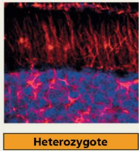

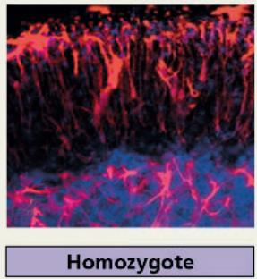

To induce stress, researchers separated each newborn mouse pup from its mother and recorded the number of ultrasonic whistles produced by the pup.

Experiment 2 Results: Disruption of both copies of FOXP2 led to an absence of ultrasonic vocalization in response to stress. The effect on vocalization in the heterozygote was also extreme.

## Conclusion

FOXP2 plays a significant role in the development of functional communication systems in mice. The results augment evidence from studies of birds and humans, supporting the hypothesis that FOXP2 may act similarly in diverse organisms.

Data from W. Shu et al., Altered ultrasonic vocalization in mice with a disruption in the FOXP2 gene, Proceedings of the National Academy of Sciences USA 102:9643–9648 (2005).

WHAT IF? Since the results support a role for mouse FOXP2 in vocalization, you might wonder whether the human FOXP2 protein is a key regulator of speech. If you were given the amino acid sequences of wild-type and mutant human FOXP2 proteins and the wild-type chimpanzee FOXP2 protein, how would you investigate this question? What further clues could you obtain by comparing these sequences to that of the mouse FOXP2 protein?

For suggested answer, see Appendix A.

emit normal ultrasonic vocalizations; mice with one faulty copy of the gene also showed significant problems with vocalization. These results support the idea that the FOXP2 gene product turns on genes involved in vocalization.

Expanding on this analysis in 2021, another research group replaced the FOXP2 gene in mice with a “humanized” copy coding for the human versions of the FOXP2 protein. The researchers reported that although the mice with the human FOXP2 gene were generally healthy, they had subtly different vocalizations and showed changes in brain cells in circuits associated with speech in human brains. A different group further investigated the mechanism for the disruption of vocalization patterns in mice. In 2023, they reported that mutations in FOXP2 disrupt motor proteins that move along the microtubules of the cytoskeleton, which prevents formation of nerve cell processes that allow signals for speech production. The human version of FOXP2 may also contribute to autism spectrum disorders, Huntington’s disease, and Parkinson’s disease, all of which are areas of current research.

The FOXP2 story is an excellent example of how different approaches can complement each other in uncovering biological phenomena of widespread importance. The FOXP2 experiments used mice as a model for humans because it would be unethical (as well as impractical) to carry out such experiments in humans. Mice and humans, which diverged about 65.5 million years ago (see Figure 21.17), share about 85% of their genes. This genetic similarity can be exploited in studying human genetic disorders. If researchers know the organ or tissue that is affected by a particular genetic disorder, they can look for genes that are expressed in these locations in mice.

Even though more distantly related to humans, fruit flies have also been a useful model species for study of such human disorders as Parkinson's disease and alcoholism, while nematodes (soil worms) have yielded a wealth of information about aging. Further research efforts are under way to extend genomic studies to many more species, including neglected species from diverse branches of the tree of life. These studies will advance our understanding of evolution, of course, as well as all aspects of biology, from human health to ecology.

## Comparing Genomes Within a Species

Another exciting consequence of our ability to analyze genomes is our growing understanding of the spectrum of genetic variation in humans. Because the history of the human species is so short—probably about 200,000 years—the amount of DNA variation among humans is small compared to that of many other species. Much of our diversity seems to be in the form of single nucleotide polymorphisms (SNPs). SNPs are single base-pair sites where genetic variation is found in at least 1% of the population (see Concept 20.2); they are usually detected by DNA sequencing. In the human genome, SNPs occur on average about once in 100–300 base pairs. Scientists have already identified the locations of many tens of millions of SNP sites in the human genome and continue to find additional SNPs, especially when sequencing the whole genomes of individuals from cultural or linguistic groups not previously sampled. These are stored in databases around the world, one of which is run by the National Center for Biotechnology Information (NCBI).

In the course of this search, they have also found other variations—including chromosomal regions with inversions, deletions, and duplications. The most surprising discovery has been the widespread occurrence of copy-number variants (CNVs), loci where some individuals have one or multiple copies of a particular gene or genetic region rather than the standard two copies (one on each homolog). CNVs result from regions of the genome being duplicated or deleted inconsistently within the population. One 2022 study used a computational method to analyze tissue samples from the United Kingdom Biobank, from 452,500 individuals, and found 15 million CNVs. Since these variants encompass much longer stretches of DNA than the single nucleotides of SNPs, CNVs are more likely to have phenotypic consequences and to play a role in complex diseases and disorders. Using data available from the donors, the researchers were able to find biological connections between these CNVs and dozens of complex traits, including height and blood levels of constituents such as cholesterol. This type of analysis is likely to prove very helpful in understanding and treating diseases.

Copy-number variants, SNPs, and variations in repetitive DNA such as short tandem repeats (STRs) are useful genetic markers for studying human evolution. Several large studies over the past few years have thoroughly sequenced hundreds of individuals from diverse populations around the world—from Europe, Africa, the Middle East, Central and South Asia, East Asia, Oceania, and the Americas. Their results strongly supported earlier studies showing that genetic diversity among African genomes is far higher than among individuals from any other continent, consistent with our understanding that humans and their ancestors arose in Africa (see Concept 34.7). Further genome sequencing will continue to clarify our understanding of the migratory routes and evolution of different human populations.

## Interview

Interview with Charles Rotimi: Using genomics to study health-related conditions in African-Americans (eTextbook only)

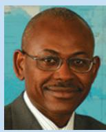

## Widespread Conservation of Developmental Genes Among Animals

Biologists in the field of evolutionary developmental biology, or evo-devo, as it is often called, compare developmental processes of different multicellular organisms. Their aim is to understand how these processes have evolved and how changes in them can modify existing organismal features or lead to new ones. With the advent of molecular techniques and the recent flood of genomic information, we are beginning to realize that the genomes of related species with strikingly different forms may have only minor differences in gene sequence or, perhaps more importantly, in gene regulation. Discovering the molecular basis of these differences in turn helps us understand the origins of the myriad diverse forms that cohabit this planet, thus informing our study of the evolution of life.

In Concept 18.4, you learned about the homeotic genes in Drosophila melanogaster, which encode transcription factors that regulate gene expression and specify the identity of body segments in the fruit fly (see Figure 18.20). Molecular analysis of the homeotic genes in Drosophila has shown that they all include a 180-nucleotide sequence called a homeobox, which codes for a 60-amino-acid homeodomain in the encoded proteins. An identical or very similar nucleotide sequence has been discovered in the homeotic genes of many invertebrates and vertebrates. The resemblance even extends to the organization of these genes: The vertebrate genes homologous to the homeotic genes of fruit flies have kept the same chromosomal arrangement (Figure 21.19). The similarities in sequence and organization are so striking that one researcher has whimsically referred to flies as “little people with wings.” Homeobox-containing sequences have also been found in regulatory genes of much more distantly related eukaryotes, including plants and yeasts. From these similarities, we can deduce that the homeobox DNA sequence evolved very early and was sufficiently valuable to organisms to have been conserved in animals and plants virtually unchanged for hundreds of millions of years.

Homeotic genes in animals were named Hox genes, short for homeobox-containing genes, because homeotic genes were the first genes found to have this sequence. Other homeobox-containing genes were later found that do not act as homeotic genes; that is, they do not directly control the identity of body parts. However, most of these genes, in animals at least, are associated with development, suggesting their ancient and fundamental importance in that process. In Drosophila, for example, homeoboxes are present not only in the homeotic genes but also in the egg-polarity gene bicoid (see Figures 18.21 and 18.22), in several of the segmentation genes, and in a master regulatory gene for eye development.

Researchers have discovered that the homeobox-encoded homeodomain is the part of the protein that binds to DNA when the protein functions as a transcription factor. Elsewhere in the protein, domains that are more variable interact with other transcription factors, allowing the homeodomain-containing protein to recognize specific enhancers and regulate the associated genes. Proteins with homeodomains probably regulate development by coordinating the transcription of batteries of developmental genes, switching them on or off. In embryos of Drosophila and other animal species, different combinations of homeobox genes are active in different parts of the embryo. This selective expression of regulatory genes, varying over time and space, is central to pattern formation.

Figure 21.19 Conservation of homeotic genes in a fruit fly and a mouse.

Homeotic genes that control the form of anterior and posterior structures of the body occur in the same linear sequence on chromosomes in Drosophila and mice. Each colored band on the chromosomes shown here represents a homeotic gene. In fruit flies, all homeotic genes are found on one chromosome. The mouse and other mammals have the same or similar sets of genes on four chromosomes. The color code indicates the parts of the embryos in which these genes are expressed and the adult body regions that result. All of these genes are essentially identical in flies and mice, except for those represented by black bands, which are less similar in the two animals.

Developmental biologists have found that in addition to homeotic genes, many other genes involved in development are highly conserved from species to species. These include numerous genes encoding components of signaling pathways.

The extraordinary similarity among some developmental genes in different animal species raises a question: How can the same genes be involved in the development of animals whose forms are so very different from each other?

In some cases, small changes in regulatory sequences of particular genes cause changes in gene expression patterns that can lead to major changes in body form. For example, the differing patterns of expression of the Hox genes along the body axis in a crustacean and an insect can explain the variation in number of leg-bearing segments among these closely related animals (Figure 21.20). In other cases, similar genes direct different developmental processes in various organisms, resulting in diverse body shapes. Several Hox genes, for instance, are expressed in the embryonic and larval stages of the sea urchin, a nonsegmented animal that has a body plan quite different from those of insects and mice. Sea urchin adults make the pincushion-shaped shells you may have seen on the beach; two species of live sea urchins are shown in the photo. Sea urchins are among the model organisms long used in classical embryological studies (see Concept 47.2).

In this final chapter of the genetics unit, you have learned how studying genomic composition and comparing the genomes of different species can illuminate the process by which genomes evolve. Furthermore, comparing developmental programs, we can see that the unity of life is reflected in the similarity of molecular and cellular mechanisms used to establish body pattern, although the genes directing development may differ among organisms. The similarities between genomes reflect the common ancestry of life on Earth. But the differences are also crucial, for they have created the huge diversity of organisms that have evolved. In the remaining chapters, we expand our perspective beyond the level of molecules, cells, and genes to explore this diversity on the organismal level.

Two species of sea urchins  

Figure 21.20 Effect of differences in Hox gene expression in a crustacean and an insect.

Changes in the expression patterns of Hox genes have occurred over evolutionary time since insects diverged from a crustacean ancestor. These changes account in part for the different body plans of (a) the brine shrimp Artemia, a crustacean, and (b) the grasshopper, an insect. Shown here are regions of the adult body color-coded for expression of four Hox genes that determine the formation of particular body parts during embryonic development. Each color represents a specific Hox gene.

(a) Expression of four Hox genes in the brine shrimp Artemia. Three of the Hox genes are expressed together in one region (indicated by stripes), specifying the identity of the segments that have swimmerets. The fourth (teal) specifies the identity of the genital segments.

(b) Expression of the grasshopper versions of the same four Hox genes. In the grasshopper, each Hox gene is expressed in a discrete region and specifies the identity of that region.

## Concept Check 21.6

1. Would you expect the genome of the macaque (a monkey) to be more like that of a mouse or that of a human? Explain.

2. DNA sequences called homeoboxes help homeotic genes in animals direct development. Given that they are common to flies and mice, explain why these animals are so different.

3. WHAT IF? There are three times as many human-specific insertions of Alu elements in the human genome as in the chimpanzee genome. How did these extra Alu elements arise in the human genome? Propose a role they might have played in the divergence of these two species.

For suggested answers, see Appendix A.

# Chapter 21 Review

## Summary of Key Concepts

To review key terms, go to the Vocabulary Self-Quiz (eTextbook only).

## Concept 21.1: The Human Genome Project fostered development of faster, less expensive sequencing techniques

\- The Human Genome Project was largely completed in 2003, aided by major advances in sequencing technology

\- In the whole-genome shotgun approach, the whole genome is cut into many small, overlapping fragments that are sequenced; computer software then assembles the genome sequence.

How did the Human Genome Project result in more rapid, less expensive DNA-sequencing technology?

## Concept 21.2: Scientists use bioinformatics to analyze genomes and their functions

\- Computer analysis of genome sequences aids gene annotation, the identification of protein-coding sequences. Methods to determine gene function include comparing sequences of newly discovered genes with those of known genes in other species and observing the effects of experimentally inactivating the genes.

\- In a systems biology, scientists use the computer-based tools of bioinformatics (including artificial intelligence, or AI) to compare genomes and study sets of genes and proteins as whole systems (genomics and proteomics). Studies include large-scale analyses of protein interactions, functional DNA elements, and genes contributing to medical conditions.

What has been the most significant finding of the ENCODE project? Why was the project expanded to include nonhuman species?

Concept 21.3: Genomes vary in size, number of genes, and gene density

<table><tr><td></td><td>Bacteria</td><td>Archaea*</td><td>Eukarya</td></tr><tr><td>Genome size</td><td colspan="2">Most are 1–6 Mb</td><td>Most are 10–4,000 Mb, but a few are much larger</td></tr><tr><td>Number of genes</td><td colspan="2">1,500–7,500</td><td>Most are 5,000–45,000</td></tr><tr><td>Gene density</td><td colspan="2">Higher than in eukaryotes</td><td>Lower than in prokaryotic organisms (Within eukaryotes, lower density is correlated with larger genomes.)</td></tr><tr><td>Introns</td><td>None in protein-coding genes</td><td>Present in some genes</td><td>Present in most genes of multicellular eukaryotes, but only in some genes of unicellular eukaryotes</td></tr><tr><td>Other noncoding DNA</td><td colspan="2">Very little</td><td>Can exist in large amounts; generally more repetitive noncoding DNA in multicellular eukaryotes</td></tr></table>

\*As discussed in Concept 1.2, the term Archaea here refers to prokaryotic species.  
Compare genome size, gene number, and gene density (a) in the three listed groups and (b) among eukaryotes.

## Concept 21.4: Multicellular eukaryotes have a lot of noncoding DNA and many multigene families

\- Only 1.5% of the human genome codes for proteins or gives rise to rRNAs or tRNAs; the rest is noncoding DNA, including pseudogenes and repetitive DNA of unknown function.

\- The most abundant type of repetitive DNA in multicellular eukaryotes consists of transposable elements and related sequences. In eukaryotes, there are two types of transposable elements: transposons, which move via a DNA intermediate, and retrotransposons, which are more prevalent and move via an RNA intermediate.

\- Other repetitive DNA includes short, noncoding sequences that are tandemly repeated thousands of times (simple sequence DNA, which includes STRs); these sequences are especially prominent in centromeres and telomeres, where they probably play structural roles in the chromosome.

\- Though many eukaryotic genes are present in one copy per haploid chromosome set, others (most, in some species) are members of a gene family, such as the human globin gene families:

  
Explain how the function of transposable elements might account for their prevalence in human noncoding DNA.

## Concept 21.5: Duplication, rearrangement, and mutation of DNA contribute to genome evolution

\- Errors in cell division can lead to extra copies of all or part of entire chromosome sets, which may then diverge if one set accumulates sequence changes. Polyploidy occurs more often among plants than animals and contributes to speciation.

\- The chromosomal organization of genomes can be compared among species, providing information about evolutionary relationships. Within a given species, rearrangements of chromosomes are thought to contribute to the emergence of new species.

\- The genes encoding the various related but different globin proteins evolved from one common ancestral globin gene, which duplicated and diverged into the $\alpha$ -globin and $\beta$ -globin ancestral genes. Subsequent duplication and random mutation gave rise to the present globin genes, all of which code for oxygen-binding proteins. The copies of some duplicated genes have diverged so much that the functions of their encoded proteins (such as lysozyme and $\alpha$ -lactalbumin) are now substantially different.

\- Rearrangement of exons within and between genes during evolution has led to genes containing multiple copies of similar exons and/or several different exons derived from other genes.

\- Movement of transposable elements or recombination between copies of the same element can generate new sequence combinations that are beneficial to the organism. These may alter the functions of genes or their patterns of expression and regulation.

How could chromosomal rearrangements lead to the emergence of new species?

## Concept 21.6: Comparing genome sequences provides clues to evolution and development

\- Comparisons of genomes from widely divergent and closely related species provide valuable information about ancient and more recent evolutionary history, respectively. Analysis of single nucleotide polymorphisms (SNPs) and copy-number variants (CNVs) among individuals in a species can also shed light on the evolution of that species.

\- Evolutionary developmental (evo-devo) biologists have shown that homeotic genes and some other genes associated with animal development contain a homeobox region whose sequence is highly conserved among diverse species.

What type of information can be obtained by comparing the genomes of closely related species? Of very distantly related species?

For suggested answers, see Appendix A.

## Test Your Understanding

For more multiple-choice questions, go to the Practice Test (eTextbook only).

## Levels 1-2: Remembering/Understanding

1. Bioinformatics includes

(A) using DNA technology to clone genes.

(B) using computer programs to align DNA sequences.

(C) using a person's genomic sequence to inform decisions about medical treatment.

(D) amplifying DNA segments from a species' genome.

## 2. Homeotic genes

(A) encode transcription factors that control the expression of genes responsible for specific anatomical structures.

(B) are found only in Drosophila and other arthropods.

(C) are the only genes that contain the homeobox domain.

(D) encode proteins that form complexes that determine anatomical structures in the fly.

## Levels 3-4: Applying/Analyzing

3. Two eukaryotic proteins have one domain in common but are otherwise very different. Which of the following processes is most likely to have contributed to this similarity?

(A) gene duplication

(B) alternative splicing

(C) exon shuffling

(D) random point mutations

4. DRAW IT Below are the amino acid sequences (using single letters; see Figure 5.14) of three short segments of the FOXP2 protein from five species. These segments contain all amino acid differences between the FOXP2 proteins of these species. Compare the amino acid sequences by answering parts (a)-(d).

<table><tr><td>Chimpanzee</td><td>PKSSD ... TSSTT ... NARRD</td></tr><tr><td>Mouse</td><td>PKSSE ... TSSTT ... NARRD</td></tr><tr><td>Gorilla</td><td>PKSSD ... TSSTT ... NARRD</td></tr><tr><td>Human</td><td>PKSSD ... TSSNT ... SARRD</td></tr><tr><td>Rhesus monkey</td><td>PKSSD ... TSSTT ... NARRD</td></tr></table>

(a) Circle the names of any species that have identical amino acid sequences for the FOXP2 protein.

(b) In the sequence for the mouse, circle any amino acid that differs from the sequence for the chimpanzee, gorilla, and rhesus monkey. Then, draw a box around any amino acid that differs from the human sequence.

(c) In the human sequence, underline any amino acid that differs from the sequence for the chimpanzee, gorilla, and rhesus monkey.

(d) Primates and rodents diverged about 65 million years ago, and chimpanzees and humans diverged about 7–8 million years ago (see Figure 21.17). How many amino acid differences are there between the sequence for the mouse and the sequence for the chimpanzee, gorilla, and rhesus monkey? How many amino acid differences are there between the human sequence and the sequence for the chimpanzee, gorilla, and rhesus monkey? Based solely on the numbers of amino acid differences occurring over these time periods, what might you hypothesize about the rate of evolution of the FOXP2 gene? Based on the information in the chapter regarding the FOXP2 gene, is your hypothesis correct?

## Levels 5-6: Evaluating/Creating

5. EVOLUTION CONNECTION Genes important in the embryonic development of animals, such as homeobox-containing genes, have been relatively well conserved during evolution; that is, they are more similar among different species than are many other genes. Explain why this is.

6. SCIENTIFIC INQUIRY The scientists mapping the SNPs in the human genome noticed that groups of SNPs tended to be inherited together, in blocks known as haplotypes, ranging in length from 5,000 to 200,000 base pairs. There are as few as four or five commonly occurring combinations of SNPs per haplotype. Integrating what you've learned throughout this chapter and this unit, propose an explanation for this observation.

7. WRITE ABOUT A THEME: INFORMATION The continuity of life is based on heritable information in the form of DNA. In a short essay (100–150 words), explain how mutations in protein-coding genes and regulatory DNA contribute to evolution.

## 8. SYNTHESIZE YOUR KNOWLEDGE

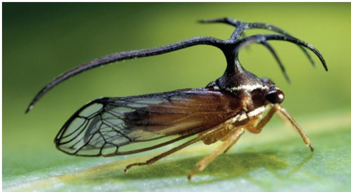  
Insects have three thoracic (trunk) segments. While researchers have found insect fossils with wings on all segments, modern insects have wings or related structures on only the second and third segment. In modern insects, Hox gene products act to inhibit

wing formation on the first segment. The treehopper insect (above) is an exception. In addition to the pair of prominent wings on its second segment, its first segment has an ornate helmet resembling a set of thorns, which is a modified, fused pair of “wings.” (This provides camouflage in tree branches, reducing the risk of predation.) Explain how changes in gene regulation could have led to the evolution of such a structure.

For selected answers, see Appendix A.

## Explore Scientific Papers with Science in the Classroom | AAAS

How do transposable elements drive evolution? Go to “Jumping Genes!” at www.scienceintheclassroom.org.

Instructors: Questions can be assigned in Mastering Biology.

# Mechanisms of Evolution

An Interview with Neil H. Shubin

Dr. Neil H. Shubin is the Robert R. Bensley Distinguished Service Professor of Organismal Biology and Anatomy at the University of Chicago. His research examines the evolution and development of vertebrate animals, focusing on major evolutionary events, such as the colonization of land. He leads expeditions to polar regions in search of fossils and explores the genetics and evolution of the formation of the skeleton in living fish and amphibians. He is also a communicator of science to the general public. Neil grew up outside Philadelphia and received his AB from Columbia University and his PhD from Harvard. He is a member of the National Academy of Sciences and a fellow of the American Academy of Arts and Sciences and the American Philosophical Society.

## How did you get started in science? How did you decide what to work on?

My interest in natural history dates back to my childhood in suburban Philadelphia. I remember being really struck by the “duck-billed” dinosaurs, thinking that nature can be crazy and behave in ways that we don’t understand. In my first semester of college, I took an anthropology course where the professor would bring in skulls and other human bones, and I thought, “Wow! People go around the world and discover these artifacts, and they tell us about how the world as we know it came to be.”

Later in college, I had the opportunity to volunteer on an expedition to eastern Wyoming, where there are Cretaceous deposits. I was not very good at it—to the point where the curator in charge said, “You stay away from the fossils. You’re going to break too many of them.” I really liked doing this fieldwork, but I didn’t have any innate ability to do it; I didn’t know how to camp, and the outdoors thing was really confusing to me. Which is surprising, given that now I’ve spent the better part of the last 40 years leading expeditions to both poles. I kind of was a fish out of water initially, but I wanted to learn. Similarly, our search for evidence of the first land animals took a lot of patience and a lot of failures, but we kept learning from the failures, and ultimately, we were successful. Our plan was to target our expeditions to particular regions in the Arctic that contained exposed rocks from the time when we expected animals to have colonized land, but we didn't know there would be years of finding nothing before we found something special. The moment we saw Tiktaalik for the first time was a moment that no other human to that point had experienced. Being one of the first people to see this “fish with legs” was really special (see Figure 34.20). That's a vivid example of something that researchers do every day, whether it's in the lab or somewhere else: They're at the forefront of human knowledge.

  
On a fossil-hunting expedition in the Arctic.

## What are you working on now?

My laboratory is very interdisciplinary. We use molecular biology approaches to look at the genes and developmental systems that produce organs in living animals and to ask questions about how they evolve. We also continue our paleontological research in the Arctic. Being a scientist is really about being able to ask the right questions—questions that are important, interesting, and answerable.

  
Dr. Neil H. Shubin

## How does your research connect microevolution and macroevolution?

When you understand both the mechanisms of evolution across generations (microevolution) and the big-picture history of evolution (macroevolution), what you're really doing is answering the question of "Why does life on the planet look the way it does?" Through a microevolutionary lens, we see how life can evolve, and we've learned a lot about the genetic basis of adaptation. Organisms have so much capacity for change; in fact, they're capable of so much more change than we see in the fossil record. When we flip to a macroevolutionary perspective, we see what actually happened in the long term. There are lessons to learn from both. We're very biased as a species. We're used to thinking about a planet with ice at the poles. We're used to seeing species that live on land. But if you were to take a time machine and go back to the middle or late Devonian, there was no ice at the poles—it was really warm everywhere. We need to remember that the world as we see it is just a snapshot of its long history.

"There's a lot to discover. The book is still being written."

## What advice would you give a student considering a career in biology?

The thing that transformed me was the ability to get out of the classroom and do research, to actually do the science. Sometimes when we're in class, we tend to see science as knowledge that is fixed. You can break out of that when you realize that there's an entire world to discover, and in class you're learning the tools to enable you to do the discovering. There's a lot to discover. The book is still being written.

# Descent with Modification: A Darwinian View of Life

## Key Concepts

22.1 The Darwinian revolution challenged traditional views of a young Earth inhabited by unchanging species

22.2 Descent with modification by natural selection explains the adaptations of organisms and the unity and diversity of life

22.3 Evolution is supported by an overwhelming amount of scientific evidence

## Study Tip

Make a word cloud: This chapter covers key topics related to evolution, such as descent with modification, heritable characteristics, natural selection, adaptation, convergent evolution, homology, and unity of life. Draw a “word cloud” of these terms: As you read the chapter, draw a line between terms that affect or relate to one another. Next to that line, briefly explain how those terms are connected.

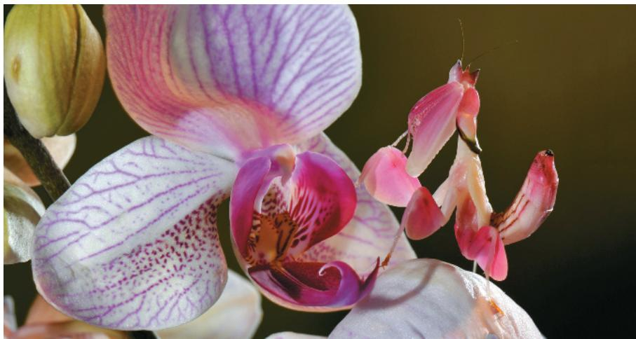

Figure 22.1 This Malaysian orchid mantis (Hymenopus coronatus) closely resembles the flower on which it rests, waiting for unwary prey to come within its reach. Other mantises have diverse shapes and colors that have evolved in different environments—yet all mantises also share certain features, such as grasping forelimbs, large eyes, and six legs.  
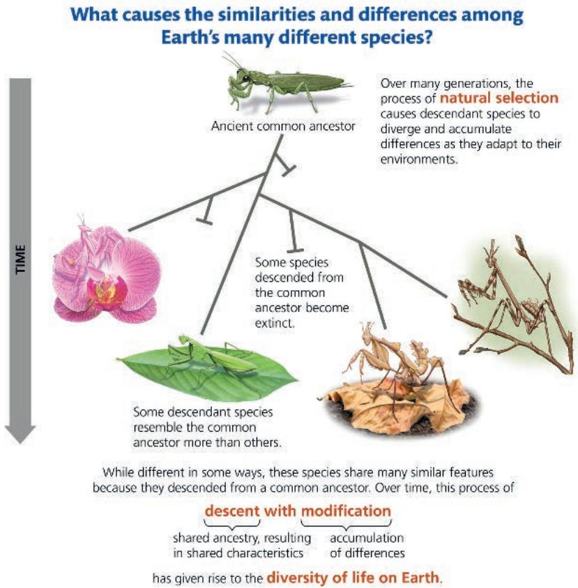

# Concept 22.1: The Darwinian revolution challenged traditional views of a young Earth inhabited by unchanging species

More than a century and a half ago, Charles Darwin was inspired to develop a scientific explanation for the diversity of life, the great number and remarkable variety of species on Earth. When he published his hypothesis in his book The Origin of Species, Darwin ushered in a scientific revolution—the era of evolutionary biology. As we'll see, Darwin developed his revolutionary ideas over time, influenced by the work of others and his travels (Figure 22.2).

## Endless Forms Most Beautiful

To set the stage for our study of Darwin and evolutionary biology, let's return to the well-hidden orchid mantis in Figure 22.1. This species is a member of a diverse group of insects, the Mantodea, which includes 2,300 species in 430 genera. All these mantises

share certain features, such as three pairs of legs, triangular heads with bulging eyes, and a flexible “neck.” Such shared features illustrate the unity of life, a phrase that highlights the fact that all organisms share characteristics.

But Earth's many different species also differ from one another. The mantises, for example, differ in features such as their size, shape, and color. Overall, the orchid mantis and its many close relatives illustrate three key observations about life:

\- organisms are well suited (adapted) for life in their environments (Here and throughout this text, the term environment refers to other organisms as well as to the physical aspects of an organism's surroundings.)

• the many shared characteristics (unity) of life

• the rich diversity of life

Darwin, a keen observer of nature since childhood, set out to explain these three broad observations—an effort that eventually led him to conclude that life evolves over time.

For now, we will define evolution as descent with modification, a phrase Darwin used to summarize the process by which species accumulate differences from their ancestors as they adapt to different environments over time. Evolution can also be defined as a change in the genetic composition of a population from generation to generation (see Concept 23.3).

Figure 22.2 The intellectual context of Darwin's ideas.  
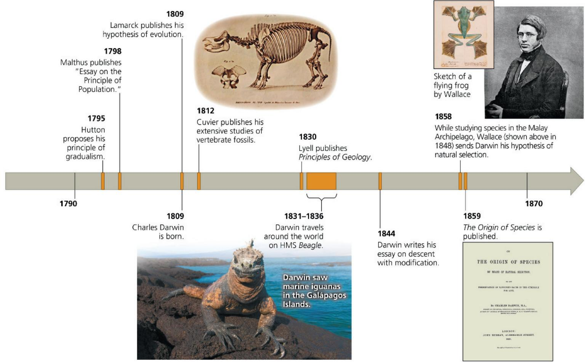

However it is defined, we can view evolution in two related but different ways: as a pattern and as a process. The pattern of evolutionary change is revealed by data from many scientific disciplines, including biology, geology, physics, and chemistry. These data are facts—they are observations about the natural world—and these observations show that life has evolved over time. The process of evolution consists of the mechanisms that cause the observed pattern of change. These mechanisms represent natural causes of the natural phenomena we observe. Indeed, the power of evolution as a unifying theory is its ability to explain and connect a vast array of observations about the living world.

As with all general theories in science, we continue to test our understanding of evolution by examining whether it can account for new observations and experimental results. In this and the following chapters, we'll examine how ongoing discoveries shape what we know about the pattern and process of evolution.

We'll begin our exploration of these discoveries by retracing Darwin's quest to explain the adaptations, unity, and diversity of what he called life's "endless forms most beautiful."

## Scala Naturae and Classification of Species

Long before Darwin was born, several Greek philosophers suggested that life might have changed gradually over time. But one philosopher who greatly influenced early Western science, Aristotle (384–322 BCE), viewed species as fixed (unchanging). Through his observations of nature, Aristotle recognized certain “affinities” among organisms. He concluded that life-forms could be arranged on a ladder, or scale, of increasing complexity, later called the scala naturae (“scale of nature”). Each form of life, perfect and permanent, had its allotted rung on this ladder.

These ideas were generally consistent with the Old Testament account of creation, which holds that species were individually designed by God and therefore perfect. In the 1700s, many scientists interpreted the often remarkable ways in which organisms are well suited for life in their environment as evidence that the Creator had designed each species for a particular purpose.

One such scientist was Carolus Linnaeus (1707–1778), a Swedish physician and botanist who sought to classify life's diversity, in his words, "for the greater glory of God." In the 1750s, Linnaeus developed the two-part, or binomial, format for naming species (such as Homo sapiens for humans) that is still used today. In contrast to the linear hierarchy of the scala naturae, Linnaeus used a nested classification system, grouping similar species into increasingly inclusive categories. For example, similar species are grouped in the same genus, similar genera (plural of genus) are grouped in the same family, and so on.

Linnaeus did not ascribe the resemblances among species to evolutionary kinship, but rather to the pattern of their creation. A century later, however, Darwin argued that classification should be based on evolutionary relationships. He also noted

that scientists using the Linnaean system often grouped organisms in ways that reflected those relationships.

## Ideas About Change over Time

Among other sources of information, Darwin drew from the work of scientists studying fossils, the remains or traces of organisms from the past. Many fossils are found in sedimentary rocks formed from the sand and mud that settle to the bottom of seas, lakes, and swamps (Figure 22.3). New layers of sediment cover older ones and compress them into superimposed layers of rock called strata (singular, stratum). The fossils in a particular stratum provide a glimpse of some of the organisms that populated Earth at the time that layer formed. Later, erosion may carve through upper (younger) strata, revealing deeper (older) strata that had been buried.

Paleontology, the study of fossils, was developed in large part by French scientist Georges Cuvier (1769–1832). In examining strata near Paris, Cuvier noted that the older the stratum, the more dissimilar its fossils were to current life-forms. He also observed that from one layer to the next, some new species appeared while others disappeared. He inferred that extinctions must have been a common occurrence, but he staunchly opposed the idea of evolution. Cuvier speculated that each boundary between strata represented a sudden catastrophic event, such as a flood, that had destroyed many of the species living in that area. Such regions, he reasoned, were later repopulated by different species immigrating from other areas.

In contrast to Cuvier's emphasis on sudden events, other scientists suggested that profound change could take place through the cumulative effect of slow but continuous processes. In 1795, Scottish geologist James Hutton (1726–1797) proposed that Earth's geologic features could be explained by gradual

Figure 22.3 Formation of sedimentary strata with fossils.  
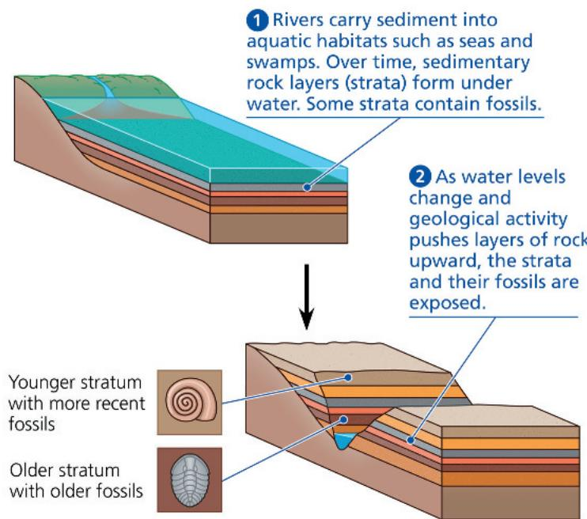

Figure 22.4 Acquired traits cannot be inherited.
This bonsai tree was “trained” to grow as a dwarf by pruning and shaping. However, seeds from this tree would produce offspring of normal size.

mechanisms, such as valleys being formed by rivers. The leading geologist of Darwin's time, Charles Lyell (1797–1875), incorporated Hutton's thinking into his proposal that the same geologic processes are operating today as in the past, and at the same rate.

Hutton's and Lyell's ideas strongly influenced Darwin's thinking. Darwin agreed that if geologic change results from slow, continuous actions rather than from sudden events, then Earth must be much older than the widely accepted age of a few thousand years. It would, for example, take a very long time for a river to carve a canyon by erosion. He later reasoned that perhaps similarly slow and subtle processes could produce substantial biological change. However, Darwin was not the first to apply the idea of gradual change to biological evolution.

## Lamarck's Hypothesis of Evolution

Although some 18th-century naturalists suggested that life evolves as environments change, only one proposed a mechanism for how life changes over time: French biologist Jean-Baptiste de Lamarck (1744–1829). Alas, Lamarck is primarily remembered today not for his visionary recognition that evolutionary change explains patterns in fossils and how organisms are well suited for their environments, but for the incorrect mechanism he proposed.

Lamarck published his hypothesis in 1809, the year Darwin was born. By comparing living species with fossil forms, Lamarck had found what appeared to be several lines of descent, each a chronological series of older to younger fossils leading to a living species. He explained his findings using two principles that were widely accepted at the time. The first was use and disuse, the idea that parts of the body that are used extensively become larger and stronger, while those that are not used deteriorate. Among many examples, he cited a giraffe stretching its neck to reach leaves on high branches. The second principle, inheritance of acquired characteristics, stated that an organism could pass these modifications to its offspring. Lamarck reasoned that the long, muscular neck of the living giraffe had evolved over many generations as giraffes stretched their necks ever higher.

Lamarck also thought that evolution happens because organisms have an innate drive to become more complex. Darwin rejected this idea, but he, too, thought that variation was introduced into the evolutionary process in part by inheritance of acquired characteristics. Today, however, our understanding of genetics refutes this mechanism: Experiments show that traits acquired by use during an individual's life are not inherited in the way proposed by Lamarck (Figure 22.4). (Notably, there are certain instances, referred to as epigenetic inheritance, in which chemical modifications to an organism's chromatin can be passed to the next generation via mechanisms that do not involve the nucleotide sequence itself; see Concept 18.2 for more about epigenetic inheritance.)

Lamarck was vilified in his own time, especially by Cuvier, who denied that species ever evolve. In retrospect, however,

  
Lamarck did recognize that the fact that organisms are well-suited for life in their environments can be explained by gradual evolutionary change, and he did propose a testable explanation for how this change occurs.

## Concept Check 22.1

1. How did Hutton's and Lyell's ideas influence Darwin's thinking about evolution?

2. MAKE CONNECTIONS Scientific hypotheses must be testable (see Concept 1.3). Applying this criterion, are Cuvier's explanation of the fossil record and Lamarck's hypothesis of evolution scientific? Explain your answer in each case.

For suggested answers, see Appendix A.

# Concept 22.2: Descent with modification by natural selection explains the adaptations of organisms and the unity and diversity of life

As the 19th century dawned, it was generally thought that species had remained unchanged since their creation. A few clouds of doubt about the permanence of species were beginning to gather, but no one could have forecast the thundering storm just beyond the horizon. How did Charles Darwin become the lightning rod for a revolutionary view of life?

## Darwin's Research

Charles Darwin (1809–1882) was born in Shrewsbury, in western England. Even as a boy, he had a consuming interest in nature. When he was not reading nature books, he was fishing, hunting, riding, and collecting insects. However, Darwin's father, a physician, could see no future for his son as a naturalist and sent him to medical school in Edinburgh. But Charles found medicine boring and surgery before the days of anesthesia horrifying. He quit medical school and enrolled at Cambridge University, intending to become a clergyman. (At that time, many scholars of science belonged to the clergy.)

At Cambridge, Darwin became the protégé of John Henslow, a botany professor. Soon after Darwin graduated, Henslow recommended him to Captain Robert FitzRoy, who was readying the survey ship HMS Beagle for a voyage around the world. Darwin would pay his own way and serve as a conversation partner to the young captain. FitzRoy, who was himself an adept scientist, accepted Darwin because he was a skilled naturalist and they were of similar age and social class.

## The Voyage of the Beagle

Darwin embarked from England on the Beagle in December 1831. The primary mission of the voyage was to chart stretches of the South American coast that were poorly known to Europeans. Darwin, however, spent most of his time on shore, observing and collecting thousands of plants and animals. He described features of organisms that made them well suited to such diverse environments as the humid jungles of Brazil, the expansive grasslands of Argentina, and the towering peaks of the Andes. He also noted that the plants and animals in temperate regions of South America more closely resembled species living in the South American tropics than species living in temperate regions of Europe. Furthermore, the fossils he found, though clearly different from living species, distinctly resembled the living organisms of South America.

Darwin also spent much time thinking about geology. Despite repeated bouts of seasickness, he read Lyell's Principles of Geology during the voyage. He experienced geologic change firsthand when a violent earthquake shook the coast of Chile, and he observed afterward that rocks along the coast had been thrust upward by several meters. Finding fossils of ocean organisms high in the Andes, Darwin inferred that the rocks containing the fossils must have been raised there by many similar earthquakes. These observations reinforced what he had learned from Lyell: Physical evidence did not support the traditional view that Earth was only a few thousand years old.

Darwin's interest in the species (or fossils) found in an area was further stimulated by the Beagle's stop at the Galápagos, a group of volcanic islands located near the equator about 900 km west of South America (Figure 22.5). Darwin was fascinated by the unusual organisms there. The birds he collected included several kinds of mockingbirds. These mockingbirds, though similar to each other, seemed to be different species. Some were unique to individual islands, while others lived on two or more adjacent islands. Furthermore, although the animals on the Galápagos resembled species living on the South American mainland, most of the Galápagos species were not known from anywhere else in the world. Darwin hypothesized that the Galápagos had been colonized by organisms that had strayed from South America and then diversified, giving rise to new species on the various islands.

## Darwin's Focus on Adaptation

During the voyage of the Beagle, Darwin observed many examples of adaptations, inherited characteristics of organisms that enhance their survival and reproduction in specific environments. Later, as he reassessed his observations, he began to perceive adaptation to the environment and the origin of new species as closely related processes. Could a new species arise from an ancestral form by the gradual accumulation of adaptations to a different environment? From studies made years after Darwin's voyage, biologists have

Figure 22.5 The voyage of HMS Beagle (December 1831–October 1836).  

Figure 22.6 Three examples of beak variation in Galápagos finches.

The Galápagos Islands are home to more than a dozen species of closely related finches, some found only on a single island. A striking difference among them is their beaks, which are adapted for specific diets.

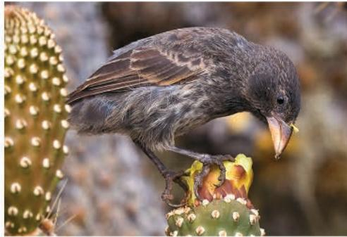  
(a) Cactus-eater. The long, sharp beak of the common cactus finch (Geospiza scandens) helps it tear and eat cactus flowers and pulp.

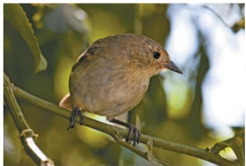  
(b) Insect-eater. The green warbler finch (Certhidea olivacea) uses its narrow, pointed beak to grasp insects.

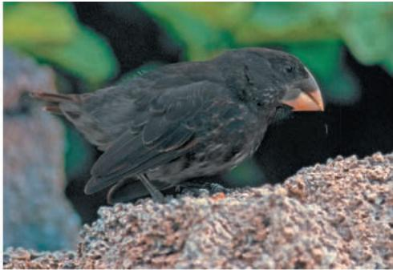  
(c) Seed-eater. The large ground finch (Geospiza magnirostris) has a large beak adapted for cracking seeds found on the ground.  
MAKE CONNECTIONS Review Figure 1.20. Circle the most recent common ancestor shared by the three species that eat insects. Are all of the descendants of that ancestor insect-eaters?  
For suggested answer, see Appendix A.

concluded that this is indeed what happened to a diverse group of finches found on the Galápagos Islands (see Figure 1.20). The finches' various beaks and behaviors are adapted to the specific foods available on their home islands (Figure 22.6). Darwin realized that explaining such adaptations was essential to understanding evolution. His explanation of how adaptations arise centered on natural selection, a process in which individuals that have certain inherited traits tend to survive and reproduce at higher rates than do other individuals because of those traits. By the early 1840s, Darwin had worked out the major features of his hypothesis. He set these ideas on paper in 1844, when he wrote a long essay on descent with modification and its underlying mechanism, natural selection. Yet he was still reluctant to publish his ideas, in part because he anticipated the uproar they would cause. During this time, Darwin continued to compile evidence in support of his hypothesis. By the mid-1850s, he had described his ideas to Lyell and a few others. Lyell, who was not yet convinced of evolution, nevertheless urged Darwin to publish on the subject before someone else came to the same conclusions and published first.

In June 1858, Lyell's prediction came true. Darwin received a manuscript from Alfred Russel Wallace (1823–1913), a British naturalist working in the South Pacific islands of the Malay Archipelago (see Figure 22.2). Wallace had developed a hypothesis of natural selection nearly identical to Darwin's. He asked Darwin to evaluate his paper and forward it to Lyell if it merited publication. Darwin complied, writing to Lyell: "Your words have come true with a vengeance.... I never saw a more striking coincidence... so all my originality, whatever it may amount to, will be smashed." On July 1, 1858, Lyell and a colleague presented Wallace's paper, along with extracts from Darwin's unpublished 1844 essay, to the Linnean Society of London. Darwin quickly finished his book, entitled On the Origin of Species by Means of Natural Selection (commonly referred to as The Origin of Species), and published it the next year. Although Wallace had submitted his ideas for publication first, he admired Darwin and thought that Darwin had developed and tested the idea of natural selection so extensively that he should be known as its main architect.

Within a decade, Darwin's book and its proponents had convinced most scientists that life's diversity is the product of evolution. Darwin succeeded where previous evolutionists had failed by presenting a plausible scientific mechanism with immaculate logic and an avalanche of supporting evidence.

## Ideas from The Origin of Species

In his book, Darwin amassed evidence that descent with modification by natural selection explains three broad observations about nature—the unity of life, the diversity of life, and the striking ways in which organisms are suited for life in their environments.

## Descent with Modification

In the first edition of The Origin of Species, Darwin never used the word evolution (although the final word of the book is “evolved”). Rather, he discussed descent with modification, a phrase that summarized his view of life. Organisms share many characteristics, leading Darwin to perceive unity in life. He attributed the unity of life to the descent of all organisms from an ancestor that lived in the remote past. He also thought that as the descendants of that ancestral organism lived in various habitats, they gradually accumulated diverse modifications, or adaptations, that fit them to specific ways of life. Thus, Darwin thought of evolution as a process in which both descent (shared ancestry, resulting in shared characteristics) and modification (the accumulation of differences) can be observed.

Darwin reasoned that over a long period of time, descent with modification eventually led to the rich diversity of life we see today. He viewed the history of life as a tree, with multiple branchings from a common trunk out to the tips of the youngest twigs (Figure 22.7). In his diagram, the tips of the twigs that are labeled A–D represent several groups of organisms living in the present day, while the unlabeled branches represent groups that are extinct. Each fork of the tree represents the most recent common ancestor of all the lines of evolution that subsequently branch from that point.

Figure 22.7 “I think ....” In this 1837 sketch, Darwin envisioned the branching pattern of evolution.

Branches that end in twigs labeled A–D represent particular groups of living organisms; all other branches represent extinct groups.

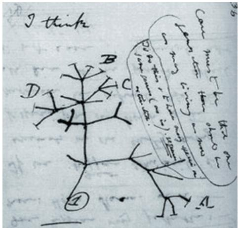  
Figure 22.8 Descent with modification.

Darwin thought that such a branching process, along with past extinction events, could explain the large morphological gaps that sometimes exist between related groups of organisms. As an example, let's consider the three living species of elephants: the Asian elephant (Elephas maximus) and two species of African elephants (Loxodonta africana and L. cyclotis). These closely related species are very similar because they shared the same line of descent until a relatively recent split from their common ancestor, as shown in the tree diagram in Figure 22.8. Note that seven lineages related to elephants have become extinct over the past 32 million years. As a result, there are no living species that fill the morphological gap between the elephants and their nearest relatives today, the hyraxes and manatees.

Extinctions like those in Figure 22.8 are common. In fact, many evolutionary branches, even some major ones, are dead ends: Scientists estimate that over 99% of all species that have ever lived are now extinct. As in Figure 22.8, fossils of extinct species can reveal patterns of diversification within a group.

## Artificial Selection, Natural Selection, and Adaptation

Darwin proposed the mechanism of natural selection to explain the observable patterns of evolution. He crafted his argument carefully, hoping to persuade even the most skeptical readers. First he discussed familiar examples of selective breeding of domesticated plants and animals. Humans have modified other species over many generations by selecting and breeding individuals that possess desired traits, a process called artificial selection (Figure 22.9, on the next page). As a result of artificial selection, crops, livestock animals, and pets often bear little resemblance to their wild ancestors.

Darwin then argued that a similar process occurs in nature. He based his argument on two observations, from which he drew two inferences:

Observation #1: Members of a population often vary in their inherited traits (Figure 22.10).

Observation #2: All species can produce more offspring than their environment can support (Figure 22.11), and many of these offspring fail to survive and reproduce.

This evolutionary tree of elephants and their relatives is based mainly on fossils—their anatomy, order of appearance in strata, and geographic distribution. Note that most branches of descent ended in extinction (denoted by the dagger symbol, †). (Time line not to scale.)

  
VISUAL SKILLS Based on this tree, approximately when did the most recent ancestor shared by Mammuthus (woolly mammoths), Asian elephants, and African elephants live?  
For suggested answer, see Appendix A.

Figure 22.9 Artificial selection.

These different vegetables have all been selected from one species of wild mustard (Brassica oleracea). By selecting variations in different parts of the plant, breeders have obtained these divergent results.

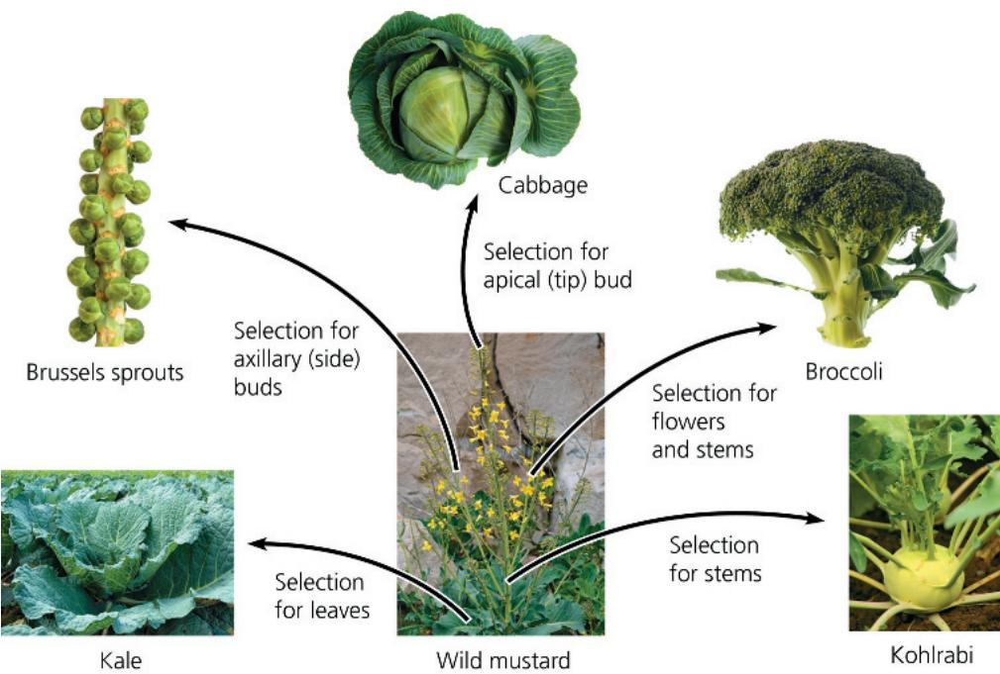

Inference #1: Individuals whose inherited traits give them a higher probability of surviving and reproducing in a given environment tend to leave more offspring than do other individuals.

Inference #2: This unequal ability of individuals to survive and reproduce will lead to the accumulation of favorable traits in the population over generations.

As these two inferences suggest, Darwin saw a connection between natural selection and the capacity of organisms to “overreproduce.” He began to make this connection after reading an essay by economist Thomas Malthus, who contended that

Figure 22.10 Variation in a population.

Individuals in this population of Asian ladybird beetles (Harmonia axyridis) vary in color and spot pattern. Natural selection may act on these variations only if (1) they are heritable and (2) they affect the beetles' ability to survive and reproduce.

much of human suffering—disease, famine, and war—resulted from the human population's potential to increase faster than food supplies and other resources. Darwin similarly realized that the capacity to overreproduce was typical of all species. Of the many eggs laid, young born, and seeds spread, only a fraction complete their development and leave offspring of their own. The rest are starved, eaten, diseased, unmated, or unable to tolerate physical conditions of the environment such as salinity or temperature.

An organism's heritable traits can influence not only its own performance, but also how well its offspring cope with environmental challenges. For example, an organism might have a trait that gives its offspring an advantage in escaping predators, obtaining food, or tolerating physical conditions. When such advantages increase the number of offspring that survive and reproduce, the traits that are favored will likely appear at a greater frequency in the next generation. Thus, over time,

Kohlrabi

natural selection resulting from factors such as predators, lack of food, or adverse physical conditions can lead to an increase in the proportion of favorable traits in a population.

## Figure 22.11 Overproduction of offspring.

A single puffball fungus can produce billions of spores that give rise to offspring. If all of these offspring and their descendants survived to maturity, they would carpet the surrounding land surface.

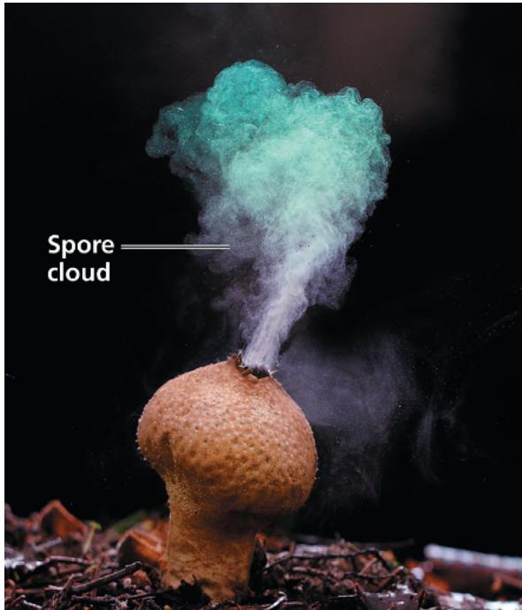

How rapidly do such changes occur? Darwin reasoned that if artificial selection can bring about dramatic change in a relatively short period of time, then natural selection should be capable of substantial modification of species over many hundreds of generations. Even if the advantages of some heritable traits over others are slight, the advantageous variations will gradually accumulate in the population, and less favorable variations will diminish. Over time, this process will increase the frequency of individuals with favorable adaptations, hence increasing the degree to which organisms are well suited for life in their environment.

## Key Features of Natural Selection

Let's now summarize some of the main ideas of natural selection:

\- Natural selection is a process in which individuals that have certain heritable traits survive and reproduce at a higher rate than do other individuals because of those traits.

\- Over time, natural selection can increase the frequency of adaptations that are favorable in a given environment (Figure 22.12).

## Figure 22.12 Camouflage as an example of evolutionary adaptation.

Related species of moths have diverse shapes and colors that evolved in different environments, as seen in this dead-leaf moth (Oxytenis modestia) in Peru (a) and buff-end moth (Phalera bucephala) in Scotland (b).

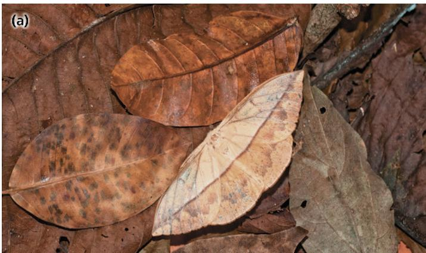

\- If an environment changes, or if individuals move to a new environment, natural selection may result in adaptation to these new conditions, sometimes giving rise to new species.

One subtle but important point is that although natural selection occurs through interactions between individual organisms and their environment, individuals do not evolve. Rather, it is the population that evolves over time.

A second key point is that natural selection can amplify or diminish only those heritable traits that differ among the individuals in a population. Thus, even if a trait is inherited, if all the individuals in a population are genetically identical for that trait, evolution by natural selection cannot occur.

Third, environmental factors vary from place to place and over time. A trait that is favorable in one place or time may be useless—or even detrimental—in other places or times. Natural selection is always operating, but which traits are favored depends on the context in which a species lives and mates.

Next, we'll survey the wide range of observations that support a Darwinian view of evolution by natural selection.

## Concept Check 22.2

1. How does the concept of descent with modification explain both the unity and diversity of life?

2. WHAT IF? If you discovered a fossil of an extinct mammal that lived high in the Andes, would you predict that it would more closely resemble present-day mammals from South American jungles or present-day mammals that live high in Asian mountains? Explain.

3. MAKE CONNECTIONS Review the relationship between genotype and phenotype (see Figures 14.5 and 14.6). Suppose that in a particular pea population, flowers with the white phenotype are favored by natural selection. Predict what would happen over time to the frequency of the white-flower allele (the p allele) in the population.

For suggested answers, see Appendix A.

## Concept 22.3: Evolution is supported by an overwhelming amount of scientific evidence

In The Origin of Species, Darwin marshaled a broad range of evidence to support the concept of descent with modification. Still—as he readily acknowledged—there were instances in which key evidence was lacking. For example, Darwin referred to the origin of flowering plants as an “abominable mystery,” and he lamented the lack of fossils showing how earlier groups of organisms gave rise to new groups.

In the last 150 years, new discoveries have filled many of the gaps that Darwin identified. The origin of flowering plants, for example, is much better understood (see Concept 30.3), and many fossils have been discovered that signify the origin of new groups of organisms (see Concept 25.2). In this section, we'll consider four types of data that document the pattern of evolution and illuminate how it occurs: direct observations, homology, the fossil record, and biogeography.

## Direct Observations of Evolutionary Change

Biologists have documented evolutionary change in thousands of scientific studies. We'll examine many such studies throughout this unit, but let's look at two examples here.

## Natural Selection in Response to Introduced Species

Herbivores, animals that eat plants, often have adaptations that help them feed efficiently on their primary food sources. What happens when herbivores switch to a new food source with different characteristics?

## Figure 22.13

An opportunity to study this question in nature is provided by soapberry bugs, which use their “beak”—a hollow, needlelike mouthpart—to feed on seeds located within the fruits of various plants. In southern Florida, the soapberry bug (Jadera haematoloma) feeds on the seeds of a native plant, the balloon vine (Cardiospermum corindum). In central Florida, however, where balloon vines have become rare, soapberry bugs feed on the seeds of the golden rain tree (Koelreuteria elegans), a species recently introduced from Asia.

Inquiry: Can a change in a population's food source result in evolution by natural selection?

Soapberry bugs feed most effectively when the length of their beak is similar to the depth at which seeds are found within the fruit. Golden rain tree fruit consists of three flat lobes, and its seeds are much closer to the fruit surface than are the seeds of the plump, round fruit of the native balloon vine. These differences led researchers to predict that in populations that feed on golden rain tree, natural selection would result in beaks that are shorter than those in populations that feed on balloon vine (Figure 22.13). Indeed, beak lengths are shorter in the populations that feed on golden rain tree.

## Field Study

Soapberry bugs feed most effectively when the length of their “beak” is similar to the depth of the seeds within the fruit. Researchers measured beak lengths in soapberry bug populations feeding on the native balloon vine. They also measured beak lengths in populations feeding on the introduced golden rain tree. The researchers then compared the measurements with those

  
Soapberry bug with beak inserted in balloon vine fruit

## Results

of museum specimens collected in the two areas before the golden rain tree was introduced.

Beak lengths were shorter in populations feeding on the introduced species than in populations feeding on the native species, in which the seeds are buried more deeply. The average beak length in museum specimens from each population (indicated by red arrows) was similar to beak lengths in populations feeding on native species.

## Conclusion

Museum specimens and contemporary data suggest that a change in the seed depth of the soapberry bug's food source can result in evolution by natural selection for a corresponding change in beak size.

Data from S. P. Carroll and C. Boyd, Host race radiation in the soapberry bug: natural history with the history, Evolution 46:1052–1069 (1992).

WHAT IF? Data from additional studies showed that when soapberry bug eggs from a population that fed on balloon vine fruits were then reared on golden rain tree fruits (or vice versa), the beak lengths of the adult insects were most similar to those in the population from which the eggs were initially obtained. Interpret these results.

Researchers have also studied beak length evolution in soapberry bug populations that feed on plants introduced to Louisiana, Oklahoma, and Australia. In each of these locations, the fruit of the introduced plants is larger than the fruit of the native plant. Thus, in populations feeding on introduced species in these regions, researchers predicted that natural selection would result in the evolution of longer beaks. Again, data collected in field studies upheld this prediction.

The observed changes in beak lengths had important consequences. In Australia, for example, the increase in beak length nearly doubled the success with which soapberry bugs could eat the seeds of the introduced species. Furthermore, since historical data show that the golden rain tree reached central Florida just 35 years before the scientific studies were initiated, the results demonstrate that natural selection can cause rapid evolution in a wild population.

## The Evolution of Drug-Resistant Bacteria

An example of ongoing natural selection that dramatically affects humans is the evolution of drug-resistant pathogens (disease-causing organisms and viruses). This is a particular problem with bacteria and viruses because they can produce new generations in a short period of time; as a result, resistant strains of these pathogens can proliferate very quickly.

Consider the evolution of drug resistance in the bacterium Staphylococcus aureus. About one in three people harbor this species on their skin or in their nasal passages with no negative effects. However, certain genetic varieties (strains) of this species, known as methicillin-resistant S. aureus (MRSA), are formidable pathogens. Most MRSA infections are caused by recently appearing strains such as clone USA300, which can cause “flesh-eating disease” and potentially fatal infections (Figure 22.14). How did clone USA300 and other strains of MRSA become so dangerous?

The story begins in 1943, when penicillin became the first widely used antibiotic. Since then, penicillin and other antibiotics have saved millions of lives. However, by 1945, more than 20% of the S. aureus strains seen in hospitals were already resistant to penicillin. These bacteria had an enzyme, penicillinase, that could destroy penicillin. Researchers responded by developing antibiotics that were not destroyed by penicillinase, but resistance to each new drug occurred rapidly.

For example, a promising new antibiotic, methicillin, was introduced in 1959. But by 1961, methicillin-resistant strains of S. aureus were observed. How did these resistant strains emerge? Methicillin works by deactivating an enzyme that bacteria use to synthesize their cell walls. However, some S. aureus populations included individuals that were able to synthesize their cell walls using a different enzyme that was not affected by methicillin. These individuals survived the methicillin treatments and reproduced at higher rates than did other individuals. Over time, these resistant individuals became increasingly common, leading to the spread of MRSA.

Initially, MRSA could be controlled by antibiotics that work differently from the way methicillin works. But this has become less effective because some MRSA strains are resistant to multiple antibiotics—probably because bacteria can exchange genes with

Figure 22.14 Clone USA300: a virulent strain of methicillin-resistant Staphylococcus aureus (MRSA).

Resistant to multiple antibiotics and highly contagious, this strain and its close relatives can cause lethal infections of the skin, lungs, and blood. As shown here, researchers have identified key areas of the USA300 genome that code for adaptations that cause its virulent properties.

The circular chromosome of clone USA300 has been sequenced and contains 2,872,769 base pairs of DNA.

Highlighted regions contain genes that increase the strain's virulence (see the key).

  
WHAT IF? Some drugs being developed specifically target and kill only S. aureus; others slow the growth of MRSA but do not kill it. Based on how natural selection works and on the fact that bacterial species can exchange genes, explain why each of these strategies might be effective.  
For suggested answer, see Appendix A.

members of their own and other species. Thus, the multidrug-resistant strains of today may have emerged over time as MRSA strains that were resistant to different antibiotics exchanged genes.

Finally, it is important to note that S. aureus is not the only pathogenic bacterium that has evolved resistance to multiple antibiotics. Furthermore, in recent decades, antibiotic resistance has spread much faster than new antibiotics have been discovered—a problem of great public health concern. Hope may loom on the horizon, however. For example, scientists recently reported the discovery of “teixobactin,” a new antibiotic that shows promise for treating MRSA and other pathogens. In addition, as we’ll describe in the Scientific Skills Exercise in Chapter 27, the methods used in the discovery of teixobactin may lead to the discovery of other new antibiotics as well.

The S. aureus and soapberry bug examples highlight three key points about natural selection. First, natural selection is a process of editing, not a creative mechanism. A drug does not create resistant pathogens; it selects for resistant individuals that are already present in the population. Second, in species that produce new generations in short periods of time, evolution by natural selection can occur rapidly—in just a few years (S. aureus) or

Cat

decades (soapberry bugs). Third, natural selection depends on time and place. It favors those characteristics in a genetically variable population that provide an advantage in the current, local environment. What is beneficial in one situation may be useless or even harmful in another. Beak lengths suitable for the size of the typical fruit eaten by members of a particular soapberry bug population are favored by natural selection. However, a beak length suitable for fruit of one size can be disadvantageous when the bug is feeding on fruit of another size.

## Homology

A second type of evidence for evolution comes from analyzing similarities among different organisms. As we've discussed, evolution is a process of descent with modification: Characteristics present in an ancestral organism are altered (by natural selection) in its descendants over time as they face different environmental conditions. As a result, related species can have characteristics that have an underlying similarity yet function differently. Similarity resulting from common ancestry is known as homology. As we'll describe, an understanding of homology can be used to make testable predictions and explain observations that are otherwise puzzling.

## Anatomical and Molecular Homologies

The view of evolution as a remodeling process leads to the prediction that closely related species should share similar features—and they do. Of course, closely related species share the features used to determine their relationship, but they also share many other features. Some of these shared features make little sense except in the context of evolution. For example, the forelimbs of all mammals—including humans, cats, whales, and bats—show the same arrangement of bones from the shoulder to the tips of the digits, even though the appendages have very different functions: lifting, walking, swimming, and flying

Figure 22.16 Anatomical similarities in vertebrate embryos.
At some stage in their embryonic development, all vertebrates have a tail located posterior to the anus (referred to as a post-anal tail), as well as pharyngeal (throat) arches. Descent from a common ancestor can explain such similarities.

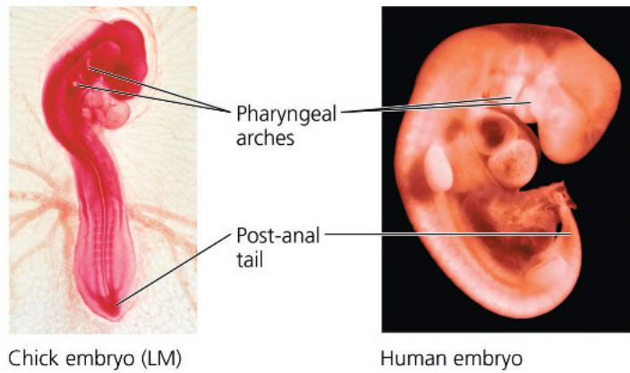

(Figure 22.15). Such striking anatomical resemblances would be highly unlikely if these structures had arisen anew in each species. Rather, the underlying skeletons of the arms, forelegs, flippers, and wings of different mammals are homologous structures that represent variations on a structural theme that was present in their common ancestor.

Comparing early stages of development in different animal species reveals additional anatomical homologies not visible in adult organisms. For example, at some point in their development, all vertebrate embryos have a tail located posterior to (behind) the anus, as well as structures called pharyngeal (throat) arches (Figure 22.16). These homologous arches ultimately develop into structures with very different functions, such as gills in fishes and parts of the ears and throat in humans and other mammals.

Figure 22.15 Mammalian forelimbs: homologous structures.

Even though they have become adapted for different functions, the forelimbs of all mammals are constructed from the same basic skeletal elements: one large bone (purple), attached to two smaller bones (orange and tan), attached to several small bones (gold), attached to several metacarpals (green), attached to approximately five digits, each of which is composed of multiple phalanges (blue).

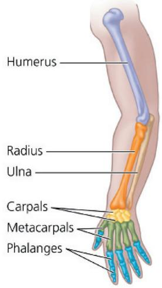  
Human

  
Whale

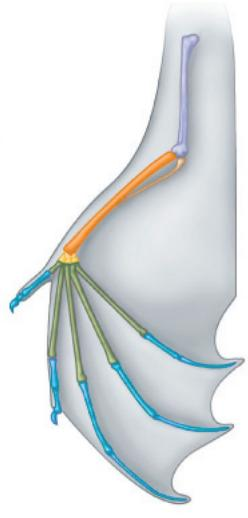

Some of the most intriguing homologies concern “leftover” structures of marginal, if any, importance to the organism. These vestigial structures are remnants of features that served a function in the organism’s ancestors. For instance, snakes arose from ancestors with legs, and the skeletons of some snakes retain vestiges of the pelvis and leg bones of their ancestors. Likewise, blind species of cave fishes descended from ancestors with eyes—which explains why these blind fishes have eye remnants buried under their scales. We would not expect to see these vestigial structures if snakes and blind cave fishes had origins separate from those of other vertebrate animals.

Biologists also observe similarities among organisms at the molecular level. All forms of life use essentially the same genetic code, suggesting that all species descended from

common ancestors that used this code. But molecular homologies go beyond a shared code. For example, organisms as dissimilar as humans and bacteria share genes inherited from a very distant common ancestor. Some of these homologous genes have acquired new functions, while others, such as those coding for the ribosomal subunits used in protein synthesis (see Figure 17.18), have retained their original functions. It is also common for organisms to have genes that have lost their function, even though the homologous genes in related species may be fully functional. Like vestigial structures, it appears that such inactive “pseudogenes” may be present simply because a common ancestor had them.

## Homologies and “Tree Thinking”

Some homologous characteristics, such as the genetic code, are shared by all species because they date to the deep ancestral past. In contrast, homologous characteristics that evolved more recently are shared only within smaller groups of organisms.

Consider the tetrapods (from the Greek tetra, four, and pod, foot), the vertebrate group that consists of amphibians, mammals, and reptiles. Like all vertebrates, tetrapods have a backbone. But unlike other vertebrates, tetrapods also have limbs with digits (see Figure 22.15). As suggested by this example, homologous characteristics form a nested pattern: All life shares the deepest layer (in this case, all vertebrates have a backbone), and each successive smaller group adds its own homologies to those it shares with larger groups (in this case, all tetrapods have a backbone and limbs with digits). This nested pattern is exactly what we would expect to result from descent with modification from a common ancestor.

Biologists often represent the pattern of descent from common ancestors with an evolutionary tree, a diagram that reflects evolutionary relationships among groups of organisms. We will explore evolutionary trees in more detail in Chapter 26, but for now, let's consider how we can interpret and use such trees.

Figure 22.17 is an evolutionary tree of tetrapods and their closest living relatives, the lungfishes. In this diagram,

To explore “tree thinking” further, note that in Figure 22.17 mammals are positioned closer to amphibians than to birds. As a result, you might conclude that mammals are more closely related to amphibians than they are to birds. However, mammals are actually more closely related to birds than to amphibians because mammals and birds share a more recent common ancestor (ancestor ③) than do mammals and amphibians (ancestor ②). Ancestor ② is also the most recent common ancestor of birds and amphibians, making mammals and birds equally related to amphibians. Finally, note that the tree in Figure 22.17 shows the relative timing of events but not their actual dates. Thus, we can conclude that ancestor ② lived before ancestor ③, but we do not know when that was.

each branch point represents the most recent common ancestor of the two lineages diverging from that point. For example, lungfishes and all tetrapods descended from ancestor ①, whereas mammals, lizards and snakes, crocodiles, and birds all descended from ancestor ③. As expected, the three homologies shown on the tree—limbs with digits, the amnion (a protective embryonic membrane), and feathers—form a nested pattern. Limbs with digits were present in common ancestor ② and hence are found in all of the descendants of that ancestor (the tetrapods). The amnion was present only in ancestor ③ and hence is shared only by some tetrapods (mammals and reptiles). Feathers were present only in ancestor ⑥ and hence are found only in birds.

Evolutionary trees are hypotheses that summarize our current understanding of patterns of descent. Our confidence in these relationships, as with any hypothesis, depends on the strength of the supporting data. In the case of Figure 22.17, the tree is supported by many different data sets, including both anatomical and DNA sequence data. As a result, biologists are confident that it accurately reflects evolutionary history. Scientists can use such well-supported evolutionary trees to make specific and sometimes surprising predictions about organisms (see Figure 26.17).

Figure 22.17 Tree thinking: information provided in an evolutionary tree.

This evolutionary tree for tetrapods and their closest living relatives, the lungfishes, is based on anatomical and DNA sequence data. The purple hatch marks indicate the origin of three important homologies, each of which evolved only once. Birds are nested within and evolved from reptiles; hence, the group of organisms called “reptiles” technically includes birds.

For suggested answer, see Appendix A.

VISUAL SKILLS Based on this evolutionary tree, are crocodiles more closely related to lizards or birds? Explain.

(b) Pakicetus

## A Different Cause of Resemblance: Convergent Evolution

Although organisms that are closely related share characteristics because of common descent, distantly related organisms can resemble one another for a different reason: convergent evolution, the independent evolution of similar features in different lineages. Consider marsupial mammals, many of which live in Australia. Marsupials are distinct from another group of mammals—the eutherians, or placental mammals—few of which live in Australia. (Eutherians complete their embryonic development in the uterus, whereas marsupials are born as embryos and complete their development while nursing, often in an external pouch.) Some Australian marsupials have eutherian look-alikes with superficially similar adaptations. For instance, a forest-dwelling Australian marsupial called the sugar glider is superficially very similar to flying squirrels, gliding eutherians that live in North American forests (Figure 22.18). But the sugar glider has many other characteristics that make it a marsupial, much more closely related to kangaroos and other Australian marsupials than to flying squirrels or other eutherians. Once again, our understanding of evolution can explain these observations. Although they evolved independently from different ancestors, these two mammals have adapted to similar environments in similar ways. In such examples in which species share features because of convergent evolution, the resemblance is said to be analogous, not homologous. Analogous features share similar function, but not common ancestry, while homologous features share common ancestry, but not necessarily similar function.

cetaceans, the mammalian order that includes whales, dolphins, and porpoises. Some of these fossils (Figure 22.19) provided strong support for a hypothesis based on DNA sequence data: that cetaceans are closely related to even-toed ungulates, a group that includes hippopotamuses, pigs, deer, and cows.

What else can fossils tell us about cetacean origins? The earliest cetaceans lived 50–60 million years ago. The fossil record indicates that prior to that time, most mammals were terrestrial. Although scientists had long realized that whales and other cetaceans originated from land mammals, few fossils had been

Figure 22.18 Convergent evolution.

The ability to glide through the air evolved independently in these two distantly related mammals.

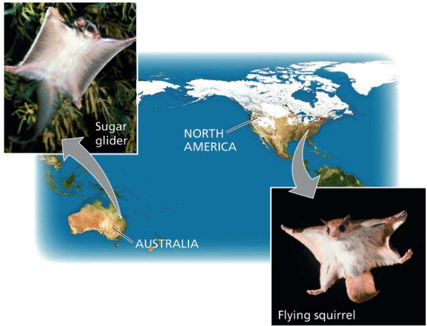

## The Fossil Record

A third type of evidence for evolution comes from fossils. The fossil record documents the pattern of evolution, showing that past organisms differed from present-day organisms and that many species have become extinct. Fossils also show the evolutionary changes that have occurred in various groups of organisms. To give one of hundreds of possible examples, researchers found that over several thousand years, the pelvic bone in fossil stickleback fish became greatly reduced in size. The consistent nature of this change over time suggests that the reduction in the size of the pelvic bone may have been driven by natural selection.

Fossils can also shed light on the origins of new groups of organisms. An example is the fossil record of

Figure 22.19 Ankle bones: one piece of the puzzle.

Comparing fossils and present-day examples of the astragalus (a type of ankle bone) indicates that cetaceans are closely related to even-toed ungulates. (a) In most mammals, the astragalus is shaped like that of a dog, with a double hump on one end (double-headed red arrows) but not at the opposite end (single-headed blue arrow). (b) Fossils show that the early cetacean Pakicetus had an astragalus with double humps at both ends, a shape otherwise found only in pigs (c), deer (d), and all other event-toed ungulates.

Figure 22.20 The transition to life in the sea.

Multiple lines of evidence support the hypothesis that cetaceans (yellow boxed labels) evolved from terrestrial mammals. Fossils document the reduction over time in the pelvis and hind limb bones of extinct ( $\dagger$ ) cetaceans, including Pakicetus, Rodhocetus, and Dorudon. DNA sequence data support the hypothesis that cetaceans are most closely related to hippopotamuses. (Note that the drawings are not to scale.)

  
VISUAL SKILLS Use the diagram to determine which happened first during the evolution of cetaceans: changes in hind limb structure or the origin of tail flukes (the lobes on a whale's tail). Explain.  
For suggested answer, see Appendix A.

found that revealed how cetacean limb structure had changed over time, leading eventually to the development of flippers as well as to the loss of hind limbs and the development of flukes (the lobes on a whale's tail). In the past few decades, however, a series of remarkable fossils have been discovered in Pakistan, Egypt, and North America. These fossils document extinct species that existed during the time that this lineage was adapting to life in the sea (Figure 22.20), and they can help us understand how present-day cetaceans came to be.

Finally, although living cetaceans look very different from living even-toed ungulates, the fossil discoveries show that extinct early cetaceans such as Pakicetus looked fairly similar to deer and other living even-toed ungulates. The extinct early cetaceans also looked very similar to extinct early even-toed ungulates, such as Diacodexis (Figure 22.21). Similar patterns are seen in fossils documenting the origins of other groups of organisms, including mammals (see Figure 25.7), flowering plants (see Concept 30.3), and tetrapods (see Figure 34.21). In each of these cases, the fossil record shows that over time, descent with modification produced increasingly large differences among related groups of organisms, ultimately resulting in the diversity of life today.

Figure 22.21 Diacodexis, an early even-toed ungulate.

## Biogeography

A fourth type of evidence comes from biogeography, the scientific study of the geographic distributions of species. These distributions are influenced by many factors, including continental drift, the slow movement of Earth's continents over

time. About 250 million years ago, these movements united all of Earth's landmasses into a single large continent called Pangaea (see Figure 25.16). Roughly 200 million years ago, Pangaea began to break apart; by 20 million years ago, the continents were within a few hundred kilometers of their present locations.

We can use our understanding of evolution and continental drift to predict where fossils of different groups of organisms might be found. For example, scientists have constructed evolutionary trees for horses based on anatomical data. These trees and the ages of fossils of horse ancestors suggest that the genus that includes present-day horses

Figure 22.22 Closely related freshwater fish separated by 9,000 km of ocean.

There are three species in these two closely related genera of freshwater fish within the family Galaxiidae.

(Equus) originated 5 million years ago in North America. Geologic evidence indicates that at that time, North and South America were not yet connected, making it difficult for horses to travel between them. Thus, we would predict that the oldest Equus fossils should be found only on the continent on which the group originated—North America. This prediction and others like it for different groups of organisms have been upheld, providing more evidence for evolution.

Evolution also explains biogeographic data. For example, a group of three species of freshwater fish in the family Galaxiidae are found in regions separated by wide stretches of open ocean (Figure 22.22). None of these three species can survive in salt water, so how can we explain their geographic distributions? These three species represent all known living descendants of a common ancestor. Since all of the living species cannot survive in salt water, it is likely that their common ancestor also was restricted to freshwater habitats. At first glance, this only deepens the mystery—how could that ancestor or its descendants have swum across vast stretches of ocean? A clue comes from genetic analyses indicating that the evolutionary lineages leading to these three species began to diverge about 55 million years ago. By that time, the southernmost portion of Pangaea was breaking apart into what would eventually become South America, Australia, and Antarctica. This suggests that their ancestors had spread across southern Pangaea before it broke apart. At later times, these three freshwater species originated on the continental regions where they currently live, resulting in their present-day geographic distribution.

## What Is Theoretical About Darwin's View of Life?

Some people dismiss Darwin's ideas as "just a theory." But the pattern of evolution—the observation that life has evolved over time—is supported by a great deal of evidence. In addition, Darwin's explanation of the process of evolution—that natural selection is the primary cause of the observed pattern of evolutionary change—makes sense of massive amounts of data. As the Scientific Skills Exercise describes, the effects of natural selection also can be observed and tested in nature.

What, then, is theoretical about evolution? Keep in mind that the scientific meaning of the term theory is very different from its meaning in everyday use. The colloquial use of the word theory comes close to what scientists mean by a hypothesis. In science, a theory is much more comprehensive than a hypothesis. A theory, such as the theory of evolution by natural selection, accounts for many observations and explains and integrates a great variety of phenomena. Such a unifying theory does not become widely accepted unless its predictions stand up to thorough and continual testing by experiment and additional observation (see Concept 1.3). As the rest of this unit demonstrates, this has certainly been the case with the theory of evolution by natural selection.

The skepticism of scientists as they continue to test theories prevents these ideas from becoming dogma. For example, although Darwin thought that evolution was a very slow process, we now know that this isn't always true. Populations can evolve rapidly, and new species can form in relatively short periods of time: a few thousand years or less. Furthermore, evolutionary biologists now recognize that natural selection is not the only mechanism responsible for evolution. Indeed, the study of evolution today is livelier than ever as scientists use a wide range of experimental approaches and genetic analyses to test predictions based on natural selection and other evolutionary mechanisms.

Although Darwin's theory attributes life's diversity to natural processes, the diverse products of evolution are nevertheless elegant and inspiring. As Darwin wrote in the final sentence of The Origin of Species, “There is grandeur in this view of life… [in which] endless forms most beautiful and most wonderful have been, and are being, evolved.”

## Concept Check 22.3

1. Explain how the following statement is inaccurate: "Antibiotics have created drug resistance in MRSA."

2. How does evolution account for (a) the similar mammalian forelimbs with different functions shown in Figure 22.15 and (b) the similar forms of the two distantly related mammals shown in Figure 22.18?

3. WHAT IF? Fossils show that dinosaurs originated 200–250 million years ago. Would you expect the geographic distribution of early dinosaur fossils to be broad (on many continents) or narrow (on one or a few continents only)? Explain.

# Scientific Skills Exercise Making and Testing Predictions

Can Predation Result in Natural Selection for Color Patterns in Guppies? Our understanding of evolution changes constantly as new observations lead to new hypotheses—and hence to new ways to test our understanding of evolutionary theory. Consider the wild guppies (Poecilia reticulata) that live in pools connected by streams on the Caribbean island of Trinidad. Male guppies have highly varied color patterns that are controlled by genes that are only expressed in adult males. Female guppies choose males with bright color patterns as mates more often than they choose males with drab coloring. But the bright colors that attract females also can make the males more conspicuous to predators. Researchers observed that in pools with few predator species, the benefits of bright colors appear to “win out,” and males are more brightly colored than in pools where predation is more intense.

One guppy predator, the killifish, preys on juvenile guppies that have not yet displayed their adult coloration. Researchers predicted that if adult guppies with drab colors were transferred to a pool with only killifish, eventually the descendants of these guppies would be more brightly colored (because of the female preference for brightly colored males).

## Chapter 22 Review

## Summary of Key Concepts

To review key terms, go to the Vocabulary Self-Quiz (eTextbook only).

Concept 22.1: The Darwinian revolution challenged traditional views of a young Earth inhabited by unchanging species

\- Darwin proposed that life's diversity arose over long periods of time from ancestral species through natural selection, a departure from prevailing views. For example, Cuvier studied fossils but denied that evolution occurs; he proposed that sudden

How the Experiment Was Done Researchers transplanted 200 adult guppies from pools containing pike-cichlid fish, predators of adult guppies, to pools with only killifish, predators of juvenile guppies. They tracked the number of bright-colored spots and the total area of those spots on adult male guppies in each generation.

Data from the Experiment After 22 months (15 generations), researchers compared the color pattern data for guppies from the source and transplanted populations.

  
Data from J. A. Endler, Natural selection on color patterns in Poecilia reticulata, Evolution 34:76–91 (1980).

## INTERPRET THE DATA

1. Identify the following elements of hypothesis-based science in this example: (a) question, (b) hypothesis, (c) prediction, (d) control group, and (e) experimental group. (For additional information about hypothesis-based science, see Concept 1.3 and the Scientific Skills Review in Appendix D.)

2. Explain how the types of data the researchers chose to collect enabled them to test their prediction.

3. What conclusion do you draw from the data presented above?

4. (a) Predict what would happen if, after 22 months, guppies from the transplanted population were returned to the source pool. (b) Describe an experiment to test your prediction.

Instructors: A version of this Scientific Skills Exercise can be assigned in Mastering Biology.

catastrophic events in the past caused species to disappear from an area. Lamarck hypothesized that species evolve, but the underlying mechanisms he proposed are not supported by evidence.

Why was the age of Earth important for Darwin's ideas about evolution?

Concept 22.2: Descent with modification by natural selection explains the adaptations of organisms and the unity and diversity of life

\- Darwin's experiences during the voyage of the Beagle gave rise to his idea that new species originate from ancestral forms through the accumulation of adaptations. He refined his theory for many years and finally published it in 1859 after learning that Wallace had come to the same idea.

\- In The Origin of Species, Darwin proposed that over long periods of time, descent with modification produced the rich diversity of life through the mechanism of natural selection.

  
Describe how overreproduction and heritable variation relate to evolution by natural selection.

## Concept 22.3: Evolution is supported by an overwhelming amount of scientific evidence

\- Researchers have directly observed natural selection leading to evolution in many studies in diverse organisms.

\- Organisms share characteristics because of common descent (homology) or because natural selection affects independently evolving species in similar environments in similar ways (convergent evolution).

\- Fossils show that past organisms differed from living organisms, that many species have become extinct, and that species have evolved over long periods of time; fossils also document the evolutionary origin of new groups of organisms.

• Evolutionary theory can explain some biogeographic patterns.

Summarize the different lines of evidence supporting the hypothesis that cetaceans descended from land mammals and are closely related to even-toed ungulates.

For suggested answers, see Appendix A.

## Test Your Understanding

For more multiple-choice questions, go to the Practice Test (eTextbook only).

## Levels 1-2: Remembering/Understanding

1. Which of the following is an observation or inference on which natural selection is based?

(A) Individuals do not vary in their heritable characteristics.

(B) Only well-adapted individuals produce offspring.

(C) Species produce more offspring than the environment can support.

(D) Nearly all of each individual's offspring will survive and reproduce.

2. Which of the following observations helped Darwin shape his concept of descent with modification?

(A) Species diversity declines farther from the equator.

(B) Fewer species live on islands than on the nearest continents.

(C) Birds live on islands located farther from the mainland than the birds' maximum nonstop flight distance.

(D) South American temperate plants are more similar to South American tropical plants than to European temperate ones.

## Levels 3-4: Applying/Analyzing

3. Within six months of effectively using methicillin to treat S. aureus infections in a community, all new S. aureus infections were caused by a resistant strain (MRSA). How can this best be explained?

(A) A patient must have become infected with MRSA from another community.

(B) In response to the drug, S. aureus began making drug-resistant versions of the protein targeted by the drug.

(C) Some drug-resistant bacteria were present at the start of treatment, and natural selection increased their frequency.

(D) S. aureus evolved to resist vaccines.

4. DNA sequences in many human genes are very similar to the sequences of corresponding genes in chimpanzees. The most likely explanation for this result is that

(A) humans and chimpanzees share a relatively recent common ancestor.

(B) humans evolved from chimpanzees.

(C) chimpanzees evolved from humans.

(D) convergent evolution led to the DNA similarities.

5. The upper forelimbs of humans and bats have fairly similar skeletal structures, whereas the corresponding bones in whales have very different shapes and proportions. However, genetic data suggest that all three kinds of organisms diverged from a common ancestor at about the same time. Which of the following is the most likely explanation for these data?

(A) Forelimb evolution was adaptive in people and bats, but not in whales.

(B) Natural selection in an aquatic environment resulted in significant changes to whale forelimb anatomy.

(C) Genes mutate faster in bats than in humans or whales.

(D) Whales are not properly classified as mammals.

## Levels 5-6: Evaluating/Creating

6. EVOLUTION CONNECTION Explain why anatomical and molecular features often fit a similar nested pattern. In addition, describe a process that can cause this not to be the case.

7. SCIENTIFIC INQUIRY • DRAW IT Mosquitoes resistant to the pesticide DDT first appeared in India in 1959, but now are found throughout the world. (a) Graph the data in the table below. (b) After examining the graph, hypothesize why the percentage of mosquitoes resistant to DDT rose rapidly. (c) Suggest an explanation for the global spread of DDT resistance.

<table><tr><td>Month</td><td>0</td><td>8</td><td>12</td></tr><tr><td>Mosquitoes Resistant* to DDT</td><td>4%</td><td>45%</td><td>77%</td></tr></table>

\* Mosquitoes were considered resistant if they were not killed within 1 hour of receiving a dose of 4% DDT.

Data from C. F. Curtis et al., Selection for and against insecticide resistance and possible methods of inhibiting the evolution of resistance in mosquitoes, Ecological Entomology 3:273–287 (1978).

8. WRITE ABOUT A THEME: INTERACTIONS Write a short essay (about 100–150 words) evaluating whether changes to an organism's physical environment are likely to result in evolutionary change. Use an example to support your reasoning.

9. SYNTHESIZE YOUR KNOWLEDGE

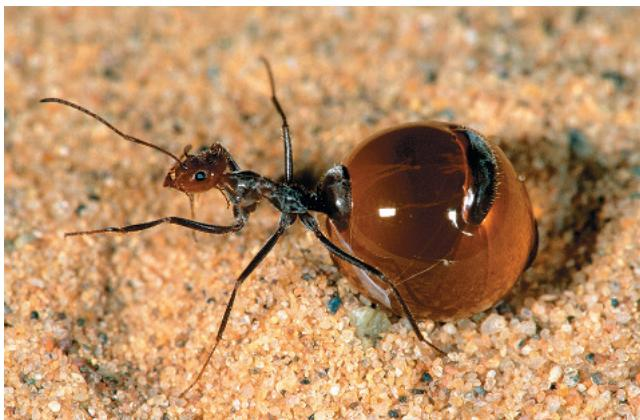

This honeypot ant (genus Myrmecocystus) can store liquid food inside its expandable abdomen. Consider other ants you are familiar with, and explain how a honeypot ant exemplifies three key features of life: adaptation, unity, and diversity.
For selected answers, see Appendix A.

# Explore Scientific Papers with Science in the Classroom | AAAS

How are some coral reefs responding to climate change? Go to "Take the Heat" at www.scienceintheclassroom.org.

Instructors: Questions can be assigned in Mastering Biology.

# The Evolution of Populations

## Key Concepts

23.1 Genetic variation makes evolution possible

23.2 The Hardy-Weinberg equation is a model of no evolution occurring for a given gene

23.3 Natural selection, genetic drift, and gene flow can alter allele frequencies in a population

23.4 Natural selection is the only mechanism that consistently causes adaptive evolution

  
Figure 23.1 The medium ground finch (Geospiza fortis) is a seed-eating bird that inhabits the Galápagos Islands. In 1977, the G. fortis population on the island of Daphne Major was decimated by a long period of drought: Of some 1,200 birds, only 180 survived. The birds that survived did so because they were still able to find food during the drought. In other words, their survival was not random—these birds had a selective advantage.

## Study Tip

Make a table: This chapter discusses different types of selection—disruptive, stabilizing, sexual, balancing, frequency-dependent, and heterozygote advantage. These types of selection are not all mutually exclusive, and some evolutionary changes are examples of more than one. To help you study, make a table like the one shown listing each type of selection, its distinguishing features, and example(s) from the chapter.

<table><tr><td>Type of selection</td><td>Distinguishing features</td><td>Example</td></tr><tr><td>Balancing selection</td><td>Maintains two or more phenotypes in a population; includes frequency-dependent selection and heterozygote advantage</td><td>Figures 23.17 and 23.18</td></tr><tr><td>Directional selection</td><td></td><td></td></tr></table>

Genetic variation results in color variation in this hypothetical beetle population.

Evolution occurs when natural selection, genetic drift, or gene flow alter the allele frequencies of a population over time.

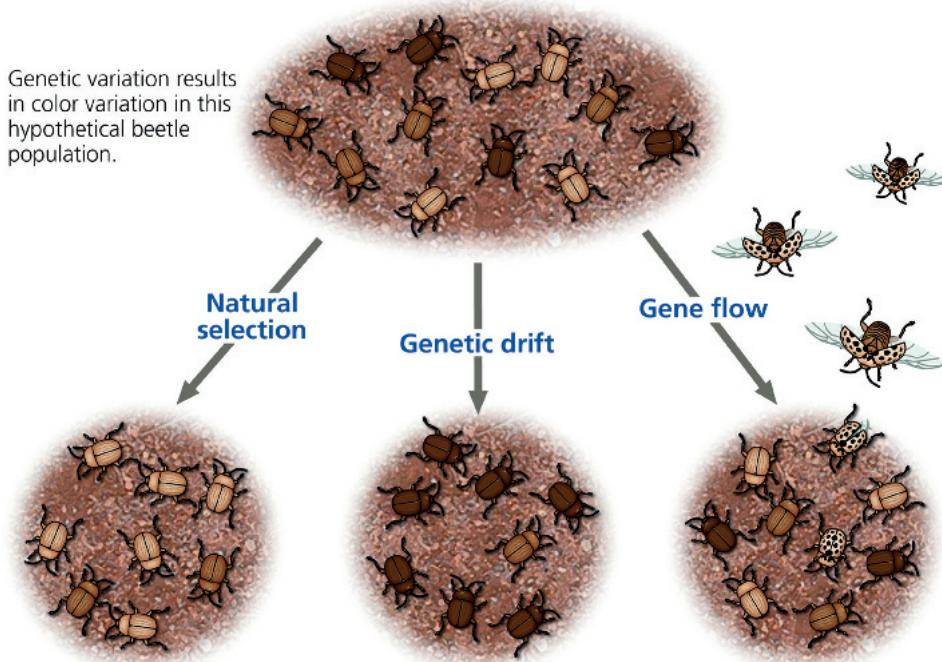  
The more visible darker beetles have been preyed on at a higher rate, causing lighter beetles (and the alleles they carry) to become more common over time.  
By chance alone, alleles encoding darker color have become more common over several generations.  
The arrival of beetles with a spotted color pattern has brought new alleles into the population.

# Concept 23.1: Genetic variation makes evolution possible

In The Origin of Species, Darwin provided abundant evidence that life on Earth has evolved over time, and he proposed natural selection as the primary mechanism for that change. He observed that individuals differ in their inherited traits and that selection acts on such differences, leading to evolutionary change. Although Darwin realized that variation in heritable traits is a prerequisite for evolution, he did not know precisely how organisms pass heritable traits to their offspring.

Just a few years after Darwin published The Origin of Species, Gregor Mendel wrote a groundbreaking paper on inheritance in pea plants proposing a model of inheritance in which organisms transmit discrete heritable units (now called genes) to their offspring. Although Darwin did not know about genes, Mendel's paper set the stage for understanding the genetic differences on which evolution is based.

## Individuals and Populations

A common misconception about evolution is that individual organisms evolve. It is true that natural selection acts on individuals. Each organism's traits affect its survival and reproductive success compared with other individuals. But the impact of natural selection only becomes apparent in how a population of organisms changes over time.

To see why, consider the population of medium ground finches decimated by a drought, resulting in only 180 survivors out of some 1,200 birds. Researchers Peter and Rosemary Grant observed that during the drought, small, soft seeds were scarce, while large, hard seeds were more plentiful. Birds with larger, deeper beaks were better able to crack and eat the larger seeds and survived at a higher rate than finches with smaller beaks.

Since beak depth is an inherited trait in these birds, the offspring of surviving birds tended to have deep beaks. As a result, the average beak depth in the next generation of G. fortis was greater than it had been in the pre-drought population (Figure 23.2). The finch population had evolved by natural selection. However, the individual finches did not evolve. Each bird had a beak of a particular size, which did not grow larger during the drought. Rather, the proportion of large beaks in the population increased across generations: The population evolved, not its individual members.

Focusing on evolutionary change in populations, we can recognize one definition of evolution on its smallest scale, called microevolution, as a change in allele frequencies in a population over generations. In the finch population, for example, birds that

Figure 23.2 Evidence of selection by food source.

The data represent adult beak depths of finches hatched before and after the 1977 drought. In one generation, natural selection resulted in a larger average beak size in the population.
Instructors: A related Experimental Inquiry Tutorial can be assigned in Mastering Biology.

had alleles encoding large beaks survived at higher rates than did other birds. This caused those alleles to be more common after the drought than they had been before it, demonstrating evolution by natural selection. Natural selection is not the only mechanism of evolution. Other mechanisms include genetic drift (chance events that alter allele frequencies), and gene flow (the transfer of alleles between populations). (Mutation on its own can also be considered a mechanism of evolution if a mutation occurs in a reproductive cell and the mutation is passed on to the next generation.) Each of these mechanisms affects the genetic composition of populations, but only natural selection consistently improves the degree to which organisms are well suited for life in their environment (adaptation). Before we explore these mechanisms more fully, let's focus on their key prerequisite: genetic variation.

## Interview

Interview with Rosemary and Peter Grant: Studying evolution in the Galápagos finches (eTextbook only)

## Genetic Variation

Individuals within all species vary in their phenotypic traits. Humans, for example, vary noticeably in facial features, height, and voice. And though you cannot identify blood group (A, B, AB, or O) from a person's appearance, this and many other molecular traits also vary extensively among individuals.

Such phenotypic variations often reflect genetic variation, differences among individuals in the composition of their genes or other DNA sequences. Some heritable phenotypic differences occur on an “either-or” basis, such as the flower colors of Mendel’s pea plants: Each plant had flowers that were either purple or white (see Figure 14.3). Characters that vary in this way are typically determined by a single gene, with different alleles producing distinct phenotypes. In contrast, other phenotypic differences vary in gradations along a continuum. Such variation usually results from the influence of two or more genes on a single phenotypic character. In fact, many phenotypic characters are influenced by multiple genes, including coat color in horses (Figure 23.3), seed number in maize (corn), and height in humans.

How much do genes and other DNA sequences vary from one individual to another? Genetic variation at the whole-gene level

Figure 23.3 Phenotypic variation in horses.  

Figure 23.4 Extensive genetic variation at the molecular level.  
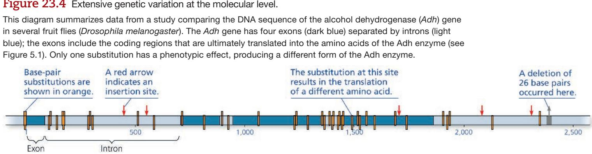  
MAKE CONNECTIONS Review Figures 17.6 and 17.11. Explain how a base-pair substitution that alters a coding region of the Adh locus could have no effect on amino acid sequence. Then, explain how an insertion in an exon could have no effect on the protein produced.

(gene variability) can be quantified as the average percentage of loci that are heterozygous. (Recall that a heterozygous individual has two different alleles for a given locus, whereas a homozygous individual has two identical alleles for that locus.) As an example, on average, the fruit fly Drosophila melanogaster is heterozygous for about 1,920 of its 13,700 loci (14%) and homozygous for all the rest.

Considerable genetic variation can also be measured at the molecular level of DNA (nucleotide variability). But little of this variation results in phenotypic variation. Why? Many nucleotide variations occur within introns, noncoding segments of DNA lying between exons, the regions retained in mRNA after RNA processing (see Figure 17.12). And of the variations that occur within exons, most do not cause a change in the amino acid sequence of the protein encoded by the gene. For example, in the sequence comparison shown in Figure 23.4, there are 43 nucleotide sites with variable base pairs (where substitutions have occurred), as well as several sites where insertions or deletions have occurred. Although 18 variable sites occur within the four exons of the Adh gene, only one of these variations (at site 1, 490) results in an amino acid change. Note, however, that this single variable site is enough to cause genetic variation at the level of the gene, and hence two different forms of the Adh enzyme are produced. Of all the genetic variation shown in Figure 23.4, only this single difference that results in a different version of the enzyme is expressed phenotypically and therefore exposed to natural selection; the rest of this genetic variation is “hidden” from selection.

It is important to bear in mind that some phenotypic

## Sources of Genetic Variation

Genetic variation originates when processes such as mutation or gene duplication produce new alleles and new genes. New genetic variation can be generated in the production of each new generation. Bear in mind that the generation of new genetic variation is completely random with respect to the effects or consequences of this variation (that is, whether it is beneficial, negative, or neutral to the organism). Sexual reproduction can also result in genetic variation as existing genes are arranged in new ways.

## Formation of New Alleles

New alleles can arise by mutation, a change in the nucleotide sequence of an organism's DNA. Mutations can be caused by factors such as errors in DNA replication, exposure to UV light and other high-energy forms of radiation, and exposure to certain chemicals (see Concept 17.5). A change of as little as one base in a gene—a “point mutation”—can have a significant impact on phenotype, as in sickle-cell disease (see Figure 23.18). Furthermore, organisms reflect many generations of past selection, and hence their phenotypes tend to be well suited for life in their environments. As a result, most new mutations that alter a phenotype are at least slightly harmful.

In some cases, natural selection quickly removes such harmful alleles. In diploid organisms, however, harmful alleles that are recessive can be hidden from selection. Indeed, a harmful recessive

## Figure 23.5 Environmentally induced phenotypic variation.

variation does not result from genetic differences among individuals (Figure 23.5 shows a striking example in a caterpillar of the southwestern United States). Phenotype is the product of an inherited genotype and many environmental influences (see Concept 14.3). The term phenotypic plasticity refers to the ability of an individual genotype to produce different phenotypes when exposed to different environmental conditions. In a human example, bodybuilders alter their phenotypes dramatically but do not pass their huge muscles on to the next generation. In general, only the genetically determined part of phenotypic variation can be passed from parent to offspring. As such, genetic variation provides the raw material for evolutionary change: Without genetic variation, evolution cannot occur.

These caterpillars of the moth Nemoria arizonaria owe their different appearances to chemicals in their diets, not to differences in their genotypes. (a) Caterpillars raised on a diet of oak flowers resemble the flowers, whereas (b) their siblings raised on oak leaves resemble oak twigs.

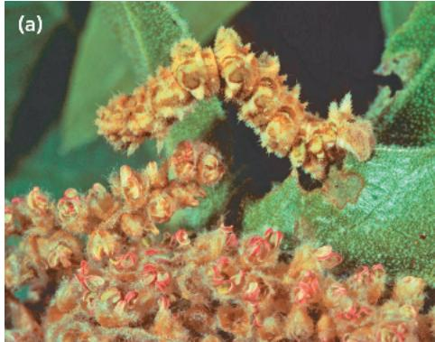

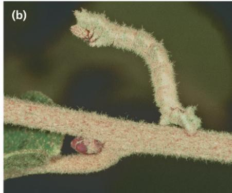

allele can persist for generations by propagation in heterozygous individuals (where its harmful effects can be masked by the more favorable dominant allele). Such “heterozygote protection” maintains a huge pool of alleles that may be harmful under present conditions, but that could be beneficial if the environment changes.

While many mutations are harmful, many others are not. Recall that much of the DNA in eukaryotic genomes does not encode proteins (see Figure 21.6). Point mutations in these noncoding regions generally result in neutral variation, differences in DNA sequence that do not confer a selective advantage or disadvantage. The redundancy in the genetic code is another source of neutral variation: Even a point mutation in a gene that encodes a protein will have no effect on the protein's function if the amino acid doesn't change. And even a change in the amino acid may not affect the protein's shape and function. Moreover, a mutant allele may on rare occasions actually make its bearer better suited to the environment, enhancing reproductive success.

Finally, note that in multicellular organisms, only mutations in cell lines that produce gametes can be passed to offspring. In plants and fungi, this is not as limiting as it may sound, since many different cell lines can produce gametes. But in most animals, the majority of mutations occur in somatic cells and are not passed to offspring.

## Altering Gene Number or Position

Chromosomal changes that delete, disrupt, or rearrange many loci are usually harmful. However, when such large-scale changes leave genes intact, they may not affect the organisms' phenotype. In rare cases, chromosomal rearrangements may even be beneficial. For example, the translocation of part of one chromosome to a different chromosome could link genes in a way that produces a positive effect.

A key potential source of variation is the duplication of genes due to errors in meiosis (such as unequal crossing over), slippage during DNA replication, or the activities of transposable elements (see Concept 21.5). Duplications of large chromosome segments, like other chromosomal aberrations, are often harmful, but the duplication of smaller pieces of DNA may not be. Gene duplications that do not have severe effects can persist over generations, allowing mutations to accumulate. The result is an expanded genome with new genes that may take on new functions.

Such increases in gene number appear to have played a major role in evolution. For example, the remote ancestors of mammals had a single gene for detecting odors that has since been duplicated many times. As a result, humans today have about 380 functional olfactory receptor genes, and mice have about 1,200. This dramatic proliferation of olfactory genes probably helped early mammals, enabling them to detect faint odors and to distinguish among many different smells.

## Rapid Reproduction

Because genetic variation is generated when new generations are produced, organisms that have relatively short generation times may produce more genetic variation in a given amount of time. Mutation rates tend to be low in plants and animals, averaging about one mutation in every 100,000 genes per generation, and are often even lower in prokaryotes. But prokaryotes have many more generations per unit of time, so mutations can quickly generate genetic variation in their populations. The same is true of viruses. For instance, HIV has a generation time of about two days (that is, it takes two days for a newly formed virus to produce the next generation). HIV also has an RNA genome, which has a much higher mutation rate than a typical DNA genome

due to the lack of RNA repair mechanisms in host cells (see Concept 19.2). Thus, single-drug treatments are less effective against HIV: Mutant forms of the virus, resistant to a particular drug, tend to proliferate quickly. The most effective AIDS treatments to date have been drug “cocktails” that combine several medications. This approach has worked well as it is less likely that a set of mutations that together confer resistance to all the drugs will occur in a short time period.

## Sexual Reproduction

In organisms that reproduce sexually, most of the genetic variation in a population results from the unique combination of alleles that each individual receives from its parents. Of course, at the nucleotide level, all the differences among these alleles have originated from past mutations. Sexual reproduction then shuffles existing alleles and deals them at random to produce individual genotypes.

Three mechanisms contribute to this shuffling: Crossing over, independent assortment of chromosomes, and fertilization (see Concept 13.4). During meiosis, homologous chromosomes, one inherited from each parent, trade some of their alleles by crossing over. The resulting recombinant chromosomes are then distributed at random into gametes. Then, because myriad possible mating combinations exist in a population, fertilization typically brings together gametes with different genetic backgrounds. Together, these three mechanisms ensure that sexual reproduction rearranges existing alleles into fresh combinations each generation, providing much of the genetic variation that makes evolution possible. For example, since humans have 23 pairs of chromosomes, independent assortment alone results in $2^{23}$ (8.4 million) combinations in each parent. Consider that crossing over may or may not happen along any of the 23 pairs of chromosomes in either parent, and the fact that the actual fusion of two gametes is independent of these two processes, and it is clear that the number of possible outcomes approaches infinity.

## Concept Check 23.1

1. Explain why genetic variation within a population is a prerequisite for evolution.

2. Of all the mutations that occur in a population, why do only a small fraction become widespread?

3. Explain the difference between genetic variation and phenotypic variation and how each is important in the process of evolution.

4. MAKE CONNECTIONS If a population stopped reproducing sexually but still reproduced asexually, how would its genetic variation be affected over time? (See Concept 13.4.)

For suggested answers, see Appendix A.

# Concept 23.2: The Hardy-Weinberg equation is a model of no evolution occurring for a given gene

The existence of genetic variation within a population is required for evolution to occur, but genetic variation alone does not guarantee that evolution will occur. An allele does not just become more common or more rare on its own—unless something causes an allele to change in frequency, it won't. In other words, evolution doesn't happen without a reason. This proves to be a useful model for any given gene: Operationally, if we can reject this model of no evolution, we can demonstrate that evolution is occurring. Before examining this idea further, however, let's back up and review what we mean by a population.

Figure 23.6 One species, two populations.

These two caribou populations in the Yukon are not totally isolated; they sometimes share the same area (purple overlapping region in the map). Still, members of each population are most likely to breed within their own population.

## Gene Pools and Allele Frequencies

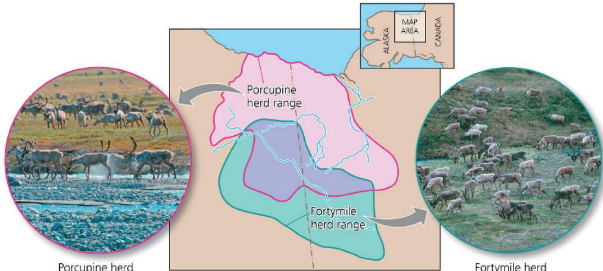  
Porcupine herd  
Fortymile herd

A population is a group of

individuals of the same species that live in the same area and interbreed, producing fertile offspring. Different populations of a species may be isolated geographically or behaviorally from one another, exchanging genetic material only rarely. This is common for species that live on widely separated islands or in different lakes, but not all populations are isolated (Figure 23.6). Still, members of a population typically breed with one another and thus are more closely related to each other than to members of other populations.

We can characterize a population's genetic makeup by describing its gene pool, which consists of all copies of every type

of allele at every locus in all members of the population. If only one allele exists for a particular locus in a population, that allele is said to be fixed in the gene pool, and all individuals are homozygous for that allele. But if there are two or more alleles for a particular locus in a population, individuals may be either homozygous or heterozygous.

For example, imagine a population of 500 wildflower plants with two alleles, $C^{R}$ and $C^{W}$ , for a locus that codes for flower pigment. These alleles show incomplete

dominance; thus, each genotype has a distinct phenotype. Plants homozygous for the $C^{R}$ allele ( $C^{R}C^{R}$ ) produce red pigment and have red flowers; plants homozygous for the $C^{W}$ allele ( $C^{W}C^{W}$ ) produce no red pigment and have white flowers; and heterozygotes ( $C^{R}C^{W}$ ) produce some red pigment and have pink flowers.

Each genotype and each allele has a frequency (proportion) in the population. To see how these frequencies are calculated, suppose our population has 320 plants with red flowers (genotype $C^{R}C^{R}$ ), 160 with pink flowers (genotype $C^{R}C^{W}$ ), and 20 with white flowers (genotype $C^{W}C^{W}$ ). Since 320 of the 500 plants have red flowers, the frequency of the $C^{R}C^{R}$ genotype is 0.64 (320/500).

Likewise, the frequency of the $C^{R}C^{W}$ genotype is 0.32 (160/500) and the frequency of the $C^{W}C^{W}$ genotype is 0.04 (20/500).

With respect to allele frequencies, wildflowers are diploid organisms, so each individual has two alleles for each of its genes. Hence, the 500 individuals in our population have a total of 1,000 copies of the gene for flower color. The $C^{R}$ allele accounts for 800 of these copies ( $320 \times 2 = 640$ for $C^{R}C^{R}$ plants, plus $160 \times 1 = 160$ for $C^{R}C^{W}$ plants). Thus, the frequency of the $C^{R}$ allele is $800/1,000 = 0.8$ (80%). Recognize that this allele frequency is a property of the population; each individual does not have an allele frequency.

When studying a locus with two alleles, the convention is to use p to represent the frequency of one allele and q to represent the frequency of the other allele. Thus, p, the frequency of the $C^{R}$ allele in the gene pool of this population, is $p = 0.8 \, (80\%)$ . And because there are only two alleles for this gene, the frequency of the $C^{W}$ allele, represented by q, must be $q = 1 - p = 0.2 \, (20\%)$ . For loci that have more than two alleles, the sum of all allele frequencies must still equal 1 (100%). Given an understanding of an allele frequency, we can examine how allele frequencies change over generations (that is, how evolution occurs).

## The Hardy-Weinberg Model

As you have read, one basic definition of evolution is a change in allele frequency across generations. An individual does not have an allele frequency; this is a property of a population. If one allele becomes more common in a population, some other alleles at that locus become less common—that is a change in the genetic makeup of the population. If we imagine the gene pool of a population as a bin filled with balls of different colors that represent different alleles (Figure 23.7), we can visualize the role that allele frequencies play in determining offspring genotypes.

Figure 23.7 Selecting alleles at random from a gene pool.  
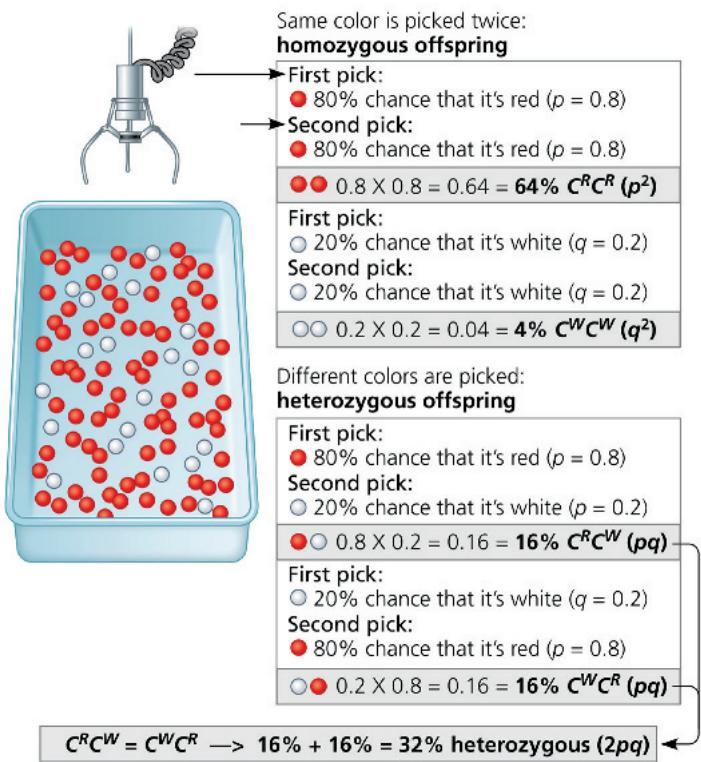  
DRAW IT Draw a bin with six white balls instead of four. For the frequency of $C^{R}$ to remain equal to 0.8, how many red balls should the bin contain? For suggested answer, see Appendix A.

Subsequently, we can see how the frequency of any given allele may change over generations.

Suppose that $80\%$ of the balls in the bin are red (representing the $C^R$ allele) and the remainder of the balls $(20\%)$ are white (representing the $C^W$ allele). We can track how the frequency of red affects the expected frequencies of offspring. Suppose there is such a large number of balls in the bin such that removing one doesn't change the overall frequency. Randomly picking one ball out of the bin, we have an $80\%$ chance, or 0.8, of picking a red one. If that ball represents the allele in a given gamete, in order to model sexual reproduction, we need to pick another one for the other gamete (two gametes, each with their own allele, fuse in fertilization and produce a diploid zygote). Supposing that we randomly pick two balls (alleles) in this way, we can use the law of multiplication (see Figure 14.9) to calculate the possible outcomes, as shown in Figure 23.7.

Therefore, there is a 64% chance that two red balls are chosen and a 4% chance that two white balls are chosen. Note that these correspond to the allele frequencies squared. There are two different ways to pick a red ball and a white ball: picking red first and then white second, or vice versa.

Figure 23.8 Hardy–Weinberg equilibrium.  
In our wildflower population, the gene pool remains constant from one generation to the next. Mendelian processes alone do not alter frequencies of alleles or genotypes.  
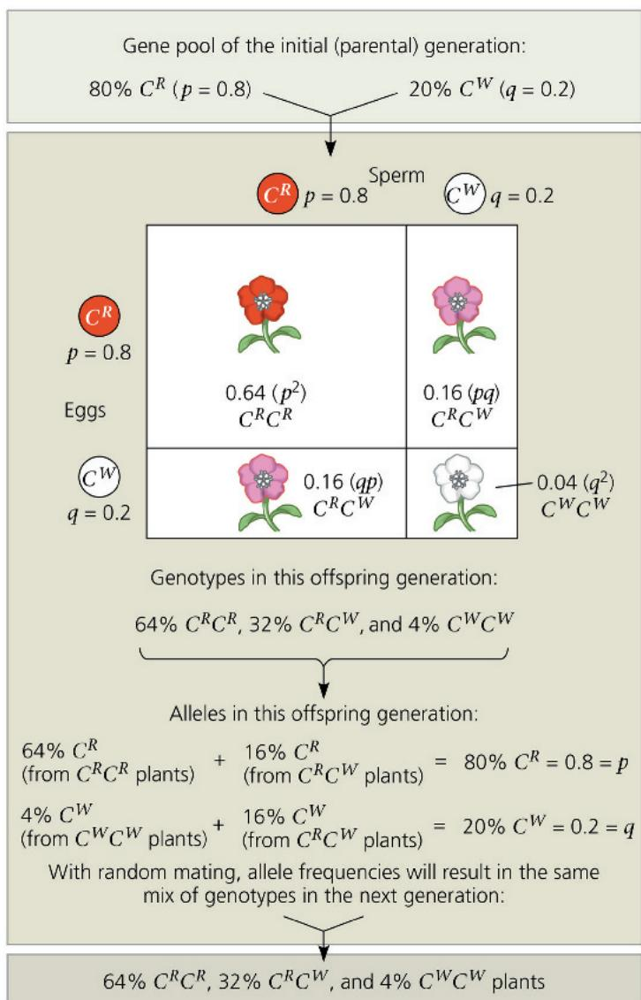  
WHAT IF? If the frequency of the $C^{R}$ allele were 0.6, predict the frequencies of the $C^{R}C^{R}$ , $C^{R}C^{W}$ , and $C^{W}C^{W}$ genotypes.
For suggested answer, see Appendix A.

Now suppose we repeat this process until we have randomly picked 1,000 pairs (2,000 total alleles) from our gene pool to produce the next generation of 1,000 individuals. You'd expect, on average, to get $640 C^{R}C^{R}$ , $320 C^{R}C^{W}(= C^{W}C^{R})$ , and $40 C^{W}C^{W}$ pairs. This next generation's gene pool would therefore be comprised of $(2 \times 640) + (1 \times 320) = 1,600 C^{R}$ alleles and $(2 \times 40) + (1 \times 320) = 400 C^{W}$ alleles. Note that $1,600 C^{R}$ out of 2,000 total is a frequency of 0.8 (80%) and $400 C^{W}$ out of 2,000 is a frequency of 0.2 (20%). The allele frequencies have not changed. Red did not increase (or decrease) in frequency on its own, and neither did white. We could iterate this many times over; on average nothing will change. Figure 23.8 illustrates this in a slightly different way.

Note that these calculations include some important assumptions:

\- First, we assumed that red balls stay red (that is, they don't change to white or any other color), and white balls stay white. This is like assuming no mutation.

\- We assumed there is completely random mating (just picking individual balls out of the bin at random). This is like assuming no mating preferences and no inbreeding.

\- We assumed that there is no advantage to the phenotype associated with $C^{R}C^{R}$ , $C^{R}C^{W}$ , or $C^{W}C^{W}$ ; these phenotypes all contributed to the gene pool equally. This is like saying there is no selection: No traits are beneficial or harmful; there are no survival or reproductive advantages or disadvantages.

\- We assumed that removal of a red ball from the bin did not change the frequency of red balls in the bin (known as picking with replacement). This is like assuming an infinite population size.

\- Finally, we assumed that no balls were being added to the bin from any other bin. This is like saying there is no immigration (gene flow) into our population. Similarly, we assumed that no individuals emigrated (left) the population.

Because of all of these conditions were in place, the allele frequencies did not change across generations. This lack of change (that is, no evolution) can be viewed as an equilibrium (that is, no change). This can help us see why an allele frequency won't change in the absence of a reason for it to change. This is the basis for a useful model of population genetics that was independently described in 1908 by a British mathematician named Hardy and a German physician named Weinberg. Now called the Hardy–Weinberg model, it explains the relationship between allele frequencies in a gene pool and the genotypes produced from that gene pool. For the case of one gene with two alleles, the allele frequency for one allele ( $C^{R}$ ) = $p$ and the frequency of the other allele ( $C^{W}$ ) is $q = 1 - p$ (that is, $p + q = 1$ ). Given the allele frequencies, we can then predict the genotype frequencies of the offspring: The expected frequency of homozygous offspring is the allele frequency squared ( $p^{2}$ or $q^{2}$ ). The expected frequency of heterozygous offspring is $2pq$ . Notably, all offspring must have one of the three possible genotypes (in our example, $C^{R}C^{R}$ , $C^{R}C^{W}$ , or $C^{W}C^{W}$ ), so $p^{2} + 2pq + q^{2} = 1$ (see Figure 23.8).

## Hardy-Weinberg Equilibrium

As demonstrated in the preceding section, allele frequencies in a given population do not change on their own. We refer to this steady state as Hardy-Weinberg equilibrium, and we can use this model as a baseline prediction of no evolution in any given population. This takes the form of a statistical null hypothesis (null model), a hypothesis of no change. If we can demonstrate a deviation from the Hardy-Weinberg prediction of no change in allele frequencies, we can reject the null hypothesis and conclude that evolution is occurring. The next step is then to evaluate the mechanism or to determine what is causing evolution to occur (that is, which assumption is not being met).

Note that each of the assumptions of the model outlined earlier can correspond to a reason why the genotype frequencies in offspring may deviate from the Hardy–Weinberg expectation. In other words, violating any one (or several) of the assumptions may lead us to reject the null hypothesis and observe an

Table 23.1 Conditions for Hardy–Weinberg Equilibrium

<table><tr><td>Condition</td><td>Consequence if Condition Does Not Hold</td></tr><tr><td>1. No mutations</td><td>The gene pool is modified if mutations occur or if entire genes are deleted or duplicated.</td></tr><tr><td>2. Random mating</td><td>If individuals mate within a subset of the population, such as near neighbors or close relatives (inbreeding), random mixing of gametes does not occur and genotype frequencies change.</td></tr><tr><td>3. No natural selection</td><td>Allele frequencies change when individuals with different genotypes show consistent differences in their survival or reproductive success.</td></tr><tr><td>4. Extremely large population size</td><td>In small populations, allele frequencies fluctuate by chance over time (genetic drift).</td></tr><tr><td>5. No gene flow</td><td>By moving alleles into or out of populations, gene flow can alter allele frequencies.</td></tr></table>

evolutionary change. These assumptions can be viewed as conditions for Hardy–Weinberg equilibrium (the state of no evolutionary change) in a population (Table 23.1). In other words, all of the conditions must be met for Hardy–Weinberg equilibrium to occur. Let's review these conditions:

1. If a transmittable mutation occurs in a population, this clearly changes the allele frequencies. Mutations are rare, but they do occur.

2. If mating is nonrandom, genotype frequencies will not match the expected frequencies; specifically, we expect more homozygotes (and fewer heterozygotes) than predicted by the model.

3. If the phenotypes produced by the genotypes in question have differential survival or reproductive success, the alleles that result in the phenotypes will increase (or decrease) accordingly.

4. If population size is not infinite, sampling error can occur whereby an allele frequency might increase or decrease randomly, simply because of chance and small sample size. This is called genetic drift.

5. When individuals migrate into or out of a population, the allele frequencies can be altered; migration alone can be a mechanism of evolution.

If all the assumptions outlined in Table 23.1 are met, the population will not evolve (it will be in Hardy–Weinberg equilibrium). Violation of the assumptions, on the other hand, can lead to evolution. In this way, we can use the Hardy–Weinberg model as a null model of evolution for a given gene: Rejecting the null hypothesis leads to the conclusion that evolution is happening.

## Applying the Hardy-Weinberg Equation

The Hardy–Weinberg equation is often used as an initial test of whether evolution is occurring in a population (Concept Check 23.2 question 3 is an example). The equation also has medical applications, such as estimating the percentage of a population carrying the allele for an inherited disease. For example, consider phenylketonuria (PKU), a metabolic disorder that results from homozygosity for a recessive allele. This disorder occurs in about one out of every 10,000 babies born in the United States. Left untreated, PKU results in mental disability and other problems. (As described in Concept 14.4, newborns are now routinely tested for PKU, and symptoms can be largely avoided with a diet very low in phenylalanine.)

To apply the Hardy–Weinberg equation, we must assume that no new PKU mutations are being introduced into the population (condition 1) and that people neither choose their mates on the basis of whether or not they carry this gene nor generally mate with close relatives (condition 2). We must also ignore any effects of differential survival and reproductive success among PKU genotypes (condition 3) and assume that there are no effects of genetic drift (condition 4) or of gene flow from other populations into the United States (condition 5). These assumptions are reasonable: The mutation rate for the PKU gene is low, inbreeding and other forms of nonrandom mating are not common in the United States, selection occurs only against the rare homozygotes (and then only if dietary restrictions are not followed), the U.S. population is very large, and populations outside the country have PKU allele frequencies similar to those seen in the United States.

If all these assumptions hold, then the frequency of individuals in the population born with PKU will correspond to $q^{2}$ in the Hardy–Weinberg equation ( $q^{2} = frequency of homozygotes$ ). Because the allele is recessive, we must estimate the number of heterozygotes rather than counting them directly as we did with the pink flowers. Recall that there is one PKU occurrence per 10,000 births, which indicates that $q^{2} = 0.0001$ . Thus, the frequency (q) of the recessive allele for PKU is

$$
q = \sqrt {0 . 0 0 0 1} = 0. 0 1
$$

and the frequency of the dominant allele is

$$
p = 1 - q = 1 - 0. 0 1 = 0. 9 9
$$

## Scientific Skills Exercise Using the Hardy–Weinberg Equation to Interpret Data and Make Predictions

Is Evolution Occurring in a Soybean Population? One way to test whether evolution is occurring in a population is to compare the observed genotype frequencies at a locus with those expected for a population based on the Hardy–Weinberg equation. In this exercise, you will test whether a soybean population is in Hardy–Weinberg equilibrium for a gene with two alleles, $C^{G}$ and $C^{Y}$ , that affect chlorophyll production and hence leaf color.

How the Experiment Was Done Soybean seeds were collected from a population in which the frequency of the $C^{G}$ allele is known to be 0.45 (45%). Students planted soybean seeds and then counted the number of seedlings of each genotype at day 7 and again at day 21. Seedlings of each genotype could be distinguished visually because the $C^{G}$ and $C^{Y}$ alleles show incomplete dominance: $C^{G}C^{G}$ seedlings have green leaves, $C^{G}C^{Y}$ seedlings have green-yellow leaves, and $C^{Y}C^{Y}$ seedlings have yellow leaves.

## Data from the Experiment

<table><tr><td rowspan="2">Time (days)</td><td colspan="4">Number of Seedlings</td></tr><tr><td>Green  $\left( {{C}^{G}{C}^{G}}\right)$ </td><td>Green-yellow  $\left( {{C}^{G}{C}^{Y}}\right)$ </td><td>Yellow  $\left( {{C}^{Y}{C}^{Y}}\right)$ </td><td>Total</td></tr><tr><td>7</td><td>49</td><td>111</td><td>56</td><td>216</td></tr><tr><td>21</td><td>47</td><td>106</td><td>20</td><td>173</td></tr></table>

## INTERPRET THE DATA

1. Use the observed allele frequency reported above,

$C^{G} = 0.45 (p)$ , to calculate the observed frequency of the $C^{Y}$ allele (q). Remember that the sum of the frequencies at a given locus is 1 ( $p + q = 1$ ).

2. Next, use the Hardy-Weinberg equation $(p^2 + 2pq + q^2 = 1)$ to calculate the day 7 expected frequencies of genotypes

$C^{G}C^{G}, C^{G}C^{Y}$ , and $C^{Y}C^{Y}$ for a population in Hardy–Weinberg equilibrium.

3. (a) Calculate the observed frequencies of genotypes $C^{G}C^{G}$ , $C^{G}C^{Y}$ , and $C^{Y}C^{Y}$ at day 7. (b) Compare these frequencies to the expected frequencies calculated in question 2. Does the

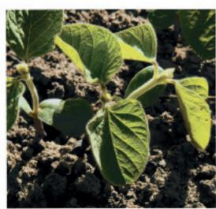

seedling population appear to be in Hardy–Weinberg equilibrium at day 7? Explain your reasoning and identify which genotypes, if any, appear to be selected for or against.

4. (a) Calculate the observed frequencies of genotypes $C^{G}C^{G}$ , $C^{G}C^{Y}$ , and $C^{Y}C^{Y}$ at day 21. (b) Compare these frequencies to the expected frequencies calculated in question 2 and to the observed frequencies at day 7. Is the seedling population in Hardy–Weinberg equilibrium at day 21? Explain your reasoning and identify which genotypes, if any, appear to be selected for or against.

5. Homozygous $C^{Y}C^{Y}$ individuals cannot produce chlorophyll. The ability to photosynthesize becomes more critical as seedlings age and begin to exhaust the supply of food that was stored in the seed from which they emerged. Develop a hypothesis that explains the data for days 7 and 21. Based on this hypothesis, predict how the frequencies of the $C^{G}$ and $C^{Y}$ alleles will change beyond day 21.

Instructors: A version of this Scientific Skills Exercise can be assigned in Mastering Biology.

The frequency of carriers, heterozygous people who do not have PKU but may pass the PKU allele to offspring, is

$$
2 p q = 2 \times 0. 9 9 \times 0. 0 1 = 0. 0 1 9 8
$$

(approximately 2% of the U.S. population)

Remember, the assumption of Hardy–Weinberg equilibrium yields an approximation; the real number of carriers may differ. Still, our calculations suggest that harmful recessive alleles at this and other loci can be concealed in a population because they are carried by healthy heterozygotes. The Scientific Skills Exercise provides another opportunity for you to apply the Hardy–Weinberg equation to allele data.

## Concept Check 23.2

1. A population has 85 individuals of genotype AA, 320 of genotype Aa, and 295 of genotype aa. Calculate the genotype frequencies and the frequencies of alleles A and a.

2. The frequency of allele $a$ is 0.45 for a population in Hardy-Weinberg equilibrium. What are the expected frequencies of genotypes $AA$ , $Aa$ , and $aa$ ?

3. A locus that affects susceptibility to a degenerative brain disease in mice has two alleles, V and v. In a sampled population, 16 mice have genotype VV, 92 have genotype Vv, and 12 have genotype vv. Historical data shows that 5 generations ago, 7 mice had genotype VV, 45 had genotype Vv, and 68 had genotype vv. How has the frequency of v changed over these 5 generations? Is the population evolving? Explain.

For suggested answers, see Appendix A.

## Concept 23.3: Natural selection, genetic drift, and gene flow can alter allele frequencies in a population

Note again the five conditions required for a population to be in Hardy–Weinberg equilibrium (see Table 23.1). A deviation from any of these conditions is a potential cause of evolution. New mutations (violation of condition 1) can alter allele frequencies, but because mutations are rare, the change from one generation to the next is likely to be very small. Remember as well that the occurrence of mutations is random. Nonrandom mating (violation of condition 2) can affect the frequencies of homozygous and heterozygous genotypes but by itself has no effect on allele frequencies in the gene pool. (Allele frequencies can change if individuals with certain inherited traits are more likely than other individuals to obtain mates. However, such a situation not only causes a deviation from random mating, but also violates condition 3, no natural selection.)

For the rest of this section we will focus on the three mechanisms that alter allele frequencies directly and cause most evolutionary change: natural selection, genetic drift, and gene flow (violations of conditions 3–5).

## Natural Selection

The concept of natural selection is based on differential success in survival and reproduction: Individuals in a population exhibit variations in their heritable traits, and those with traits that are better suited to their environment tend to produce more offspring than those with traits that are not as well suited.

In genetic terms, selection results in alleles being passed to the next generation in proportions that differ from the present generation. For example, the fruit fly D. melanogaster has an allele that confers resistance to the insecticide DDT. This allele has a frequency of 0% in laboratory strains of D. melanogaster from flies collected in the wild in the early 1930s, prior to DDT use. However, in strains established from flies collected after 1960 (following 20 or more years of DDT use), the allele frequency is 37%. Thus, this allele either arose by mutation between 1930 and 1960 or was present in 1930, but very rare. In any case, the rise in frequency of this allele most likely occurred because DDT is an effective poison that is a strong selective force in exposed fly populations.

As the D. melanogaster example suggests, an allele that confers resistance to an insecticide will increase in frequency in a population exposed to that insecticide. Such changes are not coincidental. By consistently favoring some alleles over others, natural selection can cause adaptive evolution, in which traits that enhance survival or reproduction tend to increase in frequency over time. We'll explore this process in Concept 23.4.

## Genetic Drift

If you flip a coin 1,000 times, a result of 700 heads and 300 tails might make you suspicious about that coin. But if you flip a coin only 10 times, an outcome of 7 heads and 3 tails would not be surprising. The smaller the number of coin flips, the more likely it is that chance alone will cause a deviation from the predicted result. (In this case, the prediction is an equal number of heads and tails.) Chance events can also cause allele frequencies to fluctuate unpredictably from one generation to the next, especially in small populations—a process called genetic drift.

Figure 23.9 models how genetic drift might affect a small population of our wildflowers. In this example, drift leads to the loss of an allele from the gene pool, but it is a matter of chance that the $C^{W}$ allele is lost and not the $C^{R}$ allele. Such unpredictable changes in allele frequencies can be caused by chance events associated with survival and reproduction. Perhaps a large animal such as a moose stepped on the three $C^{W}C^{W}$ individuals in generation 2, killing them and increasing the chance that only the $C^{R}$ allele would be passed to the next generation. Allele frequencies can also be affected by chance events that occur during fertilization. For example, suppose two individuals of genotype $C^{R}C^{W}$ had a small number of offspring. By chance alone, every egg and sperm pair that generated offspring could happen to have carried the $C^{R}$ allele and not the $C^{W}$ allele.

Certain circumstances can result in genetic drift having a significant impact on a population. Two examples are the founder effect and the bottleneck effect.

Figure 23.9 Genetic drift.

This small wildflower population has a stable size of ten plants. Suppose that by chance only five plants of generation 1 (those highlighted in yellow) produce fertile offspring. Again by chance, only two plants of generation 2 leave fertile offspring.

  
VISUAL SKILLS Based on this diagram, summarize how the frequency of the $C^{w}$ allele changes over time. For suggested answer, see Appendix A.

## The Founder Effect

When a few individuals become isolated from a larger population, this smaller group may establish a new population whose gene pool differs from the source population; this is called the founder effect. The founder effect might occur, for example, when a few members of a population are blown by a storm to a new island. Genetic drift, in which chance events alter allele frequencies, can occur in such a case because the storm indiscriminately transports some individuals (and their alleles), but not others, from the source population.

The founder effect probably accounts for the relatively high frequency of certain inherited disorders among isolated human populations. For example, in 1814, 15 British colonists founded a settlement on Tristan da Cunha, a group of small islands in the Atlantic Ocean midway between Africa and South America. Apparently, one of the colonists carried a recessive allele for retinitis pigmentosa, a progressive form of blindness that affects homozygous individuals. Of the founding colonists' 240 descendants on the island in the late 1960s, four had retinitis pigmentosa. The frequency of the allele that causes this disease is ten times higher on Tristan da Cunha than in the populations from which the founders came.

## The Bottleneck Effect

A sudden change in the environment, such as a fire or flood, may drastically reduce the size of a population. A severe drop in population size can cause the bottleneck effect, so named because the population has passed through a “bottleneck” that greatly

Figure 23.10 The bottleneck effect.

Shaking a few marbles through the neck of a bottle is analogous to a drastic reduction in the size of a population. By chance, blue marbles (alleles) are overrepresented in the surviving population and gold marbles (alleles) are absent.

  
reduces its size (Figure 23.10). By chance alone, certain alleles may be overrepresented among the survivors, others may be underrepresented, and some may be absent altogether. Ongoing genetic drift is likely to have substantial effects on the gene pool until the population becomes large enough that chance events have less impact. But even if a population that has passed through a bottleneck ultimately recovers in size, it may have low levels of genetic variation for a long period of time—a legacy of the genetic drift that occurred when the population was small.

## Case Study: Impact of Genetic Drift on the Greater Prairie Chicken

Human actions sometimes create severe bottlenecks. Millions of greater prairie chickens (Tympanuchus cupido) once lived on the prairies of Illinois. As these prairies were converted to farmland during the 1800s and 1900s, the number of greater prairie chickens plummeted (Figure 23.11a). By 1993, fewer than 50 birds remained. These few surviving birds had low levels of genetic variation, and less than 50% of their eggs hatched, compared with much higher hatching rates of the larger populations in Kansas and Nebraska (Figure 23.11b).

These data suggest that genetic drift during the bottleneck may have led to a loss of genetic variation and an increase in the frequency of harmful alleles. To investigate this hypothesis, researchers extracted DNA from 15 museum specimens of Illinois greater prairie chickens. Of the 15 birds, 10 had been collected in the 1930s, when there were 25,000 greater prairie chickens in Illinois, and 5 had been collected in the 1960s, when there were 1,000 greater prairie chickens in Illinois. By studying the DNA of these specimens, the researchers were able to obtain a minimum, baseline estimate of how much genetic variation was present in the Illinois population before the population shrank to extremely low numbers. This baseline estimate is a key piece of information that is not usually available in cases of population bottlenecks.

Figure 23.11 Genetic drift and loss of genetic variation.  
  
(a) The Illinois population of greater prairie chickens dropped from millions of birds in the 1800s to fewer than 50 birds in 1993.

<table><tr><td>Location</td><td>Population size</td><td>Number of alleles per locus</td><td>Percentage of eggs hatched</td></tr><tr><td>Illinois</td><td></td><td></td><td></td></tr><tr><td>1930–1960s</td><td>1,000–25,000</td><td>5.2</td><td>93</td></tr><tr><td>1993</td><td>&lt;50</td><td>3.7</td><td>&lt;50</td></tr><tr><td>Kansas, 1998 (no bottleneck)</td><td>750,000</td><td>5.8</td><td>99</td></tr><tr><td>Nebraska, 1998 (no bottleneck)</td><td>75,000–200,000</td><td>5.8</td><td>96</td></tr></table>

(b) In the small Illinois population, genetic drift led to decreases in the number of alleles per locus and the percentage of eggs hatched.

The researchers surveyed six loci and found that the 1993 population had fewer alleles per locus than the pre-bottleneck Illinois or the current Kansas and Nebraska populations (see Figure 23.11b). Thus, as predicted, drift had reduced the genetic variation of the small 1993 population. Drift may also have increased the frequency of harmful alleles, leading to the low egg-hatching rate. To counteract these negative effects, 271 birds from neighboring states were added to the Illinois population over four years. This strategy succeeded: New alleles entered the population, and the egg-hatching rate improved to over 90%. Overall, studies on the Illinois greater prairie chicken illustrate the powerful effects of genetic drift in small populations and provide hope that in at least some populations, these effects can be reversed.

## Effects of Genetic Drift: A Summary

The examples we've described highlight four key points:

1. Genetic drift is significant in small populations. Chance events can cause an allele to be disproportionately over- or underrepresented in the next generation. Although chance events occur in populations of all sizes, they tend to alter allele frequencies substantially only in small populations.

2. Genetic drift can cause allele frequencies to change at random. Because of genetic drift, an allele may increase in frequency one year, then decrease the next; the change from year to year is not predictable. Thus, unlike natural selection, which in a given environment consistently favors some alleles over others, genetic drift causes allele frequencies to change at random over time.

3. Genetic drift can lead to a loss of genetic variation within populations. By causing allele frequencies to fluctuate randomly over time, genetic drift can eliminate alleles from a population. Because evolution depends on genetic variation, such losses can influence how effectively a population can adapt to a change in the environment.

4. Genetic drift can cause harmful alleles to become fixed. Alleles that are neither harmful nor beneficial can be lost or become fixed (reach a frequency of $100\%$ ) by chance through genetic drift. In very small populations, genetic drift can also cause alleles that are slightly harmful to become fixed. When this occurs, the population's survival can be threatened (as in greater prairie chickens).

## Gene Flow

Natural selection and genetic drift are not the only phenomena affecting allele frequencies. Allele frequencies can also change by gene flow, the transfer of alleles into or out of a population

Figure 23.12 Gene flow and local adaptation in the Lake Erie water snake (Nerodia sipedon).

Researchers assigned letters to variations in coloration in N. sipedon populations. Color pattern A is strong banding, patterns B and C are intermediate banding, and pattern D is no banding. Banding is advantageous for camouflage in mainland environments, whereas having no bands is advantageous in island environments. However, gene flow from the mainland causes banding to persist in island populations.

Unbanded N. sipedon (Pattern D)

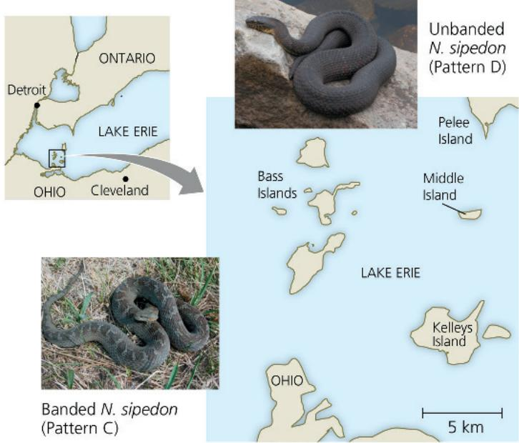  
Banded N. sipedon (Pattern C)

  
WHAT IF? Suppose a severe weather event caused island populations to decrease in size but did not affect the size of mainland populations. Predict how gene flow from the mainland would affect color patterns in island populations in the year immediately after the storm. Explain.  
For suggested answer, see Appendix A.

due to the movement of fertile individuals or their gametes. For example, suppose that near our original hypothetical wildflower population there is another population consisting primarily of white-flowered individuals ( $C^{W}C^{W}$ ). Insects carrying pollen from these plants may fly to and pollinate plants in our original population. The introduced $C^{W}$ alleles would modify our original population's allele frequencies in the next generation. Because alleles are transferred between populations, gene flow tends to reduce the genetic differences between populations. In fact, if it is extensive enough, gene flow can result in two populations combining into a single population with a common gene pool.

Alleles transferred by gene flow can also affect how well populations are adapted to local environmental conditions. For instance, mainland and island populations of the Lake Erie water snake (Nerodia sipedon) differ in their color patterns (Figure 23.12): Nearly all snakes from the Ohio or Ontario mainlands are strongly banded, whereas the majority of snakes from islands are unbanded or intermediate. Banding coloration is an inherited trait, determined by a few loci (with alleles that encode bands being dominant to alleles that encode the absence of bands). On islands, water snakes live along rocky shorelines, while on the mainland, they live in marshes. Snakes without bands are more well camouflaged in island habitats than are snakes with bands. Hence, on islands, snakes without bands survive at higher rates than do snakes with bands.

These data indicate that snakes without bands are favored by natural selection in island populations. Thus, we might expect that all snakes on islands would lack bands. Why is this not the case? The answer lies in gene flow from the mainland. In any given year, three to ten snakes from the mainland swim to the islands and join the populations there. As a result, each year such migrants transfer alleles for banded coloration from the mainland (where nearly all snakes have bands) to the islands. This ongoing gene flow has prevented selection from removing all of the alleles for banded coloration from island populations—thereby preventing island populations from adapting fully to local conditions.

Gene flow can also transfer alleles that improve the ability of populations to adapt to local conditions. For example, gene flow has resulted in the worldwide spread of several insecticide resistance alleles in the mosquito Culex pipiens, a vector of West Nile virus and other diseases. Each of these alleles has a unique genetic signature that allowed researchers to document that it arose by mutation in only one or a few geographic locations. In their population of origin, these alleles increased because they provided insecticide resistance. These alleles were then transferred by gene flow to other populations exposed to insecticides, where again, their frequencies increased as a result of natural selection.

Finally, gene flow has become an increasingly important agent of evolutionary change in human populations. Humans today move much more freely about the world than in the past. As a result, mating is more common between members of populations that previously had very little contact, leading to an exchange of alleles and fewer genetic differences between those populations.

## Concept Check 23.3

1. In what sense is natural selection more "predictable" than genetic drift?

2. Distinguish genetic drift from gene flow in terms of (a) how they occur and (b) their implications for future genetic variation in a population.

3. WHAT IF? Suppose two plant populations exchange pollen and seeds. In one population, individuals of genotype AA are most common (9,000 AA, 900 Aa, 100 aa), while the opposite is true in the other population (100 AA, 900 Aa, 9,000 aa). If neither allele has a selective advantage, what will happen over time to the allele and genotype frequencies of these populations?

# Concept 23.4: Natural selection is the only mechanism that consistently causes adaptive evolution

Evolution by natural selection is a blend of chance and “sorting”: chance in the existence of new genetic variation (as in pre-existing mutation) and sorting as natural selection favors some traits over others. Because of this favoring process, the outcome of natural selection is not random. Instead, natural selection consistently increases the frequencies of alleles that provide reproductive advantage, thus leading to adaptive evolution.

## Natural Selection: A Closer Look

To see how natural selection can cause adaptive evolution, we'll begin with the concept of relative fitness and the different ways that selection acts on an organism's phenotype.

## Relative Fitness

The phrases “struggle for existence” and “survival of the fittest” are commonly used to describe natural selection, but these expressions are misleading if always taken to mean direct competitive contests among individuals. There are animal species in which individuals, usually the males, lock horns or otherwise do combat to determine mating privilege. But reproductive success is generally more subtle and depends on many factors besides outright battle. For example, a barnacle that is more efficient at collecting food than its neighbors may have greater stores of energy and hence be able to produce a larger number of eggs. A moth may have more offspring than other moths in the same population because its body colors more effectively conceal it from predators, improving its chance of surviving long enough to produce more offspring. These examples illustrate how in a given environment, certain traits can lead to greater relative fitness: the contribution an individual makes to the gene pool of the next generation relative to the contributions of other individuals.

Although we often refer to the relative fitness of a genotype, remember that the entity that is subjected to natural selection is the whole organism, not the underlying genotype. Thus, selection acts directly on the phenotype rather than on the genotype; it acts on the genotype indirectly, via how the genotype affects the phenotype.

## Directional, Disruptive, and Stabilizing Selection

Natural selection can alter the frequency distribution of heritable traits in three ways, depending on which phenotypes in a population are favored: through directional selection, disruptive selection, and stabilizing selection.

Directional selection occurs when conditions favor individuals exhibiting one extreme of a phenotypic range, thereby shifting a population's frequency curve for the phenotypic character in one direction or the other (Figure 23.13a). Directional selection is common when a population's environment changes or when members of a population migrate to a new (and different) habitat. For instance, an increase in the relative abundance of large seeds over small seeds led to an increase in beak depth in a population of Galápagos finches (see Figure 23.2).

Disruptive selection (Figure 23.13b) occurs when conditions favor individuals at both extremes of a phenotypic range over individuals with intermediate phenotypes. One example is a population of black-bellied seedcracker finches in Cameroon whose members display two distinctly different beak sizes. Small-billed birds feed mainly on soft seeds, whereas large-billed birds specialize in cracking hard seeds. It appears that birds with intermediate-sized bills are relatively inefficient at cracking both types of seeds and thus have lower relative fitness.

Stabilizing selection (Figure 23.13c) acts against both extreme phenotypes and favors intermediate variants. This mode of selection reduces variation and tends to maintain the status quo for a particular phenotypic character. For example, the birth weights of most human babies lie in the range of 3–4 kg (6.6–8.8 pounds). Babies who are much smaller suffer considerably higher rates of mortality; babies who are much larger show a slight increase in mortality.

Regardless of which type of selection occurs, however, the basic mechanism remains the same. Selection favors individuals whose heritable phenotypic traits provide higher reproductive success than do the traits of other individuals.

## The Key Role of Natural Selection in Adaptive Evolution

The adaptations of organisms include many striking examples. Certain octopuses, for example, have the ability to change color rapidly, enabling them to blend into different backgrounds. Another example is the remarkable jaws of snakes (Figure 23.14), which allow them to swallow prey much larger than their own head (a feat analogous to a person swallowing a whole watermelon). Other adaptations, such as a version of an enzyme that shows improved function in cold environments, may be less visually dramatic but just as important for survival and reproduction.

Such adaptations can arise gradually over time as natural selection increases the frequencies of alleles that enhance survival or reproduction. As the proportion of individuals that have favorable traits increases, the degree to which a species is well suited for life in its environment improves; that is, adaptive evolution occurs. However, the physical and biological components of an organism's environment may

Frequency of individuals

Figure 23.13 Modes of selection. These cases describe three ways in which a hypothetical deer mouse population with heritable variation in fur coloration might evolve. The graphs show how the frequencies of individuals with different fur colors change over time. The large white arrows symbolize selective pressures against certain phenotypes.

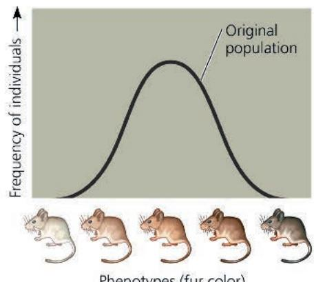

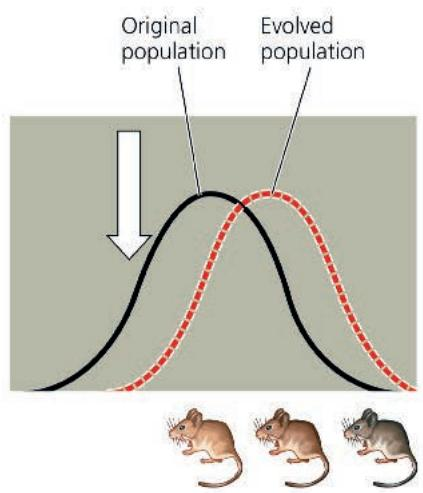  
(a) Directional selection shifts the overall makeup of the population by favoring variants that are at one extreme of the distribution. In this case, lighter mice are selected against because they live among dark rocks, making it harder for them to hide from predators.

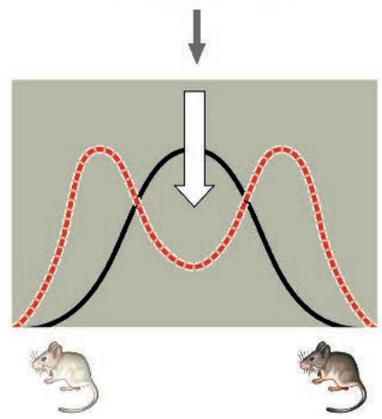  
(b) Disruptive selection favors variants at both ends of the distribution. These mice have colonized a patchy habitat made up of light and dark rocks, with the result that mice of an intermediate color are selected against.

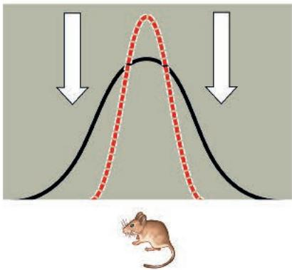  
(c) Stabilizing selection removes extreme variants from the population and preserves intermediate types. If the environment consists of rocks of an intermediate color, both light and dark mice will be selected against.  
MAKE CONNECTIONS Review Figure 22.13. Which mode of selection has occurred in soapberry bug populations that feed on the introduced golden rain tree? Explain.  
The bones of the upper jaw that are shown in green are movable.

For suggested answer, see Appendix A.

Figure 23.14 Movable jaw bones in snakes.

change over time. As a result, what constitutes a “good match” between an organism and its environment can be a moving target, making adaptive evolution a continuous, dynamic process. Note that fitness is relative not only to the environment, but also to the other members of the population; it is not an absolute measure. Environmental conditions can also differ from place to place, causing different alleles to be favored in different locations. When this occurs, natural selection can cause the populations of a species to differ genetically from one another.

  
The skull bones of most terrestrial vertebrates are relatively rigidly attached to one another, limiting jaw movement. In contrast, most snakes have movable bones in their upper jaw, allowing them to swallow food much larger than their head.

And what about genetic drift and gene flow? Both can, in fact, increase the frequencies of alleles that enhance survival or reproduction, but neither does so consistently. Genetic drift can cause the frequency of a slightly beneficial allele to increase, or, alternately, to decrease. Similarly, gene flow may introduce alleles that are advantageous or ones that are disadvantageous. Natural selection is the only evolutionary mechanism that consistently leads to adaptive evolution.

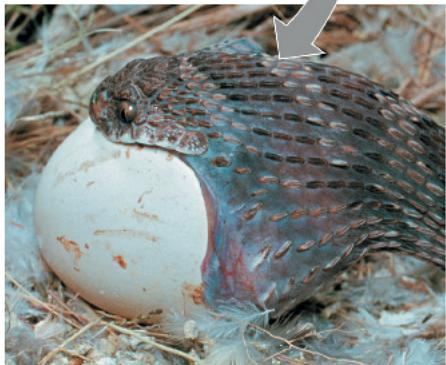

Survival and growth of these half-sibling offspring compared

## Sexual Selection

Charles Darwin was the first to explore the implications of sexual selection, a process in which individuals with certain inherited characteristics are more likely than other individuals of the same sex to obtain mates. Sexual selection can result in sexual dimorphism, a difference in secondary sexual characteristics between males and females of the same species (Figure 23.15). These distinctions include differences in size, color, ornamentation, and behavior.

How does sexual selection operate? There are several ways. In intrasexual selection, meaning selection within the same sex, individuals of one sex compete directly for mates of the opposite sex. In many species, intrasexual selection occurs among males. For example, a single male may patrol a group of females and prevent other males from mating with them. The patrolling male may defend his status by defeating smaller, weaker, or less fierce males in combat. More often, this male is the psychological victor in ritualized displays that discourage would-be competitors but do not risk injury that would reduce his own fitness (see Figure 51.16). Intrasexual selection also occurs among females in a variety of species, including ring-tailed lemurs and broadnosed pipefish.

In intersexual selection, also called mate choice, individuals of one sex (usually the females) are choosy in selecting their mates from the other sex. In many cases, the female's choice depends on the showiness of the male's appearance or behavior (see Figure 23.15). What intrigued Darwin about mate choice is that male showiness may not seem adaptive in any other way and may in fact pose some risk. For example, bright plumage may make male birds more visible to predators. But if such characteristics help a male gain a mate, and if this benefit outweighs the risk from predation, then both the bright plumage and the female preference for it will be reinforced because they enhance overall reproductive success.

Figure 23.15 Sexual dimorphism and sexual selection.  
A peacock (left) and a peahen (right) show extreme sexual dimorphism. There is intrasexual selection between competing males, followed by intersexual selection when the females choose among the showiest males.  
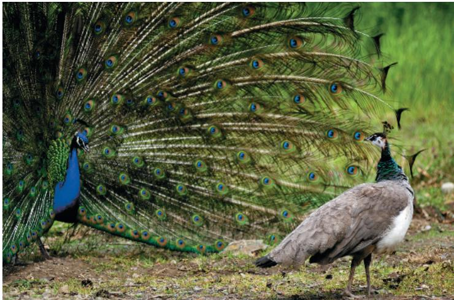

## Figure 23.16

## Inquiry: Do females select mates based on traits indicative of “good genes”?

## Experiment

Female gray tree frogs (Hyla versicolor) prefer to mate with males that give long mating calls. To test whether the genetic makeup of long-calling (LC) males is superior to that of short-calling (SC) males, researchers fertilized half the eggs of each female with sperm from an LC male and the other half with sperm from an SC male. In two separate experiments (one in 1995, one in 1996), the resulting half-sibling offspring were raised in a common environment, and their survival and growth were monitored.

## Results

<table><tr><td>Offspring Performance</td><td>1995</td><td>1996</td></tr><tr><td>Larval survival</td><td>LC* better</td><td>NSD**</td></tr><tr><td>Larval growth</td><td>NSD</td><td>LC better</td></tr><tr><td>Time to metamorphosis</td><td>LC better (shorter)</td><td>LC better (shorter)</td></tr></table>

\*LC better = offspring of LC males superior to offspring of SC males; \*\*NSD = no significant difference.

## Conclusion

Because offspring fathered by an LC male outperformed their half-siblings fathered by an SC male, the team concluded that the duration of a male's mating call is indicative of the male's overall genetic quality. This result supports the hypothesis that female mate choice can be based on a trait that indicates whether the male has “good genes.”

Data from A. M. Welch et al., Call duration as an indicator of genetic quality in male gray tree frogs, Science 280:1928–1930 (1998).

INQUIRY IN ACTION Read and analyze the original paper in Inquiry in Action: Interpreting Scientific Papers.

WHAT IF? Why did the researchers split each female frog's eggs into two batches for fertilization by different males? Why didn't they mate each female with a single male frog?

For suggested answer, see Appendix A.

How do female preferences for certain male characteristics evolve in the first place? One hypothesis is that females prefer male traits that are correlated with “good genes.” If the trait preferred by females is indicative of a male’s overall genetic quality, both the male trait and female preference for it should increase in frequency. Figure 23.16 describes one experiment testing this hypothesis in gray tree frogs.

In several bird species, the traits preferred by females are related to overall male health. Here, too, female preference appears to be based on traits that reflect “good genes”—in this case, alleles indicative of a robust immune system.

## Balancing Selection

The examples of selection that we have reviewed so far are all examples of selection reducing variation in a population. Sometimes, however, selection results in preserving variation at some loci, maintaining two or more phenotypic forms in a population and thereby the alleles that code for them. Known as balancing selection because it maintains genetic variation, this type of selection includes frequency-dependent selection and heterozygote advantage.

## Frequency-Dependent Selection

In frequency-dependent selection, the fitness of a phenotype depends on how common it is in the population. Consider the scale-eating fish (Perissodus microlepis) of Lake Tanganyika, in Africa. These fish attack other fish from behind, darting in to remove a few scales from the flank of their prey. Of interest here is a peculiar feature of the scale-eating fish: Some are “left-mouthed” and some are “right-mouthed.”

Because their mouth twists to the left, left-mouthed fish typically attack their prey's right flank (Figure 23.17). (To see why, twist your lower jaw and lips to the left and imagine trying to take a bite from the left side of a fish, approaching it from behind.) Similarly, right-mouthed fish attack from the left. Prey species guard against attack from whatever phenotype of scale-eating fish is most common. Thus, from year to year, selection favors whichever mouth phenotype is least common. As a result, the frequency of left- and right-mouthed fish oscillates over time, and this balancing selection keeps the frequency of each phenotype close to $50\%$ .

## Heterozygote Advantage

If individuals who are heterozygous at a particular locus have greater fitness than do both kinds of homozygotes, they exhibit heterozygote advantage. In such a case, natural selection tends to maintain two or more alleles at that locus. For example, if the phenotype of a heterozygote is intermediate to the phenotypes of both homozygotes, then heterozygote advantage is a form of stabilizing selection.

An example of heterozygote advantage occurs at the locus in humans that codes for the $\beta$ polypeptide subunit of hemoglobin,

Figure 23.17 Frequency-dependent selection.

In a population of the scale-eating fish Perissodus microlepis, the frequency of left-mouthed individuals (square red data points) rises and falls in a regular manner. The black data points (round) indicate the frequency of left-mouthed individuals among adults that reproduced in three sample years.

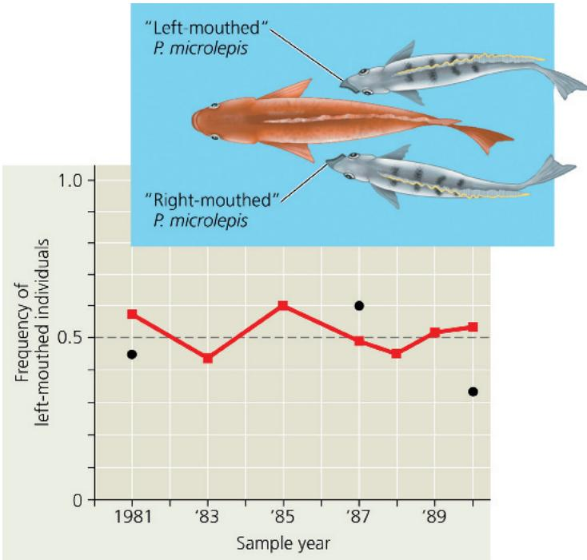  
INTERPRET THE DATA For 1981, 1987, and 1990, compare the frequency of left-mouthed individuals among breeding adults to the frequency of left-mouthed individuals in the entire population. What do the data indicate about when natural selection favors left-mouthed individuals over right-mouthed individuals (or vice versa)? Explain.

the oxygen-carrying protein of red blood cells. In homozygous individuals, a recessive allele at that locus causes sickle-cell disease. The red blood cells of people with sickle-cell disease become distorted in shape, or sickled, under low-oxygen conditions (see Figure 5.19). These sickled cells can clump together and block the flow of blood in the capillaries, damaging organs such as the kidney, heart, and brain. Although some red blood cells become sickled in heterozygotes, not enough become sickled to cause sickle-cell disease.

As described in Figure 23.18, heterozygotes for the sickle-cell allele are protected against the most severe effects of malaria, a disease caused by a parasite that infects red blood cells. One reason for this partial protection is that the body destroys sickled red blood cells rapidly, killing the parasites they harbor. Malaria is a major killer in some tropical regions. In such regions, selection favors heterozygotes over homozygous dominant individuals, who are more vulnerable to the effects of malaria, and also over homozygous recessive individuals, who develop sickle-cell disease. These selective pressures have caused the frequency of the sickle-cell allele to reach relatively high levels in areas where the malaria parasite, which is carried by mosquitoes, is common.

## Make Connections: The Sickle-Cell Allele

Figure 23.18

This child has sickle-cell disease, a genetic condition that strikes individuals who have two copies of the sickle-cell allele. This allele causes an abnormality in the structure and function of hemoglobin, the oxygen-carrying protein in red blood cells. Although sickle-cell disease is lethal if not treated, in some regions the sickle-cell allele can reach frequencies as high as 15–20%. How can such a harmful allele be so common?

## Events at the Molecular Level

\- Due to a point mutation, the sickle-cell allele differs from the wild-type allele by a single nucleotide. (See Figure 17.26.)

\- The resulting change in one amino acid leads to hydrophobic interactions between the sickle-cell hemoglobin proteins under low-oxygen conditions.

\- As a result, the sickle-cell proteins bind to each other in chains that together form a fiber.

Template strand

Sickle-cell allele on chromosome

A T C G C T A C G T A T A C G

## Consequences for Cells

\- The abnormal hemoglobin fibers distort the red blood cell into a sickle shape under low-oxygen conditions, such as those found in small blood vessels returning to the heart.

Fiber

An adenine has replaced a thymine in the template strand of the sickle-cell allele, changing one codon in the mRNA produced during transcription. This change causes an amino acid change in sickle-cell hemoglobin: A valine replaces a glutamic acid at one position. (See Figure 5.19.)

Sickle-cell hemoglobin

Low-oxygen conditions

Wild-type allele

Sickled red blood cell

Normal hemoglobin (does not aggregate into fibers)

Normal red blood cell

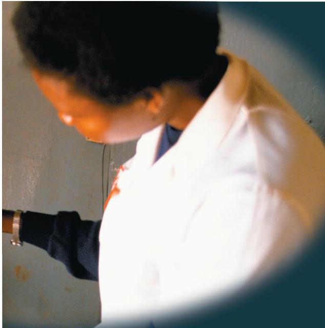

Effects on Individual Organisms
• The formation of sickled red blood cells causes homozygotes with two copies of the sickle-cell allele to have sickle-cell disease.
• Some sickling also occurs in heterozygotes, but not enough to cause the disease; they have sickle-cell trait. (See Figure 14.17.)

The sickled blood cells of a homozygote block small blood vessels, causing great pain and damage to organs such as the heart, kidney, and brain.

Infected mosquitoes spread malaria when they bite people. (See Figure 28.12)

## Evolution in Populations

\- Homozygotes with two sickle-cell alleles are strongly selected against because of mortality caused by sickle-cell disease. In contrast, heterozygotes experience few harmful effects from sickling yet are more likely to survive malaria than are homozygotes.

\- In regions where malaria is common, the net effect of these opposing selective forces is heterozygote advantage. This has caused evolutionary change in populations—the products of which are the areas of relatively high frequencies of the sickle-cell allele shown in the map.

Normal red blood cells are flexible and are able to flow freely through small blood vessels.

Key
Frequencies of the sickle-cell allele
3.0–6.0%
6.0–9.0%
9.0–12.0%
12.0–15.0%
>15.0%

Distribution of malaria caused by Plasmodium falciparum (a parasitic unicellular eukaryote

## Why Natural Selection Cannot Fashion Perfect Organisms

Though natural selection leads to adaptation, nature abounds with examples of organisms that are less than ideally suited for their lifestyles. There are several reasons why.

1. Selection can act only on existing variations. Natural selection favors only the fittest phenotypes among those currently in the population, which may not be the ideal traits. New advantageous alleles do not arise on demand. For example, historically, snowshoe hares (Lepus americanus) have molted, changing their coats from brown to white, at a time of year that matched the onset of snowfall, providing camouflage all winter. But due to climate change, the first snowfall now occurs later in the year. In some populations, the date at which the hares change their coat color has remained the same, causing the hares to be poorly camouflaged early in winter and thus easier for predators to spot and kill (Figure 23.19). Because their gene pools lack alleles that could delay when molting occurs, these populations have been unable to adapt to changing conditions.

2. Evolution is limited by historical constraints. Each species has a legacy of descent with modification from ancestral forms. Evolution does not scrap the ancestral anatomy and build each new complex structure from scratch; rather, evolution co-opts existing structures and adapts them to new situations. We could imagine that if a terrestrial animal were to adapt to an environment in which flight would be advantageous, it might be best just to grow an extra pair of limbs that would serve as wings. However, evolution does not work this way; instead, it operates on the traits an organism already has. Thus, in birds and bats, an existing pair of limbs took on new functions for flight as these organisms evolved from nonflying ancestors.

3. Adaptations are often compromises. Each organism must do many different things. A seal spends part of its time on rocks; it could probably walk better if it had legs instead of flippers, but then it would not swim nearly as well. We humans owe much of our versatility and athleticism to our prehensile hands and flexible limbs, but these also make us prone to sprains, torn ligaments, and dislocations: Structural reinforcement has been compromised for agility. Organisms face many such trade-offs in which the ability to perform one function may reduce the ability to perform another—and as with seals and humans, those trade-offs can restrict adaptive evolution.

4. Chance, natural selection, and the environment interact. Chance events can affect the subsequent evolutionary history of populations. For instance, when a storm blows insects or birds hundreds of kilometers over an ocean to an island, the wind does not necessarily transport those individuals that are best suited to the new environment. Thus, not all alleles present in the founding population's gene pool are better suited to the new environment than the alleles that are "left behind." In addition, the environment at a particular location may change unpredictably from year to year, again limiting the extent to which adaptive evolution results in organisms being well suited for current environmental conditions.

With these four constraints, evolution does not result in perfect organisms. Natural selection operates on a “better than” basis. We can, in fact, see evidence for evolution in the many imperfections of the organisms it produces.

## Figure 23.19 Lack of variation in a population can limit adaptation.

For the snowshoe hare, changing its coat color from brown (a) to white (b) too early is disadvantageous, but the population lacks alleles that would encode a delay in molting.

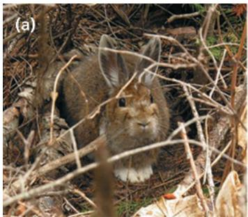

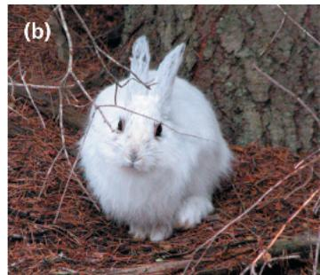

## Concept Check 23.4

1. What is the relative fitness of a sterile mule? Explain.

2. Explain why natural selection is the only mechanism that consistently leads to adaptive evolution in a population.

3. VISUAL SKILLS Consider a population in which heterozygotes at a certain locus have an extreme phenotype (such as being larger than homozygotes) that confers a selective advantage. Compare this description to the three types of selection shown in Figure 23.13. Does this situation represent directional, disruptive, or stabilizing selection? Explain.

For suggested answers, see Appendix A.

# Chapter 23 Review

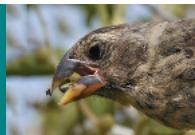

## Summary of Key Concepts

To review key terms, go to the Vocabulary Self-Quiz (eTextbook only).

## Concept 23.1: Genetic variation makes evolution possible

\- Genetic variation refers to genetic differences among individuals within a population.

\- The nucleotide differences that provide the basis of genetic variation originate when mutation and gene duplication produce new alleles and new genes. New genetic variants are produced rapidly in organisms with short generation times. In sexually reproducing organisms, most of the genetic differences among individuals result from crossing over, the independent assortment of chromosomes, and fertilization.

Typically, most of the nucleotide variability that occurs within a genetic locus does not affect the phenotype. Explain why.

## Concept 23.2: The Hardy–Weinberg equation is a model of no evolution occurring for a given gene

\- A population, a localized group of organisms belonging to one species, is united by its gene pool, the aggregate of all the alleles in the population.

\- In the absence of a reason for an allele to increase or decrease in frequency within a population, no change will happen. The assumptions of the Hardy–Weinberg model (see Table 23.1) correspond to mechanisms of evolution (changes in allele frequency). We can use the Hardy–Weinberg model to predict genotype frequencies from allele frequencies. By rejecting the Hardy–Weinberg model, we can demonstrate that evolution is occurring for a given gene.

One of the five conditions for Hardy–Weinberg equilibrium (see Table 23.1) does not on its own result in a change in allele frequency over generations. Which condition is it, and why?

## Concept 23.3: Natural selection, genetic drift, and gene flow can alter allele frequencies in a population

\- In natural selection, individuals that have certain inherited traits tend to survive and reproduce at higher rates than other individuals because of those traits.

\- In genetic drift, chance fluctuations in allele frequencies over generations tend to reduce genetic variation.

\- Gene flow, the transfer of alleles between populations, tends to reduce genetic differences between populations over time.

Would two small, geographically isolated populations in very different environments be likely to evolve in similar ways? Explain.

## Concept 23.4: Natural selection is the only mechanism that consistently causes adaptive evolution

\- One organism has greater relative fitness than another organism if it leaves more fertile descendants. The modes of natural selection differ in their effect on phenotype:

Original population Evolved population

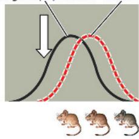

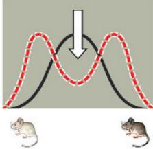  
Directional selection  
Disruptive selection

  
Stabilizing selection

\- Unlike genetic drift and gene flow, natural selection consistently increases the frequencies of alleles that enhance survival and reproduction, thus improving the degree to which organisms are well-suited for life in their environment.

\- Sexual selection can result in secondary sex characteristics that can give individuals advantages in mating.

\- Balancing selection occurs when natural selection maintains two or more forms in a population.

\- There are constraints to evolution: Natural selection can act only on available variation; structures result from modified ancestral anatomy; adaptations are often compromises; and chance, natural selection, and the environment interact.

How might secondary sex characteristics in males differ from those in females in a species in which females compete for mates? For suggested answers, see Appendix A.

## Test Your Understanding

For more multiple-choice questions, go to the Practice Test (eTextbook only).

## Levels 1-2: Remembering/Understanding

1. Natural selection changes allele frequencies based on differential survival and reproduction of

(A) alleles.

(B) loci.

(C) species.

(D) individuals.

2. No two people are genetically identical, except for identical twins. The main source of genetic variation among humans is (A) new mutations that occurred in the preceding generation.

(B) genetic drift.

(C) the reshuffling of alleles in sexual reproduction.

(D) environmental effects.

## Levels 3-4: Applying/Analyzing

3. If the nucleotide variability of a locus equals 0%, what is the gene variability and number of alleles at that locus?

(A) gene variability = 0%; number of alleles = 0

(B) gene variability = 0%; number of alleles = 1

(C) gene variability = 0%; number of alleles = 2

(D) gene variability > 0%; number of alleles = 2

4. One population of a species has 25 individuals, all with genotype AA; a second population of this species has 40 individuals, all with genotype aa. Assume that these populations live far apart but in similar environmental conditions. Based on this information, the observed genetic variation most likely resulted from

(A) genetic drift.

(B) gene flow.

(C) nonrandom mating.

(D) directional selection.

5. A fruit fly population has a gene with two alleles, $A1$ and $A2$ . Tests show that $70\%$ of the gametes produced in the population contain the $A1$ allele. If the population is in Hardy-Weinberg equilibrium, what proportion of the flies carry both $A1$ and $A2$ ?

(A) 0.7

(B) 0.49

(C) 0.42

(D) 0.21

## Levels 5-6: Evaluating/Creating

6. EVOLUTION CONNECTION Using at least two examples, explain how the process of evolution is revealed by the imperfections of living organisms.

7. SCIENTIFIC INQUIRY • INTERPRET THE DATA For populations of the marine mussel Mytilus edulis around Long Island, New York, researchers measured the frequency of a particular allele ( $lap^{94}$ ) for an enzyme involved in regulating the mussel's saltwater balance. They presented their data as a series of pie charts linked to sampling sites within Long Island Sound, where the salinity is highly variable, and along the coast of the open ocean, where salinity is constant. (a) Create a data table for the 11 sampling sites by estimating the frequency of $lap^{94}$ from the pie charts. (b) Graph the frequencies for sites 1–8 to show how the frequency of this allele changes with increasing salinity in Long Island Sound (from southwest to northeast). Evaluate how the data from sites 9 to 11 compare with the data from the sites within the Sound. (c) Considering the various mechanisms that can alter allele frequency, construct a hypothesis that explains the patterns in the data and that accounts for the following observations: (1) The $lap^{94}$ allele helps mussels maintain osmotic balance in water with a high salt concentration but is costly to use in less salty water and (2) mussels produce larvae that can disperse long distances before they settle on rocks and grow into adults.

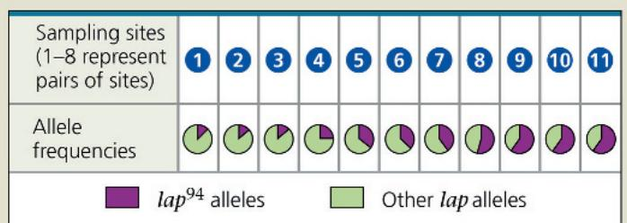  
Data from R. K. Koehn and T. J. Hilbish, The adaptive importance of genetic variation, American Scientist 75:134–141 (1987).  
Salinity increases toward the open ocean

8. WRITE ABOUT A THEME: ORGANIZATION Heterozygotes at the sickle-cell locus produce both normal and abnormal (sickle-cell) hemoglobin (see Concept 14.4). When hemoglobin molecules are packed into a heterozygote's red blood cells, some cells receive relatively large quantities of abnormal hemoglobin, making these cells prone to sickling. In a short essay (approximately 100–150 words), explain how these molecular and cellular events lead to emergent properties at the individual and population levels of biological organization.

## 9. SYNTHESIZE YOUR KNOWLEDGE

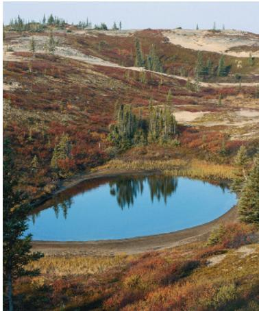

The lake shown in this photograph, called a kettle lake, formed 14,000 years ago when a glacier that covered the surrounding area melted. Initially devoid of animal life, over time the lake was colonized by invertebrates and other animals. Hypothesize how mutation, natural selection, genetic drift, and gene flow may have affected populations that colonized the lake.

## Practice Applying Your Learning

10. This question assesses your ability to apply your understanding of Hardy-Weinberg Equilibrium to a new scenario.

The Eastern gray squirrel (Sciurus carolinensis) is widespread across eastern North America. Most S. carolinensis have gray fur, but in some populations there is a sizeable number of squirrels with black fur. The black-fur version of this species results when squirrels are homozygous for a gene that controls the deposition of melanin into their fur. Individuals that are heterozygous for this gene have gray-black fur. Two squirrels with gray fur can only have offspring with gray fur, and two squirrels with black fur can only have offspring with black fur; however, a pair of squirrels with gray-black fur can have offspring of any of the three phenotypes.

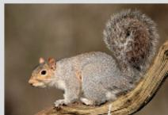  
Gray S. carolinensis (homozygous)

  
Gray-black S. carolinensis (heterozygous)

  
Black S. carolinensis (homozygous)  
(continued)

Some researchers have observed that the frequency of squirrels with black fur is often higher in northern S. carolinensis populations compared to southern populations, a pattern that is hypothesized to result from a thermal advantage to the black phenotype (their darker fur absorbs more solar energy and keeps them warmer in the relatively cooler northern locations).

A squirrel population in New York has been observed over the past 10 years. This table shows counts of each phenotype that were observed each year.

<table><tr><td rowspan="2">Year</td><td colspan="4">S. carolinensis Counts (NY)</td></tr><tr><td>Gray</td><td>Gray-black</td><td>Black</td><td>Total</td></tr><tr><td>2015</td><td>50</td><td>10</td><td>6</td><td>66</td></tr><tr><td>2017</td><td>61</td><td>8</td><td>10</td><td>79</td></tr><tr><td>2019</td><td>49</td><td>11</td><td>10</td><td>70</td></tr><tr><td>2021</td><td>66</td><td>10</td><td>11</td><td>87</td></tr><tr><td>2023</td><td>52</td><td>12</td><td>9</td><td>73</td></tr><tr><td>2025</td><td>62</td><td>6</td><td>10</td><td>78</td></tr></table>

# Explore Scientific Papers with Science in the Classroom | AAAS

Based on the given information and your knowledge of Hardy–Weinberg equilibrium, evaluate each statement as more likely to be TRUE or more likely to be FALSE.

a. The alleles in this scenario show incomplete dominance. \_\_\_\_

b. The frequency of the gray allele (p) in 2015 is 0.83.

d. The researchers could evaluate whether the fur-pigmentation gene is in Hardy–Weinberg equilibrium in any given year by determining p and q for that year. \_\_\_\_

How does a native species evolve in response to an introduced species? Go to “There’s a New Kid in Town” at www.scienceintheclassroom.org.

e. Comparing 2015 data to 2025 data, the researchers should conclude that this gene is in Hardy–Weinberg equilibrium. \_\_\_\_

c. The frequency of the black allele (q) in 2025 is 0.13.

f. CHALLENGE: The researchers should conclude that there is a selective advantage to the black fur phenotype because it has become more common over time.

g. CHALLENGE: These data are sufficient to reject the hypothesis that black fur provides a thermal advantage. \_\_\_\_

Instructors: Questions can be assigned in Mastering Biology.

# The Origin of Species

## Key Concepts

24.1 The biological species concept emphasizes reproductive isolation

24.2 Speciation can take place with or without geographic separation

24.3 Hybrid zones reveal factors that cause reproductive isolation

24.4 Speciation can occur rapidly or slowly and can result from changes in few or many genes

## Study Tip

Make a table: Some processes that can lead to speciation only occur in allopatric (geographically separated) populations, while others also occur in sympatric (geographically overlapping) populations. To help you keep track of these processes and the geographic conditions under which they can occur, fill in the table as you read the chapter.

<table><tr><td>Process(include page #or figure #)</td><td>Can occur inallopatricpopulations(yes/no)?</td><td>Can occur insympatricpopulations(yes/no)?</td></tr><tr><td>Sexual selection(Figure 24.12)</td><td>Yes</td><td>Yes</td></tr><tr><td></td><td></td><td></td></tr><tr><td></td><td></td><td></td></tr></table>

Figure 24.1 This flightless cormorant is one of many species in the Galápagos Islands that are found nowhere else in the world. How did a bird that cannot fly come to live in this isolated place? When Darwin visited the Galápagos, he also was intrigued by its unique species, and later concluded that they must have originated in the islands from ancestors that had traveled from South America.  
Over time, populations of a single species connected by gene flow can diverge genetically, giving rise to a new species:

## How do new species originate from existing species?

When Darwin came to the Galápagos Islands, he noted that they were teeming with unique species, like the flightless bird in Figure 24.1. Later, he realized that these species had formed relatively recently, writing in his diary, “Both in space and time, we seem to be brought somewhat near to that great fact—that mystery of mysteries—the first appearance of new beings on this Earth.”

The “mystery of mysteries” that captivated Darwin is speciation, the process by which one species splits into two species. Speciation fascinated Darwin (and many biologists since) because it has produced the tremendous diversity of life, repeatedly yielding new species that differ from existing ones. Speciation also helps to explain the many features that organisms share (the unity of life): When one species splits into two, the species that result share many characteristics because they are descended from this common ancestor. For example, at the DNA sequence level, such similarities indicate that the flightless cormorant in Figure 24.1 is closely related to flying cormorants found in the Americas. This suggests that the flightless cormorant originated from an ancestral cormorant species that flew from the mainland to the Galápagos.

Speciation forms a conceptual bridge between microevolution, changes over time in allele frequencies in a population, and macroevolution, the broad pattern of evolution above the species level. An example of macroevolutionary change is the origin of new groups of organisms, such as mammals or flowering plants, through a series of speciation events. We examined microevolutionary mechanisms in Chapter 23, and we'll turn to macroevolution in Chapter 25. In this chapter, we'll explore the mechanisms by which new species originate from existing ones. First, let's establish what we actually mean by a “species.”

## Concept 24.1: The biological species concept emphasizes reproductive isolation

The word species is Latin for “kind” or “appearance.” In daily life, we commonly distinguish between various “kinds” of organisms—dogs and cats, for instance—based on differences in their appearance. To distinguish species scientifically, biologists compare not only the morphology (body form) of different groups of organisms but also their physiology, biochemistry, and DNA sequences; as we’ll see, sometimes multiple types of information are needed to identify species as distinct. It is nevertheless important to keep in mind that the idea of “species” is ultimately a human construct—that is, a concept defined by humans to help organize and think about our natural world.

## The Biological Species Concept

The primary definition of species used in this textbook is the biological species concept. According to this concept, a species is a group of populations whose members have the potential to interbreed in nature and produce viable, fertile offspring—but do not produce viable, fertile offspring with members of other such groups (Figure 24.2). Thus, the members of a biological species are united by being reproductively compatible, at least potentially. All human beings, for example, belong to the same species. A male and a female from opposite sides of the globe may be unlikely to meet and mate, but if they do, they could have viable babies who develop into fertile adults. In contrast, humans and chimpanzees remain distinct biological species, even where they live in the same region, because many factors keep them from interbreeding and producing fertile offspring.

Figure 24.2 The biological species concept is based on the potential to interbreed, not on physical similarity.  
  
(a) Similarity between different species. The eastern meadowlark (Sturnella magna, left) and the western meadowlark (Sturnella neglecta, right) have similar body shapes and colorations. Nevertheless, they are distinct biological species because their songs and other behaviors are different enough to prevent interbreeding should they meet in the wild.

  
(b) Variation within a species. As varied as we may be in physical appearance, all humans belong to a single biological species (Homo sapiens), defined by our capacity to interbreed successfully.

What holds the gene pool of a species together, causing its members to resemble each other more than they resemble members of other species? Recall the evolutionary mechanism of gene flow, the transfer of alleles between populations (see Concept 23.3). Typically, gene flow occurs between the different populations of a species. This ongoing exchange of alleles tends to hold the populations together genetically. But as we'll explore in this chapter, a reduction or lack of gene flow can play a key role in the formation of new species.

## Reproductive Isolation

Because biological species are defined in terms of reproductive compatibility, the formation of a new species hinges on reproductive isolation—the existence of biological factors (barriers) that impede members of two species from interbreeding and producing viable, fertile offspring (Figure 24.3). Such barriers block gene

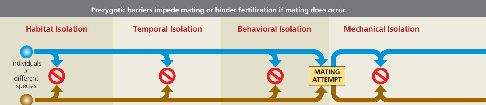

## Exploring Reproductive Barriers

Figure 24.3

## Prezygotic barriers impede mating or hinder fertilization if mating does occur

Habitat Isolation

Temporal Isolation

Behavioral Isolation

Mechanical Isolation

Individuals of different species

MATING ATTEMPT

Two species that occupy different habitats within the same area may encounter each other rarely, if at all.

Example: These two fly species in the genus Rhagoletis occur in the same geographic areas, but the apple maggot fly (Rhagoletis pomonella) feeds and mates on hawthorns and apples (a) while its close relative, the blueberry maggot fly (R. mendax), mates and lays its eggs only on blueberries (b).

Species that breed during different times of the day, different seasons, or different years cannot mix their gametes.

Example: In North America, the geographic ranges of the western spotted skunk (Spilogale gracilis) (c) and the eastern spotted skunk (Spilogale putorius) (d) overlap, but S. gracilis mates in late summer and S. putorius mates in late winter.

Courtship rituals that attract mates and other behaviors unique to a species are effective reproductive barriers, even between closely related species.

Mating is attempted, but morphological differences prevent its successful completion.

Example: Blue-footed boobies, inhabitants of the Galápagos, mate only after a courtship display unique to their species. Part of the "script" calls for the male to high-step (e), a behavior that calls the female's attention to his bright blue feet.

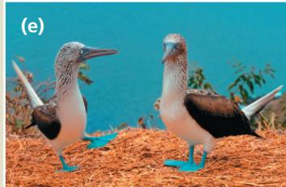

Example: Snails in the genus Bradybaena approach each other headfirst when they attempt to mate. Once their heads have moved slightly past each other, the snails' genitals emerge, and if their shells spiral in the same direction, mating can occur (f). But if a snail attempts to mate with a snail whose shell spirals in the opposite direction (g), the two snails' genital openings (indicated by arrows) will not be aligned, and mating cannot be completed.

## Postzygotic barriers prevent a hybrid zygote from developing into a viable, fertile adult

Gametic Isolation

Reduced Hybrid Viability

Reduced Hybrid Fertility

Hybrid Breakdown

Sperm of one species may not be able to fertilize the eggs of another species. For instance, sperm may not be able to survive in the reproductive tract of females of the other species, or biochemical mechanisms may prevent the sperm from penetrating the membrane surrounding the other species' eggs.

Example: Gametic isolation separates certain closely related species of aquatic animals, such as sea urchins (h). Sea urchins release their sperm and eggs into the surrounding water, where they fuse and form zygotes. It is difficult for gametes of different species, such as the red and purple urchins shown here (Strongylocentrotus franciscanus and S. purpuratus, respectively), to fuse because proteins on the surfaces of the eggs and sperm bind very poorly to each other.

FERTILIZATION

The genes of different parent species may interact in ways that impair the hybrid's development or survival in its environment.

Example: Some salamander subspecies of the genus Ensatina live in the same regions and habitats, where they may occasionally hybridize. But most of the hybrids do not complete development, and those that do are frail (i).

Example: The hybrid offspring of a male donkey (j) and a female horse (k) is a mule (l), which is robust but sterile. A "hinny" (not shown), the offspring of a female donkey and a male horse, is also sterile.

Even if hybrids are vigorous, they may be sterile. If the chromosomes of the two parent species differ in number or structure, meiosis in the hybrids may fail to produce normal gametes. Since the infertile hybrids cannot produce offspring when they mate with either parent species, genes cannot flow freely between the species.

VIABLE, FERTILE OFFSPRING

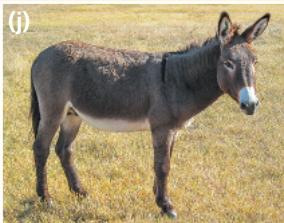

Some first-generation hybrids are viable and fertile, but when they mate with one another or with either parent species, offspring of the next generation are feeble or sterile.

Example: Strains of cultivated rice have accumulated different mutant recessive alleles at two loci in the course of their divergence from a common ancestor. Hybrids between them are vigorous and fertile (m, left and right), but plants in the next generation that carry too many of these recessive alleles are small and sterile (m, center). Although these rice strains are not yet considered different species, they have begun to be separated by postzygotic barriers.

▼ Polar bear (U. maritimus)

flow between the species and limit the formation of hybrids, offspring that result from an interspecific mating. Although a single barrier may not prevent all gene flow, a combination of several barriers can effectively isolate a species' gene pool.

Clearly, a fly cannot mate with a frog or a fern, but the reproductive barriers between more closely related species are not so obvious. As described in Figure 24.3, these barriers can be classified according to whether they contribute to reproductive isolation before or after fertilization. Prezygotic barriers (“before the zygote”) block fertilization from occurring. Such barriers typically act in one of three ways: by impeding members of different species from attempting to mate, by preventing an attempted mating from being completed successfully, or by hindering fertilization if mating is completed successfully. If a sperm cell from one species overcomes prezygotic barriers and fertilizes an ovum from another species, a variety of postzygotic barriers (“after the zygote”) may contribute to reproductive isolation after the hybrid zygote is formed. Developmental errors may reduce survival among hybrid embryos. Alternatively, problems after birth may cause hybrids to be infertile or decrease their chance of surviving long enough to reproduce.

## Limitations of the Biological Species Concept

One strength of the biological species concept is that it directs our attention to a way by which speciation can occur: by the evolution of reproductive isolation. However, the number of species to which this concept can be usefully applied is limited. There is, for example, no way to evaluate the reproductive isolation of fossils. The biological species concept also does not apply to organisms that reproduce asexually, such as prokaryotic organisms. (Many prokaryotic organisms do transfer genes among themselves, as we will discuss in Concept 27.2, but this is not sexual reproduction.) Furthermore, in the biological species concept, species are designated by the absence of gene flow. But there are many pairs of species that are morphologically and ecologically distinct, and yet gene flow occurs between them. An example is the grizzly bear (Ursus arctos) and polar bear (Ursus maritimus), whose hybrid offspring have been dubbed “grolar bears” (Figure 24.4). As we’ll discuss, natural selection can cause such species to remain distinct even though some gene flow occurs between them. Because of the limitations to the biological species concept, alternative species concepts are useful in certain situations.

## Other Definitions of Species

While the biological species concept emphasizes the separateness of different species due to reproductive barriers, several other definitions emphasize the unity within a species. For example, the morphological species concept distinguishes a species by body shape and other structural features. The morphological species concept can be applied to asexual and sexual organisms, and it can be useful even without information on the extent of gene flow. In practice, scientists often distinguish species using morphological criteria. A disadvantage of this approach, however, is that it relies on subjective criteria; researchers may disagree on which structural features distinguish a species.

Figure 24.4 Hybridization between two species of bears in the genus Ursus.

Grizzly bear (U. arctos)

The ecological species concept defines a species in terms of its ecological niche, the sum of how members of the species interact with the nonliving and living parts of their environment (see Concept 54.1). For example, two species of oak trees might differ in their size or in their ability to tolerate dry conditions, yet still occasionally interbreed. Because they occupy different ecological niches, these oaks would be considered separate species even though they are connected by some gene flow. Unlike the biological species concept, the ecological species concept can accommodate asexual as well as sexual species. It also emphasizes the role of disruptive natural selection as organisms adapt to different environments.

In addition to those discussed here, more than 20 other species definitions have been proposed. The usefulness of each definition depends on the situation and the research questions being asked. As we mentioned earlier, these species definitions are all human constructs; however, for our purposes here of studying how species originate, the biological species concept is particularly helpful because of its focus on reproductive barriers.

## Concept Check 24.1

1. a. Which species concept(s) could you apply to both asexual and sexual species?

b. Which would be most useful for identifying species in the field? Explain.

2. WHAT IF? Suppose two bird species live in a forest and are not known to interbreed. One species feeds and mates in the treetops and the other on the ground. But in captivity, the birds can interbreed and produce viable, fertile offspring. What type of reproductive barrier most likely keeps these species separate in nature? Explain.

# Concept 24.2: Speciation can take place with or without geographic separation

Having discussed what constitutes a unique species, let's return to the process by which such species arise from existing species. We'll describe this process by focusing on the geographic setting in which gene flow is interrupted between populations of the existing species—in allopatric speciation the populations are geographically isolated, while in sympatric speciation they are not (Figure 24.5).

## Allopatric ("Other Country") Speciation

In allopatric speciation (from the Greek allos, other, and patra, homeland), gene flow is interrupted when a population is divided into geographically isolated subpopulations. For example, the water level in a lake may subside, resulting in two or more smaller lakes that are now home to separated populations (see Figure 24.5a). Or a river may change course and divide a population of animals that cannot cross it. Allopatric speciation can also occur without geologic change, such as when individuals colonize a remote area and their descendants become geographically isolated from the parent population. The flightless cormorant shown in Figure 24.1 probably originated in this way from an ancestral flying species that reached the Galápagos Islands.

## The Process of Allopatric Speciation

How formidable must a geographic barrier be to promote allopatric speciation? The answer depends on the ability of the organisms to move about. Birds, mountain lions, and coyotes can cross rivers and canyons—as can windblown pollen and the seeds of some flowering plants. In contrast, small rodents may find a river or canyon a formidable barrier.

Figure 24.5 The geography of speciation.  
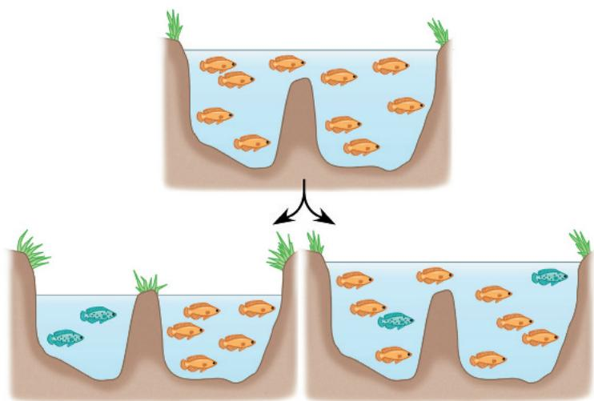  
(a) Allopatric speciation. A population forms a new species while geographically isolated from its parent population.  
(b) Sympatric speciation. A subset of a population forms a new species without geographic separation.  
Figure 24.6 Evolution in mosquitofish populations.

Once geographic isolation has occurred, the separated gene pools may diverge. Different mutations arise, and natural selection and genetic drift may alter allele frequencies in different ways in the separated populations. Reproductive isolation may then evolve as a by-product of the genetic divergence that results from selection or drift.

Figure 24.6 describes an example. On Andros Island, in the Bahamas, populations of the mosquitofish Gambusia hubbsi colonized a series of ponds that later became isolated from one another. Genetic analyses indicate that little or no gene flow currently occurs between the ponds. The environments of these ponds are very similar except that some contain predatory fishes, while others do not. In ponds with predatory fishes, selection has favored the evolution of a mosquitofish body shape that enables rapid bursts of speed (see Figure 24.6a). In ponds without predatory fishes, selection has favored a different body shape, one that improves the ability to swim for long periods of time (see Figure 24.6b).

How have these different selective pressures affected the evolution of reproductive barriers? Researchers studied this question by bringing together mosquitofish from the two types of ponds. They found that female mosquitofish prefer to mate with males whose body shape is similar to their own. This preference

Different body shapes have evolved in mosquitofish populations from ponds with and without predators. These differences affect how quickly the fishes can accelerate to escape and therefore their survival rate when exposed to predators.

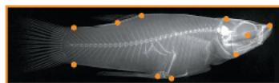

  
In ponds with predatory fishes, the mosquitofish's head is streamlined and the tail is powerful, enabling rapid bursts of speed.  
In ponds without predatory fishes, mosquitofish have a different body shape that favors long, steady swimming.

(a) Differences in body shape  
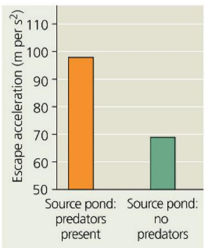

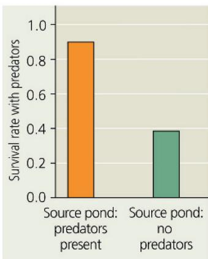  
(b) Differences in escape acceleration and survival

establishes a behavioral barrier to reproduction between mosquitofish from ponds with predators and those from ponds without predators. Thus, as a by-product of selection for avoiding predators, reproductive barriers have formed in these allopatric populations.

## Evidence of Allopatric Speciation

Many studies provide evidence that speciation can occur in allo-patric populations. For example, laboratory studies show that reproductive barriers can develop when populations are isolated experimentally and subjected to different environmental conditions (Figure 24.7).

Field studies indicate that allopatric speciation also can occur in nature. Consider the 30 species of snapping shrimp in the genus Alpheus that live off the Isthmus of Panama, the land bridge that connects South and North America (Figure 24.8). Fifteen of these species live on the Atlantic side of the isthmus, while the other 15 live on the Pacific side. Before the isthmus formed, gene flow could occur between

## Figure 24.7

## Inquiry: Can divergence of allopatric populations lead to reproductive isolation?

## Experiment

A researcher divided a laboratory population of the fruit fly Drosophila pseudoobscura, raising some flies on a starch medium and others on a maltose medium. After one year (about 40 generations), natural selection resulted in divergent evolution: Populations raised on starch digested starch more efficiently, while those raised on maltose digested maltose more efficiently. The researcher then put flies from the same or different populations in mating cages and measured mating frequencies. All flies used in the mating preference tests were reared for one generation on a standard cornmeal medium.

## Results

Mating patterns among populations of flies raised on different media are shown below. When flies from “starch populations” were mixed with flies from “maltose populations,” the flies tended to mate with like partners (see the lefthand table). But in a control group consisting the Atlantic and Pacific populations of snapping shrimp. Did the species on different sides of the isthmus originate by allopatric speciation? Morphological and genetic data group these shrimp into 15 pairs of sister species, pairs whose member species are each other's closest relative. In each of these 15 pairs, one of the sister species lives on the Atlantic side of the isthmus, while the other lives on the Pacific side. This fact strongly suggests that the two species arose as a consequence of geographic separation. Furthermore, genetic analyses indicate that the Alpheus species originated from 9 to 3 million years ago, with the sister species that live in the deepest water diverging first. These divergence times are consistent with geologic evidence that the isthmus formed gradually, starting 10 million years ago, and closing completely about 3 million years ago.

The importance of allopatric speciation is also suggested by the fact that regions that are isolated or highly subdivided by barriers typically have more species than do otherwise similar regions that lack such features. For example, many unique plants and animals are found on the geographically isolated Hawaiian

of flies from two different populations adapted to starch, the flies were about as likely to mate with flies of the other population as with flies of their own population (see the righthand table); similar results were obtained for control groups adapted to maltose.

<table><tr><td rowspan="2"></td><td colspan="2">Female</td></tr><tr><td>Starch</td><td>Maltose</td></tr><tr><td>Male Starch</td><td>22</td><td>9</td></tr><tr><td>Maltose</td><td>8</td><td>20</td></tr></table>

Number of matings in experimental group

<table><tr><td rowspan="2" colspan="2"></td><td colspan="2">Female</td></tr><tr><td>Starch population 1</td><td>Starch population 2</td></tr><tr><td rowspan="2">Male</td><td>Starch population 1</td><td>18</td><td>15</td></tr><tr><td>Starch population 2</td><td>12</td><td>15</td></tr></table>

Number of matings in control group

## Conclusion

In the experimental group, the strong preference of “starch flies” and “maltose flies” to mate with like-adapted flies indicates that a reproductive barrier was forming between these fly populations. Although this barrier was not absolute (some mating between starch flies and maltose flies did occur), after 40 generations reproductive isolation appeared to be increasing. This barrier may have been caused by differences in courtship behavior that arose as an incidental by-product of differing selective pressures as these allopatric populations adapted to different sources of food.

Data from D. M. B. Dodd, Reproductive isolation as a consequence of adaptive divergence in Drosophila pseudoobscura, Evolution 43:1308–1311 (1989).

WHAT IF? Why were all flies used in the mating preference tests reared on a standard medium (rather than on starch or maltose)?
For suggested answer, see Appendix A.

Figure 24.8 Allopatric speciation in snapping shrimp (Alpheus). The shrimp pictured are just 2 of the 15 pairs of sister species that arose as populations were divided by the formation of the Isthmus of Panama. A. formosus and A. panamensis are one pair of sister species; A. nuttingi and A. millsae are another pair of sister species.

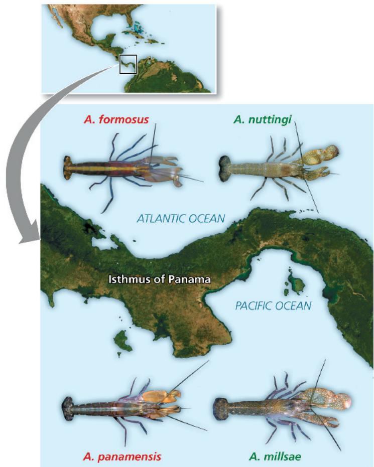

Islands (we'll return to the origin of Hawaiian species in Concept 25.4). Field studies also show that reproductive isolation between two populations generally increases as the geographic distance between them increases, a finding consistent with allopatric speciation. In the Scientific Skills Exercise, on the next page, you can analyze data from one such study that examined reproductive isolation in geographically separated salamander populations.

Note that while geographic isolation prevents interbreeding between members of allopatric populations, physical separation is not a biological barrier to reproduction. Biological reproductive barriers such as those described in Figure 24.3 are intrinsic to the organisms themselves. Hence, it is biological barriers that can prevent interbreeding when members of different populations come into contact with one another.

## Sympatric (“Same Country”) Speciation

In sympatric speciation (from the Greek syn, together), speciation occurs in populations that live in the same geographic area (see Figure 24.5b). How can reproductive barriers form between sympatric populations while their members remain in contact with each other? Although such contact (and the ongoing gene flow that results) makes sympatric speciation less common than allopatric speciation, sympatric speciation can occur if gene flow is reduced by such factors as polyploidy, sexual selection, and habitat differentiation. (Note that sexual selection and habitat differentiation also can promote allopatric speciation.)

## Polyploidy

A species may originate from an accident during cell division that results in extra sets of chromosomes, a condition called polyploidy. Polyploid speciation occasionally occurs in animals; for example, the gray tree frog Hyla versicolor (see Figure 23.16) is thought to have originated in this way. However, polyploidy is far more common in plants. In fact, botanists estimate that more than 80% of the plant species alive today are descended from ancestors that formed by polyploid speciation.

Two distinct forms of polyploidy have been observed in plant (and a few animal) populations. An autopolyploid (from the Greek autos, self) is an individual that has more than two chromosome sets that are all derived from a single species. In plants, for example, a failure of cell division could double a cell's chromosome number from the original number $(2n)$ to a tetraploid number $(4n)$ (Figure 24.9).

A tetraploid can produce fertile tetraploid offspring by self-pollinating or by mating with other tetraploids. In addition, the tetraploids are reproductively isolated from 2n plants of the original population because the triploid (3n) offspring of such unions have reduced fertility. Thus, in just one generation, autopolyploidy can generate reproductive isolation without any geographic separation.

A second form of polyploidy can occur when two different species interbreed and produce hybrid offspring. Most such hybrids are sterile because the set of chromosomes from one species cannot pair during meiosis with the set of chromosomes from the other species. However, an infertile hybrid may be able to

Figure 24.9 Sympatric speciation by autopolyploidy.  

# Scientific Skills Exercise

# Identifying Independent and Dependent Variables, Making a Scatter Plot, and Interpreting Data

Does Distance Between Salamander Populations Increase Their Reproductive Isolation? Allopatric speciation begins when populations become geographically isolated, reducing mating between individuals in different populations and thus reducing gene flow. It is logical that as distance between populations increases, so will their degree of reproductive isolation. To test this hypothesis, researchers studied populations of the dusky salamander (Desmognathus ochrophaeus) living on different mountain ranges in the southern Appalachians.

How the Experiment Was Done The researchers tested the reproductive isolation of pairs of salamander populations by leaving one male and one female together and later checking the females for the presence of sperm. Four mating combinations were tested for each pair of populations (A and B)—two within the same population (female A with male A and female B with male B) and two between populations (female A with male B and female B with male A).

Data from the Experiment The researchers used an index of reproductive isolation that ranged from a value of 0 (no isolation) to a value of 2 (full isolation). The proportion of successful matings for each mating combination was measured, with 100% success = 1 and no success = 0. The reproductive isolation value for two populations is the sum of the proportion of successful matings of each type within populations (AA + BB) minus the sum of the proportion of successful matings of each type between populations (AB + BA). The table provides distance and reproductive isolation data for 27 pairs of dusky salamander populations.

## INTERPRET THE DATA

1. State the researchers' hypothesis, and identify the independent and dependent variables in this study. Explain why the researchers used four mating combinations for each pair of populations.

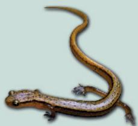

reproductive isolation index (a) if all of the matings within a population were successful, but none of the matings between populations were successful and (b) if salamanders are equally successful in mating with members of their own population and members of another population.

3. Make a scatter plot to help you visualize any patterns that might indicate a relationship between the variables. Plot the independent variable on the x-axis and the dependent variable on the y-axis. (For additional information about graphs, see the Scientific Skills Review in Appendix D.)

4. Interpret your graph by (a) explaining in words any pattern indicating a possible relationship between the variables and (b) hypothesizing the possible cause of such a relationship.

Instructors: A version of this Scientific Skills Exercise can be assigned in Mastering Biology.

<table><tr><td>Geographic Distance (km)</td><td>15</td><td>32</td><td>40</td><td>47</td><td>42</td><td>62</td><td>63</td><td>81</td><td>86</td><td>107</td><td>107</td><td>115</td><td>137</td><td>147</td></tr><tr><td>Reproductive Isolation Value</td><td>0.32</td><td>0.54</td><td>0.50</td><td>0.50</td><td>0.82</td><td>0.37</td><td>0.67</td><td>0.53</td><td>1.15</td><td>0.73</td><td>0.82</td><td>0.81</td><td>0.87</td><td>0.87</td></tr><tr><td>Distance (continued)</td><td>137</td><td>150</td><td>165</td><td>189</td><td>219</td><td>239</td><td>247</td><td>53</td><td>55</td><td>62</td><td>105</td><td>179</td><td>169</td><td></td></tr><tr><td>Isolation Value (continued)</td><td>0.50</td><td>0.57</td><td>0.91</td><td>0.93</td><td>1.5</td><td>1.22</td><td>0.82</td><td>0.99</td><td>0.21</td><td>0.56</td><td>0.41</td><td>0.72</td><td>1.15</td><td></td></tr></table>

Data from S. G. Tilley, A. Verrell, and S. J. Arnold, Correspondence between sexual isolation and allozyme differentiation: a test in the salamander Desmognathus ochrophaeus, Proceedings of the National Academy of Sciences USA 87:2715–2719 (1990).

propagate itself asexually (as many plants can do). In subsequent generations, various mechanisms can change a sterile hybrid into a fertile polyploid called an allopolyploid (Figure 24.10). The allopolyploids are fertile when mating with each other but cannot interbreed with either parent species; thus, they represent a new biological species. The new species has a diploid chromosome number equal to the sum of the diploid chromosome numbers of the two parent species.

Although it can be challenging to study speciation in the field, scientists have documented at least five new plant species that have originated by polyploid speciation since 1850. One of these examples involves the origin of a new species of goatsbeard plant (genus Tragopogon) in the Pacific Northwest. Tragopogon first arrived in the region when humans introduced three European species in the early 1900s: T. pratensis, T. dubius, and T. porrifolius. These three species are now common in the Pacific Northwest and many other parts of North America. In 1950, a new Tragopogon species was discovered near the Idaho-Washington border, a region where all three European species also were found. Genetic analyses revealed that this new species, Tragopogon miscellus, is an allopolyploid that originated from a hybrid of two of the European species (Figure 24.11). Although the T. miscellus population grows mainly by reproduction of its own members, hybridization between the parent species (followed by a mitotic or meiotic error that doubles the chromosome number) continues to add new members to the T. miscellus population.

Figure 24.10 One mechanism for allopolyploid speciation in plants. Most hybrids are sterile because their chromosomes are not homologous and cannot pair during meiosis. However, such a hybrid may be able to reproduce asexually. This diagram traces one mechanism by which sterile hybrids can give rise to fertile allopolyploids that are members of a new species.

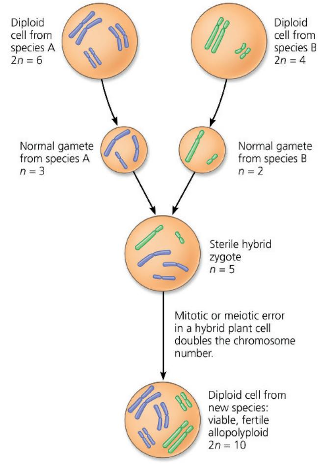  
Figure 24.11 Allopolyploid speciation in Tragopogon.  
The gray boxes indicate the parent species of the two new polyploid species. The diploid chromosome number of each species is shown in parentheses.

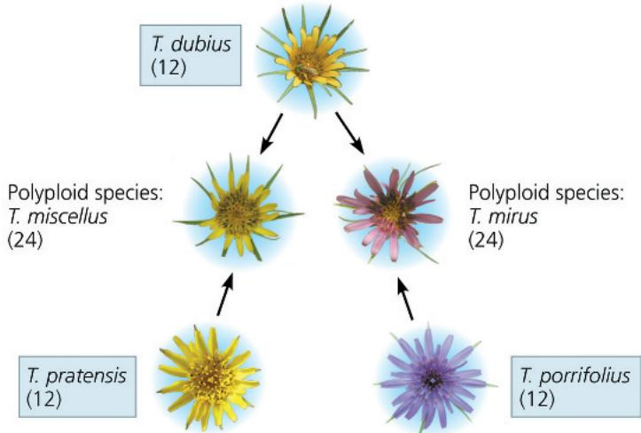  
VISUAL SKILLS Based on this diagram, identify the two parent species of each polyploid species.  
For suggested answer, see Appendix A.

Later, scientists discovered another new Tragopogon species, T. mirus, which also arose by polyploid speciation.

Many important agricultural crops—such as oats, cotton, potatoes, tobacco, and wheat—are polyploids. For example, the wheat used for bread, Triticum aestivum, is an allohexaploid (six sets of chromosomes, two sets from each of three different species). The events that eventually led to modern wheat probably began about 8,000 years ago in the Middle East when an early cultivated wheat species hybridized with a wild grass. Today, plant geneticists generate new polyploids in the laboratory by using chemicals that induce meiotic and mitotic errors. By harnessing the evolutionary process, researchers can produce new polyploid species with desired qualities, such as a polyploid that combines the high yield of wheat with the hardiness of rye.

## Sexual Selection

There is evidence that sympatric speciation can also be driven by sexual selection. Clues to how this can occur have been found in cichlid fish from one of Earth's hot spots of animal speciation, East Africa's Lake Victoria. This lake was once home to as many as 600 species of cichlids. Genetic data indicate that these species originated within the last 100,000 years from a small number of colonizing species that arrived from other lakes and rivers. How did so many species—more than double the number of freshwater fish species known in all of Europe—originate within a single lake?

One hypothesis is that subgroups of the original cichlid populations adapted to different food sources and the resulting genetic divergence contributed to speciation in Lake Victoria. But sexual selection, in which (typically) females select males based on their appearance (see Concept 23.4), may also have been a factor. Researchers have studied two closely related sympatric species of cichlids that differ mainly in the coloration of breeding males: Breeding Pundamilia pundamilia males have a blue-tinged back, whereas breeding Pundamilia nyererei males have a red-tinged back (Figure 24.12, on the next page). Their results suggest that mate choice based on male breeding coloration can act as a reproductive barrier that keeps the gene pools of these two species separate.

## Habitat Differentiation

Sympatric speciation can also occur when a subpopulation exploits a habitat or resource not used by the parent population. Consider the North American apple maggot fly (Rhagoletis pomonella), a pest of apples. The fly's original habitat was the native hawthorn tree (see Figure 24.3a), but about 200 years ago, some populations colonized apple trees that had been introduced by European settlers. Apple maggot flies usually mate on or near their host plant. This results in a prezygotic barrier (habitat isolation) between populations that feed on apples and populations that feed on hawthorns. Furthermore, because apples mature more quickly than hawthorn fruit, natural selection has favored apple-feeding flies with rapid development. These apple-feeding populations now show temporal isolation from the hawthorn-feeding R. pomonella, providing a second prezygotic barrier to gene flow between the two populations. Researchers also have identified alleles that benefit the flies that use one host plant but harm the flies that use the other host plant. Natural selection operating on these alleles has provided a postzygotic barrier to reproduction, further limiting gene flow. Altogether, although the

Figure 24.12

# Inquiry: Does sexual selection in cichlids result in reproductive isolation?

## Experiment

Researchers placed males and females of Pundamilia pundamilia and P. nyererei together in two aquarium tanks, one with natural light and one with a monochromatic orange lamp. Under normal light, the two species are noticeably different in male breeding coloration; under monochromatic orange light, the two species are very similar in color. The researchers then observed the mate choices of the females in each tank.

## Results

Under normal light, females of each species strongly preferred males of their own species. But under orange light, females of each species responded indiscriminately to males of both species. The resulting hybrids were viable and fertile.

## Conclusion

The researchers concluded that mate choice by females based on male breeding coloration can act as a reproductive barrier that keeps the gene pools of these two species separate. Since the species can still interbreed when this prezygotic barrier is breached in the laboratory, the genetic divergence between the species is likely to be small. This suggests that speciation in nature has occurred relatively recently.

Data from O. Seehausen and J. J. M. van Alphen, The effect of male coloration on female mate choice in closely related Lake Victoria cichlids (Haplochromis nyererei complex), Behavioral Ecology and Sociobiology 42:1–8 (1998).

WHAT IF? Suppose that female cichlids living in the murky waters of a polluted lake could not distinguish colors well. In such waters, how might the gene pools of these species change over time?

For suggested answer, see Appendix A.

two populations are still classified as subspecies rather than separate species, sympatric speciation appears to be well under way.

## Allopatric and Sympatric Speciation: A Review

Now let's recap the processes by which new species form. In allopatric speciation, a new species forms in geographic isolation from its parent population. Geographic isolation severely restricts gene flow. Intrinsic barriers to reproduction with members of the parent population may then arise as a by-product of genetic changes that occur within the isolated population. Many different processes can produce such genetic changes, including natural selection under different environmental conditions, genetic drift, and sexual selection. Once formed, reproductive barriers that arise in allopatric populations can prevent interbreeding with the parent population even if the populations come back into contact.

Sympatric speciation, in contrast, requires the emergence of a reproductive barrier that isolates a subset of a population from the remainder of the population in the same area. Though rarer than allopatric speciation, sympatric speciation can occur when gene flow to and from the isolated subpopulation is blocked. This can occur as a result of polyploidy, a condition in which an organism has extra sets of chromosomes. Sympatric speciation also can occur when a subset of a population becomes reproductively isolated because of natural selection resulting from a switch to a habitat or food source not used by the parent population. Sympatric speciation can also result from sexual selection and other mechanisms.

Having reviewed the geographic context in which species originate, we'll next explore in more detail what can happen when new or partially formed species come into contact.

## Concept Check 24.2

1. Summarize key differences between allopatric and sympatric speciation. Which type of speciation is more common, and why?

2. Describe two mechanisms that can decrease gene flow in sympatric populations, thereby making sympatric speciation more likely to occur.

3. WHAT IF? Is allopatric speciation more likely to occur on an island close to a mainland or on a more isolated island of the same size? Explain your prediction.

4. MAKE CONNECTIONS Review the process of meiosis in Figure 13.8. Describe how an error during meiosis could lead to polyploidy.

For suggested answers, see Appendix A.

## Concept 24.3: Hybrid zones reveal factors that cause reproductive isolation

What happens if species with incomplete reproductive barriers come into contact with one another? One possible outcome is the formation of a hybrid zone, a region in which members of different species meet and mate, producing at least some offspring of mixed ancestry. In this section, we'll explore hybrid zones and what they reveal about factors that cause the evolution of reproductive isolation.

## Patterns Within Hybrid Zones

Some hybrid zones form as narrow bands, such as the one depicted in Figure 24.13 for the yellow-bellied toad (Bombina variegata) and its close relative, the fire-bellied toad (B. bombina). This hybrid zone, represented by the red line on the map, extends for 4,000 km but is less than 10 km wide in most places. The hybrid zone occurs where the higher-altitude habitat of the yellow-bellied toad meets the lowland habitat of the fire-bellied toad. Across a given “slice” of the zone, the frequency of alleles specific to yellow-bellied toads typically decreases from close to 100% at the edge where only yellow-bellied toads are found to around 50% in the central portion of the zone and to close to 0% at the edge where only fire-bellied toads are found.

Figure 24.13 A narrow hybrid zone for Bombina toads in Europe.  
The graph shows species-specific allele frequencies across the width of the zone near Krakow, Poland, averaged over six genetic loci. A value of 1.0 indicates that all individuals were yellow-bellied toads, 0 indicates that all individuals were fire-bellied toads, and intermediate frequencies indicate that some individuals were of mixed ancestry.  
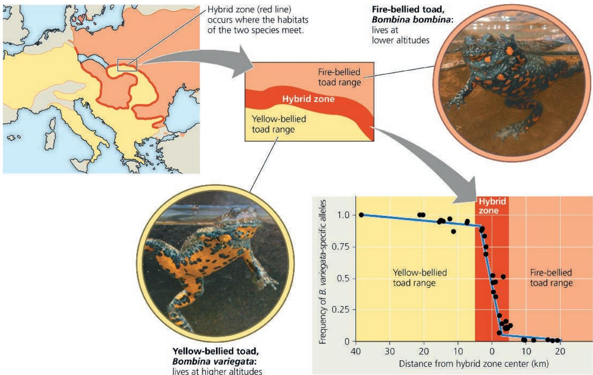

  
Does the graph indicate that gene flow is spreading fire-bellied toad alleles into the range of the yellow-bellied toad? Explain.  
For suggested answer, see Appendix A.

What causes such a pattern of allele frequencies across a hybrid zone? We can infer that there is an obstacle to gene flow—otherwise, alleles from one parent species would also be common in the gene pool of the other parent species. Are geographic barriers reducing gene flow? Not in this case, since the toads can move throughout the hybrid zone. A more important factor is that hybrid toads have increased rates of embryonic mortality and a variety of morphological abnormalities, including ribs that are fused to the spine and malformed tadpole mouthparts. Because the hybrids have poor survival and reproduction, they produce few viable offspring with members of the parent species. As a result, hybrid individuals rarely serve as a stepping-stone from which alleles are passed from one species to the other. Outside the hybrid zone, additional obstacles to gene flow may be provided by natural selection in the different environments in which the parent species live.

Hybrid zones typically are located wherever the habitats of the interbreeding species meet. Those regions often resemble a group of isolated patches scattered across the landscape—more like the pattern of spots on a Dalmatian than the continuous band shown in Figure 24.13. But regardless of whether they have complex or simple spatial patterns, hybrid zones form when two species lacking complete barriers to reproduction come into contact. What happens when the habitats of the interbreeding species change over time?

## Hybrid Zones and Environmental Change

A change in environmental conditions can alter where the habitats of interbreeding species meet. When this happens, an existing hybrid zone can move to a new location, or a novel hybrid zone may form.

For example, black-capped chickadees (Poecile atricapillus) and Carolina chickadees (P. carolinensis) interbreed in a narrow hybrid zone that runs from New Jersey to Kansas. Recent studies have shown that the location of this hybrid zone has shifted northward as the climate has warmed (Figure 24.14). In another example, a series of warm winters prior to 2003 enabled the southern flying squirrel (Glaucomys volans) to expand northward into the range of the northern flying squirrel, G. sabrinus. Previously, the ranges of these two species had not overlapped. Genetic analyses showed that these flying squirrels began to hybridize where their ranges came into contact, thereby forming a novel hybrid zone induced by climate change.

Finally, note that a hybrid zone can be a source of novel genetic variation that improves the ability of one or both parent species to cope with changing environmental conditions. This can occur when an allele found only in one parent species is transferred first to hybrid individuals and then to the other parent species when hybrids breed with the second parent species. Recent genetic analyses have shown that hybridization has been a source for such novel genetic variation in some insect, mammal, bird, and plant species. In the Problem-Solving Exercise, you can examine one such example: a case in which hybridization may have led to the transfer of insecticide-resistance alleles between species of mosquitoes that transmit malaria.

## Hybrid Zones over Time

Studying a hybrid zone is like observing a naturally occurring experiment on speciation. Will the hybrids become reproductively isolated from their parents and form a new species? This has occurred by polyploid speciation in some cases, as we saw for the formation of two new species of goatsbeard plants (see Figure 24.11). Hybridization also has led to what may turn out to be a new species of finch in the Galápagos archipelago: A 2018 study found that descendants of hybrids between the large cactus finch (Geospiza conirostris) and the medium ground finch (G. fortis) are becoming reproductively isolated from both parent species. As of 2019, this emerging species is known informally as “Big Bird.”

In other cases, however, interspecific hybrids do not become reproductively isolated from their parent species. In such situations, there are three common outcomes for a hybrid zone over time: reinforcement of barriers, fusion of species, or

## Figure 24.14 A shift in a hybrid zone resulting from climate change.

Black-capped (a) and Carolina chickadees (b) interbreed in a hybrid zone that runs from Kansas to New Jersey. In Pennsylvania, the center of this hybrid zone moved 12 km to the north from 2002 to 2012. This shift is consistent with predictions based on the warmer winter temperatures that have resulted from climate change.

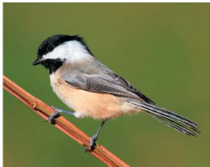  
(a) Black-capped chickadee (Poecile atricapillus)

  
(b) Carolina chickadee (Poecile carolinensis)

stability (Figure 24.15). Let's examine what studies suggest about these possibilities.

## Reinforcement: Strengthening Reproductive Barriers

Hybrids often are less fit than members of their parent species. In such cases, natural selection should strengthen prezygotic barriers to reproduction, reducing the formation of unfit hybrids. Because this process involves reinforcing reproductive barriers, it is called reinforcement. If reinforcement is occurring, a logical prediction is that barriers to reproduction between species should be stronger for sympatric populations than for allopatric populations.

As an example, let's consider two species of European flycatcher, the pied flycatcher (Ficedula hypoleuca) and the collared flycatcher (Ficedula albicollis). In allopatric populations of these birds, males of the two species closely resemble one another, while in sympatric populations, the males look very different. Female flycatchers do not select males of the other species when given a choice between males from sympatric populations, but they frequently do make mistakes when selecting between males from allopatric populations. Thus, barriers to reproduction are stronger in birds from sympatric populations than in birds from allopatric populations, as you would predict if reinforcement were occurring. Similar results have been observed in a number of organisms, including some fishes, insects, plants, and other birds.

## Fusion: Weakening Reproductive Barriers

Barriers to reproduction may be weak when two species meet in a hybrid zone. Indeed, so much gene flow may occur that reproductive barriers weaken further and the gene pools of the two species become increasingly alike, a process referred to as fusion. In effect, the speciation process reverses, eventually causing the two hybridizing species to fuse into a single species.

For example, genetic and morphological evidence indicates that the recent loss of the large tree finch from the Galápagos island of Floreana resulted from extensive hybridization with another finch species on that island. Such a situation also may be occurring among Lake Victoria cichlids (Figure 24.16). Many pairs of ecologically similar cichlid species are reproductively isolated because the females of one species prefer to mate with males of one color, while females of the other species prefer to mate with males of a different color (see Figure 24.12). Results from field and laboratory studies indicate that murky waters caused by pollution have reduced the ability of females to use color to distinguish males of their own species from males of closely related species. In some polluted waters, many hybrids have been produced, leading to fusion of the parent species' gene pools and a loss of species.

## Stability: Continued Formation of Hybrid Individuals

Many hybrid zones are stable in the sense that hybrids continue to be produced. In some cases, this stability occurs because the hybrids survive or reproduce better than members of either parent species, at least in certain habitats or years. But stable hybrid zones have also been observed in cases where the hybrids are selected against—an unexpected result.

## Problem-Solving Exercise

## Is hybridization promoting insecticide resistance in mosquitoes that transmit malaria?

Malaria is a leading cause of human illness and mortality worldwide, with 200 million people infected and 600,000 deaths each year. In the 1960s, the incidence of malaria was reduced, owing to the use of insecticides that killed mosquitoes in the genus Anopheles, which transmit the disease from person to person. But today, mosquitoes are becoming resistant to insecticides—causing a resurgence in malaria.

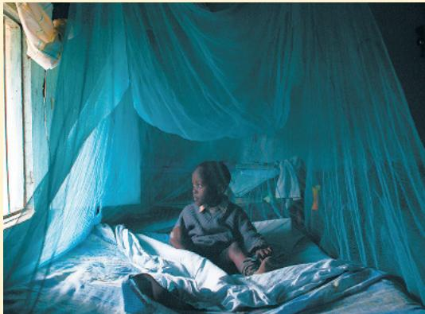

Insecticide-treated bed nets have helped reduce cases of malaria in many countries, but resistance to insecticides is rising in mosquito populations.

In this exercise, you will investigate whether alleles encoding resistance to insecticides have been transferred between closely related species of Anopheles.

## Your Approach

The principle guiding your investigation is that DNA analyses can detect the transfer of resistance alleles between closely related mosquito species. To find out whether such transfers have occurred, you will analyze DNA results from two species of mosquitoes that transmit malaria (Anopheles gambiae and A. coluzzii) and from A. gambiae X A. coluzzii hybrids.

For example, hybrids continue to form in the Bombina hybrid zone even though they are strongly selected against. One explanation relates to the narrowness of the Bombina hybrid zone (see Figure 24.13). Evidence suggests that members of both parent species migrate into the zone from the parent populations located outside the zone, thus leading to the continued production of hybrids. If the hybrid zone were wider, this would be less likely to occur, since the center of the zone would receive little gene flow from distant parent populations located outside the hybrid zone.

## Your Data

Resistance to DDT and other insecticides in Anopheles is affected by a sodium channel gene, kdr. The r allele of this gene confers resistance, while the wild-type (+/+) genotype is not resistant. Researchers sequenced the kdr gene from mosquitoes collected in Mali during three time periods: pre-2006 (2002 and 2004), 2006, and post-2006 (2009–2012). A. gambiae and A. coluzzii were collected during all three time periods, but their hybrids only occurred in 2006, the first year that insecticide-treated bed nets were used to reduce the spread of malaria. A likely explanation is that the introduction of the treated bed nets may have briefly favored hybrid individuals, which are usually at a selective disadvantage.

Observed numbers of mosquitoes by kdr genotype

<table><tr><td></td><td>+/+</td><td>+/r</td><td>r/r</td></tr><tr><td colspan="4">A. gambiae:</td></tr><tr><td>Pre-2006</td><td>3</td><td>5</td><td>2</td></tr><tr><td>2006</td><td>8</td><td>8</td><td>7</td></tr><tr><td>Post-2006</td><td>3</td><td>3</td><td>57</td></tr><tr><td>Hybrids: 2006</td><td>10</td><td>7</td><td>0</td></tr><tr><td colspan="4">A. coluzzii:</td></tr><tr><td>Pre-2006</td><td>226</td><td>0</td><td>0</td></tr><tr><td>2006</td><td>70</td><td>7</td><td>0</td></tr><tr><td>Post-2006</td><td>79</td><td>127</td><td>94</td></tr></table>

## Your Analysis

1. (a) Calculate the kdr genotype frequencies in A. gambiae for each time period. To do this, divide the number of individuals that have a given genotype by the total number of individuals observed for that time period. (b) How did the kdr genotype frequencies change over time? Describe a hypothesis that accounts for these observations.

2. How did the frequencies of kdr genotypes change over time in A. coluzzii? Describe a hypothesis that accounts for these observations.

3. Do these results indicate that hybridization can lead to the transfer of adaptive alleles? Explain.

4. Predict how the transfer of the r allele to A. coluzzii populations could affect the number of malaria cases in the years immediately following the transfer.

Instructors: A version of this Problem-Solving Exercise can be assigned in Mastering Biology.

Sometimes the outcomes in hybrid zones match our predictions (European flycatchers and cichlid fishes), and sometimes they don't (Bombina). But whether our predictions are upheld or not, events in hybrid zones can shed light on how barriers to reproduction between closely related species change over time. In the next section, we'll examine how interactions between hybridizing species can also provide a glimpse into the speed and genetic control of speciation.

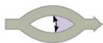

Figure 24.15 Formation of a hybrid zone and common outcomes for hybrids over time. The thick gray and purple arrows represent the passage of time.  
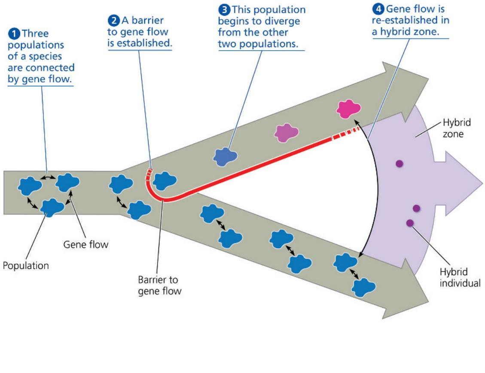  
5 Common outcomes for hybrids:  
Reinforcement (strengthening of reproductive barriers—hybrids gradually cease to be formed)  
WHAT IF? Predict what might happen if gene flow were re-established at step 3 in this process. For suggested answer, see Appendix A.

Fusion (weakening of reproductive barriers—the two species fuse)

OR

Stability (continued production of hybrid individuals)

Figure 24.16 Fusion: the breakdown of reproductive barriers.

Increasingly cloudy water in Lake Victoria over the past several decades may have weakened reproductive barriers between P. nyererei and P. pundamilia. In areas of cloudy water, the two species have hybridized extensively, causing their gene pools to fuse.

  
Pundamilia nyererei

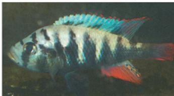  
Pundamilia pundamilia

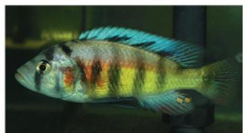  
Pundamilia "turbid water," hybrid offspring from a location with turbid water

## Concept Check 24.3

1. What are hybrid zones, and why can they be viewed as "natural laboratories" in which to study speciation?

2. WHAT IF? Consider two species that diverged while geographically separated but resumed contact before reproductive isolation was complete. Predict the outcome over time if the two species mated indiscriminately and (a) hybrid offspring survived and reproduced more poorly than offspring from intraspecific matings or (b) hybrid offspring survived and reproduced as well as offspring from intraspecific matings.

For suggested answers, see Appendix A.

## Concept 24.4: Speciation can occur rapidly or slowly and can result from changes in few or many genes

Darwin faced many questions when he began to ponder that “mystery of mysteries”—speciation. He found answers to some of those questions when he realized that evolution by natural selection helps explain both the diversity of life and the adaptations of organisms (see Concept 22.2). But biologists since Darwin have continued to ask fundamental questions about speciation. How long does it take for new species to form? And how many genes change when one species splits into two? Answers to these questions are also emerging.

(a) Punctuated model. New species change most as they branch from a parent species and then change little for the rest of their existence.  
Figure 24.17 Two models for the tempo of speciation.  
  
(b) Gradual model. Species diverge from one another more slowly and steadily over time.

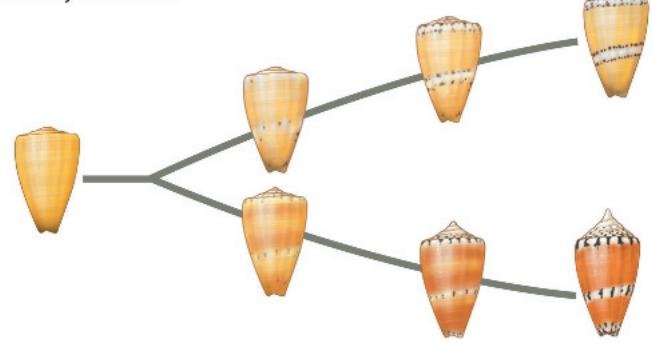

## The Time Course of Speciation

We can gather information about how long it takes new species to form from broad patterns in the fossil record and from studies that use morphological data (including fossils) or molecular data to assess the time interval between speciation events in particular groups of organisms.

## Patterns in the Fossil Record

The fossil record includes many episodes in which new species appear suddenly in a geologic stratum, persist essentially unchanged through several strata, and then disappear. For example, there are dozens of species of marine invertebrates that make their debut in the fossil record with novel morphologies, but then change little for millions of years before becoming extinct. The term punctuated equilibria is used to describe these periods of apparent stasis punctuated by sudden change (Figure 24.17a). Other species do not show a punctuated pattern; instead, they appear to have changed more gradually over long periods of time (Figure 24.17b).

What might punctuated and gradual patterns tell us about how long it takes new species to form? Suppose that a species survived for

5 million years, but most of the morphological changes that caused it to be designated a new species occurred during its first 50,000 years—just 1% of the total existence of the species. Time periods this short (in geologic terms) often cannot be distinguished in fossil strata, in part because the rate of sediment accumulation may be too slow to separate layers this close in time. Thus, based on its fossils, the species would seem to have appeared suddenly and then lingered with little or no change before becoming extinct. Even though such a species may have originated more slowly than its fossils suggest (in this case taking up to 50,000 years), a punctuated pattern indicates that speciation occurred relatively rapidly. For species whose fossils changed much more gradually, we also cannot tell exactly when a new biological species formed, since information about reproductive isolation does not fossilize. However, it is likely that speciation in such groups occurred relatively slowly, perhaps taking millions of years.

## Interview

Interview with Stephen Jay Gould: An “architect” of the concept of punctuated equilibria (eTextbook only)

## Speciation Rates

The existence of fossils that display a punctuated pattern suggests that once the process of speciation begins, it can be completed relatively rapidly—a suggestion supported by many studies. For example, rapid speciation appears to have produced the wild sunflower Helianthus anomalus. Genetic evidence indicates that this species originated by the hybridization of two other sunflower species, H. annuus and H. petiolaris. The hybrid species H. anomalus is ecologically distinct and reproductively isolated from both parent species (Figure 24.18). Unlike the outcome of allopolyploid speciation, in which there is a change in chromosome number after hybridization, in these sunflowers the two parent species and the hybrid all have the same number of chromosomes (2n = 34).

Figure 24.18 A hybrid sunflower species and its dry sand dune habitat.  
The wild sunflower Helianthus anomalus shown here originated via the hybridization of two other sunflowers, H. annuus and H. petiolaris, which live in nearby but moister environments.  

## Figure 24.19

# Inquiry: How does hybridization lead to speciation in sunflowers?

## Experiment

  
Note that in the first $(F_{1})$ generation, each chromosome of the experimental hybrids consisted entirely of DNA from one or the other parent species. The researchers then tested whether the $F_{1}$ and subsequent generations of experimental hybrids were fertile. They also used species-specific genetic markers to compare the chromosomes in the experimental hybrids with the chromosomes in the naturally occurring hybrid H. anomalus.

## Results

Although only 5% of the $F_{1}$ experimental hybrids were fertile, after just four more generations the hybrid fertility rose to more

How, then, did speciation occur? To study this question, researchers performed an experiment designed to mimic events in nature (Figure 24.19). Their results indicated that natural selection could produce extensive genetic changes in hybrid populations over short periods of time. These changes appear to have caused the hybrids to diverge reproductively from their parents and form a new species, H. anomalus.

The sunflower example, along with the apple maggot fly, Lake Victoria cichlid, and fruit fly examples discussed earlier, suggests that new species can arise rapidly once divergence begins. But what is the total length of time between speciation events? This interval consists of the time that elapses before populations of a newly formed species start to diverge from one another plus the time it takes for speciation to be complete once divergence begins. It turns out that the total time between speciation events varies considerably. In a survey of data from 84 groups of plants and animals, speciation intervals ranged from 4,000 years (in cichlids of Lake Nabugabo, Uganda) to 40 million years (in some beetles). Overall, the time between

than 90%. The chromosomes of individuals from this fifth hybrid generation differed from those in the $F_{1}$ generation but were similar to those in H. anomalus individuals from natural populations:

  
Comparison region containing H. annuus-specific marker
Comparison region containing H. petiolarus-specific marker

## Conclusion

Over time, the chromosomes in the population of experimental hybrids became similar to the chromosomes of H. anomalus individuals from natural populations. This suggests that the observed rise in the fertility of the experimental hybrids may have occurred as selection eliminated regions of DNA from the parent species that were not compatible with one another. Overall, it appeared that the initial steps of the speciation process occurred rapidly and could be mimicked in a laboratory experiment.

Data from L. H. Rieseberg et al., Role of gene interactions in hybrid speciation: evidence from ancient and experimental hybrids, Science 272:741–745 (1996).

WHAT IF? The increased fertility of the experimental hybrids could have resulted from natural selection for thriving under laboratory conditions. Evaluate this alternative explanation for the result.

For suggested answer, see Appendix A.

speciation events averaged 6.5 million years and was rarely less than 500,000 years.

These data suggest that on average, millions of years may pass before a newly formed plant or animal species will itself give rise to another new species. As you'll read in Concept 25.4, this finding has implications for how long it takes life on Earth to recover from mass extinction events. Moreover, the extreme variability in the time it takes new species to form indicates that organisms do not have an internal “speciation clock” that causes them to produce new species at regular intervals. Instead, speciation begins only after gene flow between populations is interrupted, perhaps by changing environmental conditions or by unpredictable events, such as a storm that transports a few individuals to a new area. Furthermore, once gene flow is interrupted, the populations must diverge genetically to such an extent that they become reproductively isolated—all before other events cause gene flow to resume, possibly reversing the speciation process (see Figure 24.16).

## Studying the Genetics of Speciation

Studies of ongoing speciation (as in hybrid zones) can reveal traits that cause reproductive isolation. By identifying the genes that control those traits, scientists can explore a fundamental question of evolutionary biology: How many genes influence the formation of new species?

In some cases, the evolution of reproductive isolation results from the effects of a single gene. For example, in Japanese snails of the genus Euhadra, a change in a single gene results in a mechanical barrier to reproduction. This gene controls the direction in which the shells spiral. When their shells spiral in different directions, the snails' genitalia are oriented in a manner that prevents mating (Figure 24.3f and g show a similar example). Recent genetic analyses have uncovered other single genes that cause reproductive isolation in fruit flies or mice.

A major barrier to reproduction between two closely related species of monkey flower, Mimulus cardinalis and M. lewisii, also appears to be influenced by a relatively small number of genes. These two species are isolated by several prezygotic and postzygotic barriers. Of these, one prezygotic barrier, pollinator choice, accounts for most of the isolation: In a hybrid zone between M. cardinalis and M. lewisii, nearly 98% of pollinator visits were restricted to one species or the other.

The two monkey flower species are visited by different pollinators: Hummingbirds prefer the red-flowered M. cardinalis, and bumblebees prefer the pink-flowered M. lewisii. Pollinator choice is affected by at least two loci in the monkey flowers, one of which, the “yellow upper,” or yup, locus, influences flower color (Figure 24.20). By crossing the two parent species to produce $F_{1}$ hybrids and then performing repeated backcrosses of these $F_{1}$ hybrids to each parent species, researchers succeeded in transferring the M. cardinalis allele at this locus into M. lewisii, and vice versa. In a field experiment, M. lewisii plants with the M. cardinalis yup allele received 68-fold more visits from hummingbirds than did wild-type M. lewisii. Similarly, M. cardinalis plants with the M. lewisii yup allele received 74-fold more visits from bumblebees than did wild-type M. cardinalis. Thus, a mutation at a single locus can influence pollinator preference and hence contribute to reproductive isolation in monkey flowers.

In other organisms, the speciation process is influenced by larger numbers of genes and gene interactions. For example, hybrid sterility between two subspecies of the fruit fly Drosophila pseudoobscura results from gene interactions among at least four loci, and postzygotic isolation in the sunflower hybrid zone discussed earlier is influenced by at least 26 chromosome segments (and an unknown number of genes). Overall, studies suggest that few or many genes can influence the evolution of reproductive isolation and hence the emergence of a new species.

## From Speciation to Macroevolution

As you've seen, speciation may begin with differences as small as the color on a cichlid's back. However, as speciation occurs again and again, such differences can accumulate and become more pronounced, eventually leading to the formation of new groups of organisms that differ greatly from their ancestors (as in the origin of whales from terrestrial mammals; see Figure 22.20). Moreover, as one group of organisms increases in

Figure 24.20 A locus that influences pollinator choice.
Pollinator preferences provide a strong barrier to reproduction between Mimulus lewisii and M. cardinalis. After transferring the M. lewisii allele for a flower-color locus into M. cardinalis and vice versa, researchers observed a shift in some pollinators' preferences.

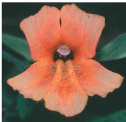  
(a) Typical Mimulus lewisii (pink-flowered)  
(b) Orange-flowered M. lewisii with an M. cardinalis flower-color allele

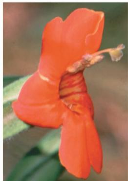

  
(c) Typical Mimulus cardinalis (red-flowered)  
(d) Pink-flowered M. cardinalis with an M. lewisii flower-color allele  
WHAT IF? If M. cardinalis individuals that had the M. lewisii yup allele were planted in an area that housed both monkey flower species, how might the production of hybrid offspring be affected?  
For suggested answers, see Appendix A.

size by producing many new species, another group of organisms may shrink, losing species to extinction. The cumulative effects of many such speciation and extinction events have helped shape the sweeping evolutionary changes that are documented in the fossil record. In the next chapter, we turn to such large-scale evolutionary changes as we begin our study of macroevolution.

## Concept Check 24.4

1. Speciation can occur rapidly between diverging populations, yet the time between speciation events is often more than a million years. Explain this apparent contradiction.

2. Summarize evidence that the yup locus acts as a prezygotic barrier to reproduction in two species of monkey flowers. Do these results show that the yup locus alone controls barriers to reproduction between these species? Explain.

3. MAKE CONNECTIONS Compare Figures 13.12 and 24.19. What cellular process could cause the hybrid chromosomes in Figure 24.19 to have DNA from both parent species? Explain.

## Summary of Key Concepts

To review key terms, go to the Vocabulary Self-Quiz (eTextbook only).

## Concept 24.1: The biological species concept emphasizes reproductive isolation

\- A biological species is a group of populations whose individuals may interbreed and produce viable, fertile offspring with each other but not with members of other species.

\- New species form when reproductive isolation between populations develops through the establishment of prezygotic or postzygotic barriers that separate gene pools.

Explain the role of gene flow in the biological species concept.

## Concept 24.2: Speciation can take place with or without geographic separation

\- In allopatric speciation, gene flow is reduced when two populations of one species become geographically separated from each other. One or both populations may undergo evolutionary change during the period of separation, resulting in the establishment of barriers to reproduction.

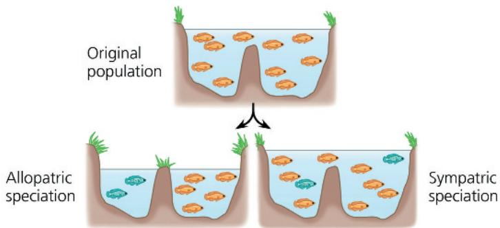

\- In sympatric speciation, a new species originates while remaining in the same geographic area as the parent species. Plant species (and, more rarely, animal species) have evolved sympatrically through polyploidy. Sympatric speciation can also result from sexual selection and habitat shifts.

Can factors that cause sympatric speciation also cause allopatric speciation? Explain.

## Concept 24.3: Hybrid zones reveal factors that cause reproductive isolation

\- Many groups of organisms form hybrid zones in which members of different species meet and mate, producing at least some offspring of mixed ancestry.

\- Many hybrid zones are stable, in that hybrid offspring continue to be produced over time. In others, reinforcement strengthens prezygotic barriers to reproduction, thus

decreasing the formation of unfit hybrids. In still other hybrid zones, barriers to reproduction may weaken over time, resulting in the fusion of the species' gene pools (reversing the speciation process).

What factors can support the long-term stability of a hybrid zone if the parent species live in different environments?

## Concept 24.4: Speciation can occur rapidly or slowly and can result from changes in few or many genes

\- New species can form rapidly once divergence begins, but it can take millions of years for that to happen. The time interval between speciation events varies considerably, from a few thousand years to tens of millions of years.

\- Researchers have identified particular genes involved in some cases of speciation. Speciation can be driven by a few or many genes.

Is speciation something that happened only in the distant past, or are new species continuing to arise today? Explain.

For suggested answers, see Appendix A.

## Test Your Understanding

For more multiple-choice questions, go to the Practice Test (eTextbook only).

## Levels 1-2: Remembering/Understanding

1. The largest unit within which gene flow can readily occur is a (A) population.

(B) species.

(C) genus.

(D) hybrid.

2. Males of different species of the fruit fly Drosophila that live in the same parts of the Hawaiian Islands have different elaborate courtship rituals. These rituals involve fighting other males and making stylized movements that attract females. What type of reproductive isolation does this represent?

(A) habitat isolation

(B) temporal isolation

(C) behavioral isolation

(D) gametic isolation

3. According to the punctuated equilibria model,

(A) given enough time, most existing species will branch gradually into new species.

(B) new species differentiate rapidly as they form, then change little for the rest of their existence.

(C) most evolution occurs in sympatric populations.

(D) speciation is usually due to a single mutation.

## Levels 3-4: Applying/Analyzing

4. Bird guides once listed the myrtle warbler and Audubon's warbler as distinct species. Recently, these birds have been classified as eastern and western forms of a single species, the yellow-rumped warbler. Which of the following pieces of evidence, if true, would be cause for this reclassification?

(A) The two forms interbreed often in nature, and their offspring survive and reproduce well.

(B) The two forms live in similar habitats and have similar food requirements.

(C) The two forms have many genes in common.

(D) The two forms are very similar in appearance.

5. Which of the following factors would be the most likely to contribute to allopatric speciation?

(A) The separated population is large, and genetic drift occurs.

(B) Selection pressures in the isolated population are similar to those in the ancestral population.

(C) Gene flow between the two populations is extensive.

(D) Different mutations begin to distinguish the gene pools of the separated populations.

6. Plant species A has a diploid chromosome number of 12. Plant species B has a diploid number of 16. A new species, C, arises as an allopolyploid from A and B. The diploid number for species C would probably be

(A) 14.

(B) 16.

(C) 28.

(D) 56.

## Levels 5-6: Evaluating/Creating

7. EVOLUTION CONNECTION Explain the biological basis for assigning all human populations to a single species. Can you think of a scenario by which a second human species could originate in the future?

8. SCIENTIFIC INQUIRY • DRAW IT In this chapter, you read that bread wheat (Triticum aestivum) is an allohexaploid, containing two sets of chromosomes from each of three different parent species. Genetic analysis suggests that each of the three species pictured following this question contributed chromosome sets to T. aestivum. (The capital letters represent sets of chromosomes, each of which can be traced to a particular species, not individual genes. The numbers in parentheses are the species' chromosome numbers.) Evidence also indicates that the first polyploidy event began with the spontaneous hybridization of the early cultivated wheat species T. monococcum and a wild Triticum grass species. Draw a diagram of one possible chain of events that could have produced the allohexaploid T. aestivum.

## (Continued)

9. WRITE ABOUT A THEME: INFORMATION In sexually reproducing species, each individual inherits DNA from both parent organisms. In a short essay (100–150 words), apply this idea to what occurs when organisms of two species that have homologous chromosomes mate and produce $\left(\mathrm{F}_{1}\right)$ hybrid offspring. What percentage of the DNA in the $F_{1}$ hybrids' chromosomes comes from each parent species? As the hybrids mate and produce $F_{2}$ and later-generation hybrid offspring, describe how recombination and natural selection may affect whether the DNA in hybrid chromosomes is derived from one parent species or the other.

## 10. SYNTHESIZE YOUR KNOWLEDGE

  
Suppose that females of one population of strawberry poison dart frogs (Dendrobates pumilio) prefer to mate with males that are orange-red in color. In a different population, females prefer males with yellow skin. Explain how such differences could arise and how they could affect the evolution of reproductive isolation in allopatric versus sympatric populations.
For selected answers, see Appendix A.

# The History of Life on Earth

## Key Concepts

25.1 Conditions on early Earth made the origin of life possible

25.2 The fossil record documents the history of life

25.3 Key events in life's history include the origins of unicellular and multicellular organisms and the colonization of land

25.4 The rise and fall of groups of organisms reflect differences in speciation and extinction rates

25.5 Major changes in body form can result from changes in the sequences and regulation of developmental genes

25.6 Evolution is not goal oriented

  
Figure 25.1 In the 1870s, researchers working in the searing heat of the Sahara Desert were startled to discover fossils of ancient whales. These fossils were spectacular not only for where they were found, but also for documenting the transition from life on land to life in the sea—just one example of the sweeping changes seen in the history of life on Earth.

## Study Tip

Draw a time line: Draw a time line like the example shown here, and mark when the following key evolutionary events occurred: "oxygen revolution," origin of eukaryotes, first multicellular organisms, colonization of land by large eukaryotes, origin of tetrapods, and the Permian mass extinction. Briefly describe the significance of each event. You can also add more events to your time line as you study.

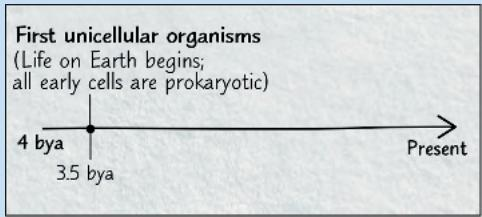

## How has life on Earth changed over time?

  
Large-scale processes that cause changes over time:  
Continental drift
Land masses move over time, affecting extinction and speciation rates.  
Mass extinction
Many species
become extinct
worldwide.  
Adaptive radiation
A lineage gives rise to many new species.

# Concept 25.1: Conditions on early Earth made the origin of life possible

The whale fossils discovered in the Sahara Desert (see Figure 25.1) are one example of evidence that past organisms were very different from those presently living. The sweeping changes in life on Earth as revealed by such fossils illustrate macroevolution, the broad pattern of evolution above the species level. Examples of macroevolutionary change include the emergence of terrestrial vertebrates through a series of speciation events, the impact of mass extinctions on biodiversity, and the origin of key adaptations such as flight.

Taken together, such changes provide a grand view of the evolutionary history of life. We'll examine that history in this chapter, beginning with a discussion of hypotheses regarding the origin of life. This is the most speculative topic of the entire unit, because no fossil evidence of that seminal episode exists.

Direct evidence of life on early Earth comes from fossils of microorganisms that lived 3.5 billion years ago. But how did the first living cells appear? Observations and experiments in chemistry, geology, and physics have led scientists to propose one scenario that we'll examine here. They hypothesize that chemical and physical processes could have produced simple cells through a sequence of four main stages:

1. The abiotic (nonliving) synthesis of small organic molecules, such as amino acids and nitrogenous bases

2. The joining of these small molecules into macromolecules, such as proteins and nucleic acids

3. The packaging of these molecules into protocells, droplets with membranes that maintained an internal chemistry different from that of their surroundings

4. The origin of self-replicating molecules that eventually made inheritance possible

Though speculative, this scenario leads to predictions that can be tested in the laboratory. In this section, we'll examine some of the evidence for each stage.

## Synthesis of Organic Compounds on Early Earth

Our planet formed 4.6 billion years ago, condensing from a vast cloud of dust and rocks that surrounded the young sun. For its first few hundred million years, Earth was bombarded by huge chunks of rock and ice left over from the formation of the solar system. The collisions generated so much heat that all of the available water was vaporized, preventing the formation of seas and lakes.

This massive bombardment ended 4 billion years ago, setting the stage for the origin of life. The first atmosphere had little oxygen and was likely thick with water vapor, along with compounds released by volcanic eruptions, such as nitrogen and its oxides, carbon dioxide, methane, ammonia, and hydrogen. As Earth cooled, the water vapor condensed into oceans, and much of the hydrogen escaped into space.

During the 1920s, Russian chemist A. I. Oparin and British scientist J. B. S. Haldane independently hypothesized that Earth's early atmosphere was a reducing (electron-adding) environment, in which organic compounds could have formed from simpler molecules. The energy for this synthesis could have come from lightning and UV radiation. Haldane suggested that the early oceans were a solution of organic molecules, a “primitive soup” from which life arose.

In 1953, Stanley Miller, working with Harold Urey at the University of Chicago, tested the Oparin-Haldane hypothesis by creating laboratory conditions comparable to those that scientists at the time thought existed on early Earth (see Figure 4.2). His apparatus yielded a variety of amino acids found in organisms today, along with other organic compounds. Many laboratories have since repeated Miller's classic experiment using different recipes for the atmosphere, some of which also produced organic compounds.

However, some evidence suggests that the early atmosphere was made up primarily of nitrogen and carbon dioxide and was neither reducing nor oxidizing (electron removing). Recent Miller/Urey-type experiments using such “neutral” atmospheres have also produced organic molecules. In addition, small pockets of the early atmosphere, such as those near the openings of volcanoes, may have been reducing. Perhaps the first organic compounds formed near volcanoes. In a test of this hypothesis (Figure 25.2), researchers used modern equipment to reanalyze molecules that Miller had saved from one of his experiments. They found that numerous amino acids had formed under conditions that simulated a volcanic eruption.

Another hypothesis is that organic compounds were first produced in deep-sea hydrothermal vents, areas on the seafloor where heated water and minerals gush from Earth's interior into the ocean. Some of these vents, known as "black smokers," release water so hot (300–400°C) that organic compounds formed there may have been unstable. But other deep-sea vents, called alkaline vents, release water that has a high pH (9–11) and is warm (40–90°C) rather than hot, an environment that may have been more suitable for the origin of life (Figure 25.3).

Figure 25.2 Amino acid synthesis in a simulated volcanic eruption. In addition to his classic 1953 study, Miller also conducted an experiment simulating a volcanic eruption. In a 2008 reanalysis of those results, researchers found that far more amino acids were produced under simulated volcanic conditions than were produced in the conditions of the classic 1953 study.  
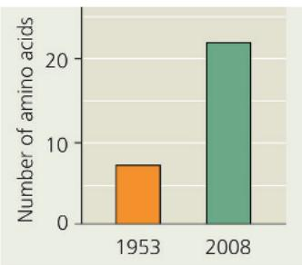  
MAKE CONNECTIONS Explain how more than 20 amino acids could have been obtained in the 2008 study. (See Concept 5.4.)

  
For suggested answer, see Appendix A.

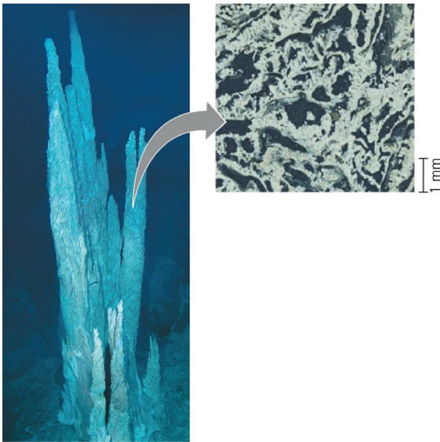  
1mm

## Figure 25.3 Did life originate in deep-sea alkaline vents?

The first organic compounds may have arisen in warm alkaline vents similar to this one from the 40,000-year-old “Lost City” vent field in the mid-Atlantic Ocean. These vents contain hydrocarbons and are full of tiny pores (inset) lined with iron and other catalytic minerals. Early oceans were acidic, so a pH gradient would have formed between the interior of the vents and the surrounding ocean water. Energy for the synthesis of organic compounds could have been harnessed from this pH gradient.

Studies related to the volcanic atmosphere and alkaline vent hypotheses show that the abiotic synthesis of organic molecules is possible under various conditions. Another source of organic molecules may have been meteorites. For example, fragments of the Murchison meteorite, a 4.5-billion-year-old rock that landed in Australia in 1969, contain more than 80 amino acids, some in large amounts. These amino acids cannot be contaminants from Earth because they consist of an equal mix of D and L isomers (see Figure 4.7). Organisms make and use only L isomers, with a few rare exceptions. Studies have shown that the Murchison meteorite also contained other key organic molecules, including lipids, simple sugars, and nitrogenous bases such as uracil.

Collectively, these studies illustrate a variety of ways that life may form based on the availability of water, organic compounds, and energy.

## Abiotic Synthesis of Macromolecules

The presence of small organic molecules, such as amino acids and nitrogenous bases, is not sufficient for the emergence of life as we know it. Every cell has many types of macromolecules, including enzymes and other proteins and the nucleic acids needed for self-replication. Could such macromolecules have formed on early Earth? A 2016 study demonstrated that one key step, the abiotic synthesis of RNA's two purine bases, adenine (A) and guanine (G), can occur spontaneously from simple precursor molecules; the abiotic synthesis of the smaller cytosine (C) and uracil (U) bases was accomplished in 2009. In addition, by dripping solutions of amino acids or RNA nucleotides onto hot sand, clay, or rock, researchers have produced polymers of these molecules. The polymers formed spontaneously, without the help of enzymes or ribosomes. Unlike proteins, the amino acid polymers are a complex mix of linked and cross-linked amino acids. Still, it is possible that such polymers acted as weak catalysts for a variety of chemical reactions on early Earth.

## Protocells

All organisms must be able to carry out both reproduction and energy processing (metabolism). DNA molecules carry genetic information, including the instructions needed to replicate themselves accurately during reproduction. But DNA replication requires elaborate enzymatic machinery, along with an abundant supply of nucleotide building blocks provided by the cell's metabolism. This suggests that self-replicating molecules and a metabolic source of building blocks may have appeared together in early protocells. The necessary conditions may have been met in vesicles, fluid-filled compartments enclosed by a membrane-like structure. Recent experiments show that abiotically produced vesicles can exhibit certain properties of life, including simple reproduction and metabolism, as well as the maintenance of an internal chemical environment different from that of their surroundings (Figure 25.4).

For example, vesicles can form spontaneously when lipids or other organic molecules are added to water. When this occurs, molecules that have both a hydrophobic region and a hydrophilic region can organize into a bilayer similar to the lipid bilayer of a plasma membrane. Adding substances such as montmorillonite, a soft mineral clay produced by the weathering of volcanic ash, greatly increases the rate of vesicle self-assembly (see Figure 25.4a). This clay, which is thought to have been common on early Earth, provides surfaces on which organic molecules become concentrated, increasing the likelihood that the molecules will react with each other and form vesicles. Abiotically produced vesicles can “reproduce” on their own (see Figure 25.4b), and they can increase in size (“grow”) without dilution of their contents. Vesicles also can absorb montmorillonite particles, including those on which RNA and other organic molecules have become attached (see Figure 25.4c). Finally, experiments have shown that some vesicles have a selectively permeable bilayer and can perform metabolic reactions using an external source of reagents—another important prerequisite for life.

## Self-Replicating RNA

The first genetic material was most likely RNA, not DNA. RNA plays a central role in protein synthesis, but it can also function as an enzyme-like catalyst (see Concept 17.3). Such RNA catalysts are called ribozymes. Some ribozymes can make complementary copies of short pieces of RNA, provided that they are supplied with nucleotide building blocks.

Natural selection on the molecular level has produced ribozymes capable of self-replication in the laboratory. How does this occur? Unlike double-stranded DNA, which takes the form of a uniform helix, single-stranded RNA molecules assume a variety of specific three-dimensional shapes mandated by their nucleotide

Figure 25.4 Features of abiotically produced vesicles.  
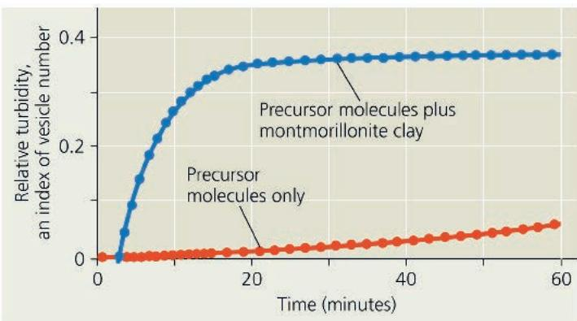  
(a) Self-assembly. The presence of montmorillonite clay greatly increases the rate of vesicle self-assembly.

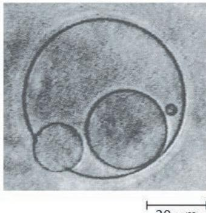  
(b) Reproduction. Vesicles can divide on their own, as in this vesicle "giving birth" to smaller vesicles (LM).

  
(c) Absorption of RNA. This vesicle has incorporated montmorillonite clay particles coated with RNA (orange).  
MAKE CONNECTIONS Explain how molecules with both a hydrophobic region and a hydrophilic region can self-assemble into a bilayer when in water. (See Concept 5.3.)  
For suggested answer, see Appendix A.

sequences. In a given environment, RNA molecules with certain nucleotide sequences may have shapes that enable them to replicate faster and with fewer errors than other sequences. The RNA molecule with the greatest ability to replicate itself will leave the most descendant molecules. Occasionally, a copying error will result in a molecule with a shape that is even more adept at self-replication. Similar selection events may have occurred on early Earth. Thus, life as we know it may have been preceded by an “RNA world,” in which small RNA molecules were able to replicate and to store genetic information about the vesicles that carried them.

Recently, Dr. Jack Szostak and colleagues at Harvard University succeeded in building a vesicle in which copying of a template strand of RNA could occur—a key step toward constructing a vesicle with self-replicating RNA. On early Earth, a vesicle with such self-replicating, catalytic RNA would differ from its many neighbors that lacked such molecules. If that vesicle could grow, split, and pass its RNA molecules to its “daughters,” the daughters would be protocells. Although the first such protocells likely carried only limited amounts of genetic information, specifying only a few properties, their inherited characteristics could have been acted on by natural selection. The most successful of the early protocells would have increased in number because they could exploit their resources effectively and pass their abilities on to subsequent generations.

Once RNA sequences that carried genetic information appeared in protocells, many additional changes would have been possible. For example, RNA could have provided the template on which DNA nucleotides were assembled. Double-stranded DNA is a more chemically stable repository for genetic information than is the more fragile RNA. DNA also can be replicated more accurately. Accurate replication was advantageous as genomes grew larger through gene duplication and other processes and as more properties of the protocells became coded in genetic information. Once DNA appeared, the stage was set for a blossoming of new forms of life—a change we see documented in the fossil record.

## Interview

Interview with Jack Szostak: Studying the origin of life (eTextbook only)

## Concept Check 25.1

1. What hypothesis did Miller test in his classic experiment?

2. How would the appearance of protocells have represented a key step in the origin of life?

3. MAKE CONNECTIONS In changing from an “RNA world” to today’s “DNA world,” genetic information must have flowed from RNA to DNA. After reviewing Figures 17.4 and 19.9, suggest how this could have occurred. Does such a flow occur today?

For suggested answers, see Appendix A.

## Concept 25.2: The fossil record documents the history of life

Starting with the earliest traces of life, the fossil record opens a window into the world of long ago and provides glimpses of the evolution of life over billions of years. In this section, we'll examine fossils as a form of scientific evidence: how fossils form, how scientists date and interpret them, and what they can and cannot tell us about changes in the history of life.

## The Fossil Record

Sedimentary rocks are the richest source of fossils. As a result, the fossil record is based primarily on the sequence in which fossils have accumulated in sedimentary rock layers, called strata (see Figure 22.3). Useful information is also provided by other types of

Figure 25.5 A gallery of fossil types.

(a) Sedimentary rock. Most fossils are found in sedimentary rocks, such as this plant fossil. (b) Mineralized organic matter. Some fossils, such as this petrified tree trunk, form as minerals seep into and replace organic matter. (c) Trace fossils. Footprints, burrows, or other traces of an organism's activities can be preserved in the fossil record. (d) Amber. Entire organisms are sometimes found preserved in hardened resin from a tree. (e) Frozen soil, ice, and acid bogs. Rarely, frozen soil, ice, or an acid bog can preserve the body of larger organisms, such as this wolf pup.

(a) Plant fossil, about 300 million years old

(b) Petrified tree in Arizona, about 215 million years old (c) 150-million-year-old dinosaur tracks in Colorado

  
(e) A 50,000-year-old wolf pup found in frozen soil in Yukon, Canada  
(d) Insect in amber, about 40 million years old

fossils, such as insects preserved in amber (fossilized tree sap) and mammals frozen in soil (Figure 25.5).

The fossil record shows that there have been great changes in the kinds of organisms on Earth at different points in time. Many past organisms were unlike organisms living today, and many organisms that once were common are now extinct. As we'll see later in this section, fossils also document how new groups of organisms arose from previously existing ones.

As substantial and significant as the fossil record is, keep in mind that it is an incomplete chronicle of evolution. Many of Earth's organisms did not die in the right place and time to be preserved as fossils. Of the fossils that were formed, many were destroyed by later geologic processes, and only a fraction of the others have been discovered. As a result, the known fossil record is biased in favor of species that existed for a long time, were abundant and widespread in certain kinds of environments, and had hard shells, skeletons, or other parts that facilitated their fossilization. Even with its limitations, however, the fossil record is a remarkably detailed account of biological change over the vast scale of geologic time. Furthermore, as shown by recently unearthed fossils of whale ancestors with hind limbs (see Figure 22.19 and Figure 25.1), gaps in the fossil record continue to be filled by new discoveries.

## How Rocks and Fossils Are Dated

Fossils provide valuable data for reconstructing the history of life, but only if we can determine where they fit in that story. While the order of fossils in rock strata tells us the sequence in which

the fossils were laid down—their relative ages—it does not tell us their actual ages. Examining the relative positions of fossils is like peeling off layers of wallpaper in an old house. You can infer the sequence in which the layers were applied, but not the year each layer was added.

How can we determine the age of a fossil? One of the most common techniques is radiometric dating, which is based on the decay of radioactive isotopes (see Concept 2.2). In this process, a radioactive “parent” isotope decays to a “daughter” isotope at a characteristic rate. The rate of decay is expressed by the half-life, the time required for 50% of the parent isotope to decay (Figure 25.6). Each type of radioactive isotope has a characteristic half-life, which is not affected by temperature, pressure, or other environmental variables. For example, carbon-14 decays relatively quickly; its half-life is 5,730 years. Uranium-238 decays slowly; its half-life is 4.5 billion years.

Fossils contain isotopes of elements that accumulated in the organisms when they were alive. For example, a living organism contains the most common carbon isotope, carbon-12, as well as a radioactive isotope, carbon-14. When the organism dies, it stops accumulating carbon, and the amount of carbon-12 in its tissues does not change over time. However, the carbon-14 that it contains at the time of death slowly decays into another element, nitrogen-14. Thus, by measuring the ratio of carbon-14 to carbon-12 in a fossil, we can determine the fossil's age. This method works for fossils up to about 75,000 years old; fossils older than that contain too little carbon-14 to be detected with current techniques. Radioactive isotopes with longer half-lives are used to date older fossils.

Figure 25.6 Radiometric dating.  
In this diagram, each unit of time represents one half-life of a radioactive isotope.  
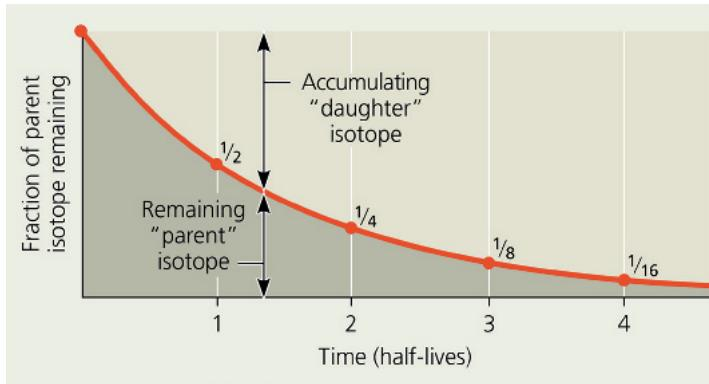  
DRAW IT Relabel the x-axis of this graph in years to illustrate the radioactive decay of uranium-238 (half-life = 4.5 billion years). For suggested answer, see Appendix A.

Determining the age of these older fossils in sedimentary rocks can be challenging. Organisms do not use radioisotopes with long half-lives, such as uranium-238, to build their bones or shells. In addition, sedimentary rocks are often composed of sediments of differing ages. Although we cannot date these older fossils directly, an indirect method can be used to infer the age of fossils that are sandwiched between two layers of volcanic rock. As lava cools into volcanic rock, radioisotopes from the surrounding environment become trapped in the newly formed rock. Some of the trapped radioisotopes have long half-lives, allowing geologists to estimate the ages of ancient volcanic rocks. If two volcanic layers surrounding fossils are found to be 525 million and 535 million years old, for example, then the fossils are roughly 530 million years old.

The study of fossils has helped geologists establish a geologic record: a standard time scale that divides Earth's history into four eons and further subdivisions (Table 25.1). We'll describe key events that occurred during these different time periods in Concept 25.3.

## The Origin of New Groups of Organisms

Some fossils document the origin of new groups of organisms. Such fossils are central to our understanding of evolution; they illustrate how new features arise and how long it takes for such changes to occur. We'll examine one such case here and in Figure 25.7: the origin of mammals.

Along with amphibians and reptiles, mammals belong to the group of animals called tetrapods (from the Greek tetra, four, and pod, foot), named for having four limbs. Mammals have a number of unique anatomical features that fossilize readily, allowing scientists to trace their origin. For example, the lower jaw is composed of one bone (the dentary) in mammals but several bones in other tetrapods. In addition, the lower and

Table 25.1 The Geologic Record

<table><tr><td>Eon</td><td>Era</td><td>Period</td><td>Epoch</td><td>Age (Millions of Years Ago)</td></tr><tr><td rowspan="7"></td><td rowspan="7">Cenozoic</td><td rowspan="2">Quaternary</td><td>Holocene</td><td>0.01</td></tr><tr><td>Pleistocene</td><td>2.6</td></tr><tr><td rowspan="2">Neogene</td><td>Pliocene</td><td>5.3</td></tr><tr><td>Miocene</td><td>23</td></tr><tr><td rowspan="3">Paleogene</td><td>Oligocene</td><td>33.9</td></tr><tr><td>Eocene</td><td>56</td></tr><tr><td>Paleocene</td><td>66</td></tr><tr><td rowspan="3">Phan-erozoic</td><td rowspan="3">Mesozoic</td><td colspan="2">Cretaceous</td><td>145</td></tr><tr><td colspan="2">Jurassic</td><td>201</td></tr><tr><td colspan="2">Triassic</td><td>252</td></tr><tr><td rowspan="6"></td><td rowspan="6">Paleozoic</td><td colspan="2">Permian</td><td>299</td></tr><tr><td colspan="2">Carboniferous</td><td>359</td></tr><tr><td colspan="2">Devonian</td><td>419</td></tr><tr><td colspan="2">Silurian</td><td>444</td></tr><tr><td colspan="2">Ordovician</td><td>485</td></tr><tr><td colspan="2">Cambrian</td><td>541</td></tr><tr><td rowspan="3">Proterozoic</td><td rowspan="3">Neo-proterozoic</td><td colspan="2">Ediacaran</td><td>635</td></tr><tr><td colspan="2"></td><td>1,000</td></tr><tr><td colspan="2"></td><td>2,500</td></tr><tr><td>Archaean</td><td></td><td colspan="2"></td><td>4,000</td></tr><tr><td>Hadean</td><td></td><td colspan="3">Approx. 4,600</td></tr></table>

upper jaws in mammals hinge between a different set of bones than in other tetrapods. Mammals also have a unique set of three bones that transmit sound in the middle ear, the hammer, anvil, and stirrup, whereas other tetrapods have only one such bone, the stirrup (see Concept 34.6). Finally, the teeth of mammals are differentiated into incisors (for tearing), canines (for piercing), and the multi-pointed premolars and molars (for crushing and grinding). In contrast, the teeth of other tetrapods usually consist of a row of undifferentiated, single-pointed teeth.

As detailed in Figure 25.7, the fossil record shows that the unique features of mammalian jaws and teeth evolved gradually. Keep in mind that the figure includes just a few examples of the fossil skulls that document the origin of mammals. If all the known fossils in the sequence were arranged by shape and placed side by side, their features would blend smoothly from one group to the next. Some of these fossils would reflect how the features of a group that dominates life today, the mammals, gradually arose in a previously existing group, the cynodonts. Others would reveal side branches on the tree of life—groups of organisms that thrived for millions of years but ultimately left no descendants that survive today.

## Exploring the Origin of Mammals

## Figure 25.7

Over the course of 120 million years, mammals originated gradually from a group of tetrapods called synapsids. Shown here are a few of the many fossil organisms whose morphological features are intermediate between living mammals and their early synapsid ancestors. The evolutionary context of the origin of mammals is shown in the tree diagram at right (the dagger symbol $\dagger$ indicates extinct lineages).

## Synapsid (300 mya)

Early synapsids had multiple bones in the lower jaw and single-pointed teeth. The jaw hinge was formed by the articular and quadrate bones. Early synapsids also had an opening called the temporal fenestra behind the eye socket. Powerful cheek muscles for closing the jaws probably passed through the temporal fenestra. Over time, this opening enlarged and moved in front of the hinge between the lower and upper jaws, thereby increasing the power and precision with which the jaws could be closed (much as moving a doorknob away from the hinge makes a door easier to close).

## Therapsid (280 mya)

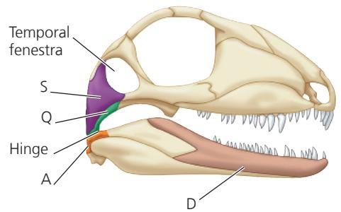

Later, a group of synapsids called therapsids appeared. Therapsids had large dentary bones, long faces, and the first examples of specialized teeth, large canines. These trends continued in a group of therapsids called cynodonts.

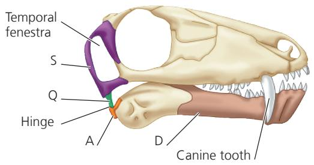

## Early cynodont (260 mya)

In early cynodont therapsids, the dentary was the largest bone in the lower jaw, the temporal fenestra was large and positioned forward of the jaw hinge, and teeth with several cusps first appeared (not visible in the diagram). As in earlier synapsids, the jaw had an articular-quadrate hinge.

## Later cynodont (220 mya)

Later cynodonts had teeth with complex cusp patterns, and their lower and upper jaws hinged in two locations: They retained the original articular-quadrate hinge and formed a new, second hinge between the dentary and squamosal bones. (The temporal fenestra is not visible in this or the below cynodont skull at the angles shown.)

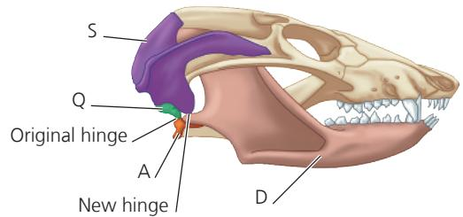

## Very late cynodont (195 mya)

In some very late (nonmammalian) cynodonts and early mammals, the original articular-quadrate hinge was lost, leaving the dentary-squamosal hinge as the only hinge between the lower and upper jaws, as in living mammals. The articular and quadrate bones migrated into the ear region (not shown), where they functioned in transmitting sound. In the mammal lineage, these two bones later evolved into the familiar hammer (malleus) and anvil (incus) bones of the ear.

## Concept Check 25.2

1. Describe an example from the fossil record that shows how life has changed over time.

2. WHAT IF? A fossilized skull you unearthed has a carbon-14/carbon-12 ratio about $\frac{1}{16}$ that of the skulls of present-day animals. Approximately how many years old is the fossilized skull?

For suggested answers, see Appendix A.

## Concept 25.3: Key events in life's history include the origins of unicellular and multicellular organisms and the colonization of land

The first three eons in the geologic record—the Hadean, the Archaean, and the Proterozoic—together lasted about 4 billion years The Phanerozoic eon, roughly the last half billion years, encompasses most of the time that animals have existed on Earth. It is divided into three eras: the Paleozoic, Mesozoic, and Cenozoic. Each era represents a distinct age in the history of Earth and its life. For example, the Mesozoic era is sometimes called the “age of reptiles” because of its abundance of reptilian fossils, including those of dinosaurs. The boundaries between the eras correspond to major extinction events, when many forms of life disappeared and were replaced by forms that evolved from the survivors.

As we've seen, the fossil record provides a sweeping overview of the history of life over geologic time. Here we will focus on a few major events in that history, returning to study the details in Unit Five. Figure 25.8 (on the next two pages) will help you visualize how long ago these key events occurred against the vast backdrop of geologic time.

## The First Single-Celled Organisms

Earth's first living things were single-celled prokaryotic organisms that lived in the ocean. The earliest direct evidence of these organisms, dating from 3.5 billion years ago, comes from fossilized stromatolites. Stromatolites are layered rocks that form when cer-

tain prokaryotic organisms bind thin films of sediment together. Stromatolites and other early prokaryotic organisms were Earth's sole inhabitants for about 1.5 billion years. As we will see, these prokaryotic organisms transformed life on our planet.

## Photosynthesis and the Oxygen Revolution

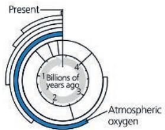

Most atmospheric oxygen gas (O $_{2}$ ) is of biological origin, produced during the water-splitting step of photosynthesis. When oxygenic photosynthesis first evolved—in photosynthetic prokaryotic organisms similar to today's cyanobacteria—the free O $_{2}$ it produced probably dissolved in the surrounding water until it reached a high enough concentration to react with elements dissolved in water, including iron. This would have caused the iron to precipitate as iron oxide, which accumulated as sediments. These sediments were compressed into banded iron formations, red layers of rock containing iron oxide that are a source of iron ore today. Once all of the dissolved iron had precipitated, additional $O_{2}$ dissolved in the water until the seas and lakes became saturated with $O_{2}$ . After this occurred, the $O_{2}$ finally began to “gas out” of the water and enter the atmosphere. This change left its mark in the rusting of iron-rich terrestrial rocks, a process that began about 2.7 billion years ago.

As shown in Figure 25.9, the amount of atmospheric $O_{2}$ increased gradually from about 2.7 to 2.4 billion years ago, but then shot up relatively rapidly to between 1% and 10% of its present level. This “oxygen revolution” had an enormous impact on life. In some of its chemical forms, oxygen attacks chemical bonds and can inhibit enzymes and damage cells. As a result, the rising concentration of atmospheric $O_{2}$ probably doomed many prokaryotic groups. Some species survived in habitats that remained anaerobic, where we find their descendants living today (see Concept 27.4). Among other survivors, diverse adaptations to the changing atmosphere evolved, including cellular respiration, which uses $O_{2}$ in the process of harvesting the energy stored in organic molecules.

The rise in atmospheric $O_{2}$ levels left a huge imprint on the history of life. A few hundred million years later, another fundamental change occurred: the origin of the eukaryotic cell.

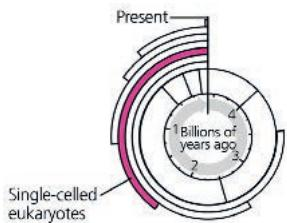

## The First Eukaryotes

The oldest widely accepted fossils of eukaryotes are of single-celled organisms that lived 1.8 billion years ago. Recall that eukaryotic cells have more complex organization than prokaryotic cells:

Eukaryotic cells have a nuclear envelope, mitochondria, endoplasmic reticulum, and other internal structures that prokaryotic organisms lack. Also, unlike prokaryotic cells, eukaryotic cells have a well-developed cytoskeleton, a feature that enables eukaryotic cells to change their shape and thereby surround and engulf other cells.

## Figure 25.9 The rise of atmospheric oxygen.

Chemical analyses of ancient rocks have enabled this reconstruction of atmospheric oxygen levels during Earth's history.  

This figure shows all of geologic time to scale on an unbroken timeline, but sometimes it is helpful to "break" a timeline to limit a figure's size and highlight key details. As shown at right, hatch marks are often used to represent such an interruption.

# Visualizing the Scale of Geologic Time

Figure 25.8

Geologic time is so vast that it can be difficult to visualize when key events in the history of life on Earth occurred. In this timeline, time runs from left to right, from 4.6 billion years ago to the present. The fossils along the top illustrate representative organisms from different points in time.

Oldest fossils of cells (prokaryotes) appear (3.5 bya)

Some prokaryotes bind thin films of sediments together, producing layered rocks called stromatolites, such as these in Shark Bay, Australia.

1. Once life began, what types of organisms lived on Earth for the next 2 billion years?

A section through a fossilized stromatolite

Concentration of atmospheric oxygen begins to increase (2.7 bya)

TIME

2. Look for a figure in Chapter 27 that uses hatch marks on one of its axes. Explain what the hatch marks represent in that figure.

Instructors: Additional questions related to this Visualizing Figure can be assigned in Mastering Biology.

How did the eukaryotes evolve from their prokaryotic ancestors? Current evidence indicates that the eukaryotes originated by endosymbiosis when a prokaryotic cell engulfed a small cell that would evolve into an organelle found in all eukaryotes, the mitochondrion. The small, engulfed cell is an example of an endosymbiont, a cell that lives within another cell, called the host cell. The prokaryotic ancestor of the mitochondrion probably entered the host cell as undigested prey or an internal parasite. Though such a process may seem unlikely, scientists have directly observed cases in which endosymbionts that began as prey or parasites developed a mutually beneficial relationship with a host in as little as five years.

By whatever means the relationship began, we can hypothesize how the symbiosis could have become beneficial.

For example, in a world that was becoming increasingly aerobic, a host that was itself an anaerobe would have benefited from endosymbionts that could make use of the oxygen. Over time, the host and endosymbionts would have become a single organism, its parts inseparable. Although all eukaryotes have mitochondria or remnants of these organelles, they do not all have plastids (a general term for chloroplasts and related organelles). Thus, the serial endosymbiosis hypothesis supposes that mitochondria evolved before plastids through a sequence of endosymbiotic events. As shown in Figure 25.10, both mitochondria and plastids are thought to have descended from bacterial cells. The original host—the cell that engulfed the bacterium whose descendants gave rise to the mitochondrion—is thought to have been an archaean.

A great deal of evidence supports the endosymbiotic origin of mitochondria and plastids:

\- The inner membranes of both organelles have enzymes and transport systems that are homologous to those found in the plasma membranes of living bacteria.

\- Mitochondria and plastids replicate by a splitting process that is similar to that of certain bacteria. In addition, each of these organelles contains circular DNA molecules that, like the chromosomes of bacteria, are not associated with histones or large amounts of other proteins.

\- As might be expected of organelles descended from free-living organisms, mitochondria and plastids also have the cellular machinery (including ribosomes) needed to transcribe and translate their DNA into proteins.

\- Finally, in terms of size, RNA sequences, and sensitivity to certain antibiotics, the ribosomes of mitochondria and plastids are more similar to bacterial ribosomes than they are to the cytoplasmic ribosomes of eukaryotic cells.

In Concept 28.1, we'll return to the origin of eukaryotes, focusing on what genomic data have revealed about the prokaryotic lineages that gave rise to the host and endosymbiont cells.

## The Origin of Multicellularity

An orchestra can play a greater variety of musical compositions than a violin soloist can; the increased complexity of the orchestra makes more variations possible. Likewise, the origin of structurally complex eukaryotic cells sparked the evolution of

Figure 25.10 A hypothesis for the origin of mitochondria and plastids through serial endosymbiosis.

The proposed ancestral cell was an archaean. The proposed ancestors of mitochondria were aerobic, heterotrophic bacteria, while the proposed ancestors of plastids were photosynthetic bacteria. In this figure, the arrows represent change over evolutionary time.

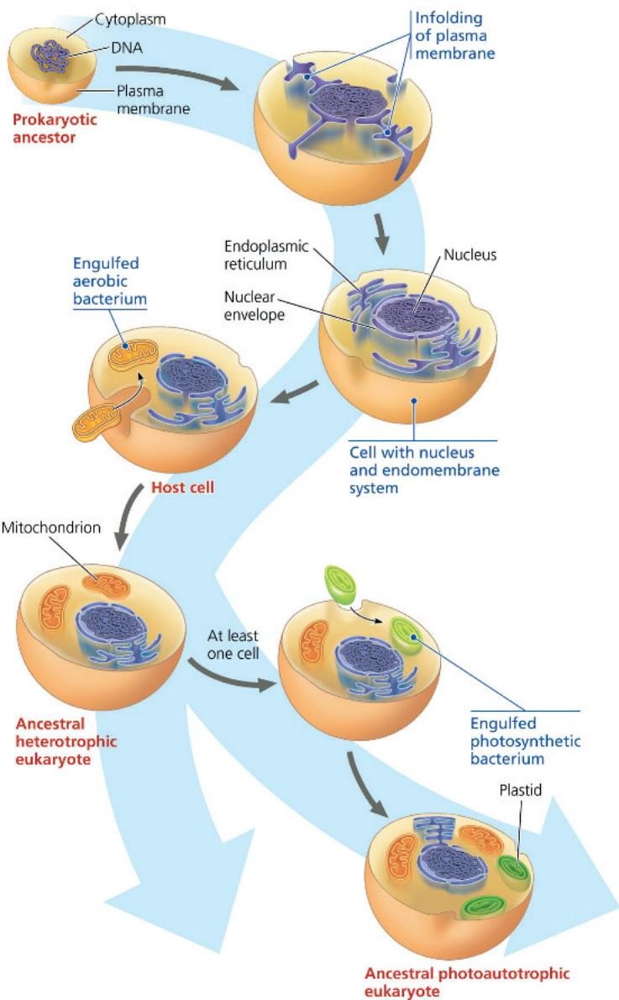

greater morphological diversity than was possible for the simpler prokaryotic cells. After the first eukaryotes appeared, a great range of unicellular forms evolved, giving rise to the diversity of single-celled eukaryotes that continue to flourish today. Another wave of diversification also occurred: Some single-celled eukaryotes gave rise to multicellular forms, whose descendants include a variety of algae, plants, fungi, and animals.

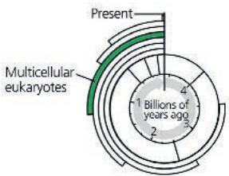  
an alga that lived 600 mya and (b) Kimberella, a mollusc (or close relative) that lived 560 mya.

## Early Multicellular Eukaryotes

Fossil evidence and DNA sequence data suggest that multicellular eukaryotes emerged about 1.3 billion years ago. The

Figure 25.11 Life becomes large. Fossils from the Ediacaran period document the oldest known macroscopic eukaryotes, such as (a) Doushantuophyton,

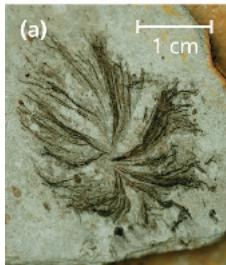

oldest known fossils of multicellular eukaryotes that can be resolved taxonomically are of relatively small red algae that lived 1.2 billion years ago. Larger and more diverse multicellular eukaryotes do not appear in the fossil record until about 600 million years ago (Figure 25.11). These fossils, referred to as the Ediacaran biota, were of mostly soft-bodied organisms—some over 1 m long—that lived from 635 to 541 million years ago (mya). The Ediacaran biota included both algae and animals, along with various organisms of unknown taxonomic affinity.

The rise of large eukaryotes in the Ediacaran period represents an enormous change in the history of life. Before that time, Earth was a microbial world: Its only inhabitants were single-celled prokaryotic and eukaryotic organisms, along with an assortment of microscopic multicellular eukaryotes. As the diversification of the Ediacaran biota came to a close about 541 million years ago, the stage was set for another, even more spectacular burst of evolutionary change: the “Cambrian explosion.”

## The Cambrian Explosion

Many present-day animal phyla appear suddenly in fossils formed 535–525 million years ago, early in the Cambrian period. This phenomenon is referred to as the Cambrian explosion. Fossils of several animal groups—sponges, cnidarians (sea anemones and their relatives), and molluscs (snails,

clams, and their relatives)—appear in even older rocks dating from the late Proterozoic (Figure 25.12).

Prior to the Cambrian explosion, all large animals were soft-bodied. The fossils of large pre-Cambrian animals reveal little evidence of predation. Instead, these animals appear to have been grazers (feeding on algae), filter feeders, or scavengers, not hunters. The Cambrian explosion changed all of that. In a relatively short period of time (10 million years), predators over 1 m in length emerged that had claws and other features for capturing prey; simultaneously, new defensive adaptations, such as sharp spines and heavy body armor, appeared in their prey.

Figure 25.12 Appearance of selected animal groups in the fossil record.  
The white bars indicate the earliest record of these animal groups.  
  
VISUAL SKILLS Circle the branch point that represents the most recent common ancestor of chordates and annelids. What is a minimum estimate of that ancestor's age?  
For suggested answer, see Appendix A.

Although the Cambrian explosion had an enormous impact on life on Earth, it appears that many animal phyla originated long before that time. DNA analyses suggest that the earliest animals had evolved by 700 million years ago; such analyses also indicate that the common ancestor of some of the major groups that radiated during the Cambrian explosion lived 670 million years ago. The fossil record corroborates these results in that researchers have unearthed 710-million-year-old sediments containing steroids indicative of a particular group of sponges. In contrast, the oldest macroscopic fossils of animals date from 560 million years ago and include Kimberella, shown in Figure 25.11. Overall, fossils and DNA analyses suggest that animals originated about 700 million years ago and then diversified explosively during the Cambrian and beyond.

## The Colonization of Land

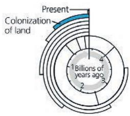

The colonization of land was another milestone in the history of life. There is fossil evidence that some prokaryotic organisms lived on terrestrial surfaces as early as 3.2 billion years ago. However, larger forms of life, such as fungi, plants, and animals, did not

begin to colonize land until about 500 million years ago. This gradual evolutionary venture out of aquatic environments was associated with adaptations that made it possible to reproduce on land and that helped prevent dehydration. For example, many plants today have a vascular system for transporting materials internally and a waterproof coating of wax on their leaves that slows the loss of water to the air. Early signs of these adaptations were present 420 million years ago, at which time small plants (about 10 cm high) existed that had a vascular system but lacked true roots or leaves. By 40 million years later, plants had diversified greatly and included trees and many other plants with true roots and leaves.

Plants appear to have colonized land in the company of fungi. Even today, the roots of most plants are associated with fungi that aid in the absorption of water and minerals from the soil (see Concept 31.1). These root fungi (or mycorrhizae), in turn, obtain their organic nutrients from the plants. Such mutually beneficial associations of plants and fungi are evident in some of the oldest fossilized plants, dating this relationship back to the early spread of life onto land (Figure 25.13).

Although many animal groups are now represented in terrestrial environments, the most widespread and diverse land animals are arthropods (particularly insects and spiders) and tetrapods. Arthropods were among the first animals to colonize land, roughly 450 million years ago. The earliest tetrapods found in the fossil record lived about 365 million years ago and appear to have evolved from a group of lobe-finned fishes (see Concept 34.3). Tetrapods include humans, although we are late arrivals on the scene. The human lineage diverged from other primates around 7–8 million years ago, and our species originated only about 195,000 years ago. If the clock of Earth's history were rescaled to represent an hour, humans appeared less than 0.2 second ago.

Figure 25.13 An ancient symbiosis.

This 405-million-year-old fossil stem (cross section) documents mycorrhizae in the early plant Aglaophyton major. The inset shows an enlarged view of a cell containing a branched fungal structure called an arbuscule; the fossil arbuscule resembles those seen in plant cells today.

  
Branched hyphae (arbuscule)  
Zone of arbuscule-containing cells

## Interview

Interview with Geerat Vermeij: What fossils reveal about the history of life (eTextbook only)

## Concept Check 25.3

1. The first appearance of free oxygen in the atmosphere likely triggered a massive wave of extinctions among the prokaryotic organisms of the time. Why?

2. What evidence supports the hypothesis that mitochondria preceded plastids in the evolution of eukaryotic cells?

3. WHAT IF? What would a fossil record of life today look like?

For suggested answers, see Appendix A.

## Concept 25.4: The rise and fall of groups of organisms reflect differences in speciation and extinction rates

From its beginnings, life on Earth has been marked by the rise and fall of groups of organisms. Anaerobic prokaryotic organisms originated, flourished, and then declined as the oxygen content of the atmosphere rose. Billions of years later, the first tetrapods emerged from the sea, giving rise to several major new groups of organisms. One of these, the amphibians, went on to dominate life on land for 100 million years, until other tetrapods (including dinosaurs and, later, mammals) replaced them as the dominant terrestrial vertebrates.

The rise and fall of these and other major groups of organisms have shaped the history of life. Narrowing our focus, we can also see that the rise or fall of any particular group is related to the speciation and extinction rates of its member species (Figure 25.14). Just as a population increases in size when there are more births than deaths, the rise of a group of organisms occurs when more new species are produced than are lost to extinction. The reverse occurs when a group is in decline. In the Scientific Skills Exercise, you can interpret data from the fossil record about changes in a group of snail species in the early Paleogene period. Such changes in the fates of groups of organisms have been influenced by large-scale processes such as plate tectonics, mass extinctions, and adaptive radiations.

Figure 25.14 How speciation and extinction affect diversity. The species diversity of an evolutionary lineage will increase when more new member species originate than are lost to extinction. In this hypothetical phylogenetic tree, each horizontal branch represents one species. By 2 million years ago, both lineage A and lineage B have given rise to four species, and no species have become extinct (denoted by a dagger symbol, †) By time 0, however, lineage A contains only one species, while lineage B contains eight species.  
  
VISUAL SKILLS Consider the period from 2 million years ago to time 0. For each lineage, determine how many speciation and extinction events occurred during that time.  
For suggested answer, see Appendix A.

## Plate Tectonics

If photographs of Earth were taken from space every 10,000 years and spliced together to make a movie, it would show something many of us find hard to imagine: The seemingly “rock solid” continents we live on move over time. Over the past billion years, there have been three occasions (1 billion, 600 million, and 250 million years ago) when most of the landmasses of Earth came together to form a supercontinent, then later broke apart. Each time, this breakup yielded a different configuration of continents. Based on the directions in which the continents are moving today, some geologists have estimated that a new supercontinent will form roughly 250 million years from now.

Figure 25.15 Cutaway view of Earth.
The thickness of the crust is exaggerated here.

# Scientific Skills Exercise Estimating Quantitative Data from a Graph and Developing Hypotheses

Do Ecological Factors Affect Evolutionary Rates? Researchers studied the fossil record to investigate whether differing modes of larval dispersal might explain species longevity within one taxon of marine snails, the family Volutidae. Some of the snail

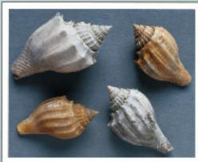

species had nonplanktonic larvae: They developed directly into adults without a swimming stage. Other species had planktonic larvae: They had a swimming stage and could disperse very long distances. The adults of these planktonic species tended to have broad geographic distributions, whereas nonplanktonic species tended to be more isolated.

How the Research Was Done The researchers studied the stratigraphic distribution of volutes in outcrops of sedimentary rocks located along North America's Gulf coast. These rocks, which formed from 66 to 37 million years ago, early in the Paleogene period, are an excellent source of well-preserved snail fossils. The researchers were able to classify each fossil species of volute snail as having planktonic or nonplanktonic larvae based on features of the earliest formed whorls of the snail's shell. Each bar in the graph shows how long one species of snail persisted in the fossil record.

## INTERPRET THE DATA

1. You can estimate quantitative data (fairly precisely) from a graph. The first step is to obtain a conversion factor by measuring along an axis that has a scale. In this case, 25 million years (my; from 60 to 35 million years ago [mya] on the x-axis) is represented by a distance of 7.0 cm. This yields a conversion factor (a ratio) of 25 my/7.0 cm = 3.6 my/cm. To estimate the time period represented by a horizontal bar on this graph, measure the length of that bar in centimeters and multiply that measurement by the conversion factor, 3.6 my/cm. For example, a bar that measures 1.1 cm on the graph represents a persistence time of $1.1 \, cm \times 3.6 \, my/cm = 4 \, million years$ .

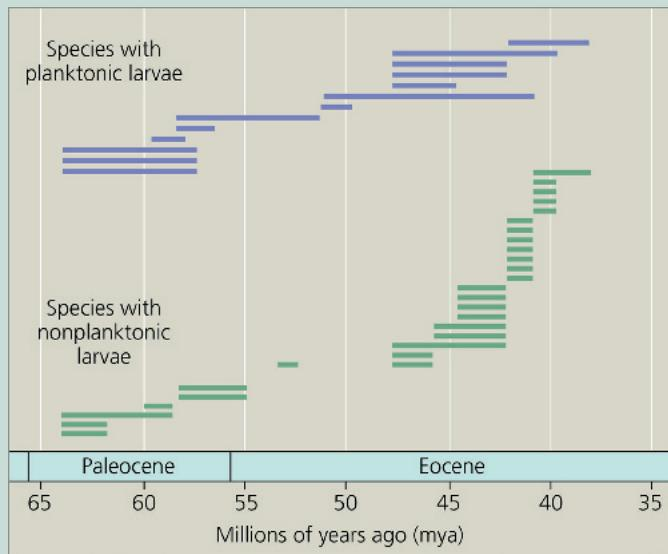  
Data from T. A. Hansen, Larval dispersal and species longevity in Lower Tertiary gastropods, Science 199:885–887 (1978). Reprinted with permission from AAAS.

2. Calculate the mean (average) persistence times for species with planktonic larvae and species with nonplanktonic larvae.

3. Count the number of new species that form in each group beginning at 60 mya (the first three species in each group were present around 64 mya, the first time period sampled, so we don't know when those species first appear in the fossil record).

4. Propose a hypothesis to explain the differences in longevity of snail species with planktonic and nonplanktonic larvae.

Instructors: A version of this Scientific Skills Exercise can be assigned in Mastering Biology.

According to the theory of plate tectonics, the continents are part of great plates of Earth's crust that essentially float on the hot, underlying portion of the mantle (Figure 25.15). Movements in the mantle cause the plates to move over time in a process called continental drift. Geologists can measure the rate at which the plates are moving now, usually only a few centimeters per year. They can also infer the past locations of the continents using the magnetic signal recorded in rocks at the time of their formation. This method works because as a continent shifts its position over time, the direction of magnetic north recorded in its newly formed rocks also changes.

Earth's major tectonic plates are shown in Figure 25.16. Many important geologic processes, including the formation of mountains and islands, occur at plate boundaries. In some cases, two plates are moving away from each other, as are the North

Earth's youngest major mountain range, the Himalayas, began to form when India collided with Eurasia about 45 million years ago. The continents continue to drift today.

At the end of the Paleozoic, all of Earth's landmasses were joined in the supercontinent Pangaea.

American and Eurasian plates, which are currently drifting apart at a rate of about 2 cm per year. In other cases, two plates are sliding past each other, forming regions where earthquakes are common. California's infamous San Andreas Fault is part of a border where two plates slide past each other. In still other cases, two plates collide, producing violent upheavals and forming new mountains along the plate boundaries. One spectacular example of this occurred 45 million years ago, when the Indian plate crashed into the Eurasian plate, starting the formation of the Himalayan mountains.

## Consequences of Continental Drift

Figure 25.16 Earth's major tectonic plates.  
The arrows indicate direction of movement. The orange dots represent zones of violent tectonic activity.  

Plate movements rearrange geog-

raphy slowly, but their cumulative

effects are dramatic. In addition to reshaping the physical features of our planet, continental drift also has a major impact on life on Earth.

One reason for this is that continental drift alters the habitats in which organisms live. Consider the changes shown in Figure 25.17. About 250 million years ago, plate movements brought previously separated landmasses together into a supercontinent named Pangaea. Ocean basins became deeper, which drained shallow coastal seas. At that time, as now, most marine species inhabited shallow waters, and the formation of Pangaea destroyed much of that habitat. Pangaea's interior was cold and dry, probably an even more severe environment than that of central Asia today. Overall, the formation of Pangaea greatly altered the physical environment and climate, which drove some species to extinction and provided new opportunities for groups of organisms that survived the crisis.

Organisms are also affected by the climate change that results when a continent shifts its location. The southern tip of Labrador, Canada, for example, once was located in the tropics but has moved $40^{\circ}$ to the north over the last 200 million years. When faced with the changes in climate that such shifts in position entail, organisms adapt, move to a new location, or become extinct (this last outcome occurred for many organisms stranded on Antarctica, which separated from Australia 40 million years ago).

Continental drift also promotes allopatric speciation on a grand scale. When supercontinents break apart, regions that once were connected become isolated. As the continents drifted apart over the last 200 million years, each became a separate evolutionary arena, with lineages of plants and animals that diverged from those on other continents. For example, marsupial mammals fill ecological roles in Australia analogous to those filled by eutherians (placental mammals) on other continents (see Figure 22.18). Fossil evidence shows that marsupial mammals originated in what is now Asia and reached Australia

Figure 25.17 The history of continental drift during the Phanerozoic eon.  
  
By the end of the Mesozoic, Laurasia and Gondwana had separated into the present-day continents.  
By the mid-Mesozoic, Pangaea had split into northern (Laurasia) and southern (Gondwana) landmasses.

VISUAL SKILLS Is the Australian plate's current direction of movement (see Figure 25.16) similar to the direction it traveled over the past 66 million years? For suggested answer, see Appendix A.

via South America and Antarctica while the continents were still joined. The subsequent breakup of the southern continents set Australia “afloat,” like a giant raft of marsupials. In Australia, marsupials diversified, and the few eutherians that lived there became extinct; on other continents, most marsupials became extinct and the eutherians diversified.

Finally, continental drift can help explain puzzling geographic distributions of extinct organisms, such as fossils of the same species of Permian freshwater reptiles found in both Brazil and the West African nation of Ghana. These two parts of the world, now separated by 3,000 km of ocean, were joined together when these reptiles were living.

## Mass Extinctions

The fossil record shows that the overwhelming majority of species that ever lived are now extinct. A species may become extinct for many reasons. Its habitat may have been destroyed, or its environment may have changed in a manner unfavorable to the species. For example, if ocean temperatures fall by even a few degrees, species that are otherwise well adapted may perish. Even if physical factors in the environment remain stable, biological factors may change—the origin of one species can spell doom for another.

Although extinction occurs regularly, at certain times disruptive changes to the global environment have caused the rate of extinction to increase dramatically. The result is a mass extinction, in which large numbers of species become extinct worldwide.

## The “Big Five” Mass Extinction Events

Five mass extinctions are documented in the fossil record over the past 500 million years (Figure 25.18). These events are particularly well documented for the decimation of hard-bodied animals that lived in shallow seas, the organisms for which the fossil record is most complete. In each mass extinction, 50% or more of marine species became extinct.

Two mass extinctions—the Permian and the Cretaceous—have received the most attention. The Permian mass extinction, which defines the boundary between the Paleozoic and Mesozoic eras (252 million years ago), claimed about 96% of marine animal species and drastically altered life in the ocean. Terrestrial life was also affected. For example, 8 out of 27 known orders of insects were wiped out. This mass extinction occurred in less than 500,000 years, possibly in just a few thousand years—an instant in the context of geologic time.

The Permian mass extinction occurred during the most extreme episode of volcanism in the past 500 million years. Geologic data indicate that 1.6 million km $^{2}$ (roughly half the size of Western Europe) in Siberia was covered with lava hundreds of meters thick. The eruptions are thought to have produced enough carbon dioxide to warm the global climate by an estimated 6°C, harming many temperature-sensitive species. The rise in atmospheric CO $_{2}$ levels would also have led to ocean acidification, thereby reducing the availability of calcium carbonate, which is required by reef-building corals and many shell-building species (see Figure 3.12). The eruptions would also have added nutrients such as phosphorus to marine ecosystems, stimulating the growth of microorganisms. Upon their deaths, these microorganisms would have provided food for bacterial decomposers. Bacteria use oxygen as they decompose the bodies of dead organisms, thus causing oxygen concentrations to drop. This would have harmed oxygen-breathers and promoted the growth of anaerobic bacteria that emit a poisonous metabolic by-product, hydrogen sulfide ( $H_{2}S$ ) gas. Overall, the volcanic eruptions may have triggered a series of catastrophic events that together resulted in the Permian mass extinction.

Figure 25.18 Mass extinction and the diversity of life.  
The five generally recognized mass extinction events, indicated by red arrows, represent peaks in the extinction rate of marine animal families (red solid line and left vertical axis). These mass extinctions interrupted the overall increase, over time, in the number of extant families of marine animals (blue dashed line and right vertical axis).  
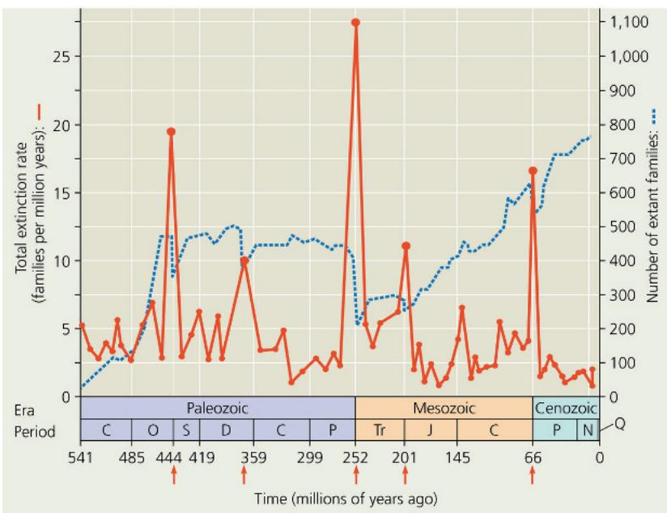  
INTERPRET THE DATA As mentioned in the text, 96% of marine animal species became extinct in the Permian mass extinction (252 million years ago). Explain why the blue curve shows only a 50% drop at that time.

The Cretaceous mass extinction occurred 66 million years ago. This event extinguished more than half of all marine species and eliminated many families of terrestrial plants and animals, including all dinosaurs (except birds, which are members of the same group; see Figure 34.25). One clue to a possible cause of the Cretaceous mass extinction is a thin layer of clay enriched in iridium that dates to the time of the mass extinction. Iridium is an element that is very rare on Earth but common in many of the meteorites and other extraterrestrial objects that occasionally fall to Earth. As a result, researchers proposed that this clay is fallout from a huge cloud of debris that billowed into the atmosphere when an asteroid collided with Earth. This cloud would have blocked sunlight and caused a sudden drop in global temperatures lasting for several months to years.

Is there evidence of such an asteroid? Research has focused on the Chicxulub crater, a 66-million-year-old scar

## Figure 25.19 A trauma for Cretaceous life.

Beneath the Caribbean Sea, the 66-million-year-old Chicxulub crater measures 180 km across. The horseshoe shape of the crater and the pattern of debris in sedimentary rocks indicate that an asteroid struck at a low angle. This drawing represents the impact and its immediate effect:

a cloud of hot vapor and debris that could have killed many of the plants and animals in North America within hours and ignited massive wildfires.

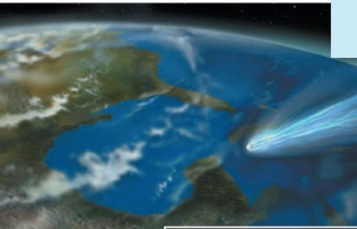

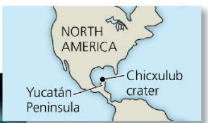

beneath sediments off the coast of Mexico (Figure 25.19). The crater is the right size to have been caused by an object with a diameter of 10 km. When the impact occurred, many species may have been particularly vulnerable to extinction because recent large-scale volcanic eruptions had already caused their populations to decline. Moreover, a 2018 study estimated that wildfires resulting from the impact contributed to a sharp rise in atmospheric $CO_{2}$ levels, causing a period of global warming that lasted 100,000 years—yet another stress for populations already in decline. Critical evaluation of these and other hypotheses for mass extinctions continues.

## Is a Sixth Mass Extinction Under Way?

As you will read further in Concept 56.1, human actions, such as habitat destruction, are modifying the global environment to such an extent that many species are threatened with extinction. More than 1,000 species have become extinct in the last 400 years. Scientists estimate that this rate is 100 to 1,000 times the typical background rate seen in the fossil record. Is a sixth mass extinction now in progress?

This question is difficult to answer, in part because it is hard to document the total number of extinctions occurring today. Tropical rain forests, for example, harbor many undiscovered species. As a result, destroying tropical forest may drive species to extinction before we even learn of them.

## Figure 25.20 Fossil extinctions and temperature.

Extinction rates increased when global temperatures were high. Temperatures were estimated using ratios of oxygen isotopes and converted to an index in which 0 is the overall average temperature.

Such uncertainties make it hard to assess the full extent of the current extinction crisis. Even so, it is clear that losses to date have not reached those of the “big five” mass extinctions, in which large percentages of Earth’s species became extinct. This does not in any way discount the seriousness of today’s situation. Monitoring programs show that many species are declining at an alarming rate due to habitat loss, introduced species, overharvesting, and other factors. Recent studies on a variety of organisms, including lizards, pine trees, and polar bears, suggest that climate change may hasten some of these declines. The fossil record also highlights the potential importance of climate change: Over the last 500 million years, extinction rates have tended to increase when global temperatures were high (Figure 25.20). Overall, the evidence suggests that unless dramatic actions are taken, a sixth, human-caused mass extinction is likely to occur within the next few centuries.

## Consequences of Mass Extinctions

Mass extinctions have significant and long-term effects. By eliminating large numbers of species, a mass extinction can reduce a thriving and complex ecological community to a pale shadow of its former self. And once an evolutionary lineage disappears, it cannot reappear. The course of evolution is changed forever. Consider what would have happened if the early primates living 66 million years ago had died out in the Cretaceous mass extinction. Humans would not exist, and life on Earth would differ greatly from what it is today.

The fossil record shows that it typically takes 5–10 million years for the diversity of life to recover to previous levels after a mass extinction. In some cases, it has taken much longer than that: It took about 100 million years for the number of marine families to recover after the Permian mass extinction (see Figure 25.18). These data have sobering implications. If current trends continue and a sixth mass extinction occurs, it will take millions of years for life on Earth to recover.

Mass extinctions can also alter ecological communities by changing the types of organisms residing there. For example, after

Figure 25.21 Mass extinctions and ecology.

The Permian and Cretaceous mass extinctions (indicated by red arrows) altered the ecology of the oceans by increasing the percentage of marine genera that were predators.

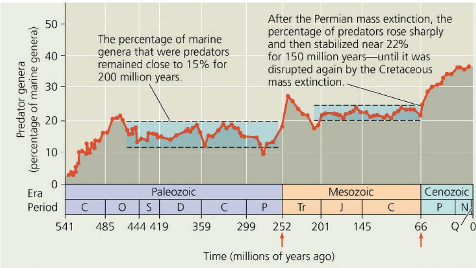

the Permian and Cretaceous mass extinctions, the percentage of marine organisms that were predators increased substantially (Figure 25.21). A rise in the number of predators can increase both the risks faced by prey and the competition among predators for food. In addition, mass extinctions can curtail lineages with novel and advantageous features. For example, in the late Triassic period, a group of gastropods (snails and their relatives) arose that could drill through the shells of bivalves (such as clams) and feed on the animals inside. Although shell drilling provided access to a new and abundant source of food, this newly formed group was wiped out during the mass extinction at the end of the Triassic (about 200 million years ago). Another 120 million years passed before another group of gastropods (the oyster drills) exhibited the ability to drill through shells. As their predecessors might have done if they had not originated at an unfortunate time, oyster drills have since diversified into many new species. Finally, by eliminating so many species, mass extinctions can pave the way for adaptive radiations, in which new groups of organisms proliferate.

## Adaptive Radiations

The fossil record shows that the diversity of life has increased over the past 250 million years (see blue dashed line in Figure 25.18).

This increase has been fueled by adaptive radiations, periods of evolutionary change in which groups of organisms form many new species whose adaptations allow them to fill different ecological roles, or niches, in their communities. Large-scale adaptive radiations occurred after each of the big five mass extinctions, when survivors became adapted to the many vacant ecological niches. Adaptive radiations have also occurred in groups of organisms that possessed major evolutionary innovations, such as seeds or armored body coverings, or that colonized regions in which they faced little competition from other species.

## Worldwide Adaptive Radiations

Fossil evidence indicates that mammals underwent a dramatic adaptive radiation after the extinction of terrestrial dinosaurs 66 million years ago (Figure 25.22).

Although mammals originated about 180 million years ago, the mammal fossils older than 66 million years are mostly small and show less morphological diversity than found today. Many species appear to have been nocturnal based on their large eye sockets, similar to those in living nocturnal mammals. A few early mammals were intermediate in size, such as Repenomamus giganticus, a 1-m-long predator that lived 130 million years ago—but none approached the size of many dinosaurs. Early mammals may have been restricted in size and diversity because they were eaten or outcompeted by the larger and more diverse dinosaurs. With the disappearance of the dinosaurs (except for birds), mammals expanded greatly in both diversity and size, filling the ecological roles once occupied by terrestrial dinosaurs.

The history of life has also been greatly altered by radiations in which groups of organisms increased in diversity as they came to play entirely new ecological roles in their communities. As we'll explore in later chapters, examples include the rise of photosynthetic prokaryotes, the evolution of large predators in the Cambrian explosion, and the radiations following the colonization of land by plants, insects, and tetrapods. Each of these last three radiations was associated with major evolutionary innovations that facilitated life on land. The radiation of plants, for example, was associated with key

Figure 25.22 Adaptive radiation of mammals.  

adaptations, such as stems that support plants against gravity and a waxy coat that protects leaves from water loss. Finally, organisms that arise in an adaptive radiation can serve as a new source of food for still other organisms. In fact, the diversification of plants stimulated a series of adaptive radiations in insects that ate or pollinated plants, one reason that insects are the most diverse group of animals on Earth today.

## Regional Adaptive Radiations

Striking adaptive radiations have also occurred over more limited geographic areas. Such radiations can be initiated when a few organisms make their way to a new, often distant location in which they face relatively little competition from other organisms. The Hawaiian archipelago is one of the world's great showcases of this type of adaptive radiation (Figure 25.23). Located about 3,500 km from the nearest continent, the volcanic islands are progressively older as one follows the chain toward the northwest; the youngest island, Hawaii, is less than a million years old and still has active volcanoes. Each island was born “naked” and was gradually populated by stray organisms that rode the ocean currents and winds either from far-distant land areas or from older islands of the archipelago itself. The physical diversity of each island, including immense variation in soil conditions, elevation, and rainfall, provides many opportunities for evolutionary divergence by natural selection. Multiple invasions followed by speciation events have ignited an explosion of adaptive radiation in Hawaii. As a result, thousands of species that inhabit the islands are found nowhere else on Earth. Among plants, for example, about 1,100 species are unique to the Hawaiian Islands. Unfortunately, many of these species are now facing an elevated risk of extinction due to human actions such as habitat destruction and the introduction of non-native plant species.

Figure 25.23 Adaptive radiation on the Hawaiian Islands.

Molecular analysis indicates that these remarkably varied Hawaiian plants, known collectively as the “silversword alliance,” are all descended from an ancestral tarweed that arrived on the islands from North America about 5 million years ago. Silverswords have since spread into different habitats and formed new species with strikingly different adaptations.

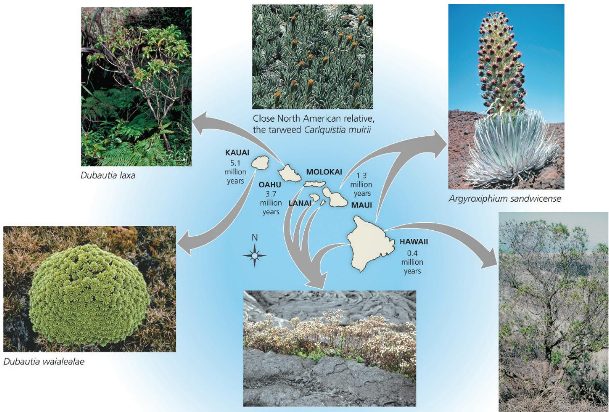  
Dubautia waialealae  
Dubautia scabra  
Dubautia linearis

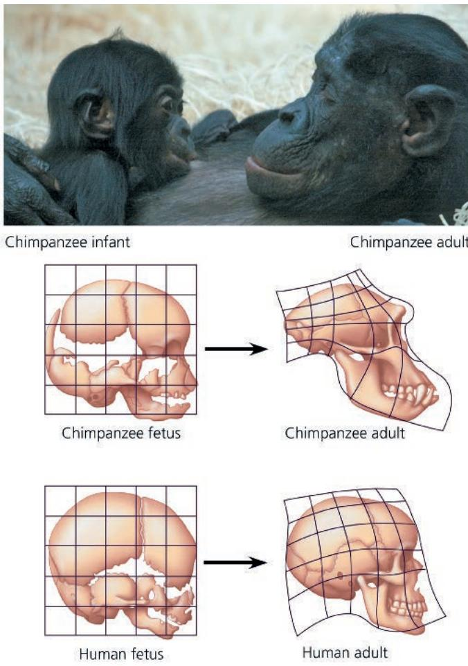

## Interview

Interview with Neil Shubin: Reconstructing major evolutionary events in the history of life (eTextbook only)

## Concept Check 25.4

1. Explain the consequences of plate tectonics for life on Earth.

2. What factors promote adaptive radiations?

3. WHAT IF? Based on evidence from previous mass extinctions, describe ecological and evolutionary consequences that could result if a sixth human-caused mass extinction occurs.

For suggested answers, see Appendix A.

# Concept 25.5: Major changes in body form can result from changes in the sequences and regulation of developmental genes

The fossil record tells us what the great changes in the history of life have been and when they occurred. Moreover, an understanding of plate tectonics, mass extinction, and adaptive radiation provides a picture of how those changes came about. But we can also seek to understand the intrinsic biological mechanisms that underlie changes seen in the fossil record. For this, we turn to genetic mechanisms of change, paying particular attention to genes that influence development.

## Effects of Developmental Genes

As you read in Concept 21.6, “evo-devo”—research at the interface between evolutionary biology and developmental biology—is illuminating how slight genetic differences can produce major morphological differences between species. In particular, large morphological differences can result from genes that alter the rate, timing, and spatial pattern of change in an organism’s form as it develops from a zygote into an adult.

## Changes in Rate and Timing

Many striking evolutionary transformations are the result of heterochrony (from the Greek hetero, different, and chronos, time), an evolutionary change in the rate or timing of developmental events. For example, an organism's shape depends in part on the relative growth rates of different body parts during development. Changes to these rates can alter the adult form substantially, as seen in the contrasting shapes of human and chimpanzee skulls (Figure 25.24). Other examples of the dramatic evolutionary effects of heterochrony include how increased growth rates of finger bones yielded the skeletal structure of wings in bats (see Figure 22.15) and how

## Figure 25.24 Relative skull growth rates.

In the human evolutionary lineage, mutations slowed the growth of the jaw relative to other parts of the skull. As a result, in humans the skull of an adult is more similar to the skull of an infant than is the case for chimpanzees.

Chimpanzee infant

Chimpanzee adult

Chimpanzee fetus

Chimpanzee adult

Human fetus

Human adult

slowed growth of leg and pelvic bones led to the reduction and eventual loss of hind limbs in whales (see Figure 22.20).

Heterochrony can also alter the timing of reproductive development relative to the development of nonreproductive organs. If the development of reproductive organs accelerates compared to that of other organs, the sexually mature stage of a species may retain body features that were juvenile structures in an ancestral species, a condition called paedomorphosis (from the Greek paedos, of a child, and morphosis, formation). For example, most salamander species have aquatic larvae that undergo metamorphosis in becoming adults. But some species grow to adult size and become sexually mature while retaining gills and other larval features (Figure 25.25, on the next page). Such an evolutionary alteration of developmental timing can produce animals that appear very different from their ancestors, even though the overall genetic change may be small. Indeed, recent evidence indicates that a change at a single locus was probably sufficient to bring about paedomorphosis in the axolotl salamander, although other genes may have contributed as well.

## Changes in Spatial Pattern

Substantial evolutionary changes can also result from alterations in genes that control the spatial organization of body parts. For example, master regulatory genes called homeotic genes (see Concept 18.4)

## Figure 25.25 Paedomorphosis.

The adults of some species retain features that were juvenile in ancestors. This salamander is an axolotl, an aquatic species becomes a sexually mature adult while retaining certain larval (tadpole) characteristics, including gills.

determine such basic features as where a pair of wings and legs will develop on a bird or how a plant's flower parts are arranged.

The products of one class of homeotic genes, the Hox genes, provide positional information in an animal embryo. This information prompts cells to develop into structures appropriate for a particular location. Changes in Hox genes or in how they are expressed can have a profound impact on morphology. For example, among crustaceans, a change in the location where two Hox genes (Ubx and Scr) are expressed correlates with the conversion of a swimming appendage to a feeding appendage. Similarly, when comparing plant species, changes to the expression of homeotic genes known as MADS-box genes can produce flowers that differ dramatically in form (see Concept 35.5).

## The Evolution of Development

The 560-million-year-old fossils of Ediacaran animals (see Figure 25.11) suggest that a set of genes sufficient to produce complex animals existed at least 25 million years before the Cambrian explosion. If such genes have existed for so long, how can we explain the astonishing increases in diversity seen during and since the Cambrian explosion?

Adaptive evolution by natural selection provides one answer to this question. As we've seen throughout this unit, by sorting among differences in the sequences of protein-encoding genes, selection can improve adaptations rapidly. In addition, new genes (created by gene duplication events) can take on new metabolic and structural functions, as can existing genes that are regulated in new ways.

Examples in the previous section suggest that developmental genes may have been particularly important. Thus, we'll turn next to how new morphological forms can arise from changes in the nucleotide sequences or regulation of developmental genes.

## Changes in Gene Sequence

New developmental genes arising after gene duplication events probably facilitated the origin of novel morphological forms. But since other genetic changes also may have occurred at such times, it can be difficult to establish causal links between genetic and morphological changes that occurred in the past.

This difficulty was sidestepped in a study of developmental changes associated with the divergence of six-legged insects from crustacean ancestors that had more than six legs. (As discussed in Concept 33.4, insects arose from within a subgroup of the crustaceans, the traditional name for organisms such as shrimp, crabs, and lobsters.) Crustaceans and insects differ in the pattern of expression and the effects of the Hox gene Ubx: In particular, in insects, Ubx suppresses leg formation where it is expressed (Figure 25.26).

To examine the workings of this gene, researchers cloned the Ubx gene from an insect, the fruit fly Drosophila, and from a crustacean, the brine shrimp Artemia. Next, they genetically engineered fruit fly embryos to express either the Drosophila Ubx gene or the Artemia Ubx gene throughout their bodies. The Drosophila gene suppressed 100% of the limbs in the embryos, as expected, whereas the Artemia gene suppressed only 15%.

The researchers then sought to uncover key steps involved in the evolutionary transition from an ancestral Ubx gene to an

## Figure 25.26 Effects of the Hox gene Ubx on the insect body plan.

In crustaceans, the Hox gene Ubx is expressed in the region shaded green, the body segments between the head and genital segments. In insects, Ubx is expressed in only a subset (shaded pink) of the homologous body segments, where it suppresses leg formation.

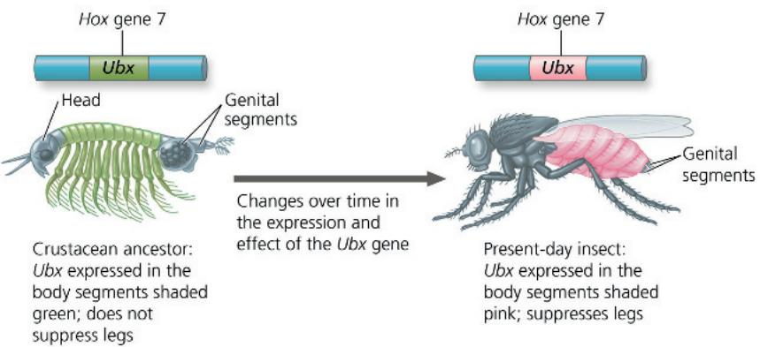

insect Ubx gene. Their approach was to identify mutations that would cause the Artemia Ubx gene to suppress leg formation, thus making its gene act more like an insect Ubx gene. To do this, they constructed a series of “hybrid” Ubx genes, each of which contained known segments of the Drosophila Ubx gene and known segments of the Artemia Ubx gene. By inserting these hybrid genes into fruit fly embryos (one hybrid gene per embryo) and observing their effects on leg development, the researchers were able to pinpoint the exact amino acid changes responsible for the suppression of additional limbs in insects. In so doing, this study provided evidence that particular changes in the nucleotide sequence of a developmental gene contributed to a major evolutionary change: the origin of the six-legged insect body plan.

## Changes in Gene Regulation

A change in the nucleotide sequence of a gene may affect its function wherever the gene is expressed, while changes in the regulation of gene expression can be limited to one cell type (see Concept 18.4). Thus, a change in the regulation of a developmental gene may have fewer harmful side effects than a change to the

sequence of the gene. This reasoning has prompted researchers to suggest that changes in the form of organisms may often be caused by mutations that affect the regulation of developmental genes—not their sequences.

This idea is supported by studies of a variety of species, including threespine stickleback fish. These fish live in the open ocean and in shallow, coastal waters. In western Canada, they also live in lakes formed when the coastline receded during the past 12,000 years. Marine stickleback fish have a pair of spines on their ventral (lower) surface, which deter some predators. These spines are often reduced or absent in stickleback fish living in lakes that lack predatory fishes and that are also low in calcium. Spines may have been lost in such lakes because they are not advantageous in the absence of predators, and the limited calcium is needed for purposes other than constructing spines.

At the genetic level, the developmental gene Pitx1 was known to influence whether stickleback fish have ventral spines. Was the reduction of spines in some lake populations due to changes in the Pitx1 gene or to changes in how the gene is expressed (Figure 25.27)? The researchers' results indicate that the regulation of gene expression has changed,

## Figure 25.27

## Inquiry: What causes the loss of spines in lake stickleback fish?

## Experiment

Marine populations of the threespine stickleback fish (Gasterosteus aculeatus) have a set of protective spines on their lower (ventral) surface; however, these spines have been lost or reduced in some lake populations of this fish. Researchers performed genetic crosses and found that most of

  
▲ Threespine stickleback (Gasterosteus aculeatus)

the reduction in spine size resulted from the effects of a single developmental gene, Pitx1. The researchers then tested two hypotheses about how Pitx1 causes this morphological change.

Hypothesis A: A change in the DNA sequence of Pitx1 had caused spine reduction in lake populations. To test this idea, the team used DNA sequencing to compare the coding sequence of the Pitx1 gene between marine and lake stickleback populations.

Hypothesis B: A change in the regulation of the expression of Pitx1 had caused spine reduction. To test this idea, the researchers monitored where in the developing embryo the Pitx1 gene was expressed. They conducted whole-body in situ hybridization experiments (see Concept 20.2) using Pitx1 DNA as a probe to detect Pitx1 mRNA in the fish.

Results  
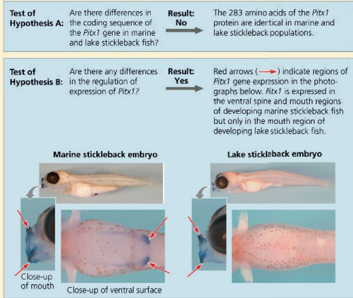

## Conclusion

The loss or reduction of ventral spines in lake populations of threespine stickleback fish appears to have resulted primarily from a change in the regulation of Pitx1 gene expression, not from a change in the gene's sequence.

Data from M. D. Shapiro et al., Genetic and developmental basis of evolutionary pelvic reduction in threespine sticklebacks, Nature 428:717–723 (2004).

WHAT IF? Describe the set of results that would have led researchers to the conclusion that a change in the coding sequence of the Pitx1 gene was more important than a change in regulation of gene expression.

For suggested answer, see Appendix A.

not the DNA sequence. Moreover, lake stickleback fish do express the Pitx1 gene in tissues not related to the production of spines (for example, the mouth), illustrating how morphological change can be caused by altering the expression of a developmental gene in some parts of the body but not others. In a follow-up study, researchers showed that changes to the Pel enhancer, a noncoding DNA region that affects expression of the Pitx1 gene, resulted in the reduction of ventral spines in lake sticklebacks. Overall, results from studies on stickleback fish provide a clear and detailed example of how changes in gene regulation can alter the form of individual organisms and ultimately lead to evolutionary change in populations.

## Interview

Interview with Cassandra Extavour: Studying the evolution of genes that control development (eTextbook only)

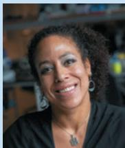

## Concept Check 25.5

1. Explain how new body forms can originate by heterochrony.

2. Why is it likely that Hox genes have played a major role in the evolution of novel morphological forms?

3. MAKE CONNECTIONS Given that changes in morphology are often caused by changes in the regulation of gene expression, predict whether noncoding DNA is likely to be affected by natural selection. (Review Concept 18.3.)

For suggested answers, see Appendix A.

## Concept 25.6: Evolution is not goal oriented

What does our study of macroevolution tell us about how evolution works? One lesson is that throughout the history of life, the origin of new species has been affected by both the small-scale factors described in Concept 23.3 (such as natural selection operating in populations) and the large-scale factors described in this chapter (such as continental drift promoting bursts of speciation throughout the globe). Moreover, to paraphrase the Nobel Prize-winning geneticist François Jacob, evolution is like tinkering—a process in which new forms arise by the modification of existing structures or existing developmental genes. Over time, such tinkering has led to the three key features of the natural world described on the opening page of Chapter 22: the striking ways in which organisms are suited for life in their environments, the many shared characteristics of life, and the rich diversity of life.

## Evolutionary Novelties

François Jacob's view of evolution harkens back to Darwin's concept of descent with modification. As new species form, novel and complex structures can arise as gradual modifications of ancestral structures. In many cases, complex structures have evolved in increments from simpler versions that performed the same basic function. For example, consider the human eye, an intricate organ constructed from numerous parts that work together in forming an image and transmitting it to the brain. How could the human eye have evolved in gradual increments? Some argue that if the eye needs all of its components to function, a partial eye could not have been of use to our ancestors.

The flaw in this argument, as Darwin himself noted, lies in the assumption that only complicated eyes are useful. In fact, many animals depend on eyes that are far less complex than our own. The simplest eyes that we know of are patches of light-sensitive photoreceptor cells. These simple eyes appear to have had a single evolutionary origin and are now found in a variety of animals, including small molluscs called limpets. Such eyes have no equipment for focusing images, but they do enable the animal to distinguish light from dark. Limpets cling more tightly to their rock when a shadow falls on them, a behavioral adaptation that reduces the risk of being eaten (Figure 25.28). Limpets have had a long evolutionary history, demonstrating that their “simple” eyes are quite adequate to support their survival and reproduction.

In the animal kingdom, complex eyes have evolved independently from such basic structures many times. Some molluscs, such as squids and octopuses, have eyes as complex as those of humans and other vertebrates (Figure 25.29). Although complex mollusc eyes evolved independently of vertebrate eyes, both evolved from a simple cluster of photoreceptor cells present in a common ancestor. In each case, the complex eye evolved through a series of steps that benefited the eyes' owners at every stage. Evidence of their independent evolution can be found in their structure: Vertebrate eyes detect light at the back layer of the retina and conduct nerve impulses toward the front, while complex mollusc eyes do the reverse.

Figure 25.28 Limpets (Patella vulgata), molluscs that can sense light and dark with a simple patch of photoreceptor cells.  
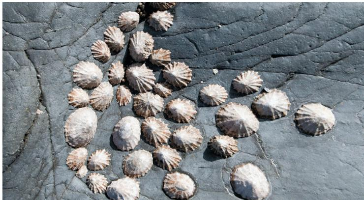

  
(a) Patch of pigmented cells  
(e) Complex camera lens-type eye  
(d) Eye with primitive lens  
Figure 25.29 A range of eye complexity among molluscs.

  
The slit shell mollusc Pleurotomaria has an eyecup.  
(c) Pinhole camera-type eye

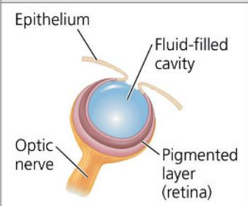  
The Nautilus eye functions like a pinhole camera (an early type of camera lacking a lens).

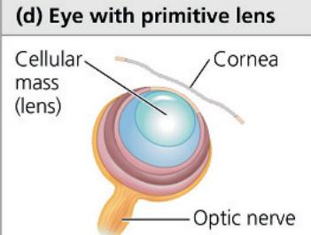  
The marine snail Murex has a primitive lens consisting of a mass of crystal-like cells. The cornea is a transparent region of tissue that protects the eye and helps focus light.  
The squid Loligo has a complex eye with features (cornea, lens, and retina) similar to those of vertebrate eyes. However, the squid eye evolved independently from vertebrate eyes.

Throughout their evolutionary history, eyes retained their basic function of vision. But evolutionary novelties can also arise when structures that originally played one role gradually acquire a different one. For example, as cynodonts gave rise to early mammals, bones that formerly comprised the jaw hinge (the articular and quadrate; see Figure 25.7) were incorporated into the ear region of mammals, where they eventually took on a new function: the transmission of sound (see Concept 34.6). Structures that evolve in one context but become co-opted for another function are sometimes called exaptations to distinguish them from the adaptive origin of the original structure. Note that the concept of exaptation does not imply that a structure somehow evolves in anticipation of future use. Natural selection cannot predict the future; it can only improve a structure in the context of its current utility. Novel features, such as the new jaw hinge and ear bones of early mammals, can arise gradually via a series of intermediate stages, each of which has some function in the organism's current context.

## Evolutionary Trends

What else can we learn from patterns of macroevolution? Consider evolutionary “trends” observed in the fossil record. For instance, some evolutionary lineages exhibit a trend toward larger or smaller body size. An example is the evolution of the present-day horse (genus Equus), a descendant of the 55-million-year-old Hyracotherium (Figure 25.30, on the next page). About the size of a large dog, Hyracotherium had four toes on its front feet, three toes on its hind feet, and teeth adapted for browsing on bushes and trees. In comparison, present-day horses are larger, have only one toe on each foot, and possess teeth modified for grazing on grasses.

Extracting a single evolutionary progression from the fossil record can be misleading, however; it is like describing a bush as growing toward a single point by tracing only the branches that lead to that twig. For example, by selecting certain species from the available fossils, it is possible to arrange a succession of animals intermediate between Hyracotherium and living horses that shows a trend toward large, single-toed species (follow the yellow highlighting in Figure 25.30). However, if we consider all fossil horses known today, this apparent trend vanishes. The genus Equus did not evolve in a straight line; it is the only surviving twig of an evolutionary tree that is so branched that it is more like a bush. Equus actually descended through a series of speciation episodes that included several adaptive radiations, not all of which led to large, one-toed, grazing horses. In fact, phylogenetic analyses suggest that all lineages that include grazers are closely related to Parahippus; the many other horse lineages, all of which are now extinct, remained multi-toed browsers for 35 million years.

Branching evolution can result in a real evolutionary trend even if some species counter the trend. One model of long-term trends views species as analogous to individuals: Speciation is their birth, extinction is their death, and new species that diverge from them are their offspring. In this model, just as populations of individual organisms undergo natural selection, species undergo species selection. The species that endure the longest and generate the most new offspring species determine the direction of major evolutionary trends. The species selection model suggests that “differential speciation success” plays a role in macroevolution similar to the role of differential reproductive success in microevolution. Evolutionary trends can also result directly from natural selection. For example, when horse ancestors invaded the grasslands that spread during the mid-Cenozoic, there was strong selection for grazers that could escape predators by running faster. This trend would not have occurred without open grasslands.

Whatever its cause, an evolutionary trend does not imply that there is some intrinsic drive toward a particular phenotype. Evolution is the result of the interactions between organisms and their current environments; if environmental conditions change, an evolutionary trend may cease or even reverse itself. The cumulative effect of these ongoing interactions between organisms and their environments is enormous: It is through them that the staggering diversity of life—Darwin’s “endless forms most beautiful”—has arisen.

## Figure 25.30 The evolution of horses.

Using yellow to trace a sequence of fossil horses that are intermediate in form between the present-day horse (Equus) and its Eocene ancestor Hyracotherium creates the illusion of a progressive trend toward larger size, reduced number of toes, and teeth modified for grazing. In fact, Equus is the only surviving twig of an evolutionary bush with many divergent trends.

## Concept Check 25.6

1. How can the Darwinian concept of descent with modification explain the evolution of such complex structures as the vertebrate eye?

2. WHAT IF? The myxoma virus kills up to 99.8% of infected European rabbits in populations with no previous exposure to the virus. The virus is transmitted between living rabbits by mosquitoes. Describe an evolutionary trend (in either the rabbit or virus) that might occur after a rabbit population first encounters the virus.

# Chapter 25 Review

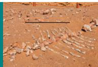

## Summary of Key Concepts

To review key terms, go to the Vocabulary Self-Quiz (eTextbook only).

## Concept 25.1: Conditions on early Earth made the origin of life possible

\- Experiments simulating possible early atmospheres have produced organic molecules from inorganic precursors. Amino acids, lipids, sugars, and nitrogenous bases have also been found in meteorites.

\- Amino acids and RNA nucleotides polymerize when dripped onto hot sand, clay, or rock. Organic compounds can spontaneously assemble into protocells, membrane-bounded droplets that have some properties of cells.

\- The first genetic material may have self-replicating, catalytic RNA. Early protocells containing such RNA would have increased through natural selection.

Describe the roles that montmorillonite clay and vesicles may have played in the origin of life.

## Concept 25.2: The fossil record documents the history of life

\- The fossil record, based largely on fossils found in sedimentary rocks, documents the rise and fall of different groups of organisms over time.

\- Sedimentary strata reveal the relative ages of fossils. The ages of fossils can be estimated by radiometric dating and other methods.

\- The fossil record shows how new groups of organisms can arise via the gradual modification of preexisting organisms.

What are the challenges of estimating the ages of old fossils? Explain how these challenges may be overcome in some circumstances.

Concept 25.3: Key events in life's history include the origins of unicellular and multicellular organisms and the colonization of land  
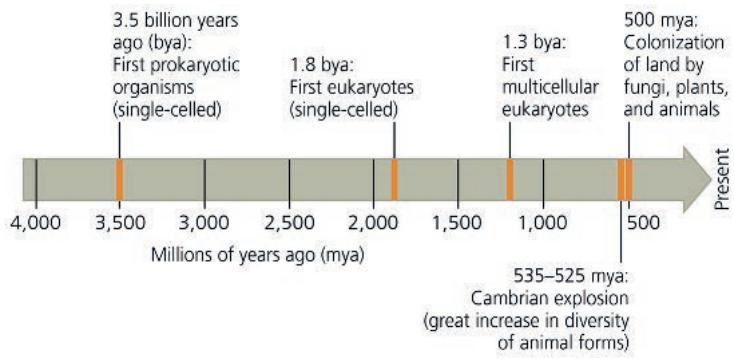  
What is the "Cambrian explosion," and why is it significant?

## Concept 25.4: The rise and fall of groups of organisms reflect differences in speciation and extinction rates

\- In plate tectonics, continental plates move gradually over time, altering the physical geography and climate of Earth, leading to extinctions in some groups and speciation in others.

\- Evolutionary history has been punctuated by five mass extinctions that radically altered life's history. Possible causes for these extinctions include continental drift, volcanic activity, and impacts from asteroids.

\- Large increases in the diversity of life have resulted from adaptive radiations that followed mass extinctions. Adaptive radiations have also occurred in groups of organisms that possessed major evolutionary innovations or that colonized new regions in which there was little competition from other organisms.

Explain how the broad evolutionary changes seen in the fossil record are the cumulative result of speciation and extinction events.

## Concept 25.5: Major changes in body form can result from changes in the sequences and regulation of developmental genes

\- Developmental genes affect morphological differences between species by influencing the rate, timing, and spatial patterns of change in an organism's form as it develops into an adult.

\- The evolution of new forms can be caused by changes in the nucleotide sequences or regulation of developmental genes.

How could changes in a single gene or DNA region ultimately lead to the origin of a new group of organisms?

## Concept 25.6: Evolution is not goal oriented

\- Novel and complex biological structures can evolve through a series of incremental modifications, each of which benefits the organism that possesses it.

\- Evolutionary trends can be caused by natural selection in a changing environment or species selection, resulting from interactions between organisms and their current environments.

Explain the reasoning behind the statement "Evolution is not goal oriented." For suggested answers, see Appendix A.

## Test Your Understanding

For more multiple-choice questions, go to the Practice Test (eTextbook only).

## Levels 1-2: Remembering/Understanding

1. Fossilized stromatolites

(A) formed around deep-sea vents.

(B) resemble structures formed by bacterial communities that are found today in some shallow marine bays.

(C) provide evidence that plants moved onto land in the company of fungi around 500 million years ago.

(D) contain the first undisputed fossils of eukaryotes.

2. The oxygen revolution changed Earth's environment dramatically. Which of the following took advantage of the presence of free oxygen in the oceans and atmosphere?

(A) the evolution of cellular respiration, which used oxygen to help harvest energy from organic molecules

(B) the persistence of some animal groups in anaerobic habitats

(C) the evolution of photosynthetic pigments that protected early algae from the corrosive effects of oxygen

(D) the evolution of chloroplasts after early protists incorporated photosynthetic cyanobacteria

3. Which factor most likely caused animals and plants in India to differ greatly from species in nearby southeast Asia?

(A) The species became separated by convergent evolution.

(B) The climates of the two regions are similar.

(C) India is in the process of separating from the rest of Asia.

(D) India was a separate continent until 45 million years ago.

4. Large-scale, worldwide adaptive radiations have occurred in which of the following situations?

(A) when there are no available ecological niches (B) after each of the big five mass extinctions (C) after colonization of an isolated island that contains suitable habitat and few competitor species

(D) whenever an evolutionary innovation was needed for organisms to thrive

5. Scientists studying the origin of life have accomplished which of the following steps?

(A) abiotic synthesis of protocells with self-replicating, catalytic RNA

(B) formation of vesicles that use RNA as a template for DNA synthesis

(C) formation of protocells that use DNA to direct the polymerization of amino acids

(D) abiotic synthesis of RNA's bases (A, C, G, U)

## Levels 3-4: Applying/Analyzing

6. A genetic change that caused a certain Hox gene to be expressed along the tip of a vertebrate limb bud instead of farther back helped make possible the evolution of the tetrapod limb. This type of change is illustrative of

(A) the influence of environment on development.

(B) paedomorphosis.

(C) a change in a developmental gene or in its regulation that altered the spatial organization of body parts.

(D) heterochrony.

7. A swim bladder is a gas-filled sac that helps fish maintain buoyancy. The evolution of the swim bladder from the air-breathing organ (a simple lung) of an ancestral fish is an example of (A) exaptation.

(B) changes in Hox gene expression.

(C) paedomorphosis.

(D) adaptive radiation.

## Levels 5-6: Evaluating/Creating

8. EVOLUTION CONNECTION Describe how gene flow, genetic drift, and natural selection all can influence macroevolution.

9. SCIENTIFIC INQUIRY Herbivory (plant eating) has evolved repeatedly in insects, typically from meat-eating or detritus-feeding ancestors (detritus is dead organic matter). Moths and butterflies, for example, eat plants, whereas their “sister group” (the insect group to which they are most closely related), the caddisflies, feed on animals, fungi, or detritus. As illustrated in the following phylogenetic tree, the combined moth/butterfly and caddisfly group shares a common ancestor with flies and fleas. Like caddisflies, flies and fleas are thought to have evolved from ancestors that did not eat plants.

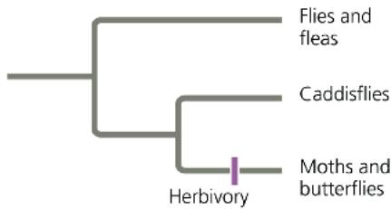

There are 140,000 species of moths and butterflies and 7,000 species of caddisflies. State a hypothesis about the impact of herbivory on adaptive radiations in insects. How could this hypothesis be tested?

10. WRITE ABOUT A THEME: ORGANIZATION You have seen many examples of how form fits function at all levels of the biological hierarchy. However, we can imagine forms that would function better than some forms actually found in nature. For example, if the wings of a bird were not formed from its forelimbs, such a hypothetical bird could fly yet also hold objects with its forelimbs. In a short essay (100–150 words), use the concept of “evolution as tinkering” to explain why there are limits to the functionality of forms in nature.

## 11. SYNTHESIZE YOUR KNOWLEDGE

In 2010, the Soufriere Hills volcano on the Caribbean island of Montserrat erupted violently, spewing huge clouds of ash and gases into the sky. Explain how the volcanic eruptions at the end of the Permian period and the formation of Pangaea, both of which occurred about 252 million years ago, set in motion events that altered evolutionary history.

For selected answers, see Appendix A.

# Explore Scientific Papers with Science in the Classroom | AAAS

How has adaptive evolution occurred in stickleback fish? Go to "What the Pelvis Can Teach Us about Evolution" at www.scienceintheclassroom.org.

Instructors: Questions can be assigned in Mastering Biology.

# Unit 5 The Evolutionary History of Biological Diversity

An Interview with Casey Dunn

Dr. Casey Dunn is Professor at Yale University in the Department of Ecology and Evolutionary Biology as well as Curator in the Division of Invertebrate Zoology at Yale's Peabody Museum. He earned his BS in Biology at Stanford University and his MS and PhD at Yale University, and his lab currently uses a combination of field and lab techniques—including genomic tools—to answer questions about the root of the animal tree of life and how evolution has shaped animal body plans. Because his study subjects are often fragile gelatinous zooplankton that cannot readily be sampled with nets, he has used scuba diving and scientific submersibles to observe and collect specimens.

## How did you get interested in biology and eventually in your current area of research?

My dad was a miner, and he would take me out into the mountains, showing me various rocks and explaining to me how the landscape worked. It was exciting to be outside and to see this order in the beauty of the world. Later, I worked as a tour guide in the Amazon forest for a year before college, and I found myself drawn to the incredible diversity of questions in biology.

In graduate school, I became fascinated by siphonophores (drifting colonial animals that are closely related to jellyfish). Humans each have one body that grows from a single cell and carries out different tasks. But siphonophores are an example of a different way a large, complex animal can form—not by growing one multitasking body as we do, but by adding bodies. If humans were siphonophores, once a baby was born, it would just start budding more babies out of its side and those babies would be specialized for different tasks, like moving all the babies around or feeding. My PhD work described how siphonophores grow, and how various siphonophore species are related.

Since then I've worked on a variety of research questions; I describe myself as an evolutionary biologist who uses the diversity of animals to study general questions about the process of evolution. We're at this exciting time in biology where the questions that drove the field for a century or more suddenly are becoming easier to study. In my lab, I can one day be observing a species in the field or under a microscope and another day be poring through its genome and looking at every one of its base pairs. And researchers are developing better computational tools to analyze it all.

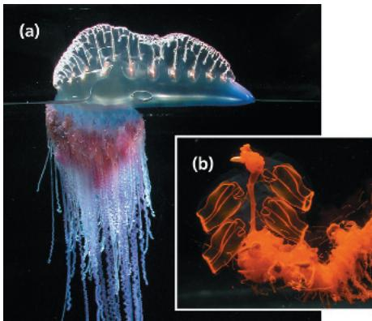

The siphonophores (a) Physalia physalis and (b) Marrus orthocanna, colonial invertebrates studied in Dr. Dunn's lab.

"I can one day be observing a species in the field or under a microscope and another day be poring through its genome."

## What are some exciting recent discoveries about the evolutionary history of animals?

I think there has been an absolute ground shift in the way we think about the diversity of life and evolution. People used to think that there were a lot of simple “lower organisms” and a smaller number of “higher organisms” that had become big and complex. But this approach is based on the idea that the higher organisms have all the better traits that the lower organisms are missing out on, almost like the lower organisms didn’t win the “prize.” In fact, these so-called lower organisms are incredibly abundant and successful. Organisms can become well suited to their environment in a variety of ways; for example, traits are not only gained over the course of

  
Dr. Casey Dunn

evolution, but in many cases may be lost. For instance, many animals don't have a brain, including some that are descendants of animals that had a brain (such as sea urchins and tunicates; see Figure 33.2). Yet, these brainless animals function very well without one; a brain probably presented greater costs than benefits for their lifestyle, so over time it likely became more and more reduced through natural selection. Phylogenetics research has led to the realization that organisms didn't simply evolve in a stepwise accumulation of complex traits. Rather, traits were gained and lost across the entire tree, and we have to change our perspective to see each organism as it is rather than, say, as an incomplete human.

## Why is it important for people who aren't planning a career in biology to learn about evolution, phylogeny, and biodiversity?

It would be impossible to understand human biology without understanding the biology of other organisms. For example, we learned how DNA works based on early studies on bacteria and the cell cycle due to work in yeast. We understand human congenital developmental issues from studying the development of mice and of flies. We also need to know how those other species are related to humans and understand their evolutionary history in order to know which similarities and differences across the organisms are relevant to human biology. In addition, humans don't live in a biological vacuum. The complex diseases and major challenges that are going to be facing us in coming decades have to do with our interactions with the world around us. If we're going to have clean air and water and healthy food, it's imperative that we understand the biology of other organisms. Thinking about organisms in the appropriate evolutionary context helps us understand and predict how species, including humans, are likely to respond to our changing environment.

# Phylogeny and the Tree of Life

## Key Concepts

26.1 Phylogenies show evolutionary relationships

26.2 Phylogenies can be used to understand shared characters

26.3 Phylogenies are inferred from morphological and molecular data

26.4 An organism's evolutionary history is documented in its genome

26.5 Molecular clocks help track evolutionary time

26.6 New information continues to improve our understanding of evolutionary history

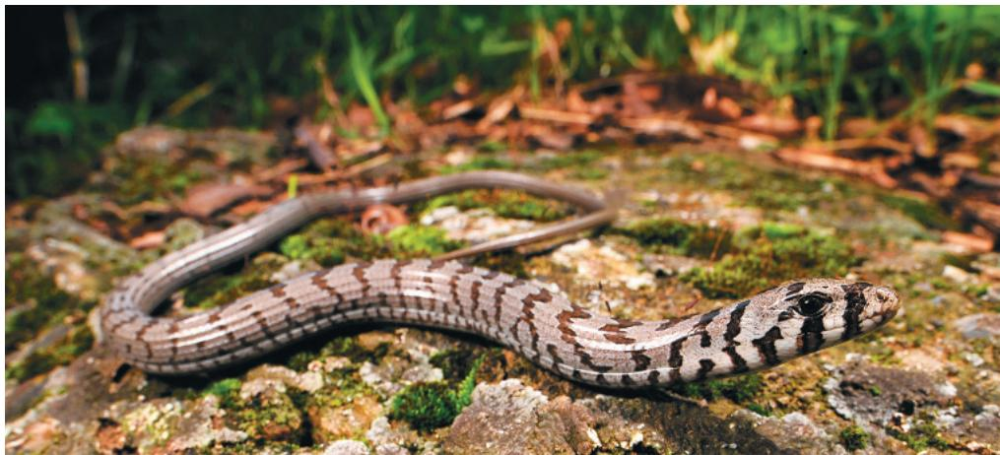  
Figure 26.1 Although this animal resembles a snake, it is actually a legless lizard: the glass lizard Ophisaurus apodus. Why isn't the glass lizard considered a snake? Biologists based this decision in part on a comparison of its traits with those of snakes—and the glass lizard does not have a highly mobile jaw or many vertebrae, two traits shared by all snakes.

## Study Tip

Label a drawing: The members of a sister group are each other's closest relatives, making sister groups a useful way to describe evolutionary relationships. As in this example, identify the sister groups associated with each branch point in Figures 26.8, 26.9, 26.10, and 26.12.

## How do biologists distinguish and categorize the millions of species on Earth?

Traits shared due to common ancestry are used to classify organisms into groups that reflect their evolutionary history:

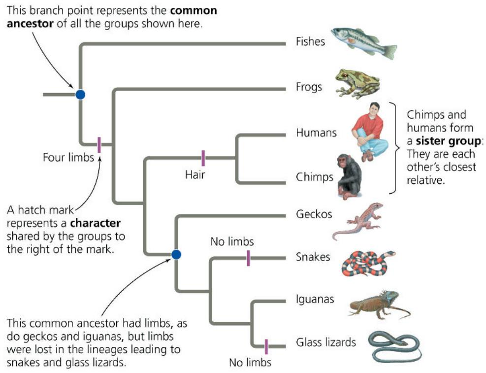

## Concept 26.1: Phylogenies show evolutionary relationships

The glass lizard in Figure 26.1 is part of the continuum of life extending from the earliest organisms to the great variety of species alive today. In this unit, we will survey this diversity and describe hypotheses regarding how it evolved.

To set the stage for surveying life's diversity, in this chapter we consider how biologists trace phylogeny, the evolutionary history of a species or group of species. A phylogeny of lizards and snakes, for example, indicates that both glass lizards and snakes evolved from lizards with legs—but they evolved from different lineages of legged lizards (Figure 26.2). Thus, it appears that their legless conditions evolved independently. As we'll see, biologists reconstruct phylogenies like that in Figure 26.2 using systematics, a discipline focused on classifying organisms and determining their evolutionary relationships. We'll begin by describing how organisms are named and classified.

## Binomial Nomenclature

Common names for organisms—such as monkey, finch, and lilac—convey meaning in casual usage, but they can also cause confusion. Each of these names, for example, refers to more than one species. Moreover, some common names do not accurately reflect the kind of organism they signify. Consider these three “fishes”: jellyfish (a cnidarian), crayfish (a small, lobsterlike crustacean), and silverfish (an insect). And, of course, a given organism has different names in different languages.

To avoid ambiguity when communicating about their research, biologists refer to organisms by Latin scientific names. The two-part format of the scientific name, commonly called a binomial, was instituted in the 18th century by Carolus Linnaeus (see Concept 22.1). The first part of a binomial is the name of the genus (plural, genera) to which the species belongs. The second part, called the specific epithet, is unique for each species within

Figure 26.2 Convergent evolution of limbless bodies.

A phylogeny based on DNA sequence data reveals that a legless body form evolved independently from legged ancestors in the lineages leading to glass lizards and to snakes.

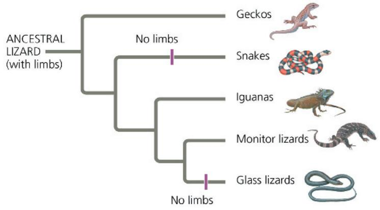  
Figure 26.3 Linnaean classification.

the genus. An example of a binomial is Panthera pardus, the scientific name for the leopard. Notice that the first letter of the genus is capitalized and the entire binomial is italicized. (Newly created scientific names are also “latinized”: You can name an insect you discover after a friend, but you must add a Latin ending.) Many of the more than 11,000 binomials assigned by Linnaeus are still used today, including the optimistic name he gave our own species—Homo sapiens, meaning “wise man.”

## Hierarchical Classification

In addition to naming species, Linnaeus also grouped them into a hierarchy of increasingly inclusive categories. The first grouping is built into the binomial: Species that appear to be closely related are grouped into the same genus. For example, the leopard (Panthera pardus) belongs to a genus that also includes the African lion (Panthera leo), the tiger (Panthera tigris), and the jaguar (Panthera onca). Beyond genera, biologists employ progressively more comprehensive categories of classification (Figure 26.3). The classification system named after Linnaeus, the Linnaean system, places related genera in the same family, families into orders,

At each level, or “rank,” species are placed in groups within more inclusive groups.

