orders into classes, classes into phyla (singular, phylum), phyla into kingdoms, and, more recently, kingdoms into domains. The resulting biological classification of a particular organism is somewhat like a postal address identifying a person in a particular apartment, in a building with many apartments, on a street with many apartment buildings, in a city with many streets, and so on.

The named group at any level of the hierarchy is called a taxon (plural, taxa). In the leopard example, Panthera is a taxon at the genus level, and Mammalia is a taxon at the class level that includes all the many orders of mammals. Note that in the Linnaean system, taxa broader than the genus are not italicized, though they are capitalized.

Classifying species is a way to structure our human view of the world. We lump together various species of trees to which we give the common name of pines and distinguish them from other trees that we call firs. Systematists have decided that pines and firs are different enough to be placed in separate genera, yet similar enough to be grouped into the same family, Pinaceae. As with pines and firs, higher levels of classification are usually defined by particular characters chosen by systematists. However, characters that are useful for classifying one group of organisms may not be appropriate for other organisms. For this reason, the larger categories often are not comparable between lineages; that is, an order of snails does not exhibit the same degree of morphological or genetic diversity as an order of mammals. As we'll see, the historical placement of species into orders, classes, and so on also does not necessarily reflect evolutionary history. Taxonomy is always a “work in progress” as we continue to learn more about evolutionary relationships.

## Linking Classification and Phylogeny

The evolutionary history of a group of organisms can be represented in a branching diagram called a phylogenetic tree. As in Figure 26.4, the branching pattern often matches how systematists have classified groups of organisms nested within more inclusive groups. Sometimes, however, systematists have placed a species within a genus (or other group) to which it is not most closely related. One reason for such a mistake might be that over the course of evolution, a species has lost a key feature shared by its close relatives. If DNA or other new evidence indicates that an organism has been misclassified, the organism may be reclassified to accurately reflect its evolutionary history. Another issue is that while the Linnaean system may distinguish groups, such as amphibians, mammals, reptiles, and other classes of vertebrates, it tells us nothing about these groups' evolutionary relationships to one another.

Such difficulties in aligning Linnaean classification with phylogeny have led many systematists to propose that classification be based entirely on evolutionary relationships. In such systems, names are assigned only to groups that include a common ancestor and all of its descendants. Using this approach, some commonly recognized groups become part of other groups previously at the same level of the Linnaean system. For example, because birds evolved from a group of reptiles, Aves (the Linnaean class to which birds are assigned) is considered a subgroup of Reptilia (also a class in the Linnaean system).

Figure 26.4 The connection between classification and phylogeny.

Hierarchical classification can reflect the branching patterns of phylogenetic trees. This tree shows evolutionary relationships between some of the taxa within order Carnivora, itself a branch of class Mammalia.

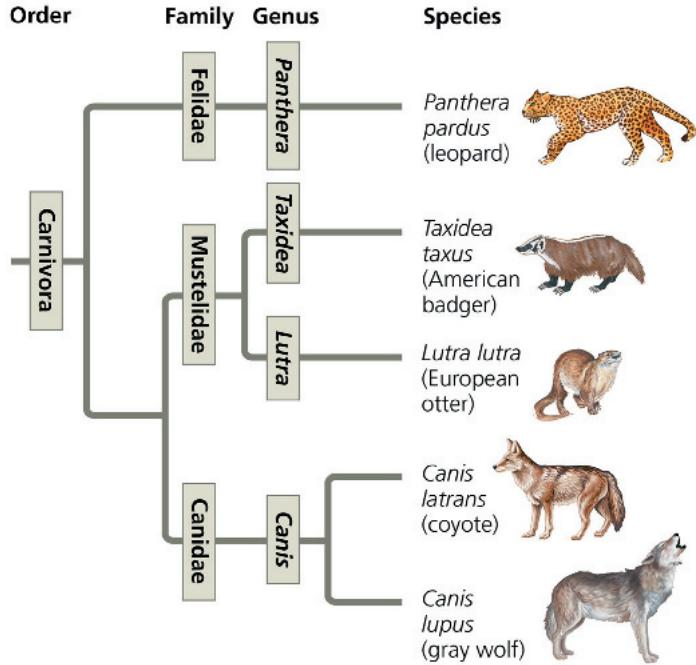

## Phylogenetic Trees are Tools Inferred from Data

Regardless of how groups are named, a phylogenetic tree represents a hypothesis about evolutionary relationships. These relationships often are depicted as a series of dichotomies, or two-way branch points. Each branch point represents the common ancestor of the two evolutionary lineages diverging from it. An evolutionary lineage is a sequence of ancestral organisms leading to a particular descendant taxon. Figure 26.5 illustrates these elements of a phylogenetic tree and offers more tips on interpreting these diagrams.

Each tree in Figure 26.5 has a branch point that represents the common ancestor of chimpanzees and humans. Chimps and humans are an example of sister taxa, groups of organisms that share an immediate common ancestor that is not shared by any other group. Note that there is a sister group associated with each branch point in a tree (since each branch point represents the common ancestor of the two lineages diverging at that point).

The members of a sister group are each other's closest relatives, making sister groups a useful way to describe the evolutionary relationships shown in a tree. For example, in Figure 26.5, the evolutionary lineage leading to lizards shares an immediate common ancestor with the lineage leading to chimpanzees and humans. Thus, we can describe this portion of the tree by saying that lizards are the sister taxon to a group consisting of chimpanzees and humans.

As also discussed in Figure 26.5, the branches of a tree can be rotated around branch points without changing the relationships shown in the tree. That is, the order in which the taxa appear at the right side of the tree does not represent a sequence of evolution—in this case, it does not imply a sequence leading from fishes to humans.

# Visualizing Phylogenetic Relationships

## Figure 26.5 For suggested answers, see Appendix A.

A phylogenetic tree visually represents a hypothesis of how a group of organisms are related. This figure explores how the way a tree is drawn conveys information.

## Parts of a Phylogenetic Tree

This tree shows how the five groups of organisms at the tips of the branches, called taxa, are related. Each branch point represents the common ancestor of the evolutionary lineages diverging from it.

This branch point represents the common ancestor of all the animal groups shown in this tree.

1. According to this tree, which group or groups of organisms are most closely related to frogs?

2. Label the part of the diagram that represents the most recent common ancestor of frogs and humans.

Instructors: Additional questions related to this Visualizing Figure can be assigned in Mastering Biology.

Each horizontal branch represents an evolutionary lineage. The length of the branch is arbitrary unless the diagram specifies that branch lengths represent information such as time or amount of genetic change.

Each position along a branch represents an ancestor in the lineage leading to the taxon named at the tip.

Chimps and humans are an example of sister taxa, groups of organisms that share a common ancestor that is not shared by any other group. The members of a sister group are each other's closest relatives.

## Alternative Forms of Tree Diagrams

These diagrams are referred to as "trees" because they use the visual analogy of branches to represent evolutionary lineages diverging over time. In this text, trees are usually drawn horizontally, as shown above, but the same tree can be drawn vertically or diagonally without changing the relationships it conveys.

Vertical tree

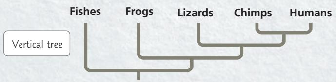

Fishes Frogs Lizards Chimps Humans

3. How many sister taxa are shown in these two trees? Identify them.

4. Redraw the horizontal tree in Figure 26.2 as a vertical tree and a diagonal tree.

Diagonal tree

## Rotating Around Branch Points

Rotating the branches of a tree around a branch point does not change what they convey about evolutionary relationships. As a result, the order in which taxa appear at the branch tips is not significant. What matters is the branching pattern, which signifies the order in which the lineages have diverged from common ancestors.

Note: The order of the taxa does NOT represent a sequence of evolution "leading to" the last taxon shown (in this tree, humans).

If you rotate the branches of the tree at left around the three blue points, the result is the tree at right.

5. Redraw the tree above, rotating around the green branch point. Identify the two closest relatives of humans as shown in each of the three trees. Explain your answer.

This tree, like all of the phylogenetic trees in this book, is rooted, which means that a branch point within the tree (often drawn farthest to the left) represents the most recent common ancestor of all taxa in the tree. A lineage that diverges from all other members of its group early in the history of the group is referred to as the sister group to the rest of the tree. This lineage shares the same common ancestor as the rest of the group. Hence, the fishes in Figure 26.5 would be considered the sister group to all the other vertebrates. Note that the lineages that stem from the common ancestor originated at the same point in time and thus have been evolving for the same length of time. In this case, be careful to not interpret the fishes as “more primitive” or “less evolved” than the rest of the taxa on the tree; rather, they are just less closely related to the other taxa.

What other key points do we need to keep in mind when interpreting phylogenetic trees? First, they are intended to show patterns of descent, not phenotypic similarity. Although closely related organisms often resemble one another due to their common ancestry, they may not if their lineages have evolved at different rates or faced very different environmental conditions. For example, even though crocodiles are more closely related to birds than to lizards (see Figure 22.17), they look more like lizards because morphology has changed dramatically in the bird lineage. Phylogenies show a hypothesized pattern of descent that is inferred from data, often molecular genetic sequence similarity.

Second, we cannot necessarily infer the ages of the taxa or branch points shown in a tree. For example, the tree in Figure 26.5 does not indicate that chimpanzees evolved before humans. Rather, the tree shows only that chimpanzees and humans share a recent common ancestor, but we cannot tell when that ancestor lived or when the first chimpanzees or humans arose. Generally, unless we are given specific information about what the branch lengths in a tree mean—for example, that they are proportional to time—we should interpret the diagram solely in terms of patterns of descent. No assumptions should be made about when particular species evolved or how much change occurred in each lineage.

Third, we should not assume that a taxon on a phylogenetic tree evolved from the taxon next to it. Figure 26.5 does not indicate that humans evolved from chimpanzees or vice versa. We can infer only that the lineage leading to humans and the lineage leading to chimpanzees both evolved from a recent common ancestor. That ancestor, which is now extinct, was neither a human nor a chimpanzee.

Finally, remember that a phylogeny is a hypothesis about our understanding of the evolutionary relationships among the members of a group. Some parts of a phylogeny may be more resolved than others; that is, there may be more evidence supporting those branch points compared to others. Systematists often illustrate uncertainty about a given branch point by drawing it as a polytomy: more than two lineages stemming from a single branch point (see Figure 26.21). This does not mean that all of these lineages are “equally related” to each other, but rather that the pattern of divergence is unclear.

## Applying Phylogenies

Understanding phylogeny can have practical applications. Consider maize (corn), which originated in the Americas and is now an important food crop worldwide. From a phylogeny of maize based on DNA data, researchers have identified two species of wild grasses that may be maize's closest living relatives. These two close relatives may be useful as “reservoirs”

of beneficial alleles that can be transferred to cultivated maize by cross-breeding or genetic engineering.

A different use of phylogenetic trees is to infer species identities by analyzing the relatedness of DNA sequences from different organisms. Researchers have used this approach to investigate whether “whale meat” had been harvested illegally from whale species protected under international law rather than from species that can be harvested legally (Figure 26.6).

How do researchers construct phylogenetic trees like those we've considered here? In the next section, we'll begin to answer that question by examining the data used to determine phylogenies.

## Figure 26.6

## Inquiry: What is the species identity of food being sold as whale meat?

## Experiment

C. S. Baker and S. R. Palumbi purchased 13 samples of “whale meat” from Japanese fish markets. They sequenced part of the mitochondrial DNA (mtDNA) from each sample and compared their results with the comparable mtDNA sequence from known whale species. To infer the species identity of each sample, the team constructed a gene tree, a phylogenetic tree that shows patterns of relatedness among DNA sequences rather than among taxa.

## Results

Of the species in the resulting gene tree, only Minke whales caught in the Southern Hemisphere can be sold legally in Japan.

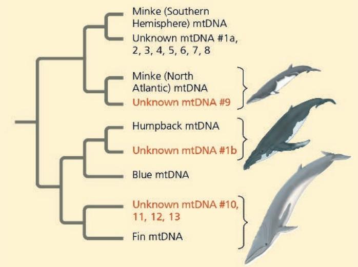

## Conclusion

This analysis indicated that mtDNA sequences of six of the unknown samples (in red) were most closely related to mtDNA sequences of whales that are not legal to harvest.

Data from C. S. Baker and S. R. Palumbi, Which whales are hunted? A molecular genetic approach to monitoring whaling, Science 265:1538–1539 (1994). Reprinted with permission from AAAS.

WHAT IF? What different results would have indicated that all of the whale meat had been harvested legally?
For suggested answer, see Appendix A.

## Concept Check 26.1

1. VISUAL SKILLS Based on the tree in Figure 26.4, are leopards more closely related to badgers or wolves, or are they equally related to these two species? Explain.

2. VISUAL SKILLS Which of the trees shown here depicts an evolutionary history different from the other two? Explain.

  
3. DRAW IT The bear family (Ursidae) is more closely related to the badger/otter family (Mustelidae) than to the dog family (Canidae). Use this information to redraw Figure 26.4.

For suggested answers, see Appendix A.

# Concept 26.2: Phylogenies can be used to understand shared characters

Phylogenies are powerful tools that equip biologists to categorize and analyze the diversity of life. A phylogeny can help us to understand how we group organisms and how their traits have evolved.

## Cladistics

In the approach to systematics called cladistics, common ancestry is the primary criterion used to classify organisms. Using this methodology, biologists attempt to place species into groups called clades, each of which includes an ancestral species and all of its descendants. Clades, like the categories of the Linnaean system, are nested within larger clades. In Figure 26.4, for example, the cat group (Felidae) represents a clade within a larger clade (Carnivora) that also includes the dog group (Canidae).

A taxon is considered a clade only if it is monophyletic (from the Greek, meaning “single tribe”), signifying that it consists of an ancestral species and all of its descendants (Figure 26.7a). Contrast this with a paraphyletic (“beside the tribe”) group, which consists of an ancestral species and some, but not all, of its descendants (Figure 26.7b), or a polyphyletic (“many tribes”) group, which includes distantly related species but does not include their most recent common ancestor (Figure 26.7c).

Note that in a paraphyletic group, the most recent common ancestor of all members of the group is part of the group, whereas in a polyphyletic group the most recent common ancestor is not part of the group. For example, a group consisting of even-toed ungulates (hippopotamuses, deer, and their relatives) and their common ancestor is paraphyletic because it does not include cetaceans (whales, dolphins, and porpoises), which descended from that ancestor (Figure 26.8). In contrast, a group consisting of seals and cetaceans (based on their similar body forms) is polyphyletic because it does not include the common ancestor of seals and cetaceans. Biologists avoid defining such polyphyletic groups; if new evidence indicates that an existing group is polyphyletic, its members are reclassified.

## Shared Ancestral and Shared Derived Characters

As a result of descent with modification, organisms have characters they share with their ancestors, and they also have characters that differ from those of their ancestors. For example, all mammals have backbones, but a backbone does not distinguish mammals from other vertebrates because all vertebrates have backbones. The backbone predates the divergence of mammals from other vertebrates. Thus for mammals, the backbone is a shared ancestral character, a character that originated in an ancestor of the taxon. In contrast, hair is a character shared by all mammals but not found in their ancestors. Thus, in mammals, hair is considered a shared derived character, an evolutionary novelty unique to a clade. Note that a shared derived character can in some cases refer to the loss of a feature, such as the loss of limbs in snakes or whales. Also, keep in mind that it is a relative matter whether a character is considered ancestral or derived. A backbone can also qualify as

Figure 26.7 Monophyletic, paraphyletic, and polyphyletic groups.  
  
Group I, consisting of three species (A, B, C) and their common ancestor 1, is a monophyletic group (clade), meaning that it consists of an ancestral species and all of its descendants.

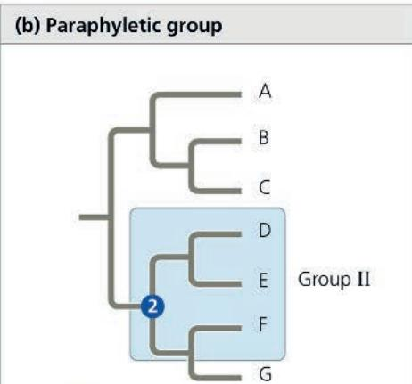  
Group II is paraphyletic, meaning that it consists of an ancestral species ② and some of its descendants (species D, E, F) but not all of them (does not include species G).

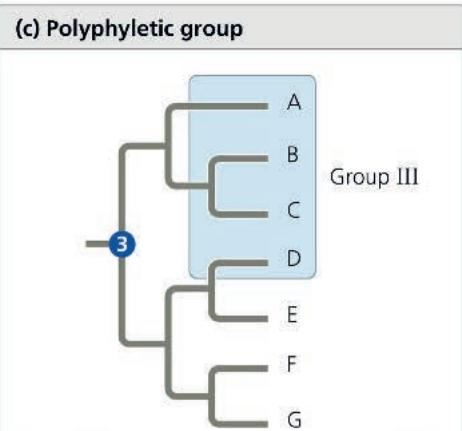  
Group III, consisting of four species (A, B, C, D), is polyphyletic, meaning that the most recent common ancestor ③ of its members is not part of the group.

Figure 26.8 Paraphyletic versus polyphyletic groups.  
  
This group is polyphyletic because it does not include the most recent common ancestor of its members.

DRAW IT Circle the branch point that represents the most recent common ancestor of cetaceans and seals. Explain why that ancestor would not be part of a cetacean–seal group defined by similar body form.
For suggested answer, see Appendix A.

a shared derived character, but only at a deeper branch point that distinguishes all vertebrates from other animals.

## Mapping Characters on a Phylogeny

Shared derived characters are unique to particular clades. We can visualize this by mapping the characters onto a phylogeny. To give an example of this approach, consider the set of characters shown in Figure 26.9a for each of five vertebrates—a leopard, turtle, frog, bass, and lamprey (a jawless aquatic vertebrate). As a basis of comparison, we need to select an outgroup. An outgroup is a species or group of species from an evolutionary lineage that is closely related to but not part of the group of species that we are studying (the ingroup). Note that the outgroup and the ingroup would be considered sister taxa. A suitable outgroup for any given comparison can be determined based on evidence from morphology, paleontology, embryonic development, and gene sequences. An appropriate outgroup for our example is the lancelet, a small animal that lives in mudflats and (like vertebrates) is a member of the more inclusive group called the chordates. Unlike the vertebrates, however, the lancelet does not have a backbone.

If a character is found in both the outgroup and the ingroup, it is ancestral. If a character only occurs in a subset of the ingroup, we infer that the character arose in the lineage leading to those members of the ingroup, and it is labeled on the tree with a hatch mark.

By comparing members of the ingroup with each other and with the outgroup, we can determine which characters were derived (that is, evolved independently) at the various branch points of vertebrate evolution. In our example, all of the vertebrates in the ingroup have backbones: This character was present in the ancestral vertebrate, but not in the outgroup. Note that hinged jaws are absent in the outgroup and in lampreys, but present in all other members of the ingroup. This indicates that hinged jaws arose in a lineage leading to all members of the ingroup except lampreys.

Figure 26.9 Mapping characters onto a phylogeny.  
The characters used here include the amnion, a membrane that encloses the embryo inside a fluid-filled sac (see Figure 34.26).  
  
(a) Character table. A 0 indicates that a character is absent; a 1 indicates that a character is present.

  
(b) Phylogenetic tree. The character table in (a) leads to the phylogenetic mapping shown on this tree.

Proceeding in this way, we can visualize the evolution of key traits across the span of vertebrate evolution (Figure 26.9b).

## Phylogenetic Trees as Hypotheses

This is a good place to reiterate that any phylogenetic tree represents a hypothesis about how the organisms in the tree are related to one another. The best hypothesis is the one that best fits all the available data. A phylogenetic hypothesis may be modified when new evidence compels systematists to revise their trees. Indeed, while many older phylogenetic hypotheses have been supported by new data, others have been changed or rejected.

Thinking of phylogenies as hypotheses also allows us to use them in a powerful way: We can make and test predictions based on the assumption that a particular phylogeny—our hypothesis—is correct. For example, in an approach known as phylogenetic bracketing, we can predict that features shared by two groups of closely related organisms are present in their common ancestor and all of its descendants unless independent data indicate otherwise. (Note that “prediction” can refer to unknown past events as well as to evolutionary changes yet to occur.)

This approach has been used to make novel predictions about dinosaurs. For example, there is evidence that birds descended from the theropods, a group of bipedal dinosaurs. As seen in Figure 26.10, the closest living relatives of birds are crocodiles. Birds and crocodiles share numerous features: They have four-chambered hearts, they “sing” to defend territories and attract mates (although a crocodile’s “song” is more like a bellow), and they build nests. Both birds and crocodiles also care for their eggs by warming them. Birds warm their eggs by sitting on them, whereas crocodiles cover their eggs with their neck or with sand or vegetation. Reasoning that any feature shared by birds and crocodiles is likely to have been present in their common ancestor (denoted by the blue dot in Figure 26.10) and all of its descendants, biologists predicted that dinosaurs had four-chambered hearts, sang, built nests, and cared for their eggs.

Internal organs, such as the heart, rarely fossilize, and it is, of course, difficult to test whether dinosaurs sang to defend territories and attract mates. However, fossil discoveries have supported the

Figure 26.10 A phylogenetic tree of birds and their close relatives. (A dagger, †, indicates extinct lineages.)  
  
VISUAL SKILLS In this tree diagram, what is the sister taxon of the clade that includes dinosaurs and their most recent common ancestor? Explain. For suggested answer, see Appendix A.

Figure 26.11 Fossil support for a phylogenetic prediction: Dinosaurs built nests and cared for their eggs.

  
(a) Fossil remains of Oviraptor and eggs. The orientation of the bones, which surround and cover the eggs, suggests that the dinosaur died while incubating or protecting its eggs.  
(b) Artist's reconstruction of the dinosaur's posture on its nest based on the fossil findings.

prediction that dinosaurs built nests and cared for their eggs. First, a fossil embryo of an Oviraptor dinosaur was found, still inside its egg. This egg was identical to those found in another fossil, one that showed an Oviraptor crouching over a group of eggs in a posture similar to how birds sit on their nests today (Figure 26.11). Researchers suggested that the Oviraptor dinosaur preserved in this second fossil died while incubating or protecting its eggs. The broader conclusion that emerged from this work—that dinosaurs built nests and cared for their eggs—has since been strengthened by additional fossil discoveries that show that other species of dinosaurs built nests and sat on their eggs. Finally, by supporting predictions based on the phylogenetic hypothesis shown in Figure 26.10, fossil discoveries of nests and parental care in dinosaurs provide independent data that suggest that the hypothesis is correct.

## Phylogenetic Trees with Proportional Branch Lengths

In the phylogenetic trees we have presented so far, the lengths of the tree's branches do not indicate the degree of evolutionary change in each lineage. Furthermore, the chronology represented by the branching pattern of the tree is relative (earlier versus later) rather than absolute (how many millions of years ago). But in some tree diagrams, branch lengths are proportional to the amount of evolutionary change or to the times at which particular events occurred.

Figure 26.12 Branch lengths can represent genetic change. This tree was based on sequences of homologs of a gene that plays a role in development; Drosophila was used as an outgroup. Branch lengths are proportional to the amount of genetic change in each lineage; varying branch lengths indicate that the gene has evolved at different rates in different lineages.

  
INTERPRET THE DATA In which vertebrate lineage has the studied gene evolved most rapidly? Explain.

In Figure 26.12, for example, each branch length of the phylogenetic tree reflects the number of changes that have taken place in a particular DNA sequence in that lineage. Note that the total length of the horizontal lines from the base of the tree to the mouse is less than that of the line leading to the fruit fly, Drosophila. This indicates that fewer genetic changes have occurred in the mouse lineage than in the Drosophila lineage. In addition, because the mouse and fly lineages have evolved for an equal amount of time after they diverged from a common ancestor, the rate of change was lower in mouse lineage than in the Drosophila lineage.

In general, although the branches of a phylogenetic tree may have different lengths, among organisms alive today, all the different lineages that descend from a common ancestor have survived for the same number of years. To take an extreme example, humans and bacteria had a common ancestor that lived over 3 billion years ago. Fossils and genetic evidence indicate that this ancestor was a single-celled prokaryote. Even though bacteria have apparently changed little in their morphology since that common ancestor, there have nonetheless been 3 billion years of evolution in the bacterial lineage, just as there have been 3 billion years of evolution in the lineage that ultimately gave rise to humans.

These equal spans of chronological time can be represented in a phylogenetic tree whose branch lengths are proportional to time (Figure 26.13). Such a tree draws on fossil data to place branch points in the context of geologic time. Additionally, it is possible to combine these two types of trees by labeling branch points with information about rates of genetic change or dates of divergence.

## Maximum Parsimony and Maximum Likelihood

As the database of DNA sequences that enables us to study more species grows, the difficulty of building the phylogenetic tree that best describes their evolutionary history also grows. What if you are analyzing data for 50 species? There are $3 \times 10^{76}$ different ways to arrange 50 species into a tree! And which tree in this huge forest reflects the true phylogeny? Systematists can never be sure of finding the most accurate tree in such a large data set, but they can narrow the possibilities by applying the principles of maximum parsimony and maximum likelihood.

According to the principle of maximum parsimony, we should first investigate the simplest explanation that is consistent with the facts. (The parsimony principle is also called “Occam’s razor” after William of Occam, a 14th-century English philosopher who advocated solving problems by “shaving away” unnecessary complications.) In the case of trees based on morphology, the most parsimonious tree requires the fewest evolutionary events, as measured by the origin of shared derived morphological characters. For phylogenies based on DNA, the most parsimonious tree requires the fewest base changes.

A maximum likelihood approach identifies the tree most likely to have produced a given set of DNA data based on certain probability rules about how DNA sequences change over time. For example, the underlying probability rules could be based on the assumption that all nucleotide substitutions are equally likely. If

Figure 26.13 Branch lengths can indicate time.

This tree is based on the same DNA data as that in Figure 26.12, but here the branch points are dated based on fossil evidence. Thus, the branch lengths are proportional to time. Each lineage has the same total length from the base of the tree to the branch tip, indicating that all the lineages have diverged from the common ancestor for equal amounts of time.

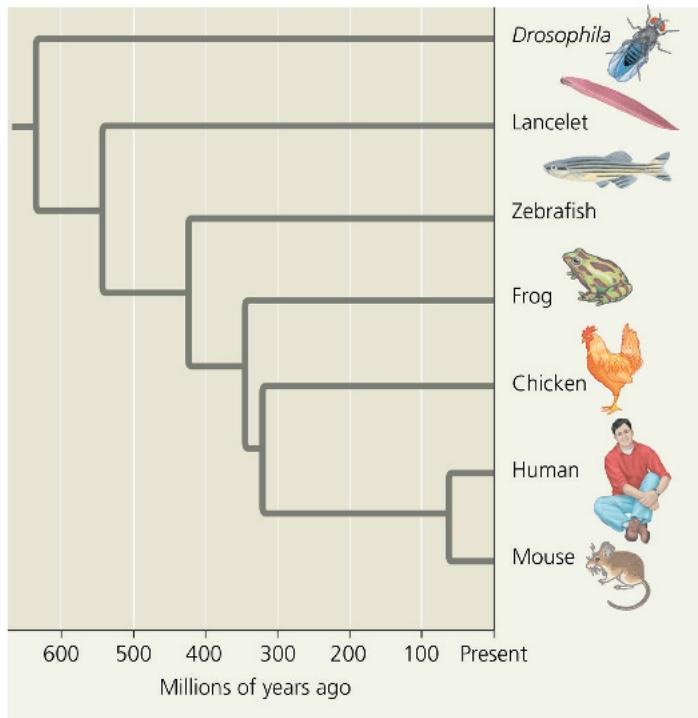

6 events

Species I

evidence suggests that this assumption is not correct, more complex rules could be devised to account for different rates of change among different nucleotides or at different positions in a gene.

Scientists have developed many computer programs to search for trees that are parsimonious and likely. When a large amount of accurate data is available, the methods used in these programs usually yield similar trees. As an example of one method, Figure 26.14 walks you through the process of identifying the most parsimonious molecular tree for a three-species problem. Computer programs use the principle of parsimony to estimate

## Figure 26.14

## Research method: applying parsimony to a problem in molecular systematics

## Application

In considering possible phylogenies for a group of species, systematists compare molecular data for the species. An efficient way to begin is by identifying the most parsimonious hypothesis—the one that requires the fewest evolutionary events (molecular changes) to have occurred.

1 First, draw the three possible trees for the species. (Although only three trees are possible when ordering three species, the number of possible trees increases rapidly with the number of species: There are 15 trees for four species and 34,459,425 trees for 10 species.)

2 Tabulate the molecular data for the species. In this simplified example, the data represent a DNA sequence consisting of just four nucleotide bases. Data from several outgroup species (not shown) were used to infer the ancestral DNA sequence.

3 Now focus on site 1 in the DNA sequence. In the tree on the left, a single base-change event, represented by the purple hatch mark on the branch leading to species I and II (and labeled 1/C, indicating a change at site 1 to nucleotide C), is sufficient to account for the site 1 data. In the other two trees, two base-change events are necessary.

4 Continuing the comparison of bases at sites 2, 3, and 4 reveals that each of the three trees requires a total of five additional base-change events (purple hatch marks).

## Results

To identify the most parsimonious tree, we total all of the base-change events noted in steps 3 and 4. We conclude that the first tree is the most parsimonious of the three possible phylogenies. (In a real example, many more sites would be analyzed. Hence, the trees would often differ by more than one base-change event.)

## Technique

Follow the numbered steps as we apply the principle of parsimony to a hypothetical phylogenetic problem involving three closely related beetle species.

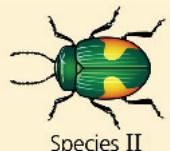  
Species II

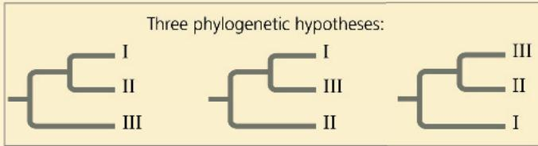  
Site

Species I

Species II

Species III

<table><tr><td>1</td><td>2</td><td>3</td><td>4</td></tr><tr><td>C</td><td>T</td><td>A</td><td>T</td></tr><tr><td>C</td><td>T</td><td>T</td><td>C</td></tr><tr><td>A</td><td>G</td><td>A</td><td>C</td></tr><tr><td>A</td><td>G</td><td>T</td><td>T</td></tr></table>

Ancestral sequence

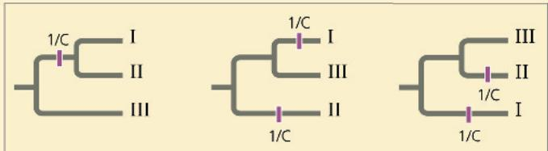

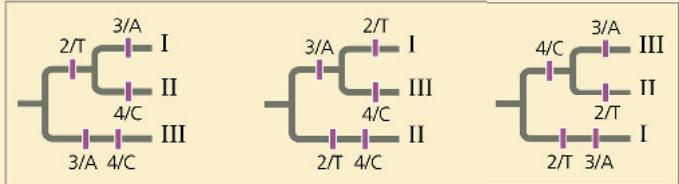

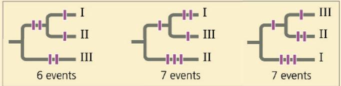

phylogenies in a similar way: They examine large numbers of possible trees and identify those that require the fewest evolutionary changes.

## Concept Check 26.2

1. To distinguish a particular clade of mammals within the larger clade that corresponds to class Mammalia, would hair be a useful character? Why or why not?

2. WHAT IF? Draw a phylogenetic tree that includes the relationships from Figure 25.7 and Figure 26.10. Traditionally, all the taxa shown besides birds and mammals were classified as reptiles. Would a cladistic approach support that classification? Explain.

For suggested answers, see Appendix A.

## Concept 26.3: Phylogenies are inferred from morphological and molecular data

To infer phylogeny, systematists must gather as much information as possible about the relevant organisms. It is important to focus on features that result from common ancestry because only those features reflect evolutionary relationships. While phylogeny can be inferred from any kind of comparative data, most researchers now use molecular genetic sequences.

## Morphological and Molecular Homologies

Before we discuss how scientists infer the structure of a phylogenetic tree, we'll start by exploring how we read and interpret a tree. A fundamental use of a phylogeny is to help differentiate homologous (evolutionarily conserved) similarity from analogous (evolutionarily independent) similarity (see Concept 22.3). Recall that homologies are phenotypic and genetic similarities due to shared ancestry. For example, the similarity in the number and arrangement of bones in the forelimbs of mammals is due to their descent from a common ancestor with the same bone structure; this is an example of a morphological homology (see Figure 22.15). In the same way, genes or other DNA sequences are homologous if they are descended from sequences carried by a common ancestor.

In general, organisms that share very similar morphologies or similar DNA sequences are likely to be more closely related than organisms with vastly different structures or sequences. In some cases, however, the morphological divergence between related species can be great and their genetic divergence small (or vice versa). Consider the Hawaiian silversword plants: Some of these species are tall, twiggy trees, while others are dense, ground-hugging shrubs (see Figure 25.23). But despite these striking phenotypic differences, the silverswords' genes are very similar. Based on these small molecular divergences, scientists estimate that the silversword group began to diverge 5 million years ago. We'll discuss how scientists use molecular data to estimate such divergence times later in this chapter.

Figure 26.15 Convergent evolution in burrowers.

A long body, large front paws, small eyes, and a pad of thick skin that protects the nose all evolved independently in these species.

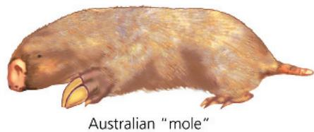  
Australian "mole"

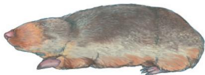  
African golden mole

## Sorting Homology from Analogy

A potential source of confusion in constructing a phylogeny is similarity between organisms that is due to convergent evolution—called analogy—rather than to shared ancestry (homology). Convergent evolution occurs when similar environmental conditions and natural selection produce similar (analogous) adaptations in organisms from different evolutionary lineages. For example, the two mole-like animals shown in Figure 26.15 look very similar. However, their internal anatomy, physiology, and reproductive systems are very dissimilar. Indeed, genetic and fossil evidence indicate that the common ancestor of these animals lived 160 million years ago. This common ancestor and most of its descendants were not mole-like. It appears that analogous characteristics evolved independently in these two lineages as they became adapted to similar lifestyles—hence, the similar mole-like features of these animals should not be used when reconstructing their phylogeny.

Another clue to distinguishing between homology and analogy is the complexity of the characters being compared. The more elements that are similar in two complex structures, the more likely it is that the structures evolved from a common ancestor. For instance, the skulls of an adult human and an adult chimpanzee both consist of many bones fused together. The compositions of the skulls match almost perfectly, bone for bone. It is highly improbable that such complex structures, matching in so many details, have separate origins. More likely, the genes involved in the development of both skulls were inherited from a common ancestor.

Traditionally, researchers have used a variety of data types to infer phylogeny, being careful to avoid making inferences based on similarities that are analogous. The advent of powerful computer technology and sophisticated techniques of sequencing genetic data has revolutionized methods of phylogenetic inference, greatly reducing the use of morphological data that can be misleading. Unless otherwise noted, the phylogenetic trees shown in this text are based on genetic sequence data, allowing us to easily visualize whether similar structures are homologous or analogous.

## Evaluating Molecular Homologies

Genes are sequences of thousands of nucleotides, each of which represents an inherited character in the form of one of the four DNA bases: A (adenine), G (guanine), C (cytosine), or T (thymine). If genes in two organisms share many portions of their nucleotide sequences, it is likely that the genes are homologous. Comparing DNA molecules often poses technical challenges for researchers. The first step after sequencing the DNA is to align comparable

sequences from the species being studied. If the species are very closely related, the sequences probably differ at only one or a few sites. In contrast, comparable nucleic acid sequences in distantly related species usually have different bases at many sites and may have different lengths. This is because insertions and deletions accumulate over long periods of time.

Suppose, for example, that certain noncoding DNA sequences near a particular gene are very similar in two species, except that the first base of the sequence has been deleted in one of the species. The effect is that the remaining sequence shifts back one notch. A comparison of the two sequences that does not take this deletion into account would overlook what in fact is a very good match. Computer programs can be used to identify such matches by testing possible alignments for comparable DNA segments of differing lengths (Figure 26.16).

Such molecular comparisons reveal that many base substitutions and other differences have accumulated in the comparable genes of an Australian “mole” and a golden mole (see Figure 26.15). The many differences indicate that their lineages have diverged greatly since their common ancestor; thus, we say that the living species are not closely related. In contrast, the high degree of gene sequence similarity among the silversword plants (see Figure 25.23) indicates that they are all very closely related, in spite of their considerable morphological differences.

Just as with morphological characters, it is necessary to distinguish homology from analogy in evaluating molecular similarities for evolutionary studies. Two sequences that resemble each other at many points along their length most likely are homologous (see Figure 26.16). But in organisms that do not

## Figure 26.16 Aligning segments of DNA.

Systematists search for similar sequences along DNA segments from two species (only one DNA strand is shown for each species). In this example, 11 of the original 12 bases have not changed since the species diverged. Hence, those portions of the sequences still align once the length is adjusted.

1 These homologous DNA sequences are identical as species 1 and species 2 begin to diverge from their common ancestor.

2 Deletion and insertion mutations shift what had been matching sequences in the two species.

3 Of the regions of the species 2 sequence that match the species 1 sequence, those highlighted in orange dashed boxes no longer align because of these mutations.

4 The matching regions realign after a computer program adds gaps in sequence 1.

Figure 26.17 A coincidental match.  
These two DNA sequences from distantly related species coincidentally share 23% of their bases (those highlighted in yellow boxes).  
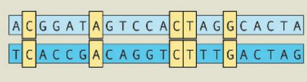  
WHAT IF? Why might you expect organisms that are not closely related to nevertheless share roughly 25% of their bases?
For suggested answer, see Appendix A.

appear to be closely related, the bases that their otherwise very different sequences happen to share may simply be coincidental matches (Figure 26.17). Scientists have developed statistical tools that can help distinguish “distant” homologies from such coincidental matches in extremely divergent sequences.

## Concept Check 26.3

1. Decide whether each of the following pairs of structures more likely represents analogy or homology, and explain your reasoning:

a. a porcupine's quills and a cactus's spines;

b. a cat's paw and a human's hand;

c. an owl's wing and a hornet's wing.

2. WHAT IF? Suppose that two species, A and B, have similar appearances but very divergent gene sequences, while species B and C have very different appearances but similar gene sequences. Which pair of species is more likely to be closely related: A and B or B and C? Explain.

3. How might analogous similarity like that shown in Figure 26.15 increase confusion when organisms are referred to by similar “common” names such as “fish” or “sparrow”?

4. Explain how it is possible that the most parsimonious tree of evolutionary relationships could be inaccurate.

For suggested answers, see Appendix A.

## Concept 26.4: An organism's evolutionary history is documented in its genome

As you have seen in this chapter, comparisons of nucleic acids or other molecules can be used to deduce relatedness. In some cases, such comparisons can reveal phylogenetic relationships that cannot be determined by nonmolecular methods such as comparative anatomy. For example, the analysis of molecular data helps us uncover evolutionary relationships between groups that have little common ground for morphological comparison, such as animals and fungi. And molecular methods allow us to reconstruct phylogenies among groups of present-day organisms for which the fossil record is poor or lacking entirely.

Different genes can evolve at different rates, even in the same evolutionary lineage. As a result, molecular trees can represent short or long periods of time, depending on which genes are used. For example, the DNA that codes for ribosomal RNA (rRNA) changes relatively slowly. Therefore, comparisons of DNA sequences in these genes are useful for investigating relationships between taxa that diverged hundreds of millions of years ago. Studies of rRNA sequences indicate, for instance, that fungi are more closely related to animals than to plants. In contrast, mitochondrial DNA (mtDNA) evolves relatively rapidly and can be used to explore recent evolutionary events. One research team has traced the relationships among Native American groups through their mtDNA sequences. The molecular findings corroborate other evidence that the Pima of Arizona, the Maya of Mexico, and the Yanomami of Venezuela are closely related, probably descending from the first of three waves of immigrants that crossed the Bering Land Bridge from Asia to the Americas about 15,000 years ago.

## Gene Duplications and Gene Families

What do molecular data reveal about the evolutionary history of genome change? Consider gene duplication, which can play an important role in evolution because it increases the number of genes in the genome, providing more opportunities for further evolutionary changes. Molecular techniques now allow us to trace the phylogenies of gene duplications. These molecular phylogenies must account for repeated duplications that have resulted in gene families, groups of related genes within an organism's genome (see Figure 21.10).

Accounting for such duplications leads us to distinguish two types of homologous genes (Figure 26.18): orthologous genes and paralogous genes. In orthologous genes from the Greek orthos, exact), the homology is the result of a speciation event and hence occurs between genes found in different species (see Figure 26.18a). For example, the genes that code for cytochrome c (a protein that functions in electron transport chains) in humans and dogs are orthologous. In paralogous genes (from the Greek para, in parallel), the homology results from gene duplication; hence, multiple copies of these genes have diverged from one another within a species

(see Figure 26.18b). In Concept 23.1, you encountered the example of olfactory receptor genes, which have undergone many gene duplications in vertebrates; humans have 380 functional copies of these paralogous genes, while mice have 1,200.

Note that orthologous genes can only diverge after speciation has taken place, that is, after the genes are found in separate gene pools. Thus, differences among orthologous genes reflect the history of speciation events, making them well-suited for inferring phylogeny. For example, although the cytochrome c genes in humans and dogs serve the same function, the gene's sequence in humans has diverged from that in dogs in the time since these species last shared a common ancestor. Paralogous genes, on the other hand, can diverge within a species because they are present in more than one copy in the genome. The paralogous genes that make up the olfactory receptor gene family in humans have diverged from each other during our long evolutionary history. They now specify proteins that confer sensitivity to a wide variety of molecules, ranging from food odors to sex pheromones.

## Genome Evolution

Now that we can compare the entire genomes of different organisms, including our own, two patterns have emerged. First, lineages that diverged long ago often share many orthologous genes. For example, though the human and mouse lineages diverged about 65 million years ago, 99% of the genes of humans and mice are orthologous. And 50% of human genes are orthologous with those of yeast, despite 1 billion years of divergent evolution. Such commonalities explain why disparate organisms nevertheless share many biochemical and developmental pathways. As a result of these shared pathways, the functioning of genes linked to diseases in humans can often be investigated by studying yeast and other organisms distantly related to humans.

Second, the number of genes a species has doesn't seem to increase through duplication at the same rate as perceived phenotypic complexity. Humans have only about four times as many genes as yeast, a single-celled eukaryote, even though—unlike yeast—we have a large, complex brain and a body with more than 200 different

Figure 26.18 Two types of homologous genes.

Colored bands mark regions of the genes where differences in base sequences have accumulated.

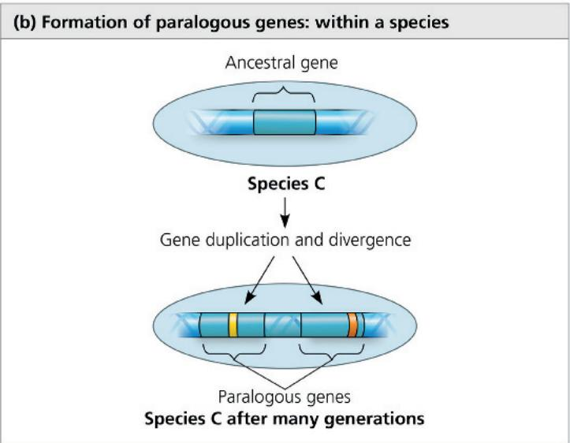

types of tissues. Evidence is emerging that many human genes are more versatile than those of yeast: A single human gene can encode multiple proteins that perform different tasks in various body tissues. Unraveling the mechanisms that cause this genomic versatility and phenotypic variation is an exciting challenge.

## Concept Check 26.4

1. Explain how comparing proteins of two species can yield data about the species' evolutionary relationship.

2. Distinguish orthologous from paralogous genes. Which of these two types of genes should be used to infer phylogeny? Explain your answer.

3. MAKE CONNECTIONS Review Figure 18.12, then suggest how a particular gene could have different functions in different tissues within an organism.

For suggested answers, see Appendix A.

## Concept 26.5: Molecular clocks help track evolutionary time

One goal of evolutionary biology is to understand the relationships among all organisms. It is also helpful to know when lineages diverged from one another, including those for which there is no fossil record. But how can we determine the timing of phylogenies that extend beyond the fossil record?

## Molecular Clocks

We stated earlier that researchers have estimated that the common ancestor of Hawaiian silversword plants lived about 5 million years ago. How did they make this estimate? They relied on the concept of a molecular clock, an approach for measuring the absolute time of evolutionary change based on the observation that some genes and other regions of genomes appear to evolve at constant rates. An assumption underlying the molecular clock is that the number of nucleotide substitutions in orthologous genes is proportional to the time that has elapsed since the genes branched from their common ancestor. In the case of paralogous genes, the number of substitutions is proportional to the time since the ancestral gene was duplicated.

We can calibrate the molecular clock of a gene that has a reliable average rate of evolution by graphing the number of genetic differences—for example, nucleotide, codon, or amino acid differences—against the dates of evolutionary branch points that are known from the fossil record (Figure 26.19). The average rates of genetic change inferred from such graphs can then be used to estimate the dates of events that cannot be discerned from the fossil record, such as the origin of the silverswords discussed earlier.

Of course, no gene marks time with complete precision. In fact, some portions of the genome appear to have evolved in irregular bursts that are not at all clocklike. And even those genes that seem to act as reliable molecular clocks are accurate only in the statistical sense of showing a fairly smooth average rate of

change. Over time, there may still be deviations from that average rate. Furthermore, the same gene may evolve at different rates in different groups of organisms. Finally, when comparing genes that are clocklike, the rate of the clock may vary greatly from one gene to another; some genes evolve a million times faster than others.

## Differences in Clock Speed

What causes such differences in the speed at which clocklike genes evolve? The answer stems from the fact that some mutations are selectively neutral—neither beneficial nor detrimental. Of course, many new mutations are harmful and are removed quickly by selection. But if most of the rest are neutral and have little or no effect on fitness, then the rate of evolution of those neutral mutations should indeed be regular, like a clock. Differences in the clock rate for different genes are related to how important a gene is. If the exact sequence of amino acids that a gene specifies is essential to survival, most of the mutational changes will be harmful and only a few will be neutral. As a result, such genes change only slowly. But if the exact sequence of amino acids is less critical, fewer of the new mutations will be harmful and more will be neutral. Such genes change more quickly.

## Potential Problems with Molecular Clocks

As we've seen, molecular clocks do not run as smoothly as would be expected if the underlying mutations were selectively neutral. Many irregularities are likely to be the result of natural selection in which certain DNA changes are favored over others. Indeed, evidence suggests that almost half the amino acid differences in proteins of two Drosophila species, $D$ . simulans and $D$ . yakuba, are not neutral but have resulted from natural selection. But because the direction of natural selection may change repeatedly over long periods of time (and hence may average out), some genes experiencing selection can nevertheless serve as approximate markers of elapsed time.

Another question arises when researchers attempt to extend molecular clocks beyond the time span documented by the fossil record. Although an abundant fossil record extends back only about 550 million years, molecular clocks have been used to date

## Figure 26.19 A molecular clock for mammals.

The number of accumulated mutations in seven well-studied proteins has increased over time in a consistent manner for most mammal species. The three square green data points represent primate species, whose proteins appear to have evolved more slowly than those of other mammals. The divergence time for each data point was based on fossil evidence.

  
INTERPRET THE DATA Use the graph to estimate the divergence time for a mammal with a total of 30 mutations in the seven proteins.

evolutionary divergences that occurred a billion or more years ago. These estimates assume that the clocks have been constant for all that time. Such estimates are highly uncertain.

In some cases, problems may be avoided by calibrating molecular clocks with data on the rates at which genes have evolved in different taxa. In other cases, problems may be avoided by using many genes rather than just using one or a few genes. By using many genes, fluctuations in evolutionary rate due to natural selection or other factors that vary over time may average out. For example, one group of researchers constructed molecular clocks of vertebrate evolution from published sequence data for 658 nuclear genes. Despite the broad period of time covered (nearly 600 million years) and the fact that natural selection probably affected some of these genes, their estimates of divergence times agreed closely with fossil-based estimates. As this example suggests, if used with care, molecular clocks can aid our understanding of evolutionary relationships.

## Applying a Molecular Clock: Dating the Origin of HIV

Researchers have used a molecular clock to date the origin of HIV infection in humans. Phylogenetic analysis shows that HIV, the virus that causes AIDS, is descended from viruses that infect chimpanzees and other primates. (Most of these viruses do not cause AIDS-like diseases in their native hosts.) When did HIV jump to humans? There is no simple answer because the virus has spread to humans more than once. The multiple origins of HIV are reflected in the

## Figure 26.20 Dating the origin of HIV-1 M.

The black data points are based on DNA sequences of an HIV gene in patients' blood samples. (The dates when these individual HIV gene sequences arose are not certain because a person can harbor the virus for years before symptoms occur.) Projecting the gene's rate of change backward in time by this method suggests that the virus originated in the 1930s.

variety of strains (genetic types) of the virus. HIV's genetic material is made of RNA, and like other RNA viruses, it evolves quickly.

The most widespread strain in humans is HIV-1 M. To pinpoint the earliest HIV-1 M infection, researchers compared samples of the virus from various times during the epidemic, including a sample from 1959. Comparisons of gene sequences showed that the virus has evolved in a clocklike fashion. Extrapolating backward in time using the molecular clock indicates that the HIV-1 M strain first spread to humans around 1930 (Figure 26.20). A later study, which dated the origin of HIV using a more advanced molecular clock approach than that covered in this book, estimated that the HIV-1 M strain first spread to humans around 1910.

## Concept Check 26.5

1. What is a molecular clock? What assumption underlies the use of a molecular clock?

2. MAKE CONNECTIONS Review Concept 17.5. Then, explain how numerous base changes could occur in an organism's DNA yet have no effect on its fitness.

For suggested answers, see Appendix A.

## Concept 26.6: New information continues to improve our understanding of evolutionary history

The discovery that the glass lizard in Figure 26.1 evolved from a different lineage of legless lizards than did snakes is one example of how our understanding of life's diversity is informed by systematics. Indeed, in recent decades, systematists have gained insight into even the very deepest branches of the tree of life by analyzing DNA sequence data.

## Kingdoms and Domains of Life

Biologists once classified all known species into two kingdoms: plants and animals. Classification schemes with more than two kingdoms gained broad acceptance in the late 1960s, when many biologists recognized five kingdoms: Monera (prokaryotes), Protista (a diverse kingdom consisting mostly of unicellular organisms), Plantae, Fungi, and Animalia. This system highlighted the two fundamentally different types of cells, prokaryotic and eukaryotic, and set the prokaryotes apart from all eukaryotes by placing them in their own kingdom, Monera.

However, phylogenies based on genetic data soon revealed a problem with this system: Some prokaryotes differ as much from each other as they do from eukaryotes. Such difficulties led biologists to propose a three-domain system, as discussed in Concept 1.2. In this system, the domains—Bacteria, Archaea, and Eukarya—represent a classification level higher than the kingdom. The domain Bacteria contains most of the currently known prokaryotes, while Archaea includes a diverse group of prokaryotic organisms that inhabit a wide variety of environments. Eukarya

consists of all the organisms that have cells containing true nuclei. This clade includes many groups of single-celled organisms as well as multicellular plants, fungi, and animals. Figure 26.21a represents one possible phylogenetic tree for the three domains and some of the many lineages they encompass.

The three-domain system highlights the fact that much of the history of life has been about single-celled organisms. All prokaryotic organisms are single-celled, and even in Eukarya, only the branches labeled in red type (plants, fungi, and animals) are dominated by multicellular organisms. Of the five kingdoms previously recognized by systematists, most biologists continue to recognize Plantae, Fungi, and Animalia, but not Monera and Protista. The kingdom Monera is obsolete because it would have members in multiple domains. The kingdom Protista has also crumbled because it includes members that are more closely related to plants, fungi, or animals than to other protists (see Figure 28.5).

  
(a) Three domains. In this tree, Eukarya and Archaea are sister groups; they share a common ancestor and are more closely related to each other than either is to Bacteria.

New research continues to change our understanding of the tree of life. In the phylogeny shown in Figure 26.21a, based on sequence data for rRNA and other genes, the first major split in the history of life occurred when bacteria diverged from other organisms, meaning that eukaryotes and archaea are more closely related to each other than either is to bacteria. Recent studies comparing entire genomes support the close relationship between Archaea and Eukarya. These metagenomic studies have uncovered the genomes of many new species of archaea, leading to the identification of many previously unknown phyla of archaea. One of these newly discovered groups, the Asgard archaea (many of which are named for the gods in Norse mythology), includes lineages that appear to share a more recent common ancestor with Eukarya than with other lineages of Archaea. This finding implies that Eukarya arose from within the Archaea and supports a two-domain hypothesis for the tree of life (Figure 26.21b). This finding may also help shed light on how eukaryotes arose from their prokaryotic ancestors (see Concepts 27.4 and 28.1).

Figure 26.21 Two hypotheses for the tree of life.

For simplicity, only some of the major branches in each domain are shown. Lineages within Eukarya that are dominated by multicellular organisms (plants, fungi, and animals) are in bold red type, while the two lineages denoted by an asterisk are based on DNA from cellular organelles. All other lineages consist solely or mainly of single-celled organisms.

MAKE CONNECTIONS After reviewing endosymbiont theory (see Figure 6.16), explain the specific positions of the mitochondrion and chloroplast lineages on these trees.

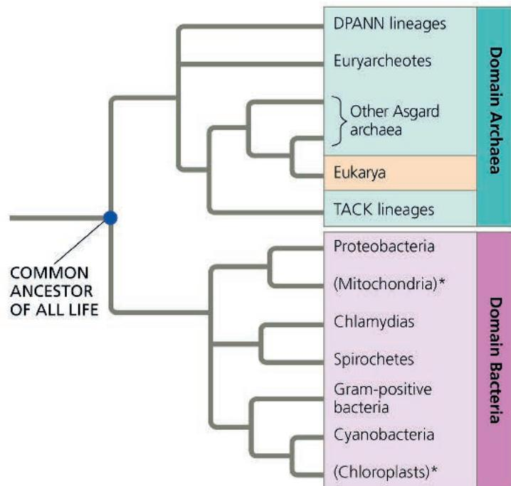  
(b) Two domains. In this tree, clade Eukarya is sister to one subgroup within Archaea; these groups are more closely related to each other than to other archaea.

## The Important Role of Horizontal Gene Transfer

Historical comparisons based on only one or a few genes have sometimes suggested a different set of relationships than those shown in Figure 26.21. For example, researchers have found that many of the genes that influence metabolism in yeast (a unicellular eukaryote) are more similar to genes in the domain Bacteria than they are to genes in the domain Archaea.

What causes data from different genes to yield such different results? Comparisons of complete genomes from the three domains show that there have been substantial movements of genes between organisms in the different domains. These took place through horizontal gene transfer, a process in which genes are transferred from one genome to another through mechanisms such as exchange of transposable elements and

plasmids, viral infection (see Concept 19.2), and fusions of organisms (as when a host and its endosymbiont become a single organism). Recent research reinforces the view that horizontal gene transfer is important. For example, one study found that on average, 80% of the genes in 181 prokaryotic genomes had moved between species at some point during the course of evolution. Because phylogenetic trees are based on the assumption that genes are passed vertically from one generation to the next, the occurrence of such horizontal transfer events helps to explain why trees built using different genes can give inconsistent results.

Horizontal gene transfer can also occur between eukaryotes. For example, over 200 cases of the horizontal transfer of transposons have been reported in eukaryotes, including humans and other primates, plants, birds, and lizards. Nuclear genes have also been transferred horizontally from one eukaryote to another. The Scientific Skills Exercise describes one such example, giving you

## Scientific Skills Exercise Using Protein Sequence Data to Test an Evolutionary Hypothesis

Did Aphids Acquire Their Ability to Make Carotenoids Through Horizontal Gene Transfer? Carotenoids are colored molecules that have diverse functions in many organisms, such as photosynthesis in plants and light detection in animals. Plants and many microorganisms can synthesize carotenoids from scratch, but animals generally cannot (they must obtain carotenoids from their diet). One exception is the pea aphid Acyrthosiphon pisum, a small, plant-dwelling insect whose genome includes a full set of genes for the enzymes needed to make carotenoids. Because other animals lack these genes, it is unlikely that aphids inherited them from a single-celled common ancestor shared with microorganisms and plants. So where did they come from? Evolutionary biologists hypothesized that an aphid ancestor acquired these genes by horizontal gene transfer from distantly related organisms.

How the Experiment Was Done Scientists obtained the DNA sequences for the carotenoid-biosynthesis genes from several species, including aphids, fungi, bacteria, and plants. A computer “translated” these sequences into amino acid sequences of the encoded polypeptides and aligned the amino acid sequences. This allowed the team to compare the corresponding polypeptides in the different organisms.

Data from the Experiment The sequences below show the first 60 amino acids of one polypeptide of the carotenoid-biosynthesis enzymes in the plant Arabidopsis thaliana (bottom) and the corresponding amino acids in five nonplant species, using the

one-letter abbreviations for the amino acids (see Figure 5.14). A dash (−) indicates a gap inserted in a sequence to optimize its alignment with the corresponding sequence in Arabidopsis.

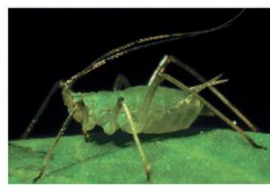

## INTERPRET THE DATA

1. In the rows of data for the organisms being compared with the aphid, highlight the amino acids that are identical to the corresponding amino acids in the aphid.

2. Which organism has the most amino acids in common with the aphid? Rank the partial polypeptides from the other four organisms in degree of similarity to that of the aphid.

3. (a) Do these data support the hypothesis that aphids acquired the gene for this polypeptide by horizontal gene transfer? Why or why not? (b) If horizontal gene transfer did occur, what type of organism is likely to have been the source?

4. What additional sequence data would support your hypothesis?

5. How would you account for the similarities between the aphid sequence and the sequences for the bacteria and plant?

Instructors: A version of this Scientific Skills Exercise can be assigned in Mastering Biology.

<table><tr><td>Organism</td><td colspan="6">Alignment of Amino Acid Sequences</td></tr><tr><td>Acyrthosiphon (aphid)</td><td>IKIIIGSGV</td><td>GGTAAAARLS</td><td>KKGFQVEVYE</td><td>KNSYNGGRCS</td><td>IIR-HNGHRF</td><td>DQGPSL--YL</td></tr><tr><td>Ustilago (fungus)</td><td>KKVVIIGAGA</td><td>CGTALAARLG</td><td>RRGYSVTVLE</td><td>KNSFGGCRCS</td><td>LIH-HDGHRW</td><td>DQGPSL--YL</td></tr><tr><td>Gibberella (fungus)</td><td>KSVIVIGAGV</td><td>GGVSTAARLA</td><td>KAGFKVTILE</td><td>KNDFTGGRCS</td><td>LIH-NDGHRF</td><td>DQGPSL--LL</td></tr><tr><td>Staphylococcus (bacterium)</td><td>MKIAVIGAGV</td><td>TGLAAAARIA</td><td>SQGHEVTIFE</td><td>KNNNVGGRMN</td><td>QLK-KDGFTF</td><td>DMGPTI--VM</td></tr><tr><td>Pantoea (bacterium)</td><td>KRTFVIGAGF</td><td>GGLALAIRLQ</td><td>AAGIATTVLE</td><td>QHDKPGGRAY</td><td>VWQ-DQGFTF</td><td>DAGPTV--IT</td></tr><tr><td>Arabidopsis (plant)</td><td>WDAVVIGGGH</td><td>NGLTAAAYLA</td><td>RGGLSVAVLE</td><td>RRHVIGGAAV</td><td>TEEIVPGFKF</td><td>SRCSYLQGLL</td></tr></table>

Data from Nancy A. Moran, Yale University. See N. A. Moran and T. Jarvik, Lateral transfer of genes from fungi underlies carotenoid production in aphids, Science 328:624–627 (2010).

Figure 26.23 A tangled web of life.

Figure 26.22 A recipient of transferred genes: the alga Galdieria sulphuraria.

Genes received from prokaryotes enable G. sulphuraria (inset) to grow in extreme environments, including on sulfur-encrusted rocks around volcanic hot springs similar to this one in Yellowstone National Park.

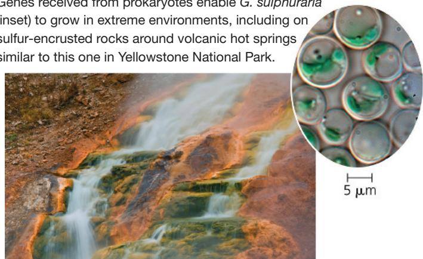

the opportunity to interpret data on the transfer of a pigment gene to an aphid from another species.

Studies show that eukaryotes can even acquire genes by horizontal gene transfer from prokaryotes. For example, a recent genomic analysis showed that the alga Galdieria sulphuraria (Figure 26.22) acquired about 5% of its nuclear genes from various bacterial and archaeal species. Unlike most eukaryotes, this alga can survive in environments that are highly acidic or extremely hot, as well as those with high concentrations of heavy metals. The researchers identified specific genes transferred from prokaryotes that have enabled G. sulphuraria to thrive in such extreme habitats.

Overall, horizontal gene transfer has played a key role throughout the evolutionary history of life, and it continues to occur today. Some biologists have argued that horizontal gene transfer was so common that the early history of life should be represented not as a dichotomously branching tree like those in Figure 26.21, but rather as a tangled network of connected branches (Figure 26.23). Although scientists continue to debate how best to portray the earliest steps in the history of life, in recent decades there have been many exciting discoveries about evolutionary events that occurred over time. We'll explore such discoveries in the rest of this unit, beginning with Earth's earliest inhabitants, prokaryotic organisms.

## Chapter 26 Review

## Summary of Key Concepts

To review key terms, go to the Vocabulary Self-Quiz (eTextbook only).

## Concept 26.1: Phylogenies show evolutionary relationships

\- Linnaeus's binomial classification system gives organisms two-part names: a genus plus a specific epithet.

\- In the Linnaean system, species are grouped in increasingly broad taxa: Related genera are placed in the same family, families in orders, orders in classes, classes in phyla, phyla in kingdoms, and (more recently) kingdoms in domains.

Horizontal gene transfer may have been so common in the early history of life that the base of a “tree of life” might be more accurately portrayed as a tangled web.

  
Ancestral cell populations

## Interview

Interview with Nancy Moran: Studying symbioses and horizontal gene transfer (eTextbook only)

## Concept Check 26.6

1. Why is kingdom Monera no longer considered a valid taxon?

2. Explain why phylogenies based on different genes can yield different branching patterns for the tree of all life.

3. MAKE CONNECTIONS Explain how the origin of eukaryotes is thought to have represented a fusion of organisms, leading to extensive horizontal gene transfer. (See Figure 25.10.)

For suggested answers, see Appendix A.

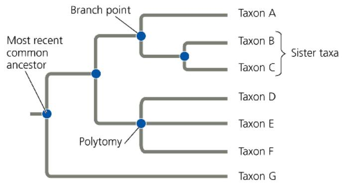

\- Systematists depict evolutionary relationships as branching phylogenetic trees. Many systematists propose that classification be based entirely on evolutionary relationships.

\- Unless branch lengths are proportional to time or genetic change, a phylogenetic tree indicates only patterns of descent.

\- Much information can be learned about a species from its evolutionary history; hence, phylogenies are useful in a wide range of applications.

Humans and chimpanzees are sister species. Explain what this statement means.

## Concept 26.2: Phylogenies can be used to understand shared characters

\- A clade is a monophyletic group that includes an ancestral species and all of its descendants.

Monophyletic group  
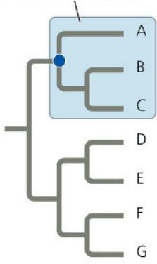

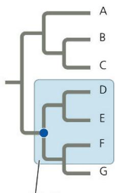  
Polyphyletic group

  
Paraphyletic group

\- Clades can be distinguished by their shared derived characters.

\- A paraphyletic group includes a common ancestor but excludes some descendants of that common ancestor. A polyphyletic group does not include a common ancestor and may indicate analogous similarity.

\- We can map characters on a phylogeny to visualize the pattern of their evolution.

\- Well-supported phylogenetic hypotheses are consistent with a wide range of data.

Explain how a trait could be considered ancestral for a given taxon, but derived for a different taxon.

## Concept 26.3: Phylogenies are inferred from morphological and molecular data

\- Organisms with similar morphologies or DNA sequences are likely to be more closely related than organisms with very different structures and genetic sequences.

\- We infer phylogeny based on homology (similarity due to shared ancestry) rather than analogy (similarity due to convergent evolution).

\- Computer programs are used to align comparable DNA sequences and to distinguish molecular homologies from coincidental matches between taxa that diverged long ago.

\- Branch lengths can be proportional to the amount of evolutionary change or time.

\- Among phylogenies, the most parsimonious tree is the one that requires the fewest evolutionary changes. The most likely tree is the one based on the most likely pattern of changes.

Why is it necessary to distinguish homology from analogy to infer phylogeny?

## Concept 26.4: An organism's evolutionary history is documented in its genome

\- Orthologous genes are homologous genes found in different species as a result of speciation. Paralogous genes are homologous genes within a species that result from gene duplication; such genes can diverge and potentially take on new functions.

\- Distantly related species often have many orthologous genes. The small variation in gene number in organisms of varying complexity suggests that genes are versatile and may have multiple functions.

When reconstructing phylogenies, is it more useful to compare orthologous or paralogous genes? Explain.

## Concept 26.5: Molecular clocks help track evolutionary time

\- Some regions of DNA change at a rate consistent enough to serve as a molecular clock, a method of estimating the date of past evolutionary events based on the amount of genetic change. Other DNA regions change in a less predictable way.

\- Molecular clock analyses suggest that the most common strain of HIV jumped from primates to humans in the early 1900s.

Describe some assumptions and limitations of molecular clocks.

## Concept 26.6: New information continues to improve our understanding of evolutionary history

\- Past classification systems have given way to the current view of the tree of life, which consists of three major groups: Bacteria, Archaea, and Eukarya.

\- Phylogenies based on analyses of genomic and protein sequences suggest that eukaryotes are most closely related to archaea, and more specifically that they likely arose within the archaea. These relationships are an area of active research and discussion.

\- Genetic analyses indicate that extensive horizontal gene transfer has occurred throughout the evolutionary history of life.

Why was the five-kingdom system abandoned for a domain system? For suggested answers, see Appendix A.

## Test Your Understanding

For more multiple-choice questions, go to the Practice Test (eTextbook only).

## Levels 1-2: Remembering/Understanding

1. In a comparison of birds and mammals, the condition of having four limbs is

(A) a shared ancestral character.

(B) a shared derived character.

(C) a character useful for distinguishing birds from mammals.

(D) an example of analogy rather than homology.

2. To apply parsimony to constructing a phylogenetic tree,

(A) choose the tree that assumes all evolutionary changes are equally probable.

(B) choose the tree in which the branch points are based on as many shared derived characters as possible.

(C) choose the tree that represents the fewest evolutionary changes, in either DNA sequences or morphology.

(D) choose the tree with the fewest branch points.

## Levels 3-4: Applying/Analyzing

3. VISUAL SKILLS In Figure 26.4, which similarly inclusive taxon is represented as descending from the same common ancestor as Canidae?

(A) Felidae

(B) Mustelidae

(C) Carnivora

(D) Lutra

4. Three living species X, Y, and Z share a common ancestor T, as do extinct species U and V. A grouping that consists of species T, X, Y, and Z (but not U or V) makes up

(A) a monophyletic taxon.

(B) an ingroup, with species U as the outgroup.

(C) a paraphyletic group.

(D) a polyphyletic group.

5. VISUAL SKILLS Based on the tree below, which statement is correct?

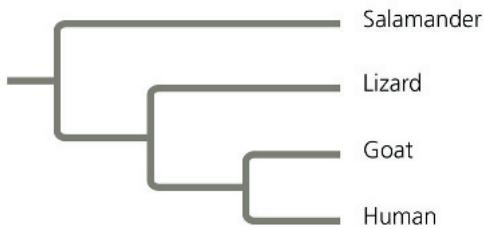

(A) Lizards and goats form a sister group.

(B) Salamanders are a sister group to the group containing lizards, goats, and humans.

(C) Salamanders are more closely related to lizards than to humans.

(D) Goats and humans are the only sister group shown in this tree.

6. If you were using cladistics to build a phylogenetic tree of cats, which of the following would be the best outgroup?

(A) wolf

(B) domestic cat

(C) lion

(D) leopard

7. VISUAL SKILLS The relative lengths of the frog and mouse branches in the phylogenetic tree in Figure 26.12 indicate that (A) frogs evolved before mice.

(B) mice evolved before frogs.

(C) the homolog evolved more rapidly in the mouse lineage.

(D) the homolog evolved more slowly in the mouse lineage.

## Levels 5-6: Evaluating/Creating

8. EVOLUTION CONNECTION Darwin suggested looking at a species' close relatives to learn what its ancestors may have been like. Explain how his suggestion anticipates recent methods, such as phylogenetic bracketing and the use of outgroups in cladistic analysis.

9. SCIENTIFIC INQUIRY • DRAW IT (a) Using the phylogenetic tree shown, map characters 1–6 from the table onto the appropriate branches. Add hatch marks to indicate the origins of characters 1–6. (b) Suppose you were asked to evaluate the hypothesis that tuna and dolphins are sister groups. Redraw the phylogenetic tree accordingly, using hatch marks to indicate the origins of characters 1–6. (c) Determine how

many evolutionary changes are required in each tree. Identify the most parsimonious tree.

<table><tr><td>Character</td><td>Lancelet(outgroup)</td><td>Lamprey</td><td>Tuna</td><td>Salamander</td><td>Turtle</td><td>Leopard</td><td>Dolphin</td></tr><tr><td>(1) Backbone</td><td>0</td><td>1</td><td>1</td><td>1</td><td>1</td><td>1</td><td>1</td></tr><tr><td>(2) Hinged jaw</td><td>0</td><td>0</td><td>1</td><td>1</td><td>1</td><td>1</td><td>1</td></tr><tr><td>(3) Four limbs</td><td>0</td><td>0</td><td>0</td><td>1</td><td>1</td><td>1</td><td>1*</td></tr><tr><td>(4) Amnion</td><td>0</td><td>0</td><td>0</td><td>0</td><td>1</td><td>1</td><td>1</td></tr><tr><td>(5) Milk</td><td>0</td><td>0</td><td>0</td><td>0</td><td>0</td><td>1</td><td>1</td></tr><tr><td>(6) Dorsal fin</td><td>0</td><td>0</td><td>1</td><td>0</td><td>0</td><td>0</td><td>1</td></tr></table>

\*Although adult dolphins have only two obvious limbs (their flippers), as embryos they have two hind-limb buds, for a total of four limbs.

10. WRITE ABOUT A THEME: INFORMATION In a short essay (100–150 words), explain how genetic information—along with an understanding of the process of descent with modification—enables scientists to reconstruct phylogenies that extend hundreds of millions of years back in time.

## 11. SYNTHESIZE YOUR KNOWLEDGE

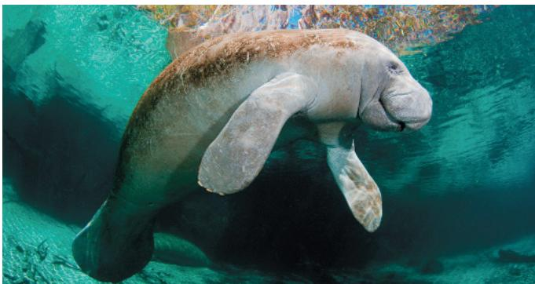

This West Indian manatee (Trichechus manatus) is an aquatic mammal. Like amphibians and reptiles, mammals are tetrapods (vertebrates with four limbs). Explain why manatees are considered tetrapods even though they lack hind limbs, and suggest traits that manatees likely share with leopards and other mammals (see Figure 26.9b). Discuss how early members of the manatee lineage might have differed from today's manatees.

For selected answers, see Appendix A.

# Bacteria and Archaea

## Key Concepts

27.1 Structural and functional adaptations contribute to prokaryotic success

27.2 Rapid reproduction, mutation, and genetic recombination promote genetic diversity in prokaryotic organisms

27.3 Diverse nutritional and metabolic adaptations have evolved in Bacteria and Archaea

27.4 Bacteria and Archaea have radiated into a diverse set of lineages

27.5 Prokaryotic organisms play crucial roles in the biosphere

27.6 Prokaryotic organisms have both beneficial and harmful impacts on humans

  
Figure 27.1 The pink color of this lake in Spain is a sign that its waters are much saltier than seawater. Its color is caused not by minerals or other nonliving sources, but by trillions of prokaryotic organisms that thrive in salinities that kill other cells. Other prokaryotic organisms live in environments that are far too cold or hot or acidic for most other living things.

## Study Tip

Make a table: As you read the chapter, identify examples of challenging environments in which prokaryotic organisms thrive. List the structural, metabolic, or other features that contribute to their success in each of these environments.

<table><tr><td>Environmental challenge</td><td>Prokaryotic feature enabling success</td></tr><tr><td>Lack of water</td><td>Capsule or slime layer</td></tr><tr><td>Exposure to antibiotics</td><td></td></tr></table>

## What characteristics enable prokaryotic organisms to reach huge population sizes and thrive in diverse environments?

Due to the organisms' small size and rapid reproduction, prokaryotic populations can reach enormous numbers.

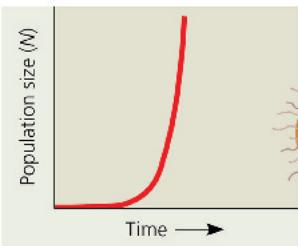  
Their diverse adaptations enable prokaryotic organisms to live in a wide range of environments.

Because prokaryotic populations are so large, mutations produce high genetic diversity, enabling rapid evolution.

  
Rapid evolution in prokaryotic populations results in diverse metabolic and structural adaptations.

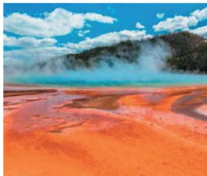  
Protective coat

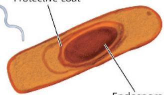  
Endospore (resistant cell that can enable this bacterium to survive harsh conditions)

The single-celled organisms classified in domains Bacteria and Archaea, collectively referred to as prokaryotes, include species that can thrive in a wide range of extreme environments. Prokaryotic species are also very well adapted to more “normal” habitats—the lands and waters in which most other species are found. Their ability to adapt to a broad range of habitats helps explain why prokaryotic organisms are the most abundant organisms on Earth. Indeed, the number of prokaryotic organisms in a handful of fertile soil is greater than the number of people who have ever lived. In this chapter, we’ll examine the adaptations, diversity, and enormous ecological impact of these remarkable organisms.

## Concept 27.1: Structural and functional adaptations contribute to prokaryotic success

The first organisms to inhabit Earth were prokaryotes that lived 3.5 billion years ago (see Concept 25.3). Throughout their long evolutionary history, prokaryotic populations have been (and continue to be) subjected to natural selection in all kinds of environments, resulting in their enormous diversity today.

We'll begin by describing prokaryotes. Most prokaryotic organisms are unicellular, although the cells of some species remain attached to each other after cell division. Prokaryotic cells typically have diameters of 0.5–5 $\mu$ m, much smaller than the 10- to 100- $\mu$ m diameter of many eukaryotic cells. (One notable exception, the bacterium Thiomargarita namibiensis, can be as large as 750 $\mu$ m in diameter—bigger than a poppy seed.) Prokaryotic cells have a variety of shapes (Figure 27.2). Finally, although they are unicellular and small, prokaryotic organisms are well organized, achieving all of an organism's life functions within a single cell.

## Cell-Surface Structures

A key feature of nearly all prokaryotic cells is the cell wall, which maintains cell shape, protects the cell, and prevents it from bursting in a hypotonic environment (see Figure 7.13). In a hypertonic environment, most prokaryotic organisms lose water and shrink away from their wall. Such water losses can inhibit cell reproduction. Thus, salt can be used to preserve foods because it causes food-spoiling prokaryotic organisms to lose water, preventing them from reproducing rapidly.

The cell walls of prokaryotic organisms differ in structure from those of eukaryotes. In eukaryotes that have cell walls, such as plants and fungi, the walls are usually made of cellulose or chitin (see Concept 5.2). In contrast, most bacterial cell walls contain peptidoglycan, a polymer composed of modified sugars cross-linked by short polypeptides. This molecular fabric encloses the entire bacterium and anchors other molecules that extend from its surface. Archaeal cell walls contain a variety of polysaccharides and proteins but lack peptidoglycan.

Using a technique called the Gram stain, developed by the 19th-century Danish physician Hans Christian Gram, scientists

Figure 27.2 The most common shapes of prokaryotic cells.

(a) Cocci (singular, coccus) are spherical prokaryotic cells. They can occur singly, in chains of two or more cells, and in clusters resembling bunches of grapes.

(b) Bacilli (singular, bacillus) are rod-shaped prokaryotic cells. They are usually solitary, but in some forms the rods are arranged in chains.

(c) Spiral prokaryotic cells include spirochetes (shown here), which are corkscrew-shaped; other spiral prokaryotic cells resemble commas or loose coils (colorized SEMs).

  
(a) Spherical

  
(b) Rod-shaped

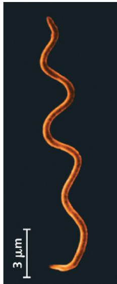  
(c) Spiral

can categorize many bacterial species according to differences in cell wall composition. To do this, samples are first stained with crystal violet dye and iodine, then rinsed in alcohol, and finally stained with the red dye safranin, which enters the cell and binds to its DNA. The structure of a bacterium's cell wall determines the staining response (Figure 27.3). Gram-positive bacteria have relatively simple walls composed of a thick layer of peptidoglycan. The walls of gram-negative bacteria have less peptidoglycan and are structurally more complex, with an outer membrane that contains lipopolysaccharides (carbohydrates bonded to lipids).

Gram staining is a valuable tool in medicine for quickly determining if a patient's infection is due to gram-negative or to gram-positive bacteria. This information has treatment implications. The lipid portions of the lipopolysaccharides in the walls of many gram-negative bacteria are toxic, causing fever or shock. Furthermore, the outer membrane of a gram-negative bacterium helps protect it from the body's defenses. Gram-negative bacteria also tend to be more resistant than gram-positive species to antibiotics because the outer membrane impedes the entry of some drugs. However, some gram-positive species have virulent strains that are resistant to one or more antibiotics. (Figure 22.14 discusses one example: methicillin-resistant Staphylococcus aureus, or MRSA, which can cause lethal skin infections.)

The effectiveness of certain antibiotics, such as penicillin, derives from their inhibition of peptidoglycan cross-linking. The resulting cell wall may not be functional, particularly in gram-positive bacteria. Such drugs destroy many species of pathogenic bacteria without adversely affecting human cells, which do not have peptidoglycan.

Figure 27.3 Gram staining.  
  
Gram-positive bacteria stain a darker color and have a thick cell wall made of peptidoglycan.  
Gram-negative bacteria have a thinner layer of peptidoglycan located between the plasma membrane and an outer membrane.

The cell wall of many prokaryotic organisms is surrounded by a sticky layer of polysaccharide or protein. This layer is called a capsule if it is dense and well-defined (Figure 27.4) or a slime layer if it is not as well organized. Both kinds of sticky outer layers enable prokaryotic organisms to adhere to their substrate or to other individuals in a colony. Capsules and slime layers also protect against dehydration, and some capsules shield pathogenic prokaryotes from attacks by their host's immune system.

In another way of withstanding harsh conditions, certain bacteria develop resistant cells called endospores when they lack water or essential nutrients (Figure 27.5). The original cell produces a copy of its chromosome and surrounds that copy with a multilayered structure, forming the endospore. Water is removed from the endospore, and its metabolism halts. The original cell

then lyses, releasing the endospore. Most endospores are so durable that they can survive in boiling water; killing them requires heating lab equipment to $121^{\circ}$ C under high pressure. In less hostile environments, endospores can remain dormant but viable for centuries, able to rehydrate and resume metabolism when their environment improves.

Finally, some prokaryotic organisms stick to their substrate or to one another by means of hairlike appendages called fimbriae (singular, fimbria) (Figure 27.6). For example, the bacterium that causes gonorrhea, Neisseria gonorrhoeae, uses fimbriae to fasten itself to the mucous membranes of its host. Fimbriae are usually shorter and more numerous than pili (singular, pilus), appendages that pull two cells together prior to DNA transfer from one cell to the other (see Figure 27.12); pili are sometimes referred to as sex pili.

Figure 27.4 Capsule.

The polysaccharide capsule around this Streptococcus bacterium enables it to attach to cells in the respiratory tract—in this colorized TEM, a tonsil cell.

  
Figure 27.5 An endospore.

Bacillus anthracis, the bacterium that causes the disease anthrax, produces endospores (TEM). An endospore's protective, multilayered coat helps it survive in the soil for years.

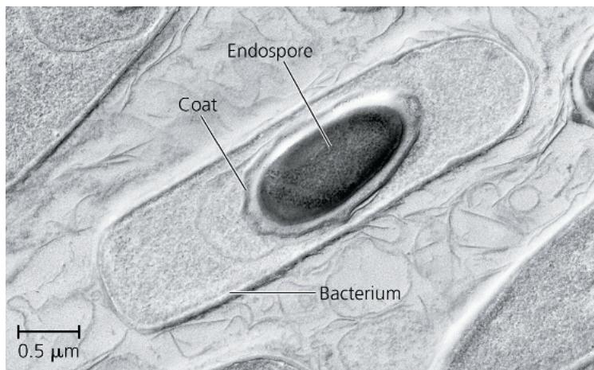

Figure 27.6 Fimbriae.

These numerous protein-containing appendages enable some prokaryotic organisms to attach to surfaces or to other cells (colorized TEM).

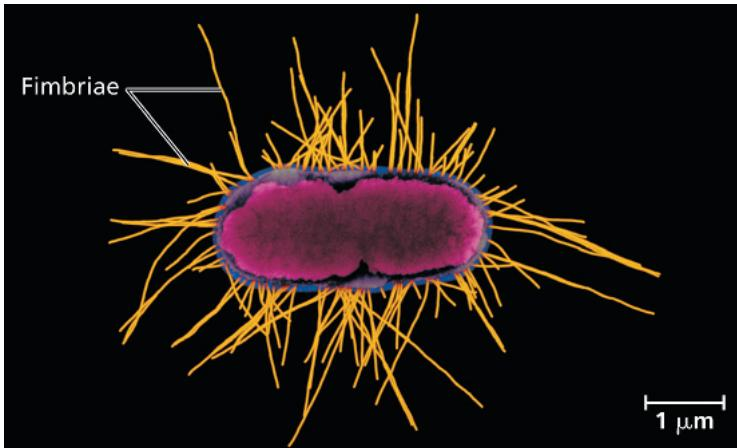

## Motility

About half of all prokaryotic organisms are capable of taxis, a directed movement toward or away from a stimulus (from the Greek taxis, to arrange). For example, prokaryotic organisms that exhibit chemotaxis change their movement pattern in response to

chemicals. They may move toward nutrients or oxygen (positive chemotaxis) or away from a toxic substance (negative chemotaxis). Some species can move at velocities exceeding 50 $\mu$ m/sec—up to 50 times their body length per second. For perspective, consider that a person 1.7 m tall moving that fast would be running 306 km (190 miles) per hour!

Of the various structures that enable prokaryotic organisms to move, the most common are flagella (Figure 27.7). Flagella (singular, flagellum) may be scattered over the entire surface of the cell or concentrated at one or both ends. Prokaryotic flagella differ greatly from eukaryotic flagella: They are one-tenth the width and typically are not covered by an extension of the plasma membrane (see Figure 6.24). Prokaryotic and eukaryotic flagella also differ in their molecular composition and their mechanism of propulsion. Among prokaryotes, bacterial and archaeal flagella are similar in size and rotational mechanism, but they are composed of entirely different and unrelated proteins. Overall, these structural and molecular comparisons indicate that the flagella of the two groups of prokaryotes, as well as those of eukaryotes, each arose independently. Since current evidence shows that the flagella of organisms in the three domains perform similar functions but are not related by common descent, they are described as analogous, not homologous, structures (see Concept 22.3).

## Evolutionary Origins of Bacterial Flagella

The bacterial flagellum shown in Figure 27.7 has three main parts (the motor, hook, and filament) that are themselves composed of 42 different kinds of proteins. How could such a complex structure evolve? In fact, much evidence indicates that bacterial flagella originated as simpler structures that were modified in a stepwise fashion over time. As in the case of the human eye (see Concept 25.6), biologists asked whether a less complex version of the flagellum could still benefit its owner. Analyses of hundreds of bacterial genomes indicate that only half of the flagellum's protein components appear to be necessary for it to function; the others are inessential or not encoded in the genomes of some species. Of the 21 proteins required by all species studied to date, 19 are modified versions of proteins that perform other tasks in bacteria. For example, a set of 10 proteins in the motor is homologous to 10 similar proteins in a secretory system found in bacteria. (A secretory system is a protein complex that enables a cell to produce and release certain macromolecules.) Two other proteins in the motor are homologous to proteins that function in ion transport. The proteins that comprise the rod, hook, and filament are all related to each other and are descended from an

Figure 27.7 A prokaryotic flagellum.

The motor of a prokaryotic flagellum consists of a system of protein rings embedded in the cell wall and plasma membrane (TEM). The electron transport chain pumps protons out of the cell. The diffusion of protons back into the cell provides the force that turns a curved hook and thereby causes the attached filament to rotate and propel the cell. (This diagram shows flagellar structures characteristic of gram-negative bacteria.)

  
VISUAL SKILLS Predict which of the four protein rings shown in this diagram are likely hydrophobic. Explain your answer.
For suggested answer, see Appendix A.

Figure 27.9 A prokaryotic chromosome and plasmids. The thin, tangled loops surrounding this ruptured Escherichia coli cell are parts of the cell's large, circular chromosome (colorized TEM). Three of the cell's plasmids, the much smaller rings of DNA, are also shown.

ancestral protein that formed a pilus-like tube. These findings suggest that the bacterial flagellum evolved as other proteins were added to an ancestral secretory system. This is an example of exaptation, the process in which structures originally adapted for one function take on new functions through descent with modification.

## Internal Organization and DNA

The cells of prokaryotic organisms are simpler than those of eukaryotes in both their internal structure and the physical arrangement of their DNA (see Figure 6.5). Prokaryotic cells lack the complex compartmentalization associated with the membrane-enclosed organelles found in eukaryotic cells. However, some prokaryotic cells do have specialized membranes that perform metabolic functions (Figure 27.8). These membranes are usually infoldings of the plasma membrane. Recent discoveries also indicate that some prokaryotic organisms can store metabolic by-products in simple compartments that are made out of proteins; these compartments do not have a membrane.

A prokaryotic genome is structurally different from a eukaryotic genome and in most cases has considerably less DNA. Prokaryotic organisms typically have one circular chromosome (Figure 27.9), whereas eukaryotes usually have several to many linear chromosomes. In addition, the prokaryotic chromosome is associated with many fewer proteins than are the chromosomes of eukaryotes. Also unlike eukaryotes, prokaryotic organisms lack a nucleus; their chromosome is located in the nucleoid, a region of cytoplasm that is not enclosed by a membrane. In addition to its single chromosome, a typical prokaryotic cell may also have much smaller rings of independently replicating DNA molecules called plasmids (see Figure 27.9), most carrying only a few genes.

(a) Infoldings of the plasma membrane, reminiscent of the cristae of mitochondria, function in cellular respiration in some aerobic prokaryotic organisms (TEM). (b) Photosynthetic prokaryotic organisms called cyanobacteria have thylakoid membranes, much like those in chloroplasts (TEM).

  
(a) Aerobic prokaryote

  
(b) Photosynthetic prokaryote

Figure 27.8 Specialized membranes of prokaryotic organisms.  
  
VISUAL SKILLS Identify and label the third plasmid visible in this micrograph. For suggested answer, see Appendix A.

Although DNA replication, transcription, and translation are fundamentally similar processes in prokaryotic and eukaryotic organisms, some of the details differ (see Chapter 17). For example, prokaryotic ribosomes are slightly smaller than eukaryotic ribosomes and differ in their protein and RNA content. These differences allow certain antibiotics, such as erythromycin and tetracycline, to bind to ribosomes and block protein synthesis in prokaryotic organisms but not in eukaryotes. As a result, people can use these antibiotics to kill or inhibit the growth of bacteria without harming themselves.

## Reproduction

Many prokaryotic organisms can reproduce quickly in favorable environments. By binary fission (see Figure 12.12), a single prokaryotic cell divides into 2 cells, which then divide into 4, 8, 16, and so on. Under optimal conditions, many prokaryotic organisms can divide every 1–3 hours; some species can produce a new generation in only 20 minutes. At this rate, a single prokaryotic cell could give rise to a colony outweighing Earth in only two days!

In reality, of course, this does not occur. The cells eventually exhaust their nutrient supply, poison themselves with metabolic wastes, face competition from other microorganisms, or are consumed by other organisms. Still, the potential of many prokaryotic species for rapid population growth emphasizes three key features of their biology: They are small, they reproduce by binary fission, and they often have short generation times. As a result, prokaryotic populations can consist of many trillions of individuals—far more than populations of multicellular eukaryotes, such as plants or animals.

## Concept Check 27.1

1. Describe two adaptations that enable prokaryotic organisms to survive in environments too harsh for other organisms.

2. Contrast the cellular and DNA structures of prokaryotic organisms and eukaryotes.

3. MAKE CONNECTIONS Suggest a hypothesis that explains why the thylakoid membranes of chloroplasts resemble those of cyanobacteria. Refer to Figures 6.18 and 26.21.

For suggested answers, see Appendix A.

## Concept 27.2: Rapid reproduction, mutation, and genetic recombination promote genetic diversity in prokaryotic organisms

As we discussed in Unit Four, evolution cannot occur without genetic variation. The diverse adaptations exhibited by prokaryotic organisms suggest that their populations must have considerable genetic variation—and they do. In this section, we'll examine three factors that give rise to high levels of genetic diversity in prokaryotic organisms: rapid reproduction, mutation, and genetic recombination.

## Rapid Reproduction and Mutation

Most of the genetic variation in sexually reproducing species results from the way existing alleles are arranged in new combinations during meiosis and fertilization (see Concept 13.4). Prokaryotic organisms do not reproduce sexually, so at first glance their extensive genetic variation may seem puzzling. But in many species, this variation can result from a combination of rapid reproduction and mutation.

Consider the bacterium Escherichia coli as it reproduces by binary fission in a human intestine, one of its natural environments. After repeated rounds of division, most of the offspring cells are genetically identical to the original parent cell. However, if errors occur during DNA replication, some of the offspring cells may differ genetically. The probability of such a mutation occurring in a given E. coli gene is about one in 10 million $(1 \times 10^{-7})$ per cell division. But among the $2 \times 10^{10}$ new E. coli cells that arise each day in a person's intestine, there will be approximately $(2 \times 10^{10}) \times (1 \times 10^{-7}) = 2,000$ bacteria that have a mutation in that gene. The total number of new mutations when all 4,300 E. coli genes are considered is about $4,300 \times 2,000$ —more than 8 million per day per human host.

The key point is that new mutations, though rare on a per gene basis, can increase genetic diversity quickly in species with short generation times and large populations. This diversity, in turn, can lead to rapid evolution (Figure 27.10): Individuals that

# Figure 27.10

# Inquiry: Can prokaryotic populations evolve rapidly in response to environmental change?

## Experiment

Researchers tested the ability of E. coli populations to adapt to a new environment. They established 12 populations, each founded by a single cell from an E. coli strain, and followed these populations for 20,000 generations

(3,000 days). To maintain a continual supply of resources, each day the researchers performed a serial transfer: They transferred 0.1 mL of each population to a new tube containing 9.9 mL of fresh growth medium. The growth medium used throughout the experiment provided a challenging environment that contained only low levels of glucose and other resources needed for growth.

Samples were periodically removed from the 12 populations and grown in competition with the common ancestral strain in the experimental (low-glucose) environment.

## Results

The fitness of the experimental populations, as measured by the growth rate of each population, increased rapidly for the first 5,000 generations (2 years) and more slowly for the next 15,000 generations. The graph shows the averages for the 12 populations.

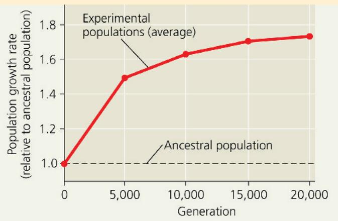

## Conclusion

Populations of E. coli continued to accumulate beneficial mutations for 20,000 generations, allowing rapid evolution of increased population growth rates in their new environment.

Data from V. S. Cooper and R. E. Lenski, The population genetics of ecological specialization in evolving Escherichia coli populations, Nature 407:736–739 (2000).

WHAT IF? Suggest possible functions of the genes whose sequence or expression was altered as the experimental populations evolved in the low-glucose environment.

For suggested answer, see Appendix A.

are genetically better equipped for their environment tend to survive and reproduce at higher rates than other individuals. The ability of prokaryotic populations to adapt rapidly to new conditions highlights the point that although the structure of their cells is simpler than that of eukaryotic cells, prokaryotic organisms are not “primitive” or “inferior” in an evolutionary sense. They are, in fact, highly evolved: For 3.5 billion years, prokaryotic populations have responded successfully to many types of environmental challenges.

## Genetic Recombination

Although new mutations are a major source of variation in prokaryotic populations, additional diversity arises from genetic recombination, the combining of DNA from two sources. In eukaryotes, the sexual processes of meiosis and fertilization combine DNA from two individuals in a single zygote. But meiosis and fertilization do not occur in prokaryotic organisms. Instead, three other mechanisms—transformation, transduction, and conjugation—can bring together prokaryotic DNA from different individuals (that is, different cells). When the individuals are members of different species, this movement of genes from one organism to another is called horizontal gene transfer. Scientists have found evidence that each of these mechanisms can transfer DNA within and between species in both domain Bacteria and domain Archaea. To date, however, most of our knowledge comes from research on bacteria.

## Transformation and Transduction

In transformation, the genotype and possibly phenotype of a prokaryotic cell are altered by the uptake of foreign DNA from its surroundings. For example, a harmless strain of Streptococcus pneumoniae can be transformed into pneumonia-causing cells if the cells are exposed to DNA from a pathogenic strain (see Figure 16.2). This transformation occurs when a nonpathogenic cell takes up a piece of DNA carrying the allele for pathogenicity and replaces its own allele with the foreign allele, an exchange of homologous DNA segments. The cell is now a recombinant: Its chromosome contains DNA derived from two different cells.

For many years after transformation was discovered in laboratory cultures, most biologists thought it was too rare and haphazard to play an important role in natural bacterial populations. But researchers have since learned that many bacteria have cell-surface proteins that recognize DNA from closely related species and transport it into the cell. Once inside the cell, the foreign DNA can be incorporated into the genome by homologous DNA exchange.

In transduction, phages (short for “bacteriophages,” the viruses that infect bacteria) carry prokaryotic genes from one host cell to another. In most cases, transduction results from accidents that occur during the phage replicative cycle (Figure 27.11). A virus that carries prokaryotic DNA may not be able to replicate because it lacks some or all of its own genetic material. However, the virus can attach to another prokaryotic cell (a recipient) and inject prokaryotic DNA acquired from the first cell (the donor). If some of this DNA is then incorporated into the recipient cell’s chromosome by crossing over, a recombinant cell is formed.

## Figure 27.11 Transduction.

Phages may carry pieces of a bacterial chromosome from one cell (the donor) to another (the recipient). If crossing over occurs after the transfer, genes from the donor may be incorporated into the recipient's genome.

1 A phage infects a bacterial cell that carries the $A^{+}$ and $B^{+}$ alleles on its chromosome (brown). This bacterium will be the "donor" cell.

2 The phage DNA is replicated, and the cell makes many copies of phage proteins (represented as purple dots). Certain phage proteins halt the synthesis of proteins encoded by the host cell's DNA, and the host cell's DNA may be fragmented, as shown here.

3 As new phage particles assemble, a fragment of bacterial DNA carrying the $A^{+}$ allele happens to be packaged in a phage capsid.

4 The phage carrying the $A^{+}$ allele from the donor cell infects a recipient cell with alleles $A^{-}$ and $B^{-}$ . Crossing over at two sites (dotted lines) allows donor DNA (brown) to be incorporated into recipient DNA (green).

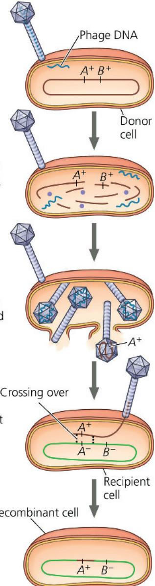

5 The genotype of the resulting recombinant cell ( $A^{+}B^{-}$ ) differs from the genotypes of both the donor ( $A^{+}B^{+}$ ) and the recipient ( $A^{-}B^{-}$ ).

VISUAL SKILLS Based on this diagram, describe the circumstances in which a transduction event would result in horizontal gene transfer. For suggested answer, see Appendix A.

## Conjugation and Plasmids

In a process called conjugation, DNA is transferred between two prokaryotic cells (usually of the same species) that are temporarily joined. In bacteria, the DNA transfer is always one-way: One cell donates the DNA, and the other receives it. We'll focus here on the mechanism used by E. coli.

First, a pilus of the donor cell attaches to the recipient (Figure 27.12). The pilus then retracts, pulling the two cells together, like a grappling hook. The next step is thought to be the formation of a temporary structure between the two cells, a “mating bridge” through which the donor may transfer DNA to

Figure 27.12 Bacterial conjugation.

The E. coli donor cell (left) extends a pilus that attaches to a recipient cell, a key first step in the transfer of DNA. The pilus is a flexible tube of protein subunits (TEM).

  
Figure 27.13 Conjugation and recombination in E. coli.

the recipient. However, the mechanism by which DNA transfer occurs is unclear; indeed, recent evidence indicates that DNA may pass directly through the hollow pilus.

The ability to form pili and donate DNA during conjugation results from the presence of a particular piece of DNA called the F factor (F for fertility). The F factor of E. coli consists of about 25 genes, most required for the production of pili. As shown in Figure 27.13, the F factor can exist either as a plasmid or as a segment of DNA within the bacterial chromosome.

## The F Factor as a Plasmid

The F factor in its plasmid form is called the F plasmid. Cells containing the F plasmid, designated $F^{+}$ cells, function as DNA donors during conjugation (see Figure 27.13a). Cells lacking the F factor, designated $F^{-}$ , function as DNA recipients during conjugation. The $F^{+}$ condition is transferable in the sense that an $F^{+}$ cell converts an $F^{-}$ cell to $F^{+}$ if a copy of the entire F plasmid is

The DNA replication that accompanies transfer of an F plasmid or part of an Hfr bacterial chromosome is called rolling circle replication. In effect, the intact circular parental DNA strand “rolls” as its other strand peels off and a new complementary strand is synthesized.

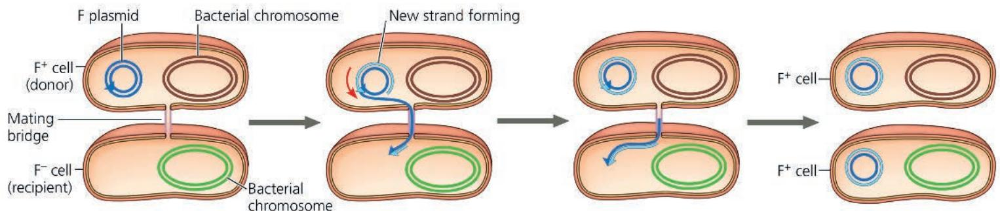

1 A cell carrying an F plasmid (an $\mathsf{F}^+$ cell) forms a mating bridge with an $\mathsf{F}^{-}$ cell. One strand of the plasmid's DNA breaks at the point marked by the arrowhead.

2 Using the unbroken strand as a template, the cell synthesizes a new strand (light blue). Meanwhile, the broken strand peels off (red arrow), and one end enters the F- cell. There, synthesis of its complementary strand begins.

(a) Conjugation and transfer of an F plasmid

3 DNA replication continues in both the donor and recipient cells, as the transferred plasmid strand moves farther into the recipient cell.

4 Once DNA transfer and synthesis are completed, the plasmid in the recipient cell circularizes. The recipient cell is now a recombinant F+ cell.

Recombinant F-bacterium—

In an Hfr cell, the F factor (dark blue) is integrated into the bacterial chromosome. Since an Hfr cell has all of the F factor genes, it can form a mating bridge with an F- cell and transfer DNA.

2 A single strand of the F factor breaks and begins to move through the bridge. DNA replication occurs in both donor and recipient cells, resulting in double-stranded DNA (daughter strands shown in lighter color).

3 The mating bridge usually breaks before the entire chromosome is transferred. Crossing over at two sites (dotted lines) can result in the exchange of homologous genes (here, $A^{+}$ and $A^{-}$ ) between the transferred DNA (brown) and the recipient's chromosome (green).

(b) Conjugation and transfer of part of an Hfr bacterial chromosome, resulting in recombination. $A^{+}/A^{-}$ and $B^{+}/B^{-}$ indicate alleles for gene A and gene B, respectively.

4 Cellular enzymes degrade any linear DNA not incorporated into the chromosome. The recipient cell, with a new combination of genes but no F factor, is now a recombinant F $^{-}$ cell.

transferred. Even if this does not occur, as long as some of the F plasmid's DNA is transferred successfully to the recipient cell, that cell is now a recombinant cell.

## The F Factor in the Chromosome

Chromosomal genes can be transferred during conjugation when the donor cell's F factor is integrated into the chromosome. A cell with the F factor built into its chromosome is called an Hfr cell (for high frequency of recombination). Like an $F^{+}$ cell, an Hfr cell functions as a donor during conjugation with an $F^{-}$ cell (see Figure 27.13b). When chromosomal DNA from an Hfr cell enters an $F^{-}$ cell, homologous regions of the Hfr and $F^{-}$ chromosomes may align, allowing segments of their DNA to be exchanged. As a result, the recipient cell becomes a recombinant bacterium that has genes derived from the chromosomes of two different cells—a new genetic variant on which evolution can act.

## R Plasmids and Antibiotic Resistance

Many species of bacteria have genes that code for enzymes that specifically destroy or otherwise hinder the effectiveness of certain antibiotics, such as tetracycline or ampicillin. Such “resistance genes” are often carried by plasmids known as R plasmids (R for resistance). Many R plasmids, like F plasmids, have genes that encode pili and enable DNA transfer from one bacterial cell to another by conjugation. As a result, R plasmids and the resistance genes they carry can spread rapidly through a bacterial population—a problem of great public health concern (see Concept 27.6). Making the problem still worse, some R plasmids carry genes for resistance to as many as ten antibiotics.

## Concept Check 27.2

1. Although rare on a per gene basis, new mutations can add considerable genetic variation to prokaryotic populations in each generation. Explain how this occurs.

2. Distinguish between the three mechanisms by which bacteria can transfer DNA from one bacterial cell to another.

3. WHAT IF? If a nonpathogenic bacterium were to acquire resistance to antibiotics, could this strain pose a health risk to people? In general, how does DNA transfer among bacteria affect the spread of resistance genes?

For suggested answers, see Appendix A.

## Concept 27.3: Diverse nutritional and metabolic adaptations have evolved in Bacteria and Archaea

The extensive genetic variation found in prokaryotic organisms is reflected in their diverse nutritional adaptations. Like all living things, prokaryotic organisms can be categorized by how they obtain energy and the carbon used in building the organic molecules that make up cells. Every type of nutritional mode observed in eukaryotes is represented among prokaryotic organisms, along with some nutritional modes unique to prokaryotic organisms. In fact, prokaryotic organisms have an astounding range of metabolic adaptations, much broader than that found in eukaryotes.

Organisms that obtain energy from light are called phototrophs, and those that obtain energy from chemicals are called chemotrophs. Organisms that need only $CO_{2}$ or related compounds as a carbon source are called autotrophs. In contrast, heterotrophs require at least one organic nutrient, such as glucose, to make other organic compounds. Combining the two energy sources with the two carbon sources results in four major modes of nutrition: photoautotroph, chemoautotroph, photoheterotroph, and chemoheterotroph (Table 27.1).

## The Role of Oxygen in Metabolism

Prokaryotic metabolism also varies with respect to oxygen ( $O_{2}$ ). Obligate aerobes must use $O_{2}$ for cellular respiration and cannot grow without it. Obligate anaerobes, on the other hand, are poisoned by $O_{2}$ . Some obligate anaerobes live exclusively

Table 27.1 Major Nutritional Modes

<table><tr><td>Mode</td><td>Energy Source</td><td>Carbon Source</td><td>Types of Organisms</td></tr><tr><td colspan="4">AUTOTROPH</td></tr><tr><td>Photoautotroph</td><td>Light</td><td> $CO_{2}, HCO_{3}^{-}$ , or related compound</td><td>Photosynthetic prokaryotic organisms (for example, cyanobacteria); plants; certain protists (for example, diatoms and multi-cellular algae)</td></tr><tr><td>Chemoautotroph</td><td>Inorganic chemicals (such as  $H_{2}S$ ,  $NH_{3}$ , or  $Fe^{2+}$ )</td><td> $CO_{2}, HCO_{3}^{-}$ , or related compound</td><td>Unique to certain prokaryotic organisms (for example, Sulfolobus)</td></tr><tr><td colspan="4">HETEROTROPH</td></tr><tr><td>Photoheterotroph</td><td>Light</td><td>Organic compounds</td><td>Unique to certain aquatic and salt-loving prokaryotic organisms (for example, Rhodobacter, Chloroflexus)</td></tr><tr><td>Chemoheterotroph</td><td>Organic compounds</td><td>Organic compounds</td><td>Many prokaryotic organisms (for example, Clostridium) and protists; fungi; animals; some plants</td></tr></table>

by fermentation; others extract chemical energy by aanaerobic respiration, in which substances other than $O_{2}$ , such as nitrate ions ( $NO_{3}^{-}$ ) or sulfate ions ( $SO_{4}^{2-}$ ), accept electrons at the “downhill” end of electron transport chains. Facultative anaerobes use $O_{2}$ if it is present but can also carry out fermentation or anaerobic respiration in an anaerobic environment.

## Nitrogen Metabolism

Nitrogen is essential for the production of amino acids and nucleic acids in all organisms. Whereas eukaryotes can obtain nitrogen only from a limited group of nitrogen compounds, prokaryotic organisms can metabolize nitrogen in many forms. For example, some cyanobacteria and some methanogens (various archaea) convert atmospheric nitrogen $\left(\mathrm{N}_{2}\right)$ to ammonia $\left(\mathrm{NH}_{3}\right)$ , a process called nitrogen fixation. The cells can then incorporate this “fixed” nitrogen into amino acids and other organic molecules. In terms of nutrition, nitrogen-fixing cyanobacteria are some of the most self-sufficient organisms since they need only light, $CO_{2}$ , $N_{2}$ , water, and some minerals to grow.

Nitrogen fixation has a large impact on other organisms. For example, nitrogen-fixing prokaryotic organisms can increase the nitrogen available to plants, which cannot use atmospheric nitrogen but can use the nitrogen compounds that the prokaryotic organisms produce from ammonia. Concept 55.4 discusses this and other essential roles that prokaryotic organisms play in the nitrogen cycles of ecosystems.

## Metabolic Cooperation

Cooperation between prokaryotic cells allows them to use environmental resources they could not use as individual cells. In some cases, this cooperation takes place between specialized cells of a filament. For instance, the cyanobacterium Anabaena has genes that encode proteins for photosynthesis and for nitrogen fixation. However, a single cell cannot carry out both processes at the same time because photosynthesis produces $O_{2}$ , which inactivates the enzymes involved in nitrogen fixation. Instead of living as isolated cells, Anabaena forms filamentous chains (Figure 27.14).

Figure 27.14 Metabolic cooperation in a prokaryotic organisms. In the filamentous freshwater cyanobacterium Anabaena, heterocysts fix nitrogen, while the other cells carry out photosynthesis (LM).  
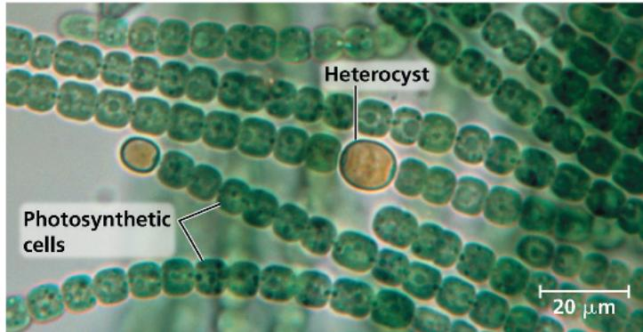

Most cells in a filament carry out only photosynthesis, while a few specialized cells called heterocysts (sometimes called heterocytes) carry out only nitrogen fixation. Each heterocyst is surrounded by a thickened cell wall that restricts entry of $O_{2}$ produced by neighboring photosynthetic cells. Intercellular connections allow heterocysts to transport fixed nitrogen to neighboring cells and to receive carbohydrates.

Metabolic cooperation among the cells of one or more prokaryotic species often occurs in a surface-coating colony known as a biofilm. Cells in a biofilm secrete signaling molecules that recruit nearby cells, causing the colonies to grow. The cells also produce polysaccharides and proteins that stick the cells to the substrate and to one another; these polysaccharides and proteins form the capsule, or slime layer, mentioned earlier in the chapter. Channels in the biofilm allow nutrients to reach cells in the interior and wastes to be expelled.

Biofilms are common in nature, but they can cause a wide range of problems for humans. For example, biofilms growing in pipes slow the flow of liquids such as water or oil and degrade the pipes themselves. Biofilms also corrode boat hulls, oil platforms, and many other structures and industrial products. In medical settings, biofilms can contaminate contact lenses, catheters, pacemakers, heart valves, artificial joints, and many other devices. They also contribute to tooth decay and a wide range of chronic infections (Figure 27.15), some of which can be lethal. Many biofilms can evade host immune responses and are extremely resistant to antibiotics, making them hard to treat. Altogether, each year biofilms cause billions of dollars in damage and inflict tens of millions of people with chronic infections.

## Figure 27.15 Pseudomonas aeruginosa forming a biofilm (colorized SEM).

This widespread bacterial species can be found in soil and water and as part of the normal community in the human intestines. P. aeruginosa can cause serious infections of other human organs, including the skin, urinary tract, and lungs. These infections can be difficult to treat, in part because the bacteria can grow as biofilms that have increased resistance to antibiotics.

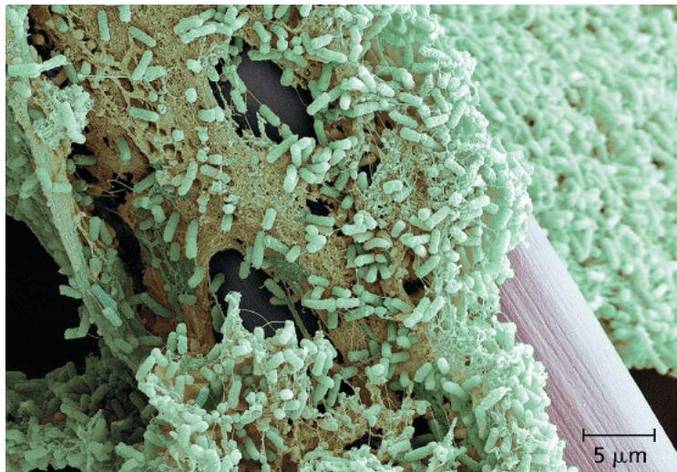

## Concept Check 27.3

1. Distinguish between the four major modes of nutrition, noting which are unique to prokaryotic organisms.

2. A bacterium requires only the amino acid methionine as an organic nutrient and lives in lightless caves. What mode of nutrition does it employ? Explain.

3. WHAT IF? Describe what you might eat for a typical meal if humans, like cyanobacteria, could fix nitrogen.

For suggested answers, see Appendix A.

## Concept 27.4: Bacteria and Archaea have radiated into a diverse set of lineages

Since their origin 3.5 billion years ago, prokaryotic populations have radiated extensively as a wide range of structural and metabolic adaptations have evolved in them. Collectively, these adaptations have enabled prokaryotic organisms to inhabit every environment known to support life—if there are organisms in a particular place, some of those organisms are prokaryotic. Yet despite their obvious success, it is only in recent decades that advances in genomics have begun to reveal the full extent of prokaryotic diversity.

## An Overview of Prokaryotic Diversity

In the 1970s, microbiologists began using small-subunit ribosomal RNA as a marker for evolutionary relationships. Their results indicated that many prokaryotic species once classified as bacteria are actually more closely related to eukaryotes and belong in a domain of their own: Archaea. Microbiologists have since analyzed larger amounts of genetic data—including thousands of complete genomes—and have concluded that a few traditional groups, such as cyanobacteria, are monophyletic. However, other traditional groups, such as gram-negative bacteria, are scattered throughout several lineages. Figure 27.16 shows one phylogenetic hypothesis for some of the major taxa of bacteria and archaea based on molecular systematics.

One lesson from studying prokaryotic phylogeny is that the genetic diversity of prokaryotic organisms is immense. When researchers began to sequence prokaryotic genes, they could investigate only the small fraction of species that could be cultured in the laboratory. In the 1980s, researchers began using the polymerase chain reaction (PCR; see Figure 20.8) to analyze the genes of prokaryotic organisms collected from the environment (such as from soil or water samples). Such “genetic prospecting” is now widely used; in fact, today entire prokaryotic genomes can be obtained from environmental samples using metagenomics (see Concept 21.1). Each year these techniques add new branches to the tree of life. While more than 20,000 prokaryotic species have been assigned scientific names, that likely represents less than 1% of species globally. One handful of soil from a single location could contain 10,000 prokaryotic species by some estimates. Taking full stock of this diversity will require many years of research.

Figure 27.16 A simplified phylogeny of Bacteria and Archaea. This tree shows relationships among major lineages of bacteria and archaea; some of these relationships are shown as polytomies to reflect their uncertain order of divergence. (Note that this tree reflects the hypothesis that eukaryotes arose within Archaea; see Concept 26.6.)  

Another important lesson from molecular systematics is that horizontal gene transfer has played a key role in evolution. Over hundreds of millions of years, prokaryotic organisms have acquired genes from even distantly related species, and they continue to do so today. As a result, significant portions of the genomes of many prokaryotic organisms are actually mosaics of genes imported from other species. For example, a study of 329 sequenced bacterial genomes found that an average of 75% of the genes in each genome had been transferred horizontally at some point in their evolutionary history. As we saw in Concept 26.6, such gene transfers can make it difficult to determine phylogenetic relationships. Still, it is clear that for billions of years, prokaryotic organisms have evolved in two separate lineages: Bacteria and Archaea (see Figure 27.16).

## Bacteria

As surveyed in Figure 27.17, bacteria include the vast majority of prokaryotic species familiar to most people, from the pathogenic species that cause strep throat and tuberculosis to the beneficial

## Exploring Bacterial Diversity

## Figure 27.17

While this figure highlights a few key groups of bacteria, their actual diversity is far greater than shown here. Likewise, as shown in the pie chart, gene sequence data indicate that the 16,000 known species of bacteria represent a small fraction of the actual number, estimated at 700,000–1.4 million species.

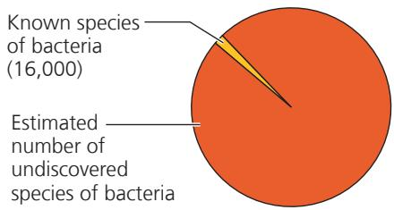

## Proteobacteria

This large and diverse clade of gram-negative bacteria includes photoautotrophs, chemoautotrophs, and heterotrophs. One autotroph, the sulfur bacterium Thiomargarita namibiensis, obtains energy by oxidizing $H_{2}S$ , producing sulfur as a waste product (the small globules in the photograph below). Heterotrophs include pathogens such as Neisseria gonorrhoeae, which causes gonorrhea; Vibrio cholerae, which causes cholera; and Helicobacter pylori, which causes stomach ulcers. Current evidence indicates that mitochondria evolved by endosymbiosis from a

heterotroph in the subgroup alpha proteobacteria.

Thiomargarita namibiensis containing sulfur wastes (LM)

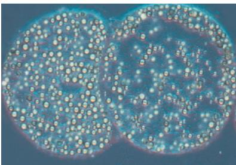  
200 μm

## Chlamydias

These parasites can survive only within animal cells, depending on their hosts for resources as basic as ATP. The gram-negative walls of chlamydias are unusual in that they lack peptidoglycan. One species, Chlamydia trachomatis, is the most common cause of blindness in the world and also causes nongonococcal urethritis, the most common sexually transmitted infection in the United States.

Chlamydia (arrows inside an animal cell (colorized TEM)

  
2.5 μm  
Leptospira,
a spirochete
(colorized TEM)

## Spirochetes

These helical gram-negative heterotrophs spiral through their environment by means of rotating, internal, flagellum-like filaments. Many spirochetes are free-living, but others are notorious pathogenic parasites: Treponema pallidum causes syphilis, and Borrelia burgdorferi causes Lyme disease.

  
5μm

## Cyanobacteria

These gram-negative photoautotrophs are the only prokaryotes with plantlike, oxygen-generating photosynthesis. (In fact, chloroplasts are thought to have evolved from an endosymbiotic cyanobacterium.) Both solitary and filamentous cyanobacteria are abundant components of freshwater and marine phytoplankton, the collection of small photosynthetic organisms that drift near the water's surface.

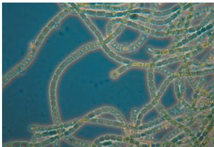  
Cylindrospermum, a filamentous cyanobacterium  
40 μm

## Gram-Positive Bacteria

Gram-positive bacteria rival the proteobacteria in diversity. Species in one subgroup, the actinomycetes, form colonies containing branched chains of cells; two of these species cause tuberculosis and leprosy, but most are decomposers living in soil. Soil-dwelling species in the genus Streptomyces are cultured as a source of antibiotics, including tetracycline and erythromycin. Other subgroups of gram-positive bacteria include pathogens such as Staphylococcus aureus, Bacillus anthracis, which causes anthrax, and Clostridium botulinum, which causes botulism.

Streptomyces, the source of many antibiotics (SEM)

  
5 μm

species used to make Swiss cheese and yogurt. Every major mode of nutrition and metabolism is represented among the 80 or so phyla of bacteria, and even a small group of bacteria may contain species exhibiting many different nutritional modes. As we'll see, the diverse nutritional and metabolic capabilities of bacteria—and archaea—are behind the great impact these organisms have on Earth and its life.

## Archaea

Prokaryotic organisms in Archaea share certain traits with bacteria and other traits with eukaryotes (Table 27.2). However, they also have many unique characteristics.

The first prokaryotic organisms identified as belonging to domain Archaea live in environments so extreme that few other organisms can survive there. Such organisms are called extremophiles, meaning “lovers” of extreme conditions (from the Greek philos, lover), and include extreme halophiles and extreme thermophiles.

Extreme halophiles (from the Greek halo, salt) live in highly saline environments, such as the Great Salt Lake in Utah, the Dead Sea in Israel, and the Spanish lake shown in Figure 27.1. Some species merely tolerate salinity, while others require an environment that is several times saltier than seawater (which has a salinity of 3.5%). For example, the proteins and cell wall of Halobacterium have unusual features that improve function in extremely salty environments but render these organisms incapable of survival if the salinity drops below 9%.

Table 27.2 A Comparison of Bacteria, Archaea\*, and Eukarya

<table><tr><td>CHARACTERISTIC</td><td>Bacteria</td><td>Archaea</td><td>Eukarya</td></tr><tr><td>Nuclear envelope</td><td>Absent</td><td>Absent</td><td>Present</td></tr><tr><td>Membrane-enclosed organelles</td><td>Absent</td><td>Absent</td><td>Present</td></tr><tr><td>Peptidoglycan in cell wall</td><td>Present</td><td>Absent</td><td>Absent</td></tr><tr><td>Membrane lipids</td><td>Unbranched hydrocarbons</td><td>Some branched hydrocarbons</td><td>Unbranched hydrocarbons</td></tr><tr><td>RNA polymerase</td><td>One kind</td><td>Several kinds</td><td>Several kinds</td></tr><tr><td>Initiator amino acid for protein synthesis</td><td>Formyl-methionine</td><td>Methionine</td><td>Methionine</td></tr><tr><td>Introns in genes</td><td>Very rare</td><td>Present in some genes</td><td>Present in many genes</td></tr><tr><td>Response to the antibiotics streptomycin and chloramphenicol</td><td>Growth usually inhibited</td><td>Growth not inhibited</td><td>Growth not inhibited</td></tr><tr><td>Histones associated with DNA</td><td>Absent</td><td>Present in some species</td><td>Present</td></tr><tr><td>Circular chromosome</td><td>Present</td><td>Present</td><td>Absent</td></tr><tr><td>Growth at temperatures &gt;100°C</td><td>No</td><td>Some species</td><td>No</td></tr></table>

\*As discussed in Concept 1.2, the term Archaea here refers to prokaryotic species.

Extreme thermophiles (from the Greek thermos, hot) thrive in very hot environments. For example, the archaean Pyrococcus furiosus lives in geothermally heated marine sediments that reach temperatures of $100^{\circ}$ C. At temperatures this high, the cells of most organisms die because their DNA does not remain in a double helix and many of their proteins denature. P. furiosus and other extreme thermophiles avoid this fate because they have structural and biochemical adaptations that make their DNA and proteins stable at high temperatures—a feature that has enabled P. furiosus to be used in biotechnology as a source of DNA polymerase for the PCR technique (see Figure 20.8). Other examples of extreme thermophiles include archaea in the genus Sulfolobus, which live in sulfur-rich volcanic springs (Figure 27.18). One extreme thermophile that lives near deep-sea hot springs called hydrothermal vents is informally known as “strain 121” since it can reproduce even at $121^{\circ}$ C.

Many other archaea live in more moderate environments. Consider methanogens, archaea that release methane as a by-product of how they obtain energy. Many methanogens use $CO_{2}$ to oxidize $H_{2}$ , a process that produces both energy and methane waste. Among the strictest of anaerobes, methanogens are poisoned by $O_{2}$ . Although some methanogens live in extreme environments, such as under kilometers of ice in Greenland, others live in swamps and marshes where other microorganisms have consumed all the $O_{2}$ . The “marsh gas” found in such environments is the methane released by these archaea. Other species inhabit the anaerobic guts of cattle, termites, and other herbivores, playing an essential role in the nutrition of these animals. Methanogens are also useful to humans as decomposers in sewage treatment facilities.

Figure 27.18 Extreme thermophiles.  
Orange and yellow colonies of thermophilic prokaryotic organisms grow in the hot water of Yellowstone National Park's Grand Prismatic Spring.  
  
MAKE CONNECTIONS How might the enzymes of thermophiles differ from those of other organisms? (Review enzymes in Concept 8.4.) For suggested answer, see Appendix A.

Many extreme halophiles and most known methanogens are archaea in the clade Euryarchaeota (from the Greek eurys, broad, a reference to their wide habitat range). The euryarchaeotes also include some extreme thermophiles, though most thermophilic species belong to a second clade, Crenarchaeota (cren means “spring,” such as a hydrothermal spring). Metagenomic studies have identified many species of euryarchaeotes and crenarchaeotes that are not extremophiles. These archaea exist in habitats ranging from farm soils to lake sediments to the surface of the open ocean.

New findings continue to inform our understanding of archaeal phylogeny. For example, recent metagenomic studies have uncovered the genomes of many species that are not members of Euryarchaeota or Crenarchaeota. Moreover, phylogenomic analyses show that three of these newly discovered groups—the Thaumarchaeota, Aigarchaeota, and Korarchaeota—are more closely related to the Crenarchaeota than they are to the Euryarchaeota. These findings have led to the identification of a “supergroup” that contains the Thaumarchaeota, Aigarchaeota, Crenarchaeota, and Korarchaeota (see Figure 27.16). This supergroup is referred to as “TACK” based on the names of the groups it includes.

Another important update to the archaeal phylogenetic tree is a group of lineages called the “Asgard archaea,” whose names are derived from Norse mythology, including Lokiarcheota, Thorarcheota, Odinarcheota, and Heimdallarcheota. The Asgard archaea are related to the TACK supergroup, and even more closely related to Eukarya—in fact, some recent studies show strong support for a particular lineage within the Heimdallarcheota being Eukarya’s closest relatives. This significant finding would mean that Eukarya are nested within Archaea, rather than being a sister group to the Archaea (see Figure 27.16). Thus the characteristics of the Asgard archaea may shed light on one of the major puzzles of biology today—how eukaryotes arose from their prokaryotic ancestors. The pace of these and other recent discoveries suggests that as metagenomic prospecting continues, the tree in Figure 27.16 will likely undergo further changes.

## Concept Check 27.4

1. Explain how molecular systematics and metagenomics have contributed to our understanding of the phylogeny and evolution of prokaryotic organisms.

For suggested answers, see Appendix A.

# Concept 27.5: Prokaryotic organisms play crucial roles in the biosphere

If people were to disappear from the planet tomorrow, life on Earth would change for many species, but few would be driven to extinction. In contrast, prokaryotic organisms are so important to the biosphere that if they were to disappear, the prospects of survival for many other species would be dim.

Figure 27.19 Impact of bacteria on soil nutrient availability.
Pine seedlings grown in sterile soils to which one of three strains of the bacterium Burkholderia glatheii had been added absorbed more potassium ( $K^{+}$ ) than did seedlings grown in soil without any bacteria. Other results (not shown) demonstrated that strain 3 increased the amount of $K^{+}$ released from mineral crystals to the soil.  
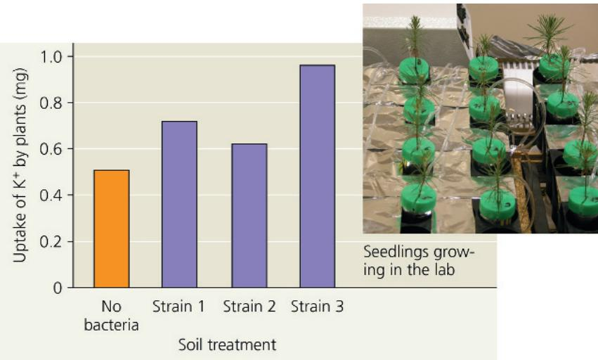  
WHAT IF? Estimate the average uptake of $K^{+}$ for seedlings in soils with bacteria. What would you expect this average to be if bacteria had no effect on nutrient availability?  
For suggested answer, see Appendix A.

## Chemical Recycling

The atoms that make up the organic molecules in all living things were at one time part of inorganic substances in the soil, air, and water. Sooner or later, those atoms will return to the nonliving environment. Ecosystems depend on the continual recycling of chemical elements between the living and nonliving components of the environment, and prokaryotic organisms play a major role in this process. For example, some chemoheterotrophic prokaryotes function as decomposers, breaking down dead organisms as well as waste products and thereby unlocking supplies of carbon, nitrogen, and other elements. Without the actions of prokaryotic organisms and other decomposers such as fungi, life as we know it would cease. (See Concept 55.4 for a detailed discussion of chemical cycles.)

Prokaryotic organisms also convert some molecules to forms that can be taken up by other organisms. Cyanobacteria and other autotrophic prokaryotes use $CO_{2}$ to make organic compounds such as sugars, which are then passed up through food chains. Cyanobacteria also produce atmospheric $O_{2}$ , and a variety of prokaryotic organisms fix atmospheric nitrogen ( $N_{2}$ ) into forms that other organisms can use to make the building blocks of proteins and nucleic acids. Under some conditions, prokaryotic organisms can increase the availability of nutrients that plants require for growth, such as nitrogen, phosphorus, and potassium (Figure 27.19). Prokaryotic organisms can also decrease the availability of key plant nutrients; this occurs when prokaryotes “immobilize” nutrients by using them to synthesize molecules that remain within their cells. Thus, prokaryotic organisms can have complex effects on soil nutrient concentrations. In marine environments, an archaean from the clade Crenarchaeota can perform nitrification, a key step in the nitrogen cycle (see Figure 55.14). Crenarchaeotes dominate the oceans by numbers, comprising an estimated $10^{28}$ cells. The sheer abundance of these organisms suggests that they may have a large impact on the global nitrogen cycle.

## Ecological Interactions

Prokaryotic organisms play a central role in many ecological interactions. Consider symbiosis (from a Greek word meaning "living together"), an ecological relationship in which two species live in close contact with each other. Prokaryotic organisms often form symbiotic associations with much larger organisms. In general, the larger organism in a symbiotic relationship is known as the host, and the smaller is known as the symbiont. There are many cases in which a prokaryotic organisms and its host participate in mutualism, an ecological interaction between two species in which both benefit (Figure 27.20). Other interactions take the form of commensalism, an ecological relationship in which one species benefits while the other is not harmed or helped in any significant way. For example, more than 150 bacterial species live on the outer surface of your body, covering portions of your skin with up to 10 million cells per square centimeter. Some of these species are commensalists: You provide them with food, such as the oils that exude from your pores, and a place to live, while they neither harm nor benefit you. Finally, some symbiotic prokaryotic organisms engage in parasitism, an ecological relationship in which a parasite feeds on the cell contents, tissues, or body fluids of its host. As a group, parasites harm but usually do not kill their host, at least not immediately (unlike a predator). Parasites that cause disease are known as pathogens, many of which are prokaryotic. (We'll discuss mutualism, commensalism, and parasitism in greater detail in Concept 54.1.)

The glowing oval below the eye of the flashlight fish (Photoblepharon palpebratus) is an organ harboring bioluminescent bacteria. The fish uses the light to attract prey and to signal potential mates. The bacteria receive nutrients from the fish.

The very existence of an ecosystem can depend on prokaryotic organisms. For example, consider the diverse ecological communities found at hydrothermal vents. These communities are densely populated by many different kinds of animals, including worms, clams, crabs, and fishes. But since sunlight does not penetrate to the deep ocean floor, the community does not include photosynthetic organisms. Instead, the energy that supports the community is derived from the metabolic activities of chemoautotrophic bacteria. These bacteria harvest chemical energy from compounds such as hydrogen sulfide ( $H_{2}S$ ) that are released from the vent. An active hydrothermal vent may support hundreds of eukaryotic species, but when the vent stops releasing chemicals, the chemoautotrophic bacteria cannot survive. As a result, the entire vent community collapses.

## Interview

Interview with Penny Chisholm: Studying the role of cyanobacteria in marine ecosystems (eTextbook only)

Figure 27.20 Mutualism: bacterial “headlights.”  

## Concept Check 27.5

1. Explain how prokaryotic organisms, though small, can be considered giants in their collective impact on Earth and its life.

2. MAKE CONNECTIONS Review Figure 10.5. Then summarize the main steps by which cyanobacteria produce $O_{2}$ and use $CO_{2}$ to make organic compounds.

For suggested answers, see Appendix A.

## Concept 27.6: Prokaryotic organisms have both beneficial and harmful impacts on humans

Although the best-known prokaryotic organisms tend to be the bacteria that cause human illness, these pathogens represent only a small fraction of prokaryotic species. Many other prokaryotic organisms have positive interactions with people, and some play essential roles in agriculture and industry.

## Mutualistic Bacteria

As is true for many other eukaryotes, human well-being can depend on mutualistic prokaryotic organisms. For example, our intestines are home to an estimated 500–1,000 species of bacteria; collectively, their cells outnumber all human cells in the body by a factor of ten. Different species live in different portions of the intestines, and they vary in their ability to process different foods. Many of these species are mutualists, digesting food that our own intestines cannot break down. The genome of one of these gut mutualists, Bacteroides thetaiotaomicron, includes a large array of genes involved in synthesizing carbohydrates, vitamins, and other nutrients needed by humans. Signals from the bacterium activate human genes that build the network of intestinal blood vessels necessary to absorb nutrient molecules. Other signals induce human cells to produce antimicrobial compounds to which B. thetaiotaomicron is not susceptible. This action may reduce the population sizes of other, competing species, thus potentially benefiting both B. thetaiotaomicron and its human host.

## Pathogenic Bacteria

Nearly all of the prokaryotic organisms known to be human pathogens to date are bacteria, and they deserve their negative reputation. Bacteria cause about half of all human diseases. For example, more than 1.5 million people die each year of the lung disease tuberculosis, caused by Mycobacterium tuberculosis. And another 2 million people die each year from diarrheal diseases caused by various bacteria.

Some bacterial diseases are transmitted by other species, such as fleas or ticks. In the United States, the most widespread pest-carried disease is Lyme disease, which infects about 300,000 people each year according to a recent CDC estimate (Figure 27.21). Caused by a bacterium carried by ticks, Lyme disease can result in debilitating arthritis, heart disease, nervous disorders, and death if untreated.

Pathogenic bacteria usually cause illness by producing poisons, which are classified as exotoxins or endotoxins. Exotoxins are proteins secreted by certain bacteria and other organisms. Cholera, a dangerous diarrheal disease, is caused by an exotoxin secreted by the proteobacterium Vibrio cholerae. The exotoxin stimulates intestinal cells to release chloride ions into the gut, and water follows by osmosis. In another example, the potentially fatal disease botulism is caused by botulinum

Figure 27.21 Lyme disease.

Ticks in the genus Ixodes spread the disease by transmitting the spirochete Borrelia burgdorferi (colorized SEM). A rash may develop at the site of the tick's bite; the rash may be large and ring-shaped (as shown) or much less distinctive.

  
Figure 27.22 The rise of antibiotic resistance.

toxin, an exotoxin secreted by the gram-positive bacterium Clostridium botulinum as it ferments various foods, including improperly canned meat, seafood, and vegetables. Like other exotoxins, the botulinum toxin can produce disease even if the bacteria that manufacture it are no longer present when the food is eaten.

Endotoxins are lipopolysaccharide components of the outer membrane of gram-negative bacteria. In contrast to exotoxins, endotoxins are released only when the bacteria die and their cell walls break down. Endotoxin-producing bacteria include species in the genus Salmonella, such as Salmonella typhi, which causes typhoid fever. You might have heard of food poisoning caused by other Salmonella species that can be found in poultry and some fruits and vegetables.

Finally, horizontal gene transfer can spread genes associated with virulence, turning normally harmless bacteria into potent pathogens. E. coli, for instance, is ordinarily a harmless symbiont in the human intestines, but pathogenic strains that cause bloody diarrhea have emerged. One of the most dangerous strains, O157:H7, is a global threat; in the United States alone, there are around 75,000 cases of O157:H7 infection per year, often from contaminated beef or produce. Scientists have discovered over 1,000 genes in O157:H7 that have no counterpart in harmless E. coli strains. Some of the genes found only in O157:H7 are associated with virulence and were likely transferred by phage-mediated horizontal gene transfer (transduction) from pathogenic bacterial species.

## Antibiotic Resistance

Since their initial use in the 1940s, antibiotics have saved many lives and reduced the incidence of disease caused by pathogenic bacteria. Unfortunately, as Figure 27.22 shows, resistance to

As illustrated by the examples shown here, bacteria have developed resistance to every antibiotic currently in clinical use, often within a few years. It took more than 50 years for resistance to develop to colistin, most likely because this antibiotic has toxic side effects in humans and hence was used rarely (as a treatment of last resort).

  
VISUAL SKILLS Based on this diagram, identify the antibiotic for which resistance appeared before the antibiotic began to be used medicinally. For suggested answer, see Appendix A.

antibiotics has evolved in many bacteria, often rapidly. Compounding this problem, the discovery of new antibiotics has not kept pace with the rate at which resistance has evolved in bacteria. We now face a major public health concern: For every antibiotic now in use, at least one species of bacteria has developed resistance to it.

The rise of antibiotic resistance is driven by several factors. The rapid reproduction of bacteria enables cells carrying resistance genes to quickly produce large numbers of resistant offspring. Thus, when humans use antibiotics in medical or agricultural settings, natural selection can cause the fraction of a bacterial population carrying genes for antibiotic resistance to increase rapidly. Resistance genes also can spread within and among bacterial species by horizontal gene transfer. As a result, bacterial strains that are resistant to multiple antibiotics are becoming more common, making the treatment of certain bacterial infections very difficult.

Consider tuberculosis, currently the second leading cause of death by infectious disease worldwide (after COVID-19). The recent rise of drug-resistant strains of the tuberculosis bacterium (Mycobacterium tuberculosis) threatens decades of progress in combating tuberculosis. "Superbug" tuberculosis strains came to public notice in 2006, when an outbreak in a rural area of South Africa killed 52 of the 53 patients infected with what is now called extensively drug-resistant tuberculosis (XDR-TB). As of 2017, more than 100 countries had confirmed cases of XDR-TB. There are few treatments for XDR-TB, and those we have are difficult to administer and more toxic than are treatments for standard strains of the tuberculosis bacterium.

M. tuberculosis is not the only bacterium in which resistance to multiple antibiotics has evolved. Highly resistant strains have also been found in species that cause potentially lethal infections of the skin, lungs, digestive tract, and other human organs. Even so, recent discoveries give cause for hope. In one such study, researchers used a metagenomic approach to sequence genes from soil bacteria that could not be grown in the laboratory. They found that some of these genes encoded a new class of antibiotics, which have been named malacidins. Malacidins have been effective against multidrug-resistant gram-positive pathogens, including clone USA300 (Figure 27.23), a highly virulent strain of methicillin-resistant Staphylococcus aureus (MRSA; see Figure 22.14). Researchers also have developed virus-like particles capable of targeting (and killing) particular species of multidrug-resistant bacteria. Novel approaches for growing soil bacteria in the laboratory also have led to the discovery of new antibiotics, as you can explore in the Scientific Skills Exercise.

## Prokaryotic Organisms in Research and Technology

On a positive note, we reap many benefits from the metabolic capabilities of both bacteria and archaea. For example, people have long used bacteria to convert milk to cheese and yogurt. Bacteria are also used in the production of beer and wine, pepperoni,

Figure 27.23 Effectiveness of malacidin against MRSA clone USA300.

Treatment with malacidin rapidly cleared a skin infection in rats caused by clone a highly virulent strain of methicillin-resistant Staphylococcus aureus (MRSA). Malacidin was as effective as daptomycin, an antibiotic used to treat life-threatening infections.

fermented cabbage (sauerkraut), and soy sauce. In recent decades, our greater understanding of prokaryotic organisms has led to an explosion of new applications in biotechnology. Examples include the use of E. coli in gene cloning (see Figure 20.4) and the use of DNA polymerase from Pyrococcus furiosus in the PCR technique (see Figure 20.8). Through genetic engineering, we can modify bacteria to produce vitamins, antibiotics, hormones, and other products (see Concept 20.1).

Recently, the prokaryotic CRISPR-Cas system, which helps bacteria and archaea defend against attack by viruses (see Figure 19.7), has been developed into a powerful new tool for altering genes in virtually any organism. The genomes of many prokaryotic organisms contain short DNA repeats, called CRISPRs, that interact with proteins known as the Cas (CRISPR-associated) proteins. Cas proteins, acting together with “guide RNA” made from the CRISPR region, can cut any DNA sequence to which they are directed. Scientists have been able to exploit this system by introducing a Cas protein (Cas9) to guide RNA into cells whose DNA they want to alter (see Figure 17.28). Among other applications, this CRISPR-Cas9 system has already opened new lines of research on HIV, the virus that causes AIDS (Figure 27.24). While the CRISPR-Cas9 system can potentially be used in many different ways, care must be taken to guard against the unintended consequences that could arise when applying such a new and powerful technology.

Another valuable application of bacteria is to reduce our use of petroleum. Consider the plastics industry. Globally, each year more than 1 trillion (1,000,000,000,000) pounds of plastic are produced from petroleum and used to make toys, storage containers, soft drink bottles, and many other items. Many of these products end up as plastic waste that contaminates natural habitats and degrades slowly, creating environmental problems (see Concept 56.4). One promising avenue for addressing these problems is to use bacteria that produce natural plastics

# Scientific Skills Exercise

# Calculating and Interpreting Means and Standard Errors

Can Antibiotics Obtained from Soil Bacteria Help Fight Drug-Resistant Bacteria? Soil bacteria synthesize antibiotics, which they use against species that attack or compete with them. To date, these species have been inaccessible as sources for new medicines because 99% of soil bacteria cannot be grown using standard laboratory techniques. To address this problem, researchers developed a method in which soil bacteria grow in a simulated version of their natural environment; this led to the discovery of a new antibiotic, teixobactin. In this exercise, you'll calculate means and standard errors from an experiment that tested teixobactin's effectiveness against MRSA (methicillin-resistant Staphylococcus aureus; see Figure 22.14).

How the Experiment Was Done Researchers drilled tiny holes into a small plastic chip and filled the holes with a dilute aqueous solution containing soil bacteria and agar. The dilution had been calibrated so that only one bacterium was likely to grow in each hole. After the agar solidified, the chip was placed in a container containing the original soil; nutrients from the soil diffused into the agar, allowing the bacteria to grow. After isolating teixobactin from a soil bacterium, researchers performed the following experiment: Mice infected with MRSA were given low (1 mg/kg) or high (5 mg/kg) doses of teixobactin or vancomycin, an existing antibiotic; in the control, mice infected with MRSA were not given an antibiotic. After 26 hours, researchers sampled infected mice and estimated the number of S. aureus colonies in each sample. Results were reported on a log scale; a decrease of 1.0 on this scale reflects a tenfold decrease in MRSA abundance.

## Data from the Experiment

<table><tr><td>Treatment</td><td>Dose (mg/kg)</td><td>Log of Number of Colonies</td><td>Mean ( $\bar{x}$ )</td></tr><tr><td>Control</td><td>—</td><td>9.0, 9.5, 9.0, 8.9</td><td></td></tr><tr><td rowspan="2">Vancomycin</td><td>1.0</td><td>8.5, 8.4, 8.2</td><td></td></tr><tr><td>5.0</td><td>5.3, 5.9, 4.7</td><td></td></tr><tr><td rowspan="2">Teixobactin</td><td>1.0</td><td>8.5, 6.0, 8.4, 6.0</td><td></td></tr><tr><td>5.0</td><td>3.8, 4.9, 5.2, 4.9</td><td></td></tr></table>

Data from L. Ling et al. A new antibiotic kills pathogens without detectable resistance, Nature 517:455–459 (2015).

## Figure 27.24 CRISPR: opening new avenues of research for treating HIV infection.

(a) In laboratory experiments, untreated (control) human cells were susceptible to infection by HIV, the virus that causes AIDS. (b) In contrast, cells treated with a CRISPR-Cas9 system that targets HIV were resistant to viral infection. The CRISPR-Cas9 system was also able to remove HIV proviruses (see Figure 19.8) that had become incorporated into the DNA of human cells.

(Figure 27.25). For example, some bacteria synthesize a type of polymer known as PHA (polyhydroxyalkanoate), which they use to store chemical energy. The PHA can be extracted, formed into

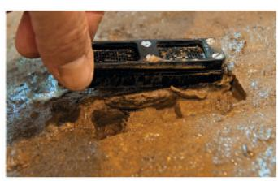

▶ Plastic chip used to grow soil bacteria

## INTERPRET THE DATA

1. The mean $(\bar{x})$ of a variable is the sum of the data values divided by the number of observations $(n)$ :

$$
\overline {{x}} = \frac {\sum x _ {i}}{n}
$$

In this formula, $x_{i}$ is the value of the ith observation of the variable (observation number “i” out of a total of n such observations); the $\Sigma$ symbol represents adding the n values of x together. Calculate the mean for each treatment.

2. Use your results from question 1 to evaluate the effectiveness of vancomycin and teixobactin.

3. The variation found in a set of data can be estimated by the standard deviation, s:

$$
s = \sqrt {\frac {\sum (x _ {i} - \bar {x}) ^ {2}}{n - 1}}
$$

Calculate the standard deviation for each treatment.

4. The standard error (SE), which indicates how greatly the mean would likely vary if the experiment was repeated, is calculated as:

$$
S E = \frac {s}{\sqrt {n}}
$$

As a rough rule of thumb, if an experiment were to be repeated, the new mean typically would lie within two standard errors of the original mean (that is, within the range $\bar{x} \pm 2SE$ ). Calculate $\bar{x} \pm 2SE$ for each treatment, determine whether these ranges overlap, and interpret your results.

Instructors: A version of this Scientific Skills Exercise can be assigned in Mastering Biology.

  
(a) Control cells. The green highlighting indicates infection by HIV.

  
(b) Experimental cells. These cells were treated with a CRISPR-Cas9 system that targets HIV.

Figure 27.26 Bioremediation of an oil spill.

Figure 27.25 Bacteria synthesizing and storing PHA, a component of biodegradable plastics.  
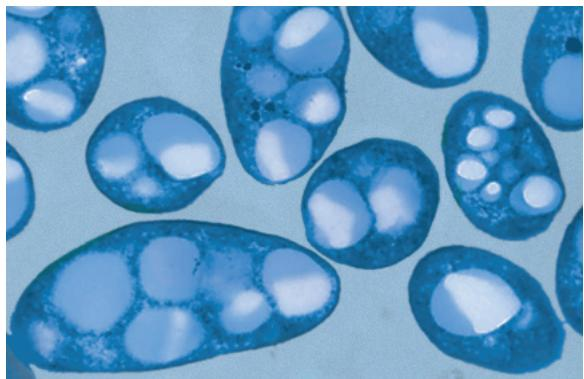

pellets, and used to make durable, yet biodegradable, plastics. Researchers are also seeking to reduce the use of petroleum and other fossil fuels by engineering bacteria that can produce ethanol from various forms of biomass, including agricultural waste, switchgrass, and corn.

Another way to harness prokaryotic organisms is bioremediation, the use of organisms to remove pollutants from soil, air, or water. For example, anaerobic bacteria and archaea decompose the organic matter in sewage, converting it to material that can be used as landfill or fertilizer after chemical sterilization. Other bioremediation applications include cleaning up oil spills (Figure 27.26) and precipitating radioactive material (such as uranium) out of groundwater.

The usefulness of prokaryotic organisms largely derives from their diverse forms of nutrition and metabolism. All this metabolic versatility evolved prior to the appearance of the structural novelties that heralded the evolution of eukaryotic organisms, discussed in the rest of this unit.

Spraying fertilizer stimulates the growth of native bacteria that metabolize oil, increasing the speed of the breakdown process up to fivefold.

## Concept Check 27.6

1. Identify at least two ways that prokaryotic organisms have affected you positively today.

2. A pathogenic bacterium's toxin causes symptoms that increase the bacterium's chance of spreading from host to host. Does this information indicate whether the poison is an exotoxin or endotoxin? Explain.

3. WHAT IF? How might a sudden and dramatic change in your diet affect the diversity of prokaryotic species that live in your digestive tract?

For suggested answers, see Appendix A.

## Chapter 27 Review

## Summary of Key Concepts

To review key terms, go to the Vocabulary Self-Quiz (eTextbook only).

## Concept 27.1: Structural and functional adaptations contribute to prokaryotic success

\- Many prokaryotic species can reproduce quickly by binary fission, leading to the formation of extremely large populations.

Describe features of prokaryotic organisms that enable them to thrive in a wide range of different environments.

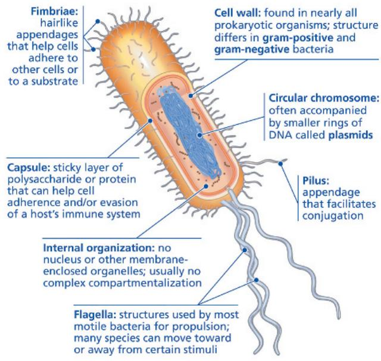

## Concept 27.2: Rapid reproduction, mutation, and genetic recombination promote genetic diversity in prokaryotic organisms

\- Because prokaryotic organisms can often proliferate rapidly, mutations can quickly increase a population's genetic variation. As a result, prokaryotic populations often can evolve in short periods of time in response to changing conditions.

\- Genetic diversity in prokaryotic organisms also can arise by recombination of the DNA from two different cells (via transformation, transduction, or conjugation). By transferring advantageous alleles, such as ones for antibiotic resistance, recombination can promote adaptive evolution in prokaryotic populations.

Mutations are rare and prokaryotic organisms reproduce asexually, yet their populations can have high genetic diversity. Explain how this can occur.

## Concept 27.3: Diverse nutritional and metabolic adaptations have evolved in Bacteria and Archaea

\- Nutritional diversity is much greater in prokaryotic organisms than in eukaryotes and includes all four modes of nutrition: photoautotrophy, chemoautotrophy, photoheterotrophy, and chemoheterotrophy.

\- Among prokaryotic organisms, obligate aerobes require $O_{2}$ , obligate anaerobes are poisoned by $O_{2}$ , and facultative anaerobes can survive with or without $O_{2}$ .

\- Unlike eukaryotes, prokaryotic organisms can metabolize nitrogen in many different forms. Some can convert atmospheric nitrogen to ammonia, a process called nitrogen fixation.

\- Prokaryotic cells and even species may cooperate metabolically, including in surface-coating biofilms.

Describe the range of prokaryotic metabolic adaptations.

## Concept 27.4: Bacteria and Archaea have radiated into a diverse set of lineages

\- Molecular systematics is helping biologists classify prokaryotic organisms and identify new clades.

\- Diverse nutritional types are scattered among the major groups of bacteria. The two largest groups are proteobacteria and gram-positive bacteria.

\- Some archaea, such as extreme thermophiles and extreme halophiles, live in extreme environments. Other archaea live in moderate environments such as soils and lakes.

How have molecular data informed prokaryotic phylogeny?

## Concept 27.5: Prokaryotic organisms play crucial roles in the biosphere

\- Decomposition by heterotrophic prokaryotic organisms and the synthetic activities of autotrophic and nitrogen-fixing prokaryotic organisms contribute to the recycling of elements in ecosystems.

\- Many prokaryotic organisms have a symbiotic relationship with a host; the relationships between prokaryotic organisms and their hosts range from mutualism to commensalism to parasitism.

In what ways are prokaryotic organisms key to the survival of many species?

## Concept 27.6: Prokaryotic organisms have both beneficial and harmful impacts on humans

\- People depend on mutualistic prokaryotic organisms, including hundreds of species that live in our intestines and help digest food.

\- Pathogenic bacteria typically cause disease by releasing exotoxins or endotoxins. Horizontal gene transfer can spread genes associated with virulence to harmless species or strains.

\- Resistance to multiple antibiotics has evolved in many pathogenic bacteria, a problem of great concern for public health.

\- Prokaryotic organisms can be used in bioremediation and production of plastics, vitamins, antibiotics, and other products.

Describe beneficial and harmful impacts of prokaryotic organisms on humans. For suggested answers, see Appendix A.

## Test Your Understanding

For more multiple-choice questions, go to the Practice Test (eTextbook only).

## Levels 1-2: Remembering/Understanding

1. A process that cannot produce genetic variation in bacterial populations is
(A) transduction.
(B) conjugation.
(C) mutation.
(D) meiosis.

2. Photoautotrophs use

(A) light as an energy source and $CO_{2}$ as a carbon source.

(B) light as an energy source and methane as a carbon source.

(C) $N_{2}$ as an energy source and $CO_{2}$ as a carbon source.

(D) $CO_{2}$ as both an energy source and a carbon source.

3. Which of the following statements is true?

(A) Archaea and bacteria have identical membrane lipids.

(B) The cell walls of archaea lack peptidoglycan.

(C) Prokaryotic organisms have low levels of genetic diversity.

(D) No archaea are capable of using $CO_{2}$ to oxidize $H_{2}$ , releasing methane.

4. Which of the following involves metabolic cooperation among prokaryotic cells?

(A) binary fission

(B) endospore formation

(C) biofilms

(D) photoautotrophy

5. Which of the following describes a bacterium that lives in the human intestine and causes disease?

(A) commensalist

(B) decomposer

(C) gut mutualist

(D) symbiotic pathogen

6. Photosynthesis that releases $O_{2}$ occurs in

(A) cyanobacteria.

(B) methanogens.

(C) gram-positive bacteria.

(D) chemoautotrophic bacteria.

## Levels 3-4: Applying/Analyzing

7. EVOLUTION CONNECTION In patients with nonresistant strains of the tuberculosis bacterium, antibiotics can relieve symptoms in a few weeks. However, it takes much longer to halt the infection, and patients may discontinue treatment while bacteria are still present. Explain how this could result in the evolution of drug-resistant pathogens.

## Levels 5-6: Evaluating/Creating

8. SCIENTIFIC INQUIRY • INTERPRET THE DATA The nitrogen-fixing bacterium Rhizobium infects the roots of some plant species, forming a mutualism in which the bacterium provides nitrogen, and the plant provides carbohydrates. Scientists measured the 12-week growth of one such plant species (Acacia irrorata) when infected by six different Rhizobium strains. (a) Graph the data. (b) Interpret the graph.

<table><tr><td>Rhizobium strain</td><td>1</td><td>2</td><td>3</td><td>4</td><td>5</td><td>6</td></tr><tr><td>Plant mass (g)</td><td>0.91</td><td>0.06</td><td>1.56</td><td>1.72</td><td>0.14</td><td>1.03</td></tr></table>

Data from J. J. Burdon et al., Variation in the effectiveness of symbiotic associations between native rhizobia and temperate Australian Acacia: within species interactions, Journal of Applied Ecology 36:398–408 (1999). Note: Without Rhizobium, after 12 weeks, Acacia plants have a mass of about 0.1 g.

9. WRITE ABOUT A THEME: ENERGY In a short essay (about 100–150 words), discuss how prokaryotic organisms and other members of hydrothermal vent communities transfer and transform energy.

## 10. SYNTHESIZE YOUR KNOWLEDGE

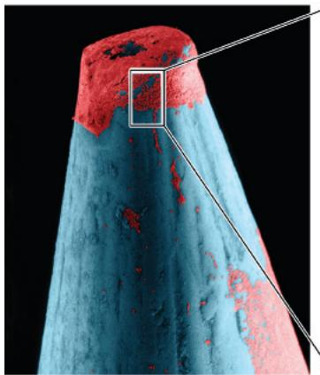

  
Explain how the small size and rapid reproduction rate of bacteria (such as the population shown here on the tip of a pin) contribute to their large population sizes and high genetic variation.  
For selected answers, see Appendix A.

# The Origin and Diversification of Eukaryotes

## Key Concepts

28.1 Most eukaryotes are single-celled organisms

28.2 SAR is a highly diverse group of protists defined by DNA similarities

28.3 Red algae and green algae are the closest relatives of plants

28.4 Amorpheans include protists that are closely related to fungi and animals

28.5 Phylogenomic research has identified new supergroups and led to the rearrangement of the eukaryotic tree of life

28.6 Protists play key roles in ecological communities

## Study Tip

Label a drawing: Life cycles vary greatly among different eukaryote groups. To make sense of this variation, it can be helpful to identify when mitosis occurs in different life cycles, as shown here for a portion of Figure 28.14. Identify the stages at which mitosis occurs in Figures 28.14, 28.18, 28.25, and 28.28.

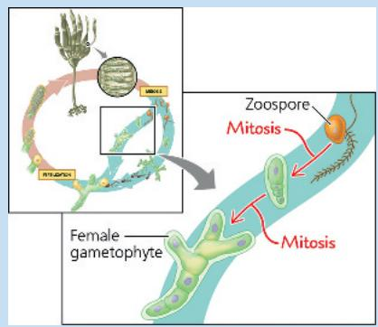

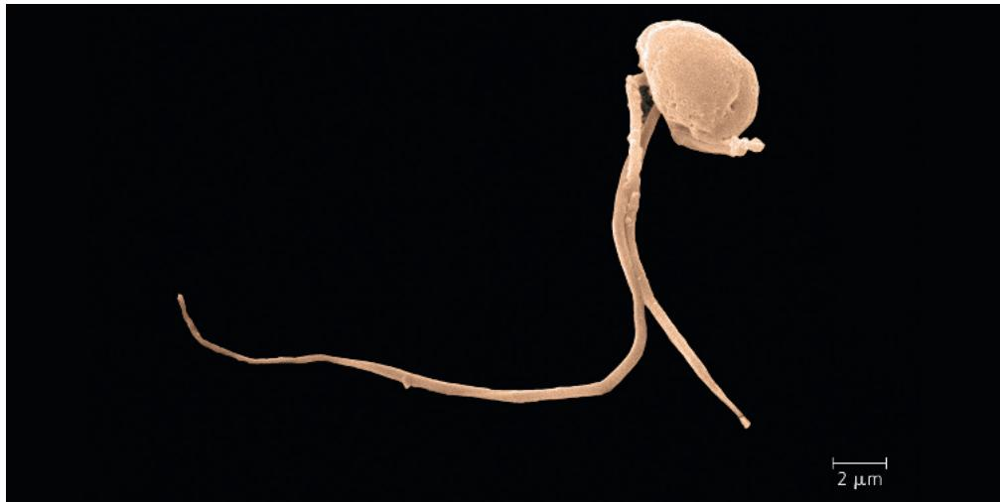  
Figure 28.1 This single-celled eukaryote is a member of a recently identified supergroup of eukaryotes called Provora. This name provides some details about this tiny predator: Provora is an abbreviation of the words PRO-tist, deVOuring, and voRAcious. The organism depicted (Nibbleromonas arcticus) belongs to a lineage called the Nibbleridia, so named because these small provorans can consume larger prey organisms by slowly “nibbling” away at them over time.

What gave rise to the great diversity of eukaryotes, and how have their lineages diverged over time?  
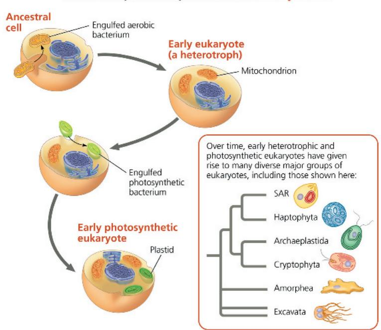

# Concept 28.1: Most eukaryotes are single-celled organisms

Protists—along with plants, animals, and fungi—are eukaryotic organisms; together they make up the clade Eukarya. Protists were formerly classified in the kingdom Protista, but genetic and morphological studies have shown that some protists are more closely related to plants, fungi, or animals than they are to other protists, which means this kingdom was paraphyletic. As a result, the kingdom Protista has been abandoned, and various protist lineages are now recognized as major groups in their own right. Most biologists still use the term protist, not as a taxonomic group, but rather as a convenient way to refer to eukaryotes that are not plants, animals, or fungi.

Unlike the cells of prokaryotic organisms, the cells of eukaryotes have a nucleus and other membrane-enclosed organelles, such as mitochondria and the Golgi apparatus. Such organelles provide specific locations where particular cellular functions are accomplished, making the structure and organization of eukaryotic cells more complex than those of prokaryotic cells. Eukaryotic cells also have a well-developed cytoskeleton that extends throughout the cell (see Figure 6.20). The cytoskeleton provides the structural support that enables eukaryotic cells to have asymmetric (irregular) forms, as well as to change in shape as they feed, move, or grow. In contrast, prokaryotic cells lack a well-developed cytoskeleton, thus limiting the extent to which they can maintain asymmetric forms or change shape over time.

We'll survey the diversity of eukaryotes throughout the rest of this unit, beginning in this chapter with the protists: those eukaryotic organisms that are not in Kingdoms Animalia, Plantae or Fungi. As you explore this material, bear in mind that

\- the organisms in most eukaryotic lineages are protists, and

\- most protists are unicellular.

Thus, life differs greatly from how most of us commonly think of it. The large, multicellular organisms that we know best (plants, animals, and fungi) are the tips of just a few branches on the great tree of life (see Figure 26.21).

## Structural and Functional Diversity in Protists

Given that they are classified in a number of different groups, it isn't surprising that few general characteristics of protists can be cited without exceptions. In fact, protists exhibit more structural and functional diversity than the eukaryotes with which we are most familiar—plants, animals, and fungi.

For example, most protists are unicellular, although there are many colonial and multicellular species—even some that are very large, such as giant kelp (a seaweed). Single-celled protists are justifiably considered the simplest eukaryotes, but at the cellular level, many protists are very complex—the most elaborate of all cells. In most multicellular organisms, essential biological functions are carried out by organs. Unicellular

Figure 28.2 The eye-like ocelloid of Erythropsidinium, a dinoflagellate.
This complex, subcellular structure resembles the camera-like eye found in vertebrates and some molluscs. In some dinoflagellates, the ocelloid may function in prey detection.

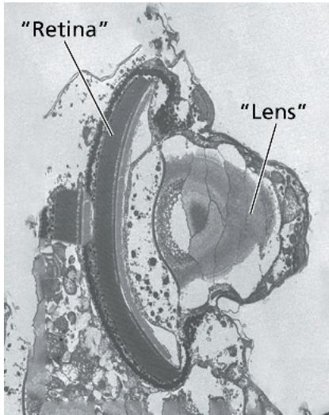

protists carry out the same essential functions, but they do so using subcellular organelles, not multicellular organs. The organelles that protists use are mostly those discussed in Figure 6.8, including the nucleus, endoplasmic reticulum, Golgi apparatus, and lysosomes. Certain protists also rely on organelles not found in most other eukaryotic cells, such as contractile vacuoles that pump excess water from the protistan cell (see Figure 7.13). One group of dinoflagellate protists has the most complex subcellular structure known: a unique, eye-like organelle called an ocelloid with components resembling the lens and retina in the eyes of vertebrates and some other animals (Figure 28.2).

Protists are also very diverse in their nutrition. Some protists are photoautotrophs and contain chloroplasts. Some are heterotrophs, absorbing organic molecules or ingesting larger food particles. Still other protists, called mixotrophs, combine photosynthesis and heterotrophic nutrition. Photoautotrophy, heterotrophy, and mixotrophy have all arisen independently in many different protist lineages.

## Reproductive Diversity of Eukaryotes

Some protists are only known to reproduce asexually. Others can also reproduce sexually, with life cycles that alternate between a haploid and a diploid phase through the processes of meiosis and fertilization. There are three basic types of sexual life cycles (Figure 28.3); they vary in which phase of the life cycle (haploid or diploid) mitosis occurs. In a gametic life cycle, mitosis occurs only in diploid cells; therefore, gametes are unique in this life cycle in that they are the only haploid cells (see Figure 28.3a). A gamete may fertilize another gamete to produce a diploid zygote that can divide through mitosis—in some cases forming a multicellular diploid organism. Some diploid cells undergo meiosis, forming haploid gametes. The opposite occurs in a zygotic life cycle, where mitosis occurs only in haploid cells; therefore, zygotes are unique in these life cycles in that they are the only diploid cells (see Figure 28.3c). Zygotes never divide through mitosis and can only undergo meiosis to form haploid cells, which themselves can divide through mitosis to form a series of single cells or to form a multicellular haploid organism. Some haploid cells differentiate

Figure 28.3 Three types of life cycles found in eukaryotic organisms.

The common feature of all three cycles is the alternation of haploid cells and diploid cells through the processes of meiosis and fertilization. The cycles differ in where mitosis occurs in the life cycle, whether only in diploid cells (a), in both diploid and haploid cells (b), or only in haploid cells (c). Small circles represent cells; large circles represent organisms.

into gametes, each of which can fertilize another gamete to create a diploid zygote. In alternation of generations (also called a sporic life cycle), mitosis occurs in both haploid cells and diploid cells (see Figure 28.3b).

Sexual life cycles originated in protists and all three types of life cycles are represented among protists, along with some variations that do not quite fit any of these types. We will examine the life cycles of several protist groups later in this chapter, and we'll continue to discuss sexual life cycles in the coming chapters as we examine how they vary between plants, fungi, and animals. Understanding life cycles will be important to understand the anatomy and evolution of these groups.

## Endosymbiosis in Eukaryotic Evolution

What gave rise to the enormous diversity of protists that exist today? There is abundant evidence that much of protistan diversity has its origins in endosymbiosis, a relationship between two species in which one organism lives inside the cell or cells of another organism (the host). In particular, as we discussed in Concept 25.3, structural, biochemical, and DNA sequence data indicate that mitochondria and plastids are derived from bacteria that were engulfed by the ancestors of early eukaryotic cells. The evidence also suggests that mitochondria evolved before plastids. Thus, a defining moment in the origin of eukaryotes occurred when a host cell engulfed a bacterium that would later become an organelle found in all eukaryotes—the mitochondrion.

To determine which bacterial lineage gave rise to mitochondria, researchers have compared the DNA sequences of mitochondrial genes (mtDNA) to those found in major clades of bacteria. In the Scientific Skills Exercise, you will interpret one such set of DNA sequence comparisons. Collectively, such studies indicate that mitochondria arose from an alpha proteobacterium (see Figure 27.17). Results from mtDNA sequence analyses also indicate that the mitochondria of protists, animals, fungi, and plants descended from a single common ancestor, thus suggesting that mitochondria arose only once over the course of evolution. Similar analyses provide evidence that plastids descended from a single common ancestor—a cyanobacterium that was engulfed by a eukaryotic host cell.

Progress has also been made toward identifying the host cell that engulfed an alpha proteobacterium, thereby setting the stage for the origin of eukaryotes. For example, there is strong evidence that eukaryotes originated from within the domain Archaea. Genetic sequence analysis suggests that the Asgard group of archaea are most closely related to the lineage that gave rise to eukaryotes (see Concept 27.4). One hypothesis is that the ancestor of eukaryotes was a relatively complex archaeal cell in which certain features of eukaryotic cells had evolved, such as a cytoskeleton that enabled it to change shape (and thereby engulf the alpha proteobacterium).

## Plastid Evolution: A Closer Look

In addition to the evidence indicating that mitochondria are descended from a bacterium that was engulfed by an archaean, giving rise to the eukaryotes, there is also much evidence that later in eukaryotic history, a lineage of heterotrophic eukaryotes

# Scientific Skills Exercise Interpreting Comparisons of Genetic Sequences

Which Bacteria Are Most Closely Related to Mitochondria? Early eukaryotes acquired mitochondria by endosymbiosis: A host cell engulfed an aerobic bacterium that persisted within the cytoplasm to the mutual benefit of both cells. In studying which living bacteria might be most closely related to mitochondria, researchers compared DNA sequences encoding ribosomal RNA (rRNA), a component of ribosomes. Ribosomes perform critical cell functions. Hence, genes encoding rRNA are under strong selection and change slowly over time, making them suitable for comparing even distantly related species. In this exercise, you will interpret some of the research data to draw conclusions about the phylogeny of mitochondria.

How the Research Was Done Researchers isolated and cloned DNA sequences from the gene that codes for the small-subunit rRNA molecule for the wheat (a eukaryote) mitochondrion and for five bacterial species:

\- Wheat, used as the source of genes encoding mitochondrial rRNA

\- Agrobacterium tumefaciens, an alpha proteobacterium that lives within plant tissue and produces tumors in the host

\- Comamonas testosteroni, a beta proteobacterium

\- Escherichia coli, a well-studied gamma proteobacterium that inhabits human intestines

\- Mycoplasma capricolum, a gram-positive mycoplasma, which is the only group of bacteria lacking cell walls

\- Anacystis nidulans, a cyanobacterium

Wheat, used as the source of mitochondrial rRNA

Data from the Research Gene sequences encoding rRNA for the wheat mitochondrion and the five bacteria were aligned and compared. The data table below, called a comparison

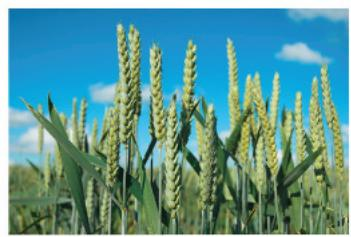

matrix, summarizes the comparison of 617 nucleotide positions from the gene sequences. Each value in the table is the percentage of the 617 nucleotide positions for which the pair of organisms have the same base. Any positions that were identical across all six rRNA-encoding gene sequences were omitted from this comparison matrix.

## INTERPRET THE DATA

1. First, make sure you understand how to read the comparison matrix. (a) Find the cell that represents the comparison of C. testosteroni and E. coli. What value is given in this cell? (b) What does that value signify about the comparable gene sequences in those two organisms? (c) Explain why some cells have a dash rather than a value. (d) Why are some cells shaded gray, with no value?

2. Why did the researchers choose one plant mitochondrion and five bacterial species to include in the comparison matrix?

3. (a) Which bacterium has an rRNA-encoding gene that is most similar to that of the wheat mitochondrion? (b) What is the significance of this similarity?

Instructors: A version of this Scientific Skills Exercise can be assigned in Mastering Biology.

<table><tr><td></td><td>Wheat mitochondrion</td><td>A. tumefaciens</td><td>C. testosteroni</td><td>E. coli</td><td>M. capricolum</td><td>A. nidulans</td></tr><tr><td>Wheat mitochondrion</td><td>-</td><td>48</td><td>38</td><td>35</td><td>34</td><td>34</td></tr><tr><td>A. tumefaciens</td><td></td><td>-</td><td>55</td><td>57</td><td>52</td><td>53</td></tr><tr><td>C. testosteroni</td><td></td><td></td><td>-</td><td>61</td><td>52</td><td>52</td></tr><tr><td>E. coli</td><td></td><td></td><td></td><td>-</td><td>48</td><td>52</td></tr><tr><td>M. capricolum</td><td></td><td></td><td></td><td></td><td>-</td><td>50</td></tr><tr><td>A. nidulans</td><td></td><td></td><td></td><td></td><td></td><td>-</td></tr></table>

Data from D. Yang et al., Mitochondrial origins, Proceedings of the National Academy of Sciences USA 82:4443–4447 (1985).

acquired an additional endosymbiont—a photosynthetic cyanobacterium—that then evolved into plastids. According to the hypothesis illustrated in Figure 28.4, this plastid-bearing lineage gave rise to two lineages of photosynthetic protists, or algae: red algae and green algae.

Let's examine some of the steps in Figure 28.3 more closely. First, recall that cyanobacteria are gram-negative and that gram-negative bacteria have two cell membranes, an inner plasma membrane and an outer membrane that is part of the cell wall (see Figure 27.3). Plastids in red algae and green algae are also surrounded by two membranes. Transport proteins in these

membranes are homologous to proteins in the inner and outer membranes of cyanobacteria, providing further support for the hypothesis that plastids originated from a cyanobacterial endosymbiont.

On several occasions during eukaryotic evolution, red algae and green algae underwent secondary endosymbiosis, meaning they were ingested in the food vacuoles of heterotrophic eukaryotes and became endosymbionts themselves. For example, protists known as chlorarachniophytes likely evolved when a heterotrophic eukaryote engulfed a green alga. Evidence for this process can be found within the engulfed cell,

## Figure 28.4 Diversity of plastids produced by endosymbiosis.

  
VISUAL SKILLS Based on this diagram, which of the following groups are likely to be more closely related: stramenopiles and alveolates, or euglenids and chlorarachniophytes? Explain.
For suggested answer, see Appendix A.

which contains a tiny vestigial nucleus, called a nucleomorph (Figure 28.5). Genes from the nucleomorph are still transcribed, and their DNA sequences indicate that the engulfed cell was a green alga.

## Eukaryotic Supergroups

Our understanding of the evolutionary history of eukaryotic diversity has been in flux in recent years. Not only has kingdom Protista been abandoned, but other hypotheses have been discarded as well. For example, many biologists once thought that the first lineage to have diverged from all other eukaryotes was the amitochondriate protists, organisms without conventional mitochondria and with fewer membrane-enclosed organelles than other protist groups. But recent structural and DNA data have undermined this hypothesis. Many of the so-called amitochondriate protists have been shown to have mitochondria—though reduced ones—and some of these organisms are now classified in distantly related groups.

Figure 28.5 Nucleomorph within a plastid of a chlorarachniophyte.  

The ongoing changes in our understanding of the phylogeny of protists pose challenges to students and instructors alike. Hypotheses about these relationships are a focus of scientific activity, changing rapidly as new data cause previous ideas to be modified or discarded. Over the last two decades, eukaryotes have been organized into from four to ten major groupings known as “supergroups.” New supergroups have been proposed as previously unknown taxa are identified, whereas some previously recognized supergroups have been shown to not be monophyletic and therefore dropped.

The next three Key Concepts (28.2–28.4) will focus on three supergroups whose position on the eukaryotic tree is fairly well established, while Concept 28.5 will explore major groups whose position is less firm—some of which have been described very recently (Figure 28.6). Because the deep roots of the eukaryotic tree are still an area of active study, the phylogenetic trees in this chapter include some polytomies (branching points where several lineages are drawn as diverging simultaneously from a common ancestor). Such polytomies aren’t meant to suggest that all the lineages actually diverged at once, but they indicate that the pattern of branching among these lineages is still unknown. Overall, as you read this chapter, it may be helpful to focus less on the specific names of groups of organisms and more on why the organisms are important and how ongoing research is elucidating their evolutionary relationships.

## Exploring Protistan Diversity

## Figure 28.6

The tree below represents a phylogenetic hypothesis for the relationships among eukaryotes on Earth today. The eukaryotic groups at the branch tips are related in larger “supergroups,” labeled vertically at the far right of the tree. Groups highlighted in yellow boxes are informally referred to as protists: eukaryotic organisms that are not plants, animals or fungi. Note that this tree includes only some of the supergroups that have been described, and only some representative clades for each supergroup.

SAR  

This supergroup contains (and is named after) three large and very diverse clades: Stramenopila, Alveolata, and Rhizaria. Stramenopiles include some of the most important photosynthetic organisms on Earth, such as the diatoms shown here as well as large seaweeds such as kelp (see Figures 28.9 and 28.10). Alveolates also include photosynthetic species, as well as important pathogens, such as Plasmodium, which causes malaria. According to one current hypothesis, stramenopiles and alveolates originated by secondary endosymbiosis when a heterotrophic protist engulfed a red alga.

50 μm  
  
Diatom diversity. These beautiful single-celled protists are important photosynthetic organisms in aquatic communities (LM).  
DRAW IT Draw a simplified version of this phylogenetic tree that shows only the Archaeplastida, SAR, Amorphea, Haptophyta, Cryptophyta, and Excavata.

## SAR (continued)

The rhizarian subgroup of SAR includes many species of amoebas, most of which have pseudopodia that are threadlike in shape. Pseudopodia are extensions that can bulge from any portion of the cell; they are used in movement and in the capture of prey.

Globigerina, a rhizarian in SAR.
This species is a foram, a group whose members have threadlike pseudopodia that extend through pores in the shell, or test (LM). The inset shows a foram test, which is hardened by calcium carbonate.

## Archaeplastida

This supergroup of eukaryotes includes red algae and green algae, along with plants. Red algae and green algae include unicellular species, colonial species, and multicellular species (including the green alga Volvox). Many of the large algae known informally as “seaweeds” are multicellular red or green algae. Protists in Archaeplastida include key photosynthetic species that form the base of the food web in many aquatic communities.

## Amorphea

Volvox, a multicellular freshwater green alga. This alga has two types of differentiated cells, and so it is considered multicellular rather than colonial. It resembles a hollow ball whose wall is composed of hundreds of biflagellated cells (see inset LM) embedded in a gelatinous

extracellular matrix; if isolated, these cells cannot reproduce. However, the alga also contains cells that are specialized for either sexual or asexual reproduction. The large algae shown here will eventually release the small “daughter” algae that can be seen within them (LM).

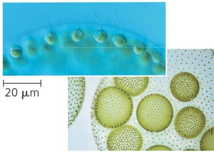  
25 μm

This supergroup of eukaryotes, formerly called Unikonta, is entirely heterotrophic. Amorphea includes amoebas that have lobe or tube-shaped pseudopodia, as well as animals, fungi, and non-amoeba protists that are closely related to animals or fungi. Most amorpheans are free-living, but some are parasitic.

  
An amoeba. This amoeba, the tubulinid Amoeba proteus, is using its pseudopodia to move.

## "Excavata"

One feature of the organisms formerly grouped in Excavata is an “excavated” groove on the side of the cell body. However, recent studies suggest that Excavata is not monophyletic; rather, the organisms belong to multiple distinct clades, including Metamonada (parabasalids, diplomonads, and related groups), which are anaerobic flagellated protists with highly reduced mitochondria, and Discoba, a diverse group that includes euglenozoans, which have a unique flagellar structure.

Giardia intestinalis, a diplomonad parasite. This diplomonad (colorized SEM), which lacks the characteristic surface groove of the Excavata, inhabits the intestines of mammals. It can infect people when they drink water contaminated with feces containing Giardia cysts. Drinking such water—even from a seemingly pristine stream—can cause severe diarrhea. Boiling the water kills the parasite.

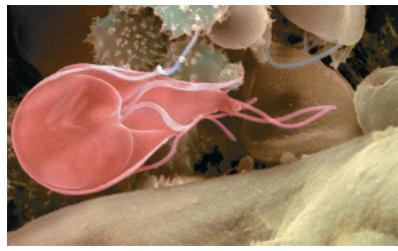  
5 μm

## Concept Check 28.1

1. Cite at least four examples of structural and functional diversity among protists.

2. Summarize the role of endosymbiosis in eukaryotic evolution.

3. DRAW IT Draw basic diagrams of a gametic life cycle, a life cycle with alternation of generations, and a zygotic life cycle. Identify which part of each life cycle is haploid, which is diploid, and where fertilization, meiosis, and mitosis occur.

4. MAKE CONNECTIONS After studying Figure 28.4, predict how many distinct genomes are contained within the cell of a chlorarachniophyte. Explain. (See Figures 6.17 and 6.18.)

For suggested answers, see Appendix A.

## Concept 28.2: SAR is a highly diverse group of protists defined by DNA similarities

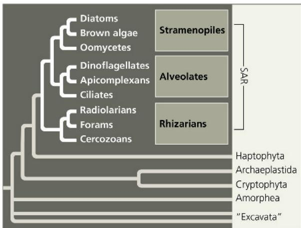

Now that we have examined some of the broad patterns in eukaryotic evolution, we will look more closely at some of the main groups of protists shown in Figure 28.6. We begin with SAR, a supergroup recognized in 2007, early in the era of whole-genome DNA sequence analyses. These studies found that three major clades of protists—the stramenopiles, alveolates, and rhizarians—form a monophyletic supergroup. This supergroup contains a large, extremely diverse collection of protists. To date, this supergroup has not received a formal name but is instead known by the first letters of its major clades: SAR.

Some morphological and DNA sequence data suggest that two of these groups, the stramenopiles and alveolates, originated more than a billion years ago, when a common ancestor of these two clades engulfed a single-celled, photosynthetic red alga. Because red algae are thought to have originated by primary endosymbiosis (see Figure 28.3), such an origin for the stramenopiles and alveolates is referred to as secondary endosymbiosis. Others question this idea, noting that some species in these groups lack plastids or their remnants (including any trace of plastid genes in their nuclear DNA).

Despite its lack of a formal name, the SAR supergroup represents the best current hypothesis for the phylogeny of the three large protist clades to which we now turn.

Figure 28.7 Stramenopile flagella.

Most stramenopiles, such as Synura petersenii, have two flagella: one covered with fine, stiff hairs and a shorter one that is smooth.

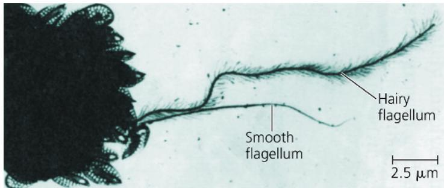

## Stramenopiles

One major subgroup of SAR, the stramenopiles, includes some of the most important photosynthetic organisms on the planet. Their name (from the Latin stramen, straw, and pilos, hair) refers to their characteristic flagellum, which has numerous fine, hairlike projections. In most stramenopiles, this “hairy” flagellum is paired with a shorter “smooth” (nonhairy) flagellum (Figure 28.7). Here we’ll focus on three groups of stramenopiles: diatoms, oomycetes, and brown algae.

## Diatoms

A key group of photosynthetic protists, diatoms are unicellular algae that have a unique glass-like wall made of silicon dioxide embedded in an organic matrix (Figure 28.8). The wall consists of two parts that overlap like a petri dish. These walls provide effective protection from the crushing jaws of predators: Live diatoms can withstand pressures as great as 1.4 million kg/m $^{2}$ , equal to the pressure under each leg of a table supporting an elephant!

With an estimated 100,000 living species, diatoms are a highly diverse group of protists (see Figure 28.6). They are among the most abundant photosynthetic organisms both in the ocean and in lakes: One bucket of water scooped from the surface of the sea may contain

millions of these microscopic algae. The abundance of diatoms in the past is also evident in the fossil record, where massive accumulations of fossilized diatom walls are major constituents of sediments known as diatomaceous earth. These sediments are mined for their quality as a filtering medium and for many other uses.

Figure 28.8 The diatom Triceratium morlandii.
(colorized SEM)

Diatoms are so widespread and abundant that their photosynthetic activity affects global carbon dioxide ( $CO_{2}$ ) levels. Diatoms have this effect in part because of events that occur

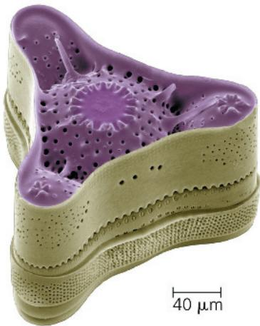

during episodes of rapid population growth, or blooms, when ample nutrients are available. Typically, diatoms are eaten by a variety of protists and invertebrates, but during a bloom, many escape this fate. When these uneaten diatoms die, their bodies sink to the ocean floor. It takes decades, or even centuries, for dead diatoms that sink to the ocean floor to be broken down by bacteria and other decomposers. As a result, the carbon in their bodies remains there for some time, rather than being released immediately as $CO_{2}$ as the decomposers respire. The overall effect of these events is that $CO_{2}$ absorbed by diatoms during photosynthesis is transported, or “pumped,” to the ocean floor.

With an eye toward reducing global warming by lowering atmospheric $CO_{2}$ levels, some scientists advocate promoting diatom blooms by fertilizing the ocean with essential nutrients such as iron. In one study testing this idea, researchers found that $CO_{2}$ was indeed pumped to the ocean floor after iron was added to a small region of the ocean, causing a diatom bloom. Other scientists have cautioned that the small area and short duration of such studies makes it difficult to predict what would happen if large-scale iron fertilization experiments were performed. Indeed, the possibility that iron fertilization could have undesirable side effects (such as oxygen depletion or the production of nitrous oxide, a more potent greenhouse gas than $CO_{2}$ ) led the 2008 United Nations Convention on Biological Diversity to issue a moratorium against such experiments.

## Brown Algae

The largest and most complex algae are brown algae. All are multicellular, and most are marine. Brown algae are especially common along temperate coasts that have cold-water currents. They owe their characteristic brown or olive color to the carotenoids in their plastids.

Many of the species commonly called “seaweeds” are brown algae, though the term seaweed is also used for large multicellular green and red algae (see Concept 28.3). Some brown algal seaweeds have specialized structures that resemble organs in plants, such as a rootlike holdfast, which anchors the alga, and a stemlike stipe, which supports the leaflike blades (Figure 28.9). Unlike plants, however, brown algae lack true tissues and organs. Moreover, morphological and DNA data show that these similarities evolved independently in the algal and plant lineages and are thus analogous, not homologous. In addition, while plants have adaptations (such as rigid stems) that provide support against gravity, brown algae have adaptations that enable their main photosynthetic surfaces (the leaflike blades) to be near the water surface. Some brown algae accomplish this task with gas-filled, bubble-shaped floats. Giant brown algae known as kelps that live in deep waters have such floats in their blades, which are attached to stipes that can rise as much as 60 m from the seafloor—more than half the length of a football field.

Brown algae are important commodities for humans. Some species are eaten, such as Laminaria, which is commonly used as food in Japan (kombu) and Chile (cochayuyo), and is growing in popularity in the United States. In addition, the cell walls of brown algae contain a gel-forming substance, called algin, which is used to thicken many processed foods, including pudding and salad dressing. Finally, some brown algae, including kelp, are strong candidates to become widespread biofuels.

Figure 28.9 Seaweeds: adapted to life at the ocean's margins. The sea palm (Postelsia) lives on rocks along the coast of the northwestern United States and western Canada. The body of this brown alga is well adapted to maintaining a firm foothold despite the crashing surf.  
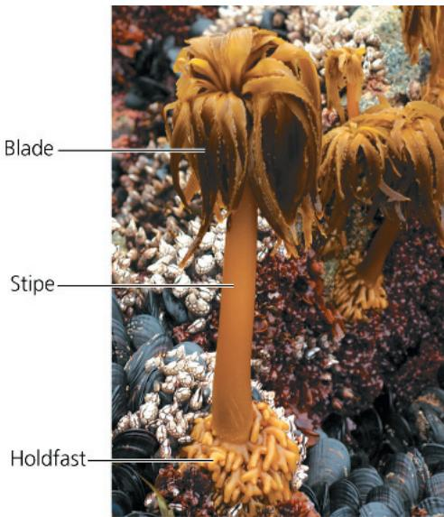

## Alternation of Generations

A variety of life cycles have evolved among the multicellular algae. The most complex life cycles include an alternation of generations, the alternation of multicellular haploid and diploid forms, as shown in Figure 28.10 for the brown alga Laminaria. Although haploid and diploid conditions alternate in all sexual life cycles—human gametes, for example, are haploid—the term alternation of generations applies only to life cycles in which mitosis leading to multicellular structures occurs in both haploid and diploid stages (see Figure 28.3). As you will read in Concept 29.1, alternation of generations also evolved in plants.

As detailed in Figure 28.14, the diploid individual in this complex algal life cycle is called the sporophyte because it produces spores. The spores are haploid and move by means of flagella; they are called zoospores. The zoospores divide by mitosis and develop into haploid, multicellular male and female gametophytes, which produce gametes. The union of two gametes (fertilization) results in a diploid zygote, which matures and gives rise to a new multicellular sporophyte.

In Laminaria, the two generations are heteromorphic, meaning that the sporophytes and gametophytes are structurally different. Other algal life cycles have an alternation of isomorphic generations, in which the sporophytes and gametophytes look similar to each other, although they differ in chromosome number.

## Oomycetes (Water Molds and Their Relatives)

Oomycetes include the water molds, the white rusts, and the downy mildews. Based on their morphology, these organisms were previously classified as fungi (in fact, oomycete means “egg fungus”).

Figure 28.10 The life cycle of the brown alga Laminaria: an example of alternation of generations.

For example, many oomycetes have multinucleate filaments (hyphae) that resemble fungal hyphae (Figure 28.11a). However, there are key differences between oomycetes and fungi. Among them, oomycetes typically have cell walls made of cellulose, whereas the walls of fungi consist mainly of another polysaccharide, chitin. Data from molecular systematics have confirmed that oomycetes are not closely related to fungi. In both oomycetes and fungi, the high surface-to-volume ratio of filamentous structures enhances the uptake of nutrients from the environment.

Although oomycetes descended from plastid-bearing ancestors, they no longer have plastids and do not perform photosynthesis. Instead, they typically acquire organic molecules as decomposers or parasites. Most water molds are decomposers that grow as cottony masses on dead algae and animals, mainly in freshwater habitats (Figure 28.11b). White rusts and downy mildews generally live on land as plant parasites.

The ecological impact of oomycetes can be significant. For example, the oomycete Phytophthora infestans causes potato late blight, which turns the stalks and stems of potato (and tomato) plants into black slime. Late blight contributed to the devastating Irish famine of the 19th century, in which a million people died and at least that many were forced to leave Ireland. The disease remains a major problem today, causing crop losses as high as 70% in some regions. Globally, about \$1 billion is spent each year on pesticides to control the parasite.

## Alveolates

Members of the next subgroup of SAR, the alveolates, are unicellular organisms that have membrane-enclosed sacs (alveoli) just under the plasma membrane (Figure 28.12). Alveolates are abundant in many habitats and include a wide range of photosynthetic and heterotrophic protists. We'll discuss three alveolate clades here: a group of flagellates (the dinoflagellates), a group of parasites (the apicomplexans), and a group of protists that move using cilia (the ciliates).

Figure 28.11 Oomycetes.

(a) Closeup of oomycete hyphae (LM)

  
(b) Water mold hyphae growing on a goldfish

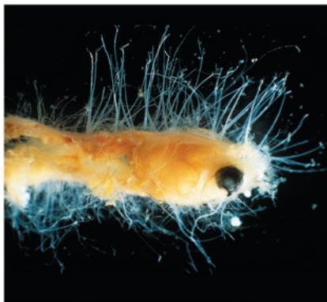  
Figure 28.12 Alveoli.  
These sacs under the plasma membrane are a characteristic that distinguishes alveolates from other eukaryotes (TEM).

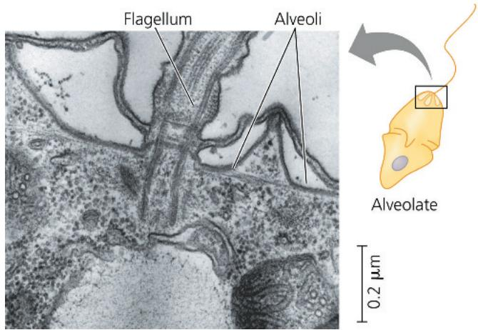

## Dinoflagellates

The cells of many dinoflagellates are reinforced by cellulose plates. Grooves in this “armor” house two flagella, one of which causes dinoflagellates (from the Greek dinos, whirling) to spin as they move through the waters of their marine and freshwater communities (Figure 28.13a).

Although their ancestors may have originated by secondary endosymbiosis (see Figure 28.3), roughly half of all dinoflagellate species are now purely heterotrophic. Others are important species of phytoplankton (photosynthetic plankton, which include photosynthetic bacteria as well as algae); many photosynthetic dinoflagellates are mixotrophic.

## Figure 28.13 Dinoflagellates.

  
(a) Dinoflagellate flagella. Beating of the spiral flagellum, which lies in a groove that encircles the cell, makes this specimen of Pfiesteria shumwayae spin (colorized SEM).

(b) Red tide in the Gulf of Carpentaria in northern Australia. The red color is due to high concentrations of a carotenoid-containing dinoflagellate.  

Periods of explosive population growth (blooms) in dinoflagellates sometimes cause a phenomenon called “red tide” (Figure 28.13b). The blooms make coastal waters appear brownish red or pink because of the presence of carotenoids, the most common pigments in dinoflagellate plastids. When blooms occur, toxins produced by certain dinoflagellates have caused massive kills of invertebrates and fishes. Humans who eat molluscs that have accumulated the toxins are affected as well, sometimes fatally. Based on data from 1982–2016, researchers at Stony Brook University found that ocean warming (caused by ongoing climate change) has expanded the potential for algal blooms in two species of toxic dinoflagellates, making them a growing threat to human health.

## Apicomplexans

Nearly all apicomplexans are parasites of animals—and virtually all animal species examined so far are attacked by these parasites. The parasites spread through their host as tiny infectious cells called sporozoites. Apicomplexans are so named because one end (the apex) of the sporozoite cell contains a complex of organelles specialized for penetrating host cells and tissues. Although apicomplexans are not photosynthetic, recent data show that they retain a modified plastid (apicoplast), most likely of red algal origin.

Most apicomplexans have intricate life cycles with both sexual and asexual stages. Those life cycles often require two or more host species for completion. For example, Plasmodium, the parasite that causes malaria, lives in both mosquitoes and humans (Figure 28.14).

Historically, malaria has rivaled tuberculosis as the leading cause of human death by infectious disease. The incidence of malaria was diminished in the 1960s by insecticides that reduced carrier populations of Anopheles mosquitoes and by drugs that killed Plasmodium in humans. But the emergence of resistant varieties of both Anopheles and Plasmodium has led to a resurgence of malaria. According to the World Health Organization, there were an estimated 263 million malaria cases and 597,000 malaria deaths worldwide in 2023. In regions where malaria is common, the lethal effects of this disease have resulted in the evolution of high frequencies of the sickle-cell allele; for an explanation of this connection, see Figure 23.18.

The search for malarial vaccines has been hampered by the fact that Plasmodium lives mainly inside cells, hidden from the host's immune system. And, like trypanosomes, Plasmodium continually changes its surface proteins. Even so, significant progress was made when European regulators recently approved the world's first licensed malarial vaccines (RTS,S or Mosquirix, and R21). By 2019, selected regions of Africa began routine use of RTS,S, and in 2023 the World Health Organization recommended these vaccines for broad use in children in areas where malaria is prevalent. Pilot studies showed the vaccines were substantially reducing child deaths, hospitalizations, and cases of malaria. By early 2025, 19 African countries were offering malaria vaccines as part of their childhood immunization programs. However, these vaccines, which target a protein on the surface of sporozoites,

Figure 28.14 The two-host life cycle of Plasmodium, the apicomplexan that causes malaria.  
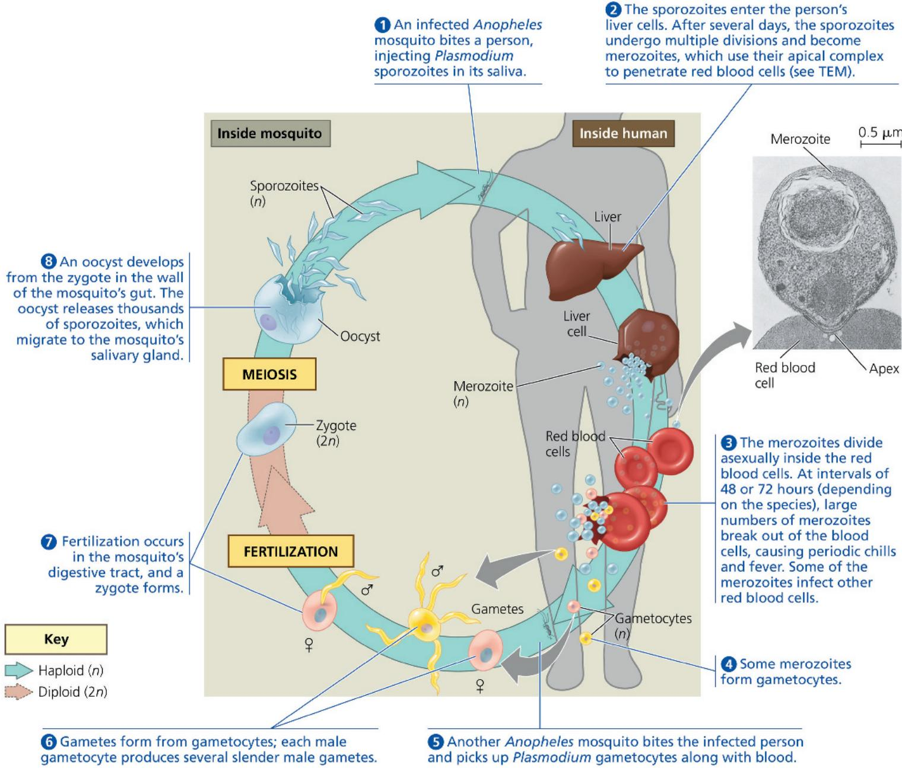  
Are morphological differences between sporozoites, merozoites, and gametocytes caused by different genomes or by differences in gene expression? Explain.
For suggested answer, see Appendix A.

provide only partial protection against malaria. As a result, researchers continue to study other potential vaccine targets, including the apicoplast. This approach may be effective because the apicoplast is a modified plastid; as such, it descended from a cyanobacterium and hence has different metabolic pathways from those in human patients.

## Ciliates

The ciliates are a large and varied group of protists named for their use of cilia to move and feed (Figure 28.15a). Most ciliates are predators, typically of bacteria or of other protists. Their cilia may completely cover the cell surface or may be clustered in a few rows or tufts. In certain species, rows of tightly packed cilia function collectively in locomotion. Other ciliates scurry about on leg-like structures constructed from many cilia bonded together.

Figure 28.15 Structure and function in the ciliate Paramecium caudatum.  
  
MAKE CONNECTIONS The events shown in steps 4 through 6 of this diagram have a similar overall effect to what event in the human life cycle (see Figure 13.5)? Explain.

A distinctive feature of ciliates is the presence of two types of nuclei: tiny micronuclei and large macronuclei. A cell has one or more nuclei of each type. Genetic variation results from conjugation, a sexual process in which two individuals exchange haploid micronuclei but do not reproduce (Figure 28.15b). Ciliates generally reproduce asexually by binary fission, during which the existing macronucleus disintegrates and a new one is formed from the cell's micronuclei. Each macronucleus typically contains multiple copies of the ciliate's genome. Genes in the macronucleus control the everyday functions of the cell, such as feeding, waste removal, and maintaining water balance.

## Rhizarians

Our next subgroup of SAR is the rhizarians. Many species in this group are amoebas, protists that move and feed by means of pseudopodia, extensions of the cytoplasm that may bulge from almost anywhere on the cell surface. An amoeba moves by extending a pseudopodium and anchoring its tip; more cytoplasm then streams into the pseudopodium. Amoebas do not constitute a monophyletic group; instead, they are dispersed across many distantly related eukaryotic taxa. Most amoebas that are rhizarians differ morphologically from other amoebas by having long and very thin, or threadlike, pseudopodia. Rhizarians also include flagellated protists that move with flagella and use their threadlike pseudopodia mostly for feeding.

We'll examine three groups of rhizarians here: radiolarians, forams, and cercozoans.

## Radiolarians

The protists called radiolarians have delicate, intricately symmetrical internal skeletons that are generally made of silica. The pseudopodia of these mostly marine protists radiate from the central body (Figure 28.16) and are reinforced by bundles of microtubules. The microtubules are covered by a thin layer of cytoplasm, which engulfs smaller microorganisms that become attached to the pseudopodia. Cytoplasmic streaming then carries the captured prey into the main part of the cell. After radiolarians die, their skeletons settle to the seafloor, where they accumulated as a type of sediment called siliceous ooze that can be hundreds of meters thick in some locations.

## Forams

The protists called foraminiferans (from the Latin foramen, little hole, and ferre, to bear), or forams, are named for their porous shells, called tests (see Figure 28.6). Foram tests consist of a single piece of organic material that typically is hardened with calcium carbonate. The pseudopodia that extend through the pores function in swimming, test formation, and feeding. Many forams also derive nourishment from the photosynthesis of symbiotic algae that live within the tests.

Figure 28.16 A radiolarian.

Numerous threadlike pseudopodia radiate from the central body of this radiolarian (LM).

Forams are found in both the ocean and fresh water. Most species live in sand or attach themselves to rocks or algae, but some live as plankton. The largest forams, though single-celled, have tests several centimeters in diameter.

Ninety percent of all identified species of forams are known from fossils. Along with the calcium-containing remains of other protists, the fossilized tests of forams are part of marine sediments, including sedimentary rocks that are now land formations. Foram fossils are excellent markers for correlating the ages of sedimentary rocks in different parts of the world. Researchers are also studying these fossils to obtain information about climate change and its effects on the oceans and their life (Figure 28.17).

Figure 28.17 Fossil forams.

By measuring the magnesium content in fossilized forams like these, researchers seek to learn how ocean temperatures have changed over time. Forams take up more magnesium in warmer water than in colder water.

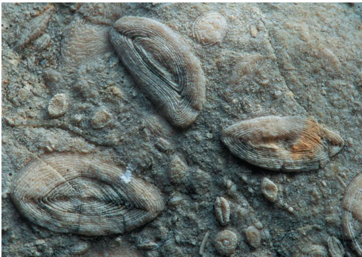

Figure 28.18 A second case of primary endosymbiosis?

The cercozoan Paulinella conducts photosynthesis in a unique sausage-shaped structure called a chromatophore (LM). Chromatophore membranes include a peptidoglycan layer, indicating that they are derived from a bacterium. DNA evidence shows that chromatophores are derived from a different cyanobacterium than that from which plastids are derived.

## Cercozoans

First identified in molecular phylogenies, the cercozoans are a large group of amoeboid and flagellated protists that feed using threadlike pseudopodia. Cercozoan protists are common inhabitants of marine, freshwater, and soil ecosystems.

Most cercozoans are heterotrophs. Many are parasites of plants, animals, or other protists; many others are predators. The predators include the most important consumers of bacteria in aquatic and soil ecosystems, along with species that eat other protists, fungi, and even small animals. One small group of cercozoans, the chlorarachniophytes (mentioned earlier in the discussion of secondary endosymbiosis), are mixotrophic: These organisms ingest smaller protists and bacteria as well as perform photosynthesis. At least one other cercozoan, Paulinella chromatophora, is an autotroph, deriving its energy from light and its carbon from $CO_{2}$ . Paulinella (Figure 28.18) appears to represent an intriguing additional evolutionary example of a eukaryotic lineage that obtained its photosynthetic apparatus directly from a cyanobacterium.

## Concept Check 28.2

1. Explain why forams have such a well-preserved fossil record.

2. WHAT IF? Would you expect the plastid DNA of photosynthetic dinoflagellates and diatoms to be more similar to the nuclear DNA of plants (which belong to the Eukarya) or to the chromosomal DNA of cyanobacteria (which belong to the Bacteria)? Explain.

3. MAKE CONNECTIONS Which of the three life cycles in Figure 13.6 exhibits alternation of generations? How does it differ from the other two?

4. MAKE CONNECTIONS Review Figures 9.2 and 10.5, and then summarize how $CO_{2}$ and $O_{2}$ are both used and produced by chlorarachniophytes and other aerobic algae.

## Concept 28.3: Red algae and green algae are the closest relatives of plants

As described earlier, morphological and molecular evidence indicates that plastids arose when a heterotrophic protist acquired a cyanobacterial endosymbiont. Later, photosynthetic descendants of this ancient protist evolved into red algae and green algae (see Figure 28.4), and the lineage that produced green algae then gave rise to plants. Together, red algae, green algae, and plants make up our third eukaryotic supergroup, which is called Archaeplastida. Archaeplastida is a monophyletic group that descended from the ancient protist that engulfed a cyanobacterium. We will examine plants in Chapters 29 and 30; here we will look at the diversity of their closest algal relatives, red algae and green algae.

## Red Algae

Many of the 6,000 known species of red algae (rhodophytes, from the Greek rhodos, red) are reddish, owing to the photosynthetic pigment phycoerythrin, which masks the green of chlorophyll (Figure 28.19). However, other species (those adapted to shallow water) have less phycoerythrin. As a result, red algal species may be greenish red in very shallow water, bright red at moderate depths, and almost black in deep water. Some species lack pigmentation altogether and live as heterotrophic parasites on other red algae.

Red algae are abundant in many coastal ecosystems. Some of their photosynthetic pigments, including phycoerythrin, allow them to absorb blue and green light, which penetrate relatively deep into the water. A species of red alga has been discovered near the Bahamas at a depth of more than 260 m. There are also a small number of freshwater and terrestrial species.

Most red algae are multicellular. Although none are as big as the giant brown kelps, the largest multicellular red algae are included in the informal designation “seaweeds.” You may have eaten one of these multicellular red algae, Porphyra (Japanese “nori”), as crispy sheets or as a wrap for sushi (see Figure 28.19). Red algae reproduce sexually and have diverse life cycles in which alternation of generations is common. However, unlike other algae, red algae do not have flagellated gametes, so they depend on water currents to bring gametes together for fertilization.

8 mm

Figure 28.19 Red algae.

Bonnemaisonia hamifera. This red alga has a filamentous form.

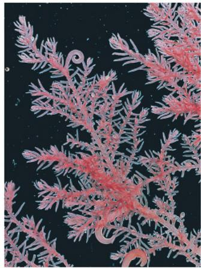

  
Dulse (Palmaria palmata). This edible species has a "leafy" form.  
▼ Nori. The red alga Porphyra is the source of a traditional Japanese food.

  
- The seaweed is grown on nets in shallow coastal waters.  
-Paper-thin, glossy sheets of dried nori make a mineral-rich wrap for rice, seafood, and vegetables in sushi.

## Green Algae

The grass-green chloroplasts of green algae have a structure and pigment composition much like the chloroplasts of plants. Molecular systematics and cellular morphology leave little doubt that green algae and plants are closely related. In fact, some systematists now advocate including green algae in an expanded “plant” kingdom, Viridiplantae (from the Latin viridis, green). Phylogenetically, this change makes sense, since otherwise the green algae are a paraphyletic group.

Green algae can be divided into two main groups, the charophytes and the chlorophytes. The charophytes include the algae most closely related to plants, and we will discuss them along with plants in Chapter 29.

The second group, the chlorophytes (from the Greek chloros, green), includes more than 7,000 species. Most live in fresh water,

Figure 28.20 Examples of large chlorophytes.

  
(a) Pediastrum, a pond alga. Chlorophytes in this genus form daughter colonies with the same number and arrangement of cells as the parent colony.

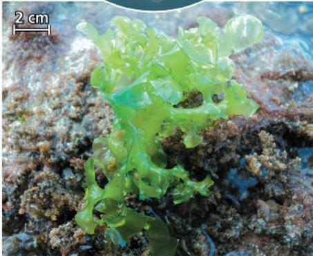  
(b) Ulva, or sea lettuce. This multicellular, edible chlorophyte has differentiated structures, such as its leaflike blades and a rootlike holdfast that anchors the alga.  
(c) Caulerpa, an intertidal chlorophyte. The branched filaments lack cross-walls and thus are multinucleate. In effect, the body of this alga is one huge "supercell."

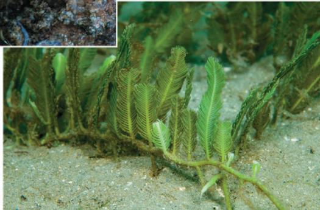

but there are also many marine and some terrestrial species. The simplest chlorophytes are unicellular organisms such as Chlamydomonas, which resemble gametes of more complex chlorophytes. Various species of unicellular chlorophytes live independently in aquatic habitats as phytoplankton or inhabit damp soil. Some live symbiotically within other eukaryotes, contributing part of their photosynthetic output to the food supply of their hosts. Still other chlorophytes live in environments exposed to intense visible and ultraviolet radiation; these species are protected by radiation-blocking compounds in their cytoplasm, cell wall, or zygote coat.

Larger size and greater complexity evolved in green algae by three different mechanisms:

1. The formation of colonies of individual cells, as seen in Pediastrum (Figure 28.20a) and other species that contribute to the stringy masses known as pond scum.

2. The formation of true multicellular bodies by cell division and differentiation, as in Volvox (see Figure 28.6) and Ulva (Figure 28.20b).

3. The repeated division of nuclei with no cytoplasmic division, as in Caulerpa (Figure 28.20c).

Figure 28.21 The life cycle of Chlamydomonas, a unicellular chlorophyte.  
  
⑦ These daughter cells develop flagella and cell walls and then emerge as swimming zoospores from the parent cell. The zoospores develop into mature haploid cells.  
6 When a mature cell reproduces asexually, it resorbs its flagella and then undergoes two rounds of mitosis, forming four cells (more in some species).

VISUAL SKILLS Circle the stage(s) in the diagram in which clones are formed, producing additional new daughter cells that are genetically identical to the parent cell(s).

For suggested answer, see Appendix A.

Most chlorophytes have complex life cycles, with both sexual and asexual reproductive stages. Nearly all species of chlorophytes reproduce sexually by means of biflagellated gametes that have cup-shaped chloroplasts (Figure 28.21). Alternation of generations has evolved in some chlorophytes, including Ulva.

## Concept Check 28.3

1. Contrast red algae and brown algae.

2. Why is it accurate to say that Ulva is truly multicellular but Caulerpa is not?

3. WHAT IF? Suggest a possible reason why species in the green algal lineage may have been more likely to colonize land than species in the red algal lineage.

For suggested answers, see Appendix A.

⑤ After a dormant period, meiosis produces four haploid individuals (two of each mating type) that emerge and mature.

## Concept 28.4: Amorpheans include protists that are closely related to fungi and animals

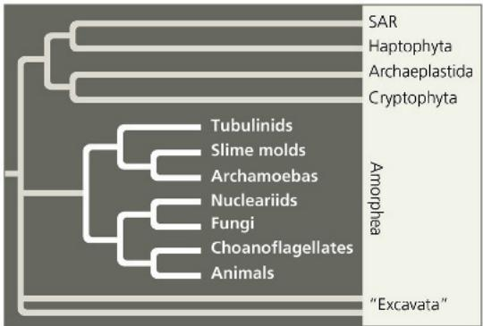

Amorphea (formerly called Unikonta) is an extremely diverse supergroup of eukaryotes that includes animals, fungi, and some protists. There are two major clades of amorphea, the amoebozoans (tubulinids and close protist relatives) and the opisthokonts (animals, fungi, and closely related protist groups). Each of these two major clades is strongly supported by molecular systematics. Support for the close relationship between amoebozoans and opisthokonts is provided by comparisons of myosin proteins and by studies based on multiple genes or whole genomes.

## Amoebozoans

The amoebozoan clade includes many species of amoebas that have lobe- or tube-shaped pseudopodia rather than the threadlike pseudopodia found in rhizarians. Amoebozoans include tubulinids, slime molds, and archamoebas.

## Tubulinids

Tubulinids constitute a large and varied group of amoebozoans that have lobe- or tube-shaped pseudopodia. These unicellular protists are ubiquitous in soil as well as freshwater and marine environments. Most are heterotrophs that actively seek and consume bacteria and other protists; one such tubulinid species, Amoeba proteus, is shown in Figure 28.6. Some tubulinids also feed on detritus (nonliving organic matter).

## Slime Molds

Slime molds, or mycetozoans (from the Latin, meaning “fungus animals”), once were thought to be fungi because, like fungi, they produce fruiting bodies that aid in spore dispersal. However, DNA sequence analyses indicate that the resemblance between slime molds and fungi is a case of evolutionary convergence. Slime molds have diverged into two main branches, plasmodial slime molds and cellular slime molds. We’ll compare their characteristics and life cycles.

## Plasmodial Slime Molds

Many plasmodial slime molds are brightly colored, often yellow or orange (Figure 28.22). As they grow, they form a mass called a plasmodium, which can be many centimeters in diameter. (Don't confuse a slime mold's plasmodium with the genus Plasmodium, which includes the parasitic apicomplexan that causes malaria.) Despite its size, the plasmodium is not multicellular; it is a single mass of cytoplasm that is undivided by plasma membranes and

Figure 28.22
A mature
plasmodium, the
feeding stage in
the life cycle of a
plasmodial slime
mold.

that contains many nuclei. This “supercell” is the product of mitotic nuclear divisions that are not followed by cytokinesis. The plasmodium extends pseudopodia through moist soil, leaf mulch, or rotting logs, engulfing food particles by phagocytosis as it grows. If the habitat begins to dry up or there is no food left, the plasmodium stops growing and differentiates into fruiting bodies that function in sexual reproduction.

## Cellular Slime Molds

The life cycle of the protists called cellular slime molds can prompt us to question what it means to be an individual organism. The feeding stage of these organisms consists of solitary cells that function individually, but when food is depleted, the cells form a slug-like aggregate that functions as a unit (Figure 28.23). Unlike the feeding stage (plasmodium) of a plasmodial slime mold, these aggregated cells remain separated by their individual plasma membranes. Ultimately, the aggregated cells form an asexual fruiting body.

Dictyostelium discoideum, a cellular slime mold commonly found on forest floors, has become a model organism for studying the evolution of multicellularity. One line of research has focused on the slime mold's fruiting body stage. During this stage, the cells that form the stalk die as they dry out, while the spore cells at the top survive and have the potential to reproduce (see Figure 28.28). Scientists have found that mutations in a single gene can turn individual Dictyostelium cells into “cheaters” that never become part of the stalk. Because these mutants gain a strong reproductive advantage over noncheaters, why don’t all Dictyostelium cells cheat?

Recent discoveries suggest an answer to this question. Cheating cells lack a specific surface protein, and noncheating cells can recognize this difference. Noncheaters preferentially aggregate with other noncheaters, thus depriving cheaters of the chance to exploit them. Such a recognition system may have been important in the evolution of other multicellular eukaryotes, such as animals and plants.

## Archamoebas

Archamoebas are a diverse group of protists that includes free-living forms that live in fresh water, oceans, and soil, as well as some parasitic and commensalistic species. Those that belong to the genus Entamoeba are symbiotic parasites. They infect all classes of vertebrate animals as well as some invertebrates. Humans are host to at least six species of Entamoeba, but only one, E. histolytica, is known to be pathogenic. E. histolytica causes amoebic dysentery and is spread via contaminated drinking water, food, or eating utensils. Responsible for up to 110,000 deaths worldwide every year, the disease is the third-leading cause of death due to eukaryotic parasites, after malaria (see Figure 28.14) and schistosomiasis (see Figure 33.10).

## Opisthokonts

Opisthokonts are an extremely diverse group of eukaryotes that includes animals, fungi, and several groups of protists. We will discuss the evolutionary history of fungi and animals in Chapters 31–34. Of the opisthokont protists, we will discuss the nucleariids in Chapter 31 because they are more closely related to fungi than they are to other protists. Similarly, we will discuss choanoflagellates in Chapter 32, since they are more closely related to animals than they are to other protists. The nucleariids and choanoflagellates illustrate why scientists have abandoned the former kingdom Protista: A monophyletic group that includes these single-celled eukaryotes would also have to include the multicellular animals and fungi that are closely related to them.

Figure 28.23 The life cycle of Dictyostelium, a cellular slime mold.  
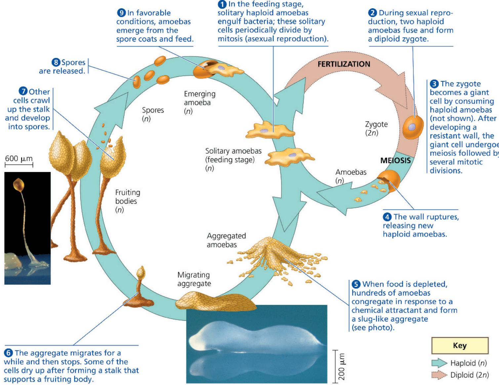  
VISUAL SKILLS Suppose cells were removed from the slug-like aggregate shown in the photo. Use the information in the life cycle to infer whether these cells would be haploid or diploid. Explain.
For suggested answer, see Appendix A.

## Concept Check 28.4

1. Contrast the pseudopodia of amoebozoans and forams.

2. In what sense is "fungus animal" a fitting description of a slime mold? In what sense is it not fitting?

3. VISUAL SKILLS What kind of life cycle is depicted in the sexual part of the life cycle in Figure 28.23? Hint: Look for where mitosis occurs in the life cycle (haploid cells, diploid cells, or both?).

# Concept 28.5: Phylogenomic research has identified new supergroups and led to the rearrangement of the eukaryotic tree of life

Research over the last two decades has led to a large change in our understanding of the eukaryotic tree of life and has helped resolve some of its deep roots. Some entirely new eukaryotic organisms have been discovered and found to be so different from known eukaryotic organisms that they have been placed in a new supergroup. Other clades have been identified for some time, but molecular phylogenetics have helped clarify their placement on the eukaryotic tree. Finally, some groups that were thought to be clades have been shown to be polyphyletic as more molecular data have become available.

Figure 28.24 The parabasalid parasite Trichomonas vaginalis. (colorized SEM)  
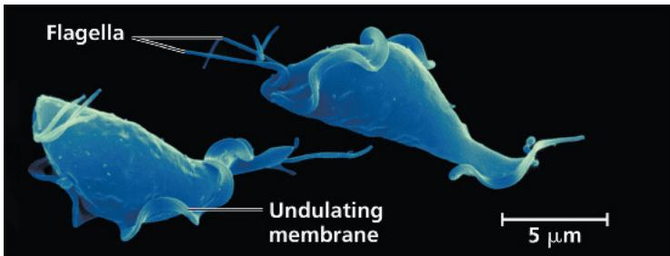

Excavata (the excavates) was a eukaryotic supergroup originally proposed based on morphological studies of the cytoskeleton. Some members of this diverse group also have an “excavated” feeding groove on one side of the cell body. However, most recent phylogenomic studies do not support the monophyly of the excavates as a whole, and instead identify two separate lineages: Metamonada and Discoba. Metamonada is a group of anaerobic, heterotrophic flagellated protists that are free-living or parasitic. This group includes well-known parasites, including Giardia intestinalis (see Figure 28.6), which inhabits the intestines of humans and other mammals, and Trichomonas vaginalis (Figure 28.24), a sexually transmitted parasite that infects about 140 million people each year worldwide.

Discoba is a diverse clade that includes predatory heterotrophs, photosynthetic autotrophs, and mixotrophs found in marine, freshwater, and moist terrestrial ecosystems, as well as parasites—some of which affect humans. Photosynthesis arose in one lineage, the euglenids (Figure 28.25), via secondary endosymbiosis with green algae (see Figure 28.4). Some euglenids are mixotrophs: They perform photosynthesis when sunlight is available, but when it is not, they can become heterotrophic, absorbing organic molecules from their environment. Many other euglenids engulf prey by phagocytosis. A well-known group of parasites in the clade Discoba belong to the genus Trypanosoma (Figure 28.26), which cause sleeping sickness and Chagas disease in humans.

Haptophytes are single-celled algae that have been known to form a clade for quite some time, but the placement of this supergroup in relation to other eukaryotes has proved challenging. They are now thought to be closely related to the SAR clade. Haptophytes include a group of phytoplankton called coccolithophores that have unique calcified scales called coccoliths around their cells (Figure 28.27). They are important phytoplankton in many marine ecosystems and play an important role in global biogeochemical cycles.

Cryptophytes are phytoplankton with two flagella (Figure 28.28) that are found in freshwater and marine environments. Like haptophytes, they were recognized as a clade based on molecular data but were difficult to place on the eukaryotic tree of life. The latest research suggests they are most closely related to Archaeplastida.

A number of additional new supergroups have been recently described based on phylogenomic analyses. Some, like CRuMs, combine previously “orphan” taxa that have very different characteristics and were not yet placed in existing supergroup. Others, like Hemimastigophora, were identified as a clade and were elevated to the supergroup level when their molecular data uncovered the extent of their evolutionary distinctiveness. Finally, some entirely new, previously unknown species were recently described and immediately assigned to a new supergroup of unique predators called Provora (see Figure 28.1). One thing is

Figure 28.25 Euglena, a euglenid commonly found in pond water.  
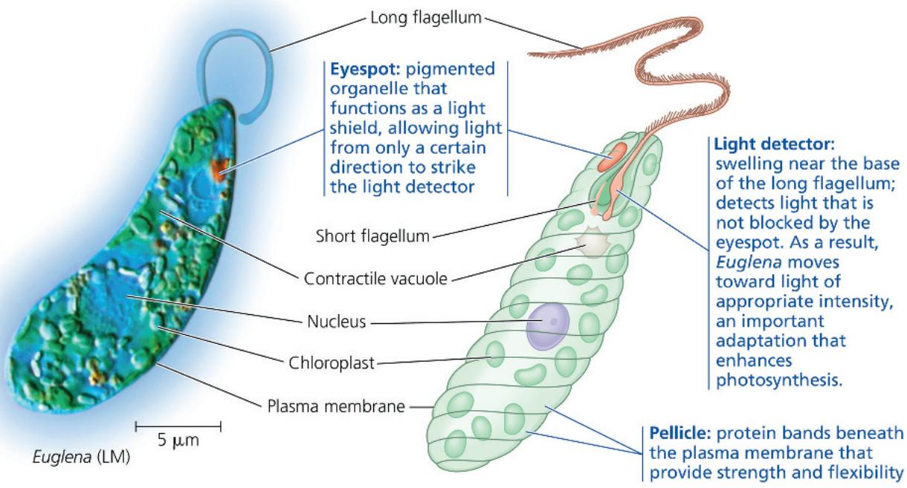

8 μm

clear: The vast majority of eukaryotic diversity falls outside of the three kingdoms we cover in the new few chapters (plants, fungi, and animals). Ongoing research will continue to improve our understanding of the eukaryotic tree of life.

Figure 28.26 Trypanosoma, the kinetoplastid that causes sleeping sickness.

(colorized SEM)

  
Figure 28.27
A haptophyte.
Emiliania huxleyi is a type of coccolithophore and a key producer in the ocean. Its cell is covered in calcareous plates called coccoliths. (SEM)

  
2 μm  
Figure 28.28
Cryptophytes.
Photosynthetic cryptophytes like these typically have two flagella and are found in all aquatic ecosystems. (SEM)

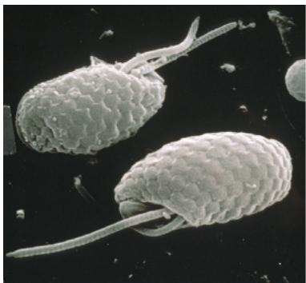

## Concept Check 28.5

1. The White Cliffs of Dover on the southeast coast of England are largely made of calcium carbonate. Which group of phytoplankton could have produced the calcium carbonate that accumulated on the seafloor and was eventually pushed above sea level to form these cliffs?

2. Why would a newly described group such as Provora be immediately assigned to a new eukaryotic supergroup? Explain what that means in terms of when this group diverged from other eukaryotic organisms.

For suggested answers, see Appendix A.

# Concept 28.6: Protists play key roles in ecological communities

Most protists are aquatic, and they are found almost anywhere there is water, including moist terrestrial habitats such as damp soil and leaf litter. In oceans, ponds, and lakes, many protists are bottom-dwellers that attach to rocks and other substrates or creep through the sand and silt. Other protists are important constituents of plankton. We'll focus here on two key roles that protists play in the varied habitats in which they live: that of symbiont and that of producer.

## Symbiotic Protists

Many protists form symbiotic associations with other species. For example, photosynthetic dinoflagellates are food-providing symbiotic partners of the animals (coral polyps) that build coral reefs. Coral reefs are highly diverse ecological communities. That diversity ultimately depends on corals—and on the mutualistic protists that nourish them. Corals support reef diversity by providing food to some species and habitat to many others.

Another example is the wood-digesting protists that inhabit the gut of many termite species (Figure 28.29). Unaided, termites cannot digest wood, and they rely on protistan or prokaryotic symbionts to do so. Termites cause over \$3.5 billion in damage annually to wooden homes in the United States.

Symbiotic protists also include parasites that have compromised the economies of entire countries. Consider the malaria-causing protist Plasmodium: Income levels in countries hard hit by malaria are 33% lower than in similar countries free of the disease. Protists can have devastating effects on other species too. Massive fish kills have been attributed to Pfiesteria shumwayae (see Figure 28.13), a dinoflagellate parasite that attaches to its victims and eats their skin. Among species that parasitize plants, the stramenopile Phytophthora ramorum (an oomycete) has emerged as a major new forest pathogen. This species causes sudden oak death (SOD), a disease that has

This organism is a hypermastigote, a member of a group of parabasalids that live in the gut of termites and certain cockroaches and enable the hosts to digest wood (SEM).

Figure 28.29 A symbiotic protist.  
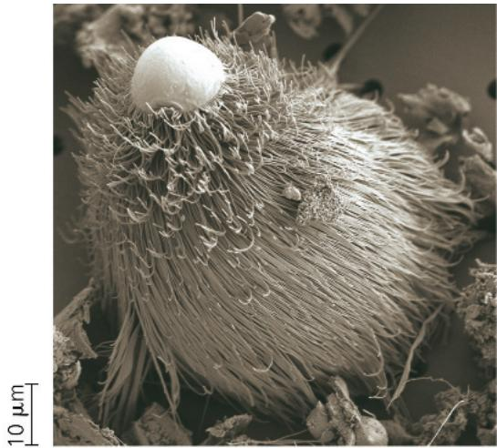

Figure 28.30 Sudden oak death.  
Many dead oak trees are visible in this Monterey County, California landscape. Infected trees lose their ability to adjust to cycles of wet and dry weather.  
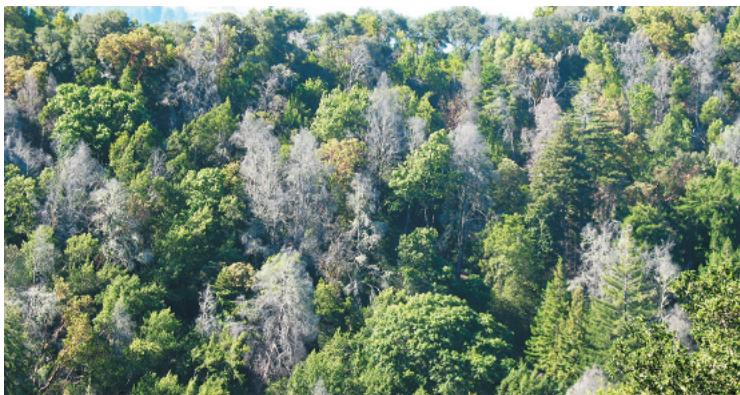

killed millions of oaks and other trees in the United States and Great Britain (Figure 28.30; also see Concept 54.5).

## Photosynthetic Protists

Many protists are important producers, organisms that use energy from light (or in some prokaryotes, inorganic chemicals) to convert $\mathrm{CO}_{2}$ to organic compounds. Producers form the base of ecological food webs. In aquatic communities, the main producers are photosynthetic protists and prokaryotes (Figure 28.31). All other organisms in the community are consumers that depend on producers for food, either directly (by eating them) or indirectly (by eating an organism that ate a producer). Scientists estimate that roughly $30\%$ of the world's photosynthesis is performed by diatoms, dinoflagellates, multicellular algae, and other aquatic protists. Photosynthetic prokaryotes contribute another $20\%$ , and plants are responsible for the remaining $50\%$ .

Figure 28.31 Protists: key producers in aquatic communities. Arrows in this simplified food web lead from food sources to the organisms that eat them.  
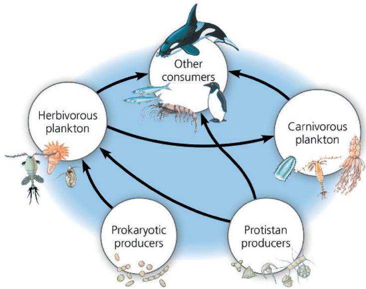

Because producers form the foundation of food webs, factors that affect producers can dramatically affect their entire community. In aquatic environments, photosynthetic protists are often held in check by low concentrations of nitrogen, phosphorus, or iron. Various human actions can increase the concentrations of these elements in aquatic communities. For example, when fertilizer is applied to a field, some of the fertilizer may be washed by rainfall into a river that drains into a lake or ocean. When people add nutrients to aquatic communities in this or other ways, the abundance of photosynthetic protists can increase spectacularly. Such increases can have major ecological consequences, including the formation of large “dead zones” in marine ecosystems (see Figure 56.23).

A pressing question is how global warming will affect photosynthetic protists and other producers. As shown in Figure 28.32, the growth and biomass of photosynthetic protists and prokaryotes have declined in many ocean regions as sea surface temperatures have increased. By what mechanism do rising sea surface temperatures reduce the growth of marine producers? One hypothesis relates to the rise or upwelling of cold, nutrient-rich waters from below. Many marine producers rely on nutrients brought to the surface in this way. However, rising sea surface temperatures can cause the formation of a layer of less dense, warmer water that acts as a barrier to nutrient upwelling from deeper water—thus reducing the growth of marine producers. If sustained, the changes shown in Figure 28.32 would likely have far-reaching effects on marine ecosystems, fishery yields, and the global carbon cycle (see Figure 55.14). Global warming can also affect producers on land, but there the base of food webs is occupied not by protists but by plants, which we will discuss in Chapters 29 and 30.

Figure 28.32 Effects of climate change on marine producers.  
  
(a) Researchers studied 10 ocean regions, identified with letters on the map [see (b) for the corresponding names]. SSTs have increased since 1950 in most areas of these regions.

## Concept Check 28.6

1. Justify the claim that photosynthetic protists are among the biosphere's most important organisms.

2. Describe three symbioses that include protists.

3. WHAT IF? High water temperatures and pollution can cause corals to expel their dinoflagellate symbionts. How might such "coral bleaching" affect corals and other species?

  
(b) The concentration of chlorophyll, an index for the biomass and growth of marine producers, has decreased over the same time period in most ocean regions.

4. MAKE CONNECTIONS The bacterium Wolbachia is a symbiont that lives in mosquito cells and spreads rapidly through mosquito populations. Wolbachia can make mosquitoes resistant to infection by Plasmodium; researchers are seeking a strain that confers resistance and does not harm mosquitoes. Compare evolutionary changes that could occur if malaria control is attempted using such a Wolbachia strain versus using insecticides to kill mosquitoes. (Review Figure 28.18 and Concept 23.4.)

For suggested answers, see Appendix A.

## Chapter 28 Review

## Summary of Key Concepts

To review key terms, go to the Vocabulary Self-Quiz (eTextbook only).

## Concept 28.1: Most eukaryotes are single-celled organisms

\- Eukarya includes many groups of protists, along with plants, animals, and fungi. Unlike prokaryotic organisms, protists and other eukaryotes have a nucleus and other membrane-enclosed organelles, as well as a cytoskeleton that enables them to have asymmetric forms and to change shape as they feed, move, or grow.

\- Protists are structurally and functionally diverse and have a wide variety of life cycles. Most are unicellular. Protists include photoautotrophs, heterotrophs, and mixotrophs.

\- Current evidence indicates that eukaryotes originated by endosymbiosis when an archaeal host cell engulfed an alpha proteobacterium that would evolve into an organelle found in all eukaryotes, the mitochondrion.

\- Plastids are thought to be descendants of cyanobacteria that were engulfed by early eukaryotic cells. The plastid-bearing lineage eventually evolved into red algae and green algae. Other protist groups evolved from secondary endosymbiotic events in which red algae or green algae were themselves engulfed.

\- Eukaryotes are currently grouped into 8–10 supergroups. Three well-established supergroups are SAR, Archaeplastida, and Amorphea. Our understanding of the eukaryotic tree of life has changed substantially with molecular data, and will continue to shift in the coming years as new data become available.

Describe similarities and differences between protists and other eukaryotes.

<table><tr><td>Key Concept/Eukaryote Supergroup</td><td>Major Groups</td><td>Key Morphological Characteristics</td><td>Specific Examples</td></tr><tr><td>CONCEPT 28.2SAR is a highly diverse group of protists defined by DNA similarities? Although they are not photosynthetic, apicomplexan parasites such as Plasmodium have modified plastids. Describe a current hypothesis that explains this observation.</td><td>StramenopilesDiatomsOomycetesBrown algaeAlveolatesDinoflagellatesApicomplexansCiliatesRhizariansRadiolariansForamsCercozoans</td><td>Hairy and smooth flagellaMembrane-enclosed sacs (alveoli) beneath plasma membraneAmoebas with threadlike pseudopodia</td><td>PhytophthoiLaminaria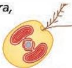Pfiesteria,Plasmodium, ParameciumGlobigerina[IMAGE]</td></tr><tr><td>CONCEPT 28.3Red algae and green algae are the closest relatives of plants? On what basis do systematists place plants in the same supergroup (Archaeplastida) as red and green algae?</td><td>Red algaeGreen algaePlants</td><td>Phycoerythrin (photosynthetic pigment)Plant-type chloroplasts(See Chapters 29 and 30.)</td><td>Porphyridium, PalmariaChlamydomonas, Ulva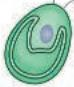Mosses, ferns, conifers, flowering plants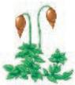</td></tr><tr><td>CONCEPT 28.4Amorpheans include protists that are closely related to fungi and animals? Describe a key feature for each of the main protist subgroups of Amorphea.</td><td>AmoebozoansTubulinidsSlime moldsArchamoebasOpisthokonts</td><td>Amoebas with lobe-shaped or tube-shaped pseudopodia(Highly variable; see Chapters 31–34.)</td><td>Amoeba, DictyosteliumChoanoflagellates, nucleariids, animals, fungi[IMAGE]</td></tr><tr><td>CONCEPT 28.5Phylogenomic research has identified new supergroups and led to the rearrangement of the eukaryotic tree of life</td><td>MetamonodaDiscobaHaptophytaCryptophyta</td><td>Anaerobic flagellated VariedCalcareous coccoliths on surfaceUnicellular algae with two flagella</td><td>Giardia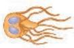EuglenaEmilianiaCryptomona</td></tr></table>

## Concept 28.6: Protists play key roles in ecological communities

\- Protists form mutualistic and parasitic relationships that affect their symbiotic partners and many other members of the community.

\- Photosynthetic protists are among the most important producers in aquatic communities. Because they are at the base of the food web, factors that affect photosynthetic protists affect many other species in the community.

Describe several protists that are ecologically important.

For suggested answer, see Appendix A.

## Test Your Understanding

For more multiple-choice questions, go to the Practice Test (eTextbook only).

## Levels 1-2: Remembering/Understanding

1. Plastids that are surrounded by more than two membranes are evidence of

(A) evolution from mitochondria.

(B) fusion of plastids.

(C) origin of the plastids from archaea.

(D) secondary endosymbiosis.

2. Biologists think that endosymbiosis gave rise to mitochondria before plastids partly because

(A) the products of photosynthesis could not be metabolized without mitochondrial enzymes.

(B) all eukaryotes have mitochondria (or their remnants), whereas many eukaryotes do not have plastids.

(C) mitochondrial DNA is less similar to prokaryotic DNA than is plastid DNA.

(D) without mitochondrial $CO_{2}$ production, photosynthesis could not occur.

3. Which group is correctly paired with its description?

(A) diatoms—important consumers in aquatic communities

(B) kelp and other seaweeds—plants that carry out chemosynthesis

(C) apicomplexans—producers with intricate life cycles

(D) red algae—acquired plastids by secondary endosymbiosis

4. According to the phylogeny presented in this chapter, which protists are in the same eukaryotic supergroup as plants?

(A) green algae

(B) dinoflagellates

(C) red algae

(D) both A and C

5. In a life cycle with alternation of generations, multicellular haploid forms alternate with

(A) unicellular haploid forms.

(B) unicellular diploid forms.

(C) multicellular haploid forms.

(D) multicellular diploid forms.

## Levels 3-4: Applying/Analyzing

6. Based on the phylogenetic tree in Figure 28.6, which of the following statements is correct?

(A) Excavata and SAR form a sister group.

(B) The most recent common ancestor of SAR is older than that of Amorphea.

(C) The first eukaryotic supergroup to diverge from other eukaryotes cannot be determined with available data.

(D) Excavata is a clear monophyletic group supported by molecular data.

7. EVOLUTION CONNECTION • DRAW IT Medical researchers seek to develop drugs that can kill or restrict the growth of human pathogens yet have few harmful effects on patients. These drugs often work by disrupting the metabolism of the pathogen or by targeting its structural features.

Draw and label a phylogenetic tree that includes an ancestral prokaryote and the following groups of organisms: Excavata, SAR, Archaeplastida, Amorphea, Haptophyta,

Cryptophyta, and, within Amorphea, amoebozoans, animals, choanoflagellates, fungi, and nucleariids. Based on this tree, hypothesize whether it would be most difficult to develop drugs to combat human pathogens that are prokaryotic organisms, protists, animals, or fungi. (You do not need to consider the evolution of drug resistance by the pathogen.)

## Levels 5-6: Evaluating/Creating

8. SCIENTIFIC INQUIRY Applying the "If... then" logic of deductive reasoning (see Concept 1.3), what are a few of the predictions that arise from the hypothesis that plants evolved from green algae? Put another way, how could you test this hypothesis?

9. WRITE ABOUT A THEME: INTERACTIONS Organisms interact with each other and the physical environment. In a short essay (100–150 words), explain how the response of diatom populations to a drop in nutrient availability can affect both other organisms and aspects of the physical environment (such as carbon dioxide concentrations).

## 10. SYNTHESIZE YOUR KNOWLEDGE

This micrograph shows a single-celled eukaryote, the ciliate Didinium (left), about to engulf its Paramecium prey, which is also a ciliate. Identify the eukaryotic supergroup to which ciliates belong and describe the role of endosymbiosis in the evolutionary history of that supergroup. Are these ciliates more closely related to all other protists than they are to plants, fungi, or animals? Explain.

For selected answers, see Appendix A.

Seedless vascular plants (such as ferns)

Seed plants (cone-bearing plants and flowering plants)

# Plant Diversity I: How Plants Colonized Land

## Key Concepts

29.1 Plants evolved from green algae

29.2 Mosses and other nonvascular plants have life cycles dominated by gametophytes

29.3 Ferns and other seedless vascular plants were the first plants to grow tall

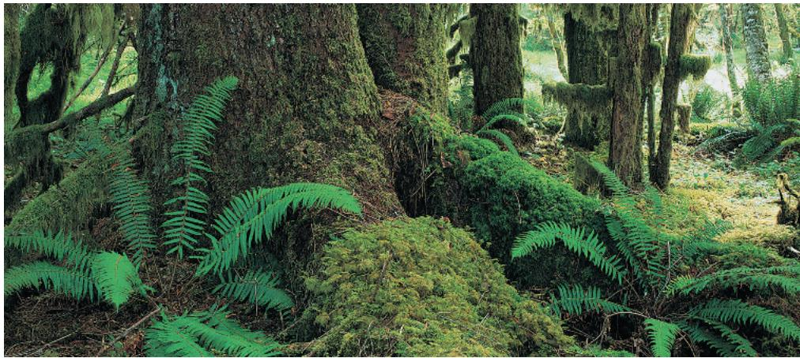  
Figure 29.1 For much of Earth's history, the land surface was largely lifeless. Some prokaryotes lived on land 3.2 billion years ago, but it was only within the last 500 million years that small plants, fungi, and animals joined them ashore. Finally, by 385 million years ago, the first forests appeared (but with different species than those of today).

## Study Tip

What were the major developments in the evolution of plants?

Make a table: As you read the chapter, make a table of adaptations for life on land that evolved in plants after they diverged from their close aquatic relatives, a group of charophyte algae.

<table><tr><td>Adaptation</td><td>Description</td><td>How it facilitates life on land</td></tr><tr><td>Cuticle</td><td>Waxy covering on outer body surface</td><td>Reduces dessication</td></tr><tr><td></td><td></td><td></td></tr></table>

Plants originated from green algae about 470 million years ago.

By 425 million years ago, some early plants had traits facilitating life on land.

Over time, early plants gave rise to a rich diversity of plants.

## Concept 29.1: Plants evolved from green algae

Today, there are more than 325,000 known plant species. Although a few plant species returned to aquatic habitats during their evolution, most present-day plants live on land. In this text, we distinguish plants from algae, which are photosynthetic protists.

Plants enabled other life-forms to survive on land. For example, plants supply oxygen and are a key source of food for terrestrial animals. Also, by their very presence, plants such as the trees of a forest physically create the habitats required by animals and many other organisms.

As you read in Concept 28.4, green algae called charophytes are the closest relatives of plants. We'll begin with a closer look at the evidence for this relationship.

## Evidence of Algal Ancestry

Many key traits of plants are found in some algae. For example, plants are multicellular, eukaryotic, photosynthetic autotrophs, as are brown, red, and certain green algae. Plants have cell walls made of cellulose, and so do green algae, dinoflagellates, and brown algae. And chloroplasts with chlorophylls a and b are present in green algae, euglenids, and a few dinoflagellates, as well as in plants.

However, the charophytes are the only present-day algae that share certain distinctive traits with plants, suggesting that they are the closest living relatives of plants. For example, the cells of both plants and charophytes have distinctive circular rings of proteins embedded in the plasma membrane (Figure 29.2); these protein rings synthesize the cellulose found in the cell wall. In contrast, noncharophyte algae have linear sets of proteins that synthesize cellulose. Likewise, in species of plants that have flagellated sperm, the structure of the sperm closely resembles that of charophyte sperm. Analyses of

Figure 29.2 Rings of cellulose-synthesizing proteins. (inverted-contrast TEM)  

Figure 29.3 Zygnema, an alga closely related to plants.
Zygnema is a filamentous pond alga in the Zygnematophyceae, the group of charophytes that is most closely related to plants.  
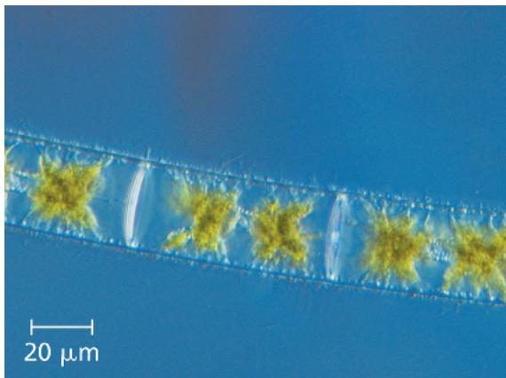

nuclear, chloroplast, and mitochondrial DNA also support the close relationship between plants and charophytes.

More specifically, a recent analysis of nearly 900 protein-coding nuclear genes found that charophytes in the clade Zygnematophyceae—such as Zygnema—are the closest living relatives of plants (Figure 29.3). Although this evidence shows that plants arose from within a group of charophyte algae, it does not mean that plants are descended from these living algae. Even so, present-day charophytes may tell us something about the algal ancestors of plants.

## Adaptations Enabling the Move to Land

Many species of charophyte algae inhabit shallow waters around the edges of ponds and lakes, where they are subject to occasional drying. In such environments, natural selection favors individual algae that can survive periods when they are not submerged. In charophytes, a layer of a durable polymer called sporopollenin prevents exposed zygotes from drying out. A similar chemical adaptation is found in the tough sporopollenin walls that encase plant spores. (Note that a plant spore—unlike a seed—is a haploid reproductive cell that can develop into a new haploid organism, as you'll read more about shortly.)

The accumulation of such traits by at least one population of charophyte algae (now extinct) enabled their descendants—the first plants—to live permanently above the waterline. This ability opened a new frontier: a terrestrial habitat that offered enormous benefits. The bright sunlight was unfiltered by water and plankton; the atmosphere offered more plentiful carbon dioxide than did water; and the soil by the water's edge was rich in some mineral nutrients. But these benefits were accompanied by challenges: a relative scarcity of water and a lack of structural support against gravity. (To appreciate why such support is important, picture how the soft body of a jellyfish (jelly) collapses when waves strand it on a beach.) Plants diversified as new adaptations arose that enabled them to thrive despite these challenges.

Figure 29.4 Three possible “plant” kingdoms, the clades Viridiplantae, Streptophyta, and Plantae.  
  
Figure 29.6 Sporophytes and sporangia of a moss in the genus Mnium.

Today, what adaptations are unique to plants? The answer depends on where you draw the boundary dividing plants from algae (Figure 29.4). Since the placement of this boundary is the subject of ongoing debate, this text uses a traditional definition that equates the kingdom Plantae with embryophytes (plants with embryos). In this context, let's now examine the derived traits that separate plants from their closest algal relatives.

## Derived Traits of Plants

Several adaptations that facilitate survival and reproduction on dry land emerged after plants diverged from their algal relatives. Examples of such traits that are found in plants but not in charophyte algae include the following:

\- Alternation of generations. This type of life cycle, consisting of multicellular forms that give rise to each other in turn, is described in Figure 29.5 on the facing page.

\- Walled spores produced in sporangia. The sporophyte stage of the plant life cycle has multicellular organs called sporangia (singular, sporangium) that produce spores (Figure 29.6). The polymer sporopollenin makes the walls of these spores resistant to harsh environments, enabling plant spores to be dispersed through dry air without harm.

\- Apical meristems. Plants also differ from their algal relatives in having apical meristems, localized regions of cell division at the tips of roots and shoots (Figure 29.7). Apical meristem cells can divide throughout the plant's life, enabling its roots and shoots to elongate, thus increasing the plant's exposure to environmental resources.

Additional derived traits that relate to terrestrial life have evolved in many plant species. For example, the epidermis in many species has a covering, the cuticle, which consists of wax and other polymers. Permanently exposed to the air, plants run a far greater risk of desiccation (drying out) than do their algal

Each of the many spores produced by a sporangium is encased by a durable, sporopollenin-enriched wall.

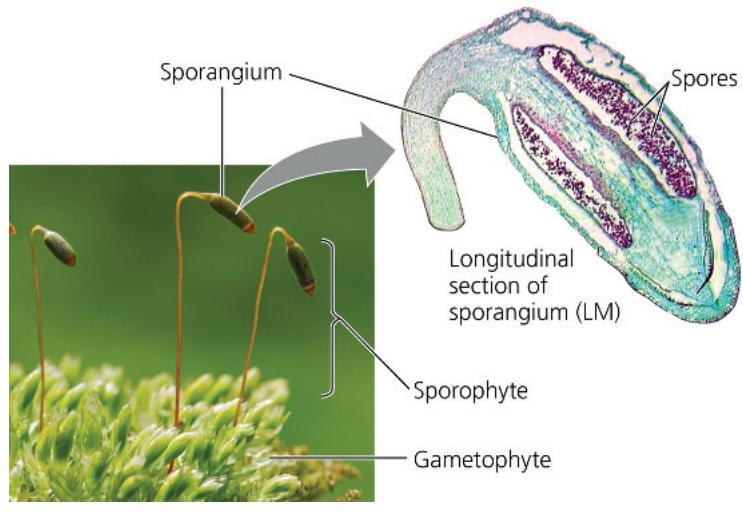  
Figure 29.7 Apical meristem of a plant shoot.  
Cells produced by apical meristems differentiate into the outer epidermis, which protects the body, and various types of internal tissues, such as those in leaves (LM).

relatives. The cuticle acts as waterproofing, helping prevent excessive water loss from the aboveground plant organs, while also providing some protection from microbial attack. Most plants also have specialized pores called stomata (singular, stoma), which support photosynthesis by allowing the exchange of $CO_{2}$ and $O_{2}$ between the outside air and the plant (see Figure 10.3). Stomata are also the main avenues by which water evaporates from the plant; in hot, dry conditions, the stomata close, minimizing water loss.

The earliest plants lacked true roots and leaves. Without roots, how did these plants absorb nutrients from the soil? Fossils

## Exploring Alternation of Generations

## Figure 29.5

Charophyte algae lack the key traits of plants described in this figure: alternation of generations and the associated trait of multicellular, dependent embryos. As described in the main text, charophyte algae also lack walled spores produced in sporangia and apical meristems. This suggests that these four traits were absent in the ancestor common to plants and charophytes but instead evolved as derived traits of plants. Not every plant exhibits all of these traits: Certain lineages of plants have lost some traits over time.

## Alternation of Generations

The life cycles of all plants alternate between two generations of distinct multicellular organisms: gametophytes and sporophytes. As shown in the diagram below (using a fern as an example), each generation gives rise to the other, a process that is called alternation of generations. This type of reproductive cycle evolved in various groups of algae but does not occur in the charophytes, the algae most closely related to plants. Take care not to confuse the

includes both multicellular haploid organisms and multicellular diploid organisms. The multicellular haploid gametophyte (“gamete-producing plant”) is named for its production by mitosis of haploid gametes—eggs and sperm—that fuse during fertilization, forming diploid zygotes. Mitotic division of the zygote produces a multicel-

alternation of generations in plants with the haploid and diploid stages in the life cycles of other sexually reproducing organisms. Alternation of generations is distinguished by the fact that the life cycle

lular diploid sporophyte (“spore-producing plant”). Meiosis in a mature sporophyte produces haploid spores,

## Multicellular, Dependent Embryos

As part of a life cycle with alternation of generations, multicellular plant embryos develop from zygotes that are retained within the tissues of the female parent (a gametophyte). The parental tissues protect the developing embryo from harsh environmental conditions and provide nutrients such as sugars and amino acids. The embryo has specialized placental transfer cells that enhance the transfer of nutrients to the embryo through elaborate ingrowths of the wall surface (plasma membrane and cell wall). The multicellular, dependent embryo of plants is such a significant derived trait that plants are also known as embryophytes.

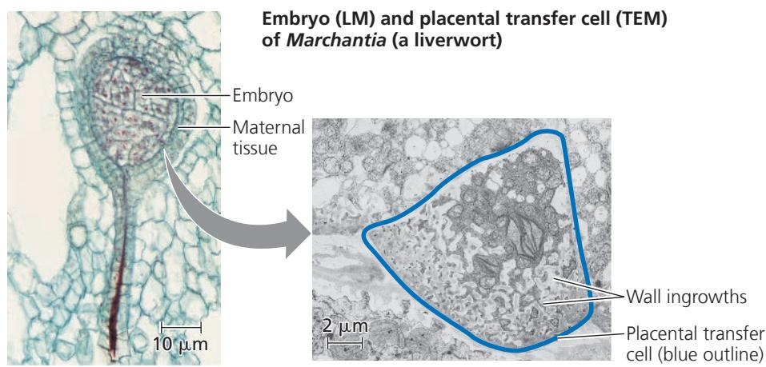

dating from 405 million years ago reveal an adaptation that may have aided early plants in nutrient uptake: They formed symbiotic associations with fungi. We'll explore these associations, called mycorrhizae, and their benefits to both plants and fungi in more detail in Concept 31.1. For now, the main point is that mycorrhizal fungi form extensive networks of filaments through the soil and transfer nutrients to their symbiotic plant partner. This benefit may have helped plants without roots to colonize land.

## The Origin and Diversification of Plants

The algae most closely related to plants include many unicellular species and small colonial species. Since it is likely that the first plants were similarly small, the search for the earliest fossils of plants has focused on the microscopic world. As mentioned earlier, microorganisms colonized land as early as 3.2 billion years ago. But the microscopic fossils that document life on land changed dramatically 470 million years ago with the appearance of spores from early plants.

What distinguishes these spores from those of algae or fungi? One clue comes from their chemical composition, which matches the composition of plant spores today but differs from that of the spores of other organisms. In addition, the walls of these ancient spores have structural features that today are found only in the spores of certain plants (liverworts). And in rocks dating to 450 million years ago, researchers have discovered similar spores embedded in plant cuticle material that resembles spore-bearing tissue in living plants (Figure 29.8).

Fossils of larger plant structures, such as the Cooksonia sporangium in Figure 29.9, date to at least 425 million years ago, which is 45 million years after the appearance of plant spores in the fossil record. While the precise age (and form) of the first plants has yet to be discovered, those ancestral species gave rise to the vast diversity of living plants. Table 29.1 provides basic information about the ten extant phyla. (Extant lineages are those that have surviving members.) As you read the rest of this section, look at Table 29.1 together with Figure 29.10, which reflects a view of plant phylogeny that is based on plant anatomy, biochemistry, and genetics.

One way to distinguish groups of plants is whether or not they have an extensive system of vascular tissue, cells joined into tubes that transport water and nutrients throughout the plant body. Most present-day plants have a complex vascular tissue system and are therefore called vascular plants. Plants that do not have an extensive transport system—liverworts, mosses, and hornworts—are described as “nonvascular” plants, even though some mosses do have simple vascular tissue. Nonvascular plants are often called bryophytes (from the Greek bryon, moss, and phyton, plant). While the early branching of the plant phylogenetic tree is an active area of research, many recent studies based on molecular data indicate that the bryophytes likely form a monophyletic group (clade).

Vascular plants, which form a clade that comprises about 93% of all extant plant species, can be categorized further into

Figure 29.8 Ancient plant spores and tissue.
(colorized SEMs)

(a) Fossilized spores. The chemical composition and the physical structure of the walls of these 450-million-year-old spores match those found in certain plants today.

(b) Fossilized sporophyte tissue. The spores in (a) were embedded in tissue that appears to be from plants.

Figure 29.9 Cooksonia sporangium fossil.

With the exception of the shape of its sporangia, Cooksonia's overall form was very similar to the early plant shown in Figures 29.1 and 29.16.

smaller clades. Two of these clades are the lycophytes (the club mosses and their relatives) and the monilophytes (ferns and their relatives). The plants in each of these clades lack seeds, which is why collectively the two clades are informally called seedless vascular plants. However, notice in Figure 29.10 that, seedless vascular plants do not form a clade.

A group such as the seedless vascular plants represents a collection of organisms that share key biological features. It can be informative to group organisms according to their features, such as having a vascular system but lacking seeds. But members of such a group, unlike members of a clade, do not necessarily share the same ancestry. For example, even though monilophytes and lycophytes are all seedless vascular plants, monilophytes share a more recent common ancestor with seed plants. As a result, we would expect monilophytes and seed plants to share key traits not found in lycophytes—and they do, as you'll read in Concept 29.3.

Table 29.1 Ten Phyla of Extant Plants

<table><tr><td></td><td>Common Name</td><td>Number of Known Species</td></tr><tr><td colspan="3">Nonvascular Plants (Bryophytes)</td></tr><tr><td>Phylum Hepatophyta</td><td>Liverworts</td><td>9,000</td></tr><tr><td>Phylum Bryophyta</td><td>Mosses</td><td>13,000</td></tr><tr><td>Phylum Anthocerophyta</td><td>Hornworts</td><td>225</td></tr><tr><td colspan="3">Vascular Plants</td></tr><tr><td colspan="3">Seedless Vascular Plants</td></tr><tr><td>Phylum Lycophyta</td><td>Lycophytes</td><td>1,200</td></tr><tr><td>Phylum Monilophyta</td><td>Monilophytes</td><td>12,000</td></tr><tr><td colspan="3">Seed Plants</td></tr><tr><td colspan="3">Gymnosperms</td></tr><tr><td>Phylum Ginkgophyta</td><td>Ginkgo</td><td>1</td></tr><tr><td>Phylum Cycadophyta</td><td>Cycads</td><td>350</td></tr><tr><td>Phylum Gnetophyta</td><td>Gnetophytes</td><td>75</td></tr><tr><td>Phylum Coniferophyta</td><td>Conifers</td><td>600</td></tr><tr><td colspan="3">Angiosperms</td></tr><tr><td>Phylum Anthophyta</td><td>Flowering plants</td><td>290,000</td></tr></table>

A third clade of vascular plants consists of seed plants, which represent the vast majority of living plant species. A seed is a diploid embryo packaged with a supply of nutrients inside a protective coat. Seed plants can be divided into two groups, gymnosperms and angiosperms, based on the absence or presence of enclosed chambers in which seeds mature. Gymnosperms (from the Greek gymnos, naked, and sperm, seed) are known as “naked seed” plants because their seeds are not enclosed in chambers. Living gymnosperm species, the most familiar of which are the conifers, form a clade. Angiosperms (from the Greek angion, container) are a huge clade consisting of all flowering plants; their seeds develop inside chambers that originate within flowers. Nearly 90% of living plant species are angiosperms.

Note that the phylogeny depicted in Figure 29.10 focuses only on the relationships between extant plant lineages. Paleobotanists have also discovered fossils belonging to extinct plant lineages. As you'll read later in the chapter, these fossils can reveal intermediate steps in the emergence of plant groups found on Earth today.

## Concept Check 29.1

1. Why do researchers identify the charophytes rather than another group of algae as the closest living relatives of plants?

2. Identify four derived traits that distinguish plants from charophyte green algae and facilitate life on land. Explain.

3. WHAT IF? What would the human life cycle be like if we had alternation of generations? Assume that the multicellular diploid stage would be similar in form to an adult human.

For suggested answers, see Appendix A.

Figure 29.10 Highlights of plant evolution.

The phylogeny shown here illustrates a leading hypothesis about the relationships between plant groups.

  
MAKE CONNECTIONS The figure identifies which lineages are plants, nonvascular plants, vascular plants, seedless vascular plants, and seed plants. According to this phylogenetic tree, which of these categories are monophyletic, and which are paraphyletic? Explain. (See Figure 26.10 to review these terms.) For suggested answer, see Appendix A.

# Concept 29.2: Mosses and other nonvascular plants have life cycles dominated by gametophytes

Nonvascular plants (bryophytes)  
Seedless vascular plants  
Gymnosperms  
Angiosperms

The nonvascular plants (bryophytes) are represented today by three phyla of small, herbaceous (nonwoody)

plants: liverworts (phylum Hepatophyta), mosses (phylum Bryophyta), and hornworts (phylum Anthocerophyta). Liverworts and hornworts are named for their shapes, plus the suffix wort (from the Anglo-Saxon for “herb”). Mosses are familiar to many people, although some plants commonly called “mosses” are not really mosses at all. These include Irish moss (a red seaweed), reindeer moss (a lichen), club mosses (seedless vascular plants), and Spanish mosses (lichens in some regions and flowering plants in others).

Phylogenetic analyses indicate that liverworts, mosses, and hornworts diverged from other plant lineages early in the history of plant evolution (see Figure 29.10). Fossil evidence provides some support for this idea: The earliest spores of plants (dating from 450 to 470 million years ago) have structural features found only in the spores of liverworts, and by 430 million years ago spores similar to those of mosses and hornworts also occur in the fossil record. The earliest fossils of vascular plants date to about 425 million years ago.

Over the long course of their evolution, liverworts, mosses, and hornworts have acquired many unique adaptations. Next, we'll examine some of those features.

## Bryophyte Gametophytes

Unlike in vascular plants, in all three bryophyte phyla the haploid gametophyte is the dominant stage of the life cycle: The gametophytes are usually larger and longer-living than the sporophytes, as shown in the moss life cycle in Figure 29.11 on the facing page. The sporophytes are typically present only part of the time.

When bryophyte spores are dispersed to a favorable habitat, such as moist soil or tree bark, they may germinate and grow into gametophytes. Germinating moss spores, for example, characteristically produce a mass of green, branched, one-cell-thick filaments known as a protonema (plural, protonemata). A protonema has a large surface area that enhances absorption of water and minerals. In favorable conditions, a protonema produces one or more “buds,” each of which develops into a moss gametophyte. (Note that when referring to nonvascular plants, we often use quotation marks for structures similar to the buds, stems, and leaves of vascular plants because the definitions of these terms are based on vascular plant organs.)

Bryophyte gametophytes generally form ground-hugging carpets, partly because their body parts are too thin to support a tall plant. A second constraint on the height of many bryophytes is the absence of vascular tissue, which would enable long-distance transport of water and nutrients. (The thin structure of bryophyte organs makes it possible to distribute materials for short distances without specialized vascular tissue.) However, some mosses have conducting tissues in the center of their “stems.” A few of these mosses can grow as tall as 60 cm (2 feet) as a result. Phylogenetic analyses suggest that conducting tissues similar to those of vascular plants arose independently in these mosses by convergent evolution.

The gametophytes are anchored to the ground by delicate rhizoids, which are long, tubular single cells (in liverworts and hornworts) or filaments of cells (in mosses). Unlike roots, which are found in vascular plant sporophytes, rhizoids lack specialized conducting cells and do not play a primary role in water and mineral absorption.

Gametophytes can form multiple gametangia, multicellular structures that produce gametes and are covered by protective tissue. Female gametangia are called archegonia, and male gametangia are called antheridia. Each archegonium produces one egg, whereas each antheridium produces many sperm. Some bryophyte gametophytes are bisexual, but in mosses the archegonia and antheridia are typically carried on separate female and male gametophytes. Flagellated sperm swim through a film of water toward eggs, entering the archegonia in response to chemical attractants. Eggs are not released but instead remain within the bases of archegonia. After fertilization, embryos are retained within the archegonia. Layers of placental transfer cells help transport nutrients to the embryos as they develop into sporophytes.

Bryophyte sperm typically require a film of water to reach the eggs. Given this requirement, it is not surprising that many

bryophyte species are found in moist habitats. The fact that sperm swim through water to reach the egg also means that in species with separate male and female gametophytes (most species of mosses), sexual reproduction is likely to be more successful when individuals are located close to one another.

Figure 29.12 A moss brood body.

Many bryophyte species can increase the number of individuals in a local area through various methods of asexual reproduction. For example, some mosses reproduce asexually by forming brood bodies, small plantlets that detach from the parent plant and grow into new, genetically identical copies of their parent (Figure 29.12).

## Bryophyte Sporophytes

The cells of bryophyte sporophytes contain plastids that are usually green and photosynthetic when the sporophytes are young. Even so, bryophyte sporophytes cannot live independently. A bryophyte sporophyte remains attached to its parental gametophyte throughout the sporophyte's lifetime, dependent on the gametophyte for supplies of sugars, amino acids, minerals, and water.

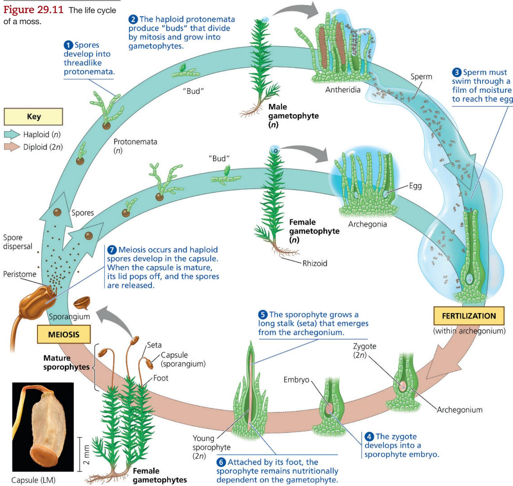  
VISUAL SKILLS In this diagram, does the sperm cell that fertilizes the egg cell differ genetically from the egg? Explain. For suggested answer, see Appendix A.

Bryophytes have the smallest sporophytes of all extant plant groups. A typical bryophyte sporophyte consists of a foot, a seta, and a sporangium. Embedded in the archegonium, the foot absorbs nutrients from the gametophyte. The seta (plural, setae), or stalk, conducts these materials to the sporangium, also called a capsule, which produces spores by meiosis.

Bryophyte sporophytes can produce enormous numbers of spores. A single moss capsule, for example, can generate over 5 million spores. In most mosses, the seta becomes elongated, enhancing spore dispersal by elevating the capsule. Typically, the upper part of the capsule features a ring of interlocking, tooth-like structures known as the peristome (see Figure 29.11). These “teeth” open under dry conditions and close again when it is moist. This allows moss spores to be discharged gradually, via periodic gusts of wind that can carry them long distances.

Moss and hornwort sporophytes are often larger and more complex than those of liverworts. For example, hornwort sporophytes, which superficially resemble grass blades, have a cuticle. Moss and hornwort sporophytes also have stomata, as do all vascular plants (but not liverworts).

Figure 29.13 shows some examples of gametophytes and sporophytes in the bryophyte phyla.

An Anthoceros hornwort species

500 μm

## Exploring Bryophyte Diversity

## Figure 29.13

## Liverworts (Phylum Hepatophyta)

The liver-shaped gametophytes of its members give this phylum its common and scientific names (from the Latin hepaticus, liver). In medieval times, their shape was thought to be a sign that the plants could help treat liver diseases. Some liverworts, including

Thallus

Female gametangia (elevated on stalks)

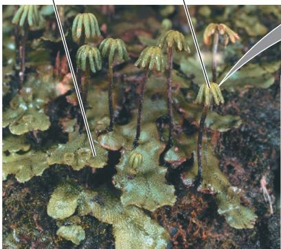  
Gametophytes of Marchantia polymorpha, a "thalloid" liverwort

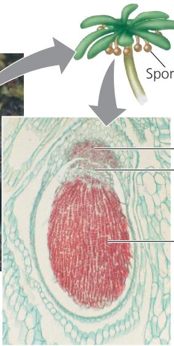  
Sporophyte  
-Foot
-Seta  
Marchantia sporophyte (LM)  
-Capsule (sporangium)

Marchantia, shown here, are described as “thalloid” because of the flattened shape of their gametophytes. Marchantia gametangia are elevated on stalks that look like miniature trees. You would need a magnifying glass to see the sporophytes, which have a short seta (stalk) with an oval or round capsule. Other liverworts, such as Plagiochila, below, are called “leafy” because their stemlike gametophytes have many leaflike appendages. There are many more species of leafy liverworts than thalloid liverworts.

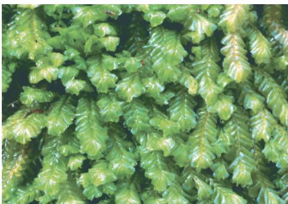  
Plagiochila deltoidea, a "leafy" liverwort

## Hornworts (Phylum Anthocerophyta)

In hornworts, the gametophytes are reduced (usually 1–2 cm in diameter) and mostly leafy-looking, while the sporophyte has a long, tapered shape that gives the phylum its common and scientific names (from the Greek keras, horn). A typical sporophyte can grow to about 5 cm high. Unlike a liver-wort or moss sporophyte, a hornwort sporophyte lacks a seta and consists only of a sporangium. The sporangium releases mature spores by splitting open, starting at the tip of the horn. The gametophytes grow mostly horizontally and often have multiple sporophytes attached. Hornworts are frequently among the first species to colonize open areas with moist soils; a symbiotic relationship with nitrogen-fixing cyanobacteria contributes to their ability to do this (nitrogen is often in short supply in such areas).

Sporophyte

  
Gametophyte

## Mosses (Phylum Bryophyta)

Moss gametophytes, which range in height from less than 1 mm to 60 cm, are less than 15 cm tall in most species. The familiar carpet of moss you observe consists mainly of gametophytes. The blades of their “leaves” are usually only one cell thick, but more complex “leaves” that have ridges coated with cuticle can be found on the common hairy-cap moss (Polytrichum, below) and its close relatives. Moss sporophytes are typically elongated and visible to the naked eye, with heights ranging up to about 20 cm. Though green and photosynthetic when young, they turn tan or brownish red when ready to release spores.

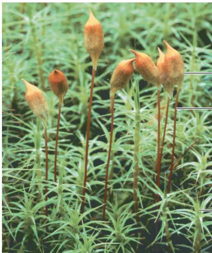  
Polytrichum commune, hairy-cap moss

Capsule

Sporophyte

Gametophyte

## The Ecological and Economic Importance of Mosses

Wind dispersal of lightweight spores has distributed mosses throughout the world. These plants are particularly common and diverse in moist forests and wetlands. Some mosses colonize bare,

## Figure 29.14

## Inquiry: Can bryophytes reduce the rate at which key nutrients are lost from soils? Experiment

Soils in terrestrial ecosystems are often low in nitrogen, a nutrient required for normal plant growth. Richard Bowden, of Allegheny College, measured annual inputs (gains) and outputs (losses) of nitrogen in a sandy soil ecosystem dominated by the moss Polytrichum. Nitrogen inputs were measured from rainfall (dissolved ions, such as nitrate, $NO_{3}^{-}$ ), biological $N_{2}$ fixation, and wind deposition. Nitrogen losses were measured in leached water (dissolved ions, such as $NO_{3}^{-}$ ) and gaseous emissions (such as $N_{2}O$ emitted by bacteria). Bowden measured losses for soils with Polytrichum and for soils where the moss was removed two months before the experiment began.

## Results

A total of 10.5 kg of nitrogen per hectare (kg/ha) entered the ecosystem each year. Little nitrogen was lost by gaseous emissions [0.10 kg/(ha·yr)]. The results of comparing nitrogen losses by leaching are shown below.

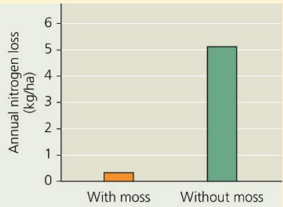

## Conclusion

The moss Polytrichum greatly reduced the loss of nitrogen by leaching in this ecosystem. Each year, the moss ecosystem retained over 95% of the 10.5 kg /ha of total nitrogen inputs (only 0.1 kg /ha and 0.3 kg /ha were lost to gaseous emissions and leaching, respectively).

Data from R. D. Bowden, Inputs, outputs, and accumulation of nitrogen in an early successional moss (Polytrichum) ecosystem, Ecological Monographs 61:207–223 (1991).

WHAT IF? How might the presence of Polytrichum affect plant species that typically colonize the sandy soils after the moss?
For suggested answer, see Appendix A.

sandy soil, where, researchers have found, they help retain nitrogen in the soil (Figure 29.14). In northern coniferous forests, species such as the feather moss Pleurozium harbor nitrogen-fixing cyano-bacteria that increase the availability of nitrogen in the ecosystem. Other mosses inhabit such extreme environments as mountaintops, tundra, and deserts. Many mosses are able to live in very cold or dry habitats because they can survive the loss of most of their body water, then rehydrate when moisture is available. Few vascular plants can survive the same degree of desiccation. Moreover, phenolic compounds in moss cell walls absorb damaging levels of UV radiation present in deserts or at high altitudes.

One wetland moss genus, Sphagnum, or peat moss, is often a major component of deposits of partially decayed organic material known as peat (Figure 29.15a). Boggy regions with thick layers of peat are called peatlands. Sphagnum does not decay readily, in part because of phenolic compounds embedded in its cell walls. The low temperature, pH, and oxygen level of peatlands also inhibit decay of moss and other organisms in these boggy wetlands. As a result, some peatlands have preserved corpses for thousands of years (Figure 29.15b).

Peat has long been a fuel source in Europe and Asia, and it is still harvested for fuel today, notably in Ireland and Canada.

Figure 29.15 Sphagnum, or peat moss: a bryophyte with economic, ecological, and archaeological significance.  
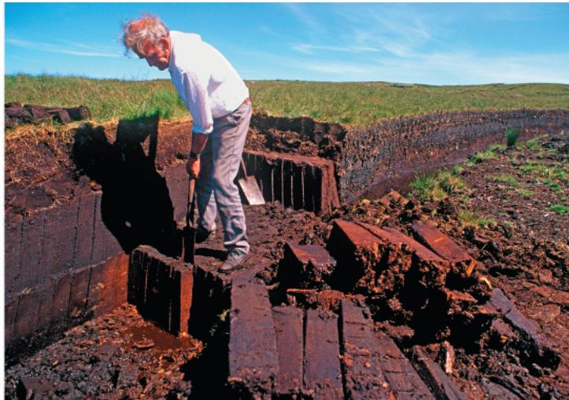  
(a) Peat being harvested from a peatland

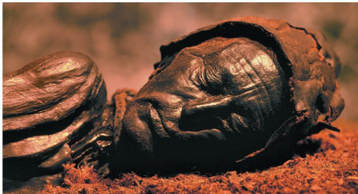  
(b) "Tollund Man," a bog mummy dating from 405–100 BCE. The acidic, oxygen-poor conditions produced by Sphagnum can preserve human or other animal bodies for thousands of years.

Peat moss is also useful as a soil conditioner and for packing plant roots during shipment because it has large dead cells that can absorb roughly 20 times the moss's weight in water.

Peatlands cover just $3\%$ of Earth's land surface but contain one-third of the world's soil carbon: Globally, an estimated 500 billion tons of organic carbon is stored as peat. Current overharvesting of Sphagnum—primarily for use in peat-fired power stations—contributes to global warming by releasing stored $\mathrm{CO}_{2}$ . In addition, if global temperatures continue to rise, the water levels of some peatlands are expected to drop.

Such a change would expose peat to air and cause it to decompose, thereby releasing additional stored $CO_{2}$ and contributing further to global warming. The historical and expected future effects of Sphagnum on the global climate underscore the importance of preserving and managing peatlands.

Mosses may have a long history of affecting climate change. In the Scientific Skills Exercise, you will explore the question of whether they did so during the Ordovician period by contributing to the weathering of rocks.

## Scientific Skills Exercise Making Bar Graphs and Interpreting Data

Could Nonvascular Plants Have Caused Weathering of Rocks and Contributed to Climate Change During the Ordovician Period? The oldest traces of terrestrial plants are fossilized spores formed 470 million years ago. Between that time and the end of the Ordovician period 444 million years ago, the atmospheric $CO_{2}$ level dropped by half, and the climate cooled dramatically.

One possible cause of the drop in $CO_{2}$ during the Ordovician period is the breakdown, or weathering, of rock. As rock weathers, calcium silicate ( $Ca_{2}SiCO_{3}$ ) is released and combines with $CO_{2}$ from the air, producing calcium carbonate ( $CaCO_{3}$ ). Today, the roots of vascular plants increase rock weathering and mineral release by producing acids that break down rock and soil. Although nonvascular plants lack roots, they require the same mineral nutrients as vascular plants. Could nonvascular plants also increase the chemical weathering of rock? If so, they could have contributed to the decline in atmospheric $CO_{2}$ during the Ordovician. In this exercise, you will interpret data from a study of the effects of moss on releasing minerals from two types of rock.

How the Experiment Was Done The researchers set up experimental and control microcosms, or small artificial ecosystems, to measure mineral release from rocks. First, they placed rock fragments of volcanic origin, either granite or andesite, into small glass containers. Then, they mixed water and macerated (chopped and crushed) moss of the species Physcomitrella patens. They added this mixture to the experimental microcosms (72 granite and 41 andesite). For the control microcosms (77 granite and 37 andesite), they filtered out the moss and just added the water. After 130 days, they measured the amounts of

various minerals found in the water in the control microcosms and in the water and moss in the experimental microcosms.

Data from the Experiment The moss grew (increased its biomass) in the experimental microcosms. The table shows the mean amounts in micromoles ( $\mu$ mol) of several minerals measured in the water and the moss in the microcosms.

## INTERPRET THE DATA

1. Why did the researchers add filtrate from which macerated moss had been removed to the control microcosms?

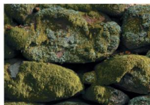

2. Make two bar graphs (for granite and andesite) comparing the mean

amounts of each element weathered from rocks in the control and experimental microcosms. (Hint: For an experimental microcosm, what sum represents the total amount weathered from rocks?) (For additional information on bar graphs, see the Scientific Skills Review in Appendix D.)

3. Overall, what is the effect of moss on chemical weathering of rock? Are the results similar or different for granite and andesite?

4. Based on their experimental results, the researchers added weathering of rock by nonvascular plants to simulation models of the Ordovician climate. The new models predicted decreased $CO_{2}$ levels and global cooling sufficient to produce the glaciations in the late Ordovician period. What assumptions did the researchers make in using results from their experiments in climate simulation models?

5. "Life has profoundly changed the Earth." Explain whether or not these experimental results support this statement.

Instructors: A version of this Scientific Skills Exercise can be assigned in Mastering Biology.

<table><tr><td></td><td colspan="2"> $Ca^{2+}$  (μmol)</td><td colspan="2"> $Mg^{2+}$  (μmol)</td><td colspan="2"> $K^{+}$  (μmol)</td></tr><tr><td></td><td>Granite</td><td>Andesite</td><td>Granite</td><td>Andesite</td><td>Granite</td><td>Andesite</td></tr><tr><td>Mean weathered amount released in water in the control microcosms</td><td>1.68</td><td>1.54</td><td>0.42</td><td>0.13</td><td>0.68</td><td>0.60</td></tr><tr><td>Mean weathered amount released in water in the experimental microcosms</td><td>1.27</td><td>1.84</td><td>0.34</td><td>0.13</td><td>0.65</td><td>0.64</td></tr><tr><td>Mean weathered amount taken up by moss in the experimental microcosms</td><td>1.09</td><td>3.62</td><td>0.31</td><td>0.56</td><td>1.07</td><td>0.28</td></tr></table>

Data from T. M. Lenton et al., First plants cooled the Ordovician, Nature Geoscience 5:86–89 (2012).

## Concept Check 29.2

1. How do bryophytes differ from other plants?

2. Give three examples of how structure fits function in bryophytes.

3. MAKE CONNECTIONS Review the discussion of feedback regulation in Concept 1.1. Could effects of global warming on peatlands alter $CO_{2}$ concentrations in ways that result in negative or positive feedback? Explain.

For suggested answers, see Appendix A.

## Concept 29.3: Ferns and other seedless vascular plants were the first plants to grow tall

Nonvascular plants (bryophytes)
Seedless vascular plants
Gymnosperms
Angiosperms

During the first 100 million years of plant evolution, bryophytes were prominent types of vegetation. But it is vascular plants that dominate

most landscapes today. The earliest fossils of vascular plants date to 425 million years ago. These plants lacked seeds but had well-developed vascular systems, an evolutionary novelty that set the stage for vascular plants to grow taller than their bryophyte counterparts. As in bryophytes, however, the sperm of ferns and all other seedless vascular plants are flagellated and swim through a film of water to reach eggs. In part because of these swimming sperm, seedless vascular plants today are most common in damp environments.

## Origins and Traits of Vascular Plants

Unlike the nonvascular plants, ancient relatives of vascular plants had branched sporophytes that were not dependent on gametophytes for nutrition (Figure 29.16). Although these early plants were less than $20\mathrm{cm}$ tall, their branching enabled their bodies to become more complex and to have multiple sporangia. As plant bodies became more complex over time, competition for space and sunlight probably increased. As we'll see, that competition may have stimulated still more evolution in vascular plants, eventually leading to the formation of the first forests.

Early vascular plants had some derived traits of today's vascular plants, but they lacked roots and some other adaptations that evolved later. The main traits that characterize living vascular plants are life cycles with dominant sporophytes, transport in vascular tissues called xylem and phloem, and well-developed roots and leaves, including spore-bearing leaves called sporophylls.

## Life Cycles with Dominant Sporophytes

As mentioned earlier, mosses and other bryophytes have life cycles dominated by gametophytes (see Figure 29.11). Fossil

Figure 29.16 Sporophytes of Aglaophyton major, an ancient relative of living vascular plants.

This reconstruction from 405-million-year-old fossils exhibits dichotomous (Y-shaped) branching with sporangia at the ends of branches. Sporophyte branching characterizes living vascular plants but is lacking in living nonvascular plants (bryophytes). Aglaophyton had structures called rhizoids that anchored it to the ground. The inset shows a fossilized stoma of A. major (colorized LM).

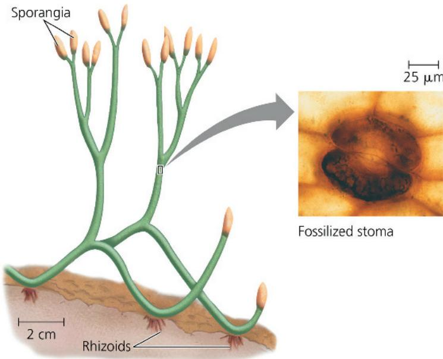

evidence suggests that a change began to develop in some of the earliest vascular plants, whose gametophytes and sporophytes were about equal in size. Further reductions in gametophyte size occurred among extant vascular plants; in these groups, the sporophyte generation is the larger and more complex form in the alternation of generations (Figure 29.17, on the next page). In ferns, for example, the familiar leafy plants are the sporophytes. You would have to get down on your hands and knees and search the ground carefully to find fern gametophytes, which are tiny structures that often grow on or just below the soil surface.

## Transport in Xylem and Phloem

Vascular plants have two types of vascular tissue: xylem and phloem (see Figure 35.10). Xylem conducts most of the water and minerals. The xylem of all vascular plants includes tracheids, tube-shaped cells that carry water and minerals up from the roots. The water-conducting cells of the xylem are dead at functional maturity and are lignified; that is, their cell walls are strengthened by the polymer lignin. The tissue called phloem has cells arranged into tubes that distribute sugars, amino acids, and other organic products; these cells are alive at functional maturity.

Lignified vascular tissue helped enable vascular plants to grow tall. Their stems became strong enough to provide support against gravity, and they could transport water and mineral nutrients high above the ground. Tall plants could also outcompete short plants for access to the sunlight needed for photosynthesis. In addition, the spores of tall plants could disperse farther than those of short plants, enabling tall species to colonize new environments more rapidly. Overall, the ability to grow tall gave

Figure 29.17 The life cycle of a fern.  
  
WHAT IF? If the ability to disperse sperm by wind evolved in a fern, how might its life cycle be affected? For suggested answer, see Appendix A.

vascular plants a competitive edge over nonvascular plants, which typically are less than 5 cm in height. Over time, competition among vascular plants also would have increased, leading to selection for taller growth forms—a process that eventually gave rise to the trees that formed the first forests 385 million years ago.

## Evolution of Roots

Vascular tissue also provides benefits below ground. Instead of the rhizoids seen in bryophytes, roots evolved in the sporophytes of almost all vascular plants. Roots are organs that absorb water and nutrients from the soil. Roots also anchor vascular plants to the ground, hence allowing the shoot system to grow taller.

Root tissues of living plants closely resemble stem tissues of early vascular plants preserved in fossils. This suggests that roots may have evolved from the lowest belowground portions of stems in ancient vascular plants. It is unclear whether roots evolved only once in the common ancestor of all vascular plants or independently in

different lineages. Although the roots of living members of these lineages of vascular plants share many similarities, fossil evidence hints at convergent evolution. The oldest fossils of lycophytes, for example, already displayed simple roots 400 million years ago, when the ancestors of ferns and seed plants still had none. Studying genes that control root development in different vascular plant species may help resolve this question.

## Evolution of Leaves

Leaves are structures that serve as the primary photosynthetic organ of vascular plants. In terms of size and complexity, leaves can be classified as either microphylls or megaphylls (Figure 29.18). All of the lycophytes—and only the lycophytes—have microphylls, which are small, often spine-shaped leaves supported by a single strand of vascular tissue. Almost all other vascular plants have megaphylls, leaves with a highly branched vascular system; a few species have reduced leaves that appear to have evolved from megaphylls. Megaphylls are typically larger than microphylls and therefore support greater photosynthetic productivity than microphylls. Microphylls first appear in the fossil record 410 million years ago, but megaphylls do not emerge until 370 million years ago, toward the end of the Devonian period.

Figure 29.18 Microphyll and megaphyll leaves.  
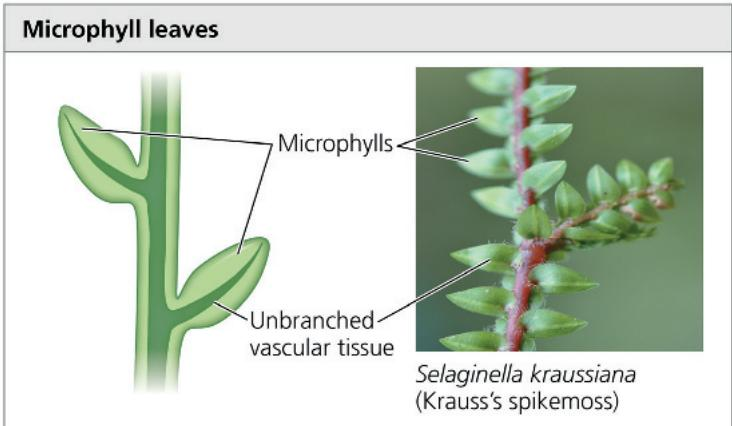

## Sporophylls and Spore Variations

One milestone in the evolution of plants was the emergence of sporophylls, modified leaves that bear sporangia. Sporophylls vary greatly in structure. For example, fern sporophylls produce clusters of sporangia known as sori (singular, sorus), usually on the undersides of the sporophylls (see Figure 29.17). In many lycophytes and in most gymnosperms, groups of sporophylls form cone-like structures called strobili (singular, strobilus). The sporophylls of angiosperms are called carpels and stamens (see Figure 30.8).

Most seedless vascular plant species are homosporous: They have one type of sporophyll bearing one type of sporangium that produces one type of spore, which typically develops into a bisexual gametophyte, as in most ferns. In contrast, a heterosporous species has two types of sporophylls, called megasporophylls and microsporophylls. Megasporophylls have megasporangia, which produce megaspores, spores that develop into female gametophytes. Microsporophylls have microsporangia, which produce microspores, smaller spores that develop into male gametophytes. All seed plants and a few seedless vascular plants are heterosporous. The following diagram compares the two conditions.

Megasporangium on megasporophyll → Megaspore → Female gametophyte → Eggs

## Classification of Seedless Vascular Plants

As we noted earlier, biologists recognize two clades of living seedless vascular plants: the lycophytes (phylum Lycophyta) and the monilophytes (phylum Monilophyta). The lycophytes include the club mosses, the spikemosses, and the quillworts. The monilophytes include the ferns, the horsetails, and the whisk ferns and their relatives. Although ferns, horsetails, and whisk ferns differ greatly in appearance, recent anatomical and molecular comparisons provide convincing evidence that these three groups make up a clade. Accordingly, many systematists now classify them together as the phylum Monilophyta, as we do in this chapter. Others refer to these groups as three separate phyla within a clade. Figure 29.19, on the next page, describes the two main groups of seedless vascular plants.

## Phylum Lycophyta: Club Mosses, Spikemosses, and Quillworts

Present-day species of lycophytes are relicts of a far more impressive past. By the Carboniferous period (359–299 million years ago), the lycophyte evolutionary lineage included small herbaceous plants and giant trees with diameters of more than 2 m and heights of more than 40 m. The giant lycophyte trees thrived for millions of years in moist swamps, but their diversity declined when Earth's climate became drier during the Permian period (299–252 million years ago). The small lycophytes survived, represented today by about 1,200 species. Though some are commonly called club mosses and spikemosses, they are not true mosses (which, as discussed earlier, are nonvascular plants).

## Phylum Monilophyta: Ferns, Horsetails, and Whisk Ferns and Relatives

Ferns radiated extensively from their Devonian origins and grew alongside lycophyte trees and horsetails in the great Carboniferous swamp forests. Today, ferns are by far the most widespread seedless vascular plants, numbering more than 12,000 species. Though most diverse in the tropics, many ferns thrive in temperate forests, and some species are even adapted to arid habitats.

## Exploring Seedless Vascular Plant Diversity

## Figure 29.19

## Lycophytes (Phylum Lycophyta)

Many lycophytes grow on tropical trees as epiphytes, plants that use other plants as a substrate but are not parasites. Other species grow on temperate forest floors. In some species, the tiny gametophytes live above ground and are photosynthetic. Others live below ground, nurtured by symbiotic fungi.

The sporophytes that dominate the lycophyte life cycle have upright stems with many small leaves, as well as ground-hugging stems that produce dichotomously branching roots. Spikemosses are usually relatively small and often grow horizontally. In many club mosses and spikemosses, sporophylls are clustered into club-shaped cones (strobili). Quillworts, named for their leaf shape, form a single genus whose members live in marshy areas or as submerged aquatic plants. Club mosses are all homosporous, whereas spikemosses and quillworts are all heterosporous. The spores of club mosses are released in clouds and are so rich in oil that magicians and photographers once ignited them to create smoke or flashes of light.

Selaginella moellendorffii, a spikemoss

2.5 cm

  
1 cm  
Diphasiastrum tristachyum, a club moss

## Monilophytes (Phylum Monilophyta)

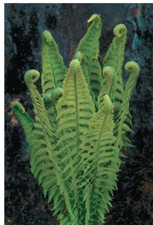  
Matteuccia struthiopteris (ostrich fern)  
2.5 cm

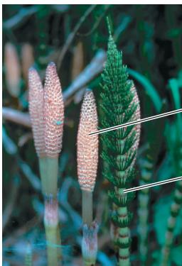  
Equisetum telmateia, giant horsetail  
Strobilus on fertile stem  
— Vegetative stem

  
Psilotum nudum, a whisk fern  
4 cm

## Ferns

Unlike the lycophytes, ferns have megaphylls (see Figure 29.18). The sporophytes typically have horizontal stems that give rise to large leaves called fronds, often divided into leaflets. A frond grows as its coiled tip, the fiddlehead, unfurls.

Almost all species are homosporous. The gametophyte in some species shrivels and dies after the young sporophyte detaches itself. In most species, sporophytes have stalked sporangia with springlike devices that catapult spores several meters. Airborne spores can be carried far from their origin. Some species produce more than a trillion spores in a plant's lifetime.

## Horsetails

The group's name refers to the brushy appearance of the stems, which have a gritty texture that made them historically useful as “scouring rushes” for pots and pans. Some species have separate fertile (cone-bearing) and vegetative stems. Present-day horsetail species are homosporous, with cones releasing spores that typically give rise to bisexual gametophytes.

Horsetails are also called arthrophytes (“jointed plants”) because their stems have joints. Rings of small leaves or branches emerge from each joint, but the stem is the main photosynthetic organ. Large air canals carry oxygen to the roots, which often grow in waterlogged soil.

## Whisk Ferns and Relatives

The sporophytes of whisk ferns (genus Psilotum) have dichotomously branching stems but no roots, similar in appearance to fossils of early vascular plans. Whisk fern stems have scalelike outgrowths that lack vascular tissue and may have resulted from the evolutionary reduction of leaves. Each yellow knob on a stem consists of three fused sporangia. Species of the genus Tmesipteris, closely related to whisk ferns and found only in the South Pacific, also lack roots but have small, leaflike outgrowths in their stems, giving them a vine-like appearance. Both genera are homosporous, with spores giving rise to bisexual gametophytes that grow underground and are only about a centimeter long.

As mentioned earlier, ferns and other monilophytes are more closely related to seed plants than to lycophytes. As a result, monilophytes and seed plants share traits that are not found in lycophytes, including megaphyll leaves and roots that can branch at various points along the length of an existing root. In lycophytes, by contrast, roots branch only at the growing tip of the root, forming a Y-shaped structure.

The monilophytes called horsetails were very diverse during the Carboniferous period, some growing as tall as 15 m. Today, only 15 species survive as a single, widely distributed genus, Equisetum, often found in marshy places and along streams.

Psilotum (whisk ferns) and a closely related genus, Tmesipteris, form a clade consisting mainly of tropical epiphytes. Plants in these two genera, the only vascular plants lacking true roots, once were called “living fossils” because of their resemblance to fossils of ancient relatives of living vascular plants (see Figures 29.16 and 29.19). However, much evidence, including analyses of DNA sequences and sperm structure, indicates that the genera Psilotum and Tmesipteris are closely related to ferns. This

hypothesis suggests that their ancestor's true roots were lost during evolution. Today, plants in these two genera absorb water and nutrients through numerous absorptive rhizoids.

Lycophyte trees

## The Significance of Seedless Vascular Plants

The ancestors of living lycophytes, horsetails, and ferns, along with their extinct seedless vascular relatives, grew to great heights during the Devonian and early Carboniferous, forming the first forests (Figure 29.20). How did their dramatic growth affect Earth and its other life?

One major effect was that early forests contributed to a large drop in $CO_{2}$ levels during the Carboniferous period, causing global cooling that resulted in widespread glacier formation. The trees of early forests contributed to this drop in $CO_{2}$ levels in part by the actions of their roots. The roots of vascular plants secrete acids that break down rocks, thereby increasing the rate at which calcium and magnesium are released from rocks into the soil. These chemicals react with carbon dioxide dissolved in rain water, forming compounds that ultimately wash into the oceans, where they are incorporated into rocks (calcium or magnesium carbonates). The net effect of these processes—which were accelerated by plants—is that $CO_{2}$ removed from the air is stored in marine rocks. Although carbon stored in these rocks can be returned to the atmosphere, it typically takes millions of years for this to occur (as when geological uplift brings the rocks to the surface, exposing them to erosion).

In addition, the seedless vascular plants that formed the first forests eventually became coal, again removing $CO_{2}$ from the atmosphere for long periods of time. In the stagnant waters of

Figure 29.20 Artist's conception of a Carboniferous forest based on fossil evidence.

Lycophyte trees, with trunks covered with small leaves, thrived in the “coal forests” of the Carboniferous, along with giant ferns and horsetails.

  
Fern  
Horsetail

Carboniferous swamps, the dead bodies of early trees did not completely decay. This organic material turned to thick layers of peat, later covered by the sea. Marine sediments piled on top, and over millions of years, heat and pressure converted the peat to coal. In fact, Carboniferous coal deposits are the most extensive ever formed. Coal was crucial to the Industrial Revolution, and people worldwide still burn 6 billion tons a year. It is ironic that coal, formed from plants that contributed to a global cooling, now contributes to global warming by returning carbon to the atmosphere (see Figure 56.29).

Growing along with the seedless plants in Carboniferous swamps were primitive seed plants. Though seed plants were not dominant at that time, they rose to prominence after the swamps began to dry up at the end of the Carboniferous period. The next chapter traces the origin and diversification of seed plants, continuing our story of adaptation to life on land.

## Concept Check 29.3

1. List the key derived traits found in monilophytes and seed plants, but not in lycophytes.

2. How do the main similarities and differences between seedless vascular plants and nonvascular plants affect function in these plants?

3. MAKE CONNECTIONS In Figure 29.17, if fertilization occurred between gametes from one gametophyte, how would this affect the production of genetic variation from sexual reproduction? See Concept 13.4.

## Summary of Key Concepts

To review key terms, go to the Vocabulary Self-Quiz (eTextbook only).

## Concept 29.1: Plants evolved from green algae

\- Morphological and biochemical traits, as well as similarities in nuclear and chloroplast genes, indicate that certain charophyte algae are the closest living relatives of plants.

\- A protective layer of sporopollenin and other traits allow charophytes to tolerate occasional drying along the edges of ponds and lakes. Such traits may have enabled the algal ancestors of plants to survive in terrestrial conditions, opening the way to the colonization of dry land.

\- Derived traits that distinguish plants from charophytes, their closest algal relatives, include cuticles, stomata, multicellular dependent embryos, walled spores produced in sporangia, and the two shown here:

\- Fossils show that plants arose more than 470 million years ago. Subsequently, plants diverged into several major groups, including nonvascular plants (bryophytes); seedless vascular plants, such as lycophytes and ferns; and the two groups of seed plants: gymnosperms and angiosperms.

Draw a phylogenetic tree illustrating our current understanding of plant phylogeny; label the common ancestor of plants and the origins of vascular tissue, apical meristems, and seeds.

## Concept 29.2: Mosses and other nonvascular plants have life cycles dominated by gametophytes

\- Lineages leading to the three extant clades of nonvascular plants, or bryophytes—liverworts, mosses, and hornworts—diverged from other plants early in plant evolution.

\- In bryophytes, the dominant generation consists of haploid gametophytes, such as those that make up a carpet of moss. Rhizoids anchor gametophytes to the substrate on which they grow. The flagellated sperm produced by antheridia require a film of water to travel to the eggs in the archegonia.

\- The diploid stage of the life cycle—the sporophytes—grow out of archegonia and are attached to the gametophytes and dependent on them for nourishment. Smaller and simpler than vascular plant sporophytes, they typically consist of a foot, seta (stalk), and sporangium.

\- Sphagnum, or peat moss, is common in large regions known as peatlands and has many practical uses, including as a fuel.

Summarize the ecological importance of mosses.

## Concept 29.3: Ferns and other seedless vascular plants were the first plants to grow tall

\- Fossils of the forerunners of today's vascular plants date back about 425 million years and show that these small plants had independent, branching sporophytes and a vascular system.

\- Over time, other derived traits of living vascular plants arose, such as a life cycle with dominant sporophytes, lignified vascular tissue, well-developed roots and leaves, and sporophylls.

\- Seedless vascular plants include the lycophytes (phylum Lycophyta: club mosses, spikemosses, and quillworts) and the monilophytes (phylum Monilophyta: ferns, horsetails, and whisk ferns and relatives).

\- Ancient lineages of lycophytes included both small herbaceous plants and large trees. Present-day lycophytes are small herbaceous plants.

\- Seedless vascular plants formed the earliest forests 385 million years ago. Their growth may have contributed to a major global cooling that took place during the Carboniferous period. The decaying remnants of the first forests eventually became coal.

What trait(s) allowed vascular plants to grow tall, and why might increased height have been advantageous?

For suggested answers, see Appendix A.

## Test Your Understanding

For more multiple-choice questions, go to the Practice Test (eTextbook only).

## Levels 1-2: Remembering/Understanding

1. Three of the following are evidence that charophytes are the closest algal relatives of plants. Select the exception.

(A) similar sperm structure

(B) the presence of chloroplasts

(C) similarities in cell wall formation during cell division

(D) genetic similarities in chloroplasts

2. Which of the following characteristics of plants is absent in their closest relatives, the charophyte algae?

(A) chlorophyll b

(B) cellulose in cell walls

(C) sexual reproduction

(D) alternation of multicellular generations

3. In plants, which of the following are produced by meiosis? (A) haploid gametes

(B) diploid gametes

(C) haploid spores

(D) diploid spores

4. Microphylls are found in which plant group?

(A) lycophytes

(B) liverworts

(C) ferns

(D) hornworts

## Levels 3-4: Applying/Analyzing

5. Suppose an efficient conducting system evolved in a moss that could transport water and other materials as high as a tall tree. Which of the following statements about “trees” of such a species would be true?

(A) Spore dispersal distances would probably decrease.

(B) Females could produce only one archegonium.

(C) Unless its body parts were strengthened, such a "tree" would probably flop over.

(D) Individuals would probably compete less effectively for access to light.

6. Identify each of the following structures as haploid or diploid.

(A) sporophyte

(B) spore

(C) gametophyte

(D) zygote

7. EVOLUTION CONNECTION • DRAW IT Draw a phylogenetic tree that represents our current understanding of evolutionary relationships between a moss, a gymnosperm, a lycophyte, and a fern. Use a charophyte alga as the outgroup. (See Figure 26.5 to review phylogenetic trees.) Label each branch point of the phylogeny with at least one derived character unique to the clade descended from the common ancestor represented by the branch point.

## Levels 5-6: Evaluating/Creating

## 8. SCIENTIFIC INQUIRY • INTERPRET THE DATA The

feather moss Pleurozium schreberi harbors species of symbiotic nitrogen-fixing bacteria. Scientists studying this moss in northern forests found that the percentage of the ground surface “covered” by the moss increased from about 5% in forests that burned 35 to 41 years ago to about 70% in forests that burned 170 or more years ago. From mosses growing in these forests, they also obtained the following data on nitrogen fixation:

<table><tr><td>Age (years after fire)</td><td>N fixation rate [kg N/(ha · yr)]</td></tr><tr><td>35</td><td>0.001</td></tr><tr><td>41</td><td>0.005</td></tr><tr><td>78</td><td>0.08</td></tr><tr><td>101</td><td>0.3</td></tr><tr><td>124</td><td>0.9</td></tr><tr><td>170</td><td>2.0</td></tr><tr><td>220</td><td>1.3</td></tr><tr><td>244</td><td>2.1</td></tr><tr><td>270</td><td>1.6</td></tr><tr><td>300</td><td>3.0</td></tr><tr><td>355</td><td>2.3</td></tr></table>

Data from O. Zackrisson et al., Nitrogen fixation increases with successional age in boreal forests, Ecology 85:3327–3334 (2006).

a. Use the data to draw a line graph, with age on the x-axis and the nitrogen fixation rate on the y-axis.

b. Along with the nitrogen added by nitrogen fixation, about 1 kg of nitrogen per hectare per year is deposited into northern forests from the atmosphere as rain and small particles. Evaluate the extent to which Pleurozium affects nitrogen availability in northern forests of different ages.

9. WRITE ABOUT A THEME: INTERACTIONS Giant lycophyte trees had microphylls, whereas ferns and seed plants have megaphylls. Write a short essay (100–150 words) describing how a forest of lycophyte trees may have differed from a forest of large ferns or seed plants. In your answer, consider how the type of forest may have affected interactions among small plants growing beneath the tall ones.

10. SYNTHESIZE YOUR KNOWLEDGE

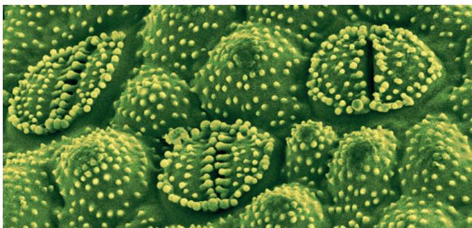  
These stomata are from the leaf of a common horsetail. Describe how stomata and other adaptations facilitated life on land and ultimately led to the formation of the first forests.  
For selected answers, see Appendix A.

# Plant Diversity II: The Evolution of Seed Plants

## Key Concepts

30.1 Seeds and pollen grains are key adaptations for life on land

30.2 Gymnosperms bear "naked" seeds, typically on cones

30.3 The reproductive adaptations of angiosperms include flowers and fruits

30.4 Human welfare depends on seed plants

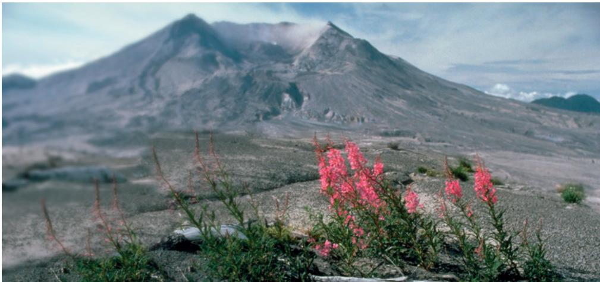  
Figure 30.1 In 1980, Mount St. Helens in Washington state erupted, leaving the region covered in ash and devoid of visible life. Just a few years later, seed plants such as fireweed (Chamerion angustifolium) had already colonized the barren landscape—an example of seed plants' versatility and success as the dominant producers on land.

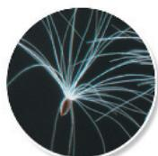  
Fireweed seed

## Study Tip

Make flowcharts: Make simple flowcharts showing the main events in the life cycles of a pine and flowering plant. The example shown is the beginning of a flowchart summarizing the pine life cycle.

Pollen grain is released from a pollen cone

Pollen grain reaches an ovule and forms a pollen tube

## What adaptations have enabled seed plants to make up the vast majority of plant biodiversity?

Reduced male and female gametophytes develop within parental sporophytes, protected from environmental stresses.

Pollen protects male gametophytes (which produce sperm) and can be transported by wind or animals.

In gymnosperms, the gametophytes develop within cones.

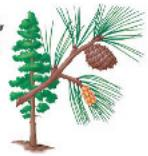

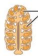

Ovules protect female gametophytes (which produce eggs).

In angiosperms, the gametophytes develop within flowers.

Pollen-producing structures

Pollen-producing structures

  
An ovule fertilized by pollen develops into a seed.

## Embryo

\- Seed coat (protects embryo)
- Food supply (nourishes embryo)

# Concept 30.1: Seeds and pollen grains are key adaptations for life on land

Fireweed and other early arrivals reached the blast zone in Figure 30.1 as seeds. A seed consists of an embryo and its food supply, surrounded by a protective coat. When mature, seeds are dispersed from their parent by wind or other means, enabling them to colonize distant locations.

Plants not only have affected the recovery of regions such as Mount St. Helens but also have transformed Earth. Continuing the saga of how this occurred, this chapter follows the emergence and diversification of the group to which fireweed belongs, the seed plants. We begin with an overview of terrestrial adaptations that seed plants added to those already present in nonvascular plants (bryophytes) and seedless vascular plants (see Concept 29.1). In addition to seeds, all seed plants have reduced gametophytes, heterospory, ovules, and pollen. As we'll see, these adaptations helped seed plants cope with conditions such as drought and exposure to ultraviolet (UV) radiation in sunlight. They also freed seed plants from requiring water for fertilization, enabling reproduction under a broader range of conditions than in seedless plants.

## Advantages of Reduced Gametophytes

Mosses and other bryophytes have life cycles dominated by gametophytes, whereas ferns and other seedless vascular plants have sporophyte-dominated life cycles. The evolutionary trend of gametophyte reduction continued further in the vascular plant lineage that led to seed plants (Figure 30.2). While the gametophytes of seedless vascular plants are visible to the naked eye, the gametophytes of most seed plants are microscopic.

This miniaturization allowed for an important evolutionary innovation in seed plants: Their tiny gametophytes can develop from spores retained within the sporangia of the parental sporophyte. This arrangement can protect the gametophytes from environmental stresses.

Figure 30.2 Gametophyte–sporophyte relationships in different plant groups.  
  
MAKE CONNECTIONS In seed plants, how might retaining the gametophyte within the sporophyte affect embryo fitness? (See Concepts 17.5, 23.1, and 23.4 to review mutagens, mutations, and fitness.) For suggested answer, see Appendix A.

For example, the moist reproductive tissues of the sporophyte shield the gametophytes from UV radiation and protect them from drying out. This relationship also enables the developing gametophytes to obtain nutrients from the parental sporophyte. In contrast, the free-living gametophytes of seedless vascular plants must fend for themselves.

## Heterospory: The Rule Among Seed Plants

You read in Concept 29.3 that most seedless plants are homosporous—they produce one kind of spore, which usually gives rise to a bisexual gametophyte. Ferns and other close relatives of seed plants are homosporous, suggesting that seed plants had homosporous ancestors. At some point, seed plants or their ancestors became heterosporous, producing two kinds of spores: Megasporangia on modified leaves called megasporophylls produce megaspores that give rise to female gametophytes, and microsporangia on modified leaves called microsporophylls produce microspores that give rise to male gametophytes. Each megasporangium has one megaspore, whereas each microsporangium has many microspores.

As noted previously, the miniaturization of seed plant gametophytes probably contributed to the great success of this clade. Next, we'll look at the development of the female gametophyte within an ovule and the development of the male gametophyte in a pollen grain. Then, we'll follow the transformation of a fertilized ovule into a seed.

## Ovules and Production of Eggs

Although a few species of seedless plants are heterosporous, seed plants are unique in retaining the megasporangium within the parent sporophyte. A layer of sporophyte tissue called

integument envelops and protects the megasporangium. Gymnosperm megasporangia are surrounded by one integument, whereas those in angiosperms usually have two integuments. The whole structure—megasporangium, megaspore, and their integument(s)—is called an ovule (Figure 30.3a). Inside each ovule (from the Latin ovulum, little egg), a female gametophyte develops from a megaspore and produces one or more eggs.

## Pollen and Production of Sperm

A microspore develops into a pollen grain that consists of a male gametophyte enclosed within the pollen wall. (The wall's outer layer is made of molecules secreted by sporophyte cells, so we refer to the male gametophyte as being in the pollen grain, not equivalent to the pollen grain.) Sporopollenin in the pollen wall protects the pollen grain as it is transported by wind or by hitchhiking on an animal. The transfer of pollen to the part of a seed plant that contains the ovules is called pollination. If a pollen grain germinates (begins growing), it gives rise to a pollen tube that discharges sperm into the female gametophyte within the ovule, as shown in Figure 30.3b.

In nonvascular plants and seedless vascular plants such as ferns, free-living gametophytes release flagellated sperm that swim through a film of water to reach eggs. Given this requirement, it is not surprising that many of these species live in moist habitats. But a pollen grain can be carried by wind or animals, eliminating the dependence on water for sperm transport. The ability of seed plants to transfer sperm without water likely contributed to their colonization of dry habitats. The sperm of seed plants also do not require motility because they are carried to the eggs by pollen tubes. The sperm of some gymnosperm species (such as cycads and ginkgos, shown in Figure 30.7) retain the ancient flagellated condition, but flagella have been lost in the sperm of most gymnosperms and all angiosperms.

Figure 30.3 From ovule to seed in a gymnosperm.  
  
(c) Gymnosperm seed. Fertilization initiates the transformation of the ovule into a seed, which consists of a sporophyte embryo, a food supply, and a protective seed coat derived from the integument. The megasporangium dries out and collapses.  
VISUAL SKILLS Based on this figure, a gymnosperm seed contains cells from how many different plant generations? Identify the cells and whether each is haploid or diploid.

# Scientific Skills Exercise Using Natural Logarithms to Interpret Data

How Long Can Seeds Remain Viable in Dormancy?

Environmental conditions can vary greatly over time, and they may not be favorable for germination when seeds are produced. One way that plants cope with such variation is through seed dormancy. Under favorable conditions, seeds of some species can germinate after many years of dormancy.

One unusual opportunity to test how long seeds can remain viable occurred when seeds from date palm trees (Phoenix dactylifera) were discovered under the rubble of a 2,000-year-old fortress near the Dead Sea. As you saw in the Chapter 2 Scientific Skills Exercise and Concept 25.2, scientists use radiometric dating to estimate the ages of fossils and other old objects. In this exercise, you will estimate the ages of three of these ancient seeds by using natural logarithms.

How the Experiment Was Done Scientists measured the fraction of carbon-14 that remained in three ancient date palm seeds: two that were not planted and one that was planted and germinated. For the germinated seed, the scientists used a seed coat fragment found clinging to a root of the seedling. (The seedling grew into the plant in the photo.)

Data from the Experiment This table shows the fraction of carbon-14 remaining from the three ancient date palm seeds.

<table><tr><td></td><td>Fraction of Carbon-14 Remaining</td></tr><tr><td>Seed 1 (not planted)</td><td>0.7656</td></tr><tr><td>Seed 2 (not planted)</td><td>0.7752</td></tr><tr><td>Seed 3 (germinated)</td><td>0.7977</td></tr></table>

Data from S. Sallon et al., Germination, genetics, and growth of an ancient date seed, Science 320:1464 (2008).

## The Evolutionary Advantage of Seeds

If a sperm fertilizes an egg of a seed plant, the zygote grows into a sporophyte embryo. As shown in Figure 30.3c, the ovule develops into a seed: the embryo, with a food supply, packaged in a protective coat derived from the integument(s).

Seeds provide protection from harsh conditions and facilitate dispersal to new habitats—as do the spores of seedless plants. Moss spores, for example, may survive even if the local environment becomes too cold, too hot, or too dry for the mosses themselves to live. Their tiny size enables the spores to be dispersed in a dormant state to a new area, where they can germinate and give rise to new moss gametophytes if and when conditions are favorable enough for them to break dormancy. Spores were the main way that mosses, ferns, and other seedless plants spread over Earth for the first 100 million years of plant life on land.

Although mosses and other seedless plants continue to be very successful today, seeds represent a major evolutionary innovation that contributed to the opening of new ways of life for seed plants. What advantages do seeds provide over spores? Spores are usually single-celled, whereas seeds are multicellular, consisting of an

## INTERPRET THE DATA

A logarithm is the power to which a base is raised to produce a given number x. For example, if the base is 10 and x = 100, the logarithm of 100 equals 2 (because $10^{2} = 100$ ). A natural logarithm (ln) is the logarithm of a number x to the base e, where e is about 2.718. Natural logarithms are useful in calculating rates of some natural processes, such as radioactive decay.

The equation $F = e^{-kt}$ describes the fraction F of an original isotope remaining after a period of t years; the exponent is negative because it refers to a decrease over time. The constant k provides a measure of how rapidly the original isotope decays. For the decay of carbon-14 to nitrogen-14, k = 0.00012097.

To estimate t, the age of the three seeds, we rearrange the equation $F = e^{-kt}$ to find an equation for t:

$$
t = - \left(\frac {\ln F}{k}\right)
$$

1. Using the equation for t, the data from the table, and a calculator, estimate the ages of seed 1, seed 2, and seed 3.

2. Why do you think there was more carbon-14 in the germinated seed?

Instructors: A version of this Scientific Skills Exercise can be assigned in Mastering Biology.

embryo protected by a layer of tissue, the seed coat. A seed can remain dormant for days, months, or even years after being released from the parent plant, whereas most spores have shorter lifetimes. Also, unlike spores, seeds have a supply of stored food. Most seeds land close to their parent sporophyte plant, but some are carried long distances (up to hundreds of kilometers) by wind or animals. If conditions are favorable where it lands, the seed can emerge from dormancy and germinate, with its stored food providing critical support for growth as the sporophyte embryo emerges as a seedling. As we explore in the Scientific Skills Exercise, some seeds have germinated after more than 1,000 years.

## Concept Check 30.1

1. Contrast how sperm reach the eggs of seedless plants with how sperm reach the eggs of seed plants.

2. What features not present in seedless plants have contributed to the success of seed plants on land?

3. WHAT IF? If a seed could not enter dormancy, how might that affect the embryo's transport or survival?

# Concept 30.2: Gymnosperms bear “naked” seeds, typically on cones

Nonvascular plants (bryophytes)  
Seedless vascular plants  
Gymnosperms  
Angiosperms

Extant seed plants form two sister clades: gymnosperms and angiosperms. Recall that gymnosperms have "naked" seeds exposed

on sporophylls that usually form cones. (Angiosperm seeds are enclosed in chambers that mature into fruits.) Most gymnosperms are cone-bearing plants called conifers, such as pines, firs, and redwoods.

## The Life Cycle of a Pine

As you read earlier, seed plant evolution has included three key reproductive adaptations: the miniaturization of their gametophytes; the advent of the seed as a resistant, dispersible stage in the life cycle; and the appearance of pollen as an airborne agent that brings gametes together. Figure 30.4 shows how these adaptations come into play during the life cycle of a pine, a familiar conifer.

Figure 30.4 The life cycle of a pine.  
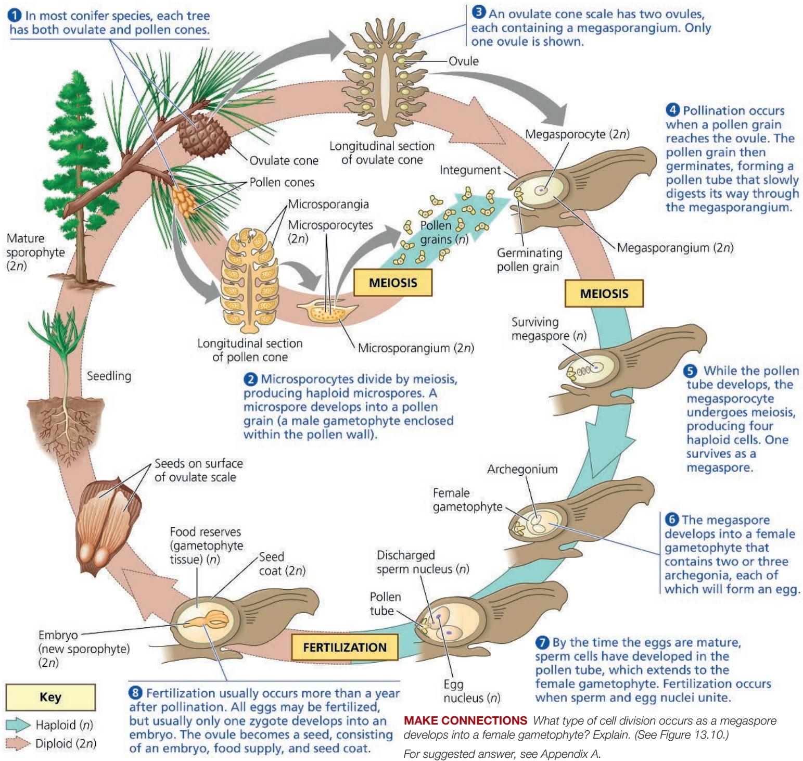

The pine tree is the sporophyte; its sporangia are located on scalelike structures packed densely in cones. Like all seed plants, conifers are heterosporous. As such, they have two types of sporangia that produce two types of spores: microsporangia that produce microspores and megasporangia that produce megaspores. In conifers, the two types of spores are produced by separate cones: small pollen cones and large ovulate cones.

Pollen cones have a relatively simple structure: Their scales are modified leaves (microsporophylls) that bear microsporangia. Within each microsporangium, cells called microsporocytes undergo meiosis, producing haploid microspores. Each microspore develops into a pollen grain containing a male gametophyte. In conifers, the yellow pollen is released in large amounts and carried by the wind, dusting everything in its path.

Ovulate cones are more complex: Their scales are compound structures composed of both modified leaves (megasporophylls bearing megasporangia) and modified stem tissue. Within each megasporangium, megasporocytes undergo meiosis and produce haploid megaspores inside the ovule. Surviving megaspores develop into female gametophytes, which are retained within the sporangia.

In most pine species, each tree has both types of cones. From the time pollen and ovulate cones appear on the tree, it takes nearly three years for the male and female gametophytes to be produced and brought together and for mature seeds to form from fertilized ovules. The scales of each ovulate cone then separate, and seeds are dispersed by the wind. A seed that lands in a suitable environment germinates, its embryo emerging as a pine seedling.

Figure 30.6 An ancient pollinator.

This 110-million-year-old fossil shows pollen on an insect, the thrip Gymnopollisthrips minor. Structural features of the pollen suggest that it was produced by gymnosperms (most likely by species related to extant ginkgos or cycads). Although most gymnosperms today are wind-pollinated, many cycads are insect-pollinated.

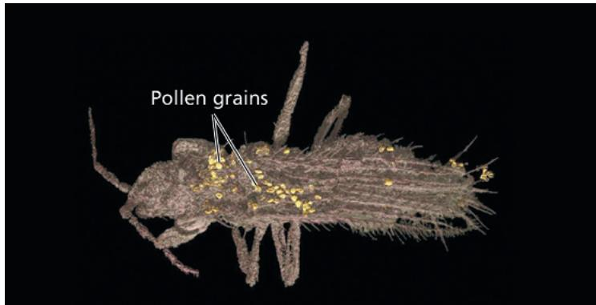

and other seedless vascular plants, as well as in drier habitats outside the swamps. As the Carboniferous period gave way to the Permian (299 to 252 million years ago), the climate became drier, especially in the tropics. As a result, the lycophytes, horsetails, and ferns that dominated Carboniferous swamps were largely replaced in many areas by gymnosperms, which were better suited to the drier climate.

Gymnosperms thrived as the climate dried, in part because they have the key terrestrial adaptations found in all seed plants, such as seeds and pollen. In addition, some gymnosperms were particularly well suited to arid conditions because of the thick cuticles and relatively small surface areas of their needle-shaped leaves.

Gymnosperms dominated terrestrial ecosystems throughout much of the Mesozoic era, which lasted from 252 to 66 million years

## Early Seed Plants and the Rise of Gymnosperms

The origins of characteristics found in pines and other living seed plants date back to the Devonian period (390 million years ago). Fossils from that time reveal that some plants had acquired features that are also present in seed plants, such as megaspores and microspores. For example, Archaeopteris was a heterosporous tree with a woody stem. It grew up to 20 m tall and had fernlike leaves. But it did not bear seeds and therefore is not classified as a seed plant.

The earliest evidence of seed plants comes from 360-million-year-old fossils of plants in the genus Elkinsia (Figure 30.5), which became extinct along with other early seed plants. The oldest fossils of species from an extant lineage of gymnosperms (early conifers) are 315–307 million years old. These early gymnosperms lived in moist Carboniferous ecosystems that were dominated by lycophytes, horsetails, ferns,

Figure 30.5 A fossil of the early seed plant Elkinsia.

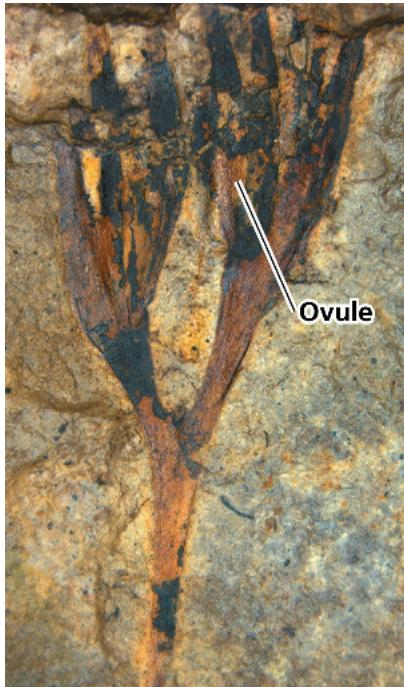

ago. In addition to serving as the food supply for giant herbivorous dinosaurs, these gymnosperms were involved in many other interactions with animals. Recent fossil discoveries, for example, show that some gymnosperms were pollinated by insects more than 100 million years ago (Figure 30.6). Late in the Mesozoic, angiosperms began to replace gymnosperms in some ecosystems.

## Gymnosperm Diversity

Although angiosperms now dominate most terrestrial ecosystems, gymnosperms remain an important part of Earth's flora. For example, vast regions in northern latitudes are covered by forests of conifers (see Figure 52.13).

Of the ten extant (living) plant phyla (see Table 29.1), four are gymnosperms: Cycadophyta, Ginkgophyta, Gnetophyta, and Coniferophyta. Figure 30.7 surveys the diversity of extant gymnosperms.

## Exploring Gymnosperm Diversity

## Figure 30.7

## Phylum Cycadophyta

The 350 species of living cycads have large cones and palmlike leaves (true palm species are angiosperms). Unlike most seed plants, cycads have flagellated sperm, indicating their descent from seedless vascular plants that had motile sperm. Cycads thrived during the Mesozoic era, known as the age of cycads as well as the age of dinosaurs. Today, however, cycads are the most endangered of all plant groups: 75% of their species are threatened by habitat destruction and other human actions.

  
Cycas revoluta

## Phylum Ginkgophyta

Phylum Gnetophyta includes plants in three genera: Gnetum, Ephedra, and Welwitschia. Some species are tropical, whereas others live in deserts. Although very different in appearance, the genera are grouped together based on molecular data.

Ginkgo biloba is the only surviving species of this phylum; like cycads, ginkgos have flagellated sperm. Also known as the maiden-hair tree, Ginkgo biloba has deciduous fanlike leaves that turn gold in autumn. It is a popular ornamental tree in cities because it tolerates air pollution well. Landscapers often plant only pollen-producing trees because the fleshy seeds smell rancid as they decay.

## Phylum Gnetophyta

Welwitschia (also below). This genus consists of one species, Welwitschia mirabilis, a plant that can live for thousands of years and is found only in the deserts of southwestern Africa. Its straplike leaves are among the largest leaves known.

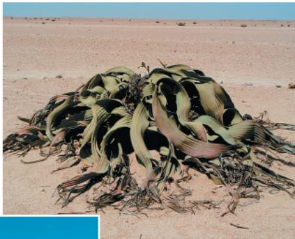

  
Ephedra. This genus includes about 40 species that inhabit arid regions worldwide. These desert shrubs produce the compound ephedrine, which is used medicinally as a decongestant.

  
Gnetum. This genus includes about 35 species of tropical trees, shrubs, and vines, mainly native to Africa and Asia. Their leaves look similar to those of flowering plants, and their seeds look somewhat like fruits.

## Phylum Coniferophyta

Phylum Coniferophyta, the largest gymnosperm phyla, consists of about 600 species of conifers (from the Latin conus, cone, and ferre, to carry), including many large trees. Many species have woody cones, while others have fleshy cones. Some, such as pines, have needlelike leaves. Others, such as redwoods, have scalelike leaves. Some species dominate vast northern forests, whereas others are native to the Southern Hemisphere.

Douglas fir. This evergreen tree (Pseudotsuga menziesii) provides more timber than any other North American tree species. Some uses include house framing, plywood, pulpwood for paper, railroad ties, and boxes and crates.

Most conifers are evergreens; they retain their leaves throughout the year. Even during winter, a limited amount of photosynthesis occurs on sunny days. When spring comes, conifers already have fully developed leaves that can take advantage of the sunnier, warmer days. Some conifers, such as the dawn redwood, tamarack, and larch, are deciduous trees that lose leaves each autumn.

Common juniper. The "berries" of the common juniper (Juniperus communis) are actually ovule-producing cones consisting of fleshy sporophylls.

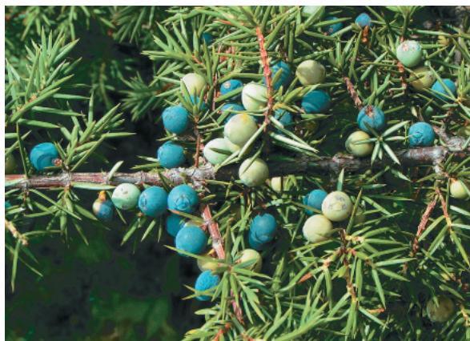

Sequoia. This giant sequoia (Sequoiadendron giganteum) in California's Sequoia National Park weighs about 2,500 metric tons, equivalent to about 24 blue whales (the largest animals) or 40,000 people. The giant sequoia is one of the largest living organisms and also among the most ancient, with some individuals estimated to be between 1,800 and 2,700 years old. Their cousins, the coast redwoods (Sequoia sempervirens), grow to heights of more than 110 m (taller than the Statue of Liberty) and are found only in a narrow coastal strip of northern California and southern Oregon.

European larch. The needlelike leaves of this deciduous conifer (Larix decidua) turn yellow before they are shed in autumn. Native to the mountains of central Europe, including Switzerland's Matterhorn, depicted here, this species is extremely cold-tolerant, able to survive winter temperatures that plunge to $-50^{\circ}\mathrm{C}$ .

Bristlecone pine. This species (Pinus longaeva), which is found in the White Mountains of California, includes some of the world's oldest living organisms. One bristlecone pine was recently found to be more than 5,000 years old, and some may be even older.

Wollemi pine. Survivors of a conifer group once known only from fossils, living Wollemi pines (Wollemia nobilis) were discovered in 1994 in a national park near Sydney, Australia. At that time, the species consisted of 40 known trees. As a result of conservation efforts, it is now widely propagated. The inset photo compares the leaves of this “living fossil” with actual fossils.

## Concept Check 30.2

1. Explain how the pine life cycle in Figure 30.4 reflects the five adaptations common to all seed plants.

2. VISUAL SKILLS Based on Figure 30.4, compare and contrast the function of pollination and fertilization in sexual reproduction in pines.

3. MAKE CONNECTIONS Early seed plants in genus Elkinsia are a sister group to a clade consisting of gymnosperms and angiosperms. Draw a phylogenetic tree of seed plants that shows Elkinsia, gymnosperms, and angiosperms; date the branch points on this tree using fossil evidence. (See Figure 26.5.)

For suggested answers, see Appendix A.

# Concept 30.3: The reproductive adaptations of angiosperms include flowers and fruits

Nonvascular plants (bryophytes)
Seedless vascular plants
Gymnosperms
Angiosperms

Commonly known as flowering plants, angiosperms are seed plants with the reproductive structures called flowers and fruits.

The name angiosperm (from the Greek angion, container) refers to seeds contained in fruits. Angiosperms are the most diverse and widespread of all plants, with more than 290,000 species (about 90% of all plant species).

## Characteristics of Angiosperms

All angiosperms are classified in a single phylum, Anthophyta. Before considering the evolution of angiosperms, we will examine two of their key adaptations—flowers and fruits—and the roles of these structures in the angiosperm life cycle.

## Flowers

The flower is a unique angiosperm structure that is specialized for sexual reproduction. In many angiosperm species, insects or other animals transfer pollen from one flower to the sex organs on another flower, which makes pollination more directed than the wind-dependent pollination of most species of gymnosperms. However, some angiosperms are wind-pollinated, particularly those species that occur in dense populations, such as grasses and tree species in temperate forests.

A flower is a specialized shoot that can have up to four types of modified leaves called floral organs: sepals, petals, stamens, and carpels (Figure 30.8). Starting at the base of the flower are the sepals, which are usually green and enclose the flower before it opens (think of a rosebud). Interior to the sepals are the petals, which are brightly colored in most flowers and can aid in attracting pollinators. Flowers that are wind-pollinated, such as grasses, generally lack brightly colored parts. In all angiosperms, the sepals and petals are sterile floral organs, meaning that they do not produce sperm or eggs.

Figure 30.8 The structure of an idealized flower.

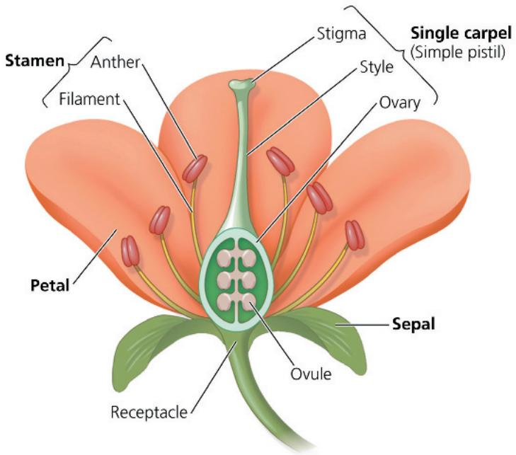

Within the petals are two types of fertile floral organs that produce spores, the stamens and carpels. Stamens and carpels are sporophylls, modified leaves that are specialized for reproduction. Stamens are microsporophylls: They produce microspores that develop into pollen grains containing male gametophytes. A stamen consists of a stalk called the filament and a terminal sac, the anther, where pollen is produced. Carpels are megasporophylls: They produce megaspores that give rise to female gametophytes. The carpel is the “container” mentioned earlier in which seeds are enclosed; as such, it is a key structure that distinguishes angiosperms from gymnosperms. At the tip of the carpel is a sticky stigma that receives pollen. A style leads from the stigma to a structure at the base of the carpel, the ovary; the ovary contains one or more ovules. As in gymnosperms, each angiosperm ovule contains a female gametophyte. If fertilized, an ovule develops into a seed.

A flower may have one or more carpels. In many species, multiple carpels are fused into one structure. The term pistil is sometimes used to refer to a single carpel (a simple pistil) or two or more fused carpels (a compound pistil). Flowers also vary in symmetry (Figure 30.9) and other aspects of shape, as well as size, color, and odor. Much of this diversity results from adaptation to specific pollinators (see Figures 38.4 and 38.5).

## Fruits

As seeds develop from ovules after fertilization, the ovary wall thickens and the ovary matures into a fruit. A pea pod is an example of a fruit, with seeds (mature ovules, the peas) encased in the ripened ovary (the pod).

Fruits protect seeds and aid in their dispersal. Mature fruits can be either fleshy or dry (Figure 30.10). Tomatoes, plums, and grapes are examples of fleshy fruits, in which the wall (pericarp) of the ovary becomes soft during ripening. Dry fruits include beans, nuts, and grains. Some dry fruits split open at maturity to release seeds, whereas others remain closed. The dry, wind-dispersed fruits

Figure 30.11 Fruit adaptations that enhance seed dispersal.

Bilateral symmetry (orchid)

## Figure 30.9 Flower symmetry.

In radial symmetry, the sepals, petals, stamens, and carpels radiate out from a center. Any line through the central axis divides the flower into two equal parts.

  
Fused petals  
Radial symmetry (daffodil)

In bilateral symmetry, the flower can only be divided into two equal parts by a single line.

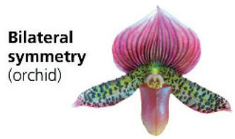  
DRAW IT Draw the single line that can divide the bilaterally symmetrical flower into two equal parts.
For suggested answer, see Appendix A.

## Figure 30.10 Some variations in fruit structure.

▼ Tomato, a fleshy fruit with soft outer and inner layers of pericarp (fruit wall)

  
Nectarine, a fleshy fruit with a soft outer layer and hard inner layer (pit) of pericarp  
▼ Ruby grapefruit, a fleshy fruit with a firm outer layer and soft inner layer of pericarp

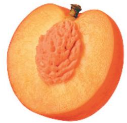

  
▼ Hazelnut, a dry fruit that remains closed at maturity

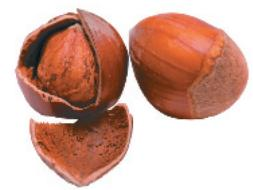  
Milkweed, a dry fruit that splits open at maturity

of grasses, harvested while on the plant, are major staple foods for humans. The cereal grains of maize, rice, wheat, and other grasses, though easily mistaken for seeds, are each actually a fruit with a dry outer covering (the former wall of the ovary) that adheres to the seed coat of the seed within.

  
Some plants have mechanisms that disperse seeds by explosive action.  
Wings enable maple fruits to be carried by the wind.

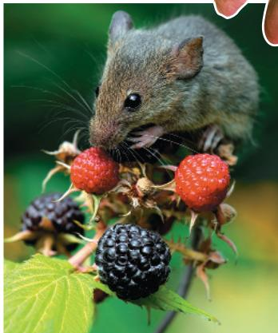  
Seeds within berries and other edible fruits are often dispersed in animal feces.  
The barbs of cockleburs facilitate seed dispersal by allowing the fruits to "hitchhike" on animals.

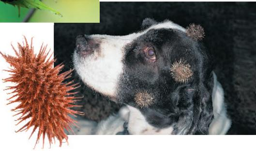

As shown in Figure 30.11, various adaptations of fruits and seeds help to disperse seeds (see also Figure 38.12). The seeds of some flowering plants, such as dandelions and maples, are contained within fruits that function like parachutes or propellers, adaptations that enhance dispersal by wind. Some fruits, such as coconuts, are adapted to dispersal by water. And the seeds of many angiosperms are carried by animals. Some angiosperms have fruits modified as burrs that cling to animal fur (or the clothes of humans). Others produce edible fruits, which are usually nutritious, sweet tasting, and vividly colored, advertising their ripeness. When an animal eats the fruit, it digests the fruit's fleshy part, but the tough seeds usually pass unharmed through the animal's digestive tract. When the animal defecates, it may deposit the seeds, along with a supply of natural fertilizer, many kilometers from where the fruit was eaten.

## The Angiosperm Life Cycle

You can follow a typical angiosperm life cycle in Figure 30.12. The flower of the sporophyte produces microspores that form male gametophytes and megaspores that form female gametophytes. The male gametophytes are in the pollen grains, which develop within microsporangia in the anthers. Each male gametophyte has two haploid cells: a generative cell that divides, forming two sperm, and a tube cell that produces a pollen tube. Each ovule, which develops in the ovary, contains a female gametophyte, also known as an embryo sac. The embryo sac consists of only a few cells, one of which is the egg.

After its release from the anther, the pollen is carried to the sticky stigma at the tip of a carpel. Although some flowers self-pollinate, most have mechanisms that ensure cross-pollination, which in angiosperms is the transfer of pollen from an anther of a flower on one plant to the stigma of a flower on another plant of the same species. Cross-pollination enhances genetic variability. In some

species, stamens and carpels of a single flower may mature at different times, or they may be so arranged that self-pollination is unlikely.

The pollen grain absorbs water and germinates after it adheres to the stigma of a carpel. The tube cell produces a pollen tube that grows down within the style of the carpel. After reaching the ovary, the pollen tube penetrates through the micropyle, a pore in the integuments of the ovule, and discharges two sperm cells into the female gametophyte (embryo sac). One sperm fertilizes the egg, forming a diploid zygote. The other sperm fuses with the two nuclei in the large central cell of the female gametophyte, producing a triploid cell (3n). This type of double fertilization, in which one fertilization event produces a zygote and the other produces a triploid cell, is unique to angiosperms.

Figure 30.12 The life cycle of an angiosperm.  
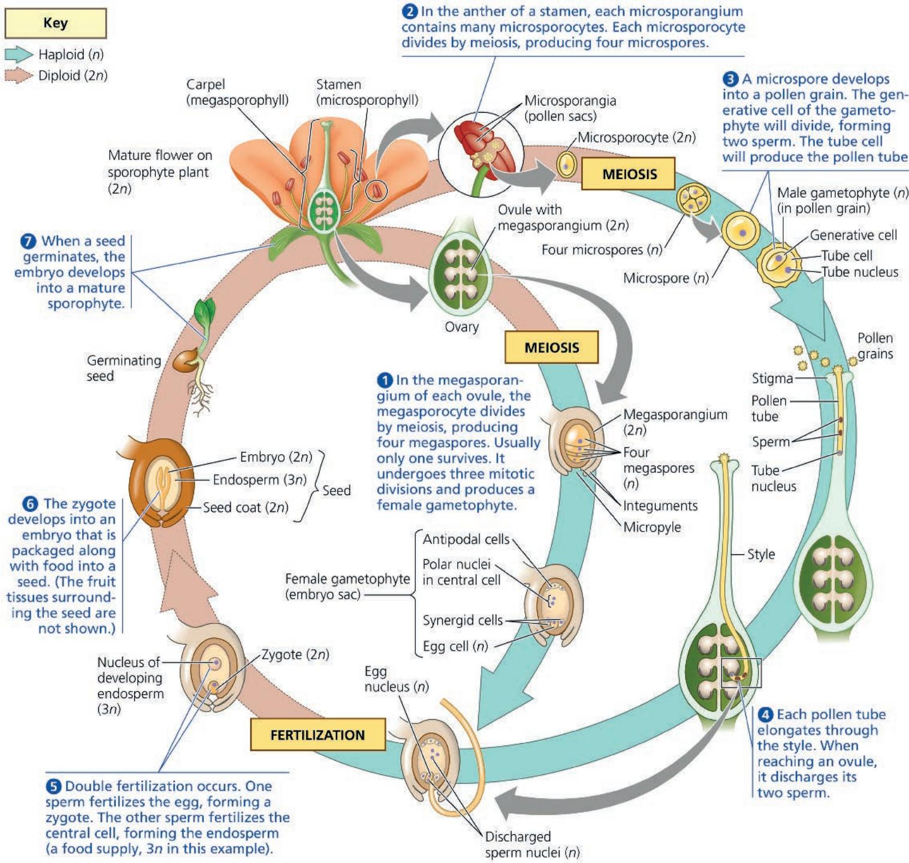  
VISUAL SKILLS Based on this figure, what is the maximum number of seeds this flower could produce? To produce that number of seeds, at least how many pollen grains would have to germinate? For suggested answer, see Appendix A.

After double fertilization, the ovule matures into a seed. The zygote develops into a sporophyte embryo with a rudimentary root and one or two seed leaves called cotyledons. The triploid central cell of the female gametophyte develops into endosperm, tissue rich in starch and other food reserves that nourish the developing embryo.

What is the function of double fertilization in angiosperms? One hypothesis is that double fertilization synchronizes the development of food storage in the seed with the development of the embryo. If a particular flower is not pollinated or sperm cells are not discharged into the embryo sac, fertilization does not occur, and neither endosperm nor embryo forms. So perhaps double fertilization is an adaptation that prevents flowering plants from squandering nutrients on infertile ovules.

Another type of double fertilization occurs in some gymnosperm species belonging to the phylum Gnetophyta. However, double fertilization in these species gives rise to two embryos rather than to an embryo and endosperm.

As you read earlier, the seed consists of the embryo, the endosperm, and a seed coat derived from the integuments. An ovary develops into a fruit as its ovules become seeds. After being dispersed, a seed may germinate if environmental conditions are favorable. The coat ruptures and the embryo emerges as a seedling, using food stored in the endosperm and cotyledons until it can produce its own food by photosynthesis.

and with further increases in the diversity and importance of angiosperms.

What evidence suggests that angiosperms arose 140 million years ago? First, although pollen grains are common in rocks from the Jurassic period (201 to 145 million years ago) and even earlier, none of these pollen fossils have features characteristic of angiosperms, suggesting that angiosperms may have originated after the Jurassic. Indeed, the earliest fossils with distinctive angiosperm features are of 130-million-year-old pollen grains discovered in China, Israel, and England. Early fossils of larger flowering plant structures include those of Archaefructus (Figure 30.13) and Leefructus, both of which were discovered in China in rocks that are 125 million years old. Overall, early angiosperm fossils indicate that the group arose and began to diversify over a 20- to 30-million-year period—a less sudden event than was suggested by the fossils known during Darwin's lifetime.

Can we infer traits of the angiosperm common ancestor from traits found in early fossil angiosperms? Archaefructus, for example, was herbaceous and had bulbous structures that may have served as floats, suggesting it was aquatic. But investigating whether the angiosperm common ancestor was herbaceous and aquatic also requires examining fossils of other seed plants thought to have been closely related to angiosperms. All of those plants were woody, indicating that the common ancestor was probably woody and probably not aquatic. As we'll see, this conclusion has been supported by recent phylogenetic analyses. Regardless, this example shows the challenge of using fossils to date the branches of a phylogenetic tree, when it is difficult to place a fossil in the phylogenetic tree based on its combination of traits.

## Angiosperm Evolution

Charles Darwin once referred to the origin of angiosperms as an “abominable mystery.” He was particularly troubled by the relatively sudden and geographically widespread appearance of angiosperms in the fossil record (about 100 million years ago, based on fossils known to Darwin). Recent fossil evidence and phylogenetic analyses have led to progress in solving Darwin’s mystery, but we still do not fully understand how angiosperms arose from earlier seed plants.

## Fossil Angiosperms

Angiosperms are now thought to have originated in the early Cretaceous period, about 140 million years ago. By the mid-Cretaceous (100 million years ago), angiosperms began to dominate some terrestrial ecosystems. Landscapes changed dramatically as conifers and other gymnosperms gave way to flowering plants in many parts of the world. The Cretaceous ended 66 million years ago with mass extinctions of dinosaurs and many other animal groups

Figure 30.13 An early flowering plant.  
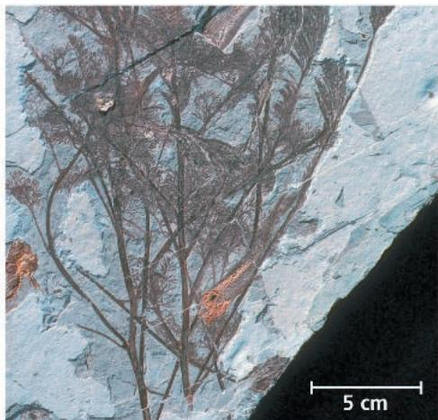  
(a) Archaefructus sinensis, a 125-million-year-old fossil. This herbaceous species had simple flowers and bulbous structures that may have served as floats, suggesting it was aquatic. Recent phylogenetic analyses indicate that Archaefructus may belong to the water lily group.

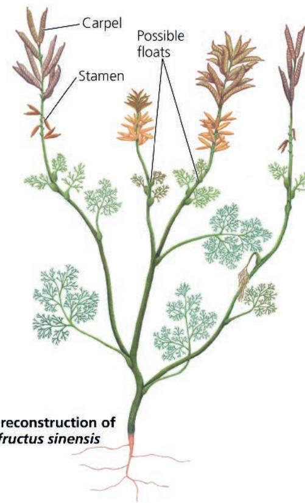  
(b) Artist's reconstruction of Archaefructus sinensis

## Angiosperm Phylogeny

Molecular and morphological evidence suggests that extant gymnosperm lineages had diverged from the lineage leading to angiosperms by 305 million years ago. Note that this does not imply that angiosperms originated 305 million years ago, but that the most recent common ancestor of extant gymnosperms and angiosperms lived at that time. Indeed, angiosperms may be more closely related to several extinct lineages of woody seed plants than they are to gymnosperms. One possible such lineage is the Bennettitales, an extinct group with flowerlike structures that may have been pollinated by insects (Figure 30.14a). However, the Bennettitales and other similar lineages of extinct woody seed plants did not have carpels or certain other characteristics of angiosperm flowers and hence were not angiosperms.

Making sense of the origin of angiosperms also depends on working out the order in which angiosperm clades diverged from one another. Here, dramatic progress has been made in recent years. Molecular and morphological evidence suggests that the shrub Amborella trichopoda, water lilies, and star anise are living representatives of lineages that diverged from other angiosperms early in the history of the group (Figure 30.14b). Amborella is woody, supporting the conclusion mentioned earlier that the angiosperm common ancestor was probably woody. Like the Bennettitales, Amborella, water lilies, and star anise lack vessel elements, efficient water-conducting cells that are found in most

present-day angiosperms. Overall, based on the features of ancestral species and angiosperms like Amborella, researchers have hypothesized that early angiosperms were woody shrubs that had small flowers and relatively simple water-conducting cells.

## Evolutionary Links with Animals

Plants and animals have interacted for hundreds of millions of years, and those interactions have led to evolutionary change. For example, herbivores can reduce a plant's reproductive success by eating its roots, leaves, or seeds. As a result, if an effective defense against herbivores originates in a group of plants, those plants may be favored by natural selection—as will herbivores that overcome this new defense. Plant-pollinator and other mutually beneficial interactions also can have such reciprocal evolutionary effects.

Plant-pollinator interactions also may have affected the rates at which new species form. Consider the impact of a flower's symmetry (see Figure 30.9). On a flower with bilateral symmetry, an insect pollinator can obtain nectar (a sugary solution secreted by flower glands) only when landing in a certain position (Figure 30.15). This constraint makes it more likely that pollen is placed on a part of the insect's body that will come into contact with the stigma of a flower of the same species. Such specificity of pollen transfer reduces gene flow between diverging populations and could lead to increased

Figure 30.14 Angiosperm evolutionary history.  
  
(a) A close relative of the angiosperms? This reconstruction shows a longitudinal section through the flowerlike structures found in the Bennettitales, an extinct group of woody seed plants that some researchers have hypothesized are more closely related to extant angiosperms than to extant gymnosperms.

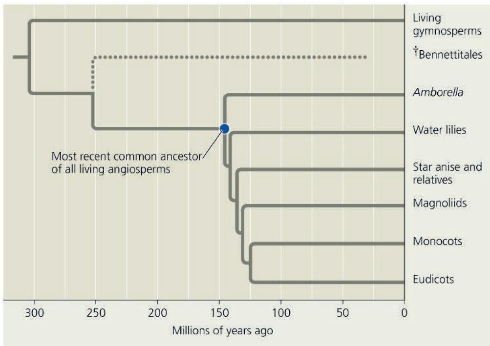  
(b) Angiosperm phylogeny. This tree represents a current hypothesis of angiosperm evolutionary relationships, based on morphological and molecular evidence. Angiosperms originated about 140 million years ago. The dotted line indicates the uncertain position of the Bennettales; other extinct lineages have also been proposed as the sister group to angiosperms.  
VISUAL SKILLS Would the branching order of the phylogeny in (b) necessarily have to be redrawn if a 150-million-year-old fossil monocot were discovered? Explain.

Figure 30.15 A bee pollinating a bilaterally symmetrical flower. To harvest nectar from this Scottish broom flower, a honeybee must land as shown. This releases a tripping mechanism that arches the flower's stamens over the bee and dusts it with pollen. Later, some of this pollen may rub off onto the stigma of the next flower the bee visits.

rates of speciation in plants with bilateral symmetry. This hypothesis can be tested using the approach illustrated in this diagram:

A key step in this approach is to identify cases in which a clade with bilaterally symmetric flowers shares an immediate common ancestor with a clade whose members have radially symmetric flowers. One recent study identified 19 pairs of closely related “bilateral” and “radial” clades. On average, the clade with bilaterally symmetric flowers had nearly 2,400 more species than did the related clade with radial symmetry. This result suggests that flower shape can affect the rate at which new species form,

perhaps by affecting the behavior of insect pollinators. Overall, plant-pollinator interactions may have contributed to the increasing dominance of flowering plants in the Cretaceous period, making angiosperms centrally important to ecological communities.

## Angiosperm Diversity

From their humble beginnings in the Cretaceous period, angiosperms have diversified into more than 290,000 living species. Until the late 1990s, most systematists divided flowering plants into two groups, based partly on the number of cotyledons, or seed leaves, in the embryo. Species with one cotyledon were called monocots, and those with two were called dicots. Other features, such as flower and leaf structure, were also used to define the two groups. Recent DNA studies, however, indicate that the species traditionally called dicots are paraphyletic. The vast majority of species once categorized as dicots form a large clade, now known as eudicots (“true” dicots). Figure 30.16 compares the main characteristics of monocots and eudicots. The rest of the former dicots are now grouped into four small lineages. Three of these lineages—Amborella, water lilies, and star anise and relatives—diverged from all other angiosperms early in the history of the group (see Figure 30.14b). A fourth lineage, the magnoliids, evolved later. Figure 30.17, on the next page, provides an overview of angiosperm diversity.

## Concept Check 30.3

1. It is said that an oak is an acorn's way of making more acorns. Write an explanation that includes these terms: sporophyte, gametophyte, ovule, seed, ovary, and fruit.

2. Compare and contrast a pine cone and a flower in terms of structure and function.

3. WHAT IF? Do speciation rates in closely related clades of flowering plants show that flower shape is correlated with the rate at which new species form or that flower shape is responsible for this rate? Explain.

For suggested answers, see Appendix A.

Figure 30.16 Characteristics of monocots and eudicots.  
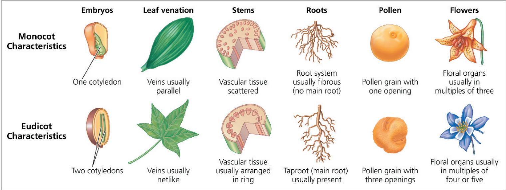

## Exploring Angiosperm Diversity

## Figure 30.17

## Early-Diverging Angiosperm Lineages

The first lineage to have diverged from other angiosperms is represented today by a single species, Amborella trichopoda (right). The other surviving lineages diverged later: a clade that includes water lilies and a clade consisting of the star anise and its relatives. Together, these two lineages today comprise about 100 species.

  
Water lily (Nymphaea "Rene Gerard"). Species of water lilies are found in aquatic habitats throughout the world. Water lilies belong to a clade that diverged from other angiosperms early in the group's history.

## Amborella trichopoda.

This small shrub, found only on the South Pacific island of New Caledonia, may be the sole survivor of a branch at the base of the angiosperm tree.

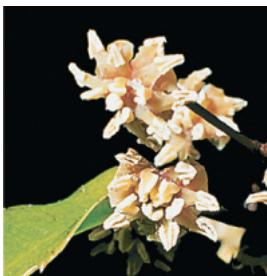

## Star anise (Illicium). This genus belongs to a

third surviving lineage of angiosperms that diverged from other lineages early in the history of angiosperms.

## Magnoliids

Magnoliids consist of about 8,500 species, most notably magnolias, laurels, and black pepper plants. They include both woody and herbaceous species. Although they share some traits with basal angiosperms, such as a typically spiral rather than whorled arrangement of floral organs, magnoliids are more closely related to eudicots and monocots.

## Southern magnolia (Magnolia grandiflora). This member of the

## Monocots

grandiflora). This member of the magnolia family is a large tree. The variety of southern magnolia shown here, called "Goliath," has flowers that measure up to about a foot across.

About one-quarter of angiosperm species are monocots — about 72,000 species. Some of the largest groups are the orchids, grasses, and palms. Grasses include some of the most agriculturally important crops, such as maize, rice, and wheat.

  
Orchid (Paphiopedilum callosum)  
Barley (Hordeum vulgare), a grass

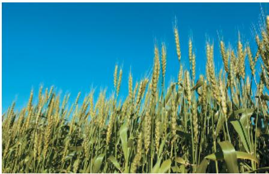

  
▲ Miniature date palm (Phoenix roebelenii)

## Eudicots

More than two-thirds of angiosperm species are eudicots—roughly 210,000 species. The largest group is the legume family, which includes such crops as peas and beans. Also important economically is the rose family, which includes many plants with ornamental flowers as well as some species with edible fruits, such as strawberry plants and apple and pear trees. Most of the familiar flowering trees are eudicots, such as oak, walnut, maple, willow, and birch.

  
Snow pea (Pisum sativum), a legume  
Dog rose (Rosa canina), a wild rose

  
▲ Armenian oak (Quercus pontica)

# Concept 30.4: Human welfare depends on seed plants

In forests and on farms, seed plants are key sources of food, fuel, wood products, and medicine. Our reliance on them makes the preservation of plant diversity critical.

## Products from Seed Plants

Most of our food comes from angiosperms. Just six crops—maize, rice, wheat, potatoes, cassava, and sweet potatoes—yield 80% of all the calories consumed by humans. We also depend on angiosperms to feed livestock: It takes 5–7 kg of grain to produce 1 kg of grain-fed beef.

Today's crops are the products of artificial selection—the result of plant domestication that began about 12,000 years ago. To appreciate the scale of this transformation, note how the number and size of seeds in domesticated plants are greater than those of their wild relatives, as in the case of maize and the grass teosinte (see Figure 38.16). Scientists can glean information about domestication by comparing the genes of crops with those of wild relatives. With maize, dramatic changes such as increased cob size and loss of the hard coating around teosinte kernels may have been initiated by as few as five mutations.

Flowering plants also provide other edible products. Two popular beverages come from tea leaves and coffee beans, and you can thank the cacao tree for cocoa and chocolate. Spices are derived from various plant parts, such as flowers (cloves, saffron), fruits and seeds (vanilla, black pepper, mustard), leaves (basil, mint, sage), and even bark (cinnamon).

Many seed plants are sources of wood, which is absent in all living seedless plants. Wood consists of tough-walled xylem cells (see Figure 35.22). It is the primary source of fuel for much of the world, and wood pulp, typically derived from conifers such as fir and pine, is used to make paper. Wood remains the most widely used construction material.

For centuries, humans have also depended on seed plants for medicines. Many cultures use herbal remedies, and scientists have extracted and identified medicinally active compounds from many of these plants and later synthesized them. Willow leaves and bark have long been used in pain-relieving remedies, including prescriptions by the Greek physician Hippocrates. In the 1800s, scientists traced the willow's medicinal property to the chemical salicin. A synthesized derivative, acetylsalicylic acid, is what we call aspirin. Plants are also a direct source of medicinal compounds (Table 30.1). In the United States, about $25\%$ of prescription drugs contain an active ingredient from plants, usually seed plants.

Table 30.1 Examples of Plant-Derived Medicines

<table><tr><td>Compound</td><td>Source</td><td>Use</td></tr><tr><td>Atropine</td><td>Belladonna plant</td><td>Eye pupil dilator</td></tr><tr><td>Digitalin</td><td>Foxglove</td><td>Heart medication</td></tr><tr><td>Menthol</td><td>Eucalyptus tree</td><td>Throat soother</td></tr><tr><td>Quinine</td><td>Cinchona tree</td><td>Malaria preventive</td></tr><tr><td>Taxol</td><td>Pacific yew</td><td>Ovarian cancer drug</td></tr><tr><td>Tubocurarine</td><td>Curare tree</td><td>Muscle relaxant</td></tr><tr><td>Vinblastine</td><td>Periwinkle</td><td>Leukemia drug</td></tr></table>

Figure 30.18 Clear-cutting of tropical forests.

Over the past several hundred years, nearly half of Earth's tropical forests have been cut down and converted to farmland and other uses. A satellite image from 1975 (left) shows a dense forest in Brazil. By 2012 (right image), much of this forest had been cut down. Deforested and urban areas are shown as light purple.

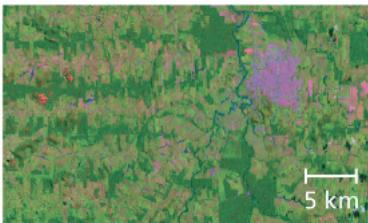

## Threats to Plant Diversity

Although plants may be a renewable resource, plant diversity is not. The exploding human population and its demand for space and resources are threatening plant species across the globe. The problem is especially severe in the tropics, where more than two-thirds of the human population live and where population growth is fastest. About 63,000 km $^{2}$ (15 million acres) of tropical rain forest are cleared each year (Figure 30.18), a rate that would completely eliminate the remaining 11 million km $^{2}$ of tropical forests in 175 years. The loss of forests reduces the absorption of atmospheric carbon dioxide (CO $_{2}$ ) that occurs during photosynthesis, potentially contributing to global warming. Also, as forests disappear, so do large numbers of plant species. Of course, once a species becomes extinct, it can never return.

The loss of plant species is often accompanied by the loss of insects and other rain forest animals. Scientists estimate that if current rates of loss in the tropics and elsewhere continue, 50% or more of Earth's species will become extinct within the next few centuries. Such losses would constitute a global mass extinction, rivaling the Permian and Cretaceous mass extinctions and forever changing the evolutionary history of plants (and many other organisms).

Many people have ethical concerns about contributing to the extinction of species. In addition, there are practical reasons to be concerned about the loss of plant diversity. So far, we have explored the potential uses of only a tiny fraction of the more than 325,000 known plant species. For example, almost all our food is based on the cultivation of only about two dozen species of seed plants. And fewer than 5,000 plant species have been studied as potential sources of medicines. The tropical rain forest may be a medicine chest of healing plants that could be extinct before we even know they exist. If we begin to view rain forests and other ecosystems as living treasures that can regenerate only slowly, we may learn to harvest their products at sustainable rates.

## Concept Check 30.4

1. Explain why plant diversity can be considered a nonrenewable resource.

2. WHAT IF? How could phylogenies be used to help researchers search more efficiently for novel medicines derived from seed plants?

## Summary of Key Concepts

To review key terms, go to the Vocabulary Self-Quiz (eTextbook only).

Concept 30.1: Seeds and pollen grains are key adaptations for life on land

<table><tr><td colspan="2">Five Derived Traits of Seed Plants</td></tr><tr><td>Reduced gametophytes</td><td>Microscopic male and female gametophytes (n) are nourished and protected by the sporophyte (2n)Male gametophyteFemale gametophyte</td></tr><tr><td>Heterospory</td><td>Microspore (gives rise to a male gametophyte)Megaspore (gives rise to a female gametophyte)</td></tr><tr><td>Ovules</td><td>Ovule (gymnosperm)Integument (2n)Megaspore (n)Megasporangium (2n)</td></tr><tr><td>Pollen</td><td>Pollen grains make water unnecessary for fertilization</td></tr><tr><td>Seeds</td><td>Seeds: survive better than unprotected spores, can be transported long distancesSeed coatFood supplyEmbryo</td></tr></table>

Describe how the parts of an ovule (integument, megaspore, megasporangium) correspond to the parts of a seed.

## Concept 30.2: Gymnosperms bear “naked” seeds, typically on cones

\- Dominance of the sporophyte generation, the development of seeds from fertilized ovules, and the role of pollen in transferring sperm to ovules are key features of a typical gymnosperm life cycle.

\- Gymnosperms appear early in the plant fossil record and dominated many Mesozoic terrestrial ecosystems. Living seed plants can be divided into two monophyletic groups: gymnosperms and angiosperms. Extant gymnosperms include cycads, Ginkgo biloba, gnetophytes, and conifers.

Although there are just over 1,000 species of gymnosperms, the group is still very successful in terms of its evolutionary longevity, adaptations, and geographic distribution. Explain.

## Concept 30.3: The reproductive adaptations of angiosperms include flowers and fruits

\- Flowers generally consist of four types of modified leaves: sepals, petals, stamens (which produce pollen), and carpels (which produce ovules). Ovaries ripen into fruits, which often carry seeds by wind, water, or animals to new locations.

\- Flowering plants originated about 140 million years ago, and by the mid-Cretaceous (100 mya) had begun to dominate some terrestrial ecosystems. Fossils and phylogenetic analyses offer insights into the origin of flowers.

\- Several groups of early-diverging angiosperms have been identified. Other major clades of angiosperms include magnoliids, monocots, and eudicots.

\- Pollination and other interactions between angiosperms and animals may have contributed to the success of flowering plants during the last 100 million years.

Explain why Darwin called the origin of angiosperms an “abominable mystery,” and describe what has been learned from fossil evidence and phylogenetic analyses.

## Concept 30.4: Human welfare depends on seed plants

\- Humans depend on seed plants for products such as food, wood, and many medicines.

\- Destruction of habitat threatens the extinction of many plant species and the animal species they support.

Explain why destroying the remaining tropical forests might harm humans and lead to a mass extinction.

For suggested answer, see Appendix A.

## Test Your Understanding

For more multiple-choice questions, go to the Practice Test (eTextbook only).

## Levels 1-2: Remembering/Understanding

1. Where in an angiosperm would you find a megasporangium?

(A) in the style of a flower

(B) enclosed in the stigma of a flower

(C) within an ovule contained within an ovary of a flower

(D) packed into pollen sacs within the anthers found on a stamen

2. Which of the following is a key feature of seed plants facilitating life on land?

(A) homospory

(B) pollen

(C) reduced sporophytes

(D) spores

3. In angiosperms, which of the following is correctly paired with its chromosome count?

(A) microspore—n

(B) zygote—n

(C) egg—2n

(D) megaspore—2n

4. Which of the following is a characteristic that distinguishes gymnosperms and angiosperms from other plants?
(A) alternation of generations
(B) independent gametophytes
(C) vascular tissue
(D) ovules

5. Which of the following are present in angiosperms but not in gymnosperms?
(A) seeds (C) ovaries
(B) pollen (D) ovules

## Levels 3-4: Applying/Analyzing

6. DRAW IT Use the letters a–d to label where on the phylogenetic tree each of the following derived characters appears.
a. flowers
b. embryos
c. seeds
d. vascular tissue

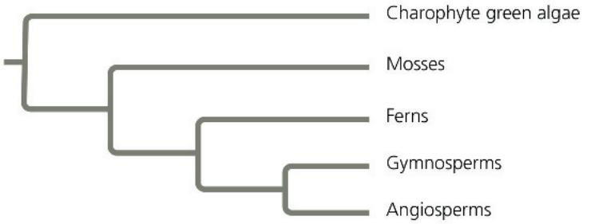

7. EVOLUTION CONNECTION The history of life has been punctuated by several mass extinctions. For example, the impact of a meteorite may have wiped out most of the dinosaurs and many forms of marine life at the end of the Cretaceous period (see Concept 25.4). Fossils indicate that plants were less severely affected by this mass extinction. What adaptations may have enabled plants to withstand this disaster better than animals?

## Levels 5-6: Evaluating/Creating

8. SCIENTIFIC INQUIRY • DRAW IT As will be described in detail in Concept 38.1, the female gametophyte of angiosperms typically has seven cells, one of which, the central cell, contains two haploid nuclei. After double fertilization, the central cell develops into endosperm, which is triploid. Because magnoliids, monocots, and eudicots typically have female gametophytes with seven cells and triploid endosperm, scientists assumed that this was the ancestral state for angiosperms. Consider, however, the following recent discoveries:

\- Our understanding of angiosperm phylogeny has changed to that shown in Figure 30.14b.

\- Amborella trichopoda has eight-celled female gametophytes and triploid endosperm.

\- Water lilies and star anise have four-celled female gametophytes and diploid endosperm.

a. Draw a phylogeny of the angiosperms (see Figure 30.14b), incorporating the data given above about the number of cells in female gametophytes and the ploidy of the endosperm. Assume that all of the star anise relatives have four-celled female gametophytes and diploid endosperm.

b. What does your labeled phylogeny suggest about the evolution of the female gametophyte and endosperm in angiosperms?

9. WRITE ABOUT A THEME: ORGANIZATION Cells are the basic units of structure and function in all organisms. A key feature in the life cycle of plants is the alternation of multicellular haploid and diploid generations. Imagine a lineage of flowering plants in which mitotic cell division did not occur between the events of meiosis and fertilization (see Figure 30.12). In a short essay (100–150 words), describe how this change in the timing of cell division would affect the structure and life cycle of plants in this lineage.

## 10. SYNTHESIZE YOUR KNOWLEDGE

  
This photograph shows a milkweed seed in flight. Describe how seeds and other adaptations in seed plants contributed to the rise of seed plants and their dominant role in plant communities today.  
For selected answers, see Appendix A.

## Explore Scientific Papers with Science in the Classroom | AAAS

How have Earth's forests changed over time? Go to “Seeing the Forest for the Trees” at www.scienceintheclassroom.org.

Instructors: Questions can be assigned in Mastering Biology.