Figure 34.54 Fossils of hand bones and foot bones (top and side views) of Homo naledi.

H. naledi also had a small brain, a broadly flared upper pelvis, and other features that have led researchers to conclude that it was an early member of our genus.

As an early member of our genus, it is likely that H. naledi originated more than 1.5 million years ago—yet initial estimates of the age of the H. naledi fossils ranged from 3 million years old to just 100,000 years old. Scientists didn’t know how old the fossils are because they were found on the floor of a deep cave, not encased in rocks that could be dated using radioactive isotopes. In 2017, however, teeth from a newly discovered H. naledi skull were dated using radioactive isotopes and found to be 300,000 years old. Overall, fossil evidence suggests that H. naledi arose 1–2 million years ago (like other early members of our genus) and then persisted almost until the present. The evolutionary relationships between H. naledi and other species in the Homo genus is not clear.

About ten years before the discovery of H. naledi, researchers reported another astonishing find: skeletal remains of adult hominins dating from 100,000 to 60,000 years ago and representing a previously unknown species, Homo floresiensis. First discovered in a limestone cave on the Indonesian island of Flores, the individuals were much shorter and had a much smaller brain volume than H. sapiens—more similar, in fact, to an australopith. The researchers who discovered these fossils argue that certain features of the skeletons, such as the shape of the teeth and the thickness and proportions of the skull, suggest that H. floresiensis descended from the larger H. erectus. Not convinced, some researchers have argued that the fossils represent small H. sapiens individuals with a disorder such as Down syndrome or microcephaly (a condition in which a person has a deformed, miniature brain).

Over the past few years, most studies have supported the designation of H. floresiensis as a new hominin. One such study found that the wrist bones of the Flores fossils are similar in shape to those of nonhuman apes and early hominins, but different from those of Neanderthals and H. sapiens. These researchers concluded that the Flores fossils represent a species whose lineage branched off before the origin of the clade that includes Neanderthals and humans. A different study comparing the foot bones of the Flores fossils with those of other hominins also concluded that H. floresiensis arose before H. sapiens. Finally, in 2016, H. floresiensis-like fossils dating to 700,000 years ago were discovered at a second location on Flores—again indicating that the H. floresiensis lineage branched off long before the origin of H. sapiens. Open questions

that may yet be answered by new discoveries include how H. floresiensis originated and whether it survived long enough to encounter H. sapiens, which was living in Indonesia by 50,000 years ago.

The rapid expansion of our species may have been spurred by changes in human cognition as H. sapiens evolved in Africa. Evidence of sophisticated thought in H. sapiens includes the recent discovery in South Africa of 77,000-year-old art—geometric markings made on pieces of ochre (Figure 34.55). Similarly, archaeologists working in southern and eastern Africa recently found 75,000-year-old ostrich eggs and snail shells with holes neatly drilled through them. By 30,000 years ago, humans were producing spectacular cave paintings.

While these developments can help us understand the spread of H. sapiens, it is not clear whether they played a role in the extinction of other hominins. Neanderthals, for example, also made complex tools and showed a capacity for symbolic thought. As a result, while some scientists have suggested that Neanderthals were driven to extinction by competition with H. sapiens, others question that idea.

Our discussion of humans brings this unit on biological diversity to an end. But keep in mind that our sequence of topics isn't meant to imply that life consists of a ladder leading from lowly microorganisms to lofty humanity. Biological diversity is the product of branching phylogeny, not ladderlike “progress.” The fact that there are almost as many species of ray-finned fishes alive today as in all other vertebrate groups combined shows that our finned relatives are not outmoded underachievers that failed to leave the water. The tetrapods—amphibians, reptiles, and mammals—are derived from one lineage of lobe-finned vertebrates. As tetrapods diversified on land, fishes continued their branching evolution in the greatest portion of the biosphere’s volume. Similarly, the ubiquity of diverse prokaryotes throughout the biosphere today is a reminder of the enduring ability of these relatively simple organisms to keep up with the times through adaptive evolution. Biology exalts life’s diversity, past and present.

## Figure 34.55 Art, a human hallmark.

The engravings on this 77,000-year-old piece of ochre, discovered in South Africa's Blombos Cave, are among the earliest signs of symbolic thought in humans.

## Concept Check 34.7

1. Identify some characters that distinguish hominins from other apes.

2. Provide an example in which different features of organisms in the hominin evolutionary lineage evolved at different rates.

3. WHAT IF? Some genetic studies suggest that the most recent common ancestor of Homo sapiens that lived outside of Africa left Africa about 50,000 years ago. Compare this date with the dates of fossils given in the text. Can both the genetic results and the dates ascribed to the fossils be correct? Explain.

For suggested answers, see Appendix A.

## Chapter 34 Review

## Summary of Key Concepts

To review key terms, go to the Vocabulary Self-Quiz (eTextbook only).

<table><tr><td colspan="5">Key Concept</td><td>Clade</td><td>Description</td></tr><tr><td rowspan="2">CONCEPT 34.1Chordates have a notochord and a dorsal, hollow nerve cord?Describe likely features of the common ancestor of chordates. Explain your answer.</td><td rowspan="2">Chordates: notochord; dorsal, hollow nerve cord; pharyngeal slits; post-anal tail</td><td rowspan="2" colspan="3"></td><td>Cephalochordata(lancelets)</td><td>Earliest-diverging chordates; marine suspension feeders that exhibit four key derived characters of chordates</td></tr><tr><td>Urochordata(tunicates)</td><td>Marine suspension feeders; larvae display the derived traits of chordates</td></tr><tr><td>CONCEPT 34.2Vertebrates are chordates that have a backbone?Identify the shared features of early fossil vertebrates.</td><td>Chordates: notochord; dorsal, hollow nerve cord; pharyngeal slits; post-anal tail</td><td>Cyclostomes: jawless vertebrates</td><td colspan="2"></td><td>Myxini (hagfishes) and Petromyzontida (lampreys)</td><td>Jawless aquatic vertebrates with reduced vertebrae; hagfishes have a head with a skull and brain, eyes, and other sensory organs; some lampreys feed by attaching to a live fish and ingesting its blood</td></tr><tr><td rowspan="4">CONCEPT 34.3Gnathostomes are vertebrates that have jaws?How would the appearance of organisms with jaws have altered ecological interactions? Provide supporting evidence.</td><td rowspan="4">Chordates: notochord; dorsal, hollow nerve cord; pharyngeal slits; post-anal tail</td><td rowspan="4">Vertebrates: Hox genes duplication, backbone of vertebrae</td><td rowspan="4">Cyclostomes: jawless vertebrates</td><td rowspan="4"></td><td>Chondrichthyes (sharks, rays,skates,ratfishes)</td><td>Aquatic gnathostomes; have a cartilaginous skeleton, a derived trait formed by the reduction of an ancestral mineralized skeleton</td></tr><tr><td>Actinopterygi (ray-finned fishes)</td><td>Aquatic gnathostomes; have a bony skeleton and maneuverable fins supported by rays</td></tr><tr><td>Actinistia (coelacanths)</td><td>Ancient lineage of aquatic lobe-fins still surviving in Indian Ocean</td></tr><tr><td>Dipnoi (lungfishes)</td><td>Freshwater lobe-fins with both lungs and gills; sister group of tetrapods</td></tr><tr><td>CONCEPT 34.4Tetrapods are gnathostomes that have four limbs?Which features of amphibians restrict most species to living in aquatic or moist terrestrial habitats?</td><td></td><td>Gnathostomes: hinged jaws, four sets of Hox genes</td><td>Osteichthyans: bony skeleton</td><td>Lobe-fins: muscular fins or limbs</td><td>Amphibia (salamanders,frogs, caecilians)</td><td>Have four limbs descended from modified fins; most have moist skin that functions in gas exchange; many live both in water (as larvae) and on land (as adults)</td></tr><tr><td>CONCEPT 34.5Amniotes are tetrapods that have a terrestrially adapted egg?Explain why birds are considered reptiles.</td><td></td><td></td><td>Osteichthyans: bony skeleton</td><td>Tetrapods: four limbs, neck, fused pelvic girdle</td><td>Reptilia (tuataras,lizards and snakes,turtles, crocodilians,birds)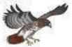</td><td>One of two groups of living amniotes; have amniotic eggs and rib cage ventilation, key adaptations for life on land</td></tr><tr><td>CONCEPT 34.6Mammals are amniotes that have hair and produce milk?Describe the origin and early evolution of mammals.</td><td></td><td></td><td>Tetrapods: four limbs, neck, fused pelvic girdle</td><td>Amniotes: amniotic egg, rib cage ventilation</td><td>Mammalia (monotrem marsupials,eutherians)</td><td>Evolved from synapsid ancestors; include egg-laying monotremes (echidnas, platypus); pouched marsupials (such as kangaroos, opossums); and eutherians (placental mammals, such as rodents, primates)</td></tr></table>

## Concept 34.7: Humans are mammals that have a large brain and bipedal locomotion

\- Derived characters of humans include bipedalism and a larger brain and reduced jaw compared with other apes.

\- Hominins—humans and species that are more closely related to humans than to chimpanzees—originated in Africa 7–8 million years ago. Early hominins had a small brain but probably walked upright.

\- The oldest evidence of tool use is 2.5 million years old.

\- Homo ergaster was the first fully bipedal, large-brained hominin. Homo erectus was the first hominin to leave Africa.

\- Neanderthals lived in Europe and the Near East from about 350,000 to 28,000 years ago.

\- Homo sapiens originated in Africa about 195,000 years ago and began to spread to other continents about 180,000 years ago.

Based on fossil evidence, summarize how key hominin features have changed over time.

For suggested answers, see Appendix A.

## Test Your Understanding

For more multiple-choice questions, go to the Practice Test (eTextbook only).

## Levels 1-2: Remembering/Understanding

1. Vertebrates and tunicates share
(A) jaws adapted for feeding.
(B) a high degree of cephalization.
(C) an endoskeleton that includes a skull.
(D) a notochord and a dorsal, hollow nerve cord.

2. Living vertebrates can be divided into two major clades. Select the appropriate pair.
(A) the chordates and the tetrapods
(B) the urochordates and the cephalochordates
(C) the cyclostomes and the gnathostomes
(D) the marsupials and the eutherians

3. Unlike eutherians, both monotremes and marsupials
(A) lack nipples.
(B) have some embryonic development outside the uterus.
(C) lay eggs.
(D) are found in Australia and Africa.

4. In Figure 34.25, which of the following is the sister taxon to the archosaurs?
(A) synapsids (C) turtles
(B) crocodilians (D) lepidosaurs

5. As hominins diverged from other primates, which of the following appeared first?
(A) reduced jawbones (C) the making of stone tools
(B) an enlarged brain (D) bipedal locomotion

## Levels 3-4: Applying/Analyzing

6. Which of the following could be considered the most recent common ancestor of living tetrapods?

(A) a sturdy-finned, shallow-water lobe-fin whose appendages had skeletal supports similar to those of terrestrial vertebrates

(B) an armored, jawed placoderm with two pairs of appendages

(C) an early ray-finned fish that developed bony skeletal supports in its paired fins

(D) a salamander that had legs supported by a bony skeleton but moved with the side-to-side bending typical of fishes

7. EVOLUTION CONNECTION Living members of a vertebrate lineage can be very different from early members of the lineage, and evolutionary reversals (character losses) are common. Give examples that illustrate these observations, and explain their evolutionary causes.

## Levels 5-6: Evaluating/Creating

8. SCIENTIFIC INQUIRY • DRAW IT As a consequence of size alone, larger organisms tend to have larger brains than smaller organisms. However, some organisms have brains that are considerably larger than expected for their size. There are high energetic costs associated with the development and maintenance of brains that are large relative to body size.

(a) The fossil record documents trends in which brains that are large relative to body size evolved in certain lineages, including hominins. In such lineages, what can you infer about the costs and benefits of large brains?

(b) Hypothesize how natural selection might favor the evolution of large brains despite their high maintenance costs.

(c) Data for 14 bird species are listed below. Graph the data, placing deviation from expected brain size on the x-axis and mortality rate on the y-axis. What can you conclude about the relationship between brain size and mortality?

<table><tr><td>Deviation from Expected Brain Size*</td><td>-2.4</td><td>-2.1</td><td>-2.0</td><td>-1.8</td><td>-1.0</td><td>0.0</td><td>0.3</td><td>0.7</td><td>1.2</td><td>1.3</td><td>2.0</td><td>2.3</td><td>3.0</td><td>3.2</td></tr><tr><td>Mortality Rate</td><td>0.9</td><td>0.7</td><td>0.5</td><td>0.9</td><td>0.4</td><td>0.7</td><td>0.8</td><td>0.4</td><td>0.8</td><td>0.3</td><td>0.6</td><td>0.6</td><td>0.3</td><td>0.6</td></tr></table>

Data from D. Sol et al., Big-brained birds survive better in nature, Proceedings of the Royal Society B 274:763–769 (2007).  
\*Values < 0 indicate brain sizes smaller than expected; values > 0 indicate sizes larger than expected.

9. WRITE ABOUT A THEME: ORGANIZATION Early tetrapods had a sprawling gait (like that of a lizard): As the right front foot moved forward, the body twisted to the left and the left rib cage and lung were compressed; the reverse occurred with the next step. Normal breathing, in which both lungs expand equally with each breath, was hindered during walking and prevented during running. In a short essay (100–150 words), explain how the origin of organisms such as dinosaurs, whose gait allowed them to move without compressing their lungs, could have led to emergent properties.

## 10. SYNTHESIZE YOUR KNOWLEDGE

  
This animal is a vertebrate with hair. What can you infer about its phylogeny? Identify as many key derived characters as you can that distinguish this animal from invertebrate chordates.
For selected answers, see Appendix A.

# Unit 6 Plant Form and Function

An Interview with Ernesto Gianoli

Dr. Ernesto Gianoli was born in Lima, Perú. He obtained a BS in Biology at Universidad Cayetano Heredia in Lima, an MS in Ecology at Universidad de Chile, and a PhD in Entomology at the Swedish University of Agricultural Sciences. After a 25-year academic career in Chile, he was appointed full professor in the Department of Biological Sciences at Tarleton State University, Texas. Most of his recent research concerns the ecology of plants. In 2014, he discovered an astounding case of leaf mimicry by Boquila trifoliolata, a vine that grows in the temperate rainforest of southern Chile. Boquila leaves have the unique and as yet unexplained ability to mimic many characteristics of the host plants on which they grow, including shape, color, leaf orientation, petiole length, and vein conspicuousness.

## How did you become interested in biology, and in plants in particular?

When I was about 12, I read a magazine article about evolution and Darwin's explorations of the Galápagos Islands. The idea that great scientific discoveries could be made just by observing nature closely, as Darwin had done, filled me with excitement. It was then that I decided that I wanted to study nature. Eventually, after being trained as an ecologist and studying plant-insect interactions, I became more and more intrigued by the faculties of plants. Some people view plants as "lesser" beings, but plants do amazing things even without a brain. It's incredible how much they can achieve without being able to move or communicate in the ways that animals do.

## How did you discover Boquila's "chameleon-like" properties?

My research team and I travelled to a beautiful national park to collect data on the distribution of climbing plant species across the light gradient in the forest. Field trips like these are not for those who like to lounge—almost every minute of daylight is devoted to collecting data. After several long, intense days of work, I needed a break, and so I went for a meditative walk

in the serene forest, observing plants along the path. Suddenly, I came across what I interpreted initially to be a very unusual specimen of a myrtle-like plant known locally as arrayán (Luma apiculate). Although the leaves of this particular specimen looked like arrayán, its stems were unusually thin. I thought, "Oh, this is strange. Why are these stems so different?" And then, on closer inspection, I realized that this plant was in fact a specimen of Boquila that was mimicking the appearance of arrayán! But of course, this finding needed to be verified. So, I looked for more Boquila, and I found the same phenomenon in about three quarters of the cases. I realized then that my aspirations as a 12-year-old boy had been fulfilled: I had made an important discovery.

## What advantages does Boquila gain by this form of mimicry?

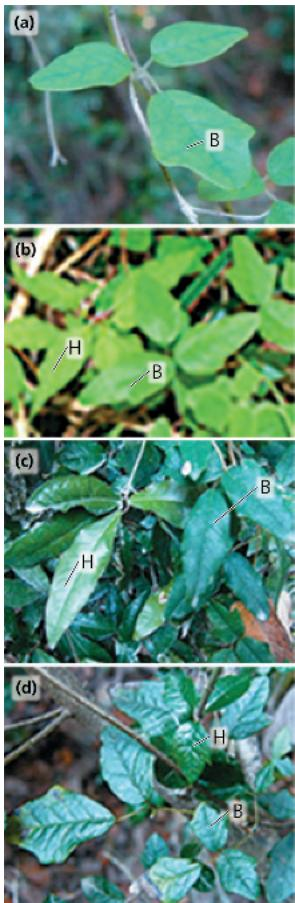

Boquila is a climbing plant. When it is not climbing, or if it is climbing a leafless host trunk, its leaves have their normal default appearance. However, when it grows on a host plant that is bearing leaves, Boquila's leaves mimic those of the host plant. By comparing the respective amount of herbivore damage evident in the normal-looking leaves of Boquila climbing a leafless trunk versus the mimicry-altered leaves of Boquila climbing a host trunk in full leaf, we found that the normal-looking leaves had greater amounts of herbivore damage. Thus, mimicry in this case appears to be an anti-herbivory mechanism. We do not know how mimicry occurs in Boquila, but it does not require direct contact with the host: This suggests some sort of airborne communication between the host and Boquila. Boquila may be able to identify the presence of the host plants either by way of volatile organic

  
Dr. Ernesto Gianoli

When an individual Boquila vine (labeled B in the photos) traverses the canopies of various host plants (labeled H), it mimics each of them in their respective areas. (a) The “standard” appearance of Boquila’s leaves when there are no hosts nearby. (b) A Boquila vine mimicking a host plant (Fuchsia magellanica) with light green leaves. (c) A Boquila vine produced leaves 10 times longer than usual when growing in the vicinity of the long-leaved species Aextoxicon punctatum. (d) The same Boquila plant produced leaves that were darker and thicker when growing in proximity to Rhaphithamnus spinosus.

compounds released by the host or by the airborne spread of species-specific microbes inhabiting the host plant. We are currently testing the latter hypothesis.

## What is your advice to an undergraduate considering a career in biology?

Passion and determination provide the fuel needed for young biologists to travel successfully down the long, winding, and branching road ahead of them. There will inevitably be many roadblocks and obstacles along the way, even from loved ones. My well-meaning parents, for example, tried to steer me away from a career studying nature, and towards a career in medicine. Aspiring biologists should follow their own path within science. Observing nature comes first, then questions and hypotheses relating to those observations, and finally what techniques should be used to test those hypotheses.

Passion and determination provide the fuel needed for young biologists to travel successfully down the long, winding, and branching road ahead of them.

# Vascular Plant Structure, Growth, and Development

## Key Concepts

35.1 Plants have a hierarchical organization consisting of organs, tissues, and cells

35.2 Different meristems generate new cells for primary and secondary growth

35.3 Primary growth lengthens roots and shoots

35.4 Secondary growth increases the diameter of stems and roots in woody plants

35.5 Growth, morphogenesis, and cell differentiation produce the plant body

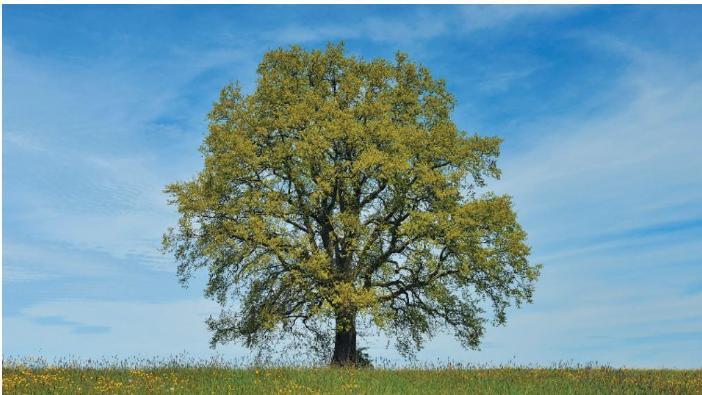  
Figure 35.1 There is beauty to behold at every level of plant organization: Every cell, every tissue, and every organ has a function, and the structure of each has been molded by natural selection.

## Study Tip

Make a table: To help keep track of what different plant cells do, make a table like the one shown.

<table><tr><td>Type of plant cell</td><td>What it does</td><td>How structure fits function</td></tr><tr><td></td><td></td><td></td></tr><tr><td></td><td></td><td></td></tr><tr><td></td><td></td><td></td></tr><tr><td></td><td></td><td></td></tr></table>

How does structure fit function in vascular plants?  
At the organ level

  
Leaves provide surface area for absorbing sunlight and exchanging gases.  
Stems support and elevate leaves, maximizing photosynthesis.  
Roots anchor the plant and absorb water and minerals.  
At the tissue level

Dermal tissue protects organs.

Vascular tissue provides support and transports resources.

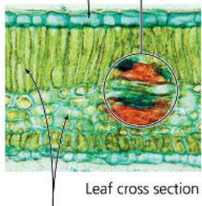  
Leaf cross section  
Ground tissue includes cells that carry out photosynthesis and store sugars.  
Photosynt are packed with that convert sunlight into chemical energy.

## At the cellular level

Photosynthetic cells are packed with chloroplasts

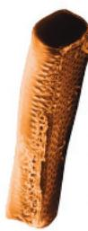

  
Chloroplasts  
Cells with root hairs near the tips of roots increase the surface area for absorbing water and minerals.  
Tube-shaped cells transport resources. The cell shown here carries water and minerals. Others conduct sugars.

# Concept 35.1: Plants have a hierarchical organization consisting of organs, tissues, and cells

Chapters 29 and 30 provided an overview of plant diversity, including both nonvascular and vascular plants. In this chapter and throughout Unit Six, we'll focus on vascular plants, especially angiosperms because flowering plants are the primary producers in many terrestrial ecosystems and are of great agricultural importance. This chapter mainly explores non-reproductive growth—roots, stems, and leaves—and focuses primarily on the two main groups of angiosperms: eudicots and monocots (see Figure 30.16). Later, in Chapter 38, we'll examine angiosperm reproductive growth: flowers, seeds, and fruits.

Plants, like most animals, are composed of cells, tissues, and organs. A cell is the fundamental unit of life. A tissue is a group of cells consisting of one or more cell types that together perform a specialized function. An organ consists of several types of tissues that together carry out particular functions. As you learn about plant structure, keep in mind how natural selection has produced plant forms that fit plant function at all levels of structure. We begin by discussing plant organs because their structures are most familiar.

## Vascular Plant Organs: Roots, Stems, and Leaves

EVOLUTION The basic morphology, or shape, of vascular plants reflects their evolutionary history as terrestrial organisms that inhabit and draw resources from two very different environments—below the ground and above the ground. They must absorb water and minerals from below the ground surface and $CO_{2}$ and light from above the ground surface. The ability to acquire these resources efficiently is traceable to the evolution of roots, stems, and leaves as the three basic organs. These organs form a root system and a shoot system, the latter consisting of stems and leaves (Figure 35.2). Vascular plants, with few exceptions, rely on both systems for survival. Roots are almost never photosynthetic; they starve unless photosynthates, the sugars and the other carbohydrates produced during photosynthesis, are imported from the shoot system. Conversely, the shoot system depends on the water and minerals that roots absorb from the soil.

## Roots

A root is an organ that anchors a vascular plant in the soil, absorbs minerals and water, and often stores carbohydrates and other reserves. The primary root, originating in the seed embryo, is the first root (and the first organ) to emerge from a germinating seed. It soon branches to form lateral roots (see Figure 35.2) that

Figure 35.2 An overview of a flowering plant.

The plant body is divided into a root system and a shoot system, connected by vascular tissue (purple strands in this diagram) that is continuous throughout the plant. The plant shown is an idealized eudicot.

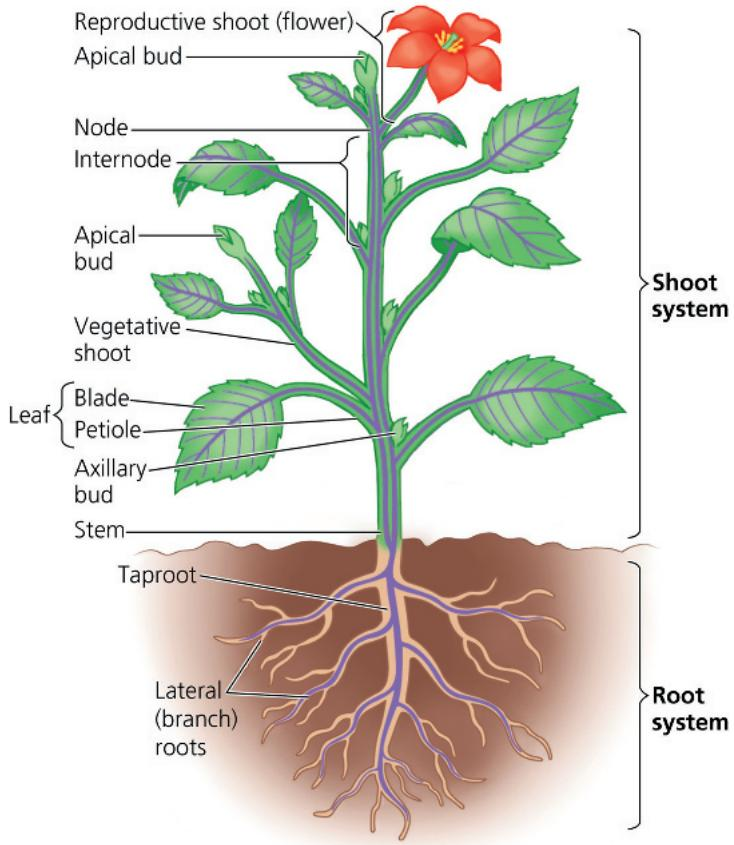

can also branch, greatly enhancing the ability of the root system to anchor the plant and to acquire resources such as water and minerals from the soil.

Tall, erect plants with large shoot masses generally have a taproot system, consisting of one main vertical root, the taproot, which usually develops from the primary root. In taproot systems, the role of absorption is restricted largely to the tips of lateral roots. A taproot, although energetically expensive to make, facilitates the anchorage of the plant in the soil. By preventing toppling, the taproot enables the plant to grow taller, thereby giving it access to more favorable light conditions and, in some cases, providing an advantage for pollen and seed dispersal. Taproots can also be specialized for food storage.

Small vascular plants or those that have a trailing growth habit are particularly susceptible to grazing animals that can uproot the plant and kill it. Such plants are most efficiently anchored by a fibrous root system, a thick mat of slender roots spreading out below the soil surface (see Figure 30.16). In plants that have fibrous root systems, including most monocots, the primary root dies early on and does not form a taproot. Instead, many small roots emerge from the stem. Such roots are said to be adventitious, a term describing a plant organ that grows in an unusual location, such as roots arising from

Figure 35.3 Root hairs of a radish seedling.

Root hairs grow by the thousands just behind the tip of each root. By increasing the root's surface area, they greatly enhance the absorption of water and minerals from the soil.

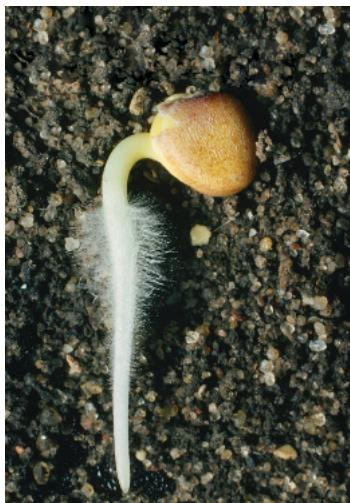

stems or leaves. Each root forms its own lateral roots, which in turn form their own lateral roots. Because this mat of roots holds the topsoil in place, plants such as grasses that have dense fibrous root systems are especially good at preventing soil erosion.

In most plants, the absorption of water and minerals occurs primarily near the tips of elongating roots, where vast numbers of root hairs, thin, finger-like extensions of root epidermal cells, emerge and increase the surface area of the root enormously (Figure 35.3). Most root systems also form mycorrhizal associations, symbiotic interactions with soil fungi that increase a plant's ability to absorb minerals (see Figure 37.14). The roots of many plants are adapted for specialized functions (Figure 35.4).

## Stems

A stem is a plant organ bearing leaves and buds. Its chief function is to elongate and orient the shoot in a way that maximizes

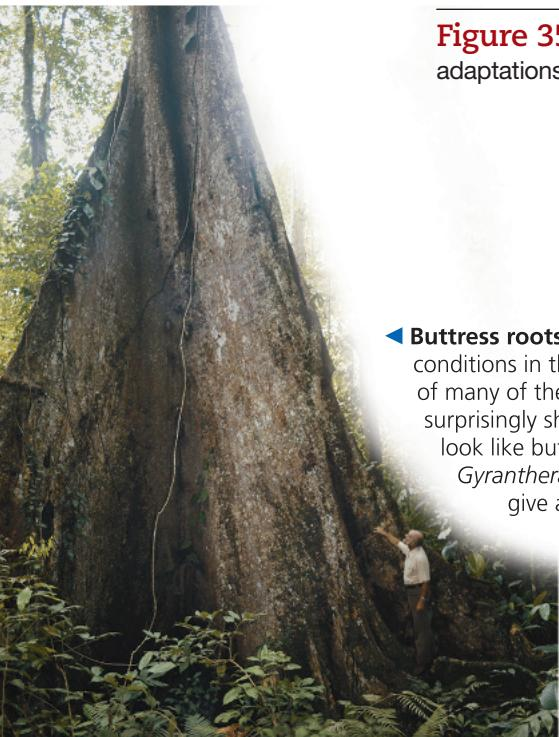  
Figure 35.4 Evolutionary adaptations of roots.  
Buttress roots. Because of moist conditions in the tropics, root systems of many of the tallest trees are surprisingly shallow. Aerial roots that look like buttresses, such as seen in Gyranthera caribensis in Venezuela, give architectural support to the trunks of trees.

  
▲ Brace roots. The aerial, adventitious roots of maize (corn) are brace roots, so named because they support tall, top-heavy plants. All roots of a mature maize plant are adventitious whether they emerge above or below ground.

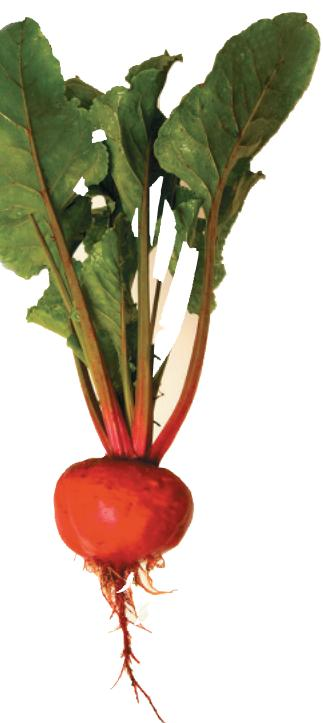

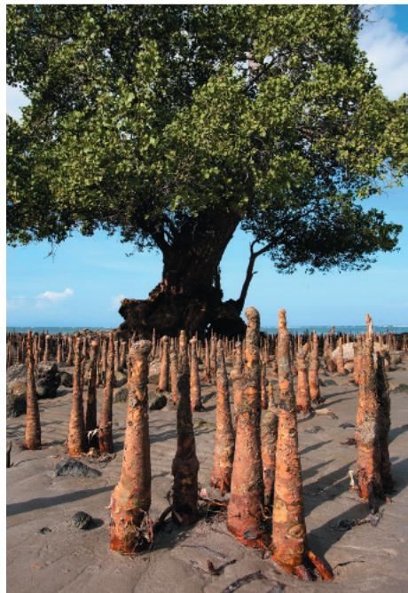  
▲ Storage roots.
Many plants, such as the common beet, store food and water in their roots.  
Pneumatophores. Also known as air roots, pneumatophores are produced by trees such as mangroves that inhabit tidal swamps. By projecting above the water's surface at low tide, they enable the root system to obtain oxygen, which is lacking in the thick, waterlogged mud.

"Strangling" aerial roots. Strangler fig seeds germinate in the crevices of tall trees. Aerial roots grow to the ground, wrapping around the host tree and objects such as this Cambodian temple. Shoots grow upward and shade out the host tree, killing it.

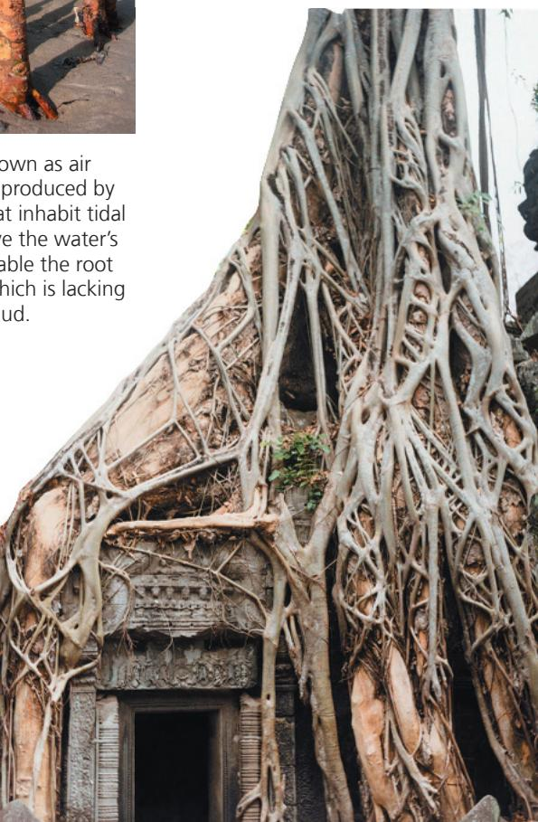

Figure 35.5 Evolutionary adaptations of stems.  
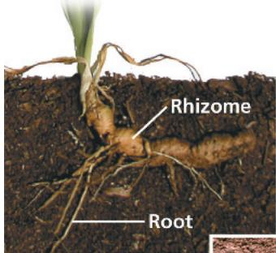  
Rhizomes. The base of this iris plant is an example of a rhizome, a horizontal shoot that grows just below the surface. Vertical shoots emerge from axillary buds on the rhizome.

Stolons. Shown here on a strawberry plant, stolons are horizontal shoots that grow along the surface. These "runners" enable a plant to reproduce asexually, as plantlets grow from axillary buds along each runner.

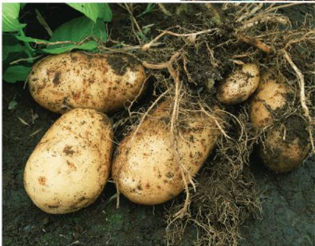  
Tubers. Tubers, such as these potatoes, are enlarged ends of rhizomes or stolons specialized for storing food. The "eyes" of a potato are clusters of axillary buds.  
Which of these three examples has nodes? For suggested answer, see Appendix A.  
Figure 35.6 Simple versus compound leaves.

photosynthesis by the leaves. Another function of stems is to elevate reproductive structures, thereby facilitating the dispersal of pollen and fruit. Green stems may also perform a limited amount of photosynthesis. Each stem consists of an alternating system of nodes, the points at which leaves are attached, and internodes, the stem segments between nodes (see Figure 35.2). Most of the growth of a young shoot is concentrated near the growing shoot tip, or apical bud. Apical buds are not the only types of buds found in shoots. In the upper angle (axil) formed by each leaf and the stem is an axillary bud, which can potentially form a lateral branch or, in some cases, a thorn or flower.

Some plants have stems with alternative functions, such as food storage or asexual reproduction. Many of these modified stems, including rhizomes, stolons, and tubers, are often mistaken for roots (Figure 35.5).

## Leaves

In most vascular plants, the leaf is the main photosynthetic organ. In addition to intercepting light, leaves exchange gases with the atmosphere, dissipate heat, and defend themselves from

## Simple leaf

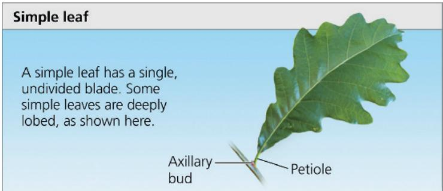

## Compound leaf

herbivores and pathogens. These functions may have conflicting anatomical and physiological requirements. For example, a dense covering of hairs may help repel herbivorous insects but may also trap air near the leaf surface, thereby reducing gas exchange and, consequently, photosynthesis. Because of these conflicting demands and trade-offs, leaves vary extensively in form. In general, however, a leaf consists of a flattened blade and a stalk, the petiole, which joins the leaf to the stem at a node (see Figure 35.2). Grasses and many other monocots lack petioles; instead, the base of the leaf forms a sheath that envelops the stem.

Monocots and eudicots differ in the arrangement of veins, the vascular tissue of leaves. Most monocots have parallel major veins of equal diameter that run the length of the blade. Eudicots generally have a branched network of veins arising from a major vein (the midrib) that runs down the center of the blade (see Figure 30.16).

In identifying angiosperms according to structure, taxonomists rely mainly on floral morphology, but they also use variations in leaf morphology, such as leaf shape, the branching pattern of veins, and the spatial arrangement of leaves. Figure 35.6 illustrates a difference in leaf shape: simple versus compound. Compound leaves benefit photosynthesis by allowing greater light penetration to lower leaves, and may also help in confining invading pathogens to a single leaflet, thereby preventing systemic spread.

The shapes of leaves are often products of genetic programs that are tweaked by environmental influences. Interpret the data in the Scientific Skills Exercise to explore the roles of genetics and the environment in determining leaf morphology in red maple trees.

Almost all leaves are specialized for photosynthesis. However, in some species evolution has resulted in additional functions, such as support, protection, storage, or asexual reproduction (Figure 35.7). Some are sporophylls, leaves highly specialized for sexual reproduction, such as carpels and stamens in flowers (see Figure 30.12).

# Scientific Skills Exercise Using Bar Graphs to Interpret Data

Nature Versus Nurture: Why Are Leaves from Northern Red Maples “Toothier” Than

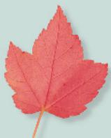

Leaves from Southern Red Maples? Not all leaves of the red maple (Acer rubrum) are the same. The “teeth” along the margins of leaves growing in northern locations differ in size and number from those of their southern counterparts. (The leaf seen here has an intermediate appearance.) Are these differences due to genetic differences between northern and southern Acer rubrum populations, or do they arise from environmental differences between northern and southern locations, such as average temperature, that affect gene expression?

How the Experiment Was Done Seeds of Acer rubrum were collected from four latitudinally distinct sites: Ontario (Canada), Pennsylvania, South Carolina, and Florida. The seeds from the four sites were then grown in a northern location (Rhode Island) and a southern location (Florida). After a few years of growth, leaves were harvested from the four sets of plants growing in the two locations. The average area of single teeth and the average number of teeth per leaf area were determined.

## Data from the Experiment

<table><tr><td>Seed Collection Site</td><td colspan="2">Average Area of a Single Tooth (cm2)</td><td colspan="2">Number of Teeth per cm2of Leaf Area</td></tr><tr><td></td><td>Grown in Rhode Island</td><td>Grown in Florida</td><td>Grown in Rhode Island</td><td>Grown in Florida</td></tr><tr><td>Ontario (43.32°N)</td><td>0.017</td><td>0.017</td><td>3.9</td><td>3.2</td></tr><tr><td>Pennsylvania (42.12°N)</td><td>0.020</td><td>0.014</td><td>3.0</td><td>3.5</td></tr><tr><td>South Carolina (33.45°N)</td><td>0.024</td><td>0.028</td><td>2.3</td><td>1.9</td></tr><tr><td>Florida (30.65°N)</td><td>0.027</td><td>0.047</td><td>2.1</td><td>0.9</td></tr></table>

Data from D. L. Royer et al., Phenotypic plasticity of leaf shape along a temperature gradient in Acer rubrum, PLoS ONE 4(10):e7653 (2009).

## INTERPRET THE DATA

1. Make a bar graph for tooth size and a bar graph for number of teeth. (For information on bar graphs, see the Scientific Skills Review in Appendix D.) From north to south, what is the general trend in tooth size and number of teeth in leaves of Acer rubrum?

2. Based on the data, would you conclude that leaf tooth traits in the red maple are largely determined by genetic heritage (genotype), by the capacity for responding to environmental change within a single genotype (phenotypic plasticity), or by both? Make specific reference to the data in answering the question.

3. The “toothiness” of leaf fossils of known age has been used by paleoclimatologists to estimate past temperatures in a region. If a 10,000 year-old fossilized red maple leaf from South Carolina had an average of 4.2 teeth per square centimeter of leaf area, what could you infer about the temperature of South Carolina 10,000 years ago compared with the temperature today? Explain your reasoning.

## Figure 35.7 Evolutionary adaptations of leaves.

Tendrils. The tendrils by which this pea plant clings to a support are modified leaves. After it has "lassoed" a support, a tendril forms a coil that brings the plant closer

to the support. Tendrils are typically modified leaves, but some tendrils are modified stems, as in grapevines.

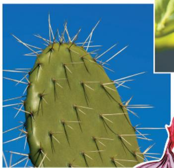

  
Spines. The spines of cacti, such as this prickly pear, are actually leaves; photosynthesis is carried out by the fleshy green stems.

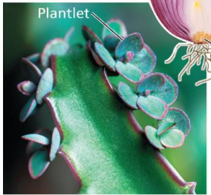  
Storage leaves. Bulbs, such as this cut onion, have a short underground stem and modified leaves that store food.

Storage leaves Stem

Reproductive leaves. The leaves of some succulents, such as Kalanchoë daigremontiana, produce adventitious plantlets, which fall off the leaf and take root in the soil.

## Dermal, Vascular, and Ground Tissues

All three basic vascular plant organs—roots, stems, and leaves—are composed of three fundamental tissue types: dermal, vascular, and ground tissues. Each of these general types forms a tissue system that is continuous throughout the plant, connecting all the organs. However, specific characteristics of the tissues and the spatial relationships of tissues to one another vary in different organs (Figure 35.8).

Dermal tissue serves as the outer protective covering of the plant. Like our skin, it forms the first line of defense against physical damage and pathogens. In nonwoody plants, it is usually a single tissue called the epidermis, a layer of tightly packed cells. In leaves and most stems, the cuticle, a waxy epidermal coating, helps prevent water loss. In woody plants, protective tissues called periderm replace the epidermis in older regions of stems and roots. In addition to protecting the plant from water loss and disease, the epidermis has specialized characteristics in each organ. In roots, water and minerals absorbed from the soil enter through the epidermis, especially in root hairs. In shoots, specialized epidermal cells called guard cells are involved in gaseous exchange. Another class of highly specialized epidermal cells found in shoots consists of outgrowths called trichomes. In some desert species,

Figure 35.8 The three tissue systems.

The dermal tissue system (blue) provides a protective cover for the entire body of a plant. The vascular tissue system (purple), which transports materials between the root and shoot systems, is also continuous throughout the plant but is arranged differently in each organ. The ground tissue system (yellow), which is responsible for most of the metabolic functions, is located between the dermal tissue and the vascular tissue in each organ.

  
Figure 35.9 Trichome diversity on the surface of a leaf.

hairlike trichomes reduce water loss and reflect excess light. Some trichomes defend against insects through shapes that hinder movement or glands that secrete sticky fluids or toxic compounds (Figure 35.9).

The two major functions of vascular tissue are to facilitate the transport of materials through the plant and to provide mechanical support. Vascular tissues are of two types: xylem and phloem. Xylem conducts water and dissolved minerals upward from roots into the shoots. Phloem transports sugars, the products of photosynthesis, from where they are made (usually the leaves) to where they are needed or stored—usually roots and sites of growth, such as developing leaves and fruits. The vascular tissue of a root or stem is collectively called the stele (the Greek word for “pillar”). The arrangement of the stele varies, depending on the species and organ. In angiosperms, for example, the root stele is a solid central vascular cylinder of xylem and phloem, whereas the stele of stems and leaves consists of vascular bundles, separate strands containing xylem and phloem (see Figure 35.8). Both xylem and phloem are composed of a variety of cell types, including cells that are highly specialized for transport or support.

Tissue that is neither dermal nor vascular is ground tissue. Ground tissue that is internal to the vascular tissue is known as pith, and ground tissue that is external to the vascular tissue is called cortex. Ground tissue is not just filler: It includes cells

Three types of trichomes are found on the surface of marjoram (Origanum majorana). Spear-like trichomes help hinder the movement of crawling insects, while the other two types of trichomes secrete oils and other chemicals involved in defense (colorized SEM).

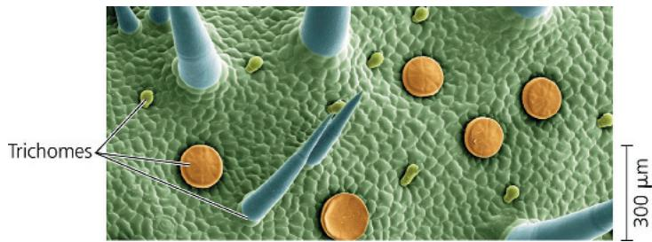

specialized for functions such as storage, photosynthesis, support, and short-distance transport.

## Common Types of Plant Cells

In a plant, as in any multicellular organism, cells undergo cell differentiation; that is, they become specialized in structure and function during the course of development. Cell differentiation may involve changes both in the cytoplasm and its organelles and in the cell wall. Figure 35.10, on the next two pages, focuses on the major types of plant cells. Notice the structural adaptations that make specific functions possible. You may also wish to review basic plant cell structure (see Figures 6.8 and 6.27).

## Concept Check 35.1

1. How does the vascular tissue system enable leaves and roots to function together in supporting growth and development of the whole plant?

2. WHAT IF? If humans were photoautotrophs, making food by capturing light energy for photosynthesis, how might our anatomy be different?

3. MAKE CONNECTIONS Explain how central vacuoles and cellulose cell walls contribute to plant growth (see Concepts 6.4 and 6.7).

For suggested answers, see Appendix A.

# Concept 35.2: Different meristems generate new cells for primary and secondary growth

A major difference between plants and most animals is that plant growth is not limited to an embryonic or juvenile period. Instead, growth occurs throughout the plant's life, a process called indeterminate growth. Plants can keep growing because they have undifferentiated tissues called meristems containing cells that can divide, leading to new cells that elongate and become differentiated. Except for dormant periods, most plants grow

## Exploring Examples of Differentiated Plant Cells

Figure 35.10

  
Parenchyma cells in a privet (Ligustrum) leaf (LM)  
25 μm

## Parenchyma Cells

Mature parenchyma cells have primary walls that are relatively thin and flexible, and most lack secondary walls. (See Figure 6.27 to review primary and secondary cell walls.) When mature, parenchyma cells generally have a large central vacuole. Parenchyma cells perform most of the metabolic functions of the plant, synthesizing and storing various organic products. For example, photosynthesis occurs within the chloroplasts of parenchyma cells in the leaf. Some parenchyma cells in stems and roots have colorless plastids called amyloplasts that store starch. The fleshy tissue of many fruits is composed mainly of parenchyma cells. Most parenchyma cells retain the ability to divide and differentiate into other types of plant cells under particular conditions—during wound repair, for example. It is even possible to grow an entire plant from a single parenchyma cell.

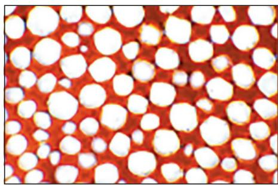  
Collenchyma cells in a common nettle (Urtica dioica) stem (LM)

## Collenchyma Cells

Grouped in strands, collenchyma cells (seen here in cross section) help support young parts of the plant shoot. Collenchyma cells are generally elongated cells that have thicker primary walls than parenchyma cells, though the walls are unevenly thickened. Young stems and petioles often have strands of collenchyma cells just below their epidermis. Collenchyma cells provide flexible support without restraining growth. At maturity, these cells are living and flexible, elongating with the stems and leaves they support—unlike sclerenchyma cells, which we discuss next.

  
Cell wall

## Sclerenchyma Cells

> Sclereid cells (in pear) (LM)

25 μm

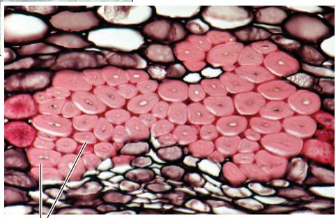  
Fiber cells (cross section from ash tree) (LM)

Sclerenchyma cells also function as supporting elements in the plant but are much more rigid than collenchyma cells. In sclerenchyma cells, the secondary cell wall, produced after cell elongation has ceased, is thick and contains large amounts of lignin, a relatively indigestible strengthening polymer that accounts for more than a quarter of the dry mass of wood. Lignin is present in all vascular plants but not in bryophytes. Mature sclerenchyma cells cannot elongate, and they occur in regions of the plant that have stopped growing in length. Sclerenchyma cells are so specialized for support that many are dead at functional maturity, but they produce secondary walls before the protoplast (the living part of the cell) dies. The rigid walls remain as a “skeleton” that supports the plant, in some cases for hundreds of years.

Two types of sclerenchyma cells, known as sclereids and fibers, are specialized entirely for support and strengthening. Sclereids, which are boxier than fibers and irregular in shape, have very thick, lignified secondary walls. Sclereids impart the hardness to nutshells and seed coats and the gritty texture to pear fruits. Fibers, which are usually grouped in strands, are long, slender, and tapered. Some are used commercially, such as hemp fibers for making rope and flax fibers for weaving into linen.

Tracheids and vessels
(colorized SEM) Perforation—plate

## Water-Conducting Cells of the Xylem

The two types of water-conducting cells, tracheids and vessel elements, are tubular, elongated cells that are dead and lignified at functional maturity. Tracheids occur in the xylem of all vascular plants. In addition to tracheids, most angiosperms, as well as a few gymnosperms and a few seedless vascular plants, have vessel elements. When the living cellular contents of a tracheid or vessel element disintegrate, the cell's thickened walls remain behind, forming a nonliving conduit through which water can flow. The secondary walls of tracheids and vessel elements are often interrupted by pits, thinner regions where only primary walls are present (see Figure 6.27 to review primary and secondary walls). Water can migrate laterally between neighboring cells through pits.

Tracheids are long, thin cells with tapered ends. Water moves from cell to cell mainly through the pits, where it does not have to cross thick secondary walls.

Vessel elements are generally wider, shorter, thinner walled, and less tapered than the tracheids. They are aligned end to end, forming long pipes known as vessels that in some cases are visible with the naked eye. The end walls of vessel elements have perforation plates that enable water to flow freely through the vessels.

The secondary walls of tracheids and vessel elements are hardened with lignin. This hardening provides support and prevents collapse under the tension of water transport.

  
Vessel elements, with perforated end walls

## Sugar-Conducting Cells of the Phloem

Unlike the water-conducting cells of the xylem, the sugar-conducting cells of the phloem are alive at functional maturity. In seedless vascular plants and gymnosperms, sugars and other organic nutrients are transported through long, narrow cells called sieve cells. In the phloem of angiosperms, these nutrients are transported through sieve tubes, which consist of chains of cells that are called sieve-tube elements, or sieve-tube members.

Though alive, sieve-tube elements lack a nucleus, ribosomes, a distinct vacuole, and cytoskeletal elements. This reduction in cell contents enables nutrients to pass more easily through the cell. The end walls between sieve-tube elements, called sieve plates, have pores that facilitate the flow of fluid from cell to cell along the sieve tube. Alongside each sieve-tube element is a nonconducting cell called a companion cell, which is connected to the sieve-tube element by numerous plasmodesmata (see Figure 6.27). The nucleus and ribosomes of the companion cell serve not only that cell itself but also the adjacent sieve-tube element. In some plants, the companion cells in leaves also help load sugars into the sieve-tube elements, which then transport the sugars to other parts of the plant.

  
Sieve-tube element (left) and companion cell: cross section (TEM)

  
Sieve-tube elements: longitudinal view

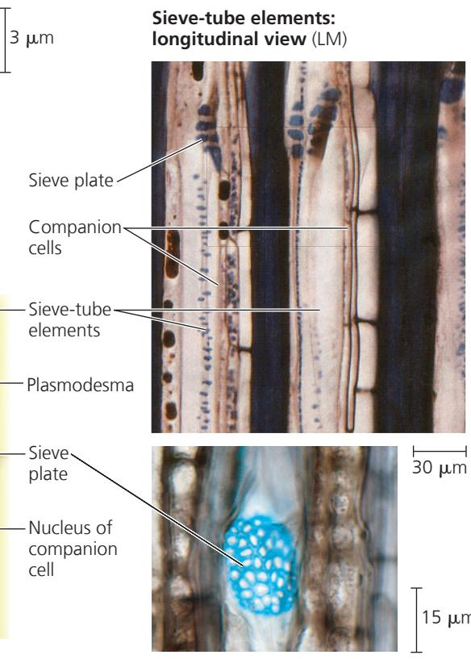  
Sieve plate with pores (LM)

continuously. In contrast, most animals and some plant organs—such as leaves, thorns, and flowers—undergo determinate growth; they stop growing after reaching a certain size.

There are two main types of meristems: apical meristems and lateral meristems (Figure 35.11). Apical meristems, located at root and shoot tips, provide cells that enable primary growth, growth in length. Primary growth allows roots to extend throughout the soil and shoots to increase exposure to light. In herbaceous (nonwoody) plants, it produces all, or almost all, of the plant body. Woody plants, however, also grow in circumference in the parts of stems and roots that no longer grow in length. This growth in thickness, known as secondary growth, is made possible by lateral meristems: the vascular cambium and cork cambium.

These cylinders of dividing cells extend along the length of roots and stems. The vascular cambium adds vascular tissue called secondary xylem (wood) and secondary phloem. Most of the thickening is from secondary xylem. The cork cambium replaces the epidermis with the thicker, tougher periderm.

Cells in apical and lateral meristems divide frequently during the growing season, generating additional cells. Some new cells remain in the meristem and produce more cells, while others differentiate and are incorporated into tissues and organs. Cells that remain as sources of new cells have traditionally been called initials but are increasingly being called stem cells to correspond to animal stem cells that also divide and remain functionally undifferentiated.

## Visualizing Primary and Secondary Growth

## Figure 35.11

All vascular plants have primary growth (growth in length). Woody plants also have secondary growth (growth in thickness).

## Primary Growth (growth in length)

Primary growth is made possible by apical meristems at the tips of shoots (and roots).

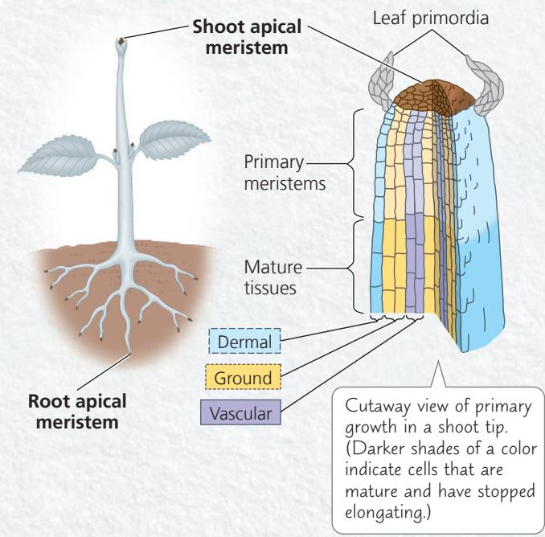

Apical meristem cells are undifferentiated. When they divide, some daughter cells remain in the apical meristem, ensuring a continuing population of undifferentiated cells. Other daughter cells become partly differentiated as primary meristem cells. After dividing and growing in length, they become fully differentiated cells in the mature tissues.

Cutaway view of primary growth in a shoot tip. (Darker shades of a color indicate cells that are mature and have stopped elongating.)

Cell division in—
apical meristem
Daughter cell in —
primary meristem
Cell division in—
primary meristem

Differentiated cells (for example, vessel elements)

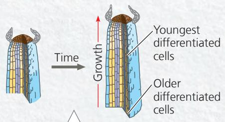

The addition of elongated, differentiated cells lengthens a stem (as shown here) or root.

## Secondary Growth (growth in thickness)

Secondary growth is made possible by two lateral meristems extending along the length of a shoot (or root) where primary growth has ceased.

Lateral meristems are cylinders of dividing cells that are one cell thick. There are two types: the vascular cambium and the cork cambium.

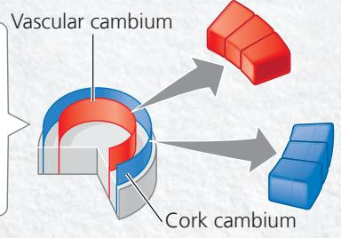

Cambium cell divisions in the plane perpendicular to the surface of the shoot enable the cambium to increase in circumference as the stem widens.

Cells displaced from the meristem may divide several more times as they differentiate into mature cells. During primary growth, these cells give rise to three tissues called primary meristems—the protoderm, ground meristem, and procambium—that will produce, respectively, the three mature tissues of a root or shoot: the dermal, ground, and vascular tissues. The lateral meristems in woody plants also have stem cells, which give rise to all secondary growth.

The relationship between primary and secondary growth is seen in the winter twig of a deciduous tree. At the shoot tip is the dormant apical bud, enclosed by scales that protect its apical meristem (Figure 35.12). In spring, the bud sheds its scales and begins a new spurt of primary growth, producing a series of nodes and internodes. On each growth segment, nodes are marked by scars left when leaves fell. Leaf scars are prominent in many twigs.

Above each scar is an axillary bud or a branch formed by an axillary bud. Farther down are bud scars from whorls of scales that enclosed the apical bud during the previous winter. In each growing season, primary growth extends shoots, and secondary growth increases the diameter of parts formed in previous years.

Although meristems enable plants to grow throughout their lives, plants do die, of course. Based on the length of their life cycle, flowering plants can be categorized as annuals, biennials, or perennials. Annuals complete their life cycle—from germination to flowering to seed production to death—in a single year or less. Many wildflowers are annuals, as are most staple food crops, including legumes and cereal grains such as wheat and rice. Dying after producing seeds and fruits enables plants to transfer the maximum amount of energy to reproduction. Biennials, such as

Figure 35.12 Three years' growth in a winter twig.  
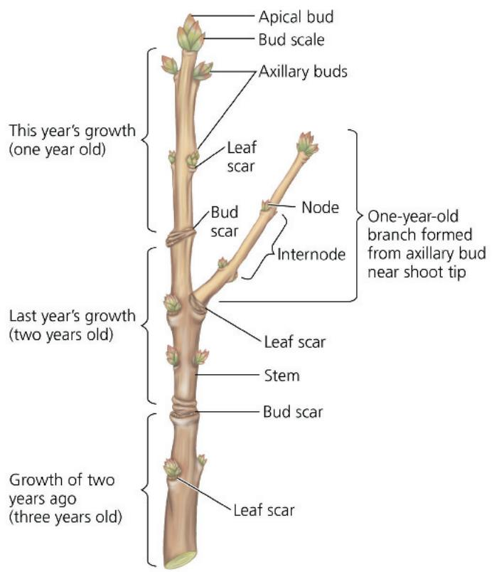  
Figure 35.13 Primary growth of a eudicot root.

turnips, generally require two growing seasons to complete their life cycle, flowering and fruiting only in their second year. Perennials live many years and include trees, shrubs, and some grasses. Some buffalo grass of the North American plains is thought to have been growing for 10,000 years from seeds that sprouted at the close of the last ice age.

## Concept Check 35.2

1. Would primary and secondary growth ever occur simultaneously in the same plant?

2. Roots and stems grow indeterminately, but leaves do not. How might this benefit the plant?

3. WHAT IF? After growing carrots for one season, a gardener decides that the carrots are too small. Since carrots are biennials, the gardener leaves the crop in the ground for a second year, thinking the carrot roots will grow larger. Is this a good idea? Explain.

For suggested answers, see Appendix A.

## Concept 35.3: Primary growth lengthens roots and shoots

Primary growth arises directly from cells produced by apical meristems. In herbaceous plants, almost the entire plant is created through primary growth, whereas in woody plants only the non-woody, more recently formed parts of the plant represent primary growth. Although both roots and shoots lengthen as a result of cells derived from apical meristems, the details of their primary growth differ in many ways.

In the micrograph, mitotic cells in the apical meristem are revealed by staining for cyclin, a protein involved in cell division (LM).

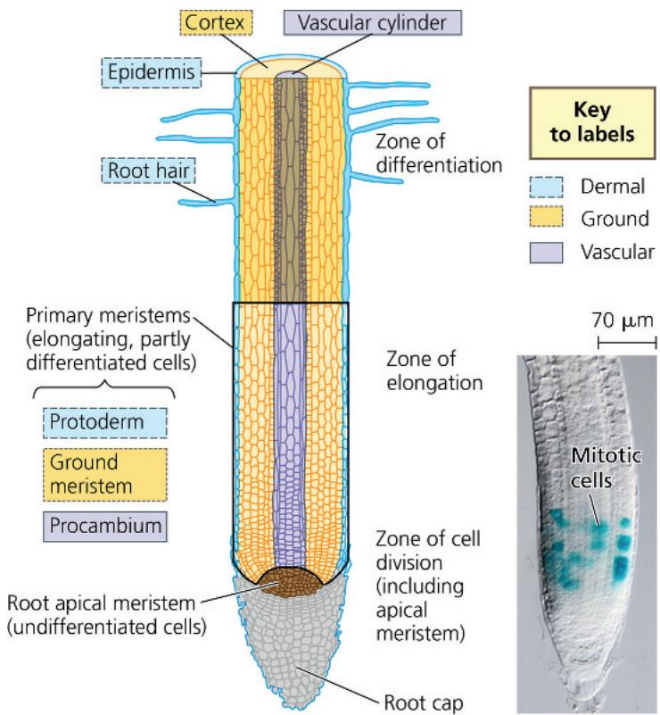

## Primary Growth of Roots

The entire biomass of a primary root is derived from the root apical meristem. The root apical meristem also makes a thimble-like root cap, which protects the delicate apical meristem as the root pushes through the abrasive soil. The root cap secretes a polysaccharide slime that lubricates the soil around the tip of the root. Growth occurs just behind the tip in three overlapping zones of cells at successive stages of primary growth. These are the zones of cell division, elongation, and differentiation (Figure 35.13).

The zone of cell division includes the stem cells of the root apical meristem and their immediate products. New root cells are produced in this region, including cells of the root cap. Typically, a few millimeters behind the tip of the root is the zone of elongation, where most of the growth occurs as root cells elongate—sometimes to more than ten times their original length. Cell elongation in this zone pushes the tip farther into the soil. Meanwhile, the root apical meristem keeps adding cells to the younger end of the zone of elongation. Even before the root cells finish lengthening, many begin specializing in structure and function. As this occurs, the three primary meristems—the protoderm, ground meristem, and procambium—become evident. In the zone of differentiation, or zone of maturation, cells complete their differentiation and become distinct cell types.

The protoderm, the outermost primary meristem, gives rise to the epidermis, a single layer of cuticle-free cells covering the root. Root hairs are the most prominent feature of the root epidermis. These modified epidermal cells function in the absorption of water and minerals. Root hairs typically only live a few weeks but together make up 70–90% of the total root surface area. It has been estimated that a four-month-old rye plant has about 14 billion

Figure 35.14 Organization of primary tissues in young roots. Parts (a) and (b) show cross sections of the roots of a Ranunculus (buttercup) species and Zea mays (maize), respectively. These represent two basic patterns of root organization, of which there are many variations, depending on the plant species (all LMs).

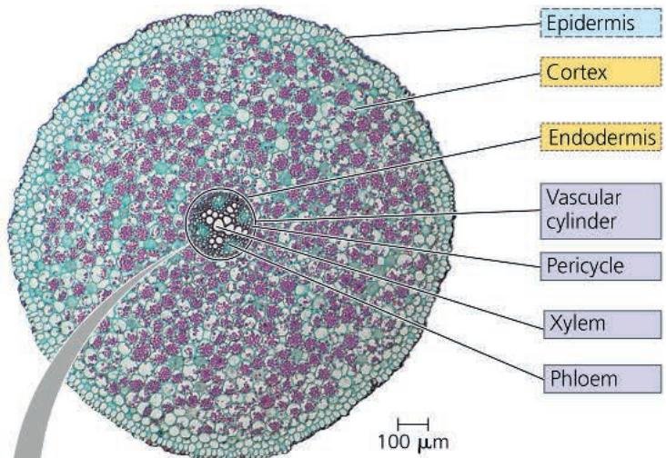  
(a) Root with xylem and phloem in the center (typical of eudicots). In the roots of typical gymnosperms and eudicots, as well as some monocots, the stele is a vascular cylinder appearing in cross section as a lobed core of xylem with phloem between the lobes.

Endodermis

Pericycle

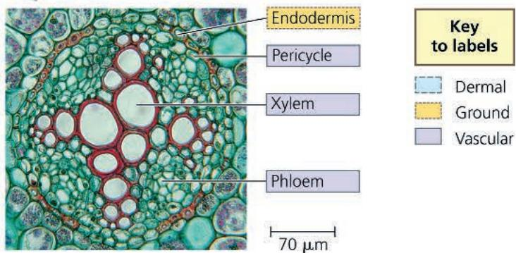

Xylem

Dermal

Ground

  
(b) Root with parenchyma in the center (typical of monocots). The stele of many monocot roots is a vascular cylinder with a core of parenchyma surrounded by a ring of xylem and a ring of phloem.  
Figure 35.15 The formation of a lateral root.

root hairs. Laid end to end, the root hairs of a single rye plant would cover 10,000 km, one-quarter the length of the equator.

Sandwiched between the protoderm and the procambium is the ground meristem, which gives rise to mature ground tissue. The ground tissue of roots, consisting mostly of parenchyma cells, is found in the cortex, the region between the vascular tissue and epidermis. In addition to storing carbohydrates, cells in the cortex transport water and salts from the root hairs to the center of the root. The cortex also allows for extracellular diffusion of water, minerals, and oxygen from the root hairs inward because there are large spaces between cells. The innermost layer of the cortex is called the endodermis, a cylinder one cell thick that forms the boundary with the vascular cylinder. The endodermis is a selective barrier that regulates passage of substances from the soil into the vascular cylinder (see Figure 36.9).

The procambium gives rise to the vascular cylinder, which consists of a solid core of xylem and phloem tissues surrounded by a cell layer called the pericycle. In most eudicot roots, the xylem has a starlike appearance in cross section, and the phloem occupies the indentations between the arms of the xylem “star” (Figure 35.14a). In many monocot roots, the vascular tissue consists of a core of undifferentiated parenchyma cells surrounded by a ring of alternating xylem and phloem tissues (Figure 35.14b).

By increasing the length of roots, primary growth facilitates their penetration and exploration of the soil. If a resource-rich pocket is located in the soil, the branching of roots may be stimulated. Branching, too, is a form of primary growth. As shown in Figure 35.15, lateral (branch) roots arise from meristematically active regions of the pericycle, the outermost cell layer in the vascular cylinder, which is adjacent to and just inside the endodermis (see Figure 35.14). The emerging lateral roots disruptively

A lateral root originates in the pericycle, the outermost layer of the vascular cylinder of a root, and destructively pushes through the outer tissues before emerging. In this light micrograph, the view of the original root is a cross section, but the view of the lateral root is a longitudinal section (a view along the length of the lateral root).

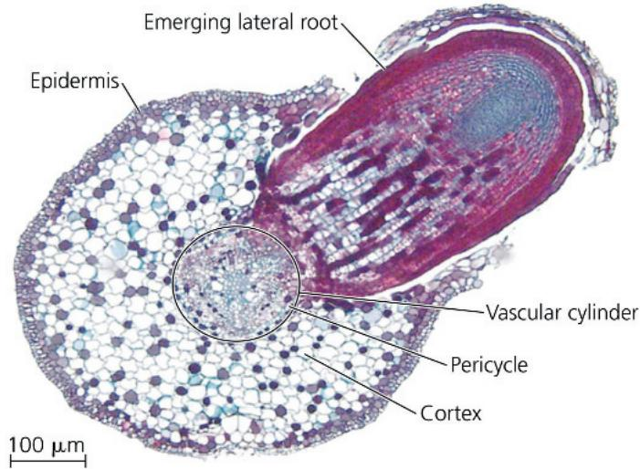  
DRAW IT Draw what the original root and lateral root would look like when viewed from the side, labeling both roots.
For suggested answer, see Appendix A.

push through the outer tissues until they emerge from the established root.

## Primary Growth of Shoots

The entire biomass of a primary shoot—all its leaves and stems—derives from its shoot apical meristem, a dome-shaped mass of dividing cells at the shoot tip (Figure 35.16). The shoot apical meristem is a delicate structure protected by the leaves of the apical bud. These young leaves are spaced close together because the internodes are very short. Shoot elongation is due to the lengthening of internode cells below the shoot tip. As with the root apical meristem, the shoot apical meristem gives rise to three types of primary meristems in the shoot—the protoderm, ground meristem, and procambium. These three primary meristems in turn give rise to the mature primary tissues of the shoot.

The branching of shoots, which is also part of primary growth, arises from the activation of axillary buds, each of which has its own shoot apical meristem. Because of chemical communication by plant hormones, the closer an axillary bud is to an active apical bud, the more inhibited it is, a phenomenon called apical dominance. (The specific hormonal changes underlying apical dominance are discussed in Concept 39.2.) If an animal eats the end of the shoot or if shading results in the light being more intense on the side of the shoot, the chemical communication underlying apical dominance is disrupted. As a result, the axillary buds break dormancy and start to grow. Released from dormancy, an axillary bud eventually gives rise to a lateral shoot, complete with its own apical bud, leaves, and axillary buds. When gardeners prune shrubs and pinch back houseplants, they are reducing the number of apical buds a plant has, thereby allowing branches to develop and giving the plants a fuller, bushier appearance.

## Stem Growth and Anatomy

The stem is covered by an epidermis that is usually one cell thick and covered with a waxy cuticle that prevents water loss. Some

## Figure 35.16 The shoot tip.

Leaf primordia arise from the flanks of the dome of the apical meristem. This is a longitudinal section of the shoot tip of Coleus (LM).  

Figure 35.17 Organization of primary tissues in young stems.  
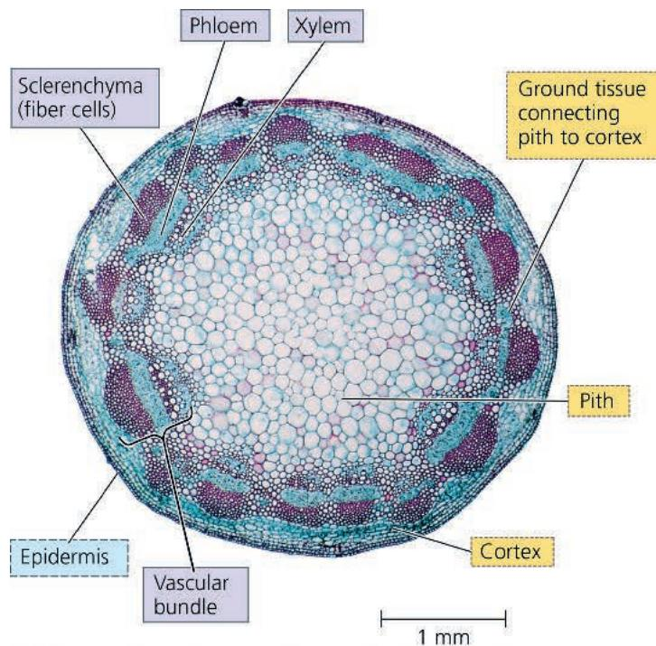  
(a) Cross section of stem with vascular bundles forming a ring (typical of eudicots). Ground tissue toward the inside is called pith, and ground tissue toward the outside is called cortex (LM).

Key to labels

Dermal

Ground

Vascular

  
(b) Cross section of stem with scattered vascular bundles (typical of monocots). In such an arrangement, ground tissue is not partitioned into pith and cortex (LM).

VISUAL SKILLS Compare the locations of the vascular bundles in eudicot and monocot stems. Then, explain why the terms pith and cortex are not used in describing the ground tissue of monocot stems.

examples of specialized epidermal cells in the stem include guard cells and trichomes.

The ground tissue of stems consists mostly of parenchyma cells. However, collenchyma cells just beneath the epidermis strengthen many stems during primary growth. Sclerenchyma cells, especially fiber cells, also provide support in those parts of the stems that are no longer elongating.

Vascular tissue runs the length of a stem in vascular bundles. Unlike lateral roots, which arise from vascular tissue deep within a root and disrupt the vascular cylinder, cortex, and epidermis as they emerge (see Figure 35.15), lateral shoots develop from axillary bud meristems on the stem's surface and do not disrupt other tissues (see Figure 35.16). Near the soil surface, in the transition zone between shoot and root, the bundled vascular arrangement of the stem converges with the solid vascular cylinder of the root.

The vascular tissue of stems in most eudicot species consists of vascular bundles arranged in a ring (Figure 35.17a). The xylem in each bundle faces the pith, and the phloem in each bundle faces the cortex. In most monocot stems, the vascular bundles do not form a ring but have a more scattered arrangement in the ground tissue (Figure 35.17b).

## Leaf Growth and Anatomy

Figure 35.18 provides an overview of leaf anatomy. Leaves develop from leaf primordia (singular, primordium), projections shaped like a cat's ear that emerge along the sides of the shoot apical meristem (see Figure 35.16). Unlike roots and stems, secondary growth in leaves is minor or nonexistent. As with roots and stems, the three primary meristems give rise to the tissues of the mature organ.

The leaf epidermis is covered by a waxy cuticle that greatly reduces water loss except where it is interrupted by stomata (singular, stoma), which allow exchange of $CO_{2}$ and $O_{2}$ between the surrounding air and the photosynthetic cells inside the leaf. In addition to regulating $CO_{2}$ uptake for photosynthesis, stomata are major avenues for the evaporative loss of water. The term stoma can refer to the stomatal pore or to the entire stomatal complex consisting of a pore flanked by the two specialized epidermal cells known as guard cells, which regulate the opening and closing of the pore. (We will discuss stomata in detail in Concept 36.4.)

The leaf's ground tissue, called the mesophyll (from the Greek mesos, middle, and phyll, leaf), is sandwiched between the upper and lower epidermal layers. Mesophyll consists mainly of parenchyma cells specialized for photosynthesis. The mesophyll in many eudicot leaves has two distinct layers: palisade and spongy. Palisade mesophyll, located beneath the upper epidermis, consists of one or more layers of elongated, chloroplast-rich cells that are specialized for light capture. Spongy mesophyll, located inward from the lower epidermis, consists of irregularly shaped cells that have fewer chloroplasts. These cells form a labyrinth of air spaces through which $\mathrm{CO}_{2}$ and $\mathrm{O}_2$ circulate to and from the palisade layer. The air spaces are particularly large in the vicinity of stomata, where $\mathrm{CO}_{2}$ is taken up from the outside air and $\mathrm{O}_2$ is released.

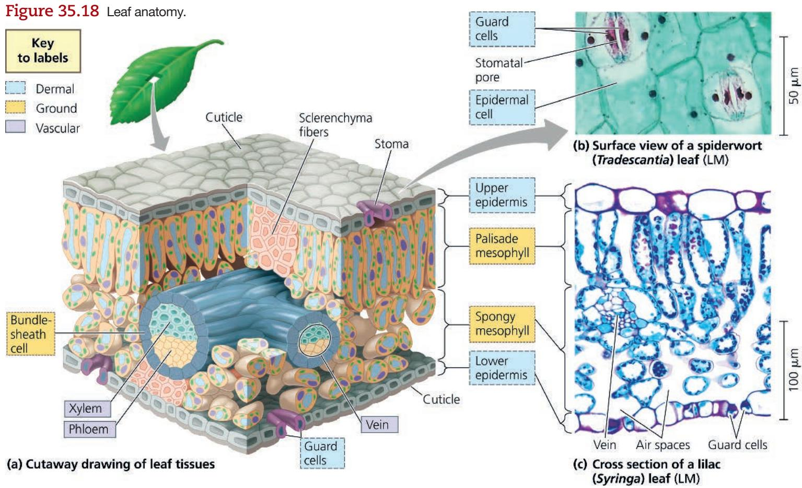

For suggested answer, see Appendix A.

The vascular tissue of each leaf is continuous with the vascular tissue of the stem. Veins subdivide repeatedly and branch throughout the mesophyll. This network brings xylem and phloem into close contact with the photosynthetic tissue, which obtains water and minerals from the xylem and loads its sugars and other organic products into the phloem for transport to other parts of the plant. The vascular structure also functions as a framework that reinforces the shape of the leaf. Each vein is enclosed by a protective bundle sheath, a layer of cells that regulates the movement of substances between the vascular tissue and the mesophyll. Bundle-sheath cells are very prominent in leaves of species that carry out $C_{4}$ photosynthesis (see Concept 10.5).

## Concept Check 35.3

1. Contrast primary growth in roots and shoots.

2. WHAT IF? A fossil leaf from a region that in the geological past was intermittently very dry and very swampy has stomata only on its upper epidermis. Was the leaf from a desert plant or from a floating aquatic plant? Explain.

3. MAKE CONNECTIONS How are root hairs and microvilli analogous structures? (See Figure 6.8 and the discussion of analogy in Concept 26.2.)

For suggested answers, see Appendix A.

Figure 35.19 Secondary growth of a woody stem.  
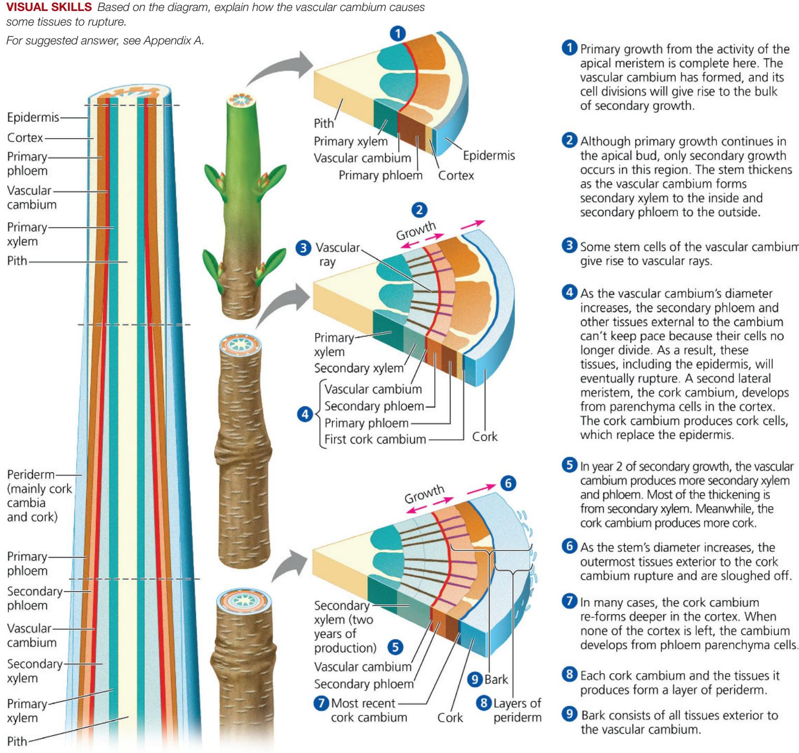

1 Primary growth from the activity of the apical meristem is complete here. The vascular cambium has formed, and its cell divisions will give rise to the bulk of secondary growth.

Although primary growth continues in the apical bud, only secondary growth occurs in this region. The stem thickens as the vascular cambium forms secondary xylem to the inside and secondary phloem to the outside.

3 Some stem cells of the vascular cambium give rise to vascular rays.

4 As the vascular cambium's diameter increases, the secondary phloem and other tissues external to the cambium can't keep pace because their cells no longer divide. As a result, these tissues, including the epidermis, will eventually rupture. A second lateral meristem, the cork cambium, develops from parenchyma cells in the cortex. The cork cambium produces cork cells, which replace the epidermis.

5 In year 2 of secondary growth, the vascular cambium produces more secondary xylem and phloem. Most of the thickening is from secondary xylem. Meanwhile, the cork cambium produces more cork.

6 As the stem's diameter increases, the outermost tissues exterior to the cork cambium rupture and are sloughed off.

7 In many cases, the cork cambium re-forms deeper in the cortex. When none of the cortex is left, the cambium develops from phloem parenchyma cells.

8 Each cork cambium and the tissues it produces form a layer of periderm.

9 Bark consists of all tissues exterior to the vascular cambium.

# Concept 35.4: Secondary growth increases the diameter of stems and roots in woody plants

Many land plants display secondary growth, the growth in thickness produced by lateral meristems (Figure 35.19, on the facing page). The advent of secondary growth during plant evolution allowed the production of novel plant forms ranging from massive forest trees to woody vines. All gymnosperm species and many eudicot species undergo secondary growth, but it is unusual in monocots. It occurs in stems and roots of woody plants, but rarely in leaves.

Secondary growth consists of the tissues produced by the vascular cambium and cork cambium. The vascular cambium adds secondary xylem (wood) and secondary phloem, thereby increasing vascular flow and support for the shoots. The cork cambium produces a tough, thick covering of waxy cells that protect the stem from water loss and from invasion by insects, bacteria, and fungi.

In woody plants, primary growth and secondary growth occur simultaneously. As primary growth adds leaves and lengthens stems and roots in the younger regions of a plant, secondary growth increases the diameter of stems and roots in older regions where primary growth has ceased. The process is similar in shoots and roots (see Figure 35.19).

## The Vascular Cambium and Secondary Vascular Tissue

The vascular cambium, a cylinder of meristematic cells only one cell thick, is wholly responsible for the production of secondary vascular tissue. In a typical woody stem, the vascular cambium is located outside the pith and primary xylem and to the inside of the primary phloem and the cortex. In a typical woody root, the vascular cambium forms exterior to the primary xylem and interior to the primary phloem and pericycle.

In cross section, the vascular cambium appears as a ring of meristematic cells (see step 4 of Figure 35.19). As these cells divide, they increase the cambium's circumference and add secondary xylem to the inside and secondary phloem to the outside. Each ring is larger than the previous ring, increasing the diameter of roots and stems.

Some of the stem cells in the vascular cambium are elongated and oriented with their long axis parallel to the axis of the stem or root. The cells they produce give rise to mature cells such as the tracheids, vessel elements, and fibers of the xylem, as well as the sieve-tube elements, companion cells, axially oriented parenchyma, and fibers of the phloem. Other stem cells in the vascular cambium are shorter and are oriented perpendicular to the axis of the stem or root: they give rise to vascular rays—radial files of mostly parenchyma cells that connect the secondary xylem and phloem (see step 3 of Figure 35.19). These cells move water and nutrients between the secondary xylem and phloem, store carbohydrates and other reserves, and aid in wound repair.

As secondary growth continues, layers of secondary xylem (wood) accumulate, consisting mainly of tracheids and vessel elements (see Figure 35.10), as well as fibers. In most species of gymnosperms, tracheids are the only water-conducting cells. Most

Figure 35.20 Cross section of a three-year-old Tilia (linden) stem. (LM)

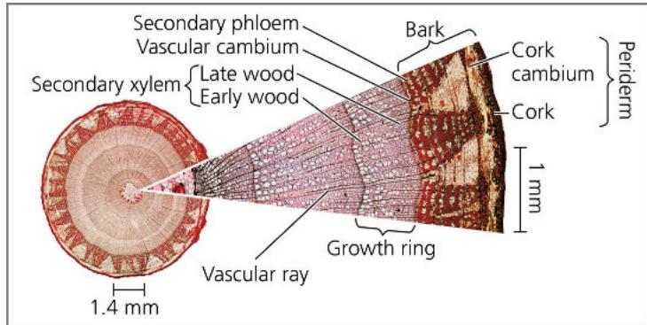

angiosperms also have vessel elements. The walls of secondary xylem cells are heavily lignified, giving wood its hardness and strength.

In temperate regions, wood that develops early in the spring, known as early (or spring) wood, usually has secondary xylem cells with large diameters and thin cell walls (Figure 35.20). This structure maximizes delivery of water to leaves. Wood produced later in the growing season is called late (or summer) wood. It has thick-walled cells that do not transport as much water but provide more support. Because there is a marked contrast between the large cells of the new early wood and the smaller cells of the late wood of the previous growing season, a year's growth appears as a distinct growth ring in cross sections of most tree trunks and roots. Therefore, researchers can estimate a tree's age by counting growth rings. Dendrochronology is the science of analyzing tree growth ring patterns. Growth rings vary in thickness, depending on seasonal growth. Trees grow well in wet and warm years but may grow hardly at all in cold or dry years. Since a thick ring indicates a warm year and a thin ring indicates a cold or dry one, scientists use ring patterns to study climate changes (Figure 35.21, on the next page).

As a tree or woody shrub ages, older layers of secondary xylem no longer transport water and minerals (a solution called xylem sap). As shown in Figure 35.22, these layers are

Figure 35.22 Anatomy of a tree trunk.  
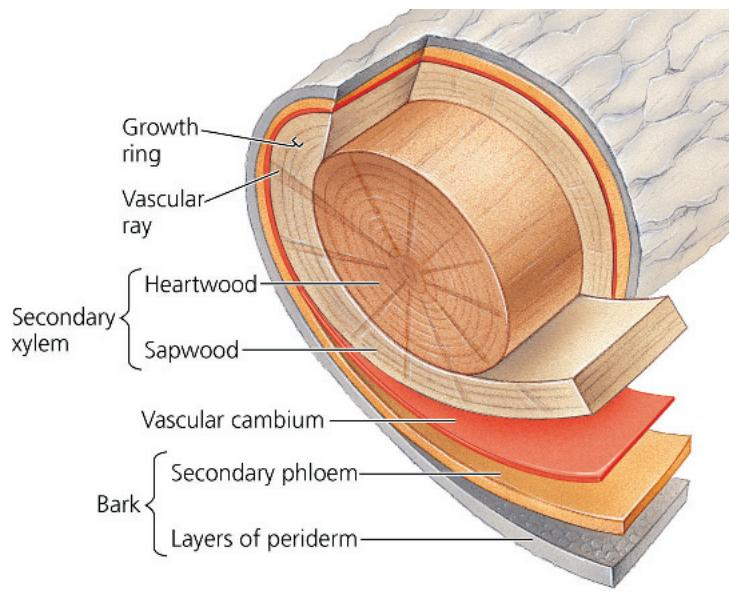

## Figure 35.21

# Research Method: Using Dendrochronology to Study Climate

## Application

Dendrochronology, the science of analyzing growth rings, is useful in studying climate change. Most scientists attribute recent global warming to the burning of fossil fuels and release of $CO_{2}$ and other greenhouse gases, whereas a small minority think it is a natural variation. Studying climate patterns requires comparing past and present temperatures, but instrumental climate records span only the last two centuries and apply only to some regions. By examining growth rings of Mongolian conifers dating back to the mid-1500s, Gordon C. Jacoby and Rosanne D'Arrigo, of the Lamont-Doherty Earth Observatory, and colleagues sought to learn whether Mongolia has experienced similar warm periods in the past.

## Technique

Researchers can analyze patterns of rings in living and dead trees. They can even study wood used for building long ago by matching samples with those from naturally situated specimens of overlapping age. Core samples, each about the diameter of a pencil, are taken from the bark to the center of the trunk. Each sample is dried and sanded to reveal the rings. By comparing, aligning, and averaging many samples from the conifers, the researchers compiled a chronology. The trees became a chronicle of environmental change.

## Results

This graph summarizes a composite record of the ring-width indexes for the Mongolian conifers from 1550 to 1993. The higher indexes indicate wider rings and higher temperatures.

  
Data from G. C. Jacoby et al., Mongolian tree rings and 20th-century warming, Science 273:771–773 (1996).  
INTERPRET THE DATA What does the graph indicate about environmental change during the period 1550–1993?

called heartwood because they are closer to the center of a stem or root. The newest, outer layers of secondary xylem still transport xylem sap and are therefore known as sapwood. Sapwood allows a large tree to survive even if the center of its trunk is hollow (Figure 35.23). Because each new layer of secondary xylem has a larger circumference, secondary growth enables the xylem to transport more sap each year, supplying an increasing number of leaves. Heartwood is generally darker than sapwood because of resins and other compounds that

## Figure 35.23 Is this tree living or dead?

The Wawona Sequoia tunnel in Yosemite National Park in California was cut in 1881 as a tourist attraction. This giant sequoia (Sequoiadendron giganteum) lived for another 88 years before falling during a severe winter. It was 71.3 m tall and estimated to be 2,100 years old. Though conservation policies today would forbid the mutilation of such an important specimen, the Wawona Sequoia did teach a valuable botanical lesson: Trees can endure the excision of large portions of their heartwood for decades.

VISUAL SKILLS Name in sequence the tissues that were destroyed as the lumberjacks excavated through the base of the tree to its center. Refer also to Figure 35.19.

For suggested answer, see Appendix A.

permeate the cell cavities and help protect the core of the tree from fungi and wood-boring insects.

Only the youngest secondary phloem, closest to the vascular cambium, functions in sugar transport. As a stem or root increases in circumference, the older secondary phloem is sloughed off, which is one reason secondary phloem does not accumulate as extensively as secondary xylem.

## The Cork Cambium and the Production of Periderm

During the early stages of secondary growth, the epidermis is pushed outward, causing it to split, dry, and fall off the stem or root. It is replaced by tissues produced by the first cork cambium, a cylinder of dividing cells that arises in the outer cortex of stems (see Figure 35.19) and in the pericycle in roots. The cork cambium gives rise to cork cells that accumulate to the outside of the cork cambium. As cork cells mature, they deposit a waxy, hydrophobic material called suberin in their walls before dying. Because cork cells have suberin and are usually compacted together, most of the periderm is impermeable to water and gases, unlike the epidermis. Cork thus functions as a barrier that helps protect the stem or root from water loss, physical damage, and pathogens. It should be noted that “cork” is commonly and incorrectly referred to as “bark.” In plant biology, bark includes all tissues external to the vascular cambium. Its main components are the secondary phloem (produced by the vascular cambium) and, external to that, the most recent periderm and all the older layers of periderm (see Figure 35.22). As this process continues, older layers of periderm are sloughed off, as evident in the cracked, peeling exteriors of many tree trunks.

Figure 35.24 A summary of primary and secondary growth in a woody shoot.

Woody roots have the same meristems and tissues. However, the ground tissue of a root is not divided into pith and cortex, and the cork cambium arises instead from the pericycle, the outermost layer of the vascular cylinder.

How can living cells in the interior tissues of woody organs absorb oxygen and respire if they are surrounded by a waxy periderm? Dotting the periderm are small, raised areas called lenticels, in which there is more space between cork cells, enabling living cells within a woody stem or root to exchange gases with the outside air. Lenticels often appear as horizontal slits, as shown on the stem in Figure 35.19.

Figure 35.24 summarizes the relationships between the primary and secondary tissues of a woody shoot.

## Evolution of Secondary Growth

EVOLUTION Surprisingly, some insights into the evolution of secondary growth have been achieved by studying the herbaceous plant Arabidopsis thaliana. Researchers have found that they can stimulate some secondary growth in Arabidopsis stems by adding weights to the plant. These findings suggest that weight carried by the stem activates a developmental program leading to wood formation. Moreover, several developmental genes that regulate shoot apical meristems in Arabidopsis have been found to regulate vascular cambium activity in poplar (Populus) trees. This suggests that the processes of primary and secondary growth are evolutionarily more closely related than was previously thought.

## Concept Check 35.4

1. A sign is hammered into a tree 2 m from the tree's base. If the tree is 10 m tall and elongates 1 m each year, how high will the sign be after ten years?

2. Stomata and lenticels are both involved in exchange of $CO_{2}$ and $O_{2}$ . Why must stomata be able to close, but not lenticels?

3. Would you expect a tropical tree to have distinct growth rings?

4. WHAT IF? If a complete ring of bark is removed from around a tree trunk (a technique called girdling), would the tree die slowly (in weeks) or quickly (in days)? Explain why.

For suggested answers, see Appendix A.

## Concept 35.5: Growth, morphogenesis, and cell differentiation produce the plant body

The specific series of changes by which cells form tissues, organs, and organisms is called development. Development unfolds according to the genetic information that an organism inherits from its parents but is also influenced by the external environment. A single genotype can produce different phenotypes in different environments. For example, the aquatic plant Cabomba aquatica forms two very different types of leaves, depending on whether the shoot apical meristem is submerged (Figure 35.25). This ability to alter form in response to local environmental conditions is called developmental plasticity. Dramatic examples of plasticity, as in Cabomba, are much more common in plants than in animals and may help compensate for plants' inability to escape adverse conditions by moving.

The three overlapping processes involved in the development of a multicellular organism are growth, morphogenesis, and cell differentiation. Growth is an irreversible increase in size. Morphogenesis (from the Greek morphê, shape, and genesis, creation) is the process that gives a tissue, organ, or organism its shape and determines the positions of cell types. Cell differentiation is the process by which cells with the same genes become different from one another. We'll examine these three processes in turn, but first we'll discuss how applying techniques of modern molecular biology to model organisms, particularly Arabidopsis thaliana, has revolutionized the study of plant development.

## Model Organisms: Revolutionizing the Study of Plants

As in other branches of biology, techniques of molecular biology and a focus on model organisms such as Arabidopsis thaliana have

Figure 35.25 Developmental plasticity in the aquatic plant Cabomba aquatica.

The underwater leaves of Cabomba are feathery, an adaptation that protects them from damage by lessening their resistance to moving water. In contrast, the surface leaves are pads that aid in flotation. The two leaf types have genetically identical cells, but their different environments result in the turning on or off of different genes during leaf development.

catalyzed a research explosion in the last few decades. Arabidopsis, a tiny weed in the mustard family, has no inherent agricultural value but is a favored model organism of plant geneticists and molecular biologists for many reasons. It is so small that thousands of plants can be cultivated in a few square meters of lab space. It also has a short generation time, taking about six weeks for a seed to grow into a mature plant that produces more seeds. This rapid maturation enables biologists to conduct genetic cross experiments in a relatively short time. One plant can produce over 5,000 seeds, another property that makes Arabidopsis useful for genetic analysis.

Beyond these basic traits, the plant's genome makes it particularly well suited for analysis by molecular genetic methods. The Arabidopsis genome, which includes about 27,000 protein-encoding genes, is among the smallest known in plants. Furthermore, the plant has only five pairs of chromosomes, making it easier for geneticists to locate specific genes. Because Arabidopsis has such a small genome, it was the first plant to have its entire genome sequenced.

The natural range of Arabidopsis includes varied climates and elevations, from the high mountains of Central Asia to the

Figure 35.26 Variations in leaf arrangement, leaf shape, and shoot growth between different populations of Arabidopsis thaliana. Information in the genomes of these populations may provide insights into strategies for expanding crop production into new environments.

European Atlantic coast, and from North Africa to the Arctic Circle. These local varieties can differ markedly in outward appearance (Figure 35.26). Genome-sequencing efforts are being expanded to include hundreds of populations of Arabidopsis from throughout its natural range in Eurasia. Contained in the genomes of these populations is information about evolutionary adaptations that enabled Arabidopsis to expand its range into new environments following the retreat of the last ice age. This information may provide plant breeders with new insights and strategies for crop improvement.

Another property that makes Arabidopsis attractive to molecular biologists is that its cells can be easily transformed with transgenes, genes from a different organism that are stably introduced into the genome of another. CRISPR technology (see Figure 20.14), which is rapidly becoming the technique of choice for creating plants with specific mutations, has been used successfully in Arabidopsis. By disrupting or “knocking out” a specific gene, scientists can garner important information about the gene’s normal function.

Large-scale projects are under way to determine the function of every gene in Arabidopsis. By identifying each gene's function and tracking every biochemical pathway, researchers aim to determine the blueprints for plant development, a major goal of systems biology. It may one day be possible to make a computer-generated "virtual plant" that enables researchers to visualize which genes are activated in different parts of the plant as the plant develops.

Basic research on model organisms such as Arabidopsis has accelerated the pace of discovery in the plant sciences, including the identification of the complex genetic pathways underlying plant structure. As you read more about this, you'll be able to appreciate not only the power of studying model organisms but also the history of investigation that underpins all modern plant research.

## Interview

Interview with Joanne Chory: Sequencing the Arabidopsis genome (eTextbook only)

## Growth: Cell Division and Cell Expansion

Cell division enhances the potential for growth by increasing the number of cells, but plant growth itself is brought about by cell enlargement. The process of plant cell division is described more fully in Chapter 12 (see Figure 12.10), and Chapter 39 discusses the process of cell elongation (see Figure 39.7). Here we are concerned with how cell division and enlargement contribute to plant form.

## Cell Division

The new cell walls that bisect plant cells during cytokinesis develop from the cell plate (see Figure 12.10). The precise plane of cell division, determined during late interphase, usually corresponds to the shortest path that halves the cytoplasm of the parent cell. However, during certain points in development the cytoplasm may not be divided equally, resulting in one daughter cell being larger than the other, even though they have the same number of chromosomes. Such cases of asymmetrical cell division usually signal a key event in development. For example, the formation of guard cells involves an asymmetrical cell division. An epidermal cell divides asymmetrically, forming a large cell that remains an undifferentiated epidermal cell and a small cell that becomes the guard cell “mother cell.” Guard cells form when this small mother cell divides in a plane perpendicular to the first cell division (Figure 35.27). Thus, asymmetrical cell division generates cells with different fates—that is, cells that mature into different types.

## Cell Expansion

Cell divisions do not constitute growth because there is no increase of mass involved. Rather, it is cell expansion that is responsible for plant growth. Before discussing how cell expansion contributes to plant growth and form, it is useful to consider the difference in cell expansion between plants and animals. Animal cells grow mainly by synthesizing protein-rich cytoplasm, a metabolically expensive process. Growing plant cells also produce additional protein-rich material in their cytoplasm, but water uptake typically accounts for about 90% of

Figure 35.28 The orientation of plant cell expansion.

Growing plant cells expand mainly through water uptake. In a growing cell, enzymes weaken cross-links in the cell wall, allowing it to expand as water diffuses into the vacuole by osmosis; at the same time, more microfibrils are made. The orientation of the cell expansion is mainly perpendicular to the orientation of cellulose microfibrils in the wall. The orientation of microtubules in the cell's outermost cytoplasm determines the orientation of cellulose microfibrils (fluorescent LM). The microfibrils are embedded in a matrix of other (noncellulose) polysaccharides, some of which form the cross-links visible in the TEM.

expansion. Most of this water is stored in the large central vacuole. The vacuolar solution, or vacuolar sap, is very dilute and nearly devoid of the energetically expensive macromolecules that are found in great abundance in the rest of the cytoplasm. Large vacuoles are therefore a “cheap” way of filling space, enabling a plant to grow rapidly and economically. Bamboo shoots, for instance, can elongate more than 2 m per week. Rapid and efficient extensibility of shoots and roots was an important evolutionary adaptation that increased their exposure to light and soil.

Plant cells rarely expand equally in all directions. Their greatest expansion is usually oriented along the plant's main axis. For example, cells near the tip of the root may elongate 20 times or more their original length, with relatively little increase in width. The orientation of cellulose microfibrils in the innermost layers of the cell wall causes this differential growth. The microfibrils do not stretch, so the cell expands mainly perpendicular to the main orientation of the microfibrils, as shown in Figure 35.28. A leading hypothesis proposes that microtubules positioned just beneath the plasma membrane organize the cellulose-synthesizing enzyme complexes and guide their movement through the plasma membrane as they create the microfibrils that form much of the cell wall.

## Morphogenesis and Pattern Formation

A plant's body is more than a collection of dividing and expanding cells. During morphogenesis, cells acquire different identities in an ordered spatial arrangement. For example, dermal tissue forms on the exterior and vascular tissue in the interior—never the other way around. The development of specific structures in specific locations is called pattern formation.

Two types of hypotheses have been put forward to explain how the fate of plant cells is determined during pattern formation. Hypotheses based on lineage-based mechanisms propose that cell fate is determined early in development and that cells pass on this destiny to their progeny. In this view, the basic pattern of cell differentiation is mapped out according to the directions in which meristematic cells divide and expand. On the other hand, hypotheses based on position-based mechanisms propose that the cell's final position in an emerging organ determines what kind of cell it will become. In support of this view, experiments in which neighboring cells have been destroyed with lasers have demonstrated that a plant cell's fate is established late in the cell's development and largely depends on signaling from its neighbors.

In contrast, cell fate in animals is largely determined by lineage-dependent mechanisms involving transcription factors. The homeotic (Hox) genes that encode such transcription factors are critical for the proper number and placement of embryonic structures, such as legs and antennae, in the fruit fly Drosophila (see Figure 18.19). Interestingly, maize has a homolog of Hox genes called KNOTTED-1, but unlike its counterparts in the animal world, KNOTTED-1 does not affect the number or placement of plant organs. As you will see, an unrelated class of transcription factors called MADS-box proteins plays that role in plants. KNOTTED-1 is, however, important in the development of leaf shape, including the production of compound leaves. If the KNOTTED-1 gene is expressed in greater quantity than normal in the genome of tomato plants, the normally compound leaves will then become “super-compound” (Figure 35.29).

## Figure 35.29 Overexpression of a Hox-like gene in leaf formation.

KNOTTED-1 is a gene that is involved in leaf and leaflet formation. An increase in its expression in tomato plants results in leaves that are “super-compound” (right) compared with normal leaves (left).

## Gene Expression and the Control of Cell Differentiation

The cells of a developing organism can synthesize different proteins and diverge in structure and function even though they share a common genome. If a mature cell removed from a root or leaf can dedifferentiate in tissue culture and give rise to the diverse cell types of a plant, then it must possess all the genes necessary to make any kind of cell in the plant. Therefore, cell differentiation depends, to a large degree, on the control of gene expression—the regulation of transcription and translation, resulting in the production of specific proteins.

Evidence suggests that the activation or inactivation of specific genes involved in cell differentiation results largely from cell-to-cell communication. Cells receive information about how they should specialize from neighboring cells. For example, two cell types arise in the root epidermis of Arabidopsis: root hair cells and hairless epidermal cells. Cell fate is associated with the position of the epidermal cells relative to other plant cells. The immature epidermal cells that are in contact with two underlying cells of the root cortex differentiate into root hair cells, whereas the immature epidermal cells in contact with only one cell in the cortex differentiate into mature hairless cells. The differential expression of a homeotic gene called GLABRA-2 (from the Latin glaber, bald) is needed for proper distribution of root hairs (Figure 35.30). Researchers have demonstrated this requirement by coupling the GLABRA-2 gene to a “reporter gene” that causes every cell expressing GLABRA-2 in the root to turn pale blue following a certain protocol. The GLABRA-2 gene is normally expressed only in epidermal cells that will not develop root hairs.

Figure 35.30 Control of root hair differentiation by a homeotic gene. (LM)  
  
The root cap cells external to the epidermal layer will be sloughed off before root hairs emerge.  
WHAT IF? What would the roots look like if GLABRA-2 were rendered dysfunctional by a mutation?
For suggested answer, see Appendix A.

## Interview

Interview with Philip Benfey: Studying root development (eTextbook only)

## Shifts in Development: Phase Changes

Multicellular organisms generally pass through developmental stages. In humans, these are infancy, childhood, adolescence, and adulthood, with puberty as the dividing line between the non-reproductive and reproductive stages. Plants also pass through stages, developing from a juvenile stage to an adult vegetative stage to an adult reproductive stage. In animals, the developmental changes take place throughout the entire organism, such as when a larva develops into an adult animal. In contrast, plant developmental stages, called phases, occur within a single region, the shoot apical meristem. The morphological changes that arise from these transitions in shoot apical meristem activity are called phase changes. In the transition from a juvenile phase to an adult phase, some species exhibit conspicuous changes in leaf shape (Figure 35.31). Juvenile nodes and internodes retain their juvenile status even after the shoot apical meristem of the main shoot has changed to the adult phase. Therefore, any new leaves that develop on branches that emerge from axillary buds at juvenile nodes will also be juvenile, even though the apical meristem of the stem's main axis may have been producing mature nodes for years.

If environmental conditions permit, an adult plant is induced to flower. Biologists have made great progress in explaining the genetic control of floral development—the topic of the next section.

Figure 35.31 Phase change in Muehlenbeckia australis.

This native climbing vine of New Zealand has two types of leaves: fiddle-shaped juvenile leaves (top) and oval, smooth-margined mature leaves. This dual foliage reflects a phase change in the development of the apical meristem of each shoot. Once a node forms, the developmental phase—juvenile or adult—is fixed; fiddle-shaped leaves do not mature into oval-shaped leaves.

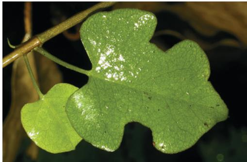  
Juvenile leaf

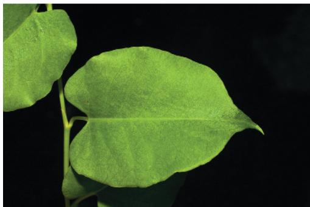  
Mature leaf

## Genetic Control of Flowering

Flower formation involves a phase change from vegetative growth to reproductive growth. This transition is triggered by a combination of environmental cues, such as day length, and internal signals, such as hormones. (You will learn more about the roles of these signals in Concept 39.3.) Unlike vegetative growth, which is indeterminate, floral growth is usually determinate: The production of a flower by a shoot apical meristem generally stops the primary growth of that shoot. The transition from vegetative growth to flowering is associated with the switching on of flower-inducing genes. The protein products of these genes are transcription factors that regulate the genes required for the conversion of the indeterminate vegetative meristems to determinate floral meristems.

When a shoot apical meristem is induced to flower, the order of each primordium's emergence determines its development into a specific type of floral organ—a sepal, petal, stamen, or carpel (see Figure 30.8 to review). These floral organs form four whorls that can be described roughly as concentric “circles” when viewed from above. Sepals form the first (outermost) whorl; petals form the second; stamens form the third; and carpels form the fourth (innermost) whorl. Plant biologists have identified several genes that encode transcription factors that regulate the development of this characteristic floral pattern. Positional information determines which genes are expressed in a particular floral organ primordium. The result is the development of an emerging floral primordium into a specific floral organ. A mutation in a flower-inducing gene can cause abnormal floral development, such as petals growing in place of stamens (Figure 35.32). Some homeotic mutants with increased petal numbers produce showier flowers that are prized by gardeners.

Figure 35.32 Genes and pattern formation in flower development.  
  
▲ Normal Arabidopsis flower.
Arabidopsis normally has four whorls of flower parts: sepals (Se), petals (Pe), stamens (St), and carpels (Ca).

▶ Abnormal Arabidopsis flower.
Researchers have identified several mutations that cause abnormal flowers to develop. This flower has an extra set of petals in place of stamens and an internal flower where normal plants have carpels.

MAKE CONNECTIONS Provide another example of a homeotic gene mutation that leads to organs being produced in the wrong place (see Concept 18.4).

For suggested answer, see Appendix A.

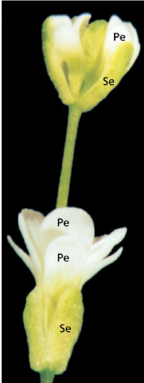

Figure 35.33 The ABC hypothesis for the functioning of genes in flower development.  
  
(b) Side view of wild-type flower and flowers with organ identity mutations. The phenotype of mutants lacking a functional A, B, or C gene can be explained by the model in part (a) and the observation that if the A gene or C gene is suppressed, then the other gene is expressed in that whorl. For example, if the A gene is suppressed in a mutant, then the C gene is expressed where the A gene would normally be expressed. Therefore, carpels (C gene expressed) develop in the outermost whorl, and stamens (B and C genes expressed) develop in the next whorl.  
DRAW IT (a) For each mutant, draw a “bull’s-eye” diagram like the one in part (a), labeling the type of organ and gene(s) expressed in each whorl. (b) Draw and label a “bull’s-eye” diagram for a mutant flower in which the A and B genes were suppressed.

For suggested answer, see Appendix A.

By studying mutants with abnormal flowers, researchers have identified and cloned three classes of genes that determine floral organ identity. Figure 35.33a shows a simplified version of the ABC hypothesis of flower formation, which proposes that three classes of genes direct the formation of the four types of floral organs. According to the ABC hypothesis, each class of genes is switched on in two specific whorls of the floral meristem. Normally, A genes are switched on in the two outer whorls (sepals and petals); B genes are switched on in the two middle whorls (petals and stamens); and C genes are switched on in the two inner whorls (stamens and carpels). Sepals arise from those parts of floral meristems in which only A genes are active; petals arise where A and B genes are active; stamens where B and C genes are active; and carpels where only C genes are active. The ABC hypothesis can account for the phenotypes of mutants lacking A, B, or C gene activity, with one addition: Where A gene activity is present, it inhibits C, and vice versa. If either the A gene or C gene is suppressed, the other gene is expressed. Figure 35.33b shows the floral patterns of mutants lacking each of the three classes of genes and depicts how the hypothesis accounts for the floral phenotypes. By constructing such hypotheses and designing experiments to test them, researchers are tracing the genetic basis of plant development.

In dissecting the plant to examine its parts, as we have done in this chapter, we must remember that the whole plant functions as an integrated organism. Plant structures largely reflect evolutionary adaptations to the challenges of a photoautotrophic existence on land.

## Interview

Interview with Virginia Walbot: Researching plant genetics and development (eTextbook only)

## Concept Check 35.5

1. How can two cells in a plant have vastly different structures even though they have the same genome?

2. What are three differences between animal development and plant development?

3. WHAT IF? In some species, sepals look like petals, and both are collectively called “tepals.” Suggest an extension to the ABC hypothesis that could account for tepals.

# Chapter 35 Review

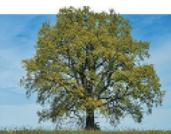

## Summary of Key Concepts

To review key terms, go to the Vocabulary Self-Quiz (eTextbook only).

Concept 35.1: Plants have a hierarchical organization consisting of organs, tissues, and cells

\- Vascular plants have shoots consisting of stems, leaves, and, in angiosperms, flowers. Roots anchor the plant, absorb and conduct water and minerals, and store food. Leaves are attached to stem nodes and are the main organs of photosynthesis. The axillary buds, in axils of leaves and stems, give rise to branches. Plant organs may be adapted for specialized functions.

\- Vascular plants have three tissue systems—dermal, vascular, and ground—which are continuous throughout the plant. The dermal tissue is a continuous layer of cells that covers the plant exterior. Vascular tissues (xylem and phloem) facilitate the long-distance transport of substances. Ground tissues function in storage, metabolism, and regeneration.

\- Parenchyma cells are relatively undifferentiated and thin-walled cells that retain the ability to divide; they perform most of the metabolic functions of synthesis and storage. Collenchyma cells have unevenly thickened walls; they support young, growing parts of the plant. Sclerenchyma cells—sclereids and fibers—have thick, lignified walls that help support mature, nongrowing parts of the plant. Tracheids and vessel elements, the water-conducting cells of xylem, have thick walls and are dead at functional maturity. Sieve-tube elements are living but highly modified cells that are largely devoid of internal organelles; they function in the transport of sugars through the phloem of angiosperms.

Describe at least three specializations in plant organs and plant cells that are adaptations to life on land.

## Concept 35.2: Different meristems generate new cells for primary and secondary growth

  
What is the difference between primary and secondary growth?

## Concept 35.3: Primary growth lengthens roots and shoots

\- The root apical meristem is located near the tip of the root, where it generates cells for the growing root axis and the root cap.

\- The apical meristem of a shoot is located in the apical bud, where it gives rise to alternating internodes and leaf-bearing nodes.

\- Eudicot stems have vascular bundles in a ring, whereas monocot stems have scattered vascular bundles.

\- Mesophyll cells are adapted for photosynthesis. Stomata, epidermal pores formed by pairs of guard cells, allow for gaseous exchange and are major avenues for water loss.

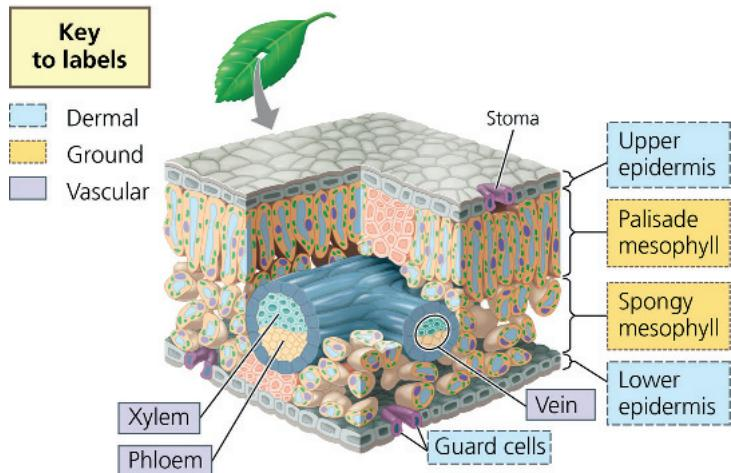  
How does branching in roots differ from that in stems?

## Concept 35.4: Secondary growth increases the diameter of stems and roots in woody plants

\- The vascular cambium is a meristematic cylinder that produces secondary xylem and secondary phloem during secondary growth. Older layers of secondary xylem (heartwood) become inactive, whereas younger layers (sapwood) still conduct water.

\- The cork cambium gives rise to a thick protective covering called the periderm, which consists of the cork cambium plus the layers of cork cells it produces.

  
What advantages did plants gain from the evolution of secondary growth?

## Concept 35.5: Growth, morphogenesis, and cell differentiation produce the plant body

\- Cell division and cell expansion are the primary determinants of growth.

\- Morphogenesis, the development of body shape and organization, depends on cells responding to positional information from their neighbors.

\- Cell differentiation, arising from differential gene activation, enables cells within the plant to assume different functions despite having identical genomes. The way in which a plant cell differentiates is determined largely by the cell's position in the developing plant.

\- Internal or environmental cues may cause a plant to switch from one developmental stage to another—for example, from developing juvenile leaves to developing mature leaves. Such changes in shape are called phase changes.

\- Studies of floral development have provided a model system for studying pattern formation. The ABC hypothesis identifies how three classes of genes control formation of sepals, petals, stamens, and carpels.

By what mechanism do plant cells tend to elongate along one axis instead of expanding in all directions?

For suggested answers, see Appendix A.

## Test Your Understanding

For more multiple-choice questions, go to the Practice Test (eTextbook only).

## Levels 1-2: Remembering/Understanding

1. Most of the growth of a plant body is the result of
(A) cell differentiation.
(B) morphogenesis.
(C) cell division.
(D) cell elongation.

2. The innermost layer of the root cortex is the
(A) core.
(C) endodermis.
(B) pericycle.
(D) pith.

3. Heartwood and sapwood consist of
(A) bark.
(B) periderm.
(C) secondary xylem.
(D) secondary phloem.

4. The phase change of an apical meristem from the juvenile to the mature vegetative phase is often revealed by
(A) a change in the shape of the leaves produced.
(B) the initiation of secondary growth.
(C) the formation of lateral roots.
(D) the activation of flower-inducing genes.

5. The vascular cambium gives rise to
(A) all xylem.
(B) all phloem.
(C) primary xylem and phloem.
(D) secondary xylem and phloem.

6. The root pericycle is the site where
(A) secondary growth originates.
(B) root hairs originate.
(C) lateral roots originate.
(D) the endodermis originates.

7. Root apical meristems are found
(A) only in taproots.
(B) only in lateral roots.
(C) only in adventitious roots.
(D) in all roots.

## Levels 3-4: Applying/Analyzing

8. Suppose a flower had normal expression of genes A and C and expression of gene B in all four whorls. Based on the ABC hypothesis, what would be the structure of that flower, starting at the outermost whorl?

(A) carpel-petal-petal-carpel

(B) petal-petal-stamen-stamen

(C) sepal-carpel-carpel-sepal

(D) sepal-sepal-carpel-carpel

9. Which of the following arise(s), directly or indirectly, from meristematic activity?
(A) secondary xylem (C) dermal tissue
(B) leaves (D) all of the above

10. A strawberry plant mutant that fails to make stolons would suffer from

(A) too little mineral absorption.

(B) a tendency to topple over.

(C) too little water absorption.

(D) a reduction in asexual reproduction.

11. DRAW IT On this cross section from a woody eudicot, label a growth ring, late wood, early wood, and a vessel element. Then, draw an arrow in the pith-to-cork direction.

12. VISUAL SKILLS How does the internal anatomy of a tea leaf differ from that of an iris leaf? (Review Figure 35.18.) How might this difference relate to the orientations of the leaves? Explain how the difference shows that structure fits function.

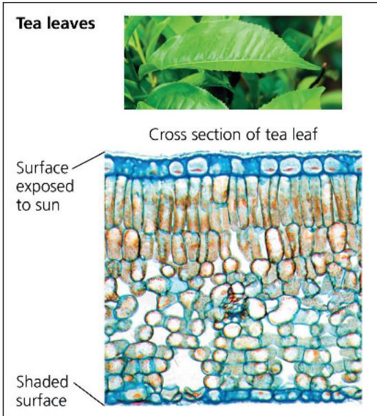

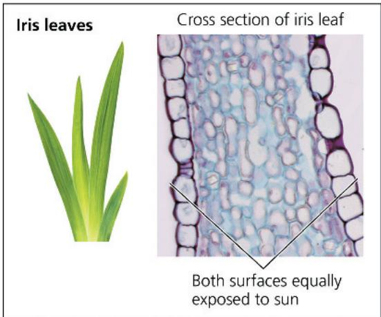

13. VISUAL SKILLS Visitors to the state of Washington can marvel at an unusual sight: a bicycle embedded 4 m above the ground in a living tree. Use your knowledge of primary and secondary growth to visualize and explain how this happened.

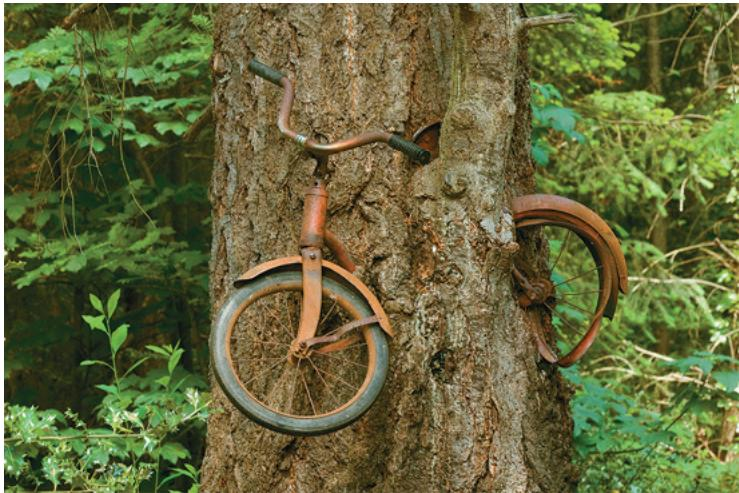

## Levels 5-6: Evaluating/Creating

14. EVOLUTION CONNECTION Evolutionary biologists have coined the term exaptation to describe a common occurrence in the evolution of life: A limb or organ evolves in a particular context but over time takes on a new function (see Concept 25.6). Identify some examples of exaptations in plant organs.

15. SCIENTIFIC INQUIRY Grasslands typically do not flourish when large herbivores are removed. Instead, grasslands are replaced by broad-leaved herbaceous eudicots, shrubs, and trees. Based on your knowledge of the structure and growth habits of monocots versus eudicots, suggest a reason why.

16. SCIENCE, TECHNOLOGY, AND SOCIETY Hunger and malnutrition are urgent problems for many poor countries, yet plant biologists in wealthy nations have focused most of their research efforts on Arabidopsis thaliana. Some people have argued that if plant biologists are truly concerned about fighting world hunger, they should study cassava and plantain because these two crops are staples for many of the world's poor. If you were an Arabidopsis researcher, how might you respond to this argument?

17. WRITE ABOUT A THEME: ORGANIZATION In a short essay (100–150 words), explain how the evolution of lignin affected vascular plant structure and function.

18. SYNTHESIZE YOUR KNOWLEDGE

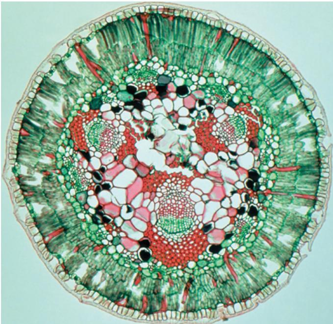

This stained light micrograph shows a cross section through a plant organ from Hakea purpurea, a shrub native to some arid regions of Australia. (a) Review Figures 35.14, 35.17, and 35.18 to identify whether this is a root, stem, or leaf. Explain your reasoning. (b) How might this organ be an adaptation for dry conditions?

For selected answers, see Appendix A.

# Explore Scientific Papers with Science in the Classroom | AAAS

How does one gene affect leaf shape? Go to “Shape Shifters of the Plant World” at www.scienceintheclassroom.org.

Instructors: Questions can be assigned in Mastering Biology.

# Resource Acquisition and Transport in Vascular Plants

## Key Concepts

36.1 Adaptations for acquiring resources were key steps in the evolution of vascular plants

36.2 Different mechanisms transport substances over short or long distances

36.3 Transpiration drives the transport of water and minerals from roots to shoots via the xylem

36.4 The rate of transpiration is regulated by stomata

36.5 Sugars are transported from sources to sinks via the phloem

36.6 The symplast is highly dynamic

  
Figure 36.1 This English ivy has covered every square centimeter of a wall with foliage, an effective way to acquire light energy for photosynthesis. The sugars produced by the leaves and the water and minerals absorbed by the roots have to be transported throughout the plant.

## Study Tip

Make a flowchart: Make a simple flowchart of the movement of water molecules from the soil through the tissues of a plant to the outside air.

Water in soil

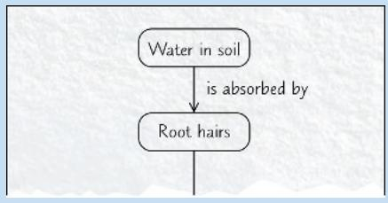

is absorbed by

Root hairs

## What causes the movement of water, minerals, and sugars in most vascular plants?

Water and minerals are pulled up from the roots by negative pressure (tension) generated by evaporation from the leaves.

Sugars are pushed by positive pressure from where they are produced or stored to where they are needed. They can move both ways between leaves and roots.

## Concept 36.1: Adaptations for acquiring resources were key steps in the evolution of vascular plants

EVOLUTION Most plants grow in soil and therefore inhabit two worlds—above ground, where shoots acquire sunlight and $CO_{2}$ , and below ground, where roots acquire water and mineral nutrients. The successful colonization of the land by plants depended on adaptations that allowed early plants to acquire resources from these two different settings.

The algal ancestors of plants absorbed water, minerals, and $CO_{2}$ directly from the water in which they lived. Transport in these algae was relatively simple because every cell was close to the source of these substances. The earliest plants were nonvascular and produced photosynthetic shoots above the shallow fresh water in which they lived. These leafless shoots typically had waxy cuticles and few stomata, which allowed them to avoid excessive water loss while still permitting some exchange of $CO_{2}$ and $O_{2}$ for photosynthesis. The anchoring and absorbing functions of early plants were assumed by the base of the stem or by threadlike rhizoids (see Figure 29.16).

As plants evolved and increased in number, competition for light, water, and minerals intensified. Taller plants with broad, flat appendages had an advantage in absorbing light. This increase in surface area, however, resulted in more evaporation and therefore a greater need for water. Larger shoots also required stronger anchorage. These needs favored the production of multicellular, branching roots. Meanwhile, as greater shoot heights further separated the top of the photosynthetic shoot from the nonphotosynthetic parts below ground, natural selection favored plants capable of efficient long-distance transport of water, minerals, and products of photosynthesis.

The evolution of vascular tissue consisting of xylem and phloem made possible the development of extensive root and shoot systems that carry out long-distance transport (see Figure 35.10). The xylem transports water and minerals from roots to shoots. The phloem transports products of photosynthesis from where they are made or stored to where they are needed. Figure 36.2 provides an overview of resource acquisition and transport in an actively photosynthesizing plant.

## Shoot Architecture and Light Capture

Because most plants are photoautotrophs, their success depends ultimately on their ability to photosynthesize. Over the course of evolution, plants have developed a wide variety of shoot

Figure 36.2 An overview of resource acquisition and transport in a vascular plant during the day.  
  
MAKE CONNECTIONS How would you change the figure in order to show gas exchanges at night? (See Figure 10.22.)
For suggested answer, see Appendix A.

Would a higher leaf area index always increase the amount of photosynthesis? Explain. For suggested answer, see Appendix A.

architectures that enable each species to compete successfully for light absorption in the ecological niche it occupies. For example, the lengths and widths of stems, as well as the branching pattern of shoots, are all architectural features affecting light capture.

Stems serve as supporting structures for leaves and as conduits for the transport of water and nutrients. Plants that grow tall avoid shading from neighboring plants. Most tall plants require thick stems, which enable greater vascular flow to and from the leaves and stronger mechanical support for them. Vines are an exception, relying on other objects (usually other plants) to support their stems. In woody plants, stems become thicker through secondary growth (see Figure 35.11). Branching generally enables plants to harvest sunlight for photosynthesis more effectively. However, some species, such as the coconut palm, do not branch at all. Why is there so much variation in branching patterns? Plants have only a finite amount of energy to devote to shoot growth. If most of that energy goes into branching, there is less available for growing tall, and the risk of being shaded by taller plants increases. Conversely, if most of the energy goes into growing tall, the plants are not optimally harvesting sunlight.

Leaf size and structure account for much of the outward diversity in plant form. Leaves range in length from 1.3 mm in the pygmyweed (Crassula connata), a native of dry, sandy regions in the western United States, to 20 m in the palm Raphia regalis, a native of African rain forests. These species represent extreme examples of a general correlation observed between water availability and leaf size. The largest leaves are typically found in species from tropical rain forests, whereas the smallest are usually found in species from dry or very cold environments, where liquid water is scarce and evaporative loss is more problematic.

The arrangement of leaves on a stem, known as phyllotaxy, is an architectural feature important in light capture. Phyllotaxy is determined by the shoot apical meristem (see Figure 35.16) and is specific to each species (Figure 36.3). A species may have one leaf per node (alternate, or spiral, phyllotaxy), two leaves per node (opposite phyllotaxy), or more (whorled phyllotaxy). Most angiosperms have alternate phyllotaxy, with leaves arranged in an ascending spiral around the stem, each successive leaf emerging about $137.5^{\circ}$ from the site of the previous one. Why $137.5^{\circ}$ ? One hypothesis is that this angle minimizes shading of the lower leaves by those above. In environments where intense sunlight can harm leaves, the greater shading provided by oppositely arranged leaves may be advantageous.

The total area of the leafy portions of all the plants in a community, from the top layer of vegetation to the bottom layer, affects the productivity of each plant. When there are many layers of vegetation, the shading of the lower leaves is so great that they photosynthesize less than they respire. When this happens, the nonproductive leaves or branches undergo programmed cell death and are eventually shed, a process called self-pruning.

Plant features that reduce self-shading increase light capture. A useful measurement in this regard is the leaf area index, the ratio of the total upper leaf surface of a single plant or an entire crop divided by the surface area of the land on which the plant or crop grows (Figure 36.4). Leaf area index values of up to 7 are common for many mature crops, and there is little agricultural benefit to leaf area indexes higher than this value. Adding more

Figure 36.3 Emerging phyllotaxy of Norway spruce.
This SEM, taken from above a shoot tip, shows the pattern of emergence of leaves. The leaves are numbered, with 1 being the youngest. (Some numbered leaves are not visible in the close-up.)  
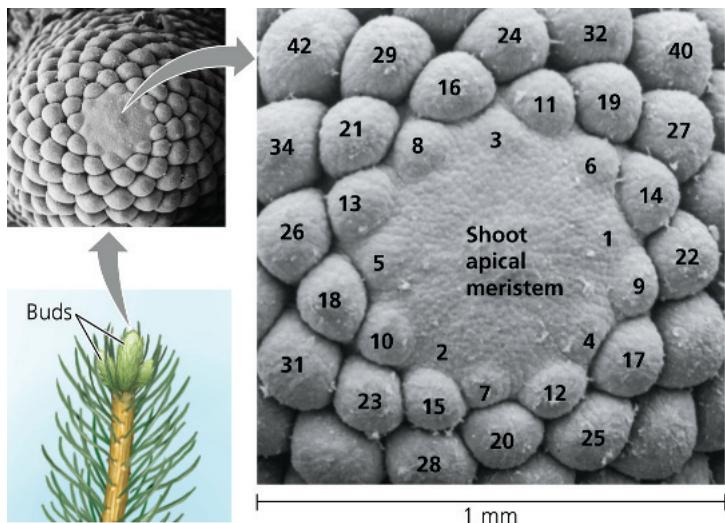  
VISUAL SKILLS With your finger, trace the progression of leaf emergence, moving from leaf number 29 to 28 and so on. What is the pattern? Based on this pattern of phyllotaxy, predict between which two developing leaf primordia the next primordium will emerge.
For suggested answer, see Appendix A.

Figure 36.4 Leaf area index.

The leaf area index of a single plant is the ratio of the total area of the top surfaces of the leaves to the area of ground covered by the plant, as shown in this illustration of two plants viewed from the top. With many layers of leaves, a leaf area index value can easily exceed 1.

leaves increases shading of lower leaves to the point that self-pruning occurs.

Another factor affecting light capture is leaf orientation. Some plants have horizontally oriented leaves; others, such as grasses, have leaves that are vertically oriented. In low-light conditions, horizontal leaves capture sunlight much more effectively than vertical leaves. In grasslands or other sunny regions, however, horizontal orientation may expose upper leaves to overly intense light, injuring leaves and reducing photosynthesis. But if a plant's leaves are nearly vertical, light rays are essentially parallel to the leaf surfaces, so no leaf receives too much light, and light penetrates more deeply to the lower leaves.

## The Photosynthesis–Water Loss Compromise

The broad surface of most leaves favors light capture, while open stomatal pores allow for the diffusion of $CO_{2}$ into the photosynthetic tissues. Open stomatal pores, however, also promote evaporation of water from the plant. Over 90% of the water lost by plants is by evaporation from stomatal pores. Consequently, shoot adaptations represent compromises between enhancing photosynthesis and minimizing water loss, particularly in environments where water is scarce. Later in the chapter, we’ll discuss the mechanisms by which plants enhance $CO_{2}$ uptake and minimize water loss by regulating the opening of stomatal pores.

## Root Architecture and Acquisition of Water and Minerals

Just as carbon dioxide and sunlight are resources exploited by the shoot system, soil contains resources mined by the root system. Plants rapidly adjust the architecture and physiology of their roots to exploit patches of available mineral nutrients in the soil. The roots of many plants, for example, respond to pockets of low nitrate availability in soils by extending straight through the pockets instead of branching within them. Conversely, when encountering a pocket rich in nitrate, a root will often branch extensively there. Root cells also respond to high soil nitrate levels by synthesizing more proteins involved in nitrate transport and assimilation. Thus, not only does the plant devote more of its mass to exploiting a nitrate-rich patch, but the cells also absorb nitrate more efficiently.

The efficient absorption of limited nutrients is also enhanced by reduced competition within the root system. For example, cuttings taken from stolons of buffalo grass (Bouteloua dactyloides) develop fewer and shorter roots in the presence of cuttings from the same plant than they do in the presence of cuttings from another buffalo grass plant. Researchers are trying to uncover how the plant distinguishes self from nonself.

Plant roots also form mutually beneficial relationships with microorganisms that enable the plant to exploit soil resources more efficiently. For example, the evolution of mutualistic associations between roots and fungi called mycorrhizae was a critical step in the successful colonization of land by plants.

Mycorrhizal hyphae indirectly endow the root systems of many plants with an enormous surface area for absorbing water and minerals, particularly phosphate. The role of mycorrhizae in plant nutrition will be examined in Concept 37.3.

Once acquired, resources must be transported to other parts of the plant that need them. In the next section, we examine the processes and pathways that enable resources such as water, minerals, and sugars to be transported throughout the plant.

## Concept Check 36.1

1. Why is long-distance transport important for vascular plants?

2. Some plants can detect increased levels of light reflected from leaves of encroaching neighbors. This detection elicits stem elongation, production of erect leaves, and reduced lateral branching. How do these responses help the plant compete?

3. WHAT IF? If you prune a plant's shoot tips, what will be the short-term effect on the plant's branching and leaf area index?

For suggested answers, see Appendix A.

## Concept 36.2: Different mechanisms transport substances over short or long distances

Given the diversity of substances that move through plants and the great range of distances and barriers over which such substances must be transported, it is not surprising that plants employ a variety of transport processes. Before examining these processes, however, we'll look at the two major pathways of transport: the apoplast and the symplast.

## The Apoplast and Symplast: Transport Continuums

Plant tissues have two major compartments—the apoplast and the symplast. The apoplast consists of everything external to the plasma membranes of living cells and includes cell walls, extracellular spaces, and the interior of dead cells such as vessel elements and tracheids (see Figure 35.10). The symplast consists of the entire mass of cytosol of all the living cells in a plant, as well as the plasmodesmata, the cytoplasmic channels that interconnect them.

The compartmental structure of plants provides three routes for transport within a plant tissue or organ: the apoplastic, symplastic, and transmembrane routes (Figure 36.5). In the apoplastic route, water and solutes (dissolved chemicals) move along the continuum of cell walls and extracellular spaces. In the symplastic route, water and solutes move along the continuum of cytosol. This route requires substances to cross a

Figure 36.5 Cell compartments and routes for short-distance transport.
Some substances may use more than one transport route.

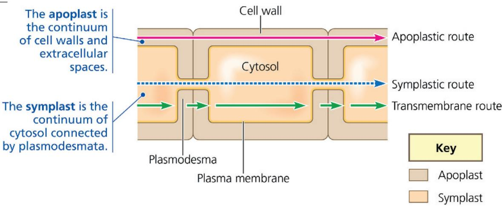

plasma membrane once, when they first enter the plant. After entering one cell, substances can move from cell to cell via plasmodesmata. In the transmembrane route, water and solutes move out of one cell, across the cell wall, and into the neighboring cell, which may pass them to the next cell in the same way. The transmembrane route requires repeated crossings of plasma membranes as substances exit one cell and enter the next. These three routes are not mutually exclusive, and some substances may use more than one route to varying degrees.

## Short-Distance Transport of Solutes Across Plasma Membranes

In plants, as in any organism, the selective permeability of the plasma membrane controls the short-distance movement of substances into and out of cells (see Concept 7.2). Both active and passive transport mechanisms occur in plants, and plant cell membranes are equipped with the same general types of pumps and transport proteins (channel proteins, carrier proteins, and cotransporters) that function in other cells. There are, however, specific differences between the membrane transport processes of plant and animal cells. In this section, we'll focus on some of those differences.

Unlike in animal cells, hydrogen ions ( $H^{+}$ ) rather than sodium ions ( $Na^{+}$ ) play the primary role in basic transport processes in plant cells. For example, in plant cells the membrane potential (the voltage across the membrane) is established mainly through the pumping of $H^{+}$ by proton pumps (Figure 36.6a) rather than the pumping of $Na^{+}$ by sodium-potassium pumps. Also, $H^{+}$ is most often cotransported in plants, whereas $Na^{+}$ is typically cotransported in animals. During cotransport, plant cells use the energy in the $H^{+}$ gradient and membrane potential to drive the active transport of many different solutes. For instance, cotransport with $H^{+}$ is responsible for absorption of neutral solutes, such as the sugar sucrose, by phloem cells and other plant cells. An $H^{+}/sucrose$ cotransporter couples movement of sucrose against its concentration gradient with movement of $H^{+}$ down its electrochemical gradient (Figure 36.6b). Cotransport with $H^{+}$ also facilitates movement of ions, as in the uptake of nitrate $\left(\mathrm{NO}_{3}^{-}\right)$ by root cells (Figure 36.6c).

The membranes of plant cells also have ion channels that allow only certain ions to pass (Figure 36.6d). As in animal cells, most channels are gated, opening or closing in response to stimuli such as chemicals, pressure, or voltage. Later in this chapter, we'll discuss how potassium ion channels in guard cells function in opening and closing stomata. Ion channels are also involved in producing electrical signals analogous to the action potentials of animals (see Concept 48.2). However, these signals are 1,000 times slower and employ $\mathrm{Ca^{2+}}$ -activated anion channels rather than the sodium ion channels used by animal cells.

## Short-Distance Transport of Water Across Plasma Membranes

The absorption or loss of water by a cell occurs by osmosis, the diffusion of free water—water that is not bound to solutes or surfaces—across a membrane (see Figure 7.12). The physical property that predicts the direction in which water will flow is called water potential, a quantity that includes the effects of solute concentration and physical pressure. Free water moves from regions of higher water potential to regions of lower water potential if there is no barrier to its flow. The word potential in the term water potential refers to water's potential energy—water's capacity to perform work when it moves from a region of higher water potential to a region of lower water potential. For example, if a plant cell or seed is immersed in a solution that has a higher water potential, water will move into the cell or seed, causing it to expand. The expansion of plant cells and seeds can be a powerful force: The expansion of cells in tree roots can break concrete sidewalks, and the swelling of wet grain seeds within the holds of damaged ships can produce catastrophic hull failure and sink the ships. Given the strong forces generated by swelling seeds, it is interesting to consider whether water uptake by seeds is an active process. This question is

Figure 36.6 Solute transport across plant cell plasma membranes.  
  
Assume that a plant cell has all four of the plasma membrane transport proteins shown above and that you have a specific inhibitor for each protein. Predict the effect of each inhibitor on the cell's membrane potential. For suggested answer, see Appendix A.

(a) H $^{+}$ and membrane potential. The plasma membranes of plant cells use ATP-dependent proton pumps to pump H $^{+}$ out of the cell. These pumps contribute to the membrane potential and the establishment of a pH gradient across the membrane. These two forms of potential energy can drive the transport of solutes.

(b) $\mathrm{H^{+}}$ and cotransport of neutral solutes. Neutral solutes such as sugars can be loaded into plant cells by cotransport with $\mathrm{H^{+}}$ ions. $\mathrm{H^{+}}/$ sucrose cotransporters, for example, play a key role in loading sugar into the phloem prior to sugar transport throughout the plant.

(c) $\mathsf{H}^+$ and cotransport of ions. Cotransport mechanisms involving $\mathsf{H}^+$ also participate in regulating ion fluxes into and out of cells. For example, $\mathsf{H}^+ / \mathsf{NO}_3^-$ cotransporters in the plasma membranes of root cells are important for the uptake of $\mathsf{NO}_3^-$ by plant roots.

(d) Ion channels. Plant ion channels open and close in response to voltage, stretching of the membrane, and chemical factors. When open, ion channels allow specific ions to diffuse across membranes. For example, a $K^{+}$ ion channel is involved in the release of $K^{+}$ from guard cells when stomata close.

examined in the Scientific Skills Exercise, on the next page, which explores the effect of temperature on this process.

Water potential is abbreviated by the Greek letter $\Psi$ (psi, pronounced “sigh”). Plant biologists measure $\Psi$ in a unit of pressure called a megapascal (abbreviated MPa). By definition, the $\Psi$ of pure water in a container open to the atmosphere under standard conditions (at sea level and at room temperature) is 0 MPa. One MPa is equal to about 10 times atmospheric pressure at sea level. The internal pressure of a living plant cell due to the osmotic uptake of water is approximately 0.5 MPa, about twice the air pressure inside an inflated car tire.

## How Solutes and Pressure Affect Water Potential

Solute concentration and physical pressure are the major determinants of water potential in hydrated plants, as expressed in the water potential equation:

$$
\Psi = \Psi_ {\mathrm{S}} + \Psi_ {\mathrm{P}}
$$

where $\Psi$ is the water potential, $\Psi_{S}$ is the solute potential (osmotic potential), and $\Psi_{P}$ is the pressure potential. The solute potential ( $\Psi_{S}$ ) of a solution is directly proportional to its molarity. Solute potential is also called osmotic potential because solutes affect the direction of osmosis. The solutes in plants are typically mineral ions and sugars. By definition, the $\Psi_{S}$ of pure water is 0. When solutes are added, they bind water molecules. As a result, there are fewer free water molecules, reducing the capacity of the water to move and do work. In this way, an increase in solute concentration has a negative effect on water potential, which is why the $\Psi_{S}$ of a solution is always expressed as a negative number. For example, a 0.1 M solution of a sugar has a $\Psi_{S}$ of -0.23 MPa. As the solute concentration increases, $\Psi_{S}$ will become more negative.

Pressure potential ( $\Psi_{P}$ ) is the physical pressure on a solution. Unlike $\Psi_{S}$ , $\Psi_{P}$ can be positive or negative relative to atmospheric pressure. For example, when a solution is being withdrawn by a syringe, it is under negative pressure; when it is being expelled from a syringe, it is under positive pressure. The water in living cells is usually under positive pressure due to the osmotic uptake of water. Specifically, the protoplast (the living part of the cell, which also includes the

plasma membrane) presses against the cell wall, creating what is known as turgor pressure. This pushing effect of internal pressure, much like the air in an inflated tire, is critical for plant function because it helps maintain the stiffness of plant tissues and also serves as the driving force for cell elongation. Conversely, the water in the hollow nonliving xylem cells (tracheids and vessel elements) of a plant is often under a negative pressure potential (tension) of less than -2 MPa.

As you learn to apply the water potential equation, keep in mind the key point: Water moves from regions of higher water potential to regions of lower water potential.

# Scientific Skills Exercise Calculating and Interpreting Temperature Coefficients

Does the Initial Uptake of Water by Seeds Depend on Temperature? One way to answer this question is to soak seeds in water at different temperatures and measure the rate of water uptake at each temperature. The data can be used to calculate the temperature coefficient, $Q_{10}$ , the factor by which a physiological reaction (or process) rate increases when the temperature is raised by $10^{\circ}C$ :

$$
Q _ {1 0} = \left(\frac {k _ {2}}{k _ {1}}\right) ^ {\frac {1 0}{t _ {2} - t _ {1}}}
$$

where $t_{2}$ is the higher temperature ( $^{\circ}$ C), $t_{1}$ is the lower temperature, $k_{2}$ is the reaction (or process) rate at $t_{2}$ , and $k_{1}$ is the reaction (or process) rate at $t_{1}$ . (If $t_{2} - t_{1} = 10$ , as here, the math is simplified.)

$Q_{10}$ values may be used to make inferences about the physiological process under investigation. Chemical (metabolic) processes involving large-scale protein shape changes are highly dependent on temperature and have higher $Q_{10}$ values, closer to 2 or 3. In contrast, many, but not all, physical parameters are relatively independent of temperature and have $Q_{10}$ values closer to 1. For example, the $Q_{10}$ of the change in the viscosity of water is 1.2–1.3. In this exercise, you will calculate $Q_{10}$ using data from radish seeds (Raphanus sativum) to assess whether the initial uptake of water by seeds is more likely to be a physical or a chemical process.

How the Experiment Was Done Samples of radish seeds were weighed and placed in water at four different temperatures. After 30 minutes, the seeds were removed, blotted dry, and reweighed. The researchers then calculated the percent increase in mass due to water uptake for each sample.

## Water Movement Across Plant Cell Membranes

Now let's consider how water potential affects absorption and loss of water by a living plant cell. First, imagine a cell that is flaccid (limp) as a result of losing water. The cell has a $\Psi_{\mathrm{P}}$ of $0\mathrm{MPa}$ . Suppose this flaccid cell is bathed in a solution of higher solute concentration (more negative solute potential) than the cell itself (Figure 36.7a). Since the external solution has the lower (more negative) water potential, water diffuses out of the cell. The cell's protoplast undergoes plasmolysis—that is, it shrinks and pulls away from the cell wall. If we place the same flaccid cell in pure water ( $\Psi = 0\mathrm{MPa}$ ) (Figure 36.7b), the cell, because it contains solutes, has a lower water potential than the water, and water enters the cell by osmosis. The contents of the cell begin to swell and press the plasma membrane against the cell wall. The partially elastic wall, exerting turgor pressure, confines the pressurized protoplast. When this pressure is enough to offset the tendency for water to enter because of the solutes in the cell, then $\Psi_{\mathrm{P}}$ and $\Psi_{\mathrm{S}}$ are equal,

## Data from the Experiment

<table><tr><td>Temperature</td><td>% Increase in Mass Due to Water Uptake After 30 Minutes</td></tr><tr><td>5°C</td><td>18.5</td></tr><tr><td>15°C</td><td>26.0</td></tr><tr><td>25°C</td><td>31.0</td></tr><tr><td>35°C</td><td>36.2</td></tr></table>

Data from J. D. Murphy and D. L. Noland, Temperature effects on seed imbibition and leakage mediated by viscosity and membranes, Plant Physiology 69:428–431 (1982).

## INTERPRET THE DATA

1. Based on the data, does the initial uptake of water by radish seeds vary with temperature? What is the relationship between temperature and water uptake?

2. (a) Using the data for $35^{\circ}$ C and $25^{\circ}$ C, calculate $Q_{10}$ for water uptake by radish seeds. Repeat the calculation using the data for $25^{\circ}$ C and $15^{\circ}$ C and the data for $15^{\circ}$ C and $5^{\circ}$ C. (b) What is the average $Q_{10}$ ? (c) Do your results imply that the uptake of water by radish seeds is mainly a physical process or a chemical (metabolic) process? (d) Given that the $Q_{10}$ for the change in the viscosity of water is 1.2–1.3, could the slight temperature dependence of water uptake by seeds be a reflection of the slight temperature dependence of the viscosity of water?

3. Besides temperature, what other independent variables could you alter to test whether radish seed swelling is essentially a physical process or a chemical process?

4. Would you expect plant growth to have a $Q_{10}$ closer to 1 or 3? Why?

Instructors: A version of this Scientific Skills Exercise can be assigned in Mastering Biology.

and $\Psi = 0$ . This matches the water potential of the extracellular environment—in this example, 0 MPa. A dynamic equilibrium has been reached, and there is no further net movement of water.

In contrast to a flaccid cell, a walled cell with a greater solute concentration than its surroundings is turgid, or very firm. When turgid cells in a nonwoody tissue push against each other, the tissue is stiffened. The effects of turgor loss are seen during wilting, when leaves and stems droop as a result of cells losing water.

Figure 36.7 Water relations in plant cells.

In these experiments, flaccid cells (cells in which the protoplast contacts the cell wall but lacks turgor pressure) are placed in two environments. The blue arrows indicate initial net water movement.

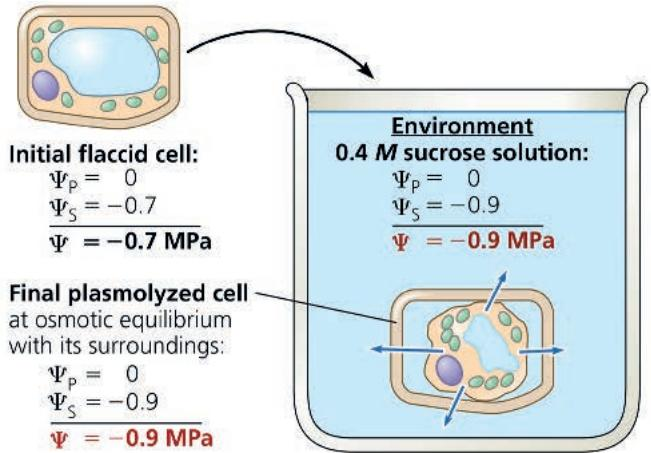  
(a) Initial conditions: cellular $\Psi > environmental \Psi$ . The protoplast loses water, and the cell plasmolyzes. After plasmolysis is complete, the water potentials of the cell and its surroundings are the same.  
(b) Initial conditions: cellular $\Psi < environmental \Psi$ . Net uptake of water by osmosis makes the cell turgid. When this tendency for water to enter is offset by the back pressure of the elastic wall, water potentials are equal for the cell and its surroundings.

## Aquaporins: Facilitating Diffusion of Water

A difference in water potential determines the direction of water movement across membranes, but how do water molecules actually cross the membranes? Water molecules are small enough to diffuse across the phospholipid bilayer, even though the bilayer's interior is hydrophobic. However, their movement across biological membranes is too rapid to be explained by unaided diffusion. Transport proteins called aquaporins (see Figure 7.10 and Concept 7.2) facilitate the transport of water molecules across plant cell plasma membranes. Aquaporin channels, which can open and close, affect the rate at which water moves osmotically across the membrane. Some aquaporins, for example, close in response to high $\mathrm{Ca^{2+}}$ or low pH in the cytosol.

## Long-Distance Transport: The Role of Bulk Flow

Diffusion is an effective transport mechanism over the spatial scales typically found at the cellular level. However, diffusion is much too slow to function in long-distance transport within a plant. Although diffusion from one end of a cell to the other takes just seconds, diffusion from the roots to the top of a giant redwood would take several centuries. Instead, long-distance transport occurs through bulk flow, the movement of liquid in response to a pressure gradient. The bulk flow of material always occurs from higher to lower pressure. Unlike osmosis, bulk flow is independent of solute concentration.

Long-distance bulk flow occurs within specialized cells in the vascular tissue, namely, the tracheids and vessel elements of the xylem and the sieve tube elements of the phloem. In leaves, the branching of veins ensures that no cell is more than a few cells away from the vascular tissue (Figure 36.8).

The structures of the conducting cells of the xylem and phloem facilitate bulk flow. Mature tracheids and vessel elements are dead cells and therefore have no cytoplasm, and the cytoplasm of sieve tube elements (also called sieve tube members) is almost devoid of organelles (see Figure 35.10). If you have dealt with a partially clogged drain, you know that the volume of flow depends on the pipe's diameter. Clogs reduce the effective diameter of the drainpipe. Such experiences help us understand how the structures of plant cells specialized for bulk flow fit their function. Like unclogging a drain, the absence or reduction of cytoplasm in a plant's "plumbing" facilitates bulk flow through the xylem and phloem. Bulk flow is also enhanced by the perforation plates at the ends of vessel elements and the porous sieve plates connecting sieve tube elements.

Diffusion, active transport, and bulk flow act in concert to transport resources throughout the whole plant. For example, bulk flow due to a pressure difference is the mechanism of long-distance transport of sugars in the phloem, but active transport of sugar at the cellular level maintains this pressure difference. In the next three sections, we'll examine in more detail the transport of water and minerals from roots to shoots, the control of evaporation, and the transport of sugars.

Figure 36.8 Venation in an aspen leaf.  
The finer and finer branching of leaf veins in eudicot leaves ensures that no leaf cell is far removed from the vascular system.  
  
VISUAL SKILLS In this leaf, what is the maximum number of cells any mesophyll cell is from a vein?
For suggested answer, see Appendix A.

## Concept Check 36.2

1. If a plant cell immersed in distilled water has a $\Psi_{\mathrm{S}}$ of $-0.7\mathrm{MPa}$ and a $\Psi$ of $0\mathrm{MPa}$ , what is the cell's $\Psi_{\mathrm{P}}$ ? If you put it in an open beaker of solution that has a $\Psi$ of $-0.4\mathrm{MPa}$ what would be its $\Psi_{\mathrm{P}}$ at equilibrium?

2. How would a reduction in the number of aquaporin channels affect a plant cell's ability to adjust to new osmotic conditions?

3. How would the long-distance transport of water be affected if tracheids and vessel elements were alive at maturity? Explain.

4. WHAT IF? What would happen if you put plant protoplasts in pure water? Explain.

For suggested answers, see Appendix A.

## Concept 36.3: Transpiration drives the transport of water and minerals from roots to shoots via the xylem

Picture yourself struggling to carry a 19-liter (5-gallon) container of water weighing 19 kilograms (42 pounds) up several flights of stairs. Now imagine doing this 40 times a day. Then, consider the fact that an average-sized tree, despite having neither heart nor muscle, transports a similar volume of water effortlessly on a daily basis. How do trees accomplish this feat? To answer this question, we'll follow each step in the journey of water and minerals from roots to leaves.

## Absorption of Water and Minerals by Root Cells

Although all living plant cells absorb nutrients across their plasma membranes, the cells near the tips of roots are particularly important because most of the absorption of water and minerals occurs there. In this region, the epidermal cells are permeable to water, and many are differentiated into root hairs, modified cells that account for much of the absorption of water by roots (see Figure 35.3). The root hairs absorb the soil solution, which consists of water molecules and dissolved mineral ions that are not bound tightly to soil particles. The soil solution is drawn into the hydrophilic walls of epidermal cells and passes freely along the cell walls and the extracellular spaces into the root cortex. This flow enhances the exposure of the cells of the cortex to the soil solution, providing a much greater membrane surface area for absorption than the surface area of the epidermis alone. Although the soil solution usually has a low mineral concentration, active transport enables roots to accumulate essential minerals, such as $K^{+}$ , to concentrations hundreds of times greater than in the soil.

## Transport of Water and Minerals into the Xylem

Water and minerals that pass from the soil into the root cortex cannot be transported to the rest of the plant until they enter the xylem of the vascular cylinder, or stele. The endodermis, the innermost layer of cells in the root cortex, functions as a last checkpoint for the selective passage of minerals from the cortex into the vascular cylinder (Figure 36.9). Minerals already in the symplast when they reach the endodermis continue through the plasmodesmata of endodermal cells and pass into the vascular cylinder. These minerals were already screened by the plasma membrane they had to cross to enter the symplast in the epidermis or cortex.

Minerals that reach the endodermis via the apoplast encounter a dead end that blocks their passage into the vascular cylinder. This barrier, located in the transverse and radial walls of each endodermal cell, is the Casparian strip, a belt made of suberin, a waxy material impervious to water and dissolved minerals (see Figure 36.9). Because of the Casparian strip, water and minerals cannot cross the endodermis and enter the vascular cylinder via the apoplast. Instead, water and minerals that are passively moving through the apoplast must cross the selectively permeable plasma membrane of an endodermal cell before they can enter the vascular cylinder. In this way, the endodermis transports needed minerals from the soil into the xylem and keeps many unneeded or toxic substances out. The endodermis also prevents solutes that have accumulated in the xylem from leaking back into the soil solution.

The last segment in the soil-to-xylem pathway is the passage of water and minerals into the tracheids and vessel elements of the xylem. These water-conducting cells lack protoplasts when mature and are therefore parts of the apoplast. Endodermal cells, as well as living cells within the vascular cylinder, discharge minerals from their protoplasts into their own cell walls. Both diffusion and active transport are involved in this transfer of solutes from the symplast to the apoplast, and the water and minerals can now enter the tracheids and vessel elements, where they are transported to the shoot system by bulk flow.

## Bulk Flow Transport via the Xylem

Water and minerals from the soil enter the plant through the epidermis of roots, cross the root cortex, and pass into the vascular cylinder. From there the xylem sap, the water and dissolved minerals in the xylem, is transported long distances by bulk flow to the veins that branch throughout each leaf. As noted earlier, bulk flow is much faster than diffusion or active transport. Peak velocities in the transport of xylem sap can range from 15 to 45 m/hr for trees with wide vessel elements. The stems and leaves depend on this rapid delivery system for their supply of water and minerals.

The process of transporting xylem sap involves the loss of an astonishing amount of water by transpiration, the loss of water vapor from leaves and other aerial parts of the plant. A single maize plant, for example, transpires 60 L of water (the equivalent of 170 12-ounce bottles) during a growing season. A maize crop growing at a typical density of 60,000 plants per hectare

Figure 36.9 Transport of water and minerals from root hairs to the xylem.

VISUAL SKILLS After studying the figure, explain how the Casparian strip forces water and minerals to pass through the plasma membranes of endodermal cells.

For suggested answer, see Appendix A.

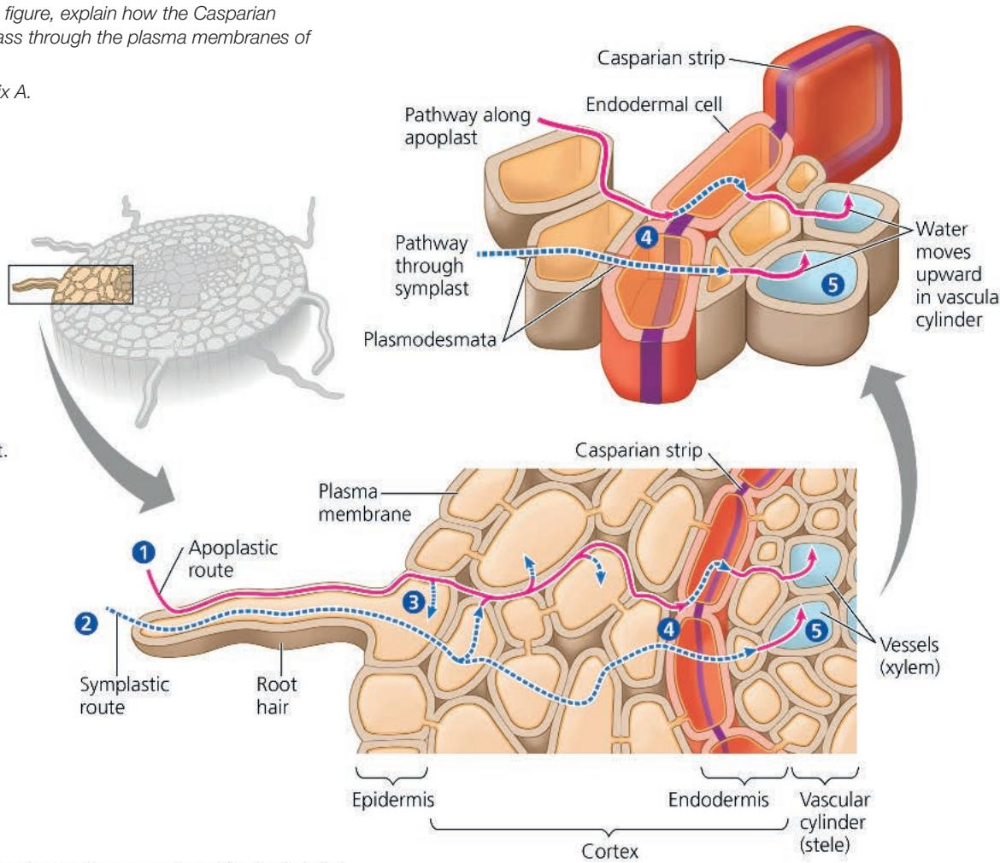

1 Apoplastic route. Uptake of soil solution by the hydrophilic walls of root hairs provides access to the apoplast. Water and minerals can then diffuse into the cortex along this matrix of walls and extracellular spaces.

2 Symplastic route. Minerals and water that cross the plasma membranes of root hairs can enter the symplast.

3 Transmembrane route. As soil solution moves along the apoplast, some water and minerals are transported into the protoplasts of cells of the epidermis and cortex and then move inward via the symplast.

4 The endodermis: controlled entry to the vascular cylinder (stele). Within the transverse and radial walls of each endodermal cell is the Casparian strip, a belt of waxy material (purple band) that blocks the passage of water and dissolved minerals. Only minerals already in the symplast or entering that pathway by crossing the plasma membrane of an endodermal cell can detour around the Casparian strip and pass into the vascular cylinder (stele).

transpires almost 4 million L of water per hectare (about 400,000 gallons of water per acre) every growing season. If the transpired water is not replaced by water transported up from the roots, the leaves will wilt, and the plants will eventually die.

5 Transport in the xylem. Endodermal cells and also living cells within the vascular cylinder discharge water and minerals into their walls (apoplast). The xylem vessels then transport the water and minerals by bulk flow upward into the shoot system.

Xylem sap rises to heights of more than 120 m in the tallest trees. Is the sap mainly pushed upward from the roots, or is it mainly pulled upward? Let's evaluate the relative contributions of these two mechanisms.

sometimes causes more water to enter the leaves than is transpired, resulting in guttation, the exudation of water droplets that can be seen in the morning on the tips or edges of some plant leaves (Figure 36.10). Guttation fluid should not be confused with dew, which is condensed atmospheric moisture.

## Pushing Xylem Sap: Root Pressure

At night, when there is almost no transpiration, root cells continue actively pumping mineral ions into the xylem of the vascular cylinder. Meanwhile, the Casparian strip of the endodermis prevents the ions from leaking back out into the cortex and soil. The resulting accumulation of minerals lowers the water potential within the vascular cylinder. Water flows in from the root cortex, generating root pressure, a push of xylem sap. The root pressure

Figure 36.10
Guttation.

Root pressure is forcing excess water from this strawberry leaf.

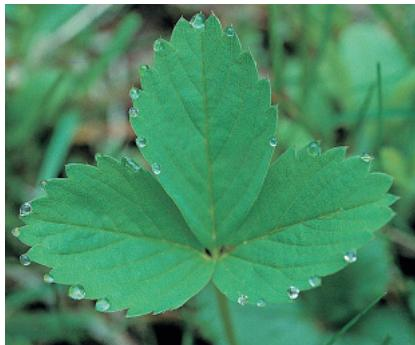

In most plants, root pressure is a minor mechanism driving the ascent of xylem sap, pushing water only a few meters at most. The positive pressures produced are simply too weak to overcome the gravitational force of the water column in the xylem, particularly in tall plants. Many plants do not generate any root pressure or do so only during part of the growing season. Even in plants that display guttation, root pressure cannot keep pace with transpiration after sunrise. For the most part, xylem sap is not pushed from below by root pressure but is pulled up.

## Pulling Xylem Sap: The Cohesion-Tension Hypothesis

As we have seen, root pressure, which depends on the active transport of solutes by plants, is only a minor force in the ascent of xylem sap. Far from depending on the metabolic activity of cells, most of the xylem sap that rises through a tree does not even require living cells to do so. As demonstrated by Eduard Strasburger in 1891, leafy stems with their lower end immersed in toxic solutions of copper sulfate or acid will readily draw these poisons up if the stem is cut below the surface of the liquid. As the toxic solutions ascend, they kill all living cells in their path, eventually arriving in the transpiring leaves and killing the leaf cells as well. Nevertheless, as Strasburger noted, the uptake of the toxic solutions and the loss of water from the dead leaves can continue for weeks.

In 1894, a few years after Strasburger's findings, two Irish scientists, John Joly and Henry Dixon, put forward a hypothesis that remains the leading explanation of the ascent of xylem sap. According to their cohesion-tension hypothesis, transpiration provides the pull for the ascent of xylem sap, and the cohesion of water molecules transmits this pull along the entire length of the xylem from shoots to roots. Hence, xylem sap is normally under negative pressure, or tension. Since transpiration is a “pulling” process, our exploration of the rise of xylem sap by the cohesion-tension mechanism begins not with the roots but with the leaves, where the driving force for transpirational pull begins.

## Transpirational Pull

Stomata on a leaf's surface lead to a maze of internal air spaces that expose the mesophyll cells to the $\mathrm{CO}_{2}$ they need for photosynthesis. The air in these spaces is saturated with water vapor because it is in contact with the moist walls of the cells. On most days, the air outside the leaf is drier; that is, it has lower water potential than the air inside the leaf. Therefore, water vapor in the air spaces of a leaf diffuses down its water potential gradient and exits the leaf via the stomata. It is this loss of water vapor by diffusion and evaporation that we call transpiration.

But how does loss of water vapor from the leaf translate into a pulling force for upward movement of water through a plant? The negative pressure potential that causes water to move up through the xylem develops at the surface of mesophyll cell walls in the leaf (Figure 36.11). The cell wall acts like a very thin capillary network. Water adheres to the cellulose microfibrils and other hydrophilic components of the cell wall. As water evaporates from the water film that covers the cell walls of mesophyll cells, the air-water interface retreats farther into the cell wall. Because of the high surface tension of water, the curvature of the interface induces a tension, or negative pressure potential, in the water. As more water evaporates from the cell wall, the curvature of the air-water interface increases and the pressure of the water

Figure 36.11 Generation of transpirational pull.

Negative pressure (tension) at the air-water interface in the leaf is the basis of transpirational pull, which draws water out of the xylem.

## Figure 36.12 Ascent of xylem sap.

Hydrogen bonding forms an unbroken chain of water molecules extending from leaves to the soil. The force driving the ascent of xylem sap is a gradient of water potential ( $\Psi$ ). For bulk flow over long distance, the $\Psi$ gradient is due mainly to a gradient of the pressure potential ( $\Psi_{P}$ ). Transpiration results in the $\Psi_{P}$ at the leaf end of the xylem being lower than the $\Psi_{P}$ at the root end. The $\Psi$ values shown at the left are a “snapshot.” They may vary during daylight, but the direction of the $\Psi$ gradient remains the same.

becomes more negative. Water molecules from the more hydrated parts of the leaf are then pulled toward this area, reducing the tension. These pulling forces are transferred to the xylem because each water molecule is cohesively bound to the next by hydrogen bonds. Thus, transpirational pull depends on several of the properties of water discussed in Concept 3.2: adhesion, cohesion, and surface tension.

The role of negative pressure potential in transpiration is consistent with the water potential equation because negative pressure potential (tension) lowers water potential. Because water moves from areas of higher water potential to areas of lower water potential, the more negative pressure potential at the air-water interface causes water in xylem cells to be “pulled”

into mesophyll cells, which lose water to the air spaces, the water diffusing out through stomata. In this way, the negative water potential of leaves provides the “pull” in transpirational pull. The transpirational pull on xylem sap is transmitted all the way from the leaves to the young roots and even into the soil solution (Figure 36.12).

## Cohesion and Adhesion in the Ascent of Xylem Sap

Cohesion and adhesion facilitate the transport of water by bulk flow. Cohesion is the attractive force between molecules of the same substance. Water has an unusually high cohesive force

due to the hydrogen bonds each water molecule can potentially make with other water molecules. Water's cohesive force within the xylem gives it a tensile strength equivalent to that of a steel wire of similar diameter. The cohesion of water makes it possible to pull a column of xylem sap from above without the water molecules separating. Water molecules exiting the xylem in the leaf tug on adjacent water molecules, and this pull is relayed, molecule by molecule, down the entire column of water in the xylem. Meanwhile, the strong adhesion of water molecules (again by hydrogen bonds) to the hydrophilic walls of xylem cells helps offset the downward force of gravity.

The upward pull on the sap creates tension within the vessel elements and tracheids, which are like elastic pipes. Positive pressure causes an elastic pipe to swell, whereas tension pulls the walls of the pipe inward. On a warm day, a decrease in the diameter of a tree trunk can even be measured. As transpirational pull puts the vessel elements and tracheids under tension, their thick secondary walls prevent them from collapsing, much as wire rings maintain the shape of a vacuum-cleaner hose. The tension produced by transpirational pull lowers water potential in the root xylem to such an extent that water flows passively from the soil, across the root cortex, and into the vascular cylinder.

Transpirational pull can extend down to the roots only through an unbroken chain of water molecules. Cavitation, the formation of a water vapor pocket, breaks the chain. It is more common in wide vessel elements than in tracheids and can occur during drought stress or when xylem sap freezes in winter. The air bubbles resulting from cavitation expand and block water channels of the xylem. The rapid expansion of air bubbles produces clicking noises that can be heard by placing sensitive microphones at the surface of the stem.

The interruption of xylem sap transport by cavitation is not always permanent. The chain of water molecules can detour around the air bubbles through pits between adjacent tracheids or vessel elements (see Figure 35.10). Moreover, root pressure enables small plants to refill blocked vessel elements. Recent evidence suggests that cavitation may even be repaired when the xylem sap is under negative pressure, although the mechanism by which this occurs is uncertain. In addition, secondary growth adds a layer of new xylem each year. Only the youngest, outermost secondary xylem layers transport water. Although the older secondary xylem no longer transports water, it does provide support for the tree (see Figure 35.22).

## Xylem Sap Ascent by Bulk Flow: A Review

The cohesion-tension mechanism that transports xylem sap against gravity is an excellent example of how physical principles apply to biological processes. In the long-distance transport of water from roots to leaves by bulk flow, the movement of fluid is driven by a water potential difference at opposite ends of xylem tissue. The water potential difference is created at the leaf end of the xylem by the evaporation of water from leaf cells. Evaporation lowers the water potential at the air-water interface, thereby generating the negative pressure (tension) that pulls water through the xylem.

Bulk flow in the xylem differs from diffusion in some key ways. First, it is driven by differences in pressure potential ( $\Psi_{P}$ ); solute potential ( $\Psi_{S}$ ) is not a factor. Therefore, the water potential gradient within the xylem is essentially a pressure gradient. Also, the flow does not occur across plasma membranes of living cells, but instead within hollow, dead cells. Furthermore, it moves the entire solution together—not just water or solutes—and at much greater speed than diffusion.

The plant expends no energy to lift xylem sap by bulk flow. Instead, the absorption of sunlight drives most of transpiration by causing water to evaporate from the moist walls of mesophyll cells and by lowering the water potential in the air spaces within a leaf. Thus, the ascent of xylem sap, like the process of photosynthesis, is ultimately solar powered.

## Concept Check 36.3

1. A horticulturalist notices that when Zinnia flowers are cut at dawn, a small drop of water collects at the surface of the rooted stump. However, when the flowers are cut at noon, no drop is observed. Suggest an explanation.

2. WHAT IF? Suppose an Arabidopsis mutant lacking functional aquaporin proteins has a root mass three times greater than that of wild-type plants. Suggest an explanation.

3. MAKE CONNECTIONS How are the Casparian strip and tight junctions analogous (see Figure 6.30)?

For suggested answers, see Appendix A.

## Concept 36.4: The rate of transpiration is regulated by stomata

Leaves generally have large surface areas and high surface-to-volume ratios. The large surface area enhances light absorption for photosynthesis. The high surface-to-volume ratio aids in $CO_{2}$ absorption during photosynthesis as well as in the release of $O_{2}$ , a by-product of photosynthesis. Upon diffusing through the stomata, $CO_{2}$ enters a honeycomb of air spaces formed by the spongy mesophyll cells (see Figure 35.18). Because of the irregular shapes of these cells, the leaf's internal surface area may be 10 to 30 times greater than the external surface area.

Although large surface areas and high surface-to-volume ratios increase the rate of photosynthesis, they also increase water loss by way of the stomata. Thus, a plant's tremendous requirement for water is largely a consequence of the shoot system's need for ample exchange of $\mathrm{CO}_{2}$ and $\mathrm{O}_2$ for photosynthesis. By opening and closing the stomata, guard cells help balance the plant's requirement to conserve water with its requirement for photosynthesis.

Figure 36.13 Partially open stomata in the epidermis of a bean (Phaseolus) leaf.  
  
VISUAL SKILLS If the micrograph above is of a section of epidermis 500 $\mu$ m by 300 $\mu$ m, what is the stomatal density of this bean leaf? Give your answer in number of stomata per square centimeter.  
For suggested answer, see Appendix A.

## Stomata: Major Pathways for Water Loss

About 95% of the water a plant loses escapes through stomata, although these pores account for only 1–2% of the external leaf surface. The waxy cuticle limits water loss through the remaining surface of the leaf. Each stoma is flanked by a pair of guard cells. Guard cells control the diameter of the stoma by changing shape, thereby widening or narrowing the gap between the guard cell pair. Under the same environmental conditions, the amount of water lost per leaf depends largely on stomatal density (Figure 36.13) and the average size of the stomatal pores.

Stomatal density can be under both genetic and environmental control. As a result of evolution by natural selection, shade-tolerant species tend to have lower stomatal densities than shade-intolerant species because $\mathrm{CO}_{2}$ uptake doesn't limit photosynthesis under shady conditions. Stomatal density, however, can also be regulated by environmental changes. Low $\mathrm{CO}_{2}$ levels during leaf development, for example, lead to increased stomatal densities in many species, an adaptation that facilitates $\mathrm{CO}_{2}$ uptake under these conditions. By measuring the stomatal density of leaf fossils, scientists have gained insight into the levels of atmospheric $\mathrm{CO}_{2}$ in past climates. A recent British survey found that stomatal density of many woodland species has decreased since 1927, when a similar survey was made. This observation is consistent with other findings that atmospheric $\mathrm{CO}_{2}$ levels increased dramatically during the late 1900s.

## Mechanisms of Stomatal Opening and Closing

When guard cells take in water from neighboring cells by osmosis, they become more turgid. In most angiosperm guard cells, the cell walls facing the stomatal pore are thicker, and the cellulose microfibrils are oriented in a direction that causes the guard cells to bow outward when turgid (Figure 36.14a). This bowing outward increases the size of the pore between the guard cells. When the cells lose water and become flaccid, they become less bowed, and the pore closes.

Figure 36.14 Mechanisms of stomatal opening and closing.  

  
Guard cells turgid/Stoma open

Guard cells flaccid/Stoma closed  

(a) Changes in guard cell shape and stomatal opening and closing (surface view). Guard cells of a typical angiosperm are illustrated in their turgid (stoma open) and flaccid (stoma closed) states. The radial orientation of cellulose microfibrils in the cell walls causes the guard cells to increase more in length than width when turgor increases. Since the two guard cells are tightly joined at their tips, they bow outward when turgid, causing the stomatal pore to open.  
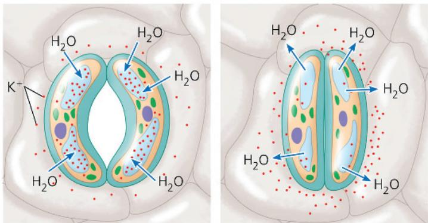  
(b) Role of potassium ions ( $K^{+}$ ) in stomatal opening and closing. The transport of $K^{+}$ (symbolized here as red dots) across the plasma membrane and vacuolar membrane causes the turgor changes of guard cells. The uptake of anions, such as malate and chloride ions (not shown), also contributes to guard cell swelling.

The changes in turgor pressure in guard cells result primarily from the reversible absorption and loss of $K^{+}$ . Stomata open when guard cells actively accumulate $K^{+}$ from neighboring epidermal cells (Figure 36.14b). The flow of $K^{+}$ across the plasma membrane of the guard cell is coupled to the generation of a membrane potential by proton pumps (see Figure 36.6a). Stomatal opening correlates with active transport of $H^{+}$ out of the guard cell. The resulting voltage (membrane potential) drives $K^{+}$ into the cell through specific membrane channels. The absorption of $K^{+}$ causes the water potential to become more negative within the guard cells, and the cells become more turgid as water enters by osmosis. Because most of the $K^{+}$ and water are stored in the vacuole, the vacuolar membrane also plays a role in regulating guard cell dynamics. Stomatal closing results from a loss of $K^{+}$ from guard cells to neighboring cells, which leads to an osmotic loss of water. Aquaporins also help regulate the osmotic swelling and shrinking of guard cells.

## Stimuli for Stomatal Opening and Closing

In general, stomata are open during the day and mostly closed at night, preventing the plant from losing water under conditions when photosynthesis cannot occur. At least three cues contribute to stomatal opening at dawn: light, $CO_{2}$ depletion, and an internal “clock” in guard cells.

Light stimulates guard cells to accumulate $K^{+}$ and become turgid. This response is triggered by illumination of blue-light receptors in the plasma membrane of guard cells. Activation of these receptors stimulates the activity of proton pumps in the plasma membrane of the guard cells, in turn promoting absorption of $K^{+}$ .

Stomata also open in response to depletion of $\mathrm{CO}_{2}$ within the leaf's air spaces as a result of photosynthesis. As $\mathrm{CO}_{2}$ concentrations decrease during the day, the stomata progressively open if sufficient water is supplied to the leaf.

An internal “clock” in the guard cells ensures that stomata continue their daily rhythm of opening and closing. This rhythm occurs even if a plant is kept in a dark location. All eukaryotic organisms have internal clocks that regulate cyclic processes. Cycles with intervals of approximately 24 hours are called circadian rhythms (which you’ll learn more about in Concept 39.3).

Drought stress can also cause stomata to close. A hormone called abscisic acid (ABA), which is produced in roots and leaves in response to water deficiency, signals guard cells to close stomata. This response reduces wilting but also restricts $CO_{2}$ absorption, thereby slowing photosynthesis. ABA also directly inhibits photosynthesis. Water availability is closely tied to plant productivity not because water is needed as a substrate in photosynthesis, but because freely available water allows plants to keep stomata open and take up more $CO_{2}$ .

Guard cells control the photosynthesis-transpiration compromise on a moment-to-moment basis by integrating a variety of internal and external stimuli. Even the passage of a cloud or a transient shaft of sunlight through a forest can affect the rate of transpiration.

## Effects of Transpiration on Wilting and Leaf Temperature

As long as most stomata remain open, transpiration is greatest on a day that is sunny, warm, dry, and windy because these environmental factors increase evaporation. If transpiration cannot pull sufficient water to the leaves, the shoot becomes slightly wilted as cells lose turgor pressure. Although plants respond to such mild drought stress by rapidly closing stomata, some evaporative water loss still occurs through the cuticle. Under prolonged drought conditions, leaves can become severely wilted and irreversibly injured.

Transpiration also results in evaporative cooling, which can lower a leaf's temperature by as much as $10^{\circ}\mathrm{C}$ compared with the surrounding air. This cooling prevents the leaf from reaching temperatures that could denature enzymes involved in photosynthesis and other metabolic processes.

## Adaptations That Reduce Evaporative Water Loss

Water availability is a major determinant of plant productivity. The main reason water availability is tied to plant productivity is not related to photosynthesis's direct need for water as a substrate but rather because freely available water allows plants to keep stomata open and take up more $\mathrm{CO}_{2}$ . The problem of reducing water loss is especially acute for desert plants. Plants adapted to arid environments are called xerophytes (from the Greek xero, dry).

Many species of desert plants avoid drying out by completing their short life cycles during the brief rainy seasons. Rain comes infrequently in deserts, but when it arrives, the vegetation is transformed as dormant seeds of annual species quickly germinate and bloom, completing their life cycle before dry conditions return.

Other xerophytes have unusual physiological or morphological adaptations that enable them to withstand harsh desert conditions. The stems of many xerophytes are fleshy because they store water for use during long dry periods. Cacti have highly reduced leaves that resist excessive water loss; photosynthesis is carried out mainly in their stems. Another adaptation common in arid habitats is crassulacean acid metabolism (CAM), a specialized form of photosynthesis found in succulents of the family Crassulaceae and several other families (see Figure 10.20). Because the leaves of CAM plants take in $CO_{2}$ at night, the stomata can remain closed during the day, when evaporative stresses are greatest. Other examples of xerophytic adaptations are discussed in Figure 36.15.

## Concept Check 36.4

1. What are the stimuli that control the opening and closing of stomata?

2. The pathogenic fungus Fusicoccum amygdali secretes a toxin called fusicoccin that activates the plasma membrane proton pumps of plant cells and leads to uncontrolled water loss. Suggest a mechanism by which the activation of proton pumps could lead to severe wilting.

3. WHAT IF? If you buy cut flowers, why might the florist recommend cutting the stems underwater and then transferring the flowers to a vase while the cut ends are still wet?

4. MAKE CONNECTIONS Explain why the evaporation of water from leaves lowers their temperature (see Concept 3.2).

For suggested answers, see Appendix A.

Ocotillo (Fouquieria splendens) is common in the southwestern region of the United States and northern Mexico. It is leafless during most of the year, thereby avoiding excessive water loss (right). Immediately after a heavy rainfall, it produces small leaves (below and inset). As the soil dries, the leaves quickly shrivel and die.

Figure 36.15 Some xerophytic adaptations.  
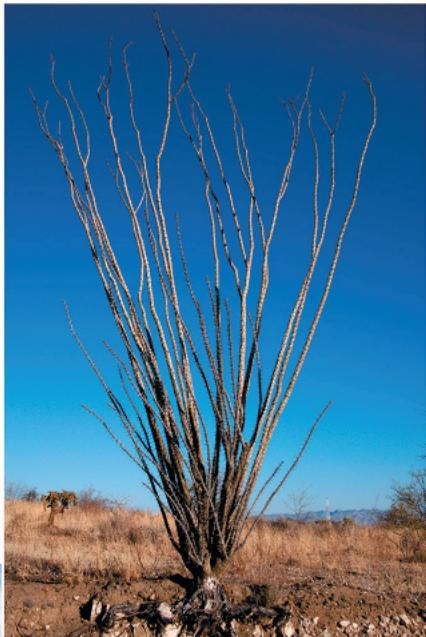

  
The long, white hairlike bristles along the stem of the old man cactus (Cephalocereus senilis) help reflect the intense sunlight of the Mexican desert.

Oleander (Nerium oleander), shown in the inset, is commonly found in arid climates. Its leaves have a thick cuticle and multiple-layered epidermal tissue that reduce water loss. Stomata are recessed in cavities called “crypts,” an adaptation that reduces the rate of transpiration by protecting the stomata from hot, dry wind. Trichomes help minimize transpiration by breaking up the flow of air, allowing the chamber of the crypt to have a higher humidity than the surrounding atmosphere (LM).

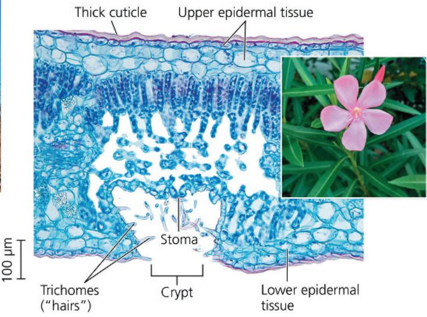

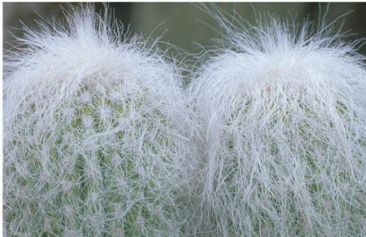

# Concept 36.5: Sugars are transported from sources to sinks via the phloem

The unidirectional flow of water and minerals from soil to roots to leaves through the xylem is largely in an upward direction. In contrast, the movement of photosynthates often runs in the opposite direction, transporting sugars from mature leaves to lower parts of the plant, such as root tips that require large amounts of sugars for energy and growth. The transport of the products of photosynthesis, known as translocation, is carried out by another tissue, the phloem.

## Movement from Sugar Sources to Sugar Sinks

Sieve tube elements are specialized cells in angiosperms that serve as conduits for translocation. Arranged end to end, they form long sieve tubes (see Figure 35.10). Between these cells are sieve plates, structures that allow the flow of sap along the sieve tube. Phloem sap, the aqueous solution that flows through sieve tubes, differs markedly from the xylem sap that is transported by tracheids and vessel elements. By far the most prevalent solute in phloem sap is sugar, typically sucrose in most species. The sucrose concentration may be as high as 30% by weight, giving the sap a syrupy thickness. Phloem sap may also contain amino acids, hormones, and minerals.

In contrast to the unidirectional transport of xylem sap from roots to leaves, phloem sap moves from sites of sugar production to sites of sugar use or storage (see Figure 36.2). A sugar source is a plant organ that is a net producer of sugar, by photosynthesis or by breakdown of starch. In contrast, a sugar sink is an organ that is a net consumer or depository of sugar. Growing roots, buds, stems, and fruits are sugar sinks. Although expanding leaves are sugar sinks, mature leaves, if well illuminated, are sugar sources. A storage organ, such as a tuber or a bulb, may be a source or a sink, depending on the season. When stockpiling carbohydrates in the summer, it is a sugar sink. After breaking dormancy in the spring, it is a sugar source because its starch is broken down to sugar, which is carried to the growing shoot tips.

Sinks usually receive sugar from the nearest sugar sources. The upper leaves on a branch, for example, may export sugar to the growing shoot tip, whereas the lower leaves may export sugar to the roots. A growing fruit may monopolize the sugar sources that surround it. For each sieve tube, the direction of transport depends on the locations of the sugar source and sugar sink that are connected by that tube. Therefore, neighboring sieve tubes may carry sap in opposite directions if they originate and end in different locations.

Sugar must be transported, or loaded, into sieve tube elements before being exported to sugar sinks. In some species, it moves from mesophyll cells to sieve tube elements via the symplast, passing through plasmodesmata. In other species, it moves by symplastic and apoplastic pathways. In maize leaves, for example, sucrose diffuses through the symplast from photosynthetic mesophyll cells into small veins. Much of it then moves into the apoplast and is accumulated by nearby sieve tube elements, either directly or, as shown in Figure 36.16a, through companion cells. In some plants, the walls of the companion cells feature many ingrowths, enhancing solute transfer between apoplast and symplast.

In many plants, sugar movement into the phloem requires active transport because sucrose is more concentrated in sieve tube elements and companion cells than in mesophyll. Proton pumping and $H^{+}/$ sucrose cotransport enable sucrose to move from mesophyll cells to sieve tube elements or companion cells (Figure 36.16b).

Sucrose is unloaded at the sink end of a sieve tube. The process varies by species and organ. However, the concentration of free sugar in the sink is always lower than in the sieve tube because the unloaded sugar is consumed during growth and metabolism of the cells of the sink or converted to insoluble polymers such as starch. As a result of this sugar concentration gradient, sugar molecules diffuse from the phloem into the sink tissues, and water follows by osmosis.

## Bulk Flow by Positive Pressure: The Mechanism of Translocation in Angiosperms

Phloem sap flows from source to sink at rates that are as great as 1 m/hr, which is much faster than diffusion or cytoplasmic streaming. Researchers concluded that it moves through the sieve tubes of angiosperms by bulk flow driven by positive pressure, known as pressure flow (Figure 36.17). The building of pressure at the source and reduction of that pressure at the sink cause sap to flow from source to sink.

The pressure-flow hypothesis explains why phloem sap flows from source to sink, and experiments build a strong case for pressure flow as the mechanism of translocation in

Figure 36.16 Loading of sucrose into phloem.  
  
(a) Sucrose manufactured in mesophyll cells can travel via the symplast (dashed blue arrows) to sieve tube elements. In some species, sucrose exits the symplast near sieve tubes and travels through the apoplast (solid red arrow). It is then actively accumulated from the apoplast by sieve tube elements and their companion cells.  
(b) A chemiosmotic mechanism is responsible for the active transport of sucrose into companion cells and sieve tube elements. Proton pumps generate an $H^{+}$ gradient, which drives sucrose accumulation with the help of a cotransport protein that couples sucrose transport to the diffusion of $H^{+}$ back into the cell.

Figure 36.17 Bulk flow by positive pressure (pressure flow) in a sieve tube.

1 Loading of sugar (green dots) into the sieve tube at the source (in this example, a mesophyll cell in a leaf) reduces water potential inside the sieve tube elements. This causes the tube to take up water by osmosis.

2 This uptake of water generates a positive pressure that forces the sap to flow along the tube.

3 The pressure is relieved by the unloading of sugar and the consequent loss of water at the sink.

4 In leaf-to-root translocation, xylem recycles water from sink to source.

angiosperms (Figure 36.18). However, studies using electron microscopes suggest that in nonflowering vascular plants, the pores between phloem cells may be too small or obstructed to permit pressure flow.

Sinks vary in energy demands and capacity to unload sugars. Sometimes there are more sinks than can be supported by sources. In such cases, a plant might abort some flowers, seeds, or fruits—a phenomenon called self-thinning. Removing sinks can also be a horticulturally useful practice. For example, since large apples command a much better price than small ones, growers sometimes remove flowers or young fruits so that their trees produce fewer but larger apples.

## Concept Check 36.5

1. Compare and contrast the forces that move phloem sap and xylem sap over long distances.

2. Identify plant organs that are sugar sources, organs that are sugar sinks, and organs that might be either. Explain.

3. Why can xylem transport water and minerals using dead cells, whereas phloem requires living cells?

4. WHAT IF? Apple growers in Japan sometimes make a nonlethal spiral slash around the bark of trees that are destined for removal after the growing season. This practice makes the apples sweeter. Why?

For suggested answers, see Appendix A.

## Figure 36.18

## Inquiry: Does phloem sap contain more sugar near sources than near sinks?

## Experiment

The pressure-flow hypothesis predicts that phloem sap near sources should have a higher sugar content than phloem sap near sinks. To test this idea, researchers used aphids that feed on phloem sap. An aphid probes with a hypodermic-like mouthpart called a stylet that penetrates a sieve tube element. As sieve tube pressure forced out phloem sap into the stylets, the researchers separated the aphids from the stylets, which then acted as taps exuding sap for hours. Researchers measured the sugar concentration of sap from stylets at different points between a source and sink.

  
Aphid feeding

  
Stylet in sieve tube element

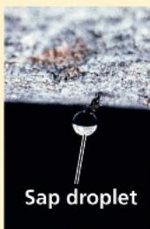  
Separated stylet exuding sap

## Results

The closer the stylet was to a sugar source, the higher its sugar concentration was.

## Conclusion

The results of such experiments support the pressure-flow hypothesis, which predicts that sugar concentrations should be higher in sieve tubes closer to sugar sources.

Data from S. Rogers and A. J. Peel, Some evidence for the existence of turgor pressure in the sieve tubes of willow (Salix), Planta 126:259–267 (1975).

WHAT IF? Spittlebugs (Clastophora sp.) are xylem sap feeders that use strong muscles to pump xylem sap through their guts. Could you isolate xylem sap from the excised stylets of spittlebugs?
For suggested answer, see Appendix A.

# Concept 36.6: The symplast is highly dynamic

Although we have been discussing transport in mostly physical terms, almost like the flow of solutions through pipes, plant transport is a dynamic and finely tuned process that changes during

development. A leaf, for example, may begin as a sugar sink but spend most of its life as a sugar source. Also, environmental changes may trigger responses in plant transport processes. Water stress may activate signal transduction pathways that greatly alter the membrane transport proteins governing the overall transport of water and minerals. Because the symplast is living tissue, it is largely responsible for the dynamic changes in plant transport processes. We'll look now at some other examples: changes in plas-modesmata, chemical signaling, and electrical signaling.

## Changes in Plasmodesmatal Number and Pore Size

Based mostly on the static images provided by electron microscopy, biologists formerly considered plasmodesmata to be unchanging, pore-like structures. More recent studies, however, have revealed that plasmodesmata are highly dynamic. They can open or close rapidly in response to changes in turgor pressure, cytosolic $Ca^{2+}$ level, or cytosolic pH. Although some plasmodesmata form during cytokinesis, they can also form much later. Moreover, loss of function is common during differentiation. For example, as a leaf matures from a sink to a source, its plasmodesmata either close or are eliminated, causing phloem unloading to cease.

Early studies by plant physiologists and pathologists came to differing conclusions regarding pore sizes of plasmodesmata. Physiologists injected fluorescent probes of different molecular sizes into cells and recorded whether the molecules passed into adjacent cells. Based on these observations, they concluded that the pore sizes were approximately 2.5 nm—too small for macromolecules such as proteins to pass. In contrast, pathologists provided electron micrographs showing evidence of the passage of virus particles with diameters of 10 nm or greater (Figure 36.19).

Subsequently, it was learned that plant viruses produce viral movement proteins that cause the plasmodesmata to dilate, enabling the viral RNA to pass between cells. More recent evidence shows that plant cells themselves regulate plasmodesmata as part of a

Figure 36.19 Virus particles moving cell to cell through plasmodesma connecting turnip leaf cells. (TEM)  
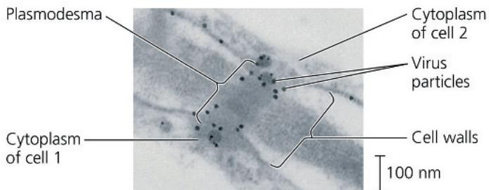

## Interview

Interview with Patricia Zambryski: Exploring the dynamics of plasmodesmata (eTextbook only)

communication network. The viruses can subvert this network by mimicking the cell's regulators of plasmodesmata.

A high degree of cytosolic interconnectedness exists only within certain groups of cells and tissues, which are known as symplastic domains. Informational molecules, such as proteins and RNAs, coordinate development between cells within each symplastic domain. If symplastic communication is disrupted, development can be grossly affected.

## Phloem: An Information Superhighway

In addition to transporting sugars, the phloem is a “superhighway” for the transport of macromolecules and viruses. This transport is systemic (throughout the body), affecting many or all of the plant’s systems or organs. Macromolecules translocated through the phloem include proteins and various types of RNA that enter the sieve tubes through plasmodesmata. Although they are often likened to the gap junctions between animal cells, plasmodesmata are unique in their ability to traffic proteins and RNA.

Systemic communication through the phloem helps integrate the functions of the whole plant. One classic example is the delivery of a flower-inducing chemical signal from leaves to vegetative meristems. Another is a defensive response to localized infection, in which chemical signals traveling through the phloem activate defense genes in noninfected tissues.

## Electrical Signaling in the Phloem

Rapid, long-distance electrical signaling through the phloem is another dynamic feature of the symplast. Electrical signaling has been studied extensively in plants that have rapid leaf movements, such as the sensitive plant (Mimosa pudica) and Venus flytrap (Dionaea muscipula). However, its role in other species is less clear. Some studies have revealed that a stimulus in one part of a plant can trigger an electrical signal in the phloem that travels to other parts where it may elicit changes in gene transcription, respiration, photosynthesis, phloem unloading, or hormonal levels. Thus, the phloem can serve a nerve-like function, allowing for swift electrical communication between widely separated organs.

The coordinated transport of materials and information is central to plant survival. Plants can acquire only so many resources in the course of their lifetimes. Ultimately, the successful acquisition of these resources and their optimal distribution are the most critical determinants of whether the plant will compete successfully.

## Concept Check 36.6

1. How do plasmodesmata differ from gap junctions?

2. Nerve-like signals in animals are thousands of times faster than their plant counterparts. Suggest a behavioral reason for the difference.

3. WHAT IF? Suppose plants were genetically modified to be unresponsive to viral movement proteins. Would this be a good way to prevent the spread of infection? Explain.

## Summary of Key Concepts

To review key terms, go to the Vocabulary Self-Quiz (eTextbook only).

Concept 36.1: Adaptations for acquiring resources were key steps in the evolution of vascular plants

\- Leaves typically function in gathering sunlight and $CO_{2}$ . Stems serve as supporting structures for leaves and as conduits for the long-distance transport of water and nutrients. Roots mine the soil for water and minerals and anchor the whole plant.

\- Natural selection has produced plant architectures that optimize resource acquisition in the ecological niche in which the plant species naturally exists.

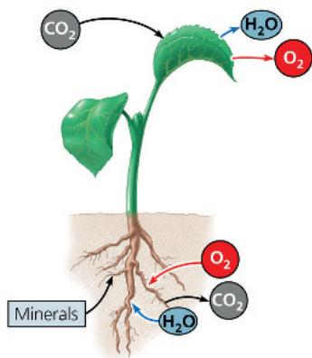

How did the evolution of xylem and phloem contribute to the successful colonization of land by vascular plants?

## Concept 36.2: Different mechanisms transport substances over short or long distances

\- The selective permeability of the plasma membrane controls the movement of substances into and out of cells. Both active and passive transport mechanisms occur in plants.

\- Plant tissues have two major compartments: the apoplast (everything outside the cells' plasma membranes) and the symplast (the cytosol and connecting plasmodesmata).

\- Direction of water movement depends on the water potential, a quantity that incorporates solute concentration and physical pressure. The osmotic uptake of water by plant cells and the resulting internal pressure that builds up make plant cells turgid.

\- Long-distance transport occurs through bulk flow, the movement of liquid in response to a pressure gradient. Bulk flow occurs within the tracheids and vessel elements of the xylem and within the sieve tube elements of the phloem.

Is xylem sap usually pulled or pushed up the plant?

## Concept 36.3: Transpiration drives the transport of water and minerals from roots to shoots via the xylem

\- Water and minerals from the soil enter the plant through the epidermis of roots, cross the root cortex, and then pass into the vascular cylinder by way of the selectively permeable cells of the endodermis. From the vascular cylinder, the xylem sap is transported long distances by bulk flow to the veins that branch throughout each leaf.

\- The cohesion-tension hypothesis proposes that the movement of xylem sap is driven by a water potential difference created at the leaf end of the xylem by the evaporation of water from leaf cells. Evaporation lowers the water potential at the air-water interface, thereby generating the negative pressure that pulls water through the xylem.

Why is the ability of water molecules to form hydrogen bonds important for the movement of xylem sap?

## Concept 36.4: The rate of transpiration is regulated by stomata

\- Transpiration is the loss of water vapor from plants. Wilting occurs when the water lost by transpiration is not replaced by absorption from roots. Plants respond to water deficits by closing their stomata. Under prolonged drought conditions, plants can become irreversibly injured.

\- Stomata are the major pathway for water loss from plants. A stoma opens when guard cells bordering the stomatal pore take up $K^{+}$ . The opening and closing of stomata are controlled by light, $CO_{2}$ , the drought hormone abscisic acid, and a circadian rhythm.

\- Xerophytes are plants that are adapted to arid environments. Reduced leaves and CAM photosynthesis are examples of adaptations to arid environments.

Why are stomata necessary?

## Concept 36.5: Sugars are transported from sources to sinks via the phloem

\- Mature leaves are the main sugar sources, although storage organs can be seasonal sources. Growing organs such as roots, stems, and fruits are the main sugar sinks. The direction of phloem transport is always from sugar source to sugar sink.

\- Phloem loading depends on the active transport of sucrose. Sucrose is cotransported with $H^{+}$ , which diffuses down a gradient generated by proton pumps. Loading of sugar at the source and unloading at the sink maintain a pressure difference that keeps phloem sap flowing through a sieve tube.

Why is phloem transport considered an active process?

## Concept 36.6: The symplast is highly dynamic

\- Plasmodesmata can change in permeability and number. When dilated, they provide a passageway for the symplastic transport of proteins, RNAs, and other macromolecules over long distances. The phloem also conducts nerve-like electrical signals that help integrate whole-plant function.

By what mechanisms is symplastic communication regulated?

For suggested answers, see Appendix A.

## Test Your Understanding

For more multiple-choice questions, go to the Practice Test (eTextbook only).

## Levels 1-2: Remembering/Understanding

1. Which of the following is an adaptation that enhances the uptake of water and minerals by roots?

(A) mycorrhizae

(B) pumping through plasmodesmata

(C) active uptake by vessel elements

(D) rhythmic contractions by cells in the root cortex

2. Which structure or compartment is part of the symplast? (A) the interior of a vessel element (B) the interior of a sieve tube (C) the cell wall of a mesophyll cell (D) an extracellular air space

3. Movement of phloem sap from a source to a sink

(A) occurs through the apoplast of sieve tube elements.

(B) depends ultimately on the activity of proton pumps.

(C) depends on tension, or negative pressure potential.

(D) results mainly from diffusion.

## Levels 3-4: Applying/Analyzing

4. Photosynthesis ceases when leaves wilt, mainly because

(A) the chlorophyll in wilting leaves is degraded.

(B) accumulation of $CO_{2}$ in the leaf inhibits enzymes.

(C) stomata close, preventing $CO_{2}$ from entering the leaf.

(D) photolysis, the water-splitting step of photosynthesis, cannot occur when there is a water deficiency.

5. What would enhance water uptake by a plant cell?
(A) decreasing the $\Psi$ of the surrounding solution
(B) positive pressure on the surrounding solution
(C) the loss of solutes from the cell
(D) increasing the $\Psi$ of the cytoplasm

6. A plant cell with a $\Psi_{S}$ of -0.65 MPa maintains a constant volume when bathed in a solution that has a $\Psi_{S}$ of -0.30 MPa and is in an open container. The cell has a

(A) $\Psi_{P}$ of +0.65 MPa.

(B) $\Psi$ of -0.65 MPa.

(C) $\Psi_{P}$ of +0.35 MPa.

(D) $\Psi_{P}$ of 0 MPa.

7. Compared with a cell with few aquaporin proteins in its membrane, a cell containing many aquaporin proteins will (A) have a faster rate of osmosis.
(B) have a lower water potential.
(C) have a higher water potential.
(D) accumulate water by active transport.

8. Which of the following would tend to increase transpiration?

(A) spiny leaves

(B) sunken stomata

(C) a thicker cuticle

(D) higher stomatal density

## Levels 5-6: Evaluating/Creating

9. EVOLUTION CONNECTION Large brown algae called kelps can grow as tall as 25 m. Kelps consist of a holdfast anchored to the ocean floor, blades that float at the surface and collect light, and a long stalk connecting the blades to the holdfast (see Figure 28.13). Specialized cells in the stalk, although nonvascular, can transport sugar. Suggest a reason why these structures analogous to sieve tube elements might have evolved in kelps.

10. SCIENTIFIC INQUIRY • INTERPRET THE DATA A Minnesota gardener notes that the plants immediately bordering a walkway are stunted compared with those farther away. Suspecting that the soil near the walkway may be contaminated from salt added to the walkway in winter, the gardener tests the soil. The composition of the soil near the walkway is identical to that farther away except that it contains an additional 50 mM NaCl. Assuming that the NaCl is completely ionized, calculate how much it will lower the solute potential of the soil at 20°C using the solute potential equation:

$$
\Psi_ {S} = - i C R T
$$

where i is the ionization constant (2 for NaCl), C is the molar concentration (in mol/L), R is the pressure constant $[R = 0 \cdot 00831 (\text{L} \cdot \text{MPa}) / (\text{mol} \cdot \text{K})]$ , and T is the temperature in Kelvin (273 + °C).

How would this change in the solute potential of the soil affect the water potential of the soil? Explain in what way the change in the water potential of the soil would affect the movement of water in or out of the roots.

11. SCIENTIFIC INQUIRY Cotton plants wilt within a few hours of flooding of their roots. The flooding leads to low-oxygen conditions, increases in cytosolic $Ca^{2+}$ concentration, and decreases in cytosolic pH. Suggest a hypothesis to explain how flooding leads to wilting.

12. WRITE ABOUT A THEME: ORGANIZATION Natural selection has led to changes in the architecture of plants that enable them to photosynthesize more efficiently in the ecological niches they occupy. In a short essay (100–150 words), explain how shoot architecture enhances photosynthesis.

## 13. SYNTHESIZE YOUR KNOWLEDGE

  
Imagine yourself as a water molecule in the soil solution of a forest. In a short essay (100–150 words), explain what pathways and what forces would be necessary to carry you to the leaves of these trees.

For selected answers, see Appendix A.

# Soil and Plant Nutrition

## Key Concepts

37.1 Soil contains a living, complex ecosystem

37.2 Plant roots absorb many types of essential elements from the soil

37.3 Plant nutrition often involves relationships with other organisms

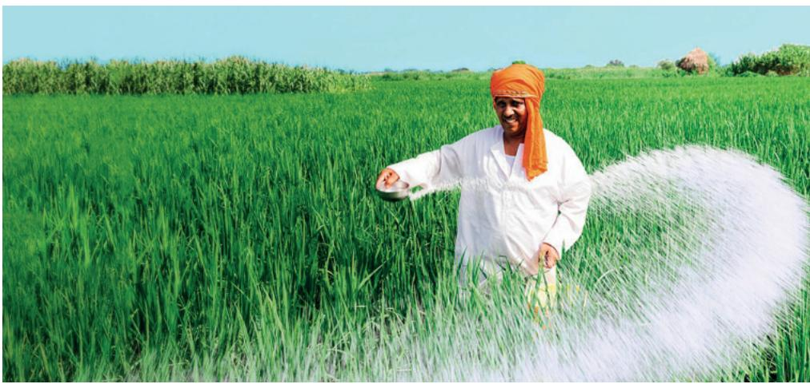  
Figure 37.1 This farmer in India is applying chemical fertilizers to a field of rice. Nitrogen (N), phosphorus (P), and potassium (K) are commonly depleted from soils to such an extent as to limit crop productivity. That is why they are the major ingredients of most chemical fertilizers.

## Study Tip

Use mnemonics: Mnemonics are memory tools to help remember facts. For example, “See Hopkins, California—Mighty good” (CHOPKNSCaMg) is a mnemonic for remembering the nine plant macronutrients, as shown here. Make your own mnemonics for remembering some functions of plant macronutrients (see Table 37.1).

See Hopkins, California—Mighty good

See = C = carbon

H = H = hydrogen

o = O = oxygen

## Why do plants need minerals from the soil?

## Phosphorus is a component of

• DNA and RNA (throughout the cell)

• ATP produced by mitochondria

• phospholipids in cell membranes

Nitrogen, phosphorus, potassium, and other minerals are essential for plant growth because of their roles in the structure and function of plant cells.

  
Potassium is a cofactor for enzymes used throughout the cell; plays a major role in maintaining turgor

Nitrogen is a component of

• DNA and RNA (throughout the cell)

• proteins
(throughout the cell)
• chlorophyll

# Concept 37.1: Soil contains a living, complex ecosystem

The upper layers of the soil, from which plants absorb nearly all of the water and minerals they require, contain a wide range of living organisms that interact with each other and with the physical environment. This complex ecosystem may take centuries to form but can be destroyed by human mismanagement in just a few years. To understand why soil must be conserved and why particular plants grow where they do, we must first consider the basic physical properties of soil: its texture and composition.

## Soil Texture

The texture of soil depends on the sizes of its particles. Soil particles can range from coarse sand (0.02–2 mm in diameter) to silt (0.002–0.02 mm) to microscopic clay particles (less than 0.002 mm). These different-sized particles arise ultimately from the weathering of rock. Water freezing in crevices of rocks causes mechanical fracturing, and weak acids in the soil break rocks down chemically. When organisms penetrate the rock, they accelerate breakdown by chemical and mechanical means. Roots, for example, secrete acids that dissolve the rock, and their growth in fissures leads to mechanical fracturing. Mineral particles released by weathering become mixed with living organisms and humus, the remains of dead organisms and other organic matter, forming topsoil. The topsoil and other soil layers are called soil horizons (Figure 37.2). The topsoil, or A horizon, can range in depth from millimeters to meters. We focus mostly on properties of topsoil because it is generally the most important soil layer for plant growth.

Figure 37.2 Soil horizons.  
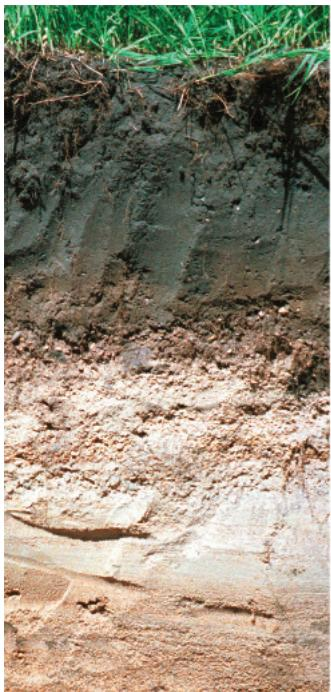  
The A horizon is the topsoil, a mixture of broken-down rock of various textures, living organisms, and decaying organic matter.  
The B horizon contains much less organic matter than the A horizon and is less weathered.

The C horizon is composed mainly of partially broken-down rock. Some of the rock served as "parent" material for minerals that later helped form the upper horizons.

The topsoils that are the most fertile—supporting the most abundant growth—are loams, which are composed of roughly equal amounts of sand, silt, and clay. Loamy soils have enough small silt and clay particles to provide ample surface area for the adhesion and retention of minerals and water.

Plants are actually nourished by the soil solution, which consists of the water and dissolved minerals in the pores between soil particles. After a heavy rain, water drains from the larger spaces in the soil, but smaller spaces retain water because water molecules are attracted to the negatively charged surfaces of clay and other particles. The large spaces between soil particles in sandy soils generally don't retain enough water to support vigorous plant growth, but they do enable efficient diffusion of oxygen to the roots. Soils with large amounts of clay tend to retain too much water, and when soil does not drain adequately, the air is replaced by water, and the roots suffocate from lack of oxygen. Typically, the most fertile topsoils have pores containing about half water and half air, providing a good balance between aeration, drainage, and water storage capacity. The physical properties of soils can be adjusted by adding soil amendments, such as peat moss, compost, manure, or sand.

## Topsoil Composition

In addition to water and air, topsoil contains inorganic (mineral) and organic chemical components. The organic components include the many life-forms that inhabit the soil.

## Inorganic Components

The surface charges of soil particles determine their ability to bind many nutrients. Most of the soil particles in productive soils are negatively charged and therefore do not bind negatively charged ions (anions), such as the plant nutrients nitrate $\left(\mathrm{NO}_{3}^{-}\right)$ , phosphate $\left(\mathrm{H}_{2}\mathrm{PO}_{4}^{-}\right)$ , and sulfate $\left(\mathrm{SO}_{4}^{2-}\right)$ . As a result, these nutrients are easily lost by leaching, percolation of water through the soil. Positively charged ions (cations)—such as potassium $\left(\mathrm{K}^{+}\right)$ , calcium $\left(\mathrm{Ca}^{2+}\right)$ , and magnesium $\left(\mathrm{Mg}^{2+}\right)$ —adhere to negatively charged soil particles, so are less easily lost by leaching.

Roots, however, do not absorb mineral cations directly from soil particles; they absorb them from the soil solution. Mineral cations enter the soil solution by cation exchange, a process in which cations are displaced from soil particles by other cations, particularly $\mathrm{H^{+}}$ (Figure 37.3). Therefore, a soil's capacity to exchange cations is determined by the number of cation adhesion sites and by the soil's pH. In general, the more clay and organic matter in the soil, the higher the cation exchange capacity. The clay content is important because these small particles have a high ratio of surface area to volume, allowing for the ample binding of cations.

## Organic Components

The major organic component of topsoil is humus, which consists of organic material produced by the decomposition of fallen leaves, dead organisms, feces, and other organic matter by bacteria and fungi. Humus prevents clay particles from packing together

Figure 37.3 Cation exchange in soil.

③ H+ ions in the soil solution neutralize the negative charge of soil particles, causing release of mineral cations into the soil solution.

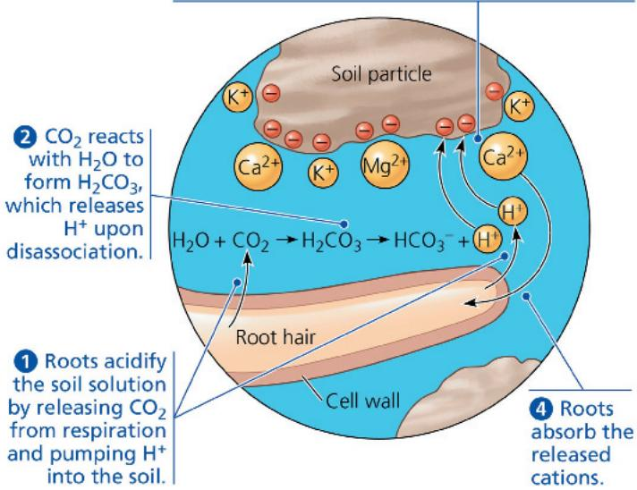  
VISUAL SKILLS Which are more likely to be leached from the soil by decreasing pH—cations or anions? Explain.
For suggested answer, see Appendix A.

and forms a crumbly soil that retains water but is still porous enough to aerate roots. Humus also increases the soil's capacity to exchange cations and is a reservoir of mineral nutrients that return gradually to the soil as microorganisms decompose the organic matter.

Topsoil is home to an astonishing number and variety of organisms. A teaspoon of topsoil has about 5 billion bacteria, which cohabit with fungi, algae and other protists, insects, earthworms, nematodes, and plant roots. The activities of all these organisms affect the soil's physical and chemical properties. Earthworms, for example, consume organic matter and derive their nutrition from the bacteria and fungi growing on this material. They excrete wastes and move large amounts of material to the soil surface. In addition, they move organic matter into deeper layers. Earthworms mix and clump the soil particles, allowing for better gaseous diffusion and water retention. Roots also affect soil texture and composition. For example, they reduce erosion by binding the soil, and they lower soil pH by excreting acids.

## Soil Conservation and Sustainable Agriculture

Ancient farmers recognized that crop yields on a particular plot of land decreased over the years. Moving to uncultivated areas, they observed the same pattern of reduced yields over time. Eventually, they realized that fertilization, the addition of mineral nutrients to the soil, could make soil a renewable resource that enabled crops to be cultivated season after season at a fixed location. This sedentary agriculture facilitated a new way of life. Humans began to build permanent dwellings—the first villages. They also stored food for use between harvests, and food surpluses enabled some people to specialize in nonfarming occupations. In short, soil management, by fertilization and other practices, helped prepare the way for modern societies.

Unfortunately, soil mismanagement has been a recurrent problem throughout human history. A dramatic example is the American Dust Bowl, an ecological and human disaster that ravaged the southwestern Great Plains of the United States in the 1930s. This region suffered through devastating dust storms that resulted from a prolonged drought and decades of inappropriate farming techniques. Before farmers arrived, the Great Plains had been covered by hardy grasses that held the soil in place in spite of recurring droughts and torrential rains. But in the late 1800s and early 1900s, many settlers planted wheat and raised cattle. These land uses left the soil exposed to erosion by winds. A few years of drought made the problem worse. During the 1930s, huge quantities of fertile soil were blown away in “black blizzards,” rendering millions of hectares of farmland useless (Figure 37.4). In one of the worst dust storms, clouds of dust blew eastward to Chicago, where soil fell like snow, and even reached the Atlantic coast. Hundreds of thousands of people in the Dust Bowl region were forced to abandon their homes and land, a plight immortalized in John Steinbeck’s novel The Grapes of Wrath.

Soil mismanagement continues to be a major problem to this day. More than $30\%$ of the world's farmland has reduced productivity caused by poor soil conditions, such as chemical contamination, mineral deficiencies, acidity, salinity, and poor drainage. As the world's population grows, the demand for food increases. Because soil quality greatly affects crop yield, soil resources must be managed prudently. Today, the most productive lands are already being used for agriculture, so there are no more frontiers for farmers to clear. Thus, it is critical that farmers embrace sustainable agriculture, a commitment to farming practices that are conservation minded, environmentally safe, and profitable. Sustainable agriculture includes the prudent use of irrigation and soil amendments, the protection of topsoil from salinization and erosion, and the restoration of degraded lands.

Figure 37.4 A massive dust storm in the American Dust Bowl during the 1930s.  
  
Which soil horizon contributed to these dust clouds? For suggested answer, see Appendix A.

Figure 37.5 Sudden land subsidence.

Overuse of groundwater for irrigation triggered formation of this sinkhole in Florida.

## Irrigation

Because water shortage often limits plant growth, perhaps no technology has increased crop yield as much as irrigation. However, irrigation drains freshwater resources. Globally, about 75% of all freshwater use is devoted to agriculture. Many rivers in arid regions have been reduced to trickles by diverting water for irrigation. The primary source of irrigation water, however, is not surface waters, such as rivers and lakes, but underground water reserves called aquifers. In some regions, the rate of water removal is exceeding the natural refilling of the aquifers, making this practice unsustainable. A further consequence of aquifer depletion is land subsidence, a gradual settling or sudden sinking of the ground surface directly above the aquifer (Figure 37.5). Land subsidence can destroy property and negatively impact agriculture.

Irrigation, particularly from groundwater, can also lead to soil salinization—the addition of salts to the soil that make it too salty for cultivating plants. Salts dissolved in irrigation water accumulate in the soil as the water evaporates, making the water potential of the soil solution more negative. The water potential gradient from soil to roots is reduced, diminishing water uptake (see Figure 36.12).

Many forms of irrigation, such as the flooding of fields, are wasteful because much of the water evaporates. To use water efficiently, farmers must understand the water-holding capacity of their soil, the water needs of their crops, and the appropriate irrigation technology. One popular technology is drip irrigation, the slow release of water to soil and plants from perforated plastic tubing placed directly at the root zone. Because drip irrigation requires less water and reduces salinization, it is used mainly in arid agricultural regions.

## Fertilization

In natural ecosystems, mineral nutrients are usually recycled by the excretion of animal wastes and the decomposition of humus. Agriculture, however, can interfere with this recycling. The lettuce you eat, for example, contains minerals extracted from a farmer's field. As you excrete wastes, these minerals are deposited far from their original source. Over many harvests, the farmer's field eventually becomes depleted of nutrients. Nutrient depletion is a major cause of global soil degradation. Farmers must reverse nutrient depletion by means of fertilization.

Today, most farmers in industrialized nations use fertilizers containing minerals that are either mined or prepared by energy-intensive processes. These fertilizers are usually enriched in nitrogen (N), phosphorus (P), and potassium (K)—the nutrients most commonly deficient in depleted soils. You may have seen fertilizers labeled with a three-number code, called the N–P–K ratio. A fertilizer marked “15–10–5,” for instance, is by weight 15% N (as ammonium or nitrate), 10% P (as phosphate), and 5% K (as the mineral potash).

Manure, fishmeal, and compost are called “organic” fertilizers because they contain organic material. Before plants can use organic material, however, it must be decomposed into the inorganic nutrients that roots can absorb. Whether from organic fertilizer or a chemical factory, the minerals a plant extracts are in the same form. However, organic fertilizers release them gradually, whereas minerals in commercial fertilizers are immediately available but may not be retained by the soil for long. Minerals not absorbed by roots are often leached from the soil by rainwater or irrigation. Mineral runoff into lakes may lead to explosions in algal populations that can deplete oxygen levels and reduce fish populations.

## Adjusting Soil pH

Soil pH is an important factor that influences mineral availability by its effect on cation exchange and the chemical form of minerals. Depending on the soil pH, a particular mineral may be bound too tightly to clay particles or may be in a chemical form that the plant cannot absorb. Most plants prefer slightly acidic soil because the high $H^{+}$ concentrations can displace positively charged minerals from soil particles, making them more available for absorption. Adjusting soil pH is tricky because a change in $H^{+}$ concentration may make one mineral more available but another less available. At pH 8, for instance, plants can absorb calcium, but iron is almost unavailable. The soil pH should be matched to a crop's mineral needs. If the soil is too alkaline, adding sulfate will lower the pH. Soil that is too acidic can be adjusted by adding lime (calcium carbonate or calcium hydroxide).

When the soil pH dips to 5 or lower, toxic aluminum ions ( $Al^{3+}$ ) become more soluble and are absorbed by roots, stunting root growth and preventing the uptake of calcium, a needed plant nutrient. Low soil pH and $Al^{3+}$ toxicity are especially serious problems in tropical regions, where the pressure of producing food for a growing population is often most acute. Some plants can cope with high $Al^{3+}$ levels by secreting organic anions that bind $Al^{3+}$ and render it harmless. Scientists have altered tobacco and papaya plants by introducing a citrate synthase gene from a bacterium into the plants' genomes. The resulting overproduction of citric acid increased aluminum resistance.

Figure 37.6 Contour tillage.

These crops are planted in rows that go around, rather than up and down, the hillside. Contour tillage helps slow water runoff and topsoil erosion after heavy rains.

## Controlling Erosion

As happened most dramatically in the Dust Bowl, water and wind erosion can remove large amounts of topsoil. Erosion is a major cause of soil degradation because nutrients are carried away by wind and streams. To limit erosion, farmers can plant rows of trees as windbreaks, terrace hillside crops, and cultivate crops in a contour pattern (Figure 37.6). Crops such as alfalfa and wheat provide good ground cover and protect the soil better than maize and other crops that are usually planted in more widely spaced rows.

Erosion can also be reduced by a plowing technique called no-till agriculture. In traditional plowing, the entire field is tilled, or turned over. This practice helps control weeds but disrupts the meshwork of roots that holds the soil in place, leading to increased surface runoff and erosion. In no-till agriculture, a specialized plow creates narrow furrows for seeds and fertilizer. In this way, the field is seeded with minimal disturbance to the soil, while also using less fertilizer.

## Phytoremediation

Some land areas are unfit for cultivation because toxic metals or organic pollutants have contaminated the soil or groundwater. Traditionally, soil remediation, the detoxification of contaminated soils, has focused on nonbiological technologies, such as removing and storing contaminated soil in landfills, but these techniques are costly and often disrupt the landscape.

Phytoremediation is a nondestructive biotechnology that harnesses the ability of some plants to extract soil pollutants and concentrate them in portions of the plant that can be easily removed for safe disposal. For example, alpine pennycress (Thlaspi caerulescens) can accumulate zinc in its shoots at concentrations 300 times higher than most plants can tolerate. The shoots can be harvested and the zinc removed. Such plants show promise for cleaning up areas contaminated by smelters, mines, or nuclear tests. Phytoremediation is an example of bioremediation, the use of organisms to detoxify polluted sites. In addition to plants, certain prokaryotic and unicellular eukaryotic organisms are also used in bioremediation (see Concepts 27.6 and 55.5).

We have examined the importance of soil conservation for sustainable agriculture. Mineral nutrients contribute greatly to soil fertility, but which minerals are most important, and why do plants need them? These are the topics of the next section.

## Concept Check 37.1

1. Explain how the phrase "too much of a good thing" can apply to watering and fertilizing plants.

2. Some lawn mowers collect clippings. What is a drawback of this practice with respect to plant nutrition?

3. WHAT IF? How would adding clay to loamy soil affect the soil's capacity to exchange cations and retain water? Explain.

4. MAKE CONNECTIONS Note three ways the properties of water contribute to soil formation. See Concept 3.2.

For suggested answers, see Appendix A.

## Concept 37.2: Plant roots absorb many types of essential elements from the soil

Water, air, and soil minerals all contribute to plant growth. A plant's water content can be measured by comparing the mass before and after drying. Typically, 80–90% of a plant's fresh mass is water. About 96% of the remaining dry mass consists of carbohydrates such as cellulose and starch that are produced by photosynthesis. Thus, the components of carbohydrates—carbon, oxygen, and hydrogen—are the most abundant elements in dried plant residue. Inorganic substances from the soil, although essential for plant survival, account for only about 4% of a plant's dry mass.

## Essential Elements

The inorganic substances in plants contain more than 50 chemical elements. In studying the chemical composition of plants, we must distinguish elements that are essential from those that are merely present in the plant. A chemical element is considered an essential element only if it is required for a plant to complete its life cycle and reproduce.

To determine which chemical elements are essential, researchers use hydroponic culture, in which plants are grown in mineral solutions instead of soil (Figure 37.7). Such studies have helped identify 17 essential elements needed by all plants. Hydroponic culture is also used on a small scale to grow some greenhouse crops.

## Figure 37.7

## Research Method: Hydroponic Culture Application

In hydroponic culture, plants are grown in mineral solutions without soil. One use of hydroponic culture is to identify essential elements in plants.

## Technique

Plant roots are bathed in aerated solutions of known mineral composition. Aerating the water provides the roots with oxygen for cellular respiration. (Note: The flasks would normally be opaque to prevent algal growth.) A mineral, such as iron, can be omitted to test whether it is essential.

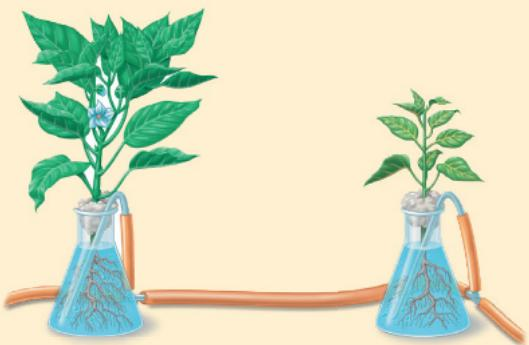  
Control: Solution containing all minerals  
Experimental: Solution without iron

## Results

If the omitted mineral is essential, mineral deficiency symptoms occur, such as stunted growth and discolored leaves. By definition, the plant would not be able to complete its life cycle. Deficiencies of different elements may have different symptoms, which can aid in diagnosing mineral deficiencies in soil.

## Interview

Interview with Gloria Coruzzi: Assimilating more nitrogen into plants (eTextbook only)

Table 37.1 lists the 17 essential elements needed by plants and their functions. Nine of the essential elements are called macronutrients because plants require them in relatively large amounts. Six of these are the major components of organic compounds forming a plant's structure: carbon, oxygen, hydrogen, nitrogen, phosphorus, and sulfur. The other three macronutrients are potassium, calcium, and magnesium. Of all the mineral nutrients, nitrogen contributes the most to plant growth and crop yields. Plants require nitrogen as a component of proteins, nucleic acids, chlorophyll, and other important organic molecules.

The other essential elements are called micronutrients because plants need them in only tiny quantities. They are chlorine, iron, manganese, boron, zinc, copper, nickel, and molybdenum. Sodium is a ninth essential micronutrient for plants that use the $C_{4}$ or CAM pathways of photosynthesis (see Concept 10.5) because it is needed for the regeneration of phosphoenolpyruvate, the $CO_{2}$ acceptor used in these two types of carbon fixation.

Micronutrients function in plants mainly as enzyme cofactors (see Concept 8.4). Iron, for example, is a metallic component of cytochromes, the proteins in the electron transport chains of chloroplasts and mitochondria. It is because micronutrients generally just aid enzymes that plants need only tiny quantities. The requirement for molybdenum, for instance, is so modest that there is only one atom of this rare element for every 60 million atoms of hydrogen in dried plant material. Yet a deficiency of molybdenum or any other micronutrient can weaken or kill a plant.

Many animals, including humans, get much of their essential mineral nutrients from plants. Low dietary concentrations of essential micronutrients, such as iron (Fe), iodine (I), and zinc (Zn), contribute to the problem of micronutrient malnutrition (“hidden hunger”). Human malnourishment, as opposed to undernourishment, results when people receive enough calories from their ingestion of carbohydrates but lack other dietary factors (such as essential minerals, vitamins, or amino acids) required for good health.

## Symptoms of Mineral Deficiency

The symptoms of a deficiency depend partly on the mineral's function as a nutrient. For example, a deficiency of magnesium, a component of chlorophyll, causes chlorosis, yellowing of leaves. In some cases, the relationship between a deficiency and its symptoms is less direct. For instance, iron deficiency can cause chlorosis even though chlorophyll contains no iron because iron ions are required as a cofactor in an enzymatic step of chlorophyll synthesis.

Mineral deficiency symptoms depend not only on the role of the nutrient but also on its mobility within the plant. If a nutrient moves about freely, symptoms appear first in older organs because young, growing tissues are a greater sink for nutrients in short supply. For example, a plant deficient in magnesium, a relatively mobile ion, first shows signs of chlorosis in its older leaves. In contrast, a deficiency of a relatively immobile mineral, such as iron, affects young parts of the plant first. The older tissues have adequate amounts of iron that they retain during periods of short supply. The mineral requirements of a plant also change with the age of the plant. Young seedlings, for example, rarely show mineral deficiency symptoms because their mineral needs are met largely by the mineral reserves stored in the seeds themselves.

The symptoms of a mineral deficiency may vary between species but in a given plant are often distinctive enough to aid in diagnosis. Deficiencies of phosphorus, potassium, and nitrogen are most common, as in the example of maize leaves in Figure 37.8, on the next page.

Table 37.1 Essential Elements in Plants

<table><tr><td>Element(Form Primarily Absorbed by Plants)</td><td>% Mass in Dry Tissue</td><td>Major Function(s)</td><td>Early Visual Symptom(s) of Nutrient Deficiencies</td></tr><tr><td colspan="4">Macronutrients</td></tr><tr><td>Carbon ( $CO_2$ )</td><td>45%</td><td>Major component of organic compounds</td><td>Poor growth</td></tr><tr><td>Oxygen ( $CO_2$ )</td><td>45%</td><td>Major component of organic compounds</td><td>Poor growth</td></tr><tr><td>Hydrogen ( $H_2O$ )</td><td>6%</td><td>Major component of organic compounds</td><td>Wilting, poor growth</td></tr><tr><td>Nitrogen( $NO_3^-$ ,  $NH_4^+$ )</td><td>1.5%</td><td>Component of nucleic acids, proteins, and chlorophyll</td><td>Chlorosis at tips of older leaves (common in heavily cultivated soils or soils low in organic material)</td></tr><tr><td>Potassium ( $K^+$ )</td><td>1.0%</td><td>Enzyme cofactor; major solute functioning in water balance; operation of stomata</td><td>Mottling of older leaves, drying of leaf edges; weak stems; roots poorly developed (common in acidic or sandy soils)</td></tr><tr><td>Calcium ( $Ca^{2+}$ )</td><td>0.5%</td><td>Important component of middle lamella and cell walls; maintains membrane function; signal transduction</td><td>Crinkling of young leaves; death of terminal buds (common in acidic or sandy soils)</td></tr><tr><td>Magnesium ( $Mg^{2+}$ )</td><td>0.2%</td><td>Component of chlorophyll; cofactor of many enzymes</td><td>Chlorosis between veins, found in older leaves (common in acidic or sandy soils)</td></tr><tr><td>Phosphorus( $H_2PO_4^-$ ,  $HPO_4^{2-}$ )</td><td>0.2%</td><td>Component of nucleic acids, phospholipids, ATP</td><td>Healthy appearance but very slow development; thin stems; purpling of veins; poor flowering and fruiting (common in acidic, wet, or cold soils)</td></tr><tr><td>Sulfur ( $SO_4^{2-}$ )</td><td>0.1%</td><td>Component of proteins</td><td>General chlorosis in young leaves (common in sandy or very wet soils)</td></tr><tr><td colspan="4">Micronutrients</td></tr><tr><td>Chlorine ( $Cl^-$ )</td><td>0.01%</td><td>Photosynthesis (water-splitting); functions in water balance</td><td>Wilting; stubby roots; leaf mottling (uncommon)</td></tr><tr><td>Iron ( $Fe^{3+}$ , $Fe^{2+}$ )</td><td>0.01%</td><td>Respiration; photosynthesis: chlorophyll synthesis;  $N_2$  fixation</td><td>Chlorosis between veins, found in young leaves (common in basic soils)</td></tr><tr><td>Manganese ( $Mn^{2+}$ )</td><td>0.005%</td><td>Active in formation of amino acids; activates some enzymes; required for water-splitting step of photosynthesis</td><td>Chlorosis between veins, found in young leaves (common in basic soils rich in humus)</td></tr><tr><td>Boron ( $H_2BO_3^-$ )</td><td>0.002%</td><td>Cofactor in chlorophyll synthesis; role in cell wall function; pollen tube growth</td><td>Death of meristems; thick, leathery, and discolored leaves (occurs in any soil; most common micronutrient deficiency)</td></tr><tr><td>Zinc ( $Zn^{2+}$ )</td><td>0.002%</td><td>Active in formation of chlorophyll; cofactor of some enzymes; needed for DNA transcription</td><td>Reduced internode length; crinkled leaves (common in some geographic regions)</td></tr><tr><td>Copper ( $Cu^+,Cu^{2+}$ )</td><td>0.001%</td><td>Component of many redox and lignin-biosynthetic enzymes</td><td>Light green color throughout young leaves, with drying of leaf tips; roots stunted and excessively branched (common in some geographic regions)</td></tr><tr><td>Nickel ( $Ni^{2+}$ )</td><td>0.001%</td><td>Nitrogen metabolism</td><td>General chlorosis in all leaves; death of leaf tips (common in acidic or sandy soils)</td></tr><tr><td>Molybdenum( $MoO_4^{2-}$ )</td><td>0.0001%</td><td>Nitrogen metabolism</td><td>Death of root and shoot tips; chlorosis in older leaves (common in acidic soils in some geographic areas)</td></tr></table>

MAKE CONNECTIONS Explain why $CO_{2}$ , rather than $O_{2}$ , is the source of much of the dry mass oxygen in plants. See Concept 10.1.  
For suggested answer, see Appendix A.

In the Scientific Skills Exercise, you can diagnose a mineral deficiency in the leaves of a raspberry plant. Micronutrient shortages are less common than macronutrient shortages and tend to occur in certain geographic regions because of differences in soil composition. One way to confirm a diagnosis is to analyze the

mineral content of the plant or soil. The amount of a micronutrient needed to correct a deficiency is usually small. For example, a zinc deficiency in fruit trees can usually be cured by hammering a few zinc nails into each tree trunk. Moderation is important because overdoses of a micronutrient or macronutrient can be detrimental or toxic. Too much nitrogen, for example, can lead to excessive vine growth in tomato plants at the expense of good fruit production.

Figure 37.8 The most common mineral deficiencies, as seen in maize leaves.

Mineral deficiency symptoms may vary in different species. In maize, nitrogen deficiency is evident in a yellowing that starts at the tip and moves along the center (midrib) of older leaves. Phosphorus-deficient maize plants have reddish purple margins, particularly in young leaves. Potassium-deficient maize plants exhibit “firing,” or drying, along tips and margins of older leaves.

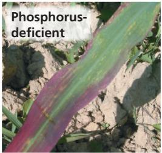

## Global Climate Change and Food Quality

Since plant growth is generally enhanced by increases in atmospheric $CO_{2}$ and by warming temperatures, global food production, as measured by plant biomass, is expected to increase in response to global climate change in certain parts of the world. But food production must also be judged by its quality. Unfortunately, there are indications that plants today, compared with plants in preindustrial times, are not taking up nutrients sufficiently to keep pace with their increased fixation of $CO_{2}$ into carbohydrates. For example, a study of 43 crops found significant declines in protein and several mineral nutrients and vitamins from 1950 to 1999. Although this decline in food quality might be caused by a shift toward higher-yielding crops, studies of wild plants suggest that global climate change is the culprit. For example, a study revealed that the protein content of goldenrod (Solidago canadensis) pollen has declined by one third since the Industrial Revolution, and the change closely correlates with the rise in $CO_{2}$ that has occurred. Declines in the qualities of pollen as a food source might play a role in the widespread decline of honeybees, important pollinators whose decreasing population threatens crop production.

## Concept Check 37.2

1. Are some essential elements more important than others? Explain.

2. WHAT IF? If an element increases the growth rate of a plant, can it be defined as an essential element?

3. MAKE CONNECTIONS Based on Figure 9.17, explain why hydroponically grown plants would grow much more slowly if they were not sufficiently aerated.

## Scientific Skills Exercise Making Observations

What Mineral Deficiency Is This Plant Exhibiting? Plant growers often diagnose deficiencies in their crops by examining changes to the foliage, such as chlorosis (yellowing), death of some leaves, discoloring, mottling, scorching, or changes in size or texture. In this exercise, you will diagnose a mineral deficiency by observing a plant's leaves and applying what you have learned about symptoms from the text and Table 37.1.

Data The data for this exercise come from the photograph below of leaves of a raspberry plant exhibiting a mineral deficiency.

INTERPRET THE DATA

1. How do the young leaves differ in appearance from the older leaves?

2. What change do you observe in the leaves, and where in the leaves does it appear? List the three nutrients whose deficiencies give rise to this symptom. Based on the symptom's location, which one of these three nutrients can be ruled out, and why? What does the location suggest about the other two nutrients?

3. How would your hypothesis about the cause of this deficiency be influenced if tests showed that the soil was low in humus?

Instructors: A version of this Scientific Skills Exercise can be assigned in Mastering Biology.

## Concept 37.3: Plant nutrition often involves relationships with other organisms

To this point, we have looked at plants as exploiters of soil resources, but plants and soil have a two-way relationship. Dead plants provide much of the energy needed by soil-dwelling bacteria and fungi. Many of these organisms also benefit from sugar-rich secretions produced by living roots. Meanwhile, plants derive benefits from their associations with soil bacteria and fungi. As shown in Figure 37.9, mutually beneficial relationships across kingdoms and domains are not rare in nature. However, they are of particular importance to plants. We'll explore some important mutualisms between plants and soil bacteria and fungi, as well as some unusual, nonmutualistic forms of plant nutrition.

## Make Connections: Mutualism Across Kingdoms and Domains

## Figure 37.9

Some toxic species of fish don't make their own poison. How is that possible? Some species of ants chew leaves but don't eat them. Why? The answers lie in some amazing mutualisms, relationships between different species in which each species provides a substance or service that benefits the other (see Concept 54.1). Sometimes mutualisms occur within the same kingdom, such as between two species of animals. Many mutualisms, however, involve species from different kingdoms or domains, as in these examples.

## Fungus-Bacterium

A lichen is a mutualistic association between a fungus and a photosynthetic partner. In the lichen Peltigera, the photosynthetic partner is a species of cyanobacterium. The cyanobacterium supplies carbohydrates, while the fungus

provides anchorage, protection, minerals, and water. (See Figure 31.25.)

## The lichen Peltigera

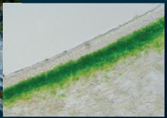

A longitudinal section of the lichen Peltigera showing green photosynthetic bacteria sandwiched between layers of fungus

## Animal–Bacterium

Fugu is the Japanese name for puffer fish and the delicacy made from it, which can be deadly. Most species of puffer fish contain lethal amounts of the nerve toxin tetrodotoxin in their organs, especially the liver, ovaries, and intestines. Therefore, a specially trained chef must remove the poisonous parts. The tetrodotoxin is synthesized by mutualistic bacteria (various Vibrio species) associated with the fish. The fish gains a potent chemical defense, while the bacteria live in a high-nutrient, low-competition environment.

## Animal-Fungus

Leaf-cutter ants harvest leaves that they carry back to their nest, but the ants do not eat the leaves. Instead, a fungus grows by absorbing nutrients from the leaves, and the ants eat part of the fungus that they have cultivated.

  
Leaf-cutter
ant bringing
a cut leaf
to a nest

  
Ants tending a fungal garden in a nest

## Plant-Fungus

Most plant species have mycorrhizae, mutualistic associations between roots and fungi. The fungus absorbs carbohydrates from the roots. In return, the fungus's mycelium, a dense network of filaments called hyphae, increases the surface area for the uptake of water and minerals by the roots. (See Figure 31.4.)

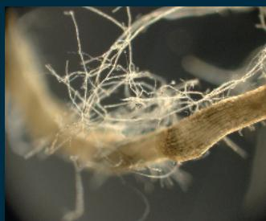  
A fungus growing on the root of a sorghum plant (SEM)

## Plant-Animal

Some species of plants are aggressively defended from predators and competitors by ants. The plant provides nourishment for the ants in the form of carbohydrate-rich nectar from glands called

nectaries. (See Figure 54.9 for another example of a mutualism between a plant and ants.)

## Bacteria and Plant Nutrition

A variety of soil bacteria play roles in plant nutrition. Some engage in mutually beneficial chemical exchanges with plant roots. Others enhance the decomposition of organic materials and increase nutrient availability.

## Rhizobacteria

Rhizobacteria are bacteria that live either in close association with plant roots or in the rhizosphere, the soil closely surrounding plant roots. Many rhizobacteria form mutually beneficial associations with plant roots. Rhizobacteria depend on nutrients such as sugars, amino acids, and organic acids that are secreted by plant cells. Up to 20% of a plant's photosynthetic production may be used to fuel these complex bacterial communities. In return,

plants reap many benefits from these mutualistic associations. Some rhizobacteria produce antibiotics that protect roots from disease. Others absorb toxic metals or make nutrients more available to roots. Still others convert gaseous nitrogen into forms usable by the plant or produce chemicals that stimulate plant growth. Inoculation of seeds with plant-growth-promoting rhizobacteria can increase crop yield and reduce the need for fertilizers and pesticides.

Some rhizobacteria are free-living in the rhizosphere, whereas others are endophytes that live between cells within the plant. Both the intercellular spaces occupied by endophytic bacteria and the rhizosphere associated with each plant root system contain a unique and complex cocktail of root secretions and microbial products that differ from those of the surrounding soil. A recent study revealed that the compositions of bacterial communities living endophytically and in the rhizosphere are not identical (Figure 37.10).

## Figure 37.10

# Inquiry: How variable are the compositions of bacterial communities inside and outside of roots?

## Experiment

The bacterial communities found within and immediately outside of root systems are known to improve plant growth. In order to devise agricultural strategies to increase the benefits of these bacterial communities, it is necessary to determine how complex they are and what factors affect their composition. A problem with studying these bacterial communities is that a handful of soil contains as many as 10,000

  
Bacteria (green) on surface of root (fluorescent LM)

types of bacteria, more than all the bacterial species that have been described. Researchers cannot simply culture each species and use a taxonomic key to identify them; a molecular approach is needed.

Jeffery Dangl and his colleagues estimated the number of bacterial “species” in samples using a technique called metagenomics (see Concept 21.1). The bacterial community samples differed in location (endophytic, inside the rhizosphere, or outside the rhizosphere), soil type (having large amounts of clay or porous), and the developmental stage of the root system with which they were associated (old or young). The DNA from each sample was purified, and the polymerase chain reaction (PCR) was used to amplify the DNA that codes for the 16S ribosomal RNA subunits. Many thousands of DNA sequence variations were found in each sample. The researchers lumped the sequences that were more than 97% identical into “taxonomic units” or “species.” (The word species is in quotation marks because “two organisms having a single gene that is more than 97% identical” is not explicit in any definition of species.) Having established the types of “species” in each community, the researchers made a tree diagram showing the percent of bacterial “species” found in common in each community.

## Results

This tree diagram breaks down the relatedness of bacterial communities into finer and finer levels of detail. The two explanatory labels give examples of how to interpret the diagram.

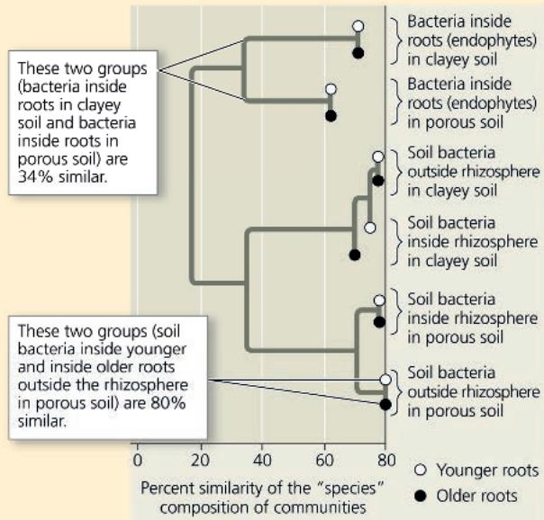  
Data from D. S. Lundberg et al., Defining the core Arabidopsis thaliana root microbiome, Nature 488:86–94 (2012).

## Conclusion

The “species” composition of the bacterial communities varied markedly according to the location inside the root versus outside the root and according to soil type.

## INTERPRET THE DATA

(a) Which of the three community locations was least like the other two?

(b) Rank the three variables (community location, developmental stage of roots, and soil type) in terms of how strongly they affect the “species” composition of the bacterial communities.

Figure 37.11 The roles of soil bacteria in the nitrogen nutrition of plants.

Ammonium $\left(\mathrm{NH}_{4}^{+}\right)$ is made available to plants by two types of soil bacteria: those that fix atmospheric $N_{2}$ (nitrogen-fixing bacteria) and those that decompose organic material (ammonifying bacteria). Although plants absorb some ammonium from the soil, they absorb mainly nitrate, which is produced from ammonium by nitrifying bacteria. Plants reduce nitrate back to ammonium before incorporating the nitrogen into organic compounds.

  
VISUAL SKILLS If an animal died near a root, would the plant have greater access to ammonium, nitrate, or both?  
For suggested answer, see Appendix A.

A better understanding of the types of bacteria within and around roots could potentially have profound agricultural benefits.

## Bacteria in the Nitrogen Cycle

Because nitrogen leaches easily from soils but is required in large amounts by plants, no mineral deficiency is more limiting to plant growth than a lack of nitrogen. The forms of nitrogen that plants can use include $NO_{3}^{-}$ and $NH_{4}^{+}$ . Some soil nitrogen derives from the weathering of rocks, and lightning produces small amounts of $NO_{3}^{-}$ that get carried to the soil in rain. However, most of the nitrogen available to plants comes from the activity of bacteria (Figure 37.11). This activity is part of the nitrogen cycle, a series of natural processes by which certain nitrogen-containing substances from the air and soil are made available to living things, are used by them, and are returned to the air and soil (see Figure 55.14).

Plants commonly acquire nitrogen in the form of $NO_{3}^{-}$ (nitrate). Soil $NO_{3}^{-}$ is largely formed by a two-step process called nitrification, which consists of the oxidation of ammonia ( $NH_{3}$ ) to nitrite ( $NO_{2}^{-}$ ), followed by oxidation of $NO_{2}^{-}$ to $NO_{3}^{-}$ . Different types of nitrifying bacteria mediate each step, as shown at the bottom of Figure 37.11. After the roots absorb $NO_{3}^{-}$ , a plant enzyme reduces it back to $NH_{4}^{+}$ , which other enzymes incorporate into amino acids and other organic compounds. Most plant species transport nitrogen from roots to shoots via the xylem as $NO_{3}^{-}$ or as organic compounds synthesized in the roots. Some soil nitrogen is lost, particularly in anaerobic soils, when denitrifying bacteria convert $NO_{3}^{-}$ to $N_{2}$ , which diffuses into the atmosphere.

In addition to $NO_{3}^{-}$ , plants can acquire nitrogen in the form of $NH_{4}^{+}$ (ammonium) through two processes, as shown on the left in Figure 37.11. In one process, nitrogen-fixing bacteria convert gaseous nitrogen ( $N_{2}$ ) to $NH_{3}$ , which then picks up another $H^{+}$ in the soil solution, forming $NH_{4}^{+}$ . In the other process, called ammonification, decomposers convert the organic nitrogen from dead organic material into $NH_{4}^{+}$ .

## Bacteria and Nitrogen Fixation

Although Earth's atmosphere is $79\%$ nitrogen, plants cannot use free gaseous nitrogen $(\mathrm{N}_2)$ because there is a triple bond between the two nitrogen atoms, making the molecule almost inert. For atmospheric $\mathrm{N}_2$ to be of use to plants, it must be reduced to $\mathrm{NH}_3$ by a process known as nitrogen fixation. All nitrogen-fixing organisms are bacteria. Some nitrogen-fixing bacteria are free-living in the soil (see Figure 37.11), whereas others live in the rhizosphere. Among this latter group, members of the genus Rhizobium form efficient and intimate associations with the roots of legumes (such as beans, alfalfa, and peanuts), altering the structure of the hosts' roots markedly, as will be discussed shortly.

The multistep conversion of $N_{2}$ to $NH_{3}$ by nitrogen fixation can be summarized as follows:

$$
\begin{array}{l}\mathrm{N} _ {2} + 8 e ^ {-} + 8 \mathrm{H} ^ {+} + 1 6 \mathrm{ATP} \rightarrow\\2 \mathrm{NH} _ {3} + \mathrm{H} _ {2} + 1 6 \mathrm{ADP} + 1 6 Ⓟ _ {\mathrm{i}}\end{array}
$$

The reaction is driven by the enzyme complex nitrogenase. Because the process of nitrogen fixation requires 16 ATP molecules for every 2 NH $_{3}$ molecules synthesized, nitrogen-fixing bacteria require a rich supply of carbohydrates from decaying material, root secretions, or (in the case of the Rhizobium bacteria) the vascular tissue of roots.

The mutualism between Rhizobium (“root-living”) bacteria and legume roots involves dramatic changes in root structure. Along a legume’s roots are swellings called nodules, composed of plant cells “infected” by Rhizobium bacteria (Figure 37.12). Inside each nodule, Rhizobium bacteria assume a form called bacteroids, which are contained within vesicles formed in the root cells. Legume–Rhizobium relationships generate more usable nitrogen for plants than all industrial fertilizers used today—and at virtually no cost to the farmer.

## Figure 37.12 Root nodules on a legume.

The spherical structures along this soybean root system are nodules containing Rhizobium bacteria. The bacteria fix nitrogen and obtain photosynthetic products supplied by the plant.

How is the relationship between legume plants and Rhizobium bacteria mutualistic?

For suggested answer, see Appendix A.

Nitrogen fixation by Rhizobium requires an anaerobic environment, a condition facilitated by the location of the bacteroids inside living cells in the root cortex. The woody external layers of root nodules also help to limit gas exchange. Some root nodules appear reddish because of a molecule called leghemoglobin (leg- for “legume”), an iron-containing protein that binds reversibly to oxygen (similar to the hemoglobin in human red blood cells). This protein is an oxygen “buffer,” reducing the concentration of free oxygen and thereby providing an anaerobic environment for nitrogen fixation while regulating the oxygen supply for the intense cellular respiration required to produce ATP for nitrogen fixation.

Each legume species is associated with a strain of Rhizobium bacteria. Figure 37.13 describes how a root nodule develops after bacteria enter through an “infection thread” in a root hair. The symbiotic relationship between a legume and nitrogen-fixing bacteria is mutualistic. The bacteria supply the host plant with fixed nitrogen while the plant provides the bacteria with carbohydrates and other organic compounds. The root nodules use most of the ammonium produced to make amino acids, which are then transported up to the shoot through the xylem.

How does a legume species recognize a certain strain of Rhizobium? And how does an encounter with that specific Rhizobium strain lead to development of a nodule? Each partner responds to chemical signals from the other by expressing certain genes whose products contribute to nodule formation. By understanding the formation of root nodules, researchers hope to learn how to induce Rhizobium uptake and nodule formation in crop plants that do not normally form such nitrogen-fixing mutualistic relationships.

Figure 37.13 Development of a soybean root nodule.  
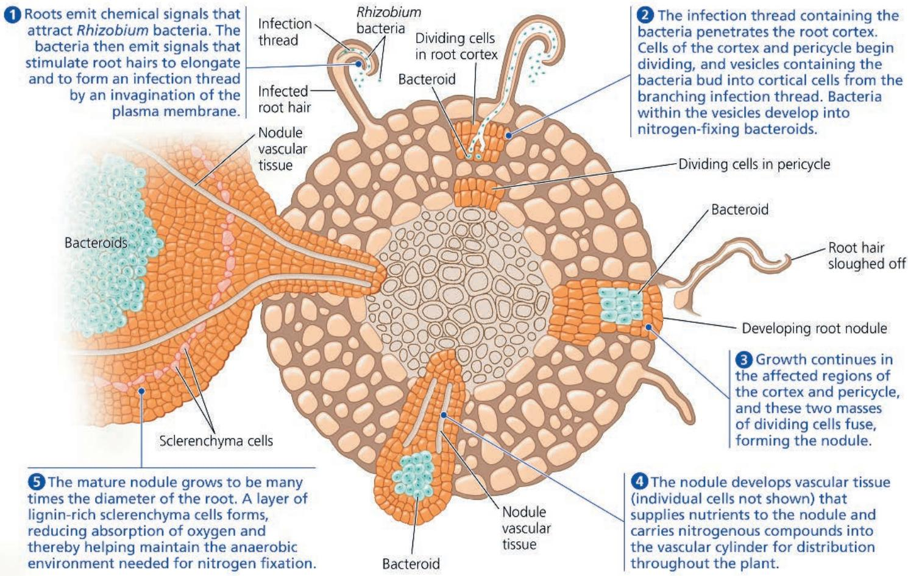

## Nitrogen Fixation and Agriculture

The benefits of nitrogen fixation underlie most types of crop rotation. In this practice, a nonlegume such as maize is planted one year, and the following year alfalfa or some other legume is planted to restore the concentration of fixed nitrogen in the soil. To ensure that the legume encounters its specific Rhizobium strain, the seeds are exposed to bacteria before sowing. Instead of being harvested, the legume crop is often plowed under so that it will decompose as “green manure,” reducing the need for manufactured fertilizers.

Many plant families besides legumes include species that benefit from mutualistic nitrogen fixation. For example, red alder (Alnus rubra) trees host nitrogen-fixing actinomycete bacteria. Rice, a crop of great commercial importance, benefits indirectly from mutualistic nitrogen fixation. Rice farmers culture a free-floating aquatic fern, Azolla, which has mutualistic cyanobacteria that fix nitrogen (see the bottom of Figure 37.9). The growing rice eventually shades and kills the Azolla, and decomposition of this nitrogen-rich organic material increases the rice paddy's fertility. Ducks also eat the Azolla, providing the rice paddy with an extra source of manure and providing the rice farmers with a source of meat.

## Fungi and Plant Nutrition

Certain species of soil fungi also form mutualistic relationships with roots and play a major role in plant nutrition. Some of these fungi are endophytic, but the most important relationships are mycorrhizae (“fungus roots”), the intimate mutualistic associations of roots and fungi (see Figure 31.4b). The host plant provides the fungus with a steady supply of sugar. Meanwhile, the fungus increases the surface area for water uptake and also supplies the plant with phosphorus and other minerals absorbed from the soil. The fungi of mycorrhizae also secrete growth factors that stimulate roots to grow and branch, as well as antibiotics that help protect the plant from soil pathogens.

## Mycorrhizae and Plant Evolution

EVOLUTION Mycorrhizae are not oddities; they are formed by most plant species. In fact, this plant–fungus mutualism might have been one of the evolutionary adaptations that helped plants initially colonize land (see Concept 29.1). When the earliest plants, which evolved from green algae, began to invade the land 400 to 500 million years ago, they encountered a harsh environment. Although the soil contained mineral nutrients, it lacked organic matter. Therefore, rain probably quickly leached away many of the soluble mineral nutrients. The barren land, however, was also a place of opportunities because light and carbon dioxide were abundant, and there was little competition or herbivory.

Neither the early land plants nor early land fungi were fully equipped to exploit the terrestrial environment. The early plants lacked the ability to extract essential nutrients from the soil, while the fungi were unable to manufacture carbohydrates. Instead of the fungi becoming parasitic on the rhizoids of the evolving plants (roots or root hairs had not yet evolved), the two organisms formed mycorrhizal associations, a mutualistic symbiosis that allowed both of them to exploit the terrestrial environment. Fossil evidence supports the idea that mycorrhizal associations occurred in the earliest land plants. The small minority of extant angiosperms that are non-mycorrhizal probably lost this ability through gene loss.

## Types of Mycorrhizae

Mycorrhizae come in two forms called ectomycorrhizae and arbuscular mycorrhizae. Ectomycorrhizae form a dense sheath, or mantle, of mycelia (mass of branching hyphae) over the surface of the root. Fungal hyphae extend from the mantle into the soil, greatly increasing the surface area for water and mineral absorption. Hyphae also grow into the root cortex. These hyphae do not penetrate the root cells but form a network in the apoplast, or extracellular space, which facilitates nutrient exchange between the fungus and the plant. Compared with “uninfected” roots, the roots of ectomycorrhizae are generally thicker, shorter, and more branched. They typically do not form root hairs, which would be superfluous given the extensive surface area of the fungal mycelium. Only about 10% of plant families have species that form ectomycorrhizae. The vast majority of these species are woody, including members of the pine, oak, birch, and eucalyptus families.

Unlike ectomycorrhizae, arbuscular mycorrhizae (also called endomycorrhizae) do not ensheath the root but are embedded within it. They start when microscopic soil hyphae respond to the presence of a root by growing toward it, establishing contact, and growing along its surface. The hyphae penetrate between epidermal cells and then enter the root cortex, where they digest small patches of the cell walls but don't pierce the plasma membrane. Instead of entering the cytoplasm, a hypha grows into a tube formed by invagination of the root cell's membrane. This invagination is like poking a finger gently into a balloon without popping it; your finger is like the fungal hypha, and the balloon skin is like the root cell's membrane. After the hyphae have penetrated in this way, some of them branch densely, forming structures called arbuscules ("little trees"), which are important sites of nutrient transfer between the fungus and the plant. Within the hyphae themselves, oval vesicles may form, possibly serving as food storage sites for the fungus. Arbuscular mycorrhizae are far more common than ectomycorrhizae, being found in over 85% of plant species, including most crops. About 5% of plant species don't form mycorrhizal associations. Figure 37.14 provides an overview of mycorrhizae.

## Agricultural and Ecological Importance of Mycorrhizae

Good crop yields often depend on the formation of mycorrhizae. Roots can form mycorrhizal symbioses only if exposed to the appropriate species of fungus. In most ecosystems, these fungi

## Figure 37.14 Mycorrhizae.

Ectomycorrhizae. The mantle of the fungal mycelium ensheathes the root. Fungal hyphae extend from the mantle into the soil, absorbing water and minerals, especially phosphorus. Hyphae also extend into the extracellular spaces of the root cortex, providing extensive surface area for nutrient exchange between the fungus and its host plant.

Mantle (fungal sheath)

(Colorized SEM)

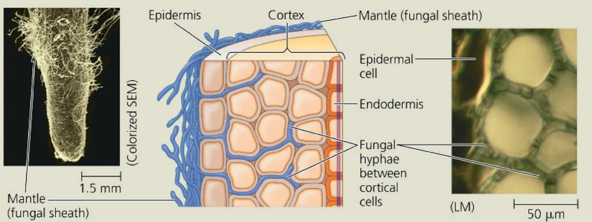

Arbuscular mycorrhizae (endomycorrhizae). No mantle forms around the root, but microscopic fungal hyphae extend into the root. Within the root cortex, the fungus makes extensive contact with the plant through branching of hyphae that form arbuscules, providing an enormous surface area for nutrient swapping. The hyphae penetrate the cell walls, but not the plasma membranes, of cells within the cortex.

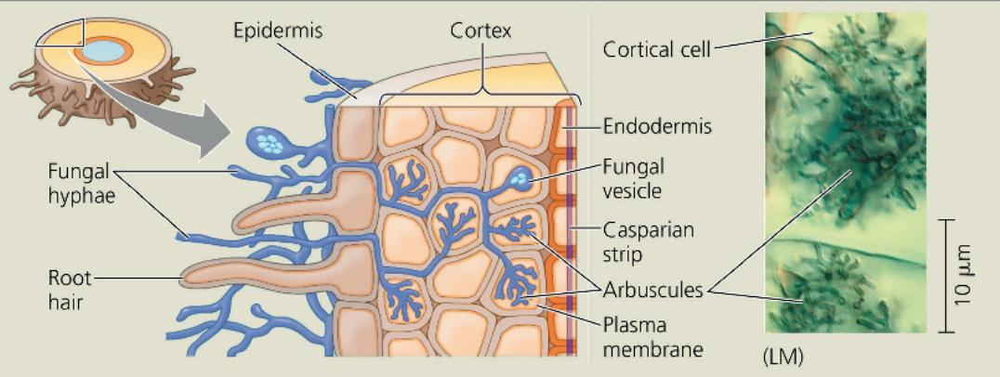

are present in the soil, and seedlings develop mycorrhizae. But if crop seeds are collected in one environment and planted in foreign soil, the plants may show signs of malnutrition (particularly phosphorus deficiency) resulting from the absence of fungal partners. Treating seeds with spores of mycorrhizal fungi can help seedlings form mycorrhizae, facilitating recovery of damaged natural ecosystems (see Concept 55.5) and improving crop yield.

Mycorrhizal associations are also important in understanding ecological relationships. Arbuscular mycorrhizae fungi exhibit little host specificity; a single fungus may form a shared mycorrhizal network with several plants, even plants of different species. Mycorrhizal networks in a plant community may benefit one plant species more than another. Other examples of how mycorrhizae may affect the structures of plant communities come from studies of introduced plant species. For instance, garlic mustard (Alliaria petiolata), a European species that has been introduced into the forests of the eastern half of the United States, does not form mycorrhizae but hinders the growth of other plant species by preventing the growth of arbuscular mycorrhizal fungi.

## Epiphytes, Parasitic Plants, and Carnivorous Plants

Almost all plant species have mutualistic relationships with soil fungi, bacteria, or both. Some plant species, including epiphytes, parasites, and carnivores, have unusual adaptations that facilitate exploiting other organisms (Figure 37.15).

A recent study suggests that exploiting other organisms may be the norm. Chanyarat Paungfoo-Lonhienne and her colleagues at the University of Queensland in Australia have provided evidence that Arabidopsis and tomato can take up bacteria and yeast into their roots and digest them. Due to the small pore size of the cell wall (less than 10 nm) relative to the size of bacterial cells (about 1,000 nm), taking in microorganisms may depend on digestion of the cell wall. A study with wheat suggests that microorganisms provide only a tiny fraction of the plant's nitrogen needs, but this may not be true for all plants. These findings suggest that many plant species might engage in a limited amount of carnivory.

## Concept Check 37.3

1. Why is the study of the rhizosphere critical to understanding plant nutrition?

2. How do soil bacteria and mycorrhizae contribute to plant nutrition?

3. MAKE CONNECTIONS What is a general term that is used to describe the strategy of using photosynthesis and heterotrophy for nutrition (see Concept 28.1)? What is a well-known class of protists that uses this strategy?

4. WHAT IF? A peanut farmer finds that the older leaves of his plants are turning yellow following a long period of wet weather. Suggest a reason why.

# Exploring Unusual Nutritional Adaptations in Plants

Figure 37.15

## Epiphytes

An epiphyte (from the Greek epi, upon, and phyton, plant) is a plant that grows on another plant without tapping into its host for sustenance. Usually attached to the branches or trunks of living trees, epiphytes absorb water and minerals from rain, mostly through their leaves rather than their roots. Common examples include many types of orchids and bromeliads. Staghorn ferns (Platycerium bifurcatum) are epiphytic colonial assemblages in which some individuals form disc-shaped fronds for water storage, while others form strap-shaped fronds for reproduction.

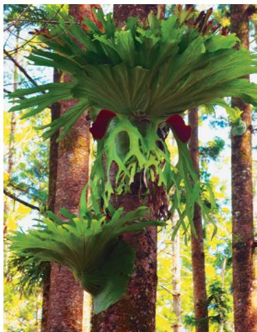  
▶ Staghorn fern, an epiphyte

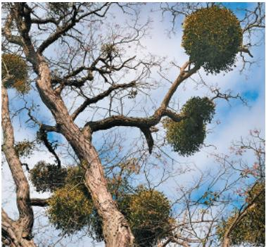

## Parasitic Plants

Unlike epiphytes, parasitic plants absorb water, minerals, and sometimes products of photosynthesis from their living hosts. Many species have roots that function as haustoria, nutrient-absorbing projections that tap into the host plant. Some parasitic species, such as orange-colored, spaghetti-like dodder (genus Cuscuta), lack chlorophyll entirely, whereas others, such as mistletoe (genus Phoradendron), are photosynthetic. Still others, such as ghost pipe (Monotropa uniflora), absorb nutrients from the hyphae of mycorrhizae associated with other plants.

◀ Mistletoe, a photosynthetic parasite

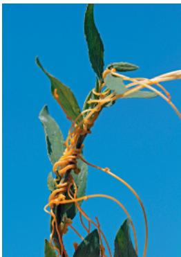  
▲ Dodder, a nonphoto-synthetic parasite (orange)

  
▲ Ghost pipe, a nonphoto-synthetic parasite of mycorrhizae

## Carnivorous Plants

Carnivorous plants are photosynthetic but supplement their mineral diet by capturing insects and other small animals. They live in acid bogs and other habitats where soils are poor in nitrogen and other minerals. Pitcher plants such as Nepenthes and Sarracenia have modified leaves that form water-filled funnels into which prey slip and drown, eventually to be digested by enzymes. Sundews (genus Drosera) exude a sticky fluid from tentacle-like glands on highly modified leaves. Stalked glands secrete sweet mucilage that attracts and ensnares insects, and they also release digestive enzymes. Other glands then absorb the nutrient “soup.” The highly modified leaves of Venus flytrap (Dionaea muscipula) close quickly but partially when a prey hits two trigger hairs in rapid enough succession. Smaller insects can escape, but larger ones are trapped by the teeth lining the margins of the lobes. Excitation by the prey causes the trap to narrow more and digestive enzymes to be released.

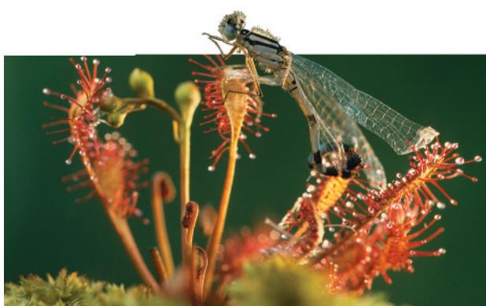  
▲Sundew

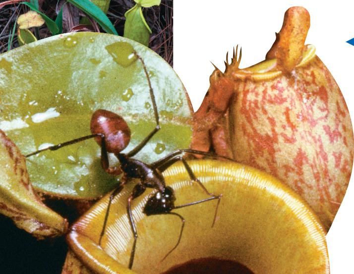

## ◀ Pitcher plants

Venus flytraps

## Summary of Key Concepts

To review key terms, go to the Vocabulary Self-Quiz (eTextbook only).

## Concept 37.1: Soil contains a living, complex ecosystem

\- Soil particles of various sizes derived from the breakdown of rock are found in soil. Soil particle size affects the availability of water, oxygen, and minerals in the soil.

\- A soil's composition encompasses its inorganic and organic components. Topsoil is a complex ecosystem teeming with bacteria, fungi, protists, animals, and the roots of plants.

\- Some agricultural practices can deplete the mineral content of soil, tax water reserves, and promote erosion. The goal of soil conservation is to minimize this damage.

How is soil a complex ecosystem?

\- Nitrogen-fixing bacteria convert atmospheric $N_{2}$ to nitrogenous minerals that plants can absorb as a nitrogen source for organic synthesis. The most efficient mutualism between plants and nitrogen-fixing bacteria occurs in the nodules that are formed by Rhizobium bacteria growing in the roots of legumes. These bacteria obtain sugar from the plant and supply the plant with fixed nitrogen. In agriculture, legume crops are rotated with other crops to restore nitrogen to the soil.

\- Mycorrhizae are mutualistic associations of fungi and roots. The fungal hyphae of mycorrhizae absorb water and minerals, which they supply to their plant hosts.

\- Epiphytes grow on the surfaces of other plants but acquire water and minerals from rain. Parasitic plants absorb nutrients from host plants. Carnivorous plants supplement their mineral nutrition by digesting animals.

Do all plants gain energy directly from photosynthesis? Explain.

For suggested answers, see Appendix A.

## Concept 37.2: Plant roots absorb many types of essential elements from the soil

\- Macronutrients, elements required in relatively large amounts, include carbon, oxygen, hydrogen, nitrogen, and other major ingredients of organic compounds. Micronutrients, elements required in very small amounts, typically have catalytic functions as cofactors of enzymes.

\- Deficiency of a mobile nutrient usually affects older organs more than younger ones; the reverse is true for nutrients that are less mobile within a plant. Macronutrient deficiencies are most common, particularly deficiencies of nitrogen, phosphorus, and potassium.

\- Rather than tailoring the soil to match the plant, genetic engineers are tailoring the plant to match the soil.

Do plants need soil to grow? Explain.

## Concept 37.3: Plant nutrition often involves relationships with other organisms

\- Rhizobacteria derive their energy from the rhizosphere, a microorganism-enriched ecosystem intimately associated with roots. Plant secretions support the energy needs of the rhizosphere. Some rhizobacteria produce antibiotics, whereas others make nutrients more available for plants. Most are free-living, but some live inside plants. Plants satisfy most of their huge need for nitrogen from the bacterial decomposition of humus and the fixation of gaseous nitrogen.

## Test Your Understanding

For more multiple-choice questions, go to the Practice Test (eTextbook only).

## Levels 1-2: Remembering/Understanding

1. The inorganic nutrient most often lacking in crops is
(A) carbon.
(C) phosphorus.
(B) nitrogen.
(D) potassium.

2. Micronutrients are needed in very small amounts because (A) most of them are mobile in the plant.

(B) most serve mainly as cofactors of enzymes.

(C) most are supplied in large enough quantities in seeds.

(D) they play only a minor role in the growth and health of the plant.

3. Mycorrhizae enhance plant nutrition mainly by

(A) absorbing water and minerals through the fungal hyphae.

(B) providing sugar to root cells, which have no chloroplasts.

(C) converting atmospheric nitrogen to ammonia.

(D) enabling the roots to parasitize neighboring plants.

## 4. What are epiphytes?

(A) fungi that attack plants

(B) fungi that form mutualistic associations with roots

(C) nonphotosynthetic parasitic plants

(D) plants that grow on other plants

5. A problem with intensive irrigation is

(A) overfertilization.

(B) aquifer depletion.

(C) the long-term depletion of soil oxygen.

(D) the clogging of waterways by vegetation debris.

## Levels 3-4: Applying/Analyzing

6. A mineral deficiency is likely to affect older leaves more than younger leaves if

(A) the mineral is a micronutrient.

(B) the mineral is very mobile within the plant.

(C) the mineral is required for chlorophyll synthesis.

(D) the mineral is a macronutrient.

7. The greatest difference in health between two groups of plants of the same species, one group with mycorrhizae and one group without mycorrhizae, would be in an environment

(A) where nitrogen-fixing bacteria are abundant.

(B) that has soil with poor drainage.

(C) that has hot summers and cold winters.

(D) in which the soil is relatively deficient in mineral nutrients.

8. Two groups of tomatoes were grown under laboratory conditions, one with humus added to the soil and one a control without humus. The leaves of the plants grown without humus were yellowish (less green) compared with those of the plants grown in humus-enriched soil. The best explanation is that

(A) the healthy plants used the food in the decomposing leaves of the humus for energy to make chlorophyll.

(B) the humus made the soil more loosely packed, so water penetrated more easily to the roots.

(C) the humus contained minerals such as magnesium and iron needed for the synthesis of chlorophyll.

(D) the heat released by the decomposing leaves of the humus caused more rapid growth and chlorophyll synthesis.

9. The specific relationship between a legume and its mutualistic Rhizobium strain probably depends on

(A) each legume having a chemical dialogue with a fungus.

(B) each Rhizobium strain having a form of nitrogenase that works only in the appropriate legume host.

(C) each legume being found where the soil has only the Rhizobium specific to that legume.

(D) specific recognition between chemical signals and signal receptors of the Rhizobium strain and legume species.

10. DRAW IT Draw a simple sketch of cation exchange, showing a root hair, a soil particle with anions, and a hydrogen ion displacing a mineral cation.

## Levels 5-6: Evaluating/Creating

11. EVOLUTION CONNECTION Imagine taking the plant out of the picture in Figure 37.11. Write a paragraph explaining how soil bacteria could sustain the recycling of nitrogen before land plants evolved.

12. SCIENTIFIC INQUIRY Acid precipitation has an abnormally high concentration of hydrogen ions ( $H^{+}$ ). One effect of acid precipitation is to deplete the soil of nutrients such as calcium ( $Ca^{2+}$ ), potassium ( $K^{+}$ ), and magnesium ( $Mg^{2+}$ ). Propose a hypothesis to explain how acid precipitation washes these nutrients from the soil. How might you test your hypothesis?

13. SCIENCE, TECHNOLOGY, AND SOCIETY In many countries, irrigation is depleting aquifers to such an extent that land is subsiding, harvests are decreasing, and it is becoming necessary to drill wells deeper. In many cases, the withdrawal of groundwater has now greatly surpassed the aquifers' rates of natural recharge. Discuss the possible consequences of this trend. What can society and science do to help alleviate this growing problem?

14. WRITE ABOUT A THEME: INTERACTIONS The soil in which plants grow teems with organisms from every taxonomic kingdom. In a short essay (100–150 words), discuss examples of how the mutualistic interactions of plants with bacteria, fungi, and animals improve plant nutrition.

## 15. SYNTHESIZE YOUR KNOWLEDGE

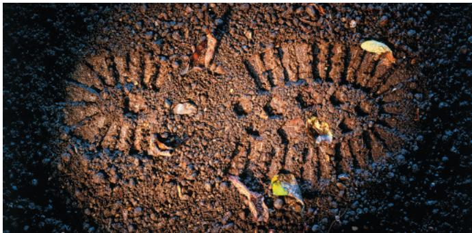

Making a footprint in the soil seems like an insignificant event. In a short essay (100–150 words), explain how a footprint would affect the properties of the soil and how these changes would affect soil organisms and the emergence of seedlings.

For selected answers, see Appendix A.

## Explore Scientific Papers with Science in the Classroom | AAAS

How do parasitic plants communicate with their hosts? Go to “Getting to Know Your Neighbors” at www.scienceintheclassroom.org.

Instructors: Questions can be assigned in Mastering Biology.

# Angiosperm Reproduction and Biotechnology

## Key Concepts

38.1 Flowers, double fertilization, and fruits are key features of the angiosperm life cycle

38.2 Flowering plants reproduce sexually, asexually, or both

38.3 People modify crops by breeding and genetic engineering

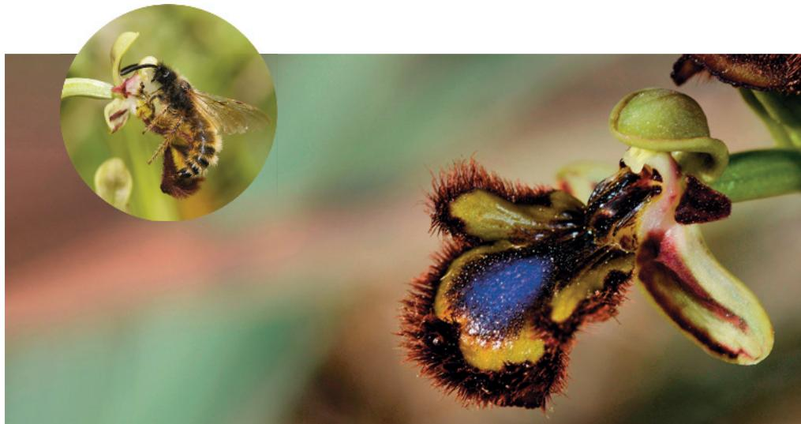

Figure 38.1 The orchid Ophrys speculum, shown above, is pollinated only by male wasps of the species Dasyscolia ciliata. The flowers resemble the female wasps visually and tactilely, and even release a similar scent. Male wasps who attempt to mate with the flowers (inset) get dusted with pollen. After the males fly off, they often transfer pollen to other Ophrys flowers. Pollination is critical to sexual reproduction in angiosperms.  

# Concept 38.1: Flowers, double fertilization, and fruits are key features of the angiosperm life cycle

In Chapters 29 and 30, we approached plant reproduction from an evolutionary perspective, tracing the descent of plants from algal ancestors. Angiosperms are the most important group of plants in most terrestrial ecosystems, but the importance of angiosperm reproduction is limited not just to natural ecosystems: The cultivation of angiosperms forms the basis for much of agriculture. For more than 10,000 years, plant breeders have genetically manipulated the traits of a few hundred wild angiosperm species by artificial selection, transforming them into the crops we grow today. In recent decades, genetic engineering has dramatically increased the variety of ways and the speed with which we can modify plants, but many controversies have followed in the wake of this new biotechnology. Here, we examine the reproduction of angiosperms, both sexual and asexual, in detail.

The life cycles of all plants are characterized by an alternation of generations, in which multicellular haploid $(n)$ and multicellular diploid $(2n)$ generations alternately produce each other (see Figure 13.6b). The diploid plant, the sporophyte, produces haploid spores by meiosis. These spores divide by mitosis, giving rise to multicellular gametophytes, the male and female haploid plants that produce gametes (sperm and eggs). Fertilization, the fusion of gametes, results in a diploid zygote, which divides by mitosis and forms a new sporophyte. In angiosperms, the sporophyte is the dominant generation: It is larger, more conspicuous, and longer-lived than the gametophyte. The key traits of the angiosperm life cycle can be remembered as the “three Fs”—flowers, double fertilization, and fruits. We’ll begin with flowers.

## Flower Structure and Function

In angiosperms, the flower is the sporophytic structure specialized for sexual reproduction. A flower is typically composed of four types of floral organs: carpels, stamens, petals, and sepals (Figure 38.2). When viewed from above, these organs take the form of concentric whorls. Carpels form the first (innermost) whorl, stamens the second, petals the third, and sepals the fourth (outermost) whorl. All are attached to a part of the stem called the receptacle. Flowers are determinate shoots; they cease growing after the flower and fruit are formed.

Carpels and stamens are sporophylls—modified leaves specialized for reproduction (see Concept 30.1); sepals and petals are sterile modified leaves. A carpel (megasporophyll) has an ovary at its base and a long, slender neck called the style. At the top of the style is a sticky structure called the stigma that captures pollen. Within the ovary are one or more ovules, which become seeds if fertilized; the number of ovules depends on the species. The flower in Figure 38.2 has a single carpel, but many species have multiple carpels. In most species, the carpels are fused, resulting in a compound ovary with two or more chambers, each containing one or more ovules. The term pistil is sometimes used to refer to a single carpel or two or more fused carpels (Figure 38.3). A stamen (microsporophyll) consists of a stalk called the filament and a terminal structure called the anther;

Figure 38.2 The structure of an idealized flower.  
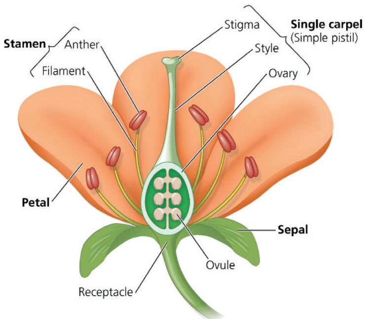

within the anther are chambers called microsporangia (pollen sacs) that produce pollen. Petals are typically more brightly colored than sepals and advertise the flower to insects and other animal pollinators. Sepals, which enclose and protect unopened floral buds, usually resemble leaves more than the other floral organs do.

Complete flowers have all four basic floral organs (see Figure 38.2). Some species have incomplete flowers, lacking sepals, petals, stamens, or carpels. For example, most grass flowers lack petals. Some incomplete flowers are sterile, lacking functional stamens and carpels; others are unisexual (sometimes called imperfect), lacking either stamens or carpels. Flowers also vary in size, shape, color, odor, organ arrangement, and time of

Figure 38.3 The relationship between the terms carpel and pistil. A simple pistil consists of a single, unfused carpel. A compound pistil consists of two or more fused carpels. Some types of flowers have only a single pistil, while other types have many pistils. In either case, the pistils may be simple or compound.

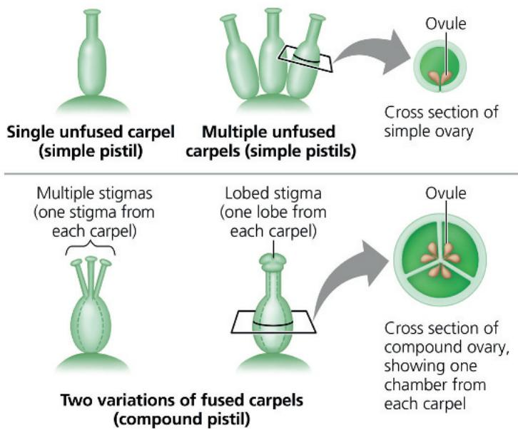

opening. Some are borne singly, while others are arranged in showy clusters called inflorescences. For example, a sunflower consists of a central disk composed of hundreds of tiny incomplete flowers, surrounded by sterile, incomplete flowers that look like yellow petals (see Figure 40.23). Much of floral diversity represents adaptation to specific pollinators.

## Methods of Pollination

Pollination is the transfer of pollen to the ovule-bearing structure of a seed plant. In angiosperms, this transfer is from an anther to a stigma. Pollination can occur by wind, water, or animals (Figure 38.4). In wind-pollinated species, including grasses and

## Exploring Flower Pollination

## Figure 38.4

Most angiosperm species rely on a living (biotic) or nonliving (abiotic) pollinating agent that can move pollen from the anther of a flower on one plant to the stigma of a flower on another plant. Approximately 80% of all angiosperm pollination is biotic, employing animal go-betweens. Among abiotically pollinated species, 98% rely on wind and 2% on water. (Some angiosperm species can self-pollinate, but such species are limited to inbreeding in nature.)

## Abiotic Pollination by Wind

About 20% of all angiosperm species are wind-pollinated. Since their reproductive success does not depend on attracting pollinators, there has been no selective pressure favoring colorful or scented flowers. Accordingly, the flowers of wind-pollinated species are often small, green, and inconspicuous, and they produce neither scent nor the sugary solution called nectar. Most temperate trees and grasses are wind-pollinated. The flowers of hazel (Corylus avellana) and many other temperate, wind-pollinated trees appear in the early spring, when there are no leaves to interfere with pollen movement. The relative inefficiency of wind pollination is compensated for by production of copious amounts of pollen grains. Wind tunnel studies reveal that wind pollination is often more efficient than it appears because floral structures can create eddy currents that aid in pollen capture.

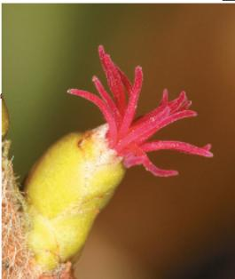  
▲ Hazel carpellate flower (carpels only)

  
▲ Hazel staminate flowers (stamens only) releasing clouds of pollen

## Pollination by Bees

  
▲ Common dandelion under normal light

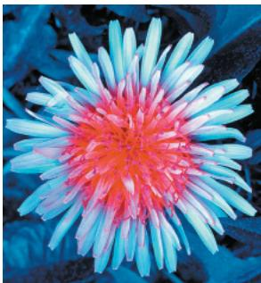  
▲ Common dandelion under ultraviolet light

About 65% of all flowering plants require insects for pollination; the percentage is even greater for major crops. Bees are the most important insect pollinators, and there is great concern in Europe and North America that honeybee populations have shrunk. Pollinating bees depend on nectar and pollen for food. Typically, bee-pollinated flowers have a delicate, sweet

fragrance. Bees are attracted to bright colors, primarily yellow and blue. Red appears dull to them, but they can see ultraviolet radiation. Many species of bee-pollinated flowers, such as the common dandelion (Taraxacum vulgare), have ultraviolet markings called “nectar guides” that help insects locate the nectaries (nectar-producing glands) but are only visible to human eyes under ultraviolet light.

## Pollination by Moths and Butterflies

Moths and butterflies detect odors, and the flowers they pollinate are often sweetly fragrant. Butterflies perceive many bright colors, but moth-pollinated flowers are usually white or yellow, which stand out at night when moths are active. A yucca plant (shown here) is typically pollinated by a single species of moth with appendages that pack pollen onto the stigma. The moth then deposits eggs directly into the ovary. The larvae eat some developing seeds, but this cost is outweighed by the benefit of an efficient and reliable pollinator. If a moth deposits too many eggs, the flower stops developing and drops off, selecting against individuals that overexploit the plant.

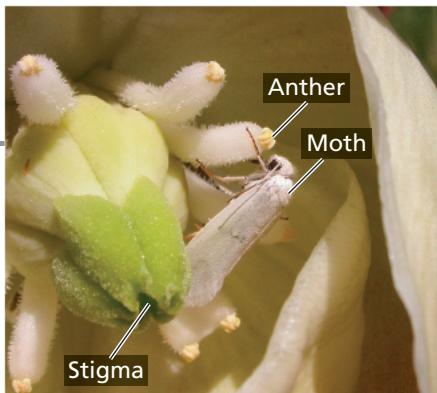  
▲ Moth on yucca flower

many trees, the release of clouds of typically small-sized pollen compensates for the randomness of dispersal by the wind. At certain times of the year, the air is loaded with pollen grains, as anyone plagued with pollen allergies can attest. Some species of aquatic plants rely on water to disperse pollen. Most angiosperm species, however, depend on insects, birds, or other animal pollinators to transfer pollen directly from one flower to another.

## Pollination by Flies

  
▲ Blowfly on carrion flower

Many fly-pollinated flowers are reddish and fleshy, with an odor like rotten meat. Blowflies visiting carrion flowers (Stapelia species) mistake the flower for a rotting corpse and lay their eggs on it. In the process, the blowflies become dusted with pollen that they carry to other flowers. When the eggs hatch, the larvae find no carrion to eat and die.

## Pollination by Bats

Bat-pollinated flowers, like moth-pollinated flowers, are light-colored and aromatic, attracting their nocturnal

pollinators. The lesser long-nosed bat (Leptonycteris curasoae yerbabue- nae) feeds on the nectar and pollen of agave and cactus flowers in the southwestern United States and Mexico. In feeding, the bats transfer pollen from plant to plant. Long-nosed bats are an endangered species.

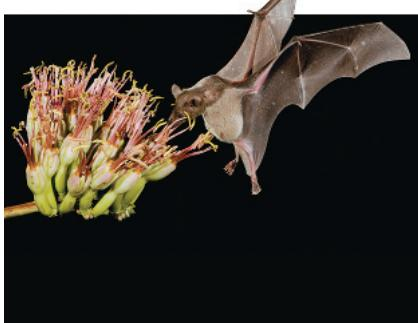  
▲ Long-nosed bat feeding on agave flowers at night

## Pollination by Birds

Bird-pollinated flowers are usually bright red and have little odor since birds typically lack a well-developed sense of smell. As a lure to attract their avian pollinators, hummingbird-pollinated flowers produce a sugary nectar that helps meet the high energy demands of these birds. The petals of such flowers are often fused, forming a bent tapering floral tube with nectar-producing glands (nectaries) located at the internal termini of the tubes. Hummingbirds collect the nectar by rapidly inserting their long flexible tongues into the floral tubes at rates of more than 10 times per second.

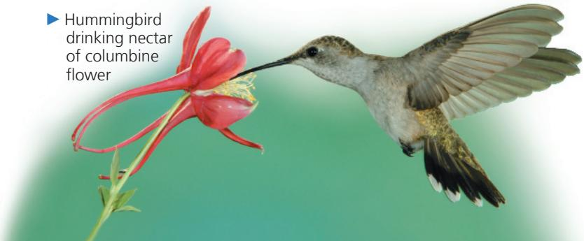

EVOLUTION Animal pollinators are drawn to flowers for the food they provide in the form of pollen and nectar. Attracting pollinators that are loyal to a given plant species is an efficient way to ensure that pollen is transferred to another flower of the same species. Natural selection, therefore, favors deviations in floral structure or physiology that make it more likely for a flower to be pollinated regularly by an effective animal species. If a plant species develops traits that make its flowers more prized by pollinators, there is a selective pressure for pollinators to become adept at harvesting food from these flowers. The joint evolution of two interacting species, each in response to selection imposed by the other, is called coevolution. For example, some species have fused flower petals that form long, tubelike structures bearing nectaries tucked deep inside. Charles Darwin suggested that coadaptations between flower and insect might lead to correspondences between the length of a floral tube and the length of an insect's proboscis, a straw-like mouthpart. Based on the length of a long, tubular flower endemic to Madagascar, Darwin predicted the existence of a pollinating moth with a 28-cm-long proboscis. Such a moth was discovered two decades after Darwin's death (Figure 38.5).

Climate change may be affecting long-standing relationships between plants and animal pollinators. For example, flowers that require long-tongued pollinators have declined under the warmer conditions in the Rocky Mountains. As a result, there has been selective pressure favoring bumblebees with shorter tongues. Two species of Rocky Mountain bumblebees now have tongues that are about one-quarter shorter than those of bees of the same species 50 years ago.

Figure 38.5 Coevolution of a flower and an insect pollinator.  
The long floral tube of the Madagascar orchid Angraecum sesquipedale has coevolved with the 28-cm-long proboscis of its pollinator, the hawk moth Xanthopan morganii praedicta. The moth is named in honor of Darwin's prediction of its existence.  

## The Angiosperm Life Cycle: An Overview

Pollination is one step in the angiosperm life cycle. Figure 38.6 provides a complete overview of the life cycle, focusing on gametophyte development, sperm delivery by pollen tubes, double fertilization, and seed development.

Over the course of seed plant evolution, gametophytes became reduced in size and wholly dependent on the sporophyte for nutrients (see Figure 30.2). The gametophytes of angiosperms are the most reduced of all plants, consisting of only a few cells: They are microscopic, and their development is obscured by protective tissues.

## Development of Female Gametophytes (Embryo Sacs)

As a carpel develops, one or more ovules form deep within its ovary, its swollen base. A female gametophyte, also known as an embryo sac, develops inside each ovule. The process of embryo sac formation occurs in a tissue called the megasporangium ① within each ovule. Two integuments (layers of protective sporophytic tissue that will develop into the seed coat) surround each megasporangium, except at a gap called the micropyle. Female gametophyte development begins when one cell in the megasporangium of each ovule, the megasporocyte, enlarges and undergoes meiosis, producing four haploid megaspores. Usually only one megaspore survives; the other three degenerate.

The nucleus of the surviving megaspore divides by mitosis three times without cytokinesis, resulting in one large cell with eight haploid nuclei. The multinucleate mass is then divided by membranes to form the embryo sac. Near the micropyle of the embryo sac, two synergid cells flank the egg and help attract and guide the pollen tube to the embryo sac. At the opposite end of the embryo sac are three antipodal cells of unknown function. The other two nuclei, called polar nuclei, are not partitioned into separate cells but share the cytoplasm of the large central cell of the embryo sac. The mature embryo sac thus consists of eight nuclei contained within seven cells. The ovule, which will become a seed if fertilized, now consists of the embryo sac, enclosed by the megasporangium (which eventually withers) and two surrounding integuments.

## Development of Male Gametophytes in Pollen Grains

As the stamens are produced, each anther ② develops four microsporangia, also called pollen sacs. Within the microsporangia are many diploid cells called microsporocytes. Each microsporocyte undergoes meiosis, forming four haploid microspores, ③ each of which eventually gives rise to a haploid male gametophyte. Each microspore then undergoes mitosis, producing a haploid male gametophyte consisting of only two

cells: the generative cell and the tube cell. Together, these two cells and the spore wall constitute a pollen grain. The spore wall, which consists of material produced by both the microspore and the anther, usually exhibits an elaborate pattern unique to the species. During maturation of the male gametophyte, the generative cell passes into the tube cell: The tube cell now has a completely free-standing cell inside it.

## Sperm Delivery by Pollen Tubes

After the microsporangium breaks open and releases pollen, a pollen grain may be transferred to a receptive surface of a stigma—the act of pollination. There, it absorbs water and germinates by producing a pollen tube, a long cellular protuberance that delivers sperm to the female gametophyte.

A pollen grain typically consists of the spore wall and two cells: a tube cell and a second cell, the generative cell, contained within the tube cell. As the pollen tube elongates through the style, the nucleus of the generative cell divides by mitosis and produces two sperm, which remain inside the tube cell. The tube nucleus leads ahead of the two sperm as the pollen tube grows toward the micropyle in response to chemical attractants produced by the synergid cells. The arrival of the pollen tube initiates the death of one of the two synergids, thereby providing a passageway into the embryo sac. The two sperm are then released from the pollen tube ④ in the vicinity of the female gametophyte.

## Double Fertilization

Fertilization, the fusion of gametes, occurs after the two sperm reach the female gametophyte. One sperm fertilizes the egg, forming the zygote. The other sperm combines with the two polar nuclei, forming a triploid (3n) nucleus in the center of the large central cell of the female gametophyte. This cell will give rise to the endosperm, a multicellular, food-storing tissue of the seed.

⑤ The union of the two sperm cells with different nuclei of the female gametophyte is called double fertilization. Double fertilization ensures that endosperm develops only in ovules where the egg has been fertilized, thereby preventing angiosperms from squandering nutrients on infertile ovules. Near the time of double fertilization, the tube nucleus, the other synergid cell, and the antipodal cells degenerate.

## Seed Development

⑥ After double fertilization, each ovule develops into a seed. Meanwhile, the ovary develops into a fruit, which encloses the seeds and aids in their dispersal by wind or animals. As the sporophyte embryo develops from the zygote, the seed stock-piles proteins, oils, and starch to varying degrees, depending on the species. This is why seeds are such a major nutrient drain. Initially, carbohydrates and other nutrients are stored in the seed's endosperm, but later, depending on the species, the swelling cotyledons (seed leaves) of the embryo may take over this function. When a seed germinates, ⑦ the embryo develops into a new sporophyte. The mature sporophyte produces its own flowers and fruits: The life cycle is now complete, but it is necessary to examine more closely how an ovule develops into a mature seed.

Figure 38.6 The life cycle of an angiosperm.

For simplicity, a flower with a single carpel (simple pistil) is shown. Many species have multiple carpels, either separate or fused.

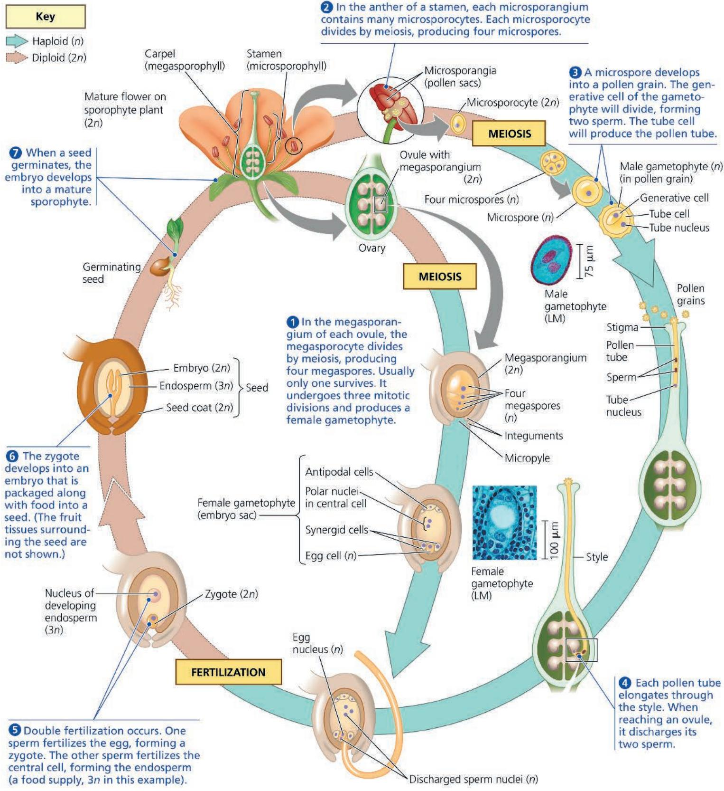  
VISUAL SKILLS Mitosis continues throughout the life cycle. Where in the cycle would the most mitotic divisions occur?

## Seed Development and Structure

After successful pollination and double fertilization, a seed begins to form. During this process, both the endosperm and the embryo develop. When mature, a seed consists of a dormant embryo surrounded by stored food and protective layers.

## Endosperm Development

Endosperm usually begins development before the embryo does. After double fertilization, the triploid nucleus of the ovule's central cell divides mitotically, forming a multinucleate "supercell" that has a milky consistency. This liquid mass, the endosperm, becomes multicellular when cytokinesis partitions the cytoplasm by forming membranes between the nuclei. Eventually, these "naked" cells produce cell walls, and the endosperm becomes solid. Coconut "milk" and "meat" are examples of liquid and solid endosperm. The white fluffy part of popcorn is another example of endosperm. The endosperms of just three grains—wheat, maize, and rice—provide much of the food energy for human sustenance.

In grains and most other species of monocots, as well as many eudicots, the endosperm stores nutrients that can be used by the seedling after germination. In other eudicot seeds, the food reserves of the endosperm are completely exported to the cotyledons before the seed completes its development; consequently, the mature seed lacks endosperm.

## Embryo Development

The first mitotic division of the zygote is asymmetrical and splits the fertilized egg into a basal cell and a terminal cell (Figure 38.7). The terminal cell eventually gives rise to most of the embryo. The basal cell continues to divide, producing a thread of cells called the suspensor, which anchors the embryo to the parent plant. The suspensor helps in transferring nutrients to the embryo from the parent plant and, in some species, from the endosperm. As the suspensor elongates, it pushes the embryo deeper into the nutritive and protective tissues. Meanwhile, the terminal cell divides several times and then forms a spherical proembryo (early embryo) that is attached to the suspensor. The cotyledons begin to form as bumps on the proembryo. A eudicot embryo, with its two cotyledons, is heart-shaped at this stage of development.

Soon after the rudimentary cotyledons appear, the embryo elongates. Cradled between the two cotyledons is the embryonic shoot apex. At the opposite end of the embryo's axis, where the suspensor attaches, an embryonic root apex forms. After the seed germinates—indeed, for the rest of the plant's life—the apical meristems at the apices of shoots and roots sustain primary growth (see Figure 35.11).

## Structure of the Mature Seed

During the last stages of its maturation, the seed dehydrates until its water content is only about 5–15% of its weight. The embryo, which is surrounded by a food supply (cotyledons, endosperm, or both), enters dormancy; that is, it stops growing and its metabolism nearly ceases. The embryo and its food supply are enclosed by a hard, protective seed coat formed from the integuments of the ovule. In some species, dormancy is imposed by the presence of an intact seed coat rather than by the embryo itself.

Figure 38.7 The development of a eudicot plant embryo. By the time the ovule becomes a mature seed and the integuments harden and thicken into the seed coat, the zygote has given rise to an embryonic plant with rudimentary organs.  
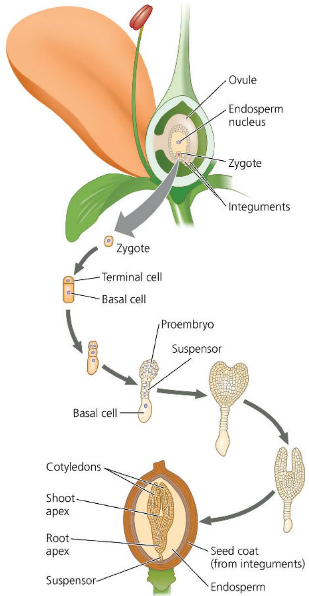

If you split apart a seed of the garden bean, a type of eudicot, you can see that the embryo consists of an elongate structure, the embryonic axis, attached to two thick, fleshy cotyledons (Figure 38.8a). Below where the cotyledons are attached, the embryonic axis is called the hypocotyl (from the Greek hypo, under). The hypocotyl terminates in the radicle, or embryonic root. The portion of the embryonic axis above where the cotyledons are attached and below the first pair of miniature leaves is the epicotyl (from the Greek epi, on, over). The epicotyl, young leaves, and shoot apical meristem are collectively called the plumule.

The cotyledons of the common garden bean are packed with starch before the seed germinates because they absorbed carbohydrates from the endosperm when the seed was developing. However, the seeds of some eudicot species, such as castor beans (Ricinus communis), retain their food supply in the endosperm and have very thin cotyledons. The cotyledons absorb nutrients from the endosperm and transfer them to the rest of the embryo when the seed germinates.

Figure 38.8 Seed structure.

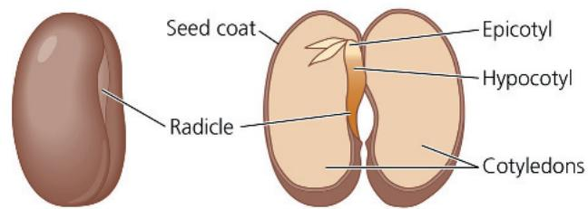  
(a) Common garden bean, a eudicot with thick cotyledons. The fleshy cotyledons store food absorbed from the endosperm before the seed germinates.

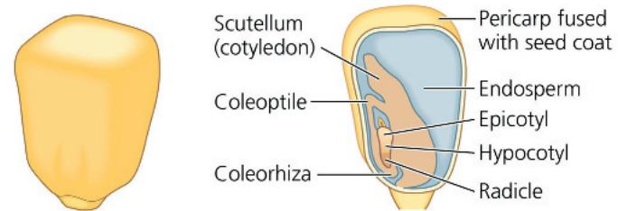

(b) Maize, a monocot. Like all monocots, maize has only one cotyledon. Maize and other grasses have a large cotyledon called a scutellum. The rudimentary shoot is sheathed in a structure called the coleoptile, and the coleorhiza covers the young root.

MAKE CONNECTIONS In addition to cotyledon number, how do the structures of monocots and eudicots differ? (See Figure 30.16.) VISUAL SKILLS Which mature seed lacks an endosperm? What happened to it?

For suggested answers, see Appendix A.

The embryos of monocots possess only a single cotyledon (Figure 38.8b). Grasses, including maize and wheat, have a specialized cotyledon called a scutellum (from the Latin scutella, small shield, a reference to its shape). The scutellum, which has a large surface area, is pressed against the endosperm, from which it absorbs nutrients during germination. The embryo of a grass seed is enclosed within two protective sheaths: a coleoptile, which covers the young shoot, and a coleorhiza, which covers the young root. Both structures aid in soil penetration during early germination.

## Seed Dormancy: An Adaptation for Tough Times

The environmental conditions required to break seed dormancy vary among species. Some seed types germinate as soon as they are in a suitable environment. Others remain dormant, even if sown in a favorable place, until a specific environmental cue causes them to break dormancy.

The requirement for specific cues to break seed dormancy increases the chances that germination will occur at a time and place most advantageous to the seedling. The seeds of many desert plants, for instance, germinate only after a substantial rainfall. If they were to germinate after a mild drizzle, the soil might soon become too dry to support the seedlings. Where natural fires are common, many seeds require intense heat or smoke to break dormancy; seedlings are therefore most abundant after fire has cleared away competing vegetation. Where winters are harsh, seeds may require extended exposure to cold before they germinate; seeds sown during summer or fall will therefore not germinate until the following spring,

ensuring a long growth season before the next winter. Many small seeds require light for germination, an adaptation that prevents them from germinating when they are buried so deeply in the soil that their energy reserves would be exhausted before their plumules could reach sunlight. Some seeds have coats that must be weakened by chemical attack as they pass through an animal's digestive tract and thus are usually carried a long distance before germinating from feces.

The length of time a dormant seed remains viable and capable of germinating varies from a few days to decades or even longer, depending on the plant species and environmental conditions. The oldest carbon-14-dated seed that has grown into a viable plant was a 2,000-year-old date palm seed from Israel. Most seeds are durable enough to last a year or two until conditions are favorable for germinating. Thus, the soil has a bank of ungerminated seeds that may have accumulated for several years. This is one reason vegetation reappears so rapidly after an environmental disruption such as fire.

## Sporophyte Development from Seed to Mature Plant

When environmental conditions are conducive for growth, seed dormancy is lost and germination proceeds. Germination is followed by growth of stems, leaves, and roots, and eventually by flowering.

## Seed Germination

Seed germination is initiated by imbibition, the uptake of water due to the low water potential of the dry seed. Imbibition causes the seed to expand and rupture its coat and triggers changes in the embryo that enable it to resume growth. Following hydration, enzymes digest the storage materials of the endosperm or cotyledons, and the nutrients are transferred to the growing regions of the embryo.

The first organ to emerge from the germinating seed is the radicle, the embryonic root. The development of a root system anchors the seedling in the soil and supplies it with water necessary for cell expansion. A ready supply of water is a prerequisite for the next step, the emergence of the shoot tip into the drier conditions encountered above ground. In garden beans, for example, a hook forms in the hypocotyl, and growth pushes the hook above ground (Figure 38.9a, on the next page). In response to light, the hypocotyl straightens, the cotyledons separate, and the delicate epicotyl, now exposed, spreads its first true leaves (as distinct from the cotyledons, or seed leaves). These leaves expand, become green, and begin making food by photosynthesis. The shriveled, energy-depleted cotyledons that supplied food for the developing embryo are shed.

Some monocots, such as maize and other grasses, use a different method for breaking ground as they germinate (Figure 38.9b). The coleoptile pushes up through the soil and into the air. The shoot tip grows through the tunnel provided by the coleoptile and breaks through the coleoptile's tip upon emergence.

## Growth and Flowering

Once a seed has germinated and started to photosynthesize, most of the plant's resources are devoted to primary and secondary growth of stems, leaves, and roots (also known as vegetative growth). This growth arises from the activity of meristematic cells (see

Figure 38.9 Two common types of seed germination.  
  
(a) Common garden bean. In common garden beans, straightening of a hook in the hypocotyl pulls the cotyledons from the soil.

  
(b) Maize. In maize and other grasses, the shoot grows straight up through the tube of the coleoptile.  
Figure 38.10 The flower-to-fruit transition.

VISUAL SKILLS How do bean and maize seedlings protect their shoot systems as they push through the soil?

For suggested answer, see Appendix A.

Concept 35.2). During this stage, plants usually photosynthesize and grow as much as possible before flowering, the reproductive phase.

The flowers of a given plant species typically appear suddenly and simultaneously at a specific time of year. Such timing promotes outbreeding, the main advantage of sexual reproduction. Flower formation involves a developmental switch in the shoot apical meristem from a vegetative to a reproductive growth mode. This transition into a floral meristem is triggered by a combination of environmental cues (such as day length) and internal signals, as you'll learn in Concept 39.3. Once the transition to flowering has begun, the order of each organ's emergence from the floral meristem determines whether it will develop into a sepal, petal, stamen, or carpel (see Figure 35.33).

## Fruit Structure and Function

Before a seed can germinate and develop into a mature plant, it must be deposited in suitable soil. Fruits play a key role in this process. A fruit is the mature ovary of a flower. While the seeds are developing from ovules, the flower develops into a fruit (Figure 38.10). The fruit protects the enclosed seeds and, when

After flowers are fertilized, stamens and petals fall off, stigmas and styles wither, and the ovary walls that house the developing seeds swell to form fruits. Developing seeds and fruits are major sinks for sugars and other carbohydrates. Phytolacca americana (American pokeweed) flowers and fruits are shown here.

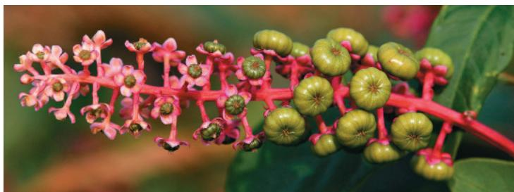

mature, aids in their dispersal by wind or animals. Fertilization triggers hormonal changes that cause the ovary to begin its transformation into a fruit. If a flower has not been pollinated, fruit typically does not develop, and the flower usually withers and dies.

During fruit development, the ovary wall becomes the pericarp, the thickened wall of the fruit. In some fruits, such as soybean pods, the ovary wall dries out completely at maturity, whereas in other fruits, such as grapes, it remains fleshy. In still others, such as peaches, the inner part of the ovary becomes stony (the pit) while the outer parts stay fleshy. As the ovary grows, the other parts of the flower usually wither and are shed.

Fruits are classified into several types, depending on their developmental origin. In most species, a fruit is derived from a single carpel or several fused carpels and is called a simple fruit (Figure 38.11a). An aggregate fruit results from a single flower that has more than one separate carpel, each forming a small fruit (Figure 38.11b). These “fruitlets” are clustered together on a single receptacle, as in a raspberry. A multiple fruit develops from an inflorescence, a group of flowers tightly clustered together. When the walls of the many ovaries start to thicken, they fuse together and become incorporated into one fruit, as in a pineapple (Figure 38.11c).

In some angiosperms, other floral parts contribute to what we commonly call the fruit. Such a fruit is called an accessory fruit. In apple flowers, the ovary is embedded in the receptacle, and the fleshy part of this simple fruit is derived mainly from the enlarged receptacle; only the apple core develops from the ovary (Figure 38.11d). Another example is the strawberry, an aggregate fruit consisting of an enlarged receptacle studded with tiny, partially embedded fruits, each bearing a single seed.

A fruit usually ripens about the same time that its seeds complete their development. Whereas the ripening of a dry fruit, such as a soybean pod, involves the aging and drying out of fruit tissues, the process in a fleshy fruit is more elaborate. Complex interactions of hormones result in an edible fruit that entices animals that disperse the seeds. The fruit's "pulp" becomes softer as enzymes digest components of cell walls. The color usually changes from green to another color, making the fruit more visible among the leaves. The fruit becomes sweeter as organic acids or starch molecules are converted to sugar, which may reach a concentration of 20% in a ripe fruit.

Figure 38.11 Developmental origin of different classes of fruits.  
  
(a) Simple fruit. A simple fruit develops from a single carpel (or several fused carpels) of one flower (examples: pea, lemon, peanut).

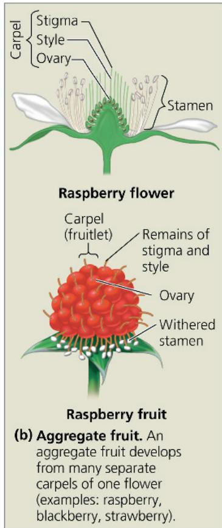  
(b) Aggregate fruit. An aggregate fruit develops from many separate carpels of one flower (examples: raspberry, blackberry, strawberry).

In this section, you have learned about the key features of sexual reproduction in angiosperms—flowers, double fertilization, and fruits. Next, we'll examine asexual reproduction.

1. Distinguish between pollination and fertilization.

## Concept Check 38.1

2. WHAT IF? If flowers had shorter styles, pollen tubes would more easily reach the embryo sac. Suggest an explanation for why very long styles have evolved in most species of flowering plants.

3. MAKE CONNECTIONS Does the life cycle of humans have any structures analogous to plant gametophytes? Explain your answer. (See Figures 13.5 and 13.6.)

For suggested answers, see Appendix A.

Figure 38.12, on the next page, examines some mechanisms of seed and fruit dispersal in more detail.  
  
(c) Multiple fruit. A multiple fruit develops from many carpels of the many flowers that form an inflorescence (examples: pineapple, fig).  
Pineapple inflorescence

# Concept 38.2: Flowering plants reproduce sexually, asexually, or both

During asexual reproduction, offspring are derived from a single parent without any fusion of egg and sperm. The result is a clone, an individual genetically identical to its parent. Asexual reproduction is common in angiosperms, as well as in other plants, and for some species it is the main mode of reproduction.

  
Pineapple fruit

  
(d) Accessory fruit. An accessory fruit develops largely from tissues other than the ovary. In the apple fruit, the ovary is embedded in a fleshy receptacle.

## Mechanisms of Asexual Reproduction

Asexual reproduction in plants is typically an extension of the capacity for indeterminate growth. Plant growth can be sustained or renewed indefinitely by meristems, regions of undifferentiated, dividing cells (see Concept 35.2). In addition, parenchyma cells throughout the plant can divide and differentiate into more specialized types of cells, enabling plants to regenerate lost parts. Detached root or stem fragments of some plants can develop into whole offspring; for example, pieces of a potato with an “eye” (bud) can each regenerate a whole plant. Such fragmentation, the separation of a parent plant into parts that develop into whole plants, is one of the most common modes of asexual reproduction. The plantlets on Kalanchoë leaves exemplify an unusual type of fragmentation (see Figure 35.7). In other cases, the root system of a single parent, such as an aspen tree, can give rise to many shoots that become separate shoot systems (Figure 38.13, after you turn the page). One aspen clone in Utah has been estimated to be composed of 47,000 stems of genetically identical trees. Although it is likely that some of the root system connections have been severed, making some of the trees isolated from the rest of the clone, each tree still shares a common genome.

A different mechanism of asexual reproduction has evolved in dandelions and some other plants. These plants can sometimes produce seeds without pollination or fertilization. This asexual production of seeds is called apomixis (from the Greek words meaning “away from the act of mixing”) because there is no joining or, indeed, production of sperm and egg. Instead, a diploid cell in the ovule gives rise to the embryo, and the ovules mature into seeds, which in the dandelion are dispersed

## Exploring Fruit and Seed Dispersal

## Figure 38.12

A plant's life depends on finding fertile ground. But a seed that falls and sprouts beneath the parent plant will stand little chance of competing successfully for nutrients. To prosper, seeds must be widely dispersed. Plants use biotic dispersal agents as well as abiotic agents such as water and wind.

## Dispersal by Water

Some buoyant seeds and fruits can survive months or years at sea. In coconut, the seed embryo and fleshy white “meat” (endosperm) are within a hard layer (endocarp) surrounded by a thick and buoyant fibrous husk.

## Dispersal by Wind

▶ With a wingspan of 12 cm, the giant seed of the tropical Asian climbing gourd Alsomitra macrocarpa glides through the air of the rain forest in wide circles when released.

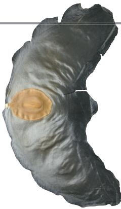

The winged fruit of a maple spins like a helicopter blade, slowing descent and increasing the chance of being carried farther by horizontal winds.

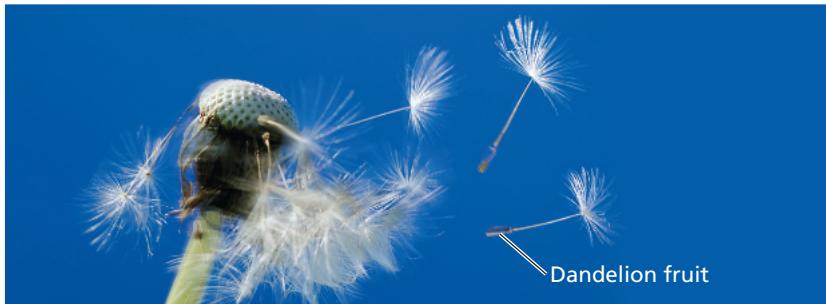

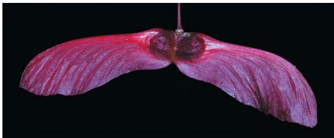  
▶ Tumbleweeds break off at the ground and tumble across the terrain, scattering their seeds.

  
▲ Some seeds and fruits are attached to umbrella-like "parachutes" that are made of intricately branched hairs and often produced in puffy clusters. These dandelion "seeds" (actually one-seeded fruits) are carried aloft by the slightest gust of wind.

## Dispersal by Animals

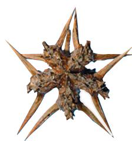

The sharp, tack-like spines on the fruits of puncture vine (Tribulus terrestris) can pierce bicycle tires and injure animals, including humans. When these painful "tacks" are removed and discarded, the seeds are dispersed.

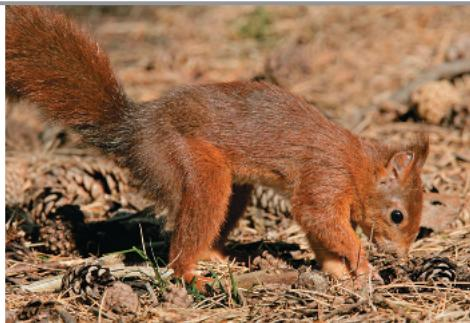  
Some animals, such as squirrels, hoard seeds or fruits in underground caches. If the animal dies or forgets the cache's location, the buried seeds are well positioned to germinate.  
▶ Seeds in edible fruits are often dispersed in feces, such as the black bear feces shown here. Such dispersal may carry seeds far from the parent plant.

Ants are chemically attracted to seeds with “food bodies” rich in fatty acids, amino acids, and sugars. The ants carry the seed to their underground nest, where the food body (the lighter-colored attachment in the photograph) is removed and fed to larvae. Due to the seed’s size, unwieldy shape, or hard coating, the remainder is usually left intact in the nest, where it germinates.

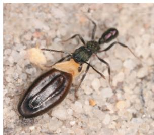

Figure 38.13 Asexual reproduction in aspen trees.

Some aspen groves, such as those shown here, consist of thousands of trees descended by asexual reproduction. Each grove of trees derives from the root system of one parent. Thus, the grove is a clone. Notice that genetic differences between groves descended from different parents result in different timing for the development of fall color.

by windblown fruits. Thus, these plants clone themselves by an asexual process but have the advantage of seed dispersal, usually associated with sexual reproduction. Plant breeders are interested in introducing apomixis into hybrid crops because it would allow hybrid plants to pass desirable genomes intact to offspring.

## Advantages and Disadvantages of Asexual and Sexual Reproduction

EVOLUTION An advantage of asexual reproduction in some cases is that there is no need for pollination. This may be beneficial in situations where plants of the same species are sparsely distributed and unlikely to be successfully pollinated. Asexual reproduction also allows the plant to pass on all its genetic legacy intact to its progeny. In contrast, when reproducing sexually, a plant passes on only half of its alleles. If a plant is superbly suited to its environment, asexual reproduction can be advantageous. A vigorous plant can potentially clone many copies of itself, and if the environmental circumstances remain stable, these offspring will also be genetically well adapted to the same environmental conditions under which the parent flourished.

Asexual plant reproduction based on the vegetative growth of stems, leaves, or roots is known as vegetative reproduction. Generally, the progeny produced by vegetative reproduction are stronger than seedlings produced by sexual reproduction. In contrast, seed germination is a precarious stage in a plant's life. The tough seed gives rise to a fragile seedling that may face exposure to predators, parasites, wind, and other hazards. In the wild, few seedlings survive to become parents themselves. Production of enormous numbers of seeds compensates for the odds against individual survival and gives natural selection ample genetic variations to screen. However, this is an expensive means of reproduction in terms of the resources consumed in flowering and fruiting.

Because sexual reproduction generates variation in offspring and populations, it can be advantageous in unstable environments where evolving pathogens and other fluctuating conditions affect survival and reproductive success. In contrast, the genotypic uniformity of asexually produced plants puts them at great risk of local extinction if there is a catastrophic environmental change, such as a new strain of disease. Moreover, seeds (which are almost always produced sexually) facilitate the dispersal of offspring to more distant locations. Finally, seed dormancy allows growth to be suspended until environmental conditions become more favorable. In the Scientific Skills Exercise on the next page, you can use data to determine which species of monkey flower are mainly asexual reproducers and which are mainly sexual reproducers.

Although sexual reproduction involving two genetically different plants produces the most genetically diverse offspring, some plants, such as garden peas, usually self-fertilize. This process, called “selfing,” is a desirable attribute in some crop plants because it heightens the probability that every ovule will develop into a seed. In many angiosperm species, however, mechanisms have evolved that make it difficult or impossible for a flower to fertilize itself, as we’ll see next.

## Mechanisms That Prevent Self-Fertilization

The various mechanisms that prevent self-fertilization contribute to genetic variety by ensuring that the sperm and egg come from different parents. Some species of plants cannot self-fertilize because different individuals have either staminate flowers (lacking carpels) or carpellate flowers (lacking stamens) (Figure 38.14a). Other plants have flowers with functional stamens and carpels that mature at different times or are structurally arranged in such a way that it is unlikely

Figure 38.14 Some floral adaptations that prevent self-fertilization.  

(a) Some species, such as Sagittaria latifolia (common arrowhead), have plants that produce only staminate flowers (left) or carpellate flowers (right).  
  
(b) Some species, such as Oxalis alpina (alpine wood sorrel), produce two types of flowers on different individuals: "thrums," which have short styles and long stamens, and "pins," which have long styles and short stamens. An insect foraging for nectar would collect pollen on different parts of its body; thrum pollen would be deposited on pin stigmas, and vice versa.

# Scientific Skills Exercise Using Positive and Negative Correlations to Interpret Data

Do Monkey Flower Species Differ in Allocating Their Energy to Sexual Versus Asexual Reproduction? Over the course of its life span, a plant captures only a finite amount of resources and energy, which must be allocated to best meet the plant's individual requirements for maintenance, growth, defense, and reproduction. Researchers examined how five species of monkey flower (genus Mimulus) use their resources for sexual and asexual reproduction.

How the Experiment Was Done After growing specimens of each species in separate pots in the open, the researchers determined averages for nectar volume, nectar concentration, seeds produced per flower, and the number of times the plants were visited by broad-tailed hummingbirds (Selasphorus platycercus, shown here). Using greenhouse-grown specimens,

average number of rooted branches per gram fresh shoot weight for each of the species. The phrase rooted branches refers to asexual reproduction through horizontal shoots that develop roots.

## INTERPRET THE DATA

1. A correlation is a way to describe the relationship between two variables. In a positive correlation, as the values of one of the variables increase, the values of the second variable also increase. In a negative correlation, as the values of one of the variables increase, the values of the second variable decrease. Or there may be no correlation between two variables. If researchers know how two variables are correlated, they can make a prediction about one variable based on what they know about the other variable. (a) Which variable(s) is/are positively correlated with the volume of nectar production in this genus? (b) Which is/are negatively correlated? (c) Which show(s) no clear relationship?

2. (a) Which Mimulus species would you categorize as mainly asexual reproducers? Why? (b) Which species would you categorize as mainly sexual reproducers? Why?

3. (a) Which species would probably fare better in response to a pathogen that infects all Mimulus species? (b) Which species would fare better if a pathogen caused hummingbird populations to dwindle?

Instructors: A version of this Scientific Skills Exercise can be assigned in Mastering Biology.

Data from the Experiment

<table><tr><td>Species</td><td>Nectar Volume (μL)</td><td>Nectar Concentration (% weight of sucrose/total weight)</td><td>Seeds per Flower</td><td>Visits per Flower</td><td>Rooted Branches per Gram Shoot Weight</td></tr><tr><td>M. rupestris</td><td>4.93</td><td>16.6</td><td>2.2</td><td>0.22</td><td>0.673</td></tr><tr><td>M. eastwoodiae</td><td>4.94</td><td>19.8</td><td>25</td><td>0.74</td><td>0.488</td></tr><tr><td>M. nelsonii</td><td>20.25</td><td>17.1</td><td>102.5</td><td>1.08</td><td>0.139</td></tr><tr><td>M. verbenaceus</td><td>38.96</td><td>16.9</td><td>155.1</td><td>1.26</td><td>0.091</td></tr><tr><td>M. cardinalis</td><td>50.00</td><td>19.9</td><td>283.7</td><td>1.75</td><td>0.069</td></tr></table>

Data from S. Sutherland and R. K. Vickery, Jr., Trade-offs between sexual and asexual reproduction in the genus Mimulus, Oecologia 76:330–335 (1998).

that an animal pollinator could transfer pollen from an anther to a stigma of the same flower (Figure 38.14b). However, the most common anti-selfing mechanism in flowering plants is self-incompatibility, the ability of a plant to reject its own pollen and the pollen of closely related individuals. If a pollen grain lands on a stigma of a flower of the same plant or a closely related plant, a biochemical block prevents the pollen from completing its development and fertilizing an egg. This plant response is analogous to the immune response of animals because both are based on the ability to distinguish the cells of “self” from those of “nonself.” The key difference is that the animal immune system rejects nonself, as when

the immune system mounts a defense against a pathogen or rejects a transplanted organ (see Concept 43.3). In contrast, self-incompatibility in plants is a rejection of self.

Researchers are unraveling the molecular mechanisms of self-incompatibility. Recognition of “self” pollen is based on genes called S-genes. In the gene pool of a population, there can be dozens of alleles of an S-gene. If a pollen grain has an allele that matches an allele of the stigma on which it lands, the pollen tube either fails to germinate or fails to grow through the style to the ovary. There are two types of self-incompatibility: gametophytic and sporophytic.

In gametophytic self-incompatibility, the S-allele in the pollen genome governs the blocking of fertilization. For example, an $S_{1}$ pollen grain from an $S_{1}S_{2}$ parental sporophyte cannot fertilize eggs of an $S_{1}S_{2}$ flower but can fertilize an $S_{2}S_{3}$ flower. An $S_{2}$ pollen grain cannot fertilize either flower. In some plants, this self-recognition involves the enzymatic destruction of RNA within a pollen tube. RNA-hydrolyzing enzymes are produced by the style and enter the pollen tube. If the pollen tube is a “self” type, they destroy its RNA.

In sporophytic self-incompatibility, fertilization is blocked by incompatibilities between S-allele gene products present in the sporophytic parental tissue adhering to the pollen wall and S-allele gene products secreted by the stigma of the receptive flower. For example, both the $S_{1}$ and $S_{2}$ pollen grains derived from an $S_{1}S_{2}$ parental sporophyte contain $S_{1}$ -allele and $S_{2}$ -allele gene products in the sporophytic tissue adhering to their pollen walls. The $S_{2}$ -allele gene product in the pollen walls of these two pollen types would prevent either type from germinating on the stigma of a flower whose genotype includes either the $S_{1}$ or the $S_{2}$ allele. For example, an $S_{1}$ pollen grain, derived from an $S_{1}S_{2}$ parent, cannot germinate on the stigma of an $S_{2}S_{3}$ flower.

Research on self-incompatibility may have agricultural applications. Breeders often hybridize different genetic strains of a crop to combine the best traits of the two strains and to counter the loss of vigor that can result from excessive inbreeding. To prevent self-fertilization within the two strains, breeders must either laboriously remove the anthers from the parent plants that provide the seeds or use male-sterile strains of the crop plant, if they exist. If self-compatibility can be genetically engineered back into domesticated plant varieties, these limitations to the commercial hybridization of crop seeds could be overcome.

## Totipotency, Vegetative Reproduction, and Tissue Culture

In a multicellular organism, any cell that can divide and asexually generate a clone of the original organism is said to be totipotent. Totipotency is found in many plants, particularly but not exclusively in their meristematic tissues. Plant totipotency underlies most of the techniques used by humans to clone plants.

## Vegetative Propagation and Grafting

Vegetative reproduction occurs naturally in many plants, but it can often be facilitated or induced by humans, in which case it is called vegetative propagation. Most houseplants, landscape shrubs and bushes, and orchard trees are asexually reproduced from plant fragments called cuttings. In most cases, shoot cuttings are used. At the wounded end of the shoot, a mass of dividing, undifferentiated totipotent cells called a callus forms, and roots develop from the callus. If the shoot fragment includes a node, then roots form without a callus stage.

In grafting, a severed shoot from one plant is permanently joined to the truncated stem of another. This process, usually limited to closely related individuals, can combine the best qualities of different species or varieties into one plant. The plant that provides the roots is called the stock; the twig grafted onto the stock is known as the scion. For example, scions from varieties of vines that produce superior wine grapes are grafted onto rootstocks of varieties that produce inferior grapes but are more resistant to certain soil pathogens. The genes of the scion determine the quality of the fruit. During grafting, a callus first forms between the adjoining cut ends of the scion and stock; cell differentiation then completes the functional unification of the grafted individuals.

## Test-Tube Cloning and Related Techniques

Plant biologists have adopted in vitro methods to clone plants for research or horticulture. Whole plants can be obtained by culturing small pieces of tissue from the parent plant on an artificial medium containing nutrients and hormones. The cells or tissues can come from any part of a plant, but growth may vary depending on the plant part, species, and artificial medium. In some media, the cultured cells divide and form a callus of undifferentiated totipotent cells (Figure 38.15a). When the concentrations of hormones and nutrients are manipulated appropriately, a callus can sprout shoots and roots with fully differentiated cells (Figure 38.15b and c). If desired, the cloned plantlets can then be transferred to soil, where they continue their growth.

Plant tissue culture is important in eliminating weakly pathogenic viruses from vegetatively propagated varieties. Although the presence of weak viruses may not be obvious, yield or quality may be substantially reduced as a result of infection. Strawberry plants, for example, are susceptible to more than 60 viruses, and typically the plants must be replaced each year because of viral infection. However, since the apical meristems are often virus-free, they can be excised and used to produce virus-free material for tissue culture.

Plant tissue culture also facilitates genetic engineering, the deliberate modification of the characteristics of an organism by manipulating its genetic material (see Concept 20.1). Many genetic

## Figure 38.15 Cloning a garlic plant.

(a) A root from a garlic clove gave rise to this callus culture, a mass of undifferentiated totipotent cells. (b and c) The differentiation of a callus into a plantlet depends on the nutrient levels and hormone concentrations in the artificial medium, as can be seen in these cultures grown for different lengths of time.

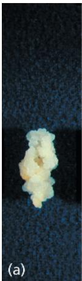

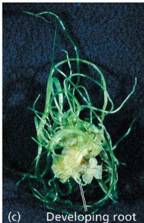  
(c) Developing root

engineering techniques require single plant cells as the starting material. Test-tube culture makes it possible to regenerate plants from a single genetically engineered plant cell. In the next section, we'll take a closer look at some of the promises and challenges surrounding the use of genetically modified plants in agriculture.

## Concept Check 38.2

1. What are three ways that flowering plants avoid self-fertilization?

2. The seedless banana, the world's most popular fruit, is losing the battle against two fungal epidemics. Why do such epidemics generally pose a greater risk to asexually propagated crops?

3. Self-fertilization, or selfing, seems to have obvious disadvantages as a reproductive “strategy” in nature, and it has even been called an “evolutionary dead end.” So it is surprising that about 20% of angiosperm species primarily rely on selfing. Suggest a reason why selfing might be advantageous and yet still be an evolutionary dead end.

For suggested answers, see Appendix A.

## Concept 38.3: People modify crops by breeding and genetic engineering

People have intervened in the reproduction and genetic makeup of plants since the dawn of agriculture. Maize, for example, owes its existence to humans. Left on its own in nature, maize would soon become extinct for the simple reason that it cannot spread its seeds. Maize kernels are not only permanently attached to the central axis (the "cob") but also permanently protected by tough, overlapping leaf sheathes (the "husk") (Figure 38.16). These attributes arose by artificial selection by humans. Despite having no understanding of the scientific principles underlying plant breeding, early farmers domesticated most of our crop species over a relatively short period about 10,000 years ago.

## Plant Breeding

Plant breeding is the art and science of changing the traits of plants in order to produce desired characteristics. Breeders scrutinize their fields carefully and travel far and wide searching for domesticated varieties or wild relatives with desirable traits. Such traits occasionally arise spontaneously through mutation, but the natural rate of mutation is too slow and unreliable to produce all the mutations that breeders would like to study. Breeders sometimes hasten mutations by treating large batches of seeds or seedlings with radiation or chemicals.

In traditional plant breeding, when a desirable trait is identified in a wild species, the wild species is crossed with a domesticated variety. Generally, those progeny that have inherited the desirable trait from the wild parent have also inherited many

Figure 38.16 Maize: a product of artificial selection.

Modern maize (bottom) was derived from teosinte (top). Teosinte kernels are tiny, and each row has a husk that must be removed to get at the kernel. The seeds are loose at maturity, allowing dispersal, which probably made harvesting difficult for early farmers. Neolithic farmers selected seeds from plants with larger cob and kernel size as well as the permanent attachment of seeds to the cob and the encasing of the entire cob by a tough husk.

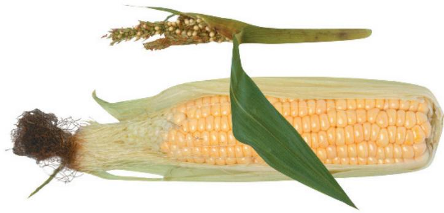

traits that are not desirable for agriculture, such as small fruits or low yields. The progeny that express the desired trait are again crossed with members of the domesticated species and their progeny examined for the desired trait. This process is continued until the progeny with the desired wild trait resemble the original domesticated parent in their other agricultural attributes.

While most breeders cross-pollinate plants of a single species, some breeding methods rely on hybridization between two distant species of the same genus. Such crosses sometimes result in the abortion of the hybrid seed during development. Often in these cases the embryo begins to develop, but the endosperm does not. Hybrid embryos are sometimes rescued by surgically removing them from the ovule and culturing them in vitro.

It is important to note that the natural genetic modification of plants began long before humans started altering crops by artificial selection. For example, the wheat species we rely on for much of our food evolved by natural hybridization between different species of grasses. Such hybridization is common in plants and has long been exploited by breeders to introduce genetic variation for artificial selection and crop improvement. Another instance of natural genetic modification has been revealed by the genomic sequencing of sweet potato (Ipomoea batatas). Apparently an early ancestor of the modern sweet potato came into contact with the soil bacterium Agrobacterium, and a horizontal gene transfer event (see Concept 26.6) occurred. Thus, the introduction of a transgene, a gene that has been transferred from one organism into another, can occur in nature as well as in a genetic engineering laboratory.

## Plant Biotechnology and Genetic Engineering

Plant biotechnology has two meanings. In the general sense, it refers to innovations in the use of plants (or substances obtained from plants) to make products of use to humans—an endeavor that began in prehistory. In a more specific sense, biotechnology refers to the use of genetically modified (GM) organisms in agriculture and industry. Indeed, in the last few decades, genetic engineering has become such a powerful force that the terms genetic engineering and biotechnology have become synonymous in the media. The revolutionary CRISPR-Cas9 gene-editing technology (see Figure 20.14) is changing plant biology as fast as it is breaking ground in other fields.

Unlike traditional plant breeders, modern plant biotechnologists, using techniques of genetic engineering, are not limited to the transfer of genes between closely related species or genera. For example, traditional breeding techniques could not be used to insert a desired gene from daffodil into rice because the many intermediate species between rice and daffodil and their common ancestor are extinct. In theory, if breeders had the intermediate species, over the course of several centuries they could probably introduce a daffodil gene into rice by traditional hybridization and breeding methods. With genetic engineering, however, such gene transfers can be done more quickly, more specifically, and without the need for intermediate species.

In the remainder of this chapter, we explore the prospects and controversies surrounding the agricultural use of crops that are genetically modified organisms (GMOs). Advocates for plant biotechnology believe that the genetic engineering of crop plants is the key to overcoming some of the most pressing problems of the 21st century, including world hunger and fossil fuel dependency.

## Interview

Interview with Luis Herrera-Estrella: Using GMOs to help farmers (eTextbook only)

## Reducing World Hunger and Malnutrition

Although global hunger affects nearly a billion people, there is much disagreement about its causes. Some argue that food shortages arise from inequities in distribution and that the most poverty-stricken simply cannot afford food. Others regard food shortages as evidence that the world is overpopulated—that the human species has exceeded the carrying capacity of the planet (see Concept 53.3). Whatever the causes of malnutrition, increasing food production is a humane objective. Because land and water are the most limiting resources, the best option is to increase yields on already existing farmland. Indeed, there is very little “extra” land that can be farmed, especially if the few remaining pockets of wilderness are to be preserved. Plant biotechnology can help make these crop yields possible.

Crops that have been genetically modified to express transgenes from Bacillus thuringiensis, a soil bacterium, require less pesticide. The transgenes involved encode a protein (Bt toxin) that is toxic to many insect pests (Figure 38.17). The Bt toxin used in crops is produced in the plant as a harmless protoxin that only becomes toxic if activated by alkaline conditions, such as in the guts of most insects. Because vertebrates have highly acidic stomachs, protoxin consumed by humans or livestock is rendered harmless by denaturation.

## Figure 38.17 Non-Bt versus Bt maize.

Field trials reveal that non-Bt maize (left) is heavily damaged by insect feeding and Fusarium mold infection, whereas Bt maize (right) suffers little or no damage.

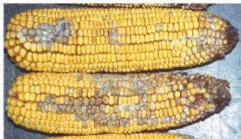

  
Non-Bt maize  
Bt maize

Biofortification, improving the nutritional quality of plants, is another strategy in the war on world hunger. For example, tens of thousands of children lose their sight each year because of vitamin A deficiencies. More than half of these children die within a year of becoming blind. In response to this crisis, genetic engineers created “Golden Rice,” a transgenic variety supplemented with transgenes that enable it to produce grain with increased levels of beta-carotene, a precursor of vitamin A. In 2021, after decades of safety testing and legal challenges, Golden Rice was finally approved for cultivation by the Philippines: massive production, focusing on provinces with high vitamin A deficiency, commenced in 2022.

Another major target for biofortification improvement is cassava (Manihot esculenta), a starchy root crop that provides carbohydrates for 800 million of the world's most impoverished people (Figure 38.18). Researchers are also engineering plants with enhanced resistance to disease. In one case, a transgenic papaya that is resistant to a ringspot virus was introduced into Hawaii, thereby saving its papaya industry.

Considerable controversy has arisen concerning transgenic crops that are resistant to the herbicide glyphosate. Glyphosate is lethal to a wide variety of plants because it inhibits a key enzyme

## Figure 38.18 Engineering the perfect food?

Cassava grows well in poor dry soils but must be supplemented by consumption of other crops. If those crops fail, people suffer malnutrition. What if cassava alone could supply a balanced diet? Transgenic, biofortified cassava plants have been developed with greatly increased levels of iron and beta-carotene (a vitamin A precursor). Other improvements have been made in the size of its storage roots, its ease of processing (less cyanide-producing chemicals), and its resistance to cassava mosaic virus disease.

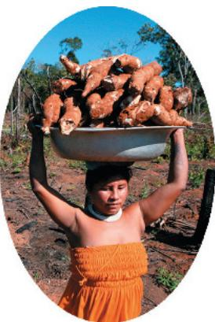

Interview

Interview with Dennis Gonsalves: Saving the papaya industry (eTextbook only)

in a biochemical pathway that is found in plants (and most bacteria) but not in animals. Researchers discovered a bacterial strain that had undergone a mutation in the gene encoding this enzyme that rendered it glyphosate resistant. When this mutated bacterial gene was spliced into the genome of various crops, these crops also became glyphosate resistant. Farmers achieved almost total weed control by spraying glyphosate over their fields of glyphosate-resistant crops. Unfortunately, the overuse of glyphosate created a huge selective pressure on weed species, with the result that resistance to glyphosate has evolved in many of them. There has also been a growing appreciation in recent decades of the role that gut bacteria play in animal and human health, and claims have been made that glyphosate may be having negative effects on the health of humans and livestock by interfering with beneficial gut bacteria. Glyphosate has also been the subject of many studies and legal challenges regarding its potential to cause cancer. Although billions of dollars in damages have been awarded in court cases alleging links between glyphosate-based weed killers and cancer, the research is conflicting.

## Reducing Fossil Fuel Dependency

Global sources of inexpensive fossil fuels, particularly oil, are rapidly being depleted. Moreover, most climatologists attribute global warming mainly to the rampant burning of fossil fuels, such as coal and oil, and the resulting release of the greenhouse gas $\mathrm{CO}_{2}$ . How can the world meet its energy demands in the 21st century in an economical and nonpolluting way? In certain localities, wind or solar power may become economically viable, but such alternative energy sources are unlikely to fill the global energy demands completely. Many scientists predict that biofuels—fuels derived from living biomass—could produce a sizable fraction of the world's energy needs in the not-too-distant future. Biomass is the total mass of organic matter in a group of organisms in a particular habitat. The use of biofuels from plant biomass would reduce the net emission of $\mathrm{CO}_{2}$ . Whereas burning fossil fuels increases atmospheric $\mathrm{CO}_{2}$ concentrations, biofuel crops reabsorb by photosynthesis the $\mathrm{CO}_{2}$ emitted when biofuels are burned, creating a cycle that is carbon neutral.

In working to create biofuel crops from wild precursors, scientists are focusing their domestication efforts on fast-growing plants, such as switchgrass (Panicum virgatum) and poplar (Populus trichocarpa), that can grow on soil that is too poor for food production. Scientists do not expect the plant biomass to be burned directly. Instead, the polymers in cell walls, such as cellulose and hemicellulose, which constitute the most abundant organic compounds on Earth, would be broken down into sugars by enzymatic reactions. These sugars, in turn, would be fermented into alcohol and distilled to yield biofuels. In addition to increasing plant polysaccharide content and overall biomass, researchers are trying to genetically engineer the cell walls of plants to increase the efficiency of the enzymatic conversion process.

## The Debate over Plant Biotechnology

Much of the debate about GMOs in agriculture is political, social, economic, or ethical and therefore outside the scope of this book. But we should consider the biological concerns about GM crops.

Some biologists, particularly ecologists, are concerned about the unknown risks associated with the release of GMOs into the environment. The debate centers on the extent to which GMOs could harm the environment or human health. Those who want to proceed more slowly with agricultural biotechnology (or end it) are concerned about the unstoppable nature of the “experiment.” If a drug trial produces unanticipated harmful results, the trial is stopped. But we may not be able to stop the “trial” of introducing novel organisms into the biosphere. Here we examine some criticisms that have been leveled by opponents of GMOs, including the alleged effects on human health and nontarget organisms and the potential for transgene escape.

## Issues of Human Health

Many GMO opponents worry that genetic engineering may inadvertently transfer allergens, molecules to which some people are allergic, from a species that produces an allergen to a plant used for food. However, biotechnologists are already removing genes that encode allergenic proteins from soybeans and other crops. So far, there is no credible evidence that GM plants designed for human consumption have allergenic effects on human health. In fact, some GM foods are potentially healthier than non-GM foods. For example, Bt maize (the transgenic variety with the Bt toxin) contains 90% less of a fungal toxin that causes cancer and birth defects than non-Bt maize. Called fumonisin, this toxin is highly resistant to degradation and has been found in alarmingly high concentrations in some batches of processed maize products, ranging from cornflakes to beer. Fumonisin is produced by a fungus (Fusarium) that infects insect-damaged maize. Because Bt maize generally suffers less insect damage than non-GM maize, it contains much less fumonisin.

Assessing the impact of GMOs on human health also involves considering the health of farmworkers, many of whom were commonly exposed to high levels of chemical insecticides prior to the adoption of Bt crops. In India, for example, the widespread adoption of Bt cotton has led to a 41% decrease in insecticide use and an 80% reduction in the number of acute poisoning cases involving farmers.

## Possible Effects on Nontarget Organisms

Many ecologists are concerned that GM crops may have unforeseen effects on nontarget organisms. One laboratory study indicated that the larvae (caterpillars) of monarch butterflies responded adversely and even died after eating milkweed leaves (their preferred food) heavily dusted with pollen from transgenic Bt maize. This study has since been discredited, affording a good example of the self-correcting nature of science. As it turns out, when the original researcher shook the male maize inflorescences onto the milkweed leaves in the laboratory, the filaments of stamens, opened microsporangia, and other floral parts also rained onto the leaves. Subsequent research found that it was these other floral parts, not the pollen, that contained Bt toxin in high concentrations. Unlike pollen, these floral parts would not be carried by the wind to neighboring milkweed plants when shed under natural field conditions. Only one Bt maize line, accounting for less than 2% of commercial Bt maize production (and now discontinued), produced pollen with high Bt toxin concentrations.

In considering the negative effects of Bt pollen on monarch butterflies, one must also weigh the effects of an alternative to the cultivation of Bt maize—the spraying of non-Bt maize with chemical pesticides. Subsequent studies have shown that such spraying is much more harmful to nearby monarch populations than is Bt maize production. Although the effects of Bt maize pollen on monarch butterfly larvae appear to be minor, the controversy has emphasized the need for accurate field testing of all GM crops and the importance of targeting gene expression to specific tissues to improve safety.

## Addressing the Problem of Transgene Escape

Perhaps the most serious concern raised about GM crops is the possibility of the introduced genes escaping from a transgenic crop into related weeds through crop-to-weed hybridization. The fear is that the spontaneous hybridization between a crop engineered for herbicide resistance and a wild relative might give rise to a “superweed” that would have a selective advantage over other weeds in the wild and would be much more difficult to control in the field. GMO advocates point out that the likelihood of transgene escape depends on the ability of the crop and weed to hybridize and on how the transgenes affect the overall fitness of the hybrids. A desirable crop trait—a dwarf phenotype, for example—might be disadvantageous to a weed growing in the wild. In other instances, there are no weedy relatives nearby with which to hybridize; soybean, for example, has no wild relatives in the United States. However, canola, sorghum, and many other crops do hybridize readily with weeds, and crop-to-weed transgene escape in a turfgrass has occurred. In 2003, a transgenic variety of creeping bentgrass (Agrostis stolonifera) genetically engineered to resist the herbicide glyphosate escaped from an experimental plot in Oregon following a windstorm. Despite efforts to eradicate the escapee, 62% of the Agrostis plants found in the vicinity three years later were glyphosate resistant. So far, the ecological impact of this event appears to be minor, but that may not be the case with future transgenic escapes.

Many strategies are being pursued with the goal of preventing transgene escape. For example, if male sterility could be engineered into plants, these plants would still produce seeds and fruit if pollinated by nearby nontransgenic plants, but they would produce no viable pollen. A second approach involves genetically engineering apomixis into transgenic crops. When a seed is produced by apomixis, the embryo and endosperm develop without fertilization. The transfer of this trait to transgenic crops would therefore minimize the possibility of transgene escape via pollen because plants could be male-sterile without compromising seed or fruit production. A third approach is to engineer the transgene into the chloroplast DNA of the crop. Chloroplast DNA in many plant species is inherited strictly from the egg, so transgenes in the chloroplast cannot be transferred by pollen. A fourth approach for preventing transgene escape is to genetically engineer flowers that develop normally but fail to open. Consequently, self-pollination would occur, but pollen would be unlikely to escape from the flower. This solution would require modifications to flower design. Several floral genes have been identified that could be manipulated to this end.

The continuing debate about GMOs in agriculture exemplifies one of this textbook's recurring ideas: the relationship of science and technology to society. Technological advances almost always involve some risk of unintended outcomes. In the case of genetically engineered crops, zero risk is probably unattainable. Therefore, scientists and the public must assess on a case-by-case basis the possible benefits of transgenic products versus the risks that society is willing to take. The best scenario is for these discussions and decisions to be based on sound scientific information and rigorous testing rather than on reflexive fear or blind optimism.

## Concept Check 38.3

1. Compare traditional plant-breeding methods with genetic engineering.

2. Why does Bt maize have less fumonisin than non-GM maize?

3. WHAT IF? In a few species, chloroplast genes are inherited only from sperm. How might this influence efforts to prevent transgene escape?

For suggested answers, see Appendix A.

## Chapter 38 Review

## Summary of Key Concepts

To review key terms, go to the Vocabulary Self-Quiz (eTextbook only).

Concept 38.1: Flowers, double fertilization, and fruits are key features of the angiosperm life cycle

\- Angiosperm reproduction involves an alternation of generations between a multicellular diploid sporophyte generation and a multicellular haploid gametophyte generation. Flowers, produced by the sporophyte, function in sexual reproduction.

\- The four floral organs are sepals, petals, stamens, and carpels. Sepals protect the floral bud. Petals help attract pollinators. Stamens bear anthers in which haploid microspores develop into pollen grains containing a male gametophyte. Carpels contain ovules (immature seeds) in their swollen bases. Within the ovules, embryo sacs (female gametophytes) develop from megaspores.

\- Pollination, which precedes fertilization, is the placing of pollen on the stigma of a carpel. After pollination, the pollen tube discharges two sperm into the female gametophyte. Two sperm are needed for double fertilization, a process in which

one sperm fertilizes the egg, forming a zygote and eventually an embryo, while the other sperm combines with the polar nuclei, giving rise to the food-storing endosperm.

\- A seed consists of a dormant embryo along with a food supply stocked in either the endosperm or the cotyledons. Seed dormancy ensures that seeds germinate only

  
One sperm will fuse with the egg, forming a zygote (2n).

One sperm cell will fuse with the two polar nuclei, forming an endosperm nucleus (3n).

when conditions for seedling survival are optimal. The breaking of dormancy often requires environmental cues, such as temperature or lighting changes.

\- The fruit protects the enclosed seeds and aids in wind dispersal or in the attraction of seed-dispersing animals.

What changes occur to the four types of floral parts as a flower changes into a fruit?

## Concept 38.2: Flowering plants reproduce sexually, asexually, or both

\- Asexual reproduction, also known as vegetative reproduction, enables successful plants to proliferate quickly. Sexual reproduction generates most of the genetic variation that makes evolutionary adaptation possible.

\- Plants have evolved many mechanisms to avoid self-fertilization, including having male and female flowers on different individuals, nonsynchronous production of male and female parts within a single flower, and self-incompatibility reactions in which pollen grains that bear an allele identical to one in the female are rejected.

\- Plants can be cloned from single cells, which can be genetically manipulated before being allowed to develop into a plant.

What are the advantages of asexual and sexual reproduction?

## Concept 38.3: People modify crops by breeding and genetic engineering

\- Hybridization of different varieties and even species of plants is common in nature and has been used by breeders, ancient and modern, to introduce new genes into crops. After two plants are successfully hybridized, plant breeders select those progeny that have the desired traits.

\- In genetic engineering, genes from unrelated organisms are incorporated into plants. Genetically modified (GM) plants can increase the quality and quantity of food worldwide and may also become increasingly important as biofuels.

\- There are concerns about the unknown risks of releasing GM organisms into the environment, but the potential benefits of crops that express transgenes will need to be considered.

Give two examples of how genetic engineering has improved or might potentially improve food quality.

For suggested answers, see Appendix A.

## Test Your Understanding

For more multiple-choice questions, go to the Practice Test (eTextbook only).

## Levels 1-2: Remembering/Understanding

## 1. A fruit is

(A) a mature ovary.

(B) a mature ovule.

(C) a seed plus its integuments.

(D) an enlarged embryo sac.

## 2. Bt maize

(A) is resistant to various herbicides, making it practical to weed maize fields with those herbicides.

(B) contains transgenes that increase vitamin A content.

(C) includes bacterial genes that produce a toxin that reduces damage from insect pests.

(D) is a “boron (B)-tolerant” transgenic variety of maize.

3. Which statement concerning grafting is correct?

(A) Stocks and scions refer to twigs of different species.

(B) Stocks and scions must come from unrelated species.

(C) Stocks provide root systems for grafting.

(D) Grafting creates new species.

## Levels 3-4: Applying/Analyzing

4. In a species showing sporophytic incompatibility, which type(s) of pollen could successfully fertilize an $S_{2}S_{3}$ flower?
(A) $S_{1}$ pollen from an $S_{1}S_{3}$ flower
(B) $S_{2}$ or $S_{3}$ pollen from an $S_{2}S_{3}$ flower
(C) $S_{3}$ pollen from an $S_{1}S_{1}$ flower
(D) $S_{1}$ pollen from an $S_{1}S_{1}$ flower

5. The black dots that cover strawberries are actually fruits formed from the separate carpels of a single flower. The fleshy and tasty portion of a strawberry derives from the receptacle of a flower with many separate carpels. Therefore, a strawberry is

(A) a simple fruit with many seeds.

(B) both a multiple fruit and an accessory fruit.

(C) both a simple fruit and an aggregate fruit.

(D) both an aggregate fruit and an accessory fruit.

6. DRAW IT Draw and label the parts of a flower.

## Levels 5-6: Evaluating/Creating

7. EVOLUTION CONNECTION With respect to sexual reproduction, some plant species are fully self-fertile, others are fully self-incompatible, and some exhibit a “mixed strategy” with partial self-incompatibility. These reproductive strategies differ in their implications for evolutionary potential. Predict how a self-incompatible species might fare as a small founder population or remnant population in a severe population bottleneck (see Concept 23.3), as compared with a self-fertile species.

8. SCIENTIFIC INQUIRY Critics of GM foods have argued that transgenes may disturb cellular functioning, causing unexpected and potentially harmful substances to appear inside cells. Toxic intermediary substances that normally occur in very small amounts may arise in larger amounts, or new substances may appear. The disruption may also lead to loss of substances that help maintain normal metabolism. If you were your nation's chief scientific advisor, how would you respond to these criticisms? State your case.

9. WRITE ABOUT A THEME. ORGANIZATION in a short essay (100–50 words), discuss how a flower's ability to reproduce with other flowers of the same species is an emergent property arising from floral parts and their organization.

## 10. SYNTHESIZE YOUR KNOWLEDGE

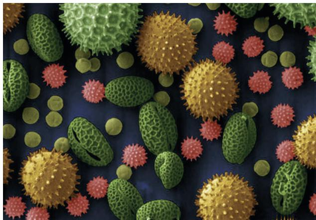  
This colorized SEM shows pollen grains from six plant species. Explain how a pollen grain forms, how it functions, and how pollen grains contributed to the dominance of angiosperms and other seed plants.

## Practice Applying Your Learning

11. This question assesses your ability to apply your understanding of double fertilization in general and to some specific examples.

A few plant species, including papaya (Carica papaya), produce separate male and female individuals (sporophytes) in which the males have an XY (2n) genotype, and the females have an XX (2n) genotype. The following questions assess your ability to apply your understanding of double fertilization in angiosperms, both in general and in this special case.

Use this information as well as your general knowledge of angiosperm reproduction to evaluate each statement as more likely to be TRUE or more likely to be FALSE.

a. In general, during double fertilization in angiosperms, two sperm (n) fertilize the egg (n). \_\_\_\_

b. Prior to double fertilization, the sperm (n) divides, forming two identical sperm cells (n). \_\_\_\_

c. The generative cell $(n)$ divides by mitosis to form two sperm $(n)$ .

d. A pollen grain (n) is a microspore (n).

e. Male gametophytes are diploid (2n), and sperm cells are haploid (n). \_\_\_\_

f. CHALLENGE In the case of species such as papaya that have XX (2n) and XY (2n) individuals, one possible outcome following double fertilization is an XY (2n) embryo and a XYY (3n) endosperm. \_\_\_\_

g. CHALLENGE Hypothetically, if the microsporocyte of an XX (2n) individual did not undergo meiosis but instead produced microspores by mitosis, the result would be a seed with an XXX (3n) embryo and an XXXX (4n) endosperm. \_\_\_\_

# Plant Responses to Internal and External Signals

## Key Concepts

39.1 Signal transduction pathways link signal reception to response

39.2 Plants use chemicals to communicate

39.3 Responses to light are critical for plant success

39.4 Plants respond to a wide variety of stimuli other than light

39.5 Plants respond to attacks by pathogens and herbivores

## Study Tip

Make a table: As you read the chapter, add specific examples for each of the general categories of responses shown in the diagram.

<table><tr><td>Factor</td><td>Example of plant response</td></tr><tr><td>Light</td><td>Seed germination in response to red light</td></tr><tr><td></td><td></td></tr><tr><td></td><td></td></tr></table>

  
Figure 39.1 Sunflowers track the sun from east to west each day. After sunset, they reverse direction, facing the direction of the next sunrise. By facing the hot sun during the day, the floral heads become warmer and release greater amounts of chemicals that attract pollinators. Light is just one of the many factors to which a plant responds.

# Concept 39.1: Signal transduction pathways link signal reception to response

The idea that plants are inert or passive is a common misconception. Like all organisms, plants must sense and integrate information concerning the many fluctuating variables in their environments (Figure 39.1). Although plant development is simpler than the development of multicellular animals, plant cells are just as complex as animal cells (see Figure 6.8). The molecular biology of plants is as complicated as that of animals: New Caledonian fern (Tmesipteris oblanceolata) currently has the largest genome on record, about fifty times greater than the human genome. Plants have among the largest genomes (see Table 21.1). At the levels of signal reception and signal transduction, your cells are not all that different from those of plants—the similarities far outweigh the differences. As an animal, however, your responses to environmental stimuli are generally quite different from those of plants. Animals commonly respond by movement; plants do so by altering growth and development.

As an example of a plant modifying its growth and development in response to environmental cues, consider a forgotten potato in the back corner of a kitchen cupboard. This modified underground stem, or tuber, has sprouted shoots from its “eyes” (axillary buds). These shoots, however, scarcely resemble those of a typical plant. Instead of sturdy stems and broad green leaves, this plant has ghostly pale stems and unexpanded leaves, as well as short, stubby roots (Figure 39.2a). These physical adaptations for growing in darkness, collectively referred to as etiolation, make sense if we consider that a young potato plant in nature usually encounters continuous darkness when sprouting underground. Under these circumstances, expanded leaves would be a hindrance to soil penetration and would be damaged as the shoots pushed through the soil. Because the leaves are unexpanded and underground, there is little evaporative loss of water and little requirement for an extensive root system to replace the water lost by transpiration. Moreover, the energy expended in producing green chlorophyll would be wasted because there is no light for photosynthesis. Instead, a potato plant growing in the dark allocates as much energy as possible to elongating its stems. This adaptation enables the shoots to break ground before the nutrient reserves in the tuber are exhausted. The etiolation response is one example of how a plant’s physical characteristics are tuned to its surroundings by complex interactions between environmental and internal signals.

## Interview

Interview with Ernesto Gianoli: A plant mimic alters its growth, hiding it from herbivores (at the start of Unit 6, before Chapter 35)

  
Figure 39.3 Review of a general model for signal transduction pathways.

Figure 39.2 Light-induced de-etiolation (greening) of dark-grown potatoes.

(a) Before exposure to light. A dark-grown potato has tall, spindly stems and nonexpanded leaves—morphological adaptations that enable the shoots to penetrate the soil. The roots are short, but there is little need for water absorption because little water is lost by the shoots.

(b) After a week's exposure to natural daylight. The potato plant begins to resemble a typical plant with broad green leaves, short sturdy stems, and long roots. This transformation begins with the reception of light by a specific pigment, phytochrome.

When a shoot reaches light, the plant undergoes profound changes, collectively called de-etiolation (informally known as greening). Stem elongation slows; leaves expand; roots elongate; and the shoot produces chlorophyll. In short, it begins to resemble a typical plant (Figure 39.2b). In this section, we'll examine this de-etiolation response as an example of how a plant cell's reception of a signal—in this case, light—is transduced into a response (greening). Along the way, we will explore how studies of mutants provide insights into the molecular details of the stages of cell signal processing: reception, transduction, and response (Figure 39.3).

As discussed in Concept 11.1, a hormone or other kind of stimulus interacting with a specific receptor protein can trigger the sequential activation of relay proteins and also the production of second messengers that participate in the pathway. The signal is passed along, ultimately bringing about cellular responses. In this diagram, the receptor is on the surface of the target cell; in other cases, the stimulus interacts with receptors inside the cell.

  
Hormone or environmental stimulus

## Reception

Signals are first detected by receptors, proteins that undergo changes in shape in response to a specific stimulus. The receptor involved in de-etiolation is a type of phytochrome, a member of a class of photoreceptors that we'll explore more fully later in the chapter. Unlike most receptors, which are built into the plasma membrane, the type of phytochrome that functions in de-etiolation is located in the cytoplasm. Researchers demonstrated the requirement for phytochrome in de-etiolation through studies of the tomato, a close relative of the potato. The aurea mutant of tomato, which has reduced levels of phytochrome, greens less than wild-type tomatoes when exposed to light. (Aurea is Latin for “gold.” In the absence of chlorophyll, the yellow and orange accessory pigments called carotenoids are more obvious.) Researchers produced a normal de-etiolation response in individual aurea leaf cells by injecting phytochrome from other plants and then exposing the cells to light. Such experiments indicated that phytochrome functions in light detection during de-etiolation.

## Transduction

Receptors can be sensitive to very weak environmental or chemical signals. Some de-etiolation responses are triggered by extremely low levels of light, in certain cases as little as the equivalent of a few seconds of moonlight. The transduction of these extremely weak signals involves second messengers—small molecules and ions in the cell that amplify the signal and transfer it from the receptor to other proteins that carry out the response (Figure 39.4). Concept 11.3 discussed several kinds of second messengers (see Figures 11.12 and 11.14). Here, we examine the particular roles of two types of second messengers in de-etiolation: calcium ions ( $Ca^{2+}$ ) and cyclic GMP (cGMP).

Changes in cytosolic $Ca^{2+}$ levels play an important role in phytochrome signal transduction. The concentration of cytosolic $Ca^{2+}$ is generally very low (about $10^{-7}M$ ), but phytochrome activation leads to the opening of $Ca^{2+}$ channels and a transient 100-fold increase in cytosolic $Ca^{2+}$ levels. In response to light, phytochrome undergoes a change in shape that leads to the

Figure 39.4 An example of signal transduction in plants: the role of phytochrome in the de-etiolation (greening) response.  
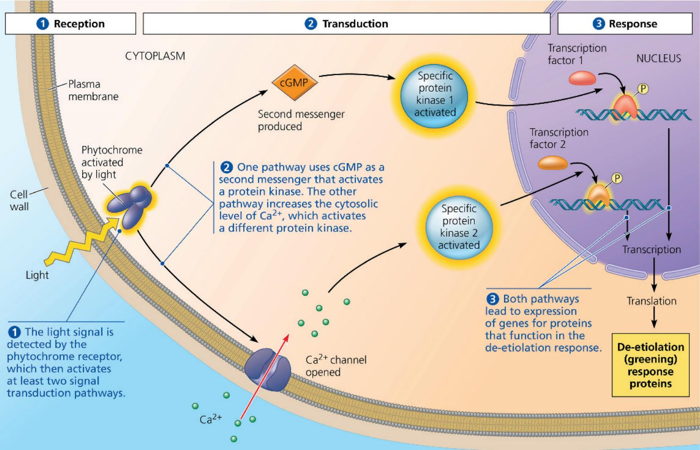  
MAKE CONNECTIONS Which panel in Figure 11.17 best exemplifies the phytochrome-dependent signal transduction pathway during de-etiolation? Explain.  
For suggested answer, see Appendix A.

activation of guanylyl cyclase, an enzyme that produces the second messenger cyclic GMP. Both $Ca^{2+}$ and cGMP must be produced for a complete de-etiolation response. The injection of cGMP into aurea tomato leaf cells, for example, induces only a partial de-etiolation response.

## Response

Ultimately, second messengers regulate one or more cellular activities. In most cases, these responses involve the increased activity of particular enzymes. There are two main mechanisms by which a signaling pathway can enhance an enzymatic step in a biochemical pathway: transcriptional regulation and post-translational modification. Transcriptional regulation increases or decreases the synthesis of mRNA encoding a specific enzyme. Post-translational modification activates preexisting enzymes.

## Post-translational Modification of Preexisting Proteins

In most signal transduction pathways, preexisting proteins are modified by the phosphorylation of specific amino acids, which alters the protein's hydrophobicity and activity. Many second messengers, including cGMP and $\mathrm{Ca^{2+}}$ , activate protein kinases directly. Often, one protein kinase will phosphorylate another protein kinase, which then phosphorylates another, and so on (see Figure 11.10). Such kinase cascades may link initial stimuli to responses at the level of gene expression, usually via the phosphorylation of transcription factors. As we'll see soon, many signal transduction pathways ultimately regulate the synthesis of new proteins by turning specific genes on or off.

Signal transduction pathways must also have a means for turning off when the initial signal is no longer present, such as when a sprouting potato is put back into the cupboard. Protein phosphatases, which are enzymes that dephosphorylate specific proteins, are important in these “switch-off” processes. At any particular moment, a cell’s functioning depends on the balance of activity of many types of protein kinases and protein phosphatases.

## Transcriptional Regulation

As discussed in Concept 18.2, the proteins we call specific transcription factors bind to specific regions of DNA and control the transcription of specific genes (see Figure 18.10). In the case of phytochrome-induced de-etiolation, several such transcription factors are activated by phosphorylation in response to the appropriate light conditions. The activation of some of these transcription factors depends on their phosphorylation by protein kinases activated by cGMP or $Ca^{2+}$ .

The mechanism by which a signal promotes developmental changes may depend on transcription factors that are activators (which increase transcription of specific genes) or repressors (which decrease transcription) or both. For example, some Arabidopsis mutants, except for their pale color, have a light-grown appearance when grown in the dark; they have expanded leaves and short, sturdy stems but are not green because the final step in chlorophyll production requires light directly. These mutants have defects in a repressor that normally inhibits the expression of other genes that are activated by light. When the repressor is eliminated by mutation, the pathway that is normally blocked proceeds. Thus, these mutants appear to have been grown in the light, except for their pale color.

## De-etiolation (“Greening”) Proteins

What types of proteins are either activated by phosphorylation or newly transcribed during the de-etiolation process? Many are enzymes that function in photosynthesis directly; others are enzymes involved in supplying the chemical precursors necessary for chlorophyll production; still others affect the levels of plant hormones that regulate growth. For example, the levels of auxin and brassinosteroids, hormones that enhance stem elongation, decrease following the activation of phytochrome. That decrease explains the slowing of stem elongation that accompanies de-etiolation.

We have examined the signal transduction involved in the de-etiolation response of a potato plant in some detail to get a sense of the complexity of biochemical changes that underlie this one process. Every plant hormone and environmental stimulus will trigger one or more signal transduction pathways of comparable complexity. As in the studies on the aurea mutant tomato, the isolation of mutants (a genetic approach) and techniques of molecular biology are helping researchers identify these various pathways.

## Concept Check 39.1

1. What are the physical differences between dark- and light-grown plants? Explain how etiolation helps a seedling compete successfully.

2. Cycloheximide is a drug that inhibits protein synthesis. Predict what effect cycloheximide would have on de-etiolation.

3. WHAT IF? The sexual dysfunction drug Viagra inhibits an enzyme that breaks down cyclic GMP. If tomato leaf cells have a similar enzyme, would applying Viagra to these cells cause a normal de-etiolation of aurea mutant tomato leaves?

For suggested answers, see Appendix A.

## Concept 39.2: Plants use chemicals to communicate

As we have seen, plants sense their local environmental conditions using signal transduction pathways no less complicated than those used by animals. The activation of signal transduction pathways often changes the activity of enzymes and therefore the production of chemicals. Plants use chemicals to communicate

with the living world, as in the example of those released by the sunflowers in Figure 39.1. Plants also use chemicals for communicating between different parts of the plant, thereby optimizing the response of the whole organism. Chemical communication within plants is an exploding field of research. The discovery of new mobile information molecules, such as hundreds of small RNAs and dozens of small peptides, will keep researchers busy for decades. It has also been discovered that plants have an attribute that animals do not: The cytoplasmic bridges between plant cells (plasmodesmata), unlike the analogous structures in animals (gap junctions), can dilate enough that macromolecules such as proteins can move from cell to cell. This recent research builds on a long history of classic experiments that provided the first clues that mobile signaling molecules called hormones are internal regulators of plant growth.

## General Characteristics of Plant Hormones

A hormone, in the original meaning of the term, is a signaling molecule that is produced in low concentrations by one part of an organism's body and transported to other parts, where it binds to a specific receptor and triggers responses in target cells and tissues. In animals, hormones are usually transported through the circulatory system, a criterion often included in definitions of the term. Many modern plant biologists, however, argue that the hormone concept, which originated from studies of animals, is too limiting to describe plant physiological processes. For example, plants don't have circulating blood to transport hormone-like signaling molecules. Moreover, some signaling molecules that are considered plant hormones act only locally. Finally, there are some signaling molecules in plants, such as glucose, that typically occur in plants at concentrations thousands of times greater than a typical hormone. Nevertheless, they activate signal transduction pathways that greatly alter the functioning of plants in a manner similar to a hormone. Thus, many plant biologists prefer the broader term plant growth regulator to describe organic compounds, either natural or synthetic, that modify or control one or more specific physiological processes within a plant. The terms plant hormone and plant growth regulator are used about equally, but for historical continuity this text will use the term plant hormone and adhere to the criterion that plant hormones are active at very low concentrations.

Table 39.1 Overview of Plant Hormones

<table><tr><td>Hormone</td><td>Where Produced or Found in Plant</td><td>Major Functions</td></tr><tr><td>Auxin (IAA)</td><td>Shoot apical meristems and young leaves are the primary sites of auxin synthesis. Root apical meristems also produce auxin, although the root depends on the shoot for much of its auxin. Developing seeds and fruits contain high levels of auxin, but it is unclear whether it is newly synthesized or transported from maternal tissues.</td><td>Stimulates stem elongation (low concentration only); promotes the formation of lateral and adventitious roots; regulates development of fruit; enhances apical dominance; functions in phototropism and gravitropism; promotes vascular differentiation; retards leaf abscission</td></tr><tr><td>Cytokinins</td><td>These are synthesized primarily in roots and transported to other organs, although there are many minor sites of production as well.</td><td>Regulate cell division in shoots and roots; modify apical dominance and promote lateral bud growth; promote movement of nutrients into sink tissues; stimulate seed germination; delay leaf senescence</td></tr><tr><td>Gibberellins (GA)</td><td>Meristems of apical buds and roots, young leaves, and developing seeds are the primary sites of production.</td><td>Stimulate stem elongation, pollen development, pollen tube growth, fruit growth, and seed development and germination; regulate sex determination and the transition from juvenile to adult phases</td></tr><tr><td>Abscisic acid (ABA)</td><td>Almost all plant cells have the ability to synthesize abscisic acid, and its presence has been detected in every major organ and living tissue; it may be transported in the phloem or xylem.</td><td>Inhibits growth; promotes stomatal closure during drought stress; promotes seed dormancy and inhibits early germination; promotes leaf senescence; promotes desiccation tolerance</td></tr><tr><td>Ethylene</td><td>This gaseous hormone can be produced by most parts of the plant. It is produced in high concentrations during senescence, leaf abscission, and the ripening of some types of fruits. Synthesis is also stimulated by wounding and stress.</td><td>Promotes ripening of many types of fruit, leaf abscission, and the triple response in seedlings (inhibition of stem elongation, promotion of lateral expansion, and horizontal growth); enhances the rate of senescence; promotes root and root hair formation; promotes flowering in the pineapple family</td></tr><tr><td>Brassinosteroids</td><td>These compounds are present in all plant tissues, although different intermediates predominate in different organs. Internally produced brassinosteroids act near the site of synthesis.</td><td>Promote cell expansion and cell division in shoots; promote root growth at low concentrations; inhibit root growth at high concentrations; promote xylem differentiation and inhibit phloem differentiation; promote seed germination and pollen tube elongation</td></tr><tr><td>Jasmonates</td><td>These are a small group of related molecules derived from the fatty acid linolenic acid. They are produced in several parts of the plant and travel in the phloem to other parts of the plant.</td><td>Regulate a wide variety of functions, including fruit ripening, floral development, pollen production, tendril coiling, root growth, seed germination, and nectar secretion; also produced in response to herbivory and pathogen invasion</td></tr><tr><td>Strigolactones</td><td>These carotenoid-derived hormones and extracellular signals are produced in roots in response to low phosphate conditions or high auxin flow from the shoot.</td><td>Promote seed germination, control of apical dominance, and the attraction of mycorrhizal fungi to the root</td></tr></table>

Although plant hormones are produced in very low concentrations, a tiny amount of hormone can have a profound effect on plant growth and development. Virtually every aspect of plant growth and development is under hormonal control to some degree. Each hormone has multiple effects, depending on its site of action, its concentration, and the developmental stage of the plant. Conversely, multiple hormones can influence a single process. Plant hormone responses commonly depend on both the amounts of the hormones involved and their relative concentrations. It is often the interactions between different hormones, rather than hormones acting in isolation, that control growth and development. These interactions will become apparent in the following survey of hormone function.

## A Survey of Plant Hormones

Table 39.1, on the facing page, previews the major types and actions of plant hormones, including auxin, cytokinins, gibberellins, abscisic acid, ethylene, brassinosteroids, jasmonates, and strigolactones.

## Auxin

The idea that chemical messengers exist in plants emerged from a series of classic experiments on how stems respond to light. As you know, the shoot of a houseplant on a windowsill grows toward light. Any growth response that results in plant organs curving toward or away from stimuli is called a tropism (from the Greek tropos, turn). The growth of a shoot toward light or away from it is called phototropism; the former is positive phototropism, and the latter is negative phototropism.

In natural ecosystems, where plants may be crowded, phototropism directs shoot growth toward the sunlight that powers photosynthesis. This response results from a differential growth of cells on opposite sides of the shoot; the cells on the darker side elongate faster than the cells on the brighter side.

Charles Darwin and his son Francis conducted some of the earliest experiments on phototropism in the late 1800s (Figure 39.5). They observed that a grass seedling ensheathed in its coleoptile (see Figure 38.9b) could bend toward light only if the tip of the coleoptile was present. If the tip was removed, the coleoptile did not curve. The seedling also failed to grow toward light if the tip was covered with an opaque cap, but neither a transparent cap over the tip nor an opaque shield placed below the coleoptile tip prevented the phototropic response. It was the tip of the coleoptile, the Darwins concluded, that was responsible

## Figure 39.5

# Inquiry: What part of a grass coleoptile senses light, and how is the signal transmitted?

## Experiment

In 1880, Charles and Francis Darwin removed and covered parts of grass coleoptiles to determine what part senses light. In 1913, Peter Boysen-Jensen separated coleoptiles with different materials to determine how the signal for phototropism is transmitted.

## Results

  
Data from C. R. Darwin, The Power of Movement in Plants, John Murray (1880). P. Boysen-Jensen, Concerning the performance of phototropic stimuli on the Avenacoleoptile, Berichte der Deutschen Botanischen Gesellschaft (Reports of the German Botanical Society) 31:559–566 (1913).

## Conclusion

The Darwins' experiment suggested that only the tip of the coleoptile senses light. The phototropic bending, however, occurred at a distance from the site of light perception (the tip). Boysen-Jensen's results suggested that the signal for the bending is a light-activated mobile chemical.

WHAT IF? How could you experimentally determine which colors of light cause the most phototropic bending?
For suggested answer, see Appendix A.

for sensing light. However, they noted that the differential growth response that led to curvature of the coleoptile occurred some distance below the tip. The Darwins postulated that some signal was transmitted downward from the tip to the elongating region of the coleoptile. A few decades later, the Danish scientist Peter Boysen-Jensen demonstrated that the signal was a mobile chemical substance. He separated the tip from the remainder of the coleoptile by a cube of gelatin, which prevented cellular contact but allowed chemicals to pass through. These seedlings responded normally, bending toward light. However, if the tip was experimentally separated from the lower coleoptile by an impermeable barrier, such as the mineral mica, no phototropic response occurred.

Subsequent research showed that a chemical was released from coleoptile tips and could be collected by means of diffusion into agar blocks. Little cubes of agar containing this chemical could induce “phototropic-like” curvatures even in complete darkness if the agar cubes were placed off-center atop the cut surface of decapitated coleoptiles. Coleoptiles curve toward light because of a higher concentration of this growth-promoting chemical on the darker side of the coleoptile. Since this chemical stimulated growth as it passed down the coleoptile, it was dubbed “auxin” (from the Greek auxein, to increase). Auxin was later purified, and its chemical structure determined to be indoleacetic acid (IAA). The term auxin is used for any chemical, synthetic or not, that promotes coleoptile elongation. The major natural auxin in plants is IAA, which has many additional effects. Unless noted otherwise, the terms auxin and IAA will be used interchangeably.

Auxin is produced predominantly in shoot tips and is transported from cell to cell down the stem at a rate of about 1 cm/hr. It moves only from tip to base, not in the reverse direction. This unidirectional transport of auxin is called polar transport. Polar transport is unrelated to gravity; experiments have shown that auxin travels upward when a stem or coleoptile segment is placed upside down. Rather, the polarity of auxin movement is attributable to the polar distribution of auxin transport protein in the cells. Concentrated at the basal end of a cell, the auxin transporters move the hormone out of the cell. The auxin can then enter the apical end of the neighboring cell (Figure 39.6). Auxin has a variety of effects, including stimulating cell elongation and regulating plant architecture.

## The Role of Auxin in Cell Elongation

One of auxin's chief functions is to stimulate elongation of cells within young developing shoots. As auxin from the shoot tip (see Figure 35.16) moves down to the region where cells are elongating, the hormone stimulates cell growth by binding to a receptor in the nucleus. Auxin stimulates growth only over a certain concentration range, from about $10^{-8}$ to $10^{-4}M$ . At higher concentrations, auxin may inhibit cell elongation by inducing production of ethylene, a hormone that generally hinders growth. We will return to this hormonal interaction when we look at ethylene.

According to a model called the acid growth hypothesis, proton pumps play a major role in the growth response of cells to auxin. In a shoot's region of elongation, auxin stimulates the plasma membrane's proton (H $^{+}$ ) pumps. This pumping of H $^{+}$ increases the voltage across the membrane (membrane potential) and lowers the

## Figure 39.6

## Inquiry: What causes polar movement of auxin from shoot tip to base?

## Experiment

To investigate how auxin is transported unidirectionally, Leo Gälweiler and colleagues designed an experiment to identify the location of the auxin transport protein. They used a greenish yellow fluorescent molecule to label antibodies that bind to the auxin transport protein. Then they applied the antibodies to longitudinally sectioned Arabidopsis stems.

## Results

The light micrograph on the left shows that auxin transport proteins are not found in all stem tissues, but only in the xylem parenchyma. In the light micrograph on the right, a higher magnification reveals that these proteins are primarily localized at the basal ends of the cells.

Data from L. Gälweiler et al., Regulation of polar auxin transport by AtPIN1 in Arabidopsis vascular tissue, Science 282:2226–2230 (1998).

## Conclusion

The results support the hypothesis that concentration of the auxin transport protein at the basal ends of cells mediates the polar transport of auxin.

WHAT IF? If auxin transport proteins were equally distributed at both ends of the cells, would polar auxin transport still be possible? Explain.

For suggested answer, see Appendix A.

pH in the cell wall within minutes. Acidification of the wall activates proteins called expansins that break the cross-links (hydrogen bonds) between cellulose microfibrils and other cell wall constituents, loosening the wall's fabric (Figure 39.7). Increasing the membrane potential enhances ion uptake into the cell, which causes osmotic uptake of water and increased turgor. Increased turgor and increased cell wall plasticity enable the cell to elongate.

1 Auxin increases the activity of proton pumps, which pump H $^{+}$ from the cytoplasm. The H $^{+}$ reduces the pH of the cell wall.

The cell expands in a direction mainly perpendicular to the main orientation of the microfibrils in the cell wall (see Figure 35.28).

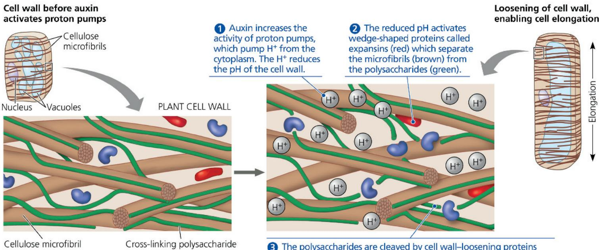  
3 The polysaccharides are cleaved by cell wall-loosening proteins (purple). This process loosens the microfibrils, making the cell wall more flexible. Water uptake and increased turgor then cause the cell to elongate. At the same time, more microfibrils (not shown) are formed.

Auxin also rapidly alters gene expression, causing cells in the region of elongation to produce new proteins within minutes. Some of these proteins are short-lived transcription factors that repress or activate the expression of other genes. For sustained growth after this initial spurt, cells must make more cytoplasm and wall material. In addition, auxin stimulates this sustained growth response.

## Auxin's Role in Plant Development

The polar transport of auxin plays a major role in controlling the spatial organization, or pattern formation, of a plant. The auxin synthesized in the shoot tips of a branch carries information about the growth potential of that branch. If a branch finds itself in an environment conducive for growth, it produces more auxin, and the plant diverts more resources to that branch. A reduced flow of auxin from a branch indicates that the branch is not being sufficiently productive: New branches are needed elsewhere. Thus, lateral buds below the branch are released from dormancy and begin to grow.

The transport of auxin also plays a key role in establishing the pattern of leaf emergence from the shoot apical meristem (see Figure 36.3). A leading model proposes that polar auxin transport in the shoot tip generates local peaks in auxin concentration that determine the site of leaf primordium formation and thereby the different leaf arrangements found in nature.

The polar transport of auxin from the leaf margin also directs the patterns of leaf veins. Inhibitors of polar auxin transport result in leaves that lack vascular continuity through the petiole and have broad, loosely organized main veins, an increased number of secondary veins, and a dense band of irregularly shaped vascular cells adjacent to the leaf margin.

The activity of the vascular cambium, the meristem that produces woody tissues, is also under the control of auxin transport. When a plant becomes dormant at the end of a growing season, there is a reduction in auxin transport capacity and the expression of genes encoding auxin transporters.

Auxin's effects on plant development are not limited to the familiar sporophyte plant that we see. Recent evidence suggests that the organization of the microscopic angiosperm female gametophytes is regulated by an auxin gradient.

## Practical Uses for Auxins

Auxins, both natural and synthetic, have many commercial applications. For example, the natural auxin indolebutyric acid (IBA) is used in the vegetative propagation of plants by cuttings. Treating a detached leaf or stem with powder containing IBA often causes adventitious roots to form near the cut surface.

Certain synthetic auxins are widely used as herbicides, including 2,4-dichlorophenoxyacetic acid (2,4-D). Monocots, such as maize and turfgrass, can rapidly inactivate such synthetic auxins. However, eudicots cannot and therefore die from hormonal overdose. Spraying cereal fields or turf with 2,4-D eliminates eudicot (broadleaf) weeds.

Developing seeds produce auxin, which promotes fruit growth. In tomato plants grown in greenhouses, often fewer seeds are produced, resulting in poorly developed tomato fruits. However, spraying synthetic auxins on greenhouse-grown tomato vines induces normal fruit development, making the greenhouse-cultivated tomatoes commercially viable.

## Cytokinins

Trial-and-error attempts to find chemical additives that would enhance the growth and development of plant cells in tissue culture led to the discovery of cytokinins. In the 1940s, researchers stimulated the growth of plant embryos in culture by adding coconut milk, the liquid endosperm of a coconut's giant seed. Subsequent researchers found that they could induce cultured tobacco cells to divide by adding degraded DNA samples. The active ingredients of both experimental additives were modified forms of adenine, a component of nucleic acids. These growth regulators were named cytokinins because they stimulate cytokinesis, or cell division. The most common natural cytokinin is zeatin, so named because it was discovered first in maize (Zea mays). Cytokinins influence cell division, cell differentiation, and apical dominance.

## Control of Cell Division and Differentiation

Cytokinins are produced in actively growing tissues, particularly in roots, embryos, and fruits. Cytokinins produced in roots reach their target tissues by moving up the plant in the xylem sap. Acting in concert with auxin, cytokinins stimulate cell division and influence the pathway of differentiation. The effects of cytokinins on cells growing in tissue culture provide clues about how this class of hormones may function in an intact plant. When a piece of parenchyma tissue from a stem is cultured in the absence of cytokinins, the cells grow very large but do not undergo mitosis. But if cytokinins are added along with auxin, the cells divide. Cytokinins alone have no effect. The ratio of cytokinins to auxin controls cell differentiation. When the concentrations of these two hormones are at certain levels, the mass of cells continues to grow, but it remains a cluster of undifferentiated cells called a callus (see Figure 38.15). If cytokinin

intact plant, auxin transported down the shoot from the apical bud indirectly inhibits axillary buds from growing, causing a shoot to lengthen at the expense of lateral branching. The polar flow of auxin down the shoot triggers the synthesis of strigolactones, which directly repress bud growth. Meanwhile, cytokinins entering the shoot system from roots counter the action of auxin and strigolactones by signaling axillary buds to begin growing. Thus, in an intact plant, the cytokinin-rich axillary buds closer to the base of the plant tend to be longer than the auxin-rich axillary buds closer to the apical bud. Mutants that overproduce cytokinins or plants treated with cytokinins tend to be bushier than normal.

Removing the apical bud, a major site of auxin biosynthesis, causes the auxin and strigolactone levels in the stem to wane, particularly in those regions close to the cut surface (see Figure 39.8). This causes the axillary buds closest to the cut surface to grow most vigorously, and one of these axillary buds will eventually take over as the new apical bud. Applying auxin to the cut surface of the shoot tip resuppresses the growth of the lateral buds.

## Anti-aging Effects

Cytokinins slow the aging of certain plant organs by inhibiting protein breakdown, stimulating RNA and protein synthesis, and mobilizing nutrients from surrounding tissues. If leaves removed from a plant are dipped in a cytokinin solution, they stay green much longer than otherwise.

## Gibberellins

In the early 1900s, farmers in Asia noticed that some rice seedlings in their paddies grew so tall and spindly that they toppled over before they could mature. In 1926, it was discovered that levels increase, shoot buds develop from the callus. If auxin levels increase, roots form.

## Control of Apical Dominance

Figure 39.8 Effects on apical dominance of removing the apical bud.

Apical dominance refers to the inhibition of the growth of axillary buds by the apical bud of a plant shoot. Removal of the apical bud enables lateral branches to grow. Multiple hormones play a role in this process, including auxin, cytokinin, and strigolactones.

Apical dominance, the ability of the apical bud to suppress the development of axillary buds, is under the control of sugar and various plant hormones, including auxin, cytokinins, and strigolactones. The sugar demand of the shoot tip is critical for maintaining apical dominance. Cutting off the apical bud removes apical sugar demand and rapidly increases sugar (sucrose) availability to axillary buds. This increase of sugar is sufficient to initiate bud release. However, not all of the buds grow equally: Usually only one of the axillary buds closest to the cut surface will take over as the new apical bud.

Three plant hormones—auxin, cytokinins, and strigolactones—play a role in determining the extent to which specific axillary buds elongate (Figure 39.8). In an

The apical bud is a preferred sugar sink and a major site of auxin biosynthesis.

Auxin moving downward from the apical bud produces strigolactones that repress the growth of axillary buds.

Cytokinin coming from the root antagonizes the actions of auxin and strigolactone, allowing for a limited amount of axillary bud growth. Therefore, the axillary buds farthest from the apex are increasingly elongated.

Removal of the apical bud allows remaining buds to receive more sugars for growth. Auxin and strigolactone levels also decline, particularly near the cut surface. This decline allows the topmost axillary buds in particular to grow and take over as the new apical bud.

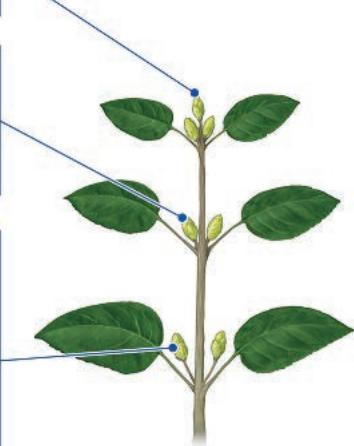  
Plant with apical bud intact

  
Plant with apical bud removed

a fungus of the genus Gibberella causes this “foolish seedling disease.” By the 1930s, it was determined that the fungus causes hyperelongation of rice stems by secreting a chemical, which was given the name gibberellin, or gibberellic acid. In the 1950s, researchers discovered that plants also produce gibberellins. Since that time, scientists have identified more than 100 different gibberellins that occur naturally in plants, although a much smaller number occur in each plant species. “Foolish rice” seedlings, it seems, suffer from too much gibberellin. Gibberellins have a variety of effects, such as stem elongation, fruit growth, and seed germination.

## Stem Elongation

The major sites of gibberellin production are young roots and leaves. Gibberellins are best known for stimulating stem and leaf growth by enhancing cell elongation and cell division. One hypothesis proposes that they activate enzymes that loosen cell walls, facilitating entry of expansin proteins. Thus, gibberellins act in concert with auxin to promote stem elongation.

The effects of gibberellins in enhancing stem elongation are ident when certain dwarf (mutant) varieties of plants are treated with gibberellins. For instance, some dwarf pea plants (including the variety Mendel studied; see Concept 14.1) grow tall if treated with gibberellins. But there is often no response if the gibberellins are applied to wild-type plants. Apparently, these plants already produce an optimal dose of the hormone. The most dramatic example of gibberellin-induced stem elongation is bolting, rapid growth of the floral stalk (Figure 39.9a).

Figure 39.9 Effects of gibberellins on stem elongation and fruit growth.

  
(b) The Thompson seedless grape bunch on the left is from an untreated control vine. The bunch on the right is growing from a vine that was sprayed with gibberellin during fruit development.

(a) Some plants develop in a rosette form, low to the ground with very short internodes, as in the Arabidopsis plant shown at the left. As the plant switches to reproductive growth, a surge of gibberellins induces bolting: Internodes elongate rapidly, elevating floral buds that develop at stem tips (right).

light or low temperatures, break dormancy if they are treated with gibberellins. Gibberellins support the growth of cereal seedlings by stimulating the synthesis of digestive enzymes such as $\alpha$ -amylase that mobilize stored nutrients (Figure 39.10).

## Fruit Growth

In many plants, both auxin and gibberellins must be present for fruit to develop. The most important commercial application of gibberellins is in the spraying of Thompson seedless grapes (Figure 39.9b). The hormone makes the individual grapes grow larger, a trait valued by the consumer. The gibberellin sprays also make the internodes of the grape bunch elongate, allowing more space for the individual grapes. By enhancing air circulation between the grapes, this increase in space also makes it harder for yeasts and other microorganisms to infect the fruit.

## Germination

The embryo of a seed is a rich source of gibberellins. After water is imbibed, the release of gibberellins from the embryo signals the seed to break dormancy and germinate. Some seeds that normally require particular environmental conditions to germinate, such as exposure to

Figure 39.10 Mobilization of nutrients by gibberellins during the germination of grain seeds such as barley.

1 After a seed imbibes water, the embryo releases gibberellin (GA), which sends a signal to the aleurone, the thin outer layer of the endosperm.

② The aleurone responds to GA by synthesizing and secreting digestive enzymes that hydrolyze nutrients stored in the endosperm. One example is α-amylase, which hydrolyzes starch into sugars.

③ Sugars and other nutrients absorbed from the endosperm by the scutellum (cotyledon) are consumed during growth of the embryo into a seedling.

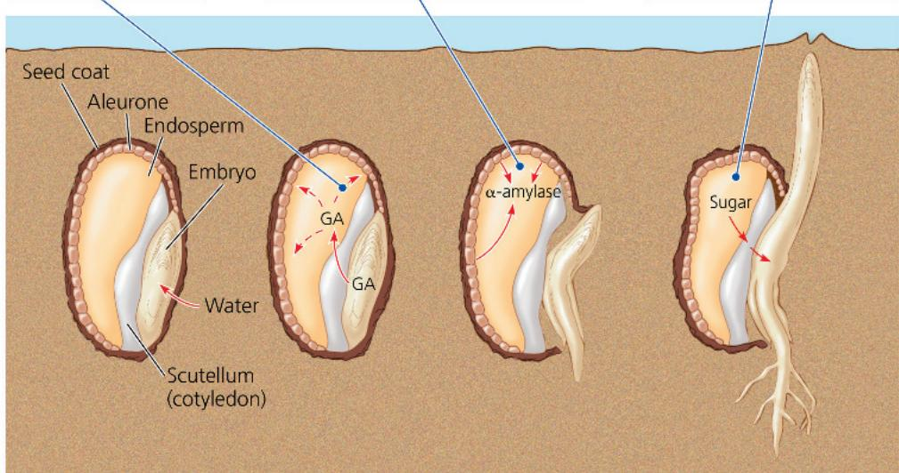

## Abscisic Acid

In the 1960s, one research group studying the chemical changes that precede bud dormancy and leaf abscission in deciduous trees and another team investigating chemical changes preceding abscission of cotton fruits isolated the same compound, abscisic acid (ABA). Ironically, ABA is no longer thought to play a primary role in leaf abscission, but it is very important in other functions. Unlike the growth-stimulating hormones discussed so far—auxin, cytokinins, gibberellins, and brassinosteroids—ABA slows growth. ABA often antagonizes the actions of growth hormones, and the ratio of ABA to one or more growth hormones determines the final physiological outcome. We will consider here two of ABA's many effects: seed dormancy and drought tolerance.

## Seed Dormancy

Seed dormancy increases the likelihood that seeds will germinate only when there are sufficient amounts of light, temperature, and moisture for the seedlings to survive (see Concept 38.1). What prevents seeds dispersed in autumn from germinating immediately, only to die in the winter? What mechanisms ensure that such seeds do not germinate until spring? For that matter, what prevents seeds from germinating in the dark, moist interior of the fruit? The answer to these questions is ABA. The levels of ABA may increase 100-fold during seed maturation. The high levels of ABA in maturing seeds inhibit germination and induce the production of proteins that help the seeds withstand the extreme dehydration that accompanies maturation.

Many types of dormant seeds germinate when ABA is removed or inactivated. The seeds of some desert plants break dormancy only when heavy rains wash ABA out of them. Other seeds require light or prolonged exposure to cold to inactivate ABA. Often, the ratio of ABA to gibberellins determines whether seeds remain dormant or germinate, and adding ABA to seeds that are primed to germinate makes them dormant again. Inactivated ABA or low levels of ABA can lead to precocious (early) germination (Figure 39.11). For example, a maize mutant with grains that germinate while still on the cob lacks a functional transcription factor required for ABA to induce expression of certain genes. Precocious germination of red mangrove seeds, due to low ABA levels, is actually an adaptation that helps the young seedlings to plant themselves like darts in the soft mud below the parent tree.

## Drought Tolerance

ABA plays a major role in drought signaling. When a plant begins to wilt, ABA accumulates in the leaves and causes stomata to close rapidly, reducing transpiration and preventing further water loss. By affecting second messengers such as calcium, ABA causes potassium channels in the plasma membrane of guard cells to open, leading to a massive loss of potassium ions from the cells. The accompanying osmotic loss of water reduces guard cell turgor and leads to closing of the stomatal pores (see Figure 36.14). In some cases, water shortage stresses the root system before the

Figure 39.11 Precocious germination of wild-type mangrove and mutant maize seeds.

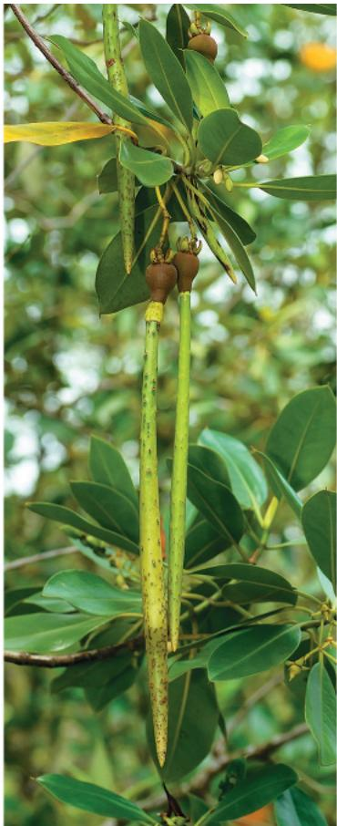

  
▲ Precocious germination in this maize mutant is caused by lack of a functional transcription factor required for ABA action.

▲ Spotted mangrove (Rhizophora stylosa) seeds produce only low levels of ABA, and the seeds germinate while still on the tree. In this case, early germination is a useful adaptation. When released, the radicle of the dart-like seedling deeply penetrates the soft mudflats in which the mangroves grow.

shoot system, and ABA transported from roots to leaves may function as an “early warning system.” Many mutants that are especially prone to wilting are deficient in ABA production.

## Ethylene

During the 1800s, when coal gas was used as fuel for streetlights, leakage from gas pipes caused nearby trees to drop leaves prematurely. In 1901, the gas ethylene was demonstrated to be the active factor in coal gas. But the idea that it is a plant hormone was not widely accepted until the advent of a technique called gas chromatography simplified its identification.

Plants produce ethylene in response to stresses such as drought, flooding, mechanical pressure, injury, and infection. Ethylene is also produced during fruit ripening and programmed cell death and in response to high concentrations of externally applied auxin. Indeed, many effects previously ascribed to auxin, such as inhibition of root elongation, may be due to auxin-induced ethylene production. We focus here on four of ethylene's many effects: response to mechanical stress, senescence, leaf abscission, and fruit ripening.

Figure 39.12 The ethylene-induced triple response.  
In response to ethylene, a gaseous plant hormone, germinating pea seedlings grown in the dark undergo the triple response—slowing of stem elongation, stem thickening, and horizontal stem growth. The response is greater with increased ethylene concentration.  
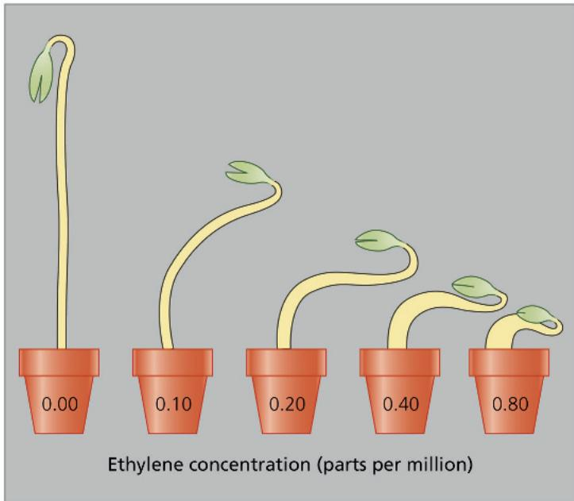

## The Triple Response to Mechanical Stress

Imagine a pea seedling pushing upward through the soil, only to come up against a stone. As it pushes against the obstacle, the stress in its delicate tip induces the seedling to produce ethylene. The hormone then instigates a growth maneuver known as the triple response that enables the shoot to avoid the obstacle. The three parts of this response are a slowing of stem elongation, a thickening of the stem (which makes it stronger), and a curvature that causes the stem to start growing horizontally. As the effects of the initial ethylene pulse lessen, the stem resumes vertical growth. If it again contacts a barrier, another burst of ethylene is released, and horizontal growth resumes. However, if the upward touch detects no solid object, then ethylene production decreases, and the stem, now clear of the obstacle, resumes its normal upward growth. It is ethylene that induces the stem to grow horizontally rather than the physical obstruction itself; when ethylene is applied to normal seedlings growing free of physical impediments, they still undergo the triple response (Figure 39.12).

Studies of Arabidopsis mutants with abnormal triple responses are an example of how biologists identify a signal transduction pathway. Scientists isolated ethylene-insensitive (ein) mutants, which fail to undergo the triple response after exposure to ethylene (Figure 39.13a). Some types of ein mutants are insensitive to ethylene because they lack a functional ethylene receptor. Mutants of a different sort undergo the triple response even out of soil, in the air, where there are no physical obstacles.

Figure 39.13 Ethylene triple-response Arabidopsis mutants.  
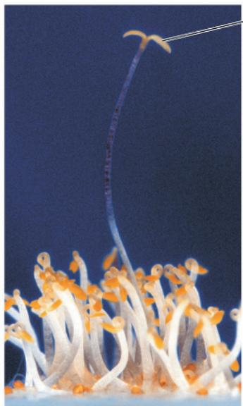  
(a) ein mutant. An ethylene-insensitive (ein) mutant fails to undergo the triple response in the presence of ethylene.

  
(b) ctr mutant. A constitutive triple-response (ctr) mutant undergoes the triple response even in the absence of ethylene.  
VISUAL SKILLS If the ein single mutation is combined with an ethylene-overproducing (eto) mutation, would the phenotype of the double mutant be different from that of the single mutant? Explain.
For suggested answer, see Appendix A.

Some of these mutants have a regulatory defect that causes them to produce ethylene at rates 20 times normal. The phenotype of such ethylene-overproducing (eto) mutants can be restored to wild-type by treating the seedlings with inhibitors of ethylene synthesis. Other mutants, called constitutive triple-response (ctr) mutants, undergo the triple response in air but do not respond to inhibitors of ethylene synthesis (Figure 39.13b). (Constitutive genes are genes that are continuously expressed.) In ctr mutants, ethylene signal transduction is permanently turned on, even though ethylene is not present.

The affected gene in ctr mutants codes for a protein kinase. The fact that this mutation activates the ethylene response suggests that the normal kinase product of the wild-type allele is a negative regulator of ethylene signal transduction. Thus, binding of the hormone ethylene to the ethylene receptor normally leads to inactivation of the kinase, and the inactivation of this negative regulator allows synthesis of the proteins required for the triple response.

## Senescence

Consider the shedding of a leaf in autumn or the death of an annual after flowering. Or think about the final step in differentiation of a vessel element, when its living contents are destroyed, leaving a hollow tube behind. Such events involve