cease to develop, die, and are engulfed by neighboring cells. Thus, programmed cell death, also called apoptosis, is a common feature of animal development.

One circumstance for programmed cell death is when a structure functions only in a larval or other immature form of the organism. One familiar example is the tail of a tadpole, the free-swimming larval stage of a frog or toad. The tail forms during early development, enables locomotion during larval growth, and is then eliminated during metamorphosis into the adult form (see Figure 45.22).

Apoptosis may also occur when a large set of cells is formed, but only a subset has the properties required for further function. Such is the case in both nervous and immune system development. In the vertebrate nervous system, for instance, many more neurons are produced during development than exist in the adult. Neurons that make functional connections with other neurons typically survive; many of the rest undergo apoptosis. Similarly, in the adaptive immune system, self-reactive cells—cells with the potential to attack the animal itself rather than invading pathogens—are often eliminated by apoptosis.

Some cells that undergo apoptosis don't seem to have any function. Why do such cells form? The answer can be found by considering the evolution of amphibians, birds, and mammals. When these groups began to diverge during evolution, the basic developmental program for making a vertebrate body was already in place. The differences in present-day body forms arose through modification of that common developmental program. For example, the shared developmental program generates webbing between the embryonic digits, but in many birds and mammals, including humans, the webbing is eliminated by apoptosis (see Figure 11.21). This is one reason why such different adult forms arise from early vertebrate embryos that look so much alike.

As you have seen, cell behavior and the molecular mechanisms underlying it are crucial to the morphogenesis of the embryo. In the next section, you'll learn some ways in which shared cellular and genetic processes ensure that particular types of cells each end up in the right place.

## Concept Check 47.2

1. In the frog embryo, convergent extension elongates the notochord. Explain how the words convergent and extension apply to this process.

2. WHAT IF? Predict what would happen if, just before neural tube formation, you treated frog embryos with a drug that enters all the cells of the embryo and blocks the function of microfilaments.

3. MAKE CONNECTIONS Unlike some other types of developmental abnormalities, neural tube defects are largely preventable. Explain (see Figure 41.4).

For suggested answers, see Appendix A.

# Concept 47.3: Cytoplasmic determinants and inductive signals regulate cell fate

During embryonic development, cells arise by division, take up particular locations in the body, and become specialized in structure and function. Where a cell resides, how it appears, and what it does define its development fate. Developmental biologists use the terms determination to refer to the process by which a cell or group of cells becomes committed to a particular fate and differentiation to refer to the resulting specialization in structure and function. You may find it a useful analogy to think about determination being equivalent to declaring a major in college and differentiation being comparable to taking the courses required by your major.

Every diploid cell formed during an animal's development has the same genome. With the exception of certain mature immune cells, the collection of genes present in a given cell is the same throughout the cell's life. How, then, do cells acquire different fates? As discussed in Concept 18.4, particular tissues, and often cells within a tissue, differ from one another by expressing distinct sets of genes from their shared genome.

Even animals that display widely differing body plans share many basic mechanisms of development and often use a common set of regulatory genes. For example, the gene that specifies where eyes form in a vertebrate embryo has a close counterpart with a nearly identical function in the fruit fly Drosophila melanogaster. Indeed, when the gene from a mouse is experimentally introduced into a fly embryo, the mouse gene directs eye formation wherever it is expressed in the fly.

A major focus of developmental biology is to uncover the mechanisms that direct the differences in gene expression underlying developmental fates. As one step toward this goal, scientists often seek to trace tissues and cell types back to their origins in the early embryo.

## Fate Mapping

One way to trace the ancestry of embryonic cells is direct observation through the microscope. Such studies produced the first fate maps, diagrams showing the structures arising from each region of an embryo. In the 1920s, German embryologist Walther Vogt used this approach to determine where groups of cells from the blastula end up in the gastrula (Figure 47.18a). Later, researchers developed techniques that allowed them to mark an individual blastomere during cleavage and then follow the marker as it was distributed to all the mitotic descendants of that cell (Figure 47.18b).

A much more comprehensive approach to fate mapping has been carried out on the soil-dwelling nematode Caenorhabditis

Figure 47.18 Fate mapping for two chordates.  
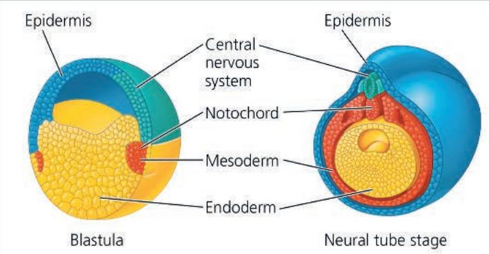  
(a) Fate map of a frog embryo. The fates of groups of cells in a frog blastula were determined in part by marking different regions of the blastula with nontoxic dyes and observing where the dye was found at later stages of development. The labeling of the two embryonic stages shown here represents the result of numerous such experiments.

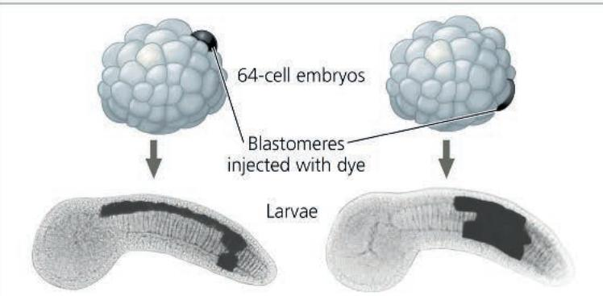  
(b) Cell lineage analysis in a tunicate. In lineage analysis of this invertebrate chordate, an individual blastomere is injected with a dye during cleavage (top). The dark regions in the light micrographs of larvae (bottom) correspond to cells that developed from the two blastomeres indicated in the drawings.

elegans, as shown in Figure 47.19. This roundworm is about 1 mm long, has a simple, transparent body with only a few types of cells, and develops into a mature adult hermaphrodite worm in only 3.5 days in the laboratory. These attributes allowed Sydney Brenner, Robert Horvitz, and John Sulston to determine the complete developmental history, or lineage, of every cell in C. elegans. They found that every adult hermaphrodite worm has exactly 959 somatic cells, which arise from the fertilized egg in virtually the same way for every individual. Careful microscopic observations of worms at all stages of development, coupled with experiments in which particular cells or groups of cells were destroyed by a laser beam or through mutations, resulted in the cell lineage diagram shown in Figure 47.19. Using this cell lineage diagram, you can identify all of the progeny of a single cell, just as you would use a family history to trace the descendants of, for example, one great-great-grandparent.

As an example of a particular cell fate, let's consider germ cells, the specialized cells that give rise to eggs or sperm. In all animals studied, complexes of RNA and protein direct particular cells to become germ cells. In C. elegans, such complexes, called P granules, can be detected in four cells of the newly hatched larva

## Figure 47.19 Cell lineage in Caenorhabditis elegans.

The C. elegans embryo is transparent, making it possible for researchers to trace the lineage of every cell, from the zygote to the adult worm (LM). The diagram shows a detailed lineage only for the intestine, which is derived exclusively from one of the first four cells formed from the zygote.

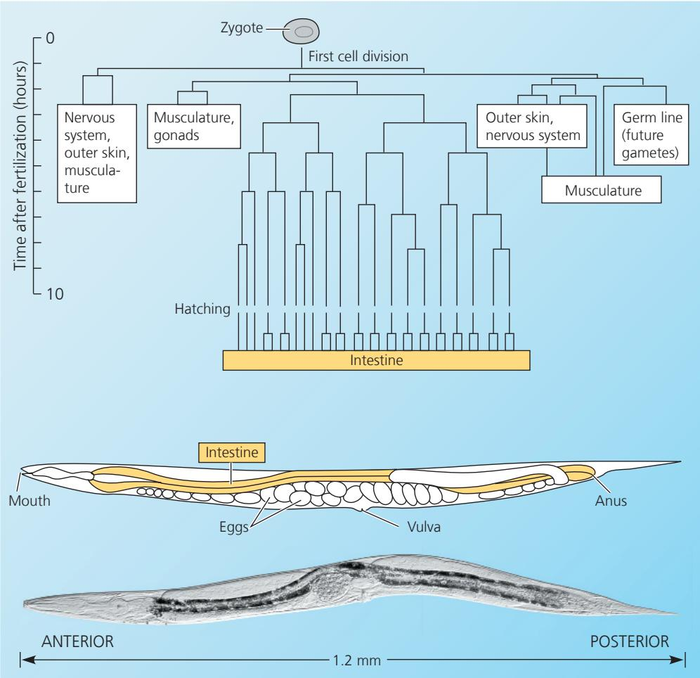  
VISUAL SKILLS The pattern of divisions is exactly the same in every C. elegans embryo. How many divisions of the fertilized egg give rise to the intestinal cell closest to the worm's mouth? For suggested answer, see Appendix A.

Cells with P granules

## Figure 47.20 Determination of germ cell fate in C. elegans.

Labeling with a fluorescent antibody that is specific for a C. elegans P granule protein (green) reveals the incorporation of P granules into four cells of the newly hatched larva (two of the four cells are visible in this view).

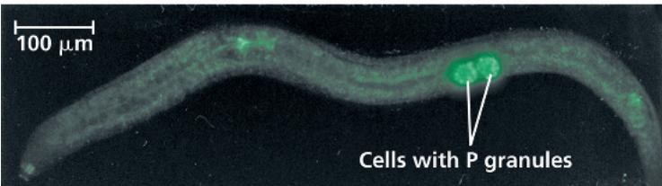

(Figure 47.20) and, later, in the cells of the adult gonad that produce sperm or eggs.

Tracing the position of the P granules provides a dramatic illustration of how cells acquire a specific fate, during development. As shown in Figure 47.21, the P granules are distributed throughout the newly fertilized egg but move to the posterior end of the zygote before the first cleavage division. As a result, only the posterior of the two cells formed by the first division contains P granules. The P granules continue to be asymmetrically partitioned during subsequent divisions. Thus, the P granules act as cytoplasmic determinants (see Concept 18.4), fixing germ cell fate at the earliest stage of C. elegans development.

Fate mapping in C. elegans paved the way for major discoveries about programmed cell death. Lineage analysis demonstrated that exactly 131 cells die during normal C. elegans development. In the 1980s, researchers found that a mutation inactivating a single gene allows all 131 cells to live. Further research revealed that this gene is part of a pathway that controls and carries out apoptosis in a wide range of animals, including humans. In 2002, Brenner, Horvitz, and Sulston shared a Nobel Prize for their use of the C. elegans fate map in studies of programmed cell death and organogenesis.

Having established fate maps for early development, scientists were positioned to answer questions about underlying mechanisms, such as how the basic axes of the embryo are established, a process known as axis formation.

## Axis Formation

A body plan with bilateral symmetry is found across a range of animals, including nematodes, echinoderms, and vertebrates (see Concept 32.4). This body plan exhibits asymmetry along the dorsal-ventral and anterior-posterior axes, as shown for a frog tadpole in Figure 47.22a. The right-left axis is largely symmetrical, as the two sides are roughly mirror images. When and how are these three axes established? We'll begin answering this question by considering the frog.

## Figure 47.21 Partitioning of P granules during C. elegans development.

The differential interference contrast micrographs (left) highlight the boundaries of nuclei and cells through the first two cell divisions. The fluorescence micrographs (right) show identically staged embryos labeled with a fluorescent antibody specific for a P granule protein.

20 μm

  
1 Newly fertilized egg

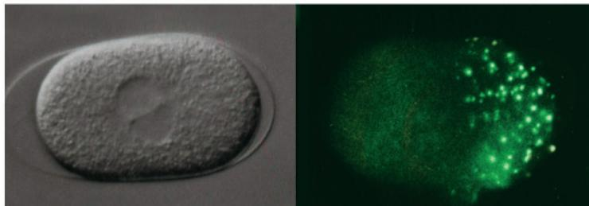

  
② Zygote prior to first division

  
③ Two-cell embryo

  
Four-cell embryo

## Axis Formation in the Frog

In the frog, the future position of the anterior-posterior axis is determined during oogenesis. Asymmetry in the egg is apparent in the formation of two distinct hemispheres: Dark melanin granules are embedded in the cortex of the animal

Figure 47.22 The body axes and their establishment in an amphibian.

All three axes are established before the zygote begins to undergo cleavage.

  
(b) Establishing the axes. The polarity of the egg and cortical rotation are critical in setting up the body axes.

1 The polarity of the egg determines the anterior-posterior axis before fertilization.

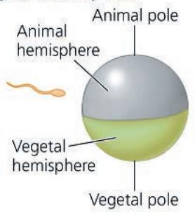

2 At fertilization, the pigmented cortex slides over the underlying cytoplasm toward the point of sperm nucleus entry. This rotation (black arrows) exposes a region of lighter-colored cytoplasm, the gray crescent, which is a marker of the future dorsal side.

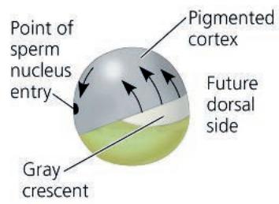

3 The first cleavage division bisects the gray crescent. Once the anterior-posterior and dorsal-ventral axes are defined, so is the position of the left-right axis.

WHAT IF? When researchers allowed normal cortical rotation to occur and then forced the opposite rotation, the result was a two-headed embryo. How might you explain this finding, thinking about how cortical rotation influences body axis formation?

For suggested answer, see Appendix A.

hemisphere, whereas a yellow yolk fills the vegetal hemisphere. This animal-vegetal asymmetry dictates where the anterior-posterior axis forms in the embryo. Note, however, that the anterior-posterior and animal-vegetal axes are not the same; that is, the head of the embryo does not coincide with the animal pole.

Surprisingly, the dorsal-ventral axis of the frog embryo is determined at random. Specifically, wherever the sperm enters in the animal hemisphere determines where the dorsal-ventral axis forms. Once the sperm and egg have fused, the egg surface—the plasma membrane and associated cortex—rotates with respect to the inner cytoplasm, a movement called cortical rotation. From the perspective of the animal pole, this rotation is always toward the point of sperm entry (Figure 47.22b). The resulting interactions between molecules in the vegetal cortex and in the inner cytoplasm of the animal hemisphere activate regulatory proteins. Once activated, these proteins direct expression of one set of genes in dorsal regions and another set of genes in ventral regions.

## Axis Formation in Birds, Mammals, and Insects

It turns out that there are many different processes by which animal embryos establish their body axes. In mammals, the sperm appears to contribute to axis formation, but not in the same manner as in frogs. In particular, the orientation of the egg and sperm nuclei before they fuse influences the location of the first cleavage plane. In chicks, the anterior-posterior axis is established by the pull of gravity during the time when the soon-to-be-laid egg is traveling down the hen's oviduct. In zebrafish, signals within the embryo gradually establish the anterior-posterior axis over the course of a day. Still other mechanisms occur in insects, where gradients of active transcription factors across the body establish both the anterior-posterior and dorsal-ventral axes (see Concept 18.4).

Once the anterior-posterior and dorsal-ventral axes are established, the position of the left-right axis is fixed. Nevertheless, specific molecular mechanisms must establish which side is left and which is right. In vertebrates, there are marked left-right differences in the location of internal organs as well as in the organization and structure of the heart and brain. Recent research has revealed a key role for cilia in setting up this left-right asymmetry, as we will discuss toward the end of this chapter.

## Restricting Developmental Potential

Earlier we described determination in terms of commitment to a particular cell fate. The fertilized egg gives rise to all cell fates. How long during development do cells retain this ability? The German zoologist Hans Spemann addressed this question in 1938. By manipulating embryos to perturb normal development and then examining cell fate after the manipulation, he was able to assay a cell's developmental potential, the range of structures to which it can give rise (Figure 47.23). The work of Spemann and others demonstrated that the first two blastomeres of the frog embryo are totipotent, meaning that they can each develop into all the different cell types of that species.

## Figure 47.23

# Inquiry: How does distribution of the gray crescent affect the developmental potential of the first two daughter cells?

Experiment

Hans Spemann, at the University of Freiburg, Germany, carried out the following experiment in 1938 to test whether substances were located asymmetrically in the gray crescent.

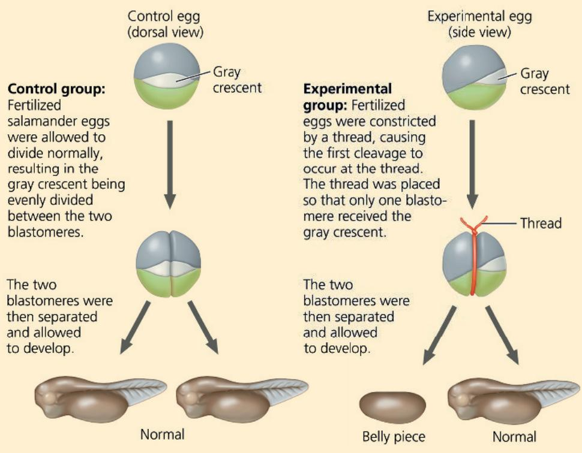

## Results

Blastomeres that received half or all of the material in the gray crescent developed into normal embryos, but a blastomere that received none of the gray crescent gave rise to an abnormal embryo without dorsal structures. Spemann called it a “belly piece.”

## Conclusion

The developmental potential of the two blastomeres normally formed during the first cleavage division depends on their acquisition of cytoplasmic determinants localized in the gray crescent.

Data from H. Spemann, Embryonic Development and Induction, Yale University Press, New Haven, CT (1938).

DRAW IT Draw lines to show the plane of the first cell division that would occur in the fertilized eggs above if no manipulations were done.

WHAT IF? In a similar experiment 40 years earlier, embryologist Wilhelm Roux allowed the first cleavage to occur and then used a needle to kill just one blastomere. The embryo that developed from the remaining blastomere (plus remnants of the dead cell) was abnormal, resembling a half-embryo. How might the presence of molecules in the dead cell explain why Roux's result differed from the control result in Spemann's experiment?

For suggested answers, see Appendix A.

In mammals, embryonic cells remain totipotent through the eight-cell stage, much longer than in many other animals. Recent work, however, indicates that the very early cells (even the first two) are not actually equivalent in a normal embryo. Rather, their

totipotency when isolated likely means that the cells can regulate their fate in response to their embryonic environment. Once the 16-cell stage is reached, mammalian cells are determined to form the trophoblast or the inner cell mass. Although the cells have a limited developmental potential from this point onward, their nuclei remain totipotent, as demonstrated in transplantation and cloning experiments (see Figures 20.17 and 20.18).

The totipotency of cells early in human embryogenesis is the reason why you or a classmate may have an identical twin. Identical (monozygotic) twins result when cells or groups of cells from a single embryo become separated. If the separation occurs before the trophoblast and inner cell mass become differentiated, two embryos grow, each with its own chorion and amnion. This is the case for about a third of identical twins. For the rest, the two embryos that develop share a chorion and, in very rare cases where separation is particularly late, an amnion as well.

Regardless of how uniform or varied early embryonic cells are in a particular species, the progressive restriction of developmental potential is a general feature of development in all animals. In general, the tissue-specific fates of cells are fixed in a late gastrula, but not always so in an early gastrula. For example, if the dorsal ectoderm of an early amphibian gastrula is experimentally replaced with ectoderm from some other location in the same gastrula, the transplanted tissue forms a neural plate. But if the same experiment is performed on a late-stage gastrula, the transplanted ectoderm does not respond to its new environment and does not form a neural plate.

## Cell Fate Determination and Pattern Formation by Inductive Signals

As embryonic development continues, cells influence each other's fates by induction. At the molecular level, the response to an inductive signal is usually to switch on a set of genes that make the receiving cells differentiate into a specific cell type or

tissue. Here we will examine examples of this important developmental process in organizing the basic body plan of an embryo and in directing the three-dimensional development of a vertebrate limb.

## Figure 47.24

# Inquiry: Can the dorsal lip of the blastopore induce cells in another part of the amphibian embryo to change their developmental fate?

## Experiment

In 1924, Hans Spemann and Hilde Mangold, at the University of Freiburg, Germany, investigated the inductive ability of the dorsal lip of the gastrula. Using newts, they transplanted a piece of the dorsal lip from one gastrula to the ventral side of a second gastrula. Because the donor embryo was albino and thus lacked pigmentation, the researchers could visually follow how the transplanted material altered the fate of the recipient embryo.

## Results

The photograph in this figure documents a repeat of this classic experiment, using the frog Xenopus laevis. The tadpole at the top developed from a control gastrula. When an experimental gastrula received the transplant of a dorsal lip from an albino donor (lower left), the recipient embryo formed a second notochord and neural tube in the region of the transplant. Eventually most of a second embryo developed, producing a twinned tadpole (lower right).

## Conclusion

The transplanted dorsal lip was able to induce cells in a different region of the recipient to form structures different from their normal fate. In effect, the transplanted dorsal lip “organized” the later development of an entire extra embryo.

Data from H. Spemann and H. Mangold, Induction of embryonic primordia by implantation of organizers from a different species, Trans. V. Hamburger (1924). Reprinted in International Journal of Developmental Biology 45:13–38 (2001); and E. M. De Robertis and H. Kuroda, Dorsal-ventral patterning and neural induction in Xenopus embryos, Annual Review of Cell and Developmental Biology 20:285–308 (2004).

WHAT IF? Because the transplant caused the recipient tissue to become something it would not have otherwise, a signal must have passed from the dorsal lip. If you identified a protein candidate for the signaling molecule, how would injecting it into ventral cells of a gastrula test its function?

For suggested answer, see Appendix A.

## The “Organizer” of Spemann and Mangold

Before his studies of totipotency in the fertilized frog egg, Spe-mann had investigated cell fate determination during gastrulation. In these experiments, he and his student Hilde Mangold transplanted tissues between early gastrulas. In their most famous such experiment, summarized in Figure 47.24, they made a remarkable discovery. Not only did a transplanted dorsal lip of the blastopore continue to be a blastopore lip, but it also triggered gastrulation of the surrounding tissue. They concluded that the dorsal lip of the blastopore in the early gastrula functions as an “organizer” of the embryo’s body plan, inducing changes in surrounding tissue that direct formation of the notochord, the neural tube, and other organs.

Nearly a century later, developmental biologists are still studying the basis of induction by what is now called Spemann's organizer. An important clue has come from studies of a growth factor called bone morphogenetic protein 4 (BMP-4). One major function of the organizer seems to be to inactivate BMP-4 on the dorsal side of the embryo. Inactivating BMP-4 allows cells on the dorsal side to make dorsal structures, such as the notochord and neural tube. Proteins related to BMP-4 and its inhibitors are found as well in invertebrates such as the fruit fly, where they also function in regulating the dorsal-ventral axis.

## Formation of the Vertebrate Limb

Inductive signals play a major role in pattern formation, the process governing the arrangement of organs and tissues in their characteristic places in three-dimensional space. The molecular cues that control pattern formation, called positional information, tell a cell where it is with respect to the animal's body axes and help to determine how the cell and its descendants will respond to molecular signaling during embryonic development.

In Concept 18.4, we discussed pattern formation in the development of Drosophila. For the study of pattern formation in vertebrates, a classic model system has been limb development in the chick. The wings and legs of chicks, like all vertebrate limbs, begin as limb buds (see Figure 47.1). These bumps consist of mesodermal tissue covered by a layer of ectoderm (see Figure 47.1, inset). Each component of a chick limb, such as a specific bone or muscle, develops with a precise location and orientation relative to three axes: proximal-distal (shoulder to fingertip), anterior-posterior (thumb to little finger), and dorsal-ventral (knuckle to palm), as shown in Figure 47.25.

Two regions in a limb bud have profound effects on its development. One such region is the apical ectodermal ridge (AER), a thickened area of ectoderm at the tip of the bud (see Figure 47.25a). Surgically removing the AER blocks outgrowth of the limb along the proximal-distal axis. Why? The AER secretes a protein signal called fibroblast growth factor (FGF) that promotes limb-bud outgrowth. If the AER is replaced with beads soaked with FGF, a nearly normal limb develops.

The second major limb-bud regulatory region is the zone of polarizing activity (ZPA), a specialized block of mesodermal tissue (see Figure 47.25a). The ZPA regulates development along the

Figure 47.25 Regulation of vertebrate limb development by organizer regions.  
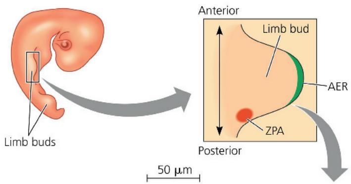

(a) Organizer regions.
Vertebrate limbs develop from protrusions called limb buds. Two regions in each limb bud, the apical ectodermal ridge (AER, shown in this SEM) and the zone of polarizing activity (ZPA), play key roles as organizers in limb pattern formation.

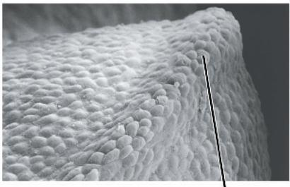  
Apical ectodermal ridge (AER)

(b) Wing of chick embryo. Each embryonic cell receives positional information indicating location along the three axes of the limb. The AER and ZPA secrete molecules that help provide this information. (Numbers are assigned to the digits based on a convention established for vertebrate limbs. The chicken wing has only four digits; the first digit points backward and is not shown.)

anterior-posterior axis of the limb. Cells nearest the ZPA form posterior structures, such as the most posterior of the chick's digits (equivalent to our little finger); cells farthest from the ZPA form anterior structures, including the most anterior digit (like our thumb).

Like the AER, the ZPA influences development by secreting a protein signal. The signal secreted by the ZPA is called Sonic hedgehog, named after both a video game character and a similar protein in Drosophila that also regulates development. Implanting cells genetically engineered to produce Sonic hedgehog into the anterior region of a normal limb bud causes formation of a mirror-image limb—just as if a ZPA had been grafted there

## Figure 47.26

## Inquiry: What role does the zone of polarizing activity (ZPA) play in limb pattern formation in vertebrates?

## Experiment

In 1985, researchers were eager to investigate the nature of the zone of polarizing activity. They transplanted ZPA tissue from a donor chick embryo under the ectoderm in the anterior margin of a limb bud in another chick (the host).

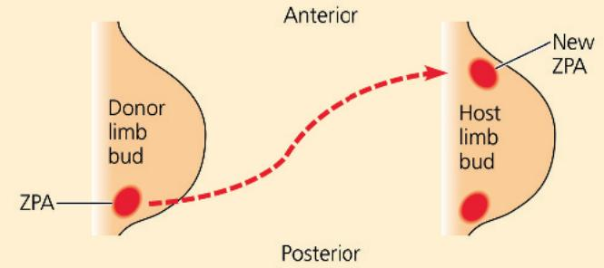

## Results

The host limb bud developed extra digits from host tissue in a mirror-image arrangement to the normal digits, which also formed (compare with Figure 47.25b, which shows a normal chick wing).

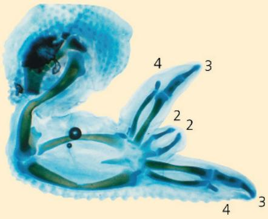

## Conclusion

The mirror-image duplication observed in this experiment suggests that ZPA cells secrete a signal that diffuses from its source and conveys positional information indicating “posterior.” As the distance from the ZPA increases, the signal concentration decreases, and hence more anterior digits develop.

Data from L. S. Honig and D. Summerbell, Maps of strength of positional signaling activity in the developing chick wing bud, Journal of Embryology and Experimental Morphology 87:163–174 (1985).

WHAT IF? Suppose you learned that the ZPA forms after the AER, leading you to develop the hypothesis that the AER is necessary for formation of the ZPA. If you removed the AER and looked for expression of Sonic hedgehog, how would that test your hypothesis?
For suggested answer, see Appendix A.

(Figure 47.26). Furthermore, experiments with mice reveal that production of Sonic hedgehog in part of the limb bud where it is normally absent can result in extra toes.

The AER and ZPA regulate the axes of a limb bud, but what determines whether the bud develops into a forelimb or hind limb? That information is provided by spatial patterns of Hox genes, which specify different developmental fates in particular body regions (see Figure 21.20).

BMP-4, FGF, Sonic hedgehog, and Hox proteins are examples of a much larger set of molecules that govern cell fates in animals. Having mapped out many of the basic functions of these molecules in embryonic development, researchers are now addressing their role in organogenesis, focusing in particular on the development of the brain.

## Cilia and Cell Fate

Researchers have found that the cellular organelles known as cilia are essential for specifying cell fate in human embryos. Like other mammals, humans have stationary and motile cilia (see Figure 6.24). Stationary primary cilia, or monocilia, jut from the surface of nearly all cells, one per cell. In contrast, motile cilia are restricted to cells that propel fluid over their surface, such as the epithelial cells of airways, and sperm (as flagella that propel sperm movement). Both stationary and motile cilia have crucial roles in development.

Genetic studies provided vital clues to the developmental role of monocilia. In 2003, researchers discovered that certain mutations disrupting development of the mouse nervous system affect genes that function in the assembly of monocilia. Other geneticists found that mutations responsible for a severe kidney disease in mice alter a gene important for the transport of materials up and down monocilia. In addition, mutations in humans that block the function of monocilia were linked to cystic kidney disease.

How do monocilia function in development? Evidence indicates that monocilia act as antennae on the cell surface, receiving signals from multiple signaling proteins, including Sonic hedgehog. Mechanisms that regulate which types of receptor proteins are present tune the cilium to particular signals. When the monocilia are defective, signaling is disrupted.

Insight into the role of motile cilia in development grew from studies of Kartagener's syndrome, a set of medical conditions that often appear together. These conditions include male infertility due to immotile sperm and infections of the nasal sinuses and bronchi in both males and females. A distinctive feature of Kartagener's syndrome is situs inversus, a reversal of the normal left-right asymmetry of the organs in the chest and abdomen (Figure 47.27). The heart, for example, is on the right side rather than the left. (By itself, situs inversus causes no significant medical problems.)

Scientists studying Kartagener's syndrome came to realize that all of the associated conditions result from a defect that makes cilia immotile. Without motility, sperm tails cannot beat and airway cells cannot sweep mucus and microbes out of the airway. But what causes situs inversus in these individuals? The current model proposes that ciliary motion in a particular part of the embryo is essential for normal development. Evidence indicates

Figure 47.27 Situs inversus, a reversal of normal left–right asymmetry in the chest and abdomen.

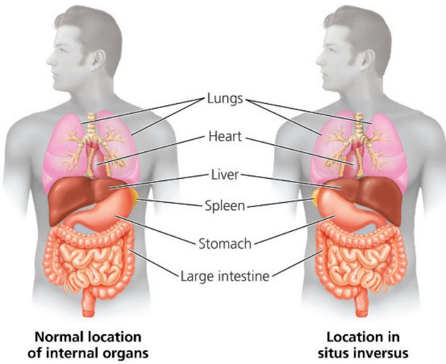

that movement of the cilia generates a leftward fluid flow, breaking the symmetry between left and right sides. Without that flow, asymmetry along the left-right axis arises randomly, and half of the affected embryos develop situs inversus.

If we consider development as a whole, we see a sequence of events marked by cycles of signaling and differentiation. Initial cell asymmetries allow different types of cells to influence each other, resulting in the expression of specific sets of genes. The products of these genes then direct cells to differentiate into specific types. Through pattern formation and morphogenesis, differentiated cells ultimately produce a complex arrangement of tissues and organs, each functioning in its appropriate location and in coordination with other cells, tissues, and organs throughout the organism.

## Concept Check 47.3

1. How do axis formation and pattern formation differ?

2. MAKE CONNECTIONS How does a morphogen gradient differ from cytoplasmic determinants and inductive interactions with regard to the set of cells it affects (see Concept 18.4)?

3. WHAT IF? If the ventral cells of an early frog gastrula were experimentally induced to express large amounts of a protein that inhibits BMP-4, could a second embryo develop? Explain.

4. WHAT IF? If you removed the ZPA from a limb bud and then placed a bead soaked in Sonic hedgehog in the middle of the bud, what would be the most likely result?

For suggested answers, see Appendix A.

## Summary of Key Concepts

To review key terms, go to the Vocabulary Self-Quiz (eTextbook only).

## Concept 47.1: Fertilization and cleavage initiate embryonic development

\- Fertilization forms a diploid zygote and initiates embryonic development. The acrosomal reaction releases hydrolytic enzymes from the sperm head that digest material surrounding the egg.

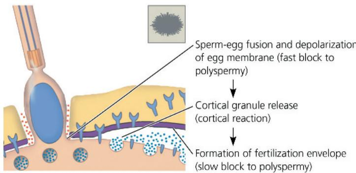

In mammalian fertilization, the cortical reaction modifies the zona pellucida as a slow block to polyspermy.

\- Fertilization is followed by cleavage, a period of rapid cell division without growth, producing a large number of cells called blastomeres. The amount and distribution of yolk strongly influence the pattern of cleavage. In many species, the completion of the cleavage stage generates a blastula containing a fluid-filled cavity, the blastocoel.

What cell-surface event would likely fail if a sperm contacted an egg of another species?

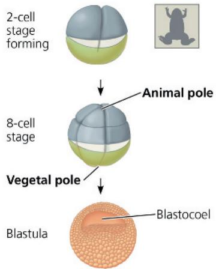

## Concept 47.2: Morphogenesis in animals involves specific changes in cell shape, position, and survival

\- Gastrulation converts the blastula to a gastrula, which has a primitive digestive cavity and three germ layers: ectoderm (blue), which forms the outer layer of the embryo, mesoderm (red), which forms the middle layer, and endoderm (yellow), which gives rise to the innermost tissues.

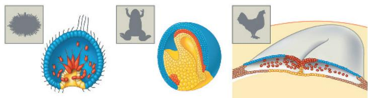

\- Gastrulation and organogenesis in mammals resemble the processes in reptiles, including birds. After fertilization and early cleavage in the oviduct, the blastocyst implants in the uterus. The trophoblast initiates formation of the fetal portion of the placenta, and the embryo proper develops from a cell layer, the epiblast, within the blastocyst.

\- The embryos of birds, other reptiles, and mammals develop within a fluid-filled sac that is contained within a shell or the uterus. In these organisms, the three germ layers produce four extraembryonic membranes: the amnion, chorion, yolk sac, and allantois.

\- The organs of the animal body develop from specific portions of the three embryonic germ layers. Early events in organogenesis in vertebrates include neurulation: formation of the notochord by cells of the dorsal mesoderm and development of the neural tube from infolding of the ectodermal neural plate.

\- Cytoskeletal rearrangements cause changes in the shape of cells that underlie cell movements in gastrulation and organogenesis, including invaginations and convergent extension. The cytoskeleton is also involved in cell migration, which relies on cell adhesion molecules and the extracellular matrix to help cells reach specific destinations. Migratory cells arise both from the neural crest and from somites.

\- Some processes in animal development require apoptosis, programmed cell death.

What are some functions of apoptosis in development?

## Concept 47.3: Cytoplasmic determinants and inductive signals regulate cell fate

\- Experimentally derived fate maps of embryos show that specific regions of the zygote or blastula develop into specific parts of older embryos. The complete cell lineage has been worked out for C. elegans, revealing that programmed cell death contributes to animal development. In all species, the developmental potential of cells becomes progressively more limited as embryonic development proceeds.

\- Cells in a developing embryo receive and respond to positional information that varies with location. This information is often in the form of signaling molecules secreted by cells in specific regions of the embryo, such as the dorsal lip of the blastopore in the amphibian gastrula and the apical ectodermal ridge and zone of polarizing activity of the vertebrate limb bud.

Suppose you found two classes of mouse mutations, one that affected limb development only and one that affected both limb and kidney development. Which class would be more likely to alter the function of monocilia? Explain.

## Test Your Understanding

For more multiple-choice questions, go to the Practice Test (eTextbook only).

## Levels 1-2: Remembering/Understanding

1. The cortical reaction of sea urchin eggs functions directly in (A) the formation of a fertilization envelope. (B) the production of a fast block to polyspermy. (C) the generation of an electrical impulse by the egg. (D) the fusion of egg and sperm nuclei.

2. Which of the following is common to the development of both birds and mammals?
(A) holoblastic cleavage (C) trophoblast
(B) epiblast and hypoblast (D) gray crescent

3. The archenteron develops into
(A) the mesoderm.
(B) the endoderm.
(C) the placenta.
(D) the lumen of the digestive tract.

4. What structural adaptation in chickens allows them to lay their eggs in arid environments rather than in water?
(A) extraembryonic membranes
(B) yolk
(C) cleavage
(D) gastrulation

## Levels 3-4: Applying/Analyzing

5. If an egg cell were treated with EDTA, a chemical that binds calcium and magnesium ions,
(A) the acrosomal reaction would be blocked.
(B) the fusion of sperm and egg nuclei would be blocked.
(C) the fast block to polyspermy would not occur.
(D) the fertilization envelope would not form.

6. In humans, identical twins are possible because
(A) extraembryonic cells interact with the zygote nucleus.
(B) convergent extension occurs.
(C) early blastomeres can form a complete embryo if isolated.
(D) the gray crescent divides the dorsal-ventral axis into new cells.

7. Cells transplanted from the neural tube of a frog embryo to the ventral part of another embryo develop into nervous system tissues. This result indicates that the transplanted cells were (A) totipotent.
(C) differentiated.
(B) determined.
(D) mesenchymal.

8. DRAW IT Each blue circle in the figure below represents a cell in a cell lineage. Draw two modified versions of the cell lineage so that each version produces three cells. Use apoptosis in one of the versions, marking any dead cells with an X.

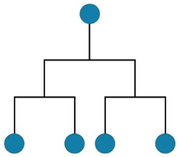

## Levels 5-6: Evaluating/Creating

9. EVOLUTION CONNECTION Evolution in insects and vertebrates has involved the repeated duplication of body segments, followed by fusion of some segments and specialization of their structure and function. In vertebrates, what anatomical features reflect segmentation?

10. SCIENTIFIC INQUIRY The “snout” region of a salamander has a mustache-shaped structure called a balancer, whereas that of a frog tadpole does not. When you transplant tissue from the side of a young salamander embryo to the snout of a frog embryo, the tadpole that develops has a balancer. If you use a slightly older salamander embryo as the donor, no balancer forms. Propose a hypothesis to explain these results and explain how you might test your hypothesis.

11. SCIENCE, TECHNOLOGY, AND SOCIETY Scientists can now make identical copies, or clones, of animals ranging from dairy cows to pet cats. Propose a few arguments for and against this application of discoveries about embryonic development.

12. WRITE ABOUT A THEME: ORGANIZATION In a short essay (100–150 words), describe how the emergent properties of the cells of the gastrula direct embryonic development.

13. SYNTHESIZE YOUR KNOWLEDGE

  
Occasionally, two-headed animals such as this turtle are born. Thinking about the occurrence of identical twins and the property of totipotency, explain how this might happen.

For selected answers, see Appendix A.

# Explore Scientific Papers with Science in the Classroom | AAAS

What is the molecular basis for limb regrowth in vertebrates? Go to “Limb Regeneration: Fact or (Science) Fiction?” at www.scienceintheclassroom.org.

Instructors: Questions can be assigned in Mastering Biology.

# Neurons, Synapses, and Signaling

## Key Concepts

48.1 Neuron structure and organization reflect function in information transfer

48.2 Ion pumps and ion channels establish the resting potential of a neuron

48.3 Action potentials are the signals conducted by axons

48.4 Neurons communicate with other cells at synapses

## Study Tip

Make a table: Action potentials and graded potentials are two types of electrical signals. As you read, fill in a table like the one shown here to help you distinguish between action and graded potentials.

<table><tr><td></td><td>Graded Potential</td><td>Action Potential</td></tr><tr><td>Occurs in cell body?</td><td></td><td></td></tr><tr><td>Occurs in axon?</td><td></td><td></td></tr><tr><td>All or none?</td><td></td><td></td></tr><tr><td>Refractory period?</td><td></td><td></td></tr><tr><td>Summation?</td><td></td><td></td></tr><tr><td>Threshold?</td><td></td><td></td></tr><tr><td>How does membrane potential change?</td><td></td><td></td></tr><tr><td>Other differences?</td><td></td><td></td></tr></table>

  
Figure 48.1 This cone snail (Conus geographus) is slow-moving, but a dangerous hunter. Delivering venom with a hollow, harpoon-like tooth, it can paralyze a fish almost instantaneously. Scuba divers picking up a cone snail have died from a single injection. Underlying the fast-acting, lethal nature of the venom is an ability to block information transfer by neurons, specialized cells of the nervous system.

## How does a neuron transmit information?

A neuron receives information at dendrites and the cell body, transmits it down the axon, and conveys the information to other cells at a synapse.

# Concept 48.1: Neuron structure and organization reflect function in information transfer

Our starting point for exploring the nervous system is the neuron, the type of nerve cell that uses electrical signals to transfer information within the body. It provides a good example of the close fit of form and function that often arises over the course of evolution.

## Neuron Structure and Function

The ability of a neuron to receive and transmit information is based on the highly specialized cellular organization shown in Figure 48.1. Most of a neuron's organelles, including its nucleus, are located in the cell body. In a typical neuron, the cell body is studded with numerous highly branched extensions called dendrites (from the Greek dendron, tree). Together with the cell body, the dendrites receive signals from other neurons.

A typical neuron has a single axon, the extension that transmits signals to other cells. Axons are often much longer than dendrites, and some, such as those that reach from the spinal cord of a giraffe to the muscle cells in its feet, are over a meter long. The specialized structure of axons allows them to use pulses of electrical current to transmit information, even over long distances. The cone-shaped base of an axon, called the axon hillock, is typically where signals that travel down the axon are generated. Near its other end, an axon usually divides into many branches.

Each branched end of an axon transmits information to another cell at a junction called a synapse (Figure 48.2). The part of each axon branch that forms this specialized junction is a synaptic terminal. At most synapses, chemical messengers called neurotransmitters pass information from the transmitting neuron to the receiving cell. Cone snail venom is particularly potent because it interferes not only with electrical signaling along axons but also with chemical signaling across synapses.

Figure 48.2 Synaptic terminals on the cell body of a postsynaptic neuron.  
  
Figure 48.3 Summary of information processing.

The cone snail's siphon acts as a sensor, transferring information to the neuronal circuits in the snail's head for processing. If prey is detected, these circuits issue motor commands—signals that control muscle activity. In this example, motor commands trigger release of a harpoon-like tooth from the proboscis, spearing the prey.

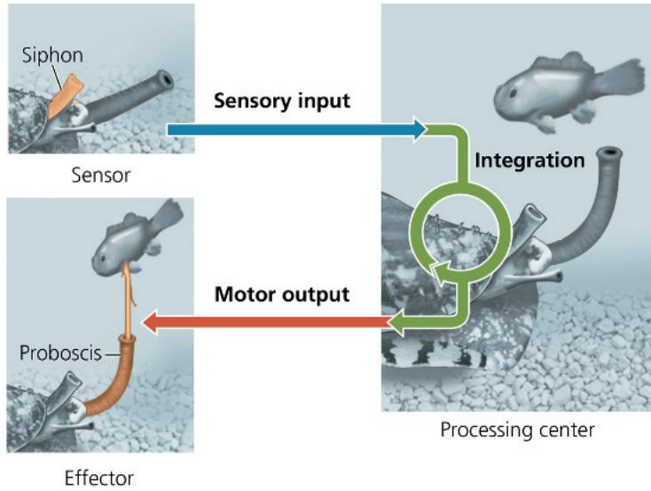

## Introduction to Information Processing

Information processing by a nervous system includes up to three stages: sensory input, integration, and motor output. As an example, let's consider the cone snail, focusing on the steps involved in identifying and attacking its prey. To generate sensory input to the nervous system, the snail surveys its environment with sensors in its tubelike siphon, sampling scents that might reveal a nearby fish (Figure 48.3). During the integration stage, networks of neurons in the snail brain process this information to determine if a fish is in fact present and, if so, where the fish is located. Motor output from the processing center then initiates attack, activating neurons that trigger release of the harpoon-like tooth toward the prey.

## Interview

## Interview with Baldomero Olivera: Developing drugs from research on cone snail venom (eTextbook only)

In all but the simplest animals, specialized populations of neurons handle each stage of information processing.

\- Sensory neurons, like those in the snail's siphon, transmit information about external stimuli (such as light, touch, or smell), and internal conditions (such as blood pressure or muscle tension).

\- Interneurons form the local circuits connecting neurons in the brain or ganglia. Interneurons are responsible for the integration (analysis and interpretation) of sensory input.

Figure 48.4 Structural diversity of neurons.

In these drawings of neurons, cell bodies and dendrites are black and axons are red. Note that the top diagram shows a peculiarity of some sensory neurons, in which the dendrites fuse with the axon during development. This axon carries information from the dendrites to the axon terminals, from right to left.

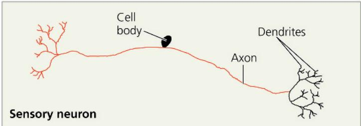

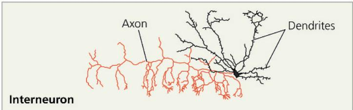

  
Figure 48.5 Glia in the mammalian brain.

\- Motor neurons transmit signals to muscle cells, causing them to contract. Additional neurons that extend out of the processing centers trigger gland activity.

All neurons transmit electrical signals within the cell in an identical manner. Thus, a neuron that detects an odor transmits information along its length in the same way as a neuron that controls the movement of a body part. The particular connections made by the active neuron are what distinguish the type of information being transmitted. Interpreting nerve impulses therefore involves sorting neuronal paths and connections.

As shown in Figure 48.4, the shape of a neuron can vary from simple to quite complex, depending on its role in information processing. Neurons that have highly branched dendrites, such as some interneurons, can receive input through tens of thousands of synapses. Similarly, neurons that transmit information to many target cells do so through highly branched axons. When grouped together, the axons of neurons form a bundle called a nerve.

Not all networks involve motor neurons. When you see a friend, for instance, sensory neurons transmit visual information from your eye to your brain. Interneurons in the brain integrate this sensory information with other inputs (such as memories), enabling you to recognize the face of your friend.

In many animals, the neurons that carry out sorting, processing, and integration are organized in a central nervous system (CNS), which may include a brain or simpler clusters called ganglia. The neurons that carry information into and out of

This fluorescently labeled laser confocal micrograph shows a region of the rat brain packed with glia and interneurons. The glia are labeled red, the DNA in nuclei is labeled blue, and the dendrites of neurons are labeled green.

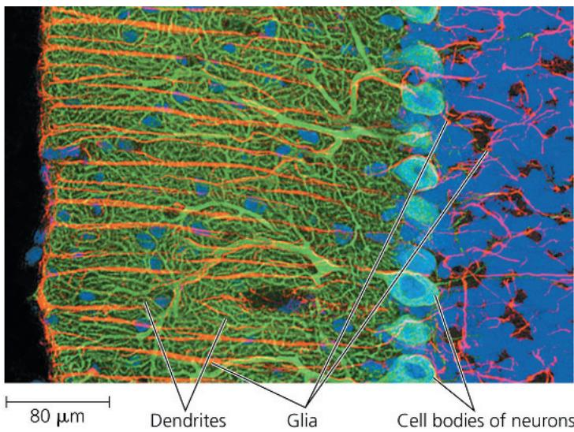  
the CNS constitute the peripheral nervous system (PNS). Neurons of both the CNS and PNS require supporting cells called glial cells, or glia (from a Greek word meaning “glue”) (Figure 48.5).

## Concept Check 48.1

1. Compare and contrast the structure and function of axons and dendrites.

2. Describe the basic pathway of information flow through neurons that causes you to turn your head when someone calls your name.

3. WHAT IF? How might increased branching of an axon help coordinate responses to signals communicated by the nervous system?

For suggested answers, see Appendix A.

# Concept 48.2: Ion pumps and ion channels establish the resting potential of a neuron

We turn now to the essential role of ions in neuronal signaling. In neurons, as in other cells, ions are unequally distributed between the interior of cells and the surrounding fluid (see Concept 7.4). As a result, the inside of a cell is negatively charged relative to the outside. This charge difference, or voltage, across the plasma membrane is called the membrane potential, reflecting the fact that the attraction of opposite charges across the plasma membrane is a source of potential energy. For a resting neuron—one that is not sending a signal—the membrane potential is called the resting potential and is typically between -60 and -80 millivolts (mV).

Table 48.1 Ion Concentrations Inside and Outside of Mammalian Neurons

<table><tr><td>Ion</td><td>Intracellular Concentration (mM)</td><td>Extracellular Concentration (mM)</td></tr><tr><td>Potassium ( $K^{+}$ )</td><td>140</td><td>5</td></tr><tr><td>Sodium ( $Na^{+}$ )</td><td>15</td><td>150</td></tr><tr><td>Chloride ( $Cl^{-}$ )</td><td>10</td><td>120</td></tr><tr><td>Large anions ( $A^{-}$ ), such as proteins, inside cell</td><td>100</td><td>Not applicable</td></tr></table>

When a neuron receives a stimulus, the membrane potential changes. Rapid shifts in membrane potential are what enable us to see the intricate structure of a spiderweb, hear a song, or ride a bicycle. These changes, which are known as action potentials, will be discussed in Concept 48.3. To understand how they convey information, we need to explore the ways in which membrane potentials are formed, maintained, and altered.

## Formation of the Resting Potential

Potassium ions (K $^{+}$ ) and sodium ions (Na $^{+}$ ) play an essential role in the formation of the resting potential. These ions each have a concentration gradient across the plasma membrane of a neuron (Table 48.1). In most neurons, the concentration of K $^{+}$ is higher inside the cell, while the concentration of Na $^{+}$ is higher outside. The Na $^{+}$ and K $^{+}$ concentration gradients are maintained by the sodium-potassium pump. This pump uses the energy of ATP hydrolysis to actively transport Na $^{+}$ out of the cell and K $^{+}$ into the cell. (There are also concentration gradients for chloride ions (Cl $^{-}$ ) and other anions, as shown in Table 48.1, but we can ignore these for now.)

The sodium-potassium pump transports three $Na^{+}$ out of the cell for every two $K^{+}$ that it transports in (Figure 48.6). Although this pumping generates a net export of positive charge, the pump acts slowly. The resulting change in the membrane potential is therefore quite small—only a few millivolts. Why, then, is there a membrane potential of -60 to -80 mV in a resting neuron? The answer lies in ion movement through ion channels, pores formed by complex proteins that span the membrane. Ion channels allow ions to diffuse back and forth across the membrane. As ions diffuse through channels, they carry with them units of electrical charge. Furthermore, ions can move quite rapidly through ion channels. When this occurs, the resulting current—a net movement of positive or negative charge—generates a membrane potential, or voltage across the membrane.

Concentration gradients of ions across a plasma membrane represent a chemical form of potential energy that can be harnessed for cellular processes (see Figure 44.17). In neurons, the ion channels that convert this chemical potential energy to electrical potential energy can do so because they have selective permeability, allowing only certain ions to pass. For example, a potassium channel allows $K^{+}$ to diffuse freely across the membrane, but not other ions, such as $Na^{+}$ or $Cl^{-}$ .

Diffusion of $K^{+}$ through potassium channels that are always open (sometimes called leak channels) is critical for establishing the resting potential (Figure 48.7). The $K^{+}$ concentration is 140 millimolar (mM) inside the cell, but only 5 mM outside. The

Figure 48.6 Summary of active transport by the sodium-potassium pump.

You can find a step-by-step description of the pump's activity in Figure 7.16.

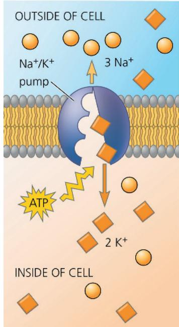  
Figure 48.7 The basis of the membrane potential.

The sodium-potassium pump generates and maintains the concentration gradients of $Na^{+}$ and $K^{+}$ shown in Table 48.1. The $Na^{+}$ concentration gradient results in very little net diffusion of $Na^{+}$ in a resting neuron because very few channels are open. In contrast, the many open potassium channels allow a significant net outflow of $K^{+}$ . This outflow of $K^{+}$ results in a net negative charge inside the cell.  

  
The potassium and sodium channels have the same rough overall structure, as shown. How must these proteins differ to allow passage of only a particular ion? For suggested answer, see Appendix A.

chemical concentration gradient thus favors a net outflow of $K^{+}$ . Furthermore, a resting neuron has many open potassium channels, but very few open sodium channels. Because very few $Na^{+}$ ions can cross the membrane, $K^{+}$ outflow leads to a net negative charge inside the cell. This buildup of negative charge within the neuron is the major source of the membrane potential.

What prevents the buildup of negative charge from increasing indefinitely? The excess negative charges inside the cell exert an attractive force that opposes the flow of additional positively charged potassium ions out of the cell. The separation of charge (voltage) thus results in an electrical gradient that counterbalances the chemical concentration gradient of $K^{+}$ .

## Modeling the Resting Potential

The net flow of $K^{+}$ out of a neuron proceeds until the chemical and electrical forces are in balance. We can model this process by considering a pair of chambers separated by an artificial membrane. To begin, imagine that the membrane contains many open ion channels, all of which allow only $K^{+}$ to diffuse across (Figure 48.8a). To produce a $K^{+}$ concentration gradient like that of a mammalian neuron, we place a solution of 140 mM potassium chloride (KCl) in the inner chamber and 5 mM KCl in the outer chamber. The $K^{+}$ will diffuse down its concentration gradient into the outer chamber. But because the chloride ions ( $Cl^{-}$ ) lack a means of crossing the membrane, there will be an excess of negative charge in the inner chamber.

When our model neuron reaches equilibrium, the electrical gradient will exactly balance the chemical gradient so that no further net diffusion of $K^{+}$ occurs across the membrane. The magnitude of the membrane voltage at equilibrium for a particular ion is called that ion's equilibrium potential ( $E_{ion}$ ). For a membrane permeable to a single type of ion, $E_{ion}$ can be calculated using a formula called the Nernst equation. At human body temperature (37°C) and for an ion with a net charge of 1+, such as $K^{+}$ or $Na^{+}$ , the Nernst equation is

$$
E _ {\mathrm{ion}} = 6 2 \mathrm{mV} \left(\log \frac {[ \mathrm{ion} ] _ {\mathrm{outside}}}{[ \mathrm{ion} ] _ {\mathrm{inside}}}\right)
$$

Plugging the $K^{+}$ concentrations into the Nernst equation reveals that the equilibrium potential for $\mathrm{K}^{+}\left(E_{\mathrm{K}}\right)$ is -90 mV (see Figure 48.8a).

## Figure 48.8 Modeling a mammalian neuron.

In this model of the membrane potential of a resting neuron, an artificial membrane divides each container into two chambers. Ion channels allow free diffusion for particular ions, resulting in the net ion flow represented by arrows. (a) The presence of open potassium channels makes the membrane selectively permeable to $K^{+}$ , and the inner chamber contains a 28-fold higher concentration of $K^{+}$ than the outer chamber; at equilibrium, the inside of the membrane is -90 mV relative to the outside. (b) The membrane is selectively permeable to $Na^{+}$ , and the inner chamber contains a tenfold lower concentration of $Na^{+}$ than the outer chamber; at equilibrium, the inside of the membrane is +62 mV relative to the outside.

WHAT IF? How would adding potassium or chloride channels to the membrane in (b) affect the membrane potential?

For suggested answer, see Appendix A.

The minus sign indicates that $K^{+}$ is at equilibrium when the inside of the membrane is 90 mV more negative than the outside.

Whereas the equilibrium potential for $K^{+}$ is -90 mV, the resting potential of a mammalian neuron is somewhat less negative. This difference reflects the small but steady movement of $Na^{+}$ across the few open sodium channels in a resting neuron. The concentration gradient of $Na^{+}$ has a direction opposite to that of $K^{+}$ (see Table 48.1). $Na^{+}$ therefore diffuses into the cell, making the inside of the cell less negative. If we model a membrane in which the only open channels are selectively permeable to $Na^{+}$ , we find that a tenfold higher concentration of $Na^{+}$ in the outer chamber results in an equilibrium potential ( $E_{Na}$ ) of +62 mV (Figure 48.8b). In an actual neuron, the resting potential (-60 to -80 mV) is much closer to $E_{K}$ than to $E_{Na}$ because there are many open potassium channels but only a small number of open sodium channels.

Because neither $K^{+}$ nor $Na^{+}$ is at equilibrium in a resting neuron, there is a net flow of each ion across the membrane. The resting potential remains steady, which means that these $K^{+}$ and $Na^{+}$ currents are equal and opposite. Ion concentrations on either side of the membrane also remain steady. Why? The resting potential arises from the net movement of far fewer ions than would be required to alter the concentration gradients.

If $Na^{+}$ is allowed to cross the membrane more readily, the membrane potential will move toward $E_{Na}$ and away from $E_{K}$ . As you'll see, this happens in generation of a nerve impulse.

## Concept Check 48.2

1. Under what circumstances could ions flow through an ion channel from a region of lower ion concentration to a region of higher ion concentration?

2. WHAT IF? Suppose a cell's membrane potential shifts from $-70\mathrm{mV}$ to $-50\mathrm{mV}$ . What changes in the cell's permeability to $\mathrm{K}^+$ or $\mathrm{Na}^+$ could cause such a shift?

3. MAKE CONNECTIONS Review Figure 7.11, which illustrates the diffusion of dye molecules across a membrane. Could diffusion eliminate the concentration gradient of a dye that has a net charge? Explain.

For suggested answers, see Appendix A.  
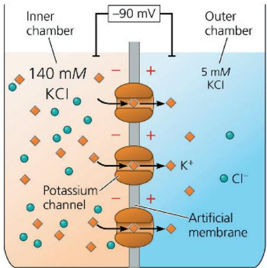  
(a) Membrane selectively permeable to $K^{+}$ Nernst equation for $K^{+}$ equilibrium potential at 37°C:

$$
E _ {K} = 6 2 \mathrm{mV} \left(\log \frac {5 \mathrm{mM}}{1 4 0 \mathrm{mM}}\right) = - 9 0 \mathrm{mV}
$$

(b) Membrane selectively permeable to $\mathrm{Na^{+}}$ Nernst equation for $\mathrm{Na^{+}}$ equilibrium potential at $37^{\circ}\mathrm{C}$ :

$$
E _ {\mathrm{Na}} = 6 2 \mathrm{mV} \left(\log \frac {1 5 0 \mathrm{mM}}{1 5 \mathrm{mM}}\right) = + 6 2 \mathrm{mV}
$$

## Concept 48.3: Action potentials are the signals conducted by axons

When a neuron responds to a stimulus, the membrane potential changes. Using intracellular recording, researchers can monitor these changes as a function of time (Figure 48.9). As you will see, such recordings have been central to the study of information transfer by neurons.

How does a stimulus alter the membrane potential? Certain ion channels in a neuron, called gated ion channels, open or close in response to stimuli. When a gated ion channel opens or closes, it alters the membrane's permeability to particular ions (Figure 48.10). The result of channel opening is a rapid flow of ions across the membrane, altering the membrane potential.

Particular types of gated channels respond to different stimuli. For example, Figure 48.10 illustrates a voltage-gated ion channel, a channel that opens or closes in response to a shift in the voltage across the plasma membrane of the neuron. Later in this chapter, we will discuss gated channels that are located in neurons and are regulated by chemical signals.

## Hyperpolarization and Depolarization

Let's consider now what happens in a neuron when a stimulus causes closed voltage-gated ion channels to open. If gated potassium channels in a resting neuron open, the membrane's

## Figure 48.9 Research Method: Intracellular Recording Application

Electrophysiologists use intracellular recording to measure the membrane potential of neurons and other cells.

## Technique

A microelectrode is made from a glass capillary tube filled with an electrically conductive salt solution. One end of the tube tapers to an extremely fine tip (diameter $<1\mu m$ ). While looking through a microscope, the experimenter uses a micropositioner to insert the tip of the microelectrode into a cell. A voltage recorder (usually an oscilloscope or a computer-based system) measures the voltage between the microelectrode tip inside the cell and a reference electrode placed in the solution outside the cell.

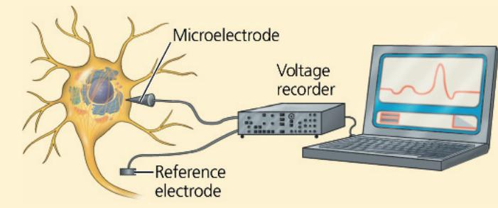

## Figure 48.10 Voltage-gated ion channel.

A change in the membrane potential in one direction (solid arrow) opens the voltage-gated channel. The opposite change (dashed arrow) closes the channel.

  
VISUAL SKILLS Gated ion channels allow ion flow in either direction. Using visual information in this figure, explain why there is net ion movement when the channel opens.  
For suggested answer, see Appendix A.

permeability to $K^{+}$ increases. As a result, net diffusion of $K^{+}$ out of the neuron increases, shifting the membrane potential toward $E_{K}$ (-90 mV at 37°C). This increase in the magnitude of the membrane potential, called a hyperpolarization, makes the inside of the membrane more negative (Figure 48.11a). In a resting neuron, hyperpolarization results from any stimulus that increases the outflow of positive ions or the inflow of negative ions.

Although opening potassium channels in a resting neuron causes hyperpolarization, opening some other types of ion channels has an opposite effect, making the inside of the membrane less negative (Figure 48.11b). A reduction in the magnitude of the membrane potential is a depolarization. In neurons, depolarization often involves gated sodium channels. If a stimulus causes gated sodium channels to open, the membrane's permeability to $\mathrm{Na^{+}}$ increases. $\mathrm{Na^{+}}$ diffuses into the cell along its concentration gradient, causing a depolarization as the membrane potential shifts toward $E_{\mathrm{Na}}(+62\mathrm{mV}$ at $37^{\circ}\mathrm{C})$ .

## Graded Potentials and Action Potentials

Sometimes, the hyperpolarization or depolarization is simply a short-lived shift in the membrane potential. This shift, called a graded potential, has a magnitude that varies with the strength of the stimulus: A larger stimulus causes a greater change in the membrane potential (see Figure 48.11a and 48.11b). Graded potentials induce a small electrical current that dissipates as it flows along the membrane. Graded potentials thus decay with time and with distance from their source.

If a depolarization shifts the membrane potential sufficiently, the result is a massive change in membrane voltage called an action potential. Unlike graded potentials, action potentials have a constant magnitude and can regenerate in adjacent regions of the membrane. Action potentials can therefore spread along axons, making them well suited for transmitting a signal over long distances.

Figure 48.11 Graded potentials and an action potential in a neuron.

The graphs in (a) and (b) show changes in membrane potential over time during two separate trials involving stimuli of different strengths. The tracings (the red lines representing the results) of the two separate trials are superimposed.

  
(a) Graded hyperpolarizations produced by two stimuli that increase membrane permeability to $K^{+}$ . The larger stimulus produces a larger hyperpolarization.

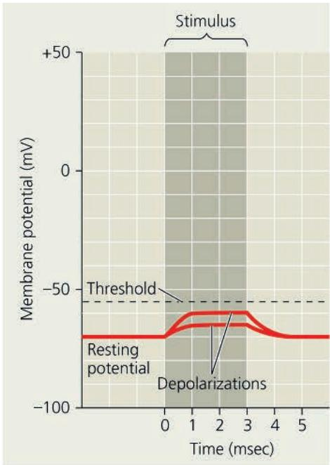  
(b) Graded depolarizations produced by two stimuli that increase membrane permeability to $Na^{+}$ . The larger stimulus produces a larger depolarization.

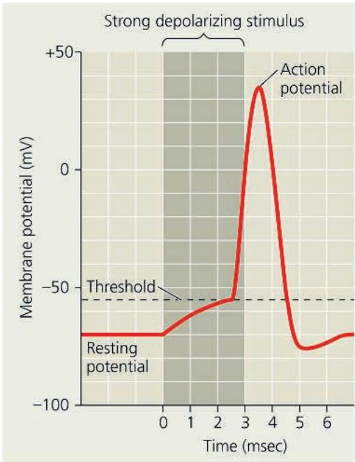  
(c) Action potential triggered by a depolarization that reaches the threshold.  
DRAW IT Redraw the graph in (c), extending the y-axis. Then, label the positions of $E_{K}$ and $E_{Na}$ . For suggested answer, see Appendix A.

Action potentials arise because some of the ion channels in axons are voltage-gated (see Figure 48.10). If a depolarization increases the membrane potential to a level called threshold, the voltage-gated sodium channels open. The resulting flow of $Na^{+}$ into the neuron results in further depolarization. Because the sodium channels are voltage gated, the increased depolarization causes more sodium channels to open, leading to an even greater flow of current. The result is a process of positive feedback that triggers a very rapid opening of many voltage-gated sodium channels and the marked temporary change in membrane potential that defines an action potential (Figure 48.11c).

The positive-feedback loop of channel opening and depolarization triggers an action potential whenever the membrane potential reaches threshold, about -55 mV for many mammals. Once initiated, the action potential has a magnitude that is independent of the strength of the triggering stimulus. Because action potentials either occur fully or do not occur at all, they represent an all-or-none response to stimuli.

## Generation of Action Potentials: A Closer Look

The characteristic shape of the action potential graph in Figure 48.11c reflects changes in membrane potential resulting from ion movement through voltage-gated sodium and potassium channels. Depolarization opens both types of channels, but they respond independently and sequentially. Sodium channels open first, initiating the action potential. As the action potential proceeds, sodium channels remain open but become inactivated: A portion of the channel protein called an inactivation loop blocks ion flow through the open channel. Sodium channels remain inactivated until after the membrane returns to the resting potential and the channels close. Potassium channels open more slowly than sodium channels, but are not inactivated. They remain open until the membrane potential returns to its resting state.

To understand further how voltage-gated channels shape the action potential, consider the process as a series of stages, as depicted in Figure 48.12. ① When the membrane of the axon is at the resting potential, most voltage-gated sodium channels are closed. Ungated potassium channels involved in the resting membrane potential are open, but voltage-gated potassium channels are closed. ② When a stimulus depolarizes the membrane, some gated sodium channels open, allowing more $\mathrm{Na^{+}}$ to diffuse into the cell. If the stimulus is sufficiently strong, more $\mathrm{Na^{+}}$ channels open and the $\mathrm{Na^{+}}$ inflow persists, causing further depolarization, which opens more gated sodium channels, allowing even more $\mathrm{Na^{+}}$ to diffuse into the cell.

③ Once the threshold is crossed, the positive-feedback cycle then rapidly brings the membrane potential close to $E_{Na}$ . This stage of the action potential is called the rising phase. ④ Two events prevent the membrane potential from actually reaching $E_{Na}$ : Voltage-gated

Figure 48.12 The role of voltage-gated ion channels in the generation of an action potential. The circled numbers on the graph in the center and the colors of the action potential phases correspond to the five diagrams showing voltage-gated sodium and potassium channels in a neuron's plasma membrane.  
  
DRAW IT Draw a simple diagram showing how positive feedback underlies the rising phase of the action potential. Your diagram should include these three events: (1) a change in membrane potential; (2) ion flow; and (3) opening, closing, or inactivation of a channel.

For suggested answer, see Appendix A.

sodium channels inactivate soon after opening, halting the flow of $Na^{+}$ into the cell, and most voltage-gated potassium channels open, causing a rapid outflow of $K^{+}$ . Both events quickly bring the membrane potential back toward $E_{K}$ . This stage is called the falling phase. $^{5}$ In the final phase of an action potential, called the undershoot, the membrane's permeability to $K^{+}$ is higher than at rest, so the membrane potential is closer to $E_{K}$ than it is at the resting potential. The gated potassium channels eventually close, and the membrane potential returns to the resting potential.

Why is inactivation of channels required during an action potential? Because they are voltage gated, the sodium channels open when the membrane potential reaches the threshold of $-55\mathrm{mV}$ and don't close until the resting potential is restored. They are therefore open throughout the action potential. However, the resting potential cannot be restored unless the flow of $\mathrm{Na^{+}}$ into the cell stops. This is accomplished by inactivation. The sodium channels remain in the "open" state, but sodium ions cease flowing once inactivation occurs. The end of $\mathrm{Na^{+}}$ inflow allows $\mathrm{K^{+}}$ outflow to repolarize the membrane.

The sodium channels remain inactivated during the falling phase and the early part of the undershoot. As a result, if a second depolarizing stimulus occurs during this period, it will be unable to trigger an action potential. The “downtime” when a second action potential cannot be initiated is called the refractory period. Note that the refractory period is due to the inactivation of sodium channels, not to a change in the ion concentration gradients across the plasma membrane. The flow of charged particles during an action potential involves far too few ions to change the concentration on either side of the membrane significantly.

## Conduction of Action Potentials

Having described the events of a single action potential, we'll explore next how a series of action potentials moves a signal along an axon. At the site where an action potential is initiated (usually the axon hillock), $\mathrm{Na^{+}}$ inflow during the rising phase creates an electrical current that depolarizes the neighboring region of the axon membrane (Figure 48.13). The depolarization is large enough to reach threshold, causing an action potential in the neighboring region. This process is repeated many times along the length of the axon. Because an action potential is an all-or-none event, the magnitude and duration of the action potential are the same at each position along the axon. The net result is the movement of a nerve impulse from the cell body to the synaptic terminals, much like the cascade of events triggered by knocking over the first domino in a line.

An action potential that starts at the axon hillock moves along the axon only toward the synaptic terminals. Why? Immediately behind the traveling zone of depolarization, the sodium channels remain inactivated, making the membrane temporarily refractory (not responsive) to further input. Consequently, the inward current that depolarizes the axon membrane ahead of the action potential cannot produce another action potential behind it. This is why action potentials do not travel back toward the cell body.

After the refractory period is complete, depolarization of the axon hillock to threshold will trigger a new action potential. In many neurons, action potentials last less than 2 milliseconds (msec), and the firing rate can thus reach hundreds of action potentials per second.

The frequency of action potentials conveys information: The rate at which action potentials are produced in a particular neuron is proportional to input signal strength. In hearing, for example, louder sounds result in more frequent action potentials in neurons connecting the ear to the brain. Similarly, increased frequency of action potentials in a neuron that stimulates skeletal muscle tissue will increase the tension in the contracting muscle. Differences in the number of action potentials in a given time are in fact the only variable in how information is encoded and transmitted along an axon.

Gated ion channels and action potentials have a central role in nervous system activity. As a consequence, mutations in genes that encode ion channel proteins can cause disorders affecting the nerves or brain—or the muscles or heart, depending largely on where in the body the gene for the ion channel protein is expressed. For example, mutations affecting voltage-gated sodium channels in skeletal muscle cells can cause myotonia, a periodic spasming of those muscles. Mutations affecting sodium channels in the brain can cause epilepsy, in which groups of nerve cells fire simultaneously and excessively, producing seizures.

Figure 48.13 Conduction of an action potential.

This figure shows events at three successive times as an action potential passes from left to right. At each point along the axon, voltage-gated ion channels go through the sequence of changes shown in Figure 48.9. Membrane colors correspond to the action potential phases in that figure.

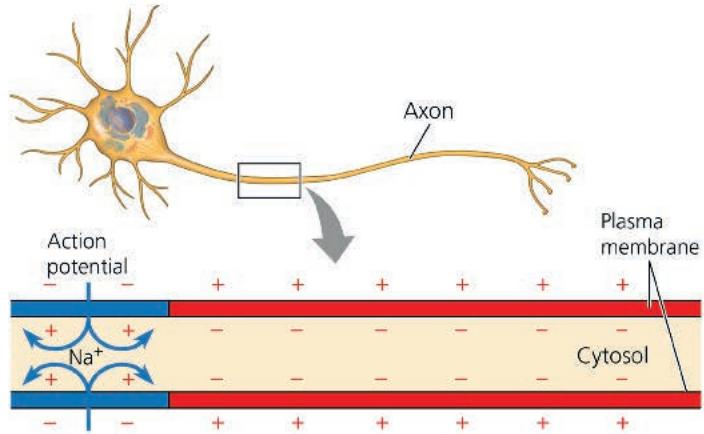  
1 An action potential is generated as Na $^{+}$ flows inward across the membrane in one region.

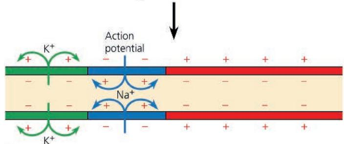

2 The depolarization of the action potential spreads to the neighboring region of the membrane, reinitiating the action potential there. To the left of this region, the membrane is repolarizing as $K^{+}$ flows outward.

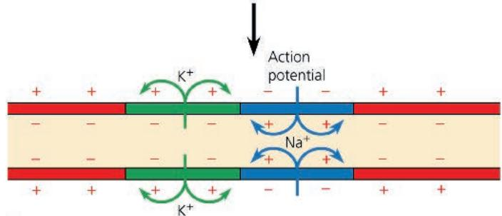

3 The depolarization-repolarization process is repeated in the next region of the membrane. In this way, local currents of ions across the plasma membrane cause the action potential to be propagated along the length of the axon.

DRAW IT For the axon segment shown, consider a point at the left end, a point in the middle, and a point at the right end. Draw a graph for each point showing the change in membrane potential over time at that point as a single nerve impulse moves from left to right across the segment.

For suggested answer, see Appendix A.

## Evolutionary Adaptations of Axon Structure

EVOLUTION The rate at which the axons within nerves conduct action potentials governs how rapidly an animal can react to danger or opportunity. As a consequence, natural selection often results in anatomical adaptations that increase conduction speed. One such adaptation is a wider axon. In the same way that a wide hose offers less resistance to the flow of water than does a narrow hose, a wide axon provides less resistance to the current associated with an action potential than does a narrow axon.

Figure 48.14 Schwann cells and the myelin sheath.  
In the PNS, glia called Schwann cells wrap themselves around axons, forming layers of myelin. Gaps between adjacent Schwann cells are called nodes of Ranvier. The TEM shows a cross section through a myelinated axon.  

In invertebrates, conduction speed varies from several centimeters per second in very narrow axons to approximately 30 m/sec in the giant axons of some arthropods and molluscs. These giant axons (up to 1 mm in diameter) function in rapid behavioral responses, such as the muscle contraction that propels a hunting squid toward its prey.

Vertebrate axons have narrow diameters but can still conduct action potentials at high speed. How is this possible? The evolutionary adaptation that enables fast conduction in vertebrate axons is insulation, analogous to the plastic insulation that encases many electrical wires.

The insulation that surrounds vertebrate axons is called a myelin sheath (Figure 48.14). Myelin sheaths are produced by glia: oligodendrocytes in the CNS and Schwann cells in the PNS. During development, these specialized glia wrap axons in many layers of membrane. The membranes forming these layers are mostly lipid, which is a poor conductor of electrical current and thus a good insulator.

In myelinated axons, voltage-gated sodium channels are restricted to gaps in the myelin sheath called nodes of Ranvier (see Figure 48.14). Furthermore, the extracellular fluid is in contact with the axon membrane only at the nodes. As a result, action potentials are not generated in the regions between the nodes. Rather, the inward current produced during the rising phase of the action potential at a node travels within the axon all the way to the next node. There, the current depolarizes the membrane and regenerates the action potential (Figure 48.15).

Action potentials propagate more rapidly in myelinated axons because the time-consuming process of opening and closing of ion channels occurs at only a limited number of positions along the axon. This mechanism for propagating action potentials is called saltatory conduction (from the Latin saltare, to leap) because the action potential appears to jump from node to node along the axon.

The major selective advantage of myelination is its space efficiency. A myelinated axon 20 $\mu$ m in diameter has a conduction speed faster than that of a squid giant axon with a diameter 40 times greater. Consequently, more than 2,000 of those myelinated axons can be packed into the space occupied by just one giant axon.

For any axon, myelinated or not, the conduction of an action potential to the end of the axon sets the stage for the next step in neuronal signaling—the transfer of information to another cell. This information handoff occurs at synapses, our next topic.

Figure 48.15 Propagation of action potentials in myelinated axons.

In a myelinated axon, the depolarizing current during an action potential at one node of Ranvier spreads along the interior of the axon to the next node (blue arrows), where voltage-gated sodium channels enable reinitiation. Thus, the action potential appears to jump from node to node as it travels along the axon (red arrows).

## Concept Check 48.3

1. How do action potentials and graded potentials differ?

2. In multiple sclerosis (from the Greek skleros, hard), a person's myelin sheaths harden and deteriorate. How would this affect nervous system function?

3. How do both negative and positive feedback contribute to the changes in membrane potential during an action potential?

4. WHAT IF? Suppose a mutation caused gated sodium channels to remain inactivated longer after an action potential. How would this affect the frequency at which action potentials could be generated? Explain.

For suggested answers, see Appendix A.

## Concept 48.4: Neurons communicate with other cells at synapses

Transmission of information from neurons to other cells occurs at synapses. Synapses are either electrical or chemical.

Electrical synapses contain gap junctions (see Figure 6.30) that allow electrical current to flow directly from one neuron to another. Such synapses often play a role in synchronizing the activity of neurons that direct rapid, unvarying behaviors. For example, electrical synapses associated with the giant axons of squids and lobsters facilitate swift escapes from danger. Electrical synapses are also found in the vertebrate heart and brain.

The majority of synapses are chemical synapses, which rely on the release of a chemical neurotransmitter by the presynaptic neuron to transfer information to the target cell. While at rest, the presynaptic neuron synthesizes the neurotransmitter at each synaptic terminal, packaging it in multiple membrane-enclosed compartments called synaptic vesicles. When an action potential arrives at a chemical synapse, it depolarizes the plasma membrane at the synaptic terminal, opening voltage-gated channels that allow $Ca^{2+}$ to diffuse in. The $Ca^{2+}$ concentration in the terminal rises, causing synaptic vesicles to fuse with the terminal membrane and release the neurotransmitter.

Neurotransmitter released from the synaptic terminus diffuses across the synaptic cleft, the gap that separates the presynaptic neuron from the postsynaptic cell. Diffusion time is very short because the gap is less than 50 nm across. Upon reaching the postsynaptic membrane, the neurotransmitter binds to and activates a specific receptor in the membrane. This series of events at the synapse is summarized in Figure 48.16, on the facing page.

Information transfer at chemical synapses can be modified by altering either the amount of neurotransmitter that is released or the responsiveness of the postsynaptic cell. Such modifications underlie an animal's ability to alter its behavior in response to change and also form the basis for learning and memory, as you will read in Concept 49.4.

## Generation of Postsynaptic Potentials

At many chemical synapses, the receptor protein that binds and responds to neurotransmitters is a ligand-gated ion channel, often called an ionotropic receptor. These receptors are clustered in the membrane of the postsynaptic cell, directly opposite the synaptic terminal. Binding of the neurotransmitter (the receptor's ligand) to a particular part of the receptor opens the channel and allows specific ions to diffuse across the postsynaptic membrane. The result is a postsynaptic potential, a graded potential in the postsynaptic cell.

At some chemical synapses, the ligand-gated ion channels are permeable to both $K^{+}$ and $Na^{+}$ (see Figure 48.16). When these channels open, the membrane potential depolarizes toward a value roughly midway between $E_{K}$ and $E_{Na}$ . Because such a depolarization brings the membrane potential toward threshold, it is an example of an excitatory postsynaptic potential (EPSP).

At other chemical synapses, the ligand-gated ion channels are selectively permeable for only $K^{+}$ or $Cl^{-}$ . When such channels open, the postsynaptic membrane hyperpolarizes. A hyperpolarization produced in this manner is an inhibitory postsynaptic potential (IPSP) because it moves the membrane potential farther from threshold.

## Summation of Postsynaptic Potentials

The interplay between multiple excitatory and inhibitory inputs is the essence of integration in the nervous system. The cell body and dendrites of a given postsynaptic neuron may receive inputs from chemical synapses formed with hundreds or even thousands of synaptic terminals (see Figure 48.2). How do so many synapses contribute to information transfer?

The input from an individual synapse is typically insufficient to trigger a response in a postsynaptic neuron. To see why, consider an EPSP arising at a single synapse. As a graded potential, the EPSP becomes smaller as it spreads from the synapse. Therefore, by the time a particular EPSP reaches the axon hillock, it is usually too small to trigger an action potential (Figure 48.17a, after you turn the page).

On some occasions, individual postsynaptic potentials combine to produce a larger postsynaptic potential, a process called summation. For instance, two EPSPs may occur at a single synapse in rapid succession. If the second EPSP arises before the postsynaptic membrane potential returns to its resting value, the EPSPs add together through temporal summation. If the summed postsynaptic potentials depolarize the membrane at the axon hillock to threshold, the result is an action potential (Figure 48.17b). Summation can also involve multiple synapses on the same postsynaptic neuron. If such synapses are active at the same time, the resulting EPSPs can add together through spatial summation (Figure 48.17c).

Summation applies as well to IPSPs: Two or more IPSPs occurring nearly simultaneously at synapses in the same region or in rapid succession at the same synapse have a larger hyperpolarizing effect than a single IPSP. Through summation, an IPSP can also counter the effect of an EPSP (Figure 48.17d).

The axon hillock is the neuron's integrating center, the region where the membrane potential at any instant represents the summed effect of all EPSPs and IPSPs. Whenever the membrane potential at the axon hillock reaches threshold, an action potential is generated and travels along the axon to its synaptic terminals. After the refractory period, the neuron may produce another action potential, provided the membrane potential at the axon hillock once again reaches threshold.

Figure 48.16 A chemical synapse.

This figure illustrates the sequence of events that transmits a signal across a chemical synapse. In response to binding of neurotransmitter, ligand-gated ion channels in the postsynaptic membrane open (as shown here) or, less commonly, close. Synaptic transmission ends when the neurotransmitter diffuses out of the synaptic cleft, is taken up by the synaptic terminal or by another cell, or is degraded by an enzyme.

  
WHAT IF? If all the $Ca^{2+}$ in the fluid surrounding a neuron were removed, how would this affect the transmission of information within and between neurons?  
4 The neurotransmitter binds to ligand-gated ion channels in the postsynaptic membrane. In this example, binding triggers opening, allowing $Na^{+}$ and $K^{+}$ to diffuse through.

## Termination of Neurotransmitter Signaling

After a response is triggered, the chemical synapse returns to its resting state. How does this happen? The key step is clearing the neurotransmitter molecules from the synaptic cleft. Some neurotransmitters are inactivated by enzymatic hydrolysis (Figure 48.18a, after you turn the page). Other neurotransmitters are recaptured into the presynaptic neuron (Figure 48.18b). After this reuptake occurs, neurotransmitters are repackaged in synaptic vesicles or transferred to glia for metabolism or recycling to neurons.

## Modulated Signaling at Synapses

So far, we have focused on synapses where a neurotransmitter binds directly to an ion channel, causing the channel to open.

However, there are also chemical synapses in which the receptor for the neurotransmitter is not part of an ion channel. At these synapses, the neurotransmitter binds to a G protein-coupled receptor, activating a signal transduction pathway in the postsynaptic cell involving a second messenger (see Concept 11.3). Because the resulting opening or closing of ion channels depends on one or more metabolic steps, these G protein-coupled receptors are also called metabotropic receptors.

For example, the binding of norepinephrine to its metabotropic receptor activates a G protein, which in turn activates adenylyl cyclase, the enzyme that converts ATP to cAMP (see Figure 11.11). Cyclic AMP activates protein kinase A, which phosphorylates specific ion channel proteins in the postsynaptic membrane, causing them to open or close. Because of the amplifying effect of the signal transduction pathway, the binding of one norepinephrine molecule can affect the opening or closing of many channels.

Figure 48.17 Summation of postsynaptic potentials.

These graphs trace changes in the membrane potential at a postsynaptic neuron's axon hillock. The red arrows indicate times when postsynaptic potentials occur at two excitatory synapses ( $E_{1}$ and $E_{2}$ , green in the diagrams above the graphs) and at one inhibitory synapse (I, purple). Like most EPSPs, those produced at $E_{1}$ or $E_{2}$ do not reach the threshold at the axon hillock without summation.

  
VISUAL SKILLS Assuming that synapses $E_{1}$ and $E_{2}$ were identical aside from their location, which synapse would produce a stronger EPSP at the axon hillock?  
For suggested answer, see Appendix A.

Figure 48.18 Two mechanisms of terminating neurotransmission.  

(a) Enzymatic breakdown of neurotransmitter in the synaptic cleft  
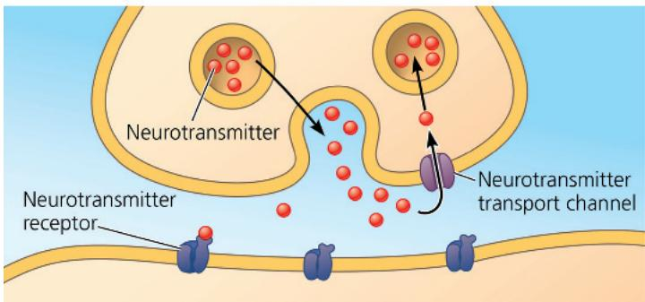  
(b) Reuptake of neurotransmitter by presynaptic neuron

Many neurotransmitters have both ionotropic and metabotropic receptors. Compared with the postsynaptic potentials produced by ligand-gated channels, the effects of G protein pathways typically have a slower onset but last longer.

## Neurotransmitters

Signaling at a synapse brings about a response that depends on both the neurotransmitter released from the presynaptic membrane and the receptor produced at the postsynaptic membrane. A single neurotransmitter may bind specifically to more than a dozen different receptors. Indeed, a particular neurotransmitter can excite postsynaptic cells expressing one receptor and inhibit postsynaptic cells expressing a different receptor. As an example, let's examine acetylcholine, a common neurotransmitter in both invertebrates and vertebrates.

## Acetylcholine

In vertebrates, there are two major classes of acetylcholine receptor. One type is the muscarinic receptor, which is metabotropic. Muscarinic receptors have different effects in different locations. In heart muscle, these receptors activate G proteins that directly open potassium channels in the muscle cell membrane as well as inhibit adenylyl cyclase. Both effects reduce the rate at which the heart pumps.

The second type is the ligand-gated ion channel permeable to $Na^{+}$ and $K^{+}$ ions discussed earlier. These ionotropic receptors are called nicotinic receptors because they are also activated by the chemical nicotine that is found in tobacco. These receptors play a key role at the vertebrate neuromuscular junction, the site where a motor neuron forms a synapse with a skeletal muscle cell. When acetylcholine released by motor neurons binds this receptor, the net influx of positive charges causes an EPSP, resulting in action potentials that lead to muscle contraction. This excitatory activity is soon terminated by acetylcholinesterase, an enzyme in the synaptic cleft that hydrolyzes the neurotransmitter into an inactive form. Thus, acetylcholine is inhibitory in heart muscle but excitatory in skeletal muscle.

Several chemicals profoundly influence the nervous system by interfering with acetylcholine production or action. For instance, nicotine in tobacco acts as a stimulant by directly activating nicotinic receptors in the brain. The chemical weapon sarin inhibits acetylcholinesterase, causing uncontrolled skeletal muscle contractions. A third example is the bacterial product botulinum toxin, which causes paralysis of skeletal muscles by blocking acetylcholine release. Because skeletal muscles are required for breathing, untreated botulism is typically fatal. Today, injections of the botulinum toxin, known by the trade name Botox, are used cosmetically to minimize wrinkles around the eyes or mouth by inhibiting synaptic transmission to particular facial muscles.

Although acetylcholine has many roles, it is just one of more than 100 known neurotransmitters. As shown by the examples in Table 48.2, the rest fall into four classes: amino acids, biogenic amines, neuropeptides, and gases.

## Amino Acids

Glutamate is one of several amino acids that can act as a neurotransmitter. In invertebrates, glutamate, rather than acetylcholine, is the neurotransmitter at the neuromuscular junction. In vertebrates, glutamate is the most common neurotransmitter in the CNS. Synapses at which glutamate is the neurotransmitter have a key role in the formation of long-term memory, as you will see in Concept 49.4.

Two amino acids act as inhibitory neurotransmitters in the CNS. Glycine acts at inhibitory synapses in parts of the CNS that lie outside of the brain. Within the brain, the amino acid gamma-aminobutyric acid (GABA) is the neurotransmitter at most inhibitory synapses. Binding of GABA to receptors in postsynaptic cells increases membrane permeability to $Cl^{-}$ , resulting in an IPSP. The widely prescribed drug diazepam (Valium) reduces anxiety through binding to a site on a GABA receptor, increasing the response to GABA.

## Biogenic Amines

The neurotransmitters grouped as biogenic amines are synthesized from amino acids and include norepinephrine, which is made from tyrosine. Norepinephrine is an excitatory neurotransmitter in the autonomic nervous system, a branch of the PNS. Outside the nervous system, norepinephrine has distinct but related functions as a hormone, as does the chemically similar biogenic amine epinephrine (see Concept 45.3).

Table 48.2 Major Neurotransmitters

<table><tr><td>Neurotransmitter</td><td>Structure</td></tr><tr><td>Acetylcholine</td><td></td></tr><tr><td>Amino AcidsGlutamateGABA (gamma-aminobutyric acid)Glycine</td><td> $H_2N—CH—CH_2—CH_2—COOH$  $\begin{array}{c} | \\ COOH \end{array}$  $H_2N—CH_2—CH_2—CH_2—COOH$  $H_2N—CH_2—COOH$ </td></tr><tr><td>Biogenic AminesNorepinephrineDopamineSerotonin</td><td>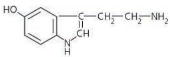</td></tr><tr><td colspan="2">Neuropeptides(a very diverse group, only two of which are shown)Substance PArg—Pro—Lys—Pro—Gln—Gln—Phe—Phe—Gly—Leu—MetMet-enkephalin (an endorphin)Tyr—Gly—Gly—Phe—Met</td></tr><tr><td>GasesNitric oxide</td><td>N=O</td></tr></table>

The biogenic amines dopamine (made from tyrosine) and serotonin (made from tryptophan) are released at many sites in the brain and affect sleep, mood, attention, and learning. Some psychoactive drugs, including LSD and mescaline, apparently produce their hallucinatory effects by binding to brain receptors for these neurotransmitters.

Biogenic amines have a central role in a number of nervous system disorders and treatments (see Concept 49.5). The degenerative illness Parkinson's disease is associated with a lack of dopamine in the brain. In addition, depression is often treated with drugs that increase the brain concentrations of biogenic amines. Prozac, for instance, enhances the effect of serotonin by inhibiting its reuptake after it is released by presynaptic neurons.

## Neuropeptides

Several neuropeptides, relatively short chains of amino acids, serve as neurotransmitters that operate via metabotropic receptors. Such peptides are typically produced by cleavage of much larger protein precursors. The neuropeptide substance P is a key excitatory neurotransmitter that mediates our perception of pain.

Other neuropeptides, called endorphins, function as natural analgesics, decreasing pain perception.

Endorphins are produced in the brain during times of physical or emotional stress, such as childbirth. In addition to relieving pain, they decrease respiration and produce euphoria, as well as other emotional effects. Because opioids (drugs such as morphine and heroin) bind to the same receptor proteins as endorphins, opioids mimic endorphins and produce many of the same physiological effects (see Figure 2.16). In the Scientific Skills Exercise, you can interpret data from an experiment designed to search for opioid receptors in the brain.

## Gases

Some vertebrate neurons release dissolved gases as neurotransmitters. In human males, for example, certain neurons release nitric oxide (NO) into the erectile tissue of the penis during sexual arousal. The resulting relaxation of smooth muscle in the blood vessel walls of the spongy erectile tissue allows the tissue to fill with blood, producing an erection. The erectile dysfunction drug Viagra works by inhibiting an enzyme that terminates the action of NO.

Unlike most neurotransmitters, NO is not stored in cytoplasmic vesicles but is instead synthesized on demand. NO diffuses into neighboring target cells, produces a change, and is broken down—all

## Scientific Skills Exercise Interpreting Data Values Expressed in Scientific Notation

Does the Brain Have Specific Protein Receptors for Opioids? Researchers were looking for opioid receptors in the mammalian brain. Knowing that the drug naloxone blocks the analgesic effect of opioids, they hypothesized that naloxone acts by binding tightly to brain opioid receptors without activating them. In this exercise, you will interpret the results of an experiment to test this hypothesis.

How the Experiment Was Done The researchers incubated radioactive naloxone with a protein mixture prepared from rodent brains. If the mixture contained opioid receptors or other proteins that could bind naloxone, the radioactivity would stably associate with the mixture. To determine whether the binding was due to specific opioid receptors, they tested other drugs, opioid and non-opioid, for their ability to block naloxone binding.

1 Radioactive naloxone and a test drug are added to a protein mixture.

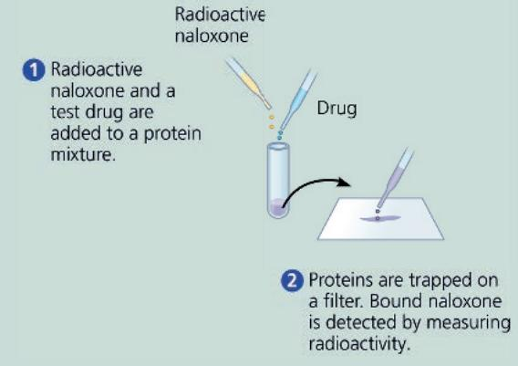

Drug

2 Proteins are trapped on a filter. Bound naloxone is detected by measuring radioactivity.

within a few seconds. In many of its targets, including smooth muscle cells, NO stimulates an enzyme to synthesize a second messenger that directly affects cellular metabolism.

Although the gas carbon monoxide (CO) is a deadly poison if inhaled, vertebrates produce small amounts of CO as a neurotransmitter. For example, CO synthesized in the brain regulates the release of hormones from the hypothalamus.

In the next chapter, we'll consider how the cellular and biochemical mechanisms we have discussed contribute to nervous system function on the system level.

## Concept Check 48.4

1. How is it possible for a particular neurotransmitter to produce opposite effects in different tissues?

2. Some pesticides inhibit acetylcholinesterase, the enzyme that breaks down acetylcholine. Explain how these toxins would affect EPSPs produced by acetylcholine.

3. MAKE CONNECTIONS Name one or more membrane activities that occur both in fertilization of an egg and in neurotransmission across a synapse (see Figure 47.3).

For suggested answers, see Appendix A.

Data from the Experiment

<table><tr><td>Drug</td><td>Opioid</td><td>Lowest Concentration That Blocked Naloxone Binding</td></tr><tr><td>Morphine</td><td>Yes</td><td> $6 \times 10^{-9} M$ </td></tr><tr><td>Methadone</td><td>Yes</td><td> $2 \times 10^{-8} M$ </td></tr><tr><td>Levorphanol</td><td>Yes</td><td> $2 \times 10^{-9} M$ </td></tr><tr><td>Phenobarbital</td><td>No</td><td>No effect at  $10^{-4} M$ </td></tr><tr><td>Atropine</td><td>No</td><td>No effect at  $10^{-4} M$ </td></tr><tr><td>Serotonin</td><td>No</td><td>No effect at  $10^{-4} M$ </td></tr></table>

Data from C. B. Pert and S. H. Snyder, Opiate receptor: demonstration in nervous tissue, Science 179:1011–1014 (1973).

## INTERPRET THE DATA

1. The data above are expressed in scientific notation: a numerical factor times a power of 10. Remember that a negative power of 10 means a number less than 1. For example, $10^{-1}M$ (molar) can also be written as 0.1 M. Write the concentrations in the table for morphine and atropine in this alternative format.

2. Compare the concentrations listed in the table for methadone and phenobarbital. Which concentration is higher? By how much?

3. Would phenobarbital, atropine, or serotonin have blocked naloxone binding at a concentration of $10^{-5}$ M? Explain.

4. (a) Which drugs blocked naloxone binding in this experiment?
(b) What do these results indicate about the brain receptors for naloxone?

5. When the researchers instead used tissue from intestinal muscles rather than brains, they found no naloxone binding. What does that suggest about opioid receptors in mammalian muscle?

Instructors: A version of this Scientific Skills Exercise can be assigned in Mastering Biology.

# Chapter 48 Review

## Summary of Key Concepts

To review key terms, go to the Vocabulary Self-Quiz (eTextbook only).

Concept 48.1: Neuron structure and organization reflect function in information transfer

\- Most neurons have branched dendrites that receive signals from other neurons and an axon that transmits signals to other cells at synapses. Neurons rely on glia for functions that include nourishment, insulation, and regulation. Higher-order processing is carried out in ganglia or the brain.

\- A central nervous system (CNS) and a peripheral nervous system (PNS) together process information in up to three stages: sensory input, integration, and motor output to effector cells.

How would severing an axon affect the flow of information in a neuron?

## Concept 48.2: Ion pumps and ion channels establish the resting potential of a neuron

\- The uneven distribution of positive and negative ions on either side of the plasma membrane generates a voltage difference, or membrane potential, across the plasma membrane of cells. The concentration of $Na^{+}$ is higher outside than inside; the reverse is true for $K^{+}$ . In resting neurons, the plasma membrane has many open potassium channels but few open sodium channels. Diffusion of ions, principally $K^{+}$ , through channels generates a resting potential, with the inside more negative than the outside.

Suppose you placed an isolated neuron in a solution similar to extracellular fluid and later transferred the neuron to a solution lacking any $Na^{+}$ . What change would you expect in the resting potential?

## Concept 48.3: Action potentials are the signals conducted by axons

\- Neurons have gated ion channels that open or close in response to stimuli, leading to changes in the membrane potential. An increase in the magnitude of the membrane potential is a hyperpolarization; a decrease is a depolarization. Changes in membrane potential that vary continuously with the strength of a stimulus are known as graded potentials.

\- An action potential is a brief, all-or-none reversal of membrane potential. When a graded depolarization brings the membrane potential to threshold, many voltage-gated sodium channels open, triggering an inflow of $Na^{+}$ that rapidly brings the membrane potential to a positive value. A negative membrane potential is restored by the inactivation of sodium

channels and by the opening of many voltage-gated potassium channels, which increases $K^{+}$ outflow. A refractory period follows, corresponding to the interval when the sodium channels are inactivated.

\- An action potential travels from the axon hillock to the synaptic terminals. The speed of conduction increases with the diameter of the axon and, in many vertebrate axons, with myelination. Action potentials in myelinated axons appear to jump from one node of Ranvier to the next, a process called saltatory conduction.

INTERPRET THE DATA Assuming a refractory period equal in length to the action potential (see graph above), what is the maximum frequency per unit time at which a neuron could fire action potentials?

## Concept 48.4: Neurons communicate with other cells at synapses

\- In an electrical synapse, electrical current flows directly from one cell to another. In a chemical synapse, depolarization causes synaptic vesicles to fuse with the terminal membrane and release neurotransmitter into the synaptic cleft.

\- At many synapses, the neurotransmitter binds to ligand-gated ion channels (ionotropic receptors) in the postsynaptic membrane, producing an excitatory or inhibitory postsynaptic potential (EPSP or IPSP). The neurotransmitter then diffuses out of the cleft, is taken up by surrounding cells, or is degraded by enzymes. A single neuron has many synapses on its dendrites and cell body. Temporal and spatial summation of EPSPs and IPSPs at the axon hillock determine whether a neuron generates an action potential.

\- Different receptors for the same neurotransmitter produce different effects. Metabotropic neurotransmitter receptors activate signal transduction pathways, which can produce long-lasting changes in postsynaptic cells. Major neurotransmitters include acetylcholine; the amino acids GABA, glutamate, and glycine; biogenic amines; neuropeptides; and gases such as NO.

## Test Your Understanding

For more multiple-choice questions, go to the Practice Test (eTextbook only).

## Levels 1-2: Remembering/Understanding

1. What happens when a resting neuron's membrane depolarizes? (A) There is a net diffusion of $\mathrm{Na}^{+}$ out of the cell.

(B) The equilibrium potential for $K^{+}(E_{K})$ becomes more positive.

(C) The neuron's membrane voltage becomes more positive.

(D) The cell's inside becomes more negative than the outside.

2. A common feature of action potentials is that they

(A) cause the membrane to hyperpolarize and then depolarize.

(B) can undergo temporal and spatial summation.

(C) are triggered by a depolarization that reaches threshold.

(D) move at the same speed along all axons.

3. Where are neurotransmitter receptors located?

(A) the nuclear membrane

(B) the nodes of Ranvier

(C) the postsynaptic membrane

(D) synaptic vesicle membranes

## Levels 3-4: Applying/Analyzing

4. Why are action potentials usually conducted in one direction? (A) Ions can flow along the axon in only one direction.

(B) The brief refractory period prevents reopening of voltage-gated $Na^{+}$ channels.

(C) The axon hillock has a higher membrane potential than the terminals of the axon.

(D) Voltage-gated channels for both $Na^{+}$ and $K^{+}$ open in only one direction.

5. Which of the following is the most direct result of depolarizing the presynaptic membrane of an axon terminal?

(A) Voltage-gated calcium channels in the membrane open.

(B) Synaptic vesicles fuse with the membrane.

(C) Ligand-gated channels open, allowing neurotransmitters to enter the synaptic cleft.

(D) An EPSP or IPSP is generated in the postsynaptic cell.

6. Suppose a particular neurotransmitter causes an IPSP in postsynaptic cell X and an EPSP in postsynaptic cell Y. A likely explanation is that

(A) the threshold value in the postsynaptic membrane for cell X is different from that for cell Y.

(B) the axon of cell X is myelinated, but that of cell Y is not.

(C) only cell Y produces an enzyme that terminates the activity of the neurotransmitter.

(D) cells X and Y express different receptor molecules for this particular neurotransmitter.

## Levels 5-6: Evaluating/Creating

7. WHAT IF? Ouabain, a plant substance used in some cultures to poison hunting arrows, disables the sodium-potassium pump. What change in the resting potential would you expect to see if you treated a neuron with ouabain? Explain.

8. WHAT IF? If a drug mimicked the activity of GABA in the CNS, what general effect on behavior might you expect? Explain.

9. DRAW IT Suppose a researcher inserts electrodes at two positions along the middle of an axon dissected out of a squid. By applying a depolarizing stimulus, the researcher brings the plasma membrane at both positions to threshold. Using the drawing below as a model, create one or more drawings that illustrate where each action potential would terminate.

  
Squid axon

10. EVOLUTION CONNECTION An action potential is an all-or-none event. This on/off signaling is an evolutionary adaptation of animals that must sense and act in a complex environment. Imagine a nervous system that only uses graded potentials, with the amplitude depending on the size of the stimulus. What type of channel would be absent from axons found in this nervous system? Describe what evolutionary advantage signaling via action potentials might have over this hypothetical mode of signaling relying exclusively on graded potentials.

11. SCIENTIFIC INQUIRY From what you know about action potentials and synapses, propose two hypotheses for how various anesthetics might block pain.

12. WRITE ABOUT A THEME: ORGANIZATION In a short essay (100–150 words), describe how the structure and electrical properties of vertebrate neurons reflect similarities and differences with other animal cells.

## 13. SYNTHESIZE YOUR KNOWLEDGE

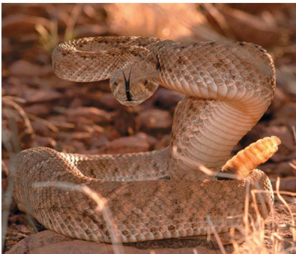

This diamondback rattlesnake (Crotalus atrox) alerts enemies to its presence with a rattle—a set of modified scales at the tip of its tail. Describe the roles of gated ion channels in initiating and moving a signal along the nerve from the snake's head to its tail and then to the muscle that shakes the rattle.

For selected answers, see Appendix A.

# Nervous Systems

## Key Concepts

49.1 Nervous systems consist of circuits of neurons and supporting cells

49.2 The vertebrate brain is regionally specialized

49.3 The cerebral cortex controls voluntary movement and cognitive functions

49.4 Changes in synaptic connections underlie memory and learning

49.5 Many nervous system disorders can now be explained in molecular terms

## Study Tip

Think in pairs: Regional specialization involves many examples of paired structures or circuits. Fill in the complementary or reciprocal functions of these pairs to help you understand their roles in the brain or nervous system.

<table><tr><td>Structure A/Function</td><td>Structure B/Function</td></tr><tr><td>CNS (brain and spinal cord)Integration of information</td><td>PNS (ganglia and peripheral nerves)Transfer of information to/from CNS</td></tr><tr><td>Sympathetic division of autonomic nervous system</td><td>Parasympathetic division of autonomic nervous system</td></tr><tr><td>Left hemisphere of brain</td><td>Right hemisphere of brain</td></tr><tr><td>Hippocampus (role in memory)</td><td>Cerebral cortex (role in memory)</td></tr></table>

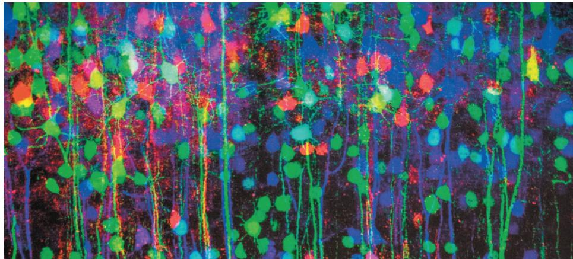  
Figure 49.1 Neuroscientists engineered mice to express a random combination of four fluorescent proteins in each brain cell. The result, shown here, is a “brainbow,” with each neuron displaying one of 90 different color combinations. This rainbow technology holds promise for studying particular pathways within the mouse brain. Ultimately, however, we want to understand our own brains, which contain an estimated $10^{11}$ (100 billion) neurons and $10^{14}$ (100 trillion) connections.

## How are billions of neurons organized to perform complex tasks?

Regional specialization: Complex tasks, such as responding to a spoken question, involve the stepwise functions of different brain regions.

Memory formation: Information is stored by reinforcing patterns of active connections (synapses) among particular neurons.  
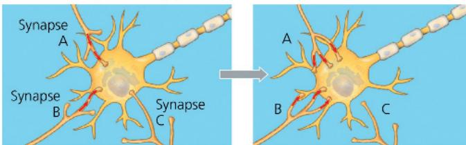  
Synapses that are active in synchrony (A and B) are strengthened. Synapses that are not part of an active circuit (C) are weakened or lost.

(a) A hydra contains individual neurons (purple) organized in a diffuse nerve net. (b–h) Animals with more sophisticated nervous systems contain groups of neurons (blue) organized into nerves and often ganglia and a brain.

# Concept 49.1: Nervous systems consist of circuits of neurons and supporting cells

The ability to sense and react originated billions of years ago in prokaryotes, enhancing survival and reproductive success in changing environments. Later in evolution, modification of simple recognition and response processes provided a basis for communication between cells in an animal body. By the time of the Cambrian explosion, more than 500 million years ago (see Concept 32.2), specialized nervous systems had appeared that enable animals to sense their surroundings and respond rapidly.

Hydras, jellies, and other cnidarians are the simplest animals with nervous systems. In most cnidarians, interconnected neurons form a diffuse nerve net (Figure 49.2a), which controls the contraction and expansion of the gastrovascular cavity. In more complex animals, the axons of multiple neurons are often bundled together, forming nerves. These fibrous structures channel information flow along specific routes through the nervous system. For example, sea stars have a set of radial nerves connecting to a central nerve ring (Figure 49.2b). Within

each arm of a sea star, the radial nerve is linked to a nerve net from which it receives input and to which it sends signals that control muscle contraction.

Animals with elongated, bilaterally symmetrical bodies have even more specialized nervous systems. In particular, they exhibit cephalization, an evolutionary trend toward a clustering of sensory neurons and interneurons at the anterior (front) end of the body. Nerves that extend toward the posterior (rear) end enable these anterior neurons to communicate with cells elsewhere in the body.

In many animals, neurons that carry out integration form a central nervous system (CNS), and neurons that carry information into and out of the CNS form a peripheral nervous system (PNS). In nonsegmented worms, such as the planarian in Figure 49.2c, a small brain and longitudinal nerve cords constitute the simplest clearly defined CNS. In certain nonsegmented worms, the entire nervous system is constructed from only a small number of cells, as in the case of the nematode Caenorhabditis elegans. In this species, an adult worm (hermaphrodite) has exactly 302 neurons, no more and no fewer. More complex invertebrates, such as segmented worms (Figure 49.2d) and arthropods (Figure 49.2e), have many more neurons. Their behavior is regulated by more complicated brains and by ventral nerve cords containing ganglia, segmentally arranged clusters of neurons that act as relay points in transmitting information.

Within an animal group, nervous system organization often correlates with lifestyle. Among the molluscs, for example,

Figure 49.2 Nervous system organization.  
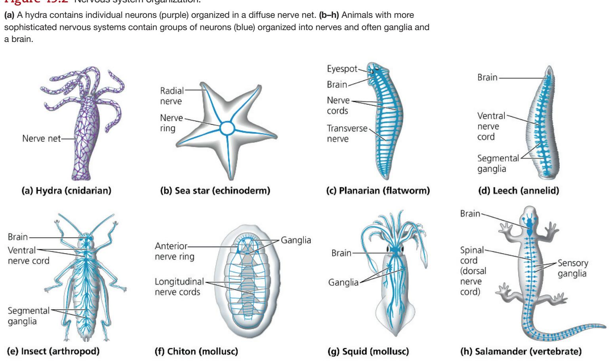

sessile and slow-moving species, such as clams and chitons, have relatively simple sense organs and little or no cephalization (Figure 49.2f). In contrast, active predatory molluscs, such as octopuses and squids (Figure 49.2g), have the most sophisticated nervous systems of any invertebrate. With their large, image-forming eyes and a brain containing millions of neurons, octopuses can learn to discriminate between visual patterns and to perform complex tasks, such as unscrewing a jar to feed on its contents.

In vertebrates such as a salamander (Figure 49.2h) or human (Figure 49.3), the brain and the spinal cord form the CNS; nerves and ganglia are the key elements of the PNS. Regional specialization is a hallmark of both systems, as we will see throughout this chapter.

## Organization of the Vertebrate Nervous System

During embryonic development in vertebrates, the central nervous system develops from the hollow dorsal nerve cord—a hallmark of chordates (see Figure 34.3). The cavity of the nerve cord gives rise to the narrow central canal of the spinal cord as well as the ventricles of the brain. Both the canal and ventricles fill with cerebrospinal fluid, which is formed in the brain by filtering

Figure 49.3 The vertebrate nervous system.

The central nervous system consists of the brain and spinal cord (yellow). Left-right pairs of cranial nerves, spinal nerves, and ganglia make up most of the peripheral nervous system (dark gold).

arterial blood (Figure 49.4). The cerebrospinal fluid supplies the CNS with nutrients and hormones and carries away wastes, circulating through the ventricles and central canal before draining into the veins.

In addition to fluid-filled spaces, the brain and spinal cord have gray and white matter. Gray matter is primarily made up of the dendrites, cell bodies, and axon endings of neurons. White matter consists of myelinated axons. In the spinal cord, gray matter forms the inner layer, where signals pass between CNS neurons and PNS sensory or motor neurons. In the brain, gray matter is predominantly located in the outer layer, where signaling between neurons functions in learning, feeling emotions, processing sensory information, and generating commands.

In vertebrates, the spinal cord runs lengthwise inside the vertebral column, known as the spine. The spinal cord conveys information to and from the brain and generates basic patterns of locomotion. It also acts independently of the brain as part of the simple nerve circuits that produce reflexes, the body's automatic responses to certain stimuli.

Reflexes protect the body by providing rapid, involuntary responses to particular stimuli. Reflexes are rapid because sensory information is used to activate motor neurons without the information first having to travel from the spinal cord to the brain and back. If you accidentally put your hand on a hot burner, a reflex jerks your hand back even before your brain processes pain. Similarly, the knee-jerk reflex provides an immediate protective response when you pick up an unexpectedly heavy object. If your legs buckle, the tension across your knees triggers contraction of your thigh muscle (quadriceps), helping you stay upright and support the load. During a physical exam, your doctor may trigger the knee-jerk reflex with a triangular mallet to help assess nervous system function (Figure 49.5).

Figure 49.4 Ventricles, gray matter, and white matter. Ventricles deep in the brain's interior contain cerebrospinal fluid. In the cerebrum, most of the gray matter is on the surface, surrounding the white matter.  
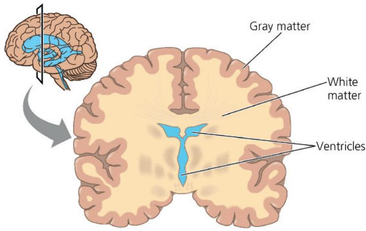

## Figure 49.5 The knee-jerk reflex.

Many neurons are involved in this reflex, but for simplicity only a few neurons are shown.

MAKE CONNECTIONS Using the nerve signals to the hamstring and quadriceps in this reflex as an example, propose a model for regulation of smooth muscle activity in the esophagus during the swallowing reflex (see Figure 41.9).

For suggested answer, see Appendix A.

② Sensors detect a sudden stretch in the quadriceps, and sensory neurons convey the information to the spinal cord.

3 In response to signals from the sensory neurons, motor neurons convey signals to the quadriceps, causing it to contract and jerking the lower leg forward.

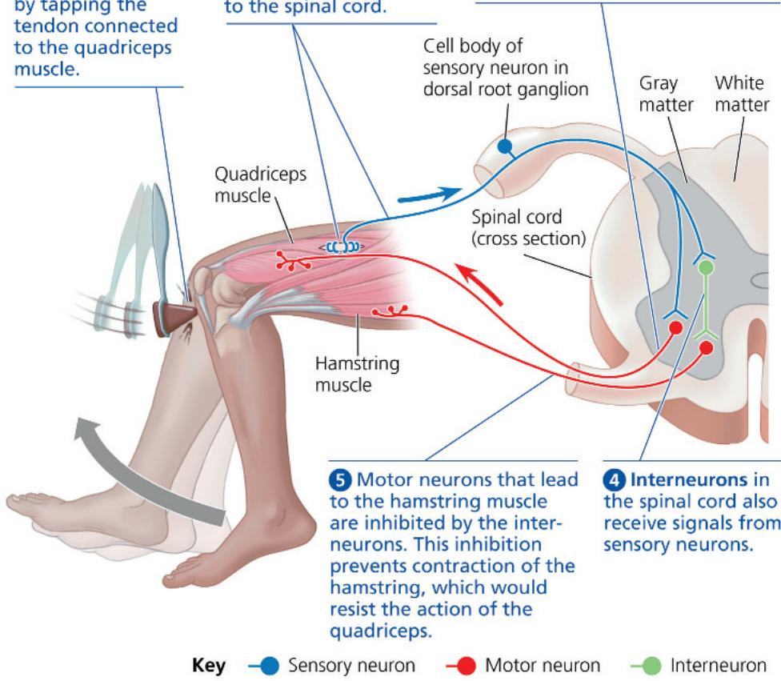

## The Peripheral Nervous System

The PNS transmits information to and from the CNS and plays a large role in regulating an animal's movement and its internal environment (Figure 49.6). Sensory information reaches the CNS along PNS neurons designated as afferent (from the Latin, meaning "to carry toward"). Following information processing within the CNS, instructions then travel to muscles, glands, and endocrine cells along PNS neurons designated as efferent (from the Latin, meaning "to carry away"). Note that most nerves are bundles of both afferent and efferent neurons.

The PNS has two efferent components: the motor system and the autonomic nervous system (see Figure 49.8). The neurons of the motor system carry signals to skeletal muscles. Motor control can be voluntary, as when you raise your hand to ask a question, or involuntary, as in the knee-jerk reflex controlled by the spinal cord. In contrast, regulation of smooth muscles, cardiac muscles, and glands by the three divisions of the autonomic nervous system is generally involuntary. The sympathetic and parasympathetic divisions coordinate the activity of many body systems, as we will discuss shortly. The third division, the enteric nervous system, is a network of afferent and efferent neurons controlling the organs of the digestive system. While it is influenced by the sympathetic and parasympathetic divisions and sends sensory information to the brain, the enteric nervous system can also act independently of the CNS.

Figure 49.6 Functional hierarchy of the vertebrate peripheral nervous system.  

Figure 49.7 The parasympathetic and sympathetic divisions of the autonomic nervous system. Most pathways in each division involve two neurons connecting the CNS to target organs. The axon of the first neuron extends from a cell body in the CNS to a set of PNS neurons whose cell bodies are clustered into a ganglion (plural, ganglia). The axons of these PNS neurons transmit instructions to internal organs, where they form synapses with smooth muscle, cardiac muscle, or gland cells.

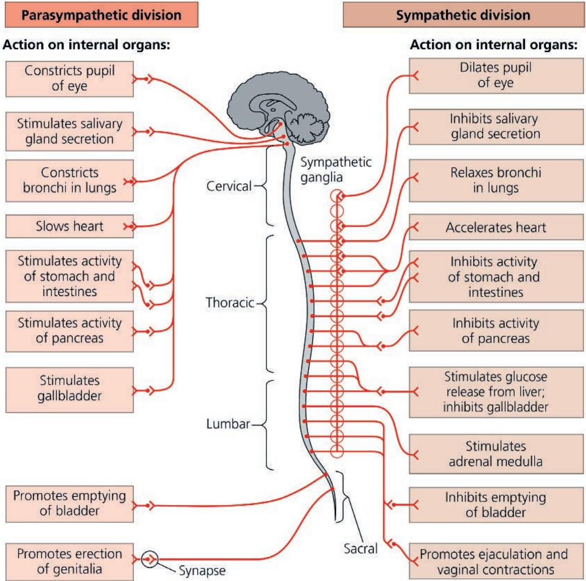

Homeostasis often relies on cooperation between the motor and autonomic nervous systems. In response to a drop in body temperature, for example, the hypothalamus signals the motor system to cause shivering, which increases heat production. At the same time, the hypothalamus signals the autonomic nervous system to constrict surface blood vessels, reducing heat loss.

The sympathetic and parasympathetic divisions of the autonomic nervous system have largely antagonistic (opposite) functions in regulating organ function (Figure 49.7). Activation of the sympathetic division prepares the animal for physical or mental challenges (“fight or flight”). For example, the heart beats faster, digestion is inhibited, the liver converts glycogen to glucose, and the adrenal medulla increases secretion of epinephrine (adrenaline). Activation of the parasympathetic division generally causes opposite responses that promote calming and a return to self-maintenance functions (“rest and digest”). Thus, heart rate decreases, digestion is enhanced, and glycogen production increases. However, in regulating reproductive activity, a function that is not homeostatic, the parasympathetic division complements rather than antagonizes the sympathetic division, as shown at the bottom of Figure 49.7.

The two divisions differ not only in overall function but also in organization and signals released. Parasympathetic nerves exit the

CNS at the base of the brain or spinal cord and form synapses in ganglia near or within an internal organ. In contrast, sympathetic nerves typically exit the CNS midway along the spinal cord and form synapses in ganglia located just outside of the spinal cord.

In both the sympathetic and parasympathetic divisions, the pathway for information flow typically involves a preganglionic and a postganglionic neuron. The preganglionic neurons have cell bodies in the CNS and release acetylcholine as a neurotransmitter (see Concept 48.4). In the case of the postganglionic neurons, those of the parasympathetic division release acetylcholine, whereas nearly all their counterparts in the sympathetic division release norepinephrine. It is this difference in neurotransmitters that enables the sympathetic and parasympathetic divisions to bring about opposite effects in organs such as the lungs, heart, intestines, and bladder. A comparison of these pathways in the autonomic nervous system, along with a motor system pathway, is shown in Figure 49.8, on the next page.

## Glia

The nervous systems of vertebrates and most invertebrates include not only neurons but also glial cells, or glia. The Schwann cells that myelinate axons in the PNS are an example of glia, as are

(b) Autonomic nervous system

Figure 49.8 Comparison of pathways in the motor and autonomic nervous systems.  

  
Key to neurotransmitters • Acetylcholine ▲ Norepinephrine

oligodendrocytes, their counterparts in the CNS. Figure 49.9 provides an overview of the major types of glia in the adult vertebrate and the ways in which they nourish, support, and regulate the functioning of neurons.

In embryos, two types of glia play essential roles in the development of the nervous system: radial glia and astrocytes.

Radial glia form tracks along which newly formed neurons migrate from the neural tube, the structure that gives rise to the CNS (see Figure 47.14). Later, astrocytes that are adjacent to brain capillaries participate in the formation of the blood-brain barrier, a filtering mechanism that prevents many substances in the blood from entering the CNS. Both radial glia and astrocytes can also act as stem cells, which undergo unlimited cell divisions to self-renew and to form more specialized cells.

## Concept Check 49.1

1. Which division of the autonomic nervous system would likely be activated if a student learned that an exam she had forgotten about would start in 5 minutes? Explain your answer.

2. WHAT IF? Suppose a person had an accident that severed a small nerve required to move some of the fingers of the right hand. Would you also expect an effect on sensation from those fingers?

3. MAKE CONNECTIONS Most tissues regulated by the autonomic nervous system receive both sympathetic and parasympathetic input from postganglionic neurons. Responses are typically local. In contrast, the adrenal medulla receives input only from the sympathetic division and only from preganglionic neurons, yet responses are observed throughout the body. Explain why (see Figure 45.19).

For suggested answers, see Appendix A.

Figure 49.9 Glia in the vertebrate nervous system.  
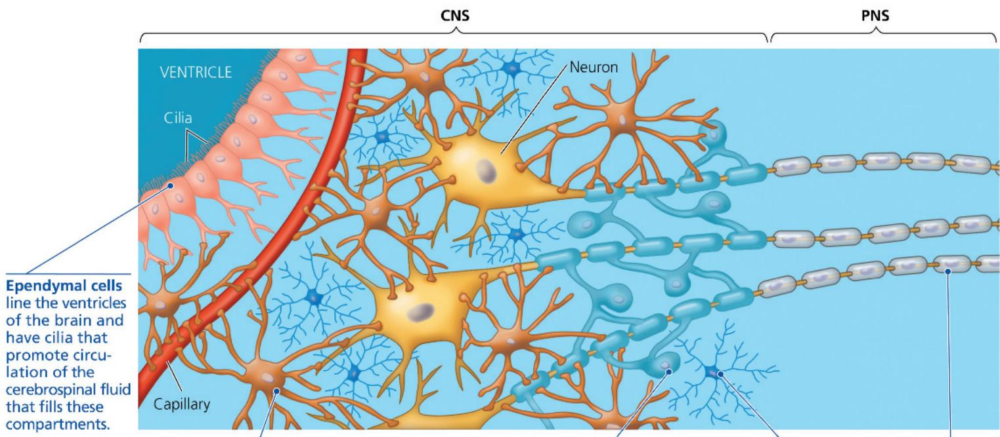  
Ependymal cells line the ventricles of the brain and have cilia that promote circulation of the cerebrospinal fluid that fills these compartments.  
Microglia are immune cells in the CNS that protect against pathogens.

Astrocytes (from the Greek astron, star) have numerous functions in the CNS. They facilitate information transfer, regulate extracellular ion concentrations, promote blood flow to neurons, help form the blood-brain barrier, and act as stem cells to replenish certain neurons.

Oligodendrocytes myelinate axons in the CNS. Myelination greatly increases the conduction speed of action potentials.

Schwann cells myelinate axons in the PNS.

# Concept 49.2: The vertebrate brain is regionally specialized

We turn now to the vertebrate brain, which has three major regions: the forebrain, midbrain, and hindbrain (shown here for a ray-finned fish).

Each region is specialized in function. The forebrain, which contains the olfactory bulb and cerebrum, has activities that include processing of olfactory input (smells), regulation of sleep, learning, and any complex processing. The midbrain, located centrally in the brain, coordinates routing of sensory input. The hindbrain, part of which forms the cerebellum, controls involuntary activities, such as blood circulation, and coordinates motor activities, such as locomotion.

EVOLUTION Comparing vertebrates across a phylogenetic tree, we see that the relative sizes of particular brain regions vary (Figure 49.10). Furthermore, these size differences reflect

differences in the importance of particular brain functions. Consider, for example, ray-finned fishes, which explore their environment using olfaction, vision, and a lateral line system that detects water currents, electrical stimuli, and body position. The olfactory bulb, which detects scents in the water, is relatively large in these fishes. So is the midbrain, which processes input from the visual and lateral line systems. In contrast, the cerebrum, required for complex processing and learning, is relatively small.

The correlation between the size and function of brain regions can also be observed by considering the cerebellum. Free-swimming ray-finned fishes, such as the tuna, control movement in three dimensions in the open water and have a relatively large cerebellum. In comparison, the cerebellum is much smaller in species that don't swim actively, such as the lamprey. Evolution has thus resulted in a close match of structure to function, with the size of particular brain regions correlating with their importance for that species in nervous system function and, hence, species survival and reproduction.

If one compares birds and mammals with groups that diverged from the common vertebrate ancestor earlier in evolution, two trends are apparent. First, the forebrain of birds and mammals occupies a larger fraction of the brain than it does in amphibians, fishes, and other vertebrates. Second, birds and mammals have much larger brains relative to body size than do other groups. Indeed, the ratio of brain size to body weight for birds and mammals is ten times larger than that for their evolutionary ancestors. These differences in both overall brain size and the relative size of the forebrain reflect the greater capacity of birds and mammals for cognition and higher-order reasoning, traits we will return to later in this chapter.

Figure 49.10 Vertebrate brain structure and evolution.

These examples of vertebrate brains are drawn to the same overall dimensions to highlight differences in the relative size of major structures. These differences in relative size, which arose over the course of vertebrate evolution, correlate with the importance of particular brain functions for particular vertebrate groups.

In the case of humans, the 100 billion neurons in the brain make 100 trillion connections. How are so many cells and links organized into circuits and networks that can perform highly sophisticated information processing, storage, and retrieval? In addressing this question, let's begin with Figure 49.11, on the next two pages, which explores the overall architecture of the human brain. This key figure describes the structure and function of the four main brain regions: the brainstem, consisting of the midbrain, pons, and medulla oblongata; the diencephalon, consisting of the hypothalamus and thalamus; the cerebellum; and the cerebrum. You can use this figure to trace how brain structures arise during embryonic development; as a reference for their size, shape, and location in the adult brain; and as an introduction to their best-understood functions.

## Exploring the Organization of the Human Brain

## Figure 49.11

The brain is the most complex organ in the human body. Surrounded by the thick bones of the skull, the brain is divided into a set of distinctive structures, some of which are visible in the magnetic resonance image (MRI) of an adult's head shown at right. The diagram below traces the development of these structures in the embryo. Their major functions are explained in the main text of the chapter.

## Human Brain Development

As a human embryo develops, the neural tube forms three anterior bulges—the forebrain, midbrain, and hindbrain—that together produce the adult brain. The midbrain and portions of the hindbrain give rise to the brainstem, a stalk that joins with the spinal cord at the base of the brain. The rest of the hindbrain gives rise to the cerebellum, which lies behind the brainstem. Meanwhile, the forebrain develops into the diencephalon, including the neuroendocrine tissues of the brain, and the telencephalon, which becomes the cerebrum. Rapid, expansive growth of the telencephalon during the second and third months causes the outer portion, or cortex, of the cerebrum to extend over and around much of the rest of the brain.

## The Cerebrum

The cerebrum controls skeletal muscle contraction and is the center for learning, emotion, memory, and perception. It is divided into right and left cerebral hemispheres. The outer layer of the cerebrum is called the cerebral cortex and is vital for

perception, voluntary movement, and learning
The left side of the cerebral cortex receives information from, and controls the movement of, the right side of the body, and vice versa. A thick band of axons known as the corpus callosum enables the right and left cerebral cortices to communicate. Deep within the white matter, clusters of neurons called basal nuclei serve as centers for planning and learning movement sequences. Damage to these sites during fetal development can result in cerebral palsy, a disorder resulting from a disruption in the transmission of motor commands to the muscles.

## The Cerebellum

Left cerebral hemisphere

  
Adult brain viewed from the rear

Right cerebral hemisphere

The cerebellum coordinates movement and balance and helps in learning and remembering motor skills. The cerebellum receives sensory information about the positions of the joints and the lengths of the muscles, as well as input from the auditory

(ing) and visual systems. It also monitors motor commands issued by the cerebrum.
The cerebellum integrates this information as it carries out
cral cortex coordination and error
s callosum checking during motor and perceptual functions.
nuclei Hand-eye coordination is an example of cerebellar control; if the cerebellum is damaged, the eyes can follow a moving object, but they will not stop at the same place as the object. Hand movement toward the object will also be erratic.

## The Diencephalon

The diencephalon gives rise to the thalamus, hypothalamus, and epithalamus. The thalamus is the main input center for sensory information going to the cerebrum. Incoming information from all the senses, as well as from the cerebral cortex, is

appropriate cerebral centers for further processing. The thalamus is formed by two masses, each roughly the size and shape of a walnut. A much smaller structure, the

hypothalamus, constitutes a control center that includes the body's thermostat as well as the central

## Diencephalon

Thalamus—
Pineal gland—
Hypothalamus-
Pituitary gland-

biological clock. The hypothalamus regulates hunger and thirst, plays a role in sexual and mating behaviors, and initiates the fight-or-flight response. The hypothalamus is also the source of posterior pituitary $\text{Spirin}$ hormones and of releasing hormones that act on the anterior pituitary. The epithalamus includes the pineal gland, the source of melatonin.

## The Brainstem

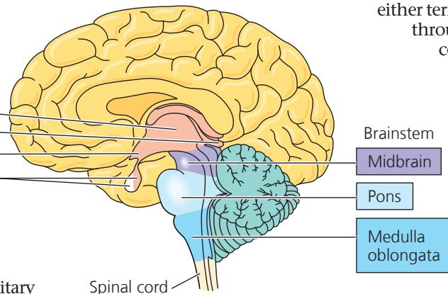

The brainstem consists of the midbrain, the pons, and the medulla oblongata (commonly called the medulla). The midbrain receives and integrates several types of sensory information and sends it to specific regions of the forebrain. All sensory axons involved in hearing

either terminate in the midbrain or pass through it on their way to the cerebrum. In addition, the midbrain coordinates visual reflexes, such as the peripheral vision reflex: The head turns toward an object approaching from the side without the brain having formed an image of the object.
Brainstem
Midbrain
Pons
Medulla oblongata
A major function of the pons and medulla is to transfer information between the PNS and the

midbrain and forebrain. The pons and medulla also help coordinate large-scale body movements, such as

Training and climbing. Most actions that carry instructions about these movements cross from one side of the CNS to the other as they pass through the medulla. As a result, the right side of the brain controls much of the movement of the left side of the body, and vice versa. An additional function of the medulla is the control of several automatic, homeostatic functions, including breathing, heart and blood vessel activity, swallowing, vomiting, and digestion. The pons also participates in some of these activities; for example, it regulates the breathing centers in the medulla.

To learn more about how particular brain structure and brain organization overall relate to brain function in humans, we'll first consider activity cycles of the brain and the physiological basis of emotion. Then, in Concept 49.3, we'll shift our attention to regional specialization within the cerebrum.

## Arousal and Sleep

If you've ever drifted off to sleep while listening to a lecture (or reading a book), you know that your attentiveness and mental alertness can change rapidly. Such transitions are regulated by the brainstem and cerebrum, which control arousal and sleep. Arousal is a state of awareness of the external world. Sleep is a state in which external stimuli are received but not consciously perceived.

Contrary to appearances, sleep is an active state, at least for the brain. By placing electrodes at multiple sites on the scalp, we can record patterns of electrical activity called brain waves in an electroencephalogram (EEG). These recordings reveal that brain wave frequencies change as the brain progresses through distinct stages of sleep.

Some animals have evolutionary adaptations that allow for substantial activity during sleep. Bottlenose dolphins, for example, swim while sleeping, rising to the surface to breathe air on a regular basis. How is this possible? As in other mammals, the forebrain is physically and functionally divided into two halves, the right and left hemispheres. Noting that dolphins sleep with one eye open and one closed, researchers hypothesized that only one side of the brain is asleep at a time. EEG recordings from each hemisphere of sleeping dolphins support this hypothesis (Figure 49.12).

Although sleep is essential for survival, we still know very little about its function. One hypothesis is that sleep and dreams are involved in consolidating learning and memory. Evidence supporting this hypothesis includes the finding that test subjects who are kept awake for 36 hours have a reduced ability to remember when particular events occurred, even if they first “perk up” with caffeine. Other experiments show that regions of

## Figure 49.12 Dolphins can be asleep and awake at the same time.

EEG recordings were made separately for the two sides of a dolphin's brain. At each time point, low-frequency activity characteristic of sleep was recorded in one hemisphere while higher-frequency activity typical of being awake was recorded in the other hemisphere.

<table><tr><td>Location</td><td>Time: 0 hours</td><td>Time: 1 hour</td></tr><tr><td>Left hemisphere</td><td></td><td></td></tr><tr><td>Right hemisphere</td><td></td><td></td></tr></table>

## Key

Low-frequency waves characteristic of sleep

High-frequency waves characteristic of wakefulness

## Figure 49.13 The reticular formation.

Once thought to consist of a single diffuse network of neurons, the reticular formation is now recognized as many distinct clusters of neurons. These clusters function in part to filter sensory input (solid blue arrows), blocking familiar and repetitive information that constantly enters the nervous system before sending the filtered input to the cerebral cortex (dashed green arrows).

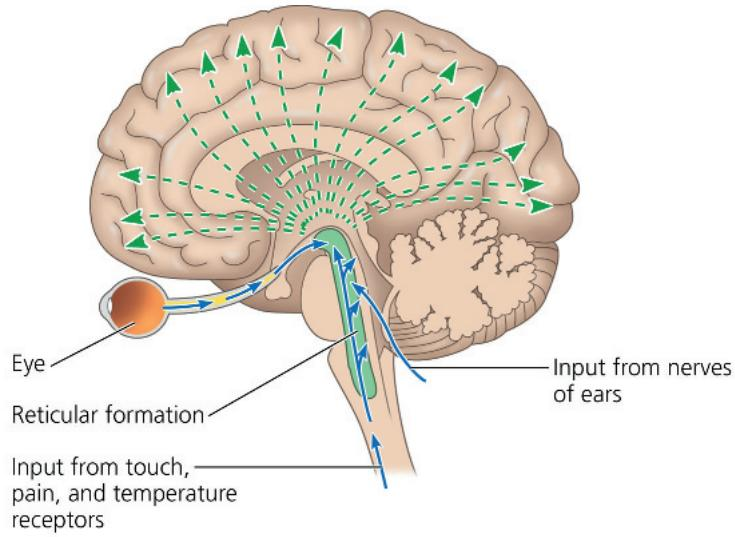  
Input from touch, — pain, and temperature receptors

the brain that are activated during a learning task can become active again during sleep.

Arousal and sleep are controlled in part by the reticular formation, a diffuse network formed primarily by neurons in the midbrain and pons (Figure 49.13). These neurons control the timing of sleep periods characterized by rapid eye movements (REMs) and by vivid dreams. Sleep is also regulated by the biological clock, discussed next, and by regions of the forebrain that regulate sleep intensity and duration.

## Biological Clock Regulation

Cycles of sleep and wakefulness are an example of a circadian rhythm, a daily cycle of biological activity. Such cycles, which occur in organisms ranging from bacteria to humans, rely on a biological clock, a molecular mechanism that directs periodic gene expression and cellular activity. Although biological clocks are typically synchronized to the cycles of light and dark in the environment, they can maintain a roughly 24-hour cycle even in the absence of environmental cues (see Figure 40.9). For example, in a constant environment humans exhibit a sleep/wake cycle of 24.2 hours, with very little variation among individuals.

What normally links the biological clock to environmental cycles of light and dark in an animal's surroundings? In mammals, circadian rhythms are coordinated by clustered neurons in the hypothalamus (see Figure 49.11). These neurons form a structure called the SCN, which stands for suprachiasmatic nucleus. (Certain clusters of neurons in the CNS are referred to as "nuclei.") In response to sensory information from the eyes, the SCN acts as a pacemaker, synchronizing the biological clock in cells throughout the body to the natural cycles of day length. In the Scientific Skills Exercise, you can interpret data from an experiment and propose experiments to test the role of the SCN in hamster circadian rhythms.

# Scientific Skills Exercise Designing an Experiment Using Genetic Mutants

Does the SCN Control the Circadian Rhythm in Hamsters? By surgically removing the SCN from laboratory mammals, scientists demonstrated that the SCN is required for circadian rhythms. Those experiments did not, however, reveal whether circadian rhythms originate in the SCN. To answer this question, researchers performed an SCN transplant experiment on wild-type and mutant hamsters (Mesocricetus auratus). Whereas wild-type hamsters have a circadian cycle lasting about 24 hours in the absence of external cues, hamsters that are homozygous for the $\tau(\text{tau})$ mutation have a cycle lasting only about 20 hours. In this exercise, you will evaluate the design of this experiment and propose additional experiments to gain further insight.

How the Experiment Was Done The researchers surgically removed the SCN from wild-type and $\tau$ hamsters. Several weeks later, each of these hamsters received a transplant of an SCN from a hamster of the opposite genotype. To determine the periodicity of rhythmic activity for the hamsters before the surgery and after the transplants, the researchers measured activity levels over a three-week period. They plotted the data collected for each day in the manner shown in Figure 40.9a and then calculated the circadian cycle period.

Data from the Experiment In 80% of the hamsters in which the SCN had been removed, transplanting an SCN from another hamster restored rhythmic activity. For hamsters in which an SCN transplant restored a circadian rhythm, the net effect of the two procedures (SCN removal and replacement) on the circadian cycle period is graphed at the upper right. Each red line connects the two data points for an individual hamster.

## INTERPRET THE DATA

1. In a controlled experiment, researchers manipulate one variable at a time. (a) What was the variable manipulated in this study? (b) Why did the researchers use more than one hamster for each procedure? (c) What traits of the individual hamsters would likely have been held constant among the treatment groups?

## Emotions

Whereas a single structure in the brain controls the biological clock, the generation and experience of emotions depend on many brain structures, including the amygdala, hippocampus, and parts of the thalamus. As shown in Figure 49.14, on the next page, these structures border the brainstem in mammals and are therefore called the limbic system (from the Latin limbus, border).

One way the limbic system contributes to our emotions is by storing emotional experiences as memories that can be recalled by similar circumstances. This is why, for example, a situation that causes you to remember a frightening event can trigger a faster heart rate, sweating, or fear, even if there is currently nothing scary or threatening in your surroundings. Such storage and recall of emotional memory are especially dependent on function of the

\- Wild-type hamster
- Wild-type hamster with SCN from τ hamster

\- τ hamster
- τ hamster with SCN from wild-type hamster

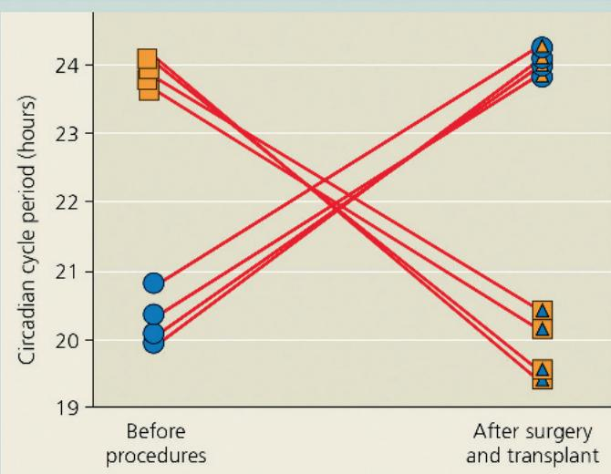  
Data from M. R. Ralph et al., Transplanted suprachiasmatic nucleus determines circadian period, Science 247:975–978 (1990).

2. For the wild-type hamsters that received $\tau$ SCN transplants, what would have been an appropriate experimental control?

3. (a) What general trends does the graph above reveal about the circadian cycle period of the transplant recipients? (b) Do the trends differ for the wild-type and $\tau$ recipients? Based on these data, what can you conclude about the role of the SCN in determining the period of the circadian rhythm?

4. (a) In 20% of the hamsters, there was no restoration of rhythmic activity following the SCN transplant. What are some possible reasons for this finding? (b) How confident are you in your conclusion about the role of the SCN based on data from 80% of the hamsters?

5. Suppose that researchers identified a mutant hamster that lacked rhythmic activity; that is, its circadian activity cycle had no regular pattern. Propose SCN transplant experiments using such a mutant along with (a) wild-type and (b) $\tau$ hamsters. Predict the results of those experiments in light of your conclusion in question 3(b).

Instructors: A version of this Scientific Skills Exercise can be assigned in Mastering Biology.

amygdala, an almond-shaped brain structure near the base of the cerebrum.

Often, generating emotion and experiencing emotion require interactions between different regions of the brain. For example, both laughing and crying involve the limbic system interacting with sensory areas of the forebrain. Similarly, structures in the forebrain attach emotional “feelings” to survival-related functions controlled by the brainstem, including aggression, feeding, and sexuality.

To study the function of the human amygdala, researchers sometimes present adult subjects with an image followed by an unpleasant experience, such as a mild electrical shock. After several trials, study participants experience autonomic arousal—as measured by increased heart rate or sweating—if they see the image again. Subjects with brain damage confined to the

Figure 49.14 The limbic system of the human brain.
This diagram shows the brain and brainstem, with the left cerebral hemisphere of the brain removed.  

amygdala can recall the image because their explicit memory is intact. However, they do not exhibit autonomic arousal, indicating that damage to the amygdala has resulted in a reduced capacity for emotional memory.

## Functional Imaging of the Brain

In recent years, scientists have begun studying the amygdala and other brain structures with functional imaging techniques. By scanning the brain while the subject performs a particular function, such as forming a mental image of a person's face, researchers are able to match particular functions with activity in specific brain areas.

Several approaches are available for functional imaging. The first widely used technique was positron-emission tomography (PET), in which injection of radioactive glucose enables a display of metabolic activity. Today, the most commonly used approach is functional magnetic resonance imaging (fMRI). In fMRI, a subject lies with his or her head in the center of a large, doughnut-shaped magnet. Brain activity is detected by an increase in the flow of oxygen-rich blood into a particular region.

In one experiment using fMRI, researchers mapped brain activity while subjects listened to music that they described as sad or happy (Figure 49.15). The findings were striking: Different regions of the brain were associated with the experience of each of these contrasting emotions. Subjects who heard sad music had increased activity in the amygdala. In contrast, listening to happy music led to increased activity in the nucleus accumbens, a brain structure important for the perception of pleasure.

Functional imaging has an ever-increasing number of applications. Hospitals use fMRI to, for example, monitor recovery from stroke, map abnormalities in migraine headaches, and increase the effectiveness of brain surgery.

Figure 49.15 Functional imaging in the working brain.

These images resulted from using fMRI to reveal brain activity associated with music that listeners described as happy or sad. (Each view shows activity in a single plane of the brain, as seen from above.)

  
VISUAL SKILLS The two images reveal activity in different horizontal planes through the brain. How can you tell this from the two photographs? What can you conclude about the location of the nucleus accumbens and the amygdala?  
For suggested answer, see Appendix A.

## Concept Check 49.2

1. When you wave your right hand, what part of your brain initiates the action?

2. People who are inebriated have difficulty touching their nose with their eyes closed. Which brain region does this observation indicate is one of those impaired by alcohol?

3. WHAT IF? Suppose you examine two individuals with CNS damage. In one individual, the damage has resulted in a coma (a prolonged state of unconsciousness). In the other individual, it has caused paralysis (a loss of skeletal muscle function throughout the body). Relative to the position of the midbrain and pons, where is the likely site of damage in each individual? Explain.

For suggested answers, see Appendix A.

## Concept 49.3: The cerebral cortex controls voluntary movement and cognitive functions

We turn now to the cerebrum, the part of the brain essential for language, cognition, memory, consciousness, and awareness of our surroundings. As shown in Figure 49.11, the cerebrum is the largest structure in the human brain. Like the brain overall, it exhibits regional specialization. For the most part, cognitive functions reside in the cerebral cortex, the outer layer of the cerebrum. Within this cortex, sensory areas receive and process sensory information, association areas integrate the information, and motor areas transmit instructions to other parts of the body.

In discussing the location of particular functions in the cerebral cortex, neurobiologists often use four regions, or lobes, as physical landmarks. Each lobe—frontal, temporal, occipital, and parietal—is named for a nearby bone of the skull, and each is the focus of specific brain activities (Figure 49.16).

## Information Processing

Broadly speaking, the human cerebral cortex receives sensory information from two sources. Some sensory input originates in individual receptors in the hands, scalp, and elsewhere in the body. These somatic sensory, or somatosensory, receptors (from the Greek soma, body) provide information about touch, pain, pressure, temperature, and the position of muscles and limbs. Other sensory input comes from groups of receptors clustered in dedicated sensory organs, such as the eyes and nose.

Most sensory information coming into the cortex is directed via the thalamus to primary sensory areas within the brain lobes. Information received at the primary sensory areas is passed along to nearby association areas, which process particular features in the sensory input. In the occipital lobe, for instance, some groups of neurons in the primary visual area are specifically sensitive to rays of light oriented in a particular direction. In the visual association area, information related to such features is combined in a region dedicated to recognizing complex images, such as faces.

Once processed, sensory information passes to the prefrontal cortex, which helps plan actions and movement. The cerebral cortex may then generate motor commands that cause particular behaviors—moving a limb or saying hello, for example. These commands consist of action potentials produced by neurons in the motor cortex, which lies at the rear of the frontal lobe (see Figure 49.16). The action potentials travel along axons to the brainstem and spinal cord, where they excite motor neurons, which in turn excite skeletal muscle cells.

In the somatosensory cortex and motor cortex, neurons are arranged according to the part of the body that generates the sensory input or receives the motor commands (Figure 49.17).

Figure 49.16 The human cerebral cortex.

Each of the four lobes of the cerebral cortex has specialized functions, some of which are listed here. Some areas on the left side of the brain (shown here) have different functions from those on the right side (not shown).

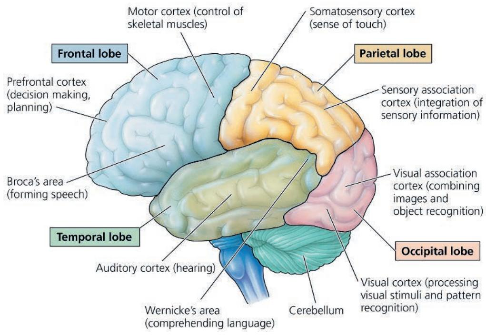

Figure 49.17 Body part representation in the primary motor and primary somatosensory cortices. In these cross-sectional maps of the cortices, the cortical surface area devoted to each body part is represented by the relative size of that part in the cartoons.  
  
VISUAL SKILLS What does it indicate that the hand is larger than the forearm in both parts of this figure? For suggested answer, see Appendix A.

For example, neurons that process sensory information from the legs and feet lie in the region of the somatosensory cortex closest to the midline. Neurons that control muscles in the legs and feet are located in the corresponding region of the motor cortex. Notice in Figure 49.17 that the cortical surface area devoted to each body part is not proportional to the size of the part. Instead, surface area correlates with the extent of neuronal control needed (for the motor cortex) or with the number of sensory neurons that extend axons to that part (for the somatosensory cortex). Thus, the surface area of the motor cortex devoted to the face is proportionately quite large, reflecting the extensive involvement of facial muscles in communication.

## Language and Speech

The mapping of cognitive functions within the cortex began in the 1800s when physicians studied the effects of damage to particular regions of the cortex by injuries, strokes, or tumors. Pierre Broca conducted postmortem (after death) examinations of patients who had been able to understand language but unable to speak. He discovered that many had defects in a small region of the left frontal lobe, now known as Broca's area. Karl Wernicke found that damage to a posterior portion of the left temporal lobe, now called Wernicke's area, abolished the ability to comprehend speech but not the ability to speak. PET studies have now confirmed activity in Broca's area during speech generation and Wernicke's area when speech is heard (Figure 49.18).

## Lateralization of Cortical Function

Both Broca's area and Wernicke's area are located in the left cerebral hemisphere of many (but not all) people, reflecting a greater role in language for the left side of the cerebrum than for the right side. The left hemisphere often plays a greater role than the right

Figure 49.18 Mapping language areas in the cerebral cortex.

These PET images show activity levels on the left side of one person's brain during four activities, all related to speech. Increases in activity are seen in Wernicke's area when hearing words, Broca's area when speaking words, the visual cortex when seeing words, and the prefrontal cortex when generating words (without reading them).

in math and logical operations. In contrast, the right hemisphere appears to dominate in the recognition of faces and patterns, spatial relations, and nonverbal thinking. This difference in function between the right and left hemispheres is called lateralization. Like many human differences, lateralization exists on a spectrum. For instance, the language processing center is found in the right hemisphere (or equally in both hemispheres) in 25% of left-handed people and in 5% of right-handed people.

The two cerebral hemispheres normally exchange information through the fibers of the corpus callosum (see Figure 49.11). Severing this connection (a treatment of last resort for the most extreme forms of epilepsy, a seizure disorder) results in a “split-brain” effect. In such patients, the two hemispheres function independently. For example, they cannot read even a familiar word that appears only in their left field of vision: The sensory information travels from the left field of vision to the right hemisphere, but cannot then reach the language centers in the left hemisphere.

## Frontal Lobe Function

In 1848, a horrific accident pointed to the role of the prefrontal cortex in temperament and decision making. Phineas Gage was the foreman of a railroad construction crew when an explosion drove an iron rod through his head. The rod, which was more than 3 cm in diameter at one end, entered his skull just below his left eye and exited through the top of his head, damaging large portions of his frontal lobe (Figure 49.19). Gage recovered, but his personality changed

Figure 49.19 Phineas Gage's skull injury.

dramatically. He became emotionally detached, impatient, and erratic in his behavior, providing evidence of the role of the prefrontal cortex in temperament and decision making.

Two further sets of observations support the hypothesis that Gage's brain injury and personality change inform us about frontal lobe function. First, frontal lobe tumors cause similar symptoms: Intellect and memory seem intact, but decision making is flawed and emotional responses are diminished. Second, the same problems arise when the connection between the prefrontal cortex and the limbic system is surgically severed. (This procedure, called a frontal lobotomy, was once a common treatment for severe behavioral disorders but is no longer in use.) Together, these observations provide evidence that the frontal lobes have a substantial influence on what are called “executive functions.”

## Evolution of Cognition in Vertebrates

EVOLUTION In nearly all vertebrates, the brain has the same basic structures (see Figure 49.10). Given this uniform organization, how did a capacity for advanced cognition, the perception and reasoning that constitute knowledge, evolve in certain species? For many years researchers favored the hypothesis that higher-order reasoning in vertebrates required evolution of an extensively convoluted cerebral cortex, as is found in humans, other primates, and cetaceans (whales, dolphins, and porpoises). In humans, for example, the cerebral cortex accounts for about 80% of total brain mass.

Birds lack a convoluted cerebral cortex and were long thought to have much lower intellectual capacity than primates and cetaceans. However, recent experiments have refuted this idea: Western scrub jays (Aphelocoma californica) can remember which food items they hid first. New Caledonian crows (Corvus moneduloides) are highly skilled at making and using tools, an ability otherwise well documented only for humans and some other apes. African grey parrots (Psittacus erithacus) understand numerical and abstract concepts, such as “same” and “different” and “none.”

What brain structures enable some birds to have such sophisticated information processing? The answer appears to be a nuclear (clustered) organization of neurons within the pallium, the top or outer portion of the brain (Figure 49.20a). Note that this arrangement is different from that in the human cerebral cortex (Figure 49.20b), where six parallel layers of neurons are arranged tangential to the surface. Thus, vertebrate evolution has resulted in two different types of outer brain organization that can support complex and flexible function.

How did the bird pallium and human cerebral cortex arise during evolution? The current consensus is that the common ancestor of birds and mammals had a pallium in which neurons

Although structurally different, the (a) pallium of a songbird brain and the (b) cerebral cortex of the human brain play similar roles in higher cognitive activities and make many similar connections with other brain structures.

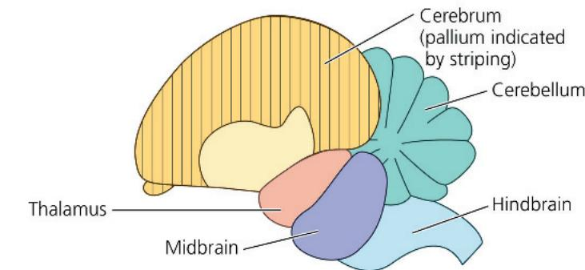  
(a) Songbird brain (cross section)

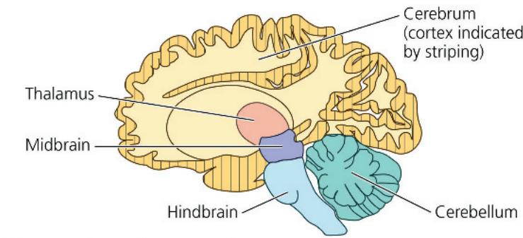  
(b) Human brain (cross section)

were organized into nuclei, as is still found in birds. Early in mammalian evolution, this clustered organization was transformed into a layered one. However, connectivity was maintained such that, for example, the thalamus relays sensory input relating to sights, sounds, and touch to the pallium in birds and to the cerebral cortex in mammals.

Sophisticated information processing depends not only on the overall organization of a brain but also on the very small-scale changes that enable learning and encode memory. We'll turn to these changes in the context of humans in the next section.

## Interview

Interview with Erich Jarvis: Studying how songbirds learn melodies (eTextbook only)

Figure 49.20 Comparison of regions for higher cognition in avian and human brains.  

## Concept Check 49.3

1. How can studying individuals with damage to a particular brain region provide insight into the normal function of that region?

2. How do the functions of Broca's area and Wernicke's area each relate to the activity of the surrounding cortex?

3. WHAT IF? If a woman with a severed corpus callosum viewed a photograph of a familiar face, first in her left field of vision and then in her right field, why would she find it difficult to put a name to the face?

For suggested answers, see Appendix A.

## Concept 49.4: Changes in synaptic connections underlie memory and learning

Formation of the nervous system occurs stepwise. First, regulated gene expression and signal transduction determine where neurons form in the developing embryo. Next, neurons compete for survival. Every neuron requires growth-supporting factors, which are produced in limited quantities by tissues that direct neuron growth. Neurons that don't reach the proper locations fail to receive such factors and undergo programmed cell death. The net effect is the preferential survival of neurons that are in a proper location. The competition is so severe that half of the neurons formed in the embryo are eliminated.

In the final phase of organizing the nervous system, synapse elimination takes place. During development, each neuron forms numerous synapses, more than are required for its proper function. Once a neuron begins to function, its activity stabilizes some synapses and destabilizes others. By the time the embryo completes development, more than half of all synapses have been eliminated. In humans, this elimination of unnecessary connections, a process called synaptic pruning, continues after birth and throughout childhood.

Together, neuron development, neuron death, and synapse elimination establish the basic network of cells and connections within the nervous system required throughout life.

## Neuronal Plasticity

Although the overall organization of the CNS is established during embryonic development, the connections between neurons can be modified. This capacity for the nervous system to be remodeled, especially in response to its own activity, is called neuronal plasticity.

Much of the reshaping of the nervous system occurs at synapses. Synapses belonging to circuits that link information in useful ways are maintained, whereas those that convey bits of information lacking any context may be lost. Specifically, when the activity of a synapse coincides with that of other synapses, changes may occur that reinforce that synaptic connection. Conversely, when the activity of a synapse fails to coincide with that of other synapses, the synaptic connection sometimes becomes weaker.

Figure 49.21a illustrates how activity-dependent events can trigger the gain or loss of a synapse. If you think of signals in the nervous system as traffic on a highway, such changes are comparable to adding or removing an entrance ramp. The net effect is to increase signaling between particular pairs of neurons and decrease signaling between other pairs. Signaling at a synapse can also be strengthen or weakened, as shown in Figure 49.21b. In our traffic analogy, this would be equivalent to widening or narrowing an entrance ramp.

Figure 49.21 Neuronal plasticity.  
Synaptic connections can change over time, strengthening or weakening in response to the level of activity at the synapse.  
  
(a) High-level activity at the synapse of neuron $N_{1}$ with the postsynaptic neuron leads to recruitment of additional axon terminals from that neuron. Lack of activity at the synapse with neuron $N_{2}$ leads to loss of functional connections with that neuron.

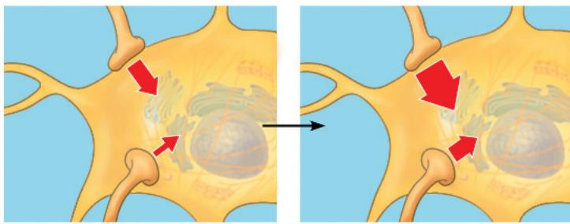  
(b) If two synapses on a postsynaptic cell are often active at the same time, the strength of both responses may increase.

A defect in neuronal plasticity may underlie autism spectrum disorder. People with this condition experience challenges relating to communication and social interactions, and may exhibit repetitive or restrictive behaviors and interests. There is now growing evidence that autism spectrum disorder involves a disruption of activity-dependent remodeling at synapses. At the same time, no link has been found to vaccine preservatives, once proposed as a potential risk factor based on fraudulent data.

Although the underlying causes of autism are unknown, there is a strong genetic contribution to this and related disorders. Further understanding of the autism-associated disruption in synaptic plasticity may help efforts to better understand and treat this disorder.

## Memory and Learning

Neuronal plasticity is essential to the formation of memories. We are constantly checking what is happening against what just happened. We hold information for a time in short-term memory and then release it if it becomes irrelevant. If we wish to retain knowledge of a name, phone number, or other fact, the mechanisms of long-term memory are activated. If we later need to recall the name or number, we fetch it from long-term memory and return it to short-term memory.

Short-term and long-term memory both involve the storage of information in the cerebral cortex. In short-term memory, this information is accessed via temporary links formed in the hippocampus. When memories are made long-term, the links in the hippocampus are replaced by connections within the cerebral cortex itself. As discussed earlier, some of this consolidation of memory is thought to occur during sleep. Furthermore, the reactivation of the hippocampus that is required for memory consolidation likely forms the basis for at least some of our dreams.

According to our current understanding of memory, the hippocampus is essential for acquiring new long-term memories but not for maintaining them. This hypothesis readily explains the symptoms of some individuals who suffer damage to the hippocampus: They cannot form any new lasting memories but can freely recall events from before their injury. In effect, their lack of normal hippocampal function traps them in their past. Hippocampal damage and memory loss are common in the early stages of Alzheimer's disease (see Concept 49.5).

What evolutionary advantage might be offered by organizing short-term and long-term memories differently? One hypothesis is that the delay in forming connections in the cerebral cortex allows long-term memories to be integrated gradually into the existing store of knowledge and experience, providing a basis for more meaningful associations. Consistent with this hypothesis, the

transfer of information from short-term to long-term memory is enhanced by the association of new data with data previously learned and stored in long-term memory. For example, it's easier to learn a new card game if you already have “card sense” from playing other card games.

Motor skills, such as tying your shoes or writing, are usually learned by repetition. You can perform these skills without consciously recalling the individual steps required to do these tasks correctly. Learning skills and procedures, such as those required to ride a bicycle, appears to involve cellular mechanisms very similar to those responsible for brain growth and development. In such cases, neurons actually make new connections. In contrast, memorizing phone numbers, facts, and places—which can be very rapid and may require only one exposure to the relevant item—may rely mainly on changes in the strength of existing neuronal connections. Next, we will consider one way that such changes in strength can take place.

## Long-Term Potentiation

In searching for the physiological basis of memory, researchers have concentrated their attention on processes that can alter a synaptic connection, making the flow of communication either more efficient or less efficient. We will focus here on long-term potentiation (LTP), a lasting increase in the strength of synaptic transmission. Data indicate that LTP represents a fundamental process for memory storage and learning.

First characterized in tissue slices from the hippocampus, LTP involves a presynaptic neuron that releases the excitatory neurotransmitter glutamate. LTP involves two types of glutamate receptors, each named for a molecule—NMDA or AMPA—that can be used to artificially activate that particular receptor. As shown in Figure 49.22, the set of receptors present on the postsynaptic membrane changes when two conditions are met: a rapid series of action potentials at the presynaptic neuron and a depolarizing stimulus elsewhere on the postsynaptic cell. The result is LTP—a stable increase in the size of the postsynaptic potentials at a synapse whose activity coincides with that of another input.

## Concept Check 49.4

1. Outline two mechanisms by which information flow between two neurons in an adult can increase.

2. Individuals with localized brain damage have been very useful in the study of many brain functions. Why is this unlikely to be true for consciousness?

3. WHAT IF? Suppose that a person with damage to the hippocampus is unable to acquire new long-term memories. Why might the acquisition of short-term memories also be impaired?

For suggested answers, see Appendix A.

Figure 49.22 Long-term potentiation in the brain.  

(a) Synapse prior to long-term potentiation (LTP). The NMDA glutamate receptors open in response to glutamate but are blocked by $Mg^{2+}$ .  
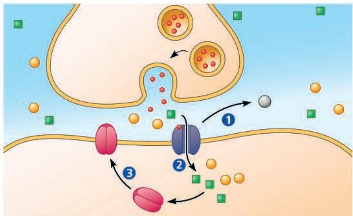

(b) Establishing LTP. Activity at nearby synapses (not shown) depolarizes the postsynaptic membrane, causing 1 Mg $^{2+}$ release from NMDA receptors. The unblocked receptors respond to glutamate by allowing 2 an influx of Na $^{+}$ and Ca $^{2+}$ . The Ca $^{2+}$ influx triggers 3 insertion of stored AMPA glutamate receptors into the postsynaptic membrane.  
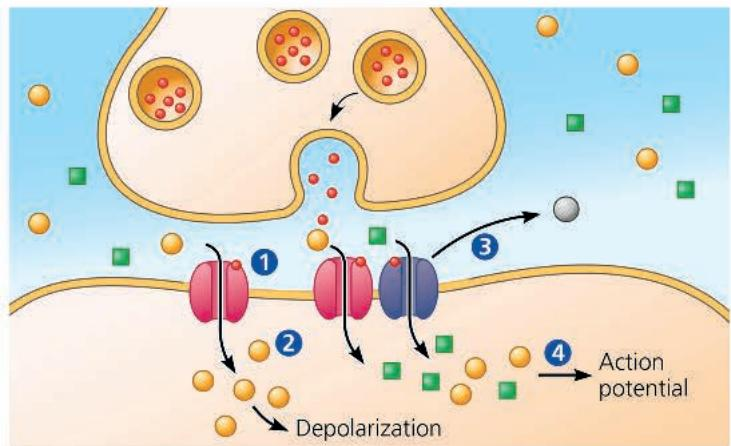  
(c) Synapse exhibiting LTP. Glutamate release activates 1 AMPA receptors that trigger 2 depolarization. The depolarization unblocks 3 NMDA receptors. Together, the AMPA and NMDA receptors trigger postsynaptic potentials strong enough to initiate 4 action potentials without input from other synapses. Additional mechanisms (not shown) contribute to LTP, including receptor modification by protein kinases.

# Concept 49.5: Many nervous system disorders can now be explained in molecular terms

Disorders of the nervous system, including schizophrenia, depression, drug addiction, Alzheimer's disease, and Parkinson's disease, are a major public health problem. Together, they result in more hospitalizations in the United States than do heart disease or cancer.

Major research efforts are under way to identify genes that cause or contribute to disorders of the nervous system. Identifying such genes offers hope for identifying causes, predicting outcomes, and developing effective treatments. Most nervous system disorders are multifactorial—that is, they are influenced by many genes as well as environmental factors. Unfortunately, such environmental contributions are typically very difficult to identify.

To distinguish between genetic and environmental variables, scientists often carry out family studies. In these studies, researchers track how family members are related genetically, which individuals are affected, and which family members grew up in the same household. These studies are especially informative when one of the affected individuals has either an adopted sibling who is genetically unrelated or an identical twin, as we'll see for the disorder schizophrenia, our next topic.

## Schizophrenia

Schizophrenia is a severe mental disturbance characterized by psychotic episodes in which patients have a distorted perception of reality. People with schizophrenia typically experience hallucinations (such as “voices” that only they can hear) and delusions (for example, the idea that others are plotting to harm them). Family and molecular studies have revealed a very strong genetic component: One recent study identified 287 genes that are expressed at higher levels in people with schizophrenia. However, as shown in Figure 49.23, the disease is also subject to environmental influences, since an individual who shares 100% of their genes with a twin with schizophrenia has only a 48% chance of developing the disorder.

One current hypothesis is that neuronal pathways that use dopamine as a neurotransmitter are disrupted in schizophrenia. Supporting evidence comes from the fact that many drugs that alleviate the symptoms of schizophrenia block dopamine receptors. In addition, the drug amphetamine (“speed”), which stimulates dopamine release, can produce the same set of symptoms as schizophrenia. Newer drugs with fewer side effects indirectly decrease dopamine activity by activating acetylcholine receptors. The immune system may also be an interesting target for future treatments, since

Figure 49.23 Genetic contribution to schizophrenia.
First cousins, uncles, and aunts of a person with schizophrenia have twice the risk of unrelated members of the population of developing the disease. The risks for closer relatives are many times greater.  
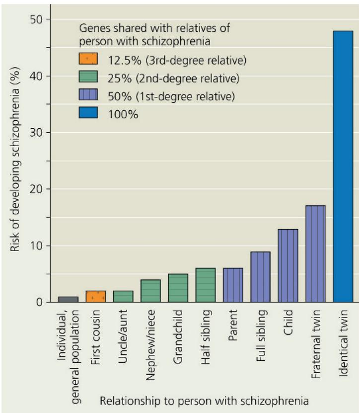  
INTERPRET THE DATA What is the likelihood of a person developing schizophrenia if the disorder affects his or her fraternal twin? How would the likelihood change if DNA sequencing revealed that the twins shared the genetic variants that contribute to the disorder?

certain variants of the gene encoding the complement protein C4 are associated with schizophrenia.

## Depression

Depression is a disorder characterized by depressed mood, as well as abnormalities in sleep, appetite, and energy level. Individuals affected by major depressive disorder undergo periods—often lasting many months—during which once enjoyable activities provide no pleasure and provoke no interest. One of the most common nervous system disorders, major depression affects about one in every seven adults at some point, and twice as many females as males.

Bipolar disorder involves extreme swings of mood and affects about $1\%$ of the world's population. The manic phase is characterized by high self-esteem, increased energy, a flow of ideas, overtalkativeness, and increased risk taking. In its milder forms, this phase is sometimes associated with great creativity, and some well-known artists, musicians, and literary figures (Vincent van Gogh, Robert Schumann, Virginia Woolf, and Ernest Hemingway, to name a few) have had productive periods during manic phases. The depressive phase comes with lessened motivation, sense of worth, and ability to feel pleasure, as well as sleep disturbances. These symptoms can be so severe that affected individuals attempt suicide.

Major depressive and bipolar disorders can be treated with a class of drugs known as SSRIs (selective serotonin reuptake inhibitors). Fluoxetine (Prozac) and other SSRIs increase serotonin signaling by preventing serotonin uptake from the synaptic cleft. People who do not respond to traditional therapies are sometimes able to be treated with ketamine (an anesthetic) or other drugs that can induce more lasting changes in brain chemistry.

## The Brain's Reward System and Drug Addiction

Emotions are strongly influenced by a neuronal circuit in the brain called the reward system. The reward system provides motivation for activities that enhance survival and reproduction, such as eating in response to hunger, drinking when thirsty, and engaging in sexual activity when aroused. Inputs to the reward system are received by neurons in the ventral tegmental area (VTA), a region located within the midbrain (see Figure 49.11). When activated, these neurons release the neurotransmitter dopamine from their synaptic terminals (Figure 49.24). Targets of this dopamine signaling include the nucleus accumbens and the prefrontal cortex.

## Interview

Interview with Ulrike Heberlein: Research with drunk flies (eTextbook only)

The brain's reward system is dramatically affected by drug addiction, a disorder characterized by compulsive consumption of a drug and loss of control in limiting intake. Addictive drugs range from sedatives to stimulants and include alcohol, cocaine, and nicotine, as well as opioids, such as heroin, fentanyl and oxycodone. All enhance the activity of the dopamine pathway (see Figure 49.24). As addiction develops, there are also long-lasting changes in the reward circuitry. The result is a craving for the drug independent of any pleasure associated with consumption. In 2024, the Centers for Disease Control and Prevention reported more than 54,000 deaths from opioid overdose in the United States alone.

Laboratory animals are highly valuable in modeling and studying addiction. Rats, for example, will provide themselves with heroin, cocaine, or amphetamine when given a dispensing system linked to a lever in their cage. Furthermore, they exhibit addictive behavior, continuing to self-administer the drug rather than seek food, even to the point of starvation.

Figure 49.24 Effects of addictive drugs on the reward system of the mammalian brain.

Addictive drugs alter the transmission of signals in the pathway formed by neurons of the ventral tegmental area (VTA), a region located near the base of the brain.

  
MAKE CONNECTIONS Review depolarization in Concept 48.3. What effect would you expect if you depolarized the neurons in the VTA? Explain.
For suggested answer, see Appendix A.

As scientists expand their knowledge about the brain's reward system and the various forms of addiction, there is hope that the insights will lead to more effective prevention and treatment.

## Alzheimer's Disease

The condition now known as Alzheimer's disease is a mental deterioration, or dementia, characterized by confusion and memory loss. Its incidence is age related, rising from about $10\%$ at age 65 to about $35\%$ at age 85. Overall, Alzheimer's disease accounts for about two of every three cases of dementia. It is also the sixth most common cause of death among adults in the United States (excluding COVID-19), affecting individuals including former President Ronald Reagan, author E.B. White, and civil rights heroine Rosa Parks.

Alzheimer's disease is progressive; patients gradually become less able to function and eventually need to be dressed, bathed, and fed by others. Individuals with Alzheimer's disease often lose their ability to recognize people and may treat even immediate family members with suspicion and hostility.

Figure 49.25 Microscopic signs of Alzheimer's disease.

A hallmark of Alzheimer's disease is the presence of neurofibrillary tangles within neurons and $\beta$ -amyloid plaques between neurons (LM).

Examining the brains of individuals who have died of Alzheimer's disease reveals two characteristic features: amyloid plaques and neurofibrillary tangles, as shown in Figure 49.25. There is also often massive shrinkage of brain tissue, reflecting the death of neurons in many areas of the brain, including the hippocampus and cerebral cortex.

The plaques are aggregates of $\beta$ -amyloid, an insoluble peptide that is cleaved from the extracellular portion of a membrane protein found in neurons. Membrane enzymes, called secretases, catalyze the cleavage, causing $\beta$ -amyloid to accumulate in plaques outside the neurons. One hypothesis is that these plaques interfere with synaptic transmission.

The neurofibrillary tangles observed in Alzheimer's disease are primarily made up of the tau protein. (This protein is unrelated to the tau mutation that affects circadian rhythm in hamsters.) The tau protein normally helps assemble and maintain microtubules that transport nutrients along axons. In Alzheimer's disease, tau undergoes changes that cause it to bind to itself, resulting in neurofibrillary tangles.

The accumulation of tangles and plaques is thought to trigger neuron death. While there is presently no cure for Alzheimer's disease, monoclonal antibodies that target the amyloid protein have shown promise in slowing the disease progression.

Tau protein accumulation is also characteristic of a degenerative brain disease found in athletes, military veterans, and others with a history of repetitive brain trauma. Known as chronic traumatic encephalopathy (CTE), this disease was first observed in deceased professional football players with a history of concussions (symptomatic brain injuries caused by a blow to the head or a hit to the body that shakes the brain). CTE has since been diagnosed in football players as young as 17 years old. The biggest predictor of CTE risk is now thought to be the time spent playing contact sports rather than the number of symptomatic concussions.

## Parkinson's Disease

Symptoms of Parkinson's disease, a motor disorder, include muscle tremors, poor balance, a flexed posture, and a shuffling gait. Facial muscles become rigid, limiting the ability of patients to vary their expressions. Cognitive defects may also develop. Like Alzheimer's disease, Parkinson's disease is a progressive brain illness and is more common with advancing age. The incidence of Parkinson's disease is about $1\%$ at age 65 and about $5\%$ at age 85. In the United States population, approximately 1 million people have Parkinson's disease.

Parkinson's disease involves the death of neurons in the midbrain that normally release dopamine at synapses in the basal nuclei. A second diagnostic feature is neurons that contain Lewy bodies, which are aggregates of a protein called synuclein. Most cases of Parkinson's disease lack an identifiable cause; however, early-onset Parkinson's disease often reflects a mutation in the PRKN (Parkin) gene. The Parkin protein helps target dysfunctional proteins for destruction. Other genes that increase the risk of developing Parkinson's disease encode mitochondrial proteins and lysosomal enzymes.

At present, Parkinson's disease can be treated, but not cured. Approaches used to manage the symptoms include brain surgery, deep-brain stimulation, and a dopamine-related drug, L-dopa. Unlike dopamine, L-dopa crosses the blood-brain barrier. Within the brain, the enzyme dopa decarboxylase converts the drug to dopamine, reducing the severity of Parkinson's disease symptoms:

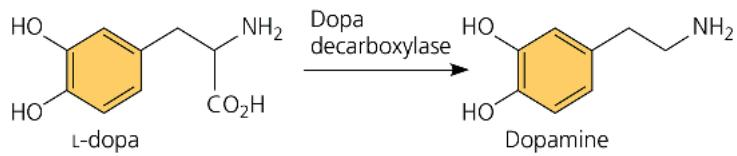

## Future Directions in Brain Research

In 2014, the United States government launched the BRAIN (Brain Research through Advancing Innovative Neurotechnologies) Initiative. This public-private partnership enables large-scale collaborations between ethicists, engineers, and scientists from diverse fields. Some of the many advances that have already resulted from this initiative include a map of all of the synapses in the fruitfly brain, a cell atlas of the mouse brain, and new treatments for Alzheimer's disease and depression. Now entering its second decade, current BRAIN goals include mapping the brain across the human lifespan, identifying the brain circuits underlying certain behaviors, and applying new approaches to understanding the human brain in health and disease.

## Concept Check 49.5

1. Compare Alzheimer's disease and Parkinson's disease.

2. How is dopamine activity related to schizophrenia, drug addiction, and Parkinson's disease?

3. WHAT IF? If you could detect early-stage Alzheimer's disease, would you expect to see brain changes that were similar to, although less extensive than, those seen in patients who have died of this disease? Explain.

For suggested answers, see Appendix A.

# Chapter 49 Review

## Summary of Key Concepts

To review key terms, go to the Vocabulary Self-Quiz (eTextbook only).

## Concept 49.1: Nervous systems consist of circuits of neurons and supporting cells

\- Invertebrate nervous systems range in complexity from simple nerve nets to highly centralized nervous systems having complicated brains and ventral nerve cords.

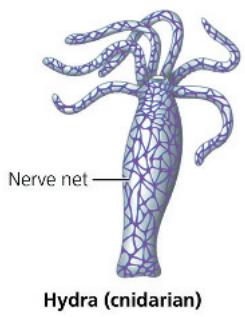

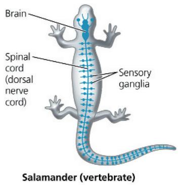

\- In vertebrates, the central nervous system (CNS), consisting of the brain and the spinal cord, integrates information, while the nerves of the peripheral nervous system (PNS) transmit sensory and motor signals between the CNS and the rest of the body. The simplest circuits control reflex responses, in which sensory input is linked to motor output without involvement of the brain.

\- Afferent neurons carry sensory signals to the CNS. Efferent neurons function in either the motor system, which carries signals to skeletal muscles, or the autonomic nervous system, which regulates smooth and cardiac muscles. The sympathetic and parasympathetic divisions of the autonomic nervous system have antagonistic effects on a diverse set of target organs, while the enteric nervous system controls the activity of many digestive organs.

\- Vertebrate neurons are supported by glia, including astrocytes, oligodendrocytes, and Schwann cells. Some glia serve as stem cells that can differentiate into mature neurons.

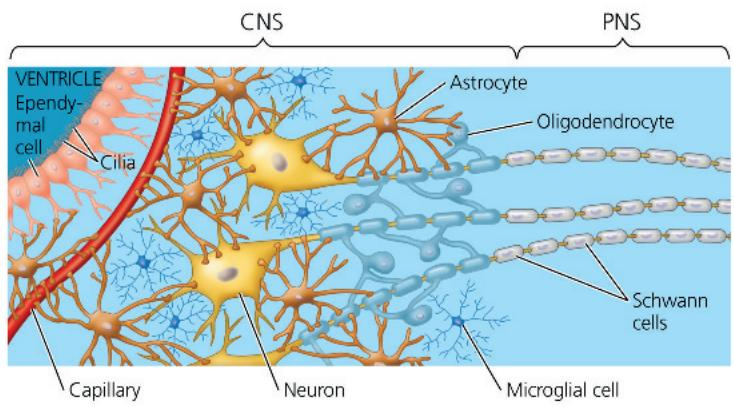  
How does the circuitry of a reflex facilitate a rapid response?

Concept 49.2: The vertebrate brain is regionally specialized  

\- The cerebrum has two hemispheres, each of which consists of cortical gray matter overlying white matter and basal nuclei. The basal nuclei are important in planning and learning movements. The pons and medulla oblongata are relay stations for information traveling between the PNS and the cerebrum. The reticular formation, a network of neurons within the brainstem, regulates sleep and arousal. The cerebellum helps coordinate motor, perceptual, and cognitive functions. The thalamus is the main center through which sensory information passes to the cerebrum. The hypothalamus regulates homeostasis and basic survival behaviors. Within the hypothalamus, a group of neurons called the suprachiasmatic nucleus (SCN) acts as the pacemaker for circadian rhythms. The amygdala plays a key role in recognizing and recalling a number of emotions.

What roles do the midbrain, cerebellum, thalamus, and cerebrum play in vision and responses to visual input?

## Concept 49.3: The cerebral cortex controls voluntary movement and cognitive functions

\- Each side of the cerebral cortex has four lobes—frontal, temporal, occipital, and parietal—that contain primary sensory areas and association areas. Association areas integrate information from different sensory areas. Broca's area and Wernicke's area are essential for generating and understanding language. These functions are concentrated in the left cerebral hemisphere, as are math and logic operations. The right hemisphere appears to be stronger at pattern recognition and nonverbal thinking.

\- In the somatosensory cortex and the motor cortex, neurons are distributed according to the part of the body that generates sensory input or receives motor commands.

\- Primates and cetaceans, which are capable of higher cognition, have an extensively convoluted cerebral cortex. In birds, a brain region called the pallium contains clustered nuclei that carry out functions similar to those performed by the cerebral cortex of mammals. Some birds can solve problems and understand abstractions in a manner indicative of higher cognition.

A patient has trouble with language and has paralysis on one side of the body. Which side would you expect to be paralyzed? Why?

## Concept 49.4: Changes in synaptic connections underlie memory and learning

\- During development, more neurons and synapses form than will exist in the adult. The programmed death of neurons and elimination of synapses in embryos establish the basic structure of the nervous system. In the adult, reshaping of the nervous system can involve the loss or addition of synapses or the strengthening or weakening of signaling at synapses. This capacity for remodeling is termed neuronal plasticity. Our short-term memory relies on temporary links in the hippocampus. In long-term memory, these links are replaced by connections within the cerebral cortex.

Learning multiple languages is typically easier early in childhood than later in life. How does this fit with our understanding of neural development?

## Concept 49.5: Many nervous system disorders can now be explained in molecular terms

\- Schizophrenia, which is characterized by hallucinations, delusions, and other symptoms, affects neuronal pathways that use dopamine as a neurotransmitter. Drugs that increase the activity of biogenic amines in the brain can be used to treat bipolar disorder and major depressive disorder. The compulsive drug use that characterizes addiction reflects altered activity of the brain's reward system, which normally provides motivation for actions that enhance survival or reproduction.

\- Alzheimer's disease and Parkinson's disease are neurodegenerative and typically age related. Alzheimer's disease is a dementia in which neurofibrillary tangles and amyloid plaques form in the brain. Parkinson's disease is a motor disorder caused by the death of dopamine-secreting neurons and associated with the presence of protein aggregates.

The fact that both amphetamine and PCP (an illegal drug that is a glutamate receptor blocker) have effects similar to the symptoms of schizophrenia suggests a potentially complex basis for this disease. Explain.

For suggested answers, see Appendix A.

## Test Your Understanding

For more multiple-choice questions, go to the Practice Test (eTextbook only).

## Levels 1-2: Remembering/Understanding

1. Activation of the parasympathetic branch of the autonomic nervous system
(A) increases heart rate.
(B) enhances digestion.
(C) triggers release of epinephrine.
(D) causes conversion of glycogen to glucose.

2. Which of the following structures or regions is correctly paired with its function?
(A) limbic system—motor control of speech
(B) medulla oblongata—homeostatic control
(C) cerebrum—coordination of movement and balance
(D) amygdala—short-term memory

3. Patients with damage to Wernicke's area have difficulty
(A) coordinating limb (C) recognizing faces.
movement. (D) understanding
(B) generating speech. language.

4. The cerebral cortex plays a major role in
(A) emotional memory. (C) circadian rhythm.
(B) hand-eye coordination. (D) breath holding.

## Levels 3-4: Applying/Analyzing

5. After suffering a stroke, a patient can see objects anywhere in front of him but pays attention only to objects in his right field of vision. When asked to describe these objects, he has difficulty judging their size and distance. What part of the brain was likely damaged by the stroke?
(A) the left frontal lobe (C) the right parietal lobe
(B) the right frontal lobe (D) the corpus callosum

6. Injury localized to the hypothalamus would most likely disrupt (A) regulation of body temperature.

(B) short-term memory.

(C) executive functions, such as decision making.

(D) sorting of sensory information.

7. DRAW IT The reflex that pulls your hand away when you prick your finger on a sharp object relies on a neuronal circuit with two synapses in the spinal cord. (a) Using a circle to represent a cross section of the spinal cord, draw the circuit. Label the types of neurons, the direction of information flow in each, and the locations of synapses. (b) Draw a simple diagram of the brain indicating where pain would eventually be perceived.

## Levels 5-6: Evaluating/Creating

8. EVOLUTION CONNECTION Scientists often use measures of "higher-order thinking" to assess intelligence in other animals. For example, birds are judged to have sophisticated thought processes because they can use tools and make use of abstract concepts. Identify problems you see in defining intelligence in these ways.

9. SCIENTIFIC INQUIRY Consider an individual who had been fluent in American Sign Language before suffering an injury to his left cerebral hemisphere. After the injury, he could still understand that sign language but could not readily generate sign language that represented his thoughts. Propose two hypotheses that could explain this finding. How might you distinguish between them?

10. SCIENCE, TECHNOLOGY, AND SOCIETY With increasingly sophisticated methods for scanning brain activity, scientists are developing the ability to detect an individual's particular emotions and thought processes from outside the body. What benefits and problems do you envision when such technology becomes readily available? Explain.

11. WRITE ABOUT A THEME: INFORMATION In a short essay (100–150 words), explain how specification of the adult nervous system by the genome is incomplete.

12. SYNTHESIZE YOUR KNOWLEDGE

  
For selected answers, see Appendix A.

Imagine you are standing at a microphone in front of a crowd. Checking your notes, you begin speaking. Using the information in this chapter, describe the series of events in particular regions of the brain that enabled you to say the very first word.

## Explore Scientific Papers with Science in the Classroom | AAAS

How does a neuron develop different functions than those of similar neighboring neurons? Go to “New Neurons Stand Out from the Crowd” at www.scienceintheclassroom.org.

Instructors: Questions can be assigned in Mastering Biology.

# Sensory and Motor Mechanisms

## Key Concepts

50.1 Sensory receptors transduce stimulus energy and transmit signals to the central nervous system

50.2 In hearing and equilibrium, mechanoreceptors detect moving fluid or settling particles

50.3 The diverse visual receptors of animals depend on light-absorbing pigments

50.4 The senses of taste and smell rely on similar sets of sensory receptors

50.5 The physical interaction of protein filaments is required for muscle function

50.6 Skeletal systems transform muscle contraction into locomotion

## Study Tip

Diagram a process: To help you understand the sliding-filament mechanism of muscle contraction, fill in the remaining steps of the process. For each step, draw the position of the myosin head and list 1) the form of ATP or its components bound; 2) the energy state (low/high); and 3) whether a cross-bridge forms at that step.

  
Figure 50.1 Tunneling beneath North American wetlands, the star-nosed mole (Condylura cristata) finds its prey in almost total darkness. To do so, the mole relies on a star-shaped cluster of appendages, each with 25,000 touch-sensitive receptors. Relaying signals to the mole's brain, the receptors initiate information processing that enables the animal to capture and eat its prey in a fraction of a second.

## What steps link sensory stimuli to animal activity?

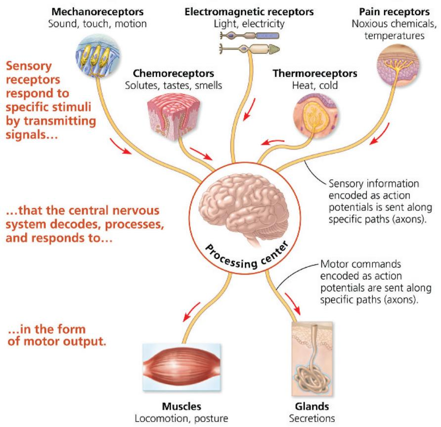

# Concept 50.1: Sensory receptors transduce stimulus energy and transmit signals to the central nervous system

All sensory processes begin with stimuli, and all stimuli represent forms of energy. A sensory receptor converts stimulus energy to a change in membrane potential, thereby regulating the output of action potentials to the central nervous system (CNS). Decoding of this information within the CNS results in sensation.

When a stimulus is received and processed by the nervous system, a motor response may be generated. One of the simplest stimulus-response circuits is a reflex, such as the knee-jerk reflex shown in Figure 49.5. For many other behaviors, sensory input undergoes more elaborate processing. As an example, consider how the star-nosed mole in Figure 50.1 searches for food, or forages, in a tunnel. When the mole's nose contacts an object, touch receptors in the nose are activated (Figure 50.2). These receptors transmit sensory information about the object, such as whether the object is moving, to the mole's brain. Circuits in the brain integrate the input and initiate one of two response pathways. If prey or other food is detected, the brain sends

Figure 50.2 A simple response pathway: foraging by a star-nosed mole.  
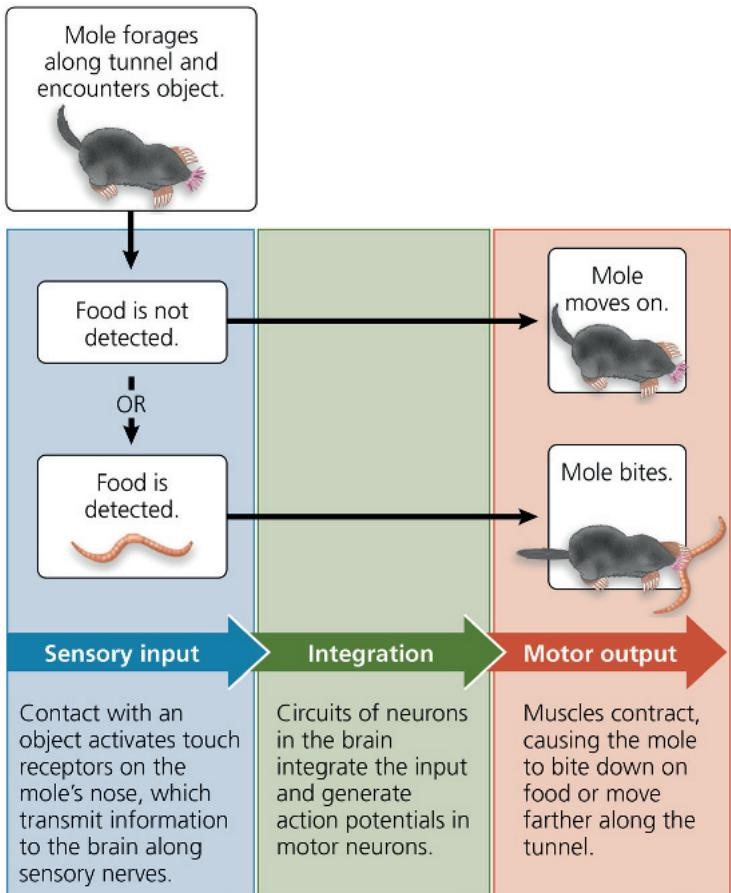

motor output commands to skeletal muscles that cause the jaws to bite down. If no food is detected, the brain sends instructions to skeletal muscles to continue movement along the tunnel.

With this overview in mind, let's examine the general organization and activity of animal sensory systems. We'll focus on four basic functions common to sensory pathways: sensory reception, transduction, transmission, and perception.

## Sensory Reception and Transduction

A sensory pathway begins with sensory reception, the detection of a stimulus by specialized sensory cells. Each sensory cell is either a neuron or a cell that regulates a neuron (Figure 50.3). Some sensory cells exist singly; others are collected in sensory organs, such as the star-shaped nose of the mole in Figure 50.1.

The term sensory receptor describes a sensory cell or organ, as well as the subcellular structure that detects stimuli. Some sensory receptors respond to stimuli from within the body, such as blood pressure and body position. Other receptors detect stimuli from outside the body, such as heat, light, pressure, or chemicals. Some of these receptors are sensitive to the smallest possible unit of stimulus. Most light receptors, for example, can detect a single quantum (photon) of light.

Although animals use a range of sensory receptors to detect widely varying stimuli, the effect in all cases is to open or close ion channels. The resulting change in the flow of ions across the membrane alters the membrane potential. The change in membrane potential is called a receptor potential, and conversion of the stimulus to a receptor potential is known as sensory transduction. Note that receptor potentials are graded potentials: Their magnitude varies with the strength of the stimulus.

Figure 50.3 Neuronal and non-neuronal sensory receptors.  
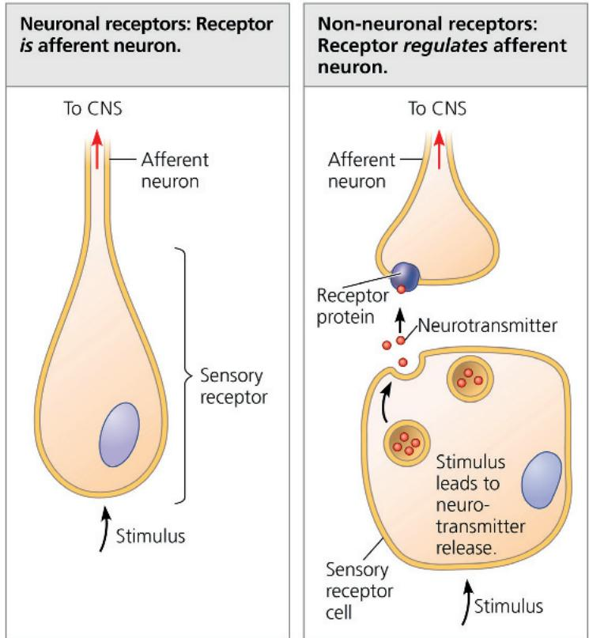

## Transmission

Sensory information travels through the nervous system as action potentials. A sensory receptor that is also a neuron generates action potentials that travel along an axon extending into the CNS (see Figure 50.3). In contrast, a non-neuronal sensory receptor does not itself generate action potentials, but instead conveys information to an afferent neuron via a chemical synapse. Because this chemical signaling alters the rate at which the afferent neurons produce action potentials, the sensory information generated also enters the CNS in the form of action potentials.

The size of a receptor potential increases with the intensity of the stimulus. If the receptor is a sensory neuron, a larger receptor potential results in more frequent action potentials (Figure 50.4). If the receptor is not a sensory neuron, a larger receptor potential usually causes the receptor to release more neurotransmitter.

Many sensory neurons spontaneously generate action potentials at a low rate. In these neurons, a stimulus does not switch the production of action potentials on or off, but instead changes how often an action potential is produced, alerting the nervous system to changes in stimulus intensity.

Processing of sensory information can occur before, during, and after transmission of action potentials to the CNS. In many cases, the integration of sensory information begins as soon as the information is received. Receptor potentials produced by stimuli delivered to different parts of a sensory receptor cell are integrated through summation, as are postsynaptic potentials in neurons that receive input from multiple sensory receptors. As you'll see shortly, sensory structures such as eyes also provide higher levels of integration, and the brain further processes all incoming signals.

Figure 50.4 Coding of stimulus intensity by a single sensory receptor.  

## Perception

When action potentials reach the brain via afferent neurons, circuits of neurons process this input, generating the perception of the stimulus. An action potential triggered by light striking the eye has the same properties as an action potential triggered by air vibrating in the ear. How, then, do we distinguish sights, sounds, and other stimuli? The answer lies in the connections that link sensory receptors to the brain. Action potentials from sensory receptors travel along neurons that are dedicated to a particular stimulus; these dedicated neurons form synapses with particular neurons in the brain or spinal cord. As a result, the brain distinguishes stimuli such as sight and sound solely by the path along which the action potentials have arrived.

Perceptions—such as colors, smells, sounds, and tastes—are constructions formed in the brain and do not exist outside it. So if a tree falls and no animal is present to hear it, is there a sound? The falling tree certainly produces pressure waves in the air, but if sound is defined as a perception, then there is no sound unless an animal senses the waves and its brain perceives them.

## Amplification and Adaptation

The transduction of stimuli by sensory receptors is subject to two types of modification—amplification and adaptation. Amplification refers to the strengthening of a sensory signal during transduction. The effect of amplification can be considerable. For example, an action potential conducted from the eye to the human brain has about 100,000 times as much energy as the few photons of light that triggered it.

Amplification that occurs in sensory receptor cells often requires signal transduction that involves enzyme-catalyzed reactions (see Concept 11.3). Because a single enzyme molecule catalyzes the formation of many product molecules, these pathways amplify signal strength considerably. Amplification may also take place in accessory structures of a sense organ. For example, the lever system formed by three small bones in the ear enhances the pressure associated with sound waves more than 20-fold before the stimulus reaches receptors in the innermost part of the ear.

Upon continued stimulation, many receptors undergo a decrease in responsiveness known as sensory adaptation (not to be confused with the evolutionary term adaptation). Sensory adaptation has very important roles in our perception of ourselves and our surroundings. Without it, you would feel each beat of your heart and be constantly aware of every bit of clothing on your body. Furthermore, adaptation is essential for you to see, hear, and smell changes in external stimuli that vary widely in intensity.

## Types of Sensory Receptors

Sensory receptors fall into five categories based on the nature of the stimuli they transduce: mechanoreceptors, chemoreceptors, electromagnetic receptors, thermoreceptors, and pain receptors.

## Mechanoreceptors

Our senses of hearing, balance, touch, and body position all rely on mechanoreceptors, which sense physical deformation caused by forms of mechanical energy. The vertebrate stretch receptor, a mechanoreceptor that detects muscle movement, triggers the familiar knee-jerk reflex (see Figure 49.5). Stretch receptors in vertebrates are dendrites of sensory neurons that spiral around the middle of certain small skeletal muscle fibers. When the muscle fibers are stretched, the sensory neurons depolarize, triggering nerve impulses that reach the spinal cord, activate motor neurons, and generate a reflex response.

Mechanoreceptors that are the dendrites of sensory neurons are also responsible for the mammalian sense of touch. Touch receptors are often embedded in layers of connective tissue. The structure of the connective tissue and the location of the receptors dramatically affect the type of mechanical energy (light touch, vibration, or strong pressure) that best stimulates them (Figure 50.5). Receptors that detect a light touch or vibration are close to the surface of the skin; they transduce very slight inputs of mechanical energy into receptor potentials. Receptors that respond to stronger pressure and vibrations are in deep skin layers.

Some animals use mechanoreceptors to literally get a feel for their environment. For example, cats and many rodents have

Figure 50.5 Sensory receptors in human skin.

Most receptors in the dermis are encapsulated by connective tissue. Receptors in the epidermis are naked dendrites, as are hair movement receptors that wind around the base of hairs in the dermis.

Receptors that detect gentle pressure and vibration are close to the surface of the skin.

  
Naked dendrites wind around the base of hairs and detect hair movement.  
Receptors that respond to strong pressure are in deep skin layers.  
Figure 50.6 Chemoreceptors in an insect.

extremely sensitive mechanoreceptors at the base of their whiskers. Like the appendages on the face of the star-nosed mole, whiskers act as touch organs. Deflection of different whiskers triggers action potentials that reach different cells in the brain. As a result, an animal's whiskers enable the brain to assemble a "touch map" detailing the location of nearby objects such as food or obstacles.

At the subcellular level, an ion channel called Piezo 2 is responsible for detecting stretch, gentle pressure, and vibration. This enormous ion channel consists of three subunits, each containing 38 transmembrane domains. Mechanical stimuli open the channel, allowing positive ions to enter the cell and produce a depolarizing receptor potential.

## Chemoreceptors

Chemoreceptors that monitor the internal environment fall into two broad categories. Some transmit information about overall solute concentration. For example, osmoreceptors in the mammalian brain detect changes in the total solute concentration of the blood and stimulate thirst when osmolarity increases (see Figure 44.19). Other chemoreceptors respond to specific molecules in body fluids, including glucose, oxygen, carbon dioxide, and amino acids.

Animals also use chemoreceptors to detect stimuli in their diet and in the environment they occupy. The antennae of the male silkworm moth contain two of the most sensitive and specific chemoreceptors known (Figure 50.6); these receptors can detect

The antennae of the male silkworm moth Bombyx mori are covered with sensory hairs, visible in the SEM enlargement. The hairs have chemoreceptors that are highly sensitive to the sex pheromone released by the female.

components of the sex pheromone released by a female moth several kilometers away. For pheromones and other molecules detected by chemoreceptors, the stimulus molecule binds to the specific receptor on the membrane of the sensory cell and initiates changes in ion permeability.

## Electromagnetic Receptors

An electromagnetic receptor detects a form of electromagnetic energy, such as light, electricity, and magnetism. For instance, the platypus has electroreceptors on its bill that can detect the electric field generated by the muscles of crustaceans, small fishes, and other prey. In a few cases, the animal detecting the stimulus is also its source: Some fishes generate electric currents and then use electroreceptors to locate prey or other objects that disturb those currents.

Many animals can use Earth's magnetic field lines to orient themselves as they migrate (Figure 50.7a). In 2015, researchers identified a pair of proteins that appear to act as a sensor for the Earth's magnetic field in many animals that can orient to it, including monarch butterflies, pigeons, and minke whales. One of these proteins binds iron; the other is a receptor that is sensitive to electromagnetic radiation.

Figure 50.7 Examples of electromagnetic reception and thermoreception.  
  
(a) Some migrating animals, such as these beluga whales, apparently sense Earth's magnetic field and use the information, along with other cues, for orientation.

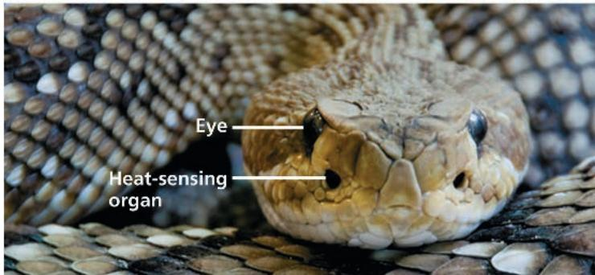  
(b) This rattlesnake and other pit vipers have a pair of heat-sensing pit organs, one anterior to and just below each eye. These organs are sensitive enough to detect the infrared radiation emitted by a warm prey a meter away. The snake moves its head from side to side until the radiation is detected equally by the two pit organs, indicating that the prey is straight ahead.

## Thermoreceptors

Thermoreceptors detect heat and cold. For example, certain venomous snakes rely on thermoreceptors to detect the infrared radiation emitted by warm prey. These thermoreceptors are located in a pair of pit organs on the snake's head (Figure 50.7b). In humans, thermoreceptors are located in the skin and in the anterior hypothalamus.

Recently, our understanding of thermoreception has increased substantially, thanks to scientists with an appreciation for fiery foods. Jalapeno and cayenne peppers that we describe as “hot” contain a substance called capsaicin. Applying capsaicin to a sensory neuron causes an influx of calcium and other positively charged ions. When scientists identified the receptor protein in neurons that binds capsaicin, they made a fascinating discovery: The receptor is actually a gated cation channel that opens in response not only to capsaicin but also to high temperatures (42°C or higher). In essence, spicy foods taste “hot” because they activate the same receptors as hot soup and coffee.

Mammals have a variety of thermoreceptors, each specific for a particular temperature range. The capsaicin receptor and at least 10 other types of thermoreceptors belong to the TRP (transient receptor potential) family of ion channel proteins. Just as the TRPV1 receptor specific for high temperature is sensitive to capsaicin, the TRPM8 receptor that senses low temperatures (below 28°C) can be activated by menthol, a plant product that we perceive to have a “cool” flavor.

## Pain Receptors

Extreme pressure or temperature, as well as certain chemicals, can damage animal tissues. To detect stimuli that reflect such noxious (harmful) conditions, animals rely on nociceptors (from the Latin nocere, to hurt), also called pain receptors. By triggering defensive reactions, such as withdrawal from danger, the perception of pain serves an important function. The TRPV1 (capsaicin) receptor responds to noxious chemicals as well as to dangerously high temperatures, so it also functions as a nociceptor.

Chemicals produced in an animal's body sometimes enhance the perception of pain. For example, damaged tissues produce prostaglandins, which act as local regulators of inflammation (see Concept 45.1). Prostaglandins worsen pain by increasing nociceptor sensitivity to noxious stimuli. Aspirin and ibuprofen reduce pain by inhibiting the synthesis of prostaglandins.

Next, we'll turn our focus to sensory systems, beginning with systems for maintaining balance and detecting sound.

## Concept Check 50.1

1. Which one of the five categories of sensory receptors is primarily dedicated to external stimuli?

2. Why can eating "hot" peppers cause a person to sweat?

3. WHAT IF? If you stimulated a sensory neuron electrically, how would that stimulation be perceived?

# Concept 50.2: In hearing and equilibrium, mechanoreceptors detect moving fluid or settling particles

For most animals, the sense of hearing is closely related to the sense of balance, the perception of body equilibrium. For both senses, mechanoreceptor cells produce receptor potentials in response to deflection of cell-surface structures by settling particles or moving fluid.

## Sensing of Gravity and Sound in Invertebrates

To sense gravity and maintain equilibrium, most invertebrates rely on mechanoreceptors located in organs called statocysts (Figure 50.8). In a typical statocyst, statoliths, granules formed by grains of sand or other dense materials, sit freely in a chamber lined with ciliated cells. Each time an animal repositions itself, the statoliths resettle, stimulating mechanoreceptors at the low point in the chamber.

How did researchers test the hypothesis that resettling of statoliths provides information about body position relative to Earth's gravity? In one key experiment, statoliths were replaced with metal shavings. Researchers then “tricked” crayfish into swimming upside down by using magnets to pull the shavings to the upper end of statocysts at the base of their antennae.

Many (perhaps most) insects have body hairs that vibrate in response to sound waves. Hairs differing in stiffness and length vibrate at different frequencies. For example, fine hairs on the antennae of a male mosquito vibrate in a specific way in response

The settling of granules called statoliths to the low point in the chamber bends cilia on receptor cells in that location, providing the brain with information about the orientation of the body with respect to gravity.

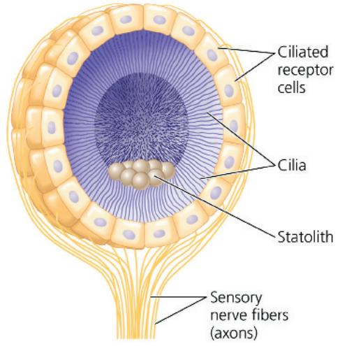

Figure 50.9 An insect's "ear"—on its leg.

The tympanic membrane, visible in this SEM of a cricket's front leg, vibrates in response to sound waves. The vibrations stimulate mechanoreceptors attached to the inside of the tympanic membrane.

Figure 50.8 The statocyst of an invertebrate.  

to the hum produced by the beating wings of flying females. The importance of this sensory system in attracting males to a potential mate can be readily demonstrated: A tuning fork vibrating at the same frequency as that of a female's wings by itself attracts males.

Many insects also detect sound by means of vibration-sensitive organs, which consist in some species of a tympanic membrane (eardrum) stretched over an internal air chamber (Figure 50.9). Cockroaches lack such a tympanic membrane, but instead have vibration-sensitive organs that sense air movement, such as that caused by a descending human foot.

## Hearing and Equilibrium in Mammals

In mammals, as in most other terrestrial vertebrates, the sensory organs for hearing and equilibrium are closely associated. Figure 50.10 explores the structure and function of these organs in the human ear.

## Hearing

Vibrating objects, such as a plucked guitar string or the vocal cords of a person who is speaking, create pressure waves in the surrounding air. In hearing, the ear transduces this mechanical stimulus into nerve impulses that the brain perceives as sound. The sensory organ for hearing, the organ of Corti, contains hair cells, mechanoreceptors with hairlike projections that detect motion created by pressure waves.

Before vibration waves reach hair cells, they are amplified and transformed by accessory structures. The first steps involve structures in the ear that convert the vibrations of moving air to pressure waves in fluid. Moving air that reaches the outer ear causes the tympanic membrane to vibrate. The three bones of the middle ear transmit these vibrations to the oval window, a membrane between the middle ear and the inner ear. When one of those bones, the stapes, vibrates against the oval window, it creates pressure waves in the fluid inside the cochlea, a fluid-filled chamber of the inner ear.

# Exploring the Structure of the Human Ear

## Figure 50.10

## 1 Overview of Ear Structure

The outer ear consists of the external pinna and the auditory canal, which collect sound waves and channel them to the tympanic membrane (eardrum), a thin tissue that separates the outer ear from the middle ear. In the middle ear, three small bones—the malleus (hammer), incus (anvil), and stapes (stirrup)—transmit vibrations to the oval window, which is a membrane beneath the stapes. The middle ear also opens into the auditory (Eustachian) tube, a passage that connects to the pharynx and equalizes pressure between the middle ear and the atmosphere. The inner ear consists of fluid-filled chambers, including the semicircular canals, which function in equilibrium, and the coiled cochlea (from the Latin meaning “snail”), a bony chamber that is involved in hearing.

## 2 The Cochlea

The cochlea, shown here in cross section, has two large canals—an upper vestibular canal and a lower tympanic canal—separated by a smaller cochlear duct. Both canals are filled with fluid.

▲ Bundled hairs projecting from a single mammalian hair cell (SEM). Two shorter rows of hairs lie behind the tall hairs in the foreground.

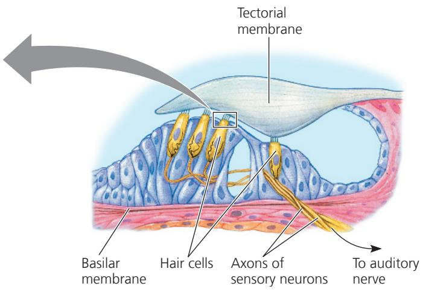

## 4 Hair Cell

Many hairs project from each hair cell. Each cell contains a core of actin filaments and mechanically gated ion channels in the plasma membrane. Vibration of the basilar membrane in response to sound raises and lowers the hair cells, bending the hairs against the surrounding fluid and the tectorial membrane. The membrane tension generated by this movement opens or closes the ion channels. By altering ion flow, this change results in a receptor potential that is depolarizing or hyperpolarizing.

## 3 The Organ of Corti

The floor of the cochlear duct, the basilar membrane, is the base of the organ of Corti, which contains the mechanoreceptors of the ear—hair cells with bundles of rod-shaped “hairs” projecting into the cochlear duct. Many of the hairs are attached to the tectorial membrane, which hangs over the organ of Corti like an awning.

## Figure 50.11 Sensory reception by hair cells.

In hearing or balance, each hair cell forms a synapse with an afferent neuron that conducts action potentials to the CNS. Bending of the hairs of the hair cell in one direction depolarizes the cell. Depolarization increases release of excitatory neurotransmitter, resulting in more frequent action potentials in the afferent neuron. Bending the hairs in the other direction decreases neurotransmitter release, reducing action potential frequency in the afferent neuron.

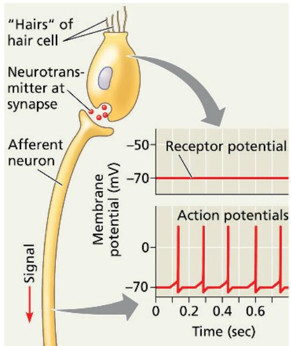  
(a) No bending of hairs

  
(b) Bending of hairs in one direction

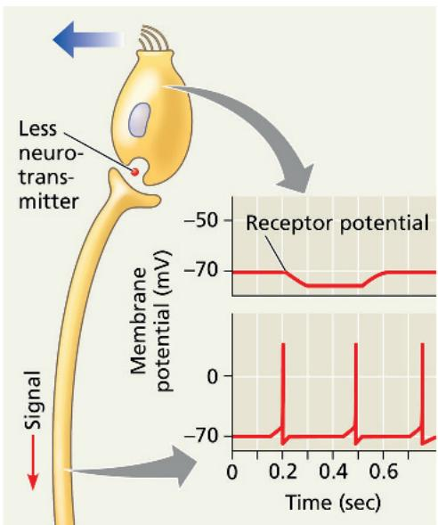  
(c) Bending of hairs in other direction

Upon entering the vestibular canal, fluid pressure waves push down on the cochlear duct and basilar membrane. In response, the basilar membrane and attached hair cells vibrate up and down. The hairs projecting from the hair cells are deflected by the fixed tectorial membrane, which lies above (see Figure 50.10). With each vibration, the hairs bend first in one direction and then the other, causing ion channels in the hair cells to open or close. Bending in one direction depolarizes hair cells, increasing neurotransmitter release and the frequency of action potentials directed to the brain along the auditory nerve (Figure 50.11). Bending the hairs in the other direction hyperpolarizes hair cells, reducing neurotransmitter release and the frequency of auditory nerve sensations.

What prevents pressure waves from reverberating within the ear and causing prolonged sensation? After propagating through the vestibular canal, pressure waves pass around the apex (tip) of the cochlea and dissipate as they strike the round window (Figure 50.12a). This damping of sound waves resets the apparatus for the next vibrations that arrive.

The ear captures information about two important sound variables: volume and pitch. Volume (loudness) is determined by the amplitude, or height, of the sound wave. A large-amplitude wave causes more vigorous vibration of the basilar membrane, greater bending of the hairs on hair cells, and more action potentials in the afferent neurons that transmit information to the brain. Pitch is determined by a sound wave's frequency, the number of vibrations per unit time. The detection of sound wave frequency takes place in the cochlea and relies on the asymmetric structure of that organ.

The cochlea can distinguish pitch because the basilar membrane is not uniform along its length: It is relatively narrow and stiff near the oval window and wider and more flexible at the apex at the base of the cochlea. Each region of the basilar membrane is tuned to a different vibration frequency (Figure 50.12b). Furthermore, each region is connected by axons to a different location in the cerebral cortex. Consequently, when a sound wave causes vibration of a particular region of the basilar membrane, nerve impulses are transduced to a specific site in our cortex and we perceive sound of a particular pitch.

## Equilibrium

Several organs in the inner ear of humans and most other mammals detect body movement, position, and equilibrium. For example, the chambers called the utricle and saccule allow us to perceive position with respect to gravity as well as linear movement (Figure 50.13). Situated in a vestibule behind the oval window, each of these chambers contains hair cells that project into a gelatinous material. Embedded in this gel are small calcium carbonate particles called otoliths (“ear stones”). When you tilt your head, the otoliths shift position, contacting a different set of hairs protruding into the gel. The hair cell receptors transform this deflection into a change in neurotransmitter output. This alters the activity of afferent neurons, signaling the brain that your head is at an angle. The otoliths are also responsible for your ability to perceive acceleration, such as when a stationary car in which you are sitting moves forward.

Three fluid-filled semicircular canals connected to the utricle detect turning of the head and other rotational acceleration.

Figure 50.12 Sensory transduction in the cochlea.

The high surface tension of water, resulting from the collective strength of its hydrogen bonds, allows this raft spider to walk on the surface of a pond.

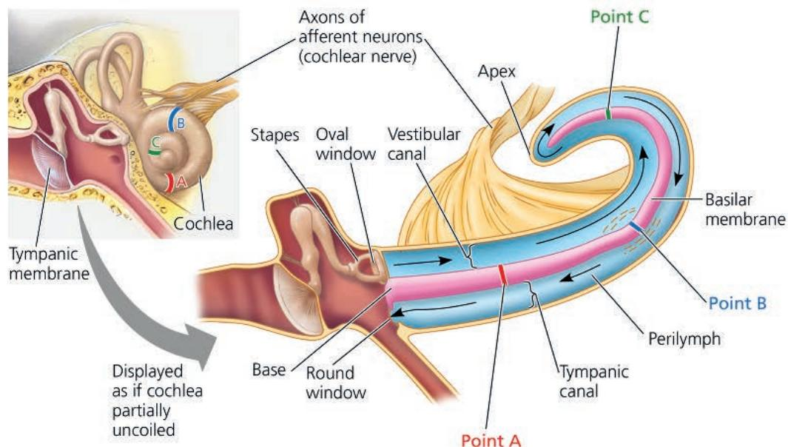

  
(a) Vibrations of the stapes against the oval window produce pressure waves (black arrows) in the fluid (perilymph; blue) of the cochlea. (For purposes of illustration, the cochlea on the right is drawn partially uncoiled.) The waves travel to the apex via the vestibular canal and back towards the base via the tympanic canal. The energy in the waves causes the basilar membrane (pink) to vibrate, stimulating hair cells (not shown). Because the basilar membrane varies in stiffness along its length, each point along the membrane vibrates maximally in response to waves of a particular frequency.  
(b) These graphs show the patterns of vibration along the basilar membrane for three different frequencies, high (top), medium (middle), and low (bottom). The higher the frequency, the closer the vibration to the oval window.

INTERPRET THE DATA A musical chord consists of several notes, each formed by a sound wave of different frequency. If a chord had notes with frequencies of 100, 1,000, and 6,000 Hz, what would happen to the basilar membrane? How would this result in your hearing a chord?

Within each canal, the hair cells form a cluster, with the hairs projecting into a gelatinous cap called a cupula (see Figure 50.13). Because the three canals are arranged in the three spatial planes, they can detect angular motion of the head in any direction. If you spin in place, the fluid in each canal eventually comes to equilibrium and remains in that state until you stop. At that point, the moving fluid encounters a stationary cupula, triggering the false sensation of angular motion that we call dizziness.

Figure 50.13 Organs of equilibrium in the inner ear.  
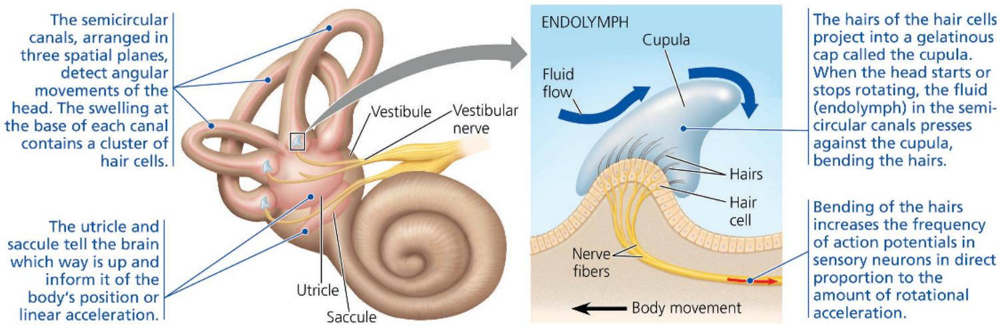

  
Figure 50.14 The lateral line system in a fish.

The sensory organs of the lateral line stretch from head to tail along each side of the fish. Water movement into and through the lateral line canals pushes on the gelatinous cupula, bending the hair cells within. In response, the hair cells generate receptor potentials, triggering action potentials that are conveyed to the brain. This information enables a fish to monitor water currents, any pressure waves produced by moving objects, and any low-frequency sounds conducted through the water.

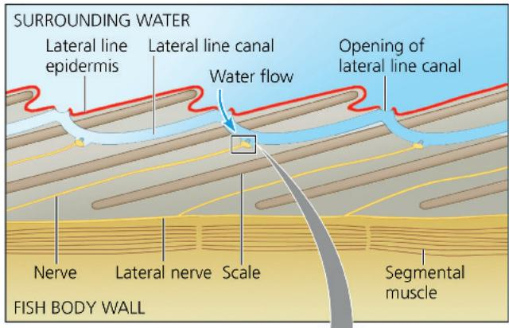

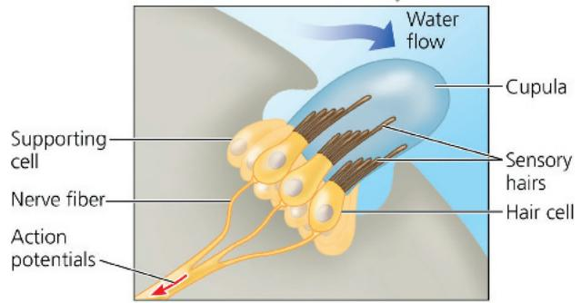

## Hearing and Equilibrium in Other Vertebrates

Fishes rely on several systems for detecting movement and vibrations in their aquatic environment. One system involves a pair of inner ears that contain otoliths and hair cells. Unlike the ears of mammals, these ears have no eardrum, cochlea, or opening to the outside of the body. Instead, the vibrations of the water caused by sound waves are conducted to the inner ear through the skeleton of the head. Some fishes also have a series of bones that conduct vibrations from the swim bladder to the inner ear.

Most fishes and aquatic amphibians are able to detect low-frequency waves by means of a lateral line system along each side of their body (Figure 50.14). As in our semicircular canals, receptors are formed from a cluster of hair cells whose hairs are embedded in a cupula. Water entering the lateral line system through numerous pores bends the cupula, leading to depolarization of the hair cells and production of action potentials. In this way, the fish perceives its movement through water or the direction and velocity of water currents flowing over its body. The lateral line system also detects water movements or vibrations generated by prey, predators, and other moving objects.

In the ear of a frog or toad, sound vibrations in the air are conducted to the inner ear by a tympanic membrane on the body surface and a single middle ear bone. The same is true in birds and other reptiles, although they, like mammals, have a cochlea.

## Concept Check 50.2

1. How are otoliths adaptive for burrowing mammals, such as the star-nosed mole?

2. WHAT IF? Suppose a series of pressure waves in your cochlea caused a vibration of the basilar membrane that moved gradually from the apex toward the base. How would your brain interpret this stimulus?

3. WHAT IF? If the stapes became fused to the other middle ear bones or to the oval window, how would this condition affect hearing? Explain.

4. MAKE CONNECTIONS Plants use statoliths to detect gravity (see Figure 39.22). How do plants and animals differ with regard to the type of compartment in which statoliths are found and the physiological mechanism for detecting their response to gravity?

For suggested answers, see Appendix A.

## Concept 50.3: The diverse visual receptors of animals depend on light-absorbing pigments

The ability to detect light has a central role in the interaction of nearly all animals with their environment. Although the organs used for vision vary considerably among animals, the underlying mechanism for capturing light is the same, suggesting a common evolutionary origin.

Figure 50.15 Ocelli and orientation behavior of a planarian.  
  
(a) The planarian's brain directs the body to turn until the sensations from the two ocelli are equal and minimal, causing the animal to move away from light.

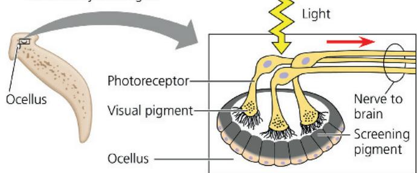  
(b) Whereas light striking the front of an ocellus excites the photoreceptors, light striking the back is blocked by the screening pigment. In this way, the ocelli indicate the direction of a light source, enabling the light avoidance behavior.  
(a) The faceted eyes on the head of a fly form a repeating pattern visible in this photomicrograph.

## Evolution of Visual Perception

EVOLUTION Light detectors in the animal kingdom range from simple clusters of cells that detect only the direction and intensity of light to complex organs that form images. These diverse light detectors all contain photoreceptors, sensory cells that contain light-absorbing pigment molecules. Furthermore, the genes that specify where and when photoreceptors arise during embryonic development are shared among flatworms, annelids, arthropods, and vertebrates. It is thus very probable that the genetic underpinnings of all photoreceptors were already present in the earliest bilaterian animals.

## Light-Detecting Organs

Most invertebrates have some kind of light-detecting organ. One of the simplest is that of planarians (Figure 50.15). A pair of ocelli (singular, ocellus), sometimes called eyespots, are located in the head region. Photoreceptors in each ocellus receive light only through an opening where there are no pigmented cells. By comparing the rate of action potentials coming from the two ocelli, the planarian can move away from a light source until it reaches a shaded location, where the object providing the shade may hide it from predators.

## Compound Eyes

Insects, crustaceans, and some polychaete worms have compound eyes, each consisting of up to several thousand light detectors called ommatidia (Figure 50.16). Each of these “facets” of the eye has its own light-focusing lens that captures light from a tiny portion of the visual field (the total area seen when the eyes point forward). A compound eye is very effective at detecting movement, an important adaptation for flying insects and small animals constantly threatened with predation. Many compound eyes, including those of the fly in Figure 50.16, offer a very wide field of view.

## Figure 50.16 Compound eyes.

(b) The cornea and crystalline cone of each ommatidium together function as a lens that focuses light on the rhabdom, an organelle formed by and extending inward from a circle of photoreceptors. The rhabdom traps light, serving as the photo-sensitive part of the ommatidium. Information gathered from different intensities of light entering the many ommatidia from different angles is used to form a visual image.

Insects have excellent color vision, and some, such as bees, can see into the ultraviolet (UV) range of the electromagnetic spectrum. Because UV light is invisible to humans, we don't see differences in the environment that bees and other insects detect. In studying animal behavior, we cannot simply extrapolate our sensory world to other species; different animals have different sensitivities and different brain organizations.

## Single-Lens Eyes

Among invertebrates, single-lens eyes are found in some jellies and polychaete worms, as well as in spiders and many molluscs. A single-lens eye works somewhat like a camera.

The eye of an octopus or squid, for example, has a small opening, the pupil, through which light enters. Like a camera's adjustable aperture, the iris expands or contracts, changing the diameter of the pupil to let in more or less light. Behind the pupil, a single lens directs light on a layer of photoreceptors. Similar to a camera's focusing action, muscles in an invertebrate's single-lens eye move the lens forward or backward, focusing on objects at different distances.

The eyes of all vertebrates have a single lens. In fishes, focusing occurs as in invertebrates, with the lens moving forward or backward. In other species, including mammals, focusing is achieved by changing the shape of the lens.

## The Vertebrate Visual System

The human eye will serve as our model of vision in vertebrates. As described in Figure 50.17, vision begins when photons of light enter the eye and strike the innermost layer of the eye, the retina.

## Exploring the Structure of the Human Eye

Figure 50.17  
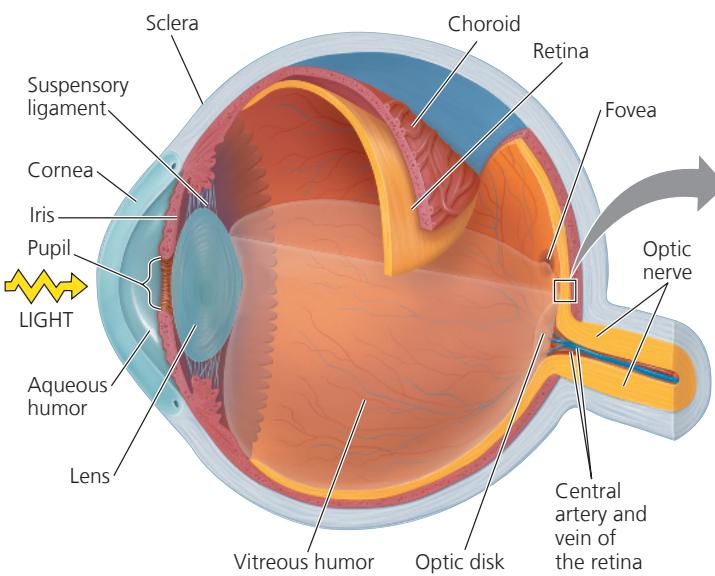

## 1 Overview of Eye Structure

Starting from the outside, the human eye is surrounded by the conjunctiva, a mucous membrane (not shown); the sclera, a connective tissue; and the choroid, a thin, pigmented layer. At the front, the sclera forms the transparent cornea and the choroid forms the colored iris. By changing size, the iris regulates the amount of light entering the pupil, the hole in the center of the iris. Just inside the choroid, the neurons and photoreceptors of the retina form the innermost layer of the eyeball. The optic nerve exits the eye at the optic disk.

The lens, a transparent disk of protein, divides the eye into two cavities. In front of the lens lies the aqueous humor, a clear watery substance. Blockage of ducts that drain this fluid can produce glaucoma, a condition in which increased pressure in the eye damages the optic nerve, causing vision loss. Behind the lens lies the jellylike vitreous humor (illustrated here in the lower portion of the eyeball). The cornea and the lens refract (bend) light rays so that they converge on the fovea, the region of the retina where vision is sharpest.

The retina contains two types of photoreceptors: rods and cones. There the energy of each photon is captured in retinal, the light-absorbing molecule in the visual pigment rhodopsin.

Although light detection in the eye is the first stage in vision, remember that it is actually the brain that “sees.” Thus, to understand vision, we must examine how the capture of light by retinal changes the production of action potentials and then follow these signals to the visual centers of the brain, where images are perceived.

## Sensory Transduction in the Eye

The transduction of visual information to the nervous system begins with the light-induced conversion of cis-retinal to trans-retinal in rods and cones. Like other cis-trans pairs, these isomers

## 2 The Retina

Light (coming from the left in this diagram) strikes the retina, passing through largely transparent layers of neurons before reaching the rods and cones, two types of photoreceptors that differ in shape and in function. The neurons of the retina then relay visual information captured by the photo receptors to the optic nerve and brain along the pathways shown with red arrows. Each bipolar cell receives information from several rods or cones, and each ganglion cell gathers input from several bipolar cells. Horizontal and amacrine cells integrate information across the retina.

The optic disk, where the optic nerve exits the retina, lacks photo-receptors. As a result, this region forms a “blind spot” where light is not detected.

of retinal differ only in the spatial arrangement of atoms at a carbon–carbon double bond (see Figure 4.7).

As shown in Figure 50.17, trans-retinal and cis-retinal differ in shape. This shift in shape activates the visual pigment (in rods, rhodopsin), which activates a G protein, which in turn activates the enzyme phosphodiesterase. The substrate for this enzyme in rods and cones is cyclic GMP (cGMP), which in the dark binds to sodium ion ( $Na^{+}$ ) channels and keeps them open (Figure 50.18a, after you turn the page). When the enzyme hydrolyzes cGMP, $Na^{+}$ channels close, and the cell becomes hyperpolarized (Figure 50.18b). The signal transduction pathway then shuts off as enzymes convert retinal back to the cis form, inactivating the visual pigment.

In bright light, rhodopsin remains active, and the response in the rods becomes saturated. If the amount of light entering the eyes abruptly decreases, the rods do not regain full responsiveness

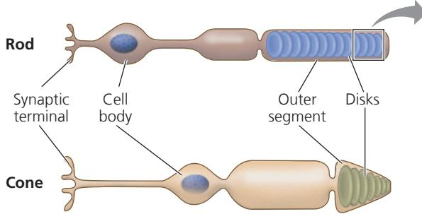

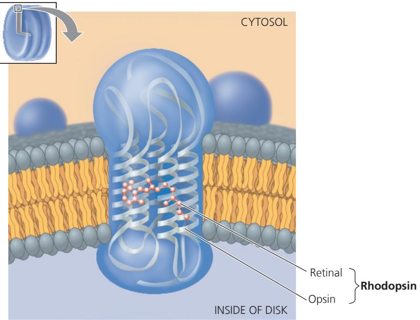

## 3 Photoreceptor Cells

Humans have two main types of photoreceptor cells: rods and cones. Within the outer segment of a rod or cone is a stack of membranous disks in which visual pigments are embedded. Rods are more sensitive to light than cones are, but they do not distinguish colors; rods enable us to see at night, but only in black and white. Cones provide color vision, but, being less sensitive, contribute very little to night vision. There are three types of cones. Each has a different sensitivity across the visible spectrum, providing an optimal response to red, green, or blue light.

In the colorized SEM shown above, cones (green), rods (light tan), and adjacent neurons (red) are visible. The pigmented epithelium, which was removed in this preparation, would be to the right.

## 4 Visual Pigments

Vertebrate visual pigments consist of a light-absorbing molecule called retinal (a derivative of vitamin A) bound to a membrane protein called an opsin. Seven $\alpha$ helices of each opsin molecule span the disk membrane. The visual pigment of rods, shown here, is called rhodopsin.

Retinal exists as two isomers. Absorption of light shifts one bond in retinal from a cis to a trans arrangement, converting the molecule from an angled shape to a straight shape. This change in configuration activates the opsin protein to which retinal is bound.

VISUAL SKILLS The isomers of retinal have the same number of atoms and bonds but differ in the spatial arrangement at one carbon–carbon double bond (C=C). In each isomer, circle that C=C bond. Looking at the atoms around that bond, to what atoms do the terms cis (same side) and trans (opposite side) refer? For suggested answer, see Appendix A.

for several minutes. This is why you are briefly blinded if you pass quickly from bright sunshine into a dark movie theater. (Because light activation changes the color of rhodopsin from purple to yellow, rods in which the light response is saturated are often described as “bleached.”)

## Processing of Visual Information in the Retina

The processing of visual information begins in the retina itself, where both rods and cones form synapses with bipolar cells (see Figure 50.17). In the dark, rods and cones are depolarized and continually release the neurotransmitter glutamate at these synapses (Figure 50.19, on the next page). When light strikes the rods and

cones, they hyperpolarize, shutting off their release of glutamate. Depending on the glutamate receptor subtype present on the bipolar cell, either hyperpolarization or depolarization can result from decreased glutamate signaling. By altering the action potential frequency, this change in membrane potential alters the release of neurotransmitters at synapses with ganglion cells.

Processing of signals from rods and cones occurs via several different pathways in the retina. Some information passes directly from photoreceptors to bipolar cells to ganglion cells. In other cases, horizontal cells carry signals from one rod or cone to other photoreceptors and to several bipolar cells.

How is it adaptive for visual information to follow several paths? We'll consider one example. When an illuminated rod or cone stimulates a horizontal cell, the horizontal cell inhibits more (b) Light triggers a cascade of events that activate rhodopsin, transducin, and the enzyme phosphodiesterase, which converts cGMP to GMP. When the cGMP level falls, cGMP no longer occupies the binding sites on the channels, causing the channels to close and the cell to hyperpolarize.

Light triggers a receptor potential in a rod (shown here) or cone. Note that for photoreceptors, this change in membrane potential is a hyperpolarization.

Figure 50.18 Response of a photoreceptor cell to light.  
  
In the dark, the depolarized cell releases the neurotransmitter glutamate at the synaptic terminals.

Figure 50.19 Synaptic activity of rod cells in light and dark.  
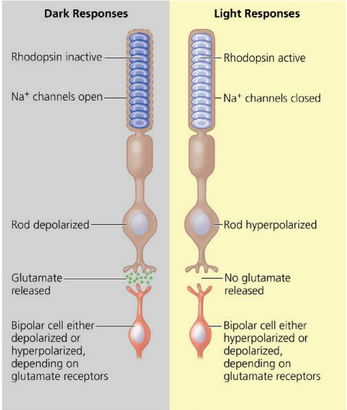  
Like rods, cone cells are depolarized when their opsin molecules are inactive. In the case of a cone, why might it be misleading to call this a dark response? For suggested answer, see Appendix A.

distant photoreceptors and bipolar cells that are not illuminated. The result is that the region receiving light appears lighter and the dark surroundings even darker. This form of integration, called lateral inhibition, sharpens edges and enhances contrast in the image. An essential part of visual processing, lateral inhibition occurs in the brain as well as the retina.

A single ganglion cell receives information from an array of rods and cones, each of which responds to light coming from a particular location. Together, the rods and cones that are feeding information to one ganglion cell define a receptive field—the part of the visual field to which that ganglion cell can respond. The fewer rods or cones that supply a single ganglion cell, the smaller the receptive field. A smaller receptive field typically results in a sharper image because the information about where light has struck the retina is more precise.

## Processing of Visual Information in the Brain

Axons of ganglion cells form the optic nerves that transmit action potentials from the eyes to the brain (Figure 50.20). The two optic nerves meet at the optic chiasm near the center of the base of the cerebral cortex. Axons in the optic nerves are routed at the optic chiasm such that sensations from the left visual field are transmitted to the right side of the brain, and sensations from the right visual field are transmitted to the left side of the brain. (Note that each visual field, whether right or left, involves input from both eyes.)

Within the brain, most ganglion cell axons lead to the lateral geniculate nuclei, which have axons that reach the primary visual

Figure 50.20 Neural pathways for vision.

Each optic nerve contains about a million axons that synapse with interneurons in the brain. The nuclei relay sensations to the primary visual cortex, one of many brain centers that cooperate in constructing visual perceptions.

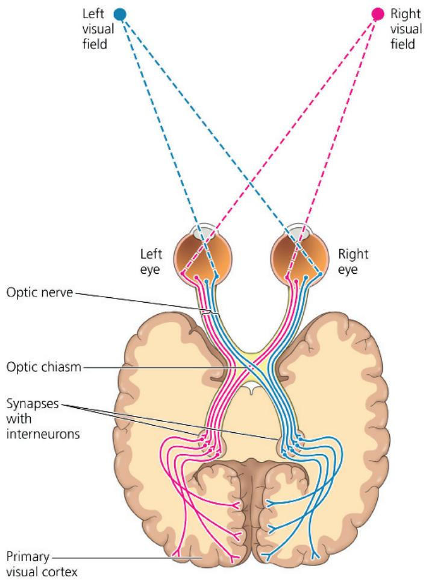

cortex in the cerebrum. Additional neurons carry the information to higher-order visual processing and integrating centers elsewhere in the cortex. Researchers estimate that at least 30% of the cerebral cortex, comprising hundreds of millions of neurons in perhaps dozens of integrating centers, takes part in formulating what we actually “see.” Determining how these centers integrate such components of our vision as color, motion, depth, shape, and detail is the focus of much exciting research.

## Color Vision

Among vertebrates, most fishes, amphibians, and reptiles, including birds, have very good color vision. Humans and other primates also see color well, but are among the minority of mammals with this ability. For cats and other mammals that are most active at night, a high proportion of rods in the retina is an adaptation that provides keen night vision. Color vision among these nocturnal animals is limited, and they probably see a pastel world during the day.

In humans, the perception of color is based on three types of cones, each with a different visual pigment—red, green, or blue. The three visual pigments, called photopsins, are formed from the binding of retinal to three distinct opsin proteins. Slight differences in the opsin proteins cause each photopsin to absorb light optimally at a different wavelength. Although the visual pigments are designated as red, green, and blue, their absorption spectra in fact overlap. For this reason, the brain's perception of intermediate hues depends on the differential stimulation of two or more classes of cones. For example, if both red and green cones are stimulated, we see either yellow or orange, depending on which class of cones is more strongly stimulated.

Abnormal color vision typically results from mutations in the genes for one or more photopsin proteins. In humans, color blindness nearly always affects perception of red or green and is far more common in one gender than the other: 5–8% of males, fewer than 1% of females. Why? The human genes for both the red and green pigments are X-linked. Thus, males are affected by a single mutation, whereas females are color-blind only if both copies are mutant. (The human gene for the blue pigment is on chromosome 7.)

Experiments on color vision in the squirrel monkey (Saimiri sciureus) enabled an early breakthrough in the field of gene therapy. These monkeys have only two opsin genes, one sensitive to blue light and the other sensitive to either red or green light, depending on the allele. Because the red/green opsin gene is X-linked, all males have only the red- or green-sensitive version and are red-green color-blind. When researchers injected a virus containing the gene for the missing version into the retina of adult male monkeys, evidence of full color vision was apparent after 20 weeks (Figure 50.21).

The squirrel monkey gene therapy studies demonstrate that the neural circuits required to process visual information can be generated or activated even in adults, making it possible to treat a range of vision disorders. Indeed, gene therapy has been used to treat Leber's congenital amaurosis (LCA), an inherited retinal degenerative disease that causes severe loss of vision. After using gene therapy to restore vision in dogs and mice with LCA, researchers successfully treated the disease in humans by injecting the functional LCA gene in a viral vector (see Figure 20.22).

Figure 50.21 Gene therapy for vision.

Once color-blind, this adult male monkey treated with gene therapy demonstrates his ability to distinguish red from green.

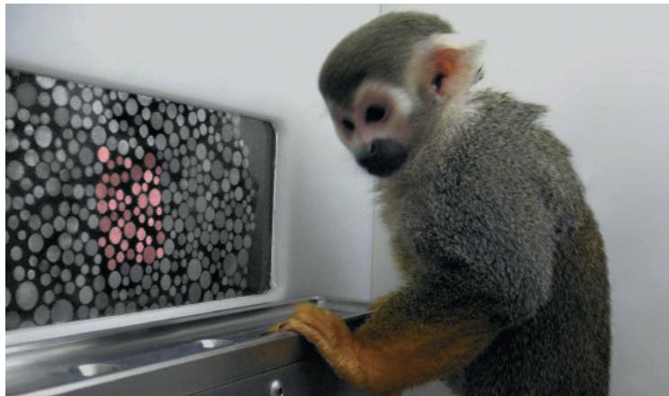  
MAKE CONNECTIONS Red-green color blindness is X-linked in squirrel monkeys and in humans (see Figure 15.7). Why is the inheritance pattern in humans not apparent in squirrel monkeys? For suggested answer, see Appendix A.

## The Visual Field

The brain not only processes visual information but also controls what information is captured. One important control is focusing, which in humans occurs by changing the shape of the lens, as noted earlier and illustrated in Figure 50.22. When you focus your eyes on a close object, your lenses become almost spherical. When you view a distant object, your lenses are flattened.

Although our peripheral vision allows us to see objects over a nearly $180^{\circ}$ range, the distribution of photoreceptors across the eye limits both what we see and how well we see it. Overall, the human retina contains about 125 million rods and 6 million cones. At the fovea, the center of the visual field, there are no rods but a very high density of cones—about 150,000 cones per square millimeter. The ratio of cones to rods falls with distance from the fovea, with the peripheral regions having only rods. In daylight, you achieve your sharpest vision by looking directly at an object, such that light shines on the tightly packed cones in your fovea. At night, looking directly at a dimly lit object is ineffective, since the rods—the more sensitive light receptors—are absent from the fovea. For this reason, you see a dim star best by focusing on a point just to one side of it.

Figure 50.22 Focusing in the mammalian eye.

Ciliary smooth muscles control the shape of the lens, which bends light and focuses it on the retina. The greater the curvature of the lens, the more sharply the light is bent. Note that these diagrams show a horizontal section of the eye.

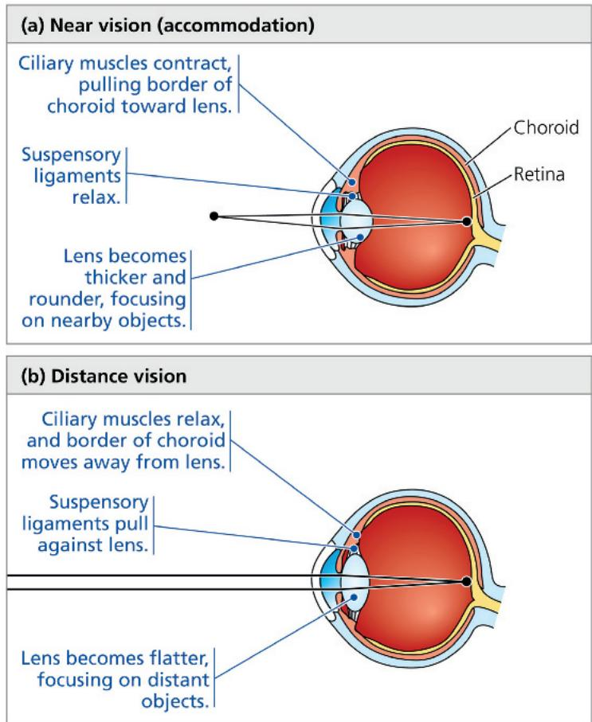

## Concept Check 50.3

1. Contrast the light-detecting organs of planarians and flies. How is each organ adaptive for the lifestyle of the animal?

2. In a condition called presbyopia, the eyes' lenses lose much of their elasticity and maintain a flat shape. How would you expect this condition to affect a person's vision?

3. WHAT IF? Our brain receives more action potentials when our eyes are exposed to light even though our photoreceptors release more neurotransmitter in the dark. Propose an explanation.

4. MAKE CONNECTIONS Compare the function of retinal in the eye with that of the pigment chlorophyll in a plant photosystem (see Concept 10.2).

For suggested answers, see Appendix A.

## Concept 50.4: The senses of taste and smell rely on similar sets of sensory receptors

Animals use their chemical senses for a wide range of purposes, including finding mates, recognizing marked territories, and helping navigate during migration. In addition, animals such as ants and bees that live in large social groups rely extensively on chemical “conversation.”

In all animals, chemical senses are important for feeding behavior. The perceptions of gustation (taste) and olfaction (smell) both depend on chemoreceptors. In the case of terrestrial animals, taste is the detection of chemicals called tastants that are present in a solution, and smell is the detection of odorants that are carried through the air. There is no distinction between taste and smell in aquatic animals.

In insects, taste receptors are located within sensory hairs located on the feet and in mouthparts, where they are used to select food. A tasting hair contains several chemoreceptors, each especially responsive to a particular class of tastant, such as sugar or salt. Insects are also capable of smelling airborne odorants using olfactory hairs, usually located on their antennae (see Figure 50.6). The chemical DEET (N, N-diethyl-meta-toluamide), marketed as an insect “repellant,” actually protects against bites by blocking the olfactory receptor in mosquitoes that detects human scent.

## Taste in Mammals

Humans and other mammals perceive five tastes: sweet, sour, salty, bitter, and umami. Umami (which means “pleasant savory taste” in Japanese) is elicited by the amino acid glutamate. Sometimes used as a flavor enhancer in the form of monosodium glutamate, or MSG, glutamate occurs naturally in meat, aged cheese, and other foods, to which it imparts a “savory” quality.

For decades, many researchers assumed that a taste cell could have more than one type of receptor. An alternative idea is that each taste cell has a single receptor type, programming the cell to recognize only one of the five tastes. To test this hypothesis, scientists used a cloned bitter taste receptor to genetically reprogram gustation in a mouse (Figure 50.23). This reprogramming experiment, together with follow-up studies, revealed that an individual taste cell does in fact express a single receptor type and detects tastants representing only one of the five tastes.

## Figure 50.23

## Inquiry: How do mammals detect different tastes?

## Experiment

To investigate the basis of mammalian taste perception, researchers used a chemical called phenyl- $\beta$ -D-glucopyranoside (PBDG). Humans find PBDG extremely bitter. Mice, however, lack a receptor for PBDG. Mice avoid drinking water containing other bitter tastants but show no aversion to water that contains PBDG.

Using a molecular cloning strategy, the researchers generated mice that made the human PBDG receptor in cells that normally make either a sweet receptor or a bitter receptor. The mice were given a choice of two bottles, one filled with pure water and one filled with water containing PBDG at varying concentrations. The researchers then observed whether the mice had an attraction or an aversion to PBDG.

Results  

## Conclusion

The researchers found that the presence of a bitter receptor in sweet taste cells is sufficient to cause mice to be attracted to a bitter chemical. They concluded that the mammalian brain must therefore perceive sweet or bitter taste solely on the basis of which afferent neurons are activated.

Data from K. L. Mueller et al., The receptors and coding logic for bitter taste, Nature 434:225–229 (2005).

WHAT IF? Suppose that instead of the PBDG receptor, the researchers had used a receptor specific for a sweetener that humans crave but mice ignore. How would the results of the experiment have differed?
For suggested answer, see Appendix A.

The receptor cells for taste in mammals are modified epithelial cells organized into taste buds, which are scattered in several areas of the tongue and mouth (Figure 50.24). Most taste buds on the tongue are associated with nipple-shaped projections called papillae. Any region of the tongue with taste buds can detect any of the five types of taste. (The frequently reproduced “taste maps” of the tongue are thus not accurate.)

Researchers have identified the receptor proteins for all five tastes. The sensations of sweet, umami, and bitter tastes each require one or more genes encoding a G protein-coupled receptor, or GPCR (see Figures 11.7 and 11.8). Humans have one type of sweet receptor and one type of umami receptor, each assembled from a different pair of GPCR proteins. In contrast, humans have more than 30 different receptors for bitter taste, and each receptor is able to recognize multiple bitter tastants. GPCR proteins are also critical for the sense of smell, as will be discussed shortly.

Figure 50.24 Human taste receptors.  
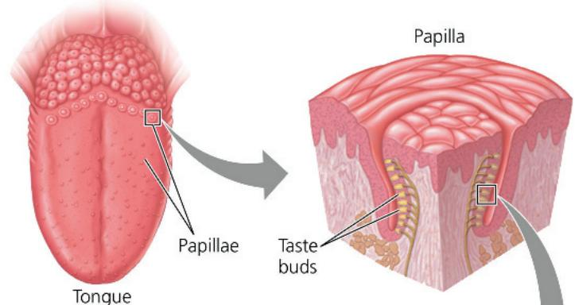  
(a) The tongue. Small raised structures called papillae cover the tongue surface. The enlarged cross section shows the side walls of a papilla lined with taste buds.

  
(b) A taste bud. Taste buds in all regions of the tongue contain sensory receptor cells specific for each of the five taste types.

The receptor for sour tastants is a hydrogen channel called Otop1. (Sour substances are acidic, meaning that they liberate hydrogen ions when in solution.) Hydrogen ions entering the cell through this channel decrease the intracellular pH, which closes potassium channels. Depolarization occurs, activating an afferent neuron that relays information to the CNS, triggering the perception of a sour taste.

The taste receptor for salt turns out to be a sodium channel. Not surprisingly, it specifically detects sodium salts, such as the NaCl that we use in cooking and flavoring.

## Smell in Humans

In olfaction, unlike gustation, the sensory cells are neurons. Olfactory receptor cells line the upper portion of the nasal cavity and send impulses along their axons to the olfactory bulb of the brain (Figure 50.25). The receptive ends of the cells contain cilia that extend into the layer of mucus coating the nasal cavity. When an odorant diffuses into this region, it binds to a specific GPCR protein called an olfactory receptor (OR) on the plasma membrane of the olfactory cilia. These events trigger signal transduction leading to the production of cyclic AMP. In olfactory cells, cyclic AMP opens channels in the plasma membrane that are permeable to both $Na^{+}$ and $Ca^{2+}$ . The flow of these ions into the receptor cell leads to depolarization of the membrane, generating action potentials.

Mammals can distinguish thousands of different odors, each caused by a structurally distinct odorant. How is this remarkable sensory discrimination possible? American researchers Linda Buck and Richard Axel found the answer—a very large gene family. Working with mice, Buck and Axel discovered 1,200 different OR genes—and were honored with a Nobel Prize in 2004. Humans have just 380 OR genes, far fewer than mice, but still nearly 2% of all the genes in our genome. Identification of particular odors relies on two basic properties of the olfactory system. First, each olfactory receptor cell expresses one OR gene. Second, those cells that express the same OR gene transmit action potentials to the same small region of the olfactory bulb.

After odorants are detected, information from olfactory receptors is collected and integrated. Genetic studies on mice, worms, and flies have shown that signals from the nervous system regulate this process, dialing the response to particular odorants up or down. As a result, animals can detect the location of food sources even if the concentration of a key odorant is particularly low or high.

Studies of model organisms also reveal that complex mixtures of odorants are not processed as the simple sum of each input.

Figure 50.25 Smell in humans.

Odorant molecules bind to specific chemoreceptor proteins in the plasma membrane of olfactory receptor cells, triggering action potentials. Each olfactory receptor cell has just one type of chemoreceptor. As shown, cells that express different chemoreceptors detect different odorants.

  
WHAT IF? If you spray an air freshener in a musty room, would you be affecting detection, transmission, or perception of the odorants responsible for the musty smell?  
For suggested answer, see Appendix A.

Rather, the brain integrates olfactory information from different receptors into single sensations. These sensations contribute to the perception of the environment in the present and to the memory of events and emotions.

Although the receptors and neuronal pathways for taste and smell are independent, the two senses do interact. Indeed, much of the complex flavor humans experience when eating is due to our sense of smell. If the olfactory system is blocked, as occurs when you have a head cold, the perception of flavor is sharply reduced.

## Concept Check 50.4

1. Explain why some taste receptor cells and all olfactory receptor cells use G protein-coupled receptors, yet only olfactory receptor cells produce action potentials.

2. Pathways involving G proteins provide an opportunity for an increase in signal strength in the course of signal transduction, a change referred to as amplification. How might this be beneficial in olfaction?

3. WHAT IF? If you discovered a mutation in mice that disrupted the ability to taste sweet, bitter, and umami but not sour or salty, what might you predict about where this mutation acts in the signaling pathways used by these receptors?

For suggested answers, see Appendix A.

## Concept 50.5: The physical interaction of protein filaments is required for muscle function

In discussing sensory mechanisms, we have seen how sensory inputs to the nervous system can result in specific behaviors: the touch-guided foraging of a star-nosed mole, the upside-down swimming of a crayfish with manipulated statocysts, and the light-avoiding maneuvers of planarians. Underlying these diverse behaviors are common fundamental mechanisms: Feeding, swimming, and crawling all require muscle activity in response to nervous system motor output.

Muscle cell contraction relies on the interaction between protein structures called thin and thick filaments. The major component of thin filaments is the globular protein actin. In thin filaments, two strands of polymerized actin are coiled around one another; similar actin structures called microfilaments function in cell motility. The thick filaments are staggered arrays of myosin molecules. Muscle contraction is the result of filament movement powered by chemical energy; muscle extension occurs only passively. To understand how filaments bring about muscle contraction, we will begin by examining the skeletal muscle of vertebrates.

## Vertebrate Skeletal Muscle

Vertebrate skeletal muscle, which moves bones and body, has a hierarchy of smaller and smaller units (Figure 50.26). Within a typical skeletal muscle is a bundle of long fibers running along the length of the muscle. Each individual fiber is a single cell. Within are multiple nuclei, each derived from one of the stem cells that

Figure 50.26 The structure of skeletal muscle.  
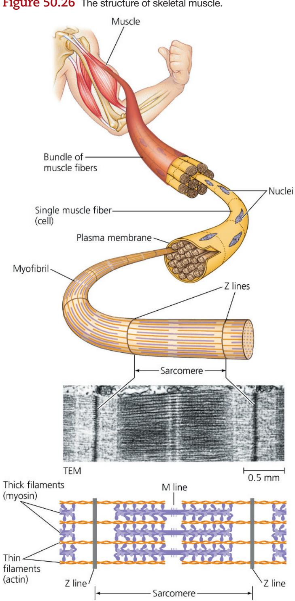  
VISUAL SKILLS Looking at this figure, would you say that there are multiple sarcomeres per myofibril, multiple myofibrils per sarcomere, or both? Explain. For suggested answer, see Appendix A.

fused to form the fiber. Surrounding these nuclei are longitudinal myofibrils, which consist of bundles of thin and thick filaments.

The myofibrils in muscle fibers are made up of repeating sections called sarcomeres, which are the basic contractile units of skeletal muscle. The borders of the sarcomere line up in adjacent myofibrils, forming a pattern of light and dark bands (striations) visible with a light microscope. For this reason, skeletal muscle is also called striated muscle. Thin filaments attach at the Z lines at the sarcomere ends, while thick filaments are anchored in the middle of the sarcomere (M line).

In a resting (relaxed) myofibril, thick and thin filaments partially overlap. Near the edge of the sarcomere there are only thin filaments, whereas the zone in the center contains only thick filaments. This partially overlapping arrangement is the key to how the sarcomere, and hence the whole muscle, contracts.

## The Sliding-Filament Model of Muscle Contraction

A contracting muscle shortens, but the filaments that bring about contraction stay the same length. To explain this apparent paradox, we'll focus first on a single sarcomere. As shown in Figure 50.27, the filaments slide past each other, much like the segments of a telescoping support pole. According to the well-accepted sliding-filament model, the thin and thick filaments ratchet past each other, powered by myosin molecules.

Figure 50.28 illustrates the cycles of change in the myosin molecule that convert the chemical energy of ATP into the longitudinal sliding of thick and thin filaments.

As shown in the figure, each myosin molecule has a long “tail” region and a globular “head” region. The tail adheres to the tails of other myosin molecules, binding together the thick filament. The head, jutting to the side, can bind ATP. Hydrolysis of bound ATP converts myosin to a high-energy form that binds to actin, forming a cross-bridge between the myosin and the thin filament. The myosin head then returns to its low-energy

Figure 50.27 The sliding-filament model of muscle contraction.
The drawings on the left show that the lengths of the thick (myosin) filaments (purple) and thin (actin) filaments (orange) remain the same as a muscle fiber contracts.

form as it helps to pull the thin filament toward the center of the sarcomere. When a new ATP molecule binds to the myosin head, the cross-bridge is disrupted, releasing the myosin head from the actin filament.

Muscle contraction requires repeated cycles of binding and release. During each cycle of each myosin head, the head is freed from a cross-bridge, cleaves the newly bound ATP, and binds again to actin. Because the thin filament moves toward the center of the sarcomere in each cycle, the myosin head now attaches to a binding site farther along the thin filament than in the previous cycle. Each end of a thick filament contains approximately 300 heads, each of which forms and re-forms about five cross-bridges per second, driving the thick and thin filaments past each other.

At rest, most muscle fibers contain only enough ATP for a few contractions. Powering repetitive contractions requires two other compounds found in muscle cells: creatine phosphate and glycogen. The transfer of a phosphate group from creatine phosphate to ADP in an enzyme-catalyzed reaction synthesizes additional ATP. In this way, the resting supply of creatine phosphate can sustain contractions for about 15 seconds. Glycogen is broken down into glucose, which can then be used to replenish ATP stores. During light or moderate muscle activity, this glucose is fully metabolized by aerobic respiration (see Concept 9.1). On average, stored glycogen alone can power sustained contractions for nearly an hour.

Muscle cells also use nutrients in the blood to generate ATP. Glucose liberated from liver glycogen and fatty acids released from fat cells are particularly important during low-intensity, long-duration activities. During intense muscle activity, many glucose molecules undergo glycolysis, but most of the resulting pyruvate molecules are converted into lactate rather than undergoing the remaining steps of aerobic respiration (see Concept 9.5). This pathway, which does not require either oxygen or mitochondria, is very rapid. However, it generates much less ATP per glucose molecule and can sustain contraction for only a short time.

Figure 50.28 Myosin-actin interactions underlying muscle fiber contraction.  
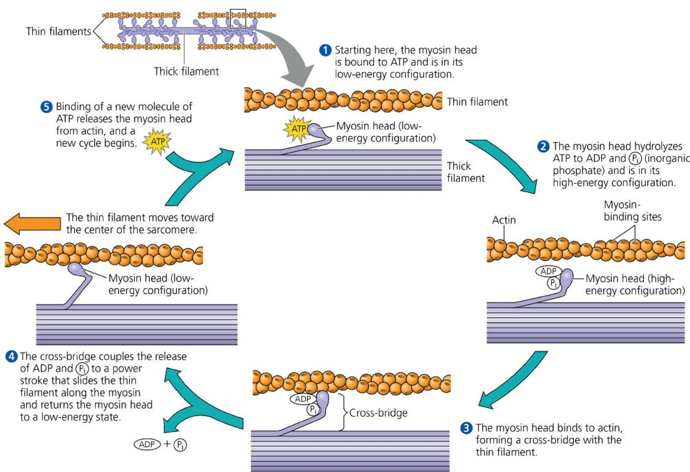  
When ATP binds the myosin head, what prevents the filaments from sliding back into their original positions? For suggested answer, see Appendix A.

## The Role of Calcium and Regulatory Proteins

Proteins bound to actin play crucial roles in controlling muscle contraction. In a muscle fiber at rest, tropomyosin, a regulatory protein, and the troponin complex, a set of additional regulatory proteins, are bound to the actin strands of thin filaments. Tropomyosin covers the myosin-binding sites along the thin filament, preventing actin and myosin from interacting (Figure 50.29a).

Motor neurons enable actin and myosin to interact by triggering a release of calcium ions ( $Ca^{2+}$ ) into the cytosol. Once in the cytosol, $Ca^{2+}$ binds to the troponin complex, causing the myosin-binding sites on actin to be exposed (Figure 50.29b). Note that the effect of $Ca^{2+}$ is indirect: Binding to $Ca^{2+}$ causes the troponin complex to change shape, dislodging tropomyosin from the myosin-binding sites.

When the $Ca^{2+}$ concentration rises in the cytosol, the cycle of cross-bridge formation begins, the thin and thick filaments slide past each, and the muscle fiber contracts. When the $Ca^{2+}$ concentration falls, the binding sites are covered, and contraction stops.

Figure 50.29 The role of regulatory proteins and calcium in muscle fiber contraction.

Each thin filament consists of two strands of actin and associated regulatory proteins: two long molecules of tropomyosin and multiple copies of the troponin complex.

  
(a) Myosin-binding sites blocked by tropomyosin

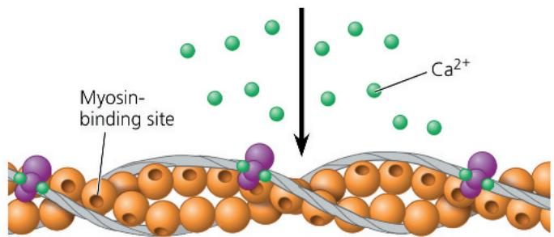  
(b) Myosin-binding sites exposed

5 Cycles of myosin cross-bridge formation and release, coupled with ATP hydrolysis, slide the thin filament toward the center of the sarcomere.

Figure 50.30 The roles of the sarcoplasmic reticulum and T tubules in muscle fiber contraction.  
  
Figure 50.31 Summary of contraction in a skeletal muscle fiber.

Motor neurons cause muscle contraction through a multi-step process triggering the movement of $Ca^{2+}$ into the cytosol of muscle cells. This process is summarized in Figure 50.30 and detailed step by step in Figure 50.31. First, the arrival of an action potential at the synaptic terminal of a motor neuron ① causes release of the neurotransmitter acetylcholine. Binding of acetylcholine to receptors on the muscle fiber leads to a depolarization that initiates an action potential. Within the muscle fiber, the action potential spreads deep into the interior, following infoldings of the plasma membrane called transverse tubules (T tubules). ② These make close contact with the sarcoplasmic reticulum (SR), a specialized endoplasmic reticulum. As the action potential spreads along the T tubules, it triggers changes in the SR, opening $Ca^{2+}$ channels ③. Calcium ions stored in the interior of the SR flow through open channels into the cytosol ④ and bind to the troponin complex, ⑤ initiating the muscle fiber contraction.

The synaptic terminal of a motor neuron releases acetylcholine, which depolarizes the plasma membrane of the muscle fiber. The depolarization causes action potentials (red arrows) to sweep across the muscle fiber and deep into it along the T tubules. The action potentials trigger the release of calcium (green dots) from the sarcoplasmic reticulum into the cytosol. Calcium initiates the sliding of filaments by allowing myosin to bind to actin.

When motor neuron input stops, the filaments slide back to their starting position as the muscle relaxes. Relaxation begins as proteins in the SR pump $Ca^{2+}$ back into the SR ⑥ from the cytosol. When the $Ca^{2+}$ concentration in the cytosol drops to a low level, the regulatory proteins bound to the thin filament shift back to their starting position, ⑦ once again blocking the myosin-binding sites. At the same time, the $Ca^{2+}$ pumped from the cytosol accumulates in the SR, providing the stores needed to respond to the next action potential.

Several diseases cause paralysis by interfering with the excitation of skeletal muscle fibers by motor neurons. In amyotrophic lateral sclerosis (ALS), motor neurons in the spinal cord and brainstem degenerate, and muscle fibers atrophy. ALS is progressive and usually fatal within 5 years after symptoms appear. New gene therapies have shown promise at delaying this progression, however; they act by interfering with the production of proteins that promote neuron degeneration. In myasthenia gravis, a person produces antibodies to the acetylcholine receptors of skeletal muscle. As the disease progresses and the number of receptors decreases, transmission between motor neurons and muscle fibers declines. Myasthenia gravis can generally be controlled with drugs that inhibit acetylcholinesterase or suppress the immune system.

## Nervous Control of Muscle Tension

Whereas a single action potential in a single skeletal muscle fiber causes a brief all-or-none twitch, contraction of a whole muscle, such as the biceps in your upper arm, is graded; you can voluntarily alter the extent and strength of its contraction. The nervous system produces graded contractions of whole muscles by varying (1) the number of muscle fibers that contract and (2) the rate at which muscle fibers are stimulated. Let's consider each mechanism in turn.

In vertebrates, each branched motor neuron may form synapses with many muscle fibers, although each fiber is controlled by only one motor neuron. A motor unit consists of a single motor neuron and all the muscle fibers it controls (Figure 50.32). When a motor neuron produces an action potential, all the muscle fibers in its motor unit contract as a group. The strength of the resulting contraction depends on how many muscle fibers the motor neuron controls.

In the whole muscle, there may be hundreds of motor units. As more and more of the corresponding motor neurons are activated, a process called recruitment, the force (tension) developed by a muscle progressively increases. Depending on the number of motor neurons your brain recruits and the size of their motor units, you can lift a fork or something much heavier, like a biology textbook. Some muscles, especially those that hold up the body and maintain posture, are almost always partially contracted. In such muscles, the nervous system may alternate activation among the motor units, reducing the length of time any one set of fibers is contracted.

The nervous system regulates muscle contraction not only by controlling which motor units are activated but also by varying the rate of muscle fiber stimulation. A single action potential

Figure 50.32 Motor units in a vertebrate skeletal muscle. Each muscle fiber (cell) forms synapses with only one motor neuron, but each motor neuron typically synapses with many muscle fibers. A motor neuron and all the muscle fibers it controls constitute a motor unit.  

produces a twitch lasting about 100 milliseconds or less. If a second action potential arrives before the muscle fiber has completely relaxed, the two twitches add together, resulting in greater tension (Figure 50.33). Further summation occurs as the rate of stimulation increases. When the rate is so high that the

Figure 50.33 Summation of twitches.  
This graph illustrates how the number of action potentials during a short period of time influences the tension developed in a muscle fiber.  
  
How could the nervous system cause a skeletal muscle to produce the most forceful contraction it is capable of?
For suggested answer, see Appendix A.

Figure 50.34 Specialization of skeletal muscles.

muscle fiber cannot relax at all between stimuli, the twitches fuse into one smooth, sustained contraction called tetanus. (Note that tetanus is also the name of a disease of uncontrolled muscle contraction caused by a bacterial toxin.)

## Types of Skeletal Muscle Fibers

Our discussion to this point has focused on the general properties of vertebrate skeletal muscles. There are, however, several distinct types of skeletal muscle fibers, each of which is adapted to a particular set of functions. We typically classify these varied fiber types both by the source of ATP used to power their activity and by the speed of their contraction (Table 50.1).

## Oxidative and Glycolytic Fibers

Fibers that rely mostly on aerobic respiration are called oxidative fibers. Such fibers are specialized in ways that enable them to make use of a steady energy supply: They have many mitochondria, a rich blood supply, and a large amount of an oxygen-storing protein called myoglobin. A brownish red pigment, myoglobin binds oxygen more tightly than does hemoglobin, enabling oxidative fibers to extract oxygen from the blood efficiently. In contrast, glycolytic fibers have a larger diameter and less myoglobin. Also, glycolytic fibers use glycolysis as their primary source of ATP and fatigue more readily than oxidative fibers. These two fiber types are readily apparent in the muscle of poultry and fish: The dark meat (red muscle) is made up of oxidative fibers rich in myoglobin, and the light meat (white muscle) is composed of glycolytic fibers.

## Fast-Twitch and Slow-Twitch Fibers

Muscle fibers vary in the speed with which they contract: Fast-twitch fibers develop tension two to three times faster than slow-twitch fibers. Fast fibers enable brief, rapid, powerful contractions. Compared with a fast fiber, a slow fiber has less sarcoplasmic reticulum and pumps $Ca^{2+}$ more slowly. Because $Ca^{2+}$ remains in the cytosol longer, a muscle twitch in a slow fiber lasts about five times as long as one in a fast fiber.

The difference in contraction speed between slow-twitch and fast-twitch fibers mainly reflects the rate at which their myosin

Table 50.1 Types of Skeletal Muscle Fibers

<table><tr><td></td><td>Slow-Twitch</td><td colspan="2">Fast-Twitch</td></tr><tr><td></td><td>Oxidative</td><td>Oxidative</td><td>Glycolytic</td></tr><tr><td>Contraction speed</td><td>Slow</td><td>Fast</td><td>Fast</td></tr><tr><td>Major ATP source</td><td>Aerobic respiration</td><td>Aerobic respiration</td><td>Glycolysis</td></tr><tr><td>Rate of fatigue</td><td>Slow</td><td>Intermediate</td><td>Fast</td></tr><tr><td>Mitochondria</td><td>Many</td><td>Many</td><td>Few</td></tr><tr><td>Myoglobin content</td><td>High (red muscle)</td><td>High (red muscle)</td><td>Low (white muscle)</td></tr></table>

The male oyster toadfish (Opsanus tau) uses superfast muscles to produce its mating call.

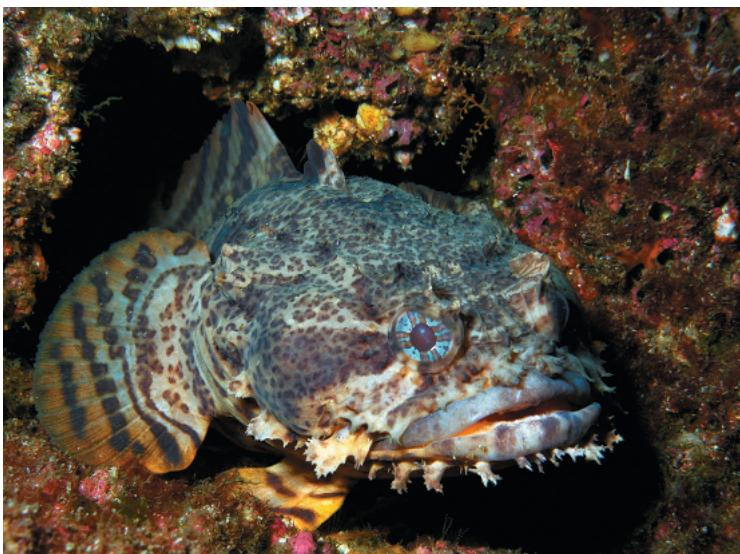

heads hydrolyze ATP. However, there isn't a one-to-one relationship between contraction speed and ATP source. Whereas all slow-twitch fibers are oxidative, fast-twitch fibers can be either glycolytic or oxidative.

Most human skeletal muscles contain both fast-twitch and slow-twitch fibers, although the muscles of the eye and hand are exclusively fast-twitch. In a muscle that has a mixture of fast and slow fibers, the relative proportions of each are genetically determined. However, if such a muscle is used repeatedly for activities requiring high endurance, some fast glycolytic fibers can develop into fast oxidative fibers. Because fast oxidative fibers fatigue more slowly than fast glycolytic fibers, the result will be a muscle that is more resistant to fatigue.

Some vertebrates have skeletal muscle fibers that twitch at rates far faster than any human muscle. For example, superfast muscles produce a rattlesnake's rattle and a dove's coo. Even faster are the muscles surrounding the gas-filled swim bladder of the male oyster toadfish (Figure 50.34). In producing its "boat whistle" mating call, the toadfish can contract and relax these muscles more than 200 times per second!

## Other Types of Muscle

Although all muscles share the same fundamental mechanism of contraction—actin and myosin filaments sliding past each other—there are many different types of muscle. Vertebrates, for example, have cardiac muscle and smooth muscle in addition to skeletal muscle (see Figure 40.5).

Vertebrate cardiac muscle is found only in the heart and, like skeletal muscle, is striated. Unlike the cells of skeletal muscle fibers, some cardiac muscle cells can initiate rhythmic depolarization and contraction without nervous system input. Normally, however, cells in one part of the heart act as a pacemaker to initiate contraction. Signals from the pacemaker spread throughout the heart because specialized regions called intercalated disks electrically couple each cardiac muscle cell to the adjacent cells. It is this coupling that enables action potentials generated in one part of the heart to trigger contraction throughout the organ. Although these action potentials last up to 20 times longer than those of skeletal muscle fibers, a long refractory period prevents summation and tetanus.

Smooth muscle in vertebrates is found in the walls of hollow organs, such as the tubes and chambers of the circulatory, digestive, and reproductive systems. In these locations it controls blood flow in the arteries, moves food through the digestive system, carries out uterine contractions during labor, and assists in regulating the temperature of the testicles. Smooth muscle is also found in the eye, where its action controls focusing and pupil diameter.

Smooth muscle cells lack striations because their actin and myosin filaments are not regularly arrayed along the length of the cell. Instead, the thick filaments are scattered throughout the cytoplasm, and the thin filaments are attached to structures called dense bodies, some of which are tethered to the plasma membrane. There is less myosin than in striated muscle fibers, and the myosin is not associated with specific actin strands. Some smooth muscle cells contract only when stimulated by neurons of the autonomic nervous system. Others are electrically coupled to one another and can generate action potentials without input from neurons. Smooth muscles contract and relax more slowly than striated muscles.

Although $Ca^{2+}$ regulates smooth muscle contraction, smooth muscle cells have no troponin complex or T tubules, and their sarcoplasmic reticulum is not well developed. During an action potential, $Ca^{2+}$ enters the cytosol mainly through the plasma membrane. Calcium ions cause contraction by binding to the protein calmodulin, which activates an enzyme that phosphorylates the myosin head, enabling cross-bridge activity.

Invertebrates have muscle cells similar to vertebrate skeletal and smooth muscle cells; in fact, arthropod skeletal muscles are nearly identical to those of vertebrates. However, because the flight muscles of insects contract in response to stretching, the wings of some insects can actually beat up and down faster than action potentials can arrive from the central nervous system. Another interesting evolutionary adaptation has been discovered in the muscles that hold a clam's shell closed. Modification of certain proteins in these muscles allows them to remain contracted for as long as a month with only a low rate of energy consumption.

## Concept Check 50.5

1. Contrast the role of $Ca^{2+}$ in the contraction of a skeletal muscle fiber and a smooth muscle cell.

2. WHAT IF? Why are the muscles of an animal that has recently died likely to be stiff?

3. MAKE CONNECTIONS How does the activity of tropomyosin and troponin in muscle contraction compare with the activity of a competitive inhibitor in enzyme action? (See Figure 8.18b.)

# Concept 50.6: Skeletal systems transform muscle contraction into locomotion

Converting muscle contraction to movement requires a skeleton—a rigid structure to which muscles can attach. An animal changes its shape or location by contracting muscles connecting two parts of its skeleton. Often muscles are anchored to bone indirectly via connective tissue formed into a tendon.

Because muscles exert force only during contraction, moving a body part back and forth typically requires two muscles attached to the same section of the skeleton. We can see such an arrangement in the upper portion of a human arm or grasshopper leg (Figure 50.35). Although we call such muscles an antagonistic pair, their function is actually cooperative, coordinated by the nervous system. For example, when you extend your arm, motor neurons trigger your triceps muscle to contract while the absence of neuronal input allows your biceps to relax.

Vital for movement, animal skeletons also function in support and protection. Most land animals would collapse if they had no skeleton to support their mass. Furthermore, an animal living in water would be formless without a framework to maintain its shape. In many animals, a hard skeleton also protects soft tissues.

Figure 50.35 The interaction of muscles and skeletons in movement.

Back-and-forth movement of a body part is generally accomplished by antagonistic muscles. This arrangement works with either an internal skeleton, as in mammals, or an external skeleton, as in insects.

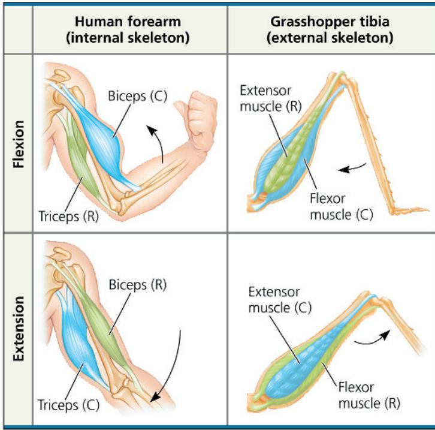  
Key Contracting muscle (C) Relaxing muscle (R)

Contraction of the longitudinal muscles thickens and shortens the earthworm; contraction of the circular muscles constricts and elongates it.

For example, the vertebrate skull protects the brain, and the ribs of terrestrial vertebrates form a cage around the heart, lungs, and other internal organs.

## Types of Skeletal Systems

Although we tend to think of skeletons only as interconnected sets of bones, skeletons come in many different forms. Hardened support structures can be external (as in exoskeletons), internal (as in endoskeletons), or even absent (as in fluid-based, or hydrostatic, skeletons).

## Hydrostatic Skeletons

A hydrostatic skeleton consists of fluid held under pressure in a closed body compartment. This is the main type of skeleton in most cnidarians, flatworms, nematodes, and annelids (see Figure 33.2). These animals control their form and movement by using muscles to change the shape of fluid-filled compartments. Among the cnidarians, for example, a hydra elongates by closing its mouth and constricting its central gastrovascular cavity using contractile cells in its body wall. Because water maintains its volume under pressure, the cavity must elongate when its diameter is decreased.

Worms carry out locomotion in a variety of ways. In planarians and other flatworms, body movement results mainly from muscles in the body wall exerting localized forces against the interstitial fluid. In nematodes (roundworms), longitudinal muscles contracting around the fluid-filled body cavity move the animal forward by wavelike motions called undulations. In earthworms and many other annelids, circular and longitudinal muscles act together to change the shape of individual fluid-filled segments, which are divided by septa. These shape changes bring about peristalsis, a movement produced by rhythmic waves of muscle contractions passing from front to back (Figure 50.36).

Hydrostatic skeletons are well suited for life in aquatic environments. On land, they provide support for crawling and burrowing and may cushion internal organs from shocks. However, a hydrostatic skeleton cannot support walking or running, in which an animal's body is held off the ground.

## Exoskeletons

The clam shell you find on a beach once served as an exoskeleton, a hard covering deposited on an animal's surface. The shells of clams and most other molluscs are made of calcium carbonate secreted by the mantle, a sheet-like extension of the body wall (see Figure 33.15). Clams and other bivalves close their hinged shell using muscles attached to the inside of this exoskeleton. As the animal grows, it enlarges its shell by adding to the outer edge.

Insects and other arthropods have a jointed exoskeleton called a cuticle, a coat secreted by the epidermis. About 30–50% of the arthropod cuticle consists of chitin, a polysaccharide similar to cellulose (see Figure 5.8). Fibrils of chitin are embedded in a protein matrix, forming a composite material that combines strength and flexibility. The cuticle may be hardened with organic compounds and, in some cases, calcium salts. In body parts that must be flexible, such as leg joints, the cuticle remains

Figure 50.36 Crawling by peristalsis.

  
At the moment depicted, body segments at the earthworm's head end and just in front of the rear end are short and thick (longitudinal muscles contracted; circular muscles relaxed) and are anchored to the ground by bristles. The other segments are thin and elongated (circular muscles contracted; longitudinal muscles relaxed).

  
2 The head has moved forward because circular muscles in the head segments have contracted. Segments behind the head and at the rear are now thick and anchored, thus preventing the worm from slipping backward.

  
3 The head segments are thick again and anchored in their new positions. The rear segments have released their hold on the ground and have been pulled forward.

unhardened. Muscles are attached to knobs and plates of the cuticle that extend into the interior of the body. With each growth spurt, an arthropod must shed its exoskeleton (molt) and produce a larger one.

## Endoskeletons

Animals ranging from sponges to mammals have a hardened internal skeleton, or endoskeleton, buried within their soft tissues. In sponges, the endoskeleton consists of hard needle-like structures of inorganic material or fibers made of protein. Echinoderms' bodies are reinforced by ossicles, hard plates composed of magnesium carbonate and calcium carbonate crystals. Whereas the ossicles of sea urchins are tightly bound, the ossicles of sea stars are more loosely linked, allowing a sea star to change the shape of its arms.

Vertebrates have an endoskeleton consisting of cartilage, bone, or some combination of these materials (see Figure 40.5). The mammalian skeleton contains more than 200 bones, some fused together and others connected at joints by ligaments that allow freedom of movement (Figure 50.37 and Figure 50.38). Cells called osteoblasts secrete bone matrix and thereby build and repair bone (see Figure 40.5). Osteoclasts have an opposite function, resorbing bone components in remodeling of the skeleton.

How thick does an endoskeleton need to be? We can begin to answer this question by applying ideas from civil engineering. The weight of a building increases with the cube of its dimensions. However, the strength of a support depends on its cross-sectional area, which only increases with the square of its diameter. We can thus predict that if we scaled up a mouse to the size of an elephant, the legs of the giant mouse would be too thin to support its weight. Indeed, the body proportions of large animals are very different from those of small ones.

Figure 50.37 Bones and joints of the human skeleton.  
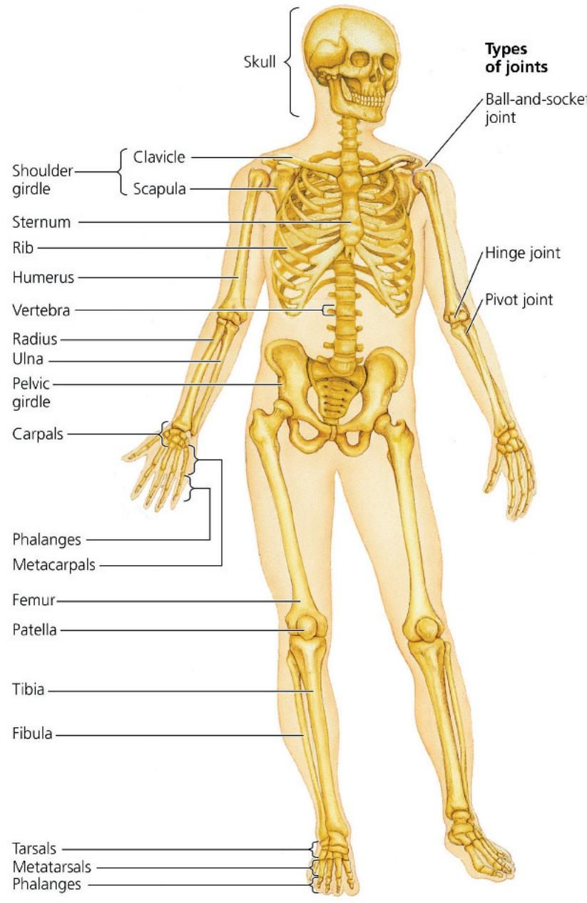

In applying the building analogy, we might also predict that the size of leg bones should be directly proportional to the strain imposed by body weight. Animal bodies, however, are complex and nonrigid. In supporting body weight, it turns out that body posture—the position of the legs relative to the main body—is more important than leg size, at least in mammals and birds. In addition, muscles and tendons, which hold the legs of large mammals relatively straight and positioned under the body, actually bear most of the load.

Figure 50.38 Types of joints.  
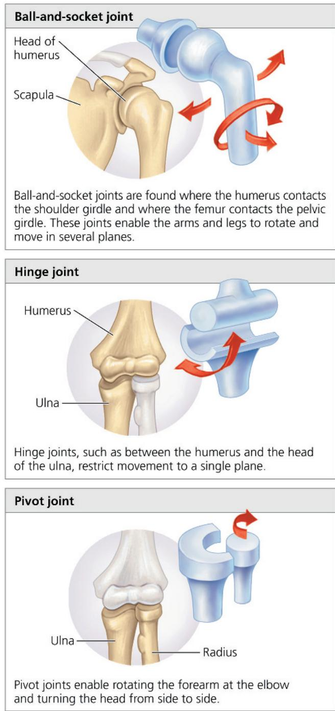

## Types of Locomotion

Movement is a hallmark of animals. Even animals fixed to a surface move their body parts: Sponges use beating flagella to generate water currents that draw and trap small food particles, and sessile cnidarians wave tentacles that capture prey. Most animals, however, are mobile and spend a considerable portion of their time and energy actively searching for food, escaping from danger, and seeking mates. These activities involve locomotion—active travel from place to place.

Friction and gravity tend to keep an animal stationary and therefore oppose locomotion. To move, an animal must expend energy to overcome these two forces. As we will see next, the amount of energy required to oppose friction or gravity is often reduced by an animal body plan adapted for movement in a particular environment.

## Locomotion on Land

On land, a walking, running, hopping, or crawling animal must be able to support itself and move against gravity, but air poses relatively little resistance, at least at moderate speeds. When a land animal walks, runs, or hops, its leg muscles expend energy both to propel it and to keep it from falling down. With each step, the animal's leg muscles must overcome inertia by accelerating a leg from a standing start. For moving on land, powerful muscles and strong skeletal support are therefore more important than a streamlined shape.

Diverse adaptations for traveling on land have evolved in various vertebrates. For example, kangaroos have large, powerful muscles in their hind legs, suitable for locomotion by hopping (Figure 50.39). As a kangaroo lands after each leap, tendons in its hind legs momentarily store energy. Much like the energy in a compressed spring, the energy stored in the tendons from one jump is released in the next jump, reducing the energy the animal must expend to travel. The legs of an insect, dog, or human also retain some energy during walking or running, although a considerably smaller share than those of a kangaroo.

## Interview

Interview with Terry Dawson: Kangaroos are “rule” breakers! (eTextbook only)

Maintaining balance is another prerequisite for walking, running, or hopping. A cat, dog, or horse maintains balance by keeping three feet on the ground when walking. Illustrating the same principle, bipedal animals, such as humans and birds, keep part of at least one foot on the ground when walking. At running speeds, momentum more than foot contact keeps the body upright, enabling all the feet to be off the ground briefly. A kangaroo's large tail forms a stable tripod with its hind

## Figure 50.39 Energy-efficient locomotion on land.

Members of the kangaroo family travel from place to place mainly by leaping on their large hind legs. Kinetic energy momentarily stored in tendons after each leap provides a boost for the next leap. In fact, a large kangaroo hopping at 30 km/hr uses no more energy per minute than it does at 6 km/hr. The large tail provides extra force for leaping and helps to balance the kangaroo when it leaps as well as when it sits.

legs when the animal sits or moves slowly and helps balance its body during leaps. Recent studies reveal that the tail also generates significant force during hopping, helping to propel the kangaroo's forward movement.

Crawling poses a very different challenge. Having much of its body in contact with the ground, a crawling animal must exert considerable effort to overcome friction. As you have read, earthworms crawl by peristalsis. In contrast, many snakes crawl by undulating their entire body from side to side. Waves of bending propagate from head to tail, with each portion of the body eventually following the same undulating path as the head and neck. Some other snakes, such as boa constrictors and pythons, creep in a straight line, driven by muscles that lift belly scales off the ground, tilt the scales forward, and then push them backward against the ground.

## Swimming

Because most animals are reasonably buoyant in water, overcoming gravity is less of a problem for swimming animals than for species that move on land or through the air. On the other hand, water is a much denser and more viscous medium than air, and thus drag (friction) is a major problem for aquatic animals. A sleek, fusiform (torpedo-like) shape is a common adaptation of fast swimmers (see Figure 40.2).

Swimming occurs in diverse ways. Many insects and four-legged vertebrates use their legs as oars to push against the water. Sharks and bony fishes swim by moving their body and tail from side to side, while whales and dolphins move by undulating their body and tail up and down. Squids, scallops, and some cnidarians are jet-propelled, taking in water and squirting it out in bursts. In contrast, jellies appear to generate a region of low pressure in the water ahead of them such that they are pulled forward rather than pushed.

## Flying

Active flight (in contrast to gliding downward from a tree) has evolved in only a few animal groups: insects, reptiles (including birds), and, among the mammals, bats. One group of flying reptiles, the pterosaurs, died out millions of years ago, leaving birds and bats as the only flying vertebrates.

To fly, an animal's wings must develop enough lift to overcome gravity's downward force. The key to meeting this

# Scientific Skills Exercise Interpreting a Graph with Log Scales

What Are the Energy Costs of Locomotion? In the 1960s, animal physiologist Knut Schmidt-Nielsen, at Duke University, wondered whether general principles govern the energy costs of different forms of locomotion among diverse animal species. To answer this question, he drew on his own experiments as well as those of other researchers. In this exercise you will analyze the combined results of these studies and evaluate the rationale for plotting the experimental data on a graph with logarithmic scales.

How the Experiments Were Done Researchers measured the rate of oxygen consumption or carbon dioxide production in animals that ran on treadmills, swam in water flumes, or flew in wind tunnels. For example, a tube connected to a plastic face mask collected gases exhaled by a parakeet during flight (see photo). From these measurements, Schmidt-Nielsen calculated the amount of energy each animal used to transport a given amount of body mass over a given distance [calories/(kilogram · metre)].

Data from the Experiments Schmidt-Nielsen plotted the cost of running, flying, and swimming versus body mass on a single graph with logarithmic (log) scales for the axes. He then drew a best-fit straight line through the data points for each form of locomotion. (On the graph here, the individual data points are not shown.)

Data from K. Schmidt-Nielsen, Locomotion: Energy cost of swimming, flying, and running, Science 177:222–228 (1972). Reprinted with permission from AAAS.

## INTERPRET THE DATA

1. The body masses of the animals used in these experiments ranged from about 0.001 g to 1,000,000 g, and their rates of energy use ranged from about 0.1 cal/(kg·m) to 100 cal/(kg·m). If you were to plot these data on a graph with linear instead of log scales for the axes, how would you draw the axes so that all of the data would be visible? What is the advantage of using log scales for plotting data with a wide range of values? (For additional information about graphs, see the Scientific Skills Review in Appendix D.)

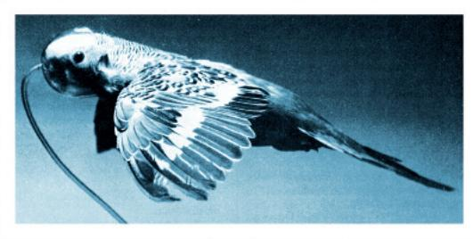

2. Based on the graph, how much greater is the energy cost of flying for an animal that weighs $10^{-3}$ g than for an animal that weighs 1 g? For any given form of locomotion, which travels more efficiently, a larger animal or smaller animal?

3. The slopes of the flying and swimming lines are very similar. Based on your answer to question 2, if the energy cost of a 2-g swimming animal is 1.2 cal/(kg·m), what is the estimated energy cost of a 2-kg swimming animal?

4. Considering animals with a body mass of about 100 g, rank the three forms of locomotion from highest energy cost to lowest energy cost. Were these the results you expected, based on your own experience? What could explain the energy cost of running compared to that of flying or swimming?

5. Schmidt-Nielson calculated the swimming cost in a mallard duck and found that it was nearly 20 times as high as the swimming cost in a salmon of the same body mass. What could explain the greater swimming efficiency of salmon?

Instructors: A version of this Scientific Skills Exercise can be assigned in Mastering Biology.

challenge is wing shape. All wings act as airfoils—structures whose shape alters air currents in a way that helps animals or airplanes stay aloft. As for the body to which the wings attach, a fusiform shape helps reduce drag in air as it does in water.

Flying animals are relatively light, with body masses ranging from less than a gram for some insects to about 20 kg for the largest flying birds. The low body mass of many flying animals is due to specialized structural adaptations. Birds, for example, have no urinary bladder or teeth and have relatively large bones with air-filled regions that help lessen the bird's weight (see Figure 34.30).

Flying, running, and swimming each impose different energetic demands on animals. In the Scientific Skills Exercise on the preceding page, you can interpret a graph that compares the relative energy costs of these three forms of locomotion.

## Concept Check 50.6

1. Contrast swimming and flying in terms of the main problems they pose and the adaptations that allow animals to overcome those problems.

2. MAKE CONNECTIONS Peristalsis contributes to the locomotion of many annelids and to the movement of food in the digestive tract (see Concept 41.3). Using the muscles of your hand and a toothpaste tube as a model of peristalsis, how would your demonstration differ for the two processes?

3. WHAT IF? When using your arms to lower yourself into a chair, you bend your arms without using your biceps. Explain how this is possible. (Hint: Think about gravity as an antagonistic force.)

For suggested answers, see Appendix A.

## Chapter 50 Review

## Summary of Key Concepts

To review key terms, go to the Vocabulary Self-Quiz (eTextbook only).

## Concept 50.1: Sensory receptors transduce stimulus energy and transmit signals to the central nervous system

\- The detection of a stimulus precedes sensory transduction, the change in the membrane potential of a sensory receptor in response to a stimulus. The resulting receptor potential controls transmission of action potentials to the CNS, where sensory information is integrated to generate perceptions. The frequency of action potentials in an axon and the number of axons activated reflect stimulus strength. The identity of the axon carrying the signal encodes the nature or quality of the stimulus.

\- Mechanoreceptors respond to stimuli such as pressure, touch, stretch, motion, and sound. Chemoreceptors detect either total solute concentrations or specific molecules. Electromagnetic receptors detect different forms of electromagnetic radiation. Thermoreceptors signal surface and core temperatures of the body. Pain is detected by a group of nociceptors that respond to excess heat, pressure, or specific classes of chemicals.

To simplify sensory receptor classification, why might it make sense to eliminate nociceptors as a distinct class?

## Concept 50.2: In hearing and equilibrium, mechanoreceptors detect moving fluid or settling particles

\- Most invertebrates sense their orientation with respect to gravity by means of statocysts. Specialized hair cells form the basis for hearing and balance in mammals and for detection of water movement in fishes and aquatic amphibians. In mammals, the tympanic membrane (eardrum) transmits sound waves to bones of the middle ear, which transmit the waves through the oval window to the fluid in the coiled cochlea of the inner ear. Pressure waves in the fluid vibrate the basilar membrane, depolarizing hair cells and triggering action potentials that travel via the auditory nerve to the brain.

How are music volume and pitch encoded in signals to the brain?

## Concept 50.3: The diverse visual receptors of animals depend on light-absorbing pigments

\- Invertebrates have varied light detectors, including simple light-sensitive eyespots, image-forming compound eyes, and single-lens eyes. In the vertebrate eye, a single lens is used to focus light on photoreceptors in the retina. Both rods and cones contain a pigment, retinal, chemically bonded to a protein (opsin). Absorption of light by retinal triggers a signal transduction pathway that hyperpolarizes the photoreceptors, causing them to release less neurotransmitter. Synapses transmit information from photoreceptors to cells that integrate information and convey it to the brain along axons that form the optic nerve.

How does processing of sensory information sent to the vertebrate brain in vision differ from that in hearing or olfaction?

## Concept 50.4: The senses of taste and smell rely on similar sets of sensory receptors

\- Taste (gustation) and smell (olfaction) depend on stimulation of chemoreceptors by small dissolved molecules. In humans, sensory cells in taste buds express a receptor type specific for one of the five taste perceptions: sweet, sour, salty, bitter, and umami (elicited by glutamate). Olfactory receptor cells line the upper part of the nasal cavity. Hundreds of different genes code for membrane proteins that bind to specific classes of odorants, and each receptor cell appears to express only one of those genes.

Why is the flavor of food less intense when you have a head cold?

## Concept 50.5: The physical interaction of protein filaments is required for muscle function

\- The muscle cells (fibers) of vertebrate skeletal muscle contain myofibrils composed of thin filaments of (mostly) actin and thick filaments of myosin. These filaments are organized into repeating units called sarcomeres. Myosin heads, energized by the hydrolysis of ATP, bind to the thin filaments, form cross-bridges, and then release upon binding ATP anew. As this cycle repeats, the thick and thin filaments slide past each other, shortening the sarcomere and contracting the muscle fiber.

\- Motor neurons release acetylcholine, triggering action potentials in muscle fibers that stimulate the release of $Ca^{2+}$ from the sarcoplasmic reticulum. When the $Ca^{2+}$ binds the troponin complex, tropomyosin moves, exposing the myosin-binding sites on actin and thus initiating cross-bridge formation. A motor unit consists of a motor neuron and the muscle fibers it controls. A twitch results from one action potential. Skeletal muscle fibers are slow-twitch or fast-twitch and oxidative or glycolytic.

\- Cardiac muscle, found in the heart, consists of striated cells electrically connected by intercalated disks. Nervous system input controls the rate at which the heart contracts, but is not strictly required for cardiac muscle contraction. In smooth muscles, contractions are initiated by the muscles or by stimulation from neurons in the autonomic nervous system.

What are two major functions of ATP hydrolysis in skeletal muscle activity?

Concept 50.6: Skeletal systems transform muscle contraction into locomotion

\- Skeletal muscles, often in antagonistic pairs, contract and pull against the skeleton. Skeletons may be hydrostatic and maintained by fluid pressure, as in worms; hardened into exoskeletons, as in insects; or in the form of endoskeletons, as in vertebrates.

\- Each form of locomotion—swimming, movement on land, or flying—presents a particular challenge. For example, swimmers need to overcome substantial friction, but face less of a challenge from gravity than do animals that move on land or fly.

Explain how microscopic and macroscopic anchoring of muscle filaments enables you to bend your elbow.

For suggested answers, see Appendix A.

## Test Your Understanding

For more multiple-choice questions, go to the Practice Test (eTextbook only).

## Levels 1-2: Remembering/Understanding

1. Which sensory receptor—category pair is correct?

(A) hair cell—nociceptor

(B) snake pit organ—mechanoreceptor

(C) taste receptor—chemoreceptor

(D) olfactory receptor—electromagnetic receptor

2. The middle ear converts

(A) air pressure waves to fluid pressure waves.

(B) air pressure waves to nerve impulses.

(C) fluid pressure waves to nerve impulses.

(D) pressure waves to hair cell movements.

3. During vertebrate skeletal muscle contraction, calcium ions

(A) break cross-bridges as a cofactor in hydrolysis of ATP.

(B) bind to troponin, exposing myosin-binding sites.

(C) transmit action potentials to the muscle fiber.

(D) spread action potentials through the T tubules.

## Levels 3-4: Applying/Analyzing

4. The human brain differentiates tastes from smells because action potentials for the two sensations differ in

(A) magnitude and shape.

(B) threshold potential.

(C) where they are received in the brain.

(D) how long they take to reach the brain.

5. The transduction of sound waves into action potentials occurs (A) in the tectorial membrane as it is stimulated by hair cells.

(B) when hair cells are bent against the tectorial membrane, causing them to depolarize and release neurotransmitter that stimulates afferent neurons.

(C) as the basilar membrane vibrates at different frequencies in response to the varying volume of sounds.

(D) within the middle ear as the vibrations are amplified by the malleus, incus, and stapes.

## Levels 5-6: Evaluating/Creating

6. Metal objects cause sharks to misdirect their bites. Sharks also can find batteries buried under sand. These facts suggest that sharks track their prey just before they bite in the same way that

(A) a rattlesnake finds a mouse in its burrow.

(B) an insect avoids being stepped on.

(C) a star-nosed mole locates its prey in tunnels.

(D) a platypus locates its prey in a muddy river.

7. DRAW IT Based on the information in the text, fill in the following graph. Use one line for rods and another line for cones.

  
Position along retina (in degrees away from fovea)

8. EVOLUTION CONNECTION In general, locomotion on land will require more energy than locomotion in water. By integrating what you learned about animal form and function in Unit 7, discuss some of the evolutionary adaptations of mammals that support the high energy requirements for moving on land.

9. SCIENTIFIC INQUIRY • INTERPRET THE DATA To demonstrate how energy is stored in tendons during hopping, an instructor asked student volunteers to hop at a frequency that felt “natural” and then, after resting, to hop at exactly half that frequency. Hopping was done at a standard height and volunteers’ mass, $O_{2}$ consumption, and $CO_{2}$ production were measured. Here is a representative set of results calculated for one student.

<table><tr><td>Frequency (hops/sec)</td><td>Energy used (joules/sec)</td></tr><tr><td>1.85</td><td>735</td></tr><tr><td>0.92</td><td>716</td></tr></table>

The student consumed 159 joules/sec when standing. For each hop frequency, subtract this standing value from the energy used during hopping. Then, divide by the hop frequency to calculate the energy cost per hop. Explain how the energy cost per hop differs at the two frequencies, and how might this be related to energy storage in tendons.

10. WRITE ABOUT A THEME: ORGANIZATION In a short essay (100–150 words), describe three ways in which the structure of the lens of the human eye is well adapted to its function in vision.

## 11. SYNTHESIZE YOUR KNOWLEDGE

Bloodhounds, which are adept at following a scent trail even days old, have no more olfactory receptor genes than other dogs. Predict how the sensory and nervous systems of bloodhounds differ from those of other dogs in ways that contribute to their tracking ability.

For selected answers, see Appendix A.

# Animal Behavior

## Key Concepts

51.1 Discrete sensory inputs can stimulate both simple and complex behaviors

51.2 Learning establishes specific links between experience and behavior

51.3 Selection for individual survival and reproductive success can explain diverse behaviors

51.4 Genetic analyses and the concept of inclusive fitness provide a basis for studying the evolution of behavior

  
Figure 51.1 A male magnificent frigatebird (Fregata magnificens) lives mostly at sea. He often feeds by piracy, harassing diving birds into coughing up their catch for his consumption. Periodically, however, he alights on an island, points his bill to the sky, and inflates an enormous red throat pouch. Clacking his beak, he produces a drumming sound that resonates in the pouch. If a curious female takes notice and lands nearby, a mating ritual ensues.

## Study Tip

## Identifying components of

experimental design: Animal behavior is studied in both the wild and the laboratory and involves approaches ranging from passive observation to active intervention. As you study this chapter, note how scientific methods are applied to answer questions in diverse contexts, such as foraging in honeybees (Figure 51.5; see example started here) and fruit flies (Figure 51.13).

1) Make observations—returning bees do a number of different but set dances

2) Form a hypothesis—the dances convey information about food location

3) Generate predictions

4) Gather and analyze data

5) Draw conclusions

## What questions do biologists seek to answer in studying animal behavior?

1. What event or signal triggers the behavior?

Males inflate their pouch only if females are nearby. The intensity of the display increases when a female circles overhead.

2. How does experience during growth and development influence the behavior?

Older males have larger pouches that produce lower drumming frequencies, which attract more females.

3. How does the behavior aid survival and reproduction?

After mating, males and females cooperate in nest building and feeding the chicks.

4. How has the behavior been shaped by natural selection?

The throat pouch can be inflated prominently for mating, and deflated to maximize flight efficiency.

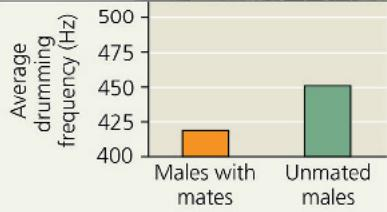

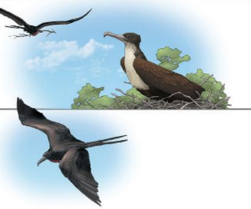

Answering these questions can provide fundamental insights into how behaviors occur and why they arise.

# Concept 51.1: Discrete sensory inputs can stimulate both simple and complex behaviors

Behavior is the sum of an organism's responses to external and internal stimuli. In animals, behaviors are typically actions carried out by muscles under control of the nervous system. Examples include an animal using its throat muscles to produce a song or releasing a scent to mark its territory. Behavior is an essential part of acquiring nutrients and finding a partner for sexual reproduction. Behavior also contributes to homeostasis, as when honeybees huddle to conserve heat (see Concept 40.3). In short, all of animal physiology contributes to behavior, and behavior influences all of physiology.

Many behaviors, especially those involved in recognition and communication, rely on specialized body structures or form. For instance, the throat pouch of a male frigatebird (see Figure 51.1) is essential for courtship. Inflating the pouch exposes its vibrantly colored surface and provides a resonating chamber that amplifies the male's drumming. As this example illustrates, the process of natural selection that shapes behaviors also influences the evolution of animal anatomy.

What approach do biologists use to determine how behaviors arise and what functions they serve? The Dutch scientist Niko Tinbergen, a pioneer in the study of animal behavior, suggested that understanding any behavior requires answering four questions, which were highlighted in Figure 51.1:

1. What stimulus triggers the behavior and how do the various body systems bring it about?

2. How does the animal's experience during growth and development influence the response to the stimulus?

3. How does the behavior aid survival and reproduction?

4. What is the behavior's evolutionary history?

The first two questions ask about proximate causation—how a behavior occurs or is modified. The last two questions ask about ultimate causation—why a behavior occurs in the context of natural selection.

Experiments on proximate causation by Tinbergen earned him a share of a Nobel Prize awarded in 1973. Such studies

defined the field of ethology, the study of animal behavior observed in a natural environment. We'll consider those and related experiments in the early part of the chapter. The concept of ultimate causation is central to behavioral ecology, the study of the ecological and evolutionary basis for animal behavior. We'll explore this vibrant area of modern biological research in the rest of the chapter.

## Fixed Action Patterns

In addressing Tinbergen's first question, the nature of the stimuli that trigger behavior, we'll begin with behavioral responses to well-defined stimuli, starting with an example from one of Tinbergen's own experiments.

As part of his research, Tinbergen kept fish tanks containing three-spined sticklebacks (Gasterosteus aculeatus), a species in which males, but not females, have red bellies. Male sticklebacks attack other males that invade their nesting territories (Figure 51.2). Tinbergen noticed that his male sticklebacks also behaved aggressively when a red truck passed within view of their tank. Inspired by this chance observation, he carried out experiments showing that the red color of an intruder's underside is the proximate cause of the attack behavior. A male stickleback will not attack a fish lacking red coloration, but will attack even unrealistic models if they contain areas of red color. The territorial response of male sticklebacks is an example of a fixed action pattern, a sequence of unlearned acts directly linked to a simple stimulus. The fixed action pattern of certain moths takes the form of evasive flight maneuvers—loops and spirals—performed instantaneously upon hearing the sounds of an echolocating bat or an ultrasonic whistle in the same frequency range. Fixed action patterns are essentially unchangeable and, once initiated, are usually carried to completion. The trigger for the behavior is an external cue called a sign stimulus, such as a red object that prompts a male stickleback's aggressive behavior.

## Migration

Environmental stimuli not only trigger behaviors but also provide cues that animals use to carry out those behaviors. For example, a wide variety of birds, fishes, and other animals use environmental cues to guide migration—a regular, long-distance change in

## Figure 51.2 Sign stimuli in a classic fixed action pattern.

(a) A male stickleback fish attacks other male sticklebacks that invade its nesting territory. (b) Models, whether realistic or not, can trigger the aggressive behavior, but only if the underside is red. Researchers concluded that the red belly of the intruding male is a sign stimulus that releases the aggressive behavior.
Suggest an explanation for why this behavior might have evolved (its ultimate causation).
For suggested answer, see Appendix A.

location. In the course of migration, many animals pass through environments they have not previously encountered. How, then, do they find their way in these foreign settings?

Some migrating animals track their position relative to the sun, even though the sun's position relative to Earth changes throughout the day. Animals can adjust for these changes by means of a circadian clock, an internal mechanism that has a 24-hour periodicity (see Concept 49.2). For example, experiments have shown that migrating birds orient differently relative to the sun at distinct times of the day. Nocturnal animals can instead use the North Star, which has a constant position in the night sky.

Although the sun and stars can provide useful clues for navigation, clouds can obscure these landmarks. How do migrating animals overcome this problem? A simple experiment with homing pigeons provided one answer. On an overcast day, placing a small magnet on the head of a homing pigeon prevented it from returning efficiently to its roost. Researchers concluded that pigeons sense their position relative to Earth's magnetic field and can thereby navigate without solar or celestial cues.

## Behavioral Rhythms

Although the circadian clock plays a small but significant role in navigation by some migrating species, it has a major role in the daily activity of all animals. As discussed in Concepts 40.2 and 49.2, the clock is responsible for a circadian rhythm, a daily cycle of rest and activity. The clock is normally synchronized with the light and dark cycles of the environment but can maintain rhythmic activity even under constant environmental conditions, such as during hibernation.

Some behaviors, such as migration and reproduction, reflect biological rhythms with a longer cycle, or period, than the circadian rhythm. Behavioral rhythms linked to the yearly cycle of seasons are called circannual rhythms. Although migration and reproduction typically correlate with food availability, these behaviors are not a direct response to changes in food intake. Instead, circannual rhythms, like circadian rhythms, are influenced by the periods of daylight and darkness in the environment. For example, studies with several bird species have shown that an artificial environment with extended daylight can induce out-of-season migratory behavior.

Not all biological rhythms are linked to the light and dark cycles in the environment. Consider, for instance, fiddler crab courtship behavior, which is linked to the lunar cycle. Possessed with front claws of very different size, the male fiddler crab (genus Uca) waves the larger claw in front of him to attract potential mates (Figure 51.3). Timing this claw-waving courtship behavior to the new or full moon helps the development of offspring. How? Fiddler crabs begin their lives as larvae settling in the mudflats. The tides disperse larvae to deeper waters, where they complete early development in relative safety before returning to the tidal flats. By courting at the time of the new or full moon, crabs link their reproduction to the times of greatest tidal movement.

Figure 51.3 Courtship display of male fiddler crab.  

## Animal Signals and Communication

Claw waving by fiddler crabs during courtship is an example of one animal (the male crab) generating the stimulus that guides the behavior of another animal (the female crab). A stimulus transmitted from one organism to another is called a signal. The transmission and reception of signals between animals constitute communication, which often has a role in the proximate causation of behavior.

## Forms of Animal Communication

Let's consider the courtship behavior of the fruit fly, Drosophila melanogaster, as an introduction to the four common modes of animal communication: visual, chemical, tactile, and auditory.

Fruit fly courtship constitutes a stimulus-response chain, in which the response to each stimulus is itself a stimulus for the next behavior. In the first step, a male detects a female in his field

of vision and orients his body toward hers. To confirm she belongs to his species, he uses his olfactory system to detect chemicals she releases into the air. The male then approaches and touches the female with a foreleg (Figure 51.4). This touching, or tactile communication, alerts the female to the male's presence. In the third stage, the male extends and vibrates one wing, producing a courtship song. This auditory communication informs the female whether he is of the same species. Only if all of these forms of communication

Figure 51.4 Male fruit fly tapping female with foreleg.

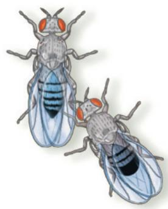

are successful will the female allow the male to attempt copulation.

In general, the form of communication that evolves is closely related to an animal's lifestyle and environment. For example, most terrestrial mammals are nocturnal, which makes visual displays relatively ineffective. Instead, these species use olfactory and auditory signals, which work as well in the dark as in the light. In contrast, most birds are diurnal (active mainly in daytime) and communicate primarily by visual and auditory signals. Humans are also diurnal and, like birds, use primarily visual and auditory communication. We can thus detect and appreciate the songs and bright colors used by birds to communicate but miss many chemical cues on which other mammals base their behavior.

The information content of animal communication varies considerably. One of the most remarkable examples is the symbolic language of the European honeybee (Apis mellifera), discovered in the early 1900s by Austrian researcher Karl von Frisch. Using glass-walled observation hives, he and his students spent several decades observing honeybees.

they fly almost directly to the area indicated by the waggle dance. By using flower odor and other clues, they locate the source of nectar within this area.

If the food source is close to the hive (less than 50 m away), the waggle dance takes a slightly different form that primarily advertises the availability of nectar nearby. In this form of the waggle dance, which von Frisch called “round,” the returning bee moves in tight circles while moving its abdomen from side to side. In response, the follower bees leave the hive and search in all directions for nearby flowers rich in nectar.

## Pheromones

Animals that communicate through odors or tastes emit chemical substances called pheromones. Pheromones are especially common among mammals and insects and often relate to reproductive behavior. For example, pheromones are the basis for the chemical communication in fruit fly courtship (see Figure 51.4). Pheromones are not limited to short-distance

## Methodical recordings of bee

movements enabled von Frisch to decipher a “dance language” that returning foragers use to inform other bees about the distance and direction of travel to a source of nectar.

When a successful forager returns to the hive, its movements, as well as sounds and odors, quickly become the center of attention for other bees, called followers. Moving along the vertical wall of the honeycomb, the forager performs a “waggle dance” that communicates to the follower bees both the direction and distance of the food source in relation to the hive (Figure 51.5). In performing the dance, the bee follows a half-circle swing in one direction, a straight run during which it waggles its abdomen, and a half-circle swing in the other direction. What von Frisch and colleagues deduced was that the angle of the straight run relative to the hive’s vertical surface indicates the horizontal angle of the food in relation to the sun. Thus, if the returning bee runs at a $30^{\circ}$ angle to the right of vertical, the follower bees leaving the hive fly $30^{\circ}$ to the right of the horizontal direction of the sun.

How does the waggle dance communicate distance to the nectar source? It turns out that a dance with a longer straight run, and therefore more abdominal waggles per run, indicates a greater distance to the food found by the forager. As follower bees exit the hive,

Figure 51.5 Honeybee dance language.
Honeybees returning to the hive communicate the location of food sources through the symbolic language of a dance.  

  
Location A: Food source is in same direction as sun.  
Location B: Food source is in direction opposite sun.  
Location C: Food source is 30° to right of sun.  
The waggle dance, performed when food is distant, resembles a figure eight. Distance is indicated by the number of abdominal waggles performed in the straight-run part of the dance. Direction is indicated by the angle of the straight run relative to the vertical surface of the hive. The dance communicates this information to workers clustered around the dancing bee, directing them to food at a particular location.

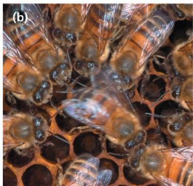

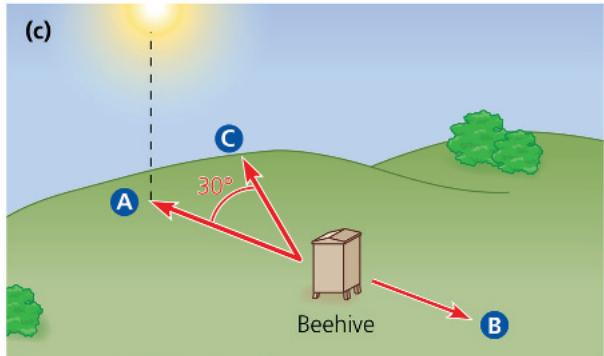  
VISUAL SKILLS What information, if any, might be conveyed by the portions of the waggle dance between the straight runs? Explain.
For suggested answer, see Appendix A.

signaling, however. Male silkworm moths have receptors that can detect the pheromone from a female moth from several kilometers away (see Figure 50.6).

In a honeybee colony, pheromones produced by the queen and her daughters, the workers, maintain the hive's complex social order. One pheromone (once called the queen substance) has a particularly wide range of effects. It attracts workers to the queen, inhibits development of ovaries in workers, and attracts males (drones) to the queen during her mating flights out of the hive.

Pheromones can also serve as alarm signals. For example, when a minnow is injured, a substance released from the fish's skin disperses in the water, inducing a fright response in other minnows in the area. These nearby fish become more vigilant and often form tightly packed schools near the river or lake bottom, where they are safer from attack (Figure 51.6). Pheromones can be very effective at remarkably low concentrations. For instance, just $1\mathrm{cm}^2$ of skin from a fathead minnow contains sufficient alarm substance to induce a reaction in $58,000\mathrm{L}$ of water.

So far in this chapter, we have explored the types of stimuli that elicit behaviors—the first part of Tinbergen's first question. The second part of that question—the physiological mechanisms that mediate responses—involves the nervous, muscular, and skeletal systems explored elsewhere in this unit: Stimuli activate sensory systems, are processed in the central nervous system, and may result in motor outputs that constitute behavior in animals. Thus, we are ready to focus on Tinbergen's second question—how experience influences behavior.

Figure 51.6 Fathead minnows (Pimephales promelas) responding to the presence of an alarm substance.  
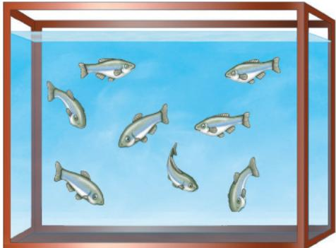  
1 Minnows are widely dispersed in an aquarium before an alarm substance is introduced.

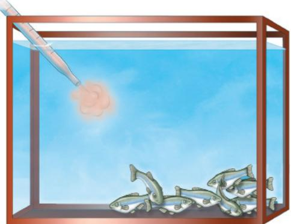  
2 Within seconds of the alarm substance being introduced, minnows aggregate near the bottom of the aquarium and reduce their movement.

## Concept Check 51.1

1. If an egg rolls out of a greylag goose's nest, the female will retrieve it by nudging it with her beak and head. If researchers remove the egg or substitute a ball during this process, the goose continues to bob her beak and head while she moves back to the nest. Provide proximate and ultimate explanations for this behavior.

2. WHAT IF? Suppose you exposed various fish species from the minnows' environment to the alarm substance from minnows. Thinking about natural selection, suggest why some species might respond like minnows, some might increase their activity, and some might show no change.

3. MAKE CONNECTIONS How is the lunar-linked rhythm of fiddler crab courtship similar in mechanism and function to the seasonal timing of plant flowering? (See Concept 39.3.)

For suggested answers, see Appendix A.

## Concept 51.2: Learning establishes specific links between experience and behavior

Some behaviors—such as a fixed action pattern, a courtship stimulus-response chain, or pheromone signaling—are performed by all individuals the same way each time. Behavior that is developmentally fixed in this way is known as innate behavior. Consider, for example, the construction of a spider's web. Although a spider's web is quite complex, web building is innate, not learned. Many other behaviors, however, vary considerably with experience.

A spider in family Araneidae spinning a web  

## Experience and Behavior

Tinbergen's second question asks how an animal's experiences during growth and development influence the response to stimuli. One informative approach to this question is a cross-fostering study, in which the young of one species are placed in the care of adults from another species in the same or a similar environment. The extent to which the offspring's behavior changes in such a situation provides a measure of how the social and physical environment influences behavior.

Table 51.1 Influence of Cross-Fostering on Male Mice\*

<table><tr><td>Species</td><td>Aggression Toward an Intruder</td><td>Aggression in Neutral Situation</td><td>Paternal Behavior</td></tr><tr><td>California mice fostered by white-footed mice</td><td>Reduced</td><td>No difference</td><td>Reduced</td></tr><tr><td>White-footed mice fostered by California mice</td><td>No difference</td><td>Increased</td><td>No difference</td></tr><tr><td colspan="4">*Comparisons are with mice raised by parents of their own species.</td></tr></table>

Certain mouse species have behaviors well suited for cross-fostering studies. Male California mice (Peromyscus californicus) are highly aggressive toward other mice and provide extensive parental care. In contrast, male white-footed mice (Peromyscus leucopus) are less aggressive and engage in little parental care. Cross-fostering—placing pups in the nests of the other species—altered some behaviors of both species (Table 51.1). For instance, male California mice raised by white-footed mice were less aggressive toward intruders. Thus, experience during development can strongly influence aggressive behavior in these rodents.

One of the most important findings of the cross-fostering experiments with mice was that the influence of experience on behavior can be passed on to progeny: When the cross-fostered California mice became parents, they spent less time retrieving offspring who wandered off than did California mice raised by their own species. Thus, experience during development can modify physiology in a way that alters parental behavior, extending the influence of environment to a subsequent generation. While experiences do not modify gene sequences (the genetic code), they can chemically modify DNA with the result that certain genes are more or less active. These DNA alterations, known as epigenetic changes, can be passed on to future generations (see Concept 18.2).

For humans, the influence of genetics and environment on behavior can be explored by a twin study, in which researchers compare the behavior of identical twins raised apart with the behavior of those raised in the same household. Twin studies have been instrumental in studying disorders that alter human

Identical twins who were raised separately  

behavior, such as anxiety disorders, schizophrenia, and alcohol-use disorder.

## Learning

One powerful way that an animal's environment can influence its behavior is through learning, the modification of behavior as a

result of specific experiences. The capacity for learning depends on nervous system organization established during development following instructions encoded in the genome. Learning itself involves the formation of memories by specific changes in neuronal connectivity (see Concept 49.4). Therefore, the essential challenge for research into learning is not to decide between nature and nurture, but rather to explore the contributions of both nature (genes) and nurture (environment) in shaping learning and, more generally, behavior.

## Imprinting

In some species, the ability of offspring to recognize and be recognized by a parent is essential for survival. In the young, this learning often takes the form of imprinting, the establishment of a long-lasting behavioral response to a particular individual or object. Imprinting can take place only during a specific time period in development, called the critical period. Among gulls, for instance, the critical period for a parent to bond with its young lasts one to two days. During the critical period, the young imprint on their parent and learn basic behaviors, while the parent learns to recognize its offspring. If bonding does not occur, the parent will not care for the offspring, leading to the death of the offspring and a decrease in the reproductive success of the parent.

How do the young know on whom—or what—to imprint? Experiments with many species of waterfowl indicate that young birds have no innate recognition of “parent.” Rather, they identify with the first object they encounter that has certain key characteristics. In the 1930s, experiments showed that the principal imprinting stimulus in greylag geese (Anser anser) is a nearby object that is moving. When incubator-hatched goslings spent their first few hours with a person rather than with a goose, they imprinted on the human and steadfastly followed that person from then on (Figure 51.7). Furthermore, they showed no recognition of their biological parent.

Imprinting has become an important component of efforts to save endangered species, such as the whooping crane (Grus americana). Scientists tried raising whooping cranes in captivity by using sandhill cranes (Grus canadensis) as foster parents. However, because the whooping cranes imprinted on their foster parents, none formed a pair-bond (strong attachment) with a whooping crane mate. To avoid such problems, captive breeding programs now isolate young cranes, exposing them to the sights and sounds of members of their own species.

Previously, scientists made further use of imprinting to teach cranes born in captivity to migrate along safe routes. Young whooping cranes were imprinted on humans in “crane suits” and then allowed to follow these “parents” as they flew ultralight aircraft along selected migration routes. More recently, efforts shifted to a focus on minimizing human intervention as part of an overall strategy aimed at fostering self-sustaining crane populations.

## Spatial Learning and Cognitive Maps

Every natural environment has spatial variation, as in locations of nest sites, hazards, food, and prospective mates. Therefore, an organism's fitness may be enhanced by the capacity for spatial learning, the establishment of a memory that reflects the environment's spatial structure.

Figure 51.7 Imprinting.  
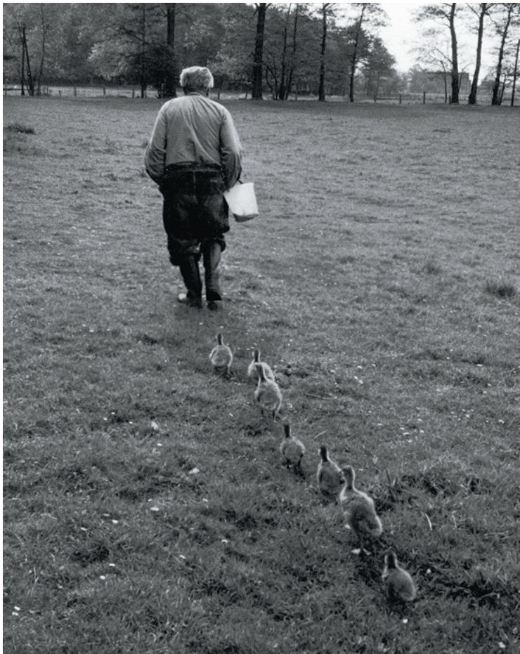  
WHAT IF? Suppose the geese were bred to each other. How might their imprinting on a human affect their offspring? Explain.  
For suggested answer, see Appendix A.

The idea of spatial learning intrigued Tinbergen while he was a graduate student in the Netherlands. At that time, he was studying females of a digger wasp species (Philanthus triangulum) that nests in small burrows dug into sand dunes. When a wasp leaves her nest to go hunting, she hides the entrance from potential intruders by covering it with sand. When she returns, however, she flies directly to her hidden nest, despite the presence of hundreds of other burrows in the area. How does she accomplish this feat? Tinbergen hypothesized that a wasp locates her nest by learning its position relative to visible landmarks. To test his hypothesis, he carried out an experiment in the wasps' natural habitat (Figure 51.8). By manipulating objects around nest entrances, he demonstrated that digger wasps engage in spatial learning. This experiment was so simple and informative that it could be summarized very concisely. In fact, at 32 pages, Tinbergen's Ph.D. thesis from 1932 is still the shortest ever approved at Leiden University.

In some animals, spatial learning involves formulating a cognitive map, a representation in an animal's nervous system

# Figure 51.8

# Inquiry: Does a digger wasp use landmarks to find her nest?

Experiment

A female digger wasp covers the entrance to her nest while foraging for food, but finds the correct wasp nest reliably upon her return 30 minutes or more later. Niko Tinbergen wanted to test the hypothesis that a wasp learns visual landmarks that mark her nest before she leaves on hunting trips. First, he marked one nest with a ring of pinecones while the wasp was in the burrow. After leaving the nest to forage, the wasp returned to the nest successfully.

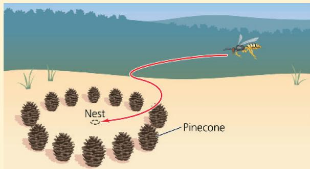  
Two days later, after the wasp had again left, Tinbergen shifted the ring of pinecones away from the nest. Then, he waited to observe the wasp's behavior.

## Results

When the wasp returned, she flew to the center of the pinecone circle instead of to the nearby nest. Repeating the experiment with many wasps, Tinbergen obtained the same results.

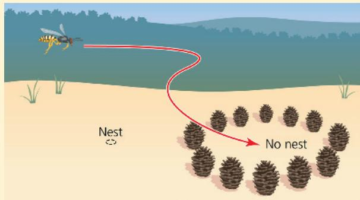

## Conclusion

The experiment supported the hypothesis that digger wasps use visual landmarks to keep track of their nests.

Data from N. Tinbergen, The Study of Instinct, Clarendon Press, Oxford (1951).

WHAT IF? Suppose the digger wasp had returned to her original nest site, despite the pinecones having been moved. What alternative hypotheses might you propose regarding how the wasp finds her nest and why the pinecones didn't misdirect the wasp?
For suggested answer, see Appendix A.

of the spatial relationships between objects in its surroundings. One striking example is found in the Clark's nutcracker (Nucifraga columbiana), a relative of ravens, crows, and jays. In the fall, nutcrackers hide pine seeds for retrieval during the winter. By experimentally varying the distance between landmarks in the birds' environment, researchers discovered that the birds kept track of the halfway point between landmarks, rather than a fixed distance, to find their hidden food stores.

## Associative Learning

Learning often involves making associations between experiences. Consider, for example, a blue jay (Cyanocitta cristata) that ingests a brightly colored monarch butterfly (Danaus plexippus). Substances that the monarch accumulates from milkweed plants cause the blue jay to vomit almost immediately (Figure 51.9). Following such experiences, blue jays avoid attacking monarchs and similar-looking butterflies. The ability to associate one environmental feature (such as a color) with another (such as a foul taste) is called associative learning.

Associative learning is well suited to study in the laboratory. In the 1890s, Russian physiologist Ivan Pavlov demonstrated that if he always rang a bell just before feeding a dog, the dog would eventually salivate when the bell sounded, anticipating food. This form of learning, in which an arbitrary stimulus becomes associated with a particular outcome, is known as classical conditioning. Four decades later, the American researcher B. F. Skinner explored how a rat learns through trial and error to obtain food by pressing a lever. Such learning, in which a behavior becomes associated with a reward or punishment, is known as trial-and-error learning or operant conditioning (see Figure 51.9).

Studies reveal that animals can learn to link many pairs of features of their environment, but not all. For example, pigeons can learn to associate danger with a sound but not with a color. However, they can learn to associate a color with food. What does this mean? The development and

Figure 51.9 Associative learning.

Having ingested and vomited a monarch butterfly, a blue jay has probably learned to avoid this species.

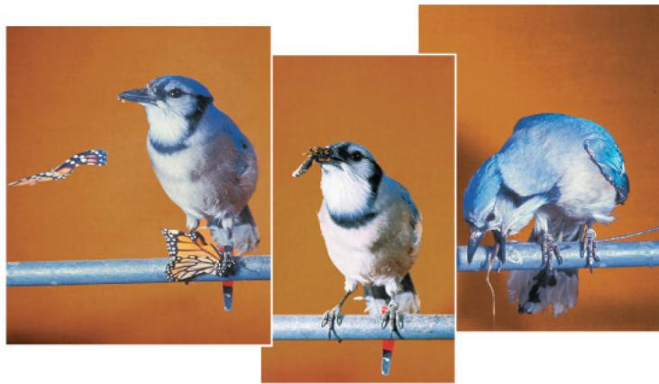

organization of the pigeon's nervous system apparently restrict the associations that can be formed. Moreover, such restrictions are not limited to birds. Rats, for example, can learn to avoid illness-inducing foods on the basis of smells, but not on the basis of sights or sounds.

If we consider how behavior evolves, the fact that some animals can't learn to make particular associations appears logical. The associations an animal can readily form typically reflect relationships likely to occur in nature. Conversely, associations that can't be formed are those unlikely to be of selective advantage in a native environment. In the case of a rat's diet in the wild, for example, a harmful food is far more likely to have a certain odor than to be associated with a particular sound.

## Cognition and Problem Solving

The most complex forms of learning involve cognition—the process of knowing that involves awareness, reasoning, recollection, and judgment. Although it was once argued that only primates and certain marine mammals have high-level thought processes, many other groups of animals, including insects, appear to exhibit cognition in controlled laboratory studies. For example, an experiment using Y-shaped mazes provided evidence for abstract thinking in honeybees. One maze had different colors, and one had different black-and-white striped patterns, either vertical or horizontal bars. Two groups of honeybees were trained in the color maze. Upon entering, a bee would see a sample color and could then choose between an arm of the maze with the same color or an arm with a different color. Only one arm contained a food reward. The first group of bees were rewarded for flying into the arm with the same color as the sample (Figure 51.10, ①); the second group were rewarded for choosing the arm with the different color. Next, bees from each group were tested in the bar maze, which had no food reward. After encountering a sample black-and-white pattern of bars, a bee could choose an arm with the same pattern or an arm with a different pattern. The bees in the first group most often chose the arm with the same pattern (Figure 51.10, ②), whereas those in the second group typically chose the arm with the different pattern.

The maze experiments provide strong experimental support for the hypothesis that honeybees can distinguish on the basis of “same” and “different.” Remarkably, research published in 2010 indicates that honeybees can also learn to distinguish human faces.

The information-processing ability of a nervous system can also be revealed in problem solving, the cognitive activity of devising a method to proceed from one condition to another in the face of real or apparent obstacles. For example, if a chimpanzee is placed in a room with several boxes on the floor and a banana hung high out of reach, the chimpanzee can assess the situation and stack the boxes, enabling it to reach the food. Problem-solving behavior is highly developed in some mammals, especially primates and dolphins, and in cephalopods such as octopuses. Notable examples have also been observed in some bird species. In one study, ravens were confronted with food hanging from a branch by a string. After failing to grab the food in flight, one raven flew to the branch and alternately pulled up and stepped on the string until the food was within reach. A number of other

Figure 51.10 A maze test of abstract thinking by honeybees. These mazes are designed to test whether honeybees can distinguish “same” from “different.”

  
VISUAL SKILLS Describe how you would set up the pattern maze to control for an inherent preference for or against a particular orientation of the black bars. For suggested answer, see Appendix A.  
1 Bees were trained in a color maze. As shown here, one group was rewarded for choosing the same color as the stimulus.  
2 Bees were tested in a pattern maze. If previously rewarded for choosing the same color, bees most often chose lines oriented the same way as the stimulus.

ravens eventually arrived at similar solutions. Nevertheless, some ravens failed to solve the problem, indicating that problem-solving success in this species, as in others, varies with individual experience and abilities.

## Development of Learned Behaviors

Most of the learned behaviors we have discussed develop over a relatively short time. Some behaviors develop more gradually. For example, some bird species learn songs in stages. In the case of the white-crowned sparrow (Zonotrichia leucophrys), the first stage of song learning takes place early in life, when the fledgling sparrow first hears the song. If a fledgling is prevented from hearing real sparrows or recordings of sparrow songs during the first 50 days of its life, it fails to develop the adult song of its species.

Although a young sparrow does not sing during the critical period, it memorizes the song of its species by listening to other white-crowned sparrows sing. During the critical period, fledglings chirp more in response to songs of their own species than to songs of other species. Thus, when young white-crowned sparrows learn the songs they will sing later on, that learning appears to be bounded by genetically controlled preferences.

The critical period when a white-crowned sparrow memorizes its species' song is followed by a second learning phase when the juvenile bird sings tentative notes called a subsong. The juvenile bird hears its own singing and compares it with the song memorized during the critical period. Once a sparrow's own song matches the one it memorized, the song "crystallizes" as the final song, and the bird sings only this adult song for the rest of its life.

Song learning is one of many examples of how animals learn from other members of their species. In finishing our exploration of learning, we'll look at several more examples that reflect the more general phenomenon of social learning.

## Social Learning

Many animals learn to solve problems by observing the behavior of other individuals. Learning through observing and interpreting behaviors and their consequences is called social learning. Young wild chimpanzees, for example, learn how to crack open oil palm nuts with two stones by copying experienced chimpanzees (Figure 51.11).

Figure 51.11 A young chimpanzee (Pan troglodytes) learning to crack oil palm nuts by observing an elder.  
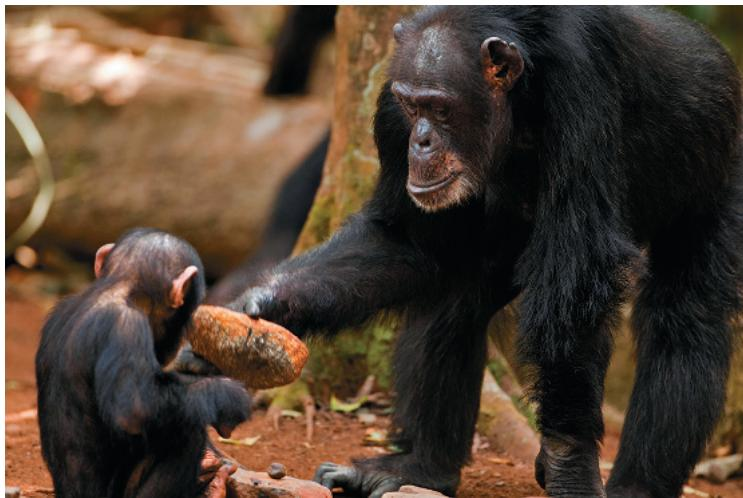

Another example of how social learning can modify behavior comes from studies of the vervet monkeys (Chlorocebus pygerythrus) in Amboseli National Park, Kenya. Vervet monkeys, which are about the size of a domestic cat, produce a complex set of alarm calls. Amboseli vervets give distinct alarm calls for leopards, eagles, and snakes. When a vervet sees a leopard, it gives a loud barking sound; when it sees an eagle, it gives a short double-syllable cough; and the snake alarm call is a “chutter.” Upon hearing a particular alarm call, other vervets in the group behave in an appropriate way: They run up a tree on hearing the alarm for a leopard (vervets are nimbler than leopards in the trees); look up on hearing the alarm for an eagle; and look down on hearing the alarm for a snake (Figure 51.12).

Infant vervet monkeys give alarm calls, but in a relatively undiscriminating way. For example, they give the “eagle” alarm on seeing any bird, including harmless birds such as bee-eaters. With age, the monkeys improve their accuracy. In fact, adult vervet monkeys give the eagle alarm only on seeing an eagle belonging to either of the two species that eat vervets. Infants probably learn how to give the right call by observing other members of the group and receiving social confirmation. For instance, if the infant gives the call on the right occasion—say, an eagle alarm when there is an eagle overhead—another member of the group will also give the eagle call. But if the infant gives the call when a bee-eater flies by, the adults in the group are silent. Thus, vervet monkeys have an initial, unlearned tendency to give calls upon seeing

## Figure 51.12 Vervet monkeys learning correct use of alarm calls.

On seeing a python (foreground), vervet monkeys give a distinct “snake” alarm call (inset), and the members of the group stand upright and look down.

potentially threatening objects in the environment. Learning fine-tunes the call so that adult vervets give calls only in response to genuine danger and can fine-tune the alarm calls of the next generation.

Social learning forms the roots of culture, a system of information transfer through social learning or teaching that influences the behavior of individuals in a population. Cultural transfer of information can alter behavioral phenotypes and thereby influence the fitness of individuals.

Changes in behavior that result from natural selection occur on a much longer time scale than does learning. In Concept 51.3, we'll examine the relationship between particular behaviors and the processes of selection related to survival and reproduction.

## Concept Check 51.2

1. How might associative learning explain why different species of distasteful or stinging insects have similar colors?

2. WHAT IF? How might you position and manipulate a few objects in a lab to test whether an animal can use a cognitive map to remember the location of a food source?

3. MAKE CONNECTIONS How might a learned behavior contribute to speciation? (See Concept 24.1.)

For suggested answers, see Appendix A.

## Concept 51.3: Selection for individual survival and reproductive success can explain diverse behaviors

EVOLUTION We turn now to Tinbergen's third question—how behavior enhances survival and reproduction in a population. The focus thus shifts from proximate causation—the "how" questions—to ultimate causation—the "why" questions. We'll begin by considering the activity of gathering food. Food-obtaining behavior, or foraging, includes not only eating but also any activities an animal uses to search for, recognize, and capture food items.

## Evolution of Foraging Behavior

The fruit fly allows us to examine one way that foraging behavior might have evolved. Variation in a gene called forager (for) dictates how far Drosophila larvae travel when foraging. On average, larvae carrying the $for^{R}$ (“Rover”) allele travel nearly twice as far while foraging as do larvae with the $for^{s}$ (“sitter”) allele.

Both the $for^{R}$ and $for^{s}$ alleles are present in natural populations. What circumstances might favor one or the other allele? An answer became apparent in experiments that maintained flies at either low or high population densities for many generations. Larvae in populations kept at a low density foraged over shorter distances than those in populations kept at high density (Figure 51.13). Furthermore, the $for^s$ allele increased in frequency in the low-density populations, whereas the $for^R$ allele increased in frequency in the high-density group. These changes make sense. At a low population density, short-distance foraging yields sufficient food, while long-distance foraging would result in unnecessary energy expenditure. Under crowded conditions, long-distance foraging could enable larvae to move beyond areas depleted of food. Thus, an interpretable evolutionary change in behavior occurred in the course of the experiment.

Figure 51.13 Evolution of foraging behavior by laboratory populations of Drosophila melanogaster.  
After 74 generations of living at low population density, Drosophila larvae (populations R1–R3) followed foraging paths significantly shorter than those of Drosophila larvae that had lived at high density (populations K1–K3).  
  
INTERPRET THE DATA What alternative hypothesis is made far less likely by having three R and K lines, rather than one of each?

## Optimal Foraging Model

To study the ultimate causation of foraging strategies, biologists sometimes apply a type of cost-benefit analysis used in economics. This idea proposes that foraging behavior is a compromise between the benefits of nutrition and the costs of obtaining food. These costs might include the energy expenditure of foraging as well as the risk of being eaten while foraging. According to this optimal foraging model, natural selection should favor a foraging behavior that minimizes the costs of foraging and maximizes the benefits. The Scientific Skills Exercise provides an example of how this model can be applied to animals in the wild.

## Balancing Risk and Reward

One of the most significant potential costs to a forager is risk of predation. Maximizing energy gain and minimizing energy costs are of little benefit if the behavior makes the forager a likely meal for a predator. It seems logical, therefore, that predation risk would influence foraging behavior. Such appears to be the case for the mule deer (Odocoileus hemionus), which lives in the mountains of western North America. Researchers found that the food available for mule deer was fairly uniform across the potential foraging areas, although somewhat lower in open, nonforested areas. In contrast, the risk of predation differed greatly; mountain lions (Puma concolor), the major predator, killed large numbers of mule deer at forest edges and only a small number in open areas and forest interiors.

How does mule deer foraging behavior reflect the differences in predation risk in particular areas? Mule deer feed predominantly in open areas. Thus, it appears that mule deer foraging behavior reflects the large variation in predation risk and not the smaller variation in food availability. This result underscores the point that behavior typically reflects a compromise between competing selective pressures.

## Mating Behavior and Mate Choice

Just as foraging is crucial for individual survival, mating behavior and mate choice play a major role in determining reproductive success. These behaviors include seeking or attracting mates, choosing among potential mates, competing for mates, and caring for offspring.

## Mating Systems and Sexual Dimorphism

There is considerable variation in patterns of sexual contact. In the context of reproduction, biologists describe differences in mating systems, the length and number of relationships between males and females. In some animal species, mating is promiscuous, with no strong pair-bonds. In others, mates form a relationship of some duration that is monogamous (one male mating with one female) or polygamous (an individual of one sex mating with several of the other). Polygamous relationships involve either polygyny, a single male and many females, or polyandry, a single female and multiple males. (Note that same-sex sexual behavior is also very common in many species.)

The extent to which males and females differ in appearance, a characteristic known as sexual dimorphism, typically varies with the type of mating system. Among monogamous species, males and females often look very similar. In contrast, among polygamous species, the sex that attracts multiple mating partners is typically showier and

# Scientific Skills Exercise

# Testing a Hypothesis with a Quantitative Model

Do Crows Display Optimal Foraging Behavior? On islands off British Columbia, Canada, Northwestern crows (Corvus caurinus) search rocky tide pools for sea snails called whelks. After spotting a whelk, the crow picks it up in its beak, flies upward, and drops the whelk onto the rocks. If the drop is successful, the shell breaks and the crow can dine on the whelk's soft parts. If not, the crow flies up and drops the whelk again and again until the shell breaks. What determines how high the crow flies? If energetic considerations dominated selection for the crow's foraging behavior, the average drop height might reflect a trade-off between the cost of flying higher and the benefit of more frequent success. In this exercise, you'll test how well this optimal foraging model predicts the average drop height observed in nature.

How the Experiments Were Done There were two parts to the experiment. First, the researcher measured the height of drops made by crows in the wild by referring to a marked pole erected nearby. Second, the researcher built a device that dropped a whelk onto the rocks from a fixed platform. For each whelk, he kept track of the number of drops carried out before the whelk broke open. Averaging over many trials with the device and combining the data for each platform height, he calculated a predicted total “flight” height: the height of the platform times the average number of drops required to break open the whelk.

Data from the Experiment The graph summarizes the results of the experiment, comparing the behavior of crows in the wild with the measurements using the whelk-dropping device.

Data from R. Zach, Shell-dropping: Decision-making and optimal foraging in northwestern crows, Behavior 68:106–117 (1979).

## INTERPRET THE DATA

1. How does the average number of drops required to break open a whelk depend on platform height for a drop of 5 m or less? For drops of more than 5 m?

2. Total flight height can be considered to be a measure of the total energy required to break open a whelk. Why is this value lower for a platform set at 5 m than for one at 2 or 15 m?

larger than the opposite sex (Figure 51.14). We'll discuss the evolutionary basis of these differences shortly.

## Mating Systems and Parental Care

The needs of the young are an important factor constraining the evolution of mating systems. Most newly hatched birds, for instance, cannot care for themselves. Rather, they require a large, continuous food supply, a need that is difficult for a single parent to meet. In such cases, a male that stays with and helps a single mate may ultimately have more viable offspring than it would by going off to seek additional mates. This may explain why many bird species are monogamous. In contrast, for birds with young

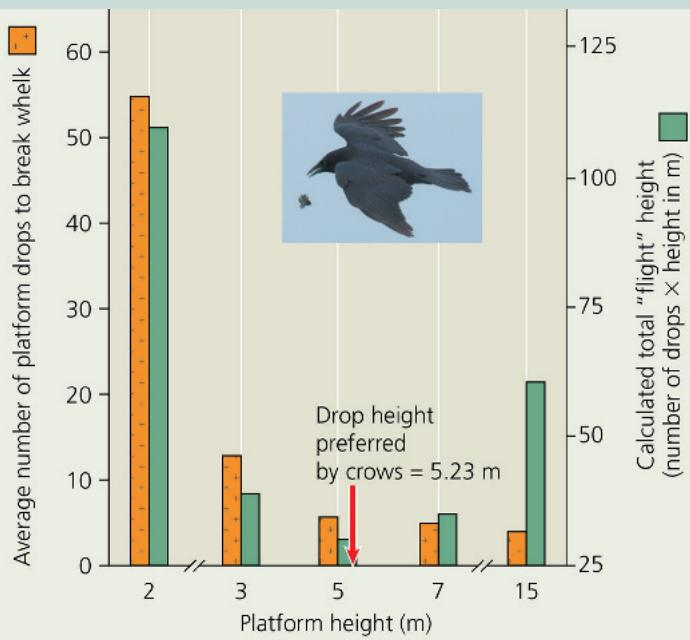

3. Compare the drop height preferred by crows with the graph of total flight height for the platform drops. Are the data consistent with the hypothesis of optimal foraging? Explain.

4. In testing the optimal foraging model, it was assumed that changing the height of the drop only changed the total energy required. Do you think this is a realistic limitation, or might other factors than total energy be affected by height?

5. Researchers observed that the crows only gather and drop the largest whelks. What are some reasons crows might favor larger whelks?

6. It turned out that the probability of a whelk breaking was the same for a whelk dropped for the first time as for an unbroken whelk dropped several times previously. If the probability of breaking instead increased, what change might you predict in the crow's behavior?

Instructors: A version of this Scientific Skills Exercise can be assigned in Mastering Biology.

that can feed and care for themselves almost immediately after hatching, the males derive less benefit from staying with their partner. Males of these species, such as pheasants and quail, can maximize their reproductive success by seeking other mates, and polygyny is relatively common in such birds. In the case of mammals, the lactating female is often the only food source for the young, and males usually play no role in raising the young. In mammalian species where males protect the females and young, such as lions, a male or small group of males typically cares for a harem of many females.

Another factor influencing mating behavior and parental care is certainty of paternity. Young born to or eggs laid by a female definitely contain that female's genes. However, even if there is a

Figure 51.14 Relationship between mating system and male and female forms.

(a) Monogamy (one male, one female)

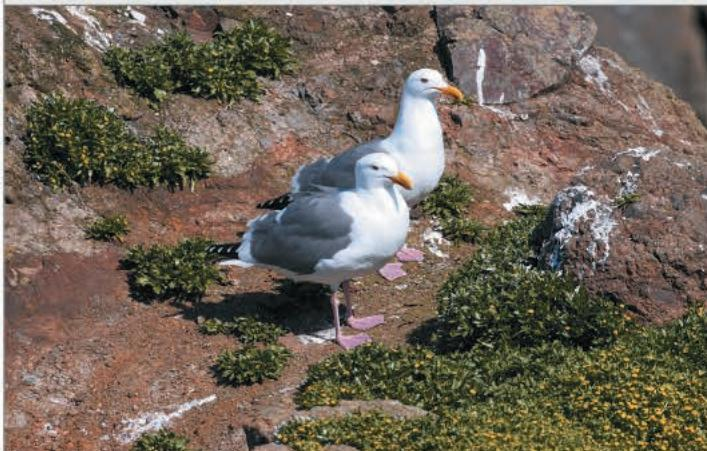  
In monogamous species, such as these western gulls (Larus occidentalis), males and females are difficult to distinguish using external characteristics only.

(b) Polygyny (one male, multiple females)  
  
Among polygynous species, such as elk (Cervus canadensis), the male (right) is often highly ornamented.

(c) Polyandry (one female, multiple males)  
  
In polyandrous species, such as these red-necked phalaropes (Phalaropus lobatus), females (right) are generally more ornamented than males.

strong pair-bond, a male other than the female's usual mate may on occasion produce offspring with that female. The certainty of paternity is relatively low in most species with internal fertilization because the acts of mating and birth (or mating and egg laying) are separated over time. This could be one reason that exclusively male parental care is rare in bird and mammal species. However, the males of many species with internal fertilization engage in behaviors that appear to increase their certainty of paternity. These behaviors include guarding females, removing any sperm from the female reproductive tract before copulation, and introducing large quantities of sperm that displace the sperm of other males.

Certainty of paternity is high when egg laying and mating occur together, as in external fertilization. This may explain why parental care in aquatic invertebrates, fishes, and amphibians, when it occurs at all, is at least as likely to be by males as by females (Figure 51.15; see also Figure 46.6). Among fishes and amphibians, parental care occurs in fewer than 10% of species with internal fertilization but in more than half of species with external fertilization.

It is important to point out that certainty of paternity does not mean that animals are aware of those factors when they behave a certain way. Parental behavior correlated with certainty of paternity exists because it has been reinforced over generations by natural selection. The intriguing relationship between certainty of paternity and male parental care remains an area of active research.

## Sexual Selection and Mate Choice

Sexual dimorphism results from sexual selection, a form of natural selection in which differences in reproductive success among individuals are a consequence of differences in mating success (see Concept 23.4). Sexual selection can take the form of intersexual

## Figure 51.15 Paternal care by a male yellowhead jawfish (Opistognathus aurifrons).

The male jawfish, which lives in tropical marine environments, holds the eggs it has fertilized in its mouth, keeping them aerated and protecting them from predators until the young fish hatch.

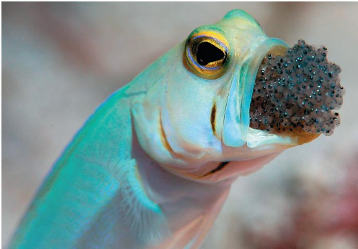

selection, in which members of one sex choose mates on the basis of characteristics of the other sex, such as courtship songs, or intra-sexual selection, which involves competition between members of one sex for mates.

## Mate Choice by Females

Mate preferences of females may play a central role in the evolution of male behavior and anatomy through intersexual selection. Consider, for example, the courtship behavior of stalk-eyed flies. The eyes of these insects are at the tips of stalks, which are longer in males than in females. During courtship, a male approaches the female headfirst. Researchers have shown that females are more likely to mate with males that have relatively long eyestalks. Why would females favor this seemingly arbitrary trait? Ornaments such as long eyestalks in these flies and bright coloration in birds correlate in general with health and vitality. A female whose mate choice is a healthy male is likely to produce more offspring that survive to reproduce. As a result, males may compete with each other in ritualized contests to attract female attention (Figure 51.16). In face-offs between male stalk-eyed flies, the male whose eyestalk length is smaller usually retreats peacefully.

Mate choice can also be influenced by imprinting, as revealed by experiments carried out with zebra finches

(Taeniopygia guttata). Both male and female zebra finches normally lack any feather crest on their head (Figure 51.17). To explore whether parental appearance affects mate preference in offspring independent of any genetic influence, researchers provided zebra finches with artificial ornamentation. A 2.5-cm-long red feather was taped to the forehead feathers of either or both zebra finch parents when their chicks were 8 days old, approximately 2 days before they opened their eyes. A control group of zebra finches was raised by unadorned parents. When the chicks matured, they were presented with prospective mates that were either artificially ornamented with a red feather or non-ornamented (Figure 51.18). Males showed no preference. Females raised by a male parent that was not ornamented also showed no preference. However, females raised by an ornamented male parent preferred ornamented males as their own mates. Thus, female finches apparently take cues from their male parents in choosing mates.

Mate-choice copying, a behavior in which individuals in a population copy the mate choice of others, has

been studied in the guppy, Poecilia reticulata. When a female guppy chooses between males with no other females present, the female almost always chooses the male with more orange

Figure 51.16 A face-off between male stalk-eyed flies (Cyrtodiopsis whitei) competing for female attention.

Figure 51.17
Appearance of zebra finches in nature.

The male zebra finch (right) is more highly patterned and colorful than the female zebra finch (left).

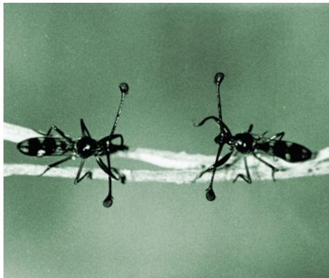

  
Figure 51.18 Sexual selection influenced by imprinting.

Experiments demonstrated that female zebra finch chicks that had imprinted on artificially ornamented male parents preferred ornamented males as adult mates. For all experimental groups, male offspring showed no preference for either ornamented or non-ornamented female mates.

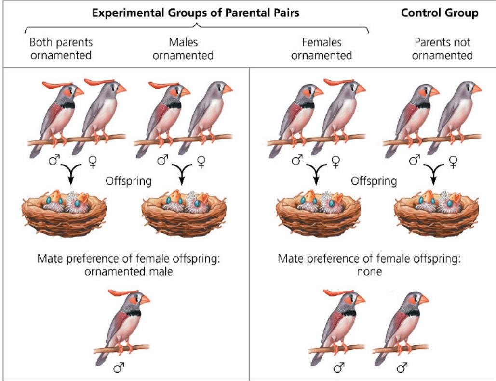

## Figure 51.19 Mate choice copying by female guppies (Poecilia reticulata).

In the absence of other females (control group), female guppies generally choose males with more orange coloration. However, when a female model is placed near one of the males (experimental group), female guppies often copy the apparent mate choice of the model, even if the male is less colorful than others. Guppy females ignored the mate choice of the model only if an alternative male had much more orange coloration.

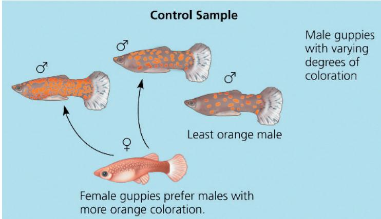

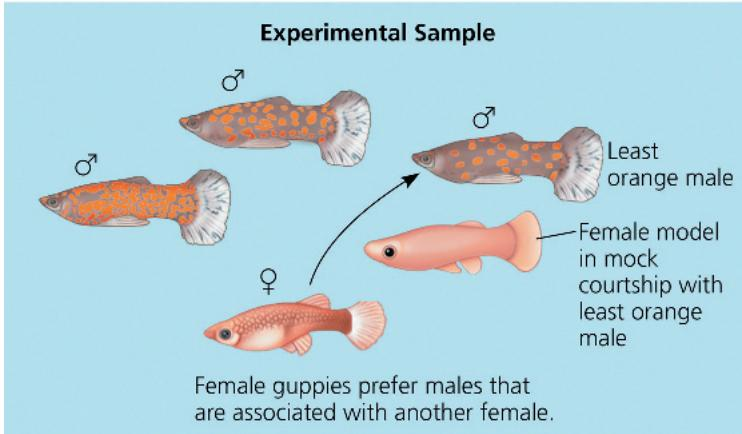

coloration. To explore if the behavior of other females could influence this preference, an experiment was set up using both living females and artificial model females (Figure 51.19). If a female guppy observed the model “courting” a male with less extensive orange markings, she often copied the preference of the model female. That is, the female chose the male that had been presented in association with a model female rather than a more orange alternative. The exceptions were also informative. Mate-choice copying typically did not change when the difference in coloration was particularly large; that is, the female guppy chose the male with the much stronger coloration even if a model female was associated with the less orange male. Mate-choice copying can thus mask genetically controlled female preference below a certain threshold of difference, in this case for male color.

Mate-choice copying, a form of social learning, has also been observed in several other fish and bird species. What is the selective pressure for such a mechanism? One possibility is that a female that mates with males that are attractive to other females

## Figure 51.20 Agonistic interaction.

Male eastern grey kangaroos (Macropus giganteus) often “box” in contests that determine which male is most likely to mate with an available female. Typically, one male snorts loudly and strikes the other with his forelimbs. If the male under attack does not retreat, the fight may escalate into grappling or the two males balancing on their tails while attempting to kick each other with the sharp toenails of their hind feet.

increases the probability that her male offspring will also be attractive and have high reproductive success.

## Male Competition for Mates

The previous examples show how female choice can select for one best type of male in a given situation, resulting in low variation among males. Similarly, male competition for mates can reduce variation among males. Such competition may involve agonistic behavior, a contest, typically ritualized, that determines which competitor gains access to a resource, such as food or a mate (Figure 51.20; see also Figure 51.16).

Despite the potential for male competition to select for reduced variation, behavioral and morphological variation in males is extremely high in some vertebrate species, including species of fish and deer, as well as in a wide variety of invertebrates. In some species, sexual selection has led to the evolution of alternative male mating behavior and morphology. How do scientists analyze situations where more than one mating behavior can result in successful reproduction? One approach relies on the rules that govern games.

## Applying Game Theory

Often, the fitness of a particular behavioral phenotype is influenced by other behavioral phenotypes in the population. In studying such situations, behavioral ecologists use a range of

Figure 51.21 Male polymorphism in the common side-blotched lizard (Uta stansburiana).

An orange-throat male, left; a blue-throat male, center; a yellow-throat male, right.

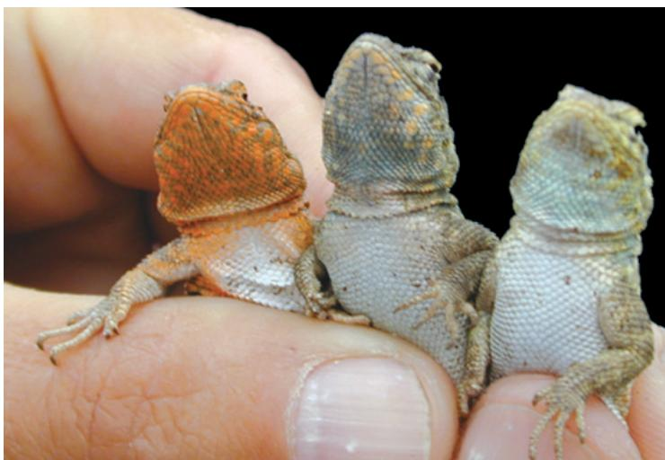

tools, including game theory. Developed by American mathematician John Nash and others to model human economic behavior, game theory evaluates alternative strategies in situations where the outcome depends on the strategies of all the individuals involved.

As an example of applying game theory to mating behavior, let's consider the common side-blotched lizard (Uta stansburiana) of California. Genetic variations give rise to males with orange, blue, or yellow throats (Figure 51.21). One would expect that natural selection would favor one of the three color types, yet all three persist. Why? The answer appears to lie in the fact that each throat color is associated with a different pattern of behavior: Orange-throat males are the most aggressive and defend large territories that contain many females. Blue-throat males are also territorial but defend smaller territories and fewer females. Yellow-throats are nonterritorial males that mimic females and use “sneaky” tactics to gain the chance to mate.

Evidence indicates that the mating success of each male lizard type is influenced by the relative abundance of the other types, an example of frequency-dependent selection. In one study population, the most frequent throat coloration changed over a period of several years from blue to orange to yellow and back to blue.

By comparing the competition between common side-blotched lizard males to the children's game of rock-paper-scissors, scientists devised an explanation for the cycles of variation in the lizard population. In the game, paper defeats rock, rock defeats scissors, and scissors defeats paper. Each hand symbol thus wins one matchup but loses the other. Similarly, each type of male lizard has an advantage over one of the other two types:

\- When blue-throats are abundant, they can defend the few females in their territories from the advances of the

sneaky yellow-throat males. However, blue-throats cannot defend their territories against the hyperaggressive orange-throats.

\- Once the orange-throats become the most abundant, the larger number of females in each territory provides the opportunity for the yellow-throats to have greater mating success.

\- The yellow-throats become more frequent, but then give way to the blue-throats, whose tactic of guarding small territories once again allows them the most success.

Thus, following the population over time, one sees a persistence of all three color types and a periodic shift in which type is most prevalent.

Game theory provides a way to think about complex evolutionary problems in which relative performance (reproductive success relative to other phenotypes), not absolute performance, is the key to understanding the evolution of behavior. This makes game theory an important tool because the relative performance of one phenotype compared with others is a measure of Darwinian fitness.

## Concept Check 51.3

1. Provide an ultimate explanation for the correlation between the mode of fertilization in a species and the presence or absence of male parental care.

2. MAKE CONNECTIONS Balancing selection can maintain variation at a locus (see Concept 23.4). Based on the foraging experiments described in this chapter, devise a simple hypothesis to explain the presence of both $for^R$ and $for^s$ alleles in natural fly populations.

3. WHAT IF? Suppose an infection in a common side-blotched lizard population killed many more males than females. What would be the immediate effect on male competition for reproductive success?

For suggested answers, see Appendix A.

## Concept 51.4: Genetic analyses and the concept of inclusive fitness provide a basis for studying the evolution of behavior

EVOLUTION We'll now explore issues related to Tinbergen's fourth question—the evolutionary history of behaviors. We will first look at the genetic control of a behavior. Next, we will examine the genetic variation underlying the evolution of particular behaviors. Finally, we will see how expanding the definition of fitness beyond individual survival can help explain “selfless” behavior.

## Genetic Basis of Behavior

In exploring the genetic basis of behavior, we'll begin with the courtship behavior of the male fruit fly (see Figure 51.4). During courtship, the male fly carries out a complex series of actions in response to multiple sensory stimuli. Genetic studies have revealed that a single gene called fru controls this entire courtship ritual. If the fru gene is mutated to an inactive form, males do not court or mate with females. (The name fru is short for fruitless, reflecting the absence of offspring from the mutant males.) Normal male and female flies express distinct forms of the fru gene. When females are genetically manipulated to express the male form of fru, they court other females, performing the role normally played by the male.

How does the fru gene control so many different actions? Experiments carried out cooperatively in several laboratories demonstrated that fru is a master regulatory gene that directs the expression and activity of many genes with narrower functions. Together, genes that are controlled by the fru gene bring about sex-specific development of the fly nervous system. In effect, fru programs the fly for male courtship behavior by overseeing a male-specific wiring of the central nervous system.

In many cases, differences in behavior arise not from gene inactivation, but from variation in the activity or amount of a gene product. One striking example comes from the study of two related species of voles, which are small, mouse-like rodents. Male meadow voles (Microtus pennsylvanicus) are solitary and do not form lasting relationships with mates. Following mating, they pay little attention to their pups. In contrast, male prairie voles (Microtus ochrogaster) form a pair-bond with a single female after they mate (Figure 51.22). Male prairie voles provide care for their young pups, hovering over them, licking them, and carrying them, while acting aggressively toward intruders.

A neurotransmitter released during mating is critical for the partnering and parental behavior of male voles. Known as antidiuretic hormone (ADH) or vasopressin (see Concept 44.5), this peptide is released during mating and binds to a specific receptor in the central nervous system. When male prairie voles are given a drug that inhibits the receptor in the brain that detects vasopressin, the male voles fail to form pair-bonds after mating.

The vasopressin receptor gene is much more highly expressed in the brain of prairie voles than in the brain of meadow voles. Testing the hypothesis that the level of vasopressin receptor in the brain regulates postmating behavior, researchers inserted the vasopressin receptor gene from prairie voles into the genome of meadow voles. The male meadow voles carrying this gene not only developed brains with higher levels of the vasopressin receptor but also showed many of the same mating behaviors as male prairie voles, such as pair-bonding. Thus, although many genes influence pair-bonding and parenting in male voles, a change in the level of expression of the vasopressin receptor is sufficient to alter the development of these behaviors.

Figure 51.22 A pair of prairie voles (Microtus ochrogaster) huddling.

Among North American prairie voles, males associate closely with their mates, as shown here, and contribute substantially to the care of young.

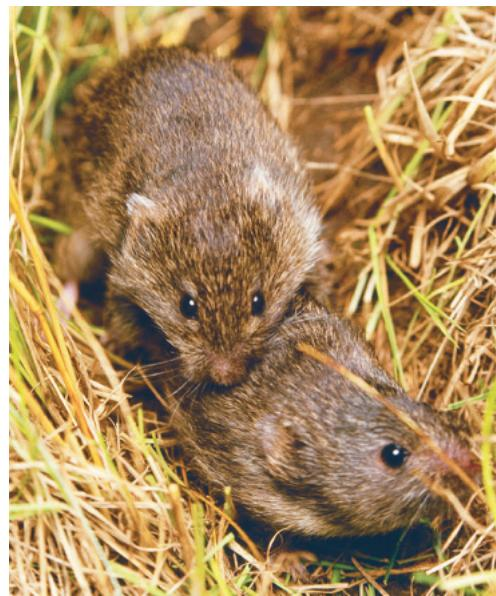

## Genetic Variation and the Evolution of Behavior

Behavioral differences between closely related species, such as meadow and prairie voles, are common. Significant differences in behavior can also be found within a species but are often less obvious. When behavioral variation between populations of a species correlates with variation in environmental conditions, it may reflect natural selection.

## Case Study: Variation in Prey Selection

An example of genetically based behavioral variation within a species involves prey selection by the western garter snake (Thamnophis elegans). The natural diet of this species differs widely across its range in California. Coastal populations feed predominantly on banana slugs (Ariolimax californicus). Inland populations feed on frogs, leeches, and fish, but not banana slugs. In fact, banana slugs are rare or absent in the inland habitats.

When researchers offered banana slugs to snakes collected from each wild population, most coastal snakes readily ate them (Figure 51.23). In contrast, inland snakes tended to refuse. To what extent does genetic variation among snake species contribute to a fondness for banana slugs? To answer this question, researchers collected pregnant snakes from the wild coastal and inland populations and then housed these females in separate cages in the laboratory. While the offspring were still very young, they were each offered a small piece of banana slug on ten successive days. More than 60% of the young snakes from coastal females ate banana slugs on eight or more of the ten days. In contrast, fewer

Figure 51.23 Western garter snake from a coastal habitat eating a banana slug.

Experiments indicate that the preference of these snakes for banana slugs may be influenced more by genetics than by environment.

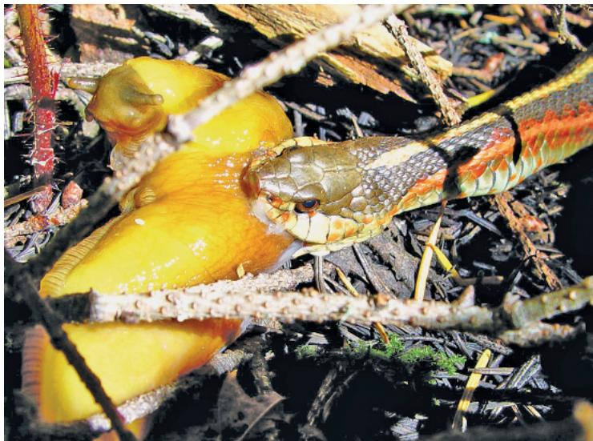

than 20% of the young snakes from inland females ate a piece of banana slug even once. Perhaps not surprisingly, banana slugs thus appear to be a genetically acquired taste.

How did a genetically determined difference in feeding preference come to match the snakes' habitats so well? It turns out that the two populations also vary with respect to their ability to recognize and respond to odor molecules produced by banana slugs. Researchers hypothesize that when inland snakes colonized coastal habitats more than 10,000 years ago, some of them could recognize banana slugs by scent. Because these snakes took advantage of this food source, they had higher fitness than snakes in the population that ignored the slugs. Over hundreds or thousands of generations, the capacity to recognize the slugs as prey increased in frequency in the coastal population. The marked variation in behavior observed today between the coastal and inland populations may be evidence of this past evolutionary change.

## Case Study: Variation in Migratory Patterns

Another species suited to the study of behavioral variation is the blackcap (Sylvia atricapilla), a small migratory warbler. Blackcaps that breed in Germany generally migrate southwest to Spain and then south to Africa for the winter. In the 1950s, a few blackcaps began to spend their winters in Britain, and over time the population of blackcaps wintering in Britain grew to many thousands. Leg bands showed that some of these birds had migrated westward from central Germany. Was this change in the pattern of migration the outcome of natural selection? If so, the birds wintering in Britain must have a heritable difference in migratory behavior. To test this hypothesis, researchers at the Max Planck Institute for Ornithology in Radolfzell, Germany, devised a strategy to study migratory orientation in the laboratory (Figure 51.24). The results demonstrated

that the two patterns of migration—to the west and to the southwest—do in fact reflect genetic differences between the two populations.

The study of western European blackcaps indicated that the change in their migratory behavior occurred both recently and rapidly. Before the year 1950, there were no known westward-migrating blackcaps in Germany. By the 1990s, westward migrants made up 7–11% of the blackcap populations of Germany. Once westward migration began, it persisted and increased in frequency, perhaps due to the widespread use of winter bird feeders in Britain, as well as shorter migration distances.

## Altruism

We typically assume that behaviors are selfish; that is, they benefit the individual at the expense of others, especially competitors. For example, superior foraging ability by one individual may leave less food for others. The problem comes with “unselfish” behaviors. How can such behaviors arise through natural selection? To answer this question, let’s look more closely at some examples of unselfish behavior and consider how they might arise.

In discussing selflessness, we will use the term altruism to describe a behavior that reduces an animal's individual fitness but increases the fitness of other individuals in the population. Consider, for example, the Belding's ground squirrel (Urocitellus beldingi), which lives in the western United States and is vulnerable to predators such as coyotes and hawks. A squirrel that sees a predator approach often gives a high-pitched alarm call that alerts unaware individuals to retreat to their burrows. In warning others, however, this squirrel brings attention to its location and thus increases its own risk of being killed.

Another example of altruistic behavior occurs in honeybee societies, in which the workers are sterile. The workers themselves never reproduce, but they labor on behalf of a single fertile queen. Furthermore, the workers sting intruders, a behavior that helps defend the hive but results in the death of those workers.

Altruism is also observed in naked mole rats (Heterocephalus glaber), highly social rodents that live in underground chambers and tunnels in southern and northeastern Africa. The naked mole rat, which is almost hairless and nearly blind, lives in colonies of 20 to 300 individuals (Figure 51.25). Each colony has only one reproducing female, the queen, who mates with one to three males, called kings. The rest of the colony consists of nonreproductive females and males who at times sacrifice themselves to protect the queen or kings from snakes or other predators that invade the colony.

## Inclusive Fitness

With these examples from ground squirrels, honeybees, and mole rats in mind, let's return to the question of how altruistic behavior arises during evolution. The easiest case to consider is that of parents sacrificing for their offspring. When parents sacrifice their own well-being to produce and aid offspring, this act actually increases the fitness of the parents because it maximizes their genetic representation in the population. By this logic,

## Figure 51.24

# Inquiry: Are differences in migratory orientation within a species genetically determined?

Experiment

Birds known as blackcaps that live in Germany winter elsewhere. Most migrate to Spain and Africa, but a few fly to Britain, where they find food left out by city dwellers. German scientist Peter Berthold and colleagues wondered if this change had a genetic basis. To test this hypothesis, they captured blackcaps wintering in Britain and bred them in Germany in an outdoor cage. They also collected young blackcaps from nests in Germany and raised them in cages. In the autumn, the blackcaps captured in Britain and the birds raised in cages were placed in large, glass-covered funnel cages. When the funnels were lined with carbon-coated paper and placed outside at night, the birds moved around, making marks on the paper that indicated the direction in which they were trying to “migrate.”

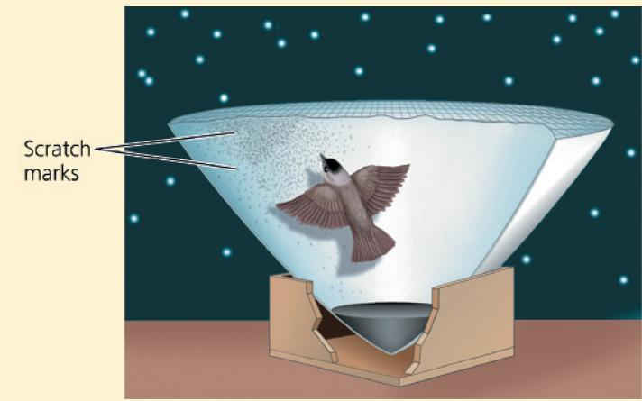  
Figure 51.25 Naked mole rats, a species of colonial mammal that exhibits altruistic behavior.  
Pictured here is a queen nursing offspring while surrounded by other members of the colony.

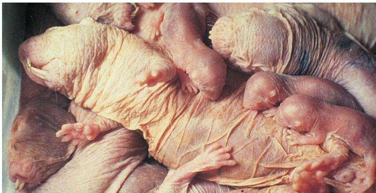  
altruistic behavior can be maintained by evolution even though it does not enhance the survival and reproductive success of the self-sacrificing individuals.

## Results

The wintering adult birds captured in Britain and their laboratory-raised offspring both attempted to migrate to the west. In contrast, the young birds collected from nests in southern Germany attempted to migrate to the southwest.

## Conclusion

The young of the British blackcaps and the young birds from Germany (the control group) were raised under similar conditions but showed very different migratory orientations, indicating that their migratory orientation has a genetic basis.

Data from P. Berthold et al., Rapid microevolution of migratory behavior in a wild bird species, Nature 360:668–690 (1992).

WHAT IF? Suppose the birds had not shown a difference in orientation in these experiments. Could you conclude that the behavior was not genetically based? Explain.

For suggested answer, see Appendix A.

What about circumstances when individuals help others who are not their offspring? By considering a broader group of relatives than just parents and offspring, biologist William Hamilton found an answer. He began by proposing that an animal could increase its genetic representation in the next generation by helping close relatives other than its own offspring. Like parents and offspring, full siblings have half their genes in common. Therefore, selection might also favor helping siblings or helping one's parents produce more siblings. This thinking led Hamilton to the idea of inclusive fitness, the total effect an individual has on proliferating its genes by producing its own offspring and by providing aid that enables other close relatives to produce offspring.

## Hamilton's Rule and Kin Selection

The power of Hamilton's hypothesis was that it provided a way to measure, or quantify, the effect of altruism on fitness. According to Hamilton, the three key variables in an act of altruism are the benefit to the recipient, the cost to the altruist, and the coefficient of relatedness. The benefit, $B$ , is the average