# Exploring Restoration Ecology Worldwide

## Figure 55.17

The examples highlighted on this page are just a few of the many restoration ecology projects taking place around the world.

Kissimmee River, Florida

In the 1960s, the Kissimmee River was converted from a meandering river to a 90-km canal to control flooding. This channelization diverted water from the floodplain, causing the wetlands to dry up, threatening many fish and wetland bird populations. Kissimmee River restoration has filled 12 km of drainage canal and reestablished 24 km of the original

167 km of natural river channel. Pictured here is a section of the Kissimmee canal that has been plugged (wide, light strip on the right side of the photo), diverting flow into remnant river channels (center of the photo). The project will also restore natural flow patterns, which will foster self-sustaining populations of wetland birds and fishes.

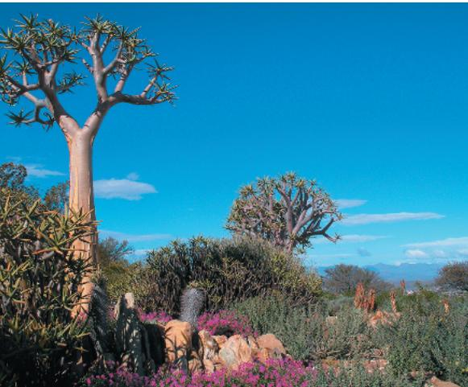

## Succulent Karoo, South Africa

In the Succulent Karoo desert region of southern Africa, as in many arid regions, overgrazing by livestock has damaged vast areas. Private landowners and government agencies in South Africa are restoring large areas of this unique region, revegetating the land and employing more sustainable resource management. The photo shows a small sample of the exceptional plant diversity of the Succulent Karoo; its 5,000 plant species include the highest diversity of succulent plants in the world.

## Maungatautari, New Zealand

Weasels, rats, pigs, and other introduced species pose a serious threat to New Zealand's native plants and animals, including kiwis, a group of flightless, ground-dwelling bird species. The goal of the Maungatautari restoration project is to exclude all exotic mammals from a 3,400-ha reserve located on a forested volcanic cone. A specialized fence around the reserve eliminates the need to continue setting traps and using poisons that can harm native wildlife. In 2006, a pair of critically endangered takahe (a species of flightless rail) were released into the reserve with the hope of reestablishing a breeding population of this colorful bird on New Zealand's North Island.

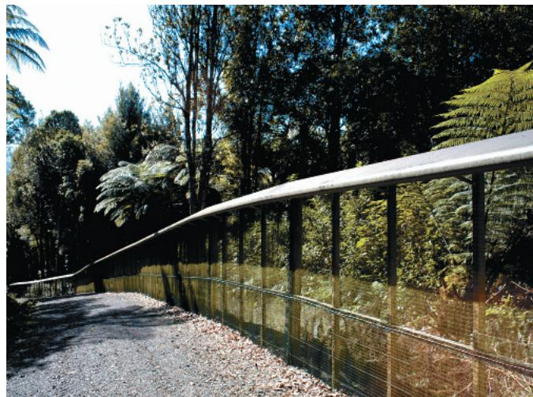

## Coastal Indonesia

Seaweed and seagrass beds are important nursery grounds for a wide variety of fishes and shellfish. Once extensive but now reduced by development, these beds are being restored in the coastal areas of

Indonesia. Techniques include constructing suitable seafloor habitat, hand seeding, and transplanting seaweeds and seagrasses from natural beds (shown in this photograph).

Ecologists already utilize many prokaryotic organisms to carry out bioremediation of soils and water. Scientists have sequenced the genomes of at least ten prokaryotic species specifically for their bioremediation potential. One of the species, the bacterium Shewanella oneidensis, appears particularly promising. It can metabolize a dozen or more elements under aerobic and anaerobic conditions. In doing so, it converts soluble forms of uranium, chromium, and nitrogen to insoluble forms that are less likely to leach into streams or groundwater. Researchers at Oak Ridge National Laboratory, in Tennessee, stimulated the growth of Shewanella and other uranium-reducing bacteria by adding ethanol to groundwater contaminated with uranium; the bacteria can use ethanol as an energy source. In just 5 months, the concentration of soluble uranium in the ecosystem dropped by 80% (Figure 55.18).

## Biological Augmentation

In contrast to bioremediation, which is a strategy for removing harmful substances from an ecosystem, biological augmentation uses organisms to add essential materials to a degraded ecosystem. To augment ecosystem processes, restoration ecologists need to determine which factors, such as chemical nutrients, have been lost from a system and are limiting its recovery.

Encouraging the growth of plants that thrive in nutrient-poor soils often speeds up succession and ecosystem recovery. In alpine ecosystems of the western United States, nitrogen-fixing plants such as lupines are often planted to raise nitrogen concentrations in soils disturbed by mining and other activities. Once these nitrogen-fixing plants become established, other native species are better able to obtain enough soil nitrogen to survive. In other systems where the soil has been severely disturbed or where topsoil is missing entirely, plant roots may lack the mycorrhizal symbionts that help them meet their nutritional needs (see Concept 31.1). Ecologists restoring a tallgrass prairie in Minnesota recognized this limitation and enhanced the recovery of native species by adding mycorrhizal symbionts to the soil they seeded.

Restoring the physical structure and plant community of an ecosystem does not always ensure that animal species will recolonize a site and persist there. Because animals provide critical ecosystem services, including pollination and seed dispersal, restoration ecologists sometimes help wildlife to reach and use restored ecosystems. They might release animals at a site or establish habitat corridors that connect a restored site to places where the animals are found. They may build perches for birds to use. These and other efforts can increase the biodiversity of restored ecosystems and help the community persist.

## Ecosystems: A Review

Figure 55.19, on the next two pages, illustrates energy transfer, nutrient cycling, and other key processes for an arctic tundra ecosystem. Note the conceptual similarities between this figure and

Figure 55.18 Bioremediation of groundwater contaminated with uranium at Oak Ridge National Laboratory, Tennessee.  
  
(a) Wastes containing uranium were dumped in these four unlined pits for more than 30 years, contaminating soils and groundwater.

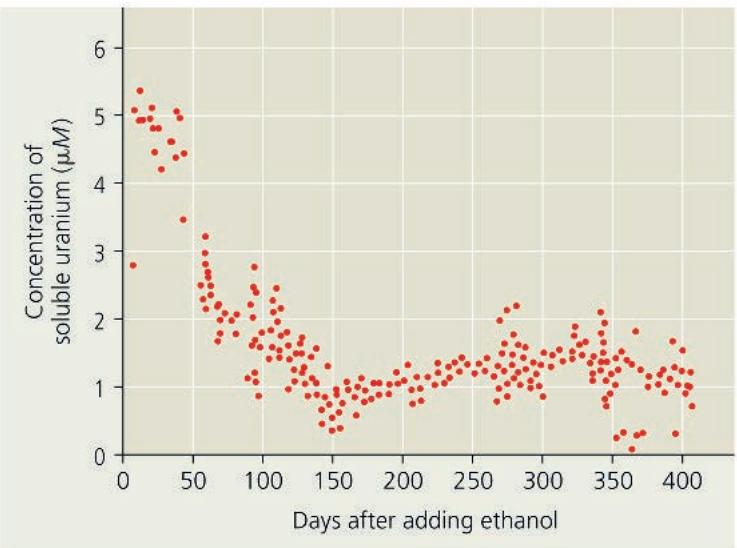  
(b) After ethanol was added, microbial activity decreased the concentration of soluble uranium in groundwater near the pits.

Make Connections Figure 10.22, “The Working Cell.” The scale of the two figures is different, but the physical laws and biological rules that govern life apply equally to both systems.

## Concept Check 55.5

1. Identify the main goal of restoration ecology.

2. How do bioremediation and biological augmentation differ?

3. WHAT IF? In what way is the Kissimmee River project a more complete ecological restoration than the Maungatautari project (see Figure 55.17)?

## Make Connections: The Working Ecosystem

Figure 55.19

This arctic tundra ecosystem teems with life during the short two-month growing season each summer. In ecosystems, organisms interact with each other and with the environment around them in diverse ways, including those illustrated here.

Populations Are Dynamic (Chapter 53)

1 Caribou migrate across the tundra to give birth at their calving grounds each year. In general, populations change in size through births and deaths and through immigration and emigration. (See Figure 53.1 and Concept 53.1.)

2 Snow geese and many other species migrate to the Arctic each spring for the abundant food found there in summer. (See Concept 53.5.)

3 Birth and death rates influence the density of all populations. Death in the tundra comes from many causes, including predation, competition for resources, and lack of food in winter. (See Figure 53.17.)

Species Interact in Diverse Ways (Chapter 54)

4 In predation, an individual of one species kills and eats another, such as an arctic fox eating a snow goose. (See Concept 54.1.)

5 In herbivory, an individual of one species eats part of a plant or other primary producer, such as a caribou eating a lichen. (See Concept 54.1.)

6 In mutualism, individuals of two species interact in ways that benefit each other. In some mutualisms, the partners live in direct contact, forming a symbiosis; for example, a lichen is a symbiotic mutualism between a fungus and an alga or cyanobacterium. (See Concept 54.1 and Figures 31.22 and 31.23.)

7 In competition, individuals of two species seek to acquire the same limiting resources. For example, snow geese and caribou both eat cottongrass. (See Concept 54.1.)

## Organisms Transfer Energy and Matter in Ecosystems (Chapter 55)

8 Primary producers convert the energy in sunlight to chemical energy through photosynthesis. Their growth is often limited by abiotic factors such as low temperatures, low moisture, scarce soil nutrients, and lack of light in winter. (See Figures 10.6, 52.14, and 55.4.)

9 Food chains are typically short in the tundra compared to most other ecosystems. (See Figure 54.16.) This short food chain means that a greater proportion of the energy contained in primary producers reaches the top predators (wolves), compared to a longer food chain.

10 Energy flows through ecosystems. Only 10% of the energy contained in biomass transfers from one trophic level to the next (see Figure 55.10), and this energy cannot be reused by primary producers. Solar energy must be supplied to power photosynthesis.

11 Decomposers recycle chemical elements back to primary producers. (See Figures 55.3 and 55.4.)

12 Chemical elements such as carbon and nitrogen move in cycles between the physical environment and organisms. (See Figures 55.13 and 55.14.)

## Summary of Key Concepts

To review key terms, go to the Vocabulary Self-Quiz (eTextbook only).

Concept 55.1: Physical laws govern energy flow and chemical cycling in ecosystems

\- An ecosystem consists of all the organisms in a community and the environment with which they interact. Energy is passed from lower to higher trophic levels but released as heat during ecosystem processes. As a result, energy flows through ecosystems (rather than being recycled).

\- Chemical elements enter and leave an ecosystem and cycle within it, subject to the law of conservation of mass. Inputs and outputs are generally small compared to recycled amounts, but their balance determines whether the ecosystem gains or loses an element over time.

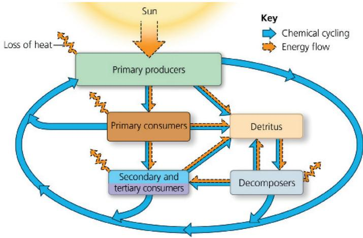

Considering the second law of thermodynamics, would you expect the typical biomass of primary producers in an ecosystem to be greater than or less than the biomass of consumers in the system? Explain your reasoning.

## Concept 55.2: Energy and other limiting factors control primary production in ecosystems

\- Primary production sets the spending limit for the global energy budget. Gross primary production is the total energy assimilated by an ecosystem in a given period. Net primary production, the energy accumulated in autotroph biomass, equals gross primary production minus the energy used by the primary producers for respiration. Net ecosystem production is the total biomass accumulation of an ecosystem, defined as the difference between gross primary production and total ecosystem respiration.

\- In aquatic ecosystems, light and nutrients limit primary production. In terrestrial ecosystems, climatic factors such as temperature and moisture affect primary production at large scales, but a soil nutrient is often the limiting factor locally.

If you know NPP for an ecosystem, what additional variable do you need to know to estimate NEP? Why might measuring this variable be difficult, for instance, in a sample of ocean water?

## Concept 55.3: Energy transfer between trophic levels is typically only 10% efficient

\- The amount of energy available to each trophic level is determined by the net primary production and the trophic efficiency, the percentage of energy transferred from one trophic level to the next.

\- Trophic efficiency is based on 1) the proportion of food available that is consumed by the next trophic level, 2) the proportion of food eaten that is assimilated, and 3) the production efficiency (proportion of assimilated energy that is converted to biomass).

\- Trophic efficiency is typically 10%. Pyramids of energy and biomass reflect low trophic efficiency.

  
Why would runners have a lower production efficiency when running a long-distance race than when they are sedentary?

## Concept 55.4: Biological and geochemical processes cycle nutrients and water in ecosystems

\- Water moves in a global cycle driven by solar energy. The carbon cycle primarily reflects the reciprocal processes of photosynthesis and cellular respiration. Nitrogen enters ecosystems through atmospheric deposition and nitrogen fixation by prokaryotes.

\- The proportion of a nutrient in a particular form varies among ecosystems. In terrestrial ecosystems, this variation is largely because of differences in the rate of decomposition. In aquatic ecosystems, the amount of nutrients being supplied to the photic zone via coastal runoff, or from deep waters (via seasonal mixing of the water column or upwelling), is one of the most important controls of primary production.

\- Nutrient cycling is strongly regulated by vegetation. The Hubbard Brook case study showed that logging increases water runoff and can cause large losses of minerals.

If decomposers usually grow faster and decompose material more quickly in warmer ecosystems, why is decomposition in hot deserts relatively slow?

## Concept 55.5: Restoration ecologists return degraded ecosystems to a more natural state

\- Restoration ecologists harness organisms to detoxify polluted ecosystems through the process of bioremediation.

\- In biological augmentation, ecologists use organisms to add essential materials to ecosystems.

In preparing a site for surface mining and later restoration, why would engineers separate the topsoil from the deeper soil, rather than removing all soil at once and mixing it in a single pile?

For suggested answers, see Appendix A.

## Test Your Understanding

For more multiple-choice questions, go to the Practice Test (eTextbook only).

## Levels 1-2: Remembering/Understanding

1. Which of the following organisms is correctly paired with a trophic level?

(A) cyanobacterium—secondary consumer

(B) grasshopper—primary consumer

(C) zooplankton—primary producer

(D) grass—decomposer

2. Which of these ecosystems has the lowest net primary production per square meter?
(A) a salt marsh (C) a coral reef
(B) an open ocean (D) a tropical rain forest

3. The discipline that applies ecological principles to returning degraded ecosystems to a more natural state is known as (A) restoration ecology. (C) eutrophication. (B) thermodynamics. (D) biogeochemistry.

## Levels 3-4: Applying/Analyzing

4. Nitrifying bacteria participate in the nitrogen cycle mainly by (A) converting nitrogen gas to ammonia.

(B) releasing ammonium from organic compounds, thus returning it to the soil.

(C) converting ammonium to nitrate, which plants absorb.

(D) incorporating nitrogen into amino acids and organic compounds.

5. Which of the following marine areas would you expect to have the lowest primary production?

(A) offshore in the tropical South Pacific in July

(B) ten miles off the coast of Peru in the Pacific in November (C) the Grand Banks, a relatively shallow area off the east coast of Canada, in April

(D) the Southern Ocean in January

6. Which of the following was a result of the Hubbard Brook watershed deforestation experiment?

(A) Most minerals were not recycled within the intact forest ecosystem.

(B) Calcium levels remained high in the soil of deforested areas.

(C) Deforestation decreased water runoff.

(D) The nitrate concentration in waters draining the deforested area became dangerously high.

(A) adding nitrogen-fixing microorganisms to a degraded ecosystem to increase nitrogen availability

(B) using a bulldozer to regrade a strip mine

(C) reconfiguring the channel of a river

(D) adding seeds of a chromium-accumulating plant to soil contaminated by chromium

8. If you applied a fungicide to a cornfield, what would you expect to happen to the rate of decomposition and net ecosystem production (NEP)?

(A) Both decomposition rate and NEP would decrease.

(B) Neither would change.

(C) Decomposition rate would increase and NEP would decrease.

(D) Decomposition rate would decrease and NEP would increase.

## Levels 5-6: Evaluating/Creating

## 9. DRAW IT

(a) Draw a simplified global water cycle showing ocean, land, atmosphere, and runoff from the land to the ocean. Label your drawing with these annual water fluxes:

• ocean evaporation: 425 km $^{3}$

\- ocean evaporation that returns to the ocean as precipitation: 385 km $^{4}$

\- ocean evaporation that falls as precipitation on land: $40 \, km^{3}$

\- evapotranspiration from plants and soil that falls as precipitation on land: 70 km $^{3}$

• runoff to the oceans: 40 km $^{3}$

(b) Calculate the ratio of ocean evaporation that falls as precipitation on land compared with runoff from land to the oceans.

(c) How would this ratio change during an ice age, and why?

10. WHAT IF? Consider a comparison of two marine ecosystems. One ecosystem has three trophic levels: large phytoplankton, plankton-eating fish, and large fish that eat other fish. The other ecosystem has five trophic levels: small phytoplankton, small herbivorous zooplankton, large carnivorous zooplankton, plankton-eating fish, and large fish that eat other fish. If both ecosystems have similar primary production and similar trophic efficiency, how will these ecosystems differ in biomass of top predators? Explain.

11. EVOLUTION CONNECTION Some biologists have suggested that ecosystems are emergent, “living” systems capable of evolving. One manifestation of this idea is environmentalist James Lovelock’s Gaia hypothesis, which views Earth itself as a living, homeostatic entity—a kind of superorganism. Are ecosystems capable of evolving? If so, would this be a form of Darwinian evolution? Why or why not? Explain.

12. SCIENTIFIC INQUIRY Using six comparable neighboring ponds in a forest as your study site, design a controlled experiment to measure the effect of falling leaves on net primary production in a pond.

## 13. WRITE ABOUT A THEME: ENERGY AND MATTER

Decomposition typically occurs quickly in moist tropical forests. However, waterlogging in the soil of some moist tropical forests results over time in a buildup of organic matter called “peat.” In a short essay (100–150 words), discuss the relationship of net primary production, net ecosystem production, and decomposition for such an ecosystem. Are NPP and NEP likely to be positive? Predict what would happen to NEP if a landowner drained the water from a tropical peatland, exposing the organic matter to air.

## 14. SYNTHESIZE YOUR KNOWLEDGE

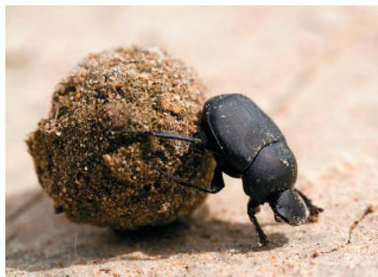  
This dung beetle (genus Scarabaeus) is burying a ball of dung it has collected from a large mammalian herbivore in Kenya. Explain why this process is important for the cycling of nutrients and for primary production.  
For selected answers, see Appendix A.

# Conservation Biology and Global Change

## Key Concepts

56.1 Human activities threaten Earth's biodiversity

56.2 Population conservation focuses on population size, genetic diversity, and critical habitat

56.3 Landscape and regional conservation help sustain biodiversity

56.4 Earth is changing rapidly as a result of human actions

56.5 Sustainable development can improve human lives while conserving biodiversity

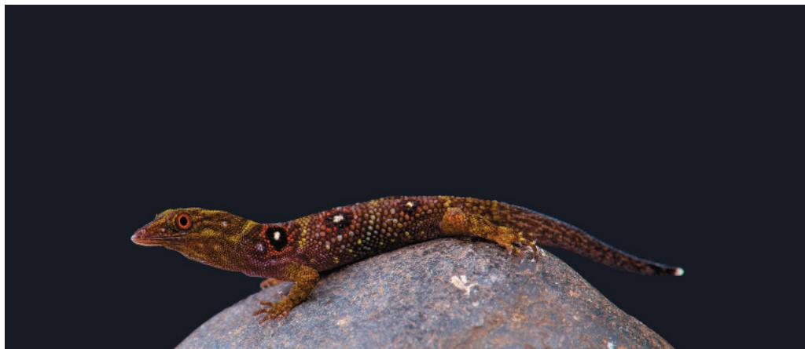

## Study Tip

Make a table: As you read the chapter, fill in a table like the one shown to organize what you learn about human activities that have major effects on the environment. Describe the activity; summarize its impact; and list actions at personal and government levels that could reduce harmful effects of the activity.

<table><tr><td>Activity</td><td>Harmful effects</td><td>Personal choice/governmental action</td></tr><tr><td>Cutting down tropical forests (often for cattle ranches)</td><td>Destroys habitat for tropical species; contributes to rising  $CO_{2}$  levels</td><td>Eat less beef to reduce demand/establish conservation areas</td></tr><tr><td></td><td></td><td></td></tr></table>

Figure 56.1 This vibrantly patterned lizard, the Union Island gecko (Gonatodes daudini), was discovered in 2005 and is known only from one watershed on the small Caribbean island of Union (in Saint Vincent and the Grenadines). Unfortunately, the gecko's population dwindled soon after its discovery due to trafficking for the exotic pet trade. The local community, in partnership with the government and several non-governmental organizations, sprang into action to increase protection for the gecko. The population has since been increasing, though it is still considered critically endangered.  
Restore or preserve habitat that species need to survive

## How can we protect the many species threatened by human activities?

  
Prevent the introduction of non-native species, and manage introduced species to reduce their impact  
Combat climate change and other types of human-caused, global environmental change  
Establish regional networks of protected areas

# Concept 56.1: Human activities threaten Earth's biodiversity

Throughout the biosphere, human activities are altering natural disturbances, trophic structures, energy flow, and chemical cycling—ecosystem processes on which we and all other species depend. We have physically altered nearly half of Earth's land surface, and we use over half of all accessible surface fresh water. In the oceans, stocks of most major fisheries are shrinking because of overharvesting. By some estimates, we may be pushing more species toward extinction than did the asteroid that triggered the Cretaceous mass extinction 66 million years ago (see Figure 25.18).

In this chapter, we'll examine changes happening across Earth, focusing on conservation biology, a discipline that integrates ecology, physiology, molecular biology, genetics, and evolutionary biology to conserve the diversity of life on Earth. Efforts to sustain ecosystem processes and stem the extinction of species also connect the life sciences with the social sciences, economics, and humanities.

Extinction is a natural phenomenon that has been occurring since life first evolved; it is the high rate of extinction that is of concern. More than 1,000 species have become extinct in the last 400 years, a rate that is 100 to 1,000 times the “background,” or typical, extinction rate seen in the fossil record (see Concept 25.4). This comparison indicates that the extinction rate today is high and that human activities threaten Earth’s biological diversity at all levels.

## Three Levels of Biodiversity

Biodiversity—short for biological diversity—can be considered at three main levels: genetic diversity, species diversity, and ecosystem diversity (Figure 56.2).

## Genetic Diversity

Genetic diversity comprises not only the individual genetic variation within a population, but also genetic differences between populations of a species—differences that often are associated with adaptations to local conditions. If one population becomes extinct, then a species may have lost some of the genetic diversity that makes microevolution possible. This erosion of genetic diversity in turn reduces the adaptive potential of the species.

## Species Diversity

Public awareness of the biodiversity crisis centers on species diversity, which correlates with species richness—the number of species in an ecosystem or across the biosphere. To date, scientists have described and formally named about 1.8 million species of organisms. In addition to these named species, many others remain to be discovered: Estimates for the number of species that currently exist range from 5 million to 100 million.

Figure 56.2 Three levels of biodiversity.

The oversized chromosomes in the top diagram symbolize the genetic variation within the population.

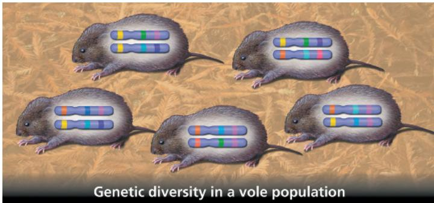  
Genetic diversity in a vole population

  
Species diversity in a coastal redwood ecosystem

  
Community and ecosystem diversity across the landscape of an entire region

Of particular concern are species that are endangered or threatened. An endangered species is one that is in danger of extinction throughout all or much of its range (Figure 56.3), while a threatened species is considered likely to become endangered in the near future. The following are just a few statistics that illustrate the problem of species loss:

\- As of 2024, according to the International Union for Conservation of Nature and Natural Resources (IUCN), more than 46,300 species (28% of species assessed) are threatened with extinction. Some of the groups with the greatest proportion of threatened species include cycad plants (71%), amphibians (41%), cartilagenous fishes (37%), and reef-building corals (44%).

\- A survey by the Center for Plant Conservation showed that of the nearly 20,000 known plant species in the United States, 200 have become extinct since such records have been kept, and 730 are endangered or threatened.

Figure 56.3 Critically Endangered species.

The International Union for the Conservation of Nature (IUCN)'s Red List of Threatened Species is the most comprehensive list of the conservation status of species around the globe. The species pictured are among those listed as Critically Endangered, the highest threat level for species still present in the wild.

Great Philippine eagle (Pithecophaga jefferyi)

Vaquita (Phocoena sinus)

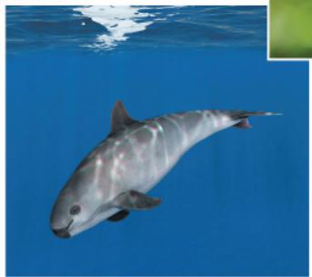  
Caribbean staghorn coral (Acropora cervicornis)

  
To document that a species has actually become extinct, what factors would you need to consider?

## Interview

Interview with Elisa Bonaccorso: Identifying endangered species in the Andes (at the start of Unit 8, before Chapter 52)

\- In North America, at least 123 freshwater animal species have become extinct since 1900, and hundreds more species are threatened. The extinction rate for North American freshwater fauna is about five times as high as that for terrestrial animals.

The local populations of a species can also be driven to extinction; for example, populations of a species may be lost in one river system but survive in an adjacent one. Global extinction of a species means that it is lost from all the ecosystems in which it lived, leaving them permanently impoverished. Because of the many interactions between members of different species in an ecosystem, the extinction of populations of one species can have a negative impact on other species in the ecosystem (see Figure 54.20). For instance, bats called “flying foxes” are important pollinators and seed dispersers in the Pacific Islands, where they are increasingly hunted as a luxury food (Figure 56.4). Conservation biologists fear that the extinction of flying foxes would also harm the native plants of the Samoan Islands, where four-fifths of the tree species depend on flying foxes for pollination or seed dispersal.

Figure 56.4 The endangered Marianas “flying fox” bat (Pteropus mariannus), an important pollinator.  

## Ecosystem Diversity

The variety of ecosystems on Earth is a third level of biological diversity. Preserving many types of ecosystems leads to greater regional diversity, and it may be critical to the success of some species that migrate between ecosystems during their lives. For example, mangrove forests are an important coastal ecosystem in tropical regions, with high productivity and diversity. Since coral reef fishes spend their juvenile stages in mangrove habitats, the loss of mangroves (due to logging, or for prawn aquaculture) leads not only to species loss in the mangrove forests, but also in nearby coral reef ecosystems.

Some ecosystems have already been heavily affected by humans, and others are being altered at a rapid pace. Since European colonization, more than half of the wetlands in the contiguous United States have been drained and converted to agricultural and other uses. In California, Arizona, and New Mexico, roughly 90% of native riparian (streamside) communities have been affected by overgrazing, flood control, water diversions, lowering of water tables, and invasion by non-native plants.

## Biodiversity and Human Welfare

Why should we care about the loss of biodiversity? One basic reason concerns our human sense of connection to nature and all forms of life, termed biophilia. Moreover, the belief that other species are entitled to life is a pervasive theme of many religions and the basis of a moral argument that we should protect biodiversity. There is also a concern for future human generations. Paraphrasing an old proverb, G. H. Brundtland, a former prime minister of Norway, said, “We must consider our planet to be on loan from our children, rather than being a gift from our ancestors.” In addition to such philosophical and moral justifications, species and genetic diversity bring us many practical benefits.

## Benefits of Species and Genetic Diversity

Many threatened species could potentially provide medicines, food, and fibers for human use, making biodiversity a crucial natural resource. Products from aspirin to antibiotics were derived originally from natural sources. If we lose wild populations of plants closely related to agricultural species, we lose genetic resources that could be used to improve crop qualities, such as disease resistance. For instance, in the 1970s, plant breeders responded to devastating outbreaks of the grassy stunt virus in rice (Oryza sativa) by screening 7,000 populations of this species and its close relatives for resistance to the virus. One population of a single relative, Indian rice (Oryza nivara), was found to be resistant to the virus, and scientists succeeded in breeding the resistance trait into commercial rice varieties. Today, the original disease-resistant population has apparently become extinct in the wild.

In the United States, about 25% of the prescriptions dispensed from pharmacies contain substances originally derived from plants. For example, researchers discovered that the rosy periwinkle, which grows in Madagascar, contains alkaloids that inhibit cancer cell growth (Figure 56.5). This discovery led to treatments for two

Figure 56.5 The rosy periwinkle (Catharanthus roseus), a plant that saves lives.

deadly forms of cancer, Hodgkin's lymphoma and childhood leukemia, resulting in remission in most cases. Madagascar is also home to five other species of periwinkles, one of which is approaching extinction. Losing these species would mean the loss of any possible medicinal benefits they might offer.

Each species lost means the loss of unique genes, some of which may code for enormously useful proteins. The enzyme Taq polymerase was first extracted from a bacterium, Thermus

aquaticus, found in hot springs at Yellowstone National Park. This enzyme is essential for the polymerase chain reaction (PCR) because it is stable at the high temperatures required for automated PCR (see Figure 20.8). DNA from many other species of prokaryotic organisms, living in a variety of environments, is used in the mass production of proteins for new medicines, foods, petroleum substitutes, industrial chemicals, and other products. However, because many species may become extinct before we discover them, we stand to lose the valuable genetic potential held in their unique libraries of genes.

## Ecosystem Services

The benefits that individual species provide to humans are substantial, but saving individual species is only part of the reason for preserving ecosystems. Humans evolved in Earth's ecosystems, and we rely on these systems and their inhabitants for our survival. Ecosystem services encompass all the processes through which natural ecosystems benefit human life. Ecosystems purify our air and water. They detoxify and decompose our wastes and reduce the impacts of extreme weather and flooding. The organisms in ecosystems pollinate our crops, control pests, and create and preserve our soils. Moreover, these diverse services are provided for free.

If we had to pay for them, how much would the services of natural ecosystems be worth? In 1997, scientists estimated the value of Earth's ecosystem services at \$33 trillion per year, nearly twice the gross national product of all the countries on Earth at the time (\$18 trillion). It may be more realistic to do the accounting on a smaller scale. For example, New York City invested \$1.5 billion to buy land and restore habitat in the Catskill Mountains, the source of much of the city's fresh water. This investment was spurred by increasing pollution of the water by sewage, pesticides, and fertilizers. By harnessing ecosystem services to purify its water naturally, the city avoided spending \$2 billion to build new water treatment plants and \$300 million a year to run those plants.

There is growing evidence that the functioning of ecosystems, and hence their capacity to perform services, is linked to biodiversity. As human activities reduce biodiversity, we are reducing the capacity of the planet's ecosystems to perform processes critical to our own survival.

## Interview

Interview with E. O. Wilson: Advocate for protecting biodiversity (eTextbook only)

## Threats to Biodiversity

Many different human activities threaten biodiversity on local, regional, and global scales. The threats posed by these activities include four major types: habitat loss, introduced species, overharvesting, and global change.

## Habitat Loss

Human alteration of habitat is a very important threat to biodiversity throughout the biosphere. Habitat loss has been brought about by factors such as agriculture, urban development, forestry, mining, and pollution. As discussed in more detail later in this chapter, global climate change is also altering habitats today and will have an even larger effect later this century. When no alternative habitat is available or a species is unable to move, habitat loss may mean extinction.

Habitat loss and fragmentation may occur over immense regions. Approximately 98% of the tropical dry forests of Central America and Mexico have been cut down. The clearing of tropical rain forest in the state of Veracruz, Mexico, mostly for cattle ranching, has resulted in the loss of more than 90% of the original forest, leaving relatively small, isolated patches of forest. Many other natural habitats have also been fragmented by human activities (Figure 56.6).

Habitat fragmentation often reduces the number of species in a region because the smaller populations in habitat fragments have a higher probability of extinction. Prairie covered about 800,000 hectares of southern Wisconsin when Europeans first arrived in North America but occupies only 800 hectares today; most of the original prairie in this area is now used to grow crops. Plant diversity surveys of 54 Wisconsin prairie remnants conducted in 1948–1954 and 1987–1988 showed that the remnants lost from 8% to as much as 60% of their plant species in the time between the two surveys.

Figure 56.6 Habitat fragmentation near a coal mine in Alberta, Canada.

Organisms of the boreal forest are now confined to small forested areas separated by land cleared for mine operations.

  
Figure 56.7 Some disruptive introduced species in the United States.

Habitat loss is also a major threat to aquatic biodiversity. From 1957 to 2007, an estimated $50\%$ of the world's reef-building corals were lost due to overfishing, disease, and climate change. Since coral reefs are among Earth's most species-rich aquatic communities, such losses in corals lead to extinction of many fish and invertebrates that live in this habitat. In addition, since 2009, several mass bleaching events associated with warming temperatures have played an important role in a further loss of at least $14\%$ of the world's coral. Freshwater habitats are also being lost, often as a result of the dams, reservoirs, channel modification, and flow regulation now affecting most of the world's rivers. For example, the more than 30 dams and locks built along the Mobile River basin in the southeastern United States have changed river depth and flow. While providing the benefits of hydroelectric power and increased ship traffic, these dams and locks also helped drive more than 40 species of mussels and snails to extinction.

## Introduced Species

Introduced species—sometimes called non-native or exotic species—are those that humans move intentionally or accidentally from the species' native locations to new geographic regions. Human travel by ship and airplane has accelerated the transplant of species. Free from the predators, herbivores, pathogens, or competitors that limit their populations in their native habitats, such transplanted species may spread rapidly through a new region.

Some introduced species disrupt their new community, often by preying on native organisms or outcompeting native organisms for resources, at which point they are termed invasive species. For example, the brown tree snake was accidentally introduced to the island of Guam from other parts of the South Pacific after World War II, as a “stowaway” in military cargo. Since then, 12 native species of birds and 6 species of lizards that the snakes ate have become extinct on Guam. In 1988, the devastating zebra mussel, a suspension-feeding mollusc, was discovered in the Great Lakes of North America, most

likely introduced in the ballast water of ships arriving from Europe. Zebra mussels form dense colonies and have disrupted freshwater ecosystems, threatening native aquatic species (Figure 56.7a). They have also clogged water intake structures, causing billions of dollars in damage to domestic and industrial water supplies. The Burmese python, a snake native to Southeast Asia that can grow to 20 feet long, was introduced in Florida via the exotic pet trade (Figure 56.7b). By 2000, a large breeding population was established in the Everglades, where they prey on small mammals. One 2012 study estimated a 99% decline in populations of raccoons and opossums that coincided with the python invasion, as well as severe declines in several other species of small mammals.

Humans have deliberately introduced many species with good intentions but disastrous effects. An Asian plant called kudzu, which the U.S. Department of Agriculture once introduced in the southern United States to help control erosion, has taken over large areas of the landscape there (Figure 56.7c). The European starling was brought intentionally into New York's Central Park in 1890 by a citizens' group intent on introducing all the plants and animals mentioned in Shakespeare's plays. It quickly spread across North America, where its population now exceeds 100 million, displacing many native songbirds.

Introduced species are a worldwide problem, contributing to many extinctions and costing billions of dollars each year in damage and control efforts. There are more than 50,000 introduced species in the United States alone.

## Overharvesting

The term overharvesting refers generally to the harvesting of wild organisms at rates exceeding the ability of their populations to rebound. Species with restricted habitats, such as those

These Atlantic bluefin tuna are being funneled into fishing nets in the Mediterranean Sea.

that inhabit small islands, are particularly vulnerable to overharvesting. One such species was the great auk, a large, flightless seabird found on islands in the North Atlantic. By the 1840s, humans had hunted the great auk to extinction to satisfy demand for its feathers, eggs, and meat.

Also susceptible to overharvesting are large organisms with low reproductive rates, such as elephants, whales, sharks, and rhinoceroses. The decline of Earth's largest terrestrial animals, the African elephants, is a classic example of the impact of overhunting. Largely because of the trade in ivory, elephant populations have been declining in most of Africa for the last 50 years. An international ban on the sale of new ivory resulted in increased poaching (illegal hunting), so the ban had little effect in much of central and eastern Africa. From 2006 to 2015, the number of elephants dropped by 110,000, a $22\%$ decline (from 525,000 to 415,000). Only in South Africa, where once-decimated herds have been well protected for nearly a century, have elephant populations been stable or increasing (see Figure 53.8). If such protections are not extended to other regions, elephants could become extinct in the wild across most of Africa.

Conservation biologists are increasingly using the tools of molecular genetics to track the origins of tissues harvested from endangered species. For example, researchers have used DNA isolated from samples of elephant dung to construct a DNA reference map for the African savanna elephant (Loxodonta africana). By comparing this reference map with DNA isolated from ivory harvested legally or by poachers, they can determine to within a few hundred kilometers where the elephants were killed (Figure 56.8). Such work in Zambia suggested that poaching rates were 30 times higher than previously estimated, a finding that has stimulated improved anti-poaching efforts by the Zambian government. Similarly, biologists using phylogenetic analyses of mitochondrial DNA (mtDNA) showed that some whale meat sold in Japanese fish markets came from illegally

These severed tusks were part of an illegal shipment of ivory intercepted on its way from Africa to Singapore in 2002. DNA-based evidence showed that the thousands of elephants killed for the tusks came from a relatively narrow east-west band centered in Zambia rather than from across Africa.

  
MAKE CONNECTIONS Figure 26.6 describes a similar example in which conservation biologists used DNA analyses to compare harvested samples of whale meat with a reference DNA database. How are these examples similar, and how are they different? What limitations might there be to using such forensic methods in other suspected cases of poaching?

For suggested answer, see Appendix A.

Figure 56.8 Ecological forensics and elephant poaching.  
Figure 56.9 Overharvesting.  
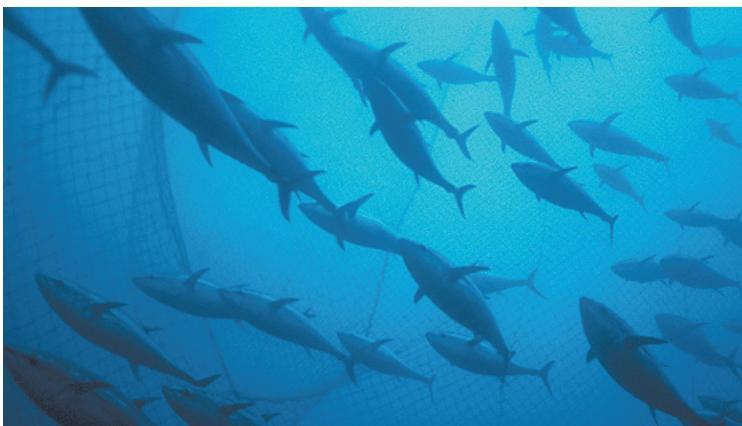

harvested species, including fin and humpback whales, which are endangered (see Figure 26.6).

Many commercially important fish populations, once thought to be inexhaustible, have been decimated by overfishing (Figure 56.9). Demands from a growing human population for protein-rich food, coupled with new harvesting technologies, such as long-line fishing and modern trawlers, have reduced these fish populations to levels that cannot sustain further exploitation. Until the past few decades, the Atlantic bluefin tuna was considered a sport fish of little commercial value—just a few cents per pound for use in cat food. In the 1980s, however, wholesalers began flying fresh, iced bluefin to Japan for sushi and sashimi. In that market, the fish can now bring over \$500 per pound. With increased harvesting spurred by such high prices, it took just 10 years to reduce the western Atlantic bluefin population to less than 20% of its 1980 size.

## Global Change

The fourth threat to biodiversity, global change, alters the fabric of Earth's ecosystems at regional to global scales. Global change includes alterations in climate, atmospheric and ocean chemistry, and broad ecological systems that reduce the capacity of Earth to sustain life.

One of the first types of global change to cause concern was acid precipitation, which is rain, snow, or fog with a pH less than 5.2. The burning of wood and fossil fuels releases oxides of sulfur and nitrogen that react with water in air, forming sulfuric and nitric acids. The acids eventually fall to Earth's surface, where they cause chemical reactions that decrease nutrient supplies and increase concentrations of toxic metals. These changes to the soil and water harm some terrestrial and aquatic organisms.

In the 1960s, ecologists determined that lake-dwelling organisms in eastern Canada were dying because of acid precipitation caused by air pollution from factories in the Midwestern United States. Newly hatched lake trout, for instance, die when the pH drops below 5.4. Similarly, lakes and streams in southern Norway and Sweden were losing fish because of pollution generated in Great Britain and central Europe. By 1980, the pH of precipitation in large areas of North America and Europe averaged 4.0–4.5 and sometimes dropped as low as 3.0. (To review pH, see Concept 3.3.)

Figure 56.10 Changes in the pH of precipitation at the Hubbard Brook Experimental Forest, New Hampshire.  
  
MAKE CONNECTIONS Describe the relationship between pH and acidity. (See Concept 3.3.) Overall, is the precipitation in this forest becoming more acidic or less acidic?  
For suggested answer, see Appendix A.

Environmental regulations and new technologies have enabled many countries to reduce sulfur dioxide emissions in recent decades. In the United States, sulfur dioxide emissions decreased more than 75% between 1990 and 2013, gradually reducing the acidity of precipitation (Figure 56.10). However, ecologists estimate that it will take decades for aquatic ecosystems to recover. Meanwhile, emissions of nitrogen oxides are increasing in the United States, and emissions of sulfur dioxide and acid precipitation continue to damage forests in central and eastern Europe.

We'll explore the importance of global change for Earth's biodiversity in more detail in Concept 56.4, where we examine such factors as climate change and ozone depletion.

## Can Extinct Species Be Resurrected?

To the best of our knowledge, extinction has always been forever. Some scientists are nevertheless trying to use cloning techniques (see Concept 20.3) to resurrect species that have become extinct. For example, researchers used this approach in an attempt to reverse the extinction of the Pyrenean ibex, Capra pyrenaica pyrenaica. In 1999, researchers removed a skin sample from the last living individual, a female, and froze it. When that individual died a year later, scientists used the frozen cells to try to produce more ibex. Eventually, one ibex was born in 2009. Sadly, it lived for only 7 minutes before succumbing to lung defects similar to those observed in other cloned animals.

More recently, researchers completed an early step toward the possible use of cloning to prevent the extinction of the northern white rhinoceros (Ceratotherium simum cottoni). The last C. simum cottoni male died in 2018—dooming the northern white rhinoceros to eventual extinction. That same year, researchers successfully

created hybrid embryos using sperm from northern white rhinoceroses and eggs from closely related southern white rhinoceroses, C. simum simum (the few living females from the northern subspecies all had severe reproductive issues).

Many steps remain before the northern white rhinoceros could be considered resurrected from extinction. Moreover, even if scientists eventually can resurrect one or a few species, that approach will not solve the extinction crisis we face today. To do that, we must take steps to clean up the environment and protect natural habitat for the thousands of species currently threatened by extinction.

## Concept Check 56.1

1. Explain why it is too narrow to define the biodiversity crisis as simply a loss of species.

2. Identify the four main threats to biodiversity and explain how each damages diversity.

3. WHAT IF? Imagine two populations of a fish species, one in the Mediterranean Sea and one in the Caribbean Sea. Now imagine two scenarios: (1) The populations breed separately, and (2) adults of both populations migrate yearly to the North Atlantic to interbreed. Which scenario would result in a greater loss of genetic diversity if the Mediterranean population were harvested to extinction? Explain your answer.

For suggested answers, see Appendix A.

## Concept 56.2: Population conservation focuses on population size, genetic diversity, and critical habitat

Biologists who work on conservation at the population and species levels use two main approaches. One approach focuses on populations that are small and hence often vulnerable, while the other emphasizes critical habitat.

## Extinction Risks in Small Populations

Small populations are particularly vulnerable to overharvesting, habitat loss, and the other threats to biodiversity that you read about in Concept 56.1. After such factors have reduced a population's size to a small number of individuals, the small size itself can push the population to extinction.

## The Extinction Vortex: Evolutionary Implications of Small Population Size

EVOLUTION A small population is vulnerable to inbreeding and genetic drift, which can draw the population down an extinction vortex toward smaller and smaller population size until no individuals survive (Figure 56.11). A key factor driving the extinction vortex is the loss of genetic variation. Recall from Concept 23.1

Figure 56.11 Processes driving an extinction vortex.  

that genetic variation is necessary for evolutionary responses to environmental change, such as the appearance of new strains of pathogens. Both inbreeding and genetic drift can cause a loss of genetic variation (see Concept 23.3), and their effects become more harmful as a population shrinks. Inbreeding often reduces fitness because offspring are more likely to be homozygous for harmful recessive traits.

Not all small populations are doomed by low genetic diversity, and low genetic variability does not automatically lead to permanently small populations. For instance, overhunting of northern elephant seals in the 1890s reduced the species to only 20 individuals—clearly a bottleneck with reduced genetic variation. Since that time, however, the northern elephant seal populations have rebounded to about 150,000 individuals today, though their genetic variation remains relatively low.

## Case Study: The Greater Prairie Chicken and the Extinction Vortex

When Europeans arrived in North America, the greater prairie chicken (Tympanuchus cupido) was common from New England to Virginia and across the western prairies of the continent. Land cultivation for agriculture fragmented the populations of this species, and its abundance decreased rapidly (see Figure 23.11). Illinois had millions of greater prairie chickens in the 19th century but fewer than 50 by 1993. Researchers found that the decline in the Illinois population was associated with reduced genetic variation and a decrease in fertility. As a test of the extinction vortex hypothesis, scientists increased genetic variation by importing 271 birds from larger populations elsewhere (Figure 56.12). The Illinois population rebounded, indicating that it had been on its way to extinction until rescued by the transfusion of genetic variation.

## Minimum Viable Population Size

How small does a population have to be before it starts down an extinction vortex? The answer depends on the type of organism,

## Figure 56.12

# Inquiry: What caused the drastic decline of the Illinois greater prairie chicken population?

Experiment

Researchers had observed that the population collapse of the greater prairie chicken was mirrored in a reduction in fertility, as measured by the hatching rate of eggs. Comparison of DNA samples from the Jasper County, Illinois, population with DNA from feathers in museum specimens showed that genetic variation had declined in the study population (see Figure 23.11). In 1992, researchers began translocating prairie chickens from neighboring states in an attempt to increase genetic variation.

## Results

After translocation (black arrow), the viability of eggs rapidly increased, and the population rebounded.

  
(a) Population dynamics

  
(b) Hatching rate. Bar height represents the average rate for the years spanned by the bar.

## Conclusion

Reduced genetic variation had started the Jasper County population of prairie chickens down the extinction vortex.

Data from R. L. Westemeier et al., Tracking the long-term decline and recovery of an isolated population, Science 282:1695–1698 (1998). © 1998 by AAAS. Reprinted with permission.

INQUIRY IN ACTION Read and analyze the original paper in Inquiry in Action: Interpreting Scientific Papers.

WHAT IF? Given the success of using transplanted birds as a tool for increasing the percentage of hatched eggs in Illinois, would you support transplanting additional birds to Illinois? Why or why not?
For suggested answer, see Appendix A.

but all populations require some minimum size to remain viable. The minimal population size at which a species is able to sustain its numbers is known as the minimum viable population (MVP). MVP is usually estimated for a given species using computer models that integrate many factors, including mean demographic rates (that is, birth and death rates) as well as chance events that impact population growth rate—for example, a natural catastrophe such as a storm that leads to unusually high mortality. Once in the extinction vortex, two or three consecutive years of bad weather could finish off a population that is already below its MVP.

## Effective Population Size

As we've discussed, genetic variation can be of considerable importance in small populations. The total size of a population may be misleading because only certain members of the population breed successfully and pass their alleles on to offspring. Therefore, a meaningful estimate of MVP requires the researcher to determine the effective population size, which is based on the breeding potential of the population.

The following formula illustrates one way to estimate the effective population size, abbreviated $N_{e}$ :

$$
N _ {\mathrm{e}} = \frac {4 N _ {\mathrm{f}} N _ {\mathrm{m}}}{N _ {\mathrm{f}} + N _ {\mathrm{m}}}
$$

where $N_{f}$ and $N_{m}$ are, respectively, the number of females and the number of males that successfully breed. If we apply this formula to an idealized population whose total size is 1,000 individuals, $N_{e}$ will also be 1,000 if every individual breeds and the sex ratio is 500 females to 500 males. In this case, $N_{\mathrm{e}} = (4 \times 500 \times 500)/(500 + 500) = 1,000$ . Any deviation from these conditions (not all individuals breed or there is not a 1:1 sex ratio) reduces $N_{e}$ . For instance, if the total population size is 1,000 but only 400 females and 400 males breed, then $N_{\mathrm{e}} = (4 \times 400 \times 400)/(400 + 400) = 800$ , or 80% of the total population size. Numerous factors can influence $N_{e}$ . As a result, alternative formulas for estimating $N_{e}$ have been developed to account for factors such as age at maturation, genetic relatedness among population members, the effects of gene flow, and population fluctuations.

In actual study populations, $N_{e}$ is always some fraction of the total population. Thus, simply determining the total number of individuals in a small population does not necessarily provide a good measure of whether the population is large enough to avoid extinction. Whenever possible, conservation programs attempt to sustain total population sizes that include at least the minimum viable number of reproductively active individuals. The conservation goal of sustaining effective population size ( $N_{e}$ ) above MVP stems from the concern that populations retain enough genetic diversity to adapt as their environment changes.

The MVP of a population is often used in population viability analysis. The objective of this analysis is to predict a population's chances for survival, usually expressed as a specific probability of survival, such as a $95\%$ chance, over a particular time interval, perhaps 100 years. Such modeling approaches allow conservation biologists to explore the potential consequences of alternative management plans.

Figure 56.13 Monitoring a grizzly bear population.

A scientist measures a tranquilized bear that has been fitted with a radio collar so that the bear's movements can be compared with those of other grizzlies in Yellowstone National Park.

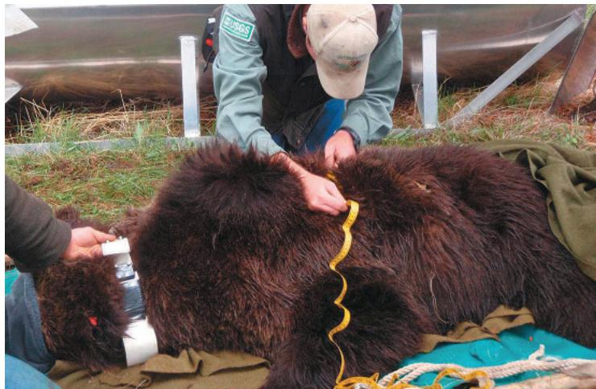

## Case Study: Analysis of Grizzly Bear Populations

One of the first population viability analyses was conducted in 1978 by Mark Shaffer as part of a long-term study of grizzly bears in Yellowstone National Park and its surrounding areas (Figure 56.13). A threatened species in the United States, the grizzly bear (Ursus arctos horribilis) is currently found in only 4 of the 48 contiguous states. Its populations in those states have been drastically reduced and fragmented. In 1800, an estimated 100,000 grizzlies ranged over about 500 million hectares of habitat, while today only 1,000 individuals in six relatively isolated populations range over less than 5 million hectares.

Shaffer attempted to determine viable sizes for the Yellowstone grizzly population. Using life history data obtained for individual Yellowstone bears over a 12-year period, he simulated the effects of environmental factors on survival and reproduction. His models predicted that, given a suitable habitat, a Yellowstone grizzly bear population of 70–90 individuals would have about a 95% chance of surviving for 100 years. A slightly larger population of only 100 bears would have a 95% chance of surviving for twice as long, about 200 years.

How does the actual size of the Yellowstone grizzly population compare with Shaffer's predicted MVP? A current estimate puts the total grizzly bear population in the greater Yellowstone ecosystem at about 700 individuals. The relationship of this estimate to the effective population size $(N_{\mathrm{e}})$ depends on several factors. Usually, only a few dominant males breed, and it may be difficult for them to locate females, since individuals inhabit such large areas. Moreover, females may reproduce only when there is abundant food. As a result, $N_{\mathrm{e}}$ is only about $25\%$ of the total population size, or about 175 bears.

Because small populations tend to lose genetic variation over time, researchers have used proteins, mitochondrial DNA, and short tandem repeats (see Concept 21.4) to assess genetic variability in the Yellowstone grizzly bear population. All results to date indicate that the Yellowstone population has less genetic variability than other grizzly bear populations in North America.

How might conservation biologists increase the effective size and genetic variation of the Yellowstone grizzly bear population? Migration between isolated populations of grizzlies could increase both effective and total population sizes. Computer models predict that introducing only two unrelated bears each decade into a population of 100 individuals would reduce the loss of genetic variation by about half. For the grizzly bear, and probably for many other species with small populations, finding ways to promote dispersal among populations may be one of the most urgent conservation needs.

This case study and that of the greater prairie chicken show how an understanding of the ecological and evolutionary consequences of small populations can have practical applications for conservation. Next, we look at an alternative approach to understanding the biology of extinction.

## Critical Habitat and Population Decline

A loss of critical habitat can cause threatened and endangered populations to show a downward trend, even if the population is far above its minimum viable population size. A focus on the importance of critical habitat emphasizes the environmental factors that can cause a population decline in the first place. If, for instance, an area is deforested, then species that depend on trees will decline in abundance, whether or not they retain genetic variation. The following case study illustrates how a critical-habitat approach has been applied to the conservation of an endangered species.

## Case Study: Decline of the Red-Cockaded Woodpecker

The red-cockaded woodpecker (Picoides borealis) is found only in the southeastern United States. It requires mature pine forests, preferably ones dominated by the longleaf pine, for its habitat. A critical-habitat factor for the red-cockaded woodpecker is that the undergrowth of plants around the pine trunks must be low (Figure 56.14a). Breeding birds tend to abandon nests when vegetation among the pines is thick and higher than about 4.5 m (Figure 56.14b); the birds appear to need a clear flight path between their home trees and the neighboring feeding grounds. Periodic fires have historically swept through longleaf pine forests, keeping the undergrowth low.

In addition, although most woodpecker species nest in dead trees, the red-cockaded woodpecker drills its nest holes in mature, living pine trees. It also drills small holes around the entrance to its nest cavity, which causes resin from the tree to ooze down the trunk. The resin seems to repel predators, such as corn snakes, that eat bird eggs and nestlings.

One factor leading to decline of the red-cockaded woodpecker has been the destruction or fragmentation of suitable habitats by logging and agriculture (Figure 56.15). By recognizing key habitat factors, protecting some longleaf pine forests, and using controlled fires to reduce forest undergrowth, conservation managers have helped restore habitat that can support viable populations.

Sometimes conservation managers also help species colonize restored habitats. Because red-cockaded woodpeckers take months to excavate nesting cavities, researchers performed an experiment to see whether providing cavities for the birds would make them more

Figure 56.14 A habitat requirement of the red-cockaded woodpecker.

  
(a) Forests that can sustain red-cockaded woodpeckers have low undergrowth.

  
(b) Forests that cannot sustain red-cockaded woodpeckers have high, dense undergrowth that interferes with the woodpeckers' access to feeding grounds.  
How is habitat disturbance absolutely necessary for the long-term survival of the woodpecker?

For suggested answer, see Appendix A.

## Figure 56.15 Decline of longleaf pine forests.

Fire suppression, logging, urban development, and other human activities have reduced longleaf pine forests to 3% of their original area; the covered area has not increased since 2004.

VISUAL SKILLS What edges between ecosystems do you observe in this photo? For suggested answer, see Appendix A.

likely to use a site. The researchers constructed cavities in pine trees at 20 sites. The results were dramatic. Cavities in 18 of the 20 sites were colonized by red-cockaded woodpeckers, and new breeding groups formed only in those sites. Based on this experiment, conservationists initiated a habitat maintenance program that included controlled burning and excavation of new nesting cavities, enabling this endangered species to begin to recover.

## Weighing Conflicting Demands

Determining population numbers and habitat needs is only part of a strategy to save species. Scientists also need to weigh a species' needs against other conflicting demands. Conservation biology often highlights the relationship between science, technology, and society. For example, an ongoing, sometimes bitter debate in the western United States pits habitat preservation for wolf, grizzly bear, and bull trout populations against job opportunities in the grazing and resource extraction industries. Programs that restocked wolves in Yellowstone National Park remain controversial for people concerned about human safety and for many ranchers concerned with potential loss of livestock outside the park.

Large, high-profile vertebrates are not always the focal point in such conflicts, but habitat use is almost always the issue. Should work proceed on a new highway bridge that benefits the local economy but destroys the only remaining habitat of a species of freshwater mussel? If you were the owner of a coffee plantation growing varieties that thrive in bright sunlight, would you be willing to change to shade-tolerant varieties that produce less coffee per hectare but can grow beneath trees that support large numbers of songbirds? Successful conservation efforts often strive for a “win-win” outcome: to protect both endangered species and jobs or other aspects of a region’s economy.

Another important consideration is the ecological role of a species. Because we cannot save every endangered species, we must determine which species are most important for conserving biodiversity as a whole. Identifying keystone species and finding ways to sustain their populations can be central to maintaining communities and ecosystems. In most situations, conservation biologists must also look beyond single species and consider the whole community and ecosystem as an important unit of biodiversity.

## Concept Check 56.2

1. How does the reduced genetic diversity of small populations make them more vulnerable to extinction?

2. If there were 100 greater prairie chickens in a population, and 30 females and 10 males bred, what would be the effective population size $N_{e}$ ?

3. WHAT IF? In 2005, at least ten grizzly bears in the greater Yellowstone ecosystem were killed through contact with people. Most of these deaths resulted from three things: collisions with automobiles, hunters (of other animals) shooting when charged by a female grizzly bear with cubs nearby, and conservation managers killing bears that attacked livestock repeatedly. If you were a conservation manager, what steps might you take to minimize such encounters in Yellowstone?

# Concept 56.3: Landscape and regional conservation help sustain biodiversity

Although conservation efforts have historically focused on saving individual species, efforts today often seek to sustain the biodiversity of entire communities, ecosystems, and landscapes. Such a broad view requires applying not just ecological principles, but aspects of human population dynamics and economics as well.

## Landscape Structure and Biodiversity

The biodiversity of a given landscape is heavily influenced by its physical features, or structure. Understanding landscape structure is critically important in conservation because many species use more than one kind of ecosystem, and many live on the borders between ecosystems.

## Fragmentation and Edges

The boundaries, or edges, between ecosystems—such as between a lake and the surrounding forest or between cropland and suburban housing tracts—are defining features of landscapes (Figure 56.16). An edge has its own set of physical conditions, which differ from those on either side of it. The soil surface of an edge between a forest patch and a burned area receives more sunlight and is usually hotter and drier than the forest interior, but it is cooler and wetter than the soil surface in the burned area.

Some organisms thrive in edge communities because they gain resources from both adjacent areas. The ruffed grouse

Figure 56.16 Natural edges between ecosystems in Siberia.  

(Bonasa umbellus) is a bird that needs forest habitat for nesting, winter food, and shelter, but it also needs forest openings with dense shrubs and herbs for summer food.

Ecosystems in which edges arise from human alterations often have reduced biodiversity and a preponderance of edge-adapted species. For example, white-tailed deer (Odocoileus virginianus) thrive in edge habitats, where they can browse on woody shrubs; deer populations often expand when forests are logged and more edges are generated. The brown-headed cowbird (Molothrus ater) is an edge-adapted species that lays its eggs in the nests of other birds, often migratory songbirds. Cowbirds need forests, where they can parasitize the nests of other birds, and open fields, where they forage on seeds and insects. Consequently, their populations are growing where forests are being cut and fragmented, creating more edge habitat and open land. Increasing cowbird parasitism and habitat loss are correlated with declining populations of several of the cowbird's host species.

The influence of fragmentation on the structure of communities has been explored since 1979 in the long-term Biological Dynamics of Forest Fragments Project. Located in the heart of the Amazon River basin, the study area consists of isolated fragments of tropical rain forest separated from surrounding continuous forest by distances of 80–1,000 m (Figure 56.17). Numerous researchers working on this project have clearly documented the effects of this fragmentation on organisms ranging from bryophytes to beetles to birds. They have consistently found that species adapted to forest interiors show the greatest declines when patches are the smallest, suggesting that landscapes dominated by small fragments will support fewer species.

## Corridors That Connect Habitat Fragments

In fragmented habitats, the presence of a movement corridor, a narrow strip or series of small clumps of habitat connecting

Figure 56.17 Amazon rain forest fragments created as part of the Biological Dynamics of Forest Fragments Project.  
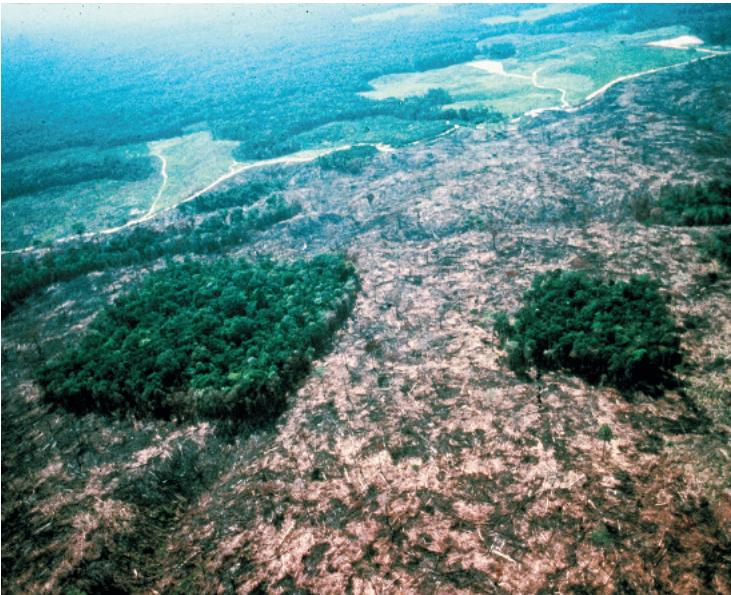

Figure 56.18 An artificial corridor.

This highway overpass in the Netherlands helps animals cross a human-created barrier.

otherwise isolated patches, can be important for conserving biodiversity. Movement corridors can promote dispersal and reduce inbreeding in otherwise isolated populations. Corridors have been shown to increase the exchange of individuals among populations of many organisms, including butterflies, voles, and aquatic plants. Corridors are also important to species that migrate between different habitats seasonally.

Some corridors occur naturally. For example, riparian habitats, the terrestrial habitats that occur at the edges of streams and rivers, often traverse many different landscapes and thereby provide a dispersal route for many species. For this reason, in some nations, government policy prohibits altering these habitats.

In areas of heavy human use, artificial corridors are sometimes constructed. Bridges or tunnels, for instance, can reduce the number of animals killed trying to cross highways and can increase gene flow across a divided landscape (Figure 56.18).

## Establishing Protected Areas

As of 2024, 17.6% of terrestrial/freshwater habitats and 8.4% of marine habitats worldwide are protected by some form of reserve, and there are strong efforts in the global community to reach the goal of protecting 30% of the world's ecosystems by 2030. Choosing where to place nature reserves and how to design them poses many challenges. Should the reserve be managed to minimize the risks of fire and predation to a threatened species? Or should the reserve be left as natural as possible, with such processes as fires ignited by lightning allowed to play out on their own? This is just one of the debates that arise among people who share an interest in the health of national parks and other protected areas.

## Preserving Biodiversity Hot Spots

In deciding which areas are of highest conservation priority, biologists often focus on hot spots of biodiversity. A biodiversity hot spot is a relatively small area with numerous endemic

Figure 56.19 Earth's terrestrial and marine biodiversity hot spots.  

species (species found nowhere else in the world) and a large number of endangered and threatened species (Figure 56.19). Nearly 30% of all bird species can be found in hot spots that make up only about 2% of Earth's land area. Together, the "hottest" of the terrestrial biodiversity hot spots total less than 1.5% of Earth's land but are home to more than a third of all species of plants, amphibians, reptiles (including birds), and mammals. Aquatic ecosystems also have hot spots, such as coral reefs and certain river systems.

Biodiversity hot spots are good choices for nature reserves, but identifying them is not always simple. One problem is that a hot spot for one taxonomic group, such as butterflies, may not be a hot spot for some other taxonomic group, such as birds. Designating an area as a biodiversity hot spot is often biased toward saving vertebrates and plants, with less attention paid to invertebrates and microorganisms. Some biologists are also concerned that the hot-spot strategy places too much emphasis on such a small fraction of Earth's surface.

Climate change makes the task of preserving hot spots even more challenging because the conditions that favor a particular community may not occur there in the future. The biodiversity hot spot in the southwest corner of Australia (see Figure 56.19) holds thousands of species of endemic (unique to that area) plants and many endemic vertebrates. Researchers recently concluded that between 5% and 25% of the plant species they examined may become extinct by 2080 because the plants will be unable to tolerate the increased dryness predicted for this region.

## Philosophy of Nature Reserves

Nature reserves are protected “islands” of biodiversity in a sea of habitat altered or degraded by human activity. An earlier policy—that protected areas should be set aside to remain unchanged forever—was based on the concept that ecosystems are balanced, self-regulating units. However, disturbance is common in all ecosystems (see Concept 54.3). Management policies that ignore disturbances or attempt to prevent them have generally failed. For instance, setting aside an area of a fire-dependent community, such as a portion of a tallgrass prairie, chaparral, or dry pine forest, with the intention of saving it is unrealistic if periodic burning is excluded. Without the dominant disturbance, the fire-adapted species are usually outcompeted and biodiversity is reduced.

An important conservation question is whether to create numerous small reserves or fewer large reserves. A network of small reserves may achieve the best conservation outcomes by protecting more types of habitats and providing more protection against entire species being decimated by a natural disaster or disease in one location. One argument for large reserves is that large, far-ranging animals with low-density populations, such as the grizzly bear, require extensive habitats. Large reserves

also have proportionately smaller perimeters than small reserves and are therefore less affected by edges.

As conservation biologists have learned more about the requirements for achieving minimum viable populations for endangered species, they have realized that most national parks and other reserves are far too small. The area needed for the long-term survival of the Yellowstone grizzly bear population, for instance, is more than 11 times the area of Yellowstone National Park. Therefore, areas of private and public land surrounding reserves will likely have to contribute to biodiversity conservation.

## Zoned Reserves

Several nations have adopted a zoned reserve approach to landscape management. A zoned reserve is an extensive region that includes areas relatively undisturbed by humans surrounded by areas that have been changed by human activity and are used for economic gain. The key challenge of the zoned reserve approach is to develop a social and economic climate in the surrounding lands that is compatible with the long-term viability of the protected core. These surrounding areas continue to support human activities, but regulations prevent the types of extensive alterations likely to harm the protected area. As a result, the surrounding habitats serve as buffer zones against further intrusion into the undisturbed area.

The Central American nation of Costa Rica has become a world leader in establishing zoned reserves. An agreement initiated in 1987 reduced Costa Rica's international debt in return for land preservation there. The country is now divided into 11 Conservation Areas, which include national parks and other protected areas, both on land and in the ocean (Figure 56.20). Costa Rica is making progress toward managing its zoned reserves, and the buffer zones provide a steady, lasting supply of forest products, water, and hydroelectric power while also supporting sustainable agriculture and tourism, both of which employ local people.

Costa Rica relies on its zoned reserve system to maintain at least 80% of its native species, but the system is not without

Figure 56.20 Protected areas in Costa Rica.

The boundaries of the 11 Conservation Areas are indicated by black outlines.

  
Figure 56.21 A diver measuring coral in the Florida Keys National Marine Sanctuary.

problems. A 2003 analysis of land cover change between 1960 and 1997 showed negligible deforestation within Costa Rica's national parks and a gain in forest cover in the 1-km buffer around the parks. However, significant losses in forest cover were discovered in the 10-km buffer zones around all national parks, threatening to turn the parks into isolated habitat islands.

Although marine ecosystems have also been heavily affected by human exploitation, reserves in the ocean are far less common than reserves on land. Many fish populations around the world have collapsed as increasingly sophisticated equipment puts nearly all potential fishing grounds within human reach. Networks of marine reserves can serve as a means of both increasing fish populations within the reserves and improving fishing success in nearby areas. This system is a modern application of a centuries-old practice in the Fiji Islands in which some areas have historically remained closed to fishing—a traditional example of the zoned reserve concept.

The United States adopted such a system in creating a set of 13 national marine sanctuaries, including the Florida Keys National Marine Sanctuary, which was established in 1990 (Figure 56.21). Populations of marine organisms, including fishes and lobsters, recovered quickly after harvests were banned in the 9,500-km $^{2}$ reserve. Larger and more abundant fish now produce larvae that help repopulate reefs and improve fishing outside the sanctuary. The increased marine life within the sanctuary also makes it a favorite for recreational divers, increasing the economic value of this zoned reserve.

## Urban Ecology

The zoned reserves that you just read about combine habitats that are relatively undisturbed by human activity with those that are used extensively by people for economic gain. Increasingly, ecologists are looking at species preservation even in the context of cities. The field of urban ecology examines organisms and their environment in urban settings.

For the first time in history, more than half of the people on Earth live in cities. By the year 2030, 5 billion people are expected to be living in urban environments. As cities expand in number and size, protected areas that were once outside city boundaries become incorporated into urban landscapes. Ecologists are now studying cities as ecological laboratories, seeking to balance species preservation and other ecological needs with the needs of people.

One critical area of research centers on urban streams, including the quality and flow of their water and the organisms living in them. Urban streams tend to rise and fall more quickly after rain than natural streams. This rapid change in water level occurs because of the concrete and other impervious surfaces in cities as well as the drainage systems that route water out of cities as quickly as possible to avoid flooding. Urban streams also tend to have higher concentrations of nutrients and contaminants and are often straightened or even channeled underground.

Near Vancouver, Canada, ecologists and volunteers have worked to restore a degraded urban stream, Guichon Creek. They stabilized its banks, removed introduced plants, and planted native trees and shrubs along the creek (Figure 56.22). Their efforts returned the water flow and the communities of invertebrates and fish in the stream much closer to what they had been 50 years before the stream became degraded. A few years ago, ecologists successfully reestablished cutthroat trout in the stream. The trout are now thriving.

As cities continue to expand into the landscapes around them, understanding the ecological effects of this expansion will only increase in importance. Research on and conservation of urban habitats will continue to grow.

Figure 56.22 Volunteers working to remove invasive species along the urban Guichon Creek.

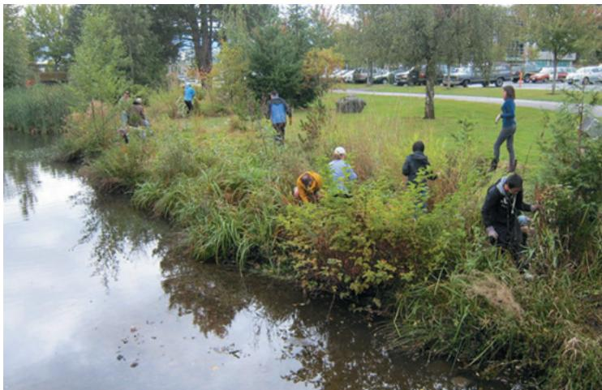

## Concept Check 56.3

1. What is a biodiversity hot spot?

2. How do zoned reserves provide economic incentives for long-term conservation of protected areas?

3. WHAT IF? Suppose a developer proposes to clear-cut a forest that serves as a corridor between two parks. To compensate, the developer also proposes to add the same area of forest to one of the parks. As a professional ecologist, how might you argue for retaining the corridor?

For suggested answers, see Appendix A.

# Concept 56.4: Earth is changing rapidly as a result of human actions

As we've discussed, landscape and regional conservation help protect habitats and preserve species. However, environmental changes that result from human activities are creating new challenges. As a consequence of human-caused climate change, for example, the place where a vulnerable species is found today may not be the same place that is needed for its preservation in the future. What would happen if many habitats on Earth changed so quickly that the locations of preserves today were unsuitable for their species in 10, 50, or 100 years? Such a scenario is increasingly possible.

The rest of this section describes four types of environmental change that humans are bringing about: nutrient enrichment, toxin accumulation, climate change, and ozone depletion. The impacts of these and other changes are evident not just in human-dominated ecosystems, such as cities and farms, but also in the most remote ecosystems on Earth.

## Nutrient Enrichment

Human activity often removes nutrients from one part of the biosphere and adds them to another. Someone eating broccoli in Washington, DC, consumes nutrients that only days before were in the soil in California; a short time later, some of these nutrients will be in the Potomac River, having passed through the person's digestive system and a local sewage treatment facility. Likewise, nutrients in farm soil may run off into streams and lakes,

depleting nutrients in one area, increasing them in another, and altering chemical cycles in both.

Farming illustrates how human activities can lead to nutrient enrichment. After vegetation is cleared from an area, the existing reserve of nutrients in the soil is depleted over time because many of these nutrients are exported from the area in crop biomass. How long this takes varies greatly. When some of the early North American prairie lands were first tilled, good crops could be produced for decades because the large store of organic materials in the soil continued to decompose and provide nutrients. By contrast, some cleared land in the tropics can be farmed for only 1 or 2 years because so little of the ecosystems' nutrient load is contained in the soil. Despite such variations, the natural store of nutrients eventually becomes exhausted.

Consider nitrogen, the main nutrient lost through agriculture (see Figure 55.14). Plowing mixes the soil and speeds up decomposition of organic matter, releasing nitrogen that is then removed when crops are harvested. Fertilizers containing nitrates and other forms of nitrogen that plants can absorb are used to replace the nitrogen that is lost. However, after crops are harvested, few plants remain to take up nitrates from the soil. As shown in Figure 55.15, without plants to absorb them, nitrates are often leached from the ecosystem.

Recent studies indicate that human activities have more than doubled Earth's supply of fixed nitrogen available to primary producers. Industrial fertilizers provide the largest additional nitrogen source. Fossil fuel combustion also releases nitrogen oxides, which enter the atmosphere and dissolve in rainwater; the nitrogen ultimately enters ecosystems as nitrate. Increased cultivation of legumes, with their nitrogen-fixing symbionts, is a third way in which humans increase the amount of fixed nitrogen in the soil.

A problem arises when the nutrient level in an ecosystem exceeds the critical load, the amount of added nutrient, usually nitrogen or phosphorus, that can be absorbed by plants without damaging ecosystem integrity. For example, nitrogenous minerals in the soil that exceed the critical load eventually leach into groundwater or run off into freshwater and marine ecosystems, contaminating water supplies and causing eutrophication in aquatic ecosystems (see Concept 55.2). Nitrate concentrations in groundwater are increasing in most agricultural regions, sometimes reaching levels that are unsafe for drinking.

Many rivers contaminated with nitrates and ammonium from agricultural runoff and sewage drain into the Atlantic Ocean, with the highest inputs coming from northern Europe and the central United States. The Mississippi River carries nitrogen pollution to the ocean, fueling a phytoplankton bloom each summer. When the phytoplankton die and sink below the thermocline, their

Figure 56.23 A dead zone arising from nitrogen pollution in the Mississippi basin. Each year, a large dead zone (a region where dissolved $O_{2}$ levels are less than 2.0 mg/L) forms offshore.  
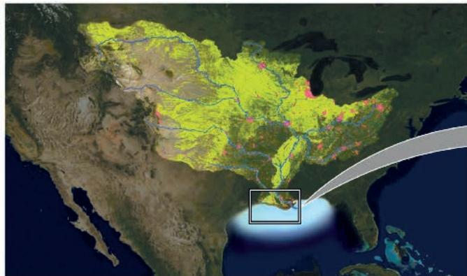  
(a) Nutrients drain from agricultural land (green) and cities (red) through the vast Mississippi watershed to the ocean.

decomposition by oxygen-using organisms results in an extensive “dead zone” of low oxygen levels along the coast (Figure 56.23). When this occurs, fish and other marine animals disappear from some of the most economically important waters in the United States. To reduce the size of the dead zone, farmers have begun using fertilizers more efficiently, and managers are restoring wetlands in the Mississippi watershed. The plants in these wetlands take up nutrients and therefore can reduce the nutrient load downstream.

Nutrient runoff can also lead to the eutrophication of lakes. The bloom and subsequent die-off of algae and cyanobacteria and the ensuing depletion of oxygen are similar to what occurs in a marine dead zone. Such conditions threaten the survival of many organisms. For example, eutrophication of Lake Erie coupled with overfishing wiped out commercially important fishes such as blue pike, whitefish, and lake trout by the 1960s. Since then, tighter regulations on the dumping of sewage into the lake have enabled some fish populations to rebound, but many native species of fish and invertebrates have not recovered.

## Toxins in the Environment

Humans release an immense variety of toxic chemicals, including thousands of synthetic compounds previously unknown in nature, with little regard for the ecological consequences. Organisms acquire toxic substances from the environment along with nutrients and water. Some of the poisons are metabolized or excreted, but others accumulate in specific tissues, often fat. One of the reasons accumulated toxins are particularly harmful is that they become more concentrated in successive trophic levels of a food web. This phenomenon, called biological magnification, occurs because the biomass at any given trophic level is produced from a much larger biomass ingested from the level below (see Concept 55.3). Thus, top-level carnivores tend to be most severely affected by toxic compounds in the environment. We'll discuss three types of environmental toxins: industrial compounds and pesticides, pharmaceuticals, and plastic waste.

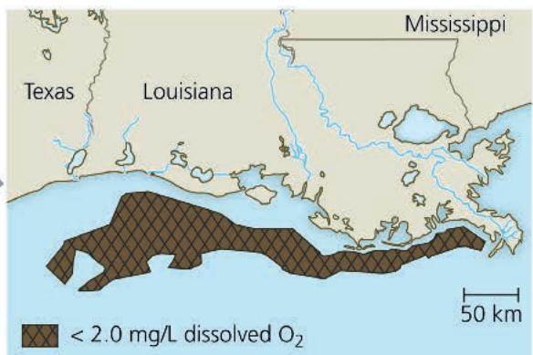  
(b) The 2017 dead zone, represented here, was the largest yet measured. It occupied 22,730 km $^{2}$ (8,776 mi $^{2}$ ), an area slightly larger than New Jersey.

## Industrial Compounds and Pesticides

Chlorinated hydrocarbons are a class of industrially synthesized compounds that have demonstrated biological magnification. Chlorinated hydrocarbons include the industrial chemicals called PCBs (polychlorinated biphenyls) and many pesticides, such as DDT. Current research implicates many of these compounds in endocrine system disruption in numerous animal species, including humans. Biological magnification of PCBs has been found in the food web of the Great Lakes, where the concentration of PCBs in herring gull eggs, at the top of the food web, is nearly 5,000 times that in phytoplankton, at the base (Figure 56.24).

An infamous case of biological magnification that harmed top-level carnivores involved DDT, a chemical used to control insects such as mosquitoes and agricultural pests. In the decade after World War II, the use of DDT grew rapidly. By the 1950s, scientists were learning that DDT persists in the environment and is transported by water to areas far from where it is applied. One of the first signs that DDT was a serious environmental problem was a decline in the populations of pelicans, ospreys, and eagles, birds that feed at the top of food webs. The accumulation of DDT (and DDE, a product of its breakdown) in the tissues of these birds interfered with the deposition of calcium in their eggshells. When the birds tried to incubate their eggs, the weight of the parents broke the shells of affected eggs, resulting in catastrophic declines in the birds' reproduction rates. Rachel Carson's book Silent Spring helped bring the problem to public attention in the 1960s (Figure 56.25), and DDT was banned in the United States in 1971. A dramatic recovery in populations of the affected bird species followed.

In much of the tropics, DDT is still used to control the mosquitoes that spread malaria and other diseases. Societies there face a trade-off between saving human lives and protecting other species. Moreover, resistance to DDT has evolved in many insect

Figure 56.24 Biological magnification of PCBs in a Great Lakes food web. (ppm = parts per million)

  
Calculate how much the PCB concentration increased at each step in the food web.  
For suggested answer, see Appendix A.

species, further complicating its use (for a specific example, see Chapter Review question 7 in Chapter 22). Overall, the best approach seems to be to apply DDT sparingly and to couple its use with mosquito netting and other low-technology solutions.

Figure 56.25 Rachel Carson.

Biologist and author Rachel Carson helped promote a new environmental ethic through her writing and her testimony before the U.S. Congress. Her efforts led to a ban on DDT use in the United States and stronger controls on the use of other chemicals.

## Pharmaceuticals

Chemicals used as medicines, called pharmaceuticals, make up another group of toxins in the environment, one that is a growing concern among ecologists. The use of over-the-counter and prescription drugs has risen in recent years, particularly in industrialized nations. People who consume such products excrete residual chemicals in their waste and may also dispose of unused drugs improperly, such as in their toilets or sinks. Drugs that are not broken down in sewage treatment plants may then enter rivers and lakes with the material discharged from these plants. Growth-promoting drugs and antibiotics given to farm animals can also enter rivers and lakes with agricultural runoff. As a consequence, many pharmaceuticals are spreading in low concentrations across the world's freshwater ecosystems (Figure 56.26).

Among the pharmaceuticals that ecologists are studying are the sex steroids, including forms of estrogen used for birth control. Some fish species are so sensitive to certain estrogens that concentrations of a few parts per trillion in their water can alter sexual differentiation and shift the female-to-male sex ratio toward females. Researchers in Ontario, Canada, conducted a 7-year experiment in which they applied the synthetic estrogen used in contraceptives to a lake in very low concentrations (5–6 ng/L). They found that chronic exposure

Figure 56.26 Sources and movements of pharmaceuticals in the environment.  
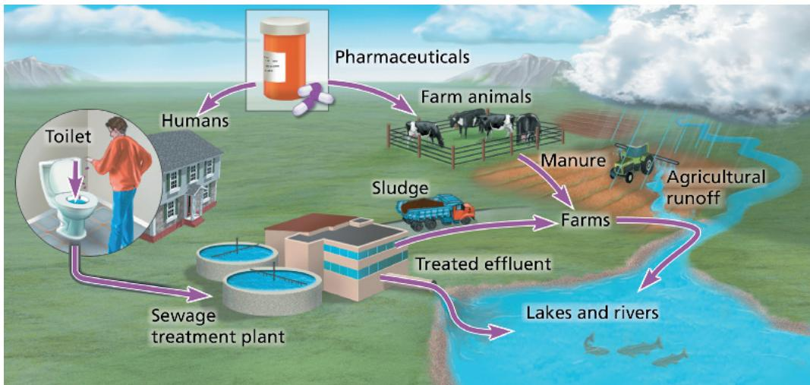

of the fathead minnow (Pimephales promelas) to the estrogen led to feminization of males, reproductive failure, and a near extinction of the population of this species from the lake.

## Plastic Waste

Plastics are synthetic compounds that typically are made from petroleum products, such as oil or natural gas. An estimated 4.8 to 12.7 million metric tons (11 to 28 billion pounds) of plastic waste enters the ocean each year, making plastics the most common type of marine debris.

Figure 56.27 A victim of plastic waste.

Found in a wildlife refuge in Hawaii, this Laysan albatross (Phoebastria immutabilis) chick died after consuming large amounts of plastic debris.

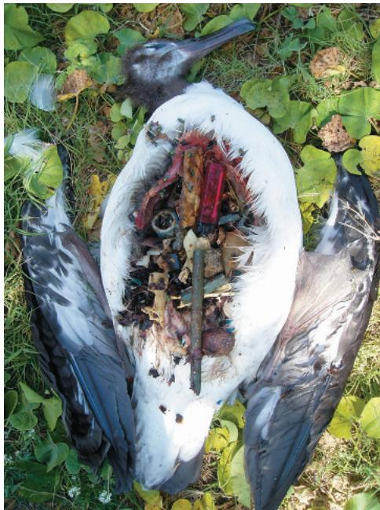

Over time, larger pieces of plastic waste are broken into successively smaller pieces by the actions of waves and by UV light, which breaks the bonds that hold plastic compounds together. As a result, the oceans are contaminated by large pieces of plastic and by microplastics, plastic particles less than 5 mm in size. Data suggest that plastic waste can persist in the environment for hundreds to thousands of years.

The enormous quantities of plastic waste in the oceans have wide-ranging effects. For example, birds, marine mammals, turtles, and fish can die after mistaking plastic debris for food (Figure 56.27). A 2018 study documented another effect: Coral reefs contaminated by plastic waste had much higher rates of disease than did reefs without plastic waste (Figure 56.28). What causes this dramatic rise in disease levels? Bacterial pathogens can “hitchhike” on plastic waste—so pieces of plastic waste may introduce new pathogens to a reef or increase the abundance of pathogens already present. In addition, plastic waste that becomes entangled on a reef can damage corals or deprive them of light and oxygen, making them more susceptible to pathogens.

As for microplastics, these small particles now contaminate all of the world's oceans and have been found in organisms from every type of marine food chain. While less is known about the extent to which microplastics contaminate terrestrial and freshwater ecosystems, current evidence indicates they are widespread there as well—they have been found in lakes, streams, soils, invertebrates, birds, and freshwater fish. Harmful effects of microplastics have been documented in some fish and invertebrates. They may also pose a threat to human health: Recent evidence indicates that people routinely eat and inhale microplastics. For example, microplastics have been found in supermarket fish, bottled water, beer, sea salt, and shellfish. Recent studies also have documented that microplastics are transported in the atmosphere, causing humans (and other animals) to inhale them when we breathe. Air transport also enables microplastics to be deposited all over the globe, even in the most remote locations.

Figure 56.28 Plastic waste and disease in corals.
A 2018 study found that the percentage of diseased corals increases 20-fold in reefs contaminated by plastic waste. The photo shows plastic waste on coral at one of the study sites.

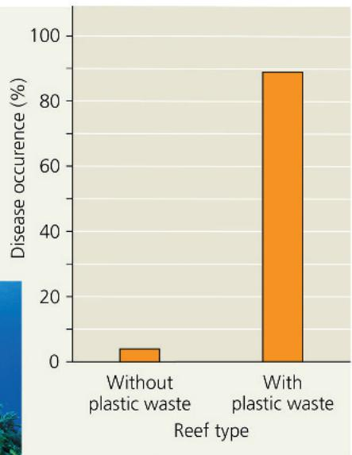

Research into the extent and effects of plastic waste is still in the early stages. Even so, it is clear that plastic waste is a major and growing environmental problem—one that will require new and innovative ways to reduce both the amount of plastic waste we generate and how much of that waste is mismanaged, thereby contaminating natural ecosystems.

## Interview

Interview with Chelsea Rochman: Studying the ecological effects of plastic waste (eTextbook only)

## Greenhouse Gases and Climate Change

Human activities release a variety of gaseous waste products. People once thought that the vast atmosphere could absorb these materials indefinitely, but we now know that our actions can lead to climate change, a directional change to the global climate that lasts for three decades or more (as opposed to short-term changes in the weather).

## Rising Atmospheric CO $_{2}$ Levels

To see how human actions can cause climate change, consider atmospheric $CO_{2}$ levels. Over the past 170 years, the concentration of $CO_{2}$ in the atmosphere has been increasing as a result of the burning of fossil fuels and deforestation. Scientists estimate that the average $CO_{2}$ concentration in the atmosphere before 1850 was about 274 ppm. In 1958, a monitoring station began taking accurate measurements on Hawaii's Mauna Loa peak, a location far from cities and high enough for the atmosphere to be well mixed. At that time, the average $\mathrm{CO}_{2}$ concentration was 315 ppm (Figure 56.29). By 2024, the $\mathrm{CO}_{2}$ level exceeded 422 ppm, an increase of more than $50\%$ since the mid-19th century. In the Scientific Skills Exercise, you can graph and interpret changes in $\mathrm{CO}_{2}$ concentration that occur over three 10-year periods of time.

The increase in the concentration of atmospheric $CO_{2}$ over the last 170 years concerns scientists because of its link to increased global temperature. Much of the solar radiation that strikes the planet is emitted toward space as infrared radiation (known informally as “heat radiation”). Although $CO_{2}$ , methane, water vapor, and other greenhouse gases in the atmosphere are transparent to visible light, they intercept and absorb much of the infrared radiation that Earth emits, radiating most of it back toward Earth. This process, called the greenhouse effect, retains some of the solar heat (Figure 56.30). If it were not for this greenhouse effect, the average air temperature at Earth’s surface would be a frigid $-18^{\circ}C$ ( $-0.4^{\circ}F$ ), and most life as we know it could not exist.

As the concentrations of $CO_{2}$ and other greenhouse gases rise, more solar heat is retained, thereby increasing the temperature of our planet. So far, Earth has warmed by an average of $1.15^{\circ}C$ ( $2.07^{\circ}F$ ) since 1900, with 2014–2023 being the warmest years on record, as of 2024 (see Figure 56.29).

As our planet warms, the climate is changing in other ways as well: Wind and precipitation patterns are shifting, and extreme weather events (such as droughts, heat waves, and hurricanes) are occurring more often. How are such changes to the global climate affecting life on Earth?

## Figure 56.29 Increase in atmospheric carbon dioxide concentration at Mauna Loa, Hawaii, and average global temperatures.

Aside from normal seasonal fluctuations, the $CO_{2}$ concentration (blue curve) increased steadily since 1958. Though average global temperatures (red curve) fluctuated a great deal over time, there is a clear warming trend.

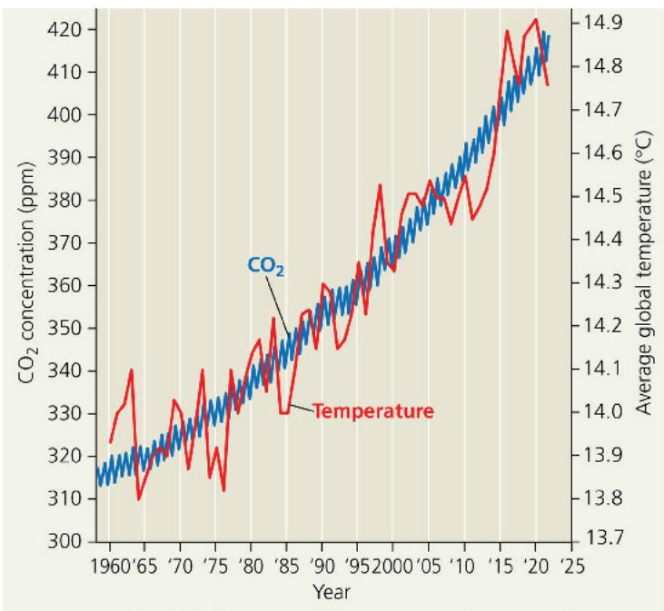

## Biological Effects of Climate Change

Many organisms, especially those such as plants that cannot disperse rapidly over long distances, may not be able to survive the rapid warming and changing precipitation patterns projected to occur over the next century. Furthermore, many habitats today are more fragmented than ever, further limiting the ability of many organisms to migrate. Indeed, the climate change that has occurred to date has already altered the geographic ranges of hundreds of species, in some cases leading to declining population sizes and shrinking geographic ranges (see Concept 52.1). For example, a recent study of 67 species of bumblebees found that on average, the geographic ranges of these important pollinators have decreased in size as the climate has warmed since 1900. Several other observed effects of climate change are discussed in Figure 56.31, on the next two pages.

Figure 56.30 The greenhouse effect.

Carbon dioxide and other greenhouse gases in the atmosphere absorb heat emitted from Earth's surface and then radiate much of that heat back to Earth.

① Some of the incoming solar radiation is reflected back to space, but most passes through the atmosphere to reach Earth's surface.

  
4 Of the heat emitted from Earth, some escapes to space. Much of the rest is absorbed by greenhouse gases and radiated back toward Earth, thereby trapping heat.  
2 Of the radiation that reaches Earth's surface, some is reflected back to space. Much of the rest is absorbed, warming Earth's surface.  
3 Some of the energy that warms the surface is then emitted from Earth as heat.

Resin canal

## Make Connections: Climate Change Has Effects at All Levels of Biological Organization

Figure 56.31

The burning of fossil fuels by humans has caused atmospheric concentrations of carbon dioxide and other greenhouse gases to rise dramatically (see Figure 56.29). This, in turn, is changing Earth's climate: The planet's average temperature has increased by about $1^{\circ}\mathrm{C}$ since 1900, and extreme weather events are occurring more often in some regions of the globe. How are these changes affecting life on Earth today?

## Effects on Cells

Temperature affects the rates of enzymatic reactions (see Figure 8.17), and as a result, the rates of DNA replication, cell division, and other key processes in cells are affected by rising temperatures.

Global warming and other aspects of climate change have also impaired some organisms' defense responses at the cellular level. For example, in the vast coniferous forests of western North America, climate change has reduced the ability of pine trees to defend themselves against attack by the mountain pine beetle (Dendroctonus ponderosae).

Pine defenses include specialized resin cells that secrete a sticky substance (resin) that can entrap and kill mountain pine beetles. Resin cells produce less resin in trees that are stressed by rising temperatures and drought conditions.

## Resin cells

## 100 μm

When beetles overwhelm a tree's cellular defenses, they produce large numbers of offspring that tunnel through the wood, causing extensive damage. Rising temperatures have shortened how long it takes beetles to mature and reproduce, resulting in even more beetles. The beetles can also infect the tree with a harmful fungus, which appears as blue stains on the wood.

## Effects on Individual Organisms

Organisms must maintain relatively constant internal conditions (see Concept 40.3); for example, an individual will die if its body temperature becomes too high. Global warming has increased the risk of overheating in some species, leading to reduced food intake and reproductive failure.

For instance, an American pika (Ochotona princeps) will die if its body temperature rises just $3^{\circ}$ C above its resting temperature—and this can happen quickly in regions where climate change has already caused significant warming.

As summer temperatures have risen, American pikas are spending more time in their burrows to escape the heat. Thus, they have less time to forage for food. Lack of food has caused mortality rates to increase and birth rates to drop. Pika populations have dwindled, some to the point of extinction. (See Figure 1.11 for another example.)

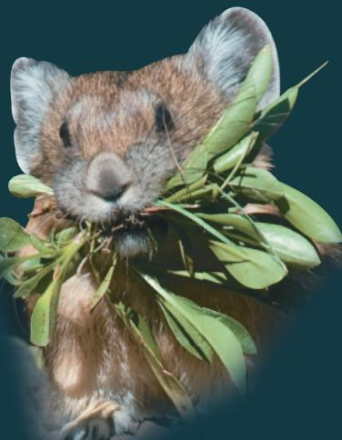

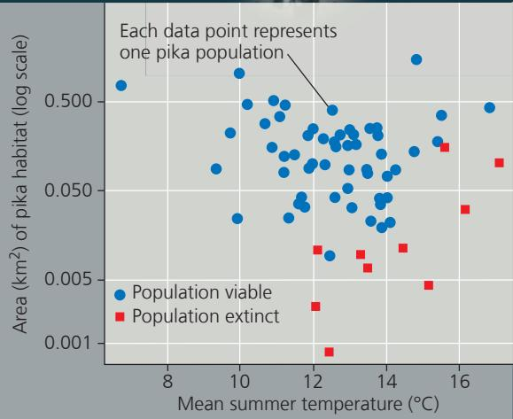

## Effects on Populations

Climate change has caused some populations to increase in size, while others have declined (see Concept 1.1 and Concept 46.1). In particular, as the climate has changed, some species have adjusted when they grow, reproduce, or migrate—but others have not, causing their populations to face food shortages and reduced survival or reproductive success.

In one example, researchers have documented a link between rising temperatures and declining populations of caribou (Rangifer tarandus) in the Arctic.

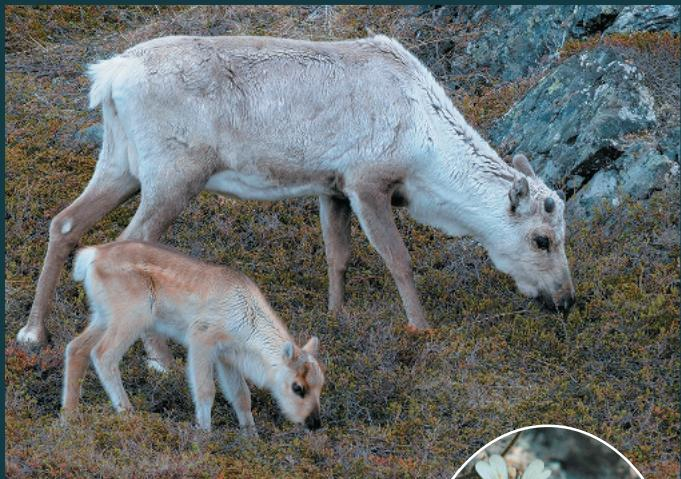  
Caribou populations migrate north in the spring to give birth and to eat sprouting plants.

Alpine chickweed is an early-flowering plant on which caribou depend.

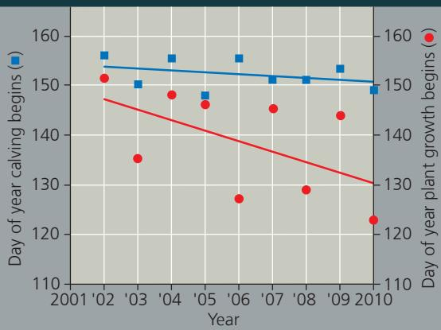

## Effects on Communities and Ecosystems

Climate affects where species live (see Figure 52.9). Climate change has caused hundreds of species to move to new locations, in some cases leading to dramatic changes in ecological communities. Climate change has also altered primary production (see Figure 28.21) and nutrient cycling in ecosystems.

In the example we discuss here, rising temperatures have enabled a sea urchin to invade southern regions along the coast of Australia, causing catastrophic changes to marine communities there.

  
The sea urchin Centrostephanus rodgersii requires water temperatures above 12°C to reproduce successfully, as shown in this graph. As ocean waters rise above this critical temperature, the urchin has been able to expand its range to the south, destroying kelp beds as it moves into new regions.

  
As the urchin has expanded its range to the south, it has destroyed high-diversity kelp communities, leaving bare regions called "urchin barrens" in its wake.

MAKE CONNECTIONS In addition to contributing to climate change, rising concentrations of $CO_{2}$ also contribute to ocean acidification (see Figure 3.12). Explain how ocean acidification can affect individual organisms, and how that, in turn, can cause dramatic changes in ecological communities.
For suggested answer, see Appendix A.

# Scientific Skills Exercise Graphing Data and Evaluating Evidence

How Has the Rise in Atmospheric $\mathrm{CO}_{2}$ Concentration Changed Over Time? The blue curve in Figure 56.29 shows how the concentration of $\mathrm{CO}_{2}$ in Earth's atmosphere has changed over a span of nearly 60 years. For each year in that span, scientists collected daily $\mathrm{CO}_{2}$ concentration data and used those data to calculate the average $\mathrm{CO}_{2}$ level for that year. In this exercise, you'll graph average $\mathrm{CO}_{2}$ concentrations for three 10-year periods and analyze how those concentrations have changed over time.

Data from the Study The data in the table below are average $CO_{2}$ concentrations (in parts per million, or ppm) at the Mauna Loa monitoring station for each of the indicated years.

<table><tr><td>1969</td><td>324.6</td><td>1989</td><td>353.1</td><td>2009</td><td>387.4</td></tr><tr><td>1970</td><td>325.7</td><td>1990</td><td>354.4</td><td>2010</td><td>389.9</td></tr><tr><td>1971</td><td>326.3</td><td>1991</td><td>355.6</td><td>2011</td><td>391.7</td></tr><tr><td>1972</td><td>327.5</td><td>1992</td><td>356.5</td><td>2012</td><td>393.9</td></tr><tr><td>1973</td><td>329.7</td><td>1993</td><td>357.1</td><td>2013</td><td>396.5</td></tr><tr><td>1974</td><td>330.2</td><td>1994</td><td>358.8</td><td>2014</td><td>398.7</td></tr><tr><td>1975</td><td>331.1</td><td>1995</td><td>360.8</td><td>2015</td><td>400.8</td></tr><tr><td>1976</td><td>332.0</td><td>1996</td><td>362.6</td><td>2016</td><td>404.2</td></tr><tr><td>1977</td><td>333.8</td><td>1997</td><td>363.7</td><td>2017</td><td>406.6</td></tr><tr><td>1978</td><td>335.4</td><td>1998</td><td>366.7</td><td>2018</td><td>408.5</td></tr></table>

Data from National Oceanic & Atmospheric Administration, Earth System Research Laboratory, Global Monitoring Division.

## INTERPRET THE DATA

1. Plot the data for each 10-year period on one graph, where the x-axis runs from year 1 to year 10 (producing three curves); this approach can help you to compare and contrast how the $CO_{2}$ level has changed during the three decades. Select a type of graph that is appropriate for these data, and choose a vertical axis scale that allows you to clearly see how the $CO_{2}$ concentration has changed, both from year to year and from one 10-year period to the next. (For additional information about graphs, see the Scientific Skills Review in Appendix D.)

The ecosystems where the climate has changed the most include those in the far north, particularly northern coniferous forests and tundra. As snow and ice melt and uncover darker, more absorptive surfaces, these systems reflect less radiation back to the atmosphere and warm further (see Figure 56.30). Satellite data show that the area covered by Arctic sea ice in the summer has been declining since 1979 (the first year the data were available). At current rates of decline, there may be no summer ice there within a few decades, decreasing habitat for polar bears, seals, and seabirds. In addition, as discussed in Concept 55.2, rising temperatures have caused some Arctic regions to switch from being a $CO_{2}$ sink (absorbing more $CO_{2}$ from the atmosphere

▶ A researcher sampling the air at the Mauna Loa monitoring station, Hawaii.  
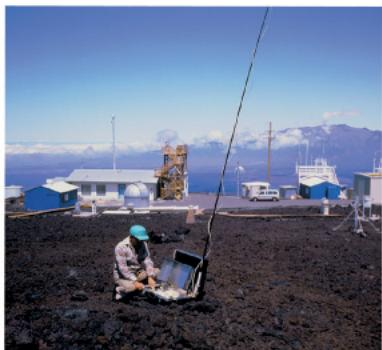

2. For each 10-year period, what is the pattern of change in $CO_{2}$ concentration? Do the curves you have drawn suggest that the pattern has changed from decade to decade?

3. Calculate the annual rate at which the $CO_{2}$ concentration increased during each 10-year period. Perform these calculations as shown here for data from 1959 to 1968 (not in the table): in 1959 the $CO_{2}$ concentration was 316 ppm, while in 1968 it was 323. Thus, from 1959 to 1968, the $CO_{2}$ concentration increased at an average annual rate of

$$
\frac {3 2 3 - 3 1 6}{9}
$$

or 0.8 ppm per year (we divide by 9 because during a 10-year period of time, there are 9 year-to-year changes in $CO_{2}$ concentration).

4. (a) If the annual increase in $CO_{2}$ concentration were to remain at the level observed for 2009–2018, predict the $CO_{2}$ concentration in 2100. (b) Use your results to evaluate the effectiveness of efforts to reduce $CO_{2}$ emissions.

Instructors: A version of this Scientific Skills Exercise can be assigned in Mastering Biology.

than they release to the atmosphere) to a $CO_{2}$ source (releasing more $CO_{2}$ than they absorb)—a worrisome change that could contribute to further climate warming.

Coniferous forests in western North America have also been hard hit, in this case by a combination of higher temperatures, decreased winter snowfall, and a lengthening of the summer dry period. Since the latter half of the 20th century, otherwise healthy forests have experienced a steady increase in the percentage of trees that die each year. Higher temperatures and more frequent droughts also increase the likelihood of fires (see Figure 55.8). In boreal forests of western North America and Russia, for example, fires have burned twice the usual area in recent decades, again

leading to widespread tree mortality. As the climate continues to warm, other changes in the geographic distribution of precipitation are likely, such as agricultural areas of the central United States becoming much drier.

Climate change has already affected many other ecosystems as well. In Europe and Asia, for example, plants are producing leaves earlier in the spring, while in tropical regions, the growth and survival of some species of coral have declined as water temperatures have risen. Recently, Australia's Great Barrier Reef had a catastrophic decline: The combined effects of marine heat waves (in 2016, 2017, 2020, 2022, and 2024) killed so many corals that two-thirds of the reef was severely degraded. A key take-home message from these examples is that a given effect of climate change may, in turn, cause a series of other biological changes. The exact nature of such cascading biological effects can be hard to predict, but it is clear that the more our planet warms, the more severely its ecosystems will be affected.

## Modeling Climate Change

At the current rates that human activities are adding $\mathrm{CO}_{2}$ and other greenhouse gases to the atmosphere, global models predict that Earth's temperature will rise by an additional $3^{\circ}\mathrm{C}$ ( $5^{\circ}\mathrm{F}$ ) by the end of the 21st century. What data are used to construct such models, and are their predictions accurate?

Global models are constructed using data on factors that affect the absorption of solar radiation at Earth's surface. These data are crucial because global temperatures rise when more solar radiation is absorbed by Earth's surface, and they fall when less solar radiation is absorbed by the surface. Natural factors that affect the absorption of solar radiation include an 11-year solar cycle and volcanic explosions. During each round of the solar cycle, the amount of energy emitted by the sun increases and decreases in a regular way, thereby contributing to a well-understood rise or fall in global temperatures at different points in time. Volcanic explosions emit gases and tiny particles that block incoming solar radiation, thereby contributing to a temporary drop in global temperatures. (Changes in the shape of Earth's orbit around the sun also contribute to increases or decreases in global temperatures, but those changes occur gradually over tens of thousands of years and hence are not a cause of recent climate change.)

Scientists also have collected vast amounts of data on how human activities affect absorption of solar radiation. When we burn fossil fuels for electricity, heat, and transportation, we cause $CO_{2}$ and other greenhouse gases to be released to the atmosphere. As shown in Figure 56.30, adding $CO_{2}$ and other greenhouse gases to the atmosphere increases the absorption of solar radiation, leading to global warming. Other human activities decrease the absorption of solar radiation, thereby tending to reduce global temperatures. For example, dust released by plowing fields and the emission of gases such as sulfur dioxide ( $SO_{2}$ ) both decrease the absorption of solar energy, thus reducing global temperatures.

Each of these and other types of data provides a single, well-understood piece of a grand puzzle—how Earth's

## Figure 56.32 Factors contributing to rising global temperatures.

Scientists have measured the temperature of our planet since 1880. These observed temperatures (solid red line) can be compared to results from climate models that incorporate only natural factors that affect global temperatures (dashed blue line) and from models that incorporate both natural and human factors (dotted black line).

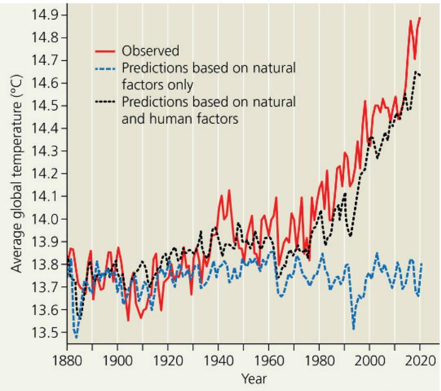  
VISUAL SKILLS Describe how well the predictions shown in the blue and black lines match observed (red) temperature changes over time. Based on the information in this graph, evaluate whether human activities such as burning fossil fuels have contributed to observed temperature changes over time.  
For suggested answer, see Appendix A.

temperature is affected by a combination of natural and human factors. Scientists use computer models to put the pieces of this puzzle together. Each year, large amounts of data on natural and human factors that affect the absorption of solar radiation are entered into the model, which then sums their effects to predict Earth's temperature. Over time, predictions from these models have become increasingly accurate: Global climate models can now reproduce observed changes such as the increase in global warming that has occurred since the 1950s (Figure 56.32) and the global cooling that results from volcanic eruptions.

But why go to all this trouble developing models when Earth's temperature can be measured each year? The reason is that we have only one Earth and hence cannot perform experiments to determine how emitting different amounts of $\mathrm{CO}_{2}$ affects the temperature of our planet. Instead, because we know that global climate models yield accurate predictions, we can use the models to perform "if-then" thought experiments: If we add a certain amount of $\mathrm{CO}_{2}$ to the atmosphere, then global temperatures will rise by a certain number of degrees.

The predictions are sobering. If we continue with “business as usual,” where emissions of $CO_{2}$ continue at current levels, by 2100

September 1979

Earth's temperature will likely be $4^{\circ}\mathrm{C}$ higher than it was in 1900—an increase that would have dire effects for all of Earth's species, including our own. Moreover, even if all $\mathrm{CO}_{2}$ emissions were to stop immediately, the temperature of our planet would continue to rise, making it about $1.5^{\circ}\mathrm{C}$ higher in 2100 than it was in 1900. Earth will continue to warm long after emissions stop because it takes decades for the $\mathrm{CO}_{2}$ already emitted to warm the oceans, and thus that long for the full effect of past emissions to be realized.

## Finding Solutions to Address Climate Change

We will need many approaches to slow global warming and other aspects of climate change. Quick progress can be made by using energy more efficiently and by replacing fossil fuels with renewable solar and wind power and, more controversially, with nuclear power. Today, coal, gasoline, wood, and other organic fuels remain central to industrialized societies and cannot be burned without releasing $CO_{2}$ . Stabilizing $CO_{2}$ emissions will require concerted international effort and changes in both personal lifestyles and industrial processes.

Progress toward finding solutions to address climate change was made in 2015 when virtually all nations agreed—for the first time—to take steps to reduce $CO_{2}$ emissions and limit the extent to which global temperatures ultimately rise. This international effort, known as the Paris Agreement, was ratified by 169 nations. However, reports by the United Nations in 2021 and 2022 indicate that governments are not on target to meet the goals set by the Paris Agreement. An overwhelming amount of evidence indicates that climate change is happening, that the rise in global temperatures since the 1950s was caused primarily by human actions, and that it is associated with negative consequences for human societies and other life on Earth. What we choose to do with this information is up to us.

## Depletion of Atmospheric Ozone

Like carbon dioxide and other greenhouse gases, atmospheric ozone ( $O_{3}$ ) has also changed in concentration because of human activities. Life on Earth is protected from the damaging effects of ultraviolet (UV) radiation by a layer of ozone located in the stratosphere 17–25 km above Earth's surface. However, satellite studies of the atmosphere show that the springtime ozone layer over Antarctica has thinned substantially since the mid-1970s (Figure 56.33). The destruction of atmospheric ozone results primarily from the accumulation of chlorofluorocarbons (CFCs), chemicals once widely used in refrigeration and manufacturing. In the stratosphere, chlorine atoms released from CFCs react with ozone, reducing it to molecular $O_{2}$ . Subsequent chemical reactions liberate the chlorine, allowing it to react with other ozone molecules in a catalytic chain reaction.

The thinning of the ozone layer is most apparent over Antarctica in spring, where cold, stable air allows the chain reaction to continue (Figure 56.34). The magnitude of ozone depletion and the size of the ozone hole have been slightly smaller in recent years than the average for the last 20 years, but the hole still sometimes extends as far as the southernmost portions of Australia, New Zealand, and South America. At the more heavily populated middle latitudes, ozone levels have decreased 2–10% during the past 20 years.

Figure 56.33 Thickness of the October ozone layer over Antarctica, in units called Dobsons.  
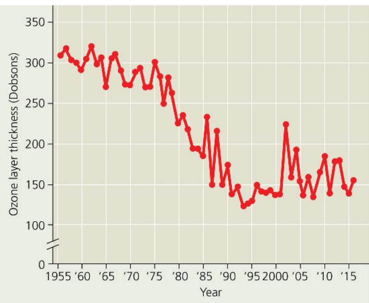

Decreased ozone levels in the stratosphere increase the intensity of UV rays reaching Earth's surface. The consequences of ozone depletion may be severe for plants, animals, and microorganisms. Some scientists expect increases in skin cancer and cataracts in humans, as well as unpredictable effects on crops and natural communities, especially the phytoplankton that are responsible for much of Earth's primary production. Such effects have been documented in field experiments. For example, scientists have shown that the growth of phytoplankton decreases and damage to their DNA increases when the ozone hole opens over the Southern Ocean (Antarctic Ocean) each year.

Figure 56.34 Erosion of Earth's ozone shield.  
The ozone hole over Antarctica is visible as the dark blue patch in these images based on atmospheric data.  

The good news about the ozone hole is how quickly many countries have responded to it. Since 1987, at least 197 nations, including the United States, have signed the Montreal Protocol, a treaty that regulates the use of ozone-depleting chemicals. Most nations have ended the production of CFCs. As a consequence, chlorine concentrations in the stratosphere have stabilized and ozone depletion is slowing. But even though CFC emissions today are close to zero, chlorine molecules already in the atmosphere will continue to influence stratospheric ozone levels for at least 50 years.

The partial destruction of Earth's ozone shield is one more example of how greatly humans can disrupt the dynamics of ecosystems and the biosphere. It also highlights our ability to solve environmental problems when we set our minds to it. However, in 2018 researchers detected an unexpected rise in atmospheric CFC levels, suggesting that unreported new production of these compounds may be occurring. Thus, once environmental regulations are in place, we cannot take them for granted—ongoing monitoring and enforcement are needed.

## Concept Check 56.4

1. How can the addition of excess mineral nutrients to a lake threaten its fish population?

2. MAKE CONNECTIONS There are vast stores of carbon-containing organic matter in the soils of northern coniferous forests and tundra around the world. Suggest why scientists who study global warming are closely monitoring these carbon reservoirs (see Figure 55.14).

3. MAKE CONNECTIONS Mutagens are chemical and physical agents that induce mutations in DNA (see Concept 17.5). How does reduced ozone concentration in the atmosphere increase the likelihood of mutations in various organisms?

For suggested answers, see Appendix A.

# Concept 56.5: Sustainable development can improve human lives while conserving biodiversity

With the increasing loss and fragmentation of habitats, changes in Earth's physical environment and climate, and increasing human population (see Concept 53.6), we face difficult trade-offs in managing the world's resources. Preserving all habitat patches isn't feasible, so biologists must help societies set conservation priorities by identifying which habitat patches are most crucial, while likewise improving the quality of life for local people. Ecologists use the concept of sustainability as a tool to establish long-term conservation priorities.

## Sustainable Development

We need to understand the interconnections of the biosphere to protect species from extinction and improve the quality of human life. To this end, many nations, scientific societies, and other groups have embraced the concept of sustainable development, economic development that meets the needs of people today without limiting the ability of future generations to meet their needs.

Achieving sustainable development is an ambitious goal. To sustain ecosystem processes and stem the loss of biodiversity, we must connect life science with the social sciences, economics, and the humanities. We must also reassess our personal values. Those of us living in wealthier nations have a larger ecological footprint than do people living in developing nations (see Concept 53.6). By including the long-term costs of consumption in our decision-making processes, we can learn to value the ecosystem services that sustain us.

## Case Study: Sustainable Development in Costa Rica

The success of conservation in Costa Rica discussed earlier has required a partnership between the government, nongovernment organizations (NGOs), and private citizens. Many nature reserves established by individuals have been recognized as national wildlife reserves and given significant tax benefits. However, conservation and restoration are only one facet of sustainable development; the other is improving the human condition.

How have the living conditions of the Costa Rican people changed as the country has pursued its conservation goals? As represented in Figure 56.35, two fundamental indicators of

Figure 56.35 Infant mortality and life expectancy at birth in Costa Rica.  
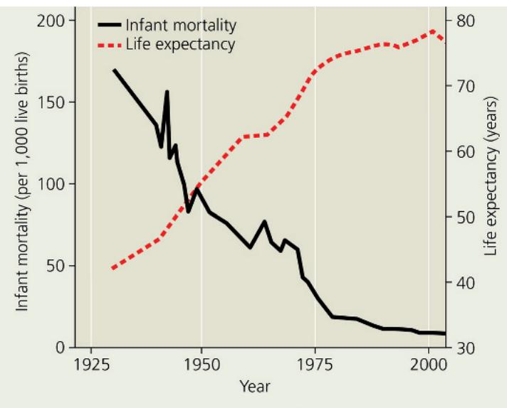

Figure 56.36 Biophilia, past and present.

  
(a) Detail of animals in a 17,000-year-old cave painting, Lascaux, France

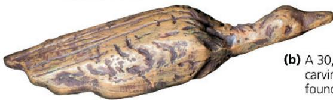  
(b) A 30,000-year-old ivory carving of a water bird, found in Germany

  
(c) Nature lovers on a wildlife-watching expedition

living conditions are infant mortality rate and life expectancy (see Concept 53.6). From 1930 to 2020, the infant mortality rate in Costa Rica declined from 170 to 7 per 1,000 live births; over the same period, life expectancy increased from about 43 years to 79 years. Another indicator of living conditions is the

literacy rate. The 2015 literacy rate in Costa Rica was 98%, compared to an average of 87% in the other six Central American countries. Such statistics show that living conditions in Costa Rica have improved greatly in the time in which the country has dedicated itself to conservation and restoration. While this does not prove that conservation causes an improvement in human welfare, we can say with certainty that development in Costa Rica has attended to both nature and people.

## The Future of the Biosphere

Our modern lives are very different from those of early humans, who hunted and gathered to survive. Their reverence for nature is evident in the early cave paintings of wildlife (Figure 56.36a) and in the visions of life they sculpted from bone and ivory (Figure 56.36b).

Our lives reflect remnants of our ancestral attachment to nature and the diversity of life—the concept of biophilia introduced early in this chapter. We evolved in natural environments rich in biodiversity, and we still have an affinity for such settings (Figure 56.36c and d). Indeed, our biophilia may be innate, an evolutionary product of natural selection acting on a brainy species whose survival depended on a close connection to the environment and a practical appreciation of plants and animals.

Our appreciation of life guides the field of biology today. We celebrate life by deciphering the genetic code that makes each species unique. We embrace life by using fossils and DNA to chronicle evolution through time. We preserve life through our efforts to classify and protect the millions of species on Earth. We respect life by using nature responsibly and reverently to improve human welfare.

Biology is the scientific expression of our desire to know nature. We are most likely to protect what we appreciate and are most likely to appreciate what we understand. By learning about the processes and diversity of life, we become more aware of our place in the biosphere. We hope this text has served you well in this lifelong adventure.

## Concept Check 56.5

1. What is meant by the term sustainable development?

2. How might biophilia influence us to conserve species and restore ecosystems?

3. WHAT IF? Suppose a new fishery is discovered, and you are put in charge of developing it sustainably. What ecological data might you want on the fish population? What criteria would you apply for the fishery's development?

For suggested answers, see Appendix A.

# Chapter 56 Review

## Summary of Key Concepts

To review key terms, go to the Vocabulary Self-Quiz (eTextbook only).

Concept 56.1: Human activities threaten earth's biodiversity

\- Biodiversity can be considered at three main levels:

  
Genetic diversity: enables adaptation to environmental change

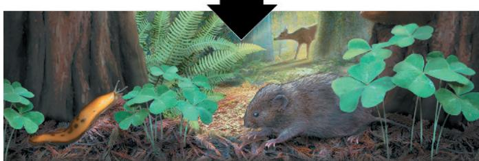  
Species diversity: maintains communities and food webs

  
Ecosystem diversity: provides life-sustaining services

\- Our biophilia enables us to recognize the value of biodiversity for its own sake. Other species also provide humans with food, fiber, medicines, and ecosystem services.

\- Four major threats to biodiversity are habitat loss, introduced species, overharvesting, and global change.

Give at least three examples of key ecosystem services that nature provides for people.

## Concept 56.2: Population conservation focuses on population size, genetic diversity, and critical habitat

\- When a population drops below a minimum viable population (MVP) size, its loss of genetic variation due to inbreeding and genetic drift can trap it in an extinction vortex.

\- A loss of critical habitat can cause threatened populations to show a downward trend, even if the population is far above its minimum viable population size.

\- Conserving species often requires resolving conflicts between the habitat needs of endangered species and human demands.

Why is the minimum viable population size smaller for a genetically diverse population than for a less genetically diverse population?

## Concept 56.3: Landscape and regional conservation help sustain biodiversity

\- The structure of a landscape can strongly influence biodiversity. As habitat fragmentation increases and edges become more extensive, biodiversity tends to decrease. Movement corridors can promote dispersal and help sustain populations.

\- Biodiversity hot spots are also hot spots of extinction and thus prime candidates for protection. Sustaining biodiversity in parks and reserves requires management to ensure that human activities in the surrounding landscape do not harm the protected habitats. The zoned reserve model recognizes that conservation efforts often involve working in landscapes that are greatly affected by human activity.

\- Urban ecology is the study of organisms and their environment in primarily urban settings.

Give two examples that show how habitat fragmentation can harm species in the long term.

## Concept 56.4: Earth is changing rapidly as a result of human actions

\- Agriculture removes plant nutrients from ecosystems, so large supplements are usually required. The nutrients in fertilizer can pollute groundwater and surface-water aquatic ecosystems (eutrophication), where they can stimulate excess algal growth.

\- The release of industrial compounds, pesticides, pharmaceuticals, and plastic waste has polluted the environment with harmful substances that often persist for long periods and become increasingly concentrated in successively higher trophic levels of food webs (biological magnification).

\- Because of the burning of fossil fuels and other human activities, the atmospheric concentration of $CO_{2}$ and other greenhouse gases has been steadily increasing. These increases have caused climate change, including significant global warming and changing patterns of precipitation. Climate change has already affected many ecosystems.

\- The ozone layer reduces the penetration of UV radiation through the atmosphere. Human activities, notably the release of chlorine-containing pollutants, have eroded the ozone layer, but government policies are helping to solve the problem.

Thinking about biological magnification of toxins, is it healthier to feed at a lower or higher trophic level? Explain.

## Concept 56.5: Sustainable development can improve human lives while conserving biodiversity

\- Sustainable development refers to economic development that meets the needs of people today without limiting the ability of future generations to meet their needs.

\- Costa Rica's success in conserving tropical biodiversity has involved a partnership among the government, other organizations, and private citizens. Human living conditions in Costa Rica have improved along with ecological conservation.

Why is sustainability such an important goal for conservation biologists? For suggested answers, see Appendix A.

## Test Your Understanding

For more multiple-choice questions, go to the Practice Test (eTextbook only).

## Levels 1-2: Remembering/Understanding

1. One characteristic that distinguishes a population in an extinction vortex from most other populations is that

(A) its members are rare, top-level predators.

(B) its effective population size is lower than its total population size.

(C) its genetic diversity is very low.

(D) it is not well adapted to edge conditions.

2. The main cause of the increase in the amount of $\mathrm{CO}_{2}$ in Earth's atmosphere over the past 170 years is

(A) increased worldwide primary production.

(B) increased worldwide fertilizer production.

(C) increased infrared radiation absorption by the atmosphere.

(D) the burning of fossil fuels and deforestation.

3. What is the single greatest threat to biodiversity?

(A) overharvesting of commercially important species

(B) habitat alteration, fragmentation, and destruction

(C) introduced species that compete with native species

(D) novel pathogens

from forest edges. The reserve extends about 6,000 m from east to west and 3,000 m from north to south. It is surrounded by a deforested pasture on the west, an agricultural field for 500 m in the southwest corner, and intact forest everywhere else. You must build a road, 10 m by 3,000 m, from the north to the south side of the reserve and construct a maintenance building that will take up 100 m $^{2}$ . Draw a map of the reserve and explain where you would put the road and building to minimize cowbird intrusion along edges.

8. EVOLUTION CONNECTION The fossil record indicates that there have been five mass extinction events in the past 500 million years (see Concept 25.4). Many ecologists think we are on the verge of another. Briefly discuss the history of mass extinctions and the length of time it typically takes for species diversity to recover through evolution. Explain why this should motivate us to slow the loss of biodiversity today.

9. WRITE ABOUT A THEME: INTERACTIONS One factor favoring rapid population growth by an introduced species is the absence of the predators, parasites, and pathogens that controlled its population in the region where it evolved. In a short essay (100–150 words), explain how evolution by natural selection would influence the rate at which native predators, parasites, and pathogens attack an introduced species.

## Levels 3-4: Applying/Analyzing

4. Which of these is a consequence of biological magnification?

(A) Toxic chemicals in the environment pose greater risk to top-level predators than to primary consumers.

(B) Populations of top-level predators are generally smaller than populations of primary consumers.

## 10. SYNTHESIZE YOUR KNOWLEDGE

(C) The biomass of producers in an ecosystem is generally higher than the biomass of primary consumers.

(D) Only a small portion of the energy captured by producers is transferred to consumers.

5. Which of the following strategies would most rapidly increase the genetic diversity of a population in an extinction vortex?

(A) Establish a reserve that protects the population's habitat.

(B) Introduce new individuals transported from other populations of the same species.

(C) Sterilize the least fit individuals in the population.

(D) Control populations of the endangered population's predators and competitors.

6. Which of the following statements about protected areas established to preserve biodiversity is true?

(A) About $25\%$ of Earth's land area is now protected.

(B) National parks are the only type of protected area.

(C) Management of a protected area does not need to be coordinated with management of the surrounding area.

(D) It is especially important to protect biodiversity hot spots.

## Levels 5-6: Evaluating/Creating

7. DRAW IT Suppose you are managing a forest reserve, and one of your goals is to protect local populations of woodland birds from parasitism by the brown-headed cowbird. You know that female cowbirds don't venture more than about $100\mathrm{m}$ into a forest and that nest parasitism is reduced when woodland birds nest away

  
Big cats, such as the Siberian tiger (Panthera tigris altaica), are one of the most endangered groups of mammals in the world. Based on what you've learned in this chapter, discuss some approaches you would use to help preserve them.

For selected answers, see Appendix A.

# Explore Scientific Papers with Science in the Classroom | AAAS

How can genetic analyses help in the fight against poaching? Go to “CSI Africa: Tracking Ivory Poachers” at www.scienceintheclassroom.org.

Instructors: Questions can be assigned in Mastering Biology.

# Appendix A: Answers

NOTE: Answers to Scientific Skills Exercises, Problem-Solving Exercises, Interpret the Data questions, and short-answer essay questions are available only for instructors in the Instructor Resources area of Mastering Biology. Scientific Skills Exercises, Problem-Solving Exercises, Interpret the Data questions, and additional questions for the Visualizing Figures can be assigned and automatically graded in Mastering Biology.

## Chapter 1

## Figure Questions

Figure 1.4 Dividing the length of the prokaryotic cell by the length of the scale bar, the length of the prokaryotic cell is about 1.4 scale bars. Each scale bar represents 1 $\mu$ m, so the prokaryotic cell is about 1.4 $\mu$ m long. Dividing the diameter of the eukaryotic cell by the length of the scale bar, the diameter of the eukaryotic cell is about 8.2 scale bars,

Figure 1.18

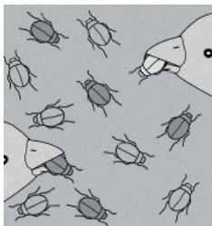  
5 Environmental change resulting in survival of organisms with different traits

which is 8.2 $\mu$ m. Figure 1.10 The response to high blood glucose is increased glucose uptake by cells and glucose storage in liver cells and muscle. The response lowers blood glucose levels—thus, it acts in opposition to the original stimulus.

As the soil gradually becomes lighter gray, beetles that match the color of the soil will not be seen by birds and therefore will not be eaten. For example, when the soil is medium-colored, it will be easiest for birds to see and eat the darkest and lightest of the beetles in a population. (Most or all of the lighter beetles will have been eaten earlier, but new light beetles will arise due to variation in new generations of the population.) Thus, over time, the population will become lighter as the soil becomes lighter.

## Concept Check 1.1

1. Examples: A molecule consists of atoms bonded together. Each organelle has an orderly arrangement of molecules. Photosynthetic plant cells contain organelles called chloroplasts. A tissue consists of a group of similar cells. Organs such as the heart are constructed from several tissues. A complex multicellular organism, such as a plant, has several types of organs, such as leaves and roots. A population is a set of organisms of the same species. A community consists of populations of the various species inhabiting a specific area. An ecosystem consists of a biological community along with the nonliving factors important to life, such as air, soil, and water. The biosphere is made up of all of Earth's ecosystems. 2. (a) New properties emerge at successive levels of biological organization: Structure and function are correlated. (b) Life's processes involve the expression and transmission of genetic information. (c) Life requires the transfer and transformation of energy and matter. 3. Sample answers: Organization (Emergent properties): The ability of a human heart to pump blood requires an intact heart; it is not a capability of any of the heart's tissues or cells working alone. Organization (Structure and function): The strong, sharp teeth of a wolf are well suited to grasping and dismembering its prey. Information: Human eye color is determined by the combination of genes inherited from the two parents. Energy and Matter: A plant, such as a grass, absorbs energy from the sun and transforms it into molecules that act as stored fuel. Animals can eat parts of the plant and use the food for energy to carry out their activities. Interactions (Molecules): When your stomach is full, it signals your brain to decrease your appetite. Interactions (Ecosystems): A mouse eats food, such as nuts or grasses, and deposits some of the food material as wastes (feces and urine). Construction of a nest rearranges the physical environment and may hasten degradation of some of its components. The mouse may also act as food for a predator.

## Concept Check 1.2

1. The naturally occurring heritable variation in a population is “edited” by natural selection because individuals with traits better suited to the environment survive and reproduce more successfully than others, and these traits are passed on to the next generation more often. Over time, better-suited individuals persist and their percentage in the population increases, while less well-suited individuals become less prevalent—a type of population editing. 2. Here is one possible explanation: The ancestor species of the green warbler finch lived on an island where insects were a plentiful food source. Among individuals in the ancestor population, there was likely variation in beak shape and size. Individuals with slender, sharp beaks were likely more successful at picking up insects for food. Being well-nourished, they gave rise to more offspring than birds with thick, short beaks. Their many offspring inherited slender, sharp beaks (because of genetic information being passed from generation to generation, although Darwin didn’t know this). In each generation, the offspring birds with the beaks of a shape best at picking up insects would eat more and have more offspring. Therefore, the green warbler finch of today has a slender beak that is very well matched (adapted) to its food source, insects.
3.

## Concept Check 1.3

1. Mouse coat color matches the environment for both beach and inland populations.
2. Inductive reasoning derives generalizations from specific cases; deductive reasoning predicts specific outcomes from general premises.
3. Compared to a hypothesis, a scientific theory is usually more general and substantiated by a much greater amount of evidence. Natural selection is an explanatory idea that applies to all kinds of organisms and is supported by vast amounts of evidence of various kinds.
4. Based on the mouse coloration in Figure 1.25, you might expect that the mice that live on the sandy soil would be lighter in color and those that live on the lava rock would be much darker. And in fact, that is what researchers have found. You would predict that each color of mouse would be less preyed upon in its native habitat than it would be in the other habitat. (Research results also support this prediction.) You could repeat the Hoekstra experiment with colored models, painted to resemble these two types of mouse. Or you could try transplanting some of each population to its non-native habitat and counting how many you can recapture over the next few days, then comparing the four samples as was done in Hoekstra's experiment. (The painted models are easier to recapture, of course!) In the live mouse transplantation experiment, you would have to do controls to eliminate the variable represented by the transplanted mice being in a new, unknown territory. You could control for the transplantation process by transplanting some dark mice from one area of lava rock to one far distant, and some light mice from one area of sandy soil to a distant area.

## Concept Check 1.4

1. Science aims to understand natural phenomena and the underlying mechanisms that affect them, while technology involves application of scientific discoveries for a particular purpose or to solve a specific problem.
2. Natural selection could be operating. Malaria is present in sub-Saharan Africa, India, southeast Asia, and other warm regions, so there might be an advantage to people with the sickle-cell disease form of the gene that makes them more able to survive and pass on their genes to offspring. Among descendants of ancestors from those regions living in the United States, where malaria is absent, there would be no advantage, so they would be selected against more strongly, resulting in fewer individuals with the sickle-cell disease form of the gene.

## Summary of Key Concepts Questions

1.1 Finger movements rely on the coordination of the many structural components of the hand (muscles, nerves, bones, etc.), each of which is composed of elements from lower levels of biological organization (cells, molecules). The development of the hand relies on the genetic information encoded in chromosomes found in cells throughout the body. To power the finger movements that result in a text message, muscle and nerve cells require chemical energy that they transform in powering muscle contraction or in propagating nerve impulses. Texting is in essence communication, an interaction that conveys information between organisms, in this case of the same species. 1.2 Ancestors of the beach mouse may have exhibited variations in their coat color. Because of the prevalence of visual predators, the better-camouflaged (lighter) mice in the beach habitat may have survived longer and been able to produce more offspring. Over time, a higher and higher proportion of individuals in the population would have had the adaptation of lighter fur that acted to camouflage the mouse in the beach habitat. 1.3 Gathering and interpreting data are core activities in the scientific process, and they are affected by, and affect in turn, three other arenas of the scientific process: exploration and discovery, community analysis and feedback, and societal benefits and outcomes. 1.4 Different approaches taken by scientists studying natural phenomena at different levels complement each other, so more is learned about each problem being studied. A diversity of backgrounds among scientists may lead to fruitful ideas in the same way that important innovations have often arisen where a mix of cultures coexist, due to multiple different viewpoints.

## Test Your Understanding

1. B 2. C 3. C 4. B 5. C 6. A 7. D 8. Your figure should show the following: (1) for the biosphere, the Earth with an arrow coming out of a tropical ocean; (2) for the ecosystem, a distant view of a coral reef; (3) for the community, a collection of reef animals and algae, with corals, fishes, some seaweed, and any other organisms you can think of; (4) for the population, a group of fish of the same

species; (5) for the organism, one fish from your population; (6) for the organ, the fish's stomach; (7) for a tissue, a group of similar cells from the stomach; (8) for a cell, one cell from the tissue, showing its nucleus and a few other organelles; (9) for an organelle, the nucleus, where most of the cell's DNA is located; and (10) for a molecule, a DNA double helix. Your sketches can be very rough!

## Chapter 2

## Figure Questions

Figure 2.7 Atomic number = 12; 12 protons, 12 electrons; three electron shells; 2 valence electrons

Figure 2.14 One possible answer:  
Figure 2.17  

## Concept Check 2.1

1. Table salt (sodium chloride) is made up of sodium and chlorine. We are able to eat the compound, showing that it has different properties from those of a metal (sodium) and a poisonous gas (chlorine). 2. Yes. An organism requires trace elements, though only in small amounts. 3. A person with an iron deficiency will probably show fatigue and other effects of a low oxygen level in the blood. (The condition is called anemia and can also result from too few red blood cells or abnormal hemoglobin.) 4. Variant ancestral plants that could tolerate elevated levels of the elements in serpentine soils could grow and reproduce there. (Plants that were well adapted to nonserpentine soils would not be expected to survive in serpentine areas.) The offspring of the variants would also vary, with those most capable of thriving under serpentine conditions growing best and reproducing most. Over many generations, this probably led to the serpentine-adapted species we see today.

## Concept Check 2.2

1.7 2. $^{15}_{7}\mathrm{N}$ 3.9 electrons; two electron shells; 1s, 2s, 2p (three orbitals); 1 electron is needed to fill the valence shell. 4. The elements in a row all have the same number of electron shells. All the elements in a column have the same number of electrons in their valence shells.

## Concept Check 2.3

1. In this structure, each carbon atom has only three covalent bonds instead of the required four.
2. The attraction between oppositely charged ions, forming ionic bonds
3. If you could synthesize molecules that mimic these shapes, you might be able to treat diseases or conditions caused by the inability of affected individuals to synthesize such molecules—or to block the function of such molecules if overproduction is the cause of the disorder.

## Concept Check 2.4

2. At equilibrium, the forward and reverse reactions occur at the same rate. 3. $C_{6}H_{12}O_{6} + 6O_{2} \rightarrow 6CO_{2} + 6H_{2}O + Energy$ . Glucose and oxygen react to form carbon dioxide and water, releasing energy. We breathe in oxygen because we need it for this reaction to occur, and we breathe out carbon dioxide because it is a by-product of this reaction. (This reaction is called cellular respiration, and you will learn more about it in Chapter 9.)

## Summary of Key Concepts Questions

2.1 A compound is made up of two or more elements combined in a fixed ratio, while an element is a substance that cannot be broken down to other substances.
2.2

  
Neon(10Ne)

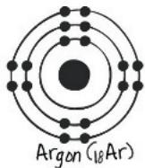

Both neon and argon have completed valence shells, containing 8 electrons. They do not have unpaired electrons that could participate in chemical bonds. 2.3 Electrons are shared equally between the two atoms in a nonpolar covalent bond. In a polar covalent bond, the electrons are drawn closer to the more

electronegative atom. In the formation of ions, an electron is completely transferred from one atom to a much more electronegative atom. 2.4 The concentration of products would increase as the added reactants were converted to products. Eventually, an equilibrium would again be reached in which the forward and reverse reactions were proceeding at the same rate and the relative concentrations of reactants and products returned to where they were before the addition of more reactants.

## Test Your Understanding

1. D 2. A 3. B 4. A 5. D 6. B 7. C 8. D

$$
H: \ddot {O}: \begin{array}{c} H \\ C \\ H \end{array} : \begin{array}{c} H \\ C \\ C \end{array} :: \ddot {O}\tag{9.}
$$

This structure makes sense because all valence shells are complete, and all bonds have the correct number of electrons.

This structure doesn't make sense because H has only 1 electron to share, so it cannot form bonds with 2 atoms.

## Chapter 3

Figure Questions

Figure 3.2 One possible answer:  

Figure 3.8 Heating the solution would cause the water to evaporate faster than it is evaporating at room temperature. At a certain point, there wouldn't be enough water molecules to dissolve the salt ions. The salt would start coming out of solution and re-forming crystals. Eventually, all the water would evaporate, leaving behind a pile of salt like the original pile. Figure 3.12 Adding excess $\mathrm{CO}_{2}$ to the oceans ultimately reduces the rate at which calcification (by organisms) can occur.

## Concept Check 3.1

1. Electronegativity is the attraction of an atom for the electrons of a covalent bond. Because oxygen is more electronegative than hydrogen, the oxygen atom in $H_{2}O$ pulls electrons toward itself, resulting in two partial negative charges on the oxygen atom and a partial positive charge on each hydrogen atom. Atoms in neighboring water molecules with opposite partial charges are attracted to each other, forming a hydrogen bond. 2. Due to its two polar covalent bonds, a water molecule has regions of partial negative charge on the O atom that allow it to form hydrogen bonds with hydrogen atoms on neighboring water molecules, and regions of partial positive charge on the H atoms that allow them to form hydrogen bonds with oxygen atoms on neighboring water molecules. 3. The hydrogen atoms of one molecule, with their partial positive charges, would repel the partially positively charged hydrogen atoms of the adjacent molecule. 4. The covalent bonds of water molecules would not be polar, so no regions of the molecule would carry partial charges and water molecules would not form hydrogen bonds with each other.

## Concept Check 3.2

1. Hydrogen bonds hold neighboring water molecules together. This cohesion helps chains of water molecules move upward against gravity in water-conducting cells as water evaporates from the leaves. Adhesion between water molecules and the walls of the water-conducting cells also helps counter gravity.
2. High humidity hampers cooling by suppressing the evaporation of sweat.
3. As water freezes, it expands because water molecules move farther apart in forming ice crystals. When there is water in a crevice of a boulder, expansion due to freezing may crack the boulder.
4. The hydrophobic substance repels water, perhaps helping to keep the ends of the legs from becoming coated with water and breaking through the surface. If the legs were coated with a hydrophilic substance, water would be drawn up them, possibly making it more difficult for the water strider to walk on water.

## Concept Check 3.3

1. $10^{5}$ , or 100,000
2. $[H^{+}] = 0.01M = 10^{-2}M$ , so pH = 2.

3. $CH_{3}COOH \rightarrow CH_{3}COO^{-} + H^{+}$ . $CH_{3}COOH$ is the acid (the $H^{+}$ donor), and $CH_{3}COO^{-}$ is the base (the $H^{+}$ acceptor). 4. The pH of the water should decrease from 7 to about 2 (as mentioned in the text); the pH of the acetic acid solution will decrease only a small amount, because as a weak acid, it acts (like carbonic acid) as a buffer. The reaction shown for question 3 will shift to the left, with $CH_{3}COO^{-}$ accepting the influx of $H^{+}$ and becoming $CH_{3}COOH$ molecules.

## Summary of Key Concepts Questions

3.1

No. A covalent bond is a strong bond in which electrons are shared between two atoms. A hydrogen bond is a weak bond, which does not involve electron sharing, but is simply an attraction between two partial charges on neighboring atoms. 3.2 Ions dissolve in water when polar water molecules form a hydration shell around them, with partially charged regions of water molecules being attracted to ions of the opposite charge. Polar molecules dissolve as water molecules form hydrogen bonds with them and surround them. A solution is a homogeneous mixture of a solute and a solvent. 3.3 The concentration of hydrogen ions ( $H^{+}$ ) would be $10^{-11}$ , and the pH of the solution would be 11.

## Test Your Understanding

1.C 2.D 3.C 4.A 5.D

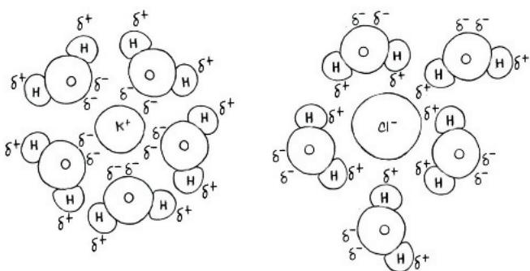

7. Due to intermolecular hydrogen bonds, water has a high specific heat (the amount of heat required to increase the temperature of water by $1^{\circ}$ C). When water is heated, much of the heat is absorbed in breaking hydrogen bonds before the water molecules increase their motion and the temperature increases. Conversely, when water is cooled, many H bonds are formed, which releases a significant amount of heat. This release of heat can provide some protection against freezing of the plants' leaves, thus protecting the cells from damage. 8. Both global warming and ocean acidification are caused by increasing levels of carbon dioxide in the atmosphere, the result of burning fossil fuels.

## Chapter 4

## Figure Questions

Figure 4.2 Because the concentration of the reactants influences the equilibrium (as discussed in Concept 2.4), there might have been more HCN relative to $CH_{2}O$ since there would have been a higher concentration of the reactant gas containing nitrogen.

Figure 4.4  

Figure 4.6 The tails of fats contain only carbon-hydrogen bonds, which are relatively nonpolar. Because the tails occupy the bulk of a fat molecule, they make the molecule as a whole nonpolar and therefore incapable of forming hydrogen bonds with water.

Figure 4.7

## Concept Check 4.1

1. The sparks provided energy needed for the inorganic molecules in the atmosphere to react with each other. (You'll learn more about energy and chemical reactions in Chapter 8.)

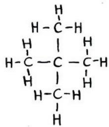

## Concept Check 4.2

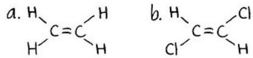

2. The forms of $C_{4}H_{10}$ in (b) are structural isomers, as are the butenes (forms of $C_{4}H_{8}$ ) in (c). 3. Both consist largely of hydrocarbon chains, which provide fuel—gasoline for engines and fats for plant embryos and animals. Reactions of both types of molecules release energy. 4. No. There is not enough diversity in propane's atoms. It can't form structural isomers because there is only one way for three carbons to attach to each other (in a line). There are no double bonds, so cis-trans isomers are not possible. Each carbon has at least two hydrogens attached to it, so the molecule is symmetrical and cannot have enantiomers.

## Concept Check 4.3

1. An amino acid has both an amino group ( $—NH_{2}$ ), which makes it an amine, and a carboxyl group (—COOH), which makes it a carboxylic acid. 2. The ATP molecule loses a phosphate, becoming ADP.

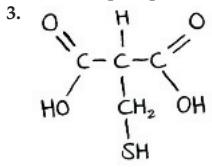

A chemical group that can act as a base has been replaced with a group that can act as an acid, increasing the acidic properties of the molecule. The shape of the molecule would also change, likely changing the molecules with which it can interact. The original cysteine molecule has an asymmetric carbon in the center. After replacement of the amino group with a carboxyl group, this carbon is no longer asymmetric.

## Summary of Key Concepts Questions

4.1 Miller showed that organic molecules could form under the physical and chemical conditions estimated to have been present on early Earth. This abiotic synthesis of organic molecules would have been a first step in the origin of life. 4.2 Acetone and propanal are structural isomers. Acetic acid and glycine have no asymmetric carbons, whereas glycerol phosphate has one. Therefore, glycerol phosphate can exist as forms that are enantiomers, but acetic acid and glycine cannot. 4.3 The methyl group is nonpolar and not reactive. The other six groups are called functional groups because they can participate in chemical reactions. Also, all except the sulfhydryl group are hydrophilic, increasing the solubility of organic compounds in water.

## Test Your Understanding

1. B 2. B 3. C 4. C 5. A 6. B 7. A 8. The molecule on the right; the middle carbon is asymmetric.

9. Silicon has 4 valence electrons, the same number as carbon. Therefore, silicon would be able to form long chains, including branches, that could act as skeletons for large molecules. It would clearly do this much better than neon (with no valence electrons) or aluminum (with 3 valence electrons).

## Chapter 5

## Figure Questions

Figure 5.3 Glucose and fructose are structural isomers.

Figure 5.4

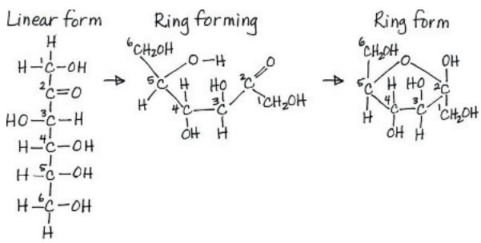

Four carbons are in the fructose ring, and two are not. (The latter two carbons are attached to carbons 2 and 5, which are in the ring.) The fructose ring differs from the glucose ring, which has five carbons in the ring and one that is not. (Note that the orientation of this fructose molecule is flipped horizontally relative to that of the one in Figure 5.5b; also, note that the oxygen on carbon 5 lost its proton and that the oxygen on carbon 2, which used to be the carbonyl oxygen, gained a proton.

Figure 5.5  
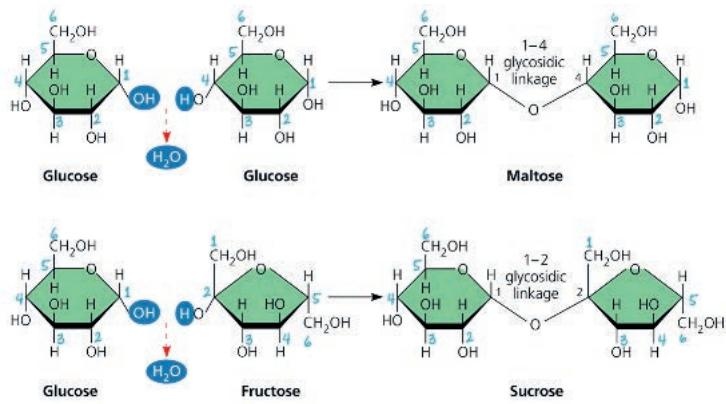

a. In maltose, the linkage is called a 1–4 glycosidic linkage because the number 1 carbon in the left monosaccharide (glucose) is linked to the number 4 carbon in the right monosaccharide (also glucose). b. In sucrose, the linkage is called a 1–2 glycosidic linkage because the number 1 carbon in the left monosaccharide (glucose) is linked to the number 2 carbon in the right monosaccharide (fructose). (Note that the fructose molecule is oriented differently from glucose in Figures 5.4 and 5.5b, where carbon 2 is on the right. In fructose in Figure 5.5b and here, carbon 2 of fructose is on the left.)  

Figure 5.16 1. The polypeptide backbone is most easily followed in the ribbon model.  
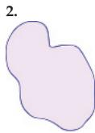

3. The point of this diagram is to show that a pancreas cell secretes insulin proteins, so the shape is not important to the process being illustrated. Figure 5.17 We can see that their complementary shapes allow the two proteins to fit together quite precisely. Figure 5.19 The R group on glutamic acid is acidic and hydrophilic, whereas that on valine is nonpolar and hydrophobic. Therefore, it is unlikely that valine and glutamic acid participate in the same intramolecular interactions. A change in these interactions could (and does) cause a disruption of molecular structure. Figure 5.26 Using a genomics approach allows us to use gene sequences to identify species and to learn about evolutionary relationships among any two species. This is because all species are related by their evolutionary history, and the evidence is in the DNA sequences. Proteomics—looking at proteins that are expressed—allows us to learn about how organisms or cells are functioning at a given time or in an association with another species.

## Concept Check 5.1

1. The four main classes are proteins, carbohydrates, lipids, and nucleic acids. Lipids are not polymers.
2. Nine, with one water molecule required to hydrolyze each connection between adjacent monomers.
3. The amino acids in the fish protein must be released in hydrolysis reactions and incorporated into other proteins in dehydration reactions.

## Concept Check 5.2

1. $C_{3}H_{6}O_{3}$ 2. $C_{12}H_{22}O_{11}$ 3. The antibiotic treatment is likely to have killed the cellulose-digesting prokaryotic organisms in the cow's gut. The absence of these prokaryotic organisms would hamper the cow's ability to obtain energy from food and could lead to weight loss and possibly death. Thus, prokaryotic species are reintroduced, in appropriate combinations, in the gut culture given to treated cows.

## Concept Check 5.3

1. Both have a glycerol molecule attached to fatty acids. The glycerol of a fat has three fatty acids attached, whereas the glycerol of a phospholipid is attached to two fatty acids and one phosphate group.
2. Human sex hormones are steroids, a type of compound that is hydrophobic and thus classified as a lipid.
3. The oil droplet membrane could consist of a single layer of phospholipids rather than a bilayer, because an arrangement in which the hydrophobic tails of the membrane phospholipids were in contact with the hydrocarbon regions of the oil molecules would be more stable.

## Concept Check 5.4

1. Secondary structure involves hydrogen bonds between atoms of the polypeptide backbone. Tertiary structure involves interactions between atoms of the side chains of the amino acid subunits. 2. The two ring forms of glucose are called $\alpha$ and $\beta$ , depending on how the glycosidic bond dictates the position of a hydroxyl group. Proteins have $\alpha$ helices and $\beta$ pleated sheets, two types of repeating structures found in polypeptides due to interactions between the repeating constituents of the chain (not the side chains). The hemoglobin molecule is made up of two types of polypeptides: It contains two molecules each of $\alpha$ -globin and $\beta$ -globin. 3. During formation of a polypeptide by polymerization of amino acids, the amino group of one amino acid reacts with the carboxyl group of the next, forming a peptide bond. Therefore, in a polypeptide, there is only one amino group on the N-terminus and one carboxyl group on the C-terminus, along with any carboxyl groups or amino groups located in the amino acid side chains (R groups). 4. These are all nonpolar, hydrophobic amino acids, so you would expect this region to be located in the interior of the folded polypeptide, where it would not contact the aqueous environment inside the cell.

## Concept Check 5.5

## Concept Check 5.6

1. The DNA of an organism encodes all of its proteins, and proteins are the molecules that carry out the work of cells, whether an organism is unicellular or multicellular. By knowing the DNA sequence of an organism, scientists would be able to catalog the protein sequences as well.
2. Ultimately, the DNA sequence carries the information necessary to make the proteins that determine the traits of a particular species. Because the traits of the two species are similar, you would expect the proteins to be similar as well, and therefore the gene sequences should also have a high degree of similarity.

## Summary of Key Concepts Questions

5.1 The polymers of large carbohydrates (polysaccharides), proteins, and nucleic acids are built from three different types of monomers (monosaccharides, amino acids, and nucleotides, respectively). 5.2 Both starch and cellulose are polymers of glucose, but the glucose monomers are in the $\alpha$ configuration in starch and the $\beta$ configura tion in cellulose. The glycosidic linkages thus have different geometries, giving the polymers different shapes and thus different properties. Starch is an energy-storage compound in plants; cellulose is a structural component of plant cell walls. Humans can hydrolyze starch to provide energy but cannot hydrolyze cellulose. Cellulose aids in the passage of food through the digestive tract. 5.3 Lipids are not polymers because they do not exist as a chain of linked monomers. They are not considered macromolecules because they do not reach the giant size of many polysaccharides, proteins, and nucleic acids. 5.4 A polypeptide, which may consist of hundreds of amino acids in a specific sequence (primary structure), has regions of coils and pleats (secondary structure), which are then folded into irregular contortions (tertiary structure) and may be noncovalently associated with other polypeptides (quaternary structure). The linear order of amino acids, with the varying properties of their side chains (R groups), determines what secondary and

8.

tertiary structures will form to produce a protein. The resulting unique three-dimensional shapes of proteins are key to their specific and diverse functions. 5.5 The complementary base pairing of the two strands of DNA makes possible the precise replication of DNA every time a cell divides, ensuring that genetic information is faithfully transmitted. In some types of RNA, complementary base pairing enables RNA molecules to assume specific three-dimensional shapes that facilitate diverse functions. 5.6 You would expect the human gene sequence to be most similar to that of the mouse (another mammal), then to that of the fish (another vertebrate), and least similar to that of the fruit fly (an invertebrate).

## Test Your Understanding

1. D  2. A  3. B  4. A  5. B  6. B  7. C

<table><tr><td></td><td>Monomers or Components</td><td>Polymer or larger molecule</td><td>Type of linkage</td></tr><tr><td>Carbohydrates</td><td>Monosaccharides</td><td>Polysaccharides</td><td>Glycosidic linkages</td></tr><tr><td>Fats</td><td>Fatty acids</td><td>Triacylglycerols</td><td>Ester linkages</td></tr><tr><td>Proteins</td><td>Amino acids</td><td>Polypeptides</td><td>Peptide bonds</td></tr><tr><td>Nucleic acids</td><td>Nucleotides</td><td>Polynucleotides</td><td>Phosphodiester linkages</td></tr></table>

## Practice Applying Your Learning

11. (a) T (b) F (c) F (d) T (e) F (f) T (g) T (h) T

## Chapter 6

## Figure Questions

Figure 6.3 The cilia in the lower portion of the TEM were oriented lengthwise in the plane of the slice, while those in the upper portion of the TEM were oriented perpendicular to the plane of the slice. Therefore, the cilia in the lower portion were cut in longitudinal section, and the cilia in the upper portion were cut in cross section. Figure 6.4 You would use the pellet from the final fraction, which is rich in ribosomes. These are the sites of protein translation. Figure 6.6 The dark bands in the TEM correspond to the hydrophilic heads of the phospholipids, while the light band corresponds to the hydrophobic fatty acid tails of the phospholipids. Figure 6.9 The DNA in a chromosome dictates synthesis of a messenger RNA (mRNA) molecule,

which then moves out to the cytoplasm. There, the information is used for the production, on ribosomes, of proteins that carry out cellular functions. Figure 6.10 Any of the bound ribosomes (attached to the endoplasmic reticulum) could be circled, because any could be making a protein that will be secreted. Table 6.1 Three dimers Figure 6.22 Each centriole has nine sets of 3 microtubules, so the entire centrosome

  
Triplet of microtubules

(two centrioles) has 54 microtubules. Each microtubule consists of a helical array of tubulin dimers (as shown in Table 6.1). Figure 6.24 The two central microtubules terminate above the basal body, so they aren't present at the level of the cross section through the basal body, indicated by the lower red rectangle shown in the EM on the left.

  
Figure 6.32 1. Nuclear pore, ribosome, proton pump, cyt c. 2. As shown in the figure, the enzyme RNA polymerase moves along the DNA, transcribing the genetic information into an mRNA molecule. Given that RNA polymerase is somewhat larger than a nucleosome, the enzyme would not be able to fit between the histone proteins of the nucleosome and the DNA itself. Thus, the group of histone proteins must be separated from or moved along the DNA somehow in order for the RNA polymerase enzyme to access the DNA. 3. A mitochondrion.

## Concept Check 6.1

1. Stains used for light microscopy are colored molecules that bind to cell components, affecting the light passing through, while stains used for electron microscopy involve heavy metals that affect the beams of electrons.
2. (a) Light microscope, (b) scanning electron microscope.

## Concept Check 6.2

1. See Figure 6.8.

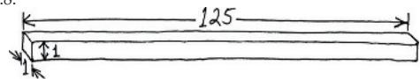

This cell would have the same volume as the cells in columns 2 and 3 in Figure 6.7 but proportionally more surface area than that in column 2 and less than that in column 3. Thus, the surface-to-volume ratio should be greater than 1.2 but less than 6. To obtain the surface area, you would add the area of the six sides (the top, bottom, sides, and ends): $125 + 125 + 125 + 125 + 1 + 1 = 502$ . The surface-to-volume ratio equals 502 divided by a volume of 125, or roughly 4.0.

## Concept Check 6.3

1. Ribosomes in the cytoplasm translate the genetic message, carried from the DNA in the nucleus by mRNA, into a polypeptide chain.
2. Nucleoli consist of DNA and the ribosomal RNAs (rRNAs) made according to its genes in the DNA, as well as proteins imported from the cytoplasm. Together, the rRNAs and proteins are assembled into large and small ribosomal subunits. (These are exported through nuclear pores to the cytoplasm, where they will participate in polypeptide synthesis.)
3. Each chromosome consists of one long DNA molecule attached to numerous protein molecules, a combination called chromatin. As a cell begins division, each chromosome becomes “condensed” as its diffuse mass of chromatin coils up.

## Concept Check 6.4

1. The primary distinction between rough and smooth ER is the presence of bound ribosomes on the rough ER. Both types of ER make phospholipids, but membrane proteins and secretory proteins are all produced by the ribosomes on the rough ER. The smooth ER also functions in detoxification, carbohydrate metabolism, and storage of calcium ions.
2. Transport vesicles move membranes and the substances they enclose between other components of the endomembrane system.
3. The mRNA is synthesized in the nucleus and then passes out through a nuclear pore to the cytoplasm, where it is translated on a bound ribosome, attached to the rough ER. The protein is synthesized into the lumen of the ER and may be modified there. A transport vesicle carries the protein to the Golgi apparatus. After further modification in the Golgi, another transport vesicle carries it back to the ER, where it will perform its cellular function.

## Concept Check 6.5

1. Both organelles are involved in energy transformation, mitochondria in cellular respiration and chloroplasts in photosynthesis. They both have multiple membranes that separate their interiors into compartments. In both organelles, the innermost membranes—cristae, or infoldings of the inner membrane, in mitochondria and the thylakoid membranes in chloroplasts—have large surface areas with embedded enzymes that carry out their main functions. 2. Yes. Plant cells are able to make their own sugar by photosynthesis, but mitochondria in plant cells (which are, of course, eukaryotic) are the organelles that are able to generate ATP molecules to be used for energy generation from sugars, a function required in all cells. 3. Mitochondria and chloroplasts are not derived from the ER, nor are they connected physically or via transport vesicles to organelles of the endomembrane system. Mitochondria and chloroplasts are structurally different from vesicles derived from the ER, which are bounded by a single membrane.

## Concept Check 6.6

1. Dynein arms, powered by ATP, move neighboring doublets of microtubules relative to each other. Because they are anchored within the flagellum or cilium and with respect to one another, the doublets bend instead of sliding past each other. Synchronized bending of the nine microtubule doublets brings about bending of both cilia and flagella.
2. Such individuals have defects in the microtubule-based movement of cilia and flagella. Thus, the sperm can't move because of malfunctioning or nonexistent flagella, and the airways are compromised because cilia that line the trachea malfunction or don't exist, and so mucus cannot be cleared from the lungs.

## Concept Check 6.7

1. The most obvious difference is the presence of direct cytoplasmic connections between cells of plants (plasmodesmata) and animals (gap junctions). These connections result in the cytoplasm being continuous between adjacent cells. 2. The cell would not be able to function properly and would probably soon die, as the cell wall or ECM must be permeable to allow the exchange of matter between the cell and its external environment. Molecules involved in energy production and use must be allowed entry, as well as those that provide information about the cell's environment. Other molecules, such as products synthesized by the cell for export and the by-products of cellular respiration, must be allowed to exit. 3. The parts of the protein that face aqueous regions would be expected to have polar or charged (hydrophilic) amino acids, while the parts that go through the membrane would be expected to have nonpolar (hydrophobic) amino acids. You would predict polar or charged amino acids at each end (tail), in the region of the cytoplasmic loop, and in the regions of the two extracellular loops. You would predict nonpolar amino acids in the four regions that go through the membrane between the tails and loops.

## Concept Check 6.8

1. Colpidium colpoda moves around in freshwater using cilia, projections from the plasma membrane that enclose microtubules in a "9 + 2" arrangement. The interactions between motor proteins and microtubules cause the cilia to bend synchronously, propelling the cell through the water. This is powered by ATP, obtained via breaking down sugars from food in a process that occurs in mitochondria. C. colpoda obtains bacteria as their food source, maybe via the same process (involving filopodia) the macrophage uses in Figure 6.31. This process uses actin filaments and other elements of the cytoskeleton to ingest the bacteria. Once ingested, the bacteria are broken down by enzymes in lysosomes. The proteins involved in all of these processes are encoded by genes on DNA in the nucleus of the C. colpoda.

## Summary of Key Concepts Questions

6.1 Both light and electron microscopy allow cells to be studied visually, thus helping us understand internal cellular structure and the arrangement of cell components. Cell fractionation techniques separate out different groups of cell components, which can then be analyzed biochemically to determine their function. Performing microscopy on the same cell fraction helps to correlate the biochemical function of the cell with the cell component responsible. 6.2 The separation of different functions in different organelles has several advantages. Reactants and enzymes can be concentrated in one area instead of spread throughout the cell. Reactions that require specific conditions, such as a lower pH, can be compartmentalized. And enzymes for specific reactions are often embedded in the membranes that enclose or partition an organelle. 6.3 The nucleus contains the genetic material of the cell in the form of DNA, which specifies messenger RNA, which in turn provides instructions for the synthesis of proteins (including the proteins that make up part of the ribosomes). DNA also codes for ribosomal RNAs, which are combined with proteins in the nucleolus into the subunits of ribosomes. Within the cytoplasm, ribosomes join with mRNA to build polypeptides, using the genetic information in the mRNA. 6.4 Transport vesicles move proteins and membranes synthesized by the rough ER to the Golgi for further processing and then to the plasma membrane, lysosomes, or other locations in the cell, including back to the ER. 6.5 According to the endosymbiont theory, mitochondria originated from an oxygen-using bacterial cell that was engulfed by an archaeal cell that was ancestral to eukaryotic cells. Over time, the host and endosymbiont evolved into a single unicellular organism containing a mitochondrion. Chloroplasts originated when at least one of these eukaryotic cells containing mitochondria engulfed and then retained a photosynthetic bacterial cell, which eventually evolved into a chloroplast. 6.6 Inside the cell, motor proteins interact with components of the cytoskeleton to move cellular parts. Motor proteins "walk" vesicles along microtubules. The movement of cytoplasm within a cell involves interactions of the motor protein myosin and microfilaments (actin filaments). Whole cells can be moved by the rapid bending of flagella or cilia, which is caused by the motor protein-powered sliding of microtubules within these structures. Cell movement can also occur when pseudopodia form at one end of a cell (caused by actin polymerization into a filamentous network), followed by contraction of the cell toward that end; this amoeboid movement is powered by interactions of microfilaments with myosin. Interactions of motor proteins and microfilaments in muscle cells causes muscle contraction that can propel whole organisms (for example, by walking or swimming). 6.7 A plant cell wall is primarily composed of microfibrils of cellulose embedded in other polysaccharides and proteins. The ECM of animal cells is primarily composed of collagen and other protein fibers, such as fibronectin and other glycoproteins. These fibers are embedded in a network of carbohydrate-rich proteoglycans. A plant cell wall provides structural support for the cell and, collectively, for the plant body. In addition to giving support, the ECM of an animal cell allows for communication of environmental changes into the cell. 6.8 The nucleus houses the chromosomes; each is made up of proteins and a single DNA molecule. The genes that exist along the DNA carry the genetic information necessary to make the proteins involved in ingesting a bacterial cell, such as the actin of microfilaments that form pseudopodia (filopodia), the proteins in the mitochondria responsible for providing the necessary ATP, and the enzymes present in the lysosomes that will digest the bacterial cell.

## Test Your Understanding

1. B 2. C 3. B 4. A 5. D 6. See Figure 6.8.

## Chapter 7

Figure Questions

Figure 7.2  

The hydrophilic portion is in contact with an aqueous environment (cytosol or extracellular fluid), and the hydrophobic portion is in contact with the hydrophobic portions of other phospholipids in the interior of the bilayer. Figure 7.4 You couldn't rule out movement of proteins within membranes of the same species. You might propose that the membrane lipids and proteins from one species weren't able to mingle with those from the other species because of some incompatibility. Figure 7.7 A transmembrane protein like the dimer in (f) might change its shape upon binding to a particular extracellular matrix (ECM) molecule. The new shape

might enable the interior portion of the protein to bind to a second, cytoplasmic protein that would relay the message to the inside of the cell, as shown in (c). Figure 7.8 The shape of a protein on the HIV surface is likely to be complementary to the shape of the receptor (CD4) and also to that of the co-receptor (CCR5). A molecule with a shape similar to that of the HIV surface protein could bind CCR5, blocking HIV binding. (Another answer would be a molecule that bound to CCR5 and changed the shape of CCR5 so it could no longer bind HIV; in fact, this is how maraviroc works.)

Figure 7.9  

The protein would contact the extracellular fluid. (Because one end of the protein is in the ER membrane, no part of the protein extends into the cytoplasm.) The part of the protein not in the membrane extends into the ER lumen. Once the vesicle fuses with the plasma membrane, the "inside" of the ER membrane, facing the lumen, will become the "outside" of the plasma membrane, facing the extracellular fluid. Figure 7.12 The orange dye would be evenly distributed throughout the solution on both sides of the membrane. The solution levels would not be affected because the orange dye can diffuse through the membrane and equalize its concentration. Thus, no additional osmosis would take place in either direction. In this experiment, the membrane is meant to represent the plasma membrane of a cell. Figure 7.13 The cells take up water and become turgid, causing the stalk to lose its limpness and become crisp. Figure 7.16 The sodium ion concentration $\left(\left[\mathrm{Na}^{+}\right]\right)$ is low inside the cell and high outside, while potassium ion concentration $\left(\left[\mathrm{K}^{+}\right]\right)$ is low outside the cell and high inside. Three $\mathrm{Na}^{+}$ ions are moved out of the cell and two $\mathrm{K}^{+}$ ions into the cell for each cycle. Figure 7.17 The diamond solutes are moving into the cell (downward), and the round solutes are moving out of the cell (upward); each is moving against its concentration gradient. Figure 7.21 (a) In the micrograph of the algal cell, the diameter of the algal cell is about 2.3 times longer than the scale bar, which represents $5\mu \mathrm{m}$ , so the diameter of the algal cell is about $11.5\mu \mathrm{m}$ . (b) In the micrograph of the coated vesicle, the diameter of the coated vesicle is about 1.2 times longer than the scale bar, which represents $0.25\mu \mathrm{m}$ , so the diameter of the coated vesicle is about $0.3\mu \mathrm{m}$ . (c) Therefore, the food vacuole around the algal cell will be about $40\times$ larger than the coated vesicle.

## Concept Check 7.1

1. They are on the inside of the transport vesicle membrane. 2. The grasses living in the cooler region would be expected to have more unsaturated fatty acids in their membranes because those fatty acids remain fluid at lower temperatures. The grasses living immediately adjacent to the hot springs would be expected to have more saturated fatty acids, which would allow the fatty acids to "stack" more closely, making the membranes less fluid and therefore helping them to stay intact at higher temperatures. (In plants, cholesterol is generally not used to moderate the effects of temperature on membrane fluidity because it is found at vastly lower levels in membranes of plant cells than in those of animal cells.)

## Concept Check 7.2

1. $O_{2}$ and $CO_{2}$ are both small, nonpolar molecules that can easily pass through the hydrophobic interior of a membrane.
2. Water is a polar molecule, so it cannot pass very rapidly through the hydrophobic region in the middle of a phospholipid bilayer.
3. The hydronium ion is charged, while glycerol is not. Charge is probably more significant than size as a basis for exclusion by the aquaporin channel.

## Concept Check 7.3

1. $CO_{2}$ is a nonpolar molecule that can diffuse through the plasma membrane. As long as it diffuses away so that the concentration remains low outside the cell, it will continue to exit the cell in this way. (This is the opposite of the case for $O_{2}$ , described in this section of the text.) 2. Paramecium's contractile vacuole will become less active. The vacuole pumps out excess water that accumulates in the cell; this accumulation occurs only in a hypotonic environment.

## Concept Check 7.4

1. These pumps use ATP. To establish a voltage, ions have to be pumped against their gradients, which requires energy.
2. Each ion is being transported against its electrochemical gradient. If either ion were transported down its electrochemical

gradient, this would be considered cotransport. 3. The internal environment of a lysosome is acidic, so it has a higher concentration of $H^{+}$ than does the cytoplasm. Therefore, you might expect the membrane of the lysosome to have a proton pump such as that shown in Figure 7.18 to pump $H^{+}$ into the lysosome.

Figure 8.13

## Concept Check 7.5

1. Exocytosis. When a transport vesicle fuses with the plasma membrane, the vesicle membrane becomes part of the plasma membrane.

3. The glycoprotein is synthesized in the ER lumen, moves through the Golgi apparatus, and then travels in a vesicle to the plasma membrane, where it undergoes exocytosis and becomes part of the ECM.

## Summary of Key Concepts Questions

7.1 Plasma membranes define the cell by separating the cellular components from the external environment. This allows conditions inside cells to be controlled by membrane proteins, which regulate entry and exit of molecules and even cell function (see Figure 7.7). The processes of life can be carried out inside the controlled environment of the cell, so membranes are crucial. In eukaryotes, membranes also function to subdivide the cytoplasm into different compartments where distinct processes can occur, even under differing conditions such as low or high pH.
7.2 Aquaporins are channel proteins that greatly increase the permeability of a membrane to water molecules, which are polar and therefore do not readily diffuse through the hydrophobic interior of the membrane. 7.3 There will be a net diffusion of water out of a cell into a hypertonic solution. The free water concentration is higher inside the cell than in the solution (where not as many water molecules are free, because many are clustered around the numerous solute particles).
7.4 One of the solutes moved by the cotransporter is actively transported against its concentration gradient. The energy for this transport comes from the concentration gradient of the other solute, which was established by an electrogenic pump that used energy to transport the other solute across the membrane. Because energy is required overall to drive this process (because ATP is used to establish the concentration gradient), it is considered active transport. 7.5 In receptor-mediated endocytosis, specific molecules bind to receptors on the plasma membrane in a region where a coated pit develops. The cell can acquire bulk quantities of those specific molecules when the coated pit forms a vesicle and carries the bound molecules into the cell.

## Test Your Understanding

1. B 2. C 3. A 4. C 5. B

6. (a)  
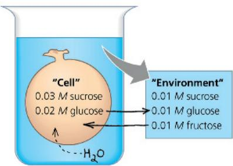

(b) The solution outside is hypotonic. It has less sucrose, which is a nonpenetrating solute. (c) See answer for (a). (d) The artificial cell will become more turgid. (e) Eventually, the two solutions will have the same solute concentrations. Even though sucrose can't move through the membrane, water flow (osmosis) will lead to isotonic conditions.

## Chapter 8

## Figure Questions

Figure 8.5 With a proton pump (Figure 7.18), the energy stored in ATP is used to pump protons across the membrane and build up a higher (nonrandom) concentration outside of the cell, so this process results in higher free energy. When solute molecules (analogous to hydrogen ions) are uniformly distributed, similar to the random distribution in the bottom of (b), the system has less free energy than it does in the top of (b). The system in the bottom can do no work. Because the concentration gradient created by a proton pump (Figure 7.18) represents higher free energy, this system has the potential to do work once there is a higher concentration of protons on one side of the membrane (as you will see in Figure 9.15). Figure 8.10 Glutamic acid (Glu) has a carboxyl group at the end of its R group. Glutamine (Gln) has exactly the same structure as glutamic acid, except that there is an amino group in place of the $-\mathrm{O}^{-}$ on the R group. (This O atom on the R group leaves during the synthesis reaction.) Thus, in this figure, Gln is drawn as a Glu with an attached $\mathrm{NH}_2$ .

Figure 8.16  

## Concept Check 8.1

1. The second law is the trend toward randomization, or increasing entropy. When the concentrations of a substance on both sides of a membrane are equal, the distribution is more random than when they are unequal. Diffusion of a substance to a region where it is initially less concentrated increases entropy, making it an energetically favorable (spontaneous) process as described by the second law. This explains the process seen in Figure 7.11. 2. The apple has potential energy in its position hanging on the tree, and the sugars and other nutrients it contains have chemical energy. The apple has kinetic energy as it falls from the tree to the ground. Finally, when the apple is digested and its molecules broken down, some of the chemical energy is used to do work, and the rest is lost as thermal energy. 3. The sugar crystals become less ordered (entropy increases) as they dissolve and become randomly spread out in the water. Over time, the water evaporates, and the crystals form again because the water volume is insufficient to keep them in solution. While the reappearance of sugar crystals may represent a “spontaneous” increase in order (decrease in entropy), it is balanced by the decrease in order (increase in entropy) of the water molecules, which changed from a relatively compact arrangement as liquid water to a much more dispersed and disordered form as water vapor.

## Concept Check 8.2

1. Cellular respiration is a spontaneous and exergonic process. The energy released from glucose is used to do work in the cell or is lost as heat.
2. Catabolism breaks down organic molecules, releasing their chemical energy and resulting in smaller products with more entropy, as when moving from the top to the bottom of Figure 8.5c. Anabolism consumes energy to synthesize larger molecules from simpler ones, as when moving from the bottom to the top of part (c).
3. The reaction is exergonic because it releases energy—in this case, in the form of light. (This is a non-biological version of the bioluminescence seen in Figure 8.1.)

## Concept Check 8.3

1. ATP usually transfers energy to an endergonic process by phosphorylating (adding a phosphate group to) another molecule. (Exergonic processes, in turn, phosphorylate ADP to regenerate ATP.) 2. A set of coupled reactions can transform the first combination into the second. Since this is an exergonic process overall, $\Delta G$ is negative and the first combination must have more free energy (see Figure 8.10). 3. Active transport: The solute is being transported against its concentration gradient, which requires energy, provided by ATP hydrolysis.

## Concept Check 8.4

1. A spontaneous reaction is a reaction that is exergonic. However, if it has a high activation energy that is rarely attained, the rate of the reaction may be low. 2. $O_{2}$ is required as a substrate to react with the gas. There is $O_{2}$ in the lab air, which is why

the Bunsen burner has a flame above the gas delivery opening, but there is no $O_{2}$ in the rubber tubing or the gas supply. 3. In the presence of malonate, increase the concentration of the normal substrate (succinate) and see whether the rate of reaction increases. If it does, malonate is a competitive inhibitor.

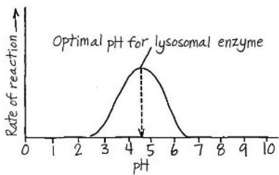

## Concept Check 8.5

1. The activator binds in such a way that it stabilizes the active form of an enzyme, whereas the inhibitor stabilizes the inactive form.
2. A catabolic pathway breaks down organic molecules, generating energy that is stored in ATP molecules. In feedback inhibition of such a pathway, ATP (one product) would act as an allosteric inhibitor of an enzyme catalyzing an early step in the catabolic process. When ATP is plentiful, the pathway would be turned off and no more would be made.

## Summary of Key Concepts Questions

8.1 The process of "ordering" a cell's structure is accompanied by an increase in the entropy (disorder) of the universe. For example, an animal cell takes in highly ordered organic molecules as the source of matter and energy used to build and maintain its structures. In the same process, however, the cell releases heat and the simple molecules of $\mathrm{CO}_{2}$ and $\mathrm{H}_2\mathrm{O}$ to the surroundings. The increase in entropy of the latter process offsets the entropy decrease in the former. 8.2 A spontaneous reaction has a negative $\Delta G$ and is exergonic. For a chemical reaction to proceed with a net release of free energy $(- \Delta G)$ , the enthalpy or total energy of the system must decrease $(- \Delta H)$ , and/or the entropy or disorder must increase (yielding a more negative term, $-T\Delta S$ ). Spontaneous reactions supply the energy to perform cellular work. 8.3 The free energy released from the hydrolysis of ATP may drive endergonic reactions through the transfer of a phosphate group to a reactant molecule, forming a more reactive phosphorylated intermediate. ATP hydrolysis also powers the mechanical and transport work of a cell, often by powering shape changes in the relevant motor proteins. Cellular respiration, the catabolic breakdown of glucose, provides the energy for the endergonic regeneration of ATP from ADP and $\mathbb{P}_i$ . 8.4 Activation energy barriers prevent the complex molecules of the cell, which are rich in free energy, from spontaneously breaking down to less ordered, more stable molecules. Enzymes permit a regulated metabolism by binding to specific substrates and forming enzyme-substrate complexes that selectively lower the $\mathrm{E_A}$ for the chemical reactions in a cell. 8.5 A cell tightly regulates its metabolic pathways in response to fluctuating needs for energy and materials. The binding of activators or inhibitors to regulatory sites on allosteric enzymes stabilizes either the active or the inactive form of the subunits. For example, the binding of ATP to a catabolic enzyme in a cell with excess ATP would inhibit that pathway. Such types of feedback inhibition preserve chemical resources within a cell. If ATP supplies are depleted, binding of ADP to the regulatory site of catabolic enzymes would activate that pathway, generating more ATP.

## Test Your Understanding

1. B 2. C 3. B 4. A 5. C 6. D 7. C

Practice Applying Your Learning
11. (a) T (b) F (c) F (d) F (e) T (f) T

## Chapter 9

## Figure Questions

Figure 9.2 The C atom is oxidized. The electrons that used to be equally shared with H atoms in methane are now much closer to the O atoms in $CO_{2}$ than they are to the C. Figure 9.3 The reduced form has an extra hydrogen, along with 2 electrons, bound to the carbon shown at the top of the nicotinamide (opposite the N). There are different numbers and positions of double bonds in the two forms: The oxidized form has three double bonds in the ring, while the reduced form has only two. (In organic chemistry you may have learned, or will learn, that three double bonds in a ring are able to “resonate,” or act as a ring of electrons. Having three resonant double bonds is more “oxidized” than having only two double bonds in the ring.) In the oxidized form there is a + charge on the N (because it is sharing 4 electron pairs), whereas in the reduced form it is only sharing 3 electron pairs (having a pair of electrons to itself). Figure 9.6 Because there is no external source of energy for the reaction, it must be exergonic, and the reactants must be at a higher energy level than the products. Figure 9.8 The removal would probably stop glycolysis, or at least slow it down, since it would push the equilibrium for step 5 toward DHAP. If less (or no) glyceraldehyde 3-phosphate were available, step 6 would slow down (or be unable to occur). Figure 9.12 The electrons in NADH are in a C—H bond (right side of Figure 9.3). In $H_{2}O$ , the electrons are in an O—H bond. Because the electronegativities of C and H are similar, the electrons are equally shared in NADH. The electronegativity of O is much higher than that of C or H, so the electrons are much closer to O in $H_{2}O$ and have “fallen” in potential energy. Figure 9.14 At first, some ATP could be made, since electron transport could proceed as far as complex III, and a small $H^{+}$ gradient could be built up. Soon, however, no more electrons could be passed to complex III because it could not be reoxidized by passing its electrons to complex IV. Figure 9.15 First, there are 2 NADH from the oxidation of pyruvate plus 6 NADH from the citric acid cycle (CAC); 8 NADH × 2.5 ATP/NADH = 20 ATP. Second, there are 2 FADH₂ from the CAC; 2 FADH₂ × 1.5 ATP/FADH₂ = 3 ATP. Third, the 2 NADH from glycolysis enter the mitochondrion through one of two types of shuttle. They pass their electrons either to 2 FAD, which become FADH₂ and result in 3 ATP, or to 2 NAD⁺, which become NADH and result in 5 ATP. Thus, 20 + 3 + 3 = 26 ATP, or 20 + 3 + 5 = 28 ATP from all NADH and FADH₂.

## Concept Check 9.1

1. Both processes include glycolysis, the citric acid cycle, and oxidative phosphorylation. In aerobic respiration, the final electron acceptor is molecular oxygen $\left(\mathrm{O}_{2}\right)$ ; in anaerobic respiration, the final electron acceptor is a different substance.
2. $C_{4}H_{6}O_{5}$ would be oxidized and $NAD^{+}$ would be reduced.

## Concept Check 9.2

1. $NAD^{+}$ acts as the oxidizing agent in step 6, accepting electrons from glyceraldehyde 3-phosphate (G3P), which thus acts as the reducing agent.

## Concept Check 9.3

1. NADH and FADH $_{2}$ ; one ATP (or its equivalent) is produced during substrate-level phosphorylation in step 5.
2. The CO $_{2}$ that we exhale is produced by pyruvate oxidation and the citric acid cycle.
3. In both cases, the precursor molecule loses a CO $_{2}$ molecule and then donates electrons to an electron carrier in an oxidation step. Also, the product has been activated due to the attachment of a CoA group by its S atom.

## Concept Check 9.4

1. Oxidative phosphorylation would eventually stop entirely, resulting in no ATP production by this process. Without oxygen to "pull" electrons down the electron transport chain, $\mathrm{H^{+}}$ would not be pumped into the mitochondrion's intermembrane space and chemiosmosis would not occur. 2. Decreasing the pH means addition of $\mathrm{H^{+}}$ . This would establish a proton gradient even without the function of the electron transport chain, and we would expect ATP synthase to function and synthesize ATP. (In fact, it was experiments like this that provided support for chemiosmosis as an energy-coupling mechanism.) 3. One of the components of the electron transport chain, ubiquinone (Q), must be able to diffuse within the membrane. It could not do so if the membrane components were locked rigidly into place.

## Concept Check 9.5

1. A derivative of pyruvate, such as acetaldehyde during alcohol fermentation, or pyruvate itself during lactic acid fermentation; $O_{2}$ ; another electron acceptor at the end of an electron transport chain, such as sulfate ( $SO_{4}^{2-}$ ) 2. The cell would need to consume glucose at a rate about 16 times the consumption rate in the aerobic environment (2 ATP are generated by fermentation versus up to 32 ATP by cellular respiration).

## Concept Check 9.6

1. The fat is much more reduced; it has many $-CH_{2}-$ units, and in all these bonds the electrons are equally shared. The electrons present in a carbohydrate molecule are already somewhat oxidized (shared unequally in bonds; there are more C—O and O—H bonds), as quite a few of them are bound to oxygen. Electrons that are equally shared, as in fat, have a higher energy level than electrons that are unequally shared, as in carbohydrates. Thus, fat is a much better fuel than carbohydrate. 2. When you consume more food than necessary for metabolic processes, your body synthesizes fat as a way of storing energy for later use. 3. AMP will accumulate, stimulating phosphofructokinase, and thus increasing the rate of glycolysis. Since oxygen is not present, the cell will convert more pyruvate to lactate, providing a supply of ATP. 4. When $O_{2}$ is present, the fatty acid chains containing most of the energy of a fat are oxidized and fed into the citric acid cycle and the electron transport chain. During intense exercise, however, $O_{2}$ is scarce in muscle cells, so ATP must be generated by glycolysis alone. A very small part of the fat molecule, the glycerol backbone, can be oxidized via glycolysis, but the amount of energy released by this portion is insignificant compared to that released by the fatty acid chains. (This is why moderate exercise, staying below 70% maximum heart rate, is better for burning fat—because enough $O_{2}$ remains available to the muscles.)

## Summary of Key Concepts Questions

9.1 Most of the ATP produced in cellular respiration comes from oxidative phosphorylation, in which the energy released from redox reactions in an electron transport chain is used to produce ATP. In substrate-level phosphorylation, an enzyme directly transfers a phosphate group to ADP from an intermediate substrate. All ATP production in glycolysis occurs by substrate-level phosphorylation; this form of ATP production also occurs at one step in the citric acid cycle. 9.2 The oxidation of the three-carbon sugar, glyceraldehyde 3-phosphate, yields energy. In this oxidation, electrons and $\mathrm{H^{+}}$ are transferred to $\mathrm{NAD^{+}}$ , forming NADH, and a phosphate group is attached to the oxidized substrate. ATP is then formed by substrate-level phosphorylation when this phosphate group is transferred to ADP. 9.3 The release of six molecules of $\mathrm{CO}_{2}$ represents the complete oxidation of glucose. During the processing of two pyruvates to acetyl CoA, the fully oxidized carboxyl groups ( $-\mathrm{COO^{-}}$ ) are given off as $2\mathrm{CO}_{2}$ . The remaining four carbons are released as $\mathrm{CO}_{2}$ in the citric acid cycle as citrate is oxidized back to oxaloacetate. 9.4 The flow of $\mathrm{H^{+}}$ through the ATP synthase complex causes the rotor and attached rod to rotate, exposing catalytic sites in the knob portion that produce ATP from ADP and $\mathbb{P}_i$ . ATP synthases are found in the inner mitochondrial membrane, the plasma membrane of prokaryotic organisms, and membranes within chloroplasts. 9.5 Anaerobic respiration yields more ATP. The 2 ATP produced by substrate-level phosphorylation in glycolysis represent the total energy yield of fermentation. NADH passes its "high-energy" electrons to pyruvate or a derivative of pyruvate, recycling $\mathrm{NAD^{+}}$ and allowing glycolysis to continue. In anaerobic respiration, the NADH produced during glycolysis, as well as additional molecules of NADH produced when pyruvate is oxidized, are used to generate ATP molecules. An electron transport chain captures the energy of the electrons in NADH via a series of redox reactions; ultimately, the electrons are transferred to an electronegative atom in a molecule other than oxygen. 9.6 The ATP produced by catabolic pathways is used to drive anabolic pathways. Also, many of the intermediates of glycolysis and the citric acid cycle are used in the biosynthesis of a cell's molecules.

## Test Your Understanding

1. C 2. C 3. A 4. B 5. D 6. A 7. B 8. Since the overall process of glycolysis results in net production of ATP, it would make sense for the process to slow down when ATP levels have increased substantially. Thus, we would expect ATP to allosterically inhibit phosphofructokinase.9. The proton pump in Figures 7.18 and 7.19 is carrying out active transport, using ATP hydrolysis to pump protons against their concentration gradient. Because ATP is required, this is active transport of protons. The ATP synthase in Figure 9.13 is using the flow of protons down their concentration gradient to power ATP synthesis. Because the protons are moving down their concentration gradient, no energy is required, and this is passive transport.

12.  

$H^{+}$ would continue to be pumped across the membrane into the intermembrane space, increasing the difference between the matrix pH and the intermembrane space pH. $H^{+}$ would not be able to flow back through ATP synthase, since the enzyme is inhibited by the poison, so rather than maintaining a constant difference across the membrane, the difference would continue to increase. (Over a longer period of time, the $H^{+}$ concentration in the intermembrane space would be so high that no more $H^{+}$ would be able to be

pumped against the gradient. This wasn't asked for in the question, but if your graph levels off at the right end and this is your reasoning, your answer is correct.)

## Chapter 10

## Figure Questions

Figure 10.11 In the leaf, most of the chlorophyll electrons excited by photon absorption are used to power the reactions of photosynthesis. Figure 10.15 The person at the top of the photosystem I tower would not turn to his left and throw his electron into the NADPH bucket. Instead, he would throw it onto the top of the ramp at his right, next to the photosystem II tower. The electron would then roll down the ramp, get energized by a photon, and return to him. This cycle would continue as long as light was available. (This is why it's called cyclic electron flow.) Figure 10.16 You would (a) decrease the pH outside the mitochondrion (thus increasing the $\mathrm{H^{+}}$ concentration) and (b) increase the pH in the chloroplast stroma (thus decreasing the $\mathrm{H^{+}}$ concentration). In both cases, this would generate an $\mathrm{H^{+}}$ gradient across the membrane that would cause ATP synthase to synthesize ATP. Figure 10.17 Steps that increase $[\mathrm{H^{+}}]$ in the thylakoid space or decrease $[\mathrm{H^{+}}]$ in the stroma contribute to the $[\mathrm{H^{+}}]$ gradient across the thylakoid membrane. In step 2, water is split in the thylakoid space, releasing $2\mathrm{H^{+}}$ and increasing $[\mathrm{H^{+}}]$ . In step 3, as electrons travel down the electron transport chain, $4\mathrm{H^{+}}$ are pumped into the thylakoid space, increasing $[\mathrm{H^{+}}]$ . In step 5, NADPH formation uses an $\mathrm{H^{+}}$

from the stroma, decreasing $[H^{+}]$ in the stroma. Figure 10.22 The gene encoding hexokinase is part of the DNA of a chromosome in the nucleus. There, the gene is transcribed into mRNA, which is transported to the cytoplasm where it is translated on a free ribosome into a polypeptide. The polypeptide folds into a functional protein with secondary and tertiary structure. Once functional, it carries out the first reaction of glycolysis in the cytoplasm.

## Concept Check 10.1

1. Because heterotrophs cannot photosynthesize, they cannot capture the energy of sunlight and produce energy-rich compounds like sugars, as autotrophs can. [Sugars are oxidized by cellular respiration, providing energy (in the form of ATP) for cellular processes.] Without this ability, heterotrophs depend on autotrophs to provide sugars as the food molecules that fuel their vital processes. 2. The main product of fossil fuel combustion (for example, by cars) is $CO_{2}$ . Placing containers of algae near sources of $CO_{2}$ emission makes sense because the algae need $CO_{2}$ to carry out photosynthesis. The higher the $CO_{2}$ concentration, the higher will be the rate of algal photosynthesis. (At the same time, algae would be reducing the $CO_{2}$ concentration in those areas, which would otherwise contribute to climate change; see Concept 1.1.)

## Concept Check 10.2

1. $CO_{2}$ enters the leaves via stomata, and, being a nonpolar molecule, can cross the leaf cell membrane and the chloroplast membranes to reach the stroma of the chloroplast.
2. Using ${}^{18}O$ , a heavy isotope of oxygen, as a label, researchers were able to confirm van Niel's hypothesis that the oxygen atoms in $O_{2}$ produced during photosynthesis comes from $H_{2}O$ , not from $CO_{2}$ .
3. The light reactions could not keep producing NADPH and ATP without the $NADP^{+}$ , ADP, and $P_{i}$ that the Calvin cycle generates. The two cycles are interdependent.

## Concept Check 10.3

1. Green, because green light is mostly transmitted and reflected—not absorbed—by photosynthetic pigments 2. Water ( $H_{2}O$ ) is the initial electron donor; $NADP^{+}$ accepts electrons at the end of the electron transport chain, becoming reduced to NADPH. 3. In this experiment, the rate of ATP synthesis would slow and eventually stop. Because the added compound would not allow a proton gradient to build up across the membrane, ATP synthase could not catalyze ATP production.

## Concept Check 10.4

1. 6, 18, 12
2. The more potential energy and reducing power a molecule stores, the more energy and reducing power are required for the formation of that molecule. Glucose is a valuable energy source because it is highly reduced (has lots of C—H bonds), storing lots of potential energy in its electrons. To reduce $CO_{2}$ to glucose, a large amount of energy and a lot of reducing power are required in the form of large numbers of ATP and NADPH molecules, respectively.
3. Yes, it would inhibit the dark reactions. The light reactions require ADP and $NADP^{+}$ , which would not be formed in sufficient quantities from ATP and NADPH if the Calvin cycle stopped.

For every three turns of the Calvin cycle, the total number of carbon atoms remains constant because three carbons enter as part of $CO_{2}$ molecules, replacing the three that left as part of a G3P molecule. 5. In glycolysis, G3P acts as an intermediate. The six-carbon sugar fructose 1,6-bisphosphate is cleaved into two three-carbon sugars, one of which is G3P. The other is an isomer called dihydroxyacetone phosphate (DHAP), which can be converted to G3P by an isomerase. Because G3P is the substrate for the next enzyme, it is constantly removed, and the

reaction equilibrium is pulled in the direction of conversion of DHAP to more G3P. In the Calvin cycle, G3P acts as both an intermediate and a product. For every three $CO_{2}$ molecules that enter the cycle, six G3P molecules are formed, five of which must remain in the cycle and become rearranged to regenerate three five-carbon RuBP molecules. The one remaining G3P is a product, which can be thought of as the result of “reducing” the three $CO_{2}$ molecules that entered the cycle into a three-carbon sugar that can later be used to generate energy.

## Concept Check 10.5

1. Photorespiration decreases photosynthetic output by adding $O_{2}$ , instead of $CO_{2}$ , to the Calvin cycle. As a result, no sugar is generated (no carbon is fixed), and $O_{2}$ is used rather than generated.
2. Without PS II, no $O_{2}$ is generated in

10.4

bundle-sheath cells. This avoids the problem of $O_{2}$ competing with $CO_{2}$ for binding to rubisco in these cells. 3. Both problems are caused by a drastic change in Earth's atmosphere due to burning of fossil fuels. The increase in $CO_{2}$ concentration affects ocean chemistry by decreasing pH, thus affecting calcification by marine organisms. On land, $CO_{2}$ concentration and air temperature are conditions that plants have become adapted to, and changes in these characteristics have a strong effect on photosynthesis by plants. Thus, alteration of these two fundamental factors could have critical effects on organisms all around the planet, in all different habitats. 4. You would expect that $C_{4}$ and CAM species would replace many of the $C_{3}$ species.

## Concept Check 10.6

1. Plants can break down the sugar they make (in the form of glucose) by cellular respiration, producing ATPs for various cellular processes such as endergonic chemical reactions, transport of substances across membranes, and movement of molecules in the cell. ATPs are also used for the movement of chloroplasts during cellular streaming in some plant cells (see Figure 6.26).

## Summary of Key Concepts Questions

10.1 Photosynthesizing autotrophs are called producers because they use sunlight as energy to make their own organic molecules (including sugars) from $CO_{2}$ and $H_{2}O$ . Heterotrophs are called consumers because they cannot make their own food and therefore must feed on other organisms, either autotrophs or other heterotrophs. Heterotrophs that consume the remains of dead organisms are called decomposers. Photosynthesis enables almost all organisms to survive because it makes food for photosynthesizing autotrophs, which in turn are food for most heterotrophs.
10.2 $CO_{2}$ and $H_{2}O$ are the products of cellular respiration; they are the reactants in photosynthesis. In respiration, glucose is oxidized to $CO_{2}$ and electrons are passed through an electron transfer chain from glucose to $O_{2}$ , producing $H_{2}O$ . In photosynthesis, $H_{2}O$ is the source of electrons, which are energized by light, temporarily stored in NADPH, and used to reduce $CO_{2}$ to carbohydrate.
10.3 The action spectrum of photosynthesis shows that some wavelengths of light that are not absorbed by chlorophyll a are still effective at promoting photosynthesis. The light-harvesting complexes of photosystems contain accessory pigments such as chlorophyll b and carotenoids, which absorb different wavelengths and pass the energy to chlorophyll a, broadening the spectrum of light usable for photosynthesis.

In the reduction phase of the Calvin cycle, ATP phosphorylates a three-carbon compound, and NADPH then reduces this compound to G3P. ATP is also used in the regeneration phase, when five molecules of G3P are converted to three molecules of the five-carbon compound RuBP. Rubisco catalyzes the first step of carbon fixation—the addition of $CO_{2}$ to RuBP.

10.5 Both $C_{4}$ photosynthesis and CAM photosynthesis involve initial fixation of $CO_{2}$ to produce a four-carbon compound

(in mesophyll cells in $C_{4}$ plants and at night in CAM plants). These compounds are then broken down to release $CO_{2}$ (in the bundle-sheath cells in $C_{4}$ plants and during the day in CAM plants). ATP is required for recycling the molecule that is used initially to combine with $CO_{2}$ . These pathways avoid the photorespiration that consumes ATP and reduces the photosynthetic output of $C_{3}$ plants when they close stomata on hot, dry, bright days. Thus, hot, arid climates would favor $C_{4}$ and CAM plants. 10.6 Sucrose made in the leaves of plants is transported through veins to nonphotosynthetic parts of the plant, where some of it is oxidized by cellular respiration, producing ATP for cellular processes. Other sugar molecules enter anabolic pathways, where they are used for synthesis of proteins, lipids, and polysaccharides such as cellulose, the main component of cell walls. Excess sugar is stockpiled as glucose subunits of the polysaccharide starch.

## Test Your Understanding

1. D  2. B  3. C  4. A  5. A  6. B  7. C

The ATP would end up outside the thylakoid. The thylakoids were able to make ATP in the dark because the researchers set up an artificial proton concentration gradient across the thylakoid membrane; thus, the light reactions were not necessary to establish the $H^{+}$ gradient required for ATP synthesis by ATP synthase.

## Chapter 11

## Figure Questions

Figure 11.6 Epinephrine is a signaling molecule outside the cell; presumably, it binds to a cell-surface receptor protein and thus is part of the signal reception step. Figure 11.8 This is an example of passive transport. The ion is moving down its concentration gradient, and no energy is required. Figure 11.9 The aldosterone molecule, a steroid, doesn't need a receptor protein—it is hydrophobic and can therefore pass directly through the hydrophobic lipid bilayer of the plasma membrane into the cell. (Hydrophilic molecules cannot do this.) Figure 11.10 The entire phosphorylation cascade wouldn't operate. Regardless of whether or not the signaling molecule was bound, protein kinase 2 would always be inactive and would not be able to activate the purple-colored protein leading to the cellular response. Figure 11.11 The signaling molecule (cAMP) would remain in its active form and would continue to signal; the pathway would remain active even in the absence of ligand because the cAMP would persist. Figure 11.14 The $\mathrm{Ca^{2+}}$ pump shown in Figure 11.13 is carrying out active transport of $\mathrm{Ca^{2+}}$ ions against their concentration gradient, using ATP for energy. These pumps help maintain a significantly lower $[\mathrm{Ca^{2+}}]$ in the cytoplasm than outside the cell and inside the ER. The $\mathrm{Ca^{2+}}$ channel proteins seen in Figure 11.14 are facilitating diffusion of $\mathrm{Ca^{2+}}$ down its concentration gradient; here, the $\mathrm{Ca^{2+}}$ is moving from inside the ER, where it is more concentrated, to the cytoplasm. Because the ion is moving down its concentration gradient, no energy is required—this is passive transport. Figure 11.16 100,000,000 (one hundred million, or $10^{8}$ ) glucose molecules are released just from one epinephrine binding to the receptor. The first step results in $100\times$ amplification (one epinephrine activates $100\mathrm{G}$ proteins); the next step does not amplify the response; the next step is a $100\times$ amplification ( $10^{2}$ active adenylyl cyclase molecules to $10^{4}$ cyclic AMPs); the next step does not amplify; the next two steps are each $10\times$ amplifications, and the final step is a $100\times$ amplification. Figure 11.17 The signaling pathway shown in Figure 11.14 leads to the splitting of $\mathrm{PIP}_2$ into the second messengers DAG and $\mathrm{IP}_3$ , which produce different responses. (The response elicited by DAG is mentioned but not shown.) The pathway shown for cell B is similar in that it branches and leads to two responses.

## Concept Check 11.1

1. The two cells of opposite mating type (a and $\alpha$ ) each secrete a unique signaling molecule, which can only be bound by receptors carried on cells of the opposite mating type. Thus, the a mating factor cannot bind to another a cell and cause it to grow toward the first a cell. Only an $\alpha$ cell can “receive” the signaling molecule and respond by directed growth.
2. Glycogen phosphorylase acts in the third stage, the cellular response to epinephrine signaling.
3. Glucose 1-phosphate would not be generated because the activation of the enzyme requires an intact cell, with an intact receptor in the membrane and an intact signal transduction pathway. The enzyme cannot be activated directly by interaction with the signaling molecule in the cell-free mixture.

## Concept Check 11.2

1. NGF is water-soluble (hydrophilic), so it cannot pass through the lipid membrane to reach intracellular receptors, as steroid hormones can. Therefore, you'd expect the NGF receptor to be in the plasma membrane—which is, in fact, the case. 2. The cell with the faulty receptor would not be able to respond appropriately to the signaling molecule when it was present. This would most likely have dire consequences for the cell since regulation of the cell's activities by this receptor would not occur appropriately. 3. Binding of a ligand to a receptor changes the shape of the receptor, altering the ability of the receptor to transmit a signal. Binding of an allosteric regulator to an enzyme changes the shape of the enzyme, either promoting or inhibiting enzyme activity.

## Concept Check 11.3

1. A protein kinase is an enzyme that transfers a phosphate group from ATP to a protein, usually activating that protein (often a second type of protein kinase). Many signal transduction pathways include a series of such interactions, in which each phosphorylated protein kinase in turn phosphorylates the next protein kinase in the series. Such phosphorylation cascades carry a signal from outside the cell to the cellular protein(s) that will carry out the response. 2. Protein phosphatases reverse the effects of the kinases by dephosphorylation, and unless the signaling molecule is at a high enough concentration that it is continuously rebinding the receptor, the kinase molecules will all be returned to their inactive states by phosphatases. 3. The signal that is being transduced is the information that a signaling molecule is bound to the cell-surface receptor. Information is transduced by way of sequential protein-protein interactions that change protein shapes, causing them to function in a way that passes the signal (the information) along. 4. The IP $_{3}$ -gated channel would open, allowing calcium ions to flow out of the ER and into the cytoplasm, which would raise the cytosolic Ca $^{2+}$ concentration.

## Concept Check 11.4

1. At each step in a cascade of sequential activations, one molecule or ion may activate numerous molecules functioning in the next step. This causes the response to be amplified at each such step and overall results in a large amplification of the original signal.
2. Scaffolding proteins hold molecular components of signaling pathways in a complex with each other. Different scaffolding proteins would assemble different

collections of proteins, facilitating different molecular interactions and leading to different cellular responses in the two cells. 3. A malfunctioning protein phosphatase would not be able to dephosphorylate a particular receptor or relay protein. As a result, the signaling pathway, once activated, would not be able to be terminated. (In fact, one study found altered protein phosphatases in cells from $25\%$ of colorectal tumors.) 4. The proteins in the two cells are different, so the cellular response is different. In heart muscle cells, the pathway shown in Figure 11.16 allows glucose to fuel faster muscle contractions and heart rate. In respiratory muscles, the relay proteins must be different, so that the effect is to block muscle contraction. [In fact, the steps are the same through protein kinase A (PKA), but in respiratory muscle cells, PKA phosphorylates a protein that is required for muscle contraction—and in this case, phosphorylation inactivates that protein. So muscle contraction cannot occur.]

## Concept Check 11.5

1. In formation of the hand or paw in mammals, cells in the regions between the digits are programmed to undergo apoptosis. This serves to shape the digits of the hand or paw so that they are not webbed. (A lack of apoptosis in these regions in water birds results in webbed feet.) 2. If a receptor protein for a death-signaling molecule were defective such that it was activated even in the absence of the death signal, this would lead to apoptosis when it wouldn't normally occur. Similar defects in any of the proteins in the signaling pathway would have the same effect if the defective proteins activated relay or response proteins in the absence of interaction with the previous protein or second messenger in the pathway. Conversely, if any protein in the pathway were defective in its ability to respond to an interaction with an early protein or other molecule or ion, apoptosis would not occur when it normally should. For example, a receptor protein for a death-signaling ligand might not be able to be activated, even when ligand was bound. This would stop the signal from being transduced into the cell.

## Summary of Key Concepts Questions

11.1 A cell is able to respond to a hormone only if it has a receptor protein on the cell surface or inside the cell that can bind to the hormone. The response to a hormone depends on the specific signal transduction pathway within the cell, which will lead to the specific cellular response. The response can vary for different types of cells. 11.2 Both GPCRs and RTKs have an extracellular binding site for a signaling molecule (ligand) and one or more $\alpha$ -helical regions of the polypeptide that spans the membrane. A GPCR functions singly, while RTKs tend to dimerize or form larger groups of RTKs. GPCRs usually trigger a single transduction pathway, whereas the multiple activated tyrosines on an RTK dimer may trigger several different transduction pathways at the same time. 11.3 A protein kinase is an enzyme that adds a phosphate group to another protein. Protein kinases are often part of a phosphorylation cascade that transduces a signal. A second messenger is a small, nonprotein molecule or ion that rapidly diffuses and relays a signal throughout a cell. Both protein kinases and second messengers can operate in the same pathway. For example, the second messenger cAMP often activates protein kinase A, which then phosphorylates other proteins. 11.4 In G protein-coupled pathways, the GTPase portion of a G protein converts GTP to GDP, inactivating the G protein. Protein phosphatases remove phosphate groups from activated proteins, thus stopping a phosphorylation cascade of protein kinases. Phosphodiesterase converts cAMP to AMP, thus reducing the effect of cAMP in a signal transduction pathway. 11.5 The basic mechanism of controlled cell suicide evolved early in eukaryotic evolution, and the genetic basis for these pathways has been conserved during animal evolution. Such a mechanism is essential to the development and maintenance of all animals.

## Test Your Understanding

1. D 2. A 3. B 4. A 5. C 6. C 7. C 8. This is one possible drawing of the pathway. (Similar drawings would also be correct.)

## Chapter 12

Figure Questions

Figure 12.4

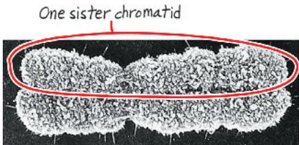

Circling the other chromatid instead would also be correct. Figure 12.5 The chromosome has four arms. The single (duplicated) chromosome in ② becomes two (unduplicated) chromosomes in ③. The duplicated chromosome in step 2 is considered one single chromosome. Figure 12.7 12;2;2;1
Figure 12.8

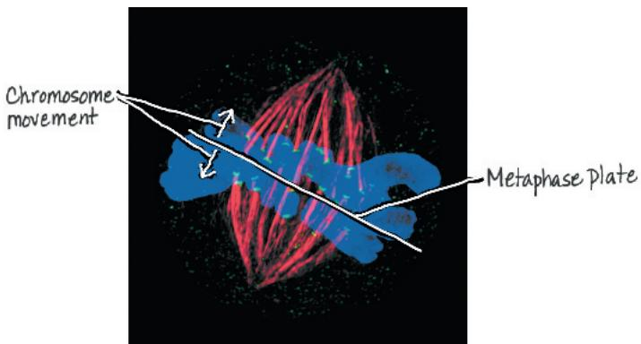  
Figure 12.9 The mark would have moved toward the pole closer to it. The lengths of fluorescent microtubules between that pole and the mark would have decreased, while the lengths between the chromosomes and the mark would have remained the same. Figure 12.14 In both cases, the $G_{1}$ nucleus would have remained in $G_{1}$ until the time it normally would have entered the S phase. Chromosome condensation and spindle formation would not have occurred until the S and $G_{2}$ phases had been completed. Figure 12.16 Passing the $G_{2}$ checkpoint in the diagram corresponds to the beginning of the “Time” axis of the graph, and entry into the mitotic phase (yellow background on the diagram) corresponds to the peaks of MPF activity and cyclin concentration on the graph (see the yellow M banner over the peaks). During $G_{1}$ and S phase in the diagram, Cdk is present without cyclin, so on the graph both cyclin concentration and MPF activity are low. The wide curved purple gradient arrow in the diagram shows increasing cyclin concentration, seen on the graph during the end of S phase and throughout $G_{2}$ phase. Then, the cell cycle begins again. Figure 12.17 The cell would divide under conditions where it was inappropriate to do so. If the daughter cells and their descendants also ignored either of the checkpoints and divided, there would soon be an abnormal mass of cells. (This type of inappropriate cell division can contribute to the development of cancer.) Figure 12.18 The cells in the vessel with PDGF would not be able to respond to the growth factor signal and thus would not divide. The culture would resemble that without the added PDGF.

## Concept Check 12.1

1. 1; 1; 2
2. 39; 39; 78

## Concept Check 12.2

1. 6 chromosomes; they are duplicated; 12 chromatids  
2. Following mitosis, cytokinesis results in two genetically identical daughter cells in both plant cells and animal cells. However, the mechanism of dividing the cytoplasm is different in animals and plants. In an animal cell, cytokinesis occurs by cleavage, which divides the parent cell in two with a contractile ring of actin filaments. In a plant cell, a cell plate forms in the middle of the cell and grows until its membrane fuses with the plasma membrane of the parent cell. A new cell wall grows from material inside the cell plate, thus eventually between the two new cells.  
3. From the end of S phase in interphase through the end of metaphase in mitosis  
4. During eukaryotic cell division, tubulin is involved in spindle formation and chromosome movement, while actin functions during cytokinesis. In bacterial binary fission, it's the opposite: Actin-like molecules are thought to move the daughter bacterial chromosomes to opposite ends of the cell, and tubulin-like molecules are thought to act in daughter cell separation.  
5. A kinetochore connects the spindle (a motor; note that it has motor proteins) to a chromosome (the cargo it will move).  
6. Microtubules made up of tubulin in the cell provide "rails" along which vesicles and other organelles can travel, based on interactions of motor proteins with tubulin in the microtubules. In muscle cells, actin in microfilaments interacts with myosin filaments to cause muscle contraction.

## Concept Check 12.3

1. The nucleus on the right was originally in the $G_{1}$ phase; therefore, it had not yet duplicated its chromosomes. The nucleus on the left was in the M phase, so it had already duplicated its chromosomes.
2. A sufficient amount of MPF has to exist for a cell to pass the $G_{2}$ checkpoint; this occurs through the accumulation of cyclin proteins, which combine with Cdk to form (active) MPF. MPF then phosphorylates other proteins, initiating mitosis.
3. The intracellular receptor (for example, an estrogen receptor), once activated, would be able to act as a transcription factor in the nucleus, turning on genes that may cause the cell to pass a checkpoint and divide. The RTK receptor, when activated by a ligand, would form a dimer, and each subunit of the dimer would phosphorylate the other. This would lead to a series of signal transduction steps, ultimately turning on genes in the nucleus. As in the case of the estrogen receptor, the genes would code for proteins necessary to cause the cell to pass a checkpoint and divide.

Figure 13.7

## Summary of Key Concepts Questions

12.1 The DNA of a eukaryotic cell is packaged into structures called chromosomes. Each chromosome is a long molecule of DNA, which carries hundreds to thousands of genes, with associated proteins that maintain chromosome structure and help control gene activity. This DNA-protein complex is called chromatin. The chromatin of each chromosome is long and thin when the cell is not dividing. Prior to cell division, each chromosome is duplicated, and the resulting sister chromatids are attached to each other by proteins at the centromeres and, for many species, all along their lengths (a phenomenon called sister chromatid cohesion). 12.2 A chromosome exists as a single DNA molecule in $G_{1}$ of interphase and in anaphase and telophase of mitosis. During S phase, DNA replication produces two sister chromatids per chromosome, which persist during $G_{2}$ of interphase and through prophase, prometaphase, and metaphase of mitosis. 12.3 Checkpoints allow cellular surveillance mechanisms to determine whether the cell is prepared to go to the next stage. Internal and external signals move a cell past these checkpoints. The $G_{1}$ checkpoint determines whether a cell will proceed forward in the cell cycle or switch into the $G_{0}$ phase. The signals to pass this checkpoint often are external, such as growth factors. Passing the $G_{2}$ checkpoint requires sufficient numbers of active MPF complexes, which in turn orchestrate several mitotic events. MPF also initiates degradation of its cyclin component, terminating the M phase. The M phase will not begin again until sufficient cyclin is produced during the next S and $G_{2}$ phases. The signal to pass the M phase checkpoint is not activated until all chromosomes are attached to kinetochore fibers and are aligned at the metaphase plate. Only then will sister chromatid separation occur.

## Test Your Understanding

1. B 2. A 3. C 4. C 5. A 6. B 7. A 8. D 9. See Figure 12.7 for a description of major events. Only one cell is indicated for each stage, but other correct answers are also present in this micrograph.

## Figure Questions

Figure 13.3 The chromosomes in a karyotype are photographed at their most condensed, at metaphase, which occurs during M phase of the cell cycle. At this point, the chromosomes have already been duplicated during S phase, so each chromosome exists as two sister chromatids. Figure 13.4 Two sets of chromosomes are present. Three pairs of homologous chromosomes are present. One long chromosome would be red (maternal), and one would be blue (paternal); one medium chromosome would be red, and one would be blue; one short chromosome would be red, and one would be blue. Figure 13.6 In (a), haploid cells do not undergo mitosis. In (b), haploid spores undergo mitosis to form the gametophyte, and certain haploid cells of the gametophyte undergo mitosis to form gametes. In (c), haploid cells undergo mitosis to form either a multicellular haploid organism or a new unicellular haploid organism, and these haploid cells undergo mitosis to form gametes.

(A short strand of DNA is shown here for simplicity, but each chromosome or chromatid contains a very coiled and folded DNA molecule.) Figure 13.8 If a cell with six chromosomes undergoes two rounds of mitosis, each of the four resulting cells will have six chromosomes, while the four cells resulting from meiosis in Figure 13.8 each have three chromosomes. In mitosis, DNA replication (and thus chromosome duplication) precedes each prophase, ensuring that daughter cells have the same number of chromosomes as the parent cell. In contrast, in meiosis, DNA replication occurs only before prophase I (not before prophase II). Thus, in two rounds of mitosis, the chromosomes duplicate twice and divide twice, while in meiosis, the chromosomes duplicate once and divide twice.

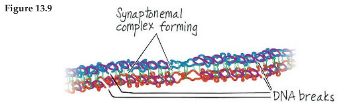

Figure 13.10 Yes. Each of the six chromosomes (three per cell) shown in telophase I has one nonrecombinant chromatid and one recombinant chromatid. Therefore, eight (2 possibilities for the first chromosome ×2 for the second ×2 for the third) possible sets of chromosomes can be generated for the cell on the left and eight for the cell on the right.

## Concept Check 13.1

1. Parents pass genes to their offspring; by dictating the production of messenger RNAs (mRNAs), the genes program cells to make specific enzymes and other proteins, whose cumulative action produces an individual's inherited traits. 2. Such organisms reproduce by mitosis, which generates offspring whose genomes are exact copies of the parent's genome (in the absence of mutation). 3. She should clone (generate a clone of) it. Crossbreeding it with another plant would generate offspring that have additional variation, which she no longer desires now that she has obtained her ideal orchid.

## Concept Check 13.2

1. Each of the six chromosomes is duplicated, so each contains two DNA molecules (double helices), so there are 12 DNA molecules in the cell. The haploid number, n, is 3. One set is always haploid.
2. There are 23 pairs of chromosomes and two sets.
3. A human diploid cell would have 23 “pairs of shoes.” A haploid cell would have 23 “shoes,” one of each pair.
4. This organism has the life cycle shown in Figure 13.6c, since the zygote doesn’t undergo mitosis but immediately undergoes meiosis. Therefore, it must be a fungus or a protist.

## Concept Check 13.3

1. The chromosomes are similar in that each is composed of two sister chromatids, and the individual chromosomes are positioned similarly at the metaphase plate. The chromosomes differ in that in a mitotically dividing cell, sister chromatids of each chromosome are genetically identical, but in a meiotically dividing cell, sister chromatids are genetically distinct because of crossing over in meiosis I. Moreover, the chromosomes in metaphase of mitosis can be a diploid set or a haploid set, but the chromosomes in metaphase of meiosis II always consist of a haploid set. 2. If crossing over did not occur, the two homologs would not be associated in any way. This is because each sister chromatid would be either all maternal or all paternal DNA, and the single DNA molecule would therefore not have been joined to the DNA of a non-sister chromatid, holding the complex together. The lack of association of homologs could easily result in the incorrect arrangement of homologs during metaphase I (both might go toward the same pole, for instance) and ultimately in formation of gametes with an abnormal number of chromosomes.

## Concept Check 13.4

1. Mutations in a gene lead to the different versions (alleles) of that gene. 2. Without crossing over, independent assortment of chromosomes during meiosis I theoretically can generate $2^{n}$ possible haploid gametes, and random fertilization can produce $2^{n} \times 2^{n}$ possible diploid zygotes. Because the haploid number (n) of grasshoppers is 23 and that of fruit flies is 4, two grasshoppers would be expected to produce a greater variety of zygotes than would two fruit flies. 3. If the segments of the maternal and paternal chromatids that undergo crossing over are genetically identical and thus have the same two alleles for every gene, then the recombinant chromosomes will be genetically equivalent to the parental chromosomes. Crossing over contributes to genetic variation only when it involves the rearrangement of different alleles.

## Summary of Key Concepts Questions

13.1 Genes program specific traits, and offspring inherit their genes from each parent, accounting for similarities in their appearance to one or the other parent. Humans reproduce sexually, which ensures new combinations of genes (and thus traits) in the offspring. Consequently, the offspring are not clones of their parents (which would be the case if humans reproduced asexually). 13.2 Animals and plants both reproduce sexually, alternating meiosis with fertilization. Both have haploid gametes that unite to form a diploid zygote, which then goes on to divide mitotically, forming a diploid multicellular organism. In animals, haploid cells become gametes and don't undergo mitosis, while in plants, the haploid cells resulting from meiosis undergo mitosis to form a haploid multicellular organism, the gametophyte. This organism then goes on to generate haploid gametes. (In plants such as trees, the gametophyte is quite reduced in size and not obvious to the casual observer.) 13.3 At the end of meiosis I, the two members of a homologous pair end up in different cells, so they cannot pair up and undergo crossing over during prophase II. 13.4 First, during independent assortment in metaphase I, each pair of homologous chromosomes lines up independently of each other pair at the metaphase plate, so a daughter cell of meiosis I randomly inherits either a maternal or a paternal chromosome of each pair. Second, due to crossing over, each chromosome is not exclusively maternal or paternal, but includes regions at the ends of the chromatid from a nonsister chromatid (a chromatid of the other homolog). (The nonsister segment can also be in an internal region of the chromatid if a second crossover occurs beyond the first one before the end of the chromatid.) This provides much additional diversity in the form of new combinations of alleles. Third, random fertilization ensures even more variation since any sperm of a large number containing many possible genetic combinations can fertilize any egg of a similarly large number of possible combinations.

## Test Your Understanding

1. A 2. B 3. A 4. D 5. C

6. (a) One possible answer:

(b) A haploid set is made up of one long, one medium, and one short chromosome, no matter what combination of colors. For example, one red long, one blue medium, and one red short chromosome make up a haploid set. (In cases where crossovers have occurred, a haploid set of one color may include segments of chromatids of the other color.) All red and blue chromosomes together make up a diploid set. (c) Metaphase I 7. This cell must be undergoing meiosis because the two homologs of a homologous pair are associated with each other at the metaphase plate; this does not occur in mitosis. Also, chiasmata are clearly present, meaning that crossing over has occurred, another process unique to meiosis.

## Chapter 14

## Figure Questions

Figure 14.3 All offspring would have purple flowers. (The ratio of purple to white flowers would be 1 purple: 0 white.) The P generation plants are true-breeding, so mating two purple-flowered plants produces the same result as self-pollination: All the offspring have the same trait. If Mendel had stopped after the $F_{1}$ generation, he could have concluded that the white factor had disappeared entirely and would not ever reappear.

Figure 14.8  
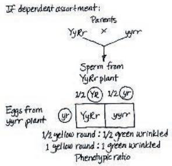

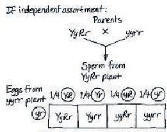

Yes, this cross would also have allowed Mendel to make different predictions for the two hypotheses, thereby allowing him to distinguish the correct one. Figure 14.10 Your classmate would probably point out that the $F_{1}$ generation hybrids show an intermediate phenotype between those of the homozygous parents, which supports the blending hypothesis. You could respond that crossing the $F_{1}$ hybrids results in the reappearance of the white phenotype, rather than identical pink offspring, which fails to support the idea of traits blending during inheritance. The blending hypothesis predicts that the white trait would have been lost after the $F_{1}$ generation. Figure 14.11 Both the $I^{A}$ and $I^{B}$ alleles are dominant to the i allele because the i allele results in no attached carbohydrate. The $I^{A}$ and $I^{B}$ alleles are codominant; both are expressed in the phenotype of $I^{A}I^{B}$ heterozygotes, who have type AB blood. Figure 14.12 In this cross, the final “3” and “1” of a standard cross are lumped together as a single phenotype. This occurs because in dogs that are ee, no pigment is deposited, thus the three dogs that have a B in their genotype (normally black) can no longer be distinguished from the dog that is bb (normally brown). Figure 14.16 In the Punnett square, two of the three individuals without albinism are carriers, so the probability is $\frac{2}{3}$ . (Note that you must take into account everything you know when you calculate probability: You know she is not aa, so there are only three possible genotypes to consider.)

## Concept Check 14.1

1. According to the law of independent assortment, 25 plants ( $\frac{1}{16}$ of the offspring) are predicted to be aatt, or recessive for both characters. The actual result is likely to differ slightly from this value.
2. The plant could make eight different gametes (YRI, YRI, YrI, Yri, yRI, yRi, yrI and yri). To fit all the possible gametes in a self-pollination, a Punnett square would need 8 rows and 8 columns. It would have spaces for the 64 possible unions

of gametes in the offspring. 3. Self-pollination is sexual reproduction because meiosis is involved in forming gametes, which unite during fertilization. As a result, the offspring in self-pollination are genetically different from the parent. (As mentioned in the footnote near the beginning of Concept 14.1, we have simplified the explanation in referring to the single pea plant as a parent. Technically, the gametophytes in the flower are the two “parents.”)

<table><tr><td></td><td>At</td><td>At</td><td>aT</td><td>at</td></tr><tr><td>AT</td><td>AATT</td><td>AATT</td><td>AATT</td><td>AATT</td></tr><tr><td>At</td><td>AATT</td><td>AATT</td><td>AATT</td><td>AATT</td></tr><tr><td>aT</td><td>AATT</td><td>AATT</td><td>aATT</td><td>aATT</td></tr><tr><td>at</td><td>AATT</td><td>AATT</td><td>aATT</td><td>aATT</td></tr></table>

Concept Check 14.2
1. $\frac{1}{2}$ homozygous dominant (AA), 0 homozygous recessive (aa), and $\frac{1}{2}$ heterozygous (Aa)
2. $\frac{1}{4}$ BBDD; $\frac{1}{4}$ BbDD;

$\frac{1}{4}BBDd;\ \frac{1}{4}BbDd$ 3. The genotypes that fulfill this condition are ppyyII, ppyyIi, ppYYii, ppYyii, Ppyyii, and ppyyii. Use the multiplication rule to find the probability of getting each genotype, and then use the addition rule to find the overall probability of meeting the conditions of this problem:

Genotypic ratio 1 Ii: 1 ii (2:2 is equivalent)

<table><tr><td>ρρyyII</td><td>1/2(probability of pp)×1/4(yy)×1/4(II)=1/32</td><td></td></tr><tr><td>ρρyyIi</td><td>1/2(pp)×1/4(yy)×1/2(Ii)</td><td>=1/16=2/32</td></tr><tr><td>ρρYyii</td><td>1/2(pp)×1/4(YY)×1/4(ii)</td><td>=1/32</td></tr><tr><td>ρρYyii</td><td>1/2(pp)×1/2(YY)×1/4(ii)</td><td>=1/16=2/32</td></tr><tr><td>ρρyyii</td><td>1/2(Pp)×1/4(yy)×1/4(ii)</td><td>=1/32</td></tr><tr><td>ρρyyii</td><td>1/2(pp)×1/4(yy)×1/4(ii)</td><td>=1/32</td></tr><tr><td colspan="2">Fraction predicted to be homozygous recessive</td><td>8/32=1/4</td></tr><tr><td colspan="3">for at least two of the three characters</td></tr></table>

## Concept Check 14.3

1. Incomplete dominance describes the relationship between two alleles of a single gene, whereas epistasis relates to the genetic relationship between two genes (and the respective alleles of each). 2. Half of the children would be expected to have type A blood and half type B blood. 3. The black and white alleles are incompletely dominant, with heterozygotes being gray in color. A cross between a gray rooster and a black hen should yield approximately equal numbers of gray and black offspring.

## Concept Check 14.4

1. $\frac{1}{9}$ (Since cystic fibrosis is caused by a recessive allele, Lucia and Jared's siblings who have CF must be homozygous recessive. Therefore, each parent must be a carrier of the recessive allele. Since neither Lucia nor Jared has CF and are thus not cc (using C/c as the alleles for the CF gene), this means they each have a $\frac{2}{3}$ chance of being a carrier. If they are both carriers, there is a $\frac{1}{4}$ chance that they will have a child with CF; $\frac{2}{3} \times \frac{2}{3} \times \frac{1}{4} = \frac{1}{9}$ ); virtually 0 (Both Lucia and Jared would have to be carriers to produce a child with the disease, unless a very rare mutation (change) occurred in the DNA of cells making eggs or sperm in a noncarrier that resulted in the CF allele.) 2. In normal hemoglobin, the sixth amino acid is glutamic acid (Glu), which is acidic (has a negative charge on its side chain). In sickle-cell hemoglobin, Glu is replaced by valine (Val), which is a nonpolar amino acid, very different from Glu. The primary structure of a protein (its amino acid sequence) ultimately determines the shape of the protein and thus its function. The substitution of Val for Glu enables the hemoglobin molecules to interact with each other and form long fibers, leading to the protein's deficient function and the deformation of the red blood cell. 3. Juanita's genotype is Dd. Because the allele for polydactyly (D) is dominant to the allele for five digits per appendage (d), the trait is expressed in people with either the DD or Dd genotype. But because Juanita's father does not have polydactyly, his genotype must be dd, which means that Juanita inherited a d allele from him. Therefore, Juanita, who does have the trait, must be heterozygous. 4. In the monohybrid cross involving flower color, the ratio is 3.15 purple : 1 white, while in the human family in the pedigree, the ratio in the third generation is 1 taster of PTC : 1 nontaster of PTC. The difference is due to the small sample size (two offspring) in the human family. If the second-generation couple in this pedigree were able to have 929 offspring as in the pea plant cross, the ratio would likely be closer to 3:1. (Note that none of the pea plant crosses in Table 14.1 yielded exactly a 3:1 ratio.)

## Summary of Key Concepts Questions

14.1 Alternative versions of genes, called alleles, are passed from parent to offspring during sexual reproduction. In a cross between purple- and white-flowered homozygous parents, the $F_{1}$ offspring are all heterozygous, each inheriting a purple allele from one parent and a white allele from the other. Because the purple allele is dominant, it determines the phenotype of the $F_{1}$ offspring to be purple, and the expression of the recessive white allele is masked. Only in the $F_{2}$ generation is it possible for some of the offspring to be homozygous recessive, which causes the white trait to be expressed.
14.2

$3/4 \text{ yellow} \times 3/4 \text{ round} = 9/16 \text{ yellow round}$

3/4 yellow × 1/4 wrinkled = 3/16 yellow wrinkled

1/4 green × 3/4 round = 3/16 green round

1/4 green × 1/4 wrinkled = 1/16 green wrinkled

=9 yellow round:3 yellow wrinkled:3 green round:1 green wrinkled

14.3 The ABO blood group is an example of multiple alleles because this single gene has more than two alleles ( $I^{A}$ , $I^{B}$ , and i). Two of the alleles, $I^{A}$ and $I^{B}$ , exhibit codominance since both carbohydrates (A and B) are present when these two alleles exist together in a genotype. $I^{A}$ and $I^{B}$ each exhibit complete dominance over the i allele. This situation is not an example of incomplete dominance because each allele affects the phenotype in a distinguishable way, so the result is not intermediate between the two phenotypes. Because this situation involves a single gene, it is not an example of epistasis or polygenic inheritance. 14.4 The chance of the fourth child having cystic fibrosis is $\frac{1}{4}$ , as it was for each of the other children, because each birth is an independent event. We already know both parents are carriers, so whether their first three children are carriers or not has no bearing on the probability that their next child will have the disease. The parents' genotypes provide the only relevant information.

## Test Your Understanding

1. A cross of $Ii \times ii$ would yield offspring with a genotypic ratio of 1 $Ii: 1\ ii$ (2:2 is an equivalent answer) and a phenotypic ratio of 1 inflated : 1 constricted (2:2 is equivalent).

2. Male parent $I^{A}i$ ; female parent $I^{B}i$ ; child ii. Genotypes for future children are predicted to be $\frac{1}{4}I^{A}I^{B}$ , $\frac{1}{4}I^{A}i$ , $\frac{1}{4}I^{B}i$ , $\frac{1}{4}ii$ .
3. $\frac{1}{2}$

Phenotypic ratio 1 inflated : 1 constricted (2:2 is equivalent)

4. The green pod trait is dominant, so the green pod allele is G and the yellow pod allele is g; the inflated pod trait is dominant, so the inflated pod allele is I and the constricted pod allele is i. The cross described is $GgIi \times GgIi$ .

  
9 green inflated: 3 green constricted; 3 yellow inflated: 1 yellow constricted

$$
5. (a) ^ {3 / 4} \times^ {3 / 4} \times^ {3 / 4} = ^ {2 7 / 6 4}; (b) 1 - ^ {2 7 / 6 4} = ^ {3 7 / 6 4}; (c) ^ {1 / 4} \times^ {1 / 4} \times^ {1 / 4} = ^ {1 / 6 4};
$$

7. (a) 1; (b) $\frac{1}{32}$ ; (c) $\frac{1}{8}$ ; (d) $\frac{1}{2}$ 8. $\frac{1}{9}$ 9. Matings of the original mutant cat with true-breeding noncurl cats will produce both curl and noncurl $F_1$ offspring if the curl allele is dominant, but only noncurl offspring if the curl allele is recessive. Whether the curl trait is dominant or recessive, you would obtain some true-breeding offspring homozygous for the curl allele from matings between the $F_1$ cats resulting from the original curl × noncurl crosses. If dominant, you wouldn't be able to tell true-breeding, homozygous offspring from heterozygotes without further crosses. You know that cats are true-breeding when curl × curl matings produce only curl offspring. As it turns out, the allele that causes curled ears is dominant. 10. Recessive. All individuals with alkaptonuria (Ariana, Benito, Elena, and Carlota) are homozygous recessive aa. Jorge is Aa, since some of his children with Ariana have alkaptonuria. Diego, Carmen, Hector, and Julio are each Aa, since they are all unaffected children with one affected parent. Miguel also is Aa, since he has an affected child (Carlota) with Carmen, who is heterozygous. Mariposa, Paloma, and Roberto can each have either the AA or Aa genotype. 11. $\frac{1}{6}$

Practice Applying Your Learning
16. (a) F (b) T (c) F (d) T (e) T (f) F (g) F

## Figure Questions

Figure 15.3 About $\frac{3}{4}$ of the $F_2$ offspring would have red eyes and about $\frac{1}{4}$ would have white eyes. Since this hypothetical cross assumes the sex chromosomes are not involved in determining eye color, about half of the white-eyed flies would be female and half would be male; similarly, about half of the red-eyed flies would be female and half would be male. (Note that the two autosomes with the eye color alleles would be the same shape in the Punnett square—unlike the X and Y chromosomes—and each offspring would inherit two alleles. The sex of the flies would be determined separately by inheritance of the sex chromosomes. Thus your $F_2$ Punnett square would have four possible combinations in sperm and two in eggs; it would have eight squares altogether.) Figure 15.4 The ratio would be 1 yellow round : 1 green round : 1 yellow wrinkled : 1 green wrinkled. (This is similar to a test cross.) Figure 15.7 All the males would be color-blind, and all the females would be carriers. (Another way to say this is that $\frac{1}{2}$ the offspring would be color-blind males, and $\frac{1}{2}$ the offspring would be carrier females.) Figure 15.9 The two largest classes would still be the offspring with the phenotypes of the true-breeding P generation flies, but now they would be gray vestigial and black normal, which is now the “parental type” because those were the specific allele combinations in the P generation (the linked alleles on their chromosomes). Figure 15.10 The two chromosomes on the left side of the sketch below are like the two chromosomes inherited by the $F_1$ female, one from each P generation fly. They are passed by the $F_1$ female intact to the offspring and thus could be called “parental” chromosomes. The other two chromosomes result from crossing over during meiosis in the $F_1$ female. Because they have combinations of alleles not seen in either of the $F_1$ female’s chromosomes, they can be called “recombinant” chromosomes. (Note that in this example, the allele combinations on the recombinant chromosomes, $b^+vg^+$ and $bvg$ , are the allele combinations that were on the parental chromosomes in the cross shown in Figures 15.9 and 15.10. The basis for calling them parental chromosomes is that they have the combination of alleles that was present on the P generation chromosomes.)

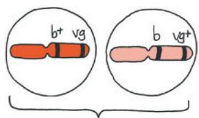  
Parental Chromosomes

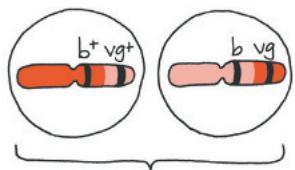  
Recombinant chromosomes

## Concept Check 15.1

1. To show the mutant phenotype, a male needs to possess only one mutant allele. If this gene had been on a pair of autosomes, an individual would show the recessive phenotype only if both alleles were mutant, a much less probable situation.
2. The law of segregation describes the inheritance of alleles for a single character. The law of independent assortment of alleles describes the inheritance of alleles for two characters.
3. The physical basis for the law of segregation is the separation of homologs in anaphase I. The physical basis for the law of independent assortment is the alternative arrangements of all the different homologous chromosome pairs in metaphase I.

## Concept Check 15.2

1. Because the gene for this eye color character is located on the X chromosome, all female offspring will be red-eyed and heterozygous $(X^{w}+X^{w})$ ; all male offspring will inherit a Y chromosome from the male parent and be white-eyed $(X^{w}Y)$ . (Another way to say this is that $\frac{1}{2}$ the offspring will be red-eyed heterozygous [carrier] females, and $\frac{1}{2}$ will be white-eyed males.) 2. $\frac{1}{4}$ ( $\frac{1}{2}$ chance that the child will inherit a Y chromosome from the male parent and be male $\times\frac{1}{2}$ chance that he will inherit the X carrying the disease allele from the female parent). If the child is a male, there is a $\frac{1}{2}$ chance he will have the disease; a female would have zero chance (but $\frac{1}{2}$ chance of being a carrier). 3. In a disorder caused by a dominant allele, there is no such thing as a “carrier,” since those with the allele have the disorder. Because the allele is dominant, the females lose any “advantage” in having two X chromosomes, since one disorder-associated allele is sufficient to result in the disorder. All males who have the dominant allele will pass it along to all their female offspring, who will also have the disorder. A female who has the allele (and thus the disorder) will pass it to half of her male offspring and half of her female offspring.

## Concept Check 15.3

1. Crossing over during meiosis I in the heterozygous parent produces some gametes with recombinant genotypes for the two genes. Offspring with a recombinant phenotype arise from fertilization of the recombinant gametes by homozygous recessive gametes from the double-mutant parent.
2. In each case, the alleles contributed by the female parent (in the egg) determine the phenotype of the offspring because the male in this cross contributes only recessive alleles. Thus, identifying the phenotype of the offspring tells you what alleles were in the female parent's (the dihybrid female's) egg. 3. No. The order could be A-C-B or C-A-B. To determine which possibility is correct, you need to know the recombination frequency between B and C.

## Concept Check 15.4

1. In meiosis, a combined 14-21 chromosome will behave as one chromosome. If a gamete receives the combined 14-21 chromosome and a normal copy of chromosome 21, trisomy 21 will result when this gamete combines with a normal gamete (with its own chromosome 21) during fertilization.
2. No. The child can be either $I^{A}I^{A}i$ or $I^{A}ii$ . A sperm of genotype $I^{A}I^{A}$ could result from nondisjunction in the male parent during meiosis II, while an egg with the genotype ii could result from nondisjunction in the female parent during either meiosis I or meiosis II.
3. Activation of this gene could lead to the production of too much of this kinase. If the kinase is involved in a signaling pathway that triggers cell division, too much of it could trigger unrestricted cell division, which in turn could contribute to the development of a cancer (in this case, a cancer of one type of white blood cell).

## Concept Check 15.5

1. Inactivation of an X chromosome in females and genomic imprinting. Because of X inactivation, the effective dose of genes on the X chromosome is the same in males and females. As a result of genomic imprinting, only one allele of certain genes is phenotypically expressed.
2. The genes for leaf coloration are located in plastids within the cytoplasm. Normally, only the maternal parent transmits plastid genes to offspring. Since variegated offspring are produced only when the female parent is of the B variety, we can conclude that variety B contains both the wild-type and mutant alleles of pigment genes, producing variegated leaves. (Variety A must contain only the wild-type allele of pigment genes.)
3. Each cell contains numerous mitochondria, and in affected individuals, most cells contain a variable mixture of normal and mutant mitochondria. The normal mitochondria carry out enough cellular respiration for survival. (The situation is similar for chloroplasts.)

## Summary of Key Concepts Questions

15.1 Because the sex chromosomes are different from each other and because they determine the sex of the offspring, Morgan could use the sex of the offspring as a phenotypic character to follow the parental chromosomes. (He could also have followed them under a microscope, as the X and Y chromosomes look different.) At the same time, he could record eye color to follow the eye color alleles. 15.2 Males have only one X chromosome, along with a Y chromosome, while females have two X chromosomes. The Y chromosome has very few genes on it, while the X has about 1,000. When a recessive X-linked allele that causes a disorder is inherited by a male on the X from his female parent, there isn't a second allele present on the Y (males are hemizygous), so the male has the disorder. Because females have two X chromosomes, they must inherit two recessive alleles in order to have the disorder, a rarer occurrence. 15.3 Crossing over results in new combinations of alleles. Crossing over is a random occurrence, and the more distance there is between two genes, the more chances there are for crossing over to occur, leading to new allele combinations. 15.4 In inversions and reciprocal translocations, the same genetic material is present in the same relative amount but just organized differently. In aneuploidy, duplications, deletions, and nonreciprocal translocations, the balance of genetic material is upset, as large segments are either missing or present in more than one copy. Apparently, this type of imbalance is very damaging to the organism. (Although it isn't lethal in the developing embryo, the reciprocal translocation during mitosis that produces the Philadelphia chromosome can lead to a serious condition, cancer, by altering the expression of important genes.) 15.5 In these cases, the sex of the parent contributing an allele affects the inheritance pattern. For imprinted genes, either the paternal or the maternal allele is expressed, depending on the imprint. For mitochondrial and chloroplast genes, only the maternal contribution will affect offspring phenotype because the offspring inherit these organelles from the female parent, via the egg cytoplasm.

## Test Your Understanding

1. 0; $\frac{1}{2}$ ; $\frac{1}{16}$ 2. Recessive; if the disorder were dominant, it would affect at least one parent of a child born with the disorder. The disorder's inheritance is sex-linked because it is seen only in males. For a female to have the disorder, she would have to inherit recessive alleles from both parents. This would be very rare, since males with the recessive allele on their X chromosome die in their early teens. 3. 17%; yes, it is consistent. In Figure 15.9, the recombination frequency was also 17%. (You'd expect this to be the case since these are the very same two genes, and their distance from each other wouldn't change from one experiment to another.)

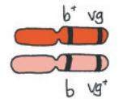

  
Wild-type parents chromosomes  
Black Parents
chromosomes

4. Between T and A, 12%; between A and S, 5% 5. Between T and S, 16%; sequence of genes is T-A-S 6. 6%; wild-type heterozygous for normal wings and red eyes × recessive homozygous for vestigial wings and purple eyes 7. Fifty percent of the offspring will show phenotypes resulting from crossovers. These results would be the same as those from a cross where A and B were not on the same chromosome, and you would interpret the results to mean that the genes are unlinked. (Further crosses involving other genes between A and B on the same chromosome would reveal the genetic linkage and map distances.) 8. 450 each of blue/oval and white/round (parentals) and 50 each of blue/round and white/oval (recombinants) 9. About one-third of the distance along the chromosome from the vestigial wing locus toward the brown eye locus 10. Because bananas are triploid, homologous pairs cannot line up during meiosis. Therefore, it is not possible to generate gametes that can fuse to produce a zygote with the triploid number of chromosomes. 12. (a) For each pair of genes, you had to generate an $\mathrm{F}_1$ dihybrid fly; let's use the $A$ and $B$ genes as an example. You obtained homozygous parental flies, either the first with dominant alleles of the two genes (AABB) and the second with recessive alleles (aabb), or the first with dominant alleles of gene $A$ and recessive alleles of gene $B$ (AAbb) and the second with recessive alleles of gene $A$ and dominant alleles of gene $B$ (aaBB). Breeding either of these pairs of P generation flies gave you an $\mathrm{F}_1$ dihybrid, which you then testcrossed with a doubly homozygous recessive fly (aabb). You classed the offspring as parental or recombinant, based on the genotypes of the P generation parents (either of the two pairs described above). You added up the number of recombinant types and then divided by the total number of offspring. This gave you the recombination percentage (in this case, $8\%$ ), which you can translate into map units (8 map units) to construct your map.

(b)  
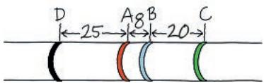

## Chapter 16

## Figure Questions

Figure 16.2 The living S cells found in the blood sample were able to reproduce to yield more S cells, indicating that the S trait is a permanent, heritable change, rather than just a one-time use of the dead S cells' capsules. Figure 16.4 The radioactivity would have been found in the pellet when proteins were labeled (batch 1) because proteins would have had to enter the bacterial cells to program them with genetic instructions. It's hard for us to imagine now, but the DNA might have played a structural role that allowed some of the proteins to be injected while it remained outside the bacterial cell (thus no radioactivity would be found in the pellet in batch 2). Figure 16.7 (1) The nucleotides in a single DNA strand are held together by covalent bonds between an oxygen on the $3^{\prime}$ carbon of one nucleotide and the phosphate group on the $5^{\prime}$ carbon of the next nucleotide in the chain. Instead of covalent bonds, the bonds that hold the two strands together are hydrogen bonds between a nitrogenous base on one strand and the complementary nitrogenous base on the other strand. (Hydrogen bonds are weaker than covalent bonds, but there are so many hydrogen bonds in a DNA double helix that, together, they are enough to hold the two strands together.) (2) One end, the $5^{\prime}$ end, has a phosphate group, which is attached to the $5^{\prime}$ carbon of the sugar, the one that is not in the ring. The other end, the $3^{\prime}$ end, has an —OH group attached to the $3^{\prime}$ carbon of the sugar; this carbon is in the ring. (3) The left diagram shows the most detail. It shows that each sugar-phosphate backbone is made up of sugars (blue pentagons) and phosphates (yellow circles) joined by covalent bonds (black lines). The middle diagram doesn't show any detail in the backbone. Both the left and middle diagrams label the bases and represent their complementarity by the complementary shapes at the ends of the bases (curves/ indents for G/C or V's/notches for T/A). The diagram on the right is the least detailed, implying that the base pairs pair up, but showing all bases as the same shape so not including the information about specificity and complementarity visible in the other two diagrams. The left and right diagrams show that the strand on the left was synthesized most recently, as indicated by the light blue color. All three diagrams show the $5^{\prime}$ and $3^{\prime}$ ends of the strands. Figure 16.12 The tube from the first replication would look the same, with a middle band of hybrid ${}^{15}\mathrm{N}-{}^{14}\mathrm{N}$ DNA, but the second tube would not have the upper band of DNA molecules made up of two light blue strands. Instead, it would have a bottom band of DNA made up of two dark blue strands, like the bottom band in the result predicted after one replication in the conservative model. Figure 16.13 In the bubble at the top of the micrograph in (b), arrows should be drawn pointing left and right to indicate the two replication forks.

New strand Template strand  

Figure 16.18  
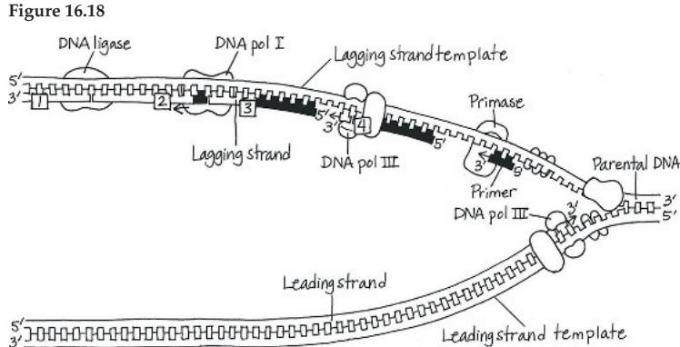

Figure 16.19  
  
Figure 16.24 The two members of a homologous pair (which would be the same color) would be associated tightly together at the metaphase plate during metaphase I of meiosis I. In metaphase of mitosis, however, each chromosome would be lined up individually, so the two chromosomes of the same color would be in different places at the metaphase plate.

## Concept Check 16.1

1. In order to tell which end is the 5' end, you need to know which end has a phosphate group on the 5' carbon (the 5' end) and/or which end has an —OH group on the 3' carbon (the 3' end).
2. Griffith expected that the mouse injected with the mixture of heat-killed S cells and living R cells would survive, since neither type of cell alone would kill the mouse.

## Concept Check 16.2

1. Complementary base pairing ensures that the two daughter molecules are exact copies of the parental molecule. When the two strands of the parental molecule separate, each serves as a template on which nucleotides are arranged by the base-pairing rules; they will then be polymerized by enzymes into new complementary strands.
2. DNA pol III covalently adds nucleotides to new DNA strands and proof-reads each added nucleotide for correct base pairing.
3. In the cell cycle, DNA synthesis occurs during the S phase, between the $G_{1}$ and $G_{2}$ phases of interphase. DNA replication is therefore complete before the mitotic phase begins.
4. Synthesis of the leading strand is initiated by an RNA primer, which must be removed and replaced with DNA, a task that could not be performed if the cell's DNA pol I were nonfunctional. In the overview box in Figure 16.18, just to the left of the top origin of replication, a functional DNA pol I would replace the RNA primer of the leading strand (shown in red) with DNA nucleotides (blue). The nucleotides would be added on to the 3' end of the first Okazaki fragment of the upper lagging strand (the right half of the replication bubble).

## Concept Check 16.3

1. A nucleosome is made up of eight histone proteins, two each of four different types, around which DNA is wound. Linker DNA runs from one nucleosome to the next. 2. The 10-nm fiber of euchromatin is less compacted during interphase than in mitosis and is accessible to the cellular proteins responsible for gene expression. In contrast, the 10-nm fiber of heterochromatin is relatively compacted (densely arranged) during interphase, and genes in heterochromatin are largely inaccessible to proteins necessary for gene expression. 3. The nuclear lamina is a netlike array of protein filaments that provides mechanical support just inside the nuclear envelope and thus maintains the shape of the nucleus. Considerable evidence also supports the existence of a nuclear matrix, a framework of protein fibers extending throughout the nuclear interior.

## Summary of Key Concepts Questions

16.1 Each strand in the double helix has polarity; the end with a phosphate group on the 5' carbon of the sugar is called the 5' end, and the end with an —OH group on the 3' carbon of the sugar is called the 3' end. The two strands run in opposite directions, one running 5' → 3' and the other alongside it running 3' → 5'. Thus, each end of the molecule has both a 5' and a 3' end, one on each strand of the double helix. This arrangement is called antiparallel. If the strands were parallel, they would both run 5' → 3' in the same direction, so an end of the molecule would have either two 5' ends or two 3' ends. 16.2 On both the leading and lagging strands, DNA polymerase adds onto the 3' end of an RNA primer synthesized by primase, synthesizing DNA in the 5' → 3' direction. Because the parental strands are antiparallel, however, only on the leading strand does synthesis proceed continuously into the replication fork. The lagging strand is synthesized bit by bit in the direction away from the fork as a series of shorter Okazaki fragments, which are later joined together by DNA ligase. Each fragment is initiated by synthesis of an RNA primer by primase as soon as a given stretch of single-stranded template strand is opened up. Although both strands are synthesized at the same rate, synthesis of the lagging strand is delayed because initiation of each fragment begins only when sufficient template strand is available. 16.3 The chromatin in an interphase nucleus is present as the 10-nm fiber, either fairly loosely arranged in euchromatin or more densely arranged in heterochromatin (such as at the centromeres and telomeres). The euchromatin is also subdivided into larger compartments and smaller looped domains. This organization may reflect differences in gene expression occurring in these regions.

## Test Your Understanding

1. C 2. C 3. B 4. D 5. A 6. D 7. B 8. A 9. Like histones, the E. coli proteins would be expected to contain many basic (positively charged) amino acids, such as lysine and arginine, which can form weak bonds with the negatively charged phosphate groups on the sugar-phosphate backbone of the DNA molecule.

## Chapter 17

## Figure Questions

Figure 17.3 The previously presumed pathway would have been wrong. The new results would support this pathway: precursor → citrulline → ornithine → arginine. They would also indicate that class I mutants have a defect in the second step and class II mutants have a defect in the first step. Figure 17.5 The mRNA sequence (5'-UGGUUUGGCUCA-3') is the same as the nontemplate DNA strand sequence (5'-TGGTTTGGCTCA-3'), except there is a U in the mRNA wherever there is a T in the DNA. The nontemplate strand is probably used to represent a DNA sequence because it so closely resembles the mRNA sequence, containing codons. (This is why it's called the coding strand.) Figure 17.6 Arg (or R)-Glu (or E)-Pro (or P)-Arg (or R) Figure 17.8 The processes are similar in that polymerases form polynucleotides complementary to an antiparallel DNA template strand. In replication, however, both strands act as templates, whereas in transcription, only one DNA strand acts as a template. This reflects, of course, the fact that replication results in a double-stranded product (DNA) while transcription results in a single-stranded product (an RNA). Figure 17.9 The RNA polymerase would bind directly to the promoter, rather than being dependent on the previous binding of transcription factors.
Figure 17.12

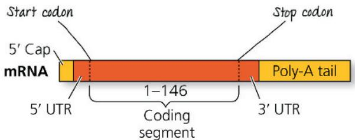  
Figure 17.16 The anticodon on the tRNA is so it would bind to the mRNA codon 5'-UUC-3'. This codon codes for phenylalanine (Phe, or F), which is the amino acid this tRNA would carry. Figure 17.22 It would be packaged in a vesicle, transported to the Golgi apparatus for further processing, and then transported via

a vesicle to the plasma membrane. The vesicle would fuse with the membrane, releasing the protein outside the cell. Figure 17.24 The mRNA farthest to the right (the longest one) started transcription first. The ribosome at the top, closest to the DNA, started translating first and thus has the longest polypeptide.

## Concept Check 17.1

1. Recessive 2. A polypeptide made up of 10 Gly (glycine) amino acids

3. Nontemplate sequence (from template sequence given in problem), written $3' \rightarrow 5'$ : $3'$ -ACGACTGAA- $5'$

If above used as template, mRNA sequence: 5'-UGCUGACUU-3'

Translated:

Cys-STOP

If the nontemplate sequence could have been used as a template for transcribing the mRNA, the protein translated from the mRNA would have a completely different amino acid sequence, so it would not be able to function as the original protein (translated from an mRNA transcribed from the template strand). It would also be shorter because of the UGA stop signal shown in the mRNA sequence above—and possibly others earlier in the mRNA sequence.

## Concept Check 17.2

1. A promoter is the region of DNA to which RNA polymerase binds to begin transcription. It is at the upstream end of the gene (transcription unit). 2. In a bacterial cell, part of the RNA polymerase recognizes the gene's promoter and binds to it. In a eukaryotic cell, transcription factors must bind to the promoter first, then the RNA polymerase binds to them. In both cases, sequences in the promoter determine the precise binding of RNA polymerase so the enzyme is in the right location and orientation. 3. The transcription factor that recognizes the TATA sequence would be unable to bind, so RNA polymerase could not bind and transcription of that gene most likely would not occur.

## Concept Check 17.3

1. Due to alternative splicing of exons, each gene can result in multiple different mRNAs and can thus direct synthesis of multiple different proteins. 2. In watching a pre-recorded show, you watch segments of the show itself (exons) and fast-forward through the commercials, which are thus like introns. However, unlike introns, commercials remain in the recording, while the introns are cut out of the RNA transcript during RNA processing. 3. Once the mRNA has exited the nucleus, the cap prevents it from being degraded by hydrolytic enzymes and facilitates its attachment to ribosomes. If the cap were removed from all mRNAs, the cell would no longer be able to synthesize any proteins and would probably die.

## Concept Check 17.4

1. First, each aminoacyl-tRNA synthetase specifically recognizes a single amino acid and attaches it only to an appropriate tRNA. Second, a tRNA charged with its

specific amino acid binds only to an mRNA codon for that amino acid. 2. A signal peptide on the leading end (amino end, or N-terminus) of the polypeptide being synthesized is recognized by a signal-recognition particle that brings the ribosome to the ER membrane. There, the ribosome attaches and continues to synthesize the polypeptide, depositing it in the ER lumen. 3. Because of wobble, the tRNA could bind to either 5'-GCA-3' or 5'-GCG-3', both of which code for alanine (Ala, or A). Alanine would be attached to the tRNA (see diagram, upper right). 4. When one ribosome terminates translation and dissociates, the two

subunits would be very close to the cap. This could facilitate their rebinding and initiating synthesis of a new polypeptide, thus increasing the efficiency of translation.

## Concept Check 17.5

1. In the mRNA, the reading frame downstream from the deletion is shifted, leading to a long string of incorrect amino acids in the polypeptide, and in most cases, a stop codon will occur, leading to premature termination. The polypeptide will most likely be nonfunctional.
2. Heterozygous individuals, said to have sickle-cell trait, have a copy each of the wild-type allele and the sickle-cell allele. Both alleles will be expressed, so these individuals will have both normal and sickle-cell hemoglobin molecules. Apparently, having a mix of the two forms of $\beta$ -globin has no effect under most conditions, but during prolonged periods of low blood oxygen (such as at higher altitudes), these individuals can show some signs of sickle-cell disease.

<table><tr><td>Normal DNA sequence(template strand is on top):</td><td>3′-TACTTGTCCGATATC-5′5′-ATGAACAGGCTATAG-3′</td></tr><tr><td>mRNA sequence:</td><td>5′-AUGAACAGGCUAUAG-3′</td></tr><tr><td>Amino acid sequence:</td><td>Met-Asn-Arg-Leu-STOP</td></tr><tr><td>Mutated DNA sequence(template strand is on top):</td><td>3′-TACTTGTCCAATATC-5′5′-ATGAACAGGTTATAG-3′</td></tr><tr><td>mRNA sequence:</td><td>5′-AUGAACAGGUUAUAG-3′</td></tr><tr><td>Amino acid sequence:</td><td>Met-Asn-Arg-Leu-STOP</td></tr></table>

No effect: The amino acid sequence is Met-Asn-Arg-Leu both before and after the mutation because the mRNA codons 5'-CUA-3' and 5'-UUA-3' both code for Leu. (The fifth codon is a stop codon.) 4. A Cas9–guide RNA could be synthesized complementary to the mutated sequence, and the Cas9–guide RNA complex injected into a cell with the mutation. A region of double-stranded DNA with the correct sequence would also be provided. Cas9 would cut the mutated sequence, and the DNA repair system in the cell would repair the DNA, using the correct sequence as a template. Based on the answer to question 3, however, this would not be worthwhile because there is no amino acid change in the encoded protein, so the function of the protein encoded by the mutated gene is normal.

## Summary of Key Concepts Questions

17.1 A gene contains genetic information in the form of a nucleotide sequence. The gene is first transcribed into an RNA molecule, and a messenger RNA molecule is ultimately translated into a polypeptide. The polypeptide makes up part or all of a protein, which performs a function in the cell and contributes to the phenotype of the organism. 17.2 Both bacterial and eukaryotic genes have promoters, regions where RNA polymerase ultimately binds and begins transcription. In bacteria, RNA polymerase binds directly to the promoter; in eukaryotes, transcription factors bind first to the promoter, and then RNA polymerase binds to the transcription factors and promoter together. 17.3 Both the 5' cap and the 3' poly-A tail help the mRNA exit from the nucleus and then, in the cytoplasm, help ensure mRNA stability and allow it to bind to ribosomes. 17.4 In the context of the ribosome, tRNAs function as translators between the nucleotide-based language of mRNA and the amino-acid-based language of polypeptides. A tRNA carries a specific amino acid, and the anticodon on the tRNA is complementary to the codon on the mRNA that codes for that amino acid. In the ribosome, the tRNA binds to the A site. Then, the polypeptide being synthesized (currently on the tRNA in the P site) is joined to the new amino acid, which becomes the new (C-terminal) end of the polypeptide. Next, the tRNA in the A site moves to the P site. After the polypeptide is transferred to the new tRNA, thus adding the new amino acid, the now empty tRNA moves from the P site to the E site, where it exits the ribosome. 17.5 When a nucleotide base is altered chemically, its base-pairing characteristics may be changed. When that happens, an incorrect nucleotide is likely to be incorporated into the complementary strand during the next replication of the DNA, and successive rounds of replication will perpetuate the mutation. Once the gene is transcribed, the mutated codon may code for a different amino acid that inhibits or changes the function of a protein. If, however, the chemical change in the base is detected and repaired by the DNA repair system before the next replication, no mutation will result.

## Test Your Understanding

1. B 2. C 3. A 4. B 5. B 6. C 7. D 8. No. Transcription and translation are separated in space and time in a eukaryotic cell, as a result of the eukaryotic cell's nuclear membrane

<table><tr><td>Type of RNA</td><td>Functions</td></tr><tr><td>Messenger RNA (mRNA)</td><td>Carries information specifying amino acid sequences of polypeptides from DNA to ribosomes</td></tr><tr><td>Transfer RNA (tRNA)</td><td>Serves as translator molecule in protein synthesis; translates mRNA codons into amino acids</td></tr><tr><td>Ribosomal RNA (rRNA)</td><td>In a ribosome, plays a structural role; as a ribozyme, plays a catalytic role (catalyzes peptide bond formation)</td></tr><tr><td>Primary transcript</td><td>Is a precursor to mRNA, rRNA, or tRNA, before being processed; some intron RNA acts as a ribozyme, catalyzing its own splicing</td></tr><tr><td>Small RNAs in spliceosome</td><td>Play structural and catalytic roles in spliceosomes, the complexes of protein and RNA that splice pre-mRNA</td></tr></table>

## Chapter 18

## Figure Questions

Figure 18.3 As the concentration of tryptophan in the cell falls, eventually there will be none bound to trp repressor molecules. These will then change into their inactive shapes and dissociate from the operator, allowing transcription of the operon to resume. The enzymes for tryptophan synthesis will be made, and they will again synthesize tryptophan in the cell. Figure 18.10 Each of the two polypeptides has two regions—one that makes up part of MyoD's DNA-binding domain and one that makes up part of MyoD's activation domain. Each functional domain in the complete MyoD protein is made up of parts of both polypeptides. Figure 18.12 In both types of cell, the albumin gene enhancer has the three control elements colored yellow, gray, and

red. The sequences in the liver and lens cells would be identical, since the cells are in the same organism. Figure 18.18 Even if the mutant MyoD protein couldn't activate the myoD gene, it could still turn on genes for the other proteins in the pathway (other transcription factors, which would turn on the genes for muscle-specific proteins, for example). Therefore, some differentiation would occur. But unless there were other activators that could compensate for the loss of the MyoD protein's activation of the myoD gene, the cell would not be able to maintain its differentiated state. Figure 18.22 Normal Bicoid protein would be made in the anterior end and compensate for the presence of mutant bicoid mRNA put into the egg by the female. Development should be normal, with a head present. (This is what was observed.) Figure 18.25 The mutation is likely to be recessive because it is more likely to have an effect if both copies of the gene are mutated and code for nonfunctional proteins. If one normal copy of the gene is present, its product could inhibit the cell cycle. (However, there are also known cases of dominant p53 mutations, and the HNPCC gene, discussed later, is a dominant mutation in a tumor-suppressor pathway.) Figure 18.27 Cancer is a disease in which cell division occurs without its usual regulation. Cell division can be stimulated by growth factors (see Figure 12.18), which bind to cell-surface receptors (see Figure 11.8). Cancer cells evade these normal controls and can often divide in the absence of growth factors (see Figure 12.19). This suggests that the receptor proteins or some other components in a signaling pathway are abnormal in some way (see, for example, the mutant Ras protein in Figure 18.24) or are expressed at abnormal levels, as seen for the receptors in this figure. Under some circumstances in the mammalian body, steroid hormones such as estrogen and progesterone can also promote cell division. These molecules also use cell-signaling pathways, as described in Concept 11.2 (see Figure 11.9). Because signaling receptors are involved in triggering cells to undergo cell division, it is not surprising that altered genes encoding these proteins might play a significant role in the development of cancer. Genes might be altered through either a mutation that changes the function of the protein product or a mutation that causes the gene to be expressed at abnormal levels that disrupt the overall regulation of the signaling pathway.

## Concept Check 18.1

1. Binding by the trp corepressor (tryptophan) activates the trp repressor, which binds to the trp operator, shutting off transcription of the trp operon. Binding by the lac inducer (allolactose) inactivates the lac repressor, so that it can no longer bind to the lac operator, leading to transcription of the lac operon. 2. When glucose is scarce, cAMP is bound to CRP and CRP is bound to the lac promoter, favoring the binding of RNA polymerase. However, in the absence of lactose, the lac repressor is bound to the lac operator, blocking RNA polymerase from transcribing the lac operon genes. 3. The cell would continuously produce $\beta$ -galactosidase and the two other enzymes for using lactose, even in the absence of lactose, thus wasting cell resources.

## Concept Check 18.2

1. Histone acetylation is generally associated with gene expression, while DNA methylation is generally associated with lack of expression. 2. The same enzyme could not methylate both a histone and a DNA base. Enzymes are very specific in structure, and an enzyme that could methylate an amino acid of a protein would not be able to fit the base of a DNA nucleotide into the same active site. 3. General transcription factors function in assembling the transcription initiation complex at the promoters for all genes. Specific transcription factors bind to control elements associated with a particular gene and, once bound, either increase (activators) or decrease (repressors) transcription of that gene. 4. Regulation of translation initiation, degradation of the mRNA, activation of the protein (by chemical modification, for example), and protein degradation 5. The three genes should have some similar or identical sequences in the control elements of their enhancers. Because of this similarity, the same specific transcription factors that are present in muscle cells could bind to the enhancers of all three genes and stimulate their expression coordinately.

## Concept Check 18.3

1. Both miRNAs and siRNAs are small, single-stranded RNAs that associate with a complex of proteins and then can base-pair with mRNAs that have a complementary sequence. This base pairing leads to either degradation of the mRNA or blockage of its translation. In some yeasts, siRNAs associated with proteins in a different complex can bind back to centromeric chromatin, recruiting enzymes that cause condensation of that chromatin into heterochromatin. Both miRNAs and siRNAs are processed from double-stranded RNA precursors but have subtle variations in the structure of those precursors. 2. The mRNA would persist and be translated into the cell division-promoting protein, and the cell would probably divide. If the intact miRNA is necessary for inhibition of cell division, then division of this cell might be inappropriate. Uncontrolled cell division could lead to formation of a mass of cells (tumor) that prevents proper functioning of the organism and could contribute to the development of cancer. 3. The XIST RNA is transcribed from the XIST gene on the X chromosome that will be inactivated. It then binds to that chromosome and induces heterochromatin formation. A likely model is that XIST RNA somehow recruits chromatin modification enzymes that lead to formation of heterochromatin.

## Concept Check 18.4

1. Cells undergo differentiation during embryonic development, becoming different from each other. Therefore, the adult organism is made up of many highly specialized cell types that are different from each other. 2. By binding to a receptor on the receiving cell's surface and triggering a signal transduction pathway, involving intracellular molecules such as second messengers and transcription factors that affect gene expression 3. The products of maternal effect genes, made and deposited into the egg by the female, determine the head and tail ends, as well as the back and belly, of the egg and embryo (and eventually the adult fly). 4. The lower cell is synthesizing signaling molecules because the gene encoding them is activated, meaning that the appropriate specific transcription factors are binding to the gene's enhancer. The genes encoding these specific transcription factors are also being expressed in this cell because the transcription factor activators that can turn them on were expressed in the precursor to this cell. A similar explanation also applies to the cells expressing the receptor proteins. This scenario began with specific cytoplasmic determinants localized in specific regions of the egg. These cytoplasmic determinants were distributed unevenly to daughter cells, resulting in cells going down different developmental pathways.

## Concept Check 18.5

1. A cancer-causing mutation in a proto-oncogene usually makes the gene product overactive, whereas a cancer-causing mutation in a tumor-suppressor gene usually makes the gene product nonfunctional.
2. When an individual has inherited an oncogene or a mutant allele of a tumor-suppressor gene
3. Apoptosis is signaled by the p53 protein when a cell has extensive DNA damage, so apoptosis plays a protective role in eliminating a cell that might contribute to cancer. If mutations in the genes in the apoptotic pathway blocked apoptosis, a cell with such damage could continue to divide and might lead to tumor formation.

## Summary of Key Concepts Questions

18.1 A corepressor and an inducer are both small molecules that bind to the repressor protein in an operon, causing the repressor to change shape. In the case of a corepressor (like tryptophan), this shape change allows the repressor to bind to the operator, blocking transcription. In contrast, an inducer causes the repressor to dissociate from the operator, allowing transcription to begin. 18.2 In that specific type of cell, the chromatin must not be tightly condensed because it must be accessible to transcription factors. The appropriate specific transcription factors (activators), which are made in that type of cell, must bind to the control elements in the enhancer of the gene, while repressors must not be bound. The DNA must be bent by a bending protein so the activators can contact the mediator proteins and form a complex with general transcription factors at the promoter. Then RNA polymerase must bind and begin transcription. 18.3 miRNAs do not "code" for the amino acids of a protein—they are never translated. Each miRNA associates with a group of proteins to form a complex. Binding of the complex to an mRNA with a complementary sequence causes that mRNA to be degraded or blocks its translation. This is considered gene regulation because it controls the amount of a particular mRNA that can be translated into a functional protein. 18.4 The first process involves cytoplasmic determinants, including mRNAs and proteins, placed into specific locations in the egg by maternal cells. The embryonic cells that are formed from different regions of the egg during early cell divisions will have different proteins in them, which will direct different programs of gene expression. The second process involves the cell in question responding to signaling molecules secreted by neighboring cells (induction). The signaling pathway in the responding cell also leads to a different pattern of gene expression. The coordination of these two processes results in each cell following a unique pathway in the developing embryo.

18.5 The protein product of a proto-oncogene is usually involved in a pathway that stimulates cell division. The protein product of a tumor-suppressor gene is usually involved in a pathway that inhibits cell division.

## Test Your Understanding

1. C 2. A 3. B 4. C 5. C 6. D 7. A 8. C 9. B 10. D
11. (a)

The purple, blue, and red activator proteins would be present.

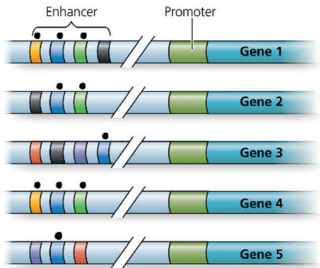

Only gene 4 would be transcribed. (c) In nerve cells, the yellow, blue, green, and black activators would have to be present, thus activating transcription of genes 1, 2, and 4. In skin cells, the red, black, purple, and blue activators would have to be present, thus activating genes 3 and 5.

## Chapter 19

## Figure Questions

Figure 19.2 Beijerinck might have concluded that the agent was a toxin produced by the plant that was able to pass through a filter but that became more and more dilute. In this case, he would have concluded that the infectious agent could not replicate. Figure 19.4

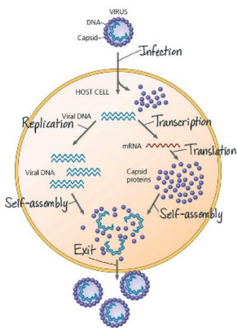

Figure 19.9 The main protein on the cell surface that HIV binds to is called CD4. However, HIV also requires a “co-receptor,” which in many cases is a protein called CCR5. HIV binds to both of these proteins together and then is taken into the cell. Researchers discovered this requirement by studying individuals who seemed to be resistant to HIV infection despite multiple exposures. These individuals turned out to have mutations in the gene that encodes CCR5 such that the protein apparently cannot act as a co-receptor, and so HIV can’t enter and infect cells.

## Concept Check 19.1

1. Both viruses consist of RNA as the genetic material, associated with proteins. However, TMV consists of one molecule of RNA surrounded by a helical array of proteins, while the influenza virus has eight molecules of RNA, each associated with proteins and wound into a double helix. Another difference between the viruses is that the influenza virus has an outer envelope and TMV does not.
2. The T2 phages were an excellent choice for use in the Hershey-Chase experiment because they consist of only DNA surrounded by a protein coat, and DNA and protein were the two candidates for macromolecules that carried genetic information. Hershey and Chase were able to radioactively label each type of molecule alone and follow it during separate infections of E. coli cells with T2. Only the DNA entered the bacterial cell during infection, and only labeled DNA showed up in some of the progeny phage. Hershey and Chase concluded that the DNA must carry the genetic information necessary for the phage to reprogram the cell and produce progeny phages.

## Concept Check 19.2

1. Lytic phages can only carry out lysis of the host cell, whereas lysogenic phages may either lyse the host cell or integrate into the host chromosome. In the latter case, the viral DNA (prophage) is simply replicated along with the host chromosome. Under certain conditions, a prophage may exit the host chromosome and initiate a lytic cycle. 2. Both the CRISPR-Cas system and miRNAs involve RNA molecules bound in a protein complex and acting as "homing devices" that enable the complex to bind a complementary sequence. However, miRNAs are involved in regulating gene expression (by affecting mRNAs) and the CRISPR-Cas system protects bacterial cells from foreign invaders—infecting phages. Thus the CRISPR-Cas system is more like an immune system than is the miRNA system. 3. Both the viral RNA polymerase and the RNA polymerase in Figure 17.10 synthesize an RNA molecule complementary to a template strand. However, the RNA polymerase in Figure 17.10 uses one of the strands of the DNA double helix as a template, whereas the viral RNA polymerase uses the RNA of the viral genome as a template. 4. HIV is called a retrovirus because it synthesizes DNA using its RNA genome as a template. This is the reverse ("retro") of the usual DNA → RNA information flow. 5. There are many steps that could be interfered with: binding of the virus to the cell, reverse transcriptase function, integration into the host cell chromosome, genome synthesis (in this case, transcription of RNA from the integrated provirus), assembly of the virus inside the cell, and budding of the virus. (Many of these, if not all, are targets of actual medical strategies to block progress of the infection in HIV-infected people.)

## Concept Check 19.3

1. Mutations can lead to a new strain of a virus that can no longer be effectively fought by the immune system, even if an animal had been exposed to the original strain; a virus can jump from one species to a new host; and a rare virus can spread if a host population becomes less isolated.
2. In horizontal transmission, a plant is infected from an external source of virus, which enters through a break in the plant's epidermis due to damage by herbivores or other agents. In vertical transmission, a plant inherits viruses from its parent either via infected seeds (sexual reproduction) or via an infected cutting (asexual reproduction).
3. Humans are not within the host range of TMV, so they can't be infected by the virus. (TMV can't bind to receptors on human cells and infect them.)

## Summary of Key Concepts Questions

19.1 Viruses are generally considered nonliving because they are not capable of replicating outside of a host cell and are unable to carry out the energy-transforming reactions of metabolism. To replicate and carry out metabolism, they depend completely on host enzymes and resources. 19.2 Single-stranded RNA viruses require an RNA polymerase that can make RNA using an RNA template. (Cellular RNA polymerases make RNA using a DNA template.) Retroviruses require reverse transcriptases to make DNA using an RNA template. (Once the first DNA strand has been made, the same enzyme can promote synthesis of the second DNA strand.) 19.3 The mutation rate of RNA viruses is higher than that of DNA viruses because RNA polymerase has no proofreading function, so errors in replication are not corrected. Their higher mutation rate is one reason that RNA viruses change faster than DNA viruses, leading to their being able to have an altered host range and to evade immune defenses in possible hosts.

## Test Your Understanding

1. C 2. D 3. C 4. D 5. B 6. As shown below, the viral genome would be translated into capsid proteins and envelope glycoproteins directly, rather than after a complementary RNA copy was made. A complementary RNA strand would still be made, however, that could be used as a template for many new copies of the viral genome.

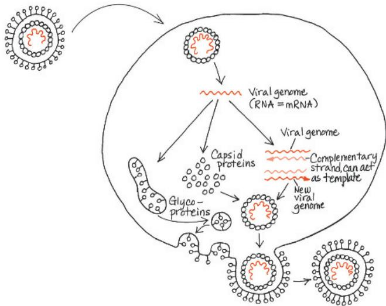

## Chapter 20

## Figure Questions

Figure 20.5  
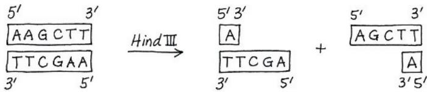

Figure 20.16 None of the eggs with the transplanted nuclei from the four-cell embryo at the upper left would have developed into a tadpole. Also, the result might include only some of the tissues of a tadpole, which might differ, depending on which nucleus was transplanted. (This assumes that there was some way to tell the four cells apart, as one can in some frog species.) Figure 20.21 Using converted iPS cells would not carry the same risk, which is its major advantage. Because the donor cells would come from the patient, they would be perfectly matched. The patient's immune system would recognize them as "self" cells and would not mount an attack (which is what leads to rejection). On the other hand, cells that are rapidly dividing might carry a risk of inducing some type of tumor or contributing to development of cancer.

## Concept Check 20.1

1. The covalent sugar-phosphate bonds of the DNA strands 2. Yes, PvuI will cut the molecule (at the position indicated by the dashed red line).

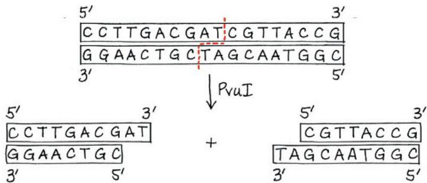

3. Some eukaryotic genes are too large to be incorporated into bacterial plasmids. Bacterial cells lack the means to process RNA transcripts into mRNA, and even if the need for RNA processing is avoided by using cDNA, bacteria lack enzymes to catalyze the post-translational processing that many eukaryotic proteins require to function properly. (This is often the case for human proteins, which are a focus of biotechnology.) 4. During the replication of the ends of linear DNA molecules (see Figure 16.21), an RNA primer is used at the 5' end of each new strand. The RNA must be replaced by DNA nucleotides, but DNA polymerase is incapable of starting from scratch at the 5' end of a new DNA strand. During PCR, the primers are made of DNA nucleotides already, so they don't need to be replaced—they just remain as part of each new strand. Therefore, there is no problem with end replication during PCR, and the fragments don't shorten with each replication.

## Concept Check 20.2

1. Complementary base pairing is involved in cDNA synthesis, which is required for all three techniques: RT-PCR, DNA microarray analysis, and RNA sequencing. Reverse transcriptase uses mRNA as a template to synthesize the first strand of cDNA, adding nucleotides complementary to those on the mRNA. Complementary base pairing is also involved when DNA polymerase synthesizes the second strand of the cDNA. Furthermore, in RT-PCR, the primers must base-pair with their target sequences in the DNA mixture, locating one specific region among many. Also, the DNA polymerase (for example, Taq polymerase) used in PCR relies on complementary base pairing to the template strand to add new nucleotides during synthesis of the fragments. In DNA microarray analysis, the labeled cDNA probe binds only to the specific target sequence due to complementary nucleic acid hybridization (DNA-DNA hybridization). In RNA-seq, when sequencing the cDNAs, base complementarity plays a role in the sequencing process.
2. As a researcher interested in how cancer develops, you would want to study genes represented by spots that are green or red because these are genes for which the expression level differs between the two types of tissue. Some of these genes may be expressed differently as a result of cancer, while others might play a role in causing cancer, so both would be of interest.

## Concept Check 20.3

1. The state of chromatin modification in the nucleus from the intestinal cell was undoubtedly less similar to that of a nucleus from a fertilized egg, explaining why many fewer of these nuclei were able to be reprogrammed. In contrast, the chromatin in a nucleus from a cell at the four-cell stage would have been much more like that of a nucleus in a fertilized egg and therefore much more easily programmed to direct development. 2. No, primarily because of subtle (and perhaps not so subtle) differences in the environment in which the clone develops and lives compared with that in which the original pet lived (see the differences noted in Figure 20.18). This does provoke ethical questions. To produce Dolly, also a mammal, several hundred embryos were cloned, but only one survived to adulthood. If any of the "reject" dog embryos survived to birth as defective dogs, would they be killed? Is it ethical to produce living animals that may be defective? You can probably think of other ethical issues as well. 3. Given that muscle cell differentiation involves a master regulatory gene (MyoD), you might start by introducing either the MyoD protein or an expression vector carrying the MyoD gene into stem cells. (This is not likely to work, because the embryonic precursor cell in Figure 18.18 is more differentiated than the stem cells you are working with, and some other changes would have to be introduced as well. But it's a good way to start! And you may be able to think of others.)

## Concept Check 20.4

1. Stem cells continue to reproduce themselves, ensuring that the corrective gene product will continue to be made.
2. Herbicide resistance, pest resistance, disease resistance, drought resistance, enhanced nutritional value, and delayed ripening
3. Because hepatitis A is an RNA virus, you could isolate RNA from the blood and try to detect copies of hepatitis A RNA by RT-PCR. You would first reverse-transcribe the blood mRNA into cDNA and then use PCR to amplify the cDNA, using primers specific to hepatitis A sequences. If you then ran the products on an electrophoretic gel, the presence of a band of the appropriate size would support your hypothesis. Alternatively, you could use RNA-seq to sequence all the RNAs in your patient's blood and see whether any of the sequences match up with that of hepatitis A. (Since you are only seeking one sequence, though, RT-PCR is probably a better choice.)

## Summary of Key Concepts Questions

20.1 A plasmid vector and a source of foreign DNA to be cloned are both cut with the same restriction enzyme, generating restriction fragments with sticky ends. These fragments are mixed together, ligated, and reintroduced into bacterial cells. The plasmid has a gene for resistance to an antibiotic. That antibiotic is added to the host cells, and only cells that have taken up a plasmid will grow. (Another technique allows researchers to select only the cells that have a recombinant plasmid, rather than the original plasmid without an inserted gene.) 20.2 The genes that are expressed in a given tissue or cell type determine the proteins (and non-coding RNAs) that are the basis of the structure and functions of that tissue or cell type. Understanding which groups of interacting genes establish particular structures and carry out certain functions will help us learn how the parts of an organism work together. We will also be better able to treat diseases that occur when faulty gene expression leads to malfunctioning tissues. 20.3 (1) Cloning a mouse involves transplanting a nucleus from a differentiated mouse cell into a mouse egg cell that has had its own nucleus removed. Activating the egg cell and promoting its development into an embryo in a surrogate carrier results in a mouse that is genetically identical to the mouse that donated the nucleus. In this case, the differentiated nucleus has been reprogrammed by factors in the egg cytoplasm. (2) Mouse ES cells are generated from inner cells in mouse blastocysts, so in this case the cells are “naturally” reprogrammed by the process of reproduction and development. (Cloned mouse embryos can also be used as a source of ES cells.) (3) iPS cells can be generated without the use of embryos from a differentiated adult mouse cell by adding certain transcription factors into the cell. In this case, the transcription factors are reprogramming the cells to become pluripotent. 20.4 First, the disease must be caused by a single gene, and the molecular basis of the problem must be understood. Second, the cells that are going to be introduced into the patient must be cells that will integrate into body tissues and continue to multiply (and provide the needed gene product). Third, the gene must be able to be introduced into the cells in question in a safe way, as there have been instances of cancer resulting from some gene therapy trials. (Note that this will require testing the procedure in mice; moreover, the factors that determine a safe vector are not yet well understood. Maybe one of you will go on to solve this problem!)

## Test Your Understanding

1. D 2. B 3. C 4. B 5. C 6. A 7. B 8. You would use PCR to amplify the gene. This could be done from genomic DNA. Alternatively, mRNA could be isolated from lens cells and reverse-transcribed by reverse transcriptase to make cDNA. This cDNA could then be used for PCR. In either case, the gene would then be inserted into an expression vector so you could produce the protein and study it. 9. Crossing over, which causes recombination, is a random event. The chance of crossing over occurring between two loci increases as the distance between them increases. If a SNP is located very close to a disease-associated allele, it is said to be genetically linked. Crossing over will rarely occur between the SNP and the allele, so the SNP can be used as a genetic marker indicating the presence of the particular allele.

10.

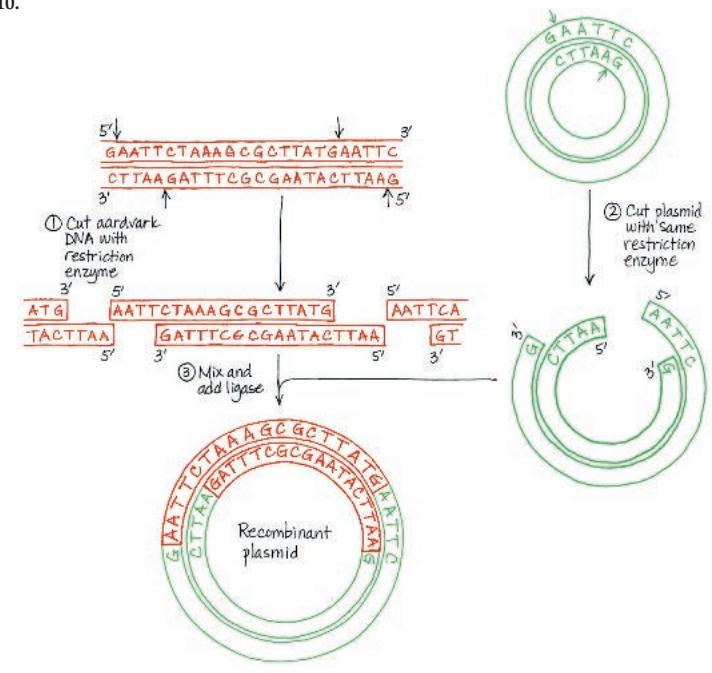

## Chapter 21

## Figure Questions

Figure 21.2 In step 2 of this figure, the order of the fragments relative to each other is not known and will be determined later by computer. The unordered nature of the fragments is reflected by their scattered arrangement in the diagram. Figure 21.8 The transposon would be cut out of the DNA at the original site rather than copied, so the figure would show the original stretch of DNA without the transposon after the mobile transposon had been cut out. Figure 21.10 The RNA transcripts extending from the DNA in each transcription unit are shorter on the left and longer on the right. This means that RNA polymerase must be starting on the left end of the unit and moving toward the right.

Figure 21.13

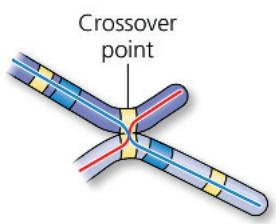

Figure 21.14 Pseudogenes are nonfunctional. They could have arisen by any mutations in the second copy that made the gene product unable to function. Examples are base changes that introduce stop codons in the sequence, alter amino acids, or change a region of the gene promoter so that the gene can no longer be expressed. Figure 21.15 At position 5, there is an R (arginine) in lysozyme and a K (lysine) in $\alpha$ -lactalbumin; both of these are basic amino acids. Figure 21.16 Let's say a transposable

element (TE) existed in the intron to the left of the indicated EGF exon in the EGF gene, and the same TE was present in the intron to the right of the indicated F exon in the fibronectin gene. During meiotic recombination, these TEs could cause nonsister chromatids on homologous chromosomes to pair up incorrectly, as seen in Figure 21.13. One gene might end up with an F exon next to an EGF exon. Further mistakes in pairing over many generations might result in these two exons being separated from the rest of the gene and placed next to a single or duplicated K exon. In general, the presence of repeated sequences in introns and between genes facilitates these processes because it allows incorrect pairing of nonsister chromatids, leading to novel exon combinations. Figure 21.18 Since you know that chimpanzees do not speak but humans do, you'd probably want to know how many amino acid differences there are between the human wild-type FOXP2 protein and that of the chimpanzee and whether these changes affect the function of the protein. You know that humans with mutations in this gene have severe language impairment. You would want to learn more about the human mutations by checking whether they affect the same amino acids in the gene product that the chimpanzee sequence differences affect. If so, those amino acids might play an important role in the function of the protein in language. Going further, you could analyze the differences between the chimpanzee and mouse FOXP2 proteins. You might ask: Are they more similar than the chimpanzee and human proteins? (It turns out that the chimpanzee and mouse proteins have only one amino acid difference and thus are more similar than the chimpanzee and human proteins,

which have two differences, and also are more similar than the human and mouse proteins, which have three differences.)

## Concept Check 21.1

1. In the whole-genome shotgun approach, short fragments are generated by cutting the genome with multiple restriction enzymes. These fragments are sequenced by high-throughput machines, and then ordered by computer programs that identify overlapping regions.

## Concept Check 21.2

1. The Internet allows centralization of databases such as GenBank and software resources such as BLAST, making them freely accessible. Having all the data in a central database, easily accessible on the Internet, minimizes the possibility of errors and of researchers working with different data. It streamlines the process of science, since all researchers are able to use the same software programs, rather than each having to obtain their own, possibly different, software. It speeds up dissemination of data and ensures as much as possible that errors are corrected in a timely fashion. These are just a few answers; you can probably think of more.
2. Cancer is a disease caused by multiple factors. Focusing on a single gene or a single defect would mean ignoring other factors that may influence the cancer and even the behavior of the single gene being studied. The systems approach, because it takes into account many factors at the same time, is more likely to lead to an understanding of the causes and most useful treatments for cancer.
3. Some of the transcribed region is accounted for by introns. The rest is transcribed into noncoding RNAs, including small RNAs, such as microRNAs (miRNAs), siRNAs, and piRNAs. Some of these RNAs help regulate gene expression by blocking translation, causing degradation of mRNA, binding to the promoter and repressing transcription, or causing remodeling of chromatin structure. The long noncoding RNAs (lncRNAs) may also contribute to gene regulation or to remodeling of chromatin structure.
4. Genome-wide association studies use the systems biology approach in that they consider the correlation of many single nucleotide polymorphisms (SNPs) with particular diseases, such as heart disease and diabetes, in an attempt to find patterns of SNPs that correlate with each disease.

## Concept Check 21.3

1. Alternative splicing of RNA transcripts from a gene and post-translational processing of polypeptides 2. At the top of the web page, you can see the number of genomes completed and those considered permanent drafts in a bar graph by year. Scrolling down, you can see the number of complete and incomplete sequencing projects by year, the number of projects by “domain group” by year (the genomes of viruses and metagenomes are counted too, even though these are not “domain groups”), the phylogenetic distribution of bacterial genome projects, and projects by sequencing center. Finally, near the bottom, you can see a pie chart of the “Project Relevance of Bacterial Genome Projects,” which shows that about 50–55% have medical relevance. (This number may vary over time.) The web page ends with several pie charts showing the major sequencing centers for archaeal and bacterial projects, fungal genomes, and plant genomes. 3. A prokaryotic cell is generally smaller than a eukaryotic cell, and prokaryotic organisms reproduce by binary fission. The evolutionary process involved is natural selection for more quickly reproducing cells: The faster they can replicate their DNA and divide, the more likely they will be able to dominate a population of prokaryotic organisms. The less DNA they have to replicate, then, the faster they will reproduce.

## Concept Check 21.4

1. The number of genes is higher in mammals, and the amount of noncoding DNA is greater. Also, the presence of introns in mammalian genes makes them larger, on average, than prokaryotic genes.
2. The copy-and-paste transposon mechanism and retrotransposition
3. In the rRNA gene family, identical transcription units, each containing genes for all three different RNA products, are present in long arrays, repeated one after the other. The large number of copies of the rRNA genes enable organisms to produce the rRNA for enough ribosomes to carry out active protein synthesis, and the single transcription unit for the three rRNAs ensures that the relative amounts of the different rRNA molecules produced are correct—every time one rRNA is made, a copy of each of the other two is made as well. Rather than numerous identical units, each globin gene family consists of a relatively small number of nonidentical genes. The differences in the globin proteins encoded by these genes result in production of hemoglobin molecules adapted to particular developmental stages of the organism.
4. The exons would be classified as exons (1.5%); the enhancer region containing the distal control elements, the region closer to the promoter containing the proximal control elements, and the promoter itself would be classified as regulatory sequences (5%); and the introns would be classified as introns (20%).

## Concept Check 21.5

1. If meiosis is faulty, two copies of the entire genome can end up in a single cell. Errors in crossing over during meiosis can lead to one segment being duplicated while another is deleted. During DNA replication, slippage backward along the template strand can result in segment duplication. Also, a "copy-and-paste" transposable element could copy and paste a segment of DNA, resulting in a duplication of that segment (and of the transposable element itself.) 2. For either gene, a mistake in crossing over during meiosis could have occurred between the two copies of that gene, such that one ended up with a duplicated exon. (The other copy would have ended up with a deleted exon.) This could have happened several times, resulting in the multiple copies of a particular exon in each gene. 3. Homologous transposable elements scattered throughout the genome provide sites where recombination can occur between different chromosomes. Movement of these elements into coding or regulatory sequences may change expression of genes, which can affect the phenotype in a way that is subject to natural selection. Transposable elements also can carry genes with them, leading to dispersion of genes and in some cases different patterns of expression. Transport of an exon during transposition and its insertion into a gene may add a new functional domain to the originally encoded protein, a type of exon shuffling. (For any of these changes to be heritable, they must happen in germ cells, cells that will give rise to gametes.) 4. Because more offspring are born to females who have this inversion, it must provide some advantage during the process of reproduction and development. Because proportionally more offspring have this inversion, we would expect it to persist and spread in the population. (In fact, evidence in the study allowed the researchers to conclude that it has been increasing in proportion in the population. You'll learn more about population genetics in the next unit.)

## Concept Check 21.6

1. Because both humans and macaques are primates, their genomes are expected to be more similar than the macaque and mouse genomes are. The mouse lineage diverged from the primate lineage before the human and macaque lineages diverged. 2. Homeotic genes differ in their nonhomeobox sequences, which determine the interactions of homeotic gene products with other transcription factors and hence which genes are regulated by the homeotic genes. These nonhomeobox sequences differ in the two species, as do the expression patterns of the homeobox genes. 3. Alu elements underwent transposition more actively in the human genome for some reason. Their increased sites of insertion may have then allowed more recombination errors in the human genome, resulting in more or different duplications. The divergence of the organization and content of the two genomes presumably made the chromosomes of each genome less similar to those of the other, thus accelerating divergence of the two species by making matings less and less likely to result in fertile offspring due to the mismatch of genetic information.

## Summary of Key Concepts Questions

21.1 One focus of the Human Genome Project was to improve sequencing technology in order to speed up the process. During the project, many advances in sequencing technology allowed faster reactions and detection of products, which were therefore less expensive. 21.2 The most significant finding is that more than 75% of the human genome appears to be transcribed at some point in at least one of the cell types studied. Also, at least 80% of the genome contains an element that is functional, participating in gene regulation or maintaining chromatin structure in some way. The project was expanded to include other species to further investigate the functions of these transcribed DNA elements. It is necessary to carry out this type of analysis on the genomes of species that can be used in laboratory experiments. 21.3 (a) In general, prokaryotic organisms in Bacteria and Archaea have smaller genomes, lower numbers of genes, and higher gene density than eukaryotes. (b) Among eukaryotes, there is no apparent systematic relationship between genome size and phenotype. The number of genes is often lower than would be expected from the size of the genome—in other words, the gene density is often lower in larger genomes. (Humans are a good example.) 21.4 Transposable element-related sequences can move from place to place in the genome, and some of these sequences make a new copy of themselves when they do so. Thus, it is not surprising that they make up a significant percentage of the genome, and this percentage might be expected to increase over evolutionary time. 21.5 Chromosomal rearrangements within a species lead to some individuals having different chromosomal arrangements. Each of these individuals could still undergo meiosis and produce gametes, and fertilization involving gametes with different chromosomal arrangements could result in viable offspring. However, during meiosis in the offspring, the maternal and paternal chromosomes might not be able to pair up, causing gametes with incomplete sets of chromosomes to form. Most often, when zygotes are produced from such gametes, they do not survive. Ultimately, a new species could form if two different chromosomal arrangements became prevalent within a population and individuals could mate successfully only with other individuals having the same arrangement. 21.6 Comparing the genomes of two closely related species can reveal information about more recent evolutionary events, perhaps events that resulted in the distinguishing characteristics of the two species. Comparing the genomes of very distantly related species can tell us about evolutionary events that occurred a very long time ago. For example, genes that are shared between two distantly related species must have arisen before the two species diverged.

## Test Your Understanding

1. B 2. A 3. C 4. Answers for (a) through (c):

Chimpanzee PKSSD ... TSSTT ... NARRD
Mouse PKSSE ... TSSTT ... NARRD
Gorilla PKSSD ... TSSTT ... NARRD
Human PKSSD ... TSSNT ... SARRD
Rhesus monkey PKSSD ... TSSTT ... NARRD (d) There is one difference between the sequence for the mouse and the sequence for the chimpanzee, gorilla, and rhesus monkey. There are two differences between the human sequence and the sequence for the chimpanzee, gorilla, and rhesus monkey. These facts might lead to the hypothesis that the FOXP2 gene has been evolving faster in the human lineage than in other primates: Two differences between humans and other primates occurred during the 6 million years since they diverged, but only one difference occurred during the much longer period of 65 million years since rodents and primates diverged. However, as described in the text, later analysis that included more genomes that were more diverse failed to support this hypothesis.

## Chapter 22

## Figure Questions

Figure 22.6 You should have circled the branch located at the far left of Figure 1.20. Although three of the descendants (Certhidea olivacea, Camarhynchus pallidus, and Camarhynchus parvulus) of this common ancestor ate insects, the other three species that descended from this ancestor did not eat insects. Figure 22.8 The common ancestor lived about 5.5 million years ago. Figure 22.13 These results show that being reared from the egg stage on one plant species or the other did not result in the adult having a beak length appropriate for that host; instead, adult beak lengths were determined primarily by the population from which the eggs were obtained. Because an egg from a balloon vine population likely had long-beaked parents, while an egg from a golden rain tree population likely had short-beaked parents, these results indicate that beak length is an inherited trait. Figure 22.14 Both strategies should increase the time that it takes S. aureus to become resistant to a new drug. If a drug that harms S. aureus does not harm other bacteria, natural selection will not favor resistance to that drug in the other species. This would decrease the chance that S. aureus would acquire resistance genes from other bacteria—thus slowing the evolution of resistance. Similarly, selection for resistance to a drug that slows the growth but does not kill S. aureus is much weaker than selection for resistance to a drug that kills S. aureus—again slowing the evolution of resistance. Figure 22.17 Based on this evolutionary tree, crocodiles are more closely related to birds than to lizards because they share a more recent common ancestor with birds (ancestor ⑤) than with lizards (ancestor ④). Figure 22.20 Hind limb structure changed first. Rodhocetus lacked flukes, but its pelvic bones and hind limbs had changed substantially from how those bones were shaped and arranged in Pakicetus. For example, in Rodhocetus, the pelvis and hind limbs appear to be oriented for paddling, whereas they were oriented for walking in Pakicetus.

## Concept Check 22.1

1. Hutton and Lyell proposed that geologic events in the past were caused by the same processes operating today, at the same gradual rate. This principle suggested that Earth must be much older than a few thousand years, the age that was widely accepted in the early 19th century. Hutton's and Lyell's ideas also stimulated Darwin to reason that the slow accumulation of small changes could ultimately produce the profound changes documented in the fossil record. In this context, the age of Earth was important to Darwin, because unless Earth was very old, he could not envision how there would have been enough time for evolution to occur.
2. By this criterion, Cuvier's explanation of the fossil record and Lamarck's hypothesis of evolution are both scientific. Cuvier thought that species did not evolve over time. He also suggested that sudden, catastrophic events caused extinctions in particular areas and that such regions were later repopulated by a different set of species that immigrated from other areas. These assertions can be tested against the fossil record. Lamarck's principle of use and disuse can be used to make testable predictions for fossils of groups such as whale ancestors as they adapted to a new habitat. Lamarck's principle of use and disuse and his associated principle of the inheritance of acquired characteristics can also be tested directly in living organisms.

## Concept Check 22.2

1. Organisms share characteristics (the unity of life) because they share common ancestors; the great diversity of life occurs because new species have repeatedly formed when descendant organisms gradually adapted to different environments, thereby becoming different from their ancestors. 2. The fossil mammal species (or its ancestors) would most likely have colonized the Andes from within South America, whereas ancestors of mammals currently found in Asian mountains would most likely have colonized those mountains from other parts of Asia. As a result, the Andes fossil species would share a more recent common ancestor with South American mammals than with mammals in Asia. Thus, for many of its traits, the fossil mammal species would probably more closely resemble mammals that live in South American jungles than mammals that live on Asian mountains. It is also possible that for some of its features, the Andean fossil mammal species could closely resemble a mammal from the mountains of Asia. This could happen because similar environments had selected for similar adaptations (even though the fossil and Asian species were only distantly related to one another). 3. As long as the white phenotype (encoded by the genotype pp) continues to be favored by natural selection, the proportion of white individuals in the population should increase over time relative to the proportion of purple individuals (encoded by the genotypes PP and Pp). As a result, the frequency of the p allele in the population would likely increase over time.

## Concept Check 22.3

1. An environmental factor such as a drug does not create new traits, such as drug resistance, but rather selects for traits among those that are already present in the population.
2. (a) Despite their different functions, the forelimbs of different mammals are structurally similar because they all represent modifications of a structure found in the common ancestor; thus, they are homologous structures. (b) In this case, the similar features of these mammals represent analogous features that arose by convergent evolution. The similarities between the sugar glider and flying squirrel indicate that similar environments selected for similar adaptations despite different ancestry.
3. At the time that dinosaurs originated, Earth's landmasses formed a single large continent, Pangaea. Because many dinosaurs were large and mobile, it is likely that early members of these groups lived on many different parts of Pangaea. When Pangaea broke apart, fossils of these organisms would have moved with the rocks in which they were deposited. As a result, we would predict that fossils of early dinosaurs would have a broad geographic distribution (this prediction has been upheld).

## Summary of Key Concepts Questions

Concept 22.1 Darwin thought that descent with modification occurred as a gradual, steplike process. The age of Earth was important to him because if Earth were only a few thousand years old (as conventional wisdom suggested), there wouldn't have been sufficient time for major evolutionary change. Concept 22.2 All species have the potential to overreproduce—that is, to produce more offspring than can be supported by the environment. This ensures that there will be what Darwin called a “struggle for existence” in which many of the offspring are eaten, starved, diseased, or unable to reproduce for a variety of other reasons. Members of a population exhibit a range of heritable variations, some of which make it likely that their bearers will leave more offspring than other individuals (for example, the bearer may escape predators more effectively or be more tolerant of the physical conditions of the environment). Over time, natural selection resulting from factors such as predators, lack of food, or the physical conditions of the environment can increase the proportion of individuals with favorable traits in a population (evolutionary adaptation). Concept 22.3 The hypothesis that cetaceans originated from a terrestrial mammal and are closely related to even-toed ungulates is supported by several lines of evidence. For example, fossils document that early cetaceans had hind limbs, as expected for organisms that descended from a land mammal; these fossils also show that cetacean hind limbs became reduced over time. Other fossils show that early cetaceans had a type of ankle bone that is otherwise found only in even-toed ungulates, providing strong evidence that even-toed ungulates are the land mammals to which cetaceans are most closely related. DNA sequence data also indicate that even-toed ungulates are the land mammals to which cetaceans are, most closely related.

## Test Your Understanding

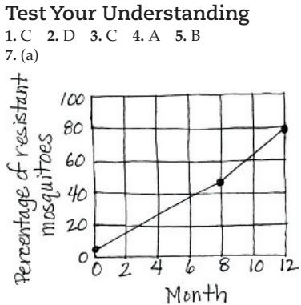

(b) The rapid rise in the percentage of mosquitoes resistant to DDT was most likely caused by natural selection in which mosquitoes resistant to DDT could survive and reproduce while other mosquitoes could not. (c) In India—where DDT resistance first appeared—natural selection would have caused the frequency of resistant mosquitoes to increase over time. If resistant mosquitoes then migrated from India (for example, transported by wind or in planes, trains, or ships) to other parts of the world, the frequency of DDT

resistance would increase there as well. In addition, if resistance to DDT were to arise independently in mosquito populations outside of India, those populations would also experience an increase in the frequency of DDT resistance.

## Chapter 23

## Figure Questions

Figure 23.4 The genetic code is redundant, meaning that more than one codon can specify the same amino acid. As a result, a substitution at a particular site in a coding region of the Adh gene might change the codon but not the translated amino acid, and thus not the resulting protein encoded by the gene. One way an insertion in an exon would not affect the gene produced is if it occurs in an untranslated region of the exon. (This is the case for the insertion at location 1,703.) Figure 23.7 There should be 24 red balls. Figure 23.8 The predicted frequencies are 36% $C^{RC}$ , 48% $C^{RC}$ , and 16% $C^{WC}$ . Figure 23.9 Overall, by chance the frequency of the $C^{W}$ allele first increases in generation 2 and then falls to zero in generation 3—causing the $C^{R}$ allele to become fixed (reach a frequency of 100%). Figure 23.12 The frequency of banded color patterns in island populations would probably increase in the year immediately after the storm. Since mainland populations did not decline in size, the number of individuals migrating from the mainland to the islands would probably not decline either. As a result, after island populations had decreased in size (because of the storm), alleles encoding banded coloration that were transferred from the mainland would comprise a larger proportion of the gene pool in island populations. This would cause the frequency of banded color patterns in island populations to increase. Figure 23.13 Directional selection. The seeds of golden rain tree are buried less deeply than are the seeds of the native host, balloon vine. Thus, in soapberry bug populations feeding on golden rain tree, bugs with shorter beaks had an advantage, resulting in directional selection for shorter beak length. Figure 23.16 Crossing a single female's eggs with both an SC and an LC male's sperm allowed the researchers to directly compare the effects of the males' contribution to the next generation since both batches of offspring had the same maternal contribution. This isolation of the male's impact enabled researchers to draw conclusions about differences in genetic "quality" between the SC and LC males. Figure 23.18 Under prolonged low-oxygen conditions, some of the red blood cells of a heterozygote may sickle, leading to harmful effects. This does not occur in individuals with two wild-type hemoglobin alleles, suggesting that there may be selection against heterozygotes in malaria-free regions (where heterozygote advantage does not occur). However, since heterozygotes are healthy under most conditions, selection against them is unlikely to be strong.

## Concept Check 23.1

1. Within a population, genetic differences among individuals provide the raw material on which natural selection and other mechanisms can act. Without such differences, allele frequencies could not change over time—and hence the population could not evolve. 2. Many mutations occur in somatic cells, which do not produce gametes and so are lost when the organism dies. Of the mutations that do occur in cell lines that produce gametes, many do not have a phenotypic effect on which natural selection can act. Others have a harmful effect and are thus unlikely to increase in frequency because they decrease the reproductive success of their bearers. 3. Genetic variation is a measure of the different alleles in a population and may or may not be expressed phenotypically. Phenotypic variation is a measure of how variable the traits are in a population. Selection differentiates among phenotypic variation but cannot differentiate genetic variation that is not expressed phenotypically. Both are required for evolution by natural selection—phenotypic variation is required for some individuals to be selected over others, while genetic variation is required for the transmission of the selected trait to the next generation. 4. Its genetic variation (whether measured at the level of the gene or at the level of nucleotide sequences) would probably drop over time. During meiosis, crossing over and the independent assortment of chromosomes produce many new combinations of alleles. In addition, a population contains a vast number of possible mating combinations, and fertilization brings together the gametes of individuals with different genetic backgrounds. Thus, via crossing over, independent assortment of chromosomes, and fertilization, sexual reproduction reshuffles alleles into fresh combinations each generation. Without sexual reproduction, the rate of forming new combinations of alleles would be vastly reduced, causing the overall amount of genetic variation to drop.

## Concept Check 23.2

1. There are 700 individuals in the population: 85 of genotype AA, 320 of genotype Aa, and 295 of genotype aa. The genotype frequencies are thus 0.12 (85/700) for genotype AA, 0.46 (320/700) for genotype Aa, and 0.46 (295/700) for genotype aa. Each individual has two alleles, so the total number of alleles is 1,400. To calculate the frequency of allele A, note that each of the 85 individuals of genotype AA has two A alleles, each of the 320 individuals of genotype Aa has one A allele, and each of the 295 individuals of genotype aa has zero A alleles. Thus, the frequency (p) of allele A is

$$
p = \frac {(2 \times 8 5) + (1 \times 3 2 0) + (0 \times 2 9 5)}{1 , 4 0 0} = 0. 3 5
$$

There are only two alleles (A and a) in our population, so the frequency of allele a must be q = 1 - p = 0.65. 2. Because the frequency of allele a is 0.45, the frequency of allele A must be 0.55. Thus, the expected genotype frequencies are $p^{2} = 0.3025$ for genotype AA, 2pq = 0.495 for genotype Aa, and $q^{2} = 0.2025$ for genotype aa. 3. There are 120 individuals in the population, so there are 240 alleles. Of these, there are 124 V alleles—32 from the 16 VV individuals and 92 from the 92 Vv individuals. Thus, the frequency of the V allele is p = 124/240 = 0.52; hence, the frequency of the v allele is q = 0.48. For the population from 5 years ago, similar calculations show that V = 0.25 and v = 0.75. The frequency of v has decreased from 0.75 to 0.48, indicating selection against this allele.

## Concept Check 23.3

1. Natural selection is more “predictable” in that it alters allele frequencies in a nonrandom way: It tends to increase the frequency of alleles that increase the organism’s reproductive success in its environment and decrease the frequency of alleles that decrease the organism’s reproductive success. Alleles subject to genetic drift increase or decrease in frequency by chance alone, whether or not they are advantageous.
2. Genetic drift results from chance events that cause allele frequencies to fluctuate at random from generation to generation; within a population, this process tends to decrease genetic variation over time. Gene flow is the transfer of alleles between populations, a process that can introduce new alleles to a population and hence may increase its genetic variation (albeit slightly, since rates of gene flow are often low).
3. Selection is not important at this locus; furthermore, the populations are not small, and hence the effects of genetic drift should not be pronounced. Gene flow is occurring via the movement of pollen and seeds. Thus, allele and genotype frequencies in these populations should become more similar over time as a result of gene flow.

## Concept Check 23.4

1. The relative fitness of a mule is zero, because fitness includes reproductive contribution to the next generation, and a sterile mule cannot produce offspring.
2. Although both gene flow and genetic drift can increase the frequency of advantageous alleles in a population, they can also decrease the frequency of advantageous alleles or increase the frequency of harmful alleles. Only natural selection consistently results in an increase in the frequency of alleles that enhance survival or reproduction. Thus, natural selection is the only mechanism that consistently leads to adaptive evolution.
3. The three modes of natural selection (directional, stabilizing, and disruptive) are defined in terms of the selective advantage of different phenotypes, not different genotypes. Thus, the type of selection represented by heterozygote advantage depends on the phenotype of the heterozygotes. In this question, because heterozygous individuals have a more extreme phenotype than either homozygote, heterozygote advantage represents directional selection.

## Summary of Key Concepts Questions

23.1 Much of the nucleotide variability at a genetic locus occurs within introns. Nucleotide variation at these sites typically does not affect the phenotype because introns do not code for the protein product of the gene. (Note: In certain circumstances, it is possible that a change in an intron could affect RNA splicing and ultimately have some phenotypic effect on the organism, but such mechanisms are not covered in this introductory text.) There are also many variable nucleotide sites within exons. However, most of the variable sites within exons reflect changes to the DNA sequence that do not change the sequence of amino acids encoded by the gene (and hence may not affect the phenotype). 23.2 Having a small population size does not itself change allele frequencies, but it increases the likelihood that frequencies will change over time due to random chance (genetic drift). 23.3 It is unlikely that two such populations would evolve in similar ways. Since their environments are very different, the alleles favored by natural selection would probably differ between the two populations. Although genetic drift may have important effects in each of these small populations, drift causes unpredictable changes in allele frequencies, so it is unlikely that drift would cause the populations to evolve in similar ways. Both populations are geographically isolated, suggesting that little gene flow would occur between them (again making it less likely that they would evolve in similar ways). 23.4 Compared to males, it is likely that the females of such species would be larger, more colorful, endowed with more elaborate ornamentation (for example, a large morphological feature such as the peacock's tail), and more apt to engage in behaviors intended to attract mates or prevent other members of their sex from obtaining mates.

Test Your Understanding

1. D  2. C  3. B  4. A  5. C

Practice Applying Your Learning
10. (a) T (b) T (c) F (d) F (e) T (f) F (g) F

## Chapter 24

## Figure Questions

Figure 24.7 If this had not been done, the strong preference of “starch flies” and “maltose flies” to mate with like-adapted flies could have occurred simply because the flies could detect (for example, by sense of smell) what their potential mates had eaten as larvae—and preferred to mate with flies that had a similar smell to their own. Figure 24.11 Tragopogon dubius and T. pratenis are the parent species of the polyploid species T. miscellus. T. dubius and T. porrifolius are the parent species of the other polyploid species, T. mirus. Figure 24.12 In murky waters where females distinguish colors poorly, females of each species might mate often with males of the other species. Hence, since hybrids between these species are viable and fertile, the gene pools of the two species might become more similar over time.

Figure 24.13 The graph indicates that there has been gene flow of some fire-bellied toad alleles into the range of the yellow-bellied toad. Otherwise, all individuals located to the left of the hybrid zone portion of the graph would have allele frequencies equal to 1. Figure 24.15 Because the populations had only just begun to diverge from one another at this point in the process, it is likely that any existing barriers to reproduction would weaken over time. Figure 24.19 Over time, the chromosomes of the experimental hybrids came to resemble those of H. anomalus. This occurred even though conditions in the laboratory differed greatly from conditions in the field, where H. anomalus is found, suggesting that selection for laboratory conditions was not strong. Thus, it is unlikely that the observed rise in the fertility of the experimental hybrids was due to selection for life under laboratory conditions. Figure 24.20 The presence of M. cardinalis plants that carry the M. lewisii yup allele would make it more likely that bumblebees would transfer pollen between the two monkey flower species. As a result, we would expect the number of hybrid offspring to increase.

## Concept Check 24.1

1. (a) All except the biological species concept can be applied to both asexual and sexual species because they define species on the basis of characteristics other than the ability to reproduce. In contrast, the biological species concept can be applied only to sexual species. (b) The easiest species concept to apply in the field would be the morphological species concept because it is based only on the appearance of the organism. Additional information about its ecological habits or reproduction is not required. 2. Because these birds live in fairly similar environments and can breed successfully in captivity, the reproductive barrier in nature is probably prezygotic; given the species' differences in habitat preference, this barrier could result from habitat isolation.

## Concept Check 24.2

1. In allopatric speciation, a new species forms while in geographic isolation from its parent species; in sympatric speciation, a new species forms in the absence of geographic isolation. Geographic isolation greatly reduces gene flow between populations, whereas ongoing gene flow is more likely in sympatric populations. As a result, allopatric speciation is more common than sympatric speciation. 2. Gene flow between subsets of a population that live in the same area can be reduced in a variety of ways. In some species—especially plants—changes in chromosome number can block gene flow and establish reproductive isolation in a single generation. Gene flow can also be reduced in sympatric populations by habitat differentiation (as seen in the apple maggot fly, Rhagoletis) and sexual selection (as seen in Lake Victoria cichlids). 3. Allopatric speciation would be less likely to occur on an island near a mainland than on a more isolated island of the same size. We expect this result because continued gene flow between mainland populations and those on a nearby island reduces the chance that enough genetic divergence will take place for allopatric speciation to occur. 4. If all of the homologs failed to separate during anaphase I of meiosis, some gametes would end up with an extra set of chromosomes (and others would end up with no chromosomes). If a gamete with an extra set of chromosomes fused with a normal gamete, a triploid would result; if two gametes with an extra set of chromosomes fused with each other, a tetraploid would result.

## Concept Check 24.3

1. Hybrid zones are regions in which members of different species meet and mate, producing some offspring of mixed ancestry. Such regions can be viewed as “natural laboratories” in which to study speciation because scientists can directly observe factors that cause (or fail to cause) reproductive isolation. 2. (a) If hybrids consistently survived and reproduced poorly compared with the offspring of intraspecific matings, reinforcement could occur. If it did, natural selection would cause prezygotic barriers to reproduction between the parent species to strengthen over time, decreasing the production of unfit hybrids and leading to a completion of the speciation process. If reinforcement did not occur, hybrids may continue to be produced even though they are selected against (as in the Bombina hybrid zone). (b) If hybrid offspring survived and reproduced as well as the offspring of intraspecific matings, indiscriminate mating between the parent species would lead to the production of large numbers of hybrid offspring. As these hybrids mated with each other and with members of both parent species, the gene pools of the parent species could fuse over time, reversing the speciation process.

## Concept Check 24.4

1. The time between speciation events includes (1) the length of time that it takes for populations of a newly formed species to begin diverging reproductively from one another and (2) the time it takes for speciation to be complete once this divergence begins. Although speciation can occur rapidly once populations have begun to diverge from one another, it may take millions of years for that divergence to begin.
2. Investigators transferred alleles at the yup locus (which influences flower color) from each parent species to the other. M. lewisii plants with an M. cardinalis yup allele received many more visits from hummingbirds than usual; hummingbirds usually pollinate M. cardinalis but avoid M. lewisii. Similarly, M. cardinalis plants with an M. lewisii yup allele received many more visits from bumblebees than usual; bumblebees usually pollinate M. lewisii and avoid M. cardinalis. Thus, alleles at the yup locus can influence pollinator choice, which in these species provides the primary barrier to interspecific mating. Nevertheless, the experiment does not prove that the $yup$ locus alone controls barriers to reproduction between M. lewisii and M. cardinalis; other genes might enhance the effect of the $yup$ locus (by modifying flower color) or cause entirely different barriers to reproduction (for example, gametic isolation or a postzygotic barrier). 3. Crossing over. If crossing over did not occur, each chromosome in an experimental hybrid would remain as in the $\mathrm{F}_1$ generation: composed entirely of DNA from one parent species or the other.

## Summary of Key Concepts Questions

24.1 According to the biological species concept, a species is a group of populations whose members interbreed and produce viable, fertile offspring; thus, gene flow occurs between populations of a species. In contrast, members of different species do not interbreed and hence no gene flow occurs between their populations. Overall, then, in the biological species concept, species can be viewed as designated by the absence of gene flow—making gene flow of central importance to the biological species concept. 24.2 Sympatric speciation can be promoted by factors such as polyploidy, sexual selection, and habitat shifts, all of which can reduce gene flow between the subpopulations of a larger population. Of these factors, sexual selection and habitat shifts can also occur in allopatric populations and hence can also promote allopatric speciation. 24.3 If the hybrids are selected against, the hybrid zone could persist if individuals from the parent species regularly travel into the zone, where they mate to produce hybrid offspring. If hybrids are not selected against, there is no cost to the continued production of hybrids, and large numbers of hybrid offspring may be produced. However, natural selection for life in different environments may keep the gene pools of the two parent species distinct, thus preventing the loss (by fusion) of the parent species and once again causing the hybrid zone to be stable over time. 24.4 As the goats-beard plant, Bahamas mosquitofish, and apple maggot fly illustrate, speciation continues to happen today. A new species can begin to form whenever gene flow is reduced between populations of the parent species. Such reductions in gene flow can occur in many ways: A new, geographically isolated population may be founded by a few colonists; some members of the parent species may begin to utilize a new habitat; or sexual selection may isolate formerly connected populations or subpopulations. These and many other such events are happening today.

## Test Your Understanding

8. Here is one possibility:

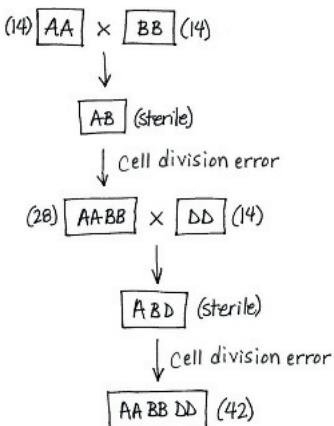

## Chapter 25

## Figure Questions

Figure 25.2 Proteins are almost always composed of the same 20 amino acids shown in Figure 5.14. However, many other amino acids could potentially form in this or any other experiment. For example, any molecule that had an R group that differed from those listed in Figure 5.14 would still be an amino acid as long as it also contained an $\alpha$ carbon, an amino group, and a carboxyl group—but that molecule would not be one of the 20 amino acids commonly found in nature. Figure 25.4 The hydrophobic regions of such molecules are attracted to one another and excluded from water, whereas the hydrophilic regions have an affinity for water. As a result, the molecules can form a bilayer in which the hydrophilic regions are on the outside of the bilayer (facing water on each side of the bilayer) and the hydrophobic regions point toward each other (that is, toward the inside of the bilayer). Figure 25.6 Because uranium-238 has a half-life of 4.5 billion years, the $x$ -axis would be relabeled (in billions of years) as 4.5, 9, 13.5, and 18. Figure 25.8 (1) The earliest direct evidence of life comes from fossils of prokaryotic organisms that date to 3.5 billion years ago. Fossil evidence also shows that for the next 2 billion years (3.5 to 1.5 billion years ago), life on Earth consisted entirely of unicellular organisms. In fact, from 3.5 billion years ago to 1.8 billion years ago, all of Earth's organisms were prokaryotic organisms; around

1.8 billion years ago, these prokaryotic organisms were joined by unicellular eukaryotes (multicellular eukaryotes emerged about 1.3 billion years ago). (2) Sample answer: In Figure 25.12, there are two hatch marks on the x-axis. These hatch marks represent large time spans. Unless the graph was very wide, showing these entire time spans would obscure key details for the figure, such as when selected animal groups first appear in the fossil record. (3) The horizontal time scale indicates that prokaryotic organisms originated 3.5 billion years ago and that the colonization of land took place 500 million years ago. On a 1-hour time scale, this indicates that prokaryotic organisms appeared about 46 minutes ago, while the colonization of land took place less than 7 minutes ago. Figure 25.12 You should have circled the node, shown in the tree diagram at approximately 635 million years ago (mya), that leads to the echinoderm–chordate lineage and to the lineage that gave rise to brachiopods, annelids, molluscs, and arthropods. To determine a minimum estimate of the age of the ancestor represented by this node, note that the most recent common ancestor of chordates and annelids must be at least as old as any of its descendants. Since fossil molluscs date to about 560mya, the common ancestor represented by the circled branch point must be at least 560 million years old. Figure 25.14 There are two speciation events and five extinctions in lineage A, while there are five speciation events and one extinction in lineage B during the last 2 million years. Figure 25.17 The Australian plate's current direction of movement is roughly similar to the northeasterly direction the continent traveled over the past 66 million years. Figure 25.27 The coding sequence of the Pitx1 gene would differ between the marine and lake populations, but patterns of gene expression would not.

## Concept Check 25.1

1. The hypothesis that conditions on early Earth could have permitted the synthesis of organic molecules from inorganic ingredients 2. In contrast to random mingling of molecules in an open solution, segregation of molecular systems by membranes could concentrate organic molecules, assisting biochemical reactions. 3. Today, genetic information usually flows from DNA to RNA, as when the DNA sequence of a gene is used as a template to synthesize the mRNA encoding a particular protein. However, the life cycle of retroviruses such as HIV shows that genetic information can flow in the reverse direction (from RNA to DNA). In these viruses, the enzyme reverse transcriptase uses RNA as a template for DNA synthesis, suggesting that a similar enzyme could have played a key role in the transition from an RNA world to a DNA world.

## Concept Check 25.2

1. The fossil record shows that different groups of organisms dominated life on Earth at different points in time and that many organisms once alive are now extinct; specific examples of these points can be found in Figure 25.5. The fossil record also indicates that new groups of organisms can arise via the gradual modification of previously existing organisms, as illustrated by fossils that document the origin of mammals from their cynodont ancestors (see Figure 25.7). 2. 22,920 years (four half-lives: $5,730 \times 4$ )

## Concept Check 25.3

1. Free oxygen attacks chemical bonds and can inhibit enzymes and damage cells. As a result, the appearance of oxygen in the atmosphere probably caused many prokaryotic organisms that had thrived in anaerobic environments to survive and reproduce poorly, ultimately driving many of these species to extinction.
2. All eukaryotes have mitochondria or remnants of these organelles, but not all eukaryotes have plastids.
3. A fossil record of life today would include many organisms with hard body parts (such as vertebrates and many marine invertebrates), but might not include some species we are very familiar with, such as those that have small geographic ranges and/or small population sizes (for example, endangered species such as the giant panda, tiger, and several rhinoceros species).

## Concept Check 25.4

1. The theory of plate tectonics describes the movement of Earth's continental plates, which alters the physical geography and climate of Earth, as well as the extent to which organisms are geographically isolated. Because these factors affect extinction and speciation rates, plate tectonics has a major impact on life on Earth.
2. Mass extinctions; major evolutionary innovations; the diversification of another group of organisms (which can provide new sources of food); migration to new locations where few competitor species exist
3. Evidence from previous mass extinctions indicates that the diversity of life on Earth would not recover, for millions of years, to what it had been before the mass extinction—a much greater period of time than our species has been in existence (about 200,000 years). Although new speciation events would eventually cause the total number of species on Earth to recover, the many species and evolutionary lineages driven to extinction would be gone forever, thus forever changing the course of evolution on our planet. In addition, previous evidence suggests that a sixth mass extinction would reduce thriving and complex ecological communities (such as forests and coral reefs) so greatly that they might hardly resemble what they are like now. A sixth mass extinction would also change the types of organisms that live in ecological communities and how those organisms interact with one another. Finally, a sixth mass extinction would pave the way for new adaptive radiations in some of the groups that survive the extinction.

## Concept Check 25.5

1. Heterochrony can cause a variety of morphological changes. For example, if the timing of the onset of sexual maturity changes, retention of juvenile characteristics (paedomorphosis) may result. Paedomorphosis can be caused by small genetic changes that result in large changes in morphology, as seen in the axolotl salamander.
2. In animal embryos, Hox genes influence the development of structures such as limbs and feeding appendages. As a result, changes in these genes—or in the regulation of these genes—are likely to have major effects on morphology.
3. From genetics, we know that gene regulation is altered by how well transcription factors bind to noncoding DNA sequences called control elements. Thus, if changes in morphology are often caused by changes in gene regulation, portions of noncoding DNA that contain control elements are likely to be strongly affected by natural selection.

## Concept Check 25.6

1. Complex structures do not evolve all at once, but in increments, with natural selection selecting for adaptive variants of the earlier versions. 2. Although the myxoma virus is highly lethal, initially some of the rabbits are resistant (0.2% of infected rabbits are not killed). Thus, assuming resistance is an inherited trait, we would expect the rabbit population to show a trend for increased resistance to the virus. We would also expect the virus to show an evolutionary trend toward reduced lethality. We would expect this trend because a rabbit infected with a less lethal virus would be more likely to live long enough for a mosquito to bite it and hence potentially transmit the virus to another rabbit. (A virus that kills its rabbit host before a mosquito transmits the virus to another rabbit dies with its host.)

## Summary of Key Concepts Questions

Concept 25.1 Particles of montmorillonite clay may have provided surfaces on which organic molecules became concentrated and hence were more likely to react with one another. Montmorillonite clay particles may also have facilitated the transport of key molecules, such as short strands of RNA, into vesicles. These vesicles can form spontaneously from simple precursor molecules, "reproduce" and "grow" on their own, and maintain internal concentrations of molecules that differ from those in the surrounding environment. These features of vesicles represent key steps in the emergence of protocells and (ultimately) the first living cells. Concept 25.2 One challenge is that radioisotopes with very long half-lives are not used by organisms to build their bones or shells. As a result, fossils older than 75,000 years cannot be dated directly. Fossils are often found in sedimentary rock, but those rocks typically contain sediments of different ages, again posing a challenge when trying to date old fossils. To circumvent these challenges, geologists use radioisotopes with long half-lives to date layers of volcanic rock that surround old fossils. This approach provides minimum and maximum estimates for the ages of fossils sandwiched between two layers of volcanic rock. Concept 25.3 The "Cambrian explosion" refers to a relatively short interval of time (535–525 million years ago) during which large forms of many present-day animal phyla first appear in the fossil record. The evolutionary changes that occurred during this time, such as the appearance of large predators and well-defended prey, were important because they set the stage for many of the key events in the history of life over the last 500 million years. Concept 25.4 The broad evolutionary changes documented by the fossil record reflect the rise and fall of major groups of organisms. In turn, the rise or fall of any particular group results from a balance between speciation and extinction rates: A group increases in size when the rate at which its members produce new species is greater than the rate at which its member species are lost to extinction, while a group shrinks in size if extinction rates are greater than speciation rates. Concept 25.5 A change in the sequence or regulation of a developmental gene can produce major morphological changes. In some cases, such morphological changes may enable organisms to perform new functions or live in new environments—thus potentially leading to an adaptive radiation and the formation of a new group of organisms. Concept 25.6 Evolutionary change results from interactions between organisms and their current environments. No goal is involved in this process. As environments change over time, the features of organisms favored by natural selection may also change. When this happens, what once may have seemed like a "goal" of evolution (for example, improvements in the function of a feature previously favored by natural selection) may cease to be beneficial or may even be harmful.

## Test Your Understanding

1. B 2. A 3. D 4. B 5. D 6. C 7. A

## Chapter 26

## Figure Questions

Figure 26.5 (1) In this tree, frogs are most closely related to a group consisting of lizards, chimps, and humans. (2) You should have circled the branch point splitting the frog lineage from the lineage leading to lizards, chimps, and humans. (3) Four: chimps–humans, lizards–chimps/humans; frogs–lizards/chimps/humans; and fishes–frogs/lizards/chimps/humans.

(4)  

(5)  

Each of the three trees identifies chimps and lizards as the two closest relatives of humans in these trees because they are the groups shown with whom we share the two most recent common ancestors.

Figure 26.6 Unknown 1b (a portion of sample 1) and unknowns 9–13 all would have to be located on the branch of the tree that currently leads to Minke (Southern Hemisphere) and unknowns 1a and 2–8. Figure 26.8 You should have circled the branch point that is drawn farthest to the left (the common ancestor of all taxa shown). Both cetaceans and seals descended from terrestrial lineages of mammals, indicating that the cetacean–seal common ancestor lacked a streamlined body form and hence would not be part of the cetacean–seal group. Figure 26.9 Hinged jaws are a shared ancestral character for the group that includes frogs, turtles, and leopards. Thus, you should have circled the frog, turtle, and leopard lineages, along with their most recent common ancestor. Figure 26.10 Crocodilians are the sister taxon to the dinosaur clade (which includes birds) because crocodilians and the dinosaur clade share an immediate common ancestor that is not shared by any other group. Figure 26.14 There are four possible bases (A, C, G, T) at each nucleotide position. If the base at each position depends on chance, not common descent, we would expect roughly one out of four (25%) of them to be the same. Figure 26.21 This tree indicates that the sequences of rRNA and other genes in mitochondria are most closely related to those of proteobacteria, while the sequences of chloroplast genes are most closely related to those of cyanobacteria. These gene sequence relationships are what would be predicted from endosymbiont theory, which posits that both mitochondria and chloroplasts originated as engulfed prokaryotic cells.

## Concept Check 26.1

1. In Figure 26.4, leopards are the sister taxon to a group consisting of the family Mustelidae (which includes badgers) and the family Canidae (which includes wolves). Since members of a sister group are each other's closest relatives, leopards are equally related to badgers and to wolves.
2. The tree in (c) shows a different pattern of evolutionary relationships. In (c), C and B are sister taxa, whereas C and D are sister taxa in (a) and (b).
3. The redrawn version of Figure 26.4 is shown below.

## Concept Check 26.2

1. No; hair is a shared ancestral character common to all mammals and thus is not helpful in distinguishing different mammalian subgroups.
2. Four limbs would be a shared ancestral character of the group descended from the common ancestor of the turtle and the leopard (that is, the amniotes). All amniotes have four limbs (unless they were lost) but this trait is not unique to this group. Four limbs would be a shared derived trait of the group descended from the common ancestor of the frog and the turtle-leopard lineage (that is, the tetrapods). This trait was new in this group's common ancestor.

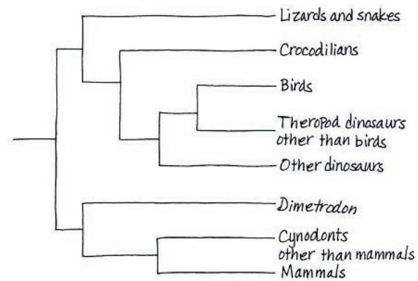

The traditional classification provides a poor match to evolutionary history, thus violating the basic principle of cladistics—that classification should be based on common descent. Both birds and mammals originated from groups traditionally designated as reptiles, making reptiles (as traditionally delineated) a paraphyletic group. These problems can be addressed by removing Dimetrodon and cynodonts from the reptiles and by regarding birds as a group of reptiles (specifically, as a group of dinosaurs).

## Concept Check 26.3

1. (a) Analogy, since porcupines and cacti are not closely related and since most other animals and plants do not have similar structures; (b) homology, since cats and humans are both mammals and have homologous forelimbs, of which the hand and paw are the lower part; (c) analogy, since owls and hornets are not closely related and since the structure of their wings is very different. 2. Species B and C are more likely to be closely related. Small genetic changes (as between species B and C) can produce divergent physical appearances, but if many genes have diverged greatly (as in species A and B), then the lineages have probably been separate for a long time. 3. The common name for a species in a language such as English or Spanish may be completely based on analogous similarity. People may tend to default to thinking that, for example, all “fish” are closely related, when in fact these commonalities may result from convergent evolution of analogous similarity (animals that swim). 4. The principle of maximum parsimony states that the hypothesis about nature we investigate first should be the simplest explanation found to be consistent with the facts. Actual evolutionary relationships may differ from those inferred by parsimony owing to complicating factors such as convergent evolution.

## Concept Check 26.4

1. Proteins are gene products. Their amino acid sequences are determined by the nucleotide sequences of the DNA that codes for them. Thus, differences between comparable proteins in two species reflect underlying genetic differences that have accumulated as the species diverged from one another. As a result, differences between the proteins can reflect the evolutionary history of the species.
2. Orthologous genes are homologous genes in which the homology results from a speciation event and hence occurs between genes found in different species. Paralogous genes are homologous genes in which the homology results from gene duplication. Orthologous genes should be used to infer phylogeny since differences among them reflect the history of speciation events.
3. In RNA processing, the exons or coding regions of a gene can be spliced together in different ways, yielding different mRNAs and hence different protein products. As a result, different proteins could potentially be produced from the same gene in different tissues, thereby enabling the gene to perform different functions in these different tissues.

## Concept Check 26.5

1. A molecular clock is a method of estimating the actual time of evolutionary events based on numbers of base changes in orthologous genes. It is based on the assumption that the regions of genomes being compared evolve at constant rates. 2. There are many portions of the genome that do not code for genes; mutations that alter the sequence of bases in such regions could accumulate through drift without affecting an organism's fitness. Even in coding regions of the genome, some mutations may not have a critical effect on genes or proteins.

## Concept Check 26.6

1. The kingdom Monera included bacteria and archaea, but we now know that these organisms are in separate domains. Kingdoms are subsets of domains, so a single kingdom (like Monera) that includes taxa from different domains is not

valid. 2. Because of horizontal gene transfer, some genes in eukaryotes are more closely related to bacteria, while others are more closely related to archaea; thus, depending on which genes are used, phylogenetic trees constructed from DNA data can yield conflicting results. 3. Eukaryotes are hypothesized to have originated when a heterotrophic prokaryotic organism (an archaeal host cell) engulfed a bacterium that would later become an organelle found in all eukaryotes—the mitochondrion. Over time, a fusion of organisms occurred as the archaeal host cell and its bacterial endosymbiont evolved to become a single organism. As a result, we would expect the cell of a eukaryote to include both archaeal DNA and bacterial DNA, making the origin of eukaryotes an example of horizontal gene transfer.

## Summary of Key Concepts Questions

26.1 The fact that humans and chimpanzees are sister species indicates that we share a more recent common ancestor with chimpanzees than we do with any other living primate species. But that does not mean that humans evolved from chimpanzees, or vice versa; instead, it indicates that both humans and chimpanzees are descendants of that common ancestor. 26.2 For example, four limbs can be considered a shared ancestral character of mammals (because the shared ancestor of mammals and their closest relatives, reptiles, had four limbs), and a shared derived character of tetrapods (because this trait appeared in the common ancestor of tetrapods, but not the ancestor they share with their closest relatives). 26.3 Homologous characters result from shared ancestry. As organisms diverge over time, some of their homologous characters will also diverge. The homologous characters of organisms that diverged long ago typically differ more than do the homologous characters of organisms that diverged more recently. As a result, differences in homologous characters can be used to infer phylogeny. In contrast, analogous characters result from convergent evolution, not shared ancestry, and hence can give misleading estimates of phylogeny. 26.4 Orthologous genes should be used; for such genes, the homology results from speciation and hence reflects evolutionary history. 26.5 A key assumption of molecular clocks is that nucleotide substitutions occur at fixed rates, and hence the number of nucleotide differences between two DNA sequences is proportional to the time since the sequences diverged from each other. Some limitations of molecular clocks: No gene marks time with complete precision; natural selection can favor certain DNA changes over others; nucleotide substitution rates can change over long periods of time (causing molecular clock estimates of when events in the distant past occurred to be highly uncertain); and the same gene can evolve at different rates in different organisms. 26.6 Genetic data indicated that many prokaryotic organisms differed as much from each other as they did from eukaryotes. This indicated that organisms should be grouped into three broad domains (Archaea, Bacteria, and Eukarya). These data also indicated that the previous kingdom Monera (which had contained all the prokaryotic organisms) did not make biological sense and should be abandoned. Later genetic and morphological data also indicated that the former kingdom Protista (which had primarily contained single-celled organisms) should be abandoned because some protists are more closely related to plants, fungi, or animals than they are to other protists.

## Test Your Understanding

1. A 2. C 3. B 4. C 5. B 6. A 7. D  
9.  

(c) The tree in (a) requires seven evolutionary changes, while the tree in (b) requires eleven evolutionary changes. Thus, the tree in (a) is more parsimonious since it requires fewer evolutionary changes.

## Chapter 27

## Figure Questions

Figure 27.7 The top ring, to which the hook is attached, is embedded within the interior, hydrophobic portion of the lipid bilayer of the outer membrane, suggesting that the top ring is hydrophobic. Likewise, the third ring down is embedded within the hydrophobic portion of the plasma membrane's lipid bilayer, suggesting that this ring also is hydrophobic. Figure 27.9 The third plasmid is the separate, small twisted loop located just above and to the left of the line pointing to the label "Chromosome." Figure 27.10 It is likely that the expression or sequence of genes that affect glucose metabolism may have changed; genes for metabolic processes no longer needed by the cell also may have changed. Figure 27.11 Transduction results in horizontal gene transfer when the host and recipient cells are members of different species. Figure 27.18 Thermophiles live in very hot environments, so it is likely that their enzymes can continue to function normally at much higher temperatures than can the enzymes of other organisms. At low temperatures, however, the enzymes of thermophiles may not function as well as the enzymes of other organisms. Figure 27.19 From the graph, plant uptake can be estimated as 0.72, 0.62, and $0.96\mathrm{mgK^{+}}$ for strains 1, 2, and 3, respectively. These values average to $0.77\mathrm{mgK^{+}}$ . If bacteria had no effect, the average plant uptake of $\mathrm{K}^+$ for strains 1, 2, and 3 should be close to $0.51\mathrm{mgK^{+}}$ the value observed for plants grown in bacteria-free soil. Figure 27.22 Penicillin.

## Concept Check 27.1

1. Adaptations include the capsule (shields prokaryotic organisms from the host's immune system) and endospores (enable cells to survive harsh conditions and to revive when the environment becomes favorable). 2. Prokaryotic cells lack the complex compartmentalization associated with the membrane-enclosed organelles of eukaryotic cells. Prokaryotic genomes have much less DNA than eukaryotic genomes, and most of this DNA is contained in a single ring-shaped chromosome located in the nucleoid rather than within a true membrane-enclosed nucleus. In addition, many prokaryotic organisms also have plasmids, small ring-shaped DNA molecules containing a few genes. 3. Plastids such as chloroplasts are thought to have evolved from an endosymbiotic photosynthetic prokaryotic organisms. More specifically, the phylogenetic tree shown in Figure 26.21 indicates that plastids are closely related to cyanobacteria. Hence, we can hypothesize that the thylakoid membranes of chloroplasts resemble those of cyanobacteria because chloroplasts evolved from an endosymbiotic cyanobacterium.

## Concept Check 27.2

1. Prokaryotic organisms can have extremely large population sizes, in part because they often have short generation times. The large number of individuals in prokaryotic populations makes it likely that in each generation there will be many individuals that have new mutations at any particular gene, thereby adding considerable genetic diversity to the population.
2. In transformation, naked, foreign DNA from the environment is taken up by a bacterial cell. In transduction, phages carry bacterial genes from one bacterial cell to another. In conjugation, a bacterial cell directly transfers plasmid or chromosomal DNA to another cell via a mating bridge that temporarily connects the two cells.
3. Yes. Genes for antibiotic resistance could be transferred (by transformation, transduction, or conjugation) from the nonpathogenic bacterium to a pathogenic bacterium; this could make the pathogen an even greater threat to human health. In general, transformation, transduction, and conjugation tend to increase the spread of resistance genes.

## Concept Check 27.3

1. A phototroph derives its energy from light, while a chemotroph gets its energy from chemical sources. An autotroph derives its carbon from $CO_{2}$ , $HCO_{3}^{-}$ , or related compounds, while a heterotroph gets its carbon from organic nutrients such as glucose. Thus, there are four nutritional modes: photoautotrophic, photoheterotrophic (unique to prokaryotic organisms), chemoautotrophic (unique to prokaryotic organisms), and chemoheterotrophic.
2. Chemoheterotrophy; the bacterium must rely on chemical sources of energy, since it is not exposed to light, and it must be a heterotroph if it requires a source of carbon other than $CO_{2}$ (or a related compound, such as $HCO_{3}^{-}$ ). 3. If humans could fix nitrogen, we could build proteins using atmospheric $N_{2}$ and hence would not need to eat high-protein foods such as meat, fish, or soy. Our diet would, however, need to include a source of carbon, along with minerals and water. Thus, a typical meal might consist of carbohydrates as a carbon source, along with fruits and vegetables to provide essential minerals (and additional carbon).

## Concept Check 27.4

1. Molecular systematic studies indicate that some organisms once classified as bacteria are more closely related to eukaryotes and belong in a domain of their own: Archaea. Such studies have also shown that horizontal gene transfer is common and plays an important role in the evolution of prokaryotic organisms. By not requiring that organisms be cultured in the laboratory, metagenomic studies have revealed an immense diversity of previously unknown prokaryotic species. Over time, the ongoing discovery of new species by metagenomic analyses may alter our understanding of prokaryotic phylogeny greatly.

## Concept Check 27.5

1. Although prokaryotic organisms are small, their large numbers and metabolic abilities enable them to play key roles in ecosystems by decomposing wastes, recycling chemicals, and affecting the concentrations of nutrients available to other organisms.
2. Cyanobacteria produce oxygen when water is split in the light reactions of photosynthesis. The Calvin cycle incorporates $CO_{2}$ from the air into organic molecules, which are then converted to sugars.

## Concept Check 27.6

1. Sample answers: eating fermented foods such as yogurt, sourdough bread, or cheese; receiving clean water from sewage treatment; taking medicines produced by bacteria 2. No. If the poison is secreted as an exotoxin, live bacteria could be transmitted to another person. But the same is true if the poison is an endotoxin—only in this case, the live bacteria that are transmitted may be descendants of the (now-dead) bacteria that produced the poison. 3. Some of the many different species of prokaryotic organisms that live in the human gut compete with one another for resources (from the food that you eat). Because different prokaryotic species have different adaptations, a change in diet may alter which species can grow most rapidly, thus altering species abundance.

## Summary of Key Concepts Questions

27.1 Specific structural features that enable prokaryotic organisms to thrive in diverse environments include their cell walls (which provide shape and protection), flagella (which function in directed movement), and ability to form capsules or endospores (both of which can protect against harsh conditions). Prokaryotic organisms also possess biochemical adaptations for growth in varied conditions, such as those that enable them to tolerate extremely hot or salty environments. 27.2 Many prokaryotic species can reproduce extremely rapidly, and their populations can number in the trillions. As a result, even though mutations are rare, every day many offspring are produced that have new mutations at particular gene loci. In addition, even though prokaryotic organisms reproduce asexually and hence the vast majority of offspring are genetically identical to their parent, the genetic variation of their populations can be increased by transduction, transformation, and conjugation. Each of these (nonreproductive) processes can increase genetic variation by transferring DNA from one cell to another—even among cells that are of different species. 27.3 Prokaryotic organisms have an exceptionally broad range of metabolic adaptations. As a group, prokaryotic organisms perform all four modes of nutrition (photoautotrophy, chemoautotrophy, photoheterotrophy, and chemoheterotrophy), whereas eukaryotes perform only two of these (photoautotrophy and chemoheterotrophy). Prokaryotic organisms are also able to metabolize nitrogen in a wide variety of forms (again unlike eukaryotes), and they frequently cooperate with other prokaryotic cells of the same or different species. 27.4 Phenotypic criteria such as shape, motility, and nutritional mode do not provide a clear picture of the evolutionary history of the prokaryotic organisms. In contrast, molecular data have elucidated relationships among major groups of prokaryotic organisms. Molecular data have also allowed researchers to sample genes directly from the environment; using such genes to construct phylogenies has led to the discovery of major new groups of prokaryotic organisms. 27.5 Prokaryotic organisms play key roles in the chemical cycles on which life depends. For example, prokaryotic organisms are important decomposers, breaking down corpses and waste materials, thereby releasing nutrients to the environment where they can be used by other organisms. Prokaryotic organisms also convert inorganic compounds to forms that other organisms can use. With respect to their ecological interactions, many Prokaryotic species form life-sustaining mutualisms with other species. In some cases, such as hydrothermal vent communities, the metabolic activities of prokaryotic organisms provide an energy source on which hundreds of other species depend; in the absence of the prokaryotic organisms, the community would collapse. 27.6 Human well-being depends on our associations with mutualistic prokaryotic organisms, such as the many species that live in our intestines and digest food that we cannot. Humans also can harness the remarkable metabolic capabilities of prokaryotic organisms to produce a wide range of useful products and to perform key services such as bioremediation. Negative effects of prokaryotic organisms result primarily from bacterial pathogens that cause disease.

Test Your Understanding

1. D  2. A  3. B  4. C  5. D  6. A

## Chapter 28

## Figure Questions

Figure 28.4 The diagram shows that a single secondary endosymbiosis event gave rise to the stramenopiles and alveolates—thus, these groups can trace their ancestry back to a single heterotrophic protist (shown in yellow) that ingested a red alga. In contrast, euglenids and chlorarachniophytes each descended from a different heterotrophic protist (one of which is shown in gray, the other in brown). Hence, it is likely that stramenopiles and alveolates are more closely related than are euglenids and chlorarachniophytes.

Figure 28.6

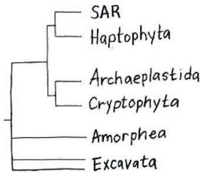

Figure 28.10 The sperm cells in the diagram are produced by the asexual (mitotic) division of cells in a single male gametophyte, which was itself produced by the asexual (mitotic) division of a single zoospore. Thus, the sperm cells are all derived from a single zoospore and so are genetically identical to one another. Figure 28.14 Merozoites are produced by the asexual (mitotic) cell division of haploid sporozoites; similarly, gametocytes are produced by the asexual cell division of merozoites. Hence, it is likely that individuals in these three stages have the same complement of genes and that morphological differences between them result from changes in gene expression. Figure 28.15 These events have a similar overall effect to fertilization. In both cases, haploid nuclei that were originally from two genetically different cells fuse to form a diploid nucleus. Figure 28.21 The following stage should be circled: step 6, where a mature cell undergoes mitosis and forms four or more daughter cells. In step 7, the zoospores eventually grow into mature haploid cells, but they do not produce new daughter cells. Likewise, in step 2, a mature cell develops into a gamete, but it does not produce new daughter cells. Figure 28.23 They would be haploid because originally each of these cells was a haploid, solitary amoeba.

## Concept Check 28.1

1. Sample response: Protists include unicellular, colonial, and multicellular organisms; photoautotrophs, heterotrophs, and mixotrophs; species that reproduce asexually, sexually, or both ways; and organisms with diverse physical forms and adaptations.
2. Strong evidence shows that eukaryotes acquired mitochondria after a host cell (either an archaean or a cell closely related to the archaea) first engulfed and then formed an endosymbiotic association with an alpha proteobacterium. Similarly, chloroplasts in red and green algae appear to have descended from a photosynthetic cyanobacterium that was engulfed by an ancient heterotrophic eukaryote. Secondary endosymbiosis also played an important role: Various protistan lineages acquired plastids by engulfing unicellular red or green algae.

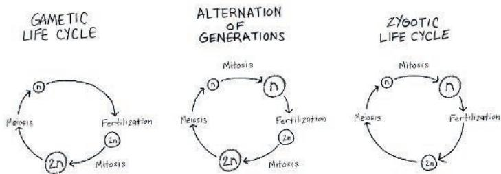

4. Four. The first (and primary) genome is the DNA located in the chlorarachniophyte nucleus. A chlorarachniophyte also contain remnants of a green alga's nuclear DNA, located in the nucleomorph. Finally, mitochondria and chloroplasts contain DNA from the (different) bacteria from which they evolved. These two prokaryotic genomes comprise the third and fourth genomes contained within a chlorarachniophyte.

## Concept Check 28.2

1. Because foram tests are hardened with calcium carbonate, they form long-lasting fossils in marine sediments and sedimentary rocks.
2. The plastid DNA would likely be more similar to the chromosomal DNA of cyanobacteria based on the well-supported hypothesis that eukaryotic plastids (such as those found in the eukaryotic groups listed) originated by an endosymbiosis event in which a eukaryote engulfed a cyanobacterium. If the plastid is derived from the cyanobacterium, its DNA would be derived from the bacterial DNA.
3. Figure 13.6b. Algae and plants with alternation of generations have a multicellular haploid stage and a multicellular diploid stage. In the other two life cycles, either the haploid stage or the diploid stage is unicellular.
4. During photosynthesis, aerobic algae produce $O_{2}$ and use $CO_{2}$ . $O_{2}$ is produced as a by-product of the light reactions, while $CO_{2}$ is used as an input to the Calvin cycle (the end products of which are sugars). Aerobic algae also perform cellular respiration, which uses $O_{2}$ as an input and produces $CO_{2}$ as a waste product.

## Concept Check 28.3

1. Many red algae contain a photosynthetic pigment called phycoerythrin, which gives them a reddish color and allows them to carry out photosynthesis in relatively deep

coastal water. Also unlike brown algae, red algae have no flagellated stages in their life cycle and must depend on water currents to bring gametes together for fertilization. 2. Ulva contains many cells and its body is differentiated into leaflike blades and a rootlike holdfast. Caulerpa's body is composed of multinucleate filaments without cross-walls, so it is essentially one large cell. 3. Red algae have no flagellated stages in their life cycle and hence must depend on water currents to bring their gametes together. This feature of their biology might increase the difficulty of reproducing on land. In contrast, the gametes of green algae are flagellated, making it possible for them to swim in thin films of water. In addition, a variety of green algae contain compounds in their cytoplasm, cell wall, or zygote coat that protect against intense sunlight and other terrestrial conditions. Such compounds may have increased the chance that descendants of green algae could survive on land.

## Concept Check 28.4

1. Amoebozoans have lobe- or tube-shaped pseudopodia, whereas forams have threadlike pseudopodia.
2. Slime molds are fungus-like in that they produce fruiting bodies that aid in the dispersal of spores, and they are animal-like in that they are motile and ingest food. However, slime molds are more closely related to tubulinids and archamoebas than to fungi or animals.
3. This is a zygotic life cycle, because mitosis only occurs in haploid cells, and the zygote is the only diploid cell.

## Concept Check 28.5

1. Haptophytes, which have coccoliths made of calcium carbonate, are likely the phytoplankton that produced these calcareous deposits.
2. Because the genetic material of Provora is so different from organisms in other eukaryotic supergroups, molecular clocks suggest a very early divergence of this group in eukaryotic history.

## Concept Check 28.6

1. Because photosynthetic protists constitute the base of aquatic food webs, many aquatic organisms depend on them for food, either directly or indirectly. (In addition, a substantial percentage of the oxygen produced by photosynthesis is made by photosynthetic protists.) 2. Protists form mutualistic and parasitic associations with other organisms. Examples include photosynthetic dinoflagellates that form a mutualistic symbiosis with coral polyps; parabasalids that form a mutualistic symbiosis with termites; and the stramenopile Phytophthora ramorum, a parasite of oak trees. 3. Corals depend on their dinoflagellate symbionts for nourishment, so coral bleaching could cause the corals to die. As the corals die, less food would be available for fishes and other species that eat coral. As a result, populations of these species might decline, and that, in turn, might cause populations of their predators to decline. 4. The two approaches differ in the evolutionary changes they may bring about. A strain of Wolbachia that confers resistance to infection by Plasmodium and does not harm mosquitoes would spread rapidly through the mosquito population. In this case, natural selection would favor any Plasmodium individuals that could overcome the resistance to infection conferred by Wolbachia. If insecticides are used, mosquitoes that are resistant to the insecticide would be favored by natural selection. Hence, use of Wolbachia could cause evolution in Plasmodium populations, while using insecticides could cause evolution in mosquito populations.

## Summary of Key Concepts Questions

28.1 Sample response: Protists, plants, animals, and fungi are similar in that their cells have a nucleus and other membrane-enclosed organelles, unlike the cells of prokaryotic organisms. These membrane-enclosed organelles make the cells of eukaryotes more complex than the cells of prokaryotic organisms. Protists and other eukaryotes also differ from prokaryotic organisms in having a well-developed cytoskeleton that enables them to have asymmetric forms and to change in shape as they feed, move, or grow. With respect to differences between protists and other eukaryotes, most protists are unicellular, unlike animals, plants, and most fungi. Protists also have greater nutritional diversity than other eukaryotes.
28.2 Stramenopiles and alveolates are hypothesized to have originated by secondary endosymbiosis. Under this hypothesis, we can infer that the common ancestor of these two groups had a plastid, in this case of red algal origin. Thus, we would expect that apicomplexans (and alveolate or stramenopile protists) either would have plastids or would have lost their plastids over the course of evolution.
28.3 Red algae, green algae, and plants are placed in the same supergroup because considerable evidence indicates that these organisms all descended from the same ancestor, an ancient heterotrophic protist that acquired a cyanobacterial endosymbiont.
28.4 The amorpheans are a diverse group of eukaryotes that includes many protists, along with animals and fungi. Most of the protists in Amorphea are amoebozoans, a clade of amoebas that have lobe- or tube-shaped pseudopodia (as opposed to the threadlike pseudopodia of rhizarians). Other protists in Amorphea include several groups that are closely related to fungi and several other groups that are closely related to animals.
28.6 Sample response: Ecologically important protists include photosynthetic dinoflagellates that provide essential sources of energy to their symbiotic partners, the corals that build coral reefs. Other important protistan symbionts include those that enable termites to digest wood and Plasmodium, the pathogen that causes malaria. Photosynthetic protists such as diatoms are among the most important producers in aquatic communities; as such, many other species in aquatic environments depend on them for food.

Test Your Understanding 1. D 2. B 3. C 4. D 5. D 6. C

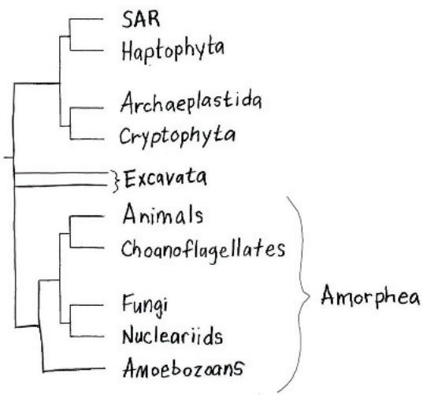

Pathogens that share a relatively recent common ancestor with humans will likely also share metabolic and structural characteristics with humans. Because drugs target the pathogen's metabolism or structure, developing drugs that harm the pathogen but not the patient should be most difficult for pathogens with whom we share the most recent evolutionary history. Working backward in time, we can use the phylogenetic tree to determine the order in which humans shared a common ancestor with pathogens in different taxa. This process leads to the prediction that it should be hardest to develop drugs to combat animal pathogens, followed by choanoflagellate pathogens, fungal and nucleariid pathogens, amoebozoans, other protists, and finally prokaryotic organisms.

## Chapter 29

## Figure Questions

Figure 29.5 The life cycles of plants and some algae, shown in Figure 13.6b, have alternation of generations; other life cycles do not. Unlike in the animal life cycle (Figure 13.6a), in the plant/algal life cycle, meiosis produces spores, not gametes. These haploid spores then divide repeatedly by mitosis, ultimately forming a multicellular haploid individual that produces gametes. There is no multicellular haploid stage in the animal life cycle. An alternation of generations life cycle also has a multicellular diploid stage, whereas the life cycle of most fungi and some protists shown in Figure 13.6c does not. Figure 29.10 Plants, nonvascular plants, vascular plants, and seed plants are monophyletic because each of these groups includes the common ancestor of the group and all of the descendants of that common ancestor. The seedless vascular plants are paraphyletic: This group does not include all of the descendants of the group's most recent common ancestor. Figure 29.11 Yes. As shown in the diagram, the sperm cell and the egg cell that fuse each resulted from the mitotic division of spores produced by the same sporophyte. However, these spores would differ genetically from one another because they were produced by meiosis, a cell division process that generates genetic variation among the offspring cells. Figure 29.14 Because the moss reduces nitrogen loss from the ecosystem, species that typically colonize the soils after the moss probably experience higher soil nitrogen levels than they otherwise would. The resulting increased availability of nitrogen may benefit these species because nitrogen is an essential nutrient that often is in short supply. Figure 29.17 A fern that had wind-dispersed sperm would not require water for fertilization, thus removing a difficulty that ferns face when they live in arid environments. The fern would also be under strong selection to produce sperm above ground (as opposed to the current situation, where some fern gametophytes are located below ground).

## Concept Check 29.1

1. Plants share some key traits only with charophytes: rings of cellulose-synthesizing complexes and similarity in sperm structure. Comparisons of nuclear, chloroplast, and mitochondrial DNA sequences also indicate that certain groups of charophytes (such as Zygnema) are the closest living relatives of plants. 2. Possible answers include walls toughened by sporopollenin (protects against harsh environmental conditions); multicellular, dependent embryos (provide nutrients and protection to the developing embryo); cuticle (reduces water loss); stomata (control gas exchange and reduce water loss) 3. The multicellular diploid stage of the life cycle would not produce gametes. Instead, both males and females would produce haploid spores by meiosis. These spores would give rise to multicellular male and female haploid stages—a major change from the single-celled haploid stages (sperm and eggs) that we actually have. The multicellular haploid stages would produce gametes and reproduce sexually. An individual at the multicellular haploid stage of the human life cycle might look like us, or it might look completely different.

## Concept Check 29.2

1. Most bryophytes do not have a vascular transport system, and their life cycle is dominated by gametophytes rather than sporophytes.
2. Answers may include the following: Large surface area of protonema enhances absorption of water and minerals; the vase-shaped archegonia protect eggs during fertilization and transport nutrients to the embryos via placental transfer cells; the stalk-like seta conducts nutrients from the gametophyte to the capsule, where spores are produced; the peristome enables gradual spore discharge; stomata enable $CO_{2}/O_{2}$ exchange while minimizing water loss; lightweight spores are readily dispersed by wind.
3. Effects of global warming on peatlands could result in positive feedback, which occurs when an end product of a process increases its own production. In this case, global warming is expected to lower the water levels of some peatlands. This would expose peat to air and cause it to decompose, thereby releasing stored $CO_{2}$ to the atmosphere. The release of more stored $CO_{2}$ to the atmosphere could cause additional global warming, which in turn could cause further drops in water levels, the release of still more $CO_{2}$ to the atmosphere, additional warming, and so on: an example of positive feedback.

## Concept Check 29.3

1. Lycophytes have microphylls, whereas seed plants and monilophytes (ferns and their relatives) have megaphylls. Monilophytes and seed plants also share other traits not found in lycophytes, such as the initiation of new root branches at various points along the length of an existing root.
2. Both seedless vascular plants and bryophytes have flagellated sperm that require moisture for fertilization; this shared similarity poses challenges for these species in arid regions. With respect to key differences, seedless vascular plants have lignified, well-developed vascular tissue, a trait that enables the sporophyte to grow tall and that has transformed life on Earth (via the formation of forests). Seedless vascular plants also have true leaves and roots, which, when compared with bryophytes, provide increased surface area for photosynthesis and improve their ability to extract nutrients from soil.
3. Three mechanisms contribute to the production of genetic variation in sexual reproduction: independent assortment of chromosomes, crossing over, and random fertilization. If fertilization were to occur between gametes from the same gametophyte, all of the offspring would be genetically identical. This would be the case because all of the cells produced by a gametophyte—including its sperm and egg cells—are the descendants of a single spore and hence are genetically identical. Although crossing over and the independent assortment of chromosomes would continue to generate genetic variation during the production of spores (which ultimately develop into gametophytes), overall the amount of genetic variation produced by sexual reproduction would drop.

## Summary of Key Concepts Questions 29.1

  
29.2 Some mosses colonize bare, sandy soils, leading to the increased retention of nitrogen in these otherwise low-nitrogen environments. Other mosses harbor nitrogen-fixing cyanobacteria that increase the availability of nitrogen in the ecosystem. The moss Sphagnum is often a major component of deposits of peat (partially decayed organic material). Boggy regions with thick layers of peat, known as peatlands, cover broad geographic regions and contain large reservoirs of carbon. By storing large amounts of carbon—in effect, removing $CO_{2}$ from the atmosphere—peatlands affect the global climate, making them of considerable ecological importance.

29.3 Lignified vascular tissue provided the strength needed to support a tall plant against gravity, as well as a means to transport water and nutrients to plant parts located high above ground. Roots were another key trait, anchoring the plant to the ground and providing additional structural support for plants that grew tall. Tall plants could shade shorter plants, thereby outcompeting them for light. Because the spores of a tall plant disperse farther than the spores of a short plant, it is also likely that tall plants could colonize new habitats more rapidly than short plants.

## Test Your Understanding

1. B 2. D 3. C 4. A 5. C 6. (a) diploid; (b) haploid; (c) haploid; (d) diploid 7. Based on our current understanding of the evolution of major plant groups, the phylogeny has the four branch points shown here:

  
Derived characters unique to the charophyte and plant clade (indicated by branch point 1) include rings of cellulose-synthesizing complexes and flagellated sperm structure. Derived characters unique to the plant clade (branch point 2) include alternation of generations; multicellular, dependent embryos; walled spores produced in sporangia; and apical meristems. Derived characters unique to the vascular plant clade (branch point 3) include life cycles with dominant sporophytes, complex vascular systems (xylem and phloem), and well-developed roots and leaves. Derived characters unique to the monilophyte and seed plant clade (branch point 4) include megaphylls and roots that can branch at various points along the length of an existing root.

## Chapter 30

## Figure Questions

Figure 30.2 Retaining the gametophyte within the sporophyte shields the egg-containing gametophyte from UV radiation. UV radiation is a mutagen. Hence, we would expect fewer mutations to occur in the egg cells produced by a gametophyte retained within the body of a sporophyte. Most mutations are harmful. Thus, the fitness of embryos should increase because fewer embryos would carry harmful mutations. Figure 30.3 The seed contains cells from three generations: (1) the current sporophyte (cells of ploidy 2n, found in the seed coat and in the megasporangium remnant that surrounds the spore wall), (2) the female gametophyte (cells of ploidy n, found in the food supply), and (3) the sporophyte of the next generation (cells of ploidy 2n, found in the embryo). Figure 30.4 Mitosis. A single haploid megaspore divides by mitosis to produce a multicellular, haploid female gametophyte. (Likewise, a single haploid microspore divides by mitosis to produce a multicellular male gametophyte.)

Figure 30.9

Figure 30.12 The largest number of seeds this flower could produce is six. We can infer this because the flower is shown as having six ovules, each of which can develop into a single seed. At least six pollen grains would have to germinate to produce six seeds. Figure 30.14 No. The branching order shown could still be correct if species on the lineages leading to Amborella, water lilies, star anise, and magnoliids had originated prior to 150 million years ago, but fossils of that age from those lineages had not yet been discovered. In such a situation, the 140-million-year-old date for the origin of the angiosperms shown on the phylogeny would be incorrect.

## Concept Check 30.1

1. To reach the eggs, the flagellated sperm of seedless plants must swim through a film of water, usually over a distance of no more than a few centimeters. In contrast, the sperm of seed plants do not require water because they are produced within pollen grains that can be transported long distances by wind or by animal pollinators. Although flagellated in some species, the sperm of seed plants do not require mobility because pollen tubes convey them from the point at which the pollen grain is deposited (near the ovules) directly to the eggs.
2. The reduced gametophytes of seed plants are nurtured by sporophytes and protected from stress, such as drought conditions and UV radiation. Pollen grains, with walls containing sporopollenin, provide protection during transport by wind or animals. Seeds have one or two layers of protective tissue, the seed coat, that improve survival by providing more protection from environmental stresses than do the walls of spores. Seeds also contain a stored supply of food, which provides nourishment for growth after dormancy is broken and the embryo emerges as a seedling.
3. If a seed could not enter dormancy, the embryo would continue to grow after it was fertilized. As a result, the embryo might rapidly become too large to be dispersed, thus limiting its transport. The embryo's chance of survival might also be reduced because it could not delay growth until conditions become favorable.

## Concept Check 30.2

1. The pine life cycle illustrates heterospory, as ovulate cones produce megaspores and pollen cones produce microspores. The reduced gametophytes are evident in the form of the microscopic pollen grains that develop from microspores and the microscopic female gametophyte that develops from the megaspore. The egg is shown developing within an ovule, and a pollen tube is shown conveying the sperm. The figure also shows the protective and nutritive features of a seed. 2. In pines, pollination occurs when a pollen grain is transferred to an ovulate cone scale, the part of a pine that contains ovules. Fertilization occurs when a sperm nucleus unites with an egg nucleus, forming a diploid zygote. Although pollination is required for fertilization, they are separate events: In pines, pollination usually occurs more than a year before fertilization.

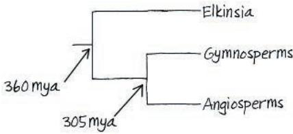

## Concept Check 30.3

1. In the oak's life cycle, the tree (the sporophyte) produces flowers, which contain gametophytes in pollen grains and ovules; the eggs in ovules are fertilized; the mature ovaries develop into dry fruits called acorns. We can view the oak's life cycle as starting when the acorn seeds germinate, resulting in embryos giving rise to seedlings and finally to mature trees, which produce flowers—and then more acorns.
2. Pine cones and flowers both have sporophylls, modified leaves that produce spores. Pine trees have separate pollen cones (with pollen grains) and ovulate cones (with ovules inside cone scales). In flowers, pollen grains are produced by the anthers of stamens, and ovules are within the ovaries of carpels. Unlike pine cones, many flowers produce both pollen and ovules.
3. The fact that the clade with bilaterally symmetrical flowers had more species establishes a correlation between flower shape and the rate of plant speciation. Flower shape is not necessarily responsible for the result because the shape (that is, bilateral or radial symmetry) may have been correlated with another factor that was the actual cause of the observed result. Note, however, that flower shape was associated with increased speciation rates when averaged across 19 different pairs of plant lineages. Since these 19 lineage pairs were independent of one another, this association suggests—but does not establish—that differences in flower shape cause differences in speciation rates. In general, strong evidence for causation can come from controlled, manipulative experiments, but such experiments are usually not possible for studies of past evolutionary events.

## Concept Check 30.4

1. Plant diversity can be considered a resource because plants provide many important benefits to humans; as a resource, plant diversity is nonrenewable because if a species is lost to extinction, that loss is permanent.
2. A detailed phylogeny of the seed plants would identify many different monophyletic groups of seed plants. Using this phylogeny, researchers could look for clades that contained species in which medicinally useful compounds had already been discovered. Identification of such clades would allow researchers to concentrate their search for new medicinal compounds among clade members—as opposed to searching for new compounds in species that were selected at random from the more than 290,000 existing species of seed plants.

## Summary of Key Concepts Questions

30.1 The integument of an ovule develops into the protective coat of a seed. The ovule's megaspore develops into a haploid female gametophyte, and two parts of the seed are related to that gametophyte: The food supply of the seed is derived from haploid gametophyte cells, and the embryo of the seed develops after the female gametophyte's egg cell is fertilized by a sperm cell. A remnant of the ovule's megasporangium surrounds the spore wall that encloses the seed's food supply and embryo. 30.2 Gymnosperms arose about 305 million years ago, making them a successful group in terms of their evolutionary longevity. Gymnosperms have the five derived traits common to all seed plants (reduced gametophytes, heterospory, ovules, pollen, and seeds), making them well adapted for life on land. Finally, because gymnosperms dominate immense geographic regions today, the group is also highly successful in geographic distribution. 30.3 Based on fossils known during his lifetime, Darwin was troubled by the relatively sudden and geographically widespread appearance of angiosperms in the fossil record. Recent fossil evidence shows that angiosperms arose and began to diversify over a period of 20–30 million years, a less rapid event than was suggested by the fossils known during Darwin's lifetime. Fossil discoveries have also uncovered extinct lineages of woody seed plants thought to have been more closely related to angiosperms than to gymnosperms; one such group, the Bennettitales, had flowerlike structures that may have been pollinated by insects. In addition, phylogenetic analyses have identified a woody species, Amborella, as the lineage of extant angiosperms that was the first to diverge from other angiosperms. The fact that both the extinct seed plant ancestors of angiosperms and the earliest-diverging taxon of extant angiosperms were woody

suggests that the common ancestor of angiosperms also was woody. 30.4 The loss of tropical forests could contribute to global warming (which would have negative effects on many human societies). People also depend on Earth's biodiversity for many products and services and hence would be harmed by the loss of species that would occur if the world's remaining tropical forests were cut down. With respect to a possible mass extinction, tropical forests harbor at least $50\%$ of the species on Earth. If the remaining tropical forests were destroyed, large numbers of these species could be driven to extinction, thus rivaling the losses that occurred in the five mass extinction events documented in the fossil record.

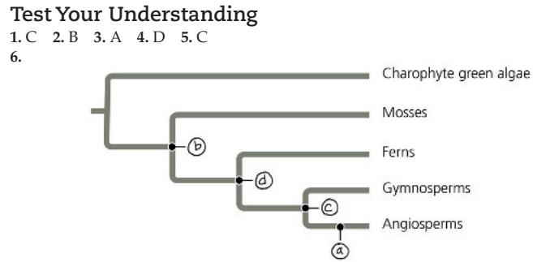

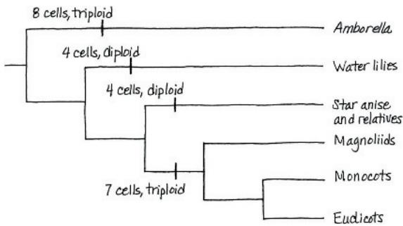  
(b) The phylogeny indicates that the lineages of extant angiosperms that were the first to diverge from other angiosperms differed from other angiosperms in terms of the number of cells in female gametophytes and the ploidy of the endosperm. The ancestral state of the angiosperms cannot be determined from these data alone. It is possible that the common ancestor of angiosperms had seven-celled female gametophytes and triploid endosperm and hence that the eight-celled and four-celled conditions represent derived traits for those lineages. Alternatively, either the eight-celled or four-celled condition may represent the ancestral state.

## Chapter 31

## Figure Questions

Figure 31.2 DNA from each of these mushrooms would be identical if each mushroom is part of a single hyphal network, as is likely. Figure 31.5 The haploid spores produced in the sexual portion of the life cycle develop from haploid nuclei that were produced by meiosis; because genetic recombination occurs during meiosis, these spores will differ genetically from one another. In contrast, the haploid spores produced in the asexual portion of the life cycle develop from nuclei that were produced by mitosis; as a result, these spores are genetically identical to one another. Figure 31.17 One or both of the following would apply to each species: DNA analyses would reveal that it is a member of the ascomycete clade, or aspects of its sexual life cycle would indicate that it is an ascomycete (for example, it would produce asci and ascospores). Figure 31.18 The hypha is composed of cells that are haploid $(n)$ , as indicated by the teal-colored arrow behind it. Figure 31.20 The mushroom is a basidiocarp, or fruiting body, of the dikaryotic mycelium, and so a cell from its stalk would be dikaryotic $(n + n)$ . Figure 31.22 Two possible controls would be E-P- and E+P-. Results from an E-P-control could be compared with results from the E-P+ experiment, and results from an E+P-control could be compared with results from the E+P+ experiment. Together, these two comparisons would indicate whether the addition of the pathogen causes an increase in leaf mortality. Results from an E-P-experiment could also be compared with results from the second control $(\mathrm{E} + \mathrm{P}-)$ to determine whether adding the fungal endophytes has a negative effect on the plant.

## Concept Check 31.1

1. Both a fungus and a human are heterotrophs. Many fungi digest their food externally by secreting enzymes into the food and then absorbing the small molecules that result from digestion. Other fungi absorb such small molecules directly from their environment. In contrast, humans (and most other animals) ingest relatively

large pieces of food and digest the food within their bodies. 2. The ancestors of such a mutualist most likely secreted powerful enzymes to digest the body of their insect host. Since such enzymes would harm a living host, it is likely that the mutualist would not produce such enzymes or would restrict their secretion and use. 3. Carbon that enters the plant through stomata is fixed into sugar through photosynthesis. Some of these sugars are absorbed by the fungus that partners with the plant to form mycorrhizae; others are transported within the plant body and used in the plant. Thus, the carbon may be deposited in either the body of the plant or the body of the fungus.

## Concept Check 31.2

1. The majority of the fungal life cycle is spent in the haploid stage, whereas the majority of the human life cycle is spent in the diploid stage.
2. The two mushrooms might be reproductive structures of the same mycelium (the same organism). Or they might be parts of two separate organisms that have arisen from a single parent organism through asexual reproduction (for example, from two genetically identical asexual spores) and thus carry the same genetic information.

## Concept Check 31.3

1. DNA evidence indicates that fungi, animals, and their protistan relatives form a clade, the opisthokonts. Furthermore, chytrids have posterior flagella, as do most other opisthokonts. This suggests that other fungal lineages lost their flagella after diverging from ancestors that had flagella.
2. Mycorrhizae form extensive networks of hyphae through the soil, enabling nutrients to be absorbed more efficiently than a plant can do on its own; this is true today, and similar associations were probably very important for the earliest plants (which lacked roots). Evidence for the antiquity of mycorrhizal associations includes fossils showing arbuscular mycorrhizae in the early plant Aglaophyton and molecular results showing that genes required for the formation of mycorrhizae are present in liverworts and other early-diverging plant lineages.
3. Fungi are heterotrophs. Prior to the colonization of land by plants, terrestrial fungi would have lived where other organisms (or their remains) were present and provided a source of food. Thus, if fungi colonized land before plants, they could have fed on prokaryotic organisms or protists that lived on land or by the water's edge—but not on the plants or animals on which many fungi feed today.

## Concept Check 31.4

1. One explanation would be that the ancestor of present-day microsporidians had flagellated spores, but that over the course of evolution within the microsporidian lineage, the flagella were lost.
2. Possible answers include the following: In mucoromycetes, the sturdy, thick-walled zygosporangium can withstand harsh conditions and then undergo karyogamy and meiosis when the environment is favorable for reproduction. In one group of mucoromycetes, the glomeromycetes, the hyphae have a specialized morphology that enables the fungi to form arbuscular mycorrhizae with plant roots. In ascomycetes, the asexual spores (conidia) are often produced in chains or clusters at the tips of conidiophores, where they are easily dispersed by wind. The often cup-shaped ascocarps house the sexual spore-forming asci. In basidiomycetes, the basidiocarp supports and protects a large surface area of basidia, from which spores are dispersed.
3. Such a change to the life cycle of an ascomycete would reduce the number and genetic diversity of ascospores that result from a mating event. Ascospore number would drop because a mating event would lead to the formation of only one ascus. Ascospore genetic diversity would also drop because in ascomycetes, one mating event leads to the formation of asci by many different dikaryotic cells. As a result, genetic recombination and meiosis occur independently many different times—which could not happen if only a single ascus was formed. It is also likely that if such an ascomycete formed an ascocarp, the shape of the ascocarp would differ considerably from that found in its close relatives.

## Concept Check 31.5

1. A suitable environment for growth, retention of water and minerals, protection from intense sunlight, and protection from being eaten 2. A hardy spore stage enables dispersal to host organisms through a variety of mechanisms; their ability to grow rapidly in a favorable new environment enables them to capitalize on the host's resources. 3. Many different outcomes might have occurred. Organisms that currently form mutualisms with fungi might have gained the ability to perform the tasks currently done by their fungal partners, or they might have formed similar mutualisms with other organisms (such as bacteria). Alternatively, organisms that currently form mutualisms with fungi might be less effective at living in their present environments. For example, the colonization of land by plants might have been more difficult. And if plants did eventually colonize land without fungal mutualists, natural selection might have favored plants that formed more highly divided and extensive root systems (in part replacing mycorrhizae).

## Summary of Key Concepts Questions

31.1 The body of a multicellular fungus typically consists of thin filaments called hyphae. These filaments form an interwoven mass (mycelium) that penetrates the substrate on which the fungus grows and feeds. Because the individual filaments are thin, the surface-to-volume ratio of the mycelium is maximized, making nutrient absorption highly efficient.

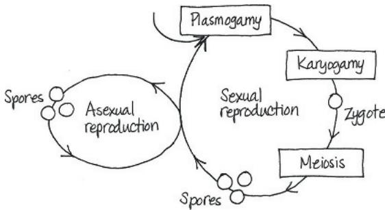

31.3 Phylogenetic analyses show that fungi and animals are more closely related to each other than either is to other multicellular eukaryotes (such as plants or multicellular algae). These analyses also show that fungi are more closely related to single-celled protists called nucleariids than they are to animals, whereas animals are more closely related to a different group of single-celled protists, the choanoflagellates, than they are to fungi. In combination, these results indicate that multicellularity evolved in fungi and animals independently, from different single-celled ancestors.
31.4  

31.5 As decomposers, fungi break down the bodies of dead organisms, thereby recycling elements between the living and nonliving environments. Without the activities of fungi and bacterial decomposers, essential nutrients would remain tied up in organic matter, and life as we know it would cease. As an example of their key role as mutualists, fungi form mycorrhizal associations with plants. These associations improve the growth and survival of plants, thereby indirectly affecting the many other species (humans included) that depend on plants. As pathogens, fungi harm other species. In some cases, fungal pathogens have caused their host populations to decline across broad geographic regions, as in the case of the American chestnut.

## Test Your Understanding

1. B 2. D 3. A 4. D

## Chapter 32

## Figure Questions

Figure 32.3 As described in ① and ②, choanoflagellates and a broad range of animals have collar cells. Since collar cells have never been observed in plants, fungi, or non-choanoflagellate protists, this suggests that choanoflagellates may be more closely related to animals than to other eukaryotes. If choanoflagellates are more closely related to animals than to any other group of eukaryotes, choanoflagellates and animals should share other traits that are not found in other eukaryotes. The data described in ③ are consistent with this prediction. Figure 32.8 (1) Any imaginary slice through the central axis of a radial animal divides its body into mirror images. As a result, a radial animal has no front and back sides and no left and right sides.

(2)  
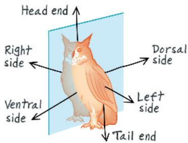  
Figure 32.11 Cnidaria is the sister phylum in this tree.

## Concept Check 32.1

1. In most animals, the zygote undergoes cleavage, which leads to the formation of a blastula. Next, in gastrulation, one end of the embryo folds inward, producing layers of embryonic tissue. As the cells of these layers differentiate, a wide variety of animal forms are produced. Despite the diversity of animal forms, animal development is controlled by a similar set of Hox genes across a broad range of taxa. 2. The imaginary plant would require tissues composed of cells that were analogous to the muscle and nerve cells found in animals: "Muscle" tissue would be necessary for the plant to chase prey, and "nerve" tissue would be required for the plant to coordinate its movements when chasing prey. To digest captured prey, the plant would need to either secrete enzymes into one or more digestive cavities (which could be modified leaves, as in a Venus flytrap) or secrete enzymes outside of its body and feed by absorption. To extract nutrients from the soil—yet be able to chase prey—the plant would need something other than fixed roots, perhaps retractable "roots" or a way to ingest soil. To conduct photosynthesis, the plant would require chloroplasts. Overall, such an imaginary plant would be very similar to an animal that had chloroplasts and retractable roots.

## Concept Check 32.2

1. c, b, a, d 2. The branch with a question mark should be labeled "Choanoflagellates." One line of evidence for this is morphological: Collar cells similar to present-day choanoflagellates are found in animals but have never been seen in plants, fungi, or protists other than choanoflagellates. Additionally, there is strong molecular evidence that choanoflagellates are the lineage most closely related to animals. 3. In descent with modification, an organism shares characteristics with its ancestors (due to their shared ancestry), yet it also differs from its ancestors (because organisms accumulate differences over time as they adapt to their surroundings). As an example, consider the evolution of animal cadherin proteins, a key step in the origin of multicellular animals. These proteins illustrate both of these aspects of descent with modification: Animal cadherin proteins share many protein domains with a cadherin-like protein found in their choanoflagellate ancestors, yet they also have a unique "CCD" domain that is not found in choanoflagellates.

## Concept Check 32.3

1. A snail has a spiral and determinate cleavage pattern; a human has radial, indeterminate cleavage. In a snail, the coelomic cavity is formed by splitting of mesoderm masses; in a human, the coelom forms from folds of archenteron. In a snail, the mouth forms from the blastopore; in a human, the anus develops from the blastopore.
2. Animals that lack a body cavity tend to have thin, flat bodies. Such animals don't require an internal transport system: With bodies that are only a few cells thick, the exchange of nutrients, gases, and wastes can occur across the entire body surface.
3. Most triploblasts have two openings to their digestive tract, a mouth and an anus. As such, their bodies have a structure that is analogous to that of a doughnut: The digestive tract (the hole of the doughnut) runs from the mouth to the anus and is surrounded by various tissues (the solid part of the doughnut). The doughnut analogy is most obvious at early stages of development (see Figure 32.10c).

## Concept Check 32.4

1. Cnidarians possess tissues, while sponges do not. Also unlike sponges, cnidarians exhibit body symmetry, though it is radial and not bilateral as in most other animal phyla.

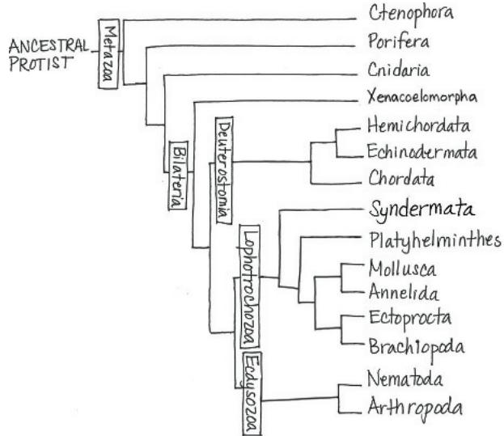

Under the hypothesis that ctenophores are the first lineage of metazoans to diverge from other animals, sponges (which lack tissues) would be nested within a clade whose other members all have tissues. As a result, a group composed of animals with tissues would not form a clade. 3. The phylogeny in Figure 32.11 indicates that molluscs are members of Lophotrochozoa, one of the three main groups of bilaterians (the others being Deuterostomia and Ecdysozoa).

As seen in Figure 25.11, the fossil record shows that molluscs were present tens of millions of years before the Cambrian explosion. Thus, long before the Cambrian explosion, the lophotrochozoan clade had formed and was evolving independently of the evolutionary lineages leading to Deuterostomia and Ecdysozoa. Based on the phylogeny in Figure 32.11, we can also conclude that the lineages leading to Deuterostomia and Ecdysozoa were independent of one another before the Cambrian explosion. Since the lineages leading to the three main clades of bilaterians were evolving independently of one another prior to the Cambrian explosion, that explosion could be viewed as consisting of three “explosions,” not one.

## Summary of Key Concepts Questions

32.1 Unlike animals, which are heterotrophs that ingest their food, plants are autotrophs, and fungi are heterotrophs that grow on their food and feed by absorption. Animals lack cell walls, which are found in both plants and fungi. Animals also have muscle tissue and nerve tissue, which are not found in either plants or fungi. In addition, the sperm and egg cells of animals are produced by meiotic division, unlike what occurs in plants and fungi (where reproductive cells such as sperm and eggs are produced by mitotic division). Finally, animals regulate the development of body form with Hox genes, a unique group of genes that is not found in either plants or fungi. 32.2 Current hypotheses about the cause of the Cambrian explosion include new predator-prey relationships, an increase in atmospheric oxygen, and an increase in developmental flexibility provided by the origin of Hox genes and other genetic changes. 32.3 Body plans provide a helpful way to compare and contrast key features of organisms. However, phylogenetic analyses show that similar body plans have arisen independently in different groups of organisms. As such, similar body plans may have arisen by convergent evolution and hence may not be informative about evolutionary relationships. 32.4 Listed in order from the most to the least inclusive clade, humans belong to Metazoa, Bilateria, Deuterostomia, and Chordata.

Test Your Understanding

1. A  2. D  3. C  4. C

Practice Applying Your Learning

7. (a) F (b) F (c) T (d) T (e) F (f) T

## Chapter 33

## Figure Questions

Figure 33.8 Obelia is an animal, and its life cycle is indeed most similar to the generalized life cycle of animals (Figure 13.6a). In Obelia, both the polyp and the medusa are diploid organisms. As in other animals, in Obelia only the single-celled gametes are haploid. By contrast, plants and some algae (Figure 13.6b) have a multicellular haploid generation and a multicellular diploid generation. Obelia also differs from fungi and some protists (Figure 13.6c) in that the diploid stage of those organisms is unicellular. Figure 33.9 Possible examples include the Golgi apparatus (flattening; increases area for receiving and transporting proteins), the cristae of mitochondria (folding; increases the surface area available for cellular respiration), the cardiovascular system (branching; increase area for materials exchange in tissues), and root hairs (projections; increase area for absorption). Figure 33.11 Adding fertilizer to the water supply would probably increase the abundance of algae, and that, in turn, would likely increase the abundance of snails (which eat algae). If the water was also contaminated with infected human feces or urine, an increase in the number of snails would likely lead to an increase in the abundance of blood flukes (which require snails as an intermediate host). As a result, the occurrence of schistosomiasis might increase. Figure 33.22 The extinction of freshwater bivalves might lead to an increase in the abundance of photosynthetic protists and bacteria. Because these organisms are at the base of aquatic food webs, increases in their abundance could have major effects on aquatic communities (including both increases and decreases in the abundance of other species). Figure 33.30 Such a result would be consistent with the origin of the Ubx and abd-A Hox genes having played a major role in the evolution of increased body segment diversity in arthropods. However, note that such a result would simply show that the presence of the Ubx and abd-A Hox genes was correlated with an increase in body segment diversity in arthropods; it would not provide direct experimental evidence that the origin of the Ubx and abd-A genes caused an increase in arthropod body segment diversity. Figure 33.36 You should have circled the clade that includes the insects, remipedians, and other crustaceans, along with the branch point that represents their most recent common ancestor.

## Concept Check 33.1

1. The flagella of choanocytes draw water through their collars, which trap food particles. The particles are engulfed by phagocytosis and digested, either by choanocytes or by amoebocytes.
2. Ctenophores have diploblastic spherical or oval-shaped gelatinous bodies with modified radial symmetry. They have two unique features: ctenes, plates of partially fused cilia arranged in eight rows that can beat and propel the ctenophore in the water column, and colloblasts, structures with sticky cells on the ctenophore's tentacles that allow it to capture zooplankton prey.

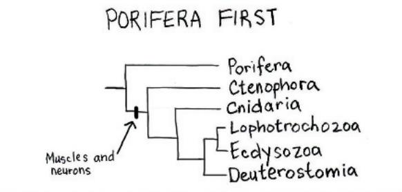

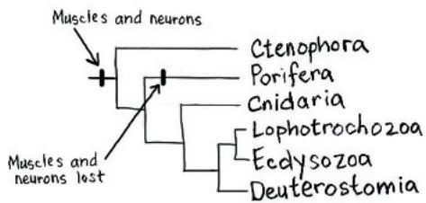

## Concept Check 33.2

1. Both the polyp and the medusa are composed of an outer epidermis and an inner gastrodermis separated by a gelatinous layer, the mesoglea. The polyp is a cylindrical form that adheres to the substrate by its aboral end; the medusa is a flattened, mouthdown form that moves freely in the water. 2. Both a feeding polyp and a medusa are diploid, as indicated by the pink arrow in the diagram. The medusa stage produces haploid gametes. This is an example of a gametic life cycle. 3. Evolution is not goal oriented; hence, it would not be correct to argue that cnidarians are not “highly evolved” simply because their form had changed relatively little over the past 560 million years. Instead, the fact that cnidarians have persisted for hundreds of millions of years indicates that the cnidarian body plan is a highly successful one.

## Concept Check 33.3

1. Tapeworms can absorb food from their environment and release ammonia into their environment through their body surface because their body is very flat, due in part to the lack of a body cavity.
2. The inner tube is the alimentary canal, which runs the length of the body. The outer tube is the body wall. The two tubes are separated by the coelom.
3. All molluscs have inherited a foot from their common ancestor. However, in different groups of molluscs, the structure of the foot has been modified over time by natural selection. In gastropods, the foot is used as a holdfast or to move slowly on the substrate. In cephalopods, the foot has been modified into part of the tentacles and into an excurrent siphon, through which water is propelled (resulting in movement in the opposite direction).

## Concept Check 33.4

1. Nematodes lack body segments and a coelom; annelids have both. 2. The arthropod exoskeleton, which had already evolved in the ocean, allows terrestrial species to retain water and support their bodies on land. Wings allow insects to disperse quickly to new habitats and to find food and mates. The tracheal system allows for efficient gas exchange despite the presence of an exoskeleton. 3. Yes. Under the traditional hypothesis, we would expect body segmentation to be controlled by similar Hox genes in annelids and arthropods. However, if annelids are in Lophotrochozoa and arthropods are in Ecdysozoa (as current evidence suggests), body segmentation may have evolved independently in these two groups. In such a case, we might expect that different Hox genes would control the development of body segmentation in the two clades.

## Concept Check 33.5

1. Each tube foot consists of an ampulla and a podium. When the ampulla squeezes, it forces water into the podium, which causes the podium to expand and contact the substrate. Adhesive chemicals are then secreted from the base of the podium, thereby attaching the podium to the substrate.
2. Both insects and nematodes are members of Ecdysozoa, one of the three major clades of bilaterians. Therefore, a characteristic

shared by Drosophila and Caenorhabditis may be informative for other members of their clade—but not necessarily for members of Deuterostomia. Instead, Figure 33.2 suggests that a species within Echinodermata or Chordata might be a more appropriate invertebrate model organism from which to draw inferences about humans and other vertebrates. 3. Echinoderms include species with a wide range of body forms. However, even echinoderms that look very different from one another, such as sea stars and sea cucumbers, share characteristics unique to their phylum, including a water vascular system and tube feet. The differences between echinoderm species illustrate the diversity of life, while the characteristics they share illustrate the unity of life. The match between organisms and their environments can be seen in such echinoderm features as the eversible stomachs of sea stars (enabling them to digest prey that are larger than their mouth) and the complex, jaw-like structure that sea urchins use to eat seaweed.

## Summary of Key Concepts Questions

33.1 The sponge body consists of two layers of cells, both of which are in contact with water. As a result, gas exchange and waste removal occur as substances diffuse into and out of the cells of the body. Choenocytes and amoebocytes ingest food particles from the surrounding water. Choenocytes also release food particles to amoebocytes, which then digest the food particles and deliver nutrients to other cells. 33.2 The cnidarian body plan consists of a sac with a central digestive compartment, the gastrovascular cavity. The single opening to this compartment serves as both a mouth and an anus. The two main variations on this body plan are sessile polyps (which adhere to the substrate at the end of the body opposite to the mouth/anus) and motile medusae (which move freely through the water and resemble flattened, mouth-down versions of polyps). 33.3 No. Some lophotrochozoans have a crown of ciliated tentacles that function in feeding (called a lophophore), while others go through a distinctive developmental stage known as trochophore larvae. Many other lophotrochozoans do not have either of these features. As a result, the clade is defined primarily by DNA similarities, not morphological similarities.

33.4 Many nematode species live in soil and in sediments on the bottom of bodies of water. These free-living species play important roles in decomposition and nutrient cycling. Other nematodes are parasites, including many species that attack the roots of plants and some that attack animals (including humans). Arthropods have profound effects on all aspects of ecology. In aquatic environments, crustaceans play key roles as grazers (of algae), scavengers, and predators and some species, such as krill, are important sources of food for whales and other vertebrates. On land, it is difficult to think of features of the natural world that are not affected in some way by insects and other arthropods, such as spiders and ticks. There are more than 1 million species of insects, many of which have enormous ecological effects as herbivores, predators, parasites, decomposers, and vectors of disease. Insects are also key sources of food for many organisms, including humans in some regions of the world.

33.5 Echinoderms and chordates are both members of Deuterostomia, one of the three main clades of bilaterian animals. As such, chordates (including humans) are more closely related to echinoderms than we are to animals in any of the other phyla covered in this chapter. Nevertheless, echinoderms and chordates have evolved independently for over 500 million years. This statement does not contradict the close relationship of echinoderms and chordates, but it does make clear that "close" is a relative term indicating that these two phyla are more closely related to each other than either is to animal phyla not in Deuterostomia.

## Test Your Understanding

1. A 2. C 3. B 4. C 5. C 6. D

## Chapter 34

Figure Questions  
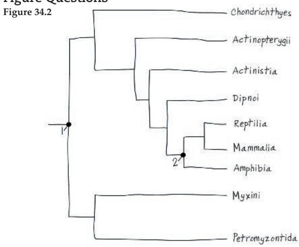

The redrawn tree shows mammals (including humans) as nested near the middle of the evolutionary tree of vertebrates. Showing the vertebrate tree in this way provides a visual illustration of the fact that the evolutionary history of vertebrates did not consist of a series of steps “leading to” humans. Figure 34.6 The patterns in these figures suggest that specific Hox genes, as well as the order in which they are expressed, have been highly conserved over the course of evolution.

Figure 34.20 Tiktaalik was a lobe-fin fish that had both fish and tetrapod characters. Like a fish, Tiktaalik had fins, scales, and gills. As described by Darwin's concept of descent with modification, such shared characters can be attributed to descent from ancestral species—in this case, Tiktaalik's descent from fish ancestors. Tiktaalik also had traits that were unlike a fish but like a tetrapod, including a flat skull, a neck, a full set of ribs, and the skeletal structure of its fin. These characters illustrate the second part of descent with modification, showing how ancestral features had become modified over time. Figure 34.21 Sometime between 350 mya and 340 mya. We can infer this because amphibians must have originated after the most recent common ancestor of amphibians and amniotes (and that ancestor is shown as having lived 350 mya), but no later than the date of the earliest known fossils of amphibians (shown in the figure as 340 mya). Figure 34.25 Pterosaurs did not descend from the common ancestor of all dinosaurs; hence, pterosaurs are not dinosaurs. However, birds are descendants of the common ancestor of the dinosaurs. As a result, a monophyletic clade of dinosaurs must include birds. In that sense, birds are dinosaurs. Figure 34.37 In a catabolic pathway, like the aerobic processes of cellular respiration, water is released as a by-product when an organic compound such as glucose is mixed with oxygen. The kangaroo rat can retain and use that water, decreasing its need to drink water. Figure 34.38 In general, the process of exaptation occurs as a structure that had one function acquires a different function via a series of intermediate stages. Each of these intermediate stages typically has some function in the organism in which it is found. The incorporation of articular and quadrate bones into the mammalian ear illustrates exaptation because these bones originally evolved as part of the jaw, where they functioned as the jaw hinge, but over time they became co-opted for another function, namely, the transmission of sound. Figure 34.44 As shown in this phylogeny, chimpanzees and humans represent the tips of separate branches of evolution. As such, the human and chimpanzee lineages have evolved independently after they diverged from their common ancestor—an event that took place 7–8 million years ago. Hence, it is incorrect to say that humans evolved from chimpanzees (or vice versa). If humans had descended from chimpanzees, for example, the human lineage would be nested within the chimpanzee lineage, much as birds are nested within the reptile clade (see Figure 34.25).

## Concept Check 34.1

1. The four characters are a notochord; a dorsal, hollow nerve chord; pharyngeal slits or clefts; and a muscular, post-anal tail.
2. In humans, these characters are present only in the embryo. The notochord becomes disks between the vertebrae; the dorsal, hollow nerve cord develops into the brain and spinal cord; the pharyngeal clefts develop into various adult structures, and the tail is almost completely lost.
3. You would expect the vertebrate groups Actinopterygii, Actinistia, Dipnoi, Amphibia, Reptilia, and Mammalia to have lungs or lung derivatives. All of these groups originate to the right of (evolved after) the hatch mark indicating the appearance of this derived character in their lineage.

## Concept Check 34.2

1. Parasitic lampreys have a round, rasping mouth, which they use to attach to fish. Non-parasitic lampreys feed only as larvae; these larvae resemble lancelets and like them, are suspension feeders. Conodonts had two sets of mineralized dental elements, which may have been used to impale prey and cut it into smaller pieces. 2. Such a finding suggests that early organisms with a head were favored by natural selection in several different evolutionary lineages. However, while a logical argument can be made that having a head was advantageous, fossils alone do not constitute proof. 3. In armored jawless vertebrates, bone served as external armor that may have provided protection from predators. Some species also had mineralized mouthparts, which could be used for either predation or scavenging.

## Concept Check 34.3

1. Both are gnathostomes and have jaws, four clusters of Hox genes, enlarged forebrains, and lateral line systems. Shark skeletons consist mainly of cartilage, whereas tuna have bony skeletons. Sharks also have a spiral valve. Tuna have an operculum and a swim bladder, as well as flexible rays supporting their fins.
2. Aquatic gnathostomes have jaws (an adaptation for feeding) and paired fins and a tail (adaptations for swimming). Aquatic gnathostomes also typically have streamlined bodies for efficient swimming and swim bladders or other mechanisms (such as oil storage in sharks) for buoyancy.

4. Yes, that could have happened. The paired appendages of aquatic gnathostomes other than the lobe-fins could have served as a starting point for the evolution of limbs. The colonization of land by aquatic gnathostomes other than the lobe-fins might have been facilitated in lineages that possessed lungs, as that would have enabled those organisms to breathe air.

## Concept Check 34.4

1. Tetrapods are thought to have originated about 365 million years ago when the fins of some lobe-fins evolved into the limbs of tetrapods. In addition to their four limbs with digits—a key derived trait for which the group is named—other derived traits of tetrapods include a neck (consisting of vertebrae that separate the head from the rest of the body) and a pelvic girdle that is fused to the backbone. 2. Some fully aquatic species are paedomorphic, retaining larval features for life in water as adults. Species that live in dry environments may avoid dehydration by burrowing or living under moist leaves, and they protect their eggs with foam nests, viviparity, and other adaptations. 3. Many amphibians spend part of their life cycle in aquatic environments and part on land. Thus, they may be exposed to a wide range of environmental problems, including water and air pollution and the loss or degradation of aquatic and/or terrestrial habitats. In addition, amphibians have highly permeable skin, providing relatively little protection from external conditions, and their eggs do not have a protective shell.

## Concept Check 34.5

1. The amniotic egg provides protection to the embryo and allows the embryo to develop on land, eliminating the necessity of a watery environment for reproduction. Another key adaptation is rib cage ventilation, which improves the efficiency of air intake and may have allowed early amniotes to dispense with breathing through their skin. Finally, not breathing through their skin allowed amniotes to develop relatively impermeable skin, thereby conserving water. 2. Yes. Although snakes lack limbs, they descended from lizards with legs. Some snakes retain vestigial pelvic and leg bones, providing evidence of their descent from an ancestor with legs. 3. Birds have weight-saving modifications, including the absence of teeth, a urinary bladder, and a second ovary in females. The wings and feathers are adaptations that facilitate flight, as do efficient respiratory and circulatory systems that support a high metabolic rate. 4. (a) synapsids, (b) tuataras, (c) turtles

## Concept Check 34.6

1. Monotremes lay eggs. Marsupials give birth to very small live young that attach to a nipple in the female's pouch, where they complete development. Eutherians give birth to more developed live young.
2. Hands and feet adapted for grasping, flat nails, large brain, forward-looking eyes on a flat face, parental care, and movable big toe and thumb.
3. Mammals are endothermic, enabling them to live in a wide range of habitats. Milk provides young with a balanced set of nutrients, and hair and a layer of fat under the skin help mammals retain heat. Mammals have differentiated teeth, enabling them to eat many different kinds of food. Mammals also have relatively large brains, and many species are capable learners. Following the mass extinction at the end of the Cretaceous period, the absence of large terrestrial dinosaurs may have opened many new ecological niches to mammals, promoting an adaptive radiation. Continental drift also isolated many groups of mammals from one another, promoting the formation of many new species.

## Concept Check 34.7

1. Hominins are a clade within the ape clade that includes humans and all species more closely related to humans than to other apes. The derived characters of hominins include bipedal locomotion and relatively larger brains. 2. In hominins, bipedal locomotion evolved long before large brain size. Homo ergaster, for example, was fully upright, bipedal, and as tall as modern humans, but its brain was significantly smaller than that of modern humans. 3. Yes, both can be correct. Homo sapiens may have established populations outside of Africa as early as 180,000 years ago, as indicated by the fossil record. However, those populations may have left few or no descendants today. Instead, all living humans may have descended from Africans that spread from Africa roughly 50,000 years ago, as indicated by genetic data.

## Summary of Key Concepts Questions

34.1 Lancelets represent the lineage of living chordates that was first to diverge from other chordates, and as adults they have key derived characters of chordates. This suggests that the chordate common ancestor may have resembled a lancelet in having an anterior end with a mouth along with the following four derived characters: a notochord; a dorsal, hollow nerve cord; pharyngeal slits or clefts; and a muscular, post-anal tail. 34.2 Conodonts, among the earliest vertebrates in the fossil record, were very abundant for 300 million years. While jawless, their well-developed teeth provide early signs of bone formation. Other species of jawless vertebrates developed armor on the outside of their bodies, which probably helped protect them from predators. Like lampreys, these species had paired fins for locomotion and an inner ear with semicircular canals that provided a sense of balance. There were many species of these armored jawless vertebrates, but they all became extinct by the close of the Devonian period, 359 million years ago. 34.3 The origin of jaws altered how fossil gnathostomes obtained food, which in turn had large effects on ecological interactions. Predators could use their jaws to grab prey or remove chunks of flesh, stimulating the evolution of increasingly sophisticated means of defense in prey species. Evidence for these changes can be found in the fossil record, which includes fossils of 10-m-long predators with remarkably powerful jaws, as well as lineages of well-defended prey species whose bodies were covered by armored plates. 34.4 Amphibians require water for reproduction; their bodies can lose water rapidly through their moist, highly permeable skin; and amphibian eggs do not have a shell and hence are vulnerable to desiccation. 34.5 Birds are descended from theropod dinosaurs, and dinosaurs are nested within the archosaur lineage, one of the two main reptile lineages. Thus, the other living archosaur reptiles, the crocodilians, are more closely related to birds than they are to non-archosaur reptiles such as lizards. As a result, birds are considered reptiles. (Note that if reptiles were defined as excluding birds, the reptiles would not form a clade; instead, the reptiles would be a paraphyletic group.) 34.6 Mammals are members of a group of amniotes called synapsids. Early (nonmammalian) synapsids laid eggs and had a sprawling gait. Fossil evidence shows that mammalian features arose gradually over a period of more than 100 million years. For example, the jaw was modified over time in nonmammalian synapsids, eventually coming to resemble that of a mammal. By 180 million years ago, the first mammals had appeared. There were many species of early mammals, but most of them were small, and they were not abundant or dominant members of their community. Mammals did not rise to ecological dominance until after the extinction of the dinosaurs. 34.7 The fossil record shows that from 4.5 to 2.5 million years ago, a wide range of hominin species walked upright but had relatively small brain sizes. About 2.5 million years ago, the first members of genus Homo emerged. These species used tools and had larger brains than those of earlier hominins. Fossil evidence indicates that multiple members of our genus were alive at any given point in time. Furthermore, until about 1.3 million years ago, these various Homo species also coexisted with members of earlier hominin lineages, such as Paranthropus. The different hominins alive at the same periods of time varied in body size, body shape, brain size, dental morphology, and the capacity for tool use. Ultimately, except for Homo sapiens, all of these species became extinct. Overall, human evolution can be viewed as an evolutionary tree with many branches—the only surviving lineage of which is our own.

(c)  
  
(1)

## Test Your Understanding

## 1. D  2. C  3. B  4. C  5. D  6. A

8. (a) Because brain size tends to increase consistently in such lineages, we can conclude that natural selection favored the evolution of larger brains and hence that the benefits outweighed the costs. (b) As long as the benefits of brains that are large relative to body size are greater than the costs, large brains can evolve. Natural selection might favor the evolution of brains that are large relative to body size because such brains confer an advantage in obtaining mates and/or an advantage in survival.

  
Mortality tends to be lower in birds with larger brains.

## Chapter 35

## Figure Questions

Figure 35.5 All three examples have nodes because they're all stems. The nodes are the locations where the axillary buds arise.

Figure 35.11

-Mature Tissues

-Primary meristems

-Root apical meristem

-Root cap

X1 X2 X3 X4 X5 V P3 P2 P1

As a result of the addition of secondary xylem cells, the vascular cambium is pushed farther to the outside. Figure 35.15

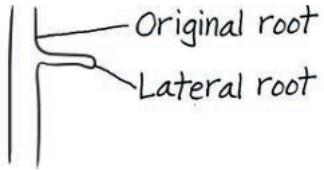

Figure 35.17 Pith and cortex are defined, respectively, as ground tissue that is internal and ground tissue that is external to vascular tissue. Since vascular bundles of monocot stems are scattered throughout the ground tissue, there is no clear distinction between internal and external relative to the vascular tissue. Figure 35.19 The vascular cambium produces growth that increases the diameter of a stem or root. The tissues that are exterior to the vascular cambium cannot keep pace with the growth because their cells no longer divide. As a result, these tissues rupture. Figure 35.23 Periderm (mainly cork and cork cambium), primary phloem, secondary phloem, vascular cambium, secondary xylem (sapwood and heartwood), primary xylem, and pith. At the base of ancient redwood that is many centuries old, the remnants of primary growth (primary phloem, primary xylem, and pith) would be quite insignificant. Figure 35.30 Every root epidermal cell would develop a root hair. Figure 35.32 Another example of homeotic gene mutation is the mutation in a Hox gene that causes legs to form in place of antennae in Drosophila (see Figure 18.20). Figure 35.33

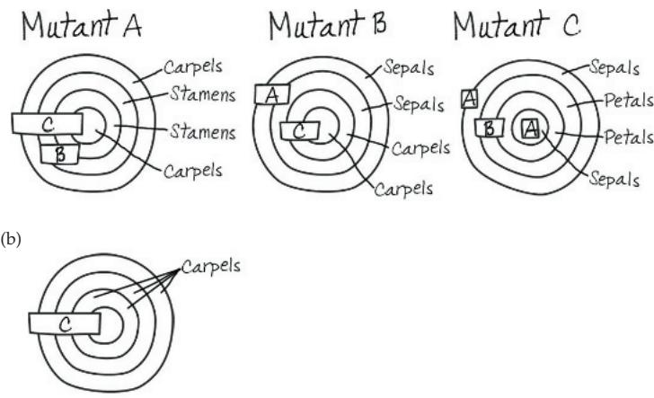

## Concept Check 35.1

1. The vascular tissue system connects leaves and roots, allowing sugars to move from leaves to roots in the phloem and allowing water and minerals to move to the leaves in the xylem.
2. To get sufficient energy from photosynthesis, we would need lots of surface area exposed to the sun. This large surface-to-volume ratio, however, would create a new problem—evaporative water loss. We would have to be permanently connected to a water source—the soil, also our source of minerals. In short, we would probably look and behave very much like plants.
3. As plant cells enlarge, they typically form a huge central vacuole that contains a dilute, watery sap. Central vacuoles enable plant cells to become large with only a minimal investment of new cytoplasm. The orientation of the cellulose microfibrils in plant cell walls affects the growth pattern of cells.

## Concept Check 35.2

1. Yes. In a woody plant, secondary growth is occurring in the older parts of the stem and root, while primary growth is occurring at the root and shoot tips. 2. The largest, oldest leaves would be lowest on the shoot. Since they would probably be heavily shaded, they would not photosynthesize much regardless of their size. Determinate growth benefits the plant by keeping it from investing an ever-increasing amount of resources into organs that provide little photosynthetic product. 3. No. The carrot roots will probably be smaller at the end of the second year because the food stored in the roots will be used to produce flowers, fruits, and seeds.

## Concept Check 35.3

1. In roots, primary growth occurs in three successive stages, moving away from the tip of the root: the zones of cell division, elongation, and differentiation. In shoots, it occurs at the tip of apical buds, with leaf primordia arising along the sides of an apical meristem. Most growth in length occurs in older internodes below the shoot tip.
2. The fossil probably came from a floating leaf because having stomata exclusively on the upper surface would be a poor adaptation for a desert plant since it would lead to water loss. A floating leaf, on the other hand, would benefit from having stomata on its upper surface since only that surface is in contact with the gaseous environment.
3. Root hairs are cellular extensions that increase the surface area of the root epidermis, thereby enhancing the absorption of minerals and water. Microvilli are extensions that increase the absorption of nutrients by increasing the surface area of the gut.

## Concept Check 35.4

1. The sign will still be 2 m above the ground because this part of the tree is no longer growing in length (primary growth); it is now growing only in thickness (secondary growth).
2. Stomata must be able to close because evaporation is much more intensive from leaves than from the trunks of woody trees as a result of the higher surface-to-volume ratio in leaves.
3. Since there is little seasonal temperature variation in the tropics, the growth rings of a tree from the tropics would be difficult to discern unless the tree came from an area that had pronounced wet and dry seasons.
4. The tree would die slowly. Girdling removes an entire ring of secondary phloem (part of the bark), completely preventing transport of sugars and starches from the shoots to the roots. After several weeks, the roots would have used all of their stored carbohydrate reserves and would die.

## Concept Check 35.5

1. Although all the living vegetative cells of a plant have the same genome, they develop different forms and functions because of differential gene expression. 2. Plants show indeterminate growth; juvenile and mature phases are found on the same individual plant; and cell differentiation in plants is more dependent on final position than on lineage. 3. One hypothesis is that tepals arise if B gene activity is present in all three of the outer whorls of the flower.

## Summary of Key Concepts Questions

35.1 Here are a few examples: The cuticle of leaves and stems protects these structures from desiccation. Collenchyma and sclerenchyma cells have thick walls that provide support for plants. Strong, branching root systems help anchor plants in the soil. 35.2 Primary growth arises from apical meristems and involves production and elongation of organs. Secondary growth arises from lateral meristems and adds to the diameter of roots and stems. 35.3 Lateral roots emerge from the pericycle and destroy plant cells as they emerge. In stems, branches arise from axillary buds and do not destroy any cells. 35.4 With the evolution of secondary growth, plants were able to grow taller and shade competitors. 35.5 The orientation of cellulose microfibrils in the innermost layers of the cell wall causes growth along one axis. Microtubules in the cell's outermost cytoplasm play a key role in regulating the axis of cell expansion because it is their orientation that determines the orientation of cellulose microfibrils.

## Test Your Understanding

1. D  2. C  3. C  4. A  5. D  6. C  7. D  8. B  9. D  10. D

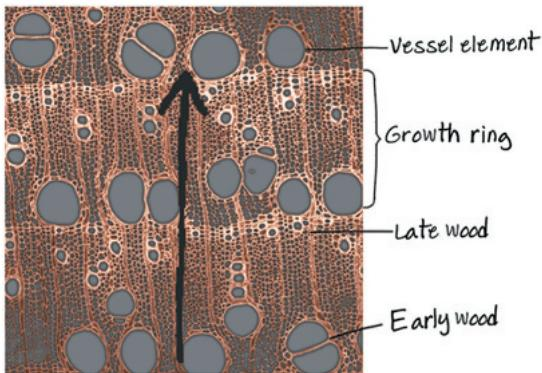

12. The tea and iris leaves differ in the arrangement of photosynthetic mesophyll cells. In the tea leaf, the mesophyll cells are divided into two layers, with the lower part of the leaf having a loosely arranged spongy layer with large air spaces, and the upper part having a palisade layer of tightly packed cells. In contrast, the mesophyll cells in the iris leaf are evenly distributed with no large air spaces. These differences are associated with the natural orientation of the leaves of these two species. Tea leaves are horizontally oriented and are more likely to receive light on the upper surface, so most of the mesophyll cells are concentrated in a palisade layer to absorb light efficiently. In contrast, iris leaves are vertically oriented with both sides illuminated about equally during the course of the day, so the mesophyll cells are evenly distributed. In both leaves, structure fits function because the arrangement of mesophyll cells maximizes photosynthesis. 13. Pranksters must have been carried the bicycle high into the tree and threaded it over a young woody branch: Primary growth did not raise the bicycle off the ground. Over time, secondary growth in the region of the tree notch enveloped the bicycle.

## Chapter 36

## Figure Questions

Figure 36.2 There would be no reference to photosynthesis because it ceases at night. Also, the directions of the $\mathrm{CO}_{2}$ and $\mathrm{O}_2$ arrows associated with the leaves would be reversed because at night only the gas exchange related to cellular respiration is occurring. Figure 36.3 The leaves are being produced in a counterclockwise spiral. The next leaf primordium will emerge approximately between and to the inside of leaves 8 and 13. Figure 36.4 A higher leaf area index will not necessarily increase photosynthesis because of upper leaves shading lower leaves. Figure 36.6 A proton pump inhibitor would depolarize (increase) the membrane potential because fewer hydrogen ions would be pumped out across the plasma membrane. The immediate effect of an inhibitor of the $\mathrm{H}^{+}/\mathrm{sucrose}$ transporter would be to hyperpolarize (decrease) the membrane potential because fewer hydrogen ions would be leaking back into the cell through these cotransporters. An inhibitor of the $\mathrm{H}^{+}/\mathrm{NO}_{3}^{-}$ cotransporter would have no effect on the membrane potential because the simultaneous cotransport of a positively charged ion and a negatively charged ion has no net effect on charge difference across the membrane. An inhibitor of the potassium ion channels would decrease the membrane potential because additional positively charged ions would not be accumulating outside the cell. Figure 36.8 Few, if any, mesophyll cells are more than three cells from a vein. Figure 36.9 The Casparian strip blocks water and minerals from moving between endodermal cells or moving around an endodermal cell via the cell's wall. Therefore, water and minerals must pass through an endodermal cell's plasma membrane. Figure 36.13 A section $500\mu \mathrm{m}$ by $300\mu \mathrm{m}$ is equal to $150,000\mu \mathrm{m}^2$

or 0.0015 cm $^{2}$ . Since there are five stomata visible in 0.0015 cm $^{2}$ , the stomatal density of this bean leaf is approximately 3,333 stomata per square centimeter of leaf surface. Figure 36.18 Because the xylem is under negative pressure (tension), excising a stylet that had been inserted into a tracheid or vessel element would probably introduce air into the cell. No xylem sap would exude unless positive root pressure was predominant.

## Concept Check 36.1

1. Vascular plants must transport minerals and water absorbed by the roots to all the other parts of the plant. They must also transport sugars from sites of production to sites of use.
2. Increased stem elongation would raise the plant's upper leaves. Erect leaves and reduced lateral branching would make the plant less subject to shading by the encroaching neighbors.
3. Pruning shoot tips removes apical dominance, resulting in lateral shoots (branches) growing from axillary buds (see Concept 35.3). This branching produces a bushier plant with a higher leaf area index.

## Concept Check 36.2

1. The cell's $\Psi_{\mathrm{P}}$ is $0.7\mathrm{MPa}$ . In a solution with a $\Psi$ of $-0.4\mathrm{MPa}$ , the cell's $\Psi_{\mathrm{P}}$ at equilibrium would be $0.3\mathrm{MPa}$ . 2. The cell would still adjust to changes in its osmotic environment, but its responses would be slower. Although aquaporins do not affect the water potential gradient across membranes, they allow for more rapid osmotic adjustments. 3. If tracheids and vessel elements were alive at maturity, their cytoplasm would impede water movement, preventing rapid long-distance transport. 4. The protoplasts would burst. Because the cytoplasm has many dissolved solutes, water would enter the protoplast continuously without reaching equilibrium. (When present, the cell wall prevents rupturing by limiting expansion of the protoplast.)

## Concept Check 36.3

1. At dawn, a drop is exuded from the rooted stump because the xylem is under positive pressure due to root pressure. At noon, the xylem is under negative pressure (tension) when it is cut, and the xylem sap is pulled back into the rooted stump. Root pressure cannot keep pace with the increased rate of transpiration at noon.
2. Perhaps greater root mass helps compensate for the lower water permeability of the plasma membranes.
3. The Casparian strip and tight junctions both prevent movement of fluid between cells.

## Concept Check 36.4

1. Stomatal opening at dawn is controlled mainly by light, $CO_{2}$ concentration, and a circadian rhythm. Environmental stresses such as drought, high temperature, and wind can stimulate stomata to close during the day. Water deficiency during the peak of the day can trigger release of the plant hormone abscisic acid, which signals guard cells to close stomata.
2. The activation of the proton pumps of stomatal cells would cause the guard cells to take up $K^{+}$ . The increased turgor of the guard cells would lock the stomata open and lead to extreme evaporation from the leaf.
3. After the flowers are cut, transpiration from any leaves and from the petals (which are modified leaves) will continue to draw water up the xylem. If cut flowers are transferred directly to a vase, air pockets in xylem vessels prevent delivery of water from the vase to the flowers. Cutting stems again underwater, a few centimeters from the original cut, will sever the xylem above the air pocket. The water droplets prevent another air pocket from forming while the flowers are transferred to a vase.
4. Water molecules are in constant motion, traveling at different speeds. If water molecules gain enough energy, the most energetic molecules near the liquid's surface will have sufficient speed, and therefore sufficient kinetic energy, to leave the liquid in the form of gaseous molecules (water vapor). As the molecules with the highest kinetic energy leave the liquid, the average kinetic energy of the remaining liquid decreases. Because a liquid's temperature is directly related to the average kinetic energy of its molecules, the temperature drops as evaporation proceeds.

## Concept Check 36.5

1. In both cases, the long-distance transport is a bulk flow driven by a pressure difference at opposite ends of tubes. Pressure is generated at the source end of a sieve tube by the loading of sugar and resulting osmotic flow of water into the phloem, and this pressure pushes sap from the source end to the sink end of the tube. In contrast, transpiration generates a negative pressure potential (tension) that pulls the ascent of xylem sap. 2. The main sources are fully grown leaves (producing sugar by photosynthesis) and fully developed storage organs (producing sugar by breakdown of starch). Roots, buds, stems, expanding leaves, and fruits are powerful sinks because they are actively growing. A storage organ may be a sink in the summer when accumulating carbohydrates but a source in the spring when breaking down starch into sugar for growing shoot tips. 3. Positive pressure, whether it be in the xylem when root pressure predominates or in the sieve-tube elements of the phloem, requires active transport. Most long-distance transport in the xylem depends on bulk flow driven by the negative pressure potential generated ultimately by the evaporation of water from the leaf and does not require living cells. 4. The spiral slash prevents optimal bulk flow of the phloem sap to the root sinks. Therefore, more phloem sap can move from the source leaves to the fruit sinks, making them sweeter.

## Concept Check 36.6

1. Plasmodesmata, unlike gap junctions, have the ability to pass RNA, proteins, and viruses from cell to cell.
2. Long-distance signaling is critical for the integrated functioning of all large organisms, but the speed of such signaling is much less critical to plants because their responses to the environment, unlike those of animals, do not typically involve rapid movements.
3. Although this strategy would eliminate the systemic spread of viral infections, it would also severely impact the development of the plants.

## Summary of Key Concepts Questions

36.1 Plants with tall shoots and elevated leaf canopies generally had an advantage over shorter competitors. A consequence of the selective pressure for tall shoots was the further separation of leaves from roots. This separation created problems for the transport of materials between root and shoot systems. Plants with xylem cells were more successful at supplying their shoot systems with soil resources (water and minerals). Similarly, those with phloem cells were more successful at supplying sugar sinks with carbohydrates. 36.2 Xylem sap is pulled up the plant by transpiration much more often than it is pushed up the plant by root pressure. 36.3 Hydrogen bonds are necessary for the cohesion of water molecules to each other and for the adhesion of water to other materials, such as cell walls. Both adhesion and cohesion of water molecules are involved in the ascent of xylem sap under conditions of negative pressure. 36.4 Although stomata account for most of the water lost from plants, they are necessary for exchange of gases—for example, for the uptake of carbon dioxide needed for photosynthesis. The loss of water through stomata also drives the long-distance transport of water that brings soil nutrients from roots to the rest of the plant. 36.5 Although the movement of phloem sap depends on bulk flow, the pressure gradient that drives phloem transport depends on the osmotic uptake of water in response to the loading of sugars into sieve-tube elements at sugar sources. Phloem loading depends on $\mathrm{H^{+}}$ cotransport processes that ultimately depend on $\mathrm{H^{+}}$ gradients established by active $\mathrm{K^{+}}$ pumping. 36.6 Electrical signaling, cytoplasmic pH, cytoplasmic $\mathrm{Ca^{2 + }}$ concentration, and viral movement proteins all affect symplastic communication, as do developmental changes in the number of plasmodesmata.

Test Your Understanding

1. A 2. B 3. B 4. C 5. B 6. C 7. A 8. D

## Chapter 37

## Figure Questions

Figure 37.3 Cations. At low pH, there would be more protons ( $H^{+}$ ) to displace mineral cations from negatively charged soil particles into the soil solution. Figure 37.4 The A horizon, which consists of the topsoil Table 37.1 During photosynthesis, $CO_{2}$ is fixed into carbohydrates, which contribute to the dry mass. In cellular respiration, $O_{2}$ is reduced to $H_{2}O$ and does not contribute to the dry mass. Figure 37.9 Some other examples of mutualism are the following relationships. Flashlight fish and bioluminescent bacteria: The bacteria gain nutrients and protection from the fish, while the bioluminescence attracts prey and mates for the fish. Flowering plants and pollinators: Animals distribute the pollen and are rewarded by a meal of nectar or pollen. Vertebrate herbivores and some bacteria in the digestive system: Microorganisms in the alimentary canal break down cellulose to glucose and, in some cases, provide the animal with vitamins or amino acids. Meanwhile, the microorganisms have a steady supply of food and a warm environment. Humans and some bacteria in the digestive system: Some bacteria provide humans with vitamins, while the bacteria get nutrients from the digested food. Figure 37.11 Both ammonium and nitrate. A decomposing animal would release amino acids into the soil that would be converted into ammonium by ammonifying bacteria. Some of this ammonium could be used directly by the plant. A large part of the ammonium, however, would be converted by nitrifying bacteria to form nitrate ions that could also be absorbed by the plant root system. Figure 37.12 The legume plants benefit because the bacteria fix nitrogen that is absorbed by their roots. The bacteria benefit because they acquire photosynthetic products from the plants. Figure 37.13 All three plant tissue systems are affected. Root hairs (dermal tissue) are modified to allow Rhizobium penetration. The cortex (ground tissue) and pericycle (vascular tissue) proliferate during nodule formation. The vascular tissue of the nodule connects to the vascular cylinder of the root to allow for efficient nutrient exchange.

## Concept Check 37.1

1. Overwatering deprives roots of oxygen. Overfertilizing is wasteful and can lead to soil salinization and water pollution.
2. As lawn clippings decompose, they restore mineral nutrients to the soil. If they are removed, the minerals lost from the soil must be replaced by fertilization.
3. Because of their small size and negative charge, clay particles would increase the number of binding sites for cations and water molecules and would therefore increase cation exchange and water retention in the soil.
4. Due to hydrogen bonding between water molecules, water expands when it freezes, and this causes mechanical fracturing of rocks. Water also coheres to many objects, and this cohesion combined with other forces, such as gravity, can help tug particles from rock. Finally, water, because it is polar, is an excellent solvent that allows many substances, including ions, to become dissolved in solution.

## Concept Check 37.2

1. No. Even though macronutrients are required in greater amounts, all essential elements are necessary for a plant to complete its life cycle.
2. No. The fact that the addition of an element results in an increase in the growth rate of a crop does not mean that the element is strictly required for the plant to complete its life cycle.
3. Inadequate aeration of the roots of hydroponically grown plants would promote alcohol fermentation, which uses more energy and may lead to the accumulation of ethanol, a toxic by-product of fermentation.

## Concept Check 37.3

1. The rhizosphere is the zone in the soil immediately adjacent to living roots. It harbors many rhizobacteria with which the root systems form beneficial mutualisms. Some rhizobacteria produce antibiotics that protect roots from disease. Others absorb toxic metals or make nutrients more available to roots. Still others convert gaseous nitrogen into forms usable by the plant or produce chemicals that stimulate plant growth.
2. Soil bacteria and mycorrhizae enhance plant nutrition by making certain minerals more available to plants. For example, many types of soil bacteria are involved in the nitrogen cycle, and the hyphae of mycorrhizae provide a large surface area for the absorption of nutrients, particularly phosphate ions.
3. Mixotrophy refers to the strategy of using photosynthesis and heterotrophy for nutrition. Euglenids are well-known mixotrophic protists.
4. Saturating rainfall may deplete the soil of oxygen. A lack of soil oxygen would inhibit nitrogen fixation by the peanut root nodules and decrease the nitrogen available to the plants. Alternatively, heavy rain may leach nitrate from the soil. A symptom of nitrogen deficiency is yellowing of older leaves.

## Summary of Key Concepts Questions

37.1 The term ecosystem refers to the communities of organisms within a given area and their interactions with the physical environment around them. Soil is teeming with many communities of organisms, including bacteria, fungi, animals, and the root systems of plants. The vigor of these individual communities depends on nonliving factors in the soil environment, such as minerals, oxygen, and water, as well as on interactions, both positive and negative, between different communities of organisms. 37.2 No. Plants can complete their life cycle when grown hydroponically, that is, in aerated salt solutions containing the proper ratios of all the minerals needed by plants. 37.3 No. Some parasitic plants obtain their energy by siphoning off carbon nutrients from other organisms.

## Test Your Understanding

1. B  2. B  3. A  4. D  5. B  6. B  7. D  8. C  9. D

## Chapter 38

## Figure Questions

Figure 38.4 Having a specific pollinator is more efficient because less pollen gets delivered to flowers of the wrong species. However, it is also a risky strategy: If the pollinator population suffers to an unusual degree from predation, disease, or climate change, then the plant may not be able to produce seeds. Figure 38.6 The part of the angiosperm life cycle characterized by the most mitotic divisions is the step between seed germination and the mature sporophyte. Figure 38.8 Make Connections In addition to having a single cotyledon, monocots have leaves with parallel leaf venation, scattered vascular bundles in their stems, a fibrous root system, floral parts in threes or multiples of threes, and pollen grains with only one opening. In contrast, eudicots have two cotyledons, netlike leaf venation, vascular bundles in a ring, taproots, floral parts in fours or fives or multiples thereof, and pollen grains with three openings. Visual Skills The mature garden bean seed lacks an endosperm at maturity. Its endosperm was consumed during seed development, and its nutrients were stored anew in the cotyledons. Figure 38.9 Beans use a hypocotyl hook to push through the soil. The delicate leaves and shoot apical meristem are also protected by being sandwiched between two large cotyledons. The coleoptile of maize seedlings helps protect the emerging leaves.

## Concept Check 38.1

1. In angiosperms, pollination is the transfer of pollen from an anther to a stigma. Fertilization is the fusion of the egg and sperm to form the zygote; it cannot occur until after the growth of the pollen tube from the pollen grain. 2. Long styles help to weed out pollen grains that are genetically inferior and not capable of successfully growing long pollen tubes. 3. No. The haploid (gametophyte) generation of plants is multicellular and arises from spores. The haploid phase of the animal life cycles is a single-celled gamete (egg or sperm) that arises directly from meiosis: There are no spores.

## Concept Check 38.2

1. Flowering plants can avoid self-fertilization by self-incompatibility, having male and female flowers on separate plants (dioecious species), or having stamens and styles of different heights on separate plants ("pin" and "thrum" flowers). 2. Asexually propagated crops lack genetic diversity. Genetically diverse populations are less likely to become extinct in the face of an epidemic because there is a greater likelihood that a few individuals in the population are resistant. 3. In the short term, selfing may be advantageous in a population that is so dispersed and sparse that pollen delivery is unreliable. In the long term, however, selfing is an evolutionary dead end because it leads to a loss of genetic diversity that may preclude adaptive evolution.

## Concept Check 38.3

1. Traditional breeding and genetic engineering both involve artificial selection for desired traits. However, genetic engineering techniques facilitate faster gene transfer and are not limited to transferring genes between closely related varieties or species.
2. Bt maize suffers less insect damage; therefore, Bt maize plants are less likely to be infected by fumonisin-producing fungi that infect plants through wounds.
3. In such species, engineering the transgene into the chloroplast DNA would not prevent its escape in pollen; such a method requires that the chloroplast DNA be found only in the egg. An entirely different method of preventing transgene escape would therefore be needed, such as male sterility, apomixis, or self-pollinating closed flowers.

## Summary of Key Concepts Questions

38.1 After pollination and fertilization, a flower changes into a fruit. The petals, sepals, and stamens typically fall off the flower. The stigma of the pistil withers, and the ovary begins to swell. The ovules (embryonic seeds) inside the ovary begin to mature. 38.2 Asexual reproduction can be advantageous in a stable environment because individual plants that are well suited to that environment pass on all their genes to offspring. Also, asexual reproduction generally results in offspring that are less fragile than the seedlings produced by sexual reproduction. However, sexual reproduction offers the advantage of dispersal of tough seeds. Moreover, sexual reproduction produces genetic variety, which may be advantageous in an unstable environment. The likelihood is better that at least one offspring of sexual reproduction will survive in a changed environment. 38.3 "Golden Rice," although not yet in widespread commercial production, has been engineered to produce more vitamin A, thereby raising the nutritional value of rice. A protoxin gene from a soil bacterium has been engineered into Bt maize. This protoxin is lethal to invertebrates but harmless to vertebrates. Bt crops require less pesticide spraying and have lower levels of fungal infection and fungal toxins. The nutritional value of cassava is being increased in many ways by genetic engineering. Enriched levels of iron and beta-carotene (a vitamin A precursor) have been achieved, and cyanide-producing chemicals have been almost eliminated from the roots.

## Test Your Understanding

1. A 2. C 3. C 4. D 5. D

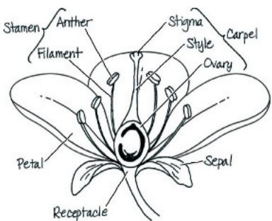

Practice Applying Your Learning
11. (a) F (b) T (c) T (d) F (e) F (f) F (g) T

## Chapter 39

## Figure Questions

Figure 39.4 Panel B in Figure 11.17 shows a branching signal transduction pathway that resembles the branching phytochrome-dependent pathway involved in de-etiolation. Figure 39.5 To determine which wavelengths of light are most effective in phototropism, you could use a glass prism to split white light into its component colors and see which colors cause the quickest bending (the answer is blue; see Figure 39.15). Figure 39.6 No. Polar auxin transport depends on the distribution of auxin transport proteins at the basal ends of cells. Figure 39.13 No. Since the ein mutation renders the seedling "blind" to ethylene, enhancing ethylene production by adding an eto mutation would have no effect on phenotype compared with the ein mutation alone. Figure 39.16 Yes. The white light, which contains red light, would stimulate seed germination in all treatments. Figure 39.20 Since far-red light, like darkness, causes an accumulation of the red-absorbing form $(\mathrm{P_r})$ of phytochrome, single flashes of far-red light at night would have no effect on flowering beyond what the dark periods alone would have. Figure 39.21 If this were true, then florigen would be an inhibitor of flowering, not an inducer. Figure 39.27 Photosynthetic adaptations can occur at the molecular level, as is apparent in the fact that $\mathrm{C_3}$ plants use rubisco to fix carbon dioxide initially, whereas $\mathrm{C_4}$ and CAM plants use PEP carboxylase. An adaptation at the tissue level is that plants have different stomatal densities based on their genotype and environmental conditions. At the organismal level, plants alter their shoot architectures to make photosynthesis more efficient. For example, self-pruning removes branches and leaves that respire more than they photosynthesize.

## Concept Check 39.1

1. Dark-grown seedlings are etiolated: They have long stems, underdeveloped root systems, and unexpanded leaves, and their shoots lack chlorophyll. Etiolated growth is beneficial to seeds sprouting under the dark conditions they would encounter

underground. By devoting more energy to stem elongation and less to leaf expansion and root growth, a plant increases the likelihood that the shoot will reach the sunlight before its stored foods run out. 2. Cycloheximide should inhibit de-etiolation by preventing the synthesis of new proteins necessary for de-etiolation. 3. No. Applying Viagra, like injecting cyclic GMP as described in the text, should cause only a partial de-etiolation response. Full de-etiolation would require activation of the calcium branch of the signal transduction pathway.

## Concept Check 39.2

1. Fusicoccin's ability to cause an increase in plasma $\mathrm{H^{+}}$ pump activity has an auxin-like effect and promotes stem cell elongation. 2. The plant will exhibit a constitutive triple response. Because the kinase that normally prevents the triple response is dysfunctional, the plant will undergo the triple response regardless of whether ethylene is present or the ethylene receptor is functional. 3. Since ethylene often stimulates its own synthesis, it is under positive-feedback regulation.

## Concept Check 39.3

1. Not necessarily. Many environmental factors, such as temperature and light, change over a 24-hour period in the field. To determine whether the enzyme is under circadian control, a scientist would have to demonstrate that its activity oscillates even when environmental conditions are held constant.
2. It is impossible to say. To establish that this species is a short-day plant, it would be necessary to establish the critical night length for flowering and that this species only flowers when the night is longer than the critical night length.
3. According to the action spectrum of photosynthesis, red and blue light are the most effective in photosynthesis. Thus, it is not surprising that plants assess their light environment using blue- and red-light-absorbing photoreceptors.

## Concept Check 39.4

1. A plant that overproduces ABA would undergo less evaporative cooling because its stomata would not open as widely.
2. Plants close to the aisles may be more subject to mechanical stresses caused by passing workers and air currents. The plants nearer the center of the bench may also be taller as a result of shading and less evaporative stress.
3. No. Because root caps are involved in sensing gravity, roots that have their root caps removed are almost completely insensitive to gravity.

## Concept Check 39.5

1. An infection can trigger the hypersensitive response, which causes a ring of cell death around the infection site, thereby isolating the pathogen from living host cells and preventing systemic infection.
2. Mechanical damage breaches a plant's first line of defense against infection, its protective dermal tissue.
3. No. Pathogens that kill their hosts would soon run out of victims and might themselves go extinct.
4. Perhaps the breeze dilutes the local concentration of a volatile defense compound that the plants produce.

## Summary of Key Concepts Questions

39.1 Signal transduction pathways often activate protein kinases, enzymes that phosphorylate other proteins. Protein kinases can directly activate certain preexisting enzymes by phosphorylating them, or they can regulate gene transcription (and enzyme production) by phosphorylating specific transcription factors. 39.2 Yes, there is truth to the old adage that one bad apple spoils the whole bunch. Ethylene, a gaseous hormone that stimulates ripening, is produced by damaged, infected, or overripe fruits. Ethylene can diffuse to healthy fruit in the "bunch" and stimulate their rapid ripening. 39.3 Plant physiologists proposed the existence of a floral-promoting factor (florigen) based on the fact that a plant induced to flower could induce flowering in a second plant to which it was grafted, even though the second plant was not in an environment that would normally induce flowering in that species. 39.4 Plants subjected to drought stress are often more resistant to freezing stress because the two types of stress are quite similar. Freezing of water in the extracellular spaces causes free water concentrations outside the cell to decrease. This, in turn, causes free water to leave the cell by osmosis, leading to the dehydration of cytoplasm, much like what is seen in drought stress. 39.5 Chewing insects make plants more susceptible to pathogen invasion by disrupting the waxy cuticle of shoots, thereby creating an opening for infection. Moreover, substances released from damaged cells can serve as nutrients for the invading pathogens.

## Test Your Understanding

1. B 2. C 3. D 4. C 5. B 6. B 7. C

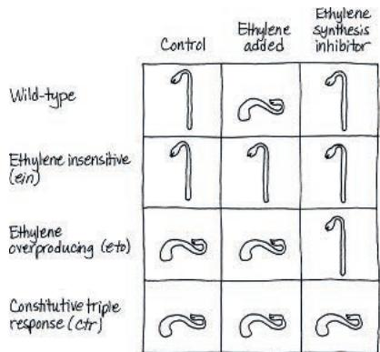

## Chapter 40

## Figure Questions

Figure 40.4 Such exchange surfaces are internal in the sense that they cannot be easily visualized without specialized equipment (such as endoscopes). However, they are also continuous with openings on the external body surface that contact the environment. Figure 40.6 Signals in the nervous system always travel on a direct route between the sending and receiving cell. In contrast, hormones that reach target cells can have an effect regardless of the path by which they arrive or how many times they travel through the circulatory system.

Figure 40.8  

Figure 40.13 The conduction arrows would be in the opposite direction, transferring heat from the penguin to the ice because the penguin is warmer than the ice. Figure 40.17 If a female Burmese python were not incubating eggs, her oxygen consumption would decrease with decreasing temperature, as for any other ectotherm. Figure 40.18 The skeletal muscles, blood vessels in skin, and sweat glands are all effectors. Figure 40.19 The transport of nutrients across membranes and the synthesis of RNA and protein are coupled to ATP hydrolysis. These processes proceed spontaneously because there is an overall drop in free energy, with the excess energy given off as heat. Similarly, less than half of the free energy in glucose is captured in the coupled reactions of cellular respiration. The remainder of the energy is released as heat. Figure 40.23 Nothing. Although genes that show a circadian variation in expression during euthermia exhibit constant RNA levels during hibernation, a gene that shows constant expression during hibernation might also show constant expression during euthermia. Figure 40.24 In hot environments, both plants and animals experience evaporative cooling as a result of transpiration (in plants) or bathing, sweating, and panting (in animals); both plants and animals synthesize heat-shock proteins, which protect other proteins from heat stress; and animals also use various behavioral responses to minimize heat absorption. In cold environments, both plants and animals increase the proportion of unsaturated fatty acids in their membrane lipids and use antifreeze proteins that prevent or limit the formation of intracellular ice crystals; plants increase cytoplasmic levels of specific solutes that help reduce the loss of intracellular water during extracellular freezing; and animals increase metabolic heat production and use insulation, circulatory adaptations such as countercurrent exchange, and behavioral responses to minimize heat loss.

## Concept Check 40.1

1. All types of epithelia consist of cells that line a surface, are tightly packed, are situated on top of a basal lamina, and form an active and protective interface with the external environment.
2. An oxygen molecule must cross a plasma membrane when entering the body at an exchange surface in the respiratory system, in both entering and exiting the circulatory system, and in moving from the interstitial fluid to the cytoplasm of the body cell.
3. The individual would not grow normally without functional growth hormone receptors, because hormones require a specific hormone receptor to influence body cells.

## Concept Check 40.2

1. Both negative feedback in thermoregulation and feedback inhibition involve the end result of a pathway inhibiting the activity of the pathway. However, in thermoregulation, the end result (response) of the pathway (change in body temperature) decreases pathway activity by reducing the stimulus (change in body temperature). In an enzyme-catalyzed biosynthetic process, the end result (product) of the pathway (in this case, isoleucine) directly interacts with and inhibits a component of the pathway that generated it (threonine deaminase). There are also elements of negative feedback loops (sensor, control center, set point) that are not involved in feedback inhibition.
2. You would want to put the thermostat close to where you would be spending time, where it would be protected from environmental perturbations, such as direct sunshine, and not right in the path of the output of the heating system. Similarly, the sensors for homeostasis located in the human brain are separated from environmental influences and can monitor conditions in a vital and sensitive tissue.
3. In convergent evolution, the same biological trait arises independently in two or more species. Gene analysis can provide evidence for an independent origin. In particular, if the genes responsible for the trait in one species lack significant sequence similarity to the corresponding genes in another species, scientists conclude that there is a separate genetic basis for the trait in the two species and thus an independent origin. In the case of circadian rhythms, the clock genes in cyanobacteria appear unrelated to those in humans.

## Concept Check 40.3

1. The hummingbird, being a very small endotherm, has a very high metabolic rate. If by absorbing sunlight certain flowers warm their nectar, a hummingbird feeding on these flowers is saved the metabolic expense of warming the nectar to its body temperature. 2. Yes. Increased sweat production maintains homeostasis under hot conditions by keeping body temperature relatively constant. 3. To raise body temperature to the higher range of fever, the hypothalamus triggers heat generation by muscular contractions, or shivering. The person with a fever may in fact say that they feel cold, even though their body temperature is above normal.

## Concept Check 40.4

1. The mouse would consume oxygen at a higher rate because it is an endotherm, so its basal metabolic rate is higher than the ectothermic lizard's standard metabolic rate.
2. The house cat; smaller animals have a higher metabolic rate per unit body mass and a greater demand for food per unit body mass.
3. The alligator's body temperature would decrease along with the air temperature. Its metabolic rate would therefore also decrease as chemical reactions slowed. In contrast, the lion's body temperature would not change. Its metabolic rate would increase as it shivered and produced heat to keep its body temperature constant.

## Summary of Key Concepts Questions

40.1 Animals exchange materials with their environment across their body surface, and a spherical shape has the minimum surface area per unit volume. As body size increases, the ratio of surface area to body volume decreases. 40.2 No; an animal's internal environment fluctuates slightly around set points. Homeostasis is a dynamic state. Furthermore, there are sometimes programmed changes in set points, such as those resulting in radical increases in hormone levels at particular times in development. 40.3 Heat exchange across the skin is a primary mechanism for the regulation of body core temperature, with the result that the skin is cooler than the body core. 40.4 Small animals have a higher BMR per unit mass and therefore consume more oxygen per unit mass than large animals. A higher breathing rate enables this increased oxygen consumption.

## Test Your Understanding

1. B 2. C 3. A 4. B 5. C 6. B 7. D 8. You would expect ethylene to increase fruit ripening. In positive feedback loops, the signal (ethylene) causes a response (more ripening) that amplifies the stimulus (ripening).

## Chapter 41

## Figure Questions

Figure 41.6 Your diagram should show food entering through the hydra's mouth and being digested into nutrients in the large portion of the gastrovascular cavity. The nutrients then diffuse into the extensions of that cavity that reach into the tentacles. There, nutrients would be absorbed by cells of the gastrodermis and transported to cells of the epidermis of a tentacle. Figure 41.9 The airway must be open for exhaling to occur. If the epiglottis is up, water that entered the throat from the mouth encounters air forced out of the lungs and is carried along into the nasal cavity and out the nose. Figure 41.12 Circular fold, villus, microvillus, epithelial cell Figure 41.13 Membrane transport: arrows for fatty acids and monoglycerides entering epithelial cell and arrow for chylomicron leaving epithelial cell; mechanical assembly: arrows from fatty acids and monoglycerides to triglycerides and arrow from triglycerides to chylomicron; mechanical digestion: arrow from fat globule to fat droplet; chemical reaction: arrows from triglycerides to fatty acids and monoglycerides Figure 41.23 Both insulin and glucagon are involved in negative feedback circuits.

## Concept Check 41.1

1. The only essential amino acids are those that an animal cannot synthesize from other molecules.
2. Many vitamins serve as enzyme cofactors, which, like enzymes themselves, are unchanged by the chemical reactions in which they participate. Therefore, only very small amounts of vitamins are needed.
3. To identify the essential nutrient missing from an animal's diet, a researcher could supplement the diet with individual nutrients one at a time and determine which nutrient eliminates the signs of malnutrition.

## Concept Check 41.2

1. A gastrovascular cavity is a digestive pouch with a single opening that functions in both ingestion and elimination; an alimentary canal is a digestive tube with a separate mouth and anus at opposite ends. 2. Since the function of the gizzard is to aid in mechanical digestion, you might predict that the seed-eating songbird would have a more muscular gizzard with more ridges or other adaptations to grind and break up hard seeds than a nectar-drinking hummingbird. You might predict that the hummingbird's crop would be larger than the songbird's since it likely needs to hold a larger volume of lower-nutrient density nectar. 3. In both cases, high-energy fuels are consumed, complex molecules are broken down into simpler ones, and waste products are eliminated. In addition, gasoline, like food, is broken down in a specialized compartment, so that surrounding structures are protected from disassembly. Finally, just as food and wastes remain outside the body in a digestive tract, neither gasoline nor its waste products enter the passenger compartment of the automobile.

## Concept Check 41.3

1. Because parietal cells in the stomach pump hydrogen ions into the stomach lumen where they combine with chloride ions to form HCl, a proton pump inhibitor reduces the acidity of chyme and thus the irritation that occurs when chyme enters the esophagus.
2. Bile acids act as emulsifiers, dispersing large fat globules into smaller fat droplets. The lipid-soluble surfaces of the bile acids bind to the fat droplets and the

water-soluble surfaces of the bile acids interact with the digestive fluids. As a result, surface tension is reduced and the droplets are stabilized, facilitating enzymatic digestion of fats by lipases. 3. Proteins would be denatured and digested into peptides. Further digestion, to individual amino acids, would require enzymatic secretions found in the small intestine. Minimal digestion of carbohydrates or lipids would occur.

## Concept Check 41.4

1. The increased time for transit through the alimentary canal allows for more extensive processing, and the increased surface area of the canal provides greater opportunity for absorption.
2. A mammal's digestive system provides mutualistic microorganisms with an environment that is protected against other microorganisms by saliva and gastric juice, that is held at a constant temperature conducive to enzyme action, and that provides a steady source of nutrients.
3. For the yogurt treatment to be effective, the bacteria from yogurt would have to establish a mutualistic relationship with the small intestine, where disaccharides are broken down and sugars are absorbed. Conditions in the small intestine are likely to be very different from those in a yogurt culture. The bacteria might be killed before they reach the small intestine, or they might not be able to grow there in sufficient numbers to aid in digestion.

## Concept Check 41.5

1. Over the long term, the body stores excess calories in fat, whether those calories come from fat, carbohydrate, or protein in food.
2. In most individuals, leptin levels decline during fasting. Individuals in the group with low levels of leptin are likely to be unable to produce leptin, so leptin levels would remain low regardless of food intake. Individuals in the group with high leptin levels are likely to be unable to respond to leptin, but leptin production will still decline as fat stores decrease.
3. Excess insulin production will cause the blood glucose level to decrease below normal physiological levels. It will also trigger glycogen synthesis in the liver, further decreasing the blood glucose level. However, a low blood glucose level will stimulate the release of glucagon from alpha cells in the pancreas, which will trigger glycogen breakdown. Thus, there will be antagonistic effects in the liver.

## Summary of Key Concepts Questions

41.1 Since the cofactor is necessary in all animals, those animals that do not require it in their diet must be able to synthesize it from other organic molecules. 41.2 A liquid diet containing glucose, amino acids, and other building blocks could be ingested and absorbed without the need for mechanical or chemical digestion. 41.3 The small intestine has a much larger surface area than the stomach. 41.4 The assortment of teeth in our mouth and the short length of our cecum suggest that our ancestors' digestive systems were not specialized for digesting plant material. 41.5 When mealtime arrives, nervous inputs from the brain signal the stomach to prepare to digest food through secretions and churning.

## Test Your Understanding

1. B 2. A 3. B 4. B 5. B 6. D 7. B
8.

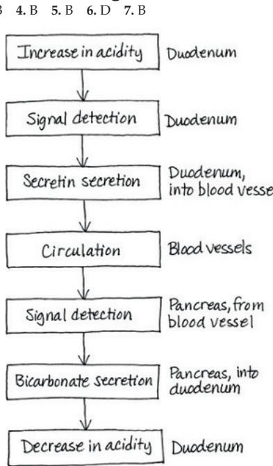

## Chapter 42

## Figure Questions

Figure 42.2 Although gas exchange might be improved by a steady, one-way flow of fluid, there would likely be inadequate time for food to be digested and nutrients absorbed if fluid flowed through the cavity in this manner. Figure 42.5 Two capillary beds. The molecule of carbon dioxide would need to enter a capillary bed in the thumb before returning to the right atrium and ventricle, then travel to the lung and enter a capillary from which it could diffuse into an alveolus and be available to be

exhaled. Figure 42.8 Each feature of the ECG recording, such as the sharp upward spike, occurs once per cardiac cycle. Using the x-axis to measure the time in seconds between successive spikes and dividing that number by 60 would yield the heart rate as the number of cycles per minute. Figure 42.25 The reduction in surface tension results from the presence of surfactant. Therefore, for all the infants who had died of RDS, you would expect the amount of surfactant to be near zero. For infants who had died of other causes, you would expect the amount of surfactant to be near zero for body masses less than 1,200 g but much greater than zero for body masses above 1,200 g. Figure 42.26 Since exhalation is largely passive, the recoil of the elastic fibers in alveoli helps force air out of the lungs. When alveoli lose their elasticity, as occurs in the disease emphysema, less air is exhaled. Because more air is left in the lungs, less fresh air can be inhaled. With a smaller volume of air exchanged, there is a decrease in the partial pressure gradient that drives gas exchange. Figure 42.28 Breathing at a rate or depth that eliminates more $CO_{2}$ than the body produces (hyper-ventilation) would lower the blood $CO_{2}$ level. Sensors in major blood vessels and the medulla would signal the breathing control center to decrease the rate of contraction of the diaphragm and rib muscles, decreasing the breathing rate and depth, thereby restoring normal $CO_{2}$ level in the blood and other tissues. Figure 42.29 The resulting increase in tidal volume would enhance ventilation within the lungs, increasing $P_{O_{2}}$ and decreasing $P_{CO_{2}}$ in the alveoli. Figure 42.31 No, the amount of oxygen available would be reduced by much less than 20%. Because of the shape of the dissociation curve, reducing the $P_{O_{2}}$ from 100 mm Hg to 80 mm Hg only reduces the saturation of hemoglobin from about 98% to about 95%.

## Concept Check 42.1

1. The ability to shut off blood supply to the lungs when the animal is submerged 2. The systemic circulation delivers oxygen-rich blood to lung cells. These cells might not receive enough oxygen if they were only supplied by the oxygen-poor blood of the pulmonary circuit. 3. The $\mathrm{O}_2$ content would be abnormally low because some oxygen-depleted blood returned to the right atrium from the systemic circuit would mix with the oxygen-rich blood in the left atrium.

## Concept Check 42.2

1. The pulmonary veins carry blood that has just passed through capillary beds in the lungs, where it accumulated $O_{2}$ . The venae cavae carry blood that has just passed through capillary beds in the rest of the body, where it lost $O_{2}$ to the tissues. 2. The delay allows the atria to empty completely, filling ventricles fully before they contract. 3. The heart, like any other muscle, becomes stronger through regular exercise. You would expect a stronger heart to have a greater stroke volume, which would allow for the decrease in heart rate.

## Concept Check 42.3

1. The large total cross-sectional area of the capillaries 2. Your diagram should show blood pressure as the regulated variable in the center, heavy bleeding as the stimulus, sensors, a control center, effectors, and increase in blood pressure as the response. 3. Additional hearts could be used to improve blood return from the legs. However, it might be difficult to coordinate the activity of multiple hearts and to maintain adequate blood flow to hearts far from the gas exchange organs.

## Concept Check 42.4

1. An increase in the number of white blood cells (leukocytes) may indicate that the person is combating an infection 2. The chest pain results from inadequate blood flow in coronary arteries. Vasodilation promoted by nitric oxide from nitroglycerin increases blood flow, providing the heart muscle with additional oxygen and thus relieving the pain. 3. Embryonic stem cells are pluripotent rather than multipotent, meaning they can give rise to many rather than a few different cell types.

## Concept Check 42.5

1. Their interior position helps gas exchange tissues stay moist. If the respiratory surfaces of lungs extended into the terrestrial environment, they would quickly dry out, and diffusion of $O_{2}$ and $CO_{2}$ across these surfaces would stop. 2. Earthworms need to keep their skin moist for gas exchange, but they need air outside this moist layer. If they stay in their waterlogged tunnels after a heavy rain, they will suffocate because they cannot get as much $O_{2}$ from water as from air. 3. In fish, water passes over the gills in the direction opposite to that of blood flowing through the gill capillaries, maximizing the extraction of oxygen from the water along the length of the exchange surface. Similarly, in the extremities of some vertebrates, blood flows in opposite directions in neighboring veins and arteries; this countercurrent arrangement maximizes the recapture of heat from blood leaving the body core in arteries, which is important for thermoregulation in cold environments.

## Concept Check 42.6

1. An increase in blood $CO_{2}$ concentration causes an increase in the rate of $CO_{2}$ diffusion into the cerebrospinal fluid, where the $CO_{2}$ combines with water to form carbonic acid. Dissociation of carbonic acid releases hydrogen ions, decreasing the pH of the cerebrospinal fluid.
2. Increased heart rate increases the rate at which $CO_{2}$ -rich blood is delivered to the lungs, where $CO_{2}$ is removed.
3. A hole would allow air to enter the space between the inner and outer layers of the double membrane, resulting in a condition called a pneumothorax. The two layers would no longer stick together, and the lung on the side with the hole would collapse and cease functioning.

## Concept Check 42.7

1. Differences in partial pressure between the capillaries and the surrounding tissues or medium; the net diffusion of a gas occurs from a region of higher partial pressure to a region of lower partial pressure. 2. The Bohr shift causes hemoglobin to release more $O_{2}$ at a lower pH, such as is found in the vicinity of tissues with high rates of cellular respiration and $CO_{2}$ release. 3. The doctor is assuming that the rapid breathing is the body's response to low blood pH. Metabolic acidosis, the lowering of blood pH as a result of metabolism, can have many causes, including complications of certain types of diabetes, shock (extremely low blood pressure), and poisoning.

## Summary of Key Concepts Questions

42.1 In a closed circulatory system, an ATP-driven muscular pump generally moves fluids in one direction on a scale of millimeters to meters. Exchange between cells and their environment relies on diffusion, which involves random movements of molecules. Concentration gradients of molecules across exchange surfaces can drive rapid net diffusion on a scale of 1 mm or less. 42.2 Replacement of a defective valve should increase stroke volume. A lower heart rate would therefore be sufficient to maintain the same cardiac output. 42.3 Blood pressure in the arm would fall by 25–30 mm Hg, the same difference as is normally seen between your heart and your brain. 42.4 One microliter of blood contains about 5 million erythrocytes and 5,000 leukocytes, so leukocytes make up only about 0.1% of the cells in the absence of infection. 42.5 Because $CO_{2}$ is such a small fraction of atmospheric gas (0.29 mm Hg/760 mm Hg, or less than 0.04%), the partial pressure gradient of $CO_{2}$ between the respiratory surface and the environment always strongly favors the release of $CO_{2}$ to the atmosphere. 42.6 Because the lungs do not empty completely with each breath, incoming and outgoing air mix. Lungs thus contain a mixture of fresh and stale air. 42.7 An enzyme speeds up a reaction without changing the equilibrium and without being consumed. Similarly, a respiratory pigment speeds up the exchange of gases between the body and the external environment without changing the equilibrium state and without being consumed.

Test Your Understanding

1. C  2. D  3. C  4. C  5. A  6. A

Practice Applying Your Learning

11. (a) T (b) F (c) F (d) T (e) F (f) F

## Chapter 43

## Figure Questions

Figure 43.3 Dicer-2 binds double-stranded RNA without regard to size or sequence and then cuts that RNA into fragments, each 21 base pairs long. The Argo complex binds to double-stranded RNA fragments that are each 21 base pairs long, displaces one strand, and then uses the remaining strand to match to a particular target sequence in a single-stranded mRNA. Figure 43.4 Cell-surface TLRs recognize molecules on the surface of pathogens, whereas TLRs in vesicles recognize internal molecules of pathogens after the pathogens are broken down. Figure 43.5 Because the pain of a splinter stops almost immediately when you remove it from the skin, you can correctly deduce that the signals that mediate the inflammatory response are quite short-lived. Figure 43.10 Part of the enzyme or antigen receptor provides a structural "backbone" that maintains overall shape, while interaction occurs at a surface with a close fit to the substrate or antigen. The combined effect of multiple noncovalent interactions at the active site or binding site is a high-affinity interaction of tremendous specificity. Figure 43.14 After gene rearrangement, a lymphocyte and its daughter cells make a single version of the antigen receptor. In contrast, alternative splicing is not heritable and can give rise to diverse gene products in a single cell. Figure 43.16 A single B cell has more than 100,000 identical antigen receptors on its surface, not four, and there are more than 1 million B cells differing in their antigen specificity, not three. Figure 43.19 These receptors enable memory cells to present antigen on their cell surface to a helper T cell. This presentation of antigen is required to activate memory cells in a secondary immune response. Figure 43.23 Primary response: arrows extending from Antigen (1st exposure), Antigen-presenting cell, Helper T cell, B cell, Plasma cells, Cytotoxic T cell, and Active cytotoxic T cells; secondary response: arrows extending from Antigen (2nd exposure), Memory helper T cells, Memory B cells, Memory cytotoxic T cells, Plasma cells, and Active cytotoxic T cells. Figure 43.26 There would be no change in the results. Because the two antigen-binding sites of an antibody have identical specificity, the two bacteriophages bound would have to display the same viral peptide.

## Concept Check 43.1

1. Because pus contains white blood cells, fluid, and cell debris, it indicates an active and at least partially successful inflammatory response against invading pathogens.
2. Whereas the ligand for the TLR receptor is a foreign molecule, the ligand for many signal transduction pathways is a molecule produced by the organism itself.
3. Mounting an immune response would require recognition of some molecular feature of the wasp egg not found in the host. It might be that only some potential hosts have a receptor with the necessary specificity.

## Concept Check 43.2

1. See Figure 43.9. The transmembrane regions lie within the C regions, which also form the disulfide bridges. In contrast, the antigen-binding sites are in the V regions.
2. Generating memory cells ensures both that a receptor specific for a particular epitope will be present and that there will be more lymphocytes with this specificity than in a host that had never encountered the antigen.
3. If each B cell produced two different light and heavy chains for its antigen receptor, different combinations would make four different receptors. If any one were self-reactive, the lymphocyte would be eliminated in the generation of self-tolerance. For this reason, many more B cells would be eliminated, and those that could respond to a foreign antigen would be less effective at doing so due to the variety of receptors (and antibodies) they express.

## Concept Check 43.3

1. A child lacking a thymus would have no functional T cells. Without helper T cells to help activate B cells, the child would be unable to produce antibodies against extracellular bacteria. Furthermore, without cytotoxic T cells or helper T cells, the child's immune system would be unable to kill virus-infected cells.
2. Since the antigen-binding site is intact, the antibody fragments could neutralize viruses and opsonize bacteria.
3. If the handler developed immunity to proteins in the anti-venin, another injection could provoke a severe immune response.

## Concept Check 43.4

1. Myasthenia gravis is considered an autoimmune disease because the immune system produces antibodies against self molecules (certain receptors on muscle cells). 2. A person with a cold is likely to produce oral and nasal secretions that facilitate viral transfer. In addition, since sickness can cause incapacitation or death, a virus that is programmed to exit the host when there is a physiological stress has the opportunity to find a new host at a time when the current host may cease to function. 3. A person with a macrophage deficiency would have frequent infections. The causes would be poor innate responses, due to diminished phagocytosis and inflammation, and poor adaptive responses, due to the lack of macrophages to present antigens to helper T cells.

## Summary of Key Concepts Questions

43.1 Lysozyme in saliva destroys bacterial cell walls; the viscosity of mucus helps trap bacteria; acidic pH in the stomach kills many bacteria; and the tight packing of cells lining the gut provides a physical barrier to infection. 43.2 Sufficient numbers of cells to mediate an innate immune response are always present, whereas an adaptive response requires selection and proliferation of an initially very small cell population specific for the infecting pathogen. 43.3 No. Immunological memory after a natural infection and that after vaccination are very similar. There may be minor differences in the particular antigens that can be recognized in a subsequent infection. 43.4 No. AIDS refers to a loss of immune function that can occur over time in an individual infected with HIV. However, certain multidrug combinations (“cocktails”) or rare genetic variations usually prevent progression to AIDS in people infected with HIV.

Test Your Understanding

1. B 2. C 3. C 4. B 5. B 6. B 7. C

8. One possible answer:

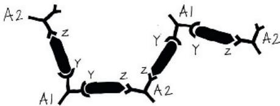

9. Lamarck's discredited idea was that organisms changed their form to fit challenges and then somehow passed those changes on to their descendants. In clonal selection, heritable differences that give rise to variation arise prior to any challenge. An encounter with a particular antigen results in proliferation of the variants best suited to recognize and respond to that challenge.

## Chapter 44

## Figure Questions

Figure 44.13 You would expect to find these cells lining tubules where they pass through the renal medulla. Because the extracellular fluid of the renal medulla has a very high osmolarity, production of organic solutes by tubule cells in this region keeps intracellular osmolarity high, with the result that these cells maintain normal volume. Figure 44.14 Furosemide increases urine volume. The absence of ion transport in the ascending limb reduces the osmolarity of the interstitial fluid, so less fluid will move out of the collecting duct by osmosis. Figure 44.20 The ADH levels would likely be elevated in both sets of patients with mutations because either defect prevents the recapture of water that restores blood osmolarity to normal levels. Figure 44.21 Arrows that would be labeled “secretion” are the arrows indicating secretion of aldosterone, angiotensinogen, and renin.

## Concept Check 44.1

1. Because the salt is moved against its concentration gradient, from low concentration (fresh water) to high concentration (blood) 2. A freshwater osmoconformer would have body fluids too dilute to carry out life's processes. 3. Without a layer of insulating fur, the camel must use the cooling effect of evaporative water loss to maintain body temperature, thus linking thermoregulation and osmoregulation.

## Concept Check 44.2

1. Because uric acid is largely insoluble in water, it can be excreted as a semisolid paste, thereby reducing an animal's water loss.
2. Humans produce uric acid from purine breakdown, and reducing purines in the diet often lessens the severity of gout. Birds, however, produce uric acid as a waste product of general nitrogen metabolism. They would therefore need a diet low in all nitrogen-containing compounds, not just purines.

## Concept Check 44.3

1. In flatworms, ciliated cells draw interstitial fluids containing waste products into protonephridia. In earthworms, waste products pass from interstitial fluids into the coelom. From there, cilia move the wastes into metanephridia via a funnel surrounding an internal opening to the metanephridia. In insects, the Malpighian tubules pump fluids from the hemolymph, which receives waste products during exchange with cells in the course of circulation.
2. Filtrate is formed when the glomerulus filters blood from the renal artery within Bowman's capsule. Some of the filtrate contents are recovered, enter capillaries, and exit in the renal vein; the rest remain in the filtrate and pass out of the kidney in the ureter.
3. The presence of $Na^{+}$ and other ions (electrolytes) in the dialysate would limit the extent to which they would be removed from the filtrate during dialysis. Adjusting the electrolytes in the starting dialysate can thus lead to the restoration of proper electrolyte concentrations in the plasma. Similarly, the absence of urea and other waste products in the starting dialysate facilitates their removal from the filtrate.

## Concept Check 44.4

1. The numerous nephrons and well-developed glomeruli of freshwater fishes produce urine at a high rate, while the small numbers of nephrons and smaller glomeruli of marine fishes produce urine at a low rate. 2. Less water would leave the collecting duct; thus, the drug would increase the amount of water lost in the urine. 3. Blood pressure provides the force to move fluid across the walls of the glomerulus and Bowman's capsule; thus a decline in blood pressure in the afferent arteriole would reduce the rate of filtration.

## Concept Check 44.5

1. Less water would be reabsorbed in the collecting duct. Consequently, the drugs would increase both blood osmolarity and the amount of water lost in the urine. 2. The consumption of a very large amount of water in a short period of time, coupled with an absence of solute intake, can reduce sodium levels in the blood below tolerable levels. This condition, called hyponatremia, leads to disorientation and, sometimes, respiratory distress. It has occurred in some marathon runners who drink water rather than sports drinks. (It has also caused the death of a fraternity pledge as a consequence of a water hazing ritual and the death of a contestant in a water-drinking competition.) 3. High blood pressure. The increased aldosterone would increase sodium retention, which would increase water retention and thus blood pressure. A second problem would be very low levels of potassium in the plasma, which also has serious side effects such as fatigue, muscle weakness, and muscle cramps.

## Summary of Key Concepts Questions

44.1 Water moves into a cell by osmosis when the fluid outside the cells is hypoosmotic (has a lower solute concentration than the cytosol). 44.2 As cofactors for the enzymes that catalyze metabolism, nitrogen-containing molecules such as NAD+/NADH are "recycled" during cellular respiration. They thus are not broken down and their components are not absorbed or excreted. 44.3 Filtration produces a fluid for exchange processes that is free of cells and large molecules, which are of benefit to the animal and could not readily be reabsorbed. 44.4 Both types of nephrons have proximal tubules that can reabsorb nutrients, but only juxtamedullary nephrons have loops of Henle that extend deep into the renal medulla. Thus, only kidneys containing juxtamedullary nephrons can produce urine that is more concentrated than the blood. 44.5 Individuals who don't produce ADH have symptoms relieved by treatment with the hormone, but many individuals with diabetes insipidus lack functional receptors for ADH.

Test Your Understanding
1. C  2. A  3. C  4. D  5. C  6. B

## Chapter 45

Figure Questions

Figure 45.4

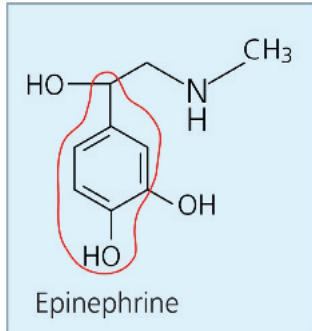  
Concept Check 45.1

Figure 45.5 The hormone is water-soluble and has a cell-surface receptor. Such receptors, unlike those for lipid-soluble hormones, can cause observable changes in cells without hormone-dependent gene transcription. Figure 45.6 ATP is enzymatically converted to cAMP. The other steps represent the element at the beginning of the arrow binding to the element at the end of the arrow. Figure 45.21 The embryonic gonad can become either a testis or an ovary. In contrast, the ducts either form a particular structure or degenerate, and the bladder forms in both males and females.

1. Water-soluble hormones, which cannot penetrate the plasma membrane, bind to cell-surface receptors. This interaction triggers an intracellular signal transduction pathway that ultimately alters the activity of a preexisting protein in the cytoplasm and/or changes transcription of specific genes in the nucleus. Steroid hormones are lipid-soluble and can cross the plasma membrane into the cell interior, where they bind to receptors located in the cytosol or nucleus. The hormone-receptor complex then functions directly as a transcription factor that changes transcription of specific genes. 2. An exocrine gland, because pheromones are not secreted into interstitial fluid but instead are typically released onto a body surface or into the environment 3. Because receptors for water-soluble hormones are located on the cell surface, facing the extracellular space, injecting the hormone into the cytosol would not trigger a response.

## Concept Check 45.2

1. Prolactin regulates milk production, and oxytocin regulates milk release. 2. The posterior pituitary, an extension of the hypothalamus that contains the axons of neurosecretory cells, is the storage and release site for two neurohormones, oxytocin and antidiuretic hormone (ADH). The anterior pituitary contains endocrine cells that make at least six different hormones. Secretion of anterior pituitary hormones is controlled by hypothalamic hormones that travel via blood vessels to the anterior pituitary. 3. The hypothalamus and pituitary glands function in many different endocrine pathways. Major defects in these structures, such as those affecting growth or organization, would therefore disrupt many hormone pathways. Only a very specific defect, such as a mutation affecting a particular hormone receptor, would alter just one endocrine pathway. The situation is quite different for the final gland in a pathway, such as the thyroid gland. In this case, a wide range of defects that disrupt gland function would disrupt only the one pathway or small set of pathways in which that gland functions. 4. Both diagnoses could be correct. In the first case, a problem with the pituitary gland or hypothalamus resulted in elevated TSH levels, which then increased thyroid hormone levels. In the other case, a problem with the thyroid gland itself resulted in elevated thyroid hormone levels, which would actually inhibit production of TRH and TSH from the hypothalamus and pituitary gland (respectively).

## Concept Check 45.3

1. If the function of the pathway is to provide a transient response, a short-lived stimulus would be less dependent on negative feedback.
2. You would be exploiting the anti-inflammatory activity of glucocorticoids. Local injection avoids the effects on glucose metabolism that would occur if glucocorticoids were taken orally and transported throughout the body in the bloodstream.
3. Both hormones produce opposite effects in different target tissues. In the fight-or-flight response, epinephrine increases flow through airways and reduces blood flow to smooth muscles in the digestive system. In establishing apical dominance, auxin promotes the growth of apical buds and inhibits the growth of lateral buds.

## Summary of Key Concepts Questions

45.1 As shown in Figure 43.18, helper T cell activation by cytokines acting as local regulators involves both autocrine and paracrine signaling. 45.2 The pancreas, parathyroid glands, and pineal gland 45.3 Both the pituitary and the adrenal glands are formed by fusion of neural and nonneural tissue. ADH is secreted by the neurosecretory portion of the pituitary gland, and epinephrine is secreted by the neurosecretory portion of the adrenal gland.

Test Your Understanding

1. C 2. D 3. D 4. A 5. B 6. B 7. A

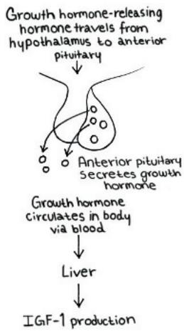

Practice Applying Your Learning
12. (a) T (b) F (c) T (d) F (e) F

## Chapter 46

## Figure Questions

Figure 46.7 Newly formed sperm enter the seminal vesicle from the testis and exit via the ejaculatory duct during intercourse. Sperm enter the spermatheca after intercourse and, after storage, are released into the oviduct to fertilize an egg moving into the uterus. Figure 46.8 When successfully courted by a second male, regardless of his genotype, about one-third of the females rid themselves of all sperm from the first mating. Thus, two-thirds retained some sperm from the first mating. We would therefore predict that two-thirds of those females would have some offspring exhibiting the small-eye phenotype of the dominant mutation carried by the males with which the females mated first. Figure 46.11 The analysis would be informative because the polar bodies contain all of the maternal chromosomes that don't end up in the mature egg. For example, finding two copies of the disease gene in the polar bodies would indicate its absence in the egg. This method of genetic testing is sometimes carried out when oocytes collected from a female are fertilized with sperm in a laboratory dish. Figure 46.15 The embryo normally implants about a week after conception, but it spends several days in the uterus before implanting, receiving nutrients from the endometrium. Therefore, the fertilized egg should be cultured for several days in liquid that is at normal body temperature and contains the same nutrients as those provided by the endometrium before implantation. Figure 46.16 Testosterone can pass from fetal blood to maternal blood via the placental circulation, temporarily upsetting the hormonal balance in the female parent. Figure 46.18 Oxytocin would most likely induce labor, starting a positive-feedback loop that would direct labor to completion. Synthetic oxytocin is in fact frequently used to induce labor when prolonged pregnancy might endanger the parent or fetus.

## Concept Check 46.1

1. The offspring of sexual reproduction are more genetically diverse. However, asexual reproduction can produce more offspring over multiple generations. 2. Unlike other forms of asexual reproduction, parthenogenesis involves gamete production. By controlling whether or not haploid eggs are fertilized, species such as honeybees can readily switch between asexual and sexual reproduction. 3. No. Owing to random assortment of chromosomes during meiosis, the offspring may receive the same copy or different copies of a particular parental chromosome from the sperm and the egg. Furthermore, genetic recombination during meiosis will result in reassortment of genes between pairs of parental chromosomes. 4. Fragmentation occurs in both plants and animals. Also, budding in animals and the growth of adventitious plant roots both involve emergence of new individuals from outgrowths of the parent.

## Concept Check 46.2

1. Internal fertilization allows sperm to reach the egg without either gamete drying out.
2. (a) Animals with external fertilization tend to release many gametes at once, resulting in the production of enormous numbers of zygotes. This increases the chances that some will survive to adulthood.
(b) Animals with internal fertilization produce fewer offspring but generally exhibit greater care of the embryos and the young.
3. Like the uterus of an insect, the ovary of a plant is the site of fertilization. Unlike the plant ovary, the uterus is not the site of egg production, which occurs in the insect ovary. In addition, the fertilized insect egg is expelled from the uterus, whereas the plant embryo develops within a seed in the ovary.

## Concept Check 46.3

1. Spermatogenesis occurs normally only when the testicles are cooler than normal body temperature. Extensive use of a hot tub (or of very tight-fitting underwear) can cause a decrease in sperm quality and number. 2. In humans, the secondary oocyte combines with a sperm before it finishes the second meiotic division. Thus, oogenesis is completed after, not before, fertilization. 3. The only effect of sealing off each vas deferens is an absence of sperm in the ejaculate. Sexual response and ejaculate volume are unchanged. The cutting and sealing off of these ducts, a vasectomy, is a common surgical procedure for males who do not wish to produce any (more) offspring.

## Concept Check 46.4

1. In the testis, FSH stimulates the Sertoli cells, which nourish developing sperm. LH stimulates the production of androgens (mainly testosterone), which in turn stimulate sperm production. In both females and males, FSH encourages the growth of cells that support and nourish developing gametes (follicle cells in females and Sertoli cells in males), and LH stimulates the production of sex hormones that promote gametogenesis (estrogens, primarily estradiol, in females and androgens, especially testosterone, in males). 2. In estrous cycles, which occur in most female mammals, the endometrium is reabsorbed (rather than shed) if fertilization does not occur. Estrous cycles often occur just once or a few times a year, and the female is usually receptive to copulation only during the period around ovulation. Menstrual cycles are found only in humans and some other primates. They control the buildup and breakdown of the uterine lining, but not sexual receptivity. 3. The combination of estradiol and progesterone would have a negative-feedback effect on the hypothalamus, blocking release of GnRH. This would interfere with LH secretion by the pituitary, thus preventing ovulation. This is in fact one basis of action of the most common hormonal contraceptives. 4. In the viral replicative cycle, the production of new viral genomes is coordinated with capsid protein expression and with the production of phospholipids for viral coats. In the reproductive cycle of a human female, there is hormonally based coordination of egg maturation with the development of support tissues of the uterus.

## Concept Check 46.5

1. Typically, hCG is produced only by tissues present in pregnant individuals (the embryo, and eventually the placenta), so it is diagnostic of pregnancy. The secretion of hCG by the early embryo stimulates the corpus luteum to make progesterone, which helps maintain the pregnancy.
2. Both tubal ligation and vasectomy block the movement of gametes from the gonads to a site where fertilization could take place.
3. The introduction of a sperm nucleus directly into an oocyte bypasses the sperm's acquisition of motility in the epididymis, its swimming to meet the egg in the oviduct, and its fusion with the egg.

## Summary of Key Concepts Questions

46.1 No. Because parthenogenesis involves meiosis, the female parent would pass on to each offspring a random and therefore typically distinct combination of the chromosomes she inherited from her parents. 46.2 None 46.3 The small size and lack of cytoplasm characteristic of a sperm are adaptations well suited to its function as a delivery vehicle for DNA. The large size and rich cytoplasmic contents of eggs support the growth and development of the embryo. 46.4 Circulating anabolic steroids mimic the feedback regulation of testosterone, turning off pituitary signaling to the testes and thereby blocking the release of signals required for spermatogenesis. 46.5 Oxygen in maternal blood diffuses from pools in the endometrium into fetal capillaries in the chorionic villi of the placenta and from there travels throughout the circulatory system of the fetus.

Test Your Understanding

1. D 2. B 3. B 4. C 5. A 6. B 7. C 8. C

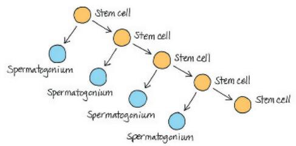

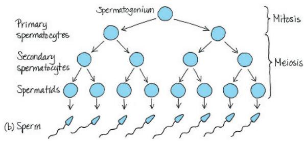

(c) The supply of stem cells would be used up, and spermatogenesis would not be able to continue.

## Chapter 47

## Figure Questions

Figure 47.3 You could inject the compound into an unfertilized egg, expose the egg to sperm, and see whether the fertilization envelope forms. Figure 47.6 There would be fewer cells, and they would be closer together. Figure 47.8 (1) The blastocoel forms a single compartment that surrounds the gut, much like a doughnut surrounds a hole. (2) Ectoderm forms the outer covering of the animal, and endoderm lines the internal organs, such as the digestive tract. Mesoderm fills much of the space between these two layers. Figure 47.19 Eight cell divisions are required to give rise to the intestinal cell closest to the mouth. Figure 47.22 When the researchers allowed normal cortical rotation to occur, the "back-forming" determinants were activated. When they then forced the opposite rotation to occur, the back was established on the opposite side as well. Because the molecules on the normal side were already activated, forcing the opposite rotation apparently did not "cancel out" the establishment of the back side by the first rotation.

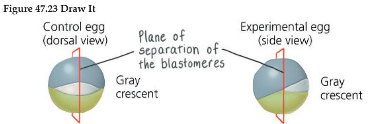

What If? In Spemann's control, the two blastomeres were physically separated, and each grew into a whole embryo. In Roux's experiment, remnants of the dead blastomere were still contacting the live blastomere, which developed into a half-embryo. Therefore, molecules present in the dead cell's remnants may have been signaling to the live cell, inhibiting it from making all the embryonic structures. Figure 47.24 You could inject the isolated protein (or an mRNA encoding it) into ventral cells of an earlier gastrula. If dorsal structures form on the ventral side, that would support the idea that the protein is the signaling molecule secreted or presented by the dorsal lip. You should also do a control experiment to make sure the injection process alone did not cause dorsal structures to form. Figure 47.26 Either Sonic hedgehog mRNA or protein can serve as a marker of the zone of polarizing activity (ZPA). The absence of either one after removal of the apical ectodermal ridge would support your hypothesis. You could also block fibroblast growth factor function and see whether the ZPA formed (by looking for Sonic hedgehog).

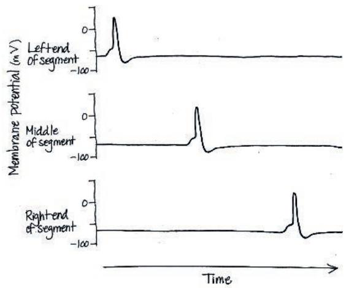

## Concept Check 47.1

1. The fertilization envelope forms after cortical granules release their contents outside the egg, causing the vitelline membrane to rise and harden. The fertilization envelope serves as a barrier to fertilization by more than one sperm.
2. The increased $Ca^{2+}$ concentration in the egg would cause the cortical granules to fuse with the plasma membrane, releasing their contents and causing a fertilization envelope to form, even though no sperm had entered. This would prevent fertilization.
3. You would expect it to fluctuate. The fluctuation of MPF drives the transition between DNA replication (S phase) and mitosis (M phase), which is still required in the abbreviated cleavage cell cycle.

## Concept Check 47.2

1. The cells of the notochord migrate toward the midline of the embryo (converge), rearranging themselves so there are fewer cells across the notochord, which thus becomes longer overall (extends; see Figure 47.17).
2. Because microfilaments would not be able to contract and decrease the size of one end of the cell, both the inward bending in the middle of the neural tube and the outward bending of the hinge regions at the edges would be blocked. Therefore, the neural tube probably would not form.
3. Dietary intake of the vitamin folic acid dramatically reduces the frequency of neural tube defects.

## Concept Check 47.3

1. Axis formation establishes the location and polarity of the three axes that provide the coordinates for development. Pattern formation positions particular tissues and organs in the three-dimensional space defined by those coordinates. 2. Morphogen gradients act by specifying cell fates across a field of cells through variation in the level of a determinant. Morphogen gradients thus act more globally than cytoplasmic determinants or inductive interactions between pairs of cells. 3. Yes, a second embryo could develop because inhibiting BMP-4 activity would have the same effect as transplanting an organizer. 4. The limb that developed probably would have a mirror-image duplication, with the most posterior digits in the middle and the most anterior digits at either end.

## Summary of Key Concepts Questions

47.1 The binding of a sperm to a receptor on the egg surface is very specific and likely would not occur if the two gametes were from different species. Without sperm binding, the sperm and egg membranes would not fuse. 47.2 Apoptosis functions to eliminate structures required only in an immature form, nonfunctional cells from a pool larger than the number required, and tissues formed by a developmental program that is not adaptive for the organism as it has evolved. 47.3 Mutations that affected both limb and kidney development would be more likely to alter the function of monocilia because these organelles are important in several signaling pathways. Mutations that affected limb development but not kidney development would more likely alter a single pathway, such as Hedgehog signaling.

## Test Your Understanding

1. A 2. B 3. D 4. A 5. D 6. C 7. B

## Chapter 48

## Figure Questions

Figure 48.7 Potassium and sodium channels must differ in the structure of the channel through which the ions pass. The channel could differ in the size of the opening, the distribution of charge, or other properties that would allow one type of ion but not others to diffuse through the channel. Figure 48.8 Adding chloride channels would make the membrane potential less positive. Adding potassium channels would have no effect because there are no potassium ions present. Figure 48.10 In the absence of other forces, chemical concentration gradients govern net diffusion. In this case, ions are more concentrated outside of the cell and move in when the channel opens.

Figure 48.11

Figure 48.12  
  
Figure 48.13  
Figure 48.16 The production and transmission of action potentials would be unaffected. However, action potentials arriving at chemical synapses would be unable to trigger release of neurotransmitter. Signaling at such synapses would thus be blocked. Figure 48.17 Since EPSPs become smaller as they spread from the synapse, the synapse that is closer to the axon hillock ( $E_{1}$ ) would produce a stronger EPSP than the synapse that is farther away ( $E_{2}$ ).

## Concept Check 48.1

1. A typical neuron has multiple dendrites and one axon. Dendrites transfer information to the cell body, whereas axons transmit information from the cell body. Both axons and dendrites extend from the cell body and function in information flow.
2. Sensors in your ear transmit information to your brain. There, the activity of interneurons in processing centers enables you to recognize your name. In response, signals transmitted via motor neurons cause contraction of muscles that turn your neck.
3. Increased branching would allow control of a greater number of postsynaptic cells, enhancing coordination of responses to nervous system signals.

## Concept Check 48.2

1. Ions can flow against a chemical concentration gradient if there is an opposing electrical gradient of greater magnitude.
2. A decrease in permeability to $K^{+}$ , an increase in permeability to $Na^{+}$ , or both
3. Charged dye molecules could equilibrate only if other charged molecules could also cross the membrane. If not, a membrane potential would develop that would counterbalance the chemical gradient.

## Concept Check 48.3

1. A graded potential has a magnitude that varies with stimulus strength, whereas an action potential has an all-or-none magnitude that is independent of stimulus strength.
2. Loss of the insulation provided by myelin sheaths leads to a disruption of action potential propagation along axons. Voltage-gated sodium channels are restricted to the nodes of Ranvier, and without the insulating effect of myelin, the inward current produced at one node during an action potential cannot depolarize the membrane to the threshold at the next node.
3. Positive feedback is responsible for the rapid opening of many voltage-gated sodium channels, causing the rapid outflow of sodium ions responsible for the rising phase of the action potential. As the membrane potential becomes positive, voltage-gated potassium channels open in a form of negative feedback that helps bring about the falling phase of the action potential.
4. The maximum frequency would decrease because the refractory period would be extended.

## Concept Check 48.4

1. It can bind to different types of receptors, each triggering a specific response in postsynaptic cells.
2. These toxins would prolong the EPSPs that acetylcholine produces because the neurotransmitter would remain longer in the synaptic cleft.
3. Membrane depolarization, exocytosis, and membrane fusion each occur in fertilization and in neurotransmission.

## Summary of Key Concepts Questions

48.1 It would prevent information from being transmitted away from the cell body along the axon. 48.2 There are very few open sodium channels in a resting neuron, so the resting potential either would not change or would become slightly more negative (hyperpolarization). 48.4 A given neurotransmitter can have many receptors

that differ in their location and activity. Drugs that target receptor activity rather than neurotransmitter release or stability are therefore likely to exhibit greater specificity and potentially have fewer undesirable side effects.

## Test Your Understanding

1. C 2. C 3. C 4. B 5. A 6. D 7. The activity of the sodium-potassium pump is essential to maintain the resting potential. With the pump inactivated, the sodium and potassium concentration gradients would gradually disappear, resulting in a greatly reduced resting potential. 8. Since GABA is an inhibitory neurotransmitter in the CNS, this drug would be expected to decrease brain activity. A decrease in brain activity might be expected to slow down or reduce behavioral activity. Many sedative drugs act in this fashion. 9. As shown in this pair of drawings, a pair of action potentials would move outward in both directions from each electrode. (Action potentials are unidirectional only if they begin at one end of an axon.) However, because of the refractory period, the two action potentials between the electrodes both stop where they meet. Thus, only one action potential reaches the synaptic terminals.

## Chapter 49

## Figure Questions

Figure 49.5 During swallowing, muscles along the esophagus alternately contract and relax, resulting in peristalsis. One model to explain this alternation is that each section of muscle receives nerve impulses that alternate between excitation and inhibition, just as the quadriceps and hamstring receive opposing signals in the knee-jerk reflex. Figure 49.15 The gray areas have a different shape and pattern, indicating different planes through the brain. This fact indicates that the nucleus accumbens and the amygdala are in different planes. Figure 49.17 The hand is shown larger than the forearm because the hand receives more innervation than the forearm for sensory input to the brain and motor output from the brain. Figure 49.24 If the depolarization brings the membrane potential to or past threshold, it should initiate action potentials that cause dopamine release from the VTA neurons. This should mimic natural stimulation of the brain reward system, resulting in positive and perhaps pleasurable sensations.

## Concept Check 49.1

1. The sympathetic division would likely be activated. It mediates the "fight-or-flight" response in stressful situations.
2. Nerves contain bundles of axons, some that belong to motor neurons, which send signals outward from the CNS, and some that belong to sensory neurons, which bring signals into the CNS. Therefore, you would expect effects on both motor control and sensation.
3. Neurosecretory cells of the adrenal medulla secrete the hormones epinephrine and norepinephrine in response to preganglionic input from sympathetic neurons. These hormones travel in the circulation throughout the body, triggering responses in many tissues.

## Concept Check 49.2

1. The cerebral cortex on the left side of the brain initiates voluntary movement of the right side of the body.
2. Alcohol diminishes function of the cerebellum.
3. A coma reflects a disruption in the cycles of sleep and arousal regulated by communication between the midbrain and pons (reticular formation) and the cerebrum. You would expect this individual to have damage to the midbrain, the pons, the cerebrum, or any part of the brain between these structures. Paralysis reflects an inability to carry out motor commands transmitted from the cerebrum to the spinal cord. You would expect this individual to have damage to the portion of the CNS extending from the spinal cord up to but not including the midbrain and pons.

## Concept Check 49.3

1. Brain damage that disrupts behavior, cognition, memory, or other functions provides evidence that the portion of the brain affected by the damage is important for the normal activity that is blocked or altered. 2. Broca's area, which is active during the generation of speech, is located near the motor cortex, which controls skeletal muscles, including those in the face. Wernicke's area, which is active when speech is heard, is located in the posterior part of the temporal lobe, which is involved in hearing. 3. Each cerebral hemisphere is specialized for different parts of this task—the right for face recognition and the left for language. Without an intact corpus callosum, neither hemisphere can take advantage of the other's processing abilities.

## Concept Check 49.4

1. There can be an increase in the number of synapses between the neurons or an increase in the strength of existing synaptic connections.
2. If consciousness is an emergent property resulting from the interaction of many different regions of the brain, then it is unlikely that localized brain damage will have a discrete effect on consciousness. 3. The hippocampus is responsible for organizing newly acquired information. Without hippocampal function, the links necessary to retrieve information from the cerebral cortex will be lacking, and no functional memory, short- or long-term, will be formed.

## Concept Check 49.5

1. Both are progressive brain diseases whose risk increases with advancing age. Both result from the death of brain neurons and are associated with the accumulation of peptide or protein aggregates.
2. The symptoms of schizophrenia can be mimicked by a drug that stimulates dopamine-releasing neurons. The brain's reward system, which is involved in drug addiction, is composed of dopamine-releasing neurons that connect the ventral tegmental area to regions in the cerebrum. Parkinson's disease results from the death of dopamine-releasing neurons.
3. Not necessarily. It might be that the plaques, tangles, and missing regions of the brain seen at death reflect secondary effects, the consequence of other unseen changes that are actually responsible for the alterations in brain function.

## Summary of Key Concepts Questions

49.1 Because reflex circuits involve only a few neurons—the simplest consist of a sensory neuron and a motor neuron—the path for information transfer is short and simple, increasing the speed of the response. 49.2 The midbrain coordinates visual reflexes; the cerebellum controls coordination of movement that depends on visual input; the thalamus serves as a routing center for visual information; and the cerebrum is essential for converting visual input to a visual image. 49.3 You would expect the right side of the body to be paralyzed because it is controlled by the left cerebral hemisphere, where language generation and interpretation are localized. 49.4 Learning a new language likely requires the maintenance of synapses that are formed during early development but are otherwise lost prior to adulthood. 49.5 Whereas amphetamine stimulates dopamine release, PCP blocks glutamate receptors, suggesting that schizophrenia does not reflect a defect in the function of just one neurotransmitter.

## Test Your Understanding

1. B 2. A 3. D 4. D 5. C 6. A

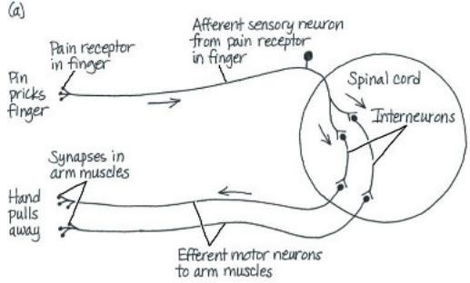  
(b)

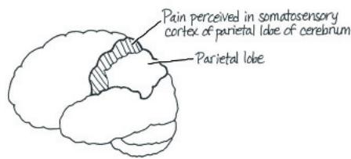

## Chapter 50

Figure Questions

Figure 50.17 The terms cis and trans refer to the hydrogens.

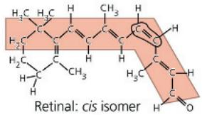

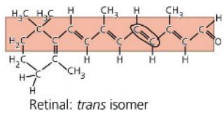

Figure 50.19 Each of the three types of cones is most sensitive to a different wavelength of light. A cone might be fully depolarized when there is light present if the light is of a wavelength far from its optimum. Figure 50.21 In humans, an X chromosome with a defect in the red or green opsin gene is much less common than a wild-type X chromosome. Color blindness therefore typically skips a generation as the defective allele passes from an affected male to a carrier daughter and back to an affected grandson. In squirrel monkeys, no X chromosome can confer full color vision. As a result, all males are color-blind and no unusual inheritance pattern is observed. Figure 50.23 The results of the experiment would have been identical. What matters is the activation of particular sets of neurons, not the manner in which they are activated. Any signal from a bitter cell will be interpreted by the brain as a bitter taste, regardless of the nature of the compound and the receptor involved. Figure 50.25 Only perception. Binding of an odorant to its receptor will cause action potentials to be sent to the brain. Although an excess of that odorant might cause a diminished response through adaptation, another odorant can mask the first only at the level of perception in the brain. Figure 50.26 Both. A muscle fiber contains many myofibrils bundled together and divided lengthwise into many sarcomeres. A sarcomere is a contractile unit made up of portions of many myofibrils, and each myofibril is a part of many sarcomeres. Figure 50.28 Hundreds of myosin heads participate in sliding each pair of thick and thin filaments past each other. Because cross-bridge formation and breakdown are not synchronized, many myosin heads are exerting force on the thin filaments at all times during muscle contraction. Figure 50.33 By causing all of the motor neurons that control the muscle to generate action potentials at a rate high enough to produce tetanus in all of the muscle fibers.

## Concept Check 50.1

1. Electromagnetic receptors in general detect only external stimuli. Nonelectromagnetic receptors, such as chemoreceptors or mechanoreceptors, can act as either internal or external sensors. 2. The capsaicin present in the peppers activates the thermoreceptor for high temperatures. In response to the perceived high temperature, the nervous system triggers sweating to achieve evaporative cooling. 3. You would perceive the electrical stimulus as if the sensory receptors that regulate that neuron had been activated. For example, electrical stimulation of the sensory neuron controlled by the thermoreceptor activated by menthol would likely be perceived as a local cooling.

## Concept Check 50.2

1. Otoliths detect the animal's orientation with respect to gravity, providing information that is essential in environments such as the tunnel habitat of the star-nosed mole, where light cues are absent. 2. As a sound that changes gradually from a very low to a very high pitch. 3. The stapes and the other middle ear bones transmit vibrations from the tympanic membrane to the oval window. Fusion of these bones (as occurs in a disease called otosclerosis) would block this transmission and result in hearing loss. 4. In animals, the statoliths are extracellular. In contrast, the statoliths of plants are found within an intracellular organelle. The methods for detecting their location also differ. In animals, detection is by means of mechanoreceptors on ciliated cells. In plants, the mechanism appears to involve calcium signaling.

## Concept Check 50.3

1. Planarians have ocelli that cannot form images but can sense the intensity and direction of light, providing enough information to enable the animals to find protection in shaded places. Flies have compound eyes that form images and excel at detecting movement. 2. The person can focus on distant objects but not close objects (without glasses) because close focusing requires the lens to become almost spherical. This problem is common after age 50. 3. The signal produced by rod and cone cells is glutamate, and their release of glutamate decreases upon exposure to light. However, a decrease in glutamate production causes other retinal cells to increase the rate at which action potentials are sent to the brain, so that the brain receives more action potentials in light than in dark. 4. Absorption of light by retinal converts retinal from its cis isomer to its trans isomer, initiating the process of light detection. In contrast, a photon absorbed by chlorophyll does not bring about isomerization, but instead boosts an electron to a higher energy orbital, initiating the electron flow that generates ATP and NADPH.

## Concept Check 50.4

1. Both taste cells and olfactory cells have receptor proteins in their plasma membrane that bind certain substances, leading to membrane depolarization through a signal transduction pathway involving a G protein. However, olfactory cells are sensory neurons, whereas taste cells are not.
2. Since animals rely on chemical signals for behaviors that include finding mates, marking territories, and avoiding dangerous substances, it is adaptive for the olfactory system to have a robust response to a very small number of molecules of a particular odorant.
3. Because the sweet, bitter, and umami tastes involve GPCR proteins but the sour taste does not, you might predict that the mutation is in a molecule that acts in the signal transduction pathway common to the different GPCRs.

## Concept Check 50.5

1. In a skeletal muscle fiber, $Ca^{2+}$ binds to the troponin complex, which moves tropomyosin away from the myosin-binding sites on actin and allows cross-bridges to form. In a smooth muscle cell, $Ca^{2+}$ binds to calmodulin, which activates an enzyme that phosphorylates the myosin head and thus enables cross-bridge formation.
2. Rigor mortis, a Latin phrase meaning “stiffness of death,” results from the complete depletion of ATP in skeletal muscle. Since ATP is required to release myosin from actin and to pump $Ca^{2+}$ out of the cytosol, muscles become chronically contracted beginning about 3–4 hours after death.
3. A competitive inhibitor binds the enzyme at the same site as the substrate. Similarly, in the absence of calcium the troponin-tropomyosin complex binds actin at the same site as myosin. Thus, the complex “competes” with myosin for the same binding site on the actin molecules.

## Concept Check 50.6

1. The main problem in swimming is drag; a fusiform body minimizes drag. The main problem in flying is overcoming gravity; wings shaped like airfoils provide lift, and adaptations such as air-filled bones reduce body mass.
2. In modeling peristalsis you would constrict the toothpaste tube at different points along its length, using your hand to encircle the tube and squeeze concentrically. To demonstrate movement of food through the digestive tract you would want the cap off the toothpaste tube, whereas you would want the cap on to show how peristalsis contributes to worm locomotion.
3. When you grasp the sides of the chair, you are using a contraction of the triceps to keep your arms extended against the pull of gravity on your body. As you lower yourself slowly into the chair, you gradually decrease the number of motor units in the triceps that are contracted. Contracting your biceps would jerk you down, since you would no longer be opposing gravity.

## Summary of Key Concepts Questions

50.1 Nociceptors overlap with other classes of receptors in the type of stimulus they detect. They differ from other receptors only in how a particular stimulus is perceived. 50.2 Volume is encoded by the frequency of action potentials transmitted to the brain; pitch is encoded by which axons are transmitting action potentials. 50.3 The major difference is that neurons in the retina integrate information from multiple sensory receptors (photoreceptors) before transmitting information to the central nervous system. 50.4 Our olfactory sense is responsible for most of what we describe as distinct tastes. A head cold or other source of congestion blocks odorant access to receptors lining portions of the nasal cavity. 50.5 Hydrolysis of ATP is required to convert myosin to a high-energy configuration for binding to actin and to power the $\mathrm{Ca^{2+}}$ pump that removes cytosolic $\mathrm{Ca^{2+}}$ during muscle relaxation. 50.6 Human body movements rely on the contraction of muscles anchored to a rigid endoskeleton. Tendons attach muscles to bones, which in turn are composed of fibers built up from a basic organizational unit, the sarcomere. The thin and thick filaments have separate points of attachment within the sarcomere. In response to nervous system motor output, the formation and breakdown of cross-bridges between myosin heads and actin ratchet the thin and thick filaments past each other. Because the filaments are anchored, this sliding movement shortens the muscle fibers. Furthermore, because the fibers themselves are part of the muscles attached at each end to bones, muscle contraction moves bones of the body relative to each other. In this way, the structural anchoring of muscles and filaments enables muscle function, such as the bending of an elbow by contraction of the biceps.

## Test Your Understanding

1. C  2. A  3. B  4. C  5. B  6. D

  
Position along retina (in degrees away from fovea)

The answer shows the actual distribution of rods and cones in the human eye. Your graph may differ, but should have the following properties: only cones at the fovea; fewer cones and more rods at both ends of the x-axis; no photoreceptors in the optic disk.

## Chapter 51

## Figure Questions

Figure 51.2 The fixed action pattern based on the sign stimulus of a red belly ensures that the male will chase away any invading males of his species. By chasing away such males, the defender decreases the chance that another male will fertilize eggs laid in his nesting territory. Figure 51.5 The straight-run portion conveys two pieces of information: direction, via the angle of that run relative to the wall of the hive, and distance, via the number of waggles performed during the straight run. At a minimum, the portions between the straight runs identify the activity as a waggle dance. Since they also provide contact with workers to one side and then the other, they may ensure transmission of information to a larger number of other bees. Figure 51.7 There should be no effect. Imprinting is an innate behavior that is carried out anew in each generation. Assuming the nest was not disturbed, the offspring of the geese imprinted on a human would imprint on the adult goose. Figure 51.8 Perhaps the wasp doesn't use visual cues. It might also be that wasps recognize objects native to their environment, but not foreign objects, such as the pinecones. Tinbergen addressed these ideas before carrying out the pinecone study. When he swept away the pebbles and sticks around the nest, the wasps could no longer find their nests. If he shifted the natural objects in their natural arrangement, the shift in the landmarks caused a shift in the site to which the wasps returned. Finally, if natural objects around the nest site were replaced with pinecones while the wasp was in the burrow, the wasp nevertheless found her way back to the nest site. Figure 51.10 Switching the orientations of all three grids would control for an inherent preference for or against a particular orientation. If there were no inherent preference or bias, the experiment should work equally well after the switch. Figure 51.24 It might be that the birds require stimuli during flight to exhibit their migratory preference. If this were true, the birds would show the same orientation in the funnel experiment despite their distinct genetic programming. Figure 51.26 It holds true for some, but not all individuals. If a parent has more than one reproductive partner, the offspring of different partners will have a coefficient of relatedness less than 0.5.

## Concept Check 51.1

1. The proximate explanation for this fixed action pattern might be that nudging and rolling are released by the sign stimulus of an object outside the nest, and the behavior is carried to completion once initiated. The ultimate explanation might be that ensuring that eggs remain in the nest increases the chance of producing healthy offspring.
2. There might be selective pressure for other prey fish to detect an injured fish because the source of the injury might threaten them as well. Among predators, there might be selection for those that are attracted to the alarm substance because they would be more likely to encounter crippled prey. Fish with adequate defenses might show no change because they have a selective advantage if they do not waste energy responding to the alarm substance.
3. In both cases, the detection of periodic variation in the environment results in a reproductive cycle timed to environmental conditions that optimize the opportunity for success.

## Concept Check 51.2

1. Natural selection would tend to favor convergence in color pattern because a predator learning to associate a pattern with a sting or bad taste would avoid all other individuals with that same color pattern, regardless of species.
2. You might move objects around to establish an abstract rule, such as “past landmark A, the same distance as A is from the starting point,” while maintaining a minimum of fixed metric relationships, that is, avoiding having the food directly adjacent to or a set distance from a landmark. As you might surmise, designing an informative experiment of this kind is not easy.
3. Learned behavior, just like innate behavior, can contribute to reproductive isolation and thus to speciation. For example, learned bird songs contribute to species recognition during courtship, thereby helping ensure that only members of the same species mate.

## Concept Check 51.3

1. Certainty of paternity is higher with external fertilization. 2. Balancing selection could maintain the two alleles at the forager locus if population density fluctuated from one generation to another. At times of low population density, the energy-conserving sitter larvae (carrying the for $^{s}$ allele) would be favored, while at higher population density, the more mobile Rover larvae (for $^{R}$ allele) would have a selective advantage. 3. Because females would now be present in much larger numbers than males, all three types of males should have some reproductive success. Nevertheless, since the advantage that the bluethroats rely on—a limited number of females in their territory—will be absent, the yellow-throats are likely to increase in frequency in the short term.

## Concept Check 51.4

1. Because this geographic variation corresponds to differences in prey availability between two garter snake habitats, it seems likely that snakes with characteristics enabling them to feed on the abundant prey in their locale would have had increased survival and reproductive success. In this way, natural selection would have resulted in the divergent foraging behaviors.
2. The fact that the individual shares some genes with the offspring of its sibling (in the case of humans, with the individual's niece or nephew) means that the reproductive success of that niece or nephew increases the representation of those genes in the population (selects for them).
3. The older individual cannot be the beneficiary because he or she cannot have extra offspring. However, the cost is low for an older individual performing the altruistic act because that individual has already reproduced (but perhaps is still caring for a child or grandchild). There can therefore be selection for an altruistic act by a postreproductive individual that benefits a young relative.

## Summary of Key Concepts Questions

51.1 Circannual rhythms are typically based on the cycles of light and dark in the environment. As the global climate changes, animals that migrate in response to these rhythms may shift to a location before or after local environmental conditions are optimal for reproduction and survival. 51.2 For the goose, all that is acquired is an object at which the behavior is directed. In the case of the sparrow, learning takes place that will give shape to the behavior itself. 51.3 Because feeding the female is likely to improve her reproductive success, the genes from the sacrificed male are likely to appear in a greater number of progeny. 51.4 Studying the genetic basis of these behaviors reveals that changes in a single gene can have large-scale effects on even complex behaviors.

## Test Your Understanding

1. C 2. B 3. B 4. A 5. C 6. A

You could measure the size of mussels that oystercatchers successfully open and compare that with the size distribution in the habitat.

## Chapter 52

## Figure Questions

Figure 52.9 As latitude increases, light availability decreases, which could lower the photosynthetic rate of the algae that live in coral tissues. Additionally, more acidic waters are likely to lower the calcification rate of corals. Figure 52.20 Some factors, such as fire, are relevant only for terrestrial systems. At first glance, water availability is primarily a terrestrial factor, too. However, species living along the intertidal zone of oceans or along the edge of lakes also suffer desiccation. Salinity stress is important for species in some aquatic and terrestrial systems. Oxygen availability is an important factor primarily for species in some aquatic systems and in soils and sediments.

## Concept Check 52.1

1. In the tropics, high temperatures evaporate water and cause warm, moist air to rise. The rising air cools and releases much of its water as rain over the tropics. The remaining dry air descends at approximately $30^{\circ}$ north and south, causing deserts to occur in those regions.
2. The microclimate around the stream will be cooler, moister, and shadier than that around the unplanted agricultural field.
3. Trees that require a long time to reach reproductive age are likely to evolve more slowly than annual plants in response to climate change, constraining the potential ability of such trees to respond to rapid climate change.
4. Plants with $C_{4}$ photosynthesis are likely to expand their range globally as Earth's climate warms. $C_{4}$ photosynthesis minimizes photorespiration and enhances sugar production, an advantage that is especially useful in warmer regions where $C_{4}$ plants are found today.

## Concept Check 52.2

1. The biggest difference between the two biomes is the higher amounts of precipitation that the forest receives.
2. Answers will vary by location but should be based on the information and maps in Figure 52.14. How much your local area has been altered from its natural state will influence how much it reflects the expected characteristics of your biome, particularly the expected plants and animals.
3. Northern coniferous forest is likely to replace tundra along the boundary between these biomes. To see why, note that northern coniferous forest is adjacent to tundra throughout North America, northern Europe, and Asia (see Figure 52.11) and that the temperature range for northern coniferous forest is just above that for tundra (see Figure 52.12).

## Concept Check 52.3

1. In the oceanic pelagic zone, the ocean bottom lies below the photic zone, so there is too little light to support benthic algae or rooted plants.
2. Aquatic organisms either gain or lose water by osmosis if the osmolarity of their environment differs from their internal osmolarity. Water gain can cause cells to swell, and water loss can cause them to shrink. To avoid excessive changes in cell volume, organisms that live in estuaries must be able to compensate for both water gain (under freshwater conditions) and water loss (under saltwater conditions).
3. Oxygen serves as a reactant when decomposers break down the bodies of dead algae using aerobic respiration. Following an algal bloom, there are many dead algae; hence, decomposers may use a lot of oxygen to break down the bodies of dead algae, causing the lake's oxygen levels to drop.

## Concept Check 52.4

1. (a) Humans might transplant a species to a new area that it could not previously reach because of a geographic barrier. (b) Humans might eliminate a predator or herbivore species, such as sea urchins, from an area. 2. One test would be to build a fence around a plot of land in an area that has trees of that species, excluding all deer from the plot. You could then compare the abundance of tree seedlings inside and outside the fenced plot over time. 3. Because the ancestor of the silverswords reached isolated Hawaii early in the islands' existence, it likely faced little competition and was able to occupy many unfilled niches. The cattle egret, in contrast, arrived in the Americas only recently and has to compete with a well-established group of species. Thus, its opportunities for adaptive radiation have probably been much more limited.

## Concept Check 52.5

1. Changes in how organisms interact with one another and their environment can cause evolutionary change. In turn, an evolutionary change, such as an improvement in the ability of a predator to detect its prey, can alter ecological interactions. 2. As cod adapt to the pressure of commercial fishing by reproducing at younger ages and smaller sizes, the number of offspring they produce each year will be lower. This may cause the population to decline as time goes on, thereby further reducing the population's ability to recover. If that happened, as the population becomes smaller over time, effects of genetic drift might become increasingly important. Drift could, for example, lead to the fixation of harmful alleles, which would further hinder the ability of the cod population to recover from overfishing.

## Summary of Key Concepts Questions

52.1 Because dry air would descend at the equator instead of at $30^{\circ}$ north and south latitude (where deserts exist today), deserts would be more likely to exist along the equator (see Figure 52.3). 52.2 The dominant plants in savanna ecosystems tend to be adapted to fire and tolerant of seasonal droughts. The savanna biome is maintained by periodic fires, both natural and set by humans, but humans are also

clearing savannas for agriculture and other uses. 52.3 An aphotic zone is most likely to be found in the deep waters of a lake, the oceanic pelagic zone, or the marine benthic zone. 52.4 You might arrange a flowchart that begins with abiotic limitations—first determining the physical and chemical conditions under which a species could survive—and then moves through the other factors listed in the flowchart. 52.5 Because the introduced species had few predators or parasites, it might outcompete native species and thereby increase in number and expand its range in the new location. As the introduced species increased in abundance, natural selection might cause evolution in populations of competing species, favoring individuals with traits that made them more effective competitors with the introduced species. Selection could also cause evolution in populations of potential predator or parasite species, in this case favoring individuals with traits that enabled them to take advantage of this new potential source of food. Such evolutionary changes could modify the outcome of ecological interactions, potentially leading to further evolutionary changes, and so on.

Test Your Understanding

1. B 2. B 3. C 4. D 5. C 6. A 7. A 8. B

## Chapter 53

## Figure Questions

Figure 53.3 The dispersion of the penguins would likely appear clumped as you flew over densely populated islands and sparsely populated ocean. Figure 53.4 Ten percent (100/1,000) of the females survive to be 3 years old. Figure 53.6 #109

Figure 53.7 The population with r = 1.0 (solid blue curve) reaches 1,500 individuals in about 7.5 generations, whereas the population with r = 0.5 (dashed red curve) reaches 1,500 individuals in about 14.5 generations.

  
Figure 53.22 Based on Figure 53.21, which highlights the long-term, explosive growth of the human population, one might conclude (mistakenly) that the growth rate of the human population has not decreased in recent decades. However, the growth rate of the human population has decreased in recent decades—a slowdown that is evident in the human population curve (blue) shown in Figure 53.22. Both curves are accurate, but they convey different messages because they differ in the time scale over which human population size is represented. The time period covered by Figure 53.21 is so long (over 6,000 years in the “unbroken” portion of the x-axis lying to the right of the hatch mark) that the recent slowdown in how fast the human population is growing is not visually apparent. In contrast, Figure 53.22 covers only 100 years, a time period that is short enough to show the recent decrease in the growth rate of the human population. Figure 53.24 If the average ecological footprint were 8 gha per person, Earth could support about 1.5 billion people in a sustainable fashion. This estimate is obtained by dividing the total amount of Earth’s productive land (11.9 billion gha) by the number of global hectares used per person (8 gha/person), which yields 1.49 billion people.  
1.

## Concept Check 53.1

  
A Type III survivorship curve is most likely because very few of the young probably survive. 2. The proportion alive at the start of year 0–1 is 485/485 = 1.0. The proportion alive at the start of year 1–2 is 218/485 = 0.449. 3. Male sticklebacks

would likely have a uniform pattern of dispersion, with antagonistic interactions maintaining a relatively constant spacing between them.

## Concept Check 53.2

1. Although $r_{realized}$ is constant at $r_{max}$ , the population size (N) is increasing. As $r_{max}$ is applied to an increasingly large N, population growth ( $r_{max}N$ ) accelerates, producing the J-shaped curve.
2. Exponential growth is more likely in the area where a forest was destroyed by fire. The first plants that found suitable habitat there would encounter an abundance of space, nutrients, and light. In the undisturbed forest, competition among plants for these resources would be intense.
3. The equation for the number of people added to the population each year is $\Delta N/\Delta t = r_{\Delta t} N$ . Therefore, the net population growth in 2022 was

$$
\Delta N / \Delta t = 0. 0 0 7 \times 3 3 7, 0 0 0, 0 0 0 = 2, 3 5 9, 0 0 0
$$

or roughly 2.4 million people. To determine whether the population is growing exponentially, you would need to determine whether r > 0 and if it is constant through time (across multiple years).

## Concept Check 53.3

1. When N (population size) is small, there are relatively few individuals producing offspring. When N is large, near the carrying capacity, the realized per capita growth rate is relatively small because it is limited by available resources. The steepest part of the logistic growth curve corresponds to a population with a number of reproducing individuals that is substantial but not yet near carrying capacity.
2. All else being equal, you would expect a plant species to have a larger carrying capacity at the equator than at high latitudes because there is more incident sunlight near the equator.
3. The sudden change in environmental conditions might alter the phenotypic traits favored by natural selection. Assuming the newly favored traits were encoded at least in part by genes, natural selection might alter gene frequencies in this population. In addition, a substantial drop in the carrying capacity of the population could cause the size of the population to drop considerably. If this occurred, effects of genetic drift could become more pronounced—and that in turn could lead to the fixation of harmful alleles, hindering the ability of the population to rebound in size.

## Concept Check 53.4

1. Three key life history traits are when reproduction begins, how often reproduction occurs, and how many offspring are produced per reproductive episode. Organisms differ widely for each of these traits. For example, the age of first reproduction is typically 3–4 years in coho salmon compared to 30 years in loggerhead turtles. Similarly, an agave reproduces only once during its lifetime, whereas an oak tree reproduces many times. Finally, the white rhinoceros produces a single calf when it reproduces, while most insects produce many offspring each time they reproduce.
2. By preferentially investing in the eggs it lays in the nest, the peacock wrasse increases the chance those eggs will survive. The eggs it disperses widely and does not provide care for are less likely to survive, at least some of the time, but require a lower investment by the adults. (In this sense, the adults avoid the risk of placing all their eggs in one basket.) 3. If a parent's survival is compromised greatly by bearing young during times of stress, the animal's fitness may increase if it abandons its current young and survives to produce healthier young at a later time.

## Concept Check 53.5

1. Three attributes are the size, quality, and isolation of patches. A patch that is larger or of higher quality is more likely to attract individuals and to be a source of individuals for other patches. A patch that is relatively isolated will undergo fewer exchanges of individuals with other patches.
2. You should have circled the portion of the curve where it is close to K.
3. You would need to study the population for more than one cycle (longer than 10 years and probably at least 20) before having sufficient data to examine changes through time. Otherwise, it would be impossible to know whether an observed decrease in the population size reflected a long-term trend or was part of the normal cycle.
4. In negative feedback, the output, or product, of a process slows that process. In populations that have a density-dependent birth rate, such as dune fescue grass, an accumulation of product (more individuals, resulting in a higher population density) slows the process (population growth) by decreasing the birth rate.

## Concept Check 53.6

1. A bottom-heavy age structure, with a disproportionate number of young people, portends continuing growth of the population as these young people begin reproducing. In contrast, a more evenly distributed age structure predicts a more stable population size, and a top-heavy age structure predicts a decrease in population size because relatively fewer young people are reproducing.
2. The growth rate of Earth's human population has dropped by more than half since the 1960s, from 2.2% in 1962 to 0.9% today. Nonetheless, the yearly increase in population size has not slowed as much because the smaller growth rate is counterbalanced by increased population size; hence, the number of additional people on Earth each year remains enormous—approximately 75 million.
3. Each student will calculate their own ecological footprint. Each of us influences our ecological footprint by how we live—what we eat, how much energy we use, and the amount of waste we generate—as well as by how many children we have. Making choices that reduce our demand for resources makes our ecological footprint smaller.

## Summary of Key Concepts Questions

53.1 Ecologists can potentially estimate birth rates by counting the number of young born each year, and they can estimate death rates by seeing how the number of adults changes each year. 53.2 Since both populations are following the exponential growth model, both will continue to grow to infinite size with population growth rate becoming faster and faster as the population size increases. But the one with the lower $r_{max}$ has a lower population growth rate for any given population size.

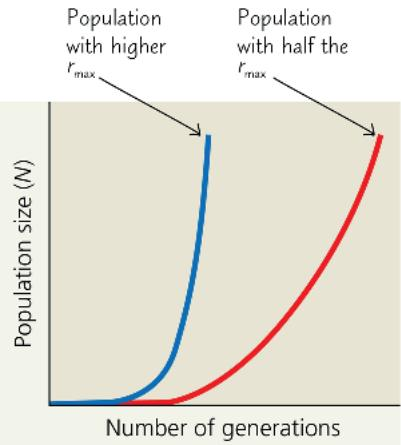

53.3 There are many things you can do to increase the carrying capacity of the species, including increasing its food supply, protecting it from predators, and providing more sites for nesting or reproduction. 53.4 Ecological trade-offs are common because organisms do not have access to unlimited amounts of energy and resources. As a result, the use of energy or resources for one function (such as reproduction) can decrease the energy or resources available to support other functions (such as growth or survival). 53.5 An example of a biotic factor is disease caused by a pathogen; natural disasters, such as earthquakes and floods, are examples of abiotic factors. 53.6 Humans are unique in our potential ability to reduce global population through contraception and family planning. Humans also are capable of consciously choosing their diet and personal lifestyle, and these choices influence the number of people Earth can support.

Test Your Understanding

1. B 2. A 3. D 4. B 5. C 6. A

Practice Applying Your Learning

12. (a) T (b) F (c) T (d) T (e) T (f) T (g) F

## Chapter 54

## Figure Questions

Figure 54.3 Its realized and fundamental niches would be similar, unlike those of Chthamalus. Figure 54.5 Beak depths in the G. fortis population would likely decrease over time. With the extinction of G. fuliginosa, the small seeds eaten by that species would increase in abundance. As a result, natural selection would favor G. fortis individuals with smaller beaks because those individuals can eat small seeds more efficiently than could G. fortis individuals with larger beaks. Figure 54.6 Individuals of a harmless species that resembled a distantly related harmful species might be attacked by predators less often than were other individuals that did not resemble the harmful species. As a result, individuals of the harmless species that resembled a harmful species would tend to contribute more offspring to the next generation than would other individuals of the harmless species. Over time, as natural selection by predators continued to favor those individuals of the harmless species that most closely resembled the harmful species, the resemblance of the harmless species to the harmful species would increase. However, selection is not the only process that could cause a harmless species to resemble a closely related harmful species. In this case, the two species could also resemble each other because they descended from a recent common ancestor and hence share many traits (including a resemblance to one another). Figure 54.16 An increase in the abundance of carnivores that eat zooplankton might cause zooplankton abundance to drop, thereby causing phytoplankton abundance to increase. Figure 54.17 The number of types of organisms eaten is zero for phytoplankton; one for copepods, crab-eater seals, and baleen whales; two for krill, carnivorous plankton, elephant seals, and sperm whales; three for squids, fishes, and leopard seals; and five for birds and smaller toothed whales. The two groups that both consume and are consumed by each other are fishes and squids. Figure 54.18 Zooplankton are primary consumers of phytoplankton. Fish larvae are secondary consumers of zooplankton. Sea nettles function as secondary consumers when they eat zooplankton, but as tertiary consumers when they eat fish larvae. Juvenile striped bass are tertiary consumers of fish larvae. Figure 54.19 The death of individuals of Mytilus, a competitively dominant species, should open up space for individuals of other species and thereby increase species richness even in the absence of Pisaster. Figure 54.27 At the earliest stages of primary succession, free-living prokaryotic organisms in the soil would reduce atmospheric $\mathrm{N}_2$ to $\mathrm{NH}_3$ . Symbiotic nitrogen fixation could not occur until plants were present at the site. Figure 54.31 We would expect that (a) population sizes would decrease because there would be fewer resources and less suitable habitat; (b) the extinction curve would rise more rapidly as the number of species on the island increased because small islands generally have fewer resources, less diverse habitats, and smaller population sizes; and (c) the predicted equilibrium species number would be smaller than shown in Figure 54.31. Figure 54.34 Shrew populations in different locations and habitats might show substantial genetic variation in their susceptibility to the Lyme pathogen. As a result, there might be fewer infected ticks where shrew populations are less susceptible to the Lyme pathogen and more infected ticks where shrews are more susceptible.

## Concept Check 54.1

1. Competition has negative effects on individuals of both species $(- / -)$ . In predation, members of the predator population benefit by killing and eating members of the prey population; this is an example of exploitation $(+ / -)$ . Mutualism is an interaction in which individuals of both species benefit $(+ / +)$ . 2. One of the competing species will become locally extinct because of the greater reproductive success of the more efficient competitor. 3. By specializing in eating seeds of different plant species, individuals of the two finch species may be less likely to come into contact in the separate habitats, thereby reinforcing a reproductive barrier to hybridization.

## Concept Check 54.2

1. Species richness, the number of species in the community, and relative abundance, the proportions of the community represented by the various species, both contribute to species diversity. Compared to a community with a very high proportion of one species, one with a more even proportion of species is considered more diverse. 2. A food chain presents a set of one-way transfers of food energy up to successively higher trophic levels. A food web documents how food chains are linked together, with many species weaving into the web at more than one trophic level. 3. In bottom-up control, adding extra predators would have little effect on lower trophic levels, particularly vegetation. If top-down control applied, increased bobcat numbers would decrease raccoon numbers, increase snake numbers, decrease mouse numbers, and increase grass biomass. 4. A decrease in krill abundance might increase the abundance of organisms that krill eat (phytoplankton and copepods), while decreasing the abundance of organisms that eat krill (baleen whales, crabeater seals, birds, fishes, and carnivorous plankton); baleen whales and crabeater seals might be particularly at risk because they eat only krill. However, many of these possible changes could lead to other changes as well, making the overall outcome hard to predict. For example, a decrease in krill abundance could cause an increase in copepod abundance—but an increase in copepod abundance could counteract some of the other effects of decreased krill abundance (since like krill, copepods eat phytoplankton and are eaten by carnivorous plankton and fishes).

## Concept Check 54.3

1. High levels of disturbance are generally so disruptive that they eliminate many species from communities, leaving the community dominated by a few tolerant species. Low levels of disturbance permit competitively dominant species to exclude other species from the community. On the other hand, moderate levels of disturbance can facilitate coexistence of a greater number of species in a community by preventing competitively dominant species from becoming abundant enough to eliminate other species from the community.
2. Early successional species can facilitate the arrival of other species in many ways, including increasing the fertility or water-holding capacity of soils or providing shelter to seedlings from wind and intense sunlight.
3. The absence of fire for 100 years would represent a change to a low level of disturbance. According to the intermediate disturbance hypothesis, this change should cause diversity to decline as competitively dominant species gain sufficient time to exclude less competitive species.

## Concept Check 54.4

1. Ecologists propose that the greater species richness of tropical regions is the result of their longer evolutionary history and the greater solar energy input and water availability in tropical regions.
2. Immigration of species to islands declines with distance from the mainland and increases with island area. Extinction of species is lower on larger islands and on less isolated islands. Since the number of species on islands is largely determined by the difference between rates of immigration and extinction, the number of species will be highest on large islands near the mainland and lowest on small islands far from the mainland.
3. Because of their greater mobility, birds disperse to islands more often than snakes and lizards, so birds should have greater richness.

## Concept Check 54.5

1. Pathogens are microorganisms, viruses, viroids, or prions that cause disease. 2. To keep the rabies virus out, you could ban imports of all mammals, including pets. Potentially, you could also attempt to vaccinate all dogs in the British Isles against the virus. A more practical approach might be to quarantine all pets brought into the country that are potential carriers of the disease, the approach the British government actually takes.

## Summary of Key Concepts Questions

54.1 Note: Sample answers follow; other answers could also be correct. Competition: a fox and a bobcat competing for prey. Predation: an orca eating a sea otter. Herbivory: a bison eating grass. Parasitism: a parasitoid wasp that lays its eggs on a caterpillar. Mutualism: a fungus and an alga that make up a lichen. Commensalism: a wildflower that grows in a maple forest and a maple tree. 54.2 Not necessarily if the more species-rich community is dominated by only one or a few species. 54.3 Similar to clear-cutting a forest or plowing a field, some species would be present initially. As a result, the disturbance would initiate secondary succession in spite of its severe appearance. 54.4 Glaciations are major disturbances that can completely destroy

communities found in temperate and polar regions. As a result, tropical communities may be older than temperate or polar communities. This can cause species diversity to be high in the tropics simply because there has been more time for speciation to occur. 54.5 A keystone species is one with a pivotal ecological role. Hence, a pathogen that reduces the abundance of (or otherwise harms) a keystone species could greatly alter the structure of the community. For example, if a novel pathogen drove a keystone species to local extinction, drastic changes in species diversity could occur.

## Test Your Understanding

1. D 2. C 3. C 4. C 5. B 6. C 7. D 8. B 9. Community 1: $H = -(0.05 \ln 0.05 + 0.05 \ln 0.05 + 0.85 \ln 0.85 + 0.05 \ln 0.05) = 0.59$ . Community 2: $H = -(0.30 \ln 0.30 + 0.40 \ln 0.40 + 0.30 \ln 0.30) = 1.1$ . Community 2 is more diverse. 10. Crab numbers should increase, reducing the abundance of eelgrass.

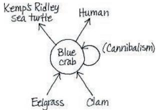

## Chapter 55

## Figure Questions

Figure 55.4 Following the blue arrows with dashed outlines representing chemical cycling—the blue arrow leading to Primary consumers could represent a grasshopper feeding on a plant. The blue arrow leading from Primary consumers to Detritus could represent the remains of a dead primary consumer (such as a grasshopper) becoming part of the detritus found in the ecosystem. The blue arrow leading from Primary consumers to Secondary and tertiary consumers could represent a bird (the secondary consumer) eating a grasshopper (the primary consumer). Finally, the blue arrow leading from Primary consumers to Primary producers could represent $\mathrm{CO}_{2}$ released by a grasshopper in cellular respiration. Figure 55.5 The map does not accurately reflect the productivity of wetlands, coral reefs, and coastal zones because these habitats cover areas that are too small to show up clearly on global maps. Figure 55.6 New duck farms would add extra nitrogen and phosphorus to the water samples used in the experiment. We would expect that the extra phosphorus from these new duck farms would not alter the results (because in the original experiment, phosphorus levels were already so high that adding phosphorus did not increase phytoplankton growth). However, the new duck farms might increase nitrogen levels to the point where adding extra nitrogen in an experiment would not increase phytoplankton density. Figure 55.9 $16.5\%$ of the food consumed is used for growth. Figure 55.12 The availability of water and exposure to light are other factors that may have varied across the sites. Factors such as these that are not included in the experimental design could make the results more difficult to interpret. Multiple factors can also be correlated to each other in nature, so ecologists must be careful that the factor they are studying is actually causing the observed response and is not just correlated with it. Figure 55.13 (1) If the rate of decomposition slowed, more organic materials would be transferred from reservoir A to reservoir B; eventually, this might lead to more organic material becoming fossilized into fossil fuels. In addition, a decrease in decomposition rate would cause fewer inorganic materials to become available as nutrients in reservoir C, which would ultimately slow the rates of nutrient uptake and photosynthesis by living organisms. (2) Materials move into and out of reservoir A on a much shorter time scale than they move into reservoir B. Materials may remain in reservoir B for a very long time, or humans may remove them at a rapid pace by excavating and burning fossil fuels. Figure 55.15 If the $y$ -axis had a consistent scale with no break, the change in nitrate concentration in runoff from one tick mark to the next would remain constant throughout the entire axis. For example, if the $y$ -axis were redrawn to have a consistent scale that ran from 0 to $80~\mathrm{mg / L}$ with nine evenly spaced tick marks, the nitrate concentration would increase by $10~\mathrm{mg / L}$ from each tick mark to the next. Drawing the graph with a consistent scale would emphasize the dramatic increase in nitrate concentration that occurred in 1966, but it would be harder to see other, comparatively small changes that occurred from 1965 to 1968 in both control and deforested areas. Figure 55.19 Populations evolve as organisms interact with each other and with the physical and chemical conditions of their environment. As a result, any human action that alters the environment has the potential to cause evolutionary change. In particular, since climate change has greatly affected arctic ecosystems, we would expect that climate change will cause evolution in arctic tundra populations.

## Concept Check 55.1

1. Energy passes through an ecosystem, entering as sunlight and leaving as heat. It is not recycled within the ecosystem.
2. You would need to know how much biomass the wildebeests ate from your plot and how much nitrogen was contained in that biomass. You would also need to know how much nitrogen they deposited in urine or feces.
3. The second law states that in any energy transfer or transformation, some of the energy is dissipated to the surroundings as heat. For the ecosystem to remain intact, this “escape” of energy from the ecosystem must be offset by the continuous influx of solar radiation.

## Concept Check 55.2

1. Only a fraction of solar radiation strikes plants or algae, only a portion of that fraction is of wavelengths suitable for photosynthesis, and much energy is reflected or lost as heat.
2. By manipulating the level of the factors of interest, such as phosphorus availability or soil moisture, and measuring responses by primary producers.
3. It is likely that NEP would decline after the fire. To see why, recall that $NEP = GPP - R_{T}$ , where GPP is gross primary production and $R_{T}$ is the total amount of cellular respiration in the ecosystem. By killing trees and other plants, the fire would cause GPP to decline from its pre-fire level. In addition, as decomposers broke down the remains of trees killed by fire, the overall amount of cellular respiration ( $R_{T}$ ) in the ecosystem could increase (because of increased cellular respiration by decomposers).
4. The enzyme rubisco, which catalyzes the first step in the Calvin cycle, is the most abundant protein on Earth. Like all proteins, rubisco contains nitrogen, and because photosynthetic organisms require so much rubisco, they also require considerable nitrogen to make it. Phosphorus is also needed as a component of several metabolites in the Calvin cycle and as a component of both ATP and NADPH (see Figure 10.19).

## Concept Check 55.3

1. Production efficiency is calculated for one organism and is the proportion of the energy in the food ingested that is assimilated by the organism and that goes to growth (that is, is not used in respiration). Trophic efficiency is calculated for an entire ecosystem, as the proportion of energy locked in biomass at one trophic level that is incorporated into biomass of the next trophic level. Losses of energy are due to respiration, food not assimilated (that is, lost in feces) and food not eaten. 2. Only 5 joules would go to growth and the production efficiency would be $3.33\%$ $(100\% \times 5$ joules/150 joules). This is much lower than the $33\%$ production efficiency of the caterpillar in Figure 55.9. The greater respiration rate is because the rodent is an endotherm with high metabolism. Therefore, the rodent has lower production efficiency than the caterpillar because more energy is lost in the rodent through cellular respiration. 3. It might gain the advantage of survival against herbivores who will choose to eat other plants based on toxic effects from eating the tobacco leaves.

## Concept Check 55.4

1. For example, for the carbon cycle:

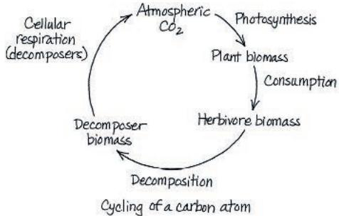

2. Removal of the trees stops nitrogen uptake from the soil, allowing nitrate to accumulate in the soil. The nitrate is washed away by precipitation and enters the streams.
3. Most of the nutrients in a tropical rain forest are contained in the trees, so removing the trees by logging rapidly depletes nutrients from the ecosystem. The nutrients that remain in the soil are quickly carried away into streams and groundwater by the abundant precipitation.

## Concept Check 55.5

1. The main goal is to restore degraded ecosystems to a more natural state. 2. Bioremediation uses organisms—generally prokaryotic organisms, fungi, or plants—to detoxify or remove pollutants from ecosystems. Biological augmentation uses organisms, such as nitrogen-fixing plants, to add essential materials to degraded ecosystems. 3. The Kissimmee River project returns the flow of water to the original channel and restores natural flow, a self-sustaining outcome. Ecologists at the Maungatautari reserve will need to maintain the integrity of the fence indefinitely, an outcome that is not self-sustaining in the long term.

## Summary of Key Concepts Questions

55.1 Because energy conversions are inefficient, with some energy inevitably lost as heat, you would expect that a given mass of primary producers would support a smaller biomass of consumers. 55.2 If you know NPP and want to estimate NEP, you must be able to determine how much of the total respiration ( $R_{T}$ ) results from heterotrophs and how much results from autotrophs. In a sample of ocean water, primary producers and other organisms are usually mixed together, making their respective respirations hard to separate. 55.3 Runners use much more energy in respiration when they are running than when they are sedentary, reducing their production efficiency. 55.4 Factors other than temperature, including a shortage of water and nutrients, slow decomposition in hot deserts. 55.5 If the topsoil and deeper soil are kept separate, the engineers could return the deeper soil to the site first and then apply the more fertile topsoil to improve the success of revegetation and other restoration efforts.

## Test Your Understanding

1. B 2. B 3. A 4. C 5. A 6. D 7. D 8. D (b) On average, the ratio is 1, with equal amounts of water moving from the ocean to land as precipitation and moving from land to ocean in runoff. (c) During an ice age, the amount of ocean evaporation falling on land as precipitation would be greater than the amount returning to the oceans in runoff; thus, the ratio would be 71. The difference would build up on land as ice. 10. The food chain with three trophic levels will have greater biomass of top predators, since less energy is lost in trophic transfers.

9. (a)  
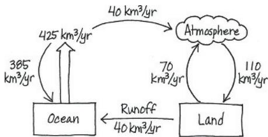

## Chapter 56

## Figure Questions

Figure 56.3 You would need to know the complete range of the species and that it is missing across all of that range. You would also need to be certain that the species isn't hidden, as might be the case for an animal that is hibernating underground or a plant that is present in the form of seeds or spores. Figure 56.8 The two examples are similar in that segments of DNA from the harvested samples were analyzed and compared with segments from specimens of known origin. One difference is that the whale researchers investigated relatedness at species and population levels to determine whether illegal activity had occurred, whereas the elephant investigators determined relatedness at the population level to determine the precise location of the poaching. Another difference is that mtDNA was used for the whale study, whereas nuclear DNA was used for the elephant study. The primary limitations of such approaches are the need to have (or generate) a reference database and the requirement that the organisms have sufficient variation in their DNA to reveal the relatedness of samples. Figure 56.10 The higher the pH, the lower the acidity. Thus, the precipitation in this forest is becoming less acidic. Figure 56.12 Answers may vary, but there are two reasons not to support transplanting additional birds. First, the Illinois population has a different genetic makeup than birds in other regions, and you would want to maintain to the greatest extent possible the frequency of beneficial genes or alleles found only in the Illinois population. Second, the translocation of birds from other states already caused the percentage of hatched eggs to increase dramatically, indicating that the transplantation of additional birds is not necessary. Figure 56.14 The natural disturbance regime in this habitat includes frequent fires that clear undergrowth but do not kill mature pine trees. Without these fires, the undergrowth quickly fills in and the habitat becomes unsuitable for red-cockaded woodpeckers. Figure 56.16 The photo shows edges between forest and grassland ecosystems, and grassland and river ecosystems. Figure 56.24 The PCB concentration increased by a factor of 4.9 from phytoplankton to zooplankton, 41.6 from phytoplankton to smelt, 8.5 from zooplankton to smelt, 4.6 from smelt to lake trout, 119.2 from smelt to herring gull eggs, and 25.7 from lake trout to herring gull eggs. Figure 56.31 Ocean acidification reduces the availability of carbonate ions $(\mathrm{CO}_3^{2-})$ . Corals and many other marine organisms require carbonate ions to build their shells. Since shell-building organisms depend upon their shells for survival, scientists have predicted that ocean acidification will cause many shell-building organisms to die. In turn, increased mortality rates of organisms that build shells would cause many other changes to ecological communities. For example, increased mortality rates of corals would harm the many other species that seek protection in coral reefs or that feed upon the species living there. Figure 56.32 The model results in the dashed blue curve (natural factors only) and the results in the dotted black curve (natural and human factors) both provide a good match to observed temperature changes until about 1960. After 1960, however, the results in the dashed blue curve are a poor match to observed temperature changes, whereas the results in the dotted black curve continue to provide a good match. These results suggest that human activities such as burning fossil fuels have contributed to the observed rise in global temperatures, especially for the period 1960 to the present.

## Concept Check 56.1

1. In addition to species loss, the biodiversity crisis includes the loss of genetic diversity within populations and species and the degradation of entire ecosystems. 2. Habitat destruction, such as deforestation, channelizing of rivers, or conversion of natural ecosystems to agriculture or cities, deprives species of places to live. Introduced species, which are transported by humans to regions outside their native range, often reduce the population sizes of native species through competition or by feeding on them (as predators, herbivores, or pathogens). Overharvesting has reduced populations of plants and animals or driven them to extinction. Finally, global change is altering the environment to the extent that it reduces the capacity of Earth to sustain life. 3. If both populations breed separately, then gene flow between the populations would not occur and genetic differences between them would be greater. As a result, the loss of genetic diversity would be greater than if the populations interbreed.

## Concept Check 56.2

1. Reduced genetic variation decreases the capacity of a population to evolve in the face of change.
2. The effective population size, $N_{e}$ , would be $4(30 \times 10)/(30 + 10) = 30$ birds. 3. Because millions of people use the greater Yellowstone ecosystem each year, it would be impossible to eliminate all contact between people and bears. Instead, you might try to reduce the kinds of encounters where bears are killed. You might recommend lower speed limits on roads in the park, adjust the timing or location of hunting seasons (where hunting is allowed outside the park) to minimize contact with adult female bears and their cubs, and provide financial incentives for livestock owners to try alternative means of protecting livestock, such as using guard dogs.

## Concept Check 56.3

1. A small area supporting numerous endemic species as well as a large number of endangered and threatened species 2. Zoned reserves may provide sustained supplies of forest products, water, hydroelectric power, educational opportunities, and income from tourism. 3. Habitat corridors can increase the rate of movement or dispersal of organisms between habitat patches and thus the rate of gene flow between subpopulations. They thus help prevent a decrease in fitness attributable to inbreeding. They can also minimize interactions between organisms and humans as the organisms disperse; in cases involving potential predators, such as bears or large cats, minimizing such interactions is desirable.

## Concept Check 56.4

1. Adding nutrients causes population explosions of algae and the organisms that feed on them. Increased respiration by algae and consumers, including decomposers, depletes the lake's oxygen, which the fish require.
2. Decomposers are consumers that use nonliving organic matter as fuel for cellular respiration, which releases $CO_{2}$ as a by-product. Because higher temperatures lead to faster decomposition, organic matter in these soils could be decomposed to $CO_{2}$ more rapidly, thereby speeding up global warming.
3. Reduced concentrations of ozone in the atmosphere increase the amount of UV radiation that reaches Earth's surface and the organisms living there. UV radiation can cause mutations by producing disruptive thymine dimers in DNA.

## Concept Check 56.5

1. Sustainable development is an approach to development that works toward the long-term prosperity of human societies and the ecosystems that support them, which requires linking the biological sciences with the social sciences, economics, and humanities.
2. Biophilia, our sense of connection to nature and all forms of life, may act as a significant motivation for the development of an environmental ethic that resolves not to allow species to become extinct or ecosystems to be destroyed. Such an ethic is necessary if we are to become more attentive and effective custodians of the environment.
3. At a minimum, you would want to know the size of the population and the average reproductive rate of the individuals in it. To develop the fishery sustainably, you would seek a harvest rate that maintains the population near its original size and maximizes its harvest in the long term rather than the short term.

## Summary of Key Concepts Questions

56.1 Nature provides us with many beneficial services, including a supply of reliable, clean water, the production of food and fiber, and the dilution and detoxification of our pollutants. 56.2 A more genetically diverse population is better able to withstand pressures from disease or environmental change, making it less likely to become extinct over a given period of time. 56.3 Habitat fragmentation can isolate populations, leading to inbreeding and genetic drift, and it can make populations more susceptible to local extinctions resulting from edge effects, including a change in physical conditions and an increase in competition or predation with edge-adapted species. 56.4 It's healthier to feed at a lower trophic level because biological magnification increases the concentration of toxins at higher levels. 56.5 One goal of conservation biology is to preserve as many species as possible. Sustainable approaches that maintain the quality of habitats are required for the long-term survival of organisms.

## Test Your Understanding

1. C 2. D 3. B 4. A 5. B 6. D

  
To minimize the area of forest into which the cowbirds penetrate, you should locate the road along the west edge of the reserve (since that edge abuts deforested pasture and an agricultural field). Any other location would increase the area of affected habitat. Similarly, the maintenance building should be in the southwest corner of the reserve to minimize the area susceptible to cowbirds.

# Appendix B

## Classification of Life

This appendix presents a taxonomic classification for the major extant groups of organisms discussed in this text; not all kingdoms or phyla are included. Various alternative classification schemes are discussed in Unit Five of the text. The many active areas of

taxonomic research include debates about the earliest branchings of the tree of life; the classification of newly identified organisms; and the definition and boundaries of species, kingdoms, and other groups and how they relate to the findings of cladistic analysis.

## BACTERIA

\- Proteobacteria

Chlamydia

\- Spirochetes

In the phylogenetic hypothesis we present in Chapter 28, some major clades of eukaryotes are grouped together in the “supergroups” listed in bold blue type. Formerly, all the eukaryotes generally called protists were assigned to a single kingdom, Protista. However, advances in systematics have made it clear that some protists are more closely related to plants, fungi, or animals than they are to other protists. As a result, the kingdom Protista has been abandoned as a formal group, though the informal term protist is still useful for collectively referring to the many diverse (mostly unicellular) eukaryotes that are not plants, fungi, or animals.

Cyanobacteria

\- Gram-positive Bacteria

## ARCHAEA\*

Euryarchaeota

Thaumarchaeota

Aigarchaeota

Crenarchaeota

\- Korarchaeota

\- Asgardarcheota

  
\*As discussed in Unit Five, here the term Archaea refers to prokaryotic species, though many phylogenetic studies now place Eukarya as the sister group to a prokaryotic clade within Archaea (see Chapter 26).

Discoba (discobans)

Kinetoplastida (kinetoplastids)
Euglenophyta (euglenids)

■ Metamonada (metamonadans)

■ Haptophyta (haptophytes)

■ Cryptophyta (cryptophytes)

## SAR

\- Stramenopila (stramenopiles)
Oomycota (oomycetes)
Phaeophyta (brown algae)
Bacillariophyta (diatoms)

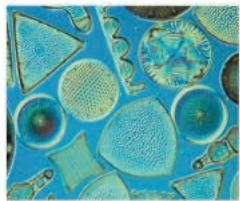

Alveolata (alveolates)

Dinoflagellata (dinoflagellates)
Apicomplexa (apicomplexans)
Ciliophora (ciliates)

Rhizaria (rhizarians)

Radiolaria (radiolarians)

Foraminifera (forams)

Cercozoa (cercozoans)

## EUKARYA

## Archaeplastida

Rhodophyta (red algae)

\- Chlorophyta (green algae: chlorophytes)

\- Charophyta (green algae: charophytes)

## Plantae

Phylum Hepatophyta (liverworts)
Phylum Bryophyta (mosses)

Phylum Anthocerophyta (hornworts)

Phylum Lycophyta (lycophytes)

Phylum Monilophyta (ferns, horsetails, whisk ferns)

Phylum Ginkgophyta (ginkgo)

Phylum Cycadophyta (cycads)

Phylum Gnetophyta (gnetophytes)

Phylum Coniferophyta (conifers)

Phylum Anthophyta (flowering plants)

Nonvascular plants (bryophytes)

Seedless vascular plants

Gymnosperms

Seed plants

Angiosperms

EUKARYA, continued

## Amorphea (formerly called Unikonta)

\- Amoebozoa (amoebozoans)
Tubulinea (tubulinids)
Myxogastrida (plasmodial slime molds)
Dictyostelida (cellular slime molds)
Archamoeba (archamoebans)

Nucleariida (nucleariids)

Fungi
Phylum Cryptomycota (cryptomycetes)
Phylum Microsporidia (microsporidians)
Phylum Chytridiomycota (chytrids)
Phylum Zoopagomycota (zoopagomycetes)
Phylum Mucoromycota (mucoromycetes)
Phylum Ascomycota (ascomycetes)
Phylum Basidiomycota (basidiomycetes)

\- Choanoflagellata (choanoflagellates)

Animalia

Phylum Porifera (sponges)

Phylum Ctenophora (comb jellies)

Phylum Cnidaria (cnidarians)

Medusozoa (hydrozoans, jellies, box jellies)

Anthozoa (sea anemones and most corals)

Phylum Xenacoelomorpha (acoel flatworms)

Phylum Placozoa (placozoans)

Lophotrochozoa (lophotrochozoans)

Phylum Platyhelminthes (flatworms)

Catenulida (chain worms)

Rhabditophora (planarians, flukes, tapeworms)

Phylum Nemertea (ribbon worms)

Phylum Ectoprocta (ectoprocts)

Phylum Brachiopoda (brachiopods)

Phylum Syndermata (rotifers and spiny-headed worms)

Phylum Gastrotricha (gastrotrichs)

Phylum Cycliophora (cycliophorans)

Phylum Mollusca (molluscs)

Polyplacophora (chitons)

Gastropoda (gastropods)

Bivalvia (bivalves)

Cephalopoda (cephalopods)

Phylum Annelida (segmented worms)
Errantia (errantians)
Sedentaria (sedentarians)

Ecdysozoa (ecdysozoans)

Phylum Loricifera (loriciferans)
Phylum Priapula (priapulans)
Phylum Nematoda (roundworms)
Phylum Arthropoda (This survey groups arthropods into a single phylum, but some zoologists now split the arthropods into multiple phyla.)
Chelicerata (horseshoe crabs, arachnids)
Myriapoda (millipedes, centipedes)
Pancrustacea (crustaceans, insects)
Phylum Tardigrada (tardigrades)
Phylum Onychophora (velvet worms)

Deuterostomia (deuterostomes)

Phylum Hemichordata (hemichordates)
Phylum Echinodermata (echinoderms)
Asteroidea (sea stars, sea daisies)
Ophiuroidea (brittle stars)
Echinoidea (sea urchins, sand dollars)
Crinoidea (sea lilies)
Holothuroidea (sea cucumbers)

Phylum Chordata (chordates)
Cephalochordata (cephalochordates: lancelets)
Urochordata (urochordates: tunicates)

Cyclostomata (cyclostomes)
Myxini (hagfishes)
Petromyzontida (lampreys)
Gnathostomata (gnathostomes)
Chondrichthyes (sharks, rays, chimaeras)
Actinopterygii (ray-finned fishes)
Actinistia (coelacanths)
Dipnoi (lungfishes)
Amphibia (amphibians: frogs, salamanders, caecilians)
Reptilia (reptiles: tuataras, lizards, snakes, turtles, crocodilians, birds)
Mammalia (mammals)

Vertebrates

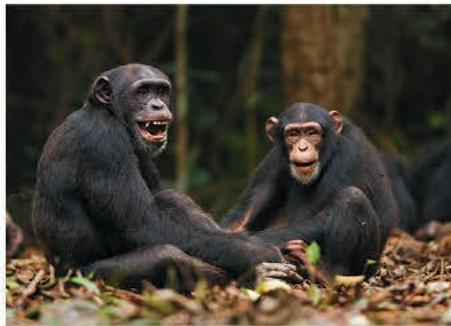

## Appendix C

# A Comparison of the Light Microscope and the Electron Microscope

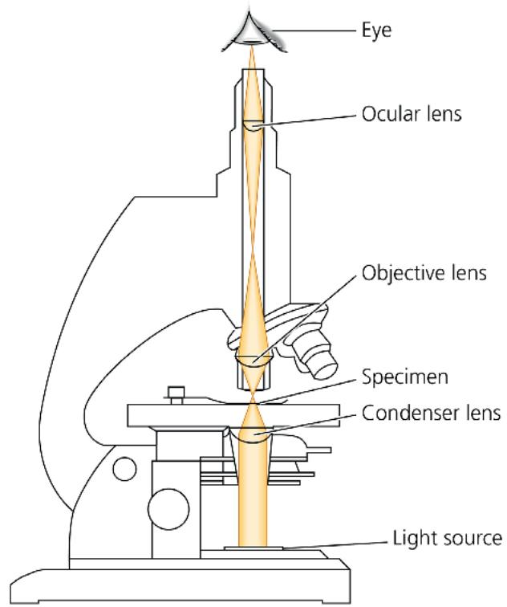

## Light Microscope

In light microscopy, light is focused on a specimen by a glass condenser lens; the image is then magnified by an objective lens and an ocular lens for projection on the eye, digital camera, digital video camera, or photographic film.

## Electron Microscope

In electron microscopy, a beam of electrons (top of the microscope) is used instead of light, and electromagnets are used instead of glass lenses. The electron beam is focused on the specimen by a condenser lens; the image is magnified by an objective lens and a projector lens for projection on a digital detector, fluorescent screen, or photographic film.

If the second data set has a different dependent variable or different units, it may be plotted on the right vertical axis.

Each axis is divided into equal intervals, which are indicated by numbered tick marks along the axis.

# Appendix D Scientific Skills Review

## Graphs

Graphs provide a visual representation of numerical data. They may reveal patterns or trends in the data that are not easy to recognize in a table. A graph is a diagram that shows how one variable in a data set is related (or perhaps not related) to another variable. The independent variable is the factor that

A scatter plot is used when the data for all variables are numerical and continuous. Each piece of data is represented by a point. In a line graph, each data point is connected to the next point in the data set with a straight line, as in the graph shown here of number of species present over time. (To practice making and interpreting scatter plots and line graphs, see the Scientific Skills Exercises in Chapters 2, 3, 7, 8, 10, 13, 19, 24, 34, 43, 47, 49, 50, 52, 54, and 56.)

is manipulated or changed by the researchers. The dependent variable is the factor that the researchers are measuring in relation to the independent variable. The independent variable is typically plotted on the x-axis and the dependent variable on the y-axis. Types of graphs that are frequently used in biology include scatter plots, line graphs, bar graphs, and histograms.

The dependent variable, in this case the number of species present, is plotted on the vertical (y) axis.

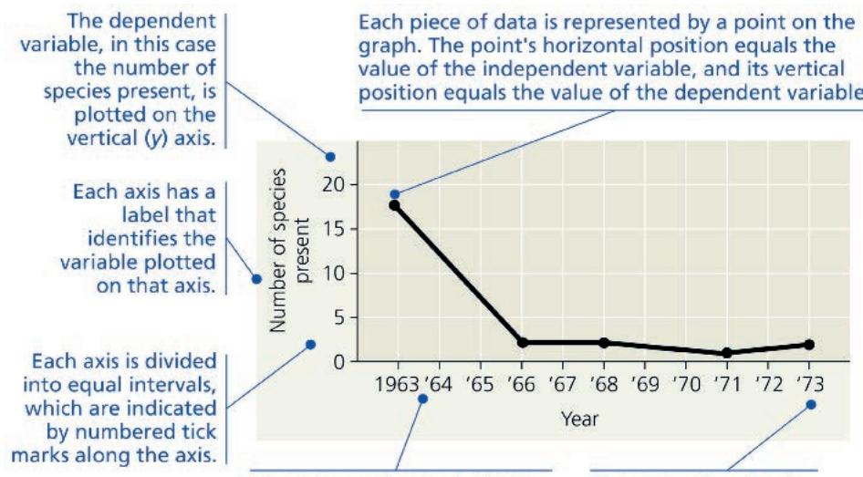  
Each piece of data is represented by a point on the graph. The point's horizontal position equals the value of the independent variable, and its vertical position equals the value of the dependent variable.  
The independent variable, in this case time (year), is plotted on the horizontal (x) axis.  
The span of each axis covers all the data that are plotted.

Two or more data sets can be plotted on the same line graph to show how two dependent variables are related to the same independent variable. (To practice making and interpreting line graphs with two or more data sets, see the Scientific Skills Exercises in Chapters 7, 43, 47, 49, 50, 52, and 56.)

The plotted data sets are identified by labels on the graph (as shown here) or by a key.

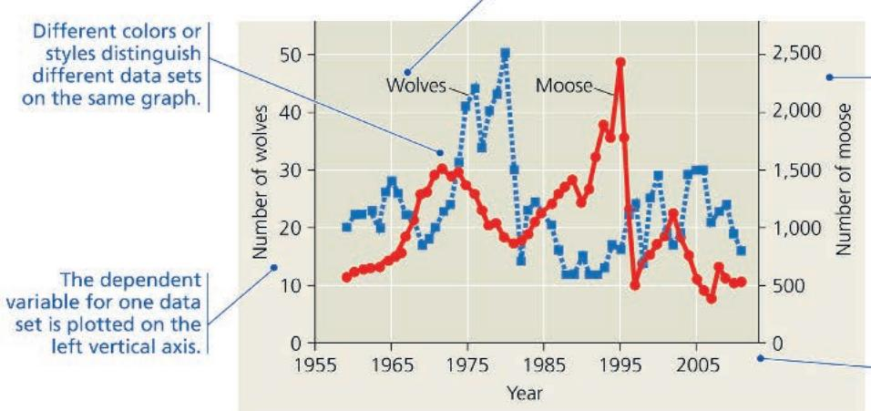  
The dependent variable for one data set is plotted on the left vertical axis.  
Because both data sets have the same independent variable, there is only one horizontal axis.

In some scatter plot graphs, a straight or curved line is drawn through the entire data set to show the general trend in the data. A straight line that mathematically best fits the data is called a regression line. Alternatively, a mathematical function that best fits the data may describe a curved line, often termed a best-fit curve. (To practice making and interpreting regression lines, see the Scientific Skills Exercises in Chapters 3, 10, and 34.)

  
The regression line can be expressed as a mathematical equation. It allows you to predict the value of the dependent variable for any value of the independent variable within the span of the data set and, less commonly, beyond the span of the data.

A bar graph is a kind of graph in which the independent variable represents groups or nonnumerical categories and the values of the dependent variable(s) are shown by bars. (To practice making and interpreting bar graphs, see the Scientific Skills Exercises in Chapters 1, 9, 18, 22, 25, 29, 33, 35, 39, 51, 52, and 54.)

Each piece of data is represented by a bar on the graph. The top of the bar aligns with the value of the dependent variable.

As in a line graph or scatter plot, the vertical axis is usually used for the dependent variable.

The axis for the dependent variable is labeled and divided into equal intervals indicated by numbered tick marks.

If multiple data sets are plotted on the same bar graph, they are distinguished by bars of different colors or styles and identified by labels or a key.

The groups or categories of the independent variable are usually spaced equally along the horizontal axis. (In some bar graphs, the horizontal axis is used for the dependent variable and the vertical axis for the independent variable.)

A variant of a bar graph called a histogram can be made for numeric data by first grouping, or “binning,” the variable plotted on the x-axis into intervals of equal width. The “bins” may be integers or spans of numbers. In the histogram shown here, the intervals are 25 mg/dL wide. The height of each bar shows the percent (or, alternatively, the number) of experimental subjects whose characteristics can be described by one of the intervals plotted on the x-axis. (To practice making and interpreting histograms, see the Scientific Skills Exercises in Chapters 12, 14, and 42.)

The height of this bar shows the percent of individuals (about 4%) whose plasma LDL cholesterol levels are in the interval indicated on the x-axis.  
  
This interval runs from 50 to 74 mg/dL.

## Glossary of Scientific Inquiry Terms

See Concept 1.3 for more discussion of the process of scientific inquiry.

control group In a controlled experiment, a set of subjects that lacks (or does not receive) the specific factor being tested. Ideally, the control group is identical to the experimental group in other respects.

controlled experiment An experiment designed to compare an experimental group with a control group; ideally, the two groups differ only in the factor being tested.

data Recorded observations.

deductive reasoning A type of logic in which specific results are predicted from a general premise.

dependent variable A factor whose value is measured during an experiment to see whether it is influenced by changes in another factor (the independent variable).

experiment A scientific test. Often carried out under controlled conditions that involve manipulating one factor in a system in order to see the effects of changing that factor.

experimental group A set of subjects that has (or receives) the specific factor being tested in a controlled experiment. Ideally, the experimental group is identical to the control group for all other factors.

## Chi-Square ( $\chi^{2}$ ) Distribution Table

To use the table, find the row that corresponds to the degrees of freedom in your data set. (The degrees of freedom is the number of categories of data minus 1.) Move along that row to the pair of hypothesis A testable explanation for a set of observations based on the available data and guided by inductive reasoning. A hypothesis is narrower in scope than a theory.

independent variable A factor whose value is manipulated or changed during an experiment to reveal possible effects on another factor (the dependent variable).

inductive reasoning A type of logic in which generalizations are based on a large number of specific observations.

inquiry The search for information and explanation, often focusing on specific questions.

model A physical or conceptual representation of a natural phenomenon.

prediction In deductive reasoning, a forecast that follows logically from a hypothesis. By testing predictions, experiments may allow certain hypotheses to be rejected.

theory An explanation that is broader in scope than a hypothesis, generates new hypotheses, and is supported by a large body of evidence.

variable A factor that varies during an experiment.

values that your calculated $\chi^{2}$ value lies between. Move up from those numbers to the probabilities at the top of the columns to find the probability range for your $\chi^{2}$ value. A probability of 0.05 or less is generally considered significant. (To practice using the chi-square test, see the Scientific Skills Exercise in Chapter 15.)

<table><tr><td rowspan="2">Degrees of Freedom (df)</td><td colspan="11">Probability</td></tr><tr><td>0.95</td><td>0.90</td><td>0.80</td><td>0.70</td><td>0.50</td><td>0.30</td><td>0.20</td><td>0.10</td><td>0.05</td><td>0.01</td><td>0.001</td></tr><tr><td>1</td><td>0.004</td><td>0.02</td><td>0.06</td><td>0.15</td><td>0.45</td><td>1.07</td><td>1.64</td><td>2.71</td><td>3.84</td><td>6.64</td><td>10.83</td></tr><tr><td>2</td><td>0.10</td><td>0.21</td><td>0.45</td><td>0.71</td><td>1.39</td><td>2.41</td><td>3.22</td><td>4.61</td><td>5.99</td><td>9.21</td><td>13.82</td></tr><tr><td>3</td><td>0.35</td><td>0.58</td><td>1.01</td><td>1.42</td><td>2.37</td><td>3.66</td><td>4.64</td><td>6.25</td><td>7.82</td><td>11.34</td><td>16.27</td></tr><tr><td>4</td><td>0.71</td><td>1.06</td><td>1.65</td><td>2.19</td><td>3.36</td><td>4.88</td><td>5.99</td><td>7.78</td><td>9.49</td><td>13.28</td><td>18.47</td></tr><tr><td>5</td><td>1.15</td><td>1.61</td><td>2.34</td><td>3.00</td><td>4.35</td><td>6.06</td><td>7.29</td><td>9.24</td><td>11.07</td><td>15.09</td><td>20.52</td></tr><tr><td>6</td><td>1.64</td><td>2.20</td><td>3.07</td><td>3.83</td><td>5.35</td><td>7.23</td><td>8.56</td><td>10.64</td><td>12.59</td><td>16.81</td><td>22.46</td></tr><tr><td>7</td><td>2.17</td><td>2.83</td><td>3.82</td><td>4.67</td><td>6.35</td><td>8.38</td><td>9.80</td><td>12.02</td><td>14.07</td><td>18.48</td><td>24.32</td></tr><tr><td>8</td><td>2.73</td><td>3.49</td><td>4.59</td><td>5.53</td><td>7.34</td><td>9.52</td><td>11.03</td><td>13.36</td><td>15.51</td><td>20.09</td><td>26.12</td></tr><tr><td>9</td><td>3.33</td><td>4.17</td><td>5.38</td><td>6.39</td><td>8.34</td><td>10.66</td><td>12.24</td><td>14.68</td><td>16.92</td><td>21.67</td><td>27.88</td></tr><tr><td>10</td><td>3.94</td><td>4.87</td><td>6.18</td><td>7.27</td><td>9.34</td><td>11.78</td><td>13.44</td><td>15.99</td><td>18.31</td><td>23.21</td><td>29.59</td></tr></table>

## Mean and Standard Deviation

The mean is the sum of all data points in a data set divided by the number of data points. The mean (or average) represents a “typical” or central value around which the data points are clustered. The mean of a variable x (denoted by $\overline{x}$ ) is calculated from the following equation:

$$
\overline {{x}} = \frac {\sum_ {i = 1} ^ {n} x _ {i}}{n}
$$

In this formula, n is the number of observations, and $x_{i}$ is the value of the ith observation of variable x; the “ $\Sigma$ ” symbol indicates that the n values of $x_{i}$ are to be summed. (To practice calculating the mean, see the Scientific Skills Exercises in Chapters 27, 32, and 34.)

The standard deviation provides a measure of the variation found in a set of data points. The standard deviation (s) of a variable x is calculated from the following equation:

$$
s = \sqrt {\frac {\sum_ {i = 1} ^ {n} (x _ {i} - \overline {{x}}) ^ {2}}{n - 1}}
$$

In this formula, n is the number of observations, $x_{i}$ is the value of the ith observation of variable x, and $\overline{x}$ is the mean of x; the “ $\Sigma$ ” symbol indicates that the n values of $(x_{i}-\overline{x})^{2}$ are to be summed. (To practice calculating standard deviation, see the Scientific Skills Exercises in Chapters 27, 32, and 34.)

## Performing a t-Test

One way to assess whether the results of an experiment are statistically significant is to perform a t-test. Consider an experiment in which one group of bean plants was treated with fertilizer, whereas a control group was not. Before beginning the experiment, the researchers hypothesized that fertilizer would not affect plant height (the fertilizer would neither increase plant height nor decrease it).

When the experiment was completed, the fertilized plants appeared overall to have grown taller than the unfertilized ones—that is, the mean height of the fertilized plants was greater than the mean height of the unfertilized ones. This result suggests that the fertilizer did, in fact, have an effect and, hence, that the two means are not equal. However, it is also possible that the different means in the two study groups resulted from natural variation of plant heights within the two groups, particularly if the total number of plants is small. How can we determine the likelihood that the observed differences are meaningful and therefore indicate that the fertilizer had an effect? The t-test provides a standardized way to decide whether the fertilizer had a significant effect on mean plant height.

$$
T = \frac {\overline {{x}} _ {1} - \overline {{x}} _ {2}}{\sqrt {\frac {(s _ {1} ^ {2} + s _ {2} ^ {2})}{n}}}
$$

To perform a t-test, the first step is to calculate the value T (named for “t-test”):

In this equation, $\overline{x}_{1}$ is the mean for the experimental group (fertilized plants), $\overline{x}_{2}$ is the mean for the control group (unfertilized plants), $s_{1}$ is the standard deviation for the experimental group, and $s_{2}$ is the standard deviation for the control group. Finally, n is the number of observations in each of the groups. [Note: The formula shown here is valid when the experimental and control groups have the same number of observations (n). A different formula would be used if the two groups had different numbers of observations.]

To calculate T, plug in the values for $\overline{x}_{1}$ , $\overline{x}_{2}$ , $s_{1}$ , $s_{2}$ , and n. T will be close to zero when the means $\overline{x}_{1}$ and $\overline{x}_{2}$ are nearly equal, and T will be farther from zero (will differ more greatly from zero) when the means are considerably different.

Is the calculated value T different enough from zero to reject the hypothesis that the two means are equal? This decision is based on the probability $(p)$ that an observed difference between two means could have occurred simply by chance (assuming the initial hypothesis was correct, that is, that the two means are equal). The value of p can be determined using a t distribution that has $2(n - 1)$ degrees of freedom, where n is the number of observations. When p is small (typically, when it is less than 0.05), we reject the hypothesis that the means $\overline{x}_{1}$ and $\overline{x}_{2}$ are equal. The value of p can be obtained from an online calculator or looked up in tables for t distributions in a statistics textbook.

# Appendix E

# Word Roots, Prefixes, and Suffixes for Learning Vocabulary

These common word roots, prefixes, and suffixes and their meanings are a useful study tool to help you understand and remember vocabulary terms in biology (and in general).

a-, an- not, without (abiotic, anaerobic, aphotic zone, asexual reproduction)

allo- different (allosteric regulation, allopatric speciation, allopolyploidy)

anti- opposite (antibody, anticodon, antidiuretic hormone, antigen, antiparallel)

aqu, aque water (aquaporin, aqueous solution)

arch ancient, beginning (Archaea, archenteron)

auto-self (autoimmune disease, autopolyploidy, autosome, autotroph)

bio life, living (biodiversity, bioenergetics, biofilm, biofuel, biogeography, biology, bioinformatics, biomass, bioremediation, biosphere, biotic)

chloro- green (chloroplast, chlorophyll, chlorophyte)

chrom color (chromatin, chromosome, chromatophore, phytochrome)

co-, com-, con- together (codominance, coenzyme, cofactor, commensalism, community, conjugation, corepressor, cotransport, covalent)

cyto-, -cyte cell (choanocyte, cytochrome, cytokinesis, cytoplasm, cytoskeleton, cytosol, lymphocyte, phagocytosis)

derm skin (dermal tissue, endoderm, endodermis, epidermis, mesoderm, periderm)

ecto- outside, outer (ectoderm, ectomycorrhizae, ectoparasite, ectotherm)

endo- inner, within (endocrine gland, endoderm, endocytosis, endomembrane system, endometrium, endoskeleton, endosperm, endospore, endosymbiosis, endothelium, endotherm, endotoxin)

epi- beside, on (epicotyl, epidemic, epididymis, epigenetics, epiphyte, epistasis, epithelium, epitope)

eu- good, true (euchromatin, eukaryote, eumetazoan, eutherian, eutrophic)

ex-, exo-, extra- out, outer (excretion, exergonic reaction, exocrine gland, exocytosis, exoskeleton, exotoxin)

gastr, gastro stomach, belly (gastric juice, gastrula, gastrovascular cavity, gastrulation, gastropod)

-gen produce, producing (mutagen, carcinogen, electrogenic pump, gametogenesis, oogenesis, organogenesis, spermatogenesis)

hem, hemo blood (hemoglobin, hemolymph, hemophilia)

hetero- other (heterochrony, heterotroph, heterozygote)

homeo-, homo- similar, like (homeobox, homeostasis, homeotic gene, homologous chromosomes, homology, homoplasy, homozygote)

hydr-, hydro- water (hydration shell, hydrolysis, hydrophilic, hydrophobic, hydroponic culture, hydrostatic skeleton)

hyper-exceeding (hyperosmotic, hyperpolarization, hypertension)

hypo- lower (hypocotyl, hypoosmotic, hypotonic)

inter- between (interneuron, internode, interphase, interspecific interaction, interstitial fluid, intertidal zone)

intr-, intra- within (intrasexual selection, intron)

iso- equal (isomer, isotonic, isotope)

kine, kinet moving, movement (cytokinin, kinesis, kinetochore, kinetic energy)

lig bind, tie (DNA ligase, ligament, ligand)

lyse, lysis, lyze break, split (catalysis, hydrolysis, lysosome, plasmolysis)

macro-, mega- big (macromolecule, macronutrient, macrophage, megaphyll, megaspore)

meso- middle (mesoderm, mesophyll)

meta- between (metaphase, metapopulation, metastasis)

micro- small (microbiome, microfilament, micronutrient, microphyll, microRNA, microscope, microspore, microtubule, microvillus)

-morph, morpho- form, shape (heteromorphic, morphogenesis, morphology, nucleomorph, sexual dimorphism)

para- beside (paraphyletic, parasite, parasympathetic division)

phage, phago to eat (bacteriophage, macrophage, phagocytosis)

-phil, -philic loving (extremophile, halophile, hemophilia, hydrophilic, neutrophil)

-phob, -phobic fearing (hydrophobic)

photo light (photic zone, photomorphogenesis, photon, photoperiodism, photophosphorylation, photoreceptor, photosynthesis, photosystem, phototropism)

phyll leaf (chlorophyll, microphyll, megaphyll)

phyte, phyto plant (bryophyte, gametophyte, lycophyte, sporophyte)

(Continued on next page)

-pod foot (pseudopodium, gastropod, cephalopod, arthropod)

post- after, behind (posterior pituitary, postzygotic barrier)

pre-, pro- before (prediction, prezygotic barrier, prokaryotic cell, prometaphase, prophase, provirus)

proto-first, original (protocoll, proto-oncogene, protoplast)

pseudo- false (pseudogene, pseudopodium)

rhiza, rhizo root (coleorhiza, mycorrhizae, rhizobacterium, rhizoid, rhizosphere)

soma, -some a body (centrosome, chromosome, desmosome, lysosome, nucleosome, ribosome, somatic cell)

# Common Prefixes for Number/Quantity

bi-, bin- two (bilateral symmetry, binary fission, binomial)

di- two (dioecious, dihybrid cross, diploid, disaccharide, disulfide bridge, sexual dimorphism)

haplo- single (haploid cell)

mono- one (monoclonal antibody, monogamy, monohybrid cross, monomer, monophyletic group, monosaccharide)

multi- many (multifactorial, multigene, multiple fruit)

omni- all (omnivore)

stoma mouth (peristome, stomata)

sym-, syn- together (symbiosis, sympatric speciation, symplast, synapse, synaptonemal complex)

therm, thermo- temperature (ectotherm, endotherm, thermal energy, thermocline, thermodynamics, thermophile, thermoreceptor, thermoregulation)

trans- across (cotransport, transcription, transduction, transformation, transgenic, translation, translocation, transpiration, transposon, transverse tubule)

troph food, eating (trophic level, autotroph, chemotroph, heterotroph)

pan- all (pandemic, Pangaea)

pleio- more, several (pleiotropy)

poly- many (polygamy, polygenic inheritance, polymer, polynucleotide, polypeptide, polyphyletic, polyploidy, polysaccharide, polytomy)

semi-half (semicircular canals, semiconservative model, semilunar valve)

tetra- four (tetrapod, tetraploid)

tri-, trip- three (triacylglycerol, triplet code, triploid, trisomy)

uni-one (unikont)

## Credits

## Photo Credits

About the Authors Peter Vilotti/Pearson Education; Neil Campbell Pearson Education; iPhone, iPad Pixedon; Preface Paul Starosta/Stone/Getty Images; Figure 21.5 Sorantin, E., Grasser, M.G., Hemmelmayr, A. et al. The augmented radiologist: artificial intelligence in the practice of radiology. Pediatr Radiol 52, 2074–2086 (2022). https://doi.org/10.1007/s00247-021-05177-7; Figure 33.4 Andrew J. Martinez/Science Source; buffalo Arco/G. Lacz/imageBROKER.com GmbH & Co. KG/Alamy Stock Photo; E. coli Kwangshin Kim/Science Source; Interviews — Anseth Glenn Asakawa; Theriot Matthew Footer; Sabeti Ore Huiying/Getty Images for TIME; Shubin Neil Shubin; Dunn Yale Peabody Museum; Gianoli Ernesto Gianoli; Bratcher Adrienne Bratcher; Bonaccorso Universidad San Francisco de Quito.

Chapter 1 1.1 top J.B. Miller/Florida Department of Environmental Protection; beach mouse Hopi Hoekstra/Harvard University; inland mouse Szasz-Fabian Jozsef/Shutterstock; 1.2 sunflower Reyda Val/Shutterstock; pipefish Scubazoo/Science Source; rabbit Joe McDonald/Getty Images; butterfly Louise Docker Sydney Australia/Moment/Getty Images; seedling Georgette Apol/Alamy Stock Photo; venus flytrap Maximilian Weinzierl/Alamy Stock Photo; giraffe imageBROKER/Malcolm Schuyl/Alamy Stock Photo; 1.3 biosphere Leonello Calvetti/Stocktrek Images/Getty Images; ecosystems Terry Donnelly/Alamy Stock Photo; communities, populations Floris van Breugel/Nature Picture Library; organisms Greg Vaughn/Alamy Stock Photo; organs Pat Burner/Pearson Education; tissues Dr. Jeremy Burgess/Science Source; cells Andreas Holzenburg, University of Texas Rio Grande Valley; organelles Jeremy Burgess/Science Source; hummingbird Jim Zipp/Science Source; 1.4 left to right Steve Gschmeissner/Science Source; CNRI/Science Source; 1.5 Conly L. Rieder, Wadsworth Center, Albany, NY; 1.6 Gelpi/Shutterstock; 1.8a Carol Yepes/Moment/Getty Images; inset Ralf Dahm/Max Planck Institute of Neurobiology; 1.11 Eyal Bartov/Alamy Stock Photo; 1.12 Kefca/Shutterstock; 1.13a, b Eye of Science/Science Source; 1.13c Plantae John R. Delapp/Design Pics Inc /Alamy Stock Photo; Fungi 635926/Shutterstock; Animalia Anup Shah/Nature Picture Library; protists M. I. Walker/Science Source; 1.14 lake Basel101658/Shutterstock; paramecium SPL/Science Source; cilium Dartmouth College Electron Microscope Facility; cilia Steve Gschmeissner/Science Source; 1.15 Patrick Aventurier/Getty Images; 1.16 left G. Richmond/FineArt/Alamy Stock Photo; 1.16 right Origin of Species/Charles Darwin, 1859. Murray edition; 1.17 hawk jhayes44/E+/Getty Images; robin Sebastian Knight/Shutterstock; flamingo zhaoyan/Shutterstock; penguin Volodymyr Goinyk/Shutterstock; 1.19 Dorling Kindersley ltd/Alamy Stock Photo; 1.21 Penelope Breese/Hulton Archive/Getty Images; Goodall Jim Dallas/Alamy Stock Photo; 1.23 top to bottom, left to right Martin Shields/Alamy Stock Photo; xpacifica/Getty Images; Rolf Hicker Photography/All Canada Photos/Alamy Stock Photo; Maureen Spuhler/Pearson Education; 1.24 left HildeAnna/Shutterstock; inset Courtesy of Hopi Hoekstra/Harvard University; right Sacha Vignieri; inset Szasz-Fabian Jozsef/Shutterstock; 1.25 From: The selective advantage of cryptic coloration in mice. Vignieri, S. N., J. Larson, and H. E. Hoekstra. 2010. Evolution 64:2153–2158. Fig. 1; Hoekstra Josh Frost/Pearson Education; Scientific Skills Exercise Rolf Nussbaumer Photography/Alamy Stock Photo; 1.26 White John Amis/AP Images; DeJac Don Heupel/AP Images; Morton LBJ Presidential Library/Alamy Stock Photo; Aguirre-Jarquin McClatchy-Tribune/Tribune Content Agency LLC/Alamy Stock Photo; Synthesize Your Knowledge Chris Mattison/Alamy Stock Photo.

Unit One Interview Glenn Asakawa.

Chapter 2 2.1 ants www.pqpictures.co.uk/Alamy Stock Photo; ant Kim Taylor/Nature Picture Library/Alamy Stock Photo; 2.2 sodium sciencephotos/Alamy Stock Photo; chlorine, sodium chloride Stephen Frisch/Pearson Education; Olden CUNY; 2.3 community Richard Wong/Alamy Stock Photo; lily Tom Hilton; rock Andrew Alden; 2.5 National Library of Medicine; Scientific Skills Exercise Pascal Goetgheluck/Science Source; 2.13 Stephen Frisch/Pearson Education; gecko nico99/Shutterstock; hairs Andrew Syred/Science Source; Pert Photo 12/Alamy Stock Photo; 2.17 Nigel Cattlin/Science Source; Scientific Inquiry Rolf Nussbaumer Photography/Alamy Stock Photo; Synthesize Your Knowledge Thomas Eisner, Daniel J Aneshansley.

Chapter 3 3.1 ringed seal CORDIER Sylvain/hemis.fr/Alamy Images; harp seal Heather Angel/Natural Visions/Alamy Stock Photo; 3.3 Alasdair James/E+/Getty Images; 3.4 N.C Brown Center for Ultrastructure Studies, SUNY-ESF, Syracuse, NY; 3.6 Four Oaks/Shutterstock; p. 48 Solomon Justina Thorsen; 3.10 JPL/University of Arizona/NASA; 3.11 lemon Paulista/Shutterstock; ant Kim Taylor/Nature Picture Library/Alamy Stock Photo; blood cells SCIEPRO/SPL/AGE Fotostock; bleach Beth Van Trees/Shutterstock; Scientific Skills Exercise Vlad61/Shutterstock; Synthesize Your Knowledge Pedro Ferrão Patrício/Alamy Stock Photo.

Chapter 4 4.1 Florian Möllers/Nature Picture Library/Alamy Stock Photo; Scientific Skills Exercise notes Mandeville Special Collections Library; vials Jeffrey Bada/Scripps Institution of Oceanography/University of California San Diego; Miller Robin Heyden, Pearson Education; Gordon Stuart Brinin; 4.6a David M. Phillips/Science Source; Synthesize Your Knowledge George Sanker/ Alamy Stock Photo.

Chapter 5 5.1 Mark J. Winter/Science Source; 5.6a arm Dougal Waters/Getty Images; plastids Omikron/Science Source; 5.6b Mediscan/Alamy Stock Photo; 5.6c cell John Durham/Science Source; microfibrils Biophoto Associates/Science Source; 5.8 blickwinkel/Alamy Stock Photo; 5.10a Vincent Giordano Photo/Shutterstock; 5.10b Bamorgan91/Shutterstock; Jones Courtesy of Lovell Jones; 5.13 eggs Andrey Stratilatov/Shutterstock; muscle, collagen Nina Zanetti/Pearson Education; 5.16 wireframe model Clive Freeman, The Royal Institution/Science Source; 5.17 Peter M. Colman; 5.18 spider Dieter Hopf/imageBROKER/AGE Fotostock; blood cells SCIEPRO/SPL/AGE Fotostock; 5.19 Eye of Science/Science Source; Pauling j r Eyerman/The LIFE Picture Collection/Shutterstock; 5.21 top Dsrjsr; bottom Laguna Design/Science Source; 5.25 Centers for Disease Control and Prevention (CDC); 5.26 DNA Alfred Pasieka/Science Source; neanderthal Mark Thiessen/National Geographic/Alamy Stock Photo; hippo Frontline Photography/Alamy Stock

Photo; whale WaterFrame\_mus/Alamy Stock Photo; 5.26 doctor LightField Studios Inc./Alamy Stock Photo; elephants Villiers Steyn/Shutterstock; roots D.J. Read, Department of Animal and Plant Sciences, University of Sheffield; Scientific Skills Exercise human lanych/Shutterstock; monkey David Bagnall/Alamy Stock Photo; gibbon Eric Isselee/Shutterstock; Problem-Solving Exercise Cindy Hopkins/Alamy Stock Photo; butter Vincent Giordano Photo/Shutterstock; olive oil Bamorgan91/Shutterstock; Synthesize Your Knowledge Africa Studio/Shutterstock.

Unit Two Interview Theriot Matthew Footer; cell Julie Theriot.

Chapter 6 6.1 M. I. Walker/Science Source; 6.3 brightfield, phase-contrast, Nomarski Elisabeth Pierson/Pearson Education; fluorescence Michael W. Davidson/The Florida State University Research Foundation; confocal Karl Garsha; deconvolution Hans van der Voort SVI; super-resolution Muthugapatti K. Kandasamy, Biomedical Microscopy Core, University of Georgia; SEM, TEM Steve Gschmeissner/Science Source; cryo-EM Veronica Falconieri and Siriam Subramaniam, National Cancer Institute; 6.5b CNRI/Science Source; 6.6a Don W. Fawcett/Science Source; Scientific Skills Exercise Kelly Tatchell; 6.8 human cells S. Cinti/Science Source; yeast SEM SPL/Science Source; yeast TEM A. Barry Dowsett/Science Source; duckweed Biophoto Associates/Science Source; alga SEM SPL/Science Source; alga TEM William L. Dentler; nucleus Thomas Deerinck/Mark Ellisman/NCMIR; 6.9 nuclear envelope Biophoto Associates/Science Source; pore complex Don W. Fawcett/Science Source; nuclear lamina Ueli Aebi; 6.10 left to right Don W. Fawcett/Science Source; Harry Noller; Ramakrishnan Courtesy of Venki Ramakrishnan; 6.11 R. W. Bolender; Don W. Fawcett/Science Source; 6.12 Don W. Fawcett/Science Source; 6.13a Steve Gschmeissner/Science Source; 6.13b Don W. Fawcett/Science Source; 6.14 Eldon H. Newcomb; 6.17a Keith R. Porter/Science Source; 6.17c From: The shape of mitochondria and the number of mitochondrial nucleoids during the cell cycle of Euglena gracilis. Y. Hayashi and K. Ueda. Journal of Cell Science, 93:565-570, fig. 3. Copyright © 1989 by Company of Biologists; 6.18a Jeremy Burgess/Mary Martin/Science Source; 6.18b Ed Reschke/Photolibrary/Getty Images; 6.19 Eldon H. Newcomb; 6.20 Albert Tousson; 6.21b Bruce J. Schnapp; Langford Syracuse University; Table 6.1 left to right NIH/BSIP SA/Alamy Stock Photo; Michael W. Davidson, The Florida State University Research Foundation; Dr. Peter Dawson/Science Source; 6.22 Kent L. McDonald; 6.23a Biophoto Associates/Science Source; 6.23b Oliver Meckes, Nicole Ottawa/Eye of Science/Science Source; 6.24a Omikron/Science Source; 6.24b Dartmouth College Electron Microscope Facility; 6.24c Richard W. Linck; 6.25 From: Organization of actin, myosin, and intermediate filaments in the brush border of intestinal epithelial cells. Hirokawa et al. J Cell Biol. 1982 Aug;94(2):425-43. Fig. 1. The Rockefeller University Press; 6.26a Clara Franzini-Armstrong/University of Pennsylvania; 6.26b M. I. Walker/Science Source; 6.26c Michael Clayton/University of Wisconsin; Theriot Matthew Footer; 6.27 G. F. Leedale/Science Source; 6.29 Eldon H. Newcomb; 6.30 top to bottom Don W. Fawcett/Science Source; From: Fine structure of desmosomes, hemidesmosomes, and an adepidermal globular layer in developing newt epidermis. DE Kelly. J Cell Biol. 1966 Jan; 28(1):51-72. Fig. 7. Reproduced by permission of Rockefeller University Press; From: Low resistance junctions in crayfish. Structural changes with functional uncoupling. C. Peracchia and A. F. Dulhunty, The Journal of Cell Biology. 1976 Aug; 70(2 pt 1):419-39. Fig. 6. Reproduced by permission of Rockefeller University Press; 6.31 Eye of Science/Science Source; Synthesize Your Knowledge Susumu Nishinaga/Science Source.

Chapter 7 7.1 David Goodsell; mosaic Tuul and Bruno Morandi/Alamy Stock Photo; 7.10 Used by permission of B. L. de Groot. Related to work done for: Water Permeation Across Biological Membranes: Mechanism and Dynamics of Aquaporin-1 and GlpF. B. L de Groot, H. Grubmüller. Science 294:2353-2357 (2001); Agre Sam Kittner/Pearson Education; 7.14 Michael Abbey/Science Source; ion channel From: Crystal structure of a mammalian voltage-dependent Shaker family K+ channel. S. B. Long et al. Science. 2005 Aug 5;309(5736):897-903. Epub 2005 Jul 7. Cover image; Serrano Darren Phillips/New Mexico State University; Scientific Skills Exercise Photo Fun/Shutterstock; 7.21 phagocytosis Biophoto Associates/Science Source; vesicles Don W. Fawcett/Science Source; endocytosis From: M.M. Perry and A.B. Gilbert, Journal of Cell Science 39: 257–272, Figs. 11 and 13 (1979). © 1979 The Company of Biologists Ltd.; Synthesize Your Knowledge Kristoffer Tripplaar/Alamy Stock Photo.

Chapter 8 8.1 Biosphoto/Alamy Stock Photo; 8.2 Stephen Simpson/Getty Images; 8.3 Robert N. Johnson/RnJ Photography; 8.4a Zosimus/123RF; 8.4b Neale Clark Agency/robertharding/Alamy Stock Photo; 8.15 Thomas Steitz; Scientific Skills Exercise Fer Gregory/Shutterstock; 8.17 Jack Dykinga/Nature Picture Library/Alamy Stock Photo; 8.22 Keith R. Porter/Science Source; Synthesize Your Knowledge slowmotiongli/Shutterstock.

Chapter 9 9.1 Tierfotoagentur/Alamy Stock Photo; 9.3 Dionisvera/Shutterstock; 9.9 Z. Hong Zhou, University of California, Los Angeles; Scientific Skills Exercise Thomas Kitchin & Victoria Hurst/Design Pics/Alamy Stock Photo; cacao Aedka Studio/Shutterstock; Test Your Understanding Medical Research Council; Synthesize Your Knowledge Stephen Rees/Shutterstock.

Chapter 10 10.1 tree Rolf Roeckl/mauritius images GmbH/Alamy Stock Photo; caterpillar blickwinkel/Alamy Stock Photo; 10.2a STILLFX/Shutterstock; 10.2b NatalieJean/Shutterstock; 10.2c M. I. Walker/Science Source; 10.2d Michael Abbey/ Science Source; 10.2e Heide N. Schulz-Vogt, Leibniz Institute for Baltic Sea Research Warnemuende; 10.3 mesophyll Andreas Holzenburg, University of Texas Rio Grande Valley; chloroplast Jeremy Burgess/Science Source; C. thermalis Dennis Nürnberg; 10.11b Christine L. Case; Scientific Skills Exercise DarcyMaulsby/Getty Images; 10.20a Doukdouk/Alamy Stock Photo; 10.20b Keysurfing/Shutterstock; Synthesize Your Knowledge gary yim/Shutterstock.

Chapter 11 11.1 cheetah Federico Veronesi/Gallo Images/Alamy Stock Photo; impala Nature Picture Library/Alamy Stock Photo; 11.2 Michiel Vos; inset A. Dale Kaiser/Stanford University; Bassler Alena Soboleva; Problem-Solving Exercise Bruno Coignard, Jeff Hageman/CDC; 11.7 From: High-resolution crystal structure of an engineered

human beta2-adrenergic G protein-coupled receptor. V. Cherezov, et al. Science. 2007 Nov 23;318(5854):1258-65. Epub 2007 Oct 25; Bautista Mark Joseph Hanson; 11.19 Gopal Murti/Science Source; 11.21 William Wood; Synthesize Your Knowledge Maureen Spuhler/Seelevel.com.

Chapter 12 12.1 George von Dassow; 12.2a, c Biophoto/Science Source; 12.2b Biology Pics/Science Source; 12.3 Andrew S. Bajer, University of Oregon, Eugene; 12.4, 12.5 Biophoto/Science Source; 12.7 Conly L. Rieder, Wadsworth Center, Albany, NY; 12.8 Jane Stout and Claire Walczak, Indiana University; inset Matthew J. Schibler; 12.10a Don W. Fawcett/Science Source; 12.10b B. A. Palevitz and E. H. Newcomb, University of Wisconsin; 12.11 Elizabeth Pierson, Pearson Education; Nurse Zach Veilleux, Rockefeller University; 12.18 Guenter Albrecht-Buehler; 12.19 Lan Bo Chen; 12.20 Nature's Geometry/ Science Source; Scientific Skills Exercise Dr Matthew Daniels/Science Source; Alberts Photo by Tom Kochel, courtesy of the Department of Biochemistry and Biophysics, The University of California San Francisco. Gitschier J. (2012) "Scientist Citizen: An Interview with Bruce Alberts". PLoS Genetics 8(5): e1002743. doi:10.1371/journal.pgen.1002743. Figure 1; onion cells Scenics & Science/Alamy Stock Photo; Synthesize Your Knowledge Steve Gschmeissner/Science Source.

Unit Three Interview Sabeti Ore Huiying/Getty Images for TIME; lab research Olivier Douliery.

Chapter 13 13.1 PeopleImages/DigitalVision/Getty Images; sperm Don W. Fawcett/Science Source; 13.2a Roland Birke/Okapia/Science Source; 13.2b George Ostertag/Alamy Stock Photo; 13.3 top Ermakoff/Science Source; bottom CNRI/Science Source; Scientific Skills Exercise SciMAT/Science Source; 13.12 Dr. Jasna Puizina, Institute of Botany, University of Vienna, Austria; 13.13 John Walsh/Science Source; Synthesize Your Knowledge Nigel Cattlin/Alamy Stock Photo.

Chapter 14 14.1 DebraLee Wiseberg/E+/Getty Images; Scientific Skills Exercise Apomares/E+/Getty Images; 14.14a Maximilian Weinzierl/Alamy Stock Photo; 14.14b Paul Dymond/Alamy Stock Photo; 14.15 Barbara Bowman/Pearson Education; 14.16 akurtz/iStock/Getty Images Plus; 14.18 Michael Ciesielski Photography; Wexler Ron Galella, Ltd./ Getty Images; 14.19 CNRI/Science Source; cat Arco/G. Lacz/imageBROKER.com GmbH & Co. KG/Alamy Stock Photo; Synthesize Your Knowledge Lily Auld.

Chapter 15 15.1 Courtesy of Peter Lichter; 15.2 Martin Shields/Alamy Stock Photo; 15.5 Andrew Syred/Science Source; 15.6b ithinksky/E+/Getty Images; 15.6c Kosam/Shutterstock; 15.6d Creative images/Shutterstock; 15.8 Jagodka/Shutterstock; Scientific Skills Exercise Oliver91119/Shutterstock; Orr-Weaver Maria Nemchuk; bananas vincentchuls/Shutterstock; wheat Dmytro Donhauzer/Shutterstock; strawberries yuris/Shutterstock; 15.15 karyotype CNRI/Science Source; child Denis Kuvaev/Shutterstock; Tilghman Denise Applewhite, Office of Communications, Princeton University; 15.18 Phomphan/Shutterstock; Synthesize Your Knowledge James K Adams.

Chapter 16 16.1 XH4D/E+/Getty Images; 16.3 Oliver Meckes/Eye of Science/Science Source; Scientific Skills Exercise age fotostock/Alamy Stock Photo; 16.6a Pictorial Press Ltd/Alamy Stock Photo; 16.6b Science Source; 16.13a Jerome Vinograd; 16.13b From: Enrichment and visualization of small replication units from cultured mammalian cells. D. J. Burks et al. J Cell Biol. 1978 Jun;77(3):762-73. Fig. 6A; 16.22 Courtesy of Peter Lansdorp, Terry Fox Laboratory, BC Cancer Research Center, Vancouver, Canada; 16.23 DNA strand Gopal Murti/Science Source; nucleosome Victoria E. Foe; chromosome Biophoto/Science Source; 16.24a Thomas Reid, Genetics Branch/CCR/NCI/NIH; 16.24b Michael R. Speicher/Medical University of Graz; Synthesize Your Knowledge Thomas A. Steitz/Yale University.

Chapter 17 17.1 AFP/Getty Images; 17.7a Keith V. Wood; 17.7b Sinclair Stammers/Science Source; Steitz National Science Foundation; 17.23b Barbara Hamkalo; 17.24 Oscar Miller/Science Source; 17.26 Eye of Science/Science Source; Problem-Solving Exercise Duplass/Shutterstock; Mojica University of Alicante; Synthesize Your Knowledge Vasiliy Koval/Shutterstock.

Chapter 18 18.1 top to bottom gallimaufry/Shutterstock; Life on white/Alamy Stock Photo; 18.8a Randy Jirtle, Professor of Epigenetics, NC State University, Raleigh, NC; Scientific Skills Exercise hidesy/E+/Getty Images; 18.13 Michael Speicher and Nigel Carter, Medical University of Graz; Lin Courtesy of Haifan Lin; 18.16 Mike Wu; 18.20 Thomas Kaufman/Indiana University; 18.21 Wolfgang Driever, University of Freiburg, Freiburg, Germany; 18.22 Ruth Lahmann, The Whitehead Institution; Hopkins Courtesy of the Cold Spring Harbor Laboratory Archives; 18.27 Bloomberg/Getty Images; King © University of Washington; Synthesize Your Knowledge Frederick R. McConnaughey/Science Source.

Chapter 19 19.1 Thomas Deerinck, NCMIR/Science Source; 19.2 Peter von Sengbusch, Botanik; 19.3a Omikron/Science Source; 19.3b Linda M. Stannard, University of Cape Town/Science Source; 19.3c Hazel Appleton, Health Protection Agency Centre for Infections/Science Source; 19.3e NIAID; 19.3e Ami Images/Science Source; 19.7 StudioMolekuul/Shutterstock; Mojica University of Alicante; 19.9 top to bottom Charles Dauguet/Science Source; Petit Format/Science Source; Sabeti Ore Huiying/Getty Images for TIME; 19.10a CDC/NIAID; 19.10b CDC/Cynthia Goldsmith, James A. Comer, and Barbara Johnson; 19.10c Kuhn and Rossmann research groups, Purdue University; Satcher Courtesy of David Satcher; Scientific Skills Exercise Imaginechina Limited/Alamy Stock Photo; 19.11 Olivier Asselin/Alamy Stock Photo; inset CDC/James Gathany; 19.12 Nigel Cattlin/Alamy Stock Photo; Synthesize Your Knowledge Nelson Hale/Shutterstock.

Chapter 20 20.1 Ian Derrington; 20.2 P. Morris, Garvan Institute of Medical Research; 20.6b Scott Sinklier/Alamy Stock Photo; 20.9 Kosman, D. (August 06, 2004). Multiplex Detection of RNA Expression in Drosophila Embryos. Science, 305, 5685, 846. Figure 01; 20.13 George S. Watts and Bernard W. Futscher, University of Arizona Cancer Center; 20.14 Stephen McNally/UC Berkeley; Rotimi National Human Genome Research Institute; 20.17 Roslin Institute; 20.18 Pat Sullivan/AP Images; 20.19 Steve Gschmeissner/Science Photo Library/Alamy Stock Photo; 20.23 Anseth Glenn Asakawa; Research Courtesy of Anseth Laboratory at the University of Colorado Boulder; 20.24 Steve Helber/AP Images; Suzuki dpa picture alliance archive/Alamy Stock Photo; Synthesize Your Knowledge Galyna Andrushko/Shutterstock.

Chapter 21 21.1 elephant shark Rudie Kuiter/OceanwideImages.com; sea horse Rich Cary/Shutterstock; 21.4 Michael Costanzo et al., The Genetic Landscape of a Cell. Science, 327, 425-431 (2010). DOI: 10.1126/science.1180823; 21.5 Sorantin, E., Grasser, M.G., Hemmelmayr, A. et al. The augmented radiologist: artificial intelligence in the practice of radiology. Pediatr Radiol 52, 2074–2086 (2022). https://doi.org/10.1007/s00247-021-05177-7; 21.7 left Associated Press; right Virginia Walbot; Walbot Courtesy of Virginia Walbot; 21.10a Oscar L. Miller Jr., Dept. of Biology, University of Virginia; Lander Sipa USA/

Alamy Stock Photo; 21.18 mice Francois Gohier/Science Source; brain cells From: Altered ultrasonic vocalization in mice with a disruption in the Foxp2 gene. W. Shu et al. Proc Natl Acad Sci U S A. 2005 Jul 5;102(27):9643-8. Epub 2005 Jun 27. Fig. 3; Rotimi National Human Genome Research Institute; sea urchins WaterFrame/Alamy Stock Photo; Synthesize Your Knowledge Patrick Landmann/Science Source.

Unit Four Interview Neil Shubin.

Chapter 22 22.1 Francesco Tomasinelli/Science Source; 22.2 rhino fossil Recherches sur les ossemens fossiles. G. Cuvier. Atlas, pl. 17 (1836); iguana Wayne Lynch/All Canada Photos/Alamy Stock Photo; frog The Natural History Museum, London/Alamy Stock Photo; Alfred Russel Wallace The Natural History Museum/Alamy Stock Photo; The Origin of Species 1859 Murray edition of The Origin of Species by Charles Darwin; 22.4 manusapon kasosod/Getty Images; 22.5 Darwin Derek Bayes/Lebrecht Music and Arts Photo Library/Alamy Stock Photo; Beagle Photo Researchers/Science History Images/Alamy Stock Photo; 22.6a Michel Gunther/Science Source; 22.6b David Hosking/FLPA/Alamy Stock Photo; 22.6c David Hosking/Alamy Stock Photo; 22.7 Darwin, C. R. Notebook B: Transmutation of species (1837-1838), p. 36. CUL-DAR121; 22.9 Brussels sprouts Pablo Paul/Alamy Stock Photo; kale Željko Radojko/Shutterstock; cabbage Guy Shapira/Shutterstock; wild mustard Martin Fowler/Alamy Stock Photo; broccoli YinYang/E+/Getty Images; kohlrabi Motorola/Shutterstock; 22.10 Robert Hamilton/Alamy Stock Photo; 22.11 Kichigin/Shutterstock; 22.12a William Mullins/Alamy Stock Photo; 22.12b Chris Mattison/Alamy Stock Photo; 22.13 Scott P. Carroll; 22.16 chick embryo Keith Wheeler/Science Source; human embryo Omikron/Science Source; 22.18 sugar glider ANT Photo Library/Science Source; flying squirrel Joe McDonald/Steve Bloom Images/Alamy Stock Photo; 22.19 Chris Linz, Thewissen lab, Northeastern Ohio Universities College of Medicine (NEOUCOM); Synthesize Your Knowledge Wayne Lynch/All Canada Photos/Alamy Stock Photo.

Chapter 23 23.1 Sylvain Cordier/Science Source; Grants Robin Heyden; 23.3 Juniors Bildarchiv GmbH/Alamy Stock Photo; 23.5 Erick Greene; 23.6 left to right Edward Bennett Agency/Design Pics Inc/Alamy Stock Photo; Patrick Valkenburg/Alaska Department of Fish and Game; Scientific Skills Exercise Denis Pogostin/Shutterstock; 23.11 Bruce Montagne/Dembinsky Photo Associates/Alamy Stock Photo; 23.12 top to bottom Paul Whitten/Science Source; Kent Bekker, United States Fish and Wildlife Service; 23.14 Anthony Bannister/Avalon.red/Alamy Stock Photo; 23.15 Dave Blackey Agency/All Canada Photos/Alamy Stock Photo; 23.18 child Caroline Penn/Alamy Stock Photo; blood cells Eye of Science/Science Source; mosquito CDC/James Gathany; 23.19a From: Camouflage mismatch in seasonal coat color due to decreased snow duration. L. S. Mills, et al. Proc Natl Acad Sci U S A. 2013 Apr 30;110(18):7360-5. Fig. 1; 23.19b L. Scott Mills; Synthesize Your Knowledge Thomas/Pat Leeson/Science Source; gray squirrel mike lane/Alamy Stock Photo; gray-black squirrel Hailshadow/iStock/Getty Images Plus; black squirrel Bill Coster/Alamy Stock Photo.

Chapter 24 24.1 Eric and David Hosking/Science Source; 24.2a left to right Malcolm Schuyl/Alamy Stock Photo; photography by JH Williams/iStock/Getty Images Plus; 24.2b clockwise from top left Robert Kneschke/Shutterstock; jhorrocks/Getty Images; Ryan Mcvay/Getty Images; Jaki good photography - celebrating the art of life/Moment Open/Getty Images; arek\_malang/Shutterstock; Dragon Images/Shutterstock; 24.3a Phil Huntley-Franck; 24.3b Jerry A. Payne, USDA Agricultural Research Service, Bugwood.org; 24.3c Hogle Zoo; 24.3d USDA; 24.3e Imagebroker/Alamy Stock Photo; 24.3f, g Takahiro Asami; 24.3h Larry Geddis/Alamy Stock Photo; 24.3i Chuck Brown/Science Source; 24.3j mivod/Shutterstock; 24.3k bagicat/Shutterstock; 24.3l Arco/G. Lacz/imageBROKER.com GmbH & Co. KG/Alamy Stock Photo; 24.3m Kazutoshi Okuno; 24.4 grizzly CLF Productions/Shutterstock; polar Russell Mountford/Alamy Stock Photo; hybrid Arterra Picture Library/Alamy Stock Photo; 24.6a Courtesy of Brian Langerhans; 24.8 maps NASA EOS Earth Observing System; shrimp Arthur Anker, Florida Museum of Natural History; Scientific Skills Exercise John Shaw/Avalon.red/Alamy Stock Photo; 24.11 Pam and Doug Soltis; 24.12 Ole Seehausen; 24.13 Jeroen Speybroeck, Research Institute for Nature and Forest; 24.14a Steve Byland/Shutterstock; 24.14b Bonnie Taylor Barry/Shutterstock; Problem-Solving Exercise Mile 91/Ben Langdon/Alamy Stock Photo; 24.16 Ole Seehausen; Gould Ulf Andersen/Hulton Archive/Getty Images; 24.18 Jason Rick and Loren Rieseberg; 24.20 Reprinted by permission from Nature. From: Allele substitution at a flower colour locus produces a pollinator shift in monkeyflowers. H. D. Bradshaw et al. Nature. 2003 November 12; 426(6963):176-8. Fig. 1. © 2003. Macmillan Magazines Limited; Synthesize Your Knowledge Rolf Nussbaumer Photography/Alamy Stock Photo.

Chapter 25 25.1 Juergen Ritterbach/Alamy Stock Photo; 25.2 Carlos Gutierrez/UPI/Alamy Stock Photo;25.3 NASA; inset Deborah S. Kelley; 25.4b From: Chemically-Induced Birthing and Foraging in Vesicle Systems. F. M. Menger, and Kurt Gabrielson. J. Am. Chem. Soc., February 1994, 116 (4), pp 1567–1568. Fig. 1; 25.4c Jack W. Szostak; Szostak Imago/Alamy Stock Photo; 25.5a John Cancalosi/Alamy Stock Photo Image; 25.5b Jerome Gorin/PhotoAlto sas/Alamy Stock Photo; 25.5c Michael Lockley; 25.5d Iolanda Astor/AGE Fotostock/Alamy Stock Photo; 25.5e Government of Yukon; 25.8 stromatolites Biosphoto/Alamy Stock Photo; inset Sinclair Stammers/Science Source; microfossil David Lamb; Cocosteus Roger Jones; Tiktaalik Peter van Evert/Alamy Stock Photo; Archaefructus David L. Dilcher and Ge Sun; 25.11a Xunlai Yuan; 25.11b Andrey Yu Ivantsov; 25.13 From: Four hundred-million-year-old vesicular arbuscular mycorrhizae. W. Remy et al. Proc Natl Acad Sci USA. 1994 Dec 6;91(25):11841-3; Vermeij Courtesy of Geerat J. Vermeij; Scientific Skills Exercise Biophoto Associates/Science Source; 25.23 Dubautia laxa, Argyroxiphium sandwichense, Dubautia waialealae, Dubautia scabra, Dubautia linearis Gerald D. Carr; Carlquistia muirii Bruce G. Baldwin; 25.24 Jean Kern; 25.25 Juniors Bildarchiv GmbH/Alamy Stock Photo; 25.27 top to bottom Fiedler, W./juniors@wildlife/Juniors Bildarchiv GmbH/Alamy Stock Photo; Images courtesy of Michael Shapiro and David Kingsley; Extavour Kris Snibbe; 25.28 Sinclair Stammers/Science Source; Synthesize Your Knowledge Solent News/Splash News/Newscom.

Unit Five Interview Dunn Yale Peabody Museum; siphonophores Casey Dunn.

Chapter 26 26.1 blickwinkel/Alamy Stock Photo; 26.11a Mick Ellison; 26.11b Julius T. Csotonyi/Science Source; Scientific Skills Exercise Nigel Cattlin/Alamy Stock Photo; 26.22 Gary Crabbe/Enlightened Images/Alamy Stock Photo; inset Gerald Schoenknecht; Moran Courtesy of Nancy Moran; Synthesize Your Knowledge David Fleetham/Alamy Stock Photo.

Chapter 27 27.1 lake Zastolskiy Viktor/Shutterstock; mutations CDC/Janice Haney Carr; adaptations Irina Sen/Shutterstock; evolution Oliver Meckes/Eye of Science/Science Source; 27.2a CDC/Janice Haney Carr 27.2b CDC/James Archer; 27.2c Stem Jems/Science Source; 27.3 L. Brent Selinger/Pearson; 27.4 Immo Rantala/SPL/Science Source; 27.5 Oliver

Meckes/Eye of Science/Science Source; 27.6 Kwangshin Kim/Science Source; 27.7 David DeRosier; 27.8a From: Taxonomic Considerations of the Family Nitrobacteraceae Buchanan: Requests for Opinions. Stanley W. Watson, IJSEM (International Journal of Systematic and Evolutionary Microbiology formerly (in 1971) Intl. Journal of Systematic Bacteriology), July 1971 vol. 21 no. 3, 254-270. Fig. 14; 27.8b From: Light-dependent governance of cell shape dimensions in cyanobacteria. B. L. Montgomery. Front Microbiol. 2015 May 26;6:514. doi: 10.3389/fmicb.2015.00514. eCollection 2015. Fig. 1. CC BY 4.0; 27.9 Huntington Potter; 27.12 Charles C. Brinton, Jr.; 27.14 John Walsh/Science Source; 27.15 Paul Gunning/Science Source; 27.17 proteobacteria National Library of Medicine; chlamydia Moredon Animal Health/SPL/Science Source; spirochetes CNRI/SPL/Science Source; cyanobacteria Michael Abbey/Science Source; gram-positive bacteria Paul Alan Hoskisson; 27.18 Irina Sen/Shutterstock; 27.19 Pascale Frey-Klett; 27.20 WaterFrame/Alamy Stock Photo; Chisholm Gretchen Ertl 27.21 tick Steve Heap Agency/Zoonar GmbH/Alamy Stock Photo; spirochete David M. Phillips/Science Source; rash CDC/James Gathany; Scientific Skills Exercise Slava Epstein; 27.24 From: RNA-directed gene editing specifically eradicates latent and prevents new HIV-1 infection. W. Hu et al. Proc Natl Acad Sci U S A. 2014 Aug 5;111(31):11461-6. Fig. 3D; 27.25 From: Synthesis of High-Molecular-Weight Polyhydroxyalkanoates by Marine Photosynthetic Purple Bacteria. M. Higuchi-Takeuchi et al. PLoS One. 2016 Aug 11;11(8):e0160981. doi: 10.1371/journal.pone.0160981. eCollection 2016. Fig. 2; 27.26 Accent Alaska/Alamy Stock Photo; Synthesize Your Knowledge Biophoto Associates/Science Source.

Chapter 28 28.1 Artem Belyaev and Denis Tikhonenkov; 28.2 Brian S. Leander; Scientific Skills Exercise Marbury/Shutterstock; 28.5 Ken Ishida; 28.6 diatom M I Walker/NHPA/Photoshot/Newscom; Globigerina Ruben Duro/Science Source; inset NOAA; Volvox Frank Fox/Science Source; inset David J. Patterson; amoeba Michael Abbey/Science Source; Giardia Tony Brain/Science Source; 28.7 CDC; 28.8 Steve Gschmeissner/Science Source; 28.9 Colin Bates/Coastal Imageworks; 28.10 Andrew J. Martinez/Science Source; 28.11a Jennifer L. Matthews, Zebrafish Int'l Resource Center; 28.11b Noble Proctor/Science Source; 28.12 Guy Brugerolle; 28.13a David M. Phillips/Science Source; 28.13b William D. Bachman/Science Source; 28.14 Miller, L. H., Aikawa, M., Johnson, J. G., & Shiroishi, T. (January 01, 1979). Interaction between cytochalasin B-treated malarial parasites and erythrocytes. Attachment and junction formation. The Journal of Experimental Medicine, 149, 1, 172-84; 28.15 M. I. Walker/Science Source; 28.16 Perennou Nuridsany/Science Source; 28.17 Nature Picture Library/Alamy Stock Photo; 28.18 Eva Nowack; 28.19 Bonnemaisonia hamifera D. P. Wilson/Science Source; Palmaria palmata Andrew J. Martinez/Science Source; nori Biophoto Associates/Science Source; sushi agencyby/123RF; 28.20a Michael Abbey/Science Source; 28.20b Syarafina/Shutterstock; 28.20c Michael Patrick O'Neill/Alamy Stock Photo; 28.21 William L. Dentler; 28.22 Ken Hickman; 28.23 Robert Kay; 28.24 David M. Phillips/Science Source; 28.25 David J. Patterson; 28.26 Oliver Meckes/Science Source; 28.27 The Natural History Museum, London/Science Source; 28.28 CSIRO; 28.29 Patrick Keeling; 28.30 David Rizzo; Synthesize Your Knowledge Greg Antipa/Biophoto Associates/Science Source.

Chapter 29 29.1 Exactostock/SuperStock; 29.2 Candace Haigler and Deborah P. Delmer; 29.3 M. I. Walker/Science Source; 29.5 left to right Linda E. Graham/University of Wisconsin-Madison; Karen S. Renzaglia; 29.6 Johan De Meester/Arterra Picture Library/Alamy Stock Photo; inset Photo by Brian King, courtesy of Nancy Smith-Huerta, Miami University; 29.7 Ed Reschke/Stone/Getty Images; 29.8 Charles H. Wellman; 29.9 From: The early evolution of land plants, from fossils to genomics: a commentary on Lang (1937) "On the plant-remains from the Downtonian of England and Wales." D. Edwards and P. Kenrick. Philos Trans R Soc Lond B Biol Sci. 2015 Apr 19;370(1666). pii: 20140343. doi: 10.1098/rstb.2014.0343; 29.11 Custom Life Science Images/Alamy Stock Photo; 29.12 Bill Malcolm & Nancy Malcolm; 29.13 thalloid liverwort Alvin E. Staffan/Science Source; sporophyte Linda E. Graham/University of Wisconsin-Madison; leafy liverwort, hornwort The Hidden Forest; moss Mantonature/iStock/Getty Images Plus; 29.15a John Warburton-Lee Photography/Alamy Stock Photo; 29.15b Thierry Lauzun/Iconotec/Alamy Stock Photo; Scientific Skills Exercise Richard Becker/Fundamental Photographs; 29.16 Hans Kerp; 29.18 microphyll Michael Sundue, Ferns of the World; megaphyll FloralImages/Alamy Stock Photo; 29.19 spikemoss Purdue University; quillwort Murray Fagg/Australian National Botanic Gardens; club moss Helga and Kurt Rasbach; ostrich fern John Martin/Alamy Stock Photo; horsetail Stephen P. Parker/Science Source; whisk fern Francisco Javier Yeste Garcia; 29.20 Christian Jegou/Publiphoto/Science Source; Concept 29.1 Ed Reschke/Stone/Getty Images; Synthesize Your Knowledge © W. Barthlott, lotus-salvinia.de.

Chapter 30 30.1 Lyn Topinka, USGS; inset Marlin Harms; Scientific Skills Exercise Guy Eisner; 30.5 Rudolph Serbet, Natural History and Biodiversity Institute, University of Kansas; 30.6 Claus Habfast; 30.7 Cycas revoluta Warren Price Photography/Shutterstock; ginkgo seeds www.biolib.de; Ginkgo biloba Travis Amos/Pearson Education; Welwitschia Jeroen Peys/Getty Images; Welwitschia cones Francesco Tomasinelli/Science Source; Gnetum Michael Clayton; Ephedra Bob Gibbons/Alamy Stock Photo; Douglas fir vincentlouis/Fotolia; juniper Svetlana Tikhonova/Shutterstock; larch Adam Jones/Getty Images; sequoia Daniel Acevedo/AGE Fotostock/Alamy Stock Photo; Wollemi fossil Jaime Plaza/Royal Botanic Gardens Sydney; Wollemi forest Wildlight Photo Agency/Alamy Stock Photo; bristlecone pine Russ Bishop/Alamy Stock Photo; 30.9 top to bottom Silver Spiral Arts/Shutterstock; Paul Atkinson/Shutterstock; 30.10 tomatoes Tim UR/Shutterstock; grapefruit almandreev/Shutterstock; nectarine Ines Behrens-Kunkel/Shutterstock; hazelnuts Diana Taliun/Fotolia; milkweed Maria Dryfhout/123RF; 30.11 explosive seed Dr. Keith Wheeler/Science Source; winged fruit Pixtal/AGE Fotostock; mouse with fruit Eduard Kyslynskyy/Shutterstock; cocklebur Nataly Studio/Shutterstock; dog with burrs Scott Camazine/Science Source; 30.13a David L. Dilcher; 30.15 Nuridsany et Perennou/Science Source; 30.17 Amborella trichopoda Joel McNeal; water lily Dorling Kindersley ltd/Alamy Stock Photo; star anise Floridata.com; Magnolia grandiflora Dorling Kindersley ltd/Alamy Stock Photo; orchid PS-I/Alamy Stock Photo; barley kenjii/Shutterstock; miniature date palm Kanok Chantong/Shutterstock; snow pea Maria Dattola/Getty Images; dog rose Glam/Shutterstock; Armenian oak Dorling Kindersley ltd/Alamy Stock Photo; 30.18 NASA; Synthesize Your Knowledge Howard Sandler/Shutterstock.

Chapter 31 31.1 top to bottom Arie v.d. Wolde/Shutterstock; Ted M. Kinsman/Science Source; 31.2 top to bottom Nata-Lia/Shutterstock; Fred Rhoades; (inset) George L. Barron; 31.4a Biophoto Associates/Science Source; Scientific Skills Exercise U.S. Department of Energy/DOE Photo; 31.6 Olga Popova/123RF; inset Biophoto Associates/Science Source; 31.7 Mediscan/Alamy Stock Photo; 31.9 Martin R. Smith; 31.11 Tim James; 31.12 Leon White; 31.13 William E. Barstow; 31.14 Clarence Holmes Wildlife/Alamy Stock Photo; 31.15 bread Antonio D'Albore/Getty Images; Rhizopus Culture Collection of Fungi (CCF);

sporangia George L. Barron; zygosporangium Ed Reschke/Getty Images; 31.16 Sava Krstic; 31.17 left to right Bryan Eastham/Shutterstock; Jacana/Science Source; 31.19 top to bottom Frank Paul/Alamy Stock Photo; Kichigin/Shutterstock; Fletcher and Baylis/Science Source; 31.20 Biophoto Associates/Science Source; 31.21 Stephen Dorey Creatively/Alamy Stock Photo; 31.23 Mark Bowler/Science Source; 31.24 top to bottom Wild Wonders of Europe/Benvie/Nature Picture Library/Alamy Stock Photo; Don Johnston/AGE Fotostock/Alamy Stock Photo; Eye of Science/Science Source; 31.25 Eye of Science/Science Source; 31.26a Scott Camazine/Alamy Stock Photo; 31.26b left to right Christian Hatter/imageBROKER/Alamy Stock Photo; Sabena Jane Blackbird/Alamy Stock Photo; 31.26c blickwinkel/Hecker/Alamy Stock Photo; 31.27 Vance T. Vredenburg; 31.28 Gary Strobel; Synthesize Your Knowledge Erich G Vallery/USDA Forest Service.

Chapter 32 32.1 chameleon Thomas Marent/Rolfnp/Rolf Nussbaumer Photography/Alamy Stock Photo; koala Tom Brakefield/Stockbyte/Getty Images; neuron James Cavallini/Science Source; muscle Nina Zanetti/Pearson Education; King Josh Frost/Pearson Education; 32.5a Lisa-Ann Gershwin; 32.5b From: The most probable Eumetazoa among late Precambrian macrofossils. A.Yu. Ivantsov. Invertebrate Zoology. Vol.14. No.2:127–133 [in English], 2017. Fig 2; 32.6 From: Predatorial borings in late precambrian mineralized exoskeletons. S. Bengtson and Y. Zhao. Science. 1992 Jul 17;257(5068):367-9. Fig. 3. Reprinted with permission from AAAS; 32.7 John Sibbick/Science Source; inset Chip Clark; 32.12a Blickwinkel/Alamy Stock Photo; Dunn Yale Peabody Museum; Synthesize Your Knowledge WaterFrame/Alamy Stock Photo.

Chapter 33 33.1 Sahara Frost/Shutterstock; 33.2 Porifera Andrew J. Martinez/Science Source; Cnidaria Helmut Comeli/Alamy Stock Photo; acoel Teresa Zuberbühler; Placozoa From: Global diversity of the Placozoa. M. Eitel et al. PLoS One. 2013;8(4):e57131. doi: 10.1371/journal.pone.0057131. Epub 2013 Apr 2. Fig. 1; ctenophore Gregory G. Dimijian/ Science Source; platyhelmithes Oceans Image/Avalon.red/Alamy Stock Photo; syndermata M. I. Walker/Science Source; ectoprocts blickwinkel/Hecker/Alamy Stock Photo; brachiopod Andrew J. Martinez/Science Source; gastrotrichan Sinclair Stammers/ Nature Picture Library; cycliophoran Peter Funch; ribbon worm Sue Daly/Nature Picture Library/Alamy Stock Photo; annelid cbimages/Alamy Stock Photo; octopus Photonimo/ Shutterstock; loriciferan Reinhart Mobjerg Kristensen; priapulan Andreas Altenburger/ Alamy Stock Photo; onychophoran Thomas Stromberg; tardigrades Andrew Syred/ Science Source; roundworm Frank Hecker/Alamy Stock Photo; spider Reinhard Hölzl/ ImageBROKER/AGE Fotostock; acorn worm Leslie Newman & Andrew Flowers/Science Source; tunicate Ethan Daniels/Stocktrek Images/Alamy Stock Photo; sea urchin Louise Murray/robertharding/Alamy Stock Photo; 33.3 Andrew J. Martinez/Science Source; 33.4 Andrew J. Martinez/Science Source; 33.7a scyphozoan Helmut Corneli/Alamy Stock Photo; cubozoan Arthurfogo7; 33.7b anemone Neil G. McDaniel/Science Source; coral Mark Conlin/Alamy Stock Photo; 33.8 Biophoto Associates/Science Source; 33.9 branching blickwinkel/Alamy Stock Photo; flattening Amar and Isabelle Guillen - Guillen Photo LLC/Alamy Stock Photo; folding Eldon H. Newcomb; projections Science Photo Library/Alamy Stock Photo; 33.11 CDC/Dr. Shirley Maddison; 33.12 Eye of Science/ Science Source; 33.13 M. I. Walker/Science Source; 33.14 Holger Herlyn, University of Mainz, Germany; 33.15a blickwinkel/Alamy Stock Photo; 33.15b Andrew J. Martinez/ Science Source; 33.17 Chris Mattison/Nature Picture Library/Alamy Stock Photo; 33.18a Lubos Chlubny/Shutterstock; 33.18b Terry Moore/Stocktrek Images/Alamy Stock Photo; Scientific Skills Exercise Christophe Courteau/Water Rights/Alamy Stock Photo; 33.19 Andrew J. Martinez/Science Source; 33.21 top to bottom Mark Conlin/VWPPs/Alamy Stock Photo; Photonimo/Shutterstock; SeaTops/Alamy Stock Photo; 33.22 left to right Dave Clarke/Zoological Society of London; The U.S. Bureau of Fisheries; 33.23 Fredrik Pleijel; 33.24 WaterFrame/Alamy Stock Photo; 33.25 Astrid Michler; Hanns-Frieder Michler/ Science Source; 33.26 Wayne Taylor/The AGE/Fairfax Media via Getty Images; 33.27 Frank Hecker/Alamy Stock Photo; 33.28 Power and Syred/Science Source; 33.29 Dan Cooper; 33.30 Photos courtesy of Sean B. Carroll; 33.32 Mark Newman/FLPA/imageBROKER. com/Alamy Stock Photo; 33.33 scorpion Tim Flach/The Image Bank/Getty Images; mite Andrew Syred/Science Source; spider Reinhard Hölzl/ImageBROKER/AGE Fotostock; 33.35a Premaphotos/Nature Picture Library; 33.35b Tom McHugh/Science Source; 33.37 Maximilian Weinzierl/Alamy Stock Photo; 33.38 Jean-Paul Ferrero/AUSCAPE/Auscape International Pty Ltd/Alamy Stock Photo; 33.39 L. Newman & A. Flower/Science Source; 33.41 André Skonieczny/F1online digitale Bildagentur GmbH/Alamy Stock Photo; 33.42a, b, d, e Cathy Keifer/Shutterstock; 33.42c Jim Zipp/Science Source; 33.43 Archaeognatha Kevin Murphy; Zygentoma Denis Crawford/Alamy Stock Photo; Coleoptera Premaphotos/Nature Picture Library; Diptera Bruce Marlin; Hymenoptera John Cancalosi/ Alamy Stock Photo; Lepidoptera Hans Christoph Kappel/Nature Picture Library/Alamy Stock Photo; Hemiptera Dante Fenolio/Science Source; Orthoptera Chris Mattison/ Alamy Stock Photo; 33.44 Andrey Nekrasov/imageBROKER.com GmbH & Co. KG/Alamy Stock Photo; 33.45 Daniel Janies; 33.46 Jeff Rotman/Science Source; 33.47 Louise Murray/ robertharding/Alamy Stock Photo; 33.48 Jurgen Freund/Nature Picture Library; 33.49 Hal Beral/The Image Bank/Getty Images; Synthesize Your Knowledge Lucy Arnold.

Chapter 34 34.1 top to bottom Derek Siveter; Tom McHugh/Science Source; Gino Santa Maria/Shutterstock; Digital Vision/Photodisc/Getty Images; Blue Planet Archive/Mark V. Erdmann; Tom McHugh/Science Source; Rolf Nussbaumer Photography/Alamy Stock Photo; moosehenderson/Shutterstock; 34.4 Natural Visions/Alamy Stock Photo; 34.5c Ethan Daniels/Stocktrek Images/Alamy Stock Photo; 34.8 Tom McHugh/Science Source; 34.9 blickwinkel/Hartl/Alamy Stock Photo; 34.10 Junyuan Chen/Nanjing Institute of Geology and Palaeontology, Chinese Academy of Sciences; 34.14 Field Museum Library/Premium Archive/Getty Images; 34.15a Gino Santa Maria/Shutterstock; 34.15b WaterFrame\_mus/Alamy Stock Photo; 34.15c RGB Ventures/SuperStock/Alamy Stock Photo; 34.17 tuna WaterFrame\_mus/Alamy Stock Photo; lionfish Teigler/blickwinkel/Alamy Stock Photo; sea horse Jane Rix/Shutterstock; eel Fred McConnaughey/Science Source; 34.18 Lou-Foto/Alamy Stock Photo; 34.19 Blue Planet Archive/Mark V. Erdmann; 34.20 Tiktaalik fossil Peter van Evert/Alamy Stock Photo ribs, scales Ted Daeschler/Academy of Natural Sciences/Vireo; fin Kalliopi Monoyios Studio; Shubin Neil Shubin; 34.22a Alberto Fernández/AGE Fotostock/Alamy Stock Photo; 34.22b Anneka/Shutterstock; 34.22c Zeeshan Mirza/ephotocorp/Alamy Stock Photo; 34.23a DP Wildlife Vertebrates/Alamy Stock Photo; 34.23b FLPA/Alamy Stock Photo; 34.23c Alessandra Sarti/imageBROKER.com/Alamy Stock Photo; 34.24 Hinrich Kaiser, Victor Valley College; Problem-Solving Exercise Vance T. Vredenburg; 34.28 Chris Mattison/Alamy Stock Photo; Sereno Paul Sereno Fossil Lab; 34.29a Juniors Bildarchiv/F259/Juniors Bildarchiv GmbH/Alamy Stock Photo 34.29b Heather Angel/Natural Visions/Alamy Stock Photo; 34.29c Matt T. Lee; 34.29c Nick Garbutt/Nature Picture Library; 34.29e Carl & Ann Purcell/Corbis NX/Getty Images; 34.30a moosehenderson/Shutterstock; 34.30b The Natural History Museum/Alamy Stock