# 第1章 The Foundations Of Biochemistry

<!-- 章节边界按正文内容恢复；原始 MinerU 内容保留如下。 -->

# THE FOUNDATIONS OF BIOCHEMISTRY

1.1 Cellular Foundations 2

1.2 Chemical Foundations 10

1.3 Physical Foundations 19

1.4 Genetic Foundations 27

1.5 Evolutionary Foundations 30

About 14 billion years ago, the universe arose as a cataclysmic explosion of hot, energy-rich sub-atomic particles. Within seconds, the simplest elements (hydrogen and helium) were formed. As the universe expanded and cooled, material condensed under the influence of gravity to form stars. Some stars became enormous and then exploded as supernovae, releasing the energy needed to fuse simpler atomic nuclei into the more complex elements. Atoms and molecules formed swirling masses of dust particles, and their accumulation led eventually to the formation of rocks, planetoids, and planets. Thus were produced, over billions of years, Earth itself and the chemical elements found on Earth today. About 4 billion years ago, life arose on Earth — simple microorganisms with the ability to extract energy from chemical compounds and, later, from sunlight, which they used to make a vast array of more complex biomolecules from the simple elements and compounds on the Earth's surface. We and all other living organisms are made of stardust.

Biochemistry asks how the remarkable properties of living organisms arise from thousands of different biomolecules. When these molecules are isolated and examined individually, they conform to all the physical and chemical laws that describe the behavior of inanimate matter—as do all the processes occurring in living organisms. The study of biochemistry shows how the collections of inanimate molecules that constitute living organisms interact to maintain and perpetuate life governed solely by the same physical and chemical laws that govern the nonliving universe.

In each chapter of this book, we organize our discussion around central principles or issues in biochemistry. In this chapter, we consider the features that define a living organism, and we develop these principles:

Although they vary in complexity and can be highly specialized for their environment or function within a multicellular organism, they share remarkable similarities.

P2 Cells use a relatively small set of carbon-based metabolites to create polymeric machines, supramolecular structures, and information repositories. The chemical structure of these components defines their cellular function. The collection of molecules carries out a program, the end result of which is reproduction of the program and self-perpetuation of that collection of molecules—in short, life.

P3 Living organisms exist in a dynamic steady state, never at equilibrium with their surroundings. Following the laws of thermodynamics, living organisms extract energy from their surroundings and employ it to maintain homeostasis and do useful work. Essentially all of the energy obtained by a cell comes from the flow of electrons, driven by sunlight or by metabolic redox reactions.

P4 Cells have the capacity for precise self-replication and self-assembly using chemical information stored in the genome. A single bacterial cell placed in a sterile nutrient medium can give rise to a billion identical “daughter” cells in 24 hours. Each cell is a faithful copy of the original, its construction directed entirely by information contained in the genetic material of the original cell. On a larger scale, the progeny of vertebrate animals share a striking resemblance to their parents, also the result of their inheritance of parental genes.

P5 Living organisms change over time by gradual evolution. The result of eons of evolution is an enormous diversity of life forms, fundamentally related through their shared ancestry, which can be seen at the molecular level in the similarity of gene sequences and protein structures.

Despite these common properties and the fundamental unity of life they reveal, it is difficult to make generalizations about living organisms. Earth has an enormous diversity of organisms living in a wide range of habitats, from hot springs to Arctic tundra, from animal intestines to college dormitories. These habitats are matched by a correspondingly wide range of specific biochemical adaptations, achieved within a common chemical framework. For the sake of clarity, in this book we sometimes risk certain generalizations, which, though not perfect, remain useful; we also frequently point out the exceptions to these generalizations, which can prove illuminating.

Biochemistry describes in molecular terms the structures, mechanisms, and chemical processes shared by all organisms and provides organizing principles that underlie life in all its diverse forms. Although biochemistry provides important insights and practical applications in medicine, agriculture, nutrition, and industry, its ultimate concern is with the wonder of life itself.

In this introductory chapter we give an overview of the cellular, chemical, physical, and genetic backgrounds of biochemistry and the overarching principle of evolution—how life emerged and evolved into the diversity of organisms we see today. As you read through the book, you may find it helpful to refer back to this chapter at intervals to refresh your memory of this background material.

## 1.1 Cellular Foundations

The unity and diversity of organisms become apparent even at the cellular level. The smallest organisms consist of single cells and are microscopic. Larger, multicellular organisms contain many different types of cells, which vary in size, shape, and specialized function. P1 Despite these obvious differences, all cells of the simplest and most complex organisms share certain fundamental properties, which can be seen at the biochemical level.

## Cells Are the Structural and Functional Units of All Living Organisms

Cells of all kinds share certain structural features (Fig. 1-1). The plasma membrane defines the periphery of the cell, separating its contents from the surroundings. It is composed of lipid and protein molecules that form a thin, tough, pliable, hydrophobic barrier around the cell. The membrane is a barrier to the free passage of inorganic ions and most other charged or polar molecules.

  
FIGURE 1-1 The universal features of living cells. All cells have a nucleus or nucleoid containing their DNA, a plasma membrane, and cytoplasm. Eukaryotic cells contain a variety of membrane-bounded organelles (including mitochondria and chloroplasts) and large particles (ribosomes, for example).

Transport proteins in the plasma membrane allow the passage of certain ions and molecules, receptor proteins transmit signals into the cell, and membrane enzymes participate in some reaction pathways. Because the individual lipids and proteins of the plasma membrane are not covalently linked, the entire structure is remarkably flexible, allowing changes in the shape and size of the cell. As a cell grows, newly made lipid and protein molecules are inserted into its plasma membrane; cell division produces two cells, each with its own membrane. This growth and cell division (fission) occurs without loss of membrane integrity.

The internal volume enclosed by the plasma membrane, the cytoplasm (Fig. 1-1), is composed of an aqueous solution, the cytosol, and a variety of suspended particles with specific functions. These particulate components (membranous organelles such as mitochondria and chloroplasts; supramolecular structures such as ribosomes and proteasomes, the sites of protein synthesis and degradation) sediment when cytoplasm is centrifuged at 150,000 g (g is the gravitational force of Earth). What remains as the supernatant fluid is defined as the cytosol, a highly concentrated solution containing enzymes and the RNA (ribonucleic acid) molecules that encode them; the components (amino acids and nucleotides) from which these macromolecules are assembled; hundreds of small organic molecules called metabolites, intermediates in biosynthetic and degradative pathways; coenzymes, compounds essential to many enzyme-catalyzed reactions; and inorganic ions (K $^{+}$ , Na $^{+}$ , Mg $^{2+}$ , and Ca $^{2+}$ , for example).

All cells have, for at least some part of their life, either a nucleoid or a nucleus, in which the genome—the complete set of genes, composed of DNA (deoxyribonucleic acid)—is replicated and stored, with its associated proteins. The nucleoid, in bacteria and archaea, is not separated from the cytoplasm by a membrane; the nucleus, in eukaryotes, is enclosed within a double membrane, the nuclear envelope. Cells with nuclear envelopes make up the large domain Eukarya (Greek eu, "true," and karyon, "nucleus"). Microorganisms without nuclear membranes, formerly grouped together as pro-karyotes (Greek pro, "before"), are now recognized as comprising two very distinct groups: the domains Bacteria and Archaea, described below.

## Cellular Dimensions Are Limited by Diffusion

Most cells are microscopic, invisible to the unaided eye. Animal and plant cells are typically 5 to 100 $\mu$ m in diameter, and many unicellular microorganisms are only 1 to 2 $\mu$ m long (see the end of the book for information on units and their abbreviations). What limits the dimensions of a cell? The lower limit is probably set by the minimum number of each type of biomolecule required by the cell. The smallest cells, certain bacteria known as mycoplasmas, are 300 nm in diameter and have a volume of about $10^{-14}$ mL. A single bacterial ribosome is about 20 nm in its longest dimension, so a few ribosomes take up a substantial fraction of the volume in a mycoplasmal cell.

The upper limit of cell size is probably set by the rate of transport of nutrients into the cell and waste products out. As the size of a cell increases, its surface-to-volume ratio decreases. For a spherical cell, the surface area is a function of the square of the radius $(r^{2})$ , whereas its volume is a function of $r^{3}$ . A bacterial cell the size of Eschericia coli is so small, and the ratio of its surface area to its volume is so large, that every part of its cytoplasm is easily reached by nutrients moving across the membrane and into the cell. With increasing cell size, surface-to-volume ratio decreases, until metabolism consumes nutrients faster than transmembrane carriers can supply them. Many types of animal cells have a highly folded or convoluted surface that increases their surface-to-volume ratio and allows higher rates of uptake of materials from their surroundings (Fig. 1-2).

## Organisms Belong to Three Distinct Domains of Life

The development of techniques for determining DNA sequences quickly and inexpensively has greatly improved our ability to deduce evolutionary relationships among organisms. Similarities between gene sequences in various organisms provide deep insight into the course of evolution. In one interpretation of sequence similarities, all living organisms fall into one of three large groups (domains) that define three branches of the evolutionary tree of life originating from a common progenitor (Fig. 1-3). Two large groups of single-celled microorganisms can be distinguished on genetic and biochemical grounds: Bacteria and Archaea. Bacteria inhabit soils, surface waters, and the tissues of other living or decaying organisms. Many of the Archaea, recognized as a distinct domain by the microbiologist Carl Woese in the 1980s, inhabit extreme environments — salt lakes, hot springs, highly acidic bogs, and the ocean depths. The available evidence suggests that the Archaea and Bacteria diverged early in evolution. All eukaryotic organisms, which make up the third domain, Eukarya, evolved from the same branch that gave rise to the Archaea; eukaryotes are therefore more closely related to archaea than to bacteria.

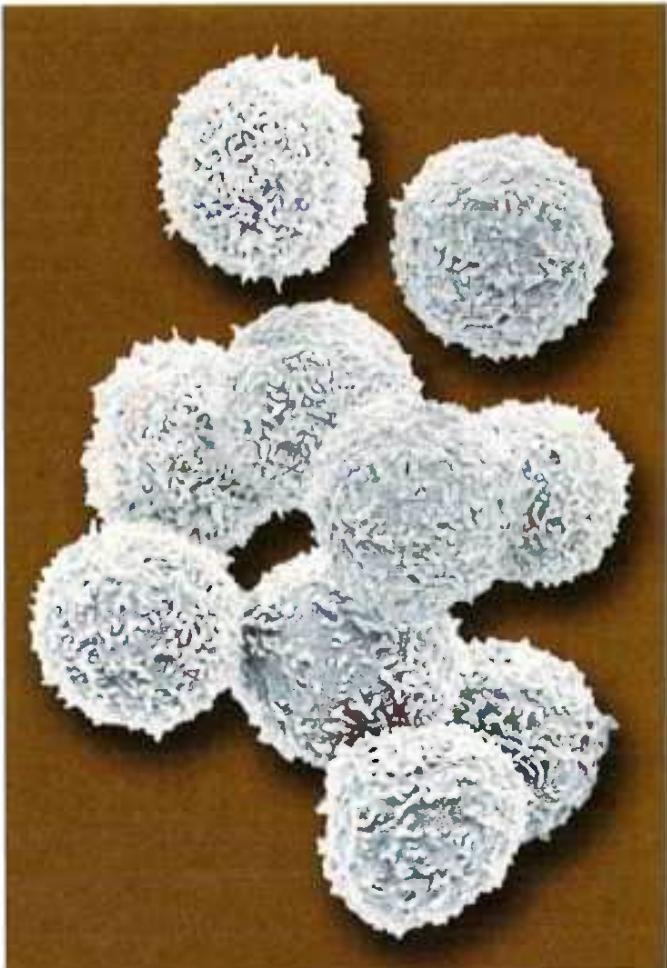  
FIGURE 1-2 Most animal cells have intricately folded surfaces. The human lymphocytes in this artificially colored scanning electron micrograph are about 10–12 $\mu$ m in diameter. Their convoluted surfaces give them a much larger surface area than a sphere of the same diameter. [Steve Gschmeissner/Science Source.]

Within the domains of Archaea and Bacteria are subgroups distinguished by their habitats. In aerobic habitats with a plentiful supply of oxygen, some resident organisms derive energy from the transfer of electrons from fuel molecules to oxygen within the cell. Other environments are anaerobic, devoid of oxygen, and microorganisms adapted to these environments obtain energy by transferring electrons to nitrate (forming $N_{2}$ ), sulfate (forming $H_{2}S$ ), or $CO_{2}$ (forming $CH_{4}$ ). Many organisms that have evolved in anaerobic environments are obligate anaerobes: they die when exposed to oxygen. Others are facultative anaerobes, able to live with or without oxygen.

## Organisms Differ Widely in Their Sources of Energy and Biosynthetic Precursors

P3 We can classify organisms according to how they obtain the energy and carbon they need for synthesizing cellular material (as summarized in Fig. 1-4). There are two broad categories based on energy sources: phototrophs (Greek trophē, “nourishment”) trap and use sunlight, and chemotrophs derive their energy from oxidation of a chemical fuel. Some chemotrophs oxidize inorganic fuels — HS $^{-}$ to S $^{0}$ (elemental sulfur), S $^{0}$ to SO $_{4}^{-}$ , NO $_{2}^{-}$ to NO $_{3}^{-}$ , or Fe $^{2+}$ to Fe $^{3+}$ , for example. Phototrophs and chemotrophs may be further divided into those that can synthesize all of their biomolecules directly from CO $_{2}$ (autotrophs) and those that require some preformed organic nutrients made by other organisms (heterotrophs). We can describe an organism’s mode of nutrition by combining these terms. For example, cyanobacteria are photoautotrophs; humans are chemoheterotrophs. Even finer distinctions can be made, and many organisms can obtain energy and carbon from more than one source under different environmental or developmental conditions.

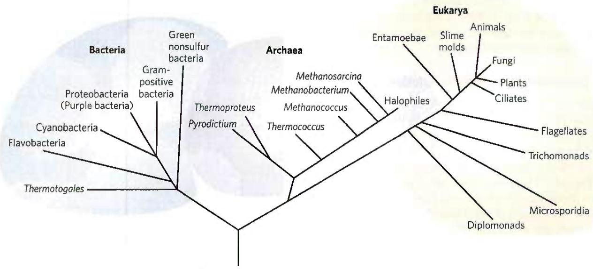  
FIGURE 1-3 Phylogeny of the three domains of life. Phylogenetic relationships are often illustrated by a "family tree" of this type. The basis for this tree is the similarity in nucleotide sequences of the ribosomal RNAs of each group. [Information from C. R. Woese, Microbiol. Rev. 51:221, 1987, Fig. 4.]

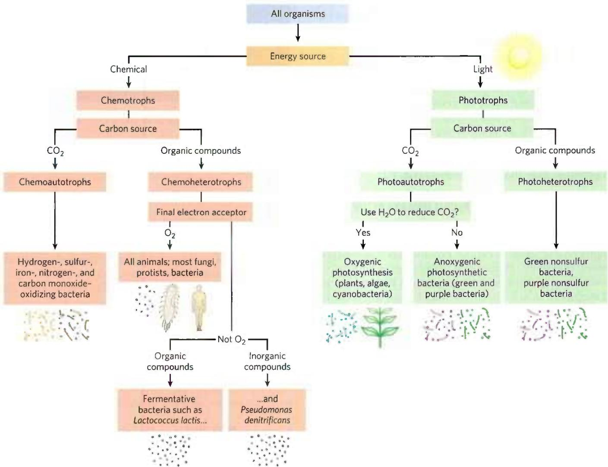  
FIGURE 1-4 All organisms can be classified according to their source of energy (sunlight or oxidizable chemical compounds) and their source of carbon for the synthesis of cellular material.

  
FIGURE 1-5 Some common structural features of bacterial and archaeal cells. (a) This correct-scale drawing of E. coli serves to illustrate some common features. (b) The cell envelope of gram-positive bacteria is a single membrane with a thick, rigid layer of peptidoglycan on its outside surface. A variety of polysaccharides and other complex polymers are interwoven with the peptidoglycan, and surrounding the whole is a porous "solid layer" composed of glycoproteins. (c) E. coli is gram-negative and has a double membrane. Its outer membrane has a lipopolysaccharide (LPS) on the outer surface and phospholipids on the inner surface. This outer membrane is studded with protein channels (porins) that allow small molecules, but not

## Bacterial and Archaeal Cells Share Common Features but Differ in Important Ways

The best-studied bacterium, Escherichia coli, is a usually harmless inhabitant of the human intestinal tract. The E. coli cell (Fig. 1-5a) is an ovoid about 2 $\mu$ m long and a little less than 1 $\mu$ m in diameter, but other bacteria may be spherical or rod-shaped, and some are substantially larger. E. coli has a protective outer membrane and an inner plasma membrane that encloses the cytoplasm and the nucleoid. Between the inner and outer membranes is a thin but strong layer of a high molecular weight polymer (peptidoglycan) that gives the cell its shape and rigidity. The plasma membrane and the layers outside it constitute the cell envelope. The plasma membranes of bacteria consist of a thin bilayer of lipid molecules penetrated by proteins. Archaeal plasma membranes have a similar architecture, but the lipids can be strikingly different from those of bacteria (see Fig. 10-6).

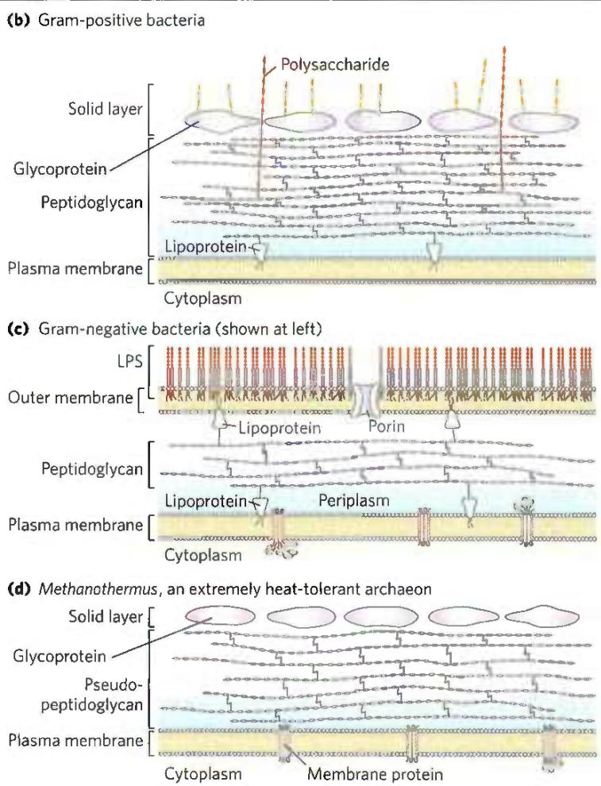  
proteins, to diffuse through. The inner (plasma) membrane, made of phospholipids and proteins, is impermeable to both large and small molecules. Between the inner and outer membranes, in the periplasm, is a thin layer of peptidoglycan, which gives the cell shape and rigidity, but does not retain Gram's stain. (d) Archaeal membranes vary in structure and composition, but all have a single membrane surrounded by an outer layer that includes either a peptidoglycan-like structure or a porous protein shell (solid layer), or both. [(a) David S. Goodsell. (b, c, d) Information from S.-V. Albers and B. H. Meyer, Nature Rev. Microbiol. 9:414, 2011, Fig. 2]

Bacteria and archaea have group-specific specializations of their cell envelopes (Fig. 1-5b–d). Some bacteria, called gram-positive because they are colored by Gram's stain (introduced by Hans Christian Gram in 1884), have a thick layer of peptidoglycan outside their plasma membrane but lack an outer membrane. Gram-negative bacteria have an outer membrane composed of a lipid bilayer into which are inserted complex lipopolysaccharides and proteins called porins that provide transmembrane channels for the diffusion of low molecular weight compounds and ions across this outer membrane. The structures outside the plasma membrane of archaea differ from organism to organism, but they, too, have a layer of peptidoglycan or protein that confers rigidity on their cell envelopes.

P2 The cytoplasm of E. coli contains about 15,000 ribosomes, various numbers (from 10 to thousands) of copies of each of 1,000 or so different enzymes, perhaps 1,000 organic compounds of molecular weight less than 1,000 (metabolites and cofactors), and a variety of inorganic ions. The nucleoid contains a single, circular molecule of DNA, and the cytoplasm (like that of most bacteria) contains one or more smaller, circular segments of DNA called plasmids. In nature, some plasmids confer resistance to toxins and antibiotics in the environment. In the laboratory, these DNA segments are especially amenable to experimental manipulation and are powerful tools for genetic engineering (see Chapter 9).

Other species of bacteria, as well as archaea, contain a similar collection of biomolecules, but each species has physical and metabolic specializations related to its environmental niche and nutritional sources. Cyanobacteria, for example, have internal membranes specialized to trap energy from light (see Fig. 20-23). Many archaea live in extreme environments and have biochemical adaptations to survive in extremes of temperature, pressure, or salt concentration. Differences in ribosomal structure gave the first hints that Bacteria and Archaea constituted separate domains. Most bacteria (including E. coli) exist as individual cells, but often associate in biofilms or mats, in which large numbers of cells adhere to each other and to some solid substrate beneath or at an aqueous surface. Cells of some bacterial species (the myxobacteria, for example) show simple social behavior, forming many-celled aggregates in response to signals between neighboring cells.

## Eukaryotic Cells Have a Variety of Membranous Organelles, Which Can Be Isolated for Study

Typical eukaryotic cells (Fig. 1-6) are much larger than bacteria—commonly 5 to 100 $\mu$ m in diameter, with cell volumes a thousand to a million times larger than those of bacteria. The distinguishing characteristics of eukaryotes are the nucleus and a variety of membrane-enclosed organelles with specific functions.

These organelles include mitochondria, the site of most of the energy-extracting reactions of the cell; the endoplasmic reticulum and Golgi complexes, which play central roles in the synthesis and processing of lipids and membrane proteins; peroxisomes, in which very-long-chain fatty acids are oxidized and reactive oxygen species are detoxified; and lysosomes, filled with digestive enzymes to degrade unneeded cellular debris. In addition to these, plant cells contain vacuoles (which store large quantities of organic acids) and chloroplasts (in which sunlight drives the synthesis of ATP (adenosine triphosphate) in the process of photosynthesis). Also present in the cytoplasm of many cells are granules or droplets containing stored nutrients such as starch and fat.

In a major advance in biochemistry, Albert Claude, Christian de Duve, and George Palade developed methods for separating organelles from the cytosol and from each other—an essential step in investigating their structures and functions. In a typical cell fractionation (Fig. 1-7), cells or tissues in solution are gently disrupted by physical shear. This treatment ruptures the plasma membrane but leaves most of the organelles intact. The homogenate is then centrifuged; organelles such as nuclei, mitochondria, and lysosomes differ in size and therefore sediment at different rates.

These methods were used to establish, for example, that lysosomes contain degradative enzymes, mitochondria contain oxidative enzymes, and chloroplasts contain photosynthetic pigments. The isolation of an organelle enriched in a certain enzyme is often the first step in the purification of that enzyme.

## The Cytoplasm Is Organized by the Cytoskeleton and Is Highly Dynamic

Fluorescence microscopy reveals several types of protein filaments crisscrossing the eukaryotic cell, forming an interlocking three-dimensional meshwork, the cytoskeleton. Eukaryotes have three general types of cytoplasmic filaments — actin filaments, microtubules, and intermediate filaments (Fig. 1-8) — differing in width (from about 6 nm to 22 nm), composition, and specific function. All types provide structure and organization to the cytoplasm and shape to the cell. Actin filaments and microtubules also help to produce the motion of organelles or of the whole cell.

Each type of cytoskeletal component consists of simple protein subunits that associate noncovalently to form filaments of uniform thickness. These filaments are not permanent structures; they undergo constant disassembly into their protein subunits and reassembly into filaments. Their locations in cells are not rigidly fixed but may change dramatically with mitosis, cytokinesis, amoeboid motion, or other changes in cell shape. The assembly, disassembly, and location of all types of filaments are regulated by other proteins, which serve to link or bundle the filaments or to move cytoplasmic organelles along

FIGURE 1-6 Eukaryotic cell structure. Schematic illustrations of two major types of eukaryotic cell: (a) a representative animal cell and (b) a representative plant cell. Plant cells are usually 10 to 100 $\mu$ m in diameter — larger than animal cells, which typically range from 5 to 30 $\mu$ m. Structures labeled

the filaments. (Bacteria contain actinlike proteins that serve similar roles in those cells.)

The filaments disassemble and then reassemble elsewhere. Membranous vesicles bud from one organelle and in red are unique to animal cells; those labeled in green are unique to plant cells. Eukaryotic microorganisms (such as protists and fungi) have structures similar to those in plant and animal cells, but many also contain specialized organelles not illustrated here.

fuse with another. Organelles move through the cytoplasm along protein filaments, their motion powered by energy-dependent motor proteins. The endomembrane system (see Fig. 11-4) segregates specific metabolic

(b)

Differential centrifugation

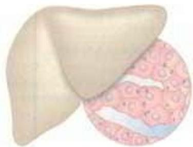

  
FIGURE 1-7 Subcellular fractionation of tissue. A tissue such as liver is first mechanically homogenized to break cells and disperse their contents in an aqueous buffer. The sucrose medium has an osmotic pressure similar to that in organelles, thus balancing diffusion of water into and out of the organelles, which would swell and burst in a solution of lower osmolarity (see Fig. 2-12). The large and small particles in the suspension can be separated by centrifugation at different speeds. Larger particles sediment more rapidly than small particles, and soluble material does not sediment. By careful choice of the conditions of centrifugation, subcellular fractions can be separated for biochemical characterization. [Information from B. Alberts et al., Molecular Biology of the Cell, 2nd edn, p. 165, Garland Publishing, 1989.]

processes and provides surfaces on which certain enzyme-catalyzed reactions occur. Exocytosis and endocytosis, mechanisms of transport (out of and into cells, respectively) that involve membrane fusion and fission, provide paths between the cytoplasm and the surrounding medium, allowing the secretion of substances produced in the cell and uptake of extracellular materials.

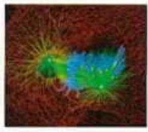  
FIGURE 1-8 The three types of cytoskeletal filaments: actin filaments, microtubules, and intermediate filaments. Cellular structures can be labeled with an antibody (that recognizes a characteristic protein) covalently attached to a fluorescent compound. The stained structures are visible when the cell is viewed with a fluorescence microscope. (a) In this cultured fibroblast cell, bundles of actin filaments are stained red; microtubules, radiating from the cell center, are stained green; and chromosomes (in the nucleus) are stained blue. (b) A new lung cell undergoing mitosis. Microtubules (green), attached to structures called kinetochores (yellow) on the condensed chromosomes (blue), pull the chromosomes to opposite poles, or centrosomes (magenta), of the cell. Intermediate filaments, made of keratin (red), maintain the structure of the cell. [(a) James J. Faust and David G. Capco. (b) Dr. Alexey Khodjakov, Wadsworth Center, New York State Department of Health.]

This structural organization of the cytoplasm is far from random. The motion and positioning of organelles and cytoskeletal elements are under tight regulation, and at certain stages in its life, a eukaryotic cell undergoes dramatic, finely orchestrated reorganizations, such as the events of mitosis. The interactions between the cytoskeleton and organelles are noncovalent, reversible, and subject to regulation in response to various intracellular and extracellular signals.

## Cells Build Supramolecular Structures

Macromolecules and their monomeric subunits differ greatly in size. An alanine molecule is less than 0.5 nm long. P2 A molecule of hemoglobin, the oxygen-carrying protein of erythrocytes (red blood cells), consists of nearly 600 amino acid subunits in four long chains, folded into globular shapes and associated in a structure 5.5 nm in diameter. In turn, proteins are much smaller than ribosomes (about 20 nm in diameter), which are much smaller than organelles such as mitochondria, typically 1 $\mu$ m in diameter. It is a long jump from simple biomolecules to cellular structures that can be seen with the light microscope. Figure 1-9 illustrates the structural hierarchy in cellular organization.

The monomeric subunits of proteins, nucleic acids, and polysaccharides are joined by covalent bonds. In supramolecular complexes, however, macromolecules are held together largely by noncovalent interactions—much weaker, individually, than covalent bonds. Among these noncovalent interactions are hydrogen bonds; ionic interactions (between charged groups); and aggregations of nonpolar groups in aqueous solution, brought about by van der Waals interactions (also called London forces) and by the hydrophobic effect—all of which have energies much smaller than those of covalent bonds. (These noncovalent interactions are described in Chapter 2.) The large numbers of weak interactions between macromolecules in supramolecular complexes stabilize these assemblies, producing their unique structures.

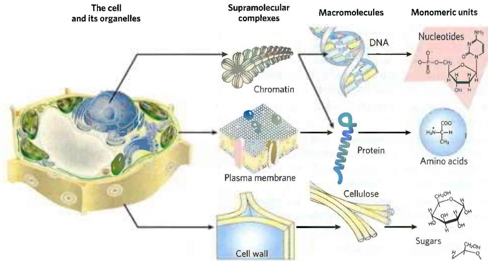  
FIGURE 1-9 Structural hierarchy in the molecular organization of cells. The organelles and other relatively large components of cells are composed of supramolecular complexes, which in turn are composed of smaller macromolecules and even smaller molecular subunits. For example, the nucleus of this plant cell contains chromatin, a supramolecular complex  
that consists of DNA and basic proteins (histones). DNA is made up of simple monomeric subunits (nucleotides), as are proteins (amino acids). [Information from W. M. Becker and D. W. Deamer, The World of the Cell, 2nd edn, Fig. 2-15, Benjamin/Cummings Publishing Company, 1991.]

## In Vitro Studies May Overlook Important Interactions among Molecules

One approach to understanding a biological process is to study purified molecules in vitro (from the Latin, meaning "in glass"—in the test tube), without interference from other molecules present in the intact cell—that is, in vivo (from the Latin, meaning "in the living"). Although this approach has been remarkably revealing, we must keep in mind that the inside of a cell is quite different from the inside of a test tube. The "interfering" components eliminated by purification may be critical to the biological function or regulation of the molecule that is being purified. For example, in vitro studies of pure enzymes are commonly done at very low enzyme concentrations in thoroughly stirred aqueous solutions. In the cell, an enzyme is dissolved or suspended in the gel-like cytosol with thousands of other proteins, some of which bind to that enzyme and influence its activity. Some enzymes are components of multienzyme complexes in which reactants are channeled from one enzyme to another, never entering the bulk solvent. When all of the known macromolecules in a cell are represented in their known dimensions and concentrations (Fig. 1-10), it is clear that the cytosol is very crowded and that diffusion of macromolecules within the cytosol must be slowed by collisions with other large structures. In short, a given molecule may behave quite differently in the cell than it behaves in vitro. A central challenge of biochemistry is to understand the influences of cellular organization and macromolecular associations on the function of individual enzymes and other biomolecules — to understand function in vivo as well as in vitro.

  
FIGURE 1-10 The crowded cell. This drawing is an accurate representation of the relative sizes and numbers of macromolecules in one small region of an E. coli cell. [© David S. Goodsell 1999.]

## SUMMARY 1.1 Cellular Foundations

All cells share certain fundamental properties: they are bounded by a plasma membrane; have a cytosol containing metabolites, coenzymes, inorganic ions, and enzymes; and have a set of genes contained within a nucleoid (bacteria and archaea) or a nucleus (eukaryotes).

■ The size of cells is limited by the need to deliver oxygen to all parts of the cell.

■ By comparing their DNA sequences, researchers can place organisms in three domains: Bacteria, Archaea, and Eukarya. Archaea and Eukarya are more closely related to each other than either is to Bacteria.

All organisms require a source of energy to perform cellular work. Phototrophs obtain energy from sunlight; chemotrophs obtain energy from chemical fuels.

■ Bacterial and archaeal cells contain cytosol, a nucleoid, and plasmids, all within a cell envelope.

■ Eukaryotes contain a nucleus and a variety of membrane-enclosed organelles with specialized functions, which can be studied in the isolated organelles.

■ Cytoskeletal proteins assemble into long filaments that give cells shape and rigidity and serve as rails along which cellular organelles move throughout the cell. The membrane-bounded compartments constitute an interconnected and dynamic endomembrane system.

■ Supramolecular complexes held together by noncovalent interactions are part of a hierarchy of structures, some visible with the light microscope.

■ Studying isolated cellular components in vitro simplifies the experimental system, but such study may overlook important interactions that occur in the living cell.

## 1.2 Chemical Foundations

Biochemistry aims to explain biological form and function in chemical terms. During the first half of the twentieth century, parallel biochemical investigations of glucose breakdown in yeast and in animal muscle cells revealed remarkable chemical similarities between these two apparently very different cell types; for example, the breakdown of glucose in yeast and in muscle cells involved the same 10 chemical intermediates and the same 10 enzymes. Subsequent studies of many other biochemical processes in many different organisms have confirmed the generality of this observation, neatly summarized in 1954 by the biochemist Jacques Monod: "What is true of E. coli is true of the elephant." The current understanding that all organisms share a common evolutionary origin is based in part on this observed universality of chemical intermediates and transformations, often termed "biochemical unity."

Fewer than 30 of the more than 90 naturally occurring chemical elements are known to be essential to organisms. Most of the elements in living matter have a relatively low atomic number; only three have an atomic number above that of selenium, 34 (Fig. 1-11). The four most abundant elements in living organisms, in terms of percentage of total number of atoms, are hydrogen, oxygen, nitrogen, and carbon, which together make up more than $99\%$ of the mass of most cells. They are the lightest elements capable of efficiently forming one, two, three, and four bonds, respectively; in general, the lightest elements form the strongest bonds. The trace elements represent a miniscule fraction of the weight of the human body, but all are essential to life, usually because they are essential to the function of specific proteins, including many enzymes. The oxygen-transporting capacity of the hemoglobin molecule, for example, is absolutely dependent on four iron ions that make up only $0.3\%$ of the molecule's mass.

## Biomolecules Are Compounds of Carbon with a Variety of Functional Groups

The chemistry of living organisms is organized around carbon, which accounts for more than half of the dry weight of cells. Carbon can form single bonds with hydrogen atoms and can form both single bonds and double bonds with oxygen and nitrogen atoms (Fig. 1-12). Of greatest significance in biology is the ability of carbon atoms to form very stable single bonds with up to four other carbon atoms. Two carbon atoms also can share two (or three) electron pairs, thus forming double (or triple) bonds.

FIGURE 1-11 Elements essential to animal life and health. Bulk elements (shaded light red) are structural components of cells and tissues and are required in the diet in gram quantities daily. For trace elements (shaded yellow), the requirements are much smaller: for humans, a few milligrams per day of Fe, Cu, and Zn, and even less of the others. The elemental requirements for plants and microorganisms are similar to those shown here; the ways in which they acquire these elements vary.  

FIGURE 1-12 Versatility of carbon bonding. Carbon can form covalent single, double, and triple bonds (all bonds in red), particularly with other carbon atoms. Triple bonds are rare in biomolecules.

<table><tr><td> $\dot{C} + H \longrightarrow \dot{C}H$ </td><td> $-C-H$ </td><td> $\dot{C} + \dot{N}: \longrightarrow \dot{C}: \dot{N}$ </td><td> $\dot{C}=N-$ </td></tr><tr><td> $\dot{C} + \dot{O}: \longrightarrow \dot{C}: \ddot{O}$ </td><td> $-C-O-$ </td><td> $\dot{C} + \dot{C} \longrightarrow \dot{C}: \dot{C}$ </td><td> $-\dot{C}-\dot{C}-$ </td></tr><tr><td> $\dot{C} + \dot{O}: \longrightarrow \dot{C}: \dot{O}:$ </td><td> $\dot{C}-O$ </td><td> $\dot{C} + \dot{C} \longrightarrow \dot{C}: \dot{C}$ </td><td> $\dot{C}=C$ </td></tr><tr><td> $\dot{C} + \dot{N}: \longrightarrow \dot{C}: \dot{N}:$ </td><td> $-\dot{C}-N$ </td><td> $\dot{C} + \dot{C} \longrightarrow \dot{C}: \ddot{C}$ </td><td> $-C\equiv C-$ </td></tr></table>

The four single bonds that can be formed by a carbon atom project from the nucleus to the four apices of a tetrahedron (Fig. 1-13), with an angle of about $109.5^{\circ}$ between any two bonds and an average bond length of $0.154\mathrm{nm}$ . There is free rotation around each single bond, unless very large or highly charged groups are attached to both carbon atoms, in which case rotation may be restricted. A double bond is shorter (about $0.134\mathrm{nm}$ ) and rigid, and it allows only limited rotation about its axis.

Covalently linked carbon atoms in biomolecules can form linear chains, branched chains, and cyclic structures. It seems likely that the bonding versatility of carbon, with itself and with other elements, was a major factor in the selection of carbon compounds for the molecular machinery of cells during the origin and evolution of living organisms. No other chemical element can form molecules of such widely different sizes, shapes, and composition.

Most biomolecules can be regarded as derivatives of hydrocarbons, with hydrogen atoms replaced by a variety of functional groups that confer specific chemical properties on the molecule, forming various families of organic compounds. Typical of these are alcohols, which have one or more hydroxyl groups; amines, with amino groups; aldehydes and ketones, with carbonyl groups; and carboxylic acids, with carboxyl groups (Fig. 1-14). Many biomolecules are polyfunctional, containing two or more types of functional groups (Fig. 1-15), each with its own chemical characteristics and reactions. The chemical "personality" of a compound is determined by the chemistry of its functional groups and their disposition in three-dimensional space.

## Cells Contain a Universal Set of Small Molecules

Dissolved in the aqueous phase (cytosol) of all cells is a collection of perhaps several thousand different small organic molecules ( $M_{\mathrm{r}} \sim 100$ to $\sim 500$ ), with intracellular concentrations ranging from nanomolar to $>10~\mathrm{mm}$ (see Fig. 13-31). (See Box 1-1 for an explanation of the various ways of referring to molecular weight.) These are the central metabolites in the major pathways occurring in nearly every cell—the metabolites and pathways that have been conserved throughout the course of evolution. This collection of molecules includes the common amino acids, nucleotides, sugars and their phosphorylated derivatives, and mono-, di-, and tricarboxylic acids. The molecules may be polar or charged and most are water-soluble. They are trapped in the cell because the plasma membrane is impermeable to them, although specific membrane transporters can catalyze the movement of some molecules into and out of the cell or between compartments in eukaryotic cells. The universal occurrence of the same set of compounds in living cells reflects the evolutionary conservation of metabolic pathways that developed in the earliest cells.

There are other small biomolecules, specific to certain types of cells or organisms. For example, vascular plants contain, in addition to the universal set, small molecules called secondary metabolites, which play roles specific to plant life. These metabolites include compounds that give plants their characteristic scents and colors, and compounds such as morphine, quinine, nicotine, and caffeine that are valued for their physiological effects on humans but have other purposes in plants.

  
FIGURE 1-13 Geometry of carbon bonding. (a) Carbon atoms have a characteristic tetrahedral arrangement of their four single bonds. (b) Carbon-carbon single bonds have freedom of rotation, as shown for the  
compound ethane (CH₃—CH₃). (c) Double bonds are shorter and do not allow free rotation. The two doubly bonded carbons and the atoms designated A, B, X, and Y all lie in the same rigid plane.

The entire collection of small molecules in a given cell under a specific set of conditions has been called the metabolome, in parallel with the term "genome." Metabolomics is the systematic characterization of the metabolome under very specific conditions (such as following administration of a drug, or a biological signal such as insulin).

## Macromolecules Are the Major Constituents of Cells

Many biological molecules are macromolecules, polymers with molecular weights above \~5,000 that are assembled from relatively simple precursors (Fig. 1-16). Shorter polymers are called oligomers (Greek oligos, "few"). Proteins, nucleic acids, and polysaccharides are macromolecules composed of monomers with molecular weights of 500 or less. Synthesis of macromolecules is a major energy-consuming activity of cells. Macromolecules themselves may be further assembled into supramolecular complexes, forming functional units such as ribosomes. Table 1-1 shows the major classes of biomolecules in an E. coli cell.

FIGURE 1-14 Some common functional groups of biomolecules. Functional groups are screened with a color typically used to represent the element that characterizes the group: gray for C, red for O, blue for N, yellow for S, and orange for P. In this figure and throughout the book, we use R to represent "any substituent." It may be as simple as a hydrogen atom, but typically it is a carbon-containing group. When two or more substituents are shown in a molecule, we designate them $R^1$ , $R^2$ , and so forth.

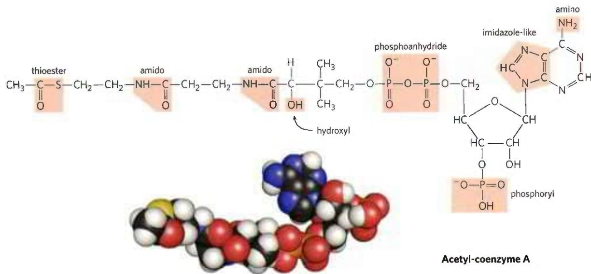  
FIGURE 1-15 Several common functional groups in a single biomolecule. Acetyl-coenzyme A (often abbreviated as acetyl-CoA) is a carrier of acetyl groups in some enzymatic reactions. Its functional groups are screened in the structural formula. In the space-filling model, N is blue,  
C is black, P is orange, O is red, and H is white. The yellow atom at the left is the sulfur of the critical thioester bond between the acetyl moiety and coenzyme A. [Acetyl-CoA structure data from PDB ID 1DM3, Y. Modis and R. K. Wierenga, J. Mol. Biol. 297:1171, 2000.]

Proteins, long polymers of amino acids, constitute the largest mass fraction (besides water) of a cell. Some proteins have catalytic activity and function as enzymes; others serve as structural elements, signal receptors, or transporters that carry specific substances into or out of cells. Proteins are perhaps the most versatile of all biomolecules; a catalog of their many functions would be very long. The sum of all the proteins functioning in a given cell is the cell's proteome, and proteomics is the systematic characterization of this protein complement under a specific set of conditions. The nucleic acids, DNA and RNA, are polymers of nucleotides. They store and transmit genetic information, and some RNA molecules have structural and catalytic roles in supramolecular complexes. The genome is the entire sequence of a cell's DNA (or in the case of RNA viruses, its RNA), and genomics is the characterization of the structure, function, evolution, and mapping of genomes.

The polysaccharides, polymers of simple sugars such as glucose, have three major functions: as energy-rich fuel stores, as rigid structural components of cell walls (in plants and bacteria), and as extracellular recognition elements that bind to proteins on other cells. Shorter polymers of sugars (oligosaccharides) attached to proteins or lipids at the cell surface serve as specific cellular signals. A cell's glycome is its entire complement of carbohydrate-containing molecules. The lipids,

## BOX 1-1

## Molecular Weight, Molecular Mass, and Their Correct Units

There are two common (and equivalent) ways to describe molecular mass; both are used in this text. The first is molecular weight, or relative molecular mass, denoted $M_{r}$ . The molecular weight of a substance is defined as the ratio of the mass of a molecule of that substance to one-twelfth the mass of an atom of carbon-12 ( $^{12}C$ ). Since $M_{r}$ is a ratio, it is dimensionless — it has no associated units. The second is molecular mass, denoted m. This is simply the mass of one molecule, or the molar mass divided by Avogadro's number. The molecular mass, m, is expressed in daltons (abbreviated Da). One dalton is equivalent to one-twelfth the mass of an atom of carbon-12; a kilodalton (kDa) is 1,000 daltons; a megadalton (MDa) is 1 million daltons.

Consider, for example, a molecule with a mass 1,000 times that of water. We can say of this molecule either $M_r = 18,000$ or $m = 18,000$ daltons. We can also describe it as an "18 kDa molecule." However, the expression $M_r = 18,000$ daltons is incorrect.

Another convenient unit for describing the mass of a single atom or molecule is the atomic mass unit (formerly amu, now commonly denoted u). One atomic mass unit (1 u) is defined as one-twelfth the mass of an atom of carbon-12. Since the experimentally measured mass of an atom of carbon-12 is $1.9926 \times 10^{-23}$ g, $1u = 1.6606 \times 10^{-24}$ g. The atomic mass unit is convenient for describing the mass of a peak observed by mass spectrometry (see Chapter 3, p. 93).

(a) Some of the amino acids of proteins  
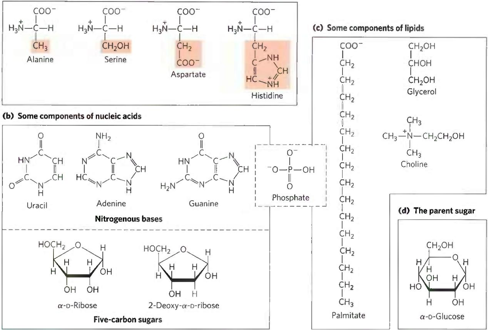  
FIGURE 1-16 The organic compounds from which most cellular materials are constructed: the ABCs of biochemistry. Shown here are (a) 4 of the 20 amino acids from which all proteins are built (the side chains are shaded light red); (b) 3 of the 5 nitrogenous bases, the

<table><tr><td colspan="3">TABLE 1-1 Molecular Components of an E. coli Cell</td></tr><tr><td></td><td>Percentage of total weight of cell</td><td>Approximate number of different molecular species</td></tr><tr><td>Water</td><td>70</td><td>1</td></tr><tr><td>Proteins</td><td>15</td><td>3,000</td></tr><tr><td>Nucleic acids</td><td></td><td></td></tr><tr><td>DNA</td><td>1</td><td>1-4</td></tr><tr><td>RNA</td><td>6</td><td>&gt;3,000</td></tr><tr><td>Polysaccharides</td><td>3</td><td>20</td></tr><tr><td>Lipids</td><td>2</td><td> $50^a$ </td></tr><tr><td>Monomeric subunits and intermediates</td><td>2</td><td>2,600</td></tr><tr><td>Inorganic ions</td><td>1</td><td>20</td></tr><tr><td colspan="3">Source: A. C. Guo et al., Nucleic Acids Res. 41:D625, 2013. $^a$ If all permutations and combinations of fatty acid substituents are considered,this number is much larger.</td></tr></table>

two 5-carbon sugars, and the phosphate ion from which all nucleic acids are built; (c) 4 components of membrane lipids (including phosphate); and (d) D-glucose, the simple sugar from which most carbohydrates are derived.

water-insoluble hydrocarbon derivatives, serve as structural components of membranes, energy-rich fuel stores, pigments, and intracellular signals. The lipid-containing molecules in a cell constitute its lipidome.

Proteins, polynucleotides, and polysaccharides have large numbers of monomeric subunits and thus high molecular weights—in the range of 5,000 to more than 1 million for proteins, up to several billion for DNA, and in the millions for polysaccharides such as starch. Individual lipid molecules are much smaller ( $M_{r}$ 750 to 1,500) and are not classified as macromolecules, but they can associate noncovalently into very large structures. Cellular membranes are built of enormous noncovalent aggregates of lipid and protein molecules.

Given their characteristic information-rich subunit sequences, proteins and nucleic acids are often referred to as informational macromolecules. Some oligosaccharides, as noted above, also serve as informational molecules.

## Three-Dimensional Structure Is Described by Configuration and Conformation

The covalent bonds and functional groups of a biomolecule are, of course, central to its function, but so also is the arrangement of the molecule's constituent atoms in three-dimensional space—its stereochemistry. Carbon-containing compounds commonly exist as stereoisomers, molecules with the same chemical bonds and same chemical formula but different configuration, the fixed spatial arrangement of atoms. Interactions between biomolecules are typically stereospecific, requiring specific configurations in the interacting molecules.

Figure 1-17 shows three ways to illustrate the stereochemistry, or configuration, of simple molecules. The perspective diagram specifies stereochemistry unambiguously, but bond angles and center-to-center bond lengths are better represented with ball-and-stick models. In space-filling models, the radius of each "atom" is proportional to its van der Waals radius, and the contours of the model define the space occupied by the molecule (the volume of space from which atoms of other molecules are excluded).

Configuration is conferred by the presence of either (1) double bonds, around which there is little or no freedom of rotation, or (2) chiral centers, around which substituent groups are arranged in a specific orientation. The identifying characteristic of stereoisomers is that they cannot be interconverted without the temporary breaking of one or more covalent bonds. Figure 1-18a shows the configurations of maleic acid and its isomer, fumaric acid.

These compounds are geometric isomers, or cis-trans isomers; they differ in the arrangement of their substituent groups with respect to the nonrotating double bond (Latin cis, "on this side"—groups on the same side of the double bond; trans, "across"—groups on opposite sides).

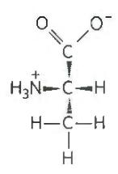  
(a)

  
(b)

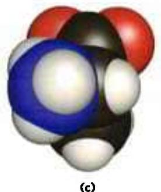  
(c)  
FIGURE 1-17 Representations of molecules. Three ways to represent the structure of the amino acid alanine (shown here in the ionic form found at neutral pH). (a) Structural formula in perspective form: a solid wedge ( $\rightarrow$ ) represents a bond in which the atom at the wide end projects out of the plane of the paper, toward the reader; a dashed wedge ( $\rightarrow$ ) represents a bond extending behind the plane of the paper. (b) Ball-and-stick model, showing bond angles and relative bond lengths. (c) Space-filling model, in which each atom is shown with its correct relative van der Waals radius.

  
FIGURE 1-19 Molecular asymmetry: chiral and achiral molecules. (a) When a carbon atom has four different substituent groups (A, B, X, Y), they can be arranged in two ways that represent nonsuperposable mirror images of each other (enantiomers). This asymmetric carbon atom is called a chiral atom or chiral center. (b) When a tetrahedral carbon has only three  
dissimilar groups (that is, the same group occurs twice), only one configuration is possible and the molecule is symmetric, or achiral. In this case, the molecule is superposable on its mirror image: the molecule on the left can be rotated counterclockwise (when looking down the vertical bond from A to C) to create the molecule in the mirror.

Maleic acid (maleate at the neutral pH of cytoplasm) is the cis isomer, and fumaric acid (fumarate) is the trans isomer; each is a well-defined compound that can be separated from the other, and each has its own unique chemical properties. A binding site (on an enzyme, for example) that is complementary to one of these molecules would not be complementary to the other, which explains why the two compounds have distinct biological roles despite their similar chemical makeup. The visual pigment in the vertebrate eye, rhodopsin, contains retinal, a vitamin A-derived lipid (Fig. 1-18b). In the primary event of vision, light converts one isomer of retinal to another, triggering a neuronal signal to the brain (see Fig. 12-19).

In the second type of stereoisomer, four different substituents bonded to a tetrahedral carbon atom may be arranged in two different ways in space—that is, have two configurations—yielding two stereoisomers that have similar or identical chemical properties but differ in certain physical and biological properties. A carbon atom with four different substituents is said to be asymmetric, and asymmetric carbons are called chiral centers (Greek chiros, "hand"; some stereoisomers are related structurally as the right hand is to the left hand). A molecule with only one chiral carbon can have two stereoisomers; when two or more (n) chiral carbons are present, there can be $2^{n}$ stereoisomers. Stereoisomers that are mirror images of each other are called enantiomers (Fig. 1-19). Pairs of stereoisomers that are not mirror images of each other are called diastereomers (Fig. 1-20).

As the biologist, microbiologist, and chemist Louis Pasteur first observed in 1843 (Box 1-2), enantiomers have nearly identical chemical reactivities but differ in a characteristic physical property: optical activity. In separate solutions, two enantiomers rotate the

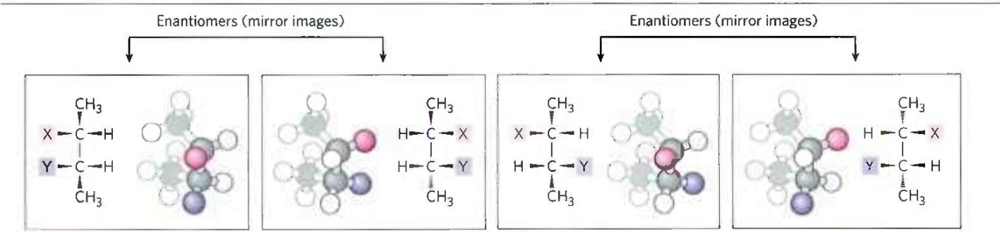  
FIGURE 1-20 Enantiomers and diastereomers. There are four different stereoisomers of 2,3-disubstituted butane (n=2 asymmetric carbons, hence $2^{n}=4$ stereoisomers). Each is shown in a box as a perspective formula and a ball-and-stick model, which has been rotated to show all of the groups.  
Two pairs of stereoisomers are mirror images of each other, or enantiomers. All other possible pairs are not mirror images, and so are diastereomers. [Information from F. Carroll, Perspectives on Structure and Mechanism in Organic Chemistry, p. 63, Brooks/Cole Publishing Co., 1998.]

Counterclockwise (S)  

## Louis Pasteur and Optical Activity: In Vino, Veritas

Louis Pasteur encountered the phenomenon of optical activity in 1843, during his investigation of the crystalline sediment that accumulated in wine casks (a form of tartaric acid called paratartaric acid — also called racemic acid, from Latin racemus, "bunch of grapes"). He used fine forceps to separate two types of crystals identical in shape but mirror images of each other. Both types proved to have all the chemical properties of tartaric acid, but in solution one type rotated plane-polarized light to the left (levorotatory), whereas the other rotated it to the right (dextro-rotatory). Pasteur later described the experiment and its interpretation:

  
Louis Pasteur 1822–1895
[Granger, NYC — All rights reserved.]

  
(2R,3R)-Tartaric acid (dextrorotatory)

  
(2S,3S)-Tartaric acid (levorotatory)

FIGURE 1 Pasteur separated crystals of two stereoisomers of tartaric acid and showed that solutions of the separated forms rotated plane-polarized light to the same extent but in opposite directions. These dextrorotatory and levorotatory forms were later shown to be the $(R,R)$ and $(S,S)$ isomers represented here.

plane of plane-polarized light in opposite directions, but an equimolar solution of the two enantiomers (a racemic mixture) shows no optical rotation. Compounds without chiral centers do not rotate the plane of plane-polarized light.

KEY CONVENTION Given the importance of stereochemistry in reactions between biomolecules (see below), biochemists must name and represent the structure of each biomolecule so that its stereochemistry is unambiguous. For compounds with more than one chiral center, the most useful system of nomenclature is the RS system. In this system, each group attached to a chiral carbon is assigned a priority. The priorities of some common substituents are

$$
\begin{array}{r l} - \mathrm{OCH} _ {3} > - \mathrm{OH} > - \mathrm{NH} _ {2} > - \mathrm{COOH} > \\ & - \mathrm{CHO} > - \mathrm{CH} _ {2} \mathrm{OH} > - \mathrm{CH} _ {3} > - \mathrm{H} \end{array}
$$

For naming in the RS system, the chiral atom is viewed with the group of lowest priority (4 in the following diagram) pointing away from the viewer. If the priority of the other three groups (1 to 3) decreases in clockwise order, the configuration is (R) (Latin rectus,

In isomeric bodies, the elements and the proportions in which they are combined are the same, only the arrangement of the atoms is different . . . We know, on the one hand, that the molecular arrangements of the two tartaric acids are asymmetric, and, on the other hand, that these arrangements are absolutely identical, excepting that they exhibit asymmetry in opposite directions. Are the atoms of the dextro acid grouped in the form of a right-handed spiral, or are they placed at the apex of an irregular tetrahedron, or are they disposed according to this or that asymmetric arrangement? We do not know.\*

Now we do know. In 1951, x-ray crystallographic studies confirmed that the levorotatory and dextrorotatory forms of tartaric acid are mirror images of each other at the molecular level and established the absolute configuration of each (Fig. 1). The same approach has been used to demonstrate that although the amino acid alanine has two stereoisomeric forms (designated D and L), alanine in proteins exists exclusively in one form (the L isomer; see Chapter 3).

\* From Pasteur's lecture to the Société Chimique de Paris in 1883, quoted in R. DuBos, Louis Pasteur: Free Lance of Science, p. 95. New York: Charles Scribner's Sons, 1976.

"right"); if counterclockwise, the configuration is (S) (Latin sinister, "left"). In this way, each chiral carbon is designated either (R) or (S), and the inclusion of these designations in the name of the compound provides an unambiguous description of the stereochemistry at each chiral center.

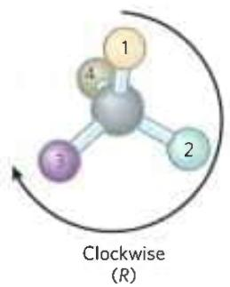

Another naming system for stereoisomers, the D and L system, is described in Chapter 3. A molecule with a single chiral center can be named unambiguously by either system, as shown here. The two naming systems are based on different criteria, so no general correlation can be made between, say, the L isomer and the (S) isomer seen in this example.

$$
\begin{array}{c} \mathrm{CHO} \\ \mathrm{HO} - \mathrm{C} - \mathrm{H} \\ \mathrm{CH} _ {2} \mathrm{OH} \\ \text { L   -   G   l   y   c   e   r   a   l   d   e   h   y   d   e } \end{array} \equiv \begin{array}{c} \mathrm{CHO} _ {(2)} \\ \mathrm{H} _ {(4)} - \mathrm{OH} _ {(1)} \\ \mathrm{CH} _ {2} \mathrm{OH} _ {(3)} \end{array} (\text { S }) - \text { G   l   y   c   e   r   a   l   d   e   h   y   d   e }
$$

Distinct from configuration is molecular conformation, the spatial arrangement of substituent groups that, without breaking any bonds, are free to assume different positions in space because of the freedom of rotation about single bonds. In the simple hydrocarbon ethane, for example, there is nearly complete freedom of rotation around the C—C bond. Many different, interconvertible conformations of ethane are possible, depending on the degree of rotation (Fig. 1-21). Two conformations are of special interest: the staggered, which is more stable than all others and thus predominates, and the eclipsed, which is the least stable. We cannot isolate either of these conformational forms, because they are freely interconvertible. However, when one or more of the hydrogen atoms on each carbon is replaced by a functional group that is either very large or electrically charged, freedom of rotation around the C—C bond is hindered. This limits the number of stable conformations of the ethane derivative.

## Interactions between Biomolecules Are Stereospecific

P2 When biomolecules interact, the "fit" between them is often stereochemically correct; they are complementary. The three-dimensional structure of biomolecules large and small—the combination of configuration and conformation—is of the utmost importance in their biological interactions: reactant with its enzyme, hormone with its receptor, antigen with its specific antibody, for example (Fig. 1-22). The study of biomolecular stereochemistry, with precise physical methods, is an important part of modern research on cell structure and biochemical function.

  
FIGURE 1-21 Conformations. Many conformations of ethane are possible because of freedom of rotation around the C—C bond. In the ball-and-stick model, when the front carbon atom (as viewed by the reader) with its three attached hydrogens is rotated relative to the rear carbon atom, the potential energy of the molecule rises to a maximum in the fully eclipsed conformation (torsion angle 0°, 120°, and so on), then falls to a minimum in the fully staggered conformation (torsion angle 60°, 180°, and so on). Because the energy differences are small enough to allow rapid interconversion of the two forms (millions of times per second), the eclipsed and staggered forms cannot be separately isolated.

In living organisms, chiral molecules are usually present in only one of their chiral forms. For example, the amino acids in proteins occur only as their L isomers; glucose occurs only as its D isomer. (The conventions for naming stereoisomers of the amino acids are described in Chapter 3; those for sugars, in Chapter 7. The RS system, described on p. 17, is the most useful for some biomolecules.) In contrast, when a compound with an asymmetric carbon atom is chemically synthesized in the laboratory, the reaction usually produces both possible chiral forms: a mixture of the D and L forms, for example. Living cells produce only one chiral form of a biomolecule because the enzymes that synthesize that molecule are also chiral.

Stereospecificity, the ability to distinguish between stereoisomers, is a property of enzymes and other proteins and a characteristic feature of biochemical interactions. If the binding site on a protein is complementary to one isomer of a chiral compound, it will not be complementary to the other isomer, for the same reason that a left-handed glove does not fit a right hand. Two striking examples of the ability of biological systems to distinguish stereoisomers are shown in Figure 1-23.

The common classes of chemical reactions encountered in biochemistry are described in Chapter 13, as an introduction to the reactions of metabolism.

  
FIGURE 1-22 Complementary fit between a macromolecule and a small molecule. A glucose molecule fits into a pocket on the surface of the enzyme hexokinase and is held in this orientation by several noncovalent interactions between the protein and the sugar. This representation of the hexokinase molecule is produced with software that can calculate the shape of the outer surface of a macromolecule, defined either by the van der Waals radii of all the atoms in the molecule or by the "solvent exclusion volume," the volume that a water molecule cannot penetrate. [Data from PDB ID 3B8A, P. Kuser et al., Proteins 72:731, 2008.]

  
L-Aspartyl-L-phenylalanine methyl ester (aspartame) (sweet)

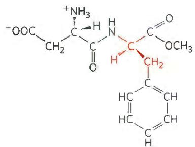  
(a)  
L-Aspartyl-D-phenylalanine methyl ester (bitter)

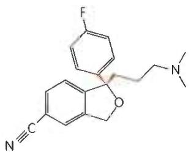  
(S)-Citalopram (therapeutically active)

(b)  
  
(R)-Citalopram (therapeutically inactive)

## SUMMARY 1.2 Chemical Foundations

Because of its bonding versatility, carbon can produce a broad array of carbon-carbon skeletons with a variety of functional groups; these groups give biomolecules their biological and chemical personalities.

A nearly universal set of several thousand small molecules is found in living cells; the interconversions of these molecules in the central metabolic pathways have been conserved in evolution.

■ Proteins and nucleic acids are macromolecules—long, linear polymers of simple monomeric subunits; their sequences contain the information that gives each molecule its three-dimensional structure and its biological functions.

■ Molecular configuration can be changed only by breaking and re-forming covalent bonds. For a carbon atom with four different substituents (a chiral carbon), the substituent groups can be arranged in two different ways, generating stereoisomers with distinct properties. Only one stereoisomer is biologically active. Molecular conformation is the position of atoms in space that can be changed by rotation about single bonds, without covalent bonds being broken.

■ Interactions between biological molecules are often stereospecific: there is a close fit between complementary structures in the interacting molecules.

## 1.3 Physical Foundations

Living cells and organisms must perform work to stay alive and to reproduce themselves. The synthetic reactions that occur within cells, like the synthetic processes

FIGURE 1-23 Stereoisomers have different effects in humans. (a) Aspartame, the artificial sweetener sold under the trade name Nutra-Sweet, is easily distinguishable by taste receptors from its bitter-tasting stereoisomer, although the two differ only in the configuration at one of the two chiral carbon atoms. (b) The antidepressant medication citalopram (trade name Celexa), a selective serotonin reuptake inhibitor, is a racemic mixture of these two stereoisomers, but only (S)-citalopram has the therapeutic effect. A stereochemically pure preparation of (S)-citalopram (escitalopram oxalate) is sold under the trade name Lexapro. As you might predict, the effective dose of Lexapro is one-half the effective dose of Celexa.

in any factory, require the input of energy. Energy input is also needed in the motion of a bacterium or an Olympic sprinter, in the flashing of a firefly or the electrical discharge of an eel. And the storage and expression of information require energy, without which structures that are rich in information inevitably become disordered and meaningless.

In the course of evolution, cells have developed highly efficient mechanisms for coupling the energy obtained from sunlight or chemical fuels to the many energy-requiring processes they must carry out. One goal of biochemistry is to understand, in quantitative and chemical terms, the means by which energy is extracted, stored, and channeled into useful work in living cells. We can consider cellular energy conversions—like all other energy conversions—in the context of the laws of thermodynamics. For a more extensive discussion of cellular thermodynamics, see Chapter 13.

## Living Organisms Exist in a Dynamic Steady State, Never at Equilibrium with Their Surroundings

The molecules and ions contained within a living organism differ in kind and in concentration from those in the organism's surroundings. A paramecium in a pond, a shark in the ocean, a bacterium in the soil, an apple tree in an orchard—all are different in composition from their surroundings and, once they have reached maturity, maintain a more or less constant composition in the face of a constantly changing environment.

Although the characteristic composition of an organism changes little through time, the population of molecules within the organism is far from static. Small molecules, macromolecules, and supramolecular complexes are continuously synthesized and broken down in chemical reactions that involve a constant flux of mass and energy through the system. The hemoglobin molecules carrying oxygen from your lungs to your brain at this moment were synthesized within the past month; by next month they will have been degraded and entirely replaced by new hemoglobin molecules. The glucose you ingested with your most recent meal is now circulating in your bloodstream; before the day is over these particular glucose molecules will have been converted into something else—carbon dioxide or fat, perhaps—and will have been replaced with a fresh supply of glucose, so that your blood glucose concentration is more or less constant over the whole day. The amounts of hemoglobin and glucose in the blood remain nearly constant because the rate of synthesis or intake of each just balances the rate of its breakdown, consumption, or conversion into some other product. The constancy of concentration is the result of a dynamic steady state, a steady state that is far from equilibrium. Maintaining this steady state requires the constant investment of energy; when a cell can no longer obtain energy, it dies and begins to decay toward equilibrium with its surroundings. We consider below exactly what is meant by “steady state” and “equilibrium.”

## Organisms Transform Energy and Matter from Their Surroundings

For chemical reactions occurring in solution, we can define a system as all the constituent reactants and products, the solvent that contains them, and the immediate atmosphere—in short, everything within a defined region of space. The system and its surroundings together constitute the universe. If the system exchanges neither matter nor energy with its surroundings, it is said to be isolated. If the system exchanges energy but not matter with its surroundings, it is a closed system; if it exchanges both energy and matter with its surroundings, it is an open system.

A living organism is an open system; it exchanges both matter and energy with its surroundings. Organisms obtain energy from their surroundings in two ways: (1) they take up chemical fuels (such as glucose) from the environment and extract energy by oxidizing them (see Box 1-3, Case 2); or (2) they absorb energy from sunlight.

The first law of thermodynamics describes the principle of the conservation of energy: in any physical or chemical change, the total amount of energy in the universe remains constant, although the form of the energy may change. This means that while energy is "used" by a system, it is not "used up"; rather, it is converted from one form into another—from potential energy in chemical bonds, say, into kinetic energy of heat and motion. Cells are consummate transducers of energy, capable of interconverting chemical, electromagnetic, mechanical, and osmotic energy with great efficiency (Fig. 1-24).

  
FIGURE 1-24 Some energy transformations in living organisms. As metabolic energy is spent to do cellular work, the randomness of the system plus surroundings (expressed quantitatively as entropy) increases as the potential energy of complex nutrient molecules decreases. (a) Living organisms extract energy from their surroundings; (b) convert some of it into useful forms of energy to produce work; (c) return some energy to the surroundings as heat; and (d) release end-product molecules that are less well organized than the starting fuel, increasing the entropy of the universe. One effect of all these transformations is (e) increased order (decreased randomness) in the system in the form of complex macromolecules.

P3 Nearly all living organisms derive their energy, directly or indirectly, from the radiant energy of sunlight. In the photoautotrophs, light-driven splitting of water during photosynthesis releases its electrons for the reduction of $CO_{2}$ and the release of $O_{2}$ into the atmosphere:

$$
\begin{array}{c} \text {   light   } \\ 6 \mathrm{CO} _ {2} + 6 \mathrm{H} _ {2} \mathrm{O} \xrightarrow {\quad \quad \quad} \mathrm{C} _ {6} \mathrm{H} _ {1 2} \mathrm{O} _ {6} + 6 \mathrm{O} _ {2} \\ (\text {   light - driven   reduction   of   CO } _ {2}) \end{array}
$$

Nonphotosynthetic organisms (chemotrophs) obtain the energy they need by oxidizing the energy-rich products of photosynthesis stored in plants, then passing the electrons thus acquired to atmospheric $O_{2}$ to form water, $CO_{2}$ , and other end products, which are recycled in the environment:

$$
\begin{array}{l} \mathrm{C} _ {6} \mathrm{H} _ {1 2} \mathrm{O} _ {6} + 6 \mathrm{O} _ {2} \longrightarrow 6 \mathrm{CO} _ {2} + 6 \mathrm{H} _ {2} \mathrm{O} + \text { energy } \\ \text {(energy - yielding oxidation of glucose)} \end{array}
$$

Thus autotrophs and heterotrophs participate in global cycles of $O_{2}$ and $CO_{2}$ , driven ultimately by sunlight, making these two large groups of organisms interdependent. Virtually all energy transductions in cells can be traced to this flow of electrons from one molecule to another, in a “downhill” flow from higher to lower electrochemical potential; as such, this is formally analogous to the flow of electrons in a battery-driven electric circuit. P3 All these reactions involved in electron flow are oxidation-reduction reactions: one reactant is oxidized (loses electrons) as another is reduced (gains electrons).

## Creating and Maintaining Order Requires Work and Energy

As we've noted, DNA, RNA, and proteins are informational macromolecules; the precise sequence of their monomeric subunits contains information, just as the letters in this sentence do. In addition to using chemical energy to form the covalent bonds between these subunits, the cell must invest energy to order the subunits in their correct sequence. It is extremely improbable that amino acids in a mixture would spontaneously condense into a single type of protein, with a unique sequence. This would represent increased order in a population of molecules; but according to the second law of thermodynamics, the tendency in nature is toward ever-greater disorder in the universe: randomness in the universe is constantly increasing. To bring about the synthesis of macromolecules from their monomeric units, free energy must be supplied to the system (in this case, the cell). We discuss the quantitative energetics of oxidation-reduction reactions in Chapter 13.

The randomness or disorder of the components of a chemical system is expressed as entropy, S (Box 1-3). Any change in randomness of the system is expressed as entropy change, $\Delta S$ , which by convention has a pos-

itive value when randomness increases. J. Willard Gibbs, the scientist who developed the theory of energy changes during chemical reactions, showed that the free energy, G, of any closed system can be defined in terms of three quantities: enthalpy, H, or heat content, roughly reflecting the number and kinds of bonds; entropy, S; and the absolute temperature, T (in Kelvin). The definition of free energy is G = H - TS. When a chemical reaction occurs at constant temperature, the free-energy change, $\Delta G$ , is determined by the enthalpy change, $\Delta H$ , reflecting the kinds and numbers of chemical bonds and noncovalent interactions broken and formed, and the entropy change, $\Delta S$ , describing the change in the system's randomness:

$$
\Delta G = \Delta H - T \Delta S
$$

where, by definition, $\Delta H$ is negative for a reaction that releases heat, and $\Delta S$ is positive for a reaction that increases the system's randomness.

A process tends to occur spontaneously only if $\Delta G$ is negative (if free energy is released in the process). Yet cell function depends largely on molecules, such as proteins and nucleic acids, for which the free energy of formation is positive: the molecules are less stable and more highly ordered than a mixture of their monomeric components. To carry out these thermodynamically unfavorable, energy-requiring (endergonic) reactions, cells couple them to other reactions that liberate free energy (exergonic reactions), so that the overall process is exergonic: the sum of the free-energy changes is negative. The exergonic reaction most commonly employed in this way involves adenosine triphosphate (ATP; Fig. 1-25) in which two phosphoanhydride bonds are capable of supplying the free energy to make a coupled endergonic reaction possible. In Section 13.3 we discuss in more detail this role of ATP.

J. Willard Gibbs, 1839–1903 [Science Source.]  

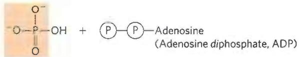

Inorganic phosphate ( $P_{i}$ )

Inorganic pyrophosphate (PP $_{i}$ )

FIGURE 1-25 Adenosine triphosphate (ATP) provides energy. Here, each Ⓟ represents a phosphoryl group. The removal of the terminal phosphoryl group (shaded light red) of ATP, by breakage of a phosphoanhydride bond to generate adenosine diphosphate (ADP) and inorganic phosphate ion (HPO $_{4}^{2-}$ ), is highly exergonic, and this reaction is coupled to many endergonic reactions in the cell (as in the example in Worked Example 1-2). ATP also provides energy for many cellular processes by undergoing cleavage that releases the two terminal phosphates as inorganic pyrophosphate (H $_{2}$ P $_{2}$ O $_{7}^{2-}$ ), often abbreviated PP $_{i}$ .

## Entropy: Things Fall Apart

The term "entropy," which literally means "a change within," was first used in 1851 by Rudolf Clausius, one of the formulators of the second law of thermodynamics. It refers to the randomness or disorder of the components of a chemical system. Entropy is a central concept in biochemistry; life requires continual maintenance of order in the face of nature's tendency to increase randomness. A rigorous quantitative definition of entropy involves statistical and probability considerations. However, its nature can be illustrated qualitatively by three simple examples, each demonstrating one aspect of entropy. The key descriptors of entropy are randomness and disorder, manifested in different ways.

## Case 1: The Teakettle and the Randomization of Heat

We know that steam generated from boiling water can do useful work. But suppose we turn off the burner under a teakettle full of water at 100 °C (the "system") in the kitchen (the "surroundings") and allow the teakettle to cool. As it cools, no work is done, but heat passes from the teakettle to the surroundings, raising the temperature of the surroundings (the kitchen) by an infinitesimally small amount until complete equilibrium is attained. At this point all parts of the teakettle and the kitchen are at precisely the same temperature. The free energy that was once concentrated in the teakettle of hot water at 100 °C, potentially capable of doing work, has disappeared. Its equivalent in heat energy is still present in the teakettle + kitchen (that is, the "universe") but has become completely randomized throughout. This energy is no longer available to do work because there is no temperature differential

## Energy Coupling Links Reactions in Biology

The central issue in bioenergetics (the study of energy transformations in living systems) is the means by which energy from fuel metabolism or light capture is coupled to a cell's energy-requiring reactions. With regard to energy coupling, it is useful to consider a simple mechanical example, as shown in Figure 1-26a. An object at the top of an inclined plane has a certain amount of potential energy as a result of its elevation. It tends to slide down the plane, losing its potential energy of position as it approaches the ground. When an appropriate string-and-pulley device couples the falling object to another, smaller object, the spontaneous downward motion of the larger can lift the smaller, accomplishing a certain amount of work. The amount of energy available to do work is the free-energy change, $\Delta G$ ; this is always somewhat less than the theoretical amount of energy released, because some energy is dissipated as the heat of friction. The greater the elevation of the larger object, the greater the energy released ( $\Delta G$ ) as within the kitchen. Moreover, the increase in entropy of the kitchen (the surroundings) is irreversible. We know from everyday experience that heat never spontaneously passes back from the kitchen into the teakettle to raise the temperature of the water to $100\ °C$ again.

## Case 2: The Oxidation of Glucose

Entropy is a state not only of energy but of matter. Aerobic (heterotrophic) organisms extract free energy from glucose obtained from their surroundings by oxidizing the glucose with $O_{2}$ , also obtained from the surroundings. The end products of this oxidative metabolism, $CO_{2}$ and $H_{2}O$ , are returned to the surroundings. In this process the surroundings undergo an increase in entropy, whereas the organism itself remains in a steady state and undergoes no change in its internal order. Although some entropy arises from the dissipation of heat, entropy also arises from another kind of disorder, illustrated by the equation for the oxidation of glucose:

$$
\mathrm{C} _ {6} \mathrm{H} _ {1 2} \mathrm{O} _ {6} + 6 \mathrm{O} _ {2} \longrightarrow 6 \mathrm{CO} _ {2} + 6 \mathrm{H} _ {2} \mathrm{O}
$$

We can represent this schematically as

the object slides downward and the greater the amount of work that can be accomplished. The larger object can lift the smaller one only because, at the outset, the larger object was far from its equilibrium position: it had at some earlier point been elevated above the ground, in a process that itself required the input of energy.

How does this apply in chemical reactions? In closed systems, chemical reactions proceed spontaneously until equilibrium is reached. When a system is at equilibrium, the rate of product formation exactly equals the rate at which product is converted to reactant. Thus there is no net change in the concentration of reactants and products. The energy change as the system moves from its initial state to equilibrium, with no changes in temperature or pressure, is given by the free-energy change, $\Delta G$ . The magnitude of $\Delta G$ depends on the particular chemical reaction and on how far from equilibrium the system is initially. Each compound involved in a chemical reaction contains a certain amount of potential energy, related

The atoms contained in 1 molecule of glucose plus 6 molecules of oxygen, a total of 7 molecules, are more randomly dispersed by the oxidation reaction and are now present in a total of 12 molecules ( $6CO_{2} + 6H_{2}O$ ).

Whenever a chemical reaction results in an increase in the number of molecules—or when a solid substance is converted into liquid or gaseous products, which allow more freedom of molecular movement than solids—molecular disorder, and thus entropy, increases.

## Case 3: Information and Entropy

The following short passage from Shakespeare's Julius Caesar, Act IV, Scene 3, is spoken by Brutus, when he realizes that he must face Mark Antony's army. It is an information-rich non-random arrangement of 125 letters of the English alphabet:

There is a tide in the affairs of men,

Which, taken at the flood, leads on to fortune;

Omitted, all the voyage of their life

Is bound in shallows and in miseries.

In addition to what this passage says overtly, it has many hidden meanings. It not only reflects a complex sequence of events in the play, but also echoes the play's ideas on conflict, ambition, and the demands of leadership. Permeated with Shakespeare's understanding of human nature, it is very rich in information.

However, if the 125 letters making up this quotation were allowed to fall into a completely random, chaotic pattern, as

to the kind and number of its bonds. In reactions that occur spontaneously, the products have less free energy than the reactants and thus the reaction releases free energy, which is then available to do work. Such reactions are exergonic; the decline in free energy from reactants to products is expressed as a negative value. Endergonic reactions require an input of energy, and their $\Delta G$ values are positive. This coupling of an exergonic reaction to an endergonic reaction is illustrated in Figure 1-26b. As in mechanical processes, only part of the energy released in exergonic chemical reactions can be used to accomplish work. In living systems, some energy is dissipated as heat or is lost to increasing entropy.

## $K_{eq}$ and $\Delta G^{\circ}$ Are Measures of a Reaction's Tendency to Proceed Spontaneously

The tendency of a chemical reaction to go to completion can be expressed as an equilibrium constant. For the shown in the following box, they would have no meaning whatsoever.

In this form, the 125 letters contain little or no information, but they are very rich in entropy. Such considerations have led to the conclusion that information is a form of energy; information has been called "negative entropy." In fact, the branch of mathematics called information theory, which is basic to the programming logic of computers, is closely related to thermodynamic theory. Living organisms are highly ordered, non-random structures, immensely rich in information and thus entropy-poor.

reaction in which a moles of A react with b moles of B to give c moles of C and d moles of D,

$$
a \mathrm{A} + b \mathrm{B} \longrightarrow c \mathrm{C} + d \mathrm{D}
$$

the equilibrium constant, $K_{eq}$ , is given by

$$
K _ {\mathrm{eq}} = \frac {[ \mathrm{C} ] _ {\mathrm{eq}} ^ {c} [ \mathrm{D} ] _ {\mathrm{eq}} ^ {d}}{[ \mathrm{A} ] _ {\mathrm{eq}} ^ {a} [ \mathrm{B} ] _ {\mathrm{eq}} ^ {b}}
$$

where $[A]_{eq}$ is the concentration of A, $[B]_{eq}$ the concentration of B, and so on, when the system has reached equilibrium. $K_{eq}$ is dimensionless (that is, has no units of measurement), but, as we explain on page 54, we will include molar units in our calculations to reinforce the point that molar concentrations (represented by the square brackets) must be used in the calculation of equilibrium constants. A large value of $K_{eq}$ means the reaction tends to proceed until the reactants are almost completely converted into the products.

(a) Mechanical example  
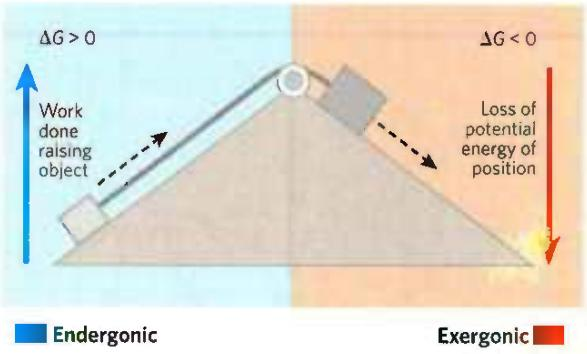

(b) Chemical example  
  
FIGURE 1-26 Energy coupling in mechanical and chemical processes. (a) The downward motion of an object releases potential energy that can do mechanical work. The potential energy made available by spontaneous downward motion, an exergonic process (red), can be coupled to the endergonic upward movement of another object (blue). (b) In reaction 1, the formation of glucose 6-phosphate from glucose and inorganic phosphate $(\mathsf{P_i})$ yields a product of higher energy than the two reactants. For this endergonic reaction, $\Delta G$ is positive. In reaction 2, the exergonic breakdown of adenosine triphosphate (ATP) has a large, negative free-energy change $(\Delta G_2)$ . The third reaction is the sum of reactions 1 and 2, and the free-energy change, $\Delta G_3$ , is the arithmetic sum of $\Delta G_{1}$ and $\Delta G_{2}$ . Because $\Delta G_{3}$ is negative and relatively large, the overall reaction is exergonic and proceeds spontaneously.

## WORKED EXAMPLE 1-1 Are ATP and ADP at Equilibrium in Cells?

ATP breakdown yields adenosine diphosphate (ADP) and inorganic phosphate $(\mathsf{P_i})$ . The equilibrium constant, $K_{\mathrm{eq}}$ , for the reaction is $2\times 10^{5}\mathrm{M}$ :

$$
\mathrm{ATP} \longrightarrow \mathrm{ADP} + \mathrm{HPO} _ {4} ^ {2 -}
$$

If the measured cellular concentrations are $[ATP]=5\ mm$ , $[ADP]=0.5\ mm$ , and $[P_{i}]=5\ mm$ , is this reaction at equilibrium in living cells?

SOLUTION: The definition of the equilibrium constant for this reaction is

$$
K _ {\mathrm{eq}} = [ \mathrm{ADP} ] [ \mathrm{P} _ {\mathrm{i}} ] / [ \mathrm{ATP} ]
$$

From the measured cellular concentrations given above, we can calculate the mass-action ratio, Q:

$$
\begin{array}{r l} Q & = [ \mathrm{ADP} ] [ \mathrm {P_ {i}} ] / [ \mathrm{ATP} ] = (0. 5 \mathrm{mm}) (5 \mathrm{mm}) / 5 \mathrm{mm} \\ & = 0. 5 \mathrm{mm} = 5 \times 1 0 ^ {- 4} \mathrm{m} \end{array}
$$

This value is far from the equilibrium constant for the reaction $(2 \times 10^{5} \text{ M})$ , so the reaction is very far from equilibrium in cells. [ATP] is far higher, and [ADP] is far lower, than is expected at equilibrium. How can a cell hold its [ATP]/[ADP] ratio so far from equilibrium? It does so by continuously extracting energy (from nutrients such as glucose) and using it to make ATP from ADP and $P_{i}$ .

Gibbs showed that $\Delta G$ (the actual free-energy change) for any chemical reaction is a function of the standard free-energy change, $\Delta G^{\circ}$ —a constant that is characteristic of each specific reaction—and a term that expresses the initial concentrations of reactants and products:

$$
\Delta G = \Delta G ^ {\circ} + R T \ln \frac {[ C ] _ {i} ^ {c} [ D ] _ {i} ^ {d}}{[ A ] _ {i} ^ {a} [ B ] _ {i} ^ {b}}\tag{1-1}
$$

where $[A]_{i}$ is the initial concentration of A, and so forth; R is the gas constant; and T is the absolute temperature.

$\Delta G$ is a measure of the distance of a system from its equilibrium position. When a reaction has reached equilibrium, no driving force remains and it can do no work: $\Delta G = 0$ . For this special case, $[A]_{i} = [A]_{eq}$ , and so on, for all reactants and products, and

$$
\frac {[ \mathrm{C} ] _ {\mathrm{i}} ^ {c} [ \mathrm{D} ] _ {\mathrm{i}} ^ {d}}{[ \mathrm{A} ] _ {\mathrm{i}} ^ {a} [ \mathrm{B} ] _ {\mathrm{i}} ^ {b}} = \frac {[ \mathrm{C} ] _ {\mathrm{eq}} ^ {c} [ \mathrm{D} ] _ {\mathrm{eq}} ^ {d}}{[ \mathrm{A} ] _ {\mathrm{eq}} ^ {a} [ \mathrm{B} ] _ {\mathrm{eq}} ^ {d}}
$$

Substituting 0 for $\Delta G$ and $K_{\mathrm{eq}}$ for $[\mathrm{C}]_{\mathrm{i}}^{c}[\mathrm{D}]_{\mathrm{i}}^{d}/[\mathrm{A}]_{\mathrm{i}}^{a}[\mathrm{B}]_{\mathrm{i}}^{b}$ in Equation 1-1, we obtain the relationship

$$
\Delta G ^ {\circ} = - R T \ln K _ {\mathrm{eq}}
$$

from which we see that $\Delta G^{\circ}$ is simply a second way (besides $K_{eq}$ ) of expressing the driving force on a reaction. Because $K_{eq}$ is experimentally measurable, we have a way of determining $\Delta G^{\circ}$ , the thermodynamic constant characteristic of each reaction.

The units of $\Delta G^{\circ}$ and $\Delta G$ are joules per mole (or calories per mole). When $K_{eq} \gg 1$ , $\Delta G^{\circ}$ is large and negative; when $K_{eq} \ll 1$ , $\Delta G^{\circ}$ is large and positive. From a table of experimentally determined values of either $K_{eq}$ or $\Delta G^{\circ}$ , we can see at a glance which reactions tend to go to completion and which do not.

One caution about the interpretation of $\Delta G^{\circ}$ : thermodynamic constants such as this show where the final equilibrium for a reaction lies but tell us nothing about how fast that equilibrium will be achieved. The rates of reactions are governed by the parameters of kinetics, a topic we consider in detail in Chapter 6.

P3 In living organisms, just as in the mechanical example in Figure 1-26a, an exergonic reaction can be coupled to an endergonic reaction to drive otherwise unfavorable reactions. Figure 1-26b, a reaction coordinate diagram, illustrates this principle for the conversion of glucose to glucose 6-phosphate, the first step in the pathway for oxidation of glucose. The most direct way to produce glucose 6-phosphate would be

$$
\text {   Reaction   1:   } \quad \begin{array}{c} \text {   Glucose   +   P } _ {\mathrm{i}} \longrightarrow \text {   glucose   6 - phosphate } \\ \text {(endergonic;} \\ \Delta G _ {1} \text {   is   positive)   } \end{array}
$$

This reaction does not occur spontaneously; $\Delta G_{1}$ is positive. A second, highly exergonic reaction can occur in all cells:

$$
\text {   Reaction   2:   } \quad \mathrm{ATP} \longrightarrow \mathrm{ADP} + \mathrm{P} _ {\mathrm{i}} (\text {   exergonic;   } \Delta G _ {2} \text {   is   negative)   }
$$

These two chemical reactions share a common intermediate, $P_{i}$ , which is consumed in reaction 1 and produced in reaction 2. The two reactions can therefore be coupled in the form of a third reaction, which we can write as the sum of reactions 1 and 2, with the common intermediate, $P_{i}$ , omitted from both sides of the equation:

$$
\text {   Reaction   3:   } \quad \begin{array}{c} \text {   Glucose   +   ATP   } \longrightarrow \text {   glucose   6 - phosphate   } \\ + \text {   ADP   } \end{array}
$$

Because more energy is released in reaction 2 than is consumed in reaction 1, the free-energy change for reaction 3, $\Delta G_{3}$ , is negative, and the synthesis of glucose 6-phosphate can therefore occur by reaction 3.

## WORKED EXAMPLE 1-2 Standard Free-Energy Changes Are Additive

Given that the standard free-energy change for the reaction glucose+P $_{i}$ →glucose 6-phosphate is 13.8 kJ/mol, and the standard free-energy change for the reaction ATP→ADP+P $_{i}$ is -30.5 kJ/mol, what is the free-energy change for the reaction glucose+ATP→glucose 6-phosphate+ADP?

SOLUTION: We can write the equation for this reaction as the sum of two other reactions:

$$
\begin{array}{l l} \text {(1) Glucose + P} _ {\mathrm{i}} \longrightarrow \text {glucose 6 - phosphate} & \Delta G _ {1} ^ {\circ} = 1 3. 8 \mathrm{kJ/mol} \\ \text {(2) ATP} \longrightarrow \mathrm{ADP+P} _ {\mathrm{i}} & \Delta G _ {2} ^ {\circ} = - 3 0. 5 \mathrm{kJ/mol} \end{array}
$$

$$
\begin{array}{r l} \text { Sum:   Glucose } + \text { ATP } & \longrightarrow \text { glucose   6 - phosphate } + \text { ADP } \\ & \Delta G _ {\text { Sum }} ^ {\circ} = - 1 6. 7 \mathrm{kJ/mol} \end{array}
$$

The standard free-energy change for two reactions that sum to a third is simply the sum of the two individual reactions. A negative value for $\Delta G^{\circ}(-16.7\ \text{kJ/mol})$ indicates that the reaction will tend to occur spontaneously.

The coupling of exergonic and endergonic reactions through a shared intermediate is central to the energy exchanges in living systems. As we shall see, reactions that break down ATP (such as reaction 2 in Fig. 1-26b) release energy that drives many endergonic processes in cells. ATP breakdown in cells is exergonic because all living cells maintain a concentration of ATP far above its equilibrium concentration. It is this disequilibrium that allows ATP to serve as the major carrier of chemical energy in all cells. P3 As we describe in detail in Chapter 13, it is not the mere breakdown of ATP that provides energy to drive endergonic reactions; rather, it is the transfer of a phosphoryl group from ATP to another small molecule (glucose in the case above) that conserves some of the chemical potential originally in ATP.

## WORKED EXAMPLE 1-3 Energetic Cost of ATP Synthesis

If the equilibrium constant, $K_{eq}$ , for the reaction

$$
\mathrm{ATP} \longrightarrow \mathrm{ADP} + \mathrm{P} _ {\mathrm{i}}
$$

is $2.22 \times 10^{5} \mathrm{M}$ , calculate the standard free-energy change, $\Delta G^{\circ}$ , for the synthesis of ATP from ADP and $\mathbf{P}_{\mathrm{i}}$ at $25^{\circ} \mathrm{C}$ .

SOLUTION: First calculate $\Delta G^{\circ}$ for the reaction above:

$$
\begin{array}{r l} \Delta G ^ {\circ} & = - R T \ln K _ {e q} \\ & = - (8. 3 1 5 \mathrm{J/mol} \cdot \mathrm{K}) (2 9 8 \mathrm{K}) (\ln 2. 2 2 \times 1 0 ^ {5}) \\ & = - 3 0. 5 \mathrm{kJ/mol} \end{array}
$$

This is the standard free-energy change for the breakdown of ATP to ADP and $P_{i}$ . The standard free-energy change for the reverse of a reaction has the same absolute value but the opposite sign. The standard free-energy change for the reverse of the above reaction is therefore 30.5 kJ/mol. So, to synthesize 1 mol of ATP under standard conditions (25 °C, 1 M concentrations of ATP, ADP, and $P_{i}$ ), at least 30.5 kJ of energy must be supplied. The actual free-energy change in cells — approximately 50 kJ/mol — is greater than this because the concentrations of ATP, ADP, and $P_{i}$ in cells are not the standard 1 M (see Worked Example 13-2).

## Enzymes Promote Sequences of Chemical Reactions

All biological macromolecules are much less thermodynamically stable than their monomeric subunits, yet they are kinetically stable: their uncatalyzed breakdown occurs so slowly (over years rather than seconds) that, on a time scale that matters for the organism, these molecules are stable. Virtually every chemical reaction in a cell occurs at a significant rate only because of the presence of enzymes—biocatalysts that, like all other catalysts, greatly enhance the rate of specific chemical reactions without being consumed in the process.

The path from reactant(s) to product(s) almost invariably involves an energy barrier, called the activation barrier (Fig. 1-27), that must be surmounted for any reaction to proceed. The breaking of existing bonds and formation of new ones generally requires, first, a distortion of the existing bonds to create a transition state of higher free energy than either the reactant or the product (see Section 6.2). The highest point in the reaction coordinate diagram represents the transition state, and the difference in energy between the reactant in its ground state and in its transition state is the activation energy, $\Delta G^{\ddagger}$ . An enzyme catalyzes a reaction by providing a more comfortable fit for the transition state: a surface that complements the transition state in stereochemistry, polarity, and charge. The binding of enzyme to the transition state is exergonic, and the energy released by this binding reduces the activation energy for the reaction and greatly increases the reaction rate.

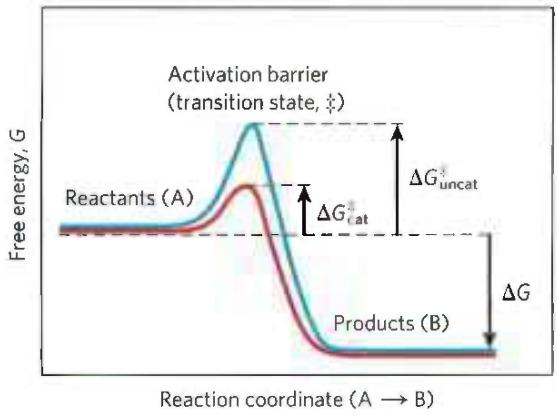  
FIGURE 1-27 Energy changes during a chemical reaction. An activation barrier, representing the transition state, must be overcome in the conversion of reactants (A) into products (B), even though the products are more stable than the reactants, as indicated by a large, negative free-energy change ( $\Delta G$ ). The energy required to overcome the activation barrier is the activation energy ( $\Delta G^{\ddagger}$ ). Enzymes catalyze reactions by lowering the activation barrier. They bind the transition-state intermediates tightly, and the binding energy of this interaction effectively reduces the activation energy from $\Delta G_{uncat}^{\ddagger}$ (blue curve) to $\Delta G_{cat}^{\ddagger}$ (red curve). (Note that activation energy is not related to free-energy change, $\Delta G$ .)

A further contribution to catalysis occurs when two or more reactants bind to the enzyme's surface close to each other and with stereospecific orientations that favor their reaction. This increases by orders of magnitude the probability of productive collisions between reactants. As a result of these factors and several others, discussed in Chapter 6, many enzyme-catalyzed reactions proceed at rates $10^{6}$ times faster than the uncatalyzed reactions.

Cellular catalysts are, with some notable exceptions, proteins. (Some RNA molecules have enzymatic activity, as discussed in Chapters 26 and 27.) Again with a few exceptions, each enzyme catalyzes a specific reaction, and each reaction in a cell is catalyzed by a different enzyme. Thousands of different enzymes are therefore required by each cell. The multiplicity of enzymes, their specificity (the ability to discriminate between reactants), and their susceptibility to regulation give cells the capacity to lower activation barriers selectively. This selectivity is crucial for the effective regulation of cellular processes. By allowing specific reactions to proceed at significant rates at particular times, enzymes determine how matter and energy are channeled into cellular activities.

The thousands of enzyme-catalyzed chemical reactions in cells are functionally organized into many sequences of consecutive reactions, called pathways, in which the product of one reaction becomes the reactant in the next. Some pathways degrade organic nutrients into simple end products in order to extract chemical energy and convert it into a form useful to the cell; together, these degradative, free-energy-yielding reactions are designated catabolism. The energy released by catabolic reactions drives the synthesis of ATP. As a result, the cellular concentration of ATP is held far above its equilibrium concentration, so that $\Delta G$ for ATP breakdown is large and negative. Similarly, catabolism results in the production of the reduced electron carriers NADH (nicotinamide adenine dinucleotide) and NADPH (nicotinamide adenine dinucleotide phosphate hydrogen), both of which can donate electrons in processes that generate ATP or drive reductive steps in biosynthetic pathways. They are often referred to collectively as NAD(P)H.

Other pathways start with small precursor molecules and convert them to progressively larger and more complex molecules, including proteins and nucleic acids. Such synthetic pathways, which invariably require the input of energy, are collectively designated anabolism.

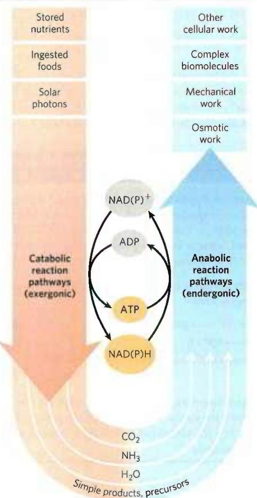  
FIGURE 1-28 The central roles of ATP and NAD(P)H in metabolism. ATP is the shared chemical intermediate linking energy-releasing and energy-consuming cellular processes. Its role in the cell is analogous to that of money in an economy: it is "earned/produced" in exergonic reactions and "spent/consumed" in endergonic ones. NADH is an electron-carrying cofactor that collects electrons from oxidative reactions. The closely related NADPH carries electrons in a wide variety of reduction reactions in biosynthesis. Present in relatively low concentrations, these cofactors essential to anabolic reactions must be constantly regenerated by catabolic reactions.

The overall network of enzyme-catalyzed pathways, both catabolic and anabolic, constitutes cellular metabolism. ATP (as well as other energetically equivalent nucleoside triphosphates) is the connecting link between the catabolic and anabolic components of this network (shown schematically in Fig. 1-28). P2 The pathways of enzyme-catalyzed reactions that act on the main constituents of cells—proteins, fats, sugars, and nucleic acids—are nearly identical in all living organisms. This remarkable unity of life is part of the evidence for a common evolutionary precursor for all living things.

## Metabolism Is Regulated to Achieve Balance and Economy

Not only do living cells simultaneously synthesize thousands of different kinds of carbohydrate, fat, protein, and nucleic acid molecules and their simpler subunits, but they do so in the precise proportions required by the cell under any given circumstance. For example, during rapid cell growth the precursors of proteins and nucleic acids must be made in large quantities, whereas in nongrowing cells the requirement for these precursors is much reduced. Key enzymes in each metabolic pathway are regulated so that each type of precursor molecule is produced in a quantity appropriate to the current requirements of the cell.

Consider the pathway in E. coli that leads to the synthesis of the amino acid isoleucine, a constituent of proteins. The pathway has five steps catalyzed by five different enzymes (A through F represent the intermediates in the pathway):

If a cell begins to produce more isoleucine than it needs for protein synthesis, the unused isoleucine accumulates, and the increased concentration inhibits the catalytic activity of the first enzyme in the pathway, immediately slowing the production of isoleucine. Such feedback inhibition keeps the production and utilization of each metabolic intermediate in balance. (Throughout the book, we use $\otimes$ to indicate inhibition of an enzymatic reaction.)

Although the concept of discrete pathways is an important tool for organizing our understanding of metabolism, it is an oversimplification. There are thousands of metabolic intermediates in a cell, many of which are part of more than one pathway. P3 Metabolism would be better represented as a web of interconnected and interdependent pathways. A change in the concentration of any one metabolite would start a ripple effect, influencing the flow of materials through other pathways. The task of understanding these complex interactions among intermediates and pathways in quantitative terms is daunting, but systems biology, discussed in Chapter 9, has begun to offer important insights into the overall regulation of metabolism.

Cells also regulate the synthesis of their own catalysts, the enzymes, in response to increased or diminished need for a metabolic product; this is the substance of Chapter 28. The regulated expression of genes (the translation from information in DNA to active protein in the cell) and the synthesis of enzymes are other layers of metabolic control in the cell. All layers must be taken into account when the overall control of cellular metabolism is described.

## SUMMARY 1.3 Physical Foundations

■ Living cells extract and channel energy to maintain themselves in a dynamic steady state distant from equilibrium.

Living cells are open systems, exchanging matter and energy with their surroundings. Energy is obtained from sunlight or chemical fuels when the energy from electron flow is converted into the chemical bonds of ATP.

The tendency for a chemical reaction to proceed toward equilibrium can be expressed as the free-energy change, $\Delta G$ . When $\Delta G$ of a reaction is negative, the reaction is exergonic and tends to go toward completion; when $\Delta G$ is positive, the reaction is endergonic and tends to go in the reverse direction. When two reactions can be summed to yield a third reaction, the $\Delta G$ for this overall reaction is the sum of the $\Delta G$ values for the two separate reactions.

The reactions converting ATP to $P_{i}$ and ADP are highly exergonic (large negative $\Delta G$ ). Many endergonic cellular reactions are driven by coupling them, through a common intermediate, to these highly exergonic reactions.

The standard free-energy change for a reaction, $\Delta G^{\circ}$ , is a physical constant that is related to the equilibrium constant by the equation $\Delta G^{\circ} = -RT\ln K_{\mathrm{eq}}$ .

■ Most cellular reactions proceed at useful rates only because enzymes are present to catalyze them. Enzymes act in part by stabilizing the transition state, reducing the activation energy, $\Delta G^{\ddagger}$ , and increasing the reaction rate by many orders of magnitude. The catalytic activity of enzymes in cells is regulated.

■ Metabolism is the sum of many interconnected reaction sequences that interconvert cellular metabolites. Each sequence is regulated to provide what the cell needs at a given time and to expend energy only when necessary.

## 1.4 Genetic Foundations

P4 Perhaps the most remarkable property of living cells and organisms is their ability to reproduce themselves for countless generations with nearly perfect fidelity.

  
(a)

  
(b)  
FIGURE 1-29 Two ancient scripts. (a) The Prism of Sennacherib, inscribed in about 700 ace, describes in characters of the Assyrian language some historical events during the reign of King Sennacherib. The Prism contains about 20,000 characters, weighs about 50 kg, and has survived almost intact for about 2,700 years. (b) The single DNA molecule of the bacterium E. coli, leaking out of a disrupted cell, is hundreds of times longer than the cell itself and contains all the encoded information necessary to specify the cell's structure and functions. The bacterial DNA contains about 4.6 million characters (nucleotides), weighs less than $10^{-10}$ g, and has undergone only relatively minor changes during the past several million years. (The yellow spots and dark specks in this colorized electron micrograph are artifacts of the preparation.) [(a) Erich Lessing/Art Resource, New York. (b) Dr. Gopal Murti/Science Source.]

This continuity of inherited traits implies constancy, over millions of years, in the structure of the molecules that contain the genetic information. Very few historical records of civilization, even those etched in copper or carved in stone (Fig. 1-29), have survived for a thousand years. But there is good evidence that the genetic instructions in living organisms have remained nearly unchanged over very much longer periods; many bacteria have nearly the same size, shape, and internal structure as bacteria that lived almost four billion years ago. This continuity of structure and composition is the result of continuity in the structure of the genetic material.

Among the seminal discoveries in biology in the twentieth century were the chemical nature and the three-dimensional structure of the genetic material, deoxyribonucleic acid, DNA. P2 The sequence of the monomeric subunits, the nucleotides (strictly, deoxyribonucleotides, as discussed below), in this linear polymer encodes the instructions for forming all other cellular components and provides a template for the production of identical DNA molecules to be distributed to progeny when a cell divides.

## Genetic Continuity Is Vested in Single DNA Molecules

DNA is a long, thin, organic polymer, the rare molecule that is constructed on the atomic scale in one dimension (width) and the human scale in another (length: a molecule of DNA can be many centimeters long). A human sperm or egg, carrying the accumulated hereditary information of billions of years of evolution, transmits this inheritance in the form of DNA molecules, in which the linear sequence of covalently linked nucleotide subunits encodes the genetic message.

Usually when we describe the properties of a chemical species, we describe the average behavior of a very large number of identical molecules. While it is difficult to predict the behavior of any single molecule in a collection of, say, a picomole (about $6 \times 10^{11}$ molecules) of a compound, the average behavior of the molecules is predictable because so many molecules enter into the average. Cellular DNA is a remarkable exception. P4 The DNA that is the entire genetic material of an E. coli cell is a single molecule containing 4.64 million nucleotide pairs. That single molecule must be replicated perfectly in every detail if an E. coli cell is to give rise to identical progeny by cell division; there is no room for averaging in this process! The same is true for all cells. A human sperm brings to the egg that it fertilizes just one molecule of DNA in each of its 23 different chromosomes, to combine with just one DNA molecule in each corresponding chromosome in the egg. The result of this union is highly predictable: an embryo with all of its \~20,000 genes, constructed of 3 billion nucleotide pairs, intact. An amazing chemical feat!

## WORKED EXAMPLE 1-4 Fidelity of DNA Replication

Calculate the number of times the DNA of a modern E. coli cell has been copied accurately since its earliest bacterial precursor cell arose about 3.5 billion years ago. Assume for simplicity that over this time period, E. coli has undergone, on average, one cell division every 12 hours (this is an overestimate for modern bacteria, but probably an underestimate for ancient bacteria).

SOLUTION:

$$
\begin{array}{r l} (1 \text { generation } / 1 2 \mathrm{h}) (2 4 \mathrm{h} / \text { day }) (3 6 5 \text { days } / \mathrm{yr}) & (3. 5 \times 1 0 ^ {9} \mathrm{yr}) \\ & = 2. 6 \times 1 0 ^ {1 2} \text { generations } \end{array}
$$

A single page of this book contains about 5,000 characters, so the entire book contains about 5 million characters. The chromosome of E. coli also contains about 5 million characters (nucleotide pairs). Imagine making a handwritten copy of this book and passing on the copy to a classmate, who copies it by hand and passes this second copy to a third classmate, who makes a third copy, and so on. How closely would each successive copy of the book resemble the original? Now, imagine the textbook that would result from hand-copying this one a few trillion times!

## The Structure of DNA Allows Its Replication and Repair with Near-Perfect Fidelity

P4 The capacity of living cells to preserve their genetic material and to duplicate it for the next generation results from the structural complementarity between the two strands of the DNA molecule (Fig. 1-30). The basic unit of DNA is a linear polymer of four different monomeric subunits, deoxyribonucleotides, arranged in a precise linear sequence. It is this linear sequence that encodes the genetic information. Two of these polymeric strands are twisted about each other to form the DNA double helix, in which each deoxyribonucleotide in one strand pairs specifically with a complementary deoxyribonucleotide in the opposite strand. P4 Before a cell divides, the two DNA strands separate locally and each serves as a template for the synthesis of a new, complementary strand, generating two identical double-helical molecules, one for each daughter cell. If either strand is damaged at any time, continuity of information is assured by the information present in the other strand, which can act as a template for repair of the damage.

  
FIGURE 1-30 Complementarity between the two strands of DNA. DNA is a linear polymer of covalently joined deoxyribonucleotides of four types: deoxyadenylate (A), deoxyguanylate (G), deoxycytidylate (C), and deoxythymidylate (T). Each nucleotide, with its unique three-dimensional structure, can associate very specifically but noncovalently with one other nucleotide in the complementary chain: A always associates with T, and G with C. Thus, in the double-stranded DNA molecule, the entire sequence of nucleotides in one strand is complementary to the sequence in the other. The two strands, held together by hydrogen bonds (represented here by vertical light blue lines) between each pair of complementary nucleotides, twist about each other to form the DNA double helix. In DNA replication, the two strands (blue) separate and two new strands (pink) are synthesized, each with a sequence complementary to one of the original strands. The result is two double-helical molecules, each identical to the original DNA.

## The Linear Sequence in DNA Encodes Proteins with Three-Dimensional Structures

P4 The information in DNA is encoded in its linear (one-dimensional) sequence of deoxyribonucleotide subunits, but the expression of this information results in a three-dimensional cell. This change from one to three dimensions occurs in two phases. A linear sequence of deoxyribonucleotides in DNA codes (through an intermediary, RNA) for the production of a protein with a corresponding linear sequence of amino acids (Fig. 1-31). The protein folds into a particular three-dimensional shape, determined by its amino acid sequence and stabilized primarily by noncovalent interactions. Although the final shape of the folded protein is dictated by its amino acid sequence, the folding of many proteins is aided by "molecular chaperones" (see Fig. 4-28). The precise three-dimensional structure, or native conformation, of the protein is crucial to its function.

Once in its native conformation, a protein may associate noncovalently with other macromolecules (other proteins, nucleic acids, or lipids) to form supramolecular complexes such as chromosomes, ribosomes, and membranes. The individual molecules of these complexes have specific, high-affinity binding sites for each other, and within the cell they spontaneously self-assemble into functional complexes.

  
FIGURE 1-31 DNA to RNA to protein to enzyme (hexokinase). The linear sequence of deoxyribonucleotides in the DNA (the gene) that encodes the protein hexokinase is first transcribed into a ribonucleic acid (RNA) molecule with the complementary ribonucleotide sequence. The RNA sequence (messenger RNA) is then translated into the linear protein chain of hexokinase, which folds into its native three-dimensional shape, most likely aided by molecular chaperones. Once in its native form, hexokinase acquires its catalytic activity: it can catalyze the phosphorylation of glucose, using ATP as the phosphoryl group donor.

Although the amino acid sequences of proteins carry all necessary information for achieving the proteins' native conformation, accurate folding and self-assembly also require the right cellular environment—pH, ionic strength, metal ion concentrations, and so forth. Thus, DNA sequence alone is not enough to form and maintain a fully functioning cell.

## SUMMARY 1.4 Genetic Foundations

■ Genetic information is encoded in the linear sequence of four types of deoxyribonucleotides in DNA.

Despite the enormous size of DNA, the sequence of its nucleotides is very precise, and the maintenance of this precise sequence over very long times is the basis for genetic continuity in organisms.

■ The double-helical DNA molecule contains an internal template for its own replication and repair.

The linear sequence of amino acids in a protein, which is encoded in the DNA of the gene for that protein, produces a protein's unique three-dimensional structure—a process that is also dependent on environmental conditions.

■ Individual macromolecules with specific affinity for other macromolecules self-assemble into supramolecular complexes.

## 1.5 Evolutionary Foundations

Nothing in biology makes sense except in the light of evolution.

—Theodosius Dobzhansky, in The American Biology Teacher, March 1973

Great progress in biochemistry and molecular biology in recent decades has amply confirmed the validity of Dobzhansky's striking generalization. P5 The remarkable similarity of metabolic pathways and gene sequences across the three domains of life argues strongly that all modern organisms are derived from a common evolutionary progenitor by a series of small changes (mutations), each of which conferred a selective advantage to some organism in some ecological niche.

## Changes in the Hereditary Instructions Allow Evolution

Despite the near-perfect fidelity of genetic replication, infrequent unrepaired mistakes in the DNA replication process lead to changes in the nucleotide sequence of DNA, producing a genetic mutation and changing the instructions for a cellular component.

Incorrectly repaired damage to one of the DNA strands has the same effect. Mutations in the DNA handed down to offspring—that is, mutations carried in the reproductive cells—may be harmful or even lethal to the new organism or cell; they may, for example, cause the synthesis of a defective enzyme that is not able to catalyze an essential metabolic reaction. Occasionally, however, a mutation better equips an organism or cell to survive in its environment (Fig. 1-32). The mutant enzyme might have acquired a slightly different specificity, for example, so that it is now able to use some compound that the cell was previously unable to metabolize. If a population of cells were to find itself in an environment where that compound was the only or the most abundant available source of fuel, the mutant cell would have a selective advantage over the other, unmutated (wild-type) cells in the population. The mutant cell and its progeny would survive and prosper in the new environment, whereas wild-type cells would starve and be eliminated. This is what Charles Darwin meant by natural selection—what is sometimes summarized as “survival of the fittest.”

Occasionally, a second copy of a whole gene is introduced into the chromosome as a result of defective replication of the chromosome. The second copy is superfluous, and mutations in this gene will not be deleterious; it becomes a means by which the cell may evolve, by producing a new gene with a new function while retaining the original gene and gene function. Seen in this light, the DNA molecules of modern organisms are historical documents, records of the long journey from the earliest cells to modern organisms. The historical accounts in DNA are not complete, however; in the course of evolution, many mutations must have been erased or written over. But DNA molecules are the best source of biological history we have. P5 The frequency of errors in DNA replication represents a balance between too many errors, which would yield nonviable daughter cells, and too few errors, which would prevent the genetic variation that allows survival of mutant cells in new ecological niches.

Several billion years of natural selection have refined cellular systems to take maximum advantage of the chemical and physical properties of available raw materials. Chance genetic mutations occurring in individuals in a population, combined with natural selection, have resulted in the evolution of the enormous variety of species we see today, each adapted to its particular ecological niche.

## Biomolecules First Arose by Chemical Evolution

In our account thus far, we have passed over the first chapter of the story of evolution: the appearance of the first living cell. Apart from their occurrence in living organisms, organic compounds, including the basic biomolecules such as amino acids and carbohydrates, are found in only trace amounts in the Earth's crust, the sea, and the atmosphere. How did the first living organisms acquire their characteristic organic building blocks? According to one hypothesis, these compounds were created by the effects of powerful environmental forces—ultraviolet irradiation, lightning, or volcanic eruptions—on the gases in the prebiotic Earth's atmosphere and on inorganic solutes in superheated thermal vents deep in the ocean.

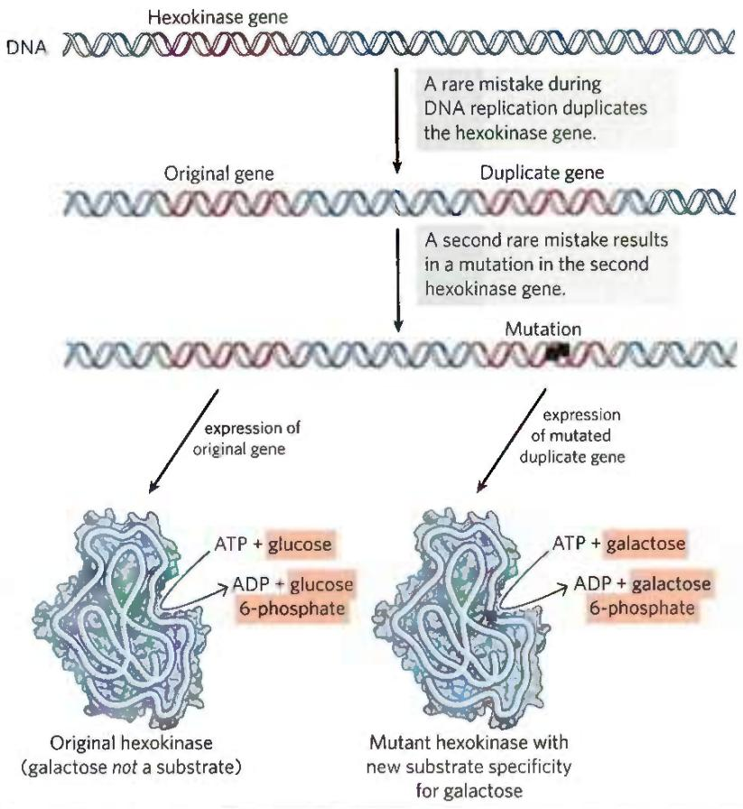

This hypothesis was tested in a classic experiment on the abiotic (nonbiological) origin of organic biomolecules carried out in 1953 by biochemist Stanley Miller in the laboratory of the physical chemist Harold Urey. Miller subjected gaseous mixtures such as those presumed to exist on the prebiotic Earth, including $NH_{3}$ , $CH_{4}$ , $H_{2}O$ , and $H_{2}$ , to electrical sparks produced across a pair of electrodes (to simulate lightning) for periods of a week or more, then analyzed the contents of the closed reaction vessel (Fig. 1-33). The gas phase of the resulting mixture contained CO and $CO_{2}$ as well as the starting materials. The water phase contained a variety of organic compounds, including some amino acids, hydroxy acids, aldehydes, and hydrogen cyanide (HCN). This experiment established the possibility of abiotic production of biomolecules in relatively short times under relatively mild conditions. When Miller's carefully stored samples were rediscovered in 2010 and examined with much more sensitive and discriminating techniques (high-performance liquid chromatography and mass

FIGURE 1-32 Gene duplication and mutation: one path to generate new enzymatic activities. In this example, the single hexokinase gene in a hypothetical organism might occasionally, by accident, be copied twice during DNA replication, such that the organism has two full copies of the gene, one of which is superfluous. Over many generations, as the DNA with two hexokinase genes is repeatedly duplicated, rare mistakes occur, leading to changes in the nucleotide sequence of the superfluous gene and thus of the protein that it encodes. In a few very rare cases, the altered protein produced from this mutant gene can bind a new substrate—galactose in our hypothetical case. The cell containing the mutant gene has acquired a new capability (metabolism of galactose), which may allow the cell to survive in an ecological niche that provides galactose but not glucose. If no gene duplication precedes mutation, the original function of the gene product is lost.

spectrometry), his original observations were confirmed and greatly broadened. Previously unpublished experiments by Miller that included $H_{2}S$ in the gas mixture (mimicking the “smoking” volcanic plumes at the sea bottom; Fig. 1-34) showed the formation of 23 amino acids and 7 organosulfur compounds, as well as a large number of other simple compounds that might have served as building blocks in prebiotic evolution.

More-refined laboratory experiments have provided good evidence that many of the chemical components of living cells can form under these conditions. Polymers of the nucleic acid RNA (ribonucleic acid) can act as catalysts in biologically significant reactions (see Chapters 26 and 27), and RNA probably played a crucial role in prebiotic evolution, both as catalyst and as information repository.

## RNA or Related Precursors May Have Been the First Genes and Catalysts

In modern organisms, nucleic acids encode the genetic information that specifies the structure of enzymes, and enzymes catalyze the replication and repair of nucleic acids. The mutual dependence of these two classes of biomolecules brings up the perplexing question: Which came first, DNA or protein?

The answer may be that they appeared about the same time, and RNA preceded them both.

  
(a)

  
(b)  
FIGURE 1-33 Abiotic production of biomolecules. (a) Spark-discharge apparatus of the type used by Miller and Urey in experiments demonstrating abiotic formation of organic compounds under primitive atmospheric conditions. After subjection of the gaseous contents of the system to electrical sparks, products were collected by condensation. Biomolecules such as amino acids were among the products. (b) Stanley L. Miller (1930–2007) using his spark-discharge apparatus. [(b) Bettmann/Getty Images.]

The discovery that RNA molecules can act as catalysts in their own formation suggests that RNA or a similar molecule may have been the first gene and the first catalyst. According to this scenario (Fig. 1-35), one of the earliest stages of biological evolution was the chance formation of an RNA molecule that could catalyze the formation of other RNA molecules of the same sequence—a self-replicating, self-perpetuating RNA.

  
FIGURE 1-34 Black smokers. Hydrothermal vents in the sea floor emit superheated water rich in dissolved minerals. Black "smoke" is formed when the vented solution meets cold seawater and dissolved sulfides precipitate. Diverse life forms, including a variety of archaea and some remarkably complex multicellular organisms, are found in the immediate vicinity of such vents, which may have been the sites of early biogenesis. [NOAA/Science Source]

The concentration of a self-replicating RNA molecule would increase exponentially, as one molecule formed several, several formed many, and so on. The fidelity of self-replication was presumably less than perfect, so the process would generate variants of the RNA, some of which might be even better able to self-replicate. In the competition for nucleotides, the most efficient of the self-replicating sequences would win, and less efficient replicators would fade from the population.

The division of function between DNA (genetic information storage) and protein (catalysis) was, according to the "RNA world" hypothesis, a later development. New variants of self-replicating RNA molecules developed that had the additional ability to catalyze the condensation of amino acids into peptides. Occasionally, the peptide(s) thus formed would reinforce the self-replicating ability of the RNA, and the pair—RNA molecule and helping peptide—could undergo further modifications in sequence, generating increasingly efficient self-replicating systems. The remarkable discovery that in the protein-synthesizing machinery of modern cells (ribosomes), RNA molecules, not proteins, catalyze the formation of peptide bonds is consistent with the RNA world hypothesis.

Some time after the evolution of this primitive protein-synthesizing system, there was a further development: DNA molecules with sequences complementary to the self-replicating RNA molecules took over the function of conserving the "genetic" information, and RNA molecules evolved to play roles in protein synthesis. (We explain in Chapter 8 why DNA is a more stable molecule than RNA and thus a better repository of inheritable information.) Proteins proved to be versatile catalysts and, over time, took over most of that function. Lipidlike compounds in the primordial mixture formed relatively impermeable layers around self-replicating collections of molecules. The concentration of proteins and nucleic acids within these lipid enclosures favored the molecular interactions required in self-replication.

  
FIGURE 1-35 A possible "RNA world" scenario.

The RNA world scenario is intellectually satisfying, but it leaves unanswered a vexing question: Where did the nucleotides needed to make the initial RNA molecules come from? An alternative to this scenario supposes that simple metabolic pathways evolved first, perhaps at the hot vents in the ocean floor. A set of linked chemical reactions there might have produced precursors, including nucleotides, before the advent of lipid membranes or RNA. Without more experimental evidence, neither of these hypotheses can be disproved.

## Biological Evolution Began More Than Three and a Half Billion Years Ago

Earth was formed about 4.6 billion years ago, and the first evidence of life dates to more than 3.5 billion years ago (see the timeline in Figure 1-36). In 1996, scientists working in Greenland found chemical evidence of life (“fossil molecules”) from as far back as 3.85 billion years ago, forms of carbon embedded in rock that seem to have a distinctly biological origin. Somewhere on Earth during its first billion years the first simple organism arose, capable of replicating its own structure from a template (RNA?) that was the first genetic material. Because the terrestrial atmosphere at the dawn of life was nearly devoid of oxygen, and because there were few microorganisms to scavenge organic compounds formed by natural processes, these compounds were relatively stable. Given this stability and eons of time, the improbable became inevitable: lipid vesicles containing organic compounds and self-replicating RNA gave rise to the first cells, or protocells, and those protocells with the greatest capacity for self-replication became more numerous. The process of biological evolution had begun.

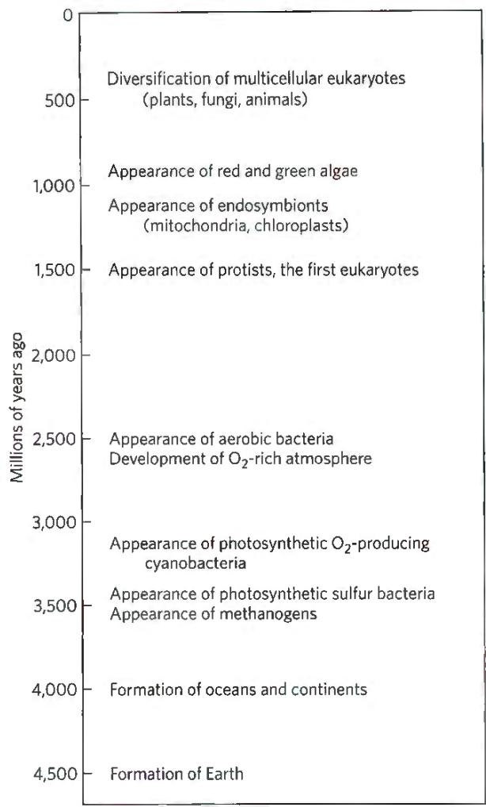  
FIGURE 1-36 Landmarks in the evolution of life on Earth.

## The First Cell Probably Used Inorganic Fuels

The earliest cells arose in a reducing atmosphere (there was no oxygen) and probably obtained energy from inorganic fuels such as ferrous sulfide and ferrous carbonate, both abundant on the early Earth. For example, the reaction

$$
\mathrm{FeS} + \mathrm{H} _ {2} \mathrm{S} \longrightarrow \mathrm{FeS} _ {2} + \mathrm{H} _ {2}
$$

yields enough energy to drive the synthesis of ATP or similar compounds. The organic compounds these early cells required may have arisen by the nonbiological actions of lightning or of heat from volcanoes or thermal vents in the sea on components of the early atmosphere such as CO, $CO_{2}$ , $N_{2}$ , $NH_{3}$ , and $CH_{4}$ . An alternative source of organic compounds has been proposed: extraterrestrial space. Space missions in 2006 (the NASA Stardust space probe) and 2014 (the European Space Agency lander Philae) found particles of comet dust containing the simple amino acid glycine and 20 other organic compounds capable of reacting to form biomolecules.

Early unicellular organisms gradually acquired the ability to derive energy from compounds in their environment and to use that energy to synthesize more of their own precursor molecules, thereby becoming less dependent on outside sources. A very significant evolutionary event was the development of pigments capable of capturing the energy of light from the sun, which could be used to reduce, or "fix," $CO_{2}$ to form more complex, organic compounds. The original electron donor for these photosynthetic processes was probably $H_{2}S$ , yielding elemental sulfur or sulfate ( $SO_{4}^{2-}$ ) as the byproduct. Some hydrothermal vents in the sea bottom (black smokers; Fig. 1-36) emit significant amounts of $H_{2}$ , which is another possible electron donor in the metabolism of the earliest organisms. Later cells developed the enzymatic capacity to use $H_{2}O$ as the electron donor in photosynthetic reactions, producing $O_{2}$ as waste. Cyanobacteria are the modern descendants of these early photosynthetic oxygen-producers.

Because the atmosphere of Earth in the earliest stages of biological evolution was nearly devoid of oxygen, the earliest cells were anaerobic. Under these conditions, chemotrophs could oxidize organic compounds to $CO_{2}$ by passing electrons not to $O_{2}$ but to acceptors such as $SO_{4}^{2-}$ , in this case yielding $H_{2}S$ as the product. With the rise of $O_{2}$ -producing photosynthetic bacteria, the atmosphere became progressively richer in oxygen—a powerful oxidant and a deadly poison to anaerobes. Responding to the evolutionary pressure of what evolutionary theorist and biologist Lynn Margulis and science writer Dorion Sagan called the “oxygen holocaust,” some lineages of microorganisms gave rise to aerobes that obtained energy by passing electrons from fuel molecules to oxygen. Because the transfer of electrons from organic molecules to $O_{2}$ releases a great deal of energy, aerobic organisms had an energetic advantage over their anaerobic counterparts when both competed in an environment containing oxygen. This advantage translated into the predominance of aerobic organisms in $O_{2}$ -rich environments.

Modern bacteria and archaea inhabit almost every ecological niche in the biosphere, and there are organisms capable of using virtually every type of organic compound as a source of carbon and energy. Photosynthetic microbes in both fresh and marine waters trap solar energy and use it to generate carbohydrates and all other cell constituents, which are in turn used as food by other forms of life. The process of evolution continues—and, in rapidly reproducing bacterial cells, on a time scale that allows us to witness it in the laboratory.

## Eukaryotic Cells Evolved from Simpler Precursors in Several Stages

Starting about 1.5 billion years ago, the fossil record begins to show evidence of larger and more complex organisms, probably the earliest eukaryotic cells (see Fig. 1-37). Details of the evolutionary path from non-nucleated to nucleated cells cannot be deduced from the fossil record alone, but morphological and biochemical comparisons of modern organisms have suggested a sequence of events consistent with the fossil evidence.

Three major changes must have occurred. First, as cells acquired more DNA, the mechanisms required to fold it compactly into discrete complexes with specific proteins and to divide it equally between daughter cells at cell division became more elaborate. Specialized proteins were required to stabilize folded DNA and to pull the resulting DNA-protein complexes (chromosomes) apart during cell division. This was the evolution of the chromosome. Second, as cells became larger, a system of intracellular membranes developed, including a double membrane surrounding the DNA. This membrane segregated the nuclear process of RNA synthesis on a DNA template from the cytoplasmic process of protein synthesis on ribosomes. This was the evolution of the nucleus, a defining feature of eukaryotes. Third, early eukaryotic cells, which were incapable of photosynthesis or aerobic metabolism, enveloped aerobic bacteria or photosynthetic bacteria to form endosymbiotic associations that eventually became permanent (Fig. 1-37). Some aerobic bacteria evolved into the mitochondria of modern eukaryotes, and some photosynthetic cyanobacteria became the plastids, such as the chloroplasts of green algae, the likely ancestors of modern plant cells.

At some later stage of evolution, unicellular organisms found it advantageous to cluster together, thereby acquiring greater motility, efficiency, or reproductive success than their free-living single-celled competitors. Further evolution of such clustered organisms led to permanent associations among individual cells and eventually to specialization within the colony—to cellular differentiation.

The advantages of cellular specialization led to the evolution of increasingly complex and highly differentiated organisms, in which some cells carried out the sensory functions; others the digestive, photosynthetic, or reproductive functions; and so forth. Many modern multicellular organisms contain hundreds of different cell types, each specialized for a function that supports the entire organism. Fundamental mechanisms that evolved early have been further refined and embellished through evolution. The same basic structures and mechanisms that underlie the beating motion of cilia in Paramecium and of flagella in Chlamydomonas are employed by the highly differentiated vertebrate sperm cell, for example.

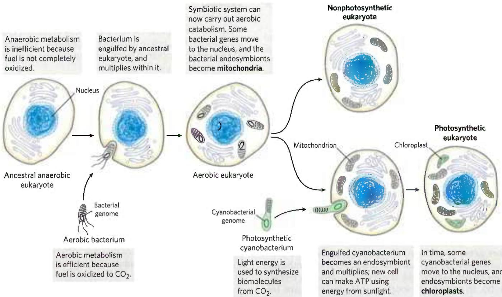  
FIGURE 1-37 Evolution of eukaryotes through endosymbiosis. The earliest eukaryote, an anaerobe, acquired endosymbiotic purple bacteria, which carried with them their capacity for aerobic catabolism and became,  
over time, mitochondria. When photosynthetic cyanobacteria subsequently became endosymbionts of some aerobic eukaryotes, these cells became the photosynthetic precursors of modern green algae and plants.

## Molecular Anatomy Reveals Evolutionary Relationships

Now that genomes can be sequenced relatively quickly and inexpensively, biochemists have an enormously rich, ever-increasing treasury of information on the molecular anatomy of cells that they can use to analyze evolutionary relationships and refine evolutionary theory. Thus far, the molecular phylogeny derived from gene sequences is consistent with, but in many cases more precise than, the classical phylogeny based on macroscopic structures.

P5 Although organisms have continuously diverged at the level of gross anatomy, at the molecular level the basic unity of life is readily apparent; molecular structures and mechanisms are remarkably similar from the simplest to the most complex organisms. These similarities are most easily seen at the level of sequences, either the DNA sequences that encode proteins or the protein sequences themselves.

When two genes share readily detectable sequence similarities (nucleotide sequence in DNA or amino acid sequence in the proteins they encode), their sequences are said to be homologous and the proteins they encode are homologs. In the course of evolution, new structures, processes, or regulatory mechanisms are acquired, reflections of the changing genomes of the evolving organisms. The genome of a simple eukaryote such as yeast should have genes related to formation of the nuclear membrane, genes not present in bacteria or archaea. The genome of an insect should contain genes that encode proteins involved in specifying a characteristic segmented body plan, genes not present in yeast. The genomes of all vertebrate animals should share genes that specify the development of a spinal column, and those of mammals should have unique genes necessary for the development of the placenta, a characteristic of mammals—and so on. Comparisons of the whole genomes of species in each phylum are leading to the identification of genes critical to fundamental evolutionary changes in body plan and development.

## Functional Genomics Shows the Allocations of Genes to Specific Cellular Processes

When the sequence of a genome is fully determined and each gene is assigned a function, molecular geneticists can group genes according to the processes (DNA synthesis, protein synthesis, generation of ATP, and so forth) in which they function and thus find what fraction of the genome is allocated to each of a cell's activities. The largest category of genes in E. coli, A. thaliana, and H. sapiens consists of those of (as yet) unknown function, which make up more than 40% of the genes in each species. The genes encoding the transporters that move ions and small molecules across plasma membranes make up a significant proportion of the genes in all three species, more in the bacterium and plant than in the mammal (10% of the \~4,400 genes of E. coli, \~8% of the \~27,000 genes of A. thaliana, and \~4% of the \~20,000 genes of H. sapiens). Genes that encode the proteins and RNA required for protein synthesis make up 3% to 4% of the E. coli genome; but in the more complex cells of A. thaliana, more genes are needed for targeting proteins to their final location in the cell than are needed to synthesize those proteins (about 6% and 2% of the genome, respectively). In general, the more complex the organism, the greater the proportion of its genome that encodes genes involved in the regulation of cellular processes and the smaller the proportion dedicated to basic processes, or "housekeeping" functions, such as ATP generation and protein synthesis. The housekeeping genes typically are expressed under all conditions and are not subject to much regulation.

## Genomic Comparisons Have Increasing Importance in Medicine

Large-scale studies in which the entire genomic sequence has been determined for hundreds or thousands of people with cancer, type 2 diabetes, schizophrenia, or other diseases or conditions have allowed the identification of many genes in which mutations correlate with a medical condition. Typically, sequence differences are found in a number of different genes, each of which makes a partial contribution to the predisposition to a given condition or disease. Each of those genes codes for a protein that, in principle, might become the target for drugs to treat that condition. We may expect that for some genetic diseases, palliatives will be replaced by cures, and that for disease susceptibilities associated with particular genetic markers, forewarning and perhaps increased preventive measures will prevail. Today's "medical history" may be replaced by a "medical forecast."

## SUMMARY 1.5 Evolutionary Foundations

■ Occasional inheritable mutations yield organisms that are better suited for survival and reproduction in an ecological niche, and their progeny come to dominate the population in that niche. This process of mutation and selection is the basis for the Darwinian evolution that led from the first cell to all modern organisms. The large number of genes shared by all living organisms explains organisms' fundamental similarities.

The components for the first cell may have been produced near hydrothermal vents at the bottom of the sea or by the action of lightning and high temperature on simple atmospheric molecules such as $\mathrm{CO}_{2}$ and $\mathrm{NH}_{3}$ .

The earliest cells may have been formed by the enclosure of a self-replicating RNA molecule within a membrane-like lipid layer. The catalytic and genetic roles played by the early RNA genome were, over time, taken over by proteins and DNA, respectively.

■ Hydrothermal vents may have provided the oxidizable fuels (iron compounds) for the first organisms.

Eukaryotic cells acquired the capacity for photosynthesis and oxidative phosphorylation from endosymbiotic bacteria. In multicellular organisms, differentiated cell types specialize in one or more of the functions essential to the organism's survival.

■ Detailed phylogenetic relationships can be determined from gene or protein sequence similarities between organisms.

■ From knowledge of the roles of proteins encoded in the genome, scientists can approximate the proportion of the genome dedicated to a specific process, such as membrane transport or protein synthesis.

\- Knowledge of the complete genomic sequences of organisms from different branches of the phylogenetic tree provides insights into evolution and offers great opportunities in medicine.

## KEY TERMS

All terms are defined in the glossary.

<table><tr><td>biochemistry 2</td><td>endergonic reaction 21</td></tr><tr><td>metabolite 2</td><td>exergonic reaction 21</td></tr><tr><td>nucleus 2</td><td>equilibrium 22</td></tr><tr><td>genome 2</td><td rowspan="2">standard free-energy change,  $\Delta G^{\circ}$  24</td></tr><tr><td>eukaryotes 2</td></tr><tr><td>bacteria 3</td><td rowspan="2">activation energy, $\Delta G^{\ddagger}$  25</td></tr><tr><td>archaea 3</td></tr><tr><td>cytoskeleton 6</td><td>catabolism 26</td></tr><tr><td>stereoisomers 15</td><td>anabolism 26</td></tr><tr><td>configuration 15</td><td>metabolism 27</td></tr><tr><td>chiral center 16</td><td>systems biology 27</td></tr><tr><td>conformation 18</td><td>mutation 30</td></tr><tr><td>entropy, S 21</td><td rowspan="2">housekeeping genes 36</td></tr><tr><td>enthalpy, H 21</td></tr><tr><td>free-energy change, $\Delta G$  21</td><td></td></tr></table>

## PROBLEMS

For all numerical problems, keep in mind that answers should be expressed with the correct number of significant figures. (In solving end-of-chapter problems, you may wish to refer to the tables on the inside of the back cover.) Brief solutions are provided in Appendix B; expanded solutions are published in the Absolute Ultimate Study Guide to Accompany Principles of Biochemistry.

1. The Size of Cells and Their Components A typical eukaryotic cell has a cellular diameter of 50 $\mu$ m.

(a) If you used an electron microscope to magnify this cell 10,000-fold, how big would the cell appear?

(b) If this cell were a liver cell (hepatocyte) with the same cellular diameter, how many mitochondria could the cell contain? Assume the cell is spherical; that the cell contains no other cellular components; and that each mitochondrion is spherical, with a diameter of 1.5 μm. (The volume of a sphere is $\frac{4}{3}\pi r^3$ .)

(c) Glucose is the major energy-yielding nutrient for most cells. Assuming a cellular concentration of 1 mm glucose (that is, 1 millimole/L), calculate how many molecules of glucose would be present in the spherical eukaryotic cell. (Avogadro's number, the number of molecules in 1 mol of a nonionized substance, is $6.02 \times 10^{23}$ .)

2. Components of E. coli E. coli cells are rod-shaped, about 2 $\mu$ m long, and 0.8 $\mu$ m in diameter. E. coli has a protective envelope 10 nm thick. The volume of a cylinder is $\pi r^{2}h$ , where h is the height of the cylinder.

(a) What percentage of the total volume of the bacterium does the cell envelope occupy?

(b) E. coli is capable of growing and multiplying rapidly because it contains some 15,000 spherical ribosomes (diameter 18 nm), which carry out protein synthesis. What percentage of the cell volume do the ribosomes occupy?

(c) The molecular weight of an E. coli DNA molecule is about $3.1 \times 10^{9}$ g/mol. The average molecular weight of a nucleotide pair is 660 g/mol, and each nucleotide pair contributes 0.34 nm to the length of DNA. Calculate the length of an E. coli DNA molecule. Compare the length of the DNA molecule with the cell dimensions. Now, consider the photomicrograph showing the single DNA molecule of the bacterium E. coli leaking out of a disrupted cell (Fig. 1-31b). How does the DNA molecule fit into the cell?

3. Isolating Ribosomes through Differential Centrifugation Assume you have a crude lysate sample that you obtained from mechanically homogenizing E. coli cells. You centrifuged the supernatant from the sample at a medium speed (20,000 g) for 20 min, collected the supernatant, and then centrifuged the supernatant at high speed (80,000 g) for 1 h. What procedure should you follow to isolate the ribosomes from this sample?

4. The High Rate of Bacterial Metabolism Bacterial cells have a much higher rate of metabolism than animal cells. Under ideal conditions, some bacteria double in size and divide every 20 min, whereas most animal cells under rapid growth conditions require 24 hours. The high rate of bacterial metabolism requires a high ratio of surface area to cell volume.

(a) How does the surface-to-volume ratio affect the maximum rate of metabolism?

(b) Calculate the surface-to-volume ratio for the spherical bacterium Neisseria gonorrhoeae (diameter $0.5 \mu m$ ), responsible for the disease gonorrhea. The surface area of a sphere is $4\pi r^{2}$ .

(c) How many times greater is the surface-to-volume ratio of Neisseria gonorrhoeae compared to that of a globular amoeba, a large eukaryotic cell (diameter 150 $\mu$ m)?

5. Fast Axonal Transport Neurons have long thin processes called axons, structures specialized for conducting signals throughout the organism's nervous system. The axons that originate in a person's spinal cord and terminate in the muscles of the toes can be as long as 2 m. Small membrane-enclosed vesicles carrying materials essential to axonal function move along microtubules of the cytoskeleton, from the cell body to the tips of the axons. If the average velocity of a vesicle is 1 $\mu$ m/s, how long does it take a vesicle to move from a cell body in the spinal cord to the axonal tip in the toes?

6. Comparing Synthetic versus Natural Vitamin C Some purveyors of health foods claim that vitamins obtained from natural sources are more healthful than those obtained by chemical synthesis. For example, some claim that pure L-ascorbic acid (vitamin C) extracted from rose hips is better than pure L-ascorbic acid manufactured in a chemical plant. Are the vitamins from the two sources different? Can the body distinguish a vitamin's source? Explain your answer.

## 7. Fischer Projections of L- and D-Threonine

(a) Identify the functional groups in the Fischer projection of L-threonine.

(b) Draw the Fischer projection structure of D-threonine.

(c) How many chiral centers does D-threonine have?

8. Drug Activity and Stereochemistry The quantitative differences in biological activity between the two enantiomers of a compound are sometimes quite large. For example, the D isomer of the drug isoproterenol, used to treat mild asthma, is 50 to 80 times more effective as a bronchodilator than the L isomer. Identify the chiral center in isoproterenol. Why do the two enantiomers have such radically different bioactivity?

9. Separating Biomolecules In studying a particular biomolecule (a protein, nucleic acid, carbohydrate, or lipid) in the laboratory, the biochemist first needs to separate it from other biomolecules in the sample—that is, to purify it. Specific purification techniques are described later in this book. However, by looking at the monomeric subunits of a biomolecule, you can determine the characteristics of the molecule that will allow you to separate it from other molecules. For example, how would you separate (a) amino acids from fatty acids and (b) nucleotides from glucose?

10. Possibility of Silicon-Based Life Carbon and silicon are in the same group on the periodic table, and both can form up to four single bonds. As such, many science fiction stories have been based on the premise of silicon-based life. Consider what you know about carbon's bonding versatility (refer to a beginning inorganic chemistry resource for silicon's bonding properties, if needed). What property of carbon makes it especially suitable for the chemistry of living organisms? What characteristics of silicon make it less well adapted than carbon as the central organizing element for life?

11. Stereochemistry and Drug Activity of Ibuprofen Ibuprofen is an over-the-counter drug that blocks the formation of a class of prostaglandins that cause inflammation and pain.

Ibuprofen is available as a racemic mixture of (R)-ibuprofen and (S)-ibuprofen. In living organisms, an isomerase catalyzes the chiral inversion of the (R)-enantiomer to the (S)-enantiomer. The reverse reaction does not occur at an appreciable rate. The accompanying figure represents the two enantiomers relative to the binding sites a, b, and c in the isomerase enzyme that converts the (R)-enantiomer to the (S)-enantiomer. All three sites recognize the corresponding functional groups of the (R)-enantiomer of ibuprofen. However, sites a and c do not recognize the corresponding functional groups of the (S)-enantiomer of ibuprofen.

(a) What substituents represent A, B, and C in the (R)-enantiomer and in the (S)-enantiomer?

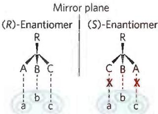

The (S)-enantiomer of ibuprofen is 100 times more efficacious for pain relief than is the (R)-enantiomer. Drug companies sometimes make enantiomerically pure versions of drugs that were previously sold as racemic mixes, such as esomeprazole (Nexium) and escitalopram (Lexapro).

(b) Given that (S)-ibuprofen is more effective, why do drug companies not sell enantiomerically pure (S)-ibuprofen?

12. Components of Complex Biomolecules Three important biomolecules are depicted in their ionized forms at physiological pH. Identify the chemical constituents that are part of each molecule.

(a) Guanosine triphosphate (GTP), an energy-rich nucleotide that serves as a precursor to RNA:

(b) Methionine enkephalin, the brain's own opiate:

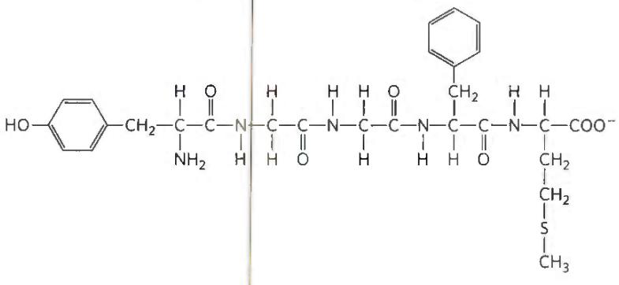

(c) Phosphatidylcholine, a component of many membranes:

13. Experimental Determination of the Structure of a Biomolecule Researchers isolated an unknown substance, X, from rabbit muscle. They determined its structure from the following observations and experiments. Qualitative analysis showed that X was composed entirely of C, H, and O. A weighed sample of X was completely oxidized, and the $H_{2}O$ and $CO_{2}$ produced were measured; this quantitative analysis revealed that X contained 40.00% C, 6.71% H, and 53.29% O by weight. The molecular mass of X, determined by mass spectrometry, was 90.00 u (atomic mass units; see Box 1-1). Infrared spectroscopy showed that X contained one double bond. X dissolved readily in water to give an acidic solution that demonstrated optical activity when tested in a polarimeter.

(a) Determine the empirical and molecular formula of X.

(b) Draw the possible structures of X that fit the molecular formula and contain one double bond. Consider only linear or branched structures and disregard cyclic structures. Note that oxygen makes very poor bonds to itself.

(c) What is the structural significance of the observed optical activity? Which structures in (b) are consistent with the observation?

(d) What is the structural significance of the observation that a solution of X was acidic? Which structures in (b) are consistent with the observation?

(e) What is the structure of X? Is more than one structure consistent with all the data?

14. Naming Stereoisomers with One Chiral Carbon Using the RS System Propranolol is a chiral compound. (R)-Propranolol is used as a contraceptive; (S)-propranolol is used to treat hypertension. The structure of one of the propranolol isomers is shown.

(a) Identify the chiral carbon in propranolol.

(b) Does the structure show the $(R)$ isomer or the $(S)$ isomer?

(c) Draw the other isomer of propranolol.

15. Naming Stereoisomers with Two Chiral Carbons Using the RS System The $(R,R)$ isomer of methylphenidate (Ritalin) is used to treat attention deficit hyperactivity disorder (ADHD). The $(S,S)$ isomer is an antidepressant.

(a) Identify the two chiral carbons in the methylphenidate structure shown here.

(b) Does the structure show the $(R,R)$ isomer or the $(S,S)$ isomer?

(c) Draw the other isomer of methylphenidate.

16. State of Bacterial Spores A bacterial spore is metabolically inert and may remain so for years. Spores contain no measurable ATP, exclude water, and consume no oxygen. However, when a spore is transferred into an appropriate liquid medium, it germinates, makes ATP, and begins cell division within an hour. Is the spore dead, or is it alive? Explain your answer.

17. Activation Energy of a Combustion Reaction Firewood is chemically unstable compared with its oxidation products, $CO_{2}$ and $H_{2}O$ .

$$
\mathrm{Firewood} + \mathrm{O} _ {2} \rightarrow \mathrm{CO} _ {2} + \mathrm{H} _ {2} \mathrm{O}
$$

(a) What can one say about the standard free-energy change for this reaction?

(b) Why doesn't firewood stacked beside the fireplace undergo spontaneous combustion to its much more stable products?

(c) How can the activation energy be supplied to this reaction?
(d) Suppose you have an enzyme (firewoodase) that catalyzes the rapid conversion of firewood to $CO_{2}$ and $H_{2}O$ at room temperature. How does the enzyme accomplish that in thermodynamic terms?

18. Consequence of Nucleotide Substitutions Suppose deoxycytidine (C) in one strand of DNA is mistakenly replaced with deoxythymidine (T) during cell division. What is the consequence for the cell if the deoxynucleotide change is not repaired?

19. Mutation and Protein Function Suppose that the gene for a protein 500 amino acids in length undergoes a mutation. If the mutation causes the synthesis of a mutant protein in which just one of the 500 amino acids is incorrect, the protein may lose all of its biological function. How can this small change in a protein's sequence inactivate it?

20. Gene Duplication and Evolution Suppose that a rare DNA replication error results in the duplication of a single gene, giving the daughter cell two copies of the same gene.

(a) How does this change favor the acquisition of a new function by the daughter cell?

(b) In the vascular plant Arabidopsis thaliana, 50% to 60% of the genome consists of duplicate content. How might this confer a selective advantage?

21. Cryptobiotic Tardigrades and Life Tardigrades, also called water bears or moss piglets, are small animals that can grow to about 0.5 mm in length. Terrestrial tardigrades (pictured here) typically live in the moist environments of mosses and lichens. Some of these species are capable of surviving extreme conditions. Some tardigrades can enter a reversible state called cryptobiosis, in which metabolism completely stops until conditions become hospitable. In this state, various tardigrade species have withstood dehydration, extreme temperatures from -200 °C to +150°C, pressures from 6,000 atm to a vacuum, anoxic conditions, and the radiation of space. Do tardigrades in cryptobiosis meet the definition of life? Why or why not?

  
Eye of Science/Science Source

22. Effects of Ionizing Radiation on Bacteria Treatment of a bacterial culture (E. coli) with ionizing radiation resulted in the survival of only a tiny fraction of the cells. The survivors proved to be more resistant to radiation than the starting cells were. When exposed to even higher levels of radiation, a tiny fraction of these resistant cells survived with even greater resistance to radiation. Repetition of this protocol with progressively higher levels of radiation yielded a strain of E. coli that was far more resistant to radiation than the starting strain. What changes might be occurring with each successive round of radiation and selection?

23. Data Analysis Problem In 1956, E. P. Kennedy and S. B. Weiss published their study of membrane lipid phosphatidylcholine (lecithin) synthesis in rat liver. Their hypothesis was that phosphocholine joined with some cellular component to yield lecithin. In an earlier experiment, incubating $[^{32}P]$ -labeled phosphocholine at physiological temperature (37 °C) with broken cells from rat liver yielded labeled lecithin. This became their assay for the enzymes involved in lecithin synthesis.

The researchers centrifuged the broken cell preparation to separate the membranes from the soluble proteins. They tested three preparations: whole extract, membranes, and soluble proteins. Table 1 summarizes the results.

TABLE 1 Cell Fraction Requirement for Incorporation of $[^{32}P]$ -Phosphocholine into Lecithin

<table><tr><td>Tube number</td><td>Preparation</td><td>[32P]-Phosphocholine incorporated into lecithin</td></tr><tr><td>1</td><td>Whole extract</td><td>6.3 μmol</td></tr><tr><td>2</td><td>Membranes</td><td>18.5 μmol</td></tr><tr><td>3</td><td>Soluble proteins</td><td>2.6 μmol</td></tr></table>

(a) Was the enzyme responsible for this reaction a soluble protein from the cytoplasm or a membrane-bound enzyme? Why?

Having determined the location of the enzyme, the researchers investigated the effect of pH on enzyme activity. They carried out their standard assay in solutions buffered at different pH values between 6 and 9. The graph shows the results. The enzyme activity is the amount, in nanomoles per liter, of $[^{32}P]$ -phosphocholine incorporated into lecithin.

  
(b) What is the optimal pH for this enzyme?

(c) How much more active is the enzyme at pH 8 than at pH 6?

Reactions with phosphorylated intermediates commonly require a divalent metal ion. The researchers tested $Ca^{2+}$ , $Mn^{2+}$ , and $Mg^{2+}$ to determine if a divalent metal ion was important in this reaction. The graph shows the results.

  
(d) What is the metal ion dependence?

The researchers reasoned that the reaction might require energy. To test the hypothesis, they incubated rat liver membranes and $[^{32}P]$ -phosphocholine with different nucleotides. Because the ATP sold in 1956 was not as highly purified as modern commercial preparations, the researchers used two different ATP sources, lot 116 and lot 122. Table 2 gives the results.

TABLE 2 Requirement of Nucleotides for Lecithin Synthesis from Phosphocholine

<table><tr><td>Tube number</td><td>Nucleotide added</td><td> $^{32}$ P incorporated into lecithin</td></tr><tr><td>1</td><td>5 μmol ATP from lot 116</td><td>5.1 μmol</td></tr><tr><td>2</td><td>5 μmol ATP from lot 122</td><td>0.2 μmol</td></tr><tr><td>3</td><td>5 μmol ATP from lot 122 + 0.5 μmol GDP</td><td>0.4 μmol</td></tr><tr><td>4</td><td>5 μmol ATP from lot 122 + 0.5 μmol CTP</td><td>15.0 μmol</td></tr><tr><td>5</td><td>5 μmol ATP from lot 122 + 0.1 μmol CTP</td><td>10.0 μmol</td></tr><tr><td>6</td><td>5 μmol ATP from lot 122 + 0.5 μmol UTP</td><td>0.4 μmol</td></tr><tr><td>7</td><td>0.5 μmol CTP with no ATP</td><td>8.0 μmol</td></tr></table>

(e) What is your interpretation of the results in Table 2?
(f) Write the equation for the reaction the researchers studied. Include all required components, including the cell fraction, metal ion, and nucleotide cofactor.

## Reference

Kennedy, E. P. and S. B. Weiss. 1956. The function of cytidine coenzymes in the biosynthesis of phospholipids. J. Biol. Chem. 193–214.

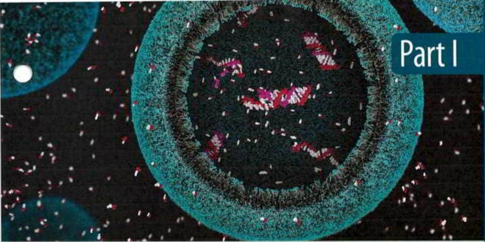
