# 第3章 Water, The Solvent Of Life

<!-- 章节边界按正文内容恢复；原始 MinerU 内容保留如下。 -->

# WATER, THE SOLVENT OF LIFE

## 2.1 Weak Interactions in Aqueous Systems 43

2.2 Ionization of Water, Weak Acids, and Weak Bases 53

## 2.3 Buffering against pH Changes in Biological Systems 59

Water is the most abundant substance in living systems, making up 70% or more of the weight of most organisms. The first living organisms on Earth doubtless arose in an aqueous environment, and the course of evolution has been shaped by the properties of the aqueous medium in which life began.

This chapter begins with descriptions of the physical and chemical properties of water, to which all aspects of cell structure and function are adapted. The attractive forces between water molecules and the slight tendency of water to ionize are of crucial importance to the structure and function of biomolecules. We review the topic of ionization in terms of equilibrium constants, pH, and titration curves, and we consider how aqueous solutions of weak acids or bases and their salts act as buffers against pH changes in biological systems. The water molecule and its ionization products, $H^{+}$ and $OH^{-}$ , profoundly influence the structure, self-assembly, and properties of all cellular components, including proteins, nucleic acids, and lipids. The noncovalent interactions responsible for the strength and specificity of “recognition” among biomolecules are decisively influenced by water’s properties as a solvent, including its ability to form hydrogen bonds with itself and with solutes.

This chapter emphasizes the following principles:

The solvent properties of water shaped the evolution of living things. Most small intermediates of metabolism, as well as nucleic acids and proteins, are soluble in water. Lipid bilayers, the likely forerunners of biological membranes, form spontaneously in water and are stabilized by their interaction with it. Although hydrogen bonds, ionic interactions, and the hydrophobic effect are individually weak, their

combined effects powerfully influence the three-dimensional shape and stability of biological molecules and structures.

P2 The ionization behavior of water and of weak acids and bases dissolved in water can be represented by one or more equilibrium constants. Most biomolecules are ionizable; their structure and function depend on their ionization state, which is characterized by equilibrium constants.

An aqueous solution of a weak acid and its salt makes a buffer that resists changes in pH in response to added acid or base. Biological systems are buffered to maintain a narrow pH range, in which their macromolecules retain their functional structure, which depends on their ionization state. Conditions that produce blood pH outside the range of 7.3 to 7.5 are life-threatening in humans.

P4 Enzymes, which catalyze all of the processes inside a cell, have evolved to function optimally at near-neutral (physiological) pH. However, enzymes that function in intracellular compartments of low or high pH show their greatest activity and stability at those pH values.

## 2.1 Weak Interactions in Aqueous Systems

Hydrogen bonds between water molecules provide the cohesive forces that make water a liquid at room temperature and a crystalline solid (ice) with a highly ordered arrangement of molecules at cold temperatures. P1 Polar biomolecules dissolve readily in water because they can replace water-water interactions with energetically favorable water-solute interactions. In contrast, nonpolar biomolecules are poorly soluble in water because they interfere with water-water interactions but are unable to form water-solute interactions. In aqueous solutions, nonpolar molecules tend to cluster together. P1 Hydrogen bonds and ionic, hydrophobic (from the Greek, meaning "water-fearing"), and van der Waals interactions are individually weak, but collectively they have a very significant influence on the three-dimensional structures of proteins, nucleic acids, polysaccharides, and membrane lipids.

## Hydrogen Bonding Gives Water Its Unusual Properties

Water has a higher melting point, boiling point, and heat of vaporization than most other common solvents. These unusual properties are a consequence of attractions between adjacent water molecules that give liquid water great internal cohesion. A look at the electron structure of the $H_{2}O$ molecule reveals the cause of these intermolecular attractions.

Each hydrogen atom of a water molecule shares an electron pair with the central oxygen atom. The geometry of the molecule is dictated by the shapes of the outer electron orbitals of the oxygen atom, which are similar to the $sp^{3}$ bonding orbitals of carbon (see Fig. 1-13). These orbitals describe a rough tetrahedron, with a hydrogen atom at each of two corners and nonbonding orbitals at the other two corners (Fig. 2-1a). The H—O—H bond angle is $104.5^{\circ}$ , slightly less than the $109.5^{\circ}$ of a perfect tetrahedron because of crowding by the nonbonding orbitals of the oxygen atom.

The oxygen nucleus attracts electrons more strongly than does the hydrogen nucleus (a proton); that is, oxygen is more electronegative. This means that the shared electrons are more often in the vicinity of the oxygen atom than of the hydrogen. The result of this unequal electron sharing is two electric dipoles in the water molecule, one along each of the H—O bonds; each hydrogen atom bears a partial positive charge ( $\delta+$ ), and the oxygen atom bears a partial negative charge equal in magnitude to the sum of the two partial positives (2δ⁻). As a result, there is an electrostatic attraction between the oxygen atom of one water molecule and the hydrogen of another (Fig. 2-1b), called a hydrogen bond. Throughout this book, we represent hydrogen bonds with three parallel blue lines, as in Figure 2-1b.

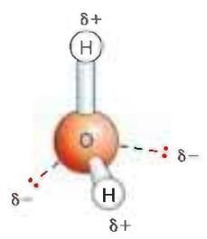  
(a)

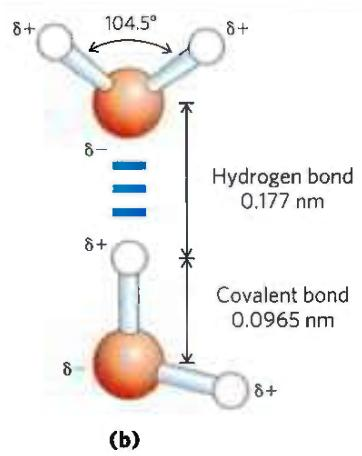  
FIGURE 2-1 Structure of the water molecule. (a) The dipolar nature of the $\mathrm{H}_2\mathrm{O}$ molecule is shown in a ball-and-stick model; the dashed lines represent the nonbonding orbitals. There is a nearly tetrahedral arrangement of the outer-shell electron pairs around the oxygen atom; the two hydrogen atoms have localized partial positive charges $(\delta +)$ , and the oxygen atom has a partial negative charge $(\delta -)$ . (b) Two $\mathrm{H}_2\mathrm{O}$ molecules are joined by a hydrogen bond (designated here, and throughout this book, by three blue lines) between the oxygen atom of the upper molecule and a hydrogen atom of the lower one. Hydrogen bonds are longer and weaker than covalent O—H bonds.

Hydrogen bonds are relatively weak. Those in liquid water have a bond dissociation energy (the energy required to break a bond) of about 23 kJ/mol, compared with 470 kJ/mol for the covalent O—H bond in water or 350 kJ/mol for a covalent C—C bond. The hydrogen bond is about 10% covalent, due to overlaps in the bonding orbitals, and about 90% electrostatic. At room temperature, the thermal energy of an aqueous solution (the kinetic energy of motion of the individual atoms and molecules) is of the same order of magnitude as that required to break hydrogen bonds. When water is heated, the increase in temperature reflects the faster motion of individual water molecules. At any given time, most of the molecules in liquid water are hydrogen-bonded, but the lifetime of each hydrogen bond is just 1 to 20 picoseconds (1 ps = $10^{-12}$ s); when one hydrogen bond breaks, another hydrogen bond forms, with the same partner or a new one, within 0.1 ps. The apt phrase “flickering clusters” has been applied to the short-lived groups of water molecules interlinked by hydrogen bonds in liquid water. The sum of all the hydrogen bonds between $H_{2}O$ molecules confers great internal cohesion on liquid water. Extended networks of hydrogen-bonded water molecules also form bridges between solutes (proteins and nucleic acids, for example) that allow the larger molecules to interact with each other over distances of several nanometers without physically touching.

The nearly tetrahedral arrangement of the orbitals about the oxygen atom (Fig. 2-1a) allows each water molecule to form hydrogen bonds with as many as four neighboring water molecules. In liquid water at room temperature and atmospheric pressure, however, water molecules are disorganized and in continuous motion, so that each molecule forms hydrogen bonds with an average of only 3.4 other molecules. In ice, on the other hand, each water molecule is fixed in space and forms hydrogen bonds with a full complement of four other water molecules to yield a regular lattice structure (Fig. 2-2). Hydrogen bonds account for the relatively high melting point of water, because much thermal energy is required to break a sufficient proportion of hydrogen bonds to destabilize the crystal lattice of ice. When ice melts or water evaporates, heat is taken up by the system:

$$
\mathrm{H} _ {2} \mathrm{O} (\text { solid }) \longrightarrow \mathrm{H} _ {2} \mathrm{O} (\text { liquid }) \quad \Delta H = + 5. 9 \mathrm{kJ/mol}
$$

$$
\mathrm{H} _ {2} \mathrm{O} (\text { liquid }) \longrightarrow \mathrm{H} _ {2} \mathrm{O} (\text { gas }) \quad \Delta H = + 4 4. 0 \mathrm{kJ/mol}
$$

During melting or evaporation, the entropy of the aqueous system increases as the highly ordered arrays of water molecules in ice relax into the less orderly hydrogen-bonded arrays in liquid water or into the wholly disordered gaseous state. At room temperature, both the melting of ice and the evaporation of water occur spontaneously; the tendency of the water molecules to associate through hydrogen bonds is outweighed by the energetic push toward randomness. Recall that the free-energy change ( $\Delta G$ ) must have a negative value for a process to occur spontaneously: $\Delta G = \Delta H - T \Delta S$ , where $\Delta G$ represents the driving force, $\Delta H$ the enthalpy change from making and breaking bonds, and $\Delta S$ the change in randomness. Because $\Delta H$ is positive for melting and evaporation, it is clearly the increase in entropy ( $\Delta S$ ) that makes $\Delta G$ negative and drives these changes.

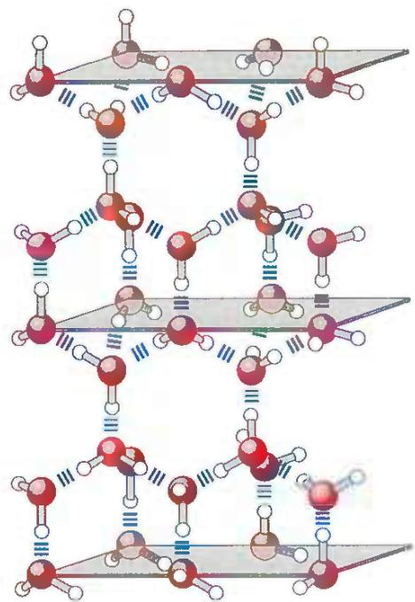  
FIGURE 2-2 Hydrogen bonding in ice. In ice, each water molecule forms four hydrogen bonds, the maximum possible for a water molecule, creating a regular crystal lattice. By contrast, in liquid water at room temperature and atmospheric pressure, each water molecule hydrogen-bonds with an average of 3.4 other water molecules. This crystal lattice structure makes ice less dense than liquid water, and thus ice floats on liquid water.

## Water Forms Hydrogen Bonds with Polar Solutes

Hydrogen bonds are not unique to water. They readily form between an electronegative atom (the hydrogen acceptor, usually oxygen or nitrogen) and a hydrogen atom covalently bonded to another electronegative atom (the hydrogen donor) in the same or another molecule (Fig. 2-3). Hydrogen atoms covalently bonded to carbon atoms do not participate in hydrogen bonding, because carbon is only slightly more electronegative than hydrogen and thus the C—H bond is only very weakly polar. The distinction explains why butane $(\mathrm{CH}_{3}(\mathrm{CH}_{2})_{2}\mathrm{CH}_{3})$ has a boiling point of only -0.5 °C, whereas butanol $(\mathrm{CH}_{3}(\mathrm{CH}_{2})_{2}\mathrm{CH}_{2}\mathrm{OH})$ has a relatively high boiling point of 117 °C. Butanol has a polar hydroxyl group and thus can form intermolecular hydrogen bonds. Uncharged but polar biomolecules such as sugars dissolve readily in water because of the stabilizing effect of hydrogen bonds between the hydroxyl groups or carbonyl oxygen of the sugar and the polar water molecules. P1 Alcohols, aldehydes, ketones, and compounds containing N—H bonds all form hydrogen bonds with water molecules (Fig. 2-4) and tend to be soluble in water.

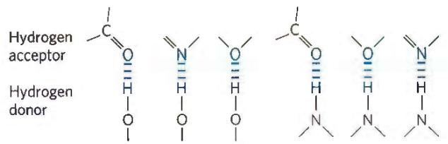  
FIGURE 2-3 Common hydrogen bonds in biological systems. The hydrogen acceptor is usually oxygen or nitrogen; the hydrogen donor is another electronegative atom.

  
FIGURE 2-4 Some biologically important hydrogen bonds.

Hydrogen bonds are strongest when the bonded molecules are oriented to maximize electrostatic interaction, which occurs when the hydrogen atom and the two atoms that share it are in a straight line—that is, when the acceptor atom is in line with the covalent bond between the donor atom and H (Fig. 2-5). This arrangement puts the positive charge of the hydrogen ion directly between the two partial negative charges. Hydrogen bonds are thus highly directional and capable of holding two hydrogen-bonded molecules or groups in a specific geometric arrangement. As we shall see, this property of hydrogen bonds confers very precise three-dimensional structures on protein and nucleic acid molecules, which have many intramolecular hydrogen bonds.

  
FIGURE 2-5 Directionality of the hydrogen bond. The attraction between the partial electric charges is greatest when the three atoms involved in the bond (in this case O, H, and O) lie in a straight line. When the hydrogen-bonded moieties are structurally constrained (when they are parts of a single protein molecule, for example), this ideal geometry may not be possible and the resulting hydrogen bond is weaker.

## Water Interacts Electrostatically with Charged Solutes

Water is a polar solvent. It readily dissolves most biomolecules, which are generally charged or polar compounds (Table 2-1); compounds that dissolve easily in water are hydrophilic (from the Greek, meaning "water-loving"). In contrast, nonpolar solvents such as chloroform and benzene are poor solvents for polar biomolecules but easily dissolve those that are hydrophobic—nonpolar molecules such as lipids and waxes. Amphipathic compounds contain regions that are polar (or charged) and regions that are nonpolar. Their behavior in aqueous solution is discussed on p. 48.

Water dissolves salts such as NaCl by hydrating and stabilizing the $Na^{+}$ and $Cl^{-}$ ions, weakening the electrostatic interactions between them and thus counteracting their tendency to associate in a crystalline lattice (Fig. 2-6). Water also readily dissolves charged biomolecules, including compounds with functional groups such as ionized carboxylic acids ( $—COO^{-}$ ), protonated amines ( $—NH_{3}^{+}$ ), and phosphate esters or anhydrides. Water replaces the solute-solute hydrogen bonds linking these biomolecules to each other with solute-water hydrogen bonds, thus screening the electrostatic interactions between solute molecules.

Ionic interactions between dissolved ions are much stronger in less polar environments, because there is less screening of charges by the nonpolar solvent. Water is effective in screening the electrostatic interactions between dissolved ions because it has a high dielectric constant, a physical property that reflects the number of dipoles in a solvent. The strength, or force (F), of ionic interactions in a solution depends on the magnitude of the charges (Q), the distance between the charged groups (r), and the dielectric constant (ε, which is dimensionless) of the solvent in which the interactions occur:

$$
F = \frac {Q _ {1} Q _ {2}}{\varepsilon r ^ {2}}
$$

For water at 25 °C, ε is 78.5, and for the very nonpolar solvent benzene, ε is 4.6. The dependence on $r^{2}$ is such that ionic attractions or repulsions operate only over short distances—in the range of 10 to 40 nm (depending on the electrolyte concentration) when the solvent is water. In biomolecules, it is not the dielectric constant for the bulk solvent, but the highly localized dielectric constant, as in a hydrophobic pocket of a protein, that determines the interaction of two polar moieties.

As a salt such as NaCl dissolves, the $Na^{+}$ and $Cl^{-}$ ions leaving the crystal lattice acquire far greater freedom of motion (Fig. 2-6). The resulting increase in entropy (randomness) of the system is largely responsible for the ease of dissolving salts such as NaCl in water. In thermodynamic terms, formation of the solution occurs with a favorable free-energy change: $\Delta G = \Delta H - T \Delta S$ , where $\Delta H$ has a small positive value and $T \Delta S$ a large positive value; thus $\Delta G$ is negative.

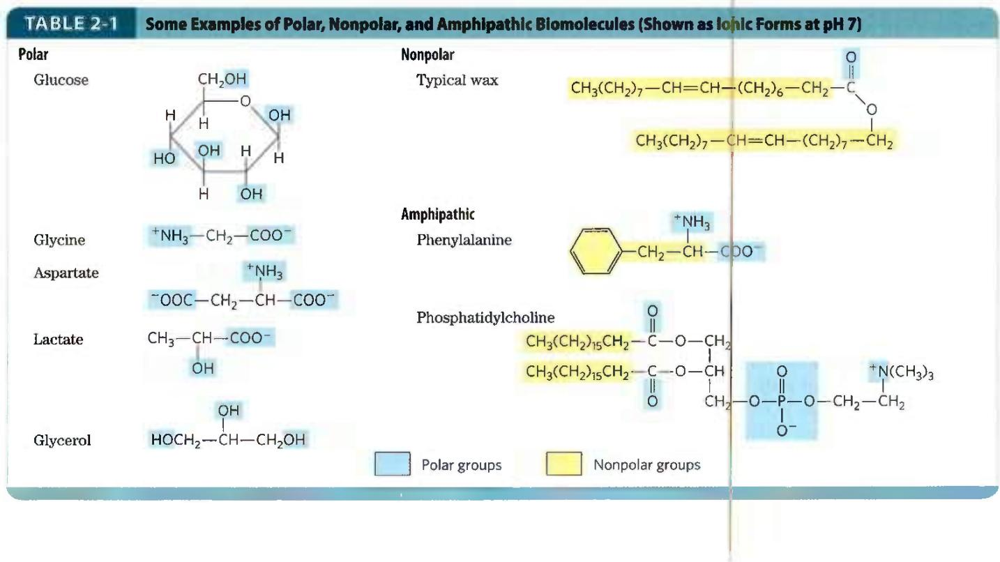

$^{a}$ The arrows represent electric dipoles; there is a partial negative charge ( $\delta-$ ) at the head of the arrow, a partial positive charge ( $\delta+$ ; not shown here) at the tail. $^{b}$ Note that polar molecules dissolve far better even at low temperatures than do nonpolar molecules at relatively high temperatures.

  
FIGURE 2-6 Water as solvent. Water dissolves many crystalline salts by hydrating their component ions. The NaCl crystal lattice is disrupted as water molecules cluster about the $\mathrm{Cl^-}$ and $\mathrm{Na^{+}}$ ions. The ionic charges are partially neutralized, and the electrostatic attractions necessary for lattice formation are weakened.

## Nonpolar Gases Are Poorly Soluble in Water

The biologically important gases $CO_{2}$ , $O_{2}$ , and $N_{2}$ are nonpolar molecules. In $O_{2}$ and $N_{2}$ , electrons are shared equally by both atoms. In $CO_{2}$ , each C=O bond is polar, but the two dipoles are oppositely directed and cancel each other (Table 2-2). The movement of molecules from the disordered gas phase into aqueous solution constrains their motion and the motion of water molecules and therefore represents a decrease in entropy. The nonpolar nature of these gases and the decrease in entropy when they enter solution combine to make them very poorly soluble in water. Some organisms have water-soluble “carrier proteins” (hemoglobin and myoglobin, for example) that facilitate the transport of $O_{2}$ . Carbon dioxide forms carbonic acid ( $H_{2}CO_{3}$ ) in aqueous solution and is transported as the $HCO_{3}^{-}$ (bicarbonate) ion, either free—bicarbonate is very soluble in water (\~100 g/L at 25 °C)—or bound to hemoglobin. Three other gases, $NH_{3}$ , NO, and $H_{2}S$ , also have biological roles in some organisms; these gases are polar and dissolve readily in water.

## Nonpolar Compounds Force Energetically Unfavorable Changes in the Structure of Water

When water is mixed with benzene or hexane, two phases form; neither liquid is soluble in the other. Nonpolar compounds such as benzene and hexane are hydrophobic—they are unable to undergo energetically favorable interactions with water molecules, and they interfere with the hydrogen bonding among water molecules. All molecules or ions in aqueous solution interfere with the hydrogen bonding of some water molecules in their immediate vicinity, but polar or charged solutes (such as NaCl) compensate for lost water-water hydrogen bonds by forming new solute-water interactions. The net change in enthalpy ( $\Delta H$ ) for dissolving these solutes is generally small. Hydrophobic solutes, however, offer no such compensation, and their addition to water may therefore result in a small gain of enthalpy; the breaking of hydrogen bonds between water molecules takes up energy from the system, requiring the input of energy from the surroundings. In addition to requiring this input of energy, dissolving hydrophobic compounds in water produces a measurable decrease in entropy. Water

<table><tr><td colspan="4">TABLE 2-2 Solubilities of Some Gases in Water</td></tr><tr><td>Gas</td><td> $Structure^a$ </td><td>Polarity</td><td>Solubilityin water (g/L) $^b$ </td></tr><tr><td>Nitrogen</td><td>N≡N</td><td>Nonpolar</td><td>0.018 (40 °C)</td></tr><tr><td>Oxygen</td><td>O=O</td><td>Nonpolar</td><td>0.035 (50 °C)</td></tr><tr><td>Carbon dioxide</td><td>δ- δ- O=C=O</td><td>Nonpolar</td><td>0.97 (45 °C)</td></tr><tr><td>Ammonia</td><td></td><td>Polar</td><td>900 (10 °C)</td></tr><tr><td>Hydrogen sulfide</td><td>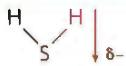</td><td>Polar</td><td>1,860 (40 °C)</td></tr></table>

## Clusters of lipid molecules

  
(a)  
FIGURE 2-7 Amphipathic compounds in aqueous solution form structures that increase entropy. (a) Long-chain fatty acids have very hydrophobic alkyl chains, each of which is surrounded by a layer of highly ordered water molecules. (b) By clustering together in micelles, the fatty acid molecules expose the smallest possible hydrophobic surface area to the water, and fewer water molecules are required in the shell of ordered water. The entropy gained by freeing immobilized water molecules stabilizes the micelle.

molecules in the immediate vicinity of a nonpolar solute are constrained in their possible orientations, as they form a highly ordered cagelike shell around each solute molecule to maximize solvent-solvent hydrogen bonding. These water molecules are not as highly oriented as those in clathrates, crystalline compounds of nonpolar solutes and water, but the effect is the same in both cases: the ordering of water molecules reduces entropy. The number of ordered water molecules, and therefore the magnitude of the entropy decrease, is proportional to the surface area of the hydrophobic solute enclosed within the cage of water molecules. The free-energy change for dissolving a nonpolar solute in water is thus unfavorable: $\Delta G = \Delta H - T \Delta S$ , where $\Delta H$ has a positive value, $\Delta S$ has a negative value, and $\Delta G$ is positive.

When an amphipathic compound (Table 2-1) is mixed with water, the polar, hydrophilic region interacts favorably with the water and tends to dissolve, but the nonpolar, hydrophobic region tends to avoid contact with the water (Fig. 2-7a). The nonpolar regions of the molecules cluster together to present the smallest hydrophobic area to the aqueous solvent, and the polar regions are arranged to maximize their interaction with each other and with the solvent (Fig. 2-7b), a phenomenon called the hydrophobic effect. These stable structures of amphipathic compounds in water, called micelles, may contain hundreds or thousands of molecules. By clustering together, nonpolar regions of the molecules achieve the greatest thermodynamic stability by minimizing the number of ordered water molecules required to surround hydrophobic portions of the solute molecules, increasing the entropy of the system. A special case of this hydrophobic effect is the formation of lipid bilayers in biological membranes (see Fig. 11-1).

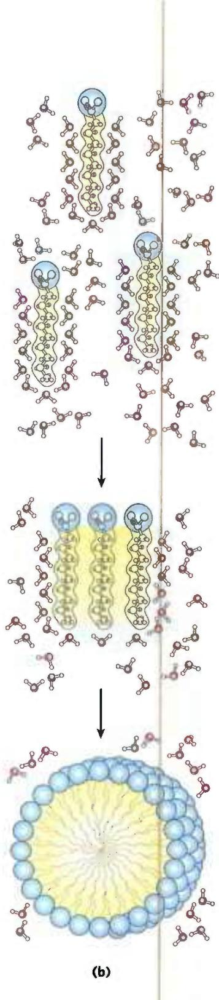  
Dispersion of lipids in $\mathsf{H}_2\mathsf{O}$ Each lipid molecule forces surrounding $\mathsf{H}_2\mathsf{O}$ molecules to become highly ordered.  
Only lipid portions at the edge of the cluster force the ordering of water. Fewer $H_{2}O$ molecules are ordered, and entropy is increased.  
All hydrophobic groups are sequestered from water; ordered shell of $H_{2}O$ molecules is minimized, and entropy is further increased.

Many biomolecules are amphipathic; proteins, pigments, certain vitamins, and the sterols and phospholipids of membranes all have both polar and nonpolar surface regions. Structures composed of these molecules are stabilized by the hydrophobic effect, which favors aggregation of the nonpolar regions. P1 The hydrophobic effect on interactions among lipids, and between lipids and proteins, is the most important determinant of structure in biological membranes. The aggregation of nonpolar amino acids in protein interiors, driven by the hydrophobic effect, also stabilizes the three-dimensional structures of proteins.

  
FIGURE 2-8 Release of ordered water favors formation of an enzyme-substrate complex. While separate, both enzyme and substrate force neighboring water molecules into an ordered shell. Binding of  
substrate to enzyme releases some of the ordered water, and the resulting increase in entropy provides a thermodynamic push toward formation of the enzyme-substrate complex.

Hydrogen bonding between water and polar solutes also causes an ordering of water molecules, but the energetic effect is less significant than with nonpolar solutes. Disruption of ordered water molecules is part of the driving force for binding of a polar substrate (reactant) to the complementary polar surface of an enzyme: entropy increases as the enzyme displaces ordered water from the substrate and as the substrate displaces ordered water from the enzyme surface (Fig. 2-8). This topic is discussed in greater depth in Chapter 6 (p. 185).

## van der Waals Interactions Are Weak Interatomic Attractions

When two uncharged atoms are brought very close together, their surrounding electron clouds influence each other. Random variations in the positions of the electrons around one nucleus may create a transient electric dipole, which induces a transient, opposite electric dipole in the nearby atom. The two dipoles weakly attract each other, bringing the two nuclei closer. These weak attractions are called van der Waals interactions (also known as London dispersion forces). As the two nuclei draw closer together, their electron clouds begin to repel each other. At the point where the net attraction is maximal, the nuclei are said to be in van der Waals contact. Each atom has a characteristic van der Waals radius, a measure of how close that atom will allow another to approach (Table 2-3). In the space-filling molecular models shown throughout this book, the atoms are depicted in sizes proportional to their van der Waals radii.

## Weak Interactions Are Crucial to Macromolecular Structure and Function

I believe that as the methods of structural chemistry are further applied to physiological problems, it will be found that the significance of the hydrogen bond for physiology is greater than that of any other single structural feature.

—Linus Pauling,

## The Nature of the Chemical Bond, 1939

The noncovalent interactions we have described—hydrogen bonds and ionic, hydrophobic, and van der Waals interactions (Table 2-4)—are much weaker than covalent bonds. An input of about 350 kJ of energy is required to break a mole of $(6 \times 10^{23})$ C—C single bonds, and about 410 kJ is needed to break a mole of C—H bonds, but as little as 4 kJ is sufficient to disrupt a mole of typical van der Waals interactions. Interactions driven by the hydrophobic effect are also much weaker than covalent bonds, although they are substantially strengthened by a highly polar solvent (a concentrated salt solution, for example). Ionic interactions and hydrogen bonds are variable in strength, depending on the polarity of the solvent and the alignment of the hydrogen-bonded atoms, but they are always significantly weaker than covalent bonds. In aqueous solvent at 25 °C, the available thermal energy can be of the same order of magnitude as the strength of these weak interactions, and the interaction between solute and solvent (water) molecules is nearly as favorable as solute-solute interactions. Consequently, hydrogen bonds and ionic, hydrophobic, and van der Waals interactions are continually forming and breaking.

TABLE 2-3 van der Waals Radii and Covalent (Single-Bond) Radii of Some Elements

<table><tr><td>Element</td><td>van der Waals radius (nm)</td><td>Covalent radius for single bond (nm)</td></tr><tr><td>H</td><td>0.11</td><td>0.030</td></tr><tr><td>O</td><td>0.15</td><td>0.066</td></tr><tr><td>N</td><td>0.15</td><td>0.070</td></tr><tr><td>C</td><td>0.17</td><td>0.077</td></tr><tr><td>S</td><td>0.18</td><td>0.104</td></tr><tr><td>P</td><td>0.19</td><td>0.110</td></tr><tr><td>I</td><td>0.21</td><td>0.133</td></tr></table>

Sources: For van der Waals radii, R. Chauvin, J. Phys. Chem. 96:9194, 1992. For covalent radii, L. Pauling, Nature of the Chemical Bond, 3rd edn, Cornell University Press, 1960.

Note: van der Waals radii describe the space-filling dimensions of atoms. When two atoms are joined covalently, the atomic radii at the point of bonding are shorter than the van der Waals radii, because the joined atoms are pulled together by the shared electron pair. The distance between nuclei in a van der Waals Interaction or a covalent bond is about equal to the sum of the van der Waals or covalent radii, respectively, for the two atoms. Thus, the length of a carbon-carbon single bond is about 0.077 nm + 0.077 nm = 0.154 nm.

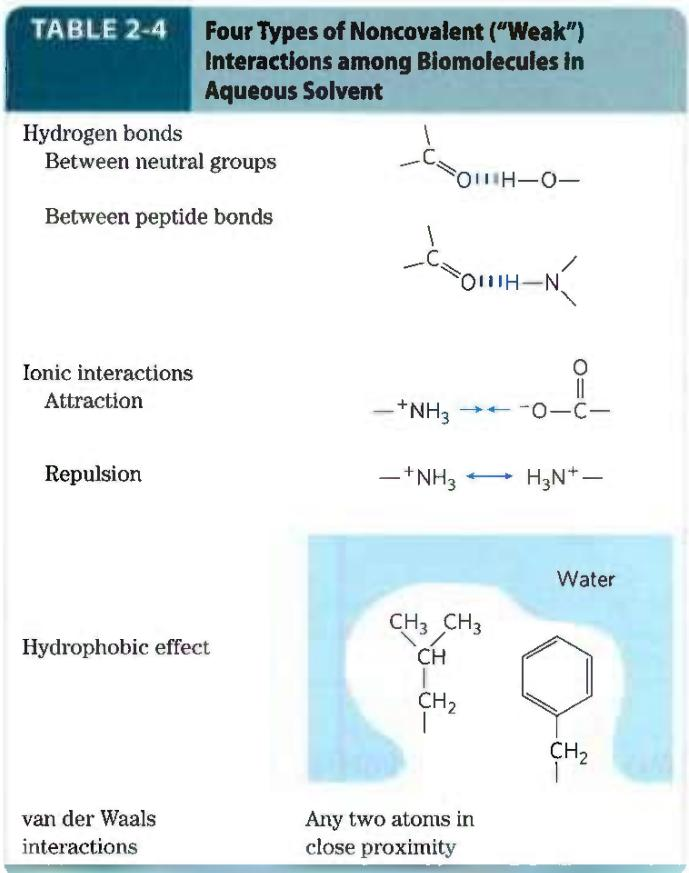

P1 Although these four types of interactions are individually weak relative to covalent bonds, the cumulative effect of many such interactions can be very significant. For example, the noncovalent binding of an enzyme to its substrate may involve several hydrogen bonds and one or more ionic interactions, as well as the hydrophobic effect and van der Waals interactions. The formation of each of these associations contributes to a net decrease in the free energy of the system. We can calculate the stability of a noncovalent interaction, such as the hydrogen bonding of a small molecule to its macromolecular partner, from the binding energy, the reduction in the energy of the system when binding occurs. Stability, as measured by the equilibrium constant (discussed in Section 2.2) of the binding reaction, varies exponentially with binding energy. To dissociate two biomolecules (such as an enzyme and its bound substrate) that are associated noncovalently through multiple weak interactions, all these interactions must be disrupted at the same time. Because the interactions fluctuate randomly, such simultaneous disruptions are very unlikely. Therefore, numerous weak interactions bestow much greater molecular stability than would be expected intuitively from a simple summation of small binding energies.

Macromolecules such as proteins, DNA, and RNA contain so many sites of potential hydrogen bonding or ionic, van der Waals, or hydrophobic clustering that the cumulative effect can be enormous. P1 For macromolecules, the most stable (that is, the native) structure is usually that in which these weak interactions are maximized. The folding of a single polypeptide or polynucleotide chain into its three-dimensional shape is determined by this principle. The binding of an antigen to a specific antibody depends on the cumulative effects of many weak interactions. The energy released when an enzyme binds noncovalently to its substrate is the main source of the enzyme's catalytic power. The binding of a hormone or a neurotransmitter to its cellular receptor protein is the result of multiple weak interactions. One consequence of the large size of enzymes and receptors (relative to their substrates or ligands) is that their extensive surfaces provide many opportunities for weak interactions. At the molecular level, the complementarity between interacting biomolecules reflects the complementarity and weak interactions between polar and charged groups and the proximity of hydrophobic patches on the surfaces of the molecules.

When the structure of a protein such as hemoglobin is determined by x-ray crystallography (see Fig. 4-30), water molecules are often found to be bound so tightly that they are part of the crystal structure (Fig. 2-9); the same is true for water in crystals of RNA or DNA. These bound water molecules, which can also be detected in aqueous solutions by nuclear magnetic resonance (see Fig. 4-31), have properties that are distinctly different from those of the "bulk" water of the solvent. For example, the bound water molecules are not osmotically active (see below). For many proteins, tightly bound water molecules are essential to their function. In a key reaction in photosynthesis, for example, protons flow across a biological membrane as light drives the flow of electrons through a series of electron-carrying proteins (see Fig. 20-17). One of these proteins, cytochrome f, has a chain of five bound water molecules (Fig. 2-10) that may provide a path for protons to move through the membrane by a process known as proton hopping (described later in this chapter).

  
(a)

  
(b)

FIGURE 2-9 Water binding in hemoglobin. The crystal structure of hemoglobin, shown (a) with bound water molecules (red spheres) and (b) without the water molecules. The water molecules are so firmly bound to the protein that they affect the x-ray diffraction pattern as though they were fixed parts of the protein. The two $\alpha$ subunits of hemoglobin are shown in gray, the two $\beta$ subunits in blue. Each subunit has a bound heme group (red stick structure), visible only in the $\beta$ subunits in this view. The structure and function of hemoglobin are discussed in detail in Chapter 5. [Data from PDB ID 1A3N, J.R.H.Tame and B.Vallone, Acta Crystallogr. D 56805, 2000]  

## Concentrated Solutes Produce Osmotic Pressure

Solutes of all kinds alter certain physical properties of the solvent, water: its vapor pressure, its boiling point, its melting point (freezing point), and its osmotic pressure. These are called colligative properties (colligative meaning "tied together"), because the effect of solutes on all four properties has the same basis: the concentration of water is lower in solutions than in pure water. The effect of solute concentration on the colligative properties of water is independent of the chemical properties of the solute; it depends only on the number of solute particles (molecules or ions) in a given amount of water. For example, a compound such as NaCl, which dissociates in solution, has an effect on osmotic pressure that is twice that of an equal number of moles of a nondissociating solute such as glucose.

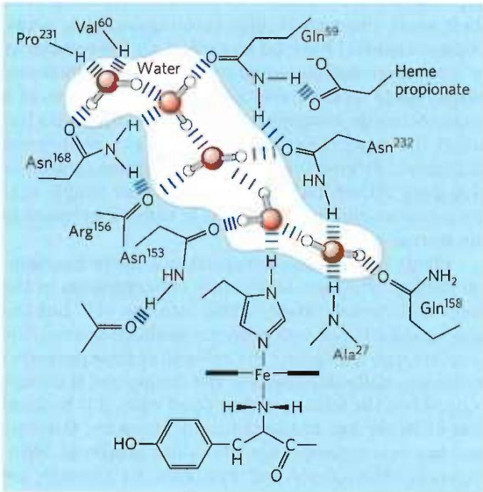  
FIGURE 2-10 Water chain in cytochrome f. Water is bound in a proton channel of the membrane protein cytochrome f, which is part of the energy-trapping machinery of photosynthesis in chloroplasts. Five water molecules are hydrogen-bonded to each other and to functional groups of the protein: the peptide backbone atoms of valine, proline, arginine, and alanine residues, and the side chains of three asparagine and two glutamine residues. The protein has a bound heme, its iron ion facilitating electron flow during photosynthesis. Electron flow is coupled to the movement of protons across the membrane, which probably involves "proton hopping" through this chain of bound water molecules. [Information from P. Nicholls, Cell. Mol. Life Sci. 57:987, 2000, Fig. 6a (redrawn from PDB ID 1HCZ, S. E. Martinez et al., Prot. Sci. 5:1081, 1996).]

Water molecules tend to move from a region of higher water concentration to one of lower water concentration, in accordance with the tendency in nature for a system to become disordered. When two different aqueous solutions are separated by a semipermeable membrane (one that allows the passage of water but not solute molecules), water molecules diffusing from the region of higher water concentration to the region of lower water concentration produce osmotic pressure (Fig. 2-11). Osmotic pressure, $\Pi$ , measured as the force necessary to resist water movement, is approximated by the van't Hoff equation

$$
\Pi = i c R T
$$

in which R is the gas constant and T is the absolute temperature. The symbol i is the van't Hoff factor, a measure of the extent to which the solute dissociates into two or more ionic species. The term c is the solute's molar concentration, and ic is the osmolarity of the solution, the product of the van't Hoff factor i and c. In dilute NaCl solutions, the solute completely dissociates into $Na^{+}$ and $Cl^{-}$ , doubling the number of solute particles, and thus i = 2. For all nonionizing solutes, i = 1. For solutions of several (n) solutes, $\Pi$ is the sum of the contributions of each species:

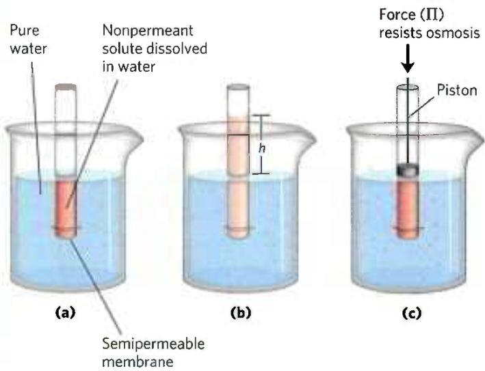  
FIGURE 2-11 Osmosis and the measurement of osmotic pressure. (a) The initial state. The tube contains an aqueous solution, the beaker contains pure water, and the semipermeable membrane allows the passage of water but not solute. Water flows from the beaker into the tube to equalize its concentration across the membrane. (b) The final state. Water has moved into the solution of the nonpermeant compound, diluting it and raising the column of solution within the tube. At equilibrium, the force of gravity operating on the solution in the tube exactly balances the tendency of water to move into the tube, where its concentration is lower. (c) Osmotic pressure (II) is measured as the force that must be applied to return the solution in the tube to the level of the water in the beaker. This force is proportional to the height, h, of the column in (b).

$$
\Pi = R T (i _ {1} c _ {1} + i _ {2} c _ {2} + i _ {3} c _ {3} + \dots + i _ {n} c _ {n})
$$

Osmosis, water movement across a semipermeable membrane driven by differences in osmotic pressure, is an important factor in the life of most cells. Plasma membranes are more permeable to water than to most other small molecules, ions, and macromolecules because protein channels (aquaporins; see Table 11-3) in the membrane selectively permit the passage of water. Solutions of osmolarity equal to that of a cell's cytosol are said to be isotonic relative to that cell. Surrounded by an isotonic solution, a cell neither gains nor loses water (Fig. 2-12). In a hypertonic solution, one with higher osmolarity than that of the cytosol, the cell shrinks as water moves out.

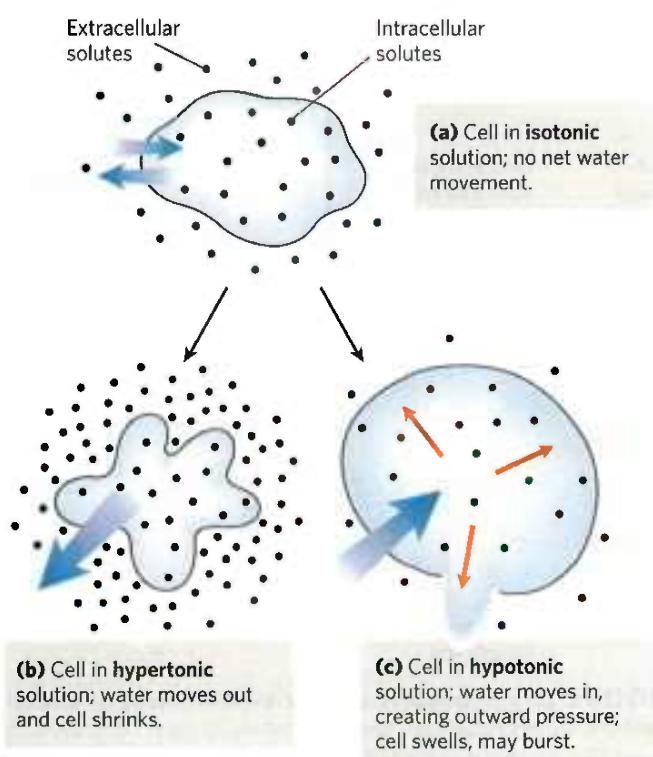  
FIGURE 2-12 Effect of extracellular osmolarity on water movement across a plasma membrane. When a cell in osmotic balance with its surrounding medium—that is, a cell in (a) an isotonic medium—is transferred into (b) a hypertonic solution or (c) a hypotonic solution, water moves across the plasma membrane in the direction that tends to equalize osmolarity outside and inside the cell.

In a hypotonic solution, one with a lower osmolarity than the cytosol, the cell swells as water enters. In their natural environments, cells generally contain higher concentrations of biomolecules and ions than their surroundings, so osmotic pressure tends to drive water into cells. If not somehow counterbalanced, this inward movement of water would distend the plasma membrane and eventually cause bursting of the cell (osmotic lysis).

Several mechanisms have evolved to prevent this catastrophe. In bacteria and plants, the plasma membrane is surrounded by a nonexpandable cell wall of sufficient rigidity and strength to resist osmotic pressure and prevent osmotic lysis. Certain freshwater protists that live in a highly hypotonic medium have an organelle (contractile vacuole) that pumps water out of the cell. In multicellular animals, blood plasma and interstitial fluid (the extracellular fluid of tissues) are maintained at an osmolarity close to that of the cytosol. The high concentration of albumin and other proteins in blood plasma contributes to its osmolarity. Cells also actively pump out Na $^{+}$ and other ions into the interstitial fluid to stay in osmotic balance with their surroundings.

Because the effect of solutes on osmolarity depends on the number of dissolved particles, not their mass, macromolecules (proteins, nucleic acids, polysaccharides) have far less effect on the osmolarity of a solution than an equal mass of their monomeric components would have. For example, a gram of a polysaccharide composed of 1,000 glucose units has about the same effect on osmolarity as a milligram of glucose. Storing fuel as polysaccharides (starch or glycogen) rather than as glucose or other simple sugars avoids an enormous increase in osmotic pressure in the storage cell.

Plants use osmotic pressure to achieve mechanical rigidity. The very high solute concentration in the plant cell vacuole draws water into the cell, but the nonexpandable cell wall prevents swelling; instead, the pressure exerted against the cell wall (turgor pressure) increases, stiffening the cell, the tissue, and the plant body. When the lettuce in your salad wilts, it is because loss of water has reduced turgor pressure. Osmosis also has consequences for laboratory protocols. Mitochondria, chloroplasts, and lysosomes, for example, are enclosed by semipermeable membranes. In isolating these organelles from broken cells, biochemists must perform the fractionations in isotonic solutions (see Fig. 1-7) to prevent excessive entry of water into the organelles and the swelling and bursting that would follow. Buffers used in cellular fractionations commonly contain sufficient concentrations of sucrose or some other inert solute to protect the organelles from osmotic lysis.

## WORKED EXAMPLE 2-1 Osmotic Strength of an Organelle

Suppose the major solutes in intact lysosomes are KCl ( $\sim$ 0.1 M) and NaCl ( $\sim$ 0.03 M). When isolating lysosomes, what concentration of sucrose is required in the extracting solution at room temperature (25 ${}^{\circ}$ C) to prevent swelling and lysis?

SOLUTION: We want to find a concentration of sucrose that gives an osmotic strength equal to that produced by the KCl and NaCl in the lysosomes. The equation for calculating osmotic strength (the van't Hoff equation) is

$$
\Pi = R T (i _ {1} c _ {1} + i _ {2} c _ {2} + i _ {3} c _ {3} + \dots + i _ {n} c _ {n})
$$

where R is the gas constant 8.315 J/mol • K; T is the absolute temperature (Kelvin); $c_{1}$ , $c_{2}$ , and $c_{3}$ are the molar concentrations of each solute; and $i_{1}$ , $i_{2}$ , and $i_{3}$ are the numbers of particles each solute yields in solution (i = 2 for KCl and NaCl).

The osmotic strength of the lysosomal contents is

$$
\begin{array}{r l} \Pi_ {\text {lysosome}} & = R T (i _ {\mathrm{KCl}} c _ {\mathrm{KCl}} + i _ {\mathrm{NaCl}} c _ {\mathrm{NaCl}}) \\ & = R T [ (2) (0. 1 \mathrm{mol/L}) + (2) (0. 0 3 \mathrm{mol/L}) ] \\ & = R T (0. 2 6 \mathrm{mol/L}) \end{array}
$$

The osmotic strength of a sucrose solution is given by

$$
\Pi_ {\text { sucrose }} = R T (i _ {\text { sucrose }} c _ {\text { sucrose }})
$$

In this case, $i_{sucrose} = 1$ , because sucrose does not ionize. Thus,

$$
\Pi_ {\text { sucrose }} = R T (c _ {\text { sucrose }})
$$

The osmotic strength of the lysosomal contents equals that of the sucrose solution when

$$
\begin{array}{r l} \Pi_ {\text { sucrose }} & = \Pi_ {\text { lysosome }} \\ R T (c _ {\text { sucrose }}) & = R T (0. 2 6 \mathrm{mol/L}) \\ c _ {\text { sucrose }} & = 0. 2 6 \mathrm{mol/L} \end{array}
$$

Sucrose has a formula weight (FW) of 342, so the required sucrose concentration is (0.26 mol/L)(342 g/mol) = 88.92 g/L. Because the solute concentrations are accurate to only one significant figure, $c_{sucrose} = 0.09 \, kg/L$ .

As we'll see later (p. 242), cells of liver and muscle store carbohydrate not as low molecular weight sugars, such as glucose or sucrose, but as the high molecular weight polymer glycogen. This allows the cell to contain a large mass of glycogen with a minimal effect on the osmolarity of the cytosol.

## SUMMARY 2.1 Weak Interactions in Aqueous Systems

The very different electronegativities of H and O make water a highly polar molecule, capable of forming hydrogen bonds with itself and with solutes. Hydrogen bonds are fleeting, primarily electrostatic, and weaker than covalent bonds.

■ Alcohols, aldehydes, ketones, and compounds containing N—H bonds all form hydrogen bonds with water and are therefore water soluble.

\- By screening the electrical charges of ions and by increasing the entropy of the system, water dissolves crystals of ionizable solutes.

\- $\mathrm{N}_{2}, \mathrm{O}_{2}$ , and $\mathrm{CO}_{2}$ are nonpolar and poorly soluble in water. $\mathrm{NH}_{3}$ and $\mathrm{H}_{2} \mathrm{~S}$ are ionizable and therefore very water soluble.

Nonpolar (hydrophobic) compounds dissolve poorly in water; they cannot hydrogen-bond with the solvent, and their presence forces an energetically unfavorable ordering of water molecules at their hydrophobic surfaces. To minimize the surface exposed to water, nonpolar and amphipathic compounds such as lipids form aggregates (micelles and bilayer vesicles) in which the hydrophobic moieties are sequestered in the interior, an association driven by the hydrophobic effect, and only the more polar moieties interact with water.

■ van der Waals interactions exist when two nearby nuclei induce dipoles in each other. The nearest approach of two atoms defines the van der Waals radius of each.

■ Weak, noncovalent interactions, in large numbers, decisively influence the folding of macromolecules such as proteins and nucleic acids. The most stable macromolecular conformations are those in which hydrogen bonding is maximized within the molecule and between the molecule and the solvent, and in which hydrophobic moieties cluster in the interior of the molecule away from the aqueous solvent.

\- When two aqueous compartments are separated by a semipermeable membrane (such as the plasma membrane separating a cell from its surroundings), water moves across that membrane to equalize the osmolarity in the two compartments. This tendency for water to move across a semipermeable membrane produces the osmotic pressure.

## 2.2 Ionization of Water, Weak Acids, and Weak Bases

Although many of the solvent properties of water can be explained in terms of the uncharged $H_{2}O$ molecule, the small degree of ionization of water to hydrogen ions ( $H^{+}$ ) and hydroxide ions ( $OH^{-}$ ) must also be taken into account. Like all reversible reactions, the ionization of water can be described by an equilibrium constant. When weak acids are dissolved in water, they contribute $H^{+}$ by ionizing; weak bases consume $H^{+}$ by becoming protonated. These processes are also governed by equilibrium constants. The total hydrogen ion concentration from all sources is experimentally measurable and is expressed as the pH of the solution. To predict the state of ionization of solutes in water, we must take into account the relevant equilibrium constants for each ionization reaction. Therefore, we now turn to a brief discussion of the ionization of water and of weak acids and bases dissolved in water.

## Pure Water Is Slightly Ionized

Water molecules have a slight tendency to undergo reversible ionization to yield a hydrogen ion (a proton) and a hydroxide ion, giving the equilibrium

$$
\mathrm{H} _ {2} \mathrm{O} \rightleftharpoons \mathrm{H} ^ {+} + \mathrm{OH} ^ {-}\tag{2-1}
$$

Although we commonly show the dissociation product of water as $H^{+}$ , free protons do not exist in solution; hydrogen ions formed in water are immediately hydrated to form hydronium ions ( $H_{3}O^{+}$ ). Hydrogen bonding between water molecules makes the hydration of dissociating protons virtually instantaneous:

$$
\mathrm{H} - \mathrm{O} \stackrel {\mathrm{III}} {\mathrm{H}} - \mathrm{O} \stackrel {\mathrm{I}} {\mathrm{H}} \rightleftharpoons \mathrm{H} - \mathrm{O} ^ {+} - \mathrm{H} + \mathrm{OH} ^ {-}
$$

The ionization of water can be measured by its electrical conductivity; pure water carries electrical current as $H_{3}O^{+}$ migrates toward the cathode and $OH^{-}$ migrates toward the anode. The movement of hydronium and hydroxide ions in the electric field is extremely fast compared with that of other ions such as $Na^{+}$ , $K^{+}$ , and $Cl^{-}$ . This high ionic mobility results from the kind of “proton hopping” shown in Figure 2-13. No individual proton moves very far through the bulk solution, but a series of proton hops between hydrogen-bonded water molecules causes the net movement of a proton over a long distance in a remarkably short time. ( $OH^{-}$ also moves rapidly by proton hopping, but in the opposite direction.) As a result of the high ionic mobility of $\mathbf{H}^{+}$ , acid-base reactions in aqueous solutions are exceptionally fast. As noted earlier, proton hopping very likely also plays a role in biological proton-transfer reactions (Fig. 2-10).

  
FIGURE 2-13 Proton hopping. Short "hops" of protons between a series of hydrogen-bonded water molecules result in an extremely rapid net movement of a proton over a long distance. As a hydronium ion (upper left) gives up a proton, a water molecule some distance away (bottom) acquires one, becoming a hydronium ion. Proton hopping is much faster than true diffusion and explains the remarkably high ionic mobility of $\mathsf{H}^+$ ions compared with other monovalent cations such as $\mathrm{Na^{+}}$ and $\mathsf{K}^+$ .

Because reversible ionization is crucial to the role of water in cellular function, we must have a means of expressing the extent of ionization of water in quantitative terms. A brief review of some properties of reversible chemical reactions shows how this can be done.

The position of equilibrium of any chemical reaction is given by its equilibrium constant, $K_{eq}$ (sometimes expressed simply as K). For the generalized reaction

$$
\mathrm{A} + \mathrm{B} \rightleftharpoons \mathrm{C} + \mathrm{D}\tag{2-2}
$$

the equilibrium constant $K_{eq}$ can be defined in terms of the concentrations of reactants (A and B) and products (C and D) at equilibrium:

$$
K _ {\mathrm{eq}} = \frac {[ \mathrm{C} ] _ {\mathrm{eq}} [ \mathrm{D} ] _ {\mathrm{eq}}}{[ \mathrm{A} ] _ {\mathrm{eq}} [ \mathrm{B} ] _ {\mathrm{eq}}}
$$

Strictly speaking, the concentration terms should be the activities, or effective concentrations in nonideal solutions, of each species. Except in very accurate work, however, the equilibrium constant may be approximated by measuring the concentrations at equilibrium. For reasons beyond the scope of this discussion, equilibrium constants are dimensionless. Nonetheless, we have generally retained the concentration units (M) in the equilibrium expressions used in this book to remind you that molarity is the unit of concentration used in calculating $K_{eq}$ .

The equilibrium constant is fixed and characteristic for any given chemical reaction at a specified temperature. It defines the composition of the final equilibrium mixture, regardless of the starting amounts of reactants and products. Conversely, we can calculate the equilibrium constant for a given reaction at a given temperature if the equilibrium concentrations of all its reactants and products are known. As we showed in Chapter 1 (p. 24), the standard free-energy change ( $\Delta G^{\circ}$ ) is directly related to $\ln K_{eq}$ .

## The Ionization of Water Is Expressed by an Equilibrium Constant

The degree of ionization of water at equilibrium (Eqn 2-1) is small; at $25^{\circ}$ C only about two of every $10^{9}$ molecules in pure water are ionized at any instant. The equilibrium constant for the reversible ionization of water is

$$
K _ {\mathrm{eq}} = \frac {[ \mathrm{H} ^ {+} ] [ \mathrm{OH} ^ {-} ]}{[ \mathrm{H} _ {2} \mathrm{O} ]}\tag{2-3}
$$

In pure water at 25 °C, the concentration of water is 55.5 M—grams of $H_{2}O$ in 1 L divided by its gram molecular weight: (1,000 g/L)/(18.015 g/mol)—and is essentially constant in relation to the very low concentrations of $H^{+}$ and $OH^{-}$ , namely $1 \times 10^{-7}$ M. Accordingly, we can substitute 55.5 M in the equilibrium constant expression (Eqn 2-3) to yield

$$
K _ {\mathrm{eq}} = \frac {[ \mathrm{H} ^ {+} ] [ \mathrm{OH} ^ {-} ]}{[ 5 5 . 5 \mathrm{M} ]}
$$

On rearranging, this becomes

$$
(5 5. 5 \mathrm{M}) (K _ {\mathrm{eq}}) = [ \mathrm{H} ^ {+} ] [ \mathrm{OH} ^ {-} ] = K _ {\mathrm{w}}\tag{2-4}
$$

where $K_{w}$ designates the product (55.5 M) ( $K_{eq}$ ), the ion product of water at 25 °C.

The value for $K_{eq}$ , determined by electrical-conductivity measurements of pure water, is $1.8 \times 10^{-16}$ M at 25 °C. Substituting this value for $K_{eq}$ in Equation 2-4 gives the value of the ion product of water:

$$
\begin{array}{r l} & K _ {\mathrm{w}} = [ \mathrm{H} ^ {+} ] [ \mathrm{OH} ^ {-} ] = (5 5. 5 \mathrm{M}) (1. 8 \times 1 0 ^ {- 1 6} \mathrm{M}) \\ & \quad = 1. 0 \times 1 0 ^ {- 1 4} \mathrm{M} ^ {2} \end{array}
$$

Thus the product $[H^{+}]$ $[OH^{-}]$ in aqueous solutions at 25 °C always equals $1 \times 10^{-14}$ m $^{2}$ . When there are exactly equal concentrations of $H^{+}$ and $OH^{-}$ , as in pure water, the solution is said to be at neutral pH. At this pH, the concentrations of $H^{+}$ and $OH^{-}$ can be calculated from the ion product of water as follows:

$$
K _ {\mathrm{w}} = [ \mathrm{H} ^ {+} ] [ \mathrm{OH} ^ {-} ] = [ \mathrm{H} ^ {+} ] ^ {2} = [ \mathrm{OH} ^ {-} ] ^ {2}
$$

Solving for $[\mathrm{H}^{+}]$ gives

$$
\begin{array}{l} \left[ \mathrm{H} ^ {+} \right] = \sqrt {K _ {\mathrm{w}}} = \sqrt {1 \times 1 0 ^ {- 1 4} \mathrm{M} ^ {2}} \\ \left[ \mathrm{H} ^ {+} \right] = \left[ \mathrm{OH} ^ {-} \right] = 1 0 ^ {- 7} \mathrm{M} \end{array}
$$

P3 As the ion product of water is constant, whenever $[H^{+}]$ is greater than $1\times10^{-7}$ M, $[OH^{-}]$ must be less than $1\times10^{-7}$ M, and vice versa. When $[H^{+}]$ is very high, as in a solution of hydrochloric acid, $[OH^{-}]$ must be very low. From the ion product of water, we can calculate $[H^{+}]$ if we know $[OH^{-}]$ , and vice versa.

## WORKED EXAMPLE 2-2 Calculation of $\left[H^{+}\right]$

What is the concentration of $\mathsf{H}^+$ in a solution of $0.1\mathrm{MNaOH}$ ? Because NaOH is a strong base, it dissociates completely into $\mathsf{Na}^+$ and $\mathsf{OH}^-$ .

SOLUTION: We begin with the equation for the ion product of water:

$$
K _ {w} = \left[ H ^ {+} \right] \left[ O H ^ {-} \right]
$$

With $[OH^{-}]=0.1m$ , solving for $[H^{+}]$ gives

$$
\begin{array}{r l} \left[ \mathrm{H} ^ {+} \right] & = \frac {K _ {\mathrm{w}}}{\left[ \mathrm{OH} ^ {-} \right]} = \frac {1 \times 1 0 ^ {- 1 4} \mathrm{M} ^ {2}}{0 . 1 \mathrm{M}} = \frac {1 0 ^ {- 1 4} \mathrm{M} ^ {2}}{1 0 ^ {- 1} \mathrm{M}} \\ & = 1 0 ^ {- 1 3} \mathrm{M} \end{array}
$$

## WORKED EXAMPLE 2-3 Calculation of [OH $^{-}$ ]

What is the concentration of $OH^{-}$ in a solution with an $H^{+}$ concentration of $1.3 \times 10^{-4}$ M?

SOLUTION: We begin with the equation for the ion product of water:

$$
K _ {w} = \left[ H ^ {+} \right] \left[ O H ^ {-} \right]
$$

With $[H^{+}]=1.3\times10^{-4}$ M, solving for $[OH^{-}]$ gives

$$
\left[ \mathrm{OH} ^ {-} \right] = \frac {K _ {\mathrm{w}}}{\left[ \mathrm{H} ^ {+} \right]} = \frac {1 \times 1 0 ^ {- 1 4} \mathrm{M} ^ {2}}{1 . 3 \times 1 0 ^ {- 4} \mathrm{M}} = 7. 7 \times 1 0 ^ {- 1 1} \mathrm{M}
$$

In all calculations, be sure to round your answer to the correct number of significant figures, as here.

## The pH Scale Designates the $H^{+}$ and $OH^{-}$ Concentrations

The ion product of water, $K_{w}$ , is the basis for the pH scale (Table 2-5). It is a convenient means of designating the concentration of $H^{+}$ (and thus of $OH^{-}$ ) in any aqueous solution in the range between 1.0 M $H^{+}$ and 1.0 M $OH^{-}$ . The symbol p denotes “negative logarithm of.” The term pH is defined by the expression

$$
\mathrm{pH} = \log {\frac {1}{[ \mathrm{H} ^ {+} ]}} = - \log {[ \mathrm{H} ^ {+} ]}
$$

For a precisely neutral solution at $25^{\circ}$ C, in which the concentration of hydrogen ions is $1.0 \times 10^{-7}$ M, the pH can be calculated as follows:

$$
\mathrm{pH} = \log \frac {1}{1 . 0 \times 1 0 ^ {- 7}} = 7. 0
$$

Note that the concentration of $H^{+}$ must be expressed in molar (M) terms.

The value of 7 for the pH of a precisely neutral solution is not an arbitrarily chosen figure; it is derived from the absolute value of the ion product of water at 25 °C, which by convenient coincidence is a round number. Solutions having a pH greater than 7 are alkaline or basic;

<table><tr><td colspan="4">TABLE 2-5 The pH Scale</td></tr><tr><td>[H+] (M)</td><td>pH</td><td>[OH-] (M)</td><td>pOHa</td></tr><tr><td>100(1)</td><td>0</td><td> $10^{-14}$ </td><td>14</td></tr><tr><td>10-1</td><td>1</td><td> $10^{-13}$ </td><td>13</td></tr><tr><td>10-2</td><td>2</td><td> $10^{-12}$ </td><td>12</td></tr><tr><td>10-3</td><td>3</td><td> $10^{-11}$ </td><td>11</td></tr><tr><td>10-4</td><td>4</td><td> $10^{-10}$ </td><td>10</td></tr><tr><td>10-5</td><td>5</td><td> $10^{-9}$ </td><td>9</td></tr><tr><td>10-6</td><td>6</td><td> $10^{-8}$ </td><td>8</td></tr><tr><td>10-7</td><td>7</td><td> $10^{-7}$ </td><td>7</td></tr><tr><td>10-8</td><td>8</td><td> $10^{-6}$ </td><td>6</td></tr><tr><td>10-9</td><td>9</td><td> $10^{-5}$ </td><td>5</td></tr><tr><td>10-10</td><td>10</td><td> $10^{-4}$ </td><td>4</td></tr><tr><td>10-11</td><td>11</td><td> $10^{-3}$ </td><td>3</td></tr><tr><td>10-12</td><td>12</td><td> $10^{-2}$ </td><td>2</td></tr><tr><td>10-13</td><td>13</td><td> $10^{-1}$ </td><td>1</td></tr><tr><td>10-14</td><td>14</td><td> $10^0(1)$ </td><td>0</td></tr></table>

$^{a}$ The expression pOH is sometimes used to describe the basicity, or $OH^{-}$ concentration, of a solution; pOH is defined by the expression $pOH = -\log [OH^{-}]$ , which is analogous to the expression for pH. Note that in all cases, $pH + pOH = 14$ .

  
FIGURE 2-14 The pH of some aqueous fluids.

the concentration of OH $^{-}$ is greater than that of H $^{+}$ . Conversely, solutions having a pH less than 7 are acidic.

Keep in mind that the pH scale is logarithmic, not arithmetic. To say that two solutions differ in pH by 1 pH unit means that one solution has ten times the H $^{+}$ concentration of the other, but it does not tell us the absolute magnitude of the difference. Figure 2-14 gives the pH values of some common aqueous fluids. A cola drink (pH 3.0) or red wine (pH 3.7) has an H $^{+}$ concentration approximately 10,000 times that of blood (pH 7.4).

Accurate determinations of pH in the chemical or clinical laboratory are made with a glass electrode that is selectively sensitive to $H^{+}$ concentration but insensitive to $Na^{+}$ , $K^{+}$ , and other cations. In a pH meter, the signal from the glass electrode placed in a test solution is amplified and compared with the signal generated by a solution of accurately known pH.

Measurement of pH is one of the most important and frequently used procedures in biochemistry. The pH affects the structure and activity of biological macromolecules, so a small change in pH can cause a large change in the structure and function of a protein. Measurements of the pH of blood and urine are commonly used in medical diagnoses. The pH of the blood plasma of people with severe, uncontrolled diabetes, for example, is often below the normal value of 7.4; this condition is called acidosis (described in more detail below). In certain other diseases the pH of the blood is higher than normal, a condition known as alkalosis. Extreme acidosis or alkalosis can be life-threatening (see Box 2-1).

## BOX 2-1

## MEDICINE

## On Being One's Own Rabbit (Don't Try This at Home!)

I wanted to find out what happened to a man when one made him more acid or more alkaline . . . One might, of course, have tried experiments on a rabbit first, and some work had been done along these lines; but it is difficult to be sure how a rabbit feels at any time. Indeed, some rabbits make no serious attempt to cooperate with one.

—J. B. S. Haldane, Possible Worlds, 1928

A century ago, physiologist and geneticist J. B. S. Haldane and his colleague H. W. Davies decided to experiment on themselves, to study how the body controls blood pH. They made themselves alkaline by hyperventilating and ingesting sodium bicarbonate, which left them panting and with violent headaches. They tried to acidify themselves by drinking hydrochloric acid, but calculated that it would take a gallon and a half of dilute HCl to get the desired effect, and a pint was enough to dissolve their teeth and burn their throats. Finally, it occurred to Haldane that if he ate ammonium chloride, it would break down in the body to release hydrochloric acid and ammonia.

The ammonia would be converted to harmless urea in the liver (this process is described in detail in Fig. 18-10). The hydrochloric acid would combine with the sodium bicarbonate present in all tissues, producing sodium chloride and carbon dioxide. In this experiment, the resulting shortness of breath mimicked that in diabetic acidosis or end-stage kidney disease.

Meanwhile, Ernst Freudenberg and Paul György, pediatricians in Heidelberg, were studying tetany—muscle contractions occurring in the hands, arms, feet, and larynx—in infants. They knew that tetany was sometimes seen in patients who had lost large amounts of hydrochloric acid by constant vomiting, and they reasoned that if tissue alkalinity produced tetany, acidity might be expected to cure it. The moment they read Haldane's paper on the effects of ammonium chloride, they tried giving ammonium chloride to babies with tetany, and they were delighted to find that the tetany cleared up in a few hours. This treatment didn't remove the primary cause of the tetany, but it did give the infant and the physician time to deal with that cause.

## Weak Acids and Bases Have Characteristic Acid Dissociation Constants

Hydrochloric, sulfuric, and nitric acids, commonly called strong acids, are completely ionized in dilute aqueous solutions; the strong bases NaOH and KOH are also completely ionized. Of more interest to biochemists is the behavior of weak acids and bases—those not completely ionized when dissolved in water. These are ubiquitous in biological systems and play important roles in metabolism and its regulation. The behavior of aqueous solutions of weak acids and bases is best understood if we first define some terms.

Acids (in the Brønsted-Lowry definition) are proton donors, and bases are proton acceptors. When a proton donor such as acetic acid (CH₃COOH) loses a proton, it becomes the corresponding proton acceptor, in this case the acetate anion (CH₃COO⁻). A proton donor and its corresponding proton acceptor make up a conjugate acid-base pair (Fig. 2-15), related by the reversible reaction

$$
\mathrm{CH} _ {3} \mathrm{COOH} \rightleftharpoons \mathrm{CH} _ {3} \mathrm{COO} ^ {-} + \mathrm{H} ^ {+}
$$

Each acid has a characteristic tendency to lose its proton in an aqueous solution. The stronger the acid, the greater its tendency to lose its proton. P2 The tendency of any acid (HA) to lose a proton and form its conjugate base (A $^{-}$ ) is defined by the equilibrium constant ( $K_{eq}$ ) for the reversible reaction

$$
\mathrm{HA} \rightleftharpoons \mathrm{H} ^ {+} + \mathrm{A} ^ {-}
$$

for which

$$
K _ {\mathrm{eq}} = \frac {[ \mathrm{H} ^ {+} ] [ \mathrm{A} ^ {-} ]}{[ \mathrm{HA} ]} = K _ {\mathrm{a}}
$$

Equilibrium constants for ionization reactions are usually called ionization constants or acid dissociation constants, often designated $K_{a}$ . The dissociation constants of some acids are given in Figure 2-15. Stronger acids, such as phosphoric and carbonic acids, have larger ionization constants; weaker acids, such as monohydrogen phosphate ( $HPO_{4}^{2-}$ ), have smaller ionization constants.

Also included in Figure 2-15 are values of $\mathbf{pK}_{\mathbf{a}}$ , which is analogous to pH and is defined by the equation

$$
\mathrm{p} K _ {\mathrm{a}} = \log \frac {1}{K _ {\mathrm{a}}} = - \log K _ {\mathrm{a}}
$$

The stronger the tendency to dissociate a proton, the stronger the acid and the lower its $pK_{a}$ . As we shall now see, the $pK_{a}$ of any weak acid can be determined experimentally.

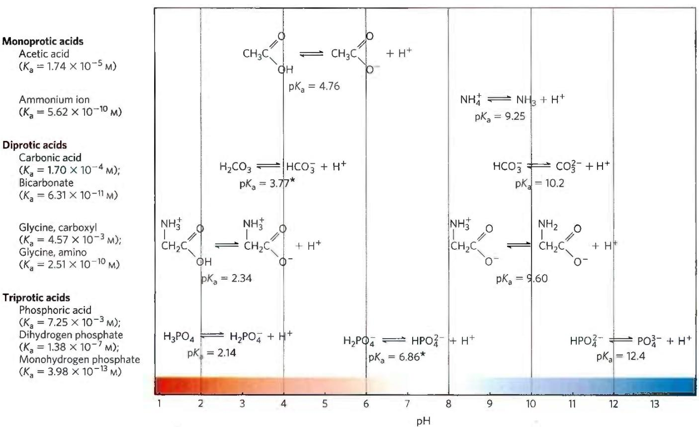  
FIGURE 2-15 Conjugate acid-base pairs consist of a proton donor and a proton acceptor. Some compounds, such as acetic acid and ammonium ion, are monoprotic: they can give up only one proton. Others are diprotic (carbonic acid and glycine) or triprotic (phosphoric acid). The dissociation reactions for each pair are shown where they occur along  
a pH gradient. The equilibrium or dissociation constant (K) and its negative logarithm, the $pK_{a}$ , are shown for each reaction. \*For an explanation of apparent discrepancies in $pK_{a}$ values for carbonic acid ( $H_{2}CO_{3}$ ), see p. 63; and for dihydrogen phosphate ( $H_{2}PO_{4}^{-}$ ), see p. 58.

## Titration Curves Reveal the $pK_{a}$ of Weak Acids

Titration can be used to determine the amount of an acid in a given solution. A measured volume of the acid is titrated with a solution of a strong base, usually sodium hydroxide (NaOH), of known concentration. The NaOH is added in small increments until the acid is consumed (neutralized), as determined with an indicator dye or a pH meter. The concentration of the acid in the original solution can be calculated from the volume and concentration of NaOH added. The amounts of acid and base in titrations are often expressed in terms of equivalents, where one equivalent is the amount of a substance that will react with, or supply, one mole of hydrogen ions in an acid-base reaction. Recall that for monoprotic acids such as HCl, 1 mol = 1 equivalent; for diprotic acids such as $H_{2}SO_{4}$ , 1 mol = 2 equivalents.

A plot of pH against the amount of NaOH added (a titration curve) reveals the $pK_{a}$ of the weak acid. Consider the titration of a 0.1 M solution of acetic acid with 0.1 M NaOH at 25 °C (Fig. 2-16). Two reversible equilibria are involved in the process (here, for simplicity, acetic acid is denoted HAc):

$$
\mathrm{H} _ {2} \mathrm{O} \rightleftharpoons \mathrm{H} ^ {+} + \mathrm{OH} ^ {-}\tag{2-5}
$$

$$
\mathrm{HAc} \rightleftharpoons \mathrm{H} ^ {+} + \mathrm{Ac} ^ {-}\tag{2-6}
$$

  
FIGURE 2-16 The titration curve of acetic acid. After addition of each increment of NaOH to the acetic acid solution, the pH of the mixture is measured. This value is plotted against the amount of NaOH added, expressed as a fraction of the total NaOH required to convert all the acetic acid (CH₃COOH) to its deprotonated form, acetate (CH₃COO⁻). The points so obtained yield the titration curve. Shown in the boxes are the predominant ionic forms at the points designated. At the midpoint of the titration, the concentrations of the proton donor and the proton acceptor are equal, and the pH is numerically equal to the pKₐ. The shaded zone is the useful region of buffering power, generally between 10% and 90% titration of the weak acid.

The equilibria must simultaneously conform to their characteristic equilibrium constants, which are, respectively,

$$
K _ {\mathrm{w}} = [ \mathrm{H} ^ {+} ] [ \mathrm{OH} ^ {-} ] = 1 \times 1 0 ^ {- 1 4} \mathrm{M} ^ {2}\tag{2-7}
$$

$$
K _ {\mathrm{a}} = \frac {[ \mathrm{H} ^ {+} ] [ \mathrm{Ac} ^ {-} ]}{[ \mathrm{HAc} ]} = 1. 7 4 \times 1 0 ^ {- 5} \mathrm{M}\tag{2-8}
$$

At the beginning of the titration, before any NaOH is added, the acetic acid is already slightly ionized, to an extent that can be calculated from its ionization constant (Eqn 2-8).

As NaOH is gradually introduced, the added OH $^{-}$ combines with the free H $^{+}$ in the solution to form H $_{2}$ O, to an extent that satisfies the equilibrium relationship in Equation 2-7. As free H $^{+}$ is removed, HAc dissociates further to satisfy its own equilibrium constant (Eqn 2-8). The net result as the titration proceeds is that more and more HAc ionizes, forming Ac $^{-}$ , as the NaOH is added. At the midpoint of the titration, at which exactly 0.5 equivalent of NaOH has been added per equivalent of the acid, one-half of the original acetic acid has undergone dissociation, so that the concentration of the proton donor, [HAc], now equals that of the proton acceptor, [Ac $^{-}$ ]. P2 At this midpoint a very important relationship holds: the pH of the equimolar solution of acetic acid and acetate is exactly equal to the pK $_{a}$ of acetic acid (pK $_{a}$ = 4.76; Figs 2-15, 2-16). The basis for this relationship, which holds for all weak acids, will soon become clear.

As the titration is continued by adding further increments of NaOH, the remaining nondissociated acetic acid is gradually converted into acetate. The end point of the titration occurs at about pH 7.0: all the acetic acid has lost its protons to $OH^{-}$ , to form $H_{2}O$ and acetate. Throughout the titration the two equilibria (Eqns 2-5, 2-6) coexist, each always conforming to its equilibrium constant.

Figure 2-17 compares the titration curves of three weak acids with very different ionization constants: acetic acid ( $pK_{a} = 4.76$ ); dihydrogen phosphate, $H_{2}PO_{4}^{-}$ ( $pK_{a} = 6.86$ ); and ammonium ion, $NH_{4}^{+}$ ( $pK_{a} = 9.25$ ). Although the titration curves of these acids have the same shape, they are displaced along the pH axis because the three acids have different strengths. Acetic acid, with the highest $K_{a}$ (lowest $pK_{a}$ ) of the three, is the strongest of the three weak acids (loses its proton most readily); it is already half dissociated at pH 4.76. Dihydrogen phosphate loses a proton less readily, being half dissociated at pH 6.86. Ammonium ion is the weakest acid of the three and does not become half dissociated until pH 9.25. The titration curve of these weak acids shows graphically that a weak acid and its anion—a conjugate acid-base pair—can act as a buffer, as we describe in the next section.

Like all equilibrium constants, $K_{a}$ and $pK_{a}$ are defined for specific conditions of concentration (components at 1 M) and temperature (25 °C). Concentrated buffer solutions do not show ideal behavior. For example, the $pK_{a}$ of dihydrogen phosphate is sometimes given as 7.2, sometimes as 6.86. The higher value (the apparent $pK_{a}$ ) is not corrected for the effects of buffer concentration, and is defined at a temperature of $25\ ^{\circ}C$ . The value of 6.86 is corrected for buffer concentration and measured at physiological temperature ( $37\ ^{\circ}C$ ), and is probably a closer approximation to the relevant value of $pK_{a}$ in warm-blooded animals. We therefore use the value $pK_{a}=6.86$ for dihydrogen phosphate throughout this book.

  
FIGURE 2-17 Comparison of the titration curves of three weak acids. Shown here are the titration curves for $\mathrm{CH}_3\mathrm{COOH}$ , $\mathrm{H}_2\mathrm{PO}_4^-$ , and $\mathrm{NH}_4^+$ . The predominant ionic forms at designated points in the titration are given in boxes. The regions of buffering capacity are indicated at the right. Conjugate acid-base pairs are effective buffers between approximately $10\%$ and $90\%$ neutralization of the proton-donor species.

## SUMMARY 2.2 Ionization of Water, Weak Acids, and Weak Bases

■ Pure water ionizes slightly, forming equal numbers of hydrogen ions (hydronium ions, $H_{3}O^{+}$ ) and hydroxide ions.

The extent of ionization is described by an equilibrium constant, $K_{eq} = \frac{[H^{+}] [OH^{-}]}{[H_{2}O]}$ , from which the ion product of water, $K_{w}$ , is derived. At 25 °C,

$$
K _ {\mathrm{w}} = [ \mathrm{H} ^ {+} ] [ \mathrm{OH} ^ {-} ] = (5 5. 5 \mathrm{M}) (K _ {\mathrm{eq}}) = 1 0 ^ {- 1 4} \mathrm{M} ^ {2}
$$

■ The pH of an aqueous solution reflects, on a logarithmic scale, the concentration of hydrogen ions:

$$
\mathrm{pH} = \log \frac {1}{[ \mathrm{H} ^ {+} ]} = - \log [ \mathrm{H} ^ {+} ]
$$

■ Weak acids partially ionize to release a hydrogen ion, thus lowering the pH of the aqueous solution. Weak bases accept a hydrogen ion, increasing the pH. The extent of these processes is characteristic of each particular weak acid or base and is expressed as an acid dissociation constant:

$$
K _ {\mathrm{eq}} = \frac {[ \mathrm{H} ^ {+} ] [ \mathrm{A} ^ {-} ]}{[ \mathrm{HA} ]} = K _ {\mathrm{a}}
$$

■ The $pK_{a}$ expresses, on a logarithmic scale, the relative strength of a weak acid or base:

$$
\mathrm{p} K _ {\mathrm{a}} = \log \frac {1}{[ K _ {\mathrm{a}} ]} = - \log K _ {\mathrm{a}}
$$

The stronger the acid, the smaller its $pK_{a}$ ; the stronger the base, the larger the $pK_{a}$ of its conjugate acid. The $pK_{a}$ can be determined experimentally; it is the pH at the midpoint of the titration curve.

## 2.3 Buffering against pH Changes in Biological Systems

Almost every biological process is pH-dependent; a small change in pH produces a large change in the rate of the process. This is true not only for the many reactions in which the $H^{+}$ ion is a direct participant, but also for those reactions in which there is no apparent role for $H^{+}$ ions.

P4 The enzymes that catalyze cellular reactions, and many of the molecules on which they act, contain ionizable groups with characteristic $pK_{a}$ values. The protonated amino and carboxyl groups of amino acids and the phosphate groups of nucleotides, for example, function as weak acids; their ionic state is determined by the pH of the surrounding medium. (When an ionizable group is sequestered in the middle of a protein, away from the aqueous solvent, its $pK_{a}$ , or apparent $pK_{a}$ , can be significantly different from its $pK_{a}$ in water.) As we noted above, ionic interactions are among the forces that stabilize a protein molecule and allow an enzyme to recognize and bind to its substrate.

Cells and organisms maintain a specific and constant cytosolic pH, usually near pH 7, keeping biomolecules in their optimal ionic state. In multicellular organisms, the pH of extracellular fluids is also tightly regulated. Constancy of pH is achieved primarily by biological buffers: mixtures of weak acids and their conjugate bases.

## Buffers Are Mixtures of Weak Acids and Their Conjugate Bases

Buffers are aqueous systems that tend to resist changes in pH when small amounts of acid (H $^{+}$ ) or base (OH $^{-}$ ) are added. A buffer system consists of a weak acid (the proton donor) and its conjugate base (the proton acceptor). As an example, a mixture of equal concentrations of acetic acid and acetate ion, found at the midpoint of the titration curve in Figure 2-16, is a buffer system. Notice that the titration curve of acetic acid has a relatively flat zone extending about 1 pH unit on either side of its midpoint pH of 4.76. In this zone, a given amount of $H^{+}$ or $OH^{-}$ added to the system has much less effect on pH than the same amount added outside the zone. This relatively flat zone is the buffering region of the acetic acid-acetate buffer pair. At the midpoint of the buffering region, where the concentration of the proton donor (acetic acid) exactly equals that of the proton acceptor (acetate), the buffering power of the system is maximal; that is, its pH changes least on addition of $H^{+}$ or $OH^{-}$ . The pH at this point in the titration curve of acetic acid is equal to its apparent $pK_{a}$ . The pH of the acetate buffer system does change slightly when a small amount of $H^{+}$ or $OH^{-}$ is added, but this change is very small compared with the pH change that would result if the same amount of $H^{+}$ or $OH^{-}$ were added to pure water or to a solution of the salt of a strong acid and strong base, such as NaCl, which has no buffering power.

Buffering results from two reversible reaction equilibria occurring in a solution of nearly equal concentrations of a proton donor and its conjugate proton acceptor. Figure 2-18 explains how a buffer system works. Whenever $H^{+}$ or $OH^{-}$ is added to a buffer, the result is a small change in the ratio of the relative concentrations of the weak acid and its anion and thus a small change in pH. The decrease in concentration of one component of the system is balanced exactly by an increase in the other. The sum of the buffer components does not change; only their ratio changes.

  
FIGURE 2-18 The acetic acid–acetate pair as a buffer system. The system is capable of absorbing either $H^{+}$ or $OH^{-}$ through the reversibility of the dissociation of acetic acid. The proton donor, acetic acid (HAc), contains a reserve of bound $H^{+}$ , which can be released to neutralize an addition of $OH^{-}$ to the system, forming $H_{2}O$ . This happens because the product $[H^{+}][OH^{-}]$ transiently exceeds $K_{w}(1\times10^{-14}\mathrm{~m}^{2})$ . The equilibrium quickly adjusts to restore the product to $1\times10^{-14}\mathrm{~m}^{2}$ (at 25 °C), thus transiently reducing the concentration of $H^{+}$ . But now the quotient $[H^{+}][Ac^{-}]/[HAc]$ is less than $K_{a}$ , so HAc dissociates further to restore equilibrium. Similarly, the conjugate base, $Ac^{-}$ , can react with $H^{+}$ ions added to the system; again, the two ionization reactions simultaneously come to equilibrium. Thus, a conjugate acid-base pair, such as acetic acid and acetate ion, tends to resist a change in pH when small amounts of acid or base are added. Buffering action is simply the consequence of two reversible reactions taking place simultaneously and reaching their points of equilibrium as governed by their equilibrium constants, $K_{w}$ and $K_{a}$ .

Each conjugate acid-base pair has a characteristic pH zone in which it is an effective buffer (Fig. 2-17). The $H_{2}PO_{4}^{-}/HPO_{4}^{2-}$ pair has a $pK_{a}$ of 6.86 and thus can serve as an effective buffer system between approximately pH 5.9 and pH 7.9; the $NH_{4}^{+}/NH_{3}$ pair, with a $pK_{a}$ of 9.25, can act as a buffer between approximately pH 8.3 and pH 10.3.

## The Henderson-Hasselbalch Equation Relates pH, $pK_{a}$ , and Buffer Concentration

The titration curves of acetic acid, $H_{2}PO_{4}^{2-}$ , and $NH_{4}^{+}$ (Fig. 2-17) have nearly identical shapes, suggesting that these curves reflect a fundamental law or relationship. This is indeed the case. P3 The shape of the titration curve of any weak acid is described by the Henderson-Hasselbalch equation, which is important for understanding buffer action and acid-base balance in the blood and tissues of vertebrates. This equation is simply a useful way of restating the expression for the ionization constant of an acid. For the ionization of a weak acid HA, the Henderson-Hasselbalch equation can be derived as follows:

First solve for $[\mathrm{H}^{+}]$ :

$$
\begin{array}{l} K _ {\mathrm{a}} = \frac {[ \mathrm{H} ^ {+} ] [ \mathrm{A} ^ {-} ]}{[ \mathrm{HA} ]} \\ [ \mathrm{H} ^ {+} ] = K _ {\mathrm{a}} \frac {[ \mathrm{HA} ]}{[ \mathrm{A} ^ {-} ]} \end{array}
$$

Then take the negative logarithm of both sides:

$$
- \log [ \mathrm{H} ^ {+} ] = - \log K _ {\mathrm{a}} - \log \frac {[ \mathrm{HA} ]}{[ \mathrm{A} ^ {-} ]}
$$

Substitute pH for $-\log\left[H^{+}\right]$ and $pK_{a}$ for $-\log K_{a}$ :

$$
\mathrm{pH} = \mathrm{p} K _ {\mathrm{a}} - \log \frac {[ \mathrm{HA} ]}{[ \mathrm{A} ^ {-} ]}
$$

Now invert $-\log[HA]/[A^{-}]$ , which requires changing its sign, to obtain the Henderson-Hasselbalch equation:

$$
\mathrm{pH} = \mathrm{p} K _ {\mathrm{a}} + \log \frac {[ \mathrm{A} ^ {-} ]}{[ \mathrm{HA} ]}\tag{2-9}
$$

This equation fits the titration curve of all weak acids and enables us to deduce some important quantitative relationships. For example, it shows why the $pK_{a}$ of a weak acid is equal to the pH of the solution at the midpoint of its titration. At that point, $[HA] = [A^{-}]$ , and

$$
\mathrm{pH} = \mathrm{p} K _ {\mathrm{a}} + \log 1 = \mathrm{p} K _ {\mathrm{a}} + 0 = \mathrm{p} K _ {\mathrm{a}}
$$

The Henderson-Hasselbalch equation also allows us (1) to calculate $pK_{a}$ , given pH and the molar ratio of proton donor and acceptor; (2) to calculate pH, given $pK_{a}$ and the molar ratio of proton donor and acceptor; and (3) to calculate the molar ratio of proton donor and acceptor, given pH and $pK_{a}$ .

  
FIGURE 2-19 Ionization of histidine. The amino acid histidine, a component of proteins, is a weak acid. The $\mathsf{pK}_{\mathrm{a}}$ of the protonated nitrogen of the side chain is 6.0.

## Weak Acids or Bases Buffer Cells and Tissues against pH Changes

P3 The intracellular and extracellular fluids of multicellular organisms have a characteristic and nearly constant pH. The organism's first line of defense against changes in internal pH is provided by buffer systems. The cytoplasm of most cells contains high concentrations of proteins, and these proteins contain many amino acids with functional groups that are weak acids or weak bases. For example, the side chain of histidine (Fig. 2-19) has a $pK_{a}$ of 6.0 and thus can exist in either the protonated form or the unprotonated form near neutral pH. Proteins containing histidine residues therefore buffer effectively near neutral pH.

## WORKED EXAMPLE 2-4 Ionization of Histidine

Calculate the fraction of histidine that has its imidazole side chain protonated at pH 7.3. The $pK_{a}$ values for histidine are $pK_{1}=1.8$ , $pK_{2}$ (imidazole)=6.0, and $pK_{3}=9.2$ (see Fig. 3-12b).

SOLUTION: The three ionizable groups in histidine have sufficiently different $pK_{a}$ values (different by at least 2 pH units) that the first acid (—COOH) is almost completely ionized before the second acid (protonated imidazole) begins to dissociate a proton, and the second ionizes almost completely before the third ( $—NH_{3}^{+}$ ) begins to dissociate its proton. (With the Henderson-Hasselbalch equation, we can easily show that a weak acid goes from 1% ionized at 2 pH units below its $pK_{a}$ to 99% ionized at 2 pH units above its $pK_{a}$ ; see also Fig. 3-12b.) At pH 7.3, the carboxyl group of histidine is entirely deprotonated ( $—COO^{-}$ ) and the $\alpha$ -amino group is fully protonated ( $—NH_{3}^{+}$ ). We can therefore assume that at pH 7.3, the only group that is partially dissociated is the imidazole group, which can be protonated (we'll abbreviate as HisH $^{+}$ ) or not (His).

We use the Henderson-Hasselbalch equation:

$$
\mathrm{pH} = \mathrm{pK} _ {\mathrm{a}} + \log \frac {[ \mathrm{A} ^ {-} ]}{[ \mathrm{HA} ]}
$$

Substituting $pK_{2}=6.0$ and pH=7.3:

$$
7. 3 = 6. 0 + \log \frac {[ \mathrm{His} ]}{[ \mathrm{HisH} ^ {+} ]}
$$

$$
1. 3 = + \log \frac {[ \mathrm{His} ]}{[ \mathrm{HisH} ^ {+} ]}
$$

$$
\text {   antilog   } 1. 3 = \frac {[ \mathrm{His} ]}{[ \mathrm{HisH} ^ {+} ]} = 2. 0 \times 1 0 ^ {1}
$$

This gives us the ratio of [His] to $[HisH^{+}]$ (20 to 1 in this case). We want to convert this ratio to the fraction of total histidine that is in the unprotonated form (His) at pH 7.3. That fraction is 20/21 (20 parts His per 1 part HisH $^{+}$ , in a total of 21 parts histidine in either form), or about 95.2%; the remainder (100% minus 95.2%) is protonated—about 5%.

Nucleotides such as ATP, as well as many metabolites of low molecular weight, contain ionizable groups that can contribute buffering power to the cytoplasm. Some highly specialized organelles and extracellular compartments have high concentrations of compounds that contribute buffering capacity: organic acids buffer the vacuoles of plant cells; ammonia buffers urine.

Two especially important biological buffers are the phosphate and bicarbonate systems. The phosphate buffer system, which acts in the cytoplasm of all cells, consists of $H_{2}PO_{4}^{-}$ as proton donor and $HPO_{4}^{2-}$ as proton acceptor:

$$
\mathrm{H} _ {2} \mathrm{PO} _ {4} ^ {-} \rightleftharpoons \mathrm{H} ^ {+} + \mathrm{HPO} _ {4} ^ {2 -}
$$

The phosphate buffer system is maximally effective at a pH close to its $pK_{a}$ of 6.86 (Figs 2-15, 2-17) and thus tends to resist pH changes in the range between about 5.9 and 7.9. It is therefore an effective buffer in biological fluids; in mammals, for example, extracellular fluids and most cytoplasmic compartments have a pH in the range of 6.9 to 7.4.

## WORKED EXAMPLE 2-5 Phosphate Buffers

(a) What is the pH of a mixture of 0.042 M $NaH_{2}PO_{4}$ and 0.058 M $Na_{2}HPO_{4}$ ?

SOLUTION: We use the Henderson-Hasselbalch equation, which we'll express here as

$$
\mathrm{pH} = \mathrm{pK} _ {\mathrm{a}} + \log \frac {[ \text { conjugate   base } ]}{[ \text { acid } ]}
$$

In this case, the acid (the species that gives up a proton) is $H_{2}PO_{4}^{-}$ , and the conjugate base (the species that gains a proton) is $HPO_{4}^{2-}$ . Substituting the given concentrations of acid and conjugate base and the $pK_{a}$ (6.86) results in

$$
\mathrm{pH} = 6. 8 6 + \log \frac {[ 0 . 0 5 8 ]}{[ 0 . 0 4 2 ]} = 6. 8 6 + 0. 1 4 = 7. 0
$$

We can roughly check this answer. When more conjugate base than acid is present, the acid is more than 50% titrated and thus the pH is above the $pK_{a}$ (6.86), where the acid is exactly 50% titrated.

(b) If 1.0 mL of 10.0 M NaOH is added to a liter of the buffer prepared in (a), how much will the pH change?

SOLUTION: A liter of the buffer contains 0.042 mol of $\mathrm{NaH}_2\mathrm{PO}_4$ . Adding $1.0~\mathrm{mL}$ of $10.0\mathrm{MNaOH}$ (0.010 mol) would titrate an equivalent amount (0.010 mol) of $NaH_{2}PO_{4}$ to $Na_{2}HPO_{4}$ , resulting in 0.032 mol of $NaH_{2}PO_{4}$ and 0.068 mol of $Na_{2}HPO_{4}$ . The new pH is

$$
\begin{array}{r l} \mathrm{pH} & = \mathrm{pK} _ {\mathrm{a}} + \log \frac {[ \mathrm{HPO} _ {4} ^ {2 -} ]}{[ \mathrm{H} _ {2} \mathrm{PO} _ {4} ^ {-} ]} \\ & = 6. 8 6 + \log \frac {0 . 0 6 8}{0 . 0 3 2} = 6. 8 6 + 0. 3 3 = 7. 2 \end{array}
$$

(c) If 1.0 mL of 10.0 M NaOH is added to a liter of pure water at pH 7.0, what is the final pH? Compare this with the answer in (b).

SOLUTION: The NaOH dissociates completely into $Na^{+}$ and $OH^{-}$ , giving $[OH^{-}] = 0.010 \, mol/L = 1.0 \times 10^{-2} \, M$ . We can define a term pOH analogous with pH to express $[OH^{-}]$ of a solution. The pOH is the negative logarithm of $[OH^{-}]$ , so in our example pOH = 2.0. Given that in all solutions, pH + pOH = 14 (see Table 2-5), the pH of the solution is 12. So, an amount of NaOH that increases the pH of water from 7 to 12 increases the pH of a buffered solution, as in (b), from 7.0 to just 7.2. Such is the power of buffering!

Why is pH + pOH = 14?

$$
K _ {w} = 1 0 ^ {- 1 4} = \left[ H ^ {+} \right] \left[ O H ^ {-} \right]
$$

Taking the negative log of both sides of the equation gives

$$
\begin{array}{r l} - \log (1 0 ^ {- 1 4}) & = - \log [ H ^ {+} ] + - \log [ O H ^ {-} ] \\ 1 4 & = - \log [ H ^ {+} ] + - \log [ O H ^ {-} ] \\ 1 4 & = p H + p O H \end{array}
$$

P3 Blood plasma is buffered in part by the bicarbonate system, consisting of carbonic acid (H₂CO₃) as proton donor and bicarbonate (HCO₃⁻) as proton acceptor (K₁ is the first of several equilibrium constants in the bicarbonate buffering system):

$$
\begin{array}{r l}&\mathrm {H_ {2} CO_ {3}} \rightleftharpoons \mathrm {H^ {+}} + \mathrm {HCO_ {3} ^ {-}}\\&K _ {1} = \frac {[ \mathrm {H^ {+}} ] [ \mathrm {HCO_ {3} ^ {-}} ]}{[ \mathrm {H_ {2} CO_ {3}} ]}\end{array}
$$

This buffer system is more complex than other conjugate acid-base pairs because one of its components, carbonic acid ( $H_{2}CO_{3}$ ), is formed from dissolved (aq) carbon dioxide and water, in a reversible reaction:

$$
\begin{array}{r l}&\mathrm {CO_ {2} (aq)+ H_ {2} O\rightleftharpoons H_ {2} CO_ {3}}\\&K _ {2} = \frac {[ \mathrm {H_ {2} CO_ {3}} ]}{[ \mathrm {CO_ {2} (aq)} ] [ \mathrm {H_ {2} O} ]}\end{array}
$$

Carbon dioxide is a gas under normal conditions, and $CO_{2}$ dissolved in an aqueous solution is in equilibrium with $CO_{2}$ in the gas (g) phase:

$$
\begin{array}{r l}\mathrm{CO} _ {2} (\mathrm{g})&\rightleftharpoons \mathrm{CO} _ {2} (\mathrm{aq})\\K _ {\mathrm{a}}&= \frac {[ \mathrm{CO} _ {2} (\mathrm{aq}) ]}{[ \mathrm{CO} _ {2} (\mathrm{g}) ]}\end{array}
$$

The pH of a bicarbonate buffer system depends on the concentrations of $H_{2}CO_{3}$ and $HCO_{3}^{-}$ , the proton donor and acceptor components. The concentration of $H_{2}CO_{3}$ in turn depends on the concentration of dissolved $CO_{2}$ , which in turn depends on the concentration of $CO_{2}$ in the gas phase, or the partial pressure of $CO_{2}$ , denoted $pCO_{2}$ . Thus, the pH of a bicarbonate buffer exposed to a gas phase is ultimately determined by the concentration of $HCO_{3}^{-}$ in the aqueous phase and by $pCO_{2}$ in the gas phase.

The bicarbonate buffer system is an effective physiological buffer near pH 7.4, because the $\mathrm{H}_2\mathrm{CO}_3$ of blood plasma is in equilibrium with a large reserve capacity of $\mathrm{CO}_{2}(\mathrm{g})$ in the air space of the lungs. As noted above, this buffer system involves three reversible equilibria, in this case between gaseous $\mathrm{CO}_{2}$ in the lungs and bicarbonate $(\mathrm{HCO}_{3}^{-})$ in the blood plasma (Fig. 2-20).

Blood can pick up $H^{+}$ , such as from the lactic acid produced in muscle tissue during vigorous exercise. Alternatively, it can lose $H^{+}$ , such as by protonation of the $NH_{3}$ produced during protein catabolism. When $H^{+}$ is added to blood as it passes through the tissues, reaction 1 in Figure 2-20 proceeds toward a new equilibrium, in which $[H_{2}CO_{3}]$ is increased. This in turn increases $[CO_{2}(aq)]$ in the blood (reaction 2) and thus increases the partial pressure of $CO_{2}(g)$ in the air space of the lungs (reaction 3); the extra $CO_{2}$ is exhaled. Conversely, when $H^{+}$ is lost from the blood, the opposite events occur: more $H_{2}CO_{3}$ dissociates into $H^{+}$ and $HCO_{3}^{-}$ , and thus more $CO_{2}(g)$ from the lungs dissolves in blood plasma. The rate of respiration—that is, the rate of inhaling and exhaling—can quickly adjust these equilibria to keep the blood pH nearly constant. The rate of respiration is controlled by the brain stem, where detection of an increased blood $pCO_{2}$ or decreased blood pH triggers deeper and more frequent breathing.

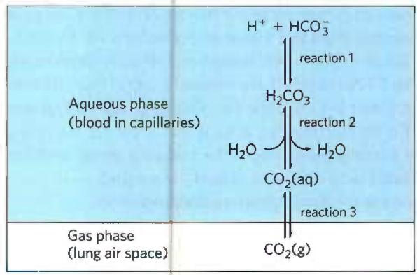  
FIGURE 2-20 The bicarbonate buffer system. $\mathrm{CO}_{2}$ in the air space of the lungs is in equilibrium with the bicarbonate buffer in the blood plasma passing through the lung capillaries. Because the concentration of dissolved $\mathrm{CO}_{2}$ can be adjusted rapidly through changes in the rate of breathing, the bicarbonate buffer system of the blood is in near-equilibrium with a large potential reservoir of $\mathrm{CO}_{2}$ .

Hyperventilation, the rapid breathing sometimes elicited by stress or anxiety, tips the normal balance of $O_{2}$ breathed in and $CO_{2}$ breathed out in favor of too much $CO_{2}$ breathed out, raising the blood pH to 7.45 or higher and causing alkalosis. This alkalosis can lead to dizziness, headache, weakness, and fainting. One home remedy for mild alkalosis is to breathe briefly into a paper bag. The air in the bag becomes enriched in $CO_{2}$ , and inhaling this air increases the $CO_{2}$ concentration in the body and blood and decreases blood pH.

At the normal pH of blood plasma (7.4), very little $H_{2}CO_{3}$ is present relative to $HCO_{3}^{-}$ , and the addition of just a small amount of base ( $NH_{3}$ or $OH^{-}$ ) would titrate this $H_{2}CO_{3}$ , exhausting the buffering capacity. The important role of $H_{2}CO_{3}$ ( $pK_{a} = 3.57$ at 37 °C) in buffering blood plasma (pH \~7.4) seems inconsistent with our earlier statement that a buffer is most effective in the range of 1 pH unit above and below its $pK_{a}$ . The explanation for this apparent paradox is the large reservoir of $CO_{2}$ dissolved in blood, which we refer to as $CO_{2}(aq)$ . Its rapid equilibration with $H_{2}CO_{3}$ results in the formation of additional $H_{2}CO_{3}$ :

$$
\mathrm{CO} _ {2} (\mathrm{aq}) + \mathrm{H} _ {2} \mathrm{O} \rightleftharpoons \mathrm{H} _ {2} \mathrm{CO} _ {3}
$$

It is useful in clinical medicine to have a simple expression for blood pH in terms of $CO_{2}(aq)$ , which is commonly monitored along with other blood gases. We can define a constant, $K_{h}$ , which is the equilibrium constant for the hydration of $CO_{2}$ to form $H_{2}CO_{3}$ :

$$
K _ {\mathrm{h}} = \frac {[ \mathrm{H} _ {2} \mathrm{CO} _ {3} ]}{[ \mathrm{CO} _ {2} (\mathrm{aq}) ]}
$$

(The concentration of water is so high (55.5 M) that dissolving $CO_{2}$ doesn't change $[H_{2}O]$ appreciably, so $[H_{2}O]$ is made part of the constant $K_{h}$ .) Then, to take the $CO_{2}(aq)$ reservoir into account, we can express $[H_{2}CO_{3}]$ as $K_{h}[CO_{2}(aq)]$ and substitute this expression for $[H_{2}CO_{3}]$ in the equation for the acid dissociation of $H_{2}CO_{3}$ :

$$
K _ {\mathrm{a}} = \frac {[ \mathrm{H} ^ {+} ] [ \mathrm{HCO} _ {3} ^ {-} ]}{[ \mathrm{H} _ {2} \mathrm{CO} _ {3} ]} = \frac {[ \mathrm{H} ^ {+} ] [ \mathrm{HCO} _ {3} ^ {-} ]}{K _ {\mathrm{h}} [ \mathrm{CO} _ {2} (\mathrm{aq}) ]}
$$

Now, the overall equilibrium for dissociation of $H_{2}CO_{3}$ can be expressed in these terms:

$$
K _ {\mathrm{h}} K _ {\mathrm{a}} = K _ {\mathrm{combined}} = \frac {[ \mathrm{H} ^ {+} ] [ \mathrm{HCO} _ {3} ^ {-} ]}{[ \mathrm{CO} _ {2} (\mathrm{aq}) ]}
$$

We can calculate the value of the new constant, $K_{combined}$ , and the corresponding apparent pK, or $pK_{combined}$ , from the experimentally determined values of $K_{\mathrm{h}}(3.0\times10^{-3}\mathrm{~M})$ and $K_{\mathrm{a}}(2.7\times10^{-4}\mathrm{~M})$ at $37^{\circ}C$ :

$$
\begin{array}{r l} K _ {\mathrm{combined}} & = (3. 0 \times 1 0 ^ {- 3} \mathrm{M}) (2. 7 \times 1 0 ^ {- 4} \mathrm{M}) \\ & = 8. 1 \times 1 0 ^ {- 7} \mathrm{M} ^ {2} \\ \mathrm{p} K _ {\mathrm{combined}} & = 6. 1 \end{array}
$$

In clinical medicine, it is common to refer to $CO_{2}(aq)$ as the conjugate acid and to use the apparent, or combined, $pK_{a}$ of 6.1 to simplify calculation of pH from $[CO_{2}(aq)]$ . The concentration of dissolved $CO_{2}$ is a function of $pCO_{2}$ , which in the lung is about 4.8 kilopascals (kPa), corresponding to $[H_{2}CO_{3}] \approx 1.2$ mm. Plasma $[HCO_{3}^{-}]$ is normally about 24 mm, so $[HCO_{3}^{-}]/[H_{2}CO_{3}]$ is about 20, and the blood pH is $6.1 + \log 20 \approx 7.4$ .

## Untreated Diabetes Produces Life-Threatening Acidosis

P4 Many of the enzymes that function in the blood have evolved to have maximal activity between pH 7.35 and 7.45, the normal pH range of human blood plasma. Enzymes typically show maximal catalytic activity at a characteristic pH, called the optimum pH (Fig. 2-21). On either side of this optimum pH, catalytic activity often declines sharply. Thus, a small change in pH can make a large difference in the rate of some crucial enzyme-catalyzed reactions. Biological control of the pH of cells and body fluids is therefore of central importance in all aspects of metabolism and cellular activities, and changes in blood pH have marked physiological consequences, as we know from the alarming experiments described in Box 2-1.

In individuals with untreated diabetes mellitus, the lack of insulin, or insensitivity to insulin, disrupts the uptake of glucose from blood into the tissues and forces the tissues to use stored fatty acids as their primary fuel. For reasons we describe in detail later in the book (see Chapter 23), this dependence on fatty acids results in acidosis, the accumulation of high concentrations of two carboxylic acids, $\beta$ -hydroxybutyric acid and acetoacetic acid (a combined blood plasma level of 90 mg/100 mL, compared with <3 mg/100 mL in control (healthy) individuals; urinary excretion of 5 g/24 h, compared with <125 mg/24 h in controls). Dissociation of these acids lowers the pH of blood plasma to less than 7.35. P3 Severe acidosis (characterized by low blood pH) produces headache, drowsiness, nausea, vomiting, and diarrhea, followed by stupor, coma, and convulsions, presumably because, at the lower pH, some enzyme(s) do not function optimally. When a patient is found to have high blood glucose, low plasma pH, and high levels of $\beta$ -hydroxybutyric acid and acetoacetic acid in blood and urine, diabetes mellitus is the likely diagnosis.

  
FIGURE 2-21 The pH optima of two enzymes. Pepsin is a digestive enzyme secreted into gastric juice, which has a pH of \~1.5, allowing pepsin to act optimally. Trypsin, a digestive enzyme that acts in the small intestine, has a pH optimum that matches the neutral pH in the lumen of the small intestine.

Other conditions can also produce acidosis. For example, fasting and starvation force the use of stored fatty acids as fuel, with the same consequences as for diabetes. Very heavy exertion, such as a sprint by runners or cyclists, leads to temporary accumulation of lactic acid in the blood. Kidney failure results in a diminished capacity to regulate bicarbonate levels. Lung diseases (such as emphysema, pneumonia, and asthma) reduce the capacity to dispose of the $CO_{2}$ produced by fuel oxidation in the tissues, with the resulting accumulation of $H_{2}CO_{3}$ .

Acidosis is treated by dealing with the underlying condition—administering insulin to people with diabetes, and steroids or antibiotics to people with lung disease. Severe acidosis can be reversed by administering bicarbonate solution intravenously.

## WORKED EXAMPLE 2-6 Treatment of Acidosis with Bicarbonate

Why does intravenous administration of a bicarbonate solution raise the plasma pH?

SOLUTION: The ratio of $\left[\mathrm{HCO}_{3}^{-}\right]$ to $\left[\mathrm{CO}_{2}(\mathrm{aq})\right]$ determines the pH of the bicarbonate buffer, according to the equation

$$
\mathrm{pH} = 6. 1 + \log \frac {[ \mathrm{HCO} _ {3} ^ {-} ]}{\mathrm{H} _ {2} \mathrm{CO} _ {3}}
$$

where $[H_{2}CO_{3}]$ is directly related to $pCO_{2}$ , the partial pressure of $CO_{2}$ . So, if $[HCO_{3}^{-}]$ is increased with no change in $pCO_{2}$ , the blood pH will rise.

## SUMMARY 2.3 Buffering against pH Changes in Biological Systems

A mixture of a weak acid (or base) and its salt resists changes in pH caused by the addition of $H^{+}$ or $OH^{-}$ . The mixture thus functions as a buffer.

■ The pH of a solution of a weak acid (or base) and its salt is given by the Henderson-Hasselbalch equation:

$$
\mathrm{pH} = \mathrm{p} K _ {\mathrm{a}} + \log \frac {[ \mathrm{A} ^ {-} ]}{[ \mathrm{HA} ]}
$$

In cells and tissues, phosphate and bicarbonate buffer systems maintain intracellular and extracellular fluids near pH 7.4. Enzymes generally work optimally near this physiological pH.

■ Medical conditions such as untreated diabetes that lower the pH of blood, causing acidosis, or raise it, causing alkalosis, can be life-threatening.

## KEY TERMS

Terms in bold are defined in the glossary.

<table><tr><td>hydrogen bond 44bond energy 44hydrophilic 46hydrophobic 46amphipathic 46hydrophobiceffect 48micelle 48van der Waalsinteractions 49osmolarity 52osmosis 52isotonic 52hypertonic 52hypotonic 52equilibrium constant $(K_{eq})$  54</td><td>ion product ofwater ( $K_w$ ) 55pH 55acidosis 56alkalosis 56conjugate acid-basepair 57acid dissociationconstant ( $K_a$ ) 57p $K_a$  57titration curve 58buffer 59buffering region 60Henderson-Hasselbalchequation 60optimum pH 63</td></tr></table>

## PROBLEMS

1. Effect of Local Environment on Ionic Bond Strength The ATP-binding site of an enzyme is buried in the interior of the enzyme, in a hydrophobic environment. Suppose that the ionic interaction between enzyme and ATP took place at the surface of the enzyme, exposed to water. Would this enzyme-substrate interaction be stronger or would it be weaker? Why?

2. Biological Advantage of Weak Interactions The associations between biomolecules are often stabilized by hydrogen bonds, electrostatic interactions, the hydrophobic effect, and van der Waals interactions. How are weak interactions such as these advantageous to an organism?

3. Solubility of Ethanol in Water Ethane (CH₃CH₃) and ethanol (CH₃CH₂OH) differ in their molecular makeup by only one atom, yet ethanol is much more soluble in water than ethane. Describe the features of ethanol that make it more water soluble than ethane.

<!-- END OFFICIAL API PART part_001 -->

<!-- BEGIN OFFICIAL API PART part_002 -->

4. Calculation of pH from Hydrogen Ion Concentration
What is the pH of a solution that has an H $^{+}$ concentration of
(a) 1.75 × 10 $^{-5}$ mol/L; (b) 6.50 × 10 $^{-10}$ mol/L;
(c) 1.0 × 10 $^{-4}$ mol/L; (d) 1.50 × 10 $^{-5}$ mol/L?

5. Calculation of Hydrogen Ion Concentration from pH What is the $\mathbf{H}^{+}$ concentration of a solution with pH of (a) 3.82; (b) 6.52; (c) 11.11?

6. Acidity of Gastric HCl A technician in a hospital laboratory obtained a 10.0 mL sample of gastric juice from a patient several hours after a meal and titrated the sample with 0.1 M NaOH to neutrality. The neutralization of gastric HCl required 7.2 mL of NaOH. The patient's stomach contained no ingested food or drink at the time of sample harvest. Therefore, assume that no buffers were present. What was the pH of the gastric juice?

## 7. Calculation of the pH of a Strong Acid or Base

(a) Write out the acid dissociation reaction for hydrochloric acid.

(b) Calculate the pH of a solution of $5 \times 10^{-4}$ M hydrochloric acid at 25 °C.

(c) Write out the acid dissociation reaction for sodium hydroxide.

(d) Calculate the pH of a solution of $7 \times 10^{-5}$ M sodium hydroxide at 25 °C.

8. Calculation of pH from Concentration of Strong Acid Calculate the pH of a solution prepared by diluting 3.0 mL of 2.5 M HCl to a final volume of 100 mL with $H_{2}O$ .

9. Measurement of Acetylcholine Levels by pH Changes You have a 15 mL sample of acetylcholine (a neurotransmitter) with an unknown concentration and a pH of 7.65. You incubate this sample with the enzyme acetylcholinesterase to convert all of the acetylcholine to choline and acetic acid. The acetic acid dissociates to yield acetate and hydrogen ions.

Acetylcholine

At the end of the incubation period, you measure the pH again and find that it has decreased to 6.87. Assuming there was no buffer in the assay mixture, determine the number of nanomoles of acetylcholine in the original 15 mL sample.

10. Relationship Between $\mathbf{pK}_{\mathrm{a}}$ and pH Which aqueous solution has the lowest pH: 0.1 M hydrofluoric acid ( $\mathrm{pK}_{\mathrm{a}} = 3.20$ ); 0.1 M acetic acid ( $\mathrm{pK}_{\mathrm{a}} = 4.86$ ); 0.1 M formic acid ( $\mathrm{pK}_{\mathrm{a}} = 3.75$ ); or 0.1 M lactic acid ( $\mathrm{pK}_{\mathrm{a}} = 7.86$ )?

11. Properties of Strong and Weak Acids Classify each acid or property as representing a strong acid or a weak acid: (a) hydrochloric acid; (b) acetic acid; (c) strong tendency to dissociate protons; (d) larger $K_{a}$ ; (e) partially dissociates into ions; (f) larger $pK_{a}$ .

12. Simulated Vinegar One way to make vinegar is to prepare a solution of acetic acid, the sole acid component of vinegar, at the proper pH (see Fig. 2-14) and add appropriate flavoring agents. Acetic acid is a liquid at 25 °C, with a relative molecular mass ( $M_r$ ) of 60, density of 1.049 g/mL, and acid dissociation constant ( $K_a$ ) of $1.7 \times 10^{-5}$ M. Calculate the volume of acetic acid needed to produce 1 L of simulated vinegar from distilled water (see Fig. 2-15).

13. Identifying Conjugate Bases Write the conjugate base for each acid: (a) $H_{3}PO_{4}$ ; (b) $H_{2}CO_{3}$ ; (c) $CH_{3}COOH$ ; (d) $CH_{3}NH_{3}^{+}$

14. Calculation of the pH of a Mixture of a Weak Acid and Its Conjugate Base Calculate the pH of a dilute solution that contains a molar ratio of potassium acetate to acetic acid ( $pK_{a} = 4.76$ ) of (a) 2:1; (b) 1:3; (c) 5:1; (d) 1:1; (e) 1:10.

15. Effect of pH on Solubility The strongly polar, hydrogen-bonding properties of water make it an excellent solvent for ionic (charged) species. By contrast, nonionized, nonpolar organic molecules, such as benzene, are relatively insoluble in water. In principle, the aqueous solubility of any organic acid or base can be increased by converting the molecules to charged species. For example, the solubility of benzoic acid in water is low. Adding sodium bicarbonate to a mixture of water and benzoic acid raises the pH and deprotonates the benzoic acid to form benzoate ion, which is quite soluble in water.

Categorize the given compounds based on whether they are more soluble in an aqueous solution of 0.1 M NaOH or 0.1 M HCl. (The dissociable protons are shown in red.)

16. Treatment of Poison Ivy Rash Urushiol, the component of poison ivy that is responsible for the characteristic itchy rash, is a mixture of catechols substituted with various long-chain alkyl groups.

Which of these treatments would be most effective at removing catechols from the surface of the skin after exposure to poison ivy? Justify your choice.

(a) Wash the area with cold water.

(b) Wash the area with dilute vinegar or lemon juice.

(c) Wash the area with soap and water.

(d) Wash the area with soap, water, and baking soda (sodium bicarbonate).

17. pH and Drug Absorption Aspirin is a weak acid with a $pK_{a}$ of 3.5 (the ionizable H is shown in red):

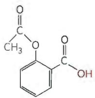

Aspirin is absorbed into the blood through the cells lining the stomach and the small intestine. Absorption requires passage through the plasma membrane. The polarity of the molecule determines the absorption rate: charged and highly polar molecules pass slowly, whereas neutral hydrophobic molecules pass rapidly. The pH of the stomach contents is about 1.5, and the pH of the contents of the small intestine is about 6. Based on this information, is more aspirin absorbed into the bloodstream from the stomach or from the small intestine? Clearly justify your choice.

18. Calculation of pH from Molar Concentrations The $pK_{a}$ of $NH_{4}^{+}/NH_{3}$ is 9.25. Calculate the pH of a solution containing 0.12 M $NH_{4}Cl$ and 0.03 M NaOH.

19. Calculation of pH after Titration of Weak Acid A compound has a $pK_{a}$ of 7.4. You add 100 mL of a 1.0 M solution of this compound at pH 8.0 to 30 mL of 1.0 M hydrochloric acid. What is the pH of the resulting solution?

20. Properties of a Buffer The amino acid glycine is often used as the main ingredient of a buffer in biochemical experiments. The amino group of glycine, which has a $pK_{a}$ of 9.6, can exist either in the protonated form ( $-NH_{3}^{+}$ ) or as the free base ( $-NH_{2}$ ), because of the reversible equilibrium

$$
\mathrm{R} - \mathrm{NH} _ {3} ^ {+} \rightleftharpoons \mathrm{R} - \mathrm{NH} _ {2} + \mathrm{H} ^ {+}
$$

(a) In what pH range can glycine be used as an effective buffer due to its amino group?

(b) In a 0.1 M solution of glycine at pH 9.0, what fraction of glycine has its amino group in the $-NH_{3}^{+}$ form?

(c) How much 5 M KOH must be added to 1.0 L of 0.1 M glycine at pH 9.0 to bring its pH to exactly 10.0?

(d) When 99% of the glycine is in its $-NH_{3}^{+}$ form, what is the numerical relation between the pH of the solution and the $pK_{a}$ of the amino group?

21. Calculation of the $pK_{a}$ of an Ionizable Group by Titration Suppose a biochemist has 10 mL of a 1.0 M solution of a compound with two ionizable groups at a pH of 8.00. She adds 10.0 mL of 1.00 M HCl, which changes the pH to 3.20. The $pK_{a}$ value of one of the groups ( $pK_{1}$ ) is 3.8 and it is known that $pK_{2}$ is between 7 and 10. What is the exact value of $pK_{2}$ ?

22. Calculation of the pH of a Solution of a Polyprotic Acid The amino acid histidine has ionizable groups with $pK_{a}$ values of 1.8, 6.0, and 9.2, as shown (His = imidazole group). A biochemist makes up 100 mL of a 0.10 M solution of histidine at a pH of 5.40. She then adds 40 mL of 0.10 M HCl. What is the pH of the resulting solution?

23. Calculation of Original pH from Final pH after Titration A biochemist has 100 mL of a 0.100 M solution of a weak acid with a pK $_{a}$ of 6.3; He adds 6.0 mL of 1.0 M HCl, which changes the pH to 5.7. What was the pH of the original solution?

24. Preparation of a Phosphate Buffer Phosphoric acid ( $H_{3}PO_{4}$ ), a triprotic acid, has three $pK_{a}$ values: 2.14, 6.86, and 12.4. What molar ratio of $HPO_{4}^{2-}$ to $H_{2}PO_{4}^{-}$ in solution would produce a pH of 7.0? Hint: Only one of the $pK_{a}$ values is relevant here.

25. Preparation of Standard Buffer for Calibration of a pH Meter The glass electrode used in commercial pH meters gives an electrical response proportional to the concentration of hydrogen ion. Converting these responses to a pH reading requires calibration of the electrode against standard solutions of known H $^{+}$ concentration. Preparation of the pH 7.00 standard buffer uses dihydrogen phosphate (NaH $_{2}$ PO $_{4}$ · H $_{2}$ O; FW 138) and disodium hydrogen phosphate (Na $_{2}$ HPO $_{4}$ ; FW 142). Phosphoric acid (H $_{3}$ PO $_{4}$ ), a triprotic acid, has three pK $_{a}$ values: 2.14, 6.86, and 12.4. Calculate the weight in grams of sodium dihydrogen phosphate and disodium hydrogen phosphate needed to prepare 1.0 L of a standard buffer with a total phosphate concentration of 0.10 M (see Fig. 2-15).

26. Calculation of Molar Ratios of Conjugate Base to Weak Acid from pH For a weak acid with a $pK_{a}$ of 6.00, calculate the ratio of conjugate base to acid at a pH of 5.00.

27. Preparation of Buffer of Known pH and Strength You have 0.10 M solutions of acetic acid ( $pK_{a} = 4.76$ ) and sodium acetate. If you wanted to prepare 1.0 L of 0.10 M acetate buffer of pH 4.00, how many milliliters of acetic acid and sodium acetate would you mix together?

28. Choice of Weak Acid for a Buffer Determine whether each weak acid would best buffer at pH 3.0, at pH 5.0, or at pH 9.0: (a) formic acid $(\mathrm{p}K_{\mathrm{a}} = 3.8)$ ; (b) acetic acid $(\mathrm{p}K_{\mathrm{a}} = 4.76)$ ; (c) ammonium $(\mathrm{p}K_{\mathrm{a}} = 9.25)$ ; (d) boric acid $(\mathrm{p}K_{\mathrm{a}} = 9.24)$ ; (e) chloroacetic acid $(\mathrm{p}K_{\mathrm{a}} = 2.87)$ ; (f) hydrazoic acid $(\mathrm{p}K_{\mathrm{a}} = 4.6)$ . Briefly justify your answer.

29. Working with Buffers A buffer contains 0.010 mol of lactic acid ( $pK_{a} = 3.86$ ) and 0.050 mol of sodium lactate per liter.
(a) Calculate the pH of the buffer.

(b) Calculate the change in pH after adding 5.0 mL of 0.5 M HCl to 1 L of the buffer.

(c) What pH change would you expect if you added the same quantity of HCl to 1 L of pure water?

30. Use of Molar Concentrations to Calculate pH What is the pH of a solution that contains 0.20 M sodium acetate and 0.60 M acetic acid ( $pK_{a} = 4.76$ )?

31. Preparation of an Acetate Buffer Calculate the concentrations of acetic acid ( $pK_{a} = 4.76$ ) and sodium acetate necessary to prepare a 0.2 M buffer solution at pH 5.0.

32. pH of Insect Defensive Secretion You have been observing an insect that defends itself from enemies by secreting a caustic liquid. Analysis of the liquid shows it to have a total concentration of formate plus formic acid ( $K_{a} = 1.8 \times 10^{-4}$ ) of 1.45 M. Further analysis reveals that the concentration of formate ion is 0.015 M. What is the pH of the secretion?

33. Calculation of $pK_{a}$ An unknown compound, X, is thought to have a carboxyl group with a $pK_{a}$ of 2.0 and another ionizable group with a $pK_{a}$ between 5 and 8. When 75 mL of 0.1 M NaOH is added to 100 mL of a 0.1 M solution of X at pH 2.0, the pH increases to 6.72. Calculate the $pK_{a}$ of the second ionizable group of X.

34. Ionized Forms of Amino Acids at Different pH Levels Glycine is a diprotic acid that can undergo two dissociation reactions, one for the $\alpha$ -amino group ( $-\mathrm{NH}_3^+$ ) and the other for the carboxyl ( $-\mathrm{COOH}$ ) group. Therefore, it has two $\mathsf{pK}_{\mathsf{a}}$ values. The carboxyl group has a $\mathsf{pK}_{1}$ of 2.34 and the $\alpha$ -amino group has a $\mathsf{pK}_{2}$ of 9.60. Glycine can exist in fully deprotonated $(\mathrm{NH}_{2}-\mathrm{CH}_{2}-\mathrm{COO}^{-})$ , fully protonated ( $^+\mathrm{NH}_{3}-\mathrm{CH}_{2}-\mathrm{COOH}$ ), or zwitterionic form ( $^+\mathrm{NH}_{3}-\mathrm{CH}_{2}-\mathrm{COO}^{-}$ ). Determine which form of glycine would be present in the highest concentration in a solution of (a) pH 1.0; (b) pH 6.0; (c) pH 7.0; (d) pH 8.0; (e) pH 11.9. Explain your answers in terms of pH relative to the two $\mathsf{pK}_{\mathsf{a}}$ values.

## 35. Control of Blood pH by Respiratory Rate

(a) The partial pressure of $CO_{2}$ ( $pCO_{2}$ ) in the lungs can be varied rapidly by the rate and depth of breathing. For example, a common remedy to alleviate hiccups is to increase the concentration of $CO_{2}$ in the lungs. This can be achieved by holding one's breath, by very slow and shallow breathing (hypoventilation), or by breathing in and out of a paper bag. Under such conditions, $pCO_{2}$ in the air space of the lungs rises above normal. How would increasing $pCO_{2}$ in the air space of the lungs affect blood pH?

(b) It is common practice among competitive short-distance runners to breathe rapidly and deeply (hyperventilate) for about half a minute to remove $CO_{2}$ from their lungs just before a race begins. Under these conditions, blood pH may rise to 7.6. Explain how hyperventilation elicits an increase in blood pH.

(c) During a short-distance run, the muscles produce a large amount of lactic acid (CH₃CH(OH)COOH; Kₐ = 1.38 × 10⁻⁴ M) from their glucose stores. Why might hyperventilation before a short-distance run be useful?

36. Calculation of Blood pH from $CO_{2}$ and Bicarbonate Levels Calculate the pH of a blood plasma sample with a total $CO_{2}$ concentration of 26.9 mm and bicarbonate concentration of 25.6 mm. Recall from page 63 that the relevant $pK_{a}$ of carbonic acid is 6.1.

37. Effect of Holding One's Breath on Blood pH The pH of the extracellular fluid is buffered by the bicarbonate/carbonic acid system. Holding your breath can increase the concentration of $\mathrm{CO}_{2}(\mathrm{aq})$ in the blood. What effect might this have on the pH of the extracellular fluid? Explain the effect on pH by writing the relevant equilibrium equation(s) for this buffer system.

## 38. Boiling Point of Alcohols and Diols

(a) Arrange these compounds in order of expected boiling point.

$$
\begin{array}{c} \mathrm{CH} _ {3} - \mathrm{CH} _ {2} - \mathrm{OH} \\ \mathrm{HO} - \mathrm{CH} _ {2} \mathrm{CH} _ {2} \mathrm{CH} _ {2} - \mathrm{OH} \\ \mathrm{CH} _ {3} - \mathrm{OH} \\ \mathrm{HO} - \mathrm{CH} _ {2} \mathrm{CH} _ {2} - \mathrm{OH} \end{array}
$$

(b) What factors are important in predicting the boiling points of these compounds?

39. Duration of Hydrogen Bonds PCR is a laboratory process in which specific DNA sequences are copied and amplified manyfold. The two DNA strands, which are held together in part by hydrogen bonds between them, are heated in a buffered solution to separate the two strands, then cooled to allow them to reassociate. What do you predict about the average duration of H bonds at the high temperature in comparison to the low temperature?

40. Electronegativity and Hydrogen Bonding The Pauling electronegativity is a measure of the affinity of an atom for the electron in a covalent bond. The larger the electronegativity value, the greater the affinity of the atom for an electron shared with another atom.

<table><tr><td>Atom</td><td>Electronegativity</td></tr><tr><td>H</td><td>2.1</td></tr><tr><td>C</td><td>2.55</td></tr><tr><td>S</td><td>2.58</td></tr><tr><td>N</td><td>3.04</td></tr><tr><td>O</td><td>3.44</td></tr></table>

Note that S is directly beneath O in the periodic table.

(a) Do you expect $H_{2}S$ to form hydrogen bonds with itself? With $H_{2}O$ ?

(b) Water boils at 100 °C. Is the boiling point for $H_{2}S$ higher or lower than for $H_{2}O$ ?

(c) Is $H_{2}S$ a more polar solvent than $H_{2}O$ ?

41. Solubility of Low Molecular Weight Compounds Several low molecular weight compounds found in cells are shown in the ionic form in which they exist in water at pH 7.

List the five compounds in order from most soluble to least soluble in water.

42. Relative Solubility of Alcohols List the alcohols in order from most soluble to least soluble in water.

$$
\mathrm{CH} _ {3} - (\mathrm{CH} _ {2}) _ {5} - \mathrm{OH} \quad \mathrm{CH} _ {3} - (\mathrm{CH} _ {2}) _ {1 0} - \mathrm{OH}
$$

$$
\mathrm{CH} _ {3} - (\mathrm{CHOH}) - \mathrm{CH} _ {2} - \mathrm{CHOH} - \mathrm{CH} _ {2} - \mathrm{OH}
$$

43. Determining Charge and Solubility of Organic Acids Suppose that, for a typical carboxyl-containing compound, the $pK_{a}$ is approximately 3. Suppose HOOC—(CH₂)₄—COOH, CH₃—(CH₂)₄—COOH, and HOOC—(CH₂)₂—COOH are added to water at pH 7.

(a) What is the net charge of each compound in the solution?
(b) List the compounds in order from most soluble to least soluble.

44. Ecological Effects of pH The defendant in a lawsuit over industrial pollution is accused of releasing effluent of pH 10 into a trout stream. The plaintiff has asked that the defendant reduce the effluent's pH to no higher than 7. The defendant's attorney, aiming to please the court, promises that his client will do even better than that: the defendant will bring the pH of the effluent down to 1!

(a) Will the defense attorney's suggested remedy be acceptable to the plaintiff? Why or why not?

(b) What facts about pH does the defense attorney need to understand?

45. Phosphate-Buffered Saline pH and Osmolarity Phosphate-buffered saline (PBS) is a solution commonly used in studies of animal tissues and cells. Its composition is 137 mm NaCl, 2.7 mm KCl, 10 mm $Na_{2}HPO_{4}$ ( $pK_{a} = 2.14$ ), 1.8 mm $KH_{2}PO_{4}$ ( $pK_{a} = 6.86$ ). Calculate the pH and osmolarity of PBS. Give the osmolarity in units of osmoles per liter (osm/L).

46. Hydrogen Bonding in Watson-Crick Base Pairs In 1953, James Watson and Francis Crick discovered that the purine base adenine forms a base pair with the pyrimidine base thymine (or uracil). Likewise, the purine base guanine forms a base pair with the pyrimidine base cytosine. These base pairs form due to hydrogen bonding between purines and pyrimidines. Show the hydrogen bonds that form (a) when adenine base-pairs with thymine and (b) when guanine base-pairs with cytosine.

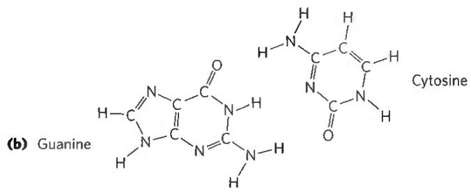

## DATA ANALYSIS PROBLEM

47. "Switchable" Surfactants Hydrophobic molecules do not dissolve well in water. This makes certain processes very difficult: washing oily food residue off dishes, cleaning up spilled oil, keeping the oil and water phases of salad dressings well mixed, and carrying out chemical reactions that involve both hydrophobic and hydrophilic components.

Surfactants are a class of amphipathic compounds that includes soaps, detergents, and emulsifiers. With the use of surfactants, hydrophobic compounds can be suspended in aqueous solution by forming micelles (see Fig. 2-7). A micelle has a hydrophobic core consisting of the hydrophobic compound and the hydrophobic "tails" of the surfactant; the hydrophilic "heads" of the surfactant cover the surface of the micelle. A suspension of micelles is called an emulsion. The more hydrophilic the head group of the surfactant, the more powerful it is—that is, the greater its capacity to emulsify hydrophobic material.

When you use soap to remove grease from dirty dishes, the soap forms an emulsion with the grease that is easily removed by water through interaction with the hydrophilic head of the soap molecules. Likewise, a detergent can be used to emulsify spilled oil for removal by water. And emulsifiers in commercial salad dressings keep the oil suspended evenly throughout the water-based mixture.

There are some situations, such as oil spill cleanups, in which it would be very useful to have a "switchable" surfactant: a molecule that could be reversibly converted between a surfactant and a nonsurfactant.

(a) Imagine that such a "switchable" surfactant existed. How would you use it to clean up and then recover the oil from an oil spill?

Liu and colleagues describe a prototypical switchable surfactant in their 2006 article "Switchable Surfactants." The switching is based on the following reaction:

(b) Given that the $pK_{a}$ of a typical amidinium ion is 12.4, in which direction (left or right) would you expect the equilibrium of the above reaction to lie? (See Fig. 2-15 for relevant $pK_{a}$ values.) Justify your answer. Hint: Remember the reaction $H_{2}O + C_{2}O \rightleftharpoons H_{2}CO_{3}$ .

Liu and colleagues produced a switchable surfactant for which $R = C_{16}H_{33}$ . We will call the molecule s-surf.

(c) The amidinium form of s-surf is a powerful surfactant; the amidine form is not. Explain this observation.

Liu and colleagues found that they could switch between the two forms of s-surf by changing the gas that they bubbled through a solution of the surfactant. They demonstrated this switch by measuring the electrical conductivity of the s-surf solution; aqueous solutions of ionic compounds have higher conductivity than solutions of nonionic compounds. They started with a solution of the amidine form of s-surf in water.

$CO_{2}$

Their results are shown below; dotted lines indicate the switch from one gas to another.

$$
\mathrm{CO} _ {2}
$$

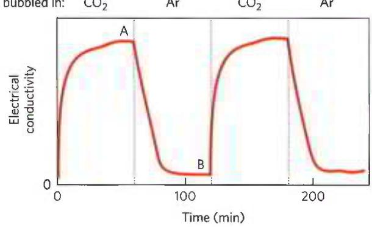

(d) In which form is the majority of s-surf at point A? At point B?

(e) Why does the electrical conductivity rise from time 0 to point A?

(f) Why does the electrical conductivity fall from point A to point B?

(g) Explain how you would use s-surf to clean up and recover the oil from an oil spill.

## Reference

Liu, Y., P.G. Jessop, M. Cunningham, C.A. Eckert, and C.L. Liotta. 2006. Switchable surfactants. Science 313(5789):958–960. https://doi.org/10.1126/science.1128142.

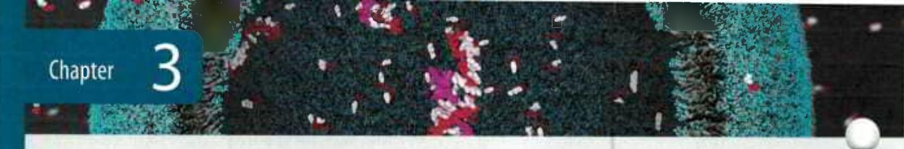
