# 第18章 Oxidative Phosphorylation

<!-- 章节边界按正文内容恢复；原始 MinerU 内容保留如下。 -->

# OXIDATIVE PHOSPHORYLATION

19.1 The Mitochondrial Respiratory Chain 660

19.2 ATP Synthesis 674

19.3 Regulation of Oxidative Phosphorylation 686

19.4 Mitochondria in Thermogenesis, Steroid Synthesis, and Apoptosis 689

19.5 Mitochondrial Genes: Their Origin and the Effects of Mutations 692

Oxidative phosphorylation is the culmination of energy-yielding metabolism (catabolism) in aerobic organisms. All oxidative steps in the degradation of carbohydrates, fats, and amino acids converge at this final stage of cellular respiration, in which the energy of oxidation drives the synthesis of ATP. Oxidative phosphorylation accounts for most of the ATP synthesized by nonphotosynthetic organisms under most circumstances. In eukaryotes, oxidative phosphorylation occurs in mitochondria and involves huge protein complexes embedded in the mitochondrial membranes. The pathway to ATP synthesis in mitochondria challenged and fascinated biochemists for much of the twentieth century. Our current exploration of the topic is guided by five principles:

## P1 Mitochondria play a central role in eukaryotic aerobic metabolism. ATP

production is not the only important mitochondrial function. Mitochondria play host to the citric acid cycle, the fatty acid $\beta$ -oxidation pathway, and the pathways of amino acid oxidation. The mitochondria also act in thermogenesis, steroid synthesis, and apoptosis (programmed cell death). The discovery of these diverse and important roles of mitochondria has stimulated much current research on the biochemistry of this organelle.

P2 Mitochondria trace their evolutionary origin to bacteria. Over 1.45 billion years ago, an endosymbiotic relationship arose between bacteria and a primitive eukaryote or eukaryotic progenitor. Mitochondria are ubiquitous in modern eukaryotes, and their bacterial origin is evident in almost every aspect of their structure and function.

P3 Electrons flow from electron donors (oxidizable substrates) through a chain of membrane-bound carriers to a final electron acceptor with a large reduction potential. The final acceptor is molecular oxygen, $\mathrm{O}_2$ . The appearance of oxygen in the atmosphere some 2.3 billion years ago, and its harnessing in living systems via the evolution of oxidative phosphorylation, made more complex life forms possible.

P4 The free energy made available by "downhill" (exergonic) electron flow is coupled to the "uphill" transport of protons across a proton-impermeable membrane. The free energy of fuel oxidation is thus conserved as a transmembrane electrochemical potential.

P5 The transmembrane flow of protons back down their electrochemical gradient through specific protein channels provides the free energy for synthesis of ATP. This process is catalyzed by a membrane protein complex (ATP synthase) that couples proton flow to phosphorylation of ADP.

Principles 3 through 5, illustrated in Figure 19-1, encapsulate the theory, introduced by Peter Mitchell in 1961, that transmembrane differences in proton concentration are the reservoir for the energy extracted from biological oxidation reactions. This chemiosmotic theory has been accepted as one of the great unifying ideas of twentieth-century biology. It provides insight into the processes of oxidative phosphorylation and photophosphorylation in plants, and into such apparently disparate energy transductions as active transport across membranes and the motion of bacterial flagella.

This chapter begins with a description of the components of the mitochondrial electron-transfer chain—the respiratory chain—and their organization into large functional complexes in the inner mitochondrial membrane, the path of electron flow through these complexes, and the proton movements that accompany this flow. We then consider the remarkable enzyme complex that captures, by "rotational catalysis," the energy of proton flow in ATP, and the regulatory mechanisms that coordinate oxidative phosphorylation with the many catabolic pathways by which fuels are oxidized.

  
FIGURE 19-1 The chemiosmotic mechanism for ATP synthesis in mitochondria. Electrons move spontaneously through a chain of membrane-bound carriers, the respiratory chain, driven by the high reduction potential of oxygen and the relatively low reduction potentials of the various reduced substrates (fuels) that undergo oxidation in the mitochondrion. Electron flow creates an electrochemical potential by the transmembrane movement of protons and positive charge. This electrochemical potential drives ATP synthesis by a membrane-bound enzyme (ATP synthase) that is fundamentally similar in mitochondria and chloroplasts, and in bacteria and archaea as well.

The metabolic role of mitochondria is so critical to cellular and organismal function that defects in mitochondrial function have serious medical consequences. Mitochondria are central to neuronal and muscular function, and to the regulation of whole-body energy metabolism and body weight. Human neurodegenerative diseases, as well as cancer, diabetes, and obesity, are recognized as possible results of compromised mitochondrial function, and one theory of aging is based on gradual loss of mitochondrial integrity. We consider the diverse functions of mitochondria, and the consequences of defective mitochondrial function in humans.

## 19.1 The Mitochondrial Respiratory Chain

The discovery in 1948, by Eugene Kennedy and Albert Lehninger, that mitochondria are the site of oxidative phosphorylation in eukaryotes marked the beginning of the enzymological studies of biological energy transductions. Mitochondria, like gram-negative bacteria, have two membranes (Fig. 19-2a). The outer mitochondrial membrane is readily permeable to small molecules ( $M_{\mathrm{r}} < 5,000$ ) and ions, which move freely through transmembrane channels formed by a family of integral membrane proteins called porins. The inner membrane is impermeable to most small molecules and ions, including protons ( $\mathrm{H^{+}}$ ); the only species that cross this membrane do so through specific transporters.

  
Albert L. Lehninger, 1917–1986 [Alan Mason Chesney Medical Archives of the Johns Hopkins Medical Institutions.]

The inner membrane bears the components of the respiratory chain and ATP synthase.

P1 The mitochondrial matrix, enclosed by the inner membrane, contains the pyruvate dehydrogenase complex and the enzymes of the citric acid cycle, the fatty acid $\beta$ -oxidation pathway, and the pathways of amino acid oxidation—all the pathways of fuel oxidation except glycolysis, which takes place in the cytosol. The selectively permeable inner mitochondrial membrane segregates the intermediates and enzymes of cytosolic metabolic pathways from those of metabolic processes occurring in the matrix. However, specific transporters carry pyruvate, fatty acids, and amino acids or their $\alpha$ -keto derivatives into the matrix for access to the machinery of the citric acid cycle. ADP and $\mathrm{P_i}$ are specifically transported into the matrix as newly synthesized ATP is transported out. Mammalian mitochondria have about 1,200 proteins, according to current best estimates. The functions of up to $25\%$ of these remain partly or entirely enigmatic.

The bean-shaped representation of a mitochondrion in Figure 19-2a is an oversimplification, derived in part from early studies in which thin sections of cells were observed in the electron microscope. Three-dimensional images obtained either by reconstruction from serial sections or by confocal microscopy reveal great variation in mitochondrial size and shape. In living cells stained with mitochondrion-specific fluorescent dyes, large numbers of variously shaped mitochondria are seen, clustered about the nucleus (Fig. 19-2b).

Tissues with a high demand for aerobic metabolism (brain, skeletal and heart muscle, liver, and eye, for example) contain many hundreds or thousands of mitochondria per cell, and in general, mitochondria of cells with high metabolic activity have more, and more densely packed, convolutions, or cristae (Fig. 19-2c, d). P2 During cell growth and division, mitochondria, like bacteria, divide by fission, and under some circumstances individual mitochondria fuse to form larger, more-extended structures. Stressful conditions, such as the presence of electron-transfer inhibitors or mutations in an electron carrier, trigger mitochondrial fission and sometimes mitophagy—the breakdown of mitochondria and recycling of the amino acids, nucleotides, and lipids released. As stress is relieved, small mitochondria fuse to form long, thin, tubular organelles.

  
FIGURE 19-2 Biochemical anatomy of a mitochondrion. (a) The outer membrane has pores that make it permeable to small molecules and ions, but not to proteins. The cristae provide a very large surface area. The inner membrane of a single liver mitochondrion may have more than 10,000 sets of electron-transfer systems (respiratory chains) and ATP synthase molecules, distributed over the membrane surface. (b) A typical animal cell has hundreds or thousands of mitochondria. This endothelial cell from bovine pulmonary artery was stained with fluorescent probes for actin (blue), for DNA (red), and for mitochondria (yellow). Notice the variability in length of

## Electrons Are Funneled to Universal Electron Acceptors

Oxidative phosphorylation begins with the entry of electrons into the series of electron carriers called the respiratory chain. Most of these electrons arise from the action of dehydrogenases that collect electrons from catabolic pathways and funnel them into universal electron acceptors—nicotinamide nucleotides (NAD $^{+}$ or NADP $^{+}$ ) or flavin nucleotides (FMN or FAD).

  
the mitochondria. (c) The mitochondria of heart muscle (blue in this colorized electron micrograph) have more profuse cristae and thus a much larger area of inner membrane, with more than three times as many sets of respiratory chains as (d) liver mitochondria. Muscle and liver mitochondria are about the size of a bacterium — 1 to 10 $\mu$ m long. The mitochondria of invertebrates, plants, and microbial eukaryotes are similar to those shown here, but with much variation in size, shape, and degree of convolution of the inner membrane. [(b) Talley Lambert/Science Source. (c) Thomas Deerinck, NCMI/R/Science Source. (d) Don W. Fawcett/Science Source.]

Nicotinamide nucleotide-linked dehydrogenases catalyze reversible reactions of the following general types:

Reduced substrate + NAD $^{+}$ ⇌

oxidized substrate + NADH + H $^{+}$

Reduced substrate + NADP $^{+}$ ⇌

oxidized substrate + NADPH + H $^{+}$

Most dehydrogenases that act in catabolism are specific for $NAD^{+}$ as electron acceptor (Table 19-1). Some are in the cytosol, many are in mitochondria, and still others have mitochondrial and cytosolic isozymes.

<table><tr><td colspan="2">TABLE 19-1 Some Important Reactions Catalyzed by NAD(P)+-Linked Dehydrogenases</td></tr><tr><td>Reactiona</td><td>Locationb</td></tr><tr><td>NAD+-linked</td><td></td></tr><tr><td>α-Ketoglutarate + CoA + NAD+ ⇌ succinyl-CoA + CO2 + NADH + H+</td><td>M</td></tr><tr><td>L-Malate + NAD+ ⇌ oxaloacetate + NADH + H+</td><td>M and C</td></tr><tr><td>Pyruvate + CoA + NAD+ ⇌ acetyl-CoA + CO2 + NADH + H+</td><td>M</td></tr><tr><td>Glyceraldehyde 3-phosphate + Pi + NAD+ ⇌ 1,3-bisphosphoglycerate + NADH + H+</td><td>C</td></tr><tr><td>Lactate + NAD+ ⇌ pyruvate + NADH + H+</td><td>C</td></tr><tr><td>β-Hydroxyacyl-CoA + NAD+ ⇌ β-ketoacyl-CoA + NADH + H+</td><td>M</td></tr><tr><td>NADP+-linked</td><td></td></tr><tr><td>Glucose 6-phosphate + NADP+ ⇌ 6-phosphogluconate + NADPH + H+</td><td>C</td></tr><tr><td>L-Malate + NADP+ ⇌ pyruvate + CO2 + NADPH + H+</td><td>C</td></tr><tr><td>NAD+- or NADP+-linked</td><td></td></tr><tr><td>L-Glutamate + H2O + NAD(P)+ ⇌ α-ketoglutarate + NH4+ + NAD(P)H</td><td>M</td></tr><tr><td>Isocitrate + NAD(P)+ ⇌ α-ketoglutarate + CO2 + NAD(P)H + H+</td><td>M and C</td></tr><tr><td colspan="2">aThese reactions and their enzymes are discussed in Chapters 14, 16, 17, and 18.bM designates mitochondria; C designates cytosol.</td></tr></table>

NAD $^{+}$ -linked dehydrogenases remove two hydrogen atoms from their substrates. One of these is transferred as a hydride ion ( $:H^{-}$ ) to NAD $^{+}$ , and the other is released as H $^{+}$ in the medium (see Fig. 13-24). NADH and NADPH are water-soluble electron carriers that associate reversibly with dehydrogenases. About 70% of the cellular NAD pool is in the mitochondria. NADH carries electrons from catabolic reactions to their point of entry into the respiratory chain, the NADH dehydrogenase complex described below. NADPH is primarily involved in biosynthetic (anabolic) reactions, and much of it is concentrated in the cytosol. Cells maintain separate pools of NADPH and NADH, with different redox potentials. This is accomplished by holding the ratio [reduced form]/[oxidized form] relatively high for NADPH and relatively low for NADH. Neither NADH nor NADPH can cross the inner mitochondrial membrane, but the electrons they carry can be shuttled across indirectly, as we shall see.

Flavoproteins contain a very tightly, sometimes covalently, bound flavin nucleotide, either FMN or FAD (see Fig. 13-27). P3 The oxidized flavin nucleotide can accept either one electron (yielding the semiquinone form) or two (yielding $\mathrm{FADH}_2$ or $\mathrm{FMNH}_2$ ). Electron transfer occurs because the flavoprotein has a higher reduction potential than the compound oxidized. Recall that reduction potential is a quantitative measure of the relative tendency of a given chemical species to accept electrons in an oxidation-reduction reaction (p. 490). The standard reduction potential of a flavin nucleotide, unlike that of NAD or NADP, depends on the protein with which it is associated. Local interactions with functional groups in the protein distort the electron orbitals in the flavin ring, changing the relative stabilities of oxidized and reduced forms. The relevant standard reduction potential is therefore that of the particular flavoprotein, not that of isolated FAD or FMN. The flavin nucleotide should be considered part of the flavoprotein's active site rather than a reactant or product in the electron-transfer reaction. Because flavoproteins can participate in either one- or two-electron transfers, they can serve as intermediates between reactions in which two electrons are donated (as in dehydrogenations) and those in which only one electron is accepted (as in the reduction of a quinone to a hydroquinone, described below).

## Electrons Pass through a Series of Membrane-Bound Carriers

The mitochondrial respiratory chain consists of a series of sequentially acting electron carriers, most of which are integral proteins with prosthetic groups capable of accepting and donating either one or two electrons. Three types of electron transfers occur in oxidative phosphorylation: (1) direct transfer of electrons, as in the reduction of $Fe^{3+}$ to $Fe^{2+}$ ; (2) transfer as a hydrogen atom ( $H^{+} + e^{-}$ ); and (3) transfer as a hydride ion ( $:H^{-}$ ), which bears two electrons. The term reducing equivalent is used to designate a single electron equivalent transferred in an oxidation-reduction reaction.

P3 In addition to NAD and flavoproteins, three other types of electron-carrying molecules function in the respiratory chain: a hydrophobic quinone called ubiquinone, and two different types of iron-containing proteins, cytochromes and iron-sulfur proteins. Ubiquinone (also called coenzyme Q, or simply Q) is a lipid-soluble benzoquinone with a long isoprenoid side chain (Fig. 19-3). Ubiquinone can accept one electron to become the semiquinone radical (°QH or ubisemiquinone)

  
FIGURE 19-3 Ubiquinone (Q, or coenzyme Q). Complete reduction of ubiquinone requires two electrons and two protons, and occurs in two steps through the semiquinone radical intermediate.

(a)  

  
FIGURE 19-4 Prosthetic groups of cytochromes. (a) Each group consists of four five-membered, nitrogen-containing rings in a cyclic structure called a porphyrin. The four nitrogen atoms are coordinated with a central Fe ion, either $\mathrm{Fe}^{2+}$ or $\mathrm{Fe}^{3+}$ . Iron protoporphyrin IX is found in $b$ -type cytochromes and in hemoglobin and myoglobin (see Fig. 5-1b). Heme $c$ is covalently bound to the protein of cytochrome $c$ through thioether bonds to two Cys residues. Heme $a$ , found in $a$ -type cytochromes, has a long isoprenoid tail attached to one of the five-membered rings. The conjugated double-bond system (shaded light red) of the porphyrin ring has delocalized $\pi$ electrons that are relatively easily excited by photons with the wavelengths of visible light, which accounts for the strong absorption by hemes (and related compounds) in the visible region of the spectrum. (b) Absorption spectra of cytochrome $c$ (cyt $c$ ) in its oxidized (blue) and reduced (red) forms. The characteristic $\alpha, \beta$ , and $\gamma$ bands of the reduced form are labeled.

or two electrons to form ubiquinol (QH $_2$ ) and, like flavoprotein carriers, it can act at the junction between a two-electron donor and a one-electron acceptor. Small and hydrophobic, ubiquinone is not bound to proteins but instead is freely diffusible within the lipid bilayer of the inner mitochondrial membrane and can shuttle reducing equivalents between other, less mobile electron carriers in the membrane. And because it carries both electrons and protons, it plays a central role in coupling electron flow to proton movement.

The cytochromes are proteins with characteristic strong absorption of visible light, due to their iron-containing heme prosthetic groups (Fig. 19-4a). Mitochondria contain three classes of cytochromes, designated a, b, and c, which are distinguished by differences in their light-absorption spectra. Each type of cytochrome in its reduced $\left(\mathrm{Fe}^{2+}\right)$ state has three absorption bands in the visible range (Fig. 19-4b). The longest-wavelength band is near 600 nm in type a cytochromes, near 560 nm in type b, and near 550 nm in type c. To distinguish among closely related cytochromes of one type, the exact absorption maximum is sometimes used in the names, as in cytochrome $b_{562}$ .

(b)  

  
FIGURE 19-5 Iron-sulfur centers. The Fe-S centers of iron-sulfur proteins may be as simple as shown in (a), with a single Fe ion surrounded by the S atoms of four Cys residues; inorganic S is yellow and the S of Cys is orange. Other centers include both inorganic and Cys S atoms, as in (b) 2Fe-2S or (c) 4Fe-4S centers. (d) The ferredoxin of the cyanobacterium Anabaena 7120  
has one 2Fe-2S center. (Note that in these designations, only the inorganic S atoms are counted. For example, in the 2Fe-2S center (b), each Fe ion is actually surrounded by four S atoms.) The exact standard reduction potential of the iron in these centers depends on the type of center and its interaction with the associated protein. [(d) Data from PDB ID 1FRD, B.L. Jacobson et al., Biochemistry 32:6788, 1993.]

The hemes of a and b cytochromes are tightly, but not covalently, bound to their associated proteins; the hemes of c-type cytochromes are covalently attached through Cys residues (Fig. 19-4). As with the flavoproteins, the standard reduction potential of the heme iron atom of a cytochrome depends on its interaction with protein side chains and is therefore different for each cytochrome. The cytochromes of type a and b and some of type c are integral proteins of the inner mitochondrial membrane. One striking exception is the soluble cytochrome c that associates through electrostatic interactions with the outer surface of the inner membrane.

In iron-sulfur proteins, the iron is present not in heme but in association with inorganic sulfur atoms or with the sulfur atoms of Cys residues in the protein, or both. These iron-sulfur (Fe-S) centers range from simple structures with a single Fe atom coordinated to four Cys—SH groups to more complex Fe-S centers with two or four Fe atoms (Fig. 19-5). Rieske iron-sulfur proteins (named after their discoverer, John S. Rieske) are a variation on this theme, in which one Fe atom is coordinated to two His residues rather than two Cys residues. All iron-sulfur proteins participate in one-electron transfers in which one iron atom of the Fe-S cluster is oxidized or reduced. At least eight Fe-S proteins function in mitochondrial electron transfer. The reduction potential of Fe-S proteins varies from -0.65 V to +0.45 V, depending on the microenvironment of the iron within the protein.

In the overall reaction catalyzed by the mitochondrial respiratory chain, electrons move from NADH, succinate, or some other primary electron donor through flavoproteins, ubiquinone, iron-sulfur proteins, and cytochromes, and finally to $O_{2}$ . A look at the methods used to determine the sequence in which the carriers act is instructive, as the same general approaches have been used to study other electron-transfer chains, such as those of chloroplasts (see Fig. 20-12).

First, the standard reduction potentials of the individual electron carriers have been determined experimentally (Table 19-2). Electrons tend to flow spontaneously from carriers of lower $E^{\prime \circ}$ to carriers of higher $E^{\prime \circ}$ . The

<table><tr><td colspan="2">TABLE 19-2 Standard Reduction Potentials of Respiratory Chain and Related Electron Carriers</td></tr><tr><td>Redox reaction (half-reaction)</td><td> $E^{\prime\circ}$  (V)</td></tr><tr><td> $2H^{+} + 2e^{-} \longrightarrow H_{2}$ </td><td>-0.414</td></tr><tr><td> $NAD^{+} + H^{+} + 2e^{-} \longrightarrow NADH$ </td><td>-0.320</td></tr><tr><td> $NADP^{+} + H^{+} + 2e^{-} \longrightarrow NADPH$ </td><td>-0.324</td></tr><tr><td>NADH dehydrogenase (FMN) +  $2H^{+} + 2e^{-} \longrightarrow NADH$  dehydrogenase ( $FMNH_{2}$ )</td><td>-0.30</td></tr><tr><td>Ubiquinone +  $2H^{+} + 2e^{-} \longrightarrow$  ubiquinol</td><td>0.045</td></tr><tr><td>Cytochrome  $b$  ( $Fe^{3+}$ ) +  $e^{-} \longrightarrow$  cytochrome  $b$  ( $Fe^{2+}$ )</td><td>0.077</td></tr><tr><td>Cytochrome  $c_{1}$  ( $Fe^{3+}$ ) +  $e^{-} \longrightarrow$  cytochrome  $c_{1}$  ( $Fe^{2+}$ )</td><td>0.22</td></tr><tr><td>Cytochrome  $c$  ( $Fe^{3+}$ ) +  $e^{-} \longrightarrow$  cytochrome  $c$  ( $Fe^{2+}$ )</td><td>0.254</td></tr><tr><td>Cytochrome  $a$  ( $Fe^{3+}$ ) +  $e^{-} \longrightarrow$  cytochrome  $a$  ( $Fe^{2+}$ )</td><td>0.29</td></tr><tr><td>Cytochrome  $a_{3}$  ( $Fe^{3+}$ ) +  $e^{-} \longrightarrow$  cytochrome  $a_{3}$  ( $Fe^{2+}$ )</td><td>0.35</td></tr><tr><td> $\frac{1}{2}O_{2} + 2H^{+} + 2e^{-} \longrightarrow H_{2}O$ </td><td>0.817</td></tr></table>

<!-- END OFFICIAL API PART part_007 -->

<!-- BEGIN OFFICIAL API PART part_008 -->

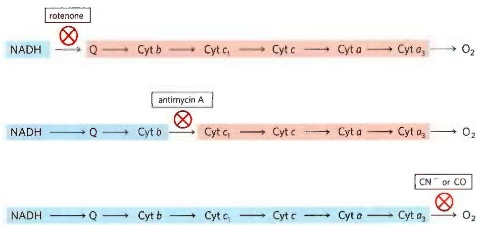  
FIGURE 19-6 Method for determining the sequence of electron carriers. This method measures the effects of inhibitors of electron transfer on the oxidation state of each carrier. In the presence of an electron donor  
and $O_{2}$ , each inhibitor causes a characteristic pattern of oxidized/reduced carriers: those before the block become reduced (blue), and those after the block become oxidized (light red).

order of carriers deduced by this method is NADH → Q → cytochrome b → cytochrome c₁ → cytochrome c → cytochrome a → cytochrome a₃ → O₂. Note, however, that the order of standard reduction potentials is not necessarily the same as the order of actual reduction potentials under cellular conditions, which depend on the concentrations of reduced and oxidized forms (see Eqn 13-5, p. 491). A second method for determining the sequence of electron carriers involves reducing the entire chain of carriers experimentally by providing an electron source but no electron acceptor (no O₂). When O₂ is suddenly introduced into the system, the rate at which each electron carrier becomes oxidized, measured spectroscopically, reveals the order in which the carriers function. The carrier nearest O₂ (at the end of the chain) gives up its electrons first, the second carrier from the end is oxidized next, and so on. Such experiments have confirmed the sequence deduced from standard reduction potentials.

In a final confirmation, agents that inhibit the flow of electrons through the chain have been used in combination with measurements of the degree of oxidation of each carrier. In the presence of $O_{2}$ and an electron donor, carriers that function before the inhibited step become fully reduced, and those that function after this step are completely oxidized (Fig. 19-6). By using several inhibitors that block different steps in the chain, investigators have determined the entire sequence; it is the same as deduced in the first two approaches.

## Electron Carriers Function in Multienzyme Complexes

The electron carriers of the respiratory chain are organized into membrane-embedded supramolecular complexes that can be physically separated. Gentle treatment of the inner mitochondrial membrane with detergents allows the resolution of four unique electron-carrier complexes, each capable of catalyzing electron transfer through a portion of the chain (Fig. 19-7; Table 19-3). P3 Complexes I and II catalyze electron transfer to ubiquinone from two different electron donors: NADH (Complex I) and succinate (Complex II). Complex III carries electrons from reduced ubiquinone to cytochrome c, and Complex IV completes the sequence by transferring electrons from cytochrome c to O₂.

We now look in more detail at the structure and function of each complex of the mitochondrial respiratory chain.

Complex I: NADH to Ubiquinone In mammals, Complex I, also called NADH:ubiquinone oxidoreductase or

<table><tr><td colspan="4">TABLE 19-3 The Protein Components of the Mitochondrial Respiratory Chain</td></tr><tr><td>Enzyme complex/protein</td><td>Mass (kDa)</td><td>Number of subunitsa</td><td>Prosthetic group(s)</td></tr><tr><td>I NADH dehydrogenase</td><td>850</td><td>45 (14)</td><td>FMN, Fe-S</td></tr><tr><td>II Succinate dehydrogenase</td><td>140</td><td>4</td><td>FAD, Fe-S</td></tr><tr><td>III Ubiquinone:cytochrome c oxidoreductaseb</td><td>250</td><td>11</td><td>Hemes, Fe-S</td></tr><tr><td>Cytochrome cc</td><td>13</td><td>1</td><td>Heme</td></tr><tr><td>IV Cytochrome oxidaseb</td><td>204</td><td>13 (3-4)</td><td>Hemes; CuA, CuB</td></tr></table>

Reactions catalyzed by isolated fractions in vitro

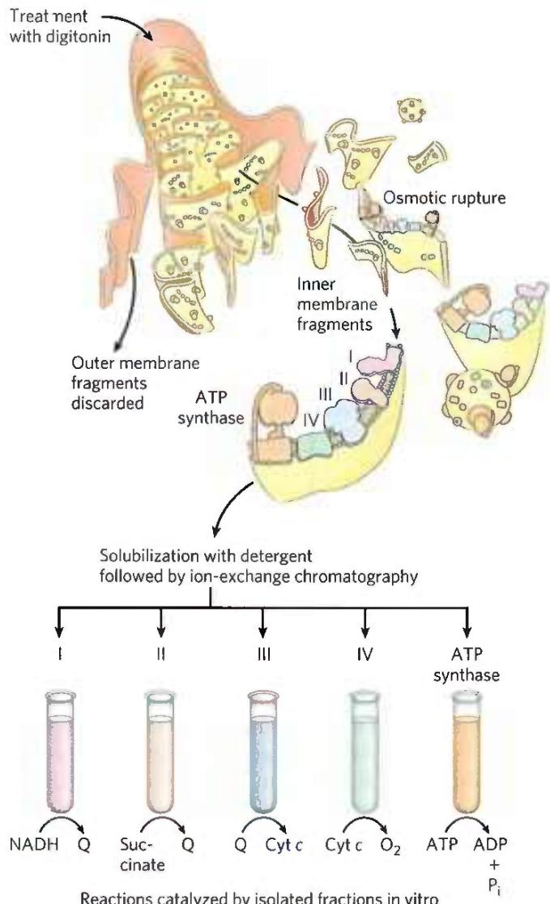  
FIGURE 19-7 Separation of functional complexes of the respiratory chain. The outer mitochondrial membrane is first removed by treatment with the detergent digitonin. Fragments of inner membrane are then obtained by osmotic rupture of the membrane, and the fragments are gently dissolved in a second detergent. The resulting mixture of inner membrane proteins is resolved by ion-exchange chromatography into several complexes (I through IV) of the respiratory chain, each with its unique protein composition (see Table 19-3), and the enzyme ATP synthase (sometimes called Comp ex V). The isolated Complexes I through IV catalyze electron transfers between donors (NADH and succinate), intermediate carriers (Q and cytochrome c), and O₂, as shown. In vitro, isolated ATP synthase has only ATP-hydrolyzing (ATPase), not ATP-synthesizing, activity.

NADH dehydrogenase, is a large enzyme composed of 45 different polypeptide chains, including an FMN-containing flavoprotein and at least 8 iron-sulfur centers. Complex I is L-shaped, with one arm embedded in the inner membrane and the other extending into the matrix. Comparative studies of Complex I in bacteria and other organisms show that 7 polypeptides in the membrane arm and 7 in the matrix arm are conserved and essential (Fig. 19-8).

Complex I catalyzes two simultaneous and obligately coupled processes: (1) the exergonic transfer to ubiquinone of a hydride ion from NADH and a proton from the matrix, expressed by

  
FIGURE 19-8 Structure of Complex I (NADH:ubiquinone oxidoreductase). Complex I catalyzes the transfer of a hydride ion from NADH to FMN. From the FMN, two electrons pass through a series of Fe-S centers to the Fe-S center N-2 in the matrix arm of the complex. Electron transfer from N-2 to ubiquinone on the membrane arm forms $\mathrm{QH}_2$ , which diffuses into the lipid bilayer. The protons travel a path dictated by subunit conformation changes triggered by the electron flow. Proton flux produces an electrochemical potential across the inner mitochondrial membrane (n side negative, p side positive). Three of the membrane subunits (subunits Nqo12, Nqo13, and Nqo14) are structurally related to a known $\mathrm{Na}^+$ - $\mathrm{H}^+$ antiporter, and the path of proton movement may be similar in both cases. The fourth putative proton pathway is through an integral subunit closest to the Q-binding site. A long helix (not visible in this view) lying along the surface of the membrane arm may coordinate the action of all four proton pumps when Q is reduced. [Data from PDB ID 4HEA, R. Baradaran et al., Nature 494:443, 2013.]

$$
\mathrm{NADH} + \mathrm{H} ^ {+} + \mathrm{Q} \longrightarrow \mathrm{NAD} ^ {+} + \mathrm{QH} _ {2}\tag{19-1}
$$

and (2) the endergonic transfer of four protons from the matrix to the intermembrane space. Protons are moved against a transmembrane proton gradient in this process. P4 Complex I is therefore a proton pump driven by the energy of electron transfer, and the reaction it catalyzes is vectorial: it moves protons in a specific direction from one location (the matrix, which becomes negatively charged with the departure of protons) to another (the intermembrane space, which becomes positively charged). To emphasize the vectorial nature of the process, the overall reaction is often written with subscripts that indicate the location of the protons: P for the positive side of the inner membrane (the intermembrane space), N for the negative side (the matrix):

$$
\mathrm{NADH} + 5 \mathrm{H} _ {\mathrm{N}} ^ {+} + \mathrm{Q} \longrightarrow \mathrm{NAD} ^ {+} + \mathrm{QH} _ {2} + 4 \mathrm{H} _ {\mathrm{P}} ^ {+}\tag{19-2}
$$

Amytal (a barbiturate drug), rotenone (a plant product commonly used as an insecticide), and piericidin A (an antibiotic) inhibit electron flow from the Fe-S centers of Complex I to ubiquinone (Table 19-4) and therefore block the overall process of oxidative phosphorylation.

<table><tr><td colspan="3">TABLE 19-4 Agents That Interfere with Oxidative Phosphorylation</td></tr><tr><td>Type of interference</td><td>Compounda</td><td>Target/mode of action</td></tr><tr><td rowspan="3">Inhibition of electron transfer</td><td>CyanideCarbon monoxide</td><td>Inhibit cytochrome oxidase</td></tr><tr><td>Antimycin A</td><td>Blocks electron transfer from cytochrome b to cytochrome c1</td></tr><tr><td>MyxothiazolRotenoneAmytalPiericidin A</td><td>Prevent electron transfer from Fe-S center to ubiquinone</td></tr><tr><td rowspan="3">Inhibition of ATP synthase</td><td>Aurovertin</td><td>Inhibit F1</td></tr><tr><td>OligomycinVenturicidin</td><td>Inhibit Fo</td></tr><tr><td>DCCD</td><td>Blocks proton flow through Fo</td></tr><tr><td rowspan="3">Uncoupling of phosphorylation fromelectron transfer</td><td>FCCPDNP</td><td>Hydrophobic proton carriers</td></tr><tr><td>Valinomycin</td><td>K+ionophore</td></tr><tr><td>Uncoupling protein 1</td><td>In brown adipose tissue, forms proton-conducting pores ininner mitochondrial membrane</td></tr><tr><td>Inhibition of ATP-ADP exchange</td><td>Atractyloside</td><td>Inhibits adenine nucleotide translocase</td></tr></table>

$^{a}$ DCCD, dicyclohexylcarbodiimide; FCCP, cyanide-p-trifluoromethoxyphenylhydrazone; DNP, 2,4-dinitrophenol.

Three of the seven integral protein subunits of the membrane arm are related to a $Na^{+}-H^{+}$ antiporter and are believed to be responsible for pumping three protons; a fourth subunit in the membrane arm, that nearest the Q-binding site, is probably responsible for pumping the fourth proton (Fig. 19-8).

How is the reduction of ubiquinone coupled to proton pumping? Reduction of Q occurs far away from the membrane arm of the protein, where proton pumping occurs, so the coupling is clearly indirect. The high-resolution view of Complex I from crystallographic and cryo-EM studies suggests that reduction of Q is coupled to a long-range conformational change conducted to all subunits along the hydrophilic core of the transmembrane arm. It seems likely that all four protons are pumped simultaneously, so that the energy from a strongly exergonic reaction (Q reduction) is broken into smaller packets, a common strategy employed by living organisms.

Complex II: Succinate to Ubiquinone We encountered Complex II in Chapter 16 as succinate dehydrogenase, the only membrane-bound enzyme in the citric acid cycle (p. 586). P3 Complex II couples the oxidation of succinate at one site with the reduction of ubiquinone at another site about 40 Å away. Although smaller and simpler than Complex I, Complex II contains five prosthetic groups of two types and four different protein subunits (Fig. 19-9). Subunits C and D are integral membrane proteins, each with three transmembrane helices. They contain a heme

## Intermembrane space (P side)

  
FIGURE 19-9 Structure of Complex II (succinate dehydrogenase). This complex (porcine) has two transmembrane subunits, C and D; subunits A and B extend into the matrix. Just behind the FAD in subunit A is the binding site for succinate. Subunit B has three Fe-S centers, ubiquinone is bound to subunit B, and heme b is sandwiched between subunits C and D. Two phosphatidylethanolamine molecules are so tightly bound to subunit D that they show up in the crystal structure. Electrons move (blue arrows) from succinate to FAD, then through the three Fe-S centers to ubiquinone. The heme b is not on the main path of electron transfer but protects against the formation of reactive oxygen species (ROS) by electrons that go astray. [Data from PDB ID 1ZOY, F. Sun et al., Cell 121:1043, 2005.]

group, heme b, and a binding site for Q, the final electron acceptor in the reaction catalyzed by Complex II. Subunits A and B extend into the matrix; they contain three 2Fe-2S centers, bound FAD, and a binding site for the substrate, succinate. Although the overall path of electron transfer is long (from the succinate-binding site to FAD, then through the Fe-S centers to the Q-binding site), none of the individual electron-transfer distances exceeds about 11 Å—a reasonable distance for rapid electron transfer (Fig. 19-9). Electron transfer through Complex II is not accompanied by proton pumping across the inner membrane, although the $QH_{2}$ produced by succinate oxidation will be used by Complex III to drive proton transfer. Because Complex II functions in the citric acid cycle, factors that affect its activity (such as the availability of oxidized Q) probably serve to coordinate that cycle with mitochondrial electron transfer.

The heme b of Complex II is apparently not in the direct path of electron transfer; it serves instead to reduce the frequency with which electrons “leak” out of the system, moving from succinate to molecular oxygen to produce the reactive oxygen species (ROS) hydrogen peroxide ( $H_{2}O_{2}$ ) and the superoxide radical ( $^{\bullet}O_{2}^{-}$ ), as described below. Some individuals with point mutations in Complex II subunits near heme b or the ubiquinone-binding site suffer from hereditary paraganglioma, characterized by benign tumors of the head and neck, commonly in the carotid body, an organ that senses $O_{2}$ levels in the blood. These mutations result in greater production of ROS, which cause DNA damage and genome instability that can lead to cancer. Mutations that affect the succinate-binding region in Complex II may lead to degenerative changes in the central nervous system, and some mutations are associated with tumors of the adrenal medulla.

Complex III: Ubiquinone to Cytochrome c Electrons from reduced ubiquinone (ubiquinol, $QH_{2}$ ) pass through two more large protein complexes in the inner mitochondrial membrane before reaching the ultimate electron acceptor, $O_{2}$ . P3 P4 Complex III (also called cytochrome $bc_{1}$ complex or ubiquinone:cytochrome c oxidoreductase) couples the transfer of electrons from ubiquinol to cytochrome c with the vectorial transport of protons from the matrix to the intermembrane space. The functional unit of Complex III (Fig. 19-10) is a dimer. Each monomer consists of three proteins central to the action of the complex: cytochrome b, cytochrome $c_{1}$ , and the Rieske iron-sulfur protein. (Several other proteins associated with Complex III in vertebrates are not conserved across the phyla and presumably play subsidiary roles.) The two cytochrome b monomers surround a cavern in the middle of the membrane, in which ubiquinone is free to move from the matrix side of the membrane (site $Q_{N}$ on one monomer) to the intermembrane space (site $Q_{P}$ on the other monomer) as it shuttles electrons and protons across the inner mitochondrial membrane.

To account for the role of Q in energy conservation, Mitchell proposed the Q cycle (Fig. 19-11). As electrons move from $QH_{2}$ through Complex III, $QH_{2}$ is oxidized with the release of protons on one side of the membrane (at $Q_{P}$ ), while at the other site ( $Q_{N}$ ), Q is reduced and protons are taken up.

  
FIGURE 19-10 Structure of Complex III (cytochrome bc₁ complex). The complex (bovine) is a dimer of identical monomers, each with 11 different subunits. The functional core of each monomer consists of three subunits: cytochrome b (green), with its two hemes (bₕ and bₗ); the Rieske iron-sulfur protein (purple), with its 2Fe-2S centers; and cytochrome c₁ (blue), with its heme. Cytochrome c₁ and the Rieske iron-sulfur protein project from the P surface and can interact with cytochrome c (not part of the functional complex) in the intermembrane space. The complex has two distinct binding sites for ubiquinone, Qₙ and Qₚ, which correspond to the sites of inhibition by two drugs that block oxidative phosphorylation. Antimycin A, which blocks electron flow from cytochrome b to cytochrome c₁, specifically from heme bₕ to Q, binds at Qₙ, close to heme bₕ on the n (matrix) side of the membrane. Myxothiazol, which prevents electron flow from QH₂ to the Rieske iron-sulfur protein, binds at Qₚ, near the 2Fe-2S center and heme bₗ on the P side. The dimeric structure is essential to the function of Complex III. The interface between monomers forms two caverns, each containing a Qₚ site from one monomer and a Qₙ site from the other. The ubiquinone intermediates move within these sheltered caverns. [Data from PDB ID 1BGY, S. Iwata et al., Science 281:64, 1998.]

The Q cycle is most easily understood as occurring in two stages, with two active sites where ubiquinone is either oxidized or reduced. In both stages, one $QH_{2}$ is oxidized at active site 1, shedding two $H^{+}$ and two electrons. The protons are released into the intermembrane space. The two electrons take different paths, with one reducing cytochrome c and the other reducing a molecule of Q at active site 2. Two electrons are required at active site 2 to fully reduce the Q to $QH_{2}$ , one in each stage. Reducing one Q at one site while oxidizing two $QH_{2}$ at another may seem counterproductive at first glance. However, the two processes have complementary functions. The oxidation of two $QH_{2}$ is moving four protons to the intermembrane space and two electrons to cytochrome c. At the same time, the reduction of Q at the other site (using the other two electrons from the oxidation of $QH_{2}$ at site 1) is pulling protons from the matrix, creating a net movement of protons from the matrix to the intermembrane space. The $QH_{2}$ produced at active site 2 becomes a substrate for oxidation at active site 1 in subsequent turns of the cycle, and vice versa. The net equation for the redox reactions of the Q cycle is

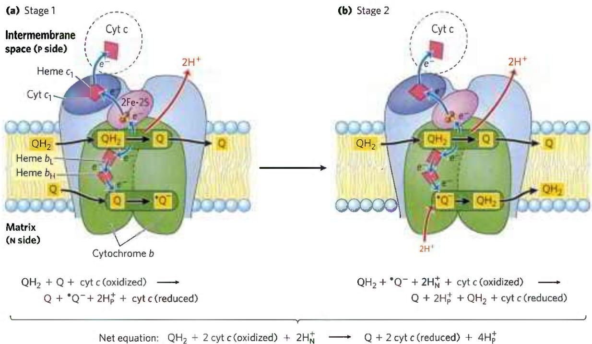  
FIGURE 19-11 The Q cycle, shown in two stages. The path of electrons through Complex III is shown with blue arrows; the movement of various forms of ubiquinone, with black arrows. (a) In the first stage, Q on the N side is reduced to the semiquinone radical, which moves back into position (dotted line) to accept another electron. (b) In the second stage, the semiquinone radical is converted to $\mathrm{QH}_2$ . Meanwhile, on the P side of the membrane, two molecules of $\mathrm{QH}_2$ are oxidized to Q, releasing two protons per Q molecule (four protons in all) into the intermembrane space. Each $\mathrm{QH}_2$ donates  
one electron (via the Rieske Fe-S center) to cytochrome $c_{1}$ , and one electron (via cytochrome b) to a molecule of Q near the N side, reducing it in two steps to $QH_{2}$ . This reduction also consumes two protons per Q, which are taken up from the matrix (N side). Reduced cytochrome $c_{1}$ passes electrons one at a time to cytochrome c, which dissociates and carries electrons to Complex IV. In each cycle, one reduction of Q at the $Q_{N}$ site is coupled with two oxidations of $QH_{2}$ at the $Q_{p}$ site by consuming two protons from the matrix and releasing four protons into the intermembrane space.

$$
\begin{array}{r l} \mathrm {Q H _ {2}} + 2 \text {cyt} c (\text {oxidized}) + 2 \mathrm {H_ {N} ^ {+}} & \longrightarrow \\ \mathrm{Q} + 2 \text {cyt} c (\text {reduced}) + 4 \mathrm {H_ {P} ^ {+}} \end{array}\tag{19-3}
$$

The Q cycle accommodates the switch between the two-electron carrier ubiquinol (the reduced form of ubiquinone) and the one-electron carriers—hemes $b_{L}$ and $b_{H}$ of cytochrome b, and cytochromes $c_{1}$ and c—and results in the uptake of two protons on the N side and the release of four protons on the P side, per pair of electrons passing through Complex III to cytochrome c. Two of the protons released on the P side are electrogenic; the other two are electroneutral, balanced by the two charges (electrons) passed to cytochrome c on the P side. Although the path of electrons through this segment of the respiratory chain is complicated, the net effect of the transfer is simple: $QH_{2}$ is oxidized to Q, two molecules of cytochrome c are reduced, and two protons are moved from the N side to the P side of the inner mitochondrial membrane.

Cytochrome c is a soluble protein of the intermembrane space, which associates reversibly with the P side of the inner membrane. After its single heme accepts an electron from Complex III, cytochrome c moves in the intermembrane space to Complex IV to donate the electron to a binuclear copper center.

Complex IV: Cytochrome c to $O_{2}$ . In the final step of the respiratory chain, Complex IV, also called cytochrome oxidase, carries electrons from cytochrome c to molecular oxygen, reducing it to $H_{2}O$ . P3 P4 Complex IV is a large, dimeric enzyme of the inner mitochondrial membrane, each monomer having 13 subunits and $M_{r}$ of 204,000. Bacteria contain a form that is much simpler, with only 3 or 4 subunits per monomer, but still capable of catalyzing both electron transfer and proton pumping. Comparison of the mitochondrial and bacterial complexes suggests that these 3 subunits have been conserved in evolution; in multicellular organisms, the other 10 subunits contribute to the assembly or stability of Complex IV (Fig. 19-12).

Subunit II of Complex IV contains two Cu ions complexed with the —SH groups of two Cys residues in a binuclear center (Cu $_{A}$ ; Fig. 19-12b) that resembles the 2Fe-2S centers of iron-sulfur proteins. Subunit I contains two heme groups, designated $a$ and $a_{3}$ , and another copper ion (Cu $_{B}$ ). Heme $a_{3}$ and Cu $_{B}$ form a second binuclear center that accepts electrons from heme a and transfers them to $O_{2}$ bound to heme $a_{3}$ . The detailed role of subunit III is not clear, but its presence is essential to Complex IV function.

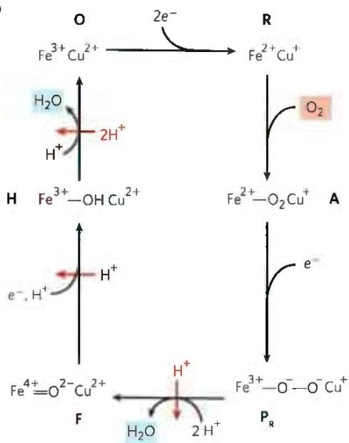

  
FIGURE 19-12 Structure of Complex IV (cytochrome oxidase). (a) This complex (bovine) has 13 subunits in each identical monomer of its dimer c structure. Subunit I has two heme groups, a and $a_{3}$ , near a single copper ion, $Cu_{B}$ (not visible here). Heme $a_{3}$ and $Cu_{B}$ form a binuclear Fe-Cu center. Subunit II contains two Cu ions complexed with the —SH groups of two Cys residues in a binuclear center, $Cu_{A}$ , that resembles the 2Fe-2S centers of iron-sulfur proteins. This binuclear center and the cytochrome c-binding site are located in a domain of subunit II that protrudes from the P side of the inner membrane (into the intermembrane space). Subunit III is essential for rapid proton movement through subunit II. The roles of the other 10 subunits in mammalian Complex IV are not fully understood, although some function in assembly or stabilization of the complex. (b) The binuclear center of $Cu_{A}$ . The Cu ions (blue spheres) share electrons equally. When the center is reduced, the ions have the formal charges $Cu^{1+}Cu^{1+}$ ; when oxidized, $Cu^{1.5+}Cu^{1.5+}$ . Six amino acid residues are ligands around the Cu ions: Glu, Met, two His, and two C/S. [Data from PDB ID 10CC, T. Tsukihara et al., Science 272:1136, 1996.]

Electron transfer through Complex IV is from cytochrome c to the $Cu_{A}$ center, to heme a, to the heme $a_{3}-Cu_{B}$ center, and finally to $O_{2}$ (Fig. 19-13a). For every four electrons passing through this complex, the enzyme consumes four “substrate” $H^{+}$ from the matrix (N side) in converting $O_{2}$ to two $H_{2}O$ . It also uses the energy of this redox reaction to pump four protons outward into the intermembrane space (P side) for each four electrons that pass through, adding to the electrochemical potential produced by redox-driven proton transport through Complexes I and III. The overall reaction catalyzed by Complex IV is

4 cyt c (reduced) + 8H $_{N}^{+}$ + O $_{2}$ →

$$
4 \mathrm{cyt} c (\text {oxidized}) + 4 \mathrm{H} _ {\mathrm{P}} ^ {+} + 2 \mathrm{H} _ {2} \mathrm{O}\tag{19-4}
$$

  
(b)  
FIGURE 19-13 Path of electrons through Complex IV. (a) For simplicity, only one monomer of the dimeric bovine Complex IV is shown. The three proteins critical to electron flow are subunits I, II, and III. The larger green structure includes the other 10 proteins in each monomer of the dimeric complex. Electron transfer through Complex IV begins with cytochrome c (top). Two molecules of reduced cytochrome c each donate an electron to the binuclear center CuA. From here, electrons pass through heme a to the Fe-Cu center (heme $a_{3}$ and $Cu_{\beta}$ ). Oxygen now binds to heme $a_{3}$ and is reduced to its peroxy derivative ( $O_{2}^{2-}$ ; not shown here) by two electrons from the Fe-Cu center. Delivery of two more electrons from cytochrome c (top), for a total of four electrons, converts the $O_{2}^{2-}$ to two molecules of water, with consumption of four "substrate" protons from the matrix. At the same time, four protons are pumped from the matrix for every four electrons passing through Complex IV. A simplified reaction sequence is presented in (b). Intermediate complexes O, R, A, $P_{R}$ , F, and H represent only a prominent subset of the species for which there is experimental evidence, with some steps and intermediate structures still being debated. The four electrons are introduced in separate steps, and $H_{2}O$ is released in two separate steps.

Note that the $O_{2}$ in this reaction is the final acceptor for electrons originating from the many sources already described, and the stoichiometries between electron sources and $O_{2}$ molecules consumed help to define the energetics of the systems. In this chapter, stoichiometries are sometimes presented, as here, in terms of one molecule of $O_{2}$ . For calculation simplicity, the stoichiometries will be presented in terms of $\frac{1}{2}O_{2}$ in some examples to come.

At Complex IV, $O_{2}$ is reduced at redox centers that carry only one electron at a time. A reaction scheme is presented in Figure 19-13b. Normally the incompletely reduced oxygen intermediates remain tightly bound to the complex until completely converted to water. However, a small fraction of oxygen intermediates escape. These intermediates are reactive oxygen species that can damage cellular components unless eliminated by defense mechanisms described below.

## Mitochondrial Complexes Associate in Respirasomes

Although the four electron-transferring complexes can be separated in the laboratory, in the intact mitochondrion, three of the four respiratory complexes associate with each other in the inner membrane. Combinations of Complexes I and III, III and IV, and I, III, and IV are formed in organisms ranging from yeast to plants to mammals. The supercomplex containing Complexes I, III, and IV has been called the respirasome. Unlike the other three complexes, Complex II is generally found free-floating within the membrane. Structural characterization of the various supercomplexes has been advanced by cryo-EM (Fig. 19-14). The functional significance of supercomplexes has not been determined. Researchers have suggested that they may facilitate electron transfers or limit the production of reactive oxygen species. Local pools of the electron carriers cytochrome c and ubiquinone are not constrained within supercomplexes, but instead readily diffuse between them.

## Other Pathways Donate Electrons to the Respiratory Chain via Ubiquinone

Several other electron-transfer reactions can reduce ubiquinone in the inner mitochondrial membrane (Fig. 19-15). In the first step of the $\beta$ oxidation of fatty acyl-CoA, catalyzed by the flavoprotein acyl-CoA dehydrogenase (see Fig. 17-8), electrons pass from the substrate to the FAD of the dehydrogenase, then to electron-transferring flavoprotein (ETF). ETF passes its electrons to ETF: ubiquinone oxidoreductase, which reduces Q in the inner mitochondrial membrane to $\mathrm{QH}_2$ . Glycerol 3-phosphate, formed either from glycerol released by triacylglycerol breakdown or from the reduction of dihydroxyacetone phosphate from glycolysis, is oxidized by glycerol 3-phosphate dehydrogenase (see Fig. 17-4), a flavoprotein located on the outer face of the inner mitochondrial membrane. The electron acceptor in this reaction is Q; the $\mathrm{QH}_2$ produced enters the pool of $\mathrm{QH}_2$ in the membrane. The important role of glycerol 3-phosphate dehydrogenase in shuttling reducing equivalents from cytosolic NADH into the mitochondrial matrix is described in Section 19.2 (see Fig. 19-32). Dihydroorotate dehydrogenase, which acts in the synthesis of pyrimidines (see Fig. 22-38), is also on the outside of the inner mitochondrial membrane and donates electrons to Q in the respiratory chain. The reduced $\mathrm{QH}_2$ passes its electrons through Complex III and ultimately to $\mathrm{O}_2$ .

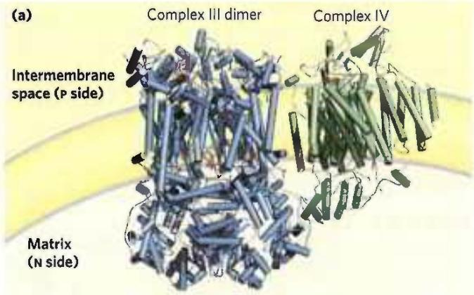

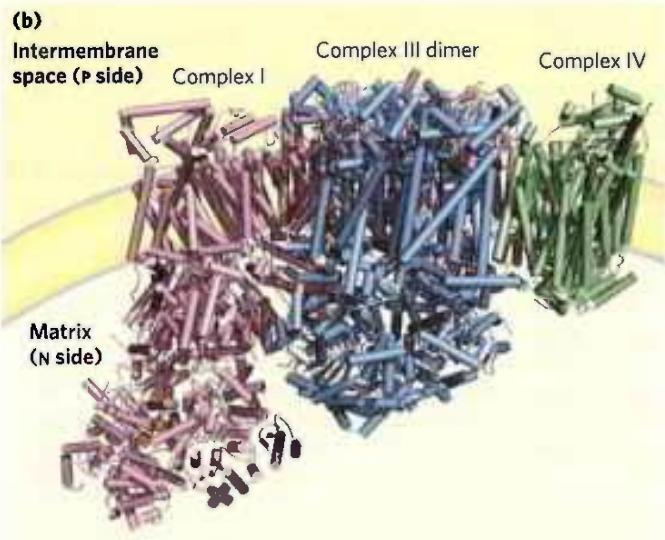

  
FIGURE 19-14 A respirasome composed of Complexes I, III, and IV. (a) Purified supercomplexes containing Complexes III and IV (from yeast), as determined by cryo-EM. (b) The structure of a respirasome composed of mammalian (porcine and bovine) Complexes I, III, and IV. Two views are shown. [Data from (a) PDB ID 6GIQ, S. Rathore et al., Nat. Struct Mol. Biol. 26:50, 2019; (b) PDB ID 5GPN, J. Gu et al., Nature 537:639, 2016.]

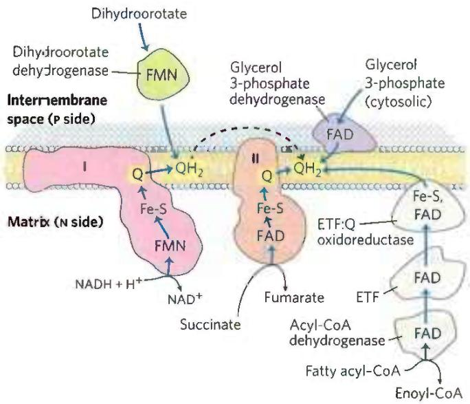  
FIGURE 19-15 Paths of electron transfer to ubiquinone in the respiratory chain. Electrons from NADH in the matrix pass through the FMN cf a flavoprotein (NADH dehydrogenase) to a series of Fe-S centers (in Complex I) and then to Q. Electrons from succinate oxidation in the citric acid cycle pass through a flavoprotein with several Fe-S centers (Complex II) on the way to Q. Acyl-CoA dehydrogenase, the first enzyme of fatty acid $\beta$ oxidation, transfers electrons to electron-transferring flavoprotein (ETF), from which they pass to Q via ETF:ubiquinone oxidoreductase. Dihyd oorotate, an intermediate in the biosynthetic pathway to pyrimidine nucleotides, donates two electrons to Q through a flavoprotein (dihydroorotate dehydrogenase). And glycerol 3-phosphate, an intermediate of glycolysis in the cytosol, donates electrons to a flavoprotein (glycerol 3-phosphate dehydrogenase) on the outer face of the inner mitochondrial membrane, from which they pass to Q. $\mathrm{QH}_2$ freely diffuses through the membrane (black dashed arrow), and can interact with several additional complexes.

## The Energy of Electron Transfer Is Efficiently Conserved in a Proton Gradient

The transfer of two electrons from NADH through the respiratory chain to molecular oxygen can be summarized as

$$
2 \mathrm{NADH} + 2 \mathrm{H} ^ {+} + \mathrm{O} _ {2} \longrightarrow 2 \mathrm{NAD} ^ {+} + 2 \mathrm{H} _ {2} \mathrm{O}\tag{19-5}
$$

This net reaction is highly exergonic. For the redox pair $NAD^{+}/NADH$ , $E^{\prime\circ}$ is -0.320 V, and for the pair $O_{2}/H_{2}O$ , $E^{\prime\circ}$ is 0.816 V. The $\Delta E^{\prime\circ}$ for this reaction is therefore 1.14 V, and the standard free-energy change (see Eqn 13-7, p. 492) is

$$
\begin{array}{r l} \Delta G ^ {\prime \circ} & = - n F \Delta E ^ {\prime \circ} \\ & = - 2 (9 6. 5 \mathrm{kJ/V} \bullet \mathrm{mol}) (1. 1 4 \mathrm{V}) \\ & = - 2 2 0 \mathrm{kJ/mol} (\text {of NADH}) \end{array}\tag{19-6}
$$

This standard free-energy change is based on the assumption of equal concentrations (1 M) of NADH and $NAD^{+}$ . In actively respiring mitochondria, the actions of many dehydrogenases keep the actual $[NADH]/[NAD^{+}]$ ratio well above unity, and the real free-energy change for the reaction shown in Equation 19-5 is therefore substantially greater (more negative) than -220 kJ/mol. A similar calculation for the oxidation of succinate shows that electron transfer from succinate ( $E^{\circ}$ for fumarate/succinate = 0.031 V) to $O_{2}$ has a smaller, but still negative, standard free-energy change of about -150 kJ/mol.

Much of this energy is used to pump protons out of the matrix. For each pair of electrons transferred to $O_{2}$ , four protons are pumped out by Complex I, four by Complex III, and two by Complex IV (Fig. 19-16). The vectorial equation for the process is therefore

$$
2 \mathrm{NADH} + 2 2 \mathrm{H} _ {\mathrm{N}} ^ {+} + \mathrm{O} _ {2} \longrightarrow 2 \mathrm{NAD} ^ {+} + 2 0 \mathrm{H} _ {\mathrm{P}} ^ {+} + 2 \mathrm{H} _ {2} \mathrm{O}\tag{19-7}
$$

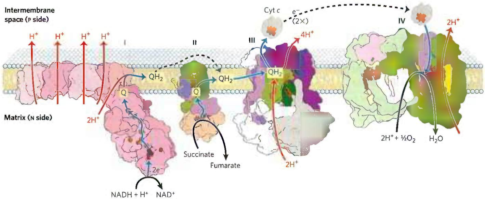  
FIGURE 19-16 Summary of the flow of electrons and protons through the four complexes of the respiratory chain. Electrons reach Q through Complexes I and II (as well as through several other paths shown in Fig. 19-15). Reduced Q(QH₂) serves as a mobile carrier of electrons and protons. It passes electrons to Complex III, which passes them to another mobile connecting link, cytochrome c. Complex IV then transfers electrons from reduced cytochrome c to O₂. Electron flow through Complexes I, III, and IV is accompa-  
nied by proton efflux from the matrix into the intermembrane space. In bovine heart, the approximate ratios of Complexes I:II:III:IV are 1.1:1.3:3.0:6.7. Broken lines indicate the diffusion of Q in the plane of the inner membrane, and of cytochrome c through the intermembrane space. [Data from Complex I: PDB ID 4HEA, R Baradaran et al., Nature 494:443, 2013; Complex II: PDB ID 1ZOY, F. Sun et al., Cell 121:1043, 2005; Complex III: PDB ID 1BGY, S. Iwata et al., Science 281:64, 1998; cytochrome c: PDB ID 1HRC, G. W. Bushnell et al., J. Mol. Biol. 214:585, 1990; Complex IV: PDB ID 1OCC, T. Tsukihara et al., Science 272:1136, 1996.]

  
FIGURE 19-17 Proton-motive force. The inner mitochondrial membrane separates two compartments of different $\left[\mathrm{H}^{+}\right]$ , resulting in differences in chemical concentration $(\Delta \mathrm{pH})$ and charge distribution $(\Delta \psi)$ across the membrane. The net effect is the proton-motive force $(\Delta G)$ , which can be calculated as shown here.

P4 The electrochemical energy inherent in this difference in proton concentration and separation of charge represents a temporary conservation of much of the energy of electron transfer. The energy stored in such a gradient, termed the proton-motive force, has two components: (1) the chemical potential energy due to the difference in concentration of a chemical species (H $^{+}$ ) in the two regions separated by the membrane, and (2) the electrical potential energy that results from the separation of charge when a proton moves across the membrane without a counterion (Fig. 19-17).

As we saw in Chapter 11, the free-energy change for the creation of an electrochemical gradient by an ion pump is

$$
\Delta G = R T \ln (C _ {2} / C _ {1}) + Z F \Delta \psi\tag{19-8}
$$

where $C_{2}$ and $C_{1}$ are the concentrations of an ion in two regions, and $C_{2} > C_{1}$ ; Z is the absolute value of its electrical charge (1 for a proton); and $\Delta\psi$ is the transmembrane difference in electrical potential, measured in volts.

For protons,

$$
\begin{array}{r l} \ln (C _ {2} / C _ {1}) & = 2. 3 (\log [ \mathrm{H} ^ {+} ] _ {\mathrm{P}} - \log [ \mathrm{H} ^ {+} ] _ {\mathrm{N}}) \\ & = 2. 3 (\mathrm{pH} _ {\mathrm{N}} - \mathrm{pH} _ {\mathrm{P}}) = 2. 3 \Delta \mathrm{pH} \end{array}
$$

and Equation 19-8 reduces to

$$
\Delta G = 2. 3 R T \Delta \mathrm{pH} + F \Delta \psi\tag{19-9}
$$

In actively respiring mitochondria, the measured $\Delta\psi$ is 0.15 to 0.20 V, and the pH of the matrix is about 0.75 units more alkaline than that of the intermembrane space.

## WORKED EXAMPLE 19-1 Energetics of Electron Transfer

Calculate the amount of energy conserved in the proton gradient across the inner mitochondrial membrane per pair of electrons transferred through the respiratory chain from NADH to oxygen. Assume $\Delta\psi$ is 0.15 V and the pH difference is 0.75 unit at body temperature of 37 $^{\circ}$ C.

SOLUTION: Equation 19-9 gives the free-energy change when one mole of protons moves across the inner membrane. Substituting the values of the constants R and F, 310 K for T, and the measured values for $\Delta pH$ (0.75 unit) and $\Delta \psi$ (0.15 V) in this equation gives $\Delta G = 19$ kJ/mol (of protons). Because the transfer of two electrons from NADH to $O_{2}$ is accompanied by the outward pumping of 10 protons (Eqn 19-7), roughly 190 kJ (of the 220 kJ released by oxidation of 1 mol of NADH) is conserved in the proton gradient.

When protons flow spontaneously down their electrochemical gradient, energy is made available to do work. In mitochondria, chloroplasts, and aerobic bacteria, the electrochemical energy in the proton gradient drives the synthesis of ATP from ADP and $P_{i}$ . We return to the energetics and stoichiometry of ATP synthesis driven by the electrochemical potential of the proton gradient in Section 19.2.

## Reactive Oxygen Species Are Generated during Oxidative Phosphorylation

Several steps in the path of oxygen reduction in mitochondria have the potential to produce reactive oxygen species (superoxide, hydrogen peroxide, and hydroxyl radicals) that can damage cells. Some intermediates in the electron-transfer system, such as the partially reduced ubisemiquinone, can react directly with oxygen to form the superoxide radical ( $^{\bullet}Q^{-}$ ) as an intermediate. The $^{\bullet}Q^{-}$ radical is formed when a single electron is passed to $O_{2}$ in the reaction

$$
\mathrm{O} _ {2} + e ^ {-} \longrightarrow {} ^ {\bullet} \mathrm{O} _ {2} ^ {-}
$$

Successive reduction of the superoxide radical with additional electrons produces $H_{2}O_{2}$ , hydroxyl radicals ( $^{\bullet}OH$ ), and finally $H_{2}O$ . The very reactive hydroxyl radical can be especially damaging (Fig. 19-18).

Reactive oxygen species (ROS) can wreak havoc, reacting with and damaging enzymes, membrane lipids, and nucleic acids. In actively respiring mitochondria, 0.2% to as much as 2% of the O₂ used in respiration forms $\cdot O_{2}^{-}$ —more than enough to have lethal effects unless the free radical is quickly disposed of. Factors that slow the flow of electrons through the respiratory chain increase the formation of superoxide, perhaps by prolonging the lifetime of $\cdot O_{2}^{-}$ generated in the Q cycle. The formation of ROS is favored when two conditions are met: (1) mitochondria are not making ATP (for lack of ADP or O₂) and therefore have a large proton-motive force and a high QH₂/Q ratio, and (2) there is a high NADH/NAD⁺ ratio in the matrix. In these situations, the mitochondrion is under oxidative stress—more electrons are available to enter the respiratory chain than can be immediately passed through to oxygen. When the supply of electron donors (NADH) is matched with that of electron acceptors, there is less oxidative stress, and ROS production is much reduced. Although overproduction of ROS is clearly detrimental, low levels of ROS are used by the cell as a signal reflecting the insufficient supply of oxygen (hypoxia), triggering metabolic adjustments (see Fig. 19-34).

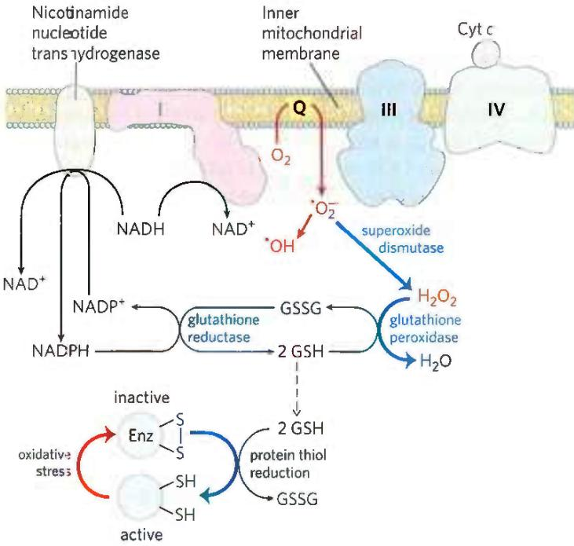  
FIGURE 19-18 ROS formation in mitochondria and mitochondrial defenses. When the rate of electron entry into the respiratory chain and the rate of electron transfer through the chain are mismatched, superoxide radical ( $^{\bullet}O_{2}^{-}$ ) production increases at Complexes I and III as the partially reduced ubiquinone radical ( $^{\bullet}Q^{-}$ ) donates an electron to $O_{2}$ . Superoxide acts on a conitase, a 4Fe-4S protein (not shown), to release $Fe^{2+}$ . $Fe^{2+}$ in turn will react with hydrogen peroxide (in a process called the Fenton reaction) to produce the highly reactive hydroxyl free radical ( $^{\bullet}OH$ ). The reactions shown in blue defend the cell against the damaging effects of superoxide. Reduced glutathione (GSH; see Fig. 22-29) donates electrons for the reduction of $H_{2}O_{2}$ and of the oxidized Cys residues (—S—S—) of enzymes and other proteins; GSH is regenerated from the oxidized form (GSSG) by reduction with NADPH.

To prevent oxidative damage by $\cdot O_{2}^{-}$ , cells have the enzyme superoxide dismutase, which catalyzes the reaction

$$
2 ^ {\bullet} \mathrm{O} _ {2} ^ {-} + 2 \mathrm{H} ^ {+} \longrightarrow \mathrm{H} _ {2} \mathrm{O} _ {2} + \mathrm{O} _ {2}
$$

The hydrogen peroxide ( $H_{2}O_{2}$ ) thus generated is rendered harmless by glutathione peroxidase (Fig. 19-18). Glutathione reductase recycles the oxidized glutathione to its reduced form, using electrons from the NADPH generated by nicotinamide nucleotide transhydrogenase (in the mitochondrion) or by the pentose phosphate pathway (in the cytosol; see Fig. 14-30). Reduced glutathione also serves to keep protein sulfhydryl groups in their reduced state, preventing some of the deleterious effects of oxidative stress.

## SUMMARY 19.1 The Mitochondrial Respiratory Chain

\- Chemiosmotic theory provides the intellectual framework for understanding many biological energy transductions, including oxidative phosphorylation and photophosphorylation. The energy of electron flow is conserved by the concomitant pumping of protons across the membrane, producing an electrochemical gradient, the proton-motive force.

In mitochondria, hydride ions removed from substrates (such as $\alpha$ -ketoglutarate and malate) by NAD-linked dehydrogenases donate electrons to the respiratory chain, which transfers the electrons to molecular $\mathrm{O}_2$ , reducing it to $\mathrm{H}_2\mathrm{O}$ .

■ Reducing equivalents from NADH are passed through a series of carrier types that include ubiquinone, Fe-S centers, and cytochromes.

Electron carriers are arranged in multiprotein complexes, which couple electron transfer to the generation of proton gradients. Complex I transfers electrons from NADH to ubiquinone. Complex II harvests electrons from the oxidation of succinate, also transferring them to ubiquinone. Ubiquinone diffuses through the inner mitochondrial membrane, and transfers the electrons to cytochrome b, the first carrier in Complex III. In this complex, electrons move first to an Fe-S center. The Fe-S center passes electrons, one at a time, through cytochrome c and into Complex IV, cytochrome oxidase. This copper-containing enzyme, which also contains cytochromes a and $\alpha_{3}$ , accumulates electrons, then passes them to $O_{2}$ , reducing it to $H_{2}O$ .

■ Complexes I, III, and IV form supercomplexes that facilitate electron flow between them.

Some electrons enter this chain of carriers through alternative paths. Electrons derived from the oxidation of fatty acids pass to ubiquinone via the electron-transferring flavoprotein. The oxidation of glycerol phosphate and of dihydroorotate also sends electrons into the respiratory chain at the level of $\mathrm{QH}_2$ .

\- Much of the free energy generated by electron transfer and the reduction of oxygen to form water is recovered and stored in the form of an electrochemical proton gradient across the mitochondrial inner membrane.

■ Potentially harmful reactive oxygen species produced in mitochondria are inactivated by a set of protective enzymes, including superoxide dismutase and glutathione peroxidase. Low levels of ROS serve as signals coordinating mitochondrial oxidative phosphorylation with other metabolic pathways.

## 19.2 ATP Synthesis

How is a concentration gradient of protons transformed into ATP? We have seen that electron transfer releases, and the proton-motive force conserves, more than enough free energy (about 190 kJ) per "mole" of electron pairs to drive the formation of a mole of ATP, which requires about 50 kJ (p. 480). Mitochondrial oxidative phosphorylation therefore poses no thermodynamic problem. But what is the chemical mechanism that couples proton flux with phosphorylation?

## In the Chemiosmotic Model, Oxidation and Phosphorylation Are Obligately Coupled

The chemiosmotic model, proposed by Peter Mitchell, is the paradigm for energy coupling. According to the model (Fig. 19-19), the electrochemical energy inherent in the difference in proton concentration and the separation of charge across the inner mitochondrial membrane—the proton-motive force—drives the synthesis of ATP as protons flow passively back into the matrix through a proton pore in ATP synthase. To emphasize this crucial role of the proton-motive force, the equation for ATP synthesis is sometimes written

$$
\mathrm{ADP} + \mathrm {P_ {i}} + n \mathrm {H_ {P} ^ {+}} \longrightarrow \mathrm{ATP} + \mathrm {H_ {2} O} + n \mathrm {H_ {N} ^ {+}}\tag{19-10}
$$

Mitchell used the term "chemiosmotic" to describe enzymatic reactions that involve, simultaneously, a chemical reaction and a transport process, and the overall process is sometimes referred to as "chemiosmotic coupling." Here, "coupling" refers to the obligate connection between mitochondrial ATP synthesis and electron flow through the respiratory chain; neither of the

Peter Mitchell, 1920–1992
[AP Photos/AP Images.]

two processes can proceed without the other. The operational definition of coupling is shown in Figure 19-20.

P5 When isolated mitochondria are suspended in a buffer containing ADP, $P_{i}$ , and an oxidizable substrate such as succinate, three easily measured processes occur: (1) the substrate is oxidized (succinate yields fumarate), (2) $O_{2}$ is consumed, and (3) ATP is synthesized. Oxygen consumption and ATP synthesis depend on the presence of an oxidizable substrate (succinate in this case) as well as ADP and $P_{i}$ .

Because substrate oxidation drives ATP synthesis, inhibitors of electron transfer block ATP synthesis (Fig. 19-20a). The converse is also true: inhibition of ATP synthesis blocks electron transfer in intact mitochondria. When isolated mitochondria are given $O_{2}$ and oxidizable substrates, but not ADP (Fig. 19-20b), no ATP synthesis can occur and electron transfer to $O_{2}$ does not proceed. Henry Lardy, who pioneered the use

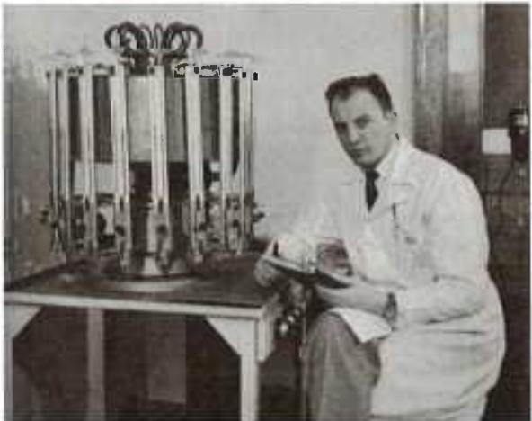  
Henry Lardy, 1917–2010 [© Courtesy David L. Nelson, Ph.D.]

FIGURE 19-19 Chemiosmotic model. In this simple representation of the chemiosmotic theory applied to mitochondria, electrons from NADH and other oxidizable substrates pass through a chain of carriers arranged asymmetrically in the inner membrane. Electron flow is accompanied by proton transfer across the membrane, producing both a chemical gradient ( $\Delta pH$ )

and an electrical gradient ( $\Delta\psi$ ), which, combined, create the proton-motive force. The inner mitochondrial membrane is impermeable to protons; protons can reenter the matrix only through proton-specific channels ( $F_{o}$ ). The proton-motive force that drives protons back into the matrix provides the energy for ATP synthesis, catalyzed by the $F_{1}$ complex associated with $F_{o}$ .

(a)  

  
(b)  
FIGURE 19-20 Coupling of electron transfer and ATP synthesis in mitochondria. In experiments to demonstrate coupling, mitochondria are suspended in a buffered medium, and an $\mathrm{O}_2$ electrode monitors $\mathrm{O}_2$ consumption. At intervals, samples are removed and assayed for the presence of ATP. (a) Addition of ADP and $\mathsf{P}_{\mathsf{i}}$ alone results in little or no increase in either respiration ( $\mathrm{O}_2$ consumption; black) or ATP synthesis (red). When succinate is added, respiration begins immediately, and ATP

of antibiotics to explore mitochondrial function, showed coupling of oxidation and phosphorylation by using oligomycin and venturicidin. These toxic antibiotics bind to the ATP synthase in mitochondria, inhibiting both ATP synthesis and the transfer of electrons through the chain of carriers to $O_{2}$ (Fig. 19-20b). As oligomycin does not interact with the electron carriers, it follows that electron transfer and ATP synthesis are obligately coupled: neither reaction occurs without the other.

Chemiosmotic theory readily explains the dependence of electron transfer on ATP synthesis in mitochondria. When the flow of protons into the matrix through the proton channel of ATP synthase is blocked (with oligomycin, for example), no path exists for the return of protons to the matrix, and the continued extrusion of protons driven by the activity of the respiratory chain generates a large proton gradient. The proton-motive force builds up until the cost (free energy) of pumping protons out of the matrix against this gradient equals or exceeds the energy released by the transfer of electrons from NADH to $O_{2}$ . At this point electron flow must stop; the free energy for the overall process of electron flow coupled to proton pumping becomes zero, and the system is at equilibrium.

Certain conditions and reagents, however, can uncouple oxidation from phosphorylation. When intact mitochondria are disrupted by treatment with detergent or by physical shear, the resulting membrane fragments can still catalyze electron transfer from succinate or NADH to $O_{2}$ , but no ATP synthesis is coupled to this respiration. Certain chemical compounds cause uncoupling without physically disrupting mitochondrial structure. Chemical uncouplers include 2,4-dinitrophenol (DNP) and carbonylcyanide-p-trifluoromethoxyphenylhydrazone (FCCP) (Table 19-4; Fig. 19-21), weak acids with hydrophobic properties that permit them to diffuse readily across mitochondrial membranes. After entering the matrix in the protonated form, they can release a proton, thus dissipating the proton gradient. Resonance stabilization delocalizes the charge on the anionic forms, making them sufficiently hydrophobic to diffuse back across the membrane, where they can pick up a proton and repeat the process. Ionophores such as valinomycin (see Fig. 11-43) allow inorganic ions to pass easily through membranes. Ionophores uncouple electron transfer from oxidative phosphorylation by dissipating the electrical contribution to the electrochemical gradient across the mitochondrial membrane.

  
is synthesized. Addition of cyanide (CN $^{-}$ ), which blocks electron transfer between cytochrome oxidase (Complex IV) and O $_{2}$ , inhibits both respiration and ATP synthesis. (b) Mitochondria provided with succinate respire and synthesize ATP only when ADP and P $_{i}$ are added. Subsequent addition of venturicidin or oligomycin, inhibitors of ATP synthase, blocks both ATP synthesis and respiration. Dinitrophenol (DNP) is an uncoupler, allowing respiration to continue without ATP synthesis.

A prediction of the chemiosmotic theory is that, because the role of electron transfer in mitochondrial ATP synthesis is simply to pump protons to create the electrochemical potential of the proton-motive force, an artificially created proton gradient should be able to replace electron transfer in driving ATP synthesis. This has been experimentally confirmed (Fig. 19-22). In the absence of an oxidizable substrate, the proton-motive force alone suffices to drive ATP synthesis.

  
2,4-Dinitrophenol (DNP)

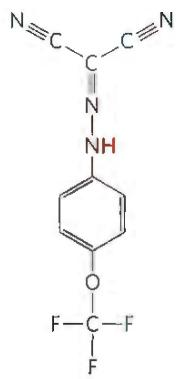  
Carbonylcyanide-p-trifluoromethoxyphenylhydrazone (FCCP)  
FIGURE 19-21 Two chemical uncouplers of oxidative phosphorylation. Both DNP and FCCP have a dissociable proton (red) and are very hydrophobic. They carry protons across the inner mitochondrial membrane, dissipating the proton gradient. Both also uncouple photophosphorylation.

## ATP Synthase Has Two Functional Domains, $F_{0}$ and $F_{1}$

P2 Mitochondrial ATP synthase is an F-type ATPase (see Fig. 11-40b) similar in structure and mechanism to the ATP synthases of bacteria and (as we will see in Chapter 20) chloroplasts. This large enzyme complex of the inner mitochondrial membrane catalyzes the formation of ATP from ADP and $\mathbf{P}_{\mathrm{i}}$ , driven by the flow of protons from the P to the N side of the membrane (Eqn 19-10). ATP synthase, also called Complex V to relate it to the electron-transfer complexes described in the last section, has two distinct components. These are $\mathbf{F}_{\mathrm{i}}$ , a peripheral membrane protein, and $\mathbf{F}_{\mathrm{o}}$ (o denoting oligomycin-sensitive), which is integral to the membrane. $\mathbf{F}_{\mathrm{l}}$ , the first factor recognized as essential for oxidative phosphorylation, was identified and purified by Efraim Racker and his colleagues in the early 1960s.

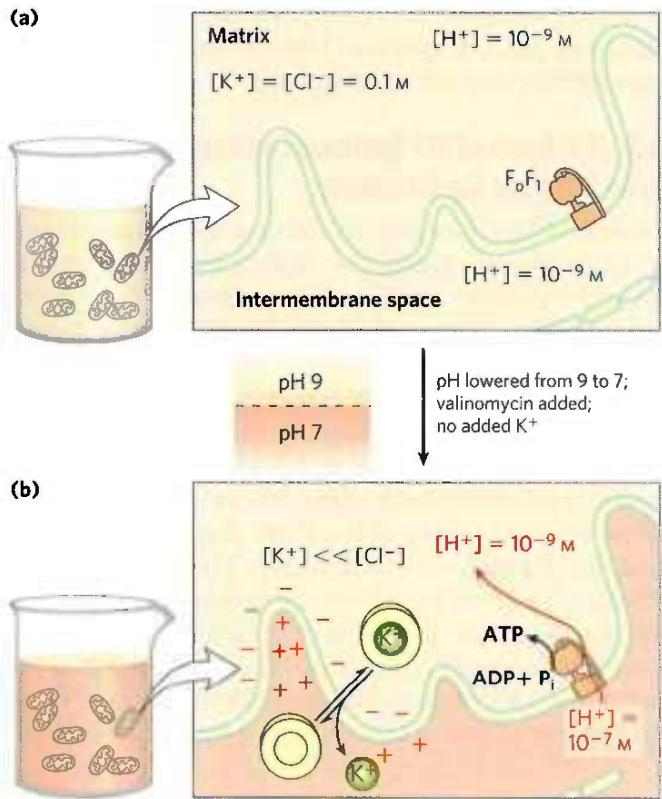  
FIGURE 19-22 Evidence for the role of a proton gradient in ATP synthesis. An artificially imposed electrochemical gradient can drive ATP synthesis in the absence of an oxidizable substrate as electron donor. In this two-step experiment, (a) isolated mitochondria are first incubated in a pH 9 buffer containing 0.1 M KCl. Slow leakage of buffer and KCl into the mitochondria eventually brings the matrix into equilibrium with the surrounding medium. No oxidizable substrates are present. (b) Mitochondria are now removed from the pH 9 buffer and resuspended in pH 7 buffer containing valinomycin but no KCl. The change in buffer creates a difference of two pH units across the inner mitochondrial membrane. The outward flow of $K^{+}$ , carried by valinomycin down the $K^{+}$ ion concentration gradient without a counterion, creates a charge imbalance across the membrane (matrix negative). The sum of the chemical potential provided by the pH difference and the electrical potential provided by the separation of charges is a proton-motive force large enough to support ATP synthesis in the absence of an oxidizable substrate.

In the laboratory, small membrane vesicles formed from inner mitochondrial membranes carry out ATP synthesis coupled to electron transfer. When $F_{1}$ is gently extracted, the “stripped” vesicles still contain intact respiratory chains and the $F_{0}$ portion of ATP synthase. P5 The vesicles can catalyze electron transfer from NADH to $O_{2}$ but cannot produce a proton gradient: $F_{0}$ has a proton pore through which protons leak as fast as they are pumped by electron transfer, and without a proton gradient the $F_{1}$ -depleted vesicles cannot make ATP. Isolated $F_{1}$ catalyzes ATP hydrolysis (the reversal of synthesis) and was therefore originally called $F_{1}$ ATPase. When purified $F_{1}$ is added back to the depleted vesicles, it reassociates with $F_{0}$ , plugging its proton pore and restoring the membrane’s capacity to couple electron transfer and ATP synthesis.

## ATP Is Stabilized Relative to ADP on the Surface of $F_{1}$

Isotope exchange experiments using purified $F_{1}$ reveal an extraordinary fact about the enzyme's catalytic mechanism: on the enzyme surface, the reaction $ADP + P_{i} \rightleftharpoons ATP + H_{2}O$ is readily reversible—the free-energy change for ATP synthesis is close to zero. When ATP is hydrolyzed by $F_{1}$ in the presence of ${}^{18}O$ -labeled water, the $P_{i}$ released contains an ${}^{18}O$ atom. Careful measurement of the ${}^{18}O$ content of $P_{i}$ formed in vitro by $F_{1}$ -catalyzed hydrolysis of ATP reveals that the $P_{i}$ has not one but three or four ${}^{18}O$ atoms (Fig. 19-23). This indicates that the terminal pyrophosphate bond in ATP is cleaved and re-formed repeatedly before $P_{i}$ leaves the enzyme surface. This exchange reaction occurs in unenergized $F_{0}F_{1}$ complexes (with no proton gradient) and with isolated $F_{1}$ —the exchange does not require the input of energy.

Kinetic studies of the initial rates of ATP synthesis and hydrolysis confirm the conclusion that $\Delta G^{\prime\circ}$ for ATP synthesis on the enzyme is near zero. From the measured rates of hydrolysis ( $k_{1} = 10$ s $^{-1}$ ) and synthesis ( $k_{-1} = 24$ s $^{-1}$ ), the calculated equilibrium constant for the reaction

$$
\mathrm{Enz-ATP} \rightleftharpoons \mathrm{Enz-(ADP+P} _ {\mathrm{i}})
$$

is

$$
K _ {\mathrm{eq}} ^ {\prime} = \frac {k _ {- 1}}{k _ {1}} = \frac {2 4 \mathrm{s} ^ {- 1}}{1 0 \mathrm{s} ^ {- 1}} = 2. 4
$$

From this $K_{eq}^{\prime}$ , the calculated apparent $\Delta G^{\prime\circ}$ is close to zero. This is much different from the $K_{eq}^{\prime}$ of about $10^{5}$ ( $\Delta G^{\prime\circ} = -30.5$ kJ/mol) for the hydrolysis of ATP free in solution (i.e., not on the enzyme surface).

What accounts for the huge difference? ATP synthase stabilizes ATP relative to ADP + P $_{i}$ by binding ATP more tightly, releasing enough energy to counterbalance the cost of making ATP. Careful measurements of the binding constants show that F $_{o}$ F $_{1}$ binds ATP with very high affinity ( $K_{d} \leq 10^{-12}$ M) and ADP with much lower

  
FIGURE 19-23 Catalytic mechanism of $F_{1}$ . (a) An $^{18}\mathrm{O}$ -exchange experiment. $F_{1}$ solubilized from mitochondrial membranes is incubated with ATP in the presence of $^{18}\mathrm{O}$ -labeled water. At intervals, a sample of the solution is withdrawn and analyzed for the incorporation of $^{18}\mathrm{O}$ into the $P_{i}$ produce from ATP hydrolysis. In minutes, the $P_{i}$ contains three or four $^{18}\mathrm{O}$ atoms, indicating that both ATP hydrolysis and ATP synthesis have occurred several times during the incubation. (b) The likely transition state complex for ATP hydrolysis and synthesis by ATP synthase. The $\alpha$ subunit is shown in gray, $\beta$ in purple. The positively charged residues $\beta -\mathrm{Arg}^{182}$ and $\alpha -\mathrm{Arg}^{376}$ coordinate two oxygens of the pentavalent phosphate intermediate; $\beta -\mathrm{Lys}^{155}$ interacts with a third oxygen, and the $\mathrm{Mg}^{2+}$ ion further stabilizes the intermediate. The blue sphere represents the leaving group $(\mathrm{H}_{2}\mathrm{O})$ . These interactions result in ready equilibration of ATP and ADP + $P_{i}$ in the active site. [(b) Data from PDB ID 1BMF, J.P. Abrahams et al., Nature 370:621, 1994.]

FIGURE 19-24 Reaction coordinate diagrams for ATP synthase and for a more typical enzyme. In a typical enzyme-catalyzed reaction (left), reaching the transition state ( $\ddagger$ ) between substrate and product is the major energy barrier to overcome. In the reaction catalyzed by ATP synthase (right), release of ATP from the enzyme, not formation of ATP, is the major energy barrier. The free-energy change for the formation of ATP from ADP and F in aqueous solution is large and positive, but on the enzyme surface, the very tight binding of ATP provides sufficient binding energy to bring the free energy of the enzyme-bound ATP close to that of ADP + P $_{i}$ , so the reaction is readily reversible. The equilibrium constant is near 1. The free energy required for the release of ATP is provided by the proton-motive force.

affinity ( $K_{d} \approx 10^{-5}$ M). The difference in $K_{d}$ corresponds to a difference of about 40 kJ/mol in binding energy, and this binding energy drives the equilibrium toward formation of the product ATP.

## The Proton Gradient Drives the Release of ATP from the Enzyme Surface

Although ATP synthase equilibrates ATP with ADP + P $_{i}$ , in the absence of a proton gradient the newly synthesized ATP does not leave the surface of the enzyme. Effectively, the enzyme cannot turn over and synthesize a second molecule of ATP. It is the proton gradient that causes the enzyme to release the ATP formed on its surface. The reaction coordinate diagram of the process (Fig. 19-24) illustrates the difference between the mechanism of ATP synthase and that of many other enzymes that catalyze endergonic reactions.

For the continued synthesis of ATP, the enzyme must cycle between a form that binds ATP very tightly and a form that releases ATP. Chemical and crystallographic studies of the ATP synthase have revealed the structural basis for this alternation in function.

## Each $\beta$ Subunit of ATP Synthase Can Assume Three Different Conformations

Mitochondrial $F_{1}$ has nine subunits of five different types, with the composition $\alpha_{3}\beta_{3}\gamma\delta\varepsilon$ . Each of the three $\beta$ subunits has one catalytic site for ATP synthesis. The crystallographic determination of the $F_{1}$ structure by John E. Walker and colleagues revealed structural details that help explain the catalytic mechanism of the enzyme. The knoblike portion of $F_{1}$ is a flattened sphere, 8 nm by 10 nm, consisting of alternating $\alpha$ and $\beta$ subunits arranged like the sections of an orange (Fig. 19-25a–d). Although the amino acid sequences of the three $\beta$ subunits are identical, their conformations differ. The conformational differences extend to differences in their ATP/ADP-binding sites. When the protein is crystallized in the presence of ADP and App(NH)p, a close structural analog of ATP that cannot be hydrolyzed by the ATPase activity of $F_{1}$ , the binding site of one of the three $\beta$ subunits is filled with

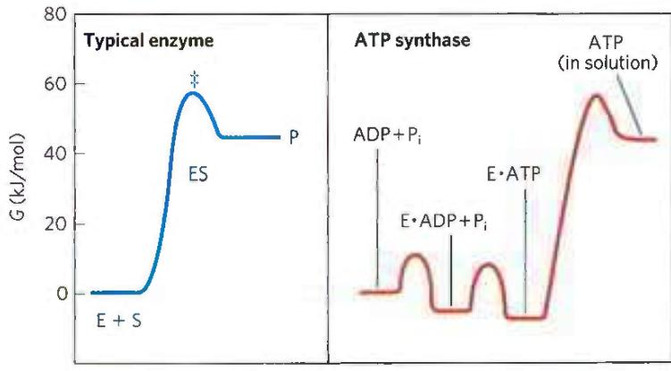  
Reaction coordinate

FIGURE 19-25 Mitochondrial ATP synthase complex. (a) A cartoon representation of the $F_{0}F_{1}$ complex. The dimeric form is found in eukaryotic mitochondria. The monomeric form is observed in bacteria. (b) $F_{1}$ viewed from above (that is, from the n side of the membrane), showing the three $\beta$ (shades of purple) and three $\alpha$ (shades of gray) subunits and the central shaft ( $\gamma$ subunit, green). Each $\beta$ subunit, near its interface with the neighboring $\alpha$ subunit, has a nucleotide-binding site critical to the catalytic activity. The single $\gamma$ subunit associates primarily with one of the three $\alpha\beta$ pairs, forcing each of the three $\beta$ subunits into slightly different conformations, with different nucleotide-binding sites. In the crystalline enzyme, one subunit, $\beta$ -ADP, has ADP (yellow) in its binding site; the next, $\beta$ -ATP, has ATP (red); and the third, $\beta$ -empty, has no bound nucleotide. (c) The entire enzyme viewed from the side (in the plane of the membrane). The $F_{1}$ portion has three $\alpha$ subunits and three $\beta$ subunits arranged like the segments of an orange around a central shaft, the $\gamma$ subunit (green). (Two $\alpha$ subunits and one $\beta$ subunit have been omitted to reveal the $\gamma$ subunit and the binding sites for ATP and ADP on the $\beta$ subunits.) The $\delta$ subunit confers oligomycin sensitivity on the ATP synthase, and the $\varepsilon$ subunit may serve to inhibit the enzyme's ATPase activity under some circumstances. The $F_{0}$ subunit consists of one a subunit and two b subunits, which anchor the $F_{0}F_{1}$ complex in the membrane and act as a stator (the stationary part of a rotary system), holding the $\alpha$ and $\beta$ subunits in place. $F_{0}$ also includes the c ring, made up of a number (8 to 17, depending on the species) of identical c subunits, small, hydrophobic proteins. The c ring and the a subunit interact to provide a transmembrane path for protons. Each of the c subunits in $F_{0}$ has a critical Asp residue near the middle of the membrane, which undergoes protonation/deprotonation during the catalytic cycle of the ATP synthase. Shown here is the homologous $c_{11}$ ring of the Na $^{+}$ -ATPase of Ilyobacter tartaricus, for which the structure is well established. The Na $^{+}$ -binding sites, which correspond to the proton-binding sites of the $F_{0}F_{1}$ complex, are shown with their bound Na $^{+}$ ions (red spheres). (d) A view of $F_{0}$ perpendicular to the membrane. As in (c), red spheres represent the Na $^{+}$ - or proton-binding sites in Asp residues. [(a) Information from W. Kühlbrandt and K. M. Davies, Trends Biochem. Sci. 41:106, 2016. (b, c, d) Data from F $_{i}$ : PDB ID 1BMF, J. P. Abrahams et al., Nature 370:621, 1994; PDB ID J.NV, A.C. Hausrath et al., J. Biol. Chem. 276:47,227, 2001; PDB ID 2A7U, S. Wilkens et al., Biochemistry 44:11,786, 2005; PDB ID 2CLY, V. Kane Dickson et al., EMBO J. 25:2911, 2006; F $_{0}$ : PDB ID 1B9U, O. Dmitriev et al., J. Biol. Chem. 274:15,598, 1999; c ring: PDB ID 1YCE, T. Meier et al., Science 308:659, 2005.]

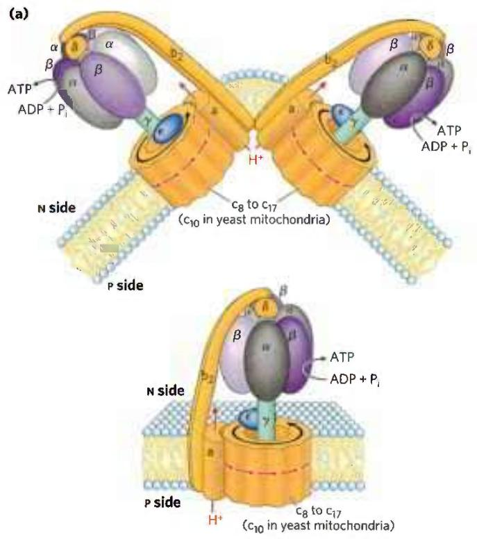

(b) Top view of $F_{1}$  

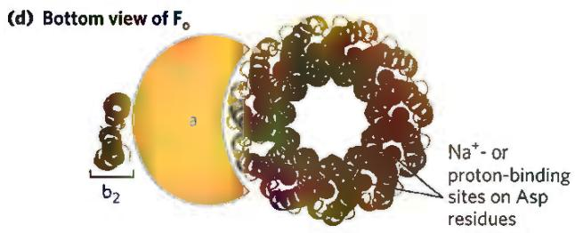

App(NH)p, the second is filled with ADP, and the third is empty. The corresponding $\beta$ subunit conformations are designated $\beta$ -ATP, $\beta$ -ADP, and $\beta$ -empty (Fig. 19-25b). This difference in nucleotide binding among the three subunits is critical to the mechanism of the complex. The polypeptides that make up the stalk in the $F_{1}$ crystal structure are asymmetrically arranged. One domain of the single $\gamma$ subunit makes up a central shaft that passes through $F_{1}$ . Another globular domain of $\gamma$ helps to stabilize the $\beta$ -empty conformation in a $\beta$ subunit it is transiently associated with (Fig. 19-25c).

  
App(NH)p (β,γ-imidoadenosine 5'-triphosphate)

The $F_{0}$ complex, with its proton pore, is composed of three subunits, a, b, and c, in the proportion $ab_{2}c_{n}$ , where n ranges from 8 to 17, depending on the species. Subunit c is a small ( $M_{r}$ 8,000), very hydrophobic polypeptide, consisting almost entirely of two transmembrane helices, with a small loop extending from the matrix side of the membrane. The crystal structure of the yeast $F_{0}F_{1}$ shows 10 c subunits, each with two transmembrane helices roughly perpendicular to the plane of the membrane and arranged in two concentric circles to create the c ring. The inner circle is made up of the amino-terminal helices of each c subunit; the outer circle, about 55 Å in diameter, is made up of the carboxyl-terminal helices. The c subunits in the c ring rotate together as a unit around an axis perpendicular to the membrane. The ε and γ subunits of $F_{1}$ form a leg-and-foot that projects from the bottom (membrane) side of $F_{1}$ and stands firmly on the ring of c subunits. The a subunit consists of several hydrophobic helices that span the membrane in close association with one of the c subunits in the c ring.

## Rotational Catalysis Is Key to the Binding-Change Mechanism for ATP Synthesis

On the basis of detailed kinetic and binding studies of the reactions catalyzed by $F_{0}F_{1}$ , Paul Boyer proposed a rotational catalysis mechanism in which the three active sites of $F_{1}$ take turns catalyzing ATP synthesis (Fig. 19-26). A given $\beta$ subunit starts in the $\beta$ -ADP conformation, which binds ADP and $P_{i}$ from the surrounding medium. The subunit now changes conformation, assuming the $\beta$ -ATP form that tightly binds and stabilizes ATP, bringing about the ready equilibration of ADP + $P_{i}$ with ATP on the enzyme surface. Finally, the subunit changes to the $\beta$ -empty conformation, which has very low affinity for ATP, and the newly synthesized ATP leaves the enzyme surface. Another round of catalysis begins when this subunit again assumes the $\beta$ -ADP form and binds ADP and $P_{i}$ .

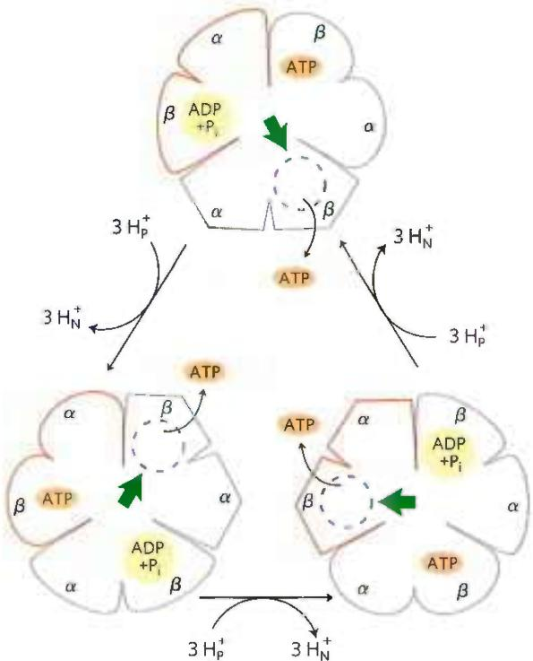  
FIGURE 19-26 Binding-change model for ATP synthase. The $F_{i}$ complex has three nonequivalent adenine nucleotide-binding sites, one for each pair of $\alpha$ and $\beta$ subunits. At any given moment, one of these sites is in the $\beta$ -ATP conformation (which binds ATP tightly), a second is in the $\beta$ -ADP (loose-binding) conformation, and a third is in the $\beta$ -empty (very-loose-binding) conformation. In this view from the n side, the proton-motive force causes rotation of the central shaft — the $\gamma$ subunit, shown as a green arrowhead — which comes into contact with each $\alpha\beta$ subunit pair in succession. This produces a cooperative conformational change in which the $\beta$ -ATP site is converted to the $\beta$ -empty conformation, and ATP dissociates; the $\beta$ -ADP site is converted to the $\beta$ -ATP conformation, which promotes condensation of bound ADP + P $_{i}$ to form ATP; and the $\beta$ -empty site becomes a $\beta$ -ADP site, which loosely binds ADP + P $_{i}$ entering from the solvent. Note that the direction of rotation reverses when the ATP synthase is acting as an ATPase, as in the experiment depicted in Figure 19-27.

P5 The conformational changes central to this mechanism are driven by the passage of protons through the $F_{0}$ portion of ATP synthase. The streaming of protons through the $F_{0}$ pore causes the c ring and the attached $\gamma$ subunit to rotate about the long axis of $\gamma$ , which is perpendicular to the plane of the membrane. The $\gamma$ subunit passes through the center of the $\alpha_{3}\beta_{3}$ spheroid, which is held stationary relative to the membrane surface by the $b_{2}$ and $\delta$ subunits (Fig. 19-25a). With each rotation of $120^{\circ}$ , $\gamma$ comes into contact with a different $\beta$ subunit, and the contact forces that $\beta$ subunit into the $\beta$ -empty conformation.

The three $\beta$ subunits interact in such a way that when one assumes the $\beta$ -empty conformation, its neighbor to one side must assume the $\beta$ -ADP form, and the other neighbor the $\beta$ -ATP form. Thus, one complete rotation of the $\gamma$ subunit causes each $\beta$ subunit to cycle through all three of its possible conformations, and for each rotation, three ATP are synthesized and released from the enzyme surface.

One strong prediction of this binding-change model is that the $\gamma$ subunit should rotate in one direction when $F_{0}F_{1}$ is synthesizing ATP and in the opposite direction when the enzyme is hydrolyzing ATP. This prediction of rotation with ATP hydrolysis was confirmed in elegant experiments in the laboratories of Masasuke Yoshida and Kazuhiko Kinosita, Jr. The rotation of $\gamma$ in a single $F_{1}$ molecule was observed microscopically by attaching a long, thin, fluorescent actin polymer to $\gamma$ and watching it move relative to $\alpha_{3}\beta_{3}$ immobilized on a microscope slide as ATP was hydrolyzed. (The expected reversal of the rotation when ATP is being synthesized could not be tested in this experiment; there is no proton gradient to drive ATP synthesis.) When the entire $F_{0}F_{1}$ complex (not just $F_{1}$ ) was used in a similar experiment, the entire ring of c subunits rotated with $\gamma$ (Fig. 19-27). The “shaft” rotated in the predicted direction through 360°. The rotation was not smooth but occurred in three discrete steps of 120°. As calculated from the known rate of ATP hydrolysis by one F $_{1}$ molecule and from the frictional drag on the long actin polymer, the efficiency of this mechanism in converting chemical energy into motion is close to 100%. It is, in Boyer's words, "a splendid molecular machine!"

(b)  
  
FIGURE 19-27 Experimental demonstration of rotation of $F_{0}$ and $\gamma$ . This fundamental property of the ATP synthase reaction was demonstrated in several creative ways. (a) In one experiment, illustrated in this cartoon, $F_{1}$ , genetically engineered to contain a run of His residues, was tightly adhered to a microscope slide coated with a Ni complex; biotin was covalently attached to a c subunit of $F_{0}$ . The protein avidin, which binds biotin very tightly, was covalently attached to long filaments of actin labeled with a fluorescent probe. Biotin-avidin binding then attached the actin filaments to the c subunit. When ATP was provided as substrate for the ATPase activity of $F_{1}$ , the labeled filament rotated in one direction, proving that the $F_{0}$ cylinder of c subunits rotates. (b) In another experiment, a fluorescent actin filament was attached directly to the $\gamma$ subunit. The series of fluorescence micrographs (read left to right) shows the position of the actin filament at intervals of 133 ms. Note that as the filament rotated, it made discrete jumps rather than smooth rotation about the circle. The cylinder and shaft move as one unit. ([a] Information from Y. Sambongi et al., Science 286:1722, 1999. (b) Courtesy Hiroyuki Noji.]

P5 A model that illustrates how proton flow and rotary motion are coupled in the $F_{0}$ complex is shown in Figure 19-28. The a subunit is stationary, while the c ring rotates. Critical interactions occur between conserved amino acids in the a and c subunits. The individual subunits in the c ring are arranged in a circle with only a few ir. contact with the a subunit at any moment. Protons diffuse across the membrane through a path made up of both a and c subunits. Transient protonation of a key Glu residue in each c subunit elicits conformation changes that drive rotation and transmit protons between hydrophilic half channels positioned on each side of the membrane. The rotary movement of the c ring is made unidirectional by the large difference in proton concentration across the membrane. The number of protons that must be transferred to produce one complete rotation cf the c ring is equal to the number of c subunits in the ring. Structural studies of the c ring have shown that the number of c subunits differs in different organisms (Fig. 19-29). In bovine mitochondria the number is 8, in yeast mitochondria and in Escherichia coli it is 10, and the number of c subunits can range as high as 17, as is seen in the soil bacterium Burkholderia pseudomallei. The rate of rotation in intact mitochondria has been estimated at about 6,000 rpm—100 rotations per second.

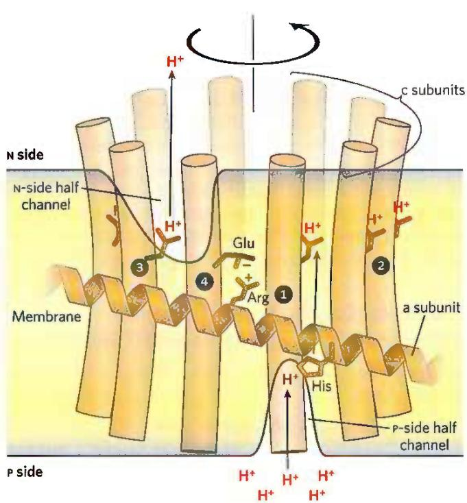  
FIGURE 19-28 A model for proton-driven rotation of the c ring. The a subunit of the $F_{o}$ complex of the ATP synthase (see Fig. 19-25a) has two hydrophilic half-channels for protons, one leading from the p side to the middle of the membrane, the other leading from the middle of the membrane to the n side (matrix). The function of the stationary a subunit is to conduct protons to and from the c ring subunits to drive c ring rotational motion. Individual c subunits in $F_{o}$ (the total number varies from 8 to 17 in different species) are arranged in a circle about a central core. Each c subunit has a critical Glu residue (an Asp in some species) about midway across the membrane, with a perturbed $pK_{a}$ allowing it to donate or accept a proton (red $H^{+}$ ) at pH near neutrality. The cycle that c subunits go through is illustrated. One c subunit is initially positioned so that a proton that enters the half-channel on the p side (where the proton concentration is relatively high) encounters and protonates a conserved His residue in the a subunit, transferring it to the c subunit Glu residue. This triggers a rotation-facilitating conformational change in the protonated c subunit as the Glu loses its negative charge. The now neutral Glu residue is sequestered in the hydrophobic membrane layer as it rotates as part of the c ring. As the c ring rotates, the c subunit we are following eventually makes contact with the channel to the n side of the membrane, where the environment is relatively alkaline, and the proton is released. As the Glu reacquires its negative charge, another rotation-facilitating conformational change occurs such that the Glu interacts transiently with a conserved Arg residue in the immobile a subunit. The interaction with the Arg is disrupted as the Glu is again protonated by the His residue, in motions that again facilitate rotation. The c subunits positioned near the half channels are providing the rotational driving force at any given moment, as they are the ones undergoing conformation changes associated with protonation and deprotonation. The orientation of the proton gradient dictates the direction of proton flow and makes rotation of the c ring essentially unidirectional. [Information from W. Kühlbrandt and K. M. Davies, Trends Biochem. Sci. 41:106, 2016.]

## Chemiosmotic Coupling Allows Nonintegral Stoichiometries of $\mathrm{O}_2$ Consumption and ATP Synthesis

The overall reaction equation for ATP synthesis has the following form:

$$
\begin{array}{r l} x \mathrm{ADP} + x \mathrm {P_ {i}} + \frac {1}{2} \mathrm {O_ {2}} + \mathrm {H^ {+}} + \mathrm{NADH} & \longrightarrow \\ x \mathrm{ATP} + \mathrm {H_ {2} O} + \mathrm {NA D ^ {+}} \end{array}\tag{19-11}
$$

The value of x is sometimes called the P/O ratio or the $P/2e^{-}$ ratio. When a proton gradient is coupled to ATP synthesis as described above, there is no theoretical requirement for P/O to be integral. The relevant questions about stoichiometry become these: How many protons are pumped outward by electron transfer from one NADH to $O_{2}$ ? and How many protons must flow inward through the $F_{0}F_{1}$ complex to drive the synthesis of one ATP? The measurement of proton fluxes is technically complicated; the investigator must take into account the buffering capacity of mitochondria, nonproductive leakage of protons across the inner membrane, and use of the proton gradient for functions other than ATP synthesis, such as driving the transport of substrates across the inner mitochondrial membrane (described below). When NADH or succinate (which sends electrons into the respiratory chain at the level of ubiquinone) is the oxidizable substrate, the consensus experimental values for number of protons pumped out per pair of electrons are 10 and 6, respectively. The most widely accepted experimental value for number of protons required to drive the synthesis of an ATP molecule is 4, of which 1 is used in transporting $P_{i}$ , ATP, and ADP across the mitochondrial membrane (see below). If 10 protons are pumped out per NADH and 4 must flow in to produce 1 ATP, the proton-based P/O ratio is 2.5 for NADH as the electron donor and 1.5 (6/4) for succinate. However, as we will see in Worked Example 19-2, the proton stoichiometry of ATP synthesis by ATP synthase depends upon the number of c units in $F_{0}$ , which ranges from 8 to 17, depending on the species.

  
(d)

(c)  
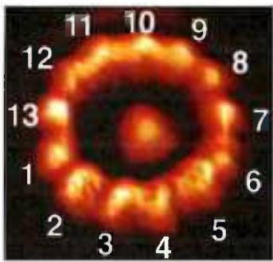

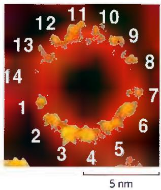  
FIGURE 19-29 Species differences in number of c subunits in the c ring of the $F_{0}$ complex. The structures of the c rings from several species have been determined by x-ray crystallography. Each helix in the inner ring is half of a hairpin-shaped c subunit; the outer ring of helices forms the other half of the hairpin structure. The essential Glu residue (Asp in some species) is shown as a red dot. Views of the c ring perpendicular to the membrane show the number of c subunits for (a) bovine mitochondria (8 subunits) and (b) yeast mitochondria (10). Atomic force microscopy has been used to visualize the c rings of (c) a thermophilic bacterium, Bacillus species TA2.A1 (13 subunits), and (d) spinach (14). According to the model in Figure 19-28, different numbers of c subunits in the c ring should result in different ratios of ATP formed per pair of electrons passing through the respiratory chain (i.e., different P/O ratios). ([a) Data from PDB ID 10HH, E. Cabezon et al., Nat. Struct. Biol. 10:744, 2003. (c) Republished with permission of Elsevier from J. Mol. Biol, Matthies, et al., Vol. 388(3), ©2009; permission conveyed through Copyright Clearance Center, Inc. (d) H. Seelert et al. Structural biology: Proton-powered turbine of a plant motor. Nature 405, 418–419. Reprinted by permission from Macmillan Publishers Ltd.]

## WORKED EXAMPLE 19-2 Stoichiometry of ATP Production: Effect of c Size

(a) If the ATP synthase of bovine mitochondria has 8 c subunits per c ring, what is the predicted ratio of ATP formed per NADH oxidized? (b) What is the predicted value for yeast mitochondria, with 10 c subunits per ATP synthase? (c) What are the comparable values for electrons entering the respiratory chain from FADH $_{2}$ ?

SOLUTION: (a) Here we are asked to determine how many ATP molecules are produced per NADH. This is another way of asking us to calculate the P/O ratio, or x, in Equation 19-11. If the c ring has 8 c subunits, then one full rotation will transfer 8 protons to the matrix and produce 3 ATP molecules. But this synthesis also requires the transport of 3 P $_{i}$ into the matrix, at a cost of 1 proton each, adding 3 more protons to the total number required. This brings the total cost to (11 protons)/(3 ATP) = 3.7 protons/ATP. The generally agreed value for the number of protons pumped out per pair of electrons transferred from NADH is 10 (Eqn 19-7). So, oxidizing 1 NADH produces (10 protons)/(3.7 protons/ATP) = 2.7 ATP.

(b) If the c ring has 10 c subunits, then one full rotation will transfer 10 protons to the matrix and produce 3 ATP molecules. Adding in the 3 protons to transport the 3 P $_{i}$ into the matrix brings the total cost to (13 protons)/(3 ATP) = 4.3 protons/ATP. Oxidizing 1 NADH produces (10 protons)/(4.3 protons/ATP) = 2.3 ATP.

(c) When electrons enter the respiratory chain from FADH $_2$ (at ubiquinone), only 6 protons are available to drive ATP synthesis. This changes the calculation for bovine mitochondria to (6 protons)/(3.7 protons/ATP)=1.6 ATP per pair of electrons from FADH $_2$ . For yeast mitochondria, the calculation is (6 protons)/(4.3 protons/ATP)=1.4 ATP per pair of electrons from FADH $_2$ .

These calculated values of x, or the P/O ratio, define a range that includes the experimental values of 2.5 ATP/NADH and 1.5 ATP/FADH $_{2}$ , and we therefore use these values throughout this book.

## The Proton-Motive Force Energizes Active Transport

Although the primary role of the proton gradient in mitochondria is to furnish energy for the synthesis of ATP, the proton-motive force also drives several transport processes essential to oxidative phosphorylation. The inner mitochondrial membrane is generally impermeable to charged species, but two specific systems transport ADP and $P_{i}$ into the matrix and ATP out to the cytosol (Fig. 19-30).

The adenine nucleotide translocase, integral to the inner membrane, binds ADP $^{3-}$ in the intermembrane space and transports it into the matrix in exchange for an ATP $^{4-}$ molecule simultaneously transported outward (see Fig. 13-11 for the ionic forms of ATP and ADP). Because this antiporter moves four negative charges out for every three moved in, its activity is favored by the transmembrane electrochemical gradient, which gives the matrix a net negative charge; the proton-motive force drives ATP-ADP exchange. Adenine nucleotide translocase is specifically inhibited by atractyloside, a toxic glycoside produced by a species of thistle. If the transport of ADP into and ATP out of mitochondria is inhibited, cytosolic ATP cannot be regenerated from ADP, explaining the toxicity of atractyloside.

A second membrane transport system essential to oxidative phosphorylation is the phosphate translocase, which promotes symport of one $H_{2}PO_{4}^{-}$ and one $H^{+}$ into the matrix. This transport process, too, is favored by the transmembrane proton gradient (Fig. 19-30). Notice that the process requires movement of one proton from the P side to the N side of the inner membrane, consuming some of the energy of electron transfer. A complex of the ATP synthase and both translocases, the ATP synthasome, can be isolated from mitochondria by gentle dissection with detergents, suggesting that the functions of these three proteins are very tightly integrated.

  
FIGURE 19-30 Adenine nucleotide and phosphate translocases. Transport systems of the inner mitochondrial membrane carry ADP and $P_{i}$ into the matrix and newly synthesized ATP into the cytosol. The adenine nucleotide translocase is an antiporter; the same protein moves ADP into the matrix and ATP out. The effect of replacing ATP $^{4-}$ with ADP $^{3-}$ in the matrix is the net efflux of one negative charge, which is favored by the charge difference across the inner membrane (outside positive). At pH 7, $P_{i}$ is present as both HPO $_{4}^{2-}$ and H $_{2}$ PO $_{4}^{-}$ ; the phosphate translocase is specific for H $_{2}$ PO $_{4}^{-}$ . There is no net flow of charge during symport of H $_{2}$ PO $_{4}^{-}$ and H $^{+}$ , but the relatively low proton concentration in the matrix favors the inward movement of H $^{+}$ . Thus the proton-motive force is responsible both for providing the energy for ATP synthesis and for transporting substrates (ADP and $P_{i}$ ) into and product (ATP) out of the mitochondrial matrix. All three of these transport systems can be isolated as a single membrane-bound complex (ATP synthasome).

ATP and ADP cross the outer mitochondrial membrane via the voltage-dependent anion channel (VDAC), a 19-stranded $\beta$ barrel with an opening about $27\AA$ wide, connecting the cytosol and the intermembrane space. Each VDAC, when open, can move $10^{5}$ ATP molecules per second. The opening is gated by voltage, as its name indicates, and under some conditions VDAC is closed to ATP.

## Shuttle Systems Indirectly Convey Cytosolic NADH into Mitochondria for Oxidation

The NADH dehydrogenase of the inner mitochondrial membrane of animal cells can accept electrons only from NADH in the matrix. Given that the inner membrane is

not permeable to NADH, how can the NADH generated by glycolysis in the cytosol be reoxidized to $NAD^{+}$ by $O_{2}$ via the respiratory chain? Special shuttle systems carry reducing equivalents from cytosolic NADH into mitochondria by an indirect route. The most active NADH shuttle, which functions in liver, kidney, and heart mitochondria, is the malate-aspartate shuttle (Fig. 19-31). The reducing equivalents of cytosolic NADH are first transferred to cytosolic oxaloacetate to yield malate, catalyzed by cytosolic malate dehydrogenase. The malate thus formed passes through the inner membrane via the malate- $\alpha$ -ketoglutarate transporter. Within the matrix, the reducing equivalents are passed to $NAD^{+}$ by the action of matrix malate dehydrogenase, forming NADH; this NADH can pass electrons directly to the respiratory chain. About 2.5 molecules of ATP are generated as this pair of electrons passes to $O_{2}$ . Cytosolic oxaloacetate must be regenerated by transamination reactions and the activity of membrane transporters to start another cycle of the shuttle.

Skeletal muscle and brain use a different NADH shuttle, the glycerol 3-phosphate shuttle (Fig. 19-32). It differs from the malate-aspartate shuttle in that it delivers the reducing equivalents from NADH through FAD in glycerol 3-phosphate dehydrogenase to ubiquinone and thus into Complex III, not Complex I (Fig. 19-15), providing enough energy to synthesize only 1.5 ATP molecules per pair of electrons.

The mitochondria of plants have an externally oriented NADH dehydrogenase that can transfer electrons directly from cytosolic NADH into the respiratory chain at the level of ubiquinone. Because this pathway bypasses the NADH dehydrogenase of Complex I and the associated proton movement, the yield of ATP from cytosolic NADH is less than that from NADH generated in the matrix (Box 19-1).

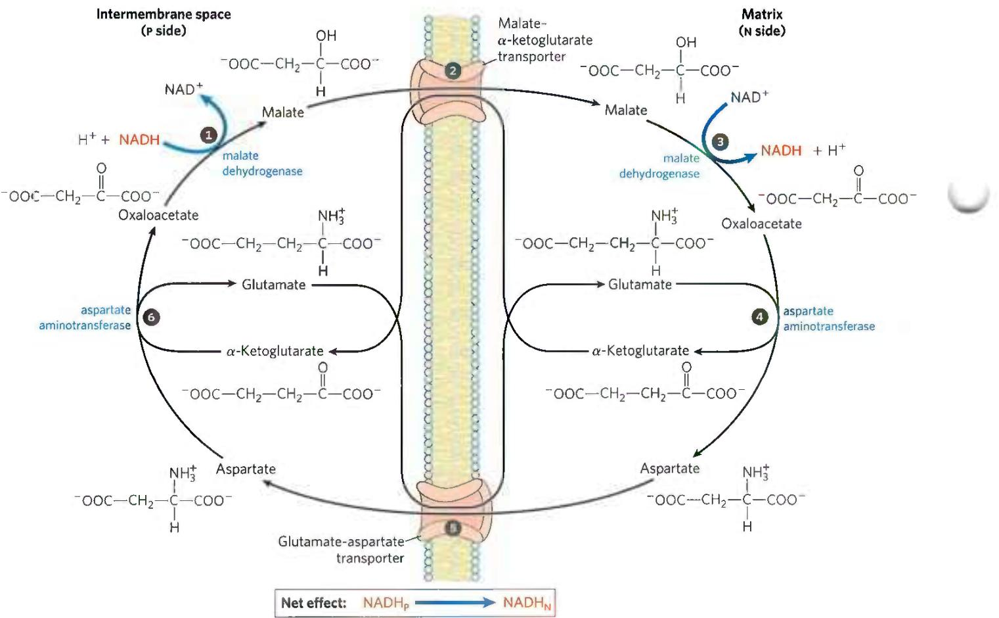  
FIGURE 19-31 Malate-aspartate shuttle. This shuttle for transporting reducing equivalents from cytosolic NADH into the mitochondrial matrix is used in liver, kidney, and heart. ① NADH in the cytosol enters the intermembrane space through openings in the outer membrane (porins), then passes two reducing equivalents to oxaloacetate, producing malate. ② Malate crosses the inner membrane via the malate-α-ketoglutarate transporter. ③ In the matrix, malate passes two reducing equivalents to  
NAD $^{+}$ , and the resulting NADH is oxidized by the respiratory chain; the oxaloacetate formed from malate cannot pass directly into the cytosol. ④ Oxaloacetate is first transaminated to aspartate, and ⑤ aspartate can leave via the glutamate-aspartate transporter. ⑥ Oxaloacetate is regenerated in the cytosol, completing the cycle, and glutamate produced in the same reaction enters the matrix via the glutamate-aspartate transporter.

## Hot, Stinking Plants and Alternative Respiratory Pathways

Many flowering plants attract insect pollinators by releasing odorant molecules that mimic an insect's natural food sources or potential egg-laying sites. Plants pollinated by flies or beetles that normally feed on or lay their eggs in dung or carrion sometimes use foul-smelling compounds to attract these insects.

One family of stinking plants is the Araceae, which includes philodendrons, arum lilies, and skunk cabbages. These plants have tiny flowers densely packed on an erect structure, the spadix, surrounded by a modified leaf, the spathe. The spadix releases odors of rotting flesh or dung. Before pollination the spadix also heats up, in some species to as much as 20 to 40 °C above ambient temperatures. Heat production (thermogenesis) helps evaporate odorant molecules for better dispersal, and because rotting flesh and dung are usually warm from the hyperactive metabolism of scavenging microbes, the heat itself might also attract insects. In the case of the eastern skunk cabbage (Fig. 1), which flowers in late winter or early spring when snow still covers the ground, thermogenesis allows the spadix to grow up through the snow.

How does a skunk cabbage heat its spadix? The mitochondria of plants, fungi, and unicellular eukaryotes have respiratory chains that are essentially the same as those in animals, but they also have an alternative respiratory pathway. A $QH_{2}$ oxidase transfers electrons from the ubiquinone pool directly to oxygen, bypassing the two proton-translocating steps of Complexes III and IV (Fig. 2). Energy that might have been conserved as ATP is instead released as heat. Plant mitochondria also have an alternative NADH dehydrogenase, insensitive to the Complex I inhibitor rotenone (see Table 19-4), that transfers electrons from NADH in the matrix directly to ubiquinone, bypassing Complex I and its associated proton pumping. And plant mitochondria have yet another NADH dehydrogenase, on the external face of the inner membrane, that transfers electrons from NADPH or NADH in the intermembrane space to ubiquinone, again bypassing Complex I. Thus when electrons enter the alternative respiratory pathway through the rotenone-insensitive NADH dehydrogenase, the external NADH dehydrogenase, or succinate dehydrogenase (Complex II), and pass to $O_{2}$ via the cyanide-resistant alternative oxidase, energy is not conserved as ATP but is released as heat. A skunk cabbage can use the heat to melt snow, produce a foul stench, or attract beetles or flies.

  
FIGURE 1 Eastern skunk cabbage. [Collin Purrington.]

  
FIGURE 2 Electron carriers of the inner membrane of plant mitochondria. Electrons can flow through Complexes I, III, and IV, as in animal mitochondria, or through plant-specific alternative carriers by the paths shown with blue arrows.

  
FIGURE 19-32 Glycerol 3-phosphate shuttle. This alternative means of moving reducing equivalents from the cytosol to the respiratory chain operates in skeletal muscle and the brain. In the cytosol, dihydroxyacetone phosphate accepts two reducing equivalents from NADH in a reaction catalyzed by cytosolic glycerol 3-phosphate dehydrogenase. An isozyme of glycerol 3-phosphate dehydrogenase bound to the outer face of the inner membrane then transfers two reducing equivalents from glycerol 3-phosphate in the intermembrane space to ubiquinone. Note that this shuttle does not involve membrane transport systems.

## SUMMARY 19.2 ATP Synthesis

The chemiosmotic theory describes the coupling of ATP synthesis to an electrochemical proton gradient. The flow of electrons through Complexes I, III, and IV results in pumping of protons across the inner mitochondrial membrane, making the matrix alkaline relative to the intermembrane space. This proton gradient provides the energy, in the form of the proton-motive force, for ATP synthesis from ADP and $P_{i}$ .

\- ATP synthase has two major components, called $F_{0}$ and $F_{1}$ . Both components have multiple subunits. The overall complex spans the inner mitochondrial membrane.

■ ATP synthesis is reversible within the active site on the $\beta$ subunits of the $F_{1}$ complex. Very tight binding to ATP offsets the negative $\Delta G$ for ATP hydrolysis in solution.

■ Release of ATP from ATP synthase is promoted by the transmembrane proton gradient.

■ The subunits of the $F_{1}$ complex cycle from $(ADP + P_{i})-$ bound to ATP-bound to empty conformations.

\- ATP synthase carries out "rotational catalysis," in which the flow of protons through $\mathbf{F}_0$ causes the c ring to rotate and in turn trigger the subunit conformational changes in $\mathbf{F}_1$ .

The ratio of ATP synthesized per $\frac{1}{2}O_{2}$ reduced to $H_{2}O$ (the P/O ratio) is about 2.5 when electrons enter the respiratory chain at Complex I, and 1.5 when electrons enter at ubiquinone. This ratio varies among species, depending on the number of c subunits in the $F_{0}$ complex.

■ Energy conserved in a proton gradient can drive solute transport uphill across a membrane.

The inner mitochondrial membrane is impermeable to NADH and $\mathrm{NAD^{+}}$ , but NADH equivalents are moved from the cytosol to the matrix by either of two shuttles. NADH equivalents moved in by the malate-aspartate shuttle enter the respiratory chain at Complex I and yield a P/O ratio of 2.5; those moved in by the glycerol 3-phosphate shuttle enter at ubiquinone and give a P/O ratio of 1.5.

## 19.3 Regulation of Oxidative Phosphorylation

Oxidative phosphorylation produces most of the ATP made in aerobic cells. Complete oxidation of a molecule of glucose to $CO_{2}$ yields 30 or 32 ATP (Table 19-5). By comparison, glycolysis under anaerobic conditions (lactate fermentation) yields only 2 ATP per glucose. Clearly, the evolution of oxidative phosphorylation provided a tremendous increase in the energy efficiency of catabolism. Complete oxidation to $CO_{2}$ of the coenzyme A derivative of palmitate (16:0), which also occurs in the mitochondrial matrix, yields 108 ATP per palmitoyl-CoA (see Table 17-1). A similar calculation can be made for the ATP yield from oxidation of each of the amino acids (Chapter 18). Aerobic oxidative pathways that result in electron transfer to $O_{2}$ accompanied by oxidative phosphorylation therefore account for the vast majority of the ATP produced in catabolism, so the regulation of ATP production by oxidative phosphorylation to match the cell's fluctuating needs for ATP is absolutely essential.

<table><tr><td colspan="3">TABLE 19-5 ATP Yield from Complete Oxidation of Glucose</td></tr><tr><td>Process</td><td>Direct product</td><td>Final ATP</td></tr><tr><td rowspan="2">Glycolysis</td><td>2 NADH (cytosolic)</td><td>3 or 5a</td></tr><tr><td>2 ATP</td><td>2</td></tr><tr><td>Pyruvate oxidation (two per glucose)</td><td>2 NADH (mitochondrial matrix)</td><td>5</td></tr><tr><td rowspan="3">Acetyl-CoA oxidation in citric acid cycle 
(two per glucose)</td><td>6 NADH (mitochondrial matrix)</td><td>15</td></tr><tr><td>2 FADH2</td><td>3</td></tr><tr><td>2 ATP or 2 GTP</td><td>2</td></tr><tr><td>Total yield per glucose</td><td></td><td>30 or 32</td></tr></table>

## Oxidative Phosphorylation Is Regulated by Cellular Energy Needs

The rate of respiration (O₂ consumption) in mitochondria is generally limited by the availability of ADP as a substrate for phosphorylation. Dependence of the rate of O₂ consumption on the availability of the P₁ acceptor, ADP (Fig. 19-20b), the acceptor control of respiration, can be remarkable. In some animal tissues, the acceptor control ratio, the ratio of the maximal rate of ADP-induced O₂ consumption to the basal rate in the absence of ADP, is at least 10.

The intracellular concentration of ADP is one measure of the energy status of cells. Another, related measure is the mass-action ratio of the ATP-ADP system, $[ATP]/([ADP][P_{i}])$ . Usually this ratio is very high, so the ATP-ADP system is almost fully phosphorylated. When the rate of some energy-requiring process (protein synthesis, for example) increases, the rate of breakdown of ATP to ADP and $P_{i}$ increases, lowering the mass-action ratio. With more ADP available for oxidative phosphorylation, the rate of respiration increases, causing regeneration of ATP. This continues until the mass-action ratio returns to its normal high level, at which point respiration slows again. The rate of oxidation of cellular fuels is regulated with such sensitivity and precision that the $[ATP]/([ADP][P_{i}])$ ratio fluctuates only slightly in most tissues, even during extreme variations in energy demand. In short, ATP is formed only as fast as it is used in energy-requiring cellular activities.

## An Inhibitory Protein Prevents ATP Hydrolysis during Hypoxia

We have already encountered ATP synthase as an ATP-driven proton pump (see Fig. 11-40), catalyzing the reverse of ATP synthesis under some experimental conditions. When a cell is hypoxic (deprived of oxygen), as in a heart attack or a stroke, electron transfer to oxygen slows, and so does the pumping of protons. The proton-motive force soon collapses. P5 Under these conditions, the ATP synthase could operate in reverse, hydrolyzing ATP made by glycolysis to pump protons outward and causing a disastrous drop in ATP levels. This is prevented by a small (84 amino acids) protein inhibitor, $\mathrm{IF}_1$ . $\mathrm{IF}_1$ simultaneously binds to two ATP synthase molecules, inhibiting the enzyme's activity in both directions (Fig. 19-33). $\mathrm{IF}_1$ is inhibitory only in its dimeric form, which is favored at pH lower than 6.5. In a cell starved for oxygen, the main source of ATP becomes glycolysis, and the pyruvic or lactic acid thus formed lowers the pH in the cytosol and the mitochondrial matrix. This favors $\mathrm{IF}_1$ dimerization, leading to inhibition of ATP synthase and thereby preventing any wasteful hydrolysis of ATP. When aerobic metabolism resumes, production of pyruvic acid slows, the pH of the cytosol rises, the $\mathrm{IF}_1$ dimer is destabilized, and the inhibition of ATP synthase is lifted. $\mathrm{IF}_1$ is an intrinsically disordered protein (p. 117); it acquires a favored conformation only on interaction with ATP synthase. In many tumors and cancer cell lines, which rely more heavily on glycolysis for ATP generation, $\mathrm{IF}_1$ is expressed at unusually high levels.

## Hypoxia Leads to ROS Production and Several Adaptive Responses

In hypoxic cells there is an imbalance between the input of electrons from fuel oxidation in the mitochondrial matrix and transfer of electrons to molecular oxygen, leading to increased formation of reactive oxygen species. In addition to the glutathione peroxidase system (Fig. 19-18), cells have two other lines of defense against ROS (Fig. 19-34). One is regulation of pyruvate dehydrogenase (PDH), the enzyme that delivers acetyl-CoA to the citric acid cycle (Chapter 16). Under hypoxic conditions, PDH kinase phosphorylates mitochondrial PDH, inactivating it and slowing the delivery of FADH₂ and NADH from the citric acid cycle to the respiratory chain. A second means of preventing ROS formation is the replacement of one subunit of Complex IV, known as COX4-1, with another subunit, COX4-2, that is better suited to hypoxic conditions. With COX4-1, the catalytic properties of Complex IV are optimal for respiration at normal oxygen concentrations; with COX4-2, Complex IV is optimized for operation under hypoxic conditions.

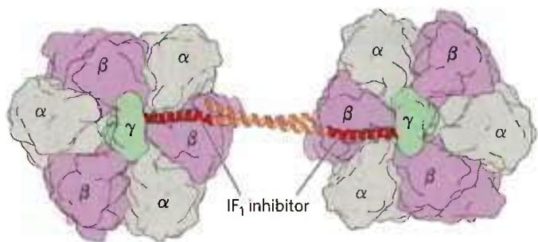  
FIGURE 19-33 Structure of bovine F₁-ATPase in a complex with its regulatory protein IF₁. Two F₁ molecules are viewed here from the N side, as in Figure 19-25b. The inhibitor IF₁ (red) binds to the αβ interface of the subunits in the diphosphate (ADP) conformation (α-ADP and β-ADP), freezing the two F₁ complexes and thereby blocking ATP hydrolysis (and synthesis). (Parts of the IF₁ α-helices that link the two F₁ molecules failed to resolve in the crystals of F₁ and are modeled based on the crystal structure of isolated IF₁.) [Data from PDB ID 10HH, E. Cabezon et al., Nat. Struct. Biol. 10:744, 2003.]

The changes in PDH activity and the COX4-2 content of Complex IV are both mediated by HIF-1, the hypoxia-inducible factor. HIF-1 (another intrinsically disordered protein) accumulates in hypoxic cells and, acting as a transcription factor, triggers increased synthesis of PDH kinase, COX4-2, and a protease that degrades COX4-1. HIF-1 is a master regulator of $O_{2}$ homeostasis. Recall that it also mediates the changes in glucose transport and glycolytic enzymes that produce the Warburg effect, the dependence on glycolysis (not mitochondrial respiration) for ATP production, even in the presence of sufficient oxygen (see Box 14-1).

When these mechanisms for dealing with ROS are insufficient, either due to genetic mutation affecting one of the protective proteins or under conditions of very high rates of ROS production, mitochondrial function is compromised. Mitochondrial damage is thought to be involved in aging, heart failure, certain rare cases of diabetes (described below), and several maternally inherited genetic diseases that affect the nervous system.

## ATP-Producing Pathways Are Coordinately Regulated

The major catabolic pathways have overlapping and concerted regulatory mechanisms that allow them to function together in an economical and self-regulating manner to produce ATP and biosynthetic precursors. The relative concentrations of ATP and ADP control not only the rates of electron transfer and oxidative phosphorylation but also the rates of the citric acid cycle, pyruvate oxidation, and glycolysis (Fig. 19-35). Whenever ATP consumption increases, the rate of electron transfer and oxidative phosphorylation increases. Simultaneously, the rate of pyruvate oxidation via the citric acid cycle increases, increasing the flow of electrons into

FIGURE 19-34 Regulation of gene expression by hypoxia-inducible factor (HIF-1) to reduce ROS formation. Under conditions of low oxygen (hypoxia), HIF-1 is synthesized in greater amounts and acts as a transcription factor, increasing synthesis of the glucose transporter, glycolytic enzymes, pyruvate dehydrogenase kinase (PDH kinase), lactate dehydrogenase, a protease that degrades the cytochrome oxidase subunit COX4-1, and cytochrome oxidase subunit COX4-2. These changes counter the formation of ROS by decreasing the supply of NADH and $\mathrm{FADH}_2$ and making cytochrome oxidase of Complex IV more effective. [Information from D.A.Harris, Bioenergetics at a Glance, p. 36, Blackwell Science, 1995.]

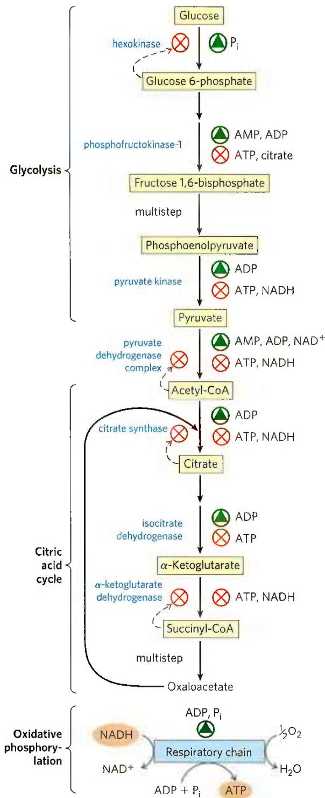  
FIGURE 19-35 Regulation of ATP-producing pathways. This diagram shows the coordinated regulation of glycolysis, pyruvate oxidation, the citric acid cycle, and oxidative phosphorylation by the relative concentrations of ATP, ADP, and AMP, and by NADH. High [ATP] (or low [ADP] and [AMP]) produces low rates of glycolysis, pyruvate oxidation, acetate oxidation via the citric acid cycle, and oxidative phosphorylation. All four pathways are accelerated when the use of ATP and the formation of ADP, AMP, and $\mathsf{P_i}$ increase. The ability of citrate to inhibit both glycolysis and the citric acid cycle reinforces the action of the adenine nucleotide system. In addition, increased [NADH] and [acetyl-CoA] also inhibit the oxidation of pyruvate to acetyl-CoA, and a high [NADH]/[NAD+] ratio inhibits the dehydrogenase reactions of the citric acid cycle (see Fig. 16-18).

the respiratory chain. These events, in turn, can evoke an increased rate of glycolysis, increasing the rate of pyruvate formation. When conversion of ADP to ATP lowers the ADP concentration, acceptor control slows electron transfer and thus oxidative phosphorylation. Glycolysis and the citric acid cycle are also slowed, because ATP is an allosteric inhibitor of the glycolytic enzyme phosphofructokinase-1 (see Fig. 14-23) and of pyruvate dehydrogenase (see Fig. 16-18).

Phosphofructokinase-1 is also inhibited by citrate, the first intermediate of the citric acid cycle. When the cycle is "idling," citrate accumulates within mitochondria, then is transported into the cytosol. When the cytosolic concentrations of both ATP and citrate rise, they produce a concerted allosteric inhibition of phosphofructokinase-1 that is greater than the sum of their individual effects, slowing glycolysis.

## SUMMARY 19.3 Regulation of Oxidative Phosphorylation

\- Oxidative phosphorylation is regulated by cellular energy demands. Intracellular [ADP] and the mass-action ratio [ATP]/([ADP][ $\mathbf{P_i}$ ]) are measures of a cell's energy status.

In hypoxic (oxygen-deprived) cells, a protein inhibitor blocks ATP hydrolysis by the reverse activity of ATP synthase, preventing a drastic drop in [ATP].

The adaptive responses to hypoxia, mediated by HIF-1, slow electron transfer into the respiratory chain and modify Complex IV to act more efficiently under low-oxygen conditions.

■ ATP and ADP concentrations set the rate of electron transfer through the respiratory chain via a series of coordinated controls on respiration, glycolysis, and the citric acid cycle.

## 19.4 Mitochondria in Thermogenesis, Steroid Synthesis, and Apoptosis

Although ATP production is a central role for the mitochondrion, this organelle has other functions that, in specific tissues or under specific circumstances, are also crucial. In adipose tissue, mitochondria generate heat to protect vital organs from low ambient temperature; in the adrenal glands and the gonads, mitochondria are the sites of steroid hormone synthesis; and in most or all tissues, they are key participants in apoptosis (programmed cell death).

## Uncoupled Mitochondria in Brown Adipose Tissue Produce Heat

We noted above that respiration slows when the cell is adequately supplied with ATP. There is a remarkable and instructive exception to this general rule. Most newborn mammals, including humans, have a type of adipose tissue called brown adipose tissue (BAT; p. 852), in which P1 fuel oxidation serves not to produce ATP but to generate heat to keep the newborn warm. This specialized adipose tissue is brown because of the presence of large numbers of mitochondria and thus high concentrations of cytochromes, with heme groups that are strong absorbers of visible light.

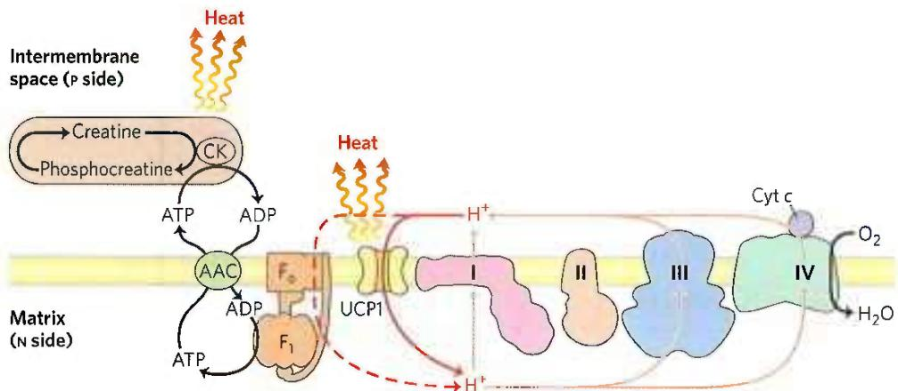  
FIGURE 19-36 Two mechanisms of thermogenesis in mitochondria. UCP1, an uncoupling protein in the mitochondria of brown adipose tissue, causes the energy conserved by proton pumping to be dissipated as heat by providing  
an alternative route for protons to reenter the mitochondrial matrix. A futile cycle in which creatine is phosphorylated by creatine kinase (CK), using ATP and producing ADP transported by the ATP/ADP carrier (AAC), also generates heat.

There are at least two mechanisms of thermogenesis. The mitochondria of brown adipocytes are much like those of other mammalian cells, except in having a unique protein in their inner membrane. Uncoupling protein 1 (UCP1), a long-chain fatty acid/H $^{+}$ symporter, provides a path for protons to return to the matrix without passing through the F $_{0}$ F $_{1}$ complex (Fig. 19-36). P5 As a result of this short-circuiting of protons, the energy of oxidation is not conserved by ATP formation but is dissipated as heat, which contributes to maintaining body temperature. However, UCP1 is only part of the story, and heat generation occurs in mammals even when it is absent. The thermogenic action of UCP1 is supplemented by a futile cycle involving creatine and phosphocreatine (Fig. 19-36). ATP synthesized in the mitochondrial matrix is exported to the irtermembrane space via the adenine nucleotide translocator, an ADP/ATP antiporter. There, the ATP is used to phosphorylate creatine to create phosphocreatine and ADP. The ADP is transported back into the matrix. Hydrolysis of phosphocreatine completes a futile cycle that liberates heat.

Hibernating animals also depend on the activity of uncoupled BAT mitochondria to generate heat during their long dormancy (see Box 17-1). We will return to the role of UCP1 when we discuss the regulation of body mass in Chapter 23 (pp. 867–869).

## Mitochondrial P-450 Monooxygenases Catalyze Steroid Hydroxylations

P1 Mitochondria are the site of biosynthetic reactions that produce steroid hormones, including the sex hormones, glucocorticoids, mineralocorticoids, and vitamin D hormone. These compounds are synthesized from cholesterol or a related sterol in a series of hydroxylations catalyzed by enzymes of the cytochrome P-450 family (see Box 21-1), all of which have a critical heme group (its absorption at 450 nm gives this family its name). In the hydroxylation reactions, one atom of molecular oxygen is incorporated into the substrate and the second is reduced to $H_{2}O$ , making cytochrome P-450 enzymes monooxygenases:

$$
\mathrm{R} - \mathrm{H} + \mathrm{O} _ {2} + \mathrm{NADPH} + \mathrm{H} ^ {+} \longrightarrow \mathrm{R} - \mathrm{OH} + \mathrm{H} _ {2} \mathrm{O} + \mathrm{NADP} ^ {+}
$$

In this reaction, two species are oxidized: NADPH and R—H.

There are dozens of P-450 enzymes, all situated in the inner mitochondrial membrane with their catalytic site exposed to the matrix. Steroidogenic cells are packed with mitochondria specialized for steroid synthesis; the mitochondria are generally larger than those in other tissues and have more extensive and highly convoluted inner membranes (Fig. 19-37).

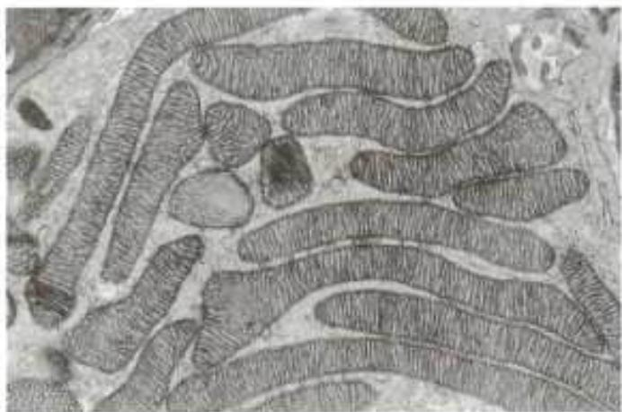  
FIGURE 19-37 Mitochondria of adrenal gland, specialized for steroid synthesis. As seen in this electron micrograph of a thin section of adrenal gland, mitochondria are profuse and have extensive cristae, providing a large surface for the P-450 enzymes of the inner membrane. [Don Fawcett/Science Source]

The path of electron flow in the mitochondrial P-450 system is complex, involving a flavoprotein and an iron-sulfur protein that carry electrons from NADPH to the P-450 heme (Fig. 19-38). All P-450 enzymes have a heme that interacts with $O_{2}$ and a substrate-binding site that confers specificity.

Another large family of P-450 enzymes is found in the endoplasmic reticulum of hepatocytes. These enzymes catalyze reactions similar to the mitochondrial P-450 reactions, but their substrates include a wide variety of hydrophobic compounds, many of which are xenobiotics — compounds not found in nature but synthesized industrially. The P-450 enzymes of the ER have very broad and overlapping substrate specificities. Hydroxylation of the hydrophobic compounds makes them more water-soluble, and they can then be cleared by the kidneys and excreted in urine. Among the substrates for these P-450 oxygenases are many commonly used prescription drugs. Metabolism by P-450 enzymes limits a drug's lifetime in the bloodstream and thus its therapeutic effects. Humans differ in their genetic complement of P-450 enzymes in the ER, as well as in the extent to which certain P-450 enzymes have been induced, such as by a history of ethanol ingestion. In principle, therefore, an individual's genetics and personal history should be considered in determining therapeutic drug doses. In practice, this precise tailoring of dosage is not yet economically feasible, but it may become so.

## Mitochondria Are Central to the Initiation of Apoptosis

Apoptosis, also called programmed cell death, is a process in which individual cells die for the good of the organism, such as in the course of normal embryonic development, and the organism conserves the cells' molecular components (amino acids, nucleotides, and so forth). Apoptosis may be triggered by an external signal, acting at a plasma membrane receptor, or by internal events such as DNA damage, viral infection, oxidative stress from the accumulation of ROS, or other stress such as a heat shock.

P1 Mitochondria play a critical role in triggering apoptosis. When a stressor gives the signal for cell death, one early consequence is an increase in the permeability of the outer mitochondrial membrane, allowing cytochrome c to escape from the intermembrane space into the cytosol (Fig. 19-39). The increased permeability is due to the opening of the permeability transition pore complex (PTPC), a multisubunit protein in the outer membrane; its opening and closing are affected by several proteins that stimulate or suppress apoptosis. When released into the cytosol, cytochrome c interacts with monomers of the protein Apaf-1 (apoptosis protease activating factor-1), causing the formation of an apoptosome composed of seven Apaf-1 and seven cytochrome c molecules. The apoptosome provides the platform on which the proenzyme procaspase-9 is activated to caspase-9, a member of a family of highly specific proteases, called the caspases, involved in apoptosis. These cysteine proteases cleave proteins only on the carboxyl-terminal side of Asp residues, thus the name “caspases.” Caspase-9 initiates a cascade of proteolytic activations, with one caspase activating a second, and this in turn activating a third, and so forth (see Fig. 12-42). Note that this role of cytochrome c in apoptosis is a clear case of “moonlighting,” in that one protein plays two very different roles in the cell (see Box 16-1).

## SUMMARY 19.4 Mitochondria in Thermogenesis, Steroid Synthesis, and Apoptosis

In the brown adipose tissue of newborns, electron transfer is uncoupled from ATP synthesis, and the energy of fuel oxidation is dissipated as heat. Hibernating animals use this strategy to avoid freezing.

■ Hydroxylation reaction steps in the synthesis of steroid hormones in steroidogenic tissues (adrenal gland, gonads, liver, and kidney) take place in specialized mitochondria. Key reactions are catalyzed by a family of P-450 monooxygenases.

  
FIGURE 19-38 Path of electron flow in mitochondrial cytochrome P-450 reactions in adrenal gland. Two electrons are transferred from NADPH to the FAD-containing flavoprotein adrenodoxin reductase, which passes the  
electrons, one at a time, to adrenodoxin, a small, soluble 2Fe-2S protein. Adrenodoxin passes single electrons to the cytochrome P-450 hydroxylase, which interacts directly with $\mathrm{O}_2$ and the substrate (R—H) to form the products, $\mathrm{H}_2\mathrm{O}$ and R—OH.

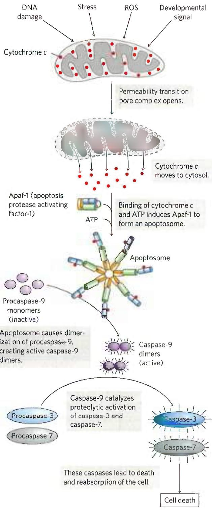  
FIGURE 19-39 Role of cytochrome c in apoptosis. Cytochrome c is a small, soluble, mitochondrial protein, located in the intermembrane space, that carries electrons between Complex III and Complex IV during respiration. In a completely separate role, as outlined here, it acts as a trigger for apoptosis by stimulating the activation of a family of proteases called caspases. [Information from S. J. Riedl and G. S. Salvesen, Nat. Rev. Mol. Cell Biol. 8:409, 2007, Fig. 3.]  
■ Mitochondria play a central role in apoptosis. Mitochondrial cytochrome c, released into the cytosol, participates in activation of caspase-9, one of the proteases involved in apoptosis.

## 19.5 Mitochondrial Genes: Their Origin and the Effects of Mutations

Mitochondria contain their own genome, a circular, double-stranded DNA (mtDNA) molecule. Each of the hundreds or thousands of mitochondria in a typical cell has about five copies of this genome. The human mitochondrial chromosome (Fig. 19-40) contains 37 genes (16,569 bp), including 13 that encode subunits of proteins of the respiratory chain (Table 19-6); the remaining genes code for rRNA and tRNA molecules essential to the protein-synthesizing machinery of mitochondria. To synthesize these 13 protein subunits, mitochondria have their own ribosomes, distinctly different from those in the cytoplasm. The great majority of mitochondrial proteins—about 1,200 different types—are encoded by nuclear genes, synthesized on cytoplasmic ribosomes, then imported into and assembled in the mitochondria (Chapter 27).

## Mitochondria Evolved from Endosymbiotic Bacteria

The existence of mitochondrial DNA, ribosomes, and tRNAs supports the theory of the endosymbiotic origin of mitochondria (see Fig. 1-37), which holds that the first organisms capable of aerobic metabolism, including respiration-linked ATP production, were bacteria. P2 Primitive eukaryotes that lived anaerobically (by fermentation) acquired the ability to carry out oxidative phosphorylation when they established a symbiotic relationship with bacteria living in their cytosol. After a long period of evolution and the movement of many bacterial

<table><tr><td colspan="3">TABLE 19-6 Respiratory Proteins Encoded by Mitochondrial Genes in Humans</td></tr><tr><td>Complex</td><td>Number of subunits</td><td>Number of subunits encoded by mtDNA</td></tr><tr><td>I NADH dehydrogenase</td><td>45</td><td>7</td></tr><tr><td>II Succinate dehydrogenase</td><td>4</td><td>0</td></tr><tr><td>III Ubiquinone:cytochrome c oxidoreductase</td><td>11</td><td>1</td></tr><tr><td>IV Cytochrome oxidase</td><td>13</td><td>3</td></tr><tr><td>V ATP synthase</td><td>8</td><td>2</td></tr></table>

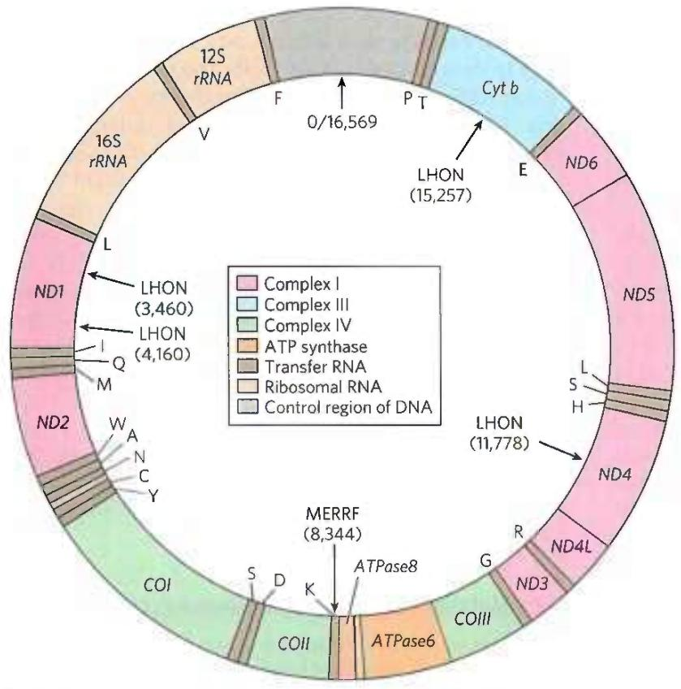

genes into the nucleus of the "host" eukaryote, the endosymbiotic bacteria eventually became mitochondria.

This hypothesis presumes that early free-living bacteria had the enzymatic machinery for oxidative phosphorylation. And it predicts that their modern bacterial descendants must have respiratory chains closely similar to those of modern eukaryotes. They do. Aerobic bacteria carry out NAD-linked electron transfer from substrates to $O_{2}$ , coupled to the phosphorylation of cytosolic ADP. The dehydrogenases are located in the bacterial cytosol, and the respiratory chain in the plasma membrane. The electron carriers translocate protons outward across the plasma membrane as electrons are transferred to $O_{2}$ . Bacteria such as E. coli have $F_{0}F_{1}$ complexes in their plasma membranes; the $F_{1}$ portion protrudes into the cytosol and catalyzes ATP synthesis from ADP and $P_{i}$ as protons flow back into the cell through the proton channel of $F_{0}$ .

The respiration-linked extrusion of protons across the bacterial plasma membrane also provides the driving force for other processes. Certain bacterial transport systems bring about uptake of extracellular nutrients (lactose, for example) against a concentration gradient, in symport with protons. And the rotary motion of bacterial flagella is provided by "proton turbines," molecular rotary motors driven not by ATP but directly by the transmembrane electrochemical potential generated by respiration-linked proton pumping (Fig. 19-41). P2 It seems likely that the chemiosmotic mechanism evolved early, before the emergence of eukaryotes.

FIGURE 19-40 Mitochondrial genes and mutations. A map of human mitochondrial DNA, showing the genes that encode proteins of Complex I, the NADH dehydrogenase (ND1 to ND6); the cytochrome b of Complex III (Cyt b); the subunits of cytochrome oxidase, Complex IV (COI to COIII); and two subunits of ATP synthase (ATPase6 and ATPase8). The colors of the genes correspond to those of the complexes shown in Figure 19-7. Also included here are the genes for ribosomal RNAs (rRNA) and for some mitochondrion-specific transfer RNAs; tRNA specificity is indicated by the one-letter codes for amino acids. Arrows indicate the positions of mutations that cause Leber hereditary optic neuropathy (LHON) and myoclonic epilepsy with ragged-red fibers (MERRF) syndrome. Numbers in parentheses indicate the position of the altered nucleotides (nucleotide 1 is at the top of the circle, and numbering proceeds counterclockwise). [Information from M. A. Morris, J. Clin. Neurophthalmol. 10:159, 1990.]

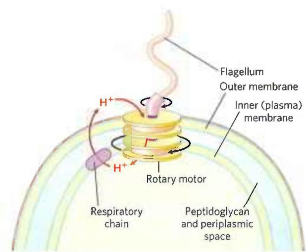  
FIGURE 19-41 Rotation of bacterial flagella by proton-motive force. The shaft and rings at the base of the flagellum make up a rotary motor that has been called a "proton turbine." Protons ejected by electron transfer flow back into the cell through the turbine, causing rotation of the shaft of the flagellum. This motion differs fundamentally from the motion of muscle and of eukaryotic flagella and cilia, for which ATP hydrolysis is the energy source.

## Mutations in Mitochondrial DNA Accumulate throughout the Life of the Organism

The respiratory chain is the major producer of reactive oxygen species in cells, so mitochondrial contents, including the mitochondrial genome, suffer the greatest exposure

(b)

to, and damage by, ROS. Moreover, the mitochondrial DNA replication system is less effective than the nuclear system at correcting mistakes made during replication and at repairing DNA damage. As a consequence, defects in mtDNA accumulate over time. One theory of aging is that this gradual accumulation of defects is the primary cause of many of the “symptoms” of aging, which include, for example, progressive weakening of skeletal and heart muscle.

A unique feature of mitochondrial inheritance is the variation among individual cells, and between one individual organism and another, in the effects of a mtDNA mutation. A typical cell has hundreds or thousands of mitochondria, each with multiple copies of its own genome (Fig. 19-2b). Animals inherit essentially all of their mitochondria from the female parent. Eggs are large and contain $10^{5}$ or $10^{6}$ mitochondria; sperm are much smaller and contain far fewer mitochondria—perhaps 100 to 1,000. Furthermore, there is an active mechanism for targeting sperm-derived mitochondria for degradation in the fertilized egg. Just after fertilization, maternal phagosomes migrate to the site of sperm entry, engulf sperm mitochondria, and degrade them.

Suppose that, in a female organism, damage to one mitochondrial genome occurs in a germ cell from which oocytes develop, such that the germ cell contains mainly mitochondria with wild-type genes but one mitochondrion with a mutant gene. During the course of oocyte maturation, as this germ cell and its descendants repeatedly divide, the defective mitochondrion replicates and its progeny, all defective, are randomly distributed to daughter cells. Eventually, the mature egg cells contain different proportions of the defective mitochondria. When an egg cell is fertilized and undergoes the many divisions of embryonic development, the resulting somatic cells differ in their proportion of mutant mitochondria (Fig. 19-42a). This heteroplasmy (in contrast to homoplasmy, in which every mitochondrial genome in every cell is the same) results in mutant phenotypes of varying degrees of severity. Cells (and tissues) containing mostly wild-type mitochondria have the wild-type phenotype; they are essentially normal. Other heteroplasmic cells have intermediate phenotypes, some almost normal, others (with a high proportion of mutant mitochondria) abnormal (Fig. 19-42b). If the abnormal phenotype is associated with a disease, individuals with the same mtDNA mutation may have disease symptoms of differing severity—depending on the number and distribution of affected mitochondria.

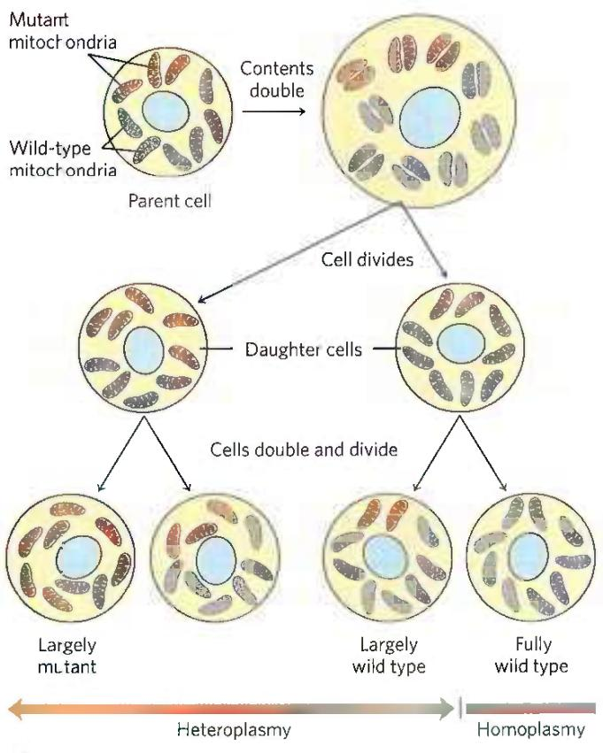

## Some Mutations in Mitochondrial Genomes Cause Disease

About 1 in 5,000 people have a disease-causing mutation in a mitochondrial protein that reduces the cell's capacity to produce ATP. A growing number of these diseases have been attributed to mutations in mitochondrial genes. Some tissues and cell types—neurons,

FIGURE 19-42 Heteroplasmy in mitochondrial genomes. (a) When a mature egg cell is fertilized, all of the mitochondria in the resulting diploid cell (zygote) are maternal; none come from the sperm. If some fraction of the maternal mitochondria have a mutant gene, the random distribution of mitochondria during subsequent cell divisions yields some daughter cells with mostly mutant mitochondria, some with mostly wild-type mitochondria, and some in between. Thus daughter cells show a varying degree of heteroplasmy. (b) Different degrees of heteroplasmy produce different cellular phenotypes. This section of human muscle tissue is from an individual with defective cytochrome oxidase. The cells were stained so that wild-type cells are blue and cells with mutant cytochrome oxidase are brown. As the micrograph shows, different cells in the same tissue are affected to different degrees by the mitochondrial mutation. [(b) Courtesy of Rob Taylor. Reprinted with permission from R. W. Taylor and D. M. Turnbull, Nat. Rev. Genet. 6:389, 2005, Fig. 2a.]

myocytes of both skeletal and cardiac muscle, and $\beta$ cells of the pancreas—are less able than others to tolerate lowered ATP production and are therefore more affected by mutations in mitochondrial proteins.

A group of genetic diseases known as the mitochondrial encephalomyopathies affect primarily the brain and skeletal muscle. These diseases are invariably inherited from the mother, because, as noted above, a developing embryo derives all its mitochondria from the egg. The rare disease Leber hereditary optic neuropathy (LHON) affects the central nervous system, including the optic nerves, causing bilateral loss of vision in early adulthood. A single base change in the mitochondrial gene ND4 (Fig. 19-40) changes an Arg residue to a His residue in a polypeptide of Complex I, and the result is mitochondria partially defective in electron transfer from NADH to ubiquinone. Although these mitochondria can produce some ATP by electron transfer from succinate, they apparently cannot supply sufficient ATP to support the very active metabolism of neurons, including the optic nerve. A single base change in the mitochondrial gene for cytochrome b, a component of Complex III, also produces LHON, demonstrating that the pathology results from a general reduction of mitochondrial function, not specifically from a defect in electron transfer through Complex I.

A mutation in the mitochondrial gene ATP6 affects the proton pore in ATP synthase, leading to low rates of ATP synthesis while leaving the respiratory chain intact. Oxidative stress due to the continued supply of electrons from NADH increases the production of ROS, and the damage to mitochondria caused by ROS sets up a vicious cycle. Half of individuals with this mutant gene die within days or months of birth.

Myoclonic epilepsy with ragged-red fibers (MERRF) syndrome is caused by a mutation in the mitochondrial gene that encodes a tRNA specific for lysine (tRNA $^{Lys}$ ). This disease, characterized by uncontrollable muscular jerking, results from defective production of several of the proteins that require mitochondrial tRNAs for their synthesis. Skeletal muscle fibers of individuals with MERRF syndrome have abnormally shaped mitochondria that sometimes contain paracrystalline structures (Fig. 19-43). Other mutations in mitochondrial genes are believed to be responsible for the progressive muscular weakness that characterizes mitochondrial myopathy and for enlargement and deterioration of the heart muscle in hypertrophic cardiomyopathy.

If a prospective mother is known to carry a pathogenic mitochondrial gene, the technique of mitochondrial donation can circumvent the passage of that mutant gene to her offspring. A prospective mother's nuclear genes are microscopically transplanted into an enucleated ovum from a donor with healthy mitochondria, then the ovum is fertilized in vitro and the resulting embryo is transplanted into the mother's uterus. This and similar "three-parent baby" procedures, which were approved in the United Kingdom in 2015, raise ethical issues that are being vigorously debated.

  
FIGURE 19-43 Paracrystalline inclusions in MERRF syndrome mitochondrion. Electron micrograph of an abnormal mitochondrion from the muscle of an individual with MERRF syndrome, showing the paracrystalline protein inclusions sometimes present in the mutant mitochondria. [From Regionalized Pathology Correlates with Augmentation of mtDNA Copy Numbers in a Patient with Myoclonic Epilepsy with Ragged-Red Fibers (MERRF-Syndrome). PLOS ONE, Anja Brinckmann et al., October 20, 2010. https://doi.org/10.1371/journal.pone.0013513]

Mitochondrial disease can also result from mutations in any of the \~1,200 nuclear genes that encode mitochondrial proteins. For example, a mutation in one of the nuclear-encoded proteins of Complex IV, COX6B1, results in severe defects in brain development and thickened walls of the heart muscle. Other nuclear genes encode proteins essential for the assembly of mitochondrial complexes. Mutations in these genes can also lead to serious mitochondrial disease.

## A Rare Form of Diabetes Results from Defects in the Mitochondria of Pancreatic $\beta$ Cells

The insulin so important to glucose homeostasis in all humans is produced and exported from pancreatic $\beta$ cells. Insulin export hinges on the ATP concentration in those cells. When blood glucose is high, $\beta$ cells take up glucose and oxidize it by glycolysis and the citric acid cycle, raising [ATP] above a threshold level (Fig. 19-44). When [ATP] exceeds this threshold, an ATP-gated K $^{+}$ channel in the plasma membrane closes, depolarizing the membrane and triggering insulin release (see Fig. 23-24).

Normal insulin release can be compromised in several ways. Pancreatic $\beta$ cells with defects in any aspect of oxidative phosphorylation may not be able to increase [ATP] above this threshold, and the resulting failure of insulin release effectively produces diabetes. For example, defects in the gene for glucokinase, the hexokinase IV isozyme present in $\beta$ cells, lead to a rare form of diabetes called MODY2 (maturity onset diabetes of the young); low glucokinase activity prevents the generation of ATP concentrations above the threshold needed to trigger insulin secretion. Mutations in the mitochondrial tRNA $^{Lys}$ or tRNA $^{Leu}$ genes also compromise mitochondrial ATP production by limiting the expression of electron transfer components encoded in the mitochondrial DNA. Type 2 diabetes mellitus is common among individuals with these defects (although such cases make up a very small fraction of all cases of diabetes).

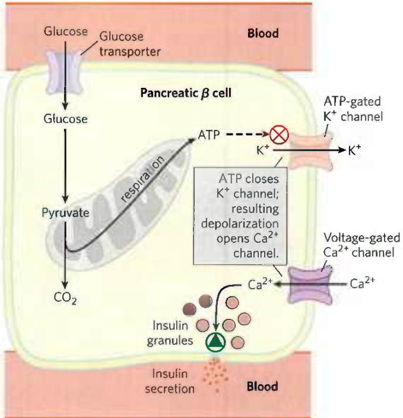  
FIGURE 19-44 A mitochondrial defect prevents insulin secretion. In the normal situation, as depicted here, when the blood glucose level rises, production of ATP in $\beta$ cells increases. ATP, by blocking $\mathsf{K}^+$ channels, cepolarizes the plasma membrane and thus opens voltage-gated $\mathrm{Ca^{2+}}$ channels. The resulting influx of $\mathrm{Ca^{2+}}$ triggers exocytosis of insulin-containing secretory vesicles, releasing insulin. When oxidative phosphorylation in $\beta$ cells is defective, [ATP] is never sufficient to trigger this process, and insulin is not released.

When nicotinamide nucleotide transhydrogenase, which is part of the mitochondrial defense against ROS (Fig 19-18), is genetically defective, the accumulation of ROS damages mitochondria, slowing ATP production and blocking insulin release by $\beta$ cells (Fig. 19-44). Damage caused by ROS, including damage to mtDNA, may also underlie other human diseases; there is some evidence for its involvement in Alzheimer, Parkinson, and Huntington diseases and in heart failure, as well as in aging.

## SUMMARY 19.5 Mitochondrial Genes: Their Origin and the Effects of Mutations

A small proportion of human mitochondrial proteins, 13 in all, are encoded by the mitochondrial genome and synthesized in mitochondria. About 1,200 mitochondrial proteins are encoded by nuclear genes and imported into mitochondria after their synthesis.

■ Mitochondria arose from aerobic bacteria that entered into an endosymbiotic relationship with ancestral eukaryotes.

■ Mutations in the mitochondrial genome accumulate over the life of the organism. Mutations in nuclear or mitochondrial genes that encode components of the respiratory chain, ATP synthase, and the ROS-scavenging system, and even in tRNA genes, can cause a variety of human diseases, which often most severely affect muscle, heart, pancreatic $\beta$ cells, and brain.

It is possible to combine the mitochondria from one woman with the nuclear genes of another to create an ovum free of a mutation that would have led to a mitochondrial disease.

■ Mitochondrial defects in pancreatic $\beta$ cells that limit ATP production when glucose levels are high can compromise normal insulin release and give rise to a form of type 2 diabetes.

## KEY TERMS

Terms in bold are defined in the glossary.

chemiosmotic theory 659  
cristae 660  
respiratory chain 661  
flavoprotein 662  
reducing equivalent 662  
ubiquinone (coenzyme Q, Q) 662  
cytochromes 663  
iron-sulfur protein 664  
Rieske iron-sulfur protein 664  
Complex I 665  
NADH dehydrogenase 666  
vectorial 666  
Complex II 667  
succinate dehydrogenase 667  
reactive oxygen species (ROS) 668  
superoxide radical $(^{*}\mathrm{O}_{2}^{-})$ 668  
Complex III 668  
cytochrome $bc_{1}$ complex 668  
Q cycle 668  
Complex IV 669

cytochrome oxidase 669  
respirasome 671  
proton-motive force 673  
ATP synthase 675 $\mathbf{F}_1$ ATPase 677  
c ring 680  
rotational catalysis 680  
binding-change model 681  
P/O ratio 682 $\mathrm{P / 2e^{-}}$ ratio 682  
malate-aspartate shuttle 684  
glycerol 3-phosphate shuttle 684  
acceptor control 687  
mass-action ratio (Q) 687  
brown adipose tissue (BAT) 690  
uncoupling protein 1 (UCP1) 690  
cytochrome P-450 690  
xenobiotics 691  
apoptosis 691  
apoptosome 691  
caspase 691  
heteroplasmy 694  
homoplasmy 694

## PROBLEMS

1. Oxidation-Reduction Reactions Complex I, the NADH dehydrogenase complex of the mitochondrial respiratory chain, promotes the following series of oxidation-reduction reactions, in which $Fe^{3+}$ and $Fe^{2+}$ represent the iron in iron-sulfur centers, Q is ubiquinone, $QH_{2}$ is ubiquinol, and E is the enzyme:

(1) $\mathrm{NADH} + \mathrm{H}^{+} + \mathrm{E - FMN}\longrightarrow \mathrm{NAD}^{+} + \mathrm{E - FMNH}_{2}$

(2) $\mathrm{E - FMNH_2 + 2Fe^{3 + } \longrightarrow E - FMN + 2Fe^{2 + } + 2H^+}$

(3) $2\mathrm{Fe}^{2+} + 2\mathrm{H}^{+} + \mathrm{Q}\longrightarrow 2\mathrm{Fe}^{3+} + \mathrm{QH}_{2}$

Sum: $\mathrm{NADH} + \mathrm{H}^{+} + \mathrm{Q}\longrightarrow \mathrm{NAD}^{+} + \mathrm{QH}_{2}$

For each of the three reactions catalyzed by Complex I, identify (a) the electron donor, (b) the electron acceptor, (c) the conjugate redox pair, (d) the reducing agent, and (e) the oxidizing agent.

2. All Parts of Ubiquinone Have a Function In electron transfer, only the quinone portion of ubiquinone undergoes oxidation-reduction; the isoprenoid side chain remains unchanged. What is the function of this chain?

3. Use of FAD Rather Than $\mathrm{NAD^{+}}$ in Succinate Oxidation All the dehydrogenases of glycolysis and the citric acid cycle use $\mathrm{NAD^{+}}$ ( $E^{\prime \circ}$ for $\mathrm{NAD^{+} / NADH}$ is $-0.32\mathrm{V}$ ) as electron acceptor except succinate dehydrogenase, which uses covalently bound FAD ( $E^{\prime \circ}$ for $\mathrm{FAD^{+} / FADH_{2}}$ in this enzyme is $0.050\mathrm{V}$ ). Suggest why FAD is a more appropriate electron acceptor than $\mathrm{NAD^{+}}$ in the dehydrogenation of succinate, based on the $E^{\prime \circ}$ values of fumarate/succinate ( $E^{\prime \circ} = 0.031\mathrm{V}$ ), $\mathrm{NAD^{+} / NADH}$ , and the succinate dehydrogenase $\mathrm{FAD / FADH_{2}}$ .

4. Degree of Reduction of Electron Carriers in the Respiratory Chain Mitochondrial conditions determine the degree of reduction of each carrier in the respiratory chain. For example, when NADH and $O_{2}$ are abundant, the steady-state degree of reduction of the carriers decreases as electrons pass from the substrate to $O_{2}$ . When electron transfer is blocked, the carriers before the block become more reduced and those beyond the block become more oxidized (see Fig. 19-6). For each of the mitochondrial conditions listed, predict the state of oxidation of ubiquinone and cytochromes b, c₁, c, and $a + a_{3}$ .

(a) Abundant NADH and $O_{2}$ , but cyanide added

(b) Abundant NADH, but $O_{2}$ exhausted

(c) Abundant $\mathrm{O}_2$ , but NADH exhausted

(d) Abundant NADH and $O_{2}$

5. Effect of Rotenone and Antimycin A on Electron Transfer Rotenone, a toxic natural product from plants, strongly inhibits NADH dehydrogenase of insect and fish mitochondria. Antimycin A, a toxic antibiotic, strongly inhibits the oxidation of ubiquinol.

(a) Explain why rotenone ingestion is lethal to some insect and fish species.

(b) Explain why antimycin A is a poison.

(c) Given that rotenone and antimycin A are equally effective in blocking their respective sites in the electron-transfer chain, which would be a more potent poison? Explain.

6. Uncouplers of Oxidative Phosphorylation In normal mitochondria, the rate of electron transfer is tightly coupled to the demand for ATP. When the rate of ATP use is relatively low, the rate of electron transfer is low; when demand for ATP increases, the electron-transfer rate increases. Under these conditions of tight coupling, the number of ATP molecules produced per atom of oxygen consumed when NADH is the electron donor—the P/O ratio—is about 2.5.

(a) Predict the effect of a relatively low and a relatively high concentration of uncoupling agent on the rate of electron transfer and the P/O ratio.

(b) Ingestion of uncouplers causes profuse sweating and an increase in body temperature. Explain this phenomenon in molecular terms. What happens to the P/O ratio in the presence of uncouplers?

(c) Physicians used to prescribe the uncoupler 2,4-dinitrophenol (DNP) as a weight-reducing drug. How could this agent, in principle, serve as a weight-reducing aid? Physicians no longer prescribe uncoupling agents, because some deaths occurred following their use. Why might the ingestion of uncouplers cause death?

7. Effects of Valinomycin on Oxidative Phosphorylation When investigators add the antibiotic valinomycin (see Fig. 11-43) to actively respiring mitochondria, several things happen: the yield of ATP decreases, the rate of $\mathrm{O}_2$ consumption increases, heat is released, and the pH gradient across the inner mitochondrial membrane increases. Does valinomycin act as an uncoupler or as an inhibitor of oxidative phosphorylation? Explain the experimental observations in terms of the antibiotic's ability to transfer $\mathbf{K}^{+}$ ions across the inner mitochondrial membrane.

8. Cellular ADP Concentration Controls ATP Formation Although ATP synthesis requires both ADP and $P_{i}$ , the rate of synthesis depends mainly on the concentration of ADP, not $P_{i}$ . Why?

9. Reactive Oxygen Species Describe the role played by superoxide dismutase in ameliorating the effects of reactive oxygen species.

10. How Many Protons in a Mitochondrion? Electron transfer translocates protons from the mitochondrial matrix to the external medium, establishing a pH gradient across the inner membrane (outside more acidic than inside). The tendency of protons to diffuse back into the matrix is the driving force for ATP synthesis by ATP synthase. During oxidative phosphorylation by a suspension of mitochondria in a medium of pH 7.4, the measured pH of the matrix is 7.7.

(a) Calculate $[H^{+}]$ in the external medium and in the matrix under these conditions.

(b) What is the outside-to-inside ratio of $[H^{+}]$ ? How much energy for ATP synthesis is available in this concentration difference. (Hint: See Eqn 11-4, p. 392.)

(c) Calculate the number of protons in a respiring liver mitochondrion, assuming its inner matrix compartment is a sphere of diameter $1.5 \mu m$ .

(d) From these data, is the pH gradient alone sufficient to generate ATP?

(e) If not, suggest how the necessary energy for synthesis of ATP arises.

11. Rate of ATP Turnover in Rat Heart Muscle Rat heart muscle operating aerobically fills more than 90% of its ATP needs by oxidative phosphorylation. Each gram of tissue consumes $O_{2}$ at the rate of 10.0 $\mu$ mol/min, with glucose as the fuel source.

(a) Calculate the rate at which the heart muscle consumes glucose and produces ATP.

(b) For a steady-state ATP concentration of 5.0 $\mu$ mol/g of heart muscle tissue, calculate the time required (in seconds) to completely turn over the cellular pool of ATP. What does this result indicate about the need for tight regulation of ATP production? (Note: Concentrations are expressed as micromoles per gram of muscle tissue because the tissue is mostly water.)

12. Rate of ATP Breakdown in Insect Flight Muscle ATP production in the flight muscle of the fly Lucilia sericata results almost exclusively from oxidative phosphorylation. During flight, maintaining an ATP concentration of 7.0 $\mu$ mol/g of flight muscle requires 187 mL of $O_{2}/h\cdot g$ of body weight. Assuming that flight muscle makes up 20% of the fly's weight, calculate the rate at which the flight-muscle ATP pool turns over. How long would the reservoir of ATP last in the absence of oxidative phosphorylation? Assume that the glycerol 3-phosphate shuttle transfers the reducing equivalents and that $O_{2}$ is at 25 °C and 101.3 kPa (1 atm).

$[4-^{3}H]NADH$  

13. High Blood Alanine Level Associated with Defects in Oxidative Phosphorylation Most individuals with genetic defects in oxidative phosphorylation have relatively high concentrations of alanine in their blood. Explain this in biochemical terms.

14. Compartmentalization of Citric Acid Cycle Components Isocitrate dehydrogenase is found only in mitochondria, but malate dehydrogenase is found in both the cytosol and mitochondria. What is the role of cytosolic malate dehydrogenase?

15. Transmembrane Movement of Reducing Equivalents Under aerobic conditions, extramitochondrial NADH must undergo oxidation by the mitochondrial respiratory chain. Consider a preparation of rat hepatocytes containing mitochondria and all the cytosolic enzymes. After the introduction of $[4-^{3}H]$ NADH, radioactivity soon appears in the mitochondrial matrix. Conversely, no radioactivity appears in the matrix after the introduction of $[7-^{14}C]$ NADH. What do these observations reveal about the oxidation of extramitochondrial NADH by the respiratory chain?

16. NAD Pools and Dehydrogenase Activities Although both pyruvate dehydrogenase and glyceraldehyde 3-phosphate dehydrogenase use $\mathrm{NAD^{+}}$ as their electron acceptor, the two enzymes do not compete for the same cellular NAD pool. Why?

17. The Malate- $\alpha$ -Ketoglutarate Transport System n-Butylmalonate inhibits the transport system that conveys malate and $\alpha$ -ketoglutarate across the inner mitochondrial membrane (see Fig. 19-31). Suppose you add n-butylmalonate to an aerobic suspension of kidney cells using exclusively glucose as fuel. Predict the effect of this inhibitor on (a) glycolysis, (b) oxygen consumption, (c) lactate formation, and (d) ATP synthesis.

18. Time Scales of Regulatory Events in Mitochondria Compare the likely time scales for the adjustments in respiratory rate caused by (a) increased [ADP] and (b) reduced $pO_{2}$ . What accounts for the difference?

19. The Pasteur Effect When investigators add $O_{2}$ to an anaerobic suspension of cells consuming glucose at a high rate, the rate of glucose consumption declines greatly as the cells consume the $O_{2}$ , and accumulation of lactate ceases. This effect, first observed by Louis Pasteur in the 1860s, is characteristic of most cells capable of both aerobic and anaerobic glucose catabolism.

(a) Why does the accumulation of lactate cease after the addition of $O_{2}$ ?

(b) Why does the presence of $O_{2}$ decrease the rate of glucose consumption?

(c) How does the onset of $O_{2}$ consumption slow down the rate of glucose consumption? Explain in terms of specific enzymes.

20. Respiration-Deficient Yeast Mutants and Ethanol Production Researchers can produce respiration-deficient yeast mutants (p $^{-}$ ; “petites”) from wild-type parents by treatment with mutagenic agents. The mutants lack cytochrome oxidase, a deficit that markedly affects their metabolic behavior. One striking effect is that fermentation is not suppressed by O $_{2}$ —that is, the mutants do not experience the Pasteur effect (see Problem 19). Some companies are very interested in using these mutants to ferment wood chips to ethanol for energy use. Why does the absence of cytochrome oxidase eliminate the Pasteur effect? Explain the advantages of using these mutants rather than wild-type yeast for large-scale ethanol production.

21. Mitochondrial Disease and Cancer Mutations in the genes that encode certain mitochondrial proteins are associated with a high incidence of some types of cancer. How might defective mitochondria lead to cancer?

22. Variable Severity of a Mitochondrial Disease Different individuals with a disease caused by the same specific defect in the mitochondrial genome may have symptoms ranging from mild to severe. Explain why.

23. Diabetes as a Consequence of Mitochondrial Defects Glucokinase is essential in the metabolism of glucose in pancreatic $\beta$ cells. Humans with two defective copies of the glucokinase gene exhibit a severe, neonatal diabetes, whereas those with only one defective copy of the gene have a much milder form of the disease (maturity onset diabetes of the young, MODY2). Explain this difference in terms of the biology of the $\beta$ cell.

24. Effects of Mutations in Mitochondrial Complex II Single nucleotide changes in the gene for succinate dehydrogenase (Complex II) are associated with midgut carcinoid tumors. Suggest a mechanism to explain this observation.

## DATA ANALYSIS PROBLEM

25. Membrane Fluidity and Respiration Rate The mitochondrial electron transfer complexes and the $F_{0}F_{1}$ ATP synthase are embedded in the inner mitochondrial membrane in eukaryotes and in the inner membrane of bacteria. Electrons are shuttled between complexes in part by coenzyme Q, or ubiquinone, a factor that migrates within the membrane. Jay Keasling and coworkers explored the effect of membrane fluidity on rates of respiration in E. coli.

E. coli naturally adjusts its membrane lipid content to maintain membrane fluidity at different temperatures. Workers in the Keasling lab bioengineered an E. coli strain to allow them to control expression of the enzyme FabB, which catalyzes the limiting step in the synthesis of unsaturated fatty acids in E. coli.

(a) How does the content of unsaturated fatty acids affect membrane fluidity?

(b) The researchers were able to modulate the content of unsaturated fatty acids in the membrane lipid from 15% to 80%. They did not try to completely block synthesis of unsaturated fatty acids to extend the experimental range in the membrane to 0%. Why not?

(c) When the cells were grown under aerobic conditions, the researchers found that bacterial growth rate increased as the concentration of unsaturated fatty acids in the membrane increased. However, when oxygen was very limited, the unsaturated fatty acid content of the membrane had no effect on growth rate. How might you explain this observation?

(d) The researchers measured rates of respiration, finding a strong correlation between those rates and the fraction of membrane fatty acids that was unsaturated. When the unsaturated fatty acid content of the membranes was kept low, the cells accumulated pyruvate and lactate. Explain these observations.

(e) Next, they measured rates of diffusion of membrane phospholipids and ubiquinone in vesicles derived from E. coli membranes. The diffusion rates increased as a function of the content of unsaturated fatty acids. These measured rates were consistent with simulations carried out to model the effects of ubiquinone diffusion on respiration. What overall conclusion can be drawn from this work?

## Reference

Budin, I, T. de Rond, Y. Chen, L.J.G. Chan, C.J. Petzold, and J.D. Keasling. 2018. Viscous control of cellular respiration by membrane lipid composition. Science 362:1186–1189.

