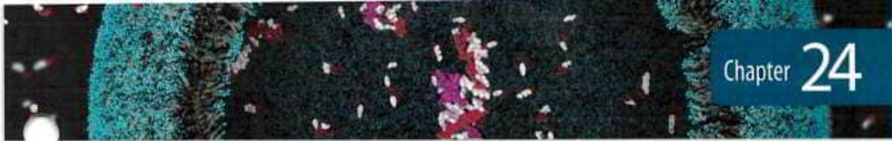

# 第23章 Information Pathways

<!-- 章节边界按正文内容恢复；原始 MinerU 内容保留如下。 -->

# INFORMATION PATHWAYS

PART OUTLINE

24 Genes and Chromosomes 885

25 DNA Metabolism 914

26 RNA Metabolism 960

27 Protein Metabolism 1005

28 Regulation of Gene Expression 1054

The third and final part of this book explores the biochemical mechanisms underlying the apparently contradictory requirements for both genetic continuity and the evolution of living organisms. What is the molecular nature of genetic material? How is genetic information transmitted from one generation to the next with high fidelity? How do the rare changes in genetic material that are the raw material of evolution arise? How is genetic information ultimately expressed in the amino acid sequences of the astonishing variety of protein molecules in a living cell?

Today's understanding of information pathways has arisen from the convergence of genetics, physics, and chemistry in modern biochemistry. This convergence was epitomized by the discovery of the double-helical structure of DNA, postulated by James Watson and Francis Crick in 1953. Genetic theory contributed the concept of coding by genes. Physics permitted the determination of molecular structure by x-ray diffraction analysis. Chemistry revealed the composition of DNA. The profound impact of the Watson-Crick hypothesis arose from its ability to account for a wide range of observations derived from studies in these diverse disciplines.

This discovery revolutionized our understanding of the structure of DNA and inevitably stimulated questions about its function. The double-helical structure itself clearly suggested how DNA might be copied so that the information it contains can be transmitted from one generation to the next. Clarification of how the information in DNA is converted into functional proteins came with the discoveries of messenger RNA and transfer RNA and with the deciphering of the genetic code.

These and other major advances gave rise to the central dogma of molecular biology, comprising the three major processes in the cellular utilization of genetic information. The first is replication, the copying of parental DNA to form daughter DNA molecules with identical nucleotide sequences. The second is transcription, the process by which parts of the genetic message encoded in DNA are copied precisely into RNA. The third is translation, whereby the genetic message encoded in messenger RNA is translated on the ribosomes into a polypeptide with a particular sequence of amino acids.

  
In bacteria, transcription and translation are tightly coupled such that ribosomes are in direct contact with RNA polymerases. The mRNA is translated as soon as it is synthesized. The overall complex has been given the name expressome.

Part III explores these and related processes. In Chapter 24 we examine the structure, topology, and packaging of chromosomes and genes. The processes underlying the central dogma are elaborated in Chapters 25 through 27. Finally, in Chapter 28, we turn to regulation, examining how the expression of genetic information is controlled.

A major theme running through these chapters is the added complexity inherent in the biosynthesis of macromolecules that contain information. Assembling nucleic acids and proteins with particular sequences of nucleotides and amino acids represents nothing less than preserving the faithful expression of the template upon which life itself is based. We might expect the formation of phosphodiester bonds in DNA or peptide bonds in proteins to be a trivial feat for cells, given the arsenal of enzymatic and chemical tools described in Part II. However, the framework of patterns and rules established in our examination of metabolic pathways thus far must be enlarged considerably to take into account molecular information. Bonds must be formed between particular subunits in informational biopolymers, avoiding either the occurrence or the persistence of sequence errors. This requirement has an enormous impact on the thermodynamics, chemistry, and enzymology of the biosynthetic processes. Formation of a peptide bond requires an energy input of only about 21 kJ per mole of bonds and can be catalyzed by relatively simple enzymes. But to synthesize a bond between two specific amino acids at a particular place in a polypeptide, the cell invests about 125 kJ/mol while making use of more than 200 enzymes, RNA molecules, and specialized proteins. The chemistry involved in peptide bond formation does not change because of this requirement, but additional processes are layered over the basic reaction to ensure that the peptide bond is formed between particular amino acids. Biological information is expensive.

The dynamic interaction between nucleic acids and proteins is another central theme of Part III. Regulatory and catalytic RNA molecules are gradually taking a more prominent place in our understanding of these pathways (discussed in Chapters 26 through 28). However, most of the processes that make up the pathways of cellular information flow are catalyzed and regulated by proteins. An understanding of these enzymes and other proteins can have practical as well as intellectual rewards, because they form the basis of recombinant DNA technology (introduced in Chapter 9).

Evolution again constitutes an overarching theme. Many of the processes outlined in Part III can be traced back billions of years, and a few can be traced to LUCA, the last universal common ancestor. The ribosome, most of the translational apparatus, and some parts of the transcriptional machinery are shared by every living organism on this planet. Genetic information is a kind of molecular clock that can help define ancestral relationships among species. Shared information pathways connect humans to every other species now living on Earth, and to all species that came before. Exploration of these pathways is allowing scientists to slowly open the curtain on the first act — the events that may have heralded the beginning of life on Earth.

