# 第25章 Dna Metabolism

<!-- 章节边界按正文内容恢复；原始 MinerU 内容保留如下。 -->

# DNA METABOLISM

25.1 DNA Replication 915

25.2 DNA Repair 930

25.3 DNA Recombination 940

As the repository of genetic information, DNA occupies a unique and central place among biological macromolecules. The nucleotide sequences of DNA encode the primary structures of all cellular RNAs and proteins and, through enzymes, indirectly affect the synthesis of all other cellular constituents. This passage of information from DNA to RNA and protein guides the size, shape, and functioning of every living thing.

DNA is a marvelous device for the stable storage of genetic information. The phrase “stable storage,” however, conveys a static and misleading picture. It fails to capture the complexity of processes by which genetic information is preserved in an uncorrupted state and then transmitted from one generation of cells to the next. DNA metabolism comprises both the process that gives rise to faithful copies of DNA molecules (replication) and the processes that affect the inherent structure of the information (repair and recombination). Together, these activities are both the focus of this chapter and the underpinning for several guiding principles:

## P1 Along with catalysis, biological information is one of the two key prerequisites for life. The faithful maintenance and transmission of genetic information from one generation to another ensures continuity within each species.

P2 Information is expensive. The chemistry of joining one nucleotide to the next in DNA replication is elegant and simple, almost deceptively so. However, the enzymatic and thermodynamic commitment to linking one nucleotide to another in DNA far exceeds what would normally be required to successfully form a phosphodiester bond. It is not enough to synthesize a phosphodiester bond; that bond must accurately link two particular nucleotides.

## P3 The fidelity of genome maintenance and transmission is not perfect. DNA damage

happens, often by spontaneous processes. DNA replication and repair deal with the vast majority of DNA lesions, providing a high degree of genetic fidelity and stability. The few DNA damage events that slip through uncorrected provide fuel for evolution.

## P4 Although considered separately, the processes of replication, repair, and recombination of DNA are not distinct. These processes are highly integrated in cells, and they are required for proper genome maintenance.

We give the enzymes of DNA metabolism special emphasis in this chapter. These enzymes are not only intrinsically important biologically; they are also important in medicine and biochemical technologies. Many of the seminal discoveries in DNA metabolism have been made with Escherichia coli, so its well-understood enzymes are generally used to illustrate the ground rules.

KEY CONVENTION Before taking a closer look at replication, we make a short digression into the use of abbreviations in naming genes and proteins — you will encounter many of these in this and later chapters. Bacterial genes generally are named using three italicized, lowercase letters that often reflect a gene's apparent function. For example, the dna, uvr, and rec genes affect DNA replication, resistance to the damaging effects of UV radiation, and recombination, respectively. Where several genes affect the same process, the letters A, B, C, and so forth, are added — as in dnaA, dnaB, dnaQ, for example — usually reflecting their order of discovery rather than the order of their gene products in a reaction sequence. Similar conventions exist for naming eukaryotic genes, although the exact form of the abbreviations may vary with the species, and no single convention applies to all eukaryotic systems. For example, in the budding yeast Saccharomyces cerevisiae, gene names are generally three uppercase letters followed by a number, all italicized (e.g., the gene COX1 encodes a subunit of cytochrome oxidase). Gene names that predate current conventions may differ in format.

The use of abbreviations in naming proteins is less straightforward. During genetic investigations, the protein product of each gene is usually isolated and characterized. Many bacterial genes were identified and named before the roles of their protein products were understood in detail. Sometimes the gene product was found to be a previously isolated protein, and some renaming occurred. Often, however, the product turned out to be an as yet unknown protein, with an activity not easily described by a simple enzyme name.

Bacterial proteins often retain the name of their genes. When referring to the protein product of an E. coli gene, we use roman type and capitalize the first letter: for example, the dnaA and recA gene products are the DnaA and RecA proteins, respectively. Conventions for eukaryotic proteins are again complex. For yeast, some proteins have long common names (such as cytochrome oxidase). Others have the same name as the gene, in which case the protein name usually has one uppercase and two lowercase letters, followed by a number and the letter "p," all in roman type (such as Rad51p). The "p" is to emphasize that this is a protein and to prevent confusion with naming conventions for other organisms.

## 25.1 DNA Replication

P1 Long before the structure of DNA was known, scientists wondered at the ability of organisms to create faithful copies of themselves and, later, at the ability of cells to produce many identical copies of large, complex macromolecules. Speculation about these problems centered around the concept of a template, a structure that would allow molecules to be lined up in a specific order and joined to create a macromolecule with a unique sequence and function. The 1940s brought the revelation that DNA was the genetic molecule, but not until James Watson and Francis Crick deduced its structure did the way in which DNA could act as a template for the replication and transmission of genetic information become clear: one strand is the complement of the other. The strict base-pairing rules mean that each strand provides the template for a new strand with a predictable and complementary sequence (see Figs. 8-14, 8-15). The fundamental properties of the DNA replication process and the mechanisms used by the enzymes that catalyze it have proved to be essentially identical in all species.

## DNA Replication Follows a Set of Fundamental Rules

Early research on bacterial DNA replication and its enzymes helped to establish several basic properties that have proven applicable to DNA synthesis in every organism.

DNA Replication Is Semiconservative P1 Each DNA strand serves as a template for the synthesis of a new strand, producing two new DNA molecules, each with one new strand and one old strand. This is semiconservative replication. The semiconservative nature of replication was established by Matthew Meselson and Frank Stahl in 1957.

Replication Begins at an Origin and Usually Proceeds Bidirectionally Following the confirmation of a semiconservative mechanism of replication, a host of questions arose. Are the parent DNA strands completely unwound before each is replicated? Does replication begin at random places or at a unique point? After initiation at any point in the DNA, does replication proceed in one direction or both?

Photographic images of tritium ( $^{3}$ H)-labeled bacterial DNA made by John Cairns revealed that the intact chromosome of E. coli is a single huge circle, 1.7 mm long. Radioactive DNA isolated from cells during replication showed an extra loop (Fig. 25-1). Cairns concluded that the loop resulted from the formation of two radioactive daughter strands, each complementary to a parent strand. One or both ends of the loop are dynamic points, termed replication forks, where parent DNA is being unwound and the separated strands quickly replicated. Cairns's results demonstrated that both DNA strands are replicated simultaneously, and variations on his experiment showed that replication of bacterial chromosomes is bidirectional: both ends of the loop have active replication forks.

  
FIGURE 25-1 Visualization of DNA replication. Stages in the replication of circular DNA molecules have been visualized by electron microscopy. Replication of a circular chromosome produces a structure resembling the Greek letter theta, $\theta$ , as both strands are replicated simultaneously (new strands shown in light red). The electron micrographs show images of plasmid DNA being replicated from a single replication origin. [Electron micrographs: Cairns, J. (1963), The Chromosome of Escherichia coli, Cold Spring Harbor Symp Quant Biol, 28, 43–46. © Cold Spring Harbor Laboratory Press.]

Determination of whether the replication loops originate at a unique point in the DNA required landmarks along the DNA molecule. These landmarks were provided by a technique called denaturation mapping, developed by Ross Inman and colleagues. Using the 48,502 bp chromosome of bacteriophage $\lambda$ , Inman showed that DNA could be selectively denatured at sequences unusually rich in A=T base pairs, generating a reproducible pattern of single-strand bubbles (see Fig. 8-28). Using the denatured regions as points of reference, investigators have subsequently been able to measure the position and progress of the replication forks. Inman and colleagues found that the replication loops always initiated at a unique point, which was termed an origin. They also confirmed the earlier observation that replication is usually bidirectional. For circular DNA molecules, the two replication forks meet at a point on the side of the circle opposite to the origin. Specific origins of replication have since been identified and characterized in bacteria and eukaryotes.

DNA Synthesis Proceeds in a 5'→3' Direction and Is Semidiscontinuous A new strand of DNA is always synthesized in the 5'→3' direction, with the free 3'-OH as the point at which the DNA is elongated. (Recall from Chapter 8 that the 5' end lacks a nucleotide attached to the 5' position, and the 3' end lacks a nucleotide attached to the 3' position.) Because the two DNA strands are antiparallel, the strand serving as the template is read from its 3' end toward its 5' end.

If synthesis always proceeds in the $5'\rightarrow3'$ direction, how can both strands be synthesized simultaneously? If both strands were synthesized continuously while the replication fork moved, one strand would have to undergo $3'\rightarrow5'$ synthesis. This problem was resolved by Reiji Okazaki and colleagues in the 1960s. Okazaki found that one of the new DNA strands is synthesized in short pieces, now called Okazaki fragments. Thus, one strand is synthesized continuously and the other discontinuously (Fig. 25-2). The continuous strand, or leading strand, is the one for which $5'\rightarrow3'$ synthesis proceeds in the same direction that the replication fork moves. The discontinuous strand, or lagging strand, is the one in which $5'\rightarrow3'$ synthesis proceeds in the direction opposite to the direction of fork movement. Okazaki fragments are typically 150 to 200 nucleotides long in eukaryotes, and 1,000 to 2,000 nucleotides long in bacteria. As we shall see, leading and lagging strand syntheses are tightly coordinated.

  
FIGURE 25-2 Defining DNA strands at the replication fork. A new DNA strand (light red) is always synthesized in the $5'\rightarrow3'$ direction. The template is read in the opposite direction, $3'\rightarrow5'$ . The leading strand is continuously synthesized in the direction taken by the replication fork. The other strand, the lagging strand, is synthesized discontinuously in short pieces (Okazaki fragments) in a direction opposite to that in which the replication fork moves. The Okazaki fragments are spliced together by DNA ligase. In bacteria, Okazaki fragments are $\sim1{,}000$ to 2,000 nucleotides long. In eukaryotic cells, they are 150 to 200 nucleotides long.

## DNA Is Degraded by Nucleases

To explain the enzymology of DNA replication, we first introduce the enzymes that degrade DNA rather than synthesize it. These enzymes are known as nucleases, or DNases if they are specific for DNA rather than RNA. Every cell contains several different nucleases, belonging to two broad classes: exonucleases and endonucleases. Exonucleases degrade nucleic acids from one end of the molecule. Many operate in only the 5'→3' direction or the 3'→5' direction, removing nucleotides only from the 5' end or the 3' end, respectively, of one strand of a double-stranded nucleic acid or of a single-stranded DNA. Endonucleases can begin to degrade at specific internal sites in a nucleic acid strand or molecule, reducing it to smaller and smaller fragments. A few exonucleases and endonucleases degrade only single-stranded DNA. A few important classes of endonucleases cleave only at specific nucleotide sequences (such as the restriction endonucleases that are so important in biotechnology; see Chapter 9, Fig. 9-2). You will encounter many types of nucleases in this and subsequent chapters.

## DNA Is Synthesized by DNA Polymerases

  
Arthur Kornberg, 1918–2007
[World History Archive/Alamy.]

The search for an enzyme that could synthesize DNA began in 1955. Work by Arthur Kornberg and colleagues led to the purification and characterization of a DNA polymerase from E. coli cells, a single-polypeptide enzyme now called DNA polymerase I ( $M_{r}$ 103,000; encoded by the polA gene). Much later, investigators found that E. coli contains at least four additional distinct DNA polymerases, described below.

Detailed studies of DNA polymerase I revealed features of the DNA synthetic process that are now known to be common to all DNA polymerases. The fundamental reaction is a phosphoryl group transfer. The nucleophile is the 3'-hydroxyl group of the nucleotide at the 3' end of the growing strand. Nucleophilic attack occurs at the $\alpha$ phosphorus of the incoming deoxynucleoside 5'-triphosphate (Fig. 25-3). Inorganic pyrophosphate is released in the reaction. The general reaction is

$$
\begin{array}{c} (\mathrm{dNMP}) _ {n} + \mathrm{dNTP} \longrightarrow (\mathrm{dNMP}) _ {n + 1} + \mathrm{PP} _ {\mathrm{i}} \\ \text {DNA} \end{array}\tag{25-1}
$$

where dNMP and dNTP are a deoxynucleoside 5'-monophosphate and 5'-triphosphate, respectively. Catalysis by virtually all DNA polymerases prominently involves two $Mg^{2+}$ ions at the active site. One of these helps to deprotonate the 3'-hydroxyl group, rendering it a more effective nucleophile. The other binds to the incoming dNTP and facilitates departure of the pyrophosphate.

P2 The reaction seems to proceed with only a minimal change in free energy, given that one phosphodiester bond is formed at the expense of a somewhat less stable phosphate anhydride. However, noncovalent base-stacking and base-pairing interactions provide additional stabilization to the lengthened DNA product relative to the free nucleotide. Also, the formation of products is facilitated in the cell by the 19 kJ/mol generated in the subsequent hydrolysis of the pyrophosphate product by the enzyme pyrophosphatase (p. 485).

  
MECHANISM FIGURE 25-3 The DNA polymerase reaction. The catalytic mechanism for addition of a new nucleotide by DNA polymerase involves two $\mathrm{Mg}^{2+}$ ions, coordinated to the phosphate groups of the incoming nucleotide triphosphate, the $3^{\prime}$ -hydroxyl group that will act as a nucleophile, and three Asp residues, two of which are highly conserved in all DNA polymerases. The $\mathrm{Mg}^{2+}$ ion depicted at the top facilitates attack of the $3^{\prime}$ -hydroxyl group of the primer on the $\alpha$ phosphate of the nucleotide triphosphate; the other $\mathrm{Mg}^{2+}$ ion facilitates displacement of the pyrophosphate. Both ions stabilize the structure of the pentacovalent transition state. RNA polymerases use a similar mechanism.

Early work on DNA polymerase I led to the definition of two central requirements for DNA polymerization (Fig. 25-4). First, all DNA polymerases require a template. The polymerization reaction is guided by a template DNA strand according to the base-pairing rules predicted by Watson and Crick: where a guanine is present in the template, a cytosine deoxynucleotide is added to the new strand, and so on. P1 This was a particularly important discovery, not only because it provided a chemical basis for accurate semiconservative DNA replication, but also because it represented the first example of the use of a template to guide a biosynthetic reaction.

Second, the polymerases require a primer. A primer is a strand segment (complementary to the template) with a free 3'-hydroxyl group to which a nucleotide can be added; the free 3' end of the primer is called the primer terminus (Fig. 25-4a). In other words, part of the new strand must already be in place: all DNA polymerases can add nucleotides only to a preexisting strand. Many primers are oligonucleotides of RNA rather than DNA, and specialized enzymes synthesize primers when and where they are required.

A DNA polymerase active site has two parts (Fig. 25-4a). The incoming nucleotide is initially positioned in the insertion site. Once the phosphodiester bond is formed, the polymerase slides forward on the DNA and the new base pair is positioned in the postinsertion site. These sites are located in a pocket that resembles the palm of a hand (Fig. 25-4b, c).

After adding a nucleotide to a growing DNA strand, a DNA polymerase either dissociates or moves along the template and adds another nucleotide. Dissociation and reassociation of the polymerase can limit the overall polymerization rate—the process is generally faster when a polymerase adds more nucleotides without dissociating from the template. The average number of nucleotides added before a polymerase dissociates defines its processivity. DNA polymerases vary greatly in processivity; some add just a few nucleotides before dissociating, whereas others add many thousands.

## Replication Is Very Accurate

Replication proceeds with an extraordinary degree of fidelity. In E. coli, a mistake is made only once for every $10^{9}$ to $10^{10}$ nucleotides added. For the E. coli chromosome of $\sim4.6\times10^{6}$ bp, this means that an error occurs only once per 1,000 to 10,000 replications. During polymerization, discrimination between correct and incorrect nucleotides relies not just on the hydrogen bonds that specify the correct pairing between complementary bases but also on the common geometry of the standard A=T and G≡C base pairs (Fig. 25-5). The active site of DNA polymerase I accommodates only base pairs with this geometry. An incorrect nucleotide may be able to hydrogen-bond with a base in the template, but it generally will not fit into the active site. Incorrect bases can be rejected before the phosphodiester bond is formed.

  
FIGURE 25-4 Elongation of a DNA chain. (a) DNA polymerase I activity requires a single unpaired strand to act as template and a primer strand to provide the free hydroxyl group at the 3' end to which the new nucleotide unit is added. Each incoming complementary nucleotide is bound selectively, in part by base-pairing to the appropriate nucleotide in the template strand. The reaction product has a new free 3' hydroxyl, allowing the addition of another nucleotide. The newly formed base pair  
translocates to make the active site available to the next pair to be formed. (b) The core of most DNA polymerases is shaped like a human hand that wraps around the active site. The structure shown here is DNA polymerase I of Thermus aquaticus, bound to DNA. (c) A cartoon interpretation shows the insertion site, where the nucleotide addition occurs, and the postinsertion site, to which the newly formed base pair translocates. [(b) Data from PDB ID 4KTQ, Y. Li et al., EMBO J. 17:7514, 1998.]

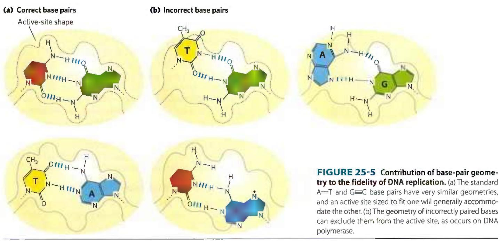

The accuracy of the polymerization reaction itself, however, is insufficient to account for the high degree of fidelity in replication. Careful measurements in vitro have shown that DNA polymerases insert one incorrect nucleotide for every $10^{4}$ to $10^{5}$ correct ones. These mistakes sometimes occur because a base is briefly in an unusual tautomeric form (see Fig. 8-9), allowing it to hydrogen-bond with an incorrect partner. In vivo, the error rate is reduced by additional enzymatic mechanisms.

One mechanism intrinsic to many DNA polymerases is a separate $3'\rightarrow5'$ exonuclease activity that double-checks each nucleotide after it is added. This nuclease activity permits the enzyme to remove a newly added nucleotide and is highly specific for mismatched base pairs (Fig. 25-6). If the polymerase has added the wrong nucleotide, translocation of the enzyme to the position where the next nucleotide is to be added is inhibited. This kinetic pause provides the opportunity for a correction. The

  
FIGURE 25-6 An example of error correction by the 3'→5' exonuclease activity of DNA polymerase I. Structural analysis has located the exonuclease activity behind the polymerase activity as the enzyme is oriented in its movement along the DNA. A mismatched base (here, a C-T mismatch) impedes translocation of DNA polymerase I (Pol I) to the next site.

3'→5' exonuclease activity cleaves the most recently added phosphodiester bond and removes the mispaired nucleotide; the polymerase then adds another nucleotide to begin active synthesis again. This activity, known as proofreading, is not simply the reverse of the polymerization reaction (Eqn 25-1). P2 Instead, replacement of the incorrect nucleotide requires the expenditure of three high-energy bonds. The polymerizing and proofreading activities of a DNA polymerase can be measured separately. Proofreading improves the inherent accuracy of the polymerization reaction $10^{2}$ -to $10^{3}$ -fold. In the monomeric DNA polymerase I, the polymerizing and proofreading activities have separate active sites within the same polypeptide.

P3 When base selection and proofreading are combined, DNA polymerase leaves behind one net error for every $10^{6}$ to $10^{8}$ bases added. Yet the measured accuracy of replication in E. coli is higher still. The additional accuracy is provided by a separate enzyme system that repairs the mismatched base pairs remaining after replication. We describe this mismatch repair, along with other DNA repair processes, in Section 25.2.

## E. coli Has at Least Five DNA Polymerases

More than 90% of the DNA polymerase activity observed in E. coli extracts can be accounted for by DNA polymerase I. Soon after the isolation of this enzyme in 1955, however, evidence began to accumulate that it is not suited for replication of the large E. coli chromosome. First, the rate at which it adds nucleotides (600 nucleotides/min) is too slow (by a factor of 100 or more) to account for the rates at which the replication fork moves in the bacterial cell. Second, DNA polymerase I has a relatively low processivity. Third, genetic studies have demonstrated that many genes, and therefore many proteins, are involved in replication: DNA polymerase I clearly does not act alone. Fourth, and most important, in 1969 John Cairns isolated a bacterial strain with an altered gene for DNA polymerase I that produced an inactive enzyme. Although this strain was abnormally sensitive to agents that damaged DNA, it was nevertheless viable.

A search for other DNA polymerases led to the discovery of E. coli DNA polymerase II and DNA polymerase III in the early 1970s. DNA polymerase II is an enzyme involved in one type of DNA repair (Section 25.3). DNA polymerase III is the principal replication enzyme in E. coli. DNA polymerases IV and V, identified in 1999, are involved in an unusual form of DNA repair (Section 25.2). The properties of these five DNA polymerases are compared in Table 25-1.

DNA polymerase I, then, is not the primary enzyme of replication; instead, it performs a host of cleanup functions during replication, recombination, and repair. The polymerase's special functions are enhanced by its $5'\rightarrow3'$ exonuclease activity. This activity, distinct from the $3'\rightarrow5'$ proofreading exonuclease (Fig. 25-6), is located in a structural domain that can be separated from the rest of the enzyme by mild protease treatment. When the $5'\rightarrow3'$ exonuclease domain is removed, the remaining fragment ( $M_{r}$ 68,000), the large fragment or Klenow fragment, retains the polymerization and proofreading activities. The $5'\rightarrow3'$ exonuclease activity of intact DNA polymerase I can replace a segment of DNA (or RNA) paired to the template strand, in a process known as nick translation (Fig. 25-7). Most other DNA polymerases lack a $5'\rightarrow3'$ exonuclease activity.

<table><tr><td colspan="6">TABLE 25-1 Comparison of the Five DNA Polymerases of E. coli</td></tr><tr><td rowspan="2"></td><td colspan="5">DNA polymerase</td></tr><tr><td>I</td><td>IIa</td><td>III</td><td>IVa</td><td>Va</td></tr><tr><td>Structural geneb</td><td>polA</td><td>polB</td><td>polC (dnaE)</td><td>dinB</td><td>umuC</td></tr><tr><td>Subunits (number of different types)</td><td>1</td><td>7</td><td>9</td><td>1</td><td>3</td></tr><tr><td>Mr</td><td>103,000</td><td>88,000c</td><td>1,065,400</td><td>39,100</td><td>110,000</td></tr><tr><td>3&#x27;→5&#x27; exonuclease (proofreading)</td><td>Yes</td><td>Yes</td><td>Yes</td><td>No</td><td>No</td></tr><tr><td>5&#x27;→3&#x27; exonuclease</td><td>Yes</td><td>No</td><td>No</td><td>No</td><td>No</td></tr><tr><td>Polymerization rate (nucleotides/s)</td><td>10–20</td><td>40</td><td>250–1,000</td><td>2–3</td><td>1</td></tr><tr><td>Processivity (nucleotides added before polymerase dissociates)</td><td>3–200</td><td>1,500</td><td>≥500,000</td><td>1</td><td>6–8</td></tr></table>

$^{a}$ Translesion (mutagenic) DNA polymerases. For DNA polymerase IV, processivity is increased substantially by association with a $\beta$ clamp. These polymerases are slowed when a DNA lesion is present in the DNA template strand.  
$^{b}$ For enzymes with more than one subunit, the gene listed here encodes the subunit with polymerization activity. Note that dnaE is an earlier designation for the gene now referred to as polC. $^{c}$ Polymerization subunit only. DNA polymerase II shares several subunits with DNA polymerase III, including the $\beta$ , $\delta$ , $\delta'$ , $\chi$ , and $\psi$ subunits (see Table 25-2).

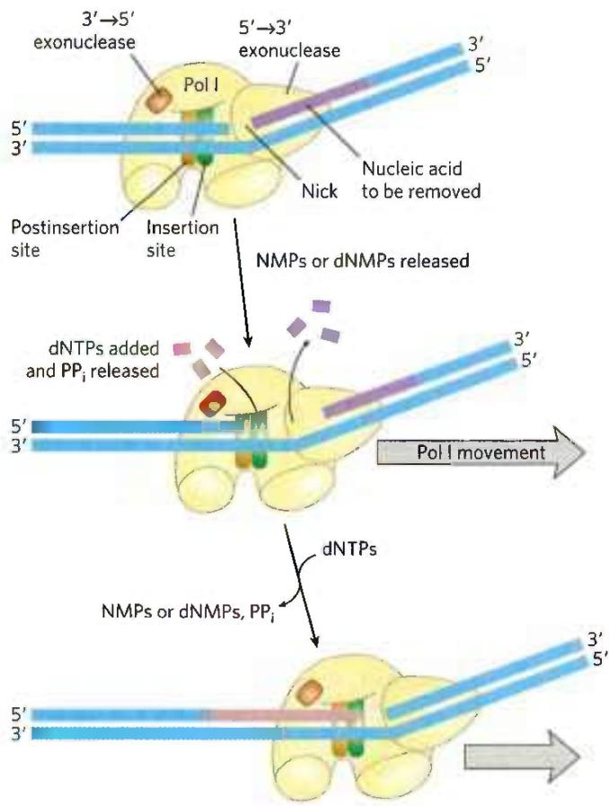

DNA polymerase III is much more complex than DNA polymerase I, with nine different kinds of subunits (Table 25-2). Its polymerization and proofreading activities reside in its $\alpha$ and $\varepsilon$ subunits, respectively. The $\theta$ subunit associates with $\alpha$ and $\varepsilon$ to form a core polymerase, which can polymerize DNA but with limited processivity. Up to three core polymerases can be linked by a clamp-loading complex consisting of five subunits of three different types, $\tau_{3}\delta\delta'$ . The core polymerases are linked through the $\tau$ (tau) subunits. Two additional subunits, $\chi$ (chi) and $\psi$ (psi), are bound to the clamp-loading complex. The entire assembly of 16 protein subunits (eight different types) is called DNA polymerase III\* (Fig. 25-8a).

DNA polymerase III\* can polymerize DNA, but with a much lower processivity than one would expect for the organized replication of an entire chromosome. The necessary increase in processivity is provided by the addition of the $\beta$ subunits. The $\beta$ subunits associate in pairs to form donut-shaped structures that encircle the DNA and act like clamps (Fig. 25-8b). Each dimer associates with a core subassembly of polymerase III\* (one dimeric clamp per active core subassembly) and slides along the DNA as replication proceeds. The $\beta$ sliding clamp prevents the dissociation of DNA polymerase III from DNA, dramatically increasing processivity—to greater than 500,000

FIGURE 25-7 Nick translation. The bacterial DNA polymerase I has three domains, catalyzing its DNA polymerase, 5'→3' exonuclease, and 3'→5' exonuclease activities. The 5'→3' exonuclease domain is in front of the enzyme as it moves along the DNA and is not shown in Figure 25-4. By degrading the DNA strand ahead of the enzyme and synthesizing a new strand behind, DNA polymerase I can promote nick translation, in which a break or nick in the DNA is effectively moved along with the enzyme. This process has a role in DNA repair and in the removal of RNA primers during replication (both described later in this chapter). The strand of nucleic acid to be removed (either DNA or RNA) is shown in purple, the replacement strand in red. DNA synthesis begins at a nick (a broken phosphodiester bond, leaving a free 3' hydroxyl and a free 5' phosphate). A nick remains where DNA polymerase I eventually dissociates, and the nick is later sealed by another enzyme.

<table><tr><td colspan="6">TABLE 25-2 Subunits of DNA Polymerase III of E. coli</td></tr><tr><td>Subunit</td><td>Number of subunits per holoenzyme</td><td>Mrof subunit</td><td>Gene</td><td>Function of subunit</td><td></td></tr><tr><td> $\alpha$ </td><td>3</td><td>129,900</td><td>polC (dnaE)</td><td>Polymerization activity</td><td rowspan="3">Core polymerase</td></tr><tr><td> $\varepsilon$ </td><td>3</td><td>27,500</td><td>dnaQ (mutD)</td><td>3&#x27;→5&#x27; proofreading exonuclease</td></tr><tr><td> $\theta$ </td><td>3</td><td>8,600</td><td>holE</td><td>Stabilization of  $\varepsilon$  subunit</td></tr><tr><td> $\tau$ </td><td>3</td><td>71,100</td><td>dnaX</td><td>Stable template binding; core enzyme dimerization</td><td rowspan="6">Clamp-loading ( $\gamma$ ) complex that loads  $\beta$  subunits on lagging strand at each Okazaki fragmenta</td></tr><tr><td> $\delta$ </td><td>1</td><td>38,700</td><td>holA</td><td>Clamp opener</td></tr><tr><td> $\delta'$ </td><td>1</td><td>36,900</td><td>holB</td><td>Clamp loader</td></tr><tr><td> $\chi$ </td><td>1</td><td>16,600</td><td>holC</td><td>Interaction with SSB</td></tr><tr><td> $\psi$ </td><td>1</td><td>15,200</td><td>holD</td><td>Interaction with  $\tau$  and  $\chi$ </td></tr><tr><td> $\beta$ </td><td>6</td><td>40,600</td><td>dnaN</td><td>DNA clamp required for optimal processivity</td></tr></table>

$^{a}$ The $\gamma$ subunit is encoded by a portion of the gene for the $\tau$ subunit (dnaX), such that the amino-terminal 66% of the $\tau$ subunit has the same amino acid sequence as the $\gamma$ subunit. The $\gamma$ subunit is generated by a translational frameshifting mechanism (p. 1013) that leads to premature translational termination. The $\gamma$ subunit shares the clamp-loading functions of $\tau$ but lacks the protein segments that interact with the core polymerase or with DnaB helicase. Clamp-loading complexes incorporating $\gamma$ subunits may operate independently of the DNA polymerase III holoenzyme, promoting the unloading of $\beta$ clamps discarded on the lagging strand as the replication fork progresses. They may also promote loading of $\beta$ clamps for some DNA repair processes that require DNA synthesis away from the replication fork.

  
FIGURE 25-8 DNA polymerase III. (a) Architecture of bacterial DNA polymerase III (Pol III). Three core domains, composed of subunits $\alpha$ , $\varepsilon$ , and $\theta$ , are linked by a five-subunit clamp-loading complex, with the composition $\tau_{3}\delta\delta'$ . The core subunits and clamp-loading complex constitute DNA polymerase III\*. The other two subunits of DNA polymerase III\*, $\chi$ and $\psi$ (not shown), also bind to the clamp-loading complex. Three $\beta$ clamps interact with the three core subassemblies, each clamp a dimer of the $\beta$ subunit. The complex interacts with the DnaB helicase (described later in the text)  
through the $\tau$ subunits. (b) Two $\beta$ subunits of $E.$ coli polymerase III form a circular clamp that surrounds the DNA. The clamp slides along the DNA molecule, increasing the processivity of the polymerase III holoenzyme to more than 500,000 nucleotides by preventing its dissociation from the DNA. The two $\beta$ subunits are shown in two shades of purple as ribbon structures (left) and surface contour images (right), surrounding the DNA. ((a) Information from N. Yao and M. O'Donnell, Mol. Biosyst. 4:1075, 2008. (b) Data from PDB ID 2POL, X.-P. Kong et al., Cell 69:425, 1992.]

(Table 25-1). The addition of the $\beta$ subunits converts DNA polymerase III\* to DNA polymerase III holoenzyme.

## DNA Replication Requires Many Enzymes and Protein Factors

Replication in E. coli requires not just a single DNA polymerase but 20 or more different enzymes and proteins, each performing a specific task. The entire complex has been termed the DNA replicase system or replisome. The enzymatic complexity of replication reflects the constraints imposed by the structure of DNA and by the requirements for accuracy. The main classes of replication enzymes are considered here in terms of the problems they overcome.

The DNA must be separated into two strands that each act as a template. P2 This is generally accomplished by helicases, enzymes that move along the DNA and separate the strands, using chemical energy from ATP. Strand separation creates topological stress in the helical DNA structure (see Fig. 24-11), which is relieved by the action of topoisomerases. The separated strands are stabilized by DNA-binding proteins. As noted earlier, before DNA polymerases can begin synthesizing DNA, primers must be present on the template—generally, short segments of RNA synthesized by enzymes known as primases. Ultimately, the RNA primers are removed and replaced by DNA; in E. coli, this is one of the many functions of DNA polymerase I. A specialized nuclease that degrades RNA in RNA-DNA hybrids, called RNase H1, also removes some RNA primers. After an RNA primer is removed and the gap is filled in with DNA, a nick remains in the DNA backbone in the form of a broken phosphodiester bond. These nicks are sealed by DNA ligases. All these processes require coordination and regulation best characterized in the E. coli system.

## Replication of the E. coli Chromosome Proceeds in Stages

The synthesis of a DNA molecule can be divided into three stages: initiation, elongation, and termination, distinguished both by the reactions taking place and by the enzymes required. As you will find here and in the next two chapters, synthesis of the major information-containing biological polymers—DNAs, RNAs, and proteins—can be understood in terms of these same three stages, with the stages of each pathway having unique characteristics. The events described below reflect information derived primarily from in vitro experiments using purified E. coli proteins, although the principles are highly conserved in all replication systems.

Initiation The E. coli replication origin, oriC, consists of 245 bp and contains DNA sequence elements that are highly conserved among bacterial replication origins. The general arrangement of the conserved sequences is illustrated in Figure 25-9. Two types of sequences are of special interest: five repeats of a 9 bp sequence (R sites) that serve as binding sites for the key initiator protein, DnaA, and a region rich in A=T base pairs called the DNA unwinding element (DUE). There are three additional DnaA-binding sites (I sites), and binding sites for the proteins IHF (integration host factor) and FIS (factor for inversion stimulation). These two proteins were discovered as necessary components of certain recombination reactions described later in this chapter, and their names reflect those roles. Another DNA-binding protein, HU (a histonelike bacterial protein originally dubbed factor U), also participates but does not have a specific binding site.

At least 10 different enzymes or proteins (summarized in Table 25-3) participate in the initiation phase of replication. They open the DNA helix at the origin and establish a prepriming complex for subsequent reactions. The crucial component in the initiation process is the DnaA protein, a member of the AAA+ ATPase protein family (ATPases associated with diverse cellular activities). Many AAA+ ATPases, including DnaA, form oligomers and hydrolyze ATP relatively slowly. This ATP hydrolysis acts as a switch that mediates interconversion of the protein between two states. In the case of DnaA, the ATP-bound form is active and the ADP-bound form is inactive.

Eight DnaA protein molecules, all in the ATP-bound state, assemble to form a helical complex encompassing the R and I sites in oriC (Fig. 25-10). DnaA has a higher affinity for R sites than I sites, and it binds R sites equally well in its ATP- or ADP-bound form. The I sites, which bind only the ATP-bound DnaA, allow discrimination between the active and inactive forms of DnaA. The tight right-handed wrapping of the DNA around this complex introduces a positive supercoil (see Chapter 24). The associated strain in the nearby DNA, combined with the binding of additional DnaA protein to the DUE region, leads to strand separation in the A=T-rich DUE. The complex formed at the replication origin also includes several DNA-binding proteins—HU, IHF, and FIS—that facilitate DNA bending.

The DnaC protein, another AAA+ ATPase, then loads the DnaB protein onto the separated DNA strands in the denatured region. A hexamer of DnaC, each subunit bound to ATP, forms a tight complex with the ring-shaped, hexameric DnaB helicase. This DnaC-DnaB interaction opens the DnaB ring, the process being aided by a further interaction between DnaB and DnaA. Two of the ring-shaped DnaB hexamers are loaded in the DUE, one onto each DNA strand. The ATP bound to DnaC is hydrolyzed, releasing the DnaC and leaving the DnaB bound to the DNA.

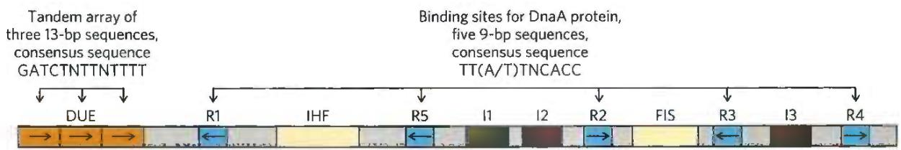  
FIGURE 25-9 Arrangement of sequences in the E. coli replication origin, oriC. Conserved sequences for key repeated elements are shown. N represents any of the four nucleotides. The horizontal arrows indicate the orientations of the nucleotide sequences (left-to-right arrow denotes

a sequence in the top strand; right-to-left, in the bottom strand). FIS and IHF are binding sites for proteins described in the text. R sites are bound by DnaA. I sites are additional DnaA-binding sites (with different sequences, labeled 11, 12, and 13), for DnaA only when the protein is complexed with ATP.  

<table><tr><td>Protein</td><td> $M_{t}$ </td><td>Number of subunits</td><td>Function</td></tr><tr><td>DnaA protein</td><td>52,000</td><td>1</td><td>Recognizes oriC sequence; opens duplex at specific sites in origin</td></tr><tr><td>DnaB protein (helicase)</td><td>300,000</td><td> $6^{a}$ </td><td>Unwinds DNA</td></tr><tr><td>DnaC protein</td><td>174,000</td><td> $6^{a}$ </td><td>Required for DnaB binding at origin</td></tr><tr><td>HU</td><td>19,000</td><td>2</td><td>Histonelike protein; DNA-binding protein; stimulates initiation</td></tr><tr><td>FIS</td><td>22,500</td><td> $2^{a}$ </td><td>DNA-binding protein; stimulates initiation</td></tr><tr><td>IHF</td><td>22,000</td><td>2</td><td>DNA-binding protein; stimulates initiation</td></tr><tr><td>Primase (DnaG protein)</td><td>60,000</td><td>1</td><td>Synthesizes RNA primers</td></tr><tr><td>Single-stranded DNA-binding protein (SSB)</td><td>75,600</td><td> $4^{a}$ </td><td>Binds single-stranded DNA</td></tr><tr><td>DNA gyrase (DNA topoisomerase II)</td><td>400,000</td><td>4</td><td>Relieves torsional strain generated by DNA unwinding</td></tr><tr><td>Dam methylase</td><td>32,000</td><td>1</td><td>Methylates ( $5'$ )GATC sequences at oriC</td></tr></table>

  
FIGURE 25-10 Model for initiation of replication at the E. coli origin, oriC. DnaA protein molecules bind initially at the five specific R sites. Upon ATP binding, additional DnaA molecules bind at the I sites in the origin, forming a right-handed helical complex and drawing in more DnaA molecules that continue the helix into the DUE region (see Fig. 25-9). The DNA is wrapped around this complex. DnaA molecules bound at the R and I sites bind the DNA with an HTH domain (referring to a DNA binding motif called helix-turn-helix). The A=T-rich DUE region is denatured as a result of the strain imparted by the DnaA binding. Within the DUE, single-stranded DNA is bound by the ATPase domain of DnaA rather than by the HTH. Formation of the helical DnaA complex is facilitated by the proteins HU, IHF, and FIS. The detailed structural roles of these proteins are not known, but IHF may stabilize a transient DNA loop, as shown here. Hexamers of the DnaB protein bind to each strand, with the aid of DnaC protein. The DnaB helicase activity further unwinds the DNA in preparation for priming and DNA synthesis. [Information from J. P. Erzberger et al., Nat. Struct. Mol. Biol. 13:676, 2006.]

Loading of the DnaB helicase is the key step in replication initiation. As a replicative helicase, DnaB migrates along the single-stranded DNA in the 5'→3' direction, unwinding the DNA as it travels. The DnaB helicases loaded onto the two DNA strands thus travel in opposite directions, creating two potential replication forks. All other proteins at the replication fork are linked directly or indirectly to DnaB. The DNA polymerase III holoenzyme is linked through its τ subunits; additional DnaB interactions are described below. As replication begins and the DNA strands are separated at the fork, many molecules of single-stranded DNA-binding protein (SSB) bind to and stabilize the separated strands, and DNA gyrase (DNA topoisomerase II) relieves the topological stress induced ahead of the fork by the unwinding reaction.

Initiation is the only phase of DNA replication that is known to be regulated, and it is regulated such that replication occurs only once in each cell cycle. The mechanism of regulation is not yet entirely understood, but genetic and biochemical studies have provided insights into several separate regulatory mechanisms.

Once DNA polymerase III has been loaded onto the DNA, along with the $\beta$ subunits (signaling completion of the initiation phase), the protein Hda binds to the $\beta$ subunits and interacts with DnaA to stimulate hydrolysis of its bound ATP. Hda is yet another AAA+ ATPase closely related to DnaA (its name is derived from homologous to DnaA). This ATP hydrolysis leads to disassembly of the DnaA complex at the origin. Slow release of ADP by DnaA and rebinding of ATP cycles the protein between its inactive (with bound ADP) and active (with bound ATP) forms on a time scale of 20 to 40 minutes.

The timing of replication initiation is affected by DNA methylation and interactions with the bacterial plasma membrane. The oriC DNA is methylated by the Dam methylase (Table 25-3), which methylates the $N^6$ position of adenine within the palindromic sequence (5')GATC. (Dam is not a biochemical expletive; it stands for DNA adenine methylation.) The oriC region of E. coli is highly enriched in GATC sequences—it has 11 in its 245 bp; the average frequency of GATC in the E. coli chromosome as a whole is 1 in 256 bp.

Immediately after replication, the DNA is hemimethylated: the parent strands have methylated oriC sequences but the newly synthesized strands do not. The hemimethylated oriC sequences are now sequestered by interaction with the plasma membrane (the mechanism is unknown) and by binding of the protein SeqA. After a time, oriC is released from the plasma membrane, SeqA dissociates, and the DNA must be fully methylated by Dam methylase before it can again bind DnaA and initiate a new round of replication.

Elongation The elongation phase of replication includes two distinct but related operations: leading strand synthesis and lagging strand synthesis. Several enzymes at the replication fork are important to the synthesis of both strands. Parent DNA is first unwound by DNA helicases, and the resulting topological stress is relieved by topoisomerases. Each separated strand is then stabilized by SSB. From this point, synthesis of leading and lagging strands is sharply different.

Leading strand synthesis, the more straightforward of the two, begins with the synthesis by primase (DnaG protein) of a short (10 to 60 nucleotide) RNA primer at the replication origin. DnaG interacts with DnaB helicase to carry out this reaction, and the primer is synthesized in the direction opposite to that in which the DnaB helicase is moving. In effect, the DnaB helicase moves along the strand that becomes the lagging strand in DNA synthesis; however, the first primer laid down in the first DnaG-DnaB interaction serves to prime leading strand DNA synthesis in the opposite direction. Deoxyribonucleotides are added to this primer by a DNA polymerase III complex linked to the DnaB helicase tethered to the opposite DNA strand. Leading strand synthesis then proceeds continuously, keeping pace with the unwinding of DNA at the replication fork.

Lagging strand synthesis, as we have noted, is accomplished in short Okazaki fragments (Fig. 25-11a). First, an RNA primer is synthesized by primase, and, as in leading strand synthesis, DNA polymerase III binds to the RNA primer and adds deoxyribonucleotides (Fig. 25-11b). On this level, the synthesis of each Okazaki fragment seems straightforward, but the details are quite complex. The complexity lies in the coordination of leading and lagging strand synthesis. Both strands are produced by a single asymmetric DNA polymerase III dimer; this is accomplished by looping the DNA of the lagging strand as shown in Figure 25-12, bringing together the two points of polymerization.

The synthesis of Okazaki fragments on the lagging strand entails some elegant enzymatic choreography.

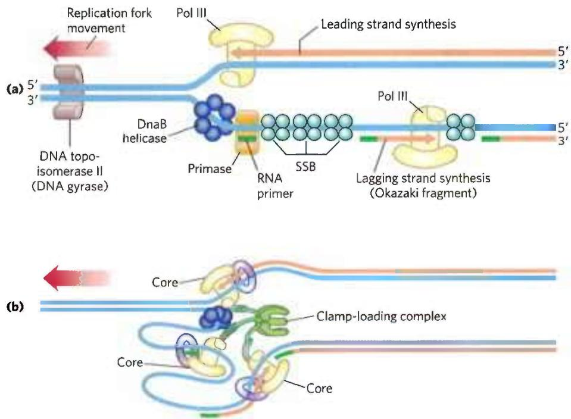  
FIGURE 25-11 Synthesis of Okazaki fragments. (a) At intervals, primase synthesizes an RNA primer for a new Okazaki fragment. If we consider the two template strands as lying side by side, lagging strand synthesis formally proceeds in the opposite direction from fork movement. Each primer is extended by DNA polymerase III. DNA synthesis continues until the fragment extends as far as the primer of the previously added Okazaki fragment.  
A new primer is synthesized near the replication fork to begin the process again. (b) In the replisome complex, DNA synthesis on the leading and lagging strands is tightly coordinated. Each DNA polymerase III holoenzyme has three sets of core subunits (yellow), linked together with a single clamp-loading complex, so one or two Okazaki fragments can be synthesized simultaneously, along with the leading strand.

FIGURE 25-12 DNA synthesis on the leading and lagging strands. Events at the replication fork are coordinated by a single DNA polymerase III dimer, in an integrated complex with DnaB helicase. This figure shows the replication process already underway; (a) through (e) are discussed in the text. Only two sets of polymerase core subunits rather than three are shown, to more clearly illustrate the cycling on the lagging strand. The lagging strand is looped so that DNA synthesis proceeds steadily on both the leading and lagging strand templates at the same time. Red arrows indicate the 3' end of the two new strands and the direction of DNA synthesis. An Okazaki fragment is being synthesized on the lagging strand. The subunit colors and the functions of the clamp-loading complex are explained in Figure 25-13.

DNA polymerase III uses one set of its core subunits (the core polymerase) to synthesize the leading strand continuously, while the other two sets of core subunits cycle from one Okazaki fragment to the next on the looped lagging strand. In vitro, a DNA polymerase III holoenzyme with only two sets of core subunits can synthesize both leading and lagging strands. However, a third set of core subunits increases the efficiency of lagging strand synthesis as well as the processivity of the overall replisome.

DnaB helicase, bound in front of DNA polymerase III, unwinds the DNA at the replication fork (Fig. 25-12a) as it travels along the lagging strand template in the $5'\rightarrow3'$ direction. DnaG primase occasionally associates with DnaB helicase and synthesizes a short RNA primer (Fig. 25-12b). A new $\beta$ sliding clamp is then positioned at the primer by the clamp-loading complex of DNA polymerase III (Fig. 25-12c). When synthesis of an Okazaki fragment has been completed, replication halts, and the core subunits of DNA polymerase III dissociate from their β sliding clamp (and from the completed Okazaki fragment) and associate with the new clamp (Fig. 25-12d, e). This initiates synthesis of a new Okazaki fragment. Two sets of core subunits may be engaged in the synthesis of two different Okazaki fragments at the same time. The proteins acting at the replication fork are summarized in Table 25-4.

<table><tr><td colspan="4">TABLE 25-4 Proteins of the E. coli Replisome</td></tr><tr><td>Protein</td><td> $M_{r}$ </td><td>Number of subunits</td><td>Function</td></tr><tr><td>SSB</td><td>75,600</td><td>4</td><td>Binding to single-stranded DNA</td></tr><tr><td>Helicase (DnaB protein)</td><td>300,000</td><td>6</td><td>DNA unwinding</td></tr><tr><td>Primase (DnaG protein)</td><td>60,000</td><td>1</td><td>RNA primer synthesis</td></tr><tr><td>DNA polymerase III</td><td>1,065,400</td><td>17</td><td>New strand elongation</td></tr><tr><td>DNA polymerase I</td><td>103,000</td><td>1</td><td>Filling of gaps; excision of primers</td></tr><tr><td>DNA ligase</td><td>74,000</td><td>1</td><td>Ligation</td></tr><tr><td>DNA gyrase (DNA topoisomerase II)</td><td>400,000</td><td>4</td><td>Supercoiling</td></tr></table>

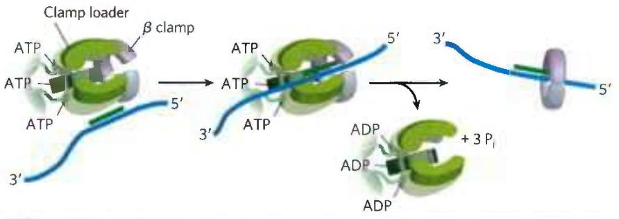  
FIGURE 25-13 The DNA polymerase III clamp loader. The five subunits of the clamp-loading (γ) complex are the δ and δ' subunits and the amino-terminal domain of each of the three τ subunits (see Fig. 25-8). The complex binds to three molecules of ATP and to a dimeric β clamp. This binding forces the β clamp open at one of its two subunit interfaces. Hydrolysis of the bound ATP allows the β clamp to close again around the DNA.

The clamp-loading complex of DNA polymerase III, consisting of parts of the three $\tau$ subunits along with the $\delta$ and $\delta'$ subunits, is also an AAA+ ATPase. This complex binds to ATP and to the new $\beta$ sliding clamp. The binding imparts strain on the dimeric clamp, opening up the ring at one subunit interface (Fig. 25-13). The newly primed lagging strand is slipped into the ring through the resulting break. The clamp loader then hydrolyzes ATP, releasing the $\beta$ sliding clamp and allowing it to close around the DNA.

The replisome promotes rapid DNA synthesis, adding \~1,000 to 2,000 nucleotides to each strand (leading and lagging). Once an Okazaki fragment has been completed, its RNA primer is removed by DNA polymerase I or RNase H1 and replaced with DNA by the polymerase; the remaining nick is sealed by DNA ligase (Fig. 25-14).

DNA ligase catalyzes the formation of a phosphodiester bond between a 3' hydroxyl at the end of one DNA strand and a 5' phosphate at the end of another strand. The phosphate must be activated by adenylylation. DNA ligases isolated from viruses and eukaryotes use ATP for this purpose. DNA ligases from bacteria are unusual in that many use NAD $^{+}$ —a cofactor that usually functions in hydride transfer reactions (see Fig. 13-24)—as the source of the AMP activating group (Fig. 25-15). DNA ligase is another enzyme of DNA metabolism that has become an important reagent in recombinant DNA experiments (see Fig. 9-1).

  
FIGURE 25-14 Final steps in the synthesis of lagging strand segments. RNA primers in the lagging strand are removed by the $5'\rightarrow3'$ exonuclease activity of DNA polymerase I or RNase H1, and then replaced with DNA by DNA polymerase I. The remaining nick is sealed by DNA ligase. The role of ATP or NAD $^{+}$ is shown in Figure 25-15.

Termination Eventually, the two replication forks of the circular E. coli chromosome meet at a terminus region

FIGURE 25-15 Mechanism of the DNA ligase reaction. In each of the three steps, one phosphodiester bond is formed at the expense of another. Steps ① and ② lead to activation of the 5' phosphate in the nick. An AMP group is transferred first to a Lys residue on the enzyme and then to the 5' phosphate in the nick. In step ③, the 3'-hydroxyl group attacks this phosphate and displaces AMP, producing a phosphodiester bond to seal the nick. In the E. coli DNA ligase reaction, AMP is derived from NAD⁺. The DNA ligases isolated from some viral and eukaryotic sources use ATP rather than NAD⁺, and they release pyrophosphate rather than nicotinamide mononucleotide (NMN) in step ①.

containing multiple copies of a 20 bp sequence called Ter (Fig. 25-16). The Ter sequences are arranged on the chromosome to create a trap that a replication fork can enter but cannot leave. The Ter sequences function as binding sites for the protein Tus (terminus utilization substance). The Tus-Ter complex can arrest a replication fork from only one direction. Only one Tus-Ter complex functions per replication cycle—the complex first encountered by either replication fork. Given that opposing replication forks generally halt when they collide, Ter sequences would not seem to be essential, but they may prevent overreplication by one fork in the event that the other is delayed or halted by an encounter with DNA damage or some other obstacle.

  
FIGURE 25-16 Termination of chromosome replication in E. coli. The Ter sequences (TerA through TerJ) are positioned on the chromosome in two clusters with opposite orientations. The overall Ter region encompasses about $9\%$ of the circular chromosome.

So, when either replication fork encounters a functional Tus-Ter complex, it halts; the other fork halts when it meets the first (arrested) fork. The final few hundred base pairs of DNA between these large protein complexes are then replicated (by an as yet unknown mechanism), completing two topologically interlinked (catenated) circular chromosomes (Fig. 25-17). DNA circles linked in this way are known as catenanes. Separation of the catenated circles in E. coli requires topoisomerase IV (a type II topoisomerase). The separated chromosomes then segregate into daughter cells at cell division. The terminal phase of replication of other circular chromosomes, including many of the DNA viruses that infect eukaryotic cells, is similar.

## Replication in Eukaryotic Cells Is Similar but More Complex

The DNA molecules in eukaryotic cells are considerably larger than those in bacteria and are organized into complex nucleoprotein structures (chromatin; p. 898). The essential features of DNA replication are the same in eukaryotes and bacteria, and many of the protein complexes are functionally and structurally conserved. However, eukaryotic replication is regulated and coordinated with the cell cycle, and must function within the complexities of chromatin structure.

  
FIGURE 25-17 Role of topoisomerases in replication termination. Replication of the DNA separating opposing replication forks leaves the completed chromosomes joined as catenanes, or topologically interlinked circles. The circles are not covalently linked, but because they are interwound and each is covalently closed, they cannot be separated — except by the action of topoisomerases. In E. coli, a type II topoisomerase known as DNA topoisomerase IV plays the primary role in separating catenated chromosomes, transiently breaking both DNA strands of one chromosome and allowing the other chromosome to pass through the break.

Origins of replication have a well-characterized structure in some lower eukaryotes, but they are much less defined in higher eukaryotes. In both cases, replication begins in short nucleosome-free regions. Yeast (S. cerevisiae) has about 400 defined replication origins called autonomously replicating sequences (ARSs), or replicators. Yeast replicators span \~150 bp and contain several essential, conserved sequences. There are about 30,000 to 50,000 replication origins in human chromosomes.

The replication origins of vertebrates in general may be defined by some aspect of DNA secondary structure, as yet unknown.

Regulation ensures that all cellular DNA is replicated once per cell cycle. Much of this regulation involves proteins called cyclins and the cyclin-dependent kinases (CDKs) with which they form complexes (see Section 12.8). The cyclins are rapidly destroyed by ubiquitin-dependent proteolysis at the end of the M phase (mitosis), and the absence of cyclins allows the establishment of prereplicative complexes (pre-RCs) on replication initiation sites. In rapidly growing cells, the pre-RC forms at the end of M phase. In slow-growing cells, it does not form until the end of G1. Formation of the pre-RC renders the cell competent for replication, an event sometimes called licensing.

As in bacteria, the key event in the initiation of replication in all eukaryotes is the loading of the replicative helicase, a heterohexameric complex of minichromosome maintenance (MCM) proteins (MCM2 to MCM7). The ring-shaped MCM2–7 helicase functions in some ways like the bacterial DnaB helicase, although it translocates 3'→5' along the leading strand template. It is loaded onto the DNA in steps (Fig. 25-18). The origin is recognized and bound first by another six-protein complex, called ORC (origin recognition complex), followed by the protein CDC6 (cell division cycle), which recruits CDT1 (CDC10-dependent transcript 1). Together, they facilitate the loading of two inactive MCM2–7 complexes (the pre-RC). The ORC-CDC6 complex and CTD1 dissociate, leaving behind the pre-RC. ORC has five AAA+ ATPase domains among its subunits and is functionally analogous to the bacterial DnaA. The yeast CDC6 is yet another AAA+ ATPase that forms a complex with the ORC subunits. Following pre-RC formation, another set of proteins, CDC45 and the GINS, bind to and activate the MCM2–7 helicase, triggering DNA denaturation. (GINS refers to the first letters of the numbers 5-1-2-3 in Japanese, go-ichi-ni-san, providing a somewhat cryptic callout to the four protein subunits of the complex: SLD5, PSF1, PSF2, and PSF3.) The replication proteins then bind to form a replisome, and bidirectional replication begins.

Commitment to replication requires the synthesis and activity of S-phase cyclin-CDK complexes (such as the cyclin E-CDK2 complex; see Fig. 12-36) and CDC7-DBF4. Both types of complexes help to activate replication by binding to and phosphorylating several subunits of the pre-RC. Other cyclins and CDKs function to inhibit the formation of more pre-RC complexes once replication has been initiated. For example, CDK2 binds to cyclin A as cyclin E levels decline during S phase, inhibiting CDK2 and preventing the licensing of additional pre-RC complexes.

The rate of movement of the replication fork in eukaryotes (\~50 nucleotides/s) is only one-twentieth that observed in E. coli. At this rate, replication of an average human chromosome proceeding from a single origin would take more than 500 hours, making the requirement for many origins evident.

  
FIGURE 25-18 Assembly of a prereplicative complex at a eukaryotic replication origin. The initiation site (origin) is bound by ORC, CDC6, and CDT1. These proteins, many of them AAA+ ATPases, promote loading of two MCM2-7 helicase complexes, in a reaction analogous to the loading of the bacterial DnaB  
helicase by DnaC protein. The two loaded but inactive MCM2–7 complexes comprise the prereplicative complex, or pre-RC. The pre-RC is subsequently activated by addition of CDC45 and the GINS proteins, followed by addition of the replisome components. [Information from M.W. Parker et al., Crit. Rev. Biochem. Mol. Biol. 52:107, 2017.]

Like bacteria, eukaryotes have several types of DNA polymerases. Some have been linked to particular functions, such as the replication of mitochondrial DNA. The replication of nuclear chromosomes primarily involves three multisubunit DNA polymerases. The highly processive DNA polymerase $\varepsilon$ synthesizes the leading strand, and DNA polymerase $\delta$ synthesizes the lagging strand. Both enzymes have $3'\rightarrow5'$ proofreading exonuclease activities. DNA polymerase $\alpha$ , a DNA polymerase/primase, synthesizes RNA primers and also extends them by about 10 nucleotides of DNA to initiate synthesis of each Okazaki fragment on the lagging strand. One subunit of DNA polymerase $\alpha$ has a primase activity, and the largest subunit ( $M_{r}\sim180,000$ ) contains the polymerization activity. However, this polymerase has no proofreading $3'\rightarrow5'$ exonuclease activity, making it unsuitable for high-fidelity DNA replication.

DNA polymerases $\varepsilon$ and $\delta$ are associated with and stimulated by proliferating cell nuclear antigen (PCNA; $M_{r}$ 29,000), a protein found in large amounts in the nuclei of proliferating cells. The three-dimensional structure of PCNA is remarkably similar to that of the $\beta$ subunit of E. coli DNA polymerase III (Fig. 25-8b), although primary sequence homology is not evident. PCNA has a function analogous to that of the $\beta$ subunit, forming a circular clamp that enhances the processivity of the two polymerases.

Two other protein complexes also function in eukaryotic DNA replication. RPA (replication protein A) is a single-stranded DNA-binding protein, equivalent in function to the E. coli SSB protein. RFC (replication factor C)

is a clamp loader for PCNA and facilitates the assembly of active replication complexes. The subunits of the RFC complex have significant sequence similarity to the subunits of the bacterial clamp-loading ( $\gamma$ ) complex.

Termination of replication on linear eukaryotic chromosomes occurs when replication forks operating from nearby origins converge. As in bacteria, there are successive steps of final replication, replisome dissociation, and decatenation of the DNA products. All of the steps are mediated by additional protein complexes, with some parts of the process still undefined.

## Viral DNA Polymerases Provide Targets for Antiviral Therapy

Many DNA viruses encode their own DNA polymerases, and some of these have become targets for pharmaceuticals. For example, the DNA polymerase of the herpes simplex virus is inhibited by acyclovir, a compound developed by Gertrude Elion and George Hitchings (p. 836). Acyclovir consists of guanine attached to an incomplete ribose ring.

It is phosphorylated by a virally encoded thymidine kinase; acyclovir binds to this viral enzyme with an affinity 200-fold greater than its binding to the cellular thymidine kinase. This ensures that phosphorylation occurs mainly in virus-infected cells. Cellular kinases convert the resulting acyclo-GMP to acyclo-GTP, which is both an inhibitor and a substrate of DNA polymerases; acyclo-GTP competitively inhibits the herpes DNA polymerase more strongly than cellular DNA polymerases. Because it lacks a 3' hydroxyl, acyclo-GTP also acts as a chain terminator when incorporated into DNA. Thus viral replication is inhibited at several steps.

## SUMMARY 25.1 DNA Replication

■ Replication of DNA follows a set of universal rules. Replication is semiconservative, each strand acting as template for a new daughter strand. It is carried out in three identifiable phases: initiation, elongation, and termination. The process starts at a single origin in bacteria and usually proceeds bidirectionally. DNA is synthesized in the 5'→3' direction by DNA polymerases. At the replication fork, the leading strand is synthesized continuously in the same direction as replication fork movement; the lagging strand is synthesized discontinuously as Okazaki fragments, which are subsequently ligated.

■ Nucleases are enzymes that degrade DNA. Endonucleases cleave within a DNA polymer; exonucleases degrade DNA from the end of one strand (either $5'\rightarrow3'$ or $3'\rightarrow5'$ ).

■ DNA polymerases are complex enzymes that synthesize DNA, and often possess additional activities, including exonuclease functions.

■ DNA is replicated with very high fidelity. Accuracy is maintained by (1) base selection by the polymerase, (2) a $3'\rightarrow5'$ proofreading exonuclease activity that is part of many DNA polymerases, and (3) specific repair systems for mismatches left behind after replication.

■ Most cells have several DNA polymerases. In E. coli, DNA polymerase III is the primary replication enzyme. DNA polymerase I is responsible for special functions during replication, recombination, and repair.

■ Replication requires an array of enzymes and protein factors in addition to DNA polymerases. Many of these proteins belong to the AAA+ ATPase family.

■ Replication initiation occurs when replicative helicases are loaded onto replication origins in stepwise fashion. Elongation is achieved by an active replisome—a supramolecular complex of nucleic acids and many proteins, including polymerases. Termination occurs when replisomes proceeding in opposite directions converge. It requires decatenation of the replication products when replication is complete.

■ The major replicative DNA polymerases in eukaryotes are DNA polymerases $\varepsilon$ and $\delta$ . DNA polymerase $\alpha$ synthesizes primers.

■ Viral DNA replication is a drug target.

## 25.2 DNA Repair

Most cells have only one or two sets of genomic DNA. P1 Damaged proteins and RNA molecules can be quickly replaced by using information encoded in the DNA, but DNA molecules themselves are irreplaceable. Maintaining the integrity of the information in DNA is a cellular imperative, supported by an elaborate set of DNA repair systems. DNA can become damaged by a variety of processes, some spontaneous, others catalyzed by environmental agents (Chapter 8). Replication itself can very occasionally damage the information content in DNA when polymerase errors create mismatched base pairs (such as G paired with T).

The chemistry of DNA damage is diverse and complex. The cellular response to this damage includes enzymatic systems that catalyze some of the most interesting chemical transformations in DNA metabolism. We first examine the effects of alterations in DNA sequence and then consider specific repair systems.

## Mutations Are Linked to Cancer

The best way to illustrate the importance of DNA repair is to consider the effects of unrepaired DNA damage (a lesion). P3 The most serious outcome is a change in the base sequence of the DNA, which, if replicated and transmitted to future generations of cells, becomes permanent. A permanent change in the nucleotide sequence of DNA is called a mutation. Mutations can involve the replacement of one base pair with another (substitution mutation) or the addition or deletion of one or more base pairs (insertion or deletion mutations). If the mutation affects nonessential DNA or if it has a negligible effect on the function of a gene, it is known as a silent mutation. P1 P3 Rarely, a mutation confers some biological advantage. Most nonsilent mutations, however, are neutral or deleterious.

In mammals there is a strong correlation between the accumulation of mutations and cancer. A simple test developed by Bruce Ames in the 1970s measures the potential of a given chemical compound to promote certain easily detected mutations in a specialized bacterial strain (Fig. 25-19). Few of the chemicals that we encounter in daily life score as mutagens in this test. However, of the compounds known to be carcinogenic from extensive animal trials, more than 90% are also found to be mutagenic in the Ames test. Because of this strong correlation between mutagenesis and carcinogenesis, the Ames test for bacterial mutagens is still widely used as a rapid and inexpensive screen for potential human carcinogens.

The genomic DNA in a typical mammalian cell accumulates many thousands of lesions during a 24-hour period. However, as a result of DNA repair, fewer than 1 in 1,000 become a mutation. DNA is a relatively stable molecule, but in the absence of repair systems, the cumulative effect of many infrequent but damaging reactions would make life impossible.

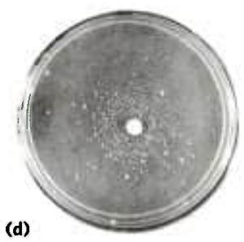  
FIGURE 25-19 Ames test for carcinogens, based on their mutagenicity. A strain of Salmonella typhimurium having a mutation that inactivates an enzyme of the histidine biosynthetic pathway is plated on a histidine-free medium. Few cells grow. (a) The few small colonies of S. typhimurium that do grow on a histidine-free medium carry spontaneous mutations that permit the histidine biosynthetic pathway to operate. Three identical nutrient plates (b), (c), and (d) have been inoculated with an equal number of cells. Each plate then receives a disk of filter paper containing progressively lower concentrations of a mutagen. The mutagen greatly increases the rate of back-mutation and hence the number of colonies. The clear areas around the filter paper indicate where the concentration of mutagen is so high that it is lethal to the cells. As the mutagen diffuses away from the filter paper, it is diluted to sublethal concentrations that promote back-mutation. Mutagens can be compared on the basis of their effect on mutation rate. Because many compounds undergo a variety of chemical transformations after entering cells, compounds are sometimes tested for mutagenicity after first incubating them with a liver extract. Some substances have been found to be mutagenic only after this treatment. [Bruce N. Ames, University of California, Berkeley, Department of Biochemistry and Molecular Biology.]

## All Cells Have Multiple DNA Repair Systems

The number and diversity of repair systems reflect both the importance of DNA repair to cell survival and the diverse sources of DNA damage (Table 25-5). Some common types of lesions, such as pyrimidine dimers (see Fig. 8-30), can be repaired by several distinct systems. Nearly 200 genes in the human genome encode proteins dedicated to DNA repair. In many cases, the loss of function of one of these proteins results in genomic instability and an increased occurrence of oncogenesis (Box 25-1).

P2 Many DNA repair processes also seem to be extraordinarily inefficient energetically—an exception to the pattern observed in the vast majority of metabolic pathways, where every ATP is generally accounted for and used optimally. When the integrity of the genetic information is at stake, the amount of chemical energy invested in a repair process seems almost irrelevant.

Accurate DNA repair is possible largely because the DNA molecule consists of two complementary strands. Damaged DNA in one strand can be removed and replaced, without introducing mutations, by using the undamaged complementary strand as a template. We consider here the principal types of repair systems, beginning with those that repair the rare nucleotide mismatches that are left behind by replication.

<table><tr><td colspan="2">TABLE 25-5 Types of DNA Repair Systems in E. coli</td></tr><tr><td>Enzymes/proteins</td><td>Type of damage</td></tr><tr><td colspan="2">Mismatch repair</td></tr><tr><td>Dam methylaseMutH, MutL, MutS proteinsDNA helicase IISSB</td><td rowspan="2">Mismatches</td></tr><tr><td>DNA polymerase IIIExonuclease IExonuclease VIIRecJ nucleaseExonuclease XDNA ligase</td></tr><tr><td colspan="2">Base-excision repair</td></tr><tr><td>DNA glycosylasesAP endonucleasesDNA polymerase IDNA ligase</td><td>Abnormal bases (uracil,hypoxanthine, xanthine);alkylated bases; in some otherorganisms, pyrimidine dimers</td></tr><tr><td colspan="2">Nucleotide-excision repair</td></tr><tr><td>ABC excinucleaseDNA polymerase IDNA ligase</td><td>DNA lesions that causelarge structural change(e.g., pyrimidine dimers)</td></tr><tr><td colspan="2">Direct repair</td></tr><tr><td>DNA photolyases</td><td>Pyrimidine dimers</td></tr><tr><td> $O^6$ -Methylguanine-DNAmethyltransferase</td><td> $O^6$ -Methylguanine</td></tr><tr><td>AlkB protein</td><td>1-Methylguanine, 3-methylcytosine</td></tr></table>

Mismatch Repair Correction of the rare mismatches left after replication in E. coli improves the overall fidelity of replication by an additional factor of $10^{2}$ to $10^{3}$ . The mismatches are nearly always corrected to reflect the information in the old (template) strand, which the repair system can distinguish from the newly synthesized strand by the presence of methyl group tags on the template DNA. The mismatch repair system of E. coli includes at least 10 protein components (Table 25-5) that function either in strand discrimination or in the repair process itself. The functions of many of these were first worked out by Paul Modrich and colleagues in the 1980s.

The strand discrimination mechanism has not been determined for most bacteria or eukaryotes, but it is well understood for E. coli and some closely related bacterial species. In these bacteria, strand discrimination is based on the action of Dam methylase, which, as you will recall, methylates DNA at the $N^{6}$ position of all adenines within (5')GATC sequences. Immediately after passage of the replication fork, there is a short period (a few seconds or minutes) during which the template strand is methylated

## DNA Repair and Cancer

Human cancers develop when genes that regulate normal cell division (oncogenes and tumor suppressor genes; see Chapter 12) fail to function, are activated at the wrong time, or are altered. As a consequence, cells may grow out of control and form a tumor. The genes controlling cell division can be damaged by spontaneous mutation or overridden by the invasion of a tumor virus (Chapter 26). Not surprisingly, alterations in DNA repair genes that result in a higher rate of mutation can greatly increase an individual's susceptibility to cancer. Defects in the genes encoding the proteins involved in nucleotide-excision repair, mismatch repair, recombinational repair, and error-prone translesion DNA synthesis have all been linked to human cancers. Clearly, DNA repair can be a matter of life and death.

Nucleotide-excision repair requires a larger number of proteins in humans than in bacteria, although the overall pathways are very similar. Genetic defects that inactivate nucleotide-excision repair have been associated with several genetic diseases, the best-studied of which is xeroderma pigmentosum (XP). Because nucleotide-excision repair is the sole repair pathway for pyrimidine dimers in humans, people with XP are extremely sensitive to light and readily develop sunlight-induced skin cancers. Most people with XP also have neurological abnormalities, presumably because of their inability to repair certain lesions caused by the high rate of oxidative metabolism in neurons. Defects in the genes encoding any of at least seven different protein components of the nucleotide-excision repair system can result in XP, giving rise to seven different genetic groups, denoted XPA to XPG. Note that XPC and XPE are parts of complexes that recognize damaged DNA, whereas XPA, XPB, XPD, XPF, and XPG are all components of a much larger multisubunit complex that represents the human excinuclease depicted in Figure 25-24. These proteins are involved in making the DNA incisions and removing the 29mer segment of DNA.

Most microorganisms have redundant pathways for the repair of cyclobutane pyrimidine dimers—making use of DNA photolyases and sometimes base-excision repair as alternatives to nucleotide-excision repair—but humans and other placental mammals do not. This lack of a backup for nucleotide-excision repair for removing pyrimidine dimers has led to speculation that early mammals were small, furry, nocturnal animals with little need to repair UV damage. However, mammals do have a pathway for the translesion bypass of cyclobutane pyrimidine dimers, which involves

but the newly synthesized strand is not (Fig. 25-20). The transient unmethylated state of GATC sequences in the newly synthesized strand permits the new strand to be distinguished from the template strand. Replication mismatches in the vicinity of a hemimethylated GATC sequence are then repaired according to the information

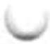

DNA polymerase $\eta$ . This enzyme preferentially inserts two A residues opposite a T–T pyrimidine dimer, minimizing mutations. People with a genetic condition in which DNA polymerase $\eta$ function is missing exhibit an XP-like illness known as XP-variant, or XP-V. Clinical manifestations of XP-V are similar to those of the classic XP diseases, although mutation levels are higher in XP-V when cells are exposed to UV light. Apparently, the nucleotide-excision repair system works in concert with DNA polymerase $\eta$ in normal human cells, repairing and/or bypassing pyrimidine dimers as needed to keep cell growth and DNA replication going. Exposure to UV light introduces a heavy load of pyrimidine dimers, and some must be bypassed by translesion synthesis to keep replication on track. When one system is missing, it is partly compensated for by the other. A loss of DNA polymerase $\eta$ activity leads to stalled replication forks and bypass of UV lesions by different, more mutagenic, translesion synthesis (TLS) polymerases. As when other DNA repair systems are absent, the resulting increase in mutations often leads to cancer.

One of the most common inherited cancer-susceptibility syndromes is hereditary nonpolyposis colon cancer (HNPCC). This syndrome has been traced to defects in mismatch repair. Human and other eukaryotic cells have several proteins analogous to the bacterial MutL and MutS proteins (see Fig. 25-21). Defects in at least five different mismatch repair genes can give rise to HNPCC. The most prevalent are defects in the hMLH1 (human MutL homolog 1) and hMSH2 (human MutS homolog 2) genes. In individuals with HNPCC, cancer generally develops at an early age, with colon cancers being most common.

Most human breast and ovarian cancer occurs in women with no known predisposition. However, about 10% of cases are associated with inherited defects in two genes, BRCA1 and BRCA2. Human BRCA1 and BRCA2 are large proteins (1,834 and 3,418 amino acid residues, respectively) that interact with a wide range of other proteins involved in transcription, chromosome maintenance, DNA repair, and control of the cell cycle. BRCA2 has been implicated in the recombinational DNA repair of double-strand breaks. One of the key roles of BRCA2 is to load the human RecA homolog, called Rad51, onto DNA at the sites of double-strand breaks. BRCA1 has as yet imperfectly defined roles in the repair of double-strand breaks, transcription, and some other processes of DNA metabolism. Women with defects in either the BRCA1 or BRCA2 gene have a high (\~70%) chance of developing breast cancer.

in the methylated parent (template) strand. If both strands are methylated at a GATC sequence, few mismatches are repaired; if neither strand is methylated, repair occurs but does not favor either strand. The methyl-directed mismatch repair system of E. coli efficiently repairs mismatches up to 1,000 bp from a hemimethylated GATC sequence.

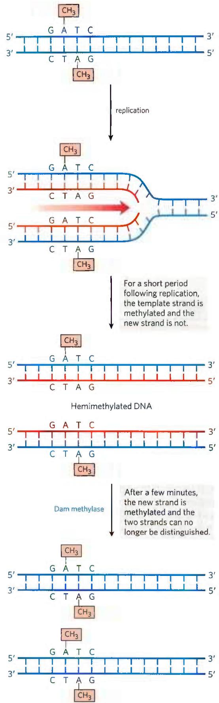  
FIGURE 25-20 Methylation and mismatch repair. Methylation of DNA strands can serve to distinguish parent (template) strands from newly synthesized strands in E. coli DNA, a function that is critical to mismatch repair. The methylation occurs at the $N^{6}$ of adenines in (5')GATC sequences. This sequence is a palindrome, present in opposite orientations on the two strands.

How is the mismatch correction process directed by relatively distant GATC sequences? Figure 25-21 illustrates one mechanism. MutS scans the DNA and forms a clamplike complex upon encountering a lesion. The complex binds to all mismatched base pairs (except C–C). MutL protein forms a complex with MutS protein, and the MutSL complex slides along the DNA to find a hemimethylated GATC sequence. MutH binds to MutL, and the MutSLH complex moves in either direction at random along the DNA. MutH has a site-specific endonuclease activity that is inactive until the complex encounters a hemimethylated GATC sequence. At this site, MutH catalyzes cleavage of the unmethylated strand on the 5' side of the G in GATC, which marks the strand for repair. Further steps in the pathway depend on where the mismatch is located relative to this cleavage site (Fig. 25-22).

When the mismatch is on the 5' side of the cleavage site (Fig. 25-22, right side), the unmethylated strand is unwound and degraded in the 3'→5' direction from the

  
FIGURE 25-21 A model for the early steps of methyl-directed mismatch repair. Recognition of the sequence (5')GATC and of the mismatch are specialized functions of the MutH and MutS proteins, respectively.

  
FIGURE 25-22 Completion of methyl-directed mismatch repair. The combined action of DNA helicase II, SSB, and one of four different exonucleases removes a segment of the new strand between the MutH cleavage site and a point just beyond the mismatch. The particular  
exonuclease depends on the location of the cleavage site relative to the mismatch, as shown by the alternative pathways here. The resulting gap is filled in (dashed line) by DNA polymerase III, and the nick is sealed by DNA ligase (not shown).

cleavage site through the mismatch, and this segment is replaced with new DNA. This process requires the combined action of DNA helicase II (also called UvrD helicase), SSB, exonuclease I or exonuclease X (both of which degrade strands of DNA in the 3'→5' direction) or exonuclease VII (which degrades single-stranded DNA in either direction), DNA polymerase III, and DNA ligase. The pathway for repair of mismatches on the 3' side of the cleavage site is similar (Fig. 25-22, left), except that the exonuclease is either exonuclease VII or RecJ nuclease (which degrades single-stranded DNA in the 5'→3' direction).

P2 Mismatch repair is particularly costly for E. coli in terms of energy expended. The mismatch may occur 1,000 or more base pairs from the GATC sequence. The degradation and replacement of a strand segment of this length require an enormous investment in activated deoxynucleotide precursors to repair a single mismatched base. This again underscores the importance to the cell of genomic integrity.

Eukaryotic cells also have mismatch repair systems, with several proteins structurally and functionally analogous to the bacterial MutS and MutL (but not MutH) proteins. Alterations in human genes encoding proteins of this type produce some of the most common inherited cancer-susceptibility syndromes (see Box 25-1), further demonstrating the value to the organism of DNA repair systems. The main MutS homologs in most eukaryotes, from yeast to humans, are MSH2 (MutS homolog), MSH3, and MSH6. Heterodimers of MSH2 and MSH6 generally bind to single base-pair mismatches, and they bind less well to slightly longer mispaired loops. In many organisms, the longer mismatches (2 to 6 bp) may be bound instead by a heterodimer of MSH2 and MSH3, or are bound by both types of heterodimers in tandem. Homologs of MutL, predominantly a heterodimer of MLH1 (MutL homolog) and PMS1 (post-meiotic segregation), bind to and stabilize the MSH complexes. Many details of the subsequent events in eukaryotic mismatch repair remain to be worked out. In particular, we do not know how newly synthesized DNA strands are identified, although research reveals that this process does not involve GATC sequences.

Base-Excision Repair Every cell has a class of enzymes called DNA glycosylases that recognize particularly common DNA lesions (such as the products of cytosine and adenine deamination; see Fig. 8-29a) and remove the affected base by cleaving the N-glycosyl bond. The repair pathway is called base-excision repair, as the first step involves only the removal of the base rather than an entire nucleotide. The cleavage creates an apurinic or apyrimidinic site in the DNA, commonly referred to as an AP site or abasic site. Each DNA glycosylase is generally specific for one type of lesion.

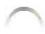

Uracil DNA glycosylases, for example, found in most cells, specifically remove from DNA the uracil that results from spontaneous deamination of cytosine. Mutant cells that lack this enzyme have a high rate of G≡C to A=T mutations. This glycosylase does not remove uracil residues from RNA or thymine residues from DNA. The capacity to distinguish thymine from uracil, the product of cytosine deamination—necessary for the selective repair of the latter—may be one reason why DNA evolved to contain thymine instead of uracil (p. 280).

Most bacteria have just one type of uracil DNA glycosylase, whereas humans have at least four types, with different specificities—an indicator of the importance of removing uracil from DNA. The most abundant human uracil glycosylase, UNG, is associated with the replisome, where it eliminates the occasional U residue inserted in place of a T during replication. The deamination of C residues is 100-fold faster in single-stranded DNA than in double-stranded DNA, and humans have an enzyme, hSMUG1, that removes any U residues occurring in single-stranded DNA during replication or transcription. Two other human DNA glycosylases, TDG and MBD4, remove either U or T residues paired with G, which are generated by deamination of cytosine or 5-methylcytosine, respectively.

Other DNA glycosylases recognize and remove a variety of damaged bases, including formamidopyrimidine and 8-hydroxyguanine (both arising from purine oxidation), hypoxanthine (from adenine deamination), and alkylated bases such as 3-methyladenine and 7-methylguanine. Glycosylases that recognize other lesions, including pyrimidine dimers, have also been identified in some classes of organisms. Remember that AP sites also arise from slow, spontaneous hydrolysis of the N-glycosyl bonds in DNA (see Fig. 8-29b).

Once an AP site has been formed by a DNA glycosylase, another type of enzyme must repair it. The repair is not made by simply inserting a new base and re-forming the N-glycosyl bond. Instead, the deoxyribose 5'-phosphate left behind is removed and replaced with a new nucleotide. This process begins with one of the AP endonucleases, enzymes that cut the DNA strand containing the AP site. The position of the incision relative to the AP site (5' or 3' to the site) depends on the type of AP endonuclease. A segment of DNA including the AP site is then removed, DNA polymerase I replaces the DNA, and DNA ligase seals the remaining nick (Fig. 25-23). In eukaryotes, nucleotide replacement is carried out by specialized polymerases, as described below.

Nucleotide-Excision Repair DNA lesions that cause large distortions in the helical structure of DNA generally are repaired by the nucleotide-excision system, a repair pathway critical to the survival of all free-living organisms. In nucleotide-excision repair (Fig. 25-24), a multisubunit enzyme (excinuclease) hydrolyzes two phosphodiester bonds, one on either side of the distortion caused by the lesion. In E. coli and other bacteria, the enzyme system hydrolyzes the fifth phosphodiester bond on the 3' side and the eighth phosphodiester bond on the 5' side to generate a fragment of 12 to 13 nucleotides (depending on whether the lesion involves one or two bases). In humans and other eukaryotes, the enzyme system hydrolyzes the sixth phosphodiester bond on the 3' side and the twenty-second phosphodiester bond on the 5' side, producing a fragment of 27 to 29 nucleotides. Following the dual incision, the excised oligonucleotides are released from the duplex and the resulting gap is filled—by DNA polymerase I in E. coli and DNA polymerase ε in humans. DNA ligase seals the nick.

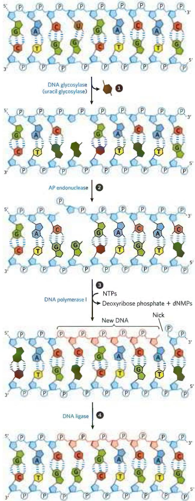  
FIGURE 25-23 DNA repair by the base-excision repair pathway. 1 A DNA glycosylase recognizes a damaged base (in this case, a uracil) and cleaves between the base and deoxyribose in the backbone. 2 An AP endonuclease cleaves the phosphodiester backbone near the AP site. 3 DNA polymerase I initiates repair synthesis from the free $3^{\prime}$ hydroxyl at the nick, removing (with its $5^{\prime} \rightarrow 3^{\prime}$ exonuclease activity) and replacing a portion of the damaged strand. 4 The nick remaining after DNA polymerase I has dissociated is sealed by DNA ligase.

  
FIGURE 25-24 Nucleotide-excision repair in E. coli and humans. The general pathway of nucleotide-excision repair is similar in all organisms. ① An excinuclease binds to DNA at the site of a bulky lesion and cleaves the damaged DNA strand on either side of the lesion. ② The  
DNA segment — of 13 nucleotides (13mer) or 29 nucleotides (29mer) — is removed with the aid of a helicase. The gap is filled in by DNA polymerase, and the remaining nick is sealed with DNA ligase. (Information from a figure provided by Aziz Sancar.)

In E. coli, the key enzymatic complex is the ABC excinuclease, which has three protein components, UvrA ( $M_{r}$ 104,000), UvrB ( $M_{r}$ 78,000), and UvrC ( $M_{r}$ 68,000). The term “excinuclease” is used to describe the unique capacity of this enzyme complex to catalyze two specific endonucleolytic cleavages, distinguishing this activity from that of standard endonucleases. A dimeric UvrA protein (an ATPase) scans the DNA and binds to the site of a lesion. A UvrB protein can bind to UvrA either before or after an encounter with the lesion. At the lesion, the UvrA dimer dissociates, leaving a tight UvrB-DNA complex. UvrC protein then binds to UvrB, and UvrB makes an incision at the fifth phosphodiester bond on the 3' side of the lesion. This is followed by a UvrC-mediated incision at the eighth phosphodiester bond on the 5' side. The resulting fragment, consisting of 12 to 13 nucleotides, is removed by UvrD helicase. The short gap thus created is filled in by DNA polymerase I and DNA ligase. This pathway (Fig. 25-24, left) is a primary repair route for many types of lesions, including cyclobutane pyrimidine dimers, 6-4 photoproducts (see Fig. 8-30), and several other types of base adducts, including benzo[a]pyrene-guanine, which is formed in DNA by exposure to cigarette smoke. The nucleolytic activity of the ABC excinuclease is novel in the sense that two cuts are made in the DNA.

The mechanism of eukaryotic excinucleases is quite similar to that of the bacterial enzyme, although at least 16 polypeptides with no similarity to the E. coli excinuclease subunits are required for the dual incision. Some of the nucleotide-excision repair and base-excision repair in eukaryotes is closely tied to transcription (see Chapter 26). Genetic deficiencies in nucleotide-excision repair in humans give rise to a variety of serious diseases (see Box 25-1).

Direct Repair Several types of damage are repaired without removing a base or nucleotide. The best-characterized example is direct photoreactivation of cyclobutane pyrimidine dimers, a reaction promoted by DNA photolyases. Pyrimidine dimers result from a UV-induced reaction.

Through a mechanism worked out by Aziz Sancar and colleagues, photolyases use energy derived from absorbed light to reverse the damage (Fig. 25-25). Photolyases generally contain two cofactors that serve as light-absorbing agents, or chromophores: in all organisms, one is FADH $_{2}$ ; in E. coli and yeast, the other is a folate. The reaction mechanism entails the generation of free radicals. DNA photolyases are not found in humans and other placental mammals.

Additional examples are seen in the repair of nucleotides with alkylation damage. The modified nucleotide $O^{6}$ -methylguanine forms in the presence of alkylating agents and is a common and highly mutagenic lesion. It tends to pair with thymine rather than cytosine during replication, and therefore causes G≡C to A=T mutations (Fig. 25-26).

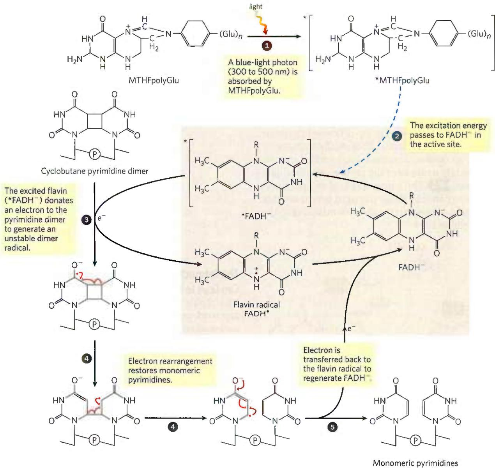

MECHANISM FIGURE 25-25 Repair of pyrimidine dimers with photolyase. Energy derived from absorbed light is used to reverse the photoreaction that caused the lesion. The two chromophores in E. coli photolyase (M, 54,000), $N^5$ , $N^{10}$ -methenyltetrahydrofolylpolyglutamate (MTHFpolyGlu)

and FADH $^{-}$ , perform complementary functions. MTHFpolyGlu functions as a photoantenna to absorb blue-light photons. The excitation energy passes to FADH $^{-}$ , and the excited flavin ( $*$ FADH $^{-}$ ) donates an electron to the pyrimidine dimer, leading to the rearrangement as shown.

  
FIGURE 25-26 Example of how DNA damage results in mutations. (a) The methylation product $O^6$ -methylguanine pairs with thymine rather than cytosine residues. (b) If not repaired, this leads to a G≡C to A=T mutation after replication.

Direct repair of $O^{6}$ -methylguanine is carried out by $O^{6}$ -methylguanine-DNA methyltransferase, a protein that catalyzes transfer of the methyl group of $O^{6}$ -methylguanine to one of its own Cys residues. This methyltransferase is not strictly an enzyme, because a single methyl transfer event permanently methylates the protein, inactivating it in this pathway. P2 The consumption of an entire protein molecule to correct a single damaged base is another vivid illustration of the priority given to maintaining the integrity of cellular DNA.

A very different but equally direct mechanism is used to repair 1-methyladenine and 3-methylcytosine. The amino groups of A and C residues are sometimes methylated when the DNA is single-stranded, and the methylation directly affects proper base pairing. In E. coli, oxidative demethylation of these alkylated nucleotides is mediated by the AlkB protein, a member of the $\alpha$ -ketoglutarate- $Fe^{2+}$ -dependent dioxygenase superfamily (Fig. 25-27). (See Box 4-2 for a description of proline hydroxylation, catalyzed by another member of this enzyme family.)

## The Interaction of Replication Forks with DNA Damage Can Lead to Error-Prone Translesion DNA Synthesis

The repair pathways considered to this point generally work only for lesions in double-stranded DNA, the undamaged strand providing the correct genetic information to restore the damaged strand to its original state. However, in certain types of lesions, such as double-strand breaks, double-strand cross-links, or lesions in a single-stranded DNA, the complementary strand is itself damaged or is absent. P3 Double-strand breaks and lesions in single-stranded DNA most often arise when a replication fork encounters an unrepaired DNA lesion (Fig. 25-28). Such lesions and DNA cross-links can also result from ionizing radiation and oxidative reactions.

At a stalled bacterial replication fork, there are two avenues for repair. In the absence of a second strand, the information required for accurate repair must come from a separate, homologous chromosome. The repair system thus involves homologous genetic recombination. This recombinational DNA repair is considered in

  
FIGURE 25-27 Direct repair of alkylated bases by AlkB. The AlkB protein is an $\alpha$ -ketoglutarate- $\mathrm{Fe}^{2+}$ -dependent hydroxylase (see Box 4-2). It catalyzes the oxidative demethylation of 1-methyladenine and 3-methylcytosine residues.

  
FIGURE 25-28 DNA damage and its effect on DNA replication. If the replication fork encounters an unrepaired lesion or strand break, the DNA polymerase sometimes disengages and re-initiates downstream. The lesion remains in an unreplicated, single-stranded gap that is left behind the replication fork (left). In other cases, a replication fork may encounter a lesion that is actively undergoing repair such that a transient break is present in one of the template strands. When the replication fork encounters it, the single-strand break becomes a double-strand break (right). In each case, the damage to  
one strand cannot be repaired by mechanisms described earlier in this chapter, because the complementary strand required to direct accurate repair is damaged or absent. There are at least two possible avenues for repair: recombinational DNA repair or, when lesions are unusually numerous, error-prone repair. The latter mechanism involves translesion DNA polymerases such as DNA polymerase V, encoded by the umuC and umuD genes and activated by the RecA protein that can replicate, albeit inaccurately, over many types of lesions. The repair mechanism is "error-prone" because mutations often result.

detail in Section 25.3. Under some conditions, a second repair pathway, error-prone translesion DNA synthesis (often abbreviated TLS), becomes available. When this pathway is active, DNA repair is significantly less accurate, and a high mutation rate can result. In bacteria, error-prone translesion DNA synthesis is part of a cellular stress response to extensive DNA damage known, appropriately enough, as the SOS response.

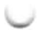

Some of the 40 or more SOS proteins, such as the UvrA and UvrB proteins involved in the error-free nucleotide-excision repair already described, are normally present in the cell but are induced to higher levels as part of the SOS response. Additional SOS proteins participate in the pathway for error-prone repair; these include the UmuC and UmuD proteins (unmutable; lack of the umu gene eliminates error-prone repair). The UmuD protein is cleaved in an SOS-regulated process to a shorter form called UmuD', which forms a complex with UmuC and a protein called RecA (described in Section 25.3) to create a specialized DNA polymerase, DNA polymerase V (UmuD'2UmuCRecA), which can replicate past many of the DNA lesions that would normally block replication. Proper base pairing is often impossible at the site of such a lesion, so this translesion replication is error-prone.

Given the emphasis on the importance of genomic integrity throughout this chapter, the existence of a system that increases the rate of mutation may seem incongruous. However, we can think of this system as a desperation strategy. The umuC and umuD genes are fully induced only late in the SOS response, and they are not activated for translesion synthesis initiated by UmuD cleavage unless the levels of DNA damage are particularly high and all replication forks are blocked. The mutations resulting from DNA polymerase V-mediated replication kill some cells and create deleterious mutations in others, but this is the biological price a species pays to overcome an otherwise insurmountable barrier to replication, as it permits at least a few mutant daughter cells to survive.
P3 The resultant mutations contribute to evolution.

Yet another DNA polymerase, DNA polymerase IV, is also induced during the SOS response. Replication by DNA polymerase IV, a product of the dinB gene, is also highly error-prone. The bacterial DNA polymerases IV and V (Table 25-1) are part of a family of TLS polymerases found in all organisms. These enzymes lack a proofreading exonuclease and have a more open active site than other DNA polymerases, one that accommodates damaged template nucleotides. With these enzymes, the fidelity of base selection during replication may be reduced by a factor of $10^{2}$ , lowering overall replication fidelity to one error in $\sim 1,000$ nucleotides.

P4 Mammals have many low-fidelity DNA polymerases of the TLS polymerase family. However, the presence of these enzymes does not necessarily translate into an unacceptable mutational burden, because most of the enzymes also have specialized functions in DNA repair. DNA polymerase η (eta), for example, found in all eukaryotes, promotes translesion synthesis primarily across cyclobutane T–T dimers. Few mutations result, because the enzyme preferentially inserts two A residues across from the linked T residues. Several other low-fidelity polymerases, including DNA polymerases β,ι (iota), and λ, have specialized roles in eukaryotic base-excision repair. Each of these enzymes has a 5'-deoxyribose phosphate lyase activity in addition to its polymerase activity. After base removal by a glycosylase and backbone cleavage by an AP endonuclease, these polymerases remove the abasic site (a 5'-deoxyribose phosphate) and fill in the very short gap. The frequency of mutation due to DNA polymerase $\eta$ activity is minimized by the short lengths (often one nucleotide) of DNA synthesized.

What emerges from research into cellular DNA repair systems is a picture of a DNA metabolism that maintains genomic integrity with multiple and often redundant systems. Most of the major DNA repair systems occur in all organisms. P4 These repair systems are often integrated with the DNA replication systems and are complemented by recombination systems, which we turn to next.

## SUMMARY 25.2 DNA Repair

■ Mutations are genomic changes that alter the information in DNA. When mutations occur in genes encoding enzymes involved in DNA repair, the loss of function can lead to cancer.

Cells have many systems for DNA repair. Major repair systems present in all organisms include mismatch repair, base excision repair, nucleotide-excision repair, and direct repair.

In bacteria, TLS DNA polymerases respond to very heavy DNA damage with error-prone translesion DNA synthesis. In eukaryotes, similar polymerases have specialized roles in DNA repair that minimize the introduction of mutations.

## 25.3 DNA Recombination

The rearrangement of genetic information within and among DNA molecules encompasses a variety of processes, collectively placed under the heading of genetic recombination. The practical applications of DNA rearrangements in altering the genomes of increasing numbers of organisms are now being explored (Chapter 9).

  
Barbara McClintock,
1902–1992
[AP Photo.]

Genetic recombination events fall into at least three general classes. Homologous genetic recombination (also called general recombination) involves genetic exchanges between any two DNA molecules (or segments of the same molecule) that share an extended region of nearly identical sequence. The actual sequence of bases is irrelevant, as long as it is similar in the two DNAs. In site-specific recombination, the exchanges occur only

at a particular DNA sequence. DNA transposition is distinct from both other classes in that it usually involves a short segment of DNA with the remarkable capacity to move from one location in a chromosome to another. These "jumping genes" were first observed in maize in the 1940s by Barbara McClintock. There are also unusual genetic rearrangements for which no mechanism or purpose has yet been proposed. Here we focus on the three general classes.

Homologous genetic recombination is largely a pathway to repair double-strand breaks in DNA. An alternative process for double-strand break repair that does not entail recombination, called nonhomologous end joining (NHEJ), is also described here. Genetic recombination systems have functions as varied as their mechanisms. They include roles in specialized DNA repair systems, specialized activities in DNA replication, regulation of expression of certain genes, facilitation of proper chromosome segregation during eukaryotic cell division, maintenance of genetic diversity, and implementation of programmed genetic rearrangements during embryonic development. In most cases, genetic recombination is closely integrated with other processes in DNA metabolism, and this becomes a theme of our discussion.

## Bacterial Homologous Recombination Is a DNA Repair Function

P4 In bacteria, homologous genetic recombination is primarily a DNA repair process, and in this context (as noted in Section 25.2) it is referred to as recombinational DNA repair. It is usually directed at the reconstruction of replication forks that have stalled or collapsed at the site of DNA damage. Homologous genetic recombination can also occur during conjugation (mating), when chromosomal DNA is transferred from one bacterial cell (donor) to another (recipient). Recombination during conjugation, although rare in wild bacterial populations, contributes to genetic diversity.

P4 When a replication fork encounters DNA damage, many pathways may resolve the conflict. A common feature of the DNA repair pathways illustrated in Figures 25-21 to 25-24 is that they introduce a transient break into one of the DNA strands. If a replication fork encounters a damaged site under repair near a break in one of the template strands, one arm of the replication fork becomes disconnected by a double-strand break and the fork collapses (Fig. 25-29). The end of that break is processed by degrading the 5'-ending strand. The resulting 3' single-stranded extension is bound by a recombinase

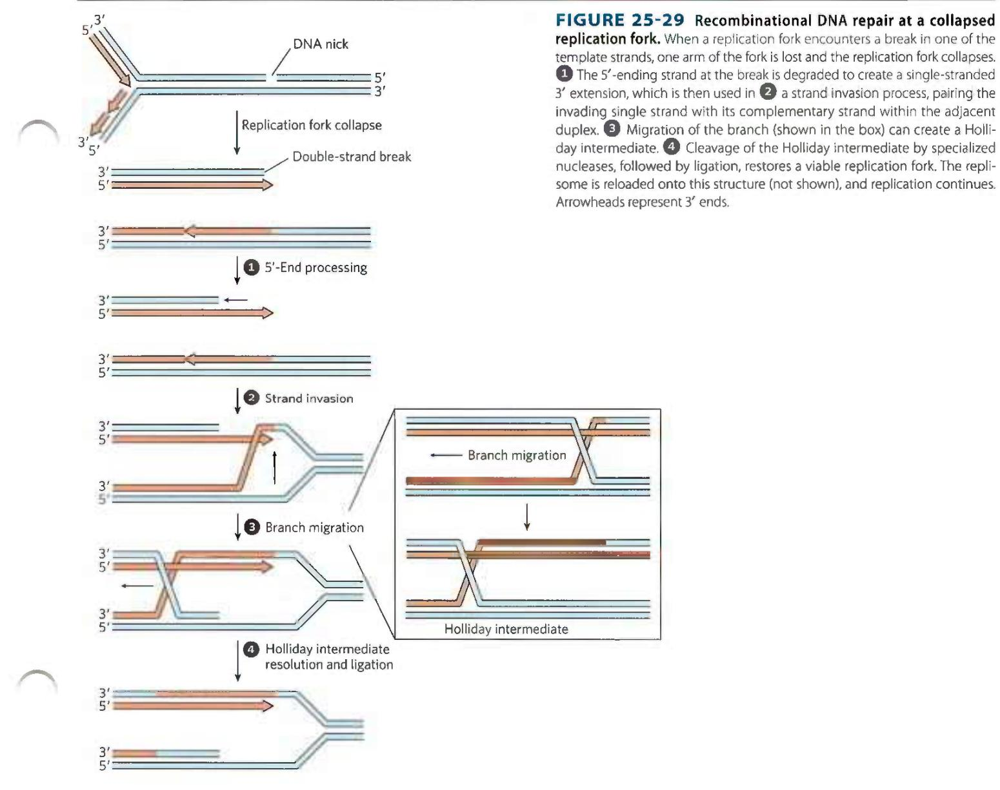

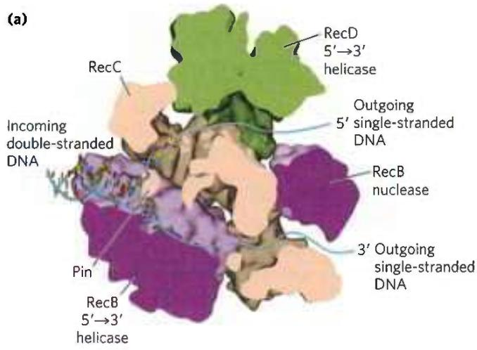  
FIGURE 25-30 The RecBCD helicase/nuclease. (a) A cutaway view of the RecBCD enzyme structure as it is bound to DNA. The subunits are shown in different colors; the DNA is entering from the left, and the unwound DNA strands (not part of the solved structure) are shown exiting to the right. A bulbous protein structure called a pin, part of the RecC subunit, facilitates the separation of strands. (b) Activities of the RecBCD enzyme at a DNA end. [(a) Data from PDB ID 1W36, M. R. Singleton et al., Nature 432:187, 2004.]

that uses it to promote strand invasion: the 3' end invades the intact duplex DNA connected to the other arm of the fork and pairs with its complementary sequence. This creates a branched DNA structure (a point where three DNA segments come together). The DNA branch can be moved in a process called branch migration to create an X-like crossover structure known as a Holliday intermediate, named after researcher Robin Holliday, who first postulated its existence. The Holliday intermediate is cleaved, or "resolved," by a special class of nucleases. The overall process reconstructs the replication fork.

In E. coli, the DNA end-processing is promoted by the RecBCD nuclease/helicase. The RecBCD enzyme binds to linear DNA at a free (broken) end and moves inward along the double helix, unwinding and degrading the DNA in a reaction coupled to ATP hydrolysis (Fig. 25-30). The RecB and RecD subunits are helicase motors, with RecB moving $3'\rightarrow5'$ along one strand, and RecD moving $5'\rightarrow3'$ along the other strand. The activity of the enzyme is altered when it interacts with a sequence referred to as chi, (5')GCTGGTGG, which binds tightly to a site on the RecC subunit. From that point, degradation of the strand with a $3'$ terminus is greatly reduced, but degradation of the $5'$ -terminal strand is increased. This process creates a single-stranded DNA with a $3'$ end, which is used during subsequent steps in recombination. The 1,009 chi sequences scattered throughout the E. coli genome enhance the frequency of recombination about 5- to 10-fold within 1,000 bp of each chi site. The enhancement declines as the distance from chi increases. Sequences that enhance recombination frequency have also been identified in several other organisms.

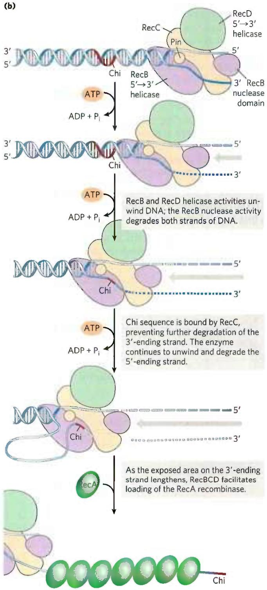

The bacterial recombinase is the RecA protein. RecA is unusual among the proteins of DNA metabolism in that its active form is an ordered, helical filament of up to several thousand subunits that assemble cooperatively on DNA (Fig. 25-31). This filament usually forms on single-stranded DNA, such as that produced by the RecBCD enzyme. Its formation is not as straightforward as shown in Figure 25-31, because the single-stranded DNA-binding protein (SSB) is normally present and

(c)  

  
FIGURE 25-31 RecA protein filaments. RecA and other recombinases in this class function as filaments of nucleoprotein. (a) Filament formation proceeds in discrete nucleation and extension steps. Nucleation is the addition of the first few RecA subunits. Extension occurs by adding RecA subunits so that the filament grows in the 5'→3' direction. When disassembly occurs, subunits are subtracted from the trailing end. (b) Colorized electron micrograph of a RecA filament bound to DNA. (c) Segment of a RecA filament with four helical turns (24 RecA subunits). Notice the bound double-stranded DNA in the center. The core domain of RecA is structurally related to the motor domains of helicases. [(b) By permission of the Estate of Ross Inman. Special thanks to Kim Voss. (c) Data from PDB ID 3CMX, Z. Chen et al., Nature 453:489, 2008.]

specifically impedes the binding of the first few subunits to DNA (filament nucleation). The RecBCD enzyme acts directly as a RecA loader, facilitating the nucleation of a RecA filament on single-stranded DNA that is coated with SSB. The filaments assemble and disassemble predominantly in a 5'→3' direction. Many other bacterial proteins regulate the formation and disassembly of RecA filaments, including an alternative set of RecA loading proteins called RecF, RecO, and RecR. RecA protein promotes the central steps of homologous recombination, including the DNA strand invasion step of Figure 25-29, as well as other strand exchange reactions occurring in vitro. Once a Holliday intermediate has been created via branch migration, it can be cleaved by specialized nucleases such as the bacterial RuvC protein (Fig. 25-32), and nicks are sealed by DNA ligase. A viable replication fork structure is thus reconstructed, as outlined in Figure 25-29.

After the recombination steps are completed, the replication fork reassembles in a process called origin-independent restart of replication. Different combinations of four proteins (PriA, PriB, PriC, and DnaT) act with DnaC in several pathways to load DnaB helicase onto the reconstructed replication fork. The DnaG primase then synthesizes an RNA primer, and DNA polymerase III reassembles on DnaB to restart DNA synthesis. Complexes that include some combination of the PriA, PriB, PriC, and DnaT, along with DnaB, DnaC, and DnaG proteins, are called replication restart primosomes. In this way, the process of recombination is tightly intertwined with replication. One process of DNA metabolism supports the other.

  
FIGURE 25-32 Resolution of a Holliday intermediate by the RuvC protein. RuvC is a specialized nuclease that binds to the RuvAB complex and cleaves the Holliday intermediate on opposing sides of the crossover junction (red arrows), so that two contiguous DNA arms remain in each product.

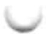

## Eukaryotic Homologous Recombination Is Required for Proper Chromosome Segregation during Meiosis

In eukaryotes, homologous genetic recombination has roles in replication and cell division, including the repair of stalled replication forks. Recombination occurs with the highest frequency during meiosis, the process by which diploid germ-line cells with two sets of chromosomes divide to produce haploid gametes (sperm cells or ova) in animals (haploid spores in plants)—each gamete having only one member of each chromosome pair (Fig. 25-33).

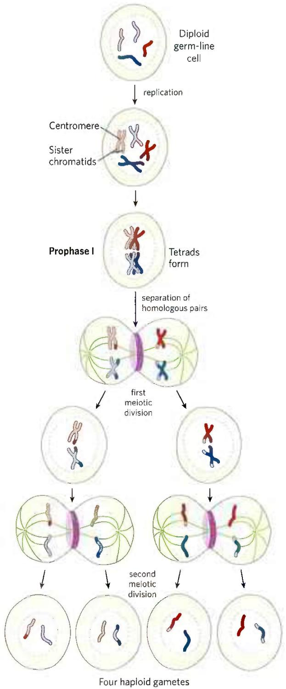

Meiosis begins with replication of the DNA in the germ-line cell so that each DNA molecule is present in four copies. Each set of four homologous chromosomes (tetrad) exists as two pairs of sister chromatids, and the sister chromatids remain associated at their centromeres. The cell then goes through two rounds of cell division without an intervening round of DNA replication. In the first cell division, the two pairs of sister chromatids are segregated into daughter cells. In the second cell division, the two chromosomes in each sister chromatid pair are segregated into new daughter cells. In each division, the chromosomes to be segregated are drawn into the daughter cells by spindle fibers attached to opposite poles of the dividing cell. The two successive divisions reduce the DNA content to the haploid level in each gamete.

Proper chromosome segregation into daughter cells requires that physical links exist between the homologous chromosomes to be segregated. As the spindle fibers attach to the centromeres of chromosomes and start to pull, the links between homologous chromosomes create tension. This tension, sensed by cellular mechanisms not yet understood, signals that this pair of chromosomes or sister chromatids is properly aligned for segregation. Once the tension is sensed, the links are gradually dissolved and segregation proceeds. If improper spindle fiber attachment occurs (e.g., if the centromeres of a chromosome pair are attached to the same cellular pole), a cellular kinase senses the lack of tension and activates a system that removes the spindle attachments, allowing the cell to try again.

During the second meiotic division, the centromeric attachments between sister chromatids, augmented by cohesins deposited during replication (see Fig. 24-33), provide the physical links that are needed to guide segregation. However, during the first meiotic cell division, the two pairs of sister chromatids to be segregated are not related by a recent replication event and are not linked by cohesins or any other physical association. Instead, the homologous pairs of sister chromatids are aligned and new links are created by recombination, a process involving the breakage and rejoining of DNA (Fig. 25-34).

FIGURE 25-33 Meiosis in animal germ-line cells. The chromosomes of a hypothetical diploid germ-line cell (four chromosomes; two homologous pairs) replicate and are held together at their centromeres. Each replicated double-stranded DNA molecule is called a chromatid (sister chromatid). In prophase I, just before the first meiotic division, the two homologous sets of chromatids align to form tetrads, held together by covalent links at homologous junctions (chiasmata). Crossovers occur within the chiasmata (see Fig. 25-34). These transient associations between homologs ensure that the two tethered chromosomes segregate properly in the next step, when attached spindle fibers pull them toward opposite poles of the dividing cell in the first meiotic division. The products of this division are two daughter cells, each with two pairs of different sister chromatids. The pairs now line up across the equator of the cell in preparation for separation of the chromatids (now called chromosomes). The second meiotic division produces four haploid daughter cells that can serve as gametes. Each has two chromosomes, half the number of the diploid germ-line cell. The chromosomes have re-sorted and recombined.

(a)  
(b)  
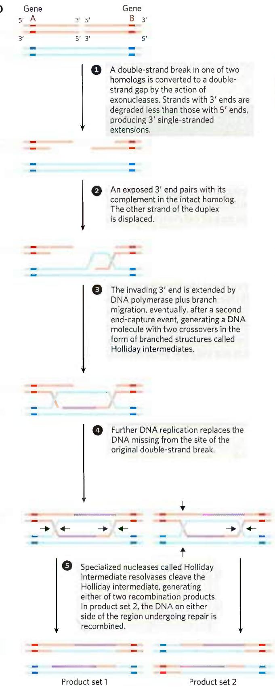  
FIGURE 25-34 Recombination during prophase I in meiosis. (a) A model of double-strand break repair for homologous genetic recombination. The two homologous chromosomes (one shown in red, the other blue) involved in this recombination event have identical or very nearly identical sequences. Each of the two genes shown has different alleles on the two chromosomes. The steps are described in the text. (b) Crossing over occurs during prophase of meiosis I. The several stages of prophase I are aligned with the recombination processes shown in (a). Double-strand breaks are introduced and processed in

(c)  
  
the leptotene stage. The strand invasion and completion of crossover occur later. As homologous sequences in the two pairs of sister chromatids are aligned in the zygotene stage, synaptonemal complexes form and strand invasion occurs. The homologous chromosomes are tightly aligned by the pachytene stage. (c) Homologous chromosomes of a grasshopper, viewed at successive stages of meiotic prophase I. The chiasmata become visible in the diplotene stage. [(c) B. John, Melosis, Figs 2.1a, 2.2a, 2.2b, 2.3a, Cambridge University Press, 1990. Reprinted with the permission of Cambridge University Press.]

This exchange, also referred to as crossing over, can be observed with the light microscope. Crossing over links the two pairs of sister chromatids together at points called chiasmata (singular, chiasma). Also during crossing over, genetic material is exchanged between the pairs

BOX 25-2

MEDICINE

# Why Proper Segregation of Chromosomes Matters

When chromosomal alignment and recombination are not correct and complete in meiosis I, segregation of chromosomes can go awry. One result may be aneuploidy, a condition in which a cell has the wrong number of chromosomes. The haploid products of meiosis (gametes or spores) may have no copies or two copies of a chromosome. When a gamete having two copies of a chromosome joins with a gamete having one copy of a chromosome during fertilization, cells in the resulting embryo have three copies of that chromosome (they are trisomic).

In S. cerevisiae, aneuploidy resulting from errors in meiosis occurs at a rate of about 1 in 10,000 meiotic events. In fruit flies, the rate is about 1 in a few thousand. Rates of aneuploidy in mammals are considerably higher. In mice, the rate is 1 in 100, and it is even higher in other mammals. The rate of aneuploidy in fertilized human eggs has been estimated as 10% to 30%; this is almost certainly an underestimate. Most of these aneuploid cells are monosomes (they have a single copy of a chromosome) or trisomies. Most trisomies are lethal, and many result in miscarriage long before the pregnancy is detected. Almost all monosomes are fatal in the early stages of fetal development. Aneuploidy is the leading cause of pregnancy loss. The few trisomic fetuses that survive to birth generally have three copies of chromosome 13, 18, or 21 (trisomy 21 is Down syndrome). Abnormal complements of the sex chromosomes are also found in the human population. The societal consequences of aneuploidy in humans are considerable. Aneuploidy is the leading genetic cause of developmental and mental disabilities. At the heart of these high rates is a feature of meiosis in female mammals that has special significance for the human species.

In a human male, germ-line cells begin to undergo meiosis at puberty, and each meiotic event requires a relatively short time. In contrast, meiosis in the germ-line cells of human females is a highly protracted process. The production of an egg begins before a female is born, with the onset of meiosis in the fetus, at 12 to 13 weeks of gestation. Meiosis is initiated in all the developing fetal germ-line cells over a period of a few weeks. The cells proceed through much of meiosis I. Chromosomes line up and generate crossovers, continuing just beyond the pachytene stage (see Fig. 25-34)—and then the process stops. The chromosomes enter an arrested phase called the dictyate stage, with the crossovers in place, a kind of suspended animation where they remain as the female matures—so, typically of sister chromatids. These exchanges increase genetic diversity in the resulting gametes. The importance of meiotic recombination to proper chromosome segregation is well illustrated by the physiological and societal consequences of their failure (Box 25-2).

remaining in this stage for anywhere from about 13 to 50 years. At sexual maturity, individual germ-line cells continue through the two meiotic cell divisions to produce egg cells.

Between the onset of the dictyate stage and the final completion of meiosis, something may happen that disrupts or damages the crossovers linking homologous chromosomes in the germ-line cells. As a woman ages, the rate of trisomy in the egg cells she produces increases, dramatically so as she approaches menopause (Fig. 1). There are many hypotheses on why this occurs, and several different factors may play a role. However, most of the hypotheses are centered on recombination crossovers in meiosis I and their stability over the protracted dictyate stage.

It is not yet clear what medical steps could be taken to reduce the incidence of aneuploidy in women of child-bearing age. What is revealed is the inherent importance of recombination and generation of crossovers in human meiosis.

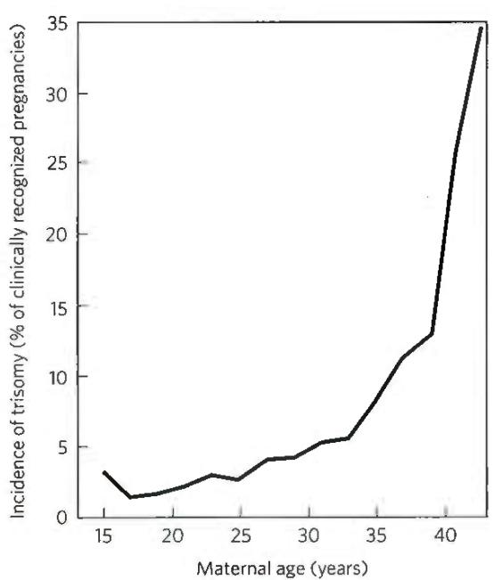  
FIGURE 1 The increasing incidence of human trisomy with increasing age of the mother. [Data from T. Hassold and P. Hunt, Nat. Rev. Genet. 2:280, 2001, Fig. 6.]

A likely pathway for homologous recombination during meiosis is outlined in Figure 25-34a. The model has four key features. First, homologous chromosomes align. Second, a double-strand break is created in a DNA molecule, and the exposed ends are processed by an exonuclease, leaving a single-stranded extension with a free 3'-hydroxyl group at the broken end (step 1). Third, the exposed 3' ends invade the intact duplex DNA of the homolog, and this is followed by branch migration and/or replication to create a pair of Holliday intermediates (steps 2 to 4). Fourth, cleavage of the two crossovers creates either of two pairs of complete recombinant products (step 5). Notice the similarity of these steps to the bacterial recombinational repair processes outlined in Figure 25-29. The DNA strand invasion in eukaryotes is catalyzed by RecA-like recombinases called Rad51 and Dmc1. Loading of Rad51 onto DNA is promoted by Rad51 loading protein BRCA2 (analogous to the bacterial RecF, RecO, and RecR proteins).

In this double-strand break repair model for recombination, the 3' ends are used to initiate the genetic exchange. Once paired with the complementary strand on the intact homolog, a region of hybrid DNA is created that contains complementary strands from two different parent DNAs (the product of step 2 in Fig. 25-34a). Each of the 3' ends can then act as a primer for DNA replication. Meiotic homologous recombination can vary in many details from one species to another, but most of the steps outlined above are generally present in some form. There are two ways to resolve the Holliday intermediate with a RuvC-like nuclease so that the two products carry genes in the same linear order as in the substrates—the original, unrecombined chromosomes (step 5). If cleaved one way, the DNA flanking the region containing the hybrid DNA is not recombined; if cleaved the other way, the flanking DNA is recombined. Both outcomes are observed in vivo.

The homologous recombination illustrated in Figure 25-34 is an elaborate process that is essential to accurate chromosome segregation. Its molecular consequences for the generation of genetic diversity are subtle. To understand how this process contributes to diversity, we should keep in mind that the two homologous chromosomes that undergo recombination are not necessarily identical. The linear array of genes may be the same, but the base sequences in some of the genes may differ slightly (in different alleles). In a human, for example, one chromosome may contain the allele for hemoglobin A (normal hemoglobin) while the other contains the allele for hemoglobin S (the sickle cell mutation). The difference may consist of no more than one base pair among millions.

Crossing over is not an entirely random process, and "hot spots" have been identified on many eukaryotic chromosomes. However, the assumption that crossing over can occur with equal probability at almost any point along the length of two homologous chromosomes remains a reasonable approximation in many cases, and it is this assumption that permits the mapping of genes on a particular chromosome. The frequency of homologous recombination in any region separating two points on a chromosome is roughly proportional to the distance between the points, and this allows determination of the relative positions of different genes and the distances between those genes. The independent assortment of unlinked genes on different chromosomes (Fig. 25-35)

  
FIGURE 25-35 The contribution of independent assortment to genetic diversity. In this example, the two chromosomes have already been replicated to create two pairs of sister chromatids. Blue and red distinguish the sister chromatids of each pair. One gene on each chromosome is highlighted,  
with different alleles (A or a, B or b) in the homologs. Independent assortment can lead to gametes with any combination of the alleles present on the two different chromosomes. Crossing over (not shown here; see Fig. 25-34) would also contribute to genetic diversity in a typical meiotic sequence.

makes another major contribution to the genetic diversity of gametes. These genetic realities guide many of the modern applications of genomics, such as defining haplotypes (see Fig. 9-26) or searching for disease genes in the human genome (see Fig. 9-30).

As in bacteria, this recombination process is used to repair double-strand breaks that arise anywhere in the genome. In eukaryotes, these systems operate in the context of chromatin, rendering additional complexities to their regulation and damage detection mechanisms (Box 25-3). P3 Homologous recombination thus serves at least three identifiable functions in eukaryotes: (1) it contributes to the repair of several types of DNA damage; (2) it provides, in eukaryotic cells, a transient physical link between chromatids that promotes the orderly segregation of chromosomes at the first meiotic cell division; and (3) it enhances genetic diversity in a population.

BOX 25-3

MEDICINE

## How a DNA Strand Break Gets Attention

Each human chromosome contains many millions of DNA base pairs, all bound up in an elaborate chromatin structure (Chapter 24). If a strand break occurs somewhere in the DNA, how do the many proteins needed for its repair actually find it? The answer lies, at least in part, in a protein called poly-ADP ribose polymerase 1, or PARP1. PARP1 is a first responder, scanning the DNA for DNA damage and in particular for single-strand breaks. When it finds such sites, it binds and synthesizes an elaborate branched poly-ADP ribose polymer from an NAD precursor (Fig. 1). The polymers are attached to the PARP1 enzyme and also linked to some nearby proteins through Glu, Asp, or Lys residues. The resulting structure is a kind of signal, marking the chromosomal location of damage. A large number of DNA repair proteins bind to and are thus recruited to the poly-ADP ribose polymers, effecting DNA repair. If PARP1 activity is absent, repair is compromised and the number of single-strand breaks in all chromosomes increases. When the chromosome is replicated, the single-strand breaks become double-strand breaks (see Fig. 25-29).

As we saw in Box 25-1, many malignant tumors have a defect in a DNA repair pathway. For example, breast or ovarian cancer is often associated with defects in double-strand break repair (e.g., in the genes encoding BRCA1 or BRCA2 or other proteins in the pathway). In these cells, the further loss of PARP1 activity is especially toxic, as single-strand breaks build up and chromosomes become

## Some Double-Strand Breaks Are Repaired by Nonhomologous End Joining

Double-strand breaks sometimes occur when recombinational DNA repair is not feasible, such as during phases of the cell cycle when no replication is occurring and no sister chromatids are present. At these times, another path is needed to avoid the cell death that would result from a broken chromosome. That alternative is provided by nonhomologous end joining (NHEJ). The broken chromosome ends are simply processed and ligated back together.

Nonhomologous end joining is an important pathway for double-strand break repair in all eukaryotes and has also been detected in some bacteria. The importance of NHEJ increases with genomic complexity, and the process accounts for most double-strand break

broken during replication. This has led to the development of PARP1 inhibitors as a treatment for tumors in which double-strand break repair is defective. The first such pharmaceutical agent, olaparib, was approved for use in the United States in 2014. Many more PARP1 inhibitors have since been approved or are undergoing clinical trials. The effects have often been dramatic. For women with breast or ovarian tumors displaying deficiencies in BRCA1 or BRCA2 that have responded to more traditional therapies, subsequent maintenance treatment with PARP1 inhibitors has led to a fourfold increase in progression-free survival. PARP1 inhibitors are also showing promise for use with other breast and ovarian tumors, as well as other types of tumors, most of which have DNA repair deficiencies of some kind. As research continues, the use of PARP inhibitors is becoming an important part of the standard of care for a growing list of cancers.

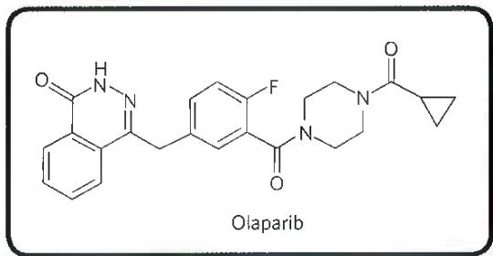

repair outside meiosis in mammals. In yeast, most double-strand breaks are repaired by recombination, and only a few by NHEJ. NHEJ is a mutagenic process, and a smaller genome, such as that of yeast, has relatively little tolerance for the loss of information. The small genomic alterations may be tolerable in mammalian somatic cells, because they are balanced by the undamaged information on the homolog in each diploid cell, and in these non-germ-line cells the mutations are not inherited. In vertebrates, a loss of the genes encoding NHEJ function can produce a predisposition to cancer.

Unlike homologous recombinational repair, NHEJ does not conserve the original DNA sequence. The pathway in eukaryotes is illustrated in Figure 25-36. The reaction is initiated at the broken ends of a double-strand break by the binding of a heterodimer consisting of the proteins Ku70 and Ku80 ("KU" being the initials of the individual with scleroderma whose serum autoantibodies were used to identify this protein complex; the numbers refer to the approximate molecular weights of the subunits). The Ku proteins are conserved in almost all eukaryotes and act as a kind of molecular scaffold to assemble the other protein components. Ku70-Ku80 interacts with another protein complex containing a protein kinase called DNA-PKcs and a nuclease known as Artemis. Once the complex is assembled, the two broken DNA ends are synapsed (held together). DNA-PKcs autophosphorylates in several locations and also phosphorylates Artemis. Artemis, when phosphorylated, acquires an endonuclease function that can remove 5' or 3' single-stranded extensions or hairpins that might be present at the ends. The DNA ends are then separated with the aid of a helicase, and strands from the two different ends are annealed at locations

  
FIGURE 1 The activity and function of poly-ADP ribose polymerase in detecting DNA strand breaks and other types of damage. (Information from A. R. Chaudhuri and A. Nussenzweig, Nat. Rev. Mol. Cell Biol. 18:610, 2017, Fig. 1.)

  
FIGURE 25-36 Nonhomologous end joining. The Ku70-Ku80 complex is the first to bind the DNA ends, followed by a complex including DNA-PKcs and the nuclease Artemis. These proteins then recruit a complex consisting of XRCC4, XLF, and DNA ligase IV. Either of two DNA polymerases, Pol $\mu$ or Pol $\lambda$ (not shown), subsequently extends the annealed DNA strands, as needed, before ligation. [Information from J. M. Sekiguchi and D. O. Ferguson, Cell 124:260, 2006, Fig. 1.]

where short regions of complementarity are encountered. Artemis cleaves any unpaired DNA segments that are created. Small DNA gaps are filled by a DNA polymerase, Pol $\mu$ or Pol $\lambda$ . Finally, the nicks are sealed by a protein complex consisting of XRCC4 (x-ray cross complementation group), XLF (XRCC4-like factor), and DNA ligase IV.

DNA ends are not joined randomly by NHEJ. Instead, when a double-strand break occurs, the ends are generally constrained by the structure of chromatin and thus remain close together. Very rare events linking end sequences that are normally far apart in the chromosome, or are on different chromosomes, may be responsible for occasional dramatic and usually deleterious genomic rearrangements.

## Site-Specific Recombination Results in Precise DNA Rearrangements

Homologous genetic recombination can involve any two homologous sequences. The second general type of recombination, site-specific recombination, is a very different type of process: recombination is limited to specific sequences. Recombination reactions of this type occur in virtually every cell, filling specialized roles that vary greatly from one species to another. Examples include regulation of the expression of certain genes and promotion of programmed DNA rearrangements in embryonic development or in the replication cycles of some viral and plasmid DNAs. Each site-specific recombination system consists of an enzyme called a recombinase and a short (20 to 200 bp), unique DNA sequence where the recombinase acts (the recombination site). One or more auxiliary proteins may regulate the timing or outcome of the reaction.

There are two general classes of site-specific recombination systems, which rely on either Tyr or Ser residues in the active site. In vitro studies of many site-specific recombination systems in the tyrosine class have elucidated some general principles, including the fundamental reaction pathway (Fig. 25-37a). Several of these enzymes have been crystallized, revealing structural details of the reaction. A separate recombinase recognizes and binds to each of two recombination sites on two different DNA molecules or within the same DNA. One DNA strand in each site is cleaved at a specific point within the site, and the recombinase becomes covalently linked to the DNA at the cleavage site through a phosphotyrosine bond (step 1). The transient protein-DNA linkage preserves the phosphodiester bond that is lost in cleaving the DNA, so high-energy cofactors such as ATP are unnecessary in subsequent steps. The cleaved DNA strands are rejoined to new partners to form a Holliday intermediate, with new phosphodiester bonds created at the expense of the protein-DNA linkage (step 2). An isomerization then occurs (step 3), and the process is repeated at a second point within each of the two recombination sites (steps 4 and 5). In systems that employ an active-site Ser residue, both strands of each recombination site are cut concurrently and rejoined to new partners without the Holliday intermediate. In both types of systems, the exchange is always reciprocal and precise, regenerating the recombination sites when the reaction is complete. We can view a recombinase as a site-specific endonuclease and ligase in one package.

(a)  
Recombinase  

(b)  
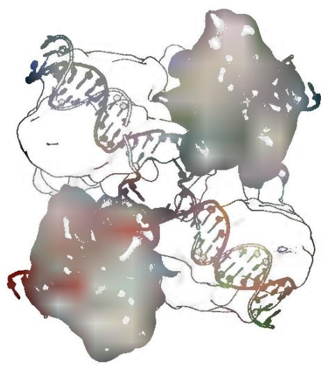

The sequences of the recombination sites recognized by site-specific recombinases are partially asymmetric (nonpalindromic), and the two recombining sites align in the same orientation during the recombinase reaction.

FIGURE 25-37 A site-specific recombination reaction. (a) The reaction shown here is for a common class of site-specific recombinases called integrase-class recombinases (named after bacteriophage $\lambda$ integrase, the first recombinase characterized). These enzymes use Tyr residues as nucleophiles at the active site. The reaction is carried out within a tetramer of identical subunits. Recombinase subunits bind to a specific sequence, the recombination site. Two dimeric complexes, each bound to a single site in the DNA, come together to form the tetrameric complex shown here. One strand in each DNA is cleaved at particular points in the sequence. The nucleophile is the —OH group of an active-site Tyr residue, and the product of rejoining is a covalent phosphotyrosine link between protein and DNA. After isomerization, the cleaved strands join to new partners, producing a Holliday intermediate. Steps and complete the reaction by a process similar to the first two steps. The original sequence of the recombination site is regenerated after recombining the DNA flanking the site. These steps occur within a complex of multiple recombinase subunits that sometimes includes other proteins not shown here. (b) Surface contour model of a four-subunit integrase-class recombinase called the FLP recombinase, bound to a Holliday intermediate (shown with light blue and dark blue helix strands). The protein has been rendered transparent so that the bound DNA is visible. Another group of recombinases, called the resolvase/invertase family, use a Ser residue as nucleophile at the active site. [(b) Data from PD8 ID 1P4E, P.A. Rice and Y.Chen, J.Biol. Chem. 278:24,800, 2003.]

The outcome depends on the location and orientation of the recombination sites (Fig. 25-38). If the two sites are on the same DNA molecule, the reaction either inverts or deletes the intervening DNA, determined by whether the recombination sites have the opposite or the same orientation, respectively. If the sites are on different DNAs, the recombination is intermolecular; if one or both DNAs are circular, the result is an insertion. Some recombinase systems are highly specific for one of these reaction types and act only on sites with particular orientations.

Complete chromosomal replication can require site-specific recombination. Recombinational DNA repair of a circular bacterial chromosome, while essential, sometimes generates deleterious byproducts. The resolution of a Holliday intermediate at a replication fork by a nuclease such as RuvC, followed by completion of replication, can give rise to one of two products: the usual two monomeric chromosomes or a contiguous dimeric chromosome (Fig. 25-39). In the latter case, the covalently linked chromosomes cannot be segregated to daughter cells at cell division, and the dividing cells become "stuck." A specialized site-specific recombination system in E. coli, the XerCD system, converts the dimeric chromosomes to monomeric chromosomes so that cell division can proceed. The reaction is a site-specific deletion (Fig. 25-38b). P4 This is another example of the close coordination between DNA recombination processes and other aspects of DNA metabolism.

## Transposable Genetic Elements Move from One Location to Another

We now consider the third general type of recombination system: recombination that allows the movement of transposable elements, or transposons. These segments of DNA, found in virtually all cells, move, or "jump," from one place on a chromosome (the donor site) to another on the same or a different chromosome (the target site). DNA sequence homology is not usually required for this movement, called transposition; the new location is determined more or less randomly. Insertion of a transposon in an essential gene could kill the cell, so transposition is tightly regulated and usually very infrequent. Transposons are perhaps the simplest of molecular parasites, adapted to replicate passively within the chromosomes of host cells. In some cases they carry genes that are useful to the host cell, and thus exist in a kind of symbiosis with the host.

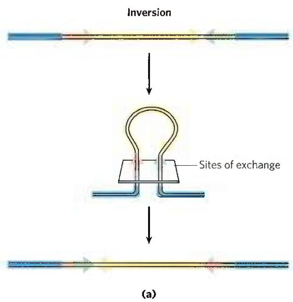  
FIGURE 25-38 Effects of site-specific recombination. The outcome of site-specific recombination depends on the location and orientation of the recombination sites (red and green) in a double-stranded DNA molecule. Orientation here (shown by arrowheads) refers to the order of nucleotides in

  
FIGURE 25-39 DNA deletion to undo a deleterious effect of recombinational DNA repair. The resolution of a Holliday intermediate during recombinational DNA repair (if cut at the points indicated by the red arrows) can generate a contiguous dimeric chromosome. A specialized site-specific recombinase in E. coli, XerCD, converts the dimer to monomers, allowing chromosome segregation and cell division to proceed.

  
the recombination site, not the $5'\rightarrow3'$ direction. (a) Recombination sites with opposite orientation in the same DNA molecule. The result is an inversion. (b) Recombination sites with the same orientation, either on one DNA molecule, producing a deletion, or on two DNA molecules, producing an insertion.

Bacteria have two classes of transposons. Insertion sequences (simple transposons) contain only the sequences required for transposition and the genes for the proteins (transposases) that promote the process. Complex transposons contain one or more genes in addition to those needed for transposition. These extra genes might, for example, confer resistance to antibiotics and thus enhance the survival chances of the host cell. The spread of antibiotic-resistance elements among disease-causing bacterial populations that is rendering some antibiotics ineffectual (p. 887) is mediated to a large degree by transposition.

Bacterial transposons vary in structure, but most have short repeated sequences at each end that serve as binding sites for the transposase. When transposition occurs, a short sequence at the target site (5 to 10 bp) is duplicated to form an additional short repeated sequence that flanks each end of the inserted transposon (Fig. 25-40). These duplicated segments result from the cutting mechanism used to insert a transposon into the DNA at a new location.

There are two general pathways for transposition in bacteria. In direct (or simple) transposition (Fig. 25-41, left), cuts on each side of the transposon excise it, and the transposon moves to a new location. This leaves a double-strand break in the donor DNA that must be repaired. At the target site, a staggered cut is made (as in Fig. 25-40), the transposon is inserted into the break, and DNA replication fills in the gaps to duplicate the target-site sequence. In replicative transposition (Fig. 25-41, right), the entire transposon is replicated, leaving a copy behind at the donor location. A cointegrate is an intermediate in this process, consisting of the donor region covalently linked to DNA at the target site. Two complete copies of the transposon are present in the cointegrate, both having the same relative orientation in the DNA. In some well-characterized transposons, the cointegrate intermediate is converted to products by site-specific recombination, in which specialized recombinases promote the required deletion reaction.

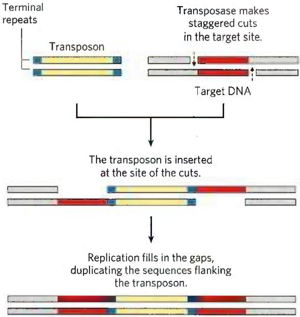  
FIGURE 25-40 Duplication of the DNA sequence at a target site when a transposon is inserted. The sequences duplicated following transposon insertion are shown in red. These sequences are generally only a few base pairs long, so their size relative to that of a typical transposon is greatly exaggerated in this drawing.

Eukaryotes also have transposons, structurally similar to bacterial transposons, and some use similar transposition mechanisms. In other cases, however, the mechanism of transposition seems to involve an RNA intermediate. Evolution of these transposons is intertwined with the evolution of certain classes of RNA viruses. Both are described in the next chapter. As illustrated in Figure 9-25, nearly half of the human genome is made up of various types of transposable elements.

## Immunoglobulin Genes Assemble by Recombination

Some DNA rearrangements are a programmed part of development in eukaryotic organisms. An important example is the generation of complete immunoglobulin genes from separate gene segments in vertebrate genomes.

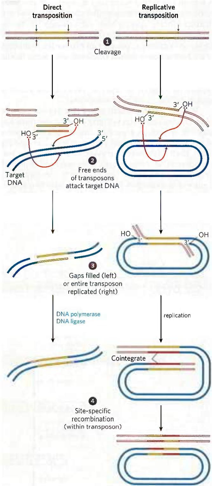  
FIGURE 25-41 Two general pathways for transposition: direct (simple) and replicative. The DNA is first cleaved on each side of the transposon, at the sites indicated by arrows. The liberated 3'-hydroxyl groups at the ends of the transposon act as nucleophiles in a direct attack on phosphodiester bonds in the target DNA. The target phosphodiester bonds are staggered (not directly across from each other) in the two DNA strands. The transposon is now linked to the target DNA. In direct transposition (left), replication fills in gaps at each end to complete the process. In replicative transposition (right), the entire transposon is replicated to create a cointegrate intermediate. The cointegrate is often resolved later, with the aid of a separate site-specific recombination system. The cleaved host DNA left behind after direct transposition is either repaired by DNA end joining or degraded (not shown); the latter outcome can be lethal to the organism.

A human (like other mammals) is capable of producing millions of different immunoglobulins (antibodies) with distinct binding specificities, even though the human genome contains only \~20,000 genes. Recombination allows an organism to produce an extraordinary diversity of antibodies from a limited DNA-coding capacity. Studies of the recombination mechanism reveal a close relationship to DNA transposition and suggest that this system for generating antibody diversity may have evolved from an ancient cellular invasion by transposons.

We can use the human genes that encode proteins of the immunoglobulin G (IgG) class to illustrate how antibody diversity is generated. Immunoglobulins consist of two heavy and two light polypeptide chains (see Fig. 5-20). Each chain has two regions: a variable region, with a sequence that differs greatly from one immunoglobulin to another, and a region that is virtually constant within a class of immunoglobulins. There are also two distinct families of light chains, kappa and lambda, which differ somewhat in the sequences of their constant regions. For all three types of polypeptide chains (heavy chain, and kappa and lambda light chains), diversity in the variable regions is generated by a similar mechanism. The genes for these polypeptides are divided into segments, and the genome contains clusters with multiple versions of each segment. The joining of one version of each gene segment creates a complete gene.

Figure 25-42 depicts the organization of the DNA encoding the kappa light chains of human IgG and shows how a mature kappa light chain is generated. In undifferentiated cells, the coding information for this polypeptide chain is separated into three segments. The V (variable) segment encodes the first 95 amino acid residues of the variable region, the J (joining) segment encodes the remaining 12 residues of the variable region, and the C segment encodes the constant region. The genome contains 40 different V segments, 5 different J segments, and 1 C segment.

As a stem cell in the bone marrow differentiates to form a mature B lymphocyte, one V segment and one J segment are brought together by a specialized recombination system (Fig. 25-42). During this programmed

  
FIGURE 25-42 Recombination of the V and J gene segments of the human IgG kappa light chain. At the top is shown the arrangement of IgG-coding sequences in a stem cell of the bone marrow. Recombination deletes the DNA between a particular V segment and a J segment. Transcription and RNA splicing, as described in Chapter 26, produces the light-chain polypeptide. The light chain can combine with any of 5,000 possible heavy chains to produce an antibody molecule.

DNA deletion, the intervening DNA is discarded. There are about $40 \times 5 = 200$ possible V–J combinations. The recombination process is not as precise as the site-specific recombination described earlier, so additional variation occurs in the sequence at the V–J junction. This increases the overall variation by a factor of at least 2.5, so the cells can generate about $2.5 \times 200 = 500$ different V–J combinations. The final joining of the V–J combination to the C region is accomplished by an RNA-splicing reaction after transcription, a process described in Chapter 26.

The recombination mechanism for joining the V and J segments is illustrated in Figure 25-43. Just beyond each V segment and just before each J segment lie recombination signal sequences (RSSs). These are bound by proteins called RAG1 and RAG2 (products of the recombination activating gene). The RAG proteins catalyze the formation of a double-strand break between the signal sequences and the V (or J) segments to be joined. The V and J segments are then joined with the aid of a second complex of proteins.

The genes for the heavy chains and the lambda light chains form by similar processes. Heavy chains have more gene segments than light chains, with more than

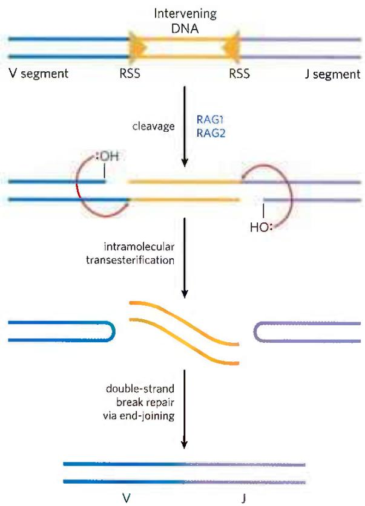  
FIGURE 25-43 Mechanism of immunoglobulin gene rearrangement. The RAG1 and RAG2 proteins bind to the recombination signal sequences (RSSs) and cleave one DNA strand between the RSS and the V (or J) segments to be joined. The liberated 3' hydroxyl then acts as a nucleophile, attacking a phosphodiester bond in the other strand to create a double-strand break. The resulting hairpin bends on the V and J segments are cleaved, and the ends are covalently linked by a complex of proteins specialized for end-joining repair of double-strand breaks.

5,000 possible combinations. Because any heavy chain can combine with any light chain to generate an immunoglobulin, each human has at least $500 \times 5,000 = 2.5 \times 10^{6}$ possible IgGs. And additional diversity is generated by high mutation rates (of unknown mechanism) in the V sequences during B-lymphocyte differentiation. Each mature B lymphocyte produces only one type of antibody, but the range of antibodies produced by the B lymphocytes of an individual organism is clearly enormous.

Did the immune system evolve in part from ancient transposons? The mechanism for generation of the double-strand breaks by RAG1 and RAG2 mirrors several reaction steps in transposition (Fig. 25-43). In addition, the deleted DNA, with its terminal RSSs, has a sequence structure found in most transposons. In the test tube, RAG1 and RAG2 can associate with this deleted DNA and insert it, transposonlike, into other DNA molecules (probably a rare reaction in B lymphocytes). Although we cannot know for certain, the properties of the immunoglobulin gene rearrangement system suggest an intriguing origin in which the distinction between host and parasite has become blurred by evolution.

## SUMMARY 25.3 DNA Recombination

■ DNA sequences are rearranged in recombination reactions, usually in processes tightly coordinated with DNA replication or repair.

■ Homologous genetic recombination can take place between any two DNA molecules that share sequence homology. In bacteria, recombination serves mainly as a DNA repair process, focused on reactivating stalled or collapsed replication forks or on the general repair of double-strand breaks.

In eukaryotes, recombination is essential to ensure accurate chromosome segregation during the first meiotic cell division. It also helps to create genetic diversity in the resulting gametes.

■ Nonhomologous end joining provides an alternative mechanism for the repair of double-strand breaks, especially in eukaryotic cells.

Site-specific recombination occurs only at specific target sequences, and this process can also involve a Holliday intermediate. Recombinases cleave the DNA at specific points and ligate the strands to new partners. This type of recombination is found in virtually all cells, and its many functions include DNA integration and regulation of gene expression.

■ In almost all cells, transposons use recombination to move within or between chromosomes.

In vertebrates, a programmed recombination reaction related to transposition joins immunoglobulin gene segments to form immunoglobulin genes during B-lymphocyte differentiation.

## KEY TERMS

Terms in bold are defined in the glossary.

template 915
semiconservative
replication 915
replication fork 916
origin 916
Okazaki fragment 916
leading strand 916
lagging strand 916
nucleases 916
exonucleases 916
endonucleases 916
DNA polymerases 916
DNA polymerase I 916
primer 917
primer terminus 917
processivity 917
proofreading 919
DNA polymerase III 919
replisome 921
helicases 921
topoisomerases 922
primases 922
DNA ligases 922
DNA unwinding element (DUE) 922
AAA+ ATPases 922
catenane 927
prereplicative complex (pre-RC) 928
licensing 928
minichromosome maintenance (MCM) protein 928
ORC (origin recognition complex) 928

DNA polymerase ε 929
DNA polymerase δ 929
DNA polymerase α 929
mutation 930
DNA glycosylases 934
base-excision repair 934
AP site 935
abasic site 935
AP endonucleases 935
DNA photolyases 937
error-prone translesion DNA synthesis 939
SOS response 939
homologous genetic recombination 940
site-specific recombination 940
DNA transposition 940
recombinational DNA repair 941
branch migration 942
Holliday intermediate 942

replication restart
primosome 943

double-strand break repair model 947

nonhomologous end joining (NHEJ) 948
transposon 951
transposition 952
insertion sequence 952

## PROBLEMS

1. DNA Replication An investigator adds DNA polymerase III holoenzyme, DNA primase (DnaG), single-stranded DNA-binding protein (SSB), an ATP-dependent DNA ligase, and the replicative helicase (DnaB) to each of the DNA substrates shown, along with ATP and all four dNTPs. The length of DNA in the circle in structure 1 is 10,000 bp. The linear (unbranched) part of structure 2 is 20,000 bp long.

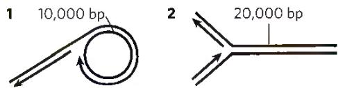

(a) If precursor (dNTP) concentrations are not limiting, Okazaki fragments are 2,000 nucleotides long, and replication proceeds at 1,000 nucleotides/s for 30 seconds, which DNA substrate will generate a longer replication product?

(b) For structure 1, draw the product of this 30 second replication. (c) Draw the expected product if DnaG were left out of the reaction. (d) Draw the expected product if DNA ligase were instead left out of the reaction.

2. Heavy Isotope Analysis of DNA Replication A researcher switches a culture of E. coli growing in a medium containing ${}^{15}NH_{4}Cl$ to a medium containing ${}^{14}NH_{4}Cl$ for three generations (an eightfold increase in population). What is the molar ratio of hybrid DNA ( ${}^{15}N-{}^{14}N$ ) to light DNA ( ${}^{14}N-{}^{14}N$ ) at this point?

3. Replication of the E. coli Chromosome The E. coli chromosome contains 4,641,652 bp.

(a) How many turns of the double helix must be unwound during replication of the E. coli chromosome?

(b) Using the data in this chapter, how long would it take to replicate the E. coli chromosome at $37\ ^{\circ}C$ if two replication forks proceeded from the origin? Assume replication occurs at a rate of 1,000 bp/s. Under some conditions, E. coli cells can divide every 20 min. How might this be possible?

(c) In the replication of the E. coli chromosome, about how many Okazaki fragments would be formed? What factors are required to link together newly synthesized Okazaki fragments in the lagging strand?

4. Base Composition of DNAs Made from Single-Stranded Templates Predict the base composition of the total DNA synthesized by DNA polymerase on templates provided by an equimolar mixture of the two complementary strands of bacteriophage $\phi$ X174 DNA (a circular DNA molecule). The base composition of one strand is A, 24.7%; G, 24.1%; C, 18.5%; and T, 32.7%. What assumption is necessary to answer this problem?

5. DNA Replication Kornberg and his colleagues incubated soluble extracts of E. coli with a mixture of dATP, dTTP, dGTP, and dCTP, all labeled with ${}^{32}$ P in the $\alpha$ -phosphate group. After a time, they treated the incubation mixture with trichloroacetic acid, which precipitates the DNA but not the nucleotide precursors. They then collected the precipitate and determined the extent of precursor incorporation into DNA from the amount of radioactivity present in the precipitate.

(a) If any one of the four nucleotide precursors were omitted from the incubation mixture, would radioactivity be found in the precipitate? Explain.

(b) Would ${}^{32}$ P be incorporated into the DNA if only dTTP were labeled? Explain.

(c) Would radioactivity be found in the precipitate if ${}^{32}$ P labeled the $\beta$ phosphate or $\gamma$ phosphate rather than the $\alpha$ phosphate of the deoxyribonucleotides? Explain.

6. The Chemistry of DNA Replication All DNA polymerases synthesize new DNA strands in the 5'→3' direction. In some respects, replication of the antiparallel strands of duplex DNA would be simpler if there were also a second type of polymerase, one that synthesized DNA in the 3'→5' direction. The two types of polymerase could, in principle, coordinate DNA synthesis without the complicated mechanics required for lagging strand replication. However, no such 3'→5'-synthesizing enzyme has been found. Suggest two possible mechanisms for 3'→5' DNA synthesis. Pyrophosphate should be one product of both proposed reactions. Could one or both mechanisms be supported in a cell? Why or why not? (Hint: You may suggest the use of DNA precursors not actually present in extant cells.)

7. Activities of DNA Polymerases You are characterizing a new DNA polymerase. When you incubate the enzyme with ${}^{32}$ P-labeled DNA and no dNTPs, you observe the release of $[{}^{32}\mathrm{P}]$ dNMPs. The addition of unlabeled dNTPs prevents this release. Explain the reactions that most likely underlie these observations. What would you expect to observe if you added pyrophosphate instead of dNTPs?

8. Leading and Lagging Strands Prepare a table that lists the names and compares the functions of the precursors, enzymes, and other proteins needed to make the leading strand versus the lagging strand during DNA replication in E. coli.

9. Function of DNA Ligase Some E. coli mutants contain defective DNA ligase. When researchers expose these mutants to ${}^{3}$ H-labeled thymine and then sediment the DNA produced on an alkaline sucrose density gradient, two radioactive bands appear. One corresponds to a high molecular weight fraction, the other to a low molecular weight fraction. Explain.

10. Fidelity of Replication of DNA What factors promote the fidelity of replication during synthesis of the leading strand of DNA? Would you expect the lagging strand to be made with the same fidelity? Give reasons for your answers.

11. Importance of DNA Topoisomerases in DNA Replication DNA unwinding, such as that occurring in replication, affects the superhelical density of DNA. In the absence of topoisomerases, the DNA would become overwound ahead of a replication fork as the DNA is unwound behind it. A bacterial replication fork will stall when the superhelical density ( $\sigma$ ) of the DNA ahead of the fork reaches +0.14 (see Chapter 24).

An investigator initiates bidirectional replication at the origin of a 6,000 bp plasmid in vitro, in the absence of topoisomerases. The plasmid initially has a $\sigma$ of $-0.06$ . How many base pairs will be unwound and replicated by each replication fork before the forks stall? Assume that both forks travel at the same rate and that each includes all components necessary for elongation except topoisomerase.

12. The Ames Test In a nutrient medium that lacks histidine, a thin layer of agar containing $\sim10^{9}$ Salmonella typhimurium histidine auxotrophs (mutant cells that require histidine to survive) produces $\sim13$ colonies over a two-day incubation period at 37 °C (see Fig. 25-19). How do these colonies arise in the absence of histidine? When investigators repeat the experiment in the presence of 0.4 $\mu$ g of 2-aminoanthracene, the number of colonies produced over two days exceeds 10,000. What does this indicate about 2-aminoanthracene? What can you surmise about its carcinogenicity?

13. DNA Repair Mechanisms Vertebrate and plant cells often methylate cytosine in DNA to form 5-methylcytosine (see Fig. 8-5a). In these same cells, a specialized repair system recognizes G-T mismatches and repairs them to G≡C base pairs. How might this repair system be advantageous to the cell? (Explain in terms of the presence of 5-methylcytosine in the DNA.)

14. The Energetic Cost of Mismatch Repair In an E. coli cell, DNA polymerase III makes a rare error and inserts a G opposite an A residue at a position 650 bp away from the nearest GATC sequence. The mismatch repair system accurately repairs the mismatch. How many phosphodiester bonds derived from deoxynucleotides (dNTPs) does this repair expend? This process also uses ATP molecules. Which enzyme(s) consume the ATP?

15. DNA Repair in People with Xeroderma Pigmentosum The condition known as xeroderma pigmentosum (XP) arises from mutations in at least seven different human genes (see Box 25-1). The deficiencies are generally in genes encoding enzymes involved in some part of the pathway for human nucleotide-excision repair. The various types of XP are denoted A through G (XPA, XPB, etc.), with a few additional variants lumped under the label XPV.

Investigators irradiate cultures of fibroblasts from healthy individuals and from patients with XPG with ultraviolet light. After isolating and denaturing the DNA, they characterize the resulting single-stranded DNA by analytical ultracentrifugation. (a) Samples from the normal fibroblasts show a significant reduction in the average molecular weight of the single-stranded DNA after irradiation, but samples from the XPG fibroblasts show no such reduction. Why might this be?

(b) If you assume that a nucleotide-excision repair system is operative in fibroblasts, which step might be defective in the cells from the patients with XPG? Explain.

16. DNA Repair and Cancer Many pharmaceuticals used for tumor chemotherapy are DNA damaging agents. What is the rationale behind actively damaging DNA to address tumors? Why do such treatments often have a greater effect on a tumor than on healthy tissue?

17. Direct Repair Cells normally repair the lesion $O^{6}$ -meG by directly transferring the methyl group to the protein $O^{6}$ -methylguanine-DNA methyltransferase. For the nucleotide sequence AAC( $O^{6}$ -meG)TGCAC, with a damaged (methylated) G residue, what would be the sequence of both strands of double-stranded DNA resulting from replication in each of the situations listed?

(a) Replication occurs before repair.

(b) Replication occurs after repair.

(c) Two rounds of replication occur, followed by repair.

18. Strand Invasion in Recombination A key step in many homologous recombination reactions is strand invasion (see step 2 in Fig. 25-29). In almost every case, strand invasion proceeds with a single strand that has a free 3' end rather than a 5' end. What DNA metabolic advantage is inherent with the use of a free 3' end for strand invasion?

19. Holliday Intermediates How does the formation of Holliday intermediates in homologous genetic recombination differ from their formation in site-specific recombination?

20. Cleavage of Holliday Intermediates A Holliday intermediate forms between two homologous chromosomes, at a point between genes $A$ and $B$ , as shown. The chromosomes have different alleles of the two genes ( $A$ and $a$ , $B$ and $b$ ). Where would the Holliday intermediate have to be cleaved (points X and/or Y) to generate a chromosome that would carry (a) an Ab genotype or (b) an ab genotype?

21. A Connection between Replication and Site-Specific Recombination Most wild strains of S. cerevisiae have multiple copies of the circular DNA plasmid $2\mu$ (named for its contour length of about $2\mu m$ ), which has $\sim6,300$ bp. For its replication, the plasmid uses the host replication system, under the same strict control as the host cell chromosomes, replicating only once per cell cycle. Replication of the plasmid is bidirectional, with both replication forks initiating at a single, well-defined origin. However, one replication cycle of a $2\mu$ plasmid can result in more than two copies of the plasmid, allowing amplification of the plasmid copy number (number of plasmid copies per cell) whenever plasmid segregation at cell division leaves one daughter cell with fewer than the normal complement of plasmid copies. Amplification requires a site-specific recombination system encoded by the plasmid, which serves to invert one part of the plasmid relative to the other. Explain how a site-specific inversion event could result in amplification of the plasmid copy number. (Hint: Consider the situation when replication forks have duplicated one recombination site but not the other.)

## DATA ANALYSIS PROBLEM

22. Mutagenesis in Escherichia coli Many mutagenic compounds act by alkylating the bases in DNA. The alkylating agent R7000 (7-methoxy-2-nitronaphtho[2,1-b]furan) is an extremely potent mutagen.

In vivo, R7000 is activated by the enzyme nitroreductase, and this more reactive form covalently attaches to DNA—primarily, but not exclusively, to G≡C base pairs.

In a 1996 study, Quillardet, Touati, and Hofnung explored the mechanisms by which R7000 causes mutations in E. coli. They compared the genotoxic activity of R7000 in two strains of E. coli: the wild-type (Uvr $^{+}$ ) and mutants lacking uvrA activity (Uvr $^{-}$ ). They first measured rates of mutagenesis. Rifampicin is an inhibitor of RNA polymerase. In its presence, cells will not grow unless certain mutations occur in the gene encoding RNA polymerase; the appearance of rifampicin-resistant colonies thus provides a useful measure of mutagenesis rates.

The investigators determined the effects of different concentrations of R7000. Their results are shown in the following graph:

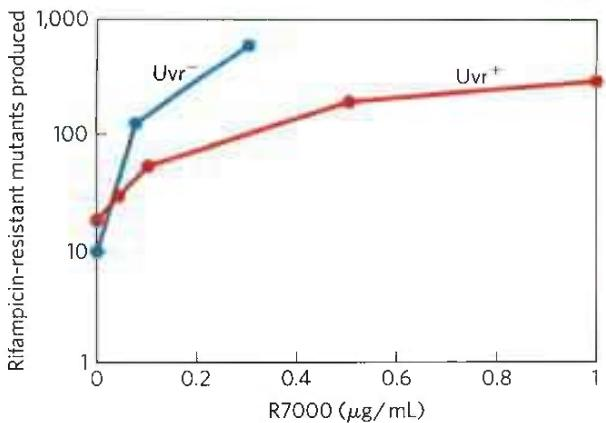  
(a) Why are some mutants produced even when no R7000 is present?

Quillardet and colleagues also measured the survival rate of bacteria treated with different concentrations of R7000, with the following results:

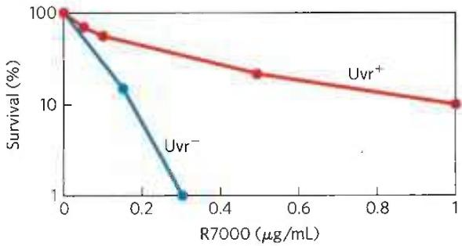  
(b) Explain how treatment with R7000 is lethal to cells.

(c) Explain the differences in the mutagenesis curves and in the survival curves for the two types of bacteria, Uvr $^{+}$ and Uvr $^{-}$ , as shown in the graphs.

The researchers went on to measure the amount of R7000 covalently attached to the DNA in Uvr $^{+}$ and Uvr $^{-}$ E. coli. They incubated bacteria with [ $^{3}$ H]R7000 for 10 or 70 minutes, extracted the DNA, and measured its $^{3}$ H content in counts per minute (cpm) per microgram of DNA.

$^{3}$ H in DNA (cpm/ $\mu$ g)

<table><tr><td>Time (min)</td><td>Uvr+</td><td>Uvr-</td></tr><tr><td>10</td><td>76</td><td>159</td></tr><tr><td>70</td><td>69</td><td>228</td></tr></table>

(d) Explain why the amount of ${}^{3}H$ drops over time in the Uvr $^{+}$ strain and rises over time in the Uvr $^{-}$ strain.

Quillardet and colleagues then examined the particular DNA sequence changes caused by R7000 in the Uvr $^{+}$ and Uvr $^{-}$ bacteria. For this, they used six different strains of E. coli, each with a different point mutation in the lacZ gene, which encodes $\beta$ -galactosidase. Cells with any of these mutations have a nonfunctional $\beta$ -galactosidase and are unable to metabolize lactose (i.e., a Lac $^{-}$ phenotype). Each type of point mutation required a specific reverse mutation to restore lacZ gene function and Lac+ phenotype. By plating cells on a medium containing lactose as the sole carbon source, the researchers selected for these reverse-mutated, Lac+ cells. And by counting the number of Lac+ cells following mutagenesis of a particular strain, they could measure the frequency of each type of mutation.

First, they looked at the mutation spectrum in Uvr $^{-}$ cells. The following table shows the results for the six strains, CC101 through CC106 (with the point mutation required to produce Lac $^{+}$ cells indicated in parentheses).

Number of Lac $^{+}$ cells (average ± SD)

<table><tr><td>R7000 (μg/mL)</td><td>CC101 (A=T to C≡G)</td><td>CC102 (G≡C to A=T)</td><td>CC103 (G≡C to C≡G)</td><td>CC104 (G≡C to T=A)</td><td>CC105 (A=T to T=A)</td><td>CC106 (A=T to G≡C)</td></tr><tr><td>0</td><td>6±3</td><td>11±9</td><td>2±1</td><td>5±3</td><td>2±1</td><td>1±1</td></tr><tr><td>0.075</td><td>24±19</td><td>34±3</td><td>8±4</td><td>82±23</td><td>40±14</td><td>4±2</td></tr><tr><td>0.15</td><td>24±4</td><td>26±2</td><td>9±5</td><td>180±71</td><td>130±50</td><td>3±2</td></tr></table>

(e) Which types of mutation show significant increases above the background rate due to treatment with R7000? Provide a plausible explanation for why some have higher frequencies than others.

(f) Can all of the mutations you listed in (e) be explained as resulting from covalent attachment of R7000 to a G≡C base pair? Explain your reasoning.

(g) Figure 25-26b shows how methylation of guanine residues can lead to a G≡C to A=T mutation. Using a similar pathway, show how an R7000-G adduct could lead to the G≡C to A=T or T=A mutations shown above. Which base pairs with the R7000-G adduct?

The results for the Uvr $^{+}$ bacteria are shown in the following table.

Number of Lac $^{+}$ cells (average ± SD)

<table><tr><td>R7000 (μg/mL)</td><td>CC101 (A=T to C≡G)</td><td>CC102 (G≡C to A=T)</td><td>CC103 (G≡C to C≡G)</td><td>CC104 (G≡C to T=A)</td><td>CC105 (A=T to T=A)</td><td>CC106 (A=T to G≡C)</td></tr><tr><td>0</td><td>2±2</td><td>10±9</td><td>3±3</td><td>4±2</td><td>6±1</td><td>0.5±1</td></tr><tr><td>1</td><td>7±6</td><td>21±9</td><td>8±3</td><td>23±15</td><td>13±1</td><td>1±1</td></tr><tr><td>5</td><td>4±3</td><td>15±7</td><td>22±2</td><td>68±25</td><td>67±14</td><td>1±1</td></tr></table>

(h) Do these results show that all mutation types are repaired with equal fidelity? Provide a plausible explanation for your answer.

## Reference

Quillardet, P., E. Touati, and M. Hofnung. 1996. Influence of the uvr-dependent nucleotide-excision repair on DNA adducts formation and mutagenic spectrum of a potent genotoxic agent: 7-methoxy-2-nitronaphtho[2,1-b]furan (R7000). Mutat. Res. 358:113–122.

