# 第26章 Rna Metabolism

<!-- 章节边界按正文内容恢复；原始 MinerU 内容保留如下。 -->

# RNA METABOLISM

26.1 DNA-Dependent Synthesis of RNA 961

26.2 RNA Processing 972

26.3 RNA-Dependent Synthesis of RNA and DNA 988

## 26.4 Catalytic RNAs and the RNA World Hypothesis 995

Expression of the information in a gene generally involves production of an RNA molecule transcribed from a DNA template. Strands of RNA and DNA may seem similar at first glance, differing only in that RNA has a hydroxyl group at the 2' position of the aldopentose, and uracil usually replaces thymine. However, unlike DNA, most RNAs carry out their functions as single strands, strands that fold back on themselves and have the potential for much greater structural diversity than DNA (Chapter 8). RNA is thus suited to a variety of cellular functions.

RNA is the only macromolecule known to have a role both in the storage and transmission of information and in catalysis, which has led to much speculation about its possible role as an essential chemical intermediate in the development of life on this planet. The discovery of catalytic RNAs, or ribozymes, has changed the very definition of an enzyme, extending it beyond the domain of proteins. Proteins nevertheless remain essential to RNA and its cellular functions. In the biosphere of today, all nucleic acids, including RNAs, are complexed with proteins. In the case of RNA, these complexes are called ribonucleoproteins or RNPs. Some of these RNPs are quite elaborate, and RNA can assume both structural and catalytic roles within complicated biochemical machines.

All RNA molecules except the RNA genomes of certain viruses are derived from information permanently stored in DNA. During transcription, an enzyme system converts the genetic information in a segment of double-stranded DNA into an RNA strand with a base sequence complementary to one of the DNA strands. Four major kinds of RNA are produced. Messenger RNAs (mRNAs) encode the amino acid sequence of one or more polypeptides specified by a gene or set of genes. Transfer RNAs (tRNAs) read the information encoded in the mRNA and transfer the appropriate amino acid to a growing polypeptide chain during protein synthesis. Ribosomal RNAs (rRNAs) are constituents of ribosomes, the intricate cellular machines that synthesize proteins. Noncoding RNAs (ncRNAs) have a variety of catalytic, structural, and regulatory functions.

During replication the entire chromosome is usually copied, but transcription is more selective. Only particular genes or groups of genes are transcribed at any one time, and some portions of the DNA genome are never transcribed. The cell restricts the expression of genetic information to the formation of gene products needed at any particular moment. The sum of all the RNA molecules produced in a cell under a given set of conditions is called the cellular transcriptome. Given the relatively small fraction of the human genome devoted to protein-coding genes (about 2%), we might expect that only a small part of the human genome is transcribed. This is not the case. Transcriptome analyses have revealed that approximately 76% of the human genome is transcribed into RNA. The products are predominantly not mRNAs but rather ncRNAs. Many ncRNAs are involved in regulating gene expression by interaction with other RNAs, genomic DNA, or proteins. However, the rapid pace of their discovery has forced us to realize that we do not yet know the function of the majority of our genomic ncRNA transcripts.

In this chapter we examine the synthesis of RNA on a DNA template and the postsynthetic processing, location, and turnover of RNA molecules. In doing so, we encounter many of the specialized functions of RNA, including catalytic functions. We also describe systems in which RNA is the template and DNA the product, rather than vice versa. The information pathways thus come full circle and reveal that template-dependent nucleic acid synthesis has standard rules, regardless of the nature of template or product (RNA or DNA). This examination of the biological interconversion of DNA and RNA as information carriers leads inevitably to a discussion of the evolutionary origin of biological information and processing. We will be guided by four principles.

P1 RNA is synthesized by RNA polymerases using DNA templates and ribonucleoside 5'-triphosphates. RNA is made in the 5'→3' direction and complementary to the template DNA strand. Transcription is highly regulated and initiates by recruitment of the transcription machinery to gene promoters. Although bacterial and eukaryotic polymerases share many conserved features, the transcriptional machinery and its regulation are much more complex in eukaryotes.

P2 Many RNAs must be modified and processed to become functional. RNAs can be modified by nucleases, by excision of certain RNA segments, and/or by chemical modification of the RNA nucleotides. In humans, nearly all mRNAs are 5' capped, spliced, and polyadenylated before being exported from the nucleus for translation in the cytoplasm.

P3 RNA can be used as a template for synthesis of DNA by reverse transcriptases. RNA carries genetic information that can be reverse transcribed into DNA. Retroviruses, such as HIV or those responsible for some cancers, must convert their RNA genomes into DNA by reverse transcription. Reverse transcription by telomerase is also responsible for producing the telomeres that protect the DNA found at the ends of eukaryotic chromosomes.

P4 RNA can act as both a catalyst and carrier of genetic information. Ribozymes can catalyze chemical transformations using many of the same strategies as protein-based enzymes. The dual capacity of RNA as both a carrier of genetic information and a catalyst is support for the RNA world hypothesis for the evolution of life on Earth.

## 26.1 DNA-Dependent Synthesis of RNA

Our discussion of RNA synthesis begins with a comparison between transcription and DNA replication (Chapter 25). Transcription resembles replication in its fundamental chemical mechanism, its polarity (direction of synthesis), and its use of a template. And like replication, transcription has initiation, elongation, and termination phases. Transcription differs from replication in that it does not require a primer and, generally, involves only limited segments of a DNA molecule. Additionally, only one DNA strand serves as a template for a particular RNA molecule.

## RNA Is Synthesized by RNA Polymerases

The discovery of DNA polymerase and its dependence on a DNA template spurred a search for an enzyme that synthesizes RNA complementary to a DNA strand. By 1960, four research groups had independently detected an enzyme in cellular extracts that could form an RNA polymer from ribonucleoside 5'-triphosphates.

Subsequent work on the purified Escherichia coli RNA polymerase helped to define the fundamental properties of transcription (Fig. 26-1). P1 DNA-dependent RNA polymerase requires, in addition to a DNA template, all four ribonucleoside 5'-triphosphates (ATP, GTP, UTP, and CTP) as precursors of the nucleotide units of RNA, as well as Mg $^{2+}$ . The chemistry and mechanism of RNA synthesis closely resemble those used by DNA polymerases (see Fig. 25-3). RNA polymerase elongates an RNA strand by adding ribonucleotide units to the 3'-hydroxyl end, building RNA in the 5'→3' direction. The 3'-hydroxyl group acts as a nucleophile, attacking the α phosphate of the incoming ribonucleoside triphosphate (Fig. 26-1a) and releasing pyrophosphate. The overall reaction is

$$
\begin{array}{c} \mathrm {(NMP) _ {n}} + \mathrm{NTP} \longrightarrow \mathrm {(NMP) _ {n + 1}} + \mathrm{PP} _ {\mathrm{i}} \\ \text {RNA} \end{array}
$$

RNA polymerase requires DNA for activity and is most active when bound to a double-stranded DNA. As noted above, only one of the two DNA strands serves as a template. The template DNA strand is copied in the 3'→5' direction (antiparallel to the new RNA strand), just as in DNA replication. Each nucleotide in the newly formed RNA is selected by Watson-Crick base-pairing interactions: U residues are inserted in the RNA to pair with A residues in the DNA template, G residues are inserted to pair with C residues, and so on. Base-pair geometry (see Fig. 25-5) may also play a role in base selection.

Unlike DNA polymerase, RNA polymerase does not require a primer to initiate synthesis. Initiation occurs when RNA polymerase binds at specific DNA sequences called promoters (described below). The 5'-triphosphate group of the first residue in a nascent (newly formed) RNA molecule is not cleaved to release PP $_{i}$ , but instead remains intact and functions in eukaryotes as a substrate for the RNA-capping machinery (see Fig. 26-13). During the elongation phase of transcription, the growing end of the new RNA strand base-pairs temporarily with the DNA template to form a short hybrid RNA-DNA double helix, about 8 bp long (Fig. 26-1b). The RNA in this hybrid duplex "peels off" shortly after its formation, and the DNA duplex re-forms.

To enable RNA polymerase to synthesize an RNA strand complementary to one of the DNA strands, the DNA duplex must unwind over a short distance, forming a transcription "bubble." During transcription, the E. coli RNA polymerase generally keeps about 17 bp unwound. The 8 bp RNA-DNA hybrid occurs in this unwound region. Elongation of a transcript by E. coli RNA polymerase proceeds at a rate of 50 to 90 nucleotides/s. Because DNA is a helix, movement of a transcription bubble requires considerable strand rotation of the nucleic acid molecules. DNA strand rotation is restricted in most DNAs by DNA-binding proteins and other structural barriers. As a result, a moving RNA polymerase generates waves of positive supercoils ahead of the transcription bubble and negative supercoils behind (Fig. 26-1c). This has been observed both in vitro and in vivo (in bacteria). In the cell, the topological problems caused by transcription are relieved through the action of topoisomerases (Chapter 24).

(a)  
  
FIGURE 26-1 Transcription by RNA polymerase in E. coli. For synthesis of an RNA strand complementary to one of two DNA strands in a double helix, the DNA is transiently unwound. (a) Catalytic mechanism of RNA synthesis by RNA polymerase. Notice that this is essentially the same mechanism used by DNA polymerases. The reaction involves two $\mathrm{Mg}^{2+}$ ions coordinated to the phosphate groups of the incoming nucleoside triphosphates (NTPs) and to three Asp residues, which are highly conserved in the RNA polymerases of all species. One $\mathrm{Mg}^{2+}$ ion facilitates attack by the $3^{\prime}$ -hydroxyl group on the $\alpha$ phosphate of the NTP; the other $\mathrm{Mg}^{2+}$ ion facilitates displacement of the pyrophosphate. Both metal ions stabilize the pentacovalent transition state. (b) About 17 bp of DNA are unwound at any given time. RNA

KEY CONVENTION The two complementary DNA strands have different roles in transcription. The strand that serves as template for RNA synthesis is called the template strand. The DNA strand complementary to the template, the nontemplate strand, or coding strand, is identical in base sequence to the RNA transcribed from the gene, with U in the RNA in place of T in the DNA (Fig. 26-2). The coding strand for a particular gene may be located in either strand of a given chromosome (as shown in Fig. 26-3 for a virus). By convention, the regulatory sequences that control transcription (described later in this chapter) are designated by the sequences in the coding strand.

The DNA-dependent RNA polymerase of E. coli is a large, complex enzyme with five core subunits ( $\alpha_{2}\beta\beta'\omega$ ; $M_{r}$ 390,000) and a sixth subunit, one of a group designated (5') CGCTATAGCGTTT(3') DNA nontemplate (coding) strand
(3') GCGATATCGCAAA(5') DNA template strand
(5') CGCUAUAGCGUUU(3') RNA transcript

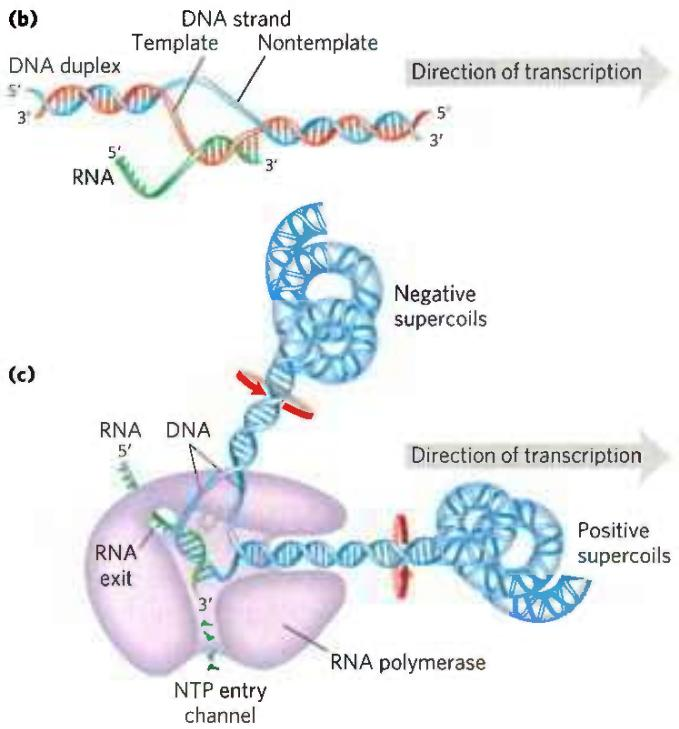  
polymerase and the transcription bubble move from left to right along the DNA as shown, facilitating RNA synthesis. The DNA is unwound ahead and rewound behind as RNA is transcribed. As the DNA is rewound, the RNA-DNA hybrid is displaced and the RNA strand is extruded. (c) Movement of an RNA polymerase along DNA tends to create positive supercoils (overwound DNA) ahead of the transcription bubble and negative supercoils (underwound DNA) behind it. The RNA polymerase is in close contact with the DNA ahead of the transcription bubble as well as with the separated DNA strands and the RNA within and immediately behind the bubble. A channel in the protein funnels new NTPs to the polymerase active site. The polymerase footprint encompasses about 35 bp of DNA during elongation.

FIGURE 26-2 Template and nontemplate (coding) DNA strands. The two complementary strands of DNA are defined by their function in transcription. The RNA transcript is synthesized on the template strand and is identical in sequence (with U in place of T) to the nontemplate strand, or coding strand.

  
FIGURE 26-3 Organization of coding information in the adenovirus genome. The genetic information of the adenovirus genome is encoded by a double-stranded DNA molecule of 36,000 bp, both strands of which encode proteins. The information for most proteins is encoded by (that is, identical to) the top strand — by convention, the strand is oriented 5' to 3' from left to right. The bottom strand acts as template for these transcripts. However, a few proteins are encoded by the bottom strand, which is transcribed in the opposite direction (and uses the top strand as template).

σ, with variants designated by size (molecular weight). The σ subunit binds transiently to the core and directs the enzyme to specific binding sites on the DNA (described below). These six subunits constitute the RNA polymerase holoenzyme (Fig. 26-4). The RNA polymerase holoenzyme of E. coli thus exists in several forms, depending on the type of σ subunit. The most common subunit is σ $^{70}$ (M $_{r}$ 70,000), and the upcoming discussion focuses on the corresponding RNA polymerase holoenzyme.

RNA polymerases lack a separate proofreading $3'\rightarrow5'$ exonuclease active site (such as that of many DNA polymerases), and the error rate for transcription is higher than that for chromosomal DNA replication—approximately one error for every $10^{4}$ to $10^{5}$ ribonucleotides incorporated into RNA. Because many copies of an RNA are generally produced from a single gene, and nearly all RNAs are eventually degraded and replaced, a mistake in an RNA molecule is of less consequence to the cell than a mistake in the permanent information stored in DNA. Many RNA polymerases, including bacterial RNA polymerase and the eukaryotic RNA polymerase II (discussed below), do pause when a mispaired base is added during transcription, and they can remove mismatched nucleotides from the 3' end of a transcript by direct reversal of the polymerase reaction. But we do not yet know whether this activity is a true proofreading function and to what extent it may contribute to the fidelity of transcription.

(a)  

  
FIGURE 26-4 Structure of the $\sigma^{70}$ RNA polymerase holoenzyme of E. coli. (a) The several subunits of the bacterial RNA polymerase give the enzyme the shape of a crab claw (purple). The $\sigma^{70}$ subunit rests on top of the crab claw and threads through the RNA exit channel. (b) In this crystal structure of the RNA polymerase holoenzyme, each of the six subunits ( $\alpha_{2}\beta\beta'\omega$ and $\sigma^{70}$ ) can be identified. The pincers of the crab claw are formed by the $\beta$ and $\beta'$ subunits. [Data from PDB ID 4MEY, D. Degen et al., eLife 3:e02451, 2014.]

## RNA Synthesis Begins at Promoters

Initiation of RNA synthesis at random points in a DNA molecule would be an extraordinarily wasteful process. P1 Instead, an RNA polymerase binds to specific sequences in the DNA called promoters, which direct the transcription of adjacent segments of DNA (genes). The sequences where RNA polymerases bind are variable, and much research has focused on identifying the particular sequences that are critical to promoter function.

In E. coli, RNA polymerase binding occurs within a region stretching from about 70 bp before the transcription start site to about 30 bp beyond it. By convention, the DNA base pairs that correspond to the beginning of an RNA molecule are given positive numbers, and those preceding the RNA start site are given negative numbers. The promoter region thus extends between positions -70 and +30. Analyses and comparisons of the most common class of bacterial promoters (those recognized by an RNA polymerase holoenzyme containing $\sigma^{70}$ ) have revealed consensus sequences centered about positions -10 and -35 (Fig. 26-5a). Although the sequences are not identical for all bacterial promoters in this class, certain nucleotides that are particularly common at each position form a consensus sequence. The consensus sequence at the -10 region is (5')TATAAT(3'); at the -35 region it is (5')TTGACA(3'). A third AT-rich recognition element, called the UP (upstream promoter) element, occurs between positions -40 and -60 in the promoters of certain highly expressed genes. The UP element is bound by the $\alpha$ subunit of RNA polymerase. The efficiency with which an RNA polymerase containing $\sigma^{70}$ binds to a promoter and initiates transcription is determined in large measure by these sequences, the spacing between them, and their distance from the transcription start site. A change in only one base pair in the promoter can decrease the rate of binding by several orders of magnitude. The promoter sequence thus establishes a basal level of expression that can vary greatly from one E. coli gene to the next. The x-ray crystal structure of the $\sigma^{70}$ RNA polymerase holoenzyme bound to its promoter shows how the $\sigma$ factor recognizes both the RNA polymerase and the -10 and -35 regions by introducing a large bend in the DNA (Fig. 26-5b). Information about these interactions can also be obtained using the method illustrated in Box 26-1.

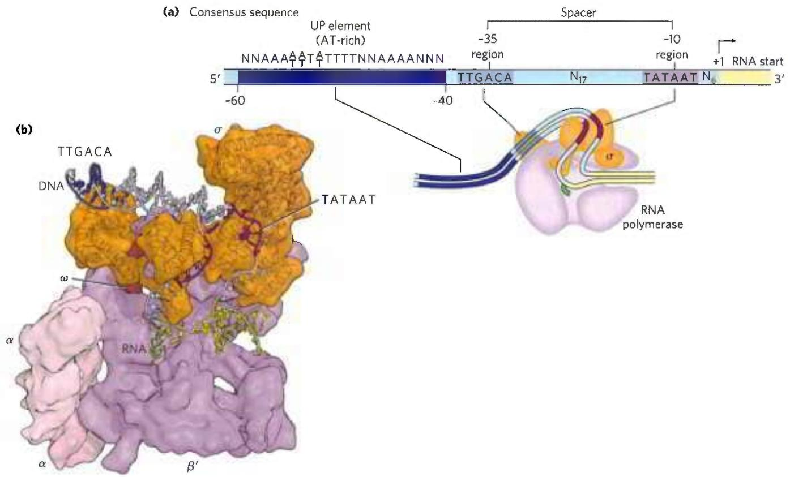  
FIGURE 26-5 Promoter recognition by RNA polymerase holoenzymes containing $\sigma^{70}$ . (a) The nontemplate strand of the consensus sequence for $E.$ coli promoters recognized by $\sigma^{70}$ is shown, read in the $5^{\prime} \rightarrow 3^{\prime}$ direction, as is the convention for representations of this kind. The sequences differ from one promoter to the next, but comparisons of many promoters reveal similarities, particularly in the -10 and -35 regions. The sequence element UP, not present in all $E.$ coli promoters, generally occurs in the region between -40 and -60 and strongly stimulates transcription at the promoters that contain them. Spacer regions contain slightly variable numbers of nucleotides (N). Only the first nucleotide coding the RNA transcript  
(at position +1) is shown. (b) This x-ray crystallographic structure of the E. coli holoenzyme bound to a promoter shows that the $\sigma^{70}$ subunit introduces a sharp bend in the DNA template, allowing it to simultaneously contact the -35 and -10 regions as well as the RNA polymerase core. In this view the $\beta$ subunit was omitted to allow the path of the DNA through the polymerase to be more easily seen. Due to the low resolution of the structure (5.5 Å) not all of the DNA backbone could be modeled, and these unmodeled regions are missing from the DNA shown in the figure. A cartoon schematic of the structure is also shown below (a), aligned with consensus promoter elements. [Data from PDB ID 4YLN, Y. Zuo and T. A. Steitz, Mol. Cell S8:534, 2015.]

The pathway of transcription initiation and the fate of the $\sigma$ subunit are illustrated in Figure 26-6. The pathway consists of two major parts, binding and initiation, each with multiple steps. First, the polymerase, directed by its bound $\sigma$ factor, binds to the promoter. A closed complex (in which the bound DNA remains double-stranded) and an open complex (in which the bound DNA is partially unwound near the -10 sequence) form in succession. Second, transcription is initiated within the complex, leading to a conformational change that converts the complex to the elongation form, followed by movement of the transcription complex away from the promoter (promoter clearance). Any of these steps can be affected by the specific makeup of the promoter sequences. The $\sigma$ subunit dissociates at random as the polymerase enters the elongation phase of transcription. The protein NusA ( $M_{r}$ 54,430) binds to the elongating RNA polymerase, competitively with the $\sigma$ subunit. Once transcription is complete, NusA dissociates from the enzyme, the RNA polymerase dissociates from the

DNA, and a $\sigma$ factor ( $\sigma^{70}$ or another) can again bind to the enzyme to initiate transcription.

E. coli has other classes of promoters bound by RNA polymerase holoenzymes with different $\sigma$ subunits, such as the promoters of the heat shock genes. The products of this set of genes are made at higher levels when the cell is exposed to environmental stress, such as a sudden increase in temperature. RNA polymerase binds to the promoters of these genes only when $\sigma^{70}$ is replaced with the $\sigma^{32}$ ( $M_{r}$ 32,000) subunit, which is specific for the heat shock promoters (see Fig. 28-3). By using different $\sigma$ subunits, the cell can coordinate the expression of sets of genes, permitting major changes in cell physiology. Which sets of genes are expressed is determined by the availability of the various $\sigma$ subunits. This, in turn, is determined by several factors: regulated rates of synthesis and degradation, posttranslational modifications that switch individual $\sigma$ subunits between active and inactive forms, and a specialized class of anti- $\sigma$ proteins, each type binding to and sequestering a particular $\sigma$ subunit to render it unavailable for transcription initiation.

<!-- END OFFICIAL API PART part_010 -->

<!-- BEGIN OFFICIAL API PART part_011 -->

## RNA Polymerase Leaves Its Footprint on a Promoter

Footprinting, a technique derived from principles used in DNA sequencing, identifies the DNA sequences bound by a particular protein. Researchers isolate a DNA fragment thought to contain sequences recognized by a DNA-binding protein, and then radiolabel one end of one strand (Fig. 1). They then use chemical or enzymatic reagents to introduce random breaks in the DNA fragment (averaging about one break per molecule). Separation of the labeled cleavage products (broken fragments of various lengths) by high-resolution electrophoresis produces a ladder of radioactive bands. In a separate tube, the cleavage procedure is repeated on copies of the same DNA fragment in the presence of the DNA-binding protein. The researchers then subject the two sets of cleavage products to electrophoresis and compare them side by side. A gap ("footprint") in the series of radioactive bands derived from the DNA-protein sample, attributable to protection of the DNA by the bound protein, identifies the sequences that the protein binds.

  
FIGURE 1 Footprint analysis of the RNA polymerase-binding site on a DNA fragment. Separate experiments are carried out in the presence (+) and absence (−) of the polymerase.

The precise location of the protein-binding site can be determined by directly sequencing (see Fig. 8-35) copies of the same DNA fragment and including the sequencing lanes (not shown here) on the same gel with the footprint. Figure 2 shows footprinting results for the binding of RNA polymerase to a DNA fragment containing a promoter. The polymerase covers 60 to 80 bp; protection by the bound enzyme includes the -10 and -35 regions.

  
FIGURE 2 Footprinting results of RNA polymerase binding to the lac promoter. In this experiment, the 5' end of the nontemplate strand was radioactively labeled. Lane C is a control in which the labeled DNA fragments were cleaved with a chemical reagent that produces a more uniform banding pattern. [© Courtesy of Carol Gross Laboratory.]

  
FIGURE 26-6 Transcription initiation and elongation by E. coli RNA polymerase. Initiation of transcription requires several steps generally divided into two phases: binding and initiation. In the binding phase, the initial interaction of the RNA polymerase with the promoter leads to formation of a closed complex, in which the promoter DNA is stably bound but not unwound. A 12 to 15 bp region of DNA—from within the -10 region to position +2 or +3—is then unwound to form an open complex. Additional intermediates (not shown) have been detected in the pathways leading to the closed and open  
complexes, along with several changes in protein conformation. The initiation phase encompasses promoter binding, transcription initiation, and promoter clearance (steps 1 through 4 here). Once elongation commences, the $\sigma$ subunit is released and is replaced by the protein NusA. The polymerase leaves the promoter and becomes committed to elongation of the RNA (step 5). When transcription is complete, the RNA is released, the NusA protein dissociates, and the RNA polymerase dissociates from the DNA (step 6). Another $\sigma$ subunit binds to the RNA polymerase and the process begins again.

## Transcription Is Regulated at Several Levels

Requirements for any gene product vary with cellular conditions or developmental stage, and transcription of each gene is carefully regulated to form gene products only in the proportions needed. P1 Regulation can occur at any step of transcription, including elongation and termination. However, much of the regulation is directed at the polymerase binding and transcription initiation steps outlined in Figure 26-6. Differences in promoter sequences are just one of several levels of control.

The binding of proteins to sequences both near to and distant from the promoter can also affect levels of gene expression. Protein binding can activate transcription by facilitating either RNA polymerase binding or steps farther along in the initiation process, or it can repress transcription by blocking the activity of the polymerase. In E. coli, one protein that activates transcription is the cAMP receptor protein (CRP), which increases the transcription of genes coding for enzymes that metabolize sugars other than glucose when cells are grown in the absence of glucose. Repressors are proteins that block the synthesis of RNA at specific genes. In the case of the Lac repressor, transcription of the genes for the enzymes of lactose metabolism is blocked when lactose is unavailable.

As described further in Chapter 27, transcription of mRNAs and their translation are tightly coupled in bacteria. As a protein-coding gene is being transcribed, ribosomes rapidly bind to and begin to translate the mRNA before its synthesis is complete. Another protein, NusG, binds directly to both the ribosome and RNA polymerase, linking the two complexes. The rate of translation directly affects the rate of transcription. In contrast, eukaryotes carry out transcription in the nucleus and translation in the cytoplasm, making it impossible for these two steps to be physically coupled.

## Specific Sequences Signal Termination of RNA Synthesis

RNA synthesis is processive; that is, the RNA polymerase introduces a large number of nucleotides into a growing RNA molecule before dissociating (p. 917). This is necessary because, if the polymerase released an RNA transcript prematurely, it could not resume synthesis of the same RNA and would have to start again from the beginning of the gene. However, an encounter with certain DNA sequences results in a pause in RNA synthesis, and at some of these sequences transcription is terminated. Our focus here is again on the well-studied systems in bacteria. E. coli has at least two classes of termination signals: one class relies on a protein factor called $\rho$ (rho), and the other is $\rho$ -independent.

Most $\rho$ -independent terminators have two distinguishing features. The first is a region that produces an RNA transcript with self-complementary sequences, permitting the formation of a hairpin structure (see Fig. 8-19a) centered 15 to 20 nucleotides before the projected end of the RNA strand. The second feature is a highly conserved string of three A residues in the template strand that are transcribed into U residues near the 3' end of the hairpin. When a polymerase arrives at a termination site with this structure, it pauses (Fig. 26-7a). Formation of the hairpin structure in the RNA disrupts several A=U base pairs in the RNA-DNA hybrid segment and may disrupt important interactions between RNA and the RNA polymerase, facilitating dissociation of the transcript.

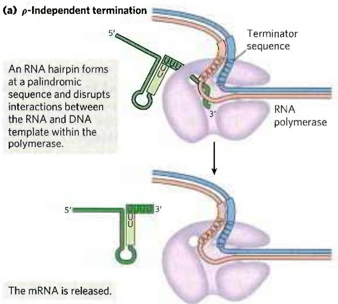  
FIGURE 26-7 Termination of transcription in E. coli. (a) p-Independent termination. RNA polymerase pauses at a variety of DNA sequences, some of which are terminators. One of two outcomes is then possible: either the polymerase bypasses the site and continues on its way, or the complex undergoes a conformational change (isomerization). During isomerization, intramolecular pairing of complementary sequences in the newly formed RNA transcript may form a hairpin that disrupts the RNA-DNA hybrid, the interactions

The $\rho$ -dependent terminators lack the sequence of repeated A residues in the template strand but usually include a CA-rich sequence called a rut (rho utilization) element. The $\rho$ protein associates with the RNA at specific binding sites and migrates in the 5'→3' direction until it reaches the transcription complex that is paused at a termination site (Fig. 26-7b). Here it promotes release of the RNA transcript. The $\rho$ protein has an ATP-dependent RNA-DNA helicase activity that permits translocation of the protein along the RNA, and ATP is hydrolyzed by the $\rho$ protein during the termination process. The detailed mechanism by which the protein promotes the release of the RNA transcript is not known.

## Eukaryotic Cells Have Three Kinds of Nuclear RNA Polymerases

The transcriptional machinery in the nucleus of a eukaryotic cell is much more complex than that in bacteria. Eukaryotes have three nuclear RNA polymerases, designated I, II, and III, which are distinct complexes but have certain subunits in common. Each polymerase has a specific function (Table 26-1) and is recruited to a specific promoter sequence. In addition, eukaryotic mitochondria and chloroplasts have their own RNA polymerases for transcription of genes encoded in their own DNA (see Fig. 19-40). The RNA polymerases in these organelles are similar to bacterial RNA polymerases and less elaborate than the nuclear transcription machinery discussed below.

  
between RNA and polymerase, or both. An A=U hybrid region at the 3' end of the new transcript is relatively unstable, and the RNA dissociates from the complex completely, leading to termination. At nonterminating pause sites, the complex may escape after the isomerization step to continue RNA synthesis. (b) ρ-Dependent termination. RNAs that include a rut element recruit the ρ helicase. The ρ helicase migrates along the mRNA in the 5'→3' direction and separates it from the polymerase.

<table><tr><td colspan="2">TABLE 26-1 Eukaryotic Nuclear RNA Polymerases</td></tr><tr><td>RNA polymerase</td><td>Types of RNA synthesized</td></tr><tr><td>I</td><td>Pre-ribosomal RNA</td></tr><tr><td>II</td><td>mRNA ncRNA</td></tr><tr><td>III</td><td>tRNA 5S rRNA ncRNA</td></tr></table>

RNA polymerase I (Pol I) is responsible for the synthesis of only one type of RNA, a transcript called pre-ribosomal RNA (or pre-rRNA), which contains the precursor for the 18S, 5.8S, and 28S rRNAs. The principal function of RNA polymerase II (Pol II) is the synthesis of mRNAs and many ncRNAs. This enzyme can recognize thousands of promoters that vary greatly in sequence. Some Pol II promoters have a few sequence features in common, including a TATA box (eukaryotic consensus sequence TATA(A/T)A(A/T)(A/G)) near base pair -30 and an Inr sequence (initiator) near the RNA start site at +1 (Fig. 26-8). However, such promoters are in the minority, and elaborate interactions with regulatory proteins guide Pol II function at many promoters that lack these features.

RNA polymerase III (Pol III) makes tRNAs, the 5S rRNA, and other small, specialized ncRNAs, including the U6 RNA component of the spliceosome, which we will discuss in Section 26.2. The promoters recognized by Pol III are well characterized. Some of the sequences required for the regulated initiation of transcription by

<table><tr><td rowspan="3"></td><td colspan="2">-30</td><td colspan="2">+1</td></tr><tr><td colspan="2">TATAAA</td><td>YYANTA</td><td>YY</td></tr><tr><td>Various regulatory sequences</td><td>TATA box</td><td>Inr</td><td>3&#x27;</td></tr></table>

FIGURE 26-8 Some common features of TATA box promoters recognized by eukaryotic RNA polymerase II. The TATA box is the major assembly point for the proteins of the preinitiation complexes of Pol II. The DNA is unwound at the initiator sequence (Inr), and the transcription start site is usually within or very near this sequence. In the Inr consensus sequence shown here, N represents any nucleotide and Y represents a pyrimidine nucleotide. Additional sequences around the TATA box and downstream (to the right as shown here) of Inr may be recognized by one or more transcription factors. The sequence elements of Pol II promoters summarized here are much more variable and complex in comparison to E. coli promoters (see Fig. 26-5).

Pol III are located within the gene itself, whereas others are in more conventional locations upstream of the RNA start site (Chapter 28).

## RNA Polymerase II Requires Many Other Protein Factors for Its Activity

RNA polymerase II is central to eukaryotic gene expression and has been studied extensively. P1 Although this polymerase is strikingly more complex than its bacterial counterpart, the complexity masks a remarkable conservation of structure, function, and mechanism. Pol II isolated from either yeast or human cells is a 12-subunit enzyme with an aggregate molecular weight of more than 510,000. The largest subunit (RBP1) exhibits a high degree of homology to the $\beta'$ subunit of bacterial RNA polymerase. Another subunit (RBP2) is structurally similar to the bacterial $\beta$ subunit, and two others (RBP3 and RBP11) show some structural homology to the two bacterial $\alpha$ subunits. Pol II must function with genomes that are more complex and with DNA molecules more elaborately packaged than in bacteria. The need for protein-protein contacts with the numerous other protein factors required to navigate this labyrinth accounts in large measure for the added complexity of the eukaryotic polymerase.

The largest subunit of Pol II (RBP1) also has an unusual feature, a long carboxyl-terminal tail consisting of many repeats of a consensus heptad amino acid sequence,—YSPTSPS—. There are 26 repeats in the yeast enzyme (19 exactly matching the consensus) and 52 (21 exact) in the mouse and human enzymes. This carboxyl-terminal domain (CTD) is separated from the main body of the enzyme by an intrinsically disordered linker sequence. The CTD has many important roles in Pol II function, as outlined below.

RNA polymerase II requires an array of other proteins, called transcription factors, to form the active transcription complex. The general transcription factors required at every Pol II promoter (factors usually designated TFII with an additional identifier) are highly conserved in all eukaryotes (Table 26-2). The process of transcription by Pol II can be described in terms of several phases—assembly, initiation, elongation, termination—each associated with characteristic proteins (Fig. 26-9). The step-by-step pathway described below leads to active transcription in vitro. In the cell, many of the proteins may be present in larger, preassembled complexes, simplifying the pathways for assembly on promoters. As you read about this process, consult Figure 26-9 and Table 26-2 to help keep track of the many participants.

Assembly of RNA Polymerase and Transcription Factors at a Promoter The formation of a closed complex begins when the TATA-binding protein (TBP) binds to the TATA box (Fig. 26-9a, step 1). At promoters lacking a TATA box, TBP arrives as part of a multisubunit complex called

<table><tr><td colspan="4">TABLE 26-2 Proteins Required for Initiation of Transcription at the RNA Polymerase II (Pol II) Promoters of Eukaryotes</td></tr><tr><td>Transcription protein</td><td>Number of different subunits</td><td>Subunit(s)  $M_r^a$ </td><td>Function(s)</td></tr><tr><td colspan="4">Initiation</td></tr><tr><td>Pol II</td><td>12</td><td>7,000–220,000</td><td>Catalyzes RNA synthesis</td></tr><tr><td>TBP (TATA-binding protein)</td><td>1</td><td>38,000</td><td>Specifically recognizes the TATA box</td></tr><tr><td>TFIIA</td><td>2</td><td>13,000, 42,000</td><td>Stabilizes binding of TFIIIB and TBP to the promoter</td></tr><tr><td>TFIIB</td><td>1</td><td>35,000</td><td>Binds to TBP; recruits Pol II-TFIIF complex</td></tr><tr><td>TFIIDb</td><td>13–14</td><td>14,000–213,000</td><td>Required for initiation at promoters lacking a TATA box</td></tr><tr><td>TFIIE</td><td>2</td><td>33,000, 50,000</td><td>Recruits TFIIH; has ATPase and helicase activities</td></tr><tr><td>TFIIF</td><td>2–3</td><td>29,000–58,000</td><td>Binds tightly to Pol II; binds to TFIIIB and prevents binding of Pol II to nonspecific DNA sequences</td></tr><tr><td>TFIIH</td><td>10</td><td>35,000–89,000</td><td>Unwinds DNA at promoter (helicase activity); phosphorylates Pol II CTD; recruits nucleotide-excision repair proteins</td></tr><tr><td colspan="4">Elongationc</td></tr><tr><td>ELLd</td><td>1</td><td>80,000</td><td></td></tr><tr><td>pTEFb</td><td>2</td><td>43,000, 124,000</td><td>Phosphorylates Pol II CTD</td></tr><tr><td>SII (TFIIS)</td><td>1</td><td>38,000</td><td></td></tr><tr><td>Elongin (SIII)</td><td>3</td><td>15,000, 18,000, 110,000</td><td></td></tr></table>

$^{b}$ The presence of multiple copies of some TFIID subunits brings the total subunit composition of the complex to 21–22.  
$^{c}$ The function of all elongation factors is to suppress the pausing or arrest of transcription by the Pol II–TFIIF complex.  
$^{d}$ Name derived from eleven-nineteen lysine-rich leukemia. The gene for ELL is the site of chromosomal recombination events frequently associated with acute myeloid leukemia.

TFIID. TBP is bound, in turn, by the transcription factor TFIIB. TFIIA then binds and, along with TFIIB, helps to stabilize the TBP-DNA complex. The TFIIB-TBP complex is next bound by another complex consisting of TFIIF and Pol II. TFIIF helps target Pol II to its promoters, both by interacting with TFIIB and by reducing the binding of the polymerase to nonspecific sites on the DNA. Finally, TFIIE and TFIIH bind to create the closed, preinitiation complex (PIC).

A key function of TFIID in the PIC is to position TBP on the promoter, which in turn dictates the location of Pol II loading and transcription initiation. Because most human promoters (\~80%) lack a TATA box, how TFIID correctly positions TBP and Pol II relative to the transcription start site was poorly understood until their structures were determined by cryo-EM (Fig. 26-9b). These structures showed that TFIID binds the promoter DNA in an elongated complex that is anchored by TBP-DNA interactions on one end and extends linearly over 70 base pairs. The Inr sequence is positioned roughly in the middle, straddled on both ends by TFIID subunits. TFIID thus acts as a scaffold to direct binding of Pol II and other PIC components and uses its structure and interactions with TBP to help define the transcription start site.

TFIIH has multiple subunits and includes a DNA helicase activity that promotes the unwinding of DNA near the RNA start site (a process requiring the hydrolysis of ATP), thereby creating an open initiation complex (Fig. 26-9a, step 2). Counting all the subunits of the various factors (including TFIIA and the subunits of TFIID), this active initiation complex can have more than 50 polypeptides.

RNA Strand Initiation and Promoter Clearance TFIIH has an additional function during the initiation phase. A kinase activity in one of its subunits phosphorylates Pol II at many places in the CTD (Fig. 26-9a, step 3). Several other protein kinases, including CDK9 (cyclin-dependent kinase 9), which is part of the complex pTEFb (positive transcription elongation factor b), also phosphorylate the CTD, primarily on Ser residues of the CTD repeat sequence. CTD phosphorylation causes a conformational change in the overall complex, initiating transcription. During the subsequent elongation phase of transcription, the phosphorylation state of the CTD changes, affecting which RNA processing components are bound to the transcription complexes (Fig. 26-10).

During synthesis of the initial 60 to 70 nucleotides of RNA, first TFIIE, then TFIIH is released, and Pol II enters the elongation phase of transcription (Fig. 26-9a, step 4).

Elongation, Termination, and Release TFIIF remains associated with Pol II throughout elongation. During this stage, polymerase activity is greatly enhanced by protein elongation factors (Table 26-2). The elongation factors, some bound to the phosphorylated CTD, suppress pausing during transcription and also coordinate interactions between the supramolecular complexes involved in the posttranscriptional processing of mRNAs. Once the RNA transcript is completed, transcription is terminated (Fig. 26-9a, step 5). The Pol II CTD is dephosphorylated and the transcription machinery recycled, ready to initiate another transcript.

FIGURE 26-9 Transcription at RNA polymerase II promoters. (a) TBP (often with TFIIA and sometimes with TFIID) and TFIIB bind sequentially to a promoter. TFIIF plus Pol II are then recruited to that complex. The further addition of TFIIE and TFIIH results in a closed complex. Within the complex, the DNA is unwound at the Inr region by the helicase activity of TFIIH and perhaps of TFIIE, creating an open complex that completes assembly. The carboxyl-terminal domain of the largest Pol II subunit is phosphorylated by TFIIH, and the polymerase then escapes the promoter and initiates transcription. Elongation is accompanied by the release of many transcription factors and is also enhanced by elongation factors (see Table 26-2). After termination, Pol II is released, dephosphorylated, and recycled. (b) Structure of the human TFIIA/TFIID/TBP complex bound to promoter DNA, determined by cryo-EM. The DNA is stretched linearly over 70 base pairs, with the Inr sequence positioned roughly in the middle of TFIID, anchored by TBP/TATA-box interactions on the end. ([a) Information from E. Nogales et al., Curr. Opin. Struct. Biol. 47:60, 2017, Fig. 4. (b) Data from PDB ID 5FUR, R.K. Louder et al., Nature 531:604, 2016.]  
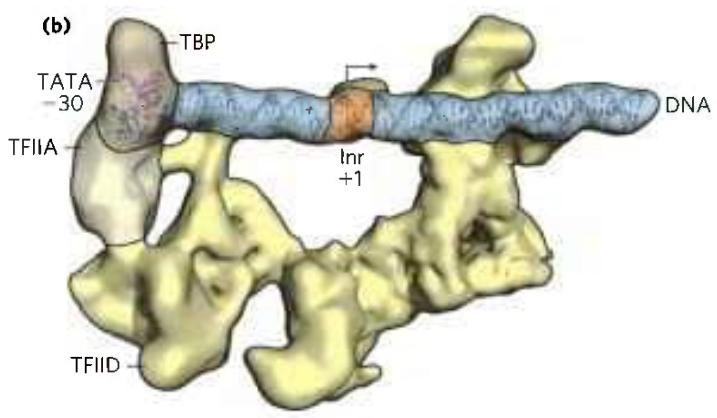

  
FIGURE 26-10 Phosphorylation of the carboxyl-terminal domain (CTD) of RNA polymerase II. The phosphorylation pattern of the CTD changes during different phases of transcription due to the action of kinases and phosphorylases associated with the transcription machinery. Multiple

Regulation of transcription at Pol II promoters is an elaborate process. It involves the interaction of a wide variety of other proteins with the preinitiation complex. Some of these regulatory proteins interact with transcription factors, others with Pol II itself. The regulation of eukaryotic transcription is described in more detail in Chapter 28.

## RNA Polymerases Are Drug Targets

Both bacterial and eukaryotic RNA polymerases are the targets of a large number of chemical inhibitors. Some of these molecules inhibit transcription of both types of RNA polymerases; others selectively inhibit only certain types of polymerase.

The elongation of RNA strands by RNA polymerase in both bacteria and eukaryotes is inhibited by the antibiotic actinomycin D. The planar portion of this molecule inserts (intercalates) into the double-helical DNA between successive G≡C base pairs, deforming the DNA duplex. This prevents movement of the polymerase along the DNA during transcription. Because actinomycin D inhibits RNA elongation in intact cells as well as in cell extracts, it can be used to identify cell processes that depend on RNA synthesis.

Rifampin (Fig. 26-11a) inhibits bacterial RNA synthesis by preventing the promoter clearance step of transcription. Rifampin is an important antibiotic for the treatment of tuberculosis (TB), which is caused by the bacterium Mycobacterium tuberculosis and kills approximately 1.8 million people each year. The antibiotic binds near the active site of RNA polymerase and prevents extension of the RNA product beyond 2 to 3 nucleotides. Unfortunately, M. tuberculosis can develop resistance to rifampin; more than 600,000 cases of rifampin-resistant TB are reported each year. In many cases, resistance is due to mutation in the rifampin binding site (Fig. 26-11b), particularly at Asp $^{516}$ , His $^{526}$ , and Ser $^{531}$ of the $\beta$ subunit. New drugs that inhibit M. tuberculosis RNA polymerase are desperately needed for treatment of drug-resistant TB.

repeats of the CTD tail are phosphorylated with the patterns shown here during each stage; however, these are not shown for clarity. Understanding the patterns and heterogeneity of CTD tail phosphorylation at different stages of transcription and on different genes is an active area of transcription research.  
(a)  

(b)  
  
FIGURE 26-11 Inhibition of RNA polymerase by rifampin. (a) Chemical structure of rifampin. (b) X-ray crystallographic structure of rifampin bound to the active site of M. tuberculosis RNA polymerase. In this slab view, much of the surrounding polymerase has been removed so that active site details, including one of the essential $\mathrm{Mg}^{2+}$ ions, can be highlighted. Rifampin (shown in spacefill) binds within the active site and blocks extension of the RNA transcript. Many RNA polymerase amino acids make direct contact with rifampin, and mutation of these amino acids can result in rifampicin-resistant RNA polymerase and TB infection. [(b) Data from PDB ID SUH6 and information from W. Lin et al., Mol. Cell 66:169, 2017.]

The death cap mushroom Amanita phalloides has a very effective defense mechanism against predators. It produces $\alpha$ -amanitin, which disrupts transcription in animal cells by blocking Pol II and, at higher concentrations, Pol III. Neither Pol I nor bacterial RNA polymerase is sensitive to $\alpha$ -amanitin—nor is the RNA polymerase II of A. phalloides itself. Because $\alpha$ -amanitin is selective for inhibiting the function of only certain RNA polymerases, it has proven useful for identifying the functions of different polymerases in the cell. Mitochondrial and bacterial RNA polymerases share significant similarities to one another, including $\alpha$ -amanitin resistance. By exposing eukaryotic cells to $\alpha$ -amanitin, it is possible to detect newly synthesized mRNAs that arise only from mitochondrial and not nuclear transcription. Researchers using $\alpha$ -amanitin need to exercise abundant caution because it is highly toxic to humans. An amount of $\alpha$ -amanitin the size of a grain of rice contains a lethal dose.

  
Amanita phalloides, the death cap mushroom [Wolstenholme Images/Alamy Stock Photo.]

## SUMMARY 26.1 DNA-Dependent Synthesis of RNA

■ Transcription is catalyzed by DNA-dependent RNA polymerases, which use ribonucleoside 5'-triphosphates to synthesize RNA in the 5'→3' direction, complementary to the template strand of duplex DNA. Transcription occurs in several phases: binding of RNA polymerase to a DNA site called a promoter, initiation of transcript synthesis, elongation, and termination.

■ RNA polymerases bind regions of DNA called promoters to initiate transcription of nearby genes. Promoter sequences help to establish the level of gene expression and in E. coli are recognized by variable RNA polymerase subunits called $\sigma$ factors. Transcription initiation involves formation of the closed and open complexes. DNA is unwound in the open complex to allow it to serve as the transcription template.

As the first committed steps in transcription, binding of RNA polymerase to the promoter and initiation of transcription are closely regulated.

■ Bacterial transcription stops at sequences called terminators. E. coli commonly uses two types of termination signals: $\rho$ -dependent and $\rho$ -independent.

■ Eukaryotic cells have three types of nuclear RNA polymerases. The vast majority of cellular mRNAs and ncRNAs are synthesized by Pol II.

■ Binding of Pol II to its promoters requires an array of proteins called transcription factors. Ultimately, a large molecular complex called the preinitiation complex, PIC, forms at the promoter. Elongation factors participate in the elongation phase of transcription. The phosphorylation state of the long carboxyl-terminal domain of the largest Pol II subunit changes in the initiation and elongation phases and determines what components are part of the initiation and elongation complexes.

■ RNA polymerases can be inhibited by a number of drugs, some of which are specific to either bacterial or eukaryotic polymerases. Drugs that inhibit bacterial RNA polymerase are commonly used to treat infections such as tuberculosis.

## 26.2 RNA Processing

P2 Many of the RNA molecules in bacteria and virtually all RNA molecules in eukaryotes are processed to some degree after synthesis. Processing can include addition or deletion of nucleotide sequences as well as chemical modification of RNA nucleotides. All of these events can be used to control the posttranscriptional fate of the RNA in the cell. As a result, many mature RNAs are not exact copies of the DNA genes from which they were transcribed. Some of the most interesting molecular events in RNA metabolism occur during posttranscriptional processing. Intriguingly, several of the enzymes that catalyze these reactions have active sites composed of RNA rather than protein. The discovery of these catalytic RNAs, or ribozymes, has brought a revolution in thinking about RNA function and about the origin of life, as we will discuss in Section 26.4.

A newly synthesized RNA molecule is called a primary or precursor transcript. Perhaps the most extensive processing of primary transcripts occurs in eukaryotic precursor mRNAs (pre-mRNAs) and in the tRNAs of both bacteria and eukaryotes. However, many ncRNAs are also processed.

The precursor transcript for a eukaryotic mRNA typically contains sequences encompassing one gene, although the sequences encoding the polypeptide may not be contiguous. Noncoding tracts that break up the coding region of the transcript are called introns, and the coding segments are called exons (see the discussion of introns and exons in DNA in Chapter 24). P2 In a process called RNA splicing, the introns are removed from the pre-mRNA, and the exons are spliced together to form a continuous sequence that specifies a functional polypeptide. Virtually all human genes contain introns, the average being eight introns per gene. Eukaryotic mRNAs are also modified at each end. A modified nucleotide structure called a 5' cap is added at the 5' end. The 3' end is cleaved, and 80 to 250 A residues are added to create a poly(A) "tail." The sometimes elaborate protein complexes that carry out 5' capping, splicing, and 3' polyadenylation mRNA-processing reactions do not operate independently. They are organized in association with each other and with the phosphorylated CTD of Pol II; each complex affects the function of the others, as outlined in Figure 26-12.

Proteins involved in mRNA transport to the cytoplasm are also associated with the mRNA in the nucleus, and the processing of the transcript is coupled to its transport. In effect, a eukaryotic mRNA, as it is synthesized, is ensconced in an elaborate and dynamic supramolecular messenger ribonucleoprotein (mRNP) complex comprising dozens of proteins. The composition of the mRNP changes as the transcript is processed, transported to the cytoplasm, and delivered to the ribosome for translation. Associated proteins can dramatically modulate the cellular destination, function, and fate of an mRNA.

In addition to splicing and 5' and 3' end modification, individual purine and pyrimidine nucleotides within primary transcripts can undergo chemical modification. Many eukaryotic mRNAs contain modified nucleotides that affect their interactions with RNA-binding proteins and regulate gene expression; however, RNA modification has been best characterized in primary tRNA transcript processing. Many bases and sugars in tRNAs are modified in both bacteria and eukaryotes, including with unusual bases not found in other nucleic acids (see

Fig. 26-22). Many ncRNAs also undergo elaborate processing, often involving the removal of segments from one or both ends.

The ultimate fate of any RNA is its complete and regulated degradation. The rate of turnover of RNAs plays a critical role in determining their steady-state levels and the rate at which cells can shut down expression of a gene when its product is no longer needed. During the development of multicellular organisms, for example, certain proteins must be expressed at one stage only, and the mRNA encoding such a protein must be made and destroyed at the appropriate times.

## Eukaryotic mRNAs Are Capped at the 5' End

P2 Most eukaryotic mRNAs have a 5' cap, a residue of 7-methylguanosine linked to the 5'-terminal residue of the mRNA through an unusual 5',5'-triphosphate linkage (Fig. 26-13). The 5' cap helps protect mRNA from ribonucleases. It also binds to specific cap-binding complexes of proteins and participates in binding of the mRNA to the ribosome to initiate translation (Chapter 27).

The 5' cap is formed by condensation of a molecule of GTP with the triphosphate at the 5' end of the transcript. The guanine is subsequently methylated at N-7, and additional methyl groups are often added at the 2' hydroxyls of the first and second nucleotides adjacent to the cap (Fig. 26-13a). The methyl groups are derived from S-adenosylmethionine. All these reactions (Fig. 26-12b) occur very early in transcription, after the first 20 to 30 nucleotides of the transcript have been added. All four of the enzymes in the cap-synthesizing complex, and through them the 5' end of the transcript itself, are associated with the RNA polymerase II CTD (Fig. 26-13c) until the cap is synthesized. The capped 5' end is then released from the cap-synthesizing complex and bound by the nuclear cap-binding complex, which facilitates both splicing and nuclear export of the RNA.

The 5' cap does not provide permanent protection of the transcript. Eukaryotes also contain cellular decapping enzymes, which are important for RNA regulation. Cap removal allows RNAs to be degraded by exonucleases that hydrolyze the RNA in the 5'→3' direction. Some viruses have also evolved elaborate mechanisms for removing the 5' cap from host mRNAs. The influenza virus needs no specialized enzymes for the synthesis of 5' caps on its viral RNAs; instead, it borrows these structures from host-cell transcripts in a process termed "cap-snatching." A capped host transcript is bound by the viral RNA polymerase and cleaved by an endonuclease. The influenza RNA polymerase can then use the resulting capped oligonucleotide to prime viral RNA synthesis.

## Both Introns and Exons Are Transcribed from DNA into RNA

In bacteria, the mRNA used for translation is generally a direct copy of the DNA gene sequence, continuing along the DNA template without interruption until the information needed to specify the polypeptide is complete. However, the notion that all genes are continuous was disproved in 1977 when Phillip Sharp and Richard Roberts independently discovered that many genes for polypeptides in eukaryotes are interrupted by noncoding sequences (introns).

P2 The vast majority of genes in vertebrates contain introns; among the few exceptions are those that encode histones. The occurrence of introns in other eukaryotes varies. Many genes of the yeast Saccharomyces cerevisiae lack introns, but introns are more common in some other yeast species. Introns are also found in a few bacterial and archaeal genes. Introns in DNA are transcribed along with the rest of the gene by RNA polymerases. The introns in the primary RNA transcript are then spliced, and the exons are joined to form a mature, functional RNA. In eukaryotic mRNAs, most exons are less than 1,000 nucleotides long, with many in the 100 to 200 nucleotide size range, encoding stretches of 30 to 60 amino acids within a longer polypeptide. Introns vary in size from 50 to more than 700,000 nucleotides, with a median length of about 1,800. Genes of higher eukaryotes, including humans, typically have much more DNA devoted to introns than to exons. For example, the human dystrophin gene encodes a pre-mRNA more than 2 million nucleotides long. However, the final mRNA is 14,000 nucleotides long, indicating that more than 99% of the transcribed RNA is found within introns and removed by splicing. Deficiencies in dystrophin expression can lead to muscular dystrophies. The \~20,000 genes of the human genome include more than 200,000 introns.

## RNA Catalyzes the Splicing of Introns

There are four classes of introns (Table 26-3). The first two, the group I and group II introns, differ in the details of their splicing mechanisms but share one surprising characteristic: they are self-splicing—no proteins are needed to carry out catalysis. The introns found in the nuclear-encoded genes of eukaryotes comprise the third class. These pre-mRNA introns are removed by a large RNP called the spliceosome. Although the spliceosome requires dozens of proteins for its function, its active site includes RNA. The final class of introns requires protein enzymes for their removal. These introns are found in some tRNAs as well as certain mRNAs, such as that encoding the Xbox binding protein 1, Xbp1. Protein-mediated splicing of the XBP1 transcript regulates the cellular response to unfolded proteins that occurs under conditions of endoplasmic reticulum stress in human cells. The mechanisms of tRNA and XBP1 mRNA splicing are similar.

Group I introns are found in some nuclear, mitochondrial, and chloroplast genes that code for rRNAs, mRNAs, and tRNAs. Group II introns are generally found in the primary transcripts of mitochondrial or chloroplast mRNAs in fungi, algae, and plants. Group I and group II introns are also among the rare examples of introns in bacteria. The splicing mechanisms in both groups involve two transesterification reaction steps (Fig. 26-14), in which a ribose 2'- or 3'-hydroxyl group makes a nucleophilic attack on a phosphorus, and a new phosphodiester bond is formed at the expense of the old, maintaining the balance of energy. These reactions are very similar to the DNA breaking and rejoining reactions promoted by topoisomerases (see Fig. 24-18) and site-specific recombinases (see Fig. 25-37).

The group I splicing reaction requires a guanine nucleoside or nucleotide cofactor, but the cofactor is not used as a source of energy; instead, the 3'-hydroxyl group of guanosine is used as a nucleophile in the first step of the

<table><tr><td colspan="4">TABLE 26-3 Mechanisms of RNA Splicing</td></tr><tr><td>Mechanism</td><td>Components</td><td>Features</td><td>Cellular locations</td></tr><tr><td>Group I Intron</td><td>Catalytic RNA</td><td>Self-splicing using a guanine-derived cofactor</td><td>Found in nuclear, mitochondrial, and chloroplast genes that encode mRNAs, rRNAs, or tRNAs. Can be found in bacteria.</td></tr><tr><td>Group II Intron</td><td>Catalytic RNA; maturase and reverse transcriptase proteins</td><td>Self-splicing using a nucleophile within the intron to form a lariat</td><td>Primarily found in mitochondrial and chloroplast genes of fungi, algae, and plants. Can be found in bacteria.</td></tr><tr><td>Spliceosome</td><td>Catalytic snRNAs; dozens of protein splicing factors</td><td>Requires a large RNP for processing using a nucleophile within the intron to form a lariat</td><td>Found in nuclear genes of eukaryotes. Capable of alternative splicing to create multiple products from a given transcript.</td></tr><tr><td>Protein-catalyzed</td><td>Protein enzymes</td><td>Uses a splicing endonuclease and ligase</td><td>Found in tRNAs and a few mRNAs.</td></tr></table>

  
FIGURE 26-14 Splicing mechanism of group II introns. (a) In the first step, the $2'$ OH of an internal A residue (called the branch point) attacks the phosphodiester bond at the $5'$ splice site, resulting in $5'$ splice site cleavage and lariat formation. In the second step, the free $3'$ OH of the $5'$ exon attacks the phosphodiester bond at the $3'$ splice site, resulting in exon ligation and intron-lariat release. The spliceosome uses the same  
chemistry for intron removal, although different RNA sequences mark the intron boundaries and location of the branch point. (b) In the transesterification reaction that occurs during lariat formation, one phosphodiester bond is broken as a second one is created. This forms a lariatlike structure in which one branch is a 2',5'-phosphodiester bond (the linkage between the intron branchpoint A and intron G nucleotides).

splicing pathway. In group II splicing reactions, the nucleophile is the 2'-hydroxyl group of an A residue within the intron (Fig. 26-14a). A branched lariat structure is formed as an intermediate (Fig. 26-14b). In both group I introns and group II introns, the 3' hydroxyl of the exon that is displaced in the first step then acts as a nucleophile in a similar reaction at the 3' end of the intron. The result is precise excision of the intron and ligation of the exons.

Self-splicing of introns was first revealed in 1982 in studies of the splicing mechanism of the group I rRNA intron from the ciliated protozoan Tetrahymena thermophila, conducted by Thomas Cech and colleagues. These workers transcribed isolated Tetrahymena DNA (including the intron) in vitro, using purified bacterial RNA polymerase. The resulting RNA spliced itself accurately without any protein enzymes from Tetrahymena. The discovery that RNAs could have catalytic functions was a milestone in our understanding of biological systems and a major step forward in the understanding of how life probably evolved. Catalytic RNAs like group I and group II introns share many features with protein-based enzymes, including folding into well-defined secondary and tertiary structures (Fig. 26-15). Catalytic RNAs and their significance in evolution are described in greater detail in Section 26.4.

  
Thomas Cech
[Photo by Glenn Asakawa/
University of Colorado.]

  
FIGURE 26-15 Structure of a group I intron. (a) The secondary structure of the group I intron ribozyme from phage Twort, a mycobacterium phage named for Frederick Twort, the physician who discovered phage in 1915. Like most catalytic RNAs, this intron adopts well-defined secondary structure. It is composed of multiple RNA duplexes (P2–P9, each differently colored) capped by hairpin structures. (b) The tertiary structure of the intron bound to a spliced RNA product, obtained by x-ray crystallography, shows that the RNA duplexes pack closely with one another to yield a compact ribozyme. The RNA duplexes are colored and named as in (a). [Data from PDB ID 1Y0Q, B. Golden et al., Nat. Struct. Biol. 12:82, 2005.]

## In Eukaryotes the Spliceosome Carries out Nuclear pre-mRNA Splicing

In eukaryotes, most introns undergo splicing by the same lariat-forming mechanism as the group II introns. P2 However, the intron splicing takes place within a spliceosome, a large complex made up of multiple specialized RNP complexes called small nuclear ribonucleoproteins (snRNPs, pronounced snurps) and dozens of non-snRNP proteins. Each snRNP contains one of a class of eukaryotic RNAs, 100 to 200 nucleotides long, known as small nuclear RNAs (snRNAs). Five snRNAs (U1, U2, U4, U5, U6) involved in splicing reactions are generally found in abundance in eukaryotic nuclei. The U3 snRNP is also found in the nucleus but is involved in ribosome assembly and is not part of the spliceosome.

The role of snRNPs in the splicing reaction was discovered by Joan Steitz in a remarkable example of "bedside-to-bench" science. Using antibodies isolated

  
Joan Steitz [Photo by Robert A. Lisak, courtesy Yale School of Medicine.]

from patients with autoimmune diseases, members of the Steitz laboratory were able to purify the spliceosome's snRNP components and identify the associated snRNAs. Based on complementarity between the 5' end of the U1 snRNA and the 5' splice site of nuclear pre-mRNA introns (Fig. 26-16), Steitz proposed that snRNPs participate in the splicing reaction. Subsequently, it was discovered that patients suffering from the autoimmune disease lupus can generate antibodies against protein components of their own spliceosomes.

In yeast, the various snRNPs include about 80 different proteins, most of which have close homologs in all other eukaryotes. In humans, these conserved protein components are augmented by more than 200 additional proteins, which mostly participate in regulating the splicing reaction. Spliceosomes are thus among the most complex supramolecular machines in any eukaryotic cell. The RNA components of a spliceosome are the catalysts of the various splicing steps. The overall complex can be considered a highly flexible ribonucleoprotein enzyme that can adapt to the great diversity in size and sequence of nuclear pre-mRNAs.

Spliceosomal introns generally have the dinucleotide sequence GU at the 5' end and AG at the 3' end, marking the sites where splicing occurs. The U1 snRNA contains a sequence complementary to the 5' splice site (Fig. 26-16b), and the U1 snRNP binds to this region by forming an RNA duplex with the pre-mRNA. A U2 snRNP binds to the 3' end, also by base-pairing, and identifies the A residue that becomes the nucleophile used during the first transesterification reaction (Fig. 26-14). Addition of a complex of the U4, U5, and U6 snRNPs, called the tri-snRNP, leads to formation of the spliceosome (Fig. 26-16c).

Key parts of the splicing active site found in the U6 snRNA are initially sequestered by base-pairing to parts of U4 snRNA to prevent aberrant cleavage of nontarget phosphodiester bonds. In a process called activation, the U6 and U4 snRNAs must be unwound and separated to expose the active site needed for the first step in splicing. Unwinding of U4 and U6 as well as many other steps in splicing require ATP hydrolysis by a set of eight different ATPases that are part of the splicing machinery.

  
FIGURE 26-16 Processing of pre-mRNA primary transcripts by the spliceosome. (a) Small nuclear RNPs, such as the human U1 snRNP shown here, contain snRNAs associated with a number of proteins. The human U1 snRNP contains a single copy of the U1 snRNA and 10 associated polypeptides. (b) The U1 snRNP recognizes the 5' splice site by base-pairing between the U1 snRNA and conserved RNA sequences within the intron that mark the 5' exon/intron boundary. The sequences and structure shown were obtained from x-ray crystal structure shown in (a). The human U1 snRNA normally contains pseudouridines at positions 5 and 6; however, an unmodified RNA was used to determine this structure. (c) Spliceosomes are assembled on introns from snRNPs and proceed through stages of assembly, activation, catalysis of intron removal, release of the RNA products, and recycling of the  
splicing factors. In addition to the U snRNPs discussed in the text, a large protein-only supramolecular complex called the Prp19-containing complex (also known as NineTeen Complex, or NTC) is required for splicing and joins the spliceosome during the activation step. (d) Structure of the human spliceosome, determined by cryo-EM. Nuclear pre-mRNA splicing requires this large molecular machine composed of dozens of proteins and five snRNAs to remove many different introns. By comparison, using similar chemistry, group II introns can catalyze their own removal. In order to highlight the RNA catalytic core of the spliceosome and the U2, U5, and U6 snRNAs, some protein splicing factors are not shown in this view. The RNA appears discontinuous where the structure could not be resolved. [Data from (a, b) PDB ID 4PJO, Y. Kondo et al., eLife 4:e04986, 2015; (d) PDB ID 6QDV, S. Fica et al., Science 363:710, 2019.]

Spliceosomes are single turnover enzymes, meaning that each spliceosome can remove only one intron from a single transcript. As a result, spliceosomes undergo a complex cycle of assembly, activation, catalysis, product release, and recycling of the snRNP components each time an intron is removed (Fig. 26-16c, steps ① through ⑤).

The chemical events of splicing—5' splice site cleavage by formation of an intron lariat followed by exon ligation—are identical in mechanism to that of group II introns, despite the former requiring dozens of proteins for activity and the latter being a self-splicing ribozyme. The similarities in chemistry as well as conservation between essential RNA components of each enzyme suggests that group II introns and spliceosomes are evolutionarily related to one another. Comparison of x-ray crystal structures of group II introns and cryo-EM structures of spliceosomes provide strong support for this hypothesis. Despite being surrounded by a large protein scaffold, the catalytic center of the spliceosome is composed of RNA and arranged in a nearly identical manner to that of group II introns (Fig. 26-17). Thus, the spliceosome uses a ribozyme core to carry out pre-mRNA splicing. As we shall see, some group II introns also contain domains that are themselves translated as mRNAs and encode proteins that bear striking similarity to those in the spliceosome, strengthening this evolutionary connection.

About 1% of human introns are spliced by a less common type of spliceosome, called the minor spliceosome, in which the U1, U2, U4, and U6 snRNPs are replaced by the U11, U12, U4atac, and U6atac snRNPs. Whereas U1- and U2-containing spliceosomes remove introns with (5')GU and AG(3') terminal sequences, the minor spliceosomes remove a rare class of introns that have (5')AU and AC(3') terminal sequences to mark the splice sites. Introns removed by either the major or the minor spliceosome most often remain in the nucleus and are degraded.

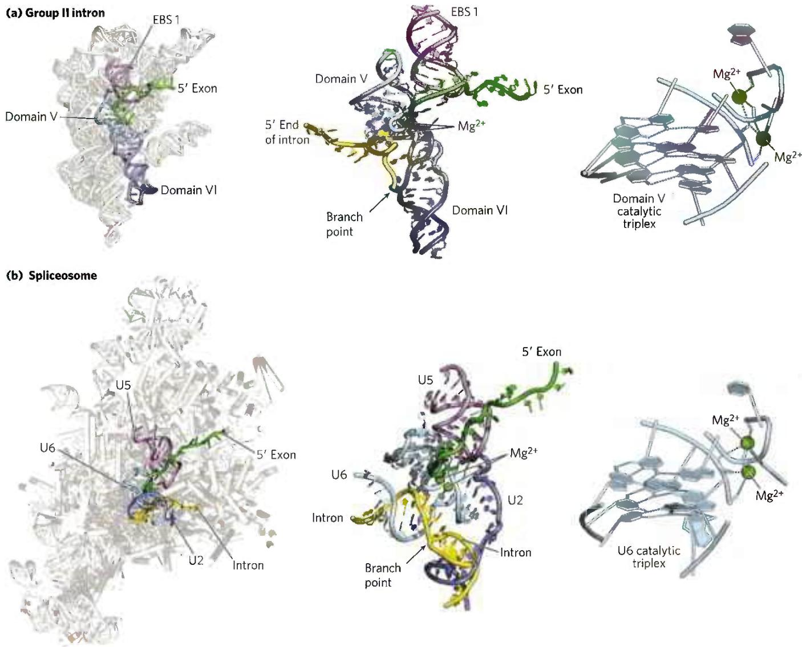

FIGURE 26-17 RNA active site conservation between group II introns and the spliceosome. A close-up examination of the active sites of (a) the Pylaiella littoralis group II intron and (b) the S. cerevisiae spliceosome reveal a similar arrangement of catalytic RNAs. In both cases, a catalytic RNA (domain V of the group II intron or U6 snRNA of the spliceosome) promotes a transesterification reaction by orienting the phosphodiester bond located at the 5' splice site/intron junction for nucleophilic attack and by coordinating essential Mg $^{2+}$ ions. In addition to similarities between domain V of group II introns and the U6 snRNA, group II intron domain VI and exon binding site 1 (EBS 1) play functional roles that are similar to those of the U2 and

U5 snRNAs in the spliceosome. Close examination shows that the active sites of the group II intron and the spliceosome are nearly identical, formed by a complex arrangement of nucleotides called the catalytic triplex. The triplex is responsible for binding $Mg^{2+}$ ions essential for catalysis as well as orienting the substrates for the splicing reaction. Conservation of sequence, chemistry, and three-dimensional structure suggests that the spliceosome evolved from a group II intron-like ribozyme. [Data from (a) left and center PDB ID 4R0D, A. R. Robart et al., Nature 514:193, 2014; right PDB ID 6QDV, S. M. Fica et al., Science 363:710, 2019; (b) left PDB ID 5LJ3, W. P. Galej et al., Nature 537:197, 2016, center PDB ID 5MQO, S. M. Fica et al., Nature 542:377, 2017; right PDB ID 6MEO, D. B. Haack et al., Cell 178:612, 2019. Information from W. Galej et al., Chem. Rev. 118:4156, 2018.]

Some components of the splicing apparatus are tethered to the CTD of RNA polymerase II, indicating that splicing, like other RNA processing reactions, is tightly coordinated with transcription. Most splicing in humans occurs cotranscriptionally, meaning that splicing occurs while Pol II is still transcribing the gene. For this to occur correctly, the rates of transcription, capping, splicing, and 3' end formation must be carefully regulated. Splicing of a pre-mRNA in the nucleus can also have profound effects on the function of the mRNA in the cytoplasm. Lynne Maquat and Melissa Moore discovered that the human spliceosome leaves behind a set of proteins on each spliced mRNA near the junction between two exons. This exon junction complex is retained on the mRNA as it is exported to the cytoplasm, where it can regulate the extent to which an mRNA can be translated over its lifetime before degradation.

## Proteins Catalyze Splicing of tRNAs

A fourth and final class of introns, found in certain tRNAs and a few mRNAs such as XBP1, is distinguished from other intron types in that the splicing reaction requires endonucleases and ligases made of protein and does not involve catalytic RNAs. The splicing endonuclease cleaves the phosphodiester bonds at both ends of the intron, and the two exons are joined by a mechanism similar to the DNA ligase reaction (see Fig. 25-15).

## Eukaryotic mRNAs Have a Distinctive 3' End Structure

P2 At their 3' end, most eukaryotic mRNAs undergoing translation in the cell cytoplasm have a string of A residues, about 30 residues in yeast and 50 to 100 in animals, called the poly(A) tail. This tail serves as a binding site for one or more specific proteins. The poly(A) tail and its associated proteins have a variety of roles in coordinating transcription and translation, and may help protect mRNA from enzymatic destruction. Many bacterial mRNAs also acquire poly(A) tails, but these tails stimulate decay of mRNA rather than protecting it from degradation.

The poly(A) tail is added in a multistep process. The transcript is extended beyond the site where the poly(A) tail is to be added, then is cleaved at the poly(A) addition site by an endonuclease component of a large enzyme complex, again associated with the CTD of RNA polymerase II (Fig. 26-18). The mRNA site where cleavage occurs is marked by two sequence elements: the highly conserved sequence (5')AAUAAA(3'), 10 to 30 nucleotides on the 5' side (upstream) of the cleavage site, and a less well-defined sequence rich in G and U residues, 20 to 40 nucleotides downstream of the cleavage site. Cleavage generates the free 3'-hydroxyl group that defines the end of the mRNA, to which A residues are immediately added by polyadenylate polymerase, which catalyzes the reaction

  
FIGURE 26-18 Addition of the poly(A) tail to the primary RNA transcript of eukaryotes. Pol II synthesizes RNA beyond the segment of the transcript containing the cleavage signal sequences, including the highly conserved upstream sequence (5')AAUAAA. This cleavage signal sequence is bound by an enzyme complex that includes an endonuclease, a polyadenylate polymerase, and several other multisubunit proteins involved in sequence recognition, stimulation of cleavage, and regulation of the length of the poly(A) tail; all of these proteins are tethered to the CTD. The RNA is cleaved by the endonuclease at a point 10 to 30 nucleotides 3' to (downstream of) the sequence AAUAAA. The polyadenylate polymerase synthesizes a poly(A) tail 80 to 250 nucleotides long, beginning at the cleavage site.

$$
\mathrm{RNA} + n \mathrm{ATP} \rightarrow \mathrm{RNA} - (\mathrm{AMP}) n + n \mathrm{PP} _ {\mathrm{i}}
$$

where n = 80 to 250. This enzyme does not require a template but does require the cleaved mRNA as a primer. These longer poly(A) tails are added in the nucleus, and then shortened significantly after the mRNA is transported to the cytoplasm.

The overall processing of a typical eukaryotic mRNA is summarized in Figure 26-19. In some cases, the polypeptide-coding region of the mRNA is also modified by RNA “editing” (see Section 27.1 for details). This editing includes processes that add or delete bases in the coding regions of primary transcripts or that change the sequence (such as by enzymatic deamination of a C residue to create a U residue). A particularly dramatic example occurs in trypanosomes, which are parasitic protists: large regions of an mRNA are synthesized without any uridylate, and the U residues are inserted later by RNA editing.

  
FIGURE 26-19 Overview of the processing of a eukaryotic mRNA. The ovalbumin gene, shown here, has introns A to G and exons 1 to 7 and L (L encodes a signal peptide sequence that targets the protein for export from the cell; see Fig. 27-38). About three-quarters of the RNA is removed during processing. Pol II extends the primary transcript well beyond the cleavage and polyadenylation site ("extra RNA") before terminating transcription.

## A Gene Can Give Rise to Multiple Products by Differential RNA Processing

One of the paradoxes of modern genomics is that the apparent complexity of organisms does not correlate with the number of protein-coding genes, or even the amount of genomic DNA. Some eukaryotic mRNA transcripts can be processed in more than one way to produce different mRNAs and thus different polypeptides. Much of the variability in processing is the result of alternative splicing, in which a particular exon may or may not be incorporated into the mature mRNA transcript. Alternative splicing occurs in a relatively small number of transcripts in yeast, but in more than 95% of human genes. Changes in alternative splicing can have profound impact on the development of an organism (Box 26-2). Alternative splicing of a single transcription factor in the staple grain quinoa differentiates palatable sweet varieties from those too bitter to ingest without processing. In Drosophila, sex is determined by alternative splicing of the sex lethal (Sxl) transcript based on the number of X chromosomes present in the cell.

Figure 26-20a illustrates how alternative splicing patterns can produce more than one protein from a common pre-mRNA. The pre-mRNA contains molecular signals for all the alternative processing pathways, and the pathway favored in a given cell or metabolic situation is determined by processing factors, RNA-binding proteins that promote one particular path. For example, splicing regulatory proteins or heterogeneous ribonuclear proteins (hnRNPs) may bind these signals and promote or inhibit spliceosome assembly at that site. There are many additional patterns of alternative splicing.

Complex transcripts can also have more than one site where poly(A) tails can form (Fig. 26-20b). If there are two or more sites for cleavage and polyadenylation, use of the one closest to the 5' end will remove more of the primary transcript sequence. This mechanism,

BOX 26-2

MEDICINE

## Alternative Splicing and Spinal Muscular Atrophy

Alternative splicing is one of the least understood steps in human gene regulation, in part because a gene product can be spliced together in many ways: entire exons can be left out of the mRNA (skipped) or spliced in (retained). More subtle changes can also occur in which alternative 5' or 3' splice sites are used that differ from their canonical positions by just a few nucleotides. The spliced isoform that is generated is determined by interactions among the spliceosome, a large number of regulatory factors that associate with the pre-mRNA transcript, and other cellular machinery, including the transcription complex.

Despite this complexity, scientists are learning how to control alternative splicing to treat genetic diseases such as spinal muscular atrophy (SMA). SMA is a progressive neurodegenerative disease and in its most severe form is always fatal. It is the most common genetic cause of death in infants. SMA is caused by a defect in the SMN1 (survival of motor neuron 1) gene. SMN1 encodes a protein that is essential for assembly of cellular snRNPs, including those that make up the spliceosome.

Humans have two SMN genes: SMN1 and SMN2. However, only SMN1 is capable of being correctly spliced to produce a functional protein (Fig. 1). SMN2 encodes an RNA sequence called a silencer, which causes exon 7 to be excluded from the mRNA. As a result, SMN2 cannot produce functional protein. Healthy individuals are able to get all of the SMN protein they require for snRNP assembly from the SMN1 gene. But those with a mutation in SMN1 do not produce enough SMN protein to assemble an adequate number of snRNPs. This leads to neuromuscular degeneration that is often fatal.

One possible solution for treating SMA would be to find a way to change the alternative splicing pattern of the SMN2 gene so that exon 7 would be included rather than skipped. This would produce functional SMN protein. This is exactly the strategy that

(Continued on next page)

## Alternative Splicing and Spinal Muscular Atrophy (Continued)

(b) SMA patient  

  
(c) SMA patient, treated with nusinersen

  
FIGURE 1 Alternative splicing of the SMN1 and SMN2 gene transcripts in healthy individuals and in those with SMA. (a) In healthy individuals, active protein is produced by translation of mRNAs that include exon 7 of the SMN1 gene. Alternative splicing of the SMN2 transcript skips exon 7, resulting in an mRNA that cannot produce functional protein. (b) In SMA patients, a mutation in the SMN1 gene results in no functional protein being produced from either SMN1 or SMN2. (c) Upon treatment with nusinersen, alternative splicing of SMN2 results in an mRNA that includes exon 7 and produces functional protein. This can prevent neuromuscular degeneration. [Information from D. R. Corey, Nat. Neurosci. 20:497, 2017, Fig. 1.]

called poly(A) site choice, generates diversity in the variable domains of immunoglobulin heavy chains (see Fig. 25-42).

Both alternative splicing and poly(A) site choice come into play in the expression of many genes. For example, a single RNA transcript is processed using

  
Adrian Krainer [Courtesy Adrian Krainer.]

Adrian Krainer used to correct SMA phenotypes in mice. Scientists in the Krainer lab discovered that if they injected mice with a synthetic oligonucleotide complementary to the silencer sequence of SMN2 exon 7 (also called an antisense oligonucleotide, or ASO), the sequence would be hidden from the splicing machinery. This changes the splicing of the SMN2 gene so that exon 7 is

included and the SMN2 gene is able to produce a functional SMN protein and prevent neurodegeneration (Fig. 1).

A drug called nusinersen has since been developed based on Krainer's research and became the first approved treatment for SMA. In SMA patients, injection of nusinersen into the central nervous system can correct splicing of the human SMN2 gene product, restore SMN protein production, and halt neurodegeneration. Most pharmaceuticals are small, organic molecules, but nusinersen is an 18-mer oligonucleotide. To turn an oligonucleotide into a drug, researchers had to incorporate chemical modifications into the phosphate backbone and ribose sugar (Fig. 2). These modifications prevent the oligonucleotide from being destroyed by cellular nucleases and also improve binding to RNA targets. Currently very few nucleic acid-based drugs have been approved for medical use, but their importance in medicine will likely continue to grow.

  
FIGURE 2 The modified nucleotides in nusinersen use a phosphorthioate backbone rather than phosphodiesters, and the 2' hydroxyl groups are replaced by 2'-O-methoxyethyl groups.

both mechanisms to produce two different hormones: the calcium-regulating hormone calcitonin in rat thyroid and calcitonin-gene-related peptide (CGRP) in rat brain (Fig. 26-21). P2 Together, alternative splicing and poly(A) site choice greatly increase the variety of proteins generated from the genomes of higher eukaryotes.

Dihydrouridine (D)

(a)  

(b)  
  
FIGURE 26-20 Alternative transcript production in eukaryotes. (a) Alternative splicing patterns. Two 3' splice sites are shown. Different mature mRNAs are produced from the same primary transcript. (b) Two alternative cleavage and polyadenylation sites, A₁ and A₂.

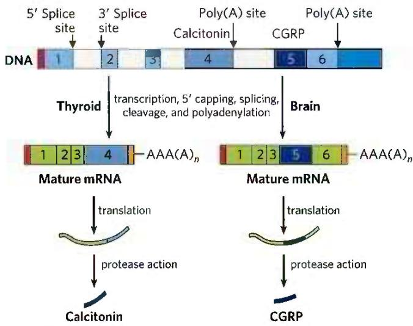  
FIGURE 26-21 Alternative processing of the calcitonin gene transcript in rats. The calcitonin gene encodes a primary transcript with two poly(A) sites; one predominates in the brain, the other in the thyroid. In the brain, splicing eliminates the calcitonin exon (exon 4); in the thyroid, this exon is retained. The resulting peptides are processed further to yield the final hormone products: calcitonin in the thyroid and calcitonin-gene-related peptide (CGRP) in the brain.

## Ribosomal RNAs and tRNAs Also Undergo Processing

Posttranscriptional processing is not limited to mRNA. Ribosomal RNAs of bacterial, archaeal, and eukaryotic cells are made from longer precursors called pre-ribosomal RNAs, or pre-rRNAs. Transfer RNAs are similarly derived from longer precursors. These RNAs may also contain a variety of modified nucleosides; some examples are shown in Figure 26-22.

Ribosomal RNAs In bacteria, 16S, 23S, and 5S rRNAs (and some tRNAs, although most tRNAs are encoded elsewhere) arise from a single 30S RNA precursor of about 6,500 nucleotides. RNA at both ends of the 30S precursor and segments between the rRNAs are removed during processing (Fig. 26-23). The 16S and 23S rRNAs contain modified nucleosides. In E. coli, the 11 modifications in the 16S rRNA include a pseudouridine and 10 nucleosides methylated on the base or the 2'-hydroxyl group or both. The 23S rRNA has 10 pseudouridines, 1 dihydrouridine, and 12 methylated nucleosides. In bacteria, each modification is generally catalyzed by a distinct enzyme. Methylation reactions use S-adenosylmethionine as cofactor. No cofactor is required for pseudouridine formation.

  
4-Thiouridine (S $^{4}$ U)

  
Inosine (I)

  
1-Methylguanosine (m $^{1}$ G)

FIGURE 26-22 Some modified bases of RNA produced in posttranscriptional reactions. The standard symbols are shown in parentheses. This is just a small sampling of the 96 modified nucleosides known to occur in different RNA species, with 81 different types known in tRNAs and 30 observed to date in rRNAs. Notice the unusual ribose attachment point in pseudouridine. A complete listing of these modified bases can be found in the Modomics database of RNA modification pathways (http://iimcb.genesilico.pl/modomics/).

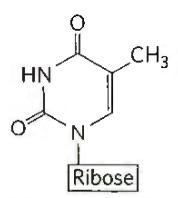

  
$N^{6}$ -Isopentenyladenosine ( $i^{6}A$ )

  
Ribothymidine (T)

Pseudouridine (ψ)

The genome of E. coli encodes seven pre-rRNA molecules. All of these genes have essentially identical rRNA-coding regions, but they differ in the segments between these regions. The segment between the 16S and 23S rRNA genes generally encodes one or two tRNAs, with different tRNAs produced from different pre-rRNA transcripts. Coding sequences for tRNAs are also found on the 3' side of the 5S rRNA in some precursor transcripts.

The situation in eukaryotes is even more complicated (see Fig. 27-17). The entire process is initiated in the nucleolus, in large complexes that assemble on the rRNA precursor as it is synthesized by Pol I. There is a tight coupling between rRNA transcription, rRNA maturation, and ribosome assembly in the nucleolus. Each complex includes the ribonucleases that cleave the rRNA precursor, the enzymes that modify particular bases, large numbers of ncRNAs called small nucleolar RNAs, or snoRNAs, that guide nucleoside modification and some cleavage reactions, and ribosomal proteins. In yeast, the entire process involves the pre-rRNA, more than 170 nonribosomal proteins, snoRNAs for each nucleoside modification (about 70, because some snoRNAs guide two types of modification), and the 78 ribosomal proteins. Humans have an even greater number of modified nucleosides, about 200, and a greater number of associated snoRNAs. The composition of the complexes may change as the ribosomes are assembled, and many of the intermediate complexes rival the ribosome itself in complexity. The 5S rRNA of most eukaryotes is made as a completely separate transcript by a different polymerase (Pol III).

The most common nucleoside modifications in eukaryotic rRNAs are conversion of uridine to pseudouridine and adoMet-dependent nucleoside methylation (often at 2'-hydroxyl groups). These reactions often rely on snoRNA-protein complexes, or snoRNPs, each consisting of a snoRNA and four or five proteins, including the enzyme that carries out the modification. There are two classes of snoRNPs, both defined by key conserved sequence elements referred to as lettered boxes. The box H/ACA snoRNPs function in pseudouridylylation, and box C/D snoRNPs in 2'-O-methylations. The snoRNAs are 60 to 300 nucleotides long. Each snoRNA includes a 10 to 21 nucleotide sequence that is perfectly complementary to some site on an rRNA and serves to identify the modification site (Fig. 26-24). The conserved sequence elements in the remainder of the snoRNA fold into structures that are bound by the snoRNP proteins.

FIGURE 26-23 Processing of pre-rRNA transcripts in bacteria. ① Before cleavage, the 30S RNA precursor is methylated at specific bases (red tick marks), and some uridine residues are converted to pseudouridine (blue tick) or dihydrouridine (black tick) residues. The methylation reactions are of multiple types, some occurring on bases and some on 2'-hydroxyl groups. ② Cleavage liberates precursors of rRNAs and tRNA(s). Cleavage at the points labeled 1, 2, and 3 is carried out by the enzymes RNase III, RNase P, and RNase E, respectively. As discussed later in the text, RNase P is a ribozyme. ③ The final 16S, 23S, and 5S rRNA products result from the action of a variety of specific nucleases. The seven copies of pre-rRNA gene in the E. coli chromosome differ in the number, location, and identity of tRNAs included in the primary transcript. Some copies of the gene have additional tRNA gene segments between the 16S and 23S rRNA segments and at the far 3' end of the primary transcript.  

  
FIGURE 26-24 RNA pairing with box H/ACA snoRNAs to guide pseudouridylation. The pseudouridine conversion sites in the target rRNA are in the regions paired with the snoRNA, and the conserved H/ACA box sequences are protein-binding sites. [Information from T. Kiss, Cell 109:145, 2002.]

Transfer RNAs Most cells have 40 to 50 distinct tRNAs, and eukaryotic cells have multiple copies of many of the tRNA genes. Transfer RNAs are derived from longer RNA precursors by enzymatic removal of nucleotides from the 5' and 3' ends (Fig. 26-25). In eukaryotes, introns are present in a few tRNA transcripts and must be excised. Where two or more different tRNAs are contained in a single primary transcript, they are separated by enzymatic cleavage. The endonuclease RNase P, found in all organisms, removes RNA at the 5' end of tRNAs. This enzyme contains both protein and RNA. The RNA component is essential for activity, and in bacterial cells it can carry out its processing function with precision even without the protein component. RNase P is another example of a catalytic RNA, as described in more detail below. The 3' end of tRNAs is processed by one or more nucleases, including the exonuclease RNase D.

Transfer RNA precursors may undergo further post-transcriptional processing. The 3'-terminal trinucleotide CCA(3') to which an amino acid is attached during protein synthesis (Chapter 27) is absent from some bacterial tRNA precursors and all eukaryotic tRNA precursors and is added during processing (Fig. 26-25). This addition is carried out by tRNA nucleotidyltransferase, an unusual enzyme that binds the three ribonucleoside triphosphate precursors in separate active sites and catalyzes formation of the phosphodiester bonds to produce the CCA(3') sequence. The creation of this defined sequence of nucleotides is therefore not dependent on a DNA or RNA template—the template is the binding site of the enzyme.

The final type of tRNA processing is the modification of some bases by methylation, deamination, or reduction (Fig. 26-22). These modifications can change how the tRNA interacts with cellular proteins and even how the tRNA is used by the ribosome during translation. In the case of pseudouridine, the base (uracil) is removed and reattached to the sugar through C-5. Some of these modified bases occur at characteristic positions in all tRNAs (Fig. 26-25).

## Special-Function RNAs Undergo Several Types of Processing

The number of known classes of special-function noncoding RNAs (ncRNAs) is expanding rapidly, as is the variety of functions known to be associated with them. Many of these ncRNAs also undergo processing.

The snRNAs and snoRNAs not only facilitate RNA processing reactions but also are themselves synthesized as larger precursors and then processed. Many snoRNAs are encoded within the introns of other genes. As the introns are spliced from the pre-mRNA, proteins bind to the snoRNA sequences and ribonucleases remove the extra RNA at the 5' and 3' ends to form the snoRNP. The snRNAs destined for spliceosomes are synthesized as pre-snRNAs, and ribonucleases remove the extra RNA at each end. Particular nucleosides in snRNAs are also subject to 11 types of modification, with 2'-O-methylation and conversion of uridine to pseudouridine predominating.

MicroRNAs (miRNAs) are a special class of non-coding RNAs involved in gene regulation. The miRNAs are about 22 nucleotides long, complementary in sequence to particular regions of mRNAs. Found in plants and in animals, from worms to mammals, they promote mRNA degradation and suppress translation to fine-tune gene expression. About 1,500 human genes encode miRNAs, and one or more of these miRNAs affect the expression of most protein-coding genes.

  
FIGURE 26-25 Processing of tRNAs in bacteria and eukaryotes. The yeast tRNA $^{Tyr}$ (the tRNA specific for tyrosine binding; see Chapter 27) is used to illustrate the important steps. Short blue lines represent normal base pairing; blue dots indicate G–U base pairs. The nucleotide sequences shown in yellow are removed from the primary transcript. The ends are processed first, the 5' end before the 3' end. CCA is then added to the 3' end, a necessary  
step in processing all eukaryotic tRNAs and for those bacterial tRNAs that lack this sequence in the primary transcript. While the ends are being processed, specific bases in the rest of the transcript are modified (see Fig. 26-22). For the eukaryotic tRNA shown here, the final step is splicing of the 14 nucleotide intron by a protein enzyme. Introns are found in some eukaryotic tRNAs but not in bacterial tRNAs.

The miRNAs are synthesized from much larger precursors, in several steps (Fig. 26-26). The primary transcripts for miRNAs (pri-miRNAs) vary greatly in size; some are encoded in the introns of other genes and are coexpressed with these host genes. Processing of pri-miRNA is mediated by two endoribonucleases in the RNase III family, Drosha and Dicer. First, in the nucleus, the pri-miRNA is reduced to a 70 to 80 nucleotide precursor miRNA (pre-miRNA) by a protein complex including Drosha and another protein, DGCR8. The pre-miRNA is then exported to the cytoplasm in a complex with two proteins, exportin-5 and the Ran GTPase (see Fig. 27-42). In the cytoplasm, Ran hydrolyzes the GTP, then exportin-5 and the pre-miRNA are released. The pre-miRNA is then acted on by Dicer to produce the nearly mature miRNA paired with a short RNA complement. The complement is removed by an RNA helicase, and the mature miRNA is incorporated into protein complexes, such as the RNA-induced silencing complex (RISC), which then bind a target mRNA. If the complementarity between miRNA and its target is nearly perfect, the target mRNA is cleaved. If the complementarity is only partial, the complex blocks translation of the target mRNA. The roles of miRNAs and RISC in gene regulation are detailed in Chapter 28.

## Cellular mRNAs Are Degraded at Different Rates

The expression of genes is regulated at many levels. A crucial factor governing a gene's expression is the cellular concentration of its associated mRNA. The concentration of any molecule depends on two factors: its rate of synthesis and its rate of degradation. When synthesis and degradation of an mRNA are balanced, the concentration of the mRNA remains in a steady state. A change in either rate will lead to net accumulation or depletion of the mRNA. P2 Degradative pathways ensure that mRNAs do not build up in the cell and direct the synthesis of unnecessary proteins.

The rates of degradation vary greatly for mRNAs from different eukaryotic genes. For a gene product that is needed only briefly, the half-life of its mRNA may be only minutes or even seconds. Gene products needed

FIGURE 26-26 Synthesis and processing of miRNAs. The primary transcript of miRNAs is a larger RNA of variable length, called pri-miRNA. The pri-miRNA undergoes a number of processing events both in the nucleus and in the cytoplasm to make a mature miRNA. Once the miRNA has been loaded into a protein complex called RISC, it can then hybridize to mRNAs and repress their translation or trigger their cleavage and destruction. [Information from E. Wienholds and R. H. A. Plasterk, FEBS Lett. 579:5911, 2005; V. N. Kim et al., Nat. Rev. Mol. Cell Biol. 10:126, 2009, Figs 2–4.]

constantly by the cell may have mRNAs that are stable over many cell generations. The average half-life of the mRNAs of a vertebrate cell is about 3 hours, with the pool of each type of mRNA turning over about 10 times per cell generation. The half-life of bacterial mRNAs is much shorter—only about 1.5 min—perhaps because of regulatory requirements.

Messenger RNA is degraded by ribonucleases present in all cells. In E. coli, mRNAs typically contain 5' triphosphates remaining from the initiation of transcription. These groups protect the mRNA from 5' degradation. As a result, mRNA decay begins with one or several cuts by an endoribonuclease, followed by 3'→5' degradation by exoribonucleases (Fig. 26-27). The initial cut by the endonuclease generates an RNA fragment with a 5' monophosphate end, which serves to tether the endonuclease to the transcript and ensure its rapid destruction. Some bacteria (Bacillus subtilis, for example), have exonucleases that also recognize the 5' monophosphate end and can degrade RNA fragments in the 5'→3' direction.

Polynucleotide phosphorylase (PNPase) is a common 3'→5' exoribonuclease responsible for the degradation of many mRNAs in bacteria, chloroplasts, and mitochondria. It catalyzes the reversible phosphorolysis (rather than hydrolysis) of the mRNA chain using orthophosphate as the nucleophile. The PNPase reaction is readily reversible and the enzyme can also add nucleotides to the 3' ends of bacterial mRNAs. Decay of mRNAs containing complex 3' end structures, such as the hairpins responsible for $\rho$ -independent transcription termination (see Fig. 26-7), can involve multiple rounds of lengthening and shortening of the mRNA by PNPase until it is finally consumed. This unusual nontemplated RNA polymerization activity of PNPase proved to be critical for production of mRNA polymers used for deciphering the genetic code (Chapter 27).

  
FIGURE 26-27 Degradation of RNA in bacteria. In bacteria, mRNA degradation usually begins by endonucleolytic cleavage because the 5' and 3' ends of the mRNA are often protected by a triphosphate and hairpin structure, respectively. In E. coli, the RNase E endonuclease carries out this cleavage, whereas in B. subtilis the cleavage is carried out by the RNase Y endonuclease. The endonuclease activity produces RNA fragments that serve as substrates for 3'→5' or 5'→3' exonucleases. All bacteria contain 3'→5' exonucleases such as PNPase, RNase R, or RNase II. Some species, like B. subtilis, also contain a 5'→3' exonuclease called RNase J. The 5' phosphate produced by the endonuclease after the first cleavage can also serve as a tether to link the RNase E endonuclease directly to the mRNA, ensuring its rapid destruction. [Information from M. Hui et al. Annu. Rev. Genet. 48:537, 2014.]

As we have previously seen with transcription and RNA processing, the analogous processes for RNA degradation in eukaryotes are much more complex than their bacterial counterparts. Eukaryotes have multiple pathways for mRNA decay, and the pathway used can depend on the mRNA location, its structure, its association with ribosomes, and other factors. However, in most cases, decapping the 5' end and shortening the 3' poly(A) tail are critical steps for allowing exonucleases to access the mRNA.

All eukaryotes also have large $3^{\prime}\rightarrow5^{\prime}$ exoribonucleases called exosomes, which are responsible for the degradation for nearly all types of RNA. Exosomes are multisubunit complexes containing about 10 proteins. Specialized exosomes exist in the nucleus, cytoplasm, and nucleolus. The core of the exosome is a barrel-like structure through which RNA is threaded (Fig. 26-28). Even though this core is structurally similar to bacterial PNPase, RNA is not degraded within the barrel. Instead, the barrel serves as an adapter that efficiently channels the RNA to associated enzymes with $3'\rightarrow5'$ exonuclease and endonuclease activity.

  
FIGURE 26-28 Essential role of the exosome in eukaryotic RNA degradation. (a) Exosomes are multisubunit enzymes in which RNA is threaded through a central barrel and fed into a nuclease. In this structure, the exosome core is topped by ATPase and RNA helicase modules that help unwind RNA secondary structures so that single-stranded RNA can pass into the core. Below the core is a nuclease responsible for cleaving the RNA. (b) In this cartoon schematic, the passage of the substrate RNA through the barrel-like exosome and to the nuclease is highlighted. [Data from PDB ID 4IFD, D. L. Makino et al., Nature 495:70, 2013; PDB ID 4OO1, E.V. Wasmuth et al., Nature 511:435, 2014. Information from K. Januszyk and C. D. Lima, Curr. Opin. Struct. Biol. 24:132, 2014.]

## SUMMARY 26.2 RNA Processing

Many primary transcripts produced in bacteria and eukaryotes must be processed into a mature form to be functional. Processing can include modifications to the 5' and 3' ends of the RNA, removal of internal RNA sequences by splicing, and modifications of the RNA nucleotides.

Eukaryotic mRNAs have an inverted 7-methylguanosine residue cap at their 5' end. The cap helps to protect the RNA from degradation and interacts with proteins important for cellular transport and translation.

■ Many organisms contain genes in which the coding information is interrupted by introns. Splicing removes these introns and joins the flanking exons. Nearly every human gene contains multiple introns, which can vary dramatically in size.

There are four classes of introns: group I, group II, spliceosome-processed introns, and protein-processed introns. Group I and II introns are self-splicing with RNAs capable of carrying out catalysis independent of protein enzymes. Catalytic RNAs share features in common with protein-based enzymes.

Nuclear-encoded introns in eukaryotes are removed by a large RNP machine called a spliceosome. A spliceosome is a single-turnover enzyme containing snRNA and protein that recognizes introns by base-pairing with the snRNAs. Even though a spliceosome contains dozens of proteins, it uses an RNA active site and mechanism similar to that of group II introns.

■ Some tRNAs and a few mRNAs contain introns that must be removed by protein-based endonuclease and ligase enzymes.

In eukaryotes, transcription terminates when an endonuclease cleaves the nascent RNA, freeing it from Pol II. A poly(A) tail is then added to the 3' end of the RNA by a polyadenylate polymerase.

■ Alternative splicing and alternative poly(A) site choice in eukaryotes allow for many different transcripts to be produced from a single gene.

The primary transcripts of tRNAs, rRNAs, and miRNAs also undergo extensive processing, including endonucleolytic cleavage and chemical modification. Correct placement of these modifications is often guided by snoRNAs that base-pair with the target RNA.

■ The cellular lifetime of RNAs can be highly variable, and RNA degradation is tightly regulated. In bacteria, endonucleases generate mRNA fragments for destruction by exonucleases. In eukaryotes, mRNAs typically must be decapped and the poly(A) tail shortened before degradation. The exosome is a supramolecular complex of 3'→5' exo- and endonucleases involved in many steps of eukaryotic RNA decay.

## 26.3 RNA-Dependent Synthesis of RNA and DNA

In our discussion of DNA and RNA synthesis up to this point, the role of the template strand has been reserved for DNA. However, some enzymes use an RNA template for nucleic acid synthesis. With the important exception of viruses with an RNA genome, these enzymes play only supporting roles in information pathways. RNA viruses are the source of most characterized RNA-dependent polymerases, although some eukaryotes also use these enzymes to amplify double-stranded RNAs used in RNA interference.

The existence of RNA replication requires an elaboration of the central dogma—the notion that genetic information flows only from DNA to RNA to proteins. RNA-dependent polymerases allow the genetic information stored in RNA to be replicated and reverse transcribed into DNA. The enzymes of the RNA replication process have profound implications for investigations into the nature of self-replicating molecules that may have existed in prebiotic times.

## Reverse Transcriptase Produces DNA from Viral RNA

P3 Certain RNA viruses that infect animal cells carry within the viral particle an RNA-dependent DNA polymerase called reverse transcriptase. On infection, the single-stranded RNA viral genome (\~10,000 nucleotides) and the enzyme enter the host cell. The reverse transcriptase first catalyzes the synthesis of a DNA strand complementary to the viral RNA (Fig. 26-29), then degrades the RNA strand of the viral RNA-DNA hybrid and replaces it with DNA. The resulting duplex DNA often becomes incorporated into the genome of the eukaryotic host cell. These integrated (and dormant) viral genes can be activated and transcribed, and the gene products—viral proteins and the viral RNA genome itself—are packaged as new viruses. The RNA viruses that contain reverse transcriptases are known as retroviruses (retro is the Latin prefix for “backward”).

The existence of reverse transcriptases in RNA viruses was predicted by Howard Temin in 1962, and the enzymes were ultimately detected by Temin and, independently, by David Baltimore in 1970. P3 Their discovery aroused much attention as dogma-shaking proof that genetic information can flow "backward" from RNA to DNA.

  
FIGURE 26-29 Retroviral infection of a mammalian cell and integration of the retrovirus into the host chromosome. Viral particles entering the host cell carry viral reverse transcriptase and a cellular tRNA (picked up from a former host cell) already base-paired to the viral RNA. The purple segments represent the long terminal repeats on the viral RNA. The tRNA facilitates immediate conversion of viral RNA to double-stranded DNA by the action of reverse transcriptase. The double-stranded DNA enters the nucleus and is integrated into the host genome. The integration is catalyzed by a virally encoded integrase. Integration of viral DNA into host DNA is mechanistically similar to

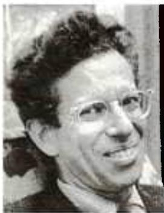  
Howard Temin, 1934–1994
[Bettmann/Getty Images.]

  
David Baltimore [AP Images.]  
the insertion of transposons in bacterial chromosomes (see Fig. 25-41). For example, a few base pairs of host DNA become duplicated at the site of integration, forming short repeats of 4 to 6 bp at each end of the inserted retroviral DNA (not shown). On transcription and translation of the integrated viral DNA, new viruses are formed and released by cell lysis (right). In the viruses, the viral RNA is enclosed by capsid proteins called Gag and outer envelope proteins called Env. Additional viral proteins (reverse transcriptase, integrase, and a viral protease needed for posttranslational processing of viral proteins) are packaged within the virus particle with the RNA.

Retroviruses typically have three genes: gag (a name derived from the historical designation group associated antigen), pol, and env (Fig. 26-30). The transcript that contains gag and pol is translated into a long "polyprotein," a single large polypeptide that is cleaved into six proteins with distinct functions. The proteins derived from the gag gene make up the interior core of the viral particle. The pol gene encodes the protease that cleaves the long polypeptide, an integrase that inserts the viral DNA into the host chromosomes, and reverse transcriptase. Many reverse transcriptases have two subunits, $\alpha$ and $\beta$ . The pol gene specifies the $\beta$ subunit ( $M_{r}$ 90,000), and the $\alpha$ subunit ( $M_{r}$ 65,000) is simply a proteolytic fragment of the $\beta$ subunit. The env gene encodes the proteins of the viral envelope. At each end of the linear RNA genome are long terminal repeat (LTR) sequences of a few hundred nucleotides. Transcribed into the duplex DNA, these sequences facilitate integration of the viral chromosome into the host DNA and contain promoters for viral gene expression.

  
FIGURE 26-30 Structure and gene products of an integrated retroviral genome. The long terminal repeats (LTRs) have sequences needed for the regulation and initiation of transcription. The sequence denoted $\psi$ is required for packaging of retroviral RNAs into mature viral particles. Transcription of the retroviral DNA produces a primary transcript encompassing the gag, pol, and env genes. Translation (Chapter 27) produces a polyprotein, a single long polypeptide derived from the gag and pol genes, which is cleaved into six distinct proteins. Splicing of the primary transcript yields an mRNA derived largely from the env gene, which is also translated into a polyprotein, then cleaved to generate viral envelope proteins.

Reverse transcriptases catalyze three different reactions: (1) RNA-dependent DNA synthesis, (2) RNA degradation, and (3) DNA-dependent DNA synthesis. Each transcriptase is most active with the RNA of its own virus, but each can be used experimentally to make DNA complementary to a variety of RNAs. The DNA and RNA synthesis and RNA degradation activities use separate active sites on the protein. For DNA synthesis to begin, the reverse transcriptase requires a primer, a cellular tRNA obtained during an earlier infection and carried in the viral particle. This tRNA is base-paired at its 3' end with a complementary sequence in the viral RNA. The new DNA strand is synthesized in the 5'→3' direction, as in all RNA and DNA polymerase reactions. Reverse transcriptases, like RNA polymerases, do not have $3'\rightarrow5'$ proofreading exonucleases. They generally have error rates of about 1 per 20,000 nucleotides added. An error rate this high is extremely unusual in DNA replication and seems to be a characteristic of most enzymes that replicate the genomes of RNA viruses. A consequence is a higher mutation rate and a faster rate of viral evolution, which is a factor in the frequent appearance of new strains of disease-causing retroviruses.

Reverse transcriptases have become important reagents in the study of DNA-RNA relationships and in DNA cloning techniques. They make possible the synthesis of DNA complementary to an mRNA template, and synthetic DNA prepared in this manner, called complementary DNA (cDNA), can be used to clone cellular genes (see Fig. 9-13).

## Some Retroviruses Cause Cancer and AIDS

P3 Retroviruses have featured prominently in the molecular understanding of cancer. Most retroviruses do not kill their host cells but remain integrated in the cellular DNA, replicating when the cell divides. Some retroviruses, classified as RNA tumor viruses, contain an oncogene that can cause the cell to grow abnormally. The first retrovirus of this type to be studied was the Rous sarcoma virus (also called avian sarcoma virus; Fig. 26-31), named for F. Peyton Rous, who studied chicken tumors now known to be caused by this virus. Since the initial discovery of oncogenes by Harold Varmus and Michael Bishop, many dozens of such genes have been found in retroviruses.

P3 The human immunodeficiency virus (HIV), which causes acquired immune deficiency syndrome (AIDS), is a retrovirus. Identified in 1983, HIV has an RNA genome with standard retroviral genes along with several other unusual genes (Fig. 26-32). Unlike many other retroviruses, HIV kills many of the cells it infects (principally T lymphocytes) rather than causing tumor formation. This gradually leads to suppression of the immune system in the host organism. The reverse transcriptase of HIV is even more error-prone than other known reverse transcriptases — 10 times more so — resulting in high mutation rates in this virus. One or more errors are generally made every time the viral genome is replicated, so any two viral RNA molecules are likely to differ.

Many modern vaccines for viral infections consist of one or more coat proteins of the virus, produced by methods described in Chapter 9. These proteins are not infectious on their own but stimulate the immune

<table><tr><td colspan="5">LTR</td><td>LTR</td></tr><tr><td></td><td>gag</td><td>pol</td><td>env</td><td>src</td><td></td></tr></table>

FIGURE 26-31 Rous sarcoma virus genome. The src gene encodes a tyrosine kinase, one of a class of enzymes that function in systems affecting cell division, cell-cell interactions, and intercellular communication (see Section 12.4). The same gene is found in chicken DNA (the usual  
host for this virus) and in the genomes of many other eukaryotes, including humans. When associated with the Rous sarcoma virus, this oncogene is often expressed at abnormally high levels, contributing to unregulated cell division and cancer.

  
FIGURE 26-32 The genome of HIV, the virus that causes AIDS. In addition to the typical retroviral genes, HIV contains several small genes with a variety of functions (not identified here and not all known). Some of these genes overlap. Alternative splicing mechanisms produce many different proteins from this small (9.7 × 10 $^{3}$ nucleotides) genome.

system to recognize and resist subsequent viral invasions (Chapter 5). Because of the high error rate of the HIV reverse transcriptase, the env gene in this virus (along with the rest of the genome) undergoes very rapid mutation, complicating the development of an effective vaccine. However, repeated cycles of cell invasion and replication are needed to propagate an HIV infection, so inhibition of viral enzymes offers the most effective therapy currently available. The HIV protease is targeted by a class of drugs called protease inhibitors (see Fig. 6-29). Reverse transcriptase is the target of some additional drugs widely used to treat HIV-infected individuals (Box 26-3).

## Many Transposons, Retroviruses, and Introns May Have a Common Evolutionary Origin

Some well-characterized eukaryotic DNA transposons from sources as diverse as yeast and fruit flies have a structure very similar to that of retroviruses; these are sometimes called retrotransposons (Fig. 26-33). Retrotransposons

  
FIGURE 26-33 Eukaryotic transposons. The Ty element of the yeast Saccharomyces and the copia element of the fruit fly Drosophila are examples of eukaryotic retrotransposons, which often have a structure similar to retroviruses but lack the env gene. The δ sequences of the Ty element are functionally equivalent to retroviral LTRs. In the copia element, INT and RT are homologous to the integrase and reverse transcriptase segments, respectively, of the pol gene.

## BOX 26-3

MEDICINE

## Fighting AIDS with Inhibitors of HIV Reverse Transcriptase

Research into the chemistry of template-dependent nucleic acid biosynthesis, combined with modern techniques of molecular biology, has elucidated the life cycle and structure of the human immunodeficiency virus, the retrovirus that causes AIDS. A few years after the isolation of HIV, this research resulted in the development of drugs capable of prolonging the lives of people infected by HIV.

The first drug to be approved for clinical use was azido-thymidine (AZT), a structural analog of deoxythymidine. AZT was first synthesized in 1964 by Jerome P. Horwitz. It failed as an anticancer drug (the purpose for which it was made), but in 1985 it was found to be a useful treatment for AIDS. AZT is taken up by T lymphocytes, immune system cells that are particularly vulnerable to HIV infection, and it is converted to AZT triphosphate. (AZT triphosphate taken directly would be ineffective because it cannot cross the plasma membrane.) HIV's reverse transcriptase has a higher affinity for AZT triphosphate than for deoxythymidine triphosphate (dTTP), and binding of AZT triphosphate to this enzyme competitively inhibits dTTP binding. When AZT is added to the 3' end of the growing DNA strand, lack of a 3' hydroxyl means that the DNA strand is terminated prematurely and viral DNA synthesis grinds to a halt.

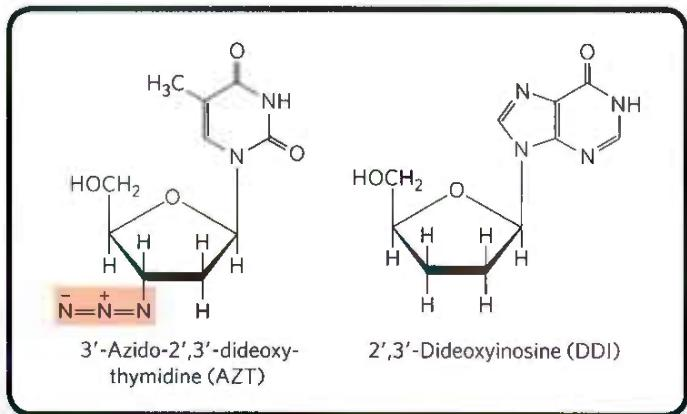

AZT triphosphate is not as toxic to the T lymphocytes themselves because cellular DNA polymerases have a lower affinity for this compound than for dTTP. At concentrations of 1 to 5 $\mu$ M, AZT affects HIV reverse transcription but not most cellular DNA replication. Unfortunately, AZT seems to be toxic to the bone marrow cells that are the progenitors of erythrocytes, and many individuals taking AZT develop anemia. AZT can increase the survival time of people with advanced AIDS by about a year, and it delays the onset of AIDS in those who are still in the early stages of HIV infection. Some other AIDS drugs, such as dideoxyinosine (DDI), have a similar mechanism of action. Newer drugs target and inactivate the HIV protease. Because of the high error rate of HIV reverse transcriptase and the resulting rapid evolution of HIV, the most effective treatments of HIV infection use a combination of drugs directed at both the protease and the reverse transcriptase.

encode an enzyme homologous to the retroviral reverse transcriptase, and their coding regions are flanked by LTR sequences. They transpose from one position to another in the cellular genome by means of an RNA intermediate, using reverse transcriptase to make a DNA copy of the RNA, followed by integration of the DNA at a new site. Most transposons in eukaryotes use this mechanism for transposition, distinguishing them from bacterial transposons, which move as DNA directly from one chromosomal location to another (see Fig. 25-41).

Retrotransposons lack an env gene and so cannot form viral particles. They can be thought of as defective viruses, trapped in cells. Comparisons between retroviruses and eukaryotic transposons suggest that reverse transcriptase is an ancient enzyme that predates the evolution of multicellular organisms.

Many group I and group II introns are also mobile genetic elements. In addition to their self-splicing activities, they encode DNA endonucleases that promote their movement. During genetic exchanges between cells of the same species, or when DNA is introduced into a cell by parasites or by other means, these endonucleases promote insertion of the intron into an identical site in another DNA copy of a homologous gene that does not contain the intron, in a process termed homing (Fig. 26-34). Whereas group I intron homing is DNA-based, group II intron homing occurs through an RNA intermediate. The endonucleases of the group II introns have associated reverse transcriptase activity. The proteins can form complexes with the intron RNAs themselves, after the introns are spliced from the primary transcripts. Because the homing process involves insertion of the RNA intron into DNA and reverse transcription of the intron, the movement of these introns has been called retrohoming. Over time, every copy of a particular gene in a population may acquire the intron.

## FIGURE 26-34 Introns that move: homing and retrohoming.

FIGURE 26-31 introns that move homing and retrohoming. Certain introns include a gene (shown in red) for enzymes that promote homing (some group I introns) or retrohoming (some group II introns). (a) The gene in the spliced intron is bound by a ribosome and translated. Group I homing introns specify a site-specific endonuclease, called a homing endonuclease. Group II retrohoming introns specify a protein with both endonuclease and reverse transcriptase activities (not shown here). (b) Homing. Allele $a$ of a gene $X$ containing a group I homing intron is present in a cell containing allele $b$ of the same gene, which lacks the intron. The homing endonuclease produced by $a$ cleaves $b$ at the position corresponding to the intron in $a$ , and double-strand break repair (recombination with allele $a$ ; see Fig. 25-34) then creates a new copy of the intron in $b$ . (c) Retrohoming. Allele $a$ of gene $Y$ contains a retrohoming group II intron; allele $b$ lacks the intron. The spliced intron inserts itself into the coding strand of $b$ in a reaction that is the reverse of the splicing that excised the intron from the primary transcript (see Fig. 26-14), except that here the insertion is into DNA rather than RNA. The noncoding DNA strand of $b$ is then cleaved by the intron-encoded endonuclease/reverse transcriptase. This same enzyme uses the inserted RNA as a template to synthesize a complementary DNA strand. The RNA is then degraded by cellular ribonucleases and replaced with DNA.

(a) Production of homing endonuclease  
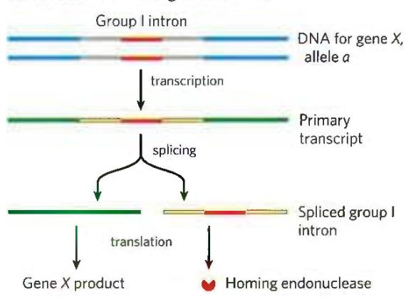

(c) Retrohoming  

Much more rarely, the intron may insert itself into a new location in an unrelated gene. If this event does not kill the host cell, it can lead to the evolution and distribution of an intron in a new location. The structures and mechanisms used by mobile introns support the idea that at least some introns originated as molecular parasites whose evolutionary past can be traced to retroviruses and transposons.

## Telomerase Is a Specialized Reverse Transcriptase

Telomeres, the structures at the ends of linear eukaryotic chromosomes (see Fig. 24-7), generally consist of many tandem copies of a short oligonucleotide sequence. This sequence usually has the form $T_{x}G_{y}$ in one strand and $C_{y}A_{x}$ in the complementary strand, where x and y are typically in the range of 1 to 4 (p. 890). Telomeres vary in length from a few dozen base pairs in some ciliated protozoans to tens of thousands of base pairs in mammals. The TG strand is longer than its complement, leaving a region of single-stranded DNA of up to a few hundred nucleotides at the 3' end.

The ends of a linear chromosome are not readily replicated by cellular DNA polymerases. DNA replication requires a template and primer, and beyond the end of a linear DNA molecule no template is available for the pairing of an RNA primer. Without a special mechanism for replicating the ends, chromosomes would be shortened somewhat in each cell generation. The enzyme telomerase, discovered by Carol Greider and Elizabeth Blackburn, solves this problem by adding telomeres to chromosome ends.

  
Carol Greider [Courtesy Carol Greider.]

  
Elizabeth Blackburn [Micheline Pelletier/Getty Images.]

The discovery and purification of this enzyme provided insight into a reaction mechanism that is remarkable and unprecedented. Telomerase, like some other enzymes described in this chapter, is an RNP that contains both RNA and protein components. The RNA component in humans is about 150 nucleotides long and contains about 1.5 copies of the appropriate $C_{y}A_{x}$ telomere repeat. This region of the RNA acts as a template for synthesis of the $T_{x}G_{y}$ strand of the telomere. P3 Telomerase thereby acts as a cellular reverse transcriptase that provides the active site for RNA-dependent DNA synthesis. Unlike retroviral reverse transcriptases, telomerase copies only a small segment of RNA that it carries within itself. Telomere synthesis requires the 3' end of a chromosome as primer and proceeds in the usual 5'→3' direction. Having synthesized one copy of the repeat, the enzyme repositions to resume extension of the telomere (Fig. 26-35a).

After extension of the $T_{x}G_{y}$ strand by telomerase, the complementary $C_{y}A_{x}$ strand is synthesized by cellular DNA polymerases, starting with an RNA primer (see Fig. 25-11). The single-stranded region is protected by specific binding proteins in many lower eukaryotes, especially those species with telomeres of less than a few hundred base pairs. In higher eukaryotes (including mammals) with telomeres many thousands of base pairs long, the single-stranded end is sequestered in a specialized structure called a T loop (Fig. 26-35b). The single-stranded end is folded back and paired with its complement in the double-stranded portion of the telomere. The formation of a T loop involves invasion of the 3' end of the telomere's single strand into the duplex DNA, perhaps by a mechanism similar to the initiation of homologous genetic recombination (see Fig. 25-34). In mammals, the looped DNA is bound by two proteins, TRF1 and TRF2, with the latter protein involved in formation of the T loop. T loops protect the 3' ends of chromosomes, making them inaccessible to nucleases and the enzymes that repair double-strand breaks.

In protozoans (such as Tetrahymena), loss of telomerase activity results in a gradual shortening of telomeres with each cell division, ultimately leading to the death of the cell line. A similar link between telomere length and cell senescence (cessation of cell division) has been observed in humans. In germ-line cells, which contain telomerase activity, telomere lengths are maintained; in somatic cells, which lack telomerase, they are not. There is a linear, inverse relationship between the length of telomeres in cultured fibroblasts and the age of the individual from whom the fibroblasts were taken: telomeres in human somatic cells gradually shorten as an individual ages. If the telomerase reverse transcriptase is introduced into human somatic cells in vitro, telomerase activity is restored and the cellular life span increases markedly.

Is the gradual shortening of telomeres a key to the aging process? Is our natural life span determined by the length of the telomeres we are born with? Further research in this area should yield some fascinating insights.

## Some RNAs Are Replicated by RNA-Dependent RNA Polymerase

Apart from the retroviruses, the RNA viruses include some E. coli bacteriophages as well as eukaryotic viruses such as the influenza virus and coronaviruses that cause SARS or COVID-19. The single-stranded RNA chromosomes of these viruses also function as mRNAs for the synthesis of viral proteins. They are replicated in the host cell by an RNA-dependent RNA polymerase (RNA replicase). All RNA viruses—with the exception of retroviruses—must encode a protein with RNA-dependent RNA polymerase activity, either because the host cells lack such an enzyme or because the RNA genome structure of a virus imposes specialized enzymatic requirements.

  
FIGURE 26-35 Telomere synthesis and structure. (a) The internal template RNA of telomerase binds to and base-pairs with the TG primer $(\mathrm{T}_x\mathrm{G}_y)$ of DNA. Telomerase adds more T and G residues to the TG primer, then repositions the internal template RNA to allow the addition of more T and G residues to generate the TG strand of the telomere. The complementary strand is synthesized  
by cellular DNA polymerases, after priming by an RNA primase. (b) Proposed structure of T loops in telomeres. The single-stranded tail synthesized by telomerase is folded back and paired with its complement in the duplex portion of the telomere. The telomere is bound by several telomere-binding proteins, including TRF1 and TRF2 (telomere repeat binding factors).

The RNA replicase isolated from E. coli cells infected with the bacteriophage Qβ catalyzes the formation of an RNA complementary to the viral RNA, in a reaction equivalent to that catalyzed by DNA-dependent RNA polymerases. New RNA strand synthesis proceeds in the 5'→3' direction by a chemical mechanism identical to that used in all other nucleic acid synthetic reactions that require a template. RNA replicase requires RNA as its template and will not function with DNA. It lacks a separate proofreading endonuclease activity and has an error rate similar to that of RNA polymerase. Unlike the DNA and RNA polymerases, RNA replicases are specific for the RNA of their own virus; the RNAs of the host cell are generally not replicated. This explains how RNA viruses are preferentially replicated in the host cell, which contains many other types of RNA.

  
FIGURE 26-36 Structural similarities between RNA-dependent polymerases. RNA-dependent polymerases use a common active site architecture in which the duplexed substrate sits in a hand-shaped protein fold with palm and finger domains. This protein fold can be found in protein factors involved in (a) group II intron retrohoming, (b) spliceosome-catalyzed pre-mRNA splicing, (c) telomere synthesis, (d) HIV reverse transcription, and (e) hepatitis C viral genome replication. The retrohoming  
reverse transcriptase of group II introns is most structurally related to the reverse transcriptase structure present in the spliceosome, supporting their close evolutionary relationship. [Information from C. Zhao and A. M. Pyle, Nat. Struct. Mol. Biol. 23:558, 2016, Fig. 2. Data from (a) PDB ID 5HHJ, C. Zhao and A. M. Pyle, Nat. Struct. Mol. Biol. 23:558, 2016; (b) PDB ID 4I43, W. P. Galej et al., Nature 493:638, 2013; (c) PDB ID 3DU6, A. J. Gillis et al., Nature 455:633, 2008; (d) PDB ID 2HMI, J. Ding et al., J. Mol. Biol. 284:1095, 1998; (e) PDB ID 1C2P, C. A. Lesburg et al., Nat. Struct. Biol. 6:937, 1999.]

RNA-dependent RNA polymerases are not limited to viruses. Enzymes of this type are found in plants, protists, fungi, and some simpler animals, but not in insects or mammals. Those found in the genomes of eukaryotes generally play a role in the metabolism of another class of small RNAs, called small interfering RNAs (siRNAs), which participate in gene regulation (Chapter 28).

## RNA-Dependent RNA Polymerases Share a Common Structural Fold

Even though viral RNA replication and reverse transcription, retrohoming, and telomere synthesis represent a diverse array of biological processes, the polymerases involved in each pathway bear remarkable similarities in structure (Fig. 26-36). In all cases, palm and finger domains are used to grip the duplexed template and primer nucleic acids within the active site. Amazingly, the group II intron retrohoming reverse transcriptase is structurally most closely related to a protein component of the spliceosome that helps scaffold its RNA active site. In addition to identical splicing chemistry and active site features (see Fig. 26-17), this provides further evidence that the spliceosome evolved from a group II intron-like ancestor.

## SUMMARY 26.3 RNA-Dependent Synthesis of RNA and DNA

■ RNA-dependent DNA polymerases, also called reverse transcriptases, were first discovered in retroviruses, which must convert their RNA genomes into double-stranded DNA as part of their life cycle. These enzymes transcribe the viral RNA into DNA, a process that can be used experimentally to form cDNA.

■ Retroviruses can cause human diseases, including AIDS and cancers. Some of these viruses contain oncogenes, which cause infected cells to grow abnormally.

Many eukaryotic transposons are related to retroviruses, and their mechanism of transposition includes an RNA intermediate. An RNA intermediate is also present in group II intron retrohoming, in which the RNA intron is inserted into a DNA gene followed by production of a DNA copy by a reverse transcriptase.

■ Telomerase, the enzyme that synthesizes the telomere ends of linear chromosomes, is a specialized reverse transcriptase that contains an internal RNA template.

\- RNA-dependent RNA polymerases, such as the replicases of RNA bacteriophages, are template-specific for the viral RNA. These enzymes share structural homology with reverse transcriptases involved in retroviral replication, telomere production, and retrohoming.

## 26.4 Catalytic RNAs and the RNA World Hypothesis

P4 The study of posttranscriptional processing of RNA molecules led to one of the most exciting discoveries in biochemistry—the existence of RNA enzymes or ribozymes. The best-characterized ribozymes are the self-splicing group I introns, RNase P, and the hammerhead ribozyme (discussed below). Most of the activities of these ribozymes are based on two fundamental reactions: transesterification (Fig. 26-14) and phosphodiester bond hydrolysis (cleavage). The substrate for a ribozyme is often an RNA molecule, and it may even be part of the ribozyme itself. When its substrate is RNA, the RNA catalyst can make use of base-pairing interactions to align the substrate for the reaction.

## Ribozymes Share Features with Protein Enzymes

Like protein enzymes, ribozymes vary greatly in size. A self-splicing group I intron may have more than 400 nucleotides. In comparison, the hammerhead ribozyme consists of two RNA strands with a total of just 41 nucleotides. P4 Also as with protein enzymes, the three-dimensional structure of ribozymes is important for function. Ribozymes, like protein enzymes, are inactivated by heating above their melting temperature or by the addition of denaturing agents or complementary oligonucleotides, which disrupt normal base-pairing patterns. Ribozymes can also be inactivated if essential nucleotides are changed. The secondary structure of a self-splicing group I intron from the 26S rRNA precursor of Tetrahymena is shown in detail in Figure 26-37. This secondary structure highlights the large number of base-pairing and other noncovalent interactions that must occur for the ribozyme to adopt a catalytic structure. Just as amino acid mutations can change activities of protein enzymes, nucleotide mutations can alter the noncovalent interactions required for ribozyme folding and catalysis.

  
FIGURE 26-37 Secondary structure of the self-splicing rRNA intron of Tetrahymena. (a) A two-dimensional representation of secondary structure immediately prior to the initiation of the reaction. Intron sequences are shaded yellow and light red; flanking exon sequences are green; the internal guide sequences that help to align reacting segments at the active site are purple. Each thin, light-red line represents a bond between adjacent nucleotides in a continuous sequence (a device necessitated by showing this complex molecule in two dimensions). Short blue lines represent normal base pairing; blue dots indicate G-U base pairs. All nucleotides are shown. The catalytic core of the

P4 Ribozymes share several properties with enzymes besides accelerating the reaction rate, including kinetic behavior and specificity. Binding of the guanosine cofactor to the Tetrahymena group I rRNA intron is saturable ( $K_{m} < 30 \mu M$ ) and can be competitively inhibited by 3'-deoxyguanosine. The intron is very precise in its excision reaction, largely due to a segment called the internal guide sequence that can base-pair with exon sequences near the 5' splice site (Fig. 26-37). This pairing promotes the alignment of specific bonds to be cleaved and rejoined.

  
self-splicing activity is shaded in gray. Some base-paired regions are labeled (P1, P3, P2.1, P5a, and so forth) according to an established convention for this RNA molecule. The P1 region, which contains the internal guide sequence (purple), is the location of the 5' splice site (black arrow). Part of the internal guide sequence pairs with the end of the 3' exon, bringing the 5' and 3' splice sites (black arrows) into close proximity. (b) Three-dimensional structure of a reaction intermediate of the same intron, after guanosine-mediated cleavage (Fig. 26-14) and prior to exon ligation. Segments are colored as in (a). [Data from (a) PDB ID 1GID, J.H. Cate et al., Science 273:1678, 1996. (b) PDB ID 1U6B, P.L. Adams et al., Nature 430:45, 2004.]

Because the intron itself is chemically altered during the splicing reaction—its ends are cleaved—it may seem to lack one key enzymatic property: the ability to catalyze multiple reactions. Closer inspection has shown that after excision, the 414 nucleotide intron from Tetrahymena rRNA can, in vitro, act as a true enzyme (but in vivo it is quickly degraded). A series of intramolecular cyclization and cleavage reactions in the excised intron leads to the loss of 19 nucleotides from its 5' end. The remaining 395 nucleotide, linear RNA—referred to as L-19 IVS (intervening sequence)—promotes nucleotidyl transfer reactions in which some oligonucleotides are lengthened at the expense of others (Fig. 26-38). The best substrates are oligonucleotides, such as a synthetic (C) $_{5}$ oligomer, that can base-pair with the same guanylate-rich internal guide sequence that held the 5' exon in place for self-splicing.

The enzymatic activity of the L-19 IVS ribozyme results from a cycle of transesterification reactions mechanistically similar to self-splicing. Each ribozyme molecule can process about 100 substrate molecules per hour and is not altered in the reaction—that is, the intron acts as a catalyst. It follows Michaelis-Menten kinetics, is specific for RNA oligonucleotide substrates, and can be competitively inhibited. The $k_{cat}/K_{m}$ (specificity constant) is $10^{3} M^{-1} s^{-1}$ , lower than that of many protein enzymes, but the ribozyme accelerates hydrolysis by a factor of $10^{10}$ relative to the uncatalyzed reaction. P4 It makes use of substrate orientation, covalent catalysis, and metal-ion catalysis—all strategies shared with protein enzymes.

## Ribozymes Participate in a Variety of Biological Processes

E. coli RNase P has both an RNA component (the M1 RNA, with 377 nucleotides) and a protein component ( $M_{r}$ 17,500). In 1983, Sidney Altman and Norman Pace and their coworkers discovered that under some conditions, the M1 RNA alone is capable of catalysis, cleaving tRNA precursors at the correct position. The protein component apparently serves to stabilize the RNA or facilitate its function in vivo. The RNase P ribozyme recognizes the three-dimensional shape of its pre-tRNA substrate, along with the CCA sequence, and thus can cleave the 5' leaders from diverse tRNAs (Fig. 26-25).

  
FIGURE 26-38 In vitro catalytic activity of L-19 IVS. (a) L-19 IVS (intervening sequence, the term once used for intron) is generated by the autocatalytic removal of 19 nucleotides from the $5^{\prime}$ end of the spliced Tetrahymena intron. The cleavage site is indicated by the arrow in the internal guide sequence (boxed). The G residue (shaded) added in the first step of the splicing reaction is part of the removed sequence. A portion of the internal guide  
sequence remains at the 5' end of L-19 IVS. (b) L-19 IVS lengthens some RNA oligonucleotides at the expense of others in a cycle of transesterification reactions (steps 1 through 4). The 3' OH of the G residue at the 3' end of L-19 IVS plays a key role in this cycle (note that this is not the G residue added in the splicing reaction). (C) $_{5}$ is one of the ribozyme's better substrates because it can base-pair with the guide sequence remaining in the intron.

The known catalytic repertoire of ribozymes continues to expand. Some virusoids, small RNAs associated with plant RNA viruses, include a structure that promotes a self-cleavage reaction; the small hammerhead ribozyme illustrated in Figure 26-39 is in this class, catalyzing the hydrolysis of an internal phosphodiester bond. There are at least nine structural classes of ribozymes that engage in self-cleavage; all use general acid and base catalysis (Fig. 6-8) to promote the attack of a 2'-hydroxyl group on an adjacent phosphodiester bond. Despite being surrounded by proteins, the splicing reaction that occurs in a spliceosome relies on a catalytic center formed by the U2, U5, and U6 snRNAs and intron (see Figs 26-16 and 26-17). And, as we shall see in Chapter 27, an RNA component of ribosomes catalyzes the synthesis of proteins. Exploring catalytic RNAs has provided new insights into catalytic function in general and has important implications for our understanding of the origin and evolution of life on this planet.

  
FIGURE 26-39 Hammerhead ribozyme. Some virusoid RNAs include small segments that promote site-specific RNA cleavage reactions associated with replication. These segments are called hammerhead ribozymes, because their secondary structures are shaped like the head of a hammer. (a) The minimal sequences required for catalysis by the ribozyme. The boxed nucleotides are highly conserved and are required for catalytic function. Guanine nucleotides shaded pink form part of the active site. The arrow indicates the site of self-cleavage. (b) Three-dimensional structure of a hammerhead ribozyme (see Fig. 8-25b for a view of another hammerhead ribozyme). The strands are colored as in (a). The hammerhead ribozyme is a metalloenzyme; $\mathrm{Mg}^{2+}$ ions are required for activity in vivo. The phosphodiester bond at the site of self-cleavage is indicated by an arrow. [Data from PDB ID 3ZD5, M. Martick and W. G. Scott, Cell 126:309, 2006.]

## Ribozymes Provide Clues to the Origin of Life in an RNA World

The extraordinary complexity and order that distinguish living from inanimate systems are key manifestations of fundamental life processes. Maintaining the living state requires that selected chemical transformations occur very rapidly—especially those that use environmental energy sources and synthesize elaborate or specialized cellular macromolecules. Life depends on powerful and selective catalysts—enzymes—and on informational systems capable of both securely storing the blueprint for these enzymes and accurately reproducing the blueprint for generation after generation. Chromosomes encode the blueprint not for the cell but for the enzymes that construct and maintain the cell. The parallel demands for information and catalysis present a classic conundrum: what came first, the information needed to specify structure or the enzymes needed to maintain and transmit the information?

How might a self-replicating polymer come to be? How might it maintain itself in an environment where the precursors for polymer synthesis are scarce? How could evolution progress from such a polymer to the modern DNA-protein world? These difficult questions can be addressed by careful experimentation, providing clues about how life on Earth began and evolved.

  
Carl Woese, 1928–2012
[Steve Kagan.]

P4 The unveiling of the structural and functional complexity of RNA led Carl Woese, Francis Crick, and Leslie Orgel to propose in the 1960s that this macromolecule might serve as both information carrier and catalyst. Since that time, at least six lines of evidence have given increasing substance to their RNA world hypothesis.

1. Prebiotic Chemistry Experiments The probable origin of purine and pyrimidine bases is suggested by experiments designed to test hypotheses about prebiotic chemistry (pp. 31–32). Beginning with simple molecules thought to be present in the early atmosphere (CH₄, NH₃, H₂O, H₂), electrical discharges mimicking lightning generate, first, more reactive molecules such as HCN and aldehydes, then an array of amino acids and organic acids (see Fig. 1-33). When molecules such as HCN become abundant, purine and pyrimidine bases are synthesized in detectable amounts. Remarkably, a concentrated solution of ammonium cyanide, refluxed for a few days, generates adenine in yields of up to 0.5% (Fig. 26-40). Adenine may well have been the first and most abundant nucleotide constituent to appear on Earth. Intriguingly, most enzyme cofactors contain adenosine as part of their structure, although it plays no direct role in the cofactor function (see Fig. 8-41). This may suggest an evolutionary relationship. Based on the simple synthesis of adenine from cyanide, adenine may simply have been abundant and available.

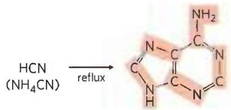  
FIGURE 26-40 Experiments supporting prebiotic synthesis of adenine from ammonium cyanide. Adenine is derived from five molecules of cyanide, denoted by shading.

2. The Existence of Catalytic RNAs P4 In an "RNA world," RNAs, not proteins, act as catalysts. Perhaps more than anything else, the discovery of ribozymes gave life to the RNA world hypothesis and led to widespread speculation that an RNA world might have been important in the transition from prebiotic chemistry to life (see Fig. 1-35). The parent of all life on this planet, in the sense that it could reproduce itself across the generations from the origin of life to the present, might have been a self-replicating RNA, or a polymer with equivalent chemical characteristics.

3. The Expanding Catalytic Repertoire of Ribozymes A self-replicating polymer would quickly use up available supplies of precursors provided by the relatively slow processes of prebiotic chemistry. Thus, from an early stage in evolution, metabolic pathways would be required to generate precursors efficiently, with the synthesis of precursors presumably catalyzed by ribozymes. The extant ribozymes found in nature have a limited repertoire of catalytic functions, and of the ribozymes that may once have existed, no trace is left. To explore the RNA world hypothesis more deeply, we need to know whether RNA has the potential to catalyze the many different reactions needed in a primitive system of metabolic pathways.

The search for RNAs with new catalytic functions has been aided by the development of a method that rapidly searches pools of random polymers of RNA and extracts those with particular activities; known as SELEX, this is nothing less than accelerated evolution in a test tube (Box 26-4). It has been used to generate RNA molecules that bind to amino acids, organic dyes, nucleotides, cyanocobalamin, and other molecules. Researchers have isolated ribozymes that catalyze ester and amide bond formation, $S_{N}2$ reactions, metallation of (addition of metal ions to) porphyrins, and carbon-carbon bond formation. The evolution of enzymatic cofactors with nucleotide “handles” that facilitate their binding to ribozymes might have further expanded the repertoire of chemical processes available to primitive metabolic systems.

4. The Structure of the Ribosome As we shall see in Chapter 27, some natural RNA molecules, components of ribosomes, catalyze the formation of peptide bonds, offering a glimpse of how the RNA world might have been transformed by the greater catalytic potential of proteins. The evolution of a capacity to synthesize proteins would have been a major event in the RNA world, allowing the generation of polymers that could greatly stabilize complex RNA structures. However, the onset of peptide synthesis would also have hastened the demise of the RNA world. Proteins simply have more catalytic potential. The information-carrying role of RNA may have passed to DNA because DNA is chemically more stable. RNA replicase and reverse transcriptase may be modern versions of enzymes that once played important roles in making the transition to the modern DNA-based system.

5. Extant Vestiges of an RNA World The known functions of RNA continue to multiply with each decade. Retroviruses, other RNA viruses, and retrotransposons inhabit a semi-independent universe, maintaining a parasitic existence within the biosphere. For evolutionary biologists, these almost-living entities provide a window on key steps in the evolution of life. Transposons may have been an early innovation in an RNA world. With the appearance of the first, inefficient self-replicators, transposition could have been an important alternative to replication as a strategy for successful reproduction and survival. Early parasitic RNAs would simply hop into a self-replicating molecule via catalyzed transesterification, then passively undergo replication. Natural selection would have driven transposition to become site-specific, targeting sequences that did not interfere with the catalytic activities of the host RNA. Replicators and RNA transposons could have existed in a primitive symbiotic relationship, each contributing to the evolution of the other. Modern introns, retroviruses, and transposons may all be vestiges of a "piggyback" strategy pursued by early parasitic RNAs. These elements continue to make major contributions to the evolution of their hosts.

6. Progress in the Search for an RNA Replicator The RNA world hypothesis requires a nucleotide polymer to reproduce itself. Can a ribozyme bring about its own synthesis in a template-directed manner? Researchers are getting closer to finding such a ribozyme or ribozyme system. For example, Gerald Joyce and colleagues, in 2009, reported on the first set of two ribozymes that could cross-catalyze each other's formation (Fig. 26-41). One ribozyme, E, catalyzes the joining of two oligonucleotides (A' and B') to create a second, complementary

FIGURE 2 RNA aptamer that binds ATP. The shaded nucleotides are those required for the binding activity.

## The SELEX Method for Generating RNA Polymers with New Functions

SELEX (systematic evolution of ligands by exponential enrichment) is used to generate aptamers, oligonucleotides selected to tightly bind a specific molecular target. The process is generally automated to allow rapid identification of one or more aptamers with the desired binding specificity.

Figure 1 illustrates how SELEX is used to select an RNA species that binds tightly to ATP. In step ①, a random mixture of RNA polymers is subjected to "unnatural selection" by passing it through a resin to which ATP is attached. The practical limit for the complexity of an RNA mixture is about $10^{15}$ different sequences, which allows complete randomization of 25 nucleotides ( $4^{25} = 10^{15}$ ). For longer RNAs, the RNA pool used to initiate the search does not include all possible sequences. RNA polymers that pass through the column are discarded (step ②); those that bind to ATP are washed from the column with salt solution and collected (step ③). In step ④, the collected RNA polymers are amplified by reverse transcriptase to make many DNA complements to the selected RNAs, then an RNA polymerase makes many RNA complements of the resulting DNA molecules. Finally, in step ⑤, this new pool of RNA is subjected to the same selection procedure, and the cycle is repeated a dozen or more times. At the end, only a few aptamers — in this case, RNA sequences with considerable affinity for ATP — remain.

Critical sequence features of an RNA aptamer that binds ATP are shown in Figure 2; molecules with this general structure bind ATP (and other adenosine nucleotides) with $K_{d} < 50 \mu M$ . Figure 3 presents the three-dimensional structure of a 36 nucleotide RNA aptamer (shown as a complex with AMP) generated by SELEX. This RNA has the backbone structure shown in Figure 2.

In addition to its use in exploring the potential functionality of RNA, SELEX has an important practical side in identifying short RNAs with pharmaceutical uses. Finding an aptamer that binds specifically to every potential therapeutic target may be impossible, but the capacity of SELEX to rapidly select and amplify a specific oligonucleotide sequence from a highly complex pool of sequences makes this a promising approach for generating new therapies. For example, one could select an RNA that binds tightly to a receptor protein prominent in the plasma membrane of cells in a particular cancerous tumor. Blocking the activity of the receptor, or targeting a toxin to the tumor cells by attaching it to the aptamer, would kill the cells. SELEX also has been used to select DNA aptamers that detect anthrax spores. Many other promising applications are under development.

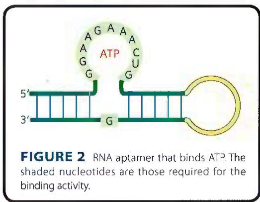

  
FIGURE 3 RNA aptamer bound to AMP. The bases of the conserved nucleotides (forming the binding pocket) are pale green; the bound AMP is red. [Data from PDB ID 1RAW, T. Dieckmann et al., RNA 2:628, 1996.]

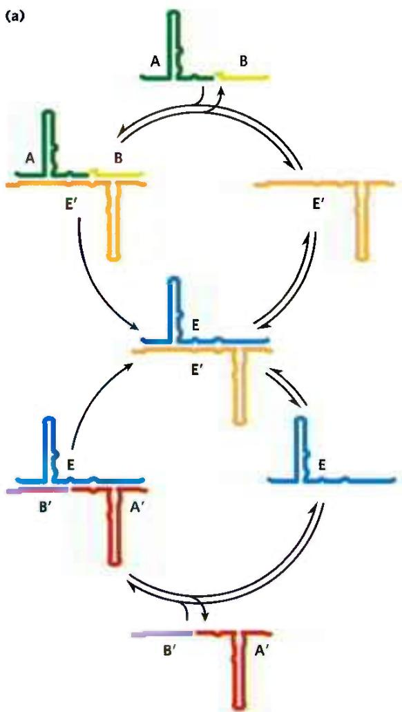  
FIGURE 26-41 Self-sustained replication of an RNA enzyme. This system has many of the properties of a living system. The RNA molecules incorporate information and catalytic function, and the reactions produce an exponential increase in the product RNAs. When variants of the RNA substrates are introduced, the system undergoes natural selection such that the best replicators eventually dominate the population. (a) A possible reaction scheme. Oligoribonucleotides A and B anneal to ribozyme E' and are ligated catalytically to form ribozyme E. The joining

ribozyme called E'. E' could then catalyze the joining of two other oligonucleotides (A and B) to form another molecule of E. In this system, the formation of E and E' was templated, and the amounts grew exponentially as long as substrates were available and proteins were absent. The system evolved so that more-efficient enzymes appeared in the population. A more general RNA-polymerase-like ribozyme was described in 2011 by Philipp Holliger and colleagues.

Although the RNA world remains a hypothesis, with many gaps yet to be explained, experimental evidence supports a growing list of its key elements. Further experimentation should increase our understanding. Important clues to the puzzle will be found in the workings of fundamental chemistry, in living cells, and perhaps on other planets.

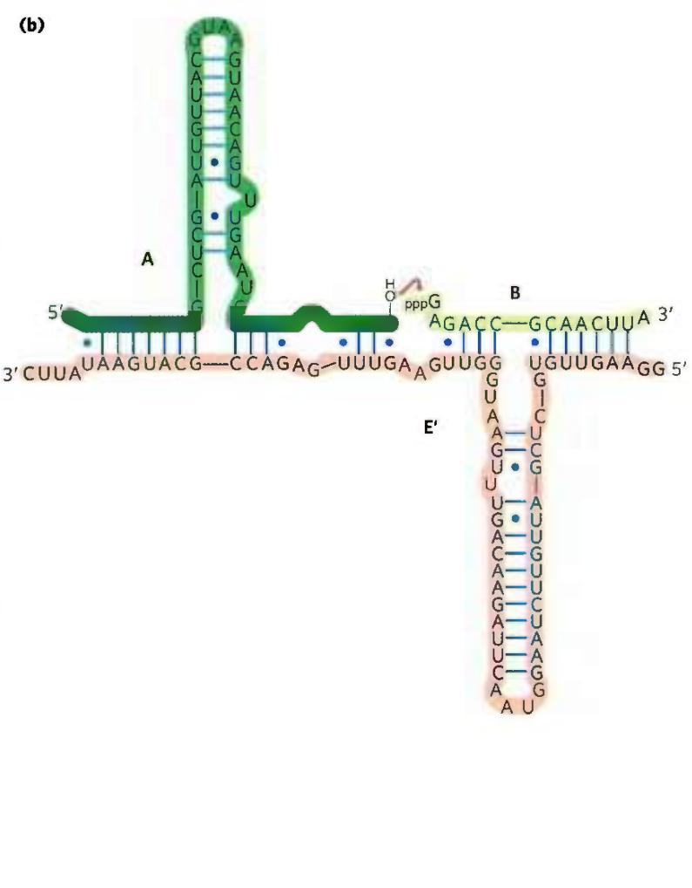  
of oligoribonucleotides A' and B' is similarly catalyzed by ribozyme E. The levels of E and E' grow exponentially, with a doubling time of about one hour at 42 °C, as long as there is a supply of the precursors A, B, A', and B'. (b) The ligation reaction involves attack of the 3' OH of one oligoribonucleotide on the α phosphate of the 5'-triphosphate of the other oligoribonucleotide. Pyrophosphate is released. Base pairing of the substrates with the ribozyme plays a key role in aligning the substrates for the reaction. [Information from T. A. Lincoln and G. F. Joyce, Science 323:1229, 2009.]

## SUMMARY 26.4 Catalytic RNA and the RNA World Hypothesis

\- Ribozymes and protein-based enzymes share common features, including folded three-dimensional structures, inactivation by denaturation, acceleration of reaction rates, saturable kinetics, and reaction specificity.

\- Ribozymes and RNA-based catalysts are present in organisms today and are involved in a wide range of activities, including tRNA processing, nuclear pre-mRNA splicing, and translation.

The evolution of life on Earth may have included an RNA world in which RNA was the central information carrier and catalyst before proteins and DNA emerged as key players. The existence of ribozymes provides a powerful piece of evidence in support of this hypothesis.

## KEY TERMS

Terms in bold are defined in the glossary.

ribonucleoprotein (RNP) 960   
transcription 960   
messenger RNA (mRNA) 960   
transfer RNA (tRNA) 960   
ribosomal RNA (rRNA) 960   
noncoding RNA (ncRNA) 960   
transcriptome 960 DNA-dependent RNA polymerase 961   
template strand 962   
nontemplate strand 962 coding strand 962   
promoter 963   
consensus sequence 963   
footprinting 965   
cAMP receptor protein (CRP) 966   
repressor 966   
carboxyl-terminal domain (CTD) 968   
transcription factors 968   
general transcription factors 968   
preinitiation complex (PIC) 969   
ribozymes 972   
primary transcript 972   
precursor transcript 972   
intron 973

exon 973
RNA splicing 973
messenger ribonucleo-
protein (mRNP)
complex 973
5' cap 974
spliceosome 977
small nuclear RNA
(snRNA) 977
poly(A) tail 980
alternative splicing 981
poly(A) site choice 982
small nucleolar RNA
(snoRNA) 984
snoRNA-protein complex
(snoRNP) 984
microRNA (miRNA) 985
polynucleotide
phosphorylase 987
exosome 987
reverse transcriptase 988
retrovirus 988
complementary DNA
(cDNA) 990
homing 992
telomerase 993
T loop 993
RNA-dependent RNA
polymerase (RNA
replicase) 994
internal guide sequence 996
RNA world hypothesis 998
SELEX 1000
aptamer 1000

## PROBLEMS

1. RNA Polymerase (a) How long would it take for the E. coli RNA polymerase to synthesize the primary transcript for the E. coli genes encoding the enzymes for lactose metabolism, the 5,300 bp lac operon? (b) How far along the DNA would the transcription "bubble" formed by RNA polymerase move in 10 seconds? (c) Assuming that human Pol II transcribes at a similar rate, how long does it take to transcribe the 2,000,000 bp dystrophin gene?

2. Error Correction by RNA Polymerases DNA polymerases are capable of editing and error correction, whereas the capacity for error correction in RNA polymerases seems to be limited. Given that a single base error in either replication or transcription can lead to an error in protein synthesis, suggest a possible biological explanation for this difference.

3. RNA Posttranscriptional Processing Predict the likely effects of a mutation in the sequence (5')AAUAAA in a eukaryotic mRNA transcript.

4. Coding versus Template Strands The RNA genome of phage Qβ is the nontemplate strand, or coding strand, and when introduced into the cell, it functions as an mRNA. Suppose the RNA replicase of phage Qβ synthesized primarily template-strand RNA and uniquely incorporated this, rather than nontemplate strands, into the viral particles. What would be the fate of the template strands when they entered a new cell? What enzyme would have to be included in the viral particles for successful invasion of a host cell?

5. Transcription The gene encoding the E. coli enzyme enolase begins with the sequence ATGTCCAAAATCGTA. What is the sequence of the RNA transcript specified by this part of the gene?

6. The Chemistry of Nucleic Acid Biosynthesis Describe three properties common to the reactions catalyzed by DNA polymerase, RNA polymerase, reverse transcriptase, and RNA replicase. How is the enzyme polynucleotide phosphorylase similar to and different from these four enzymes?

7. RNA Processing I While studying human transcription in the 1960s, James Darnell carried out an experiment that has become a classic in biochemistry, but at the time, it was incredibly perplexing. Darnell and coworkers used radioactive isotopes, such as $[^{32}P]$ -labeled phosphate, to isolate and quantify RNAs from a cultured line of human cancer cells (HeLa). With this approach, they were able to identify those RNAs present in the nucleus and those present in the cytoplasm. The results were puzzling, because it was obvious that a large amount of transcription was occurring in the nucleus, but comparatively little radioactive mRNA was isolated from the cytoplasm. Moreover, the nuclear-isolated RNAs were much longer than those isolated from the cytoplasm. What can account for these observations?

8. The Transcriptome If a cell's genome is completely known, is it possible to determine the cell's transcriptome—the sequence of all the RNAs being produced by the cell—without additional information? Explain.

9. RNA Splicing What is the minimum number of transesterification reactions needed to splice an intron from a pre-mRNA transcript? Explain.

10. RNA Processing II Blocking the splicing of a particular pre-mRNA in a vertebrate cell also blocks a nucleotide modification reaction occurring in the rRNA. Suggest a reason for this.

11. RNA Modification I Researchers Brenda Bass and Harold Weintraub discovered double-stranded RNA-specific adenosine deaminases (ADARs) in 1987. These enzymes recognize double-stranded regions of mRNA and convert adenosine bases to inosine within these regions.

(a) When ADAR encounters a double-stranded RNA substrate in water that also contains $H_{2}[^{18}O]$ , radioactive oxygen incorporates into the RNA. Draw a reaction mechanism for ADAR that accounts for this observation.

(b) After ADAR reacts with a double-stranded RNA, the RNA duplex sometimes spontaneously unwinds to form single strands. Why might this occur?

(c) What is a possible consequence of adenosine to inosine conversion in the coding sequence of an mRNA?

12. Organization of RNA Processing In eukaryotes, pre-mRNA splicing by the spliceosome occurs only in the nucleus and translation of mRNAs occurs only in the cytosol. Why might the separation of these two activities into different cellular compartments be important?

13. RNA Modification II In addition to rRNAs and tRNAs, many human mRNAs also contain modified nucleotides, in particular $N^{6}$ -methyladenosine.

(a) How might incorporation of $N^{6}$ -methyladenosine impact RNA processing?

(b) Incorporation of $N^{6}$ -methyladenosine into the 3' untranslated region (UTR; see Fig. 9-24) of the MAT2A transcript, which encodes a methionine adenosyltransferase, regulates the metabolism of the cofactor S-adenosylmethionine. Why would metabolism of S-adenosylmethionine be linked to $N^{6}$ -methyladenosine formation?

14. RNA Genomes RNA viruses have relatively small genomes. For example, the single-stranded RNAs of retroviruses have about 10,000 nucleotides, and the Qβ RNA is only 4,220 nucleotides long. How might the properties of reverse transcriptase and RNA replicase have contributed to the small size of these viral genomes?

15. Screening of RNAs by SELEX The practical limit for the number of different RNA sequences that can be screened in a SELEX experiment is $10^{15}$ . (a) Suppose you are working with oligonucleotides that are 36 nucleotides long. How many sequences exist in a randomized pool containing every sequence possible? (b) What percentage of these can a SELEX experiment screen? (c) Suppose you wish to select an RNA molecule that catalyzes the hydrolysis of a particular ester. From what you know about catalysis, propose a SELEX strategy that might allow you to select the appropriate catalyst.

16. Slow Death The death cap mushroom, Amanita phalloides, contains several dangerous substances, including the lethal $\alpha$ -amanitin. This toxin blocks RNA elongation in consumers of the mushroom by binding to eukaryotic RNA polymerase II with very high affinity; it is deadly in concentrations as low as $10^{-8}$ M. The initial reaction to ingestion of the mushroom is gastrointestinal distress (caused by some of the other toxins). These symptoms disappear, but about 48 hours later, the mushroom-eater dies, usually from liver dysfunction. Speculate on why it takes this long for $\alpha$ -amanitin to kill.

17. Detection of Rifampin-Resistant Strains of Tuberculosis Rifampin is an important antibiotic used to treat tuberculosis and other mycobacterial diseases. Some strains of Mycobacterium tuberculosis, the causative agent of tuberculosis, are resistant to rifampin. These strains become resistant through mutations that alter the rpoB gene, which encodes the $\beta$ subunit of the RNA polymerase (see Fig. 26-10). Rifampin cannot bind to the mutant RNA polymerase and so is unable to block the initiation of transcription. DNA sequences from a large number of rifampin-resistant M. tuberculosis strains have been found to have mutations in a specific 69 bp region of rpoB. One well-characterized rifampin-resistant strain has a single base pair alteration in rpoB that results in a His residue being replaced by an Asp residue in the $\beta$ subunit.

(a) Based on your knowledge of protein chemistry, what technique could you use to detect whether a particular strain produces the rpoB His → Asp mutant protein?

(b) Based on your knowledge of nucleic acid chemistry, what technique could you also use to identify the mutant forms of rpoB?

## BIOCHEMISTRY ONLINE

18. The Ribonuclease Gene Human pancreatic ribonuclease has 128 amino acid residues.

(a) What is the minimum number of nucleotide pairs required to code for this protein?

(b) The mRNA expressed in human pancreatic cells was copied with reverse transcriptase to create a "library" of human DNA. The sequence of the mRNA coding for human pancreatic ribonuclease was determined by sequencing the complementary DNA (cDNA) from this library that included an open reading frame for the protein. Use the nucleotide database at NCBI (www.ncbi.nlm.nih.gov/nucleotide) to find the published sequence of this mRNA. (Search for accession number D26129.) What is the length of this mRNA?

(c) How can you account for the discrepancy between the size you calculated in (a) and the actual length of the mRNA?

## DATA ANALYSIS PROBLEM

19. Amputated RNAs with Prosthetic Tails The Wickens lab studies the dramatic effects of RNA processing on how a cell utilizes mRNAs, such as the c-mos (cellular mouse sarcoma) protooncogene, which controls meiosis and embryonic cell cycles in vertebrates. In frogs (Xenopus), expression of the c-mos protein is essential for maturation of oocytes after exposure to progesterone and embryo formation.

Specific RNAs can be cleaved (amputated) in Xenopus oocytes by injection of antisense DNA oligonucleotides that will hybridize to the mRNA. The formation of an RNA/DNA duplex triggers cleavage of the RNA strand by cellular RNase H. The figure below depicts the results of amputation of the c-mos mRNA after oligo injection. In this case, the oligonucleotide targeted the -883 region of the c-mos mRNA. This region is downstream of the c-mos open reading frame (depicted by the AUG start and UAA stop codons) within the 3' untranslated region (3'UTR).

After injection of a sense oligonucleotide, the oocyte maturation percentage was nearly unchanged. However, when an antisense oligonucleotide was injected, the maturation percentage was reduced by \~60%. The c-mos mRNA was isolated from oocytes that either did or did not mature after injection of the antisense oligonucleotide. The mRNAs were analyzed by gel electrophoresis followed by northern blotting, as shown below. In a northern blot, RNAs are separated by gel electrophoresis according to their size, transferred to a membrane, and then detected by hybridization to radioactive or fluorescent complementary DNA probes.

(a) What can you conclude about the importance of the c-mos mRNA poly(A) tail on oocyte maturation?

(b) Why was a sense oligonucleotide used in some experiments? Members of the Wickens lab then decided to inject a prosthetic RNA after amputation of the c-mos mRNA. The prosthetic RNA contained the c-mos mRNA 3'UTR as well as a region complementary to the amputated c-mos mRNA. Their observations are shown below. In these experiments, oocyte maturation was measured by the percentage of cells in which germinal vesicle breakdown (% GVBD) was observed. GVBD occurs when the oocyte nucleus (called the germinal vesicle) dissolves and the cell resumes meiosis.

  
(c) How do you explain these results?

Wickens lab scientists then tried attaching the c-mos mRNA 3'UTR to an unrelated reporter enzyme. In this case, they used luciferase, whose enzymatic activity can easily be measured by luminescence (see Box 13-2). The total luciferase activity is also proportional to the amount of luciferase protein being produced by the cell. They tried attaching the entire c-mos mRNA 3'UTR (mRNA1), the amputated 3'UTR (mRNA2), or a combination of the amputated 3'UTR with the prosthetic poly(A) tail to luciferase. High luciferase activity was observed only when either the entire c-mos mRNA 3'UTR was used or when the prosthetic poly(A) tail was included along with the amputated 3'UTR.

(d) What does this experiment tell you about the likely function of the 3'UTR and poly(A) tail for the c-mos mRNA and in oocyte maturation?

(e) How might these results be useful for controlling cellular gene expression?

## Reference

Sheets, M.D., M. Wu, and M. Wickens. 1995. Polyadenylation of c-mos mRNA as a control point in Xenopus meiotic maturation. Nature 374:511-516.

