# 第27章 Protein Metabolism

<!-- 章节边界按正文内容恢复；原始 MinerU 内容保留如下。 -->

# PROTEIN METABOLISM

## 27.1 The Genetic Code 1006

27.2 Protein Synthesis 1015

## 27.3 Protein Targeting and Degradation 1041

Almost every biological process requires one or more proteins. A typical cell requires thousands of different proteins at any given moment. These proteins must be synthesized in response to the cell's current needs, modified to alter their activity or fate, transported (targeted) to their appropriate cellular locations, and degraded when no longer needed. Dozens of separate processes contribute to cellular proteostasis, the steady-state complement of proteins that enable the life of a cell at any given moment.

Many of the fundamental components and mechanisms used by the protein biosynthetic machinery are remarkably well conserved in all life-forms, from bacteria to higher eukaryotes, indicating that they were present in the last universal common ancestor (LUCA) of all extant organisms. Whereas the chapter focuses on protein biosynthesis, all aspects of proteostasis are considered. The principles that guide our approach are interrelated, reflecting all of these realities and more.

P1 Information is expensive. This principle, noted in earlier chapters, is particularly well illustrated by protein synthesis. Protein synthesis consumes more cellular resources than any other process in most cells. The 15,000 ribosomes, 100,000 molecules of protein synthesis-related protein factors and enzymes, and 200,000 tRNA molecules in a typical bacterial cell can account for more than $35\%$ of the cell's dry weight. Overall, almost 300 different macromolecules cooperate to synthesize polypeptides. Protein synthesis can account for up to $90\%$ of the chemical energy used by a cell for all biosynthetic reactions. Why? The enzymatic synthesis of an amide bond should require little energetic input. However, the sequence of amino acids in a protein is a form of biological information. Synthesis of each amide (peptide) bond between two particular amino

acids is ensured by the investment of more than four nucleoside triphosphates (NTPs).

P2 The genetic code is nearly universal and arose early in evolution. This is one of the many characteristics of living systems that ties all of them to a common ancestor. Even the rare exceptions to code universality reinforce this rule.

P3 The genetic code functions via linker molecules. The tRNAs are the crucial adaptor, matching amino acids with DNA codons.

P4 Proteins are synthesized by RNAs. The study of protein synthesis offers another important reward: a look at a world of RNA catalysts that may have existed in an RNA world before the dawn of life “as we know it.” Proteins are synthesized by a gigantic RNA enzyme.

P5 Protein metabolism is regulated at many levels. The resource investment in protein synthesis ensures that many layers of regulation work together to determine which proteins are synthesized at any given moment. However, proteins often function only in particular cellular locations and at particular times. Mechanisms for spatial and temporal regulation—protein targeting, activation, and eventual degradation—exhibit complexities that can approach those of the biosynthetic processes.

Several major advances set the stage for our present knowledge of protein biosynthesis (Fig. 27-1). First, in the early 1950s, Paul Zamecnik and Elizabeth Keller discovered the ribonucleoprotein particles in which protein synthesis occurs. These particles, visible in animal tissues by electron microscopy, were later named ribosomes. Soon after, Francis Crick considered how the genetic information encoded in the 4-letter language of nucleic acids could be translated into the 20-letter language of proteins. In 1955, Crick postulated that a small nucleic acid could serve the role of an adaptor, with one part of the adaptor molecule binding a specific

FIGURE 27-1 Timeline for the elucidation of protein biosynthetic pathways. Some key contributions are highlighted. However, our current understanding of the genetic code and protein biosynthetic pathways comes as the result of international endeavors involving hundreds of laboratories. [Top left to bottom left: Bettmann/Getty Images; data from PDB ID 4TRA, E. Westhof et al., Acta Crystallogr. A 44:112, 1988; Bettmann/Getty Images; Courtesy Archives, University of Wisconsin, Madison; Alastair Grant/AP Images; Lucas Jackson/Reuters/Newscm; Xinhua/ZUMAPRESS.com. Top right to bottom right: Joseph F. Gennaro Jr./Science Source; Archives and Special Collections, Massachusetts General Hospital; Cornell University Media Services PhotoSection records, #21-37-2227, Division of Rare and Manuscript Collections, Cornell University Library; Bob Schutz/AP Images; Courtesy Archives, University of Wisconsin, Madison; Courtesy Harry Noller; data from PDB ID 4V7R, A. Ben-Shem et al., Science 330:1203, 2010.]

amino acid and another part recognizing the nucleotide sequence encoding that amino acid in an mRNA (Fig. 27-2). Crick's adaptor hypothesis was soon verified when Mahlon Hoagland and Zamecnik discovered tRNA. The structure of alanyl-tRNA was reported by Robert Holley in 1964. The tRNA adaptor “translates” the nucleotide sequence of an mRNA into the amino acid sequence of a polypeptide. The overall process of mRNA-guided protein synthesis is often referred to simply as translation. Hoagland, Zamecnik, and Elizabeth Keller also discovered that amino acids were “activated” for protein synthesis when incubated with ATP and the cytosolic fraction of liver cells. The amino acids became attached to a heat-stable soluble RNA—the tRNA—to form aminoacyl-tRNAs. The enzymes that catalyze this process are the aminoacyl-tRNA synthetases.

  
FIGURE 27-2 Crick's adaptor hypothesis. Francis Crick proposed that one end of a small nucleotide adaptor could bind a specific amino acid and the other end could recognize a nucleotide sequence in the mRNA. Today we know that the amino acid is covalently bound at the 3' end of a tRNA molecule and that a specific nucleotide triplet elsewhere in the tRNA interacts with a particular triplet codon in mRNA through hydrogen bonding of complementary bases.

These developments soon led to recognition of the major stages of protein synthesis and ultimately to elucidation of the genetic code that specifies each amino acid. In subsequent decades, ribosomes were purified and their protein and rRNA components were dissected. Elucidation of the three-dimensional structures of ribosomes was completed by 2000, confirming a hypothesis first put forward by Harry Noller two decades earlier: it is the rRNA, rather than ribosomal proteins, that catalyzes peptide bond formation.

## 27.1 The Genetic Code

By the 1960s, it was apparent that at least three nucleotide residues of DNA are necessary to encode each amino acid. The four code letters of DNA (A, T, G, and C) in groups of two can yield only $4^{2} = 16$ different combinations, insufficient to encode 20 amino acids. Groups of three, however, yield $4^{3} = 64$ different combinations. Deciphering the genetic code quickly became a major goal.

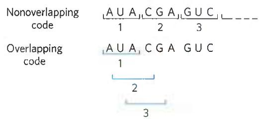  
FIGURE 27-3 Overlapping versus nonoverlapping genetic codes. In a nonoverlapping code, codons (numbered consecutively) do not share nucleotides. In an overlapping code, some nucleotides in the mRNA are shared by different codons. In a triplet code with maximum overlap, many nucleotides, such as the third nucleotide from the left (A), are shared by three codons. A nonoverlapping code provides much more flexibility in the triplet sequence of neighboring codons and therefore in the possible amino acid sequences designated by the code.

## The Genetic Code Was Cracked Using Artificial mRNA Templates

Several key properties of the genetic code were established in early genetic studies. A codon is a triplet of nucleotides that codes for a specific amino acid. In all living systems, translation occurs in such a way that these nucleotide triplets are read in a successive, nonoverlapping fashion (Figs. 27-3, 27-4). A specific first codon in the sequence establishes the reading frame, in which a new codon begins every three nucleotide residues. There is no punctuation between codons for successive amino acid residues. The amino acid sequence of a protein is defined by a linear sequence of contiguous triplets. In principle, any given single-stranded DNA or mRNA sequence has three possible reading frames. Each reading frame gives a different sequence of codons (Fig. 27-5), but only one is likely to encode a given protein. A key question remained: what were the three-letter code words for each amino acid?

In 1961, Marshall Nirenberg and J. Heinrich Matthaei reported the first breakthrough. They incubated synthetic polyuridylate, poly(U), with an Escherichia coli extract, GTP, ATP, and a mixture of the 20 amino acids in 20 different tubes, each tube containing a different radioactively labeled amino acid. Because poly(U) mRNA is made up of many successive UUU triplets, it should promote the synthesis of a polypeptide containing only the amino acid encoded by UUU. A radioactive polypeptide was formed only in the tube containing radioactive phenylalanine. Nirenberg and Matthaei therefore concluded that the triplet codon UUU encodes phenylalanine. The same approach soon revealed that polycytidylate, poly(C), encodes a polypeptide containing only proline (polyproline), and that polyadenylate, poly(A), encodes polylysine. Polyguanylate did not generate any polypeptide in this experiment because it spontaneously forms tetraplexes (see Fig. 8-20d) that cannot be bound by ribosomes.

  
FIGURE 27-4 The triplet, nonoverlapping code. Evidence for the general nature of the genetic code came from many types of experiments, including genetic experiments on the effects of deletion and insertion mutations. Inserting or deleting one base pair (shown here in the mRNA transcript) alters the sequence of all amino acids coded by the mRNA following the change. Combining insertion and deletion mutations affects some amino acids but can eventually restore the correct amino acid sequence. Adding or subtracting three nucleotides (not shown) leaves the remaining triplets intact, providing evidence that a codon has three, rather than four or five, nucleotides. The triplet codons shaded in gray are those transcribed from the original gene; codons shaded in blue are new codons resulting from the insertion or deletion mutations.

The synthetic polynucleotides used in such experiments were prepared by using polynucleotide phosphorylase (p. 987), which catalyzes the formation of RNA polymers starting from ADP, UDP, CDP, and GDP. This enzyme, discovered by physician/biochemist Severo Ochoa, requires no template and makes polymers with a base composition that directly reflects the relative concentrations of the nucleoside 5'-diphosphate precursors in the medium. If polynucleotide phosphorylase is presented with only UDP, it makes only poly(U). If it is presented with a mixture of five parts ADP and one part CDP, it makes a polymer in which about five-sixths of the residues are adenylate and one-sixth is cytidylate. This random polymer is likely to have many triplets of the sequence AAA; smaller numbers of AAC, ACA, and CAA triplets; relatively few ACC, CCA, and CAC triplets; and very few CCC triplets (Table 27-1). Using a variety of artificial mRNAs made by polynucleotide phosphorylase from different starting mixtures of ADP, GDP, UDP, and CDP, the Nirenberg and Ochoa groups soon identified the base compositions of the triplets coding for almost all the amino acids. Although these experiments revealed the base composition of the coding triplets, they usually could not reveal the sequence of the bases.

<table><tr><td>Reading frame 1</td><td>5&#x27; ---</td><td>U</td><td>U</td><td>C</td><td>U</td><td>C</td><td>G</td><td>G</td><td>A</td><td>C</td><td>C</td><td>U</td><td>G</td><td>G</td><td>A</td><td>G</td><td>A</td><td>U</td><td>U</td><td>C</td><td>A</td><td>C</td><td>A</td><td>G</td><td>U</td><td>---</td><td>3&#x27;</td></tr><tr><td>Reading frame 2</td><td></td><td>---</td><td>U</td><td>U</td><td>C</td><td>U</td><td>C</td><td>G</td><td>G</td><td>A</td><td>C</td><td>C</td><td>U</td><td>G</td><td>G</td><td>A</td><td>G</td><td>A</td><td>U</td><td>U</td><td>C</td><td>A</td><td>C</td><td>A</td><td>G</td><td>U</td><td>---</td></tr><tr><td>Reading frame 3</td><td></td><td>---</td><td>U</td><td>U</td><td>C</td><td>U</td><td>C</td><td>G</td><td>G</td><td>A</td><td>C</td><td>C</td><td>U</td><td>G</td><td>G</td><td>A</td><td>G</td><td>A</td><td>U</td><td>U</td><td>C</td><td>A</td><td>C</td><td>A</td><td>G</td><td>U</td><td>---</td></tr></table>

FIGURE 27-5 Reading frames in the genetic code. In a triplet, nonoverlapping code, all mRNAs have three potential reading frames, shaded here in different colors. The triplets, and hence the amino acids specified, are different in each reading frame.

TABLE 27-1 Incorporation of Amino Acids into Polypeptides in Response to Random Polymers of RNA

<table><tr><td>Amino acid</td><td>Observed frequency of incorporation (Lys = 100)</td><td>Tentative assignment for nucleotide composition of corresponding codona</td><td>Expected frequency of incorporation based on assignment (Lys = 100)</td></tr><tr><td>Asparagine</td><td>24</td><td> $A_{2}C$ </td><td>20</td></tr><tr><td>Glutamine</td><td>24</td><td> $A_{2}C$ </td><td>20</td></tr><tr><td>Histidine</td><td>6</td><td> $AC_{2}$ </td><td>4</td></tr><tr><td>Lysine</td><td>100</td><td>AAA</td><td>100</td></tr><tr><td>Proline</td><td>7</td><td> $AC_{2}$ , CCC</td><td>4.8</td></tr><tr><td>Threonine</td><td>26</td><td> $A_{2}C$ ,  $AC_{2}$ </td><td>24</td></tr></table>

Note: Presented here is a summary of data from one of the early experiments designed to elucidate the genetic code. A synthetic RNA containing only A and C residues in 5:1 ratio directed polypeptide synthesis, and both the identity and the quantity of incorporated amino acids were determined. Based on the relative abundance of A and C residues in the synthetic RNA, and assigning the codon AAA (the most likely codon) a frequency of 100, there should be three different codons of composition $\mathrm{A}_2\mathrm{C}$ , each at a relative frequency of 20; three of composition $\mathrm{AC}_2$ , each at a relative frequency of 4.0; and CCC at a relative frequency of 0.8. The CCC assignment was based on information derived from prior studies with poly(C). Where two tentative codon assignments are made, both are proposed to code for the same amino acid.  
$^{a}$ These designations of nucleotide composition contain no information on nucleotide sequence (except, of course, AAA and CCC).

KEY CONVENTION Much of the following discussion deals with tRNAs. The amino acid specified by a tRNA is indicated by a superscript, such as tRNA $^{Ala}$ , and the aminoacylated tRNA is designated by a hyphenated name, such as alanyl-tRNA $^{Ala}$ or Ala-tRNA $^{Ala}$ .

In 1964, Nirenberg and Philip Leder achieved another experimental breakthrough. Isolated E. coli ribosomes would bind a specific aminoacyl-tRNA in the presence of the corresponding synthetic polynucleotide messenger. For example, ribosomes incubated with poly(U) and phenylalanyl-tRNA $^{Phe}$ (Phe-tRNA $^{Phe}$ ) bind both RNAs, but if the ribosomes are incubated with poly(U) and some other aminoacyl-tRNA, the aminoacyl-tRNA is not bound, because it does not recognize the UUU triplets in poly(U) (Table 27-2). Even trinucleotides could promote specific binding of appropriate tRNAs, so these experiments could be carried out with chemically synthesized small oligonucleotides. With this technique, researchers determined which aminoacyl-tRNA bound to 54 of the 64 possible triplet codons. For some codons, either no aminoacyl-tRNA or more than one would bind. Another method was needed to complete and confirm the entire genetic code.

At about this time, a complementary approach was provided by H. Gobind Khorana, who developed chemical methods to synthesize polyribonucleotides with defined, repeating sequences of two to four bases. The polypeptides produced by these mRNAs had one or a few amino acids in repeating patterns. These patterns, when combined with information from the random polymers used by Nirenberg and colleagues, permitted unambiguous codon assignments. The copolymer (AC) $_{n}$ , for example, has alternating ACA and CAC codons: ACACACACACACACA. The polypeptide synthesized on this messenger contained equal amounts of threonine and histidine. Given that a histidine codon has one A and two Cs (Table 27-1), CAC must code for histidine and ACA for threonine.

<table><tr><td colspan="4">TABLE 27-2 Trinucleotides That Induce Specific Binding of Aminoacyl-tRNAs to Ribosomes</td></tr><tr><td rowspan="2">Trinucleotide</td><td colspan="3">Relative increase in14C-labeled aminoacyl-tRNA bound to ribosomea</td></tr><tr><td>Phe-tRNAPhe</td><td>Lys-tRNALys</td><td>Pro-tRNAPro</td></tr><tr><td>UUU</td><td>4.6</td><td>0</td><td>0</td></tr><tr><td>AAA</td><td>0</td><td>7.7</td><td>0</td></tr><tr><td>CCC</td><td>0</td><td>0</td><td>3.1</td></tr></table>

Information from M. Nirenberg and P. Leder, Science 145:1399, 1964.  
$^{a}$ Each number represents the factor by which the amount of bound ${}^{14}C$ increased when the indicated trinucleotide was present, relative to a control with no trinucleotide.

Consolidation of the results from many experiments permitted assignment of 61 of the 64 possible codons. The other three were identified as termination codons, in part because they disrupted amino acid coding patterns when they occurred in a synthetic RNA polymer (Fig. 27-6). Meanings for all the triplet codons (tabulated in Fig. 27-7) were established by 1966 and have been verified in many different ways. The cracking of the genetic code is regarded as one of the most important scientific discoveries of the twentieth century.

P2 Codons are the key to the translation of genetic information, directing the synthesis of specific proteins. The reading frame is set when translation of an mRNA molecule begins, and it is maintained as the synthetic machinery reads sequentially from one triplet to the next. If the initial

Reading frame 1 5' --- G U A A G U A A G U A A G U A A A --- 3'

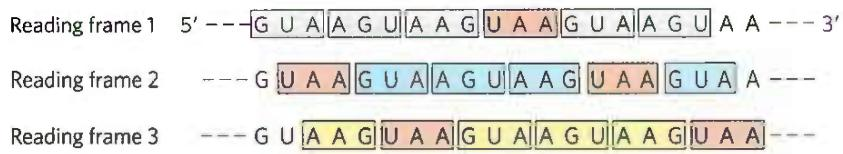

Reading frame 2 --- G U A A G U A A G U A A G U A A G U A A ---

Reading frame 3 --- G U A A G | U A A | G U A | A G U | A A G | U A A | ---

FIGURE 27-6 Effect of a termination codon in a repeating tetranucleotide. Termination codons (light red) are encountered every fourth codon in three different reading frames (shown in different colors). Dipeptides or tripeptides are synthesized, depending on where the ribosome initially binds.

<table><tr><td colspan="5">First letter of codon (5&#x27; end)</td></tr><tr><td colspan="5">Second letter of codon</td></tr><tr><td></td><td>U</td><td>C</td><td>A</td><td>G</td></tr><tr><td rowspan="4">U</td><td>UUU Phe</td><td>UCU Ser</td><td>UAU Tyr</td><td>UGU Cys</td></tr><tr><td>UUC Phe</td><td>UCC Ser</td><td>UAC Tyr</td><td>UGC Cys</td></tr><tr><td>UUA Leu</td><td>UCA Ser</td><td>UAA Stop</td><td>UGA Stop</td></tr><tr><td>UUG Leu</td><td>UCG Ser</td><td>UAG Stop</td><td>UGG Trp</td></tr><tr><td rowspan="4">C</td><td>CUU Leu</td><td>CCU Pro</td><td>CAU His</td><td>CGU Arg</td></tr><tr><td>CUC Leu</td><td>CCC Pro</td><td>CAC His</td><td>CGC Arg</td></tr><tr><td>CUA Leu</td><td>CCA Pro</td><td>CAA Gln</td><td>CGA Arg</td></tr><tr><td>CUG Leu</td><td>CCG Pro</td><td>CAG Gln</td><td>CGG Arg</td></tr><tr><td rowspan="4">A</td><td>AUU Ile</td><td>ACU Thr</td><td>AAU Asn</td><td>AGU Ser</td></tr><tr><td>AUC Ile</td><td>ACC Thr</td><td>AAC Asn</td><td>AGC Ser</td></tr><tr><td>AUA Ile</td><td>ACA Thr</td><td>AAA Lys</td><td>AGA Arg</td></tr><tr><td>AUG Met</td><td>ACG Thr</td><td>AAG Lys</td><td>AGG Arg</td></tr><tr><td rowspan="4">G</td><td>GUU Val</td><td>GCU Ala</td><td>GAU Asp</td><td>GGU Gly</td></tr><tr><td>GUC Val</td><td>GCC Ala</td><td>GAC Asp</td><td>GGC Gly</td></tr><tr><td>GUA Val</td><td>GCA Ala</td><td>GAA Glu</td><td>GGA Gly</td></tr><tr><td>GUG Val</td><td>GCG Ala</td><td>GAG Glu</td><td>GGG Gly</td></tr></table>

FIGURE 27-7 "Dictionary" of amino acid code words in mRNAs. The codons are written in the $5' \rightarrow 3'$ direction. The third base of each codon (in bold type) plays a lesser role in specifying an amino acid than the first two. The three termination codons are shaded in light red, the initiation codon AUG in green. All the amino acids except methionine and tryptophan have more than one codon. In most cases, codons that specify the same amino acid differ only at the third base.

reading frame is off by one or two bases, or if translation somehow skips a nucleotide in the mRNA, all the subsequent codons will be out of register; the result is usually a "missense" protein with a garbled amino acid sequence.

Several codons serve special functions (Fig. 27-7). The initiation codon AUG is the most common signal for the beginning of a polypeptide in all cells, in addition to coding for Met residues in internal positions of polypeptides. The termination codons (UAA, UAG, and UGA), also called stop codons or nonsense codons, normally signal the end of polypeptide synthesis and do not code for any known amino acids.

As described in Section 27.2, initiation of protein synthesis in the cell is an elaborate process that relies on initiation codons and other signals in the mRNA. P1 In retrospect, the experiments of Nirenberg, Khorana, and others to identify codon function should not have worked in the absence of initiation codons. Serendipitously, experimental conditions caused the normally complex initiation requirements for protein synthesis (unknown at the time) to be relaxed. Diligence combined with chance to produce a breakthrough—a common occurrence in the history of biochemistry.

In a random sequence of nucleotides, 1 in every 20 codons in each reading frame is, on average, a termination codon. In general, a reading frame without a termination codon among 50 or more consecutive codons is referred to as an open reading frame (ORF). Long ORFs usually correspond to genes that encode proteins. In the analysis of sequence databases, sophisticated programs are used to search for ORFs in order to find genes among the often-huge background of nongenic DNA. An uninterrupted gene coding for a typical protein with a molecular weight of 60,000 would require an ORF with 500 or more codons.

A striking feature of the genetic code is that an amino acid may be specified by more than one codon, so the code is described as degenerate. This does not suggest that the code is flawed: although an amino acid may have two or more codons, each codon specifies only one amino acid. The degeneracy of the code is not uniform. Whereas methionine and tryptophan have single codons, for example, three amino acids (Arg, Leu, Ser) have six codons, five amino acids have four, isoleucine has three, and nine amino acids have two (Table 27-3).

The genetic code is nearly universal. With the intriguing exception of a few minor variations in mitochondria, some bacteria, and some single-celled eukaryotes, amino acid codons are identical in all species examined so far. Human beings, E. coli, tobacco plants, amphibians, and viruses share the same genetic code. This suggests that all life-forms have a common evolutionary ancestor, whose genetic code has been preserved throughout biological evolution. Even the variations (Box 27-1) reinforce this theme.

TABLE 27-3 Degeneracy of the Genetic Code

<table><tr><td>Amino acid</td><td>Number of codons</td><td>Amino acid</td><td>Number of codons</td></tr><tr><td>Met</td><td>1</td><td>Tyr</td><td>2</td></tr><tr><td>Trp</td><td>1</td><td>Ile</td><td>3</td></tr><tr><td>Asn</td><td>2</td><td>Ala</td><td>4</td></tr><tr><td>Asp</td><td>2</td><td>Gly</td><td>4</td></tr><tr><td>Cys</td><td>2</td><td>Pro</td><td>4</td></tr><tr><td>Gln</td><td>2</td><td>Thr</td><td>4</td></tr><tr><td>Glu</td><td>2</td><td>Val</td><td>4</td></tr><tr><td>His</td><td>2</td><td>Arg</td><td>6</td></tr><tr><td>Lys</td><td>2</td><td>Leu</td><td>6</td></tr><tr><td>Phe</td><td>2</td><td>Ser</td><td>6</td></tr></table>

## Exceptions That Prove the Rule: Natural Variations in the Genetic Code

In biochemistry, as in other disciplines, exceptions to general rules can be problematic for instructors and frustrating for students. At the same time, though, they teach us that life is complex and they inspire us to search for more surprises. Understanding the exceptions can even reinforce the original rule in unpredictable ways.

One would expect little room for variation in the genetic code. Even a single amino acid substitution can have profoundly deleterious effects on the structure of a protein. Nevertheless, variations in the code do occur in some organisms, and they are both interesting and instructive. The types of variation and their rarity provide powerful evidence for a common evolutionary origin of all living things.

To alter the code, changes must occur in the gene(s) encoding one or more tRNAs, with the obvious target for alteration being the anticodon. Such a change would lead to the systematic insertion of an amino acid at a codon that, according to the standard code (see Fig. 27-7), does not specify that amino acid. The genetic code, in effect, is defined by two elements: (1) the anticodons on tRNAs, which determine where an amino acid is placed in a growing polypeptide, and (2) the specificity of the enzymes — the aminoacyl-tRNA synthetases — that charge the tRNAs, which determines the identity of the amino acid attached to a given tRNA.

Most sudden changes in the code would have catastrophic effects on cellular proteins, so code alterations are more likely to persist where relatively few proteins would be affected — such as in small genomes encoding only a few proteins. The biological consequences of a code change could also be limited by restricting changes to the three termination codons, which do not generally occur within genes. This pattern is, in fact, observed.

Of the very few variations in the genetic code that we know of, most occur in mitochondrial DNA (mtDNA), which encodes only 10 to 20 proteins. Mitochondria have their own tRNAs, so their code variations do not affect the much larger cellular genome. The most common changes in mitochondria involve termination codons. These changes affect termination in the products of only a subset of genes, and sometimes the effects are minor, because the genes have multiple (redundant) termination codons.

Vertebrate mtDNAs have genes that encode 13 proteins, 2 rRNAs, and 22 tRNAs (see Fig. 19-40). Given the small number of codon reassignments, along with an unusual

## Wobble Allows Some tRNAs to Recognize More than One Codon

When several different codons specify one amino acid, the difference between them usually lies at the third base position (at the 3' end). For example, alanine is encoded by the triplets GCU, GCC, GCA, and GCG. The codons for set of wobble rules (p. 1012), the 22 tRNAs are sufficient to decode the protein-coding genes, as opposed to the 32 tRNAs required for the standard code. In mitochondria, these changes can be viewed as a kind of genomic streamlining, as a smaller genome confers a replication advantage on the organelle. Four codon families (in which the amino acid is determined entirely by the first two nucleotides) are decoded by a single tRNA with a U residue in the first (or wobble) position in the anticodon. Either the U pairs somehow with any of the four possible bases in the third position of the codon or a "two out of three" mechanism is used — that is, no base pairing is needed at the third position. Other tRNAs recognize codons with either A or G in the third position, and yet others recognize U or C, so that virtually all the tRNAs recognize either two or four codons.

In the standard code, only two amino acids are specified by single codons: methionine and tryptophan (see Table 27-3). If all mitochondrial tRNAs recognize two codons, we would expect additional Met and Trp codons in mitochondria. And we find that the single most common code variation is UGA, usually a termination codon, specifying tryptophan. The tRNA $^{Trp}$ recognizes and inserts a Trp residue at either UGA or the usual Trp codon, UGG. The second most common variation is conversion of AUA from an Ile codon to a Met codon; the usual Met codon is AUG, and a single tRNA recognizes both codons. The known coding variations in mitochondria are summarized in Table 1.

Turning to the much rarer changes in the codes for cellular (as distinct from mitochondrial) genomes, we find that the only known variation in a bacterium is again the use of UGA to encode Trp residues, occurring in the simplest free-living cell, Mycoplasma capricolum. Among eukaryotes, rare extramitochondrial coding changes occur in a few species of ciliated protists, in which both termination codons UAA and UAG can specify glutamine. There are also rare but interesting cases in which stop codons have been adapted to encode amino acids that are not among the standard 20, as detailed in Box 27-2.

Changes in the code need not be absolute; a codon might not always encode the same amino acid. For example, in many bacteria — including E. coli — GUG (Val) is sometimes used as an initiation codon that specifies Met. This occurs only for those genes in which the GUG is properly located relative to particular mRNA sequences that affect the initiation of translation (as discussed in Section 27.2).

most amino acids can be symbolized by $XY_{G}^{A}$ or $XY_{C}^{U}$ . The first two letters of each codon are the primary determinants of specificity, a feature that has some interesting consequences.

P3 Transfer RNAs base-pair with mRNA codons at a three-base sequence on the tRNA called the anticodon.

TABLE 1 Known Variant Codon Assignments in Mitochondria

<table><tr><td rowspan="2"></td><td colspan="5">Codons $^{a}$ </td></tr><tr><td>UGA</td><td>AUA</td><td>AGA AGG</td><td>CUN</td><td>CGG</td></tr><tr><td>Normal (cellular) code assignment</td><td>Stop</td><td>Ile</td><td>Arg</td><td>Leu</td><td>Arg</td></tr><tr><td colspan="6">Animals</td></tr><tr><td>Vertebrates</td><td>Trp</td><td>Met</td><td>Stop</td><td>+</td><td>+</td></tr><tr><td>Drosophila</td><td>Trp</td><td>Met</td><td>Ser</td><td>+</td><td>+</td></tr><tr><td colspan="6">Yeasts</td></tr><tr><td>Saccharomyces cerevisiae</td><td>Trp</td><td>Met</td><td>+</td><td>Thr</td><td>+</td></tr><tr><td>Torulopsis glabrata</td><td>Trp</td><td>Met</td><td>+</td><td>Thr</td><td>?</td></tr><tr><td>Schizosaccharomyces pombe</td><td>Trp</td><td>+</td><td>+</td><td>+</td><td>+</td></tr><tr><td>Filamentous fungi</td><td>Trp</td><td>+</td><td>+</td><td>+</td><td>+</td></tr><tr><td>Trypanosomes</td><td>Trp</td><td>+</td><td>+</td><td>+</td><td>+</td></tr><tr><td>Higher plants</td><td>+</td><td>+</td><td>+</td><td>+</td><td>Trp</td></tr><tr><td>Chlamydomonas reinhardtii</td><td>?</td><td>+</td><td>+</td><td>+</td><td>?</td></tr></table>

$^{a}$ N indicates any nucleotide; + indicates that a codon has the same meaning as in the cellular code; ? indicates that a codon was not observed in this mitochondrial genome.

The most surprising alteration in the genetic code occurs in some fungal species of the genus Candida, as originally discovered for Candida albicans. C. albicans is an organism of high genomic complexity, yet its genetic code has undergone a dramatic change: the CUG codon, which usually encodes Leu residues, encodes Ser instead. The natural selection pressure for this change is completely unknown. Furthermore, Ser and Leu are quite different in chemical structure. However, even this change can be understood based on the properties of a universal code. When several codons encode the same amino acid and use multiple tRNAs, not all of the codons are used with equal frequency. In a phenomenon called codon bias, some codons for a particular amino acid are used more frequently (sometimes much more frequently) than others. The tRNAs for the frequently used codons are often present at much higher concentrations than the tRNAs required for the rarely used codons. Code degeneracy leads to the presence of six codons for Leu. In bacteria, CUG often encodes Leu. However, in fungi of genera that are very closely related to Candida but do not have the coding change, CUG only rarely encodes Leu and is often entirely absent in highly

The first base of the codon in mRNA (read in the 5'→3' direction) pairs with the third base of the anticodon (Fig. 27-8a). If the anticodon triplet of a tRNA recognized only one codon triplet through Watson-Crick base pairing at all three positions, cells would have a different tRNA for each amino acid codon. This is not the case, however, expressed proteins. A change in the coding sense of CUG would thus have a much smaller effect on fungal cell metabolism than might be expected if all codons were used equally. The coding change may have occurred by a gradual loss of CUG codons in genes and of the tRNA that recognizes CUG as a Leu codon, followed by a capture event—a mutation in the anticodon of a tRNA $^{Ser}$ that allowed it to recognize CUG. Alternatively, there may have been an intermediate stage in which CUG was recognized as encoding both Leu and Ser, perhaps with contextual signals in the mRNAs that helped one tRNA or another recognize specific CUG codons (see Box 27-2). Phylogenetic analysis indicates that the reassignment of CUG as a Ser codon occurred in Candida ancestors about 150 million to 170 million years ago.

These variations tell us that the code is not quite as universal as once believed, but that its flexibility is severely constrained. The variations are obviously derivatives of the cellular code, and no example of a completely different code has been found. The limited scope of code variants strengthens the principle that all life on this planet evolved on the basis of a single (slightly flexible) genetic code.

because the anticodons in some tRNAs include the nucleotide inosinate (designated I), which contains the uncommon base hypoxanthine (see Fig. 8-5b). Inosinate can form hydrogen bonds with three different nucleotides — A, U, and C (Fig. 27-8b) — although these pairings are much weaker than the hydrogen bonds of Watson-Crick base pairs G≡C and A=U. In yeast, one tRNA $^{Arg}$ has the anticodon (5')ICG, which recognizes three arginine codons: (5')CGA, (5')CGU, and (5')CGC. The first two bases are identical (CG) and form strong Watson-Crick base pairs with the corresponding bases of the anticodon, but the third base (A, U, or C) forms rather weak hydrogen bonds with the I residue at the first position of the anticodon.

Examination of these and other codon-anticodon pairings led Crick to conclude that the third base of most codons pairs rather loosely with the corresponding base of its anticodon; to use his picturesque word, the third base of such codons (and the first base of their corresponding anticodons) "wobbles." Crick proposed a set of four relationships called the wobble hypothesis:

1. The first two bases of an mRNA codon always form strong Watson-Crick base pairs with the corresponding bases of the tRNA anticodon and confer most of the coding specificity.

2. The first base of the anticodon (reading in the 5'→3' direction; this pairs with the third base of the codon) determines the number of codons recognized by the tRNA. When the first base of the anticodon is C or A, base pairing is specific and only one codon is recognized by that tRNA. When the

  
(a)

$$
\begin{array}{c c c c c} & 3 & 2 & 1 \\ \text {Anticodon} & (3 ^ {\prime}) & G - C - I \\ & \equiv & \equiv & \equiv \\ \text {Codon} & (5 ^ {\prime}) & C - G - A \\ & & 1 & 2 & 3 \end{array} \qquad \qquad \begin{array}{c c c c c} & 3 & 2 & 1 \\ & G - C - I \\ & \equiv & \equiv & \equiv \\ & C - G - U \\ & 1 & 2 & 3 \end{array} \qquad \qquad \begin{array}{c c c c c} & 3 & 2 & 1 \\ & G - C - I & (5 ^ {\prime}) \\ & \equiv & \equiv & \equiv \\ & C - G - C & (3 ^ {\prime}) \\ & 1 & 2 & 3 \end{array}
$$

(b)

FIGURE 27-8 Pairing relationship of codon and anticodon. (a) Alignment of the two RNAs is antiparallel. The tRNA is shown in the traditional cloverleaf configuration. (b) Three different codon pairing relationships are possible when the tRNA anticodon contains inosinate.

first base is U or G, binding is less specific and two different codons may be read. When inosine (I) is the first (wobble) nucleotide of an anticodon, three different codons can be recognized—the maximum number for any tRNA. These relationships are summarized in Table 27-4.

3. When an amino acid is specified by several different codons, the codons that differ in either of the first two bases require different tRNAs.

4. A minimum of 32 tRNAs are required to translate all 61 codons (31 to encode the amino acids, 1 for initiation).

The wobble (or third) base of the codon contributes to specificity, but because it pairs only loosely with its corresponding base in the anticodon, it permits rapid dissociation of the tRNA from its codon during protein synthesis. If all three bases of a codon engaged in strong Watson-Crick pairing with the three bases of the anticodon, tRNAs would dissociate too slowly and this would limit the rate of protein synthesis. Codon-anticodon interactions balance the requirements for accuracy and speed.

P3 Although only 32 tRNAs are required to translate all codons, most cells have more than that. The bacterium E. coli has 47 different tRNA genes. Many of these are present in multiple copies, such that there are 86 total tRNA genes in the E. coli genome.

## The Genetic Code Is Mutation-Resistant

The genetic code plays an interesting role in safeguarding the genomic integrity of every living organism. Evolution did not produce a code in which codon assignments appeared at random. Instead, the code is strikingly resistant to the deleterious effects of the most common kinds

## TABLE 27-4 How the Wobble Base of the Anticodon Determines the Number of Codons a tRNA Can Recognize

1. One codon recognized:
Anticodon (3') X - Y - C (5') (3') X - Y - A (5')
Codon (5') X' - Y' - G (3') (5') X' - Y' - U (3')

2. Two codons recognized:
Anticodon (3') X - Y - U (5') (3') X - Y - G (5')
Codon (5') X' - Y' - A (3') (5') X' - Y' - C (3')

3. Three codons recognized:
Anticodon (3') X - Y - I (5')
Codon (5') X' - Y' - A U C (3')

Note: X and Y denote bases complementary to and capable of strong Watson-Crick base pairing with $X'$ and $Y'$ , respectively. Wobble bases—in the $3'$ position of codons and $5'$ position of anticodons—are shaded.

of mutations—missense mutations, in which a single new base pair replaces another. In the third, or wobble, position of the codon, single base substitutions produce a change in the encoded amino acid only about 25% of the time. Most such changes are thus silent mutations, in which the nucleotide is different but the encoded amino acid remains the same.

Due to the types of spontaneous DNA damage that affect genomes (see Chapter 8), the most frequent missense mutation is a transition mutation, in which a purine is replaced by a purine, or a pyrimidine by a pyrimidine (for example, G≡C changed to A=T). All three codon positions have evolved so that there is some resistance to transition mutations. A mutation in the first position of the codon will usually produce an amino acid coding change, but the change often results in an amino acid with similar chemical properties. This is especially true for the hydrophobic amino acids that dominate the first column of the code shown in Figure 27-7. Consider the Val codon GUU. A change to AUU would substitute Ile for Val. A change to CUU would replace Val with Leu. The resulting changes in the structure and/or function of the protein encoded by that gene would often (but not always) be small.

P2 Computational studies have shown that alternative genetic codes, delineated at random, are almost always less resistant to mutation than the existing code. The results indicate that the code underwent considerable streamlining before the appearance of LUCA, the ancestral cell.

The genetic code tells us how protein sequence information is stored in nucleic acids and provides some clues about how that information is translated into protein.

## Translational Frameshifting Affects How the Code Is Read

Once the reading frame has been set during protein synthesis, codons are translated without overlap or punctuation until the ribosomal complex encounters a termination codon. The other two possible reading frames usually contain no useful genetic information. Overlap between two genes would necessarily constrain the possible amino acid sequences encoded by one or both genes in the overlap region. However, to make maximal use of limited (and expensive) genetic information, a few genes are structured so that ribosomes "hiccup" at a certain point in the translation of their mRNAs, changing the reading frame from that point on. This allows two or more related but distinct proteins to be produced from a single transcript.

One of the best-documented examples of translational frameshifting occurs during translation of the mRNA for the overlapping gag and pol genes of the Rous sarcoma virus, a retrovirus (see Fig. 26-31). The reading frame for pol is offset to the left by one base pair (-1 reading frame) relative to the reading frame for gag (Fig. 27-9).

The product of the retroviral pol gene (reverse transcriptase) is translated as a larger polyprotein, on the same mRNA that is used for the Gag protein alone (see Fig. 26-30). The polyprotein, or Gag-Pol protein, is then trimmed to the mature reverse transcriptase by proteolytic digestion. Production of the polyprotein requires a translational frameshift in the overlap region to allow the ribosome to bypass the UAG termination codon at the end of the gag gene (shaded light red in Fig. 27-9).

Frameshifts occur during about 5% of translations of this mRNA, and the Gag-Pol polyprotein (and ultimately reverse transcriptase) is synthesized at about one-twentieth the frequency of the Gag protein, a level that suffices for efficient reproduction of the virus. A similar mechanism produces both the $\tau$ and $\gamma$ subunits of E. coli DNA polymerase III from a single dnaX gene transcript (see footnote to Table 25-2).

## Some mRNAs Are Edited before Translation

RNA editing can involve the addition, deletion, or alteration of nucleotides in the RNA in a manner that affects the meaning of the transcript when it is translated. Addition or deletion of nucleotides has been most commonly observed in RNAs originating from the mitochondrial and chloroplast genomes. The initial transcripts of the genes that encode cytochrome oxidase subunit II in some protist mitochondria provide an example of editing by insertion. These transcripts do not correspond precisely to the sequence needed at the carboxyl terminus of the protein product. A posttranscriptional editing process inserts four U residues that shift the translational reading frame of the transcript. The insertions require a special class of guide RNAs (gRNAs; Fig. 27-10) that act as templates for the editing process. The added U residues are all located in a small part of the transcript. Note that the base pairing between the initial transcript and the guide RNA includes several G=U base pairs (blue dots), which are common in RNA molecules.

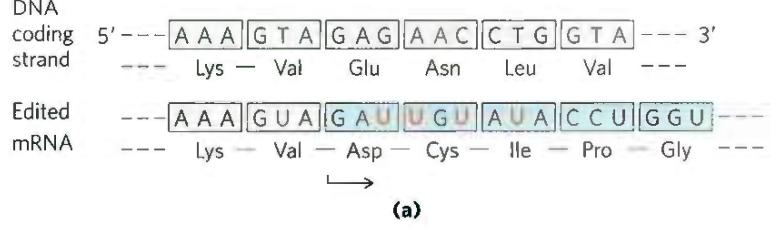

RNA editing by alteration of nucleotides most commonly involves the enzymatic deamination of adenosine or cytidine residues, forming inosine or uridine, respectively (Fig. 27-11), although other base changes have been described. Inosine is interpreted as a G residue during translation. The adenosine deamination reactions are carried out by adenosine deaminases that act on RNA (ADARs). The cytidine deaminations are carried out by the apoB mRNA editing catalytic peptide (APOBEC) family of enzymes, which includes the activation-induced deaminase (AID) enzymes. Both the ADAR and APOBEC groups of deaminase enzymes have a homologous zinc-coordinating catalytic domain.

  
(b)  
FIGURE 27-11 Deamination reactions that result in RNA editing. (a) Conversion of adenosine nucleotides to inosine nucleotides is catalyzed by ADAR enzymes. (b) Cytidine-to-uridine conversions are catalyzed by the APOBEC family of enzymes.

FIGURE 27-10 RNA editing of the transcript of the cytochrome oxidase subunit II gene from Trypanosoma brucei mitochondria. (a) Insertion of four U residues (red) produces a revised reading frame. (b) A special class of guide RNAs, complementary to the edited product, acts as templates for the editing process. Note the presence of three G=U base pairs, signified by blue dots to indicate non-Watson-Crick pairing.  

The ADAR-promoted A-to-I editing of RNA transcripts is particularly common in primates. Most of the editing occurs in Alu elements, a subset of short interspersed elements (SINEs), eukaryotic transposons that are particularly common in primate genomes. Human DNA contains more than a million 300 bp Alu elements, making up about 10% of the genome. These elements are concentrated near protein-coding genes, often in introns and untranslated regions at the 3' and 5' ends of transcripts. When it is first synthesized (before processing), the average human mRNA includes 10 to 20 Alu elements. Certain microRNAs are also targeted by ADARs. The microRNA (miRNA) alterations generally reduce expression and/or function.

The ADAR enzymes bind to and promote A-to-I editing only in duplex regions of RNA. The abundant Alu elements offer many opportunities for intramolecular base pairing within the transcripts, providing the duplex targets required by ADARs. Some of the editing affects the coding sequences of genes. Defects in ADAR function have been associated with a variety of human neurological conditions, including amyotrophic lateral sclerosis (ALS), epilepsy, and major depression.

There are six general classes of APOBEC cytidine deaminases: APOBEC1–APOBEC5 and AID. The AID proteins function in increasing antibody diversity during immunoglobulin gene maturation (see Figs. 25-42 and 25-43). APOBEC1 and some of the APOBEC3 proteins (seven APOBEC paralogs are encoded by the human genome) edit mRNAs. A well-studied example of RNA editing by APOBEC1-mediated deamination occurs in the gene for the apolipoprotein B component of low-density lipoprotein in vertebrates. One form of apolipoprotein B, apoB-100 ( $M_{r}$ 513,000), is synthesized in the liver; a second form, apoB-48 ( $M_{r}$ 250,000), is synthesized in the intestine. Both are encoded by an mRNA produced from the gene for apoB-100. An APOBEC cytidine deaminase found only in the intestine binds to the mRNA at the codon for amino acid residue 2,153 (CAA=Gln) and converts the C to a U to create the termination codon UAA. The apoB-48 produced in the intestine from this modified mRNA is simply an abbreviated form (corresponding to the amino-terminal half) of apoB-100 (Fig. 27-12). P1 This reaction permits tissue-specific synthesis of two different proteins from one gene.

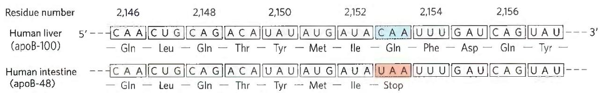  
FIGURE 27-12 RNA editing of the transcript of the gene for the apoB-100 component of LDL. Deamination, which occurs only in the intestine, converts a specific cytidine to uridine, changing a Gln codon to a stop codon and producing a truncated protein.

APOBEC2, 4, and 5 act on DNA rather than RNA, and their functions are poorly understood. However, their ability to cause genomic mutations can make them a liability to the cell. One or more APOBEC enzymes are often overexpressed in tumor cells, and their mutagenic ability can contribute to the formation of tumors. They also provide a mechanism for introducing multiple mutations into a targeted segment of a chromosome, leading to selective and more rapid evolution of that DNA region.

## SUMMARY 27.1 The Genetic Code

The particular amino acid sequence of a protein is constructed through the translation of information encoded in mRNA. This process is carried out by ribosomes. Amino acids are specified by mRNA codons consisting of nucleotide triplets. Translation requires adaptor molecules, the tRNAs, that recognize codons and insert amino acids into their appropriate sequential positions in the polypeptide.

The base sequences of the codons were deduced from experiments using synthetic mRNAs of known composition and sequence. The codon AUG signals initiation of translation. The triplets UAA, UAG, and UGA are signals for termination. The genetic code is degenerate: it has multiple codons for almost every amino acid. The standard genetic code is universal in all species, with some minor deviations in mitochondria and a few single-celled organisms. The deviations occur in a pattern that reinforces the concept of a universal code.

\- The third position in each codon is much less specific than the first and second positions and is said to wobble. This property allows certain tRNAs to recognize more than one codon.

■ The genetic code is resistant to the effects of missense mutations. The code evolved so that many nucleotide changes in a DNA codon do not alter the encoded amino acid, or they result in a very conservative alteration.

■ Translational frameshifting and RNA editing affect how the genetic code is read during translation.

■ RNA editing by ADARs (adenosine deaminases) and APOBECs (cytidine deaminases) also alters the coding sequence of some mRNAs. Many APOBEC enzymes target DNA, where they function in facilitating antibody diversity and suppression of retroviruses and retrotransposons.

## 27.2 Protein Synthesis

As we have seen for DNA and RNA (Chapters 25 and 26), the synthesis of polymeric biomolecules can be considered in terms of initiation, elongation, and termination stages. These fundamental processes are typically bracketed by two additional stages: activation of precursors before synthesis and postsynthetic processing of the completed polymer. Protein synthesis follows the same pattern. The activation of amino acids before their incorporation into polypeptides and the posttranslational processing of the completed polypeptide play particularly important roles in ensuring both the fidelity of synthesis and the proper function of the protein product. The process is outlined in Figure 27-13. P1 The cellular components involved in the five stages of protein synthesis in E. coli and other bacteria are listed in Table 27-5; the requirements in eukaryotic cells are similar, although the components are usually more numerous. Before looking at these five stages in detail, we must examine two key components of protein biosynthesis: the ribosome and tRNAs.

## The Ribosome Is a Complex Supramolecular Machine

P1 Each E. coli cell contains 15,000 or more ribosomes, which comprise nearly a quarter of the dry weight of the cell. Bacterial ribosomes contain about 65% rRNA and 35% protein; they have a diameter of about 18 nm and are composed of two unequal subunits with sedimentation coefficients of 30S and 50S and a combined sedimentation coefficient of 70S. Both subunits contain dozens of ribosomal proteins (r-proteins) and at least one large rRNA (Table 27-6).

As it became clear that ribosomes are the complexes responsible for protein synthesis, and following elucidation of the genetic code, the study of ribosomes accelerated. In the late 1960s Masayasu Nomura and colleagues demonstrated that both ribosomal subunits can be broken down into their RNA and protein components, then reconstituted in vitro. Ribosomal subunits are identified by their S (Svedberg unit) values, sedimentation coefficients that refer to their rate of sedimentation in a centrifuge.

  
FIGURE 27-13 An overview of the five stages of protein synthesis.

<table><tr><td colspan="3">TABLE 27-5 Components Required for the Five Major Stages of Protein Synthesis in E. coli</td></tr><tr><td>Stage</td><td colspan="2">Essential components</td></tr><tr><td rowspan="3">1. Activation of amino acids</td><td>20 amino acids</td><td>ATP</td></tr><tr><td>20 aminoacyl-tRNA synthases</td><td> $Mg^{2+}$ </td></tr><tr><td>32 or more tRNAs</td><td></td></tr><tr><td rowspan="4">2. Initiation</td><td>mRNA</td><td>50S ribosomal subunit</td></tr><tr><td>N-Formylmethionyl-tRNA $^fMet$ </td><td>Initiation factors (IF1, IF2, IF3)</td></tr><tr><td>Initiation codon in mRNA (AUG)</td><td>GTP</td></tr><tr><td>30S ribosomal subunit</td><td> $Mg^{2+}$ </td></tr><tr><td rowspan="3">3. Elongation</td><td>Functional 70S ribosomes (initiation complex)</td><td>Elongation factors (EF-Tu, EF-Ts, EF-G)</td></tr><tr><td rowspan="2">Aminoacyl-tRNAs specified by codons</td><td>GTP</td></tr><tr><td> $Mg^{2+}$ </td></tr><tr><td rowspan="2">4. Termination and ribosome recycling</td><td>Termination codon in mRNA</td><td>EF-G</td></tr><tr><td>Release factors (RF1, RF2, RF3, RRF)</td><td>IF3</td></tr><tr><td>5. Folding and posttranslational processing</td><td colspan="2">Chaperones and folding enzymes (PPI, PDI); specific enzymes, cofactors, and other components for removal of initiating residues and signal sequences, additional proteolytic processing, modification of terminal residues, and attachment of acetyl, phosphoryl, methyl, carboxyl, carbohydrate, or prosthetic groups</td></tr></table>

Under appropriate experimental conditions, the RNA and protein spontaneously reassemble to form 30S or 50S subunits nearly identical in structure and activity to native subunits. This breakthrough fueled decades of research into the function and structure of ribosomal RNAs and proteins. At the same time, increasingly sophisticated structural methods revealed more and more details about ribosome structure.

<table><tr><td colspan="5">TABLE 27-6 RNA and Protein Components of the E. coli Ribosome</td></tr><tr><td>Subunit</td><td>Number of different proteins</td><td>Total number of proteins</td><td>Protein designations</td><td>Number and type of rRNAs</td></tr><tr><td>30S</td><td>21</td><td>21</td><td>S1-S21</td><td>1 (16S rRNA)</td></tr><tr><td>50S</td><td>33</td><td>36</td><td>L1-L36a</td><td>2 (5S and 23S rRNAs)</td></tr></table>

$^{a}$ The L1 to L36 protein designations do not correspond to 36 different proteins. The protein originally designated L7 is a modified form of L12, and L8 is a complex of three other proteins. Also, L26 proved to be the same protein as S20 (and not part of the 50S subunit). This gives 33 different proteins in the large subunit. There are four copies of the L7/L12 protein, with the three extra copies bringing the total protein count to 36.

The dawn of a new millennium illuminated the first high-resolution structures of bacterial ribosomal subunits by Venkatraman Ramakrishnan, Thomas Steitz, Ada Yonath, Harry Noller, and others. This work yielded a wealth of surprises (Fig. 27-14a). First, a traditional focus on the protein components of ribosomes was shifted. The ribosomal subunits are huge RNA molecules. In the 50S subunit, the 5S and 23S rRNAs form the structural core. The proteins are secondary elements in the complex, decorating the surface. Second, and most important, there is no protein within 18 Å of the active site for peptide bond formation. P4 The high-resolution structure thus confirms what Noller had predicted much earlier: the ribosome is a ribozyme. In addition to the insight that the detailed structures of the ribosome and its subunits provide into the mechanism of protein synthesis (as elaborated below), these findings have stimulated a new look at the evolution of life (Section 26.4). The ribosomes of eukaryotic cells have also yielded to structural analysis (Fig. 27-14b).

The bacterial ribosome is complex, with a combined molecular weight of $\sim 2.7$ million. The two irregularly shaped ribosomal subunits fit together to form a cleft through which the mRNA passes as the ribosome moves along it during translation (Fig. 27-14a). The 57 proteins in bacterial ribosomes vary enormously in size and structure. Molecular weights range from about 6,000 to 75,000. Most of the proteins have globular domains arranged on the ribosome surface. Some also have snakelike extensions that protrude into the rRNA core of the ribosome, stabilizing its structure. The functions of some of these proteins have not yet been elucidated in detail, although a structural role seems evident for many of them.

The sequences of the rRNAs of countless thousands of organisms are now known due to genomic sequencing. Each of the three single-stranded rRNAs of E. coli has a specific three-dimensional conformation with extensive intrachain base pairing. The folding patterns of the rRNAs are highly conserved in all organisms, particularly the regions implicated in key functions (Fig. 27-15). The predicted secondary structure of the rRNAs has largely been confirmed by structural analysis but fails to convey the extensive network of tertiary interactions apparent in the complete structure.

FIGURE 27-14 The structure of ribosomes. Our understanding of ribosome structure has been greatly enhanced by multiple high-resolution images of the ribosomes from bacteria and yeast. (a) The bacterial ribosome. The 50S and 30S subunits come together to form the 70S ribosome.  

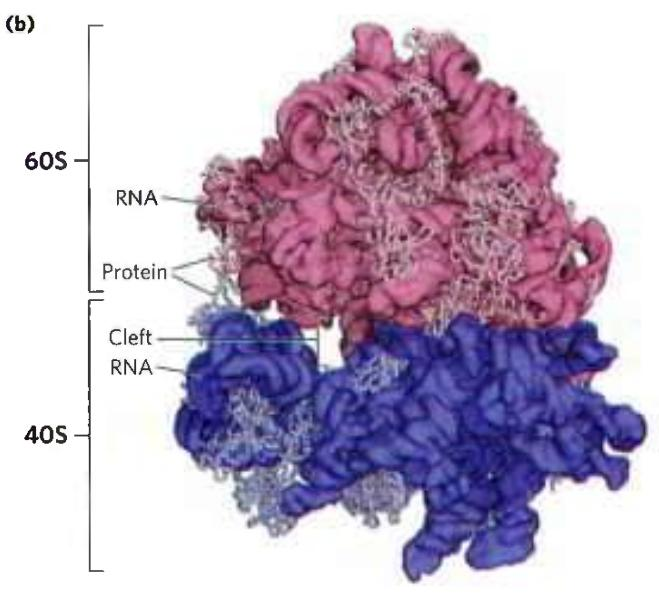  
The cleft between them is where protein synthesis occurs. (b) The yeast ribosome has a similar structure with somewhat increased complexity. [Data from (a) PDB ID 4V4I, A. Korostelev et al., Cell 126:1065, 2006; (b) PDB ID 4V7R, A. Ben-Shem et al., Science 330:1203, 2010.]

  
FIGURE 27-15 Conservation of secondary structure in the small subunit rRNAs from the three domains of life. The red, yellow, and purple indicate areas where the structures of the rRNAs from bacteria, archaea, and eukaryotes have diverged. Conserved regions are shown in green. [Information originally from the Comparative RNA Web, University of Texas.]

The ribosomes of eukaryotic cells (other than mitochondrial and chloroplast ribosomes) are larger and more complex than bacterial ribosomes (Fig. 27-16; compare Fig. 27-14b), with a diameter of about 23 nm and a sedimentation coefficient of about 80S. They also have two subunits, which vary in size among species but on average are 60S and 40S. Altogether, a ribosome of the yeast Saccharomyces cerevisiae contains 79 different proteins and 4 ribosomal RNAs. The ribosomes of mitochondria and chloroplasts are somewhat smaller and simpler than bacterial ribosomes. Nevertheless, ribosomal structure and function are strikingly similar in all organisms and organelles.

In both bacteria and eukaryotes, ribosomes are assembled through a hierarchical incorporation of r-proteins as the rRNAs are synthesized. Much of the processing of pre-rRNAs occurs within large ribonucleoprotein complexes. The composition of these complexes changes as new r-proteins are added, the rRNAs acquire their final form, and some proteins required for rRNA processing dissociate. In eukaryotes, the early stages of assembly occur in the nucleolus, with the final maturation of the ribosome completed after export to the cytosol. P1 Dozens of assembly factors, both proteins and some small RNA molecules (snoRNAs; Fig. 26-24), participate in this process (Fig. 27-17).

## Transfer RNAs Have Characteristic Structural Features

To understand how tRNAs can serve as adaptors in translating the language of nucleic acids into the language of proteins, we must first examine their structure in more detail. Transfer RNAs are relatively small and consist of a single strand of RNA folded into a precise three-dimensional structure (see Fig. 8-25a). The tRNAs of bacteria and in the cytosol of eukaryotes have between 73 and 93 nucleotide residues, corresponding to molecular weights of 24,000 to 31,000. Mitochondria and chloroplasts contain distinctive, somewhat smaller tRNAs. Cells have at least one kind of tRNA for each amino acid; at least 32 tRNAs are required to recognize all the amino acid codons (some recognize more than one codon), but some cells use more than 32.

  
FIGURE 27-16 Summary of the composition and mass of ribosomes in bacteria and eukaryotes. The S values associated with the subunits are not additive when subunits are combined, because S values are approximately proportional to the two-thirds power of molecular weight and are also slightly affected by shape.

Yeast alanine tRNA (tRNA $^{Ala}$ ) was the first nucleic acid to be completely sequenced, by Robert Holley in 1965. It contains 76 nucleotide residues, 10 of which have modified bases. Comparisons of tRNAs from various species have revealed many common structural features (Fig. 27-18a). Eight or more of the nucleotide residues have modified bases and sugars, many of which are methylated derivatives of the principal bases. Most tRNAs have a guanylate (pG) residue at the 5' end, and all have the trinucleotide sequence CCA(3') at the

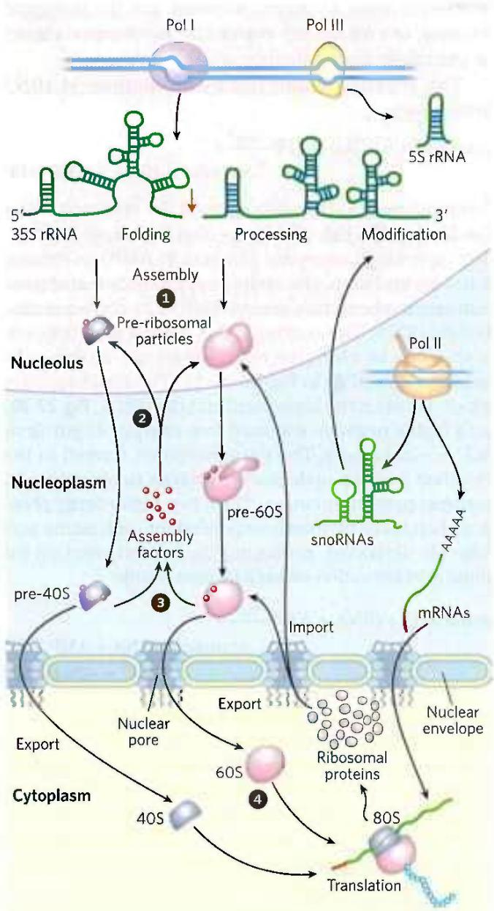  
FIGURE 27-17 Assembly of ribosomes in eukaryotes. ① Most of the early steps of ribosome assembly occur in the nucleolus, an organelle inside the nucleus. Ribonucleases and specialized RNAs, including some snoRNAs, process the initial rRNA transcript. ② Large pre-ribosomal particles are formed and additional processing of the large complex occurs with the aid of proteins called assembly factors. The pre-40S and pre-60S complexes move into the nucleoplasm. ③ The 40S and 60S subunits are exported to the cytoplasm, coupled with the ejection of assembly factors. ④ Final maturation of the ribosome occurs in the cytoplasm.

3' end. When drawn in two dimensions, all tRNAs have a hydrogen-bonding pattern that forms a cloverleaf structure with four arms, as first proposed by Elizabeth Keller. The longer tRNAs have a short fifth arm, or extra arm. In three dimensions, a tRNA has the form of a twisted L (Fig. 27-18b).

P3 Two of the arms of a tRNA are critical for its adaptor function. The amino acid arm can carry a specific amino acid esterified by its carboxyl group to the 2'- or 3'-hydroxyl group of the A residue at the 3' end of the tRNA. The anticodon arm contains the anticodon. The other major arms are the D arm, which contains the unusual nucleotide dihydrouridine (D), and the TψC arm, which contains ribothymidine (T), not usually present in RNAs, and pseudouridine (ψ), which has an unusual carbon-carbon bond between the base and ribose (see Fig. 26-22). The D and TψC arms contribute important interactions for the overall folding of tRNA molecules, and the TψC arm interacts with the large-subunit rRNA.

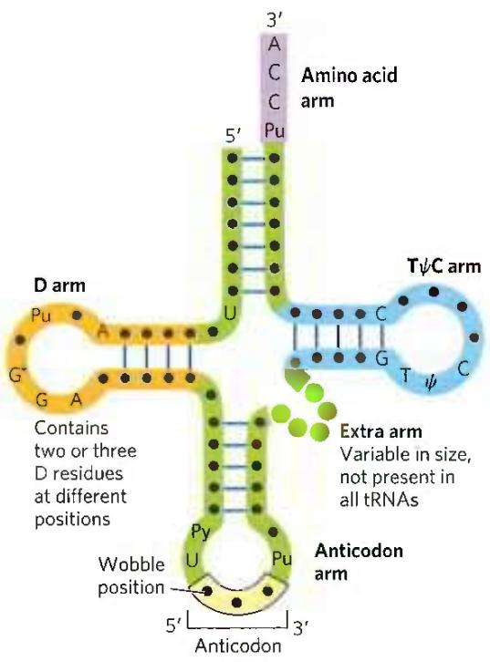  
(a)

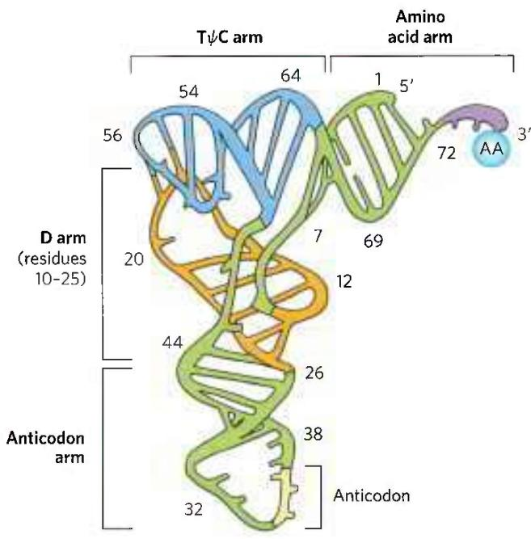  
(b)  
FIGURE 27-18 General structure of tRNAs. (a) The cloverleaf structure. The large dots on the backbone represent nucleotide residues; the blue lines represent base pairs. Characteristic and/or invariant residues common to all tRNAs are specified. Transfer RNAs vary in length from 73 to 93 nucleotides. Extra nucleotides occur in the extra arm or in the D arm. At the end of the anticodon arm is the anticodon loop, which always contains seven unpaired nucleotides. The D arm contains two or three D (5,6-dihydrouridine) residues, depending on the tRNA. In some tRNAs, the D arm has only three hydrogen-bonded base pairs. Pu represents purine nucleotide; Py, pyrimidine nucleotide; $\psi$ , pseudouridylate; G\*, guanylate or 2'-O-methylguanylate. (b) Schematic diagram of the folded tRNA, which resembles a twisted L.

Having looked at the structures of ribosomes and tRNAs, we now consider in detail the five stages of protein synthesis.

## Stage 1: Aminoacyl-tRNA Synthetases Attach the Correct Amino Acids to Their tRNAs

P3 For the synthesis of a polypeptide with a defined sequence, two fundamental chemical requirements must be met: (1) the carboxyl group of each amino acid must be activated to facilitate formation of a peptide bond, and (2) a link must be established between each new amino acid and the information in the mRNA that encodes it. Both these requirements are met by attaching the amino acid to a tRNA in the first stage of protein synthesis. When attached to their amino acid (aminoacylated), the tRNAs are said to be “charged.”

This first stage of protein synthesis takes place in the cytosol. Aminoacyl-tRNA synthetases esterify the 20 amino acids to their corresponding tRNAs. Each enzyme is specific for one amino acid and one or more corresponding tRNAs. Most organisms have one aminoacyl-tRNA synthetase for each amino acid. For amino acids with two or more corresponding tRNAs, the same enzyme usually aminoacylates all of them.

In all organisms, the aminoacyl-tRNA synthetases fall into two classes (Table 27-7), based on substantial differences in primary and tertiary structure and in reaction mechanism (Fig. 27-19). There is no evidence that the two classes share a common ancestor, and the biological, chemical, or evolutionary reasons for two enzyme classes for essentially identical processes remain obscure.

<table><tr><td colspan="2">Class I</td><td colspan="2">Class II</td></tr><tr><td>Arg</td><td>Leu</td><td>Ala</td><td>Lys</td></tr><tr><td>Cys</td><td>Met</td><td>Asn</td><td>Phe</td></tr><tr><td>Gln</td><td>Trp</td><td>Asp</td><td>Pro</td></tr><tr><td>Glu</td><td>Tyr</td><td>Gly</td><td>Ser</td></tr><tr><td>Ile</td><td>Val</td><td>His</td><td>Thr</td></tr></table>

Note: Here, Arg represents arginyl-tRNA synthetase, and so forth. The classification applies to all organisms for which tRNA synthetases have been analyzed and is based on protein structural distinctions and on the mechanistic distinction outlined in Figure 27-19.

The reaction catalyzed by an aminoacyl-tRNA synthetase is

$$
\begin{array}{c} \text {Amino acid + tRNA + ATP} \xrightarrow {\mathrm{Mg} ^ {2 +}} \\ \text {aminoacyl - tRNA + AMP + PP} _ {\mathrm{i}} \end{array}
$$

This reaction occurs in two steps in the enzyme's active site. In step 1 (Fig. 27-19), an enzyme-bound intermediate, aminoacyl adenylate (aminoacyl-AMP), is formed. In the second step, the aminoacyl group is transferred from enzyme-bound aminoacyl-AMP to its corresponding specific tRNA. The course of this second step depends on the class to which the enzyme belongs, as shown by pathways 2a and 2b in Figure 27-19. The resulting ester linkage between the amino acid and the tRNA (Fig. 27-20) has a highly negative standard free energy of hydrolysis ( $\Delta G^{\circ} = -29$ kJ/mol). The pyrophosphate formed in the activation reaction undergoes hydrolysis to phosphate by inorganic pyrophosphatase. Thus, two high-energy phosphate bonds are ultimately expended for each amino acid molecule activated, rendering the overall reaction for amino acid activation essentially irreversible:

$$
\begin{array}{r l} \text { Amino   acid } + \mathrm{tRNA} + \mathrm{ATP} & \xrightarrow {\mathrm{Mg} ^ {2 +}} \\ & \text { aminoacyl   -   tRNA } + \mathrm{AMP} + 2 \mathrm{P} _ {\mathrm{i}} \\ & \Delta G ^ {\prime \circ} \approx - 2 9 \mathrm{kJ/mol} \end{array}
$$

Proofreading by Aminoacyl-tRNA Synthetases The aminoacylation of tRNA accomplishes two ends: (1) it activates an amino acid for peptide bond formation and (2) it ensures appropriate placement of the amino acid in a growing polypeptide. The identity of the amino acid attached to a tRNA is not checked on the ribosome, so attachment of the correct amino acid to the tRNA is essential to the fidelity of protein synthesis.

As you will recall from Chapter 6, enzyme specificity is limited by the binding energy available from enzyme-substrate interactions. Discrimination between two similar amino acid substrates has been studied in detail in the case of Ile-tRNA synthetase, which distinguishes between valine and isoleucine, amino acids that differ by only a single methylene group ( $—CH_{2}—$ ):

$$
\begin{array}{c} \mathrm{COO} ^ {-} \\ \mathrm{H} _ {3} \mathrm{N} ^ {+} - \mathrm{C} - \mathrm{H} \\ \mathrm{H} - \mathrm{C} - \mathrm{CH} _ {3} \\ \mathrm{CH} _ {3} \end{array} \quad \text { Valine } \quad \text { Isoleucine }
$$

Ile-tRNA synthetase favors activation of isoleucine (to form Ile-AMP) over valine by a factor of 200—as we

MECHANISM FIGURE 27-19 Aminoacylation of tRNA by aminoacyl-tRNA synthetases. Step ① is formation of an aminoacyl adenylate, which remains bound to the active site. In the second step, the aminoacyl group is transferred to the tRNA. The mechanism of this step is somewhat different for the two classes of aminoacyl-tRNA synthetases.

For class I enzymes, 2a the aminoacyl group is transferred first to the 2'-hydroxyl group of the 3'-terminal A residue, then 3a to the 3'-hydroxyl group by a transesterification reaction. For class II enzymes, 2b the aminoacyl group is transferred directly to the 3'-hydroxyl group of the terminal adenylate.

  
FIGURE 27-20 General structure of aminoacyl-tRNAs. The aminoacyl group is esterified to the 3' position of the terminal A residue. The ester linkage that both activates the amino acid and joins it to the tRNA is shaded light red.

would expect, given the amount by which a methylene group (in Ile) could enhance substrate binding. Yet valine is erroneously incorporated into proteins in positions normally occupied by an Ile residue at a frequency of only about 1 in 3,000. How is this greater-than-10-fold increase in accuracy brought about? Ile-tRNA synthetase, like some other aminoacyl-tRNA synthetases, has a proofreading function.

Recall a general principle from the discussion of proofreading by DNA polymerases (see Fig. 25-6): if available binding interactions do not provide sufficient discrimination between two substrates, the necessary specificity can be achieved by substrate-specific binding in two successive steps. The effect of forcing the system through two successive filters is multiplicative. In the case of Ile-tRNA synthetase, the first filter is the initial binding of the amino acid to the enzyme and its activation to aminoacyl-AMP. The second is the binding of any incorrect aminoacyl-AMP products to a separate active site on the enzyme; a substrate that binds in this second active site is hydrolyzed. The R group of valine is slightly smaller than that of isoleucine, so Val-AMP fits the hydrolytic (proofreading) site of the Ile-tRNA synthetase, but Ile-AMP does not. P1 Thus Val-AMP is hydrolyzed to valine and AMP in the proofreading active site, and tRNA bound to the synthetase does not become aminoacylated to the wrong amino acid.

In addition to proofreading after formation of the aminoacyl-AMP intermediate, most aminoacyl-tRNA synthetases can hydrolyze the ester linkage between amino acids and tRNAs in the aminoacyl-tRNAs. This hydrolysis is greatly accelerated for incorrectly charged tRNAs, providing yet a third filter to enhance the fidelity of the overall process. The few aminoacyl-tRNA synthetases that activate amino acids with no close structural relatives (Cys-tRNA synthetase, for example) demonstrate little or no proofreading activity; in these cases, the active site for aminoacylation can sufficiently discriminate between the proper substrate and any incorrect amino acid.

The overall error rate of protein synthesis (\~1 mistake per $10^{4}$ amino acids incorporated) is not nearly as low as that of DNA replication. Because flaws in a protein are eliminated when the protein is degraded and are not passed on to future generations, they have less biological significance. The degree of fidelity in protein synthesis is sufficient to ensure that most proteins contain no mistakes and that the large amount of energy required to synthesize a protein is rarely wasted. One defective protein molecule is usually unimportant when many correct copies of the same protein are present.

A "Second Genetic Code" P3 An individual aminoacyl-tRNA synthetase must be specific not only for a single amino acid but for certain tRNAs as well. Discriminating among dozens of tRNAs is just as important for the overall fidelity of protein biosynthesis as is distinguishing among amino acids. The interaction between aminoacyl-tRNA synthetases and tRNAs has been referred to as the "second genetic code," reflecting its critical role in maintaining the accuracy of protein synthesis. The "coding" rules appear to be more complex than those in the "first" code.

Figure 27-21 summarizes what we know about the nucleotides involved in recognition by some aminoacyl-tRNA synthetases. Some nucleotides are conserved in all tRNAs and therefore cannot be used for discrimination. Nucleotide positions necessary for discrimination by the aminoacyl-tRNA synthetases seem to be concentrated in the amino acid arm and the anticodon arm, including the nucleotides of the anticodon itself. A few are located in other parts of the tRNA molecule. Determination of the crystal structures of aminoacyl-tRNA synthetases complexed with their cognate tRNAs and ATP has added a great deal to our understanding of these interactions (Fig. 27-22).

Ten or more specific nucleotides may be involved in recognition of a tRNA by its specific aminoacyl-tRNA synthetase. But in a few cases the recognition mechanism is quite simple. Across a range of organisms from bacteria to humans, the primary determinant of tRNA recognition by the Ala-tRNA synthetases is a single G=U base pair in the amino acid arm of tRNA $^{Ala}$ (Fig. 27-23a). A short synthetic RNA with as few as 7 bp arranged in a simple hairpin minihelix is efficiently aminoacylated by the Ala-tRNA synthetase, as long as the RNA contains the critical G=U (Fig. 27-23b). This relatively simple alanine system may be an evolutionary relic of a period when RNA oligonucleotides, ancestors to tRNA, were aminoacylated in a primitive system for protein synthesis.

  
FIGURE 27-21 Nucleotide positions in a tRNA that are recognized by aminoacyl-tRNA synthetases. (a) Some positions (purple dots) are the same in all tRNAs and therefore cannot be used to discriminate one from another. Other positions are known recognition points for one (orange) or more (blue) aminoacyl-tRNA synthetases. Structural features other than

  
(b)

sequence are important for recognition by some of the synthetases. (b) The same structural features are shown in three dimensions, with the orange and blue residues again representing positions recognized by one or more aminoacyl-tRNA synthetases, respectively. [(b) Data from PDB ID 1EHZ, H. Shi and P. B. Moore, RNA 6:1091, 2000.]  
  
FIGURE 27-22 Aminoacyl-tRNA synthetases. The synthetases are complexed with their cognate tRNAs (green). Bound ATP (red) pinpoints the active site near the end of the aminoacyl arm. (a) Gln-tRNA synthetase of E. coli, a typical monomeric class I synthetase. (b) Asp-tRNA synthetase of  
yeast, a typical dimeric class II synthetase. (c) The two classes of aminoacyl-tRNA synthetases recognize different faces of their tRNA substrates. [Data from (a, c (left)) PDB ID 1QRT, J. G. Arnez and T. A. Steitz, Biochemistry 35:14,725, 1996; (b, c (right)) PDB ID 1ASZ, J. Cavarelli et al., EMBO J. 13:327, 1994.]

The interaction of aminoacyl-tRNA synthetases and their cognate tRNAs is critical to accurate reading of the genetic code. Any expansion of the code to include new amino acids would necessarily require a new aminoacyl-tRNA synthetase-tRNA pair. A limited expansion of the genetic code has been observed in nature; a more extensive expansion has been accomplished in the laboratory (Box 27-2).

## Stage 2: A Specific Amino Acid Initiates Protein Synthesis

Protein synthesis begins at the amino-terminal end and proceeds by the stepwise addition of amino acids to the carboxyl-terminal end of the growing polypeptide. The AUG initiation codon thus specifies an amino-terminal methionine residue. Although methionine has only one codon, (5')AUG, all organisms have two tRNAs for methionine. One is used exclusively when (5')AUG is the initiation codon for protein synthesis. The other is used to code for a Met residue in an internal position in a polypeptide.

The distinction between an initiating (5')AUG and an internal one is straightforward. In bacteria, the two types of tRNA specific for methionine are designated tRNA $^{Met}$ and tRNA $^{fMet}$ . The amino acid incorporated in response to the (5')AUG initiation codon is N-formylmethionine (fMet). It arrives at the ribosome as N-formylmethionyl-tRNA $^{fMet}$ (fMet-tRNA $^{fMet}$ ), which is formed in two successive reactions. First, methionine is attached to tRNA $^{fMet}$ by the Met-tRNA synthetase (which in E. coli aminoacylates both tRNA $^{fMet}$ and tRNA $^{fMet}$ ):

Methionine + tRNA $^{fMet}$ + ATP →

$$
\mathrm{Met-tRNA} ^ {\mathrm{fMet}} + \mathrm{AMP} + \mathrm{PP} _ {\mathrm{i}}
$$

Next, a transformylase transfers a formyl group from $N^{10}$ -formyltetrahydrofolate to the amino group of the Met residue:

$N^{10}$ -Formyltetrahydrofolate + Met-tRNA $^{fMet}$ →

$$
\mathrm {tetrahydrofolate + fMet - tRN A ^ {fMet}}
$$

The transformylase is more selective than the Met-tRNA synthetase; it is specific for Met residues attached to tRNA $^{fMet}$ , presumably recognizing some unique structural feature of that tRNA. By contrast, Met-tRNA $^{fMet}$ inserts methionine in interior positions in polypeptides.

FIGURE 27-23 Structural elements of tRNA $^{Ala}$ that are required for recognition by Ala-tRNA synthetase. (a) The tRNA $^{Ala}$ structural elements recognized by the Ala-tRNA synthetase are unusually simple. A single G=U base pair (light red) is the only element needed for specific binding and aminoacylation. (b) A short synthetic RNA minihelix, with the critical G=U base pair but lacking most of the remaining tRNA structure. This is aminoacylated specifically with alanine almost as efficiently as the complete tRNA $^{Ala}$ .  

Addition of the N-formyl group to the amino group of methionine by the transformylase prevents fMet from entering interior positions in a polypeptide while also allowing fMet-tRNA $^{fMet}$ to be bound at a specific ribosomal initiation site that accepts neither Met-tRNA $^{Met}$ nor any other aminoacyl-tRNA.

In eukaryotic cells, all polypeptides synthesized by cytosolic ribosomes begin with a Met residue (rather than fMet), but, again, the cell uses a specialized initiating tRNA that is distinct from the tRNA $^{Met}$ used at (5')AUG codons at interior positions in the mRNA. Polypeptides synthesized by mitochondrial and chloroplast ribosomes, however, begin with N-formylmethionine. This strongly supports the view that mitochondria and chloroplasts originated from bacterial ancestors that were symbiotically incorporated into precursor eukaryotic cells at an early stage of evolution (see Fig. 1-37).

How can the single (5')AUG codon determine whether a starting N-formylmethionine (or methionine, in eukaryotes) or an interior Met residue is ultimately inserted? The details of the initiation process provide the answer.

## Natural and Unnatural Expansion of the Genetic Code

As we have seen, the 20 standard amino acids found in proteins offer only limited chemical functionality. Living systems generally overcome these limitations by using enzymatic cofactors or by modifying particular amino acids after they have been incorporated into proteins. In principle, expansion of the genetic code to introduce new amino acids into proteins offers another route to new functionality, but it is a very difficult route to exploit. Such a change might just as easily result in inactivation of thousands of cellular proteins.

Expanding the genetic code to include a new amino acid requires several cellular changes. A new aminoacyl-tRNA synthetase must generally be present, along with a cognate tRNA. Both of these components must be highly specific, interacting only with each other and the new amino acid. Significant concentrations of the new amino acid must be present in the cell, which may entail the evolution of new metabolic pathways. As outlined in Box 27-1, the anticodon on the tRNA would most likely pair with a codon that usually specifies termination. Making all of this work in a living cell seems unlikely, but it has happened both in nature and in the laboratory.

There are actually 22 rather than 20 amino acids specified by the known genetic code. The two extra amino acids are selenocysteine and pyrrolysine, each found in only very few proteins but both offering a glimpse into the intricacies of code evolution.

A few proteins in all cells (such as formate dehydrogenase in bacteria and glutathione peroxidase in mammals) require selenocysteine for their activity. In E. coli, selenocysteine is introduced into the enzyme formate dehydrogenase during translation, in response to an in-frame UGA codon. A special type of Ser-tRNA, present at lower levels than other Ser-tRNAs, recognizes UGA and no other codons. This tRNA is charged with serine by the normal serine aminoacyl-tRNA synthetase, and the serine is enzymatically converted to selenocysteine by a separate enzyme before its use at the ribosome. The charged tRNA does not recognize just any UGA codon; some contextual signal in the mRNA, still to be identified, ensures that this tRNA recognizes only the few UGA codons, within certain genes, that specify selenocysteine. In effect, UGA doubles as a codon for both termination and (very occasionally) selenocysteine. This particular code expansion has a dedicated tRNA, as described above, but it lacks a dedicated cognate aminoacyl-tRNA synthetase. The process works for selenocysteine, but one might consider it an intermediate step in the evolution of a complete new codon definition.

Pyrrolysine is found in a group of anaerobic archaea called methanogens (see Box 22-1). These organisms produce methane as a required part of their metabolism, and the Methanosarcinaceae family can use methylamines as substrates for methanogenesis. Producing methane from monomethylamine requires the enzyme monomethylamine methyltransferase. The gene encoding this enzyme has an in-frame UAG termination codon. The structure of the methyltransferase was elucidated in 2002, revealing the presence of the novel amino acid pyrrolysine at the position specified by the UAG codon. Subsequent experiments demonstrated that — unlike selenocysteine — pyrrolysine is attached directly to a dedicated tRNA by a cognate pyrrolysyl-tRNA synthetase. These methanogens produce pyrrolysine via a metabolic pathway that remains to be elucidated. The overall system has all the hallmarks of an established codon assignment, although it works only for UAG codons in this particular gene. As in the case of selenocysteine, there are probably contextual signals that direct this tRNA to the correct UAG codon.

Can scientists match this evolutionary feat? Modification of proteins with various functional groups can provide important insights into the activity and/or structure of the proteins. However, protein modification is often laborious. For example, an investigator who wishes to attach a new group to a particular Cys residue will have to somehow block other Cys residues that may be present on the same protein. If one could instead adapt the genetic code to enable a cell to insert a modified amino acid at a particular location in a protein, the process could be rendered much more convenient. Peter Schultz and coworkers have done just that.

To develop a new codon assignment, one again needs a new aminoacyl-tRNA synthetase and a novel cognate tRNA, both adapted to work only with a particular new amino acid. Efforts to create such an "unnatural" code expansion initially focused on E. coli. The codon UAG was chosen as the best target for encoding a new amino acid. UAG is the least used of the three termination codons, and strains with tRNAs selected

(Continued on next page)

## Natural and Unnatural Expansion of the Genetic Code (Continued)

FIGURE 1 Selecting $Mj\ tRNA^{Tyr}$ variants that function only with the tyrosyl-tRNA synthetase $Mj$ TyrRS. The sequence of the gene encoding $Mj\ tRNA^{Tyr}$ , on a plasmid, is randomized at 11 positions that do not interact with $Mj$ TyrRS (red dots). The mutagenized plasmids are introduced into E. coli cells to create a library of millions of $Mj\ tRNA^{Tyr}$ variants, represented by the six cells shown here. The toxic barnase gene, engineered to include the sequence TAG so that its transcript includes UAG codons, is present on a separate plasmid, providing a negative selection. If this gene is expressed, the cells die. It can be successfully expressed only if the $Mj\ tRNA^{Tyr}$ variant expressed by that particular cell is aminoacylated by endogenous (E. coli) aminoacyl-tRNA synthetases, inserting an amino acid instead of stopping translation. Another gene, encoding $\beta$ -lactamase, and also engineered with TAG sequences to produce UAG stop codons, is provided on yet another plasmid that also expresses the gene encoding $Mj$ TyrRS. This serves as a means of positive selection for the remaining $Mj$ tRNA $^{Tyr}$ variants. Those variants that are aminoacylated by $Mj$ TyrRS allow expression of the $\beta$ -lactamase gene, so these cells can grow on ampicillin. Multiple rounds of negative and positive selection yield the best $Mj$ tRNA $^{Tyr}$ variants that are aminoacylated uniquely by $Mj$ TyrRS and used efficiently in translation.

to recognize UAG do not exhibit growth defects. To create the new tRNA and tRNA synthetase, the genes for a tRNA $^{Tyr}$ and its cognate tyrosyl-tRNA synthetase were taken from the archaeon Methanococcus jannaschii (MjtRNA $^{Tyr}$ and MjTyrRS, respectively). MjTyrRS does not bind to the anticodon loop of MjtRNA $^{Tyr}$ , so the anticodon loop can be modified to CUA (complementary to UAG) without affecting the interaction. Because the archaeal and bacterial systems are orthologous, the modified archaeal components could be transferred to E. coli without disrupting the intrinsic translation system of the bacterial cells.

First, the gene encoding $MjtRNA^{Tyr}$ had to be modified to generate an ideal product tRNA — one that was not recognized by any aminoacyl-tRNA synthetases endogenous to E. coli but was aminoacylated by MjTyrRS. Finding such a variant could be accomplished through a series of negative and positive selection cycles designed to efficiently sift through variants of the tRNA gene (Fig. 1). Parts of the $MjtRNA^{Tyr}$ sequence were randomized, allowing creation of a library of cells that each expressed a different version of the tRNA. A gene encoding barnase (a ribonuclease toxic to E. coli) was engineered so that its mRNA transcript contained several UAG codons, and this gene was also introduced into the cells on a plasmid. If the $MjtRNA^{Tyr}$ variant expressed in a particular cell in the library were aminoacylated by an endogenous tRNA synthetase, it would express the barnase gene and that cell would die (negative selection). Surviving cells would contain tRNA variants that were not aminoacylated by endogenous tRNA synthetases, but could potentially be aminoacylated by MjTyrRS. A positive selection (Fig. 1) was then set up by engineering the $\beta$ -lactamase gene (which confers resistance to the antibiotic ampicillin) so that its transcript contained several UAG codons, and introducing this gene into the cells along with the gene encoding $Mj$ TyrRS. Those $MjtRNA^{Tyr}$ variants that could be aminoacylated by $Mj$ TyrRS allowed growth on ampicillin only when $Mj$ TyrRS was also expressed in the cell. Several rounds of this negative and positive selection scheme identified a new $MjtRNA^{Tyr}$ variant that was not affected by endogenous enzymes, was aminoacylated by $Mj$ TyrRS, and functioned well in translation.

Next, the $Mj$ TyrRS had to be modified to recognize the new amino acid. The gene encoding $Mj$ TyrRS was mutagenized to create a large library of variants. Variants that would aminoacylate the new $MjtRNA^{Tyr}$ variant with endogenous amino acids were eliminated using the barnase gene selection. A second positive selection (similar to the ampicillin selection described above) was carried out so that cells would survive only if the $MjtRNA^{Tyr}$ variant were aminoacylated only in the presence of the unnatural amino acid. Several rounds of negative and positive selection generated a cognate tRNA synthetase–tRNA pair that recognized only the unnatural amino acid.

Using this approach, researchers have constructed many E. coli strains, each capable of incorporating one particular unnatural amino acid into a protein in response to a UAG codon. The same approach has been used to artificially expand the genetic code of yeast and even mammalian cells. More than 30 different amino acids (Fig. 2) can be introduced site-specifically and efficiently into cloned proteins in this way. The result is an increasingly useful and flexible tool kit with which to advance the study of protein structure and function.

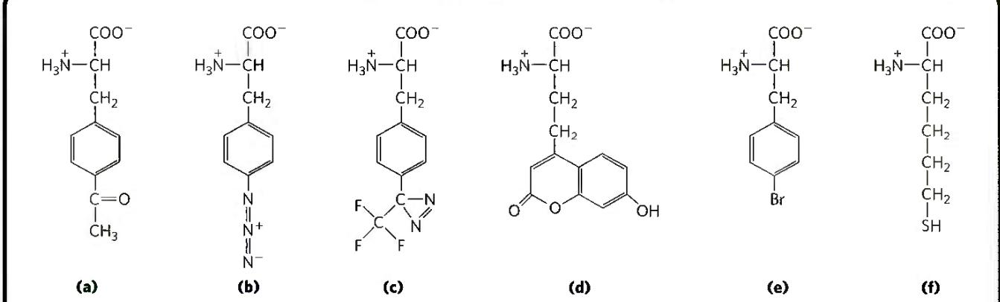  
FIGURE 2 A sampling of unnatural amino acids that have been added to the genetic code. These unnatural amino acids add uniquely reactive chemical groups such as (a) a ketone; (b) an azide; (c) a photocrosslinker, a functional group designed to form a covalent bond with  
a nearby group when activated by light; (d) a highly fluorescent amino acid; (e) an amino acid with a heavy atom (Br) for use in crystallography; and (f) a long-chain cysteine analog that can form extended disulfide bonds. [Information from J. Xie and P. G. Schultz, Nat. Rev. Mol. Cell Biol. 7:775, 2006.]

The Three Steps of Initiation The initiation of polypeptide synthesis in bacteria requires (1) the 30S ribosomal subunit, (2) the mRNA coding for the polypeptide to be made, (3) the initiating fMet-tRNA $^{fMet}$ , (4) a set of three proteins called initiation factors (IF1, IF2, and IF3), (5) GTP, (6) the 50S ribosomal subunit, and (7) Mg $^{2+}$ . Formation of the initiation complex takes place in three steps (Fig. 27-24).

In step 1, the 30S ribosomal subunit binds two initiation factors, IF1 and IF3. Factor IF3 prevents the 30S and 50S subunits from combining prematurely. The mRNA then binds to the 30S subunit. The initiating (5')AUG is guided to its correct position by the Shine-Dalgarno sequence (named for Australian researchers John Shine and Lynn Dalgarno, who identified it) in the mRNA. This consensus sequence is an initiation signal of four to nine purine residues, 8 to 13 bp to the 5' side of the initiation codon (Fig. 27-25a). The sequence base-pairs with a complementary pyrimidine-rich sequence near the 3' end of the 16S rRNA of the 30S ribosomal subunit (Fig. 27-25b). This mRNA-rRNA interaction positions the initiating (5')AUG sequence of the mRNA in the precise position on the 30S subunit where it is required for initiation of translation. The particular (5')AUG where fMet-tRNA $^{fMet}$ is to be bound is distinguished from other methionine codons by its proximity to the Shine-Dalgarno sequence in the mRNA.

Bacterial ribosomes have three sites that bind tRNAs, the aminoacyl (A) site, the peptidyl (P) site, and the exit (E) site. The A and P sites bind aminoacyl-tRNAs, whereas the E site binds only uncharged tRNAs that have completed their task on the ribosome. Factor IF1 binds at the A site and prevents tRNA binding at this site during initiation. The initiating (5')AUG is positioned at the P site, the only site to which fMet-tRNA $^{fMet}$ can bind (Fig. 27-24). The fMet-tRNA $^{fMet}$ is the only aminoacyl-tRNA that binds first to the P site; during the subsequent elongation stage, all other incoming aminoacyl-tRNAs (including the Met-tRNA $^{fMet}$ that binds to interior AUG codons) bind first to the A site and only subsequently to the P and E sites. The E site is the site from which the “uncharged” tRNAs leave during elongation. Both the 30S and the 50S subunits contribute to the characteristics of the A and P sites, whereas the E site is largely confined to the 50S subunit.

In step 2 of the initiation process (Fig. 27-24), the complex consisting of the 30S ribosomal subunit, IF3, and mRNA is joined by both GTP-bound IF2 and the initiating fMet-tRNA $^{fMet}$ . The anticodon of this tRNA now pairs correctly with the mRNA's initiation codon.

In step 3, this large complex combines with the 50S ribosomal subunit; simultaneously, the GTP bound to IF2 is hydrolyzed to GDP and $P_{i}$ , which are released from the complex. All three initiation factors leave the ribosome at this point.

P1 Completion of the steps in Figure 27-24 produces a functional 70S ribosome called the initiation complex, containing the mRNA and the initiating fMet-tRNA $^{fMet}$ . The correct binding of the fMet-tRNA $^{fMet}$ to the P site in the complete 70S initiation complex is ensured by at least three points of recognition and attachment: the codon-anticodon interaction involving the initiation AUG fixed in the P site, the interaction between the Shine-Dalgarno sequence in the mRNA and the 16S rRNA, and the binding interactions between the ribosomal P site and the fMet-tRNA $^{fMet}$ . The initiation complex is now ready for elongation.

  
FIGURE 27-24 Formation of the initiation complex in bacteria. The complex forms in three steps (described in the text) at the expense of the hydrolysis of GTP to GDP and P1, IF1, IF2, and IF3 are initiation factors. E designates the exit site; P, the peptidyl site; and A, the aminoacyl site. Here the anticodon of the tRNA is oriented 3' to 5', left to right, as in Figure 27-8, but opposite to the orientation in Figures 27-21 and 27-23.

  
(b)  
FIGURE 27-25 Messenger RNA sequences that serve as signals for initiation of protein synthesis in bacteria. (a) Alignment of the initiating AUG (shaded in green) at its correct location on the 30S ribosomal subunit depends in part on upstream Shine-Dalgarno sequences (light red). Portions of the mRNA transcripts of five bacterial genes are shown. Note the  
unusual example of the E. coli LacI protein, which initiates with a GUG (Val) codon. In E. coli, AUG is the start codon in approximately 91% of genes, with GUG (7%) and UUG (2%) assuming this role more rarely. (b) The Shine-Dalgarno sequence of the mRNA pairs with a sequence near the 3' end of the 16S rRNA.

Initiation in Eukaryotic Cells Translation is generally similar in eukaryotic and bacterial cells; most of the significant differences are in the number of components and the mechanistic details. The initiation process in eukaryotes is outlined in Figure 27-26. Eukaryotic mRNAs are bound to the ribosome as a complex with a number of specific binding proteins. Eukaryotic cells have at least 12 initiation factors. Initiation factors eIF1A and eIF3 are the functional homologs of the bacterial IF1 and IF3, binding to the 40S subunit in step ①, blocking tRNA binding to the A site and premature joining of the large and small ribosomal subunits, respectively. The factor eIF1 binds to the E site. The charged initiator tRNA is bound by the initiation factor eIF2, which also has bound GTP. In step ②, this ternary complex binds to the 40S ribosomal subunit, along with two other proteins involved in later steps, eIF5 (not shown in Fig. 27-26) and eIF5B. This creates a 43S preinitiation complex. The mRNA binds to the eIF4F complex, which, in step 3, mediates its association with the 43S preinitiation complex. The eIF4F complex is made up of eIF4E (binding to the 5' cap), eIF4A (an ATPase and RNA helicase), and eIF4G (a linker protein). The eIF4G protein binds to eIF3 and eIF4E to provide the first link between the 43S preinitiation complex and the mRNA. The eIF4G also binds to the poly(A) binding protein (PABP) at the 3' end of the mRNA, circularizing the mRNA (Fig. 27-27) and facilitating the translational regulation of gene expression, as described in Chapter 28.

Addition of the mRNA and its associated factors creates a 48S complex. This complex scans the bound mRNA, starting at the 5' cap, until an AUG codon is encountered. The scanning process (step 4 in Fig. 27-26) may be facilitated by the RNA helicase of eIF4A, which unwinds RNA secondary structures while in a transient complex with another factor, eIF4B (not shown in Fig. 27-26).

Once the initiating AUG site is encountered, the 60S ribosomal subunit associates with the complex in step 5, which is accompanied by release of many of the initiation factors. This requires the activity of eIF5 and eIF5B. The eIF5 protein promotes the GTPase activity of eIF2, producing an eIF2-GDP complex with reduced affinity for the initiator tRNA. The eIF5B protein is homologous to the bacterial IF2. It hydrolyzes its bound GTP and triggers dissociation of eIF2-GDP and other initiation factors, followed closely by association of the 60S subunit. This completes formation of the initiation complex.

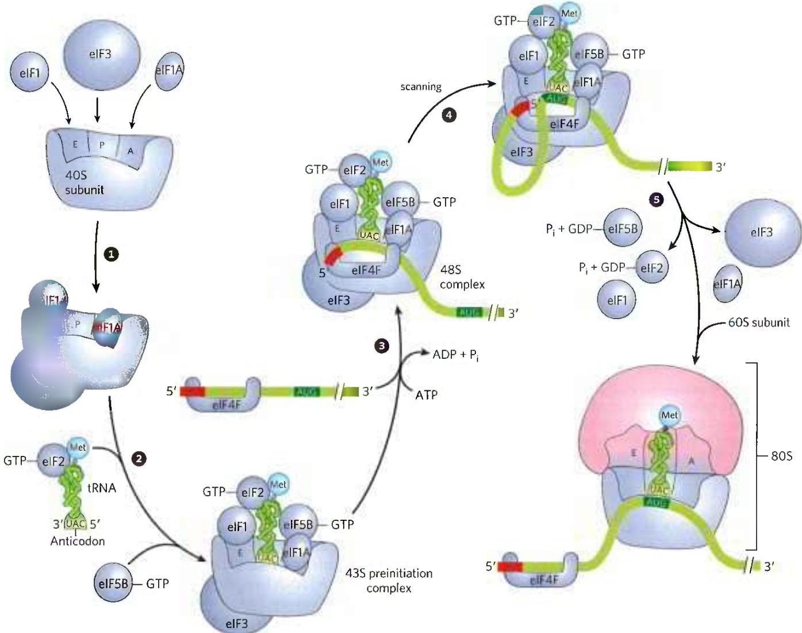  
FIGURE 27-26 Initiation of protein synthesis in eukaryotes. The five steps are described in the text. Eukaryotic initiation factors mediate the association of, first, the charged initiator tRNA to form a 43S preinitiation

  
FIGURE 27-27 Circularization of mRNA in the eukaryotic initiation complex. The 3' and 5' ends of eukaryotic mRNAs are linked by the eIF4F complex of proteins. The eIF4E subunit binds to the 5' cap, and the eIF4G protein binds to the poly(A) binding protein (PABP) at the 3' end of the mRNA. The eIF4G protein also binds to eIF3, linking the circularized mRNA to the 40S subunit of the ribosome.  
complex, and then the mRNA (with the 5' cap shown in red) to form a 48S complex. The final 80S initiation complex is formed as the 60S subunit associates, coupled with release of most of the initiation factors.

The roles of the various bacterial and eukaryotic initiation factors in the overall process are summarized in Table 27-8. The mechanism by which these proteins act is an important area of investigation.

## Stage 3: Peptide Bonds Are Formed in the Elongation Stage

The third stage of protein synthesis is elongation. Again, we begin with bacterial cells. Elongation requires (1) the initiation complex described above, (2) aminoacyl-tRNAs, (3) a set of three soluble cytosolic proteins called elongation factors (EF-Tu, EF-Ts, and EF-G in bacteria), and (4) GTP. Cells use three steps to add each amino acid residue, and the steps are repeated as many times as there are residues to be added.

Elongation Step 1: Binding of an Incoming Aminoacyl-tRNA In the first step of the elongation cycle (Fig. 27-28), the appropriate incoming aminoacyl-tRNA binds to a complex of GTP-bound EF-Tu. The resulting aminoacyl-tRNA-EF-Tu-GTP complex binds to the A site of the 70S initiation complex. The GTP is hydrolyzed and an EF-Tu-GDP complex is released from the 70S ribosome. The bound GDP is released when the EF-Tu-GDP complex binds to EF-Ts, and EF-Ts is subsequently released when another molecule of GTP binds to EF-Tu, recycling it.

<table><tr><td colspan="2">TABLE 27-8 Protein Factors Required for Initiation of Translation in Bacterial and Eukaryotic Cells</td></tr><tr><td>Factor</td><td>Function</td></tr><tr><td colspan="2">Bacterial</td></tr><tr><td>IF1</td><td>Prevents premature binding of tRNAs to A site</td></tr><tr><td>IF2</td><td>Facilitates binding of fMet-tRNA $^fMet$  to 30S ribosomal subunit</td></tr><tr><td>IF3</td><td>Binds to 30S subunit; prevents premature association of 50S subunit; enhances specificity of P site for fMet-rRNA $^fMet$ </td></tr><tr><td colspan="2">Eukaryotic</td></tr><tr><td>eIF1</td><td>Binds to the E site of the 40S subunit; facilitates interaction between eIF2-tRNA-GTP ternary complex and the 40S subunit</td></tr><tr><td>eIF1A</td><td>Homolog of bacterial IF1; prevents premature binding of tRNAs to A site</td></tr><tr><td>eIF2</td><td>GTPase; facilitates binding of initiating Met-tRNA $^Met$  to 40S ribosomal subunit</td></tr><tr><td>eIF2Ba, eIF3</td><td>First factors to bind 40S subunit; facilitate subsequent steps</td></tr><tr><td>eIF4F</td><td>Complex consisting of eIF4E, eIF4A, and eIF4G</td></tr><tr><td>eIF4A</td><td>RNA helicase activity; removes secondary structure in the mRNA to permit binding to 40S subunit; part of the eIF4F complex</td></tr><tr><td>eIF4B</td><td>Binds to mRNA; facilitates scanning of mRNA to locate the first AUG</td></tr><tr><td>eIF4E</td><td>Binds to the 5&#x27; cap of mRNA; part of the eIF4F complex</td></tr><tr><td>eIF4G</td><td>Binds to eIF4E and to poly(A) binding protein (PABP); part of the eIF4F complex</td></tr><tr><td>eIF5a</td><td>Promotes dissociation of several other initiation factors from 40S subunit as a prelude to association of 60S subunit to form 80S initiation complex</td></tr><tr><td>eIF5b</td><td>GTPase homologous to bacterial IF2; promotes dissociation of initiation factors before final ribosome assembly</td></tr><tr><td colspan="2">aNot shown in Figure 27-26.</td></tr></table>

Elongation Step 2: Peptide Bond Formation A peptide bond is now formed between the two amino acids bound by their tRNAs to the A and P sites on the ribosome. This occurs by transfer of the initiating N-formylmethionyl group from its tRNA to the amino group of the second amino acid, now in the A site (Fig. 27-29). The $\alpha$ -amino group of the amino acid in the A site acts as a nucleophile, displacing the tRNA in the P site to form a peptide bond. The constrained structure of the proline side chain interferes with the alignment needed for peptide bonds to form properly. A special system binds to the ribosome to facilitate peptide bonds between two proline residues whenever that is necessary (Box 27-3). The reaction produces a dipeptidyl-tRNA in the A site, and the now "uncharged" (deacylated) tRNA $^{fMet}$ remains bound to the P site. The tRNAs then shift to a hybrid binding state, with elements of each spanning two different sites on the ribosome, as shown in Figure 27-29.

  
FIGURE 27-28 First elongation step in bacteria: binding of the second aminoacyl-tRNA. The second aminoacyl-tRNA (AA $_{2}$ ) enters the A site of the ribosome bound to GTP-bound EF-Tu (shown here as Tu). Binding of the second aminoacyl-tRNA to the A site is accompanied by hydrolysis of the GTP to GDP and P $_{i}$ and release of the EF-Tu-GDP complex from the ribosome. The EF-Tu-GTP complex is regenerated in a process requiring EF-Ts and GTP. "Accommodation" involves a change in the conformation of the second tRNA that pulls its aminoacyl end into the peptidyl transferase site.

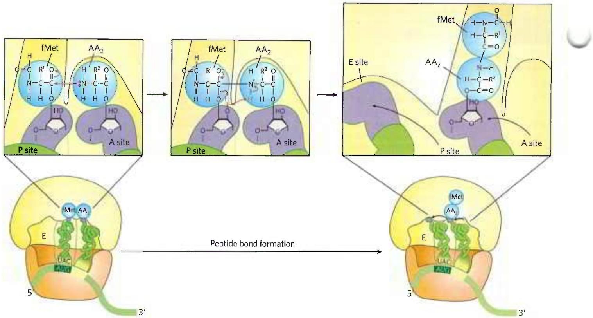  
FIGURE 27-29 Second elongation step in bacteria: formation of the first peptide bond. The N-formylmethionyl group is transferred to the amino group of the second aminoacyl-tRNA in the A site, forming a dipeptidyl-tRNA. At this stage, both tRNAs bound to the ribosome shift position in the 50S subunit to take up a hybrid binding state. The  
uncharged tRNA shifts so that its 3' and 5' ends are in the E site. Similarly, the 3' and 5' ends of the peptidyl-tRNA shift to the P site. The anticodons remain in the P and A sites. Note the involvement of the 2'-hydroxyl group of the 3'-terminal adenosine as a general acid-base catalyst in this reaction.

P5 The peptidyl transferase activity that catalyzes peptide bond formation resides in the 23S rRNA rather than in any of the protein components of ribosomes. The ribosomal 23S rRNA catalyzes the reaction by binding and aligning the tRNAs in the A and P sites in the proper orientations for reaction. A highly conserved active site adenosine residue in the 23S rRNA (A2451 in E. coli) may facilitate the reaction by general base catalysis and transition state stabilization utilizing N-3 in the purine ring and/or the 2'-hydroxyl group. This addition to the known catalytic repertoire of ribozymes has interesting implications for the evolution of life (see Section 26.4).

Elongation Step 3: Translocation In the final step of the elongation cycle, translocation, the ribosome moves one codon toward the 3' end of the mRNA (Fig. 27-30a). This movement shifts the anticodon of the dipeptidyl-tRNA, which is still attached to the second codon of the mRNA, from the A site to the P site, and shifts the deacylated tRNA from the P site to the E site, from where the tRNA is released into the cytosol. The third codon of the mRNA now lies in the A site and the second codon lies in the P site. Movement of the ribosome along the mRNA requires EF-G (also known as translocase) and the energy provided by hydrolysis of another molecule of GTP. Because the structure of EF-G mimics the structure of the EF-Tu-tRNA complex (Fig. 27-30b), EF-G can bind the A site and, presumably, displace the peptidyl-tRNA.

After translocation, the ribosome, with its attached dipeptidyl-tRNA and mRNA, is ready for the next elongation cycle and attachment of a third amino acid residue. This process occurs in the same way as addition of the second residue (as shown in Figs. 27-28, 27-29, and 27-30). For each amino acid residue correctly added to the growing polypeptide, two GTPs are hydrolyzed to GDP and $P_{i}$ as the ribosome moves from codon to codon along the mRNA toward the 3' end.

The polypeptide remains attached to the tRNA of the most recent amino acid to be inserted. This association maintains the functional connection between the information in the mRNA and its decoded polypeptide output. At the same time, the ester linkage between this tRNA and the carboxyl terminus of the growing

## Ribosome Pausing, Arrest, and Rescue

Ribosomes may stall during protein biosynthesis, especially while translating an mRNA that is damaged or incomplete. If translation cannot proceed to the end of the gene, the termination factors cannot act, and the ribosome may become "stuck" and thus inactivated.

Translation can experience a variety of stalling events. One well-documented issue involves the addition of proline to the growing chain, particularly when two prolines must be added sequentially. Unlike the other amino acids, proline is a secondary amine and is not as good a nucleophile in the peptide bond formation step (Fig. 27-29). The constrained geometry of the proline side chain can also affect alignment of groups for reaction on the ribosome, an issue particularly acute when the peptide bond is to be between two prolines. Bacteria have an elongation factor P (EFP) that binds between the E and P sites on the ribosome next to the peptidyl-tRNA. EFP binding affects the positioning of adjacent bound tRNAs and facilitates an optimal alignment for peptide bond formation with proline. Ribosomes in cells lacking EFP stall regularly at locations where two or more proline codons must be read consecutively. In eukaryotes, a factor closely related to EFP, eIF5A, performs this same function.

When the ribosome encounters the end of an mRNA before encountering a stop codon, the translocation step leads to formation of a stable non-stop complex, in which the A site has no mRNA that can interact with a new charged tRNA. The non-stop complex cannot be recycled by the normal termination factors. Instead, the ribosome is rescued by trans-translation (Fig. 1). In virtually all bacteria, the rescue system consists of transfer-messenger RNA (tmRNA) and small protein B (SmpB). These bind to the stalled complex in such a way that the tmRNA is positioned in the empty A site so that the ribosome can continue translation until it encounters a stop codon embedded in the tmRNA. The ribosome is then recycled, and both the defective mRNA and the polypeptide translated from it are degraded. Similar systems exist in eukaryotes.

FIGURE 1 Rescue of stalled bacterial ribosomes by tmRNA. In bacteria, tmRNA rescues stalled ribosomes by mimicking both tRNA and mRNA. The multistep pathway permits release and degradation of the damaged mRNA and tags the truncated polypeptide with an abbreviated carboxyl-terminal amino acid sequence that ensures its rapid degradation.

polypeptide activates the terminal carboxyl group for nucleophilic attack by the incoming amino acid to form a new peptide bond (Fig. 27-29). As the existing ester linkage between the polypeptide and tRNA is broken during peptide bond formation, the linkage between the polypeptide and the information in the mRNA persists, because each newly added amino acid is still attached to its tRNA.

The elongation cycle in eukaryotes is similar to that in bacteria. Three eukaryotic elongation factors (eEF1α, eEF1βγ, and eEF2) have functions analogous to those of the bacterial elongation factors (EF-Tu, EF-Ts, and EF-G, respectively). When a new aminoacyl-tRNA binds to the A site, an allosteric interaction leads to ejection of the uncharged tRNA from the E site.

Proofreading on the Ribosome The GTPase activity of EF-Tu during the first step of elongation in bacterial cells (Fig. 27-28) makes an important contribution to the rate and fidelity of the overall biosynthetic process. Both the EF-Tu-GTP and EF-Tu-GDP complexes exist for a few milliseconds before they dissociate. These two intervals provide opportunities for the codon-anticodon interactions to be proofread. Incorrect aminoacyl-tRNAs normally dissociate from the A site during one of these periods. If the GTP analog guanosine

FIGURE 27-30 Third elongation step in bacteria: translocation. (a) The ribosome moves one codon toward the 3' end of the mRNA, using energy provided by hydrolysis of GTP bound to EF-G (translocase). The dipeptidyl-tRNA is now entirely in the P site, leaving the A site open for an incoming (third) aminoacyl-tRNA. The uncharged tRNA later dissociates from the E site, and the elongation cycle begins again. (b) The structure of EF-G (left) mimics the structure of EF-Tu complexed with tRNA (right). The carboxyl-terminal part of EF-G mimics the structure of the anticodon loop of tRNA in both shape and charge distribution. [(b) Data from (left) PDB ID 1DAR, S. al-Karadaghi et al., Structure 4:555, 1996; (right) PDB ID 1B23, P. Nissen et al., Structure 7:143, 1999.]

5'-O-(3-thiotriphosphate) (GTPγS) is used in place of GTP, hydrolysis is slowed, improving the fidelity (by increasing the proofreading intervals) but reducing the rate of protein synthesis.

The process of protein synthesis (including the characteristics of codon-anticodon pairing already described) has clearly been optimized through evolution to balance the requirements for speed and fidelity. Improved fidelity might diminish speed, whereas increases in speed would probably compromise fidelity. And, recall that the proofreading mechanism on the ribosome establishes only that the proper codon-anticodon pairing has taken place, not that the correct amino acid is attached to the tRNA. If a tRNA is successfully aminoacylated with the wrong amino acid (as can be done experimentally), this incorrect amino acid is efficiently incorporated into a protein in response to whatever codon is normally recognized by the tRNA.

## Stage 4: Termination of Polypeptide Synthesis Requires a Special Signal

Elongation continues until the ribosome adds the last amino acid coded by the mRNA. Termination, the fourth stage of polypeptide synthesis, is signaled by the presence of one of three termination codons in the mRNA (UAA, UAG, UGA), immediately following the final coded amino acid. Mutations in a tRNA anticodon that allow an amino acid to be inserted at a termination codon are generally deleterious to the cell. In bacteria, once a termination codon occupies the ribosomal A site, three termination factors, or release factors—the proteins RF1, RF2, and RF3—contribute to (1) hydrolysis of the terminal peptidyl-tRNA bond; (2) release of the free polypeptide and the last tRNA, now uncharged, from the P site; and (3) dissociation of the 70S ribosome into its 30S and 50S subunits, ready to start a new cycle of polypeptide synthesis (Fig. 27-31). RF1 recognizes the termination codons UAG and UAA, and RF2 recognizes UGA and UAA. Either RF1 or RF2 (depending on which codon is present) binds at a termination codon and induces peptidyl transferase to transfer the growing polypeptide to a water molecule rather than to another amino acid. The release factors have domains thought to mimic the structure of tRNA, as shown for the elongation factor EF-G in Figure 27-30b. The specific function of RF3 has not been firmly established, although it is thought to release the ribosomal subunit. In eukaryotes, a single release factor, eRF, recognizes all three termination codons.

  
FIGURE 27-31 Termination of protein synthesis in bacteria. Synthesis is terminated in response to a termination codon in the A site. First, a release factor, RF (RF1 or RF2, depending on which termination codon is present), binds to the A site. This leads to hydrolysis of the ester linkage between the nascent polypeptide and the tRNA in the P site and release of the completed polypeptide. Finally, the mRNA, deacylated tRNA, and release factor leave the ribosome, which dissociates into its 30S and 50S subunits, aided by ribosome recycling factor (RRF), IF3, and energy provided by EF-G-mediated GTP hydrolysis. The 30S subunit complex with IF3 is ready to begin another cycle of translation.

Dissociation of the translation components leads to ribosome recycling. The release factors dissociate from the posttermination complex (with an uncharged tRNA in the P site) and are replaced by EF-G and a protein called ribosome recycling factor (RRF; $M_{r}$ 20,300). Hydrolysis of GTP by EF-G leads to dissociation of the 50S subunit from the 30S-tRNA-mRNA complex. EF-G and RRF are replaced by IF3, which promotes dissociation of the tRNA. The mRNA is then released. The complex of IF3 and the 30S subunit is then ready to initiate another round of protein synthesis (Fig. 27-24).

Energy Cost of Fidelity in Protein Synthesis P1 Synthesis of a protein true to the information specified in its mRNA requires energy well beyond what would be required to synthesize peptide bonds linking a random sequence of amino acids. Formation of each aminoacyl-tRNA uses two high-energy phosphate groups. An additional ATP is consumed each time an incorrectly activated amino acid is hydrolyzed by the deacylation activity of an aminoacyl-tRNA synthetase as part of its proofreading activity. A GTP is cleaved to GDP and $\mathbf{P}_{\mathrm{i}}$ during the first elongation step, and another during the translocation step. Thus, on average, the energy derived from the hydrolysis of more than four NTPs to NDPs is required for the formation of each peptide bond of a polypeptide.

This represents an exceedingly large thermodynamic “push” in the direction of synthesis: at least $4 \times 30.5$ kJ/mol = 122 kJ/mol of phosphodiester bond energy to generate a peptide bond, which has a standard free energy of hydrolysis of only about -21 kJ/mol. The net free-energy change during peptide bond synthesis is thus -101 kJ/mol. Proteins are information-containing polymers. The biochemical goal is not simply the formation of a peptide bond but the formation of a peptide bond between two specified amino acids. Each of the high-energy phosphate compounds expended in this process plays a critical role in maintaining proper alignment between each new codon in the mRNA and its associated amino acid at the growing end of the polypeptide. This energy permits very high fidelity in the biological translation of the genetic message of mRNA into the amino acid sequence of proteins.

Rapid Translation of a Single Message by Polysomes Large clusters of 10 to 100 ribosomes that are very active in protein synthesis can be isolated from both eukaryotic and bacterial cells. Electron micrographs show a fiber between adjacent ribosomes in the cluster, which is called a polysome (Fig. 27-32a). The connecting strand is a single molecule of mRNA that is being translated simultaneously by many closely spaced ribosomes, allowing the highly efficient use of the mRNA.

In bacteria, transcription and translation are tightly coupled. Messenger RNAs are synthesized and translated in the same 5'→3' direction. As soon as the 5' end of the mRNA appears, ribosomes and the RNA polymerase form a complex, the expressome, beginning translation long before transcription is complete (Fig. 27-32b). As the 5' end of the mRNA exits one ribosome, additional ribosomes are loaded in succession to form a polysome. The situation is quite different in eukaryotic cells, where newly transcribed mRNAs must leave the nucleus before they can be translated (see Fig. 27-17).

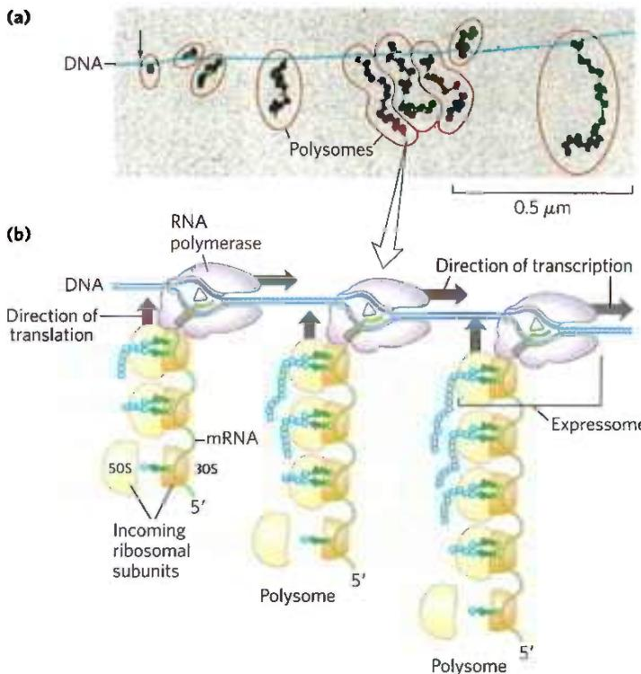  
FIGURE 27-32 Coupling of transcription and translation in bacteria. (a) Electron micrograph of polysomes forming during transcription of a segment of DNA from E. coli. Each mRNA is being translated by many ribosomes simultaneously. The nascent polypeptide chains are difficult to see under the conditions used to prepare the sample shown here. The arrow marks the approximate beginning of the gene that is being transcribed. (b) Each mRNA is translated by ribosomes while it is still being transcribed from DNA by RNA polymerase. This is possible because the mRNA in bacteria does not have to be transported from a nucleus to the cytoplasm before encountering ribosomes. In this schematic diagram the ribosomes are depicted as smaller than the RNA polymerase. In reality, the ribosomes ( $M_r$ $2.7 \times 10^6$ ) are an order of magnitude larger than the RNA polymerase ( $M_r$ $3.9 \times 10^5$ ). [(a) O. L. Miller, Jr., et al. Science 169:392, 1970, Fig. 3. © 1970 American Association for the Advancement of Science.]

Bacterial mRNAs generally exist for just a few minutes (p. 986) before they are degraded by nucleases. To maintain high rates of protein synthesis, the mRNA for a given protein or set of proteins must be made continuously and translated with maximum efficiency. The short lifetime of mRNAs in bacteria allows a rapid cessation of synthesis when the protein is no longer needed.

## Stage 5: Newly Synthesized Polypeptide Chains Undergo Folding and Processing

In the final stage of protein synthesis, the nascent polypeptide chain is folded and processed into its biologically active form. During or after its synthesis, the polypeptide progressively assumes its native conformation. As introduced in Chapter 4, protein chaperones, chaperonins, and specific enzymes (e.g., protein disulfide isomerase and peptide prolyl cis-trans isomerase) play an important role in the correct folding of many proteins in all cells. Chaperones and chaperonins, exemplified by GroEL/GroES in bacteria (Fig. 27-33) and Hsp60 in eukaryotes, assist folding in part by restricting formation of unproductive aggregates and limiting the conformational space that a polypeptide may explore as it folds. P4 ATP is hydrolyzed as part of this process. The GroEL/GroES system is required for the folding of about 10%–15% of the proteins in E. coli.

Some newly made proteins, bacterial, archaeal, and eukaryotic, do not attain their final biologically active conformation until they have been altered by one or more posttranslational modifications. Protein modifications of one type or another have been described in almost every chapter of this text, and some prominent examples are summarized here.

Amino-Terminal and Carboxyl-Terminal Modifications The first residue inserted in all polypeptides is N-formylmethionine (in bacteria) or methionine (in eukaryotes). However, the formyl group, the amino-terminal Met residue, and often additional amino-terminal (and, in some cases, carboxyl-terminal) residues may be removed enzymatically in formation of the final functional protein. In as many as 50% of eukaryotic proteins, the amino group of the amino-terminal residue is N-acetylated after translation. Carboxyl-terminal residues are also sometimes modified.

Loss of Signal Sequences As we shall see in Section 27.3, the 15 to 30 residues at the amino-terminal end of some proteins play a role in directing the protein to its ultimate destination in the cell. Such signal sequences are eventually removed by specific peptidases.

Modification of Individual Amino Acid Residues The hydroxyl groups of certain Ser, Thr, and Tyr residues of some proteins are enzymatically phosphorylated by ATP (Fig. 27-34a); the phosphate groups add negative charges to these polypeptides. The functional significance of this modification varies from one protein to the next. For example, the milk protein casein has many phosphoserine groups that bind $\mathrm{Ca^{2+}}$ . Calcium, phosphate, and amino acids are all valuable to suckling young, so casein efficiently provides three essential nutrients. And as we have seen in numerous instances, phosphorylation-dephosphorylation cycles regulate the activity of many enzymes and regulatory proteins.

  
FIGURE 27-33 Chaperonins in protein folding. (a) A proposed pathway for the action of the E. coli chaperonins GroEL (a member of the Hsp60 protein family) and GroES. Each GroEL complex consists of two large chambers formed by two heptameric rings (each subunit $M_{\mathrm{f}}$ 57,000). GroES, also a heptamer (subunit $M_{\mathrm{f}}$ 10,000), blocks one of the GroEL chambers after an unfolded protein is bound inside. The chamber with the unfolded protein is referred to as cis; the opposite one is trans. Folding occurs within the cis chamber, during the time it takes to hydrolyze the seven ATP that are bound to the subunits in the heptameric ring. The GroES and the ADP molecules then dissociate, and the protein is released. The two chambers of the GroEL/Hsp60 systems alternate in the binding and facilitated folding of client proteins. (b) A cutaway image of the GroEL/GroES complex. The $\alpha$ -helical secondary structure is represented as cylinders within a transparent surface structure. A folded protein (gp23) is shown within the large interior space of the upper chamber; an unfolded version of gp23 is shown in the lower chamber. [(a) Information from F. U. Hartl et al., Nature 475:324, 2011, Fig. 3. (b) Data from EMDB-1548, D. K. Clare et al., Nature 457:107, 2009; PDB ID 2CGT, D. K. Clare et al., J. Mol. Biol. 358:905, 2006; PDB ID 1YUE, A. Fokine et al., Proc. Natl. Acad. Sci. USA 102:7163, 2005.]

Extra carboxyl groups may be added to Glu residues of some proteins. For example, the blood-clotting protein prothrombin contains $\gamma$ -carboxyglutamate residues (Fig. 27-34b) in its amino-terminal region; the $\gamma$ -carboxyl groups are introduced by an enzyme that requires vitamin K. These carboxyl groups bind $Ca^{2+}$ , which is required to initiate the clotting mechanism.

Monomethyl- and dimethyllysine residues (Fig. 27-34c) occur in some muscle proteins and in cytochrome c. The calmodulin of most species contains one trimethyllysine residue at a specific position. In other proteins, the carboxyl groups of some Glu residues undergo methylation, removing their negative charge.

Attachment of Carbohydrate Side Chains The carbohydrate side chains of glycoproteins are attached covalently during or after synthesis of the polypeptide. In some glycoproteins, the carbohydrate side chain is attached enzymatically to Asn residues (N-linked oligosaccharides), in others to Ser or Thr residues (O-linked oligosaccharides; see Fig. 7-27). Many proteins that function extracellularly, as well as the lubricating proteoglycans that coat mucous membranes, contain oligosaccharide side chains (see Fig. 7-25).

Addition of Isoprenyl Groups Some eukaryotic proteins are modified by the addition of groups derived from isoprene (isoprenyl groups). A thioether bond is formed between the isoprenyl group and a Cys residue of the protein (see Fig. 11-16). The isoprenyl groups are derived from pyrophosphorylated intermediates of the cholesterol biosynthetic pathway (see Fig. 21-36), such as farnesyl pyrophosphate (Fig. 27-35). Proteins modified in this way include the Ras proteins (small G proteins), which are products of the ras oncogenes and proto-oncogenes, and the trimeric G proteins (both discussed in Chapter 12), as well as lamins, proteins found in the nuclear matrix. The isoprenyl group helps to anchor the protein in a membrane. The transforming (carcinogenic) activity of the ras oncogene is lost when isoprenylation of the Ras protein is blocked, a finding that has stimulated interest in identifying inhibitors of this posttranslational modification pathway for use in cancer chemotherapy.

Addition of Prosthetic Groups Many proteins require for their activity covalently bound prosthetic groups. Two examples are the biotin molecule of acetyl-CoA carboxylase and the heme group of hemoglobin or cytochrome c.

  
(a)

  
(b)

  
(c)

FIGURE 27-34 Some modified amino acid residues. (a) Phosphorylated amino acids. (b) A carboxylated amino acid. (c) Some methylated amino acids.

  
FIGURE 27-35 Farnesylation of a Cys residue. The thioether linkage is shown in red. The Ras protein is the product of the ras oncogene.

Proteolytic Processing Many proteins are initially synthesized as large, inactive precursor polypeptides that are proteolytically trimmed to form their smaller, active forms. Examples include proinsulin (Fig. 23-4), some viral proteins (Fig. 26-30), and proteases such as chymotrypsinogen and trypsinogen (Fig. 6-42).

Formation of Disulfide Cross-Links After folding into their native conformations, some proteins form intrachain or interchain disulfide bridges between Cys residues. In eukaryotes, disulfide bonds are common in proteins to be exported from cells. The cross-links formed in this way help to protect the native conformation of the protein molecule from denaturation in the extracellular environment, which can differ greatly from intracellular conditions and is generally oxidizing.

## Protein Synthesis Is Inhibited by Many Antibiotics and Toxins

Protein synthesis is a central function in cellular physiology and is the primary target of many naturally occurring antibiotics and toxins. Except as noted otherwise, these antibiotics inhibit protein synthesis in bacteria. The differences between bacterial and eukaryotic protein synthesis, though in some cases subtle, are such that most of the compounds discussed below are relatively harmless to eukaryotic cells. Natural selection has favored the evolution of compounds that exploit minor differences in order to affect bacterial systems selectively, so that these biochemical weapons are synthesized by some microorganisms and are extremely toxic to others. Because nearly every step in protein synthesis can be specifically inhibited by one antibiotic or another, antibiotics have become valuable tools in the study of protein biosynthesis.

Puromycin, made by the mold Streptomyces alboniger, is one of the best-understood inhibitory antibiotics. Its structure is very similar to the 3' end of an aminoacyl-tRNA, enabling it to bind to the ribosomal A site and participate in peptide bond formation, producing peptidylpuromycin (Fig. 27-36). However, because puromycin resembles only the 3' end of the tRNA, it does not engage in translocation and dissociates from the ribosome shortly after it is linked to the carboxyl terminus of the peptide. This prematurely terminates polypeptide synthesis.

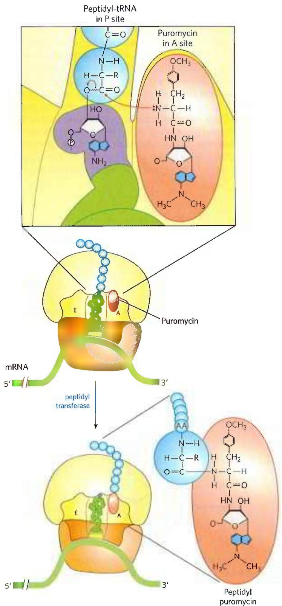  
FIGURE 27-36 Disruption of peptide bond formation by puromycin. The antibiotic puromycin resembles the aminoacyl end of a charged tRNA, and it can bind to the ribosomal A site and participate in peptide bond formation. The product of this reaction, peptidyl puromycin, is not translocated to the P site. Instead, it dissociates from the ribosome, causing premature chain termination.

Tetracyclines inhibit protein synthesis in bacteria by blocking the A site on the ribosome, preventing the binding of aminoacyl-tRNAs. Chloramphenicol inhibits protein synthesis by bacterial (and mitochondrial and chloroplast) ribosomes by blocking peptidyl transfer; it does not affect cytosolic protein synthesis in eukaryotes. Conversely, cycloheximide blocks the peptidyl transferase of 80S eukaryotic ribosomes but not that of 70S bacterial (and mitochondrial and chloroplast) ribosomes. Streptomycin, a basic trisaccharide, causes misreading of the genetic code (in bacteria) at relatively low concentrations and inhibits initiation at higher concentrations.

Several other inhibitors of protein synthesis are notable because of their toxicity to humans and other mammals. Diphtheria is a serious bacterial illness that causes sore throat, swollen glands, breathing difficulties, and often death. Although it has been largely eradicated in the developed world, a few thousand cases still occur each year in countries where vaccination is limited. The bacterium Corynebacterium diphtheriae releases the diphtheria toxin ( $M_{r}$ 58,330), which catalyzes the ADP-ribosylation of a diphthamide (a modified histidine) residue of eukaryotic elongation factor eEF2, thereby inactivating it. The resulting dead cells form a thick, gray membrane that covers the throat and tonsils, creating a putrid odor that is one hallmark of the disease. Ricin ( $M_{r}$ 29,895), an extremely toxic protein of the castor bean, inactivates the 60S subunit of eukaryotic ribosomes by depurinating a specific adenosine residue in 28S rRNA. Ricin was used in the infamous 1978 murder of BBC journalist and Bulgarian dissident Georgi Markov, presumably by the Bulgarian secret police. Using a syringe hidden at the end of an umbrella, a member of the secret police injected Markov in the leg with a ricin-infused pellet. He died four days later.

## SUMMARY 27.2 Protein Synthesis

■ Protein synthesis occurs on the ribosomes, which consist of protein and rRNA. Bacteria have 70S ribosomes, with a large (50S) and a small (30S) subunit. Eukaryotic ribosomes are significantly larger (80S) and contain more proteins. The growth of polypeptides on ribosomes begins with the amino-terminal amino acid and proceeds by successive additions of new residues to the carboxyl-terminal end.

Transfer RNAs have 73 to 93 nucleotide residues, some of which have modified bases. Each tRNA has an amino acid arm with the terminal sequence CCA(3') to which an amino acid is esterified, an anticodon arm, a TψC arm, and a D arm; some tRNAs have a fifth arm. The anticodon is responsible for the specificity of interaction between the aminoacyl-tRNA and the complementary mRNA codon.

In stage 1 of the five stages of protein synthesis, amino acids are activated by specific aminoacyl-tRNA synthetases in the cytosol. These enzymes catalyze the formation of aminoacyl-tRNAs, with simultaneous cleavage of ATP to AMP and PP $_{i}$ . The fidelity of protein synthesis depends on the accuracy of this reaction, and some of these enzymes carry out proofreading steps at separate active sites.

■ Stage 2 is initiation. In bacteria, the initiating aminoacyl-tRNA in all proteins is N-formylmethionyl-tRNA $^{fMet}$ . Initiation of protein synthesis involves formation of a complex between the 30S ribosomal subunit, mRNA, GTP, fMet-tRNA $^{fMet}$ , three initiation factors, and the 50S subunit; GTP is hydrolyzed to GDP and P $_{i}$ .

■ Stage 3 is elongation. In the elongation steps, GTP and elongation factors are required for binding the incoming aminoacyl-tRNA to the A site on the ribosome. In the first peptidyl transfer reaction, the fMet residue is transferred to the amino group of the incoming aminoacyl-tRNA. Movement of the ribosome along the mRNA then translocates the dipeptidyl-tRNA from the A site to the P site, a process requiring hydrolysis of GTP. Deacylated tRNAs dissociate from the ribosomal E site.

■ Stage 4 is termination. After many such elongation cycles, synthesis of the polypeptide is terminated with the aid of release factors. At least four high-energy phosphate equivalents (from ATP and GTP) are required to generate each peptide bond, an energy investment required to guarantee fidelity of translation.

■ Stage 5 is protein processing. Polypeptides fold into their active, three-dimensional forms. Many proteins are further processed by posttranslational modification reactions.

■ Many well-studied antibiotics and toxins inhibit some aspect of protein synthesis.

## 27.3 Protein Targeting and Degradation

The eukaryotic cell is made up of many structures, compartments, and organelles, each with specific functions that require distinct sets of proteins and enzymes. These proteins (with the exception of those produced in mitochondria and plastids) are synthesized on ribosomes in the cytosol, so how are they directed to their final cellular destinations?

We are now beginning to understand this complex and fascinating process. Proteins destined for secretion, integration in the plasma membrane, or inclusion in lysosomes generally share the first few steps of a pathway that begins in the endoplasmic reticulum. Proteins destined for mitochondria, chloroplasts, or the nucleus use three separate mechanisms. And proteins destined for the cytosol simply remain where they are synthesized. P1 The thermodynamic cost of protein synthesis is magnified by the processes used by cells to transport proteins to their correct cellular locations.

The most important element in many of these targeting pathways is a short sequence of amino acids called a signal sequence, whose function was first postulated by Günter Blobel and colleagues in 1970. The signal sequence directs a protein to its appropriate location in the cell and, for many proteins, is removed during transport or after the protein has reached its final destination. In proteins slated for transport into mitochondria, chloroplasts, or the ER, the signal sequence is at the amino terminus of a newly synthesized polypeptide. In many cases, the targeting capacity of particular signal sequences has been confirmed by fusing the signal sequence from one protein to a second protein and showing that the signal directs the second protein to the location where the first protein is normally found. The selective degradation of proteins no longer needed by the cell also relies largely on a set of molecular signals embedded in each protein's structure.

In this concluding section we examine protein targeting and degradation, emphasizing the underlying signals and molecular regulation that are so crucial to cellular metabolism. Except where noted, the focus is now on eukaryotic cells.

## Posttranslational Modification of Many Eukaryotic Proteins Begins in the Endoplasmic Reticulum

Perhaps the best-characterized targeting system begins in the ER. Most lysosomal, membrane, or secreted proteins have an amino-terminal signal sequence (Fig. 27-37) that marks them for translocation into the lumen of the ER; hundreds of such signal sequences have been determined. The carboxyl terminus of the signal sequence is defined by a cleavage site, where protease action removes the sequence after the protein is imported into the ER. Signal sequences vary in length from 13 to 36 amino acid residues, but all have the following features: (1) about 10 to 15 hydrophobic amino acid residues; (2) one or more positively charged residues, usually near the amino terminus, preceding the hydrophobic sequence; and (3) a short sequence at the carboxyl terminus (near the cleavage site) that is relatively polar, typically having amino acid residues with short side chains (especially Ala) at the positions closest to the cleavage site.

As originally demonstrated by the cell biologist George Palade, proteins with these signal sequences are synthesized on ribosomes attached to the ER. The signal sequence itself helps to direct the ribosome to the ER, as illustrated in Figure 27-38. The targeting pathway begins in step 1, with initiation of protein synthesis on free ribosomes. The signal sequence appears early in the synthetic process (step 2), because it is at the amino terminus, which, as we have seen, is synthesized first. As it emerges from the ribosome (step 3), the signal sequence—and the ribosome itself—is bound by the large signal recognition particle (SRP). The SRP is a rod-shaped complex containing a 300 nucleotide RNA (7SL-RNA) and six different proteins (combined $M_{\mathrm{r}}$ 325,000). The SRP then binds GTP and halts elongation of the polypeptide when it is about 70 amino acids long and the signal sequence has completely emerged from the ribosome. In step 4, the GTP-bound SRP directs the ribosome (still bound to the mRNA) and the incomplete polypeptide to GTP-bound SRP receptors in the cytosolic face of the ER; the nascent polypeptide is delivered to a peptide translocation complex in the ER, which interacts directly with the ribosome. In step 5, the SRP dissociates from the ribosome, accompanied by hydrolysis of GTP in both the SRP and the SRP receptor. The SRP receptor is a heterodimer of $\alpha$ ( $M_{\mathrm{r}}$ 69,000) and $\beta$ ( $M_{\mathrm{r}}$ 30,000) subunits, both of which bind and hydrolyze multiple GTP molecules during this process.

  
FIGURE 27-37 Amino-terminal signal sequences of some eukaryotic proteins that direct their translocation into the ER. The hydrophobic core (yellow) is preceded by one or more basic residues (blue).  
Polar and short-side-chain residues immediately precede (to the left, as shown here) the cleavage sites (indicated by red arrows).

  
FIGURE 27-38 Directing eukaryotic proteins with the appropriate signals to the endoplasmic reticulum. This process involves the SRP cycle and the translocation and cleavage of the nascent polypeptide.  
One protein subunit of SRP binds directly to the signal sequence, obstructing elongation by sterically blocking the entry of aminoacyl-tRNAs and inhibiting peptidyl transferase. Another protein subunit binds and hydrolyzes GTP.

Elongation of the polypeptide now resumes (step 6), with the ATP-driven translocation complex feeding the growing polypeptide into the ER lumen until the complete protein has been synthesized. In step 7, the signal sequence is removed by a signal peptidase within the ER lumen. The ribosome dissociates (step 8) and is recycled (step 9).

## Glycosylation Plays a Key Role in Protein Targeting

In the ER lumen, newly synthesized proteins are further modified in several ways. Following the removal of signal sequences, polypeptides are folded, disulfide bonds are formed, and many proteins are glycosylated to form glycoproteins. In many glycoproteins, the linkage to their oligosaccharides is through Asn residues. These N-linked oligosaccharides are diverse (Chapter 7), but the pathways by which they form have a common first step. A 14 residue core oligosaccharide is built up stepwise, first on the cytosolic face of the membrane and then on the lumenal face. Once completed, it is transferred from a dolichol phosphate donor molecule to certain Asn residues in the protein (Fig. 27-39). The transferase is on the lumenal face of the ER and thus cannot catalyze glycosylation of cytosolic proteins. After transfer, the core oligosaccharide is trimmed and elaborated in different ways on different proteins, but all N-linked oligosaccharides retain a pentasaccharide core derived from the original 14 residue oligosaccharide.

Several antibiotics act by interfering with one or more steps in this process and have aided in elucidating the steps of protein glycosylation. The best characterized is tunicamycin, which mimics the structure of UDP-N-acetylglucosamine and blocks the first step of the process (Fig. 27-39, step 1). A few proteins are O-glycosylated in the ER, but most O-glycosylation occurs in the Golgi complex or in the cytosol (for proteins that do not enter the ER).

  
FIGURE 27-39 Synthesis of the core oligosaccharide of glycoproteins. The core oligosaccharide is built up by the successive addition of monosaccharide units. ①, ② The first steps occur on the cytosolic face of the ER. ③ Translocation moves the incomplete oligosaccharide across the membrane (mechanism not shown), and ④ completion of the core oligosaccharide occurs within the lumen of the ER. The precursors that contribute additional mannose and glucose residues to the growing oligosaccharide in the lumen are dolichol phosphate derivatives. ⑤ In the first step in construction of the N-linked oligosaccharide moiety of

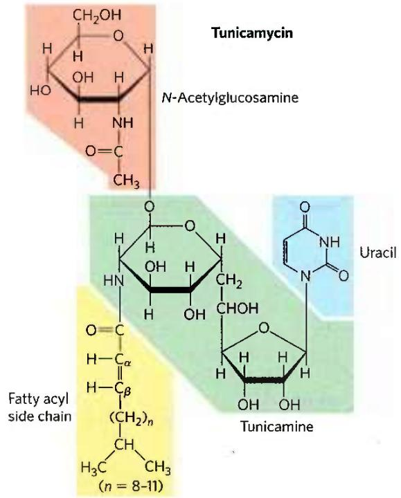  
a glycoprotein, the core oligosaccharide is transferred from dolichol phosphate to an Asn residue of the protein, and 6 protein synthesis continues. The core oligosaccharide is then further modified in the ER and the Golgi complex in pathways that differ for different proteins. The five sugar residues shown surrounded by a beige screen, after step 7, are retained in the final structure of all N-linked oligosaccharides. 8 The released dolichol pyrophosphate is again translocated so that the pyrophosphate is on the cytosolic face of the ER, then 9 a phosphate is hydrolytically removed to regenerate dolichol phosphate.

Suitably modified proteins can now be moved to a variety of intracellular destinations. Proteins travel from the ER to the Golgi complex in transport vesicles (Fig. 27-40). In the Golgi complex, oligosaccharides are O-linked to some proteins, and N-linked oligosaccharides are further modified. By mechanisms not yet fully understood, the Golgi complex also sorts proteins and sends them to their final destinations. The processes that segregate proteins targeted for secretion from those targeted for the plasma membrane or lysosomes must distinguish among these proteins on the basis of structural features other than signal sequences, which were removed in the ER lumen.

This sorting process is best understood in the case of hydrolases destined for transport to lysosomes. On arrival of a hydrolase (a glycoprotein) in the Golgi complex, an as yet undetermined feature (sometimes called a signal patch) of the three-dimensional structure of the hydrolase is recognized by a phosphotransferase, which phosphorylates terminal mannose residues in the oligosaccharides (Fig. 27-41). The presence of one or more mannose 6-phosphate residues in its N-linked oligosaccharide is the structural signal that targets a protein to lysosomes. A receptor protein in the membrane of the Golgi complex recognizes the mannose 6-phosphate signal and binds the hydrolase so marked. Vesicles containing these receptor-hydrolase complexes bud from the trans side of the Golgi complex and make their way to sorting vesicles. Here, the receptor-hydrolase complex dissociates in a process facilitated by the lower pH in the vesicle and by phosphatase-catalyzed removal of phosphate groups from the mannose 6-phosphate residues. The receptor is then recycled to the Golgi complex, and vesicles containing the hydrolases bud from the sorting vesicles and move to the lysosomes. In cells treated with tunicamycin (Fig. 27-39, step 1), hydrolases that should be targeted to lysosomes are instead secreted, confirming that the N-linked oligosaccharide plays a key role in targeting these enzymes to lysosomes.

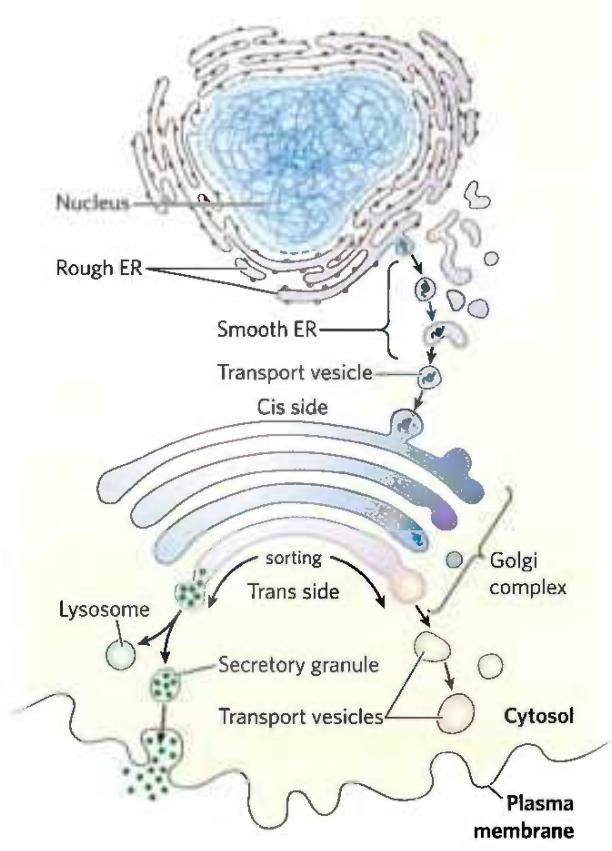  
FIGURE 27-40 Pathway taken by proteins destined for lysosomes, the plasma membrane, or secretion. Proteins are moved from the ER to the cis side of the Golgi complex in transport vesicles. Sorting occurs primarily in the trans side of the Golgi complex.

The pathways that target proteins to mitochondria and chloroplasts also rely on amino-terminal signal sequences. Although mitochondria and chloroplasts contain DNA, most of their proteins are encoded by nuclear DNA and must be targeted to the appropriate organelle. Unlike other targeting pathways, however, the mitochondrial and chloroplast pathways begin only after a precursor protein has been completely synthesized and released from the ribosome. Precursor proteins destined for mitochondria or chloroplasts are bound by cytosolic chaperone proteins and delivered to receptors on the exterior surface of the target organelle. Specialized translocation mechanisms then transport the protein to its final destination in the organelle, after which the signal sequence is removed.

  
FIGURE 27-41 Phosphorylation of mannose residues on lysosome-targeted enzymes. N-Acetylglucosamine phosphotransferase recognizes some as yet unidentified structural feature of hydrolases destined for lysosomes.

## Signal Sequences for Nuclear Transport Are Not Cleaved

Molecular communication between the nucleus and the cytosol requires the movement of macromolecules through nuclear pores. RNA molecules synthesized in the nucleus are exported to the cytosol. Ribosomal proteins synthesized on cytosolic ribosomes are imported into the nucleus and assembled into 60S and 40S ribosomal subunits in the nucleolus; completed subunits are then exported back to the cytosol (Fig. 27-17). A variety of nuclear proteins (RNA and DNA polymerases, histones, topoisomerases, proteins that regulate gene expression, and so forth) are synthesized in the cytosol and imported into the nucleus. This traffic is modulated by a complex system of molecular signals and transport proteins that is gradually being elucidated.

In most multicellular eukaryotes, the nuclear envelope breaks down at each cell division, and once division is completed and the nuclear envelope reestablished, the dispersed nuclear proteins must be reimported. To allow this repeated nuclear importation, the signal sequence that targets a protein to the nucleus—the nuclear localization sequence (NLS)—is not removed after the protein arrives at its destination. An NLS, unlike other signal sequences, may be located almost anywhere along the primary sequence of the protein. NLSs can vary considerably in structure, but many consist of four to eight amino acid residues and include several consecutive basic (Arg or Lys) residues.

Nuclear importation is mediated by several proteins that cycle between the cytosol and the nucleus (Fig. 27-42), including importin $\alpha$ and $\beta$ and a small GTPase known as Ran (Ras-related nuclear protein). A heterodimer of importin $\alpha$ and $\beta$ functions as a soluble receptor for proteins targeted to the nucleus, with the $\alpha$ subunit binding NLS-bearing proteins in the cytosol. The complex of the NLS-bearing protein and the importin docks at a nuclear pore and is translocated through the pore by an energy-dependent mechanism. In the nucleus, the importin $\beta$ is bound by Ran GTPase, releasing importin $\beta$ from the imported protein. Importin $\beta$ is bound by Ran and by CAS (cellular apoptosis susceptibility protein) and separated from the NLS-bearing protein. Importin $\alpha$ and $\beta$ , in their complexes with Ran and CAS, are then exported from the nucleus. Ran hydrolyzes GTP in the cytosol to release the importins, which are then free to begin another importation cycle. Ran itself is also cycled back into the nucleus by the binding of Ran-GDP to nuclear transport factor 2 (NTF2). Inside the nucleus, the GDP bound to Ran is replaced with GTP through the action of Ran guanosine nucleotide-exchange factor (Ran-GEF).

  
FIGURE 27-42 Targeting of nuclear proteins. (a) 1 A protein with an appropriate nuclear localization signal (NLS) is bound by a complex of importins $\alpha$ and $\beta$ . 2 The resulting complex binds to a nuclear pore and translocates. 3 Inside the nucleus, dissociation of importin $\beta$ is promoted by the binding of Ran-GTP. 4 Importin $\alpha$ binds to Ran-GTP and CAS (cellular apoptosis susceptibility protein), releasing the nuclear protein. 5 Importins $\alpha$ and $\beta$ and CAS are transported out of the nucleus and recycled. They are released in the cytosol when Ran hydrolyzes its  
bound GTP. 6 Ran-GDP is bound by NTF2, and transported back into the nucleus. 7 Ran-GEF promotes the exchange of GDP for GTP in the nucleus, and Ran-GTP is ready to process another NLS-bearing protein-importin complex. (b) Transmission electron micrograph of a freeze-fractured nucleus, showing numerous nuclear pores. The nuclear pore complex is one of the largest molecular aggregates in the cell $(M_{\mathrm{r}} \sim 5 \times 10^{7})$ . It is made up of multiple copies of more than 30 different proteins. ([a) Information from C. Strambio-De-Castillia et al., Nat. Rev. Mol. Cell Biol. 11:490, 2010, Fig. 1. (b) Don W. Fawcett/Science Source.]

During mitosis, when the nuclear envelope transiently breaks down, the Ran GTPase and the importins play additional roles. The Ran GTPase–importin $\beta$ complex helps to position the spindle microtubules on the cell perimeter to facilitate chromosome segregation as the cell divides, and this complex also regulates microtubule interaction with other cellular structures.

## Bacteria Also Use Signal Sequences for Protein Targeting

Bacteria can target proteins to their inner or outer membranes, to the periplasmic space between these membranes, or to the extracellular medium. They use signal sequences at the amino terminus of the proteins (Fig. 27-43), much like those on eukaryotic proteins targeted to the ER, mitochondria, and chloroplasts.

Most proteins exported from E. coli make use of the pathway shown in Figure 27-44. Following translation, a protein to be exported may fold only slowly, the amino-terminal signal sequence impeding the folding. The soluble chaperone protein SecB binds to the protein's signal sequence or other features of its incompletely folded structure. The bound protein is then delivered to SecA, a protein associated with the inner surface of the plasma membrane. SecA acts as both a receptor and a translocating ATPase. Released from SecB and bound to SecA, the protein is delivered to a translocation complex in the membrane, made up of SecY, E, and G, and is translocated stepwise through the membrane at the SecYEG complex in lengths of about 20 amino acid residues. Each step requires the hydrolysis of ATP, catalyzed by SecA.

Although most exported bacterial proteins use this pathway, some follow an alternative pathway that uses signal recognition and receptor proteins homologous to components of the eukaryotic SRP and the SRP receptor (see Fig. 27-38).

## Cells Import Proteins by Receptor-Mediated Endocytosis

Some proteins are imported into eukaryotic cells from the surrounding medium; examples include low-density lipoprotein (LDL), the iron-carrying protein transferrin, peptide hormones, and circulating proteins destined for degradation. There are several importation pathways (Fig. 27-45). In one path, proteins bind to receptors in invaginations of the membrane called coated pits, which concentrate endocytic receptors in preference to other cell-surface proteins. The pits are coated on their cytosolic side with a lattice of the protein clathrin, which forms closed polyhedral structures (Fig. 27-46). The clathrin lattice grows as more receptors are occupied by target proteins. Eventually, a complete membrane-bounded

FIGURE 27-43 Signal sequences that target proteins to different locations in bacteria. Basic amino acids near the amino terminus are highlighted in blue, hydrophobic core amino acids in yellow. Cleavage sites marking the ends of the signal sequences are

<table><tr><td colspan="26">Inner membrane proteins</td><td></td><td></td></tr><tr><td>Phage fd, major coat protein</td><td>Met</td><td>Lys</td><td>Lys</td><td>Ser</td><td>Leu</td><td>Val</td><td>Leu</td><td>Lys</td><td>Ala</td><td>Ser</td><td>Val</td><td>Ala</td><td>Val</td><td>Ala</td><td>Thr</td><td>Leu</td><td>Val</td><td>Pro</td><td>Met</td><td>Leu</td><td>Ser</td><td>Phe</td><td>cleavage site↓Ala</td><td>Ala</td><td>Glu</td><td>--</td><td></td></tr><tr><td>Phage fd, minor coat protein</td><td></td><td></td><td></td><td></td><td></td><td>Met</td><td>Lys</td><td>Lys</td><td>Leu</td><td>Leu</td><td>Phe</td><td>Ala</td><td>Ile</td><td>Pro</td><td>Leu</td><td>Val</td><td>Val</td><td>Pro</td><td>Phe</td><td>Tyr</td><td>Ser</td><td>His</td><td>Ser</td><td>Ala</td><td>Glu</td><td>--</td><td></td></tr><tr><td colspan="26">Periplasmic proteins</td><td></td><td></td></tr><tr><td>Alkaline phosphatase</td><td></td><td>Met</td><td>Lys</td><td>Gln</td><td>Ser</td><td>Thr</td><td>Ile</td><td>Ala</td><td>Leu</td><td>Ala</td><td>Leu</td><td>Leu</td><td>Pro</td><td>Leu</td><td>Leu</td><td>Phe</td><td>Thr</td><td>Pro</td><td>Val</td><td>Thr</td><td>Lys</td><td>Ala</td><td>Arg</td><td>Thr</td><td>--</td><td></td><td></td></tr><tr><td>Leucine-specific binding protein</td><td>Met</td><td>Lys</td><td>Ala</td><td>Asn</td><td>Ala</td><td>Lys</td><td>Thr</td><td>Ile</td><td>Ile</td><td>Ala</td><td>Gly</td><td>Met</td><td>Ile</td><td>Ala</td><td>Leu</td><td>Ala</td><td>Ile</td><td>Ser</td><td>His</td><td>Thr</td><td>Ala</td><td>Met</td><td>Ala</td><td>Asp</td><td>Asp</td><td>--</td><td></td></tr><tr><td>β-Lactamase of pBR322</td><td>Met</td><td>Ser</td><td>Ile</td><td>Gln</td><td>His</td><td>Phe</td><td>Arg</td><td>Val</td><td>Ala</td><td>Leu</td><td>Ile</td><td>Pro</td><td>Phe</td><td>Phe</td><td>Ala</td><td>Ala</td><td>Phe</td><td>Cys</td><td>Leu</td><td>Pro</td><td>Val</td><td>Phe</td><td>Ala</td><td>His</td><td>Pro</td><td>--</td><td></td></tr><tr><td colspan="26">Outer membrane proteins</td><td></td><td></td></tr><tr><td>Lipoprotein</td><td></td><td></td><td></td><td>Met</td><td>Lys</td><td>Ala</td><td>Thr</td><td>Lys</td><td>Leu</td><td>Val</td><td>Leu</td><td>Gly</td><td>Ala</td><td>Val</td><td>Ile</td><td>Leu</td><td>Gly</td><td>Ser</td><td>Thr</td><td>Leu</td><td>Leu</td><td>Ala</td><td>Gly</td><td>Cys</td><td>Ser</td><td>--</td><td></td></tr><tr><td>LamB</td><td></td><td></td><td>Leu</td><td>Arg</td><td>Lys</td><td>Leu</td><td>Pro</td><td>Leu</td><td>Ala</td><td>Val</td><td>Ala</td><td>Val</td><td>Ala</td><td>Ala</td><td>Gly</td><td>Val</td><td>Met</td><td>Ser</td><td>Ala</td><td>Gln</td><td>Ala</td><td>Met</td><td>Ala</td><td>Val</td><td>Asp</td><td>--</td><td></td></tr><tr><td>OmpA</td><td>Met</td><td>Met</td><td>Ile</td><td>Thr</td><td>Met</td><td>Lys</td><td>Lys</td><td>Thr</td><td>Ala</td><td>Ile</td><td>Ala</td><td>Ile</td><td>Ala</td><td>Val</td><td>Ala</td><td>Leu</td><td>Ala</td><td>Gly</td><td>Phe</td><td>Ala</td><td>Thr</td><td>Val</td><td>Ala</td><td>Gln</td><td>Ala</td><td>Pro</td><td>--</td></tr></table>

indicated by red arrows. Note that the inner bacterial cell membrane is where phage fd coat proteins and DNA are assembled into phage particles. OmpA is outer membrane protein A; LamB is a cell surface receptor protein for $\lambda$ phage.

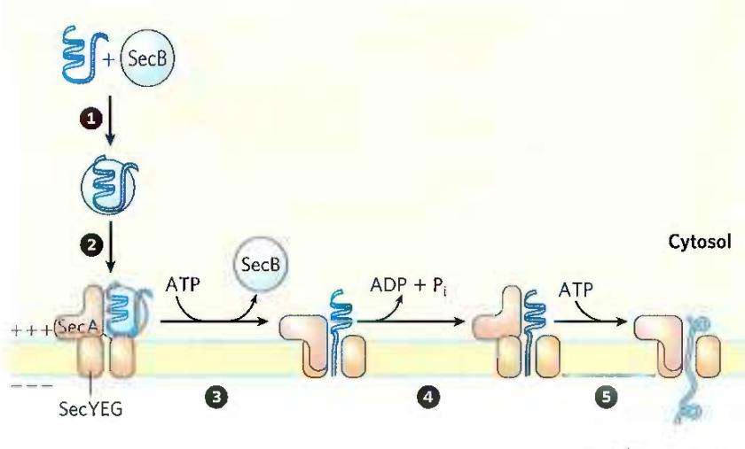

  
(b)  
FIGURE 27-46 Clathrin. (a) The protein has three light (L) chains $(M_{\mathrm{r}}35,000)$ and three heavy (H) chains $(M_{\mathrm{r}}180,000)$ of the $(\mathrm{HL})_3$ clathrin unit, organized as a three-legged structure called a triskelion. Triskelions tend to assemble into polyhedral lattices. (b) Electron micrograph of a coated pit on the cytosolic face of the plasma membrane of a fibroblast. [(a) Information from S. Mayor and R. E. Pagano, Nat. Rev. Mol. Cell Biol. 8:603, 2007. (b) ©1980 Heuser. The Rockefeller University Press. J. Heuser, J. Cell Biol. 84:560, 1980.]  
FIGURE 27-44 Model for protein export in bacteria. A newly translated polypeptide binds to the cytosolic chaperone protein SecB, which delivers it to SecA, a protein associated with the translocation complex (SecYEG) in the bacterial cell membrane. SecB is released, and SecA inserts itself into the membrane, forcing about 20 amino acid residues of the protein to be exported through the translocation complex. Hydrolysis of an ATP by SecA provides the energy for a conformational change that causes SecA to withdraw from the membrane, releasing the polypeptide. SecA binds another ATP, and the next stretch of 20 amino acid residues is pushed across the membrane through the translocation complex. Steps and are repeated until the entire protein has passed through and is released to the periplasm. The electrochemical potential across the membrane (denoted by + and -) also provides some of the driving force required for protein translocation.  
FIGURE 27-45 Summary of endocytosis pathways in eukaryotic cells. Pathways dependent on clathrin or caveolin make use of the GTPase dynamin to pinch vesicles from the plasma membrane. Some pathways do not use clathrin or caveolin; some of these make use of dynamin and some do not.

endocytic vesicle is pinched off the plasma membrane with the aid of the large GTPase dynamin, and it enters the cytoplasm. The clathrin is quickly removed by uncoating enzymes, and the vesicle fuses with an endosome. ATPase activity in the endosomal membranes reduces the pH therein, facilitating dissociation of receptors from their target proteins. In a related pathway, caveolin causes invagination of patches of membrane containing lipid rafts associated with certain types of receptors (see Fig. 11-23). These endocytic vesicles then fuse with caveolin-containing internal structures called caveosomes, where the internalized molecules are sorted and redirected to other parts of the cell and the caveolins are prepared for recycling to the membrane surface. There are also clathrin- and caveolin-independent pathways; some make use of dynamin and others do not.

The imported proteins and receptors then go their separate ways, their fates varying with the cell and protein type. Transferrin and its receptor are eventually recycled. Some hormones, growth factors, and immune complexes, after eliciting the appropriate cellular response, are degraded along with their receptors. LDL is degraded after the associated cholesterol has been delivered to its destination, but the LDL receptor is recycled (see Fig. 21-42).

Receptor-mediated endocytosis is exploited by some toxins and viruses to gain entry to cells. Influenza virus, diphtheria toxin, SARS-CoV-2 (the virus that causes COVID-19), and cholera toxin all enter cells in this way.

## Protein Degradation Is Mediated by Specialized Systems in All Cells

Protein degradation is critical to overall cellular proteostasis, preventing the buildup of abnormal or unwanted proteins and permitting the recycling of amino acids. The half-lives of eukaryotic proteins vary from 30 seconds to many days. Most proteins turn over rapidly relative to the lifetime of a cell, although a few (such as hemoglobin) can last for the life of the cell (about 110 days for an erythrocyte). Rapidly degraded proteins include those that are defective because of incorrectly inserted amino acids or because of damage accumulated during normal functioning. And enzymes that act at key regulatory points in metabolic pathways often turn over rapidly.

Defective proteins and those with characteristically short half-lives are generally degraded in both bacterial and eukaryotic cells by selective ATP-dependent cytosolic systems. A second system in vertebrates, operating in lysosomes, recycles the amino acids of membrane proteins, extracellular proteins, and proteins with characteristically long half-lives.

In E. coli, many proteins are degraded by one of several proteolytic systems that contain AAA+ ATPases (see Chapter 25), including Lon (the name refers to the "long form" of proteins, observed only when this protease is absent), ClpXP, ClpAP, ClpCP, ClpYQ, and FtsH. Each system targets particular proteins distinguished by their structure or subcellular location or both. Typically, ATP hydrolysis is used to maneuver a target protein through a pore into a proteolytic chamber, unfolding the protein in the process. Proteins are cleaved within the chamber. Once a protein has been reduced to small, inactive peptides, other ATP-independent proteases complete their degradation.

The ATP-dependent pathway in eukaryotic cells is quite different, involving the protein ubiquitin, which, as its name suggests, occurs throughout the eukaryotic kingdoms. One of the most highly conserved proteins known, ubiquitin (76 amino acid residues) is essentially identical in organisms as different as yeasts and humans and is key to proteostasis (see Figs. 4-23 and 13-29) and cell cycle regulation (see Fig. 12-38). Ubiquitin is covalently linked to proteins slated for destruction via an ATP-dependent pathway that includes three separate types of enzymes: E1 activating enzymes, E2 conjugating enzymes, and E3 ligases (Fig. 27-47).

  
FIGURE 27-47 Three-step pathway by which ubiquitin is attached to a protein. The pathway includes two different enzyme-ubiquitin intermediates. First, the free carboxyl group of ubiquitin's carboxyl-terminal Gly residue becomes linked to an E1-class activating enzyme through a thioester. The ubiquitin is then transferred to an E2 conjugating enzyme. An E3 ligase ultimately catalyzes transfer of the ubiquitin from E2 to the target, linking ubiquitin through an amide (isopeptide) bond to the ε-amino group of a Lys residue in the target protein. Additional cycles produce polyubiquitin, a covalent polymer of ubiquitin subunits that targets the attached protein for destruction in eukaryotes. Multiple pathways of this sort, with different protein targets, are present in most eukaryotic cells.

Ubiquitinated proteins are degraded by a large complex known as the 26S proteasome ( $M_{r}$ $2.5 \times 10^{6}$ ) (Fig. 27-48). The eukaryotic proteasome consists of two copies each of at least 32 different subunits, most of which are highly conserved from yeasts to humans. The proteasome contains two main types of subcomplexes: a barrel-like core particle and regulatory particles at each end of the barrel. The 19S regulatory particle on each end of the core particle contains approximately 18 subunits, including some that recognize and bind to ubiquitinated proteins. Six of the subunits are AAA+ ATPases that probably function in unfolding the ubiquitinated proteins and translocating the unfolded polypeptide into the core particle for degradation. The 19S particle also deubiquitinates the proteins as they are degraded in the proteasome. Most cells have additional regulatory complexes that can replace the 19S particle. These alternative regulators do not hydrolyze ATP and do not bind to ubiquitin, but they are important for the degradation of particular cellular proteins. The 26S proteasome can be effectively “accessorized” with regulatory complexes that change with changing cellular conditions.

  
FIGURE 27-48 Three-dimensional structure of the eukaryotic proteasome. The 20S core particle and the 19S regulatory particle, or cap, are shown (a) as a molecular structure and (b) in schematic form. The core particle consists of four rings arranged to form a barrel-like structure. The outer rings are formed from seven $\alpha$ subunits, and the inner rings from seven $\beta$ subunits. Three of the $\beta$ subunits have protease activities, each with different substrate specificity. A regulatory particle forms a cap on each end of the core particle. The regulatory particle binds ubiquitinated proteins, unfolds them, and translocates them into the core particle, where they are degraded to peptides of 3 to 25 amino acid residues. [(a) Data from PDB ID 3L5Q, K. Sadre-Bazzaz et al., Mol. Cell 37:728, 2010.]

Although we do not yet understand all the signals that trigger ubiquitination, one simple signal has been found. For many proteins, the identity of the first residue that remains after removal of the amino-terminal Met residue, and any other posttranslational proteolytic processing of the amino-terminal end, has a profound influence on half-life (Table 27-9). These amino-terminal signals have been conserved over billions of years of evolution and are the same in bacterial protein degradation systems and in the human ubiquitination pathway. More complex signals, such as the destruction box discussed in Chapter 12 (see Fig. 12-38), are also being identified.

Ubiquitin-dependent proteolysis is as important for the regulation of cellular processes as it is for the elimination of defective proteins. Many proteins required at only one stage of the eukaryotic cell cycle are rapidly degraded by the ubiquitin-dependent pathway after fulfilling their function. Ubiquitin-dependent destruction of cyclin is critical to cell-cycle regulation. The E1, E2, and E3 components of the ubiquitination pathway (Fig. 27-47) are large families of proteins. Different E1, E2, and E3 enzymes exhibit different specificities for target proteins and thus regulate different cellular processes. Some of these enzymes are highly localized in certain cellular compartments, reflecting a specialized function.

<table><tr><td>Amino-terminal residue</td><td>Half-life $^{a}$ </td></tr><tr><td colspan="2">Stabilizing</td></tr><tr><td>Ala, Gly, Met, Ser, Thr, Val</td><td>&gt;20 h</td></tr><tr><td colspan="2">Destabilizing</td></tr><tr><td>Gln, Ile</td><td>~30 min</td></tr><tr><td>Glu, Tyr</td><td>~10 min</td></tr><tr><td>Pro</td><td>~7 min</td></tr><tr><td>Asp, Leu, Lys, Phe</td><td>~3 min</td></tr><tr><td>Arg</td><td>~2 min</td></tr></table>

Information from A. Bachmair et al., Science 234:179, 1986.  
$^{a}$ Half-lives were measured in yeast for the $\beta$ -galactosidase protein modified so that in each experiment it had a different amino-terminal residue. Half-lives may vary for different proteins and in different organisms, but this general pattern appears to hold for all organisms.

Not surprisingly, defects in the ubiquitination pathway have been implicated in a wide range of disease states. An inability to degrade certain proteins that activate cell division (the products of oncogenes) can lead to tumor formation, and a too-rapid degradation of proteins that act as tumor suppressors can have the same effect. The ineffective or overly rapid degradation of cellular proteins also seems to play a role in a range of other conditions, including renal diseases, asthma, and neurodegenerative disorders such as Alzheimer and Parkinson diseases that are associated with the formation of characteristic proteinaceous structures in neurons. Cystic fibrosis is caused in some cases by a too-rapid degradation of a chloride ion channel, with resultant loss of function (see Box 11-2). Liddle syndrome, in which a sodium channel in the kidney is not degraded, leads to excessive $\mathrm{Na^{+}}$ absorption and early-onset hypertension. Drugs designed to inhibit proteasome function are being developed as potential treatments for some of these conditions. Many bacterial pathogens have found ways to hijack the eukaryotic ubiquitination system, evolving enzymes that ubiquitinate and thus eliminate host proteins as required to facilitate infection. In a changing metabolic environment, protein degradation is as important to a cell's survival as is protein synthesis, and much remains to be learned about these interesting pathways.

## SUMMARY 27.3 Protein Targeting and Degradation

■ After synthesis, many proteins are directed to particular locations in the cell, a process mediated by signal sequences embedded in the polypeptide chain. In eukaryotic cells, one class of signal sequences is recognized by the signal recognition particle (SRP), which binds the signal sequence as soon as it appears on the ribosome and transfers the entire ribosome and incomplete polypeptide to the endoplasmic reticulum. Polypeptides with these signal sequences are moved into the endoplasmic reticulum lumen as they are synthesized.

■ Once in the lumen of the ER, many proteins are glycosylated. So modified, they are moved to the Golgi complex, then sorted and sent to lysosomes, the plasma membrane, or transport vesicles.

■ Proteins targeted to the nucleus have an internal signal sequence that, unlike other signal sequences, is not cleaved once the protein is successfully targeted.

■ Proteins targeted to mitochondria and chloroplasts in eukaryotic cells, and those destined for export in bacteria, also make use of an amino-terminal signal sequence.

■ Some eukaryotic cells import proteins by receptor-mediated endocytosis.

All cells eventually degrade proteins, using specialized proteolytic systems. Defective proteins and those slated for rapid turnover are generally degraded by an ATP-dependent system. In eukaryotic cells, the proteins are first tagged by linkage to ubiquitin, a highly conserved protein. Ubiquitin-dependent proteolysis, critical to the regulation of many cellular processes, is carried out by proteasomes, which also are highly conserved.

## KEY TERMS

Terms in bold are defined in the glossary.

proteostasis 1005  
translation 1006  
aminoacyl-tRNA 1006  
aminoacyl-tRNA synthetases 1006  
codon 1007  
reading frame 1007  
initiation codon 1009  
termination codons 1009  
open reading frame (ORF) 1009  
degenerate code 1009  
anticodon 1010  
wobble 1012  
translational frameshifting 1013  
RNA editing 1013  
initiation 1028

Billic-Bargarino sequence 1028
aminoacyl (A) site 1028
peptidyl (P) site 1028
exit (E) site 1028
initiation complex 1028
elongation 1030
elongation factors 1030
peptidyl transferase 1032
translocation 1032
termination 1035
termination factors 1035
release factors 1035
polysome 1036
posttranslational modification 1037
puromycin 1039
tetracycline 1040

chloramphenicol 1040
cycloheximide 1040
streptomycin 1040
diphtheria toxin 1040
ricin 1040
signal sequence 1041
signal recognition particle (SRP) 1042
peptide translocation complex 1042

tunicamycin 1042  
nuclear localization sequence (NLS) 1045  
coated pits 1046  
clathrin 1046  
dynamin 1047  
ubiquitin 1048  
proteasome 1048

## PROBLEMS

1. Messenger RNA Translation Predict the amino acid sequences of peptides formed by ribosomes in response to each mRNA sequence, assuming that the reading frame begins with the first three bases in each sequence.

(a) GGUCAGUCGCUCCUGAUU

(b) UUGGAUGCGCCAUAAUUUGCU

(c) CAUGAUGCCUGUUGCUAC

(d) AUGGACGAA

2. How Many Different mRNA Sequences Can Specify One Amino Acid Sequence? Write all the possible mRNA sequences that can code for the simple tripeptide segment Leu-Met-Tyr. Your answer will give you some idea of the number of possible mRNAs that can code for one polypeptide.

3. Can the Base Sequence of an mRNA Be Predicted from the Amino Acid Sequence of Its Polypeptide Product? A given sequence of bases in an mRNA will code for one and only one sequence of amino acids in a polypeptide, if the reading frame is specified. From a given sequence of amino acid residues in a protein such as cytochrome c, can we predict the base sequence of the unique mRNA that encoded it? Give reasons for your answer.

4. Coding of a Polypeptide by Duplex DNA The template strand of a segment of double-helical DNA contains the sequence

(5')CTTAACACCCCTGACTTCGCGCCGTCG(3')

(a) What is the base sequence of the mRNA that can be transcribed from this strand?

(b) What amino acid sequence could be coded by the mRNA in (a), starting from the 5' end?

(c) If the complementary (nontemplate) strand of this DNA were transcribed and translated, would the resulting amino acid sequence be the same as in (b)? Explain the biological significance of your answer.

5. The Genetic Code and Mutation A mutation occasionally arises that converts a codon specifying an amino acid to a stop or nonsense codon. When this occurs in the middle of a gene, the resulting protein is truncated and often inactive. If the protein is essential, cell death can result. Which of these secondary mutations might restore some or all of the protein function so that the cell can survive (there may be more than one correct answer)?

(a) A mutation restoring the codon to one encoding the original amino acid

(b) A mutation changing the nonsense codon to one encoding a different but similar amino acid

(c) A mutation in the anticodon of a tRNA such that the tRNA now recognizes the nonsense codon

(d) A mutation in which an additional nucleotide inserts just upstream of the nonsense codon, changing the reading frame so the nonsense codon is no longer read as "stop"

6. The Direction of Protein Synthesis In 1961, Howard Dintzis established that protein synthesis on ribosomes begins at the amino terminus and proceeds toward the carboxyl terminus. He used immature red blood cells that were still synthesizing hemoglobin. He added radioactively labeled leucine (chosen because it occurs frequently in both the $\alpha$ and $\beta$ subunits) for various lengths of time, rapidly isolated only the full-length (completed) $\alpha$ subunits, and then determined where in the peptide the labeled amino acids were located. After the labeled leucine and extract had been incubated together for one hour, the protein was labeled uniformly along its length. However, after much shorter incubation times, the labeled amino acids were clustered at one end. At which end, amino or carboxyl terminus, did Dintzis find the labeled residues after the short exposure to labeled leucine?

7. Methionine Has Only One Codon Methionine is one of two amino acids with only one codon. How does the single codon for methionine specify both the initiating residue and the interior Met residues of polypeptides synthesized by E. coli?

8. The Genetic Code in Action Translate the mRNA shown, starting at the first 5' nucleotide, assuming that translation occurs in an E. coli cell. If all tRNAs make maximum use of wobble rules but do not contain inosine, how many distinct tRNAs are required to translate this RNA?

(5')AUGGGUCGUGAGUCAUCGUUAAUUGUAGCUGGAGGGGA GGAAUGA(3')

9. Synthetic mRNAs The genetic code was elucidated through the use of polyribonucleotides synthesized either enzymatically or chemically in the laboratory. Given what we now know about the genetic code, how would you make a polyribonucleotide that could serve as an mRNA coding predominantly for many Phe residues and for a small number of Leu and Ser residues? What other amino acid(s) would be encoded by this polyribonucleotide, but in smaller amounts?

10. Energy Cost of Protein Biosynthesis Determine the minimum energy cost, in terms of ATP equivalents expended, for the biosynthesis of the $\beta$ -globin chain of hemoglobin (146 residues), starting from a pool including all necessary amino acids, ATP, and GTP. Compare your answer with the direct energy cost of the biosynthesis of a linear glycogen chain of 146 glucose residues in $(\alpha1\rightarrow4)$ linkage, starting from a pool including glucose, UTP, and ATP. From your data, what is the extra energy cost of making a protein, in which all the residues are ordered in a specific sequence, compared with the cost of making a polysaccharide containing the same number of residues but lacking the informational content of the protein?

In addition to the direct energy cost for the synthesis of a protein, there are indirect energy costs—those required for the cell to make the necessary enzymes for protein synthesis. Compare the magnitude of the indirect costs to a eukaryotic cell of the biosynthesis of linear $(\alpha1\rightarrow4)$ glycogen chains and the biosynthesis of polypeptides, in terms of the enzymatic machinery involved.

11. Predicting Anticodons from Codons Most amino acids have more than one codon and attach to more than one tRNA, each with a different anticodon. Write all possible anticodons for the four codons of glycine: (5')GGU, GGC, GGA, and GGG.

(a) From your answer, which of the positions in the anticodons are primary determinants of their codon specificity in the case of glycine?

(b) Which of these anticodon-codon pairings has/have a wobbly base pair?

(c) In which of the anticodon-codon pairings do all three positions exhibit strong Watson-Crick hydrogen bonding?

12. Effect of Single-Base Changes on Amino Acid Sequence Much important confirmatory evidence on the genetic code has come from assessing changes in the amino acid sequence of mutant proteins after a single base has been changed in the gene that encodes the protein. Which of the listed amino acid replacements would be consistent with the genetic code if the replacements were caused by a single base change? Which cannot be the result of a single-base mutation? Why?

(a) Phe $\rightarrow$ Leu (e) Ile $\rightarrow$ Leu

(g) Pro→Ser

(d) Phe→Lys

13. Resistance of the Genetic Code to Mutation The RNA sequence shown represents the beginning of an open reading frame (ORF). What changes (if any) can occur at each position without generating a change in the encoded amino acid residue?

## (5')AUGAUUUUGCUAUCUUGGACU

14. Basis of the Sickle Cell Mutation Sickle cell hemoglobin has a Val residue at position 6 of the $\beta$ -globin chain instead of the Glu residue found in normal hemoglobin A. Can you predict what change took place in the DNA codon for glutamate to account for replacement of the Glu residue by Val?

15. Proofreading by Aminoacyl-tRNA Synthetases The isoleucyl-tRNA synthetase has a proofreading function that ensures the fidelity of the aminoacylation reaction, but the histidyl-tRNA synthetase lacks such a proofreading function. Explain.

16. Importance of the "Second Genetic Code" Some aminoacyl-tRNA synthetases do not recognize and bind the anticodon of their cognate tRNAs but instead use other structural features of the tRNAs to impart binding specificity. The tRNAs for alanine apparently fall into this category.

(a) What features of tRNA $^{Ala}$ does Ala-tRNA synthetase recognize?

(b) Describe the consequences of a C→G mutation in the third position of the anticodon of tRNA $^{Ala}$ .

(c) What other kinds of mutations might have similar effects?
(d) Mutations of these types are never found in natural populations of organisms. Why? (Hint: Consider what might happen both to individual proteins and to the organism as a whole.)

17. Rate of Protein Synthesis A bacterial ribosome can synthesize about 20 peptide bonds per minute. If the average bacterial protein is approximately 260 amino acid residues long, how many proteins can the ribosomes in an E. coli cell synthesize in 20 minutes if all ribosomes are functioning at maximum rates?

18. The Role of Translation Factors A researcher isolates mutant variants of the bacterial translation factors IF2, EF-Tu, and EF-G. In each case, the mutation allows proper folding of the protein and the binding of GTP but does not allow GTP hydrolysis. At what stage would translation be blocked by each mutant protein?

19. Maintaining the Fidelity of Protein Synthesis The chemical mechanisms used to avoid errors in protein synthesis are different from those used during DNA replication. DNA polymerases use a 3'→5' exonuclease proofreading activity to remove mispaired nucleotides incorrectly inserted into a growing DNA strand. There is no analogous proofreading function on ribosomes, and, in fact, the identity of an amino acid attached to an incoming tRNA and added to the growing polypeptide is never checked. A proofreading step that hydrolyzed the previously formed peptide bond after insertion of an incorrect amino acid into a growing polypeptide (analogous to the proofreading step of DNA polymerases) would be impractical. Why? (Hint: Consider how the link between the growing polypeptide and the mRNA is maintained during elongation; see Figs. 27-28 and 27-29.)

20. Bacterial Protein Export Bacteria mostly use the system shown in Fig. 27-44 to export proteins out of the cell. SecB, one of the chaperone proteins found only in gram-negative bacteria, delivers a newly translated polypeptide to the SecA ATPase on the interior side of the membrane. SecA pushes the exported protein through a membrane pore formed by the SecYEG complex. The SecYEG complex is homologous to the Sec61 complex in eukaryotes. Which component of this bacterial protein export system would be the most attractive target for antibiotic development? Explain.

21. Predicting the Cellular Location of a Protein You alter the gene for a eukaryotic polypeptide 300 amino acid residues long so that a signal sequence recognized by the SRP occurs at the polypeptide's amino terminus and a nuclear localization signal (NLS) occurs internally, beginning at residue 150. Where would you likely find the protein in the cell?

22. Requirements for Protein Translocation across a Membrane The secreted bacterial protein OmpA has a precursor, ProOmpA, which has the amino-terminal signal sequence required for secretion. If you denature purified ProOmpA with 8 M urea and then remove the urea (such as by running the protein solution rapidly through a gel filtration column), the protein can translocate across isolated bacterial inner membranes in vitro. However, translocation becomes impossible if you first incubate ProOmpA for a few hours in the absence of urea. Furthermore, ProOmpA maintains its capacity for translocation for an extended period if you first incubate it in the presence of another bacterial protein called trigger factor. Describe the probable function of trigger factor.

23. Protein-Coding Capacity of a Viral DNA The 5,386 bp genome of bacteriophage $\phi$ X174 includes genes for 10 proteins, designated A to K (omitting "I"), with sizes given in the table. How much DNA would be required to encode these 10 proteins? How can you reconcile the size of the $\phi$ X174 genome with its protein-coding capacity?

<table><tr><td>Protein</td><td>Number of amino acid residues</td><td>Protein</td><td>Number of amino acid residues</td></tr><tr><td>A</td><td>455</td><td>F</td><td>427</td></tr><tr><td>B</td><td>120</td><td>G</td><td>175</td></tr><tr><td>C</td><td>86</td><td>H</td><td>328</td></tr><tr><td>D</td><td>152</td><td>J</td><td>38</td></tr><tr><td>E</td><td>91</td><td>K</td><td>56</td></tr></table>

## DATA ANALYSIS PROBLEM

24. Designing Proteins by Using Randomly Generated Genes Studies of the amino acid sequence and corresponding three-dimensional structure of wild-type or mutant proteins have led to significant insights into the principles that govern protein folding. An important test of this understanding would be to design a protein based on these principles and see whether it folds as expected.

Kamtekar and colleagues (1993) used aspects of the genetic code to generate random protein sequences with defined patterns of hydrophilic and hydrophobic residues. Their clever approach combined knowledge about protein structure, amino acid properties, and the genetic code to explore the factors that influence protein structure.

The researchers set out to generate a set of proteins with the simple four-helix bundle structure shown below, with $\alpha$ helices (shown as cylinders) connected by segments of random coil (light red).

  
An amphipathic $\alpha$ helix  
Four-helix bundle

Each $\alpha$ helix is amphipathic—the R groups on one side of the helix are exclusively hydrophobic (yellow), and those on the other side are exclusively hydrophilic (blue). A protein consisting of four of these helices separated by short segments of random coil would be expected to fold so that the hydrophilic sides of the helices face the solvent.

(a) What forces or interactions hold the four $\alpha$ helices together in this bundled structure?

Figure 4-3a shows a segment of $\alpha$ helix consisting of 10 amino acid residues. With the gray central rod as a divider, four of the R groups (purple spheres) extend from the left side of the helix, and six extend from the right.

(b) Number the R groups in Figure 4-3a, from top (amino terminus; 1) to bottom (carboxyl terminus; 10). Which R groups extend from the left side, and which extend from the right?

(c) Suppose you wanted to design this 10 amino acid segment to be an amphipathic helix, with the left side hydrophilic and the right side hydrophobic. Give a sequence of 10 amino acids that could potentially fold into such a structure. There are many possible correct answers.

(d) Give one possible double-stranded DNA sequence that could encode the amino acid sequence you chose for (c). (It is an internal portion of a protein, so you do not need to include start or stop codons.)

Rather than designing proteins with specific sequences, Kamtekar and colleagues designed proteins with partially random sequences, with hydrophilic and hydrophobic amino acid residues placed in a controlled pattern. They did this by taking advantage of some interesting features of the genetic code to construct a library of synthetic DNA molecules with partially random sequences arranged in a particular pattern.

To design a DNA sequence that would encode random hydrophobic amino acid sequences, the researchers began with the degenerate codon NTN, where N can be A, G, C, or T. They filled each N position by including an equimolar mixture of A, G, C, and T in the DNA synthesis reaction to generate a mixture of DNA molecules with different nucleotides at that position (see Fig. 8-32). Similarly, to encode random polar amino acid sequences, they began with the degenerate codon NAN and used an equimolar mixture of A, G, and C (but in this case, no T) to fill the N positions.

(e) Which amino acids can be encoded by the NTN triplet? Are all amino acids in this set hydrophobic? Does the set include all the hydrophobic amino acids?

(f) Which amino acids can be encoded by the NAN triplet? Are all of these polar? Does the set include all the polar amino acids? (g) In creating the NAN codons, why was it necessary to leave T out of the reaction mixture?

Kamtekar and coworkers cloned this library of random DNA sequences into plasmids, selected 48 that produced the correct patterning of hydrophilic and hydrophobic amino acids, and expressed these in E. coli. The next challenge was to determine whether the proteins folded as expected. It would be very time-consuming to express each protein, crystallize it, and determine its complete three-dimensional structure. Instead, the investigators used the E. coli protein-processing machinery to screen out sequences that led to highly defective proteins. In this initial screening, they kept only those clones that resulted in a band of protein with the expected molecular weight on SDS polyacrylamide gel electrophoresis (see Fig. 3-18).

(h) Why would a grossly misfolded protein fail to produce a band of the expected molecular weight on electrophoresis?

Several proteins passed this initial test, and further exploration showed that they had the expected four-helix structure.

(i) Why didn't all of the random-sequence proteins that passed the initial screening test produce four-helix structures?

## Reference

Kamtekar, S., J.M. Schiffer, H. Xiong, J.M. Babik, and M.H. Hecht. 1993. Protein design by binary patterning of polar and nonpolar amino acids. Science 262:1680–1685.
