# LEHNINGER Principles of BIOCHEMISTRY

Eighth Edition

## BUDGET BOOKS

LOOSE-LEAF
= LE\$\$

Same High Quality as a Bound Book

David L. Nelson • Michael M. Cox

macmillan
learning

Lehninger
Principles of Biochemistry

## Lehninger Principles of Biochemistry

EIGHTH EDITION

David L. Nelson

Professor Emeritus of Biochemistry
University of Wisconsin–Madison

## Michael M. Cox

Professor of Biochemistry
University of Wisconsin–Madison

## Aaron A. Hoskins

Associate Professor of Biochemistry
University of Wisconsin–Madison

Austin • Boston • New York • Plymouth

Senior Vice President, STEM: Daryl Fox
Executive Program Director: Sandra Lindelof
Program Manager, Biochemistry: Elizabeth Simmons
Senior Marketing Manager: Maureen Rachford
Executive Content Development Manager, STEM: Debbie Hardin
Development Editor: Catherine Murphy
Executive Project Manager, Content, STEM: Katrina Mangold
Editorial Project Manager: Karen Misler
Director of Content, Life and Earth Sciences: Jennifer Driscoll Hollis
Executive Media Editor: Amy Thorne
Media Editors: Cassandra Korsvik, Kelsey Hughes
Editorial Assistant: Nathan Livingston
Marketing Assistant: Morgan Psiuk
Director of Content Management Enhancement: Tracey Kuehn
Senior Managing Editor: Lisa Kinne
Senior Content Project Manager: Vivien Weiss
Senior Workflow Project Manager: Paul W. Rohloff
Production Supervisor: Robert Cherry
Director of Design, Content Management: Diana Blume
Design Services Manager: Natasha Wolfe
Cover Designer: John Callahan
Text Designer: Maureen McCutcheon
Art Managers: Janice Donnola, Matthew McAdams
Illustrations: Emiko Paul, H. Adam Steinberg
Director of Digital Production: Keri deManigold
Media Project Manager: Brian Nobile
Permissions Manager: Michael McCarty
Media Permissions Manager: Christine Buese
Photo Researcher: Jennifer Atkins
Composition: Lumina Datamatics, Inc.
Printing and Binding: LSC Communications
Cover Image, Title Page, and Part Openers: Janet Iwasa, University of Utah

Library of Congress Control Number: 2020942138

ISBN-13: 978-1-319-22800-2
ISBN-10: 1-319-22800-3

© 2021, 2017, 2013, 2008 by W. H. Freeman and Company

All rights reserved.

<table><tr><td colspan="12">Printed in the United States of America</td></tr><tr><td>1</td><td>2</td><td>3</td><td>4</td><td>5</td><td>6</td><td>25</td><td>24</td><td>23</td><td>22</td><td>21</td><td>20</td></tr></table>

## w.h.freeman Macmillan Learning

In 1946, William Freeman founded W. H. Freeman and Company and published Linus

Pauling's General Chemistry, which revolutionized the chemistry curriculum and established the prototype for a Freeman text. W. H. Freeman quickly became a publishing house where leading researchers can make significant contributions to mathematics and science. In 1996, W. H. Freeman joined Macmillan and we have since proudly continued the legacy of providing revolutionary, quality educational tools for teaching and learning in STEM.

## To Our Teachers

Paul R. Burton

Albert Finholt

Jeff Gelles

William P. Jencks

Eugene P. Kennedy

Homer Knoss

Arthur Kornberg

I. Robert Lehman

Andy LiWang

Patti LiWang

Melissa J. Moore

Douglas A. Nelson

Wesley A. Pearson

David E. Sheppard

JoAnne Stubbe

Harold B. White

# About the Authors

  
From top left: David L. Nelson, Michael M. Cox, and Aaron A. Hoskins (Photos by David L. Nelson, Michael M. Cox, and Aaron A. Hoskins)

David L. Nelson, born in Fairmont, Minnesota, received his BS in chemistry and biology from St. Olaf College in 1964, and earned his PhD in biochemistry at Stanford Medical School, under Arthur Kornberg. He was a postdoctoral fellow at the Harvard Medical School with Eugene P. Kennedy, who was one of Albert Lehninger's first graduate students. Nelson joined the faculty of the University of Wisconsin–Madison in 1971 and became a full professor of biochemistry in 1982. For eight years he was Director of the Center for Biology Education at the University of Wisconsin–Madison. He became Professor Emeritus in 2013.

Nelson's research focused on the signal transductions that regulate ciliary motion and exocytosis in the protozoan Paramecium. For 43 years he taught (with Mike Cox) an intensive survey of biochemistry for advanced biochemistry undergraduates in the life sciences. He has also taught graduate courses on membrane structure and function, as well as on molecular neurobiology. He has received awards for his outstanding teaching, including the Dreyfus Teacher–Scholar Award and the Atwood Distinguished Professorship. In 1991--1992 he was a visiting professor of chemistry and biology at Spelman College. Nelson's second love is history, and in his dotage he teaches the history of biochemistry and collects antique scientific instruments.

Michael M. Cox was born in Wilmington, Delaware. In his first biochemistry course, the first edition of Lehninger's Biochemistry was a major influence in refocusing his fascination with biology and inspiring him to pursue a career in biochemistry. After graduate work at Brandeis University with William P. Jencks and postdoctoral work at Stanford with I. Robert Lehman, he moved to the University of Wisconsin–Madison in 1983. He became a full professor of Biochemistry in 1992.

Mike Cox has coordinated an active research team at Wisconsin investigating the function and mechanism of enzymes that act at the interface of DNA replication, repair, and recombination. That work has resulted in over 200 publications to date.

For more than three decades, Cox has taught introductory biochemistry to undergraduates and has lectured in a variety of graduate courses. He organized a course on professional responsibility for first-year graduate students and established a systematic program to draw talented biochemistry undergraduates into the laboratory at an early stage of their college career. He has received multiple awards for both his teaching and his research, including the Eli Lilly Award in Biological Chemistry, election as a AAAS fellow, and the UW Regents Teaching Excellence Award. Cox's hobbies include turning 18 acres of Wisconsin farmland into an arboretum, wine collecting, and assisting in the design of laboratory buildings.

Aaron A. Hoskins was born in Lafayette, Indiana, received his BS in chemistry from Purdue in 2000, and earned his PhD in biological chemistry at Massachusetts Institute of Technology with JoAnne Stubbe. In 2006, he went to Brandeis and University of Massachusetts Medical School as a postdoctoral fellow with Melissa Moore and Jeff Gelles. Hoskins joined the University of Wisconsin–Madison biochemistry faculty in 2011.

Hoskins's PhD research was on de novo purine biosynthesis. At Brandeis and University of Massachusetts, he began to study eukaryotic pre-mRNA splicing. During this time, he developed new single-molecule microscopy tools for studying the spliceosome.

Hoskins's laboratory is focused on understanding how spliceosomes are assembled and regulated and how they recognize introns. Hoskins has won awards for his research, including being named a Beckman Young Investigator and Shaw Scientist. He has taught introductory biochemistry for undergraduates since 2012. Hoskins also enjoys playing with his cat (Louise) and dog (Agatha), yoga/exercise, and tries to read a new book each week.

# A Note on the Nature of Science

In this twenty-first century, a typical science education often leaves the philosophical underpinnings of science unstated, or relies on oversimplified definitions. As you contemplate a career in science, it may be useful to consider once again the terms science, scientist, and scientific method.

Science is both a way of thinking about the natural world and the sum of the information and theory that result from such thinking. The power and success of science flow directly from its reliance on ideas that can be tested: information on natural phenomena that can be observed, measured, and reproduced and theories that have predictive value. The progress of science rests on a foundational assumption that is often unstated but crucial to the enterprise: that the laws governing forces and phenomena existing in the universe are not subject to change. The Nobel laureate Jacques Monod referred to this underlying assumption as the “postulate of objectivity.” The natural world can therefore be understood by applying a process of inquiry—the scientific method. Science could not succeed in a universe that played tricks on us. Other than the postulate of objectivity, science makes no inviolate assumptions about the natural world. A useful scientific idea is one that (1) has been or can be reproducibly substantiated, (2) can be used to accurately predict new phenomena, and (3) focuses on the natural world or universe.

Scientific ideas take many forms. The terms that scientists use to describe these forms have meanings quite different from those applied by nonscientists. A hypothesis is an idea or assumption that provides a reasonable and testable explanation for one or more observations, but it may lack extensive experimental substantiation. A scientific theory is much more than a hunch. It is an idea that has been substantiated to some extent and provides an explanation for a body of experimental observations. A theory can be tested and built upon and is thus a basis for further advance and innovation. When a scientific theory has been repeatedly tested and validated on many fronts, it can be accepted as a fact.

In one important sense, what constitutes science or a scientific idea is defined by whether or not it is published in the scientific literature after peer review by other working scientists. As of late 2014, about 34,500 peer-reviewed scientific journals worldwide were publishing some 2.5 million articles each year, a continuing rich harvest of information that is the birthright of every human being.

Scientists are individuals who rigorously apply the scientific method to understand the natural world. Merely having an advanced degree in a scientific discipline does not make one a scientist, nor does the lack of such a degree prevent one from making important scientific contributions. A scientist must be willing to challenge any idea when new findings demand it. The ideas that a scientist accepts must be based on measurable, reproducible observations, and the scientist must report these observations with complete honesty.

The scientific method is a collection of paths, all of which may lead to scientific discovery. In the hypothesis and experiment path, a scientist poses a hypothesis, then subjects it to experimental test. Many of the processes that biochemists work with every day were discovered in this manner. The DNA structure elucidated by James Watson and Francis Crick led to the hypothesis that base pairing is the basis for information transfer in polynucleotide synthesis. This hypothesis helped inspire the discovery of DNA and RNA polymerases.

Watson and Crick produced their DNA structure through a process of model building and calculation. No actual experiments were involved, although the model building and calculations used data collected by other scientists. Many adventurous scientists have applied the process of exploration and observation as a path to discovery. Historical voyages of discovery (Charles Darwin's 1831 voyage on H.M.S. Beagle among them) helped to map the planet, catalog its living occupants, and change the way we view the world. Modern scientists follow a similar path when they explore the ocean depths or launch probes to other planets. An analog of hypothesis and experiment is hypothesis and deduction. Crick reasoned that there must be an adaptor molecule that facilitated translation of the information in messenger RNA into protein. This adaptor hypothesis led to the discovery of transfer RNA by Mahlon Hoagland and Paul Zamecnik.

Not all paths to discovery involve planning. Serendipity often plays a role. The discovery of penicillin by Alexander Fleming in 1928 and of RNA catalysts by Thomas Cech in the early 1980s were both chance discoveries, albeit by scientists well prepared to exploit them. Inspiration can also lead to important advances. The polymerase chain reaction (PCR), now a central part of biotechnology, was developed by Kary Mullis after a flash of inspiration during a road trip in northern California in 1983.

These many paths to scientific discovery can seem quite different, but they have some important things in common. They are focused on the natural world. They rely on reproducible observation and/or experiment. All of the ideas, insights, and experimental facts that arise from these endeavors can be tested and reproduced by scientists anywhere in the world. All can be used by other scientists to build new hypotheses and make new discoveries. All lead to information that is properly included in the realm of science. Understanding our universe requires hard work. At the same time, no human endeavor is more exciting and potentially rewarding than trying, with occasional success, to understand some part of the natural world.

# The authoritative reference with a framework for understanding.

Lehninger Principles of Biochemistry earned acclaim for its presentation and organization of complex concepts and connections, anchored in the principles of biochemistry. This legacy continues in the eighth edition with a new framework that highlights the principles and supports student learning.

## Overview of key features

The definitive Lehninger Principles of Biochemistry, Eighth Edition, continues to help students navigate the complex discipline of biochemistry with a clear and coherent presentation. Renowned authors David Nelson, Michael Cox, and new coauthor Aaron Hoskins have focused this eighth edition around the fundamental principles to help students understand and navigate the most important aspects of biochemistry. Text features and digital resources in the new Achieve platform emphasize this focus on the principles, while coverage of recent discoveries and the most up-to-date research provide fascinating context for learning the dynamic discipline of biochemistry.

## ORGANIZED AROUND PRINCIPLES FOR BETTER UNDERSTANDING

\- This edition provides a new learning path for students, through emphasis on the fundamental principles of biochemistry.

Streamlined for easier navigation

\- A new, vibrant design improves navigation through the content.

\- Based on extensive user feedback, the authors have carefully trimmed topics and subtopics to emphasize crucial content, resulting in shorter chapters and an overall reduction in book length.

\- Clear principles are identified at the outset of each chapter and called out with icons in the narrative of the chapter. The end-of-section summaries parallel the section content.

\- Hundreds of new or revised figures make current research accessible to the biochemistry student.

\- Captions have been streamlined throughout, maintaining the philosophy that the captions should support the understanding of the figure, independent of the text.

\- Where possible, figures have been simplified, and many figures have step-by-step annotations, reducing caption length.

\- A revised photo program emphasizes context-rich images.

\- The end-of-chapter problem sets have been revised to ensure an equivalent experience whether students are using the text or doing homework online through Achieve.

Achieve supports educators and students throughout the full range of instruction, including assets suitable for pre-class preparation, in-class active learning, and post-class study and assessment. The pairing of a powerful new platform with outstanding biochemistry content provides an unrivaled learning experience.

## FEATURES OF ACHIEVE INCLUDE:

\- A design guided by learning science research through extensive collaboration and testing by both students and faculty, including two levels of Institutional Review Board approval.

\- A learning path of powerful content, including pre-class, in-class, and post-class activities and assessments.

\- A detailed gradebook with insights for just-in-time teaching and reporting on student achievement by learning objective.

\- Easy integration and gradebook sync with iClicker classroom engagement solutions.

\- Simple integration with your campus LMS and availability through Inclusive Access programs.

NEW IN ACHIEVE FOR LEHNINGER PRINCIPLES OF BIOCHEMISTRY, EIGHTH EDITION:

\- Virtually all end-of-chapter questions are available as online assessments in Achieve with hints, targeted feedback, and detailed solutions.

\- Skills You Need activities support students with review and practice of prerequisite skills and concepts from chemistry, biology, and math for each biochemistry chapter.

\- Instructor Activity Guides provide everything you need to plan and implement activities, including interactive media, clicker questions, and pre- and post-class assessments.

\- Interactive Molecular Figures allow students to view and interact with textbook illustrations of protein structures online in interactive three-dimensional models for a better understanding of their three-dimensional structures.

\- Updated and expanded instructor resources and tools.

## Achieve

Achieve is the culmination of years of development work put toward creating the most powerful online learning tool for biochemistry students. It houses all of our renowned assessments, multimedia assets, e-books, and instructor resources in a powerful new platform.

Achieve supports educators and students throughout the full range of instruction, including assets suitable for pre-class preparation, in-class active learning, and post-class study and assessment. The pairing of a powerful new platform with outstanding biochemistry content provides an unrivaled learning experience.

## Highlights include:

\- A design guided by learning science research. Codesigned through extensive collaboration and testing by both students and faculty, including two levels of Institutional Review Board approval.

\- A learning path of powerful content including pre-class, in-class, and post-class activities and assessments. A detailed gradebook with insights for just-in-time teaching and reporting on student achievement by learning objective.

\- Easy integration and gradebook sync with iClicker classroom engagement solutions.

\- Simple integration with your campus LMS and availability through Inclusive Access programs.

For more information or to sign up for a demonstration of Achieve, contact your local Macmillan representative or visit macmillanlearning.com/achieve

## Full Learning Path and Flexible Resources

Achieve supports flexible instruction and engages student learning. This intuitive platform includes content for pre-class preparation, in-class active learning, and post-class engagement and assessment, providing an unparalleled environment and resources for teaching and learning biochemistry.

## LearningCurve

LearningCurve's game-like quizzing motivates each student to engage with the course content, and reporting tools help teachers get a handle on what their class needs.

Book-specific quizzes adapt their level of difficulty based on individual student performance.

Besides the α-amino group, which group does 1 fluoro 2,4-dinitrobenzene (FDNB) label?

○ s-amino group in lysine

the nitrogen of the tryptophan indole ring

○ oxide groups in glutamine and asparagine

○ nitrogens en arginine's side chain

Look to Plan

points for correct answers . . . and receive immediate feedback on incorrect answers.

Assignment Details

Target Score: 600 pts

14:10am

## Assignment Completion

Started (3)
Completed (2)

## Need help on this question?

Under 7 = (2)

16 19 . [3]

\- 90% and up (0)

## Upon

completion, each student receives a study plan with links to additional study tools.

Questions are tagged to sections of the e-book to provide comprehensive coverage and easy-to-find help.

25

1. $k$ is a function of $\mathbf{r}_k$ .

▶ 34 The Structure

\- 3.3 Working with Prot

70%

## Quiz adapts to each

Quiz adapts to each student's needs based on performance, automatically providing more questions on topics where the student is struggling.

Performance by Learning Objectives can also be tracked to give instructors actionable information about topics that need extra emphasis.

## Achieve MORE

# Achieve supports teaching and learning with exceptional content and resources.

In this chapter, you'll be learning about how and why enzymes affect biochemical reactions.

There are three skills you may have learned in your prerequisite courses that you will need to master this chapter's content, including:

\- Understanding reaction coordinate diagrams (general chemistry)

• Understanding and calculating free energy (chemistry, biology, or physics)

• Understanding and applying Brønsted-Lowry acid-base theory (general or organic chemistry)

Enzymes are considered to be biological catalysts, and the function of a catalyst is to increase the rate of a reaction without changing the energies of reactants or products. Catalysts do not affect the reaction equilibria. Any chemical reaction can be described by a reaction coordinate diagram, which is a picture of the energy changes during the reaction. Reaction coordinate diagrams also provide insight in establishing a reaction's mechanism.

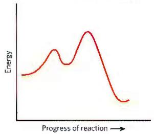  
If you find yourself struggling on any particular question, the

Skills You Need chapter-level activities provide a just-in-time refresher of chemistry, organic chemistry, biology, and math concepts and skills that students should know for each chapter of Lehninger Principles of Biochemistry. Designed to be completed in 30 minutes or less, each activity explains how skills and concepts from prerequisite or other courses will be relevant to the chapter, revisits the information, and gives students a chance to evaluate their mastery. In addition, the activities provide short tutorials and identify vocabulary, skills, and concepts requiring more practice.

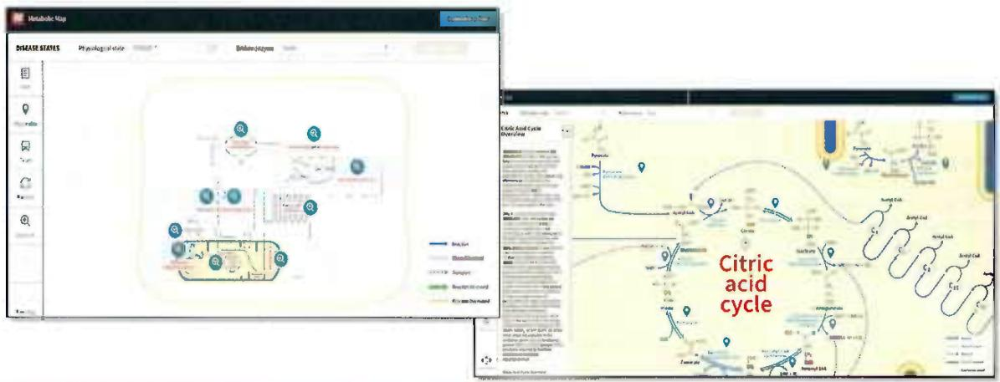

Interactive Metabolic Map allows students to navigate and zoom between overviews and detailed views of the most commonly taught metabolic pathways. Embedded Tours take students through the pathways step by step, helping them to both visualize concepts in isolation and understand how concepts are connected. By examining the pathways in this way, students are better equipped to understand the meaning of those connections. Assessment questions help students solidify their understanding and provide more structure to their learning. \*Metabolic Pathways include: glycolysis, gluconeogenesis, the citric acid cycle, oxidative phosphorylation, the pentose phosphate pathway, fatty acid synthesis, the urea cycle, and β oxidation.

Powerful analytics, viewable in an elegant dashboard, offer instructors a window into student progress. Achieve gives you the insight to address students' weaknesses and misconceptions before they struggle on a test.

The story of principles—the fundamental concepts of biochemistry—provides an organizing framework to build an understanding of concepts and then develop critical connections between them.

Principles help students ground the details of biochemistry to its fundamental concepts. The first page of every chapter lists the principles with a numbered icon P1. Throughout the chapter, icons appear where needed to identify content that relates to those principles. Active Learning Activities in Achieve provide short opportunities for in-class engagement.

The summary of principles and the highlighting of these principles throughout the text. This is really helpful! The boxes with additional information, particularly clinical relevance of the material. Most of my students are pre-med and it helps them engage in the material better if there is clinical relevance. The problems at the end of the chapter. These are really beneficial for the students who want to make sure they understand the material." — Robin Haynes, PhD, Harvard University

# AMINO ACIDS, PEPTIDES, AND PROTEINS

3.1 Amino Acids 70

3.2 Peptides and Proteins 80

3.3 Working with Proteins 83

3.4 The Structure of Proteins: Primary Structure 90

Proteins mediate virtually every process that takes place in a cell, exhibiting an almost endless density of functions. To explore the molecular mechanism of a biological process, a biochemical almost inevitably studies one or more proteins. Proteins are the most abundant biological macromolecules, occurring in all cells and all parts of cells. Proteins also occur in great variety; thousands of different kinds may be found in a single cell. Proteins are the molecular instruments through which genetic information is expected—the important final products of the information pathways discussed in Part III of this book

Cells produce proteins with strikingly different properties and activities by joining a common set of 20 amino acids in many different combinations and sequences. From these building blocks, different organisms can make such identify diverse products as enzymes, hormones, antibodies, transporters, light-harvesting complexes in plants, the flagella of bacteria, muscle fibers, feathers, spider webs, bone horn, antibiotics, and myxid other substances that have distinct biological functions (Fig. 3-1). Among these protein products, the enzymes are the most varied specialized. As the catalysts of almost all cellular reactions, enzymes are one of the keys to understanding the chemistry of life, and thus they provide a focal point for any course in biochemistry.

Protein structure and function are the topics of this and the next three chapters. Here, we begin with a description of the fundamental chemical properties of is, peptides, and proteins. We also consider how a biochemist works with proteins. The material is organized around four principles:

PI In every living organism, proteins are constructed from a common set of 20 amino acid. Each amino acid has a side chain with

distinctive chemical properties. Amino acids may be regarded as the alphabet in which the language of protein structure is written

P2 In proteins amino acids are joined in characteristic linear sequences through a common amide linkage, the peptide bond. The amino acid sequence of a protein constitutes its primary structure, a first level we will introduce within the broader complexities of protein structure

For study individual proteins can be separated from the thousands of other proteins present in a cell, based on differences in their chemical and functional properties arising from their distinct amino acid sequences. As 100% were central to biochemistry, the purification of individual protein for study is a quintessential biochemical endeavor

P4 Shaped by evolution, anin-acid equenes at a key resource for understanding the function of individual proteins and for tracing broader functional and evolutionary relationships.

## 3.1 Amino Acids

Proteins are polymers of amino acids, with each amino acid residue joined to its neighbor by a specific type covalent bond. (The term "residue" reflects the loss the elements of water when one amino acid is joined another.) Proteins can be broken down (hydrolyzed) their constituent amino acids by a variety of methods and the earliest studies of proteins naturally focused the free amino acids derived from them. Twenty different amino acids are commonly found in proteins. The first, be discovered was asparagine, in 1806. The last of the 1806 to be found, dauroxine, was not identified until 1938. The amino acids have trivial or common names in cases derived from the source from which they were fully isolated. Asparagine was first found in asparagine, of glutamate in wheat gluten; tyrosine was first isolated in the form (the 'liver' of the Greek glycer cheese); glycine (Greek glycos, "sweet") was so many because of its sweet taste.

  
FIGURE 3-1 Some function of pr in T g d b
f    j    in and AT    and t
he crz    mo lot [ ]    k    ed    l
br

Learning the names, structures, and chemical properties of the 20 cationan anhui acids found in proteins is one of the key memorization trials of every beginning biochemistry student. The necessity rapidly becomes apparent in succeeding chapters. It is impossible to discuss protein structure, protein function, ligand-binding sites, enzyme active sites, and most other biochemical topics without this foundation. The amino acids are part of the biochemistry vocabulary.

## Amino Acids Share Common Structural Features

295. All 20 of the same amino acids is $\alpha$ -anis acid. They have a carboxyl group and an amino group bonded to the same carbon atom (the $\alpha$ carbon) (Fig. 3-2). They differ from each other in their side chains, or R groups which vary in structure, size, and electric charge, and which influence the solubility of the amino acids in water. In addition to those 20 amino acids, there are many less common ones. Some are reliable modified after a protein synthesis, but not only the presence of the different living organisms but not as constituents of proteins, and two are special cases found in just a few proteins. The common amino acids of proteins have been assigned three letter abbreviations and one-letter symbols (see Table 3-1), which are used as shorthand to indicate the composition and sequence of amino acids polymerized in proteins

KEY CONVENTION The three-letter code is fully understood, the abbreviations generally consisting of the first three letters of the amino acid name. The one-letter code was devised

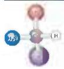  
fuch The black the he I became he b
p of the Id th p Se red f h b phodblac
prog chemical prop deed th h no
df from th if p loved b hooves or I van finger
Agr ot

FIGURE 3-2 General structure of amino acid. This structure is the base of the amino acid (from the group of amino acids) and the structure of the amino acid (from the group of amino acids).

3.1 A(n to F< .N

  
1. $\{x_{1}, x_{2}, \ldots, x_{n}\}$

by Margaret Oakley Dayhoff, considered by many to be the founder of the field of bioinformatics. The one-letter code reflects an attempt to reduce the size of the data files (in an era of limited computer memory) used to describe amino acid sequences. It was designed to be easily memorized, and understanding its origin can help students do just that. For six amino acids (CHIMSV), the first letter of the amino acid name is unique and thus is used as the symbol.

For five others (AGLPT), the first letter of the name is not unique but is assigned to the amino acid that is most common in proteins (for example, leucine is more common than lysine). For another form, the letter used is phonetically suggestive (IRIFYW. aRginine, Fenyl alanine, Yrosine, Triptophan). The rest were harder to assign. Four (DNEQ) were assigned letters found within or suggested by their mes (asparDic, asparaglNe, glutamikre, O-lamine). That left lysine Only a few letters were left, and K was chosen because it was the lose it to L.

For all the common amino acids except glycine, the $\alpha$ carbon is bonded to four different groups: a carboxyl group, an amino group, an R group, and a hydrogen atom (Fig. 3-2; in glycine, the R group is another hydrogen atom). The $\alpha$ -carbon atom is thus a chiral center (p. 61). Because of the tetrahedral arrangement of the homing orbitals around the $\alpha$ -carbon atom, the four different groups can occupy two unique spatial arrangements. In this case, the molecules have two possible tetrahemors. Since they are unamperpostable and mirror images of each other (Fig. 3-3), the two forms represent a laser of stereoisomers called enantlomers (see Fig. 1-21). All molecules with a chiral center are also opteally active—that is, they rotate the plane of phase-polarized light (see Box 1-2).

## Achieve supports retention and assessment for Lehninger Principles of Biochemistry.

The principles framework extends to resources that support retention and assessment both in the text and in the accompanying Achieve platform. Students are encouraged to check understanding and retention through LearningCurve Adaptive Quizzing. All assessment questions, including all end-of-chapter problems, are included in the Achieve problem library, making it easy to assign the content you want and provide students with support through hints, targeted feedback, and detailed solutions. Assessments are tagged to principles-driven learning objectives, which can be easily viewed in the reporting and analytics of Achieve.

# Tools and Resources to Support Teaching

## Course Preparation

• Transition Guide for navigating the changes between editions

\- Migration Tool to move your assignments from your previous Sapling Course into your new Achieve course

\- Specialized Indices for topics covered throughout the text, including Nutrition and Evolution

\- Section Management Courses for making copies of your course when teaching multiple sections or to serve as a coordinator for other instructors' sections

## Class Preparation

• Skills You Need assignments refresh students on content from courses frequently taken as prerequisites

\- Standalone slide decks for content, images, and clicker questions that can be used as is or edited

\- Interactive e-book, including assignable sections and chapters

\- LearningCurve Adaptive Quizzing assignments to ensure reading comprehension

## Instruction

\- Editable all-in-one Lecture Slides that include content, images, clicker questions, multimedia tools, and activities

• Cloud-based iClicker in-class response system

\- Instructor Activity Guides, developed with instructors and tied to the principles framework, include both instructor material and assessable student material

\- Interactive Metabolic Map and Animated Mechanism Videos, problem-solving videos, and case studies are integrated into Lecture Slides and available as stand-alone resources

## Practice and Assessment

\- Two editable, curated homework assignments, including an assignment that matches the order and questions in the text and an assignment tied to the principles framework that uses questions from the text and other sources

\- Question Bank with thousands of additional questions to create an assignment from scratch or add to a curated assignment

• Abbreviated Solutions and Extended Solutions for all text questions

• Case Study assignments

\- Test Banks and accompanying software to create tests outside of the Achieve environment

## Reporting and Analytics

• Insights on top learning objectives and assignments to review are surfaced just-in-time (7-day period)

\- Detailed reporting by class, individual students, and learning objectives

\- Gradebook that syncs with iClicker for an easy, all-in-one gradebook

## Acknowledgments

Fifty years ago, Al Lehninger published the first edition of Biochemistry, defining the basic shape of biochemistry courses worldwide for generations. We are honored to have been able to carry on the Lehninger tradition since his passing in 1986, now introducing the eighth (our seventh) edition of Lehninger Principles of Biochemistry.

This book is a team effort, and producing it would be impossible without the outstanding people at Macmillan Learning who have supported us at every step along the way. Elizabeth Simmons, Program Manager, Biochemistry, led us fearlessly into the brave new world of textbook publishing in the media age. Catherine Murphy, Development Editor, helped develop the revision plan for this edition, cheerfully kept us focused on that plan, skillfully evaluated reviewer comments, and edited the text with a clear eye. Vivien Weiss, Senior Content Project Manager, put all the pieces together seamlessly. Diana Blume, Natasha Wolfe, Maureen McCutcheon, and John Callahan are responsible for the vibrant design of the text and cover of the book. Adam Steinberg and Emiko Paul created the new art for this edition. Photo Researcher Jennifer Atkins and Media Permissions Manager Christine Buese located images and obtained permission to use them. Cate Dapron copy edited and Paula Pyburn proofread the text. Karen Misler, Editorial Project Manager, and Senior Workflow Project Manager Paul W. Rohloff worked diligently to keep us on schedule, and Nathan Livingston helped orchestrate reviews and provided administrative assistance. Cassandra Korsvik and Kelsey Hughes, Media Editors, and Jim Zubricky, Learning Solutions Specialist, oversaw the enormous task of creating the many interactive media enhancements of our content. Our gratitude also goes to Maureen Rachford, Senior Marketing Manager, for coordinating the sales and marketing efforts that bring Lehninger Principles of Biochemistry to the attention of teachers and learners.

In Madison, Brook Soltvedt is, and has been for all the editions we have worked on, our invaluable first-line editor and critic. She is the first to see manuscript chapters, aids in manuscript and art development, ensures internal consistency in content and nomenclature, and keeps us on task with more-or-less gentle prodding. Much of the art and molecular graphics was created by Adam Steinberg of

  
Just a few of the many individuals who helped create this edition of Principles of Biochemistry: Diana Blume, Director of Design, Content Management; Christine Buese, Media Permissions Manager; John Callahan, Cover Designer; Bob Cherry, Production Supervisor; Keri deManigold, Senior Director of Digital Production; Janice Donnola, Art Coordinator; Daryl Fox, Senior Vice President, STEM; Jen Driscoll Hollis, Director of Content, Life and Earth Sciences; Kelsey Hughes, Media Editor; Lisa Kinne, Senior Managing Editor; Cassandra Korsvik, Senior Media Editor; Nathan Livingston, Editorial Assistant; Matthew McAdams, Art Manager; Michael McCarty, Text Permissions Editor; Karen Misler, Editorial Project Manager; Catherine Murphy, Development Editor; Paul W. Rohloff, Senior Workflow Manager; Liz Simmons, Biochemistry Program Manager; Brook Soltvedt, Editor; H. Adam Steinberg, Artist Scientist; and Vivien Weiss, Senior Content Project Manager.

Art for Science, who often made valuable suggestions that led to better and clearer illustrations. The deft hand of Linda Strange, who copyedited six editions of this textbook (including the first), is still evident in the clarity of the text. We feel very fortunate to have had such gifted partners as Brook, Adam, and Linda on our team. We are also indebted to Brian White of the University of Massachusetts Boston, who wrote most of the data analysis problems at the end of chapters.

Many others helped us shape this eighth edition with their comments, suggestions, and criticisms. To all of them, we are deeply grateful:

Ravinder Abrol, California State University–Northridge

Paul Adams, University of Arkansas

Heather Coan, Western Carolina University

Balasubrahmanyam Addepalli,
University of Cincinnati

Richard Amasino, University of Wisconsin–Madison

Darryl Aucoin, Caldwell College

Leah Cohen, College of Staten Island, CUNY

Gerald F. Audette, York University, North York

Amy Babbes, Scripps College

Steven Cok, Framingham State College

Kenneth Balazovich, University of Michigan

Dana Baum, St. Louis University–Main Campus

Donald Beitz, Iowa State University

Henrike Besche, Harvard Medical School

Sandra Barnes, Alcorn State University

Zeenat Bashir, Canisius College

Mrinal Bhattacharjee, Long Island University-Brooklyn

Joshua M. Blose, College at Brockport-State University of New York

David Bartley, Adrian College

Paul Bond, Shorter University

Michael Borenstein, Temple University School of Pharmacy

Kevin Brown, University of Florida-Gainesville

Robert Brown, Memorial University of Newfoundland

D. Andrew Burden, Middle Tennessee State University

Nicholas Burgis, Eastern Washington University

Bobby Burkes, Grambling State University

Samuel Butcher, University of Wisconsin–Madison

Tamar B. Caceres, Union University

Brian Callahan, Binghamton University

Christopher T. Calderone, Carleton College

Michael Cascio, Duquesne University

Jennifer Cecile, Appalachian State University

Yongli Chen, Hawaii Pacific University-Hilo

John Chik, Mount Royal University

Robert B. Congdon, Broome Community College, SUNY

Lilian Chooback, University of Central Oklahoma

Kathleen Foley Geiger, Michigan State University

Anthony Clementz, Concordia
University Chicago

John Conrad, University of Nebraska-Omaha

Silvana Constantinescu, Marymount College-Rancho Palos Verdes

Rebecca Corbin, Ashland University

Garland Crawford, Mercer University–Macon

Tuhin Das, John Jay College of Criminal Justice, CUNY

Susan Colette Daubner, St. Mary's University

Christopher Cottingham, University of North Alabama

Marcello Forconi, College of Charleston

Tanya Dahms, University of Regina

Margaret Daugherty, Colorado College

Paul DeLaLuz, Lee University

Natasha DeVore, Missouri State University Springfield

Justin DiAngelo, Pennsylvania State University–Berks Campus

Isaac Forquer, Portland State University

Tomas T. Ding, North Carolina Central University

Kristin Dittenhafer-Reed, Hope College

Cassidy Dobson, Truman State University

Jason Fowler, Lincoln Memorial University

Artem Domashevskiy, John Jay College of Criminal Justice, CUNY

Donald Doyle, Georgia Institute of Technology

Jennifer Fishovitz, Saint Mary's College

Kevin Francis, Texas A&M-Kingsville

Lawrence Gracz, Massachusetts College of Pharmacy & Health Sciences

David H. Eagerton, Campbell University

Kirsten Fertuck, Northeastern University-Boston

Ronald Gary, University Nevada–Las Vegas

Jean Gaffney, Baruch College

Yulia Gerasimova, University of Central Florida

Katie Garber, St. Norbert College

Chandrakanth Emani, Western Kentucky University–Bowling Green

Daniel Golemboski, Bellarmine
College–Louisville

Stylianos Fakas, Alabama A & M University

Daniel Edwards, California State University-Chico

Nuran Ercal, Missouri University of Science & Technology

Dipak K. Ghosh, North Carolina A & T
State University

Russ Feirer, St. Norbert College & Medical College of Wisconsin

Joel Gray, Texas State University

Jennifer E. Grant, University of Wisconsin Stout

Amy Greene, Albright College

Steven Ellis, University of Louisville

Marina Gimpelev, Dominican College

Burt Goldberg, New York University

Nicholas Grossoehme, Winthrop University

Rishab K. Gupta, University of California–Los Angeles

Neena Grover, Colorado College

Paul Hager, East Carolina University

Bonnie Hall, Grand View University

Marilena Hall, Stonehill College

Christopher Hamilton, Hillsdale College

Matthew Hartman, Virginia Commonwealth University

Mary Hatcher-Skeers, Scripps College

Robin Haynes, Harvard University

Tamara Hendrickson, Wayne State University

Newton Hilliard, Arkansas Technical University

Danny Ho, Columbia University–New York

Jane Hobson, Kwantlen Polytechnic University

Charles Hoogstraten, Michigan State University

Amber Howerton, Nevada State College

Tom Huxford, San Diego State University

Cheryl Ingram-Smith, Clemson University

Lori Isom, University of Central Arkansas

Bruce Jacobson, St. Cloud State University

Yingchun Li, Texas A&M University-Prairie View

Nitin Jain, University of Tennessee

Blythe Janowiak, St. Louis University

Yun Li, Delaware Valley University

Matthew R. Jensen, Concordia
University, St. Paul

Andy LiWang, University of California-Merced

Joseph Jez, Washington University in St. Louis

Kimberly Lyle-Ippolito, Anderson University

Taylor J. Mach, Concordia University, St. Paul

Xiangshu Jin, Michigan State University-East Lansing

Meagan Mann, Austin Peay State University

Gerwald Jogl, Brown University

Glover Martin, University of Massachusetts–Boston

Todd Johnson, Weber State
University-Ogden

Marjorie A. Jones, Illinois State University

Michael Massiah, George Washington University

Brannon McCullough, Northern Arizona University

P. Matthew Joyner, Pepperdine University

John Means, University of Rio Grande

Katarzyna Roberts, Rogers State University

Christopher Jurgenson, Delta State University

John Richardson, Austin College

Michael Mendenhall, University of Kentucky

Jim Roesser, Virginia Commonwealth University

Sabeeha Merchant, University of California-Berkeley

Christopher Rohlman, Albion College

Jason Kahn, University of Maryland

Christopher Reid, Bryant University

Brenda Royals, Park University

Kalju Kahn, University of California-Santa Barbara

Elizabeth Middleton, Purchase College, SUNY

Gillian Rudd, Georgia Gwinnett College

Peter Kahn, Rutgers University

Reza Karimi, Pacific University

Megan E. Rudock, Wake Forest University

Jeremy T. Mitchell-Koch, Bethel College-North Newton

Tanea Reed, Eastern Kentucky University

Bhuvana Katkere, Pennsylvania State University–Main Campus

Joshua Sakon, University of Arkansas–Fayetteville

Somdeb Mitra, New York University

Kevin Kearney, MCPHS University

Susan Mitroka, Worcester State University

Nianli Sang, Drexel University

Chu-Young Kim, University of Texas–El Paso

Judy Moore, Lenoir-Rhyne University-Hickory

Pradip Sarkar, Parker University

Bryan Knuckley, University of North Florida

Patrick Schacht, California Baptist University

Graham Moran, Loyola University
Chicago

Michael Koelle, Yale University

Kersten Schroeder, University of Central Florida

Andy Koppisch, Northern Arizona University

Joseph Schulz, Occidental College

Fares Najar, University of Oklahoma-Norman

Kevin Redding, Arizona State University

Joanna Krueger, University of North Carolina–Charlotte

Michael Sehorn, Clemson University

Scott Napper, University of Saskatchewan

Kavita Shah, Purdue University–Main Campus

Allen Nicholson, Temple
University–Philadelphia

Terry Kubiseski, York University–Keele Campus

Ramin Radfar, Wofford College

Wallace Sharif, Morehouse College

James Nolan, Georgia Gwinnett College

Tamiko Porter, Indiana University-
Purdue University Indianapolis

Ike Shibley, Pennsylvania State University-Berks Campus

George Nora, Northern State University

Michelle Pozzi, Texas A&M University

Alfred Ponticelli, University at Buffalo,
Jacobs School of Medicine and
Biomedical Sciences

Maria Kuhn, Madonna University

Aaron Sholders, Colorado State
University Fort Collins

Grazyna Nowak, University of Arkansas for Medical Sciences

Kevin Siebenlist, Marquette University

Chandrika Kulatilleke, City University of New York-Baruch College

Richard Singiser, Clayton State University

Allison Lamanna, University of Michigan–Ann Arbor

Abdel Omri, Laurentian University

Corin Slown, California State
University Monterey Bay

Allyn Ontko, Arkansas State University

Kimberly Lane, Radford University

Siva Panda, Augusta State University

Kelli Slunt, University of Mary
Washington

Amanda Parker, William Cary University

Patrick Larkin, Texas A&M
University–Corpus Christi

Kerry Smith, Clemson University

Jonathan Parrish, University of Alberta

Donna Pattison, University of Houston

Sarah J. Smith, Bucknell University

Paul Larsen, University of California-Riverside

Mark Snider, The College of Wooster

Heather Larson, Indiana University
Southeast

Craig Peebles, University of Pittsburgh

Jennifer Sniegowski, Arizona State University-Downtown

Mary Elizabeth Peek, Georgia Institute of Technology Main Campus

Benjamin Lasseter, Christopher Newport University

Mario Pennella, University of Wisconsin–Madison

David Snyder, William Paterson
University

Katherine Launer-Felty, Connecticut College

Joshua Sokoloski, Salisbury
University

Michael Pikaart, Hope College

James Lee, Old Dominion University

Sarah Lee, Abilene Christian University

Joanne Souza, Stony Brook University

Pingwei Li, Texas A&M University

Scott Lefler, Arizona State University-Tempe

Deborah Polayes, George Mason University

Narasimha Sreerama, Colorado State University

Rekha Srinivasan, Case Western Reserve University

Aleksandra Stamenov, University of California-Merced

Ryan Steed, University of North
Carolina–Asheville
Angela K. Stoeckman, Bethel University
Koni Stone, California State University Stanislaus
Evelyn Swain, Presbyterian College
Jeremy Thorner, University of
California–Berkeley
Candace Timpte, Georgia Gwinnett College
Jamie Towle-Weicksel, Rhode Island College
Michael Trakselis, Baylor University
Brian Trewyn, Colorado School of Mines
Vishwa D. Trivedi, Bethune Cookman University
Didem Vardar-Ulu, Boston University
Thomas Vida, University of Houston
Lori Wallrath, University of Iowa–Iowa City
Chris Wang, Ambrose University
Xuemin Wang, University of Missouri–St. Louis
Yu Wang, The University of Alabama
Robert J. Warburton, Shepherd University
Todd M. Weaver, University of Wisconsin La Crosse
James D. West, The College of Wooster
Chuan Xiao, University of Texas–El Paso
Alexander G. Zestos, American University

We lack the space here to acknowledge all the other individuals whose special efforts went into this book. We offer instead our sincere thanks—and the finished book that they helped guide to completion. We, of course, assume full responsibility for errors of fact or emphasis.

We want especially to thank our students at the University of Wisconsin–Madison for their numerous comments and suggestions. If something in the book does not work, they are never shy about letting us know it. We are grateful to the students and staff of our past and present research groups, who helped us balance the competing demands on our time; to our colleagues in the Department of Biochemistry at the University of Wisconsin–Madison, who helped us with advice and criticism; and to the many students and teachers who have written to suggest ways of improving the book. We hope our readers will continue to provide input for future editions.

Finally, we express our deepest appreciation to our partners (Brook, Beth, and Tim) and our families, who showed extraordinary patience with, and support for, our book writing.

David L. Nelson  
Michael M. Cox  
Aaron A. Hoskins  
Madison, Wisconsin  
June 2020

## Contents in Brief

Preface viii
1 The Foundations of Biochemistry 1

## STRUCTURE AND CATALYSIS

2 Water, the Solvent of Life 43
3 Amino Acids, Peptides, and Proteins 70
4 The Three-Dimensional Structure of Proteins 106
5 Protein Function 147
6 Enzymes 177
7 Carbohydrates and Glycobiology 229
8 Nucleotides and Nucleic Acids 263
9 DNA-Based Information Technologies 301
10 Lipids 341
11 Biological Membranes and Transport 367
12 Biochemical Signaling 408

## II BIOENERGETICS AND METABOLISM 461

13 Introduction to Metabolism 465
14 Glycolysis, Gluconeogenesis, and the Pentose Phosphate Pathway 510
15 The Metabolism of Glycogen in Animals 556
16 The Citric Acid Cycle 574
17 Fatty Acid Catabolism 601
18 Amino Acid Oxidation and the Production of Urea 625
19 Oxidative Phosphorylation 659
20 Photosynthesis and Carbohydrate Synthesis in Plants 700
21 Lipid Biosynthesis 744
22 Biosynthesis of Amino Acids, Nucleotides, and Related Molecules 794
23 Hormonal Regulation and Integration of Mammalian Metabolism 841

## III INFORMATION PATHWAYS

24 Genes and Chromosomes 885
25 DNA Metabolism 914
26 RNA Metabolism 960
27 Protein Metabolism 1005
28 Regulation of Gene Expression 1054
Abbreviated Solutions to Problems AS-1
Glossary G-1
Index I-1
Resources R-1

## Contents

1 The Foundations of Biochemistry 1
1.1 Cellular Foundations 2
Cells Are the Structural and Functional Units of All Living Organisms 2
Cellular Dimensions Are Limited by Diffusion 3
Organisms Belong to Three Distinct Domains of Life 3
Organisms Differ Widely in Their Sources of Energy and Biosynthetic Precursors 3
Bacterial and Archaeal Cells Share Common Features but Differ in Important Ways 5
Eukaryotic Cells Have a Variety of Membranous Organelles, Which Can Be Isolated for Study 6
The Cytoplasm Is Organized by the Cytoskeleton and Is Highly Dynamic 6
Cells Build Supramolecular Structures 8
In Vitro Studies May Overlook Important Interactions among Molecules 9
1.2 Chemical Foundations 10
Biomolecules Are Compounds of Carbon with a Variety of Functional Groups 10
Cells Contain a Universal Set of Small Molecules 11
Macromolecules Are the Major Constituents of Cells 12
BOX 1-1 Molecular Weight, Molecular Mass, and Their Correct Units 13
Three-Dimensional Structure Is Described by Configuration and Conformation 14
BOX 1-2 Louis Pasteur and Optical Activity: In Vino, Veritas 17
Interactions between Biomolecules Are Stereospecific 18
1.3 Physical Foundations 19
Living Organisms Exist in a Dynamic Steady State, Never at Equilibrium with Their Surroundings 19
Organisms Transform Energy and Matter from Their Surroundings 20
Creating and Maintaining Order Requires Work and Energy 21
BOX 1-3 Entropy: Things Fall Apart 22
Energy Coupling Links Reactions in Biology 22 $K_{eq}$ and $\Delta G^{\circ}$ Are Measures of a Reaction's Tendency to Proceed Spontaneously 23
Enzymes Promote Sequences of Chemical Reactions 25
Metabolism Is Regulated to Achieve Balance and Economy 27
1.4 Genetic Foundations 27
Genetic Continuity Is Vested in Single DNA Molecules 28
The Structure of DNA Allows Its Replication and Repair with Near-Perfect Fidelity 28

The Linear Sequence in DNA Encodes Proteins with Three-Dimensional Structures 29
5 Evolutionary Foundations 30
Changes in the Hereditary Instructions Allow Evolution 30
Biomolecules First Arose by Chemical Evolution 30
RNA or Related Precursors May Have Been the First Genes and Catalysts 31
Biological Evolution Began More Than Three and a Half Billion Years Ago 33
The First Cell Probably Used Inorganic Fuels 33
Eukaryotic Cells Evolved from Simpler Precursors in Several Stages 34
Molecular Anatomy Reveals Evolutionary Relationships 35
Functional Genomics Shows the Allocations of Genes to Specific Cellular Processes 36
Genomic Comparisons Have Increasing Importance in Medicine 36

## STRUCTURE AND CATALYSIS

2 Water, the Solvent of Life 43
2.1 Weak Interactions in Aqueous Systems 43
Hydrogen Bonding Gives Water Its Unusual Properties 44
Water Forms Hydrogen Bonds with Polar Solutes 45
Water Interacts Electrostatically with Charged Solutes 46
Nonpolar Gases Are Poorly Soluble in Water 47
Nonpolar Compounds Force Energetically Unfavorable Changes in the Structure of Water van der Waals Interactions Are Weak Interatomic Attractions 49
Weak Interactions Are Crucial to Macromolecular Structure and Function 49
Concentrated Solutes Produce Osmotic Pressure 51
2.2 Ionization of Water, Weak Acids, and Weak Bases 53
Pure Water Is Slightly Ionized 54
The Ionization of Water Is Expressed by an Equilibrium Constant 54
The pH Scale Designates the H $^{+}$ and OH $^{-}$ Concentrations 55
BOX 2-1 On Being One's Own Rabbit (Don't Try This at Home!) 56
Weak Acids and Bases Have Characteristic Acid Dissociation Constants 57
Titration Curves Reveal the pK $_{a}$ of Weak Acids 58
2.3 Buffering against pH Changes in Biological Systems 59
Buffers Are Mixtures of Weak Acids and Their Conjugate Bases 59

The Henderson-Hasselbalch Equation Relates pH, pKa, and Buffer Concentration 60
Weak Acids or Bases Buffer Cells and Tissues against pH Changes 61
Untreated Diabetes Produces Life-Threatening Acidosis 63
3 Amino Acids, Peptides, and Proteins 70
3.1 Amino Acids 70
Amino Acids Share Common Structural Features 71
The Amino Acid Residues in Proteins Are Stereoisomers 72
Amino Acids Can Be Classified by R Group 73
BOX 3-1 Absorption of Light by Molecules:
The Lambert-Beer Law 75
Uncommon Amino Acids Also Have Important Functions 76
Amino Acids Can Act as Acids and Bases 76
Amino Acids Differ in Their Acid-Base Properties 79
3.2 Peptides and Proteins 80
Peptides Are Chains of Amino Acids 81
Peptides Can Be Distinguished by Their Ionization Behavior 81
Biologically Active Peptides and Polypeptides Occur in a Vast Range of Sizes and Compositions 82
Some Proteins Contain Chemical Groups Other Than Amino Acids 83
3.3 Working with Proteins 83
Proteins Can Be Separated and Purified 84
Proteins Can Be Separated and Characterized by Electrophoresis 87
Unseparated Proteins Are Detected and Quantified Based on Their Functions 89
3.4 The Structure of Proteins:
Primary Structure 90
The Function of a Protein Depends on Its Amino Acid Sequence 91
Protein Structure Is Studied Using Methods That Exploit Protein Chemistry 92
Mass Spectrometry Provides Information on Molecular Mass, Amino Acid Sequence, and Entire Proteomes 93
Small Peptides and Proteins Can Be Chemically Synthesized 95
Amino Acid Sequences Provide Important Biochemical Information 96
Protein Sequences Help Elucidate the History of Life on Earth 96
BOX 3-2 Consensus Sequences and Sequence Logos 98

4 The Three-Dimensional Structure of Proteins 106  
4.1 Overview of Protein Structure 107  
A Protein's Conformation Is Stabilized Largely by Weak Interactions 107

Packing of Hydrophobic Amino Acids Away from Water Favors Protein Folding 108
Polar Groups Contribute Hydrogen Bonds and Ion Pairs to Protein Folding 108
Individual van der Waals Interactions Are Weak but Combine to Promote Folding 109
The Peptide Bond Is Rigid and Planar 109

4.2 Protein Secondary Structure 111
The α Helix Is a Common Protein Secondary Structure 111
BOX 4-1 Knowing the Right Hand from the Left 113
Amino Acid Sequence Affects Stability of the α Helix 113
The β Conformation Organizes Polypeptide Chains into Sheets 114
β Turns Are Common in Proteins 114
Common Secondary Structures Have Characteristic Dihedral Angles 114
Common Secondary Structures Can Be Assessed by Circular Dichroism 116

4.3 Protein Tertiary and Quaternary Structures 116
Fibrous Proteins Are Adapted for a Structural Function 117
BOX 4-2 Why Sailors, Explorers, and College Students Should Eat Their Fresh Fruits and Vegetables 118
Structural Diversity Reflects Functional Diversity in Globular Proteins 120
Myoglobin Provided Early Clues about the Complexity of Globular Protein Structure 121
BOX 4-3 The Protein Data Bank 122
Globular Proteins Have a Variety of Tertiary Structures 123
Some Proteins or Protein Segments Are Intrinsically Disordered 125
Protein Motifs Are the Basis for Protein Structural Classification 125
Protein Quaternary Structures Range from Simple Dimers to Large Complexes 126

4.4 Protein Denaturation and Folding 128
Loss of Protein Structure Results in Loss of Function 129
Amino Acid Sequence Determines Tertiary Structure 130
Polypeptides Fold Rapidly by a Stepwise Process 131
Some Proteins Undergo Assisted Folding Defects in Protein Folding Are the Molecular Basis for Many Human Genetic Disorders 133
BOX 4-4 Death by Misfolding: The Prion Diseases 134

4.5 Determination of Protein and Biomolecular Structures 136
X-ray Diffraction Produces Electron Density Maps from Protein Crystals 136
Distances between Protein Atoms Can Be Measured by Nuclear Magnetic Resonance 137

BOX 4-5 Video Games and Designer Proteins 138
Thousands of Individual Molecules Are Used to Determine Structures by Cryo-Electron Microscopy 139
5 Protein Function 147
5.1 Reversible Binding of a Protein to a Ligand: Oxygen-Binding Proteins 148
Oxygen Can Bind to a Heme Prosthetic Group 148
Globins Are a Family of Oxygen-Binding Proteins 149
Myoglobin Has a Single Binding Site for Oxygen 149
Protein-Ligand Interactions Can Be Described Quantitatively 150
Protein Structure Affects How Ligands Bind 152
Hemoglobin Transports Oxygen in Blood 153
Hemoglobin Subunits Are Structurally Similar to Myoglobin 153
Hemoglobin Undergoes a Structural Change on Binding Oxygen 155
Hemoglobin Binds Oxygen Cooperatively 156
Cooperative Ligand Binding Can Be Described Quantitatively 157
BOX 5-1 Carbon Monoxide: A Stealthy Killer 158
Two Models Suggest Mechanisms for Cooperative Binding 158
Hemoglobin Also Transports H+ and CO2 160
Oxygen Binding to Hemoglobin Is Regulated by 2,3-Bisphosphoglycerate 161
Sickle Cell Anemia Is a Molecular Disease of Hemoglobin 162
5.2 Complementary Interactions between Proteins and Ligands: The Immune System and Immunoglobulins 164
The Immune Response Includes a Specialized Array of Cells and Proteins 164
Antibodies Have Two Identical Antigen-Binding Sites 165
Antibodies Bind Tightly and Specifically to Antigen 167
The Antibody-Antigen Interaction Is the Basis for a Variety of Important Analytical Procedures 167
5.3 Protein Interactions Modulated by Chemical Energy: Actin, Myosin, and Molecular Motors 169
The Major Proteins of Muscle Are Myosin and Actin 169
Additional Proteins Organize the Thin and Thick Filaments into Ordered Structures 170
Myosin Thick Filaments Slide along Actin 170
6 Enzymes 177
6.1 An Introduction to Enzymes 178
Most Enzymes Are Proteins 178
Enzymes Are Classified by the Reactions They Catalyze 179

6.2 How Enzymes Work 179
Enzymes Affect Reaction Rates, Not Equilibria 180
Reaction Rates and Equilibria Have Precise Thermodynamic Definitions 181
A Few Principles Explain the Catalytic Power and Specificity of Enzymes 182
Noncovalent Interactions between Enzyme and Substrate Are Optimized in the Transition State 183
Covalent Interactions and Metal Ions Contribute to Catalysis 186
6.3 Enzyme Kinetics as an Approach to Understanding Mechanism 188
Substrate Concentration Affects the Rate of Enzyme-Catalyzed Reactions 188
The Relationship between Substrate Concentration and Reaction Rate Can Be Expressed with the Michaelis-Menten Equation 190
Michaelis-Menten Kinetics Can Be Analyzed Quantitatively 191
Kinetic Parameters Are Used to Compare Enzyme Activities 192
Many Enzymes Catalyze Reactions with Two or More Substrates 194
Enzyme Activity Depends on pH 195
Pre-Steady State Kinetics Can Provide Evidence for Specific Reaction Steps 196
Enzymes Are Subject to Reversible or Irreversible Inhibition 197
BOX 6-1 Curing African Sleeping Sickness with a Biochemical Trojan Horse 201
6.4 Examples of Enzymatic Reactions 203
The Chymotrypsin Mechanism Involves Acylation and Deacylation of a Ser Residue 204
An Understanding of Protease Mechanisms Leads to New Treatments for HIV Infection 208
Hexokinase Undergoes Induced Fit on Substrate Binding 209
The Enolase Reaction Mechanism Requires Metal Ions 210
An Understanding of Enzyme Mechanism Produces Useful Antibiotics 210
6.5 Regulatory Enzymes 213
Allosteric Enzymes Undergo Conformational Changes in Response to Modulator Binding 214
The Kinetic Properties of Allosteric Enzymes Diverge from Michaelis-Menten Behavior 215
Some Enzymes Are Regulated by Reversible Covalent Modification 216
Phosphoryl Groups Affect the Structure and Catalytic Activity of Enzymes 217
Multiple Phosphorylations Allow Exquisite Regulatory Control 219
Some Enzymes and Other Proteins Are Regulated by Proteolytic Cleavage of an Enzyme Precursor 220

A Cascade of Proteolytically Activated Zymogens Leads to Blood Coagulation 220
Some Regulatory Enzymes Use Several Regulatory Mechanisms 223
7 Carbohydrates and Glycobiology 229
7.1 Monosaccharides and Disaccharides 230
The Two Families of Monosaccharides Are Aldoses and Ketoses 230
BOX 7-1 What Makes Sugar Sweet? 231
Monosaccharides Have Asymmetric Centers 232
The Common Monosaccharides Have Cyclic Structures 233
Organisms Contain a Variety of Hexose Derivatives 236
Sugars That Are, or Can Form, Aldehydes Are Reducing Sugars 237
BOX 7-2 Blood Glucose Measurements in the Diagnosis and Treatment of Diabetes 238
7.2 Polysaccharides 241
Some Homopolysaccharides Are Storage Forms of Fuel 241
Some Homopolysaccharides Serve Structural Roles 243
Steric Factors and Hydrogen Bonding Influence Homopolysaccharide Folding 243
Peptidoglycan Reinforces the Bacterial Cell Wall 244
Glycosaminoglycans Are Heteropolysaccharides of the Extracellular Matrix 244
7.3 Glycoconjugates: Proteoglycans, Glycoproteins, and Glycolipids 247
Proteoglycans Are Glycosaminoglycan-Containing Macromolecules of the Cell Surface and Extracellular Matrix 248
BOX 7-3 Defects in the Synthesis or Degradation of Sulfated Glycosaminoglycans Can Lead to Serious Human Disease 251
Glycoproteins Have Covalently Attached Oligosaccharides 251
Glycolipids and Lipopolysaccharides Are Membrane Components 253
7.4 Carbohydrates as Informational Molecules: The Sugar Code 254
Oligosaccharide Structures Are Information-Dense 254
Lectins Are Proteins That Read the Sugar Code and Mediate Many Biological Processes 254
Lectin-Carbohydrate Interactions Are Highly Specific and Often Multivalent 256
7.5 Working with Carbohydrates 258
8 Nucleotides and Nucleic Acids 263
8.1 Some Basic Definitions and Conventions 263
Nucleotides and Nucleic Acids Have Characteristic Bases and Pentoses 264
Phosphodiester Bonds Link Successive Nucleotides in Nucleic Acids 267

The Properties of Nucleotide Bases Affect the Three-Dimensional Structure of Nucleic Acids 268
8.2 Nucleic Acid Structure 269
DNA Is a Double Helix That Stores Genetic Information 270
DNA Can Occur in Different Three-Dimensional Forms 272
Certain DNA Sequences Adopt Unusual Structures 273
Messenger RNAs Code for Polypeptide Chains 274
Many RNAs Have More Complex Three-Dimensional Structures 276
8.3 Nucleic Acid Chemistry 278
Double-Helical DNA and RNA Can Be Denatured 278
Nucleotides and Nucleic Acids Undergo Nonenzymatic Transformations 280
Some Bases of DNA Are Methylated 283
The Chemical Synthesis of DNA Has Been Automated 283
Gene Sequences Can Be Amplified with the Polymerase Chain Reaction 283
The Sequences of Long DNA Strands Can Be Determined 286
BOX 8-1 A Potent Weapon in Forensic Medicine 288
DNA Sequencing Technologies Are Advancing Rapidly 290
8.4 Other Functions of Nucleotides 294
Nucleotides Carry Chemical Energy in Cells 294
Adenine Nucleotides Are Components of Many Enzyme Cofactors 294
Some Nucleotides Are Regulatory Molecules 296
Adenine Nucleotides Also Serve as Signals 296
9 DNA-Based Information Technologies 301
9.1 Studying Genes and Their Products 302
Genes Can Be Isolated by DNA Cloning 302
Restriction Endonucleases and DNA Ligases Yield Recombinant DNA 302
Cloning Vectors Allow Amplification of Inserted DNA Segments 304
Cloned Genes Can Be Expressed to Amplify Protein Production 309
Many Different Systems Are Used to Express Recombinant Proteins 309
Alteration of Cloned Genes Produces Altered Proteins 312
Terminal Tags Provide Handles for Affinity Purification 313
The Polymerase Chain Reaction Offers Many Options for Cloning Experiments 314
DNA Libraries Are Specialized Catalogs of Genetic Information 315
9.2 Exploring Protein Function on the Scale of Cells or Whole Organisms 317
Sequence or Structural Relationships Can Suggest Protein Function 317

Vitamins E and K and the Lipid Quinones Are Oxidation-Reduction Cofactors 359
Dolichols Activate Sugar Precursors for Biosynthesis 360
Many Natural Pigments Are Lipidic Conjugated Dienes 360
Polyketides Are Natural Products with Potent Biological Activities 360

10.4 Working with Lipids 361
Lipid Extraction Requires Organic Solvents 361
Adsorption Chromatography Separates Lipids of Different Polarity 361
Gas Chromatography Resolves Mixtures of Volatile Lipid Derivatives 362
Specific Hydrolysis Aids in Determination of Lipid Structure 363
Mass Spectrometry Reveals Complete Lipid Structure 363
Lipidomics Seeks to Catalog All Lipids and Their Functions 363

11 Biological Membranes and Transport 367

11.1 The Composition and Architecture of Membranes 367
The Lipid Bilayer Is Stable in Water 367
Bilayer Architecture Underlies the Structure and Function of Biological Membranes 369
The Endomembrane System Is Dynamic and Functionally Differentiated 369
Membrane Proteins Are Receptors, Transporters, and Enzymes 371
Membrane Proteins Differ in the Nature of Their Association with the Membrane Bilayer 372
The Topology of an Integral Membrane Protein Can Often Be Predicted from Its Sequence 374
Covalently Attached Lipids Anchor or Direct Some Membrane Proteins 375

11.2 Membrane Dynamics 377
Acyl Groups in the Bilayer Interior Are Ordered to Varying Degrees 377
Transbilayer Movement of Lipids Requires Catalysis 378
Lipids and Proteins Diffuse Laterally in the Bilayer 379
Sphingolipids and Cholesterol Cluster Together in Membrane Rafts 380
Membrane Curvature and Fusion Are Central to Many Biological Processes 382
Integral Proteins of the Plasma Membrane Are Involved in Surface Adhesion, Signaling, and Other Cellular Processes 383

11.3 Solute Transport across Membranes 385
Transport May Be Passive or Active 385

When and Where a Protein Is Present in a Cell Can Suggest Protein Function 318
Knowing What a Protein Interacts with Can Suggest Its Function 320
The Effect of Deleting or Altering a Protein Can Suggest Its Function 322
Many Proteins Are Still Undiscovered 324
BOX 9-1 Getting Rid of Pests with Gene Drives 325
3 Genomics and the Human Story 326
The Human Genome Contains Many Types of Sequences 327
Genome Sequencing Informs Us about Our Humanity 329
Genome Comparisons Help Locate Genes Involved in Disease 331
Genome Sequences Inform Us about Our Past and Provide Opportunities for the Future 333
BOX 9-2 Getting to Know Humanity's Next of Kin 334

10.1 Storage Lipids 341
Fatty Acids Are Hydrocarbon Derivatives 341
Triacylglycerols Are Fatty Acid Esters of Glycerol 344
Triacylglycerols Provide Stored Energy and Insulation 344
Partial Hydrogenation of Cooking Oils Improves Their Stability but Creates Fatty Acids with Harmful Health Effects 345
Waxes Serve as Energy Stores and Water Repellents 345
10.2 Structural Lipids in Membranes 346
Glycerophospholipids Are Derivatives of Phosphatidic Acid 346
Some Glycerophospholipids Have Ether-Linked Fatty Acids 348
Galactolipids of Plants and Ether-Linked Lipids of Archaea Are Environmental Adaptations 349
Sphingolipids Are Derivatives of Sphingosine 350
Sphingolipids at Cell Surfaces Are Sites of Biological Recognition 351
Phospholipids and Sphingolipids Are Degraded in Lysosomes 352
Sterols Have Four Fused Carbon Rings 352
BOX 10-1 Abnormal Accumulations of Membrane Lipids: Some Inherited Human Diseases 353
10.3 Lipids as Signals, Cofactors, and Pigments 354
Phosphatidylinositols and Sphingosine Derivatives Act as Intracellular Signals 354
Eicosanoids Carry Messages to Nearby Cells 355
Steroid Hormones Carry Messages between Tissues 356
Vascular Plants Produce Thousands of Volatile Signals 356
Vitamins A and D Are Hormone Precursors 356

Transporters and Ion Channels Share Some Structural Properties but Have Different Mechanisms 386
The Glucose Transporter of Erythrocytes Mediates Passive Transport 387
The Chloride-Bicarbonate Exchanger Catalyzes Electroneutral Cotransport of Anions across the Plasma Membrane 389
BOX 11-1 Defective Glucose Transport in Diabetes 390
Active Transport Results in Solute Movement against a Concentration or Electrochemical Gradient 391
P-Type ATPases Undergo Phosphorylation during Their Catalytic Cycles 392
V-Type and F-Type ATPases Are ATP-Driven Proton Pumps 394
ABC Transporters Use ATP to Drive the Active Transport of a Wide Variety of Substrates 395
BOX 11-2 A Defective Ion Channel in Cystic Fibrosis 397
Ion Gradients Provide the Energy for Secondary Active Transport 398
Aquaporins Form Hydrophilic Transmembrane Channels for the Passage of Water 400
Ion-Selective Channels Allow Rapid Movement of Ions across Membranes 401
The Structure of a K+ Channel Reveals the Basis for Its Specificity 402
12 Biochemical Signaling 408
12.1 General Features of Signal Transduction 409
Signal-Transducing Systems Share Common Features 409
The General Process of Signal Transduction in Animals Is Universal 410
12.2 G Protein-Coupled Receptors and Second Messengers 412
The β-Adrenergic Receptor System Acts through the Second Messenger cAMP 412
Cyclic AMP Activates Protein Kinase A 413
BOX 12-1 FRET: Biochemistry in a Living Cell 416
Several Mechanisms Cause Termination of the β-Adrenergic Response 416
The β-Adrenergic Receptor Is Desensitized by Phosphorylation and by Association with Arrestin 418
Cyclic AMP Acts as a Second Messenger for Many Regulatory Molecules 420
G Proteins Act as Self-Limiting Switches in Many Processes 420
BOX 12-2 Receptor Guanylyl Cyclases, cGMP, and Protein Kinase G 422
Diacylglycerol, Inositol Trisphosphate, and Ca $^{2+}$ Have Related Roles as Second Messengers 425
Calcium Is a Second Messenger That Is Limited in Space and Time 425
12.3 GPCRs in Vision, Olfaction, and Gustation 429
The Vertebrate Eye Uses Classic GPCR Mechanisms 429

BOX 12-3 Color Blindness: John Dalton's Experiment from the Grave 430
Vertebrate Olfaction and Gustation Use Mechanisms Similar to the Visual System 431
All GPCR Systems Share Universal Features 431
12.4 Receptor Tyrosine Kinases 433
Stimulation of the Insulin Receptor Initiates a Cascade of Protein Phosphorylation Reactions 434
The Membrane Phospholipid $\mathrm{PIP}_3$ Functions at a Branch in Insulin Signaling 435
Cross Talk among Signaling Systems Is Common and Complex 438
12.5 Multivalent Adaptor Proteins and Membrane Rafts 439
Protein Modules Bind Phosphorylated Tyr, Ser, or Thr Residues in Partner Proteins 439
Membrane Rafts and Caveolae Segregate Signaling Proteins 442
12.6 Gated Ion Channels 442
Ion Channels Underlie Rapid Electrical Signaling in Excitable Cells 442
Voltage-Gated Ion Channels Produce Neuronal Action Potentials 443
Neurons Have Receptor Channels That Respond to Different Neurotransmitters 444
Toxins Target Ion Channels 444
12.7 Regulation of Transcription by Nuclear Hormone Receptors 445
12.8 Regulation of the Cell Cycle by Protein Kinases 446
The Cell Cycle Has Four Stages 446
Levels of Cyclin-Dependent Protein Kinases Oscillate 447
CDKs Are Regulated by Phosphorylation, Cyclin Degradation, Growth Factors, and Specific Inhibitors 447
CDKs Regulate Cell Division by Phosphorylating Critical Proteins 449
12.9 Oncogenes, Tumor Suppressor Genes, and Programmed Cell Death 451
Oncogenes Are Mutant Forms of the Genes for Proteins That Regulate the Cell Cycle 451
Defects in Certain Genes Remove Normal Restraints on Cell Division 451
BOX 12-4 Development of Protein Kinase Inhibitors for Cancer Treatment 452
Apoptosis Is Programmed Cell Suicide 455

## II BIOENERGETICS AND METABOLISM

13 Introduction to Metabolism 465
13.1 Bioenergetics and Thermodynamics 466
Biological Energy Transformations Obey the Laws of Thermodynamics 466

Standard Free-Energy Change Is Directly Related to the Equilibrium Constant 468
Actual Free-Energy Change's Depend on Reactant and Product Concentrations 470
Standard Free-Energy Changes Are Additive 471

13.2 Chemical Logic and Common Biochemical Reactions 472
Biochemical Reactions Occur in Repeating Patterns 472
BOX 13-1 A Primer on Enzyme Names 477
Biochemical and Chemical Equations Are Not Identical 478

13.3 Phosphoryl Group Transfers and ATP 479
The Free-Energy Change for ATP Hydrolysis Is Large and Negative 479
Other Phosphorylated Compounds and Thioesters Also Have Large, Negative Free Energies of Hydrolysis 481
ATP Provides Energy by Group Transfers, Not by Simple Hydrolysis 482
ATP Donates Phosphoryl, Pyrophosphoryl, and Adenylyl Groups 484
Assembly of Informational Macromolecules Requires Energy 485
BOX 13-2 Firefly Flashes: Glowing Reports of ATP 486
Transphosphorylations between Nucleotides Occur in All Cell Types 487

13.4 Biological Oxidation-Reduction Reactions 488
The Flow of Electrons Can Do Biological Work 488
Oxidation-Reductions Can Be Described as Half-Reactions 489
Biological Oxidations Often Involve Dehydrogenation 489
Reduction Potentials Measure Affinity for Electrons 490
Standard Reduction Potentials Can Be Used to Calculate Free-Energy Change 492
A Few Types of Coenzymes and Proteins Serve as Universal Electron Carriers 492
NAD Has Important Functions in Addition to Electron Transfer 494
Flavin Nucleotides Are Tightly Bound in Flavoproteins 495

13.5 Regulation of Metabolic Pathways 496
Cells and Organisms Maintain a Dynamic Steady State 497
Both the Amount and the Catalytic Activity of an Enzyme Can Be Regulated 498
Reactions Far from Equilibrium in Cells Are Common Points of Regulation 501
Adenine Nucleotides Play Special Roles in Metabolic Regulation 502

14 Glycolysis, Gluconeogenesis, and the Pentose Phosphate Pathway 510
14.1 Glycolysis 511
An Overview: Glycolysis Has Two Phases 511
The Preparatory Phase of Glycolysis Requires ATP 514
The Payoff Phase of Glycolysis Yields ATP and NADH 518
The Overall Balance Sheet Shows a Net Gain of Two ATP and Two NADH Per Glucose 521
14.2 Feeder Pathways for Glycolysis 521
Endogenous Glycogen and Starch Are Degraded by Phosphorolysis 522
Dietary Polysaccharides and Disaccharides Undergo Hydrolysis to Monosaccharides 523
14.3 Fates of Pyruvate 525
The Pasteur and Warburg Effects Are Due to Dependence on Glycolysis Alone for ATP Production 525
Pyruvate Is the Terminal Electron Acceptor in Lactic Acid Fermentation 526
BOX 14-1 High Rate of Glycolysis in Tumors Suggests Targets for Chemotherapy and Facilitates Diagnosis 527
BOX 14-2 Glucose Catabolism at Limiting Concentrations of Oxygen 529
Ethanol Is the Reduced Product in Ethanol Fermentation 530
Fermentations Produce Some Common Foods and Industrial Chemicals 530
14.4 Gluconeogenesis 533
The First Bypass: Conversion of Pyruvate to Phosphoenolpyruvate Requires Two Exergonic Reactions 534
The Second and Third Bypasses Are Simple Dephosphorylations by Phosphatases 537
Gluconeogenesis Is Energetically Expensive, But Essential 537
Mammals Cannot Convert Fatty Acids to Glucose; Plants and Microorganisms Can 538
14.5 Coordinated Regulation of Glycolysis and Gluconeogenesis 539
Hexokinase Isozymes Are Affected Differently by Their Product, Glucose 6-Phosphate 539
BOX 14-3 Isozymes: Different Proteins That Catalyze the Same Reaction 540
Phosphofructokinase-1 and Fructose 1,6-Bisphosphatase Are Reciprocally Regulated 541
Fructose 2,6-Bisphosphate Is a Potent Allosteric Regulator of PFK-1 and FBPase-1 542
Xylulose 5-Phosphate Is a Key Regulator of Carbohydrate and Fat Metabolism 543

The Glycolytic Enzyme Pyruvate Kinase Is Allosterically Inhibited by ATP 544
Conversion of Pyruvate to Phosphoenolpyruvate Is Stimulated When Fatty Acids Are Available 544
Transcriptional Regulation Changes the Number of Enzyme Molecules 545

14.6 Pentose Phosphate Pathway of Glucose Oxidation 546
The Oxidative Phase Produces NADPH and Pentose Phosphates 547
BOX 14-4 Why Pythagoras Wouldn't Eat Falafel: Glucose 6-Phosphate Dehydrogenase Deficiency 548
The Nonoxidative Phase Recycles Pentose Phosphates to Glucose 6-Phosphate 549
Glucose 6-Phosphate Is Partitioned between Glycolysis and the Pentose Phosphate Pathway 551
Thiamine Deficiency Causes Beriberi and Wernicke-Korsakoff Syndrome 551

15 The Metabolism of Glycogen in Animals 556

15.1 The Structure and Function of Glycogen 557
Vertebrate Animals Require a Ready Fuel Source for Brain and Muscle 557
Glycogen Granules Have Many Tiers of Branched Chains of D-Glucose 557

15.2 Breakdown and Synthesis of Glycogen 558
Glycogen Breakdown Is Catalyzed by Glycogen Phosphorylase 558
Glucose 1-Phosphate Can Enter Glycolysis or, in Liver, Replenish Blood Glucose 559
The Sugar Nucleotide UDP-Glucose Donates Glucose for Glycogen Synthesis 560
BOX 15-1 Carl and Gerty Cori: Pioneers in Glycogen Metabolism and Disease 561
Glycogenin Primes the Initial Sugar Residues in Glycogen 563

15.3 Coordinated Regulation of Glycogen Breakdown and Synthesis 565
Glycogen Phosphorylase Is Regulated by Hormone-Stimulated Phosphorylation and by Allosteric Effectors 565
Glycogen Synthase Also Is Subject to Multiple Levels of Regulation 567
Allosteric and Hormonal Signals Coordinate Carbohydrate Metabolism Globally 568
Carbohydrate and Lipid Metabolism Are Integrated by Hormonal and Allosteric Mechanisms 570

16 The Citric Acid Cycle 574
16.1 Production of Acetyl-CoA (Activated Acetate) 575
Pyruvate Is Oxidized to Acetyl-CoA and CO₂ 575
The PDH Complex Employs Three Enzymes and Five Coenzymes to Oxidize Pyruvate 576
The PDH Complex Channels Its Intermediates through Five Reactions 577
16.2 Reactions of the Citric Acid Cycle 578
The Sequence of Reactions in the Citric Acid Cycle Makes Chemical Sense 580
The Citric Acid Cycle Has Eight Steps 580
BOX 16-1 Moonlighting Enzymes: Proteins with More Than One Job 584
The Energy of Oxidations in the Cycle Is Efficiently Conserved 587
BOX 16-2 Citrate: A Symmetric Molecule That Reacts Asymmetrically 588
16.3 The Hub of Intermediary Metabolism 590
The Citric Acid Cycle Serves in Both Catabolic and Anabolic Processes 590
Anaplerotic Reactions Replenish Citric Acid Cycle Intermediates 590
Biotin in Pyruvate Carboxylase Carries One-Carbon (CO₂) Groups 590
16.4 Regulation of the Citric Acid Cycle 593
Production of Acetyl-CoA by the PDH Complex Is Regulated by Allosteric and Covalent Mechanisms 593
The Citric Acid Cycle Is Also Regulated at Three Exergonic Steps 594
Citric Acid Cycle Activity Changes in Tumors 594
Certain Intermediates Are Channeled through Metabolons 595
17 Fatty Acid Catabolism 601
17.1 Digestion, Mobilization, and Transport of Fats 602
Dietary Fats Are Absorbed in the Small Intestine 602
Hormones Trigger Mobilization of Stored Triacylglycerols 603
Fatty Acids Are Activated and Transported into Mitochondria 603
17.2 Oxidation of Fatty Acids 606
The β Oxidation of Saturated Fatty Acids Has Four Basic Steps 607
The Four β-Oxidation Steps Are Repeated to Yield Acetyl-CoA and ATP 608
Acetyl-CoA Can Be Further Oxidized in the Citric Acid Cycle 609
BOX 17-1 A Long Winter's Nap: Oxidizing Fats during Hibernation 610

Oxidation of Unsaturated Fatty Acids
Requires Two Additional Reactions 611
Complete Oxidation of Odd-Number Fatty
Acids Requires Three Extra Reactions 612
Fatty Acid Oxidation Is Tightly Regulated 613
BOX 17-2 Coenzyme B $_{12}$ : A Radical Solution to a Perplexing Problem 614
Transcription Factors Turn on the Synthesis of Proteins for Lipid Catabolism 616
Genetic Defects in Fatty Acyl-CoA Dehydrogenases Cause Serious Disease 616
Peroxisomes Also Carry Out β Oxidation 617
Phytanic Acid Undergoes α Oxidation in Peroxisomes 618
17.3 Ketone Bodies 619
Ketone Bodies, Formed in the Liver, Are Exported to Other Organs as Fuel 619
Ketone Bodies Are Overproduced in Diabetes and during Starvation 620
18 Amino Acid Oxidation and the Production of Urea 625
18.1 Metabolic Fates of Amino Groups 626
Dietary Protein Is Enzymatically Degraded to Amino Acids 627
Pyridoxal Phosphate Participates in the Transfer of α-Amino Groups to α-Ketoglutarate 628
Glutamate Releases Its Amino Group as Ammonia in the Liver 630
Glutamine Transports Ammonia in the Bloodstream 631
Alanine Transports Ammonia from Skeletal Muscles to the Liver 632
Ammonia Is Toxic to Animals 633
18.2 Nitrogen Excretion and the Urea Cycle 633
Urea Is Produced from Ammonia in Five Enzymatic Steps 633
The Citric Acid and Urea Cycles Can Be Linked 636
The Activity of the Urea Cycle Is Regulated at Two Levels 637
BOX 18-1 Assays for Tissue Damage 637
Pathway Interconnections Reduce the Energetic Cost of Urea Synthesis 638
Genetic Defects in the Urea Cycle Can Be Life-Threatening 638
18.3 Pathways of Amino Acid Degradation 639
Some Amino Acids Can Contribute to Gluconeogenesis, Others to Ketone Body Formation 640
Several Enzyme Cofactors Play Important Roles in Amino Acid Catabolism 641
Six Amino Acids Are Degraded to Pyruvate 644
Seven Amino Acids Are Degraded to Acetyl-CoA 647
Phenylalanine Catabolism Is Genetically Defective in Some People 649

Five Amino Acids Are Converted to α-Ketoglutarate 650
Four Amino Acids Are Converted to Succinyl-CoA 650
Branched-Chain Amino Acids Are Not Degraded in the Liver 651
BOX 18-2 MMA: Sometimes More than a Genetic Disease 653
Asparagine and Aspartate Are Degraded to Oxaloacetate 653
19 Oxidative Phosphorylation 659
19.1 The Mitochondrial Respiratory Chain 660
Electrons Are Funneled to Universal Electron Acceptors 661
Electrons Pass through a Series of Membrane-Bound Carriers 662
Electron Carriers Function in Multienzyme Complexes 665
Mitochondrial Complexes Associate in Respirasomes 671
Other Pathways Donate Electrons to the Respiratory Chain via Ubiquinone 671
The Energy of Electron Transfer Is Efficiently Conserved in a Proton Gradient 672
Reactive Oxygen Species Are Generated during Oxidative Phosphorylation 673
19.2 ATP Synthesis 674
In the Chemiosmotic Model, Oxidation and Phosphorylation Are Obligately Coupled 675
ATP Synthase Has Two Functional Domains, F₀ and F₁ 677
ATP Is Stabilized Relative to ADP on the Surface of F₁ 677
The Proton Gradient Drives the Release of ATP from the Enzyme Surface 678
Each β Subunit of ATP Synthase Can Assume Three Different Conformations 678
Rotational Catalysis Is Key to the Binding-Change Mechanism for ATP Synthesis 680
Chemiosmotic Coupling Allows Nonintegral Stoichiometries of O₂ Consumption and ATP Synthesis 682
The Proton-Motive Force Energizes Active Transport 683
Shuttle Systems Indirectly Convey Cytosolic NADH into Mitochondria for Oxidation 683
BOX 19-1 Hot, Stinking Plants and Alternative Respiratory Pathways 685
19.3 Regulation of Oxidative Phosphorylation 686
Oxidative Phosphorylation Is Regulated by Cellular Energy Needs 687
An Inhibitory Protein Prevents ATP Hydrolysis during Hypoxia 687
Hypoxia Leads to ROS Production and Several Adaptive Responses 687
ATP-Producing Pathways Are Coordinately Regulated 688

19.4 Mitochondria in Thermogenesis, Steroid Synthesis, and Apoptosis 689
Uncoupled Mitochondria in Brown Adipose Tissue Produce Heat 689
Mitochondrial P-450 Monooxygenases Catalyze Steroid Hydroxylations 690
Mitochondria Are Central to the Initiation of Apoptosis 691
19.5 Mitochondrial Genes: Their Origin and the Effects of Mutations 692
Mitochondria Evolved from Endosymbiotic Bacteria 692
Mutations in Mitochondrial DNA Accumulate throughout the Life of the Organism 693
Some Mutations in Mitochondrial Genomes Cause Disease 694
A Rare Form of Diabetes Results from Defects in the Mitochondria of Pancreatic β Cells 695
20 Photosynthesis and Carbohydrate Synthesis in Plants 700
20.1 Light Absorption 701
Chloroplasts Are the Site of Light-Driven Electron Flow and Photosynthesis in Plants 701
Chlorophylls Absorb Light Energy for Photosynthesis 704
Chlorophylls Funnel Absorbed Energy to Reaction Centers by Exciton Transfer 705
20.2 Photochemical Reaction Centers 707
Photosynthetic Bacteria Have Two Types of Reaction Center 707
In Vascular Plants, Two Reaction Centers Act in Tandem 708
The Cytochrome b6f Complex Links Photosystems II and I, Conserving the Energy of Electron Transfer 712
Cyclic Electron Transfer Allows Variation in the Ratio of ATP/NADPH Synthesized 713
State Transitions Change the Distribution of LHCII between the Two Photosystems 713
Water Is Split at the Oxygen-Evolving Center 714
20.3 Evolution of a Universal Mechanism for ATP Synthesis 716
A Proton Gradient Couples Electron Flow and Phosphorylation 716
The Approximate Stoichiometry of Photophosphorylation Has Been Established 716
The ATP Synthase Structure And Mechanism Are Nearly Universal 717
20.4 CO₂-Assimilation Reactions 719
Carbon Dioxide Assimilation Occurs in Three Stages 719
Synthesis of Each Triose Phosphate from CO₂ Requires Six NADPH and Nine ATP A Transport System Exports Triose Phosphates from the Chloroplast and Imports Phosphate 724

Four Enzymes of the Calvin Cycle Are Indirectly Activated by Light 725
20.5 Photorespiration and the C₄ and CAM Pathways 727
Photorespiration Results from Rubisco's Oxygenase Activity 727
Phosphoglycolate Is Salvaged in a Costly Set of Reactions in C₃ Plants 727
In C₄ Plants, CO₂ Fixation and Rubisco Activity Are Spatially Separated 729
BOX 20-1 Will Genetic Engineering of Photosynthetic Organisms Increase Their Efficiency? 730
In CAM Plants, CO₂ Capture and Rubisco Action Are Temporally Separated 732
20.6 Biosynthesis of Starch, Sucrose, and Cellulose 733
ADP-Glucose Is the Substrate for Starch Synthesis in Plant Plastids and for Glycogen Synthesis in Bacteria 733
UDP-Glucose Is the Substrate for Sucrose Synthesis in the Cytosol of Leaf Cells 733
Conversion of Triose Phosphates to Sucrose and Starch Is Tightly Regulated 734
The Glyoxylate Cycle and Gluconeogenesis Produce Glucose in Germinating Seeds 735
Cellulose Is Synthesized by Supramolecular Structures in the Plasma Membrane 736
Pools of Common Intermediates Link Pathways in Different Organelles 738
21 Lipid Biosynthesis 744
21.1 Biosynthesis of Fatty Acids and Eicosanoids 744
Malonyl-CoA Is Formed from Acetyl-CoA and Bicarbonate 744
Fatty Acid Synthesis Proceeds in a Repeating Reaction Sequence 745
The Mammalian Fatty Acid Synthase Has Multiple Active Sites 747
Fatty Acid Synthase Receives the Acetyl and Malonyl Groups 747
The Fatty Acid Synthase Reactions Are Repeated to Form Palmitate 748
Fatty Acid Synthesis Is a Cytosolic Process in Most Eukaryotes but Takes Place in the Chloroplasts in Plants 750
Acetate Is Shuttled out of Mitochondria as Citrate 751
Fatty Acid Biosynthesis Is Tightly Regulated 752
Long-Chain Saturated Fatty Acids Are Synthesized from Palmitate 753
Desaturation of Fatty Acids Requires a Mixed-Function Oxidase 754
Eicosanoids Are Formed from 20- and 22-Carbon Polyunsaturated Fatty Acids 755
BOX 21-1 Oxidases, Oxygenases, Cytochrome P-450 Enzymes, and Drug Overdoses 756

21.2 Biosynthesis of Triacylglycerols 760
Triacylglycerols and Glycerophospholipids Are Synthesized from the Same Precursors 760
Triacylglycerol Biosynthesis in Animals Is Regulated by Hormones 760
Adipose Tissue Generates Glycerol 3-Phosphate by Glyceroneogenesis 762
Thiazolidinediones Treat Type 2 Diabetes by Increasing Glyceroneogenesis 763
21.3 Biosynthesis of Membrane Phospholipids 764
Cells Have Two Strategies for Attaching Phospholipid Head Groups 764
Pathways for Phospholipid Biosynthesis Are Interrelated 765
Eukaryotic Membrane Phospholipids Are Subject to Remodeling 767
Plasmalogen Synthesis Requires Formation of an Ether-Linked Fatty Alcohol 768
Sphingolipid and Glycerophospholipid Synthesis Share Precursors and Some Mechanisms 768
Polar Lipids Are Targeted to Specific Cellular Membranes 770
21.4 Cholesterol, Steroids, and Isoprenoids: Biosynthesis, Regulation, and Transport 771
Cholesterol Is Made from Acetyl-CoA in Four Stages 772
Cholesterol Has Several Fates 775
Cholesterol and Other Lipids Are Carried on Plasma Lipoproteins 777
HDL Carries Out Reverse Cholesterol Transport 780
Cholesteryl Esters Enter Cells by Receptor-Mediated Endocytosis 781
Cholesterol Synthesis and Transport Are Regulated at Several Levels 782
Dysregulation of Cholesterol Metabolism Can Lead to Cardiovascular Disease 784
Reverse Cholesterol Transport by HDL Counters Plaque Formation and Atherosclerosis 785
Steroid Hormones Are Formed by Side-Chain Cleavage and Oxidation of Cholesterol 785
BOX 21-2 The Lipid Hypothesis and the Development of Statins 786
Intermediates in Cholesterol Biosynthesis Have Many Alternative Fates 787
22 Biosynthesis of Amino Acids, Nucleotides, and Related Molecules 794
22.1 Overview of Nitrogen Metabolism A Global Nitrogen Cycling Network Maintains a Pool of Biologically Available Nitrogen 795
Nitrogen Is Fixed by Enzymes of the Nitrogenase Complex 797
BOX 22-1 Unusual Lifestyles of the Obscure but Abundant 798

Ammonia Is Incorporated into Biomolecules through Glutamate and Glutamine 802
Glutamine Synthetase Is a Primary Regulatory Point in Nitrogen Metabolism 803
Several Classes of Reactions Play Special Roles in the Biosynthesis of Amino Acids and Nucleotides 804

22.2 Biosynthesis of Amino Acids 805
Organisms Vary Greatly in Their Ability to Synthesize the 20 Common Amino Acids 805
α-Ketoglutarate Gives Rise to Glutamate, Glutamine, Proline, and Arginine 806
Serine, Glycine, and Cysteine Are Derived from 3-Phosphoglycerate 806
Three Nonessential and Six Essential Amino Acids Are Synthesized from Oxaloacetate and Pyruvate 809
Chorismate Is a Key Intermediate in the Synthesis of Tryptophan, Phenylalanine, and Tyrosine 811
Histidine Biosynthesis Uses Precursors of Purine Biosynthesis 812
Amino Acid Biosynthesis Is under Allosteric Regulation 814

22.3 Molecules Derived from Amino Acids 817
Glycine Is a Precursor of Porphyrins 817
Heme Degradation Has Multiple Functions 817
BOX 22-2 On Kings and Vampires 819
Amino Acids Are Precursors of Creatine and Glutathione 819
D-Amino Acids Are Found Primarily in Bacteria 820
Aromatic Amino Acids Are Precursors of Many Plant Substances 820
Biological Amines Are Products of Amino Acid Decarboxylation 821
Arginine Is the Precursor for Biological Synthesis of Nitric Oxide 822

22.4 Biosynthesis and Degradation of Nucleotides 823
De Novo Purine Nucleotide Synthesis Begins with PRPP 825
Purine Nucleotide Biosynthesis Is Regulated by Feedback Inhibition 825
Pyrimidine Nucleotides Are Made from Aspartate, PRPP, and Carbamoyl Phosphate 827
Pyrimidine Nucleotide Biosynthesis Is Regulated by Feedback Inhibition 829
Nucleoside Monophosphates Are Converted to Nucleoside Triphosphates 829
Ribonucleotides Are the Precursors of Deoxyribonucleotides 829
Thymidylate Is Derived from dCDP and dUMP 833
Degradation of Purines and Pyrimidines Produces Uric Acid and Urea, Respectively 833
Purine and Pyrimidine Bases Are Recycled by Salvage Pathways 835
Excess Uric Acid Causes Gout 835
Many Chemotherapeutic Agents Target Enzymes in Nucleotide Biosynthetic Pathways 836

23 Hormonal Regulation and Integration of Mammalian Metabolism 841
23.1 Hormone Structure and Action 842
Hormones Act through Specific High-Affinity Cellular Receptors 842
Hormones Are Chemically Diverse 843
Some Hormones Are Released by a "Top-Down" Hierarchy of Neuronal and Hormonal Signals 845
"Bottom-Up" Hormonal Systems Send Signals 846
Back to the Brain and to Other Tissues 846
23.2 Tissue-Specific Metabolism 848
The Liver Processes and Distributes Nutrients 848
Adipose Tissues Store and Supply Fatty Acids 851
Brown and Beige Adipose Tissues Are Thermogenic 852
Muscles Use ATP for Mechanical Work 852
The Brain Uses Energy for Transmission of Electrical Impulses 855
BOX 23-1 Creatine and Creatine Kinase: Invaluable Diagnostic Aids and the Muscle Builder's Friends 856
Blood Carries Oxygen, Metabolites, and Hormones 857
23.3 Hormonal Regulation of Fuel Metabolism 859
Insulin Counters High Blood Glucose in the Well-Fed State 859
Pancreatic β Cells Secrete Insulin in Response to Changes in Blood Glucose 860
Glucagon Counters Low Blood Glucose 862
During Fasting and Starvation, Metabolism Shifts to Provide Fuel for the Brain 863
Epinephrine Signals Impending Activity 864
Cortisol Signals Stress, Including Low Blood Glucose 865
23.4 Obesity and the Regulation of Body Mass 867
Adipose Tissue Has Important Endocrine Functions 867
Leptin Stimulates Production of Anorexigenic Peptide Hormones 868
Leptin Triggers a Signaling Cascade That Regulates Gene Expression 869
Adiponectin Acts through AMPK to Increase Insulin Sensitivity 869
AMPK Coordinates Catabolism and Anabolism in Response to Metabolic Stress 869
The mTORC1 Pathway Coordinates Cell Growth with the Supply of Nutrients and Energy 871
Diet Regulates the Expression of Genes Central to Maintaining Body Mass 871
Short-Term Eating Behavior Is Influenced by Ghrelin, PYY $_{3-36}$ , and Cannabinoids Microbial Symbionts in the Gut Influence Energy Metabolism and Adipogenesis 874

23.5 Diabetes Mellitus 875
Diabetes Mellitus Arises from Defects in Insulin Production or Action 875
BOX 23-2 The Arduous Path to Purified Insulin 876
Carboxylic Acids (Ketone Bodies) Accumulate in the Blood of Those with Untreated Diabetes 877
In Type 2 Diabetes the Tissues Become Insensitive to Insulin 877
Type 2 Diabetes Is Managed with Diet, Exercise, Medication, and Surgery 878

## III INFORMATION PATHWAYS

24 Genes and Chromosomes 885
24.1 Chromosomal Elements 885
Genes Are Segments of DNA That
Code for Polypeptide Chains and RNAs 886
DNA Molecules Are Much Longer than
the Cellular or Viral Packages That
Contain Them 886
Eukaryotic Genes and Chromosomes
Are Very Complex 889
24.2 DNA Supercoiling 891
Most Cellular DNA Is Underwound 892
DNA Underwinding Is Defined by Topological
Linking Number 893
Topoisomerases Catalyze Changes in the Linking
Number of DNA 895
DNA Compaction Requires a Special Form
of Supercoiling 896
24.3 The Structure of Chromosomes 898
Chromatin Consists of DNA, Proteins, and RNA 898
Histones Are Small, Basic Proteins 899
Nucleosomes Are the Fundamental
Organizational Units of Chromatin 900
Nucleosomes Are Packed into Highly Condensed
Chromosome Structures 902
BOX 24-1 Epigenetics, Nucleosome Structure,
and Histone Variants 904
BOX 24-2 Curing Disease by Inhibiting
Topoisomerases 906
BOX 24-3 X Chromosome Inactivation by an IncRNA:
Preventing Too Much of a Good (or Bad) Thing 907
Condensed Chromosome Structures
Are Maintained by SMC Proteins 908
Bacterial DNA Is Also Highly Organized 909

DNA Replication Requires Many Enzymes and Protein Factors 921
Replication of the E. coli Chromosome Proceeds in Stages 922
Replication in Eukaryotic Cells Is Similar but More Complex 927
Viral DNA Polymerases Provide Targets for Antiviral Therapy 929
25.2 DNA Repair 930
Mutations Are Linked to Cancer 930
All Cells Have Multiple DNA Repair Systems 931
BOX 25-1 DNA Repair and Cancer 932
The Interaction of Replication Forks with DNA Damage Can Lead to Error-Prone Translesion DNA Synthesis 938
25.3 DNA Recombination 940
Bacterial Homologous Recombination Is a DNA Repair Function 941
Eukaryotic Homologous Recombination Is Required for Proper Chromosome Segregation during Meiosis 944
BOX 25-2 Why Proper Segregation of Chromosomes Matters 946
Some Double-Strand Breaks Are Repaired by Nonhomologous End Joining 948
BOX 25-3 How a DNA Strand Break Gets Attention 948
Site-Specific Recombination Results in Precise DNA Rearrangements 950
Transposable Genetic Elements Move from One Location to Another 951
Immunoglobulin Genes Assemble by Recombination 953
26 RNA Metabolism 960
26.1 DNA-Dependent Synthesis of RNA 961
RNA Is Synthesized by RNA Polymerases 961
RNA Synthesis Begins at Promoters 963
BOX 26-1 RNA Polymerase Leaves Its Footprint on a Promoter 965
Transcription Is Regulated at Several Levels 966
Specific Sequences Signal Termination of RNA Synthesis 967
Eukaryotic Cells Have Three Kinds of Nuclear RNA Polymerases 967
RNA Polymerase II Requires Many Other Protein Factors for Its Activity 968
RNA Polymerases Are Drug Targets 971
26.2 RNA Processing 972
Eukaryotic mRNAs Are Capped at the 5' End Both Introns and Exons Are Transcribed from DNA into RNA 975
RNA Catalyzes the Splicing of Introns In Eukaryotes the Spliceosome Carries out Nuclear pre-mRNA Splicing Proteins Catalyze Splicing of tRNAs Eukaryotic mRNAs Have a Distinctive 3' End Structure A Gene Can Give Rise to Multiple Products by Differential RNA Processing 981

BOX 26-2 Alternative Splicing and Spinal
Muscular Atrophy 981
Ribosomal RNAs and tRNAs Also Undergo Processing 983
Special-Function RNAs Undergo Several Types of Processing 985
Cellular mRNAs Are Degraded at Different Rates 986

26.3 RNA-Dependent Synthesis of RNA and DNA 988
Reverse Transcriptase Produces DNA from Viral RNA 988
Some Retroviruses Cause Cancer and AIDS 990
Many Transposons, Retroviruses, and Introns May Have a Common Evolutionary Origin 991
BOX 26-3 Fighting AIDS with Inhibitors of HIV Reverse Transcriptase 991
Telomerase Is a Specialized Reverse Transcriptase 993
Some RNAs Are Replicated by RNA-Dependent RNA Polymerase 993
RNA-Dependent RNA Polymerases Share a Common Structural Fold 995

26.4 Catalytic RNAs and the RNA World Hypothesis 995
Ribozymes Share Features with Protein Enzymes 996
Ribozymes Participate in a Variety of Biological Processes 997
Ribozymes Provide Clues to the Origin of Life in an RNA World 998
BOX 26-4 The SELEX Method for Generating RNA Polymers with New Functions 1000

27 Protein Metabolism 1005

27.1 The Genetic Code 1006
The Genetic Code Was Cracked Using Artificial mRNA Templates 1007
BOX 27-1 Exceptions That Prove the Rule: Natural Variations in the Genetic Code 1010
Wobble Allows Some tRNAs to Recognize More than One Codon 1010
The Genetic Code Is Mutation-Resistant 1012
Translational Frameshifting Affects How the Code Is Read 1013
Some mRNAs Are Edited before Translation 1013

27.2 Protein Synthesis 1015
The Ribosome Is a Complex Supramolecular Machine 1015
Transfer RNAs Have Characteristic Structural Features 1018
Stage 1: Aminoacyl-tRNA Synthetases Attach the Correct Amino Acids to Their tRNAs 1020
Stage 2: A Specific Amino Acid Initiates Protein Synthesis 1023
BOX 27-2 Natural and Unnatural Expansion of the Genetic Code 1025

Stage 3: Peptide Bonds Are Formed in the Elongation Stage 1030
BOX 27-3 Ribosome Pausing, Arrest, and Rescue 1033
Stage 4: Termination of Polypeptide Synthesis Requires a Special Signal 1035
Stage 5: Newly Synthesized Polypeptide Chains Undergo Folding and Processing 1036
Protein Synthesis Is Inhibited by Many Antibiotics and Toxins 1039
27.3 Protein Targeting and Degradation 1041
Posttranslational Modification of Many Eukaryotic Proteins Begins in the Endoplasmic Reticulum 1041
Glycosylation Plays a Key Role in Protein Targeting 1042
Signal Sequences for Nuclear Transport Are Not Cleaved 1045
Bacteria Also Use Signal Sequences for Protein Targeting 1046
Cells Import Proteins by Receptor-Mediated Endocytosis 1046
Protein Degradation Is Mediated by Specialized Systems in All Cells 1048
28 Regulation of Gene Expression 1054
28.1 The Proteins and RNAs of Gene Regulation 1055
RNA Polymerase Binds to DNA at Promoters 1055
Transcription Initiation Is Regulated by Proteins and RNAs 1056
Many Bacterial Genes Are Clustered and Regulated in Operons 1058
The lac Operon Is Subject to Negative Regulation 1058
Regulatory Proteins Have Discrete DNA-Binding Domains 1060
Regulatory Proteins Also Have Protein-Protein Interaction Domains 1063
28.2 Regulation of Gene Expression in Bacteria 1065
The lac Operon Undergoes Positive Regulation 1066
Many Genes for Amino Acid Biosynthetic Enzymes Are Regulated by Transcription Attenuation 1067
Induction of the SOS Response Requires Destruction of Repressor Proteins 1068
Synthesis of Ribosomal Proteins Is Coordinated with rRNA Synthesis 1070
The Function of Some mRNAs Is Regulated by Small RNAs in Cis or in Trans Some Genes Are Regulated by Genetic Recombination 1073
28.3 Regulation of Gene Expression in Eukaryotes 1075
Transcriptionally Active Chromatin Is Structurally Distinct from Inactive Chromatin 1075

Most Eukaryotic Promoters Are Positively Regulated 1077
DNA-Binding Activators and Coactivators Facilitate Assembly of the Basal Transcription Factors 1077
The Genes of Galactose Metabolism in Yeast Are Subject to Both Positive and Negative Regulation 1081
Transcription Activators Have a Modular Structure 1081
Eukaryotic Gene Expression Can Be Regulated by Intercellular and Intracellular Signals 1083
Regulation Can Result from Phosphorylation of Nuclear Transcription Factors 1084
Many Eukaryotic mRNAs Are Subject to Translational Repression 1084
Posttranscriptional Gene Silencing Is Mediated by RNA Interference 1085
RNA-Mediated Regulation of Gene Expression Takes Many Forms in Eukaryotes 1086
Development Is Controlled by Cascades of Regulatory Proteins 1087
Stem Cells Have Developmental Potential That Can Be Controlled 1089
BOX 28-1 Of Fins, Wings, Beaks, and Things 1092
Abbreviated Solutions to Problems AS-1
Glossary G-1
Index I-1
Resources R-1

。

# THE FOUNDATIONS OF BIOCHEMISTRY

1.1 Cellular Foundations 2

1.2 Chemical Foundations 10

1.3 Physical Foundations 19

1.4 Genetic Foundations 27

1.5 Evolutionary Foundations 30

About 14 billion years ago, the universe arose as a cataclysmic explosion of hot, energy-rich sub-atomic particles. Within seconds, the simplest elements (hydrogen and helium) were formed. As the universe expanded and cooled, material condensed under the influence of gravity to form stars. Some stars became enormous and then exploded as supernovae, releasing the energy needed to fuse simpler atomic nuclei into the more complex elements. Atoms and molecules formed swirling masses of dust particles, and their accumulation led eventually to the formation of rocks, planetoids, and planets. Thus were produced, over billions of years, Earth itself and the chemical elements found on Earth today. About 4 billion years ago, life arose on Earth — simple microorganisms with the ability to extract energy from chemical compounds and, later, from sunlight, which they used to make a vast array of more complex biomolecules from the simple elements and compounds on the Earth's surface. We and all other living organisms are made of stardust.

Biochemistry asks how the remarkable properties of living organisms arise from thousands of different biomolecules. When these molecules are isolated and examined individually, they conform to all the physical and chemical laws that describe the behavior of inanimate matter—as do all the processes occurring in living organisms. The study of biochemistry shows how the collections of inanimate molecules that constitute living organisms interact to maintain and perpetuate life governed solely by the same physical and chemical laws that govern the nonliving universe.

In each chapter of this book, we organize our discussion around central principles or issues in biochemistry. In this chapter, we consider the features that define a living organism, and we develop these principles:

Although they vary in complexity and can be highly specialized for their environment or function within a multicellular organism, they share remarkable similarities.

P2 Cells use a relatively small set of carbon-based metabolites to create polymeric machines, supramolecular structures, and information repositories. The chemical structure of these components defines their cellular function. The collection of molecules carries out a program, the end result of which is reproduction of the program and self-perpetuation of that collection of molecules—in short, life.

P3 Living organisms exist in a dynamic steady state, never at equilibrium with their surroundings. Following the laws of thermodynamics, living organisms extract energy from their surroundings and employ it to maintain homeostasis and do useful work. Essentially all of the energy obtained by a cell comes from the flow of electrons, driven by sunlight or by metabolic redox reactions.

P4 Cells have the capacity for precise self-replication and self-assembly using chemical information stored in the genome. A single bacterial cell placed in a sterile nutrient medium can give rise to a billion identical “daughter” cells in 24 hours. Each cell is a faithful copy of the original, its construction directed entirely by information contained in the genetic material of the original cell. On a larger scale, the progeny of vertebrate animals share a striking resemblance to their parents, also the result of their inheritance of parental genes.

P5 Living organisms change over time by gradual evolution. The result of eons of evolution is an enormous diversity of life forms, fundamentally related through their shared ancestry, which can be seen at the molecular level in the similarity of gene sequences and protein structures.

Despite these common properties and the fundamental unity of life they reveal, it is difficult to make generalizations about living organisms. Earth has an enormous diversity of organisms living in a wide range of habitats, from hot springs to Arctic tundra, from animal intestines to college dormitories. These habitats are matched by a correspondingly wide range of specific biochemical adaptations, achieved within a common chemical framework. For the sake of clarity, in this book we sometimes risk certain generalizations, which, though not perfect, remain useful; we also frequently point out the exceptions to these generalizations, which can prove illuminating.

Biochemistry describes in molecular terms the structures, mechanisms, and chemical processes shared by all organisms and provides organizing principles that underlie life in all its diverse forms. Although biochemistry provides important insights and practical applications in medicine, agriculture, nutrition, and industry, its ultimate concern is with the wonder of life itself.

In this introductory chapter we give an overview of the cellular, chemical, physical, and genetic backgrounds of biochemistry and the overarching principle of evolution—how life emerged and evolved into the diversity of organisms we see today. As you read through the book, you may find it helpful to refer back to this chapter at intervals to refresh your memory of this background material.

## 1.1 Cellular Foundations

The unity and diversity of organisms become apparent even at the cellular level. The smallest organisms consist of single cells and are microscopic. Larger, multicellular organisms contain many different types of cells, which vary in size, shape, and specialized function. P1 Despite these obvious differences, all cells of the simplest and most complex organisms share certain fundamental properties, which can be seen at the biochemical level.

## Cells Are the Structural and Functional Units of All Living Organisms

Cells of all kinds share certain structural features (Fig. 1-1). The plasma membrane defines the periphery of the cell, separating its contents from the surroundings. It is composed of lipid and protein molecules that form a thin, tough, pliable, hydrophobic barrier around the cell. The membrane is a barrier to the free passage of inorganic ions and most other charged or polar molecules.

  
FIGURE 1-1 The universal features of living cells. All cells have a nucleus or nucleoid containing their DNA, a plasma membrane, and cytoplasm. Eukaryotic cells contain a variety of membrane-bounded organelles (including mitochondria and chloroplasts) and large particles (ribosomes, for example).

Transport proteins in the plasma membrane allow the passage of certain ions and molecules, receptor proteins transmit signals into the cell, and membrane enzymes participate in some reaction pathways. Because the individual lipids and proteins of the plasma membrane are not covalently linked, the entire structure is remarkably flexible, allowing changes in the shape and size of the cell. As a cell grows, newly made lipid and protein molecules are inserted into its plasma membrane; cell division produces two cells, each with its own membrane. This growth and cell division (fission) occurs without loss of membrane integrity.

The internal volume enclosed by the plasma membrane, the cytoplasm (Fig. 1-1), is composed of an aqueous solution, the cytosol, and a variety of suspended particles with specific functions. These particulate components (membranous organelles such as mitochondria and chloroplasts; supramolecular structures such as ribosomes and proteasomes, the sites of protein synthesis and degradation) sediment when cytoplasm is centrifuged at 150,000 g (g is the gravitational force of Earth). What remains as the supernatant fluid is defined as the cytosol, a highly concentrated solution containing enzymes and the RNA (ribonucleic acid) molecules that encode them; the components (amino acids and nucleotides) from which these macromolecules are assembled; hundreds of small organic molecules called metabolites, intermediates in biosynthetic and degradative pathways; coenzymes, compounds essential to many enzyme-catalyzed reactions; and inorganic ions (K $^{+}$ , Na $^{+}$ , Mg $^{2+}$ , and Ca $^{2+}$ , for example).

All cells have, for at least some part of their life, either a nucleoid or a nucleus, in which the genome—the complete set of genes, composed of DNA (deoxyribonucleic acid)—is replicated and stored, with its associated proteins. The nucleoid, in bacteria and archaea, is not separated from the cytoplasm by a membrane; the nucleus, in eukaryotes, is enclosed within a double membrane, the nuclear envelope. Cells with nuclear envelopes make up the large domain Eukarya (Greek eu, "true," and karyon, "nucleus"). Microorganisms without nuclear membranes, formerly grouped together as pro-karyotes (Greek pro, "before"), are now recognized as comprising two very distinct groups: the domains Bacteria and Archaea, described below.

## Cellular Dimensions Are Limited by Diffusion

Most cells are microscopic, invisible to the unaided eye. Animal and plant cells are typically 5 to 100 $\mu$ m in diameter, and many unicellular microorganisms are only 1 to 2 $\mu$ m long (see the end of the book for information on units and their abbreviations). What limits the dimensions of a cell? The lower limit is probably set by the minimum number of each type of biomolecule required by the cell. The smallest cells, certain bacteria known as mycoplasmas, are 300 nm in diameter and have a volume of about $10^{-14}$ mL. A single bacterial ribosome is about 20 nm in its longest dimension, so a few ribosomes take up a substantial fraction of the volume in a mycoplasmal cell.

The upper limit of cell size is probably set by the rate of transport of nutrients into the cell and waste products out. As the size of a cell increases, its surface-to-volume ratio decreases. For a spherical cell, the surface area is a function of the square of the radius $(r^{2})$ , whereas its volume is a function of $r^{3}$ . A bacterial cell the size of Eschericia coli is so small, and the ratio of its surface area to its volume is so large, that every part of its cytoplasm is easily reached by nutrients moving across the membrane and into the cell. With increasing cell size, surface-to-volume ratio decreases, until metabolism consumes nutrients faster than transmembrane carriers can supply them. Many types of animal cells have a highly folded or convoluted surface that increases their surface-to-volume ratio and allows higher rates of uptake of materials from their surroundings (Fig. 1-2).

## Organisms Belong to Three Distinct Domains of Life

The development of techniques for determining DNA sequences quickly and inexpensively has greatly improved our ability to deduce evolutionary relationships among organisms. Similarities between gene sequences in various organisms provide deep insight into the course of evolution. In one interpretation of sequence similarities, all living organisms fall into one of three large groups (domains) that define three branches of the evolutionary tree of life originating from a common progenitor (Fig. 1-3). Two large groups of single-celled microorganisms can be distinguished on genetic and biochemical grounds: Bacteria and Archaea. Bacteria inhabit soils, surface waters, and the tissues of other living or decaying organisms. Many of the Archaea, recognized as a distinct domain by the microbiologist Carl Woese in the 1980s, inhabit extreme environments — salt lakes, hot springs, highly acidic bogs, and the ocean depths. The available evidence suggests that the Archaea and Bacteria diverged early in evolution. All eukaryotic organisms, which make up the third domain, Eukarya, evolved from the same branch that gave rise to the Archaea; eukaryotes are therefore more closely related to archaea than to bacteria.

  
FIGURE 1-2 Most animal cells have intricately folded surfaces. The human lymphocytes in this artificially colored scanning electron micrograph are about 10–12 $\mu$ m in diameter. Their convoluted surfaces give them a much larger surface area than a sphere of the same diameter. [Steve Gschmeissner/Science Source.]

Within the domains of Archaea and Bacteria are subgroups distinguished by their habitats. In aerobic habitats with a plentiful supply of oxygen, some resident organisms derive energy from the transfer of electrons from fuel molecules to oxygen within the cell. Other environments are anaerobic, devoid of oxygen, and microorganisms adapted to these environments obtain energy by transferring electrons to nitrate (forming $N_{2}$ ), sulfate (forming $H_{2}S$ ), or $CO_{2}$ (forming $CH_{4}$ ). Many organisms that have evolved in anaerobic environments are obligate anaerobes: they die when exposed to oxygen. Others are facultative anaerobes, able to live with or without oxygen.

## Organisms Differ Widely in Their Sources of Energy and Biosynthetic Precursors

P3 We can classify organisms according to how they obtain the energy and carbon they need for synthesizing cellular material (as summarized in Fig. 1-4). There are two broad categories based on energy sources: phototrophs (Greek trophē, “nourishment”) trap and use sunlight, and chemotrophs derive their energy from oxidation of a chemical fuel. Some chemotrophs oxidize inorganic fuels — HS $^{-}$ to S $^{0}$ (elemental sulfur), S $^{0}$ to SO $_{4}^{-}$ , NO $_{2}^{-}$ to NO $_{3}^{-}$ , or Fe $^{2+}$ to Fe $^{3+}$ , for example. Phototrophs and chemotrophs may be further divided into those that can synthesize all of their biomolecules directly from CO $_{2}$ (autotrophs) and those that require some preformed organic nutrients made by other organisms (heterotrophs). We can describe an organism’s mode of nutrition by combining these terms. For example, cyanobacteria are photoautotrophs; humans are chemoheterotrophs. Even finer distinctions can be made, and many organisms can obtain energy and carbon from more than one source under different environmental or developmental conditions.

  
FIGURE 1-3 Phylogeny of the three domains of life. Phylogenetic relationships are often illustrated by a "family tree" of this type. The basis for this tree is the similarity in nucleotide sequences of the ribosomal RNAs of each group. [Information from C. R. Woese, Microbiol. Rev. 51:221, 1987, Fig. 4.]

  
FIGURE 1-4 All organisms can be classified according to their source of energy (sunlight or oxidizable chemical compounds) and their source of carbon for the synthesis of cellular material.

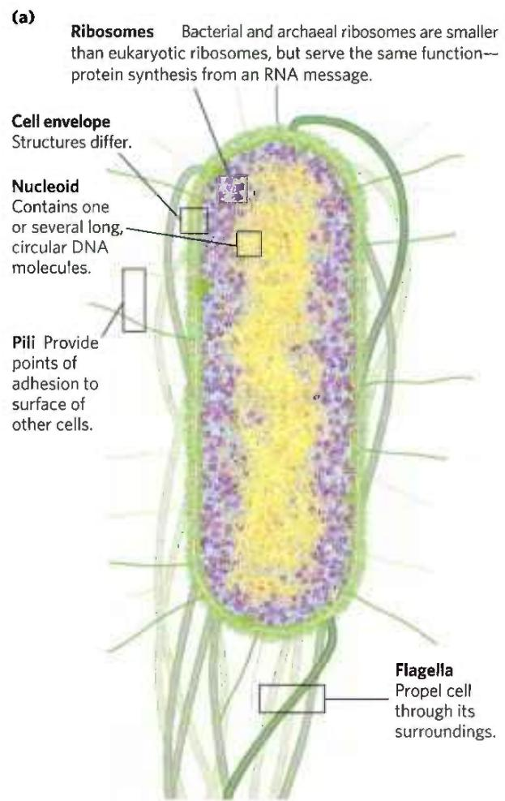  
FIGURE 1-5 Some common structural features of bacterial and archaeal cells. (a) This correct-scale drawing of E. coli serves to illustrate some common features. (b) The cell envelope of gram-positive bacteria is a single membrane with a thick, rigid layer of peptidoglycan on its outside surface. A variety of polysaccharides and other complex polymers are interwoven with the peptidoglycan, and surrounding the whole is a porous "solid layer" composed of glycoproteins. (c) E. coli is gram-negative and has a double membrane. Its outer membrane has a lipopolysaccharide (LPS) on the outer surface and phospholipids on the inner surface. This outer membrane is studded with protein channels (porins) that allow small molecules, but not

## Bacterial and Archaeal Cells Share Common Features but Differ in Important Ways

The best-studied bacterium, Escherichia coli, is a usually harmless inhabitant of the human intestinal tract. The E. coli cell (Fig. 1-5a) is an ovoid about 2 $\mu$ m long and a little less than 1 $\mu$ m in diameter, but other bacteria may be spherical or rod-shaped, and some are substantially larger. E. coli has a protective outer membrane and an inner plasma membrane that encloses the cytoplasm and the nucleoid. Between the inner and outer membranes is a thin but strong layer of a high molecular weight polymer (peptidoglycan) that gives the cell its shape and rigidity. The plasma membrane and the layers outside it constitute the cell envelope. The plasma membranes of bacteria consist of a thin bilayer of lipid molecules penetrated by proteins. Archaeal plasma membranes have a similar architecture, but the lipids can be strikingly different from those of bacteria (see Fig. 10-6).

  
proteins, to diffuse through. The inner (plasma) membrane, made of phospholipids and proteins, is impermeable to both large and small molecules. Between the inner and outer membranes, in the periplasm, is a thin layer of peptidoglycan, which gives the cell shape and rigidity, but does not retain Gram's stain. (d) Archaeal membranes vary in structure and composition, but all have a single membrane surrounded by an outer layer that includes either a peptidoglycan-like structure or a porous protein shell (solid layer), or both. [(a) David S. Goodsell. (b, c, d) Information from S.-V. Albers and B. H. Meyer, Nature Rev. Microbiol. 9:414, 2011, Fig. 2]

Bacteria and archaea have group-specific specializations of their cell envelopes (Fig. 1-5b–d). Some bacteria, called gram-positive because they are colored by Gram's stain (introduced by Hans Christian Gram in 1884), have a thick layer of peptidoglycan outside their plasma membrane but lack an outer membrane. Gram-negative bacteria have an outer membrane composed of a lipid bilayer into which are inserted complex lipopolysaccharides and proteins called porins that provide transmembrane channels for the diffusion of low molecular weight compounds and ions across this outer membrane. The structures outside the plasma membrane of archaea differ from organism to organism, but they, too, have a layer of peptidoglycan or protein that confers rigidity on their cell envelopes.

P2 The cytoplasm of E. coli contains about 15,000 ribosomes, various numbers (from 10 to thousands) of copies of each of 1,000 or so different enzymes, perhaps 1,000 organic compounds of molecular weight less than 1,000 (metabolites and cofactors), and a variety of inorganic ions. The nucleoid contains a single, circular molecule of DNA, and the cytoplasm (like that of most bacteria) contains one or more smaller, circular segments of DNA called plasmids. In nature, some plasmids confer resistance to toxins and antibiotics in the environment. In the laboratory, these DNA segments are especially amenable to experimental manipulation and are powerful tools for genetic engineering (see Chapter 9).

Other species of bacteria, as well as archaea, contain a similar collection of biomolecules, but each species has physical and metabolic specializations related to its environmental niche and nutritional sources. Cyanobacteria, for example, have internal membranes specialized to trap energy from light (see Fig. 20-23). Many archaea live in extreme environments and have biochemical adaptations to survive in extremes of temperature, pressure, or salt concentration. Differences in ribosomal structure gave the first hints that Bacteria and Archaea constituted separate domains. Most bacteria (including E. coli) exist as individual cells, but often associate in biofilms or mats, in which large numbers of cells adhere to each other and to some solid substrate beneath or at an aqueous surface. Cells of some bacterial species (the myxobacteria, for example) show simple social behavior, forming many-celled aggregates in response to signals between neighboring cells.

## Eukaryotic Cells Have a Variety of Membranous Organelles, Which Can Be Isolated for Study

Typical eukaryotic cells (Fig. 1-6) are much larger than bacteria—commonly 5 to 100 $\mu$ m in diameter, with cell volumes a thousand to a million times larger than those of bacteria. The distinguishing characteristics of eukaryotes are the nucleus and a variety of membrane-enclosed organelles with specific functions.

These organelles include mitochondria, the site of most of the energy-extracting reactions of the cell; the endoplasmic reticulum and Golgi complexes, which play central roles in the synthesis and processing of lipids and membrane proteins; peroxisomes, in which very-long-chain fatty acids are oxidized and reactive oxygen species are detoxified; and lysosomes, filled with digestive enzymes to degrade unneeded cellular debris. In addition to these, plant cells contain vacuoles (which store large quantities of organic acids) and chloroplasts (in which sunlight drives the synthesis of ATP (adenosine triphosphate) in the process of photosynthesis). Also present in the cytoplasm of many cells are granules or droplets containing stored nutrients such as starch and fat.

In a major advance in biochemistry, Albert Claude, Christian de Duve, and George Palade developed methods for separating organelles from the cytosol and from each other—an essential step in investigating their structures and functions. In a typical cell fractionation (Fig. 1-7), cells or tissues in solution are gently disrupted by physical shear. This treatment ruptures the plasma membrane but leaves most of the organelles intact. The homogenate is then centrifuged; organelles such as nuclei, mitochondria, and lysosomes differ in size and therefore sediment at different rates.

These methods were used to establish, for example, that lysosomes contain degradative enzymes, mitochondria contain oxidative enzymes, and chloroplasts contain photosynthetic pigments. The isolation of an organelle enriched in a certain enzyme is often the first step in the purification of that enzyme.

## The Cytoplasm Is Organized by the Cytoskeleton and Is Highly Dynamic

Fluorescence microscopy reveals several types of protein filaments crisscrossing the eukaryotic cell, forming an interlocking three-dimensional meshwork, the cytoskeleton. Eukaryotes have three general types of cytoplasmic filaments — actin filaments, microtubules, and intermediate filaments (Fig. 1-8) — differing in width (from about 6 nm to 22 nm), composition, and specific function. All types provide structure and organization to the cytoplasm and shape to the cell. Actin filaments and microtubules also help to produce the motion of organelles or of the whole cell.

Each type of cytoskeletal component consists of simple protein subunits that associate noncovalently to form filaments of uniform thickness. These filaments are not permanent structures; they undergo constant disassembly into their protein subunits and reassembly into filaments. Their locations in cells are not rigidly fixed but may change dramatically with mitosis, cytokinesis, amoeboid motion, or other changes in cell shape. The assembly, disassembly, and location of all types of filaments are regulated by other proteins, which serve to link or bundle the filaments or to move cytoplasmic organelles along

FIGURE 1-6 Eukaryotic cell structure. Schematic illustrations of two major types of eukaryotic cell: (a) a representative animal cell and (b) a representative plant cell. Plant cells are usually 10 to 100 $\mu$ m in diameter — larger than animal cells, which typically range from 5 to 30 $\mu$ m. Structures labeled

the filaments. (Bacteria contain actinlike proteins that serve similar roles in those cells.)

The filaments disassemble and then reassemble elsewhere. Membranous vesicles bud from one organelle and in red are unique to animal cells; those labeled in green are unique to plant cells. Eukaryotic microorganisms (such as protists and fungi) have structures similar to those in plant and animal cells, but many also contain specialized organelles not illustrated here.

fuse with another. Organelles move through the cytoplasm along protein filaments, their motion powered by energy-dependent motor proteins. The endomembrane system (see Fig. 11-4) segregates specific metabolic

(b)

Differential centrifugation

  
FIGURE 1-7 Subcellular fractionation of tissue. A tissue such as liver is first mechanically homogenized to break cells and disperse their contents in an aqueous buffer. The sucrose medium has an osmotic pressure similar to that in organelles, thus balancing diffusion of water into and out of the organelles, which would swell and burst in a solution of lower osmolarity (see Fig. 2-12). The large and small particles in the suspension can be separated by centrifugation at different speeds. Larger particles sediment more rapidly than small particles, and soluble material does not sediment. By careful choice of the conditions of centrifugation, subcellular fractions can be separated for biochemical characterization. [Information from B. Alberts et al., Molecular Biology of the Cell, 2nd edn, p. 165, Garland Publishing, 1989.]

processes and provides surfaces on which certain enzyme-catalyzed reactions occur. Exocytosis and endocytosis, mechanisms of transport (out of and into cells, respectively) that involve membrane fusion and fission, provide paths between the cytoplasm and the surrounding medium, allowing the secretion of substances produced in the cell and uptake of extracellular materials.

  
FIGURE 1-8 The three types of cytoskeletal filaments: actin filaments, microtubules, and intermediate filaments. Cellular structures can be labeled with an antibody (that recognizes a characteristic protein) covalently attached to a fluorescent compound. The stained structures are visible when the cell is viewed with a fluorescence microscope. (a) In this cultured fibroblast cell, bundles of actin filaments are stained red; microtubules, radiating from the cell center, are stained green; and chromosomes (in the nucleus) are stained blue. (b) A new lung cell undergoing mitosis. Microtubules (green), attached to structures called kinetochores (yellow) on the condensed chromosomes (blue), pull the chromosomes to opposite poles, or centrosomes (magenta), of the cell. Intermediate filaments, made of keratin (red), maintain the structure of the cell. [(a) James J. Faust and David G. Capco. (b) Dr. Alexey Khodjakov, Wadsworth Center, New York State Department of Health.]

This structural organization of the cytoplasm is far from random. The motion and positioning of organelles and cytoskeletal elements are under tight regulation, and at certain stages in its life, a eukaryotic cell undergoes dramatic, finely orchestrated reorganizations, such as the events of mitosis. The interactions between the cytoskeleton and organelles are noncovalent, reversible, and subject to regulation in response to various intracellular and extracellular signals.

## Cells Build Supramolecular Structures

Macromolecules and their monomeric subunits differ greatly in size. An alanine molecule is less than 0.5 nm long. P2 A molecule of hemoglobin, the oxygen-carrying protein of erythrocytes (red blood cells), consists of nearly 600 amino acid subunits in four long chains, folded into globular shapes and associated in a structure 5.5 nm in diameter. In turn, proteins are much smaller than ribosomes (about 20 nm in diameter), which are much smaller than organelles such as mitochondria, typically 1 $\mu$ m in diameter. It is a long jump from simple biomolecules to cellular structures that can be seen with the light microscope. Figure 1-9 illustrates the structural hierarchy in cellular organization.

The monomeric subunits of proteins, nucleic acids, and polysaccharides are joined by covalent bonds. In supramolecular complexes, however, macromolecules are held together largely by noncovalent interactions—much weaker, individually, than covalent bonds. Among these noncovalent interactions are hydrogen bonds; ionic interactions (between charged groups); and aggregations of nonpolar groups in aqueous solution, brought about by van der Waals interactions (also called London forces) and by the hydrophobic effect—all of which have energies much smaller than those of covalent bonds. (These noncovalent interactions are described in Chapter 2.) The large numbers of weak interactions between macromolecules in supramolecular complexes stabilize these assemblies, producing their unique structures.

  
FIGURE 1-9 Structural hierarchy in the molecular organization of cells. The organelles and other relatively large components of cells are composed of supramolecular complexes, which in turn are composed of smaller macromolecules and even smaller molecular subunits. For example, the nucleus of this plant cell contains chromatin, a supramolecular complex  
that consists of DNA and basic proteins (histones). DNA is made up of simple monomeric subunits (nucleotides), as are proteins (amino acids). [Information from W. M. Becker and D. W. Deamer, The World of the Cell, 2nd edn, Fig. 2-15, Benjamin/Cummings Publishing Company, 1991.]

## In Vitro Studies May Overlook Important Interactions among Molecules

One approach to understanding a biological process is to study purified molecules in vitro (from the Latin, meaning "in glass"—in the test tube), without interference from other molecules present in the intact cell—that is, in vivo (from the Latin, meaning "in the living"). Although this approach has been remarkably revealing, we must keep in mind that the inside of a cell is quite different from the inside of a test tube. The "interfering" components eliminated by purification may be critical to the biological function or regulation of the molecule that is being purified. For example, in vitro studies of pure enzymes are commonly done at very low enzyme concentrations in thoroughly stirred aqueous solutions. In the cell, an enzyme is dissolved or suspended in the gel-like cytosol with thousands of other proteins, some of which bind to that enzyme and influence its activity. Some enzymes are components of multienzyme complexes in which reactants are channeled from one enzyme to another, never entering the bulk solvent. When all of the known macromolecules in a cell are represented in their known dimensions and concentrations (Fig. 1-10), it is clear that the cytosol is very crowded and that diffusion of macromolecules within the cytosol must be slowed by collisions with other large structures. In short, a given molecule may behave quite differently in the cell than it behaves in vitro. A central challenge of biochemistry is to understand the influences of cellular organization and macromolecular associations on the function of individual enzymes and other biomolecules — to understand function in vivo as well as in vitro.

  
FIGURE 1-10 The crowded cell. This drawing is an accurate representation of the relative sizes and numbers of macromolecules in one small region of an E. coli cell. [© David S. Goodsell 1999.]

## SUMMARY 1.1 Cellular Foundations

All cells share certain fundamental properties: they are bounded by a plasma membrane; have a cytosol containing metabolites, coenzymes, inorganic ions, and enzymes; and have a set of genes contained within a nucleoid (bacteria and archaea) or a nucleus (eukaryotes).

■ The size of cells is limited by the need to deliver oxygen to all parts of the cell.

■ By comparing their DNA sequences, researchers can place organisms in three domains: Bacteria, Archaea, and Eukarya. Archaea and Eukarya are more closely related to each other than either is to Bacteria.

All organisms require a source of energy to perform cellular work. Phototrophs obtain energy from sunlight; chemotrophs obtain energy from chemical fuels.

■ Bacterial and archaeal cells contain cytosol, a nucleoid, and plasmids, all within a cell envelope.

■ Eukaryotes contain a nucleus and a variety of membrane-enclosed organelles with specialized functions, which can be studied in the isolated organelles.

■ Cytoskeletal proteins assemble into long filaments that give cells shape and rigidity and serve as rails along which cellular organelles move throughout the cell. The membrane-bounded compartments constitute an interconnected and dynamic endomembrane system.

■ Supramolecular complexes held together by noncovalent interactions are part of a hierarchy of structures, some visible with the light microscope.

■ Studying isolated cellular components in vitro simplifies the experimental system, but such study may overlook important interactions that occur in the living cell.

## 1.2 Chemical Foundations

Biochemistry aims to explain biological form and function in chemical terms. During the first half of the twentieth century, parallel biochemical investigations of glucose breakdown in yeast and in animal muscle cells revealed remarkable chemical similarities between these two apparently very different cell types; for example, the breakdown of glucose in yeast and in muscle cells involved the same 10 chemical intermediates and the same 10 enzymes. Subsequent studies of many other biochemical processes in many different organisms have confirmed the generality of this observation, neatly summarized in 1954 by the biochemist Jacques Monod: "What is true of E. coli is true of the elephant." The current understanding that all organisms share a common evolutionary origin is based in part on this observed universality of chemical intermediates and transformations, often termed "biochemical unity."

Fewer than 30 of the more than 90 naturally occurring chemical elements are known to be essential to organisms. Most of the elements in living matter have a relatively low atomic number; only three have an atomic number above that of selenium, 34 (Fig. 1-11). The four most abundant elements in living organisms, in terms of percentage of total number of atoms, are hydrogen, oxygen, nitrogen, and carbon, which together make up more than $99\%$ of the mass of most cells. They are the lightest elements capable of efficiently forming one, two, three, and four bonds, respectively; in general, the lightest elements form the strongest bonds. The trace elements represent a miniscule fraction of the weight of the human body, but all are essential to life, usually because they are essential to the function of specific proteins, including many enzymes. The oxygen-transporting capacity of the hemoglobin molecule, for example, is absolutely dependent on four iron ions that make up only $0.3\%$ of the molecule's mass.

## Biomolecules Are Compounds of Carbon with a Variety of Functional Groups

The chemistry of living organisms is organized around carbon, which accounts for more than half of the dry weight of cells. Carbon can form single bonds with hydrogen atoms and can form both single bonds and double bonds with oxygen and nitrogen atoms (Fig. 1-12). Of greatest significance in biology is the ability of carbon atoms to form very stable single bonds with up to four other carbon atoms. Two carbon atoms also can share two (or three) electron pairs, thus forming double (or triple) bonds.

FIGURE 1-11 Elements essential to animal life and health. Bulk elements (shaded light red) are structural components of cells and tissues and are required in the diet in gram quantities daily. For trace elements (shaded yellow), the requirements are much smaller: for humans, a few milligrams per day of Fe, Cu, and Zn, and even less of the others. The elemental requirements for plants and microorganisms are similar to those shown here; the ways in which they acquire these elements vary.  
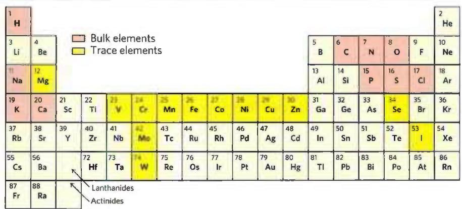

FIGURE 1-12 Versatility of carbon bonding. Carbon can form covalent single, double, and triple bonds (all bonds in red), particularly with other carbon atoms. Triple bonds are rare in biomolecules.

<table><tr><td> $\dot{C} + H \longrightarrow \dot{C}H$ </td><td> $-C-H$ </td><td> $\dot{C} + \dot{N}: \longrightarrow \dot{C}: \dot{N}$ </td><td> $\dot{C}=N-$ </td></tr><tr><td> $\dot{C} + \dot{O}: \longrightarrow \dot{C}: \ddot{O}$ </td><td> $-C-O-$ </td><td> $\dot{C} + \dot{C} \longrightarrow \dot{C}: \dot{C}$ </td><td> $-\dot{C}-\dot{C}-$ </td></tr><tr><td> $\dot{C} + \dot{O}: \longrightarrow \dot{C}: \dot{O}:$ </td><td> $\dot{C}-O$ </td><td> $\dot{C} + \dot{C} \longrightarrow \dot{C}: \dot{C}$ </td><td> $\dot{C}=C$ </td></tr><tr><td> $\dot{C} + \dot{N}: \longrightarrow \dot{C}: \dot{N}:$ </td><td> $-\dot{C}-N$ </td><td> $\dot{C} + \dot{C} \longrightarrow \dot{C}: \ddot{C}$ </td><td> $-C\equiv C-$ </td></tr></table>

The four single bonds that can be formed by a carbon atom project from the nucleus to the four apices of a tetrahedron (Fig. 1-13), with an angle of about $109.5^{\circ}$ between any two bonds and an average bond length of $0.154\mathrm{nm}$ . There is free rotation around each single bond, unless very large or highly charged groups are attached to both carbon atoms, in which case rotation may be restricted. A double bond is shorter (about $0.134\mathrm{nm}$ ) and rigid, and it allows only limited rotation about its axis.

Covalently linked carbon atoms in biomolecules can form linear chains, branched chains, and cyclic structures. It seems likely that the bonding versatility of carbon, with itself and with other elements, was a major factor in the selection of carbon compounds for the molecular machinery of cells during the origin and evolution of living organisms. No other chemical element can form molecules of such widely different sizes, shapes, and composition.

Most biomolecules can be regarded as derivatives of hydrocarbons, with hydrogen atoms replaced by a variety of functional groups that confer specific chemical properties on the molecule, forming various families of organic compounds. Typical of these are alcohols, which have one or more hydroxyl groups; amines, with amino groups; aldehydes and ketones, with carbonyl groups; and carboxylic acids, with carboxyl groups (Fig. 1-14). Many biomolecules are polyfunctional, containing two or more types of functional groups (Fig. 1-15), each with its own chemical characteristics and reactions. The chemical "personality" of a compound is determined by the chemistry of its functional groups and their disposition in three-dimensional space.

## Cells Contain a Universal Set of Small Molecules

Dissolved in the aqueous phase (cytosol) of all cells is a collection of perhaps several thousand different small organic molecules ( $M_{\mathrm{r}} \sim 100$ to $\sim 500$ ), with intracellular concentrations ranging from nanomolar to $>10~\mathrm{mm}$ (see Fig. 13-31). (See Box 1-1 for an explanation of the various ways of referring to molecular weight.) These are the central metabolites in the major pathways occurring in nearly every cell—the metabolites and pathways that have been conserved throughout the course of evolution. This collection of molecules includes the common amino acids, nucleotides, sugars and their phosphorylated derivatives, and mono-, di-, and tricarboxylic acids. The molecules may be polar or charged and most are water-soluble. They are trapped in the cell because the plasma membrane is impermeable to them, although specific membrane transporters can catalyze the movement of some molecules into and out of the cell or between compartments in eukaryotic cells. The universal occurrence of the same set of compounds in living cells reflects the evolutionary conservation of metabolic pathways that developed in the earliest cells.

There are other small biomolecules, specific to certain types of cells or organisms. For example, vascular plants contain, in addition to the universal set, small molecules called secondary metabolites, which play roles specific to plant life. These metabolites include compounds that give plants their characteristic scents and colors, and compounds such as morphine, quinine, nicotine, and caffeine that are valued for their physiological effects on humans but have other purposes in plants.

  
FIGURE 1-13 Geometry of carbon bonding. (a) Carbon atoms have a characteristic tetrahedral arrangement of their four single bonds. (b) Carbon-carbon single bonds have freedom of rotation, as shown for the  
compound ethane (CH₃—CH₃). (c) Double bonds are shorter and do not allow free rotation. The two doubly bonded carbons and the atoms designated A, B, X, and Y all lie in the same rigid plane.

The entire collection of small molecules in a given cell under a specific set of conditions has been called the metabolome, in parallel with the term "genome." Metabolomics is the systematic characterization of the metabolome under very specific conditions (such as following administration of a drug, or a biological signal such as insulin).

## Macromolecules Are the Major Constituents of Cells

Many biological molecules are macromolecules, polymers with molecular weights above \~5,000 that are assembled from relatively simple precursors (Fig. 1-16). Shorter polymers are called oligomers (Greek oligos, "few"). Proteins, nucleic acids, and polysaccharides are macromolecules composed of monomers with molecular weights of 500 or less. Synthesis of macromolecules is a major energy-consuming activity of cells. Macromolecules themselves may be further assembled into supramolecular complexes, forming functional units such as ribosomes. Table 1-1 shows the major classes of biomolecules in an E. coli cell.

FIGURE 1-14 Some common functional groups of biomolecules. Functional groups are screened with a color typically used to represent the element that characterizes the group: gray for C, red for O, blue for N, yellow for S, and orange for P. In this figure and throughout the book, we use R to represent "any substituent." It may be as simple as a hydrogen atom, but typically it is a carbon-containing group. When two or more substituents are shown in a molecule, we designate them $R^1$ , $R^2$ , and so forth.

  
FIGURE 1-15 Several common functional groups in a single biomolecule. Acetyl-coenzyme A (often abbreviated as acetyl-CoA) is a carrier of acetyl groups in some enzymatic reactions. Its functional groups are screened in the structural formula. In the space-filling model, N is blue,  
C is black, P is orange, O is red, and H is white. The yellow atom at the left is the sulfur of the critical thioester bond between the acetyl moiety and coenzyme A. [Acetyl-CoA structure data from PDB ID 1DM3, Y. Modis and R. K. Wierenga, J. Mol. Biol. 297:1171, 2000.]

Proteins, long polymers of amino acids, constitute the largest mass fraction (besides water) of a cell. Some proteins have catalytic activity and function as enzymes; others serve as structural elements, signal receptors, or transporters that carry specific substances into or out of cells. Proteins are perhaps the most versatile of all biomolecules; a catalog of their many functions would be very long. The sum of all the proteins functioning in a given cell is the cell's proteome, and proteomics is the systematic characterization of this protein complement under a specific set of conditions. The nucleic acids, DNA and RNA, are polymers of nucleotides. They store and transmit genetic information, and some RNA molecules have structural and catalytic roles in supramolecular complexes. The genome is the entire sequence of a cell's DNA (or in the case of RNA viruses, its RNA), and genomics is the characterization of the structure, function, evolution, and mapping of genomes.

The polysaccharides, polymers of simple sugars such as glucose, have three major functions: as energy-rich fuel stores, as rigid structural components of cell walls (in plants and bacteria), and as extracellular recognition elements that bind to proteins on other cells. Shorter polymers of sugars (oligosaccharides) attached to proteins or lipids at the cell surface serve as specific cellular signals. A cell's glycome is its entire complement of carbohydrate-containing molecules. The lipids,

## BOX 1-1

## Molecular Weight, Molecular Mass, and Their Correct Units

There are two common (and equivalent) ways to describe molecular mass; both are used in this text. The first is molecular weight, or relative molecular mass, denoted $M_{r}$ . The molecular weight of a substance is defined as the ratio of the mass of a molecule of that substance to one-twelfth the mass of an atom of carbon-12 ( $^{12}C$ ). Since $M_{r}$ is a ratio, it is dimensionless — it has no associated units. The second is molecular mass, denoted m. This is simply the mass of one molecule, or the molar mass divided by Avogadro's number. The molecular mass, m, is expressed in daltons (abbreviated Da). One dalton is equivalent to one-twelfth the mass of an atom of carbon-12; a kilodalton (kDa) is 1,000 daltons; a megadalton (MDa) is 1 million daltons.

Consider, for example, a molecule with a mass 1,000 times that of water. We can say of this molecule either $M_r = 18,000$ or $m = 18,000$ daltons. We can also describe it as an "18 kDa molecule." However, the expression $M_r = 18,000$ daltons is incorrect.

Another convenient unit for describing the mass of a single atom or molecule is the atomic mass unit (formerly amu, now commonly denoted u). One atomic mass unit (1 u) is defined as one-twelfth the mass of an atom of carbon-12. Since the experimentally measured mass of an atom of carbon-12 is $1.9926 \times 10^{-23}$ g, $1u = 1.6606 \times 10^{-24}$ g. The atomic mass unit is convenient for describing the mass of a peak observed by mass spectrometry (see Chapter 3, p. 93).

(a) Some of the amino acids of proteins  
  
FIGURE 1-16 The organic compounds from which most cellular materials are constructed: the ABCs of biochemistry. Shown here are (a) 4 of the 20 amino acids from which all proteins are built (the side chains are shaded light red); (b) 3 of the 5 nitrogenous bases, the

<table><tr><td colspan="3">TABLE 1-1 Molecular Components of an E. coli Cell</td></tr><tr><td></td><td>Percentage of total weight of cell</td><td>Approximate number of different molecular species</td></tr><tr><td>Water</td><td>70</td><td>1</td></tr><tr><td>Proteins</td><td>15</td><td>3,000</td></tr><tr><td>Nucleic acids</td><td></td><td></td></tr><tr><td>DNA</td><td>1</td><td>1-4</td></tr><tr><td>RNA</td><td>6</td><td>&gt;3,000</td></tr><tr><td>Polysaccharides</td><td>3</td><td>20</td></tr><tr><td>Lipids</td><td>2</td><td> $50^a$ </td></tr><tr><td>Monomeric subunits and intermediates</td><td>2</td><td>2,600</td></tr><tr><td>Inorganic ions</td><td>1</td><td>20</td></tr><tr><td colspan="3">Source: A. C. Guo et al., Nucleic Acids Res. 41:D625, 2013. $^a$ If all permutations and combinations of fatty acid substituents are considered,this number is much larger.</td></tr></table>

two 5-carbon sugars, and the phosphate ion from which all nucleic acids are built; (c) 4 components of membrane lipids (including phosphate); and (d) D-glucose, the simple sugar from which most carbohydrates are derived.

water-insoluble hydrocarbon derivatives, serve as structural components of membranes, energy-rich fuel stores, pigments, and intracellular signals. The lipid-containing molecules in a cell constitute its lipidome.

Proteins, polynucleotides, and polysaccharides have large numbers of monomeric subunits and thus high molecular weights—in the range of 5,000 to more than 1 million for proteins, up to several billion for DNA, and in the millions for polysaccharides such as starch. Individual lipid molecules are much smaller ( $M_{r}$ 750 to 1,500) and are not classified as macromolecules, but they can associate noncovalently into very large structures. Cellular membranes are built of enormous noncovalent aggregates of lipid and protein molecules.

Given their characteristic information-rich subunit sequences, proteins and nucleic acids are often referred to as informational macromolecules. Some oligosaccharides, as noted above, also serve as informational molecules.

## Three-Dimensional Structure Is Described by Configuration and Conformation

The covalent bonds and functional groups of a biomolecule are, of course, central to its function, but so also is the arrangement of the molecule's constituent atoms in three-dimensional space—its stereochemistry. Carbon-containing compounds commonly exist as stereoisomers, molecules with the same chemical bonds and same chemical formula but different configuration, the fixed spatial arrangement of atoms. Interactions between biomolecules are typically stereospecific, requiring specific configurations in the interacting molecules.

Figure 1-17 shows three ways to illustrate the stereochemistry, or configuration, of simple molecules. The perspective diagram specifies stereochemistry unambiguously, but bond angles and center-to-center bond lengths are better represented with ball-and-stick models. In space-filling models, the radius of each "atom" is proportional to its van der Waals radius, and the contours of the model define the space occupied by the molecule (the volume of space from which atoms of other molecules are excluded).

Configuration is conferred by the presence of either (1) double bonds, around which there is little or no freedom of rotation, or (2) chiral centers, around which substituent groups are arranged in a specific orientation. The identifying characteristic of stereoisomers is that they cannot be interconverted without the temporary breaking of one or more covalent bonds. Figure 1-18a shows the configurations of maleic acid and its isomer, fumaric acid.

These compounds are geometric isomers, or cis-trans isomers; they differ in the arrangement of their substituent groups with respect to the nonrotating double bond (Latin cis, "on this side"—groups on the same side of the double bond; trans, "across"—groups on opposite sides).

  
(a)

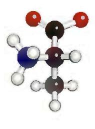  
(b)

  
(c)  
FIGURE 1-17 Representations of molecules. Three ways to represent the structure of the amino acid alanine (shown here in the ionic form found at neutral pH). (a) Structural formula in perspective form: a solid wedge ( $\rightarrow$ ) represents a bond in which the atom at the wide end projects out of the plane of the paper, toward the reader; a dashed wedge ( $\rightarrow$ ) represents a bond extending behind the plane of the paper. (b) Ball-and-stick model, showing bond angles and relative bond lengths. (c) Space-filling model, in which each atom is shown with its correct relative van der Waals radius.

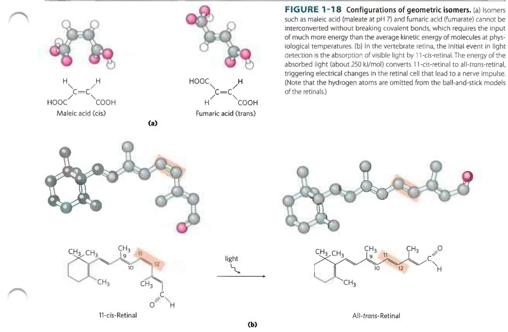

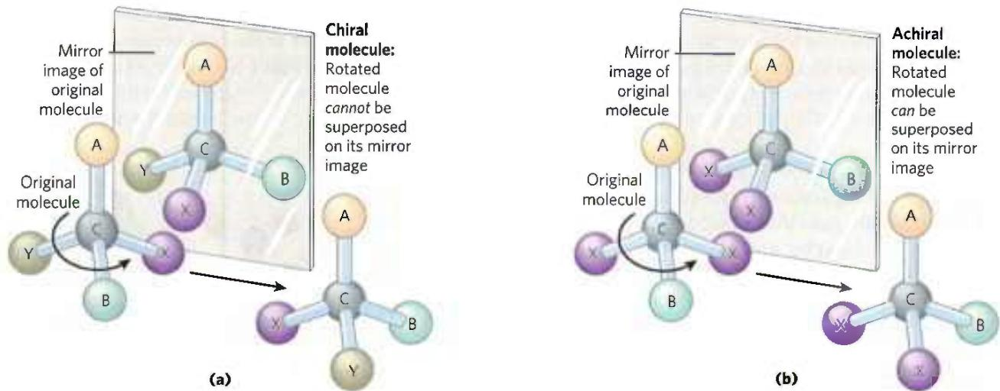  
FIGURE 1-19 Molecular asymmetry: chiral and achiral molecules. (a) When a carbon atom has four different substituent groups (A, B, X, Y), they can be arranged in two ways that represent nonsuperposable mirror images of each other (enantiomers). This asymmetric carbon atom is called a chiral atom or chiral center. (b) When a tetrahedral carbon has only three  
dissimilar groups (that is, the same group occurs twice), only one configuration is possible and the molecule is symmetric, or achiral. In this case, the molecule is superposable on its mirror image: the molecule on the left can be rotated counterclockwise (when looking down the vertical bond from A to C) to create the molecule in the mirror.

Maleic acid (maleate at the neutral pH of cytoplasm) is the cis isomer, and fumaric acid (fumarate) is the trans isomer; each is a well-defined compound that can be separated from the other, and each has its own unique chemical properties. A binding site (on an enzyme, for example) that is complementary to one of these molecules would not be complementary to the other, which explains why the two compounds have distinct biological roles despite their similar chemical makeup. The visual pigment in the vertebrate eye, rhodopsin, contains retinal, a vitamin A-derived lipid (Fig. 1-18b). In the primary event of vision, light converts one isomer of retinal to another, triggering a neuronal signal to the brain (see Fig. 12-19).

In the second type of stereoisomer, four different substituents bonded to a tetrahedral carbon atom may be arranged in two different ways in space—that is, have two configurations—yielding two stereoisomers that have similar or identical chemical properties but differ in certain physical and biological properties. A carbon atom with four different substituents is said to be asymmetric, and asymmetric carbons are called chiral centers (Greek chiros, "hand"; some stereoisomers are related structurally as the right hand is to the left hand). A molecule with only one chiral carbon can have two stereoisomers; when two or more (n) chiral carbons are present, there can be $2^{n}$ stereoisomers. Stereoisomers that are mirror images of each other are called enantiomers (Fig. 1-19). Pairs of stereoisomers that are not mirror images of each other are called diastereomers (Fig. 1-20).

As the biologist, microbiologist, and chemist Louis Pasteur first observed in 1843 (Box 1-2), enantiomers have nearly identical chemical reactivities but differ in a characteristic physical property: optical activity. In separate solutions, two enantiomers rotate the

  
FIGURE 1-20 Enantiomers and diastereomers. There are four different stereoisomers of 2,3-disubstituted butane (n=2 asymmetric carbons, hence $2^{n}=4$ stereoisomers). Each is shown in a box as a perspective formula and a ball-and-stick model, which has been rotated to show all of the groups.  
Two pairs of stereoisomers are mirror images of each other, or enantiomers. All other possible pairs are not mirror images, and so are diastereomers. [Information from F. Carroll, Perspectives on Structure and Mechanism in Organic Chemistry, p. 63, Brooks/Cole Publishing Co., 1998.]

Counterclockwise (S)  

## Louis Pasteur and Optical Activity: In Vino, Veritas

Louis Pasteur encountered the phenomenon of optical activity in 1843, during his investigation of the crystalline sediment that accumulated in wine casks (a form of tartaric acid called paratartaric acid — also called racemic acid, from Latin racemus, "bunch of grapes"). He used fine forceps to separate two types of crystals identical in shape but mirror images of each other. Both types proved to have all the chemical properties of tartaric acid, but in solution one type rotated plane-polarized light to the left (levorotatory), whereas the other rotated it to the right (dextro-rotatory). Pasteur later described the experiment and its interpretation:

  
Louis Pasteur 1822–1895
[Granger, NYC — All rights reserved.]

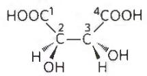  
(2R,3R)-Tartaric acid (dextrorotatory)

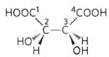  
(2S,3S)-Tartaric acid (levorotatory)

FIGURE 1 Pasteur separated crystals of two stereoisomers of tartaric acid and showed that solutions of the separated forms rotated plane-polarized light to the same extent but in opposite directions. These dextrorotatory and levorotatory forms were later shown to be the $(R,R)$ and $(S,S)$ isomers represented here.

plane of plane-polarized light in opposite directions, but an equimolar solution of the two enantiomers (a racemic mixture) shows no optical rotation. Compounds without chiral centers do not rotate the plane of plane-polarized light.

KEY CONVENTION Given the importance of stereochemistry in reactions between biomolecules (see below), biochemists must name and represent the structure of each biomolecule so that its stereochemistry is unambiguous. For compounds with more than one chiral center, the most useful system of nomenclature is the RS system. In this system, each group attached to a chiral carbon is assigned a priority. The priorities of some common substituents are

$$
\begin{array}{r l} - \mathrm{OCH} _ {3} > - \mathrm{OH} > - \mathrm{NH} _ {2} > - \mathrm{COOH} > \\ & - \mathrm{CHO} > - \mathrm{CH} _ {2} \mathrm{OH} > - \mathrm{CH} _ {3} > - \mathrm{H} \end{array}
$$

For naming in the RS system, the chiral atom is viewed with the group of lowest priority (4 in the following diagram) pointing away from the viewer. If the priority of the other three groups (1 to 3) decreases in clockwise order, the configuration is (R) (Latin rectus,

In isomeric bodies, the elements and the proportions in which they are combined are the same, only the arrangement of the atoms is different . . . We know, on the one hand, that the molecular arrangements of the two tartaric acids are asymmetric, and, on the other hand, that these arrangements are absolutely identical, excepting that they exhibit asymmetry in opposite directions. Are the atoms of the dextro acid grouped in the form of a right-handed spiral, or are they placed at the apex of an irregular tetrahedron, or are they disposed according to this or that asymmetric arrangement? We do not know.\*

Now we do know. In 1951, x-ray crystallographic studies confirmed that the levorotatory and dextrorotatory forms of tartaric acid are mirror images of each other at the molecular level and established the absolute configuration of each (Fig. 1). The same approach has been used to demonstrate that although the amino acid alanine has two stereoisomeric forms (designated D and L), alanine in proteins exists exclusively in one form (the L isomer; see Chapter 3).

\* From Pasteur's lecture to the Société Chimique de Paris in 1883, quoted in R. DuBos, Louis Pasteur: Free Lance of Science, p. 95. New York: Charles Scribner's Sons, 1976.

"right"); if counterclockwise, the configuration is (S) (Latin sinister, "left"). In this way, each chiral carbon is designated either (R) or (S), and the inclusion of these designations in the name of the compound provides an unambiguous description of the stereochemistry at each chiral center.

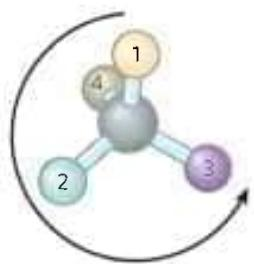

Another naming system for stereoisomers, the D and L system, is described in Chapter 3. A molecule with a single chiral center can be named unambiguously by either system, as shown here. The two naming systems are based on different criteria, so no general correlation can be made between, say, the L isomer and the (S) isomer seen in this example.

$$
\begin{array}{c} \mathrm{CHO} \\ \mathrm{HO} - \mathrm{C} - \mathrm{H} \\ \mathrm{CH} _ {2} \mathrm{OH} \\ \text { L   -   G   l   y   c   e   r   a   l   d   e   h   y   d   e } \end{array} \equiv \begin{array}{c} \mathrm{CHO} _ {(2)} \\ \mathrm{H} _ {(4)} - \mathrm{OH} _ {(1)} \\ \mathrm{CH} _ {2} \mathrm{OH} _ {(3)} \end{array} (\text { S }) - \text { G   l   y   c   e   r   a   l   d   e   h   y   d   e }
$$

Distinct from configuration is molecular conformation, the spatial arrangement of substituent groups that, without breaking any bonds, are free to assume different positions in space because of the freedom of rotation about single bonds. In the simple hydrocarbon ethane, for example, there is nearly complete freedom of rotation around the C—C bond. Many different, interconvertible conformations of ethane are possible, depending on the degree of rotation (Fig. 1-21). Two conformations are of special interest: the staggered, which is more stable than all others and thus predominates, and the eclipsed, which is the least stable. We cannot isolate either of these conformational forms, because they are freely interconvertible. However, when one or more of the hydrogen atoms on each carbon is replaced by a functional group that is either very large or electrically charged, freedom of rotation around the C—C bond is hindered. This limits the number of stable conformations of the ethane derivative.

## Interactions between Biomolecules Are Stereospecific

P2 When biomolecules interact, the "fit" between them is often stereochemically correct; they are complementary. The three-dimensional structure of biomolecules large and small—the combination of configuration and conformation—is of the utmost importance in their biological interactions: reactant with its enzyme, hormone with its receptor, antigen with its specific antibody, for example (Fig. 1-22). The study of biomolecular stereochemistry, with precise physical methods, is an important part of modern research on cell structure and biochemical function.

  
FIGURE 1-21 Conformations. Many conformations of ethane are possible because of freedom of rotation around the C—C bond. In the ball-and-stick model, when the front carbon atom (as viewed by the reader) with its three attached hydrogens is rotated relative to the rear carbon atom, the potential energy of the molecule rises to a maximum in the fully eclipsed conformation (torsion angle 0°, 120°, and so on), then falls to a minimum in the fully staggered conformation (torsion angle 60°, 180°, and so on). Because the energy differences are small enough to allow rapid interconversion of the two forms (millions of times per second), the eclipsed and staggered forms cannot be separately isolated.

In living organisms, chiral molecules are usually present in only one of their chiral forms. For example, the amino acids in proteins occur only as their L isomers; glucose occurs only as its D isomer. (The conventions for naming stereoisomers of the amino acids are described in Chapter 3; those for sugars, in Chapter 7. The RS system, described on p. 17, is the most useful for some biomolecules.) In contrast, when a compound with an asymmetric carbon atom is chemically synthesized in the laboratory, the reaction usually produces both possible chiral forms: a mixture of the D and L forms, for example. Living cells produce only one chiral form of a biomolecule because the enzymes that synthesize that molecule are also chiral.

Stereospecificity, the ability to distinguish between stereoisomers, is a property of enzymes and other proteins and a characteristic feature of biochemical interactions. If the binding site on a protein is complementary to one isomer of a chiral compound, it will not be complementary to the other isomer, for the same reason that a left-handed glove does not fit a right hand. Two striking examples of the ability of biological systems to distinguish stereoisomers are shown in Figure 1-23.

The common classes of chemical reactions encountered in biochemistry are described in Chapter 13, as an introduction to the reactions of metabolism.

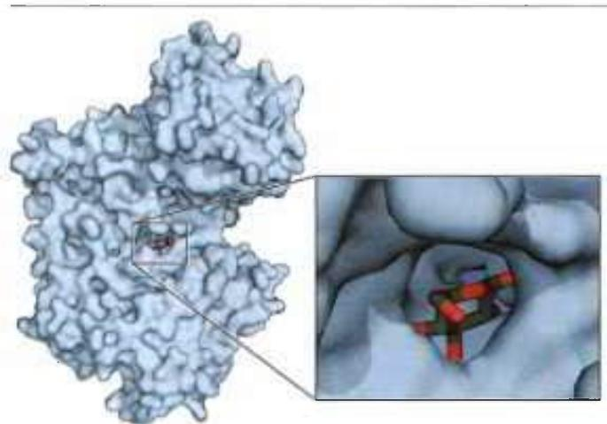  
FIGURE 1-22 Complementary fit between a macromolecule and a small molecule. A glucose molecule fits into a pocket on the surface of the enzyme hexokinase and is held in this orientation by several noncovalent interactions between the protein and the sugar. This representation of the hexokinase molecule is produced with software that can calculate the shape of the outer surface of a macromolecule, defined either by the van der Waals radii of all the atoms in the molecule or by the "solvent exclusion volume," the volume that a water molecule cannot penetrate. [Data from PDB ID 3B8A, P. Kuser et al., Proteins 72:731, 2008.]

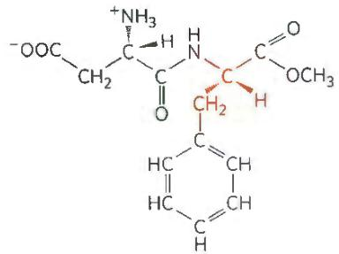  
L-Aspartyl-L-phenylalanine methyl ester (aspartame) (sweet)

  
(a)  
L-Aspartyl-D-phenylalanine methyl ester (bitter)

  
(S)-Citalopram (therapeutically active)

(b)  
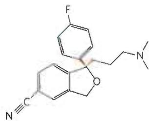  
(R)-Citalopram (therapeutically inactive)

## SUMMARY 1.2 Chemical Foundations

Because of its bonding versatility, carbon can produce a broad array of carbon-carbon skeletons with a variety of functional groups; these groups give biomolecules their biological and chemical personalities.

A nearly universal set of several thousand small molecules is found in living cells; the interconversions of these molecules in the central metabolic pathways have been conserved in evolution.

■ Proteins and nucleic acids are macromolecules—long, linear polymers of simple monomeric subunits; their sequences contain the information that gives each molecule its three-dimensional structure and its biological functions.

■ Molecular configuration can be changed only by breaking and re-forming covalent bonds. For a carbon atom with four different substituents (a chiral carbon), the substituent groups can be arranged in two different ways, generating stereoisomers with distinct properties. Only one stereoisomer is biologically active. Molecular conformation is the position of atoms in space that can be changed by rotation about single bonds, without covalent bonds being broken.

■ Interactions between biological molecules are often stereospecific: there is a close fit between complementary structures in the interacting molecules.

## 1.3 Physical Foundations

Living cells and organisms must perform work to stay alive and to reproduce themselves. The synthetic reactions that occur within cells, like the synthetic processes

FIGURE 1-23 Stereoisomers have different effects in humans. (a) Aspartame, the artificial sweetener sold under the trade name Nutra-Sweet, is easily distinguishable by taste receptors from its bitter-tasting stereoisomer, although the two differ only in the configuration at one of the two chiral carbon atoms. (b) The antidepressant medication citalopram (trade name Celexa), a selective serotonin reuptake inhibitor, is a racemic mixture of these two stereoisomers, but only (S)-citalopram has the therapeutic effect. A stereochemically pure preparation of (S)-citalopram (escitalopram oxalate) is sold under the trade name Lexapro. As you might predict, the effective dose of Lexapro is one-half the effective dose of Celexa.

in any factory, require the input of energy. Energy input is also needed in the motion of a bacterium or an Olympic sprinter, in the flashing of a firefly or the electrical discharge of an eel. And the storage and expression of information require energy, without which structures that are rich in information inevitably become disordered and meaningless.

In the course of evolution, cells have developed highly efficient mechanisms for coupling the energy obtained from sunlight or chemical fuels to the many energy-requiring processes they must carry out. One goal of biochemistry is to understand, in quantitative and chemical terms, the means by which energy is extracted, stored, and channeled into useful work in living cells. We can consider cellular energy conversions—like all other energy conversions—in the context of the laws of thermodynamics. For a more extensive discussion of cellular thermodynamics, see Chapter 13.

## Living Organisms Exist in a Dynamic Steady State, Never at Equilibrium with Their Surroundings

The molecules and ions contained within a living organism differ in kind and in concentration from those in the organism's surroundings. A paramecium in a pond, a shark in the ocean, a bacterium in the soil, an apple tree in an orchard—all are different in composition from their surroundings and, once they have reached maturity, maintain a more or less constant composition in the face of a constantly changing environment.

Although the characteristic composition of an organism changes little through time, the population of molecules within the organism is far from static. Small molecules, macromolecules, and supramolecular complexes are continuously synthesized and broken down in chemical reactions that involve a constant flux of mass and energy through the system. The hemoglobin molecules carrying oxygen from your lungs to your brain at this moment were synthesized within the past month; by next month they will have been degraded and entirely replaced by new hemoglobin molecules. The glucose you ingested with your most recent meal is now circulating in your bloodstream; before the day is over these particular glucose molecules will have been converted into something else—carbon dioxide or fat, perhaps—and will have been replaced with a fresh supply of glucose, so that your blood glucose concentration is more or less constant over the whole day. The amounts of hemoglobin and glucose in the blood remain nearly constant because the rate of synthesis or intake of each just balances the rate of its breakdown, consumption, or conversion into some other product. The constancy of concentration is the result of a dynamic steady state, a steady state that is far from equilibrium. Maintaining this steady state requires the constant investment of energy; when a cell can no longer obtain energy, it dies and begins to decay toward equilibrium with its surroundings. We consider below exactly what is meant by “steady state” and “equilibrium.”

## Organisms Transform Energy and Matter from Their Surroundings

For chemical reactions occurring in solution, we can define a system as all the constituent reactants and products, the solvent that contains them, and the immediate atmosphere—in short, everything within a defined region of space. The system and its surroundings together constitute the universe. If the system exchanges neither matter nor energy with its surroundings, it is said to be isolated. If the system exchanges energy but not matter with its surroundings, it is a closed system; if it exchanges both energy and matter with its surroundings, it is an open system.

A living organism is an open system; it exchanges both matter and energy with its surroundings. Organisms obtain energy from their surroundings in two ways: (1) they take up chemical fuels (such as glucose) from the environment and extract energy by oxidizing them (see Box 1-3, Case 2); or (2) they absorb energy from sunlight.

The first law of thermodynamics describes the principle of the conservation of energy: in any physical or chemical change, the total amount of energy in the universe remains constant, although the form of the energy may change. This means that while energy is "used" by a system, it is not "used up"; rather, it is converted from one form into another—from potential energy in chemical bonds, say, into kinetic energy of heat and motion. Cells are consummate transducers of energy, capable of interconverting chemical, electromagnetic, mechanical, and osmotic energy with great efficiency (Fig. 1-24).

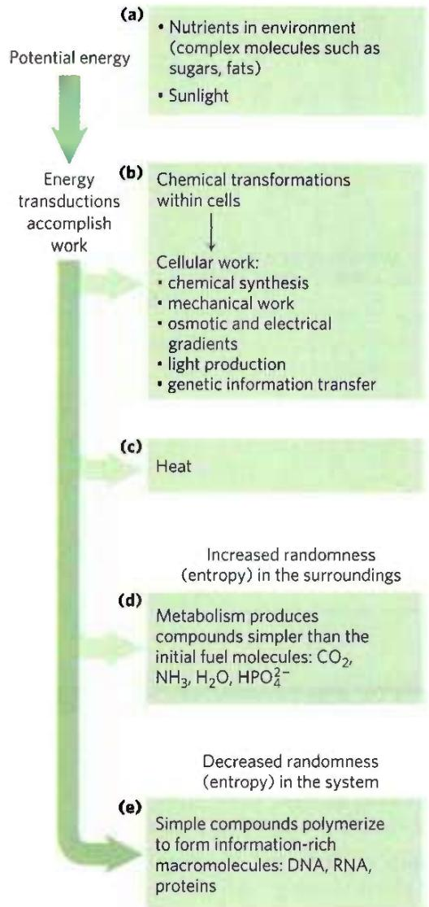  
FIGURE 1-24 Some energy transformations in living organisms. As metabolic energy is spent to do cellular work, the randomness of the system plus surroundings (expressed quantitatively as entropy) increases as the potential energy of complex nutrient molecules decreases. (a) Living organisms extract energy from their surroundings; (b) convert some of it into useful forms of energy to produce work; (c) return some energy to the surroundings as heat; and (d) release end-product molecules that are less well organized than the starting fuel, increasing the entropy of the universe. One effect of all these transformations is (e) increased order (decreased randomness) in the system in the form of complex macromolecules.

P3 Nearly all living organisms derive their energy, directly or indirectly, from the radiant energy of sunlight. In the photoautotrophs, light-driven splitting of water during photosynthesis releases its electrons for the reduction of $CO_{2}$ and the release of $O_{2}$ into the atmosphere:

$$
\begin{array}{c} \text {   light   } \\ 6 \mathrm{CO} _ {2} + 6 \mathrm{H} _ {2} \mathrm{O} \xrightarrow {\quad \quad \quad} \mathrm{C} _ {6} \mathrm{H} _ {1 2} \mathrm{O} _ {6} + 6 \mathrm{O} _ {2} \\ (\text {   light - driven   reduction   of   CO } _ {2}) \end{array}
$$

Nonphotosynthetic organisms (chemotrophs) obtain the energy they need by oxidizing the energy-rich products of photosynthesis stored in plants, then passing the electrons thus acquired to atmospheric $O_{2}$ to form water, $CO_{2}$ , and other end products, which are recycled in the environment:

$$
\begin{array}{l} \mathrm{C} _ {6} \mathrm{H} _ {1 2} \mathrm{O} _ {6} + 6 \mathrm{O} _ {2} \longrightarrow 6 \mathrm{CO} _ {2} + 6 \mathrm{H} _ {2} \mathrm{O} + \text { energy } \\ \text {(energy - yielding oxidation of glucose)} \end{array}
$$

Thus autotrophs and heterotrophs participate in global cycles of $O_{2}$ and $CO_{2}$ , driven ultimately by sunlight, making these two large groups of organisms interdependent. Virtually all energy transductions in cells can be traced to this flow of electrons from one molecule to another, in a “downhill” flow from higher to lower electrochemical potential; as such, this is formally analogous to the flow of electrons in a battery-driven electric circuit. P3 All these reactions involved in electron flow are oxidation-reduction reactions: one reactant is oxidized (loses electrons) as another is reduced (gains electrons).

## Creating and Maintaining Order Requires Work and Energy

As we've noted, DNA, RNA, and proteins are informational macromolecules; the precise sequence of their monomeric subunits contains information, just as the letters in this sentence do. In addition to using chemical energy to form the covalent bonds between these subunits, the cell must invest energy to order the subunits in their correct sequence. It is extremely improbable that amino acids in a mixture would spontaneously condense into a single type of protein, with a unique sequence. This would represent increased order in a population of molecules; but according to the second law of thermodynamics, the tendency in nature is toward ever-greater disorder in the universe: randomness in the universe is constantly increasing. To bring about the synthesis of macromolecules from their monomeric units, free energy must be supplied to the system (in this case, the cell). We discuss the quantitative energetics of oxidation-reduction reactions in Chapter 13.

The randomness or disorder of the components of a chemical system is expressed as entropy, S (Box 1-3). Any change in randomness of the system is expressed as entropy change, $\Delta S$ , which by convention has a pos-

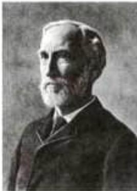

itive value when randomness increases. J. Willard Gibbs, the scientist who developed the theory of energy changes during chemical reactions, showed that the free energy, G, of any closed system can be defined in terms of three quantities: enthalpy, H, or heat content, roughly reflecting the number and kinds of bonds; entropy, S; and the absolute temperature, T (in Kelvin). The definition of free energy is G = H - TS. When a chemical reaction occurs at constant temperature, the free-energy change, $\Delta G$ , is determined by the enthalpy change, $\Delta H$ , reflecting the kinds and numbers of chemical bonds and noncovalent interactions broken and formed, and the entropy change, $\Delta S$ , describing the change in the system's randomness:

$$
\Delta G = \Delta H - T \Delta S
$$

where, by definition, $\Delta H$ is negative for a reaction that releases heat, and $\Delta S$ is positive for a reaction that increases the system's randomness.

A process tends to occur spontaneously only if $\Delta G$ is negative (if free energy is released in the process). Yet cell function depends largely on molecules, such as proteins and nucleic acids, for which the free energy of formation is positive: the molecules are less stable and more highly ordered than a mixture of their monomeric components. To carry out these thermodynamically unfavorable, energy-requiring (endergonic) reactions, cells couple them to other reactions that liberate free energy (exergonic reactions), so that the overall process is exergonic: the sum of the free-energy changes is negative. The exergonic reaction most commonly employed in this way involves adenosine triphosphate (ATP; Fig. 1-25) in which two phosphoanhydride bonds are capable of supplying the free energy to make a coupled endergonic reaction possible. In Section 13.3 we discuss in more detail this role of ATP.

J. Willard Gibbs, 1839–1903 [Science Source.]  

Inorganic phosphate ( $P_{i}$ )

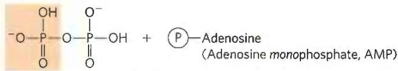

Inorganic pyrophosphate (PP $_{i}$ )

FIGURE 1-25 Adenosine triphosphate (ATP) provides energy. Here, each Ⓟ represents a phosphoryl group. The removal of the terminal phosphoryl group (shaded light red) of ATP, by breakage of a phosphoanhydride bond to generate adenosine diphosphate (ADP) and inorganic phosphate ion (HPO $_{4}^{2-}$ ), is highly exergonic, and this reaction is coupled to many endergonic reactions in the cell (as in the example in Worked Example 1-2). ATP also provides energy for many cellular processes by undergoing cleavage that releases the two terminal phosphates as inorganic pyrophosphate (H $_{2}$ P $_{2}$ O $_{7}^{2-}$ ), often abbreviated PP $_{i}$ .

## Entropy: Things Fall Apart

The term "entropy," which literally means "a change within," was first used in 1851 by Rudolf Clausius, one of the formulators of the second law of thermodynamics. It refers to the randomness or disorder of the components of a chemical system. Entropy is a central concept in biochemistry; life requires continual maintenance of order in the face of nature's tendency to increase randomness. A rigorous quantitative definition of entropy involves statistical and probability considerations. However, its nature can be illustrated qualitatively by three simple examples, each demonstrating one aspect of entropy. The key descriptors of entropy are randomness and disorder, manifested in different ways.

## Case 1: The Teakettle and the Randomization of Heat

We know that steam generated from boiling water can do useful work. But suppose we turn off the burner under a teakettle full of water at 100 °C (the "system") in the kitchen (the "surroundings") and allow the teakettle to cool. As it cools, no work is done, but heat passes from the teakettle to the surroundings, raising the temperature of the surroundings (the kitchen) by an infinitesimally small amount until complete equilibrium is attained. At this point all parts of the teakettle and the kitchen are at precisely the same temperature. The free energy that was once concentrated in the teakettle of hot water at 100 °C, potentially capable of doing work, has disappeared. Its equivalent in heat energy is still present in the teakettle + kitchen (that is, the "universe") but has become completely randomized throughout. This energy is no longer available to do work because there is no temperature differential

## Energy Coupling Links Reactions in Biology

The central issue in bioenergetics (the study of energy transformations in living systems) is the means by which energy from fuel metabolism or light capture is coupled to a cell's energy-requiring reactions. With regard to energy coupling, it is useful to consider a simple mechanical example, as shown in Figure 1-26a. An object at the top of an inclined plane has a certain amount of potential energy as a result of its elevation. It tends to slide down the plane, losing its potential energy of position as it approaches the ground. When an appropriate string-and-pulley device couples the falling object to another, smaller object, the spontaneous downward motion of the larger can lift the smaller, accomplishing a certain amount of work. The amount of energy available to do work is the free-energy change, $\Delta G$ ; this is always somewhat less than the theoretical amount of energy released, because some energy is dissipated as the heat of friction. The greater the elevation of the larger object, the greater the energy released ( $\Delta G$ ) as within the kitchen. Moreover, the increase in entropy of the kitchen (the surroundings) is irreversible. We know from everyday experience that heat never spontaneously passes back from the kitchen into the teakettle to raise the temperature of the water to $100\ °C$ again.

## Case 2: The Oxidation of Glucose

Entropy is a state not only of energy but of matter. Aerobic (heterotrophic) organisms extract free energy from glucose obtained from their surroundings by oxidizing the glucose with $O_{2}$ , also obtained from the surroundings. The end products of this oxidative metabolism, $CO_{2}$ and $H_{2}O$ , are returned to the surroundings. In this process the surroundings undergo an increase in entropy, whereas the organism itself remains in a steady state and undergoes no change in its internal order. Although some entropy arises from the dissipation of heat, entropy also arises from another kind of disorder, illustrated by the equation for the oxidation of glucose:

$$
\mathrm{C} _ {6} \mathrm{H} _ {1 2} \mathrm{O} _ {6} + 6 \mathrm{O} _ {2} \longrightarrow 6 \mathrm{CO} _ {2} + 6 \mathrm{H} _ {2} \mathrm{O}
$$

We can represent this schematically as

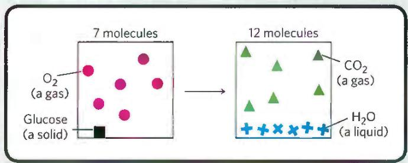

the object slides downward and the greater the amount of work that can be accomplished. The larger object can lift the smaller one only because, at the outset, the larger object was far from its equilibrium position: it had at some earlier point been elevated above the ground, in a process that itself required the input of energy.

How does this apply in chemical reactions? In closed systems, chemical reactions proceed spontaneously until equilibrium is reached. When a system is at equilibrium, the rate of product formation exactly equals the rate at which product is converted to reactant. Thus there is no net change in the concentration of reactants and products. The energy change as the system moves from its initial state to equilibrium, with no changes in temperature or pressure, is given by the free-energy change, $\Delta G$ . The magnitude of $\Delta G$ depends on the particular chemical reaction and on how far from equilibrium the system is initially. Each compound involved in a chemical reaction contains a certain amount of potential energy, related

The atoms contained in 1 molecule of glucose plus 6 molecules of oxygen, a total of 7 molecules, are more randomly dispersed by the oxidation reaction and are now present in a total of 12 molecules ( $6CO_{2} + 6H_{2}O$ ).

Whenever a chemical reaction results in an increase in the number of molecules—or when a solid substance is converted into liquid or gaseous products, which allow more freedom of molecular movement than solids—molecular disorder, and thus entropy, increases.

## Case 3: Information and Entropy

The following short passage from Shakespeare's Julius Caesar, Act IV, Scene 3, is spoken by Brutus, when he realizes that he must face Mark Antony's army. It is an information-rich non-random arrangement of 125 letters of the English alphabet:

There is a tide in the affairs of men,

Which, taken at the flood, leads on to fortune;

Omitted, all the voyage of their life

Is bound in shallows and in miseries.

In addition to what this passage says overtly, it has many hidden meanings. It not only reflects a complex sequence of events in the play, but also echoes the play's ideas on conflict, ambition, and the demands of leadership. Permeated with Shakespeare's understanding of human nature, it is very rich in information.

However, if the 125 letters making up this quotation were allowed to fall into a completely random, chaotic pattern, as

to the kind and number of its bonds. In reactions that occur spontaneously, the products have less free energy than the reactants and thus the reaction releases free energy, which is then available to do work. Such reactions are exergonic; the decline in free energy from reactants to products is expressed as a negative value. Endergonic reactions require an input of energy, and their $\Delta G$ values are positive. This coupling of an exergonic reaction to an endergonic reaction is illustrated in Figure 1-26b. As in mechanical processes, only part of the energy released in exergonic chemical reactions can be used to accomplish work. In living systems, some energy is dissipated as heat or is lost to increasing entropy.

## $K_{eq}$ and $\Delta G^{\circ}$ Are Measures of a Reaction's Tendency to Proceed Spontaneously

The tendency of a chemical reaction to go to completion can be expressed as an equilibrium constant. For the shown in the following box, they would have no meaning whatsoever.

In this form, the 125 letters contain little or no information, but they are very rich in entropy. Such considerations have led to the conclusion that information is a form of energy; information has been called "negative entropy." In fact, the branch of mathematics called information theory, which is basic to the programming logic of computers, is closely related to thermodynamic theory. Living organisms are highly ordered, non-random structures, immensely rich in information and thus entropy-poor.

reaction in which a moles of A react with b moles of B to give c moles of C and d moles of D,

$$
a \mathrm{A} + b \mathrm{B} \longrightarrow c \mathrm{C} + d \mathrm{D}
$$

the equilibrium constant, $K_{eq}$ , is given by

$$
K _ {\mathrm{eq}} = \frac {[ \mathrm{C} ] _ {\mathrm{eq}} ^ {c} [ \mathrm{D} ] _ {\mathrm{eq}} ^ {d}}{[ \mathrm{A} ] _ {\mathrm{eq}} ^ {a} [ \mathrm{B} ] _ {\mathrm{eq}} ^ {b}}
$$

where $[A]_{eq}$ is the concentration of A, $[B]_{eq}$ the concentration of B, and so on, when the system has reached equilibrium. $K_{eq}$ is dimensionless (that is, has no units of measurement), but, as we explain on page 54, we will include molar units in our calculations to reinforce the point that molar concentrations (represented by the square brackets) must be used in the calculation of equilibrium constants. A large value of $K_{eq}$ means the reaction tends to proceed until the reactants are almost completely converted into the products.

(a) Mechanical example  

(b) Chemical example  
  
FIGURE 1-26 Energy coupling in mechanical and chemical processes. (a) The downward motion of an object releases potential energy that can do mechanical work. The potential energy made available by spontaneous downward motion, an exergonic process (red), can be coupled to the endergonic upward movement of another object (blue). (b) In reaction 1, the formation of glucose 6-phosphate from glucose and inorganic phosphate $(\mathsf{P_i})$ yields a product of higher energy than the two reactants. For this endergonic reaction, $\Delta G$ is positive. In reaction 2, the exergonic breakdown of adenosine triphosphate (ATP) has a large, negative free-energy change $(\Delta G_2)$ . The third reaction is the sum of reactions 1 and 2, and the free-energy change, $\Delta G_3$ , is the arithmetic sum of $\Delta G_{1}$ and $\Delta G_{2}$ . Because $\Delta G_{3}$ is negative and relatively large, the overall reaction is exergonic and proceeds spontaneously.

## WORKED EXAMPLE 1-1 Are ATP and ADP at Equilibrium in Cells?

ATP breakdown yields adenosine diphosphate (ADP) and inorganic phosphate $(\mathsf{P_i})$ . The equilibrium constant, $K_{\mathrm{eq}}$ , for the reaction is $2\times 10^{5}\mathrm{M}$ :

$$
\mathrm{ATP} \longrightarrow \mathrm{ADP} + \mathrm{HPO} _ {4} ^ {2 -}
$$

If the measured cellular concentrations are $[ATP]=5\ mm$ , $[ADP]=0.5\ mm$ , and $[P_{i}]=5\ mm$ , is this reaction at equilibrium in living cells?

SOLUTION: The definition of the equilibrium constant for this reaction is

$$
K _ {\mathrm{eq}} = [ \mathrm{ADP} ] [ \mathrm{P} _ {\mathrm{i}} ] / [ \mathrm{ATP} ]
$$

From the measured cellular concentrations given above, we can calculate the mass-action ratio, Q:

$$
\begin{array}{r l} Q & = [ \mathrm{ADP} ] [ \mathrm {P_ {i}} ] / [ \mathrm{ATP} ] = (0. 5 \mathrm{mm}) (5 \mathrm{mm}) / 5 \mathrm{mm} \\ & = 0. 5 \mathrm{mm} = 5 \times 1 0 ^ {- 4} \mathrm{m} \end{array}
$$

This value is far from the equilibrium constant for the reaction $(2 \times 10^{5} \text{ M})$ , so the reaction is very far from equilibrium in cells. [ATP] is far higher, and [ADP] is far lower, than is expected at equilibrium. How can a cell hold its [ATP]/[ADP] ratio so far from equilibrium? It does so by continuously extracting energy (from nutrients such as glucose) and using it to make ATP from ADP and $P_{i}$ .

Gibbs showed that $\Delta G$ (the actual free-energy change) for any chemical reaction is a function of the standard free-energy change, $\Delta G^{\circ}$ —a constant that is characteristic of each specific reaction—and a term that expresses the initial concentrations of reactants and products:

$$
\Delta G = \Delta G ^ {\circ} + R T \ln \frac {[ C ] _ {i} ^ {c} [ D ] _ {i} ^ {d}}{[ A ] _ {i} ^ {a} [ B ] _ {i} ^ {b}}\tag{1-1}
$$

where $[A]_{i}$ is the initial concentration of A, and so forth; R is the gas constant; and T is the absolute temperature.

$\Delta G$ is a measure of the distance of a system from its equilibrium position. When a reaction has reached equilibrium, no driving force remains and it can do no work: $\Delta G = 0$ . For this special case, $[A]_{i} = [A]_{eq}$ , and so on, for all reactants and products, and

$$
\frac {[ \mathrm{C} ] _ {\mathrm{i}} ^ {c} [ \mathrm{D} ] _ {\mathrm{i}} ^ {d}}{[ \mathrm{A} ] _ {\mathrm{i}} ^ {a} [ \mathrm{B} ] _ {\mathrm{i}} ^ {b}} = \frac {[ \mathrm{C} ] _ {\mathrm{eq}} ^ {c} [ \mathrm{D} ] _ {\mathrm{eq}} ^ {d}}{[ \mathrm{A} ] _ {\mathrm{eq}} ^ {a} [ \mathrm{B} ] _ {\mathrm{eq}} ^ {d}}
$$

Substituting 0 for $\Delta G$ and $K_{\mathrm{eq}}$ for $[\mathrm{C}]_{\mathrm{i}}^{c}[\mathrm{D}]_{\mathrm{i}}^{d}/[\mathrm{A}]_{\mathrm{i}}^{a}[\mathrm{B}]_{\mathrm{i}}^{b}$ in Equation 1-1, we obtain the relationship

$$
\Delta G ^ {\circ} = - R T \ln K _ {\mathrm{eq}}
$$

from which we see that $\Delta G^{\circ}$ is simply a second way (besides $K_{eq}$ ) of expressing the driving force on a reaction. Because $K_{eq}$ is experimentally measurable, we have a way of determining $\Delta G^{\circ}$ , the thermodynamic constant characteristic of each reaction.

The units of $\Delta G^{\circ}$ and $\Delta G$ are joules per mole (or calories per mole). When $K_{eq} \gg 1$ , $\Delta G^{\circ}$ is large and negative; when $K_{eq} \ll 1$ , $\Delta G^{\circ}$ is large and positive. From a table of experimentally determined values of either $K_{eq}$ or $\Delta G^{\circ}$ , we can see at a glance which reactions tend to go to completion and which do not.

One caution about the interpretation of $\Delta G^{\circ}$ : thermodynamic constants such as this show where the final equilibrium for a reaction lies but tell us nothing about how fast that equilibrium will be achieved. The rates of reactions are governed by the parameters of kinetics, a topic we consider in detail in Chapter 6.

P3 In living organisms, just as in the mechanical example in Figure 1-26a, an exergonic reaction can be coupled to an endergonic reaction to drive otherwise unfavorable reactions. Figure 1-26b, a reaction coordinate diagram, illustrates this principle for the conversion of glucose to glucose 6-phosphate, the first step in the pathway for oxidation of glucose. The most direct way to produce glucose 6-phosphate would be

$$
\text {   Reaction   1:   } \quad \begin{array}{c} \text {   Glucose   +   P } _ {\mathrm{i}} \longrightarrow \text {   glucose   6 - phosphate } \\ \text {(endergonic;} \\ \Delta G _ {1} \text {   is   positive)   } \end{array}
$$

This reaction does not occur spontaneously; $\Delta G_{1}$ is positive. A second, highly exergonic reaction can occur in all cells:

$$
\text {   Reaction   2:   } \quad \mathrm{ATP} \longrightarrow \mathrm{ADP} + \mathrm{P} _ {\mathrm{i}} (\text {   exergonic;   } \Delta G _ {2} \text {   is   negative)   }
$$

These two chemical reactions share a common intermediate, $P_{i}$ , which is consumed in reaction 1 and produced in reaction 2. The two reactions can therefore be coupled in the form of a third reaction, which we can write as the sum of reactions 1 and 2, with the common intermediate, $P_{i}$ , omitted from both sides of the equation:

$$
\text {   Reaction   3:   } \quad \begin{array}{c} \text {   Glucose   +   ATP   } \longrightarrow \text {   glucose   6 - phosphate   } \\ + \text {   ADP   } \end{array}
$$

Because more energy is released in reaction 2 than is consumed in reaction 1, the free-energy change for reaction 3, $\Delta G_{3}$ , is negative, and the synthesis of glucose 6-phosphate can therefore occur by reaction 3.

## WORKED EXAMPLE 1-2 Standard Free-Energy Changes Are Additive

Given that the standard free-energy change for the reaction glucose+P $_{i}$ →glucose 6-phosphate is 13.8 kJ/mol, and the standard free-energy change for the reaction ATP→ADP+P $_{i}$ is -30.5 kJ/mol, what is the free-energy change for the reaction glucose+ATP→glucose 6-phosphate+ADP?

SOLUTION: We can write the equation for this reaction as the sum of two other reactions:

$$
\begin{array}{l l} \text {(1) Glucose + P} _ {\mathrm{i}} \longrightarrow \text {glucose 6 - phosphate} & \Delta G _ {1} ^ {\circ} = 1 3. 8 \mathrm{kJ/mol} \\ \text {(2) ATP} \longrightarrow \mathrm{ADP+P} _ {\mathrm{i}} & \Delta G _ {2} ^ {\circ} = - 3 0. 5 \mathrm{kJ/mol} \end{array}
$$

$$
\begin{array}{r l} \text { Sum:   Glucose } + \text { ATP } & \longrightarrow \text { glucose   6 - phosphate } + \text { ADP } \\ & \Delta G _ {\text { Sum }} ^ {\circ} = - 1 6. 7 \mathrm{kJ/mol} \end{array}
$$

The standard free-energy change for two reactions that sum to a third is simply the sum of the two individual reactions. A negative value for $\Delta G^{\circ}(-16.7\ \text{kJ/mol})$ indicates that the reaction will tend to occur spontaneously.

The coupling of exergonic and endergonic reactions through a shared intermediate is central to the energy exchanges in living systems. As we shall see, reactions that break down ATP (such as reaction 2 in Fig. 1-26b) release energy that drives many endergonic processes in cells. ATP breakdown in cells is exergonic because all living cells maintain a concentration of ATP far above its equilibrium concentration. It is this disequilibrium that allows ATP to serve as the major carrier of chemical energy in all cells. P3 As we describe in detail in Chapter 13, it is not the mere breakdown of ATP that provides energy to drive endergonic reactions; rather, it is the transfer of a phosphoryl group from ATP to another small molecule (glucose in the case above) that conserves some of the chemical potential originally in ATP.

## WORKED EXAMPLE 1-3 Energetic Cost of ATP Synthesis

If the equilibrium constant, $K_{eq}$ , for the reaction

$$
\mathrm{ATP} \longrightarrow \mathrm{ADP} + \mathrm{P} _ {\mathrm{i}}
$$

is $2.22 \times 10^{5} \mathrm{M}$ , calculate the standard free-energy change, $\Delta G^{\circ}$ , for the synthesis of ATP from ADP and $\mathbf{P}_{\mathrm{i}}$ at $25^{\circ} \mathrm{C}$ .

SOLUTION: First calculate $\Delta G^{\circ}$ for the reaction above:

$$
\begin{array}{r l} \Delta G ^ {\circ} & = - R T \ln K _ {e q} \\ & = - (8. 3 1 5 \mathrm{J/mol} \cdot \mathrm{K}) (2 9 8 \mathrm{K}) (\ln 2. 2 2 \times 1 0 ^ {5}) \\ & = - 3 0. 5 \mathrm{kJ/mol} \end{array}
$$

This is the standard free-energy change for the breakdown of ATP to ADP and $P_{i}$ . The standard free-energy change for the reverse of a reaction has the same absolute value but the opposite sign. The standard free-energy change for the reverse of the above reaction is therefore 30.5 kJ/mol. So, to synthesize 1 mol of ATP under standard conditions (25 °C, 1 M concentrations of ATP, ADP, and $P_{i}$ ), at least 30.5 kJ of energy must be supplied. The actual free-energy change in cells — approximately 50 kJ/mol — is greater than this because the concentrations of ATP, ADP, and $P_{i}$ in cells are not the standard 1 M (see Worked Example 13-2).

## Enzymes Promote Sequences of Chemical Reactions

All biological macromolecules are much less thermodynamically stable than their monomeric subunits, yet they are kinetically stable: their uncatalyzed breakdown occurs so slowly (over years rather than seconds) that, on a time scale that matters for the organism, these molecules are stable. Virtually every chemical reaction in a cell occurs at a significant rate only because of the presence of enzymes—biocatalysts that, like all other catalysts, greatly enhance the rate of specific chemical reactions without being consumed in the process.

The path from reactant(s) to product(s) almost invariably involves an energy barrier, called the activation barrier (Fig. 1-27), that must be surmounted for any reaction to proceed. The breaking of existing bonds and formation of new ones generally requires, first, a distortion of the existing bonds to create a transition state of higher free energy than either the reactant or the product (see Section 6.2). The highest point in the reaction coordinate diagram represents the transition state, and the difference in energy between the reactant in its ground state and in its transition state is the activation energy, $\Delta G^{\ddagger}$ . An enzyme catalyzes a reaction by providing a more comfortable fit for the transition state: a surface that complements the transition state in stereochemistry, polarity, and charge. The binding of enzyme to the transition state is exergonic, and the energy released by this binding reduces the activation energy for the reaction and greatly increases the reaction rate.

  
FIGURE 1-27 Energy changes during a chemical reaction. An activation barrier, representing the transition state, must be overcome in the conversion of reactants (A) into products (B), even though the products are more stable than the reactants, as indicated by a large, negative free-energy change ( $\Delta G$ ). The energy required to overcome the activation barrier is the activation energy ( $\Delta G^{\ddagger}$ ). Enzymes catalyze reactions by lowering the activation barrier. They bind the transition-state intermediates tightly, and the binding energy of this interaction effectively reduces the activation energy from $\Delta G_{uncat}^{\ddagger}$ (blue curve) to $\Delta G_{cat}^{\ddagger}$ (red curve). (Note that activation energy is not related to free-energy change, $\Delta G$ .)

A further contribution to catalysis occurs when two or more reactants bind to the enzyme's surface close to each other and with stereospecific orientations that favor their reaction. This increases by orders of magnitude the probability of productive collisions between reactants. As a result of these factors and several others, discussed in Chapter 6, many enzyme-catalyzed reactions proceed at rates $10^{6}$ times faster than the uncatalyzed reactions.

Cellular catalysts are, with some notable exceptions, proteins. (Some RNA molecules have enzymatic activity, as discussed in Chapters 26 and 27.) Again with a few exceptions, each enzyme catalyzes a specific reaction, and each reaction in a cell is catalyzed by a different enzyme. Thousands of different enzymes are therefore required by each cell. The multiplicity of enzymes, their specificity (the ability to discriminate between reactants), and their susceptibility to regulation give cells the capacity to lower activation barriers selectively. This selectivity is crucial for the effective regulation of cellular processes. By allowing specific reactions to proceed at significant rates at particular times, enzymes determine how matter and energy are channeled into cellular activities.

The thousands of enzyme-catalyzed chemical reactions in cells are functionally organized into many sequences of consecutive reactions, called pathways, in which the product of one reaction becomes the reactant in the next. Some pathways degrade organic nutrients into simple end products in order to extract chemical energy and convert it into a form useful to the cell; together, these degradative, free-energy-yielding reactions are designated catabolism. The energy released by catabolic reactions drives the synthesis of ATP. As a result, the cellular concentration of ATP is held far above its equilibrium concentration, so that $\Delta G$ for ATP breakdown is large and negative. Similarly, catabolism results in the production of the reduced electron carriers NADH (nicotinamide adenine dinucleotide) and NADPH (nicotinamide adenine dinucleotide phosphate hydrogen), both of which can donate electrons in processes that generate ATP or drive reductive steps in biosynthetic pathways. They are often referred to collectively as NAD(P)H.

Other pathways start with small precursor molecules and convert them to progressively larger and more complex molecules, including proteins and nucleic acids. Such synthetic pathways, which invariably require the input of energy, are collectively designated anabolism.

  
FIGURE 1-28 The central roles of ATP and NAD(P)H in metabolism. ATP is the shared chemical intermediate linking energy-releasing and energy-consuming cellular processes. Its role in the cell is analogous to that of money in an economy: it is "earned/produced" in exergonic reactions and "spent/consumed" in endergonic ones. NADH is an electron-carrying cofactor that collects electrons from oxidative reactions. The closely related NADPH carries electrons in a wide variety of reduction reactions in biosynthesis. Present in relatively low concentrations, these cofactors essential to anabolic reactions must be constantly regenerated by catabolic reactions.

The overall network of enzyme-catalyzed pathways, both catabolic and anabolic, constitutes cellular metabolism. ATP (as well as other energetically equivalent nucleoside triphosphates) is the connecting link between the catabolic and anabolic components of this network (shown schematically in Fig. 1-28). P2 The pathways of enzyme-catalyzed reactions that act on the main constituents of cells—proteins, fats, sugars, and nucleic acids—are nearly identical in all living organisms. This remarkable unity of life is part of the evidence for a common evolutionary precursor for all living things.

## Metabolism Is Regulated to Achieve Balance and Economy

Not only do living cells simultaneously synthesize thousands of different kinds of carbohydrate, fat, protein, and nucleic acid molecules and their simpler subunits, but they do so in the precise proportions required by the cell under any given circumstance. For example, during rapid cell growth the precursors of proteins and nucleic acids must be made in large quantities, whereas in nongrowing cells the requirement for these precursors is much reduced. Key enzymes in each metabolic pathway are regulated so that each type of precursor molecule is produced in a quantity appropriate to the current requirements of the cell.

Consider the pathway in E. coli that leads to the synthesis of the amino acid isoleucine, a constituent of proteins. The pathway has five steps catalyzed by five different enzymes (A through F represent the intermediates in the pathway):

If a cell begins to produce more isoleucine than it needs for protein synthesis, the unused isoleucine accumulates, and the increased concentration inhibits the catalytic activity of the first enzyme in the pathway, immediately slowing the production of isoleucine. Such feedback inhibition keeps the production and utilization of each metabolic intermediate in balance. (Throughout the book, we use $\otimes$ to indicate inhibition of an enzymatic reaction.)

Although the concept of discrete pathways is an important tool for organizing our understanding of metabolism, it is an oversimplification. There are thousands of metabolic intermediates in a cell, many of which are part of more than one pathway. P3 Metabolism would be better represented as a web of interconnected and interdependent pathways. A change in the concentration of any one metabolite would start a ripple effect, influencing the flow of materials through other pathways. The task of understanding these complex interactions among intermediates and pathways in quantitative terms is daunting, but systems biology, discussed in Chapter 9, has begun to offer important insights into the overall regulation of metabolism.

Cells also regulate the synthesis of their own catalysts, the enzymes, in response to increased or diminished need for a metabolic product; this is the substance of Chapter 28. The regulated expression of genes (the translation from information in DNA to active protein in the cell) and the synthesis of enzymes are other layers of metabolic control in the cell. All layers must be taken into account when the overall control of cellular metabolism is described.

## SUMMARY 1.3 Physical Foundations

■ Living cells extract and channel energy to maintain themselves in a dynamic steady state distant from equilibrium.

Living cells are open systems, exchanging matter and energy with their surroundings. Energy is obtained from sunlight or chemical fuels when the energy from electron flow is converted into the chemical bonds of ATP.

The tendency for a chemical reaction to proceed toward equilibrium can be expressed as the free-energy change, $\Delta G$ . When $\Delta G$ of a reaction is negative, the reaction is exergonic and tends to go toward completion; when $\Delta G$ is positive, the reaction is endergonic and tends to go in the reverse direction. When two reactions can be summed to yield a third reaction, the $\Delta G$ for this overall reaction is the sum of the $\Delta G$ values for the two separate reactions.

The reactions converting ATP to $P_{i}$ and ADP are highly exergonic (large negative $\Delta G$ ). Many endergonic cellular reactions are driven by coupling them, through a common intermediate, to these highly exergonic reactions.

The standard free-energy change for a reaction, $\Delta G^{\circ}$ , is a physical constant that is related to the equilibrium constant by the equation $\Delta G^{\circ} = -RT\ln K_{\mathrm{eq}}$ .

■ Most cellular reactions proceed at useful rates only because enzymes are present to catalyze them. Enzymes act in part by stabilizing the transition state, reducing the activation energy, $\Delta G^{\ddagger}$ , and increasing the reaction rate by many orders of magnitude. The catalytic activity of enzymes in cells is regulated.

■ Metabolism is the sum of many interconnected reaction sequences that interconvert cellular metabolites. Each sequence is regulated to provide what the cell needs at a given time and to expend energy only when necessary.

## 1.4 Genetic Foundations

P4 Perhaps the most remarkable property of living cells and organisms is their ability to reproduce themselves for countless generations with nearly perfect fidelity.

  
(a)

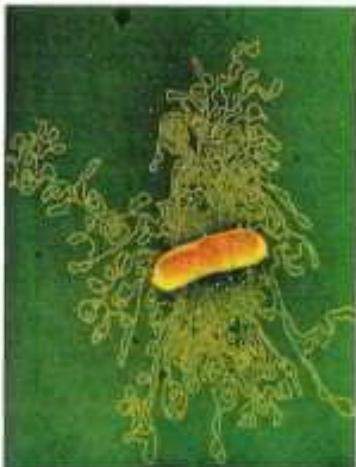  
(b)  
FIGURE 1-29 Two ancient scripts. (a) The Prism of Sennacherib, inscribed in about 700 ace, describes in characters of the Assyrian language some historical events during the reign of King Sennacherib. The Prism contains about 20,000 characters, weighs about 50 kg, and has survived almost intact for about 2,700 years. (b) The single DNA molecule of the bacterium E. coli, leaking out of a disrupted cell, is hundreds of times longer than the cell itself and contains all the encoded information necessary to specify the cell's structure and functions. The bacterial DNA contains about 4.6 million characters (nucleotides), weighs less than $10^{-10}$ g, and has undergone only relatively minor changes during the past several million years. (The yellow spots and dark specks in this colorized electron micrograph are artifacts of the preparation.) [(a) Erich Lessing/Art Resource, New York. (b) Dr. Gopal Murti/Science Source.]

This continuity of inherited traits implies constancy, over millions of years, in the structure of the molecules that contain the genetic information. Very few historical records of civilization, even those etched in copper or carved in stone (Fig. 1-29), have survived for a thousand years. But there is good evidence that the genetic instructions in living organisms have remained nearly unchanged over very much longer periods; many bacteria have nearly the same size, shape, and internal structure as bacteria that lived almost four billion years ago. This continuity of structure and composition is the result of continuity in the structure of the genetic material.

Among the seminal discoveries in biology in the twentieth century were the chemical nature and the three-dimensional structure of the genetic material, deoxyribonucleic acid, DNA. P2 The sequence of the monomeric subunits, the nucleotides (strictly, deoxyribonucleotides, as discussed below), in this linear polymer encodes the instructions for forming all other cellular components and provides a template for the production of identical DNA molecules to be distributed to progeny when a cell divides.

## Genetic Continuity Is Vested in Single DNA Molecules

DNA is a long, thin, organic polymer, the rare molecule that is constructed on the atomic scale in one dimension (width) and the human scale in another (length: a molecule of DNA can be many centimeters long). A human sperm or egg, carrying the accumulated hereditary information of billions of years of evolution, transmits this inheritance in the form of DNA molecules, in which the linear sequence of covalently linked nucleotide subunits encodes the genetic message.

Usually when we describe the properties of a chemical species, we describe the average behavior of a very large number of identical molecules. While it is difficult to predict the behavior of any single molecule in a collection of, say, a picomole (about $6 \times 10^{11}$ molecules) of a compound, the average behavior of the molecules is predictable because so many molecules enter into the average. Cellular DNA is a remarkable exception. P4 The DNA that is the entire genetic material of an E. coli cell is a single molecule containing 4.64 million nucleotide pairs. That single molecule must be replicated perfectly in every detail if an E. coli cell is to give rise to identical progeny by cell division; there is no room for averaging in this process! The same is true for all cells. A human sperm brings to the egg that it fertilizes just one molecule of DNA in each of its 23 different chromosomes, to combine with just one DNA molecule in each corresponding chromosome in the egg. The result of this union is highly predictable: an embryo with all of its \~20,000 genes, constructed of 3 billion nucleotide pairs, intact. An amazing chemical feat!

## WORKED EXAMPLE 1-4 Fidelity of DNA Replication

Calculate the number of times the DNA of a modern E. coli cell has been copied accurately since its earliest bacterial precursor cell arose about 3.5 billion years ago. Assume for simplicity that over this time period, E. coli has undergone, on average, one cell division every 12 hours (this is an overestimate for modern bacteria, but probably an underestimate for ancient bacteria).

SOLUTION:

$$
\begin{array}{r l} (1 \text { generation } / 1 2 \mathrm{h}) (2 4 \mathrm{h} / \text { day }) (3 6 5 \text { days } / \mathrm{yr}) & (3. 5 \times 1 0 ^ {9} \mathrm{yr}) \\ & = 2. 6 \times 1 0 ^ {1 2} \text { generations } \end{array}
$$

A single page of this book contains about 5,000 characters, so the entire book contains about 5 million characters. The chromosome of E. coli also contains about 5 million characters (nucleotide pairs). Imagine making a handwritten copy of this book and passing on the copy to a classmate, who copies it by hand and passes this second copy to a third classmate, who makes a third copy, and so on. How closely would each successive copy of the book resemble the original? Now, imagine the textbook that would result from hand-copying this one a few trillion times!

## The Structure of DNA Allows Its Replication and Repair with Near-Perfect Fidelity

P4 The capacity of living cells to preserve their genetic material and to duplicate it for the next generation results from the structural complementarity between the two strands of the DNA molecule (Fig. 1-30). The basic unit of DNA is a linear polymer of four different monomeric subunits, deoxyribonucleotides, arranged in a precise linear sequence. It is this linear sequence that encodes the genetic information. Two of these polymeric strands are twisted about each other to form the DNA double helix, in which each deoxyribonucleotide in one strand pairs specifically with a complementary deoxyribonucleotide in the opposite strand. P4 Before a cell divides, the two DNA strands separate locally and each serves as a template for the synthesis of a new, complementary strand, generating two identical double-helical molecules, one for each daughter cell. If either strand is damaged at any time, continuity of information is assured by the information present in the other strand, which can act as a template for repair of the damage.

  
FIGURE 1-30 Complementarity between the two strands of DNA. DNA is a linear polymer of covalently joined deoxyribonucleotides of four types: deoxyadenylate (A), deoxyguanylate (G), deoxycytidylate (C), and deoxythymidylate (T). Each nucleotide, with its unique three-dimensional structure, can associate very specifically but noncovalently with one other nucleotide in the complementary chain: A always associates with T, and G with C. Thus, in the double-stranded DNA molecule, the entire sequence of nucleotides in one strand is complementary to the sequence in the other. The two strands, held together by hydrogen bonds (represented here by vertical light blue lines) between each pair of complementary nucleotides, twist about each other to form the DNA double helix. In DNA replication, the two strands (blue) separate and two new strands (pink) are synthesized, each with a sequence complementary to one of the original strands. The result is two double-helical molecules, each identical to the original DNA.

## The Linear Sequence in DNA Encodes Proteins with Three-Dimensional Structures

P4 The information in DNA is encoded in its linear (one-dimensional) sequence of deoxyribonucleotide subunits, but the expression of this information results in a three-dimensional cell. This change from one to three dimensions occurs in two phases. A linear sequence of deoxyribonucleotides in DNA codes (through an intermediary, RNA) for the production of a protein with a corresponding linear sequence of amino acids (Fig. 1-31). The protein folds into a particular three-dimensional shape, determined by its amino acid sequence and stabilized primarily by noncovalent interactions. Although the final shape of the folded protein is dictated by its amino acid sequence, the folding of many proteins is aided by "molecular chaperones" (see Fig. 4-28). The precise three-dimensional structure, or native conformation, of the protein is crucial to its function.

Once in its native conformation, a protein may associate noncovalently with other macromolecules (other proteins, nucleic acids, or lipids) to form supramolecular complexes such as chromosomes, ribosomes, and membranes. The individual molecules of these complexes have specific, high-affinity binding sites for each other, and within the cell they spontaneously self-assemble into functional complexes.

  
FIGURE 1-31 DNA to RNA to protein to enzyme (hexokinase). The linear sequence of deoxyribonucleotides in the DNA (the gene) that encodes the protein hexokinase is first transcribed into a ribonucleic acid (RNA) molecule with the complementary ribonucleotide sequence. The RNA sequence (messenger RNA) is then translated into the linear protein chain of hexokinase, which folds into its native three-dimensional shape, most likely aided by molecular chaperones. Once in its native form, hexokinase acquires its catalytic activity: it can catalyze the phosphorylation of glucose, using ATP as the phosphoryl group donor.

Although the amino acid sequences of proteins carry all necessary information for achieving the proteins' native conformation, accurate folding and self-assembly also require the right cellular environment—pH, ionic strength, metal ion concentrations, and so forth. Thus, DNA sequence alone is not enough to form and maintain a fully functioning cell.

## SUMMARY 1.4 Genetic Foundations

■ Genetic information is encoded in the linear sequence of four types of deoxyribonucleotides in DNA.

Despite the enormous size of DNA, the sequence of its nucleotides is very precise, and the maintenance of this precise sequence over very long times is the basis for genetic continuity in organisms.

■ The double-helical DNA molecule contains an internal template for its own replication and repair.

The linear sequence of amino acids in a protein, which is encoded in the DNA of the gene for that protein, produces a protein's unique three-dimensional structure—a process that is also dependent on environmental conditions.

■ Individual macromolecules with specific affinity for other macromolecules self-assemble into supramolecular complexes.

## 1.5 Evolutionary Foundations

Nothing in biology makes sense except in the light of evolution.

—Theodosius Dobzhansky, in The American Biology Teacher, March 1973

Great progress in biochemistry and molecular biology in recent decades has amply confirmed the validity of Dobzhansky's striking generalization. P5 The remarkable similarity of metabolic pathways and gene sequences across the three domains of life argues strongly that all modern organisms are derived from a common evolutionary progenitor by a series of small changes (mutations), each of which conferred a selective advantage to some organism in some ecological niche.

## Changes in the Hereditary Instructions Allow Evolution

Despite the near-perfect fidelity of genetic replication, infrequent unrepaired mistakes in the DNA replication process lead to changes in the nucleotide sequence of DNA, producing a genetic mutation and changing the instructions for a cellular component.

Incorrectly repaired damage to one of the DNA strands has the same effect. Mutations in the DNA handed down to offspring—that is, mutations carried in the reproductive cells—may be harmful or even lethal to the new organism or cell; they may, for example, cause the synthesis of a defective enzyme that is not able to catalyze an essential metabolic reaction. Occasionally, however, a mutation better equips an organism or cell to survive in its environment (Fig. 1-32). The mutant enzyme might have acquired a slightly different specificity, for example, so that it is now able to use some compound that the cell was previously unable to metabolize. If a population of cells were to find itself in an environment where that compound was the only or the most abundant available source of fuel, the mutant cell would have a selective advantage over the other, unmutated (wild-type) cells in the population. The mutant cell and its progeny would survive and prosper in the new environment, whereas wild-type cells would starve and be eliminated. This is what Charles Darwin meant by natural selection—what is sometimes summarized as “survival of the fittest.”

Occasionally, a second copy of a whole gene is introduced into the chromosome as a result of defective replication of the chromosome. The second copy is superfluous, and mutations in this gene will not be deleterious; it becomes a means by which the cell may evolve, by producing a new gene with a new function while retaining the original gene and gene function. Seen in this light, the DNA molecules of modern organisms are historical documents, records of the long journey from the earliest cells to modern organisms. The historical accounts in DNA are not complete, however; in the course of evolution, many mutations must have been erased or written over. But DNA molecules are the best source of biological history we have. P5 The frequency of errors in DNA replication represents a balance between too many errors, which would yield nonviable daughter cells, and too few errors, which would prevent the genetic variation that allows survival of mutant cells in new ecological niches.

Several billion years of natural selection have refined cellular systems to take maximum advantage of the chemical and physical properties of available raw materials. Chance genetic mutations occurring in individuals in a population, combined with natural selection, have resulted in the evolution of the enormous variety of species we see today, each adapted to its particular ecological niche.

## Biomolecules First Arose by Chemical Evolution

In our account thus far, we have passed over the first chapter of the story of evolution: the appearance of the first living cell. Apart from their occurrence in living organisms, organic compounds, including the basic biomolecules such as amino acids and carbohydrates, are found in only trace amounts in the Earth's crust, the sea, and the atmosphere. How did the first living organisms acquire their characteristic organic building blocks? According to one hypothesis, these compounds were created by the effects of powerful environmental forces—ultraviolet irradiation, lightning, or volcanic eruptions—on the gases in the prebiotic Earth's atmosphere and on inorganic solutes in superheated thermal vents deep in the ocean.

This hypothesis was tested in a classic experiment on the abiotic (nonbiological) origin of organic biomolecules carried out in 1953 by biochemist Stanley Miller in the laboratory of the physical chemist Harold Urey. Miller subjected gaseous mixtures such as those presumed to exist on the prebiotic Earth, including $NH_{3}$ , $CH_{4}$ , $H_{2}O$ , and $H_{2}$ , to electrical sparks produced across a pair of electrodes (to simulate lightning) for periods of a week or more, then analyzed the contents of the closed reaction vessel (Fig. 1-33). The gas phase of the resulting mixture contained CO and $CO_{2}$ as well as the starting materials. The water phase contained a variety of organic compounds, including some amino acids, hydroxy acids, aldehydes, and hydrogen cyanide (HCN). This experiment established the possibility of abiotic production of biomolecules in relatively short times under relatively mild conditions. When Miller's carefully stored samples were rediscovered in 2010 and examined with much more sensitive and discriminating techniques (high-performance liquid chromatography and mass

FIGURE 1-32 Gene duplication and mutation: one path to generate new enzymatic activities. In this example, the single hexokinase gene in a hypothetical organism might occasionally, by accident, be copied twice during DNA replication, such that the organism has two full copies of the gene, one of which is superfluous. Over many generations, as the DNA with two hexokinase genes is repeatedly duplicated, rare mistakes occur, leading to changes in the nucleotide sequence of the superfluous gene and thus of the protein that it encodes. In a few very rare cases, the altered protein produced from this mutant gene can bind a new substrate—galactose in our hypothetical case. The cell containing the mutant gene has acquired a new capability (metabolism of galactose), which may allow the cell to survive in an ecological niche that provides galactose but not glucose. If no gene duplication precedes mutation, the original function of the gene product is lost.

spectrometry), his original observations were confirmed and greatly broadened. Previously unpublished experiments by Miller that included $H_{2}S$ in the gas mixture (mimicking the “smoking” volcanic plumes at the sea bottom; Fig. 1-34) showed the formation of 23 amino acids and 7 organosulfur compounds, as well as a large number of other simple compounds that might have served as building blocks in prebiotic evolution.

More-refined laboratory experiments have provided good evidence that many of the chemical components of living cells can form under these conditions. Polymers of the nucleic acid RNA (ribonucleic acid) can act as catalysts in biologically significant reactions (see Chapters 26 and 27), and RNA probably played a crucial role in prebiotic evolution, both as catalyst and as information repository.

## RNA or Related Precursors May Have Been the First Genes and Catalysts

In modern organisms, nucleic acids encode the genetic information that specifies the structure of enzymes, and enzymes catalyze the replication and repair of nucleic acids. The mutual dependence of these two classes of biomolecules brings up the perplexing question: Which came first, DNA or protein?

The answer may be that they appeared about the same time, and RNA preceded them both.

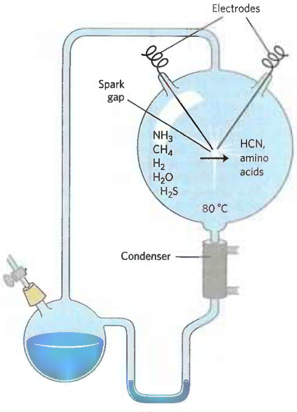  
(a)

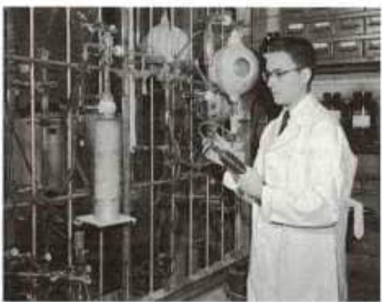  
(b)  
FIGURE 1-33 Abiotic production of biomolecules. (a) Spark-discharge apparatus of the type used by Miller and Urey in experiments demonstrating abiotic formation of organic compounds under primitive atmospheric conditions. After subjection of the gaseous contents of the system to electrical sparks, products were collected by condensation. Biomolecules such as amino acids were among the products. (b) Stanley L. Miller (1930–2007) using his spark-discharge apparatus. [(b) Bettmann/Getty Images.]

The discovery that RNA molecules can act as catalysts in their own formation suggests that RNA or a similar molecule may have been the first gene and the first catalyst. According to this scenario (Fig. 1-35), one of the earliest stages of biological evolution was the chance formation of an RNA molecule that could catalyze the formation of other RNA molecules of the same sequence—a self-replicating, self-perpetuating RNA.

  
FIGURE 1-34 Black smokers. Hydrothermal vents in the sea floor emit superheated water rich in dissolved minerals. Black "smoke" is formed when the vented solution meets cold seawater and dissolved sulfides precipitate. Diverse life forms, including a variety of archaea and some remarkably complex multicellular organisms, are found in the immediate vicinity of such vents, which may have been the sites of early biogenesis. [NOAA/Science Source]

The concentration of a self-replicating RNA molecule would increase exponentially, as one molecule formed several, several formed many, and so on. The fidelity of self-replication was presumably less than perfect, so the process would generate variants of the RNA, some of which might be even better able to self-replicate. In the competition for nucleotides, the most efficient of the self-replicating sequences would win, and less efficient replicators would fade from the population.

The division of function between DNA (genetic information storage) and protein (catalysis) was, according to the "RNA world" hypothesis, a later development. New variants of self-replicating RNA molecules developed that had the additional ability to catalyze the condensation of amino acids into peptides. Occasionally, the peptide(s) thus formed would reinforce the self-replicating ability of the RNA, and the pair—RNA molecule and helping peptide—could undergo further modifications in sequence, generating increasingly efficient self-replicating systems. The remarkable discovery that in the protein-synthesizing machinery of modern cells (ribosomes), RNA molecules, not proteins, catalyze the formation of peptide bonds is consistent with the RNA world hypothesis.

Some time after the evolution of this primitive protein-synthesizing system, there was a further development: DNA molecules with sequences complementary to the self-replicating RNA molecules took over the function of conserving the "genetic" information, and RNA molecules evolved to play roles in protein synthesis. (We explain in Chapter 8 why DNA is a more stable molecule than RNA and thus a better repository of inheritable information.) Proteins proved to be versatile catalysts and, over time, took over most of that function. Lipidlike compounds in the primordial mixture formed relatively impermeable layers around self-replicating collections of molecules. The concentration of proteins and nucleic acids within these lipid enclosures favored the molecular interactions required in self-replication.

  
FIGURE 1-35 A possible "RNA world" scenario.

The RNA world scenario is intellectually satisfying, but it leaves unanswered a vexing question: Where did the nucleotides needed to make the initial RNA molecules come from? An alternative to this scenario supposes that simple metabolic pathways evolved first, perhaps at the hot vents in the ocean floor. A set of linked chemical reactions there might have produced precursors, including nucleotides, before the advent of lipid membranes or RNA. Without more experimental evidence, neither of these hypotheses can be disproved.

## Biological Evolution Began More Than Three and a Half Billion Years Ago

Earth was formed about 4.6 billion years ago, and the first evidence of life dates to more than 3.5 billion years ago (see the timeline in Figure 1-36). In 1996, scientists working in Greenland found chemical evidence of life (“fossil molecules”) from as far back as 3.85 billion years ago, forms of carbon embedded in rock that seem to have a distinctly biological origin. Somewhere on Earth during its first billion years the first simple organism arose, capable of replicating its own structure from a template (RNA?) that was the first genetic material. Because the terrestrial atmosphere at the dawn of life was nearly devoid of oxygen, and because there were few microorganisms to scavenge organic compounds formed by natural processes, these compounds were relatively stable. Given this stability and eons of time, the improbable became inevitable: lipid vesicles containing organic compounds and self-replicating RNA gave rise to the first cells, or protocells, and those protocells with the greatest capacity for self-replication became more numerous. The process of biological evolution had begun.

  
FIGURE 1-36 Landmarks in the evolution of life on Earth.

## The First Cell Probably Used Inorganic Fuels

The earliest cells arose in a reducing atmosphere (there was no oxygen) and probably obtained energy from inorganic fuels such as ferrous sulfide and ferrous carbonate, both abundant on the early Earth. For example, the reaction

$$
\mathrm{FeS} + \mathrm{H} _ {2} \mathrm{S} \longrightarrow \mathrm{FeS} _ {2} + \mathrm{H} _ {2}
$$

yields enough energy to drive the synthesis of ATP or similar compounds. The organic compounds these early cells required may have arisen by the nonbiological actions of lightning or of heat from volcanoes or thermal vents in the sea on components of the early atmosphere such as CO, $CO_{2}$ , $N_{2}$ , $NH_{3}$ , and $CH_{4}$ . An alternative source of organic compounds has been proposed: extraterrestrial space. Space missions in 2006 (the NASA Stardust space probe) and 2014 (the European Space Agency lander Philae) found particles of comet dust containing the simple amino acid glycine and 20 other organic compounds capable of reacting to form biomolecules.

Early unicellular organisms gradually acquired the ability to derive energy from compounds in their environment and to use that energy to synthesize more of their own precursor molecules, thereby becoming less dependent on outside sources. A very significant evolutionary event was the development of pigments capable of capturing the energy of light from the sun, which could be used to reduce, or "fix," $CO_{2}$ to form more complex, organic compounds. The original electron donor for these photosynthetic processes was probably $H_{2}S$ , yielding elemental sulfur or sulfate ( $SO_{4}^{2-}$ ) as the byproduct. Some hydrothermal vents in the sea bottom (black smokers; Fig. 1-36) emit significant amounts of $H_{2}$ , which is another possible electron donor in the metabolism of the earliest organisms. Later cells developed the enzymatic capacity to use $H_{2}O$ as the electron donor in photosynthetic reactions, producing $O_{2}$ as waste. Cyanobacteria are the modern descendants of these early photosynthetic oxygen-producers.

Because the atmosphere of Earth in the earliest stages of biological evolution was nearly devoid of oxygen, the earliest cells were anaerobic. Under these conditions, chemotrophs could oxidize organic compounds to $CO_{2}$ by passing electrons not to $O_{2}$ but to acceptors such as $SO_{4}^{2-}$ , in this case yielding $H_{2}S$ as the product. With the rise of $O_{2}$ -producing photosynthetic bacteria, the atmosphere became progressively richer in oxygen—a powerful oxidant and a deadly poison to anaerobes. Responding to the evolutionary pressure of what evolutionary theorist and biologist Lynn Margulis and science writer Dorion Sagan called the “oxygen holocaust,” some lineages of microorganisms gave rise to aerobes that obtained energy by passing electrons from fuel molecules to oxygen. Because the transfer of electrons from organic molecules to $O_{2}$ releases a great deal of energy, aerobic organisms had an energetic advantage over their anaerobic counterparts when both competed in an environment containing oxygen. This advantage translated into the predominance of aerobic organisms in $O_{2}$ -rich environments.

Modern bacteria and archaea inhabit almost every ecological niche in the biosphere, and there are organisms capable of using virtually every type of organic compound as a source of carbon and energy. Photosynthetic microbes in both fresh and marine waters trap solar energy and use it to generate carbohydrates and all other cell constituents, which are in turn used as food by other forms of life. The process of evolution continues—and, in rapidly reproducing bacterial cells, on a time scale that allows us to witness it in the laboratory.

## Eukaryotic Cells Evolved from Simpler Precursors in Several Stages

Starting about 1.5 billion years ago, the fossil record begins to show evidence of larger and more complex organisms, probably the earliest eukaryotic cells (see Fig. 1-37). Details of the evolutionary path from non-nucleated to nucleated cells cannot be deduced from the fossil record alone, but morphological and biochemical comparisons of modern organisms have suggested a sequence of events consistent with the fossil evidence.

Three major changes must have occurred. First, as cells acquired more DNA, the mechanisms required to fold it compactly into discrete complexes with specific proteins and to divide it equally between daughter cells at cell division became more elaborate. Specialized proteins were required to stabilize folded DNA and to pull the resulting DNA-protein complexes (chromosomes) apart during cell division. This was the evolution of the chromosome. Second, as cells became larger, a system of intracellular membranes developed, including a double membrane surrounding the DNA. This membrane segregated the nuclear process of RNA synthesis on a DNA template from the cytoplasmic process of protein synthesis on ribosomes. This was the evolution of the nucleus, a defining feature of eukaryotes. Third, early eukaryotic cells, which were incapable of photosynthesis or aerobic metabolism, enveloped aerobic bacteria or photosynthetic bacteria to form endosymbiotic associations that eventually became permanent (Fig. 1-37). Some aerobic bacteria evolved into the mitochondria of modern eukaryotes, and some photosynthetic cyanobacteria became the plastids, such as the chloroplasts of green algae, the likely ancestors of modern plant cells.

At some later stage of evolution, unicellular organisms found it advantageous to cluster together, thereby acquiring greater motility, efficiency, or reproductive success than their free-living single-celled competitors. Further evolution of such clustered organisms led to permanent associations among individual cells and eventually to specialization within the colony—to cellular differentiation.

The advantages of cellular specialization led to the evolution of increasingly complex and highly differentiated organisms, in which some cells carried out the sensory functions; others the digestive, photosynthetic, or reproductive functions; and so forth. Many modern multicellular organisms contain hundreds of different cell types, each specialized for a function that supports the entire organism. Fundamental mechanisms that evolved early have been further refined and embellished through evolution. The same basic structures and mechanisms that underlie the beating motion of cilia in Paramecium and of flagella in Chlamydomonas are employed by the highly differentiated vertebrate sperm cell, for example.

  
FIGURE 1-37 Evolution of eukaryotes through endosymbiosis. The earliest eukaryote, an anaerobe, acquired endosymbiotic purple bacteria, which carried with them their capacity for aerobic catabolism and became,  
over time, mitochondria. When photosynthetic cyanobacteria subsequently became endosymbionts of some aerobic eukaryotes, these cells became the photosynthetic precursors of modern green algae and plants.

## Molecular Anatomy Reveals Evolutionary Relationships

Now that genomes can be sequenced relatively quickly and inexpensively, biochemists have an enormously rich, ever-increasing treasury of information on the molecular anatomy of cells that they can use to analyze evolutionary relationships and refine evolutionary theory. Thus far, the molecular phylogeny derived from gene sequences is consistent with, but in many cases more precise than, the classical phylogeny based on macroscopic structures.

P5 Although organisms have continuously diverged at the level of gross anatomy, at the molecular level the basic unity of life is readily apparent; molecular structures and mechanisms are remarkably similar from the simplest to the most complex organisms. These similarities are most easily seen at the level of sequences, either the DNA sequences that encode proteins or the protein sequences themselves.

When two genes share readily detectable sequence similarities (nucleotide sequence in DNA or amino acid sequence in the proteins they encode), their sequences are said to be homologous and the proteins they encode are homologs. In the course of evolution, new structures, processes, or regulatory mechanisms are acquired, reflections of the changing genomes of the evolving organisms. The genome of a simple eukaryote such as yeast should have genes related to formation of the nuclear membrane, genes not present in bacteria or archaea. The genome of an insect should contain genes that encode proteins involved in specifying a characteristic segmented body plan, genes not present in yeast. The genomes of all vertebrate animals should share genes that specify the development of a spinal column, and those of mammals should have unique genes necessary for the development of the placenta, a characteristic of mammals—and so on. Comparisons of the whole genomes of species in each phylum are leading to the identification of genes critical to fundamental evolutionary changes in body plan and development.

## Functional Genomics Shows the Allocations of Genes to Specific Cellular Processes

When the sequence of a genome is fully determined and each gene is assigned a function, molecular geneticists can group genes according to the processes (DNA synthesis, protein synthesis, generation of ATP, and so forth) in which they function and thus find what fraction of the genome is allocated to each of a cell's activities. The largest category of genes in E. coli, A. thaliana, and H. sapiens consists of those of (as yet) unknown function, which make up more than 40% of the genes in each species. The genes encoding the transporters that move ions and small molecules across plasma membranes make up a significant proportion of the genes in all three species, more in the bacterium and plant than in the mammal (10% of the \~4,400 genes of E. coli, \~8% of the \~27,000 genes of A. thaliana, and \~4% of the \~20,000 genes of H. sapiens). Genes that encode the proteins and RNA required for protein synthesis make up 3% to 4% of the E. coli genome; but in the more complex cells of A. thaliana, more genes are needed for targeting proteins to their final location in the cell than are needed to synthesize those proteins (about 6% and 2% of the genome, respectively). In general, the more complex the organism, the greater the proportion of its genome that encodes genes involved in the regulation of cellular processes and the smaller the proportion dedicated to basic processes, or "housekeeping" functions, such as ATP generation and protein synthesis. The housekeeping genes typically are expressed under all conditions and are not subject to much regulation.

## Genomic Comparisons Have Increasing Importance in Medicine

Large-scale studies in which the entire genomic sequence has been determined for hundreds or thousands of people with cancer, type 2 diabetes, schizophrenia, or other diseases or conditions have allowed the identification of many genes in which mutations correlate with a medical condition. Typically, sequence differences are found in a number of different genes, each of which makes a partial contribution to the predisposition to a given condition or disease. Each of those genes codes for a protein that, in principle, might become the target for drugs to treat that condition. We may expect that for some genetic diseases, palliatives will be replaced by cures, and that for disease susceptibilities associated with particular genetic markers, forewarning and perhaps increased preventive measures will prevail. Today's "medical history" may be replaced by a "medical forecast."

## SUMMARY 1.5 Evolutionary Foundations

■ Occasional inheritable mutations yield organisms that are better suited for survival and reproduction in an ecological niche, and their progeny come to dominate the population in that niche. This process of mutation and selection is the basis for the Darwinian evolution that led from the first cell to all modern organisms. The large number of genes shared by all living organisms explains organisms' fundamental similarities.

The components for the first cell may have been produced near hydrothermal vents at the bottom of the sea or by the action of lightning and high temperature on simple atmospheric molecules such as $\mathrm{CO}_{2}$ and $\mathrm{NH}_{3}$ .

The earliest cells may have been formed by the enclosure of a self-replicating RNA molecule within a membrane-like lipid layer. The catalytic and genetic roles played by the early RNA genome were, over time, taken over by proteins and DNA, respectively.

■ Hydrothermal vents may have provided the oxidizable fuels (iron compounds) for the first organisms.

Eukaryotic cells acquired the capacity for photosynthesis and oxidative phosphorylation from endosymbiotic bacteria. In multicellular organisms, differentiated cell types specialize in one or more of the functions essential to the organism's survival.

■ Detailed phylogenetic relationships can be determined from gene or protein sequence similarities between organisms.

■ From knowledge of the roles of proteins encoded in the genome, scientists can approximate the proportion of the genome dedicated to a specific process, such as membrane transport or protein synthesis.

\- Knowledge of the complete genomic sequences of organisms from different branches of the phylogenetic tree provides insights into evolution and offers great opportunities in medicine.

## KEY TERMS

All terms are defined in the glossary.

<table><tr><td>biochemistry 2</td><td>endergonic reaction 21</td></tr><tr><td>metabolite 2</td><td>exergonic reaction 21</td></tr><tr><td>nucleus 2</td><td>equilibrium 22</td></tr><tr><td>genome 2</td><td rowspan="2">standard free-energy change,  $\Delta G^{\circ}$  24</td></tr><tr><td>eukaryotes 2</td></tr><tr><td>bacteria 3</td><td rowspan="2">activation energy, $\Delta G^{\ddagger}$  25</td></tr><tr><td>archaea 3</td></tr><tr><td>cytoskeleton 6</td><td>catabolism 26</td></tr><tr><td>stereoisomers 15</td><td>anabolism 26</td></tr><tr><td>configuration 15</td><td>metabolism 27</td></tr><tr><td>chiral center 16</td><td>systems biology 27</td></tr><tr><td>conformation 18</td><td>mutation 30</td></tr><tr><td>entropy, S 21</td><td rowspan="2">housekeeping genes 36</td></tr><tr><td>enthalpy, H 21</td></tr><tr><td>free-energy change, $\Delta G$  21</td><td></td></tr></table>

## PROBLEMS

For all numerical problems, keep in mind that answers should be expressed with the correct number of significant figures. (In solving end-of-chapter problems, you may wish to refer to the tables on the inside of the back cover.) Brief solutions are provided in Appendix B; expanded solutions are published in the Absolute Ultimate Study Guide to Accompany Principles of Biochemistry.

1. The Size of Cells and Their Components A typical eukaryotic cell has a cellular diameter of 50 $\mu$ m.

(a) If you used an electron microscope to magnify this cell 10,000-fold, how big would the cell appear?

(b) If this cell were a liver cell (hepatocyte) with the same cellular diameter, how many mitochondria could the cell contain? Assume the cell is spherical; that the cell contains no other cellular components; and that each mitochondrion is spherical, with a diameter of 1.5 μm. (The volume of a sphere is $\frac{4}{3}\pi r^3$ .)

(c) Glucose is the major energy-yielding nutrient for most cells. Assuming a cellular concentration of 1 mm glucose (that is, 1 millimole/L), calculate how many molecules of glucose would be present in the spherical eukaryotic cell. (Avogadro's number, the number of molecules in 1 mol of a nonionized substance, is $6.02 \times 10^{23}$ .)

2. Components of E. coli E. coli cells are rod-shaped, about 2 $\mu$ m long, and 0.8 $\mu$ m in diameter. E. coli has a protective envelope 10 nm thick. The volume of a cylinder is $\pi r^{2}h$ , where h is the height of the cylinder.

(a) What percentage of the total volume of the bacterium does the cell envelope occupy?

(b) E. coli is capable of growing and multiplying rapidly because it contains some 15,000 spherical ribosomes (diameter 18 nm), which carry out protein synthesis. What percentage of the cell volume do the ribosomes occupy?

(c) The molecular weight of an E. coli DNA molecule is about $3.1 \times 10^{9}$ g/mol. The average molecular weight of a nucleotide pair is 660 g/mol, and each nucleotide pair contributes 0.34 nm to the length of DNA. Calculate the length of an E. coli DNA molecule. Compare the length of the DNA molecule with the cell dimensions. Now, consider the photomicrograph showing the single DNA molecule of the bacterium E. coli leaking out of a disrupted cell (Fig. 1-31b). How does the DNA molecule fit into the cell?

3. Isolating Ribosomes through Differential Centrifugation Assume you have a crude lysate sample that you obtained from mechanically homogenizing E. coli cells. You centrifuged the supernatant from the sample at a medium speed (20,000 g) for 20 min, collected the supernatant, and then centrifuged the supernatant at high speed (80,000 g) for 1 h. What procedure should you follow to isolate the ribosomes from this sample?

4. The High Rate of Bacterial Metabolism Bacterial cells have a much higher rate of metabolism than animal cells. Under ideal conditions, some bacteria double in size and divide every 20 min, whereas most animal cells under rapid growth conditions require 24 hours. The high rate of bacterial metabolism requires a high ratio of surface area to cell volume.

(a) How does the surface-to-volume ratio affect the maximum rate of metabolism?

(b) Calculate the surface-to-volume ratio for the spherical bacterium Neisseria gonorrhoeae (diameter $0.5 \mu m$ ), responsible for the disease gonorrhea. The surface area of a sphere is $4\pi r^{2}$ .

(c) How many times greater is the surface-to-volume ratio of Neisseria gonorrhoeae compared to that of a globular amoeba, a large eukaryotic cell (diameter 150 $\mu$ m)?

5. Fast Axonal Transport Neurons have long thin processes called axons, structures specialized for conducting signals throughout the organism's nervous system. The axons that originate in a person's spinal cord and terminate in the muscles of the toes can be as long as 2 m. Small membrane-enclosed vesicles carrying materials essential to axonal function move along microtubules of the cytoskeleton, from the cell body to the tips of the axons. If the average velocity of a vesicle is 1 $\mu$ m/s, how long does it take a vesicle to move from a cell body in the spinal cord to the axonal tip in the toes?

6. Comparing Synthetic versus Natural Vitamin C Some purveyors of health foods claim that vitamins obtained from natural sources are more healthful than those obtained by chemical synthesis. For example, some claim that pure L-ascorbic acid (vitamin C) extracted from rose hips is better than pure L-ascorbic acid manufactured in a chemical plant. Are the vitamins from the two sources different? Can the body distinguish a vitamin's source? Explain your answer.

## 7. Fischer Projections of L- and D-Threonine

(a) Identify the functional groups in the Fischer projection of L-threonine.

(b) Draw the Fischer projection structure of D-threonine.

(c) How many chiral centers does D-threonine have?

8. Drug Activity and Stereochemistry The quantitative differences in biological activity between the two enantiomers of a compound are sometimes quite large. For example, the D isomer of the drug isoproterenol, used to treat mild asthma, is 50 to 80 times more effective as a bronchodilator than the L isomer. Identify the chiral center in isoproterenol. Why do the two enantiomers have such radically different bioactivity?

9. Separating Biomolecules In studying a particular biomolecule (a protein, nucleic acid, carbohydrate, or lipid) in the laboratory, the biochemist first needs to separate it from other biomolecules in the sample—that is, to purify it. Specific purification techniques are described later in this book. However, by looking at the monomeric subunits of a biomolecule, you can determine the characteristics of the molecule that will allow you to separate it from other molecules. For example, how would you separate (a) amino acids from fatty acids and (b) nucleotides from glucose?

10. Possibility of Silicon-Based Life Carbon and silicon are in the same group on the periodic table, and both can form up to four single bonds. As such, many science fiction stories have been based on the premise of silicon-based life. Consider what you know about carbon's bonding versatility (refer to a beginning inorganic chemistry resource for silicon's bonding properties, if needed). What property of carbon makes it especially suitable for the chemistry of living organisms? What characteristics of silicon make it less well adapted than carbon as the central organizing element for life?

11. Stereochemistry and Drug Activity of Ibuprofen Ibuprofen is an over-the-counter drug that blocks the formation of a class of prostaglandins that cause inflammation and pain.

Ibuprofen is available as a racemic mixture of (R)-ibuprofen and (S)-ibuprofen. In living organisms, an isomerase catalyzes the chiral inversion of the (R)-enantiomer to the (S)-enantiomer. The reverse reaction does not occur at an appreciable rate. The accompanying figure represents the two enantiomers relative to the binding sites a, b, and c in the isomerase enzyme that converts the (R)-enantiomer to the (S)-enantiomer. All three sites recognize the corresponding functional groups of the (R)-enantiomer of ibuprofen. However, sites a and c do not recognize the corresponding functional groups of the (S)-enantiomer of ibuprofen.

(a) What substituents represent A, B, and C in the (R)-enantiomer and in the (S)-enantiomer?

The (S)-enantiomer of ibuprofen is 100 times more efficacious for pain relief than is the (R)-enantiomer. Drug companies sometimes make enantiomerically pure versions of drugs that were previously sold as racemic mixes, such as esomeprazole (Nexium) and escitalopram (Lexapro).

(b) Given that (S)-ibuprofen is more effective, why do drug companies not sell enantiomerically pure (S)-ibuprofen?

12. Components of Complex Biomolecules Three important biomolecules are depicted in their ionized forms at physiological pH. Identify the chemical constituents that are part of each molecule.

(a) Guanosine triphosphate (GTP), an energy-rich nucleotide that serves as a precursor to RNA:

(b) Methionine enkephalin, the brain's own opiate:

(c) Phosphatidylcholine, a component of many membranes:

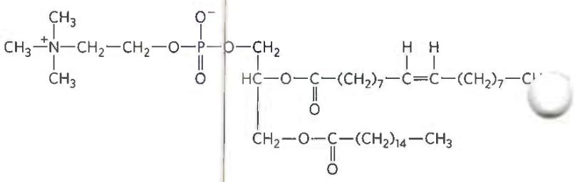

13. Experimental Determination of the Structure of a Biomolecule Researchers isolated an unknown substance, X, from rabbit muscle. They determined its structure from the following observations and experiments. Qualitative analysis showed that X was composed entirely of C, H, and O. A weighed sample of X was completely oxidized, and the $H_{2}O$ and $CO_{2}$ produced were measured; this quantitative analysis revealed that X contained 40.00% C, 6.71% H, and 53.29% O by weight. The molecular mass of X, determined by mass spectrometry, was 90.00 u (atomic mass units; see Box 1-1). Infrared spectroscopy showed that X contained one double bond. X dissolved readily in water to give an acidic solution that demonstrated optical activity when tested in a polarimeter.

(a) Determine the empirical and molecular formula of X.

(b) Draw the possible structures of X that fit the molecular formula and contain one double bond. Consider only linear or branched structures and disregard cyclic structures. Note that oxygen makes very poor bonds to itself.

(c) What is the structural significance of the observed optical activity? Which structures in (b) are consistent with the observation?

(d) What is the structural significance of the observation that a solution of X was acidic? Which structures in (b) are consistent with the observation?

(e) What is the structure of X? Is more than one structure consistent with all the data?

14. Naming Stereoisomers with One Chiral Carbon Using the RS System Propranolol is a chiral compound. (R)-Propranolol is used as a contraceptive; (S)-propranolol is used to treat hypertension. The structure of one of the propranolol isomers is shown.

(a) Identify the chiral carbon in propranolol.

(b) Does the structure show the $(R)$ isomer or the $(S)$ isomer?

(c) Draw the other isomer of propranolol.

15. Naming Stereoisomers with Two Chiral Carbons Using the RS System The $(R,R)$ isomer of methylphenidate (Ritalin) is used to treat attention deficit hyperactivity disorder (ADHD). The $(S,S)$ isomer is an antidepressant.

(a) Identify the two chiral carbons in the methylphenidate structure shown here.

(b) Does the structure show the $(R,R)$ isomer or the $(S,S)$ isomer?

(c) Draw the other isomer of methylphenidate.

16. State of Bacterial Spores A bacterial spore is metabolically inert and may remain so for years. Spores contain no measurable ATP, exclude water, and consume no oxygen. However, when a spore is transferred into an appropriate liquid medium, it germinates, makes ATP, and begins cell division within an hour. Is the spore dead, or is it alive? Explain your answer.

17. Activation Energy of a Combustion Reaction Firewood is chemically unstable compared with its oxidation products, $CO_{2}$ and $H_{2}O$ .

$$
\mathrm{Firewood} + \mathrm{O} _ {2} \rightarrow \mathrm{CO} _ {2} + \mathrm{H} _ {2} \mathrm{O}
$$

(a) What can one say about the standard free-energy change for this reaction?

(b) Why doesn't firewood stacked beside the fireplace undergo spontaneous combustion to its much more stable products?

(c) How can the activation energy be supplied to this reaction?
(d) Suppose you have an enzyme (firewoodase) that catalyzes the rapid conversion of firewood to $CO_{2}$ and $H_{2}O$ at room temperature. How does the enzyme accomplish that in thermodynamic terms?

18. Consequence of Nucleotide Substitutions Suppose deoxycytidine (C) in one strand of DNA is mistakenly replaced with deoxythymidine (T) during cell division. What is the consequence for the cell if the deoxynucleotide change is not repaired?

19. Mutation and Protein Function Suppose that the gene for a protein 500 amino acids in length undergoes a mutation. If the mutation causes the synthesis of a mutant protein in which just one of the 500 amino acids is incorrect, the protein may lose all of its biological function. How can this small change in a protein's sequence inactivate it?

20. Gene Duplication and Evolution Suppose that a rare DNA replication error results in the duplication of a single gene, giving the daughter cell two copies of the same gene.

(a) How does this change favor the acquisition of a new function by the daughter cell?

(b) In the vascular plant Arabidopsis thaliana, 50% to 60% of the genome consists of duplicate content. How might this confer a selective advantage?

21. Cryptobiotic Tardigrades and Life Tardigrades, also called water bears or moss piglets, are small animals that can grow to about 0.5 mm in length. Terrestrial tardigrades (pictured here) typically live in the moist environments of mosses and lichens. Some of these species are capable of surviving extreme conditions. Some tardigrades can enter a reversible state called cryptobiosis, in which metabolism completely stops until conditions become hospitable. In this state, various tardigrade species have withstood dehydration, extreme temperatures from -200 °C to +150°C, pressures from 6,000 atm to a vacuum, anoxic conditions, and the radiation of space. Do tardigrades in cryptobiosis meet the definition of life? Why or why not?

  
Eye of Science/Science Source

22. Effects of Ionizing Radiation on Bacteria Treatment of a bacterial culture (E. coli) with ionizing radiation resulted in the survival of only a tiny fraction of the cells. The survivors proved to be more resistant to radiation than the starting cells were. When exposed to even higher levels of radiation, a tiny fraction of these resistant cells survived with even greater resistance to radiation. Repetition of this protocol with progressively higher levels of radiation yielded a strain of E. coli that was far more resistant to radiation than the starting strain. What changes might be occurring with each successive round of radiation and selection?

23. Data Analysis Problem In 1956, E. P. Kennedy and S. B. Weiss published their study of membrane lipid phosphatidylcholine (lecithin) synthesis in rat liver. Their hypothesis was that phosphocholine joined with some cellular component to yield lecithin. In an earlier experiment, incubating $[^{32}P]$ -labeled phosphocholine at physiological temperature (37 °C) with broken cells from rat liver yielded labeled lecithin. This became their assay for the enzymes involved in lecithin synthesis.

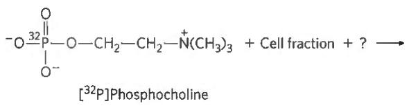

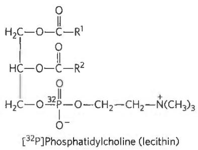

The researchers centrifuged the broken cell preparation to separate the membranes from the soluble proteins. They tested three preparations: whole extract, membranes, and soluble proteins. Table 1 summarizes the results.

TABLE 1 Cell Fraction Requirement for Incorporation of $[^{32}P]$ -Phosphocholine into Lecithin

<table><tr><td>Tube number</td><td>Preparation</td><td>[32P]-Phosphocholine incorporated into lecithin</td></tr><tr><td>1</td><td>Whole extract</td><td>6.3 μmol</td></tr><tr><td>2</td><td>Membranes</td><td>18.5 μmol</td></tr><tr><td>3</td><td>Soluble proteins</td><td>2.6 μmol</td></tr></table>

(a) Was the enzyme responsible for this reaction a soluble protein from the cytoplasm or a membrane-bound enzyme? Why?

Having determined the location of the enzyme, the researchers investigated the effect of pH on enzyme activity. They carried out their standard assay in solutions buffered at different pH values between 6 and 9. The graph shows the results. The enzyme activity is the amount, in nanomoles per liter, of $[^{32}P]$ -phosphocholine incorporated into lecithin.

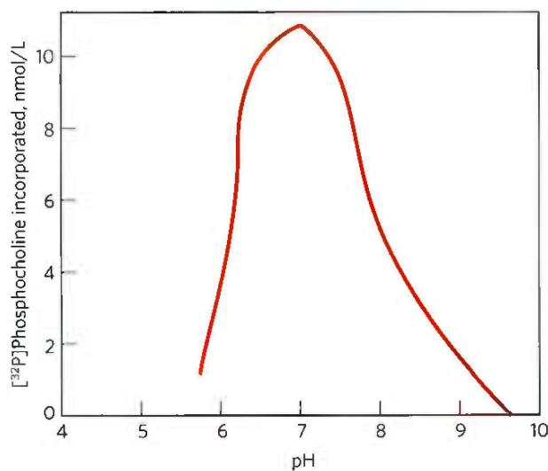  
(b) What is the optimal pH for this enzyme?

(c) How much more active is the enzyme at pH 8 than at pH 6?

Reactions with phosphorylated intermediates commonly require a divalent metal ion. The researchers tested $Ca^{2+}$ , $Mn^{2+}$ , and $Mg^{2+}$ to determine if a divalent metal ion was important in this reaction. The graph shows the results.

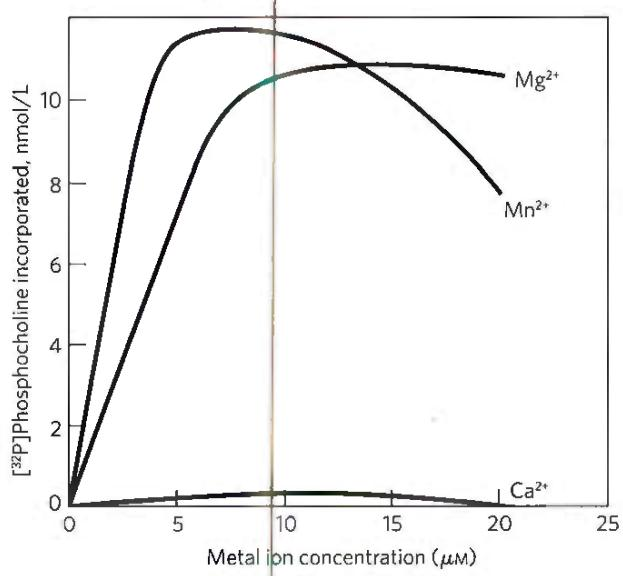  
(d) What is the metal ion dependence?

The researchers reasoned that the reaction might require energy. To test the hypothesis, they incubated rat liver membranes and $[^{32}P]$ -phosphocholine with different nucleotides. Because the ATP sold in 1956 was not as highly purified as modern commercial preparations, the researchers used two different ATP sources, lot 116 and lot 122. Table 2 gives the results.

TABLE 2 Requirement of Nucleotides for Lecithin Synthesis from Phosphocholine

<table><tr><td>Tube number</td><td>Nucleotide added</td><td> $^{32}$ P incorporated into lecithin</td></tr><tr><td>1</td><td>5 μmol ATP from lot 116</td><td>5.1 μmol</td></tr><tr><td>2</td><td>5 μmol ATP from lot 122</td><td>0.2 μmol</td></tr><tr><td>3</td><td>5 μmol ATP from lot 122 + 0.5 μmol GDP</td><td>0.4 μmol</td></tr><tr><td>4</td><td>5 μmol ATP from lot 122 + 0.5 μmol CTP</td><td>15.0 μmol</td></tr><tr><td>5</td><td>5 μmol ATP from lot 122 + 0.1 μmol CTP</td><td>10.0 μmol</td></tr><tr><td>6</td><td>5 μmol ATP from lot 122 + 0.5 μmol UTP</td><td>0.4 μmol</td></tr><tr><td>7</td><td>0.5 μmol CTP with no ATP</td><td>8.0 μmol</td></tr></table>

(e) What is your interpretation of the results in Table 2?
(f) Write the equation for the reaction the researchers studied. Include all required components, including the cell fraction, metal ion, and nucleotide cofactor.

## Reference

Kennedy, E. P. and S. B. Weiss. 1956. The function of cytidine coenzymes in the biosynthesis of phospholipids. J. Biol. Chem. 193–214.

# STRUCTURE AND CATALYSIS

## PART OUTLINE

2 Water, the Solvent of Life 43

3 Amino Acids, Peptides, and Proteins 70

4 The Three-Dimensional Structure of Proteins 106

5 Protein Function 147

6 Enzymes 177

7 Carbohydrates and Glycobiology 229

8 Nucleotides and Nucleic Acids 263

9 DNA-Based Information Technologies 301

10 Lipids 341

11 Biological Membranes and Transport 367

12 Biochemical Signaling 408

Biochemistry uses the techniques and insights of chemistry to understand the amazing properties and activities of living organisms. This requires at the outset that the student acquire the vocabulary and language of biochemistry, which are provided in Part I.

The chapters of Part I are devoted to the structure and function of the major classes of cellular constituents: water (Chapter 2), amino acids and proteins (Chapters 3 through 6), sugars and polysaccharides (Chapter 7), nucleotides and nucleic acids (Chapter 8), fatty acids and lipids (Chapter 10), and, finally, membranes and membrane signaling proteins (Chapters 11 and 12). We also discuss, in the context of structure and function, the technologies used to study each class of biomolecules. One whole chapter (Chapter 9) is devoted entirely to biotechnologies associated with cloning and genomics.

We begin, in Chapter 2, with water, because its properties affect the structure and function of all other cellular constituents. For each class of organic molecules, we first consider the covalent chemistry of the monomeric units (amino acids, monosaccharides, nucleotides, and fatty acids) and then describe the structure of the macromolecules and supramolecular complexes derived from them. An overarching theme is that the polymeric macromolecules in living systems, though large, are highly ordered chemical entities, with specific sequences of monomeric subunits giving rise to discrete structures and functions. This fundamental theme can be broken down into three interrelated principles: (1) the unique structure of each macromolecule determines its function; (2) noncovalent interactions play a critical role in the structure and thus the function of macromolecules; and (3) the monomeric subunits in polymeric macromolecules occur in specific sequences, representing a form of information on which the ordered living state depends.

The relationship between structure and function is especially evident in proteins, which exhibit an extraordinary diversity of functions. One particular polymeric sequence of amino acids produces a strong, fibrous structure found in hair and wool; another produces a protein that transports oxygen in the blood; a third binds other proteins and catalyzes cleavage of the bonds between their amino acids. Similarly, the special functions of polysaccharides, nucleic acids, and lipids can be understood as resulting directly from their chemical structure, with their characteristic monomeric subunits precisely linked to form functional polymers. Sugars linked together become energy stores, structural fibers, and points of specific molecular recognition; nucleotides strung together in DNA or RNA provide the blueprint for an entire organism; and aggregated lipids form membranes. Chapter 12 unifies the discussion of biomolecule function, describing how specific signaling systems regulate the activities of biomolecules—within a cell, within an organ, and among organs—to keep an organism in homeostasis. Failure to maintain homeostasis results in failed function—that is, disease.

As we move from monomeric units to larger and larger polymers, the chemical focus shifts from covalent bonds to noncovalent interactions. Covalent bonds, at the monomeric and macromolecular level, place constraints on the shapes assumed by large biomolecules. It is the numerous noncovalent interactions, however, that dictate the stable, native conformations of large molecules while permitting the flexibility necessary for their biological function. As we shall see, noncovalent interactions are essential to the catalytic power of enzymes, the critical interaction of complementary base pairs in nucleic acids, and the arrangement and properties of lipids in membranes. The principle that sequences of monomeric subunits are rich in information emerges most fully in the discussion of nucleic acids (Chapter 8). However, proteins and some short polymers of sugars (oligosaccharides) are also information-rich molecules. The amino acid sequence is a form of information that directs the folding of the protein into its unique three-dimensional structure and ultimately determines the function of the protein. Some oligosaccharides also have unique sequences and three-dimensional structures that are recognized by other macromolecules.

Each class of molecules has a similar structural hierarchy: subunits of fixed structure are connected by bonds of limited flexibility to form macromolecules with three-dimensional structures determined by noncovalent interactions. These macromolecules then interact to form the supramolecular structures and organelles that allow a cell to carry out its many metabolic functions. Together, the molecules described in Part I are the stuff of life.

# WATER, THE SOLVENT OF LIFE

## 2.1 Weak Interactions in Aqueous Systems 43

2.2 Ionization of Water, Weak Acids, and Weak Bases 53

## 2.3 Buffering against pH Changes in Biological Systems 59

Water is the most abundant substance in living systems, making up 70% or more of the weight of most organisms. The first living organisms on Earth doubtless arose in an aqueous environment, and the course of evolution has been shaped by the properties of the aqueous medium in which life began.

This chapter begins with descriptions of the physical and chemical properties of water, to which all aspects of cell structure and function are adapted. The attractive forces between water molecules and the slight tendency of water to ionize are of crucial importance to the structure and function of biomolecules. We review the topic of ionization in terms of equilibrium constants, pH, and titration curves, and we consider how aqueous solutions of weak acids or bases and their salts act as buffers against pH changes in biological systems. The water molecule and its ionization products, $H^{+}$ and $OH^{-}$ , profoundly influence the structure, self-assembly, and properties of all cellular components, including proteins, nucleic acids, and lipids. The noncovalent interactions responsible for the strength and specificity of “recognition” among biomolecules are decisively influenced by water’s properties as a solvent, including its ability to form hydrogen bonds with itself and with solutes.

This chapter emphasizes the following principles:

The solvent properties of water shaped the evolution of living things. Most small intermediates of metabolism, as well as nucleic acids and proteins, are soluble in water. Lipid bilayers, the likely forerunners of biological membranes, form spontaneously in water and are stabilized by their interaction with it. Although hydrogen bonds, ionic interactions, and the hydrophobic effect are individually weak, their

combined effects powerfully influence the three-dimensional shape and stability of biological molecules and structures.

P2 The ionization behavior of water and of weak acids and bases dissolved in water can be represented by one or more equilibrium constants. Most biomolecules are ionizable; their structure and function depend on their ionization state, which is characterized by equilibrium constants.

An aqueous solution of a weak acid and its salt makes a buffer that resists changes in pH in response to added acid or base. Biological systems are buffered to maintain a narrow pH range, in which their macromolecules retain their functional structure, which depends on their ionization state. Conditions that produce blood pH outside the range of 7.3 to 7.5 are life-threatening in humans.

P4 Enzymes, which catalyze all of the processes inside a cell, have evolved to function optimally at near-neutral (physiological) pH. However, enzymes that function in intracellular compartments of low or high pH show their greatest activity and stability at those pH values.

## 2.1 Weak Interactions in Aqueous Systems

Hydrogen bonds between water molecules provide the cohesive forces that make water a liquid at room temperature and a crystalline solid (ice) with a highly ordered arrangement of molecules at cold temperatures. P1 Polar biomolecules dissolve readily in water because they can replace water-water interactions with energetically favorable water-solute interactions. In contrast, nonpolar biomolecules are poorly soluble in water because they interfere with water-water interactions but are unable to form water-solute interactions. In aqueous solutions, nonpolar molecules tend to cluster together. P1 Hydrogen bonds and ionic, hydrophobic (from the Greek, meaning "water-fearing"), and van der Waals interactions are individually weak, but collectively they have a very significant influence on the three-dimensional structures of proteins, nucleic acids, polysaccharides, and membrane lipids.

## Hydrogen Bonding Gives Water Its Unusual Properties

Water has a higher melting point, boiling point, and heat of vaporization than most other common solvents. These unusual properties are a consequence of attractions between adjacent water molecules that give liquid water great internal cohesion. A look at the electron structure of the $H_{2}O$ molecule reveals the cause of these intermolecular attractions.

Each hydrogen atom of a water molecule shares an electron pair with the central oxygen atom. The geometry of the molecule is dictated by the shapes of the outer electron orbitals of the oxygen atom, which are similar to the $sp^{3}$ bonding orbitals of carbon (see Fig. 1-13). These orbitals describe a rough tetrahedron, with a hydrogen atom at each of two corners and nonbonding orbitals at the other two corners (Fig. 2-1a). The H—O—H bond angle is $104.5^{\circ}$ , slightly less than the $109.5^{\circ}$ of a perfect tetrahedron because of crowding by the nonbonding orbitals of the oxygen atom.

The oxygen nucleus attracts electrons more strongly than does the hydrogen nucleus (a proton); that is, oxygen is more electronegative. This means that the shared electrons are more often in the vicinity of the oxygen atom than of the hydrogen. The result of this unequal electron sharing is two electric dipoles in the water molecule, one along each of the H—O bonds; each hydrogen atom bears a partial positive charge ( $\delta+$ ), and the oxygen atom bears a partial negative charge equal in magnitude to the sum of the two partial positives (2δ⁻). As a result, there is an electrostatic attraction between the oxygen atom of one water molecule and the hydrogen of another (Fig. 2-1b), called a hydrogen bond. Throughout this book, we represent hydrogen bonds with three parallel blue lines, as in Figure 2-1b.

  
(a)

  
FIGURE 2-1 Structure of the water molecule. (a) The dipolar nature of the $\mathrm{H}_2\mathrm{O}$ molecule is shown in a ball-and-stick model; the dashed lines represent the nonbonding orbitals. There is a nearly tetrahedral arrangement of the outer-shell electron pairs around the oxygen atom; the two hydrogen atoms have localized partial positive charges $(\delta +)$ , and the oxygen atom has a partial negative charge $(\delta -)$ . (b) Two $\mathrm{H}_2\mathrm{O}$ molecules are joined by a hydrogen bond (designated here, and throughout this book, by three blue lines) between the oxygen atom of the upper molecule and a hydrogen atom of the lower one. Hydrogen bonds are longer and weaker than covalent O—H bonds.

Hydrogen bonds are relatively weak. Those in liquid water have a bond dissociation energy (the energy required to break a bond) of about 23 kJ/mol, compared with 470 kJ/mol for the covalent O—H bond in water or 350 kJ/mol for a covalent C—C bond. The hydrogen bond is about 10% covalent, due to overlaps in the bonding orbitals, and about 90% electrostatic. At room temperature, the thermal energy of an aqueous solution (the kinetic energy of motion of the individual atoms and molecules) is of the same order of magnitude as that required to break hydrogen bonds. When water is heated, the increase in temperature reflects the faster motion of individual water molecules. At any given time, most of the molecules in liquid water are hydrogen-bonded, but the lifetime of each hydrogen bond is just 1 to 20 picoseconds (1 ps = $10^{-12}$ s); when one hydrogen bond breaks, another hydrogen bond forms, with the same partner or a new one, within 0.1 ps. The apt phrase “flickering clusters” has been applied to the short-lived groups of water molecules interlinked by hydrogen bonds in liquid water. The sum of all the hydrogen bonds between $H_{2}O$ molecules confers great internal cohesion on liquid water. Extended networks of hydrogen-bonded water molecules also form bridges between solutes (proteins and nucleic acids, for example) that allow the larger molecules to interact with each other over distances of several nanometers without physically touching.

The nearly tetrahedral arrangement of the orbitals about the oxygen atom (Fig. 2-1a) allows each water molecule to form hydrogen bonds with as many as four neighboring water molecules. In liquid water at room temperature and atmospheric pressure, however, water molecules are disorganized and in continuous motion, so that each molecule forms hydrogen bonds with an average of only 3.4 other molecules. In ice, on the other hand, each water molecule is fixed in space and forms hydrogen bonds with a full complement of four other water molecules to yield a regular lattice structure (Fig. 2-2). Hydrogen bonds account for the relatively high melting point of water, because much thermal energy is required to break a sufficient proportion of hydrogen bonds to destabilize the crystal lattice of ice. When ice melts or water evaporates, heat is taken up by the system:

$$
\mathrm{H} _ {2} \mathrm{O} (\text { solid }) \longrightarrow \mathrm{H} _ {2} \mathrm{O} (\text { liquid }) \quad \Delta H = + 5. 9 \mathrm{kJ/mol}
$$

$$
\mathrm{H} _ {2} \mathrm{O} (\text { liquid }) \longrightarrow \mathrm{H} _ {2} \mathrm{O} (\text { gas }) \quad \Delta H = + 4 4. 0 \mathrm{kJ/mol}
$$

During melting or evaporation, the entropy of the aqueous system increases as the highly ordered arrays of water molecules in ice relax into the less orderly hydrogen-bonded arrays in liquid water or into the wholly disordered gaseous state. At room temperature, both the melting of ice and the evaporation of water occur spontaneously; the tendency of the water molecules to associate through hydrogen bonds is outweighed by the energetic push toward randomness. Recall that the free-energy change ( $\Delta G$ ) must have a negative value for a process to occur spontaneously: $\Delta G = \Delta H - T \Delta S$ , where $\Delta G$ represents the driving force, $\Delta H$ the enthalpy change from making and breaking bonds, and $\Delta S$ the change in randomness. Because $\Delta H$ is positive for melting and evaporation, it is clearly the increase in entropy ( $\Delta S$ ) that makes $\Delta G$ negative and drives these changes.

  
FIGURE 2-2 Hydrogen bonding in ice. In ice, each water molecule forms four hydrogen bonds, the maximum possible for a water molecule, creating a regular crystal lattice. By contrast, in liquid water at room temperature and atmospheric pressure, each water molecule hydrogen-bonds with an average of 3.4 other water molecules. This crystal lattice structure makes ice less dense than liquid water, and thus ice floats on liquid water.

## Water Forms Hydrogen Bonds with Polar Solutes

Hydrogen bonds are not unique to water. They readily form between an electronegative atom (the hydrogen acceptor, usually oxygen or nitrogen) and a hydrogen atom covalently bonded to another electronegative atom (the hydrogen donor) in the same or another molecule (Fig. 2-3). Hydrogen atoms covalently bonded to carbon atoms do not participate in hydrogen bonding, because carbon is only slightly more electronegative than hydrogen and thus the C—H bond is only very weakly polar. The distinction explains why butane $(\mathrm{CH}_{3}(\mathrm{CH}_{2})_{2}\mathrm{CH}_{3})$ has a boiling point of only -0.5 °C, whereas butanol $(\mathrm{CH}_{3}(\mathrm{CH}_{2})_{2}\mathrm{CH}_{2}\mathrm{OH})$ has a relatively high boiling point of 117 °C. Butanol has a polar hydroxyl group and thus can form intermolecular hydrogen bonds. Uncharged but polar biomolecules such as sugars dissolve readily in water because of the stabilizing effect of hydrogen bonds between the hydroxyl groups or carbonyl oxygen of the sugar and the polar water molecules. P1 Alcohols, aldehydes, ketones, and compounds containing N—H bonds all form hydrogen bonds with water molecules (Fig. 2-4) and tend to be soluble in water.

  
FIGURE 2-3 Common hydrogen bonds in biological systems. The hydrogen acceptor is usually oxygen or nitrogen; the hydrogen donor is another electronegative atom.

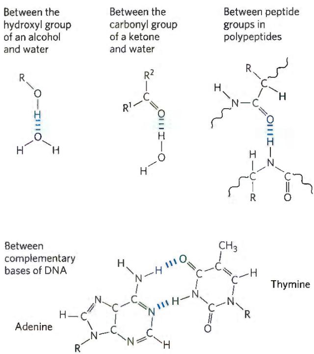  
FIGURE 2-4 Some biologically important hydrogen bonds.

Hydrogen bonds are strongest when the bonded molecules are oriented to maximize electrostatic interaction, which occurs when the hydrogen atom and the two atoms that share it are in a straight line—that is, when the acceptor atom is in line with the covalent bond between the donor atom and H (Fig. 2-5). This arrangement puts the positive charge of the hydrogen ion directly between the two partial negative charges. Hydrogen bonds are thus highly directional and capable of holding two hydrogen-bonded molecules or groups in a specific geometric arrangement. As we shall see, this property of hydrogen bonds confers very precise three-dimensional structures on protein and nucleic acid molecules, which have many intramolecular hydrogen bonds.

  
FIGURE 2-5 Directionality of the hydrogen bond. The attraction between the partial electric charges is greatest when the three atoms involved in the bond (in this case O, H, and O) lie in a straight line. When the hydrogen-bonded moieties are structurally constrained (when they are parts of a single protein molecule, for example), this ideal geometry may not be possible and the resulting hydrogen bond is weaker.

## Water Interacts Electrostatically with Charged Solutes

Water is a polar solvent. It readily dissolves most biomolecules, which are generally charged or polar compounds (Table 2-1); compounds that dissolve easily in water are hydrophilic (from the Greek, meaning "water-loving"). In contrast, nonpolar solvents such as chloroform and benzene are poor solvents for polar biomolecules but easily dissolve those that are hydrophobic—nonpolar molecules such as lipids and waxes. Amphipathic compounds contain regions that are polar (or charged) and regions that are nonpolar. Their behavior in aqueous solution is discussed on p. 48.

Water dissolves salts such as NaCl by hydrating and stabilizing the $Na^{+}$ and $Cl^{-}$ ions, weakening the electrostatic interactions between them and thus counteracting their tendency to associate in a crystalline lattice (Fig. 2-6). Water also readily dissolves charged biomolecules, including compounds with functional groups such as ionized carboxylic acids ( $—COO^{-}$ ), protonated amines ( $—NH_{3}^{+}$ ), and phosphate esters or anhydrides. Water replaces the solute-solute hydrogen bonds linking these biomolecules to each other with solute-water hydrogen bonds, thus screening the electrostatic interactions between solute molecules.

Ionic interactions between dissolved ions are much stronger in less polar environments, because there is less screening of charges by the nonpolar solvent. Water is effective in screening the electrostatic interactions between dissolved ions because it has a high dielectric constant, a physical property that reflects the number of dipoles in a solvent. The strength, or force (F), of ionic interactions in a solution depends on the magnitude of the charges (Q), the distance between the charged groups (r), and the dielectric constant (ε, which is dimensionless) of the solvent in which the interactions occur:

$$
F = \frac {Q _ {1} Q _ {2}}{\varepsilon r ^ {2}}
$$

For water at 25 °C, ε is 78.5, and for the very nonpolar solvent benzene, ε is 4.6. The dependence on $r^{2}$ is such that ionic attractions or repulsions operate only over short distances—in the range of 10 to 40 nm (depending on the electrolyte concentration) when the solvent is water. In biomolecules, it is not the dielectric constant for the bulk solvent, but the highly localized dielectric constant, as in a hydrophobic pocket of a protein, that determines the interaction of two polar moieties.

As a salt such as NaCl dissolves, the $Na^{+}$ and $Cl^{-}$ ions leaving the crystal lattice acquire far greater freedom of motion (Fig. 2-6). The resulting increase in entropy (randomness) of the system is largely responsible for the ease of dissolving salts such as NaCl in water. In thermodynamic terms, formation of the solution occurs with a favorable free-energy change: $\Delta G = \Delta H - T \Delta S$ , where $\Delta H$ has a small positive value and $T \Delta S$ a large positive value; thus $\Delta G$ is negative.

$^{a}$ The arrows represent electric dipoles; there is a partial negative charge ( $\delta-$ ) at the head of the arrow, a partial positive charge ( $\delta+$ ; not shown here) at the tail. $^{b}$ Note that polar molecules dissolve far better even at low temperatures than do nonpolar molecules at relatively high temperatures.

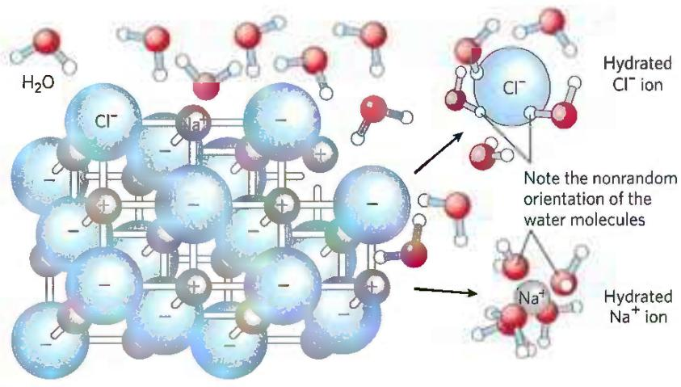  
FIGURE 2-6 Water as solvent. Water dissolves many crystalline salts by hydrating their component ions. The NaCl crystal lattice is disrupted as water molecules cluster about the $\mathrm{Cl^-}$ and $\mathrm{Na^{+}}$ ions. The ionic charges are partially neutralized, and the electrostatic attractions necessary for lattice formation are weakened.

## Nonpolar Gases Are Poorly Soluble in Water

The biologically important gases $CO_{2}$ , $O_{2}$ , and $N_{2}$ are nonpolar molecules. In $O_{2}$ and $N_{2}$ , electrons are shared equally by both atoms. In $CO_{2}$ , each C=O bond is polar, but the two dipoles are oppositely directed and cancel each other (Table 2-2). The movement of molecules from the disordered gas phase into aqueous solution constrains their motion and the motion of water molecules and therefore represents a decrease in entropy. The nonpolar nature of these gases and the decrease in entropy when they enter solution combine to make them very poorly soluble in water. Some organisms have water-soluble “carrier proteins” (hemoglobin and myoglobin, for example) that facilitate the transport of $O_{2}$ . Carbon dioxide forms carbonic acid ( $H_{2}CO_{3}$ ) in aqueous solution and is transported as the $HCO_{3}^{-}$ (bicarbonate) ion, either free—bicarbonate is very soluble in water (\~100 g/L at 25 °C)—or bound to hemoglobin. Three other gases, $NH_{3}$ , NO, and $H_{2}S$ , also have biological roles in some organisms; these gases are polar and dissolve readily in water.

## Nonpolar Compounds Force Energetically Unfavorable Changes in the Structure of Water

When water is mixed with benzene or hexane, two phases form; neither liquid is soluble in the other. Nonpolar compounds such as benzene and hexane are hydrophobic—they are unable to undergo energetically favorable interactions with water molecules, and they interfere with the hydrogen bonding among water molecules. All molecules or ions in aqueous solution interfere with the hydrogen bonding of some water molecules in their immediate vicinity, but polar or charged solutes (such as NaCl) compensate for lost water-water hydrogen bonds by forming new solute-water interactions. The net change in enthalpy ( $\Delta H$ ) for dissolving these solutes is generally small. Hydrophobic solutes, however, offer no such compensation, and their addition to water may therefore result in a small gain of enthalpy; the breaking of hydrogen bonds between water molecules takes up energy from the system, requiring the input of energy from the surroundings. In addition to requiring this input of energy, dissolving hydrophobic compounds in water produces a measurable decrease in entropy. Water

<table><tr><td colspan="4">TABLE 2-2 Solubilities of Some Gases in Water</td></tr><tr><td>Gas</td><td> $Structure^a$ </td><td>Polarity</td><td>Solubilityin water (g/L) $^b$ </td></tr><tr><td>Nitrogen</td><td>N≡N</td><td>Nonpolar</td><td>0.018 (40 °C)</td></tr><tr><td>Oxygen</td><td>O=O</td><td>Nonpolar</td><td>0.035 (50 °C)</td></tr><tr><td>Carbon dioxide</td><td>δ- δ- O=C=O</td><td>Nonpolar</td><td>0.97 (45 °C)</td></tr><tr><td>Ammonia</td><td>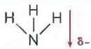</td><td>Polar</td><td>900 (10 °C)</td></tr><tr><td>Hydrogen sulfide</td><td></td><td>Polar</td><td>1,860 (40 °C)</td></tr></table>

## Clusters of lipid molecules

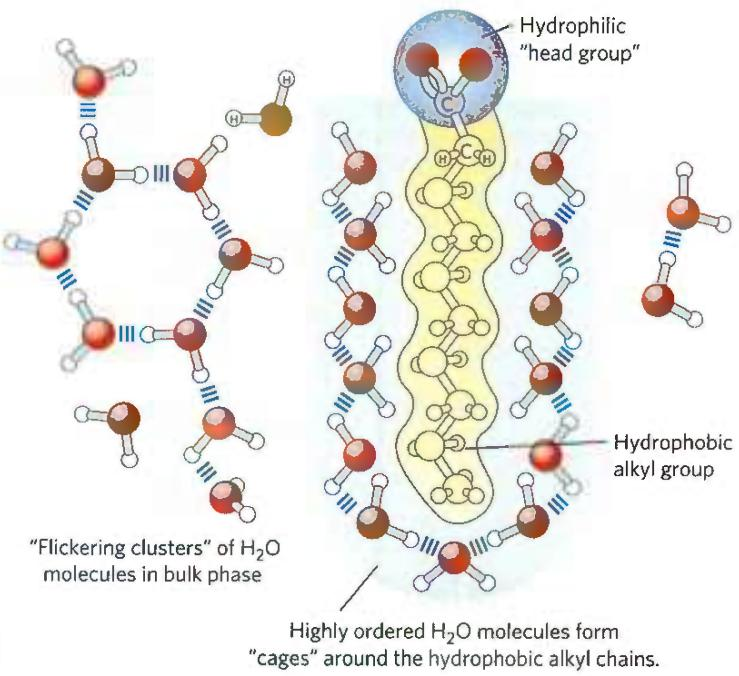  
(a)  
FIGURE 2-7 Amphipathic compounds in aqueous solution form structures that increase entropy. (a) Long-chain fatty acids have very hydrophobic alkyl chains, each of which is surrounded by a layer of highly ordered water molecules. (b) By clustering together in micelles, the fatty acid molecules expose the smallest possible hydrophobic surface area to the water, and fewer water molecules are required in the shell of ordered water. The entropy gained by freeing immobilized water molecules stabilizes the micelle.

molecules in the immediate vicinity of a nonpolar solute are constrained in their possible orientations, as they form a highly ordered cagelike shell around each solute molecule to maximize solvent-solvent hydrogen bonding. These water molecules are not as highly oriented as those in clathrates, crystalline compounds of nonpolar solutes and water, but the effect is the same in both cases: the ordering of water molecules reduces entropy. The number of ordered water molecules, and therefore the magnitude of the entropy decrease, is proportional to the surface area of the hydrophobic solute enclosed within the cage of water molecules. The free-energy change for dissolving a nonpolar solute in water is thus unfavorable: $\Delta G = \Delta H - T \Delta S$ , where $\Delta H$ has a positive value, $\Delta S$ has a negative value, and $\Delta G$ is positive.

When an amphipathic compound (Table 2-1) is mixed with water, the polar, hydrophilic region interacts favorably with the water and tends to dissolve, but the nonpolar, hydrophobic region tends to avoid contact with the water (Fig. 2-7a). The nonpolar regions of the molecules cluster together to present the smallest hydrophobic area to the aqueous solvent, and the polar regions are arranged to maximize their interaction with each other and with the solvent (Fig. 2-7b), a phenomenon called the hydrophobic effect. These stable structures of amphipathic compounds in water, called micelles, may contain hundreds or thousands of molecules. By clustering together, nonpolar regions of the molecules achieve the greatest thermodynamic stability by minimizing the number of ordered water molecules required to surround hydrophobic portions of the solute molecules, increasing the entropy of the system. A special case of this hydrophobic effect is the formation of lipid bilayers in biological membranes (see Fig. 11-1).

  
Dispersion of lipids in $\mathsf{H}_2\mathsf{O}$ Each lipid molecule forces surrounding $\mathsf{H}_2\mathsf{O}$ molecules to become highly ordered.  
Only lipid portions at the edge of the cluster force the ordering of water. Fewer $H_{2}O$ molecules are ordered, and entropy is increased.  
All hydrophobic groups are sequestered from water; ordered shell of $H_{2}O$ molecules is minimized, and entropy is further increased.

Many biomolecules are amphipathic; proteins, pigments, certain vitamins, and the sterols and phospholipids of membranes all have both polar and nonpolar surface regions. Structures composed of these molecules are stabilized by the hydrophobic effect, which favors aggregation of the nonpolar regions. P1 The hydrophobic effect on interactions among lipids, and between lipids and proteins, is the most important determinant of structure in biological membranes. The aggregation of nonpolar amino acids in protein interiors, driven by the hydrophobic effect, also stabilizes the three-dimensional structures of proteins.

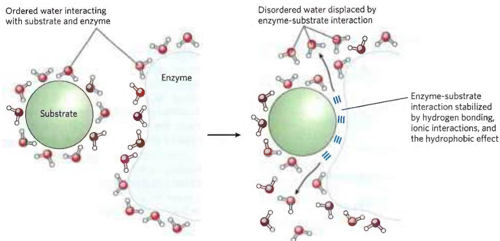  
FIGURE 2-8 Release of ordered water favors formation of an enzyme-substrate complex. While separate, both enzyme and substrate force neighboring water molecules into an ordered shell. Binding of  
substrate to enzyme releases some of the ordered water, and the resulting increase in entropy provides a thermodynamic push toward formation of the enzyme-substrate complex.

Hydrogen bonding between water and polar solutes also causes an ordering of water molecules, but the energetic effect is less significant than with nonpolar solutes. Disruption of ordered water molecules is part of the driving force for binding of a polar substrate (reactant) to the complementary polar surface of an enzyme: entropy increases as the enzyme displaces ordered water from the substrate and as the substrate displaces ordered water from the enzyme surface (Fig. 2-8). This topic is discussed in greater depth in Chapter 6 (p. 185).

## van der Waals Interactions Are Weak Interatomic Attractions

When two uncharged atoms are brought very close together, their surrounding electron clouds influence each other. Random variations in the positions of the electrons around one nucleus may create a transient electric dipole, which induces a transient, opposite electric dipole in the nearby atom. The two dipoles weakly attract each other, bringing the two nuclei closer. These weak attractions are called van der Waals interactions (also known as London dispersion forces). As the two nuclei draw closer together, their electron clouds begin to repel each other. At the point where the net attraction is maximal, the nuclei are said to be in van der Waals contact. Each atom has a characteristic van der Waals radius, a measure of how close that atom will allow another to approach (Table 2-3). In the space-filling molecular models shown throughout this book, the atoms are depicted in sizes proportional to their van der Waals radii.

## Weak Interactions Are Crucial to Macromolecular Structure and Function

I believe that as the methods of structural chemistry are further applied to physiological problems, it will be found that the significance of the hydrogen bond for physiology is greater than that of any other single structural feature.

—Linus Pauling,

## The Nature of the Chemical Bond, 1939

The noncovalent interactions we have described—hydrogen bonds and ionic, hydrophobic, and van der Waals interactions (Table 2-4)—are much weaker than covalent bonds. An input of about 350 kJ of energy is required to break a mole of $(6 \times 10^{23})$ C—C single bonds, and about 410 kJ is needed to break a mole of C—H bonds, but as little as 4 kJ is sufficient to disrupt a mole of typical van der Waals interactions. Interactions driven by the hydrophobic effect are also much weaker than covalent bonds, although they are substantially strengthened by a highly polar solvent (a concentrated salt solution, for example). Ionic interactions and hydrogen bonds are variable in strength, depending on the polarity of the solvent and the alignment of the hydrogen-bonded atoms, but they are always significantly weaker than covalent bonds. In aqueous solvent at 25 °C, the available thermal energy can be of the same order of magnitude as the strength of these weak interactions, and the interaction between solute and solvent (water) molecules is nearly as favorable as solute-solute interactions. Consequently, hydrogen bonds and ionic, hydrophobic, and van der Waals interactions are continually forming and breaking.

TABLE 2-3 van der Waals Radii and Covalent (Single-Bond) Radii of Some Elements

<table><tr><td>Element</td><td>van der Waals radius (nm)</td><td>Covalent radius for single bond (nm)</td></tr><tr><td>H</td><td>0.11</td><td>0.030</td></tr><tr><td>O</td><td>0.15</td><td>0.066</td></tr><tr><td>N</td><td>0.15</td><td>0.070</td></tr><tr><td>C</td><td>0.17</td><td>0.077</td></tr><tr><td>S</td><td>0.18</td><td>0.104</td></tr><tr><td>P</td><td>0.19</td><td>0.110</td></tr><tr><td>I</td><td>0.21</td><td>0.133</td></tr></table>

Sources: For van der Waals radii, R. Chauvin, J. Phys. Chem. 96:9194, 1992. For covalent radii, L. Pauling, Nature of the Chemical Bond, 3rd edn, Cornell University Press, 1960.

Note: van der Waals radii describe the space-filling dimensions of atoms. When two atoms are joined covalently, the atomic radii at the point of bonding are shorter than the van der Waals radii, because the joined atoms are pulled together by the shared electron pair. The distance between nuclei in a van der Waals Interaction or a covalent bond is about equal to the sum of the van der Waals or covalent radii, respectively, for the two atoms. Thus, the length of a carbon-carbon single bond is about 0.077 nm + 0.077 nm = 0.154 nm.

P1 Although these four types of interactions are individually weak relative to covalent bonds, the cumulative effect of many such interactions can be very significant. For example, the noncovalent binding of an enzyme to its substrate may involve several hydrogen bonds and one or more ionic interactions, as well as the hydrophobic effect and van der Waals interactions. The formation of each of these associations contributes to a net decrease in the free energy of the system. We can calculate the stability of a noncovalent interaction, such as the hydrogen bonding of a small molecule to its macromolecular partner, from the binding energy, the reduction in the energy of the system when binding occurs. Stability, as measured by the equilibrium constant (discussed in Section 2.2) of the binding reaction, varies exponentially with binding energy. To dissociate two biomolecules (such as an enzyme and its bound substrate) that are associated noncovalently through multiple weak interactions, all these interactions must be disrupted at the same time. Because the interactions fluctuate randomly, such simultaneous disruptions are very unlikely. Therefore, numerous weak interactions bestow much greater molecular stability than would be expected intuitively from a simple summation of small binding energies.

Macromolecules such as proteins, DNA, and RNA contain so many sites of potential hydrogen bonding or ionic, van der Waals, or hydrophobic clustering that the cumulative effect can be enormous. P1 For macromolecules, the most stable (that is, the native) structure is usually that in which these weak interactions are maximized. The folding of a single polypeptide or polynucleotide chain into its three-dimensional shape is determined by this principle. The binding of an antigen to a specific antibody depends on the cumulative effects of many weak interactions. The energy released when an enzyme binds noncovalently to its substrate is the main source of the enzyme's catalytic power. The binding of a hormone or a neurotransmitter to its cellular receptor protein is the result of multiple weak interactions. One consequence of the large size of enzymes and receptors (relative to their substrates or ligands) is that their extensive surfaces provide many opportunities for weak interactions. At the molecular level, the complementarity between interacting biomolecules reflects the complementarity and weak interactions between polar and charged groups and the proximity of hydrophobic patches on the surfaces of the molecules.

When the structure of a protein such as hemoglobin is determined by x-ray crystallography (see Fig. 4-30), water molecules are often found to be bound so tightly that they are part of the crystal structure (Fig. 2-9); the same is true for water in crystals of RNA or DNA. These bound water molecules, which can also be detected in aqueous solutions by nuclear magnetic resonance (see Fig. 4-31), have properties that are distinctly different from those of the "bulk" water of the solvent. For example, the bound water molecules are not osmotically active (see below). For many proteins, tightly bound water molecules are essential to their function. In a key reaction in photosynthesis, for example, protons flow across a biological membrane as light drives the flow of electrons through a series of electron-carrying proteins (see Fig. 20-17). One of these proteins, cytochrome f, has a chain of five bound water molecules (Fig. 2-10) that may provide a path for protons to move through the membrane by a process known as proton hopping (described later in this chapter).

  
(a)

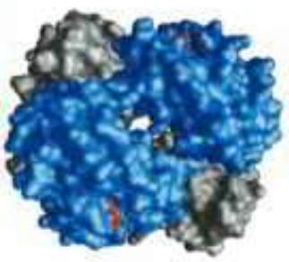  
(b)

FIGURE 2-9 Water binding in hemoglobin. The crystal structure of hemoglobin, shown (a) with bound water molecules (red spheres) and (b) without the water molecules. The water molecules are so firmly bound to the protein that they affect the x-ray diffraction pattern as though they were fixed parts of the protein. The two $\alpha$ subunits of hemoglobin are shown in gray, the two $\beta$ subunits in blue. Each subunit has a bound heme group (red stick structure), visible only in the $\beta$ subunits in this view. The structure and function of hemoglobin are discussed in detail in Chapter 5. [Data from PDB ID 1A3N, J.R.H.Tame and B.Vallone, Acta Crystallogr. D 56805, 2000]  

## Concentrated Solutes Produce Osmotic Pressure

Solutes of all kinds alter certain physical properties of the solvent, water: its vapor pressure, its boiling point, its melting point (freezing point), and its osmotic pressure. These are called colligative properties (colligative meaning "tied together"), because the effect of solutes on all four properties has the same basis: the concentration of water is lower in solutions than in pure water. The effect of solute concentration on the colligative properties of water is independent of the chemical properties of the solute; it depends only on the number of solute particles (molecules or ions) in a given amount of water. For example, a compound such as NaCl, which dissociates in solution, has an effect on osmotic pressure that is twice that of an equal number of moles of a nondissociating solute such as glucose.

  
FIGURE 2-10 Water chain in cytochrome f. Water is bound in a proton channel of the membrane protein cytochrome f, which is part of the energy-trapping machinery of photosynthesis in chloroplasts. Five water molecules are hydrogen-bonded to each other and to functional groups of the protein: the peptide backbone atoms of valine, proline, arginine, and alanine residues, and the side chains of three asparagine and two glutamine residues. The protein has a bound heme, its iron ion facilitating electron flow during photosynthesis. Electron flow is coupled to the movement of protons across the membrane, which probably involves "proton hopping" through this chain of bound water molecules. [Information from P. Nicholls, Cell. Mol. Life Sci. 57:987, 2000, Fig. 6a (redrawn from PDB ID 1HCZ, S. E. Martinez et al., Prot. Sci. 5:1081, 1996).]

Water molecules tend to move from a region of higher water concentration to one of lower water concentration, in accordance with the tendency in nature for a system to become disordered. When two different aqueous solutions are separated by a semipermeable membrane (one that allows the passage of water but not solute molecules), water molecules diffusing from the region of higher water concentration to the region of lower water concentration produce osmotic pressure (Fig. 2-11). Osmotic pressure, $\Pi$ , measured as the force necessary to resist water movement, is approximated by the van't Hoff equation

$$
\Pi = i c R T
$$

in which R is the gas constant and T is the absolute temperature. The symbol i is the van't Hoff factor, a measure of the extent to which the solute dissociates into two or more ionic species. The term c is the solute's molar concentration, and ic is the osmolarity of the solution, the product of the van't Hoff factor i and c. In dilute NaCl solutions, the solute completely dissociates into $Na^{+}$ and $Cl^{-}$ , doubling the number of solute particles, and thus i = 2. For all nonionizing solutes, i = 1. For solutions of several (n) solutes, $\Pi$ is the sum of the contributions of each species:

  
FIGURE 2-11 Osmosis and the measurement of osmotic pressure. (a) The initial state. The tube contains an aqueous solution, the beaker contains pure water, and the semipermeable membrane allows the passage of water but not solute. Water flows from the beaker into the tube to equalize its concentration across the membrane. (b) The final state. Water has moved into the solution of the nonpermeant compound, diluting it and raising the column of solution within the tube. At equilibrium, the force of gravity operating on the solution in the tube exactly balances the tendency of water to move into the tube, where its concentration is lower. (c) Osmotic pressure (II) is measured as the force that must be applied to return the solution in the tube to the level of the water in the beaker. This force is proportional to the height, h, of the column in (b).

$$
\Pi = R T (i _ {1} c _ {1} + i _ {2} c _ {2} + i _ {3} c _ {3} + \dots + i _ {n} c _ {n})
$$

Osmosis, water movement across a semipermeable membrane driven by differences in osmotic pressure, is an important factor in the life of most cells. Plasma membranes are more permeable to water than to most other small molecules, ions, and macromolecules because protein channels (aquaporins; see Table 11-3) in the membrane selectively permit the passage of water. Solutions of osmolarity equal to that of a cell's cytosol are said to be isotonic relative to that cell. Surrounded by an isotonic solution, a cell neither gains nor loses water (Fig. 2-12). In a hypertonic solution, one with higher osmolarity than that of the cytosol, the cell shrinks as water moves out.

  
FIGURE 2-12 Effect of extracellular osmolarity on water movement across a plasma membrane. When a cell in osmotic balance with its surrounding medium—that is, a cell in (a) an isotonic medium—is transferred into (b) a hypertonic solution or (c) a hypotonic solution, water moves across the plasma membrane in the direction that tends to equalize osmolarity outside and inside the cell.

In a hypotonic solution, one with a lower osmolarity than the cytosol, the cell swells as water enters. In their natural environments, cells generally contain higher concentrations of biomolecules and ions than their surroundings, so osmotic pressure tends to drive water into cells. If not somehow counterbalanced, this inward movement of water would distend the plasma membrane and eventually cause bursting of the cell (osmotic lysis).

Several mechanisms have evolved to prevent this catastrophe. In bacteria and plants, the plasma membrane is surrounded by a nonexpandable cell wall of sufficient rigidity and strength to resist osmotic pressure and prevent osmotic lysis. Certain freshwater protists that live in a highly hypotonic medium have an organelle (contractile vacuole) that pumps water out of the cell. In multicellular animals, blood plasma and interstitial fluid (the extracellular fluid of tissues) are maintained at an osmolarity close to that of the cytosol. The high concentration of albumin and other proteins in blood plasma contributes to its osmolarity. Cells also actively pump out Na $^{+}$ and other ions into the interstitial fluid to stay in osmotic balance with their surroundings.

Because the effect of solutes on osmolarity depends on the number of dissolved particles, not their mass, macromolecules (proteins, nucleic acids, polysaccharides) have far less effect on the osmolarity of a solution than an equal mass of their monomeric components would have. For example, a gram of a polysaccharide composed of 1,000 glucose units has about the same effect on osmolarity as a milligram of glucose. Storing fuel as polysaccharides (starch or glycogen) rather than as glucose or other simple sugars avoids an enormous increase in osmotic pressure in the storage cell.

Plants use osmotic pressure to achieve mechanical rigidity. The very high solute concentration in the plant cell vacuole draws water into the cell, but the nonexpandable cell wall prevents swelling; instead, the pressure exerted against the cell wall (turgor pressure) increases, stiffening the cell, the tissue, and the plant body. When the lettuce in your salad wilts, it is because loss of water has reduced turgor pressure. Osmosis also has consequences for laboratory protocols. Mitochondria, chloroplasts, and lysosomes, for example, are enclosed by semipermeable membranes. In isolating these organelles from broken cells, biochemists must perform the fractionations in isotonic solutions (see Fig. 1-7) to prevent excessive entry of water into the organelles and the swelling and bursting that would follow. Buffers used in cellular fractionations commonly contain sufficient concentrations of sucrose or some other inert solute to protect the organelles from osmotic lysis.

## WORKED EXAMPLE 2-1 Osmotic Strength of an Organelle

Suppose the major solutes in intact lysosomes are KCl ( $\sim$ 0.1 M) and NaCl ( $\sim$ 0.03 M). When isolating lysosomes, what concentration of sucrose is required in the extracting solution at room temperature (25 ${}^{\circ}$ C) to prevent swelling and lysis?

SOLUTION: We want to find a concentration of sucrose that gives an osmotic strength equal to that produced by the KCl and NaCl in the lysosomes. The equation for calculating osmotic strength (the van't Hoff equation) is

$$
\Pi = R T (i _ {1} c _ {1} + i _ {2} c _ {2} + i _ {3} c _ {3} + \dots + i _ {n} c _ {n})
$$

where R is the gas constant 8.315 J/mol • K; T is the absolute temperature (Kelvin); $c_{1}$ , $c_{2}$ , and $c_{3}$ are the molar concentrations of each solute; and $i_{1}$ , $i_{2}$ , and $i_{3}$ are the numbers of particles each solute yields in solution (i = 2 for KCl and NaCl).

The osmotic strength of the lysosomal contents is

$$
\begin{array}{r l} \Pi_ {\text {lysosome}} & = R T (i _ {\mathrm{KCl}} c _ {\mathrm{KCl}} + i _ {\mathrm{NaCl}} c _ {\mathrm{NaCl}}) \\ & = R T [ (2) (0. 1 \mathrm{mol/L}) + (2) (0. 0 3 \mathrm{mol/L}) ] \\ & = R T (0. 2 6 \mathrm{mol/L}) \end{array}
$$

The osmotic strength of a sucrose solution is given by

$$
\Pi_ {\text { sucrose }} = R T (i _ {\text { sucrose }} c _ {\text { sucrose }})
$$

In this case, $i_{sucrose} = 1$ , because sucrose does not ionize. Thus,

$$
\Pi_ {\text { sucrose }} = R T (c _ {\text { sucrose }})
$$

The osmotic strength of the lysosomal contents equals that of the sucrose solution when

$$
\begin{array}{r l} \Pi_ {\text { sucrose }} & = \Pi_ {\text { lysosome }} \\ R T (c _ {\text { sucrose }}) & = R T (0. 2 6 \mathrm{mol/L}) \\ c _ {\text { sucrose }} & = 0. 2 6 \mathrm{mol/L} \end{array}
$$

Sucrose has a formula weight (FW) of 342, so the required sucrose concentration is (0.26 mol/L)(342 g/mol) = 88.92 g/L. Because the solute concentrations are accurate to only one significant figure, $c_{sucrose} = 0.09 \, kg/L$ .

As we'll see later (p. 242), cells of liver and muscle store carbohydrate not as low molecular weight sugars, such as glucose or sucrose, but as the high molecular weight polymer glycogen. This allows the cell to contain a large mass of glycogen with a minimal effect on the osmolarity of the cytosol.

## SUMMARY 2.1 Weak Interactions in Aqueous Systems

The very different electronegativities of H and O make water a highly polar molecule, capable of forming hydrogen bonds with itself and with solutes. Hydrogen bonds are fleeting, primarily electrostatic, and weaker than covalent bonds.

■ Alcohols, aldehydes, ketones, and compounds containing N—H bonds all form hydrogen bonds with water and are therefore water soluble.

\- By screening the electrical charges of ions and by increasing the entropy of the system, water dissolves crystals of ionizable solutes.

\- $\mathrm{N}_{2}, \mathrm{O}_{2}$ , and $\mathrm{CO}_{2}$ are nonpolar and poorly soluble in water. $\mathrm{NH}_{3}$ and $\mathrm{H}_{2} \mathrm{~S}$ are ionizable and therefore very water soluble.

Nonpolar (hydrophobic) compounds dissolve poorly in water; they cannot hydrogen-bond with the solvent, and their presence forces an energetically unfavorable ordering of water molecules at their hydrophobic surfaces. To minimize the surface exposed to water, nonpolar and amphipathic compounds such as lipids form aggregates (micelles and bilayer vesicles) in which the hydrophobic moieties are sequestered in the interior, an association driven by the hydrophobic effect, and only the more polar moieties interact with water.

■ van der Waals interactions exist when two nearby nuclei induce dipoles in each other. The nearest approach of two atoms defines the van der Waals radius of each.

■ Weak, noncovalent interactions, in large numbers, decisively influence the folding of macromolecules such as proteins and nucleic acids. The most stable macromolecular conformations are those in which hydrogen bonding is maximized within the molecule and between the molecule and the solvent, and in which hydrophobic moieties cluster in the interior of the molecule away from the aqueous solvent.

\- When two aqueous compartments are separated by a semipermeable membrane (such as the plasma membrane separating a cell from its surroundings), water moves across that membrane to equalize the osmolarity in the two compartments. This tendency for water to move across a semipermeable membrane produces the osmotic pressure.

## 2.2 Ionization of Water, Weak Acids, and Weak Bases

Although many of the solvent properties of water can be explained in terms of the uncharged $H_{2}O$ molecule, the small degree of ionization of water to hydrogen ions ( $H^{+}$ ) and hydroxide ions ( $OH^{-}$ ) must also be taken into account. Like all reversible reactions, the ionization of water can be described by an equilibrium constant. When weak acids are dissolved in water, they contribute $H^{+}$ by ionizing; weak bases consume $H^{+}$ by becoming protonated. These processes are also governed by equilibrium constants. The total hydrogen ion concentration from all sources is experimentally measurable and is expressed as the pH of the solution. To predict the state of ionization of solutes in water, we must take into account the relevant equilibrium constants for each ionization reaction. Therefore, we now turn to a brief discussion of the ionization of water and of weak acids and bases dissolved in water.

## Pure Water Is Slightly Ionized

Water molecules have a slight tendency to undergo reversible ionization to yield a hydrogen ion (a proton) and a hydroxide ion, giving the equilibrium

$$
\mathrm{H} _ {2} \mathrm{O} \rightleftharpoons \mathrm{H} ^ {+} + \mathrm{OH} ^ {-}\tag{2-1}
$$

Although we commonly show the dissociation product of water as $H^{+}$ , free protons do not exist in solution; hydrogen ions formed in water are immediately hydrated to form hydronium ions ( $H_{3}O^{+}$ ). Hydrogen bonding between water molecules makes the hydration of dissociating protons virtually instantaneous:

$$
\mathrm{H} - \mathrm{O} \stackrel {\mathrm{III}} {\mathrm{H}} - \mathrm{O} \stackrel {\mathrm{I}} {\mathrm{H}} \rightleftharpoons \mathrm{H} - \mathrm{O} ^ {+} - \mathrm{H} + \mathrm{OH} ^ {-}
$$

The ionization of water can be measured by its electrical conductivity; pure water carries electrical current as $H_{3}O^{+}$ migrates toward the cathode and $OH^{-}$ migrates toward the anode. The movement of hydronium and hydroxide ions in the electric field is extremely fast compared with that of other ions such as $Na^{+}$ , $K^{+}$ , and $Cl^{-}$ . This high ionic mobility results from the kind of “proton hopping” shown in Figure 2-13. No individual proton moves very far through the bulk solution, but a series of proton hops between hydrogen-bonded water molecules causes the net movement of a proton over a long distance in a remarkably short time. ( $OH^{-}$ also moves rapidly by proton hopping, but in the opposite direction.) As a result of the high ionic mobility of $\mathbf{H}^{+}$ , acid-base reactions in aqueous solutions are exceptionally fast. As noted earlier, proton hopping very likely also plays a role in biological proton-transfer reactions (Fig. 2-10).

  
FIGURE 2-13 Proton hopping. Short "hops" of protons between a series of hydrogen-bonded water molecules result in an extremely rapid net movement of a proton over a long distance. As a hydronium ion (upper left) gives up a proton, a water molecule some distance away (bottom) acquires one, becoming a hydronium ion. Proton hopping is much faster than true diffusion and explains the remarkably high ionic mobility of $\mathsf{H}^+$ ions compared with other monovalent cations such as $\mathrm{Na^{+}}$ and $\mathsf{K}^+$ .

Because reversible ionization is crucial to the role of water in cellular function, we must have a means of expressing the extent of ionization of water in quantitative terms. A brief review of some properties of reversible chemical reactions shows how this can be done.

The position of equilibrium of any chemical reaction is given by its equilibrium constant, $K_{eq}$ (sometimes expressed simply as K). For the generalized reaction

$$
\mathrm{A} + \mathrm{B} \rightleftharpoons \mathrm{C} + \mathrm{D}\tag{2-2}
$$

the equilibrium constant $K_{eq}$ can be defined in terms of the concentrations of reactants (A and B) and products (C and D) at equilibrium:

$$
K _ {\mathrm{eq}} = \frac {[ \mathrm{C} ] _ {\mathrm{eq}} [ \mathrm{D} ] _ {\mathrm{eq}}}{[ \mathrm{A} ] _ {\mathrm{eq}} [ \mathrm{B} ] _ {\mathrm{eq}}}
$$

Strictly speaking, the concentration terms should be the activities, or effective concentrations in nonideal solutions, of each species. Except in very accurate work, however, the equilibrium constant may be approximated by measuring the concentrations at equilibrium. For reasons beyond the scope of this discussion, equilibrium constants are dimensionless. Nonetheless, we have generally retained the concentration units (M) in the equilibrium expressions used in this book to remind you that molarity is the unit of concentration used in calculating $K_{eq}$ .

The equilibrium constant is fixed and characteristic for any given chemical reaction at a specified temperature. It defines the composition of the final equilibrium mixture, regardless of the starting amounts of reactants and products. Conversely, we can calculate the equilibrium constant for a given reaction at a given temperature if the equilibrium concentrations of all its reactants and products are known. As we showed in Chapter 1 (p. 24), the standard free-energy change ( $\Delta G^{\circ}$ ) is directly related to $\ln K_{eq}$ .

## The Ionization of Water Is Expressed by an Equilibrium Constant

The degree of ionization of water at equilibrium (Eqn 2-1) is small; at $25^{\circ}$ C only about two of every $10^{9}$ molecules in pure water are ionized at any instant. The equilibrium constant for the reversible ionization of water is

$$
K _ {\mathrm{eq}} = \frac {[ \mathrm{H} ^ {+} ] [ \mathrm{OH} ^ {-} ]}{[ \mathrm{H} _ {2} \mathrm{O} ]}\tag{2-3}
$$

In pure water at 25 °C, the concentration of water is 55.5 M—grams of $H_{2}O$ in 1 L divided by its gram molecular weight: (1,000 g/L)/(18.015 g/mol)—and is essentially constant in relation to the very low concentrations of $H^{+}$ and $OH^{-}$ , namely $1 \times 10^{-7}$ M. Accordingly, we can substitute 55.5 M in the equilibrium constant expression (Eqn 2-3) to yield

$$
K _ {\mathrm{eq}} = \frac {[ \mathrm{H} ^ {+} ] [ \mathrm{OH} ^ {-} ]}{[ 5 5 . 5 \mathrm{M} ]}
$$

On rearranging, this becomes

$$
(5 5. 5 \mathrm{M}) (K _ {\mathrm{eq}}) = [ \mathrm{H} ^ {+} ] [ \mathrm{OH} ^ {-} ] = K _ {\mathrm{w}}\tag{2-4}
$$

where $K_{w}$ designates the product (55.5 M) ( $K_{eq}$ ), the ion product of water at 25 °C.

The value for $K_{eq}$ , determined by electrical-conductivity measurements of pure water, is $1.8 \times 10^{-16}$ M at 25 °C. Substituting this value for $K_{eq}$ in Equation 2-4 gives the value of the ion product of water:

$$
\begin{array}{r l} & K _ {\mathrm{w}} = [ \mathrm{H} ^ {+} ] [ \mathrm{OH} ^ {-} ] = (5 5. 5 \mathrm{M}) (1. 8 \times 1 0 ^ {- 1 6} \mathrm{M}) \\ & \quad = 1. 0 \times 1 0 ^ {- 1 4} \mathrm{M} ^ {2} \end{array}
$$

Thus the product $[H^{+}]$ $[OH^{-}]$ in aqueous solutions at 25 °C always equals $1 \times 10^{-14}$ m $^{2}$ . When there are exactly equal concentrations of $H^{+}$ and $OH^{-}$ , as in pure water, the solution is said to be at neutral pH. At this pH, the concentrations of $H^{+}$ and $OH^{-}$ can be calculated from the ion product of water as follows:

$$
K _ {\mathrm{w}} = [ \mathrm{H} ^ {+} ] [ \mathrm{OH} ^ {-} ] = [ \mathrm{H} ^ {+} ] ^ {2} = [ \mathrm{OH} ^ {-} ] ^ {2}
$$

Solving for $[\mathrm{H}^{+}]$ gives

$$
\begin{array}{l} \left[ \mathrm{H} ^ {+} \right] = \sqrt {K _ {\mathrm{w}}} = \sqrt {1 \times 1 0 ^ {- 1 4} \mathrm{M} ^ {2}} \\ \left[ \mathrm{H} ^ {+} \right] = \left[ \mathrm{OH} ^ {-} \right] = 1 0 ^ {- 7} \mathrm{M} \end{array}
$$

P3 As the ion product of water is constant, whenever $[H^{+}]$ is greater than $1\times10^{-7}$ M, $[OH^{-}]$ must be less than $1\times10^{-7}$ M, and vice versa. When $[H^{+}]$ is very high, as in a solution of hydrochloric acid, $[OH^{-}]$ must be very low. From the ion product of water, we can calculate $[H^{+}]$ if we know $[OH^{-}]$ , and vice versa.

## WORKED EXAMPLE 2-2 Calculation of $\left[H^{+}\right]$

What is the concentration of $\mathsf{H}^+$ in a solution of $0.1\mathrm{MNaOH}$ ? Because NaOH is a strong base, it dissociates completely into $\mathsf{Na}^+$ and $\mathsf{OH}^-$ .

SOLUTION: We begin with the equation for the ion product of water:

$$
K _ {w} = \left[ H ^ {+} \right] \left[ O H ^ {-} \right]
$$

With $[OH^{-}]=0.1m$ , solving for $[H^{+}]$ gives

$$
\begin{array}{r l} \left[ \mathrm{H} ^ {+} \right] & = \frac {K _ {\mathrm{w}}}{\left[ \mathrm{OH} ^ {-} \right]} = \frac {1 \times 1 0 ^ {- 1 4} \mathrm{M} ^ {2}}{0 . 1 \mathrm{M}} = \frac {1 0 ^ {- 1 4} \mathrm{M} ^ {2}}{1 0 ^ {- 1} \mathrm{M}} \\ & = 1 0 ^ {- 1 3} \mathrm{M} \end{array}
$$

## WORKED EXAMPLE 2-3 Calculation of [OH $^{-}$ ]

What is the concentration of $OH^{-}$ in a solution with an $H^{+}$ concentration of $1.3 \times 10^{-4}$ M?

SOLUTION: We begin with the equation for the ion product of water:

$$
K _ {w} = \left[ H ^ {+} \right] \left[ O H ^ {-} \right]
$$

With $[H^{+}]=1.3\times10^{-4}$ M, solving for $[OH^{-}]$ gives

$$
\left[ \mathrm{OH} ^ {-} \right] = \frac {K _ {\mathrm{w}}}{\left[ \mathrm{H} ^ {+} \right]} = \frac {1 \times 1 0 ^ {- 1 4} \mathrm{M} ^ {2}}{1 . 3 \times 1 0 ^ {- 4} \mathrm{M}} = 7. 7 \times 1 0 ^ {- 1 1} \mathrm{M}
$$

In all calculations, be sure to round your answer to the correct number of significant figures, as here.

## The pH Scale Designates the $H^{+}$ and $OH^{-}$ Concentrations

The ion product of water, $K_{w}$ , is the basis for the pH scale (Table 2-5). It is a convenient means of designating the concentration of $H^{+}$ (and thus of $OH^{-}$ ) in any aqueous solution in the range between 1.0 M $H^{+}$ and 1.0 M $OH^{-}$ . The symbol p denotes “negative logarithm of.” The term pH is defined by the expression

$$
\mathrm{pH} = \log {\frac {1}{[ \mathrm{H} ^ {+} ]}} = - \log {[ \mathrm{H} ^ {+} ]}
$$

For a precisely neutral solution at $25^{\circ}$ C, in which the concentration of hydrogen ions is $1.0 \times 10^{-7}$ M, the pH can be calculated as follows:

$$
\mathrm{pH} = \log \frac {1}{1 . 0 \times 1 0 ^ {- 7}} = 7. 0
$$

Note that the concentration of $H^{+}$ must be expressed in molar (M) terms.

The value of 7 for the pH of a precisely neutral solution is not an arbitrarily chosen figure; it is derived from the absolute value of the ion product of water at 25 °C, which by convenient coincidence is a round number. Solutions having a pH greater than 7 are alkaline or basic;

<table><tr><td colspan="4">TABLE 2-5 The pH Scale</td></tr><tr><td>[H+] (M)</td><td>pH</td><td>[OH-] (M)</td><td>pOHa</td></tr><tr><td>100(1)</td><td>0</td><td> $10^{-14}$ </td><td>14</td></tr><tr><td>10-1</td><td>1</td><td> $10^{-13}$ </td><td>13</td></tr><tr><td>10-2</td><td>2</td><td> $10^{-12}$ </td><td>12</td></tr><tr><td>10-3</td><td>3</td><td> $10^{-11}$ </td><td>11</td></tr><tr><td>10-4</td><td>4</td><td> $10^{-10}$ </td><td>10</td></tr><tr><td>10-5</td><td>5</td><td> $10^{-9}$ </td><td>9</td></tr><tr><td>10-6</td><td>6</td><td> $10^{-8}$ </td><td>8</td></tr><tr><td>10-7</td><td>7</td><td> $10^{-7}$ </td><td>7</td></tr><tr><td>10-8</td><td>8</td><td> $10^{-6}$ </td><td>6</td></tr><tr><td>10-9</td><td>9</td><td> $10^{-5}$ </td><td>5</td></tr><tr><td>10-10</td><td>10</td><td> $10^{-4}$ </td><td>4</td></tr><tr><td>10-11</td><td>11</td><td> $10^{-3}$ </td><td>3</td></tr><tr><td>10-12</td><td>12</td><td> $10^{-2}$ </td><td>2</td></tr><tr><td>10-13</td><td>13</td><td> $10^{-1}$ </td><td>1</td></tr><tr><td>10-14</td><td>14</td><td> $10^0(1)$ </td><td>0</td></tr></table>

$^{a}$ The expression pOH is sometimes used to describe the basicity, or $OH^{-}$ concentration, of a solution; pOH is defined by the expression $pOH = -\log [OH^{-}]$ , which is analogous to the expression for pH. Note that in all cases, $pH + pOH = 14$ .

  
FIGURE 2-14 The pH of some aqueous fluids.

the concentration of OH $^{-}$ is greater than that of H $^{+}$ . Conversely, solutions having a pH less than 7 are acidic.

Keep in mind that the pH scale is logarithmic, not arithmetic. To say that two solutions differ in pH by 1 pH unit means that one solution has ten times the H $^{+}$ concentration of the other, but it does not tell us the absolute magnitude of the difference. Figure 2-14 gives the pH values of some common aqueous fluids. A cola drink (pH 3.0) or red wine (pH 3.7) has an H $^{+}$ concentration approximately 10,000 times that of blood (pH 7.4).

Accurate determinations of pH in the chemical or clinical laboratory are made with a glass electrode that is selectively sensitive to $H^{+}$ concentration but insensitive to $Na^{+}$ , $K^{+}$ , and other cations. In a pH meter, the signal from the glass electrode placed in a test solution is amplified and compared with the signal generated by a solution of accurately known pH.

Measurement of pH is one of the most important and frequently used procedures in biochemistry. The pH affects the structure and activity of biological macromolecules, so a small change in pH can cause a large change in the structure and function of a protein. Measurements of the pH of blood and urine are commonly used in medical diagnoses. The pH of the blood plasma of people with severe, uncontrolled diabetes, for example, is often below the normal value of 7.4; this condition is called acidosis (described in more detail below). In certain other diseases the pH of the blood is higher than normal, a condition known as alkalosis. Extreme acidosis or alkalosis can be life-threatening (see Box 2-1).

## BOX 2-1

## MEDICINE

## On Being One's Own Rabbit (Don't Try This at Home!)

I wanted to find out what happened to a man when one made him more acid or more alkaline . . . One might, of course, have tried experiments on a rabbit first, and some work had been done along these lines; but it is difficult to be sure how a rabbit feels at any time. Indeed, some rabbits make no serious attempt to cooperate with one.

—J. B. S. Haldane, Possible Worlds, 1928

A century ago, physiologist and geneticist J. B. S. Haldane and his colleague H. W. Davies decided to experiment on themselves, to study how the body controls blood pH. They made themselves alkaline by hyperventilating and ingesting sodium bicarbonate, which left them panting and with violent headaches. They tried to acidify themselves by drinking hydrochloric acid, but calculated that it would take a gallon and a half of dilute HCl to get the desired effect, and a pint was enough to dissolve their teeth and burn their throats. Finally, it occurred to Haldane that if he ate ammonium chloride, it would break down in the body to release hydrochloric acid and ammonia.

The ammonia would be converted to harmless urea in the liver (this process is described in detail in Fig. 18-10). The hydrochloric acid would combine with the sodium bicarbonate present in all tissues, producing sodium chloride and carbon dioxide. In this experiment, the resulting shortness of breath mimicked that in diabetic acidosis or end-stage kidney disease.

Meanwhile, Ernst Freudenberg and Paul György, pediatricians in Heidelberg, were studying tetany—muscle contractions occurring in the hands, arms, feet, and larynx—in infants. They knew that tetany was sometimes seen in patients who had lost large amounts of hydrochloric acid by constant vomiting, and they reasoned that if tissue alkalinity produced tetany, acidity might be expected to cure it. The moment they read Haldane's paper on the effects of ammonium chloride, they tried giving ammonium chloride to babies with tetany, and they were delighted to find that the tetany cleared up in a few hours. This treatment didn't remove the primary cause of the tetany, but it did give the infant and the physician time to deal with that cause.

## Weak Acids and Bases Have Characteristic Acid Dissociation Constants

Hydrochloric, sulfuric, and nitric acids, commonly called strong acids, are completely ionized in dilute aqueous solutions; the strong bases NaOH and KOH are also completely ionized. Of more interest to biochemists is the behavior of weak acids and bases—those not completely ionized when dissolved in water. These are ubiquitous in biological systems and play important roles in metabolism and its regulation. The behavior of aqueous solutions of weak acids and bases is best understood if we first define some terms.

Acids (in the Brønsted-Lowry definition) are proton donors, and bases are proton acceptors. When a proton donor such as acetic acid (CH₃COOH) loses a proton, it becomes the corresponding proton acceptor, in this case the acetate anion (CH₃COO⁻). A proton donor and its corresponding proton acceptor make up a conjugate acid-base pair (Fig. 2-15), related by the reversible reaction

$$
\mathrm{CH} _ {3} \mathrm{COOH} \rightleftharpoons \mathrm{CH} _ {3} \mathrm{COO} ^ {-} + \mathrm{H} ^ {+}
$$

Each acid has a characteristic tendency to lose its proton in an aqueous solution. The stronger the acid, the greater its tendency to lose its proton. P2 The tendency of any acid (HA) to lose a proton and form its conjugate base (A $^{-}$ ) is defined by the equilibrium constant ( $K_{eq}$ ) for the reversible reaction

$$
\mathrm{HA} \rightleftharpoons \mathrm{H} ^ {+} + \mathrm{A} ^ {-}
$$

for which

$$
K _ {\mathrm{eq}} = \frac {[ \mathrm{H} ^ {+} ] [ \mathrm{A} ^ {-} ]}{[ \mathrm{HA} ]} = K _ {\mathrm{a}}
$$

Equilibrium constants for ionization reactions are usually called ionization constants or acid dissociation constants, often designated $K_{a}$ . The dissociation constants of some acids are given in Figure 2-15. Stronger acids, such as phosphoric and carbonic acids, have larger ionization constants; weaker acids, such as monohydrogen phosphate ( $HPO_{4}^{2-}$ ), have smaller ionization constants.

Also included in Figure 2-15 are values of $\mathbf{pK}_{\mathbf{a}}$ , which is analogous to pH and is defined by the equation

$$
\mathrm{p} K _ {\mathrm{a}} = \log \frac {1}{K _ {\mathrm{a}}} = - \log K _ {\mathrm{a}}
$$

The stronger the tendency to dissociate a proton, the stronger the acid and the lower its $pK_{a}$ . As we shall now see, the $pK_{a}$ of any weak acid can be determined experimentally.

  
FIGURE 2-15 Conjugate acid-base pairs consist of a proton donor and a proton acceptor. Some compounds, such as acetic acid and ammonium ion, are monoprotic: they can give up only one proton. Others are diprotic (carbonic acid and glycine) or triprotic (phosphoric acid). The dissociation reactions for each pair are shown where they occur along  
a pH gradient. The equilibrium or dissociation constant (K) and its negative logarithm, the $pK_{a}$ , are shown for each reaction. \*For an explanation of apparent discrepancies in $pK_{a}$ values for carbonic acid ( $H_{2}CO_{3}$ ), see p. 63; and for dihydrogen phosphate ( $H_{2}PO_{4}^{-}$ ), see p. 58.

## Titration Curves Reveal the $pK_{a}$ of Weak Acids

Titration can be used to determine the amount of an acid in a given solution. A measured volume of the acid is titrated with a solution of a strong base, usually sodium hydroxide (NaOH), of known concentration. The NaOH is added in small increments until the acid is consumed (neutralized), as determined with an indicator dye or a pH meter. The concentration of the acid in the original solution can be calculated from the volume and concentration of NaOH added. The amounts of acid and base in titrations are often expressed in terms of equivalents, where one equivalent is the amount of a substance that will react with, or supply, one mole of hydrogen ions in an acid-base reaction. Recall that for monoprotic acids such as HCl, 1 mol = 1 equivalent; for diprotic acids such as $H_{2}SO_{4}$ , 1 mol = 2 equivalents.

A plot of pH against the amount of NaOH added (a titration curve) reveals the $pK_{a}$ of the weak acid. Consider the titration of a 0.1 M solution of acetic acid with 0.1 M NaOH at 25 °C (Fig. 2-16). Two reversible equilibria are involved in the process (here, for simplicity, acetic acid is denoted HAc):

$$
\mathrm{H} _ {2} \mathrm{O} \rightleftharpoons \mathrm{H} ^ {+} + \mathrm{OH} ^ {-}\tag{2-5}
$$

$$
\mathrm{HAc} \rightleftharpoons \mathrm{H} ^ {+} + \mathrm{Ac} ^ {-}\tag{2-6}
$$

  
FIGURE 2-16 The titration curve of acetic acid. After addition of each increment of NaOH to the acetic acid solution, the pH of the mixture is measured. This value is plotted against the amount of NaOH added, expressed as a fraction of the total NaOH required to convert all the acetic acid (CH₃COOH) to its deprotonated form, acetate (CH₃COO⁻). The points so obtained yield the titration curve. Shown in the boxes are the predominant ionic forms at the points designated. At the midpoint of the titration, the concentrations of the proton donor and the proton acceptor are equal, and the pH is numerically equal to the pKₐ. The shaded zone is the useful region of buffering power, generally between 10% and 90% titration of the weak acid.

The equilibria must simultaneously conform to their characteristic equilibrium constants, which are, respectively,

$$
K _ {\mathrm{w}} = [ \mathrm{H} ^ {+} ] [ \mathrm{OH} ^ {-} ] = 1 \times 1 0 ^ {- 1 4} \mathrm{M} ^ {2}\tag{2-7}
$$

$$
K _ {\mathrm{a}} = \frac {[ \mathrm{H} ^ {+} ] [ \mathrm{Ac} ^ {-} ]}{[ \mathrm{HAc} ]} = 1. 7 4 \times 1 0 ^ {- 5} \mathrm{M}\tag{2-8}
$$

At the beginning of the titration, before any NaOH is added, the acetic acid is already slightly ionized, to an extent that can be calculated from its ionization constant (Eqn 2-8).

As NaOH is gradually introduced, the added OH $^{-}$ combines with the free H $^{+}$ in the solution to form H $_{2}$ O, to an extent that satisfies the equilibrium relationship in Equation 2-7. As free H $^{+}$ is removed, HAc dissociates further to satisfy its own equilibrium constant (Eqn 2-8). The net result as the titration proceeds is that more and more HAc ionizes, forming Ac $^{-}$ , as the NaOH is added. At the midpoint of the titration, at which exactly 0.5 equivalent of NaOH has been added per equivalent of the acid, one-half of the original acetic acid has undergone dissociation, so that the concentration of the proton donor, [HAc], now equals that of the proton acceptor, [Ac $^{-}$ ]. P2 At this midpoint a very important relationship holds: the pH of the equimolar solution of acetic acid and acetate is exactly equal to the pK $_{a}$ of acetic acid (pK $_{a}$ = 4.76; Figs 2-15, 2-16). The basis for this relationship, which holds for all weak acids, will soon become clear.

As the titration is continued by adding further increments of NaOH, the remaining nondissociated acetic acid is gradually converted into acetate. The end point of the titration occurs at about pH 7.0: all the acetic acid has lost its protons to $OH^{-}$ , to form $H_{2}O$ and acetate. Throughout the titration the two equilibria (Eqns 2-5, 2-6) coexist, each always conforming to its equilibrium constant.

Figure 2-17 compares the titration curves of three weak acids with very different ionization constants: acetic acid ( $pK_{a} = 4.76$ ); dihydrogen phosphate, $H_{2}PO_{4}^{-}$ ( $pK_{a} = 6.86$ ); and ammonium ion, $NH_{4}^{+}$ ( $pK_{a} = 9.25$ ). Although the titration curves of these acids have the same shape, they are displaced along the pH axis because the three acids have different strengths. Acetic acid, with the highest $K_{a}$ (lowest $pK_{a}$ ) of the three, is the strongest of the three weak acids (loses its proton most readily); it is already half dissociated at pH 4.76. Dihydrogen phosphate loses a proton less readily, being half dissociated at pH 6.86. Ammonium ion is the weakest acid of the three and does not become half dissociated until pH 9.25. The titration curve of these weak acids shows graphically that a weak acid and its anion—a conjugate acid-base pair—can act as a buffer, as we describe in the next section.

Like all equilibrium constants, $K_{a}$ and $pK_{a}$ are defined for specific conditions of concentration (components at 1 M) and temperature (25 °C). Concentrated buffer solutions do not show ideal behavior. For example, the $pK_{a}$ of dihydrogen phosphate is sometimes given as 7.2, sometimes as 6.86. The higher value (the apparent $pK_{a}$ ) is not corrected for the effects of buffer concentration, and is defined at a temperature of $25\ ^{\circ}C$ . The value of 6.86 is corrected for buffer concentration and measured at physiological temperature ( $37\ ^{\circ}C$ ), and is probably a closer approximation to the relevant value of $pK_{a}$ in warm-blooded animals. We therefore use the value $pK_{a}=6.86$ for dihydrogen phosphate throughout this book.

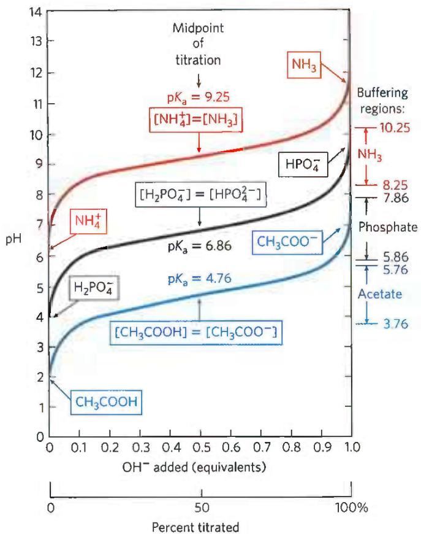  
FIGURE 2-17 Comparison of the titration curves of three weak acids. Shown here are the titration curves for $\mathrm{CH}_3\mathrm{COOH}$ , $\mathrm{H}_2\mathrm{PO}_4^-$ , and $\mathrm{NH}_4^+$ . The predominant ionic forms at designated points in the titration are given in boxes. The regions of buffering capacity are indicated at the right. Conjugate acid-base pairs are effective buffers between approximately $10\%$ and $90\%$ neutralization of the proton-donor species.

## SUMMARY 2.2 Ionization of Water, Weak Acids, and Weak Bases

■ Pure water ionizes slightly, forming equal numbers of hydrogen ions (hydronium ions, $H_{3}O^{+}$ ) and hydroxide ions.

The extent of ionization is described by an equilibrium constant, $K_{eq} = \frac{[H^{+}] [OH^{-}]}{[H_{2}O]}$ , from which the ion product of water, $K_{w}$ , is derived. At 25 °C,

$$
K _ {\mathrm{w}} = [ \mathrm{H} ^ {+} ] [ \mathrm{OH} ^ {-} ] = (5 5. 5 \mathrm{M}) (K _ {\mathrm{eq}}) = 1 0 ^ {- 1 4} \mathrm{M} ^ {2}
$$

■ The pH of an aqueous solution reflects, on a logarithmic scale, the concentration of hydrogen ions:

$$
\mathrm{pH} = \log \frac {1}{[ \mathrm{H} ^ {+} ]} = - \log [ \mathrm{H} ^ {+} ]
$$

■ Weak acids partially ionize to release a hydrogen ion, thus lowering the pH of the aqueous solution. Weak bases accept a hydrogen ion, increasing the pH. The extent of these processes is characteristic of each particular weak acid or base and is expressed as an acid dissociation constant:

$$
K _ {\mathrm{eq}} = \frac {[ \mathrm{H} ^ {+} ] [ \mathrm{A} ^ {-} ]}{[ \mathrm{HA} ]} = K _ {\mathrm{a}}
$$

■ The $pK_{a}$ expresses, on a logarithmic scale, the relative strength of a weak acid or base:

$$
\mathrm{p} K _ {\mathrm{a}} = \log \frac {1}{[ K _ {\mathrm{a}} ]} = - \log K _ {\mathrm{a}}
$$

The stronger the acid, the smaller its $pK_{a}$ ; the stronger the base, the larger the $pK_{a}$ of its conjugate acid. The $pK_{a}$ can be determined experimentally; it is the pH at the midpoint of the titration curve.

## 2.3 Buffering against pH Changes in Biological Systems

Almost every biological process is pH-dependent; a small change in pH produces a large change in the rate of the process. This is true not only for the many reactions in which the $H^{+}$ ion is a direct participant, but also for those reactions in which there is no apparent role for $H^{+}$ ions.

P4 The enzymes that catalyze cellular reactions, and many of the molecules on which they act, contain ionizable groups with characteristic $pK_{a}$ values. The protonated amino and carboxyl groups of amino acids and the phosphate groups of nucleotides, for example, function as weak acids; their ionic state is determined by the pH of the surrounding medium. (When an ionizable group is sequestered in the middle of a protein, away from the aqueous solvent, its $pK_{a}$ , or apparent $pK_{a}$ , can be significantly different from its $pK_{a}$ in water.) As we noted above, ionic interactions are among the forces that stabilize a protein molecule and allow an enzyme to recognize and bind to its substrate.

Cells and organisms maintain a specific and constant cytosolic pH, usually near pH 7, keeping biomolecules in their optimal ionic state. In multicellular organisms, the pH of extracellular fluids is also tightly regulated. Constancy of pH is achieved primarily by biological buffers: mixtures of weak acids and their conjugate bases.

## Buffers Are Mixtures of Weak Acids and Their Conjugate Bases

Buffers are aqueous systems that tend to resist changes in pH when small amounts of acid (H $^{+}$ ) or base (OH $^{-}$ ) are added. A buffer system consists of a weak acid (the proton donor) and its conjugate base (the proton acceptor). As an example, a mixture of equal concentrations of acetic acid and acetate ion, found at the midpoint of the titration curve in Figure 2-16, is a buffer system. Notice that the titration curve of acetic acid has a relatively flat zone extending about 1 pH unit on either side of its midpoint pH of 4.76. In this zone, a given amount of $H^{+}$ or $OH^{-}$ added to the system has much less effect on pH than the same amount added outside the zone. This relatively flat zone is the buffering region of the acetic acid-acetate buffer pair. At the midpoint of the buffering region, where the concentration of the proton donor (acetic acid) exactly equals that of the proton acceptor (acetate), the buffering power of the system is maximal; that is, its pH changes least on addition of $H^{+}$ or $OH^{-}$ . The pH at this point in the titration curve of acetic acid is equal to its apparent $pK_{a}$ . The pH of the acetate buffer system does change slightly when a small amount of $H^{+}$ or $OH^{-}$ is added, but this change is very small compared with the pH change that would result if the same amount of $H^{+}$ or $OH^{-}$ were added to pure water or to a solution of the salt of a strong acid and strong base, such as NaCl, which has no buffering power.

Buffering results from two reversible reaction equilibria occurring in a solution of nearly equal concentrations of a proton donor and its conjugate proton acceptor. Figure 2-18 explains how a buffer system works. Whenever $H^{+}$ or $OH^{-}$ is added to a buffer, the result is a small change in the ratio of the relative concentrations of the weak acid and its anion and thus a small change in pH. The decrease in concentration of one component of the system is balanced exactly by an increase in the other. The sum of the buffer components does not change; only their ratio changes.

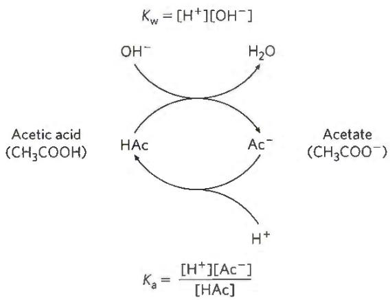  
FIGURE 2-18 The acetic acid–acetate pair as a buffer system. The system is capable of absorbing either $H^{+}$ or $OH^{-}$ through the reversibility of the dissociation of acetic acid. The proton donor, acetic acid (HAc), contains a reserve of bound $H^{+}$ , which can be released to neutralize an addition of $OH^{-}$ to the system, forming $H_{2}O$ . This happens because the product $[H^{+}][OH^{-}]$ transiently exceeds $K_{w}(1\times10^{-14}\mathrm{~m}^{2})$ . The equilibrium quickly adjusts to restore the product to $1\times10^{-14}\mathrm{~m}^{2}$ (at 25 °C), thus transiently reducing the concentration of $H^{+}$ . But now the quotient $[H^{+}][Ac^{-}]/[HAc]$ is less than $K_{a}$ , so HAc dissociates further to restore equilibrium. Similarly, the conjugate base, $Ac^{-}$ , can react with $H^{+}$ ions added to the system; again, the two ionization reactions simultaneously come to equilibrium. Thus, a conjugate acid-base pair, such as acetic acid and acetate ion, tends to resist a change in pH when small amounts of acid or base are added. Buffering action is simply the consequence of two reversible reactions taking place simultaneously and reaching their points of equilibrium as governed by their equilibrium constants, $K_{w}$ and $K_{a}$ .

Each conjugate acid-base pair has a characteristic pH zone in which it is an effective buffer (Fig. 2-17). The $H_{2}PO_{4}^{-}/HPO_{4}^{2-}$ pair has a $pK_{a}$ of 6.86 and thus can serve as an effective buffer system between approximately pH 5.9 and pH 7.9; the $NH_{4}^{+}/NH_{3}$ pair, with a $pK_{a}$ of 9.25, can act as a buffer between approximately pH 8.3 and pH 10.3.

## The Henderson-Hasselbalch Equation Relates pH, $pK_{a}$ , and Buffer Concentration

The titration curves of acetic acid, $H_{2}PO_{4}^{2-}$ , and $NH_{4}^{+}$ (Fig. 2-17) have nearly identical shapes, suggesting that these curves reflect a fundamental law or relationship. This is indeed the case. P3 The shape of the titration curve of any weak acid is described by the Henderson-Hasselbalch equation, which is important for understanding buffer action and acid-base balance in the blood and tissues of vertebrates. This equation is simply a useful way of restating the expression for the ionization constant of an acid. For the ionization of a weak acid HA, the Henderson-Hasselbalch equation can be derived as follows:

First solve for $[\mathrm{H}^{+}]$ :

$$
\begin{array}{l} K _ {\mathrm{a}} = \frac {[ \mathrm{H} ^ {+} ] [ \mathrm{A} ^ {-} ]}{[ \mathrm{HA} ]} \\ [ \mathrm{H} ^ {+} ] = K _ {\mathrm{a}} \frac {[ \mathrm{HA} ]}{[ \mathrm{A} ^ {-} ]} \end{array}
$$

Then take the negative logarithm of both sides:

$$
- \log [ \mathrm{H} ^ {+} ] = - \log K _ {\mathrm{a}} - \log \frac {[ \mathrm{HA} ]}{[ \mathrm{A} ^ {-} ]}
$$

Substitute pH for $-\log\left[H^{+}\right]$ and $pK_{a}$ for $-\log K_{a}$ :

$$
\mathrm{pH} = \mathrm{p} K _ {\mathrm{a}} - \log \frac {[ \mathrm{HA} ]}{[ \mathrm{A} ^ {-} ]}
$$

Now invert $-\log[HA]/[A^{-}]$ , which requires changing its sign, to obtain the Henderson-Hasselbalch equation:

$$
\mathrm{pH} = \mathrm{p} K _ {\mathrm{a}} + \log \frac {[ \mathrm{A} ^ {-} ]}{[ \mathrm{HA} ]}\tag{2-9}
$$

This equation fits the titration curve of all weak acids and enables us to deduce some important quantitative relationships. For example, it shows why the $pK_{a}$ of a weak acid is equal to the pH of the solution at the midpoint of its titration. At that point, $[HA] = [A^{-}]$ , and

$$
\mathrm{pH} = \mathrm{p} K _ {\mathrm{a}} + \log 1 = \mathrm{p} K _ {\mathrm{a}} + 0 = \mathrm{p} K _ {\mathrm{a}}
$$

The Henderson-Hasselbalch equation also allows us (1) to calculate $pK_{a}$ , given pH and the molar ratio of proton donor and acceptor; (2) to calculate pH, given $pK_{a}$ and the molar ratio of proton donor and acceptor; and (3) to calculate the molar ratio of proton donor and acceptor, given pH and $pK_{a}$ .

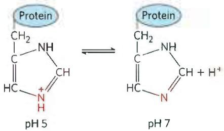  
FIGURE 2-19 Ionization of histidine. The amino acid histidine, a component of proteins, is a weak acid. The $\mathsf{pK}_{\mathrm{a}}$ of the protonated nitrogen of the side chain is 6.0.

## Weak Acids or Bases Buffer Cells and Tissues against pH Changes

P3 The intracellular and extracellular fluids of multicellular organisms have a characteristic and nearly constant pH. The organism's first line of defense against changes in internal pH is provided by buffer systems. The cytoplasm of most cells contains high concentrations of proteins, and these proteins contain many amino acids with functional groups that are weak acids or weak bases. For example, the side chain of histidine (Fig. 2-19) has a $pK_{a}$ of 6.0 and thus can exist in either the protonated form or the unprotonated form near neutral pH. Proteins containing histidine residues therefore buffer effectively near neutral pH.

## WORKED EXAMPLE 2-4 Ionization of Histidine

Calculate the fraction of histidine that has its imidazole side chain protonated at pH 7.3. The $pK_{a}$ values for histidine are $pK_{1}=1.8$ , $pK_{2}$ (imidazole)=6.0, and $pK_{3}=9.2$ (see Fig. 3-12b).

SOLUTION: The three ionizable groups in histidine have sufficiently different $pK_{a}$ values (different by at least 2 pH units) that the first acid (—COOH) is almost completely ionized before the second acid (protonated imidazole) begins to dissociate a proton, and the second ionizes almost completely before the third ( $—NH_{3}^{+}$ ) begins to dissociate its proton. (With the Henderson-Hasselbalch equation, we can easily show that a weak acid goes from 1% ionized at 2 pH units below its $pK_{a}$ to 99% ionized at 2 pH units above its $pK_{a}$ ; see also Fig. 3-12b.) At pH 7.3, the carboxyl group of histidine is entirely deprotonated ( $—COO^{-}$ ) and the $\alpha$ -amino group is fully protonated ( $—NH_{3}^{+}$ ). We can therefore assume that at pH 7.3, the only group that is partially dissociated is the imidazole group, which can be protonated (we'll abbreviate as HisH $^{+}$ ) or not (His).

We use the Henderson-Hasselbalch equation:

$$
\mathrm{pH} = \mathrm{pK} _ {\mathrm{a}} + \log \frac {[ \mathrm{A} ^ {-} ]}{[ \mathrm{HA} ]}
$$

Substituting $pK_{2}=6.0$ and pH=7.3:

$$
7. 3 = 6. 0 + \log \frac {[ \mathrm{His} ]}{[ \mathrm{HisH} ^ {+} ]}
$$

$$
1. 3 = + \log \frac {[ \mathrm{His} ]}{[ \mathrm{HisH} ^ {+} ]}
$$

$$
\text {   antilog   } 1. 3 = \frac {[ \mathrm{His} ]}{[ \mathrm{HisH} ^ {+} ]} = 2. 0 \times 1 0 ^ {1}
$$

This gives us the ratio of [His] to $[HisH^{+}]$ (20 to 1 in this case). We want to convert this ratio to the fraction of total histidine that is in the unprotonated form (His) at pH 7.3. That fraction is 20/21 (20 parts His per 1 part HisH $^{+}$ , in a total of 21 parts histidine in either form), or about 95.2%; the remainder (100% minus 95.2%) is protonated—about 5%.

Nucleotides such as ATP, as well as many metabolites of low molecular weight, contain ionizable groups that can contribute buffering power to the cytoplasm. Some highly specialized organelles and extracellular compartments have high concentrations of compounds that contribute buffering capacity: organic acids buffer the vacuoles of plant cells; ammonia buffers urine.

Two especially important biological buffers are the phosphate and bicarbonate systems. The phosphate buffer system, which acts in the cytoplasm of all cells, consists of $H_{2}PO_{4}^{-}$ as proton donor and $HPO_{4}^{2-}$ as proton acceptor:

$$
\mathrm{H} _ {2} \mathrm{PO} _ {4} ^ {-} \rightleftharpoons \mathrm{H} ^ {+} + \mathrm{HPO} _ {4} ^ {2 -}
$$

The phosphate buffer system is maximally effective at a pH close to its $pK_{a}$ of 6.86 (Figs 2-15, 2-17) and thus tends to resist pH changes in the range between about 5.9 and 7.9. It is therefore an effective buffer in biological fluids; in mammals, for example, extracellular fluids and most cytoplasmic compartments have a pH in the range of 6.9 to 7.4.

## WORKED EXAMPLE 2-5 Phosphate Buffers

(a) What is the pH of a mixture of 0.042 M $NaH_{2}PO_{4}$ and 0.058 M $Na_{2}HPO_{4}$ ?

SOLUTION: We use the Henderson-Hasselbalch equation, which we'll express here as

$$
\mathrm{pH} = \mathrm{pK} _ {\mathrm{a}} + \log \frac {[ \text { conjugate   base } ]}{[ \text { acid } ]}
$$

In this case, the acid (the species that gives up a proton) is $H_{2}PO_{4}^{-}$ , and the conjugate base (the species that gains a proton) is $HPO_{4}^{2-}$ . Substituting the given concentrations of acid and conjugate base and the $pK_{a}$ (6.86) results in

$$
\mathrm{pH} = 6. 8 6 + \log \frac {[ 0 . 0 5 8 ]}{[ 0 . 0 4 2 ]} = 6. 8 6 + 0. 1 4 = 7. 0
$$

We can roughly check this answer. When more conjugate base than acid is present, the acid is more than 50% titrated and thus the pH is above the $pK_{a}$ (6.86), where the acid is exactly 50% titrated.

(b) If 1.0 mL of 10.0 M NaOH is added to a liter of the buffer prepared in (a), how much will the pH change?

SOLUTION: A liter of the buffer contains 0.042 mol of $\mathrm{NaH}_2\mathrm{PO}_4$ . Adding $1.0~\mathrm{mL}$ of $10.0\mathrm{MNaOH}$ (0.010 mol) would titrate an equivalent amount (0.010 mol) of $NaH_{2}PO_{4}$ to $Na_{2}HPO_{4}$ , resulting in 0.032 mol of $NaH_{2}PO_{4}$ and 0.068 mol of $Na_{2}HPO_{4}$ . The new pH is

$$
\begin{array}{r l} \mathrm{pH} & = \mathrm{pK} _ {\mathrm{a}} + \log \frac {[ \mathrm{HPO} _ {4} ^ {2 -} ]}{[ \mathrm{H} _ {2} \mathrm{PO} _ {4} ^ {-} ]} \\ & = 6. 8 6 + \log \frac {0 . 0 6 8}{0 . 0 3 2} = 6. 8 6 + 0. 3 3 = 7. 2 \end{array}
$$

(c) If 1.0 mL of 10.0 M NaOH is added to a liter of pure water at pH 7.0, what is the final pH? Compare this with the answer in (b).

SOLUTION: The NaOH dissociates completely into $Na^{+}$ and $OH^{-}$ , giving $[OH^{-}] = 0.010 \, mol/L = 1.0 \times 10^{-2} \, M$ . We can define a term pOH analogous with pH to express $[OH^{-}]$ of a solution. The pOH is the negative logarithm of $[OH^{-}]$ , so in our example pOH = 2.0. Given that in all solutions, pH + pOH = 14 (see Table 2-5), the pH of the solution is 12. So, an amount of NaOH that increases the pH of water from 7 to 12 increases the pH of a buffered solution, as in (b), from 7.0 to just 7.2. Such is the power of buffering!

Why is pH + pOH = 14?

$$
K _ {w} = 1 0 ^ {- 1 4} = \left[ H ^ {+} \right] \left[ O H ^ {-} \right]
$$

Taking the negative log of both sides of the equation gives

$$
\begin{array}{r l} - \log (1 0 ^ {- 1 4}) & = - \log [ H ^ {+} ] + - \log [ O H ^ {-} ] \\ 1 4 & = - \log [ H ^ {+} ] + - \log [ O H ^ {-} ] \\ 1 4 & = p H + p O H \end{array}
$$

P3 Blood plasma is buffered in part by the bicarbonate system, consisting of carbonic acid (H₂CO₃) as proton donor and bicarbonate (HCO₃⁻) as proton acceptor (K₁ is the first of several equilibrium constants in the bicarbonate buffering system):

$$
\begin{array}{r l}&\mathrm {H_ {2} CO_ {3}} \rightleftharpoons \mathrm {H^ {+}} + \mathrm {HCO_ {3} ^ {-}}\\&K _ {1} = \frac {[ \mathrm {H^ {+}} ] [ \mathrm {HCO_ {3} ^ {-}} ]}{[ \mathrm {H_ {2} CO_ {3}} ]}\end{array}
$$

This buffer system is more complex than other conjugate acid-base pairs because one of its components, carbonic acid ( $H_{2}CO_{3}$ ), is formed from dissolved (aq) carbon dioxide and water, in a reversible reaction:

$$
\begin{array}{r l}&\mathrm {CO_ {2} (aq)+ H_ {2} O\rightleftharpoons H_ {2} CO_ {3}}\\&K _ {2} = \frac {[ \mathrm {H_ {2} CO_ {3}} ]}{[ \mathrm {CO_ {2} (aq)} ] [ \mathrm {H_ {2} O} ]}\end{array}
$$

Carbon dioxide is a gas under normal conditions, and $CO_{2}$ dissolved in an aqueous solution is in equilibrium with $CO_{2}$ in the gas (g) phase:

$$
\begin{array}{r l}\mathrm{CO} _ {2} (\mathrm{g})&\rightleftharpoons \mathrm{CO} _ {2} (\mathrm{aq})\\K _ {\mathrm{a}}&= \frac {[ \mathrm{CO} _ {2} (\mathrm{aq}) ]}{[ \mathrm{CO} _ {2} (\mathrm{g}) ]}\end{array}
$$

The pH of a bicarbonate buffer system depends on the concentrations of $H_{2}CO_{3}$ and $HCO_{3}^{-}$ , the proton donor and acceptor components. The concentration of $H_{2}CO_{3}$ in turn depends on the concentration of dissolved $CO_{2}$ , which in turn depends on the concentration of $CO_{2}$ in the gas phase, or the partial pressure of $CO_{2}$ , denoted $pCO_{2}$ . Thus, the pH of a bicarbonate buffer exposed to a gas phase is ultimately determined by the concentration of $HCO_{3}^{-}$ in the aqueous phase and by $pCO_{2}$ in the gas phase.

The bicarbonate buffer system is an effective physiological buffer near pH 7.4, because the $\mathrm{H}_2\mathrm{CO}_3$ of blood plasma is in equilibrium with a large reserve capacity of $\mathrm{CO}_{2}(\mathrm{g})$ in the air space of the lungs. As noted above, this buffer system involves three reversible equilibria, in this case between gaseous $\mathrm{CO}_{2}$ in the lungs and bicarbonate $(\mathrm{HCO}_{3}^{-})$ in the blood plasma (Fig. 2-20).

Blood can pick up $H^{+}$ , such as from the lactic acid produced in muscle tissue during vigorous exercise. Alternatively, it can lose $H^{+}$ , such as by protonation of the $NH_{3}$ produced during protein catabolism. When $H^{+}$ is added to blood as it passes through the tissues, reaction 1 in Figure 2-20 proceeds toward a new equilibrium, in which $[H_{2}CO_{3}]$ is increased. This in turn increases $[CO_{2}(aq)]$ in the blood (reaction 2) and thus increases the partial pressure of $CO_{2}(g)$ in the air space of the lungs (reaction 3); the extra $CO_{2}$ is exhaled. Conversely, when $H^{+}$ is lost from the blood, the opposite events occur: more $H_{2}CO_{3}$ dissociates into $H^{+}$ and $HCO_{3}^{-}$ , and thus more $CO_{2}(g)$ from the lungs dissolves in blood plasma. The rate of respiration—that is, the rate of inhaling and exhaling—can quickly adjust these equilibria to keep the blood pH nearly constant. The rate of respiration is controlled by the brain stem, where detection of an increased blood $pCO_{2}$ or decreased blood pH triggers deeper and more frequent breathing.

  
FIGURE 2-20 The bicarbonate buffer system. $\mathrm{CO}_{2}$ in the air space of the lungs is in equilibrium with the bicarbonate buffer in the blood plasma passing through the lung capillaries. Because the concentration of dissolved $\mathrm{CO}_{2}$ can be adjusted rapidly through changes in the rate of breathing, the bicarbonate buffer system of the blood is in near-equilibrium with a large potential reservoir of $\mathrm{CO}_{2}$ .

Hyperventilation, the rapid breathing sometimes elicited by stress or anxiety, tips the normal balance of $O_{2}$ breathed in and $CO_{2}$ breathed out in favor of too much $CO_{2}$ breathed out, raising the blood pH to 7.45 or higher and causing alkalosis. This alkalosis can lead to dizziness, headache, weakness, and fainting. One home remedy for mild alkalosis is to breathe briefly into a paper bag. The air in the bag becomes enriched in $CO_{2}$ , and inhaling this air increases the $CO_{2}$ concentration in the body and blood and decreases blood pH.

At the normal pH of blood plasma (7.4), very little $H_{2}CO_{3}$ is present relative to $HCO_{3}^{-}$ , and the addition of just a small amount of base ( $NH_{3}$ or $OH^{-}$ ) would titrate this $H_{2}CO_{3}$ , exhausting the buffering capacity. The important role of $H_{2}CO_{3}$ ( $pK_{a} = 3.57$ at 37 °C) in buffering blood plasma (pH \~7.4) seems inconsistent with our earlier statement that a buffer is most effective in the range of 1 pH unit above and below its $pK_{a}$ . The explanation for this apparent paradox is the large reservoir of $CO_{2}$ dissolved in blood, which we refer to as $CO_{2}(aq)$ . Its rapid equilibration with $H_{2}CO_{3}$ results in the formation of additional $H_{2}CO_{3}$ :

$$
\mathrm{CO} _ {2} (\mathrm{aq}) + \mathrm{H} _ {2} \mathrm{O} \rightleftharpoons \mathrm{H} _ {2} \mathrm{CO} _ {3}
$$

It is useful in clinical medicine to have a simple expression for blood pH in terms of $CO_{2}(aq)$ , which is commonly monitored along with other blood gases. We can define a constant, $K_{h}$ , which is the equilibrium constant for the hydration of $CO_{2}$ to form $H_{2}CO_{3}$ :

$$
K _ {\mathrm{h}} = \frac {[ \mathrm{H} _ {2} \mathrm{CO} _ {3} ]}{[ \mathrm{CO} _ {2} (\mathrm{aq}) ]}
$$

(The concentration of water is so high (55.5 M) that dissolving $CO_{2}$ doesn't change $[H_{2}O]$ appreciably, so $[H_{2}O]$ is made part of the constant $K_{h}$ .) Then, to take the $CO_{2}(aq)$ reservoir into account, we can express $[H_{2}CO_{3}]$ as $K_{h}[CO_{2}(aq)]$ and substitute this expression for $[H_{2}CO_{3}]$ in the equation for the acid dissociation of $H_{2}CO_{3}$ :

$$
K _ {\mathrm{a}} = \frac {[ \mathrm{H} ^ {+} ] [ \mathrm{HCO} _ {3} ^ {-} ]}{[ \mathrm{H} _ {2} \mathrm{CO} _ {3} ]} = \frac {[ \mathrm{H} ^ {+} ] [ \mathrm{HCO} _ {3} ^ {-} ]}{K _ {\mathrm{h}} [ \mathrm{CO} _ {2} (\mathrm{aq}) ]}
$$

Now, the overall equilibrium for dissociation of $H_{2}CO_{3}$ can be expressed in these terms:

$$
K _ {\mathrm{h}} K _ {\mathrm{a}} = K _ {\mathrm{combined}} = \frac {[ \mathrm{H} ^ {+} ] [ \mathrm{HCO} _ {3} ^ {-} ]}{[ \mathrm{CO} _ {2} (\mathrm{aq}) ]}
$$

We can calculate the value of the new constant, $K_{combined}$ , and the corresponding apparent pK, or $pK_{combined}$ , from the experimentally determined values of $K_{\mathrm{h}}(3.0\times10^{-3}\mathrm{~M})$ and $K_{\mathrm{a}}(2.7\times10^{-4}\mathrm{~M})$ at $37^{\circ}C$ :

$$
\begin{array}{r l} K _ {\mathrm{combined}} & = (3. 0 \times 1 0 ^ {- 3} \mathrm{M}) (2. 7 \times 1 0 ^ {- 4} \mathrm{M}) \\ & = 8. 1 \times 1 0 ^ {- 7} \mathrm{M} ^ {2} \\ \mathrm{p} K _ {\mathrm{combined}} & = 6. 1 \end{array}
$$

In clinical medicine, it is common to refer to $CO_{2}(aq)$ as the conjugate acid and to use the apparent, or combined, $pK_{a}$ of 6.1 to simplify calculation of pH from $[CO_{2}(aq)]$ . The concentration of dissolved $CO_{2}$ is a function of $pCO_{2}$ , which in the lung is about 4.8 kilopascals (kPa), corresponding to $[H_{2}CO_{3}] \approx 1.2$ mm. Plasma $[HCO_{3}^{-}]$ is normally about 24 mm, so $[HCO_{3}^{-}]/[H_{2}CO_{3}]$ is about 20, and the blood pH is $6.1 + \log 20 \approx 7.4$ .

## Untreated Diabetes Produces Life-Threatening Acidosis

P4 Many of the enzymes that function in the blood have evolved to have maximal activity between pH 7.35 and 7.45, the normal pH range of human blood plasma. Enzymes typically show maximal catalytic activity at a characteristic pH, called the optimum pH (Fig. 2-21). On either side of this optimum pH, catalytic activity often declines sharply. Thus, a small change in pH can make a large difference in the rate of some crucial enzyme-catalyzed reactions. Biological control of the pH of cells and body fluids is therefore of central importance in all aspects of metabolism and cellular activities, and changes in blood pH have marked physiological consequences, as we know from the alarming experiments described in Box 2-1.

In individuals with untreated diabetes mellitus, the lack of insulin, or insensitivity to insulin, disrupts the uptake of glucose from blood into the tissues and forces the tissues to use stored fatty acids as their primary fuel. For reasons we describe in detail later in the book (see Chapter 23), this dependence on fatty acids results in acidosis, the accumulation of high concentrations of two carboxylic acids, $\beta$ -hydroxybutyric acid and acetoacetic acid (a combined blood plasma level of 90 mg/100 mL, compared with <3 mg/100 mL in control (healthy) individuals; urinary excretion of 5 g/24 h, compared with <125 mg/24 h in controls). Dissociation of these acids lowers the pH of blood plasma to less than 7.35. P3 Severe acidosis (characterized by low blood pH) produces headache, drowsiness, nausea, vomiting, and diarrhea, followed by stupor, coma, and convulsions, presumably because, at the lower pH, some enzyme(s) do not function optimally. When a patient is found to have high blood glucose, low plasma pH, and high levels of $\beta$ -hydroxybutyric acid and acetoacetic acid in blood and urine, diabetes mellitus is the likely diagnosis.

  
FIGURE 2-21 The pH optima of two enzymes. Pepsin is a digestive enzyme secreted into gastric juice, which has a pH of \~1.5, allowing pepsin to act optimally. Trypsin, a digestive enzyme that acts in the small intestine, has a pH optimum that matches the neutral pH in the lumen of the small intestine.

Other conditions can also produce acidosis. For example, fasting and starvation force the use of stored fatty acids as fuel, with the same consequences as for diabetes. Very heavy exertion, such as a sprint by runners or cyclists, leads to temporary accumulation of lactic acid in the blood. Kidney failure results in a diminished capacity to regulate bicarbonate levels. Lung diseases (such as emphysema, pneumonia, and asthma) reduce the capacity to dispose of the $CO_{2}$ produced by fuel oxidation in the tissues, with the resulting accumulation of $H_{2}CO_{3}$ .

Acidosis is treated by dealing with the underlying condition—administering insulin to people with diabetes, and steroids or antibiotics to people with lung disease. Severe acidosis can be reversed by administering bicarbonate solution intravenously.

## WORKED EXAMPLE 2-6 Treatment of Acidosis with Bicarbonate

Why does intravenous administration of a bicarbonate solution raise the plasma pH?

SOLUTION: The ratio of $\left[\mathrm{HCO}_{3}^{-}\right]$ to $\left[\mathrm{CO}_{2}(\mathrm{aq})\right]$ determines the pH of the bicarbonate buffer, according to the equation

$$
\mathrm{pH} = 6. 1 + \log \frac {[ \mathrm{HCO} _ {3} ^ {-} ]}{\mathrm{H} _ {2} \mathrm{CO} _ {3}}
$$

where $[H_{2}CO_{3}]$ is directly related to $pCO_{2}$ , the partial pressure of $CO_{2}$ . So, if $[HCO_{3}^{-}]$ is increased with no change in $pCO_{2}$ , the blood pH will rise.

## SUMMARY 2.3 Buffering against pH Changes in Biological Systems

A mixture of a weak acid (or base) and its salt resists changes in pH caused by the addition of $H^{+}$ or $OH^{-}$ . The mixture thus functions as a buffer.

■ The pH of a solution of a weak acid (or base) and its salt is given by the Henderson-Hasselbalch equation:

$$
\mathrm{pH} = \mathrm{p} K _ {\mathrm{a}} + \log \frac {[ \mathrm{A} ^ {-} ]}{[ \mathrm{HA} ]}
$$

In cells and tissues, phosphate and bicarbonate buffer systems maintain intracellular and extracellular fluids near pH 7.4. Enzymes generally work optimally near this physiological pH.

■ Medical conditions such as untreated diabetes that lower the pH of blood, causing acidosis, or raise it, causing alkalosis, can be life-threatening.

## KEY TERMS

Terms in bold are defined in the glossary.

<table><tr><td>hydrogen bond 44bond energy 44hydrophilic 46hydrophobic 46amphipathic 46hydrophobiceffect 48micelle 48van der Waalsinteractions 49osmolarity 52osmosis 52isotonic 52hypertonic 52hypotonic 52equilibrium constant $(K_{eq})$  54</td><td>ion product ofwater ( $K_w$ ) 55pH 55acidosis 56alkalosis 56conjugate acid-basepair 57acid dissociationconstant ( $K_a$ ) 57p $K_a$  57titration curve 58buffer 59buffering region 60Henderson-Hasselbalchequation 60optimum pH 63</td></tr></table>

## PROBLEMS

1. Effect of Local Environment on Ionic Bond Strength The ATP-binding site of an enzyme is buried in the interior of the enzyme, in a hydrophobic environment. Suppose that the ionic interaction between enzyme and ATP took place at the surface of the enzyme, exposed to water. Would this enzyme-substrate interaction be stronger or would it be weaker? Why?

2. Biological Advantage of Weak Interactions The associations between biomolecules are often stabilized by hydrogen bonds, electrostatic interactions, the hydrophobic effect, and van der Waals interactions. How are weak interactions such as these advantageous to an organism?

3. Solubility of Ethanol in Water Ethane (CH₃CH₃) and ethanol (CH₃CH₂OH) differ in their molecular makeup by only one atom, yet ethanol is much more soluble in water than ethane. Describe the features of ethanol that make it more water soluble than ethane.