4. Calculation of pH from Hydrogen Ion Concentration
What is the pH of a solution that has an H $^{+}$ concentration of
(a) 1.75 × 10 $^{-5}$ mol/L; (b) 6.50 × 10 $^{-10}$ mol/L;
(c) 1.0 × 10 $^{-4}$ mol/L; (d) 1.50 × 10 $^{-5}$ mol/L?

5. Calculation of Hydrogen Ion Concentration from pH What is the $\mathbf{H}^{+}$ concentration of a solution with pH of (a) 3.82; (b) 6.52; (c) 11.11?

6. Acidity of Gastric HCl A technician in a hospital laboratory obtained a 10.0 mL sample of gastric juice from a patient several hours after a meal and titrated the sample with 0.1 M NaOH to neutrality. The neutralization of gastric HCl required 7.2 mL of NaOH. The patient's stomach contained no ingested food or drink at the time of sample harvest. Therefore, assume that no buffers were present. What was the pH of the gastric juice?

## 7. Calculation of the pH of a Strong Acid or Base

(a) Write out the acid dissociation reaction for hydrochloric acid.

(b) Calculate the pH of a solution of $5 \times 10^{-4}$ M hydrochloric acid at 25 °C.

(c) Write out the acid dissociation reaction for sodium hydroxide.

(d) Calculate the pH of a solution of $7 \times 10^{-5}$ M sodium hydroxide at 25 °C.

8. Calculation of pH from Concentration of Strong Acid Calculate the pH of a solution prepared by diluting 3.0 mL of 2.5 M HCl to a final volume of 100 mL with $H_{2}O$ .

9. Measurement of Acetylcholine Levels by pH Changes You have a 15 mL sample of acetylcholine (a neurotransmitter) with an unknown concentration and a pH of 7.65. You incubate this sample with the enzyme acetylcholinesterase to convert all of the acetylcholine to choline and acetic acid. The acetic acid dissociates to yield acetate and hydrogen ions.

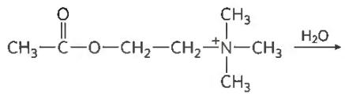

Acetylcholine

At the end of the incubation period, you measure the pH again and find that it has decreased to 6.87. Assuming there was no buffer in the assay mixture, determine the number of nanomoles of acetylcholine in the original 15 mL sample.

10. Relationship Between $\mathbf{pK}_{\mathrm{a}}$ and pH Which aqueous solution has the lowest pH: 0.1 M hydrofluoric acid ( $\mathrm{pK}_{\mathrm{a}} = 3.20$ ); 0.1 M acetic acid ( $\mathrm{pK}_{\mathrm{a}} = 4.86$ ); 0.1 M formic acid ( $\mathrm{pK}_{\mathrm{a}} = 3.75$ ); or 0.1 M lactic acid ( $\mathrm{pK}_{\mathrm{a}} = 7.86$ )?

11. Properties of Strong and Weak Acids Classify each acid or property as representing a strong acid or a weak acid: (a) hydrochloric acid; (b) acetic acid; (c) strong tendency to dissociate protons; (d) larger $K_{a}$ ; (e) partially dissociates into ions; (f) larger $pK_{a}$ .

12. Simulated Vinegar One way to make vinegar is to prepare a solution of acetic acid, the sole acid component of vinegar, at the proper pH (see Fig. 2-14) and add appropriate flavoring agents. Acetic acid is a liquid at 25 °C, with a relative molecular mass ( $M_r$ ) of 60, density of 1.049 g/mL, and acid dissociation constant ( $K_a$ ) of $1.7 \times 10^{-5}$ M. Calculate the volume of acetic acid needed to produce 1 L of simulated vinegar from distilled water (see Fig. 2-15).

13. Identifying Conjugate Bases Write the conjugate base for each acid: (a) $H_{3}PO_{4}$ ; (b) $H_{2}CO_{3}$ ; (c) $CH_{3}COOH$ ; (d) $CH_{3}NH_{3}^{+}$

14. Calculation of the pH of a Mixture of a Weak Acid and Its Conjugate Base Calculate the pH of a dilute solution that contains a molar ratio of potassium acetate to acetic acid ( $pK_{a} = 4.76$ ) of (a) 2:1; (b) 1:3; (c) 5:1; (d) 1:1; (e) 1:10.

15. Effect of pH on Solubility The strongly polar, hydrogen-bonding properties of water make it an excellent solvent for ionic (charged) species. By contrast, nonionized, nonpolar organic molecules, such as benzene, are relatively insoluble in water. In principle, the aqueous solubility of any organic acid or base can be increased by converting the molecules to charged species. For example, the solubility of benzoic acid in water is low. Adding sodium bicarbonate to a mixture of water and benzoic acid raises the pH and deprotonates the benzoic acid to form benzoate ion, which is quite soluble in water.

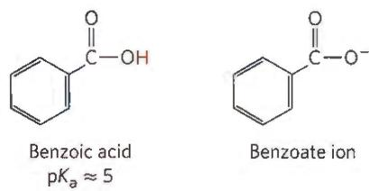

Categorize the given compounds based on whether they are more soluble in an aqueous solution of 0.1 M NaOH or 0.1 M HCl. (The dissociable protons are shown in red.)

16. Treatment of Poison Ivy Rash Urushiol, the component of poison ivy that is responsible for the characteristic itchy rash, is a mixture of catechols substituted with various long-chain alkyl groups.

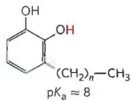

Which of these treatments would be most effective at removing catechols from the surface of the skin after exposure to poison ivy? Justify your choice.

(a) Wash the area with cold water.

(b) Wash the area with dilute vinegar or lemon juice.

(c) Wash the area with soap and water.

(d) Wash the area with soap, water, and baking soda (sodium bicarbonate).

17. pH and Drug Absorption Aspirin is a weak acid with a $pK_{a}$ of 3.5 (the ionizable H is shown in red):

Aspirin is absorbed into the blood through the cells lining the stomach and the small intestine. Absorption requires passage through the plasma membrane. The polarity of the molecule determines the absorption rate: charged and highly polar molecules pass slowly, whereas neutral hydrophobic molecules pass rapidly. The pH of the stomach contents is about 1.5, and the pH of the contents of the small intestine is about 6. Based on this information, is more aspirin absorbed into the bloodstream from the stomach or from the small intestine? Clearly justify your choice.

18. Calculation of pH from Molar Concentrations The $pK_{a}$ of $NH_{4}^{+}/NH_{3}$ is 9.25. Calculate the pH of a solution containing 0.12 M $NH_{4}Cl$ and 0.03 M NaOH.

19. Calculation of pH after Titration of Weak Acid A compound has a $pK_{a}$ of 7.4. You add 100 mL of a 1.0 M solution of this compound at pH 8.0 to 30 mL of 1.0 M hydrochloric acid. What is the pH of the resulting solution?

20. Properties of a Buffer The amino acid glycine is often used as the main ingredient of a buffer in biochemical experiments. The amino group of glycine, which has a $pK_{a}$ of 9.6, can exist either in the protonated form ( $-NH_{3}^{+}$ ) or as the free base ( $-NH_{2}$ ), because of the reversible equilibrium

$$
\mathrm{R} - \mathrm{NH} _ {3} ^ {+} \rightleftharpoons \mathrm{R} - \mathrm{NH} _ {2} + \mathrm{H} ^ {+}
$$

(a) In what pH range can glycine be used as an effective buffer due to its amino group?

(b) In a 0.1 M solution of glycine at pH 9.0, what fraction of glycine has its amino group in the $-NH_{3}^{+}$ form?

(c) How much 5 M KOH must be added to 1.0 L of 0.1 M glycine at pH 9.0 to bring its pH to exactly 10.0?

(d) When 99% of the glycine is in its $-NH_{3}^{+}$ form, what is the numerical relation between the pH of the solution and the $pK_{a}$ of the amino group?

21. Calculation of the $pK_{a}$ of an Ionizable Group by Titration Suppose a biochemist has 10 mL of a 1.0 M solution of a compound with two ionizable groups at a pH of 8.00. She adds 10.0 mL of 1.00 M HCl, which changes the pH to 3.20. The $pK_{a}$ value of one of the groups ( $pK_{1}$ ) is 3.8 and it is known that $pK_{2}$ is between 7 and 10. What is the exact value of $pK_{2}$ ?

22. Calculation of the pH of a Solution of a Polyprotic Acid The amino acid histidine has ionizable groups with $pK_{a}$ values of 1.8, 6.0, and 9.2, as shown (His = imidazole group). A biochemist makes up 100 mL of a 0.10 M solution of histidine at a pH of 5.40. She then adds 40 mL of 0.10 M HCl. What is the pH of the resulting solution?

23. Calculation of Original pH from Final pH after Titration A biochemist has 100 mL of a 0.100 M solution of a weak acid with a pK $_{a}$ of 6.3; He adds 6.0 mL of 1.0 M HCl, which changes the pH to 5.7. What was the pH of the original solution?

24. Preparation of a Phosphate Buffer Phosphoric acid ( $H_{3}PO_{4}$ ), a triprotic acid, has three $pK_{a}$ values: 2.14, 6.86, and 12.4. What molar ratio of $HPO_{4}^{2-}$ to $H_{2}PO_{4}^{-}$ in solution would produce a pH of 7.0? Hint: Only one of the $pK_{a}$ values is relevant here.

25. Preparation of Standard Buffer for Calibration of a pH Meter The glass electrode used in commercial pH meters gives an electrical response proportional to the concentration of hydrogen ion. Converting these responses to a pH reading requires calibration of the electrode against standard solutions of known H $^{+}$ concentration. Preparation of the pH 7.00 standard buffer uses dihydrogen phosphate (NaH $_{2}$ PO $_{4}$ · H $_{2}$ O; FW 138) and disodium hydrogen phosphate (Na $_{2}$ HPO $_{4}$ ; FW 142). Phosphoric acid (H $_{3}$ PO $_{4}$ ), a triprotic acid, has three pK $_{a}$ values: 2.14, 6.86, and 12.4. Calculate the weight in grams of sodium dihydrogen phosphate and disodium hydrogen phosphate needed to prepare 1.0 L of a standard buffer with a total phosphate concentration of 0.10 M (see Fig. 2-15).

26. Calculation of Molar Ratios of Conjugate Base to Weak Acid from pH For a weak acid with a $pK_{a}$ of 6.00, calculate the ratio of conjugate base to acid at a pH of 5.00.

27. Preparation of Buffer of Known pH and Strength You have 0.10 M solutions of acetic acid ( $pK_{a} = 4.76$ ) and sodium acetate. If you wanted to prepare 1.0 L of 0.10 M acetate buffer of pH 4.00, how many milliliters of acetic acid and sodium acetate would you mix together?

28. Choice of Weak Acid for a Buffer Determine whether each weak acid would best buffer at pH 3.0, at pH 5.0, or at pH 9.0: (a) formic acid $(\mathrm{p}K_{\mathrm{a}} = 3.8)$ ; (b) acetic acid $(\mathrm{p}K_{\mathrm{a}} = 4.76)$ ; (c) ammonium $(\mathrm{p}K_{\mathrm{a}} = 9.25)$ ; (d) boric acid $(\mathrm{p}K_{\mathrm{a}} = 9.24)$ ; (e) chloroacetic acid $(\mathrm{p}K_{\mathrm{a}} = 2.87)$ ; (f) hydrazoic acid $(\mathrm{p}K_{\mathrm{a}} = 4.6)$ . Briefly justify your answer.

29. Working with Buffers A buffer contains 0.010 mol of lactic acid ( $pK_{a} = 3.86$ ) and 0.050 mol of sodium lactate per liter.
(a) Calculate the pH of the buffer.

(b) Calculate the change in pH after adding 5.0 mL of 0.5 M HCl to 1 L of the buffer.

(c) What pH change would you expect if you added the same quantity of HCl to 1 L of pure water?

30. Use of Molar Concentrations to Calculate pH What is the pH of a solution that contains 0.20 M sodium acetate and 0.60 M acetic acid ( $pK_{a} = 4.76$ )?

31. Preparation of an Acetate Buffer Calculate the concentrations of acetic acid ( $pK_{a} = 4.76$ ) and sodium acetate necessary to prepare a 0.2 M buffer solution at pH 5.0.

32. pH of Insect Defensive Secretion You have been observing an insect that defends itself from enemies by secreting a caustic liquid. Analysis of the liquid shows it to have a total concentration of formate plus formic acid ( $K_{a} = 1.8 \times 10^{-4}$ ) of 1.45 M. Further analysis reveals that the concentration of formate ion is 0.015 M. What is the pH of the secretion?

33. Calculation of $pK_{a}$ An unknown compound, X, is thought to have a carboxyl group with a $pK_{a}$ of 2.0 and another ionizable group with a $pK_{a}$ between 5 and 8. When 75 mL of 0.1 M NaOH is added to 100 mL of a 0.1 M solution of X at pH 2.0, the pH increases to 6.72. Calculate the $pK_{a}$ of the second ionizable group of X.

34. Ionized Forms of Amino Acids at Different pH Levels Glycine is a diprotic acid that can undergo two dissociation reactions, one for the $\alpha$ -amino group ( $-\mathrm{NH}_3^+$ ) and the other for the carboxyl ( $-\mathrm{COOH}$ ) group. Therefore, it has two $\mathsf{pK}_{\mathsf{a}}$ values. The carboxyl group has a $\mathsf{pK}_{1}$ of 2.34 and the $\alpha$ -amino group has a $\mathsf{pK}_{2}$ of 9.60. Glycine can exist in fully deprotonated $(\mathrm{NH}_{2}-\mathrm{CH}_{2}-\mathrm{COO}^{-})$ , fully protonated ( $^+\mathrm{NH}_{3}-\mathrm{CH}_{2}-\mathrm{COOH}$ ), or zwitterionic form ( $^+\mathrm{NH}_{3}-\mathrm{CH}_{2}-\mathrm{COO}^{-}$ ). Determine which form of glycine would be present in the highest concentration in a solution of (a) pH 1.0; (b) pH 6.0; (c) pH 7.0; (d) pH 8.0; (e) pH 11.9. Explain your answers in terms of pH relative to the two $\mathsf{pK}_{\mathsf{a}}$ values.

## 35. Control of Blood pH by Respiratory Rate

(a) The partial pressure of $CO_{2}$ ( $pCO_{2}$ ) in the lungs can be varied rapidly by the rate and depth of breathing. For example, a common remedy to alleviate hiccups is to increase the concentration of $CO_{2}$ in the lungs. This can be achieved by holding one's breath, by very slow and shallow breathing (hypoventilation), or by breathing in and out of a paper bag. Under such conditions, $pCO_{2}$ in the air space of the lungs rises above normal. How would increasing $pCO_{2}$ in the air space of the lungs affect blood pH?

(b) It is common practice among competitive short-distance runners to breathe rapidly and deeply (hyperventilate) for about half a minute to remove $CO_{2}$ from their lungs just before a race begins. Under these conditions, blood pH may rise to 7.6. Explain how hyperventilation elicits an increase in blood pH.

(c) During a short-distance run, the muscles produce a large amount of lactic acid (CH₃CH(OH)COOH; Kₐ = 1.38 × 10⁻⁴ M) from their glucose stores. Why might hyperventilation before a short-distance run be useful?

36. Calculation of Blood pH from $CO_{2}$ and Bicarbonate Levels Calculate the pH of a blood plasma sample with a total $CO_{2}$ concentration of 26.9 mm and bicarbonate concentration of 25.6 mm. Recall from page 63 that the relevant $pK_{a}$ of carbonic acid is 6.1.

37. Effect of Holding One's Breath on Blood pH The pH of the extracellular fluid is buffered by the bicarbonate/carbonic acid system. Holding your breath can increase the concentration of $\mathrm{CO}_{2}(\mathrm{aq})$ in the blood. What effect might this have on the pH of the extracellular fluid? Explain the effect on pH by writing the relevant equilibrium equation(s) for this buffer system.

## 38. Boiling Point of Alcohols and Diols

(a) Arrange these compounds in order of expected boiling point.

$$
\begin{array}{c} \mathrm{CH} _ {3} - \mathrm{CH} _ {2} - \mathrm{OH} \\ \mathrm{HO} - \mathrm{CH} _ {2} \mathrm{CH} _ {2} \mathrm{CH} _ {2} - \mathrm{OH} \\ \mathrm{CH} _ {3} - \mathrm{OH} \\ \mathrm{HO} - \mathrm{CH} _ {2} \mathrm{CH} _ {2} - \mathrm{OH} \end{array}
$$

(b) What factors are important in predicting the boiling points of these compounds?

39. Duration of Hydrogen Bonds PCR is a laboratory process in which specific DNA sequences are copied and amplified manyfold. The two DNA strands, which are held together in part by hydrogen bonds between them, are heated in a buffered solution to separate the two strands, then cooled to allow them to reassociate. What do you predict about the average duration of H bonds at the high temperature in comparison to the low temperature?

40. Electronegativity and Hydrogen Bonding The Pauling electronegativity is a measure of the affinity of an atom for the electron in a covalent bond. The larger the electronegativity value, the greater the affinity of the atom for an electron shared with another atom.

<table><tr><td>Atom</td><td>Electronegativity</td></tr><tr><td>H</td><td>2.1</td></tr><tr><td>C</td><td>2.55</td></tr><tr><td>S</td><td>2.58</td></tr><tr><td>N</td><td>3.04</td></tr><tr><td>O</td><td>3.44</td></tr></table>

Note that S is directly beneath O in the periodic table.

(a) Do you expect $H_{2}S$ to form hydrogen bonds with itself? With $H_{2}O$ ?

(b) Water boils at 100 °C. Is the boiling point for $H_{2}S$ higher or lower than for $H_{2}O$ ?

(c) Is $H_{2}S$ a more polar solvent than $H_{2}O$ ?

41. Solubility of Low Molecular Weight Compounds Several low molecular weight compounds found in cells are shown in the ionic form in which they exist in water at pH 7.

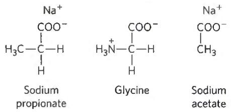

List the five compounds in order from most soluble to least soluble in water.

42. Relative Solubility of Alcohols List the alcohols in order from most soluble to least soluble in water.

$$
\mathrm{CH} _ {3} - (\mathrm{CH} _ {2}) _ {5} - \mathrm{OH} \quad \mathrm{CH} _ {3} - (\mathrm{CH} _ {2}) _ {1 0} - \mathrm{OH}
$$

$$
\mathrm{CH} _ {3} - (\mathrm{CHOH}) - \mathrm{CH} _ {2} - \mathrm{CHOH} - \mathrm{CH} _ {2} - \mathrm{OH}
$$

43. Determining Charge and Solubility of Organic Acids Suppose that, for a typical carboxyl-containing compound, the $pK_{a}$ is approximately 3. Suppose HOOC—(CH₂)₄—COOH, CH₃—(CH₂)₄—COOH, and HOOC—(CH₂)₂—COOH are added to water at pH 7.

(a) What is the net charge of each compound in the solution?
(b) List the compounds in order from most soluble to least soluble.

44. Ecological Effects of pH The defendant in a lawsuit over industrial pollution is accused of releasing effluent of pH 10 into a trout stream. The plaintiff has asked that the defendant reduce the effluent's pH to no higher than 7. The defendant's attorney, aiming to please the court, promises that his client will do even better than that: the defendant will bring the pH of the effluent down to 1!

(a) Will the defense attorney's suggested remedy be acceptable to the plaintiff? Why or why not?

(b) What facts about pH does the defense attorney need to understand?

45. Phosphate-Buffered Saline pH and Osmolarity Phosphate-buffered saline (PBS) is a solution commonly used in studies of animal tissues and cells. Its composition is 137 mm NaCl, 2.7 mm KCl, 10 mm $Na_{2}HPO_{4}$ ( $pK_{a} = 2.14$ ), 1.8 mm $KH_{2}PO_{4}$ ( $pK_{a} = 6.86$ ). Calculate the pH and osmolarity of PBS. Give the osmolarity in units of osmoles per liter (osm/L).

46. Hydrogen Bonding in Watson-Crick Base Pairs In 1953, James Watson and Francis Crick discovered that the purine base adenine forms a base pair with the pyrimidine base thymine (or uracil). Likewise, the purine base guanine forms a base pair with the pyrimidine base cytosine. These base pairs form due to hydrogen bonding between purines and pyrimidines. Show the hydrogen bonds that form (a) when adenine base-pairs with thymine and (b) when guanine base-pairs with cytosine.

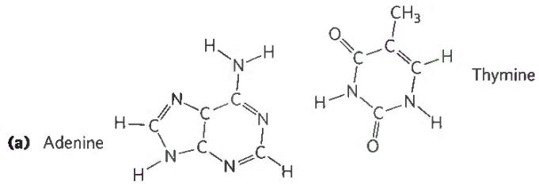

## DATA ANALYSIS PROBLEM

47. "Switchable" Surfactants Hydrophobic molecules do not dissolve well in water. This makes certain processes very difficult: washing oily food residue off dishes, cleaning up spilled oil, keeping the oil and water phases of salad dressings well mixed, and carrying out chemical reactions that involve both hydrophobic and hydrophilic components.

Surfactants are a class of amphipathic compounds that includes soaps, detergents, and emulsifiers. With the use of surfactants, hydrophobic compounds can be suspended in aqueous solution by forming micelles (see Fig. 2-7). A micelle has a hydrophobic core consisting of the hydrophobic compound and the hydrophobic "tails" of the surfactant; the hydrophilic "heads" of the surfactant cover the surface of the micelle. A suspension of micelles is called an emulsion. The more hydrophilic the head group of the surfactant, the more powerful it is—that is, the greater its capacity to emulsify hydrophobic material.

When you use soap to remove grease from dirty dishes, the soap forms an emulsion with the grease that is easily removed by water through interaction with the hydrophilic head of the soap molecules. Likewise, a detergent can be used to emulsify spilled oil for removal by water. And emulsifiers in commercial salad dressings keep the oil suspended evenly throughout the water-based mixture.

There are some situations, such as oil spill cleanups, in which it would be very useful to have a "switchable" surfactant: a molecule that could be reversibly converted between a surfactant and a nonsurfactant.

(a) Imagine that such a "switchable" surfactant existed. How would you use it to clean up and then recover the oil from an oil spill?

Liu and colleagues describe a prototypical switchable surfactant in their 2006 article "Switchable Surfactants." The switching is based on the following reaction:

(b) Given that the $pK_{a}$ of a typical amidinium ion is 12.4, in which direction (left or right) would you expect the equilibrium of the above reaction to lie? (See Fig. 2-15 for relevant $pK_{a}$ values.) Justify your answer. Hint: Remember the reaction $H_{2}O + C_{2}O \rightleftharpoons H_{2}CO_{3}$ .

Liu and colleagues produced a switchable surfactant for which $R = C_{16}H_{33}$ . We will call the molecule s-surf.

(c) The amidinium form of s-surf is a powerful surfactant; the amidine form is not. Explain this observation.

Liu and colleagues found that they could switch between the two forms of s-surf by changing the gas that they bubbled through a solution of the surfactant. They demonstrated this switch by measuring the electrical conductivity of the s-surf solution; aqueous solutions of ionic compounds have higher conductivity than solutions of nonionic compounds. They started with a solution of the amidine form of s-surf in water.

$CO_{2}$

Their results are shown below; dotted lines indicate the switch from one gas to another.

$$
\mathrm{CO} _ {2}
$$

(d) In which form is the majority of s-surf at point A? At point B?

(e) Why does the electrical conductivity rise from time 0 to point A?

(f) Why does the electrical conductivity fall from point A to point B?

(g) Explain how you would use s-surf to clean up and recover the oil from an oil spill.

## Reference

Liu, Y., P.G. Jessop, M. Cunningham, C.A. Eckert, and C.L. Liotta. 2006. Switchable surfactants. Science 313(5789):958–960. https://doi.org/10.1126/science.1128142.

# AMINO ACIDS, PEPTIDES, AND PROTEINS

3.1 Amino Acids 70

3.2 Peptides and Proteins 80

3.3 Working with Proteins 83

## 3.4 The Structure of Proteins: Primary Structure 90

Proteins mediate virtually every process that takes place in a cell, exhibiting an almost endless diversity of functions. To explore the molecular mechanism of a biological process, a biochemist almost inevitably studies one or more proteins. Proteins are the most abundant biological macromolecules, occurring in all cells and all parts of cells. Proteins also occur in great variety; thousands of different kinds may be found in a single cell. Proteins are the molecular instruments through which genetic information is expressed—the important final products of the information pathways discussed in Part III of this book.

Cells produce proteins with strikingly different properties and activities by joining a common set of 20 amino acids in many different combinations and sequences. From these building blocks, different organisms can make such widely diverse products as enzymes, hormones, antibodies, transporters, light-harvesting complexes in plants, the flagella of bacteria, muscle fibers, feathers, spider webs, rhinoceros horn, antibiotics, and myriad other substances that have distinct biological functions (Fig. 3-1). Among these protein products, the enzymes are the most varied and specialized. As the catalysts of almost all cellular reactions, enzymes are one of the keys to understanding the chemistry of life, and thus they provide a focal point for any course in biochemistry.

Protein structure and function are the topics of this and the next three chapters. Here, we begin with a description of the fundamental chemical properties of amino acids, peptides, and proteins. We also consider how a biochemist works with proteins. The material is organized around four principles:

## P1 In every living organism, proteins are constructed from a common set of 20 amino acids. Each amino acid has a side chain with

distinctive chemical properties. Amino acids may be regarded as the alphabet in which the language of protein structure is written.

P2 In proteins, amino acids are joined in characteristic linear sequences through a common amide linkage, the peptide bond. The amino acid sequence of a protein constitutes its primary structure, a first level we will introduce within the broader complexities of protein structure.

P3 For study, individual proteins can be separated from the thousands of other proteins present in a cell, based on differences in their chemical and functional properties arising from their distinct amino acid sequences. As proteins are central to biochemistry, the purification of individual proteins for study is a quintessential biochemical endeavor.

P4 Shaped by evolution, amino acid sequences are a key resource for understanding the function of individual proteins and for tracing broader functional and evolutionary relationships.

## 3.1 Amino Acids

Proteins are polymers of amino acids, with each amino acid residue joined to its neighbor by a specific type of covalent bond. (The term “residue” reflects the loss of the elements of water when one amino acid is joined to another.) Proteins can be broken down (hydrolyzed) to their constituent amino acids by a variety of methods, and the earliest studies of proteins naturally focused on the free amino acids derived from them. Twenty different amino acids are commonly found in proteins. The first to be discovered was asparagine, in 1806. The last of the 20 to be found, threonine, was not identified until 1938. All the amino acids have trivial or common names, in some cases derived from the source from which they were first isolated. Asparagine was first found in asparagus, and glutamate in wheat gluten; tyrosine was first isolated from cheese (its name is derived from the Greek tyros, “cheese”); glycine (Greek glykos, “sweet”) was so named because of its sweet taste.

  
FIGURE 3-1 Some functions of proteins. (a) The light produced by fireflies is the result of a reaction involving the protein luciferin and ATP, catalyzed by the enzyme luciferase (see Box 13-1). (b) Erythrocytes contain large amounts of the oxygen-transporting protein hemoglobin. (c) The protein keratin, formed by all vertebrates, is the chief structural component of hair, scales, horn, wool, nails, and  
feathers. The black rhinoceros is extinct in the wild because of the belief prevalent in some parts of the world that a powder derived from its horn has aphrodisiac properties. In reality, the chemical properties of powdered rhinoceros horn are no different from those of powdered bovine hooves or human fingernails. [(a) Jeff J. Daly/Alamy. (b) Bill Longcore/Science Source. (c) Mary Cooke/Animals Animals.]

Learning the names, structures, and chemical properties of the 20 common amino acids found in proteins is one of the key memorization trials of every beginning biochemistry student. The necessity rapidly becomes apparent in succeeding chapters. It is impossible to discuss protein structure, protein function, ligand-binding sites, enzyme active sites, and most other biochemical topics without this foundation. The amino acids are part of the biochemistry vocabulary.

## Amino Acids Share Common Structural Features

P1 All 20 of the common amino acids are $\alpha$ -amino acids. They have a carboxyl group and an amino group bonded to the same carbon atom (the $\alpha$ carbon) (Fig. 3-2). They differ from each other in their side chains, or R groups, which vary in structure, size, and electric charge, and which influence the solubility of the amino acids in water. In addition to these 20 amino acids, there are many less common ones. Some are residues modified after a protein has been synthesized, others are amino acids present in living organisms but not as constituents of proteins, and two are special cases found in just a few proteins. The common amino acids of proteins have been assigned three-letter abbreviations and one-letter symbols (see Table 3-1), which are used as shorthand to indicate the composition and sequence of amino acids polymerized in proteins.

KEY CONVENTION The three-letter code is easily understood, the abbreviations generally consisting of the first three letters of the amino acid name. The one-letter code was devised by Margaret Oakley Dayhoff, considered by many to be the founder of the field of bioinformatics. The one-letter code reflects an attempt to reduce the size of the data files (in an era of limited computer memory) used to describe amino acid sequences. It was designed to be easily memorized, and understanding its origin can help students do just that. For six amino acids (CHIMSV), the first letter of the amino acid name is unique and thus is used as the symbol.

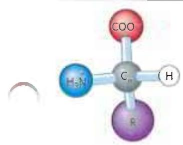  
FIGURE 3-2 General structure of an amino acid. This structure is common to all but one of the $\alpha$ -amino acids. (Proline, a cyclic amino acid, is the exception.) The R group, or side chain (purple), attached to the $\alpha$ carbon (gray) is different in each amino acid.

  
Margaret Oakley Dayhoff,
1925–1983 (Photo by Dr. Ruth Dayhoff,
courtesy Vincent Brannigan.)

For five others (AGLPT), the first letter of the name is not unique but is assigned to the amino acid that is most common in proteins (for example, leucine is more common than lysine). For another four, the letter used is phonetically suggestive (RFYW: aRginine, Fenylalanine, tYrosine, tWiptophan). The rest were harder to assign. Four (DNEQ) were assigned letters found within or suggested by their names (asparDic, asparagiNe, glutamEke, Q-tamine). That left lysine. Only a few letters were left, and K was chosen because it was the closest to L.

For all the common amino acids except glycine, the $\alpha$ carbon is bonded to four different groups: a carboxyl group, an amino group, an R group, and a hydrogen atom (Fig. 3-2; in glycine, the R group is another hydrogen atom). The $\alpha$ -carbon atom is thus a chiral center (p. 61). Because of the tetrahedral arrangement of the bonding orbitals around the $\alpha$ -carbon atom, the four different groups can occupy two unique spatial arrangements, and thus amino acids have two possible stereoisomers. Since they are nonsuperposable mirror images of each other (Fig. 3-3), the two forms represent a class of stereoisomers called enantiomers (see Fig. 1-21). All molecules with a chiral center are also optically active—that is, they rotate the plane of plane-polarized light (see Box 1-2).

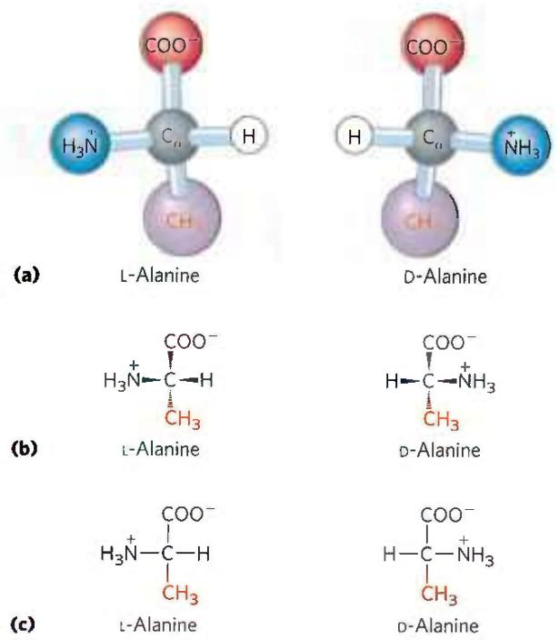  
FIGURE 3-3 Stereoisomerism in $\alpha$ -amino acids. (a) The two stereoisomers of alanine, L- and D-alanine, are nonsuperposable mirror images of each other (enantiomers). (b, c) Two different conventions for showing the configurations in space of stereoisomers. In perspective formulas (b), the solid wedge-shaped bonds project out of the plane of the paper, the dashed bonds behind it. In projection formulas (c), the horizontal bonds are assumed to project out of the plane of the paper, the vertical bonds behind. However, projection formulas are often used casually and are not always intended to portray a specific stereochemical configuration. See Figure 3-4 for an explanation of the D, L-system for specifying absolute configuration.

KEY CONVENTION Two conventions are used to identify the carbons in an amino acid — a practice that can be confusing. The additional carbons in an R group are commonly designated $\beta$ , $\gamma$ , $\delta$ , $\varepsilon$ , and so forth, proceeding out from the $\alpha$ carbon. For most other organic molecules, carbon atoms are simply numbered from one end, giving highest priority (C-1) to the carbon with the substituent containing the atom of highest atomic number. Within this latter convention, the carboxyl carbon of an amino acid would be C-1 and the $\alpha$ carbon would be C-2.

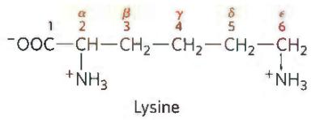

In cases such as amino acids with heterocyclic R groups (e.g., histidine), where the Greek lettering system is ambiguous, the numbering system is used. For branched amino acid side chains, equivalent carbons are given numbers after the Greek letters. Leucine thus has $\delta1$ and $\delta2$ carbons (see the structure in Fig. 3-5).

Special nomenclature has been developed to specify the absolute configuration of the four substituents of asymmetric carbon atoms. The absolute configurations of simple sugars and amino acids are specified by the D, L system (Fig. 3-4), based on the absolute configuration of the three-carbon sugar glyceraldehyde, a convention proposed by Emil Fischer in 1891. (Fischer knew what groups surrounded the asymmetric carbon of glyceraldehyde but had to guess at their absolute configuration; he guessed right, as was later confirmed by x-ray diffraction analysis.) For all chiral compounds, stereoisomers having a configuration related to that of L-glyceraldehyde are designated L, and stereoisomers related to D-glyceraldehyde are designated D. The functional groups of L-alanine are matched with those of L-glyceraldehyde by aligning those that can be interconverted by simple, one-step chemical reactions. Thus the carboxyl group of L-alanine occupies the same position about the chiral carbon as does the aldehyde group of L-glyceraldehyde, because an aldehyde is readily converted to a carboxyl group via a one-step oxidation. Historically, the similar l and d designations were used for levorotatory (rotating plane-polarized light to the left) and dextrorotatory (rotating light to the right). However, not all L-amino acids are levorotatory, and the convention shown in Figure 3-4 was needed to avoid potential ambiguities about absolute configuration. By Fischer's convention, L and D refer only to the absolute configuration of the four substituents around the chiral carbon, not to optical properties of the molecule.

  
FIGURE 3-4 Steric relationship of the stereoisomers of alanine to the absolute configuration of L-and D-glyceraldehyde. In these perspective formulas, the carbons are lined up vertically, with the chiral atom in the center. The carbons in these molecules are numbered beginning with the terminal aldehyde or carboxyl carbon (red), 1 to 3 from top to bottom as shown. When presented in this way, the R group of the amino acid (in this case the methyl group of alanine) is always below the $\alpha$ carbon. L-Amino acids are those with the $\alpha$ -amino group on the left, and D-amino acids have the $\alpha$ -amino group on the right.

Another system of specifying configuration around a chiral center is the RS system, which is used in the systematic nomenclature of organic chemistry and describes more precisely the configuration of molecules with more than one chiral center (p. 17).

## The Amino Acid Residues in Proteins Are L Stereoisomers

Nearly all biological compounds with a chiral center occur naturally in only one stereoisomeric form, either D or L. The amino acid residues in protein molecules are almost all L stereoisomers, with less than 1% being found in the D-configuration. The rare D-amino acid residues generally have a precise structural purpose, and they are introduced to a protein by enzyme-catalyzed reactions that occur after the proteins are synthesized on a ribosome.

It is remarkable that virtually all amino acid residues in proteins are L stereoisomers. When chiral compounds are formed by ordinary chemical reactions, the result is a racemic mixture of D and L isomers, which are difficult for a chemist to distinguish and separate. But to a living system, D and L isomers are as different as the right hand and the left. The formation of stable, repeating substructures in proteins (Chapter 4) requires that their constituent amino acids be of one stereochemical series. Cells are able to specifically synthesize the L isomers of amino acids because the active sites of enzymes are asymmetric, causing the reactions they catalyze to be stereospecific.

## Amino Acids Can Be Classified by R Group

Knowledge of the chemical properties of the common amino acids is central to an understanding of biochemistry. The topic can be simplified by grouping the amino acids into five main classes based on the properties of their R groups (Table 3-1), particularly their polarity, or tendency to interact with water at biological pH (near pH 7.0). The polarity of the R groups varies widely, from nonpolar and hydrophobic (water-insoluble) to highly polar and hydrophilic (water-soluble). A few amino acids—especially glycine, histidine, and cysteine—are somewhat difficult to characterize or do not fit perfectly in any one group. They are assigned to particular groupings based on considered judgments rather than absolutes.

TABLE 3-1 Properties and Conventions Associated with the Common Amino Acids Found in Proteins

<table><tr><td rowspan="2">Amino acid</td><td rowspan="2">Abbreviation/ symbol</td><td rowspan="2"> $M_{r}^{a}$ </td><td colspan="3"> $pK_{a}$  values</td><td rowspan="2">pl</td><td rowspan="2">Hydropathy indexb</td><td rowspan="2" colspan="3">Occurrence in proteins (%)c</td></tr><tr><td> $pK_{1}$ (—COOH)</td><td> $pK_{2}$ (—NH3+)</td><td> $pK_{R}$ (R group)</td></tr><tr><td colspan="11">Nonpolar, aliphatic R groups</td></tr><tr><td>Glycine</td><td>Gly G</td><td>75</td><td>2.34</td><td>9.60</td><td></td><td>5.97</td><td>-0.4</td><td>7.2</td><td>7.3</td><td>7.3</td></tr><tr><td>Alanine</td><td>Ala A</td><td>89</td><td>2.34</td><td>9.69</td><td></td><td>6.01</td><td>1.8</td><td>7.8</td><td>9.4</td><td>7.2</td></tr><tr><td>Proline</td><td>Pro P</td><td>115</td><td>1.99</td><td>10.96</td><td></td><td>6.48</td><td>-1.6d</td><td>5.2</td><td>4.4</td><td>4.2</td></tr><tr><td>Valine</td><td>Val V</td><td>117</td><td>2.32</td><td>9.62</td><td></td><td>5.97</td><td>4.2</td><td>6.6</td><td>7.1</td><td>8.2</td></tr><tr><td>Leucine</td><td>Leu L</td><td>131</td><td>2.36</td><td>9.60</td><td></td><td>5.98</td><td>3.8</td><td>9.1</td><td>10.6</td><td>9.9</td></tr><tr><td>Isoleucine</td><td>Ile I</td><td>131</td><td>2.36</td><td>9.68</td><td></td><td>6.02</td><td>4.5</td><td>5.3</td><td>6.0</td><td>7.6</td></tr><tr><td>Methionine</td><td>Met M</td><td>149</td><td>2.28</td><td>9.21</td><td></td><td>5.74</td><td>1.9</td><td>2.3</td><td>2.2</td><td>2.2</td></tr><tr><td colspan="11">Aromatic R groups</td></tr><tr><td>Phenylalanine</td><td>Phe F</td><td>165</td><td>1.83</td><td>9.13</td><td></td><td>5.48</td><td>2.8</td><td>3.9</td><td>4.0</td><td>4.5</td></tr><tr><td>Tyrosine</td><td>Tyr Y</td><td>181</td><td>2.20</td><td>9.11</td><td>10.07</td><td>5.66</td><td>-1.3</td><td>3.2</td><td>3.0</td><td>3.9</td></tr><tr><td>Tryptophan</td><td>Trp W</td><td>204</td><td>2.38</td><td>9.39</td><td></td><td>5.89</td><td>-0.9</td><td>1.4</td><td>1.3</td><td>1.1</td></tr><tr><td colspan="11">Polar, uncharged R groups</td></tr><tr><td>Serine</td><td>Ser S</td><td>105</td><td>2.21</td><td>9.15</td><td></td><td>5.68</td><td>-0.8</td><td>6.8</td><td>6.1</td><td>5.7</td></tr><tr><td>Threonine</td><td>Thr T</td><td>119</td><td>2.11</td><td>9.62</td><td></td><td>5.87</td><td>-0.7</td><td>5.9</td><td>5.4</td><td>4.5</td></tr><tr><td>Cysteinee</td><td>Cys C</td><td>121</td><td>1.96</td><td>10.28</td><td>8.18</td><td>5.07</td><td>2.5</td><td>1.9</td><td>1.2</td><td>0.8</td></tr><tr><td>Asparagine</td><td>Asn N</td><td>132</td><td>2.02</td><td>8.80</td><td></td><td>5.41</td><td>-3.5</td><td>4.3</td><td>3.7</td><td>3.4</td></tr><tr><td>Glutamine</td><td>Gln Q</td><td>146</td><td>2.17</td><td>9.13</td><td></td><td>5.65</td><td>-3.5</td><td>4.2</td><td>4.5</td><td>2.0</td></tr><tr><td colspan="11">Positively charged R groups</td></tr><tr><td>Lysine</td><td>Lys K</td><td>146</td><td>2.18</td><td>8.95</td><td>10.53</td><td>9.74</td><td>-3.9</td><td>5.9</td><td>4.7</td><td>6.8</td></tr><tr><td>Histidine</td><td>His H</td><td>155</td><td>1.82</td><td>9.17</td><td>6.00</td><td>7.59</td><td>-3.2</td><td>2.3</td><td>2.4</td><td>1.6</td></tr><tr><td>Arginine</td><td>Arg R</td><td>174</td><td>2.17</td><td>9.04</td><td>12.48</td><td>10.76</td><td>-4.5</td><td>5.1</td><td>5.6</td><td>5.9</td></tr><tr><td colspan="11">Negatively charged R groups</td></tr><tr><td>Aspartate</td><td>Asp D</td><td>133</td><td>1.88</td><td>9.60</td><td>3.65</td><td>2.77</td><td>-3.5</td><td>5.3</td><td>5.1</td><td>5.0</td></tr><tr><td>Glutamate</td><td>Glu E</td><td>147</td><td>2.19</td><td>9.67</td><td>4.25</td><td>3.22</td><td>-3.5</td><td>6.3</td><td>6.0</td><td>8.2</td></tr></table>

$^{a}$ M, values reflect the structures as shown in Figure 3-5. The elements of water (M, 18) are deleted when the amino acid is incorporated into a polypeptide.  
$^{b}$ A scale combining hydrophobicity and hydrophilicity of R groups. The values reflect the free energy ( $\Delta G$ ) of transfer of the amino acid side chain from a hydrophobic environment to water. This transfer is favorable ( $\Delta G < 0$ ; negative value in the index) for charged or polar amino acid side chains, and it is unfavorable ( $\Delta G > 0$ ; positive value in the index) for amino acids with nonpolar or more hydrophobic side chains. See Chapter 11. Source: Data from J. Kyte and R. F. Doolittle, J. Mol. Biol. 157:105, 1982.  
The first value in each row is the average occurrence in more than 1,150 proteins. Source: Data from R. F. Doolittle, in Prediction of Protein Structure and the Principles of Protein Conformation (G. D. Fasman, ed.), p. 599, Plenum Press, 1989. The second and third values are, respectively, from the complete proteomes of nine mesophilic bacterial species and seven thermophilic bacterial species. Mesophiles grow at commonly encountered temperatures, whereas thermophiles grow at elevated temperatures up to and beyond the boiling point of water. The decline in glutamine occurrence in thermophiles may reflect a tendency of this amino acid to deaminate at high temperatures. Source: Data from A. C. Singer and D. A. Hickey, Gene 317:39, 2003.  
$^{d}$ As originally composed, the hydropathy index takes into account the frequency with which an amino acid residue appears on the surface of a protein. As proline often appears on the surface in $\beta$ turns, it has a lower score than its chain of methylene groups would suggest.  
$^{e}$ Cysteine is generally classified as polar, despite having a positive hydropathy index. This reflects the ability of the sulfhydryl group to act as a weak acid and to form a weak hydrogen bond with oxygen or nitrogen.

P1 The structures of the 20 common amino acids are shown in Figure 3-5, and some of their properties are listed in Table 3-1. Within each class there are gradations of polarity, size, and shape of the R groups.

Nonpolar, Aliphatic R Groups The R groups in this class of amino acids are nonpolar and hydrophobic. The side chains of alanine, valine, leucine, and isoleucine tend to cluster together within proteins, stabilizing protein structure through the hydrophobic effect. Glycine has the simplest structure. Although it is most easily grouped with the nonpolar amino acids, its very small side chain makes no real contribution to interactions driven by the hydrophobic effect. Methionine, one of the two sulfur-containing amino acids, has a slightly nonpolar thioether group in its side chain. Proline has an aliphatic side chain with a distinctive cyclic structure.

  
FIGURE 3-5 The 20 common amino acids of proteins. The structural formulas show the state of ionization that would predominate at pH 7.0. The unshaded portions are those that are common to all the amino acids; the shaded portions are the R groups. Although  
the R group of histidine is shown uncharged, its $pK_{a}$ (see Table 3-1) is such that a small but significant fraction of these groups are positively charged at pH 7.0. The protonated form of histidine is shown above the graph in Figure 3-12b.

## Absorption of Light by Molecules: The Lambert-Beer Law

A wide range of biomolecules absorb light at characteristic wavelengths, just as tryptophan absorbs light at 280 nm (see Fig. 3-6). Measurement of light absorption by a spectrophotometer is used to detect and identify molecules and to measure their concentration in solution. The fraction of the incident light absorbed by a solution at a given wavelength is related to the thickness of the absorbing layer (path length) and the concentration of the absorbing species (Fig. 1). These two relationships are combined into the Lambert-Beer law,

$$
\log \frac {I _ {0}}{I} = \varepsilon c I
$$

where $I_{0}$ is the intensity of the incident light, I is the intensity of the transmitted light, the ratio $I/I_{0}$ (the inverse of the ratio in the equation) is the transmittance, $\varepsilon$ is the molar extinction coefficient (in units of liters per mole-centimeter), c is the

The secondary amino (imino) group of proline residues is held in a rigid conformation that reduces the structural flexibility of polypeptide regions containing proline.

Aromatic R Groups Phenylalanine, tyrosine, and tryptophan, with their aromatic side chains, are relatively nonpolar (hydrophobic). All can contribute to the hydrophobic effect. The hydroxyl group of tyrosine can form hydrogen bonds, and it is an important functional group in some enzymes. Tyrosine and tryptophan are significantly more polar than phenylalanine because of the tyrosine hydroxyl group and the nitrogen of the tryptophan indole ring.

FIGURE 3-6 Absorption of ultraviolet light by aromatic amino acids. Comparison of the light absorption spectra of the aromatic amino acids tryptophan, tyrosine, and phenylalanine at pH 6.0. The amino acids are present in equimolar amounts ( $10^{-3}$ m) under identical conditions. The measured absorbance of tryptophan is more than four times that of tyrosine at a wavelength of 280 nm. Note that the maximum light absorption for both tryptophan and tyrosine occurs near 280 nm. Light absorption by phenylalanine generally contributes little to the spectroscopic properties of proteins.

concentration of the absorbing species (in moles per liter), and / is the path length of the light-absorbing sample (in centimeters). The Lambert-Beer law assumes that the incident light is parallel and monochromatic (of a single wavelength) and that the solvent and solute molecules are randomly oriented. The expression log $(I_0 / I)$ is called the absorbance, designated A.

It is important to note that each successive millimeter of path length of absorbing solution in a 1.0 cm cell absorbs not a constant amount but a constant fraction of the light that is incident upon it. However, with an absorbing layer of fixed path length, the absorbance, A, is directly proportional to the concentration of the absorbing solute.

The molar extinction coefficient varies with the nature of the absorbing compound, the solvent, and the wavelength, and also with pH if the light-absorbing species is in equilibrium with an ionization state that has different absorbance properties.

FIGURE 1 The principal components of a spectrophotometer. A light source emits light along a broad spectrum, then the monochromator selects and transmits light of a particular wavelength. The monochromatic light passes through the sample in a cuvette of path length $l$ . The absorbance of the sample, $\log (l_0 / l)$ , is proportional to the concentration of the absorbing species. The transmitted light is measured by a detector.

Tryptophan and tyrosine, and to a much lesser extent phenylalanine, absorb ultraviolet light (Fig. 3-6; see also Box 3-1). This accounts for the characteristic strong absorbance of light by most proteins at a wavelength of 280 nm, a property exploited by researchers in the characterization of proteins.

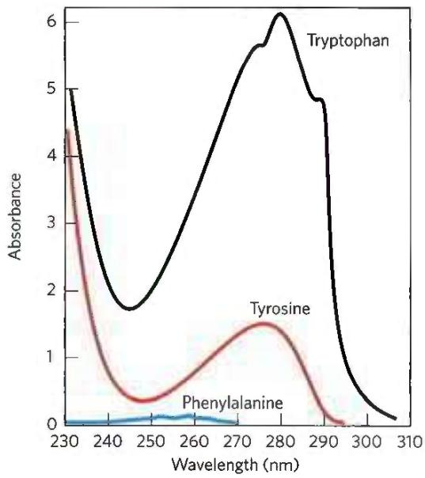

Polar, Uncharged R Groups The R groups of these amino acids are more soluble in water, or more hydrophilic, than those of the nonpolar amino acids because they contain functional groups that form hydrogen bonds with water. This class of amino acids includes serine, threonine, cysteine, asparagine, and glutamine. The polarity of serine and threonine is contributed by their hydroxyl groups, and the polarity of asparagine and glutamine is contributed by their amide groups. Cysteine is an outlier here because its polarity, contributed by its sulfhydryl group, is quite modest. Cysteine is a weak acid and can make weak hydrogen bonds with oxygen or nitrogen.

Asparagine and glutamine are the amides of two other amino acids also found in proteins—aspartate and glutamate, respectively—to which asparagine and glutamine are easily hydrolyzed by acid or base. Cysteine is readily oxidized to form a covalently linked dimeric amino acid called cystine, in which two cysteine molecules or residues are joined by a disulfide bond (Fig. 3-7). The disulfide-linked residues are strongly hydrophobic (nonpolar). Disulfide bonds play a special role in the structures of many proteins by forming covalent links between parts of a polypeptide molecule or between two different polypeptide chains.

Positively Charged (Basic) R Groups The most hydrophilic R groups are those that are either positively charged or negatively charged. The amino acids in which the R groups have significant positive charge at pH 7.0 are lysine, which has a second primary amino group at the $\varepsilon$ position on its aliphatic chain; arginine, which has a positively charged guanidinium group; and histidine, which has an aromatic imidazole group. As the only common amino acid having an ionizable side chain with $pK_{\mathrm{a}}$ near neutrality, histidine may be positively charged (protonated form) or uncharged at pH 7.0. His residues facilitate many enzyme-catalyzed reactions by serving as proton donors/acceptors.

  
FIGURE 3-7 Reversible formation of a disulfide bond by the oxidation of two molecules of cysteine. Disulfide bonds between Cys residues stabilize the structures of many proteins.

Negatively Charged (Acidic) R Groups The two amino acids having R groups with a net negative charge at pH 7.0 are aspartate and glutamate, each of which has a second carboxyl group.

## Uncommon Amino Acids Also Have Important Functions

In addition to the 20 common amino acids, proteins may contain residues created by modification of common residues already incorporated into a polypeptide—that is, through postsynthetic modification (Fig. 3-8a). Among these uncommon amino acids are 4-hydroxy-proline, a derivative of proline found in the fibrous protein collagen, and $\gamma$ -carboxyglutamate, found in the blood-clotting protein prothrombin and in certain other proteins that bind $\mathrm{Ca^{2+}}$ as part of their biological function. More complex is desmosine, a derivative of four Lys residues, which is found in the fibrous protein elastin.

Selenocysteine and pyrrolysine are special cases. These rare amino acid residues are not created through a postsynthetic modification. Instead, they are introduced during protein synthesis through an unusual adaptation of the genetic code, which we describe in Chapter 27. Selenocysteine contains selenium rather than the sulfur of cysteine. Actually derived from serine, selenocysteine is a constituent of just a few known proteins. Pyrrolysine is found in a few proteins in several methanogenic (methane-producing) archaea and in one known bacterium; it plays a role in methane biosynthesis.

Some amino acid residues in a protein may be modified transiently to alter the protein's function. The addition of phosphoryl, methyl, acetyl, adenylyl, ADP-ribosyl, or other groups to particular amino acid residues can increase or decrease a protein's activity (Fig. 3-8b). Phosphorylation is a particularly common regulatory modification. Covalent modification as a protein regulatory strategy is discussed in more detail in Chapter 6.

Some 300 additional amino acids have been found in cells. They have a variety of functions, but not all are constituents of proteins. Ornithine and citrulline (Fig. 3-8c) deserve special note because they are key intermediates (metabolites) in the biosynthesis of arginine (Chapter 22) and in the urea cycle (Chapter 18).

## Amino Acids Can Act as Acids and Bases

The amino and carboxyl groups of amino acids, along with the ionizable R groups of some amino acids, function as weak acids and bases. When an amino acid lacking an ionizable R group is dissolved in water at neutral pH, the $\alpha$ -amino and carboxyl groups create a

  
FIGURE 3-8 Uncommon amino acids. (a) Some uncommon amino acids found in proteins. Most are derived from common amino acids. (Note the use of either numbers or Greek letters in the names of these structures to identify the altered carbon atoms.) Extra functional groups added by modification reactions are shown in red. Desmosine is formed from four Lys residues (the carbon backbones are shaded in light red). Selenocysteine and pyrrolysine are exceptions: these amino acids are added during normal protein synthesis through a highly specialized expansion of the standard genetic code. Both are found in very small numbers of proteins. (b) Reversible amino acid modifications involved in regulation of protein activity. Phosphorylation is the most common type of regulatory modification. (c) Ornithine and citrulline, which are not found in proteins, are intermediates in the biosynthesis of arginine and in the urea cycle.

dipolar ion, or zwitterion (German for "hybrid ion"), which can act as either an acid or a base (Fig. 3-9). Substances having this dual (acid-base) nature are amphoteric and are often called ampholytes (from "amphoteric electrolytes"). A simple monoamino monocarboxylic $\alpha$ -amino acid, such as alanine, is a diprotic acid when fully protonated; it has two groups, the —COOH group and the $—NH_{3}^{+}$ group, that can yield protons:

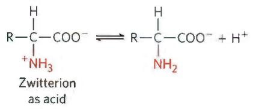

  
FIGURE 3-9 Nonionic and zwitterionic forms of amino acids. The nonionic form does not occur in significant amounts in aqueous solutions. The zwitterion predominates at neutral pH. A zwitterion can act as either an acid (proton donor) or a base (proton acceptor).

Acid-base titration involves the gradual addition or removal of protons (Chapter 2). Figure 3-10 shows the titration curve of the diprotic form of glycine. The two ionizable groups of glycine, the carboxyl group and the amino group, are titrated with a strong base such as NaOH. The plot has two distinct stages, corresponding to deprotonation of two different groups on glycine. Each of the two stages resembles in shape the titration curve of a monoprotic acid, such as acetic acid (see Fig. 2-16), and can be analyzed in the same way. At very low pH, the predominant ionic species of glycine is the fully protonated form, $^{+}$ H $_{3}$ N—CH $_{2}$ —COOH.

In the first stage of the titration, the —COOH group of glycine (with its lower $pK_{a}$ ) loses its proton. At the midpoint of this stage, equimolar concentrations of the proton-donor ( $^{+}H_{3}N—CH_{2}—COOH$ ) and the proton-acceptor ( $^{+}H_{3}N—CH_{2}—COO^{-}$ ) species are present. As in the titration of any weak acid, a point of inflection is reached at this midpoint where the pH is equal to the $pK_{a}$ of the protonated group that is being titrated (see Fig. 2-17). For glycine, the pH at the midpoint is 2.34; thus its —COOH group has a $pK_{a}$ (labeled $pK_{1}$ in Fig. 3-10) of 2.34. (Recall from Chapter 2 that pH and $pK_{a}$ are simply convenient notations for proton concentration and the equilibrium constant for ionization, respectively. The $pK_{a}$ is a measure of the tendency of a group to give up a proton, with that tendency decreasing 10-fold as the $pK_{a}$ increases by one unit.) As the titration of glycine proceeds, another point of inflection is reached at pH 5.97; at this point, removal of the first proton is essentially complete and removal of the second has just begun. At this pH, glycine is present largely as the dipolar ion (zwitterion) $^{+}H_{3}N—CH_{2}—COO^{-}$ . We shall return to the significance of this inflection point in the titration curve (labeled pI in Fig. 3-10) shortly.

  
FIGURE 3-10 Titration of amino acids. The titration curve of 0.1 M glycine at 25 °C. The ionic species predominating at key points in the titration are shown above the graph. The shaded boxes, centered at about $pK_{1}=2.3$ and $pK_{2}=9.60$ , indicate the regions of greatest buffering power. Note that 1 equivalent of $OH^{-}=0.1$ M NaOH added. The pl occurs at the arithmetic mean between the two $pK_{a}$ values, and it corresponds to the inflection point in the titration.

The second stage of the titration corresponds to the removal of a proton from the $-NH_{3}^{+}$ group of glycine. The pH at the midpoint of this stage is 9.60, equal to the $pK_{a}$ (labeled $pK_{2}$ in Fig. 3-10) for the $-NH_{3}^{+}$ group. The titration is essentially complete at a pH of about 12, at which point the predominant form of glycine is $H_{2}N-CH_{2}-COO^{-}$ .

From the titration curve of glycine we can derive several important pieces of information. First, it gives a quantitative measure of the $pK_{a}$ of each of the two ionizing groups: 2.34 for the —COOH group and 9.60 for the $-NH_{3}^{+}$ group. Note that the carboxyl group of glycine is over 100 times more acidic (more easily ionized) than the carboxyl group of acetic acid, which, as we saw in Chapter 2, has a $pK_{a}$ of 4.76—about average for a carboxyl group attached to an otherwise unsubstituted aliphatic hydrocarbon. The perturbed $pK_{a}$ of glycine is caused primarily by the nearby positively charged amino group on the $\alpha$ -carbon atom, an electronegative group that tends to pull electrons toward it (a process called electron withdrawal), as described in Figure 3-11. The opposite charges on the resulting zwitterion are also somewhat stabilizing. Similarly, the $pK_{a}$ of the amino group in glycine is perturbed downward relative to the average $pK_{a}$ of an amino group. This effect is due largely to electron withdrawal by the electronegative oxygen atoms in the carboxyl groups, increasing the tendency of the amino group to give up a proton. Hence, the $\alpha$ -amino group has a $pK_{a}$ that is lower than that of an aliphatic amine such as methylamine (Fig. 3-11). In short, the $pK_{a}$ of any functional group is greatly affected by its chemical environment, a phenomenon sometimes exploited in the active sites of enzymes to promote exquisitely adapted reaction mechanisms that depend on the perturbed $pK_{a}$ values of proton donor/acceptor groups of specific residues.

  
FIGURE 3-11 Effect of the chemical environment on $\mathsf{pK}_{\mathrm{a}}$ . The $\mathsf{pK}_{\mathrm{a}}$ values for the ionizable groups in glycine are lower than those for simple, methyl-substituted amino and carboxyl groups. These downward  
perturbations of $pK_{a}$ are due to intramolecular interactions. Similar effects can be caused by chemical groups that happen to be positioned nearby — for example, in the active site of an enzyme.

The second piece of information provided by the titration curve of glycine is that this amino acid has two regions of buffering power. One of these is the relatively flat portion of the curve, extending for approximately 1 pH unit on either side of the first $pK_{a}$ of 2.34, indicating that glycine is a good buffer near this pH. The other buffering zone is centered around pH 9.60. (Note that glycine is not a good buffer at the pH of intracellular fluid or blood, about 7.4.) Within the buffering ranges of glycine, the Henderson-Hasselbalch equation (p. 60) can be used to calculate the proportions of proton-donor and proton-acceptor species of glycine required to make a buffer at a given pH.

A final important piece of information derived from the titration curve of an amino acid is the relationship between its net charge and the pH of the solution. At pH 5.97, the point of inflection between the two stages in its titration curve, glycine is present predominantly as its dipolar form, fully ionized but with no net electric charge (Fig. 3-10). The characteristic pH at which the net electric charge is zero is called the isoelectric point or isoelectric pH, designated pI. For glycine, which has no ionizable group in its side chain, the isoelectric point is simply the arithmetic mean of the two $pK_{a}$ values:

$$
\mathrm{pI} = \frac {1}{2} (\mathrm{pK} _ {1} + \mathrm{pK} _ {2}) = \frac {1}{2} (2. 3 4 + 9. 6 0) = 5. 9 7
$$

As is evident in Figure 3-10, glycine has a net negative charge at any pH above its pI and thus will move toward the positive electrode (the anode) when placed in an electric field. At any pH below its pI, glycine has a net positive charge and will move toward the negative electrode (the cathode). The farther the pH of a glycine solution is from its isoelectric point, the greater the net electric charge of the population of glycine molecules. At pH 1.0, for example, glycine exists almost entirely as the form ${}^{+}H_{3}N—CH_{2}—COOH$ with a net positive charge of 1.0. At pH 2.34, where there is an equal mixture of ${}^{+}H_{3}N—CH_{2}—COOH$ and ${}^{+}H_{3}N—CH_{2}—COO^{-}$ , the average or net positive charge is 0.5. The sign and the magnitude of the net charge of any amino acid at any pH can be predicted in the same way.

## Amino Acids Differ in Their Acid-Base Properties

The shared properties of many amino acids permit some simplifying generalizations about their acid-base behaviors. First, all amino acids with a single $\alpha$ -amino group, a single $\alpha$ -carboxyl group, and an R group that does not ionize have titration curves resembling that of glycine (Fig. 3-10). These amino acids have very similar, although not identical, $\mathsf{pK}_{\mathbf{a}}$ values: $\mathsf{pK}_{\mathbf{a}}$ of the —COOH group in the range of 1.8 to 2.4, and $\mathsf{pK}_{\mathbf{a}}$ of the — $\mathrm{NH}_3^+$ group in the range of 8.8 to 11.0 (Table 3-1). The differences in these $pK_{a}$ values reflect the chemical environments imposed by their R groups.

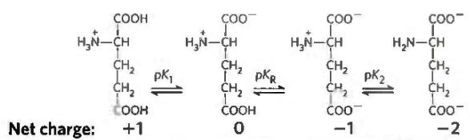

  
FIGURE 3-12 Titration curves for (a) glutamate and (b) histidine. The $pK_{a}$ of the R group is designated here as $pK_{R}$ . In both cases, the presence of three ionizable groups renders the titration curve more complex. Note that for glutamate, the pl is approximately the arithmetic mean of the $pK_{a}$ of the two groups that are negatively charged. There is a net

Second, amino acids with an ionizable R group have more complex titration curves, with three stages corresponding to the three possible ionization steps; thus, they have three $pK_{a}$ values. The additional stage for the titration of the ionizable R group merges to some extent with that for the titration of the $\alpha$ -carboxyl group, the titration of the $\alpha$ -amino group, or both. The titration curves for two amino acids of this type, glutamate and histidine, are shown in Figure 3-12. The isoelectric points reflect the nature of the ionizing R groups that are present. For example, glutamate has a pI of 3.22, considerably lower than that of glycine. This is due to the presence of two carboxyl groups, which, at the average of their $pK_{a}$ values (3.22), contribute a net charge of -1 that balances the +1 contributed by the amino group. Similarly, the pI of histidine, with two groups that are positively charged when protonated, is 7.59 (the average of the $pK_{a}$ values of the amino and imidazole groups), much higher than that of glycine.

Finally, in an aqueous environment, only histidine has an R group ( $pK_{a} = 6.0$ ) providing significant buffering power near the neutral pH usually found in the intracellular and extracellular fluids of most animals and bacteria (Table 3-1).

## SUMMARY 3.1 Amino Acids

The 20 amino acids commonly found as residues in proteins contain an $\alpha$ -carboxyl group, an $\alpha$ -amino group, and a distinctive R group substituted on the $\alpha$ -carbon atom. The $\alpha$ -carbon atom of all amino acids except glycine is asymmetric, and thus amino acids can exist in at least two stereoisomeric forms.

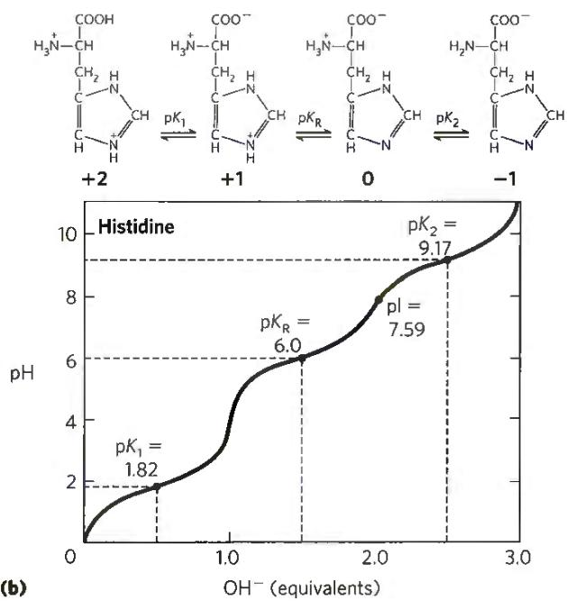

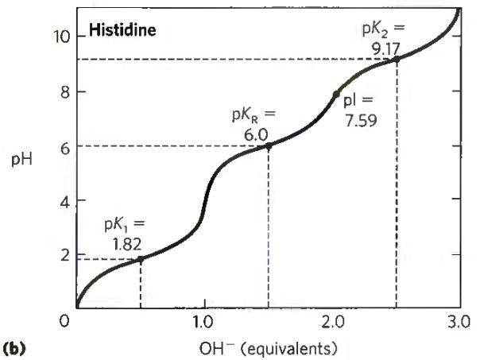  
charge of 0 (the pl) when these two groups contribute a net charge of -1 (one protonated, the other not) to exactly balance the +1 charge of the protonated $\alpha$ -amino group. Similarly, the pl for histidine is approximately the arithmetic mean of the $pK_{a}$ of the two groups that are positively charged when protonated.

■ Only the L stereoisomers of amino acids, with a configuration related to the absolute configuration of the reference molecule L-glyceraldehyde, are found in proteins.

■ Amino acids can be classified into five types on the basis of the polarity and charge (at pH 7) of their R groups.

■ Other, less common amino acids also occur, either as constituents of proteins (usually through modification of common amino acid residues after protein synthesis) or as free metabolites.

■ Amino acids vary in their acid-base properties and have characteristic titration curves. Monoamino monocarboxylic amino acids (with nonionizable R groups) are diprotic acids ( $^{+}$ H $_{3}$ NCH(R)COOH) at low pH and exist in several different ionic forms as the pH is increased.

■ Amino acids with ionizable R groups have additional ionic species, depending on the pH of the medium and the $pK_{a}$ of the R group.

## 3.2 Peptides and Proteins

We now turn to polymers of amino acids, the peptides and proteins. Biologically occurring polypeptides range in size from small, consisting of two or three linked amino acid residues, to very large, consisting of thousands of residues.

## Peptides Are Chains of Amino Acids

P2 Two amino acid molecules can be covalently joined through a substituted amide linkage, termed a peptide bond, to yield a dipeptide. Such a linkage is formed by removal of the elements of water (dehydration) — a hydroxyl moiety from the $\alpha$ -carboxyl group of one amino acid and a hydrogen atom the $\alpha$ -amino group of another (Fig. 3-13). The joined amino acids are referred to as residues, the part left over after the elements of water are removed. Peptide bond formation is an example of a condensation reaction, a common class of reactions in living cells. The reverse reaction, bond breakage involving water, is an example of hydrolytic cleavage or hydrolysis. Under standard biochemical conditions, the equilibrium for the reaction shown in Figure 3-13 favors the hydrolysis of the dipeptide into amino acids. To make the condensation reaction thermodynamically more favorable, the carboxyl group must be chemically modified or activated so that the hydroxyl group can be more readily eliminated. A chemical approach to this problem is outlined later in this chapter. The biological approach to peptide bond formation is a major topic of Chapter 27.

Three amino acids can be joined by two peptide bonds to form a tripeptide; similarly, four amino acids can be linked to form a tetrapeptide, five to form a pentapeptide, and so forth. When a few amino acids are joined in this fashion, the structure is called an oligopeptide. When many amino acids are joined, the product is called a polypeptide. Proteins may have thousands of amino acid residues. Although the terms “protein” and “polypeptide” are sometimes used interchangeably, molecules referred to as polypeptides generally have molecular weights below 10,000, and those called proteins have higher molecular weights.

Figure 3-14 shows the structure of a pentapeptide. In a peptide, the amino acid residue at the end with a free $\alpha$ -amino group is the amino-terminal (or N-terminal)

  
FIGURE 3-13 Formation of a peptide bond by condensation. The $\alpha$ -amino group of one amino acid (with the $R^2$ group) acts as a nucleophile to displace the hydroxyl group of another amino acid (with the $R^1$ group), forming a peptide bond (shaded in light red). Amino groups are good nucleophiles, but the hydroxyl group is a poor leaving group and is not readily displaced. At physiological pH, the reaction shown here does not occur to any appreciable extent.

  
FIGURE 3-14 The pentapeptide serylglycyltyrosylalanylleucine, Ser-Gly-Tyr-Ala-Leu, or SGYAL. Peptides are named beginning with the amino-terminal residue, which by convention is placed at the left. The peptide bonds are shaded in light red; the R groups are in red.

residue; the residue at the other end, which has a free carboxyl group, is the carboxyl-terminal (C-terminal) residue.

KEY CONVENTION When an amino acid sequence of a peptide, a polypeptide, or a protein is displayed, the amino-terminal end is placed on the left and the carboxyl-terminal end is placed on the right. The sequence is read from left to right, beginning with the amino-terminal end.

Although hydrolysis of a peptide bond is an exergonic reaction, it occurs only slowly because it has a high activation energy (p. 25). As a result, the peptide bonds in proteins are quite stable, with an average half-life ( $t_{1/2}$ ) of about 7 years under most intracellular conditions.

## Peptides Can Be Distinguished by Their Ionization Behavior

P2 Peptides contain only one free $\alpha$ -amino group and one free $\alpha$ -carboxyl group, at opposite ends of the chain (Fig. 3-15). These groups ionize as they do in free amino acids. The $\alpha$ -amino and $\alpha$ -carboxyl groups of all nonterminal amino acids are covalently joined in the peptide bonds. They can no longer ionize and thus do not contribute to the total acid-base behavior of peptides. Ionizable R groups in a peptide (Table 3-1) also contribute to the overall acid-base properties of the molecule (Fig. 3-15).

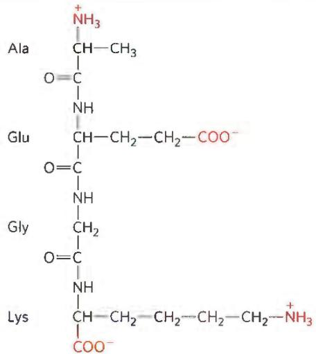  
FIGURE 3-15 Alanylglutamylglycyllysine. This tetrapeptide has one free $\alpha$ -amino group, one free $\alpha$ -carboxyl group, and two ionizable R groups. The groups ionized at pH 7.0 are in red.

Like free amino acids, peptides have characteristic titration curves and a characteristic isoelectric pH (pl) at which the net charge is zero and they do not move in an electric field. These properties are exploited in some of the techniques used to separate peptides and proteins, as we describe later in the chapter. When an amino acid becomes a residue in a peptide, its chemical environment is altered, and the $pK_{a}$ value for an ionizable R group can change somewhat. The $pK_{a}$ values for

<table><tr><td>Protein</td><td>Molecular weight</td><td>Number of residues</td><td>Number of polypeptide chains</td></tr><tr><td>Cytochrome c (human)</td><td>12,400</td><td>104</td><td>1</td></tr><tr><td>Myoglobin (equine heart)</td><td>16,700</td><td>153</td><td>1</td></tr><tr><td>Chymotrypsin (bovine pancreas)</td><td>25,200</td><td>241</td><td>3</td></tr><tr><td>Hemoglobin (human)</td><td>64,500</td><td>574</td><td>4</td></tr><tr><td>Hexokinase (yeast)</td><td>107,900</td><td>972</td><td>2</td></tr><tr><td>RNA polymerase (E. coli)</td><td>450,000</td><td>4,158</td><td>5</td></tr><tr><td>Glutamine synthetase (E. coli)</td><td>619,000</td><td>5,628</td><td>12</td></tr><tr><td>Titin (human)</td><td>2,993,000</td><td>26,926</td><td>1</td></tr></table>

<table><tr><td colspan="5">TABLE 3-3 Amino Acid Composition of Two Proteins</td></tr><tr><td></td><td colspan="2">Bovine cytochrome c</td><td colspan="2">Bovine chymotrypsinogen</td></tr><tr><td>Amino acid</td><td>Number of residues per molecule</td><td>Percentage of total $^{a}$ </td><td>Number of residues per molecule</td><td>Percentage of total $^{a}$ </td></tr><tr><td>Ala</td><td>6</td><td>6</td><td>22</td><td>9</td></tr><tr><td>Arg</td><td>2</td><td>2</td><td>4</td><td>1.6</td></tr><tr><td>Asn</td><td>5</td><td>5</td><td>14</td><td>5.7</td></tr><tr><td>Asp</td><td>3</td><td>3</td><td>9</td><td>3.7</td></tr><tr><td>Cys</td><td>2</td><td>2</td><td>10</td><td>4</td></tr><tr><td>Gln</td><td>3</td><td>3</td><td>10</td><td>4</td></tr><tr><td>Glu</td><td>9</td><td>9</td><td>5</td><td>2</td></tr><tr><td>Gly</td><td>14</td><td>13</td><td>23</td><td>9.4</td></tr><tr><td>His</td><td>3</td><td>3</td><td>2</td><td>0.8</td></tr><tr><td>Ile</td><td>6</td><td>6</td><td>10</td><td>4</td></tr><tr><td>Leu</td><td>6</td><td>6</td><td>19</td><td>7.8</td></tr><tr><td>Lys</td><td>18</td><td>17</td><td>14</td><td>5.7</td></tr><tr><td>Met</td><td>2</td><td>2</td><td>2</td><td>0.8</td></tr><tr><td>Phe</td><td>4</td><td>4</td><td>6</td><td>2.4</td></tr><tr><td>Pro</td><td>4</td><td>4</td><td>9</td><td>3.7</td></tr><tr><td>Ser</td><td>1</td><td>1</td><td>28</td><td>11.4</td></tr><tr><td>Thr</td><td>8</td><td>8</td><td>23</td><td>9.4</td></tr><tr><td>Trp</td><td>1</td><td>1</td><td>8</td><td>3.3</td></tr><tr><td>Tyr</td><td>4</td><td>4</td><td>4</td><td>1.6</td></tr><tr><td>Val</td><td>3</td><td>3</td><td>23</td><td>9.4</td></tr><tr><td>Total</td><td>104</td><td>102 $^{a}$ </td><td>245</td><td>99.7 $^{a}$ </td></tr></table>

Note: In some common analyses, such as acid hydrolysis, Asp and Asn are not readily distinguished from each other and are together designated Asx (or B). Similarly, when Glu and Gln cannot be distinguished, they are together designated Glx (or Z). In addition, Trp is destroyed by acid hydrolysis. Additional procedures must be employed to obtain an accurate assessment of complete amino acid content.

$^{a}$ Percentages do not total to 100%, due to rounding.

the average molecular weight of the 20 common amino acids is about 138, the smaller amino acids predominate in most proteins. If we take into account the proportions in which the various amino acids occur in an average protein (Table 3-1; the averages are determined by surveying the amino acid compositions of more than 1,000 different proteins), the average molecular weight of protein amino acids is nearer to 128. Because a molecule of water ( $M_{r}$ 18) is removed to create each peptide bond, the average molecular weight of an amino acid residue in a protein is about 128 - 18 = 110.

## Some Proteins Contain Chemical Groups Other Than Amino Acids

Many proteins—for example, the enzymes ribonuclease A and chymotrypsin—contain only amino acid residues and no other chemical constituents. However, some proteins contain permanently associated chemical components in addition to amino acids; these are called conjugated proteins. The non-amino acid part of a conjugated protein is usually called its prosthetic group. Conjugated proteins are classified on the basis of the chemical nature of their prosthetic groups (Table 3-4); for example, lipoproteins contain lipids, glycoproteins contain sugar groups, and metalloproteins contain a specific metal. Some proteins contain more than one prosthetic group. Usually the prosthetic group plays an important role in the protein's biological function.

<table><tr><td colspan="3">TABLE 3-4 Conjugated Proteins</td></tr><tr><td>Class</td><td>Prosthetic group</td><td>Example</td></tr><tr><td>Lipoproteins</td><td>Lipids</td><td> $\beta_{1}$ -Lipoprotein of blood (Fig. 17-2)</td></tr><tr><td>Glycoproteins</td><td>Carbohydrates</td><td>Immunoglobulin G (Fig. 5-20)</td></tr><tr><td>Phosphoproteins</td><td>Phosphate groups</td><td>Glycogen phosphorylase (Fig. 6-39)</td></tr><tr><td>Hemoproteins</td><td>Heme (iron porphyrin)</td><td>Hemoglobin (Figs 5-8 to 5-11)</td></tr><tr><td>Flavoproteins</td><td>Flavin nucleotides</td><td>Succinate dehydrogenase (Fig. 19-9)</td></tr><tr><td rowspan="2">Metalloproteins</td><td>Iron Zinc</td><td>Ferritin (Box 16-1)Alcohol dehydrogenase (Fig. 14-12)</td></tr><tr><td>Calcium Molybdenum Copper</td><td>Calmodulin (Fig. 12-17)Dinitrogenase (Fig. 22-3)Complex IV (Fig. 19-12)</td></tr></table>

## SUMMARY 3.2 Peptides and Proteins

■ Amino acids can be joined covalently through peptide bonds to form peptides and proteins. Cells generally contain thousands of different proteins, each with a different biological activity.

■ The ionization behavior of peptides reflects their ionizable side chains as well as the terminal $\alpha$ -amino and $\alpha$ -carboxyl groups.

■ Proteins can be very long polypeptide chains of 100 to several thousand amino acid residues. However, some naturally occurring peptides have only a few amino acid residues. Some proteins are composed of several noncovalently associated polypeptide chains, called subunits.

■ Simple proteins yield only amino acids on hydrolysis; conjugated proteins contain in addition some other component, such as a metal or organic prosthetic group.

## 3.3 Working with Proteins

Biochemists' understanding of protein structure and function has been derived from the study of many individual proteins. To study a protein in detail, the researcher must be able to separate it from other proteins in pure form and must have the techniques to determine its properties. The necessary methods come from protein chemistry, a discipline as old as biochemistry itself and one that retains a central position in biochemical research.

## Proteins Can Be Separated and Purified

A pure preparation is usually essential before a protein's properties and activities can be determined. Given that cells contain thousands of different kinds of proteins, how can one protein be purified? P3 Methods for separating proteins take advantage of properties that vary from one protein to the next, including size, charge, and binding properties. The advent of genetic engineering approaches has provided new and simpler paths for protein purification. The latter methods, described in Chapter 9, often artificially modify the protein being purified, adding a few or many amino acid residues to one or both ends. In many cases, the modifications alter protein function. Isolation of unaltered native proteins requires removal of the modification or a reliance on methods described here.

The source of a protein is generally tissue or microbial cells. The first step in any protein purification procedure is to break open these cells, releasing their proteins into a solution called a crude extract. If necessary, differential centrifugation can be used to prepare subcellular fractions or to isolate specific organelles (see Fig. 1-7).

Once the extract or organelle preparation is ready, various methods are available for purifying one or more of the proteins it contains. P3 Commonly, the extract is subjected to treatments that separate the proteins into different fractions based on a property such as size or charge; the process is referred to as fractionation. Early fractionation steps in a purification utilize differences in protein solubility, which is a complex function of pH, temperature, salt concentration, and other factors. The solubility of proteins is lowered in the presence of some salts, an effect called "salting out." Ammonium sulfate $\left(\left(\mathrm{NH}_{4}\right)_{2}\mathrm{SO}_{4}\right)$ is particularly effective for selectively precipitating some proteins while leaving others in solution. Low-speed centrifugation is then used to remove the precipitated proteins from those remaining in solution.

A solution containing the protein of interest usually must be further altered before subsequent purification steps are possible. For example, dialysis is a procedure that separates proteins from small solutes by taking advantage of the proteins' larger size. The partially purified extract is placed in a bag or tube made of a semipermeable membrane, which is suspended in a much larger volume of buffered solution of appropriate ionic strength. The membrane allows the exchange of salt and buffer but not proteins. Thus dialysis retains large proteins within the membranous bag or tube while allowing the concentration of other solutes in the protein preparation to change until they come into equilibrium with the solution outside the membrane. Dialysis might be used, for example, to remove anumonium sulfate from the protein preparation.

The most efficient methods for fractionating proteins make use of column chromatography, which takes advantage of differences in protein charge, size, binding affinity, and other properties (Fig. 3-16). A porous solid material with appropriate chemical properties (the stationary phase) is held in a column, and a buffered solution (the mobile phase) migrates through it. The protein, dissolved in the same buffered solution that was used to establish the mobile phase, is layered on the top of the column. The protein then percolates through the solid matrix as an ever-expanding band within the larger mobile phase. Individual proteins migrate faster or more slowly through the column, depending on their properties.

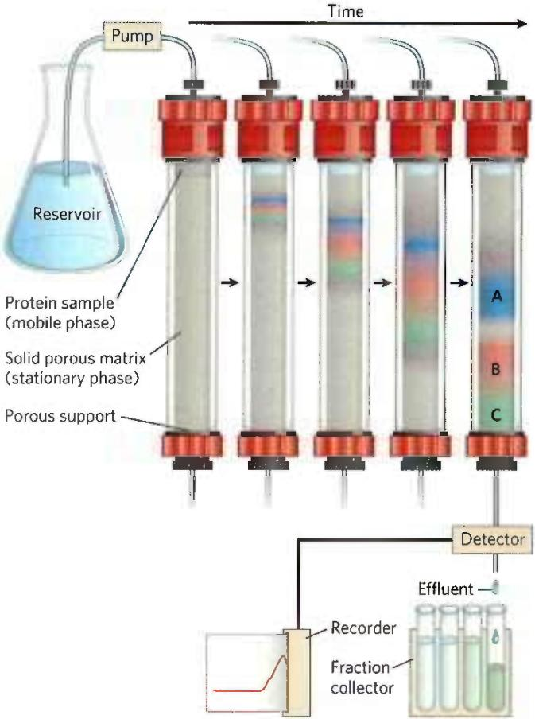  
FIGURE 3-16 Column chromatography. The standard elements of a chromatographic column include a solid, porous material (matrix) supported inside a column, generally made of plastic or glass. A solution, the mobile phase, flows through the matrix, the stationary phase. The solution that passes out of the column at the bottom (the effluent) is constantly replaced by solution supplied from a reservoir at the top. The protein solution to be separated is layered on top of the column and allowed to percolate into the solid matrix. Additional solution is added on top. The protein solution forms a band within the mobile phase that is initially the depth of the protein solution applied to the column. As proteins migrate through the column (shown here at five different times), they are retarded to different degrees by their different interactions with the matrix material. The overall protein band thus widens as it moves through the column. Individual types of proteins (such as A, B, and C, shown in blue, red, and green) gradually separate from each other, forming bands within the broader protein band. Separation improves (i.e., resolution increases) as the length of the column increases. However, each individual protein band also broadens with time due to diffusional spreading, a process that decreases resolution. In this example, protein A is well separated from B and C, but diffusional spreading prevents complete separation of B and C under these conditions. Protein C is being detected and its presence recorded as it is eluted from the column.

Ion-exchange chromatography exploits differences in the sign and magnitude of the net electric charge of proteins at a given pH (Fig. 3-17a). The column

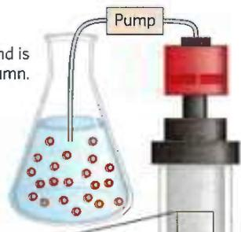

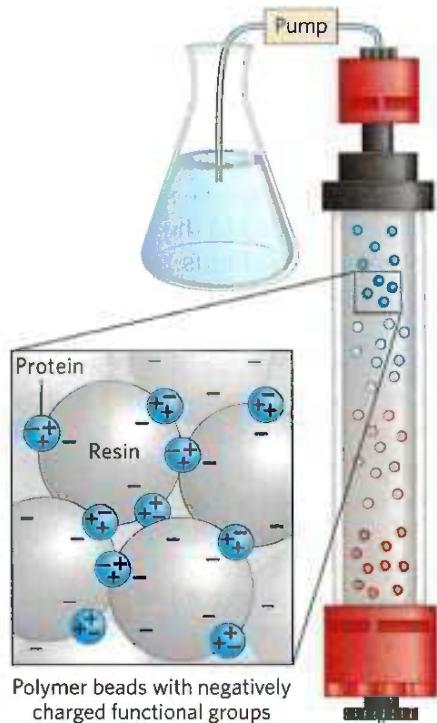  
Polymer beads with negatively charged functional groups  
Protein mixture is added to column containing cation exchangers.  
- Large net positive charge
- Net positive charge
- Net negative charge
- Large net negative charge  
Proteins move through the column at rates determined by their net charge at the pH being used. With cation exchangers, proteins with a more negative net charge move faster and elute earlier.

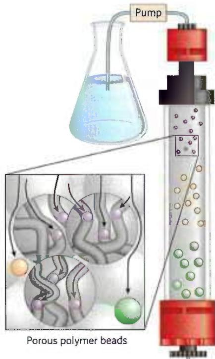

  
Porous polymer beads  
Protein mixture is added to column containing cross-linked polymer.  
Protein molecules separate by size. Small molecules take labyrinthine paths through pores in the beads; larger molecules, excluded from the pores, pass freely around the beads and elute earlier.  
(a) Ion-exchange chromatography

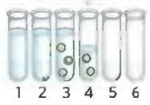  
(b) Size-exclusion chromatography

  
Solution of ligand is added to column.  
Protein mixture is added to column containing a polymer-bound ligand specific for protein of interest.

FIGURE 3-17 Three chromatographic methods used in protein purification. (a) Ion-exchange chromatography exploits differences in the sign and magnitude of the net electric charges of proteins at a given pH. (b) Size-exclusion chromatography, also called gel filtration, separates proteins according to size. (c) Affinity chromatography separates proteins by their binding specificities. Further details of these methods are given in the text.  
  
Unwanted proteins are washed through column.

  
Protein of interest is eluted by ligand solution.

(c) Affinity chromatography

matrix is a synthetic polymer (resin) containing bound charged groups; those with bound anionic groups are called cation exchangers, and those with bound cationic groups are called anion exchangers. The affinity of each protein for the charged groups on the column is affected by the pH (which determines the ionization state of the molecule) and the concentration of competing free salt ions in the surrounding solution. Separation can be optimized by gradually changing the pH and/or salt concentration of the mobile phase in order to create a pH or salt gradient. In cation-exchange chromatography, proteins with a net positive charge migrate through the matrix more slowly than those with a net negative charge, because the migration of the former is retarded more by interaction with the stationary phase.

As the protein-containing solution exits a column, successive portions (fractions) of this effluent are collected in test tubes. Each fraction can be tested for the presence of the protein of interest as well as other properties, such as ionic strength or total protein concentration. All fractions positive for the protein of interest can be combined as the product of this chromatographic step of the protein purification.

## WORKED EXAMPLE 3-1 Ion Exchange of Peptides

A biochemist wants to separate two peptides by ion-exchange chromatography. At the pH of the mobile phase to be used on the column, one peptide (A) has a pl of 5.1, due to the presence of more Glu and Asp residues than Arg, Lys, and His residues, and has a net negative charge at neutral pH. Peptide B has a pl of 7.8, reflecting a plurality of positively charged amino acid residues at neutral pH. At neutral pH, which peptide would elute first from a cation-exchange resin? Which would elute first from an anion-exchange resin?

SOLUTION: A cation-exchange resin has negative charges and binds positively charged molecules, retarding their progress through the column. Peptide B, with its higher pl and net positive charge, will interact more strongly than peptide A with the cation-exchange resin. Thus, peptide A will elute first. On the anion-exchange resin, peptide B will elute first. Peptide A, having a relatively low pl and a net negative charge, will be retarded by its interaction with the positively charged resin.

Figure 3-17 shows two variations of column chromatography in addition to ion exchange. Size-exclusion chromatography, also called gel filtration (Fig. 3-17b), separates proteins according to size. In this method, large proteins emerge from the column sooner than small ones—a somewhat counterintuitive result. The solid phase consists of cross-linked polymer beads with engineered pores or cavities of a particular size. Large proteins cannot enter the cavities and so take a shorter (and more rapid) path through the column, around the beads. Small proteins enter the cavities and are slowed by their more labyrinthine path through the column. Size-exclusion chromatography can also be used to approximate the size of a protein being purified, using methods similar to those described in Figure 3-19.

Affinity chromatography is based on binding affinity (Fig. 3-17c). The beads in the column have a covalently attached chemical group called a ligand—a group or molecule that binds to a macromolecule such as a protein. When a protein mixture is added to the column, any protein with affinity for this ligand binds to the beads, and its migration through the matrix is retarded. For example, if the biological function of a protein involves binding to ATP, then attaching a molecule that resembles ATP to the beads in the column creates an affinity matrix that can help purify the protein. Proteins that do not bind to ATP flow more rapidly through the column. Bound proteins are then eluted by a solution containing either a high concentration of salt or a free ligand—in this case, ATP or an analog of ATP. Salt weakens the binding of the protein to the immobilized ligand, interfering with ionic interactions. Free ligand competes with the ligand attached to the beads, releasing the protein from the matrix; the protein product that elutes from the column is often bound to the ligand used to elute it.

Protein purification protocols often use genetic engineering to fuse additional amino acids or peptides (tags) to the target protein. Affinity chromatography can be used to bind this tag, achieving a large increase in purity in a single step (see Fig. 9-11). In many cases, the tag can be subsequently removed, fully restoring the function of the native protein.

Chromatographic methods are typically enhanced by the use of HPLC, or high-performance liquid chromatography. HPLC makes use of high-pressure pumps that speed the movement of the protein molecules down the column; it also uses higher-quality chromatographic materials that can withstand the crushing force of the pressurized flow. By reducing the transit time on the column, HPLC can limit diffusional spreading of protein bands and thus can greatly improve resolution.

Choosing the approach to purification of a protein that has not previously been isolated is guided both by established precedents and by common sense. P3 In most cases, several different methods must be used sequentially to purify a protein completely, each separating proteins on the basis of different properties. The choice of methods is somewhat empirical, and many strategies may be tried before the most effective one is found. Researchers can often minimize trial and error by basing the new procedure on purification techniques developed for similar proteins. Common sense dictates that inexpensive procedures such as salting out be used first, when the total volume and the number of contaminants are greatest. As each purification step is completed, the sample size generally becomes smaller (Table 3-5), making it feasible to use more sophisticated (and expensive) chromatographic procedures at later stages. A purification table documents the success of each step in a purification protocol. In the hypothetical purification shown in Table 3-5, the ratio of the final specific activity (15,000 units/mg) to the starting specific activity (10 units/mg) gives the purification factor (1,500). The percentage of the total activity at the last step (45,000 units) relative to the total activity in the starting material (100,000 units) gives the yield from the purification procedure (45%).

TABLE 3-5 A Hypothetical Purification Table for an Enzyme

<table><tr><td>Procedure or step</td><td>Fraction volume (mL)</td><td>Total protein (mg)</td><td>Activity (units)</td><td>Specific activity (units/mg)</td></tr><tr><td>1. Crude cellular extract</td><td>1,400</td><td>10,000</td><td>100,000</td><td>10</td></tr><tr><td>2. Precipitation with ammonium sulfate</td><td>280</td><td>3,000</td><td>96,000</td><td>32</td></tr><tr><td>3. Ion-exchange chromatography</td><td>90</td><td>400</td><td>80,000</td><td>200</td></tr><tr><td>4. Size-exclusion chromatography</td><td>80</td><td>100</td><td>60,000</td><td>600</td></tr><tr><td>5. Affinity chromatography</td><td>6</td><td>3</td><td>45,000</td><td>15,000</td></tr></table>

Note: All data represent the status of the sample after the designated procedure has been carried out. "Activity" and "specific activity" are defined on page 90.

## Proteins Can Be Separated and Characterized by Electrophoresis

Protein purification is usually complemented by electrophoresis, an analytical process that allows researchers to visualize and characterize proteins as they are purified.

  
Direction of migration  
(a)  
FIGURE 3-18 Electrophoresis. (a) Different samples are loaded in wells or depressions at the top of the SDS polyacrylamide gel. The proteins move into the gel when an electric field is applied. The gel minimizes convection currents caused by small temperature gradients, as well as protein movements other than those induced by the electric field. (b) Proteins can be visualized after electrophoresis by treating the gel with a stain such as Coomassie blue, which binds to the proteins but not to the gel itself. Each band on the gel represents a different protein (or protein subunit); smaller proteins move through the gel more rapidly than larger proteins and therefore are found nearer the bottom of the gel. This gel illustrates purification of the RecA protein of Escherichia coli.

This method does not itself contribute to purification, as electrophoresis often adversely affects the structure and thus the function of proteins. However, it allows a biochemist to rapidly estimate the number of different proteins in a mixture and the degree of purity of a particular protein preparation. Also, electrophoresis can be used to determine such crucial properties of a protein as its isoelectric point and approximate molecular weight.

Electrophoresis of proteins is generally carried out in gels made up of the cross-linked polymer polyacrylamide (Fig. 3-18). The polyacrylamide gel acts as a molecular sieve, slowing the migration of proteins approximately in proportion to their charge-to-mass ratio. Migration may also be affected by protein shape. In electrophoresis, the force moving the macromolecule is the electrical potential, E. The electrophoretic mobility, $\mu$ , of a molecule is the ratio of its velocity, V, to the electrical potential. Electrophoretic mobility is also equal to the net charge, Z, of the molecule divided by the frictional coefficient, f, which reflects in part a protein's shape. Thus,

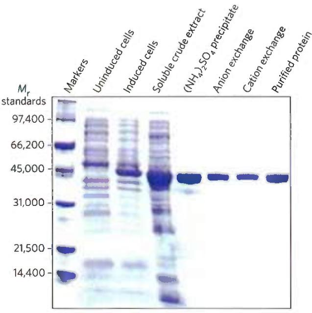  
(b)  
The gene for the RecA protein was cloned so that its expression (synthesis of the protein) could be controlled. The first lane shows a set of standard proteins (of known $M_{r}$ ), serving as molecular weight markers. The second and third lanes show, respectively, proteins from E. coli cells before and after synthesis of RecA protein was induced. The fourth lane shows the proteins in a crude cellular extract. Subsequent lanes (left to right) show the proteins that are present after successive purification steps. Although the protein looks pure in lane 6, two more steps are needed to remove minor contaminants not evident on the gel. The purified protein is a single polypeptide chain ( $M_{r} \sim 38{,}000$ ), as seen in the rightmost lane. [(a) Gustoimages/Science Source; (b) Dr. Julia Cox.]

$$
\mu = \frac {V}{E} = \frac {Z}{f}
$$

The migration of a protein in a gel during electrophoresis is therefore a function of its size and its shape.

The electrophoretic method commonly employed for estimation of purity and molecular weight makes use of the detergent sodium dodecyl sulfate (SDS) ("dodecyl" denoting a 12-carbon chain).

$$
\mathrm{Na} ^ {+} \stackrel {-} {\mathrm{O}} - \mathrm{S} - \mathrm{O} - (\mathrm{CH} _ {2}) _ {1 1} \mathrm{CH} _ {3}
$$

A protein will bind about 1.4 times its weight of SDS, nearly one molecule of SDS for each amino acid residue. The sulfate moieties of the bound SDS contribute a large net negative charge, rendering the intrinsic charge of the protein insignificant and conferring on each protein a similar charge-to-mass ratio. In addition, SDS binding partially unfolds proteins, such that most SDS-bound proteins assume a similar rodlike shape. Electrophoresis in the presence of SDS therefore separates proteins almost exclusively on the basis of mass (molecular weight), with smaller polypeptides migrating more rapidly. After electrophoresis, the proteins are visualized by adding a dye such as Coomassie blue, which binds to proteins but not to the gel itself (Fig. 3-18b). Thus, a researcher can monitor the progress of a protein purification procedure as the number of protein bands visible on the gel decreases after each new fractionation step. When compared with the positions to which proteins of known molecular weight migrate in the gel, the position of an unidentified protein can provide a good approximation of its molecular weight (Fig. 3-19). If the protein has two or more different subunits, generally the subunits are separated by the SDS treatment, and a separate band appears for each.

Isoelectric focusing is a procedure used to determine the isoelectric point (pI) of a protein (Fig. 3-20). A pH gradient is established by allowing a mixture of low molecular weight organic acids and bases (ampholytes; p. 77) to distribute themselves in an electric field generated across the gel. When a protein mixture is applied, each protein migrates until it reaches the pH that matches its pI. Proteins with different isoelectric points are thus distributed differently throughout the gel.

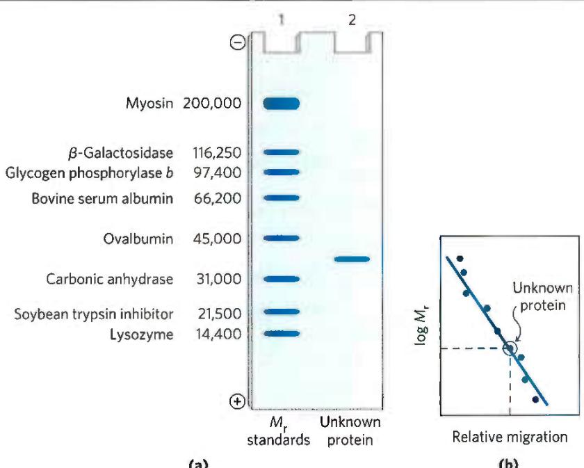  
(a)  
FIGURE 3-19 Estimating the molecular weight of a protein. The electrophoretic mobility of a protein on an SDS polyacrylamide gel is related to its molecular weight, $M_{\mathrm{f}}$ . (a) Standard proteins of known molecular weight are subjected to electrophoresis (lane 1). These marker proteins can be used to estimate the molecular weight of an unknown protein (lane 2). (b) A plot of log $M_{\mathrm{f}}$ of the marker proteins versus relative migration during electrophoresis is linear,  
(b)  
which allows the molecular weight of the unknown protein to be read from the graph. (In similar fashion, a set of standard proteins with reproducible retention times on a size-exclusion column can be used to create a standard curve of retention time versus $\log M_{r}$ . The retention time of an unknown substance on the column can be compared with this standard curve to obtain an approximate $M_{r}$ .)

A protein sample may be applied to one end of a gel strip with an immobilized pH gradient. Or, a protein sample in a solution of ampholytes may be used to rehydrate a dehydrated gel strip.

After staining, proteins are shown to be distributed along the pH gradient according to their pI values.

FIGURE 3-20 Isoelectric focusing. This technique separates proteins according to their isoelectric points. A protein mixture is placed on a gel strip containing an immobilized pH gradient. With an applied electric field, proteins enter the gel and migrate until each reaches a pH that is equivalent to its pl. Remember that when pH = pl, the net charge of a protein is zero.

Combining isoelectric focusing and SDS electrophoresis sequentially in a process called two-dimensional electrophoresis permits the resolution of complex mixtures of proteins (Fig. 3-21). This is a more sensitive analytical method than either electrophoretic method alone. Two-dimensional electrophoresis separates proteins of identical molecular weight that differ in pI, or proteins with similar pI values but different molecular weights.

## Unseparated Proteins Are Detected and Quantified Based on Their Functions

P3 To purify a protein, it is essential to have a way of detecting and quantifying that protein in the presence of many other proteins at each stage of the procedure. A common target of purification is one or another of the class of proteins called enzymes (Chapter 6). Each enzyme catalyzes a particular reaction that converts one biomolecule (the substrate) to another (the product). The amount of the protein in a given solution or tissue extract can be measured, or assayed, in terms of the catalytic effect the enzyme produces—that is, the increase in the rate at which its substrate is converted to reaction products when the enzyme is present. For this purpose the researcher must know (1) the overall equation of the reaction catalyzed, (2) an analytical procedure for determining the disappearance of the substrate or the appearance of a reaction product, (3) whether the enzyme requires cofactors such as metal ions or coenzymes, (4) the dependence of the enzyme activity on substrate concentration, (5) the optimum pH, and (6) a temperature zone in which the enzyme is stable and has high activity. Enzymes are usually assayed at their optimum pH and at some convenient temperature within the range 25 to 38 °C. Also, very high substrate concentrations are generally used so that the initial reaction rate, measured experimentally, is proportional to enzyme concentration (Chapter 6).

  
FIGURE 3-21 Two-dimensional electrophoresis. Proteins are first separated by isoelectric focusing in a thin strip gel. The gel is then laid horizontally on a second, slab-shaped gel, and the proteins are separated by SDS polyacrylamide gel electrophoresis. Horizontal separation reflects differences in pl; vertical separation reflects differences in molecular weight. The original protein complement is thus spread in two dimensions. Thousands of cellular proteins can be resolved using this technique. Individual protein spots can be cut out of the gel and identified by mass spectrometry (see Figs 3-28 and 3-29). [Wellcome Collection. CC BY.]

By international agreement, 1.0 unit of enzyme activity for most enzymes is defined as the amount of enzyme causing transformation of 1.0 $\mu$ mol of substrate to product per minute at 25 ${}^{\circ}$ C under optimal conditions of measurement (for many enzymes, this definition is inconvenient, and a unit may be defined differently). The term activity refers to the total units of enzyme in a solution. The specific activity is the number of enzyme units per milligram of total protein (Fig. 3-22). The specific activity is a measure of enzyme purity: it increases during purification of an enzyme and becomes maximal and constant when the enzyme is pure (Table 3-5).

After each purification step, the activity of the preparation (in units of enzyme activity) is assayed, the total amount of protein is determined independently, and the ratio of the two gives the specific activity. Activity and total protein generally decrease with each step. Activity decreases because there is always some loss due to inactivation or nonideal interactions with chromatographic materials or other molecules in the solution. Total protein decreases because the objective is to remove as much unwanted or nonspecific protein as possible. In a successful step, the loss of nonspecific protein is much greater than the loss of activity; therefore, specific activity increases even as total activity falls. The data are assembled in a purification table similar to Table 3-5. A protein is generally considered pure when further purification steps fail to increase specific activity and when only a single protein species can be detected (for example, by electrophoresis in the presence of SDS).

For proteins that are not enzymes, other quantification methods are required. Transport proteins can be assayed by their binding to the molecule they transport, and hormones and toxins by the biological effect they produce; for example, growth hormones will stimulate the growth of certain cultured cells. Some structural proteins represent such a large fraction of a tissue mass that they can be readily extracted and purified without a functional assay. The approaches are as varied as the proteins themselves.

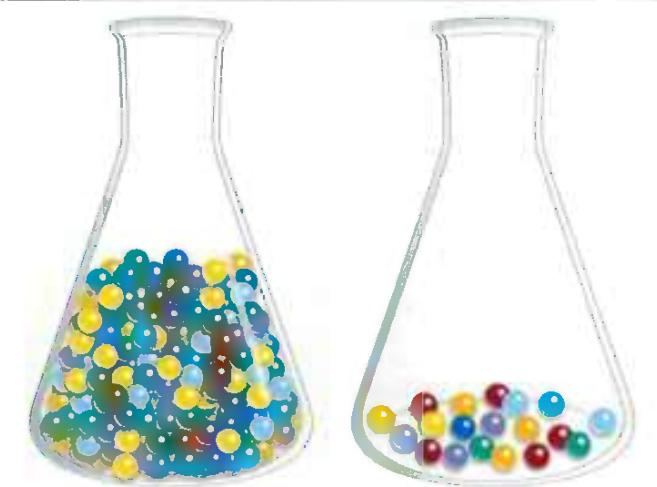  
FIGURE 3-22 Activity versus specific activity. The difference between these terms can be illustrated by considering two flasks containing marbles. The flasks contain the same number of red marbles, but different numbers of marbles of other colors. If the marbles represent proteins, both flasks contain the same activity of the protein, represented by the red marbles. The second flask, however, has the higher specific activity, because red marbles represent a higher fraction of the total.

## SUMMARY 3.3 Working with Proteins

■ Proteins are separated and purified on the basis of differences in their properties. Proteins can be selectively precipitated by changes in pH or temperature, and particularly by the addition of certain salts. A wide range of chromatographic procedures makes use of differences in size, binding affinities, charge, and other properties. These include ion-exchange, size-exclusion, affinity, and high-performance liquid chromatography.

■ Electrophoresis separates proteins on the basis of mass or charge for analytical purposes. SDS gel electrophoresis and isoelectric focusing can be used separately or in combination for higher resolution.

All purification procedures require a method for quantifying or assaying the protein of interest in the presence of other proteins. Purification can be monitored by assaying specific activity.

## 3.4 The Structure of Proteins: Primary Structure

Purification of a protein is usually only a prelude to a detailed biochemical dissection of its structure and function. What is it that makes one protein an enzyme, another a hormone, another a structural protein, and still another an antibody? How do they differ chemically? The most obvious distinctions are structural, and to protein structure we now turn.

We can describe the structure of large molecules such as proteins at several levels of complexity, arranged in a kind of conceptual hierarchy. Four levels of protein structure are commonly defined (Fig. 3-23). P2 A description of all covalent bonds (mainly peptide bonds and disulfide bonds) linking amino acid residues in a polypeptide chain is its primary structure. The most important element of primary structure is the sequence of amino acid residues. Secondary structure refers to particularly stable arrangements of amino acid residues giving rise to recurring structural patterns. Tertiary structure describes all aspects of the three-dimensional folding of a polypeptide. When a protein has two or more polypeptide subunits, their arrangement in space is referred to as quaternary structure. Our exploration of proteins will eventually include complex protein machines consisting of dozens to thousands of subunits. Primary structure is the focus of the remainder of this chapter; we discuss the higher levels of structure in Chapter 4.

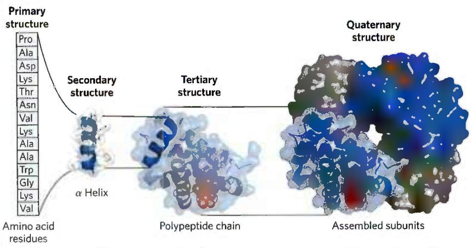  
FIGURE 3-23 Levels of structure in proteins. The primary structure consists of a sequence of amino acids linked together by peptide bonds, and it includes any disulfide bonds. The resulting polypeptide can be arranged into units of secondary structure, such as an $\alpha$ helix. The helix is a part of the tertiary structure of the folded polypeptide, which is itself one of the subunits that make up the quaternary structure of the multisubunit protein, in this case hemoglobin. [Data from PDB ID 1HGA, R. Liddington et al., J. Mol. Biol. 228:551, 1992.]

Primary structure now becomes our focus. We first consider empirical clues that amino acid sequence and protein function are closely linked, then describe how amino acid sequence is determined; finally, we outline the many uses to which this information can be put.

## The Function of a Protein Depends on Its Amino Acid Sequence

The bacterium Escherichia coli produces more than 3,000 different proteins; a human has \~20,000 genes that may produce over a million different proteins (through genetic processes discussed in Part III of this text). In both species, each type of protein has a unique amino acid sequence that confers a particular three-dimensional structure. This structure in turn confers a unique function.

Amino acid sequences are important elements of the broader realm of biological information. They are a major functional expression of information stored in DNA in the form of genes. The sequences are not at all random. Each protein has a distinctive number and sequence of amino acid residues. As we shall see in Chapter 4, P4 the primary structure of a protein determines how it folds up into its unique three-dimensional structure, and this in turn determines the function of the protein.

Some simple observations illustrate the functional importance of primary structure, or the amino acid sequence of a protein. First, as we have already noted, proteins with different functions always have different amino acid sequences. Second, thousands of human genetic diseases have been traced to the production of proteins with less activity or altered activity. The alteration can range from a single change in the amino acid sequence (as in sickle cell disease, described in Chapter 5) to deletion of a larger portion of the polypeptide chain (as in most cases of Duchenne muscular dystrophy: a large deletion in the gene encoding the protein dystrophin leads to production of a shortened, inactive protein). Finally, on comparing functionally similar proteins from different species, we find that these proteins often have similar amino acid sequences. Thus, a close link between protein primary structure and function is evident.

The amino acid sequence for a particular protein is not absolutely fixed, or invariant. Virtually all of the proteins in humans are polymorphic, having amino acid sequence variants in the human population. Many human proteins are polymorphic even within an individual, with amino acid variations occurring due to processes that will be described in Part III of this text. Some of these variations have little or no effect on the function of the protein; others may affect function dramatically. Furthermore, proteins that carry out a broadly similar function in distantly related species can differ greatly in overall size and amino acid sequence.

Although the amino acid sequence in some regions of the primary structure might vary considerably without affecting biological function, most proteins contain crucial regions that are essential to their function and thus have sequences that are conserved. The fraction of the overall sequence that is critical varies from protein to protein, complicating the task of relating sequence to three-dimensional structure, and structure to function. Before we can consider this problem further, however, we must examine how sequence information is obtained.

In 1953, Frederick Sanger worked out the sequence of amino acid residues in the polypeptide chains of the hormone insulin (Fig. 3-24), surprising many researchers who had long thought that determining the amino acid sequence of a polypeptide would be a hopelessly difficult task. The elucidation of DNA structure in that same year by Watson and Crick telegraphed a likely relationship between DNA and protein sequences. Barely a decade after these discoveries, the genetic code relating the nucleotide sequence of DNA to the amino acid sequence of protein molecules was elucidated (Chapter 27).

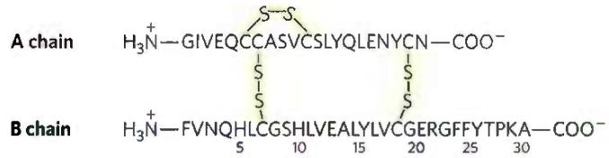  
FIGURE 3-24 Amino acid sequence of bovine insulin. The two polypeptide chains are joined by disulfide cross-linkages (yellow). The A chain of insulin is identical in human, pig, dog, rabbit, and sperm whale insulins. The B chains of the cow, pig, dog, goat, and horse are identical.

The amino acid sequences of proteins are now most often derived indirectly from the DNA sequences in genome databases. However, an array of techniques derived from traditional methods of polypeptide sequencing made important contributions to the broader field of protein chemistry. The method used by Sanger to sequence insulin is based on the classical method for direct chemical sequencing of proteins from the amino terminus, the two-step Edman degradation developed by Pehr Edman.

## Protein Structure Is Studied Using Methods That Exploit Protein Chemistry

The sequence of a protein can be predicted from the sequence of the gene encoding it, which is usually available in genomic databases. Direct sequencing can also be provided by mass spectrometry. Many methods used in traditional protein sequencing protocols remain valuable for labeling proteins or breaking them into parts for functional and structural analysis.

For example, the amino-terminal $\alpha$ -amino group of a protein can be labeled with 1-fluoro-2,4-dinitrobenzene (FDNB), dansyl chloride, or dabsyl chloride (Fig. 3-25). These reagents also label the $\varepsilon$ -amino group of lysine residues. Disulfide bonds within a polypeptide or between polypeptide subunits can be broken irreversibly (Fig. 3-26).

  
FIGURE 3-25 Modification of the $\alpha$ -amino group at the amino terminus. The reaction is a nucleophilic displacement of the halide ion as shown for (a) FDNB and (b) dansyl chloride. The $\varepsilon$ -amino group of lysine will also be labeled. Dansyl chloride and (c) dabsyl chloride, another labeling reagent, have useful absorbance and/or fluorescent properties at visible wavelengths.

  
Frederick Sanger, 1918–2013 (Bettmann/Getty Images.)

TABLE 3-6 The Specificity of Some Common Methods for Fragmenting Polypeptide Chains

<table><tr><td>Reagent (biological source)a</td><td>Cleavage pointsb</td></tr><tr><td>Trypsin (bovine pancreas)</td><td>Lys, Arg (C)</td></tr><tr><td>Chymotrypsin (bovine pancreas)</td><td>Phe, Trp, Tyr (C)</td></tr><tr><td>Staphylococcus aureus V8 protease (bacterium S. aureus)</td><td>Asp, Glu (C)</td></tr><tr><td>Asp-N-protease (bacterium Pseudomonas fragi)</td><td>Asp, Glu (N)</td></tr><tr><td>Pepsin (porcine stomach)</td><td>Leu, Phe, Trp, Tyr (N)</td></tr><tr><td>Endoproteinase Lys C (bacterium Lysobacter enzymogenes)</td><td>Lys (C)</td></tr><tr><td>Cyanogen bromide</td><td>Met (C)</td></tr><tr><td colspan="2">aAll reagents except cyanogen bromide are proteases.bResidues furnishing the primary recognition point for the protease or reagent; peptide bond cleavage occurs on either the carbonyl (C) side or the amino (N) side of the indicated amino acid residues.</td></tr></table>

  
FIGURE 3-26 Breaking disulfide bonds in proteins. Two common methods are illustrated. Oxidation of a cystine residue with performic acid produces two cysteic acid residues. Reduction by dithiothreitol (or  
$\beta$ -mercaptoethanol) to form Cys residues must be followed by further modification of the reactive —SH groups to prevent re-formation of the disulfide bond. Carboxymethylation by iodoacetate serves this purpose.

Enzymes called proteases catalyze the hydrolytic cleavage of peptide bonds and provide the most common method to break a protein into parts. Some proteases cleave only the peptide bond adjacent to particular amino acid residues (Table 3-6) and thus fragment a polypeptide chain in a predictable and reproducible way. A few chemical reagents also cleave the peptide bond adjacent to specific residues. Among proteases, the digestive enzyme trypsin catalyzes the hydrolysis of only those peptide bonds in which the carbonyl group is contributed by either a Lys or an Arg residue, regardless of the length or amino acid sequence of the chain. A polypeptide with three Lys and/or Arg residues will usually yield four smaller peptides upon cleavage with trypsin. Moreover, all except one of these will have a carboxyl-terminal Lys or Arg.

The capacity to modify proteins in specific ways has many applications in the lab. The methods used to break disulfide bonds can also be used to denature proteins when that is required. The development of reagents to label the amino-terminal amino acid residue led eventually to the development of an array of reagents that could react with specific groups at many locations on a protein. For example, the sulfhydryl group on Cys residues can be modified with iodoacetamides, maleimides, benzyl halides, and bromomethyl ketones (Fig. 3-27). Other amino acid residues can be modified by reagents linked to a dye or other molecule to aid in protein detection or functional studies. The cleavage of proteins into smaller parts with proteases has numerous applications that will be explored in subsequent chapters of this book.

## Mass Spectrometry Provides Information on Molecular Mass, Amino Acid Sequence, and Entire Proteomes

Mass spectrometry can provide a highly accurate measure of the molecular mass of a protein, readily distinguishing between single proton differences. However, this technology can do much more. The sequences of multiple short polypeptide segments (20 to 30 amino acid residues each) in a protein sample can be obtained within seconds. Unknown purified proteins can be identified, and their mass can be accurately determined. When coupled to powerful peptide separation protocols, mass spectrometry can document a complete cellular proteome—defined as the entire complement of proteins in a cell, including estimates of their relative abundance—in just an hour.

  
FIGURE 3-27 Reagents used to modify the sulfhydryl groups of Cys residues. (See also Fig. 3-26.)

The mass spectrometer has been an indispensable tool in chemistry for more than a century. Molecules to be analyzed, referred to as analytes, are first ionized in a vacuum. When the newly charged molecules are introduced into an electric and/or magnetic field, their paths through the field are a function of their mass-to-charge ratio, m/z. This measured property of the ionized species can be used to deduce the mass (m) of the analyte with very high precision.

As the m/z measurements are made in the gas phase, the technique was long limited to relatively small molecules. In 1988, two different techniques were introduced to permit transfer of macromolecules to the gas phase while limiting decomposition; these new capabilities revolutionized protein sequencing. In one technique, proteins are placed in a light-absorbing matrix. With a short pulse of laser light, the proteins are ionized and then desorbed from the matrix into the vacuum system. This process, known as matrix-assisted laser desorption/ionization mass spectrometry, or MALDI MS, is used to measure the mass of macromolecules. In a second method, macromolecules in solution are forced directly from the liquid phase to the gas phase. A solution of analytes is passed through a charged needle that is kept at a high electrical potential, dispersing the solution into a fine mist of charged microdroplets. The solvent surrounding the macromolecules rapidly evaporates, leaving multiply charged macromolecular ions in the gas phase. This technique is called electrospray ionization mass spectrometry, or ESI MS. Protons added during passage through the needle give additional charge to the macromolecule. The m/z of the molecule can then be analyzed in the vacuum chamber. One method for analyzing m/z is called time of flight or TOF, in which ion acceleration in an electric field depends on m/z. A newer, more-efficient method is the Orbitrap, in which ions are trapped in orbit between an outer barrel-shaped electrode and an inner spindle electrode. The trajectory of the electrons, related to their mass and charge, is detected and converted to m/z by a Fourier transform.

The process for determining the molecular mass of a protein with ESI MS is illustrated in Figure 3-28. As a protein is injected into the gas phase, it acquires a variable number of protons, and thus positive charges, from the solvent. The variable addition of these charges creates a spectrum of species with different mass-to-charge ratios. Each successive peak corresponds to a species that differs from that of its neighboring peak by a charge of 1 and a mass of 1 (one proton). The mass of the protein can be determined from any two neighboring peaks.

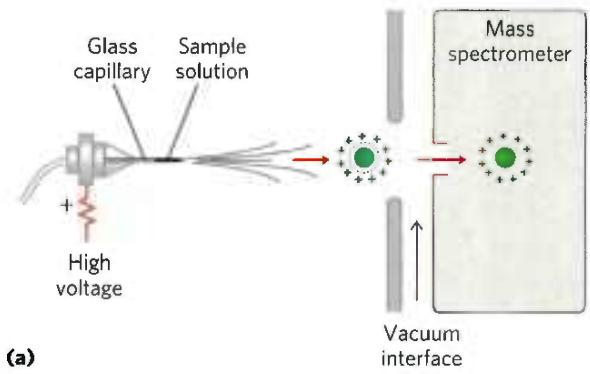

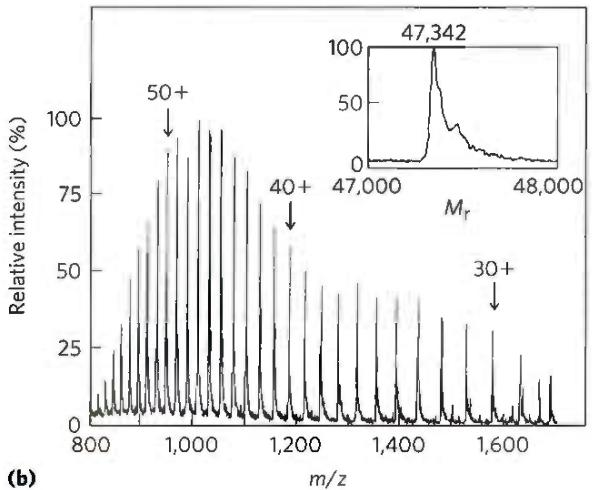  
FIGURE 3-28 Electrospray ionization mass spectrometry of a protein. (a) A protein solution is dispersed into highly charged droplets by passage through a needle under the influence of a high-voltage electric field. The droplets evaporate, and the ions (with added protons in this case) enter the mass spectrometer for m/z measurement. (b) The spectrum generated is a family of peaks, with each successive peak (from right to left) corresponding to a charged species with both mass and charge increased by 1. The inset shows a computer-generated transformation of this spectrum. [Information from M. Mann and M. Wilm, Trends Biochem. Sci. 20:219, 1995.]

Amino acid sequence information is extracted using a technique called tandem MS, or MS/MS. A solution containing the protein or multiple proteins under investigation is first treated with a protease (often trypsin, due to its high specificity) to hydrolyze it to a mixture of shorter peptides. The mixture is then injected into a mass spectrometer that has two mass filters in tandem (Fig. 3-29a, top). In the first, the peptide mixture is sorted so that only one of the several types of peptides produced by cleavage emerges at the other end. The sample of the selected peptide, each molecule of which has a charge somewhere along its length, then travels through a vacuum chamber between the two mass spectrometers. In this collision cell, the peptide is further fragmented by high-energy impact with a “collision gas” such as helium or argon that is bled into the vacuum chamber. Each individual peptide is broken in only one place, on average. Although the breaks are not hydrolytic, most occur at the peptide bonds.

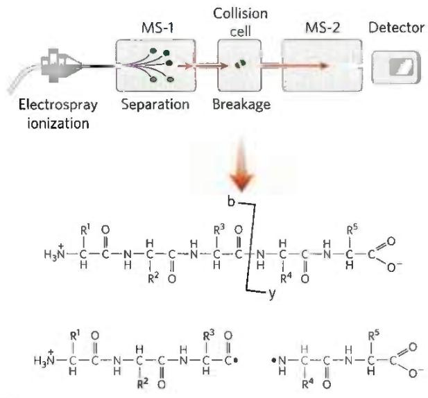  
(a)

  
(b)  
FIGURE 3-29 Obtaining protein sequence information with tandem MS. (a) After proteolytic hydrolysis, a protein solution is injected into a mass spectrometer (MS-1). The different peptides are sorted so that only one type is selected for further analysis. The selected peptide is further fragmented in a chamber between the two mass spectrometers, and m/z for each fragment is measured in the second mass spectrometer (MS-2). Many of the ions generated during this second fragmentation result from breakage of the peptide bond, as shown. These are called b-type or y-type ions, depending on whether the charge is retained on the amino- or carboxyl-terminal side, respectively. (b) A typical spectrum with peaks representing the peptide fragments generated from a sample of one small peptide (21 residues). The labeled peaks are y-type ions derived from amino acid residues. The number in parentheses over each peak is the molecular weight of the amino acid ion. The successive peaks differ by the mass of a particular amino acid in the original peptide. The deduced sequence is shown at the top. [Information from T. Keough et al., Proc. Natl. Acad. Sci. USA 96:7131, 1999, Fig. 3.]

The second mass filter then measures the m/z ratios of all the charged fragments. This process generates one or more sets of peaks. A given set of peaks (Fig. 3-29b) consists of all the charged fragments that were generated by breaking the same type of bond (but at different points in the peptide). One set of peaks includes only the fragments in which the charge was retained on the amino-terminal side of the broken bonds; another includes only the fragments in which the charge was retained on the carboxyl-terminal side of the broken bonds. Each successive peak in a given set has one less amino acid than the peak before. The difference in mass from peak to peak identifies the amino acid that was lost in each case, thus revealing the sequence of the peptide. The only ambiguities involve leucine and isoleucine, which have the same mass. Although multiple sets of peaks usually are generated, the two most prominent sets generally consist of charged fragments derived from breakage of the peptide bonds. The amino acid sequence derived from one set can be confirmed by the other, improving the confidence in the sequence information obtained.

The analysis of complex mixtures of proteins—even entire cellular proteomes—is facilitated by liquid chromatography (LC) that is integrated into the instrument (LC-MS/MS). The organism of interest is generally one in which the genomic sequence is known. Cellular proteins are first isolated in an extract, then digested into relatively short peptides by a protease such as trypsin. The very complex mixture of peptides is subjected to chromatography, so that resolved peptides are introduced to the mass spectrometer successively. Transfer from the liquid phase to the gas phase is facilitated by MALDI or ESI. Each peptide is analyzed for amino acid sequence, and that sequence is compared to the known genomic sequence available in databases to identify the protein it came from. Because more peptides are generated from the more common proteins in the mixture, the exercise also provides a measure of protein abundance. MS/MS scans of dozens of different peptides can be generated in less than a second. The entire proteome of a yeast cell can be analyzed in less than an hour.

Mass spectrometry provides a wealth of information for proteomics research, enzymology, and protein chemistry in general. The accurately measured molecular mass of a protein is critical to its identification. Changes in the cellular proteome can be monitored as a function of metabolic state or environmental conditions. Mass changes in the peptides scanned during a proteome analysis can reveal protein modifications of all kinds. Amino acid sequencing can reveal changes in protein sequence that result from the editing of messenger RNA in eukaryotes (Chapter 26). These methods, along with modern DNA sequencing processes (Chapter 8), are all part of a robust toolbox used to probe biological information at many levels.

## Small Peptides and Proteins Can Be Chemically Synthesized

Many peptides are potentially useful as pharmacologic agents, and their production is of considerable commercial importance. In addition to its commercial applications, the synthesis of specific peptide portions of larger proteins is an increasingly important tool for the study of protein structure and function. There are three ways to obtain a peptide: (1) purification from tissue, a task often made difficult by the vanishingly low concentrations of some peptides; (2) genetic engineering (Chapter 9); and (3) direct chemical synthesis. Powerful techniques now make direct chemical synthesis an attractive option in many cases.

The complexity of proteins makes the traditional synthetic approaches of organic chemistry impractical for peptides with more than four or five amino acid residues. One problem is the difficulty of purifying the product after each step.

The major breakthrough in this technology was provided by R. Bruce Merrifield in 1962. His innovation was to synthesize a peptide while keeping one end attached to a solid support. The support is an insoluble polymer (resin) contained within a column, similar to that used for chromatographic procedures. The peptide is built up on this support one amino acid at a time, through a standard set of reactions in a repeating cycle (Fig. 3-30). At each successive step in the cycle, protective chemical groups block unwanted reactions.

The technology for chemical peptide synthesis has been automated. An important limitation of the process is the efficiency of each chemical cycle. Incomplete reaction at one stage can lead to formation of an impurity (in the form of a shorter peptide) in the next. The chemistry has been optimized to permit the synthesis of proteins of 100 amino acid residues in a few days in reasonable yield. A very similar approach is used to synthesize nucleic acids (see Fig. 8-33). It is worth noting that this technology, impressive as it is, still pales when compared with biological processes. The same 100-residue protein would be synthesized with exquisite fidelity in about 5 seconds in a bacterial cell.

Methods for the efficient ligation (joining together) of peptides allow the assembly of synthetic peptides into larger polypeptides and proteins. Novel forms of proteins can be created with precisely positioned chemical groups, including those that might not normally be found in a cellular protein. This provides one approach to test theories of enzyme catalysis, to create proteins with altered chemical properties, and to design protein sequences that will fold into particular structures. This last application provides the ultimate test of our ability to relate the primary structure of a peptide to the three-dimensional structure that it takes up in solution.

## Amino Acid Sequences Provide Important Biochemical Information

P4 Knowledge of the sequence of amino acids in a protein can offer insights into its three-dimensional structure and its function, cellular location, and evolution. Most of these insights are derived by searching for similarities between a protein of interest and previously studied proteins. Comparison of a newly obtained sequence with sequence data in international repositories often reveals relationships both surprising and enlightening.

We do not understand in detail exactly how the amino acid sequence determines three-dimensional structure, nor can we always predict function from sequence. However, protein families that have some shared structural or functional features can be readily identified on the basis of amino acid sequence similarities. Individual proteins are assigned to families based on the degree of similarity in amino acid sequence. Members of a family are usually identical across 25% or more of their sequences, and proteins in these families generally share at least some structural and functional characteristics. Some families, however, are defined by identities involving only a few amino acid residues that are critical to a certain function. A number of similar substructures, or “domains” (to be defined more fully in Chapter 4), occur in many functionally unrelated proteins. These domains often fold into structural configurations that have an unusual degree of stability or that are specialized for a certain environment. Evolutionary relationships can also be inferred from the structural and functional similarities within protein families.

Certain amino acid sequences serve as signals that determine the cellular location, chemical modification, and half-life of a protein. Special signal sequences, usually at the amino terminus, are used to target certain proteins for export from the cell; other proteins are targeted for distribution to the nucleus, the cell surface, the cytosol, or other cellular locations. Other sequences act as attachment sites for prosthetic groups, such as sugar groups in glycoproteins and lipids in lipoproteins. Some of these signals are well characterized and are easily recognized in the sequence of a newly characterized protein (Chapter 27).

KEY CONVENTION Much of the functional information encapsulated in protein sequences comes in the form of consensus sequences. This term is applied to such sequences in DNA, RNA, or protein. When a series of related nucleic acid sequences or protein sequences are compared, a consensus sequence is the one that reflects the most common base or amino acid at each position. Parts of the sequence that have particularly good agreement often represent evolutionarily conserved functional domains. Mathematical tools available online can generate consensus sequences or identify them in sequence databases. Box 3-2 illustrates common conventions for displaying consensus sequences.

## Protein Sequences Help Elucidate the History of Life on Earth

The simple string of letters denoting the amino acid sequence of a protein holds a surprising wealth of information, which is being unlocked by applying the tools of bioinformatics to genomic and protein sequence data.

FIGURE 3-30 Chemical synthesis of a peptide on an insoluble polymer support. Reactions 1 through 4 are necessary for the formation of each peptide bond. The 9-fluorenylmethoxycarbonyl (Fmoc) group (shaded blue) prevents unwanted reactions at the $\alpha$ -amino group of the residue (shaded light red). Chemical synthesis proceeds from the carboxyl terminus to the amino terminus, the reverse of the direction of protein synthesis in vivo.

P4 Each protein's function relies on its three-dimensional structure, which in turn is determined largely by its primary structure. Thus, the biochemical information conveyed by a protein sequence is limited only by our understanding of structural and functional principles.

The constantly evolving tools of bioinformatics make it possible to identify functional segments in new proteins and also help to establish both their sequence and their structural relationships to proteins already in the databases. On a different level of inquiry, protein sequences

## Consensus Sequences and Sequence Logos

Consensus sequences can be represented in several ways. To illustrate two types of conventions, we use two examples of consensus sequences (Fig. 1): an ATP-binding structure called a P loop (see Fig. 12-2) and a $\mathrm{Ca^{2+}}$ -binding structure called an EF hand (see Fig. 12-17). The rules described here are adapted from those used by the sequence comparison website PROSITE (http://prosite.expasy.org/sequence\_logo.html), using the standard one-letter codes for the amino acids.

In one type of consensus sequence designation, shown at the top of (a) and (b) in Figure 1, each position is separated from its neighbor by a hyphen. A position where any amino acid is allowed is designated x. Ambiguities are indicated by listing the acceptable amino acids for a given position between

  
FIGURE 1 Representations of two consensus sequences. (a) P loop, an ATP-binding structure; (b) EF hand, a Ca $^{2+}$ -binding structure. [Sequence data for (a) from document ID PDOC00017 and for (b) from document ID PDOC00018, www.expasy.org/prosite, N. Hulo et al., Nucleic Acids Res. 34:D227, 2006. Sequence logos created with WebLogo, http://weblogo.berkeley.edu, G. E. Crooks et al., Genome Res. 14:1188, 2004.]

are beginning to tell us how the proteins evolved and, ultimately, how life evolved on this planet.

The field of molecular evolution is often traced to Emile Zuckerkandl and Linus Pauling, whose work in the mid-1960s advanced the use of nucleotide and protein sequences to explore evolution. The premise is deceptively straightforward. If two organisms are closely related, the sequences of their genes and proteins should be similar. The sequences increasingly diverge as the evolutionary distance between two organisms increases. The promise of this approach began to be realized in the square brackets. For example, in (a), [AG] means Ala or Gly. If all but a few amino acids are allowed at one position, the amino acids that are not allowed are listed between curly brackets. For example, in (b), {W} means any amino acid except Trp. Repetition of an element of the pattern is indicated by following that element with a number or range of numbers between parentheses. In (a), for example, x(4) means x-x-x-x; x(2,4) means x-x, or x-x-x, or x-x-x-x. When a pattern is restricted to either the amino terminus or carboxyl terminus of a sequence, that pattern starts with < or ends with >, respectively (not so for either example here). A period ends the pattern. Applying these rules to the consensus sequence in (a), either A or G can be found at the first position. Any amino acid can occupy the next four positions, followed by an invariant G and an invariant K. The last position is either S or T.

Sequence logos provide a more informative and graphic representation of an amino acid (or nucleic acid) multiple sequence alignment. Each logo consists of a stack of symbols for each position in the sequence. The overall height of the stack (in bits) indicates the degree of sequence conservation at that position, whereas the height of each symbol (letter) in the stack indicates the relative frequency of that amino acid (or nucleotide). For amino acid sequences, the colors denote the characteristics of the amino acid: polar (G, S, T, Y, C, Q, N), green; basic (K, R, H), blue; acidic (D, E), red; and hydrophobic (A, V, L, I, P, W, F, M), black. The classification of amino acids in this scheme is somewhat different from the classification in Table 3-1 and Figure 3-5. The amino acids with aromatic side chains are subsumed into the nonpolar (F, W) and polar (Y) classifications. Glycine, always hard to classify, is assigned to the polar group. Note that when multiple amino acids are acceptable at a particular position, they rarely occur with equal probability. One or a few usually predominate. The logo representation makes the predominance clear, and a conserved sequence in a protein is made obvious. However, the logo obscures some amino acid residues that may be allowed at a position, such as the Cys that occasionally occurs at position 8 of the EF hand in (b).

1970s, when Carl Woese used ribosomal RNA sequences to define the Archaea as a group of living organisms distinct from the Bacteria and Eukarya. The information in genome and protein sequence databases can be used to trace biological history if we can learn to read the genetic hieroglyphics.

Evolution has not taken a simple linear path. P4 For a given protein, the amino acid residues essential for the activity of the protein are conserved over evolutionary time. The residues that are less important to function may vary over time—that is, one amino acid may substitute for another—and these variable residues can provide the information to trace evolution. Some proteins have more variable amino acid residues than others. For these and other reasons, different proteins evolve at different rates.

Another complicating factor in tracing evolutionary history is the rare transfer of a gene or a group of genes from one organism to another, a process called horizontal gene transfer. The transferred genes may be similar to the genes they were derived from in the original organism, whereas most other genes in the two organisms may be only distantly related. An example of horizontal gene transfer is the recent rapid spread of antibiotic-resistance genes in bacterial populations. The proteins derived from these transferred genes would not be good candidates for the study of bacterial evolution, because they share only a very limited evolutionary history with their "host" organisms.

The study of molecular evolution generally focuses on families of closely related proteins. In most cases, the families chosen for analysis have essential functions in cellular metabolism that must have been present in the earliest viable cells, thus greatly reducing the chance that they were introduced relatively recently by horizontal gene transfer. For example, a protein called EF-1α (elongation factor 1α) is involved in the synthesis of proteins in all eukaryotes. A similar protein, EF-Tu, with the same function, is found in bacteria. Similarities in sequence and function indicate that EF-1α and EF-Tu are members of a family of proteins that share a common ancestor. The members of protein families are called homologous proteins, or homologs. The concept of a homolog can be further refined. If two proteins in a family (that is, two homologs) are present in the same species, they are referred to as paralogs. Homologs from different species are called orthologs. The process of tracing evolution involves first identifying suitable families of homologous proteins and then using them to reconstruct evolutionary paths.

Homologs are identified using computer programs that can directly compare specific protein sequences or that can search databases to identify any protein with an amino acid that matches within defined parameters. The electronic search process can be thought of as sliding one sequence past the other until a section with a good match is found. Within this sequence alignment, a positive score is assigned for each position where the two sequences are identical, and a negative score is introduced wherever gaps need to be introduced in one sequence or the other to bring them into register. The overall score provides a measure of the quality of the alignment (Fig. 3-31). The program selects the alignment with the optimal score that maximizes identical amino acid residues while minimizing the introduction of gaps.

Finding identical amino acids is often inadequate in attempts to identify related proteins or, more importantly, to determine how closely related the proteins are on an evolutionary time scale. A more useful analysis also considers the chemical properties of substituted amino acids. Many of the amino acid differences within a protein family may be conservative—that is, an amino acid residue is replaced by a residue that has similar chemical properties. For example, a Glu residue may substitute in one family member for the Asp residue found in another; both amino acids are negatively charged. Logically, such a conservative substitution should receive a higher score in a sequence alignment than a nonconservative substitution does—for example, in replacement of the Asp residue with a hydrophobic Phe residue.

P4 For most efforts to find homologies and explore evolutionary relationships, protein sequences are superior to nucleic acid sequences that do not encode a protein or functional RNA. For a nucleic acid, with its four different types of residues, random alignment of nonhomologous sequences will generally yield matches for at least 25% of the positions. Introduction of a few gaps can often increase the fraction of matched residues to 40% or more, and the probability of chance alignment of unrelated sequences becomes quite high. The 20 different amino acid residues in proteins greatly lower the probability of uninformative chance alignments of this type.

The programs used to generate a sequence alignment are complemented by methods that test the reliability of the alignments. A common computerized test is to shuffle the amino acid sequence of one of the proteins being compared in order to produce a random sequence, then to instruct the program to align the shuffled sequence with the other, unshuffled one. Scores are assigned to the new alignment, and the shuffling and alignment process is repeated many times. The

## Escherichia coli TGNRTIAVYDLGGGTFDISIIEIDEVDGEKTFEVLATNGDTHLGGEDFDSRLINYL Bacillus subtilis DEDQTILLYDLGGGTFDVSILELGDG VFEVRSTAGDNRLGGDDFDQVIIDHL

Gap

FIGURE 3-31 Aligning protein sequences with the use of gaps. Shown here is the sequence alignment of a short section of the Hsp70 proteins (a widespread class of protein-folding chaperones) from two well-studied bacterial species, E. coli and Bacillus subtilis.

Introduction of a gap in the B. subtilis sequence allows a better alignment of amino acid residues on either side of the gap. Identical amino acid residues are shaded. [Information from R. S. Gupta, Microbiol. Mol. Biol. Rev. 62:1435, 1998, Fig. 2.]

  
FIGURE 3-32 A signature sequence in the EF-1α/EF-Tu protein family. The signature sequence (boxed) is a 12-residue insertion near the amino terminus of the sequence. Residues that align in all species are shaded. Both archaea and eukaryotes have the signature, although the sequences of

original alignment, before shuffling, should have a score significantly higher than any of those within the distribution of scores generated by the random alignments; this increases the confidence that the sequence alignment has identified a pair of homologs. Note that the absence of a significant alignment score does not necessarily mean that no evolutionary relationship exists between two proteins. As we shall see in Chapter 4, three-dimensional structural similarities sometimes reveal evolutionary relationships where sequence homology has been wiped away by time.

To use a protein family to explore evolution, researchers identify family members with similar molecular functions in the widest possible range of organisms. The sequence divergence in these protein families allows segregation of organisms into classes based on their evolutionary relationships. Certain segments of a protein sequence may be found in the organisms of one taxonomic group but not in other groups; these segments can be used as signature sequences for the group in which they are found. An example of a signature sequence is an insertion of 12 amino acids near the amino terminus of the EF-1α/EF-Tu proteins in all archaea and eukaryotes but not in bacteria (Fig. 3-32). This particular signature is one of many biochemical clues that can help establish the evolutionary relatedness of eukaryotes and archaea.

P4 By considering the sequences of multiple proteins, researchers can construct elaborate evolutionary trees. Figure 3-33 presents one such tree for 10,462 bacterial species, based on the sequences of 120 proteins ubiquitous in bacteria. In Figure 3-33, the free end points of lines are called “external nodes”; each represents an extant species, and each is so labeled. The points where two lines come together, the “internal nodes,” represent extinct ancestor species. In most representations (including Fig. 3-33), the lengths of the lines connecting the nodes reflect amino acid substitutions in the selected proteins that separate one species from another. The use of 120 different proteins permits calibration and a more accurate determination of the time required for the various species to diverge.

As more sequence information is made available in databases, we move toward one of the core goals of biology—creating a detailed tree of life that describes the evolution and relationship of every organism on Earth. The story is a work in progress. The questions being asked and answered are fundamental to how humans view themselves and the world around them.

the insertions are distinct for the two groups. The variation in the signature sequence reflects the significant evolutionary divergence that has occurred at this site since it first appeared in a common ancestor of both groups. [Information from R. S. Gupta, Microbiol. Mol. Biol. Rev. 62:1435, 1998, Fig. 7.]  
  
FIGURE 3-33 Evolutionary tree derived from amino acid sequence comparisons. This tree includes data from 10,462 bacterial species. The leaf nodes (points of intersection with the outer circle) represent extant species. Inner nodes (points where lines emanating from the leaf nodes come together) represent extinct ancestral species. Line lengths correspond to evolutionary time, as measured by sequence divergence in 120 proteins common to all bacteria. The major bacterial phyla are denoted by lines encompassing parts of the outer circle. [Information from D. H. Parks, Nat. Biotechnol. 36:996, 2018, Fig. 1c].

## SUMMARY 3.4 The Structure of Proteins: Primary Structure

■ Differences in protein function result from differences in amino acid composition and sequence. The chemical properties of particular amino acid residues are often critical to the function of a protein.

■ Most amino acid sequences are deduced from genomic sequences and by mass spectrometry. Methods derived from classical approaches to protein sequencing remain important in protein chemistry.

■ Short proteins and peptides (up to about 100 residues) can be chemically synthesized. The peptide is built up, one amino acid residue at a time, while tethered to a solid support.

■ Protein sequences are a rich source of information about protein structure and function. Bioinformatics can analyze changes in the amino acid sequences of homologous proteins over time to trace the evolution of life on Earth.

## KEY TERMS

Terms in bold are defined in the glossary.

amino acids 70  
residue 70  
R group 71  
chiral center 71  
enantiomers 71  
absolute configuration 72  
D, L system 72  
polarity 73  
absorbance, A 75  
zwitterion 77  
amphoteric 77  
ampholyte 77  
isoelectric pH (isoelectric point, pI) 79  
peptide 80  
protein 80  
peptide bond 81  
condensation 81  
hydrolysis 81  
oligopeptide 81  
polypeptide 81  
amino-terminal residue 81  
carboxyl-terminal residue 81  
oligomeric protein 82  
protomer 82  
conjugated protein 83  
prosthetic group 83  
crude extract 84  
fraction 84  
fractionation 84  
dialysis 84  
column chromatography 84  
ion-exchange chromatography 84  
cation-exchange resin 86 anion-exchange resin 86  
size-exclusion  
chromatography 86  
affinity chromatography 86  
high-performance liquid  
chromatography  
(HPLC) 86  
electrophoresis 87  
sodium dodecyl sulfate  
(SDS) 88  
isoelectric focusing 88  
specific activity 90  
primary structure 90  
secondary structure 90  
tertiary structure 90  
quaternary structure 90  
proteases 93  
mass spectrometry 93  
proteome 94  
analyte 94  
matrix-assisted laser desorption/ionization mass spectrometry (MALDI MS) 94  
electrospray ionization mass spectrometry (ESI MS) 94  
tandem mass spectrometry (MS/MS) 94  
consensus sequence 96  
bioinformatics 96  
horizontal gene transfer 99  
homologous proteins 99  
homologs 99  
paralogs 99  
orthologs 99  
signature sequence 100

## PROBLEMS

1. Amino Acid Constituents of Glutathione Glutathione is an important peptide antioxidant found in cells from bacteria to humans.

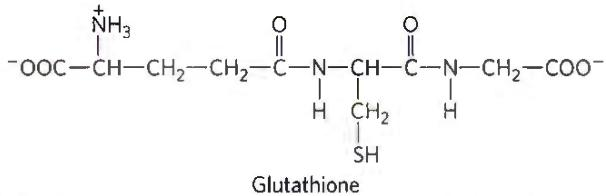

Identify the three amino acid constituents of glutathione. What is unusual about glutathione's structure?

2. Absolute Configuration of Ornithine Ornithine is an amino acid that is not a building block of proteins. Instead, ornithine is an important intermediate in the urea cycle, the metabolic process that facilitates the excretion of ammonia waste products in animals.

What is the absolute configuration of the ornithine molecule shown here?

3. Relationship between the Titration Curve and the Acid-Base Properties of Glycine A researcher titrated a 100 mL solution of 0.1 M glycine at pH 1.72 with 2 M NaOH solution. She then monitored the pH and plotted the results in the graph shown. The key points in the titration are designated I to V. For each of the following statements, identify the appropriate key point in the titration. Note that statement (k) applies to more than one key point in the titration.

(a) The pH is equal to the $pK_{a}$ of the carboxyl group.

(b) The pH is equal to the $pK_{a}$ of the protonated amino group.

(c) The predominant glycine species is ${}^{+}H_{3}N-CH_{2}-COOH$ .

(d) The predominant glycine species is ${}^{+}H_{3}N-CH_{2}-COO^{-}$ .

(e) Glycine exists as a 50:50 mixture of ${}^{+}H_{3}N-CH_{2}-COOH$ and ${}^{+}H_{3}N-CH_{2}-COO^{-}$ .

(f) The average net charge of glycine is $+\frac{1}{2}$ .

(g) Half of the amino groups are ionized.

(h) The average net charge of glycine is 0.

(i) The average net charge of glycine is -1.

(j) This is the isoelectric point for glycine.

(k) Glycine has its maximum buffering capacity at these regions.

4. Charge States of Alanine at Its pI At a pH equal to the isoelectric point (pI) of alanine, the net charge on alanine is zero. Two structures can be drawn that have a net charge of zero, but the predominant form of alanine at its pI is zwitterionic.

  
(a) Why is alanine predominantly zwitterionic at its pI?

(b) What fraction of alanine is in the completely uncharged form at its pI?

5. Ionization State of Histidine Each ionizable group of an amino acid can exist in one of two states, charged or neutral. The electric charge on the functional group is determined by the relationship between its $pK_{a}$ and the pH of the solution. This relationship is described by the Henderson-Hasselbalch equation.

(a) Histidine has three ionizable functional groups. Write the equilibrium equations for its three ionizations, and assign the proper $pK_{a}$ for each ionization. Draw the structure of histidine in each ionization state. What is the net charge on the histidine molecule in each ionization state?

(b) Draw the structures of the predominant ionization state of histidine at pH 1, 4, 8, and 12. Note that you can approximate the ionization state by treating each ionizable group independently.
(c) What is the net charge of histidine at pH 1, 4, 8, and 12? For each pH, will histidine migrate toward the anode (+) or toward the cathode (−) when placed in an electric field?

6. Separation of Amino Acids by Ion-Exchange Chromatography We can analyze mixtures of amino acids by first separating the mixture into its components through ion-exchange chromatography. Amino acids placed on a cation-exchange resin (see Fig. 3-17a) containing sulfonate $(-\mathrm{SO}_3^-)$ groups flow down the column at different rates because of two factors that influence their movement: (1) ionic attraction between the sulfo-nate residues on the column and positively charged functional groups on the amino acids, and (2) aggregation of nonpolar amino acid side chains with the hydrophobic backbone of the polystyrene resin. Note that the ionic attraction is more significant than hydrophobicity for this column media. For each pair of amino acids listed, determine which will be eluted first from the cation-exchange column by a pH 7.0 buffer.

(a) Glutamate and lysine

(b) Arginine and methionine

(c) Aspartate and valine

(d) Glycine and leucine

(e) Serine and alanine

7. Naming the Stereoisomers of Isoleucine Consider the structure of the amino acid isoleucine.

$$
\begin{array}{c} \mathrm{COO} ^ {-} \\ \mathrm{H} _ {3} \mathrm{N} ^ {+} - \mathrm{C} - \mathrm{H} \\ \mathrm{H} - \mathrm{C} - \mathrm{CH} _ {3} \\ \mathrm{CH} _ {2} \\ \mathrm{CH} _ {3} \end{array}
$$

(a) How many chiral centers does isoleucine have?

(b) How many optical isomers does isoleucine have?

(c) Draw perspective formulas for all the optical isomers of isoleucine.

8. Comparing the $pK_{a}$ Values of Alanine and Polyalanine The titration curve of alanine shows the ionization of two functional groups with $pK_{a}$ values of 2.34 and 9.69, corresponding to the ionization of the carboxyl and the protonated amino groups, respectively. The titration of di-, tri-, and larger oligopeptides of alanine also shows the ionization of only two functional groups, although the experimental $pK_{a}$ values are different. The table summarizes the trend in $pK_{a}$ values.

<table><tr><td>Amino acid or peptide</td><td> $pK_1$ </td><td> $pK_2$ </td></tr><tr><td>Ala</td><td>2.34</td><td>9.69</td></tr><tr><td>Ala-Ala</td><td>3.12</td><td>8.30</td></tr><tr><td>Ala-Ala-Ala</td><td>3.39</td><td>8.03</td></tr><tr><td> $Ala-(Ala)_n-Ala, n \geq 4$ </td><td>3.42</td><td>7.94</td></tr></table>

(a) Draw the structure of Ala-Ala-Ala. Identify the functional groups associated with $\mathsf{p}K_1$ and $\mathsf{p}K_2$ .

(b) Why does the value of $pK_{1}$ increase with each additional Ala residue in the oligopeptide?

(c) Why does the value of $pK_{2}$ decrease with each additional Ala residue in the oligopeptide?

9. Bonds Form by Condensation The peptide bond is an amide, generated by eliminating the elements of water from the two amino acids so joined. From which groups are the three atoms of water eliminated?

10. The Size of Proteins Calculate the approximate molecular weight of a protein composed of 682 amino acid residues in a single polypeptide chain.

11. Relationship between the Number of Amino Acid Residues and Protein Mass Experimental results describing a protein's amino acid composition are useful to estimate the molecular weight of the entire protein. A quantitative amino acid analysis reveals that bovine cytochrome c contains 2% cysteine ( $M_{r}$ 121) by weight.

(a) Calculate the approximate molecular weight in daltons of bovine cytochrome c if the number of cysteine residues is 2.

Bovine chymotrypsinogen has a molecular mass of 25.6 kDa. Amino acid analysis shows that this enzyme is 4.7% Gly ( $M_{r}$ 75.1). (b) Calculate how many glycine residues are present in a molecule of bovine chymotrypsinogen.

12. Subunit Composition of a Protein A protein has a molecular mass of 400 kDa when measured by size-exclusion chromatography. When subjected to gel electrophoresis in the presence of sodium dodecyl sulfate (SDS), the protein gives three bands with molecular masses of 180, 160, and 60 kDa. When electrophoresis is carried out in the presence of SDS and dithiothreitol, three bands again form, this time with molecular masses of 160, 90, and 60 kDa. How many subunits does the protein have, and what is the molecular mass of each?

13. Net Electric Charge of Peptides A peptide has the sequence Glu-His-Trp-Ser-Gly-Leu-Arg-Pro-Gly.

(a) Calculate the net charge of the molecule at pH 3, 8, and 11. (Incorporation into a peptide can alter $pK_{a}$ values somewhat, but for this exercise, use $pK_{a}$ values for side chains and terminal amino and carboxyl groups as given in Table 3-1.)

(b) Estimate the pI for this peptide.

14. Isoelectric Point of Histones Histones are proteins found in eukaryotic cell nuclei, tightly bound to DNA, which has many phosphate groups. The pI of histones is very high, about 10.8. What amino acid residues must be present in relatively large numbers in histones? In what way do these residues contribute to the strong binding of histones to DNA?

15. Solubility of Polypeptides One method for separating polypeptides makes use of their different solubilities. The solubility of large polypeptides in water depends on the relative polarity of their R groups, particularly on the number of ionized groups: the more ionized groups there are, the more soluble the polypeptides are. Which of each pair of polypeptides is more soluble at the indicated pH?

(a) $(\mathrm{Gly})_{20}$ or $(\mathrm{Glu})_{20}$ at pH 7.0

(b) (Lys-Val) $_{3}$ or (Phe-Cys) $_{3}$ at pH 7.0

(c) (Ala-Ser-Gly) $_{5}$ or (Asn-Ser-His) $_{5}$ at pH 6.0

(d) (Ala-Asp-Phe) $_{5}$ or (Asn-Ser-His) $_{5}$ at pH 3.0

16. Purification of an Enzyme A biochemist discovers and purifies a new enzyme, generating the purification table shown.

<table><tr><td>Procedure</td><td>Total protein (mg)</td><td>Activity (units)</td></tr><tr><td>1. Crude extract</td><td>10,000</td><td>68,000</td></tr><tr><td>2. Precipitation (salt)</td><td>5,000</td><td>65,000</td></tr><tr><td>3. Precipitation (pH)</td><td>4,000</td><td>56,000</td></tr><tr><td>4. Ion-exchange chromatography</td><td>70</td><td>49,000</td></tr><tr><td>5. Affinity chromatography</td><td>12</td><td>42,000</td></tr><tr><td>6. Size-exclusion chromatography</td><td>8</td><td>40,000</td></tr></table>

(a) From the information given in the table, calculate the specific activity of the enzyme after each purification procedure.

(b) Which of the purification procedures used for this enzyme is most effective (i.e., gives the greatest relative increase in purity)? (c) Which of the purification procedures is least effective?

(d) Is there any indication based on the results shown in the table that the enzyme after step 6 is now pure? What else could be done to estimate the purity of the enzyme preparation?

17. De-salting a Protein by Dialysis A purified protein is in a Hepes (N-(2-hydroxyethyl)piperazine-N'-(2-ethanesulfonic acid)) buffer at pH 7 with 500 mm NaCl. A dialysis membrane tube holds a 1 mL sample of the protein solution. The sample in the dialysis membrane floats in a beaker containing 1 L of the same Hepes buffer, but with 0 mm NaCl, for dialysis. Small molecules and ions (such as Na+, Cl-, and Hepes) can diffuse across the dialysis membrane, but the protein cannot.

(a) Calculate the concentration of NaCl in the protein sample, once the dialysis has come to equilibrium. Assume that no volume changes occur in the sample during the dialysis.

(b) Calculate the final NaCl concentration in the protein sample after dialysis in 250 mL of the same Hepes buffer, with 0 mm NaCl, twice in succession.

18. Predicting Cation Exchange Elution Order Suppose a column is filled with a cation-exchange resin at pH 7.0. In what order would the given peptides elute from the column if each has the same number of residues?

Peptide A: Ala 30%, Asp 10%, Lys 10%, Ser 15%, Pro 25%, Cys 10%

Peptide B: Ile 25%, Asp 20%, Arg 5%, Tyr 15%, His 5%, Thr 30%

Peptide C: Ala 40%, Glu 5%, Arg 20%, Ser 5%, His 5%, Trp 25%

19. Protein Analysis by Gel Electrophoresis Chymotrypsin is a protease with a molecular mass of 25.6 kDa. The figure shows a stained SDS polyacrylamide gel with a single band in lane 1 and three bands of lower molecular weight in lane 2. Lane 1 contains a preparation of chymotrypsin, and lane 2 contains chymotrypsin pretreated with performic acid. Why does performic acid treatment of chymotrypsin generate three bands in lane 2?

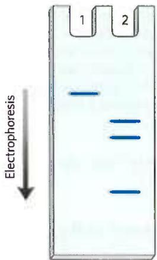

20. Sequence Determination of Leucine Enkephalin
Suppose a researcher isolates a peptide from brain tissue that binds to the same receptor as opiate drugs. This peptide is an opioid leucine enkephalin, a class of endogenous peptides that act within the brain to lower pain sensation. The researcher performs a series of procedures to determine the peptide's sequence. First, she completely hydrolyzes the peptide by boiling it in 18% w/w HCl solution. Analysis of the hydrolysis products indicates the presence of Gly, Leu, Phe, and Tyr, in a 2:1:1:1 molar ratio. Second, she treats the peptide with 1-dimethylaminoaphthalene-5-sulfonyl chloride (dansyl chloride) before subjecting it to complete hydrolysis. Chromatography indicates the presence of the dansylamino acid derivative of tyrosine. No free tyrosine is present.

(a) Given the empirical composition and the results from the dansyl chloride reaction, where is Tyr located in the peptide?

Finally, the researcher incubates the peptide with chymotrypsin for two hours at 10 °C and analyzes the products using chromatography. Complete digestion of the peptide with chymotrypsin followed by chromatography yields free tyrosine and leucine, plus a tripeptide containing Phe and Gly in a 1:2 ratio. (b) Give the final sequence for the peptide based on the results of the acid hydrolysis, dansyl chloride reaction, and the chymotryptic digestion.

21. Analysis of a Protein by Mass Spectrometry Investigators purify a protein produced by yeast grown under standard growth conditions. They incubate the protein with trypsin and sequence the peptides produced using mass spectrometry. One of the detected peptides, called peptide X, has the sequence Ala-Ser-Ala-Gly-Lys-Glu-Leu-Ile-Phe-Gln. The investigators then isolate the same protein, but this time from yeast grown under the stress of ultraviolet irradiation. When the sample is analyzed, a peptide with the mass of peptide X is no longer found. Instead, detection reveals a new peptide with the same sequence, except for an amino acid that replaces Ser and has a molecular mass of 167 Da. The investigators conclude that the protein has been altered in response to stress, and that the serine residue in the analyzed peptide has been modified. An unmodified series residue has a molecular mass of 87 Da. What modification might account for the change in the peptide's mass?

22. Structure of a Peptide Antibiotic from Bacillus brevis Extracts from the bacterium Bacillus brevis contain a peptide with antibiotic properties. This peptide forms complexes with metal ions and seems to disrupt ion transport across the cell membranes of other bacterial species, leading to bacterial death. The structure of the peptide has been determined from a series of observations.

(a) Complete acid hydrolysis of the peptide, followed by amino acid analysis, yielded equimolar amounts of Leu, Orn, Phe, Pro, and Val. Orn is ornithine, an amino acid not present in proteins but present in some peptides. Ornithine has the structure

$$
\mathrm{H} _ {3} \mathrm{N} ^ {+} - \mathrm{CH} _ {2} - \mathrm{CH} _ {2} - \mathrm{CH} _ {2} - \mathrm{C} - \mathrm{COO} ^ {-}
$$

(b) The molecular weight of the peptide is approximately 1,200 Da.

(c) The peptide failed to undergo hydrolysis when treated with the enzyme carboxypeptidase. This enzyme catalyzes the hydrolysis of the carboxyl-terminal residue of a polypeptide unless the residue is Pro or, for some reason, does not contain a free carboxyl group.

(d) Treatment of the intact peptide with 1-fluoro-2,4-dinitrobenzene, followed by complete hydrolysis and chromatography, yielded only free amino acids and the derivative shown here.

(Hint: The 2,4-dinitrophenyl derivative involves the amino group of a side chain rather than the $\alpha$ -amino group.)

(e) Partial hydrolysis of the peptide followed by chromatographic separation and sequence analysis yielded these di- and tripeptides (the amino-terminal amino acid is always the first amino acid):

$$
\begin{array}{c c c c} \text {Leu - Phe} & \text {Phe - Pro} & \text {Orn - Leu} & \text {Val - Orn} \\ \text {Val - Orn - Leu} & \text {Phe - Pro - Val} & \text {Pro - Val - Orn} \end{array}
$$

Given this information, deduce the amino acid sequence of the peptide antibiotic. Show your reasoning. When you have arrived at a structure, demonstrate that it is consistent with each experimental observation.

23. Efficiency in Peptide Synthesis A peptide with the primary structure Lys-Arg-Pro-Leu-Ile-Asp-Gly-Ala must be synthesized by the methods developed by Merrifield. Calculate the percentage of the peptides synthesized that will be full length and have the correct sequence if the addition of each amino acid residue is 96% efficient. Do the calculation a second time but assume a 99% efficiency for each cycle.

24. Sequence Comparisons Proteins called molecular chaperones (described in Chapter 4) assist in the process of protein folding. One class of chaperones, found in organisms from bacteria to mammals, is heat shock protein 90 (Hsp90). All Hsp90 chaperones contain a 10 amino acid "signature sequence" that allows ready identification of these proteins in sequence databases. Two representations of this signature sequence are shown here.

(a) In this sequence, which amino acid residues are invariant (conserved across all species)?

(b) At which position(s) are amino acids limited to those with positively charged side chains? For each position, which amino acid is more commonly found?

(c) At which positions are substitutions restricted to amino acids with negatively charged side chains? For each position, which amino acid predominates?

(d) There is one position that can be any amino acid, although one amino acid appears much more often than any other. What position is this, and which amino acid appears most often?

25. Chromatographic Methods Three polypeptides, the sequences of which are represented using the one-letter code for their amino acids, are present in a mixture:

1. ATKNRASCLVPKHGALMFWRHKQLVSDPILQKRQHIL VCRNAAG

2. GPYFGDEPLDVHDEPEEG

3. PHLLSAWKGMEGVGKSQSFAALIVILA

(a) Of the three, which one would migrate most slowly during the following:

Anion-exchange chromatography?
Cation-exchange chromatography?
Size-exclusion (gel-filtration) chromatography?

(b) Which peptide contains the ATP-binding motif shown in the sequence logo?

## DATA ANALYSIS PROBLEM

26. Determining the Amino Acid Sequence of Insulin Figure 3-24 shows the amino acid sequence of bovine insulin, determined by Frederick Sanger and his coworkers. Most of this work is described in a series of articles published in the Biochemical Journal from 1945 to 1955.

In 1945, researchers knew that insulin was a small protein consisting of two or four polypeptide chains linked by disulfide bonds. Sanger's team had developed a few simple methods for studying protein sequences.

Treatment with FDNB. FDNB (1-fluoro-2,4-dinitrobenzene) reacted with free amino (but not amide or guanidinium) groups in proteins to produce dinitrophenyl (DNP) derivatives of amino acids (see Fig. 3-25).

Acid Hydrolysis. Boiling a protein with 10% HCl for several hours hydrolyzed all of its peptide and amide bonds. Short treatments produced short polypeptides; the longer the treatment, the more complete the breakdown of the protein into its amino acids.

Oxidation of Cysteines. Treatment of a protein with performic acid cleaved all the disulfide bonds and converted all Cys residues to cysteic acid residues (see Fig. 3-26).

Paper Chromatography. This more primitive version of thin-layer chromatography (see Fig. 10-25) separated compounds based on their chemical properties, allowing identification of single amino acids and, in some cases, dipeptides. Thin-layer chromatography also separates larger peptides.

As reported in his first paper (1945), Sanger reacted insulin with FDNB and hydrolyzed the resulting protein. He found many free amino acids, but only three DNP-amino acids: $\alpha$ -DNP-glycine (DNP group attached to the $\alpha$ -amino group), $\alpha$ -DNP-phenylalanine, and $\varepsilon$ -DNP-lysine (DNP attached to the $\varepsilon$ -amino group). Sanger interpreted these results as showing that insulin had two protein chains: one with Gly at its amino terminus and one with Phe at its amino terminus. One of the two chains also contained a Lys residue, not at the amino terminus. Sanger named the chain beginning with a Gly residue "A" and the chain beginning with Phe "B."

(a) Explain how Sanger's results support his conclusions.

(b) Are the results consistent with the known structure of bovine insulin (see Fig. 3-24)?

In a later paper (1949), Sanger described how he used these techniques to determine the first few amino acids (amino-terminal end) of each insulin chain. To analyze the B chain, for example, he carried out the following steps:

1. Oxidized insulin to separate the A and B chains.

2. Prepared a sample of pure B chain with paper chromatography.

3. Reacted the B chain with FDNB.

4. Gently acid-hydrolyzed the protein so that some small peptides would be produced.

5. Separated the DNP-peptides from the peptides that did not contain DNP groups.

6. Isolated four of the DNP-peptides, which were named B1 through B4.

7. Strongly hydrolyzed each DNP-peptide to give free amino acids.

8. Identified the amino acids in each peptide with paper chromatography.

The results were as follows:

B1: $\alpha$ -DNP-phenylalanine only

B2: α-DNP-phenylalanine; valine

B3: aspartic acid; $\alpha$ -DNP-phenylalanine; valine

B4: aspartic acid; glutamic acid;

α-DNP-phenylalanine; valine

(c) Based on these data, what are the first four (amino-terminal) amino acids of the B chain? Explain your reasoning.

(d) Does this result match the known sequence of bovine insulin (Fig. 3-24)? Explain any discrepancies.

Sanger and colleagues used these and related methods to determine the entire sequence of the A and B chains. Their sequence for the A chain was as follows:

$$
\begin{array}{c} 1 \quad 5 \quad 1 0 \\ \text { Gly - Ile - Val - Glx - Glx - Cys - Cys - Ala - Ser - Val- } \\ \quad 1 5 \quad 2 0 \\ \text { Cys - Ser - Leu - Tyr - Glx - Leu - Glx - Asx - Tyr - Cys - Asx } \end{array}
$$

Because acid hydrolysis had converted all Asn to Asp and all Gln to Glu, these residues had to be designated Asx and Glx, respectively (exact identity in the peptide unknown). Sanger solved this problem by using protease enzymes that cleave peptide bonds, but not the amide bonds in Asn and Gln residues, to prepare short peptides. He then determined the number of amide groups present in each peptide by measuring the $NH_{4}^{+}$ released when the peptide was acid-hydrolyzed. Some of the results for the A chain are shown below. The peptides may not have been completely pure, so the numbers were approximate—but good enough for Sanger's purposes.

<table><tr><td>Peptide name</td><td>Peptide sequence</td><td>Number of amide groups in peptide</td></tr><tr><td>Ac1</td><td>Cys-Asx</td><td>0.7</td></tr><tr><td>Ap15</td><td>Tyr-Glx-Leu</td><td>0.98</td></tr><tr><td>Ap14</td><td>Tyr-Glx-Leu-Glx</td><td>1.06</td></tr><tr><td>Ap3</td><td>Asx-Tyr-Cys-Asx</td><td>2.10</td></tr><tr><td>Ap1</td><td>Glx-Asx-Tyr-Cys-Asx</td><td>1.94</td></tr><tr><td>Ap5pa1</td><td>Gly-Ile-Val-Glx</td><td>0.15</td></tr><tr><td>Ap5</td><td>Gly-Ile-Val-Glx-Glx-Cys-Cys-Ala-Ser-Val-Cys-Ser-Leu</td><td>1.16</td></tr></table>

(e) Based on these data, determine the amino acid sequence of the A chain. Explain how you reached your answer. Compare your answer with Figure 3-24.

## References

Sanger, F. 1945. The free amino groups of insulin. Biochem. J. 39:507–515.

Sanger, F. 1949. The terminal peptides of insulin. Biochem. J. 45:563–574.

# THE THREE-DIMENSIONAL STRUCTURE OF PROTEINS

4.1 Overview of Protein Structure 107

4.2 Protein Secondary Structure 111

4.3 Protein Tertiary and Quaternary Structures 116

4.4 Protein Denaturation and Folding 128

## 4.5 Determination of Protein and Biomolecular Structures 136

Proteins are big molecules. The covalent backbone of a typical protein contains hundreds of individual bonds. Because free rotation is possible around many of these bonds, the protein can, in principle, assume a virtually uncountable number of spatial arrangements, or conformations. In reality, however, each protein has a specific chemical or structural function, which suggests that each has a unique three-dimensional structure (Fig. 4-1). How stable is this structure, what factors guide its formation, and what holds it together? By the late 1920s, several proteins had been crystallized, including hemoglobin ( $M_{\mathrm{r}}$ 64,500) and the enzyme urease ( $M_{\mathrm{r}}$ 483,000). Given that, generally, the ordered array of molecules in a crystal can form only if the molecular units are identical, crystallization was evidence that even very large proteins are discrete chemical entities with unique structures. However, we now know that protein structure is always malleable, and in sometimes surprising ways. Changes in structure can be as important to a protein's function as the structure itself.

In this chapter, we examine the structure of proteins. We emphasize five principles:

P1 Protein structures are stabilized by noncovalent interactions and forces. Formation of a thermodynamically favorable structure depends on the influences of the hydrophobic effect, hydrogen bonds, ionic interactions, and van der Waals forces. Natural protein structures are constrained by peptide bonds, whose configurations can be described by the dihedral angles $\phi$ and $\psi$ .

P2 Protein segments can adopt regular secondary structures such as the $\alpha$ helix and the $\beta$ conformation. These structures are defined by particular values of $\phi$ and $\psi$ and their formation is impacted by the amino acid composition of the segment. All of the $\phi$ and $\psi$ values for a given protein structure can be visualized using a Ramachandran plot.

P3 Tertiary structure describes the well-defined, three-dimensional fold adopted by a protein. Protein structures are often built by combinatorial use of common protein folds or motifs. Quaternary structure describes the interactions between components of a multisubunit assembly.

P4 Tertiary structure is determined by amino acid sequence. Even though protein folding is complex, some denatured proteins can spontaneously refold into their active conformation based only on the chemical properties of their constituent amino acids. Cellular proteostasis involves numerous pathways that regulate the folding, unfolding, and degradation of proteins. Many human diseases arise from protein misfolding and defects in proteostasis.

The three-dimensional structures of proteins can be defined. Structural biologists use a variety of instruments and computational methods to solve biomolecular structures. The choice of method may depend on factors such as the size of the protein being studied, its properties, or the desired resolution of the final structure.

  
FIGURE 4-1 Relationship between protein structure and function. (a) The PurE enzyme from Escherichia coli catalyzes a reaction that forms carbon-carbon bonds in de novo purine biosynthesis. PurE is a small (17 kDa) single-domain protein. In this view, the protein surface of PurE has been modeled and colored by hydrophobicity: yellow for hydrophobic surfaces, blue for hydrophilic surfaces, and shades of green for those in between. It is apparent that the protein folds so that many of its polar groups are accessible to solvent. (b, c) The enzymatically active form of PurE is an octamer;  
eight PurE protomers combine to create a square-shaped quaternary structure with eight active sites. The structure in (b) is a surface representation; (c) is a ribbon diagram that traces the peptide backbone. Two protomers are colored by surface hydrophobicity. Others are shown in single colors (two each in gray, tan, and pink). (d) Each active site is formed using segments of three different protomers. A molecule of the reaction product carboxyaminoimidazole ribonucleotide bound at the active site is shown as a stick structure. [Data from PDB ID 2NSL, A. A. Hoskins et al., Biochemistry 46:2842, 2007.]

## 4.1 Overview of Protein Structure

The possible conformations of a protein or protein segment include any structural state it can achieve without breaking covalent bonds. A change in conformation could occur, for example, by rotation about single bonds. However, of the many conformations that are theoretically possible in a protein containing hundreds of single bonds, one or a few generally predominate under biological conditions. The need for multiple stable conformations reflects the changes that must take place in most proteins as they bind to other molecules or catalyze reactions. The conformations existing under a given set of conditions are usually the ones that are thermodynamically the most stable—that is, having the lowest free energy (G). Proteins in any of their functional, folded conformations are often called native proteins.

For the vast majority of proteins, a particular structure or small set of structures is critical to function. However, in many cases, parts of proteins lack discernible structure. These protein segments are intrinsically disordered. In some cases, entire proteins are intrinsically disordered, yet are fully functional.

What determines the most stable conformations of a typical protein? We can build an understanding of protein conformation stepwise from the discussion of primary structure in Chapter 3 through a consideration of secondary, tertiary, and quaternary structures. To this approach we must add emphasis on common and classifiable folding patterns, variously called supersecondary structures, folds, or motifs, which provide an important organizational context to this complex endeavor.

## A Protein's Conformation Is Stabilized Largely by Weak Interactions

Stability is the tendency of a protein to maintain a native conformation. Native proteins are only marginally stable; the $\Delta G$ separating the folded and unfolded states in typical proteins under physiological conditions is in the range of only 5 to 65 kJ/mol. A given polypeptide chain can theoretically assume countless conformations, and as a result, the unfolded state of a protein is characterized by a high degree of conformational entropy. This entropy, along with the hydrogen-bonding interactions of many groups in the polypeptide chain with the solvent (water), tends to maintain the unfolded state. P1 The chemical interactions that counteract these effects and stabilize the native conformation include disulfide (covalent) bonds and the weak (noncovalent) interactions and forces described in Chapter 2: hydrogen bonds, the hydrophobic effect, and ionic interactions.

Covalent disulfide bonds are strong, but they are also uncommon. The environment within most cells is highly reducing due to high concentrations of reductants such as glutathione, and most sulfhydryls will remain in the reduced state. Outside the cell, the environment is often more oxidizing, and disulfide formation is more likely to occur. In eukaryotes, disulfide bonds are found primarily in secreted, extracellular proteins (for example, the hormone insulin). Disulfide bonds are also uncommon in bacterial proteins. However, thermophilic bacteria, as well as the archaea, typically have many proteins with stabilizing disulfide bonds; this is presumably an adaptation to life at high temperatures.

For all proteins of all organisms, weak interactions are especially important in the folding of polypeptide chains into their secondary and tertiary structures. The association of multiple polypeptides to form quaternary structures also relies on these weak interactions.

About 200 to 460 kJ/mol are required to break a single covalent bond, whereas weak interactions can be disrupted by a mere 0.4 to 30 kJ/mol. Individual covalent bonds, such as disulfide bonds linking separate parts of a single polypeptide chain, are clearly much stronger than individual weak interactions. Yet, because they are so numerous, the weak interactions predominate as a stabilizing force in protein structure. P1 In general, the protein conformation with the lowest free energy (that is, the most stable conformation) is the one with the maximum number of weak interactions.

The stability of a protein is not simply the sum of the free energies of formation of the many weak interactions within it. For every hydrogen bond formed in a protein during folding, a hydrogen bond (of similar strength) between the same group and water was broken. The net stability contributed by a given hydrogen bond, or the difference in free energies of the folded and unfolded states, may be close to zero. Ionic interactions may be either stabilizing or destabilizing. We must therefore look elsewhere to understand why a particular native conformation is favored.

## Packing of Hydrophobic Amino Acids Away from Water Favors Protein Folding

P1 On carefully examining the contribution of weak interactions to protein stability, we find that the hydrophobic effect generally predominates. Pure water contains a network of hydrogen-bonded $\mathrm{H}_2\mathrm{O}$ molecules. No other molecule has the hydrogen-bonding potential of water, and the presence of other molecules in an aqueous solution disrupts the hydrogen bonding of water. When water surrounds a hydrophobic molecule, the optimal arrangement of hydrogen bonds results in a highly structured shell, or solvation layer, of water around the molecule (see Fig. 2-7). The increased order of the water molecules in the solvation layer correlates with an unfavorable decrease in the entropy of the water. However, when nonpolar groups cluster together, the extent of the solvation layer decreases, because each group no longer presents its entire surface to the solution. The result is a favorable increase in entropy. As described in Chapter 2, this increase in entropy is the major thermodynamic driving force for the association of hydrophobic groups in aqueous solution. Hydrophobic amino acid side chains therefore tend to cluster in a protein's interior, away from water (think of an oil droplet in water). The amino acid sequences of most proteins thus include a significant content of hydrophobic amino acid side chains (especially Leu, Ile, Val, Phe, and Trp). These are positioned so that they are clustered when the protein is folded, forming a hydrophobic protein core.

Under physiological conditions, the formation of hydrogen bonds in a protein is driven largely by this same entropic effect. Polar groups can generally form hydrogen bonds with water and hence are soluble in water. However, the number of hydrogen bonds per unit mass is generally greater for pure water than for any other liquid or solution, and there are limits to the solubility of even the most polar molecules as their presence causes a net decrease in hydrogen bonding per unit mass. Therefore, a solvation layer forms to some extent even around polar molecules. Although the energy of formation of an intramolecular hydrogen bond between two polar groups in a macromolecule is largely canceled by the elimination of such interactions between these polar groups and water, the release of structured water as intramolecular associations form provides an entropic driving force for folding. Most of the net change in free energy as nonpolar amino acid side chains aggregate within a protein is therefore derived from the increased entropy in the surrounding aqueous solution resulting from the burial of hydrophobic surfaces. This more than counterbalances the large loss of conformational entropy as a polypeptide is constrained into its folded conformation.

## Polar Groups Contribute Hydrogen Bonds and Ion Pairs to Protein Folding

The hydrophobic effect is clearly important in stabilizing conformation; the interior of a structured protein is generally a densely packed core of hydrophobic amino acid side chains. It is also important that any polar or charged groups in the protein interior have suitable partners for hydrogen bonding or ionic interactions. One hydrogen bond seems to contribute little to the stability of a native structure, but the presence of hydrogen-bonding groups without partners in the hydrophobic core of a protein can be so destabilizing that conformations containing these groups are often thermodynamically untenable. The favorable free-energy change resulting from the combination of several such groups with partners in the surrounding solution can be greater than the free-energy difference between the folded and unfolded states. In addition, hydrogen bonds between groups in a protein form cooperatively (formation of one makes formation of the next one more likely) in repeating secondary structures that optimize hydrogen bonding, as described below. In this way, hydrogen bonds often have an important role in guiding the protein-folding process.

P1 The interaction of oppositely charged groups that form an ion pair, or salt bridge, can have either a stabilizing or destabilizing effect on protein structure. As in the case of hydrogen bonds, charged amino acid side chains interact with water and salts when the protein is unfolded, and the loss of those interactions must be considered when researchers evaluate the effect of a salt bridge on the overall stability of a folded protein. However, the strength of a salt bridge increases as it moves to an environment of lower dielectric constant, $\varepsilon$ (p. 46): from the polar aqueous solvent ( $\varepsilon$ near 80) to the nonpolar protein interior ( $\varepsilon$ near 4). Salt bridges, especially those that are partly or entirely buried, can thus provide significant stabilization to a protein structure. This trend explains the increased occurrence of buried salt bridges in the proteins of thermophilic organisms. Ionic interactions also limit structural flexibility and confer a uniqueness to a particular protein structure that the clustering of nonpolar groups via the hydrophobic effect cannot provide.

## Individual van der Waals Interactions Are Weak but Combine to Promote Folding

In the tightly packed atomic environment of a protein, one more type of weak interaction can have a significant effect: van der Waals interactions (p. 49). Van der Waals interactions are dipole-dipole interactions involving the permanent electric dipoles in groups such as carbonyls, transient dipoles derived from fluctuations of the electron cloud surrounding any atom, and dipoles induced by interaction of one atom with another that has a permanent or transient dipole. As atoms approach each other, these dipole-dipole interactions provide an attractive intermolecular force that operates over only a limited intermolecular distance (0.3 to 0.6 nm). P1 Individually, van der Waals interactions contribute little to overall protein stability. However, in a well-packed protein, or in an interaction between a protein and another protein or other molecule at a complementary surface, the number of such interactions can be substantial.

Most of the structural patterns outlined in this chapter reflect two simple rules: (1) hydrophobic residues are largely buried in the protein interior, away from water, and (2) the number of hydrogen bonds and ionic interactions within the protein is maximized, thus reducing the number of unpaired hydrogen-bonding and ionic groups. Proteins within membranes (which we examine in Chapter 11) and proteins that are intrinsically disordered or have intrinsically disordered segments follow different rules. This reflects their particular function or environment, but weak interactions are still critical structural elements. For example, soluble but intrinsically disordered protein segments are often enriched in amino acid side chains that are charged (especially Arg, Lys, Glu) or small (Gly, Ala), providing little or no opportunity for the formation of a stable hydrophobic core.

## The Peptide Bond Is Rigid and Planar

Covalent bonds, too, place important constraints on the conformation of a polypeptide. In the late 1930s, Linus Pauling and Robert Corey embarked on a series of studies that laid the foundation for our current understanding of protein structure. They began with a careful analysis of the peptide bond.

The $\alpha$ carbons of adjacent amino acid residues are separated by three covalent bonds, arranged as $C_{\alpha}$ —C—N— $C_{\alpha}$ . X-ray diffraction studies of crystals of amino acids and of simple dipeptides and tripeptides showed that the peptide C—N bond is somewhat shorter than the C—N bond in a simple amine and that the atoms associated with the peptide bond are coplanar. This indicated a resonance or partial sharing of two pairs of electrons between the carbonyl oxygen and the amide nitrogen (Fig. 4-2a). The oxygen has a partial negative charge and the hydrogen bonded to the nitrogen has a net partial positive charge, setting up a small electric dipole. The six atoms of the peptide group lie in a single plane, with the oxygen atom of the carbonyl group trans to the hydrogen atom of the amide nitrogen. From these findings Pauling and Corey concluded that the peptide C—N bonds, because of their partial double-bond character, cannot rotate freely. Rotation is permitted about the N— $C_{\alpha}$ and the $C_{\alpha}$ —C bonds. P1 The backbone of a polypeptide chain can thus be pictured as a series of rigid planes, with consecutive planes sharing a common point of rotation at $C_{\alpha}$ (Fig. 4-2b). The rigid peptide bonds limit the range of conformations possible for a polypeptide chain.

  
Linus Pauling, 1901–1994
[Nancy R. Schiff/Getty Images.]

  
Robert Corey, 1897–1971
[Courtesy California Institute of Technology Archives.]

(b)  

  
(a)

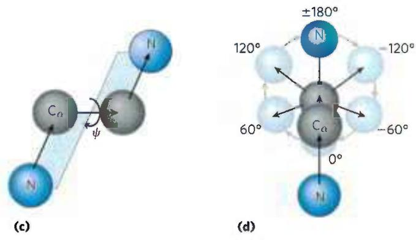

Peptide conformation is defined by three dihedral angles (also known as torsion angles) called $\phi$ (phi), $\psi$ (psi), and $\omega$ (omega), reflecting rotation about each of the three repeating bonds in the peptide backbone. A dihedral angle is the angle at the intersection of two planes. In the case of peptides, the planes are defined by bond vectors in the peptide backbone. Two successive bond vectors describe a plane. Three successive bond vectors describe two planes (the central bond vector is common to both; Fig. 4-2c), and the angle between these two planes is what we measure to describe peptide conformation.

KEY CONVENTION The important dihedral angles in a peptide are defined by the three bond vectors connecting four consecutive main-chain (peptide backbone) atoms (Fig. 4-2c): $\phi$ involves the C—N—C $_{\alpha}$ —C bonds (with the rotation occurring about the N—C $_{\alpha}$ bond), and $\psi$ involves the N—C $_{\alpha}$ —C—N bonds. Both $\phi$ and $\psi$ are defined as $\pm180^{\circ}$ when the polypeptide is fully extended and all peptide groups are in the same plane (Fig. 4-2d). As one looks down the central bond vector in the direction of the vector arrow

FIGURE 4-2 The planar peptide group. (a) Each peptide bond has some double-bond character due to resonance and cannot rotate. Although the N atom in a peptide bond is often represented with a partial positive charge, careful consideration of bond orbitals and quantum mechanics indicates that the N has a net charge that is neutral or slightly negative. (b) Three bonds separate sequential $\alpha$ carbons in a polypeptide chain. The N— $C_{\alpha}$ and $C_{\alpha}$ —C bonds can rotate, described by dihedral angles designated $\phi$ and $\psi$ , respectively. The peptide C—N bond is not free to rotate. Other single bonds in the backbone may also be rotationally hindered, depending on the size and charge of the R groups. (c) The atoms and planes defining $\psi$ . (d) By convention, $\phi$ and $\psi$ are $180^{\circ}$ (or $-180^{\circ}$ ) when the first and fourth atoms are farthest apart and the peptide is fully extended. As the viewer looks out along the bond undergoing rotation (from either direction), the $\phi$ and $\psi$ angles increase as the fourth atom rotates clockwise relative to the first. In a protein, some of the conformations shown here (e.g., $0^{\circ}$ ) are prohibited by steric overlap of atoms. In (b) through (d), the balls representing atoms are smaller than the van der Waals radii for this scale.

(as depicted in Fig. 4-2c for $\psi$ ), the dihedral angles increase as the distal (fourth) atom is rotated clockwise (Fig. 4-2d). From the $\pm 180^{\circ}$ position, the dihedral angle increases from $-180^{\circ}$ to $0^{\circ}$ , at which point the first and fourth atoms are eclipsed. The rotation can be continued from $0^{\circ}$ to $+180^{\circ}$ (same position as $-180^{\circ}$ ) to bring the structure back to the starting point. The third dihedral angle, $\omega$ , is not often considered. It involves the $C_{\alpha}-C-N-C_{\alpha}$ bonds. The central bond in this case is the peptide bond, where rotation is constrained. The peptide bond is almost always (99.6% of the time) in the trans configuration, constraining $\omega$ to a value of $\pm 180^{\circ}$ . For a rare cis peptide bond, $\omega = 0^{\circ}$ .

In principle, $\phi$ and $\psi$ can have any value between $-180^{\circ}$ and $+180^{\circ}$ , but many values are prohibited by steric interference between atoms in the polypeptide backbone and amino acid side chains. The conformation in which both $\phi$ and $\psi$ are $0^{\circ}$ (Fig. 4-2d) is prohibited for this reason; this conformation is merely a reference point for describing the dihedral angles. Backbone angle preferences in a polypeptide represent yet another constraint on the overall folded structure of a protein.

## SUMMARY 4.1 Overview of Protein Structure

A typical protein usually has one or more stable three-dimensional conformations that reflect its function. Some proteins have segments that are intrinsically disordered but are nonetheless essential for function.

■ Whereas nonpeptide covalent bonds, particularly disulfide bonds, can play a role in stabilization of some structures, proteins are stabilized largely by multiple weak, noncovalent interactions and forces.

The hydrophobic effect, derived from the increase in entropy of the surrounding water when nonpolar molecules or groups are clustered together, makes the major contribution to stabilizing the globular form of most soluble proteins.

■ Hydrogen bonds and ionic interactions are optimized in the thermodynamically most stable structures.

■ Van der Waals interactions involve attractive forces between molecular dipoles that occur over short distances. Individually these interactions are weak, but they combine in well-packed protein structures to provide significant effects and stabilization.

The nature of the covalent bonds in the polypeptide backbone places constraints on structure. The peptide bond has a partial double-bond character that keeps the entire six-atom peptide group in a rigid planar configuration. The N—C $_{\alpha}$ and C $_{\alpha}$ —C bonds can rotate to define the dihedral angles $\phi$ and $\psi$ , respectively, although permitted values of $\phi$ and $\psi$ are limited by steric clashes and other constraints.

## 4.2 Protein Secondary Structure

The term secondary structure refers to any chosen segment of a polypeptide chain and describes the local spatial arrangement of its main-chain atoms, without regard to the positioning of its side chains or its relationship to other segments. A regular secondary structure occurs when each dihedral angle, $\phi$ and $\psi$ , remains the same or nearly the same throughout the segment. P2 A few types of secondary structure are particularly stable and occur widely in proteins. The most prominent are the $\alpha$ helix and $\beta$ conformation; another common type is the $\beta$ turn. Secondary structures without a regular pattern are sometimes referred to as undefined or as random coils. Random coil, however, does not properly describe the structure of these segments. The path of most of the polypeptide backbone in a typical protein is not random; rather, it is highly specific to the structure and function of that particular protein. Our discussion here focuses on the regular structures that are most common.

## The $\alpha$ Helix Is a Common Protein Secondary Structure

Pauling and Corey were aware of the importance of hydrogen bonds in orienting polar chemical groups such as the C=O and N—H groups of the peptide bond. They also had the experimental results of William Astbury, who in the 1930s had conducted pioneering x-ray studies of proteins. Astbury demonstrated that the protein that makes up hair and porcupine quills (the fibrous protein α-keratin) has a regular structure that repeats every 5.15 to 5.20 Å. (The angstrom, Å, named after the physicist Anders J. Ångström, is equal to 0.1 nm. Although not an SI unit, it is used universally by structural biologists to describe atomic distances—it is approximately the length of a typical C—H bond.) With this information and their data on the peptide bond, and with the help of precisely constructed models, Pauling and Corey set out to determine the likely conformations of protein molecules.

The first breakthrough came in 1948. Pauling, at that time a visiting lecturer at Oxford University, became ill and retired to his apartment for several days of rest. Bored with the reading available, Pauling grabbed some paper and pencils to work out a plausible stable structure that could be taken up by a polypeptide chain. The model he developed, and later confirmed in work with Corey and coworker Herman Branson, was the simplest arrangement the polypeptide chain can assume that maximizes the use of internal hydrogen bonding. It is a helical structure, and Pauling and Corey called it the $\alpha$ helix (Fig. 4-3). In this structure, the polypeptide backbone is tightly wound around an imaginary axis drawn longitudinally through the middle of the helix, and the R groups of the amino acid residues protrude outward from the helical backbone (Figs 4-3b, c). The repeating unit is a single turn of the helix, which extends about $5.4\AA$ along the long axis, slightly greater than the periodicity that Astbury observed on x-ray analysis of hair keratin. The backbone atoms of the amino acid residues in the prototypical $\alpha$ helix have a characteristic set of dihedral angles that define the conformation of the $\alpha$ helix (Table 4-1), and each helical turn includes 3.6 amino acid residues. The $\alpha$ -helical segments in proteins often deviate slightly from these dihedral angles, and they even vary somewhat within a single, continuous segment so as to produce subtle bends or kinks in the helical axis.

Pauling and Corey considered both right-handed and left-handed variants of the $\alpha$ helix. The subsequent elucidation of the three-dimensional structure of myoglobin and other proteins showed that the right-handed $\alpha$ helix is the common form (Box 4-1). Extended left-handed $\alpha$ helices are theoretically less stable and have not been observed in proteins. The $\alpha$ helix proved to be the predominant structure in $\alpha$ -keratins. More generally, about one-fourth of all amino acid residues in proteins are found in $\alpha$ helices, the exact fraction varying greatly from one protein to another.

Amino terminus

  
(a)  
Carboxyl terminus

(b)  
FIGURE 4-3 Models of the $\alpha$ helix, showing different aspects of its structure. (a) Ball-and-stick model showing the intrachain hydrogen bonds. The repeat unit is a single turn of the helix, 3.6 residues. (b) The $\alpha$ helix viewed from one end, looking down the longitudinal axis. Note the positions of the R groups, represented by purple spheres. This ball-and-stick model, which emphasizes the helical arrangement, gives the false impression that the helix is hollow, because the balls do not represent the van der Waals radii of the individual atoms. (c) As this space-filling model shows, the atoms in the  
TABLE 4-1 Idealized $\phi$ and $\psi$ Angles for Common Secondary Structures in Proteins

<table><tr><td>Structure</td><td> $\phi$ </td><td> $\psi$ </td></tr><tr><td> $\alpha$  Helix</td><td> $-57^{\circ}$ </td><td> $-47^{\circ}$ </td></tr><tr><td> $\beta$  Conformation</td><td></td><td></td></tr><tr><td>Antiparallel</td><td> $-139^{\circ}$ </td><td> $+135^{\circ}$ </td></tr><tr><td>Parallel</td><td> $-119^{\circ}$ </td><td> $+113^{\circ}$ </td></tr><tr><td>Collagen triple helix</td><td> $-51^{\circ}$ </td><td> $+153^{\circ}$ </td></tr><tr><td> $\beta$  Turn type I</td><td></td><td></td></tr><tr><td> $i + 1^{a}$ </td><td> $-60^{\circ}$ </td><td> $-30^{\circ}$ </td></tr><tr><td> $i + 2^{a}$ </td><td> $-90^{\circ}$ </td><td> $0^{\circ}$ </td></tr><tr><td> $\beta$  Turn type II</td><td></td><td></td></tr><tr><td> $i + 1$ </td><td> $-60^{\circ}$ </td><td> $+120^{\circ}$ </td></tr><tr><td> $i + 2$ </td><td> $+80^{\circ}$ </td><td> $0^{\circ}$ </td></tr></table>

Note: In real proteins, dihedral angles often vary somewhat from these idealized values. $^{a}$ The i+1 and i+2 angles are those for the second and third amino acid residues in the $\beta$ turn, respectively.

Why does the $\alpha$ helix form more readily than many other possible conformations? The answer lies, in part, in its optimal use of intrahelical hydrogen bonds. The structure is stabilized by a hydrogen bond between the hydrogen atom attached to the electronegative nitrogen atom of a peptide linkage and the electronegative carbonyl oxygen atom of the fourth amino acid on the amino-terminal side of that peptide bond (Fig. 4-3a). Within the $\alpha$ helix, every peptide bond (except those close to each end of the helix) participates in such hydrogen bonding. Each successive turn of the $\alpha$ helix is held to adjacent turns by three to four hydrogen bonds, conferring significant stability on the overall structure. At the ends of an $\alpha$ -helical segment, there are always three or four amide carbonyl or amino groups that cannot participate in this helical pattern of hydrogen bonding. These may be exposed to the surrounding solvent, where they hydrogen-bond with water, or other parts of the protein may cap the helix to provide the needed hydrogen-bonding partners.

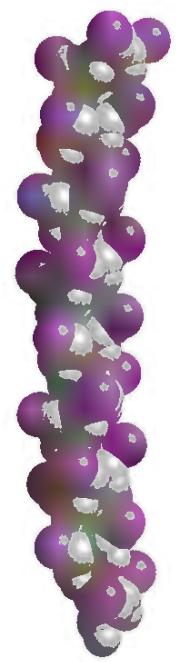  
(c)

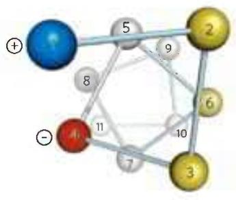  
(d)  
center of the $\alpha$ helix are in very close contact. (d) Helical wheel projection of an $\alpha$ helix. This representation can be colored to identify surfaces with particular properties. The yellow residues, for example, could be hydrophobic and conform to an interface between the helix shown here and another part of the same or another polypeptide. The red (negative) and blue (positive) residues illustrate the potential for interaction of oppositely charged side chains separated by two residues in the helix. [(b, c) Data from PDB ID 4TNC, K. A. Satyshur et al., J. Biol. Chem. 263:1628, 1988.]

## WORKED EXAMPLE 4-1 Secondary Structure and Protein Dimensions

What is the length, in both Å and nm, of a polypeptide with 80 amino acid residues in a single, continuous α helix?

SOLUTION: An idealized $\alpha$ helix has 3.6 residues per turn, and the rise along the helical axis is $5.4\AA$ . Thus, the rise along the axis for each amino acid residue is $1.5\AA$ . The length of the polypeptide is therefore 80 residues $\times 1.5\AA/\text{residue} = 1.2\times 10^{2}\AA$ or $12\mathrm{nm}$ .

## Knowing the Right Hand from the Left

There is a simple method for determining whether a helical structure is right-handed or left-handed. Make fists of your two hands with thumbs outstretched and pointing away from you. Looking at your right hand, think of a helix spiraling up your right thumb in the direction in which the other four fingers are curled as shown (clockwise). The resulting helix is right-handed. Your left hand will demonstrate a left-handed helix, which rotates in the counterclockwise direction as it spirals up your thumb.

## Amino Acid Sequence Affects Stability of the $\alpha$ Helix

Not all polypeptides can form a stable $\alpha$ helix. Each amino acid residue in a polypeptide has an intrinsic propensity to form an $\alpha$ helix, reflecting the properties of the R group and how they affect the capacity of the adjoining main-chain atoms to take up the characteristic $\phi$ and $\psi$ angles. Alanine shows the greatest tendency to form $\alpha$ helices in most experimental model systems.

The position of an amino acid residue relative to its neighbors is also important. Interactions between amino acid side chains can stabilize or destabilize the $\alpha$ -helical structure. For example, if a polypeptide chain has a long block of Glu residues, this segment of the chain will not form an $\alpha$ helix at pH 7.0. The negatively charged carboxyl groups of adjacent Glu residues repel each other so strongly that they prevent formation of the $\alpha$ helix. For the same reason, if there are many adjacent Lys and/or Arg residues, with positively charged R groups at pH 7.0, they also repel each other and prevent formation of the $\alpha$ helix. The size and shape of Asn, Ser, Thr, and Cys residues can also destabilize an $\alpha$ helix if they are close together in the chain.

The twist of an $\alpha$ helix ensures that critical interactions occur between an amino acid side chain and the side chain three (and sometimes four) residues away on either side of it. This is made clear when the $\alpha$ helix is depicted as a helical wheel (Fig. 4-3d). Positively charged amino acids are often found three residues away from negatively charged amino acids, permitting the formation of an ion pair. Two aromatic amino acid residues are often similarly spaced, resulting in a juxtaposition stabilized by the hydrophobic effect.

A constraint on the formation of the $\alpha$ helix is the presence of Pro or Gly residues, which have the least likelihood of forming $\alpha$ helices. In proline, the nitrogen atom is part of a rigid ring (see Fig. 4-7), and rotation about the N—C $_{\alpha}$ bond is not possible. Thus, a Pro residue introduces a destabilizing kink in an $\alpha$ helix. In addition, the nitrogen atom of a Pro residue in a peptide linkage has no substituent hydrogen to participate in hydrogen bonds with other residues. For these reasons, proline is found only rarely in an $\alpha$ helix. Glycine occurs infrequently in $\alpha$ helices for a different reason: it has more conformational flexibility than the other amino acid residues. Polymers of glycine tend to take up coiled structures quite different from an $\alpha$ helix.

A final factor affecting the stability of an $\alpha$ helix is the identity of the amino acid residues near the ends of the $\alpha$ -helical segment of the polypeptide. A small electric dipole exists in each peptide bond (Fig. 4-2a). These dipoles are aligned through the hydrogen bonds of the helix, resulting in a net dipole along the helical axis that increases with helix length (Fig. 4-4). The partial positive and negative charges of the helix dipole reside on the peptide amino and carbonyl groups near the amino-terminal and carboxyl-terminal ends, respectively. For this reason, negatively charged amino acids are often found near the amino terminus of the helical segment, where they have a stabilizing interaction with the positive charge of the helix dipole; a positively charged amino acid at the amino-terminal end is destabilizing. The opposite is true at the carboxyl-terminal end of the helical segment.

In summary, five types of constraints affect the stability of an $\alpha$ helix: (1) the intrinsic propensity of an amino acid residue to form an $\alpha$ helix; (2) the interactions between R groups, particularly those spaced three (or four) residues apart; (3) the bulkiness of adjacent R groups; (4) the occurrence of Pro and Gly residues; and (5) interactions between amino acid residues at the ends of the helical segment and the electric dipole inherent to the $\alpha$ helix. P2 The tendency of a given segment of a

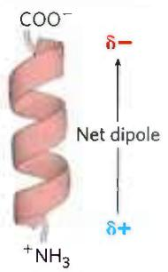  
FIGURE 4-4 Helix dipole. The electric dipole of a peptide bond (see Fig. 4-2a) is transmitted along an $\alpha$ -helical segment through the intrachain hydrogen bonds, resulting in an overall helix dipole.

Top view

7 Å  

polypeptide chain to form an $\alpha$ helix therefore depends on the identity and sequence of amino acid residues within the segment.

## The $\beta$ Conformation Organizes Polypeptide Chains into Sheets

In 1951, Pauling and Corey predicted a second type of repetitive structure, the $\beta$ conformation. This is a more extended conformation of polypeptide chains, and its structure is again defined by backbone atoms arranged according to a characteristic set of dihedral angles (Table 4-1). P2 In the $\beta$ conformation, the backbone of the polypeptide chain is extended into a zigzag rather than helical structure (Fig. 4-5). A single protein segment in the $\beta$ conformation is often called a $\beta$ strand. The arrangement of several strands side by side, all in the $\beta$ conformation, is called a $\beta$ sheet. The zigzag structure of the individual polypeptide segments gives rise to a pleated appearance of the overall sheet. Hydrogen bonds form between backbone atoms of adjacent segments of polypeptide chain within the sheet. The individual segments that form a $\beta$ sheet are usually nearby on the polypeptide chain but can also be quite distant from each other in the linear sequence of the polypeptide; they may even be in different polypeptide chains. The R groups of adjacent amino acids protrude from the zigzag structure in opposite directions, creating the alternating pattern seen in the side view in Figure 4-5.

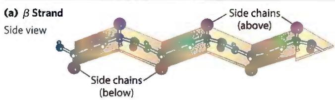

(b) Antiparallel $\beta$ sheet  
  
(c) Parallel $\beta$ sheet

  
FIGURE 4-5 The $\beta$ conformation of polypeptide chains. These (a) side and (b, c) top views reveal the R groups extending out from the $\beta$ sheet and emphasize the pleated shape formed by the planes of the peptide bonds. (An alternative name for this structure is $\beta$ -pleated sheet.) Hydrogen-bond cross-links between adjacent chains are also shown. The amino-terminal to carboxyl-terminal orientations of adjacent chains (arrows) can be the opposite or the same, forming (b) an antiparallel $\beta$ sheet or (c) a parallel $\beta$ sheet.

The adjacent polypeptide chains in a $\beta$ sheet can be either parallel or antiparallel (having the same or opposite amino-to-carboxyl orientations, respectively). The structures are somewhat similar, although the repeat period is shorter for the parallel conformation (6.5 vs. 7.0 Å for antiparallel) and the hydrogen-bonding patterns are different. The interstrand hydrogen bonds are essentially in-line (see Fig. 2-5) in the antiparallel $\beta$ sheet, whereas they are distorted or not in-line for the parallel variant. In natural proteins, antiparallel $\beta$ sheets are found twice as frequently as parallel $\beta$ sheets. The idealized structures exhibit the bond angles given in Table 4-1; these values vary somewhat in real proteins, resulting in structural variation, as seen above for $\alpha$ helices.

## β Turns Are Common in Proteins

In globular proteins, which have a compact folded structure, some amino acid residues are in turns or loops where the polypeptide chain reverses direction (Fig. 4-6). P2 These are the connecting elements that link successive runs of $\alpha$ helix or $\beta$ conformation. Particularly common are $\beta$ turns that connect the ends of two adjacent segments of an antiparallel $\beta$ sheet. The structure is a $180^{\circ}$ turn involving four amino acid residues, with the carbonyl oxygen of the first residue forming a hydrogen bond with the amino-group hydrogen of the fourth. The peptide groups of the central two residues do not participate in any interresidue hydrogen bonding. Several types of $\beta$ turns have been described, each defined by the $\phi$ and $\psi$ angles of the bonds that link the four amino acid residues that make up the particular turn (Table 4-1). Gly and Pro residues often occur in $\beta$ turns, the former because it is small and flexible, the latter because peptide bonds involving the imino nitrogen of proline readily assume the cis configuration (Fig. 4-7), a form that is particularly amenable to a tight turn. The two types of $\beta$ turns shown in Figure 4-6 are the most common. Beta turns are often found near the surface of a protein, where the peptide groups of the central two amino acid residues in the turn can hydrogen-bond with water. Considerably less common is the $\gamma$ turn, a three-residue turn with a hydrogen bond between the first and third residues.

## Common Secondary Structures Have Characteristic Dihedral Angles

The $\alpha$ helix and the $\beta$ conformation are the major repetitive secondary structures in a wide variety of proteins, although other repetitive structures exist in some specialized proteins (an example is collagen; see Fig. 4-12).

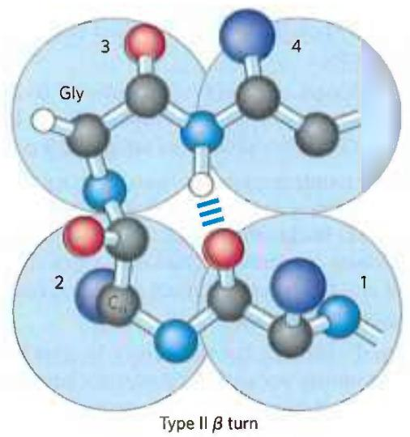  
FIGURE 4-6 Structures of $\beta$ turns. Type I and type II $\beta$ turns are most common, distinguished by the $\phi$ and $\psi$ angles taken up by the peptide backbone in the turn (see Table 4-1). Type I turns occur more than twice as frequently as type II. Note the hydrogen bond between the peptide groups of the first and fourth residues of the bends. (Individual amino acid residues are framed by large blue circles. Not all H atoms are shown in these depictions.)

  
FIGURE 4-7 Trans and cis isomers of a peptide bond involving the imino nitrogen of proline. Of the peptide bonds between amino acid residues other than Pro, more than 99.95% are in the trans configuration. For peptide bonds involving the imino nitrogen of proline, however, about 6% are in the cis configuration; many of these occur at $\beta$ turns.

Every type of secondary structure can be completely described by the dihedral angles $\phi$ and $\psi$ associated with each residue. P2 Ramachandran plots, introduced by G. N. Ramachandran, are useful tools for visualizing all of the $\phi$ and $\psi$ angles observed in a particular protein structure and are often used to test the quality of three-dimensional protein structures. In a Rama-chandran plot, the dihedral angles that define the $\alpha$ helix and the $\beta$ conformation fall within a relatively restricted range of sterically allowed structures (Fig. 4-8a). Most values of $\phi$ and $\psi$ taken from known protein structures fall into the expected regions, with high concentrations near the $\alpha$ helix and $\beta$ conformation values, as predicted (Fig. 4-8b). The only amino acid residue often found in a conformation outside these regions is glycine. Because its side chain is small, a Gly residue can take part in many conformations that are sterically forbidden for other amino acids.

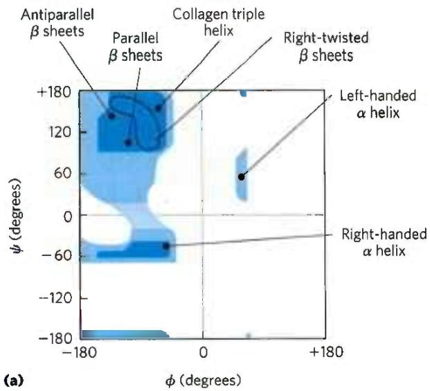

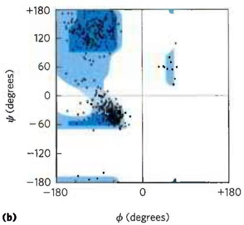  
FIGURE 4-8 Ramachandran plots showing a variety of structures. (a) The values of $\phi$ and $\psi$ for various allowed conformations and secondary structures are shown. Peptide conformations deemed possible are those that involve little or no steric interference, based on calculations using known van der Waals radii and dihedral angles modeled as a hard sphere. Other types of Ramachandran plots make different assumptions. The areas shaded dark blue represent conformations that involve no steric overlap and are thus fully allowed. Medium blue indicates conformations permitted if atoms are allowed to approach each other by an additional $0.1\mathrm{nm}$ , a slight clash. The lightest blue indicates conformations that are permissible if a very modest flexibility (a few degrees) is allowed in the $\omega$ dihedral angle that describes the peptide bond itself (generally constrained to $180^{\circ}$ ). The white regions are conformations that are not allowed. Although left-handed $\alpha$ helices extending over several amino acid residues are theoretically possible, they have not been observed in proteins. The asymmetry of the plot results from the L stereochemistry of the amino acid residues. (b) The values of $\phi$ and $\psi$ for all the amino acid residues except Gly in the enzyme pyruvate kinase (isolated from rabbit) are overlaid on the plot of allowed conformations. The small, flexible Gly residues were excluded because they frequently fall outside the expected (blue) ranges. ([a) Information from T.E. Creighton, Proteins, p. 166, © 1984 by W.H. Freeman and Company. (b) Data from Hazel Holden, University of Wisconsin-Madison, Department of Biochemistry.]

## Common Secondary Structures Can Be Assessed by Circular Dichroism

Any form of structural asymmetry in a molecule gives rise to differences in absorption of left-handed versus right-handed circularly polarized light. Measurement of this difference is called circular dichroism (CD) spectroscopy. An ordered structure, such as a folded protein, gives rise to an absorption spectrum that can have peaks or regions with both positive and negative values. For proteins, spectra are obtained in the far UV region (190 to 250 nm). In this region, the light-absorbing entity, or chromophore, is the peptide bond; a signal is obtained when the peptide bond is in a folded environment. The difference in molar extinction coefficients (see Box 3-1) for left-handed and right-handed, circularly polarized light ( $\Delta\varepsilon$ ) is plotted as a function of wavelength. The $\alpha$ helix and $\beta$ conformations have characteristic CD spectra (Fig. 4-9). Using CD spectra, biochemists can determine whether proteins are properly folded, estimate the fraction of the protein that is folded in either of the common secondary structures, and monitor transitions between the folded and unfolded states.

  
FIGURE 4-9 Circular dichroism spectroscopy. These spectra show polylysine entirely as $\alpha$ helix, as $\beta$ conformation, or in an unstructured, denatured state. The y axis unit is a simplified version of the units most commonly used in CD experiments. Since the curves are different for $\alpha$ helix, $\beta$ conformation, and unstructured, the CD spectrum for a given protein can provide a rough estimate for the fraction of the protein made up of the two most common secondary structures. The CD spectrum of the native protein can serve as a benchmark for the folded state, useful for monitoring denaturation or conformational changes brought about by changes in solution conditions.

## SUMMARY 4.2 Protein Secondary Structure

Secondary structure is the local spatial arrangement of the main-chain atoms in a selected segment of a polypeptide chain; it can be completely defined by the $\phi$ and $\psi$ angles of all the amino acids in that segment.

In the $\alpha$ helix, the repeating unit is a single helical turn of $\sim 5.4\AA$ or 3.6 amino acids. The common form found in proteins is right-handed with the amino acid R groups protruding away from the helical backbone.

The propensity of a protein segment to form an $\alpha$ helix depends on the composition of its amino acids and amino acid positions relative to one another and relative to the helical dipole.

In the $\beta$ conformation, amino acids are extended in a zigzag fashion. When several $\beta$ strands are arranged adjacent to one another, they can form either parallel or anti-parallel $\beta$ sheets.

■ Turns or loops connect segments of $\alpha$ helix or $\beta$ strands. $\beta$ turns, which often contain Gly or Pro residues, tend to connect segments of antiparallel $\beta$ sheets.

The Ramachandran plot is a visual description of the combinations of $\phi$ and $\psi$ dihedral angles that are permitted in a peptide backbone and those that are not permitted due to steric constraints. Dihedral angles that define the $\alpha$ helix and the $\beta$ conformation are found only within certain regions of the plot.

■ Circular dichroism spectroscopy is a method for assessing common secondary structure and monitoring folding in proteins based on absorption of circularly polarized UV light.

## 4.3 Protein Tertiary and Quaternary Structures

P3 The overall three-dimensional arrangement of all atoms in a protein is referred to as the protein's tertiary structure. Whereas the term "secondary structure" refers to the spatial arrangement of amino acid residues that are adjacent in a segment of a polypeptide, tertiary structure includes longer-range aspects of amino acid sequence. Amino acids that are far apart in the polypeptide sequence and are in different types of secondary structure may interact within the completely folded structure of a protein. Interacting segments of polypeptide chains are held in their characteristic tertiary positions by several kinds of weak interactions (and sometimes by covalent bonds such as disulfide cross-links) between the segments. Some proteins contain two or more separate polypeptide chains, or subunits, which may be identical or different. The arrangement of these protein subunits in three-dimensional complexes constitutes quaternary structure.

In considering these higher levels of structure, it is useful to designate the major groups into which many proteins can be classified: fibrous proteins, with polypeptide chains arranged in long strands or sheets; globular proteins, with polypeptide chains folded into a spherical or globular shape; membrane proteins, with polypeptide chains embedded in hydrophobic lipid membranes; and intrinsically disordered proteins, with polypeptide chains lacking stable tertiary structures. We focus here on fibrous, globular, and intrinsically disordered proteins; membrane proteins are discussed in Chapter 11. These three groups are structurally distinct. Fibrous proteins usually consist of a single type of secondary structure, and their tertiary structure is relatively simple. Globular proteins often contain several types of secondary structure. Intrinsically disordered proteins can lack secondary structure entirely. The groups also differ functionally: the structures that provide support, shape, and external protection to vertebrates are made of fibrous proteins. Most enzymes are globular proteins, whereas regulatory proteins can be globular, disordered, or contain both globular and disordered segments.

## Fibrous Proteins Are Adapted for a Structural Function

α-Keratin, collagen, and silk fibroin nicely illustrate the relationship between protein structure and biological function (Table 4-2). P2 Fibrous proteins share properties that give strength and/or flexibility to the structures in which they occur. In each case, the fundamental structural unit is a simple repeating element of secondary structure. All fibrous proteins are insoluble in water, a property conferred by a high concentration of hydrophobic amino acid residues both in the interior of the protein and on its surface. These hydrophobic surfaces are largely buried, as many similar polypeptide chains are packed together to form elaborate supramolecular complexes. The underlying structural simplicity of fibrous proteins makes them particularly useful for illustrating some of the fundamental principles of protein structure discussed previously.

α-Keratin The α-keratins have evolved for strength. Found only in mammals, these proteins constitute almost the entire dry weight of hair, wool, nails, claws, quills, horns, and hooves and much of the outer layer of skin. The α-keratins are part of a broader family of proteins called intermediate filament (IF) proteins. Other IF proteins are found in the cytoskeletons of animal cells. All IF proteins have a structural function and share the structural features exemplified by the α-keratins.

The $\alpha$ -keratin helix is a right-handed $\alpha$ helix, the same helix found in many other proteins. Francis Crick and Linus Pauling, in the early 1950s, independently suggested that the $\alpha$ helices of keratin were arranged as a coiled coil. Two strands of $\alpha$ -keratin, oriented in parallel (with their amino termini at the same end), are wrapped about each other to form a supertwisted coiled coil. The supertwisting amplifies the strength of the overall structure, just as strands are twisted to make a strong rope (Fig. 4-10). The twisting

<table><tr><td colspan="3">TABLE 4-2 Secondary Structures and Properties of Some Fibrous Proteins</td></tr><tr><td>Structure</td><td>Characteristics</td><td>Examples of occurrence</td></tr><tr><td>α Helix, cross-linked by disulfide bonds</td><td>Tough, insoluble protective structures of varying hardness and flexibility</td><td>α-Keratin of hair, feathers, nails</td></tr><tr><td>β Conformation</td><td>Soft, flexible filaments</td><td>Silk fibroin</td></tr><tr><td>Collagen triple helix</td><td>High tensile strength, without stretch</td><td>Collagen of tendons, bone matrix</td></tr></table>

# Why Sailors, Explorers, and College Students Should Eat Their Fresh Fruits and Vegetables

... from this misfortune, together with the unhealthiness of the country, where there never falls a drop of rain, we were stricken with the "camp-sickness," which was such that the flesh of our limbs all shrivelled up, and the skin of our legs became all blotched with black, mouldy patches, like an old jack-boot, and proud flesh came upon the gums of those of us who had the sickness, and none escaped from this sickness save through the jaws of death. The signal was this: when the nose began to bleed, then death was at hand.

—The Memoirs of the Lord of Joinville, ca. 1300\*

This excerpt describes the plight of Louis IX's scurvy-weakened army before it was destroyed by the Egyptians toward the end of the Seventh Crusade (1248–1254). What was the nature of the malady afflicting these thirteenth-century soldiers?

Scurvy is caused by lack of vitamin C, or ascorbic acid (ascorbate). Vitamin C is required for, among other things, the hydroxylation of proline and lysine in collagen; scurvy is a deficiency disease characterized by general degeneration of connective tissue. Manifestations of advanced scurvy include numerous small hemorrhages caused by fragile blood vessels; tooth loss, poor wound healing, and the reopening of old wounds; bone pain and degeneration; and eventually heart failure. Milder cases of vitamin C deficiency are accompanied by fatigue, irritability, and an increased severity of respira-

\*From Ethel Wedgwood, The Memoirs of the Lord of Joinville: A New English Version, E. P. Dutton and Company, 1906.

of the axis of an $\alpha$ helix to form a coiled coil explains the discrepancy between the 5.4 Å per turn predicted for an $\alpha$ helix by Pauling and Corey and the 5.15 to 5.2 Å repeating structure observed in the x-ray diffraction of hair (see end-of-chapter problem 2). The helical path of the supertwists is left-handed, opposite in sense to the $\alpha$ helix. The surfaces where the two $\alpha$ helices touch are made up of hydrophobic amino acid residues, their R groups meshed together in a regular interlocking pattern. This permits a close packing of the polypeptide chains within the left-handed supertwist. Not surprisingly, $\alpha$ -keratin is rich in the hydrophobic residues Ala, Val, Leu, Ile, Met, and Phe.

An individual polypeptide in the $\alpha$ -keratin coiled coil has a relatively simple tertiary structure, dominated by an $\alpha$ -helical secondary structure with its helical axis twisted in a left-handed superhelix. The intertwining of the two $\alpha$ -helical polypeptides is an example of quaternary structure. Coiled coils of this type are common structural elements in filamentous proteins and in the muscle protein myosin (see Fig. 5-26). The quaternary structure of $\alpha$ -keratin can be quite complex. Many coiled coils can be assembled into large supramolecular complexes, such as the arrangement of $\alpha$ -keratin that forms the intermediate filament of hair (Fig. 4-10b).

The strength of fibrous proteins is enhanced by covalent cross-links between polypeptide chains in the tory tract infections. Most animals make large amounts of vitamin C, converting glucose to ascorbate in four enzymatic steps. But in the course of evolution, humans and some other animals—gorillas, guinea pigs, and fruit bats—have lost the last enzyme in this pathway and must obtain ascorbate in their diet. Vitamin C is available in a wide range of fruits and vegetables. Until 1800, however, it was often absent in the dried foods and other food supplies stored for winter or for extended travel.

Scurvy came to wide public notice during the European voyages of discovery from 1500 to 1800. In fact, during the first circumnavigation of the globe (1519–1522) by Ferdinand Magellan, more than 80% of his crew were lost to scurvy. Winter outbreaks of scurvy in Europe were gradually eliminated in the nineteenth century as the cultivation of the potato, introduced from South America, became widespread.

In 1747, James Lind, a Scottish surgeon in the Royal Navy, carried out the first controlled clinical study in recorded history. During an extended voyage on the 50-gun warship HMS Salisbury, Lind selected 12 sailors suffering from scurvy and separated them into groups of two. All 12 received the same diet, except that each group was given a different remedy for scurvy from among those recommended at the time. The sailors given lemons and oranges recovered and returned to duty. Lind's Treatise on the Scurvy was published in 1753, but inaction persisted in the Royal Navy for another 40 years. In 1795, the British admiralty finally mandated

multihelical “ropes” and between adjacent chains in a supramolecular assembly. In $\alpha$ -keratins, the cross-links stabilizing quaternary structure are disulfide bonds. In the hardest and toughest $\alpha$ -keratins, such as those of rhinoceros horn, up to 18% of the residues are cysteines involved in disulfide bonds.

Collagen Like the $\alpha$ -keratins, collagen has evolved to provide strength. It is found in connective tissue such as tendons, cartilage, the organic matrix of bone, and the cornea of the eye. In fact, collagen is the most abundant protein in mammals, usually comprising 25% to 35% of total protein content. The collagen helix is a unique secondary structure, quite distinct from the $\alpha$ helix. It is left-handed and has three amino acid residues per turn (Fig. 4-11 and Table 4-1). Collagen is also a coiled coil, but one with distinct tertiary and quaternary structures: three separate polypeptides, called $\alpha$ chains (not to be confused with $\alpha$ helices), are twisted about each other. The superhelical twisting is right-handed in collagen, opposite in sense to the left-handed helix of the $\alpha$ chains.

There are many types of vertebrate collagen. Typically, they contain about 35% Gly, 11% Ala, and 21% Pro and 4-Hyp (4-hydroxyproline, an uncommon amino acid; see Fig. 3-8a). The food product gelatin is derived from collagen. It has little nutritional value as a a ration of concentrated lime or lemon juice for all British sailors (hence the name "limeys"). Scurvy continued to be a problem in some other parts of the world until 1932, when Hungarian scientist Albert Szent-Györgyi, and W. A. Waugh and C. G. King at the University of Pittsburgh, isolated and synthesized ascorbic acid.

  
FIGURE 1 The $C_{\gamma}$ -endo conformation of proline and the $C_{\gamma}$ -exo conformation of 4-hydroxyproline.

So why is ascorbate so necessary to good health? Of particular interest to us here is its role in the formation of collagen. As noted in the text, collagen is constructed of the repeating tripeptide unit Gly-X-Y, where X and Y are generally Pro or 4-Hyp—the proline derivative L-hydroxyproline, which plays an essential role in the folding of collagen and in maintaining its structure. The proline ring is normally found as a mixture of two puckered conformations, called $C_{\gamma}$ -endo and $C_{\gamma}$ -exo (Fig. 1). The collagen helix structure requires the Pro/4-Hyp residue in the Y positions to be in the $C_{\gamma}$ -exo conformation, and it is this conformation that is enforced by the hydroxyl substitution at C-4 in 4-Hyp. In the absence of vitamin C, cells cannot hydroxylate the Pro at the Y positions. This leads to collagen instability and the connective tissue problems seen in scurvy.

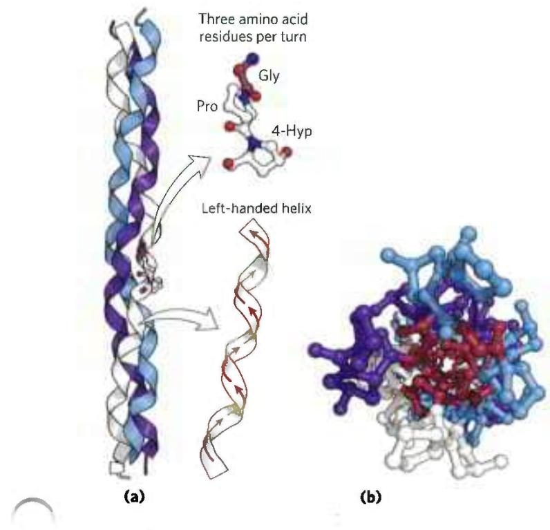

The hydroxylation of specific Pro residues in procollagen, the precursor of collagen, requires the action of the $\alpha$ -ketoglutarate-dependent enzyme prolyl 4-hydroxylase. In the normal prolyl 4-hydroxylase reaction, one molecule of $\alpha$ -ketoglutarate and one of $\mathrm{O}_2$ bind to the enzyme. The $\alpha$ -ketoglutarate is oxidatively decarboxylated to form $\mathrm{CO}_2$ and succinate. The remaining oxygen atom is then used to hydroxylate an appropriate Pro residue in procollagen. No ascorbate is needed in this reaction. However, prolyl 4-hydroxylase also catalyzes an oxidative decarboxylation of $\alpha$ -ketoglutarate that is not coupled to proline hydroxylation. During this reaction, the $\mathrm{Fe}^{2+}$ becomes oxidized, inactivating the enzyme and preventing the proline hydroxylation. Ascorbate is needed to reduce the iron and restore enzyme activity so that proline hydroxylation of procollagen can continue.

Scurvy remains a problem today, not only in remote regions where nutritious food is scarce but, surprisingly, also among young adults with poor eating habits in large cities. A 2009 study of more than 1,100 men and women between the ages of 20 and 29 in Toronto, Canada, found that 1 in 7 young adults had vitamin C deficiency due to unmet dietary needs. Moreover, lower vitamin C levels were associated with higher measures of obesity and blood pressure and fewer servings a day of healthy foods. Just like eighteenth-century sailors, twenty-first-century young adults need to eat their fruits and vegetables!

FIGURE 4-11 Structure of collagen. (a) The $\alpha$ chain of collagen has a repeating secondary structure unique to this protein. The repeating tripeptide sequence Gly-X-Y, where X is often Pro and Y is often 4-Hyp, adopts a left-handed helical structure with three residues per turn. Three of these helices (shown here in white, blue, and purple) wrap around one another with a right-handed twist. (b) The three-stranded collagen superhelix shown from one end, in a ball-and-stick representation. Gly residues are shown in red. Glycine, because of its small size, is required at the tight junction where the three chains are in contact. The balls in this illustration do not represent the van der Waals radii of the individual atoms. The center of the three-stranded superhelix is not hollow, as it appears here, but very tightly packed. [Data from PDB ID 1CGD, J. Bella et al., Structure 3:893, 1995.]

protein, because collagen is extremely low in many amino acids that are essential in the human diet. The unusual amino acid content of collagen is related to structural constraints unique to the collagen helix. The amino acid sequence in collagen is generally a repeating tripeptide unit, Gly-X-Y, where X is often Pro and Y is often 4-Hyp. Only Gly residues can be accommodated at the very tight junctions between the individual $\alpha$ chains (Fig. 4-11b). The Pro and 4-Hyp residues permit the sharp twisting of the collagen helix. The amino acid sequence and the supertwisted quaternary structure of collagen allow a very close packing of its three polypeptides. 4-Hydroxyproline has a special role in the structure of collagen—and in human history (Box 4-2).

  
FIGURE 4-12 Structure of collagen fibrils. Collagen ( $M_{f}$ 300,000) is a rod-shaped molecule, about 3,000 Å long and only 15 Å thick. Its three helically intertwined $\alpha$ chains may have different sequences; each chain has about 1,000 amino acid residues. Collagen fibrils are made up of collagen molecules aligned in a staggered fashion and cross-linked for strength. The specific alignment and degree of cross-linking vary with the tissue and produce characteristic cross-striations in an electron micrograph. In the example shown here, alignment of the head groups of every fourth molecule produces striations 640 Å (64 nm) apart. [J. Gross/Biozentrum, University of Basel/Science Source.]

The tight wrapping of the $\alpha$ chains in the collagen triple helix provides tensile strength greater than that of a steel wire of equal cross section. Collagen fibrils (Fig. 4-12) are supramolecular assemblies consisting of triple-helical collagen molecules (sometimes referred to as tropocollagen molecules) associated in a variety of ways to provide different degrees of tensile strength. The $\alpha$ chains of collagen molecules and the collagen molecules of fibrils are cross-linked by unusual types of covalent bonds involving Lys, HyLys (5-hydroxylysine), or His residues that are present at a few of the X and Y positions. These links create uncommon amino acid residues such as dehydrohydroxylysinonorleucine. The increasingly rigid and brittle character of aging connective tissue results from accumulated covalent cross-links in collagen fibrils.

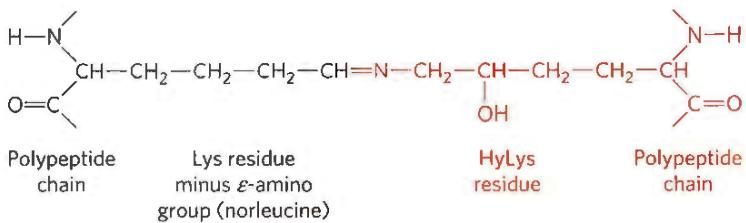  
Dehydrohydroxylysinonorleucine

A typical mammal has more than 30 structural variants of collagen, particular to certain tissues and each somewhat different in sequence and function. Some human genetic defects in collagen structure illustrate the close relationship between amino acid sequence and three-dimensional structure in this protein. Osteogenesis imperfecta is characterized by abnormal bone formation in babies; at least eight variants of this condition, with different degrees of severity, occur in the human population. Ehlers-Danlos syndrome is characterized by loose joints, and at least six variants occur in humans. The composer Niccolò Paganini (1782–1840) was famed for his seemingly impossible dexterity in playing the violin. He suffered from a variant of Ehlers-Danlos syndrome that rendered him effectively double-jointed. In both disorders, some variants can be lethal, whereas others cause lifelong problems.

All of the variants of both conditions result from the substitution of an amino acid residue with a larger R group (such as Cys or Ser) for a single Gly residue in an $\alpha$ chain in one or another of the collagen proteins (a different Gly residue in each disorder). These single-residue substitutions have a catastrophic effect on collagen function because they disrupt the Gly-X-Y repeat that gives collagen its unique helical structure. Given its role in the collagen triple helix (Fig. 4-11), Gly cannot be replaced by another amino acid residue without substantial deleterious effects on collagen structure.

Fibroin The protein of silk, fibroin, is produced by insects and spiders. Its polypeptide chains are predominantly in the $\beta$ conformation. Fibroin is rich in Ala and Gly residues, permitting a close packing of $\beta$ sheets and an interlocking arrangement of R groups (Fig. 4-13). The overall structure is stabilized by extensive hydrogen bonding between all peptide linkages in the polypeptides of each $\beta$ sheet and by the optimization of van der Waals interactions between sheets. Silk does not stretch, because the $\beta$ conformation is already highly extended (Fig. 4-5). However, the structure is flexible, because the sheets are held together by numerous weak interactions rather than by covalent bonds such as the disulfide bonds in $\alpha$ -keratins.

## Structural Diversity Reflects Functional Diversity in Globular Proteins

In a globular protein, different segments of the polypeptide chain (or multiple polypeptide chains) fold back on each other, generating a more compact shape than is seen in the fibrous proteins (Fig. 4-14). The folding also provides the structural diversity necessary for proteins to carry out a wide array of biological functions. Globular proteins include enzymes, transport proteins, motor proteins, regulatory proteins, immunoglobulins, and proteins with many other functions.

  
FIGURE 4-14 Globular protein structures are compact and varied. Human serum albumin ( $M_{f}$ 64, 500) has 585 residues in a single chain. Given here are the approximate dimensions its single polypeptide chain would have if it occurred entirely in extended $\beta$ conformation or as an $\alpha$ helix. Also shown is the size of the protein in its native globular form, as determined by x-ray crystallography; the polypeptide chain must be very compactly folded to fit into these dimensions.

Our discussion of globular proteins begins with the principles gleaned from the first protein structures to be elucidated. This is followed by a detailed description of protein substructure and comparative categorization. Such discussions are possible only because of the vast amount of information available online from publicly accessible databases, particularly the Protein Data Bank, or PDB (Box 4-3).

  
FIGURE 4-13 Structure of silk. The fibers in silk cloth and in a spider web are made up primarily of the protein fibroin. (a) Fibroin consists of layers of antiparallel $\beta$ sheets rich in Ala and Gly residues. The small side chains interdigitate and allow close packing of the sheets, as shown in the ball-and-stick view. The segments shown here would be just a small part of the fibroin strand. (b) Strands of silk emerge from the spinnerets of a spider in this colorized scanning electron micrograph. [(a) Data from PDB ID 1SLK, S. A. Fossey et al., Biopolymers 31:1529, 1991. (b) Tina Weatherby Carvalho/MicroAngela.]

## Myoglobin Provided Early Clues about the Complexity of Globular Protein Structure

The first breakthrough in understanding the three-dimensional structure of a globular protein came from x-ray diffraction studies of myoglobin carried out by John Kendrew and his colleagues in the 1950s. Myoglobin is a relatively small ( $M_{r}$ , 16,700), oxygen-binding protein of muscle cells. It functions both to store oxygen and to facilitate oxygen diffusion in rapidly contracting muscle tissue. Myoglobin contains a single polypeptide chain of 153 amino acid residues of known sequence and a single iron protoporphyrin, or heme, group. The same heme group that is found in myoglobin is found in hemoglobin, the oxygen-binding protein of erythrocytes, and is responsible for the deep red-brown color of both myoglobin and hemoglobin. Myoglobin is particularly abundant in the muscles of diving mammals such as whales, seals, and porpoises—so abundant that the muscles of these animals are brown. Storage and distribution of oxygen by muscle myoglobin permits diving mammals to remain submerged for long periods. The activities of myoglobin and other globin molecules are investigated in greater detail in Chapter 5.

## The Protein Data Bank

The number of known three-dimensional protein structures is now more than 100,000 and doubles every couple of years. This wealth of information is revolutionizing our understanding of protein structure, the relationship of structure to function, and the evolutionary paths by which proteins arrived at their present state, which can be seen in the family resemblances that come to light as protein databases are sifted and sorted. One of the most important resources available to biochemists is the Protein Data Bank (PDB; www.rcsb.org).

The PDB is an archive of experimentally determined three-dimensional structures of biological macromolecules, containing virtually all of the macromolecular structures (such as proteins, RNAs, and DNAs) elucidated to date. Each structure is assigned an identifying label (a four-character

Figure 4-15 shows several structural representations of myoglobin, illustrating how the polypeptide chain is folded in three dimensions—its tertiary structure. The red group surrounded by protein is heme. The backbone of the myoglobin molecule consists of eight relatively straight segments of $\alpha$ helix interrupted by bends, some of which are $\beta$ turns. The longest $\alpha$ helix has 23 amino acid residues and the shortest has only 7; all helices are right-handed. More than 70% of the residues in myoglobin are in these $\alpha$ -helical regions. X-ray analysis has revealed the precise position of each of the R groups, which fill up nearly all the space within the folded chain that is not occupied by backbone atoms.

Many important conclusions were drawn from the structure of myoglobin. The positioning of amino acid side chains reflects a structure that is largely stabilized identifier called the PDB ID). Such labels are provided in the figure legends for every PDB-derived structure illustrated in this text so that students and instructors can explore the same structures on their own. The data files in the PDB describe the spatial coordinates of each atom for which the position has been determined (many of the cataloged structures are not complete). Additional data files provide information on how the structure was determined and its accuracy. The atomic coordinates can be converted into an image of the macromolecule by using structure visualization software. Students are encouraged to access the PDB and explore structures, using visualization software linked to the database. Macromolecular structure files can also be downloaded and explored on the desktop, using free software such as JSmol.

  
(a)

  
(b)  
FIGURE 4-15 Tertiary structure of sperm whale myoglobin. Orientation of the protein is similar in (a) through (d); the heme group is shown in red. In addition to illustrating the myoglobin structure, this figure provides examples of several different ways to display protein structure. (a) The polypeptide backbone in a ribbon representation of a type introduced by Jane Richardson, which highlights regions of secondary structure. The $\alpha$ -helical regions are evident. (b) Surface contour image; this is useful

by the hydrophobic effect. Most of the hydrophobic R groups are in the interior of the molecule, hidden from exposure to water. All but two of the polar R groups are located on the outer surface of the molecule, and all are hydrated. The myoglobin molecule is so compact that its interior has room for only four molecules of water. This dense hydrophobic core is typical of globular proteins. The fraction of space occupied by atoms in an organic liquid is 0.4 to 0.6. In a globular protein the fraction is about 0.75, comparable to that in a crystal (in a typical crystal the fraction is 0.70 to 0.78, near the theoretical maximum). In this packed environment, weak interactions strengthen and reinforce each other. For example, the nonpolar side chains in the core are so close together that short-range van der Waals interactions make a significant contribution to stabilizing interactions.

  
(c)

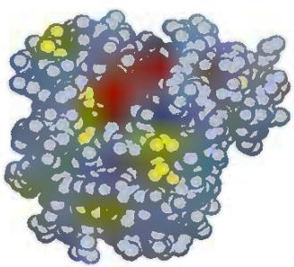  
(d)

for visualizing pockets in the protein where other molecules might bind. (c) Ribbon representation including side chains (yellow) for the hydrophobic residues Leu, Ile, Val, and Phe. (d) Space-filling model with all amino acid side chains. Each atom is represented by a sphere encompassing its van der Waals radius. The hydrophobic residues are again shown in yellow; most are buried in the interior of the protein and thus are not visible. [Data from PDB ID 1MBO, S. E. Phillips, J. Mol. Biol. 142:531, 1980.]  

Deduction of the structure of myoglobin confirmed some expectations and introduced some new elements of secondary structure. As predicted by Pauling and Corey, all the peptide bonds are in the planar trans configuration. The $\alpha$ helices in myoglobin provided the first direct experimental evidence for the existence of this type of secondary structure. Three of the four Pro residues are found at bends. The fourth Pro residue occurs within an $\alpha$ helix, where it creates a kink necessary for tight helix packing.

The flat heme group rests in a crevice, or pocket, in the myoglobin molecule. Within this pocket, the accessibility of the heme group to solvent is highly restricted. This is important for function, because free heme groups in an oxygenated solution are rapidly oxidized from the ferrous $\left(\mathrm{Fe}^{2+}\right)$ form, which is active in the reversible binding of $O_{2}$ , to the ferric $\left(\mathrm{Fe}^{3+}\right)$ form, which does not bind $O_{2}$ . As myoglobin structures from many different species were resolved, investigators were able to observe the structural changes that accompany the binding of oxygen or other molecules and thus, for the first time, to understand the correlation between protein structure and function. Hundreds of proteins have now been subjected to similar analysis.

## Globular Proteins Have a Variety of Tertiary Structures

Myoglobin illustrates just one of many ways in which a polypeptide chain can fold. Table 4-3 shows the proportions of $\alpha$ helix and $\beta$ conformation (expressed as percentage of residues in each type) in several small, single-chain, globular proteins. Each of these proteins has a distinct structure, adapted for its particular biological function, but together they share several important properties with myoglobin. P1 Each is folded compactly, and in each case the hydrophobic amino acid side chains are oriented toward the interior (away from water) and the hydrophilic side chains are on the surface. The structures are also stabilized by a multitude of hydrogen bonds and some ionic interactions.

TABLE 4-3 Approximate Proportion of α Helix and β Conformation in Some Single-Chain Proteins

<table><tr><td rowspan="2">Protein (total residues)</td><td colspan="2">Residues (%)a</td></tr><tr><td>α Helix</td><td>β Conformation</td></tr><tr><td>Chymotrypsin (247)</td><td>14</td><td>45</td></tr><tr><td>Ribonuclease (124)</td><td>26</td><td>35</td></tr><tr><td>Carboxypeptidase (307)</td><td>38</td><td>17</td></tr><tr><td>Cytochrome c (104)</td><td>39</td><td>0</td></tr><tr><td>Lysozyme (129)</td><td>40</td><td>12</td></tr><tr><td>Myoglobin (153)</td><td>78</td><td>0</td></tr></table>

Source: Data from C. R. Cantor and P. R. Schimmel, Biophysical Chemistry, Part I: The Conformation of Biological Macromolecules, p. 100, W. H. Freeman and Company, 1980.  
$^{a}$ Portions of the polypeptide chains not accounted for by $\alpha$ helix or $\beta$ conformation consist of bends and irregularly coiled or extended stretches. Segments of $\alpha$ helix and $\beta$ conformation sometimes deviate slightly from their normal dimensions and geometry.

To understand a complete three-dimensional structure, we need to analyze its folding patterns. We begin by defining two important terms that describe protein structural patterns or elements in a polypeptide chain; then we turn to the folding rules. The first term is motif, also called a fold. P3 A motif or fold is a recognizable folding pattern involving two or more elements of secondary structure and the connection(s) between them. A motif can be very simple, such as two elements of secondary structure folded against each other, and may represent only a small part of a protein. An example is a $\beta$ - $\alpha$ - $\beta$ loop (Fig. 4-16a). A motif can also be a very elaborate structure involving scores of protein segments folded together, such as the $\beta$ barrel (Fig. 4-16b). In some cases, a single large motif may comprise the entire protein. The terms "motif" and "fold" are often used interchangeably, although "fold" is applied more commonly to somewhat more complex folding patterns. The segment defined as a motif or a fold may or may not be independently stable. We have already encountered a well-studied motif, the coiled coil of $\alpha$ -keratin, which is also found in some other proteins. The distinctive arrangement of eight $\alpha$ helices in myoglobin is replicated in all globins and is called the globin fold. Note that a motif is not a hierarchical structural element falling between secondary and tertiary structure. It is simply a folding pattern.

The second term for describing structural patterns is domain. A domain, as defined by Jane Richardson in 1981, is a part of a polypeptide chain that is independently stable or could undergo movements as a single entity with respect to the entire protein. Polypeptides with more than a few hundred amino acid residues often fold into two or more domains, sometimes with different functions. In many cases, a domain from a large protein will retain its native three-dimensional structure even when separated (for example, by proteolytic cleavage) from the remainder of the polypeptide chain. In a protein with multiple domains, each domain may appear as a distinct globular lobe (Fig. 4-17); more commonly, extensive contacts between domains make individual domains hard to discern. Different domains often have distinct functions, such as the binding of small molecules or interaction with other proteins. Small proteins usually have only one domain (the domain is the protein).

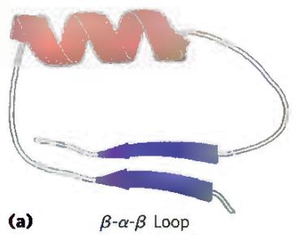

  
FIGURE 4-16 Motifs. (a) A simple motif, the $\beta$ - $\alpha$ - $\beta$ loop. (b) A more elaborate motif, the $\beta$ barrel. This $\beta$ barrel is a single domain of $\alpha$ -hemolysin (a toxin that kills a cell by creating a hole in its membrane) from the bacterium Staphylococcus aureus. [Data from (a) PDB ID 4TIM, M. E. Noble et al., J. Med. Chem., 34:2709, 1991; (b) PDB ID 7AHL, L. Song et al., Science 274:1859, 1996.]

  
FIGURE 4-17 Structural domains in the polypeptide troponin C. This calcium-binding protein, associated with muscle, has two separate calcium-binding domains, shown here in brown and blue. [Data from PDB ID 4TNC, K. A. Satyshur et al., J. Biol. Chem. 263:1628, 1988.]

Folding of polypeptides is subject to an array of physical and chemical constraints, and several rules have emerged from studies of common protein-folding patterns.

1. The hydrophobic effect makes a large contribution to the stability of protein structures. Burial of hydrophobic amino acid R groups so as to exclude water requires at least two layers of secondary structure. Simple motifs such as the $\beta-\alpha-\beta$ loop (Fig. 4-16a) create two such layers.

2. Where they occur together in a protein, $\alpha$ helices and $\beta$ sheets generally are found in different structural layers. This is because the backbone of a polypeptide segment in the $\beta$ conformation (Fig. 4-5) cannot readily hydrogen-bond to an $\alpha$ helix that is adjacent to it.

3. Segments adjacent to each other in the amino acid sequence are usually stacked adjacent to each other in the folded structure. Distant segments of a polypeptide may come together in the tertiary structure, but this is not the norm.

4. The $\beta$ conformation is most stable when the individual segments are twisted slightly in a right-handed sense. This influences both the arrangement of $\beta$ sheets derived from the twisted segments and the path of the polypeptide connections between them. Two parallel $\beta$ strands, for example, must be connected by a crossover strand (Fig. 4-18a). In principle, this crossover could have a right-handed or left-handed conformation, but in proteins it is almost always right-handed. Right-handed connections tend to be shorter than left-handed connections and tend to bend through smaller angles, making them easier to form. The twisting of $\beta$ sheets also leads to a characteristic twisting of the structure formed by many such segments together, as seen in the $\beta$ barrel (Fig. 4-16b) and the twisted $\beta$ sheet (Fig. 4-18c), which form the core of many larger structures.

  
FIGURE 4-18 Stable folding patterns in proteins. (a) Connections between $\beta$ strands in layered $\beta$ sheets. The strands here are viewed from one end, with no twisting. The connections at a given end (e.g., near the viewer) rarely cross one another. An example of such a rare crossover is illustrated by the red strands in the structure on the right. (b) Because of the right-handed twist in $\beta$ strands, connections between strands are generally right-handed. Left-handed connections must traverse sharper angles and are harder to form. (c) This twisted $\beta$ sheet is from a domain of photolyase (a protein that repairs certain types of DNA damage) from $E.$ coli. Connecting loops have been removed so as to focus on the folding of the $\beta$ sheet. [Data from PDB ID 1DNP, H.W. Park et al., Science 268:1866, 1995.]

Following these rules, complex motifs can be built up from simple ones. For example, a series of $\beta-\alpha-\beta$ loops arranged so that the $\beta$ strands form a barrel creates a particularly stable and common motif, the $\alpha/\beta$ barrel (Fig. 4-19). In this structure, each parallel $\beta$ segment is attached to its neighbor by an $\alpha$ -helical segment. All connections are right-handed. The $\alpha/\beta$ barrel is found in many enzymes, often with a binding site (for a cofactor or a substrate) in the form of a pocket near one end of the barrel. Note that domains with similar folding patterns are said to have the same motif, even though their constituent $\alpha$ helices and $\beta$ sheets may differ in length.

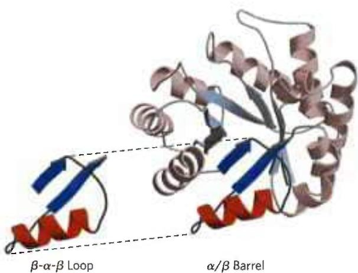  
FIGURE 4-19 Constructing large motifs from smaller ones. The $\alpha/\beta$ barrel is a commonly occurring motif constructed from repetitions of the $\beta$ - $\alpha$ - $\beta$ loop motif. This $\alpha/\beta$ barrel is a domain of pyruvate kinase (a glycolytic enzyme) from rabbit. [Data from PDB ID 1PKN, T. M. Larsen et al., Biochemistry 33:6301, 1994.]

## Some Proteins or Protein Segments Are Intrinsically Disordered

Although many proteins contain well-folded and stable structures, this is not necessary for the biological function of all proteins. Many proteins or protein segments lack ordered structures in solution. The concept that some proteins function in the absence of a definable three-dimensional structure comes from reassessment of data from many different proteins. As many as a third of all human proteins may be unstructured or may have significant unstructured segments. All organisms have some proteins that fall into this category. Intrinsically disordered proteins have properties that are distinct from those of classical, structured proteins. They often lack a hydrophobic core and instead are characterized by high densities of charged amino acid residues such as Lys, Arg, and Glu. Pro residues are also prominent, as they tend to disrupt ordered structures.

Structural disorder and high charge density can facilitate the function of some proteins as spacers, insulators, or linkers in larger structures. Other disordered proteins are scavengers, binding up ions and small molecules in solution and serving as reservoirs or garbage dumps. However, many intrinsically disordered proteins are at the heart of important protein interaction networks. The lack of an ordered structure can facilitate a kind of functional promiscuity, allowing one protein to interact with multiple or even dozens of partners. Structural disorder allows some inhibitor proteins, such as the mammalian cell division protein p27, to interact with multiple targets in different ways. In solution, p27 lacks definable structure. However, it wraps around and inhibits the action of several enzymes called protein kinases (see Chapter 6) that facilitate cell division. The flexible structure of p27 allows it to accommodate itself to its different target proteins. Human tumor cells, which are cells that have lost the capacity to control cell division normally, generally have reduced levels of p27; the lower the levels of p27, the poorer the prognosis for the cancer patient.

Similarly, intrinsically disordered proteins are often present as hubs or scaffolds at the center of protein networks that constitute signaling pathways (see Fig. 12-30). These proteins, or parts of them, may interact with many different binding partners. They often take on an ordered structure when they interact with other proteins, but the structure they assume may vary with different binding partners. The mammalian protein p53 is also critical in the control of cell division. It contains both structured and unstructured segments, and the different segments interact with dozens of other proteins. An unstructured region of p53 at the carboxyl terminus interacts with at least four different binding partners and assumes a different structure in each of the complexes (Fig. 4-20).

## Protein Motifs Are the Basis for Protein Structural Classification

More than 150,000 structures are now archived in the Protein Data Bank (PDB; for a deeper explanation, see Box 4-3). An enormous amount of information about protein structural principles, protein function, and protein evolution is contained in these data. Other databases have organized this information and made it more readily accessible. In the Structural Classification of Proteins database, or SCOP2 (http://scop2.mrc-lmb.cam.ac.uk), all of the protein information in the PDB can be searched within four different categories: (1) protein relationships, (2) structural classes, (3) protein types, and (4) evolutionary events. Figure 4-21 presents examples of protein motifs taken from SCOP2 to illustrate the potential of searching within each category. The figure also introduces another way to represent elements of secondary structure and the relationships among segments of secondary structure in a protein—the topology diagram.

The number of folding patterns is not infinite. Among the tens of thousands of distinct protein structures archived in the PDB, only about 1,400 different folds or motifs are classified by the SCOP2 database. Given the many years of progress in structural biology, new motifs are now discovered only rarely. Many examples of recurring domain or motif structures are available, and these reveal that protein tertiary structure is more reliably conserved than amino acid sequence. The comparison of protein structures can thus provide much information about evolution. Proteins with significant similarity in primary structure and/or with similar tertiary structure and function are said to be in the same protein family. The protein structures in the PDB belong to about 4,000 different protein families. A strong evolutionary relationship is usually evident within a protein family. For example, the globin family has many different proteins with both structural and sequence similarities to myoglobin (as seen in the proteins used as examples in Figures 4-30 and 4-31 and in Chapter 5). Two or more families that have little similarity in amino acid sequence but make use of the same major structural motif and have functional similarities are grouped into superfamilies. An evolutionary relationship among families in a superfamily is considered probable, even though time and functional distinctions—that is, different adaptive pressures—may have erased many of the telltale sequence relationships.

  
FIGURE 4-20 Binding of the intrinsically disordered carboxyl terminus of p53 protein to its binding partners. (a) The p53 protein is made up of several different segments. Only the central domain is well ordered. (b) The linear sequence of the p53 protein is depicted as a colored bar. The overlaid graph presents a plot of the PONDR (Predictor of Natural Disordered Regions) score versus the protein sequence. PONDR is one of the best available algorithms for predicting the likelihood that a given amino acid residue is in a region of intrinsic disorder, based on the surrounding amino acid sequence and amino acid composition. A score of 1.0 indicates a probability of $100\%$ that a protein will be disordered. In the actual protein structure, the tan central domain is ordered.  
The amino-terminal (blue) and carboxyl-terminal (red) regions are disordered. (c) The very end of the carboxyl-terminal region has multiple binding partners and folds when it binds to each of them; however, the three-dimensional structure that is assumed when binding occurs is different for each of the interactions shown, and thus this carboxyl-terminal segment (11 to 20 residues) is shown in a different color in each complex. [Information from V. N. Uversky, Intl. J. Biochem. Cell Biol. 43:1090, 2011, Fig. S. (a) Data from PDB ID 1TUP, Y. Cho et al., Science 265:346, 1994. (c) Data from Cyclin A: PDB ID 1H26, E. D. Lowe et al., Biochemistry 41:15,625, 2002; sirtuin: PDB ID 1MA3, J. L. Avalos et al., Mol. Cell 10:523, 2002; CBP bromodomain: PDB ID 1JSP, S. Mujtaba et al., Mol. Cell 13:251, 2004; s100B(ββ): PDB ID 1DT7, R. R. Rustandi et al., Nature Struct. Biol. 7:570, 2000.]

A protein family may be widespread in all three domains of cellular life—the Bacteria, Archaea, and Eukarya—suggesting an ancient origin. Many proteins involved in intermediary metabolism and the metabolism of nucleic acids and proteins fall into this category. Other families may be present in only a small group of organisms, indicating that the structure arose more recently. Tracing the natural history of structural motifs through the use of structural classifications in databases such as SCOP2 provides a powerful complement to sequence analyses in tracing evolutionary relationships. The SCOP2 database is curated manually, with the objective of placing proteins in the correct evolutionary framework based on conserved structural features.

Structural motifs become especially important in defining protein families and superfamilies. Improved protein classification and comparison systems lead inevitably to the elucidation of new functional relationships. Given the central role of proteins in living systems, these structural comparisons can help illuminate every aspect of biochemistry, from the evolution of individual proteins to the evolutionary history of complete metabolic pathways.

## Protein Quaternary Structures Range from Simple Dimers to Large Complexes

P3 Many proteins have multiple polypeptide subunits (from two to hundreds). The association of polypeptide chains can serve a variety of functions. Many multisubunit proteins have regulatory roles; the binding of small molecules may affect the interaction between subunits, causing large changes in the protein's activity in response to small changes in the concentration of substrate or regulatory molecules (Chapter 6). In other cases, separate subunits take on separate but related functions, such as catalysis and regulation. Some associations, such as those seen in the fibrous proteins considered earlier in this chapter and the coat proteins of viruses, serve primarily structural roles. Some very large protein assemblies are the site of complex, multistep reactions. For example, each ribosome, the site of protein synthesis, incorporates dozens of protein subunits along with RNA molecules.

(c)  
  
2JHF
Alcohol dehydrogenase
Equus caballus
Horse  
1F8F
Alcohol dehydrogenase
Acinetobacter calcoaceticus
Bacterium found in
human intestinal microbiota

(a)  
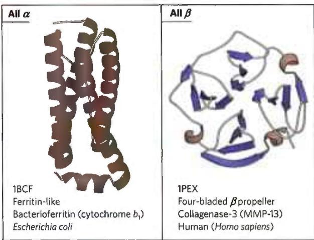  
1BCF
Ferritin-like
Bacterioferritin (cytochrome $b_{1}$ )
Escherichia coli  
1PEX
Four-bladed $\beta$ propeller
Collagenase-3 (MMP-13)
Human (Homo sapiens)

A multisubunit protein can also be referred to as an oligomer or multimer. If an oligomer has nonidentical subunits, the overall structure of the protein can be asymmetric and quite complicated. However, many oligomers have identical subunits or repeating groups of nonidentical subunits, usually in symmetric arrangements. As noted in Chapter 3, the repeating structural unit in such an oligomeric protein, whether a single subunit or a group of subunits, is called a protomer.

  
FIGURE 4-21 Organization of proteins based on motifs. A few of the hundreds of known stable motifs. (a) Structural diagrams of the enzyme alcohol dehydrogenase from two different organisms. Such comparisons illustrate evolutionary relationships that conserve structure as well as function. (b) A topology diagram for the alcohol dehydrogenase from Acinetobacter calcoaceticus. Topology diagrams provide a way to visualize elements of secondary structure and their interconnections in two dimensions; the diagrams can be very useful in comparing structural folds or motifs. (c) The Structural Classification of Proteins (SCOP2) database (http://scop2.mrc-lmb.cam.ac.uk) organizes protein folds into four classes: all $\alpha$ , all $\beta, \alpha/\beta$ , and $\alpha + \beta$ . Examples of all $\alpha$ folds and all $\beta$ folds are shown with their structural classification data (PDB ID, fold name, protein name, and source organism) from the SCOP2 database. The PDB ID is the unique accession code given to each structure archived in the Protein Data Bank (www.rcsb.org). [Data from (a) PDB ID 2JHF, R. Meijers et al., Biochemistry 46:5446, 2007; (a, b) PDB ID 1F8F, J. C. Beauchamp et al. (c) PDB ID 18CF, F. Frolow et al., Nature Struct. Biol. 1:453, 1994; PDB ID 1PEX, F. X. Gomis-Ruth et al., J. Mol. Biol. 264:556, 1996.]

The first oligomeric protein to have its three-dimensional structure determined was hemoglobin ( $M_{r}$ 64,500), which contains four polypeptide chains and four heme prosthetic groups, in which the iron atoms are in the ferrous ( $Fe^{2+}$ ) state (as we shall see in Chapter 5). The protein portion, the globin, consists of two $\alpha$ chains (141 residues each) and two $\beta$ chains (146 residues each). Note that in this case, $\alpha$ and $\beta$ do not refer to secondary structures. In a practice that can be confusing to the beginning student, the Greek letters $\alpha$ and $\beta$ (and $\gamma,\delta$ , and others) are often used to distinguish two different kinds of subunits within a multisubunit protein, regardless of what kinds of secondary structure may predominate in the subunits. Because hemoglobin is four times as large as myoglobin, much more time and effort were required to solve its three-dimensional structure by x-ray analysis, finally achieved by Max Perutz, John Kendrew, and their colleagues in 1959. The subunits of hemoglobin are arranged in symmetric pairs (Fig. 4-22), each pair having one $\alpha$ subunit and one $\beta$ subunit.

  
FIGURE 4-22 Quaternary structure of deoxyhemoglobin. X-ray diffraction analysis of deoxyhemoglobin (hemoglobin without oxygen molecules bound to the heme groups) shows how the four polypeptide subunits are packed together. (a) A ribbon representation reveals the secondary structural elements of the structure and the positioning of all the heme prosthetic groups.

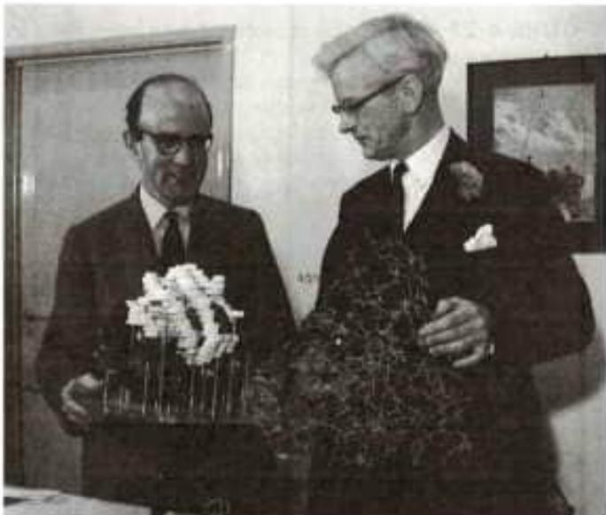  
Max Perutz, 1914–2002 (left), and John Kendrew, 1917–1997 [Hulton Deutsch/Getty Images.]

Hemoglobin can therefore be described either as a tetramer or as a dimer of $\alpha\beta$ protomers. The role these distinct subunits play in hemoglobin function is discussed extensively in Chapter 5.

## SUMMARY 4.3 Protein Tertiary and Quaternary Structures

■ Tertiary structure is the complete three-dimensional structure of a polypeptide chain. Many proteins fall into one of four general classes based on tertiary structure: fibrous, globular, membrane, or disordered.

■ Insoluble fibrous proteins, such as those that make up keratin, collagen, and silk, have simple repeating elements of secondary structure. In some fibrous proteins, the individual polypeptide chains interact to form complex quaternary structures like coiled coils for strength and flexibility.

  
(b) A surface contour model shows the pockets in which the heme prosthetic groups are bound and helps to visualize subunit packing. The $\alpha$ subunits are shown in shades of gray, the $\beta$ subunits in shades of blue. Note that the heme groups (red) are relatively far apart. [Data from PD8 ID 2HHB, G. Fermi et al., J. Mol. Biol. 175:159, 1984.]

■ Globular proteins have more complicated tertiary structures, often containing several types of secondary structure in the same polypeptide chain, and fulfill many different functional roles in the cell.

The first globular protein structure to be determined, by x-ray diffraction methods, was that of the $\mathrm{O}_2$ -binding protein myoglobin. The myoglobin structure revealed for the first time how protein structure and function are connected.

The complex structures of globular proteins can be analyzed by examination of folding patterns, called motifs or folds. The many thousands of known protein structures are generally assembled from a repertoire of only a few hundred motifs. Domains are regions of a polypeptide chain that can fold stably and independently.

■ Some proteins or protein segments are intrinsically disordered, lacking definable three-dimensional structure. These proteins often have distinctive amino acid compositions that allow a more flexible structure, which is critical for their biological function.

■ Based on structural similarities, proteins can be organized into families and superfamilies, which are informative about protein function and evolution.

■ Quaternary structure results from interactions between the subunits of multisubunit (multimeric) proteins or large supramolecular assemblies. Some multimeric proteins are composed of repeated subunits called protomers.

## 4.4 Protein Denaturation and Folding

Proteins lead a surprisingly precarious existence. As we have seen, a native protein conformation is only marginally stable. In addition, most proteins must maintain conformational flexibility in order to function. P4 The continual maintenance of the active set of cellular proteins required under a given set of conditions is called proteostasis. Cellular proteostasis requires the coordinated function of pathways for protein synthesis and folding, the refolding of proteins that are partially unfolded, and the sequestration and degradation of proteins that have been irreversibly unfolded or are no longer needed. In all cells, these networks involve hundreds of enzymes and specialized proteins.

As seen in Figure 4-23, the life of a protein encompasses much more than its synthesis and later degradation. The marginal stability of most proteins can produce a tenuous balance between folded and unfolded states. As proteins are synthesized on ribosomes (Chapter 27), they must fold into their native conformations. Sometimes this occurs spontaneously, but often it requires the assistance of specialized enzymes and complexes called chaperones, which we discuss later in the chapter. Many of these same folding helpers function to refold proteins that become transiently unfolded. Proteins that are not properly folded often have exposed hydrophobic surfaces that render them "sticky," leading to the formation of inactive aggregates. These aggregates may lack their normal function but are not inert; their accumulation in cells lies at the heart of diseases ranging from diabetes to Parkinson disease and Alzheimer disease. Not surprisingly, all cells have elaborate pathways for recycling and/or degrading proteins that are irreversibly misfolded.

  
FIGURE 4-23 Pathways that contribute to proteostasis. Three kinds of processes contribute to proteostasis, in some cases with multiple contributing pathways. First, proteins are synthesized on a ribosome. Second, various pathways contribute to protein folding, many of which involve the activity of complexes called chaperones. Chaperones (including chaperonins) also contribute to the refolding of proteins that are partially and transiently unfolded. Finally, proteins that are irreversibly unfolded are subject to sequestration and degradation by several additional pathways. Partially unfolded proteins and protein-folding intermediates that escape the quality-control activities of the chaperones and degradative pathways may aggregate, forming both disordered aggregates and ordered amyloidlike aggregates that contribute to disease and aging processes. [Information from F. U. Hartl et al., Nature 475:324, 2011, Fig. 6.]

The transitions between the folded and unfolded states, and the network of pathways that control these transitions, now become our focus.

## Loss of Protein Structure Results in Loss of Function

Protein structures have evolved to function in particular cellular or extracellular environments. Conditions different from these environments can result in protein structural changes, large and small. A loss of three-dimensional structure sufficient to cause loss of function is called denaturation. The denatured state does not necessarily equate with complete unfolding of the protein and randomization of conformation. Under most conditions, denatured proteins exist in a set of partially folded states.

Most proteins can be denatured by heat, which has complex effects on many weak interactions in a protein (primarily on the hydrogen bonds). If the temperature is increased slowly, a protein's conformation generally remains intact until an abrupt loss of structure (and function) occurs over a narrow temperature range (Fig. 4-24). The abruptness of the change suggests that unfolding is a cooperative process: loss of structure in one part of the protein destabilizes other parts. The effects of heat on proteins can be mitigated by structure. The very heat-stable proteins of thermophilic bacteria and archaea have evolved to function at the temperature of hot springs (\~100 °C). The folded structures of these proteins are often similar to those of proteins in other organisms, but take some of the principles outlined here to extremes. They often feature high densities of charged residues on their surfaces, even tighter hydrophobic packing in their interiors, and folds rendered less flexible by networks of ion pairs. Each of these features makes these proteins less susceptible to unfolding at high temperatures.

Proteins can also be denatured by extremes of pH, by certain miscible organic solvents such as alcohol or acetone, by certain solutes such as urea and guanidine hydrochloride, or by detergents. Each of these denaturing agents represents a relatively mild treatment in the sense that no covalent bonds in the polypeptide chain are broken. Organic solvents, urea, and detergents act primarily by disrupting the hydrophobic aggregation of nonpolar amino acid side chains that produces the stable core of globular proteins; urea also disrupts hydrogen bonds; and extremes of pH alter the net charge on a protein, causing electrostatic repulsion and the disruption of some hydrogen bonding. The denatured structures resulting from these various treatments are not necessarily the same.

  
FIGURE 4-24 Protein denaturation. Results are shown for proteins denatured by two different environmental changes. In each case, the transition from the folded state to the unfolded state is abrupt, suggesting cooperativity in the unfolding process. (a) Thermal denaturation of horse apomyoglobin (myoglobin without the heme prosthetic group) and ribonuclease A (with its disulfide bonds intact; see Fig. 4-26). The midpoint of the temperature range over which denaturation occurs is called the melting temperature, or $T_{\mathrm{m}}$ . Denaturation of apomyoglobin was monitored by

Denaturation often leads to protein precipitation, a consequence of protein aggregate formation as exposed hydrophobic surfaces associate. The aggregates are often highly disordered. One example is the protein precipitate that can be seen after an egg white is boiled. More-ordered aggregates are also observed in some proteins, as we shall see.

## Amino Acid Sequence Determines Tertiary Structure

P4 The tertiary structure of a globular protein is determined by its amino acid sequence. The most important proof of this came from experiments showing that denaturation of some proteins is reversible. Certain globular proteins denatured by heat, extremes of pH, or denaturing reagents will regain their native structure and their biological activity if they are returned to conditions in which the native conformation is stable. This process is called renaturation.

A classic example is the denaturation and renaturation of ribonuclease A, demonstrated by Christian Anfinsen in the 1950s. Purified ribonuclease A denatures completely in a concentrated urea solution in the presence of a reducing agent. The reducing agent cleaves the four disulfide bonds to yield eight Cys residues, and the urea disrupts the stabilizing hydrophobic effect, thus freeing the entire polypeptide from its folded conformation. Denaturation of ribonuclease is accompanied by a complete loss of catalytic activity. When the urea and the reducing agent are removed, the denatured ribonuclease spontaneously refolds into its correct tertiary structure, with full restoration of its catalytic activity (Fig. 4-25). The refolding of ribonuclease is so accurate that the four intrachain disulfide bonds are re-formed in the same positions in the renatured molecule as in the native ribonuclease. Later, similar results were obtained using chemically synthesized, catalytically active ribonuclease A. This eliminated the possibility that some minor contaminant in Anfinsen's purified ribonuclease preparation might have contributed to renaturation of the enzyme, and thus it dispelled any remaining doubt that this enzyme folds spontaneously.

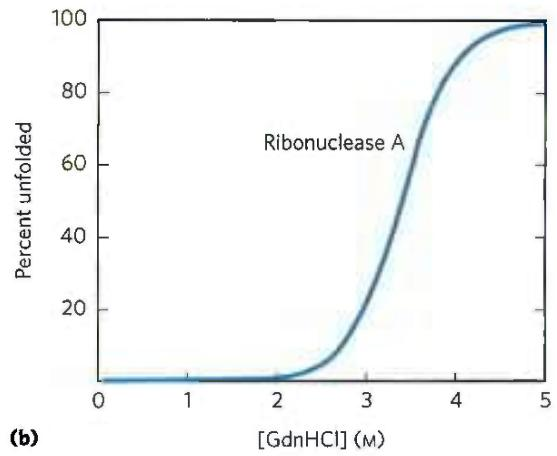  
circular dichroism (see Fig. 4-9), which measures the amount of helical structure in the protein. Denaturation of ribonuclease A was tracked by monitoring changes in the intrinsic fluorescence of the protein, which is affected by changes in the environment of a Trp residue introduced by mutation. (b) Denaturation of disulfide-intact ribonuclease A by guanidine hydrochloride (GdnHCl), monitored by circular dichroism. [Data from (a) R. A. Sendak et al., Biochemistry 35:12,978, 1996; I. Nishii et al., J. Mol. Biol. 250:223, 1995; (b) W. A. Houry et al., Biochemistry 35:10,125, 1996.]

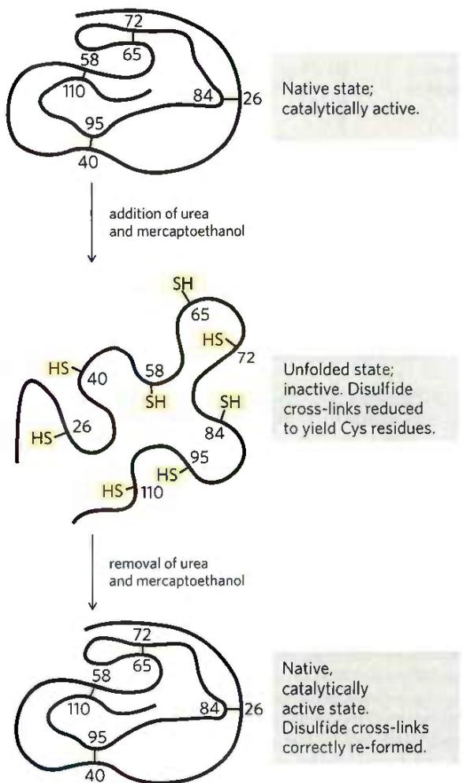  
FIGURE 4-25 Renaturation of unfolded, denatured ribonuclease. Urea denatures the ribonuclease, and mercaptoethanol (HOCH₂CH₂SH) reduces and thus cleaves the disulfide bonds to yield eight Cys residues. Renaturation involves reestablishing the correct disulfide cross-links.

The Anfinsen experiment provided the first evidence that the amino acid sequence of a polypeptide chain contains all the information required to fold the chain into its native, three-dimensional structure. Subsequent work has shown that only a minority of proteins, many of them small and inherently stable, will fold spontaneously into their native form. Even though all proteins have the potential to fold into their native structure, many require some assistance.

## Polypeptides Fold Rapidly by a Stepwise Process

In living cells, proteins are assembled from amino acids at a very high rate. For example, E. coli cells can make a complete, biologically active protein molecule containing 100 amino acid residues in about 5 seconds at 37 °C. However, the synthesis of peptide bonds on the ribosome is not enough; the protein must fold.

How does the polypeptide chain arrive at its native conformation? Let's assume conservatively that each of the amino acid residues could take up 10 different conformations on average, giving $10^{100}$ different conformations for the polypeptide. Let's also assume that the protein folds spontaneously by a random process in which it tries out all possible conformations around every single bond in its backbone until it finds its native, biologically active form. If each conformation were sampled in the shortest possible time ( $\sim 10^{-13}$ second, or the time required for a single molecular vibration), it would take about $10^{77}$ years to sample all possible conformations! Clearly, protein folding is not a completely random, trial-and-error process. There must be shortcuts. This problem was first pointed out by Cyrus Levinthal in 1968 and is sometimes called Levinthal's paradox.

The folding pathway of a large polypeptide chain is unquestionably complicated. However, robust algorithms can often predict the structure of smaller proteins on the basis of their amino acid sequences. The major folding pathways are hierarchical. Local secondary structures form first. Certain amino acid sequences fold readily into $\alpha$ helices or $\beta$ sheets, guided by constraints such as those reviewed in our discussion of secondary structure. Ionic interactions, involving charged groups that are often near one another in the linear sequence of the polypeptide chain, can play an important role in guiding these early folding steps. Assembly of local structures is followed by longer-range interactions between, say, two elements of secondary structure that come together to form stable folded structures. The hydrophobic effect

Amino acid sequence of a 56 residue peptide

  
FIGURE 4-26 A protein-folding pathway as defined for a small protein. A hierarchical pathway is shown, based on computer modeling. Small regions of secondary structure are assembled first and then gradually incorporated into larger structures. The program used for this model has been highly successful in predicting the three-dimensional structure of small proteins from their amino acid sequence. The numbers indicate the amino acid residues in this 56 residue peptide that have acquired their final structure in each of the steps shown. [Information from K. A. Dill et al., Annu. Rev. Biophys. 37:289, 2008, Fig. 5.]

plays a significant role throughout the process, as the aggregation of nonpolar amino acid side chains provides an entropic stabilization to intermediates and, eventually, to the final folded structure. The process continues until complete domains form and the entire polypeptide is folded (Fig. 4-26). Notably, proteins dominated by close-range interactions (between pairs of residues generally located near each other in the polypeptide sequence) tend to fold faster than proteins with more complex folding patterns and with many long-range interactions between different segments. As larger proteins with multiple domains are synthesized, domains near the amino terminus (which are synthesized first) may fold before the entire polypeptide has been assembled.

Thermodynamically, the folding process can be viewed as a kind of free-energy funnel (Fig. 4-27). The unfolded states are characterized by a high degree of conformational entropy and relatively high free energy. As folding proceeds, the narrowing of the funnel reflects the decrease in the conformational space that must be searched as the protein approaches its native state. Small depressions along the sides of the free-energy funnel represent semistable intermediates that can briefly slow the folding process. At the bottom of the funnel, an ensemble of folding intermediates has been reduced to a single native conformation (or one of a small set of native conformations). The funnels can have a variety of shapes, depending on the complexity of the folding pathway, the existence of semistable intermediates, and the potential for particular intermediates to assemble into aggregates of misfolded proteins.

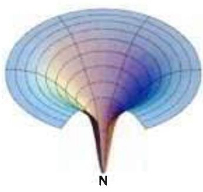

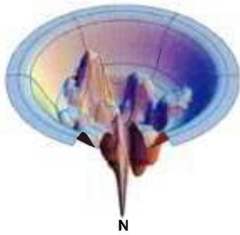  
(a)  
(b)  
FIGURE 4-27 The thermodynamics of protein folding depicted as free-energy funnels. As proteins fold, the conformational space that can be explored by the structure is constrained. This is modeled as a three-dimensional thermodynamic funnel, with $\Delta G$ represented by the depth of the funnel and the native structure (N) at the bottom (lowest free-energy point). The funnel for a given protein can have a variety of shapes, depending on the number and types of folding intermediates in the folding pathways. Any folding intermediate with significant stability and a finite lifetime would be represented as a local free-energy minimum—a depression on the surface of the funnel. (a) A simple but relatively wide and smooth funnel represents a protein that has multiple folding pathways (that is, the order in which different parts of the protein fold is somewhat random), but it assumes its three-dimensional structure with no folding intermediates that have significant stability. (b) This funnel represents a more typical protein that has multiple possible folding intermediates with significant stability on the multiple pathways leading to the native structure. [Information from K. A. Dill et al., Annu. Rev. Biophys. 37:289, 2008, Fig. 9.]

Thermodynamic stability is not evenly distributed over the structure of a protein—the molecule has regions of relatively high stability and others of low or negligible stability. For example, a protein may have two stable domains joined by a segment that is entirely disordered. Regions of low stability may allow a protein to alter its conformation between two or more states. As we shall see in the next two chapters, variations in the stability of regions within a protein are often essential to protein function. Intrinsically disordered proteins or protein segments do not fold at all.

## Some Proteins Undergo Assisted Folding

Not all proteins fold spontaneously as they are synthesized in the cell. Folding for many proteins requires chaperones, proteins that interact with partially folded or improperly folded polypeptides, facilitating correct folding pathways or providing microenvironments in which folding can occur. Several types of molecular chaperones are found in organisms ranging from bacteria to humans. Two major families of chaperones, both well studied, are the Hsp70 family and the chaperonins.

Proteins in the Hsp70 family generally have a molecular weight near 70,000 and are more abundant in cells stressed by elevated temperatures (hence, heat shock proteins of $M_{r}$ 70,000, or Hsp70). Hsp70 proteins bind to regions of unfolded polypeptides that are rich in hydrophobic residues. These chaperones thus “protect” both proteins subject to denaturation by heat and new peptide molecules being synthesized (and not yet folded). Hsp70 proteins also block the folding of certain proteins that must remain unfolded until they have been translocated across a membrane (as described in Chapter 27). Some chaperones also facilitate the quaternary assembly of oligomeric proteins. The Hsp70 proteins bind to and release polypeptides in a cycle that uses energy from ATP hydrolysis and involves several other proteins (including a class called Hsp40). Figure 4-28 illustrates chaperone-assisted folding as elucidated for the eukaryotic Hsp70 and Hsp40 chaperones. The binding of an unfolded polypeptide by an Hsp70 chaperone may break up a protein aggregate or prevent the formation of a new one. When the bound polypeptide is released, it has a chance to resume folding to its native structure. If folding does not occur rapidly enough, the polypeptide may be bound again and the process repeated. Alternatively, the Hsp70-bound polypeptide may be delivered to a chaperonin.

  
FIGURE 4-28 Chaperones in protein folding. The pathway by which chaperones of the Hsp70 class bind and release polypeptides is illustrated for the eukaryotic chaperones Hsp70 and Hsp40. The chaperones do not actively promote the folding of the substrate protein, but instead prevent aggregation of unfolded peptides. The unfolded or partly folded proteins bind first to the open, ATP-bound form of Hsp70. Hsp40 then interacts with this complex and triggers ATP hydrolysis that produces the closed form of the complex, in which the domains colored orange and yellow come together like the two parts of a jaw, trapping parts of the unfolded protein inside. Dissociation of ADP and recycling of the Hsp70 requires interaction with another type of protein called a nucleotide-exchange factor (NEF). For a population of polypeptide molecules, some fraction of the molecules released after the transient binding of partially folded proteins by Hsp70 will take up the native conformation. The remainder are quickly rebound by Hsp70 or diverted to the chaperonin system. [Information from F. U. Hartl et al., Nature 475:324, 2011, Fig. 2. Open Hsp70-ATP: PDB ID 2QXL, Q. Liu and W. A. Hendrickson, Cell 131:106, 2007. Closed Hsp70-ADP: Data from PDB ID 2KHO, E. B. Bertelson et al., Proc. Natl. Acad. Sci. USA 106:8471, 2009, and PDB ID 1DKZ, X. Zhu et al., Science 272:1606, 1996.]

(c) Amyloid fibrils  
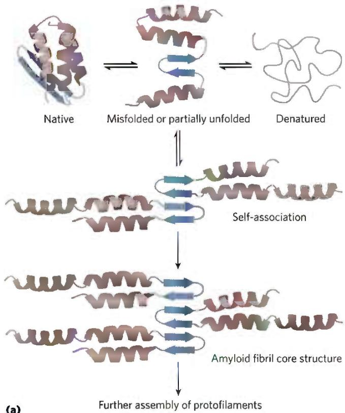

Chaperonins are elaborate protein complexes required for the folding of some cellular proteins that do not fold spontaneously. In E. coli, an estimated 10% to 15% of cellular proteins require the resident chaperonin system, called GroEL/GroES, for folding under normal conditions (up to 30% require this assistance when the cells are heat stressed). The analogous chaperonin system in eukaryotes is called Hsp60. The chaperonins first became known when they were found to be necessary for the growth of certain bacterial viruses (hence the designation "Gro"). These chaperone proteins are structured as a series of multisubunit rings, forming two chambers oriented back to back. Inside one of the chambers, a protein is given about 10 seconds to fold. Constraining a protein within the chamber prevents inappropriate protein aggregation and also restricts the conformational space that a polypeptide chain can explore as it folds. The GroEL/GroES folding pathway is discussed in Chapter 27.

Finally, the folding pathways of some proteins require two enzymes that catalyze isomerization reactions. Protein disulfide isomerase (PDI) is a widely distributed enzyme that catalyzes the interchange, or shuffling, of disulfide bonds until the bonds of the native conformation are formed. Among its functions, PDI catalyzes the elimination of folding intermediates with inappropriate disulfide cross-links. Peptide prolyl cis-trans isomerase (PPI) catalyzes the interconversion of the cis and trans isomers of peptide bonds formed by Pro residues (Fig. 4-7), which can be a slow step in the folding of proteins that contain some Pro peptide bonds in the cis configuration.

## Defects in Protein Folding Are the Molecular Basis for Many Human Genetic Disorders

Protein misfolding is a substantial problem in all cells. Despite the many processes that assist in protein folding, a quarter or more of all polypeptides synthesized may be destroyed because they do not fold correctly. P4 In some cases, the misfolding causes or contributes to the development of serious disease.

Many conditions, including type 2 diabetes, Alzheimer disease, Huntington disease, and Parkinson disease, are associated with a misfolding mechanism: a soluble protein that is normally secreted from the cell is secreted in a misfolded state and converted into an insoluble extracellular amyloid fiber. The diseases are collectively referred to as amyloidoses. The fibers are highly ordered and unbranched, with a diameter of 7 to

10 nm and a high degree of $\beta$ -sheet structure. The $\beta$ segments are oriented perpendicular to the axis of the fiber. In some amyloid fibers the overall structure includes two layers of $\beta$ sheet, such as that shown for amyloid- $\beta$ peptide in Figure 4-29.

(a)  

  
(b) Amyloid- $\beta$ peptide  
FIGURE 4-29 Formation of disease-causing amyloid fibrils. (a) Protein molecules whose normal structure includes regions of $\beta$ sheet undergo partial folding. In a small number of the molecules, before folding is complete, the $\beta$ -sheet regions of one polypeptide associate with the same region in another polypeptide, forming the nucleus of an amyloid. Additional protein molecules slowly associate with the amyloid and extend it to form a fibril. (b) The amyloid- $\beta$ peptide begins as two $\alpha$ -helical segments of a larger protein. Proteolytic cleavage of this larger protein leaves the relatively unstable amyloid- $\beta$ peptide, which loses its $\alpha$ -helical structure. It can then assemble slowly into amyloid fibrils (c), which contribute to the characteristic plaques on the exterior of nervous tissue in people with Alzheimer disease. The aromatic side chains shown here play a significant role in stabilizing the amyloid structure. Amyloid is rich in $\beta$ sheet structure, with the $\beta$ strands arranged perpendicular to the axis of the amyloid fibril. Amyloid- $\beta$ peptide takes the form of two layers of extended parallel $\beta$ sheet. [(a) Information from D. J. Selkoe, Nature 426:900, 2003, Fig. I. (b) Data from PDB ID 1IYT, O. Crescenzi et al., Eur. J. Biochem. 269:5642, 2002. (c) Data from PDB ID 2BEG, T. Lührs et al., Proc. Natl. Acad. Sci. USA 102:17,342, 2005.]

## Death by Misfolding: The Prion Diseases

A misfolded brain protein seems to be the causative agent of several rare degenerative brain diseases in mammals. Perhaps the best known of these is bovine spongiform encephalopathy (BSE; also known as mad cow disease). Related diseases include kuru and Creutzfeldt-Jakob disease in humans, scrapie in sheep, and chronic wasting disease in deer and elk. These diseases are also referred to as spongiform encephalopathies, because the diseased brain frequently becomes riddled with holes (Fig. 1). Progressive deterioration of the brain leads to a spectrum of neurological symptoms, including weight loss; erratic behavior; problems with posture, balance, and coordination; and loss of cognitive function. The diseases are fatal.

(a)  
(b)  
  
FIGURE 1 (a) Light micrograph of pyramidal cells in the human cerebral cortex. (b) A comparable section from the autopsy of a patient with Creutzfeldt-Jakob disease shows spongiform (vacuolar) degeneration, the most characteristic neurohistological feature. The yellowish

Many proteins can take on the amyloid fibril structure as an alternative to their normal folded conformations, and most of these proteins have a concentration of aromatic amino acid residues in a core region of $\beta$ sheet or $\alpha$ helix. The proteins are secreted in an incompletely folded conformation. The core (or some part of it) folds into a $\beta$ sheet before the rest of the protein folds correctly, and the $\beta$ sheets of two or more incompletely folded protein molecules associate to begin forming an amyloid fibril. The fibril grows in the extracellular space. Other parts of the protein then fold differently, remaining on the outside of the $\beta$ -sheet core in the growing fibril. The effect of aromatic residues in stabilizing the structure is shown in Figure 4-29c. Because most of the protein molecules fold normally, the onset of symptoms in the amyloidoses is often very slow. If a person inherits a mutation such as substitution with an aromatic residue at a position that favors formation of amyloid fibrils, disease symptoms may begin at an earlier age.

In the 1960s, investigators found that preparations of the disease-causing agents seemed to lack nucleic acids. At this time, Tikvah Alper suggested that the agent was a protein. Initially, the idea seemed heretical. All disease-causing agents known up to that time—viruses, bacteria, fungi, and so on—contained nucleic acids, and their virulence was related to genetic reproduction and propagation. However, four decades of investigations, pursued most notably by Stanley Prusiner, have provided evidence that spongiform encephalopathies are different.

The infectious agent has been traced to a single protein ( $M_{r}$ 28,000), which Prusiner dubbed prion protein (PrP). The name was derived from proteinaceous infectious, but

  
vacuoles are intracellular and occur mostly in pre- and postsynaptic processes of neurons. The vacuoles in this section vary in diameter from 20 to 100 $\mu$ m. [(a) Science Stock Photography/Science Source (b) Ralph C. Eagle, Jr./Science Source.]

The amyloid deposition diseases that trigger neurodegeneration, particularly in older adults, are a special class of localized amyloidoses. Alzheimer disease is associated with extracellular amyloid deposition by neurons, involving the amyloid- $\beta$ peptide (Fig. 4-29b), derived from a larger transmembrane protein (amyloid- $\beta$ precursor protein) found in most human tissues. When it is part of the larger protein, the peptide is composed of two $\alpha$ -helical segments spanning the membrane. When the external and internal domains are cleaved off by specific proteases, the relatively unstable amyloid- $\beta$ peptide leaves the membrane and loses its $\alpha$ -helical structure. It can then take the form of two layers of extended parallel $\beta$ sheet, which can slowly assemble into amyloid fibrils (Fig. 4-29c). Deposits of these amyloid fibers seem to be the primary cause of Alzheimer disease, but a second type of amyloidlike aggregation, involving a protein called tau, also occurs intracellularly (in neurons) in people with Alzheimer disease. Inherited mutations in

Prusiner thought that "prion" sounded better than "proin." Prion protein is a normal constituent of brain tissue in all mammals. Its role is not known in detail, but it may have a molecular signaling function. Strains of mice lacking the gene for PrP (and thus the protein itself) suffer no obvious ill effects. Illness occurs only when the normal cellular PrP, or $\mathrm{PrP}^{\mathrm{C}}$ , occurs in an altered conformation called $\mathrm{PrP}^{\mathrm{Sc}}$ (Sc denotes scrapie). The structure of $\mathrm{PrP}^{\mathrm{C}}$ has two $\alpha$ helices. The structure of $\mathrm{PrP}^{\mathrm{Sc}}$ is very different, with much of the structure converted to amyloid-like $\beta$ sheets (Fig. 2). The interaction of $\mathrm{PrP}^{\mathrm{Sc}}$ with $\mathrm{PrP}^{\mathrm{C}}$ converts the latter to $\mathrm{PrP}^{\mathrm{Sc}}$ , initiating a domino effect in which more and more of the brain protein converts to the disease-causing form. The mechanism by which the presence of $\mathrm{PrP}^{\mathrm{Sc}}$ leads to spongiform encephalopathy is not understood.

In inherited forms of prion diseases, a mutation in the gene encoding PrP produces a change in one amino acid residue that is believed to make the conversion of $\mathrm{PrP}^{\mathrm{C}}$ to $\mathrm{PrP}^{\mathrm{Sc}}$ more likely. A complete understanding of prion diseases awaits new information on how prion protein affects brain function. Structural information about PrP is beginning to provide insights into the molecular process that allows the prion proteins to interact so as to alter their conformation (Fig. 2). The significance of prions may extend well beyond spongiform encephalopathies. Evidence is building that prionlike proteins may be responsible for additional neurodegenerative diseases such as multiple system atrophy (MSA), a disease that resembles Parkinson disease.

the tau protein do not result in Alzheimer disease, but they cause a frontotemporal dementia and parkinsonism (a condition with symptoms resembling Parkinson disease) that can be equally devastating.

Several other neurodegenerative conditions involve intracellular aggregation of misfolded proteins. In Parkinson disease, the misfolded form of the protein $\alpha$ -synuclein aggregates into spherical filamentous masses called Lewy bodies. Huntington disease involves the protein huntingtin, which has a long polyglutamine repeat. In some individuals, the polyglutamine repeat is longer than normal, and a more subtle type of intracellular aggregation occurs. Notably, when the mutant human proteins involved in Parkinson disease and Huntington disease are expressed in Drosophila melanogaster, the flies display neurodegeneration expressed as eye deterioration, tremors, and early death. All of these symptoms are highly suppressed if expression of the Hsp70 chaperone is also increased.

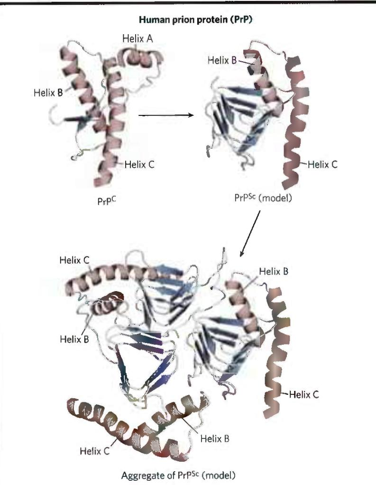  
FIGURE 2 Structure of the globular domain of human PrP and models of the misfolded, disease-causing conformation $\mathrm{PrP}^{\mathrm{Sc}}$ , and an aggregate of $\mathrm{PrP}^{\mathrm{Sc}}$ . The $\alpha$ helices are labeled to help illustrate the modeled conformational change as the globular protein progresses to the aggregate. Helix A is incorporated into the $\beta$ -sheet structure of the misfolded conformation. [Data for human PrP from PDB ID 1QLX, R. Zahn et al., Proc. Natl. Acad. Sci. USA 97:145, 2000. Information for models from C. Govaerts et al., Proc. Natl. Acad. Sci. USA 101:8342, 2004.]

Protein misfolding need not lead to amyloid formation to cause serious disease. For example, cystic fibrosis is caused by defects in a membrane-bound protein called cystic fibrosis transmembrane conductance regulator (CFTR), which acts as a channel for chloride ions. The most common cystic fibrosis-causing mutation is the deletion of a Phe residue at position 508 in CFTR, which causes improper protein folding. Most of this protein is then degraded and its normal function is lost (see Box 11-2). Drugs that can correct certain CFTR misfolding events have been developed. Such drugs are called "correctors" or "pharmacological chaperones." Many of the disease-related mutations in collagen (p. 118) also cause defective folding. A particularly remarkable type of protein misfolding is seen in the prion diseases (Box 4-4).

## SUMMARY 4.4 Protein Denaturation and Folding

The maintenance of the steady-state collection of active cellular proteins required under a particular set of conditions—called proteostasis—involves an elaborate set of pathways and processes that fold, refold, and degrade polypeptide chains.

The three-dimensional structure and the function of most proteins can be destroyed by denaturation, demonstrating a relationship between structure and function. Heat, extremes of pH, organic solvents, solutes, and detergents can all be used to denature proteins.

■ Some denatured proteins can renature spontaneously to form biologically active protein, showing that tertiary structure is determined by amino acid sequence.

■ Protein folding occurs too fast for it to be a completely random process. Instead, protein folding is generally hierarchical. Initially, regions of secondary structure may form, followed by folding into motifs and domains. Large ensembles of folding intermediates are rapidly brought to a single native conformation.

For many proteins, folding is facilitated by Hsp70 chaperones and by chaperonins. Disulfide-bond formation and the cis-trans isomerization of Pro peptide bonds can also be catalyzed by specific enzymes during folding.

■ Protein misfolding is the molecular basis for many human diseases, including cystic fibrosis and amyloidoses such as Alzheimer disease.

## 4.5 Determination of Protein and Biomolecular Structures

In this chapter we have presented many types of protein structures. How were these structures determined? P5 Structural biology is the study of the three-dimensional structures of biomolecules, including proteins, nucleic acids, lipid membranes, and oligosaccharides. Structural biologists combine biochemical approaches with physical tools and computational methods to obtain these structures. Structural biology is extraordinarily powerful for elucidating the relationships between the structure and function of proteins, the molecular basis for enzymatic catalysis and ligand binding, and evolutionary relationships between proteins. Here we focus primarily on three commonly used methods in structural biology: x-ray crystallography, nuclear magnetic resonance (NMR), and cryo-electron microscopy (cryo-EM). Which method a structural biologist uses depends on the system being studied and what information is to be learned. Often structural biologists combine multiple methods to provide a more complete view of function.

Increasingly, computational methods such as molecular dynamics simulations and in silico protein folding are proving to be essential for structural biologists, and these are discussed in Box 4-5.

## X-ray Diffraction Produces Electron Density Maps from Protein Crystals

The spacing of atoms in a crystal lattice can be determined by measuring the locations and intensities of spots produced on a detector by a beam of x-rays of given wavelength, after the beam has been diffracted by the electrons of the atoms. For example, x-ray analysis of sodium chloride crystals shows that $Na^{+}$ and $Cl^{-}$ ions are arranged in a simple cubic lattice. The spacing of the different kinds of atoms in complex organic molecules, even very large ones such as proteins, can also be analyzed by x-ray diffraction methods. However, the technique for analyzing crystals of complex molecules is far more laborious than the technique for analyzing simple salt crystals. When the repeating pattern of the crystal is a molecule as large as, say, a protein, the numerous atoms in the molecule yield thousands of diffraction spots that must be analyzed by computer.

Consider how images are generated in a light microscope. Light from a point source is focused on an object. The object scatters the light waves, and these scattered waves are recombined by a series of lenses to generate an enlarged image of the object. The smallest object whose structure can be determined by such a system—that is, the resolving power of the microscope—is determined by the wavelength of the light, in this case visible light, with wavelengths in the range of 400 to 700 nm. Objects smaller than half the wavelength of the incident light cannot be resolved. To resolve objects as small as proteins we must use x-rays, with wavelengths in the range of 0.7 to 1.5 Å (0.07 to 0.15 nm). However, there are no lenses that can recombine x-rays to form an image; instead, the pattern of diffracted x-rays is collected directly and an image is reconstructed by mathematical techniques.

The amount of information obtained from x-ray crystallography depends on the degree of structural order in the sample. Some important structural parameters were obtained from early studies of the diffraction patterns of the fibrous proteins arranged in regular arrays in hair and wool. However, the orderly bundles formed by fibrous proteins are not crystals—the molecules are aligned side by side, but not all are oriented in the same direction. More-detailed three-dimensional structural information about proteins requires a highly ordered protein crystal. The structures of many proteins are not yet known, simply because they have proved difficult to crystallize. Practitioners have compared making protein crystals to holding together a stack of bowling balls with cellophane tape.

Operationally, there are several steps in x-ray structural analysis (Fig. 4-30). A crystal is placed in an x-ray beam between the x-ray source and a detector, and a regular array of spots, called reflections, is generated. The spots are created by the diffracted x-ray beam, and each atom in a molecule makes a contribution to each spot. An electron-density map of the protein is reconstructed from the overall diffraction pattern of spots by a mathematical technique called a Fourier transform. In effect, the computer acts as a "computational lens." A model for the structure is then built that is consistent with the electron-density map.

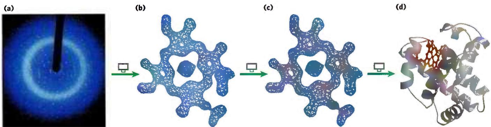  
FIGURE 4-30 Steps in determining the structure of sperm whale myoglobin by x-ray crystallography. (a) X-ray diffraction patterns are generated from a crystal of the protein. (b) Data extracted from the diffraction patterns are used to calculate a three-dimensional electron-density map. The electron density of only part of the structure, the heme, is shown here. (c) Regions of greatest electron density reveal  
the location of atomic nuclei, and this information is used to piece together the final structure. Here, the heme structure is modeled into its electron-density map. (d) The completed structure of sperm whale myoglobin, including the heme. [(a, b, c) Photo and data from George N. Phillips, Jr., University of Wisconsin–Madison, Department of Biochemistry. (d) Data from PDB ID 2MBW, E. A. Brucker et al., J. Biol. Chem. 271:25,419, 1996.]

John Kendrew found that the x-ray diffraction pattern of crystalline myoglobin (isolated from muscles of the sperm whale) is highly complex, with nearly 25,000 reflections. Computer analysis of these reflections took place in stages. The resolution improved at each stage until, in 1959, the positions of virtually all the nonhydrogen atoms in the protein had been determined. The amino acid sequence of the protein, obtained by chemical analysis, was consistent with the molecular model. Over 100,000 protein structures, many of them much more complex than myoglobin, have since been determined to a similar level of resolution by x-ray crystallography.

The physical environment in a crystal, of course, is not identical to that in solution or in a living cell. A crystal imposes a space and time average on the structure deduced from its analysis, and x-ray diffraction studies provide little information about molecular motion within the protein. The conformation of proteins in a crystal can also be affected by nonphysiological factors such as incidental protein-protein contacts within the crystal. However, when structures derived from the analysis of crystals are compared with structural information obtained by other means (such as NMR, as described below), the crystal-derived structure almost always represents a functional conformation of the protein.

## Distances between Protein Atoms Can Be Measured by Nuclear Magnetic Resonance

An advantage of nuclear magnetic resonance (NMR) studies is that they are carried out on macromolecules in solution, whereas x-ray crystallography is limited to molecules that can be crystallized. NMR can also illuminate the dynamic side of protein structure, including conformational changes, protein folding, and interactions with other molecules.

NMR is a manifestation of nuclear spin angular momentum, a quantum mechanical property of atomic nuclei. Only certain atoms, including ${}^{1}H$ , ${}^{13}C$ , ${}^{15}N$ , ${}^{19}F$ , and ${}^{31}P$ , have the kind of nuclear spin that gives rise to an NMR signal. Nuclear spin generates a magnetic dipole. When a strong, static magnetic field is applied to a solution containing a single type of macromolecule, the magnetic dipoles are aligned in the field in one of two orientations: parallel (low energy) or antiparallel (high energy). A short ( $\sim10\ \mu s$ ) pulse of electromagnetic energy of suitable frequency (the resonant frequency, which is in the radio frequency range) is applied at right angles to the nuclei aligned in the magnetic field. Some energy is absorbed as nuclei switch to the high-energy state, and the absorption spectrum that results contains information about the identity of the nuclei and their immediate chemical environment. The data from many such experiments on a sample are averaged, increasing the signal-to-noise ratio, and an NMR spectrum such as that in Figure 4-31 is generated.

$^{1}$ H is particularly important in NMR experiments because of its high sensitivity and natural abundance. For macromolecules, $^{1}$ H NMR spectra can become quite complicated. Even a small protein has hundreds of $^{1}$ H atoms, typically resulting in a one-dimensional NMR spectrum too complex for analysis. Structural analysis of proteins became possible with the advent of two-dimensional NMR techniques (Fig. 4-31b, c, d). These methods allow measurement of distance-dependent coupling of nuclear spins in nearby atoms through space (the nuclear Overhauser effect (NOE), in a method dubbed NOESY) or the coupling of nuclear spins in atoms connected by covalent bonds (total correlation spectroscopy, or TOCSY).

## Video Games and Designer Proteins

Computational tools are now indispensable to biochemistry. While advances in computers and software have revolutionized how protein structures can be solved by x-ray crystallography, NMR, and cryo-EM, advances in computational chemistry have now allowed a number of studies of protein structure to be carried out entirely in silico using powerful molecular modeling and dynamics software. Key developments in this field were made by Martin Karplus, Michael Levitt, and Arieh Warshel, who received the Nobel Prize in Chemistry in 2013 for their work on the theoretical and computational tools needed to carry out computer simulations of molecules as large as proteins.

Protein folding is a problem particularly well-suited for computational biochemists. Protein-folding landscapes can be complex, and nearly an infinite number of possible peptide conformations are theoretically available for the protein to sample as it folds. However, to understand how folding happens efficiently and by only sampling a small portion of all

  
[Photo by Ian C. Haydon, courtesy Institute for Protein Design, University of Washington]

Translating a two-dimensional NMR spectrum into a complete three-dimensional structure can be a laborious process. The NOE signals provide some information about the distances between individual atoms, but for these distance constraints to be useful, the atoms giving rise to each signal must be identified. Complementary TOCSY experiments can help identify which NOE signals reflect atoms that are linked by covalent bonds. Certain patterns of NOE signals have been associated with secondary structures such as $\alpha$ helices. Genetic engineering possible conformations requires computers that can quickly test tens of thousands of possible folding trajectories in a brief time. Sometimes these calculations are carried out on powerful supercomputers, but in other instances research groups have taken to crowdsourcing these problems to thousands of citizen scientists.

David Baker has pioneered crowdsourcing protein-folding problems to engage millions of computer users directly in biochemistry. The Rosetta@home project distributes complex protein-folding problems to citizen scientists who run the software in the background on their home computers. Each home computer is able to complete a portion of a protein-folding experiment, and these results can be combined with those from other users to predict protein structures.

Foldit is a video game in which users compete to solve protein-folding puzzles (Fig. 1). Users are rewarded for making stabilizing contacts in the structure, like hydrogen bonds or favorable van der Waals interactions. Virtual protein designs (sometimes called theozymes) from the video game can then be tested in the real world. DNA genes coding for the virtual proteins can be created in the laboratory and be used to recombinantly produce the proteins in bacteria, using techniques described in Chapter 9. The purified proteins can then be structurally characterized by x-ray crystallography or NMR to see how closely the real-world structures and computationally designed structures match.

One exciting application of computational biochemistry is the creation of "designer proteins." These are proteins with completely novel folds or functions not yet identified in nature. Designer proteins have potential applications in bioengineering, medicine, materials science, and chemistry. In one recent example, the Baker Lab designed a series of Foldit puzzles (such as "Cover the Ligand," in which users had to redesign a ligand-binding site by rebuilding the protein backbone and changing amino acid side chains) to improve the catalytic efficiency of a previously engineered Diels-Alderase (Fig. 2). The Diels-Alder reaction is a common method for organic chemists to create carbon-carbon bonds; however, it is almost never used by naturally occurring enzymes. Diels-Alderase enzymes would

(Chapter 9) can be used to prepare proteins that contain the rare isotopes ${}^{13}$ C or ${}^{15}$ N. The new NMR signals produced by these atoms, and the coupling with ${}^{1}$ H signals resulting from these substitutions, help in the assignment of individual ${}^{1}$ H NOE signals. The process is also aided by a knowledge of the amino acid sequence of the polypeptide.

To generate a three-dimensional structure, researchers feed the distance constraints into a computer along with known geometric constraints such as chirality, potentially be useful for carrying out environmentally friendly carbon bond forming reactions in water instead of toxic organic solvents. Foldit competitors used the video game to design thousands of virtual enzymes. The players were successful, and once their top virtual enzyme was produced and tested in the real world it was found to be more than 18-fold more active than the original Diels-Alderase. Incredibly, the protein structure created by the Foldit game players was also confirmed by x-ray crystallography. This is definitely a case where we can encourage biochemistry students to spend more time playing video games!

  
FIGURE 1 Foldit uses a video game interface to crowdsource protein-folding problems. Proteins designed in the video game can be recreated in the laboratory and studied using biochemical and structural methods.

van der Waals radii, and bond lengths and angles. The computer generates a family of closely related structures that represent the range of conformations consistent with the NOE distance constraints (Fig. 4-31d). The uncertainty in structures generated by NMR is in part a reflection of the molecular vibrations (known as breathing) within a protein structure in solution, discussed in more detail in Chapter 5. Normal experimental uncertainty can also play a role.

  
FIGURE 2 The Diels-Alder reaction catalyzed by an enzyme designed by Foldit players. Diels-Alder reactions are commonly used by organic chemists to form C—C bonds; however, there are very few examples of enzymes catalyzing this type of chemistry in nature. [Information from C. B. Eiben et al., Nature Biotechnol. 30:190, 2109.]

## Thousands of Individual Molecules Are Used to Determine Structures by Cryo-Electron Microscopy

Our understanding of highly complex processes such as gene expression, mitochondrial respiration, or viral infection is aided immensely by knowing the detailed molecular structures of the proteins that participate in these processes. However, it is often difficult to determine the molecular structure of large, dynamic, macromolecular complexes that contain dozens of individual

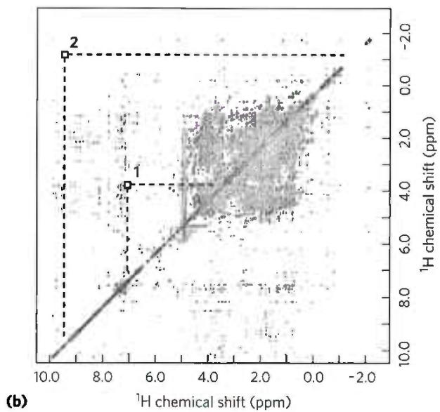

protein subunits. Moreover, integral membrane proteins often resist crystallization once they are removed from their lipid environment, making their structures difficult to solve by x-ray diffraction, and many are too large for NMR. In principle, discrete objects in the diameter range 100 to 300 Å can be visualized by electron microscopy (EM). In practice, the high intensity of the EM beam often damages the specimen before a high-resolution image can be obtained. In cryo-electron microscopy (cryo-EM), a sample containing many individual copies of the structure of interest is quick-frozen in vitreous (or noncrystalline) ice and kept frozen while being observed in two dimensions with the electron microscope, greatly reducing damage to the specimen by the electron beam.

FIGURE 4-31 NMR spectra of a globin from a marine blood worm. (a) One-dimensional ${}^{1}$ H NMR spectrum. (b) Two-dimensional NMR data used to generate a three-dimensional structure of globin. The diagonal in a two-dimensional NMR spectrum is equivalent to a one-dimensional spectrum. The off-diagonal peaks are NOE signals generated by close-range interactions of ${}^{1}$ H atoms that may generate signals quite distant in the one-dimensional spectrum. Two such interactions are identified in (b), and their identities are shown with blue lines in (c). Three lines are drawn for interaction 2 between a methyl group in the protein and a hydrogen on the heme. The methyl group rotates rapidly such that each of its three hydrogens contributes equally to the interaction and the NMR signal. Such information is used to determine the complete three-dimensional structure, as in (d). The multiple lines shown for the protein backbone in (d) represent the family of structures consistent with the distance constraints in the NMR data. [Data from (a, b) B. F. Volkman, National Magnetic Resonance Facility at Madison; (c) PDB ID 1VRF; (d) PDB ID 1VRE, B. F. Volkman et al., Biochemistry 37:10,906, 1998.]  

Particles such as purified, multisubunit enzymes, arranged randomly on the microscope grid, are visualized with the cryo-electron microscope. When cryo-EM is combined with powerful algorithms for transforming the two-dimensional structures of tens of thousands of individual, randomly oriented complexes into a three-dimensional composite, it is sometimes possible to determine molecular structures at a level comparable to that obtained by x-ray crystallography (Fig. 4-32). In favorable cases, the repetitive aspects—choice of objects to be included in the analysis, imaging of each object individually, and calculations to produce a three-dimensional structure from the huge number of two-dimensional images—can be automated. The EMDataResource (www.emdataresource.org) is a unified resource for accessing structure maps deposited into data banks and assigned EMDataBank (EMDB) accession codes.

(a)  
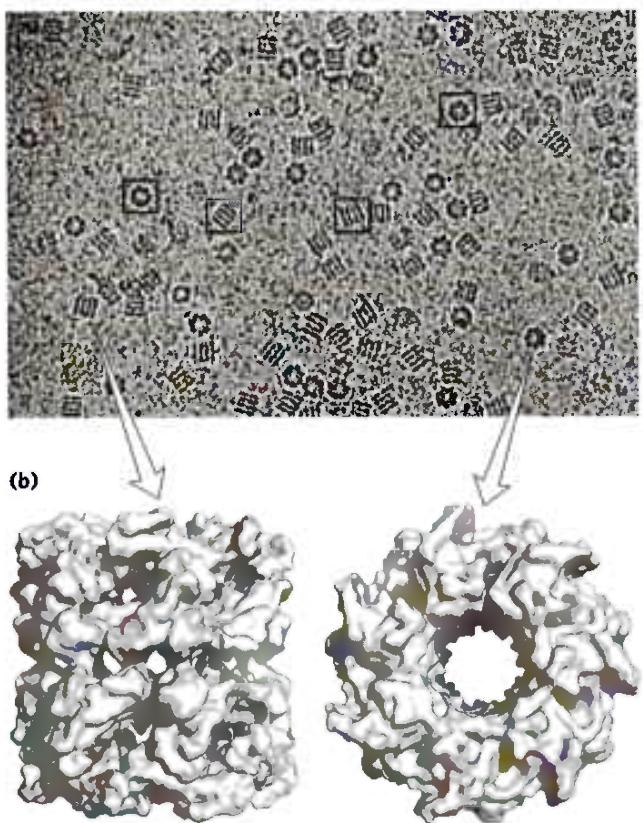  
FIGURE 4-32 Structure of the chaperone protein GroEL as determined by single-particle cryo-EM. (a) Cryo-EM images of many individual GroEL particles. (b) Side and top views of the three-dimensional structure derived from analysis of the EM images. [(a) Alberto Bartesaghi and Sriram Subramaniam, National Cancer Institute, National Institutes of Health (b) Data from PDB ID 3E76, P.D. Kaiser et al., Acta Crystallogr. 65:967, 2009.]

Many novel structures have now been obtained by cryo-EM without models based on prior x-ray or NMR structures. Since cryo-EM relies on imaging of single molecules of a complex, this technique can also be used to computationally sort the imaged particles and simultaneously determine structures of multiple conformational states. Cryo-EM has now been used to solve the structures of some of the most dynamic and largest molecular complexes in the cell, such as the human telomerase enzyme (Fig. 4-33). Telomerase is an essential enzyme for maintaining chromosome integrity in humans (see Chapter 26) and is the target of significant medical research due to its roles in aging and cancer. Cryo-EM was critical for the laboratories of Eva Nogales and Kathleen Collins in determining the architecture of telomerase due to the heterogeneity of the complex and because only minute quantities could be purified from human cells—far too little for crystallization, but enough to observe single molecules by cryo-EM.

  
FIGURE 4-33 Cryo-EM structure of human telomerase. The structures of the RNA (green) and protein (ribbon representations) components of human telomerase are shown embedded in the calculated 10.2 Å EM density map. [Data from EMDB ID EMD-7521, T. Nguyen et al., Nature 557:190, 2018.]

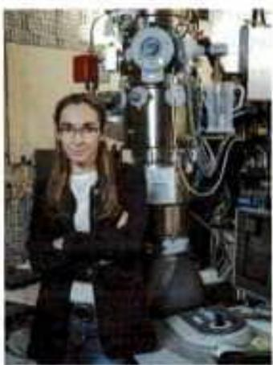  
Eva Nogales
[Courtesy Eva Nogales.]

  
Kathleen Collins
[Courtesy Kathleen Collins.]

## SUMMARY 4.5 Determination of Protein and Biomolecular Structures

In x-ray crystallography, protein molecules are crystallized in well-ordered orientations that diffract x-rays. The patterns and intensities of the diffracted x-rays depend on the structure of the protein and its crystalline properties. Mathematical methods can then reconstruct the protein structure that produces a particular diffraction pattern.

■ NMR is often carried out on molecules in solution and yields information about atomic nuclei and their chemical environment. Protein structures can be computed from NMR data using hundreds of distance and geometric constraints obtained from multi-dimensional NMR experiments.

\- Biomolecules are frozen in vitreous ice for imaging by cryo-EM. The individual molecules are then identified and computationally sorted. The sorted two-dimensional images are then combined using computers to produce a three-dimensional structure.

## KEY TERMS

Terms in bold are defined in the glossary.

conformation 106  
native conformation 107  
hydrophobic effect 108  
solvation layer 108  
secondary structure 111 $\alpha$ helix 111 $\beta$ conformation 114 $\beta$ sheet 114 $\beta$ turn 114  
Ramachandran plot 115  
circular dichroism (CD) spectroscopy 116  
tertiary structure 116  
quaternary structure 116  
fibrous proteins 116  
globular proteins 116  
intrinsically disordered proteins 117 $\alpha$ -keratin 117  
collagen 118

fibroin 120
Protein Data Bank (PDB) 122
motif 123
fold 123
domain 123
topology diagram 125
protein family 125
multimer 127
oligomer 127
protomer 127
proteostasis 129
denaturation 129
renaturation 130
chaperone 132
Hsp70 132
chaperonin 133
proteolylalfide isomerase (PDI)
133

peptide prolyl cis-trans isomerase (PPI) 133
amyloid 133
amyloidoses 133
prion 134

x-ray crystallography 136
nuclear magnetic resonance (NMR) spectroscopy 137
cryo-electron microscopy (cryo-EM) 140

## PROBLEMS

1. Properties of the Peptide Bond In x-ray studies of crystalline peptides, Linus Pauling and Robert Corey found that the C—N bond in the peptide link is intermediate in length (1.32 Å) between a typical C—N single bond (1.49 Å) and a C=N double bond (1.27 Å). They also found that the peptide bond is planar (all four atoms attached to the C—N group are located in the same plane) and that the two α-carbon atoms attached to the C—N are always trans to each other (on opposite sides of the peptide bond).

(a) What does the length of the C—N bond in the peptide linkage indicate about its strength and its bond order (i.e., whether it is single, double, or triple)?

(b) What do Pauling and Corey's observations tell us about the ease of rotation about the C—N peptide bond?

2. Structural and Functional Relationships in Fibrous Proteins William Astbury discovered that the x-ray diffraction pattern of wool shows a repeating structural unit spaced about 5.2 Å along the length of the wool fiber. When he steamed and stretched the wool, the x-ray pattern showed a new repeating structural unit at a spacing of 7.0 Å. Steaming and stretching the wool and then letting it shrink gave an x-ray pattern consistent with the original spacing of about 5.2 Å. Although these observations provided important clues to the molecular structure of wool, Astbury was unable to interpret them at the time.

(a) Given our current understanding of the structure of wool, interpret Astbury's observations.

(b) When wool sweaters or socks are washed in hot water or heated in a dryer, they shrink. Silk, on the other hand, does not shrink under the same conditions. Explain.

3. Rate of Synthesis of Hair $\alpha$ -Keratin Hair grows at a rate of 15 to 20 cm/yr. All this growth is concentrated at the base of the hair fiber, where $\alpha$ -keratin filaments are synthesized inside living epidermal cells and assembled into rope-like structures (see Fig. 4-10). The fundamental structural element of $\alpha$ -keratin is the $\alpha$ helix, which has 3.6 amino acid residues per turn and a rise of 5.4 Å per turn (see Fig. 4-3a). Assuming that the biosynthesis of $\alpha$ -helical keratin chains is the rate-limiting factor in the growth of hair, calculate the rate at which peptide bonds of $\alpha$ -keratin chains must be synthesized (peptide bonds per second) to account for the observed yearly growth of hair.

4. Effect of pH on the Conformation of $\alpha$ -Helical Secondary Structures Specific rotation is a measure of a solution's capacity to rotate circularly polarized light. The unfolding of the $\alpha$ helix of a polypeptide to a randomly coiled conformation is accompanied by a large decrease in a property called specific rotation. Polyglutamate, a polypeptide made up of only L-Glu residues, is an $\alpha$ helix at pH 3. When researchers raise the pH to 7, there is a large decrease in the specific rotation of the solution. Similarly, polylysine (L-Lys residues) is an $\alpha$ helix at pH 10, but when researchers lower the pH to 7, the specific rotation also decreases, as shown in the graph.

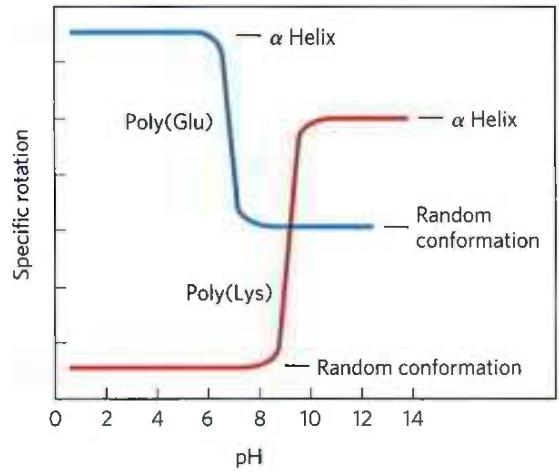

Explain the effect of the pH changes on the conformations of poly(Glu) and poly(Lys). Why does the transition occur over such a narrow range of pH?

5. Disulfide Bonds Determine the Properties of Many Proteins Some natural proteins are rich in disulfide bonds, and their mechanical properties, such as tensile strength, viscosity, and hardness, correlate with the degree of disulfide bonding.

(a) Glutenin, a wheat protein rich in disulfide bonds, imparts the cohesive and elastic character of dough made from wheat flour. Similarly, the hard, tough nature of tortoise shell results from the extensive disulfide bonding in its $\alpha$ -keratin. What is the molecular basis for the correlation between disulfide-bond content and mechanical properties of the protein?

(b) Most globular proteins denature and lose their activity when they are briefly heated to 65°C. However, the denaturation of globular proteins that contain multiple disulfide bonds often requires longer heat exposure at higher temperatures. One such protein is bovine pancreatic trypsin inhibitor (BPTI), which has 58 amino acid residues in a single peptide chain and contains three disulfide bonds. After a solution of denatured BPTI is cooled, the protein regains its activity. What is the molecular basis for this property of BPTI?

6. Dihedral Angles Consider the series of torsion angles, $\phi$ and $\psi$ , that might be taken up by the peptide backbone. Which of these closely correspond to $\phi$ and $\psi$ for an idealized collagen triple helix? Refer to Figure 4-8 as a guide.

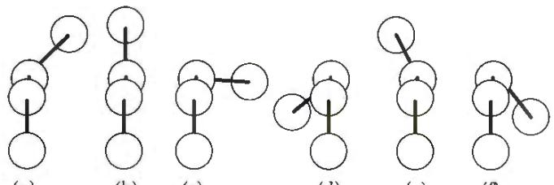

7. Amino Acid Sequence and Protein Structure Our growing understanding of how proteins fold allows researchers to make predictions about protein structure based on primary amino acid sequence data. Consider this amino acid sequence.

(a) Where might bends or $\beta$ turns occur?

(b) Where might intrachain disulfide cross-linkages form?

(c) Suppose that this sequence is part of a larger globular protein. Indicate the probable location (external surface or interior of the protein) of each amino acid residue: Asp, Ile, Thr, Ala, Gln, Lys. Explain your reasoning. (Hint: See the hydropathy index in Table 3-1.)

8. Amino Acid Contributions to Protein Folding Like ribonuclease A, lysozyme from T4 phage is a model enzyme for understanding the energetics and pathways of protein folding. Unlike ribonuclease A, however, T4 lysozyme does not contain any disulfide bonds. A number of studies have quantified the thermodynamic contributions that individual amino acid residues and their interactions make to T4 lysozyme folding.

(a) An ion pair between an Asp and a His residue in T4 lysozyme contributes 13–21 kJ/mol of favorable folding energy at pH 6.0. However, this ion pair contributes much less to lysozyme folding at either pH 2.0 or pH 10.0. How can you explain this observation?

(b) Suppose that a Met residue buried in the folded, hydrophobic core of T4 lysozyme is replaced by mutation with a Lys residue. How would the mutation affect a plot of the thermal denaturation of T4 lysozyme at pH 3.0? (See Fig. 4-24a for an example of a thermal denaturation plot.)

(c) Suppose that the thermal denaturation experiment on the protein with the Met to Lys mutation took place at pH 10.0. Predict whether the mutation would have a greater or a lesser impact on protein stability at pH 10.0 than at pH 3.0. Explain your prediction.

9. Bacteriorhodopsin in Purple Membrane Proteins Under the proper environmental conditions, the salt-loving archaeon Halobacterium halobium synthesizes a membrane protein ( $M_{r}$ 26,000) known as bacteriorhodopsin, which is purple because it contains retinal (see Fig. 10-20). Molecules of this protein aggregate into “purple patches” in the cell membrane. Bacteriorhodopsin acts as a light-activated proton pump that provides energy for cell functions. X-ray analysis of this protein reveals that it consists of seven parallel $\alpha$ -helical segments, each of which traverses the bacterial cell membrane (thickness 45 Å). Calculate the minimum number of amino acid residues necessary for one segment of $\alpha$ helix to traverse the membrane completely. Estimate the fraction of the bacteriorhodopsin protein that is involved in membrane-spanning helices. (Use an average amino acid residue weight of 110.)

10. Conservation of Protein Structure Margaret Oakley Dayhoff originated the idea of protein superfamilies after noticing that proteins with diverse amino acid sequences can have similar tertiary structures. Why can protein structure be more highly conserved than individual amino acid sequences?

(c)

11. Interpreting Ramachandran Plots Examine the two proteins labeled (a) and (b) below. Which of the two Ramachandran plots, labeled (c) and (d) at right, is more likely to be derived from which protein? Why? [Data from (a) PDB ID 1GWY, J. M. Mancheno et al., Structure 11:1319, 2003; (b) PDB ID 1A6M, J. Vojtechovsky et al., Biophys. J. 77:2153, 1999.]

12. Number of Polypeptide Chains in a Multisubunit Protein A researcher treated a sample (660 mg) of an oligomeric protein of $M_{r}$ 132,000 with an excess of 1-fluoro-2,4-dinitrobenzene (Sanger's reagent) under slightly alkaline conditions until the chemical reaction was complete. He then completely hydrolyzed the peptide bonds of the protein by heating it with concentrated HCl. The hydrolysate was found to contain 5.5 mg of the compound shown.

2,4-Dinitrophenyl derivatives of the $\alpha$ -amino groups of other amino acids could not be found.

(a) Explain how this information can be used to determine the number of polypeptide chains in an oligomeric protein.

(b) Calculate the number of polypeptide chains in this protein.

(c) What other analytic technique could you employ to determine whether the polypeptide chains in this protein are similar or different?

  
(d)

13. Amyloid Fibers in Disease Several small aromatic molecules, such as phenol red (used as a nontoxic drug model), have been shown to inhibit the formation of amyloid in laboratory model systems. A goal of the research on these small aromatic compounds is to find a drug that efficiently inhibits the formation of amyloid in the brain in people with incipient Alzheimer disease.

(a) Suggest why molecules with aromatic substituents would disrupt the formation of amyloid.

(b) Some researchers suggest that a drug used to treat Alzheimer disease may also be effective in treating type 2 (non-insulin-dependent) diabetes mellitus. Why might a single drug be effective in treating these two different conditions?

14. Protein-Folding Therapies The Food and Drug Administration recently approved the drug lumacaftor for the treatment of cystic fibrosis in patients with the F508ΔCFTR mutation. This mutation is a genetically encoded deletion of amino acid F508 from the protein. About $\frac{2}{3}$ of cystic fibrosis patients have this mutation, and lumacaftor is one of the first drugs that functions as a pharmacological chaperone to correct a defect in the protein-folding process. However, lumacaftor is not always effective in treating patients who have other CFTR mutations that result in misfolding. Why is lumacaftor able to correct the misfolding of some mutant CFTR proteins and not others?

15. Structural Biology Methods Which structural biology method (CD, x-ray crystallography, NMR, or cryo-EM) is best suited to each task?

(a) Obtaining an ultra-high resolution (<1.5 Å) structure of a drug bound to its protein target

(b) Obtaining a low-to-medium resolution (5–10 Å) reconstruction of the 11 MDa (11,000,000 Da) bacterial flagellar motor

(c) Identifying the protonation state and $pK_{a}$ of a His side chain in an enzyme active site

(d) Determining whether a protein is intrinsically disordered or contains secondary structure elements

## BIOCHEMISTRY ONLINE

16. Using the PDB The Protein Data Bank (PDB) contains more than 150,000 different three-dimensional biomolecular structures obtained by x-ray crystallography, NMR, and cryo-EM. Each protein structure deposited into the database is given a PDB ID. Several PDB IDs represent proteins whose structures resemble letters from the Roman alphabet. Find each protein structure in the PDB and view the three-dimensional structure using JSmol, PYMOL, or a similar structure viewer.

PDB IDs: 2QYC, 2BNH, 2Q5R, 1XU9, 3H7X, 1OU5, 2WCD

(a) For each protein, identify its quaternary structure and describe the protomer structure as all $\alpha$ , all $\beta$ , $\alpha/\beta$ , or $\alpha + \beta$ .

(b) What letter does each protein structure most closely resemble?

(c) What word(s) can you spell using these protein structures?

17. Protein Modeling Online A group of patients with Crohn disease (an inflammatory bowel disease) underwent biopsies of their intestinal mucosa in an attempt to identify the causative agent. Researchers identified a protein that was present at higher levels in patients with Crohn disease than in patients with an unrelated inflammatory bowel disease or in unaffected controls. The protein was isolated, and the following partial amino acid sequence was obtained (reads left to right):

EAELCPDRCI HSFQNLGIQC VKKRDLEQAI
SQRIQTNNNP FQVPIEEQRG DYDLNAVRLC
FQVTVRDPSG RPLRLPPVLP HPIFDNRAPN
TAELKICRVN RNSGSCLGGD EIFLLCDKVQ
KEDIEVYFTG PGWEARGSFS QADVHRQVAI
VFRTPPYADP SLQAPVRVSM QLRRPSDREL
SEPMEFQYLP DTDDRHRIEE KRKRTYETFK
SIMKKSPFSG PTDPRPPPRR IAVPSRSSAS
VPKPAPQPYP

(a) You can identify this protein using a protein database such as UniProt (www.uniprot.org). On the home page, click on the link for a "BLAST" search. On the BLAST page, enter about 30 residues from the protein sequence in the appropriate search field and submit it for analysis. What does this analysis tell you about the identity of the protein?

(b) Try using different portions of the amino acid sequence. Do you always get the same result?

(c) A variety of websites provide information about the three-dimensional structure of proteins. Find information about the protein's secondary, tertiary, and quaternary structures using database sites such as the Protein Data Bank (PDB; www.rcsb.org) or Structural Classification of Proteins (SCOP2; http://scop2.mrc-lmb.cam.ac.uk).

(d) In the course of your online searches, what did you learn about the cellular function of the protein?

## DATA ANALYSIS PROBLEM

18. Mirror-Image Proteins As noted in Chapter 3, "The amino acid residues in protein molecules are almost all L stereoisomers." It is not clear whether this selectivity is necessary for proper protein function or is an accident of evolution. To explore this question, Milton and colleagues (1992) published a study of an enzyme made entirely of D stereoisomers. The enzyme they chose was HIV protease, a proteolytic enzyme made by HIV that converts inactive viral preproteins to their active forms.

Previously, Wlodawer and coworkers (1989) had reported the complete chemical synthesis of HIV protease from L-amino acids (the L-enzyme), using the process shown in Figure 3-30. Normal HIV protease contains two Cys residues, at positions 67 and 95. Because chemical synthesis of proteins containing Cys is technically difficult, Wlodawer and colleagues substituted the synthetic amino acid L-α-amino-n-butyric acid (Aba) for the two Cys residues in the protein. In the authors' words, this was done to "reduce synthetic difficulties associated with Cys deprotection and ease product handling."

(a) The structure of Aba is shown below. Why was this a suitable substitution for a Cys residue? Under what circumstances would it not be suitable?

  
L-α-Amino-n-butyric acid

Wlodawer and coworkers denatured the newly synthesized protein by dissolving it in 6 M guanidine HCl and then allowed it to fold slowly by dialyzing away the guanidine against a neutral buffer (10% glycerol, 25 mM NaH $_2$ PO $_4$ /Na $_2$ HPO $_4$ , pH 7).

(b) There are many reasons to predict that a protein synthesized, denatured, and folded in this manner would not be active. Give three such reasons.

(c) Interestingly, the resulting L-protease was active. What does this finding tell you about the role of disulfide bonds in the native HIV protease molecule?

In a more recent study, Milton and coworkers synthesized HIV protease from D-amino acids, using the same protocol as the earlier study (Wlodawer et al.). Formally, there are three possibilities for the folding of the D-protease: it would be (1) the same shape as the L-protease, (2) the mirror image of the L-protease, or (3) something else, possibly inactive.

(d) For each possibility, decide whether or not it is a likely outcome, and defend your position.

In fact, the D-protease was active: it cleaved a particular synthetic substrate and was inhibited by specific inhibitors. To examine the structure of the D- and L-enzymes, Milton and coworkers tested both forms for activity with D and L forms of a chiral peptide substrate and for inhibition by D and L forms of a chiral peptide-analog inhibitor. Both forms were also tested for inhibition by the achiral inhibitor Evans blue. The findings are given in the table.

<table><tr><td rowspan="3">HIVprotease</td><td rowspan="2" colspan="2">Substrate hydrolysis</td><td colspan="3">Inhibition</td></tr><tr><td colspan="2">Peptide inhibitor</td><td rowspan="2">Evans blue(achiral)</td></tr><tr><td>D-substrate</td><td>L-substrate</td><td>D-inhibitor</td><td>L-inhibitor</td></tr><tr><td>L-protease</td><td>-</td><td>+</td><td>-</td><td>+</td><td>+</td></tr><tr><td>D-protease</td><td>+</td><td>-</td><td>+</td><td>-</td><td>+</td></tr></table>

(e) Which of the three models proposed is supported by these data? Explain your reasoning.

(f) Why does Evans blue inhibit both forms of the protease?
(g) Would you expect chymotrypsin to digest the D-protease? Explain your reasoning.

(h) Would you expect total synthesis from D-amino acids followed by renaturation to yield active enzyme for any enzyme? Explain your reasoning.

## References

Milton, R.C., S.C. Milton, and S.B. Kent. 1992. Total chemical synthesis of a D-enzyme: the enantiomers of HIV-1 protease show demonstration of reciprocal chiral substrate specificity. Science 256:1445–1448.

Wlodawer, A., M. Miller, M. Jaskólski, B.K. Sathyanarayana, E. Baldwin, I.T. Weber, L.M. Selk, L. Clawson, J. Schneider, and S.B. Kent. 1989. Conserved folding in retroviral proteases: crystal structure of a synthetic HIV-1 protease. Science 245:616–621.

## PROTEIN FUNCTION

5.1 Reversible Binding of a Protein to a Ligand: Oxygen-Binding Proteins 148

5.2 Complementary Interactions between Proteins and Ligands: The Immune System and Immunoglobulins 164

## 5.3 Protein Interactions Modulated by Chemical Energy: Actin, Myosin, and Molecular Motors 169

Knowing the three-dimensional structure of a protein is an important part of understanding protein function, and structural biology often offers insights into molecular interactions. However, the protein structures we have examined so far are deceptively static. Proteins function by interacting dynamically with—binding to—other molecules. We divide these interactions into two types. In some interactions, the result is a reaction that alters the chemical configuration or composition of a bound molecule, with the protein acting as a reaction catalyst, or enzyme; we discuss enzymes and their properties in Chapter 6. In other interactions, neither the chemical configuration nor the composition of the bound molecule is changed; such interactions are the subject of this chapter.

It may seem counterintuitive that a protein's interaction with another molecule could be important if it does not alter the associated molecule. Yet, transient interactions of this type are at the heart of many complex physiological processes, such as oxygen transport, transmission of nerve impulses, and immune function. Defining which molecules interact and quantifying such interactions are common and illuminating tasks in every biochemical subdiscipline.

The study of proteins that function through reversible interactions can be organized around six key principles of protein function, some of which will be familiar from Chapter 4:

## P1 The functions of many proteins involve the reversible binding of other molecules.

A molecule bound reversibly by a protein is called a ligand. A ligand may be any kind of molecule, including another protein. The transient nature of protein-ligand interactions is critical to life, allowing an organism to respond rapidly and reversibly to changing environmental and metabolic circumstances.

P2 A ligand binds a protein at a binding site that is complementary to the ligand in size, shape, charge, and hydrophobic or hydrophilic character. The interaction is specific: the protein can discriminate among the thousands of different molecules in its environment and selectively bind only one or a few types. A given protein may have separate binding sites for several different ligands. These specific molecular interactions are crucial in maintaining the high degree of order in a living system.

P3 Proteins are flexible. Changes in conformation may be subtle, reflecting molecular vibrations and small movements of amino acid residues throughout the protein. Changes in conformation may also be more dramatic, with major segments of the protein structure moving as much as several nanometers. Specific conformational changes are frequently essential to a protein's function.

P4 The binding of a protein and a ligand is often coupled to a conformational change in the protein that makes the binding site more complementary to the ligand, permitting tighter binding. The structural adaptation that occurs between protein and ligand is called induced fit.

## P5 In a multisubunit protein, a conformational change in one subunit often affects the conformation of other subunits.

P6 Interactions between ligands and proteins may be regulated.

The themes in our discussion of noncatalytic functions of proteins in this chapter—binding, specificity, and conformational change—are continued in Chapter 6, with the added element of proteins participating in chemical transformations. This discussion excludes the binding of water, which may interact weakly and nonspecifically with many parts of a protein.

## 5.1 Reversible Binding of a Protein to a Ligand: Oxygen-Binding Proteins

Myoglobin and hemoglobin may be the most-studied and best-understood proteins. They were the first proteins for which three-dimensional structures were determined, and these two molecules illustrate almost every aspect of that critical biochemical process: the reversible binding of a ligand to a protein. This classic model of protein function tells us a great deal about how proteins work.

## Oxygen Can Bind to a Heme Prosthetic Group

Oxygen is poorly soluble in aqueous solutions (see Table 2-2) and cannot be carried to tissues in sufficient quantity if it is simply dissolved in blood serum. Also, diffusion of oxygen through tissues is ineffective over distances greater than a few millimeters. The evolution of larger, multicellular animals depended on the evolution of proteins that could transport and store oxygen. However, none of the amino acid side chains in proteins are suited for the reversible binding of oxygen molecules. This role is filled by certain transition metals, among them iron and copper, that have a strong tendency to bind oxygen. Multicellular organisms exploit the properties of metals, most commonly iron, for oxygen transport. However, free iron promotes the formation of highly reactive oxygen species such as hydroxyl radicals that can damage DNA and other macromolecules. Iron used in cells is therefore bound in forms that sequester it and/or make it less reactive. In multicellular organisms, iron is often incorporated into a protein-bound prosthetic group called heme (or haem). (Recall from Chapter 3 that a prosthetic group is a compound permanently associated with a protein that contributes to the protein's function.) Heme is found in many oxygen-transporting proteins, as well as in some proteins, such as the cytochromes, that participate in oxidation-reduction (electron-transfer) reactions (Chapter 19).

  
FIGURE 5-1 Heme. The heme group is present in myoglobin, hemoglobin, and many other proteins, designated heme proteins. Heme consists of a complex organic ring structure, protoporphyrin IX, with a bound iron atom in its ferrous (Fe $^{2+}$ ) state. (a) Porphyrins, of which protoporphyrin IX is just one example, consist of four pyrrole rings linked by methene bridges,

Heme consists of a complex organic ring structure, protoporphyrin, to which is bound a single iron atom in its ferrous (Fe $^{2+}$ ) state (Fig. 5-1). The iron atom has six coordination bonds: four to nitrogen atoms that are part of the flat porphyrin ring system, and two perpendicular to the porphyrin.

P1 Iron in the $Fe^{2+}$ state binds oxygen reversibly; in the $Fe^{3+}$ state it does not bind oxygen. The structure of heme and the globins to which it is bound represents an evolutionary adaptation to prevent $Fe^{2+}$ oxidation. Free heme molecules (heme not bound to protein) leave $Fe^{2+}$ with two “open” coordination bonds. Simultaneous reaction of one $O_{2}$ molecule with two free heme molecules (or two free $Fe^{2+}$ ) can result in irreversible conversion of $Fe^{2+}$ to $Fe^{3+}$ . The coordinated nitrogen atoms (which have an electron-donating character) help prevent conversion of the heme iron to the ferric ( $Fe^{3+}$ ) state. In heme-containing proteins, this reaction is further prevented by sequestering each heme deep within the protein structure. Thus, access to the two open coordination bonds is restricted. In the globins that will shortly become the focus of our narrative, one of these two coordination bonds is occupied by a side-chain nitrogen of a highly conserved His residue referred to as the proximal His. P2 The other is the binding site for molecular oxygen (O₂) (Fig. 5-2). When oxygen binds, the electronic properties of heme iron change; this accounts for the change in color from the dark purple of oxygen-depleted venous blood to the bright red of oxygen-rich arterial blood. Some small molecules, such as carbon monoxide (CO) and nitric oxide (NO), coordinate to heme iron with greater affinity than does O₂. When a molecule of CO is bound to heme, O₂ is excluded, which is why CO is highly toxic to aerobic organisms (a topic explored in Box 5-1). By surrounding and sequestering heme, oxygen-binding proteins regulate the access of small molecules to the heme iron.

  
with substitutions at one or more of the positions denoted X. (b, c) Two representations of heme. The iron atom of heme has six coordination bonds: four in the plane of, and bonded to, the flat porphyrin ring system, and (d) two perpendicular to it. [(c) Data from PDB ID 1CCR, H. Ochi et al., J. Mol. Biol. 166:407, 1983.]

  
FIGURE 5-2 The heme group viewed from the side. This view shows the two coordination bonds to $Fe^{2+}$ that are perpendicular to the porphyrin ring system. One is occupied by a His residue called the proximal His, His $^{93}$ in myoglobin, also designated His F8 (the eighth residue in $\alpha$ helix F; see Fig. 5-3); the other is the binding site for oxygen. The remaining four coordination bonds are in the plane of, and bonded to, the flat porphyrin ring system.

## Globins Are a Family of Oxygen-Binding Proteins

The globins are a widespread family of proteins. Globins are commonly found in eukaryotes of all classes, as well as in archaea and bacteria. All evolved from a common ancestral protein. Their tertiary structure is highly conserved, made up of eight $\alpha$ -helical segments connected by bends. This folding pattern, illustrated by myoglobin (Fig. 5-3), constitutes a structural motif known as the globin fold. The primary amino acid sequence of globins is less conserved, well reflecting both the ancient origins of this protein family and the evolutionary relatedness of species from which globin comparisons might be made.

Most globins function in oxygen transport or storage, although some play a role in the sensing of oxygen, nitric oxide, or carbon monoxide. The simple nematode worm Caenorhabditis elegans has genes encoding 33 different globins. In humans and other mammals, there are at least four kinds of globins. The monomeric myoglobin facilitates oxygen diffusion in muscle tissue. Myoglobin is particularly abundant in the muscles of diving marine mammals such as seals and whales, where it also has an oxygen-storage function for prolonged excursions undersea. The tetrameric hemoglobin is responsible for oxygen transport in the bloodstream. The monomeric neuroglobin is expressed largely in neurons and helps to protect the brain from hypoxia (low oxygen) or ischemia (restricted blood supply). Cytoglobin, another monomeric globin, is found at high concentrations in the walls of blood vessels, where it functions to regulate levels of nitric oxide, a localized signal for muscle relaxation (see Box 12-2).

## Myoglobin Has a Single Binding Site for Oxygen

Any detailed discussion of protein function inevitably involves protein structure. Myoglobin ( $M_{r}$ 16,700; abbreviated Mb) is a single polypeptide of 153 amino acid residues with one molecule of heme (Fig. 5-3). About 78% of the amino acid residues in the protein are found in the eight $\alpha$ helices typical of the globin fold, named A through H.

An individual amino acid residue is designated either by its position in the amino acid sequence or by its location in the sequence of a particular $\alpha$ -helical segment. For example, the His residue coordinated to the heme in myoglobin—the proximal His—is His $^{93}$ (the ninety-third residue from the amino-terminal end of the myoglobin polypeptide sequence) and is also called His F8 (the eighth residue in $\alpha$ helix F). The bends in the structure are designated AB, CD, EF, FG, and GH, reflecting the $\alpha$ -helical segments they connect.

  
FIGURE 5-3 Myoglobin. The eight $\alpha$ -helical segments (shown here as cylinders) are labeled A through H. Nonhelical residues in the bends that connect them are labeled AB, CD, EF, and so forth, indicating the segments they interconnect. A few bends, including BC and DE, are abrupt and do not contain any residues; these are sometimes not labeled. The heme is bound in a pocket made up largely of the E and F helices, although amino acid residues from other segments of the protein also participate. [Data from PDB ID IMBO, S.E. Phillips, J. Mol. Biol. 142:531, 1980.]

## Protein-Ligand Interactions Can Be Described Quantitatively

The function of myoglobin depends on the protein's ability not only to bind oxygen but also to release it when and where it is needed. Function in biochemistry often revolves around a reversible protein-ligand interaction of this type. A quantitative description of this interaction is a central part of many biochemical investigations.

In general, the reversible binding of a protein (P) to a ligand (L) can be described by a simple equilibrium expression:

$$
\mathrm{P} + \mathrm{L} \rightleftharpoons \mathrm{PL}\tag{5-1}
$$

The reaction is characterized by an equilibrium constant, $K_{a}$ , such that

$$
K _ {\mathrm{a}} = \frac {[ \mathrm{PL} ]}{[ \mathrm{P} ] [ \mathrm{L} ]} = \frac {k _ {\mathrm{a}}}{k _ {\mathrm{d}}}\tag{5-2}
$$

where $k_{a}$ and $k_{d}$ are rate constants (more on these below). The term $K_{a}$ is an association constant (not to be confused with the $K_{a}$ that denotes an acid dissociation constant; p. 57) that describes the equilibrium between the complex and the unbound components of the complex. The association constant provides a measure of the affinity of the ligand L for the protein. $K_{a}$ has units of $M^{-1}$ ; a higher value of $K_{a}$ corresponds to a higher affinity of the ligand for the protein.

The equilibrium term $K_{a}$ is also equivalent to the ratio of the rates of the forward (association) and reverse (dissociation) reactions that form the PL complex. The association rate is described by the rate constant $k_{a}$ , and dissociation is described by the rate constant $k_{d}$ . As discussed further in the next chapter, rate constants are proportionality constants, describing the fraction of a pool of reactant that reacts in a given amount of time. When the reaction involves one molecule, such as the dissociation reaction $PL \rightarrow P + L$ , the reaction is first order and the rate constant ( $k_{d}$ ) has units of reciprocal time ( $s^{-1}$ ). When the reaction involves two molecules, such as the association reaction $P + L \rightarrow PL$ , it is called second order, and its rate constant ( $k_{a}$ ) has units of $M^{-1} s^{-1}$ .

## KEY CONVENTION Equilibrium constants are denoted with a capital K and rate constants are denoted with a lowercase k.

A rearrangement of the first part of Equation 5-2 shows that the ratio of bound to free protein is directly proportional to the concentration of free ligand:

$$
K _ {\mathrm{a}} [ \mathrm{L} ] = \frac {[ \mathrm{PL} ]}{[ \mathrm{P} ]}\tag{5-3}
$$

When the concentration of the ligand is much greater than the concentration of ligand-binding sites, the binding of the ligand by the protein does not appreciably change the concentration of free (unbound) ligand—that is, [L] remains constant. This condition is broadly applicable to most ligands that bind to proteins in cells, and it simplifies our description of the binding equilibrium.

We can now consider the binding equilibrium from the standpoint of the fraction, Y, of ligand-binding sites on the protein that are occupied by ligand:

$$
Y = \frac {\text { binding   sites   occupied }}{\text { total   binding   sites }} = \frac {[ \mathrm{PL} ]}{[ \mathrm{PL} ] + [ \mathrm{P} ]}\tag{5-4}
$$

Substituting $K_{a}[L][P]$ for [PL] (see Eqn 5-3) and rearranging terms gives

$$
Y = \frac {K _ {\mathrm{a}} [ \mathrm{L} ] [ \mathrm{P} ]}{K _ {\mathrm{a}} [ \mathrm{L} ] [ \mathrm{P} ] + [ \mathrm{P} ]} = \frac {K _ {\mathrm{a}} [ \mathrm{L} ]}{K _ {\mathrm{a}} [ \mathrm{L} ] + 1} = \frac {[ \mathrm{L} ]}{[ \mathrm{L} ] + \frac {1}{K _ {\mathrm{a}}}}\tag{5-5}
$$

The value of $K_{a}$ can be determined from a plot of Y versus the concentration of free ligand, [L] (Fig. 5-4a). Any equation of the form $x = y/(y + z)$ describes a hyperbola, and Y is thus found to be a hyperbolic function of [L]. The fraction of ligand-binding sites occupied approaches saturation asymptotically as [L] increases. The [L] at which half of the available ligand-binding sites are occupied (that is, Y = 0.5) corresponds to $1/K_{a}$ .

It is more common (and intuitively simpler), however, to consider the dissociation constant, $K_{d}$ , which

  
(a)

  
(b)  
FIGURE 5-4 Graphical representations of ligand binding. The fraction of ligand-binding sites occupied, Y, is plotted against the concentration of free ligand. Both curves are rectangular hyperbolas. (a) A hypothetical binding curve for a ligand L. The [L] at which half of the available ligand-binding sites are occupied is equivalent to $1/K_{a}$ , or $K_{d}$ . The curve has a horizontal asymptote at Y = 1 and a vertical asymptote (not shown) at $[L] = -1/K_{a}$ . (b) A curve describing the binding of oxygen to myoglobin. The partial pressure of $O_{2}$ in the air above the solution is expressed in kilopascals (kPa). Oxygen binds tightly to myoglobin, with a $P_{50}$ of only 0.26 kPa.

<table><tr><td>Protein</td><td>Ligand</td><td> $K_{d}(M)^{a}$ </td></tr><tr><td>Avidin (egg white)</td><td>Biotin</td><td> $1 \times 10^{-15}$ </td></tr><tr><td>Insulin receptor (human)</td><td>Insulin</td><td> $1 \times 10^{-10}$ </td></tr><tr><td>Anti-HIV immunoglobulin (human)b</td><td>gp41 (HIV-1 surface protein)</td><td> $4 \times 10^{-10}$ </td></tr><tr><td>Nickel-binding protein (E. coli)</td><td>Ni2+</td><td> $1 \times 10^{-7}$ </td></tr><tr><td>Calmodulin (rat)c</td><td>Ca2+</td><td> $3 \times 10^{-6}$ </td></tr><tr><td></td><td></td><td> $2 \times 10^{-5}$ </td></tr></table>

  
Color bars indicate the range of dissociation constants typical of various classes of interactions in biological systems. A few interactions, such as that between the protein avidin and the enzyme cofactor biotin, fall outside the normal ranges. The avidin-biotin interaction is so tight it may be considered irreversible. Sequence-specific protein-DNA interactions reflect proteins that bind to a particular sequence of nucleotides in DNA, as opposed to general binding to any DNA site.

$^{a}$ A reported dissociation constant is valid only for the particular solution conditions under which it was measured. $K_{d}$ values for a protein-ligand interaction can be altered, sometimes by several orders of magnitude, by changes in the solution's salt concentration, pH, or other variables. $^{b}$ This immunoglobulin was isolated as part of an effort to develop a vaccine against HIV. Immunoglobulins (described later in the chapter) are highly variable, and the $K_{d}$ reported here should not be considered characteristic of all immunoglobulins. $^{c}$ Calmodulin has four binding sites for calcium. The values shown reflect the highest- and lowest-affinity binding sites observed in one set of measurements.

is the reciprocal of $K_{\mathrm{a}}$ ( $K_{d} = 1/K_{a}$ ) and has units of molar concentration (M). $K_{d}$ is the equilibrium constant for the release of ligand. The relevant expressions change to

$$
K _ {\mathrm{d}} = \frac {[ \mathrm{P} ] [ \mathrm{L} ]}{[ \mathrm{PL} ]} = \frac {k _ {\mathrm{d}}}{k _ {\mathrm{a}}}\tag{5-6}
$$

$$
[ \mathrm{PL} ] = \frac {[ \mathrm{P} ] [ \mathrm{L} ]}{K _ {\mathrm{d}}}\tag{5-7}
$$

$$
Y = \frac {[ \mathrm{L} ]}{[ \mathrm{L} ] + K _ {\mathrm{d}}}\tag{5-8}
$$

When [L] equals $K_{d}$ , half of the ligand-binding sites are occupied. As [L] falls below $K_{d}$ , progressively less of the protein has ligand bound to it. For 90% of the available ligand-binding sites to be occupied, [L] must be nine times greater than $K_{d}$ .

P1 In practice, $K_{d}$ is used much more often than $K_{a}$ to express the affinity of a protein for a ligand. Note that a lower value of $K_{d}$ corresponds to a higher affinity of ligand for the protein. The mathematics can be reduced to simple statements: $K_{d}$ is equivalent to the molar concentration of ligand at which half of the available ligand-binding sites are occupied. At this point, the protein is said to have reached half-saturation with respect to ligand binding. The more tightly a protein binds a ligand, the lower the concentration of ligand required for half the binding sites to be occupied, and thus the lower the value of $K_{d}$ . Some representative dissociation constants are given in Table 5-1; the scale shows typical ranges for dissociation constants found in biological systems.

## WORKED EXAMPLE 5-1 Receptor-Ligand Dissociation Constants

Two proteins, A and B, bind to the same ligand, L, with the binding curves shown below. What is the dissociation constant, $K_{d}$ , for each protein? Which protein (A or B) has a greater affinity for ligand L?

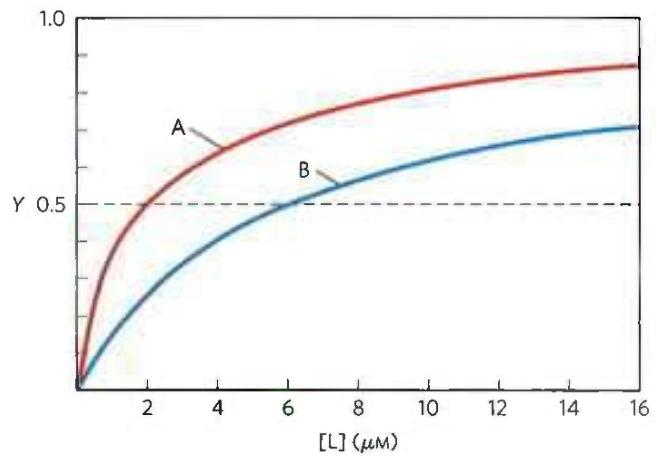

SOLUTION: We can determine the dissociation constants by inspecting the graph. Because Y represents the fraction of binding sites occupied by ligand, the concentration of ligand at which half the binding sites are occupied — that is, the point where the binding curve crosses the line where Y = 0.5 — is the dissociation constant. For A, $K_{d} = 2\mu M$ ; for B, $K_{d} = 6\mu M$ . Because A is half-saturated at a lower [L], it has a higher affinity for the ligand.

## WORKED EXAMPLE 5-2 Protein-Ligand Binding

A protein has a $K_{d}$ of $2.0 \mu \mathrm{M}$ . What is the [L] where $Y = 0.6$ ? SOLUTION: Solving Equation 5-8 for [L], first we obtain

$$
[ \mathrm{L} ] = Y ([ \mathrm{L} ] + K _ {\mathrm{d}})
$$

Distributing Y on the right side gives

$$
[ L ] = Y [ L ] + Y K _ {d}
$$

Subtracting Y[L] from both sides

$$
[ L ] - Y [ L ] = Y K _ {d}
$$

then factoring out [L]

$$
[ L ] (1 - Y) = Y K _ {d}
$$

and dividing both sides by 1-Y gives the final expression

$$
[ L ] = \frac {Y K _ {\mathrm{d}}}{(1 - Y)}
$$

Substituting the values for Y and $K_{d}$ given in the problem gives

$$
\begin{array}{r l} [ \mathrm{L} ] & = 0. 6 (2. 0 \mu \mathrm{M}) / (1 - 0. 6) \\ & = 3. 0 \mu \mathrm{M} \end{array}
$$

The binding of oxygen to myoglobin follows the patterns discussed above. However, because oxygen is a gas, we must make some minor adjustments to the equations so that laboratory experiments can be carried out more conveniently. We first substitute the concentration of dissolved oxygen for [L] in Equation 5-8 to give

$$
Y = \frac {[ \mathrm{O} _ {2} ]}{[ \mathrm{O} _ {2} ] + K _ {\mathrm{d}}}\tag{5-9}
$$

As for any ligand, $K_{d}$ equals the $[O_{2}]$ at which half of the available ligand-binding sites are occupied, or $[O_{2}]_{0.5}$ . Equation 5-9 thus becomes

$$
Y = \frac {[ \mathrm{O} _ {2} ]}{[ \mathrm{O} _ {2} ] + [ \mathrm{O} _ {2} ] _ {0 . 5}}\tag{5-10}
$$

In experiments using oxygen as a ligand, it is the partial pressure of oxygen ( $pO_{2}$ ) in the gas phase above the solution that is varied, because this is easier to measure than the concentration of oxygen dissolved in the solution. The concentration of a volatile substance in solution is always proportional to the local partial pressure of the gas. So, if we define the partial pressure of oxygen at $[O_{2}]_{0.5}$ as $P_{50}$ , substitution in Equation 5-10 gives

$$
Y = \frac {\mathrm{pO} _ {2}}{\mathrm{pO} _ {2} + P _ {5 0}}
$$

(5-11)

A binding curve for myoglobin that relates Y to $pO_{2}$ is shown in Figure 5-4b.

## Protein Structure Affects How Ligands Bind

P3 The binding of a ligand to a protein is rarely as simple as the above equations would suggest. The interaction is greatly affected by protein structure and is often accompanied by conformational changes. For example, the specificity with which heme binds its various ligands is altered when the heme is a component of myoglobin. For free heme molecules, carbon monoxide binds more than 20,000 times better than does $\mathrm{O}_2$ (that is, the $K_{\mathrm{d}}$ or $P_{50}$ for CO binding to free heme is more than 20,000 times lower than that for $\mathrm{O}_2$ ), but it binds only about 40 times better than $\mathrm{O}_2$ when the heme is bound in myoglobin. For free heme, the tighter binding by CO reflects differences in the way the orbital structures of CO and $\mathrm{O}_2$ interact with $\mathrm{Fe}^{2+}$ . Those same orbital structures lead to different binding geometries for CO and $\mathrm{O}_2$ when they are bound to heme (Fig. 5-5a, b). The change in relative affinity of CO and $\mathrm{O}_2$ for heme when the heme is bound to a globin is mediated by the globin structure.

When heme is bound to myoglobin, its affinity for $O_{2}$ is selectively increased by the presence of the distal His (His $^{64}$ , or His E7 in myoglobin). The Fe- $O_{2}$ complex is much more polar than the Fe-CO complex. A partial negative charge is distributed across the oxygen atoms in the bound $O_{2}$ due to partial oxidation of the interacting iron atom. A hydrogen bond between the imidazole side chain of His E7 and the bound $O_{2}$ stabilizes this polar complex electrostatically (Fig. 5-5c). The affinity of myoglobin for $O_{2}$ is thus selectively increased by a factor of about 500; there is no such effect for Fe-CO binding in myoglobin. Consequently, the 20,000-fold stronger binding affinity of free heme for CO compared with $O_{2}$ declines to approximately 40-fold for heme embedded in myoglobin. This favorable electrostatic effect on $O_{2}$ binding is even more dramatic in some invertebrate hemoglobins, where two groups in the binding pocket can form strong hydrogen bonds with $O_{2}$ , causing the heme group to bind $O_{2}$ with greater affinity than CO. This selective enhancement of $O_{2}$ affinity in globins is physiologically important: it helps prevent poisoning by the CO that is generated in small amounts from metabolism and that is sometimes generated in larger amounts by our industrial-age environment.

P3 The binding of $O_{2}$ to the heme in myoglobin also depends on molecular motions, or “breathing,” in the protein structure. The heme molecule is deeply buried in the folded polypeptide, with limited direct paths for oxygen to move from the surrounding solution to the ligand-binding site. If the protein were rigid, $O_{2}$ could not readily enter or leave the heme pocket. However, rapid molecular flexing of the amino acid side chains produces transient cavities in the protein structure, and $O_{2}$ makes its way in and out by moving through these cavities. Computer simulations of rapid structural fluctuations in myoglobin suggest that there are many such pathways. The distal His acts as a gate to control access to one major pocket near the heme iron. Rotation of that His residue to open and close the pocket occurs on a nanosecond ( $10^{-9}$ s) time scale.

  
FIGURE 5-5 Steric effects caused by ligand binding to the heme of myoglobin. (a) Oxygen binds to heme with the $\mathrm{O}_2$ axis at an angle, a binding conformation readily accommodated by myoglobin. (b) Carbon monoxide binds to free heme with the CO axis perpendicular to the plane of the porphyrin ring. (c) Another view of the heme of myoglobin, showing the arrangement of key amino acid residues around the heme. The bound $\mathrm{O}_2$ is hydrogen-bonded to the distal His, His E7 (His $^{64}$ ), facilitating the binding of $\mathrm{O}_2$ compared with its binding to free heme. [(c) Data from PDB ID 1MBO, S. E. Phillips, J. Mol. Biol. 142:531, 1980.]

Thus, subtle conformational changes can be critical for protein activity. Structural changes take on more complexity in the multisubunit hemoglobin, which we consider next.

## Hemoglobin Transports Oxygen in Blood

Nearly all the oxygen carried by whole blood in animals is bound and transported by hemoglobin in erythrocytes (red blood cells). Normal human erythrocytes are small (6 to 9 $\mu$ m in diameter), biconcave disks. They are formed from precursor stem cells called hemocyto-blasts. In the maturation process, the stem cell produces daughter cells that form large amounts of hemoglobin and then lose their organelles—nucleus, mitochondria, and endoplasmic reticulum. Erythrocytes are thus incomplete, vestigial cells, unable to reproduce and, in humans, destined to survive for only about 120 days. Their main function is to carry hemoglobin, which is dissolved in the cytosol at a very high concentration (\~34% by weight).

In arterial blood passing from the lungs through the heart to the peripheral tissues, hemoglobin is about 96% saturated with oxygen. In the venous blood returning to the heart, hemoglobin is only about 64% saturated. Thus, each 100 mL of blood passing through a tissue releases about one-third of the oxygen it carries, or 6.5 mL of $O_{2}$ gas at atmospheric pressure and body temperature.

Myoglobin, with its hyperbolic binding curve for oxygen (Fig. 5-4b), is relatively insensitive to small changes in the concentration of dissolved oxygen, so it functions well as an oxygen-storage protein. Hemoglobin, with its multiple subunits and O₂-binding sites, is better suited to oxygen transport. As we shall see, interactions between the subunits of a multimeric protein can permit a highly sensitive response to small changes in ligand concentration. P5 Interactions among the subunits in hemoglobin cause conformational changes that alter the affinity of the protein for oxygen. The modulation of oxygen binding allows the O₂-transport protein to respond to changes in oxygen demand by tissues.

## Hemoglobin Subunits Are Structurally Similar to Myoglobin

Hemoglobin ( $M_{r}$ 64,500; abbreviated Hb) is roughly spherical, with a diameter of nearly 5.5 nm. It is a tetrameric protein containing four heme prosthetic groups, one associated with each polypeptide chain. Adult hemoglobin contains two types of globin: two $\alpha$ chains (141 residues each) and two $\beta$ chains (146 residues each). The three-dimensional structures of the two types of subunits are very similar to each other and to myoglobin (Fig. 5-6), reflecting their evolution within the larger globin superfamily. However, fewer than half of the amino acid residues are identical in the polypeptide sequences of the $\alpha$ and $\beta$ subunits, and only 27 are identical in the three polypeptides (Fig. 5-7).

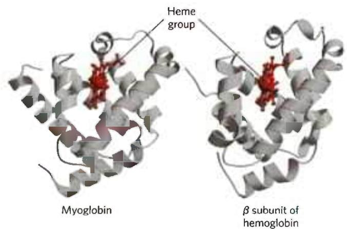  
FIGURE 5-6 Comparison of the structures of myoglobin and the $\beta$ subunit of hemoglobin. [Data from (left) PDB ID 1MBO, S.E. Phillips, J.Mol.Biol. 142:531, 1980; (right) PDB ID 1HGA, R. Liddington et al., J.Mol.Biol. 228:551, 1992.]

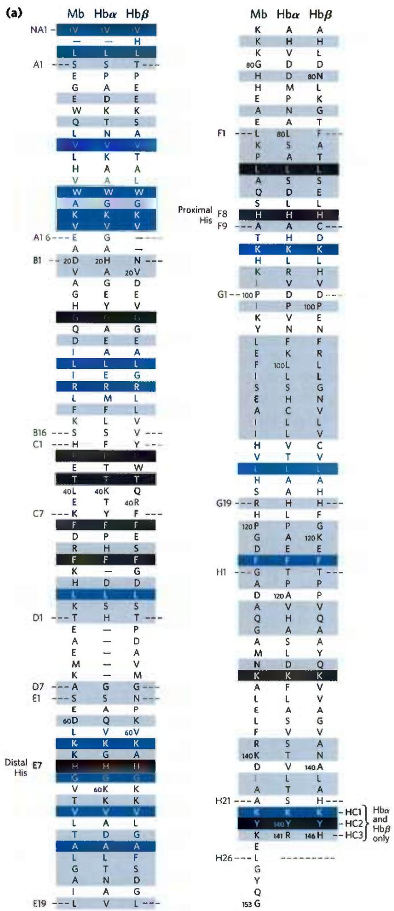  
FIGURE 5-7 Comparison of whale myoglobin with the $\alpha$ and $\beta$ chains of human hemoglobin. (a) Sequence alignment with dashed lines marking helix boundaries. For optimal alignment, short gaps are introduced into both Hb sequences where a few amino acids are present in the other sequences. With the exception of the missing D helix in the Hb $\alpha$ chain (Hbx), this alignment permits the use of the helix lettering convention that emphasizes the common positioning of amino acid residues. Residues conserved in all known globins are shaded black. Residues conserved in the three globins shown here are shaded dark blue. Positions where the amino acid class (hydrophobic, charged, etc.) is conserved are shaded

  
light blue. The common helix-letter-and-number designation for amino acids does not necessarily correspond to a common position in the linear sequence. For example, the distal His residue is His E7 in all three structures, but corresponds to His $^{64}$ , His $^{58}$ , and His $^{63}$ in the linear sequences of Mb, Hb $\alpha$ , and Hb $\beta$ , respectively. Nonhelical residues at the amino and carboxyl termini are labeled NA and HC, respectively. (b) The location of shaded residues is shown in a ribbon representation of myoglobin structure. (c) Ribbon representations of the three globin structures are overlaid to show structural conservation. [Data from PDB ID 1MBO, S.E. Phillips, J. Mol. Biol. 142:531, 1980; PDB ID 1HGA, R. Liddington et al., J. Mol. Biol. 228:551, 1992.]

The helix-naming convention described for myoglobin is also applied to the hemoglobin polypeptides, except that the $\alpha$ subunit lacks the short D helix. The heme-binding pocket is made up largely of the E and F helices in each of the subunits.

The quaternary structure of hemoglobin features strong interactions between unlike subunits. The $\alpha_{1}\beta_{1}$ interface (and its $\alpha_{2}\beta_{2}$ counterpart) involves more than 30 residues, and its interaction is sufficiently strong that although mild treatment of hemoglobin with urea tends to disassemble the tetramer into $\alpha\beta$ dimers, these dimers remain intact. The $\alpha_{1}\beta_{2}$ (and $\alpha_{2}\beta_{1}$ ) interface involves 19 residues (Fig. 5-8). The hydrophobic effect plays the major role in stabilizing these interfaces, but there are also many hydrogen bonds and a few ion pairs (or salt bridges), whose importance is discussed below.

## Hemoglobin Undergoes a Structural Change on Binding Oxygen

P4 X-ray analysis has revealed two major conformations of hemoglobin: the R state and the T state. Although oxygen binds to hemoglobin in either state, it has a significantly higher affinity for hemoglobin in the R state. Oxygen binding stabilizes the R state. When oxygen is absent experimentally, the T state is more stable and is thus the predominant conformation of deoxyhemoglobin. T and R originally denoted "tense" and "relaxed," respectively, because the T state is stabilized by a greater number of ion pairs, many of which lie at the $\alpha_{1}\beta_{2}$ (and $\alpha_{2}\beta_{1}$ ) interface (Fig. 5-9). The binding of O $_{2}$ to a hemoglobin subunit in the T state triggers a change in conformation to the R state. When the entire protein undergoes this transition, the structures of the individual subunits change little, but the $\alpha\beta$ subunit pairs slide past each other and rotate, narrowing the pocket between the $\beta$ subunits (Fig. 5-10). In this process, some of the ion pairs that stabilize the T state are broken and some new ones are formed.

FIGURE 5-8 Dominant interactions between hemoglobin subunits. In this representation, $\alpha$ subunits are light and $\beta$ subunits are dark. The strongest subunit interactions (highlighted) occur between unlike subunits. When oxygen binds, the $\alpha_{1}\beta_{1}$ contact changes little, but there is a large change at the $\alpha_{1}\beta_{2}$ contact, with several ion pairs broken. [Data from PDB ID 1HGA, R. Liddington et al., J. Mol. Biol. 228:551, 1992.]  
  
FIGURE 5-9 Some ion pairs that stabilize the T state of deoxyhemoglobin. Many of the ion pairs stabilizing the T state lie at the $\alpha_{1}\beta_{2}$ (and $\alpha_{2}\beta_{1}$ ) interface. Close-up view of a portion of a deoxyhemoglobin molecule in the T state. Interactions between the ion pairs His HC3 and Asp FG1 of the $\beta$ subunit (blue) and between Lys C5 of the $\alpha$ subunit (gray) and His HC3 (its $\alpha$ -carboxyl group) of the $\beta$ subunit are shown with dashed lines. (Recall that HC3 is the carboxyl-terminal residue of the $\beta$ subunit.) These examples do not represent the entire network of ion pairs that stabilize the structure. [Data from PDB ID 1HGA, R. Liddington et al., J. Mol. Biol. 228:551, 1992.]

Max Perutz proposed that the T → R transition is triggered by changes in the positions of key amino acid side chains surrounding the heme. In the T state, the porphyrin is slightly puckered, causing the heme iron to protrude somewhat on the proximal His (His F8) side. The binding of O₂ causes the heme to assume a more planar conformation, shifting the position of the proximal His and the attached F helix (Fig. 5-11). These changes lead to adjustments in the ion pairs at the $\alpha_{1}\beta_{2}$ interface.

  
FIGURE 5-10 The T → R transition. In these depictions of deoxyhemoglobin, as in Figure 5-9, the β subunits are blue and the α subunits are gray. Positively charged side chains and chain termini involved in ion pairs are shown in blue, and their negatively charged partners are shown in red. The Lys C5 of each α subunit and the Asp FG1 of each β subunit are visible but are not labeled (compare Fig. 5-9). Note that the molecule is oriented slightly differently than in Figure 5-9. The transition from the T state to the R state shifts

  
FIGURE 5-11 Changes in conformation near heme on $\mathrm{O}_2$ binding to deoxyhemoglobin. The shift in the position of helix F when heme binds $\mathrm{O}_2$ is thought to be one of the adjustments that triggers the T → R transition. [T state: Data from PDB ID 1HGA, R. Liddington et al., J. Mol. Biol. 228:551, 1992. R state: Data from PDB ID 1BBB, M. M. Silva et al., J. Biol. Chem. 267:17,248, 1992; R state modified to represent $\mathrm{O}_2$ instead of CO.]

## Hemoglobin Binds Oxygen Cooperatively

Hemoglobin must bind oxygen efficiently in the lungs, where the $pO_{2}$ is about 13.3 kPa, and it must release oxygen in the tissues, where the $pO_{2}$ is about 4 kPa. Myoglobin, or any protein that binds oxygen with a hyperbolic binding curve, would be ill-suited to this function, for the reason illustrated in Figure 5-12. A protein that bound $O_{2}$ with high affinity would bind it efficiently in the lungs but would not release much of it in the tissues. If the protein bound oxygen with a sufficiently low affinity to release it in the tissues, it would not pick up much oxygen in the lungs.

the subunit pairs substantially, affecting certain ion pairs. Most noticeably, the His HC3 residues at the carboxyl termini of the $\beta$ subunits, which are involved in ion pairs in the T state, rotate in the R state toward the center of the molecule, where they are no longer in ion pairs. Another dramatic result of the $T\rightarrow R$ transition is a narrowing of the pocket between the $\beta$ subunits. [T state: Data from PDB ID 1HGA, R. Liddington et al., J. Mol. Biol. 228:551, 1992. R state: Data from PDB ID 1BBB, M. M. Silva et al., J. Biol. Chem. 267:17,248, 1992.]  
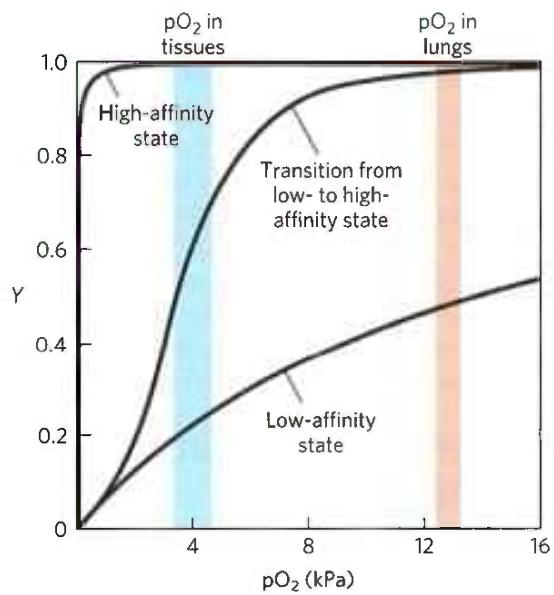  
FIGURE 5-12 A sigmoid (cooperative) binding curve. A sigmoid binding curve can be viewed as a hybrid curve reflecting a transition from a low-affinity state to a high-affinity state. Because of its cooperative binding, as manifested by a sigmoid binding curve, hemoglobin is more sensitive to the small differences in $\mathrm{O}_2$ concentration between the tissues and the lungs, allowing it to bind oxygen in the lungs (where $\mathsf{pO}_2$ is high) and release it in the tissues (where $\mathsf{pO}_2$ is low).

Hemoglobin solves the problem by undergoing a transition from a low-affinity state (the T state) to a high-affinity state (the R state) as more $O_{2}$ molecules are bound. As a result, hemoglobin has a hybrid S-shaped, or sigmoid, binding curve for oxygen (Fig. 5-12). A single-subunit protein with a single ligand-binding site cannot produce a sigmoid binding curve—even if binding elicits a conformational change—because each molecule of ligand binds independently and cannot affect ligand binding to another molecule. P5 In contrast, $O_{2}$ binding to individual subunits of hemoglobin can alter the affinity for $O_{2}$ in adjacent subunits. The first molecule of $O_{2}$ that interacts with deoxyhemoglobin binds weakly, because it binds to a subunit in the T state. Its binding, however, leads to conformational changes that are communicated to adjacent subunits, making it easier for additional molecules of $O_{2}$ to bind. In effect, the T → R transition occurs more readily in the second subunit once $O_{2}$ is bound to the first subunit. The last (fourth) $O_{2}$ molecule binds to a heme in a subunit that is already in the R state, and hence it binds with much higher affinity than the first molecule.

P5 An allosteric protein is one in which the binding of a ligand to one site affects the binding properties of another site on the same protein. The term “allosteric” derives from the Greek allos, “other,” and stereos, “solid” or “shape.” P6 Allosteric proteins are those having “other shapes,” or conformations, induced by the binding of ligands referred to as modulators. The conformational changes induced by the modulator(s) interconvert more-active and less-active forms of the protein. The modulators for allosteric proteins may be either inhibitors or activators. When the normal ligand and modulator are identical, the interaction is termed homotropic. When the modulator is a molecule other than the normal ligand, the interaction is heterotropic. Some proteins have two or more modulators and therefore can have both homotropic and heterotropic interactions.

Cooperative binding of a ligand to a multimeric protein, such as we observe with the binding of $O_{2}$ to hemoglobin, is a form of allosteric binding. The binding of one ligand affects the affinities of any remaining unfilled binding sites, and $O_{2}$ can be considered as both a ligand and an activating homotropic modulator. There is only one binding site for $O_{2}$ on each subunit, so the allosteric effects giving rise to cooperativity are mediated by conformational changes transmitted from one subunit to another by subunit-subunit interactions. A sigmoid binding curve is diagnostic of cooperative binding. It permits a much more sensitive response to ligand concentration and is important to the function of many multisubunit proteins. The principle of allostery extends readily to regulatory enzymes, as we shall see in Chapter 6.

As is the case with myoglobin, ligands other than oxygen can bind to hemoglobin. An important example is carbon monoxide, which binds to hemoglobin about 250 times better than does oxygen (the critical hydrogen bond between $O_{2}$ and the distal His is not quite as strong in human hemoglobin as it is in most mammalian myoglobins, so the binding of $O_{2}$ relative to CO is not augmented quite as much). Human exposure to CO can have tragic consequences (Box 5-1).

## Cooperative Ligand Binding Can Be Described Quantitatively

Cooperative binding of oxygen by hemoglobin was first analyzed by Archibald Hill in 1910. From this work came a general approach to the study of cooperative ligand binding to multisubunit proteins.

For a protein with n binding sites, the equilibrium of Equation 5-1 becomes

$$
\mathrm{P} + n \mathrm{L} \rightleftharpoons \mathrm{PL} _ {n}\tag{5-12}
$$

and the expression for the association constant becomes

$$
K _ {\mathrm{a}} = \frac {[ \mathrm{PL} _ {n} ]}{[ \mathrm{P} ] [ \mathrm{L} ] ^ {n}}\tag{5-13}
$$

The expression for $Y$ (see Eqn 5-8) is

$$
Y = \frac {[ \mathrm{L} ] ^ {n}}{[ \mathrm{L} ] ^ {n} + K _ {\mathrm{d}}}\tag{5-14}
$$

Rearranging, then taking the log of both sides, yields

$$
\frac {Y}{1 - Y} = \frac {[ \mathrm{L} ] ^ {n}}{K _ {\mathrm{d}}}\tag{5-15}
$$

$$
\log \left(\frac {Y}{1 - Y}\right) = n \log [ L ] - \log K _ {\mathrm{d}}
$$

where $K_{\mathrm{d}} = [\mathrm{L}]_{0.5}^{n}$

(5-16)

Equation 5-16 is the Hill equation, and a plot of $\log [Y / (1 - Y)]$ versus $\log [\mathrm{L}]$ is called a Hill plot. Based on the equation, the Hill plot should have a slope of $n$ . However, the experimentally determined slope actually reflects not the number of binding sites but the degree of interaction between them. The slope of a Hill plot is therefore denoted by $n_{\mathrm{H}}$ , the Hill coefficient, which is a measure of the degree of cooperativity. If $n_{\mathrm{H}}$ equals 1, ligand binding is not cooperative, a situation that can arise even in a multisubunit protein if the subunits do not communicate. An $n_{\mathrm{H}}$ of greater than 1 indicates positive cooperativity in ligand binding. This is the situation observed in hemoglobin, in which the binding of one molecule of ligand facilitates the binding of others. The theoretical upper limit for $n_{\mathrm{H}}$ is reached when $n_{\mathrm{H}} = n$ . In this case the binding would be completely cooperative: all binding sites on the protein would bind ligand simultaneously, and no protein molecules partially saturated with ligand would be present under any conditions. This limit is never reached in practice, and the measured value of $n_{\mathrm{H}}$ is always less than the actual number of ligand-binding sites in the protein.

An $n_{H}$ of less than 1 indicates negative cooperativity, in which the binding of one molecule of ligand impedes

## Carbon Monoxide: A Stealthy Killer

Summer, 2017. A Florida man drove his late-model SUV into his garage, took his wireless key fob with him inside the house, and went to bed. He was found, days later, dead from carbon monoxide poisoning. The man had assumed that removing the fob was enough to shut down the automobile. Instead, the car had idled in the garage until it ran out of gas, ultimately filling the attached house with CO. Since 2006, several dozen deaths and scores of injuries have resulted from similar incidents. Measures to address the safety issues posed by keyless ignitions, now standard in most new cars, have lagged. Meanwhile, the deaths are a vivid reminder that life depends on the reversibility of protein-ligand interactions.

Carbon monoxide (CO), a colorless, odorless gas, is one of the most common known causes of death due to poisoning (in countries where such records are kept). CO has an approximately 250-fold greater affinity for hemoglobin than does oxygen. Consequently, relatively low levels of CO can have substantial and tragic effects. When CO combines with hemoglobin, the complex is referred to as carboxyhemoglobin, or COHb.

Some CO is produced by natural processes, but locally high levels generally result only from human activities. Engine and furnace exhausts are important sources, as CO is a byproduct of the incomplete combustion of fossil fuels. In the United States alone, nearly 4,000 people succumb to CO poisoning each year, both accidentally and intentionally. Many of the accidental deaths involve undetected CO buildup in enclosed spaces. This might occur when a household furnace malfunctions, or a gas generator is operated indoors during a power outage or shutoff, venting CO into a home. CO poisoning can also occur in open spaces, as unsuspecting people at work or play inhale the exhaust from generators, outboard motors, tractor engines, recreational vehicles, or lawn mowers.

Carbon monoxide levels in the atmosphere are rarely dangerous, ranging from less than 0.05 part per million (ppm) in remote and uninhabited areas to 3 to 4 ppm in some cities of the Northern Hemisphere. In the United States, the government-mandated (Occupational Safety and Health Administration, OSHA) limit for CO at worksites is 35 ppm for people working an eight-hour shift. The tight binding of CO to

the binding of others. Well-documented cases of negative cooperativity are rare.

To adapt the Hill equation to the binding of oxygen to hemoglobin, we must again substitute $pO_{2}$ for [L] and $P_{50}^{n}$ for $K_{d}$ :

$$
\log \left(\frac {Y}{1 - Y}\right) = n \log \mathrm{pO} _ {2} - n \log P _ {5 0}\tag{5-17}
$$

Hill plots for myoglobin and hemoglobin are given in Figure 5-13.

hemoglobin means that COHb can accumulate over time as people are exposed to a constant low-level source of CO.

In an average, healthy individual, 1% or less of the total hemoglobin is complexed as COHb. Since CO is a product of tobacco smoke, many smokers have COHb levels in the range of 3% to 8% of total hemoglobin, and the levels can rise to 15% for chain-smokers. COHb levels equilibrate at 50% in people who breathe air containing 570 ppm of CO for several hours. Reliable methods have been developed that relate CO content in the atmosphere to COHb levels in the blood (Fig. 1). CO levels in the home of the Florida victim exceeded OSHA-mandated limits by more than 30-fold.

How is a human affected by COHb? At levels of less than 10% of total hemoglobin, symptoms are rarely observed. At 15%, the individual experiences mild headaches. At 20% to 30%, the headache is severe and is generally accompanied by

  
FIGURE 1 Relationship between levels of COHb in blood and concentration of CO in the surrounding air. Four different conditions of exposure are shown, comparing the effects of short exposure versus extended exposure, and exposure at rest versus exposure during light exercise. [Data from R. F. Coburn et al., J. Clin. Invest. 44:1899, 1965.]

## Two Models Suggest Mechanisms for Cooperative Binding

In a multisubunit ligand-binding protein like hemoglobin, how does the T → R transition occur? Two models for the cooperative binding of ligands to proteins with multiple binding sites have greatly influenced thinking about this problem, defining the two major possibilities.

The first model was proposed by Jacques Monod, Jeffries Wyman, and Jean-Pierre Changeux in 1965, and is called the MWC model or the concerted model (Fig. 5-14a). The concerted model assumes that the nausea, dizziness, confusion, disorientation, and some visual disturbances; these symptoms are generally reversed if the individual is treated with oxygen. At COHb levels of 30% to 50%, the neurological symptoms become more severe, and at levels near 50%, the individual loses consciousness and can sink into coma. Respiratory failure may follow. With prolonged exposure, some damage becomes permanent. Death normally occurs when COHb levels rise above 60%.

Binding of CO to hemoglobin is affected by many factors, including exercise (Fig. 1) and changes in air pressure related to altitude. Because of their higher base levels of COHb, smokers exposed to a source of CO often develop symptoms faster than nonsmokers. Individuals with heart, lung, or blood diseases that reduce the availability of oxygen to tissues may also experience symptoms at lower levels of CO exposure. Fetuses are at particular risk for CO poisoning. Fetal hemoglobin, with $\gamma$ subunits replacing $\beta$ subunits, has a somewhat higher affinity for CO than adult hemoglobin (see p. 148). Cases of CO exposure have been recorded in which the fetus died but the pregnant woman recovered.

It may seem surprising that the loss of half of one's hemoglobin to COHb can prove fatal — we know that people with any of several anemic conditions manage to function reasonably well with half the usual complement of active hemoglobin. However, the binding of CO to hemoglobin does more than remove protein from the pool available to bind oxygen. It also affects the affinity of the remaining hemoglobin subunits for oxygen. As CO binds to one or two subunits of a hemoglobin tetramer, the affinity for $O_{2}$ is increased substantially in the remaining subunits (Fig. 2). Thus, a hemoglobin tetramer with two bound CO molecules can efficiently bind $O_{2}$ in the lungs — but it releases very little of it in the tissues. Oxygen deprivation in the tissues rapidly becomes severe. To add to the problem, the effects of CO are not limited to interference with hemoglobin function. CO binds to other heme proteins and a variety of metalloproteins. The effects of these interactions are not yet well understood, but they may be responsible for some of the longer-term effects of acute but nonfatal CO poisoning.

When CO poisoning is suspected, rapid removal of the person from the CO source is essential, but this does not

subunits of a cooperatively binding protein are functionally identical, that each subunit can exist in (at least) two conformations, and that all subunits undergo the transition from one conformation to the other simultaneously. In this model, no protein has individual subunits in different conformations. The two conformations are in equilibrium. The ligand can bind to either conformation, but it binds much more tightly to the R state. P5 Successive binding of ligand molecules to the low-affinity T state (which is more stable in the absence of ligand) gradually shifts the equilibrium to favor the R state.

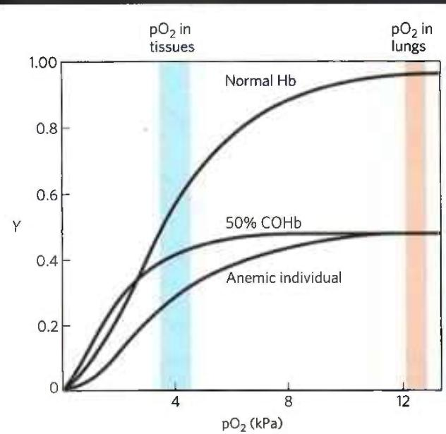  
FIGURE 2 Several oxygen-binding curves: for normal hemoglobin, for hemoglobin from an anemic individual with only $50\%$ of her hemoglobin functional, and for hemoglobin from an individual with $50\%$ of his hemoglobin subunits complexed with CO. The $\mathsf{pO}_2$ in human lungs and tissues is indicated. [Data from F. J. W. Roughton and R. C. Darling, Am. J. Physiol. 141:17, 1944.]

always result in rapid recovery. When an individual is moved from the CO-polluted site to a normal, outdoor atmosphere, $O_{2}$ begins to replace the CO in hemoglobin — but the COHb level drops only slowly. The half-time is 2 to 6.5 hours, depending on individual and environmental factors. If 100% oxygen is administered with a mask, the rate of exchange can be increased about fourfold; the half-time for $O_{2}$ -CO exchange can be reduced to tens of minutes if 100% oxygen at a pressure of 3 atm (303 kPa) is supplied. Thus, rapid treatment by a properly equipped medical team is critical.

A home carbon monoxide detector is a simple and inexpensive measure to avoid possible tragedy. After completing the research for this box, we immediately purchased several new CO detectors for our homes.

In the second model, the sequential model (Fig. 5-14b), proposed in 1966 by Daniel Koshland and colleagues, ligand binding can induce a change of conformation in an individual subunit. A conformational change in one subunit makes a similar change in an adjacent subunit more likely, and makes the binding of a second ligand molecule more likely as well. There are more potential intermediate states in this model than in the concerted model. The two models are not mutually exclusive; the concerted model may be viewed as the "all-or-none" limiting case of the sequential model.

  
FIGURE 5-13 Hill plots for oxygen binding to myoglobin and hemoglobin. When $n_{H}=1$ , there is no evident cooperativity. The maximum degree of cooperativity observed for hemoglobin corresponds approximately to $n_{H}=3$ . Note that while this indicates a high level of cooperativity, $n_{H}$ is less than n, the number of $O_{2}$ -binding sites in hemoglobin. This is normal for a protein that exhibits allosteric binding behavior.

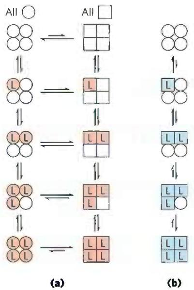  
FIGURE 5-14 Two general models for the interconversion of inactive and active forms of a protein during cooperative ligand binding. Although the models may be applied to any protein -- including any enzyme (Chapter 6) — that exhibits cooperative binding, here we show four subunits because the model was originally proposed for hemoglobin. (a) In the concerted, or all-or-none, model (MWC model), all subunits are postulated to be in the same conformation, either all O (low affinity or inactive) or all □ (high affinity or active). Depending on the equilibrium, $K_{\text{eq}}$ , between O and □ forms, the binding of one or more ligand molecules (L) will pull the equilibrium toward the □ form. Subunits with bound L are shaded. (b) In the sequential model, each individual subunit can be in either the O form or the □ form. The equilibrium is altered as additional ligands are bound, progressively favoring the R state.

Unfortunately, the two models have proven very difficult to distinguish experimentally. In Chapter 6 we use these models to investigate allosteric enzymes.

## Hemoglobin Also Transports H $^{+}$ and CO $_{2}$

In addition to carrying nearly all the oxygen required by cells from the lungs to the tissues, hemoglobin carries two end products of cellular respiration—H $^{+}$ and CO $_{2}$ —from the tissues to the lungs and the kidneys, where they are excreted. The CO $_{2}$ , produced by oxidation of organic fuels in mitochondria, is hydrated to form bicarbonate:

$$
\mathrm{CO} _ {2} + \mathrm{H} _ {2} \mathrm{O} \rightleftharpoons \mathrm{H} ^ {+} + \mathrm{HCO} _ {3} ^ {-}
$$

This reaction is catalyzed by carbonic anhydrase, an enzyme particularly abundant in erythrocytes. Carbon dioxide is not very soluble in aqueous solution, and bubbles of $CO_{2}$ would form in the tissues and blood if it were not converted to bicarbonate. As you can see from the reaction catalyzed by carbonic anhydrase, the hydration of $CO_{2}$ results in an increase in the $H^{+}$ concentration (a decrease in pH) in the tissues. The binding of oxygen by hemoglobin is profoundly influenced by pH and $CO_{2}$ concentration, so the interconversion of $CO_{2}$ and bicarbonate is of great importance to the regulation of oxygen binding and release in the blood.

Hemoglobin transports about 40% of the total $H^{+}$ and 15% to 20% of the $CO_{2}$ formed in the tissues to the lungs and kidneys. (The remainder of the $H^{+}$ is absorbed by the plasma's bicarbonate buffer; the remainder of the $CO_{2}$ is transported as dissolved $HCO_{3}^{-}$ and $CO_{2}$ .) The structural effects of $H^{+}$ and $CO_{2}$ binding to hemoglobin favor the T state. P6 Thus, the binding of $H^{+}$ and $CO_{2}$ is inversely related to the binding of oxygen. At the relatively low pH and high $CO_{2}$ concentration of peripheral tissues, the affinity of hemoglobin for oxygen decreases as $H^{+}$ and $CO_{2}$ are bound, and $O_{2}$ is released to the tissues. Conversely, in the capillaries of the lung, as $CO_{2}$ is excreted and the blood pH consequently rises, the affinity of hemoglobin for oxygen increases and the protein binds more $O_{2}$ for transport to the peripheral tissues. This effect of pH and $CO_{2}$ concentration on the binding and release of oxygen by hemoglobin is called the Bohr effect, after Christian Bohr, the Danish physiologist (and father of physicist Niels Bohr) who discovered it in 1904.

A complete statement of the binding equilibrium for hemoglobin and one molecule of oxygen can be designated by the reaction

$$
\mathrm{HHb} ^ {+} + \mathrm{O} _ {2} \rightleftharpoons \mathrm{HbO} _ {2} + \mathrm{H} ^ {+}
$$

where HHb $^{+}$ denotes a protonated form of hemoglobin. This equation tells us that the O $_{2}$ -saturation curve of hemoglobin is influenced by the H $^{+}$ concentration (Fig. 5-15). Both O₂ and H⁺ are bound by hemoglobin, but with inverse affinity. When the oxygen concentration is high, as in the lungs, hemoglobin binds O₂ and releases protons. When the oxygen concentration is low, as in the peripheral tissues, H⁺ is bound and O₂ is released.

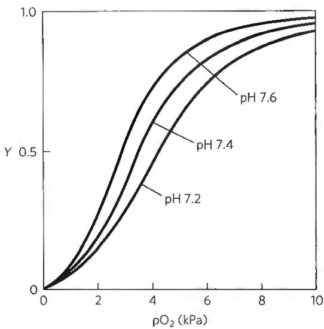  
FIGURE 5-15 Effect of pH on oxygen binding to hemoglobin. The pH of blood is 7.6 in the lungs and 7.2 in the tissues. Experimental measurements on hemoglobin binding are often performed at pH 7.4.

Oxygen and $H^{+}$ are not bound at the same sites in hemoglobin. Oxygen binds to the iron atoms of the hemes, whereas $H^{+}$ binds to any of several amino acid residues in the protein. A major contribution to the Bohr effect is made by His $^{146}$ (His HC3) of the $\beta$ subunits. When protonated, this residue forms one of the ion pairs—to Asp $^{94}$ (Asp FG1)—that helps stabilize deoxyhemoglobin in the T state (Fig. 5-9). Protonation of the amino-terminal residues of the $\alpha$ subunits, certain other His residues, and perhaps other groups has a similar effect.

Hemoglobin also binds $CO_{2}$ , again in a manner inversely related to the binding of oxygen. Carbon dioxide binds as a carbamate group to the $\alpha$ -amino group at the amino-terminal end of each globin chain, forming carbaminohemoglobin:

This reaction produces $H^{+}$ , contributing to the Bohr effect. The bound carbamates also form additional salt bridges (not shown in Fig. 5-9) that help to stabilize the T state and promote the release of oxygen.

When the concentration of carbon dioxide is high, as in peripheral tissues, some $CO_{2}$ binds to hemoglobin and the affinity for $O_{2}$ decreases, causing its release. Conversely, when hemoglobin reaches the lungs, the high oxygen concentration promotes binding of $O_{2}$ and release of $CO_{2}$ . It is the capacity to communicate ligand-binding information from one polypeptide subunit to the others that makes the hemoglobin molecule so beautifully adapted to integrating the transport of $O_{2}$ , $CO_{2}$ , and $H^{+}$ by erythrocytes.

## Oxygen Binding to Hemoglobin Is Regulated by 2,3-Bisphosphoglycerate

P6 The interaction of 2,3-bisphosphoglycerate (BPG) with hemoglobin molecules further refines the function of hemoglobin, and provides an example of heterotropic allosteric modulation.

  
2,3-Bisphosphoglycerate

BPG binds at a site distant from the oxygen-binding site and regulates the $O_{2}$ -binding affinity of hemoglobin in relation to the $pO_{2}$ in the lungs. BPG is present in relatively high concentrations in erythrocytes. When hemoglobin is isolated, it contains substantial amounts of bound BPG, which can be difficult to remove completely. In fact, the $O_{2}$ -binding curves for hemoglobin that we have examined up to this point were obtained in the presence of bound BPG. 2,3-Bisphosphoglycerate greatly reduces the affinity of hemoglobin for oxygen—there is an inverse relationship between the binding of $O_{2}$ and the binding of BPG. We can therefore describe another binding process for hemoglobin:

$$
\mathrm{HbBPG} + \mathrm{O} _ {2} \rightleftharpoons \mathrm{HbO} _ {2} + \mathrm{BPG}
$$

BPG is important in the physiological adaptation to the lower $pO_{2}$ at high altitudes. For a healthy human at sea level, the binding of $O_{2}$ to hemoglobin is regulated such that the amount of $O_{2}$ delivered to the tissues is nearly 40% of the maximum that could be carried by the blood (Fig. 5-16). Imagine that this person is suddenly transported from sea level to an altitude of 4,500 meters, where the $pO_{2}$ is considerably lower. The delivery of $O_{2}$ to the tissues is now reduced. However, after just a few hours at the higher altitude, the BPG concentration in the blood has begun to rise, leading to a decrease in the affinity of hemoglobin for oxygen. This adjustment in the BPG level has only a small effect on the binding of $O_{2}$ in the lungs, but it has a considerable effect on the release of $O_{2}$ in the tissues. As a result, the delivery of oxygen to the tissues is restored to nearly 40% of the $O_{2}$ that can be transported by the blood. The situation is reversed when the person returns to sea level. The BPG concentration in erythrocytes also increases in people suffering from hypoxia, lowered oxygenation of peripheral tissues due to inadequate functioning of the lungs or circulatory system.

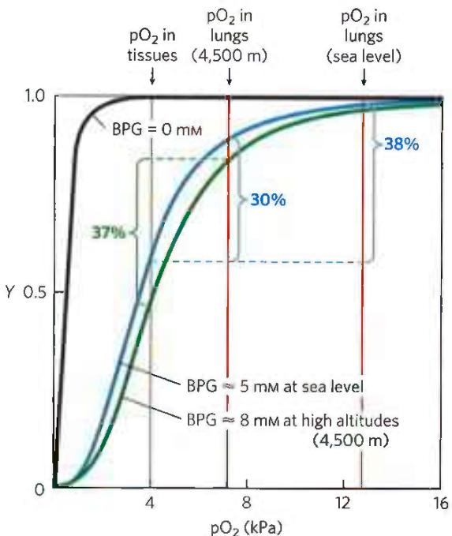  
FIGURE 5-16 Effect of 2,3-bisphosphoglycerate on oxygen binding to hemoglobin. The BPG concentration in normal human blood is about 5 mm at sea level and about 8 mm at high altitudes. Note that hemoglobin binds to oxygen quite tightly when BPG is entirely absent, and the binding curve seems to be hyperbolic. In reality, the measured Hill coefficient for O₂-binding cooperativity decreases only slightly (from 3 to about 2.5) when BPG is removed from hemoglobin, but the rising part of the sigmoid binding curve is confined to a very small region close to the origin. At sea level, hemoglobin is nearly saturated with O₂ in the lungs, but is just over 60% saturated in the tissues, so the amount of O₂ released in the tissues is about 38% of the maximum that can be carried in the blood. At high altitudes, O₂ delivery declines by about one-fourth, to 30% of maximum. An increase in BPG concentration, however, decreases the affinity of hemoglobin for O₂, so approximately 37% of what can be carried is again delivered to the tissues.

The site of BPG binding to hemoglobin is the cavity between the $\beta$ subunits in the T state (Fig. 5-17). This cavity is lined with positively charged amino acid residues that interact with the negatively charged groups of BPG. Unlike $O_{2}$ , only one molecule of BPG is bound to each hemoglobin tetramer. BPG lowers hemoglobin's affinity for oxygen by stabilizing the T state. In the absence of BPG, hemoglobin is primarily present in the R state, where it binds $O_{2}$ efficiently in the lungs but fails to release it in the tissues.

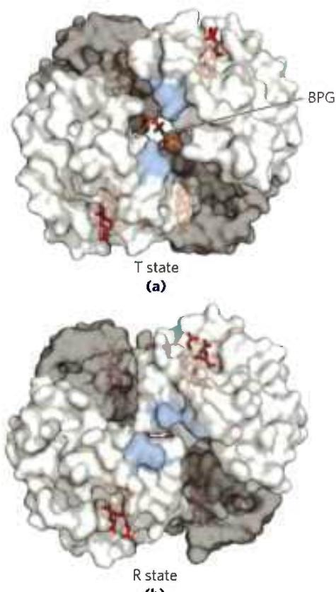  
(b)  
FIGURE 5-17 Binding of 2,3-bisphosphoglycerate to deoxyhemoglobin. (a) BPG binding stabilizes the T state of deoxyhemoglobin. The negative charges of BPG interact with several positively charged groups (shown in blue in this surface contour image) that surround the pocket between the $\beta$ subunits on the surface of deoxyhemoglobin in the T state. (b) The binding pocket for BPG disappears on oxygenation, following transition to the R state. (Compare with Fig. 5-10.) [Data from (a) PDB ID 1886, V. Richard et al., J. Mol. Biol. 233:270, 1993; (b) PDB ID 1BBB, M. M. Silva et al., J. Biol. Chem. 267:17,248, 1992.]

P6 Regulation of oxygen binding to hemoglobin by BPG has an important role in fetal development. Because a fetus must extract oxygen from its mother's blood, fetal hemoglobin must have greater affinity than the maternal hemoglobin for $O_{2}$ . The fetus synthesizes $\gamma$ subunits rather than $\beta$ subunits, forming $\alpha_{2}\gamma_{2}$ hemoglobin. This tetramer has a much lower affinity for BPG than normal adult hemoglobin, and a correspondingly higher affinity for $O_{2}$ .

## Sickle Cell Anemia Is a Molecular Disease of Hemoglobin

The hereditary human disease sickle cell anemia demonstrates strikingly the importance of amino acid sequence in determining the secondary, tertiary, and quaternary structures of globular proteins, and thus their biological functions. Almost 500 genetic variants of hemoglobin are known to occur in the human population; all but a few are quite rare. Most variations consist of differences in a single amino acid residue. The effects on hemoglobin structure and function are often minor but

(b)

(b)  
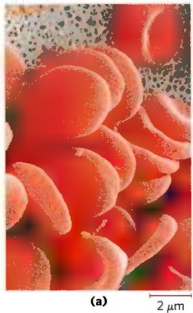

  
FIGURE 5-18 A comparison of (a) uniform, cup-shaped, normal erythrocytes and (b) the variably shaped erythrocytes seen in sickle cell anemia, which range from normal to spiny or sickle-shaped. [(a) A. Syred/Science; (b) Jackie Lewin, Royal Free Hospital/Science Source.]

can sometimes be extraordinary. Each hemoglobin variation is the product of an altered gene. Variant genes are called alleles. Because humans generally have two copies of each gene, an individual may have two copies of one allele (thus being homozygous for that gene) or one copy of each of two different alleles (thus heterozygous).

Sickle cell anemia occurs in individuals who inherit the allele for sickle cell hemoglobin from both parents. The erythrocytes of these individuals are fewer and also abnormal. In addition to an unusually large number of immature cells, the blood contains many long, thin, sickle-shaped erythrocytes (Fig. 5-18). When hemoglobin from sickle cells (called hemoglobin S, or HbS) is deoxygenated, it becomes insoluble and forms polymers that aggregate into tubular fibers (Fig. 5-19). Normal hemoglobin (hemoglobin A, or HbA) remains soluble upon deoxygenation. The insoluble fibers of deoxygenated HbS cause the deformed, sickle shape of the erythrocytes, and the proportion of sickled cells increases greatly as blood is deoxygenated.

The altered properties of HbS result from a single amino acid substitution, a Val instead of a Glu residue at position 6 in the two $\beta$ chains. Replacement of the Glu residue by Val creates a “sticky” hydrophobic contact point at position 6 of the $\beta$ chain, which is on the outer surface of the molecule. These sticky spots cause deoxyHbS molecules to associate abnormally with each other, forming the long, fibrous aggregates characteristic of this disorder.

Sickle cell anemia is life-threatening and painful. People with this disease suffer repeated crises brought on by physical exertion. They become weak, dizzy, and short of breath, and they also experience heart murmurs and an increased pulse rate. The hemoglobin content of their blood is only about half the normal value of 15 to 16 g/100 mL, because sickled cells are very fragile and rupture easily; this results in anemia ("lack of blood"). An even more serious consequence is that capillaries become blocked by the long, abnormally shaped cells, causing severe pain and interfering with normal organ function—a major factor in the early death of many people with the disease.

  
FIGURE 5-19 Normal and sickle cell hemoglobin. (a) Subtle differences between the conformations of HbA and HbS result from a single amino acid change in the $\beta$ chains. (b) As a result of this change, deoxyHbS has a hydrophobic patch on its surface, which causes the molecules to aggregate into strands that align into insoluble fibers.

Without medical treatment, people with sickle cell anemia usually die in childhood. Curiously, the frequency of the sickle cell allele in populations is unusually high in certain parts of Africa. Investigation into this matter led to the finding that when heterozygous, the allele confers a small but significant resistance to lethal forms of malaria. The heterozygous individuals experience a milder condition called sickle cell trait; only about 1% of their erythrocytes become sickled on deoxygenation. These individuals may live completely normal lives if they avoid vigorous exercise and other stresses on the circulatory system. Natural selection has resulted in an allele population that balances the deleterious effects of the homozygous condition against the resistance to malaria afforded by the heterozygous condition.

## SUMMARY 5.1 Reversible Binding of a Protein to a Ligand: Oxygen-Binding Proteins

■ Protein function often entails interactions with other molecules. A protein binds a molecule, known as a ligand, at its binding site.

■ Myoglobin contains a heme prosthetic group, which binds oxygen. Heme consists of a single atom of $Fe^{2+}$ coordinated within a porphyrin.

■ Globins are a specialized family of transport proteins containing heme; most globins store oxygen.

■ Oxygen binds to myoglobin reversibly.

■ Reversible binding of a ligand to a protein can be described quantitatively by a dissociation constant $K_{d}$ . For a monomeric protein such as myoglobin, the fraction of binding sites occupied by a ligand is a hyperbolic function of ligand concentration.

■ Proteins may undergo conformational changes when a ligand binds, a process called induced fit. In a multisubunit protein, the binding of a ligand to one subunit may affect ligand binding to other subunits. Ligand binding can be regulated.

■ Hemoglobin transports oxygen in blood.

■ Normal adult hemoglobin has four heme-containing subunits, two $\alpha$ and two $\beta$ , similar in structure to each other and to myoglobin.

■ Hemoglobin exists in two interchangeable structural states, T and R. The T state is most stable when oxygen is not bound. Oxygen binding promotes transition to the R state.

\- Oxygen binding to hemoglobin is both allosteric and cooperative. As $\mathrm{O}_2$ binds to one binding site, the hemoglobin undergoes conformational changes that affect the other binding sites—an example of allosteric behavior.

■ Conformational changes between the T and R states, mediated by subunit-subunit interactions, result in cooperative binding; this is described by a sigmoid binding curve and can be analyzed by a Hill plot.

■ Two major models have been proposed to explain the cooperative binding of ligands to multisubunit proteins: the concerted model and the sequential model.

■ Hemoglobin also binds $H^{+}$ and $CO_{2}$ , resulting in the formation of ion pairs that stabilize the T state and lessen the protein's affinity for $O_{2}$ (the Bohr effect).

■ Oxygen binding to hemoglobin is also modulated by 2,3-bisphosphoglycerate, which binds to and stabilizes the T state.

■ Sickle cell anemia is a genetic disease caused by a single amino acid substitution (Glu $^{6}$ to Val $^{6}$ ) in each $\beta$ chain of hemoglobin. The change produces a hydrophobic patch on the surface of the hemoglobin that causes the molecules to aggregate into bundles of fibers. This homozygous condition results in serious medical complications.

## 5.2 Complementary Interactions between Proteins and Ligands: The Immune System and Immunoglobulins

We have seen how the conformations of oxygen-binding proteins affect and are affected by the binding of small ligands ( $O_{2}$ or CO) to the heme group. However, most protein-ligand interactions do not involve a prosthetic group. P2 Instead, the binding site for a ligand is more often like the hemoglobin binding site for BPG—a cleft in the protein lined with amino acid residues, arranged to make the binding interaction highly specific. Effective discrimination between ligands is the norm at binding sites, even when the ligands have only minor structural differences.

Almost all organisms have an immune system of some type that allows them to respond to challenges presented by environmental pathogens. The emergence of vertebrates about 500 million years ago was accompanied by the evolution of an adaptive immune system based on the generation of large numbers of distinct cell clones, each expressing a protein variant that could recognize and bind to a particular type of chemical structure. The system distinguishes molecular “self” from “nonself” and then destroys what is identified as nonself. In this way, the immune system eliminates viruses, bacteria, and other pathogens and molecules that may pose a threat to the organism. On a physiological level, the immune response is an intricate and coordinated set of interactions among many classes of proteins, molecules, and cell types. At the level of individual proteins, the immune response demonstrates how an acutely sensitive and specific biochemical system is built upon the reversible binding of ligands to proteins.

## The Immune Response Includes a Specialized Array of Cells and Proteins

Immunity is brought about by a variety of leukocytes (white blood cells), including macrophages and lymphocytes, all of which develop from undifferentiated stem cells in the bone marrow. Leukocytes can leave the bloodstream and patrol the tissues, each cell producing one or more proteins capable of recognizing and binding to molecules that might signal an infection.

The immune response consists of two complementary systems, the humoral and cellular immune systems. The humoral immune system (Latin humor, "fluid") is directed at bacterial infections and extracellular viruses

