assembled and the enzyme that catalyzes their assembly. The first step in the synthesis of a new glycogen molecule is the transfer of a glucose residue from UDP-glucose to the hydroxyl group of Tyr $^{194}$ of glycogenin. Each subunit of the glycogenin homodimer glycosylates Tyr $^{194}$ of the other subunit. The glycosidic bond in the product has the same configuration about the C-1 of glucose as the substrate UDP-glucose, suggesting that the transfer of glucose from UDP to Tyr $^{194}$ occurs in two steps. The first step is probably a nucleophilic attack by Asp $^{162}$ , forming a temporary intermediate with inverted configuration. A second nucleophilic attack by Tyr $^{194}$ then restores the starting configuration. The nascent chains are extended by the sequential addition of seven more glucose residues, each derived from UDP-glucose; the reactions are catalyzed by the chain-extending activity of glycogenin. At this point, glycogen synthase takes over, further extending the glycogen chain. Glycogenin remains buried within the $\beta$ -particle, covalently attached to the two reducing ends of the glycogen molecule.

## SUMMARY 15.2 Breakdown and Synthesis of Glycogen

Glycogen phosphorylase catalyzes phosphorolytic cleavage at the nonreducing ends of glycogen chains, producing glucose 1-phosphate. The debranching enzyme transfers branches onto main chains and releases the residue at the $(\alpha 1\rightarrow 6)$ branch as free glucose.

■ Phosphoglucomutase interconverts glucose 1-phosphate and glucose 6-phosphate. Glucose 6-phosphate can enter glycolysis or, in liver, it can be converted to free glucose by glucose 6-phosphatase in the endoplasmic reticulum, then exported to replenish blood glucose.

The sugar nucleotide UDP-glucose donates glucose residues to the nonreducing end of glycogen in the reaction catalyzed by glycogen synthase, producing short ( $\alpha1\rightarrow4$ )-linked segments. A separate branching enzyme produces the ( $\alpha1\rightarrow6$ ) linkages at branch points.

■ New glycogen particles begin with the autocatalytic formation of a glycosidic bond between the glucose of UDP-glucose and a Tyr residue of the protein glycogenin, followed by addition of several glucose residues to form a primer that can be acted on by glycogen synthase.

## 15.3 Coordinated Regulation of Glycogen Breakdown and Synthesis

As we have seen, the mobilization of stored glycogen is brought about by glycogen phosphorylase, which degrades glycogen to glucose 1-phosphate (Fig. 15-3). Glycogen phosphorylase provides an especially instructive case of enzyme regulation. It was one of the first known examples of an allosterically regulated enzyme and the first enzyme shown to be controlled by reversible phosphorylation. It was also one of the first allosteric enzymes for which the detailed three-dimensional structures of the active and inactive forms were revealed by x-ray crystallographic studies. Glycogen phosphorylase also illustrates how isozymes play their tissue-specific roles.

## Glycogen Phosphorylase Is Regulated by Hormone-Stimulated Phosphorylation and by Allosteric Effectors

P4 In the late 1930s, Carl and Gerty Cori (Box 15-1) discovered that the glycogen phosphorylase of skeletal muscle exists in two interconvertible forms: glycogen phosphorylase a, which is catalytically active, and glycogen phosphorylase b, which is much less active. (Note that glycogen phosphorylase is often referred to glucagon triggers phosphorylation of phosphorylase b, converting it to its active form.

  
Earl W. Sutherland, Jr., 1915–1974 (NLM/Science Source.)  
simply as phosphorylase — so honored because it was the first phosphorylase to be discovered; the shortened name has persisted in common usage and in the literature.) Subsequent studies by Earl Sutherland showed that phosphorylase b predominates in resting muscle, but during vigorous muscular activity, epinephrine triggers phosphorylation of phosphorylase b, converting it to its more active form, phosphorylase a (Fig. 15-11). In the liver,

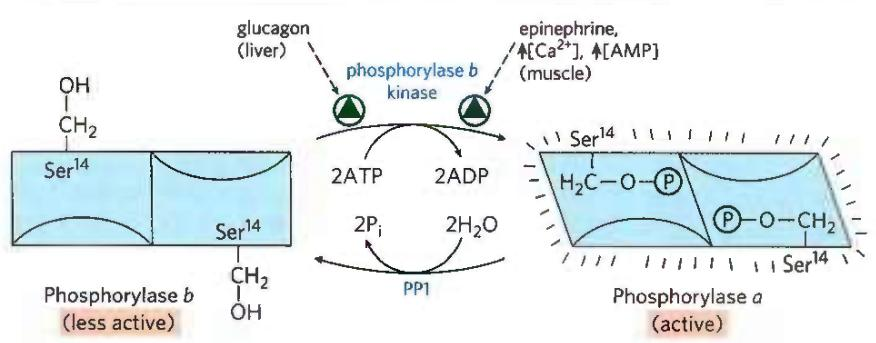  
FIGURE 15-11 Regulation of muscle glycogen phosphorylase by covalent modification. In the more active form of the enzyme, phosphorylase a, Ser $^{14}$ residues, one on each subunit, are phosphorylated. Phosphorylase a is converted to the less active form, phosphorylase b, by enzymatic loss of these phosphoryl groups, catalyzed by phosphoprotein phosphatase 1 (PP1). Phosphorylase b can be reconverted (reactivated) to phosphorylase a by the action of phosphorylase b kinase.

Sutherland discovered the second messenger cAMP, which increases in concentration in response to stimulation by epinephrine (in muscle; see Fig. 12-4) or glucagon (in liver). Elevated [cAMP] initiates an enzyme cascade (Fig. 15-12), in which a catalyst activates a catalyst, which activates a catalyst. As we saw in Chapter 12, such cascades allow exponential amplification of the initial signal. The rise in [cAMP] activates cAMP-dependent protein kinase, also called protein kinase A (PKA). PKA then phosphorylates and activates phosphorylase b kinase, which catalyzes the phosphorylation of glycogen phosphorylase b, activating it and thus stimulating glycogen breakdown.

In muscle, this provides fuel for glycolysis to sustain muscle contraction for the fight-or-flight response signaled by epinephrine. In liver, glycogen breakdown counters the low blood glucose signaled by glucagon, by releasing glucose into the blood. These different roles are reflected in subtle differences in the regulatory mechanisms in muscle and liver. The glycogen phosphorylases of liver and muscle are isozymes, encoded by different genes and differing in their regulatory properties.

Figure 15-12 shows the pathway for hormonal regulation of glycogen phosphorylase activity: epinephrine or glucagon initiates the cascade that activates phosphorylase b kinase. Phosphorylase b kinase activates phosphorylase by transferring a phosphoryl group to Ser $^{14}$ on each of the two identical subunits of phosphorylase b, triggering a conformation change from the T state (phosphorylase b) to the R state (phosphorylase a), shown in detail in Figure 6-40. P4 Superimposed on the hormonal activation of phosphorylase b kinase are allosteric control mechanisms (Fig. 15-12). In muscle, Ca $^{2+}$ , the signal for muscle contraction, binds

FIGURE 15-12 Cascade mechanism of epinephrine and glucagon action. By binding to specific surface receptors, either epinephrine acting on a myocyte (left) or glucagon acting on a hepatocyte (right) activates a GTP-binding protein, $G_{5\alpha}$ . Active $G_{5\alpha}$ triggers a rise in [cAMP], activating PKA. This sets off a cascade of phosphorylations; PKA activates phosphorylase b kinase, which then activates glycogen phosphorylase. Such cascades effect a large amplification of the initial signal; the figures in pink boxes are certainly low estimates of the actual increase in number of molecules at each stage of the cascade. The resulting breakdown of glycogen provides glucose, which in the myocyte can supply ATP (via glycolysis) for muscle contraction and in the hepatocyte is released into the blood to counter the low blood glucose.

  
FIGURE 15-13 Glycogen phosphorylase of liver as a glucose sensor. Glucose binding to an allosteric site of the phosphorylase $a$ isozyme of liver induces a conformational change that exposes its phosphorylated Ser residues to the action of phosphoprotein phosphatase 1 (PP1). This  
phosphatase converts phosphorylase a to phosphorylase b, sharply reducing the activity of phosphorylase and slowing glycogen breakdown in response to high blood glucose. Insulin also acts indirectly to stimulate PP1 and slow glycogen breakdown.

to and activates phosphorylase b kinase. Ca $^{2+}$ binds to phosphorylase b kinase through its δ subunit, which is calmodulin (see Fig. 12-17). AMP, which accumulates in vigorously contracting muscle as a result of ATP breakdown, binds to and activates phosphorylase, speeding the release of glucose 1-phosphate from glycogen. When ATP levels are adequate, ATP blocks the allosteric site to which AMP binds (see Fig. 6-40), inactivating phosphorylase.

When the muscle returns to rest, a second enzyme, phosphoprotein phosphatase 1 (PP1), removes the phosphoryl groups from phosphorylase a, converting it to the less active form, phosphorylase b (see Fig. 15-11).

Like the enzyme of muscle, the glycogen phosphorylase of liver is regulated hormonally (by phosphorylation/dephosphorylation) and allosterically. The dephosphorylated form is essentially inactive. When the blood glucose level is too low, glucagon (acting through the cascade mechanism shown in Fig. 15-12) activates phosphorylase b kinase, which in turn converts phosphorylase b to its active a form, initiating the release of glucose into the blood. When blood glucose levels return to normal, glucose enters hepatocytes and binds to an inhibitory allosteric site on phosphorylase a. This binding also produces a conformational change that exposes the phosphorylated Ser residues to PP1, which catalyzes their dephosphorylation and inactivates the phosphorylase (Fig. 15-13). The allosteric site for glucose allows liver glycogen phosphorylase to act as its own glucose sensor and to respond appropriately to changes in blood glucose.

## Glycogen Synthase Also Is Subject to Multiple Levels of Regulation

Like glycogen phosphorylase, glycogen synthase can exist in phosphorylated and unphosphorylated forms (Fig. 15-14). Its active form, glycogen synthase a, is unphosphorylated. P4 Glycogen synthase kinase 3 (GSK3) adds phosphoryl groups to three Ser residues near the carboxyl terminus of glycogen synthase a converting it to glycogen synthase b, which is inactive unless its allosteric activator, glucose 6-phosphate, is present. The action of GSK3 is hierarchical; it cannot phosphorylate glycogen synthase until another protein kinase, casein kinase II (CKII), has first phosphorylated the glycogen synthase on a nearby residue, an event called priming (Fig. 15-15a). AMP-activated protein kinase (AMPK), which associates with glycogen granules through its carbohydrate-binding domain, also phosphorylates glycogen synthase, inhibiting glycogen synthesis during periods of metabolic stress, signaled by high [AMP] and low [ATP].

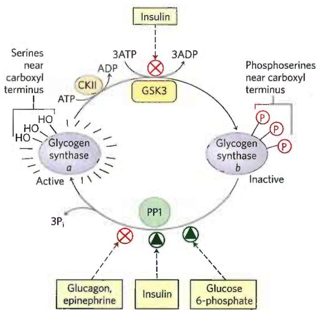  
FIGURE 15-14 Effects of GSK3 on glycogen synthase activity. Glycogen synthase a, the active form, has three Ser residues near its carboxyl terminus. Their phosphorylation by glycogen synthase kinase 3 (GSK3) converts glycogen synthase to its inactive b form. Insulin favors the active a form of glycogen synthase by blocking the activity of GSK3 and activating phosphoprotein phosphatase 1 (PP1). In muscle, epinephrine activates PKA, which phosphorylates the glycogen-targeting protein GM on a site that causes dissociation of PP1 from glycogen. Glucose 6-phosphate favors dephosphorylation of glycogen synthase by binding to it and promoting a conformation that is a good substrate for PP1.

  
FIGURE 15-15 Priming of GSK3 phosphorylation of glycogen synthase. (a) Glycogen synthase kinase 3 first associates with its substrate (glycogen synthase) by interaction between three positively charged residues (Arg $^{96}$ , Arg $^{180}$ , Lys $^{205}$ ) and a phosphoserine residue at position +4 in the substrate. (For orientation, the Ser or Thr residue to be phosphorylated in the substrate is assigned the index 0. Residues on the amino-terminal side of this residue are numbered -1, -2, and so forth; residues on the carboxyl-terminal side are numbered +1, +2, and so forth.) This association aligns the active site of the enzyme with a Ser residue at position 0, which it phosphorylates.  
This creates a new priming site, and the enzyme moves down the protein to phosphorylate the Ser residue at position -4, and then the Ser at -8. (b) GSK3 has a Ser residue near its amino terminus that can be phosphorylated by PKA or PKB. This produces a "pseudosubstrate" region in GSK3 that folds into the priming site and makes the active site inaccessible to another protein substrate, inhibiting GSK3 until the priming phosphoryl group of its pseudosubstrate region is removed by PP1. Other proteins that are substrates for GSK3 also have a priming site at position +4, which must be phosphorylated by another protein kinase before GSK3 can act on them.

Insulin favors activation of glycogen synthase by blocking the activity of GSK3 and activating PP1. In muscle, epinephrine activates PKA, which phosphorylates the glycogen-targeting protein GM (see Fig. 15-16), a regulatory subunit of PP1 in muscle, on a site that causes dissociation of PP1 from glycogen, effectively blocking its action on glycogen synthase.

In liver, conversion of glycogen synthase b to the active form is promoted by PP1, which is bound to the glycogen particle by its regulatory subunit in liver, GL. PP1 removes the phosphoryl groups from the three Ser residues phosphorylated by GSK3. Glucose 6-phosphate binds to an allosteric site on glycogen synthase, making the enzyme a better substrate for dephosphorylation by PP1 and causing its activation. By analogy with glycogen phosphorylase, which acts as a glucose sensor, glycogen synthase can be regarded as a glucose 6-phosphate sensor. In muscle, a different phosphatase may have the role played by PP1 in liver, activating glycogen synthase by dephosphorylating it.

As we saw in Chapter 12, one way in which insulin triggers intracellular changes is by activating a protein kinase (PKB) that, in turn, phosphorylates and inactivates GSK3 (see Fig. 12-23). Phosphorylation of a Ser residue near the amino terminus of GSK3 converts that region of the protein to a pseudosubstrate, which folds into the site at which the priming phosphorylated Ser residue normally binds (Fig. 15-15b). This prevents GSK3 from binding the priming site of a real substrate, thereby inactivating the enzyme and tipping the balance in favor of dephosphorylation of glycogen synthase by PP1. Glycogen phosphorylase can also affect the phosphorylation of glycogen synthase: active glycogen phosphorylase directly inhibits PP1, preventing it from activating glycogen synthase (Fig. 15-14).

P4 Insulin stimulates glycogen synthesis by activating PP1 and by inactivating GSK3. This single enzyme, PP1, can remove phosphoryl groups from all three of the enzymes phosphorylated in response to glucagon (liver) and epinephrine (liver and muscle): phosphorylase kinase, glycogen phosphorylase, and glycogen synthase. The catalytic subunit of PP1 (PP1c) does not exist free in the cytosol, but is tightly bound to its target proteins through a tissue-specific regulatory subunit, one of a family of glycogen-targeting proteins that bind glycogen and each of the three enzymes (Fig. 15-16). PP1 is itself subject to covalent and allosteric regulation: it is inactivated when phosphorylated by PKA and is allosterically activated by glucose 6-phosphate.

## Allosteric and Hormonal Signals Coordinate Carbohydrate Metabolism Globally

Having looked at the mechanisms that regulate individual enzymes, we can now consider the overall shifts in carbohydrate metabolism that occur in the well-fed state, during fasting, and in the fight-or-flight response—signaled by insulin, glucagon, and epinephrine, respectively. We need to contrast two cases in which regulation serves different ends: (1) the role of hepatocytes in supplying glucose to the blood; and (2) the selfish use of carbohydrate fuels by extrahepatic tissues, typified by skeletal muscle (myocytes), to support their own activities.

  
FIGURE 15-16 Glycogen-targeting protein GM. GM is a regulatory subunit of PP1 in muscle, and one of a family of glycogen-targeting proteins that serve as a scaffold, binding other proteins (including PP1) to glycogen particles. GM can be phosphorylated at two different sites in response to insulin or epinephrine. Insulin-stimulated phosphorylation of GM site 1 activates PP1, which dephosphorylates phosphorylase kinase, glycogen phosphorylase,  
and glycogen synthase. ② Epinephrine-stimulated phosphorylation of Gm site 2 by PKA causes dissociation of PP1 from the glycogen particle, preventing its access to glycogen phosphorylase and glycogen synthase. PKA also phosphorylates a protein (inhibitor 1) that, when phosphorylated, inhibits PP1. By these means, insulin stimulates glycogen synthesis and inhibits glycogen breakdown, whereas epinephrine (or glucagon in the liver) has the opposite effects.

After ingestion of a carbohydrate-rich meal, the elevation of blood glucose triggers insulin release (Fig. 15-17, top). In a hepatocyte, insulin has two immediate effects: it inactivates GSK3; and it activates a protein phosphatase, probably PP1. These two actions fully activate glycogen synthase. PP1 also inactivates glycogen phosphorylase $a$ and phosphorylase kinase by dephosphorylating both, effectively stopping glycogen breakdown. Glucose enters the hepatocyte through the high-capacity transporter GLUT2, always present in the plasma membrane, and the elevated intracellular glucose leads to dissociation of hexokinase IV (glucokinase) from its nuclear regulatory protein (Fig. 14-21). Hexokinase IV enters the cytosol and phosphorylates glucose, stimulating glycolysis and supplying the precursor for glycogen synthesis. Under these conditions, hepatocytes use the excess glucose in the blood to synthesize glycogen, up to the limit of about $10\%$ of the total weight of the liver.

Between meals, or during an extended fast, the blood glucose level drops, triggering the release of glucagon, which, acting through the cascade shown in Figure 15-12, activates PKA. PKA mediates all the effects of glucagon (Fig. 15-17, bottom). It phosphorylates phosphorylase kinase, activating it and leading to the activation of glycogen phosphorylase. It phosphorylates glycogen synthase, inactivating it and blocking glycogen synthesis. It phosphorylates PFK-2/FBPase-2, leading to a drop in the concentration of the regulator fructose 2,6-bisphosphate, which has the effect of inactivating the glycolytic enzyme PFK-1 and activating the gluconeogenic enzyme

FBPase-1 (see Fig. 14-24). And it phosphorylates and inactivates the glycolytic enzyme pyruvate kinase. Under these conditions, the liver produces glucose 6-phosphate by glycogen breakdown and by gluconeogenesis, and it stops using glucose to fuel glycolysis or make glycogen, maximizing the amount of glucose it can release to the blood. This release of glucose is possible only in liver and kidney, because other tissues lack glucose 6-phosphatase (Fig. 15-6).

P4 The physiology of skeletal muscle differs from that of liver in three ways important to our discussion of metabolic regulation (Fig. 15-18): (1) muscle uses its stored glycogen only for its own needs; (2) as it goes from rest to vigorous contraction, muscle undergoes very large changes in its demand for ATP, which is provided by glycolysis; (3) muscle lacks the enzymatic machinery for gluconeogenesis. The regulation of carbohydrate metabolism in muscle reflects these differences from liver. First, myocytes lack receptors for glucagon, which are present on hepatocytes. Second, the muscle isozyme of pyruvate kinase is not phosphorylated by PKA, so glycolysis is not turned off when [cAMP] is high. In fact, cAMP increases the rate of glycolysis in muscle, probably by activating glycogen phosphorylase. When epinephrine is released into the blood in a fight-or-flight situation, PKA is activated by the rise in [cAMP] and phosphorylates and activates glycogen phosphorylase kinase. The resulting phosphorylation and activation of glycogen phosphorylase results in faster glycogen breakdown. Epinephrine is not released under low-stress conditions, but with each neuronal stimulation of muscle contraction, cytosolic $\left[\mathrm{Ca}^{2+}\right]$ rises briefly and activates phosphorylase kinase through its calmodulin subunit.

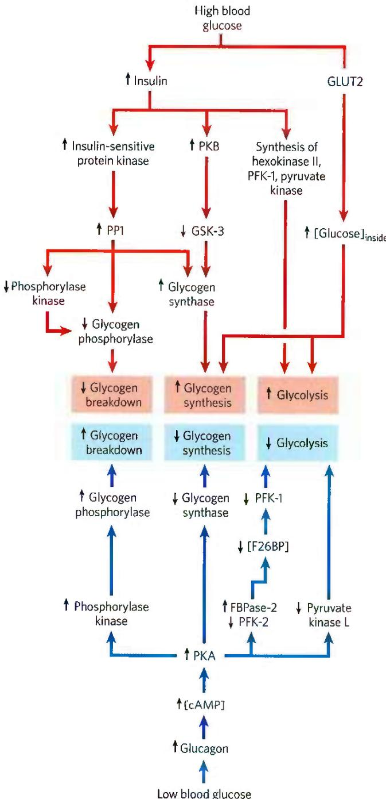  
FIGURE 15-17 Regulation of carbohydrate metabolism in the liver. Colored arrows indicate causal relationships between the changes they connect. For example, an arrow from ↓A to ↑B means that a decrease in A causes an increase in B. Red arrows connect events that result from high blood glucose; blue arrows connect events that result from low blood glucose.

Elevated insulin triggers increased glycogen synthesis in myocytes by activating PP1 and inactivating GSK3. Unlike hepatocytes, myocytes have a reserve of the glucose transporter GLUT4 sequestered in intracellular vesicles. Insulin triggers their movement to the plasma membrane (see Fig. 12-23), where they allow increased glucose uptake. In response to insulin, therefore, myocytes help to lower blood glucose by increasing their rates of glucose uptake, glycogen synthesis, and glycolysis.

  
FIGURE 15-18 Difference in the regulation of carbohydrate metabolism in liver and muscle. In liver, either glucagon (indicating low blood glucose) or epinephrine (signaling the need to fight or flee) has the effect of maximizing the output of glucose into the blood. In muscle, epinephrine increases glycogen breakdown and glycolysis, which together provide fuel to produce the ATP needed for muscle contraction.

## Carbohydrate and Lipid Metabolism Are Integrated by Hormonal and Allosteric Mechanisms

As complex as the regulation of carbohydrate metabolism is, it is far from the whole story of fuel metabolism. P4 The metabolism of fats and fatty acids is very closely tied to that of carbohydrates. Hormonal signals such as insulin and changes in diet or exercise are equally important in regulating fat metabolism and integrating it with that of carbohydrates. We return to this overall metabolic integration in mammals in Chapter 23, after first considering the metabolic pathways for fats and amino acids (Chapters 17 and 18). The message we wish to convey here is that metabolic pathways are overlaid with complex regulatory controls that are exquisitely sensitive to changes in metabolic circumstances. These mechanisms act to adjust the flow of metabolites through various metabolic pathways, as needed by the cell and organism, without causing major changes in the concentrations of intermediates shared with other pathways.

## SUMMARY 15.3 Coordinated Regulation of Glycogen Breakdown and Synthesis

Glycogen phosphorylase is activated in response to epinephrine (in muscle) or glucagon (in liver), which raise [cAMP] and thereby activate PKA. PKA phosphorylates and activates phosphorylase kinase, which converts glycogen phosphorylase b to its active a form. In muscle, $Ca^{2+}$ and AMP act allosterically to amplify the activity of the enzymes in this cascade. In liver, glucose acts allosterically to make phosphorylase a more susceptible to dephosphorylation/inactivation by phosphoprotein phosphatase 1 (PP1).

■ Glycogen synthase a is inactivated by phosphorylation, ultimately catalyzed by GSK3, but primed by phosphorylation by other kinases. Insulin, by causing inactivation of

GSK3 and activating PP1, favors glycogen synthase a and stimulates glycogen synthesis. Glucose 6-phosphate acts allosterically to make glycogen synthase b a better substrate for PP1, which dephosphorylates it to its active a form.

In liver, glucagon stimulates glycogen breakdown and gluconeogenesis while blocking glycolysis, thereby sparing glucose for export to the brain and other tissues. In muscle, epinephrine stimulates glycogen breakdown and glycolysis, providing ATP to support contraction.

■ Further hormonal and allosteric mechanisms regulate the use of carbohydrates and lipids as metabolic fuels.

## KEY TERMS

Terms in bold are defined in the glossary.

glycogenolysis 558  
glycogenesis 558  
debranching enzyme 559  
phosphoglucomutase 559  
sugar nucleotides 560  
UDP-glucose  
pyrophosphorylase 562  
glycogen-branching  
enzyme 563  
glycogenin 563  
glycogen phosphorylase a 565  
glycogen phosphorylase b 565 enzyme cascade 566  
phosphorylase b kinase 566  
phosphoprotein phosphatase 1 (PP1) 567  
glycogen synthase a 567  
glycogen synthase kinase 3 (GSK3) 567  
glycogen synthase b 567  
casein kinase II (CKII) 567  
priming 567  
glycogen-targeting proteins 568

## PROBLEMS

1. Glycogen as Energy Storage: How Long Can a Game Bird Fly? Since ancient times, people have observed that certain game birds, such as grouse, quail, and pheasants, fatigue easily. The Greek historian Xenophon wrote: "The bustards . . . can be caught if one is quick in starting them up, for they will fly only a short distance, like partridges, and soon tire; and their flesh is delicious." The flight muscles of game birds rely almost entirely on the use of glucose 1-phosphate to drive ATP synthesis (Chapter 14). The glucose 1-phosphate derives from the breakdown of stored muscle glycogen, catalyzed by the enzyme glycogen phosphorylase. The rate of ATP production is limited by the rate at which glycogen can be broken down. During a "panic flight," the game bird's rate of glycogen breakdown is quite high, approximately $120\mu \mathrm{mol / min}$ of glucose 1-phosphate produced per gram of fresh tissue. Given that the flight muscles usually contain about $0.35\%$ glycogen by weight, calculate how long a game bird can fly. (Assume the average molecular weight of a glucose residue in glycogen is $162~\mathrm{g / mol}$ .)

2. Enzyme Activity and Physiological Function The $V_{max}$ of the glycogen phosphorylase from skeletal muscle is much greater than the $V_{max}$ of the same enzyme from liver tissue.

(a) What is the physiological function of glycogen phosphorylase in skeletal muscle? In liver tissue?

(b) Why does the $V_{max}$ of the muscle enzyme need to be greater than that of the liver enzyme?

3. Glycogen Phosphorylase Equilibrium Glycogen phosphorylase catalyzes the removal of glucose from glycogen. The $\Delta G^{\prime\circ}$ for this reaction is 3.1 kJ/mol.

(a) Calculate the ratio of $[P_{i}]$ to [glucose 1-phosphate] when the reaction is at equilibrium. (Hint: The removal of glucose units from glycogen does not change the glycogen concentration.)

(b) The measured ratio $[P_{i}]/[glucose\ 1-phosphate]$ in myocytes under physiological conditions is more than 100:1. What does this indicate about the direction of metabolite flow through the glycogen phosphorylase reaction in muscle?

(c) Why are the equilibrium and physiological ratios different? What is the possible significance of this difference?

4. Regulation of Glycogen Phosphorylase In muscle tissue, the rate of conversion of glycogen to glucose 6-phosphate is determined by the ratio of phosphorylase a (active) to phosphorylase b (less active). Determine what happens to the rate of glycogen breakdown if a broken cell extract of muscle containing glycogen phosphorylase is treated with (a) phosphorylase kinase and ATP (b) PP1 (c) epinephrine.

5. Glycogen Breakdown in Rabbit Muscle The intracellular use of glucose and glycogen is tightly regulated at four points. To compare the regulation of glycolysis when oxygen is plentiful and when it is depleted, consider the utilization of glucose and glycogen by rabbit leg muscle in two physiological settings: a resting rabbit, with low ATP demands, and a rabbit that sights its mortal enemy, the coyote, and dashes into its burrow. For each setting, determine the relative levels (high, intermediate, or low) of AMP, ATP, citrate, and acetyl-CoA and describe how these levels affect the flow of metabolites through glycolysis by regulating specific enzymes. (Hint: In periods of stress, rabbit leg muscle produces much of its ATP by anaerobic glycolysis (lactate fermentation) and very little by oxidation of acetyl-CoA derived from fat breakdown.)

6. Glycogen Breakdown in Migrating Birds Unlike a rabbit, running all-out for a few moments to escape a predator, migratory birds require energy for extended periods of time. For example, ducks generally fly several thousand miles during their annual migration. The flight muscles of migratory birds have a high oxidative capacity and obtain the necessary ATP through the oxidation of acetyl-CoA (obtained from fats) via the citric acid cycle. Compare the regulation of muscle glycolysis during short-term intense activity, as in a fleeing rabbit, and during extended activity, as in a migrating duck. Why must the regulation in these two settings be different?

7. Enzyme Defects in Carbohydrate Metabolism
Consider the four clinical case studies, A through D. For each case, determine which enzyme is defective and designate the appropriate treatment from the lists provided at the end of the problem. Justify your choices. Answer the questions contained in each case study. (You may need to refer to information in Chapter 14.)

Case A: The patient develops vomiting and diarrhea shortly after milk ingestion. The physician administers a lactose tolerance test. (The patient ingests a standard amount of lactose, and the physician measures the glucose and galactose concentrations in his blood plasma at intervals. In individuals with normal carbohydrate metabolism, the levels increase to a maximum in about 1 hour, then decline.) The patient's blood glucose and galactose concentrations do not increase during the test. Why do blood glucose and galactose increase and then decrease during the test in healthy individuals? Why do they fail to rise in the patient?

Case B: The patient develops vomiting and diarrhea after ingestion of milk. Blood tests show a low concentration of glucose but a much higher than normal concentration of reducing sugars. The urine tests positive for galactose. Why is the concentration of reducing sugar in the blood high? Why does galactose appear in the urine?

Case C: The patient complains of painful muscle cramps when performing strenuous physical exercise but has no other symptoms. A muscle biopsy indicates a muscle glycogen concentration much higher than normal. Why does glycogen accumulate?

Case D: The patient is lethargic, her liver is enlarged, and a biopsy of the liver shows large amounts of excess glycogen. She also has a lower than normal blood glucose level. What is the reason for the low blood glucose in this patient?

Defective Enzyme

(a) Muscle PFK-1

(b) Phosphomannose isomerase

(c) Galactose 1-phosphate uridylyltransferase

(d) Liver glycogen phosphorylase

(e) Triose kinase

(f) Lactase in intestinal mucosa

(g) Maltase in intestinal mucosa

(h) Muscle debranching enzyme

Treatment

1. Jogging 5 km each day

2. Fat-free diet

3. Low-lactose diet

4. Avoiding strenuous exercise

5. Large doses of niacin (the precursor of NAD)

6. Frequent feedings (smaller portions) of a normal diet

8. Effects of Insufficient Insulin in a Person with Diabetes A man with insulin-dependent diabetes is brought to the hospital emergency department in a near-comatose state. While vacationing in an isolated place, he lost his insulin medication and has not taken any insulin for two days.

(a) For each tissue listed at the end of the problem, is each pathway faster, slower, or unchanged in this patient, compared with the normal level when he is getting appropriate amounts of insulin?

(b) For each pathway, describe at least one control mechanism responsible for the change you predict.

Tissue and Pathways

1. Adipose: fatty acid synthesis

2. Muscle: glycolysis; fatty acid synthesis; glycogen synthesis

3. Liver: glycolysis; gluconeogenesis; glycogen synthesis;

fatty acid synthesis; pentose phosphate pathway

9. Blood Metabolites in Insulin Insufficiency For the patient described in Problem 8, predict the levels of each listed metabolite in his blood before treatment in the emergency room, relative to levels maintained during adequate insulin treatment: (a) glucose (b) ketone bodies (c) free fatty acids.

10. Metabolic Effects of Mutant Enzymes Predict and explain the effect on glycogen metabolism of each of the listed defects caused by mutation: (a) Loss of the cAMP-binding site on the regulatory subunit of protein kinase A (PKA) (b) Loss of the protein phosphatase inhibitor (inhibitor 1 in Fig. 15-16) (c) Overexpression of phosphorylase b kinase in liver (d) Defective glucagon receptors in liver.

11. Hormonal Control of Metabolic Fuel Between your evening meal and breakfast, your blood glucose drops and your liver becomes a net producer rather than consumer of glucose. Describe the hormonal basis for this switch, and explain how the hormonal change triggers glucose production by the liver.

12. Altered Metabolism in Genetically Manipulated Mice Researchers can manipulate the genes of a mouse so that a single gene in a single tissue either produces an inactive protein (a "knockout" mouse) or produces a protein that is always (constitutively) active. What effects on metabolism would you predict for mice with the listed genetic changes? (a) Knockout of glycogen debranching enzyme in the liver (b) Knockout of hexokinase IV in liver (c) Knockout of FBPase-2 in liver (d) Constitutively active FBPase-2 in liver (e) Constitutively active AMPK in muscle (f) Constitutively active ChREBP in liver (see Fig. 14-28)

## DATA ANALYSIS PROBLEM

13. Optimal Glycogen Structure Muscle cells need rapid access to large amounts of glucose during heavy exercise. This glucose is stored in liver and skeletal muscle in polymeric form as particles of glycogen. The typical glycogen $\beta$ -particle contains about 55,000 glucose residues (see Fig. 15-2). Meléndez-Hevia, Waddell, and Shelton (1993) explored some theoretical aspects of the structure of glycogen, as described in this problem.

(a) The cellular concentration of glycogen in liver is about 0.01 μM. What cellular concentration of free glucose would be required to store an equivalent amount of glucose? Why would this concentration of free glucose present a problem for the cell?

Glucose is released from glycogen by glycogen phosphorylase, an enzyme that can remove glucose molecules, one at a time, from one end of a glycogen chain (see Fig. 15-3). Glycogen chains are branched (see Fig. 15-2), and the degree of branching—the number of branches per chain—has a powerful influence on the rate at which glycogen phosphorylase can release glucose.

(b) Why would a degree of branching that was too low (i.e., below an optimum level) reduce the rate of glucose release? (Hint: Consider the extreme case of no branches in a chain of 55,000 glucose residues.)

(c) Why would a degree of branching that was too high also reduce the rate of glucose release? (Hint: Think of the physical constraints.)

Meléndez-Hevia and colleagues did a series of calculations and found that two branches per chain (see Fig. 15-2) was optimal for the constraints described above. This is what is found in glycogen stored in muscle and liver.

To determine the optimum number of glucose residues per chain, Meléndez-Hevia and coauthors considered two key parameters that define the structure of a glycogen particle: t = the number of tiers of glucose chains in a particle (the molecule in Fig. 15-2 has five tiers); $g_{c}$ = the number of glucose residues in each chain. They set out to find the values of t and $g_{c}$ that would maximize three quantities: (1) the amount of glucose stored in the particle ( $G_{T}$ ) per unit volume; (2) the number of unbranched glucose chains ( $C_{A}$ ) per unit volume (i.e., number of A chains in the outermost tier, readily accessible to glycogen phosphorylase); and (3) the amount of glucose available to phosphorylase in these unbranched chains ( $G_{PT}$ ).

(d) Show that $C_{A} = 2^{t-1}$ . This is the number of chains available to glycogen phosphorylase before the action of the debranching enzyme.

(e) Show that $C_{T}$ , the total number of chains in the particle, is given by $C_{T} = 2^{t} - 1$ . For purposes of this calculation, consider the primers to be a single chain. Thus $G_{\mathrm{T}} = g_{\mathrm{c}}(C_{\mathrm{T}}) = g_{\mathrm{c}}(2^{t} - 1)$ , the total number of glucose residues in the particle.

(f) Glycogen phosphorylase cannot remove glucose from glycogen chains that are shorter than five glucose residues. Show that $G_{\mathrm{PT}} = (g_{\mathrm{c}} - 4)(2^{t-1})$ . This is the amount of glucose readily available to glycogen phosphorylase.

(g) Based on the size of a glucose residue and the location of branches, the thickness of one tier of glycogen is $0.12 \, g_{c} \, nm + 0.35 \, nm$ . Show that the volume of a particle, $V_{s}$ , is given by the equation $V_{s} = \frac{4}{3} \pi t^{3} (0.12 g_{c} + 0.35)^{3} \, nm^{3}$ .

Meléndez-Hevia and coauthors then determined the optimum values of t and $g_{c}$ —those that gave the maximum value of a quality function, f, that maximizes $G_{T}$ , $C_{A}$ , and $G_{PT}$ , while minimizing $V_{s}$ : $f = \frac{G_{T}C_{A}G_{PT}}{V_{s}}$ . They found that the optimum value of $g_{c}$ is independent of t.

(h) Choose a value of t between 5 and 15 and find the optimum value of $g_{c}$ . How does this compare with the $g_{c}$ found in liver glycogen (see Fig. 15-2)? (Hint: You may find it useful to use a spreadsheet program.)

## Reference

Meléndez-Hevia, E., T.G. Waddell, and E.D. Shelton. 1993. Optimization of molecular design in the evolution of metabolism: the glycogen molecule. Biochem. J. 295:477–483.

# THE CITRIC ACID CYCLE

16.1 Production of Acetyl-CoA (Activated Acetate) 575

16.2 Reactions of the Citric Acid Cycle 578

16.3 The Hub of Intermediary Metabolism 590

16.4 Regulation of the Citric Acid Cycle 593

As we saw in Chapter 14, some cells obtain energy (ATP) by fermentation, breaking down glucose in the absence of oxygen. For most eukaryotic cells and many bacteria, which live under aerobic conditions and oxidize their organic fuels to carbon dioxide and water, glycolysis is but the first stage in the complete oxidation of glucose. Rather than being reduced to lactate, ethanol, or some other fermentation product, the pyruvate produced by glycolysis is further oxidized to $H_{2}O$ and $CO_{2}$ through the process of cellular respiration.

Cellular respiration occurs in three major stages (Fig. 16-1), the first two of which we discuss in this chapter. In the first, organic fuel molecules—glucose, fatty acids, and some amino acids—are oxidized to yield two-carbon fragments in the form of the acetyl group of acetyl-coenzyme A (acetyl-CoA). In the second stage, the acetyl groups are oxidized to $CO_{2}$ in the citric acid cycle, also called the tricarboxylic acid (TCA) cycle or the Krebs cycle (after its discoverer, Hans Krebs). Much of the energy of these oxidations is conserved in the reduced electron carriers NADH and $FADH_{2}$ . In the third stage of respiration, these reduced coenzymes are themselves oxidized, giving up protons ( $H^{+}$ ) and

  
Hans Krebs, 1900–1981
(Keystone Pictures USA/Alamy.)

electrons. The electrons are transferred to $O_{2}$ via a series of electron-carrying molecules known as the respiratory chain, resulting in the formation of water. In the course of electron transfer, much of the energy available from redox reactions is conserved in the form of ATP, by a process called oxidative phosphorylation. We discuss this third stage in Chapter 19.

We use these principles as our guide to this chapter:

P1 Pyruvate is the metabolite that links two central catabolic pathways, glycolysis and the citric acid cycle. It is therefore a logical point for regulation that determines the rate of catabolic activity and the partitioning of pyruvate among its possible uses.

P2 The reactions of the citric acid cycle follow a chemical logic. In its catabolic role the citric acid cycle oxidizes acetyl-CoA to $CO_{2}$ and $H_{2}O$ . Energy from the oxidations in the cycle drives the synthesis of ATP. The chemical strategies for activating groups for oxidation and for conserving energy in the form of reducing power and high-energy compounds are used in many other biochemical pathways.

P3 The citric acid cycle is a hub of metabolism, with catabolic pathways leading in and anabolic pathways leading out. Acetate groups (acetyl-CoA) from the catabolism of various fuels are used in the synthesis of such metabolites as amino acids, fatty acids, and sterols. The breakdown products of many amino acids and nucleotides are intermediates of the cycle, and they can be fed in or siphoned off as needed by the cell.

P4 The central role of the citric acid cycle in metabolism requires that it be regulated in coordination with many other pathways. Regulation occurs by both allosteric and covalent mechanisms that overlap and interact to achieve homeostasis. Some mutations that affect the reactions of the citric acid cycle lead to tumor formation.

P5 Enzymes have evolved to form complexes to efficiently achieve a series of chemical transformations without releasing the intermediates into the bulk solvent. This strategy, seen in the pyruvate dehydrogenase complex and the metabolons of the citric acid cycle, is ubiquitous in other pathways of metabolism, in respiration, and in the many “—somes” that assemble and disassemble informational macromolecules.

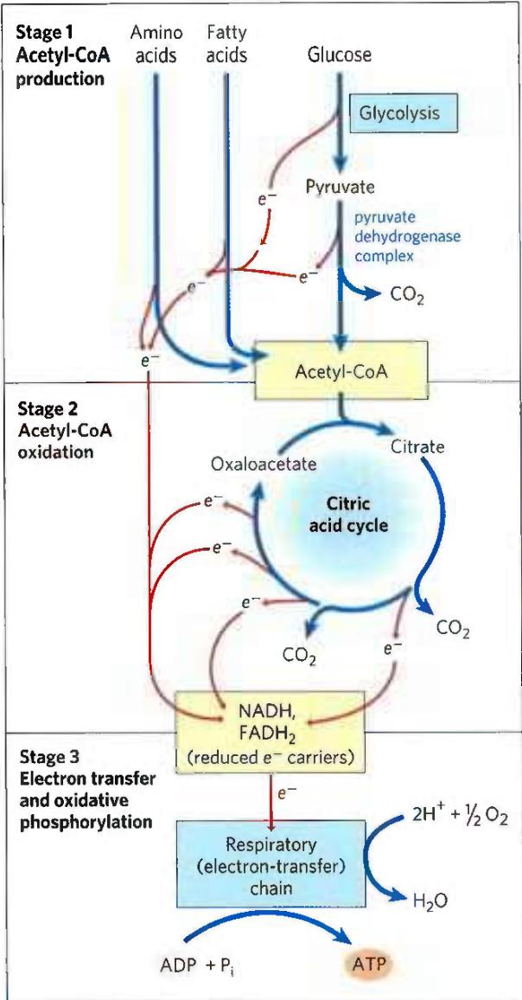  
FIGURE 16-1 Catabolism of proteins, fats, and carbohydrates in the three stages of cellular respiration. Stage 1: oxidation of fatty acids, glucose, and some amino acids yields acetyl-CoA. Stage 2: oxidation of acetyl groups in the citric acid cycle includes four steps in which electrons are abstracted. Stage 3: electrons carried by NADH and FADH₂ are funneled into a chain of mitochondrial (or, in bacteria, plasma membrane-bound) electron carriers—the respiratory chain—ultimately reducing O₂ to H₂O. This electron flow drives the production of ATP.

## 16.1 Production of Acetyl-CoA (Activated Acetate)

Coenzyme A, or CoA (Fig. 16-2), has a reactive thiol (-SH) group that is critical to its role as an acyl carrier in many metabolic processes, including the citric acid cycle. Acyl groups are covalently linked to the thiol group, forming thioesters. Because of their relatively high standard free energies of hydrolysis (see Figs. 13-16, 13-17), thioesters have a high acyl group transfer potential—that is, donation of their acyl groups to a variety of acceptor molecules is a favorable reaction. The acyl group attached to coenzyme A may thus be thought of as "activated" for group transfer.

In aerobic organisms, glucose and other sugars, fatty acids, and most amino acids are ultimately oxidized to $CO_{2}$ and $H_{2}O$ via the citric acid cycle and the respiratory chain. Before entering the citric acid cycle, the carbon skeletons of monosaccharides and fatty acids are degraded to the acetyl group of acetyl-CoA, the form in which the cycle accepts much of its fuel input. Many amino acid carbons also enter the cycle as acetate, although several amino acids are degraded to other cycle intermediates such as succinate and malate, which then enter the cycle.

## Pyruvate Is Oxidized to Acetyl-CoA and $\mathrm{CO}_{2}$

P1 Pyruvate generated in the cytosol by glycolysis represents a node in the metabolism of carbohydrates, proteins, and fats. Under anaerobic conditions, pyruvate may simply be reduced to lactate in the cytosol, regenerating NAD+ for continued ATP production by glycolysis. Pyruvate may serve as a precursor for the synthesis of amino acids (Chapter 22). In eukaryotes, pyruvate may diffuse into mitochondria, first through large openings in the outer mitochondrial membrane and then into the matrix via an H+-coupled pyruvate-specific symporter in the inner mitochondrial membrane, the mitochondrial pyruvate carrier (MPC). Pyruvate that enters mitochondria may be oxidized by the citric acid cycle to generate energy or, after conversion to acetyl-CoA, may be used as the starting material for synthesis of fatty acids and sterols.

Pyruvate in the mitochondrial matrix is oxidized to acetyl-CoA and $CO_{2}$ by the pyruvate dehydrogenase (PDH) complex, a highly ordered cluster of enzymes and cofactors. P5 In the PDH complex, a series of chemical intermediates remain bound to the enzyme subunits as a substrate (pyruvate) is transformed into the final product (acetyl-CoA). Five cofactors, four of which are derived from vitamins, participate in the reaction mechanism. P4 The regulation of this enzyme complex illustrates how a combination of covalent modification and allosteric mechanism results in precisely regulated flux through a metabolic step.

The overall reaction catalyzed by the pyruvate dehydrogenase complex is an oxidative decarboxylation, an irreversible oxidation process in which the carboxyl group is removed from pyruvate as a molecule of $CO_{2}$ and the two remaining carbons become the acetyl group of acetyl-CoA (Fig. 16-3). The NADH formed in this reaction gives up a hydride ion ( $:H^{-}$ ) to the respiratory chain (Fig. 16-1), which carries the two electrons to oxygen or, in anaerobic microorganisms, to an alternative electron acceptor such as nitrate or sulfate. The transfer of electrons from NADH to oxygen ultimately generates 2.5 molecules of ATP per pair of electrons. The irreversibility of the PDH complex reaction has been demonstrated by isotopic labeling experiments: the complex cannot reattach radioactively labeled $CO_{2}$ to acetyl-CoA to yield carboxyl-labeled pyruvate.

  
FIGURE 16-2 Coenzyme A (CoA-SH). A hydroxyl group of pantothenic acid is joined to a modified ADP moiety by a phosphate ester bond, and its carboxyl group is attached to $\beta$ -mercaptoethylamine in amide linkage. The

  
FIGURE 16-3 Overall reaction catalyzed by the pyruvate dehydrogenase complex. The five coenzymes participating in this reaction, and the three enzymes that make up the enzyme complex, are discussed in the text.

## The PDH Complex Employs Three Enzymes and Five Coenzymes to Oxidize Pyruvate

The combined dehydrogenation and decarboxylation of pyruvate to the acetyl group of acetyl-CoA (Fig. 16-3) requires the sequential action of three different enzymes and five different coenzymes or prosthetic groups—thiamine pyrophosphate (TPP), lipoate, coenzyme A (CoA, sometimes denoted CoA-SH, to emphasize the role of the —SH group), flavin adenine dinucleotide (FAD), and nicotinamide adenine dinucleotide (NAD). We encountered TPP as the coenzyme of pyruvate decarboxylase (see Fig. 14-13). Lipoate (Fig. 16-4), has two thiol groups that can undergo reversible oxidation to a disulfide bond (—S—S—), similar to that between two Cys residues in a protein. Because of its capacity to undergo oxidation-reduction reactions, lipoate can serve both as an electron (hydrogen) carrier and as an acyl carrier, as we shall see. CoA serves as the carrier of the activated acyl group. We described the roles of FAD and NAD as electron carriers in Chapter 13.

hydroxyl group at the 3' position of the ADP moiety has a phosphoryl group not present in free ADP. The —SH group of the mercaptoethylamine moiety forms a thioester with acetate in acetyl-coenzyme A (acetyl-CoA) (lower left).  
  
FIGURE 16-4 Lipoic acid (lipoate) in amide linkage with a Lys residue. The lipoyllysyl moiety is the prosthetic group of dihydrolipoyl transacetylase ( $E_{2}$ of the PDH complex). The lipoyl group occurs in oxidized (disulfide) and reduced (dithiol) forms and acts as a carrier of both hydrogen and an acetyl (or other acyl) group.

The PDH complex contains multiple copies of three enzymes—pyruvate dehydrogenase ( $E_{1}$ ), dihydrolipoyl transacetylase ( $E_{2}$ ), and dihydrolipoyl dehydrogenase ( $E_{3}$ )—that catalyze the oxidation of pyruvate. The number of copies of each enzyme and therefore the size of the complex varies among species. A central core is formed of many copies (24 to 60) of $E_{2}$ surrounded by multiple and variable numbers of copies of $E_{1}$ and $E_{3}$ (Fig. 16-5). Two regulatory proteins are also part of the complex: a protein kinase and a phosphoprotein phosphatase, discussed below.

  
FIGURE 16-5 Structure of the pyruvate dehydrogenase complex. The complex is so big and so flexible that solving its structure required a combination of methods, including x-ray crystallography and NMR spectroscopy; once the individual pieces were solved, cryo-EM of the whole structure was used to assemble the pieces from several organisms to get this view. The core ( $E_{2}$ ) is from the gram-negative bacterium Azotobacter vinelandii. $E_{1}$ and $E_{3}$ are from the thermophilic gram-positive bacterium Geobacillus stearothermophilus. $E_{1}$ , pyruvate dehydrogenase (yellow); $E_{2}$ , dihydrolipoyl transacetylase (green); and $E_{3}$ , dihydrolipoyl dehydrogenase (red). The central core of the Azotobacter PDH complex consists of 24 copies of $E_{2}$ , but to simplify the structure, only six are shown here. Multiple copies of $E_{1}$ and $E_{3}$ surround the central core, and flexible arms (shown schematically) reach out from $E_{2}$ to $E_{1}$ and $E_{3}$ , carrying the lipoyl moiety (pink) from the active site of one enzyme to that of the next. The amino acid sequences and three-dimensional structures of individual domains show that both catalytic mechanism and structure have been conserved in evolution. [Information from D. Goodsell, doi:10.2210/rcsb\_pdb/mom\_2012\_9. Data from PDB ID 1LAC F. Dardel et al., J. Mol. Biol. 229:1037, 1993; PDB ID 1EAA A. Mattevi et al., Biochemistry 32:3887, 1993; PDB ID 1W85 R. A. Frank et al., Science 306:872, 2004; PDB ID 1EBD S. S. Mande et al., Structure 4:277, 1996.]

The active site of $E_{1}$ has noncovalently bound TPP. $E_{2}$ has the prosthetic group lipoate, attached through an amide bond to the $\varepsilon$ -amino group of a Lys residue (Fig. 16-4). $E_{2}$ has three functionally distinct domains: one or more (depending on the species) amino-terminal lipoyl domains, containing the lipoyl-Lys residue(s); the central $E_{1}$ - and $E_{3}$ -binding domain; and the inner-core acyltransferase domain, which contains the acyltransferase active site. The domains of $E_{2}$ are separated by linkers, sequences of 20 to 30 amino acid residues, rich in Ala and Pro and interspersed with charged residues; these linkers tend to assume their extended forms, holding the three domains apart. The attachment of lipoate to the end of a Lys side chain in $E_{2}$ produces a long, flexible arm that can move from the active site of $E_{1}$ to the active sites of $E_{2}$ and $E_{3}$ , a distance of perhaps 5 nm or more, while holding the intermediate captive throughout the reaction sequence. $E_{3}$ has tightly bound FAD.

P5 This basic $E_{1}-E_{2}-E_{3}$ structure of the PDH complex is seen in two other enzyme complexes that catalyze similar reactions: $\alpha$ -ketoglutarate dehydrogenase, which oxidizes $\alpha$ -ketoglutarate in the citric acid cycle (described below), and the branched-chain $\alpha$ -keto acid dehydrogenase, which oxidizes $\alpha$ -keto acids derived from the breakdown of the branched-chain amino acids valine, isoleucine, and leucine (see Fig. 18-28). Within a given species, $E_{3}$ is identical in all three complexes. The remarkable similarity in protein structure, cofactor requirements, and reaction mechanisms of these three complexes doubtless reflects a common evolutionary origin; they are paralogs.

## The PDH Complex Channels Its Intermediates through Five Reactions

Figure 16-6 shows schematically how P5 the pyruvate dehydrogenase complex carries out the five consecutive reactions in the decarboxylation and dehydrogenation of pyruvate without allowing the intermediates to leave the surface of the complex. Step 1 is essentially identical to the reaction catalyzed by pyruvate decarboxylase (see Fig. 14-13c); C-1 of pyruvate is released as CO₂, and C-2, which in pyruvate has the oxidation state of an aldehyde, is attached to TPP as a hydroxyethyl group. This first step is the slowest and therefore limits the rate of the overall reaction. In step 2 the hydroxyethyl group is oxidized to the level of a carboxylic acid (acetate). The two electrons removed in this reaction reduce the —S—S— of a lipoyl group on E₂ to two thiol (—SH) groups. The acetyl moiety produced in this oxidation-reduction reaction is first esterified to one of the lipoyl —SH groups, then transesterified to CoA to form acetyl-CoA (step 3). Thus the energy of oxidation drives the formation of a high-energy thioester of acetate. The remaining reactions catalyzed by the PDH complex (by E₃, in steps 4 and 5) are electron transfers necessary to regenerate the oxidized (disulfide) form of the lipoyl group of E₂, to prepare the enzyme complex for another round of oxidation. The electrons removed from the hydroxyethyl group derived from pyruvate pass through FAD to NAD⁺, forming NADH, which can enter the respiratory chain.

P5 The five-reaction sequence shown in Figure 16-6 is an example of substrate channeling. The swinging lipoyllysyl arms of $\mathbf{E}_2$ accept from $\mathbf{E}_1$ the two electrons and the acetyl group that it derived from pyruvate, and pass them to $\mathbf{E}_3$ . The intermediates of the multistep sequence never leave the complex, and the local concentration of the substrate of $\mathbf{E}_2$ is kept very high. This substrate channeling also prevents theft of the activated acetyl group by other enzymes that use this group as substrate. We will encounter other enzymes that use a similar tethering mechanism to channel substrate between active sites, with lipoate, biotin, or a CoA-like moiety serving as cofactor.

  
FIGURE 16-6 Oxidative decarboxylation of pyruvate to acetyl-CoA by the PDH complex. The fate of pyruvate is traced in red. In step ① pyruvate reacts with the bound thiamine pyrophosphate (TPP) of pyruvate dehydrogenase $(\mathsf{E}_1)$ and is decarboxylated to the hydroxyethyl derivative. Pyruvate dehydrogenase also carries out step ②, the transfer of two electrons and the acetyl group from TPP to the oxidized form of the lipoyllysyl group of the core enzyme, dihydrolipoyl transacetylase $(\mathsf{E}_2)$ , to form the acetyl thioester of the reduced lipoyl group. Step ③ is a  
transesterification in which the —SH group of CoA replaces the —SH group of $E_{2}$ to yield acetyl-CoA and the fully reduced (dithiol) form of the lipoyl group. In step ④ dihydrolipoyl dehydrogenase ( $E_{3}$ ) promotes transfer of two hydrogen atoms from the reduced lipoyl groups of $E_{2}$ to the FAD prosthetic group of $E_{3}$ , restoring the oxidized form of the lipoyllysyl group of $E_{2}$ . In step ⑤ the reduced FADH $_{2}$ of $E_{3}$ transfers a hydride ion to NAD $^{+}$ , forming NADH. The enzyme complex is now ready for another catalytic cycle. (Subunit colors correspond to those in Fig. 16-5.)

Four different vitamins required in human nutrition are vital components of the pyruvate dehydrogenase complex: thiamine (TPP), pantothenate (CoA), riboflavin (FAD), and niacin (NAD). As one might predict, mutations in the genes for the subunits of the PDH complex, or a dietary vitamin deficiency, can have severe consequences. Thiamine-deficient animals are unable to oxidize pyruvate normally. This is of particular importance to the brain, which usually obtains all its energy from the aerobic oxidation of glucose in a pathway that necessarily includes the oxidation of pyruvate. Beriberi, a disease that results from thiamine deficiency, is characterized by loss of neural function. This disease occurs primarily in populations that rely on a diet consisting mainly of white (polished) rice, which lacks the hulls that contain most of the thiamine found in rice. People who habitually consume large amounts of alcohol can also develop thiamine deficiency, because much of their dietary intake consists of the vitamin-free “empty calories” of distilled spirits. An elevated level of pyruvate in the blood is often an indicator of defects in pyruvate oxidation due to one of these causes.

## SUMMARY 16.1 Production of Acetyl-CoA (Activated Acetate)

■ Pyruvate, the end product of glycolysis, enters the mitochondrial matrix, where the pyruvate dehydrogenase (PDH) complex oxidizes it to $CO_{2}$ , acetyl-CoA—the starting material for the citric acid cycle—and NADH.

The supramolecular PDH complex includes multiple copies of three enzymes. Pyruvate dehydrogenase, $E_{1}$ (with bound TPP), decarboxylates pyruvate, producing hydroxyethyl-TPP, which is then oxidized to an acetyl group. The electrons from this oxidation reduce the disulfide of lipoate bound to $E_{2}$ , the dihydrolipoyl transacetylase, and the acetyl group is transferred to one of the —SH groups of the reduced lipoate through a thioester bond. $E_{2}$ catalyzes the transfer of the acetyl group to coenzyme A, forming acetyl-CoA. Dihydrolipoyl dehydrogenase, $E_{3}$ , catalyzes the regeneration of the disulfide (oxidized) form of lipoate, passing electrons first to FAD, then to $NAD^{+}$ .

In the PDH complex we see examples of two strategies that we will see repeated in other metabolic enzyme systems. Its organization is very similar to that of the enzyme complexes that catalyze the oxidation of $\alpha$ -ketoglutarate and the branched-chain $\alpha$ -keto acids. And the long lipoyllysyl arm of $E_2$ is used to channel the substrate from the active site of $E_1$ to $E_2$ to $E_3$ , tethering the intermediates to the enzyme complex and increasing the efficiency of the overall reaction.

## 16.2 Reactions of the Citric Acid Cycle

We are now ready to trace the process by which acetyl-CoA undergoes oxidation. This chemical transformation is carried out by the citric acid cycle, the

  
FIGURE 16-7 Reactions of the citric acid cycle. The carbon atoms shaded in pink are those derived from the acetate of acetyl-CoA in the first turn of the cycle; these are not the carbons released as $\mathrm{CO}_{2}$ in the first turn. Note that in succinate and fumarate, the two-carbon group derived from acetate can no longer be specifically denoted; because succinate and fumarate are symmetric molecules, C-1 and C-2  
are indistinguishable from C-4 and C-3. The red arrows show where energy is conserved by electron transfer to FAD or NAD $^{+}$ , forming FADH $_{2}$ or NADH + H $^{+}$ . Steps 1, 3, and 4 are essentially irreversible in the cell; all other steps are reversible. The nucleoside triphosphate product of step 5 may be either ATP or GTP, depending on which succinyl-CoA synthetase isozyme is the catalyst.

first cyclic pathway we have encountered (Fig. 16-7). To begin a turn of the cycle, acetyl-CoA donates its acetyl group to the four-carbon compound oxaloacetate to form the six-carbon citrate. Citrate is then transformed into isocitrate, also a six-carbon molecule, which is dehydrogenated with loss of $CO_{2}$ to yield the five-carbon compound $\alpha$ -ketoglutarate (also called 2-oxoglutarate). $\alpha$ -Ketoglutarate undergoes loss of a second molecule of $CO_{2}$ and ultimately yields the four-carbon compound succinate. Succinate is enzymatically converted in three steps into the four-carbon oxaloacetate — which is then ready to react with another molecule of acetyl-CoA. In each turn of the cycle, one acetyl group (two carbons) enters as acetyl-CoA and two molecules of $CO_{2}$ leave; one molecule of oxaloacetate is used to form citrate and one molecule of oxaloacetate is regenerated. No net removal of oxaloacetate occurs; P2 one molecule of oxaloacetate can theoretically bring about oxidation of an infinite number of acetyl groups, effectively acting catalytically; the steady-state concentration of oxaloacetate is very low (micromolar). Four of the eight steps in this process are oxidations, in which the energy of oxidation is very efficiently conserved in the form of the reduced coenzymes NADH and $FADH_{2}$ . These two carriers donate their electrons to the respiratory chain where electron flow drives ATP synthesis.

Although the citric acid cycle is central to energy-yielding metabolism, its role is not limited to energy conservation. Four- and five-carbon intermediates of the cycle serve as precursors for a wide variety of products. To replace intermediates removed for this purpose, cells employ anaplerotic (replenishing) reactions, which are described below.

Eugene Kennedy and Albert Lehninger showed in 1948 that, in eukaryotes, the entire set of reactions of the citric acid cycle takes place in mitochondria. Isolated mitochondria were found to contain not only all the enzymes and coenzymes required for the citric acid cycle, but also all the enzymes and proteins necessary for the last stage of respiration—electron transfer and ATP synthesis by oxidative phosphorylation. As we shall see in later chapters, mitochondria also contain the enzymes for the oxidation of fatty acids and some amino acids to acetyl-CoA, and the oxidative degradation of other amino acids to $\alpha$ -ketoglutarate, succinyl-CoA, or oxaloacetate. Thus, in nonphotosynthetic eukaryotes, the mitochondrion is the site of most energy-yielding oxidative reactions and of the coupled synthesis of ATP. In photosynthetic eukaryotes, mitochondria are the major site of ATP production in the dark, but in daylight, chloroplasts produce most of the organism's ATP. In most bacteria, the enzymes of the citric acid cycle are in the cytosol, and the plasma membrane plays a role analogous to that of the inner mitochondrial membrane in ATP synthesis (Chapter 19).

## The Sequence of Reactions in the Citric Acid Cycle Makes Chemical Sense

Acetyl-CoA produced in the breakdown of carbohydrates, fats, and proteins must be completely oxidized to $CO_{2}$ if the maximum potential energy is to be extracted from these fuels. P2 However, it is not biochemically feasible to directly oxidize acetate (or acetyl-CoA) to $CO_{2}$ . Decarboxylation of this two-carbon acid would yield $CO_{2}$ and methane ( $CH_{4}$ ). Methane is chemically rather stable, and except for certain methanotrophic bacteria that grow in methane-rich niches, organisms do not have the cofactors and enzymes needed to oxidize methane. Methylene groups ( $—CH_{2}—$ ), however, are readily metabolized by enzyme systems present in most organisms. In typical oxidation sequences, two adjacent methylene groups ( $—CH_{2}—CH_{2}—$ ) are involved, at least one of which is adjacent to a carbonyl group. As we noted in Chapter 13 (p. 473), carbonyl groups are particularly important in the chemical transformations of metabolic pathways. The carbon of the carbonyl group has a partial positive charge due to the electron-withdrawing property of the carbonyl oxygen and is therefore an electrophilic center. A carbonyl group can facilitate the formation of a carbanion on an adjoining carbon by delocalizing the carbanion's negative charge. We see an example of the oxidation of a methylene group in the citric acid cycle, as succinate is oxidized (steps 6 to 8 in Fig. 16-7) to form a carbonyl (in oxaloacetate) that is more chemically reactive than either a methylene group or methane.

In short, if acetyl-CoA is to be oxidized efficiently, the methyl group of the acetyl-CoA must be attached to something. The first step of the citric acid cycle—the condensation of acetyl-CoA with oxaloacetate—neatly solves the problem of the unreactive methyl group. The carbonyl of oxaloacetate acts as an electrophilic center, which is attacked by the methyl carbon of acetyl-CoA in an aldol condensation (p. 473) to form citrate (step 1 in Fig. 16-7). The methyl group of acetate has been converted into a methylene in citric acid. This tricarboxylic acid then readily undergoes a series of oxidations that eliminate two carbons as CO₂. P2 Note that all steps featuring the breakage or formation of carbon–carbon bonds (steps 1, 3, and 4) rely on properly positioned carbonyl groups. As in all metabolic pathways, there is a chemical logic to the sequence of steps in the citric acid cycle: each step either involves an energy-conserving oxidation or is a necessary prelude to the oxidation, placing functional groups in position to facilitate oxidation or oxidative decarboxylation. As you learn the steps of the cycle, keep in mind the chemical rationale for each; it will make the process easier to understand and remember.

## The Citric Acid Cycle Has Eight Steps

In examining the eight successive reaction steps of the citric acid cycle, we place special emphasis on the chemical transformations taking place as citrate formed from acetyl-CoA and oxaloacetate is oxidized to yield $CO_{2}$ and the energy of this oxidation is conserved in the reduced coenzymes NADH and $FADH_{2}$ .

① Formation of Citrate The first reaction of the cycle is the condensation of acetyl-CoA with oxaloacetate to form citrate, catalyzed by citrate synthase.

In this reaction, the methyl carbon of the acetyl group is joined to the carbonyl group (C-2) of oxaloacetate. Citroyl-CoA is a transient intermediate formed on the active site of the enzyme (see Fig. 16-9). It undergoes hydrolysis to free CoA and citrate, which are released from the active site. The hydrolysis of this high-energy thioester intermediate makes the forward reaction highly exergonic. The large, negative standard free-energy change of the forward citrate synthase reaction is essential to the operation of the cycle because the concentration of oxaloacetate is normally very low (micromolar). The CoA liberated in this reaction is recycled to participate in the oxidative decarboxylation of another molecule of pyruvate by the PDH complex.

Citrate synthase from mitochondria is a homodimer (Fig. 16-8). Each subunit is a single polypeptide with two domains, one large and rigid, the other smaller and more flexible, with the active site between them. Oxaloacetate, the first substrate to bind to the enzyme, induces a large conformational change in the flexible domain, creating a binding site for the second substrate, acetyl-CoA. When citroyl-CoA has formed in the enzyme active site, another conformational change brings about thioester hydrolysis, releasing CoA-SH. This induced fit of the enzyme first to its substrate and then to its reaction intermediate decreases the likelihood of premature and unproductive cleavage of the thioester bond of acetyl-CoA. Kinetic studies of the enzyme are consistent with this ordered bisubstrate mechanism (see Fig. 6-15). The reaction catalyzed by citrate synthase is essentially an aldol condensation (p. 473), involving a thioester (acetyl-CoA) and a ketone (oxaloacetate) (Fig. 16-9).

2 Formation of Isocitrate via cis-Aconitate The enzyme aconitase (more formally, aconitate hydratase) catalyzes the reversible transformation of citrate to isocitrate, through the intermediary formation of the tricarboxylic acid cis-aconitate, which normally does not dissociate from the active site. Aconitase can promote the reversible addition of $H_{2}O$ to the double bond of enzyme-bound cis-aconitate in two different ways, one leading to citrate and the other to isocitrate:

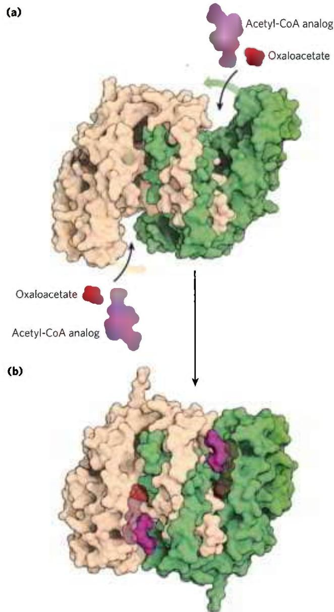  
FIGURE 16-8 Structure of citrate synthase. The flexible domain of each subunit undergoes a large conformational change on binding oxaloacetate, creating a binding site for acetyl-CoA. (a) Open form of the enzyme alone; (b) closed form with bound oxaloacetate and a stable analog of acetyl-CoA (carboxymethyl-CoA). In these representations one subunit is colored tan and one green. [Data from (a) PDB ID 5CSC, D.-I. Liao et al., Biochemistry 30:6031, 1991; (b) PDB ID 5CTS, M. Karpusas et al., Biochemistry 29:2213, 1990.]

Although the equilibrium mixture at pH 7.4 and 25 °C contains less than 10% isocitrate, in the cell the reaction is pulled to the right because isocitrate is immediately consumed in the next step of the cycle, lowering its steady-state concentration. Aconitase contains an

The thioester linkage in acetyl-CoA activates the methyl hydrogens. Asp $^{375}$ abstracts a proton from the methyl group, forming an enclate intermediate. The intermediate is stabilized by hydrogen bonding to and/or protonation by His $^{274}$ (full protonation is shown).

The enol(ate) rearranges to attack the caronyl carbon of oxaloacetate, with His $^{274}$ positioned to abstract the proton it had previously donated. His $^{320}$ acts as a general acid. The resulting condensation generates citryl-CoA.

iron-sulfur center (Fig. 16-10), which acts both in the binding of the substrate at the active site and in the catalytic addition or removal of $H_{2}O$ . In iron-depleted cells, aconitase loses its iron-sulfur center and acquires a new role in the regulation of iron homeostasis. Aconitase is one of many enzymes known to “moonlight” in a second role (Box 16-1).

3 Oxidation of Isocitrate to $\alpha$ -Ketoglutarate and $\mathrm{CO}_{2}$ In the next step, isocitrate dehydrogenase catalyzes oxidative decarboxylation of isocitrate to form $\alpha$ -ketoglutarate (Fig. 16-11). $\mathrm{Mn}^{2+}$ in the active site interacts with the carbonyl group of the intermediate oxalosuccinate, which is formed transiently but does not leave the binding site until decarboxylation converts it to $\alpha$ -ketoglutarate. $\mathrm{Mn}^{2+}$ also stabilizes the enol formed transiently by decarboxylation.

There are two different forms of isocitrate dehydrogenase in all cells, one requiring $NAD^{+}$ as electron acceptor and the other requiring $NADP^{+}$ . The overall reactions are otherwise identical. In eukaryotic cells, the NAD-dependent enzyme occurs in the mitochondrial matrix and serves in the citric acid cycle. The main function of the NADP-dependent enzyme, found in both the mitochondrial matrix and the cytosol, is the generation of NADPH, which is essential for reductive anabolic pathways such as fatty acid and sterol synthesis.

4 Oxidation of $\alpha$ -Ketoglutarate to Succinyl-CoA and $\mathrm{CO}_{2}$ The next step is another oxidative decarboxylation, in which $\alpha$ -ketoglutarate is converted to succinyl-CoA and $\mathrm{CO}_{2}$ by the action of the $\alpha$ -ketoglutarate dehydrogenase complex; $\mathrm{NAD}^{+}$ serves as electron acceptor and CoA as the carrier of the succinyl group. The energy of

MECHANISM FIGURE 16-9 Citrate synthase. In the citrate synthase reaction in mammals, oxaloacetate binds first, in a strictly ordered reaction sequence. This binding triggers a conformation change that opens up the binding site for acetyl-CoA. Oxaloacetate is specifically oriented in the active site of citrate synthase by interaction of its two carboxylates with two positively charged Arg residues (not shown here). [Information from S. J. Remington, Curr. Opin. Struct. Biol. 2:730, 1992.]

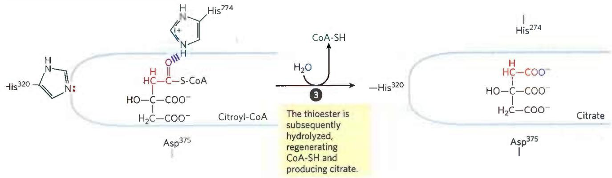

oxidation of $\alpha$ -ketoglutarate is conserved in the formation of the thioester bond of succinyl-CoA:

P2 This reaction is virtually identical to the pyruvate dehydrogenase reaction discussed above and to the reaction sequence responsible for the breakdown of branched-chain amino acids (Fig. 16-12). The $\alpha$ -ketoglutarate dehydrogenase complex closely resembles the PDH complex and the complex that degrades branched-chain $\alpha$ -keto acids

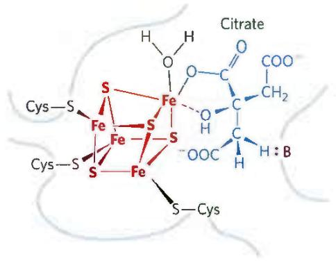  
FIGURE 16-10 Iron-sulfur center in aconitase. The iron-sulfur center is in red, the citrate molecule in blue. Three Cys residues of the enzyme bind three iron atoms; the fourth iron is bound to one of the carboxyl groups of citrate and also interacts noncovalently with a hydroxyl group of citrate (dashed bond). A basic residue ( $\pm$ B) in the enzyme helps to position the citrate in the active site. The iron-sulfur center acts in both substrate binding and catalysis. The general properties of iron-sulfur proteins are discussed in Chapter 19.

  
MECHANISM FIGURE 16-11 Isocitrate dehydrogenase. In this reaction, the substrate, isocitrate, loses one carbon by oxidative decarboxylation.

FIGURE 16-12 A conserved mechanism for oxidative decarboxylation. The pathways shown employ the same five cofactors (thiamine pyrophosphate, coenzyme A, lipoate, FAD, and $\mathrm{NAD^{+}}$ ), closely similar multienzyme complexes, and the same enzymatic mechanism to carry out oxidative decarboxylations of pyruvate (by the pyruvate dehydrogenase complex), $\alpha$ -ketoglutarate (in the citric acid cycle), and the carbon skeletons of the three branched-chain amino acids, isoleucine (shown here), leucine, and valine.

## Moonlighting Enzymes: Proteins with More Than One Job

Before protein and DNA sequencing became routine, two groups of investigators studying two unrelated questions sometimes discovered that "their" proteins had similar properties. Further comparison sometimes showed that they were studying the same protein by following different functions. We now know that many proteins moonlight in a second role, a phenomenon sometimes called gene sharing. Today, researchers using annotated protein and DNA sequence databases can more easily find proteins of the same sequence that have been identified as having different functions, and a protein sequence annotated as having a given function doesn't necessarily have only that function. When a protein with a known function is made inactive by a mutation, and the resulting mutant organisms show a phenotype with no obvious relation to that function, protein moonlighting can sometimes explain the puzzling result.

One citric acid cycle enzyme is a known moonlighter. Eukaryotic cells have two isozymes of aconitase. The mitochondrial isozyme converts citrate to isocitrate in the citric acid cycle. The cytosolic isozyme has two distinct functions. It catalyzes the conversion of citrate to isocitrate, providing the substrate for a cytosolic isocitrate dehydrogenase that generates NADPH as reducing power for fatty acid synthesis and other anabolic processes in the cytosol. But it also has a role in cellular iron homeostasis.

All cells must obtain iron for the proteins that require it as a cofactor. In humans, severe iron deficiency results in anemia, an insufficient supply of erythrocytes and a reduced oxygen-carrying capacity that can be life-threatening. Too much iron is also harmful: it accumulates in and damages the liver in hemochromatosis and other diseases. Iron obtained in the diet is carried in the blood by the protein transferrin and enters cells via endocytosis mediated by the transferrin receptor. Once inside cells, iron is used in the synthesis of hemes, cytochromes, Fe-S proteins, and other Fe-dependent proteins; excess iron is stored bound to the protein ferritin. The levels of transferrin, transferrin receptor, and ferritin are therefore crucial to cellular iron homeostasis. The synthesis of these three proteins is regulated in response to iron availability — and aconitase, in its moonlighting job, plays a key regulatory role.

FIGURE 1 Effect of IRP1 and IRP2 on the mRNAs for ferritin and the transferrin receptor. [Information from R. S. Eisenstein, Annu. Rev. Nutr. 20:627, 2000, Fig. 1.]  

in both structure and function. All three have homologous $E_{1}$ and $E_{2}$ components, identical $E_{3}$ components, enzyme-bound TPP and lipoate, coenzyme A, FAD, and NAD. These related enzymes can employ the same $E_{3}$ subunit because the substrate for $E_{3}$ —a reduced lipoate—is the same for both complexes. They are certainly derived from a common evolutionary ancestor by gene duplication and subsequent divergent evolution, as described in Figure 1-32.

5 Conversion of Succinyl-CoA to Succinate Succinyl-CoA, like acetyl-CoA, has a thioester bond with a strongly negative standard free energy of hydrolysis ( $\Delta G^{\prime\circ} \approx -36$ kJ/mol). In the next step of the citric acid cycle, energy released in the breakage of this bond is used to drive the synthesis of a phosphoanhydride bond in either GTP or ATP, with a net $\Delta G^{\circ}$ of only -2.9 kJ/mol. Succinate is formed in the process:

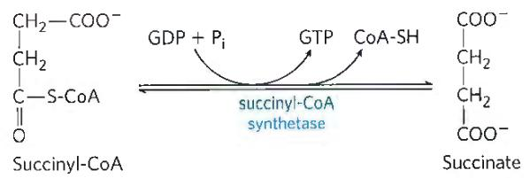

The enzyme that catalyzes this reversible reaction is called succinyl-CoA synthetase or succinic thiokinase;

Aconitase has an essential Fe-S cluster at its active site (see Fig. 16-10). When a cell is depleted of iron, this Fe-S cluster is disassembled and the enzyme loses its aconitase activity. But the apoenzyme (apoaconitase, lacking its Fe-S cluster) so formed has now acquired its second activity: regulating iron metabolism. Cytosolic apoaconitase is identical to iron regulatory protein 1 (IRP1) and closely related to IRP2. Both IRP1 and IRP2 bind to regions in the mRNAs encoding ferritin and the transferrin receptor, with effects on iron mobilization and iron uptake. These mRNA sequences are part of hairpin structures (see Fig. 8-23) called iron response elements (IREs), located at the 5' and 3' ends of the mRNAs (Fig. 1). When bound to the 5'-untranslated IRE sequence in the ferritin mRNA, IRPs block ferritin synthesis; when bound to the 3'-untranslated IRE sequence in the transferrin receptor mRNA, they stabilize the mRNA, preventing its degradation and thus allowing the synthesis of more copies of the receptor protein per mRNA molecule. So, in iron-deficient cells, iron uptake becomes more efficient and iron storage (bound to ferritin) is reduced. When cellular iron concentrations return to normal levels, IRP1 regains its Fe-S cluster, converting to aconitase, and IRP2 undergoes proteolytic degradation, ending the low-iron response.

The enzymatically active aconitase and the moonlighting, regulatory apoaconitase have different structures. As the active aconitase, the protein has two lobes that close around the Fe-S cluster; as IRP1, the two lobes open, exposing the mRNA-binding site (Fig. 2).

It makes evolutionary sense that the enzymes of central metabolism have had a long time to evolve additional functions. The glycolytic enzyme pyruvate kinase acts in the nucleus to regulate the transcription of genes that respond to thyroid hormone. Glyceraldehyde 3-phosphate dehydrogenase moonlights both as uracil DNA glycosylase, effecting the repair of damaged DNA, and as a regulator of histone H2B transcription. Several glycolytic enzymes, including phosphoglycerate kinase, triose phosphate isomerase, and lactate dehydrogenase, moonlight as crystallins in the lens of the vertebrate eye.

both names indicate the participation of a nucleoside triphosphate in the reaction.

This energy-conserving reaction involves an intermediate step in which the enzyme molecule itself becomes phosphorylated at a His residue in the active site (Fig. 16-13a). This phosphoryl group, which has a high group transfer potential, is transferred to ADP (or GDP) to form ATP (or GTP). Animal cells have two isozymes of succinyl-CoA synthetase, one specific for ADP and the other for GDP. The enzyme has two subunits, $\alpha$ ( $M_{\mathrm{r}}$ 32,000), which has the P-His residue ( $\mathrm{His}^{246}$ ) and the binding site for CoA, and $\beta$ ( $M_{\mathrm{r}}$ 42,000), which confers specificity for either ADP or GDP. The active site is at the interface between subunits. The crystal structure of succinyl-CoA synthetase reveals two "power helices" (one from each subunit), oriented so that their electric dipoles situate partial positive charges close to the negatively charged $\textcircled{P}$ -His (Fig. 16-13b), stabilizing the phosphoenzyme intermediate. (Recall the similar role of helix dipoles in stabilizing $\mathbf{K}^{+}$ ions in the $\mathbf{K}^{+}$ channel; see Fig. 11-45.)

(a)  

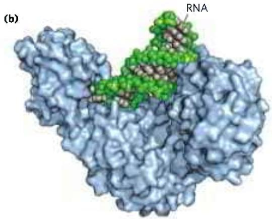  
FIGURE 2 Two forms of cytosolic aconitase/IRP1 with two distinct functions. (a) In aconitase, the two major lobes are closed and the Fe-S cluster is buried; the protein has been made transparent here to show the Fe-S cluster. (b) In IRP1, the lobes open, exposing a binding site for the mRNA hairpin. [Data from (a) PDB ID 2B3Y, J. Dupuy et al., Structure 14:129, 2006; (b) PDB ID 2IPY, W. E. Walden et al., Science 314:1903, 2006.]

The formation of ATP (or GTP) at the expense of the energy released by the oxidative decarboxylation of $\alpha$ -ketoglutarate is a substrate-level phosphorylation, like the synthesis of ATP in the glycolytic reactions catalyzed by phosphoglycerate kinase and pyruvate kinase (see Fig. 14-2). The GTP formed by succinyl-CoA synthetase can donate its terminal phosphoryl group to ADP to form

ATP, in a reversible reaction catalyzed by nucleoside diphosphate kinase (p. 487):

$$
\mathrm{G} - \mathrm{TP} + \mathrm{ADP} \rightleftharpoons \mathrm{GDP} + \mathrm{ATP} \quad \Delta G ^ {\prime \circ} = 0 \mathrm{kJ/mol}
$$

Thus the net result of the activity of either isozyme of succinyl-CoA synthetase is the conservation of energy as ATP. There is no change in free energy for the nucleoside diphosphate kinase reaction; ATP and GTP are energetically equivalent.

(b)  

6 Oxidation of Succinate to Fumarate The succinate formed from succinyl-CoA is oxidized to fumarate by the flavoprotein succinate dehydrogenase:

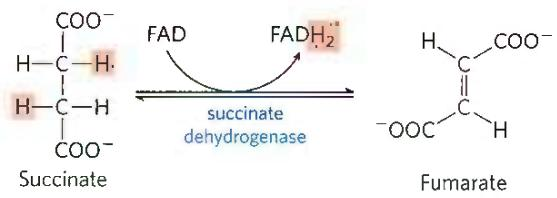  
$\Delta G^{\prime \circ} = 0\mathrm{kJ / mol}$

In eukaryotes, succinate dehydrogenase is an integral protein of the mitochondrial inner membrane; in bacteria, of the plasma membrane. The enzyme contains three different iron-sulfur clusters and one molecule of covalently bound FAD (see Fig. 19-9). Electrons pass from succinate through the FAD and iron-sulfur centers before entering the chain of electron carriers in the mitochondrial inner membrane (the plasma membrane in bacteria). Electron flow from succinate through these carriers to the final electron acceptor, $O_{2}$ , is coupled to the synthesis of about 1.5 ATP molecules per pair of electrons (respiration-linked phosphorylation). Malonate, an analog of succinate not normally present in cells, is a strong competitive inhibitor of succinate dehydrogenase, and its addition to mitochondria in the laboratory blocks the activity of the citric acid cycle.

FIGURE 16-13 The succinyl-CoA synthetase reaction. (a) In step ① a phosphoryl group replaces the CoA of succinyl-CoA bound to the enzyme, forming a high-energy acyl phosphate. In step ② the succinyl phosphate donates its phosphoryl group to a His residue of the enzyme, forming a high-energy phosphohistidyl enzyme. In step ③ the phosphoryl group is transferred from the His residue to the terminal phosphate of GDP (or ADP), forming GTP (or ATP). (b) Active site of succinyl-CoA synthetase of Escherichia coli. The active site includes part of both the $\alpha$ (blue) and the $\beta$ (brown) subunits. The power helices (blue, brown) place the partial positive charges of the helix dipole near the phosphate group of $\text{P}$ -His $^{246}$ in the $\alpha$ chain, stabilizing the phosphohistidyl enzyme. The bacterial and mammalian enzymes have similar amino acid sequences and three-dimensional structures. [Data from PDB ID 1SCU, W. T. Wolodko et al., J. Biol. Chem. 269:10,883, 1994.]

7 Hydration of Fumarate to Malate The reversible hydration of fumarate to L-malate is catalyzed by fumarase (formally, fumarate hydratase). The transition state in this reaction is a carbanion:

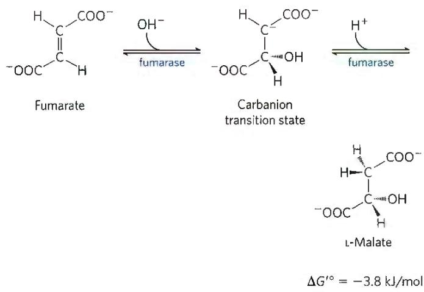

This enzyme is highly stereospecific; it catalyzes hydration of the trans double bond of fumarate but not the cis double bond of maleate. In the reverse direction (from L-malate to fumarate), fumarase is equally stereospecific: D-malate is not a substrate.

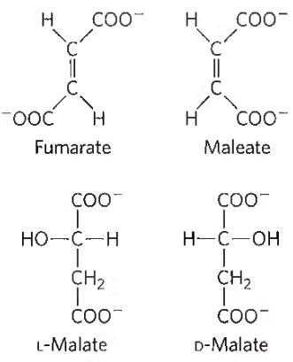

8 Oxidation of Malate to Oxaloacetate In the last reaction of the citric acid cycle, L-malate dehydrogenase catalyzes the oxidation of L-malate to oxaloacetate, coupled to the reduction of $\mathrm{NAD^{+}}$ to NADH:

The equilibrium of this reaction lies far to the left under standard thermodynamic conditions, but in intact cells oxaloacetate is continually removed by the highly exergonic citrate synthase reaction (step 2 of Fig. 16-7).

This keeps the concentration of oxaloacetate in the cell extremely low ( $<10^{-6}$ M), pulling the malate dehydrogenase reaction toward the formation of oxaloacetate.

Although the individual reactions of the citric acid cycle were initially worked out in vitro, using minced muscle tissue, the pathway and its regulation have also been studied extensively in vivo. By using precursors isotopically labeled with ${}^{14}$ C, researchers have traced the fate of individual carbon atoms through the citric acid cycle. Some of the earliest experiments with ${}^{14}$ C produced an unexpected result, however, which aroused considerable controversy about the pathway and mechanism of the citric acid cycle. In fact, these experiments at first seemed to show that citrate was not the first tricarboxylic acid to be formed. Box 16-2 gives some details of this episode in the history of citric acid cycle research. Today biochemists use ${}^{13}$ C-labeled precursors and whole-tissue NMR spectroscopy to monitor metabolic flux through the cycle in living tissue. Because the NMR signal is unique to the compound containing the ${}^{13}$ C, precursor carbons can be traced into each cycle intermediate and into compounds derived from the intermediates. This technique makes it possible to study regulation of the citric acid cycle and its interconnections with other metabolic pathways.

## The Energy of Oxidations in the Cycle Is Efficiently Conserved

We have now covered one complete turn of the citric acid cycle (Fig. 16-14). A two-carbon acetyl group entered the cycle by combining with oxaloacetate. Two carbon atoms

  
FIGURE 16-14 Products of one turn of the citric acid cycle. At each turn of the cycle, three NADH, one FADH₂, one GTP (or ATP), and two CO₂ are released in oxidative decarboxylation reactions. Here and in several of the following figures, all cycle reactions are shown as proceeding in one direction only, but keep in mind that most of the reactions are reversible.

## Citrate: A Symmetric Molecule That Reacts Asymmetrically

When compounds enriched in the heavy-carbon isotope ${}^{13}$ C and the radioactive carbon isotopes ${}^{11}$ C and ${}^{14}$ C became available in the mid-1940s, they were soon put to use in tracing the pathway of carbon atoms through the citric acid cycle. One such experiment initiated the controversy over the role of citrate. Acetate labeled in the carboxyl group (designated $[1-{}^{14}C]$ acetate) was incubated aerobically with an animal tissue preparation. Acetate is enzymatically converted to acetyl-CoA in animal tissues, and the pathway of the labeled carboxyl carbon of the acetyl group in the cycle reactions could thus be traced. $\alpha$ -Ketoglutarate was isolated from the tissue after incubation, then degraded by known chemical reactions to establish the position(s) of the isotopic carbon.

Condensation of unlabeled oxaloacetate with carboxyl-labeled acetate would be expected to produce citrate labeled in one of the two primary carboxyl groups. Citrate is a symmetric molecule, its two terminal carboxyl groups being chemically indistinguishable. Therefore, half the labeled citrate molecules were expected to yield $\alpha$ -ketoglutarate labeled in the $\alpha$ -carboxyl group and the other half to yield $\alpha$ -ketoglutarate labeled in the $\gamma$ -carboxyl group; that is, the $\alpha$ -ketoglutarate isolated was expected to be a mixture of the two types of labeled molecules (Fig. 1, pathways 1 and 2). Contrary to this expectation, the labeled $\alpha$ -ketoglutarate isolated from the tissue suspension contained $^{14}\mathrm{C}$ only in the $\gamma$ -carboxyl group (Fig. 1, pathway 1). The investigators concluded that citrate (or any other symmetric molecule) could not be an intermediate in the pathway from acetate to $\alpha$ -ketoglutarate. Rather, an asymmetric tricarboxylic acid, presumably cis-aconitate or isocitrate, must be the first product formed from condensation of acetate and oxaloacetate.

In 1948, however, Alexander Ogston pointed out that although citrate has no chiral center (see Fig. 1-19), it has the potential to react asymmetrically if an enzyme with which it interacts has an active site that is asymmetric. He suggested that the active site of aconitase may have three points to which the citrate must be bound and that the citrate must undergo a specific three-point attachment to these binding points. As seen in Figure 2, the binding of citrate to three such points could happen in only one way, and this would account for the formation of only one type of labeled $\alpha$ -ketoglutarate. Organic molecules such as citrate that have no chiral center but are potentially capable of reacting asymmetrically with an asymmetric active site are now called prochiral molecules.

FIGURE 2 The prochiral nature of citrate. (a) Structure of citrate; (b) schematic representation of citrate: X = —OH; Y = —COO⁻; Z = —CH₂COO⁻. (c) Correct complementary fit of citrate to the binding site of aconitase.  
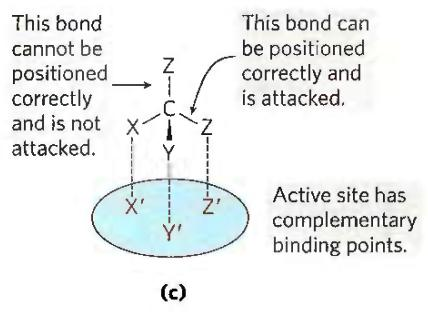

There is only one way in which the three specified groups of citrate can fit on the three points of the binding site. Thus only one of the two $-CH_{2}COO^{-}$ groups is bound by aconitase.

TABLE 16-1 Stoichiometry of Coenzyme Reduction and ATP Formation in the Aerobic Oxidation of Glucose via Glycolysis, the Pyruvate Dehydrogenase Complex Reaction, the Citric Acid Cycle, and Oxidative Phosphorylation

<table><tr><td>Reaction</td><td>Number of ATP or reduced coenzyme directly formed</td><td>Number of ATP ultimately formed $^{a}$ </td></tr><tr><td>Glucose  $\longrightarrow$  glucose 6-phosphate</td><td>-1 ATP</td><td>-1</td></tr><tr><td>Fructose 6-phosphate  $\longrightarrow$  fructose 1,6-bisphosphate</td><td>-1 ATP</td><td>-1</td></tr><tr><td>2 Glyceraldehyde 3-phosphate  $\longrightarrow$  2 1,3-bisphosphoglycerate</td><td>2 NADH</td><td>3 or 5 $^{b}$ </td></tr><tr><td>2 1,3-Bisphosphoglycerate  $\longrightarrow$  2 3-phosphoglycerate</td><td>2 ATP</td><td>2</td></tr><tr><td>2 Phosphoenolpyruvate  $\longrightarrow$  2 pyruvate</td><td>2 ATP</td><td>2</td></tr><tr><td>2 Pyruvate  $\longrightarrow$  2 acetyl-CoA</td><td>2 NADH</td><td>5</td></tr><tr><td>2 Isocitrate  $\longrightarrow$  2  $\alpha$ -ketoglutarate</td><td>2 NADH</td><td>5</td></tr><tr><td>2  $\alpha$ -Ketoglutarate  $\longrightarrow$  2 succinyl-CoA</td><td>2 NADH</td><td>5</td></tr><tr><td>2 Succinyl-CoA  $\longrightarrow$  2 succinate</td><td>2 ATP (or 2 GTP)</td><td>2</td></tr><tr><td>2 Succinate  $\longrightarrow$  2 fumarate</td><td>2 FADH $_{2}$ </td><td>3</td></tr><tr><td>2 Malate  $\longrightarrow$  2 oxaloacetate</td><td>2 NADH</td><td>5</td></tr><tr><td>Total</td><td></td><td>30–32</td></tr></table>

$^{a}$ This is calculated as 2.5 ATP per NADH and 1.5 ATP per FADH $_{2}$ . A negative value indicates consumption.  
$^{b}$ This number is either 3 or 5, depending on the mechanism used to shuttle NADH equivalents from the cytosol to the mitochondrial matrix; see Figures 19-31 and 19-32.

emerged from the cycle as $CO_{2}$ from the oxidation of isocitrate and $\alpha$ -ketoglutarate. P2 The energy released by these oxidations was conserved in the reduction of three $NAD^{+}$ and one FAD and the production of one ATP or GTP. At the end of the cycle a molecule of oxaloacetate was regenerated. Note that the two carbon atoms appearing as $CO_{2}$ are not the same two carbons that entered in the form of the acetyl group; additional turns around the cycle are required to release these carbons as $CO_{2}$ (Fig. 16-7).

P2 Although the citric acid cycle directly generates only one ATP per turn (in the conversion of succinyl-CoA to succinate), the four oxidation steps in the cycle provide a large flow of electrons into the respiratory chain via NADH and FADH₂ and thus lead to formation of almost 10 times more ATP during oxidative phosphorylation.

We saw in Chapter 14 that the production of two molecules of pyruvate from one molecule of glucose in glycolysis yields 2 ATP and 2 NADH. In oxidative phosphorylation (Chapter 19), passage of two electrons from NADH to $\mathrm{O}_2$ drives the formation of about 2.5 ATP, and passage of two electrons from $\mathrm{FADH}_2$ to $\mathrm{O}_2$ yields about 1.5 ATP. This stoichiometry allows us to calculate the overall yield of ATP from the complete oxidation of glucose. When both pyruvate molecules are oxidized to $6\mathrm{CO}_{2}$ via the pyruvate dehydrogenase complex and the citric acid cycle, and the electrons are transferred to $\mathrm{O}_2$ via oxidative phosphorylation, as many as 32 ATP are obtained per glucose (Table 16-1). In round numbers, this represents the conservation of $32\times 30.5\mathrm{kJ / mol} = 976\mathrm{kJ / mol}$ , or $34\%$ of the theoretical maximum of about $2,840~\mathrm{kJ / mol}$ available from the complete oxidation of glucose. These calculations employ the standard free-energy changes; when corrected for the actual free energy required to form ATP within cells (see Worked Example 13-2, p. 480), the calculated efficiency of the process is closer to 65%. When cells under anaerobic conditions depend on glycolysis for ATP, one glucose yields just 2 ATP. Aerobic metabolism is far more effective in capturing the energy in glucose as a fuel.

## SUMMARY 16.2 Reactions of the Citric Acid Cycle

The citric acid cycle (Krebs cycle, TCA cycle) is a nearly universal central catabolic pathway in which compounds derived from the breakdown of carbohydrates, fats, and proteins are oxidized to $\mathrm{CO}_{2}$ , with most of the energy of oxidation temporarily held in the electron carriers $\mathrm{FADH}_{2}$ and NADH. During aerobic metabolism, these electrons are transferred to $\mathrm{O}_{2}$ and the energy of electron flow is conserved as ATP.

■ Acetyl-CoA enters the citric acid cycle as citrate synthase catalyzes its condensation with oxaloacetate to form citrate. In seven sequential reactions, including two decarboxylations, the citric acid cycle converts citrate to oxaloacetate and releases two $CO_{2}$ . The pathway is cyclic in that the intermediates of the cycle are not used up; for each oxaloacetate consumed in the path, one is produced.

For each acetyl-CoA oxidized by the citric acid cycle, the energy gain consists of three molecules of NADH, one FADH $_2$ , and one nucleoside triphosphate (either ATP or GTP).

## 16.3 The Hub of Intermediary Metabolism

The eight-step cyclic process for oxidation of simple two-carbon acetyl groups to $CO_{2}$ may seem unnecessarily complex and not in keeping with the biological principle of maximum economy. Remember, though, that the role of the citric acid cycle is not confined to the oxidation of acetate from carbohydrates, fatty acids, or amino acids. P3 The cycle also accepts 3-, 4-, and 5-carbon skeletons, especially from the breakdown of amino acids, at other points in the pathway. For example, when deaminated, the amino acids aspartate and glutamate become the cycle intermediates oxaloacetate and $\alpha$ -ketoglutarate, respectively.

## The Citric Acid Cycle Serves in Both Catabolic and Anabolic Processes

In aerobic organisms, the citric acid cycle is an amphibolic pathway, one that serves in both catabolic and anabolic processes. In the cycle's anabolic role, oxaloacetate and $\alpha$ -ketoglutarate can be withdrawn from the cycle to serve as precursors of aspartate and glutamate by simple transamination (Chapter 22). Through aspartate and glutamate, the carbons of oxaloacetate and $\alpha$ -ketoglutarate are then used to build other amino acids, as well as purine and pyrimidine nucleotides. Succinyl-CoA is a central intermediate in the synthesis of the porphyrin ring of heme groups, which serve as oxygen carriers (in hemoglobin and myoglobin) and electron carriers (in cytochromes) (see Figs. 22-25, 22-26). Finally, oxaloacetate can be converted to glucose via gluconeogenesis (see Fig. 14-16).

P3 One biosynthetic process is not possible for animals: the conversion of acetate or acetyl-CoA to glucose. Given that the carbon atoms of acetate molecules entering the citric acid cycle appear eight steps later in oxaloacetate, it might seem that the cycle could generate oxaloacetate from acetate, then the oxaloacetate could be used to synthesize glucose by gluconeogenesis. However, there is no net conversion of acetate to oxaloacetate; for every two carbons that enter the cycle as acetate (acetyl-CoA), two leave as CO₂. In bacteria, plants, fungi, and protists, another reaction sequence, the glyoxylate cycle, serves as a mechanism for converting acetate to carbohydrate. The glyoxylate cycle, which shares some reactions with the citric acid cycle, converts two molecules of acetate to one of oxaloacetate in a variant of the citric acid cycle in which the two decarboxylation steps are bypassed (see Fig. 20-45). Thus, plants and many simpler organisms can synthesize glucose from fatty acids, but humans and other animals cannot.

## Anaplerotic Reactions Replenish Citric Acid Cycle Intermediates

Under most circumstances, there is a dynamic steady state between reactions that siphon intermediates away from the citric acid cycle and those that supply additional carbon skeletons. P3 When the withdrawal of cycle intermediates for use in biosynthesis lowers the concentrations of citric acid cycle intermediates enough to slow the cycle, the intermediates are replenished by anaplerotic reactions (Greek, "to refill") (Fig. 16-15). Table 16-2 shows the most common anaplerotic reactions, all of which, in various tissues and organisms, convert either pyruvate or phosphoenolpyruvate to oxaloacetate or malate. The most important anaplerotic reaction in mammalian liver, kidney, and brown adipose tissue is the reversible carboxylation of pyruvate by $\mathrm{HCO_3^-}$ to form oxaloacetate, catalyzed by pyruvate carboxylase. The enzymatic addition of a carboxyl group to pyruvate requires energy, which is supplied by ATP.

Pyruvate carboxylase is a regulatory enzyme and is virtually inactive in the absence of acetyl-CoA, its positive allosteric modulator. Whenever acetyl-CoA, the fuel for the citric acid cycle, is present in excess, it stimulates the pyruvate carboxylase reaction to produce more oxaloacetate, enabling the cycle to use more acetyl-CoA in the citrate synthase reaction.

## Biotin in Pyruvate Carboxylase Carries One-Carbon (CO₂) Groups

The pyruvate carboxylase reaction requires the vitamin biotin (Fig. 16-16), which is the prosthetic group of the enzyme. Biotin, which plays a key role in many carboxylation reactions, is a specialized carrier of one-carbon groups in their most oxidized form: $\mathrm{CO}_{2}$ . (The transfer of one-carbon groups in more reduced forms is mediated by other cofactors, notably tetrahydrofolate and S-adenosylmethionine, as described in Chapter 18.) Carboxyl groups are activated in a reaction that consumes ATP and joins $\mathrm{CO}_{2}$ to enzyme-bound biotin. This "activated" $\mathrm{CO}_{2}$ is then passed to an acceptor (pyruvate in this case) in a carboxylation reaction.

Pyruvate carboxylase has four identical subunits, each containing a molecule of biotin covalently attached through an amide linkage to the $\varepsilon$ -amino group of a specific Lys residue in the enzyme active site. Carboxylation of pyruvate proceeds in two steps (Fig. 16-16): first, a carboxyl group derived from $\mathrm{HCO}_3^-$ is attached to biotin, then the carboxyl group is transferred to pyruvate to form oxaloacetate. P5 These two steps occur at separate active sites; the long flexible arm of biotin transfers activated carboxyl groups from the first active site (on one monomer of the tetramer) to the

  
FIGURE 16-15 Role of the citric acid cycle in anabolism. Intermediates of the citric acid cycle are drawn off as precursors in many biosynthetic pathways. Shown in red are four anaplerotic reactions that replenish depleted cycle intermediates (see Table 16-2).

<table><tr><td colspan="2">TABLE 16-2 Anaplerotic Reactions</td></tr><tr><td>Reaction</td><td>Tissue(s)/organism(s)</td></tr><tr><td>Pyruvate + HCO3− + ATP  $\xrightarrow{\text{pyruvate carboxylase}}$  oxaloacetate + ADP + P1</td><td>Liver, kidney</td></tr><tr><td>Phosphoenolpyruvate + CO2 + GDP  $\xrightarrow{\text{PEP carboxykinase}}$  oxaloacetate + GTP</td><td>Heart, skeletal muscle</td></tr><tr><td>Phosphoenolpyruvate + HCO3−  $\xrightarrow{\text{PEP carboxylase}}$  oxaloacetate + P1</td><td>Higher plants, yeast, bacteria</td></tr><tr><td>Pyruvate + HCO3− + NAD(P)H  $\xrightarrow{\text{malic enzyme}}$  malate + NAD(P)+</td><td>Widely distributed in eukaryotes and bacteria</td></tr></table>

second (on the adjacent monomer), functioning much like the long lipoyllysyl arm of $E_{2}$ in the PDH complex (Fig. 16-6) and the long arm of the CoA-like moiety in the acyl carrier protein involved in fatty acid synthesis (see Fig. 21-5); these are compared in Figure 16-17. Lipoate, biotin, and pantothenate all enter cells on the same transporter; all become covalently attached to proteins by similar reactions; and all provide a flexible tether that allows bound reaction intermediates to move from one active site to another in an enzyme complex, without dissociating from it. That is, all participate in substrate channeling.

## SUMMARY 16.3 The Hub of Intermediary Metabolism

The citric acid cycle is amphibolic, serving in both catabolism and anabolism. Besides acetyl-CoA, any compound that gives rise to a four- or five-carbon intermediate of the

Carboxybiotinyl-enzyme  
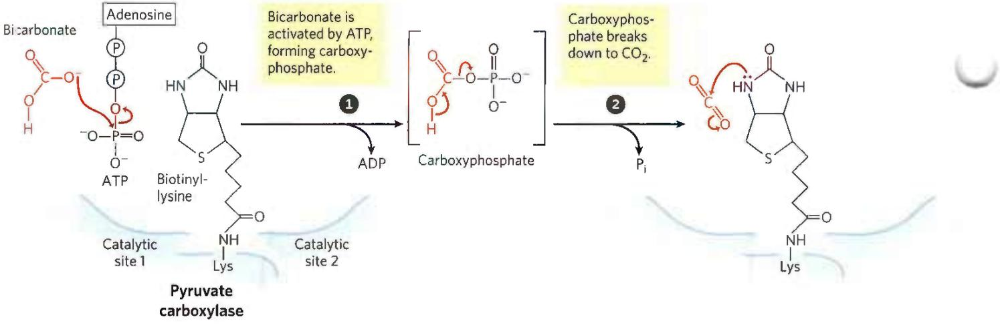

MECHANISM FIGURE 16-16 The role of biotin in the reaction catalyzed by pyruvate carboxylase. Biotin is attached to the enzyme through an amide bond with the $\varepsilon$ -amino group of a Lys residue, forming biotinyl-enzyme. Biotin-mediated carboxylation reactions occur in two phases, generally catalyzed in separate active sites on the enzyme, as exemplified by the pyruvate carboxylase reaction. In the first phase (steps ① to ③), bicarbonate is converted to the more activated $\mathrm{CO}_{2}$ , and then used to carboxylate biotin. The biotin acts as a carrier to transport the $\mathrm{CO}_{2}$ from one active site to another on an adjacent monomer of the tetrameric enzyme (step ④). In the second phase (steps ⑤ to ⑦), catalyzed in this second active site, the $\mathrm{CO}_{2}$ reacts with pyruvate to form oxaloacetate.

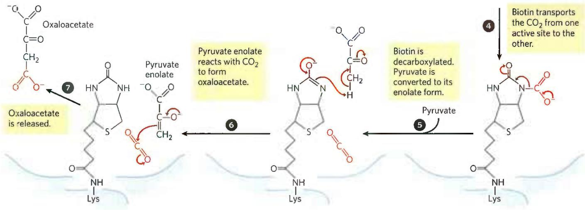

citric acid cycle—for example, the breakdown products of many amino acids—can be oxidized by the cycle. Cycle intermediates can be drawn off and used as the starting material for a variety of biosynthetic products.

■ When intermediates are shunted from the citric acid cycle to other pathways, they are replenished by several anaplerotic reactions, which produce four-carbon intermediates by carboxylation of three-carbon compounds; pyruvate carboxylase is a major anaplerotic enzyme.

■ Enzymes that catalyze carboxylations commonly employ biotin to activate $CO_{2}$ and to carry it to acceptors such as pyruvate or phosphoenolpyruvate.

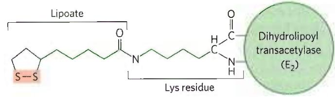

  
FIGURE 16-17 Biological tethers. The cofactors lipoate, biotin, and the combination of $\beta$ -mercaptoethylamine and pantothenate form long, flexible arms (green) on the enzymes to which they are covalently bound, acting as tethers that move intermediates from one active site to the next. The group shaded light red is, in each case, the point of attachment of the activated intermediate to the tether.

## 16.4 Regulation of the Citric Acid Cycle

P4 The central role of the citric acid cycle in metabolism requires stringent regulation to balance the supply of key intermediates with the demands of energy production and biosynthetic processes. Regulation occurs at several levels, including the oxidation of pyruvate to acetyl-CoA (catalyzed by the PDH complex) and the entry of acetyl-CoA into the cycle (the citrate synthase reaction). The transport of pyruvate into mitochondria by the mitochondrial pyruvate carrier (MPC) determines to some degree the fate of pyruvate produced by glycolysis. Most cells also produce acetyl-CoA from the oxidation of fatty acids (Chapter 17) and certain amino acids (Chapter 18), and the availability of intermediates from those other pathways is important in the regulation of pyruvate oxidation and of the citric acid cycle. There are therefore multiple points at which the metabolism of pyruvate and the citric acid cycle may be regulated.

## Production of Acetyl-CoA by the PDH Complex Is Regulated by Allosteric and Covalent Mechanisms

The PDH complex of mammals is strongly inhibited allosterically by ATP and by acetyl-CoA and

NADH, the products of the reaction catalyzed by the complex (Fig. 16-18). Long-chain fatty acids, which can be broken down to acetyl-CoA, are also inhibitory. AMP, CoA, and $\mathrm{NAD^{+}}$ , all of which accumulate when too little acetate flows into the citric acid cycle, allosterically activate the PDH complex. P1 Thus, PDH complex activity is turned off when ample fuel is available in the form of fatty acids and acetyl-CoA and when the cell's [ATP]/[ADP] and [NADH]/[NAD+] ratios are high; it is turned on again when energy demands are high and the cell requires greater flux of acetyl-CoA into the citric acid cycle.

In mammals, these allosteric regulatory mechanisms are complemented by a second level of regulation:

  
FIGURE 16-18 Regulation of metabolite flow from the PDH complex through the citric acid cycle in mammals. The PDH complex is allosterically inhibited when [ATP]/[ADP], [NADH]/[NAD+], and [acetyl-CoA]/[CoA] ratios are high, all of which indicate an energy-sufficient metabolic state. When these ratios decrease, allosteric activation of pyruvate oxidation results. The rate of flow through the citric acid cycle can be limited by the availability of the citrate synthase substrates, oxaloacetate and acetyl-CoA, or of NAD+, which is depleted by its conversion to NADH, slowing the three NAD+-dependent oxidation steps. Feedback inhibition by succinyl-CoA, citrate, and ATP also slows the cycle by inhibiting early steps. In muscle tissue, Ca $^{2+}$ stimulates contraction and, as shown here, stimulates energy-yielding metabolism to replace the ATP consumed by contraction.

phosphorylation/dephosphorylation. The PDH complex is inhibited by reversible phosphorylation of Ser residues on $E_{1}$ by PDH kinase, which is an intrinsic part of the PDH complex. PDH kinase is allosterically activated by the products of the PDH complex (ATP, NADH, and acetyl-CoA), and it is inhibited by the substrates for the PDH complex (ADP, $NAD^{+}$ , and pyruvate) (Fig. 16-19). The complex also contains PDH phosphatase, which reverses the inhibition by PDH kinase. P1 Together, the kinase and phosphatase exert strong control over the entry of acetyl-CoA from pyruvate into the citric acid cycle. Higher concentrations of ATP, NADH, or acetyl-CoA lead to inactivation of the PDH complex by phosphorylation of PDH. When the concentrations of ADP, $NAD^{+}$ , or pyruvate rise, kinase activity decreases and pyruvate dehydrogenase phosphatase removes the phosphoryl group, reactivating the PDH complex and thereby stimulating the citric acid cycle.

The simple compound dichloroacetate (DCA), a structural analog of acetate, inhibits PDH kinase in the laboratory and so relieves the inhibition of the PDH complex. This stimulates pyruvate oxidation via the citric acid cycle (Fig. 16-19) and thus may have a use in directing metabolism in tumor cells away from aerobic glycolysis (see Box 14-1). The increase in mitochondrial oxidation also stimulates apoptosis (Chapter 19), thereby suppressing tumor growth. Phase III clinical trials of DCA began in 2019.

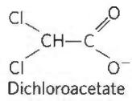

  
FIGURE 16-19 Pyruvate dehydrogenase is inactivated by phosphorylation catalyzed by pyruvate dehydrogenase kinase. The kinase is regulated by metabolites that signal the energetic state of the cell. Metabolites that accumulate in an energy-sufficient state activate PDH kinase, which phosphorylates and inactivates PDH. Pyruvate is then diverted away from the energy-yielding citric acid cycle (CAC). Metabolites indicating energy need or pyruvate accumulation have the opposite effect, keeping PDH active and sending acetyl-CoA into the CAC.

## The Citric Acid Cycle Is Also Regulated at Three Exergonic Steps

Each of the three strongly exergonic steps in the cycle—those catalyzed by citrate synthase, isocitrate dehydrogenase, and $\alpha$ -ketoglutarate dehydrogenase (Fig. 16-18)—can become the rate-limiting step under some circumstances. The availability of the substrates for citrate synthase (acetyl-CoA and oxaloacetate) varies with the metabolic state of the cell and sometimes limits the rate of citrate formation. NADH, a product of isocitrate and $\alpha$ -ketoglutarate oxidation, accumulates under some conditions, and at high $[NADH]/[NAD^{+}]$ both dehydrogenase reactions are severely inhibited by mass action. Similarly, the malate dehydrogenase reaction is essentially at equilibrium in the cell (that is, it is substrate-limited), and when $[NADH]/[NAD^{+}]$ is high the concentration of oxaloacetate is low, slowing the first step in the cycle. Product accumulation inhibits all three limiting steps of the cycle: succinyl-CoA inhibits $\alpha$ -ketoglutarate dehydrogenase (and also citrate synthase); citrate blocks citrate synthase; and the end product, ATP, inhibits both citrate synthase and isocitrate dehydrogenase. The inhibition of citrate synthase by ATP is relieved by ADP, an allosteric activator of this enzyme. In vertebrate muscle, $Ca^{2+}$ , the signal for contraction and for a concomitant increase in demand for ATP, activates both isocitrate dehydrogenase and $\alpha$ -ketoglutarate dehydrogenase, as well as the PDH complex. P4 In short, the concentrations of substrates and intermediates in the citric acid cycle set the flux through this pathway at a rate that provides optimal concentrations of ATP and NADH.

Under normal conditions, the rates of glycolysis and of the citric acid cycle are integrated so that only as much glucose is metabolized to pyruvate as is needed to supply the citric acid cycle with fuel (acetyl-CoA). Both pathways are inhibited by high levels of ATP and NADH, but also by the concentration of citrate, the product of the first step of the citric acid cycle, and an important allosteric inhibitor of phosphofructokinase-1 of the glycolytic pathway (see Fig. 14-23).

## Citric Acid Cycle Activity Changes in Tumors

The mitochondrial pyruvate carrier (MPC) is down-regulated in tumor cells, leading to pyruvate accumulation in the cytosol. Several other mitochondrial enzymes are also inactivated in tumor cells, including the PDH complex and succinate dehydrogenase. As a result, tumor cells accumulate lactate (from the pyruvate produced by glycolysis) and succinate. Both of these intermediates are oncometabolites; they stimulate tumor growth, acting through specific G protein-coupled receptors (GPCRs; see Chapter 12) in the plasma membrane. The membrane receptor for lactate is upregulated in most cancers. L-Lactate acting through its membrane receptor, lowers [cAMP] and raises $\left[\mathrm{Ca}^{2+}\right]$ , with downstream effects currently under investigation.

P4 Mutations in citric acid cycle enzymes are very rare in humans and other mammals, but those that do occur are devastating. Genetic defects in succinate dehydrogenase lead to tumors of the adrenal gland (pheochromocytomas), and mutations in the fumarase gene lead to tumors of smooth muscle (leiomyomas) and kidney. Their activities thus define both enzymes as tumor suppressors (p. 451).

Another remarkable connection between citric acid cycle intermediates and cancer is the finding that in many glial cell tumors (gliomas), the NADPH-dependent isocitrate dehydrogenase has an unusual genetic defect. The mutant enzyme loses its normal activity (converting isocitrate to $\alpha$ -ketoglutarate) but gains a new activity: it converts $\alpha$ -ketoglutarate to 2-hydroxyglutarate (Fig. 16-20), which accumulates in the tumor cells. $\alpha$ -Ketoglutarate and $\mathrm{Fe}^{3+}$ are essential cofactors for a family of histone demethylases that alter gene expression. They do so by removing methyl groups from Arg and Lys residues in the histones that organize nuclear DNA. By competing with $\alpha$ -ketoglutarate for binding to the histone demethylases, 2-hydroxyglutarate inhibits their activity. Inhibition of the histone demethylases interferes with normal gene regulation, leading to unrestricted glial cell growth. The family of more than 60 dioxygenases that use $\alpha$ -ketoglutarate and $\mathrm{Fe}^{3+}$ as cofactors are also competitively inhibited by 2-hydroxyglutarate. Inhibition of one or more of these enzymes could interfere with normal regulation of cell division and thus produce a tumor.

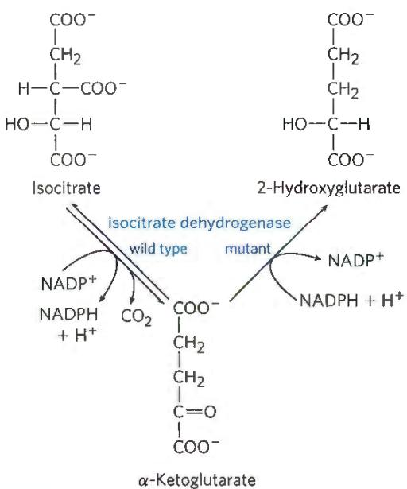  
FIGURE 16-20 A mutant isocitrate dehydrogenase acquires a new activity. Wild-type isocitrate dehydrogenase catalyzes the conversion of isocitrate to $\alpha$ -ketoglutarate, but mutations that alter the binding site for isocitrate cause loss of the normal enzymatic activity and gain of a new activity: conversion of $\alpha$ -ketoglutarate to 2-hydroxyglutarate. Accumulation of this product inhibits histone demethylase, altering gene regulation and leading to glial cell tumors in the brain.

## Certain Intermediates Are Channeled through Metabolons

We saw an example of substrate channeling in the five-reaction sequence of the PDH complex. Many other reactions occur in similar multienzyme complexes that ensure efficient passage of the product of one enzyme reaction to the next enzyme in the pathway. Such integrated multienzyme complexes, metabolons, are held together by noncovalent interactions and are not easily extracted intact from the cell. In the classic approach of enzymology—purification of individual proteins from extracts of broken cells—once cells are broken open, their contents, including enzymes, are diluted 100- or 1,000-fold (Fig. 16-21), which favors dissociation of noncovalent complexes such as metabolons.

The enzymes of the citric acid cycle are usually described as soluble components of the mitochondrial matrix (except for succinate dehydrogenase, which is membrane-bound), but there is evidence that at least three sequential enzymes of the citric acid cycle (malate dehydrogenase, citrate synthase, and aconitase) constitute a metabolon (Fig. 16-22). We will see more examples of substrate channeling in some amino acid biosynthesis pathways in Chapter 22. As cryo-EM increases our understanding of larger complexes and “—somes” (apoptosomes, respirasomes, and replisomes, for example), it seems likely that many more enzymes once thought to function as individual soluble proteins will be found to act in multienzyme complexes that facilitate the channeling of substrates.

  
In intact cell

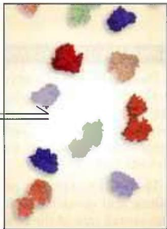  
In cell extract  
FIGURE 16-21 Effect of protein concentration on complex stability. Dilution of a solution containing a noncovalently bound protein complex — such as a metabolon consisting of three enzymes (illustrated here in red, blue, and green) — favors dissociation of the complex into its constituents.

(b)  
  
FIGURE 16-22 A three-enzyme metabolon of the citric acid cycle (a) Purified porcine enzymes malate dehydrogenase (MDH), citrate synthase (CS), and aconitase form a metabolon when combined in vitro. (b) Electrostatic modeling shows that a broad path of positive potential along the surface of a MDH-CS complex connects the active sites of MDH and CS. This path provides a channel for the passage of the negatively charged oxaloacetate (OAA) from the active site of MDH, where it is formed from L-malate, to the active site of CS, where it condenses with acetyl-CoA to form citrate. Engineered mutations that replaced a positively charged Arg residue along this path with a negatively charged Asp residue greatly reduced the rate of substrate channeling through the complex, providing evidence that the functional unit is a metabolon. [Information from B. Bulutoglu et al., ACS Chem. Biol. 1 :2847, 2016. Data from PDB ID 1MLD, W. B. Gleason et al., Biochemistry 33:2078, 1994; PDB ID 1CTS, S. Remington et al., J. Mol. Biol. 158:111, 1982; PDB ID 7ACN, H. Lauble et al., Biochemistry 31:2735, 1992.]

## SUMMARY 16.4 Regulation of the Citric Acid Cycle

The production of acetyl-CoA for the citric acid cycle by the PDH complex is inhibited allosterically by metabolites that signal a sufficiency of metabolic energy (ATP, acetyl-CoA, NADH, and fatty acids) and is stimulated by metabolites that indicate a reduced energy supply (AMP, CoA-SH, $\mathrm{NAD^{+}}$ ).

The PDH complex is regulated by allosteric mechanisms and covalent modification (phosphorylation). The overall rate of the citric acid cycle is controlled by the rate of conversion of pyruvate to acetyl-CoA and by the flux through citrate synthase, isocitrate dehydrogenase, and $\alpha$ -ketoglutarate dehydrogenase. These fluxes are affected by the concentrations of substrates and products: the end products ATP and NADH are inhibitory, and the substrates $\mathrm{NAD^{+}}$ and ADP are stimulatory.

Long-chain fatty acids, which can break down to acetyl-CoA, are also inhibitory.

■ Some mutations that affect the PDH complex or citric acid cycle enzymes are oncogenic: they occur very commonly in certain types of cancer.

■ Complexes of consecutive enzymes in a pathway (metabolons) allow substrate channeling and more efficient passage of substrates through the reaction sequences.

## KEY TERMS

Terms in bold are defined in the glossary.

cellular respiration 574  
citric acid cycle 574  
tricarboxylic acid (TCA)  
cycle 574  
Krebs cycle 574  
thioester 575  
mitochondrial pyruvate  
carrier (MPC) 575  
pyruvate dehydrogenase (PDH) complex 575  
oxidative  
decarboxylation 575  
lipoate 576  
substrate channeling 577 iron-sulfur center 582
α-ketoglutarate dehydrogenase complex 582
moonlighting enzymes 584
nucleoside diphosphate kinase 586
prochiral molecule 588
amphibolic pathway 590
glyoxylate cycle 590
anaplerotic reaction 590
biotin 590
oncometabolite 594
metabolon 595

## PROBLEMS

1. Balance Sheet for the Citric Acid Cycle The citric acid cycle has eight enzymes: citrate synthase, aconitase, isocitrate dehydrogenase, $\alpha$ -ketoglutarate dehydrogenase, succinyl-CoA synthetase, succinate dehydrogenase, fumarase, and malate dehydrogenase.

(a) Write a balanced equation for the reaction catalyzed by each enzyme.

(b) Name the cofactor(s) required by each enzyme reaction. (c) For each enzyme, determine which of the following describes the type of reaction(s) catalyzed: condensation (carbon-carbon bond formation); dehydration (loss of water); hydration (addition of water); decarboxylation (loss of $\mathrm{CO}_{2}$ ); oxidation-reduction; substrate-level phosphorylation; isomerization.

(d) Write a balanced net equation for the catabolism of acetyl-CoA to $CO_{2}$ .

2. Net Equation for Glycolysis and the Citric Acid Cycle Write the net biochemical equation for the metabolism of a molecule of glucose by glycolysis and the citric acid cycle, including all cofactors.

3. Recognizing Oxidation and Reduction Reactions
One biochemical strategy of many living organisms is the stepwise oxidation of organic compounds to $CO_{2}$ and $H_{2}O$ and the conservation of a major part of the energy thus produced in the form of ATP. It is important to be able to recognize oxidation-reduction processes in metabolism. Reduction of an organic molecule results from the hydrogenation of a double bond (Eqn 1, below) or of a single bond with accompanying cleavage (Eqn 2). Conversely, oxidation results from dehydrogenation.

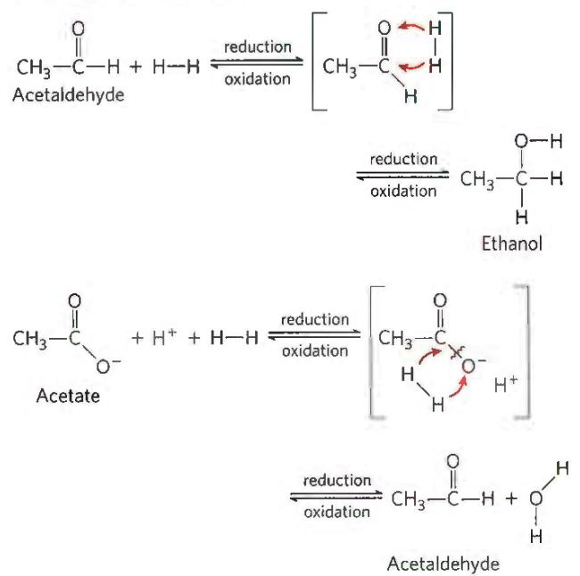

(e)

In biochemical redox reactions, the coenzymes NAD and FAD dehydrogenate/hydrogenate organic molecules in the presence of the proper enzymes.

(g)

(1)

(h)

(2)

For each of the metabolic transformations (a) through (h), determine whether the compound on the left has undergone oxidation or reduction. Balance each transformation by inserting H—H and, where necessary, $H_{2}O$ .

(a)

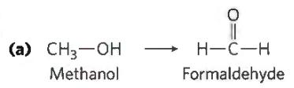

(b)

(c)

(a)

(d)

(b)

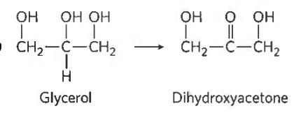

(c)

(d)

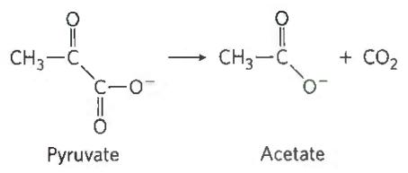

4. Relationship between Energy Release and the Oxidation State of Carbon A eukaryotic cell can use glucose $\left(\mathrm{C}_{6}\mathrm{H}_{12}\mathrm{O}_{6}\right)$ and hexanoate $\left(\mathrm{C}_{6}\mathrm{H}_{11}\mathrm{O}_{2}\right)$ as fuels for cellular respiration. On the basis of their structural formulas, which substance releases more energy per gram on complete combustion to $CO_{2}$ and $H_{2}O$ ?

5. Nicotinamide Coenzymes as Reversible Redox Carriers The nicotinamide coenzymes (see Fig. 13-24) can undergo reversible oxidation-reduction reactions with specific substrates in the presence of the appropriate dehydrogenase. In these reactions, NADH + H $^{+}$ serves as the hydrogen source, as described in Problem 3. Whenever the coenzyme is oxidized, a substrate must be simultaneously reduced:

For each of the reactions in (a) through (f) shown below, determine whether the substrate has been oxidized or reduced or is unchanged in oxidation state (see Problem 3). If a redox change has occurred, balance the reaction with the necessary amount of $\mathrm{NAD^{+}}$ , NADH, $\mathrm{H^{+}}$ , and $\mathrm{H}_2\mathrm{O}$ . The objective is to recognize when a redox coenzyme is necessary in a metabolic reaction.

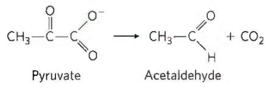

6. Pyruvate Dehydrogenase Cofactors and Mechanism Describe the role of each cofactor involved in the reaction catalyzed by the pyruvate dehydrogenase complex.

7. Thiamine Deficiency Individuals with a thiamine-deficient diet have relatively high levels of pyruvate in their blood. Explain this in biochemical terms.

8. Isocitrate Dehydrogenase Reaction What type of chemical reaction is involved in the conversion of isocitrate to $\alpha$ -ketoglutarate? Name and describe the role of any cofactors. What other reaction(s) of the citric acid cycle are of this same type?

9. Stimulation of Oxygen Consumption by Oxaloacetate and Malate In the early 1930s, Albert Szent-Györgyi reported the interesting observation that the addition of small amounts of oxaloacetate or malate to suspensions of minced pigeon breast muscle stimulated the oxygen consumption of the preparation. Surprisingly, the amount of oxygen consumed was about seven times more than the amount necessary for complete oxidation (to $\mathrm{CO}_{2}$ and $\mathrm{H}_2\mathrm{O}$ ) of the added oxaloacetate or malate. Why did the addition of oxaloacetate or malate stimulate oxygen consumption? Why was the amount of oxygen consumed so much greater than the amount necessary to completely oxidize the added oxaloacetate or malate?

10. Formation of Oxaloacetate in a Mitochondrion In the last reaction of the citric acid cycle, malate is dehydrogenated to regenerate the oxaloacetate necessary for the entry of acetyl-CoA into the cycle:

$$
\begin{array}{r l} \mathrm {L - Malate + NAD^ {+}} & \longrightarrow \text { oxaloacetate } + \mathrm{NADH} + \mathrm{H} ^ {+} \\ & \Delta G ^ {\prime \circ} = 3 0. 0 \mathrm{kJ/mol} \end{array}
$$

(a) Calculate the equilibrium constant for this reaction at 25 °C.
(b) Because $\Delta G^{\prime\circ}$ assumes a standard pH of 7, the equilibrium constant calculated in (a) corresponds to

$$
K _ {\mathrm{eq}} ^ {\prime} = \frac {[ \text { oxaloacetate } ] [ \mathrm{NADH} ]}{[ \mathrm{L-malate} ] [ \mathrm{NAD} ^ {+} ]}
$$

The measured concentration of L-malate in rat liver mitochondria is about 0.20 mm when $[NAD^{+}]/[NADH]$ is 10. Calculate the concentration of oxaloacetate at pH 7 in these mitochondria.

(c) To appreciate the magnitude of the mitochondrial oxaloacetate concentration, calculate the number of oxaloacetate molecules in a single rat liver mitochondrion. Assume the mitochondrion is a sphere of diameter 2.0 $\mu$ m.

11. Cofactors for the Citric Acid Cycle Suppose you have prepared a mitochondrial extract that contains all the soluble enzymes of the matrix but has lost (by dialysis) all the low molecular weight cofactors. What must you add to the extract so that the preparation will oxidize acetyl-CoA to $\mathrm{CO}_{2}$ ?

12. Riboflavin Deficiency How would a riboflavin deficiency affect the functioning of the citric acid cycle? Explain your answer.

13. Oxaloacetate Pool What factors might decrease the pool of oxaloacetate available for the activity of the citric acid cycle? How can the pool of oxaloacetate be replenished?

14. Energy Yield from the Citric Acid Cycle The reaction catalyzed by succinyl-CoA synthetase produces the high-energy compound GTP. How is the free energy contained in GTP incorporated into the cellular ATP pool?

15. Respiration Studies in Isolated Mitochondria Cellular respiration can be studied in isolated mitochondria by measuring oxygen consumption under different conditions. If 0.01 M sodium malonate is added to actively respiring mitochondria that are using pyruvate as fuel, respiration soon stops and a metabolic intermediate accumulates.

(a) What is the structure of this intermediate?

(b) Explain why it accumulates.

(c) Explain why oxygen consumption stops.

(d) Aside from removal of the malonate, what can overcome this inhibition of respiration? Explain.

16. Labeling Studies in Isolated Mitochondria Biochemists have often delineated the metabolic pathways of organic compounds by using a radioactively labeled substrate and following the fate of the label.

(a) How can you determine whether a suspension of isolated mitochondria metabolizes added glucose to $CO_{2}$ and $H_{2}O$ ?

(b) Suppose you add a brief pulse of $[3-^{14}C]$ pyruvate (labeled in the methyl position) to the mitochondria. After one turn of the citric acid cycle, what is the location of the ${}^{14}C$ in the oxaloacetate? Explain by tracing the ${}^{14}C$ label through the pathway. How many turns of the cycle are required to release all the $[3-^{14}C]$ pyruvate as $CO_{2}$ ?

17. [1-14C]Glucose Catabolism An investigator briefly incubates an actively respiring bacterial culture with $[1 - ^{14}\mathrm{C}]$ glucose and isolates the glycolytic and citric acid cycle intermediates. Where is the $^{14}\mathrm{C}$ located in each of the intermediates listed? Consider only the initial incorporation of $^{14}\mathrm{C}$ in the first pass of labeled glucose through the pathways.

(a) Fructose 1,6-bisphosphate

(b) Glyceraldehyde 3-phosphate

(c) Phosphoenolpyruvate

(d) Acetyl-CoA

(e) Citrate

(f) $\alpha$ -Ketoglutarate

(g) Oxaloacetate

18. Role of the Vitamin Thiamine People with beriberi, a disease caused by thiamine deficiency, have elevated levels of blood pyruvate and $\alpha$ -ketoglutarate, especially after consuming a meal rich in glucose. How are these effects related to a deficiency of thiamine?

19. Synthesis of Oxaloacetate by the Citric Acid Cycle In the last step of the citric acid cycle, NAD $^{+}$ -dependent oxidation of L-malate forms oxaloacetate. Can a net synthesis of oxaloacetate from acetyl-CoA occur using only the enzymes and cofactors of the citric acid cycle, without depleting the intermediates of the cycle? Explain. How do cells replenish the oxaloacetate that is lost from the cycle to biosynthetic reactions?

20. Oxaloacetate Depletion Mammalian liver can carry out gluconeogenesis using oxaloacetate as the starting material (Chapter 14). Would the extensive use of oxaloacetate for gluconeogenesis affect the operation of the citric acid cycle? Explain your answer.

21. Mode of Action of the Rodenticide Fluoroacetate Fluoroacetate, prepared commercially for rodent control, is also produced by a South African plant. After entering a cell, fluoroacetate is converted to fluoroacetyl-CoA in a reaction catalyzed by the enzyme acetate thiokinase:

$$
\begin{array}{c} \mathrm {F - CH_ {2} COO^ {-} + CoA - SH + ATP\longrightarrow} \\ \mathrm {F - CH_ {2} C- S - CoA + AMP + PP_ {i}} \\ \mathrm{O} \end{array}
$$

You perform a perfusion experiment to study the toxic effect of fluoroacetate using intact isolated rat heart. After perfusing the heart with 0.22 mm fluoroacetate, you see a decrease in the measured rate of glucose uptake and glycolysis as well as an accumulation of glucose 6-phosphate and fructose 6-phosphate. Examination of the citric acid cycle intermediates reveals that their concentrations are below normal, except for citrate, which has a concentration 10 times higher than normal.

(a) Where did the block in the citric acid cycle occur? What caused citrate to accumulate and the other cycle intermediates to be depleted?

(b) Fluoroacetyl-CoA is enzymatically transformed in the citric acid cycle. What is the structure of the end product of fluoroacetate metabolism? Why does it block the citric acid cycle? How might the inhibition be overcome?

(c) In the heart perfusion experiments, why did glucose uptake and glycolysis decrease? Why did hexose monophosphates accumulate?

(d) Why is fluoroacetate poisoning fatal?

22. Synthesis of L-Malate in Wine Making The tartness of some wines is due to high concentrations of L-malate. Write a sequence of reactions showing how yeast cells synthesize L-malate from glucose under anaerobic conditions in the presence of dissolved $CO_{2}$ ( $HCO_{3}^{-}$ ). Note that the overall reaction for this fermentation cannot involve the consumption of nicotinamide coenzymes or citric acid cycle intermediates.

23. Net Synthesis of $\alpha$ -Ketoglutarate $\alpha$ -Ketoglutarate plays a central role in the biosynthesis of several amino acids. Write a sequence of enzymatic reactions that could result in the net synthesis of $\alpha$ -ketoglutarate from pyruvate. Your proposed sequence must not involve the net consumption of other citric acid cycle intermediates. Write an equation for the overall reaction.

24. Amphibolic Pathways Explain, giving examples, what is meant by the statement that the citric acid cycle is amphibolic.

25. Regulation of the Pyruvate Dehydrogenase Complex In animal tissues, the ratio of active, unphosphorylated to inactive, phosphorylated PDH complex regulates the rate of conversion of pyruvate to acetyl-CoA. Determine what happens to the rate of this reaction when a preparation of rabbit muscle mitochondria containing the PDH complex is treated with (a) pyruvate dehydrogenase kinase, ATP, and NADH; (b) pyruvate dehydrogenase phosphatase and $Ca^{2+}$ ; (c) malonate.

26. Commercial Synthesis of Citric Acid Manufacturers use citric acid as a flavoring agent in soft drinks, fruit juices, and many other foods. Worldwide, the market for citric acid is valued at hundreds of millions of dollars per year. Commercial production uses the mold Aspergillus niger, which metabolizes sucrose under carefully controlled conditions.

(a) The yield of citric acid strongly depends on the concentration of $FeCl_{3}$ in the culture medium, as indicated in the graph. Why does the yield decrease when the concentration of $Fe^{3+}$ is above or below the optimal value of 0.5 mg/L?

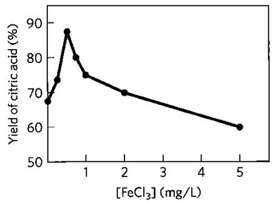

(b) Write the sequence of reactions by which A. niger synthesizes citric acid from sucrose. Write an equation for the overall reaction.

(c) Does the commercial process require the culture medium to be aerated—that is, is this a fermentation or an aerobic process? Explain.

27. Regulation of Citrate Synthase In the presence of saturating amounts of oxaloacetate, the activity of citrate synthase from pig heart tissue shows a sigmoid dependence on the concentration of acetyl-CoA, as shown in the graph. Adding succinyl-CoA shifts the curve to the right and makes the sigmoid dependence more pronounced.

On the basis of these observations, suggest how succinyl-CoA regulates the activity of citrate synthase. (Hint: See Fig. 6-37.) Why is succinyl-CoA an appropriate signal for regulation of the citric acid cycle? How does the regulation of citrate synthase control the rate of cellular respiration in pig heart tissue?

28. Regulation of Pyruvate Carboxylase The carboxylation of pyruvate by pyruvate carboxylase occurs at a very low rate unless acetyl-CoA, a positive allosteric modulator, is present. If you have just eaten a meal rich in fatty acids (triacylglycerols) but low in carbohydrates (glucose), how does this regulatory property shut down the oxidation of glucose to $CO_{2}$ and $H_{2}O$ but increase the oxidation of acetyl-CoA derived from fatty acids?

29. Relationship between Respiration and the Citric Acid Cycle Although oxygen does not participate directly in the citric acid cycle, the cycle operates only when $O_{2}$ is present. Why?

30. Effect of $[NADH]/[NAD^{+}]$ on the Citric Acid Cycle
How would you expect the operation of the citric acid cycle to respond to a rapid increase in the $[NADH]/[NAD^{+}]$ ratio in the mitochondrial matrix? Why?

31. Thermodynamics of Citrate Synthase Reaction in Cells Citrate is formed by the condensation of acetyl-CoA with oxaloacetate, catalyzed by citrate synthase:

$$
\mathrm{Oxaloacetate} + \mathrm{acetyl-CoA} + \mathrm{H} _ {2} \mathrm{O} \rightleftharpoons \text { citrate } + \mathrm{CoA} + \mathrm{H} ^ {+}
$$

In rat heart mitochondria at pH 7.0 and 25 °C, the concentrations of reactants and products are oxaloacetate, 1 μM; acetyl-CoA, 1 μM; citrate, 220 μM; and CoA, 65 μM. The standard free-energy change for the citrate synthase reaction is -32.2 kJ/mol. What is the direction of metabolite flow through the citrate synthase reaction in rat heart cells? Explain.

32. Reactions of the Pyruvate Dehydrogenase Complex
Two of the steps in the oxidative decarboxylation of pyruvate (steps 4 and 5 in Fig. 16-6) do not involve any of the three carbons of pyruvate, yet are essential to the operation of the PDH complex. Explain.

33. Pyruvate Transport into Mitochondria The mitochondrial pyruvate carrier (MPC) is a heterodimer of the proteins MPC1 and MPC2. In a high proportion (80%) of certain cancers, including gliomas (tumors of the glial cells of the brain), the gene for one of these proteins is mutated such that pyruvate cannot enter the mitochondrial matrix. Name three metabolic effects that you would expect to see if cytosolic pyruvate could not gain access to the machinery of the citric acid cycle. (Hint: Box 14-1 may be helpful.)

34. Citric Acid Cycle Mutants There are many cases of human disease in which one or another enzyme activity is lacking due to genetic mutation. Why are cases in which individuals lack one of the enzymes of the citric acid cycle extremely rare?

## DATA ANALYSIS PROBLEM

35. How the Citric Acid Cycle Was Discovered The detailed biochemistry of the citric acid cycle was determined by several researchers over a period of decades. In a 1937 article, Krebs and Johnson summarized their work and the work of others in the first published description of this pathway.

The methods used by these researchers were very different from those of modern biochemistry. Radioactive tracers were not commonly available until the 1940s, so Krebs and other researchers had to use nontracer techniques to work out the pathway. Using freshly prepared samples of pigeon breast muscle, they determined oxygen consumption by suspending minced muscle in buffer in a sealed flask and measuring the volume (in $\mu$ L) of oxygen consumed under different conditions. They measured levels of substrates (intermediates) by treating samples with acid to remove contaminating proteins, then assaying the quantities of various small organic molecules. The two key observations that led Krebs and colleagues to propose a citric acid cycle as opposed to a linear pathway (like that of glycolysis) were made in the following experiments.

Experiment I: They incubated 460 mg of minced muscle in 3 mL of buffer at 40 °C for 150 minutes. Addition of citrate increased O₂ consumption by 893 μL compared with samples without added citrate. They calculated, based on the O₂ consumed during respiration of other carbon-containing compounds, that the expected O₂ consumption for complete respiration of this quantity of citrate was only 302 μL.

Experiment II: They measured $O_{2}$ consumption by 460 mg of minced muscle in 3 mL of buffer when incubated with citrate and/or with 1-phosphoglycerol (glycerol 1-phosphate; this was known to be readily oxidized by cellular respiration) at 40 °C for 140 minutes. The results are shown in the table.

<table><tr><td>Sample</td><td>Substrate(s) added</td><td> $\mu \mathrm{L}{\mathrm{O}}_{2}$  absorbed</td></tr><tr><td>1</td><td>No extra</td><td>342</td></tr><tr><td>2</td><td>0.3 mL 0.2 M 1-phosphoglycerol</td><td>757</td></tr><tr><td>3</td><td>0.15 mL 0.02 M citrate</td><td>431</td></tr><tr><td>4</td><td>0.3 mL 0.2 M 1-phosphoglycerol and 0.15 mL 0.02 M citrate</td><td>1,385</td></tr></table>

(a) Why is $\mathrm{O}_2$ consumption a good measure of cellular respiration? (b) Why does sample 1 (unsupplemented muscle tissue) consume some oxygen?

(c) Based on the results for samples 2 and 3, can you conclude that 1-phosphoglycerol and citrate serve as substrates for cellular respiration in this system? Explain your reasoning.

(d) Krebs and colleagues used the results from these experiments to argue that citrate was "catalytic"—that it helped the muscle tissue samples metabolize 1-phosphoglycerol more completely. How would you use their data to make this argument?

(e) Krebs and colleagues further argued that citrate was not simply consumed by these reactions, but had to be regenerated. Therefore, the reactions had to be a cycle rather than a linear pathway. How would you make this argument?

Other researchers had found that arsenate (AsO $_{4}^{3-}$ ) inhibits α-ketoglutarate dehydrogenase and that malonate inhibits succinate dehydrogenase.

(f) Krebs and coworkers found that muscle tissue samples treated with arsenate and citrate would consume citrate only in the presence of oxygen; under these conditions, oxygen was consumed. Based on the pathway in Figure 16-7, what was the citrate converted to in this experiment, and why did the samples consume oxygen?

In their article, Krebs and Johnson further reported the following: (1) In the presence of arsenate, 5.48 mmol of citrate was converted to 5.07 mmol of $\alpha$ -ketoglutarate. (2) In the presence of malonate, citrate was quantitatively converted to large amounts of succinate and small amounts of $\alpha$ -ketoglutarate. (3) Addition of oxaloacetate in the absence of oxygen led to production of a large amount of citrate; the amount was increased if glucose was also added.

Other workers had found the following pathway in similar muscle tissue preparations:

Succinate $\longrightarrow$ fumarate $\longrightarrow$ malate $\longrightarrow$

oxaloacetate $\longrightarrow$ pyruvate

(g) Based only on the data presented in this problem, what is the order of the intermediates in the citric acid cycle? How does this compare with Figure 16-7? Explain your reasoning.

(h) Why was it important to show the quantitative conversion of citrate to $\alpha$ -ketoglutarate?

The Krebs and Johnson article also contains other data that filled in most of the missing components of the cycle. The only component left unresolved was the molecule that reacted with oxaloacetate to form citrate.

## Reference

Krebs, H.A., and W.A. Johnson. 1937. The role of citric acid in intermediate metabolism in animal tissues. Enzymologia 4:148–156. Reprinted in FEBS Lett. 117(Suppl.):K2–K10, 1980.

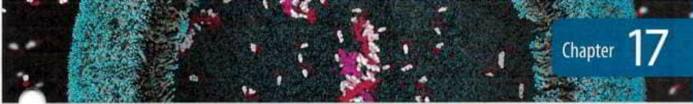

# FATTY ACID CATABOLISM

17.1 Digestion, Mobilization, and Transport of Fats 602

17.2 Oxidation of Fatty Acids 606

17.3 Ketone Bodies 619

The oxidation of long-chain fatty acids to acetyl-CoA is a central energy-yielding pathway in many organisms and tissues. In mammalian heart and liver, for example, it provides as much as 80% of the energetic needs under all physiological circumstances. The electrons removed from fatty acids during oxidation pass through the respiratory chain, driving ATP synthesis; the acetyl-CoA produced from the fatty acids may be completely oxidized to $CO_{2}$ in the citric acid cycle, resulting in further energy conservation.

In Chapter 10 we described the properties of triacylglycerols (also called triglycerides or neutral fats) that make them especially suitable as storage fuels. The long alkyl chains of their constituent fatty acids are essentially hydrocarbons, highly reduced structures with an energy of complete oxidation ( $\sim$ 38 kJ/g) more than twice that for the same weight of carbohydrate or protein. This advantage is compounded by the extreme insolubility of lipids in water; cellular triacylglycerols aggregate in lipid droplets, which do not raise the osmolarity of the cytosol, and they are unsolvated. (In storage polysaccharides, by contrast, water of solvation can account for two-thirds of the overall weight of the stored molecules.) And because of their relative chemical inertness, triacylglycerols can be stored in large quantity in cells without the risk of undesired chemical reactions with other cellular constituents.

The properties that make triacylglycerols good storage compounds, however, present problems in their role as fuels. Because they are insoluble in water, ingested triacylglycerols must be emulsified before they can be digested by water-soluble enzymes in the intestine, and triacylglycerols absorbed in the intestine or mobilized from storage tissues must be carried in the blood bound to proteins that counteract their insolubility. Also, to overcome the relative stability of the C—C bonds in a fatty acid, the carboxyl group at C-1 is activated by attachment to coenzyme A, which allows stepwise oxidation of the fatty acyl group at the C-3, or $\beta$ , position—hence the name $\beta$ oxidation.

The principles we emphasize in this chapter are not new. They apply to the catabolic pathways of carbohydrates that we just studied.

P1 Metabolites of diverse origin funnel into a few central pathways. Fatty acid catabolism and glycolysis convert quite different starting materials into the same product (acetyl-CoA). The electrons from the oxidative reactions of these pathways and of the citric acid cycle are carried by common cofactors (NAD and FAD) to the mitochondrial respiratory chain leading to oxygen, providing the energy for ATP synthesis by oxidative phosphorylation.

P2 Evolution selects for chemical mechanisms that make useful reactions more energetically favorable, and those same mechanisms are used in different pathways. In the breakdown of fatty acids we see the activation of a carboxylic acid by its conversion to a thioester, as we saw with acetyl-CoA in the citric acid cycle. To break the C—C bonds in the long chain of relatively inert $-CH_{2}-CH_{2}-$ groups in fatty acids, a carbonyl group is created adjacent to the $-CH_{2}-$ group, as we saw in the reactions of the citric acid cycle.

P3 Allosteric mechanisms and posttranslational regulation (protein phosphorylation) coordinate metabolic processes within a cell. Hormones and growth factors coordinate metabolic activities among tissues and organs. Reciprocal regulation of catabolic and anabolic pathways prevents the inefficiency of futile cycling.

## P4 When a process lacks a critical

component—an enzyme, a cofactor, or a regulatory agent—the resulting loss of homeostasis may cause disease across a spectrum of severity. Defects in fatty acid breakdown are no exception.

The liver plays a unique role in whole-body metabolism. When glucose is unavailable, the liver makes glucose by gluconeogenesis and releases it to the blood for distribution to other tissues, including the brain. During starvation, the liver processes fatty acids into ketone bodies, which, unlike fatty acids, can cross the blood brain barrier and fuel the brain.

## 17.1 Digestion, Mobilization, and Transport of Fats

Cells can obtain fatty acid fuels from four sources: fats consumed in the diet, fats stored in cells as lipid droplets, fats synthesized in one organ for export to another, and fats obtained by autophagy (which degrades the cell's own organelles). Some species use all four sources under various circumstances; others use one or two. Vertebrates, for example, obtain fats in the diet; mobilize fats stored in specialized tissue (adipose tissue, consisting of cells called adipocytes); and, in the liver, convert excess dietary carbohydrates to fats for export to other tissues. During starvation, they can recycle lipids by autophagy. On average, 40% or more of the daily energy requirement of humans in highly industrialized countries is supplied by dietary triacylglycerols. Triacylglycerols provide more than half the energy requirements of some organs, particularly the liver, heart, and resting skeletal muscle. Stored triacylglycerols are virtually the sole source of energy in hibernating animals and migrating birds. Vascular plants mobilize fats stored in seeds during germination, but do not otherwise depend on fats for energy.

## Dietary Fats Are Absorbed in the Small Intestine

In vertebrates, before ingested triacylglycerols can be absorbed through the intestinal wall they must be converted from insoluble macroscopic fat particles to finely dispersed microscopic micelles. This solubilization is carried out by bile salts, such as taurocholic acid (p. 352), which are synthesized from cholesterol in the liver, stored in the gallbladder, and released into the small intestine after ingestion of a fatty meal. Bile salts are amphipathic compounds that act as biological detergents, emulsifying dietary fats into mixed micelles of bile salts and triacylglycerols (Fig. 17-1, step 1). Micelle formation enormously increases the fraction of lipid molecules accessible to the action of water-soluble lipases in the intestine, and lipase action converts triacylglycerols to monoacylglycerols (monoglycerides) and diacylglycerols (diglycerides) and free fatty acids (step 2). These products of lipase action diffuse or are transported into the epithelial cells lining the intestinal surface (the intestinal mucosa) (step 3), where they are reconverted to triacylglycerols and packaged with dietary cholesterol and specific apolipoproteins (from the Greek apo, meaning “detached” or “separate,” designating the protein in its lipid-free form) into lipoprotein aggregates called chylomicrons (step 4). It is the protein moieties that target triacylglycerols, phospholipids, cholesterol, and cholesteryl esters for transport between organs.

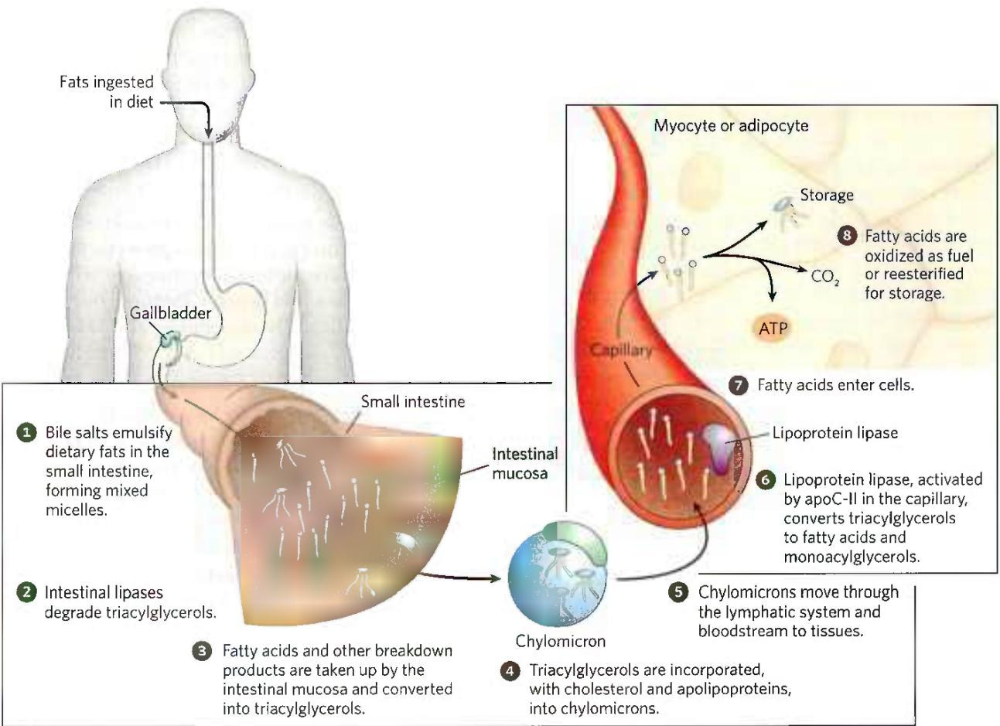  
FIGURE 17-1 Processing of dietary lipids in vertebrates. Digestion and absorption of dietary lipids occur in the small intestine, and the fatty acids released from triacylglycerols are packaged and delivered to muscle and adipose tissues. The eight steps are discussed in the text.

Apolipoproteins combine with lipids to form several classes of lipoprotein particles, spherical aggregates with hydrophobic lipids at the core and hydrophilic protein side chains and lipid head groups at the surface. Various combinations of lipid and protein produce particles of different densities, ranging from chylomicrons and very-low-density lipoproteins (VLDL) to very-high-density lipoproteins (VHDL). These particles can be separated by ultracentrifugation. The structures of these lipoprotein particles and their roles in lipid transport are detailed in Chapter 21 (Fig. 21-39).

Apolipoprotein B-48 (apoB-48) is the primary protein component of chylomicrons. In lipid uptake from the intestine, chylomicrons move from the intestinal mucosa into the lymphatic system, and then enter the blood, where they can exchange apolipoproteins with other types of circulating lipoprotein. In the blood, chylomicrons pick up apolipoprotein C-II (apoC-II) from high-density lipoprotein (HDL) particles and are carried to muscle and adipose tissue (Fig. 17-1, step 5). In the capillaries of these tissues, the extracellular enzyme lipoprotein lipase, activated by apoC-II, hydrolyzes triacylglycerols to free fatty acids and monoacylglycerols (step 6), which are taken up by specific transporters in the plasma membranes of cells in the target tissues (step 7). In muscle, the fatty acids are oxidized for energy; in adipose tissue, they are reesterified for storage as triacylglycerols (step 8).

The remnants of chylomicrons, depleted of most of their triacylglycerols but still containing cholesterol and apolipoproteins, travel in the blood to the liver, where they are taken up by endocytosis mediated by receptors for their apolipoproteins. Triacylglycerols that enter the liver by this route may be oxidized to provide energy or to provide precursors for the synthesis of ketone bodies, as described in Section 17.3.

When the diet contains more fatty acids than are needed immediately for fuel or as precursors, the liver converts them to triacylglycerols, which are packaged with specific apolipoproteins into VLDLs. These VLDLs are secreted by hepatocytes and transported in the blood to adipose tissue, where the triacylglycerols are removed and stored in lipid droplets within adipocytes.

## Hormones Trigger Mobilization of Stored Triacylglycerols

Neutral lipids (triacylglycerols, sterols, and steroyl esters) are stored in adipocytes (and in steroid-synthesizing cells of the adrenal cortex, ovary, and testis) in lipid droplets, which have a core of triacylglycerols and sterol esters surrounded by a monolayer of phospholipids. The surface of these droplets is coated with perilipins, a family of proteins that restrict access to lipid droplets, preventing untimely lipid mobilization. P1 When hormones signal the need for metabolic energy, triacylglycerols stored in adipose tissue are mobilized (brought out of storage) and transported to tissues (skeletal muscle, heart, and renal cortex) in which fatty acids can be oxidized for energy production. The hormones epinephrine and glucagon, secreted in response to low blood glucose levels or a fight-or-flight situation, stimulate the enzyme adenylyl cyclase in the adipocyte plasma membrane (Fig. 17-2), which produces the intracellular second messenger cyclic AMP (cAMP; see Fig. 12-4). Cyclic AMP-dependent protein kinase (PKA) triggers changes that open the lipid droplet to the action of three cytosolic lipases, which act on tri-, di-, and monoacylglycerols, releasing fatty acids and glycerol.

The fatty acids thus released (free fatty acids, FFAs) pass from the adipocyte into the blood, where they bind to the blood protein serum albumin (Fig. 17-3). This protein ( $M_{r}$ 66,000), which makes up about half of the total serum protein, noncovalently binds as many as seven fatty acids. Bound to this soluble protein, the otherwise insoluble fatty acids are carried to tissues such as skeletal muscle, heart, and renal cortex. In these target tissues, fatty acids dissociate from albumin and are moved by plasma membrane transporters into cells to serve as fuel.

About 95% of the biologically available energy of triacylglycerols resides in their three long-chain fatty acids; only 5% is contributed by the glycerol moiety. The glycerol released by lipase action is phosphorylated by glycerol kinase (Fig. 17-4), and the resulting glycerol 3-phosphate is oxidized to dihydroxyacetone phosphate. The glycolytic enzyme triose phosphate isomerase converts this compound to glyceraldehyde 3-phosphate, which is oxidized via glycolysis.

## Fatty Acids Are Activated and Transported into Mitochondria

The enzymes of fatty acid oxidation in animal cells are located in the mitochondrial matrix, as demonstrated in 1948 by Eugene P. Kennedy and Albert Lehninger. Short- and medium-chain fatty acids, those with chain lengths of 12 or fewer carbons, enter mitochondria without the help of membrane transporters. Long-chain fatty acids, those with 14 or more carbons, which constitute the majority of the FFAs obtained in the diet or released from adipose tissue, cannot pass directly through the mitochondrial membranes: they must be transported through the carnitine shuttle. First, the fatty acid must be activated by a fatty acyl-CoA synthetase isozyme specific for long-chain fatty acids. The isozymes are present in the outer mitochondrial membrane, where they promote the general reaction

$$
\text { Fatty   acid } + \mathrm{CoA} + \mathrm{ATP} \rightleftharpoons \text { fatty   acyl - CoA } + \mathrm{AMP} + \mathrm{PP} _ {\mathrm{i}}
$$

P2 Fatty acyl-CoA synthetases catalyze the formation of a thioester linkage between the fatty acid carboxyl group and the thiol group of coenzyme A to yield a fatty acyl-CoA, coupled to the cleavage of ATP to AMP and PP $_{i}$ . (Recall the description of this reaction in Chapter 13, which illustrates how the free energy released by cleavage of phosphoanhydride bonds in ATP could be coupled to the formation of a high-energy compound; p. 485.) The reaction catalyzed by a fatty acyl-CoA synthetase occurs in two steps and involves a fatty acyl-adenylate intermediate (Fig. 17-5).

  
FIGURE 17-2 Mobilization of triacylglycerols stored in adipose tissue. When low levels of glucose in the blood trigger the release of glucagon, $①$ the hormone binds its receptor in the adipocyte membrane and thus $②$ stimulates adenylyl cyclase, via a G protein, to produce cAMP. This activates PKA, which phosphorylates $③$ the hormone-sensitive lipase (HSL) and $④$ perilipin molecules on the surface of the lipid droplet. Phosphorylation of perilipin causes $⑤$ dissociation of the protein CGI-58 from perilipin. CGI-58 (comparative gene identification-58), a protein closely associated with lipid droplets, then recruits adipose triacylg ycerol lipase (ATGL) to the droplet surface and stimulates its lipase

  
FIGURE 17-3 Human serum albumin complexed with stearate. Each day the human liver releases 10–15 g of serum albumin into the bloodstream, where this workhorse protein transports many ligands, drugs, and particularly fatty acids through the blood. The structure has nooks and crannies that can carry up to seven fatty acids. Its passengers are both hydrophobic and hydrophilic, and include steroid hormones, the blood thinner warfarin, the antibiotic penicillin, the anti-inflammatory drug ibuprofen, and the anxiolytic diazepam.  
activity. Active ATGL ⑥ converts triacylglycerols to diacylglycerols. The phosphorylated perilipin associates with phosphorylated HSL, allowing it access to the surface of the lipid droplet, where ⑦ it converts diacylglycerols to monoacylglycerols. ⑧ A third lipase, monoacylglycerol lipase (MGL), hydrolyzes monoacylglycerols. ⑨ Fatty acids leave the adipocyte, and are transported in the blood bound to serum albumin. They are released from the albumin and ⑩ enter a myocyte via a specific fatty acid transporter. ⑪ In the myocyte, fatty acids are oxidized to CO₂, and the energy of oxidation is conserved in ATP, which fuels muscle contraction and other energy-requiring metabolism in the myocyte.

Fatty acyl-CoAs, like acetyl-CoA, are high-energy compounds; their hydrolysis to FFAs and CoA has a large, negative standard free-energy change. The formation of a fatty acyl-CoA is made more favorable by the hydrolysis of two high-energy bonds in ATP; the pyrophosphate formed in the activation reaction is immediately hydrolyzed by inorganic pyrophosphatase (left side of Fig. 17-5), which pulls the preceding activation reaction in the direction of fatty acyl-CoA formation. The overall reaction (three steps) is

Fatty acid + CoA + ATP ⇌

$$
\begin{array}{r l} \text { fatty   acyl - CoA } + \mathrm{AMP} + 2 \mathrm{P} _ {\mathrm{i}} \\ \Delta G ^ {\prime \circ} = - 3 4 \end{array}\tag{17-1}
$$

kJ/mol

  
FIGURE 17-4 Entry of glycerol into the glycolytic pathway.

MECHANISM FIGURE 17-5 Activation of a fatty acid by conversion to a fatty acyl-CoA. Formation of the fatty acyl-CoA derivative occurs in two steps, catalyzed by fatty acyl-CoA synthetase. Hydrolysis of the pyrophosphate created in the first step of that reaction is catalyzed by inorganic pyrophosphatase. The overall reaction is highly exergonic.

Fatty acyl-CoA esters formed on the cytosolic side of the outer mitochondrial membrane can be transported into the mitochondrion and oxidized to produce ATP, or they can be used in the cytosol to synthesize membrane lipids.

Fatty acyl-CoAs destined for mitochondrial oxidation must be attached to carnitine to be shuttled across the inner mitochondrial membrane.

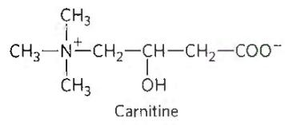

In a transesterification catalyzed by carnitine acyltransferase 1, CAT1 (also called carnitine palmitoyltransferase 1, CPT1) in the outer mitochondrial membrane, the fatty acyl-CoA is transiently attached to the hydroxyl group of carnitine to form fatty acyl-carnitine (Fig. 17-6). The fatty acyl-carnitine ester then diffuses across the intermembrane space and enters the matrix by passive transport through the acyl-carnitine/carnitine cotransporter of the inner mitochondrial membrane. This cotransporter moves one molecule of carnitine from the matrix to the intermembrane space as one molecule of fatty acyl-carnitine moves into the matrix. Once inside the matrix, the fatty acyl group is transferred from carnitine back to coenzyme A from the intramitochondrial pool by carnitine acyltransferase 2 (CAT2, or CPT2). This isozyme, located on the inner face of the inner mitochondrial membrane, regenerates fatty acyl-CoA and releases it, along with free carnitine, into the matrix. The carnitine is then available to be transferred back through the acyl-carnitine/carnitine cotransporter to be used to shuttle the next fatty acid across. Once inside the mitochondrion, the fatty acyl-CoA is acted upon by a set of enzymes in the matrix.

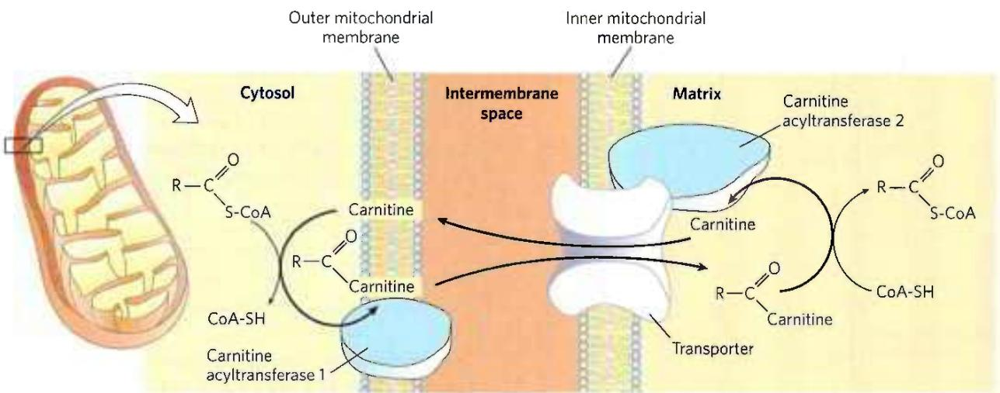  
FIGURE 17-6 Fatty acid entry into mitochondria via the acyl-carnitine/carnitine transporter. Fatty acyl-carnitine formed on the outer mitochondrial membrane moves into the matrix by passive cotransport  
through the inner membrane. In the matrix, the acyl group is transferred to mitochondrial coenzyme A, freeing carnitine to leave the matrix through the same transporter.

This process for transferring fatty acids into the mitochondrion—esterification to CoA, transesterification to carnitine, translocation across the inner membrane, and transesterification back to CoA—links two separate pools of coenzyme A and of fatty acyl–CoA, one in the cytosol, the other in mitochondria. These pools have different functions. Coenzyme A in the mitochondrial matrix is largely used in oxidative degradation of pyruvate, fatty acids, and some amino acids, whereas cytosolic coenzyme A is used in the biosynthesis of fatty acids (see Fig. 21-10). Fatty acyl–CoA in the cytosolic pool can be used there for membrane lipid synthesis or can be moved into the mitochondrial matrix for oxidation and ATP production. Conversion to the carnitine ester commits the fatty acyl moiety to the oxidative fate. P3 The carnitine-mediated entry process is the rate-limiting step for oxidation of fatty acids in mitochondria and, as discussed later, is a control point. Carnitine acyltransferase 1 is inhibited by malonyl-CoA, the first intermediate in fatty acid synthesis (see Fig. 21-1). This inhibition prevents the simultaneous synthesis and degradation of fatty acids, a wasteful futile cycle.

## SUMMARY 17.1 Digestion, Mobilization, and Transport of Fats

\- Dietary triacylglycerols are emulsified in the small intestine by bile salts, hydrolyzed by intestinal lipases, absorbed by intestinal epithelial cells, and reconverted into triacylglycerols. They are combined with specific apolipoproteins for passage through the blood and lymph to adipose tissue, where they are stored as lipid droplets.

■ Triacylglycerols stored in adipose tissue are mobilized by a hormone-sensitive triacylglycerol lipase. The released fatty acids bind to serum albumin and are carried in the blood to the heart, skeletal muscle, and other tissues that use fatty acids for fuel.

■ Once inside cells, fatty acids are activated at the outer mitochondrial membrane by conversion to fatty acyl–CoA thioesters. Fatty acyl–CoA that is to be oxidized enters mitochondria via the carnitine shuttle, which is a major control point. Malonyl-CoA, the first intermediate in fatty acid synthesis, inhibits carnitine acyltransferase 1, assuring that fatty acid oxidation and fatty acid synthesis do not occur simultaneously.

## 17.2 Oxidation of Fatty Acids

As noted earlier, mitochondrial oxidation of fatty acids takes place in three stages (Fig. 17-7). In the first stage— $\beta$ oxidation—fatty acids undergo oxidative removal of successive two-carbon units in the form of acetyl-CoA, starting from the carboxyl end of the fatty acyl chain. For example, the 16-carbon palmitic acid (palmitate at pH 7) undergoes seven passes through the oxidative sequence, in each pass losing two carbons as acetyl-CoA. At the end of seven cycles, the last two carbons of palmitate (originally C-15 and C-16) remain as acetyl-CoA. The overall result is the conversion of the 16-carbon chain of palmitate to eight two-carbon acetyl groups of acetyl-CoA molecules. Formation of each acetyl-CoA requires removal of four hydrogen atoms (two pairs of electrons and four $\mathrm{H^{+}}$ ) from the fatty acyl moiety by dehydrogenases.

In the second stage of fatty acid oxidation, the acetyl groups of acetyl-CoA are oxidized to $CO_{2}$ in the citric acid cycle, which also takes place in the mitochondrial matrix. Acetyl-CoA derived from fatty acids thus enters a final common pathway of oxidation with the acetyl-CoA derived from glucose via glycolysis and pyruvate oxidation (see Fig. 16-1). The first two stages of fatty acid oxidation produce the reduced electron carriers NADH and FADH $_{2}$ , which in the third stage donate electrons to the mitochondrial respiratory chain, through which the electrons pass to oxygen with the concomitant phosphorylation of ADP to ATP (Fig. 17-7). The energy released by fatty acid oxidation is thus conserved as ATP.

  
FIGURE 17-7 Stages of fatty acid oxidation. Stage 1: A long-chain fatty acid is oxidized to yield acetyl residues in the form of acetyl-CoA. This process is called $\beta$ oxidation. Stage 2: The acetyl groups are oxidized to $\mathrm{CO}_{2}$ via the citric acid cycle. Stage 3: Electrons derived from the oxidations of stages 1 and 2 pass to $\mathrm{O}_{2}$ via the mitochondrial respiratory chain, providing the energy for ATP synthesis by oxidative phosphorylation.

We now take a closer look at the first stage of fatty acid oxidation, beginning with the simple case of a saturated fatty acyl chain with an even number of carbons, then turning to the slightly more complicated cases of unsaturated and odd-number chains. We also consider the regulation of fatty acid oxidation, the $\beta$ -oxidative processes as they occur in organelles other than mitochondria, and, finally, a less-common mode of fatty acid catabolism— $\alpha$ oxidation.

## The $\beta$ Oxidation of Saturated Fatty Acids Has Four Basic Steps

Four enzyme-catalyzed reactions make up the first stage of fatty acid oxidation (Fig. 17-8a). First, dehydrogenation of fatty acyl-CoA produces a double bond between the $\alpha$ and $\beta$ carbon atoms (C-2 and C-3), yielding a trans- $\Delta^{2}$ -enoyl-CoA (the symbol $\Delta^{2}$ designates the position of the double bond; you may want to review fatty acid nomenclature, p. 342). Note that the new double bond has the trans configuration, whereas the double bonds in naturally occurring unsaturated fatty acids are normally in the cis configuration. We consider the significance of this difference later.

This first step is catalyzed by three isozymes of acyl-CoA dehydrogenase, each specific for a range of fatty-acyl chain lengths: very-long-chain acyl-CoA dehydrogenase (VLCAD), acting on fatty acids of 12 to 18 carbons; medium-chain (MCAD), acting on fatty acids of 4 to 14 carbons; and short-chain (SCAD), acting on fatty acids of 4 to 8 carbons. VLCAD is in the inner mitochondrial membrane; MCAD and SCAD are in the matrix. All three isozymes are flavoproteins with tightly bound FAD (see Fig. 13-27) as a prosthetic group. The electrons removed from the fatty acyl-CoA are transferred to FAD, and the reduced form of the dehydrogenase immediately donates its electrons to an electron carrier, the electron transfer flavoprotein (ETF) (see Fig. 19-15). Electrons move from ETF to a second flavoprotein, ETF:ubiquinone oxidoreductase, and through ubiquinone into the mitochondrial respiratory chain. P2 The oxidation catalyzed by an acyl-CoA dehydrogenase is analogous to succinate dehydrogenation in the citric acid cycle (p. 586); in both reactions the enzyme is bound to the inner membrane, a double bond is introduced into a carboxylic acid between the $\alpha$ and $\beta$ carbons, FAD is the electron acceptor, and electrons from the reaction ultimately enter the respiratory chain and pass to $\mathrm{O}_2$ , with the concomitant synthesis of about 1.5 ATP molecules per electron pair.

In the second step of the $\beta$ -oxidation cycle (Fig. 17-8a), water is added to the double bond of the trans- $\Delta^{2}$ -enoyl-CoA to form the L stereoisomer of $\beta$ -hydroxyacyl-CoA (3-hydroxyacyl-CoA). This reaction, catalyzed by enoyl-CoA hydratase, is formally analogous to the fumarase reaction in the citric acid cycle, in which H $_{2}$ O adds across an $\alpha$ - $\beta$ double bond (p. 587).

In the third step, L-β-hydroxyacyl-CoA is dehydrogenated to form β-ketoacyl-CoA, by the action of β-hydroxyacyl-CoA dehydrogenase; NAD $^{+}$ is the electron acceptor. This enzyme is absolutely specific for the L stereoisomer of hydroxyacyl-CoA. The NADH formed in the reaction donates its electrons to NADH dehydrogenase (Complex I), an electron carrier of the respiratory chain (see Fig. 19-15), and ATP is formed from ADP as the electrons pass to O $_{2}$ . P2 The reaction catalyzed by β-hydroxyacyl-CoA dehydrogenase is closely analogous to the malate dehydrogenase reaction of the citric acid cycle (p. 587).

  
FIGURE 17-8 The $\beta$ -oxidation pathway. (a) In each pass through this four-step sequence, one acetyl residue (shaded in light red) is removed in the form of acetyl-CoA from the carboxyl end of the fatty acyl chain—in this example palmitate ( $C_{16}$ ), which enters as palmitoyl-CoA. Electrons from the first oxidation pass through electron transfer flavoprotein (ETF), and then through a second flavoprotein (ETF:ubiquinone oxidoreductase), into the respiratory chain. Electrons from the second oxidation enter the respiratory chain through NADH dehydrogenase. (b) Six more passes through the $\beta$ -oxidation pathway yield seven more molecules of acetyl-CoA, the seventh arising from the last two carbon atoms of the 16-carbon chain. Eight molecules of acetyl-CoA are formed in all. The acetyl-CoA may be oxidized in the citric acid cycle, donating more electrons to the respiratory chain.

The fourth and last step of the $\beta$ -oxidation cycle is catalyzed by acyl-CoA acetyltransferase, more commonly called thiolase, which promotes reaction of β-ketoacyl-CoA with a molecule of free coenzyme A to split off the carboxyl-terminal two-carbon fragment of the original fatty acid as acetyl-CoA. The other product is the coenzyme A thioester of the fatty acid, now shortened by two carbon atoms (Fig. 17-8a). This reaction is called thiolysis, by analogy with the process of hydrolysis, because the β-ketoacyl-CoA is cleaved by reaction with the thiol group of coenzyme A. The thiolase reaction is a reverse Claisen condensation (see Fig. 13-4).

The last three steps of this four-step sequence are catalyzed by either of two sets of enzymes, with the enzymes employed depending on the length of the fatty acyl chain. For fatty acyl chains of 12 or more carbons, the reactions are catalyzed by a multienzyme complex associated with the inner mitochondrial membrane, the trifunctional protein (TFP). TFP is a heterooctamer of $\alpha_{4}\beta_{4}$ subunits. Each $\alpha$ subunit contains two activities, the enoyl-CoA hydratase and the $\beta$ -hydroxyacyl-CoA dehydrogenase; the $\beta$ subunits contain the thiolase activity. This tight association of three enzymes allows efficient substrate channeling from one active site to the next, without diffusion of the intermediates away from the enzyme surface. When TFP has shortened the fatty acyl chain to 12 or fewer carbons, further oxidations are catalyzed by a set of four soluble enzymes in the matrix.

P2 As noted earlier, the single bond between methylene ( $—CH_{2}—$ ) groups in fatty acids is relatively stable. The $\beta$ -oxidation sequence is an elegant mechanism for destabilizing and breaking these bonds. The first three reactions of $\beta$ oxidation create a much less stable C—C bond, in which the $\alpha$ carbon (C-2) is bonded to two carbonyl carbons (the $\beta$ -ketoacyl-CoA intermediate). The ketone function on the $\beta$ carbon (C-3) makes it a good target for nucleophilic attack by the —SH of coenzyme A, catalyzed by thiolase. The acidity of the $\alpha$ hydrogen and the resonance stabilization of the carbanion generated by the departure of this hydrogen make the terminal $—CH_{2}—CO—S-CoA$ a good leaving group, facilitating breakage of the $\alpha-\beta$ bond.

We have already seen a reaction sequence nearly identical with these four steps of fatty acid oxidation, in the citric acid cycle reaction steps between succinate and oxaloacetate (see Fig. 16-7). A nearly identical reaction sequence occurs again in the pathways by which the branched-chain amino acids (isoleucine, leucine, and valine) are oxidized as fuels (see Fig. 18-28). Figure 17-9 shows the common features of these three sequences, almost certainly an example of the conservation of a mechanism by gene duplication and evolution of a new specificity in the enzyme products of the duplicated genes.

## The Four $\beta$ -Oxidation Steps Are Repeated to Yield Acetyl-CoA and ATP

In one pass through the $\beta$ -oxidation sequence, one molecule of acetyl-CoA, two pairs of electrons, and four protons ( $H^{+}$ ) are removed from the long-chain fatty acyl-CoA, shortening it by two carbon atoms. The equation for one pass, beginning with the coenzyme A ester of our example, palmitate, is

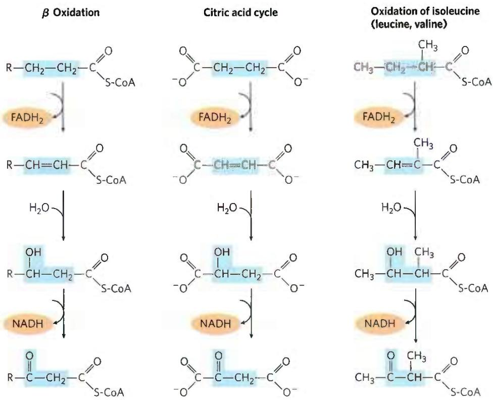  
FIGURE 17-9 A conserved reaction sequence to introduce a carbonyl function on the carbon $\beta$ to a carboxyl group. The $\beta$ -oxidation pathway for fatty acyl-CoAs, the pathway from succinate to oxaloacetate in  
the citric acid cycle, and the pathway by which the deaminated carbon skeletons from isoleucine, leucine, and valine are oxidized as fuels — all use the same reaction sequence.

$$
\begin{array}{r l} & \text { Palmitoyl - CoA } + \text { CoA } + \text { FAD } + \text { NAD } ^ {+} + \text { H } _ {2} \text { O } \longrightarrow \\ & \text { myristoyl - CoA } + \text { acetyl - CoA } + \text { FADH } _ {2} + \text { NADH } + \text { H } ^ {+} \end{array}\tag{17-2}
$$

Following removal of one acetyl-CoA unit from palmitoyl-CoA, the coenzyme A thioester of the shortened fatty acid (now the 14-carbon myristate) remains. The myristoyl-CoA can now go through another set of four $\beta$ -oxidation reactions, exactly analogous to the first, to yield a second molecule of acetyl-CoA and lauroyl-CoA, the coenzyme A thioester of the 12-carbon laurate. Altogether, seven passes through the $\beta$ -oxidation sequence are required to oxidize one molecule of palmitoyl-CoA to eight molecules of acetyl-CoA (Fig. 17-8b). The overall equation is

$$
\begin{array}{r l} \text { Palmitoyl   -   CoA } + 7 \mathrm{CoA} + 7 \mathrm{FAD} + 7 \mathrm{NAD} ^ {+} + 7 \mathrm{H} _ {2} \mathrm{O} & \longrightarrow \\ 8 \text { acetyl   -   CoA } + 7 \mathrm{FADH} _ {2} + 7 \mathrm{NADH} + 7 \mathrm{H} ^ {+} & (1) \end{array}\tag{17-3}
$$

P1 Each molecule of $\mathrm{FADH}_2$ formed during oxidation of the fatty acid donates a pair of electrons to ETF of the respiratory chain, and about 1.5 molecules of ATP are generated during the ensuing transfer of each electron pair to $\mathrm{O}_2$ . Similarly, each molecule of NADH formed delivers a pair of electrons to the mitochondrial NADH dehydrogenase, and the subsequent transfer of each pair of electrons to $O_{2}$ results in formation of about 2.5 molecules of ATP. Thus four molecules of ATP are formed for each two-carbon unit removed in one pass through the sequence.

Note that water is also produced in this process. Each pair of electrons transferred from NADH or FADH $_2$ to O $_2$ yields one H $_2$ O, referred to as "metabolic water." Reduction of O $_2$ by NADH also consumes one H $^+$ per NADH molecule: NADH + H $^+$ + ½O $_2$ → NAD $^+$ + H $_2$ O. In hibernating animals, fatty acid oxidation provides metabolic energy, heat, and water—all essential for survival of an animal that neither eats nor drinks for long periods (Box 17-1). Camels obtain water to supplement the meager supply available in their natural environment by oxidation of fats stored in their hump.

The overall equation for the oxidation of palmitoyl-CoA to eight molecules of acetyl-CoA, including the electron transfers and oxidative phosphorylations, is

$$
\begin{array}{r l} \text { Palmitoyl - CoA } + 7 \mathrm{CoA} + 7 \mathrm{O} _ {2} + 2 8 \mathrm{P} _ {\mathrm{i}} + 2 8 \mathrm{ADP} & \longrightarrow \\ 8 \text { acetyl - CoA } + 2 8 \mathrm{ATP} + 7 \mathrm{H} _ {2} \mathrm{O} \end{array}\tag{17-4}
$$

Acetyl-CoA Can Be Further Oxidized in the Citric Acid Cycle
P1 The acetyl-CoA produced from the oxidation of fatty acids can be oxidized to $CO_{2}$ and $H_{2}O$ by the citric acid cycle. The following equation represents the

## A Long Winter's Nap: Oxidizing Fats during Hibernation

Many animals depend on fat stores for energy during hibernation, during migratory periods, and in other situations involving radical metabolic adjustments. One of the most pronounced adjustments of fat metabolism occurs in hibernating grizzly bears. These animals remain in a continuous state of dormancy for as long as seven months. Unlike most hibernating species, the bear maintains a body temperature of about 31 °C, close to its normal (nonhibernating) temperature near 40 °C. Although expending about 25,000 kJ/day (6,000 kcal/day) while hibernating, the bear does not eat, drink, urinate, or defecate for months at a time. Its heart rate drops from 90 to 8 beats per minute, and its respiration rate drops from 6 to 10 breaths to approximately 1 breath per minute.

As we shall see in Chapter 19, mitochondrial electron transfer can be uncoupled from ATP production so that all of the energy of fuel oxidation is dissipated as heat, to maintain a body temperature near normal in the face of much lower ambient temperatures. One form of fat tissue, brown adipose tissue, is especially important in thermogenesis; we discuss it in more detail in Chapter 23.

Experimental studies have shown that hibernating grizzly bears use body fat as their sole fuel. Fat oxidation yields sufficient energy to maintain body temperature, synthesize amino acids and proteins, and carry out other energy-requiring activities, such as membrane transport. Fat oxidation also releases large amounts of water, as described in the text, which replenishes water lost in breathing. The glycerol released by degradation of triacylglycerols is converted into blood glucose by gluconeogenesis. Urea formed during breakdown of amino acids is reabsorbed in the kidneys and recycled, with the amino groups reused to make new amino acids for maintaining body proteins.

Bears store an enormous amount of body fat in preparation for their long sleep. An adult grizzly consumes about 38,000 kJ/day during the late spring and summer, but as winter approaches it feeds for 20 hours a day, consuming up to 84,000 kJ daily. This increase in feeding is a response to a seasonal change in hormone secretion. Large amounts of triacylglycerols are formed from the huge intake of carbohydrates during the fattening-up period. The bear will emerge from hibernation having lost 15% to 40% of its maximum body weight.

The winter sleep of bears is sometimes called torpor, and it differs in important ways from the hibernation behavior of a group of smaller animals that undergo alternating periods of high and low body temperature. In these animals, body temperature approaches ambient temperature, close to 0 °C, for much of the time during hibernation, but rises to almost prehibernation level during brief periods of wakefulness. During these periods, the animals eat, drink, and defecate. In the Arctic ground squirrel (Urocitellus parryii), for example, body temperature (37 °C prehibernation) drops to 0 °C during hibernation, and respiration drops to less than 10% of its prehibernation rate.

Studies of hibernation mechanisms may yield insight into several problems in human medicine; for example, slowing the metabolism of organs donated for transplantation might extend the period of their viability. And if humans are to make long trips into space, inducing a torporlike state might relieve the monotony of long missions and conserve onboard resources such as food and oxygen.

  
A grizzly bear prepares its hibernation nest near the McNeil River in Canada. [Stouffer Productions/Animals Animals]

balance sheet for the second stage in the oxidation of palmitoyl-CoA, together with the coupled phosphorylations of the third stage:

$$
\begin{array}{r l} 8 \mathrm {Acetyl - CoA + 16O_ {2} + 80P_ {i} + 80ADP \longrightarrow} \\ & 8 \mathrm{CoA+80ATP+16CO_ {2} +16H_ {2} O} \end{array}\tag{17-5}
$$

Combining Equations 17-4 and 17-5, we obtain the overall equation for the complete oxidation of palmitoyl-CoA to carbon dioxide and water:

$$
\begin{array}{r l} \mathrm {Palmitoyl - CoA + 23O_ {2} +108P_ {i} +108ADP\longrightarrow} \\ \mathrm {CoA + 108ATP + 16CO_ {2} +23H_ {2} O} \end{array}\tag{17-6}
$$

Table 17-1 summarizes the yields of NADH, FADH $_2$ , and ATP in the successive steps of palmitoyl-CoA oxidation. Note that because the activation of palmitate to palmitoyl-CoA breaks both phosphoanhydride bonds in ATP (Fig. 17-5), the energetic cost of activating a fatty acid is equivalent to two ATP, and the net gain per molecule of palmitate is 106 ATP. The standard free-energy change for the oxidation of palmitate to CO $_2$ and H $_2$ O is about 9,800 kJ/mol. Under standard conditions, the energy recovered as the phosphate bond energy of ATP is 106 × 30.5 kJ/mol = 3,230 kJ/mol, about 33% of the theoretical maximum. However, when the free-energy changes are calculated from actual concentrations of reactants and products under intracellular conditions, the free-energy recovery is more than 60%; the energy conservation is remarkably efficient (see Worked Example 13-2, p. 480).

## Oxidation of Unsaturated Fatty Acids Requires Two Additional Reactions

The fatty acid oxidation sequence just described is typical when the incoming fatty acid is saturated (that is, has only single bonds in its carbon chain). However, most of the fatty acids in the triacylglycerols and phospholipids of animals and plants are unsaturated, having one or more double bonds. These bonds are in the cis configuration and cannot be acted upon by enoyl-CoA hydratase, the enzyme catalyzing the addition of $H_{2}O$ to the trans double bond of the $\Delta^{2}$ -enoyl-CoA generated during $\beta$ oxidation. P1 Two auxiliary enzymes—an isomerase and a reductase—must act on the common unsaturated fatty acids to transform them into substrates for the $\beta$ -oxidation pathway. We illustrate these auxiliary reactions with two examples.

Oleate is an abundant 18-carbon monounsaturated fatty acid with a cis double bond between C-9 and C-10 (denoted $\Delta^9$ ). In the first step of oxidation, oleate is converted to oleoyl-CoA and, like the saturated fatty acids, enters the mitochondrial matrix via the carnitine shuttle (Fig. 17-6). Oleoyl-CoA then undergoes three passes through the fatty acid oxidation cycle to yield three molecules of acetyl-CoA and the coenzyme A ester of a $\Delta^3$ , 12-carbon unsaturated fatty acid, $cis-\Delta^3$ -dodecenoyl-CoA (Fig. 17-10). This product cannot serve as a substrate for enoyl-CoA hydratase, which acts only on trans double bonds. The auxiliary enzyme $\Delta^3, \Delta^2$ -enoyl-CoA isomerase isomerizes the $cis-\Delta^3$ -enoyl-CoA to the $trans-\Delta^2$ -enoyl-CoA, which is converted by enoyl-CoA hydratase into the corresponding L-β-hydroxyacyl-CoA ( $trans-\Delta^2$ -dodecenoyl-CoA). This intermediate is now acted upon by the remaining enzymes of β oxidation to yield acetyl-CoA and the coenzyme A ester of a 10-carbon saturated fatty acid, decanoyl-CoA. The latter undergoes four more passes through the β-oxidation pathway to yield five more molecules of acetyl-CoA. Altogether, nine acetyl-CoAs are produced from one molecule of the 18-carbon oleate.

The other auxiliary enzyme (a reductase) is required for oxidation of polyunsaturated fatty acids—for example, the 18-carbon linoleate, which has a $cis-\Delta^{9},cis-\Delta^{12}$ configuration (Fig. 17-11). Linoleoyl-CoA undergoes three passes through the $\beta$ -oxidation sequence to yield three molecules of acetyl-CoA and the coenzyme A ester of a 12-carbon unsaturated fatty acid with a $cis-\Delta^{3},cis-\Delta^{6}$ configuration. This intermediate cannot be used by the enzymes of the $\beta$ -oxidation pathway: its double bonds are in the wrong position and have the wrong configuration (cis, not trans). However, the combined action of enoyl-CoA isomerase and 2,4-dienoyl-CoA reductase, as shown in Figure 17-11, transforms this intermediate into one that can enter the $\beta$ -oxidation pathway and be degraded to six acetyl-CoAs. The overall result is conversion of linoleate to nine molecules of acetyl-CoA.

<table><tr><td colspan="3">TABLE 17.1 Yield of ATP during Oxidation of One Molecule of Palmitoyl-CoA to CO2 and H2O</td></tr><tr><td>Enzyme catalyzing the oxidation step</td><td>Number of NADH or FADH2 formed</td><td>Number of ATP ultimately formeda</td></tr><tr><td>β Oxidation</td><td></td><td></td></tr><tr><td>Acyl-CoA dehydrogenase</td><td>7 FADH2</td><td>10.5</td></tr><tr><td>β-Hydroxyacyl-CoA dehydrogenase</td><td>7 NADH</td><td>17.5</td></tr><tr><td>Citric acid cycle</td><td></td><td></td></tr><tr><td>Isocitrate dehydrogenase</td><td>8 NADH</td><td>20</td></tr><tr><td>α-Ketoglutarate dehydrogenase</td><td>8 NADH</td><td>20</td></tr><tr><td>Succinyl-CoA synthetase</td><td></td><td>8b</td></tr><tr><td>Succinate dehydrogenase</td><td>8 FADH2</td><td>12</td></tr><tr><td>Malate dehydrogenase</td><td>8 NADH</td><td>20</td></tr><tr><td>Total</td><td></td><td>108</td></tr><tr><td colspan="3">aThese calculations assume that mitochondrial oxidative phosphorylation produces 1.5 ATP per FADH2 oxidized and 2.5 ATP per NADH oxidized bGTP produced directly in this step yields ATP in the reaction catalyzed by nucleoside diphosphate kinase (p. 487).</td></tr></table>

  
FIGURE 17-10 Oxidation of a monounsaturated fatty acid. Oleic acid, as oleoyl-CoA ( $\Delta^{9}$ ), is the example used here. Oxidation requires an add tional enzyme, enoyl-CoA isomerase, to reposition the double bond, convering the cis isomer to a trans isomer, an intermediate in $\beta$ oxidation.

## Complete Oxidation of Odd-Number Fatty Acids Requires Three Extra Reactions

Although most naturally occurring lipids contain fatty acids with an even number of carbon atoms, fatty acids with an odd number of carbons are common in the lipids of many plants and some marine organisms. Cattle and other ruminant animals form large amounts of the three-carbon propionate (CH₃—CH₂—COO⁻) during fermentation of carbohydrates in the rumen. The propionate is absorbed into the blood and oxidized by the liver and other tissues.

Long-chain odd-number fatty acids are oxidized in the same pathway as the even-number acids, beginning at the carboxyl end of the chain. However, the substrate for the last pass through the $\beta$ -oxidation sequence is a fatty acyl-CoA with a five-carbon fatty acid. When this is oxidized and cleaved, the products are acetyl-CoA and propionyl-CoA. The acetyl-CoA can be oxidized in the citric acid cycle, of course, but propionyl-CoA enters a different pathway, having three enzymes.

  
FIGURE 17-11 Oxidation of a polyunsaturated fatty acid. The example here is linoleic acid, as linoleoyl-CoA ( $\Delta^{9,12}$ ). Oxidation requires a second auxiliary enzyme in addition to enoyl-CoA isomerase: NADPH-dependent 2,4-dienoyl-CoA reductase. The combined action of these two enzymes converts a trans- $\Delta^{2}$ , cis- $\Delta^{4}$ -dienoyl-CoA intermediate to the trans- $\Delta^{2}$ -enoyl-CoA substrate necessary for $\beta$ oxidation.

Propionyl-CoA is first carboxylated to form the D stereoisomer of methylmalonyl-CoA by propionyl-CoA carboxylase, which contains the cofactor biotin (Fig. 17-12). In this enzymatic reaction, as in the pyruvate carboxylase reaction (see Fig. 16-16), bicarbonate ion $(\mathrm{HCO}_3^-)$ is activated by attachment to biotin before its transfer to the substrate, in this case the propionate moiety. Formation of the carboxybiotin intermediate requires energy, which is provided by ATP. The D-methylmalonyl-CoA thus formed is enzymatically epimerized to its L stereoisomer by methylmalonyl-CoA epimerase. The L-methylmalonyl-CoA then undergoes an intramolecular rearrangement to form succinyl-CoA, which can enter the citric acid cycle. This rearrangement is catalyzed by methylmalonyl-CoA mutase, which requires as its coenzyme 5'-deoxyadenosylcobalamin, or coenzyme B $_{12}$ , which is derived from vitamin B $_{12}$ (cobalamin). Box 17-2 describes the role of coenzyme B $_{12}$ in this remarkable exchange reaction.

  
FIGURE 17-12 Oxidation of propionyl-CoA produced by $\beta$ oxidation of odd-number fatty acids. The sequence involves the carboxylation of propionyl-CoA to D-methylmalonyl-CoA and conversion of the latter to succinyl-CoA. This conversion requires epimerization of D- to L-methylmalonyl-CoA, followed by a remarkable reaction in which substituents on adjacent carbon atoms exchange positions (see Box 17-2).

About 1 in 100,000 babies are born with a genetic deficiency in propionyl-CoA carboxylase, making them unable to metabolize the propionyl-CoA that results from catabolism of odd-number fatty acids, fatty acids with methyl branches, and the amino acids isoleucine, valine, threonine, and methionine. P4 The absence of functional propionyl-CoA carboxylase leads to an accumulation of propionyl-CoA in mitochondria, depleting the available supply of coenzyme A for continuing $\beta$ -oxidation and other metabolism. The propionyl-CoA is esterified to carnitine, transported out of the mitochondria through the carnitine shuttle, and eventually released to the blood as propionate, which severely acidifies the blood and urine, a condition called propionic acidemia. Symptoms generally manifest in the first few days of life, with vomiting, low blood glucose, seizures, and neurologic abnormalities. The condition is diagnosed by detection of propionate and its metabolites in the blood and urine. Treatments include severe restriction of dietary protein, supplying carnitine, and the use of antibiotics targeted at gut bacteria that produce odd-chain and branched-chain fatty acids. Some individuals who are defective in the incorporation of biotin into the enzyme benefit from treatment with high doses of biotin.

## Fatty Acid Oxidation Is Tightly Regulated

P3 Oxidation of fatty acids consumes a precious fuel, and it is regulated so as to occur only when the organism's need for energy requires it. In the liver, fatty acyl-CoA formed in the cytosol has two major pathways open to it: (1) $\beta$ oxidation by enzymes in mitochondria or (2) conversion into triacylglycerols and phospholipids by enzymes in the cytosol. The pathway taken depends on the rate of transfer of long-chain fatty acyl-CoA into mitochondria. The three-step carnitine shuttle by which fatty acyl groups are carried into the mitochondrial matrix as fatty acyl-carnitine (Fig. 17-6) is rate-limiting for fatty acid oxidation and is an important point of regulation. Once fatty acyl groups have entered the mitochondrion, they are committed to oxidation to acetyl-CoA.

Figure 17-13 illustrates, with numbered steps described below, the coordinated down-regulation of $\beta$ oxidation when carbohydrate levels are sufficient. Ingestion of a high-carbohydrate meal raises the blood glucose level and thus ① triggers the release of insulin. ② Insulin-dependent protein phosphatase dephosphorylates the enzyme acetyl-CoA carboxylase (ACC), activating it. ③ ACC catalyzes the formation of malonyl-CoA (the first intermediate of cytosolic fatty acid synthesis; see Figs 21-1 and 21-2), and ④ malonyl-CoA inhibits carnitine acyltransferase 1, thereby preventing fatty acid entry into the mitochondrial matrix through the carnitine shuttle. The inhibition of carnitine acyltransferase 1 by malonyl-CoA ensures that the oxidation of fatty acids is inhibited whenever the liver is amply supplied with glucose as fuel and is actively making triacylglycerols from excess glucose. Two of the enzymes of $\beta$ oxidation (8) are also regulated by metabolites that signal energy sufficiency. When the [NADH]/[NAD+] ratio is high, $\beta$ -hydroxyacyl-CoA dehydrogenase is inhibited; in addition, high concentrations of acetyl-CoA inhibit thiolase.

## Coenzyme B $_{12}$ : A Radical Solution to a Perplexing Problem

In the methylmalonyl-CoA mutase reaction (see Fig. 17-12), the group —CO—S-CoA at C-2 of the original propionate exchanges position with a hydrogen atom at C-3 of the original propionate (Fig. 1a). Coenzyme B $_{12}$ is the cofactor for this general type of reaction (Fig. 1b). These coenzyme B $_{12}$ -dependent processes are among the very few enzymatic reactions in biology in which there is an exchange of an alkyl or substituted alkyl group (X) with a hydrogen atom on an adjacent carbon, with no mixing of the transferred hydrogen atom with the hydrogen of the solvent, H $_{2}$ O. How can the hydrogen atom move between two carbons without mixing with the enormous excess of hydrogen atoms in the solvent?

Coenzyme $B_{12}$ is the cofactor form of vitamin $B_{12}$ , which is unique among all the vitamins in that it contains an essential trace element, cobalt. The complex corrin ring system of vitamin $B_{12}$ (colored blue in Fig. 2), to which cobalt (as $Co^{3+}$ ) is coordinated, is chemically related to the porphyrin ring system of heme (see Fig. 5-1). A fifth coordination position of cobalt is filled by dimethylbenzimidazole ribonucleotide (shaded yellow), bound covalently by its 3'-phosphate group to a side chain of the corrin ring, through aminoisopropanol. The formation of this complex cofactor occurs in one of only two known reactions in which triphosphate is cleaved from ATP (Fig. 3); the other reaction is the formation of S-adenosylmethionine from ATP and methionine (see Fig. 18-18).

  
Dorothy Crowfoot Hodgkin, 1910–1994 [© Godfrey Argent Studio/The Royal Society]

Vitamin B $_{12}$ is usually isolated as cyanocobalamin, because it contains a cyano group (picked up during purification) attached to cobalt in the sixth coordination position. In 5'-deoxyadenosylcobalamin, the cofactor for methylmalonyl-CoA mutase, the cyano group is replaced by the 5'-deoxyadenosyl group (red in Fig. 2), covalently bound through

C-5' to the cobalt. The three-dimensional structure of the cofactor was determined by Dorothy Crowfoot Hodgkin in 1956, using x-ray crystallography.

The key to understanding how coenzyme $B_{12}$ catalyzes hydrogen exchange lies in the properties of the covalent bond between cobalt and C-5' of the deoxyadenosyl group (Fig. 2). This is a relatively weak bond; merely illuminating the compound with visible light is enough to break this Co—C bond. (This extreme photolability probably accounts for the absence of vitamin $B_{12}$ in plants.) Dissociation produces a 5'-deoxyadenosyl radical and the $Co^{2+}$ form of the vitamin. By generating free radicals in this way, 5'-deoxyadenosylcobalamin initiates a series of transformations such as that illustrated in Figure 4—a postulated mechanism for the reaction catalyzed by methylmalonyl-CoA mutase and several other coenzyme $B_{12}$ -dependent transformations. In this postulated mechanism, the migrating hydrogen atom never exists as a free species and is thus never free to exchange with the hydrogen of surrounding water molecules.

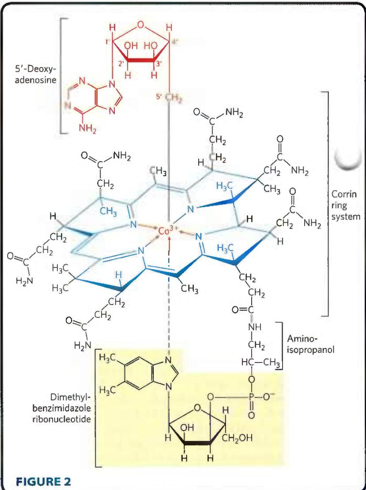

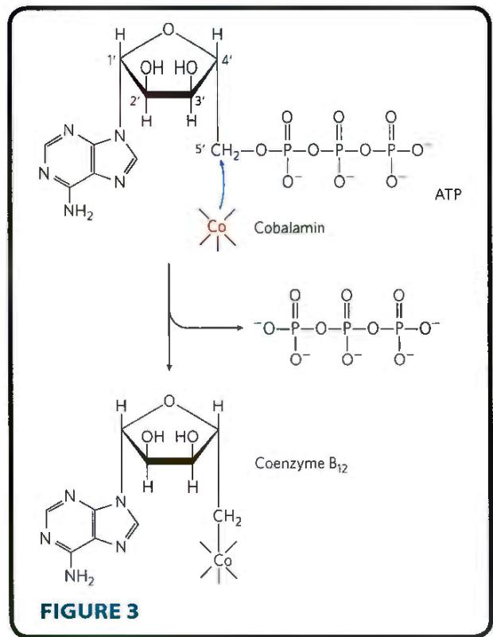

Vitamin $B_{12}$ is not made by plants or animals and can be synthesized only by a few species of microorganisms. It is required by healthy people in only minute amounts, about 3 $\mu$ g/day. Vitamin $B_{12}$ deficiency results in pernicious anemia, caused by a failure to absorb vitamin $B_{12}$ efficiently from the intestine, where it is synthesized by intestinal bacteria or obtained from digestion of meat. Individuals with this disease do not produce sufficient amounts of intrinsic factor, a glycoprotein essential to vitamin $B_{12}$ absorption. The pathology in pernicious anemia includes reduced production of erythrocytes, reduced levels of hemoglobin, and severe, progressive impairment of the central nervous system. Administration of large doses of vitamin $B_{12}$ alleviates these symptoms in at least some cases.

  
FIGURE 17-13 Coordinated regulation of fatty acid synthesis and breakdown. The steps are explained in the text.

Figure 17-13 also shows that conversely, when blood glucose levels drop between meals, ⑤ glucagon release activates protein kinase A (PKA), which ⑥ phosphorylates and inactivates ACC. Recall from Chapter 14 that in a low-energy state, [AMP] rises relative to [ATP], activating AMP kinase (AMPK). Activated AMPK also phosphorylates and inactivates ACC. The concentration of malonyl-CoA falls, and the inhibition of fatty acid entry into mitochondria is relieved. Fatty acids ⑦ enter the mitochondrial matrix, ⑧ allowing β oxidation to replenish the supply of ATP. Because glucagon also triggers the mobilization of fatty acids in adipose tissue, a supply of fatty acids begins arriving in the blood.

## Transcription Factors Turn on the Synthesis of Proteins for Lipid Catabolism

P3 In addition to the various short-term regulatory mechanisms that modulate the activity of existing enzymes, transcriptional regulation can change the number of molecules of the enzymes of fatty acid oxidation on a longer time scale—minutes to hours. The PPAR family of nuclear receptors are transcription factors that affect many metabolic processes in response to a variety of fatty acid-like ligands. (They were originally recognized as peroxisome proliferator-activated receptors, then were found to function more broadly.) PPARα acts in muscle, adipose tissue, and liver to turn on a set of genes essential for fatty acid oxidation, including the fatty acid transporter, carnitine acyltransferases 1 and 2; the fatty acyl-CoA dehydrogenases for short, medium, long, and very long acyl chains; and related enzymes. This response is triggered when a cell or an organism has an increased demand for energy from fat catabolism, such as during a fast between meals or under conditions of longer-term starvation. Glucagon, released in response to low blood glucose, can act through cAMP and the transcription factor CREB to turn on certain genes for lipid catabolism.

Another situation that is accompanied by major changes in the expression of the enzymes of fatty acid oxidation is the transition from fetal to neonatal metabolism in the heart. In the fetus, the principal fuels in heart muscle are glucose and lactate, but in the neonatal heart, fatty acids are the main fuel. At the time of this transition, PPAR $\alpha$ is activated and in turn activates the genes essential for fatty acid metabolism. As we will see in Chapter 23, two other transcription factors in the PPAR family also play crucial roles in determining the enzyme complements—and therefore the metabolic activities—of specific tissues at particular times (see Fig. 23-38).

The major sites of fatty acid oxidation, at rest and during exercise, are skeletal and heart muscle. Endurance training increases PPARα expression in muscle, leading to increased levels of fatty acid-oxidizing enzymes and increased oxidative capacity of the muscle.

## Genetic Defects in Fatty Acyl-CoA Dehydrogenases Cause Serious Disease

Stored triacylglycerols are typically the chief source of energy for muscle contraction, and an inability to oxidize fatty acids from triacylglycerols has serious consequences for health. P4 The most common genetic defect in fatty acid catabolism in U.S. and northern European populations is due to a mutation in the gene encoding the medium-chain acyl-CoA dehydrogenase (MCAD), mentioned earlier in the chapter. Among northern Europeans, the frequency of carriers (individuals with this recessive mutation on one of the two homologous chromosomes) is about 1 in 40, and about 1 individual in 10,000 has the disease—that is, has two copies of the mutant MCAD allele and is unable to oxidize fatty acids of 6 to 12 carbons. The disease is characterized by recurring episodes of a syndrome that includes fat accumulation in the liver, high blood levels of octanoic acid (8:0), low blood glucose (hypoglycemia), sleepiness, vomiting, and coma. Although individuals may have no symptoms between episodes, the episodes are very serious; mortality due to this disease is 25% to 60% in early childhood. If the genetic defect is detected shortly after birth, the infant can be started on a low-fat, high-carbohydrate diet. With early detection and careful management of the diet—including avoiding long intervals between meals, to prevent the body from turning to its fat reserves for energy—the prognosis for these individuals is good.

P4 More than 20 human genetic defects in fatty acid transport or oxidation have been documented, most much less common than the defect in MCAD. One of the most severe disorders results from loss of the long-chain $\beta$ -hydroxyacyl-CoA dehydrogenase activity of the trifunctional protein, TFP. Other disorders include defects in the $\alpha$ or $\beta$ subunits that affect all three activities of TFP and cause serious heart disease and abnormal skeletal muscle.

## Peroxisomes Also Carry Out β Oxidation

The mitochondrial matrix is the major site of fatty acid oxidation in animal cells, but other compartments also contain enzymes capable of oxidizing fatty acids to acetyl-CoA, by a pathway similar but not identical to that in mitochondria. In plant cells, the major site of $\beta$ oxidation is not mitochondria but peroxisomes. In peroxisomes, organelles also found in animal cells, the intermediates for $\beta$ oxidation of fatty acids are coenzyme A derivatives, and the process consists of four steps, as in mitochondrial $\beta$ oxidation (Fig. 17-14): (1) dehydrogenation, (2) addition of water to the resulting double bond, (3) oxidation of the $\beta$ -hydroxyacyl-CoA to a ketone, and (4) thiolytic cleavage by coenzyme A. The identical reactions also occur in glyoxysomes, organelles found only in germinating seeds.

One difference between the peroxisomal and mitochondrial pathways is in the chemistry of the first step (Fig. 17-14). In peroxisomes, the flavoprotein acyl-CoA oxidase that introduces the double bond passes electrons directly to $O_{2}$ , producing $H_{2}O_{2}$ (thus the name “peroxisomes”). This strong and potentially damaging oxidant is immediately cleaved to $H_{2}O$ and $O_{2}$ by catalase. Recall that in mitochondria, the electrons removed in the first oxidation step pass through the respiratory chain to $O_{2}$ to produce $H_{2}O$ , and this process is accompanied by ATP synthesis. In peroxisomes, the energy released in the first oxidative step of fatty acid breakdown is not conserved as ATP, but is dissipated as heat.

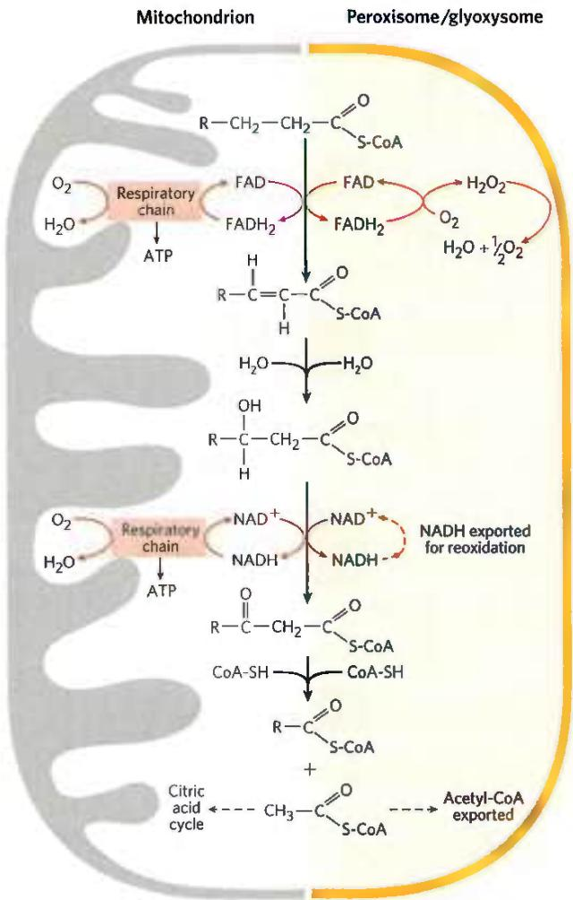  
FIGURE 17-14 Comparison of $\beta$ oxidation in mitochondria and in peroxisomes and glyoxysomes. The peroxisomal/glyoxysomal system differs from the mitochondrial system in three respects: (1) the peroxisomal system prefers very-long-chain fatty acids; (2) in the first oxidative step, electrons pass directly to $\mathrm{O}_2$ , generating $\mathrm{H}_2\mathrm{O}_2$ ; and (3) the NADH formed in the second oxidative step cannot be reoxidized in the peroxisome or glyoxysome, so reducing equivalents are exported to the cytosol, eventually entering mitochondria. The acetyl-CoA produced by peroxisomes and glyoxysomes is also exported; the acetate from glyoxysomes serves as a biosynthetic precursor. Acetyl-CoA produced in mitochondria is further oxidized in the citric acid cycle.

A second important difference between mitochondrial and peroxisomal $\beta$ oxidation in mammals is in the specificity for fatty acyl-CoAs; the peroxisomal system is much more active on very-long-chain fatty acids such as hexacosanoic acid (26:0) and on branched-chain fatty acids such as phytanic acid and pristanic acid (see Fig. 17-15). These less-common fatty acids are obtained from dietary intake of dairy products, the fat of ruminant animals, meat, and fish. Their catabolism in the peroxisome involves several auxiliary enzymes unique to this organelle. P4 The inability to oxidize these compounds is responsible for several serious human genetic diseases. Individuals with Zellweger syndrome are unable to make peroxisomes and therefore lack all the metabolism unique to that organelle. In X-linked adrenoleukodystrophy (XALD), peroxisomes fail to oxidize very-long-chain fatty acids, apparently due to lack of a functional transporter for these fatty acids in the peroxisomal membrane. Both defects lead to accumulation in the blood of very-long-chain fatty acids, especially 26:0. XALD affects young boys before the age cf 10 years, causing loss of vision, behavioral disturbances, and death within a few years.

  
FIGURE 17-15 The $\alpha$ oxidation of a branched-chain fatty acid (phytanic acid) in peroxisomes. Phytanic acid has a methyl-substituted $\beta$ carbon and therefore cannot undergo $\beta$ oxidation. The combined action of the enzymes shown here removes the carboxyl carbon of phytanic acid to produce pristanic acid, in which the $\beta$ carbon is unsubstituted, allowing $\beta$ oxidation. Notice that $\beta$ oxidation of pristanic acid releases propionyl-CoA, not acetyl-CoA. This is further catabolized as in Figure 17-12. (The details of the reaction that produces pristanal remain controversial.)

In mammals, high concentrations of fats in the diet result in increased synthesis of the enzymes of peroxisomal $\beta$ oxidation in the liver. Liver peroxisomes do not contain the enzymes of the citric acid cycle and cannot catalyze the oxidation of acetyl-CoA to $CO_{2}$ . Instead, long-chain or branched fatty acids are catabolized in peroxisomes to shorter-chain products, such as hexanoyl-CoA, which are exported to mitochondria and completely oxidized there. As we will see in Chapter 20, the germinating seeds of plants can synthesize carbohydrates and many other metabolites from acetyl-CoA produced in peroxisomes, using a pathway (the glyoxylate cycle) not present in vertebrates.

## Phytanic Acid Undergoes $\alpha$ Oxidation in Peroxisomes

Phytanic acid, a long-chain fatty acid with methyl branches, is derived from the phytoI side chain of chlorophyll (see Fig. 20-5). The presence of a methyl group on the $\beta$ carbon of this fatty acid prevents the formation of a $\beta$ -keto intermediate, making its $\beta$ oxidation impossible. Humans obtain phytanic acid in the diet, primarily from dairy products and from the fats of ruminant animals; microorganisms in the rumen of these animals produce phytanic acid as they digest plant chlorophyll. The typical western diet includes 50 to $100\mathrm{mg}$ of phytanic acid per day.

Phytanic acid is metabolized in peroxisomes by $\alpha$ oxidation, in which a single carbon is removed from the carboxyl end of the fatty acid (Fig. 17-15). Phytanoyl-CoA is first hydroxylated on its $\alpha$ carbon in a reaction that involves molecular oxygen. The product is decarboxylated to form an aldehyde one carbon shorter, and then oxidized to the corresponding carboxylic acid, which now has no substituent on the $\beta$ carbon. Further $\beta$ oxidation produces acetyl-CoA and then propionyl-CoA in successive oxidation cycles. Refsum disease, resulting from a genetic defect in phytanoyl-CoA hydroxylase, leads to the accumulation of very high blood levels of phytanic acid, causing (by unknown mechanisms) severe neurological deficits, including blindness and deafness.

## SUMMARY 17.2 Oxidation of Fatty Acids

In the first stage of $\beta$ oxidation, four sequential reactions remove each acetyl-CoA unit, in turn, from the carboxyl end of a saturated fatty acyl-CoA: (1) dehydrogenation of the $\alpha$ and $\beta$ carbons by acyl-CoA dehydrogenases; (2) hydration of the resulting trans- $\Delta^{2}$ double bond by enoyl-CoA hydratase; (3) dehydrogenation of the resulting L- $\beta$ -hydroxyacyl-CoA; and (4) cleavage of the resulting $\beta$ -ketoacyl-CoA by thiolase, to form acetyl-CoA and a fatty acyl-CoA shortened by two carbons.

The shortened fatty acyl-CoA then reenters the $\beta$ oxidation sequence for removal of another, and then another, acetyl-CoA.

In the second stage of fatty acid oxidation, the acetyl-CoA is oxidized to $\mathrm{CO}_{2}$ in the citric acid cycle. Much of the free energy from fatty acid oxidation is recovered as ATP by oxidative phosphorylation, the final stage of the oxidative pathway.

\- Oxidation of unsaturated fatty acids requires two additional enzymes: enoyl-CoA isomerase and 2,4-dienoyl-CoA reductase.

\- Odd-number fatty acids are oxidized by the $\beta$ -oxidation pathway to yield acetyl-CoA and a molecule of propionyl-CoA. The propionyl-CoA is carboxylated to methylmalonyl-CoA, which is isomerized to succinyl-CoA in a reaction catalyzed by methylmalonyl-CoA mutase, an enzyme requiring coenzyme $B_{12}$ .

■ To prevent futile cycling, entry of fatty acids into mitochondria is blocked by the first intermediate in fatty acid synthesis, malonyl-CoA.

■ The transcription factor PPARα stimulates the synthesis of several enzymes required in β oxidation when glucose is not available as an energy source.

■ Individuals who lack medium-chain acyl-CoA dehydrogenase experience fatty liver, high blood levels of octanoic acid, coma, and sometimes death.

\- Peroxisomes, of plants and animals, and glyoxysomes, of plants, carry out $\beta$ oxidation in four steps similar to those of the mitochondrial pathway. The first oxidation step, however, transfers electrons directly to $\mathrm{O}_2$ , generating $\mathrm{H}_2\mathrm{O}_2$ . Peroxisomes of animal tissues specialize in the oxidation of very-long-chain fatty acids and branched fatty acids.

■ The reactions of $\alpha$ oxidation convert branched fatty acids such as phytanic acid to products that can undergo $\beta$ oxidation, yielding acetyl-CoA and propionyl-CoA.

## 17.3 Ketone Bodies

In humans and most other mammals, acetyl-CoA formed in the liver during oxidation of fatty acids can either enter the citric acid cycle (stage 2 of Fig. 17-7) or undergo conversion to the "ketone bodies," acetone, acetoacetate, and $\mathbf{D} - \beta$ -hydroxybutyrate, for export to other tissues. (The term "bodies" is an historical artifact; the compounds are soluble in blood and urine, not particulate, and not all of them are ketones.)

Acetone, produced in smaller quantities than the other ketone bodies, is exhaled. P5 Acetoacetate and D-β-hydroxybutyrate are transported by the blood to tissues other than the liver (extrahepatic tissues), where they are converted to acetyl-CoA and oxidized in the citric acid cycle, providing much of the energy required by tissues such as skeletal and heart muscle and the renal cortex. The brain, which preferentially uses glucose as fuel, can adapt to the use of acetoacetate and D-β-hydroxybutyrate under starvation conditions, when glucose is unavailable. The brain cannot use fatty acids as fuel, because they do not cross the blood-brain barrier. The production and export of ketone bodies from the liver to extrahepatic tissues allows continued oxidation of fatty acids in the liver when acetyl-CoA is not being oxidized in the citric acid cycle.

## Ketone Bodies, Formed in the Liver, Are Exported to Other Organs as Fuel

The first step in the formation of acetoacetate, occurring in the liver (Fig. 17-16), is the enzymatic condensation of two molecules of acetyl-CoA, catalyzed by thiolase; this is simply the reversal of the last step of $\beta$ oxidation. The acetoacetyl-CoA then condenses with another molecule of acetyl-CoA to form $\beta$ -hydroxy- $\beta$ -methylglutaryl-CoA (HMG-CoA), which is cleaved to free acetoacetate and acetyl-CoA. The acetoacetate is reversibly reduced by D- $\beta$ -hydroxybutyrate dehydrogenase, a mitochondrial enzyme, to D- $\beta$ -hydroxybutyrate. This enzyme is specific for the D stereoisomer; it does not act on L- $\beta$ -hydroxyacyl-CoAs and is distinct from L- $\beta$ -hydroxyacyl-CoA dehydrogenase of the $\beta$ -oxidation pathway. This difference in stereospecificity of the two enzymes that use $\beta$ -hydroxyacyl-CoAs as substrates in fatty acid breakdown and fatty acid synthesis means that the cell can maintain separate pools of $\beta$ -hydroxyacyl-CoAs, earmarked for either breakdown or synthesis.

  
FIGURE 17-16 Formation of ketone bodies from acetyl-CoA. Healthy, well-nourished individuals produce ketone bodies at a relatively low rate. When acetyl-CoA accumulates (as in starvation or untreated diabetes, for example), thiolase catalyzes the condensation of two acetyl-CoA molecules to acetoacetyl-CoA, the parent compound of the three ketone bodies. The reactions of ketone body formation occur in the matrix of liver mitochondria. The six-carbon compound $\beta$ -hydroxy- $\beta$ -methylglutaryl-CoA (HMG-CoA) is also an intermediate of sterol biosynthesis, but the enzyme that forms HMG-CoA in that pathway is cytosolic. HMG-CoA lyase is present only in the mitochondrial matrix.

In extrahepatic tissues, D-β-hydroxybutyrate is oxidized to acetoacetate by D-β-hydroxybutyrate dehydrogenase (Fig. 17-17). The acetoacetate is activated to its coenzyme A ester by transfer of CoA from succinyl-CoA, an intermediate of the citric acid cycle (see Fig. 16-7), in a reaction catalyzed by β-ketoacyl-CoA transferase, also called thiophorase. The acetoacetyl-CoA is then cleaved by thiolase to yield two molecules of acetyl-CoA, which enter the citric acid cycle. Thus the ketone bodies are used as fuels in all tissues except liver, which lacks β-ketoacyl-CoA transferase. P5 The liver is therefore a producer of ketone bodies for other tissues, but not a consumer.

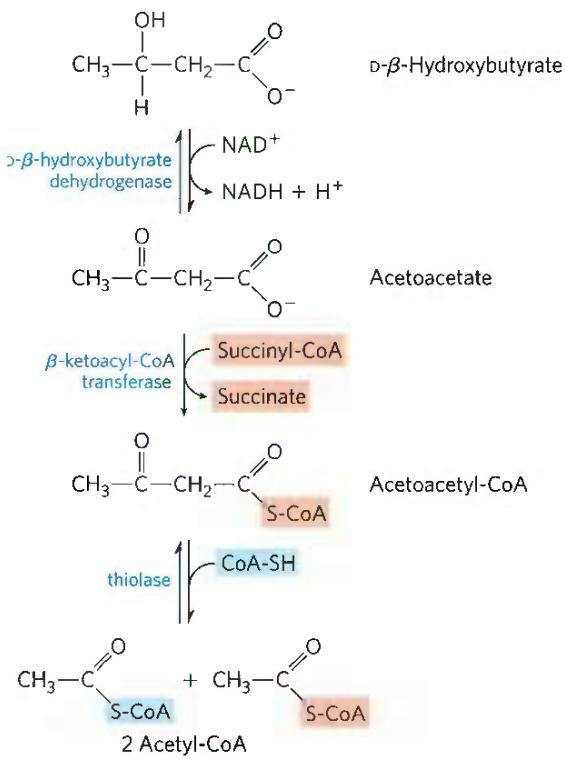  
FIGURE 17-17 D-β-Hydroxybutyrate as a fuel. D-β-Hydroxybutyrate, synthesized in the liver, passes into the blood and thus to other tissues, where it is converted in three steps to acetyl-CoA. It is first oxidized to acetoacetate, which is activated with coenzyme A donated from succinyl-CoA, then split by thiolase. The acetyl-CoA thus formed enters the citric acid cycle.

The production and export of ketone bodies by the liver allows continued oxidation of fatty acids with only minimal oxidation of acetyl-CoA. When intermediates of the citric acid cycle are being siphoned off for glucose synthesis by gluconeogenesis, for example, oxidation of cycle intermediates slows—and so does acetyl-CoA oxidation. Moreover, the liver contains only a limited amount of coenzyme A, and when most of it is tied up in acetyl-CoA, $\beta$ oxidation slows for want of the free coenzyme. The production and export of ketone bodies frees coenzyme A, allowing continued fatty acid oxidation.

## Ketone Bodies Are Overproduced in Diabetes and during Starvation

Starvation (including very-low-calorie diets) and untreated diabetes mellitus lead to overproduction of ketone bodies in the liver, with several adverse effects on health. During starvation, gluconeogenesis depletes citric acid cycle intermediates, diverting acetyl-CoA from oxidation of mobilized stored fats to ketone body production (Fig. 17-18). In untreated diabetes, when the insulin level is insufficient, extrahepatic tissues cannot take up glucose efficiently from the blood, either for fuel or for conversion to fat. Under these conditions, levels of malonyl-CoA fall, inhibition of carnitine acyltransferase 1 is relieved, and fatty acids enter mitochondria to be degraded to acetyl-CoA (see Fig. 17-13). But this acetyl-CoA cannot pass through the citric acid cycle because cycle intermediates have been drawn off for use as substrates in gluconeogenesis. P4 P5 The resulting accumulation of acetyl-CoA accelerates the formation of ketone bodies and their release into the blood beyond the capacity of extrahepatic tissues to oxidize them. The increased blood levels of acetoacetate and D-β-hydroxybutyrate lower the blood pH, causing the condition known as acidosis. Extreme acidosis can lead to coma and in some cases death. Ketone bodies in the blood and urine of individuals with untreated diabetes can reach extraordinary levels—a blood concentration of 90 mg/100 mL (compared with a normal level of <3 mg/100 mL) and urinary excretion of 5,000 mg/24 h (compared with a normal rate of ≤125 mg/24 h). This condition is called ketosis or, when combined with acidosis, ketoacidosis.

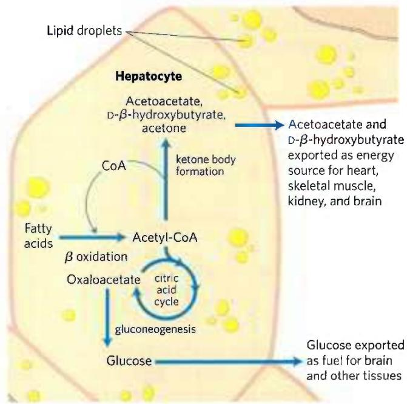  
FIGURE 17-18 Ketone body formation and export from the liver. Conditions that promote gluconeogenesis (untreated diabetes, severely reduced food intake) slow the citric acid cycle (by drawing off oxaloacetate) and enhance the conversion of acetyl-CoA to acetoacetate. The released coenzyme A allows continued $\beta$ oxidation of fatty acids.

In healthy people, acetone is formed in very small amounts from acetoacetate, which is easily decarboxylated, either spontaneously or by the action of acetoacetate decarboxylase (Fig. 17-16). Because individuals with untreated diabetes produce large quantities of acetoacetate, their blood contains significant amounts of acetone, which is toxic. Acetone is volatile and imparts a characteristic odor to the breath, which is sometimes useful in diagnosing diabetes.

## SUMMARY 17.3 Ketone Bodies

The ketone bodies—acetone, acetoacetate, and D-β-hydroxybutyrate—are formed in the liver when fatty acids are the principal fuel supporting whole-body metabolism. Acetoacetate and D-β-hydroxybutyrate serve as fuel molecules in extrahepatic tissues, including the brain, through oxidation to acetyl-CoA and entry into the citric acid cycle.

■ Overproduction of ketone bodies in uncontrolled diabetes or severely reduced calorie intake can lead to life-threatening ketoacidosis, characterized by high concentrations of ketones in blood and urine and lower blood pH.

## KEY TERMS

Terms in bold are defined in the glossary.

$\beta$ oxidation 601  
apolipoprotein 602  
chylomicron 603  
lipoprotein 603  
perilipin 603  
free fatty acids 603  
serum albumin 603  
carnitine shuttle 603  
fatty acyl-CoA synthetase 603  
fatty acyl-CoA 604  
carnitine acyltransferase 1 (CAT1) 605  
acyl-carnitine/carnitine cotransporter 605  
carnitine acyltransferase 2 (CAT2) 605

electron-transfer
flavoprotein (ETF) 607
NADH dehydrogenase
(Complex I) 607
trifunctional protein
(TFP) 608
methylmalonyl-CoA
mutase 613
coenzyme B $_{12}$ 613
malonyl-CoA 613
pernicious anemia 615
intrinsic factor 615
PPAR (peroxisome
proliferator-activated
receptor) 616
medium-chain acyl-CoA
dehydrogenase (MCAD) 616 peroxisome 617
α oxidation 618
ketone bodies 619
acetone 619
acetoacetate 619

D-β-hydroxybutyrate 619
acidosis 621
ketosis 621
ketoacidosis 621

## PROBLEMS

1. Energy in Triacylglycerols On a per-carbon basis, where does the largest amount of biologically available energy in triacylglycerols reside: in the fatty acid portions or in the glycerol portion? Indicate how knowledge of the chemical structure of triacylglycerols provides the answer.

2. Effect of PDE Inhibitor on Adipocytes How would the addition of a cAMP phosphodiesterase (PDE) inhibitor affect the response of an adipocyte to epinephrine? (Hint: See Fig. 12-4.)

3. Compartmentation in $\beta$ Oxidation The activation of free palmitate to its coenzyme A derivative (palmitoyl-CoA) in the cytosol occurs before it can be oxidized in the mitochondrion. After adding palmitate and $[^{14}C]$ coenzyme A to a liver homogenate, you find palmitoyl-CoA isolated from the cytosolic fraction is radioactive, but that isolated from the mitochondrial fraction is not. Explain.

4. Mutant Carnitine Acyltransferase What changes in metabolic pattern would result from a mutation in the muscle carnitine acyltransferase 1 in which the mutant protein has lost its affinity for malonyl-CoA but not its catalytic activity?

5. Effect of Carnitine Deficiency An individual developed a condition characterized by progressive muscular weakness and aching muscle cramps. The symptoms were aggravated by fasting, exercise, and a high-fat diet. An homogenate of a skeletal muscle specimen from the patient oxidized added oleate more slowly than did control homogenates consisting of muscle specimens from healthy individuals. When the pathologist added carnitine to the patient's muscle homogenate, the rate of oleate oxidation equaled that in the control homogenates. Based on these results, the attending physician diagnosed the patient as having a carnitine deficiency.

(a) Why did added carnitine increase the rate of oleate oxidation in the patient's muscle homogenate?

(b) Why did fasting, exercise, and a high-fat diet aggravate the patient's symptoms?

(c) Suggest two possible reasons for the deficiency of muscle carnitine in this individual.

6. Fuel Reserves in Adipose Tissue Triacylglycerols, with their hydrocarbon-like fatty acids, have the highest energy content of the major nutrients.

(a) If 15% of the body mass of a 70.0 kg adult consists of triacylglycerols, what is the total available fuel reserve, in both kilojoules and kilocalories, in the form of triacylglycerols? Recall that 1.00 kcal = 4.18 kJ.

(b) If the basal energy requirement is approximately 8,400 kJ/day (2,000 kcal/day), how long could this person survive if the oxidation of fatty acids stored as triacylglycerols were the only source of energy?

(c) What would be the weight loss in pounds per day under such starvation conditions (1 lb = 0.454 kg)?

7. Common Reaction Steps in the Fatty Acid Oxidation Cycle and Citric Acid Cycle Cells often use the same enzyme reaction pattern for analogous metabolic conversions. For example, the steps in the oxidation of pyruvate to acetyl-CoA and of $\alpha$ -ketoglutarate to succinyl-CoA, although catalyzed by different enzymes, are very similar. The first stage of fatty acid oxidation follows a reaction sequence closely resembling a sequence in the citric acid cycle. Use equations to show the analogous reaction sequences in the two pathways.

8. $\beta$ Oxidation: How Many Cycles? How many cycles of $\beta$ oxidation are required for the complete oxidation of activated oleic acid, 18:1( $\Delta^{9}$ )?

9. Chemistry of the Acyl-CoA Synthetase Reaction Fatty acids are converted to their coenzyme A esters in a reversible reaction catalyzed by acyl-CoA synthetase:

$$
\begin{array}{c} \mathrm {R - CO O ^ {-} + ATP + CoA} \\ \stackrel {{\mathrm{O}}} {{\mathrm{R-C-CoA+AMP+PP}}} _ {i} \end{array}
$$

(a) The enzyme-bound intermediate in this reaction has been identified as the mixed anhydride of the fatty acid and adenosine monophosphate (AMP), acyl-AMP:

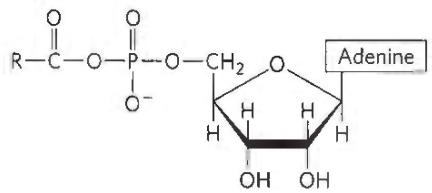

Write two equations corresponding to the two steps of the reaction catalyzed by acyl-CoA synthetase.

(b) The acyl-CoA synthetase reaction is readily reversible, with an equilibrium constant near 1. How can this reaction be made to favor formation of fatty acyl-CoA?

10. Intermediates in Oleic Acid Oxidation What is the structure of the partially oxidized fatty acyl group that is formed when oleic acid, $18:1(\Delta^{9})$ , has undergone three cycles of $\beta$ oxidation? What are the next two steps in the continued oxidation of this intermediate?

11. $\beta$ Oxidation of an Odd-Number Fatty Acid What are the direct products of $\beta$ oxidation of a fully saturated, straight-chain fatty acid of 11 carbons?

12. Oxidation of Tritiated Palmitate An investigator adds palmitate uniformly labeled with tritium ( $^{3}$ H) to a specific activity of $2.48 \times 10^{8}$ counts per minute (cpm) per micromole of palmitate to a mitochondrial preparation that oxidizes it to acetyl-CoA. She then isolates the acetyl-CoA and hydrolyzes it to acetate. The specific activity of the isolated acetate is $1.00 \times 10^{7}$ cpm/ $\mu$ mol. Is this result consistent with the $\beta$ -oxidation pathway? Explain. What is the final fate of the removed tritium? (Note: Specific activity is a measure of the degree of labeling with a radioactive tracer expressed as radioactivity per unit mass. In a uniformly labeled compound, all atoms of a given type are labeled.)

13. Comparative Biochemistry: Energy-Generating Pathways in Birds One indication of the relative importance of various ATP-producing pathways is the $V_{max}$ of certain enzymes of these pathways. The values of $V_{max}$ of several enzymes from the pectoral muscles (chest muscles used for flying) of pigeon and pheasant are listed below.

<table><tr><td rowspan="2">Enzyme</td><td colspan="2"> ${V}_{\max }\left( {\mu \mathrm{{mol}}}\right.$  substrate/min/g tissue)</td></tr><tr><td>Pigeon</td><td>Pheasant</td></tr><tr><td>Hexokinase</td><td>3.0</td><td>2.3</td></tr><tr><td>Glycogen phosphorylase</td><td>18.0</td><td>120.0</td></tr><tr><td>Phosphofructokinase-1</td><td>24.0</td><td>143.0</td></tr><tr><td>Citrate synthase</td><td>100.0</td><td>15.0</td></tr><tr><td>Triacylglycerol lipase</td><td>0.07</td><td>0.01</td></tr></table>

(a) Discuss the relative importance of glycogen metabolism and fat metabolism in generating ATP in the pectoral muscles of these birds.

(b) Compare oxygen consumption in the two birds.

(c) Judging from the data in the table, which bird is the long-distance flyer? Justify your answer.

(d) Why were these particular enzymes selected for comparison? Would the activities of triose phosphate isomerase and malate dehydrogenase be equally good bases for comparison? Explain.

14. Fatty Acids as a Source of Water Contrary to legend, camels do not store water in their humps, which actually consist of large fat deposits. How can these fat deposits serve as a source of water? Calculate the amount of water (in liters) that a camel can produce from 1.0 kg of fat. Assume for simplicity that the fat consists entirely of tripalmitoylglycerol.

15. Metabolism of a Straight-Chain Phenylated Fatty Acid Investigators isolate a crystalline metabolite from the urine of a rabbit that has been fed a straight-chain fatty acid containing a terminal phenyl group:

$$
\mathrm{CH} _ {2} - \left(\mathrm{CH} _ {2}\right) _ {n} - \mathrm{COO} ^ {-}
$$

The addition of 22.2 mL of 0.100 M NaOH completely neutralized a 302 mg sample of the metabolite in aqueous solution.

(a) What is the probable molecular weight and structure of the metabolite?

(b) Did the straight-chain fatty acid contain an even or an odd number of methylene ( $—CH_{2}—$ ) groups (i.e., is n even or odd)? Explain.

16. Fatty Acid Oxidation in Uncontrolled Diabetes When the acetyl-CoA produced during $\beta$ oxidation in the liver exceeds the capacity of the citric acid cycle, the excess acetyl-CoA forms ketone bodies—acetone, acetoacetate, and p- $\beta$ -hydroxybutyrate. This occurs in people with severe, uncontrolled diabetes; because their tissues cannot use glucose, they oxidize large amounts of fatty acids instead. Although acetyl-CoA is not toxic, the mitochondrion must divert the acetyl-CoA to ketone bodies. What problem would arise if acetyl-CoA were not converted to ketone bodies? How does the diversion to ketone bodies solve the problem?

17. Consequences of a High-Fat Diet with No Carbohydrates Suppose you had to subsist on a diet of whale blubber and seal blubber, with little or no carbohydrate.

(a) What would be the effect of carbohydrate deprivation on the utilization of fats for energy?

(b) If your diet were totally devoid of carbohydrate, would it be better to consume odd- or even-number fatty acids? Explain.

18. Even- and Odd-Number Fatty Acids in the Diet In a laboratory experiment, investigators feed two groups of rats two different fatty acids as their sole source of carbon for a month. The first group gets heptanoic acid (7:0), and the second gets octanoic acid (8:0). After the experiment, those in the first group are healthy and have gained weight, whereas those in the second group are weak and have lost weight as a result of losing muscle mass. What is the biochemical basis for this difference?

19. Metabolic Consequences of Ingesting $\omega$ -Fluoroleate The shrub Dichapetalum toxicarium, native to Sierra Leone, produces $\omega$ -fluorooleate, which is highly toxic to warm-blooded animals.

$$
\begin{array}{c} \mathrm{F} - \mathrm{CH} _ {2} - (\mathrm{CH} _ {2}) _ {7} - \stackrel {\mathrm{H}} {\mathrm{C}} = \stackrel {\mathrm{H}} {\mathrm{C}} - (\mathrm{CH} _ {2}) _ {7} - \mathrm{COO} ^ {-} \\ \omega \text {-Fluorooleate} \end{array}
$$

This substance has been used as an arrow poison, and powdered fruit from the plant is sometimes used as a rat poison (hence the plant's common name, ratsbane). Why is this substance so toxic? (Hint: Review Chapter 16, Problem 21.)

20. Mutant Acetyl-CoA Carboxylase What would be the consequences for fat metabolism of a mutation in acetyl-CoA carboxylase that replaced the Ser residue normally phosphorylated by AMPK with an Ala residue? What might happen if the same Ser were replaced by Asp? (Hint: Compare the structures of phosphoserine, alanine, aspartate; see Fig. 17-13.)

21. Role of FAD as Electron Acceptor Acyl-CoA dehydrogenase uses enzyme-bound FAD as a prosthetic group to dehydrogenate the $\alpha$ and $\beta$ carbons of fatty acyl-CoA. What is the advantage of using FAD as an electron acceptor rather than $NAD^{+}$ ? Explain in terms of the standard reduction potentials for the Enz-FAD/FADH $_{2}$ ( $E^{\prime\circ} = -0.219 V$ ) and $NAD^{+}/NADH$ ( $E^{\prime\circ} = -0.320 V$ ) half-reactions.

22. $\beta$ Oxidation of Arachidic Acid How many turns of the fatty acid oxidation cycle are required for complete oxidation of arachidic acid (20:0) to acetyl-CoA?

23. Fate of Labeled Propionate Adding $[3-^{14}C]$ propionate ( $^{14}C$ in the methyl group) to a liver homogenate leads to the rapid production of ${}^{14}C$ -labeled oxaloacetate. Draw a flowchart for the pathway by which propionate is transformed to oxaloacetate, and indicate the location of the ${}^{14}C$ in oxaloacetate.

24. Phytanic Acid Metabolism A mouse fed phytanic acid uniformly labeled with ${}^{14}$ C produces detectable levels of radioactive malate, a citric acid cycle intermediate, within minutes. Draw a metabolic pathway that could account for this. Which of the carbon atoms in malate would contain ${}^{14}$ C label?

25. Sources of $H_{2}O$ Produced in $\beta$ Oxidation The complete oxidation of palmitoyl-CoA to carbon dioxide and water is represented by the overall equation

Palmitoyl-CoA + 23O $_{2}$ + 108P $_{i}$ + 108ADP →

$$
\mathrm{CoA} + 1 6 \mathrm{CO} _ {2} + 1 0 8 \mathrm{ATP} + 2 3 \mathrm{H} _ {2} \mathrm{O}
$$

Water also forms in the reaction

$$
\mathrm{ADP} + \mathrm {P_ {i}} \longrightarrow \mathrm{ATP} + \mathrm {H_ {2} O}
$$

but is not included as a product in the overall equation. Why?

26. Biological Importance of Cobalt Cattle, deer, sheep, and other ruminant animals produce large amounts of propionate in the rumen through the bacterial fermentation of ingested plant matter. Propionate is the principal source of glucose for these animals, via the route propionate $\longrightarrow$ oxaloacetate $\longrightarrow$ glucose. In some areas of the world, notably Australia, ruminant animals sometimes show symptoms of anemia with concomitant loss of appetite and retarded growth, resulting from an inability to transform propionate to oxaloacetate. This condition is due to a cobalt deficiency caused by very low cobalt levels in the soil and thus in plant matter. Explain.

27. Fat Loss during Hibernation Bears expend about $25 \times 10^{6}$ J/day during periods of hibernation, which may last as long as seven months. The energy required to sustain life is obtained from fatty acid oxidation. How much weight (in kilograms) do bears lose after 7 months of hibernation? How could a bear's body minimize ketosis during hibernation? (Assume the oxidation of fat yields 38 kJ/g.)

## DATA ANALYSIS PROBLEM

28. $\beta$ Oxidation of Trans Fats Unsaturated fats with trans double bonds are commonly referred to as "trans fats." In their investigations of the effects of trans fatty acid metabolism on health, Yu and colleagues (2004) showed that a model trans fatty acid was processed differently from its cis isomer. They used three related 18-carbon fatty acids to explore the difference in $\beta$ oxidation between cis and trans isomers of the same-size fatty acid.

Stearic acid (octadecenoic acid)

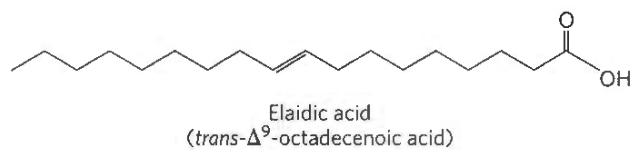

The researchers incubated the coenzyme A derivative of each acid with rat liver mitochondria for 5 minutes, then separated the remaining CoA derivatives in each mixture by HPLC (high-performance liquid chromatography). The results are shown below, with separate panels for the three experiments.

  
In the figure, IS indicates an internal standard (pentadecanoyl-CoA) added to the mixture after the reaction as a molecular marker. The researchers abbreviated the CoA derivatives as follows: stearoyl-CoA, $C_{18}$ -CoA; cis- $\Delta^{5}$ -tetradecenoyl-CoA, $c\Delta^{5}C_{14}$ -CoA; oleoyl-CoA, $c\Delta^{9}C_{18}$ -CoA; trans- $\Delta^{5}$ -tetradecenoyl-CoA, $t\Delta^{5}C_{14}$ -CoA; and elaidoyl-CoA, $t\Delta^{9}C_{18}$ -CoA.

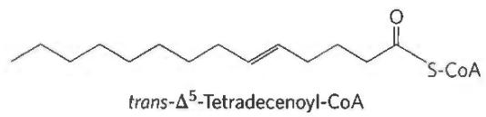

(a) Why did Yu and colleagues need to use CoA derivatives rather than the free fatty acids in these experiments?

(b) Why were no lower molecular weight CoA derivatives found in the reaction with stearoyl-CoA?

(c) How many rounds of $\beta$ oxidation would be required to convert the oleoyl-CoA and the elaidoyl-CoA to cis- $\Delta^{5}$ -tetradecenoyl-CoA and trans- $\Delta^{5}$ -tetradecenoyl-CoA, respectively?

Yu and coworkers measured the kinetic parameters of two forms of the enzyme acyl-CoA dehydrogenase: long-chain acyl-CoA dehydrogenase (LCAD) and very-long-chain acyl-CoA dehydrogenase (VLCAD). They used the CoA derivatives (d) For LCAD, the $K_{m}$ differs dramatically for the cis and trans substrates. Provide a plausible explanation for this observation in terms of the structures of the substrate molecules. (Hint: You may want to refer to Fig. 10-1.)

of three fatty acids: tetradecanoyl-CoA (C $_{14}$ -CoA), cis-Δ $^{5}$ -tetradecenoyl-CoA (cΔ $^{5}$ C $_{14}$ -CoA), and trans-Δ $^{5}$ -tetradecenoyl-CoA (tΔ $^{5}$ C $_{14}$ -CoA). The results are shown below. (See Chapter 6 for definitions of the kinetic parameters.)  

<table><tr><td rowspan="2"></td><td colspan="3">LCAD</td><td colspan="3">VLCAD</td></tr><tr><td> $C_{14}-CoA$ </td><td> $c\Delta^5C_{14}-CoA$ </td><td> $t\Delta^5C_{14}-CoA$ </td><td> $C_{14}-CoA$ </td><td> $c\Delta^5C_{14}-CoA$ </td><td> $t\Delta^5C_{14}-CoA$ </td></tr><tr><td> $V_{max}$ </td><td>3.3</td><td>3.0</td><td>2.9</td><td>1.4</td><td>0.32</td><td>0.88</td></tr><tr><td> $K_m$ </td><td>0.41</td><td>0.40</td><td>1.6</td><td>0.57</td><td>0.44</td><td>0.97</td></tr><tr><td> $k_{cat}$ </td><td>9.9</td><td>8.9</td><td>8.5</td><td>2.0</td><td>0.42</td><td>1.12</td></tr><tr><td> $k_{cat}/K_m$ </td><td>24</td><td>22</td><td>5</td><td>4</td><td>1</td><td>1</td></tr></table>

(e) The kinetic parameters of the two enzymes are relevant to the differential processing of these fatty acids only if the LCAD or VLCAD reaction (or both) is the rate-limiting step in the pathway. What evidence is there to support this assumption? (f) How do these different kinetic parameters explain the different levels of the CoA derivatives found after incubation of rat liver mitochondria with stearoyl-CoA, oleoyl-CoA, and elaidoyl-CoA (shown in the three-panel figure)?

Yu and coworkers measured the substrate specificity of rat liver mitochondrial thioesterase, which hydrolyzes acyl-CoA to CoA and free fatty acid. This enzyme was approximately twice as active with $C_{14}$ -CoA thioesters as with $C_{18}$ -CoA thioesters.

(g) Other research has suggested that free fatty acids can pass through membranes. In their experiments, Yu and colleagues found trans- $\Delta^{5}$ -tetradecenoic acid outside (i.e., in the medium surrounding) mitochondria that had been incubated with elaidoyl-CoA. Describe the pathway that led to this extramitochondrial trans- $\Delta^{5}$ -tetradecenoic acid. Be sure to indicate where in the cell the various transformations take place, as well as the enzymes that catalyze the transformations.
(h) It is sometimes said in the popular press that “trans fats are not broken down by your cells and instead accumulate in your body.” In what sense is this statement correct and in what sense is it an oversimplification?

## Reference

Yu, W., X. Liang, R. Ensenauer, J. Vockley, L. Sweetman, and H. Schultz. 2004. Leaky $\beta$ -oxidation of a trans-fatty acid. J. Biol. Chem. 279:52,160–52,167.

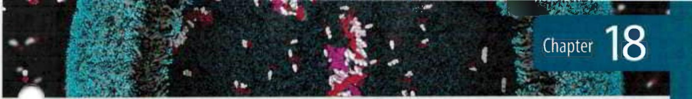

# AMINO ACID OXIDATION AND THE PRODUCTION OF UREA

18.1 Metabolic Fates of Amino Groups 626
18.2 Nitrogen Excretion and the Urea Cycle 633
18.3 Pathways of Amino Acid Degradation 639

We now turn our attention to the amino acids, the final class of biomolecules that, through their oxidative degradation, make a significant contribution to the generation of metabolic energy. The fraction of metabolic energy obtained from amino acids, whether they are derived from dietary protein or from tissue protein, varies greatly with the type of organism and with metabolic conditions. Carnivores consume primarily protein and thus must obtain most of their energy from amino acids, whereas herbivores may fill only a small fraction of their energy needs by this route. Most microorganisms can scavenge amino acids from their environment and use them as fuel when required by metabolic conditions. Plants, however, rarely if ever oxidize amino acids to provide energy; the carbohydrate produced from $CO_{2}$ and $H_{2}O$ in photosynthesis is generally their sole energy source. Amino acid concentrations in plant tissues are carefully regulated to just meet the requirements for biosynthesis of proteins, nucleic acids, and other molecules needed to support growth. Amino acid catabolism does occur in plants, but only to produce metabolites for other biosynthetic pathways.

Amino acid oxidation pathways can seem complex, and they are best understood in the context of five principles:

P1 The many paths for amino acid catabolism have two broad parts, one involving the amino groups and the other involving the carbon skeletons. All of the pathways for amino acid degradation include a key step, always involving a pyridoxal phosphate cofactor, in which the $\alpha$ -amino group is separated from the carbon skeleton and shunted into the pathways of amino group metabolism. The carbon skeletons are broken down to citric acid cycle intermediates (Fig. 18-1).

P2 Four amino acids—alanine, glutamate, glutamine, and aspartate—play key roles in the transport and distribution of amino groups. All are present in relatively high concentrations in one or many mammalian tissues. All are readily converted to key citric acid cycle intermediates.

P3 Metabolic pathways are not distinct. The various pathways for amino acid catabolism are elaborately intertwined with other catabolic and anabolic pathways.

P4 Free ammonia is toxic. Excess amino groups must be safely excreted. In mammals, the urea cycle serves this purpose.

P5 Each amino acid has a different catabolic fate. The varied carbon skeletons of amino acids are broken down via equally varied pathways. All can be oxidized to generate ATP. All but leucine and lysine can contribute to gluconeogenesis when needed.

In mammals, blood glucose must be supplemented by gluconeogenesis, often just a few hours after a meal. Amino acids, particularly alanine and glutamine, can make a significant contribution to the fuel for gluconeogenesis. Amino acids undergo oxidative degradation in three different metabolic circumstances:

1. Amino acids released during normal protein turnover are not needed for new protein synthesis.

2. Ingested amino acids exceed the body's needs for protein synthesis.

3. Cellular proteins are used as fuel because carbohydrates are either unavailable or not properly utilized due to starvation or uncontrolled diabetes mellitus.

  
FIGURE 18-1 Overview of amino acid catabolism in mammals. The amino groups and the carbon skeleton take separate but interconnected pathways.

The pathways of amino acid catabolism are quite similar in most organisms. The focus of this chapter is on the pathways in vertebrates, because these have received the most research attention. As in carbohydrate and fatty acid catabolism, the processes of amino acid degradation converge on the central catabolic pathways, with the carbon skeletons of most amino acids finding their way to the citric acid cycle. In some cases, the reaction pathways of amino acid breakdown closely parallel steps in the catabolism of fatty acids (see Fig. 17-9). We begin with amino group metabolism and nitrogen excretion, before turning to the fate of the carbon skeletons derived from the amino acids; along the way we see how the pathways are interconnected.

## 18.1 Metabolic Fates of Amino Groups

Nitrogen, $N_{2}$ , is abundant in the atmosphere but is too unreactive for use in most biochemical processes. Reduced nitrogen is essential for life but bioenergetically expensive. Only a few microorganisms can convert $N_{2}$ to biologically useful forms such as $NH_{3}$ (Chapter 22). Amino groups are thus used efficiently in biological systems, and the lack of reactive nitrogen can limit growth.

P4 If not reused for the synthesis of new amino acids or other nitrogenous products, amino groups are channeled into a single excretory end product (Fig. 18-2). Most aquatic species, such as the bony fishes, are ammonotelic, excreting amino nitrogen as ammonia. The toxic ammonia is simply diluted in the surrounding water. Terrestrial animals require pathways for nitrogen excretion that minimize toxicity and water loss. Most terrestrial animals are ureotelic, excreting amino nitrogen in the form of urea; birds and reptiles are uricotelic, excreting amino nitrogen as uric acid. (The pathway of uric acid synthesis is described in Fig. 22-48.) Plants recycle virtually all amino groups—they excrete nitrogen only under rare circumstances. Reactive nitrogen excreted in any form is rapidly assimilated into the global nitrogen web (see Fig. 22-1), metabolized by microorganisms that are ubiquitous in aqueous and soil environments.

Figure 18-2a provides an overview of the catabolic pathways of ammonia and amino groups in vertebrates. Glutamine, glutamate, and alanine are prominent in this scheme. Amino acids derived from dietary protein are the source of most amino groups. Most amino acids are metabolized in the liver. Some of the ammonia generated in this process is recycled and used in biosynthetic pathways where glutamine, glutamate, and aspartate play major roles (Chapter 22). Excess amino groups are either excreted directly or converted to urea or uric acid for excretion, depending on the organism (Fig. 18-2b). In mammals, including marsupials, most excess ammonia generated in other (extrahepatic) tissues travels to the liver for conversion to urea.

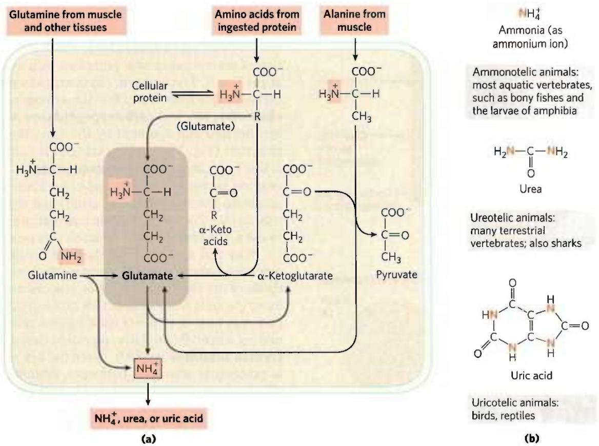  
FIGURE 18-2 Amino group catabolism. (a) Overview of catabolism of amino groups (shaded) in vertebrate liver. (b) Excretory forms of nitrogen. Excess $\mathrm{NH_4^+}$ is excreted as ammonia, urea, or uric acid.  
Notice that the carbon atoms of urea and uric acid are highly oxidized; the organism discards carbon only after extracting most of its available energy of oxidation.

P2 The special place of glutamate, glutamine, alanine, and aspartate in nitrogen metabolism is not an evolutionary accident. These particular amino acids are the ones most easily converted into citric acid cycle intermediates: glutamate and glutamine to $\alpha$ -ketoglutarate, alanine to pyruvate, and aspartate to oxaloacetate. Glutamate and glutamine are especially important, acting as general collection points for amino groups. In the cytosol of liver cells (hepatocytes), amino groups from most amino acids are transferred to $\alpha$ -ketoglutarate to form glutamate, which enters mitochondria and gives up its amino group to form $\mathrm{NH}_4^+$ . Excess ammonia generated in most other tissues is converted to the amide nitrogen of glutamine, which passes to the liver, then into liver mitochondria. Glutamine or glutamate or both are present in higher concentrations than other amino acids in most tissues. In skeletal muscle, excess amino groups are generally transferred to pyruvate to form alanine, another important molecule in the transport of amino groups to the liver. We begin with a discussion of the breakdown of dietary proteins, then proceed to a general description of the metabolic fates of amino groups.

## Dietary Protein Is Enzymatically Degraded to Amino Acids

In humans, the degradation of ingested proteins to their constituent amino acids occurs in the gastrointestinal tract. Entry of dietary protein into the stomach stimulates the gastric mucosa to secrete the hormone gastrin, which in turn stimulates the secretion of hydrochloric acid by the parietal cells and pepsinogen by the chief cells of the gastric glands (Fig. 18-3a). The acidic gastric juice (pH 1.0 to 2.5) is both an antiseptic, killing most bacteria and other foreign cells, and a denaturing agent, unfolding globular proteins and rendering their internal peptide bonds more accessible to enzymatic hydrolysis. Pepsinogen ( $M_{r}$ 40,554), an inactive precursor, or zymogen (p. 220), is converted to active pepsin ( $M_{r}$ 34,614) by an autocatalytic cleavage (a cleavage mediated by the pepsinogen itself) that occurs only at low pH. In the stomach, pepsin cleaves long polypeptide chains into a mixture of smaller peptides.

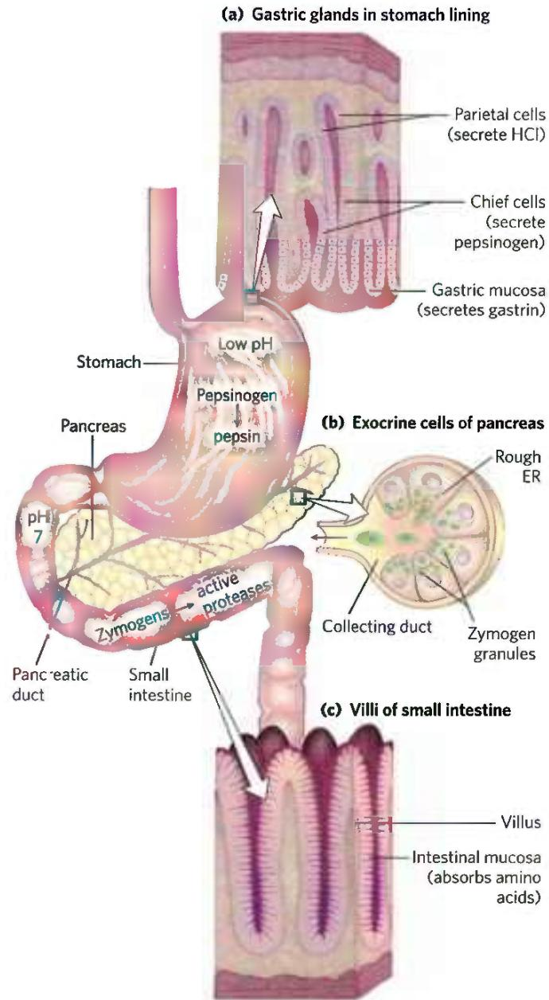  
FIGURE 18-3 Part of the human digestive (gastrointestinal) tract. (a) The parietal cells and chief cells of the gastric glands secrete their products in response to the hormone gastrin. Pepsin begins the process of protein degradation in the stomach. (b) The cytoplasm of exocrine cells of the pancreas is completely filled with rough endoplasmic reticulum, the site of synthesis of the zymogens of many digestive enzymes. The zymogens are concentrated in membrane-enclosed transport particles called zymogen granules. When an exocrine cell is stimulated, its plasma membrane fuses with the zymogen granule membrane and zymogens are released into the lumen of the collecting duct by exocytosis. The collecting ducts ultimately lead to the pancreatic duct and from there to the small intestine. (c) In the small intestine, amino acids are absorbed through the epithelial cell layer (intestinal mucosa) of the villi and enter the capillaries.

As the acidic stomach contents pass into the small intestine, the low pH triggers secretion of the hormone secretin into the blood. Secretin stimulates the pancreas to secrete bicarbonate into the small intestine to neutralize the gastric HCl, abruptly increasing the pH to about 7. Arrival of peptides in the upper part of the intestine (duodenum) causes release into the blood of the hormone cholecystokinin, which stimulates secretion of several pancreatic proteases with activity optima at pH 7 to 8. Trypsinogen, chymotrypsinogen, and procarboxypeptidases A and B—the zymogens of trypsin, chymotrypsin, and carboxypeptidases A and B—are synthesized and secreted by the exocrine cells of the pancreas (Fig. 18-3b). Trypsinogen is converted to its active form, trypsin, by enteropeptidase, a proteolytic enzyme secreted by intestinal cells. Free trypsin then catalyzes the conversion of additional trypsinogen to trypsin (see Fig. 6-42). Trypsin also activates chymotrypsinogen, the procarboxypeptidases, and proelastase.

Why this elaborate mechanism for getting active digestive enzymes into the gastrointestinal tract? Synthesis of the enzymes as inactive precursors protects the exocrine cells from destructive proteolytic attack. The pancreas further protects itself against self-digestion by making a specific inhibitor, a protein called pancreatic trypsin inhibitor (p. 220). Given the key role of trypsin in proteolytic activation pathways, inhibition of trypsin effectively prevents premature production of active proteolytic enzymes within pancreatic cells.

Trypsin and chymotrypsin further hydrolyze the peptides that were produced by pepsin in the stomach. This stage of protein digestion is accomplished very efficiently, because pepsin, trypsin, chymotrypsin, and the carboxypeptidases have different catalytic specificities and cleave different sets of peptide bonds (see Table 3-6). The resulting mixture of free amino acids is transported into the epithelial cells lining the small intestine (Fig. 18-3c), through which the amino acids enter the blood capillaries in the villi and travel to the liver.

Acute pancreatitis is a disease caused by obstruction of the normal pathway by which pancreatic secretions enter the intestine. The zymogens of the proteolytic enzymes are converted to their catalytically active forms prematurely, inside the pancreatic cells, and attack the pancreatic tissue itself. This causes excruciating pain and damage to the organ that can prove fatal.

## Pyridoxal Phosphate Participates in the Transfer of α-Amino Groups to α-Ketoglutarate

P1 The first step in the catabolism of most L-amino acids, once they have reached the liver, is removal of the $\alpha$ -amino groups, promoted by enzymes called aminotransferases or transaminases. In these transamination reactions, the $\alpha$ -amino group is transferred to the $\alpha$ -carbon atom of $\alpha$ -ketoglutarate, leaving behind the corresponding $\alpha$ -keto acid analog of the amino acid (Fig. 18-4). There is no net deamination (loss of amino groups) in these reactions, because the $\alpha$ -ketoglutarate becomes aminated as the $\alpha$ -amino acid is deaminated. P2 These are the reactions that effectively collect the amino groups from many different amino acids in the form of L-glutamate.

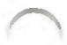

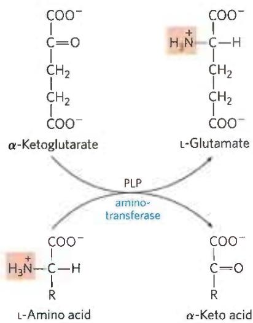  
FIGURE 18-4 Enzyme-catalyzed transaminations. In many aminotransferase reactions, $\alpha$ -ketoglutarate is the amino group acceptor. All aminotransferases have pyridoxal phosphate (PLP) as cofactor. Although the reaction is shown here in the direction of transfer of the amino group to $\alpha$ -ketoglutarate, it is readily reversible.

Cells contain different types of aminotransferases. Many are specific for $\alpha$ -ketoglutarate as the amino group acceptor but differ in their specificity for the L-amino acid. The enzymes are named for the amino group donor (alanine aminotransferase and aspartate aminotransferase, for example). The reactions catalyzed by aminotransferases are freely reversible, having an equilibrium constant of about 1.0 ( $\Delta G' \approx 0$ kJ/mol).

P1 All aminotransferases have pyridoxal phosphate (PLP), the coenzyme form of pyridoxine, or vitamin B6, as a prosthetic group. We encountered pyridoxal phosphate in Chapter 15, as a coenzyme in the glycogen phosphorylase reaction, but its role in that reaction is not representative of its usual coenzyme function. Its primary role in cells is in the metabolism of molecules with amino groups.

Pyridoxal phosphate functions as an intermediate carrier of amino groups at the active site of aminotransferases. It undergoes reversible transformations between its aldehyde form, pyridoxal phosphate, which can accept an amino group, and its aminated form, pyridoxamine phosphate, which can donate its amino group to an $\alpha$ -keto acid (Fig. 18-5a). Pyridoxal phosphate is generally covalently bound to the enzyme's active site through an aldimine (Schiff base) linkage to the $\varepsilon$ -amino group of a Lys residue (Fig. 18-5b, c). This linkage is replaced by the amino group of the amino acid as the first step in most PLP-catalyzed reactions (Fig. 18-5d).

Pyridoxal phosphate participates in a variety of reactions in amino acid metabolism (Section 18.3 and Chapter 22), facilitating reactions at the $\alpha$ , $\beta$ , and $\gamma$ carbons (C-2 to C-4) of amino acids. Reactions at the $\alpha$ carbon (Fig. 18-6) include racemizations (interconverting L- and D-amino acids) and decarboxylations, as well as transaminations. Pyridoxal phosphate plays the same chemical role in each of these reactions. A bond to the $\alpha$ carbon of the substrate is broken, removing either a proton or a carboxyl group. Pyridoxal phosphate provides resonance stabilization of the otherwise unstable carbanion

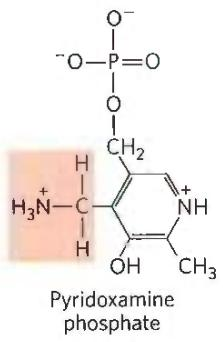  
(a)

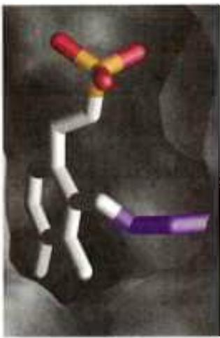  
(c)

(b)  
  
(d)  
FIGURE 18-5 Pyridoxal phosphate, the prosthetic group of aminotransferases. (a) Pyridoxal phosphate (PLP) and its aminated form, pyridoxamine phosphate, are the tightly bound coenzymes of aminotransferases. The functional groups are shaded. (b) Pyridoxal phosphate is bound to the enzyme through noncovalent interactions and a Schiff-base (aldimine) linkage to a Lys residue at the active site. The steps in the formation of a Schiff base from a primary amine and a carbonyl group are detailed in Figure 14-5. (c, d) Close-up views of the active site of aspartate aminotransferase, with PLP (white, with the phosphoryl group in orange and red). In (c) PLP is in aldimine linkage with the side chain of Lys $^{258}$ (purple). In (d) PLP is linked to the substrate analog 2-methylaspartate (green) via a Schiff base. [(c, d) Data from PDB ID 1AJS, S. Rhee et al., J. Biol. Chem. 272:17,293, 1997.]

  
tion of an electron pair to avoid formation of an unstable carbanion on the $\alpha$ carbon (inset). A quinonoid intermediate is involved in all three types of reactions. The transamination route A is especially important in the pathways described in this chapter. This pathway (shown left to right) represents only part of the overall reaction catalyzed by aminotransferases. To complete the process, a second $\alpha$ -keto acid replaces the one that is released, and this is converted to an amino acid in a reversal of the reaction steps (right to left). Pyridoxal phosphate is also involved in certain reactions at the $\beta$ and $\gamma$ carbons of some amino acids (not shown).

MECHANISM FIGURE 18-6 Some amino acid transformations at the $\alpha$ carbon that are facilitated by pyridoxal phosphate. Pyridoxal phosphate is generally bonded to the enzyme through a Schiff base, also called an internal aldimine. This activated form of PLP readily undergoes transamination to form a new Schiff base (external aldimine) with the $\alpha$ -amino group of the substrate amino acid (see Fig. 18-5b, d). Three alternative fates for the external aldimine are shown: A transamination, B racemization, and C decarboxylation. The PLP-amino acid Schiff base is in conjugation with the pyridine ring, an electron sink that permits delocaliza

intermediate (Fig. 18-6, inset). The highly conjugated structure of PLP (an electron sink) permits delocalization of the negative charge.

Aminotransferases (Fig. 18-6a) are classic examples of enzymes catalyzing bimolecular Ping-Pong reactions (see Fig. 6-15b, d), in which the first substrate reacts and the product must leave the active site before the second substrate can bind. Thus, the incoming amino acid binds to the active site, donates its amino group to pyridoxal phosphate, and departs in the form of an $\alpha$ -keto acid.

The incoming $\alpha$ -keto acid then binds, accepts the amino group from pyridoxamine phosphate, and departs in the form of an amino acid.

## Glutamate Releases Its Amino Group as Ammonia in the Liver

As we shall see, the urea cycle begins with free ammonia in the mitochondria of hepatocytes. P1 The delivery of $NH_{4}^{+}$ to these mitochondria is streamlined by collecting the amino groups of many different $\alpha$ -amino acids in the liver in one of two forms: the amino group of L-glutamate or the amide nitrogen of glutamine (Fig. 18-2).

As the product of many aminotransferase reactions, glutamate has a central role. In hepatocytes, glutamate is transported from the cytosol into mitochondria. Here, it undergoes oxidative deamination catalyzed by L-glutamate dehydrogenase ( $M_{r}$ 330,000) to produce $NH_{4}^{+}$ and $\alpha$ -ketoglutarate. In mammals, this enzyme is present in the mitochondrial matrix. It is unusual in that it can use either $NAD^{+}$ or $NADP^{+}$ as the acceptor of reducing equivalents (Fig. 18-7).

The combined action of an aminotransferase and glutamate dehydrogenase is referred to as transdeamination. A few amino acids bypass the transdeamination pathway and undergo direct oxidative deamination. The fate of the $NH_{4}^{+}$ produced by any of these deamination processes is discussed in detail in Section 18.2. P3 The $\alpha$ -ketoglutarate formed from glutamate deamination can be used either in the citric acid cycle or for glucose synthesis.

P1 P2 P3 Glutamate dehydrogenase operates at an important intersection of carbon and nitrogen metabolism. Its $\alpha$ -ketoglutarate product can be oxidized as fuel or serve as a glucose precursor in gluconeogenesis. An allosteric enzyme with six identical subunits, its activity is influenced by a complicated array of allosteric modulators. The best-studied of these are the positive modulator ADP and the negative modulator GTP. Although the metabolic rationale for this regulatory

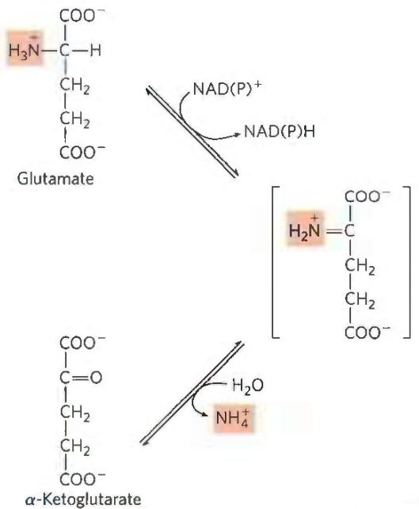

FIGURE 18-7 Reaction catalyzed by glutamate dehydrogenase. The glutamate dehydrogenase of mammalian liver has the unusual capacity to use either $\mathrm{NAD^{+}}$ or $\mathrm{NADP^{+}}$ as cofactor. The glutamate dehydrogenases of plants and microorganisms are generally specific for one or the other. The mammalian enzyme is allosterically regulated by GTP and ADP.

pattern has not been elucidated in detail, ADP can signal low glucose levels and GTP is a product of the citric acid cycle that can signal high levels of $\alpha$ -ketoglutarate (see Fig. 16-7).

Mutations that alter the allosteric binding site for GTP or otherwise cause permanent activation of glutamate dehydrogenase lead to a human genetic disorder called hyperinsulinism-hyperammonemia syndrome, characterized by hypersecretion of insulin after a protein meal. This results in elevated levels of ammonia in the bloodstream and hypoglycemia.

## Glutamine Transports Ammonia in the Bloodstream

Glutamine is the second major source of ammonia in hepatocyte mitochondria and is particularly important for intercellular transport of ammonia. P4 Ammonia is quite toxic to animal tissues (we examine some possible reasons for this toxicity later). Significant amounts are present in blood, but the levels are tightly controlled. In many tissues, including the brain, some processes such as nucleotide degradation generate free ammonia. In most animals, much of the free ammonia is converted to a nontoxic compound before export from the extrahepatic tissues into the blood and transport to the liver or kidneys. For this transport function, glutamate, critical to intracellular amino group metabolism, is supplanted by L-glutamine. The free ammonia produced in tissues is combined with glutamate to yield glutamine by the action of glutamine synthetase. This reaction requires ATP and occurs in two steps (Fig. 18-8). First, glutamate and ATP react to form ADP and a $\gamma$ -glutamyl phosphate intermediate, which then reacts with ammonia to produce glutamine and inorganic phosphate. In addition to its transport role, glutamine serves as a source of amino groups in a variety of biosynthetic reactions. Glutamine synthetase is found in all organisms, always playing a central metabolic role. In microorganisms, the enzyme serves as an essential portal for the entry of fixed nitrogen into biological systems. (The roles of glutamine and glutamine synthetase in metabolism are further discussed in Chapter 22.)

In most terrestrial animals, glutamine in excess of that required for biosynthesis is transported in the blood to the intestine, liver, and kidneys for processing. In these tissues, the amide nitrogen is released as ammonium ion in the mitochondria, where the enzyme glutaminase converts glutamine to glutamate and $NH_{4}^{+}$ (Fig. 18-8). The $NH_{4}^{+}$ from intestine and kidney is transported in the blood to the liver. In the liver, the ammonia from all sources is disposed of by urea synthesis. Some of the glutamate produced in the glutaminase reaction may be further processed in the liver by glutamate dehydrogenase (Fig. 18-7), releasing more ammonia and producing carbon skeletons for metabolic fuel.

  
FIGURE 18-8 Ammonia transport in the form of glutamine. Excess ammonia in tissues is added to glutamate to form glutamine, a process catalyzed by glutamine synthetase. After transport in the bloodstream, the glutamine enters the liver, and $\mathrm{NH_4^+}$ is liberated in mitochondria by the enzyme glutaminase.

In metabolic acidosis (p. 621) there is a regulated increase in glutamine processing by the kidneys. Much of the excess $NH_{4}^{+}$ thus produced is not destined for the bloodstream or converted to urea; instead, it is excreted directly into the urine where it forms salts with metabolic acids. The glutamine breakdown thus facilitates removal of those acids in the urine. Bicarbonate produced by the decarboxylation of $\alpha$ -ketoglutarate in the citric acid cycle can also serve as a buffer in blood plasma. Taken together, these effects of glutamine metabolism in the kidney tend to counteract acidosis.

## Alanine Transports Ammonia from Skeletal Muscles to the Liver

Vigcrously contracting skeletal muscles operate anaerobically, producing large amounts of pyruvate and lactate from glycolysis as well as ammonia from protein breakdown. These products must find their way to the liver, where pyruvate and lactate are incorporated into glucose, which is returned to the muscles, and ammonia is converted to urea for excretion. Pyruvate and alanine are readily interconverted via transamination with glutamate by the action of alanine aminotransferase). Thus, alanine largely supplants glutamine in the transport of amino groups from muscle to the liver in a nontoxic form (Fig. 18-2a), ultimately delivering the free ammonia to hepatocyte mitochondria via glutamate in a pathway called the glucose-alanine cycle (Fig. 18-9). In the cytosol of hepatocytes, alanine aminotransferase acts in reverse to transfer the amino group from alanine to $\alpha$ -ketoglutarate, forming pyruvate and glutamate. Glutamate can then enter mitochondria, where the glutamate dehydrogenase reaction releases $\mathrm{NH}_4^+$ (Fig. 18-7), or it can undergo transamination with oxaloacetate to form aspartate, another nitrogen donor in urea synthesis, as we shall see.

The use of alanine to transport ammonia from skeletal muscles to the liver is another example of the intrinsic economy of living organisms. The energetic burden of gluconeogenesis is imposed on the liver rather than the muscle, and all available ATP in muscle is devoted to muscle contraction. The glucose-alanine cycle, in concert with the Cori cycle (see Box 14-2 and Fig. 23-17), accomplishes this transaction.

  
FIGURE 18-9 Glucose-alanine cycle. Alanine serves as a carrier of ammonia and of the carbon skeleton of pyruvate from skeletal muscle to liver. The ammonia is excreted and the pyruvate is used to produce glucose, which is returned to the muscle.

## Ammonia Is Toxic to Animals

The catabolic production of ammonia poses a serious biochemical problem, because ammonia is very toxic. The brain is particularly sensitive; damage from ammonia toxicity causes cognitive impairment, ataxia, and epileptic seizures. In extreme cases there is swelling of the brain leading to death. The molecular bases for this toxicity are gradually coming into focus. In the blood, about 98% of ammonia is in the protonated form (NH $_{4}^{+}$ ), which does not cross the plasma membrane. The small amount of NH $_{3}$ present readily crosses all membranes, including the blood-brain barrier, allowing it to enter cells, where much of it becomes protonated and can accumulate inside cells as NH $_{4}^{+}$ .

Ridding the cytosol of ammonia requires reductive amination of $\alpha$ -ketoglutarate to glutamate by glutamate dehydrogenase (the reverse of the reaction described earlier; Fig. 18-7) and conversion of glutamate to glutamine by glutamine synthetase. In the brain, only astrocytes — star-shaped cells of the nervous system that provide nutrients, support, and insulation for neurons — express glutamine synthetase. Glutamate and its derivative $\gamma$ -aminobutyrate (GABA; see Fig. 22-31) are important neurotransmitters; some of the sensitivity of the brain to ammonia may reflect depletion of glutamate in the glutamine synthetase reaction. However, glutamine synthetase activity is insufficient to deal with excess ammonia, or to fully explain its toxicity.

Increased $[NH_{4}^{+}]$ also alters the capacity of astrocytes to maintain potassium homeostasis across the membrane. $NH_{4}^{+}$ competes with $K^{+}$ for transport into the cell through the $Na^{+}K^{+}$ ATPase, resulting in elevated extracellular $[K^{+}]$ . The excess extracellular $K^{+}$ enters neurons through a symporter, $Na^{+}-K^{+}-2Cl^{-}$ cotransporter 1 (NKCC1), bringing $Na^{+}$ and $2Cl^{-}$ with it. Excess $Cl^{-}$ in these neurons alters their response when the neurotransmitter GABA interacts with their $GABA_{A}$ receptors, producing abnormal depolarization and increased neuronal activity that likely account for the neuromuscular incoordination and seizures that often result from ammonia poisoning. If extracellular $[NH_{4}^{+}]$ remains elevated, the perturbation of ion and aquaporin channels in astrocytes causes the cells to swell, resulting in fatal brain edema.

As we close this discussion of amino group metabolism, note that we have described several processes that deposit excess ammonia in the mitochondria of hepatocytes (Fig. 18-2). We now look at the fate of that ammonia.

## SUMMARY 18.1 Metabolic Fates of Amino Groups

■ Humans derive a small fraction of their oxidative energy from the catabolism of amino acids. Proteases degrade ingested proteins in the stomach and small intestine. Most proteases are initially synthesized as inactive zymogens.

An early step in the catabolism of amino acids is the separation of the amino group from the carbon skeleton. In most cases, the amino group is transferred to $\alpha$ -ketoglutarate to form glutamate. This transamination reaction requires pyridoxal phosphate, a coenzyme globally involved in amino acid metabolism.

■ Glutamate, a central reservoir of metabolized amino groups, is transported to liver mitochondria, where glutamate dehydrogenase liberates the amino group as ammonium ion (NH $_{4}^{+}$ ).

■ Ammonia formed in most other tissues is transported to the liver as the amide nitrogen of glutamine.

■ To make use of the pyruvate and amino groups generated in hardworking skeletal muscle, the pyruvate is converted to alanine and transported to the liver within the glucose-alanine cycle.

■ Free ammonia is toxic. Excess ammonia is often manifested in serious neurological damage.

## 18.2 Nitrogen Excretion and the Urea Cycle

In ureotelic organisms, the ammonia deposited in the mitochondria of hepatocytes is converted to urea in the urea cycle (Fig. 18-10). This pathway was discovered in 1932 by Hans Krebs (who later also discovered the citric acid cycle) and a medical student associate, Kurt Henseleit. Urea production occurs almost exclusively in the liver and is the fate of most of the ammonia channeled there. The urea passes into the bloodstream and thus to the kidneys and is excreted into the urine. The production of urea now becomes the focus of our discussion.

## Urea Is Produced from Ammonia in Five Enzymatic Steps

The urea cycle begins inside liver mitochondria, but three of the subsequent steps take place in the cytosol; the cycle thus spans two cellular compartments (Fig. 18-10). The first amino group to enter the urea cycle is derived from ammonia in the mitochondrial matrix — most of this $NH_{4}^{+}$ arises by the pathways described in Section 18.1. The liver also receives some ammonia via the portal vein from the intestine, from the bacterial oxidation of amino acids. Whatever its source, the $NH_{4}^{+}$ generated in liver mitochondria is immediately used, together with $CO_{2}$ (as $HCO_{3}^{-}$ ) produced by mitochondrial respiration,

Glutamine (from extrahepatic tissues)

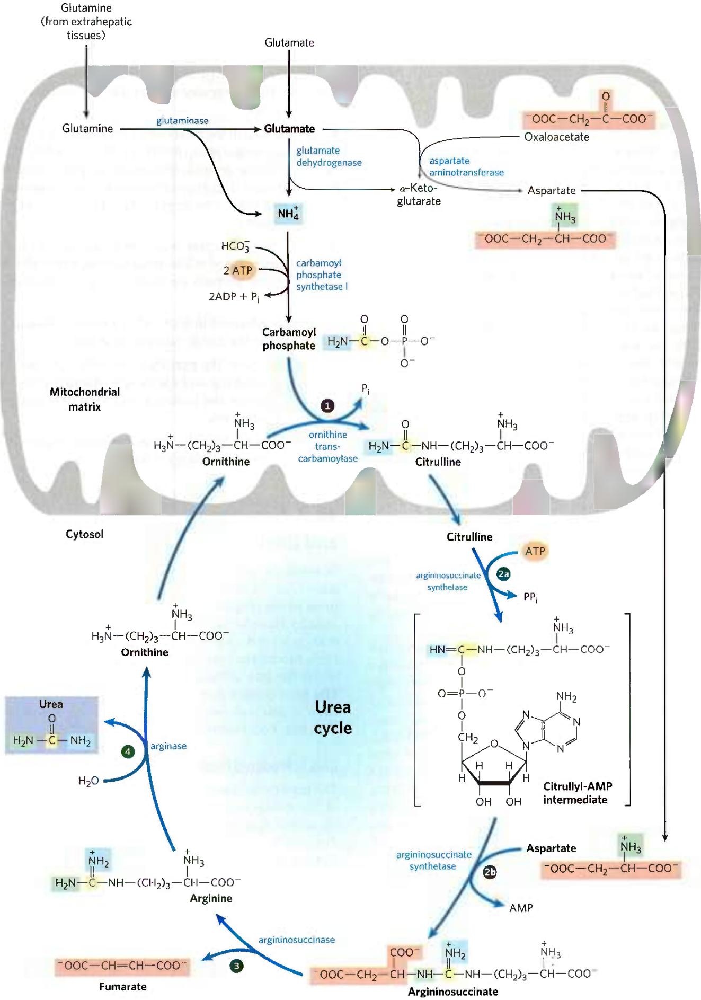

FIGURE 18-10 The urea cycle and reactions that feed amino groups into the cycle. The enzymes catalyzing these reactions (named in the text) are distributed between the mitochondrial matrix and the cytosol. One amino group enters the urea cycle as carbamoyl phosphate, formed in the matrix; the other enters as aspartate, formed in the matrix by transamination of oxaloacetate and glutamate, catalyzed by aspartate aminotransferase. The urea cycle consists of four steps: ① Formation of citrulline from ornithine and carbamoyl phosphate (entry of the first amino group); the citrulline passes into the cytosol. ② Formation of argininosuccinate through a citrullyl-AMP intermediate (entry of the second amino group). ③ Formation of arginine from argininosuccinate; this reaction releases fumarate, which enters the citric acid cycle. ④ Formation of urea; this reaction also regenerates ornithine.

to form carbamoyl phosphate in the matrix (as shown in Fig. 18-10 and explained in detail in Fig. 18-11a). This ATP-dependent reaction is catalyzed by carbamoyl phosphate synthetase I, a regulatory enzyme (see below). The mitochondrial form of the enzyme is distinct from the cytosolic (II) form, which has a separate function in pyrimidine biosynthesis (Chapter 22).

The carbamoyl phosphate, which functions as an activated carbamoyl group donor, now enters the urea cycle. The cycle has only four enzymatic steps. First, carbamoyl phosphate donates its carbamoyl group to ornithine to form citrulline, with the release of $P_{i}$ (Fig. 18-10, step 1). The reaction is catalyzed by ornithine transcarbamoylase. Ornithine is not one of the 20 common amino acids found in proteins, but it is a key intermediate in arginine biosynthesis and nitrogen metabolism in general. It is synthesized from glutamate in a five-step pathway described in Chapter 22. Ornithine plays a role resembling that of oxaloacetate in the citric acid cycle, accepting material at each turn of the urea cycle. The citrulline produced in the first step of the urea cycle passes from the mitochondrion to the cytosol.

The next two steps bring in the second amino group, featuring aspartate as the amino group donor. The aspartate is generated in the mitochondria by transamination between glutamate and oxaloacetate, and then transported into the cytosol. A condensation reaction between the amino group of aspartate and the ureido (carbonyl) group of citrulline forms argininosuccinate (step 2 in Fig. 18-10). This cytosolic reaction, catalyzed by argininosuccinate synthetase, requires ATP and proceeds through a citrullyl-AMP intermediate (Fig. 18-11b). The argininosuccinate is then cleaved by argininosuccinase (step 3 in Fig. 18-10) to form free arginine and fumarate, the latter being converted to malate before entering mitochondria to join the pool of citric acid cycle intermediates. This is the only reversible step in the urea cycle. In the last reaction of the urea cycle (step 4), the cytosolic enzyme arginase cleaves arginine to yield urea and ornithine. Ornithine is transported into the mitochondrion to initiate another round of the urea cycle.

MECHANISM FIGURE 18-11 Nitrogen-acquiring reactions in the synthesis of urea. The urea nitrogens are acquired in two separate reactions, each requiring ATP. (a) In the first reaction, catalyzed by carbamoyl phosphate synthetase I, the first nitrogen enters from ammonia. The terminal phosphate groups of two molecules of ATP are used to form one molecule of carbamoyl phosphate. In other words, this reaction has two activation steps (1 and 3). (b) In the second reaction, catalyzed by argininosuccinate synthetase, the second nitrogen enters from aspartate. This reaction has two steps. Activation of the ureido oxygen of citrulline in step 1 sets up the addition of aspartate in step 2.

As we noted in Chapter 16, the enzymes of many metabolic pathways are clustered in metabolons (p. 595), with the product of one enzyme reaction being channeled directly to the next enzyme in the pathway. In the urea cycle, the mitochondrial and cytosolic enzymes seem to be clustered in this way. The citrulline transported out of the mitochondrion is not diluted into the general pool of metabolites in the cytosol but is passed directly to the active site of argininosuccinate synthetase. This channeling between enzymes continues for argininosuccinate, arginine, and ornithine. Only urea is released into the general cytosolic pool of metabolites.

## The Citric Acid and Urea Cycles Can Be Linked

The fumarate produced in the argininosuccinase reaction is also an intermediate of the citric acid cycle. Thus, the cycles are, in principle, interconnected—in a process dubbed the “Krebs bicycle” (Fig. 18-12). However each cycle can operate independently, and communication between them depends on the transport of key intermediates between the mitochondrion and cytosol. Major transporters in the inner mitochondrial membrane include the malate- $\alpha$ -ketoglutarate transporter, the glutamate-aspartate transporter, and the glutamate-OH $^{-}$ transporter. Together, these transporters facilitate the movement of malate and glutamate into the mitochondrial matrix and the movement of aspartate and $\alpha$ -ketoglutarate out to the cytosol.

Several enzymes of the citric acid cycle, including fumarase (fumarate hydratase) and malate dehydrogenase (p. 586), are also present as isozymes in the cytosol. There is no transporter to directly move the fumarate generated in cytosolic arginine synthesis back into the mitochondrial matrix. However, fumarate can be converted to malate in the cytosol. Fumarate and malate can be further metabolized in the cytosol, or malate can be transported into mitochondria for use in the citric acid cycle. Aspartate formed in mitochondria by transamination between oxaloacetate and glutamate can be transported to the cytosol, where it serves as nitrogen donor in the urea cycle reaction catalyzed by argininosuccinate synthetase. These reactions, making up the aspartate-argininosuccinate shunt, provide metabolic links between the separate pathways by which the amino groups and carbon skeletons of amino acids are processed.

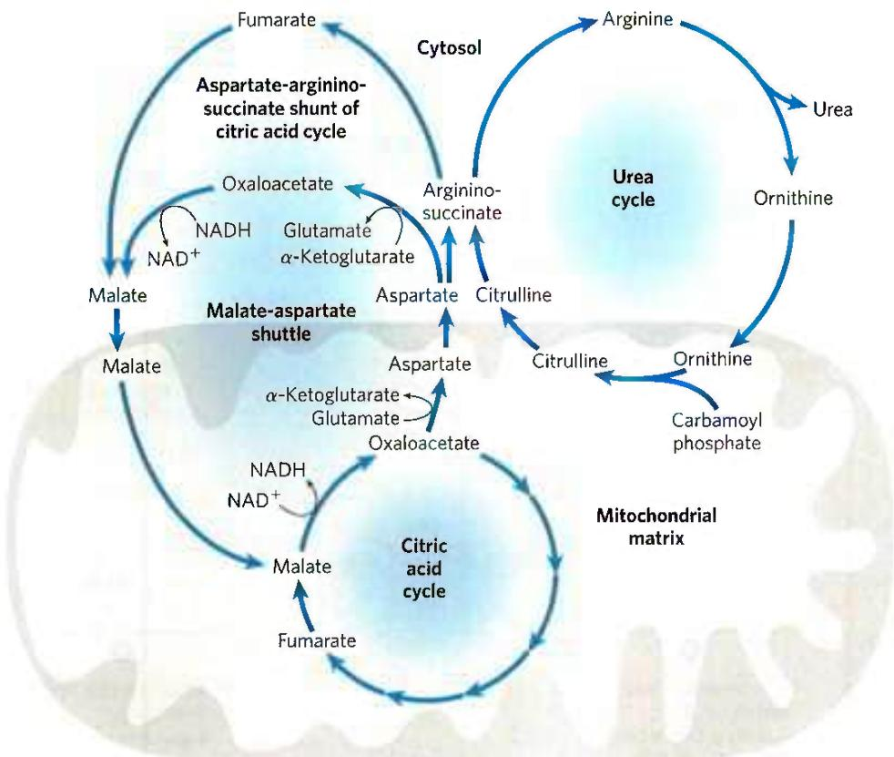  
FIGURE 18-12 Links between the urea cycle and citric acid cycle. The interconnected cycles have been called the "Krebs bicycle." The pathways linking the citric acid and urea cycles are known as the aspartate-argininosuccinate shunt; these effectively link the fates of the amino groups and the carbon skeletons of amino acids. The interconnections are quite elaborate. For example, some citric acid cycle enzymes, such as fumarase and malate dehydrogenase, have both cytosolic and mitochondrial isozymes. Fumarate  
produced in the cytosol — whether by the urea cycle, purine biosynthesis, or other processes — can be converted to cytosolic malate, which is used in the cytosol or transported into mitochondria to enter the citric acid cycle. These processes are further intertwined with the malate-aspartate shuttle, a set of reactions that brings reducing equivalents into the mitochondrion. These different cycles and processes rely on a limited number of transporters in the inner mitochondrial membrane.

The use of aspartate as a nitrogen donor in the urea cycle may appear to be a relatively complicated way to introduce the second amino group into urea. However, we shall see in Chapter 22 that this pathway for nitrogen incorporation is one of the two common ways to introduce amino groups into biomolecules. In the urea cycle, additional pathway interconnections can help explain why aspartate is used as a nitrogen donor. P3 The urea and citric acid cycles are closely tied to an additional process that brings NADH, in the form of reducing equivalents, into the mitochondrion. As detailed in the next chapter, the NADH produced by glycolysis, fatty acid oxidation, and other processes cannot be transported across the mitochondrial inner membrane. Reducing equivalents are instead brought into the mitochondrion by converting aspartate to oxaloacetate in the cytosol, reducing the oxaloacetate to malate with NADH, and transporting the malate into the mitochondrial matrix via the malate-α-ketoglutarate transporter. Once inside the mitochondrion, the malate can be reconverted to oxaloacetate while generating NADH. The oxaloacetate is converted to aspartate in the matrix and transported out of the mitochondrion by the aspartate-glutamate transporter. This malate-aspartate shuttle completes yet another cycle that functions to keep the mitochondrion supplied with NADH (Fig. 18-12; see also Fig. 19-31).

These processes require that a balance be maintained in the cytosol between the concentrations of glutamate and aspartate. The enzyme that transfers amino groups between these key amino acids is aspartate aminotransferase, AAT (also called glutamate-oxaloacetate transaminase, GOT). This is one

## BOX 18-1 MEDICINE

## Assays for Tissue Damage

Analyses of certain enzyme activities in blood serum give valuable diagnostic information for several disease conditions.

Blood levels of alanine aminotransferase (ALT; also called glutamate-pyruvate transaminase, GPT) and aspartate aminotransferase (AAT; also called glutamate-oxaloacetate transaminase, GOT) are important in the diagnosis of liver damage, toxicity associated with long-term drug use, or infection. When tissue is damaged, a variety of enzymes, including these aminotransferases, leak from injured cells into the bloodstream. Measurements of the blood serum concentrations of the two aminotransferases by the SGPT and SGOT tests (S for serum) — and of another enzyme, of the most active enzymes in hepatocytes and other tissues. When tissue damage occurs, this easily assayed enzyme and others leak into the blood. Thus, measuring blood levels of liver enzymes is important in diagnosing a variety of medical conditions (Box 18-1).

## The Activity of the Urea Cycle Is Regulated at Two Levels

The flux of nitrogen through the urea cycle in an individual animal varies with diet. When the dietary intake is primarily protein, the carbon skeletons of amino acids are used for fuel, producing much urea from the excess amino groups. During prolonged starvation, when breakdown of muscle protein begins to supply much of the organism's metabolic energy, urea production also increases substantially.

On a shorter time scale, allosteric regulation of at least one key enzyme adjusts the flux through the urea cycle. The first enzyme in the pathway, carbamoyl phosphate synthetase I, is allosterically activated by N-acetylglutamate, which is synthesized from acetyl-CoA and glutamate by N-acetylglutamate synthase (Fig. 18-13). In plants and microorganisms, this enzyme catalyzes the first step in the de novo synthesis of arginine from glutamate (see Fig. 22-12), but in mammals,

These changes in demand for urea cycle activity are met over the long term by regulation of the rates of synthesis of the four urea cycle enzymes and carbamoyl phosphate synthetase I in the liver. All five enzymes are synthesized at higher rates in starving animals and in animals on very-high-protein diets than in well-fed animals eating primarily carbohydrates and fats. Animals on protein-free diets produce lower levels of urea cycle enzymes.

creatine kinase, by the SCK test — can provide information about the severity of the damage.

The SGOT and SGPT tests are used in occupational medicine to determine whether people exposed to carbon tetrachloride, chloroform, or other industrial solvents have suffered liver damage. Liver degeneration caused by these solvents is accompanied by leakage of various enzymes from injured hepatocytes into the blood. Aminotransferases are most useful in the monitoring of people exposed to these chemicals, because these enzyme activities are high in liver and thus are likely to be among the proteins leaked from damaged hepatocytes; also, they can be detected in the bloodstream in very small amounts.

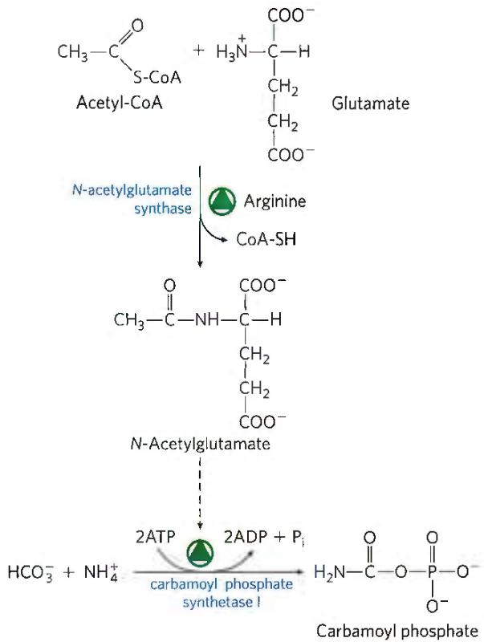  
FIGURE 18-13 Synthesis of N-acetylglutamate and its activation of carbamoyl phosphate synthetase I.

N-acetylglutamate synthase activity in the liver has a purely regulatory function (mammals lack the other enzymes needed to convert glutamate to arginine). The steady-state levels of N-acetylglutamate are determined by the concentrations of glutamate and acetyl-CoA (the substrates for N-acetylglutamate synthase) and arginine (an activator of N-acetylglutamate synthase, and thus an activator of the urea cycle).

## Pathway Interconnections Reduce the Energetic Cost of Urea Synthesis

If we consider the urea cycle in isolation, we see that the synthesis of one molecule of urea requires four high-energy phosphate groups (Fig. 18-10). Two ATP molecules are required to make carbamoyl phosphate, and one ATP to make argininosuccinate—the latter ATP undergoing a pyrophosphate cleavage to AMP and PP $_{i}$ , which is hydrolyzed to two P $_{i}$ . The overall equation of the urea cycle is

$$
\begin{array}{r l} & 2 \mathrm{NH} _ {4} ^ {+} + \mathrm{HCO} _ {3} ^ {-} + 3 \mathrm{ATP} ^ {4 -} + \mathrm{H} _ {2} \mathrm{O} \longrightarrow \\ & \qquad \text { urea } + 2 \mathrm{ADP} ^ {3 -} + 4 \mathrm{P} _ {1} ^ {2 -} + \mathrm{AMP} ^ {2 -} + 2 \mathrm{H} ^ {+} \end{array}
$$

However, this apparent cost is compensated for by the pathway interconnections detailed above. The fumarate generated by the urea cycle is converted to malate, and the malate is transported into the mitochondrion (Fig. 18-12). Inside the mitochondrial matrix, NADH is generated in the malate dehydrogenase reaction. Each NADH molecule can generate up to 2.5 ATP during mitochondrial respiration, greatly reducing the overall energetic cost of urea synthesis (mitochondrial respiration is discussed further in Chapter 19).

## Genetic Defects in the Urea Cycle Can Be Life-Threatening

Infants with severe genetic defects in any enzyme involved in urea formation often appear normal at birth. However, they soon develop symptoms of hyperammonemia, including cerebral edema, lethargy, and hyperventilation. Without treatment, early death usually results. Symptoms may be less severe in patients retaining partial enzyme activity. These patients cannot tolerate protein-rich diets. Amino acids ingested in excess of the minimum daily requirements for protein synthesis are deaminated in the liver, producing free ammonia that cannot be converted to urea and exported into the bloodstream, and, as we have seen, ammonia is highly toxic. Given that most urea cycle steps are irreversible, the absent enzyme activity can often be identified by determining which cycle intermediate is present in elevated concentration in the blood and/or urine. Although the breakdown of amino acids can have serious health consequences in individuals with urea cycle deficiencies, a protein-free diet is not a treatment option. Humans are incapable of synthesizing half of the 20 common amino acids; they must obtain these essential amino acids in the diet (Table 18-1).

A variety of treatments are available for individuals with urea cycle defects. Careful administration of the aromatic acids benzoate or phenylbutyrate in the diet can help lower the level of ammonia in the blood. Benzoate is converted to benzoyl-CoA, which combines with glycine to form hippurate (Fig. 18-14, left). The glycine used up in this reaction must be regenerated, and ammonia is thus taken up in the glycine synthase reaction. Phenylbutyrate is converted to phenylacetate by $\beta$ oxidation. The phenylacetate is then converted to phenylacetyl-CoA,

<table><tr><td>Nonessential</td><td>Conditionally essentiala</td><td>Essential</td></tr><tr><td>Alanine</td><td>Arginine</td><td>Histidine</td></tr><tr><td>Asparagine</td><td>Cysteine</td><td>Isoleucine</td></tr><tr><td>Aspartate</td><td>Glutamine</td><td>Leucine</td></tr><tr><td>Glutamate</td><td>Glycine</td><td>Lysine</td></tr><tr><td>Serine</td><td>Proline</td><td>Methionine</td></tr><tr><td></td><td>Tyrosine</td><td>Phenylalanine</td></tr><tr><td></td><td></td><td>Threonine</td></tr><tr><td></td><td></td><td>Tryptophan</td></tr><tr><td></td><td></td><td>Valine</td></tr></table>

  
FIGURE 18-14 Treatment for deficiencies in urea cycle enzymes. The aromatic acids benzoate and phenylbutyrate, administered in the diet, are metabolized and combine with glycine and glutamine, respectively. The products are excreted in the urine. Subsequent synthesis of glycine and glutamine to replenish the pool of these intermediates removes ammonia from the bloodstream.

which combines with glutamine to form phenylacetylglutamine (Fig. 18-14, right). The resulting removal of glutamine triggers its further synthesis by glutamine synthetase (see Eqn 22-1) in a reaction that takes up ammonia. Both hippurate and phenylacetylglutamine are nontoxic compounds that are excreted in the urine. The pathways shown in Figure 18-14 make only minor contributions to normal metabolism, but they become prominent when aromatic acids are ingested.

Other therapies are more specific to a particular enzyme deficiency. Deficiency of N-acetylglutamate synthase results in the absence of the normal activator of carbamoyl phosphate synthetase I (Fig. 18-13). This condition can be treated by administering carbamoyl glutamate, an analog of N-acetylglutamate that is effective in activating carbamoyl phosphate synthetase I.

Supplementing the diet with arginine is useful in treating deficiencies of ornithine transcarbamoylase, argininosuccinate synthetase, and argininosuccinase. Many of these treatments must be accompanied by strict dietary control and supplements of essential amino acids. In the rare cases of arginase deficiency, arginine, the substrate of the defective enzyme, must be excluded from the diet.

## SUMMARY 18.2 Nitrogen Excretion and the Urea Cycle

In the urea cycle, ornithine combines with ammonia, in the form of carbamoyl phosphate, to form citrulline. A second amino group is transferred to citrulline from aspartate to form arginine—the immediate precursor of urea. Arginase catalyzes hydrolysis of arginine to urea and ornithine; ornithine is regenerated in each turn of the cycle.

The urea cycle results in a net conversion of oxaloacetate to fumarate, both of which are intermediates in the citric acid cycle. The two cycles are thus interconnected.

■ The activity of the urea cycle is regulated at the level of enzyme synthesis and by allosteric regulation of the enzyme that catalyzes the formation of carbamoyl phosphate.

■ The energetic cost of the urea cycle is reduced by cycle interconnections.

■ Genetic diseases involving urea cycle enzyme deficiencies have serious consequences but sometimes can be managed by dietary intervention.

## 18.3 Pathways of Amino Acid Degradation

Amino acid catabolism normally accounts for only 10% to 15% of the human body's energy production; these pathways are not nearly as active as glycolysis and fatty acid oxidation. Flux through these catabolic routes also varies greatly, depending on the balance between requirements for biosynthetic processes and the availability of a particular amino acid. The 20 catabolic pathways converge to form only six major products: pyruvate, acetyl-CoA, $\alpha$ -ketoglutarate, succinyl-CoA, fumarate, and oxaloacetate. All of these enter the citric acid cycle (Fig. 18-15). From here the carbon skeletons are diverted to gluconeogenesis or ketogenesis; alternatively, they are completely oxidized as fuel to $CO_{2}$ and $H_{2}O$ .

We summarize the individual pathways for the 20 amino acids in flow diagrams, each leading to a specific point of entry into the citric acid cycle. In these diagrams, the carbon atoms that enter the citric acid cycle are shown in color. Note that some amino acids appear more than once, reflecting different fates for different parts of their carbon skeletons. Rather than examining every step of every pathway in amino acid catabolism, we single out for special discussion some enzymatic reactions that are particularly noteworthy for their mechanisms or their medical significance.

## Some Amino Acids Can Contribute to Gluconeogenesis, Others to Ketone Body Formation

P5 The seven amino acids that are degraded entirely or in part to acetoacetyl-CoA and/or acetyl-CoA—phenylalanine, tyrosine, isoleucine, leucine, tryptophan, threonine, and lysine — can yield ketone bodies in the liver, where acetoacetyl-CoA is converted to acetoacetate and then to acetone and $\beta$ -hydroxybutyrate (see Fig. 17-16). These are the ketogenic amino acids (Fig. 18-15). Their ability to form ketone bodies is particularly evident in uncontrolled diabetes mellitus, in which the liver produces large amounts of ketone bodies from both fatty acids and the ketogenic amino acids. Ketone bodies may also be metabolized in the brain as fuel in place of glucose in cases during starvation.

The amino acids that are degraded to pyruvate, $\alpha$ -ketoglutarate, succinyl-CoA, fumarate, and/or oxaloacetate can be converted to glucose and glycogen by pathways described in Chapter 14. They are the glucogenic amino acids. The division between ketogenic and glucogenic amino acids is not sharp; five amino acids—tryptophan, phenylalanine, tyrosine, threonine, and isoleucine—are both ketogenic and glucogenic. All amino acids except for lysine and leucine can make some contribution to gluconeogenesis. Catabolism of amino acids is particularly critical to the survival of animals with high-protein diets or during starvation. Leucine is an exclusively ketogenic amino acid that is very common in proteins. Its degradation makes a substantial contribution to ketosis under starvation conditions.

  
FIGURE 18-15 Summary of amino acid catabolism. Amino acids are grouped according to their major degradative end product. Some amino acids are listed more than once because different parts of their carbon skeletons are degraded to different end products. The figure shows the most important catabolic pathways in vertebrates, but there are minor variations among vertebrate species. Threonine, for instance, is degraded by at least  
two different pathways (see Figs 18-19, 18-27), and the importance of a given pathway can vary with the organism and its metabolic conditions. The glucogenic and ketogenic amino acids are also delineated in the figure, by color shading. Notice that five of the amino acids are both glucogenic and ketogenic. The amino acids degraded to pyruvate are also potentially ketogenic. Only two amino acids, leucine and lysine, are exclusively ketogenic.

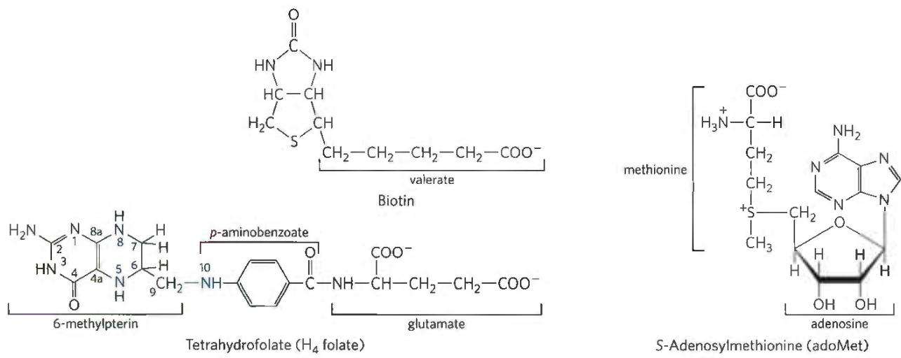  
FIGURE 18-16 Some enzyme cofactors important in one-carbon transfer reactions. The nitrogen atoms to which one-carbon groups are attached in tetrahydrofolate are shown in blue.

## Several Enzyme Cofactors Play Important Roles in Amino Acid Catabolism

The structural diversity of amino acids is reflected in the varied reaction types encountered in their breakdown pathways. We begin our study of these pathways by noting important classes of reactions that recur and introducing their enzyme cofactors. We have already considered one important class: transamination reactions requiring pyridoxal phosphate. One-carbon transfers are another common type of reaction in amino acid catabolism. Such transfers usually involve one of three cofactors: biotin, tetrahydrofolate, or S-adenosylmethionine (Fig. 18-16). These cofactors transfer one-carbon groups in different oxidation states: biotin transfers carbon in its most oxidized state, CO₂ (see Fig. 14-17); tetrahydrofolate transfers one-carbon groups in intermediate oxidation states and sometimes as methyl groups; and S-adenosylmethionine transfers methyl groups, the most reduced state of carbon. The latter two cofactors are especially important in amino acid and nucleotide metabolism.

Tetrahydrofolate (H $_{4}$ folate), synthesized in bacteria, consists of substituted pterin (6-methylpterin), $p$ -aminobenzoate, and glutamate moieties (Fig. 18-16).

The oxidized form, folate, is a vitamin for mammals; it is converted in two steps to tetrahydrofolate by the enzyme dihydrofolate reductase. The one-carbon group undergoing transfer, in any of three oxidation states, is bonded to N-5 or N-10 or both. The most reduced form of the cofactor carries a methyl group, a more oxidized form carries a methylene group, and the most oxidized forms carry a methenyl, formyl, or formimino group (Fig. 18-17). Most forms of tetrahydrofolate are interconvertible and serve as donors of one-carbon units in a variety of metabolic reactions. The primary source of one-carbon units for tetrahydrofolate is the carbon removed in the conversion of serine to glycine, producing $N^{5}$ , $N^{10}$ -methylenetetrahydrofolate.

Although tetrahydrofolate can carry a methyl group at N-5, the transfer potential of this methyl group is insufficient for most biosynthetic reactions. S-Adenosylmethionine (adoMet) is the preferred cofactor for biological methyl group transfers. It is synthesized from ATP and methionine by the action of methionine adenosyl transferase (Fig. 18-18, step 1). This reaction is unusual in that the nucleophilic sulfur atom of methionine attacks the 5' carbon of the ribose moiety of ATP rather than one of the phosphorus atoms. Triphosphate is released and is cleaved to $P_{i}$ and $PP_{i}$ on the enzyme, and the $PP_{i}$ is cleaved by inorganic pyrophosphatase; thus three bonds, including two bonds of high-energy phosphate groups, are broken in this reaction. The only other known reaction in which triphosphate is displaced from ATP occurs in the synthesis of coenzyme $B_{12}$ (see Box 17-2, Fig. 3).

S-Adenosylmethionine is a potent alkylating agent by virtue of its destabilizing sulfonium ion. The methyl group is subject to attack by nucleophiles and is about 1,000 times more reactive than the methyl group of $N^{5}$ -methyltetrahydrofolate.

Transfer of the methyl group from S-adenosylmethionine to an acceptor yields S-adenosylhomocysteine (Fig. 18-18, step 2), which is subsequently broken down to homocysteine and adenosine (step 3). Methionine is regenerated by transfer of a methyl group to homocysteine in a reaction catalyzed by methionine synthase (step 4), and methionine is reconverted to S-adenosylmethionine to complete an activated-methyl cycle.

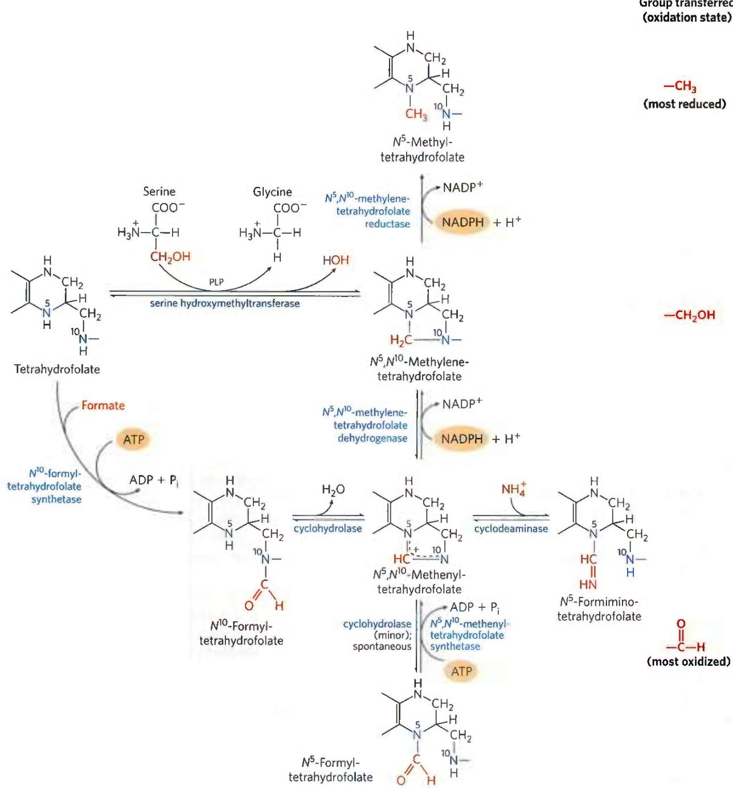  
FIGURE 18-17 Conversions of one-carbon units on tetrahydrofolate. The different molecular species are grouped according to oxidation state, with the most reduced at the top and most oxidized at the bottom. All species within a single shaded box are at the same oxidation state. The conversion of $N^5$ , $N^{10}$ -methylenetetrahydrofolate to $N^5$ -methyltetrahydrofolate is effectively irreversible. The enzymatic transfer of formyl groups, as in purine synthesis (see Fig. 22-35) and in the formation of formylmethionine in bacteria (Chapter 27),  
generally uses $N^{10}$ -formyltetrahydrofolate rather than $N^{5}$ -formyltetrahydrofolate. The latter species is significantly more stable and therefore a weaker donor of formyl groups. $N^{5}$ -Formyltetrahydrofolate is a minor byproduct of the cyclohydrolase reaction, and can also form spontaneously. Conversion of $N^{5}$ -formyltetrahydrofolate to $N^{5}, N^{10}$ -methenyltetrahydrofolate requires ATP, because of an otherwise unfavorable equilibrium. Note that $N^{5}$ -formiminotetrahydrofolate is derived from histidine in a pathway shown in Figure 18-26.

One form of methionine synthase common in bacteria uses $N^{5}$ -methyltetrahydrofolate as a methyl donor.

Another form of the enzyme present in some bacteria and mammals uses $N^{5}$ -methyltetrahydrofolate, but the methyl group is first transferred to cobalamin, derived from coenzyme $B_{12}$ , to form methylcobalamin as the methyl donor in methionine formation. This reaction and the rearrangement of L-methylmalonyl-CoA to succinyl-CoA (see Box 17-2, Fig. 1a) are the only known coenzyme B $_{12}$ -dependent reactions in mammals.

  
FIGURE 18-18 Synthesis of methionine and S-adenosylmethionine in an activated-methyl cycle. The steps are described in the text. In the methionine synthase reaction (step 4), the methyl group is transferred to cobalamin to form methylcobalamin, which is the methyl  
donor in the formation of methionine. S-Adenosylmethionine, which has a positively charged sulfur (and is thus a sulfonium ion), is a powerful methylating agent in several biosynthetic reactions. The methyl group acceptor (step 2) is designated R.

The vitamins $B_{12}$ and folate are closely linked in these pathways. The anemia observed in the rare $B_{12}$ deficiency disease pernicious anemia (Box 17-2) can be traced to the methionine synthase reaction. As noted above, the methyl group of methylcobalamin is derived from $N^{5}$ -methyltetrahydrofolate, and this is the only reaction in mammals that uses $N^{5}$ -methyltetrahydrofolate. The reaction converting the $N^{5}, N^{10}$ -methylene form to the $N^{5}$ -methyl form of tetrahydrofolate is irreversible (Fig. 18-17). Thus, if coenzyme $B_{12}$ is not available for the synthesis of methylcobalamin, metabolic folates become trapped in the $N^{5}$ -methyl form.

The anemia associated with vitamin $B_{12}$ deficiency is called megaloblastic anemia. It manifests as a decline in the production of mature erythrocytes (red blood cells) and the appearance in the bone marrow of immature precursor cells, or megaloblasts. Erythrocytes are gradually replaced in the blood by smaller numbers of abnormally large erythrocytes called macrocytes. The defect in erythrocyte development is a direct consequence of the depletion of the $N^{5}, N^{10}$ -methylenetetrahydrofolate, which is required for synthesis of the thymidine nucleotides needed for DNA synthesis (see Chapter 22). Folate deficiency, in which all forms of tetrahydrofolate are depleted, also produces anemia, for much the same reasons. The anemia symptoms of $B_{12}$ deficiency can be alleviated by administering either vitamin $B_{12}$ or folate.

However, it is dangerous to treat pernicious anemia by folate supplementation alone, because the neurological symptoms of $B_{12}$ deficiency will progress. These symptoms do not arise from the defect in the methionine synthase reaction. Instead, the impaired methylmalonyl-CoA mutase (see Box 17-2 and Fig. 17-12) causes accumulation of unusual, odd-number fatty acids in neuronal membranes. The anemia associated with folate deficiency is thus often treated by administering both folate and vitamin $B_{12}$ , at least until the metabolic source of the anemia is unambiguously defined. Early diagnosis of $B_{12}$ deficiency is important because some of its associated neurological conditions may be irreversible.

Folate deficiency also reduces the availability of the $N^{5}$ -methyltetrahydrofolate required for methionine synthase function. This leads to a rise in homocysteine levels in blood, a condition linked to heart disease, hypertension, and stroke. High levels of homocysteine may be responsible for 10% of all cases of heart disease. The condition is treated with folate supplements.

Tetrahydrobiopterin, another cofactor of amino acid catabolism, is similar to the pterin moiety of tetrahydrofolate, but it is not involved in one-carbon transfers; instead it participates in oxidation reactions. We consider its mode of action when we discuss phenylalanine degradation (see Fig. 18-24).

## Six Amino Acids Are Degraded to Pyruvate

P1 P3 P5 The carbon skeletons of six amino acids—alanine, tryptophan, cysteine, serine, glycine, and threonine—are converted in whole or in part to pyruvate. The pyruvate can then be converted to acetyl-CoA and eventually oxidized via the citric acid cycle, or to oxaloacetate and shunted into gluconeogenesis (Fig. 18-19). Alanine yields pyruvate directly on transamination with $\alpha$ -ketoglutarate, and the side chain of tryptophan is cleaved to yield alanine and thus pyruvate. Cysteine is converted to pyruvate in two steps; one removes the sulfur atom, the other is a transamination.

Serine is converted to pyruvate by serine dehydratase. Both the $\beta$ -hydroxyl and the $\alpha$ -amino groups of serine are removed in this single pyridoxal phosphate-dependent reaction (Fig. 18-20a).

Glycine is degraded via three pathways, only one of which leads to pyruvate. Glycine is converted to serine by enzymatic addition of a hydroxymethyl group (Figs 18-19, 18-20b). This reaction, catalyzed by serine hydroxymethyltransferase, requires the coenzymes tetrahydrofolate and pyridoxal phosphate. The serine is converted to pyruvate as described above. In the second pathway, which predominates in animals, glycine undergoes oxidative cleavage to $\mathrm{CO}_{2}$ , $\mathrm{NH}_{4}^{+}$ , and a methylene group ( $-\mathrm{CH}_{2}-$ ) (Figs. 18-19, 18-20c). This readily reversible reaction, catalyzed by glycine cleavage enzyme (also called glycine synthase), also requires tetrahydrofolate, which accepts the methylene group. In this oxidative cleavage pathway, the two carbon atoms of glycine do not enter the citric acid cycle. One carbon is lost as $\mathrm{CO}_{2}$ and the other becomes the methylene group

Serine

MECHANISM FIGURE 18-20 Interplay of the pyridoxal phosphate and tetrahydrofolate cofactors in serine and glycine metabolism. The first step in each of these reactions (not shown) involves the formation of a covalent imine linkage between enzyme-bound PLP and the substrate amino acid — serine in (a), glycine in (b) and (c). (a) A PLP-catalyzed elimination of water in the serine dehydratase reaction (step 1) begins the pathway to pyruvate. (b) In the serine hydroxymethyltransferase reaction, a PLP-stabilized carbanion (product of step 1) is a key intermediate in the reversible transfer of the methylene group (as—CH₂—OH) from $N^{5}, N^{10}$ -methylenetetrahydrofolate to form serine. (c) The glycine cleavage enzyme is a multienzyme complex, with components P, H, T, and L. The overall reaction, which is reversible, converts glycine to $CO_{2}$ and $NH_{4}^{\ddagger}$ , with the second glycine carbon taken up by tetrahydrofolate to form $N^{5}, N^{10}$ -methylenetetrahydrofolate. Pyridoxal phosphate activates the $\alpha$ carbon of amino acids at critical stages in all these reactions, and tetrahydrofolate carries a one-carbon unit in two of them (see Figs 18-6, 18-17).

of $N^{5}.N^{10}$ -methylenetetrahydrofolate (Fig. 18-17), a one-carbon group donor in certain biosynthetic pathways.

This second pathway for glycine degradation seems to be critical in mammals. Humans with serious defects in glycine cleavage enzyme activity suffer from a condition known as nonketotic hyperglycinemia. The condition is characterized by elevated serum levels of glycine, leading to severe intellectual disability and death in very early childhood. At high levels, glycine is an inhibitory neurotransmitter, which may explain the neurological effects of the disease. Perhaps more important, high levels of glycine increase the levels of 2-amino-3-ketobutyrate, an unstable intermediate in the degradation of threonine in mitochondria (Fig. 18-19). 2-Am-no-3-ketobutyrate decarboxylates spontaneously to form the toxic metabolite aminoacetone, which is readily metabolized to the highly reactive methylglyoxal, a molecule that modifies both protein and DNA.

Methylglyoxal is also a byproduct of glycolysis and is implicated in the progression of type 2 diabetes (Box 7-2).

Many genetic defects of amino acid metabolism have been identified in humans (Table 18-2). We shall encounter several more in this chapter.

In the third and final pathway of glycine degradation, the achiral glycine molecule is a substrate for the enzyme

D-amino acid oxidase. The glycine is converted to glyoxylate, an alternative substrate for lactate dehydrogenase (p. 526). Glyoxylate is oxidized in an NAD $^{+}$ -dependent reaction to oxalate:

The function of D-amino acid oxidase, present at high levels in the kidney, is thought to be the detoxification of ingested D-amino acids derived from bacterial cell walls and from grilled foodstuffs (high heat causes some spontaneous racemization of the L-amino acids in proteins). Oxalate, whether obtained in foods or produced enzymatically in the kidneys, has medical significance. Crystals of calcium oxalate account for up to 75% of all kidney stones.

There are two significant pathways for threonine degradation. One pathway leads to pyruvate via glycine (Fig. 18-19). The conversion to glycine occurs in two steps, with threonine first converted to 2-amino-3-ketobutyrate by the action of threonine dehydrogenase. This pathway is important in a few classes of rapidly dividing human cells, such as embryonic stem cells. The glycine generated by this pathway is broken down primarily by the glycine cleavage enzyme (Fig. 18-19). The $N^5, N^{10}$ -methylenetetrahydrofolate thus generated (Fig. 18-20c) is needed for the synthesis, via pathways described in Chapter 22, of nucleotides used in DNA replication. However, in most human tissues, the degradation of threonine via glycine is a relatively minor pathway, accounting for 10% to 30% of threonine catabolism. It is more important in some other mammals. The major pathway in most human tissues leads to succinyl-CoA, as described later in this chapter.

<table><tr><td>TABLE 18-2</td><td colspan="4">Some Human Genetic Disorders Affecting Amino Acid Catabolism</td></tr><tr><td>Medical condition</td><td>Approximate incidence (per 100,000 births)</td><td>Defective process</td><td>Defective enzyme</td><td>Symptoms and effects</td></tr><tr><td>Albinism</td><td>&lt;3</td><td>Melanin synthesis from tyrosine</td><td>Tyrosine 3-monooxygenase (tyrosinase)</td><td>Lack of pigmentation; white hair, pink skin</td></tr><tr><td>Alkaptonuria</td><td>&lt;0.4</td><td>Tyrosine degradation</td><td>Homogentisate 1,2-dioxygenase</td><td>Dark pigment in urine; late-developing arthritis</td></tr><tr><td>Argininemia</td><td>&lt;0.5</td><td>Urea synthesis</td><td>Arginase</td><td>Intellectual disability</td></tr><tr><td>Argininosuccinic acidemia</td><td>&lt;1.5</td><td>Urea synthesis</td><td>Argininosuccinase</td><td>Vomiting; convulsions</td></tr><tr><td>Carbamoyl phosphate synthetase I deficiency</td><td>&lt;0.5</td><td>Urea synthesis</td><td>Carbamoyl phosphate synthetase I</td><td>Lethargy; convulsions; early death</td></tr><tr><td>Homocystinuria</td><td>&lt;0.5</td><td>Methionine degradation</td><td>Cystathionine β-synthase</td><td>Faulty bone development; intellectual disability</td></tr><tr><td>Maple syrup urine disease (branched-chain keto-aciduria)</td><td>&lt;0.4</td><td>Isoleucine, leucine, and valine degradation</td><td>Branched-chain α-keto acid dehydrogenase complex</td><td>Vomiting; convulsions; intellectual disability; early death</td></tr><tr><td>Methylmalonic acidemia</td><td>&lt;0.5</td><td>Conversion of propionyl-CoA to succinyl-CoA</td><td>Methylmalonyl-CoA mutase</td><td>Vomiting; convulsions; intellectual disability; early death</td></tr><tr><td>Phenylketonuria</td><td>&lt;8</td><td>Conversion of phenylalanine to tyrosine</td><td>Phenylalanine hydroxylase</td><td>Neonatal vomiting; intellectual disability</td></tr></table>

## Seven Amino Acids Are Degraded to Acetyl-CoA

P1 P5 Portions of the carbon skeletons of seven amino acids—tryptophan, lysine, phenylalanine, tyrosine, leucine, isoleucine, and threonine—yield acetyl-CoA and/or acetoacetyl-CoA, the latter being converted to acetyl-CoA (Fig. 18-21). Some of the final steps in the degradative pathways for leucine, lysine, and tryptophan resemble steps in the oxidation of fatty acids (see Fig. 17-9). Threonine (not shown in Fig. 18-21) yields some acetyl-CoA via the minor pathway illustrated in Figure 18-19.

The degradative pathways of two of these seven amino acids deserve special mention. Tryptophan breakdown is the most complex of all the pathways of amino acid catabolism in animal tissues; portions of tryptophan (four of its carbons) yield acetyl-CoA via acetoacetyl-CoA. Some of the intermediates in tryptophan catabolism are precursors for the synthesis of other

FIGURE 18-21 Catabolic pathways for tryptophan, lysine, phenylalanine, tyrosine, leucine, and isoleucine. These amino acids donate some of their carbons (red) to acetoacetate and acetyl-CoA. In the pathway for leucine catabolism, the carbon in acetoacetate that is donated by $\mathrm{CO}_{2}$ is surrounded by a box to distinguish it from the three carbons that come from leucine itself. Tryptophan, phenylalanine, tyrosine, and isoleucine also contribute carbons (blue) to pyruvate or citric acid cycle intermediates. The phenylalanine pathway is described in more detail in Figure 18-23. The fate of nitrogen atoms is not traced in this scheme; in most cases they are transferred to $\alpha$ -ketoglutarate to form glutamate.

biomolecules (Fig. 18-22), including nicotinate, a precursor of NAD and NADP in animals; serotonin, a neurotransmitter in vertebrates; and indoleacetate, a growth factor in plants. Some of these biosynthetic pathways are described in more detail in Chapter 22 (see Figs. 22-30, 22-31).

The breakdown of phenylalanine is noteworthy because genetic defects in the enzymes of this pathway lead to several inheritable human diseases (Fig. 18-23), as discussed below. Phenylalanine and its oxidation product tyrosine (both with nine carbons) are degraded into two fragments, both of which can enter the citric acid cycle: four of the nine carbon atoms yield free acetoacetate, which is converted to acetoacetyl-CoA and thus acetyl-CoA, and a second four-carbon fragment is recovered as fumarate. Eight of the nine carbons of these two amino acids thus enter the citric acid cycle; the remaining carbon is lost as $\mathrm{CO}_{2}$ . Phenylalanine, after its hydroxylation to tyrosine, is also the precursor of dopamine, a neurotransmitter, and of norepinephrine and epinephrine, hormones secreted by the adrenal medulla (see Fig. 22-31). Melanin, the black pigment of skin and hair, is also derived from tyrosine.

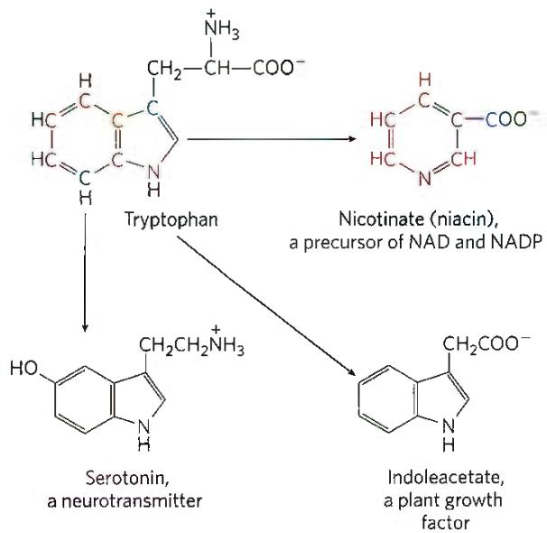  
FIGURE 18-22 Tryptophan as precursor. The aromatic rings of tryptophan give rise to nicotinate (niacin), indoleacetate, and serotonin. Colored atoms trace the source of the ring atoms in nicotinate.

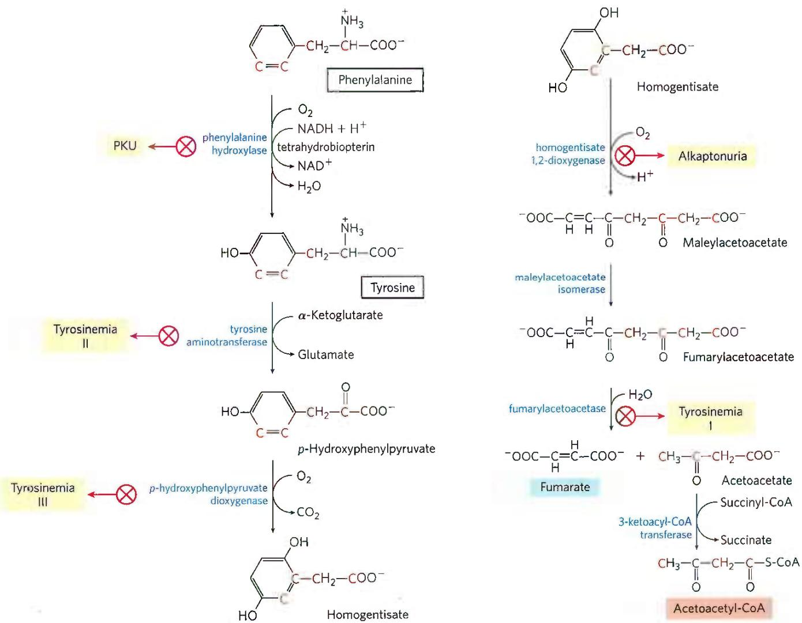  
FIGURE 18-23 Catabolic pathways for phenylalanine and tyrosine. In humans these amino acids are normally converted to acetoacetyl-CoA and fumarate. Genetic defects in many of these enzymes cause inheritable human diseases (shaded yellow).

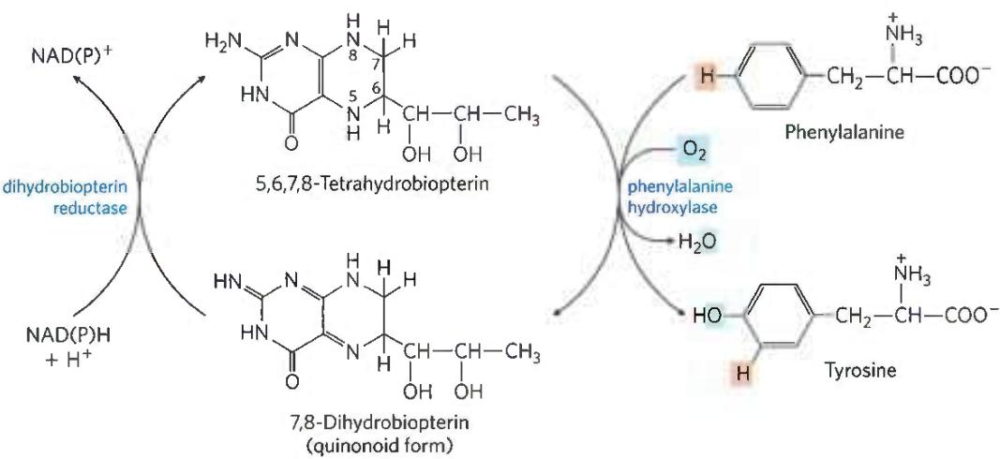  
FIGURE 18-24 Role of tetrahydrobiopterin in the phenylalanine hydroxylase reaction. The H atom shaded pink is transferred directly from C-4 to C-3 in the reaction. This feature, discovered at the National Institutes of Health, is called the NIH shift.

## Phenylalanine Catabolism Is Genetically Defective in Some People

Given that many amino acids are either neurotransmitters or precursors or antagonists of neurotransmitters, it is not surprising that genetic defects of amino acid metabolism can cause defective neural development and intellectual deficits. In most such diseases, specific intermediates accumulate. For example, a genetic defect in phenylalanine hydroxylase, the first enzyme in the catabolic pathway for phenylalanine (Fig. 18-23), is responsible for the disease phenylketonuria (PKU), the most common cause of elevated levels of phenylalanine in the blood (hyperphenylalaninemia).

Phenylalanine hydroxylase (also called phenylalanine-4-monooxygenase) is one of a general class of enzymes called mixed-function oxygenases (see Box 21-1), all of which catalyze simultaneous hydroxylation of a substrate by an oxygen atom of $\mathrm{O}_2$ and reduction of the other oxygen atom to $\mathrm{H}_2\mathrm{O}$ . Phenylalanine hydroxylase requires the cofactor tetrahydrobiopterin, which carries electrons from NADPH to $\mathrm{O}_2$ and becomes oxidized to dihydrobiopterin in the process (Fig. 18-24). It is subsequently reduced by the enzyme dihydrobiopterin reductase in a reaction that requires NADPH.

In individuals with PKU, a secondary, normally little-used pathway of phenylalanine metabolism comes into play. In this pathway phenylalanine undergoes transamination with pyruvate to yield phenylpyruvate (Fig. 18-25). Phenylalanine and phenylpyruvate accumulate in the blood and tissues and are excreted in the urine—hence the name “phenylketonuria.” Much of the phenylpyruvate, rather than being excreted as such, is either decarboxylated to phenylacetate or reduced to phenyllactate. Phenylacetate imparts a characteristic honeylike odor to the urine, which nurses have traditionally used to detect PKU in infants. The accumulation of phenylalanine or its metabolites in early life impairs normal development of the brain, causing severe intellectual deficits. This may be caused by excess phenylalanine competing with other amino acids for transport across the blood-brain barrier, resulting in a deficit of required metabolites.

  
FIGURE 18-25 Alternative pathways for catabolism of phenylalanine in phenylketonuria. In PKU, phenylpyruvate accumulates in the tissues, blood, and urine. The urine may also contain phenylacetate and phenyllactate.

Fhenylketonuria was among the first inheritable metabolic defects discovered in humans. When this condition is recognized early in infancy, intellectual disability can be prevented by rigid dietary control. The diet must supply only enough phenylalanine and tyrosine to meet the needs for protein synthesis. Consumption of protein-rich foods must be curtailed. Natural proteins, such as casein of milk, must first be hydrolyzed and much of the phenylalanine removed to provide an appropriate diet, at least through childhood. Because the artificial sweetener aspartame is a dipeptide of aspartate and the methyl ester of phenylalanine (see Fig. 1-23a), foods sweetened with aspartame bear warnings addressed to individuals on phenylalanine-controlled diets.

The dietary restrictions are difficult to follow perfectly for a lifetime, and thus often do not completely eliminate neurological symptoms. An enzyme substitution treatment has been developed in which the enzyme phenylalanine ammonia lyase is modified with polyethylene glycol (PEGylated) and injected subcutaneously to degrade phenylalanine in proteins ingested as part of a somewhat less restricted diet. Derived from plants, bacteria, and many yeast and fungi, phenylalanine ammonia lyase normally contributes to the biosynthesis of polyphenol compounds such as flavonoids. It degrades phenylalanine to the harmless metabolite trans-cinnamic acid and ammonia; the small amounts of ammonia generated are not toxic. The treatment was approved for patients in 2018. The long-term effects of the treatment continue to be studied.

Fhenylketonuria can also be caused by a defect in the enzyme that catalyzes the regeneration of tetrahydrobiopterin (Fig. 18-24). The treatment in this case is more complex than restricting the intake of phenylalanine and tyrosine. Tetrahydrobiopterin is also required for the formation of L-3,4-dihydroxyphenylalanine (L-dopa) and 5-hydroxytryptophan—precursors of the neurotransmitters norepinephrine and serotonin, respectively. In phenylketonuria of this type, these precursors must be supplied in the diet, along with tetrahydrobiopterin.

Screening newborns for genetic diseases can be highly cost-effective, especially in the case of PKU. The tests (no longer relying on urine odor) are relatively inexpensive, and the detection and early treatment of PKU in infants (eight to ten cases per 100,000 newborns) saves millions of dollars in later health care costs each year. More importantly, the emotional trauma avoided by early detection with these simple tests is inestmable.

Another inheritable disease of phenylalanine catabolism is alkaptonuria, in which the defective enzyme is homogentisate dioxygenase (Fig. 18-23). Less serious than PKU, this condition produces few ill effects, although large amounts of homogentisate are excreted and its oxidation turns the urine black. Individuals with alkaptonuria are also prone to develop a form of arthritis. Alkaptonuria is of considerable historical interest. Archibald Garrod discovered in the early 1900s that this condition is inherited, and he traced the cause to the absence of a single enzyme. Garrod was the first to make a connection between an inheritable trait and an enzyme—a great advance on the path that ultimately led to our current understanding of genes and the information pathways described in Part III.

## Five Amino Acids Are Converted to $\alpha$ -Ketoglutarate

P5 The carbon skeletons of five amino acids (proline, glutamate, glutamine, arginine, and histidine) enter the citric acid cycle as $\alpha$ -ketoglutarate (Fig. 18-26). Proline, glutamate, and glutamine have five-carbon skeletons. The cyclic structure of proline is opened by oxidation of the carbon most distant from the carboxyl group to create a Schiff base, then hydrolysis of the Schiff base to form a linear semialdehyde, glutamate $\gamma$ -semialdehyde. This intermediate is further oxidized at the same carbon to produce glutamate. The action of glutaminase, or any of several enzyme reactions in which glutamine donates its amide nitrogen to an acceptor, converts glutamine to glutamate. Transamination or deamination of glutamate produces $\alpha$ -ketoglutarate.

Arginine and histidine contain five adjacent carbons and a sixth carbon attached through a nitrogen atom. The catabolic conversion of these amino acids to glutamate is therefore slightly more complex than the path from proline or glutamine (Fig. 18-26). Arginine is converted to the five-carbon skeleton of ornithine in the urea cycle (Fig. 18-10), and the ornithine is transaminated to glutamate $\gamma$ -semialdehyde. Conversion of histidine to the five-carbon glutamate occurs in a multistep pathway; the extra carbon is removed in a step that uses tetrahydrofolate as cofactor.

## Four Amino Acids Are Converted to Succinyl-CoA

P5 The carbon skeletons of methionine, isoleucine, threonine, and valine are degraded by pathways that yield succinyl-CoA (Fig. 18-27), an intermediate of the citric acid cycle. Methionine donates its methyl group to one of several possible acceptors through S-adenosyl methionine, and three of its four remaining carbon atoms are converted to the propionate of propionyl-CoA, a precursor of succinyl-CoA. Isoleucine undergoes transamination, followed by oxidative decarboxylation of the resulting $\alpha$ -keto acid. The remaining five-carbon skeleton is further oxidized to acetyl-CoA and propionyl-CoA. Valine undergoes transamination and decarboxylation, then a series of oxidation reactions that convert the remaining four carbons to propionyl-CoA. Some parts of the valine and isoleucine degradative pathways closely parallel steps in fatty acid degradation (see Fig. 17-9). In human tissues, threonine is also converted in two steps to propionyl-CoA. This is the primary pathway for threonine degradation in humans (see Fig. 18-19 for the alternative pathway). The mechanism of the first step is analogous to that catalyzed by serine dehydratase, and the serine and threonine dehydratases may actually be the same enzyme.

The propionyl-CoA derived from these three amino acids is converted to succinyl-CoA by a pathway described in Chapter 17: carboxylation to methylmalonyl-CoA, epimerization of the methylmalonyl-CoA, and conversion to succinyl-CoA by the coenzyme $\mathbf{B}_{12}$ -dependent methylmalonyl-CoA mutase (see Fig. 17-12). In the rare genetic disease known as methylmalonic acidemia, methylmalonyl-CoA mutase is lacking—with serious metabolic consequences (Table 18-2; Box 18-2).

## Branched-Chain Amino Acids Are Not Degraded in the Liver

Although much of the catabolism of amino acids takes place in the liver, the three amino acids with branched side chains (leucine, isoleucine, and valine) are oxidized as fuels primarily in muscle, adipose, kidney, and brain tissue. These extrahepatic tissues contain an aminotransferase, absent in liver, that acts on all three branched-chain amino acids to produce the corresponding $\alpha$ -keto acids (Fig. 18-28). The branched-chain $\alpha$ -keto acid dehydrogenase complex then catalyzes oxidative decarboxylation of all three $\alpha$ -keto acids, in each case releasing the carboxyl group as $CO_{2}$ and producing the acyl-CoA derivative. This reaction is formally analogous

FIGURE 18-27 Catabolic pathways for methionine, isoleucine, threonine, and valine. These amino acids are converted to succinyl-CoA; isoleucine also contributes two of its carbon atoms to acetyl-CoA (see Fig. 18-21). The pathway of threonine degradation shown here occurs in humans; a pathway found n other organisms is shown in Figure 18-19. The route from methionine to homocysteine is described in more detail in Figure 18-18; the conversion of homocysteine to α-ketobutyrate, n Figure 22-16; and the conversion of propionyl-CoA to succinyl-CoA, in Figure 17-12.

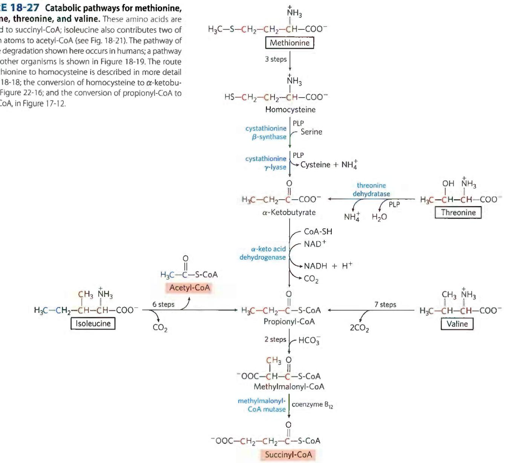

to two other oxidative decarboxylations encountered in Chapter 16: oxidation of pyruvate to acetyl-CoA by the pyruvate dehydrogenase complex and oxidation of $\alpha$ -ketoglutarate to succinyl-CoA by the $\alpha$ -ketoglutarate dehydrogenase complex (see Fig. 16-12). In fact, all three enzyme complexes are similar in structure and share essentially the same reaction mechanism. Five cofactors (thiamine pyrophosphate, FAD, NAD, lipoate, and coenzyme A) participate, and the three proteins in each complex catalyze homologous reactions. This is clearly a case in which enzymatic machinery that evolved to catalyze one reaction was "borrowed" by gene duplication and further evolved to catalyze similar reactions in other pathways.

Experiments with rats have shown that the branched-chain $\alpha$ -keto acid dehydrogenase complex is regulated by covalent modification in response to the content of branched-chain amino acids in the diet. With little or no excess dietary intake of branched-chain amino acids, the enzyme complex is phosphorylated by a protein kinase and thereby inactivated. Addition of excess branched-chain amino acids to the diet results in dephosphorylation and consequent activation of the enzyme. Recall that the pyruvate dehydrogenase complex is subject to similar regulation by phosphorylation and dephosphorylation (see Fig. 16-19).

There is a relatively rare genetic disease in which the three branched-chain $\alpha$ -keto acids (as well as their precursor amino acids, especially leucine) accumulate in the blood and "spill over" into the urine. This condition, called maple syrup urine disease

## MMA: Sometimes More than a Genetic Disease

Without treatment, an infant born with a genetic deficiency involving the enzyme methylmalonyl-CoA mutase is subject to severe symptoms ranging from seizures and vomiting to lethargy, developmental disease, progressive encephalopathy (brain disease), and early death. A rare and recessive genetic disorder, the condition, methylmalonic acidemia or MMA, affects about 1 child in 48,000 (Fig. 1). For most parents of a child with MMA, the condition brings trials and some heartbreak. For Patricia Stallings, the condition of her undiagnosed child led to much worse. Biochemistry eventually came to the rescue.

In the summer of 1989, Stallings took her baby son Ryan to the emergency room at the Cardinal Glennon Children's Hospital in St. Louis. To the attending physician, a toxicologist, Ryan's fit of vomiting and labored breathing suggested ingestion of the antifreeze ingredient ethylene glycol. The toxicologist suspected foul play and alerted authorities. Analysis of Ryan's milk bottles by two laboratories seemed to confirm the physician's fears. Ryan was placed in foster care as soon as he recovered. Unfortunately for both Ryan and his mother, Ryan subsequently died immediately after a visit from Patricia. Patricia was arrested and charged with murder.

While awaiting trial, Patricia learned that she was again pregnant. She gave birth to a second son, David, who was placed in foster care. David developed symptoms similar to Ryan's and was diagnosed with MMA. Although the symptoms of MMA can mimic those observed in cases of ethylene glycol poisoning, the revelation did not help Patricia. The information about David's diagnosis was excluded at her trial for the murder of Ryan. In 1991, Patricia Stallings was sentenced to prison for life.

The situation was ultimately resolved when William Sly, chair of the Department of Biochemistry and Molecular Biology at St. Louis University, became interested in the case. Working with metabolic disease experts James Shoemaker and Piero Rinaldo, he had new analyses performed on Ryan's blood and the original milk bottles. The blood showed high levels of methylmalonic acid and ketones, diagnostic of MMA. Surprisingly, unlike the earlier lab reports, they found no ethylene glycol in any of the samples. Could both a hospital lab and a commercial lab have been mistaken? What the biochemists saw provided the final breakthrough. The biochemists presented all of their materials to the Missouri state prosecutor who had handled the case, George McElroy. Both of the original lab analyses had been so unusually shoddy that they were quickly dismissed. Patricia Stallings was cleared of charges and released on September 20, 1991.

  
FIGURE 1 Children with a mutation (red X) that inactivates the enzyme methylmalonyl-CoA mutase cannot degrade isoleucine, methionine, threonine, and valine normally. Instead, a potentially fatal accumulation of methylmalonic acid occurs, with symptoms similar to those of ethylene glycol poisoning.

because of the characteristic odor imparted to the urine by the $\alpha$ -keto acids, results from a defective branched-chain $\alpha$ -keto acid dehydrogenase complex. Untreated, the disease results in abnormal development of the brain and death in early infancy. Treatment entails rigid control of the diet, limiting the intake of valine, isoleucine, and leucine to the minimum required to permit normal growth.

## Asparagine and Aspartate Are Degraded to Oxaloacetate

The carbon skeletons of asparagine and aspartate ultimately enter the citric acid cycle as malate in mammals or oxaloacetate in bacteria. The enzyme asparaginase catalyzes the hydrolysis of asparagine to aspartate, which undergoes transamination with $\alpha$ -ketoglutarate to yield glutamate and oxaloacetate (Fig. 18-29).

  
FIGURE 18-28 Catabolic pathways for the three branched-chain amino acids: valine, isoleucine, and leucine. All three pathways occur in extrahepatic tissues and share the first two enzymes, as shown here. The branched-chain $\alpha$ -keto acid dehydrogenase complex is analogous to the

The cxaloacetate is converted to malate in the cytosol and then transported into the mitochondrial matrix through the malate- $\alpha$ -ketoglutarate transporter. In bacteria, the oxalcacetate produced in the transamination reaction can be used directly in the citric acid cycle.

We have now seen how the 20 common amino acids, after losing their nitrogen atoms, are degraded by dehydrogenation, decarboxylation, and other reactions to yield portions of their carbon backbones in the form of six central metabolites that can enter the citric acid cycle. Those portions degraded to acetyl-CoA are completely oxidized to carbon dioxide and water, with generation of ATP by oxidative phosphorylation. Those portions degraded to other citric acid cycle intermediates can either be oxidized or contribute to gluconeogenesis, depending on the metabolic state.

As was the case for carbohydrates and lipids, the degradation of amino acids results ultimately in the generation of reducing equivalents (NADH and FADH $_{2}$ ) through the action of the citric acid cycle. Our survey of catabolic processes concludes in the next chapter with a discussion of respiration, in which these reducing equivalents fuel the ultimate oxidative and energy-generating process in aerobic organisms.

## SUMMARY 18.3 Pathways of Amino Acid Degradation

■ After the removal of amino groups, the carbon skeletons of amino acids undergo oxidation to compounds that can enter the citric acid cycle. The citric acid cycle products can be oxidized as fuel. Alternatively, depending on their degradative end product, some amino acids can be converted to ketone bodies, some to glucose, and some to both. Thus, amino acid degradation is integrated into intermediary metabolism and can be critical to survival under conditions in which amino acids are a significant source of metabolic energy.

pyruvate and $\alpha$ -ketoglutarate dehydrogenase complexes and requires the same five cofactors (some not shown here). This enzyme is defective in people with maple syrup urine disease.  
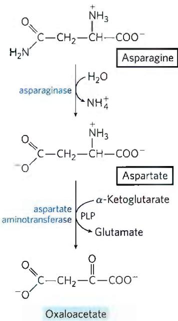  
FIGURE 18-29 Catabolic pathway for asparagine and aspartate. Both amino acids are converted to oxaloacetate.

The reactions of these pathways require several cofactors, including tetrahydrofolate and S-adenosylmethionine in one-carbon transfer reactions and tetrahydrobiopterin in the oxidation of phenylalanine by phenylalanine hydroxylase.

■ Alanine, cysteine, glycine, serine, threonine, and tryptophan are converted in whole or in part to pyruvate.

■ Leucine, lysine, phenylalanine, tyrosine, and tryptophan yield acetyl-CoA via acetoacetyl-CoA. Isoleucine, leucine, threonine, and tryptophan also form acetyl-CoA directly. Leucine and lysine are the only amino acids that cannot contribute to gluconeogenesis. Four carbon atoms of phenylalanine and tyrosine give rise to fumarate.

■ Many human genetic diseases are traced to deficiencies in enzymes catalyzing steps in amino acid degradation. Two well-studied examples, phenylketonuria and alkaptonuria, feature defects in phenylalanine degradation. Most amino acid degradation deficiencies are treated with dietary intervention.

■ Arginine, glutamate, glutamine, histidine, and proline are degraded to $\alpha$ -ketoglutarate.

■ Isoleucine, methionine, threonine, and valine produce succinyl-CoA.

■ The branched-chain amino acids (isoleucine, leucine, and valine), unlike the other amino acids, are degraded only in extrahepatic tissues.

■ Asparagine and aspartate produce oxaloacetate.

## KEY TERMS

Terms in bold are defined in the glossary.

ammonotelic 626  
ureotelic 626  
uricotelic 626  
aminotransferases 628  
transaminases 628  
transamination 628  
pyridoxal phosphate (PLP) 629  
oxidative deamination 631  
L-glutamate  
dehydrogenase 631  
glutamine synthetase 631  
glutaminase 631  
glucose-alanine cycle 632  
urea cycle 633

urea 635  
creatine kinase 637  
essential amino acids 638  
ketogenic 640  
glucogenic 640  
tetrahydrofolate 641  
S-adenosylmethionine (adoMet) 641  
tetrahydrobiopterin 644  
phenylketonuria (PKU) 649  
mixed-function oxygenases 649  
alkaptonuria 650  
maple syrup urine disease 652

## PROBLEMS

1. Products of Amino Acid Transamination Name and draw the structure of the $\alpha$ -keto acid resulting when each of the four amino acids listed undergoes transamination with $\alpha$ -ketoglutarate: (a) aspartate, (b) glutamate, (c) alanine, (d) phenylalanine.

2. Measurement of Alanine Aminotransferase Activity The measurement of alanine aminotransferase activity (reaction rate) usually includes an excess of pure lactate dehydrogenase and NADH in the reaction system. The rate of alanine disappearance is equal to the rate of NADH disappearance measured spectrophotometrically. Explain how this assay works.

3. Alanine and Glutamine in the Blood Normal human blood plasma contains all the amino acids required for the synthesis of body proteins, but not in equal concentrations. Alanine and glutamine are present in much higher concentrations than any other amino acids. Suggest why.

4. Glutamate Dehydrogenase Function Increases in ATP levels in blood trigger insulin release by the pancreas, which in turn stimulates the uptake of blood glucose (see Chapter 23, p. 860). Knowing this, suggest why a mutation that prevents inhibition of glutamate dehydrogenase by GTP results in insulin release and hypoglycemia.

5. Distribution of Amino Nitrogen If your diet is rich in alanine but deficient in aspartate, will you show signs of aspartate deficiency? Explain.

6. Lactate versus Alanine as Metabolic Fuel: The Cost of Nitrogen Removal The three carbons in lactate and alanine have identical oxidation states, and animals can use either carbon source as a metabolic fuel. Compare the net ATP yield (moles of ATP per mole of substrate) for the complete oxidation (to $CO_{2}$ and $H_{2}O$ ) of lactate versus alanine when the cost of nitrogen excretion as urea is included.

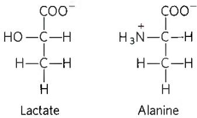

7. Ammonia Toxicity Resulting from an Arginine-Deficient Diet In a study, cats were fasted overnight then given a single meal complete in all amino acids except arginine. Within 2 hours, blood ammonia levels increased from a normal level of $18\mu \mathrm{g} / \mathrm{L}$ to $140~\mu \mathrm{g} / \mathrm{L}$ , and the cats showed the clinical symptoms of ammonia toxicity. A control group fed a complete amino acid diet or an amino acid diet in which arginine was replaced by ornithine showed no unusual clinical symptoms.

(a) What was the role of fasting in the experiment?

(b) What caused the ammonia levels to rise in the experimental group? Why did the absence of arginine lead to ammonia toxicity? Is arginine an essential amino acid in cats? Why or why not? (c) Why can ornithine be substituted for arginine?

8. Oxidation of Glutamate Write a series of balanced equations and an overall equation for the net reaction describing the oxidation of 2 mol of glutamate to 2 mol of $\alpha$ -ketoglutarate and 1 mol of urea.

9. Transamination and the Urea Cycle Aspartate aminotransferase has the highest activity of all the mammalian liver aminotransferases. Why?

10. The Case against the Liquid Protein Diet A weight-reducing diet heavily promoted some years ago required the daily intake of a "liquid protein" soup made of hydrolyzed gelatin (derived from collagen), water, and an assortment of vitamins. All other food and drink were to be avoided. People on this diet typically lost 10 to 14 lb in the first week.

(a) Opponents argued that the weight loss was almost entirely due to water loss and would be regained very soon after a normal diet was resumed. What is the biochemical basis for this argument? (b) A few people on this diet died. What are some of the dangers inherent in the diet, and how can they lead to death?

11. Ketogenic Amino Acids Which amino acids are exclusively ketogenic?

12. A Genetic Defect in Amino Acid Metabolism: A Case History A two-year-old child was taken to the hospital. His mother said that he vomited frequently, especially after feedings. The child's weight and physical development were below normal. His hair, although dark, contained patches of white. A urine sample treated with ferric chloride (FeCl₃) gave a green color characteristic of the presence of phenylpyruvate. Quantitative analysis of urine samples gave the results shown in the table.

Concentration (mM)

<table><tr><td>Substance</td><td>Patient&#x27;s urine</td><td>Normal urine</td></tr><tr><td>Phenylalanine</td><td>7.0</td><td>0.01</td></tr><tr><td>Phenylpyruvate</td><td>4.8</td><td>0</td></tr><tr><td>Phenyllactate</td><td>10.3</td><td>0</td></tr></table>

(a) Suggest which enzyme might be deficient in this child. Propose a treatment.

(b) Why does phenylalanine appear in the urine in large amounts?
(c) What is the source of phenylpyruvate and phenyllactate? Why does this pathway (normally not functional) come into play when the concentration of phenylalanine rises?

(d) Why does the boy's hair contain patches of white?

13. Role of Cobalamin in Amino Acid Catabolism Pernicious anemia is caused by impaired absorption of vitamin B $_{12}$ . What is the effect of this impairment on the catabolism of amino acids? Are all amino acids equally affected? (Hint: See Box 17-2.)

14. Vegetarian Diets Vegetarian diets can provide high levels of antioxidants and a lipid profile that can help prevent coronary disease. However, there can be some associated problems. Blood samples were taken from a large group of volunteer subjects who were vegans (strict vegetarians: no animal products), lactovegetarians (vegetarians who eat dairy products), or omnivores (individuals with a varied diet, including meat). In each case, the volunteers had followed the diet for several years. The blood levels of both homocysteine and methylmalonate were elevated in the vegan group, somewhat lower in the lactovegetarian group, and much lower in the omnivore group. Explain.

15. Pernicious Anemia Vitamin B $_{12}$ deficiency can arise from a few rare genetic diseases that lead to low B $_{12}$ levels despite a normal diet that includes B $_{12}$ -rich meat and dairy sources. These conditions cannot be treated with dietary B $_{12}$ supplements. Explain.

16. Pyridoxal Phosphate Reaction Mechanisms Threonine can be broken down by the enzyme threonine dehydratase, which catalyzes the conversion of threonine to $\alpha$ -ketobutyrate and ammonia. The enzyme uses PLP as a cofactor. Suggest a mechanism for this reaction, based on the mechanisms in Figure 18-6. Note that this reaction includes an elimination at the $\beta$ carbon of threonine.

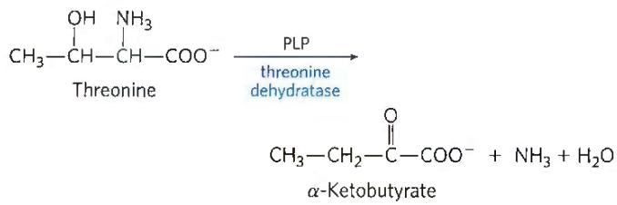

17. Pathway of Carbon and Nitrogen in Glutamate Metabolism When $[2-^{14}C,^{15}N]$ glutamate undergoes oxidative degradation in the liver of a rat, in which atoms of the following metabolites will each isotope be found? (a) urea (b) succinate (c) arginine (d) citrulline (e) ornithine (f) aspartate

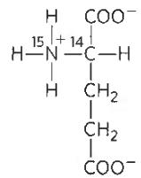  
Labeled glutamate

18. Chemical Strategy of Isoleucine Catabolism Isoleucine is degraded in six steps to propionyl-CoA and acetyl-CoA.

(a) The chemical process of isoleucine degradation includes strategies analogous to those used in the citric acid cycle and the $\beta$ oxidation of fatty acids. The intermediates of isoleucine degradation (1 to V) shown below are not in the proper order. Use your knowledge and understanding of the citric acid cycle and $\beta$ -oxidation pathway to arrange the intermediates in the proper metabolic sequence for isoleucine degradation.

(b) For each step you propose, describe the chemical process, provide an analogous example from the citric acid cycle or $\beta$ -oxidation pathway (where possible), and indicate any necessary cofactors.

19. Role of Pyridoxal Phosphate in Glycine Metabolism The enzyme serine hydroxymethyltransferase requires pyridoxal phosphate as a cofactor. Propose a mechanism for the reaction catalyzed by this enzyme, in the direction of serine degradation (glycine production). (Hint: See Figs 18-19 and 18-20b.)

20. Parallel Pathways for Amino Acid and Fatty Acid Degradation The carbon skeleton of leucine is degraded by a series of reactions closely analogous to those of the citric acid cycle and $\beta$ oxidation. For each reaction, (a) through (f), shown below, indicate its type, provide an analogous example from the citric acid cycle or $\beta$ -oxidation pathway (where possible), and note any necessary cofactors.

21. Treatments for a Genetic Disease The strict dietary controls required to stem the progress of maple syrup urine disease are difficult to follow for a lifetime, and patients may experience poor metabolic control that leads to neurological symptoms. In these cases, treatment can involve an organ transplant from a suitable donor. Organ transplantation involves considerable risk, but success can greatly alleviate this metabolic disorder and reduce the need for dietary restrictions. Which organ could be transplanted to gain this effect, and why?

## DATA ANALYSIS PROBLEM

22. Maple Syrup Urine Disease Figure 18-28 shows the pathway for the degradation of branched-chain amino acids and the site of the biochemical defect that causes maple syrup urine disease. The initial findings that eventually led to the discovery of the defect in this disease were presented in three papers published in the late 1950s and early 1960s. This problem traces the history of the findings from initial clinical observations to proposal of a biochemical mechanism.

Menkes, Hurst, and Craig (1954) presented the cases of four siblings, all of whom died following a similar course of symptoms. In all four cases, the mother's pregnancy and the birth had been normal. The first 3 to 5 days of each child's life were also normal. But soon thereafter each child began having convulsions, and the children died between the ages of 11 days and 3 months. Autopsy showed considerable swelling of the brain in all cases. The children's urine had a strong, unusual "maple syrup" odor, starting from about the third day of life.

Menkes (1959) reported data collected from six more children. All showed symptoms similar to those described above and died within 15 days to 20 months of birth. In one case, Menkes was able to obtain urine samples during the last months of the infant's life. When he treated the urine with 2,4-dinitrophenylhydrazone, which forms colored precipitates with keto compounds, he found three $\alpha$ -keto acids in unusually large amounts:

(a) These $\alpha$ -keto acids are produced by the deamination of amino acids. For each of the $\alpha$ -keto acids above, draw and name the amino acid from which it was derived.

Dancis, Levitz, and Westall (1960) collected further data that led them to propose the biochemical defect shown in Figure 18-28. In one case, they examined a patient whose urine first showed the maple syrup odor when he was 4 months old. At the age of 10 months (March 1956), the child was admitted to the hospital because he had a fever, and he showed grossly delayed motor development. At the age of 20 months (January 1957), he was readmitted and was found to have the degenerative neurological symptoms seen in previous cases of maple syrup urine disease; he died soon after. Results of his blood and urine analyses are shown in the table, along with normal values for each component.

<table><tr><td rowspan="3">Amino acid(s)</td><td colspan="3">Urine concentration (mg/24 h)</td><td colspan="2">Plasma concentration (mg/mL)</td></tr><tr><td>Normal</td><td colspan="2">Patient</td><td>Normal</td><td>Patient</td></tr><tr><td></td><td>Mar. 1956</td><td>Jan. 1957</td><td></td><td>Jan. 1957</td></tr><tr><td>Alanine</td><td>5–15</td><td>0.2</td><td>0.4</td><td>3.0–4.8</td><td>0.6</td></tr><tr><td>Asparagine and glutamine</td><td>5–15</td><td>0.4</td><td>0</td><td>3.0–5.0</td><td>2.0</td></tr><tr><td>Aspartic acid</td><td>1–2</td><td>0.2</td><td>1.5</td><td>0.1–0.2</td><td>0.04</td></tr><tr><td>Arginine</td><td>1.5–3</td><td>0.3</td><td>0.7</td><td>0.8–1.4</td><td>0.8</td></tr><tr><td>Cystine</td><td>2–4</td><td>0.5</td><td>0.3</td><td>1.0–1.5</td><td>0</td></tr><tr><td>Glutamic acid</td><td>1.5–3</td><td>0.7</td><td>1.6</td><td>1.0–1.5</td><td>0.9</td></tr><tr><td>Glycine</td><td>20–40</td><td>4.6</td><td>20.7</td><td>1.0–2.0</td><td>1.5</td></tr><tr><td>Histidine</td><td>8–15</td><td>0.3</td><td>4.7</td><td>1.0–1.7</td><td>0.7</td></tr><tr><td>Isoleucine</td><td>2–5</td><td>2.0</td><td>13.5</td><td>0.8–1.5</td><td>2.2</td></tr><tr><td>Leucine</td><td>3–8</td><td>2.7</td><td>39.4</td><td>1.7–2.4</td><td>14.5</td></tr><tr><td>Lysine</td><td>2–12</td><td>1.6</td><td>4.3</td><td>1.5–2.7</td><td>1.1</td></tr><tr><td>Methionine</td><td>2–5</td><td>1.4</td><td>1.4</td><td>0.3–0.6</td><td>2.7</td></tr><tr><td>Ornithine</td><td>1–2</td><td>0</td><td>1.3</td><td>0.6–0.8</td><td>0.5</td></tr><tr><td>Phenylalanine</td><td>2–4</td><td>0.4</td><td>2.6</td><td>1.0–1.7</td><td>0.8</td></tr><tr><td>Proline</td><td>2–4</td><td>0.5</td><td>0.3</td><td>1.5–3.0</td><td>0.9</td></tr><tr><td>Serine</td><td>5–15</td><td>1.2</td><td>0</td><td>1.3–2.2</td><td>0.9</td></tr><tr><td>Taurine</td><td>1–10</td><td>0.2</td><td>18.7</td><td>0.9–1.8</td><td>0.4</td></tr><tr><td>Threonine</td><td>5–10</td><td>0.6</td><td>0</td><td>1.2–1.6</td><td>0.3</td></tr><tr><td>Tryptophan</td><td>3–8</td><td>0.9</td><td>2.3</td><td>Not measured</td><td>0</td></tr><tr><td>Tyrosine</td><td>4–8</td><td>0.3</td><td>3.7</td><td>1.5–2.3</td><td>0.7</td></tr><tr><td>Valine</td><td>2–4</td><td>1.6</td><td>15.4</td><td>2.0–3.0</td><td>13.1</td></tr></table>

(b) The table includes taurine, an amino acid not normally found in proteins. Taurine is often produced as a byproduct of cell damage. Its structure is

$$
\mathrm{H} _ {3} \stackrel {+} {\mathrm{N}} - \mathrm{CH} _ {2} - \mathrm{CH} _ {2} - \stackrel {\mathrm{O}} {\mathrm{S}} - \mathrm{O} ^ {-}
$$

Based on its structure and the information in this chapter, what is the most likely amino acid precursor of taurine? Explain your reasoning.

(c) Compared with the normal values given in the table, which amino acids showed significantly elevated levels in the patient's blood in January 1957? Which ones in the patient's urine?

Based on their results and their knowledge of the pathway shown in Figure 18-28, Dancis and coauthors concluded that “although it appears most likely to the authors that the primary block is in the metabolic degradative pathway of the branched-chain amino acids, this cannot be considered established beyond question."

(d) How do the data presented here support this conclusion?
(e) Which data presented here do not fit this model of maple syrup urine disease? How do you explain these seemingly contradictory data?

(f) What data would you need to collect to be more secure in your conclusion?

## References

Dancis, J., M. Levitz, and R. Westall. 1960. Maple syrup urine disease: branched-chain ketoaciduria. Pediatrics 25:72–79.

Menkes, J.H. 1959. Maple syrup disease: isolation and identification of organic acids in the urine. Pediatrics 23:348–353.

Menkes, J.H., P.L. Hurst, and J.M. Craig. 1954. A new syndrome: progressive familial infantile cerebral dysfunction associated with an unusual urinary substance. Pediatrics 14:462–466.

# OXIDATIVE PHOSPHORYLATION

19.1 The Mitochondrial Respiratory Chain 660

19.2 ATP Synthesis 674

19.3 Regulation of Oxidative Phosphorylation 686

19.4 Mitochondria in Thermogenesis, Steroid Synthesis, and Apoptosis 689

19.5 Mitochondrial Genes: Their Origin and the Effects of Mutations 692

Oxidative phosphorylation is the culmination of energy-yielding metabolism (catabolism) in aerobic organisms. All oxidative steps in the degradation of carbohydrates, fats, and amino acids converge at this final stage of cellular respiration, in which the energy of oxidation drives the synthesis of ATP. Oxidative phosphorylation accounts for most of the ATP synthesized by nonphotosynthetic organisms under most circumstances. In eukaryotes, oxidative phosphorylation occurs in mitochondria and involves huge protein complexes embedded in the mitochondrial membranes. The pathway to ATP synthesis in mitochondria challenged and fascinated biochemists for much of the twentieth century. Our current exploration of the topic is guided by five principles:

## P1 Mitochondria play a central role in eukaryotic aerobic metabolism. ATP

production is not the only important mitochondrial function. Mitochondria play host to the citric acid cycle, the fatty acid $\beta$ -oxidation pathway, and the pathways of amino acid oxidation. The mitochondria also act in thermogenesis, steroid synthesis, and apoptosis (programmed cell death). The discovery of these diverse and important roles of mitochondria has stimulated much current research on the biochemistry of this organelle.

P2 Mitochondria trace their evolutionary origin to bacteria. Over 1.45 billion years ago, an endosymbiotic relationship arose between bacteria and a primitive eukaryote or eukaryotic progenitor. Mitochondria are ubiquitous in modern eukaryotes, and their bacterial origin is evident in almost every aspect of their structure and function.

P3 Electrons flow from electron donors (oxidizable substrates) through a chain of membrane-bound carriers to a final electron acceptor with a large reduction potential. The final acceptor is molecular oxygen, $\mathrm{O}_2$ . The appearance of oxygen in the atmosphere some 2.3 billion years ago, and its harnessing in living systems via the evolution of oxidative phosphorylation, made more complex life forms possible.

P4 The free energy made available by "downhill" (exergonic) electron flow is coupled to the "uphill" transport of protons across a proton-impermeable membrane. The free energy of fuel oxidation is thus conserved as a transmembrane electrochemical potential.

P5 The transmembrane flow of protons back down their electrochemical gradient through specific protein channels provides the free energy for synthesis of ATP. This process is catalyzed by a membrane protein complex (ATP synthase) that couples proton flow to phosphorylation of ADP.

Principles 3 through 5, illustrated in Figure 19-1, encapsulate the theory, introduced by Peter Mitchell in 1961, that transmembrane differences in proton concentration are the reservoir for the energy extracted from biological oxidation reactions. This chemiosmotic theory has been accepted as one of the great unifying ideas of twentieth-century biology. It provides insight into the processes of oxidative phosphorylation and photophosphorylation in plants, and into such apparently disparate energy transductions as active transport across membranes and the motion of bacterial flagella.

This chapter begins with a description of the components of the mitochondrial electron-transfer chain—the respiratory chain—and their organization into large functional complexes in the inner mitochondrial membrane, the path of electron flow through these complexes, and the proton movements that accompany this flow. We then consider the remarkable enzyme complex that captures, by "rotational catalysis," the energy of proton flow in ATP, and the regulatory mechanisms that coordinate oxidative phosphorylation with the many catabolic pathways by which fuels are oxidized.

  
FIGURE 19-1 The chemiosmotic mechanism for ATP synthesis in mitochondria. Electrons move spontaneously through a chain of membrane-bound carriers, the respiratory chain, driven by the high reduction potential of oxygen and the relatively low reduction potentials of the various reduced substrates (fuels) that undergo oxidation in the mitochondrion. Electron flow creates an electrochemical potential by the transmembrane movement of protons and positive charge. This electrochemical potential drives ATP synthesis by a membrane-bound enzyme (ATP synthase) that is fundamentally similar in mitochondria and chloroplasts, and in bacteria and archaea as well.

The metabolic role of mitochondria is so critical to cellular and organismal function that defects in mitochondrial function have serious medical consequences. Mitochondria are central to neuronal and muscular function, and to the regulation of whole-body energy metabolism and body weight. Human neurodegenerative diseases, as well as cancer, diabetes, and obesity, are recognized as possible results of compromised mitochondrial function, and one theory of aging is based on gradual loss of mitochondrial integrity. We consider the diverse functions of mitochondria, and the consequences of defective mitochondrial function in humans.

## 19.1 The Mitochondrial Respiratory Chain

The discovery in 1948, by Eugene Kennedy and Albert Lehninger, that mitochondria are the site of oxidative phosphorylation in eukaryotes marked the beginning of the enzymological studies of biological energy transductions. Mitochondria, like gram-negative bacteria, have two membranes (Fig. 19-2a). The outer mitochondrial membrane is readily permeable to small molecules ( $M_{\mathrm{r}} < 5,000$ ) and ions, which move freely through transmembrane channels formed by a family of integral membrane proteins called porins. The inner membrane is impermeable to most small molecules and ions, including protons ( $\mathrm{H^{+}}$ ); the only species that cross this membrane do so through specific transporters.

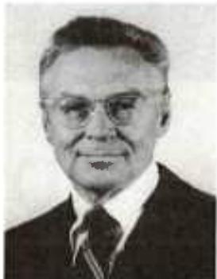  
Albert L. Lehninger, 1917–1986 [Alan Mason Chesney Medical Archives of the Johns Hopkins Medical Institutions.]

The inner membrane bears the components of the respiratory chain and ATP synthase.

P1 The mitochondrial matrix, enclosed by the inner membrane, contains the pyruvate dehydrogenase complex and the enzymes of the citric acid cycle, the fatty acid $\beta$ -oxidation pathway, and the pathways of amino acid oxidation—all the pathways of fuel oxidation except glycolysis, which takes place in the cytosol. The selectively permeable inner mitochondrial membrane segregates the intermediates and enzymes of cytosolic metabolic pathways from those of metabolic processes occurring in the matrix. However, specific transporters carry pyruvate, fatty acids, and amino acids or their $\alpha$ -keto derivatives into the matrix for access to the machinery of the citric acid cycle. ADP and $\mathrm{P_i}$ are specifically transported into the matrix as newly synthesized ATP is transported out. Mammalian mitochondria have about 1,200 proteins, according to current best estimates. The functions of up to $25\%$ of these remain partly or entirely enigmatic.

The bean-shaped representation of a mitochondrion in Figure 19-2a is an oversimplification, derived in part from early studies in which thin sections of cells were observed in the electron microscope. Three-dimensional images obtained either by reconstruction from serial sections or by confocal microscopy reveal great variation in mitochondrial size and shape. In living cells stained with mitochondrion-specific fluorescent dyes, large numbers of variously shaped mitochondria are seen, clustered about the nucleus (Fig. 19-2b).

Tissues with a high demand for aerobic metabolism (brain, skeletal and heart muscle, liver, and eye, for example) contain many hundreds or thousands of mitochondria per cell, and in general, mitochondria of cells with high metabolic activity have more, and more densely packed, convolutions, or cristae (Fig. 19-2c, d). P2 During cell growth and division, mitochondria, like bacteria, divide by fission, and under some circumstances individual mitochondria fuse to form larger, more-extended structures. Stressful conditions, such as the presence of electron-transfer inhibitors or mutations in an electron carrier, trigger mitochondrial fission and sometimes mitophagy—the breakdown of mitochondria and recycling of the amino acids, nucleotides, and lipids released. As stress is relieved, small mitochondria fuse to form long, thin, tubular organelles.

  
FIGURE 19-2 Biochemical anatomy of a mitochondrion. (a) The outer membrane has pores that make it permeable to small molecules and ions, but not to proteins. The cristae provide a very large surface area. The inner membrane of a single liver mitochondrion may have more than 10,000 sets of electron-transfer systems (respiratory chains) and ATP synthase molecules, distributed over the membrane surface. (b) A typical animal cell has hundreds or thousands of mitochondria. This endothelial cell from bovine pulmonary artery was stained with fluorescent probes for actin (blue), for DNA (red), and for mitochondria (yellow). Notice the variability in length of

## Electrons Are Funneled to Universal Electron Acceptors

Oxidative phosphorylation begins with the entry of electrons into the series of electron carriers called the respiratory chain. Most of these electrons arise from the action of dehydrogenases that collect electrons from catabolic pathways and funnel them into universal electron acceptors—nicotinamide nucleotides (NAD $^{+}$ or NADP $^{+}$ ) or flavin nucleotides (FMN or FAD).

  
the mitochondria. (c) The mitochondria of heart muscle (blue in this colorized electron micrograph) have more profuse cristae and thus a much larger area of inner membrane, with more than three times as many sets of respiratory chains as (d) liver mitochondria. Muscle and liver mitochondria are about the size of a bacterium — 1 to 10 $\mu$ m long. The mitochondria of invertebrates, plants, and microbial eukaryotes are similar to those shown here, but with much variation in size, shape, and degree of convolution of the inner membrane. [(b) Talley Lambert/Science Source. (c) Thomas Deerinck, NCMI/R/Science Source. (d) Don W. Fawcett/Science Source.]

Nicotinamide nucleotide-linked dehydrogenases catalyze reversible reactions of the following general types:

Reduced substrate + NAD $^{+}$ ⇌

oxidized substrate + NADH + H $^{+}$

Reduced substrate + NADP $^{+}$ ⇌

oxidized substrate + NADPH + H $^{+}$

Most dehydrogenases that act in catabolism are specific for $NAD^{+}$ as electron acceptor (Table 19-1). Some are in the cytosol, many are in mitochondria, and still others have mitochondrial and cytosolic isozymes.

<table><tr><td colspan="2">TABLE 19-1 Some Important Reactions Catalyzed by NAD(P)+-Linked Dehydrogenases</td></tr><tr><td>Reactiona</td><td>Locationb</td></tr><tr><td>NAD+-linked</td><td></td></tr><tr><td>α-Ketoglutarate + CoA + NAD+ ⇌ succinyl-CoA + CO2 + NADH + H+</td><td>M</td></tr><tr><td>L-Malate + NAD+ ⇌ oxaloacetate + NADH + H+</td><td>M and C</td></tr><tr><td>Pyruvate + CoA + NAD+ ⇌ acetyl-CoA + CO2 + NADH + H+</td><td>M</td></tr><tr><td>Glyceraldehyde 3-phosphate + Pi + NAD+ ⇌ 1,3-bisphosphoglycerate + NADH + H+</td><td>C</td></tr><tr><td>Lactate + NAD+ ⇌ pyruvate + NADH + H+</td><td>C</td></tr><tr><td>β-Hydroxyacyl-CoA + NAD+ ⇌ β-ketoacyl-CoA + NADH + H+</td><td>M</td></tr><tr><td>NADP+-linked</td><td></td></tr><tr><td>Glucose 6-phosphate + NADP+ ⇌ 6-phosphogluconate + NADPH + H+</td><td>C</td></tr><tr><td>L-Malate + NADP+ ⇌ pyruvate + CO2 + NADPH + H+</td><td>C</td></tr><tr><td>NAD+- or NADP+-linked</td><td></td></tr><tr><td>L-Glutamate + H2O + NAD(P)+ ⇌ α-ketoglutarate + NH4+ + NAD(P)H</td><td>M</td></tr><tr><td>Isocitrate + NAD(P)+ ⇌ α-ketoglutarate + CO2 + NAD(P)H + H+</td><td>M and C</td></tr><tr><td colspan="2">aThese reactions and their enzymes are discussed in Chapters 14, 16, 17, and 18.bM designates mitochondria; C designates cytosol.</td></tr></table>

NAD $^{+}$ -linked dehydrogenases remove two hydrogen atoms from their substrates. One of these is transferred as a hydride ion ( $:H^{-}$ ) to NAD $^{+}$ , and the other is released as H $^{+}$ in the medium (see Fig. 13-24). NADH and NADPH are water-soluble electron carriers that associate reversibly with dehydrogenases. About 70% of the cellular NAD pool is in the mitochondria. NADH carries electrons from catabolic reactions to their point of entry into the respiratory chain, the NADH dehydrogenase complex described below. NADPH is primarily involved in biosynthetic (anabolic) reactions, and much of it is concentrated in the cytosol. Cells maintain separate pools of NADPH and NADH, with different redox potentials. This is accomplished by holding the ratio [reduced form]/[oxidized form] relatively high for NADPH and relatively low for NADH. Neither NADH nor NADPH can cross the inner mitochondrial membrane, but the electrons they carry can be shuttled across indirectly, as we shall see.

Flavoproteins contain a very tightly, sometimes covalently, bound flavin nucleotide, either FMN or FAD (see Fig. 13-27). P3 The oxidized flavin nucleotide can accept either one electron (yielding the semiquinone form) or two (yielding $\mathrm{FADH}_2$ or $\mathrm{FMNH}_2$ ). Electron transfer occurs because the flavoprotein has a higher reduction potential than the compound oxidized. Recall that reduction potential is a quantitative measure of the relative tendency of a given chemical species to accept electrons in an oxidation-reduction reaction (p. 490). The standard reduction potential of a flavin nucleotide, unlike that of NAD or NADP, depends on the protein with which it is associated. Local interactions with functional groups in the protein distort the electron orbitals in the flavin ring, changing the relative stabilities of oxidized and reduced forms. The relevant standard reduction potential is therefore that of the particular flavoprotein, not that of isolated FAD or FMN. The flavin nucleotide should be considered part of the flavoprotein's active site rather than a reactant or product in the electron-transfer reaction. Because flavoproteins can participate in either one- or two-electron transfers, they can serve as intermediates between reactions in which two electrons are donated (as in dehydrogenations) and those in which only one electron is accepted (as in the reduction of a quinone to a hydroquinone, described below).

## Electrons Pass through a Series of Membrane-Bound Carriers

The mitochondrial respiratory chain consists of a series of sequentially acting electron carriers, most of which are integral proteins with prosthetic groups capable of accepting and donating either one or two electrons. Three types of electron transfers occur in oxidative phosphorylation: (1) direct transfer of electrons, as in the reduction of $Fe^{3+}$ to $Fe^{2+}$ ; (2) transfer as a hydrogen atom ( $H^{+} + e^{-}$ ); and (3) transfer as a hydride ion ( $:H^{-}$ ), which bears two electrons. The term reducing equivalent is used to designate a single electron equivalent transferred in an oxidation-reduction reaction.

P3 In addition to NAD and flavoproteins, three other types of electron-carrying molecules function in the respiratory chain: a hydrophobic quinone called ubiquinone, and two different types of iron-containing proteins, cytochromes and iron-sulfur proteins. Ubiquinone (also called coenzyme Q, or simply Q) is a lipid-soluble benzoquinone with a long isoprenoid side chain (Fig. 19-3). Ubiquinone can accept one electron to become the semiquinone radical (°QH or ubisemiquinone)

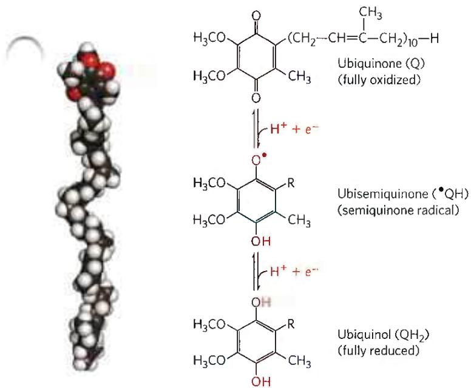  
FIGURE 19-3 Ubiquinone (Q, or coenzyme Q). Complete reduction of ubiquinone requires two electrons and two protons, and occurs in two steps through the semiquinone radical intermediate.

(a)  
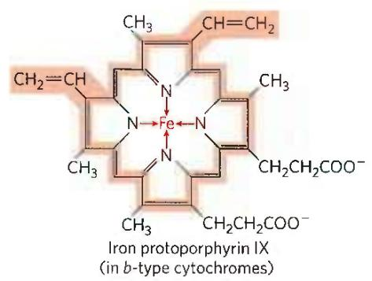

  
FIGURE 19-4 Prosthetic groups of cytochromes. (a) Each group consists of four five-membered, nitrogen-containing rings in a cyclic structure called a porphyrin. The four nitrogen atoms are coordinated with a central Fe ion, either $\mathrm{Fe}^{2+}$ or $\mathrm{Fe}^{3+}$ . Iron protoporphyrin IX is found in $b$ -type cytochromes and in hemoglobin and myoglobin (see Fig. 5-1b). Heme $c$ is covalently bound to the protein of cytochrome $c$ through thioether bonds to two Cys residues. Heme $a$ , found in $a$ -type cytochromes, has a long isoprenoid tail attached to one of the five-membered rings. The conjugated double-bond system (shaded light red) of the porphyrin ring has delocalized $\pi$ electrons that are relatively easily excited by photons with the wavelengths of visible light, which accounts for the strong absorption by hemes (and related compounds) in the visible region of the spectrum. (b) Absorption spectra of cytochrome $c$ (cyt $c$ ) in its oxidized (blue) and reduced (red) forms. The characteristic $\alpha, \beta$ , and $\gamma$ bands of the reduced form are labeled.

or two electrons to form ubiquinol (QH $_2$ ) and, like flavoprotein carriers, it can act at the junction between a two-electron donor and a one-electron acceptor. Small and hydrophobic, ubiquinone is not bound to proteins but instead is freely diffusible within the lipid bilayer of the inner mitochondrial membrane and can shuttle reducing equivalents between other, less mobile electron carriers in the membrane. And because it carries both electrons and protons, it plays a central role in coupling electron flow to proton movement.

The cytochromes are proteins with characteristic strong absorption of visible light, due to their iron-containing heme prosthetic groups (Fig. 19-4a). Mitochondria contain three classes of cytochromes, designated a, b, and c, which are distinguished by differences in their light-absorption spectra. Each type of cytochrome in its reduced $\left(\mathrm{Fe}^{2+}\right)$ state has three absorption bands in the visible range (Fig. 19-4b). The longest-wavelength band is near 600 nm in type a cytochromes, near 560 nm in type b, and near 550 nm in type c. To distinguish among closely related cytochromes of one type, the exact absorption maximum is sometimes used in the names, as in cytochrome $b_{562}$ .

(b)  

  
FIGURE 19-5 Iron-sulfur centers. The Fe-S centers of iron-sulfur proteins may be as simple as shown in (a), with a single Fe ion surrounded by the S atoms of four Cys residues; inorganic S is yellow and the S of Cys is orange. Other centers include both inorganic and Cys S atoms, as in (b) 2Fe-2S or (c) 4Fe-4S centers. (d) The ferredoxin of the cyanobacterium Anabaena 7120  
has one 2Fe-2S center. (Note that in these designations, only the inorganic S atoms are counted. For example, in the 2Fe-2S center (b), each Fe ion is actually surrounded by four S atoms.) The exact standard reduction potential of the iron in these centers depends on the type of center and its interaction with the associated protein. [(d) Data from PDB ID 1FRD, B.L. Jacobson et al., Biochemistry 32:6788, 1993.]

The hemes of a and b cytochromes are tightly, but not covalently, bound to their associated proteins; the hemes of c-type cytochromes are covalently attached through Cys residues (Fig. 19-4). As with the flavoproteins, the standard reduction potential of the heme iron atom of a cytochrome depends on its interaction with protein side chains and is therefore different for each cytochrome. The cytochromes of type a and b and some of type c are integral proteins of the inner mitochondrial membrane. One striking exception is the soluble cytochrome c that associates through electrostatic interactions with the outer surface of the inner membrane.

In iron-sulfur proteins, the iron is present not in heme but in association with inorganic sulfur atoms or with the sulfur atoms of Cys residues in the protein, or both. These iron-sulfur (Fe-S) centers range from simple structures with a single Fe atom coordinated to four Cys—SH groups to more complex Fe-S centers with two or four Fe atoms (Fig. 19-5). Rieske iron-sulfur proteins (named after their discoverer, John S. Rieske) are a variation on this theme, in which one Fe atom is coordinated to two His residues rather than two Cys residues. All iron-sulfur proteins participate in one-electron transfers in which one iron atom of the Fe-S cluster is oxidized or reduced. At least eight Fe-S proteins function in mitochondrial electron transfer. The reduction potential of Fe-S proteins varies from -0.65 V to +0.45 V, depending on the microenvironment of the iron within the protein.

In the overall reaction catalyzed by the mitochondrial respiratory chain, electrons move from NADH, succinate, or some other primary electron donor through flavoproteins, ubiquinone, iron-sulfur proteins, and cytochromes, and finally to $O_{2}$ . A look at the methods used to determine the sequence in which the carriers act is instructive, as the same general approaches have been used to study other electron-transfer chains, such as those of chloroplasts (see Fig. 20-12).

First, the standard reduction potentials of the individual electron carriers have been determined experimentally (Table 19-2). Electrons tend to flow spontaneously from carriers of lower $E^{\prime \circ}$ to carriers of higher $E^{\prime \circ}$ . The

<table><tr><td colspan="2">TABLE 19-2 Standard Reduction Potentials of Respiratory Chain and Related Electron Carriers</td></tr><tr><td>Redox reaction (half-reaction)</td><td> $E^{\prime\circ}$  (V)</td></tr><tr><td> $2H^{+} + 2e^{-} \longrightarrow H_{2}$ </td><td>-0.414</td></tr><tr><td> $NAD^{+} + H^{+} + 2e^{-} \longrightarrow NADH$ </td><td>-0.320</td></tr><tr><td> $NADP^{+} + H^{+} + 2e^{-} \longrightarrow NADPH$ </td><td>-0.324</td></tr><tr><td>NADH dehydrogenase (FMN) +  $2H^{+} + 2e^{-} \longrightarrow NADH$  dehydrogenase ( $FMNH_{2}$ )</td><td>-0.30</td></tr><tr><td>Ubiquinone +  $2H^{+} + 2e^{-} \longrightarrow$  ubiquinol</td><td>0.045</td></tr><tr><td>Cytochrome  $b$  ( $Fe^{3+}$ ) +  $e^{-} \longrightarrow$  cytochrome  $b$  ( $Fe^{2+}$ )</td><td>0.077</td></tr><tr><td>Cytochrome  $c_{1}$  ( $Fe^{3+}$ ) +  $e^{-} \longrightarrow$  cytochrome  $c_{1}$  ( $Fe^{2+}$ )</td><td>0.22</td></tr><tr><td>Cytochrome  $c$  ( $Fe^{3+}$ ) +  $e^{-} \longrightarrow$  cytochrome  $c$  ( $Fe^{2+}$ )</td><td>0.254</td></tr><tr><td>Cytochrome  $a$  ( $Fe^{3+}$ ) +  $e^{-} \longrightarrow$  cytochrome  $a$  ( $Fe^{2+}$ )</td><td>0.29</td></tr><tr><td>Cytochrome  $a_{3}$  ( $Fe^{3+}$ ) +  $e^{-} \longrightarrow$  cytochrome  $a_{3}$  ( $Fe^{2+}$ )</td><td>0.35</td></tr><tr><td> $\frac{1}{2}O_{2} + 2H^{+} + 2e^{-} \longrightarrow H_{2}O$ </td><td>0.817</td></tr></table>