(CDP). Cytidine monophosphate is then displaced in a nucleophilic attack by the other hydroxyl (Fig. 21-24). Two strategies are employed by mammals. The CDP is attached either to the diacylglycerol, forming the activated phosphatidic acid CDP-diacylglycerol (strategy 1), or to the hydroxyl of the head group (strategy 2). The central importance of cytidine nucleotides in lipid biosynthesis was discovered by Eugene P. Kennedy in the late 1950s, and this pathway is commonly referred to as the Kennedy pathway. In bacteria, only strategy 1 is used to generate glycerophospholipids.

## Pathways for Phospholipid Biosynthesis Are Interrelated

In eukaryotes, many phospholipids are synthesized using strategy 1 in Figure 21-24, and many of the pathways begin with CDP-diacylglycerol. The synthesis of phosphatidylglycerol provides our first example. Beginning with CDP-diacylglycerol (Fig. 21-25), displacement of CMP through nucleophilic attack by the C-1 hydroxyl of glycerol 3-phosphate yields phosphatidylglycerol 3-phosphate. Phosphatidylglycerol 3-phosphate is processed further by cleavage of the phosphate monoester (with release of $\mathrm{P_i}$ ) to yield phosphatidylglycerol.

In eukaryotes, cardiolipin is a relatively uncommon phospholipid, found almost exclusively in the inner membranes of mitochondria. As described below, cardiolipin is important in bacteria, and its presence in mitochondria is likely yet another relic of the bacterial origin of these organelles. Cardiolipin is essential for the function of some mitochondrial enzymes. It is also synthesized using strategy 1, by condensation of CDP-diacylglycerol with phosphatidylglycerol (Fig. 21-25).

Phosphatidylinositol is similarly synthesized by condensation of CDP-diacylglycerol with inositol (Fig. 21-25). Specific phosphatidylinositol kinases then convert phosphatidylinositol to its phosphorylated derivatives. Phosphatidylinositol and its phosphorylated products in the plasma membrane play a central role in signal transduction in eukaryotes (see Figs. 12-11, 12-15, 12-23).

Yeast (but not mammals) use a similar path to produce phosphatidylserine by condensation of CDP-diacylglycerol and serine, and they can synthesize phosphatidylethanolamine from phosphatidylserine in the reaction catalyzed by phosphatidylserine decarboxylase (Fig. 21-25). This pathway for synthesis of phosphatidylethanolamine occurs primarily in the mitochondria, although this lipid is transported from there to other cellular membranes. Phosphatidylethanolamine may be converted to phosphatidylcholine (lecithin) by the addition of three methyl groups to its amino group; S-adenosylmethionine is the methyl group donor (see Fig. 18-18) for all three methylation reactions.

In mammals, strategy 2 (Fig. 21-24) is utilized for the synthesis of phosphatidylethanolamine and phosphatidylcholine in the membranes of the ER and nucleus. The activation of the head group to the CDP derivative is followed by condensation with diacylglycerol as shown for phosphatidylcholine (Fig. 21-26a). These pathways serve to salvage free ethanolamine and choline. In contrast, mammalian phosphatidylserine biosynthesis does not utilize either strategy shown in Figure 21-24; instead, it is derived from phosphatidylethanolamine or phosphatidylcholine via one of two head-group exchange reactions carried out in the ER (Fig. 21-26b). These reactions generate free ethanolamine and choline, respectively. The major sources of phosphatidylethanolamine and phosphatidylcholine in all eukaryotic cells are summarized in Figure 21-27.

  
FIGURE 21-25 Synthesis of glycerophospholipids in eukaryotes using CDP-diacylglycerol. These glycerophospholipids are synthesized using strategy 1 in Figure 21-24. Phosphatidylglycerol is synthesized by reaction of CDP-diacylglycerol with glycerol-3-phosphate, followed by dephosphorylation. Phosphatidylglycerol can react with CDP-diacylglycerol to generate cardiolipin. Phosphatidylinositol is generated from CDP-diacylglycerol in a single step. The pathway from CDP-diacylglycerol to phosphatidylserine is used in yeast but not in mammals. The pathway from phosphatidylserine to phosphatidylethanolamine and phosphatidylcholine is common to all eukaryotes.

The most prominent phospholipids in bacteria are phosphatidylglycerol, phosphatidylethanolamine, and cardiolipin. The pathway for phosphatidylglycerol synthesis (Fig. 21-28 on p. 769) is identical to the path employed in mammals (compare to Fig. 21-25), beginning with CDP-diacylglycerol and using strategy 1. Phosphatidylethanolamine is produced in a similar pathway, with phosphatidylserine an intermediate. In bacteria, there are multiple biosynthetic paths to the third prominent phospholipid, cardiolipin, in which two diacylglycerols are joined through a common head group (Fig. 21-28).

## Eukaryotic Membrane Phospholipids Are Subject to Remodeling

In principle, the two fatty acyl groups esterified to C-1 and C-2 in a phospholipid may vary in length and degree of desaturation, thus altering the properties of the membrane of which it is a part. Phosphatidylcholine is the major structural phospholipid of mammalian membranes, often representing 40% to 50% of the total. Thus, much of the remodeling centers on phosphatidylcholine. The remodeling occurs largely by a process called the Lands cycle (Fig. 21-29 on p. 770), which replaces the polyunsaturated fatty acyl group at C-2. The fatty acyl moieties are first hydrolyzed by phospholipase A₂ (Fig. 10-14) to generate 1-acyl lysophospholipids. The fatty acid is then replaced by a class of enzymes called lysophosphatidylcholine acyltransferases, or LPCATs. There are at least four LPCATs in humans, each with distinct tissue distributions and substrate specificities.

The physiological effects of LPCAT enzymes go far beyond the alteration of the lipid composition of membranes. LPCAT3, the most widely distributed version of the enzyme, helps to regulate lipogenesis and secretion of very-low-density lipoproteins (VLDLs), described later in this chapter. Mice lacking LPCAT3 have a greatly reduced intake of fatty acids in the intestine, resulting in the release of gut hormones that control appetite. They are unable to survive on a high-fat diet, they resist eating, and they die of starvation unless the diet is changed. LPCATs play a demonstrable but still often mysterious role in processes from atherosclerosis to obesity to cancer, making these enzymes the subjects of increasing interest as research and drug targets.

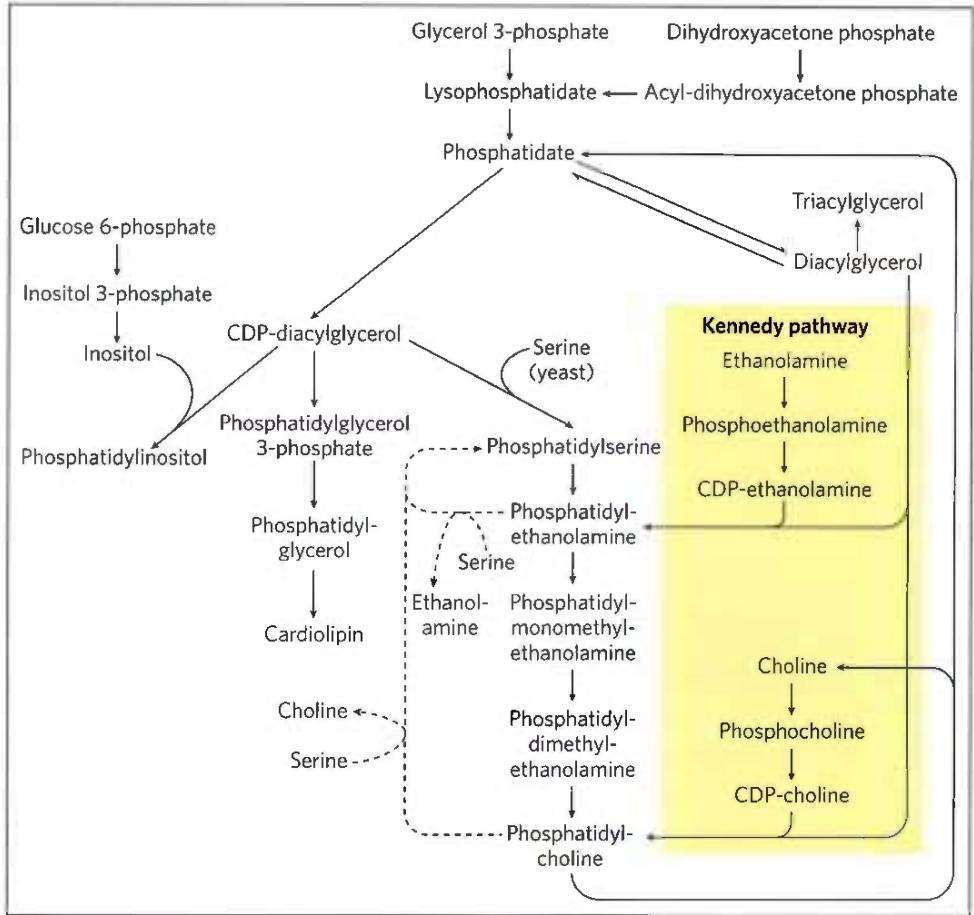  
FIGURE 21-27 Summary of the pathways for synthesis of major phospholipids and triacylglycerols in eukaryotes. Phosphatidic acid is formed by transacylation of L-glycerol 3-phosphate with two fatty acyl groups donated from fatty acyl-CoA. The enzyme phosphatidic acid phosphatase (lipin) converts phosphatidic acid to diacylglycerol, which in the Kennedy pathway condenses with a CDP-activated head group (ethanolamine or choline) to form phosphatidylethanolamine or phosphatidylcholine. Alternatively, phosphatidic acid can be activated with a CDP moiety, which is displaced by

## Plasmalogen Synthesis Requires Formation of an Ether-Linked Fatty Alcohol

P5 The biosynthetic pathway to ether lipids, including plasmalogens and the platelet-activating factor (see Fig. 10-9), requires displacement of an esterified fatty acyl group by a long-chain alcohol to form the ether linkage (Fig. 21-30 on p. 771). Head-group attachment follows, by mechanisms essentially like those used in formation of the common ester-linked phospholipids. Finally, the characteristic double bond of plasmalogens is introduced by the action of a mixed-function oxidase similar to that responsible for desaturation of fatty acids (Fig. 21-13). The peroxisome is the primary site of plasmalogen synthesis.

condensation with a head-group alcohol—inositol, glycerol 3-phosphate, or serine, forming phosphatidylinositol, phosphatidylglycerol, or (only in yeast and fungi) phosphatidylserine. Decarboxylation of phosphatidylserine yields phosphatidylethanolamine, and methylation of phosphatidylethanolamine produces phosphatidylcholine. In mammals, phosphatidylserine and phosphatidylcholine are generated via the head-group exchange pathways, detailed in Fig. 21-26. Lysophosphatidic acid is phosphatidic acid missing one of the two fatty acyl groups. [Information from G. M. Carman and G.-S. Han, Annu. Rev. Biochem. 80:859, 2011, Fig. 2.]  

## Sphingolipid and Glycerophospholipid Synthesis Share Precursors and Some Mechanisms

P5 The biosynthesis of sphingolipids takes place in four stages: (1) synthesis of the 18-carbon amine sphinganine from palmitoyl-CoA and serine; (2) attachment of a fatty acid in amide linkage to yield N-acylsphinganine; (3) desaturation of the sphinganine moiety to form

Phosphatidate

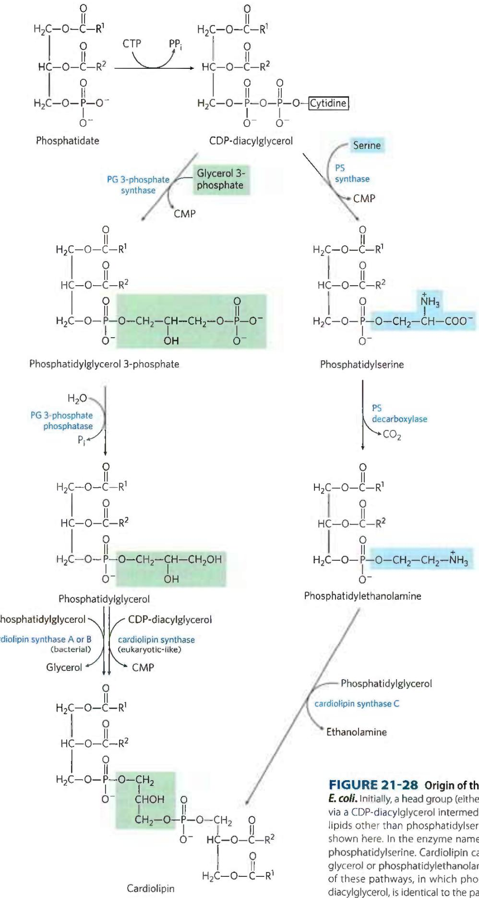

Phosphatidylglycerol 3-phosphate

Phosphatidylserine

Phosphatidylethanolamine

Phosphatidylglycerol

cardiolipin synthase C

Ethanolamine

FIGURE 21-28 Origin of the polar head groups of phospholipids in E. coli. Initially, a head group (either serine or glycerol 3-phosphate) is attached via a CDP-diacylglycerol intermediate (strategy 1 in Fig. 21-24). For phospholipids other than phosphatidylserine, the head group is further modified, as shown here. In the enzyme names, PG represents phosphatidylglycerol; PS, phosphatidylserine. Cardiolipin can be generated from either phosphatidylglycerol or phosphatidylethanolamine via multiple pathways, as shown. One of these pathways, in which phosphatidylglycerol is condensed with CDP-diacylglycerol, is identical to the pathway used in eukaryotes.

  
FIGURE 21-29 The Lands cycle for phospholipid remodeling. Phosphatidylcholine, which is the most common phospholipid of eukaryotic membranes, is a major target of this process. Fatty acids at C-2 are removed by  
phospholipase A₂ enzymes. A new fatty acid is then introduced by the action of a lysophosphatidylphocholine acyltransferase (LPCAT). The four mammalian LPCATs differ in tissue distribution and substrate specificity.

N-acylsphingosine (ceramide); and (4) attachment of a head group to produce a sphingolipid such as a cerebroside or sphingomyelin (Fig. 21-31 on p. 772). The first few steps of this pathway occur in the ER; the attachment of head groups in stage 4 occurs in the Golgi complex. The pathway shares several features with the pathways leading to glycerophospholipids: NADPH provides reducing power, and fatty acids enter as their activated CoA derivatives. In cerebroside formation, sugars enter as their activated nucleotide derivatives. Head-group attachment in sphingolipid synthesis has several novel aspects. For example, phosphatidylcholine, rather than CDP-choline, serves as the donor of phosphocholine in the synthesis of sphingomyelin.

P5 In glycolipids—the cerebrosides and gangliosides (see Fig. 10-11)—the head-group sugar is attached directly to the C-1 hydroxyl of sphingosine in glycosidic linkage rather than through a phosphodiester bond. The sugar donor is a UDP-sugar (UDP-glucose or UDP-galactose).

## Polar Lipids Are Targeted to Specific Cellular Membranes

Membrane lipids are insoluble in water, so they cannot simply diffuse from their point of synthesis (the ER) to their point of insertion. Instead, they are transported from the ER to the Golgi complex, where additional synthesis can take place. They are then delivered in membrane vesicles that bud from the Golgi complex and then move to and fuse with the target membrane (see Fig. 11-4). Sphingolipid transfer proteins carry ceramide from the ER to the Golgi complex, where sphingomyelin synthesis occurs. Cytosolic proteins also bind phospholipids and sterols and transport them between cellular membranes (see Fig. 11-7). These mechanisms contribute to establishment of the characteristic lipid compositions of organelle membranes (see Fig. 11-5).

## SUMMARY 21.3 Biosynthesis of Membrane Phospholipids

■ Beginning with diacylglycerol precursors, there are two pathways for adding head groups to phospholipids. Either the diacylglycerol (strategy 1) or the head group (strategy 2) is activated by CDP.

In eukaryotes, phospholipid biosynthetic strategies vary with subcellular location. The major phospholipids phosphatidylethanolamine and phosphatidylcholine are synthesized using strategy 1 in the mitochondria and strategy 2 in the ER and nucleus. Phosphatidylserine is derived from head-group exchange with phosphatidylethanolamine or phosphatidylcholine.

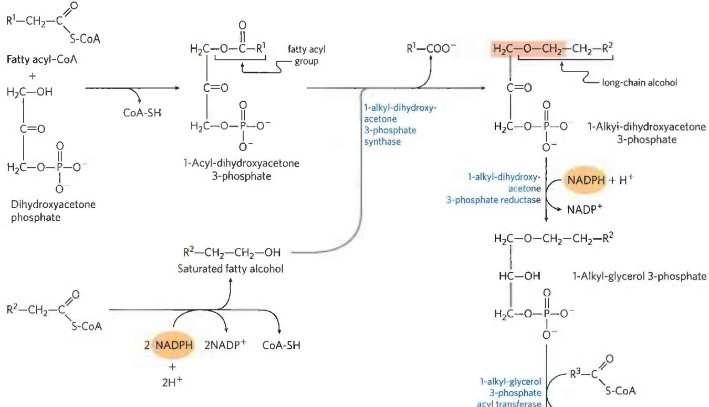  
FIGURE 21-30 Synthesis of ether lipids and plasmalogens. The newly formed ether linkage is shaded light red. The intermediate 1-alkyl-2-acylglycerol 3-phosphate is the ether analog of phosphatidic acid. Mechanisms for attaching head groups to ether lipids are essentially the same as for their ester-linked analogs. The characteristic double bond of plasmalogens (shaded blue) is introduced in a final step by a mixed-function oxidase system similar to fatty acyl-CoA desaturase.

In mammals, phospholipids are remodeled in membranes via the Lands cycle. Remodeling is facilitated by lysophosphatidylcholine acyltransferases.

■ The characteristic double bond in plasmalogens is introduced by a mixed-function oxidase.

■ The head groups of sphingolipids are attached by unique mechanisms.

■ Phospholipids travel to their intracellular destinations via transport vesicles or specific proteins.

## 21.4 Cholesterol, Steroids, and Isoprenoids: Biosynthesis, Regulation, and Transport

Cholesterol is doubtless the most publicized lipid, notorious because of the strong correlation between high levels of cholesterol in the blood and the incidence of human cardiovascular diseases. Less well advertised is cholesterol's crucial role as a component of cellular membranes and as a precursor of steroid hormones and bile acids. Cholesterol is an essential molecule in many animals, including humans, but is not required in the mammalian diet—all cells can synthesize it from simple precursors.

The structure of this 27-carbon compound suggests a complex biosynthetic pathway, but all of its carbon atoms are provided by a single precursor—acetate. The isoprene units that are the essential intermediates in the pathway from acetate to cholesterol are also precursors to many other natural lipids, and the mechanisms by which isoprene units are polymerized are similar in all these pathways.

$$
\mathrm{CH} _ {2} = \mathrm{C} - \mathrm{CH} = \mathrm{CH} _ {2}
$$

We begin with an account of the main steps in the biosynthesis of cholesterol from acetate, and then discuss the transport of cholesterol in the blood, its uptake by cells, the normal regulation of cholesterol synthesis, and its regulation in those with defects in cholesterol uptake or transport. We next consider other cellular components derived from cholesterol, such as bile acids and steroid hormones. Finally, an outline of the biosynthetic pathways to some of the many compounds derived from isoprene units, which share early steps with the pathway to cholesterol, illustrates the extraordinary versatility of isoprenoid condensations in biosynthesis.

  
FIGURE 21-31 Biosynthesis of sphingolipids. Condensation of palmitoyl-CoA and serine, forming $\beta$ -ketosphinganine, followed by reduction with NADPH, yields sphinganine, which is then acylated to $N$ -acylsphinganine (a ceramide). The sphingosine is shaded gray. In animals, a double bond (shaded light red) is created by a mixed-function oxidase before the final addition of a head group: phosphatidylcholine, to form sphingomyelin, or glucose, to form a cerebroside.

## Cholesterol Is Made from Acetyl-CoA in Four Stages

P5 Cholesterol, like long-chain fatty acids, is made from acetyl-CoA. But the assembly plan of cholesterol is quite different from that of long-chain fatty acids. In early experiments, animals were fed acetate labeled with ${}^{14}$ C in either the methyl carbon or the carboxyl carbon. The pattern of labeling in the cholesterol isolated from the two groups of animals in these tracer experiments (Fig. 21-32) provided the blueprint for working out the enzymatic steps in cholesterol biosynthesis.

Synthesis takes place in four stages, as shown in Figure 21-33: ① condensation of three acetate units to form a six-carbon intermediate, mevalonate; ② conversion of mevalonate to activated isoprene units; ③ polymerization of six 5-carbon isoprene units to form the 30-carbon linear squalene; and ④ cyclization of squalene to form the four rings of the steroid nucleus, with a further series of changes (oxidations, removal or migration of methyl groups) to produce cholesterol.

  
FIGURE 21-32 Origin of the carbon atoms of cholesterol. This was deduced from tracer experiments with acetate labeled in the methyl carbon (black) or the carboxyl carbon (red). The individual rings in the fused-ring system are designated A through D.

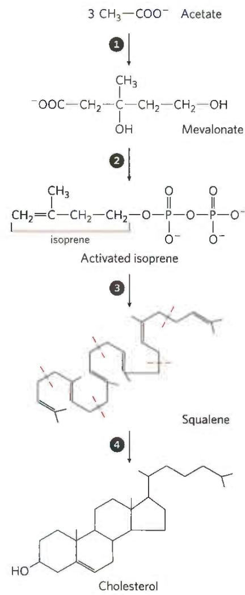  
FIGURE 21-33 Summary of cholesterol biosynthesis. Isoprene units in squalene are set off by dashed red lines.

Stage 1 Synthesis of Mevalonate from Acetate The first stage in cholesterol biosynthesis leads to the intermediate mevalonate (Fig. 21-34). Two molecules of acetyl-CoA condense to form acetoacetyl-CoA, which condenses with a third molecule of acetyl-CoA to yield the six-carbon compound $\beta$ -hydroxy- $\beta$ -methylglutaryl-CoA (HMG-CoA). These first two reactions are catalyzed by acetyl-CoA acetyl transferase and HMG-CoA synthase, respectively. Both reactions are Claisen condensations, and the standard equilibrium in each case favors degradation to acetyl-CoA. However, in cells, the synthetic reactions are facilitated by the rapid utilization of the product HMG-CoA in subsequent reactions. The cytosolic HMG-CoA synthase in this pathway is distinct from the mitochondrial isozyme that catalyzes HMG-CoA synthesis in ketone body formation (see Fig. 17-16).

P3 The third reaction is the committed step: reduction of HMG-CoA to mevalonate, for which two molecules of NADPH each donate two electrons. HMG-CoA reductase, an integral membrane protein of the smooth ER, is the major point of regulation on the pathway to cholesterol, as we shall see.

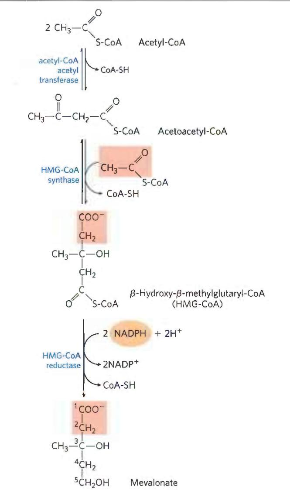  
FIGURE 21-34 Formation of mevalonate from acetyl-CoA. The origin of C-1 and C-2 of mevalonate from acetyl-CoA is shaded light red.

Stage 2 Conversion of Mevalonate to Two Activated Isoprenes In the next stage, three phosphate groups are transferred from three ATP molecules to mevalonate (Fig. 21-35). The phosphate attached to the C-3 hydroxyl group of mevalonate in the intermediate 3-phospho-5-pyrophosphomevalonate is a good leaving group; in the next step, both this phosphate and the nearby carboxyl group leave, producing a double bond in the five-carbon product, $\Delta^{3}$ -isopentenyl pyrophosphate. This is the first of the two activated isoprenes central to cholesterol formation. Isomerization of $\Delta^{3}$ -isopentenyl pyrophosphate yields the second activated isoprene, dimethylallyl pyrophosphate. Synthesis of isopentenyl pyrophosphate in the cytoplasm of plant cells follows the pathway described here. However, plant chloroplasts and many bacteria use a mevalonate-independent pathway. This alternative pathway does not occur in animals, so it is an attractive target for the development of new antibiotics.

  
FIGURE 21-35 Conversion of mevalonate to activated isoprene units. Six of these activated units combine to form squalene (see Fig. 21-36). The leaving groups of 3-phospho-5-pyrophosphomevalonate are shaded light red. The bracketed intermediate is hypothetical. Both of these isoprene products are required for the next stage in cholesterol biosynthesis.

Stage 3 Condensation of Six Activated Isoprene Units to Form Squalene Isopentenyl pyrophosphate and dimethylallyl pyrophosphate now undergo a head-to-tail condensation, in which one pyrophosphate group is displaced and a 10-carbon chain, geranyl pyrophosphate, is formed (Fig. 21-36). (The "head" is the end to which pyrophosphate is joined.) Geranyl pyrophosphate undergoes another head-to-tail condensation with isopentenyl pyrophosphate, yielding the 15-carbon intermediate farnesyl pyrophosphate. Finally, two molecules of farnesyl pyrophosphate join head to head, with the elimination of both pyrophosphate groups, to form squalene. Squalene has 30 carbons: 24 in the main chain and 6 in the form of methyl group branches.

The common names of these intermediates derive from the sources from which they were first isolated. Geraniol, a component of rose oil, has the aroma of geraniums, and farnesol is an aromatic compound found in flowers of the Farnese acacia tree. Many natural scents of plant origin are synthesized from isoprene units. Squalene was first isolated from the liver of sharks (genus Squalus).

Stage 4 Conversion of Squalene to the Four-Ring Steroid Nucleus When the squalene molecule is represented as in Figure 21-37, the relationship of its linear structure to the cyclic structure of the sterols becomes apparent. All sterols have the four fused rings that form the steroid nucleus, and all are alcohols, with a hydroxyl group at C-3—thus the name “sterol.” The action of squalene monooxygenase adds one oxygen atom from $O_{2}$ to the end of the squalene chain, forming an epoxide. This enzyme is another mixed-function oxidase; NADPH reduces the other oxygen atom of $O_{2}$ to $H_{2}O$ . The double bonds of the product, squalene 2,3-epoxide, are positioned so that a remarkable concerted reaction can convert the linear squalene epoxide to a cyclic structure. In animal cells, this cyclization results in the formation of lanosterol, which contains the four rings characteristic of the steroid nucleus. Lanosterol is finally converted to cholesterol in a series of about 20 reactions that include the migration of some methyl groups and the removal of others. Elucidation of this extraordinary biosynthetic pathway, one of the most complex known, was accomplished by Konrad Bloch, Feodor Lynen, John Cornforth, and George Popják in the late 1950s.

  
FIGURE 21-36 Formation of squalene. This 30-carbon structure arises through successive condensations of activated isoprene (five-carbon) units.

Cholesterol is the sterol characteristic of animal cells; plants, fungi, and protists make other, closely related sterols instead. They use the same synthetic pathway as far as squalene 2,3-epoxide, at which point the pathways diverge slightly, yielding other sterols, such as stigmasterol in many plants and ergosterol in fungi (Fig. 21-37).

## WORKED EXAMPLE 21-1 Energetic Cost of Squalene Synthesis

What is the energetic cost of the synthesis of squalene from acetyl-CoA, in number of ATPs per molecule of squalene synthesized?

SOLUTION: In the pathway from acetyl-CoA to squalene, ATP is consumed only in the steps that convert mevalonate to the activated isoprene precursors of squalene. Three ATP molecules are used to create each of the six activated isoprenes required to construct squalene, for a total cost of 18 ATP molecules.

## Cholesterol Has Several Fates

Most of the cholesterol synthesis in vertebrates takes place in the liver. A small fraction of the cholesterol made there is incorporated into the membranes of hepatocytes, but most of it is exported in one of three forms: as bile acids, as biliary cholesterol, or as cholesteryl

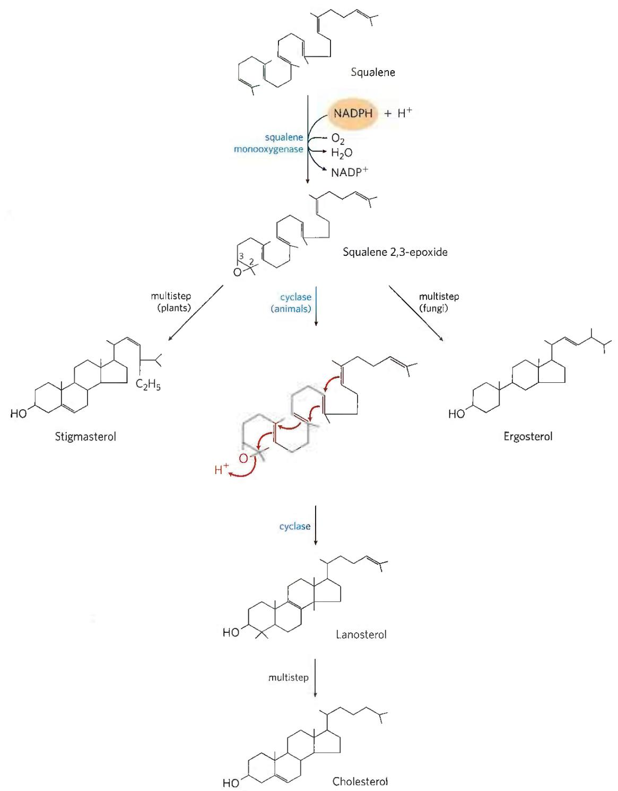  
FIGURE 21-37 Ring closure converts linear squalene to the condensed steroid nucleus. The first step in this sequence is catalyzed by a mixed-function oxygenase, for which the cosubstrate is NADPH. The product  
is an epoxide, which in the next step is cyclized to the steroid nucleus. The final product of these reactions in animal cells is cholesterol; in other organisms, slightly different sterols are produced, as shown.

esters (Fig. 21-38). Small quantities of oxysterols such as 25-hydroxycholesterol are formed in the liver and act as regulators of cholesterol synthesis (see below). In other tissues, cholesterol is converted into steroid hormones (in the adrenal cortex and gonads, for example; see Fig. 10-18) or into vitamin D hormone (in the liver and kidney; see Fig. 10-19). Such hormones are extremely potent biological signals acting through nuclear receptor proteins.

Bile acids, one of the three forms of cholesterol exported from the liver, are the principal components of bile, a fluid stored in the gallbladder and excreted into the small intestine to aid in the digestion of fat-containing meals. Bile acids and their salts are relatively hydrophilic cholesterol derivatives that serve as emulsifiers in the intestine, converting large particles of fat into tiny micelles and thereby greatly increasing the surface at which digestive lipases can act (see Fig. 17-1). Bile also contains much smaller amounts of cholesterol (biliary cholesterol). Bile helps remove excess cholesterol from the intestine and facilitates excretion. Dietary fiber can enhance this effect by binding to bile and interfering with bile reabsorption in the intestines, leading to increased bile excretion in the feces. More cholesterol is then used to make bile. The soluble fiber available in oats (oatmeal) and barley is especially effective.

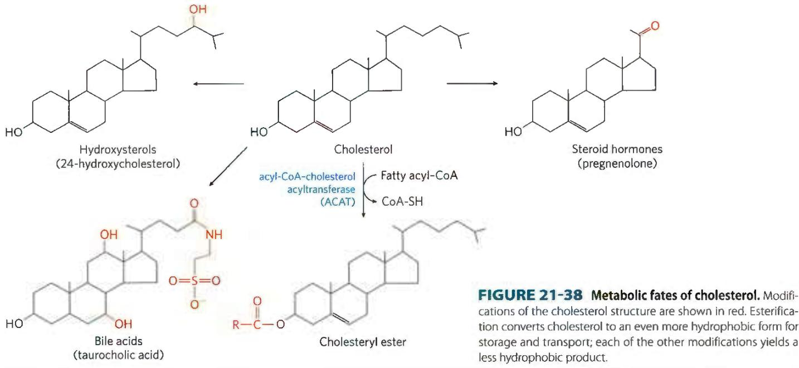

Cholesteryl esters are formed in the liver through the action of acyl-CoA-cholesterol acyltransferase (ACAT). This enzyme catalyzes the transfer of a fatty acid from coenzyme A to the hydroxyl group of cholesterol (Fig. 21-38), converting the cholesterol to a more hydrophobic form that is no longer sufficiently amphipathic to function appropriately in membranes. Cholesteryl esters are transported in secreted lipoprotein particles to other tissues that use cholesterol, or they are stored in the liver in lipid droplets.

## Cholesterol and Other Lipids Are Carried on Plasma Lipoproteins

Cholesterol and cholesteryl esters, like triacylglycerols and phospholipids, are essentially insoluble in water, yet they must be moved from the tissue of origin to the tissues in which they will be stored or consumed. They are carried in the blood plasma as plasma lipoproteins, macromolecular complexes of specific carrier proteins, called apolipoproteins, and various combinations of phospholipids, cholesterol, cholesteryl esters, and triacylglycerols.

Apolipoproteins ("apo" designates the protein in its lipid-free form) combine with lipids to form several classes of lipoprotein particles, spherical complexes with hydrophobic lipids in the core and hydrophilic amino acid side chains at the surface (Fig. 21-39a, b). Different combinations of lipids and proteins produce particles of different densities, ranging from chylomicrons to high-density lipoproteins. These particles can be separated by ultracentrifugation (Table 21-1) and visualized by electron microscopy (Fig. 21-39c).

Each class of lipoprotein has a specific function, determined by its point of synthesis, lipid composition, and apolipoprotein content. At least 10 distinct apolipoproteins are found in the lipoproteins of human plasma (Table 21-2), distinguishable by their size, their reactions with specific antibodies, and their characteristic distribution in the lipoprotein classes. These protein components act as signals, targeting lipoproteins to specific tissues or activating enzymes that act on the lipoproteins. Figure 21-40 provides an overview of the formation and transport of the lipoproteins in mammals. The numbered steps in the following discussion refer to this figure.

Chylomicrons, discussed in Chapter 17 in connection with the movement of dietary triacylglycerols from the intestine to other tissues, are the first of four classes of lipoproteins we will discuss. These are the largest of the lipoproteins and the least dense, containing a high proportion of triacylglycerols. Chylomicrons are synthesized from dietary fats in the ER of enterocytes, epithelial cells that line the small intestine. The chylomicrons then move through the lymphatic system and enter the bloodstream via the left subclavian vein. The apolipoproteins of chylomicrons include apoA-IV, apoB-48 (unique to this class of lipoproteins), apoE, apoC-II, and

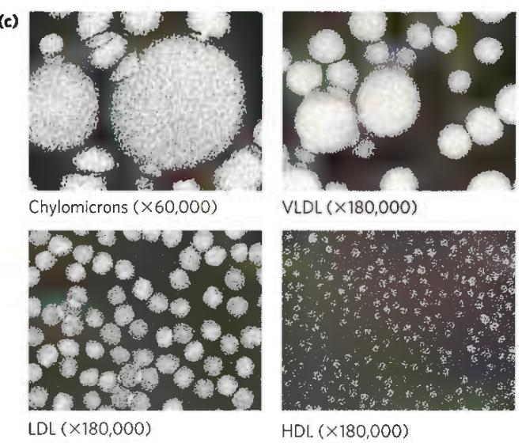

(b) Low-density lipoprotein (LDL)  
  
(c)  
FIGURE 21-39 Lipoproteins. (a) Structure of a chylomicron. Apolipoprotein B-48 (apoB-48) defines the chylomicron. Through the life cycle of a chylomicron other apolipoproteins, including apoC-II, apoC-III, and apoE, become part of the particle, acting as signals in the uptake and metabolism of chylomicron contents. Chylomicrons range from about 100 to 500 nm in diameter. (b) Structure of a low-density lipoprotein (LDL). Apolipoprotein B-100 (apoB-100) is one of the largest single polypeptide chains known, with 4,636 amino acid residues (M, 512,000). One particle of LDL contains a core with about 1,500 molecules of cholesteryl  
esters, surrounded by a shell composed of about 500 more molecules of cholesterol, 800 molecules of phospholipids, and one molecule of apoB-100. (c) Four classes of lipoproteins, visualized in the electron microscope after negative staining. The chylomicrons shown here are 50 to 200 nm in diameter; VLDL, 28 to 70 nm; LDL, 20 to 25 nm; and HDL, 8 to 11 nm. Particle sizes given are those measured for these samples; particle sizes vary considerably in different preparations. For properties of lipoproteins, see Table 21-1. [(b) Data for apoB-100 from A. Johs et al., J. Biol. Chem. 281:19,732, 2006. (c) Robert Hamilton, Jr., PhD.]

apoC-III (Table 21-2). ② ApoC-II activates lipoprotein lipase in the capillaries of adipose, heart, skeletal muscle, and lactating mammary tissues, allowing the release of free fatty acids (FFA) to these tissues. Chylomicrons thus carry dietary fatty acids to tissues where they will be consumed or stored as fuel. ③ The remnants of chylomicrons, depleted of most of their triacylglycerols but still containing cholesterol, apoE, and apoB-48, move through the bloodstream to the liver. Receptors in the liver bind to the apoE in the chylomicron remnants and

TABLE 21-1 Major Classes of Human Plasma Lipoproteins: Some Properties

<table><tr><td rowspan="2">Lipoprotein</td><td rowspan="2">Density (g/mL)</td><td colspan="5">Composition (wt %)</td></tr><tr><td>Protein</td><td>Phospholipids</td><td>Free cholesterol</td><td>Cholesteryl esters</td><td>Triacylglycerols</td></tr><tr><td>Chylomicrons</td><td>&lt;1.006</td><td>2</td><td>9</td><td>1</td><td>3</td><td>85</td></tr><tr><td>VLDL</td><td>0.95–1.006</td><td>10</td><td>18</td><td>7</td><td>12</td><td>50</td></tr><tr><td>LDL</td><td>1.006–1.063</td><td>23</td><td>20</td><td>8</td><td>37</td><td>10</td></tr><tr><td>HDL</td><td>1.063–1.210</td><td>55</td><td>24</td><td>2</td><td>15</td><td>4</td></tr></table>

<table><tr><td colspan="4">TABLE 21-2 Apolipoproteins of the Human Plasma Lipoproteins</td></tr><tr><td>Apolipoprotein</td><td>Polypeptide molecular weight</td><td>Lipoprotein association</td><td>Function (if known)</td></tr><tr><td>ApoA-I</td><td>28,100</td><td>HDL</td><td>Activates LCAT; interacts with ABC transporter</td></tr><tr><td>ApoA-II</td><td>17,400</td><td>HDL</td><td>Inhibits LCAT</td></tr><tr><td>ApoA-IV</td><td>44,500</td><td>Chylomicrons, HDL</td><td>Activates LCAT; cholesterol transport/clearance</td></tr><tr><td>ApoB-48</td><td>242,000</td><td>Chylomicrons</td><td>Cholesterol transport/clearance</td></tr><tr><td>ApoB-100</td><td>512,000</td><td>VLDL, LDL</td><td>Binds to LDL receptor</td></tr><tr><td>ApoC-I</td><td>7,000</td><td>VLDL, HDL</td><td></td></tr><tr><td>ApoC-II</td><td>9,000</td><td>Chylomicrons, VLDL, HDL</td><td>Activates lipoprotein lipase</td></tr><tr><td>ApoC-III</td><td>9,000</td><td>Chylomicrons, VLDL, HDL</td><td>Inhibits lipoprotein lipase</td></tr><tr><td>ApoD</td><td>32,500</td><td>HDL</td><td></td></tr><tr><td>ApoE</td><td>34,200</td><td>Chylomicrons, VLDL, HDL</td><td>Triggers clearance of VLDL and chylomicron remnants</td></tr><tr><td>ApoH</td><td>50,000</td><td>Possibly VLDL, binds phospholipids such as cardiolipin</td><td>Roles in coagulation, lipid metabolism, apoptosis, inflammation</td></tr></table>

Information from D. E. Vance and J. E. Vance (eds), Biochemistry of Lipids and Membranes, 5th edn, Elsevier Science Publishing, 2008.

  
FIGURE 21-40 Lipoproteins and lipid transport. Lipids are transported in the bloodstream as lipoproteins, which exist as several variants that have different functions, different protein and lipid compositions (see Tables 21-1 and 21-2), and thus different densities. Numbered steps are described in the text. In the exogenous pathway (blue arrows), dietary lipids are packaged into chylomicrons; fatty acids from triacylglycerol (TAG) are released by lipoprotein lipase to adipose and muscle tissues, during transport through capillaries. Chylomicron remnants (containing largely protein and cholesterol) are taken up  
by the liver. Bile salts produced in the liver aid in dispersing dietary fats and are then reabsorbed in the enterohepatic pathway (green arrows). In the endogenous pathway (red arrows), lipids synthesized or packaged in the liver are delivered to peripheral tissues by VLDL. Extraction of lipid from VLDL (along with loss of some apolipoproteins) gradually converts some of it to LDL, which delivers cholesterol to extrahepatic tissues or returns to the liver. Excess cholesterol in extrahepatic tissues is transported back to the liver as HDL in reverse cholesterol transport (purple arrows). C represents cholesterol; CE, cholesteryl ester.

Phosphatidylcholine (lecithin)

mediate uptake of these remnants by endocytosis. ④ In the liver, the remnants release their cholesterol and are degraded in lysosomes. This pathway from dietary cholesterol to the liver is the exogenous pathway (blue arrows in Fig. 21-40).

Very-low-density lipoprotein (VLDL) is the second of the four classes. When the diet contains more fatty acids and cholesterol than are needed immediately as fuel or as precursors to other molecules, 5 they are converted to triacylglycerols or cholesteryl esters in the liver and packaged with specific apolipoproteins into VLDL. Excess carbohydrate in the diet can also be converted to triacylglycerols in the liver and exported as VLDL. In addition to triacylglycerols and cholesteryl esters, VLDL contains apoB-100, apoC-I, apoC-II, apoC-III, and apoE (Table 21-2). VLDL is transported in the blood from the liver to muscle and adipose tissue. 6 In the capillaries of these tissues, apoC-II activates lipoprotein lipase, which catalyzes the release of free fatty acids from triacylglycerols in the VLDL. Adipocytes take up these fatty acids, reconvert them to triacylglycerols, and store the products in intracellular lipid droplets; myocytes, in contrast, primarily oxidize the fatty acids to supply energy. When the insulin level is high (after a meal), VLDL serves primarily to convey lipids from the diet to adipose tissue for storage. In the fasting state between meals, the fatty acids used to produce VLDL in the liver originate primarily from adipose tissue, and the principal VLDL target is myocytes of the heart and skeletal muscle.

Low-density lipoprotein (LDL), the third class of lipoprotein, is formed when triacylglycerol loss converts some VLDL to VLDL remnants, also called intermediate-density lipoprotein (IDL). Further removal of triacylglycerol from IDL (remnants) produces LDL. Rich in cholesterol and cholesteryl esters, and containing apoB-100 as its major apolipoprotein, ⑦ LDL carries cholesterol to extrahepatic tissues such as muscle, adrenal glands, and adipose tissue. These tissues have plasma membrane LDL receptors that recognize apoB-100 and mediate uptake of cholesterol and cholesteryl esters. ⑧ LDL also delivers cholesterol to macrophages, sometimes converting them into foam cells (see Fig. 21-46). ⑨ LDL not taken up by peripheral tissues and cells returns to the liver and is taken up via LDL receptors in the hepatocyte plasma membrane. Cholesterol that enters hepatocytes by this path may be incorporated into membranes, converted to bile acids, or reesterified by ACAT (Fig. 21-38) for storage within cytosolic lipid droplets. This pathway, from VLDL formation in the liver to LDL return to the liver, is the endogenous pathway of cholesterol metabolism and transport (red arrows in Fig. 21-40). Accumulation of excess intracellular cholesterol is prevented by reducing the rate of cholesterol synthesis when sufficient cholesterol is available from LDL in the blood. Regulatory mechanisms to accomplish this are described below.

## HDL Carries Out Reverse Cholesterol Transport

High-density lipoprotein (HDL), the fourth major lipoprotein in mammals, $^{10}$ originates in the liver and small intestine as small, protein-rich particles that contain relatively little cholesterol and no cholesteryl esters (Fig. 21-40). HDLs contain primarily apoA-I and other apolipoproteins (Table 21-2). They also contain the enzyme lecithin-cholesterol acyltransferase (LCAT), which catalyzes the formation of cholesteryl esters from lecithin (phosphatidylcholine) and cholesterol (Fig. 21-41). LCAT on the surface of nascent (newly forming) HDL particles converts the cholesterol and phosphatidylcholine of chylomicron and VLDL remnants encountered in the bloodstream to cholesteryl esters, which begin to form a core, transforming the disk-shaped nascent HDL to a mature, spherical HDL particle.

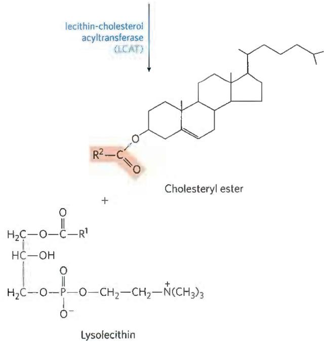  
FIGURE 21-41 Reaction catalyzed by lecithin-cholesterol acyltransferase (LCAT). This enzyme is present on the surface of HDL and is stimulated by the HDL component apoA-I. Cholesteryl esters accumulate within nascent HDLs, converting them to mature HDLs.

11 Nascent HDL can also pick up cholesterol from cholesterol-rich extrahepatic cells (including macrophages and foam cells, formed from macrophages; see below).
12 Mature HDL then returns to the liver, where the cholesterol is unloaded via the scavenger receptor SR-BI.
13 Some of the cholesteryl esters in HDL can also be transferred to LDL by the cholesteryl ester transfer protein. The HDL circuit is reverse cholesterol transport (purple arrows in Fig. 21-40). Much of this cholesterol is converted to bile salts by enzymes sequestered in hepatic peroxisomes; the bile salts are stored in the gallbladder and excreted into the intestine when a meal is ingested.
14 Bile salts are reabsorbed by the liver and recirculate through the gallbladder in this enterohepatic circulation (green arrows in Fig. 21-40).

The unloading of sterols via SR-BI receptors in liver and other tissues does not occur by endocytosis, the mechanism used for LDL uptake. Instead, when HDL binds to SR-BI receptors in the plasma membranes of hepatocytes or steroidogenic tissues such as the adrenal gland, these receptors mediate partial and selective transfer of cholesterol and other lipids in HDL into the cell. Depleted HDL then dissociates to recirculate in the bloodstream and extract more lipids from remnants of chylomicrons and VLDL, and from cells overloaded with cholesterol, as described below.

## Cholesteryl Esters Enter Cells by Receptor-Mediated Endocytosis

Each LDL particle in the bloodstream contains apoB-100, which is recognized by LDL receptors present in the plasma membranes of cells that need to take up cholesterol. Figure 21-42 shows such a cell. ① LDL receptors are synthesized in the ER and transported to the plasma membrane, after modification in the Golgi complex. At the plasma membrane, they are available to bind apoB-100. ② Binding of LDL to an LDL receptor initiates endocytosis, which ③ conveys the LDL and its receptor into the cell within an endosome. ④ The receptor-containing portions of the endosome membrane bud off and are returned to the cell surface, to function again in LDL uptake. ⑤ The endosome fuses with a lysosome, which ⑥ contains enzymes that hydrolyze the cholesteryl esters, releasing cholesterol and fatty acids into the cytosol. The apoB-100 protein is also degraded to amino acids that are released to the cytosol. ApoB-100 is also present in VLDL, but its receptor-binding domain is not available for binding to the LDL receptor; conversion of VLDL to LDL exposes the receptor-binding domain of apoB-100.

This pathway for the transport of cholesterol in blood and its receptor-mediated endocytosis by target tissues was elucidated by Michael Brown and

  
FIGURE 21-42 Uptake of cholesterol by receptor-mediated endocytosis.

Joseph Goldstein. They discovered that individuals with the genetic disease familial hypercholesterolemia (FH) have mutations in the LDL receptor that prevent the normal uptake of LDL by liver and peripheral tissues. The result of defective LDL uptake is very high blood levels of LDL (and of the cholesterol it carries). Individuals with FH have a greatly increased probability of developing atherosclerosis, a disease of the cardiovascular system in which blood vessels are occluded by cholesterol-rich plaques (see Fig. 21-46).

  
Michael Brown and Joseph Goldstein
[Mei-Chun Jau. Courtesy of Michael Brown and Joseph Goldstein, University of Texas Southwestern Medical Center.]

Niemann-Pick type-C (NPC) disease is an inherited defect in lipid storage. In this disorder, cholesterol is not transported out of the lysosomes and instead accumulates in lysosomes of liver, brain, and lung, bringing about early death. NPC is the result of a mutation in either of two genes, NPC1 and NPC2, essential to moving cholesterol out of the lysosome and into the cytosol, where it can be further metabolized. NPC1 encodes a transmembrane lysosomal protein, and NPC2 encodes a soluble protein. These proteins act in tandem to transfer cholesterol out of the lysosome and into the cytosol for further processing or metabolism.

## Cholesterol Synthesis and Transport Are Regulated at Several Levels

Cholesterol synthesis is a complex and energy-expensive process. Excess cholesterol cannot be catabolized for use as fuel and must be excreted. Therefore, it is clearly advantageous to an organism to regulate the biosynthesis of cholesterol to complement dietary intake. In mammals, cholesterol production is regulated by intracellular cholesterol concentration, by the supply of ATP, and by the hormones glucagon and insulin. The committed step in the pathway to cholesterol (and a major site of regulation) is the conversion of HMG-CoA to mevalonate (Fig. 21-34), the reaction catalyzed by HMG-CoA reductase.

Short-term (minute-to-minute) regulation of the activity of existing HMG-CoA reductase is accomplished by reversible covalent alteration: phosphorylation by the AMP-dependent protein kinase (AMPK), which senses high AMP concentration (indicating low ATP concentration). Thus, when ATP levels drop, the synthesis of cholesterol slows, and catabolic pathways for the generation of ATP are stimulated (Fig. 21-43). Hormones that mediate global regulation of lipid and carbohydrate metabolism also act on HMG-CoA reductase; glucagon stimulates its phosphorylation (inactivation), and insulin promotes dephosphorylation, activating the enzyme and favoring cholesterol synthesis. These covalent regulatory mechanisms are probably not as important, quantitatively, as the mechanisms that affect the synthesis and degradation of the enzyme.

In the longer term, the number of molecules of HMG-CoA reductase is increased or decreased in response to cellular concentrations of cholesterol. Regulation of HMG-CoA reductase synthesis by cholesterol is mediated by an elegant system of transcriptional regulation of the HMG-CoA gene (Fig. 21-44). This gene, along with more than 20 other genes encoding enzymes that mediate the uptake and synthesis of cholesterol and unsaturated fatty acids, is controlled by a small family of proteins called sterol regulatory element-binding proteins (SREBPs). When newly synthesized, these proteins are embedded in the ER. Only the soluble regulatory domain fragment of an SREBP functions as a transcription activator, through mechanisms discussed in Chapter 28. When cholesterol and oxysterol levels are high, SREBPs are held in the ER in a complex with another protein called SREBP cleavage-activating protein (SCAP), which in turn is anchored in the ER membrane by its interaction with a third membrane protein, Insig (insulin-induced gene protein) (Fig. 21-44a). SCAP and Insig act as sterol sensors. When sterol levels are high, the Insig-SCAP-SREBP complex is retained in the ER membrane. When the level of sterols in the cell declines (Fig. 21-44b), the SCAP-SREBP complex is escorted by secretory proteins to the Golgi complex. There, two proteolytic cleavages of SREBP release a regulatory fragment, which enters the nucleus and activates transcription of its target genes, including those for HMG-CoA reductase, the LDL receptor protein, and other proteins needed for lipid synthesis. When sterol levels increase sufficiently, the proteolytic release of SREBP amino-terminal domains is again blocked, and proteasome degradation of the existing active domains results in rapid shutdown of the gene targets.

  
FIGURE 21-43 Regulation of cholesterol formation balances synthesis with dietary uptake and energy state. Insulin promotes dephosphorylation (activation) of HMG-CoA reductase; glucagon promotes its phosphorylation (inactivation); and the AMP-dependent protein kinase AMPK, when activated by low [ATP] relative to [AMP], phosphorylates and inactivates HMG-CoA reductase. Oxysterol metabolites of cholesterol (for example, 24(S)-hydroxycholesterol) stimulate proteolysis of HMG-CoA reductase.

  
FIGURE 21-44 Regulation of cholesterol synthesis by SREBP. Sterol regulatory element-binding proteins (SREBPs) are embedded in the ER when first synthesized, in a complex with the protein SREBP cleavage-activating protein (SCAP), which is in turn bound to Insig. (N and C represent the amino and carboxyl termini of the proteins.) (a) Under normal circumstances (high [sterol]), SCAP and Insig are bound to SREBPs and the SREBPs are inactive. (b) When sterol  
levels decline, sterol-binding sites on Insig and SCAP are unoccupied, and Insig is targeted for degradation by the attachment of several ubiquitin molecules. The remaining SCAP-SREBP complex migrates to the Golgi complex, and SREBP is cleaved (arrows) to produce a regulatory domain fragment. (c) This domain acts in the nucleus to increase the transcription of sterol-regulated genes. (Information from R. Raghow et al., Trends Endocrinol Metab. 19:65, 2008, Fig. 2.)

The level of HMG-CoA reductase is also regulated by proteolytic degradation of the enzyme itself. High levels of cellular cholesterol are sensed by Insig, which triggers attachment of ubiquitin molecules to HMG-CoA reductase, leading to its degradation by proteasomes.

Liver X receptor (LXR) is a nuclear transcription factor activated by oxysterol ligands (reflecting high cholesterol levels), which integrates the metabolism of fatty acids, sterols, and glucose. LXRα is expressed primarily in liver, adipose tissue, and macrophages; LXRβ is present in all tissues. When bound to an oxysterol ligand, LXRs form heterodimers with a second type of nuclear receptor, the retinoid X receptors (RXR), and the LXR-RXR dimer activates transcription from a set of genes (Fig. 21-45), including those for acetyl-CoA carboxylase, the first enzyme in fatty acid synthesis; fatty acid synthase; the cytochrome P-450 enzyme CYP7A1, required for sterol conversion to bile acids; apoproteins that participate in cholesterol transport (apoC-I, apoC-II, apoD, and apoE); the ATP-binding cassette (ABC) transporters ABCA1 and ABCG1, required for reverse cholesterol transport (see below); GLUT4, the insulin-stimulated glucose transporter of muscle and adipose tissue; and an SREBP called SREBP1C. The transcriptional regulators LXR and SREBP therefore work together to achieve and maintain cholesterol homeostasis; SREBPs are activated by low levels of cellular cholesterol, and LXRs are activated by high cholesterol levels.

  
FIGURE 21-45 Action of RXR-LXR dimer on expression of genes for lipid and glucose metabolism. When their ligands are absent, RXR and LXR associate with a corepressor protein, preventing transcription of the genes associated with the LXR element (LXRE). When their respective ligands are present — 9-cis-retinoic acid for RXR, cholesterol or oxysterols for LXR — the dimer dissociates from the corepressor, then associates with a coactivator protein. This complex binds to the LXR element and turns on expression of the associated genes. Regulation of gene expression is a topic discussed in more detail in Chapter 28. [Information from A. C. Calkin and P. Tontonoz, Nat. Rev. Mol. Cell Biol. 13:213, 2012, Fig. 1.]

Regulation by LXRs is complemented by the activity of farnesoid X receptor (FXR), which also forms a heterodimer with RXR, with an effect that is often reciprocal to that of LXR-RXR. Although farnesol is a ligand for this receptor, FXR responds primarily to bile acids. High levels of bile acids can be toxic. FXR, expressed mainly in the intestine, liver, kidney, and adrenal glands, provides essential control of bile acid levels by increasing or decreasing expression of multiple genes. FXR represses many of the genes that are activated by LXR.

Finally, two other regulatory mechanisms influence cellular cholesterol level: (1) high cellular concentrations of cholesterol activate ACAT, which increases esterification of cholesterol for storage, and (2) high cellular cholesterol levels diminish (via SREBP) transcription of the gene that encodes the LDL receptor, reducing production of the receptor and thus the uptake of cholesterol from the blood.

## Dysregulation of Cholesterol Metabolism Can Lead to Cardiovascular Disease

As noted earlier, cholesterol cannot be catabolized by animal cells. Excess cholesterol can be removed only by excretion or by conversion to bile salts. When the sum of cholesterol synthesized and cholesterol obtained in the diet exceeds the amount required for the synthesis of membranes, bile salts, and steroids, pathological accumulations of cholesterol (plaques) can obstruct blood vessels, a condition called atherosclerosis. Heart failure due to occluded coronary arteries is a leading cause of death in industrialized societies. Atherosclerosis is linked to high levels of cholesterol in the blood, and particularly to high levels of LDL-cholesterol ("bad cholesterol"); there is a negative correlation between HDL ("good cholesterol") levels and arterial disease. Plaque formation in blood vessels is initiated when LDL containing partially oxidized fatty acyl groups adheres to and accumulates in the extracellular matrix of epithelial cells lining arteries (Fig. 21-46). Immune cells (monocytes) are attracted to regions with such LDL accumulations, and they differentiate into macrophages, which take up the oxidized LDL and the cholesterol they contain. Macrophages cannot limit their uptake of sterols, and with increasing accumulation of cholesteryl esters and free cholesterol, the macrophages become foam cells (they appear foamy when viewed under the microscope). As excess free cholesterol accumulates in foam cells and their membranes, the cells undergo apoptosis. Over long periods of time, arteries become progressively occluded as plaques consisting of extracellular matrix material, scar tissue formed from smooth muscle tissue, and foam cell remnants gradually become larger. Within the cholesterol-rich plaques, cholesterol can crystallize (Fig. 21-46, inset). Occasionally, a plaque breaks loose from the site of its formation and is carried through the blood to a narrowed region of an artery in the brain or the heart, causing a stroke or a heart attack. Cholesterol crystals that break loose from plaques can cause vascular injury.

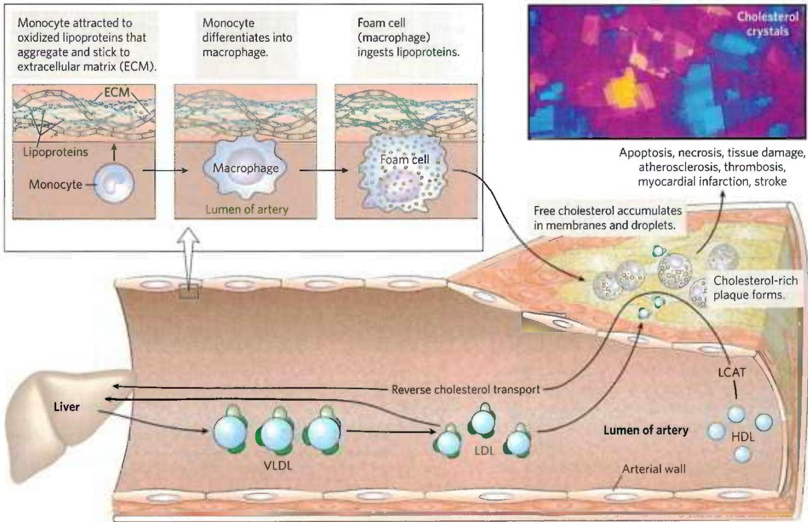  
FIGURE 21-46 Formation of atherosclerotic plaques. Excess lipid derived from the diet is deposited on arterial walls, a process facilitated by the conversion of monocytes to foam cells and incorporation of foam cells into  
growing plaques. Some of this deposition is countered by HDL and reverse cholesterol transport. The LCAT reaction is shown in Figure 21-41. The inset shows a polarized light micrograph of cholesterol crystals. [Ralph C. Eagle, Jr./Science Source.]

In familial hypercholesterolemia, blood levels of cholesterol are extremely high and severe atherosclerosis develops in childhood. Affected individuals have a defective LDL receptor and lack receptor-mediated uptake of cholesterol carried by LDL. Consequently, cholesterol is not cleared from the blood; it accumulates in foam cells and contributes to the formation of atherosclerotic plaques. Endogenous cholesterol synthesis continues despite the excessive cholesterol in the blood, because extracellular cholesterol cannot enter cells to regulate intracellular synthesis (Fig. 21-44). Drugs in a class called statins, some isolated from natural sources and some synthesized industrially, are used to treat patients with elevated serum cholesterol caused by familial hypercholesterolemia and other conditions. The statins resemble mevalonate (Box 21-2) and are competitive inhibitors of HMG-CoA reductase.

An alternative approach to controlling serum cholesterol levels is to activate LXRs, which has the overall effect of decreasing cholesterol absorption and promoting its excretion. This is the mode of action of a drug called ezetimibe. Ezetimibe is not as effective in lowering serum cholesterol as statins. However, in combination with statins, it can lower risk of stroke or heart attack in high-risk patients. Because LXR activation also activates SREBP1C, causing the liver to increase its production of fatty acids and triacylglycerols, new classes of drugs that target only intestinal LXRs are being developed.

## Reverse Cholesterol Transport by HDL Counters Plaque Formation and Atherosclerosis

HDL plays a critical role in the reverse cholesterol transport pathway (Fig. 21-47), reducing the potential damage from foam cell buildup. Depleted HDL (low in cholesterol) picks up cholesterol stored in extrahepatic tissues, including foam cells at nascent plaques, and carries it to the liver.

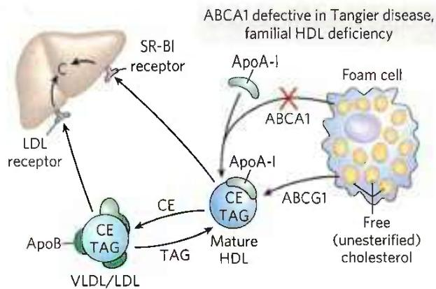  
FIGURE 21-47 Reverse cholesterol transport. ApoA-I and HDLs pick up excess cholesterol (C) from peripheral cells, with the participation of ABCA1 and ABCG1 transporters, and return it to the liver. In individuals with genetically defective ABCA1, the failure of reverse cholesterol transport leads to severe and early cardiovascular diseases: Tangier disease and familial HDL deficiency disease. CE, cholesteryl esters; TAG, triacylglycerols. [Information from A. R. Tall et al., Cell Metab. 7:365, 2008, Fig. 1.]

Cholesterol movement out of cells requires transporters. The human genome encodes 48 transporters of the ATP-binding cassette (ABC) class, and about half of these promote lipid transport. Two of them transport cholesterol out of cells. In this process, apoA-I interacts with the transporter ABCA1 in a cholesterol-rich cell. ABCA1 transports a load of cholesterol from inside the cell to the outer surface of the plasma membrane, where lipid-free or lipid-poor apoA-I picks it up, then transports it to the liver. Another transporter, ABCG1, interacts with mature HDL, facilitating the movement of cholesterol out of the cell and into the HDL. This efflux process is particularly critical to reverse cholesterol transport away from foam cells at the sites of plaques in the blood vessels of individuals with cardiovascular disease.

In familial HDL deficiency, HDL levels are very low, and in Tangier disease they are almost undetectable (Fig. 21-47). Both genetic disorders are the result of mutations in the ABCA1 protein. ApoA-I in cholesterol-depleted HDL cannot take up cholesterol from cells that lack ABCA1 protein, and apoA-I and cholesterol-poor HDL are rapidly removed from the blood and destroyed. Both familial HDL deficiency and Tangier disease are very rare (worldwide, fewer than 100 families with Tangier disease are known), but the existence of these diseases establishes a role for ABCA1 and ABCG1 proteins in the regulation of plasma HDL levels.

## Steroid Hormones Are Formed by Side-Chain Cleavage and Oxidation of Cholesterol

Humans derive all their steroid hormones from cholesterol (Fig. 21-48). P5 Two classes of steroid hormones are synthesized in the cortex of the adrenal gland: mineralocorticoids, which control the reabsorption of inorganic ions $(\mathrm{Na}^{+}, \mathrm{Cl}^{-}$ , and $\mathrm{HCO}_{3}^{-}$ ) by the kidney, and gluco-corticoids, which help regulate gluconeogenesis and

  
$R^{2} = OH$

## The Lipid Hypothesis and the Development of Statins

Coronary heart disease is the leading cause of death in developed countries. The coronary arteries that bring blood to the heart become narrowed due to the formation of fatty deposits called atherosclerotic plaques, containing cholesterol, fibrous proteins, calcium deposits, blood platelets, and cell debris. Developing the link between artery occlusion (atherosclerosis) and blood cholesterol levels was a project of the twentieth century, triggering a dispute that was resolved only with the development of effective cholesterol-lowering drugs. The Framingham Heart Study, a longitudinal study begun in 1948 and continuing today, was aimed at identifying factors correlated with cardiovascular disease. About 5,000 participants from the city of Framingham, Massachusetts, underwent periodic physical examinations and lifestyle interviews. By 2002, participants of the third generation were included in the study. This monumental study led to the identification of risk factors for cardiovascular disease, including smoking, obesity, physical inactivity, diabetes, high blood pressure, and high blood cholesterol.

In 1913, N. N. Anitschkov, an experimental pathologist in Saint Petersburg, Russia, published a study showing that rabbits fed a diet rich in cholesterol developed lesions very similar to the atherosclerotic plaques seen in aging humans. Anitschkov continued his work over the next few decades, publishing it in prominent western journals. Nevertheless, the work was not accepted as a model for human atherosclerosis, due to a prevailing view that the disease was simply a consequence of aging and could not be prevented. The link between serum cholesterol and atherosclerosis (the lipid hypothesis) was gradually strengthened, however, until researchers in the 1960s openly suggested that therapeutic intervention might be helpful. Controversy persisted until the results of a large study of cholesterol lowering, sponsored by the U.S. National Institutes of Health, was published in 1984: the Coronary Primary Prevention Trial. This study conclusively showed a statistically significant decrease in heart attacks and strokes as a result of decreasing blood cholesterol level. The study made use of a bile acid-binding resin, cholestyramine, to control

reduce the inflammatory response. Sex hormones are produced in male and female gonads and the placenta. They include progesterone, which regulates the female reproductive cycle, and androgens (such as testosterone) and estrogens (such as estradiol), which influence the development of secondary sexual characteristics in males and females, respectively. Steroid hormones are effective at very low concentrations and are therefore synthesized in relatively small quantities. In comparison with the bile salts, their production consumes relatively little cholesterol.

cholesterol. The results triggered a search for more effective therapeutic interventions. Some controversy persisted until development of the statins in the late 1980s and 1990s.

Dr. Akira Endo, working at the Sankyo company in Tokyo, discovered the first statin and reported the work in 1976. Endo had been interested in cholesterol metabolism for some time, and he speculated in 1971 that the fungi being screened at that time for new antibiotics might also contain an inhibitor of cholesterol synthesis. Over a period of several years, he screened more than 6,000 fungal cultures until a positive result emerged. The compound that resulted was named compactin (Fig. 1). This compound eventually proved effective in reducing cholesterol levels in dogs and monkeys, and the work came to the attention of Michael Brown and Joseph Goldstein at the University of Texas–Southwestern Medical School. Brown and Goldstein began to work with Endo, and they confirmed his results. Some dramatic results in the first limited clinical trials convinced several pharmaceutical firms to join the hunt for statins. A team at Merck, led by Alfred Alberts

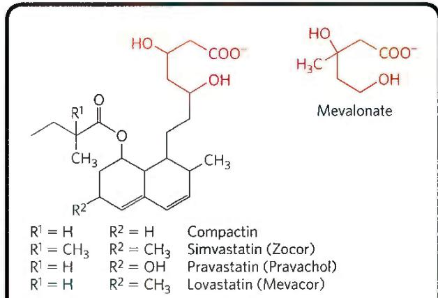  
Simvastatin (Zocor)  
Pravastatin (Pravachol)  
Lovastatin (Mevacor)

FIGURE 1 Statins as inhibitors of HMG-CoA reductase. A comparison of the structures of mevalonate and four pharmaceutical compounds (statins) that inhibit HMG-CoA reductase.  
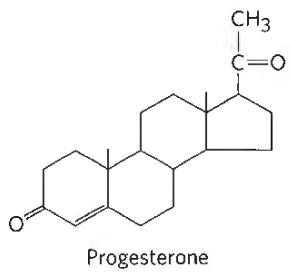

Synthesis of steroid hormones requires removal of some or all of the carbons in the "side chain" on C-17 and P. Roy Vagelos, began screening fungal cultures and found a positive result after screening just 18 cultures. The new statin was eventually called lovastatin (Fig. 1). In 1980, a rumor that compactin, at very high doses, was carcinogenic in dogs almost sidelined the race to develop statins, but the benefits to people with familial hypercholesterolemia were already evident. After much consultation with experts around the world and with the U.S. Food and Drug Administration, Merck proceeded carefully to develop lovastatin. Extensive testing over the next two decades revealed no carcinogenic effects from lovastatin, or from the newer generations of statins that have appeared since.

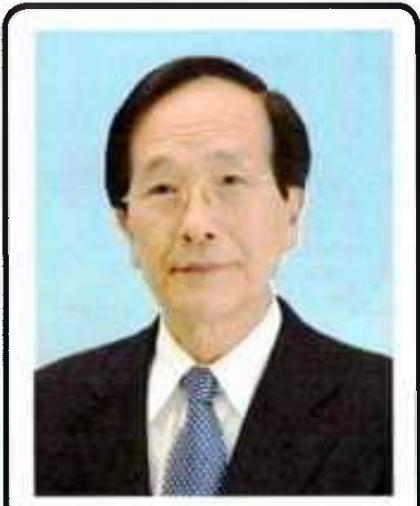  
Akira Endo
[Courtesy of Akira Endo, Ph.D.]

  
Alfred Alberts (1931–2018)
[Courtesy of Eli Alberts.]

Statins inhibit HMG-CoA reductase, in part, by mimicking the structure of mevalonate (Fig. 1), and thus inhibit cholesterol synthesis. Lovastatin treatment lowers serum cholesterol by as much as 30% in individuals with hypercholesterolemia resulting from one defective copy of the gene for the LDL receptor. When combined with an edible resin that binds bile acids and prevents their reabsorption from the intestine, the statin is even more effective.

of the D ring of cholesterol. Side-chain removal takes place in the mitochondria of steroidogenic tissues. Removal requires the hydroxylation of two adjacent carbons in the side chain (C-20 and C-22) followed by cleavage of the bond between them (Fig. 21-49). Formation of the various hormones also requires the introduction of oxygen atoms. All the hydroxylation and oxygenation reactions in steroid biosynthesis are catalyzed by mixed-function oxygenases (see Box 21-1) that use NADPH, O₂, and mitochondrial cytochrome P-450.

  
P. Roy Vagelos
[Courtesy of P. Roy Vagelos.]

Statins are now the most widely used drugs for lowering serum cholesterol levels. Side effects are always a concern with drugs, but in the case of statins, many of the side effects are positive. These drugs can improve blood flow, enhance the stability of atherosclerotic plaques (so they don't rupture and obstruct blood flow), reduce platelet aggregation, and reduce vascular inflammation. In patients taking statins for the first time, some of these effects occur before cholesterol levels drop and may be related to a secondary inhibition of isoprenoid synthesis. Not all effects of statins are positive. Some individuals, usually among those taking statins in combination with other cholesterol-lowering drugs, experience muscle pain or weakness that can become severe and even debilitating. For these patients, the effects may sometimes be ameliorated by diet supplementation with coenzyme $Q_{10}$ , a coenzyme that statin therapy depletes in the serum. A fairly long list of other side effects has been documented; most are rare. However, for the vast majority of people, the statin-mediated decrease in risks associated with coronary heart disease can be dramatic. As with all medications, statins should be used only in consultation with a physician.

## Intermediates in Cholesterol Biosynthesis Have Many Alternative Fates

In addition to its role as an intermediate in cholesterol biosynthesis, isopentenyl pyrophosphate is the activated precursor of a huge array of biomolecules with diverse biological roles (Fig. 21-50). P5 They include vitamins A, E, and K; plant pigments such as carotene and the phytol chain of chlorophyll; natural rubber; many essential oils, such as the fragrant principles of lemon oil, eucalyptus, and musk; insect juvenile hormone, which controls metamorphosis; dolichols, which serve as lipid-soluble carriers in complex polysaccharide synthesis; and ubiquinone and plastoquinone, electron carriers in mitochondria and chloroplasts. Collectively, these molecules are called isoprenoids. More than 20,000 different isoprenoid molecules have been discovered in nature, and hundreds of new ones are reported each year.

  
FIGURE 21-48 Some steroid hormones derived from cholesterol. The structures of some of these compounds are shown in Figure 10-18.

Prenylation, the covalent attachment of an isoprenoid (see Fig. 27-35), is a common mechanism by which proteins are anchored to the inner surface of cellular membranes in mammals (see Fig. 11-16). In some of these proteins, the attached lipid is the 15-carbon farnesyl group; others have the 20-carbon geranylgeranyl group. Different enzymes attach the two types of lipids. It is possible that prenylation targets proteins to different membranes, depending on which lipid is attached. Protein prenylation is another important role for the isoprene derivatives of the pathway to cholesterol.

## SUMMARY 21.4 Cholesterol, Steroids, and Isoprenoids: Biosynthesis, Regulation, and Transport

■ Cholesterol is formed from acetyl-CoA in a complex series of reactions, through the intermediates $\beta$ -hydroxy- $\beta$ -methylglutaryl-CoA (HMG-CoA), mevalonate, and two activated isoprenes, dimethylallyl pyrophosphate and isopentenyl pyrophosphate. Condensation of isoprene units produces the noncyclic squalene, which is cyclized to yield the steroid ring system and side chain.

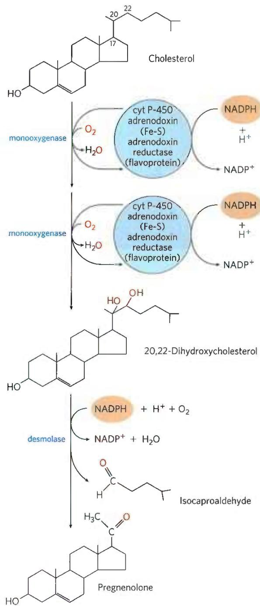  
FIGURE 21-49 Side-chain cleavage in the synthesis of steroid hormones. Cytochrome P-450 acts as electron carrier in this monooxygenase system that oxidizes adjacent carbons. The process also requires the electron-transferring proteins adrenodoxin and adrenodoxin reductase. This system for cleaving side chains is found in mitochondria of the adrenal cortex, where active steroid production occurs. Pregnenolone is the precursor of all other steroid hormones (see Fig. 21-48).

■ Synthesized primarily in the liver, cholesterol is exported as bile acids, biliary cholesterol, or cholesteryl esters.

■ Cholesterol and cholesteryl esters are carried in the blood as plasma lipoproteins. VLDL carries cholesterol, cholesteryl esters, and triacylglycerols from the liver to other tissues, where the triacylglycerols are degraded by lipoprotein lipase, converting VLDL to LDL. Cholesterol scavenging and transport back to the liver are mediated by HDL. Much of the lipid carried to the liver is utilized in bile salts.

  
FIGURE 21-50 Overview of isoprenoid biosynthesis. The structures of most of the end products shown here are given in Chapter 10.

■ The LDL, rich in cholesterol and its esters, is taken up by receptor-mediated endocytosis, in which the apolipoprotein B-100 of LDL is recognized by receptors in the plasma membrane.

■ Cholesterol synthesis and transport are under complex regulation by hormones, cellular cholesterol content, and energy level (AMP concentration). HMG-CoA reductase is regulated allosterically and by covalent modification. Furthermore, a complex of three proteins—Insig, SCAP, and SREBP—sense cholesterol levels and trigger increased synthesis or degradation of HMG-CoA reductase in response. The number of LDL receptors per cell is also regulated by cholesterol content.

■ Dietary conditions or genetic defects in cholesterol metabolism may lead to atherosclerosis and heart disease.

In reverse cholesterol transport, HDL removes cholesterol from peripheral tissues, carrying it to the liver. By reducing the cholesterol content of foam cells, HDL protects against atherosclerosis.

■ The steroid hormones (glucocorticoids, mineralocorticoids, and sex hormones) are produced from cholesterol by alteration of the side chain and introduction of oxygen atoms into the steroid ring system. In addition to cholesterol, a wide variety of isoprenoid compounds are derived from mevalonate through condensations of isopentenyl pyrophosphate and dimethylallyl pyrophosphate.

■ Prenylation of certain proteins targets them for association with cellular membranes and is essential for their biological activity.

## KEY TERMS

Terms in bold are defined in the glossary.

malonyl-CoA 744
acetyl-CoA carboxylase 744
fatty acid synthase 745
acyl carrier protein (ACP) 747
4'-phosphopantetheine 747
fatty acid elongation systems 753
fatty acyl-CoA desaturase 754
mixed-function
oxidases 754
stearoyl-ACP desaturase (SCD) 754
essential fatty acids 754
arachidonate 754
eicosatetraenoate 754
prostaglandin (PG) 755
cyclooxygenase (COX) 755
prostaglandin H₂ synthase 755
mixed-function
oxygenases 756
cytochrome P-450 756
thromboxane synthase 758
thromboxane (TX) 758
leukotriene (LT) 759
catabasis 759
specialized pro-resolving mediator (SPM) 759
lipoxin 759
glycerol 3-phosphate dehydrogenase 760
phosphatidic acid 760
triacylglycerol cycle 762
glyceroneogenesis 762
thiazolidinediones 763
phosphatidylglycerol 765
cardiolipin 765
phosphatidylinositol 765
phosphatidylserine 765
phosphatidylethanolamine 765

phosphatidylcholine 765  
Lands cycle 767  
lysophosphatidylcholine acyltransferases (LPCATs) 767  
plasmalogen 768  
platelet-activating factor 768  
cerebroside 770  
sphingomyelin 770  
ganglioside 770  
isoprene 772  
mevalonate 773 $\beta$ -hydroxy- $\beta$ -methylglutaryl-CoA (HMG-CoA) 773  
HMG-CoA synthase 773  
HMG-CoA reductase 773  
squalene 774  
bile acids 776  
cholesteryl esters 777  
apolipoprotein 777  
chylomicron 777  
exogenous pathway 780  
very-low-density lipoprotein (VLDL) 780  
low-density lipoprotein (LDL) 780  
LDL receptors 780  
endogenous pathway 780  
high-density lipoprotein (HDL) 780  
reverse cholesterol transport 781  
enterohepatic circulation 781  
receptor-mediated endocytosis 781  
sterol regulatory element-binding proteins (SREBPs) 782  
SREBP cleavage-activating protein (SCAP) 783

insulin-induced gene protein (Insig) 783
liver X receptor (LXR) 783
retinoid X receptor (RXR) 783

farnesoid X receptor (FXR) 784
atherosclerosis 784
foam cell 785
statin 785

## PROBLEMS

1. Pathway of Carbon in Fatty Acid Synthesis Using your knowledge of fatty acid biosynthesis, provide an explanation for the two experimental observations.

(a) A biochemist adds uniformly labeled $[^{14}C]$ acetyl-CoA to a soluble liver fraction, which yields palmitate uniformly labeled with ${}^{14}C$ .

(b) In a second experiment, the biochemist adds a trace of uniformly labeled $[^{14}C]$ acetyl-CoA in the presence of an excess of unlabeled malonyl-CoA to a soluble liver fraction, which yields palmitate labeled with ${}^{14}C$ only in C-15 and C-16.

2. Synthesis of Fatty Acids from Glucose After a person has ingested large amounts of sucrose, the body transforms the glucose and fructose that exceed caloric requirements to fatty acids for triacylglycerol synthesis. This fatty acid synthesis consumes acetyl-CoA, ATP, and NADPH. How do cells produce acetyl-CoA, ATP, and NADPH from glucose?

3. Net Equation of Fatty Acid Synthesis Write the net equation for the biosynthesis of palmitate in rat liver, starting from mitochondrial acetyl-CoA and cytosolic NADPH, ATP, and $\mathrm{CO}_{2}$ .

4. Pathway of Hydrogen in Fatty Acid Synthesis
A researcher has prepared a solution that contains all the enzymes and cofactors necessary for fatty acid biosynthesis from added acetyl-CoA and malonyl-CoA.

(a) She then adds $[2-^{2}H]$ acetyl-CoA (labeled with deuterium, the heavy isotope of hydrogen) and an excess of unlabeled malonyl-CoA as substrates.

$$
\begin{array}{c} ^ {2} \mathrm{H} \\ ^ {2} \mathrm{H} - \mathrm{C} - \mathrm{C} \\ ^ {2} \mathrm{H} \end{array} \text {   S - CoA   }
$$

How many deuterium atoms incorporate into every molecule of palmitate? What are their locations? Explain.

(b) In a separate experiment, the researcher adds unlabeled acetyl-CoA and $[2-^{2}H]$ malonyl-CoA as substrates.

$$
\mathrm {^ {-} OOC - \overset {^ {2} H} {\underset {^ {2} H} {C}} - \overset {^ {O}} {\underset {S - CoA} {C}}}
$$

How many deuterium atoms incorporate into every molecule of palmitate? What are their locations? Explain.

5. Energetics of $\beta$ -Ketoacyl-ACP Synthase The condensation reaction catalyzed by $\beta$ -ketoacyl-ACP synthase (see Fig. 21-6) synthesizes a four-carbon unit by combining a two-carbon unit and a three-carbon unit, with the release of $\mathrm{CO}_{2}$ . What is the thermodynamic rationale for this process relative to one that simply combines two two-carbon units?

6. Modulation of Acetyl-CoA Carboxylase Acetyl-CoA carboxylase is the principal regulation point in the biosynthesis of fatty acids. Following are some of the properties of the enzyme:

(a) Addition of citrate or isocitrate raises the $V_{max}$ of the enzyme as much as 10-fold.

(b) The enzyme exists in two interconvertible forms that differ markedly in their activities:

$$
\text { Protomer   (inactive) } \rightleftharpoons \text { filamentous   polymer   (active) }
$$

Citrate and isocitrate bind preferentially to the filamentous form, and palmitoyl-CoA binds preferentially to the protomer.

Explain how these properties are consistent with the regulatory role of acetyl-CoA carboxylase in the biosynthesis of fatty acids.

7. Shuttling of Acetyl Groups across the Inner Mitochondrial Membrane The acetyl group shuttle transfers acetyl-CoA, produced by oxidative decarboxylation of pyruvate in the mitochondrion, to the cytosol as outlined in Figure 21-10. (a) Write the overall equation for the transfer of one acetyl group from the mitochondrion to the cytosol.

(b) What is the cost of this process in ATPs per acetyl group?
(c) In Chapter 17 we encountered an acyl group shuttle in the transfer of fatty acyl-CoA from the cytosol to the mitochondrion in preparation for β oxidation (see Fig. 17-6). One result of that shuttle is separation of the mitochondrial and cytosolic pools of CoA. Does the acetyl group shuttle also accomplish this? Explain.

8. Oxygen Requirement for Desaturases The biosynthesis of palmitoleate (see Fig. 21-12), a common unsaturated fatty acid with a cis double bond in the $\Delta^9$ position, uses palmitate as a precursor. Can palmitoleate synthesis be carried out under strictly anaerobic conditions? Explain.

9. Energy Cost of Triacylglycerol Synthesis Use a net equation for the biosynthesis of tripalmitoylglycerol (tripalmitin) from glycerol and palmitate to show how many ATPs are required per molecule of tripalmitin formed.

10. Turnover of Triacylglycerols in Adipose Tissue A researcher adds $[^{14}C]$ glucose to the balanced diet of adult rats. She finds no increase in the total amount of stored triacylglycerols, but the triacylglycerols become labeled with ${}^{14}C$ . Explain.

11. Energy Cost of Phosphatidylcholine Synthesis Write the sequence of steps and the net reaction for the biosynthesis of phosphatidylcholine by the salvage pathway from oleate, palmitate, dihydroxyacetone phosphate, and choline. Starting from these precursors, what is the cost (in number of ATPs) of the synthesis of phosphatidylcholine by the salvage pathway?

12. Salvage Pathway for Synthesis of Phosphatidylcholine A young rat maintained on a diet deficient in methionine fails to thrive unless choline is included in the diet. Explain.

13. Energetics of Acetyl-CoA Condensation to Form Acetoacetyl-CoA The formation of a thioester of acetoacetate is catalyzed by fatty acid synthase during fatty acid synthesis, and by acetyl-CoA acetyltransferase in the first step of cholesterol biosynthesis. Both are Claisen condensations. However, in fatty acid synthesis, malonyl-CoA forms in an earlier step so that decarboxylation facilitates the condensation. In the cholesterol biosynthesis pathway, the condensation occurs between two acetyl-CoA molecules, and no decarboxylation occurs to facilitate the reaction. Suggest a reason why the thermodynamic augmentation of decarboxylation is needed in fatty acid synthesis, but not in the first steps of cholesterol biosynthesis.

14. Synthesis of Isopentenyl Pyrophosphate A researcher adds $[2-^{14}C]$ acetyl-CoA to a rat liver homogenate that is synthesizing cholesterol. Where will the ${}^{14}C$ label appear in $\Delta^{3}$ -isopentenyl pyrophosphate, the activated form of an isoprene unit?

15. Activated Donors in Lipid Synthesis In the biosynthesis of complex lipids, components are assembled by transfer of the appropriate group from an activated donor. For example, the activated donor of acetyl groups is acetyl-CoA. For each of the following groups, give the form of the activated donor: (a) phosphate; (b) D-glucosyl; (c) phosphoethanolamine; (d) D-galactosyl; (e) fatty acyl; (f) methyl; (g) the two-carbon group in fatty acid biosynthesis; (h) $\Delta^3$ -isopentenyl.

16. Importance of Fats in the Diet When young rats are placed on a completely fat-free diet, they grow poorly, develop a scaly dermatitis, lose hair, and soon die. These symptoms can be prevented if linoleate or plant material is included in the diet. What makes linoleate an essential fatty acid? Why can plant material be substituted?

17. Regulation of Cholesterol Biosynthesis Cholesterol in humans can be obtained from the diet or synthesized de novo. An adult human on a low-cholesterol diet typically synthesizes 600 mg of cholesterol per day in the liver. If the amount of cholesterol in the diet is large, de novo synthesis of cholesterol is drastically reduced. How is this regulation brought about?

18. Lowering Serum Cholesterol Levels with Statins Patients treated with a statin drug generally exhibit a dramatic lowering of serum cholesterol. However, the amount of the enzyme HMG-CoA reductase present in cells can increase substantially. Suggest a simple explanation for this effect.

19. Roles of Thiol Esters in Cholesterol Biosynthesis Draw a mechanism for each of the three reactions shown in Figure 21-34, detailing the pathway for the synthesis of mevalonate from acetyl-CoA.

20. Potential Side Effects of Treatment with Statins Although the benefits of taking statins have become clear, side effects have yet to be documented in detail. Some physicians have suggested that patients being treated with statins should also take a supplement of coenzyme Q. Suggest a rationale for this recommendation.

## DATA ANALYSIS PROBLEM

21. Engineering E. coli to Produce Large Quantities of an Isoprenoid There are more than 20,000 naturally occurring isoprenoids, some of which are medically or commercially important and produced industrially. The production methods include in vitro enzymatic synthesis, an expensive and low-yield process. In 1999, Wang, Oh, and Liao reported on their experiments to engineer the easily grown bacterium E. coli to produce large amounts of astaxanthin, a commercially important isoprenoid. Astaxanthin is a red-orange carotenoid pigment (an antioxidant) produced by marine algae. Marine animals such as shrimp, lobster, and some fish that feed on the algae get their orange color from the ingested astaxanthin. Astaxanthin is composed of eight isoprene units; its molecular formula is $C_{40}H_{52}O_{4}$ .

  
Astaxanthin

(a) Circle the eight isoprene units in the astaxanthin molecule. Hint: Use the projecting methyl groups as a guide.

Astaxanthin is synthesized by the pathway shown on the next page, starting with $\Delta^{3}$ -isopentenyl pyrophosphate (IPP). Steps ① and ② are shown in Figure 21-36, and the reaction catalyzed by lPP isomerase is shown in Figure 21-35.

(b) In step 4 of the pathway, two molecules of geranylgeranyl pyrophosphate are linked to form phytoene. Is this a head-to-head joining or is it a head-to-tail joining? (See Figure 21-36 for details.)

(c) Briefly describe the chemical transformation in step 5.

(d) The synthesis of cholesterol (Fig. 21-37) includes a cyclization (ring closure) that requires a net oxidation by $\mathrm{O}_2$ . Does the cyclization in step 6 of the astaxanthin synthetic pathway require a net oxidation of the substrate (lycopene)? Explain your reasoning.

E. coli does not make large quantities of many isoprenoids, and does not synthesize astaxanthin. It is known to synthesize small amounts of IPP, DMAPP, geranyl pyrophosphate, farnesyl pyrophosphate, and geranylgeranyl pyrophosphate. Wang and colleagues cloned several of the E.coli genes that encode enzymes needed for astaxanthin synthesis, in plasmids that allowed their overexpression. These genes included idi, which encodes IPP isomerase, and ispA, which encodes a prenyl transferase that catalyzes steps ① and ②.

To engineer an E. coli capable of the complete astaxanthin pathway, Wang and colleagues cloned several genes from other bacteria into plasmids that would allow their overexpression in E. coli. These genes included crtE from Erwinia uredovora, which encodes an enzyme that catalyzes step ③; and crtB, crtI, crtY, crtZ, and crtW from Agrobacterium aurantiacum, which encode enzymes for steps 4, 5, 6, 7, and 8, respectively.

The investigators also cloned the gene gps from Archaeoglobus fulgidus, overexpressed this gene in E. coli, and extracted the gene product. When this extract was reacted with $[^{14}C]$ IPP and DMAPP or geranyl pyrophosphate or farnesyl pyrophosphate, only ${}^{14}C$ -labeled geranylgeranyl pyrophosphate was produced in all cases.

(e) Based on these data, which step(s) in the pathway are catalyzed by the enzyme encoded by gps? Explain your reasoning.

Wang and coworkers then constructed several E. coli strains overexpressing different genes; they measured the orange color of the colonies (wild-type E. coli colonies are off-white) and the amount of astaxanthin produced (as measured by its orange color). Their results are shown below (ND indicates not determined).

<table><tr><td>Strain</td><td>Gene(s) overexpressed</td><td>Orange color</td><td>Astaxanthin yield (μg/g dry weight)</td></tr><tr><td>1</td><td>crtBIZYW</td><td>-</td><td>ND</td></tr><tr><td>2</td><td>crtBIZYW, ispA</td><td>-</td><td>ND</td></tr><tr><td>3</td><td>crtBIZYW, idi</td><td>-</td><td>ND</td></tr><tr><td>4</td><td>crtBIZYW, idi, ispA</td><td>-</td><td>ND</td></tr><tr><td>5</td><td>crtBIZYW, crtE</td><td>+</td><td>32.8</td></tr><tr><td>6</td><td>crtBIZYW, crtE, ispA</td><td>+</td><td>35.3</td></tr><tr><td>7</td><td>crtBIZYW, crtE, idi</td><td>++</td><td>234.1</td></tr><tr><td>8</td><td>crtBIZYW, crtE, idi, ispA</td><td>+++</td><td>390.3</td></tr><tr><td>9</td><td>crtBIZYW, gps</td><td>+</td><td>35.6</td></tr><tr><td>10</td><td>crtBIZYW, gps, idi</td><td>+++</td><td>1,418.8</td></tr></table>

(f) Comparing the results for strains 1 through 4 with those for strains 5 through 8, what can you conclude about the expression level of an enzyme capable of catalyzing step 3 of the astaxanthin synthetic pathway in wild-type E. coli? Explain your reasoning.

(g) Based on the data above, which enzyme is rate-limiting in this pathway, IPP isomerase or the enzyme encoded by idi? Explain your reasoning.

## Reference

Wang, C.-W., M.-K. Oh, and J.C. Liao. 1999. Engineered isoprenoid pathway enhances astaxanthin production in Escherichia coli. Biotechnol. Bioeng. 62:235–241.

# BIOSYNTHESIS OF AMINO ACIDS, NUCLEOTIDES, AND RELATED MOLECULES

22.1 Overview of Nitrogen Metabolism 795  
22.2 Biosynthesis of Amino Acids 805  
22.3 Molecules Derived from Amino Acids 817  
22.4 Biosynthesis and Degradation of Nucleotides 823

Nitrogen ranks behind only carbon, hydrogen, and oxygen in its contribution to the mass of living systems. Most of this nitrogen is bound up in amino acids and nucleotides. In this chapter we address all aspects of the metabolism of these nitrogen-containing compounds except amino acid catabolism, which is the subject of Chapter 18.

In this final chapter covering anabolic processes, some of the underlying principles are unique, while others will be familiar from Chapter 21 and the consideration of gluconeogenesis in Chapter 14:

P1 Amino acids and nucleotides are the precursors to proteins and nucleic acids, respectively. They also give rise to numerous neurotransmitters, metabolic cofactors, and other molecules of biological importance.

P2 The supply of biologically available nitrogen can be limiting in many environments. Atmospheric $N_{2}$ is relatively inert and must be converted to other forms, such as ammonia and nitrate, to accommodate the requirements of life. A complex web of enzymatic processes, based primarily in microorganisms, interconverts the various molecular forms that comprise the global inventory of reactive nitrogen.

P3 Oxygen and nitrogen metabolism are interlinked. The oxidation and reduction of the various forms of nitrogen in the biosphere often involve oxygen.

P4 Regulation again plays an important role. Many of the processes covered in this chapter are regulated to carefully conserve a critical and limited resource. Tight regulation is needed to maintain balanced supplies of amino acids and nucleotides. The metabolic flux through most of these pathways is far less than for carbohydrate or lipid biosynthetic pathways; most amino acids and nucleotides are not stored, but are synthesized as they are needed.

The amino acids glutamate and glutamine represent the entry point where reactive forms of nitrogen are incorporated into biological systems. Reflecting their importance, the concentrations of these amino acids are sufficiently elevated in many tissues that they are major contributors to the electrochemical environment of cells. The prominent role of these two amino acids is a universal feature of animate nitrogen metabolism, yet another molecular manifestation of the shared evolutionary history of all organisms on the planet.

P6 Like other anabolic pathways, the reaction sequences in amino acid and nucleotide biosynthesis are endergonic and reductive. They use ATP as a source of metabolic energy and they use a reduced electron carrier (usually NADPH) as a reductant.

Discussing the biosynthetic pathways for amino acids and nucleotides together is a sound approach, not only because both classes of molecules contain nitrogen, but also because the two sets of pathways are extensively intertwined, with several key intermediates in common. Certain amino acids or parts of amino acids are incorporated into the structure of purines and pyrimidines, and in one case, part of a purine ring is incorporated into an amino acid (histidine). The two sets of pathways also share much common chemistry, in particular a preponderance of reactions involving the transfer of nitrogen or one-carbon groups.

The sheer number of steps and variety of intermediates in the pathways described here can be intimidating to the beginning biochemistry student. These pathways are best approached by maintaining a focus on metabolic principles we have already discussed, on key intermediates and precursors, and on common classes of reactions. Even a cursory look at the chemistry can be rewarding, for some of the most unusual chemical transformations in biological systems occur in these pathways; for instance, we find prominent examples of the rare biological use of the metals molybdenum, selenium, and vanadium. The effort also offers a practical dividend, especially for students of human or veterinary medicine. Many genetic diseases of humans and animals have been traced to an absence of one or more enzymes of amino acid and nucleotide metabolism, and many pharmaceuticals in common use to combat infectious diseases are inhibitors of enzymes in these pathways—as are a number of the most important agents in cancer chemotherapy.

## 22.1 Overview of Nitrogen Metabolism

The biosynthetic pathways leading to amino acids and nucleotides share a requirement for nitrogen. Soluble, biologically useful nitrogen compounds are generally scarce in natural environments; thus, most organisms use ammonia, amino acids, and nucleotides economically. P2 Available amino acids, purines, and pyrimidines formed during metabolic turnover of proteins and nucleic acids are often salvaged and reused. We begin by examining the pathways by which nitrogen from the environment is introduced into biological systems.

## A Global Nitrogen Cycling Network Maintains a Pool of Biologically Available Nitrogen

The movement of nitrogen through the biosphere has been viewed historically as a cycle. However, our evolving understanding of the complexity of nitrogenous interconversions makes it clear that nitrogen moves through a complex web, rather than in a neat cycle (Fig. 22-1). Earth's atmosphere is four-fifths molecular nitrogen $(\mathrm{N}_2)$ . However, $\mathbf{N}_2$ is too unreactive to be of use to living organisms. Conversion of $\mathbf{N}_2$ to forms that can support life $(\mathrm{NH}_3,\mathrm{NO}_2^-, \mathrm{NO}_3^-)$ is called nitrogen fixation. The reduction of $\mathbf{N}_2$ to $\mathrm{NH}_3$ plays such a central role in making $\mathbf{N}_2$ available that this one reaction is often considered synonymous with nitrogen fixation. In the biosphere, the metabolic processes of countless species function interdependently to salvage and reuse biologically available nitrogen. Most of the key reactions are carried out by bacteria and archaea.

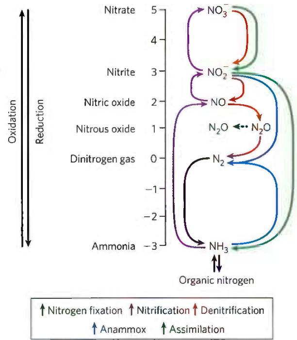  
FIGURE 22-1 The global nitrogen web. The total amount of nitrogen fixed annually in the biosphere exceeds $10^{11}\mathrm{kg}$ ; industrial sources of fixed nitrogen are now nearly as great. Reactions are identified with the processes they are involved in by colored arrows (see key). The oxidation number of the N atom is indicated on the vertical axis. [Information from M. M. M. Kuypers et al., Nat. Rev. Microbiol. 16:263, 2018, Fig. 1.]

The reduction of atmospheric nitrogen ( $N_{2}$ ) by nitrogen-fixing bacteria and archaea to yield ammonia ( $NH_{3}$ or $NH_{4}^{+}$ ), provides a useful anchor for our discussion. This critical process, described in detail in Section 22.2, provides most of the reduced nitrogen for incorporation into biomolecules.

Free ammonia does not build up, and reduction is balanced by oxidation. P3 Bacteria that derive their energy by oxidizing ammonia to nitrite (NO $_{2}^{-}$ ) and ultimately nitrate (NO $_{3}^{-}$ ) are abundant and active in both terrestrial and marine environments. The processes of converting ammonia to nitric oxide, nitrite, and finally nitrate are known as nitrification (Fig. 22-1, purple arrows). Individual bacterial or archaeal species may promote one or more of these steps.

Atmospheric $N_{2}$ must be replaced in order to maintain levels at a steady-state concentration. Some of the replacement comes from reduction of nitrate and nitrite. The reduction of nitrate and nitrite to $N_{2}$ under anaerobic conditions, a process called denitrification (Fig. 22-1, red arrows), is carried out by specialized microorganisms in all three domains of life. These organisms use $NO_{3}^{-}$ or $NO_{2}^{-}$ rather than $O_{2}$ as the ultimate electron acceptor in a series of reactions that (like oxidative phosphorylation) generates a transmembrane proton gradient, which is used to synthesize ATP. These microorganisms exist in all anoxic environments where nitrate is present, including soils, marine sediments, and eutrophic marine zones. An alternative path back to atmospheric $N_{2}$ is provided by a group of bacteria that promote anaerobic ammonia oxidation, or anammox (Fig. 22-1, blue arrows). Anammox converts ammonia and nitrite to $N_{2}$ . As much as 50% to 70% of the $NH_{3}-to-N_{2}$ conversion in the biosphere may occur through this pathway, which went undetected until the 1980s. The obligate anaerobes that promote anammox are fascinating in their own right and are providing some useful solutions to waste-treatment problems (Box 22-1).

Fixation of atmospheric $N_{2}$ is not the only source of reduced ammonia for biological systems. Much of it comes from an alternative fate of nitrate that circumvents denitrification. More than 90% of the $NH_{4}^{+}$ generated by vascular plants, algae, and microorganisms comes from nitrate assimilation, a two-step reductive process that bypasses atmospheric $N_{2}$ . First $NO_{3}^{-}$ is reduced to $NO_{2}^{-}$ by nitrate reductase, then the $NO_{2}^{-}$ is reduced to $NH_{4}^{+}$ in a six-electron transfer catalyzed by nitrite reductase (Fig. 22-2). Both reactions involve chains of electron carriers and cofactors we have not yet encountered. Nitrate reductase is a large, soluble protein ( $M_{r}$ 220,000). Within the enzyme, a pair of electrons, donated by NADH, flows through —SH groups of cysteine, FAD, and a cytochrome (cyt $b_{557}$ ), then to a novel cofactor containing molybdenum, before reducing the substrate $NO_{3}^{-}$ to $NO_{2}^{-}$ .

The nitrite reductase of plants is located in the chloroplasts and receives its electrons from ferredoxin (which is reduced in the light-dependent reactions of photosynthesis; see Section 20.2). Six electrons, donated one at a time by ferredoxin, pass through a 4Fe-4S center in the enzyme, then through a novel hemelike molecule (siroheme) before reducing $\mathrm{NO}_2^-$ to $\mathrm{NH}_4^+$ (Fig. 22-2). Nonphotosynthetic microbes possess a distinct nitrite reductase for which NADPH is the electron donor.

Human activity presents an increasing challenge to the global nitrogen balance, and to all life in the biosphere supported by that balance. P2 Fixed nitrogen is increasingly necessary to boost production in agriculture. Industrial nitrogen-based fertilizers now contribute as much ammonia and other reactive nitrogen species to the biosphere as do natural processes. Nonfarming manufacturing activity releases additional reactive nitrogen into the atmosphere, including nitric oxide, a prominent greenhouse gas. Controlling the damaging effects of agricultural runoff and industrial pollutants will remain an important component of the continuing effort to expand the food supply for a growing human population.

  
FIGURE 22-2 Nitrate assimilation by nitrate reductase and nitrite reductase. (a) Nitrate reductases of plants and bacteria catalyze the two-electron reduction of $\mathrm{NO}_3^-$ to $\mathrm{NO}_2^-$ , in which a novel Mo-containing cofactor plays a central role. NADH is the electron donor. (b) Nitrite reductase

converts the product of nitrate reductase into $NH_{4}^{+}$ in a six-electron, eight-proton transfer process in which the metallic center in siroheme carries electrons and the carboxyl groups of siroheme may donate protons. The initial source of electrons is reduced ferredoxin.  

## Nitrogen Is Fixed by Enzymes of the Nitrogenase Complex

The availability of fixed nitrogen, an essential nutrient, may have limited the size of the primordial biosphere. As early cells acquired a capacity to fix atmospheric nitrogen, the biosphere expanded. Evidence for biological nitrogen fixation has been found in sedimentary rocks more than 3 billion years old.

In the biosphere of today, only certain bacteria and archaea can fix atmospheric $N_{2}$ . These organisms, called diazotrophs, include the cyanobacteria of soils and fresh and salt waters, methanogenic archaea (strict anaerobes that obtain energy and carbon by converting $H_{2}$ and $CO_{2}$ to methane), other kinds of free-living soil bacteria such as Azotobacter species, and the nitrogen-fixing bacteria that live as symbionts in the root nodules of leguminous plants. The most important product of nitrogen fixation is ammonia, which can be used by all organisms either directly or after its conversion to other soluble compounds such as nitrites, nitrates, or amino acids.

The reduction of nitrogen to ammonia is an exergonic reaction:

$$
\mathrm{N} _ {2} + 3 \mathrm{H} _ {2} \longrightarrow 2 \mathrm{NH} _ {3} \quad \Delta G ^ {\prime \circ} = - 3 3. 5 \mathrm{kJ/mol}
$$

The N≡N triple bond, however, is very stable, with a bond energy of 930 kJ/mol. Nitrogen fixation therefore has an extremely high activation energy, and atmospheric nitrogen is almost chemically inert under normal conditions. Ammonia is produced industrially by the Haber process (named for its inventor, Fritz Haber), which requires temperatures of 400 to 500 °C and nitrogen and hydrogen at pressures of tens of thousands of kilopascals (several hundred atmospheres) to provide the necessary activation energy.

  
(b)

  
FIGURE 22-3 Enzymes and cofactors of the nitrogenase complex. (a) The holoenzyme consists of two identical dinitrogenase reductase molecules (green), each with a 4Fe-4S redox center and binding sites for two ATP, and two identical dinitrogenase heterodimers (purple and blue), each with a P cluster (Fe-S center) and an FeMo cofactor. In this structure, ADP is bound in the ATP site, to make the crystal more stable. (b) The electron-transfer cofactors. A P cluster is

Biological nitrogen fixation must occur at biological temperatures and at 0.8 atm of nitrogen, and the high activation barrier is overcome by other means. This is accomplished, at least in part, by the binding and hydrolysis of ATP. The overall reaction can be written

$$
\begin{array}{r l} \mathrm{N} _ {2} + 1 0 \mathrm{H} ^ {+} + 8 e ^ {-} + 1 6 \mathrm{ATP} & \longrightarrow \\ & 2 \mathrm{NH} _ {4} ^ {+} + 1 6 \mathrm{ADP} + 1 6 \mathrm{P} _ {\mathrm{i}} + \mathrm{H} _ {2} \end{array}
$$

Biological nitrogen fixation to produce ammonia is carried out by a highly conserved complex of proteins called the nitrogenase complex; its central components are dinitrogenase reductase and dinitrogenase (Fig. 22-3a). Dinitrogenase reductase ( $M_{r}$ 60,000) is a dimer of two identical subunits. It contains a single 4Fe-4S redox center (see Fig. 19-5), bound between the subunits, and can be oxidized and reduced by one electron. It also has two binding sites for ATP/ADP (one site on each subunit). Dinitrogenase ( $M_{r}$ 240,000), an $\alpha_{2}\beta_{2}$ tetramer, has two Fe-containing cofactors that transfer electrons (Fig. 22-3b). One, the P cluster, has a pair of 4Fe-4S centers; these share a sulfur atom, making an

  
shown here in its reduced (top) and oxidized (middle) forms. The FeMo cofactor (bottom) has a Mo atom with three S ligands, a His ligand, and two oxygen ligands from a molecule of homocitrate. In some organisms, the Mo atom is replaced with a vanadium atom. (Fe is shown in orange, S in yellow.) [Data from (a) PDB ID 1N2C, H. Schindelin et al., Nature 387:370, 1997; (b) $P_{\mathrm{red}}$ ; PDB ID 3MIN, and $P_{\mathrm{ox}}$ ; PDB ID 2MIN, J. W. Peters et al., Biochemistry 36:1181, 1997; FeMo cofactor: PDB ID 1MIN, O. Einsle et al., Science 297:1696, 2002.]

## Unusual Lifestyles of the Obscure but Abundant

Air-breathers that we are, we can easily overlook the bacteria and archaea that thrive in anaerobic environments. Although rarely featured in introductory biochemistry textbooks, these organisms constitute much of the biomass of this planet, and their contributions to the balance of carbon and nitrogen in the biosphere are essential to all forms of life.

As detailed in earlier chapters, the energy used to maintain living systems relies on the generation of proton gradients across membranes. Electrons derived from a reduced substrate are made available to electron carriers in membranes and pass through a series of electron transfers to a final electron acceptor. As a byproduct of this process, protons are released on one side of the membrane, generating the transmembrane proton gradient. The proton gradient is used to synthesize ATP or to drive other energy-requiring processes. For all eukaryotes, the reduced substrate is generally a carbohydrate (glucose or pyruvate) or a fatty acid and the electron acceptor is oxygen.

Many bacteria and archaea are much more versatile. In anaerobic environments such as marine and freshwater sediments, the variety of life strategies is extraordinary. Almost any available redox pair can be an energy source for some specialized organism or group of organisms. For example, a large number of lithotrophic bacteria (a lithotroph is a chemotroph that uses inorganic energy sources) have a hydrogenase that uses molecular hydrogen to reduce $NAD^{+}$ :

$$
\mathrm{H} _ {2} + \mathrm{NAD} ^ {+} \xrightarrow {\text { hydrogenase }} \mathrm{NADH} + \mathrm{H} ^ {+}
$$

The NADH is a source of electrons for a variety of membrane-bound electron acceptors, generating the proton gradient needed for ATP synthesis. Other lithotrophs oxidize sulfur compounds ( $H_{2}S$ , elemental sulfur, or thiosulfate) or ferrous iron. A widespread group of archaea called methanogens, all strict anaerobes, extract energy from the reduction of $CO_{2}$ to methane. And this is just a small sampling of what anaerobic organisms do for a living. Their metabolic pathways are replete with interesting reactions and highly specialized cofactors unknown in our own world of obligate aerobic metabolism. Study of these organisms can yield practical dividends. It can also provide clues about the origins of life on an early Earth, in an atmosphere that lacked molecular oxygen.

The web of reactions that defines nitrogen utilization in the biosphere depends on a wide range of specialized bacteria. Some nitrifying bacteria oxidize ammonia to nitrites, and some oxidize the resulting nitrites to nitrates (see Fig. 22-1, purple arrows). Nitrate is second only to $\mathrm{O}_2$ as a biological electron acceptor, and a great many bacteria and archaea can catalyze the denitrification of nitrates and nitrites to nitrogen, which the nitrogen-fixing bacteria then convert back into ammonia. Ammonia is a major pollutant in sewage and in farm animal waste, and it is a byproduct of fertilizer manufacture and oil refining. Waste-treatment plants have generally made use of communities of nitrifying and denitrifying bacteria to convert ammonia waste to atmospheric nitrogen. The process is expensive, requiring inputs of organic carbon and oxygen.

In the 1960s and 1970s, a few articles appeared in the research literature suggesting that ammonia could be oxidized to nitrogen anaerobically, using nitrite as an electron acceptor; this process was called anammox. The reports received little notice until bacteria promoting anammox were discovered in a waste-treatment system in Delft, the Netherlands, in the mid-1980s. A team of Dutch microbiologists led by Gijs Kuenen and Mike Jetten began to study these bacteria, which were soon identified as belonging to an unusual bacterial phylum, Planctomycetes. Some surprises were to follow.

  
FIGURE 1 The anammox reactions. Ammonia and hydroxylamine are converted to hydrazine and $\mathsf{H}_2\mathsf{O}$ by hydrazine hydrolase, and the hydrazine is oxidized by hydrazine-oxidizing enzyme, generating $\mathsf{N}_2$ and protons. The protons create a proton gradient for ATP synthesis. On the anammoxosome exterior, protons are used by the nitrite-reducing enzyme, producing hydroxylamine and completing the cycle. All of the anammox enzymes are embedded in the anammoxosome membrane. [Information from L.A.van Nifrik et al., FEMS Microbiol. Lett. 233:10, 2004, Fig. 4.]

  
(b)

  
FIGURE 2 (a) Ladderane lipids of the anammoxosome membrane. The mechanism for synthesis of the unstable fused cyclobutane ring structures is unknown. (b) Ladderanes can stack to form a very dense,

The biochemistry underlying the anammox process was slowly unraveled (Fig. 1). Hydrazine $(\mathsf{N}_2\mathsf{H}_4)$ , a highly reactive molecule used as a rocket fuel, was an unexpected intermediate. As a small molecule, hydrazine is both highly toxic and difficult to contain. It readily diffuses across typical phospholipid membranes. The anammox bacteria solve this problem by sequestering hydrazine in a specialized organelle, dubbed the anammoxosome. The membrane of this organelle is composed of lipids known as ladderanes (Fig. 2), never before encountered in biology. The fused cyclobutane rings of ladderanes stack tightly to form a very dense barrier, greatly slowing the release of hydrazine. Cyclobutane rings, with their unusual bond angles, are strained and difficult to synthesize; the bacterial mechanisms for synthesizing these lipids are not yet known.

The anammoxosome was a surprising finding. Bacterial cells generally do not have compartments, and the lack of a membrane-enclosed nucleus is often cited as the primary distinction between eukaryotes and bacteria. One type of organelle in a bacterium was interesting enough, but microbiologists also found that planctomycetes have a nucleus: their chromosomal DNA is contained within a membrane (Fig. 3). Planctomycetes are an ancient bacterial line with multiple genera, three of which are known to carry out the anammox reactions. Discovery of this subcellular organization has prompted further research to trace the origin of the planctomycetes and the evolution of eukaryotic nuclei. Further study of this group may ultimately bring us closer to a key goal of evolutionary biology: a description of the organism affectionately referred to as LUCA — the last universal common ancestor of all life on our planet.

impermeable, hydrophobic membrane structure, allowing sequestration of the hydrazine produced in the anammox reactions. [Information from L. A. van Nifrik et al., FEMS Microbiol. Lett. 233:7, 2004, Fig. 3.]  
  
FIGURE 3 Transmission electron micrograph of a cross section through Gemmata obscuriglobus, showing the DNA in a nucleus (N) with enclosing nuclear envelope (NE). Bacteria of the Gemmata genus (phylum Planctomycetes) do not promote the anammox reactions. [Provided by John Fuerst from R. Lindsay et al, Arch. Microbiol. 175:413, 2001, Fig. 6a. © Springer-Verlag, 2001.]

For now, the anammox bacteria offer a major advance in waste treatment, reducing the cost of ammonia removal by as much as 90% (the conventional denitrification steps are eliminated completely, and the aeration costs associated with nitrification are lower) and reducing the release of polluting byproducts. Clearly, a greater familiarity with the bacterial underpinnings of the biosphere can pay big dividends as we deal with the environmental challenges of the twenty-first century.

8Fe-7S center. The second cofactor in dinitrogenase, the FeMo cofactor, is a novel structure composed of 7 Fe atoms, 9 inorganic S atoms, a Cys side chain, and a single carbon atom in the center of the FeS cluster. Also part of the cofactor is a molybdenum atom, with ligands that include three inorganic S atoms, a His side chain, and two oxygen atoms from a molecule of homocitrate that is an intrinsic part of the FeMo cofactor.

There are two additional forms of nitrogenase. One includes a dinitrogenase with a vanadium-containing cofactor rather than molybdenum (VFe); the other contains a second Fe atom (FeFe). Each of the nitrogenase complexes is encoded by a separate set of genes. The FeMo nitrogenase complex is the ancestral type, and all nitrogen-fixing bacteria and archaea contain it. Some species can produce one or both of the alternative VFe or FeFe types. Although the alternative enzymes are somewhat less efficient, they may play important roles in environments in which molybdenum is limiting or absent. They may also permit some additional reactions to occur. The vanadium nitrogenase system of Azotobacter vinelandii has the remarkable capacity to catalyze the reduction of carbon monoxide (CO) to ethylene (C₂H₄), ethane, and propane.

Nitrogen fixation to produce ammonia is carried out by a highly reduced form of dinitrogenase and requires eight electrons: six for the reduction of $N_{2}$ and two to produce one molecule of $H_{2}$ . Production of $H_{2}$ is an obligate part of the reaction mechanism, but the biological role of $H_{2}$ in the process is not understood.

Dinitrogenase is reduced by the transfer of electrons from dinitrogenase reductase (Fig. 22-4). The dinitrogenase tetramer has two binding sites for the reductase. The required eight electrons are transferred from reductase to dinitrogenase one at a time: a reduced reductase molecule binds to the dinitrogenase and transfers a single electron, then the oxidized reductase dissociates from dinitrogenase, in a repeating cycle. Each turn of the cycle requires the hydrolysis of two ATP molecules by the dimeric reductase. The immediate source of electrons to reduce dinitrogenase reductase varies, with reduced ferredoxin (see Section 20.2), reduced flavodoxin, and perhaps other sources playing a role. In at least one species, the ultimate source of electrons to reduce ferredoxin is pyruvate.

In the reaction carried out by dinitrogenase reductase, both ATP binding and ATP hydrolysis bring about protein conformational changes that help overcome the high activation energy of nitrogen fixation. The binding of two ATP molecules to the reductase shifts the reduction potential ( $E^{\circ}$ ) of this protein from -300 to -420 mV, an enhancement of its reducing power that is required to transfer electrons through dinitrogenase to $N_{2}$ ; the standard reduction potential for the half-reaction $N_{2} + 6H^{+} + 6e^{-} \rightarrow 2NH_{3}$ is -0.34 V. The ATP molecules are then hydrolyzed just before the actual transfer of one electron to dinitrogenase.

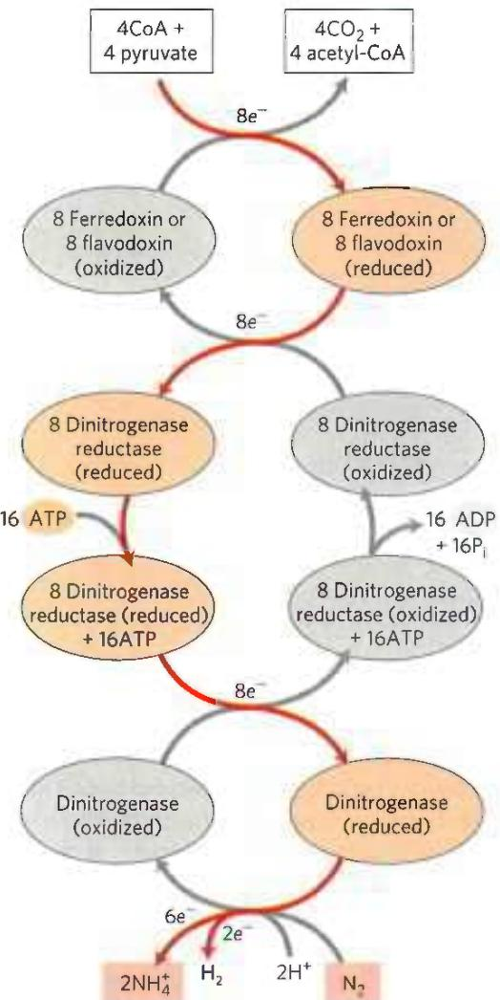  
FIGURE 22-4 Electron path in nitrogen fixation by the nitrogenase complex. Electrons are transferred from pyruvate to dinitrogenase via ferredoxin (or flavodoxin) and dinitrogenase reductase. Dinitrogenase reductase reduces dinitrogenase one electron at a time, with at least six electrons required to fix one molecule of $\mathsf{N}_2$ . Two additional electrons are used to reduce $2\mathrm{H}^+$ to $\mathsf{H}_2$ in a process that obligatorily accompanies nitrogen fixation in anaerobes, making a total of eight electrons required per $\mathsf{N}_2$ molecule. The subunit structures and metal cofactors of the dinitrogenase reductase and dinitrogenase proteins are described in the text and in Figure 22-3.

ATP binding and hydrolysis change the conformation of nitrogenase reductase in two regions, which are structurally homologous with the switch 1 and switch 2 regions of the GTP-binding proteins involved in biological signaling (see Fig. 12-12). ATP binding produces a conformational change that brings the 4Fe-4S center of the reductase closer to the P cluster of dinitrogenase (from 18 Å to 14 Å away), which facilitates electron transfer between the reductase and dinitrogenase. The details of electron transfer from the P cluster to the FeMo cofactor, and the means by which eight electrons are accumulated by nitrogenase, are not yet known in detail. Two pathways that conform to available data, both involving the Mo atom as a central player, are illustrated in Figure 22-5.

  
FIGURE 22-5 Two reasonable hypotheses for the intermediates involved in $\mathsf{N}_2$ reduction. In both scenarios, the FeMo cofactor (abbreviated as M here) plays a central role, binding directly to one of the nitrogen atoms of $\mathsf{N}_2$ and remaining bound throughout the sequence of reduction steps. [Information from L.C.Seefeldt et al., Annu.Rev.Biochem.78:701, 2009, Fig. 9.]

P3 The nitrogenase complex is remarkably unstable in the presence of oxygen. The reductase is inactivated in air, with a half-life of 30 seconds; dinitrogenase has a half-life of only 10 minutes in air. Free-living bacteria that fix nitrogen cope with this problem in a variety of ways. Some live only anaerobically or repress nitrogenase synthesis when oxygen is present. Some aerobic species, such as A. vinelandii, partially uncouple electron transfer from ATP synthesis so that oxygen is burned off as rapidly as it enters the cell (see Box 19-1). When fixing nitrogen, cultures of these bacteria increase in temperature as a result of their efforts to rid themselves of oxygen.

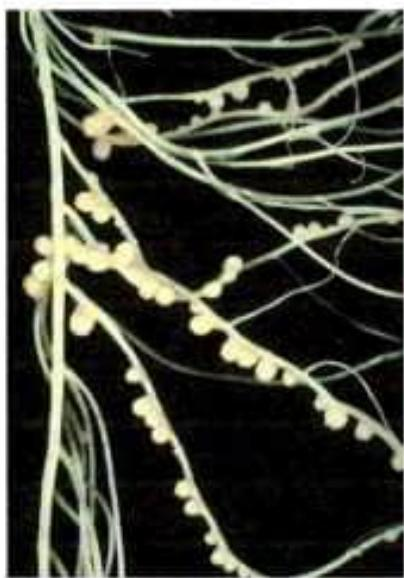  
(a)

The symbiotic relationship between leguminous plants and the nitrogen-fixing bacteria in their root nodules (Fig. 22-6) takes care of both the energy requirements and the oxygen lability of the nitrogenase complex. The energy required for nitrogen fixation was probably the evolutionary driving force for this plant-bacteria association. The bacteria in root nodules have access to a large reservoir of energy in the form of abundant carbohydrate and citric acid cycle intermediates made available by the plant. This may allow the bacteria to fix hundreds of times more nitrogen than do their free-living cousins under conditions generally encountered in soils. To solve the oxygen-toxicity problem, the bacteria in root nodules are bathed in a solution of the oxygen-binding heme protein leghemoglobin, produced by the plant (although the heme may be contributed by the bacteria). Leghemoglobin binds all available oxygen so that it cannot interfere with nitrogen fixation, and it efficiently delivers the oxygen to the bacterial electron-transfer system. The benefit to the plant, of course, is a ready supply of reduced nitrogen. In fact, the bacterial symbionts typically produce far more $\mathrm{NH}_3$ than is needed by their symbiotic partner; the excess is released into the soil. The efficiency of the symbiosis between plants and bacteria is evident in the enrichment of soil nitrogen brought about by leguminous plants. This enrichment of $\mathrm{NH}_3$ in the soil is the basis of crop rotation methods, in which plantings of nonleguminous plants (such as maize) that extract fixed nitrogen from the soil are alternated with plantings of legumes such as alfalfa, peas, or clover.

Nitrogen fixation is energetically costly: 16 ATP and 8 electrons yield only 2 NH $_{3}$ . It is therefore not surprising that the process is tightly regulated so that NH $_{3}$ is produced only when needed. High [ADP], an indicator of low [ATP], is a strong inhibitor of nitrogenase. NH $_{4}^{+}$ represses the expression of the \~20 nitrogen fixation (nif) genes,

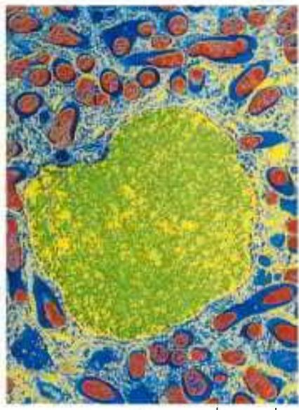  
(b)

FIGURE 22-6 Nitrogen-fixing nodules. (a) Pea plant (Pisum sativum) root nodules containing the nitrogen-fixing bacterium Rhizobium leguminosarum. The nodules are pink due to the presence of leghemoglobin; this heme protein has a very high binding affinity for oxygen, which strongly inhibits nitrogenase. (b) Artificially colorized electron micrograph of a thin section through a pea root nodule. Symbiotic nitrogen-fixing bacteria, or bacteroids (red), live inside the nodule cell, surrounded by the peribacteroid membrane (blue). Bacteroids produce the nitrogenase complex that converts atmospheric nitrogen $(\mathsf{N}_2)$ to ammonium $(\mathsf{NH}_4^+)$ ; without the bacteroids, the plant is unable to utilize $\mathsf{N}_2$ . (The cell nucleus is shown in yellow/green. Not visible in this micrograph are other organelles of the infected root cell that are normally found in plant cells.) [(a, b) Jeremy Burgess/Science Source.]

effectively shutting down the pathway. Covalent alteration of nitrogenase is also used in some diazotrophs to control nitrogen fixation in response to the availability of $NH_{4}^{+}$ in the surroundings. Transfer of an ADP-ribosyl group from NADH to a specific Arg residue in the nitrogenase reductase shuts down $N_{2}$ fixation in Rhodospirillum, for example. This is the same covalent modification that we saw in the case of G protein inhibition by the toxins of cholera and pertussis (see Fig. 12-14).

Nitrogen fixation is the subject of intense study because of its immense practical importance. Industrial production of ammonia for use in fertilizers requires a large and expensive input of energy, and this has spurred a drive to develop recombinant or transgenic organisms that can fix nitrogen. In principle, recombinant DNA techniques (Chapter 9) might be used to transfer the DNA that encodes the enzymes of nitrogen fixation into non-nitrogen-fixing bacteria and plants. However, those genes alone will not suffice. About 20 genes are essential to nitrogenase activity in bacteria, many of them needed for the synthesis, assembly, and insertion of the cofactors. There is also the problem of protecting the enzyme in its new setting from destruction by oxygen. In all, there are formidable challenges in engineering new nitrogen-fixing plants. Success in these efforts will depend on overcoming the problem of oxygen toxicity in any cell that produces nitrogenase.

## Ammonia Is Incorporated into Biomolecules through Glutamate and Glutamine

Reduced nitrogen in the form of $NH_{4}^{+}$ is assimilated into amino acids and then into other nitrogen-containing biomolecules. P5 Two amino acids, glutamate and glutamine, provide the critical entry point. Recall that these same two amino acids play central roles in the catabolism of ammonia and amino groups in amino acid oxidation (Chapter 18). Glutamate is the source of amino groups for most other amino acids, through transamination reactions (the reverse of the reaction shown in Fig. 18-4). The amide nitrogen of glutamine is a source of amino groups in a wide range of biosynthetic processes. In most types of cells, and in extracellular fluids in higher organisms, one or both of these amino acids are present at higher concentrations—sometimes an order of magnitude or more higher—than other amino acids. An Escherichia coli cell requires so much glutamate that this amino acid is one of the primary solutes in the cytosol. Its concentration is regulated not only in response to the cell's nitrogen requirements but also to maintain an osmotic balance between the cytosol and the external medium.

The biosynthetic pathways to glutamate and glutamine are simple, and all or some of the steps occur in most organisms. The most important pathway for the assimilation of $NH_{4}^{+}$ into glutamate requires two reactions. The net effect is to convert glutamate, $\alpha$ -ketoglutarate, and ammonia into two molecules of glutamate.

First, $NH_{4}^{+}$ is reacted with glutamate to produce glutamine, using the enzyme glutamine synthetase. This reaction takes place in two steps, with enzyme-bound $\gamma$ -glutamyl phosphate as an intermediate (see Fig. 18-8):

$$
\text {(1)} \quad \mathrm{Glutamate} + \mathrm{ATP} \longrightarrow \gamma - \text {glutamyl   phosphate } + \mathrm{ADP}
$$

$$
\gamma \text {-Glutamyl phosphate} + \mathrm{NH} _ {4} ^ {+} \longrightarrow \text {   glutamine } + \mathrm{P} _ {\mathrm{i}} + \mathrm{H} ^ {+} \tag {2}
$$

Sum: Glutamate + NH $_{4}^{+}$ + ATP →

$$
\mathrm{glutamine} + \mathrm{ADP} + \mathrm {P_ {i}} + \mathrm {H^ {+}}\tag{22-1}
$$

Glutamine synthetase is found in all organisms. In addition to its importance for $NH_{4}^{+}$ assimilation in bacteria, it has a central role in amino acid metabolism in mammals, converting free $NH_{4}^{+}$ , which is toxic, to glutamine for transport in the blood (Chapter 18).

In the second reaction needed for $NH_{4}^{+}$ assimilation, the glutamine reacts with $\alpha$ -ketoglutarate to generate two molecules of glutamate. In bacteria and plants, this reaction is catalyzed by glutamate synthase. (An alternative name for this enzyme, glutamate:oxoglutarate aminotransferase, yields the acronym GOGAT, by which the enzyme also is known.) $\alpha$ -Ketoglutarate, an intermediate of the citric acid cycle, undergoes reductive amination with glutamine as nitrogen donor:

$$
\begin{array}{r l} \alpha - \text { Ketoglutarate } + \text { glutamine } + \mathrm{NAD(P)H} + \mathrm{H} ^ {+} & \longrightarrow \\ 2 \text { glutamate } + \mathrm{NAD(P)} ^ {+} \end{array}\tag{22-2}
$$

The net reaction of glutamine synthetase and glutamate synthase (Eqns 22-1 and 22-2) is

$$
\begin{array}{r l} \alpha \text {-Ketoglutarate} + \mathrm {NH_ {4} ^ {+}} + \mathrm{NAD(P)H} + \mathrm{ATP} & \longrightarrow \\ \text {glutamate} + \mathrm {NAD(P) ^ {+}} + \mathrm{ADP} + \mathrm {P _ {i}} \end{array}
$$

Glutamate synthase is not present in animals, which instead maintain high levels of glutamate by processes such as the transamination of $\alpha$ -ketoglutarate during amino acid catabolism. Plants possess a second alternative form of glutamate synthase that uses reduced ferredoxin rather than NADPH as a source of reducing electrons.

Glutamate can also be formed in yet another, albeit minor, pathway: the reaction of $\alpha$ -ketoglutarate and $\mathrm{NH}_4^+$ to form glutamate in one step. P6 This is catalyzed by glutamate dehydrogenase, an enzyme present in all organisms. Reducing power is furnished by NADPH:

$$
\begin{array}{r l} \alpha \text {-Ketoglutarate} + \mathrm {NH_ {4} ^ {+}} + \mathrm{NAD(P)H} + \mathrm {H^ {+}} & \longrightarrow \\ \text { glutamate } + \mathrm {NAD(P) ^ {+}} + \mathrm {H_ {2} O} \end{array}
$$

We encountered this reaction in the catabolism of amino acids (see Fig. 18-7). In eukaryotic cells, glutamate dehydrogenase is located in the mitochondrial matrix. The reaction equilibrium favors the reactants, and the $K_{\mathrm{m}}$ for $\mathrm{NH_4^+}$ (\~1 mm) is so high that the reaction is not important for $\mathrm{NH_4^+}$ assimilation in mammals. (Recall that the glutamate dehydrogenase reaction, in reverse (see Fig. 18-10), is one source of $NH_{4}^{+}$ destined for the urea cycle.) In microorganisms and plants, concentrations of $NH_{4}^{+}$ high enough for the glutamate dehydrogenase reaction to make a significant contribution to glutamate levels generally occur only when $NH_{3}$ is added artificially to the growth environment. In general, soil bacteria and plants rely on the two-enzyme pathway outlined above (Eqns 22-1, 22-2).

## Glutamine Synthetase Is a Primary Regulatory Point in Nitrogen Metabolism

There are three known classes of glutamine synthetases. The class I enzyme (GSI, found in bacteria) has 12 identical subunits of $M_r$ 50,000 (Fig. 22-7) and is regulated both allosterically and by covalent modification. The class II enzyme (GSII, found in eukaryotes and some bacteria) has 10 identical subunits. The third class of glutamine synthetases (GSIII), so far found only in two bacterial species, are much larger enzymes, consisting of a double-ringed dodecamer of identical chains.

P4 Befitting their central metabolic role as an entry point for reduced nitrogen, GSI glutamine synthetases are highly regulated. In enteric bacteria such as E. coli, the regulation is unusually complex. Alanine, glycine, and at least six end products of glutamine metabolism are allosteric inhibitors (Fig. 22-8). Each inhibitor alone produces only partial inhibition, but the effects of multiple inhibitors are more than additive, and all eight together virtually shut down the enzyme. This is an example of cumulative feedback inhibition. This control mechanism provides a constant adjustment of glutamine levels to match immediate metabolic requirements.

  
FIGURE 22-7 Subunit structure of bacterial type I glutamine synthetase. This view shows 6 of the 12 identical subunits; a second layer of 6 subunits lies directly beneath those shown. Each of the 12 subunits has an active site, where ATP and glutamate are bound in orientations that favor transfer of a phosphoryl group from ATP to the side-chain carboxyl of glutamate. In this crystal structure, ADP occupies the ATP site. [Data from PDB ID 2GLS, M. M. Yamashita et al., J. Biol. Chem. 264:17,681, 1989.]

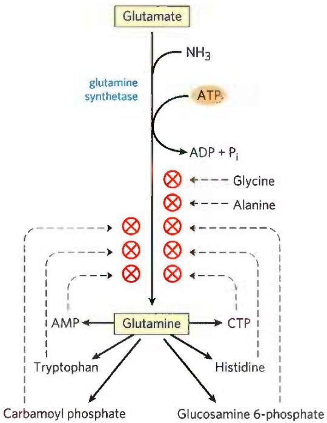  
FIGURE 22-8 Allosteric regulation of glutamine synthetase. The enzyme undergoes cumulative regulation by six end products of glutamine metabolism. Alanine and glycine probably serve as indicators of the general status of amino acid metabolism in the cell.

Superimposed on the allosteric regulation is inhibition by adenylylation of (addition of AMP to) Tyr $^{397}$ , located near the enzyme's active site (Fig. 22-9). This covalent modification increases sensitivity to the allosteric inhibitors, and activity decreases as more subunits are adenylylated. Both adenylylation and de-adenylylation are promoted by adenylyltransferase (AT in Fig. 22-9), part of a complex enzymatic cascade that responds to levels of glutamine, $\alpha$ -ketoglutarate, ATP, and P $_{i}$ . The activity of adenylyltransferase is modulated by binding to a regulatory protein called P $_{II}$ , and the activity of P $_{II}$ , in turn, is regulated by covalent modification (uridylylation), again at a Tyr residue. The adenylyltransferase complex with uridylylated P $_{II}$ (P $_{II}$ -UMP) stimulates de-adenylylation, whereas the same complex with deuridylylated P $_{II}$ stimulates adenylylation of glutamine synthetase. Both uridylylation and deuridylylation of P $_{II}$ are brought about by a single enzyme, uridylyltransferase. Uridylylation is inhibited by binding of glutamine and P $_{i}$ to uridylyltransferase and is stimulated by binding of $\alpha$ -ketoglutarate and ATP to P $_{II}$ .

The regulation does not stop there. The uridylylated $P_{II}$ also mediates the activation of transcription of the gene encoding glutamine synthetase, thus increasing the cellular concentration of the enzyme; the deuridylylated $P_{II}$ brings about a decrease in transcription of the same gene. This mechanism involves an interaction of $P_{II}$ with additional proteins involved in gene regulation, of a type described in Chapter 28. The net result of this elaborate system of controls is a decrease in glutamine synthetase

(a)

(b)  
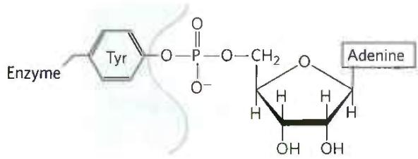

  
FIGURE 22-9 Second level of regulation of glutamine synthetase: covalent modifications. (a) An adenylylated Tyr residue. (b) Cascade leading to adenylylation (inactivation) of glutamine synthetase. AT represents adenylyltransferase; UT, uridylyltransferase. P $_{II}$ is a regulatory protein, itself regulated by uridylylation.

activity when glutamine levels are high, and an increase in activity when glutamine levels are low and $\alpha$ -ketoglutarate and ATP (substrates for the synthetase reaction) are available. The multiple layers of regulation permit a sensitive response in which glutamine synthesis is tailored to cellular needs.

## Several Classes of Reactions Play Special Roles in the Biosynthesis of Amino Acids and Nucleotides

The pathways described in this chapter include a variety of interesting chemical rearrangements. Several of these recur and deserve special note before we progress to the pathways themselves. These are (1) transamination reactions and other rearrangements promoted by enzymes containing pyridoxal phosphate; (2) transfer of one-carbon groups, with either tetrahydrofolate (usually at the —CHO and —CH₂OH oxidation levels) or S-adenosylmethionine (at the —CH₃ oxidation level) as cofactor; and (3) transfer of amino groups derived from the amide nitrogen of glutamine. Pyridoxal phosphate (PLP), tetrahydrofolate (H₄ folate), and S-adenosylmethionine (adoMet) are described in some detail in Chapter 18 (see Figs. 18-6, 18-17, and 18-18). Here we focus on amino group transfer involving the amide nitrogen of glutamine.

More than a dozen known biosynthetic reactions use glutamine as the major physiological source of amino groups, and most of these occur in the pathways outlined in this chapter. As a class, the enzymes catalyzing these reactions are called glutamine amidotransferases. All have two structural domains: one binding glutamine, the other binding the second substrate, which serves as amino group acceptor (Fig. 22-10). A conserved Cys residue in the glutamine-binding domain is believed to act as a nucleophile, cleaving the amide bond of glutamine and forming a covalent glutamyl-enzyme intermediate. The $NH_{3}$ produced in this reaction is not released, but instead is transferred through an “ammonia channel” to a second active site, where it reacts with the second substrate to form the aminated product. The covalent intermediate is hydrolyzed to the free enzyme and glutamate. If the second substrate must be activated, the usual method is the use of ATP to generate an acyl phosphate intermediate (R—OX in Fig. 22-10, where X is a phosphoryl group). The enzyme glutaminase acts similarly but uses $H_{2}O$ as the second substrate, yielding $NH_{4}^{+}$ and glutamate (see Fig. 18-8).

  
MECHANISM FIGURE 22-10 Proposed mechanism for glutamine amidotransferases. Each enzyme has two domains. The glutamine-binding domain contains structural elements conserved among many of these enzymes, including a Cys residue required for activity. The $\mathrm{NH}_3$ -acceptor (second-substrate) domain varies. Two types of amino acceptors are shown. X represents an activating group, typically a phosphoryl group derived from ATP, that facilitates displacement of a hydroxyl group from R—OH by $\mathrm{NH}_3$ .

## SUMMARY 22.1 Overview of Nitrogen Metabolism

The molecular nitrogen that makes up 80% of Earth's atmosphere is unavailable to most living organisms until it is reduced. A complex web of reactions converts atmospheric $N_{2}$ to biologically useful forms and maintains a global balance between them. Prominent species that are interconverted within this web include ammonia ( $NH_{3}$ or $NH_{4}^{+}$ ; most reduced), nitrite ( $NO_{2}^{-}$ ), and nitrate ( $NO_{3}^{-}$ ; most oxidized). Conversion of $N_{2}$ to ammonia is fixation. Nitrification constitutes the steps converting ammonia to nitrate. Conversion of nitrate to $N_{2}$ constitutes denitrification. The alternative conversion of nitrate to ammonia is nitrate assimilation.

■ Fixation of $N_{2}$ as $NH_{3}$ is carried out by the nitrogenase complex, in a reaction that requires large investments of ATP and of reducing power. The nitrogenase complex is highly labile in the presence of $O_{2}$ , and it is subject to regulation by the supply of $NH_{3}$ .

In living systems, reduced nitrogen is incorporated first into amino acids and then into a variety of other biomolecules, including nucleotides. The key entry point is the amino acid glutamate. Glutamate and glutamine are the nitrogen donors in a wide range of biosynthetic reactions.

■ Glutamine synthetase, which catalyzes the formation of glutamine from glutamate, is a main regulatory enzyme of nitrogen metabolism.

The amino acid and nucleotide biosynthetic pathways make repeated use of the biological cofactors pyridoxal phosphate, tetrahydrofolate, and S-adenosylmethionine. Pyridoxal phosphate is required for transamination reactions involving glutamate and for other amino acid transformations. One-carbon transfers require S-adenosylmethionine and tetrahydrofolate. Glutamine amidotransferases catalyze reactions that incorporate nitrogen derived from the amide group of glutamine.

## 22.2 Biosynthesis of Amino Acids

All amino acids are derived from intermediates in glycolysis, the citric acid cycle, or the pentose phosphate pathway (Fig. 22-11). Nitrogen enters these biosynthetic pathways by way of glutamate and glutamine. Some pathways are simple, others are not. Ten of the amino acids are just one or several steps removed from the common metabolite from which they are derived. The biosynthetic pathways for others, such as the aromatic amino acids, are more complex.

  
FIGURE 22-11 Overview of amino acid biosynthesis. The carbon skeleton precursors derive from three sources: glycolysis (light red), the citric acid cycle (blue), and the pentose phosphate pathway (purple).

## Organisms Vary Greatly in Their Ability to Synthesize the 20 Common Amino Acids

Whereas most bacteria and plants can synthesize all 20 amino acids, mammals can synthesize only about half of them—generally those with simple pathways. These are often called nonessential amino acids (see Table 18-1). The label is somewhat misleading, however, because innate biosynthetic pathways often do not provide enough of these amino acids to support optimal growth and health. The remaining amino acids, the essential amino acids, cannot be synthesized by most mammals and must be obtained from food. A few amino acids are conditionally essential in mammals, required at particular stages of development. Unless otherwise indicated, the pathways for the 20 common amino acids presented below are those operative in bacteria.

## TABLE 22-1 Amino Acid Biosynthetic Families, Grouped by Metabolic Precursor

<table><tr><td>α-Ketoglutarate</td><td>Pyruvate</td></tr><tr><td>Glutamate</td><td>Alanine</td></tr><tr><td>Glutamine</td><td>Valinea</td></tr><tr><td>Proline</td><td>Leucinea</td></tr><tr><td>Arginine</td><td>Isoleucinea</td></tr><tr><td>3-Phosphoglycerate</td><td rowspan="2">Phosphoenolpyruvate and erythrose 4-phosphate</td></tr><tr><td>Serine</td></tr><tr><td>Glycine</td><td>Tryptophana</td></tr><tr><td>Cysteine</td><td>Phenylalaninea</td></tr><tr><td></td><td>Tyrosineb</td></tr><tr><td>Oxaloacetate</td><td></td></tr><tr><td>Aspartate</td><td>Ribose 5-phosphate</td></tr><tr><td>Asparagine</td><td>Histidinea</td></tr><tr><td>Isoleucine</td><td></td></tr><tr><td>Methioninea</td><td></td></tr><tr><td>Threoninea</td><td></td></tr><tr><td>Lysinea</td><td></td></tr><tr><td colspan="2">aEssential amino acids in mammals.</td></tr><tr><td colspan="2">bDerived from phenylalanine in mammals.</td></tr></table>

A useful way to organize these biosynthetic pathways is to group them into six families corresponding to their metabolic precursors (Table 22-1), and we use this approach to structure the detailed descriptions that follow. In addition to these six precursors, there is a notable intermediate in several pathways of amino acid and nucleotide synthesis: 5-phosphoribosyl-1-pyrophosphate (PRPP):

PRPP is synthesized from ribose 5-phosphate derived from the pentose phosphate pathway (see Fig. 14-31), in a reaction catalyzed by ribose phosphate pyrophosphokinase:

Ribose 5-phosphate + ATP →

5-phosphoribosyl-1-pyrophosphate + AMP

This enzyme is allosterically regulated by many of the biomolecules for which PRPP is a precursor.

## α-Ketoglutarate Gives Rise to Glutamate, Glutamine, Proline, and Arginine

We have already described the biosynthesis of glutamate and glutamine. Proline is a cyclized derivative of glutamate (Fig. 22-12). P6 In the first step of proline synthesis, ATP reacts with the $\gamma$ -carboxyl group of glutamate to form an acyl phosphate, which is reduced by NADPH or NADH to glutamate $\gamma$ -semialdehyde. This intermediate undergoes rapid spontaneous cyclization and is then reduced further to yield proline.

Arginine is synthesized from glutamate via ornithine and the urea cycle in animals (Chapter 18). In principle, ornithine could also be synthesized from glutamate γ-semialdehyde by transamination, but the spontaneous cyclization of the semialdehyde in the proline pathway precludes a sufficient supply of this intermediate for ornithine synthesis. Bacteria have a de novo biosynthetic pathway for ornithine (and thus arginine) that parallels some steps of the proline pathway but includes two additional steps that avoid the problem of the spontaneous cyclization of glutamate γ-semialdehyde (Fig. 22-12). In the first step, the α-amino group of glutamate is blocked by an acetylation requiring acetyl-CoA; then, after the transamination step, the acetyl group is removed to yield ornithine.

The pathways to proline and arginine are somewhat different in mammals. Proline can be synthesized by the pathway shown in Figure 22-12, but it is also formed from arginine obtained from dietary or tissue protein. Arginase, a urea cycle enzyme, converts arginine to ornithine and urea (see Figs. 18-10, 18-26). The ornithine is converted to glutamate $\gamma$ -semialdehyde by the enzyme ornithine $\delta$ -aminotransferase (Fig. 22-13). The semialdehyde cyclizes to $\Delta^{1}$ -pyrroline-5-carboxylate, which is then converted to proline (Fig. 22-12). The pathway for arginine synthesis shown in Figure 22-12 is absent in mammals. P1 When arginine from dietary intake or protein turnover is insufficient for protein synthesis, the ornithine $\delta$ -aminotransferase reaction operates in the direction of ornithine formation. Ornithine is then converted to citrulline and arginine in the urea cycle.

## Serine, Glycine, and Cysteine Are Derived from 3-Phosphoglycerate

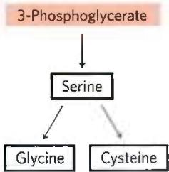

The major pathway for the formation of serine is the same in all organisms (Fig. 22-14). In the first step, the hydroxyl group of 3-phosphoglycerate is oxidized by a dehydrogenase (using $\mathrm{NAD^{+}}$ ) to yield 3-phosphohydroxypyruvate. Transamination from glutamate yields

FIGURE 22-12 Biosynthesis of proline and arginine from glutamate in bacteria. All five carbon atoms of proline arise from glutamate. In many organisms, glutamate dehydrogenase is unusual in that it uses either NADH or NADPH as a cofactor. The same may be true of other enzymes in these pathways. The $\gamma$ -semialdehyde in the proline pathway undergoes a rapid, reversible cyclization to $\Delta^{1}$ -pyrroline-5-carboxylate (PSC), with the equilibrium favoring PSC formation. Cyclization is averted in the ornithine/arginine pathway by acetylation of the $\alpha$ -amino group of glutamate in the first step and removal of the acetyl group after the transamination. This acetyl group is highlighted in yellow. Although some bacteria lack arginase and thus the complete urea cycle, they can synthesize arginine from ornithine in steps that parallel the mammalian urea cycle, with citrulline and argininosuccinate as intermediates (see Fig. 18-10).

Here, and in subsequent figures in this chapter, the reaction arrows indicate the linear path to the final products, without considering the reversibility of individual steps. For example, the step of the pathway leading to arginine that is catalyzed by N-acetylglutamate dehydrogenase is chemically similar to the glyceraldehyde 3-phosphate dehydrogenase reaction in glycolysis (see Fig. 14-7) and is readily reversible.

  
FIGURE 22-13 Ornithine δ-aminotransferase reaction: a step in the mammalian pathway to proline. This enzyme is found in the mitochondrial matrix of most tissues. Although the equilibrium favors P5C

  
FIGURE 22-14 Biosynthesis of serine from 3-phosphoglycerate and of glycine from serine in all organisms. As indicated in the text, this is only one of multiple pathways to synthesize glycine.  
formation, the reverse reaction is the only mammalian pathway for synthesis of ornithine (and thus arginine) when arginine levels are insufficient for protein synthesis.

3-phosphoserine, which is hydrolyzed to free serine by phosphoserine phosphatase.

Serine (three carbons) is the precursor of glycine (two carbons) through removal of a carbon atom by serine hydroxymethyltransferase (Fig. 22-14). Tetrahydrofolate accepts the $\beta$ carbon (C-3) of serine, which forms a methylene bridge between N-5 and N-10 to yield $N^5$ , $N^{10}$ -methylenetetrahydrofolate (see Fig. 18-17). The overall reaction, which is reversible, also requires pyridoxal phosphate. In the liver of vertebrates, glycine can be made by another route: the reverse of the reaction shown in Figure 18-20c, catalyzed by glycine synthase (also called glycine cleavage enzyme):

$$
\begin{array}{r l} \mathrm{CO} _ {2} + \mathrm{NH} _ {4} ^ {+} + N ^ {5}, N ^ {1 0} - \text { methylenetetrahydrofolate } + \\ \mathrm{NADH} + \mathrm{H} ^ {+} & \longrightarrow \text { glycine } + \text { tetrahydrofolate } + \mathrm{NAD} ^ {+} \end{array}
$$

Plants and bacteria produce the reduced sulfur required for the synthesis of cysteine (and methionine, described later) from environmental sulfates; the pathway is shown on the right side of Figure 22-15. Sulfate is activated in two steps to produce 3'-phosphoadenosine 5'-phosphosulfate (PAPS), which undergoes an eight-electron reduction to sulfide. The sulfide is then used in the formation of cysteine from serine in a two-step pathway. Mammals synthesize cysteine from two amino acids: methionine furnishes the sulfur atom, and serine furnishes the carbon skeleton. Methionine is first converted to S-adenosylmethionine (see Fig. 18-18), which can lose its methyl group to any of a number of acceptors to form S-adenosylhomocysteine (adoHcy). This demethylated product is hydrolyzed to free homocysteine, which undergoes a reaction with serine, catalyzed by cystathionine β-synthase, to yield cystathionine (Fig. 22-16). Finally, cystathionine γ-lyase, a PLP-requiring enzyme, catalyzes removal of ammonia and cleavage of cystathionine to yield free cysteine.

  
FIGURE 22-15 Biosynthesis of cysteine from serine in bacteria and plants. The origin of reduced sulfur is shown in the pathway on the right.

FIGURE 22-16 Biosynthesis of cysteine from homocysteine and serine in mammals. The homocysteine is formed from methionine.

Three Nonessential and Six Essential Amino Acids Are Synthesized from Oxaloacetate and Pyruvate

Alanine and aspartate are synthesized from pyruvate and oxaloacetate, respectively, by transamination from glutamate. Asparagine is synthesized by amidation of aspartate, catalyzed by the enzyme asparagine synthetase. The $NH_{4}^{+}$ is donated by glutamine. These are nonessential amino acids, and their simple biosynthetic pathways occur in all organisms.

The malignant lymphocytes present in childhood acute lymphoblastic leukemia (ALL) produce little or no asparagine synthetase, and they are thus sensitive to asparagine depletion. The chemotherapy for ALL is administered together with an L-asparaginase derived from bacteria, with the enzyme functioning to reduce serum asparagine. The combined treatment results in a greater than 95% remission rate in cases of childhood ALL (L-asparaginase treatment alone produces remission in 40% to 60% of cases). However, the asparaginase treatment has some deleterious side effects, and about 10% of patients who achieve remission eventually suffer relapse, with tumors resistant to drug therapy. Researchers are now developing inhibitors of human asparagine synthetase to augment these therapies for childhood ALL.

Methionine, threonine, lysine, isoleucine, valine, and leucine are essential amino acids; humans cannot synthesize them. Their biosynthetic pathways in bacteria are complex and interconnected (Fig. 22-17). In some cases, the pathways in bacteria, fungi, and plants differ significantly.

Aspartate gives rise to methionine, threonine, and lysine. Branch points occur at aspartate $\beta$ -semialdehyde, an intermediate in all three pathways, and at homoserine, a precursor of threonine and methionine. Threonine, in turn, is one of the precursors of isoleucine. The valine and isoleucine pathways share four enzymes (Fig. 22-17). Pyruvate gives rise to valine and isoleucine in pathways that begin with condensation of two carbons of pyruvate (in the form of hydroxyethyl thiamine pyrophosphate; see Fig. 14-13b) with another molecule of pyruvate (the valine path) or with $\alpha$ -ketobutyrate (the isoleucine path). The $\alpha$ -ketobutyrate is derived from threonine in a reaction that requires pyridoxal phosphate. An intermediate in the valine pathway, $\alpha$ -ketoisovalerate, is the starting point for a four-step branch pathway leading to leucine.

Chorismate Is a Key Intermediate in the Synthesis of Tryptophan, Phenylalanine, and Tyrosine

The three amino acid side chains that contain aromatic rings, tryptophan, phenylalanine, and tyrosine, present a special chemical problem for biosynthesis. Aromatic rings are not readily available in the environment, even though the benzene ring is very stable. The branched pathway to tryptophan, phenylalanine, and tyrosine, occurring in bacteria, fungi, and plants, is the main biological route of aromatic ring formation. It proceeds through ring closure of an aliphatic precursor followed by stepwise addition of double bonds. The first four steps produce shikimate, a seven-carbon molecule derived from erythrose 4-phosphate and phosphoenolpyruvate (Fig. 22-18). Shikimate is converted to chorismate in three steps that include the addition of three more carbons from another molecule of phosphoenolpyruvate. Chorismate is the first branch point of the pathway, with one branch leading to tryptophan, the other to phenylalanine and tyrosine.

In the tryptophan branch (Fig. 22-19), chorismate is converted to anthranilate in a reaction in which glutamine donates the nitrogen that will become part of the

3-Dehydroshikimate

  
FIGURE 22-18 Biosynthesis of chorismate, an intermediate in the synthesis of aromatic amino acids in bacteria and plants. All carbons are derived from either erythrose 4-phosphate (light purple) or phosphoenolpyruvate (light red). Note that the NAD $^{+}$ required as a cofactor in step ② is released unchanged; it may be transiently reduced to NADH during the reaction, with formation of an oxidized reaction intermediate. Step ⑥ is competitively inhibited by glyphosate ( $^{-}$ COO—CH $_{2}$ —NH—CH $_{2}$ —PO $_{3}^{2-}$ ), the active ingredient in the widely used herbicide Roundup. The herbicide is relatively nontoxic to mammals, which lack this biosynthetic pathway. The intermediates quinate and shikimate are named after the plants in which they have been found to accumulate.

  
FIGURE 22-19 Biosynthesis of tryptophan from chorismate in bacteria and plants. In E. coli, enzymes catalyzing steps ① and ② are subunits of a single complex.

indole ring. Anthranilate then condenses with PRPP. The indole ring of tryptophan is derived from the ring carbons and amino group of anthranilate plus two carbons derived from PRPP. The final reaction in the sequence is catalyzed by tryptophan synthase. This enzyme has an $\alpha_{2}\beta_{2}$ subunit structure and can be dissociated into two $\alpha$ subunits and a $\beta_{2}$ unit that catalyze different parts of the overall reaction:

$$
\begin{array}{r l} & \text { Indole - 3 - glycerol phosphate } \xrightarrow {\alpha \text { subunit }} \\ & \text { indole + glyceraldehyde 3 - phosphate } \\ & \text { Indole + serine } \xrightarrow {\beta_ {2} \text { subunit }} \text { tryptophan } + \mathrm{H} _ {2} \mathrm{O} \end{array}
$$

The second part of the reaction requires pyridoxal phosphate (Fig. 22-20). Indole formed in the first part is not released by the enzyme, but instead moves through a channel from the $\alpha$ -subunit active site to one of the $\beta$ -subunit active sites, where it condenses with a Schiff base intermediate derived from serine and PLP. Intermediate channeling of this type may be a feature of the entire pathway from chorismate to tryptophan. Enzyme active sites catalyzing different steps (sometimes not sequential steps) of the pathway to tryptophan are found on single polypeptides in some species of fungi and bacteria, but they are separate proteins in other species. In addition, the activity of some of these enzymes requires a noncovalent association with other enzymes of the pathway. These observations suggest that all the pathway enzymes are components of a large, multienzyme complex, a metabolon, in both bacteria and eukaryotes. Such complexes are generally not preserved intact when the enzymes are isolated using traditional biochemical methods (see Section 16.4).

In plants and bacteria, phenylalanine and tyrosine are synthesized from chorismate in pathways much less complex than the tryptophan pathway. The common intermediate is prephenate (Fig. 22-21). The final step in both cases is transamination with glutamate.

Animals can produce tyrosine directly from phenylalanine through hydroxylation at C-4 of the phenyl group by phenylalanine hydroxylase; this enzyme also participates in the degradation of phenylalanine (see Figs. 18-23, 18-24). Tyrosine is considered a conditionally essential amino acid, or as nonessential insofar as it can be synthesized from the essential amino acid phenylalanine.

## Histidine Biosynthesis Uses Precursors of Purine Biosynthesis

The pathway to histidine in all plants and bacteria differs in several respects from other amino acid

MECHANISM FIGURE 22-20 Tryptophan synthase reaction. (a) This enzyme catalyzes a multistep reaction with several types of chemical rearrangements. The PLP-facilitated transformations occur at the $\beta$ carbon (C-3) of the amino acid, as opposed to the $\alpha$ -carbon reactions described in

Figure 18-6. The $\beta$ carbon of serine is attached to the indole ring system. (b) Indole generated on the $\alpha$ subunit (white) moves through a tunnel to the $\beta$ subunit (blue), where it condenses with the serine moiety. [(b) Data from PDB ID 1KFJ, V. Kulik et al., J. Mol. Biol. 324:677, 2002.]

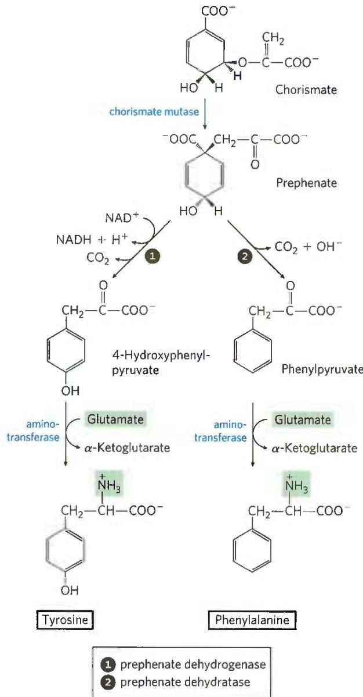  
FIGURE 22-21 Biosynthesis of phenylalanine and tyrosine from chorismate in bacteria and plants. Conversion of chorismate to prephenate is a rare biological example of a Claisen rearrangement.

biosynthetic pathways. Histidine is derived from three precursors (Fig. 22-22): PRPP contributes five carbons, the purine ring of ATP contributes a nitrogen and a carbon, and glutamine supplies the second ring nitrogen. The key steps are condensation of ATP and PRPP, in which N-1 of the purine ring is linked to the activated C-1 of the ribose of PRPP (step 1 in Fig. 22-22); purine ring opening that ultimately leaves N-1 and C-2 of adenine linked to the ribose (step 3); and formation of the imidazole ring, a reaction in which glutamine donates a nitrogen (step 5). The use of ATP as a metabolite rather than a high-energy cofactor is unusual—but not wasteful, because it dovetails with the purine biosynthetic pathway. The remnant of ATP that is released after the transfer of

N-1 and C-2 is 5-aminoimidazole-4-carboxamide ribonucleotide (AICAR), an intermediate of purine biosynthesis (see Fig. 22-35) that is rapidly recycled to ATP.

## Amino Acid Biosynthesis Is under Allosteric Regulation

As detailed in Chapter 13, the control of flux through a metabolic pathway often reflects the activity of multiple enzymes in that pathway. P4 In the case of amino acid synthesis, regulation often takes place in part through feedback inhibition of the first reaction by the end product of the pathway. This first reaction is often catalyzed by an allosteric enzyme that plays an important role in the overall control of flux through that pathway. As an example, Figure 22-23 shows the allosteric regulation of isoleucine synthesis from threonine. The end product, isoleucine, is an allosteric inhibitor of the first reaction in the sequence. In bacteria, such allosteric modulation of amino acid synthesis contributes to the minute-to-minute adjustment of pathway activity to cellular needs.

Allosteric regulation of an individual enzyme can be considerably more complex. An example is the remarkable set of allosteric controls exerted on glutamine synthetase of E. coli (Fig. 22-8). Six products derived from glutamine serve as negative feedback modulators of the enzyme, and the overall effects of these and other modulators are more than additive. Such regulation is called concerted inhibition.

Additional mechanisms contribute to the regulation of the amino acid biosynthetic pathways. P1 P4 Because the 20 common amino acids must be made in the correct proportions for protein synthesis, cells have developed ways not only of controlling the rate of synthesis of individual amino acids but also of coordinating their formation. Such coordination is especially well developed in fast-growing bacterial cells. Figure 22-24 shows how E. coli cells coordinate the synthesis of lysine, methionine, threonine, and isoleucine, all made from aspartate. Several important types of inhibition patterns are evident. The step from aspartate to aspartyl- $\beta$ -phosphate is catalyzed by three isozymes, each independently controlled by different modulators. This enzyme multiplicity prevents one biosynthetic end product from shutting down key steps in a pathway when other products of the same pathway are required. The steps from aspartate $\beta$ -semialdehyde to homoserine and from threonine to $\alpha$ -ketobutyrate (detailed in Fig. 22-17) are also catalyzed by dual, independently controlled isozymes. One isozyme for the conversion of aspartate to aspartyl- $\beta$ -phosphate is allosterically inhibited by two different modulators, lysine and isoleucine, whose action is more than additive—another example of concerted inhibition. The sequence from aspartate to isoleucine undergoes multiple, overlapping negative feedback inhibitions; for example, isoleucine inhibits the conversion of threonine to $\alpha$ -ketobutyrate (as described above), and threonine inhibits its own formation at three points: from homoserine,

FIGURE 22-22 Biosynthesis of histidine in bacteria and plants. Atoms derived from PRPP and ATP are shaded light red and blue, respectively. Two of the histidine nitrogens are derived from glutamine and glutamate (green). Note that the derivative of ATP remaining after step 5 (AICAR) is an intermediate in purine biosynthesis (see Fig. 22-35, step 9), so ATP is rapidly regenerated.

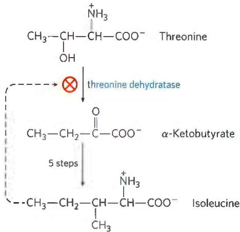  
FIGURE 22-23 Allosteric regulation of isoleucine biosynthesis. The first reaction in the pathway from threonine to isoleucine is inhibited by the end product, isoleucine. This was one of the first examples of allosteric feedback inhibition to be discovered.

  
FIGURE 22-24 Interlocking regulatory mechanisms in the biosynthesis of several amino acids derived from aspartate in E. coli. Three enzymes (A, B, C) have either two or three isozyme forms, indicated by numerical subscripts. In each case, one isozyme ( $A_{2}$ , $B_{1}$ , and $C_{2}$ ) has no allosteric regulation; these isozymes are regulated by changes in the amount of enzyme synthesized. Synthesis of isozymes $A_{2}$ and $B_{1}$ is repressed when methionine levels are high, and synthesis of isozyme $C_{2}$ is repressed when isoleucine levels are high. Enzyme A is aspartokinase; B, homoserine dehydrogenase; C, threonine dehydratase.

from aspartate $\beta$ -semialdehyde, and from aspartate (see Fig. 22-17). This overall regulatory mechanism is called sequential feedback inhibition.

Similar patterns are evident in the pathways leading to the aromatic amino acids. The first step of the early pathway to the common intermediate chorismate is catalyzed by the enzyme 2-keto-3-deoxy-D-arabinoheptulosonate 7-phosphate (DAHP) synthase (1 in Fig. 22-18). Most microorganisms and plants have three DAHP synthase isozymes. One is allosterically inhibited (feedback inhibition) by phenylalanine, another by tyrosine, and the third by tryptophan. This scheme helps the overall pathway to respond to cellular requirements for one or more of the aromatic amino acids. Additional regulation takes place after the pathway branches at chorismate. For example, the enzymes catalyzing the first two steps of the tryptophan branch are subject to allosteric inhibition by tryptophan.

## SUMMARY 22.2 Biosynthesis of Amino Acids

■ Plants and bacteria synthesize all 20 common amino acids. Mammals can synthesize about half; the others are required in the diet (essential or conditionally essential amino acids).

Glutamate is formed by reductive amination of $\alpha$ -ketoglutarate and serves as the precursor of glutamine, proline, and arginine.

The carbon chain of serine is derived from 3-phosphoglycerate. Serine is a precursor of glycine; the $\beta$ -carbon atom of serine is transferred to tetrahydrofolate. In microorganisms, cysteine is produced from serine and from sulfide produced by the reduction of environmental sulfate. Mammals produce cysteine from methionine and serine by a series of reactions requiring S-adenosylmethionine and cystathionine.

Alanine and aspartate (and thus asparagine) are formed from pyruvate and oxaloacetate, respectively, by transamination. Pyruvate and oxaloacetate also give rise to methionine, threonine, lysine, valine, isoleucine, and leucine via longer pathways.

The aromatic amino acids (phenylalanine, tyrosine, and tryptophan) form by a pathway in which chorismate occupies a key branch point. Tyrosine can also be formed by hydroxylation of phenylalanine (and thus is considered conditionally essential). Phosphoribosyl pyrophosphate is a precursor of tryptophan and histidine.

■ The pathway to histidine is interconnected with the purine synthetic pathway.

■ The amino acid biosynthetic pathways are subject to allosteric end-product inhibition; the regulatory enzyme is usually the first in the sequence. Regulation of the various synthetic pathways is coordinated.

## 22.3 Molecules Derived from Amino Acids

In addition to their role as the building blocks of proteins, amino acids are precursors of many specialized biomolecules, including hormones, coenzymes, nucleotides, alkaloids, cell wall polymers, porphyrins, antibiotics, pigments, and neurotransmitters. We describe here the pathways to a number of these amino acid derivatives.

## Glycine Is a Precursor of Porphyrins

The biosynthesis of porphyrins, for which glycine is a major precursor, is our first example because of the central importance of the porphyrin nucleus in heme proteins such as hemoglobin and the cytochromes. The porphyrins are constructed from four molecules of the monopyrrole derivative porphobilinogen, which itself is derived from two molecules of $\delta$ -aminolevulinate. There are two major pathways to $\delta$ -aminolevulinate. In higher eukaryotes (Fig. 22-25a), glycine reacts with succinyl-CoA in the first step to yield $\alpha$ -amino- $\beta$ -ketoadipate, which is then decarboxylated to $\delta$ -aminolevulinate. In plants, algae, and most bacteria, $\delta$ -aminolevulinate is formed from glutamate (Fig. 22-25b). The glutamate is first esterified to glutamyl-tRNA $^{\text{Glu}}$ ; P6 reduction by NADPH converts the glutamate to glutamate 1-semialdehyde, which is cleaved from the tRNA. An aminotransferase converts the glutamate 1-semialdehyde to $\delta$ -aminolevulinate.

In all organisms, two molecules of $\delta$ -aminolevulinate condense to form porphobilinogen and, through a series of complex enzymatic reactions, four molecules of porphobilinogen come together to form protoporphyrin (Fig. 22-26). The iron atom is incorporated after the protoporphyrin has been assembled, in a step catalyzed by ferrochelatase. Porphyrin biosynthesis is regulated in higher eukaryotes by heme, which serves as a feedback inhibitor of early steps in the synthetic pathway. Genetic defects in the biosynthesis of porphyrins can lead to the accumulation of pathway intermediates, causing a variety of human diseases known collectively as porphyrias (Box 22-2).

## Heme Degradation Has Multiple Functions

The iron-porphyrin (heme) group of hemoglobin, released from dying erythrocytes in the spleen, is degraded to yield free $Fe^{2+}$ and, ultimately, bilirubin. The pathway also contributes the pigment present in mixtures of the bile salts derived from cholesterol.

The first step in the two-step pathway to bilirubin, catalyzed by heme oxygenase, converts heme to biliverdin, a linear (open) tetrapyrrole derivative (Fig. 22-27 on p. 820). The other products of the reaction are free $\mathrm{Fe}^{2+}$ and CO. The $\mathrm{Fe}^{2+}$ is quickly bound by ferritin. Carbon monoxide is a poison that binds to hemoglobin (see Box 5-1), and the production of CO by heme oxygenase ensures that, even in the absence of environmental exposure, about $1\%$ of an individual's heme is complexed with CO.

  
FIGURE 22-25 Biosynthesis of $\delta$ -aminolevulinate. (a) In most animals, including mammals, $\delta$ -aminolevulinate is synthesized from glycine and succinyl-CoA. The atoms furnished by glycine are shown in red. (b) In bacteria and plants, the precursor of $\delta$ -aminolevulinate is glutamate.

Biliverdin is converted to bilirubin in the second step, catalyzed by biliverdin reductase. You can monitor the reactions in the breakdown of heme (Fig. 22-27) colorimetrically in a familiar in situ experiment. When you are bruised, the black and/or purple color results from hemoglobin released from damaged erythrocytes. Over time, the color changes to the green of biliverdin, and then to the yellow of bilirubin. Bilirubin is largely insoluble, and it travels in the bloodstream as one of many metabolites, fatty acids and others, complexed with serum albumin (see Fig. 17-3). In the liver, bilirubin is transformed to the bile pigment bilirubin diglucuronide. This product is sufficiently water-soluble to be secreted with other components of bile into the small intestine, where microbial enzymes convert it to several products, predominantly urobilinogen. Some urobilinogen is reabsorbed into the blood and transported to the kidney, where it is converted to urobilin, the compound that gives urine its yellow color. Urobilinogen remaining in the intestine is converted (in another microbe-dependent reaction) to stercobilin, which imparts the red-brown color to feces.

Impaired liver function or blocked bile secretion causes bilirubin to leak from the liver into the blood, resulting in a yellowing of the skin and eyeballs, a condition called jaundice. In cases of jaundice, determination of the concentration of bilirubin in the blood may be useful in the diagnosis of underlying liver disease. Newborn infants sometimes develop jaundice because they have not yet produced enough glucuronyl bilirubin transferase to process their bilirubin. A traditional treatment to reduce excess bilirubin, exposure to a fluorescent lamp, causes a photochemical conversion of bilirubin to compounds that are more soluble and easily excreted.

These pathways of heme breakdown play significant roles in protecting cells from oxidative damage and in regulating certain cellular functions. The CO produced by heme oxygenase is toxic at high concentrations, but at the very low concentrations generated during heme degradation it seems to have some regulatory and/or signaling functions. It acts as a vasodilator, much the same as (but less potent than) nitric oxide (discussed below). Low levels of CO also have some regulatory effects on neurotransmission. Bilirubin is the most abundant antioxidant in mammalian tissues and is responsible for most of the antioxidant activity in serum. Its protective effects seem to be especially important in the developing brain

## On Kings and Vampires

Porphyrias are a group of genetic diseases that result from defects in enzymes of the biosynthetic pathway from glycine to porphyrins (Fig. 1); specific porphyrin precursors accumulate in erythrocytes, body fluids, and the liver. The most common form is acute intermittent porphyria. Most individuals inheriting this condition are heterozygotes and are usually asymptomatic, because the single copy of the normal gene provides a sufficient level of enzyme function. However, certain nutritional or environmental factors (as yet poorly understood) can cause a buildup of $\delta$ -amino-levulinate and porphobilinogen, leading to attacks of acute abdominal pain and neurological dysfunction. King George III, British monarch during the American Revolution, suffered several episodes of apparent madness that tarnished the record of this otherwise accomplished man. The symptoms of his condition suggest that George III suffered from acute intermittent porphyria.

About 5,000 to 10,000 humans worldwide suffer from a genetic condition in which the activity of ferrochelatase (step 7) is reduced, leading to abnormally high concentrations of protoporphyrin in tissues. When exposed to light, the excess protoporphyrin releases free radicals that damage cellular macromolecules, including proteins and lipids in cell membranes. The resulting cell damage and inflammation in the endothelial (skin) cells can be very painful. Patients are forced to adopt a lifestyle in which they avoid sunlight and even bright indoor light. A new drug called afamelanotide, slowly released over several months from a small implant under the skin, has shown success in alleviating the symptoms of sunlight exposure. The drug interacts with the melanocortin-1 receptor, stimulating melanin production and modulating the expression of antioxidants that eliminate the free radical species. Afamelanotide may also prove useful in treating vitiligo, a more common condition in which melanin production is not uniform and skin color is lost in blotches.

of newborn infants. The cell toxicity associated with jaundice may be due to bilirubin levels in excess of the serum albumin needed to solubilize it.

P4 Given these varied roles of heme degradation products, the degradative pathway is subject to regulation, mainly at the first step. Humans have at least three isozymes of heme oxygenase (HO). HO-1 is highly regulated; the expression of its gene is induced by a wide range of stress conditions, including shear stress, uncontrolled angiogenesis (development of blood vessels), hypoxia, hyperoxia, heat shock, exposure to ultraviolet light, hydrogen peroxide, and many other metabolic insults. HO-2 is found mainly in the brain and the testes, where it is continuously expressed. The third isozyme, HO-3, is not catalytically active, but may play a role in oxygen sensing.

One of the rarer porphyrias results in an accumulation of uroporphyrinogen I, an abnormal isomer of a protoporphyrin precursor. This compound stains the urine red, causes the teeth to fluoresce strongly in ultraviolet light, and makes the skin abnormally sensitive to sunlight. Many individuals with this porphyria are anemic because insufficient heme is synthesized. This genetic condition may have given rise to the vampire stories of folk legend.

The symptoms of many porphyrias are now readily controlled with dietary changes or the administration of heme or heme derivatives.

## Amino Acids Are Precursors of Creatine and Glutathione

Phosphocreatine, derived from creatine, is an important energy buffer in skeletal muscle (see Box 23-1). Creatine is synthesized from glycine and arginine (Fig. 22-28); methionine, in the form of S-adenosylmethionine, acts as methyl group donor.

Glutathione (GSH), present in plants, animals, and some bacteria, often at high levels, can be thought of as a redox buffer. It is derived from glutamate, cysteine, and glycine (Fig. 22-29). The $\gamma$ -carboxyl group of glutamate is activated by ATP to form an acyl phosphate intermediate, which is then attacked by the $\alpha$ -amino group of cysteine. A second condensation reaction follows, with the $\alpha$ -carboxyl group of cysteine activated to an acyl phosphate to permit reaction with glycine.

FIGURE 22-27 Bilirubin and its breakdown products. M represents methyl; V, vinyl; Pr, propionyl; E, ethyl. For ease of comparison, these structures are shown in linear form, rather than in their correct stereochemical conformations.  

The oxidized form of glutathione (glutathione disulfide, or GSSG), produced in the course of its redox activities, contains two glutathione molecules linked by a disulfide bond.

Glutathione helps maintain the sulfhydryl groups of proteins in the reduced state and the iron of heme in the ferrous (Fe $^{2+}$ ) state, and it serves as a reducing agent for glutaredoxin in deoxyribonucleotide synthesis (see Fig. 22-41). Its redox function is also used to remove toxic peroxides formed in the normal course of growth and metabolism under aerobic conditions:

$$
2 \mathrm{GSH} + \mathrm{R} - \mathrm{O} - \mathrm{O} - \mathrm{H} \longrightarrow \mathrm{GSSG} + \mathrm{H} _ {2} \mathrm{O} + \mathrm{R} - \mathrm{OH}
$$

This reaction is catalyzed by glutathione peroxidase, a remarkable enzyme in that it contains a covalently bound selenium (Se) atom in the form of selenocysteine (see Fig. 3-8a), which is essential for its activity.

## D-Amino Acids Are Found Primarily in Bacteria

Although D-amino acids do not generally occur in proteins, they do serve some special functions in the structure of bacterial cell walls and peptide antibiotics. Bacterial peptidoglycans (see Fig. 6-32) contain both D-alanine and D-glutamate. D-Amino acids arise directly from the L isomers by the action of amino acid racemases, which have pyridoxal phosphate as cofactor (see Fig. 18-6). Amino acid racemization is uniquely important to bacterial metabolism, and enzymes such as alanine racemase are prime targets for pharmaceutical agents. One such agent, L-fluoroalanine, is being tested as an antibacterial drug. Another, cycloserine, is used to treat tuberculosis. Because these inhibitors also affect some PLP-requiring human enzymes, however, they have potentially undesirable side effects.

## Aromatic Amino Acids Are Precursors of Many Plant Substances

Phenylalanine, tyrosine, and tryptophan are converted to a variety of important compounds in plants. The rigid polymer lignin, derived from phenylalanine and tyrosine, is second only to cellulose in abundance in plant tissues. The structure of the lignin polymer is complex and not well understood. Tryptophan is also the precursor of the plant growth hormone indole-3-acetate, or auxin (Fig. 22-30a), which is important in the regulation of a wide range of biological processes in plants.

  
FIGURE 22-28 Biosynthesis of creatine and phosphocreatine. Creatine is made from three amino acids: glycine, arginine, and methionine. This pathway shows the versatility of amino acids as precursors of other nitrogenous biomolecules.

Phenylalanine and tyrosine also give rise to many commercially significant natural products, including the tannins that inhibit oxidation in wines; alkaloids such as morphine, which have potent physiological effects; and the flavoring of cinnamon oil (Fig. 22-30b), nutmeg, cloves, vanilla, cayenne pepper, and other products.

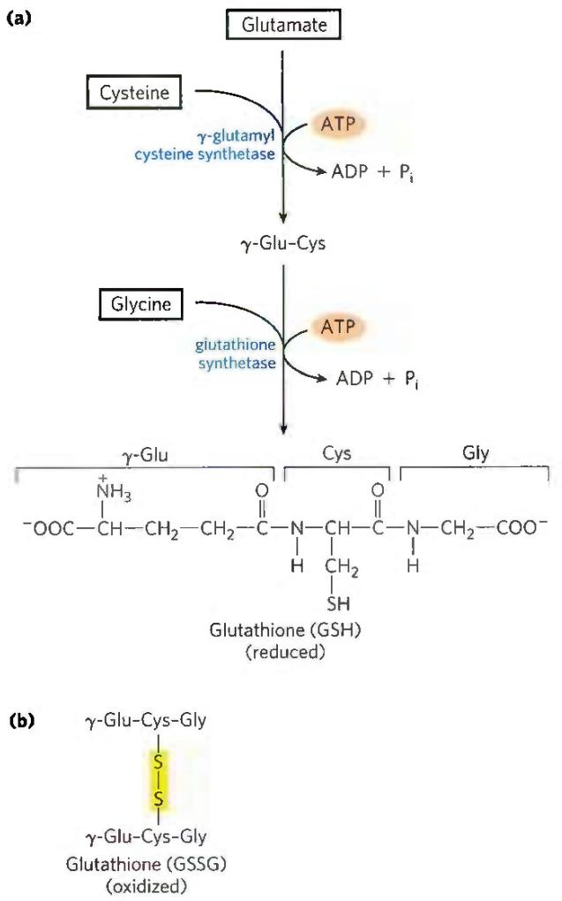  
FIGURE 22-29 Glutathione metabolism. (a) Biosynthesis of glutathione. (b) Oxidized form of glutathione.

## Biological Amines Are Products of Amino Acid Decarboxylation

Many important neurotransmitters are primary or secondary amines, derived from amino acids in simple pathways. In addition, some polyamines that form complexes with DNA are derived from the amino acid ornithine, a component of the urea cycle. A common denominator of many of these pathways is amino acid decarboxylation, another PLP-requiring reaction (see Fig. 18-6).

The synthesis of some neurotransmitters is illustrated in Figure 22-31. Tyrosine gives rise to a family of catecholamines that includes dopamine, norepinephrine, and epinephrine. Levels of catecholamines are correlated with, among other things, changes in blood pressure. The neurological disorder Parkinson disease is associated with an underproduction of dopamine, and it has traditionally been treated by administering L-dopa. Overproduction of dopamine in the brain may be linked to psychological disorders such as schizophrenia.

Glutamate decarboxylation gives rise to $\gamma$ -amino-butyrate (GABA), an inhibitory neurotransmitter. Its underproduction is associated with epileptic seizures. GABA analogs are used in the treatment of epilepsy and hypertension. Levels of GABA can also be increased by administering inhibitors of the GABA-degrading enzyme GABA aminotransferase. Another important neurotransmitter, serotonin, is derived from tryptophan in a two-step pathway.

  
FIGURE 22-30 Biosynthesis of two plant substances from amino acids. (a) Indole-3-acetate (auxin) and (b) cinnamate (cinnamon flavor).

Histidine undergoes decarboxylation to histamine, a powerful vasodilator in animal tissues. Histamine is released in large amounts as part of the allergic response, and it also stimulates acid secretion in the stomach. A growing array of pharmaceutical agents are being designed to interfere with either the synthesis or the action of histamine. A prominent example is the histamine receptor antagonist cimetidine (Tagamet), a structural analog of histamine:

$$
\begin{array}{c} \mathrm{CH} _ {3} \\ \mathrm{N} \end{array} \begin{array}{c} \mathrm{CH} _ {2} - \mathrm{S} - \mathrm{CH} _ {2} - \mathrm{CH} _ {2} - \mathrm{NH} - \mathrm{C} - \mathrm{NH} - \mathrm{CH} _ {3} \\ \mathrm{N} - \mathrm{C} \equiv \mathrm{N} \end{array}
$$

It promotes the healing of duodenal ulcers by inhibiting secretion of gastric acid.

Polyamines such as spermine and spermidine, involved in DNA packaging, are derived from methionine and ornithine by the pathway shown in Figure 22-32. The first step is decarboxylation of ornithine, a precursor of arginine (Fig. 22-12). Ornithine decarboxylase, a PLP-requiring enzyme, is the target of several powerful inhibitors used as pharmaceutical agents (see Box 6-1).

## Arginine Is the Precursor for Biological Synthesis of Nitric Oxide

A surprise finding in the mid-1980s was the role of nitric oxide (NO)—previously known mainly as a component of smog—as an important biological messenger. This simple gaseous substance diffuses readily through membranes, although its high reactivity limits its range of diffusion to about a 1 mm radius from the site of synthesis. In humans NO plays a role in a range of physiological processes, including neurotransmission, blood clotting, and the control of blood pressure. Its mode of action is described in Box 12-2.

P6 Nitric oxide is synthesized from arginine in an NADPH-dependent reaction catalyzed by nitric oxide synthase (Fig. 22-33), a dimeric enzyme structurally related to NADPH cytochrome P-450 reductase (see Box 21-1). The reaction is a five-electron oxidation. Each subunit of the enzyme contains one bound molecule of each of four different cofactors: FMN, FAD, tetrahydrobiopterin, and $\mathrm{Fe}^{3+}$ heme. NO is an unstable molecule and cannot be stored. Its synthesis is stimulated by interaction of nitric oxide synthase with $\mathrm{Ca}^{2+}$ -calmodulin (see Fig. 12-17).

## SUMMARY 22.3 Molecules Derived from Amino Acids

■ Many important biomolecules are derived from amino acids. Glycine is a precursor of porphyrins.

■ Degradation of iron-porphyrin (heme) generates bilirubin, which is converted to bile pigments with several physiological functions.

■ Glycine and arginine give rise to creatine and phosphocreatine, an energy buffer. Glutathione, formed from three amino acids, is an important cellular reducing agent.

■ Bacteria synthesize D-amino acids from L-amino acids in racemization reactions requiring pyridoxal phosphate. D-Amino acids are commonly found in certain bacterial walls and certain antibiotics.

■ Plants make many substances from aromatic amino acids.

■ The PLP-dependent decarboxylation of some amino acids yields important biological amines, including neurotransmitters and polyamines.

\- Arginine is the precursor of nitric oxide, a biological messenger.

FIGURE 22-31 Biosynthesis of some neurotransmitters from amino acids. The key step is the same in each case: a PLP-dependent decarboxylation (shaded light red).

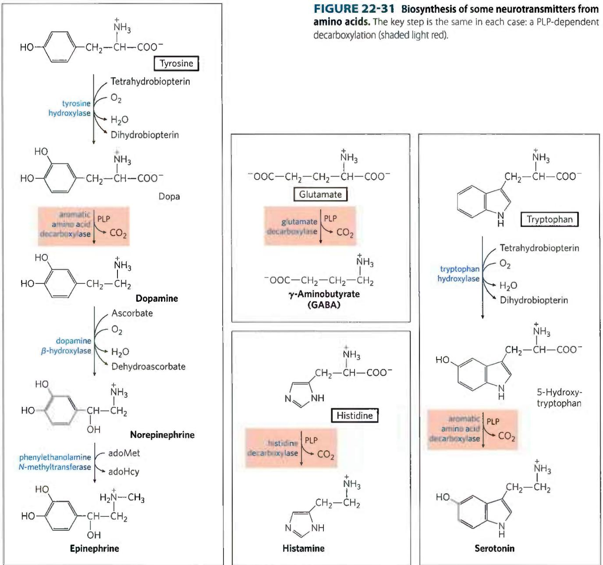

## 22.4 Biosynthesis and Degradation of Nucleotides

As discussed in Chapter 8, nucleotides have a variety of important functions in all cells. They are the precursors of DNA and RNA. They are essential carriers of chemical energy—a role primarily of ATP and to some extent GTP. They are components of the cofactors NAD, FAD, S-adenosylmethionine, and coenzyme A, as well as of activated biosynthetic intermediates such as UDP-glucose and CDP-diacylglycerol. Some, such as cAMP and cGMP, are also cellular second messengers.

Two types of pathways lead to nucleotides: the de novo pathways and the salvage pathways. De novo synthesis of nucleotides begins with their metabolic precursors: amino acids, ribose 5-phosphate, CO₂, and NH₃. Salvage pathways recycle the free bases and nucleosides released from nucleic acid breakdown. Both types of pathways are important in cellular metabolism, and both are discussed in this section.

The de novo pathways for purine and pyrimidine biosynthesis seem to be nearly identical in all living organisms. Notably, the free bases guanine, adenine, thymine, cytidine, and uracil are not intermediates in these pathways; that is, the bases are not synthesized and then attached to ribose, as might be expected. The purine ring structure is built up one or a few atoms at a time, attached to ribose throughout the process. The pyrimidine ring is synthesized as orotate, attached to ribose phosphate, and then converted to the common pyrimidine nucleotides required in nucleic acid synthesis. Although the free bases are not intermediates in the de novo pathways, they are intermediates in some of the salvage pathways.

  
FIGURE 22-33 Biosynthesis of nitric oxide. The nitrogen of the NO is derived from the guanidinium group of arginine.

Several important precursors are shared by the de novo pathways for synthesis of pyrimidines and purines. Phosphoribosyl pyrophosphate (PRPP) is important in both, and in these pathways the structure of ribose is retained in the product nucleotide, in contrast to its fate in the tryptophan and histidine biosynthetic pathways discussed earlier. An amino acid is an important precursor in each type of pathway: glycine for purines and aspartate for pyrimidines. Glutamine again is the most important source of amino groups—in five different steps in the de novo pathways. Aspartate is also used as the source of an amino group in the purine pathways, in two steps.

Two other features deserve mention. First, there is evidence, especially in the de novo purine pathway, that the enzymes are present as large, multienzyme complexes or metabolons in the cell, a recurring theme in our discussion of metabolism. Second, the cellular pools of nucleotides (other than ATP) are quite small, perhaps 1% or less of the amounts required to synthesize the cell's DNA. Therefore, cells must continue to synthesize nucleotides during nucleic acid synthesis, and in some cases, nucleotide synthesis may limit the rates of DNA replication and transcription. Because of the importance of these processes in dividing cells, agents that inhibit nucleotide synthesis have become particularly important in medicine.

We examine here the biosynthetic pathways of purine and pyrimidine nucleotides and their regulation, the formation of the deoxynucleotides, and the degradation of purines and pyrimidines to uric acid and urea. We end with a discussion of chemotherapeutic agents that affect nucleotide synthesis.

## De Novo Purine Nucleotide Synthesis Begins with PRPP

The two parent purine nucleotides of nucleic acids are adenosine 5'-monophosphate (AMP; adenylate) and guanosine 5'-monophosphate (GMP; guanylate), containing the purine bases adenine and guanine. Figure 22-34 shows the origin of the carbon and nitrogen atoms of the purine ring system, as determined by John M. Buchanan using isotopic tracer experiments in birds (who conveniently excrete excess nitrogen as insoluble uric acid, a purine analog). The detailed pathway of purine biosynthesis was worked out primarily by Buchanan and G. Robert Greenberg in the 1950s.

In the first committed step of the pathway, an amino group donated by glutamine is attached at C-1 of PRPP (Fig. 22-35). The resulting 5-phosphoribosylamine is highly unstable, with a half-life of 30 seconds at pH 7.5. This intermediate is rapidly funneled into the next biosynthetic step, and the purine ring is subsequently built up on this structure. The pathway described here is identical in all organisms, with the exception of one step that differs in higher eukaryotes, as noted below.

The second step is the addition of three atoms from glycine (Fig. 22-35, step 2). An ATP is consumed to activate the glycine carboxyl group (in the form of an acyl phosphate) for this condensation reaction. The added glycine amino group is then formylated by $N^{10}$ -formyltetrahydrofolate (step 3), and a nitrogen is contributed by glutamine (step 4), before dehydration and ring closure yield the five-membered imidazole ring of the purine nucleus, as 5-aminoimidazole ribonucleotide (AIR; step 5).

At this point, three of the six atoms needed for the second ring in the purine structure are in place. To complete the process, a carboxyl group is first added (step 6). This carboxylation is unusual in that it does not require biotin, but instead uses the bicarbonate generally present in aqueous solutions. A rearrangement transfers the carboxylate from the exocyclic amino group to position 4 of the imidazole ring (step 7). Steps 6 and 7 are found only in bacteria and fungi. In higher eukaryotes, including humans, the 5-aminoimidazole ribonucleotide product of step 5 is carboxylated directly to carboxyaminoimidazole ribonucleotide in one step instead of two (step 6a). The enzyme catalyzing this reaction is AIR carboxylase.

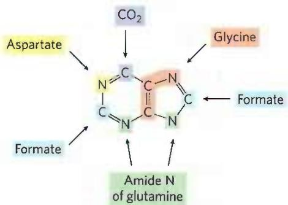  
FIGURE 22-34 Origin of the ring atoms of purines. This information was obtained from isotopic experiments with $^{14}\mathrm{C}-$ or $^{15}\mathrm{N}$ -labeled precursors. Formate is supplied in the form of $N^{10}$ -formyltetrahydrofolate.

Aspartate now donates its amino group in two steps (8 and 9): formation of an amide bond, followed by elimination of the carbon skeleton of aspartate (as fumarate). (Recall that aspartate plays an analogous role in two steps of the urea cycle; see Fig. 18-10.) The final carbon is contributed by $N^{10}$ -formyltetrahydrofolate (step 10), and a second ring closure takes place to yield the second fused ring of the purine nucleus (step 11). The first intermediate with a complete purine ring is inosinate (IMP).

As in the tryptophan and histidine biosynthetic pathways, the enzymes of IMP synthesis seem to be organized as large metabolons in the cell. Once again, evidence comes from the existence of single polypeptides with several functions, some catalyzing nonsequential steps in the pathway. In eukaryotic cells ranging from yeast to fruit flies to chickens, steps 1, 3, and 5 in Figure 22-35 are catalyzed by a multifunctional protein. An additional multifunctional protein catalyzes steps 10 and 11. In humans, a multifunctional enzyme combines the activities of AIR carboxylase and SAICAR synthetase (steps 6a and 8). In bacteria, these activities are found on separate proteins, but the proteins may form a metabolon. The channeling of reaction intermediates from one enzyme to the next permitted by these complexes is probably especially important for unstable intermediates such as 5-phosphoribosylamine.

Conversion of inosinate to adenylate requires the insertion of an amino group derived from aspartate (Fig. 22-36); this takes place in two reactions similar to those used to introduce N-1 of the purine ring (Fig. 22-35, steps 8 and 9). A crucial difference is that GTP rather than ATP is the source of the high-energy phosphate in synthesizing adenylosuccinate. Guanylate is formed by the $\mathrm{NAD^{+}}$ -requiring oxidation of inosinate at C-2, followed by addition of an amino group derived from glutamine. ATP is cleaved to AMP and $\mathrm{PP_i}$ in the final step (Fig. 22-36).

## Purine Nucleotide Biosynthesis Is Regulated by Feedback Inhibition

P4 Four major feedback mechanisms cooperate in regulating the overall rate of de novo purine nucleotide synthesis and the relative rates of formation of the two

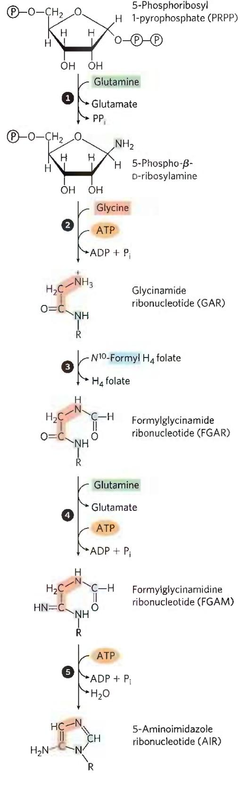

FIGURE 22-35 De novo synthesis of purine nucleotides: construction of the purine ring of inosinate (IMP). Each addition to the purine ring is shaded to match Figure 22-34. After step ②, R symbolizes the 5-phospho-d-ribosyl group on which the purine ring is built. Formation of 5-phosphoribosylamine (step ①) is the first committed step in  
  
purine synthesis. Note that the product of step 9, AICAR, is the remnant of ATP released during histidine biosynthesis (see Fig. 22-22, step 5). Abbreviations are given for most intermediates to simplify the naming of the enzymes. Step 6a is the alternative path from AIR to CAIR occurring in higher eukaryotes.

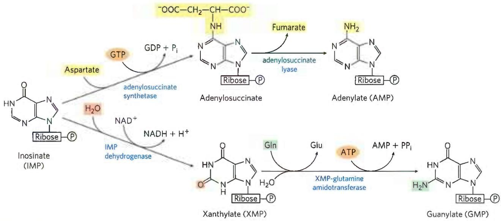  
FIGURE 22-36 Biosynthesis of AMP and GMP from IMP.

end products, adenylate and guanylate (Fig. 22-37). The first mechanism is exerted on the first reaction that is unique to purine synthesis: transfer of an amino group to PRPP to form 5-phosphoribosylamine. This reaction is catalyzed by the allosteric enzyme glutamine-PRPP amidotransferase, which is inhibited by the end products IMP, AMP, and GMP. AMP and GMP act synergistically in this concerted inhibition. Thus, whenever either AMP or GMP accumulates to excess, the first step in its biosynthesis from PRPP is partially inhibited.

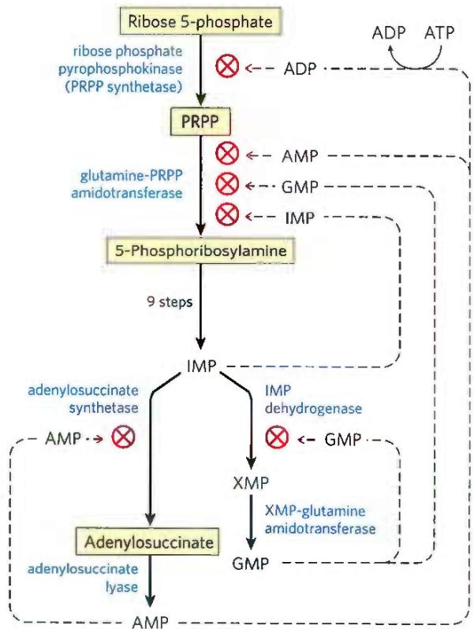  
FIGURE 22-37 Regulatory mechanisms in the biosynthesis of adenine and guanine nucleotides in E. coli. Regulation of these pathways differs in other organisms.

In the second control mechanism, exerted at a later stage, an excess of GMP in the cell inhibits formation of xanthylate from inosinate by IMP dehydrogenase, without affecting the formation of AMP. Conversely, an accumulation of adenylate inhibits formation of adenylosuccinate by adenylosuccinate synthetase, without affecting the biosynthesis of GMP. When both products are present in sufficient quantities, IMP builds up, and it inhibits an earlier step in the pathway; this is another example of the regulatory strategy called sequential feedback inhibition.

In the third mechanism, GTP is required in the conversion of IMP to AMP, whereas ATP is required for conversion of IMP to GMP (Fig. 22-36), a reciprocal arrangement that tends to balance the synthesis of the two ribonucleotides.

The fourth and final control mechanism is the inhibition of PRPP synthesis by the allosteric regulation of ribose phosphate pyrophosphokinase. This enzyme is inhibited by ADP and GDP, in addition to metabolites from other pathways for which PRPP is a starting point.

## Pyrimidine Nucleotides Are Made from Aspartate, PRPP, and Carbamoyl Phosphate

The common pyrimidine ribonucleotides are cytidine 5'-monophosphate (CMP; cytidylate) and uridine 5'-monophosphate (UMP; uridylate), which contain the pyrimidines cytosine and uracil. De novo pyrimidine nucleotide biosynthesis (Fig. 22-38) proceeds in a somewhat different manner from purine nucleotide synthesis; the six-membered pyrimidine ring is made first and then attached to ribose 5-phosphate. Required in this process is carbamoyl phosphate, also an intermediate in the urea cycle. However, in animals the carbamoyl phosphate required in urea synthesis is made in mitochondria by carbamoyl phosphate synthetase I, whereas the carbamoyl phosphate required in pyrimidine biosynthesis is made in the cytosol by a different form of the enzyme, carbamoyl phosphate synthetase II. In bacteria, a single enzyme supplies carbamoyl phosphate for the synthesis of arginine and pyrimidines. The bacterial enzyme has three separate active sites, spaced along a channel nearly 100 Å long (Fig. 22-39). Bacterial carbamoyl phosphate synthetase provides a vivid illustration of the channeling of unstable reaction intermediates between active sites so that products are formed efficiently.

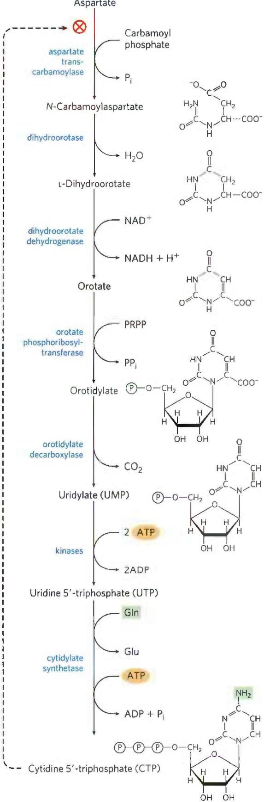  
FIGURE 22-38 De novo synthesis of pyrimidine nucleotides: biosynthesis of UTP and CTP via orotidylate. The pyrimidine is constructed from carbamoyl phosphate and aspartate. The ribose 5-phosphate is then added to the completed pyrimidine ring by orotate phosphoribosyltransferase. The first step in this pathway (not shown here; see Fig. 18-11a) is the synthesis of carbamoyl phosphate from $\mathrm{CO}_{2}$ , $\mathrm{NH}_{4}^{+}$ , and ATP. In eukaryotes, the first step is catalyzed by carbamoyl phosphate synthetase II.

Carbamoyl phosphate reacts with aspartate to yield N-carbamoylaspartate in the first committed step of pyrimidine biosynthesis (Fig. 22-38). This reaction is catalyzed by aspartate transcarbamoylase. In bacteria, this step is highly regulated, and bacterial aspartate transcarbamoylase is one of the most thoroughly studied allosteric enzymes (see below). By removal of water from N-carbamoylaspartate, a reaction catalyzed by dihydroorotase, the pyrimidine ring is closed to form L-dihydroorotate. This compound is oxidized to the pyrimidine derivative orotate, a reaction in which $NAD^{+}$ is the ultimate electron acceptor. In eukaryotes, the first three enzymes in this pathway—carbamoyl phosphate synthetase II, aspartate transcarbamoylase, and dihydroorotase—are part of a single trifunctional protein. The protein, known by the acronym CAD, contains three identical polypeptide chains (each of $M_{r}$ 230,000), each with active sites for all three reactions. This suggests that metabolons may be the rule in this pathway.

  
FIGURE 22-39 Channeling of intermediates in bacterial carbamoyl phosphate synthetase. The reaction catalyzed by this enzyme (and its mitochondrial counterpart) is illustrated in Figure 18-11a. In this cutaway, the small and large subunits are shown in tan and blue, respectively; the tunnel between active sites (almost 100 Å long) is shown as white. In this reaction, a glutamine molecule binds to the small subunit, donating its amido nitrogen as NH $_{4}^{+}$ in a glutamine amidotransferase-type reaction. The NH $_{4}^{+}$ enters the tunnel, which takes it to a second active site, where it combines with bicarbonate in a reaction requiring ATP. The carbamate then reenters the tunnel to reach the third active site, where it is phosphorylated by ATP to carbamoyl phosphate. To solve this structure, the enzyme was crystallized with ornithine bound to the glutamine-binding site and ADP bound to the ATP-binding sites. [Data from PDB ID 1M6V, J. B. Thoden et al., J. Biol. Chem. 277:39,722, 2002.]

Once orotate is formed, the ribose 5-phosphate side chain, provided once again by PRPP, is attached to yield orotidylate (Fig. 22-38). Orotidylate is then decarboxylated to uridylate, which is phosphorylated to UTP. P6 CTP is formed from UTP by the action of cytidylate synthetase, by way of an acyl phosphate intermediate (consuming one ATP). The nitrogen donor is normally glutamine, although the cytidylate synthetases in many species can use $\mathrm{NH}_4^+$ directly.

## Pyrimidine Nucleotide Biosynthesis Is Regulated by Feedback Inhibition

P4 Regulation of the rate of pyrimidine nucleotide synthesis in bacteria occurs in large part through aspartate transcarbamoylase (ATCase), which catalyzes the first reaction in the sequence and is inhibited by CTP, the end product of the sequence (Fig. 22-38). The bacterial ATCase molecule consists of six catalytic subunits and six regulatory subunits (see Fig. 6-36). The catalytic subunits bind the substrate molecules, and the allosteric subunits bind the allosteric inhibitor, CTP. The entire ATCase molecule, as well as its subunits, exists in two conformations, active and inactive. When CTP is not bound to the regulatory subunits, the enzyme is maximally active. As CTP accumulates and binds to the regulatory subunits, they undergo a change in conformation. This change is transmitted to the catalytic subunits, which then also shift to an inactive conformation. ATP prevents the changes induced by CTP. Figure 22-40 shows the effects of the allosteric regulators on the activity of ATCase.

  
FIGURE 22-40 Allosteric regulation of aspartate transcarbamoylase by CTP and ATP. Addition of 0.8 mm CTP, the allosteric inhibitor of ATCase, increases the $K_{0.5}$ for aspartate (lower curve), thereby reducing the rate of conversion of aspartate to N-carbamoylaspartate. ATP at 0.6 mm fully reverses this inhibition by CTP (middle curve).

## Nucleoside Monophosphates Are Converted to Nucleoside Triphosphates

Nucleotides to be used in biosynthesis are generally converted to nucleoside triphosphates. The conversion pathways are common to all cells. Phosphorylation of AMP to ADP is promoted by adenylate kinase, in the reaction

$$
\mathrm{ATP} + \mathrm{AMP} \rightleftharpoons 2 \mathrm{ADP}
$$

The ADP so formed is phosphorylated to ATP by the glycolytic enzymes or through oxidative phosphorylation.

ATP also brings about the formation of other nucleoside diphosphates by the action of a class of enzymes called nucleoside monophosphate kinases. These enzymes, which are generally specific for a particular base but nonspecific for the sugar (ribose or deoxyribose), catalyze the reaction

$$
\mathrm{ATP} + \mathrm{NMP} \rightleftharpoons \mathrm{ADP} + \mathrm{NDP}
$$

The efficient cellular systems for rephosphorylating ADP to ATP (ATP synthase; Chapter 19) tend to remove ADP and pull this reaction in the direction of products.

Nucleoside diphosphates are converted to triphosphates by the action of a ubiquitous enzyme, nucleoside diphosphate kinase, which catalyzes the reaction

$$
\mathrm{NTP} _ {\mathrm{D}} + \mathrm{NDP} _ {\mathrm{A}} \rightleftharpoons \mathrm{NDP} _ {\mathrm{D}} + \mathrm{NTP} _ {\mathrm{A}}
$$

This enzyme is notable in that it is not specific for the base (purines or pyrimidines) or the sugar (ribose or deoxyribose). This nonspecificity applies to both phosphate acceptor (A) and donor (D), although the donor $\left(\mathrm{NTP}_{\mathrm{D}}\right)$ is almost invariably ATP because it is present in higher concentration than other nucleoside triphosphates under aerobic conditions.

## Ribonucleotides Are the Precursors of Deoxyribonucleotides

Deoxyribonucleotides, the building blocks of DNA, are derived from the corresponding ribonucleotides by direct reduction at the 2'-carbon atom of the D-ribose to form the 2'-deoxy derivative. For example, adenosine diphosphate (ADP) is reduced to 2'-deoxyadenosine diphosphate (dADP), and GDP is reduced to dGDP. This reaction is somewhat unusual in that the reduction occurs at a nonactivated carbon; no closely analogous chemical reactions are known. The reaction is catalyzed by ribonucleotide reductase, best characterized in E. coli, in which its substrates are ribonucleoside diphosphates.

The reduction of the D-ribose portion of a ribonucleoside diphosphate to 2'-deoxy-D-ribose requires a pair of hydrogen atoms, which are ultimately donated by NADPH via an intermediate hydrogen-carrying protein, thioredoxin. This ubiquitous protein serves a similar redox function in photosynthesis (see Fig. 20-37) and other processes. Thioredoxin has pairs of —SH groups that carry hydrogen atoms from NADPH to the ribonucleoside diphosphate. P6 Its oxidized (disulfide)

form is reduced by NADPH in a reaction catalyzed by thioredoxin reductase (Fig. 22-41), and reduced thioredoxin is then used by ribonucleotide reductase to reduce the nucleoside diphosphates (NDPs) to deoxyribonucleoside diphosphates (dNDPs). A second source of reducing equivalents for ribonucleotide reductase is glutathione (GSH). Glutathione serves as the reductant for a protein closely related to thioredoxin, glutaredoxin, which then transfers the reducing power to ribonucleotide reductase.

Ribonucleotide reductase is notable in that its reaction mechanism provides the best-characterized example of the involvement of free radicals in biochemical transformations, once thought to be rare in biological systems. The enzyme in E. coli and most eukaryotes is an $\alpha_{2}\beta_{2}$ dimer, with two catalytic subunits, $\alpha_{2}$ , and two radical-generation subunits, $\beta_{2}$ (Fig. 22-42). Each catalytic subunit contains two kinds of regulatory sites, as described below. The two active sites of the enzyme are formed at the interface between the catalytic ( $\alpha_{2}$ ) and radical-generation ( $\beta_{2}$ ) subunits. At each active site, an $\alpha$ subunit contributes two sulfhydryl groups required for activity, and the $\beta_{2}$ subunits contribute a stable tyrosyl radical. The $\beta_{2}$ subunits also have a binuclear iron ( $Fe^{3+}$ ) cofactor that helps generate and stabilize the Tyr $^{122}$ radical. The tyrosyl radical is too far from the active site.

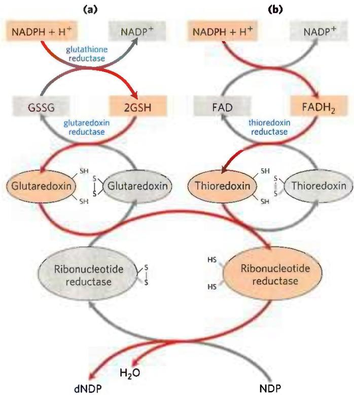  
FIGURE 22-41 Reduction of ribonucleotides to deoxyribonucleotides by ribonucleotide reductase. Electrons are transmitted (red arrows) to the enzyme from NADPH via (a) glutaredoxin or (b) thioredoxin. The sulfhydryl groups in glutaredoxin reductase are contributed by two molecules of bound glutathione (GSH; GSSG indicates oxidized glutathione). Note that thioredoxin reductase is a flavoenzyme, with FAD as a prosthetic group.

  
(a)

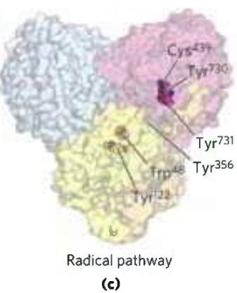  
FIGURE 22-42 Ribonucleotide reductase. (a) A schematic diagram of the subunit structures. Each catalytic subunit ( $\alpha$ ; also called R1) contains the two regulatory sites described in Figure 22-44 and two Cys residues central to the reaction mechanism. The radical-generation subunits ( $\beta$ ; also called R2) each contain a critical Tyr $^{122}$ residue and binuclear iron center. (b) The likely structure of $\alpha_{2}\beta_{2}$ . (c) The likely path of radical formation from the initial Tyr $^{122}$ in a $\beta$ subunit to the active-site Cys $^{439}$ , which is used in the mechanism shown in Figure 22-43. Several aromatic amino acid residues participate in long-range transfer of the radical from the point of its formation at Tyr $^{122}$ to the active site, where the nucleotide substrate is bound. [(a) Information from L. Thelander and P. Reichard, Annu. Rev. Biochem. 48:133, 1979. (b, c) Data from PDB ID 3UUS, N. Ando et al., Proc. Natl. Acad. Sci. USA 108:21,046, 2011.]

to interact directly with the site, but several aromatic residues form a long-range radical-transfer pathway to the active site (Fig. 22-42c). A likely mechanism for the ribonucleotide reductase reaction is illustrated in Figure 22-43. In E. coli, the sources of the required reducing equivalents for this reaction are thioredoxin and glutaredoxin, as noted above.

Three classes of ribonucleotide reductase have been reported. Their mechanisms (where known) generally conform to the scheme in Figure 22-43, but they differ in the identity of the group supplying the active-site radical and in the cofactors used to generate it. The E. coli enzyme (class I) requires oxygen to regenerate

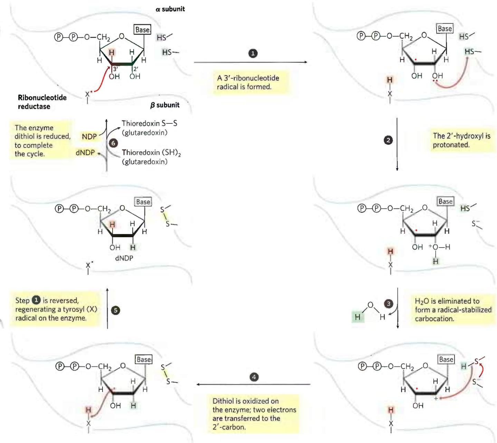  
MECHANISM FIGURE 22-43 Proposed mechanism for ribonucleotide reductase. In the enzyme of E. coli and most eukaryotes, the active thiol groups are on the $\alpha$ subunit. The active-site radical ( $—X^{\circ}$ ) is on the $\beta$ subunit and in E. coli is probably a thyl radical of Cys $^{439}$ (see Fig. 22-42).

the tyrosyl radical if it is quenched, so this enzyme functions only in an aerobic environment. Class II enzymes, found in other microorganisms, have 5'-deoxyadenosyl-cobalamin (see Box 17-2) rather than a binuclear iron center. Class III enzymes have evolved to function in an anaerobic environment. E. coli contains a separate class III ribonucleotide reductase when grown anaerobically; this enzyme contains an iron-sulfur cluster (structurally distinct from the binuclear iron center of the class I enzyme) and requires NADPH and S-adenosylmethionine for activity. It uses nucleoside triphosphates rather than nucleoside diphosphates as substrates. The evolution of different classes of ribonucleotide reductase for production of DNA precursors in different environments reflects the importance of this reaction in nucleotide metabolism.

P4 Regulation of E. coli ribonucleotide reductase is unusual in that not only its activity but also its substrate specificity is regulated by the binding of effector molecules. Each $\alpha$ subunit has two types of regulatory sites (Fig. 22-42). One type affects overall enzyme activity and binds either ATP, which activates the enzyme, or dATP, which inactivates it. The second type alters substrate specificity in response to the effector molecule — ATP, dATP, dTTP, or dGTP — that is bound there (Fig. 22-44). When ATP or dATP is bound, reduction of UDP and CDP is favored. When dTTP or dGTP is bound, reduction of GDP or ADP, respectively, is stimulated. P1 The scheme is designed to provide a balanced pool of precursors for DNA synthesis. ATP is also a general activator for biosynthesis and ribonucleotide reduction. The presence of dATP in small amounts increases the reduction of pyrimidine nucleotides. An oversupply of the pyrimidine dNTPs is signaled by high levels of dTTP. Abundant dTTP shifts the specificity to favor reduction of GDP. High levels of dGTP, in turn, shift the specificity to ADP reduction, and high levels of dATP shut the enzyme down. These effectors are thought to induce several distinct enzyme conformations with altered specificities.

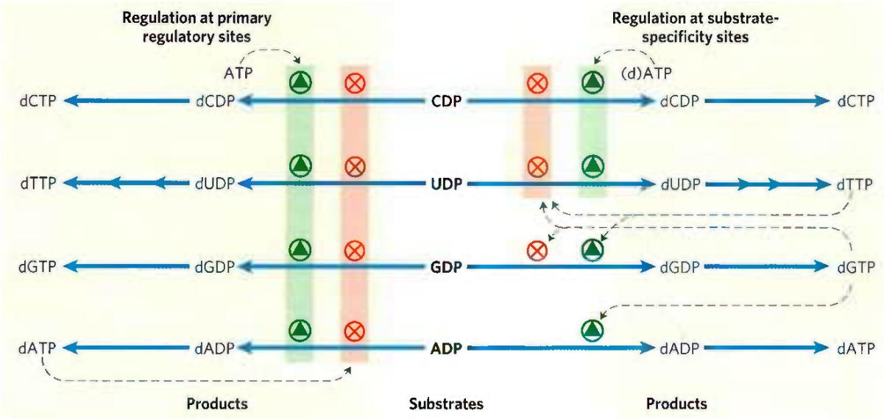  
FIGURE 22-44 Regulation of ribonucleotide reductase by deoxynucleoside triphosphates. The overall activity of the enzyme is affected by binding at the primary regulatory site (left). The substrate specificity of the enzyme is affected by the nature of the effector molecule bound  
at the second type of regulatory site, the substrate-specificity site (right). The diagram indicates inhibition or stimulation of enzyme activity with the four different substrates. The pathway from dUDP to dTMP is described below (see Figs 22-46, 22-47).

These regulatory effects are accompanied by, and presumably mediated by, large structural rearrangements in the enzyme. When the active form of the E. coli enzyme ( $\alpha_{2}\beta_{2}$ ) is inhibited by the addition of the allosteric inhibitor dATP, a ringlike $\alpha_{4}\beta_{4}$ structure forms, with alternating $\alpha_{2}$ and $\beta_{2}$ subunits (Fig. 22-45). In this altered structure, the radical-forming path from $\beta$ to $\alpha$ is disrupted and the residues in the path are exposed to solvent, effectively preventing radical transfer and thus inhibiting the reaction. The formation of ringlike $\alpha_{4}\beta_{4}$ structures is reversed when dATP levels are reduced. The yeast ribonucleotide reductase also undergoes oligomerization in the presence of dATP, forming a hexameric ring structure, $\alpha_{6}\beta_{6}$ .

  
FIGURE 22-45 Oligomerization of ribonucleotide reductase induced by the allosteric inhibitor dATP. At high concentrations of dATP (50 $\mu$ M), ring-shaped $\alpha_{4}\beta_{4}$ structures form. In this conformation, the residues in  
the radical-forming path are exposed to the solvent, blocking the radical reaction and inhibiting the enzyme. The oligomerization is reversed at lower dATP concentrations. [Data from PDB ID 3UUS, N. Ando et al., Proc. Natl. Acad. Sci. USA 108:21,046, 2011.]

## Thymidylate Is Derived from dCDP and dUMP

DNA contains thymine rather than uracil, and the de novo pathway to thymine involves only deoxyribonucleotides. The immediate precursor of thymidylate (dTMP) is dUMP. In bacteria, the pathway to dUMP begins with formation of dUTP, either by deamination of dCTP or by phosphorylation of dUDP (Fig. 22-46). The dUTP is converted to dUMP by a dUTPase. The latter reaction must be efficient to keep dUTP pools low and prevent incorporation of uridylate into DNA.

Conversion of dUMP to dTMP is catalyzed by thymidylate synthase. A one-carbon unit at the hydroxymethyl ( $-CH_{2}OH$ ) oxidation level (see Fig. 18-17) is transferred from $N^{5}, N^{10}$ -methylenetetrahydrofolate to dUMP, then reduced to a methyl group (Fig. 22-47). The reduction occurs at the expense of oxidation of tetrahydrofolate to dihydrofolate, which is unusual in tetrahydrofolate-requiring reactions. (The mechanism of this reaction is shown in Fig. 22-52.) The dihydrofolate is reduced to tetrahydrofolate by dihydrofolate reductase—a regeneration that is essential for the many processes that require tetrahydrofolate. In plants and at least one protist, thymidylate synthase and dihydrofolate reductase reside on a single, bifunctional protein.

About 10% of the human population (and up to 50% of people in impoverished communities) suffers from folic acid deficiency. When the deficiency is severe, the symptoms can include heart disease, cancer, and some types of brain dysfunction. Folic acid deficiency during pregnancy can also produce neural tube defects in infants. At least some of these symptoms arise from a reduction in thymidylate synthesis, leading to an abnormal incorporation of uracil into DNA. Uracil is recognized by DNA repair pathways (described in Chapter 25) and is cleaved from the DNA. The presence of high levels of uracil in DNA leads to strand breaks that can greatly affect the function and regulation of nuclear DNA, ultimately causing the observed effects on the heart and brain, as well as increased mutagenesis that leads to cancer.

  
FIGURE 22-46 Biosynthesis of thymidylate (dTMP). The pathways are shown beginning with the reaction catalyzed by ribonucleotide reductase.

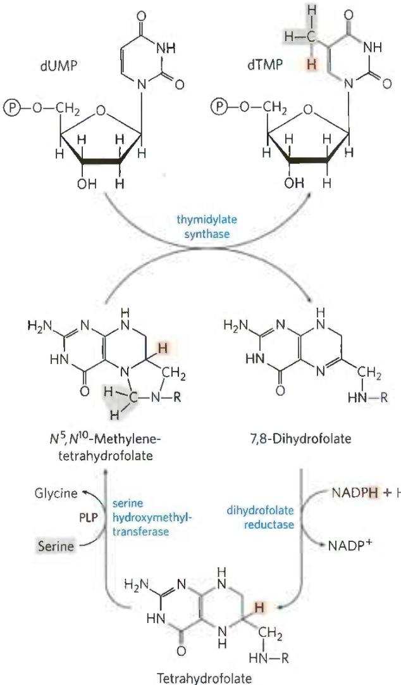  
FIGURE 22-47 Conversion of dUMP to dTMP by thymidylate synthase and dihydrofolate reductase. Serine hydroxymethyltransferase is required for regeneration of the $N^5, N^{10}$ -methylene form of tetrahydrofolate. In the synthesis of dTMP, all three hydrogens of the added methyl group are derived from $N^5, N^{10}$ -methylenetetrahydrofolate (light red and gray).

## Degradation of Purines and Pyrimidines Produces Uric Acid and Urea, Respectively

Purine nucleotides are degraded by a pathway in which they lose their phosphate through the action of 5'-nucleotidase (Fig. 22-48). Adenylate yields adenosine, which is deaminated to inosine by adenosine deaminase, and inosine is hydrolyzed to hypoxanthine (its purine base) and D-ribose. Hypoxanthine is oxidized successively to xanthine and then uric acid by xanthine oxidase, a flavoenzyme with an atom of molybdenum and four iron-sulfur centers in its prosthetic group. Molecular oxygen is the electron acceptor in this complex reaction.

GMP catabolism also yields uric acid as an end product. GMP is first hydrolyzed to guanosine, which is then cleaved to free guanine. Guanine undergoes hydrolytic removal of its amino group to yield xanthine, which is converted to uric acid by xanthine oxidase.

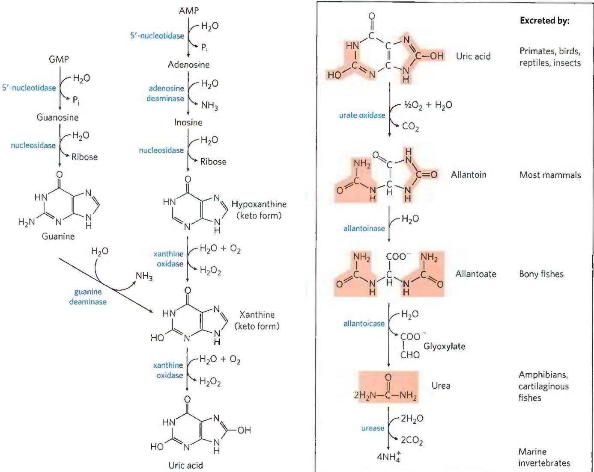  
FIGURE 22-48 Catabolism of purine nucleotides. Note that primates excrete much more nitrogen as urea via the urea cycle (Chapter 18) than as uric acid from purine degradation. Similarly, fish excrete much more nitrogen as $\mathrm{NH}_4^+$ than as urea produced by the pathway shown here.

Uric acid is the excreted end product of purine catabolism in primates, birds, and some other animals. A healthy adult human excretes uric acid at a rate of about 0.6 g/24 h; the excreted product arises in part from ingested purines and in part from turnover of the purine nucleotides of nucleic acids. In most mammals and many other vertebrates, uric acid is degraded to allantoin by the action of urate oxidase. In other organisms the pathway is further extended, as shown in Figure 22-48.

The pathways for degradation of pyrimidines generally lead to $NH_{4}^{+}$ production and thus to urea synthesis. The carbons of thymine are degraded to succinyl-CoA; those of cytosine and uracil are degraded to acetyl-CoA (Fig. 22-49).

Genetic aberrations in human purine metabolism have been found, some with serious consequences. For example, adenosine deaminase (ADA) deficiency leads to severe immunodeficiency disease in which T lymphocytes and B lymphocytes do not develop properly. Lack of ADA leads to a 100-fold increase in the cellular concentration of dATP, a strong inhibitor of ribonucleotide reductase (Fig. 22-44). High levels of dATP produce a general deficiency of other dNTPs in T lymphocytes. The basis for B-lymphocyte toxicity is less clear. Individuals with ADA deficiency lack an effective immune system and do not survive unless treated. Current therapies include bone marrow transplants from a matched donor to replace the hematopoietic stem cells that mature into B and T lymphocytes. However, transplant recipients often suffer a variety of cognitive and physiological problems. Enzyme replacement therapy, requiring once- or twice-weekly intramuscular injection of active ADA, is effective, but the therapeutic benefit often declines after 8 to 10 years; complications may then arise, including malignancies. For many people, a permanent cure requires replacing the defective gene with a functional one in bone marrow cells. ADA deficiency was one of the first targets of human gene therapy trials (in 1990). Mixed results in early trials have given way to significant successes, and gene therapy is rapidly becoming a viable path for long-term restoration of immune function for these patients. Newer approaches based on CRISPR-mediated gene editing (see Fig. 9-21) may eventually be even more effective.

  
FIGURE 22-49 Catabolism of pyrimidines. These simplified pathways show end products but no intermediates.

## Purine and Pyrimidine Bases Are Recycled by Salvage Pathways

Free purine and pyrimidine bases are constantly released in cells during the metabolic degradation of nucleotides. Free purines are in large part salvaged and reused to make nucleotides, in a pathway much simpler than the de novo synthesis of purine nucleotides described earlier. One of the primary salvage pathways consists of a single reaction catalyzed by adenosine phosphoribosyltransferase, in which free adenine reacts with PRPP to yield the corresponding adenine nucleotide:

$$
\text { Adenine } + \mathrm{PRPP} \longrightarrow \mathrm{AMP} + \mathrm{PP} _ {\mathrm{i}}
$$

Free guanine and hypoxanthine (the deamination product of adenine; Fig. 22-48) are salvaged in the same way by hypoxanthine-guanine phosphoribosyltransferase. A similar salvage pathway exists for pyrimidine bases in microorganisms, and possibly in mammals.

A genetic lack of hypoxanthine-guanine phosphoribosyltransferase activity, seen almost exclusively in young boys, results in a set of symptoms called Lesch-Nyhan syndrome. Children with this genetic disorder, which becomes manifest by the age of 2 years, are sometimes poorly coordinated and have intellectual deficits. In addition, they are extremely hostile and show compulsive self-destructive tendencies: they mutilate themselves by biting off their fingers, toes, and lips.

The devastating effects of Lesch-Nyhan syndrome illustrate the importance of the salvage pathways. Hypoxanthine and guanine arise constantly from the breakdown of nucleic acids. In the absence of hypoxanthine-guanine phosphoribosyltransferase, PRPP levels rise and purines are overproduced by the de novo pathway, resulting in high levels of uric acid production and goutlike damage to tissue (see below). The brain is especially dependent on the salvage pathways, and this may account for the central nervous system damage in children with Lesch-Nyhan syndrome. This syndrome is another potential target for gene therapy.

## Excess Uric Acid Causes Gout

Long thought (erroneously) to be due to "high living," gout is a disease of the joints caused by an elevated concentration of uric acid in the blood and tissues. The joints become inflamed, painful, and arthritic, owing to the abnormal deposition of sodium urate crystals. The kidneys are also affected, as excess uric acid is deposited in the kidney tubules. Gout occurs predominantly in males. Its precise cause is not known, but it often involves an underexcretion of urate. A genetic deficiency of one or another enzyme of purine metabolism may also be a factor in some cases.

Gout is effectively treated by a combination of nutritional and drug therapies. Patients exclude foods especially rich in nucleotides and nucleic acids, such as liver or glandular products, from the diet. Major alleviation of the symptoms is provided by the drug allopurinol (Fig. 22-50), which inhibits xanthine oxidase, the enzyme that catalyzes the conversion of purines to uric acid. Allopurinol is a substrate of xanthine oxidase, which converts allopurinol to oxypurinol (alloxanthine). Oxypurinol inactivates the reduced form of the enzyme by remaining tightly bound in its active site. When xanthine oxidase is inhibited, the excreted products of purine metabolism are xanthine and hypoxanthine, which are more water-soluble than uric acid and less likely to form crystalline deposits. Allopurinol was developed by Gertrude Elion and George Hitchings, who also developed acyclovir, used in treating people with genital and oral herpes infections, and other purine analogs used in cancer chemotherapy.

  
FIGURE 22-50 Allopurinol, an inhibitor of xanthine oxidase. Hypoxanthine is the normal substrate of xanthine oxidase. A slight alteration in the structure of hypoxanthine (shaded light red) yields the medically effective enzyme inhibitor allopurinol. At the active site, allopurinol is converted to oxypurinol, a strong competitive inhibitor that remains tightly bound to the reduced form of the enzyme.

  
George Hitchings, 1905–1998, and Gertrude Elion, 1918–1999. [Will and Deni McIntyre/Science Source.]

## Many Chemotherapeutic Agents Target Enzymes in Nucleotide Biosynthetic Pathways

The growth of cancer cells is not controlled in the same way as cell growth in most normal tissues. Cancer cells have greater requirements for nucleotides as precursors of DNA and RNA, and consequently are generally more sensitive than normal cells to inhibitors of nucleotide biosynthesis. A number of important chemotherapeutic agents—for cancer and other diseases—act by inhibiting one or more enzymes in these pathways. Several well-studied examples can illustrate productive approaches to treatment and help us understand how these enzymes work.

Important targets for pharmaceutical agents include thymidylate synthase and dihydrofolate reductase, enzymes that provide the only cellular pathway for thymine synthesis (Fig. 22-51). One inhibitor that acts on thymidylate synthase, fluorouracil, is an important chemotherapeutic agent. Fluorouracil itself is not the enzyme inhibitor. In the cell, salvage pathways convert it to the deoxynucleoside monophosphate FdUMP, which binds to and inactivates the enzyme. Inhibition by FdUMP (Fig. 22-52) is a classic example of mechanism-based enzyme inactivation. Another prominent chemotherapeutic agent, methotrexate, is an inhibitor of dihydrofolate reductase. This folate analog acts as a competitive inhibitor; the enzyme binds methotrexate with about 100 times higher affinity than dihydrofolate. Aminopterin is a related compound that acts similarly.

  
(b)  
FIGURE 22-51 Thymidylate synthesis and folate metabolism as targets of chemotherapy. (a) During thymidylate synthesis, $N^5, N^{10}$ -methylenetetrahydrofolate is converted to 7,8-dihydrofolate; the $N^5, N^{10}$ -methylenetetrahydrofolate is regenerated in two steps (see Fig. 22-47). This cycle is a major target of several chemotherapeutic agents. (b) Fluorouracil and methotrexate are important chemotherapeutic agents. In cells, fluorouracil is converted to FdUMP, which inhibits thymidylate synthase. Methotrexate, a structural analog of tetrahydrofolate, inhibits dihydrofolate reductase; the shaded amino and methyl groups replace a carbonyl oxygen and a proton, respectively, in folate. Another important folate analog, aminopterin, is identical to methotrexate except that it lacks the shaded methyl group. Trimethoprim, a tight-binding inhibitor of bacterial dihydrofolate reductase, was developed as an antibiotic.

dUMP

$N^{5}, N^{10}$ -Methylene $\mathsf{H}_{4}$ folate

  
Enzyme thiolate adds to C-6 of dUMP, a Michael-type addition; $N^{10}$ is protonated, and $N^{5}$ -iminium ion is formed from methylene $H_{4}$ folate.

C-5 carbanion adds to $N^{5}$ -iminium ion.

FdUMP

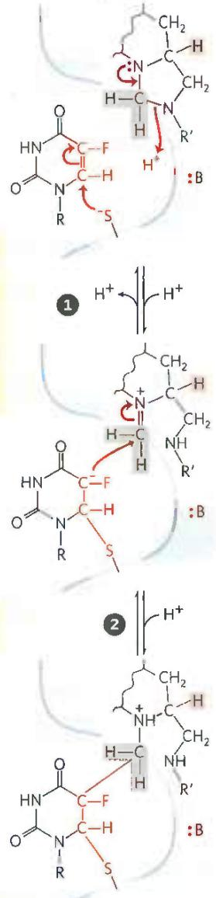

Methylidene is formed at C-5 of pyrimidine; $N^{5}$ is eliminated to form $H_{4}$ folate.

Enzyme + dihydrofolate

1,3 hydride shift generates dTMP and dihydrofolate

Dead-end covalent complex

MECHANISM FIGURE 22-52 Conversion of dUMP to dTMP and its inhibition by FdUMP. The normal reaction mechanism of thymidylate synthase (left). The nucleophilic sulfhydryl group contributed by the enzyme in step 1 and the ring atoms of dUMP taking part in the reaction are shown in red; 8 denotes an amino acid side chain that acts as a base to abstract a proton after step 3. The hydrogens derived from the methylene group of $N^5, N^{10}$ -methylenetetrahydrofolate are shaded in gray. The 1,3 hydride shift (step 4) moves a hydride ion (shaded light red) from C-6 of tetrahydrofolate to the methyl group of thymidine, oxidizing tetrahydrofolate to dihydrofolate. This hydride shift is blocked when FdUMP is the substrate (right). Steps 1 and 2 proceed normally, but they result in a stable complex — consisting of FdUMP linked covalently to the enzyme and to tetrahydrofolate — that inactivates the enzyme.

auxin 821

The medical potential of inhibitors of nucleotide biosynthesis is not limited to cancer treatment. All fast-growing cells (including bacteria and protists) are potential targets. Trimethoprim, an antibiotic developed by Hitchings and Elion, binds to bacterial dihydrofolate reductase nearly 100,000 times better than to the mammalian enzyme. It is used to treat certain urinary and middle-ear bacterial infections. Parasitic protists, such as the trypanosomes that cause African sleeping sickness (African trypanosomiasis), lack pathways for de novo nucleotide biosynthesis and are particularly sensitive to agents that interfere with their ability to use salvage pathways to scavenge nucleotides from the surrounding environment. Allopurinol (Fig. 22-50) and several similar purine analogs have shown promise for the treatment of African trypanosomiasis and related afflictions. See Box 6-1 for another approach to combating African trypanosomiasis, made possible by advances in our understanding of metabolism and enzyme mechanisms.

## SUMMARY 22.4 Biosynthesis and Degradation of Nucleotides

■ The purine ring system is built up step by step, beginning with 5-phosphoribosylamine. The amino acids glutamine, glycine, and aspartate furnish all the nitrogen atoms of purines. Two ring-closure steps form the purine nucleus.

■ Purine biosynthesis is regulated by an elaborate system of feedback inhibition.

Pyrimidines are synthesized from carbamoyl phosphate and aspartate, and ribose 5-phosphate is then attached to yield the pyrimidine ribonucleotides.

■ Pyrimidine biosynthesis is regulated by feedback inhibition of aspartate transcarbamoylase.

■ Nucleoside monophosphates are converted to their triphosphates by enzymatic phosphorylation reactions.

\- Ribonucleotides are converted to deoxyribonucleotides by ribonucleotide reductase, an enzyme with novel mechanistic and regulatory characteristics.

■ The thymine nucleotides are derived from dCDP and dUMP.

■ Uric acid and urea are the end products of purine and pyrimidine degradation.

■ Free purines can be salvaged and rebuilt into nucleotides. Genetic deficiencies in certain salvage enzymes cause serious disorders such as Lesch-Nyhan syndrome.

■ Accumulation of uric acid crystals in the joints, possibly caused by another genetic deficiency, results in gout.

■ Enzymes of the nucleotide biosynthetic pathways are targets for an array of chemotherapeutic agents used to treat cancer and other diseases.

## KEY TERMS

Terms in bold are defined in the glossary.

nitrogen fixation 795  
nitrification 795  
denitrification 795  
anammox 796  
symbionts 797  
nitrogenase complex 797  
FeMo cofactor 800  
ferredoxin 800  
leghemoglobin 801  
glutamate 802  
glutamine 802  
glutamine synthetase 802  
glutamate synthase 802  
glutamine amidotransferases 804  
5-phosphoribosyl-1-pyrophosphate (PRPP) 806  
porphyrin 817  
porphyria 817  
bilirubin 817  
phosphocreatine 819  
creatine 819  
glutathione (GSH) 819

serotonin 822  
histamine 822  
spermine 822  
spermidine 822  
ornithine decarboxylase 822  
de novo pathway 823  
salvage pathway 823  
inosinate (IMP) 825  
carbamoyl phosphate synthetase II 828  
aspartate transcarbamoylase 828  
nucleoside monophosphate kinase 829  
nucleoside diphosphate kinase 829  
ribonucleotide reductase 829  
thioredoxin 829  
thymidylate synthase 833  
dihydrofolate reductase 833  
adenosine deaminase (ADA) deficiency 834  
Lesch-Nyhan syndrome 835  
allopurinol 835  
fluorouracil 836  
methotrexate 836  
aminopterin 836  
trimethoprim 838

dopamine 821
norepinephrine 821
epinephrine 821
γ-aminobutyrate

(GABA) 821

## PROBLEMS

1. ATP Consumption by Root Nodules in Legumes Bacteria residing in the root nodules of the pea plant consume more than 20% of the ATP produced by the plant. Suggest why these bacteria consume so much ATP.

2. Nitrate Fertilizers and Oceanic Dead Zones Farmers apply industrially fixed nitrogen, in the form of ammonia or nitrate, to agricultural fields worldwide to increase crop yields. Agricultural runoff feeds into rivers and creates large hypoxic dead zones at the point where rivers meet oceans. How does an increase in soluble fixed nitrogen create dead zones?

3. PLP Reaction Mechanisms Pyridoxal phosphate (PLP) can help catalyze transformations one or two carbons removed from the $\alpha$ carbon of an amino acid. The enzyme threonine synthase promotes the PLP-dependent conversion of phosphohomoserine to threonine. Suggest a mechanism for this reaction.

4. Transformation of Aspartate to Asparagine There are two routes for transforming aspartate to asparagine at the expense of ATP. Many bacteria have an asparagine synthetase that uses ammonium ion as the nitrogen donor. Mammals have an asparagine synthetase that uses glutamine as the nitrogen donor. Given that the latter requires an extra ATP (for the synthesis of glutamine), why do mammals use this route?

5. Equation for the Synthesis of Aspartate from Glucose Write the net equation for the synthesis of aspartate (a nonessential amino acid) from glucose, carbon dioxide, and ammonia.

6. Asparagine Synthetase Inhibitors in Leukemia Therapy Mammalian asparagine synthetase is a glutamine-dependent amidotransferase. Efforts to identify an effective inhibitor of human asparagine synthetase for use in chemotherapy for patients with leukemia have focused not on the amino-terminal glutaminase domain but on the carboxyl-terminal synthetase active site. Explain why the glutaminase domain is not a promising target for a useful drug.

7. Phenylalanine Hydroxylase Deficiency and Diet Tyrosine is normally a nonessential amino acid, but individuals with a genetic defect in phenylalanine hydroxylase require tyrosine in their diet for normal growth. Explain.

8. Arginine Biosynthesis The first step of arginine biosynthesis from glutamate acetylates glutamate on the $\alpha$ -amino group. A subsequent step late in the same pathway removes the added acetyl group. What chemical problem is solved by adding and then removing an acetyl group, with none of the acetyl atoms appearing in the arginine product of the pathway?

9. Cofactors for One-Carbon Transfer Reactions Most one-carbon transfers are promoted by one of three cofactors: biotin, tetrahydrofolate, or S-adenosylmethionine. S-Adenosylmethionine generally serves as a methyl group donor; the transfer potential of the methyl group in $N^{5}$ -methyltetrahydrofolate is insufficient for most biosynthetic reactions. However, one example of the use of $N^{5}$ -methyltetrahydrofolate in methyl group transfer is in methionine formation by the methionine synthase reaction; methionine is the immediate precursor of S-adenosylmethionine (see Fig. 18-18).

Explain how the methyl group of S-adenosylmethionine can be derived from $N^{5}$ -methyltetrahydrofolate, even though the transfer potential of the methyl group in $N^{5}$ -methyltetrahydrofolate is one-thousandth of that of S-adenosylmethionine.

10. Concerted Regulation in Amino Acid Biosynthesis Various products of glutamine metabolism independently modulate the glutamine synthetase of E. coli (see Fig. 22-8). In this concerted inhibition, the extent of enzyme inhibition is greater than the sum of the separate inhibitions caused by each product. For E. coli grown in a medium rich in histidine, what is the advantage of concerted inhibition?

11. Relationship between Folic Acid Deficiency and Anemia Folic acid deficiency, believed to be the most common vitamin deficiency, causes a type of anemia in which hemoglobin synthesis is impaired and erythrocytes do not mature properly. What is the metabolic relationship between hemoglobin synthesis and folic acid deficiency?

12. Synthesis of Polyamines The metabolic amino acid ornithine is a direct precursor of the polyamine putrescine, shown here.

$$
\mathrm{H} _ {3} \stackrel {+} {\mathrm{N}} - \mathrm{CH} _ {2} - \mathrm{CH} _ {2} - \mathrm{CH} _ {2} - \mathrm{CH} _ {2} - \stackrel {+} {\mathrm{NH}} _ {3}
$$

Subsequent reactions convert putrescine to spermine and spermidine. What type of reaction is required to convert ornithine to putrescine, and what enzymatic cofactor is needed?

13. Nucleotide Biosynthesis in Amino Acid Auxotrophic Bacteria Wild-type E. coli cells can synthesize all 20 common amino acids, but some mutants, called amino acid auxotrophs, are unable to synthesize a specific amino acid and require its addition to the culture medium for optimal growth. Besides their role in protein synthesis, some amino acids are also precursors for other nitrogenous cell products. Consider the three amino acid auxotrophs that are unable to synthesize glycine, glutamine, and aspartate, respectively. For each mutant, what nitrogenous products other than proteins would the cell fail to synthesize?

14. Inhibitors of Nucleotide Biosynthesis Suggest a mechanism for the inhibition of alanine racemase by L-fluoroalanine.

15. Mode of Action of Sulfa Drugs Some bacteria require p-aminobenzoate in the culture medium for normal growth, and their growth is severely inhibited by the addition of sulfanilamide, one of the earliest sulfa drugs. Moreover, in the presence of this drug, 5-aminoimidazole-4-carboxamide ribonucleotide (AlCAR; see Fig. 22-35) accumulates in the culture medium. Addition of excess p-aminobenzoate reverses these effects.

(a) What is the role of p-aminobenzoate in these bacteria? (Hint: See Fig. 18-16.)

(b) Why does AICAR accumulate in the presence of sulfanilamide? (c) Why does addition of excess p-aminobenzoate reverse the inhibition and accumulation?

16. Purine Biosynthesis Which atoms of the purine ring derive from the amide nitrogen of glutamine? (a) N-1 (b) N-3 (c) N-7 (d) N-9

17. Pathway of Carbon in Pyrimidine Biosynthesis Predict the locations of ${}^{14}$ C in orotate isolated from cells grown on a small amount of uniformly labeled $[{}^{14}$ C]succinate. Justify your prediction.

18. Nucleotides as Poor Sources of Energy Under starvation conditions, organisms can use proteins and amino acids as sources of energy. Deamination of amino acids produces carbon skeletons that can enter the glycolytic pathway and the citric acid cycle to produce energy in the form of ATP. Nucleotides are not similarly degraded for use as energy-yielding fuels. What observations about cellular physiology support this statement? What aspect of the structure of nucleotides makes them a relatively poor source of energy?

19. Treatment of Gout Physicians use allopurinol (see Fig. 22-50), an inhibitor of xanthine oxidase, to treat chronic gout. Explain the biochemical basis for this treatment. Patients treated with allopurinol sometimes develop xanthine stones in the kidneys, although the incidence of kidney damage is much lower than in untreated gout. Explain this observation in light of these solubilities in urine: uric acid, 0.15 g/L; xanthine, 0.05 g/L; and hypoxanthine, 1.4 g/L.

20. Antibiotics That Inhibit Dihydrofolate Reductase Trimethoprim, a commonly used antibiotic, inhibits the bacterial form of dihydrofolate reductase much more than it inhibits the mammalian enzyme. What metabolic processes described in this chapter are affected by depleting tetrahydrofolate?

## DATA ANALYSIS PROBLEM

21. Use of Modern Molecular Techniques to Determine the Synthetic Pathway of a Novel Amino Acid Most of the biosynthetic pathways described in this chapter were determined before the development of recombinant DNA technology and genomics, so the techniques were quite different from those that researchers would use today. Here we explore an example of the use of modern molecular techniques to investigate the pathway of synthesis of a novel amino acid, (2S)-4-amino-2-hydroxybutyrate (AHBA). The techniques mentioned here are described in various places in the text; this problem is designed to show how they can be integrated in a comprehensive study.

AHBA is a $\gamma$ -amino acid that is a component of some aminoglycoside antibiotics, including the antibiotic butirosin. Antibiotics modified by the addition of an AHBA residue are often more resistant to inactivation by bacterial antibiotic-resistance enzymes. As a result, understanding how AHBA is synthesized and added to antibiotics is useful in the design of pharmaceuticals.

In an article published in 2005, Li and coworkers describe how they determined the synthetic pathway of AHBA from glutamate.

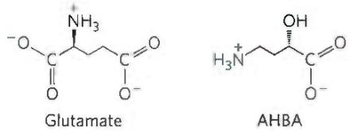

(a) Briefly describe the chemical transformations needed to convert glutamate to AHBA. At this point, don't be concerned about the order of the reactions.

Li and colleagues began by cloning the butirosin biosynthetic gene cluster from the bacterium Bacillus circulans, which makes large quantities of butirosin. They identified five genes that are essential for the pathway: btrI, btrJ, btrK, btrO, and btrV. They cloned these genes into E. coli plasmids that allow overexpression of the genes, producing proteins with "histidine tags" fused to their amino termini to facilitate purification (see p. 313).

The predicted amino acid sequence of the BtrI protein showed strong homology to known acyl carrier proteins (see Fig. 21-5). Using mass spectrometry, Li and colleagues found a molecular mass of 11,812 for the purified BtrI protein (including the His tag). When the purified BtrI was incubated with coenzyme A and an enzyme known to attach CoA to other acyl carrier proteins, the majority molecular species had an $M_r$ of 12,153.

(b) How would you use these data to argue that BtrI can function as an acyl carrier protein with a CoA prosthetic group?

Using standard terminology, Li and coauthors called the form of the protein lacking CoA apo-BtrI and the form with CoA (linked as in Fig. 21-5) holo-BtrI. When holo-BtrI was incubated with glutamine, ATP, and purified BtrJ protein, the holo-BtrI species of $M_r$ 12,153 was replaced with a species of $M_r$ 12,281, corresponding to the thioester of glutamate and holo-BtrI. Based on these data, the authors proposed the following structure for the $M_r$ 12,281 species, γ-glutamyl-S-BtrI:

(c) What other structure(s) is (are) consistent with the data above?

(d) Li and coauthors argued that the structure shown here (γ-glutamyl-S-BtrI) is likely to be correct because the α-carboxyl group must be removed at some point in the synthetic process. Explain the chemical basis of this argument. (Hint: See Fig. 18-6, reaction C.)

The BtrK protein showed significant homology to PLP-dependent amino acid decarboxylases, and BtrK isolated from E. coli was found to contain tightly bound PLP. When $\gamma$ -glutamyl-S-BtrI was incubated with purified BtrK, a molecular species of $M_{r}$ 12,240 was produced.

(e) What is the most likely structure of this species?

(f) When the investigators incubated glutamate and ATP with purified BtrI, BtrJ, and BtrK, they found a molecular species of $M_{r}$ 12,370. What is the most likely structure of this species? Hint: Remember that BtrJ can use ATP to $\gamma$ -glutamylate nucleophilic groups.

Li and colleagues found that BtrO is homologous to monooxygenase enzymes (see Box 21-1) that hydroxylate alkanes, using FMN as a cofactor, and BtrV is homologous to an NAD(P)H oxidoreductase. Two other genes in the cluster, btrG and btrH, probably encode enzymes that remove the γ-glutamyl group and attach AHBA to the target antibiotic molecule.

(g) Based on these data, propose a plausible pathway for the synthesis of AHBA and its addition to the target antibiotic. Include the enzymes that catalyze each step and any other substrates or cofactors needed (ATP, NAD, etc.).

## Reference

Li, Y., N.M. Llewellyn, R. Giri, F. Huang, and J.B. Spencer. 2005. Biosynthesis of the unique amino acid side chain of butirosin: possible protective-group chemistry in an acyl carrier protein-mediated pathway. Chem. Biol. 12:665–675.

# HORMONAL REGULATION AND INTEGRATION OF MAMMALIAN METABOLISM

23.1 Hormone Structure and Action 842

23.2 Tissue-Specific Metabolism 848

23.3 Hormonal Regulation of Fuel Metabolism 859

23.4 Obesity and the Regulation of Body Mass 867

23.5 Diabetes Mellitus 875

In Chapters 13 through 22 our focus has been on metabolism at the level of the individual cell, emphasizing central pathways common to almost all cells—bacterial, archaeal, and eukaryotic. We have seen how metabolic processes within cells are regulated at the level of individual enzyme reactions by substrate availability, by allosteric mechanisms, and by reversible covalent modification of enzymes.

To fully appreciate the significance of individual metabolic pathways and their regulation, we must view these pathways in the context of the whole organism. An essential characteristic of multicellular organisms is cell differentiation and division of labor. Specialized functions of the tissues and organs require specialized fuels and patterns of metabolism. Hormonal and neuronal signals integrate and coordinate the metabolic activities of different tissues and optimize the allocation of fuels and precursors to each organ. Although our focus is on mammalian systems, mammals are hardly unique in possessing hormonal signaling systems. Insects and nematode worms have highly developed systems for hormonal regulation, with fundamental mechanisms similar to those in mammals. Plants, too, use hormonal signals to coordinate the activities of their differentiated, specialized tissues.

In this chapter we will look at the specialized metabolism of several major organs and tissues and the integration of metabolism in mammals. We begin with an overview of the broad range of hormones and hormonal mechanisms, then turn to the tissue-specific functions regulated by these mechanisms. We discuss the distribution of nutrients to various organs, emphasizing the central role of the liver, and the metabolic cooperation among these organs. To illustrate the integrative role of hormones, we describe the interplay of insulin, glucagon, and epinephrine in coordinating fuel metabolism in muscle, liver, and adipose tissue. We also introduce other hormones, produced in adipose tissue, muscle, gut, and brain, that play key roles in coordinating metabolism and behavior. We discuss the long-term hormonal regulation of body mass and the role of obesity in the development of metabolic syndrome and type 2 diabetes. Finally, we discuss interventions used to manage diabetes.

In this chapter, we illustrate the following principles:

P1 The tissues in a mammal are connected by a neurosecretory system that coordinates their activities. Mammals use chemically diverse hormones in a highly specific and multidirectional signaling system, connecting the tissues with each other and with the central nervous system.

P2 Among the tissues and organs of an animal, there is a striking division of labor. The specialized role of each organ is reflected in its metabolic activities and capabilities. The circulatory system connects all of the tissues by carrying hormonal signals and metabolites between and among them.

Because the brain requires a continuous supply of glucose, maintaining an adequate concentration of glucose in the blood is a high priority in the activities of the other tissues. The liver integrates the use of fuels (glucose, fatty acids, and amino acids) by each tissue to keep the blood glucose level within the optimal range. Hormones carried in the blood (insulin, glucagon, epinephrine, cortisol) mediate this regulation.

P4 Maintaining an optimal body mass is an important priority in the adult mammal. Body mass is a function of dietary intake, physical activity, and the choice of metabolic fuel, all of which are subject to hormonal regulation. Hormonal signals between the brain, the adipose tissue, and the gastrointestinal tract help to set activity and feeding behavior.

P5 The metabolic activities of cells and organisms are complex and intertwined; perturbation at one point in the system has far-reaching consequences for health. When the normal energy-yielding metabolism of glucose and fatty acids is impeded by defective insulin signaling, the result is the disease diabetes.

## 23.1 Hormone Structure and Action

Hormones are small molecules or proteins that are produced in one tissue, released into the bloodstream, and carried to other tissues, where they act through specific receptors to bring about changes in cellular activities. Hormones serve to coordinate the metabolic activities of several tissues or organs. Virtually every process in a complex organism is regulated by one or more hormones: maintenance of blood pressure, blood volume, and electrolyte balance; embryogenesis; sexual differentiation, development, and reproduction; hunger, eating behavior, digestion, and fuel allocation—to name but a few.

The coordination of metabolism in mammals is achieved by the neuroendocrine system. Individual cells in one tissue sense a change in the organism's circumstances and respond by secreting a chemical messenger that passes to another cell in the same or different tissue, where the messenger binds to a specific receptor molecule and triggers a change in this target cell. These chemical messengers may relay information over very short or very long distances. In neuronal signaling (Fig. 23-1a), the chemical messenger is a neurotransmitter (acetylcholine, for example) that may travel only a fraction of a micrometer across a synaptic cleft to the next neuron in a network. In endocrine signaling (Fig. 23-1b), the messenger is a hormone that is carried in the bloodstream to neighboring cells or to distant organs and tissues; it may travel a meter or more before encountering its target cell. Except for this anatomic difference, the neuronal and endocrine signaling mechanisms are remarkably similar, and the same molecule can sometimes act as both neurotransmitter and hormone. Epinephrine and norepinephrine, for example, serve as neurotransmitters at certain synapses of the brain and at neuromuscular junctions of smooth muscle and as hormones that regulate fuel metabolism in liver and muscle. The following discussion of cellular signaling emphasizes hormone action, drawing on discussions of fuel metabolism in earlier chapters, but most of the fundamental mechanisms described here also occur in neurotransmitter action.

  
FIGURE 23-1 Signaling by the neuroendocrine system. (a) In neuronal signaling, electrical signals (nerve impulses) originate in the cell body of a neuron and travel very rapidly over long distances to the axon tip, where neurotransmitters are released and diffuse to the target cell. The target cell (another neuron, a myocyte, or a secretory cell) is only a fraction of a micrometer or a few micrometers away from the site of neurotransmitter release. (b) In endocrine signaling, hormones (such as insulin produced in pancreatic $\beta$ cells) are secreted into the bloodstream, which carries them throughout the body to target tissues that may be a meter or more away from the secreting cell. Both neurotransmitters and hormones interact with specific receptors on or in their target cells, triggering responses.

## Hormones Act through Specific High-Affinity Cellular Receptors

Hormones exert their effects through specific receptors in target cells. The high affinity of the hormone-receptor interaction allows cells to respond to very low

Cell surface receptor Peptide or amine hormone binds to receptor on the outside of the cell; acts through receptor without entering the cell.

Nuclear receptor
Steroid or thyroid hormone enters the cell;
hormone-receptor complex acts in the nucleus.

concentrations of hormone. Recall from Chapter 12 (Fig. 12-2) that there are four general types of intracellular consequences of ligand-receptor interaction: (1) a second messenger, such as cAMP, cGMP, or inositol trisphosphate, generated inside the cell, acts as an allosteric regulator of one or more enzymes; (2) a receptor tyrosine kinase is activated by the extracellular hormone; (3) a change in membrane potential results from the opening or closing of a hormone-gated ion channel; and (4) a steroid or steroidlike molecule causes a change in the level of expression (transcription of DNA into mRNA) of one or more genes, mediated by a nuclear hormone receptor protein. It can be helpful to characterize cell surface hormone receptors as metabotropic, those that activate or inhibit an enzyme downstream from the receptor, or ionotropic, those that open or close an ion channel in the plasma membrane, resulting in a change in membrane potential ( $\Delta V_{m}$ ) or in the concentration of an ion such as $Ca^{2+}$ (Fig. 23-2).

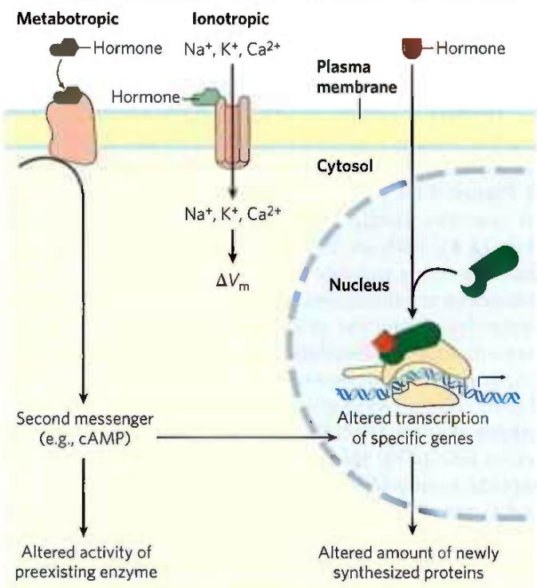  
FIGURE 23-2 Two general mechanisms of hormone action. The peptide and amine hormones are faster-acting than steroid and thyroid hormones. Peptide hormones act from outside the cell, binding a plasma membrane hormone receptor. Steroid and thyroid hormones pass through the plasma membrane and enter the nucleus, where they regulate the expression of specific genes.

A single hormone molecule, in forming a hormone-receptor complex, activates a catalyst that produces many molecules of second messenger, so the receptor serves as both signal transducer and signal amplifier. The signal may be further amplified by a signaling cascade, such as we saw in the regulation of glycogen synthesis and breakdown by epinephrine (see Fig. 12-7). Signal amplification allows one epinephrine molecule to result in the production of many thousands or millions of molecules of glucose 1-phosphate from glycogen.

Water-insoluble hormones, including the steroid, retinoid, and thyroid hormones, readily pass through the plasma membrane of their target cells to reach their receptor proteins in the nucleus (Fig. 23-2). The hormone-receptor complex itself carries the message: it interacts with DNA to alter the expression of specific genes, changing the enzyme content of the cell and thereby changing cellular metabolism (see Fig. 12-34).

Hormones that act through plasma membrane receptors generally trigger very rapid physiological or biochemical responses. Just seconds after the adrenal medulla secretes epinephrine into the bloodstream, skeletal muscle responds by accelerating the breakdown of glycogen. By contrast, the thyroid hormones and the sex (steroid) hormones promote maximal responses in their target tissues only after hours or even days. These differences in response time correspond to different modes of action. In general, the fast-acting hormones lead to a change in the activity of one or more preexisting enzymes in the cell, by allosteric mechanisms or covalent modification. The slower-acting hormones generally alter gene expression, resulting in the synthesis of more (upregulation) or less (downregulation) of the regulated protein(s).

## Hormones Are Chemically Diverse

P1 Mammals have several classes of hormones, distinguishable by their diverse chemical structures and their modes of action (Table 23-1). Peptide, catecholamine, eicosanoid, and endocannabinoid hormones act from outside the target cell via cell surface receptors. Steroid, vitamin D, retinoid, and thyroid hormones enter the cell and act through nuclear receptors. Nitric oxide (a gas) also enters the cell, but activates a cytosolic enzyme, guanylyl cyclase.

Hormones can also be classified by the way they get from their point of release to their target tissue. Endocrine (from the Greek endon, "within," and krinein, "to release") hormones are released into the blood and carried to target cells throughout the body (insulin and glucagon are examples). Paracrine hormones are released into the extracellular space and diffuse to neighboring target cells (the eicosanoid hormones are of this type). Autocrine hormones affect the same cell that releases them, binding to receptors on the cell surface.

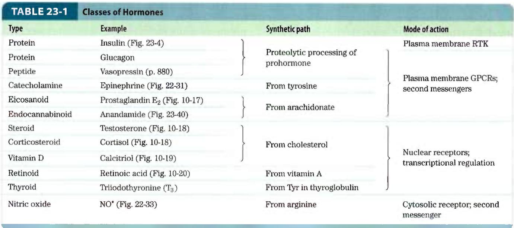

The peptide hormones vary in size from 3 (thyrotropin-releasing hormone; Fig. 23-3) to more than 200 (human chorionic gonadotropin) amino acid residues. They include the pancreatic hormones insulin, glucagon, and somatostatin; the parathyroid hormone calcitonin; and all the hormones of the hypothalamus and pituitary.

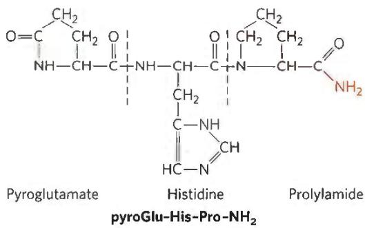  
FIGURE 23-3 The structure of thyrotropin-releasing hormone (TRH). Purified (through heroic efforts) from extracts of hypothalamus, TRH proved to be a derivative of the tripeptide Glu-His-Pro. The side-chain carboxyl group of the amino-terminal Glu forms an amide (red bond) with the residue's $\alpha$ -amino group, creating pyroglutamate, and the carboxyl group of the carboxyl-terminal Pro is converted to an amide (red $-\mathrm{NH}_2$ ). Such modifications are common among the small peptide hormones. In a typical protein of $M_r$ \~50,000, the charges on the amino-and carboxyl-terminal groups contribute relatively little to the overall charge on the molecule, but in a tripeptide these two charges dominate the properties of the molecule. Formation of the amide derivatives removes these charges.

Peptide hormones (some of which are actually small proteins) are synthesized as proproteins (prohormones) that are activated upon release by proteolytic cleavage, much as we saw with zymogen activation of pancreatic enzymes (Fig. 6-42) and the blood-clotting cascade (Fig. 6-44). In some cases, a preproprotein is synthesized and processed to create more than one active peptide product.

Insulin is a small protein ( $M_{r}$ 5,800) with two polypeptide chains, A and B, joined by two disulfide bonds. (The amino acid sequence of bovine insulin is shown in Figure 3-24.) It is synthesized in the pancreas as an inactive single-chain precursor, preproinsulin (Fig. 23-4), with an amino-terminal “signal sequence” that directs its passage into secretory vesicles. (Signal sequences are discussed in Chapter 27; see Fig. 27-38.) Proteolytic removal of the signal sequence and formation of three disulfide bonds produces proinsulin, which is stored in secretory granules in pancreatic $\beta$ cells. When blood glucose is elevated sufficiently to trigger insulin secretion, proinsulin is converted to active insulin by specific proteases, which cleave two peptide bonds to form the mature insulin molecule and C peptide, which are released into the blood by exocytosis. The capillaries that serve peptide-producing endocrine glands are fenestrated (punctuated with tiny holes or “windows”), so the hormone molecules readily enter the bloodstream for transport to target cells elsewhere. Insulin, acting through its receptor tyrosine kinase (Fig. 12-21) has profound effects on both anabolic and catabolic processes in many tissues, which we explore in detail below.

  
FIGURE 23-4 Insulin. Mature insulin is formed from its larger precursor preproinsulin by proteolytic processing. Removal of a 23 amino acid segment (the signal sequence) at the amino terminus of preproinsulin and formation of three disulfide bonds produce proinsulin. Further proteolytic cuts remove the C peptide from proinsulin to produce mature insulin, composed of A and B chains.

Pro-opiomelanocortin (POMC) is a spectacular example of a proprotein that undergoes specific cleavage to produce several active hormones. The POMC gene encodes a large polypeptide that contains within it at least nine biologically active peptides (Fig. 23-5). The proprotein is processed differently in different tissues, depending on which proteases the cells express. The active products influence an astonishing number of physiological systems.

## Some Hormones Are Released by a "Top-Down" Hierarchy of Neuronal and Hormonal Signals

The changing levels of specific hormones regulate specific cellular processes, but what regulates the regulators—what sets the level of each hormone? The brief answer is that P1 the central nervous system receives input from many internal and external sensors—signals about danger, hunger, dietary intake, blood composition, for example—and orchestrates the production of appropriate hormonal signals by the endocrine tissues. For a more complete answer, consider the path of cortisol release by the adrenal gland, triggered by a stress detected by the central nervous system. Figure 23-6 illustrates the "chain of command" in this top-down hormonal signaling hierarchy. The hypothalamus, a pea-size region of the brain (Fig. 23-7), is the coordination center of the endocrine system; it receives and integrates messages from the central nervous system. In response, the hypothalamus produces releasing factors, including corticotropin-releasing hormone (CRH), that pass directly to the nearby pituitary gland through blood vessels and neurons that connect the two glands. The pituitary gland secretes adrenocorticotropic hormone (also called corticotropin or ACTH), which travels through the blood to the adrenal cortex and triggers the release of cortisol. Cortisol, the ultimate hormone in this cascade, acts through its receptor in many types of target cells to alter their metabolism. In hepatocytes, one effect of cortisol is to increase the rate of gluconeogenesis.

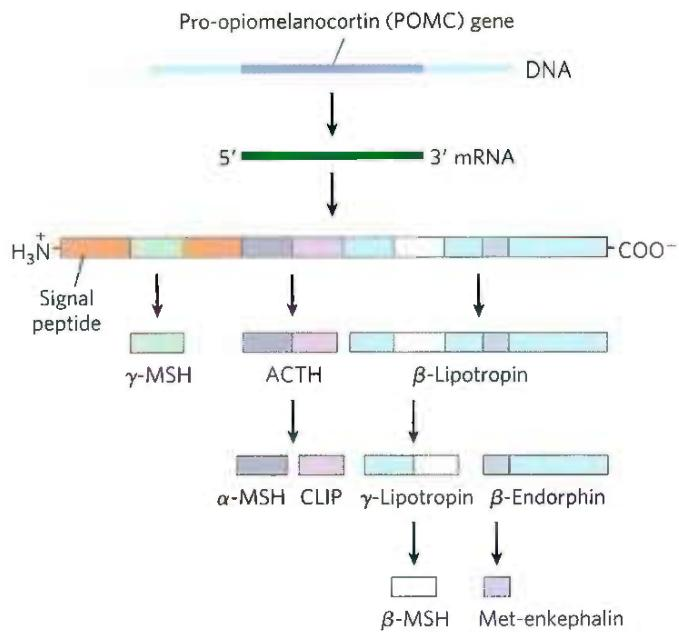  
FIGURE 23-5 Proteolytic processing of the pro-opiomelanocortin (POMC) precursor. The initial gene product of the POMC gene is a long polypeptide that undergoes cleavage by a series of specific proteases to produce ACTH (corticotropin), $\beta$ - and $\gamma$ -lipotropin, $\alpha$ -, $\beta$ -, and $\gamma$ -MSH (melanocyte-stimulating hormone, or melanocortin), CLIP (corticotropin-like intermediary peptide), $\beta$ -endorphin, and Met-enkephalin. The points of cleavage are pairs of basic residues, Arg-Lys, Lys-Arg, or Lys-Lys.

Hormonal cascades such as those responsible for the release of cortisol result in large amplifications of the initial signal and allow exquisite fine-tuning of the output of the ultimate hormone (Fig. 23-6). At each level in the cascade, a small signal elicits a larger response. For example, the initial electrical signal to the hypothalamus results in the release of a few nanograms of corticotropin-releasing hormone, which elicits the release of a few micrograms of corticotropin. Corticotropin acts on the adrenal cortex to cause the release of milligrams of cortisol, for an overall amplification of at least a millionfold.

  
FIGURE 23-6 Cascade of top-down hormone release following central nervous system input to the hypothalamus. Solid black arrows indicate hormone production and release; broken black arrows indicate the action of hormones on target tissues. In each endocrine tissue along the pathway, a stimulus from the level above is received, amplified, and transduced into release of the next hormone in the cascade. The cascade is sensitive to regulation at several levels through feedback inhibition (thin, dashed arrows) by the ultimate hormone (in this case, cortisol). The product therefore regulates its own production, as in feedback inhibition of biosynthetic pathways within a single cell.

At each level of a hormonal cascade, feedback inhibition of earlier steps in the cascade is possible; an unnecessarily elevated level of the ultimate hormone or of an intermediate hormone inhibits the release of earlier hormones in the cascade. These feedback mechanisms accomplish the same end as those that limit the output of a biosynthetic pathway (compare Fig. 23-6 with Fig. 22-37): a product is synthesized (or released) only until the necessary concentration is reached. In the blood-clotting cascade (Fig. 6-44) we saw a similar pattern: a signal stimulates a cascade of protein activations; feedback mechanisms limit their action and the duration of the response.

  
FIGURE 23-7 Neuroendocrine origins of hormone signals. Location of the hypothalamus and pituitary gland and details of the hypothalamus-pituitary system. Signals from connecting neurons stimulate the hypothalamus to secrete releasing factors into a blood vessel that carries the hormones directly to a capillary network in the anterior pituitary. In response to each releasing factor, the anterior pituitary releases the appropriate hormone into the general circulation. Posterior pituitary hormones are synthesized in neurons arising in the hypothalamus; the hormones are transported along axons to nerve endings in the posterior pituitary and stored there until released into the blood in response to a neuronal signal.

## "Bottom-Up" Hormonal Systems Send Signals Back to the Brain and to Other Tissues

In addition to the top-down hierarchy of hormonal signaling shown in Figure 23-6, P1 some hormones are produced in the digestive tract, muscle, and adipose tissue and communicate the current metabolic state to the hypothalamus (Fig. 23-8). These signals are integrated in the hypothalamus, and an appropriate neuronal or hormonal response is elicited.

Adipokines, for example, are peptide hormones, produced in adipose tissue, that signal the adequacy of fat reserves. The adipokine leptin, released when adipose tissue is well-filled with triacylglycerols, acts in the brain to inhibit feeding behavior, whereas adiponectin signals depletion of fat reserves and stimulates feeding. Other tissues produce and release other hormones. Ghrelin is produced in the gastrointestinal tract when the stomach is empty and acts in the hypothalamus to stimulate feeding behavior; when the stomach fills, ghrelin release ceases. Incretins are peptide hormones produced in the gut after ingestion of a meal; they increase secretion of insulin and decrease secretion of glucagon from the pancreas. Neuropeptide Y (NPY) is a hormone produced in the hypothalamus and in the adrenal glands. Its release promotes feeding and reduces energy expenditure for nonessential activities. Peptide YY (PYY $_{3-36}$ ), produced in the intestine, signals satiety in the brain. Irisin is a peptide hormone produced in muscle as a result of exercise; it acts to convert white adipose tissue into beige adipose tissue, which dissipates energy as heat (see Section 23.2).

  
FIGURE 23-8 Regulation of feeding behavior by two-way information flow between tissues and the hypothalamus. When food intake and energy production are adequate, peptide hormones released by the stomach, intestine, and adipose tissue feed back on the hypothalamus to signal satiety and reduce feeding behavior. Other tissue-specific peptide hormones signal inadequate supplies of stored triacylglycerols or low blood glucose levels. All of these signals impinge, directly or indirectly, on AMP-activated protein kinase (AMPK) in the hypothalamus, which integrates these signals and influences feeding behavior and energy-yielding metabolism in the tissues. Nerves carry electrical signals from the brain to the other tissues to complete the information circuit and achieve homeostasis (not shown). TRH, thyrotropin-releasing hormone; GLP-1, glucagon-like peptide-1; GIP, gastric inhibitory polypeptide.

We return to these hormones (summarized in Table 23-2) when we discuss the regulation of body mass in humans (Section 23.4).

## SUMMARY 23.1 Hormone Structure and Action

■ Hormones connect all of the organs in the body, carrying information and signals between the central nervous system and all of the tissues.

■ Hormones are chemically diverse with a wide range of biological roles. Peptide hormones are synthesized as proteins on ribosomes, then cleaved proteolytically to form the active peptide(s).

■ Hormones are regulated by a top-down hierarchy of interactions between the brain and endocrine glands: nerve impulses stimulate the hypothalamus to send specific hormones to the pituitary gland, thus stimulating (or inhibiting) the release of a second rank of hormones. The anterior pituitary hormones in turn stimulate other endocrine glands (adrenals, for example) to secrete their characteristic hormones, which in turn stimulate specific target tissues.

■ Some hormones act in bottom-up signaling: adipose tissue, muscle, and the gastrointestinal tract release peptide hormones that act on other tissues or in the central nervous system.

<table><tr><td colspan="4">TABLE 23-2 Some Peptide Hormones That Act on Feeding Behavior and Fuel Selection in Mammals</td></tr><tr><td>Hormone</td><td>Production site(s)</td><td>Target tissue(s)</td><td>Action(s)</td></tr><tr><td>Insulin</td><td>Pancreatic β cells</td><td>Muscle, adipose, liver</td><td>Stimulates glucose uptake and synthesis of glycogen and fat</td></tr><tr><td>Glucagon</td><td>Pancreatic α cells</td><td>Liver, adipose</td><td>Stimulates gluconeogenesis and glucose release to blood</td></tr><tr><td>Leptin</td><td>Adipose tissue</td><td>Hypothalamus</td><td>Reduces hunger</td></tr><tr><td>Adiponectin</td><td>Adipose tissue</td><td>Muscle, liver, others</td><td>Stimulates catabolism and feeding behavior</td></tr><tr><td>Ghrelin</td><td>Stomach, intestine</td><td>Brain</td><td>Signals hunger</td></tr><tr><td>Incretins: GLP-1, GIP</td><td>Intestine</td><td>Pancreas</td><td>Stimulate insulin release</td></tr><tr><td>NPY</td><td>Hypothalamus,adrenals</td><td>Brain, autonomic nervous system</td><td>Stimulates feeding behavior</td></tr><tr><td> $PYY_{3-36}$ </td><td>Intestine</td><td>Brain</td><td>Signals satiety</td></tr><tr><td>Irisin</td><td>Muscle (after exercise)</td><td>Adipose</td><td>Turns white adipose tissue to beige</td></tr></table>

## 23.2 Tissue-Specific Metabolism

Each tissue of the human body has a specialized function, reflected in its anatomy and metabolic activity (Fig. 23-9). Skeletal muscle allows directed motion; adipose tissue stores and distributes energy in the form of fats, which serve as fuel throughout the body and as thermal insulation; in the brain, cells pump ions across their plasma membranes to produce electrical signals. The liver plays a central processing and distribution role in metabolism and furnishes all other organs and tissues with an appropriate mix of nutrients via the bloodstream. The functional centrality of the liver is indicated by the common reference to all other tissues and organs as “extrahepatic.” We therefore begin our discussion of the division of metabolic labor by considering the transformations of carbohydrates, amino acids, and fats in the mammalian liver. This is followed by brief descriptions of the primary metabolic functions of adipose tissue, muscle, brain, and the tissue that interconnects all others: the blood.

## The Liver Processes and Distributes Nutrients

During digestion in mammals, the three main classes of nutrients (carbohydrates, fats, and proteins) undergo enzymatic hydrolysis into their simple constituents (monosaccharides, fatty acids, and amino acids). This breakdown is necessary because the epithelial cells lining the intestinal lumen absorb only relatively small molecules. Many of the fatty acids and monoacylglycerols released by digestion of fats in the intestine are reassembled within these epithelial cells into triacylglycerols (TAGs).

After being absorbed, most sugars and amino acids and some reconstituted TAGs pass from intestinal epithelial cells into blood capillaries and travel in the bloodstream to the liver; the remaining TAGs enter adipose tissue via the lymphatic system. The portal vein (Fig. 23-9) is a direct route from the digestive organs to the liver, and the liver therefore has first access to ingested nutrients. The liver has two main cell types.

  
FIGURE 23-9 Specialized metabolic functions of mammalian tissues.

Kupffer cells are phagocytes, important in immune function. Hepatocytes, of primary interest here, transform dietary nutrients into the fuels and precursors required by other tissues and export them via the blood. The kinds and amounts of nutrients supplied to the liver are determined by the composition of the diet, the interval between meals, and several other factors. The demand of extrahepatic tissues for fuels and precursors varies from one organ to another, and it also varies with the level of activity and overall nutritional state of the individual.

To meet these changing circumstances, the liver has remarkable metabolic flexibility. For example, when the diet is rich in protein, hepatocytes synthesize more of the enzymes needed for amino acid catabolism and gluconeogenesis. Within hours after a shift to a high-carbohydrate diet, the levels of these enzymes begin to drop and the hepatocytes increase their synthesis of enzymes essential to carbohydrate metabolism and fat synthesis. Liver enzymes turn over (that is, are synthesized and degraded) at 5 to 10 times the rate of enzyme turnover in other tissues, such as muscle. Extrahepatic tissues also can adjust their metabolism to prevailing conditions, but none of these tissues is as adaptable as the liver, and none is so central to the organism's overall metabolism.

We turn now to a survey of the possible fates of sugars, amino acids, and lipids that enter the liver from the bloodstream.

Carbohydrates The glucose transporter of hepatocytes (GLUT2) allows rapid, passive diffusion of glucose, so that the concentration of glucose in a hepatocyte is essentially the same as that in the blood. Glucose entering hepatocytes is phosphorylated by glucokinase (hexokinase IV) to yield glucose 6-phosphate. Glucokinase has a much higher $K_{\mathrm{m}}$ for glucose (10 mm) than do the hexokinase isozymes in other cells (p. 539) and, unlike these other isozymes, it is not inhibited by its product, glucose 6-phosphate. The presence of glucokinase allows hepatocytes to continue phosphorylating glucose when the glucose concentration rises well above levels that would overwhelm other hexokinases. The high $K_{\mathrm{m}}$ of glucokinase also ensures that the phosphorylation of glucose in hepatocytes is minimal when the glucose concentration is low, preventing the liver from consuming glucose as fuel via glycolysis. This spares glucose for other tissues. Fructose, galactose, and mannose, all absorbed from the small intestine, are also converted to glucose 6-phosphate by enzymatic pathways examined in Chapter 14 (see Fig. 14-9). Glucose 6-phosphate is at the crossroads of carbohydrate metabolism in the liver. It may take any of several major metabolic routes (Fig. 23-10), depending on the current metabolic needs of the organism. By the action of various allosterically regulated enzymes, and through hormonal regulation of enzyme synthesis and activity, the liver directs the flow of glucose into one or more of these pathways.

  
FIGURE 23-10 Metabolic pathways for glucose 6-phosphate in the liver. Here and in Figures 23-11 and 23-12, anabolic pathways are generally shown leading upward, catabolic pathways leading downward, and distribution to other organs leading horizontally. The numbered processes in each figure are described in the text.

① Glucose 6-phosphate is dephosphorylated by glucose 6-phosphatase to yield free glucose (see Fig. 15-6), which is exported to replenish blood glucose. Export is the predominant pathway when glucose 6-phosphate is in limited supply, because the blood glucose concentration must be kept sufficiently high (4 to 5 mm) to provide adequate energy for the brain and other tissues. ② Glucose 6-phosphate not immediately needed to form blood glucose is converted to liver glycogen, or has one of several other fates. Following glycolysis and the pyruvate dehydrogenase reaction, ③ the acetyl-CoA so formed can be oxidized for ATP production by the citric acid cycle, with ensuing electron transfer and oxidative phosphorylation yielding ATP. (Normally, however, fatty acids are the preferred fuel for ATP production in hepatocytes.) ④ Acetyl-CoA can also serve as the precursor of fatty acids, which are incorporated into TAGs and phospholipids, and of cholesterol. Much of the lipid synthesized in the liver is transported to other tissues by blood lipoproteins. ⑤ Alternatively, glucose 6-phosphate can enter the pentose phosphate pathway, yielding both reducing power (NADPH), needed for the biosynthesis of fatty acids and cholesterol, and ribose 5-phosphate, a precursor for nucleotide biosynthesis. NADPH is also an essential cofactor in the detoxification and elimination of many drugs and other xenobiotics (compounds that don't occur naturally but are the products of human activity, such as drugs, food additives, and preservatives) that are metabolized in the liver.

Amino Acids Amino acids that enter the liver follow several important metabolic routes (Fig. 23-11). ① They are precursors for protein synthesis, a process discussed in Chapter 27. The liver constantly renews its own proteins, which have a relatively high turnover rate (average half-life of hours to days), and it is also the site of biosynthesis of most plasma proteins. ② Alternatively, amino acids pass in the bloodstream to other organs to be used in the synthesis of tissue proteins. ③ Other amino acids are precursors in the biosynthesis of nucleotides, hormones, and other nitrogenous compounds in the liver and other tissues.

4a Amino acids not needed as biosynthetic precursors are transaminated or deaminated and degraded to yield pyruvate and citric acid cycle intermediates, with various fates; 4b the ammonia released is converted to the excretory product urea. 5 Pyruvate can be converted to glucose and glycogen via gluconeogenesis, or 6 can be converted to acetyl-CoA, which has several possible fates: 7 oxidation via the citric acid cycle and 8 oxidative phosphorylation to produce ATP, or 9 conversion to lipids for storage. 10 Citric acid cycle intermediates can be siphoned off into glucose synthesis by gluconeogenesis.

  
FIGURE 23-11 Metabolism of amino acids in the liver.

P2 The liver also metabolizes amino acids that arrive intermittently from other tissues. The blood is adequately supplied with glucose just after the digestion and absorption of dietary carbohydrate or, between meals, by the conversion of liver glycogen to blood glucose. During the interval between meals, especially if prolonged, some muscle protein is degraded to amino acids. These amino acids donate their amino groups (by transamination) to pyruvate, the product of glycolysis, to yield alanine, which 11 is transported to the liver and deaminated. Hepatocytes convert the resulting pyruvate to blood glucose via gluconeogenesis 5, and the ammonia to urea for excretion 4b. One benefit of this glucose-alanine cycle is the smoothing out of fluctuations in blood glucose between meals. The amino acid deficit incurred in muscles is made up after the next meal by incoming dietary amino acids.

Lipids The fatty acid components of lipids entering hepatocytes also have several different fates (Fig. 23-12). ① Some are converted to liver lipids. ② Under most circumstances, fatty acids are the primary oxidative fuel in the liver. Free fatty acids may be activated and oxidized to yield acetyl-CoA and NADH. ③ The acetyl-CoA is further oxidized via the citric acid cycle, and ④ oxidations in the cycle drive the synthesis of ATP by oxidative phosphorylation. ⑤ Excess acetyl-CoA, not required by the liver, is converted to acetoacetate and β-hydroxybutyrate; these ketone bodies circulate in the blood to other tissues to be used as fuel for the citric acid cycle. Ketone bodies, unlike fatty acids, can cross the blood-brain barrier, providing the brain with a source of acetyl-CoA for energy-yielding oxidation. Ketone bodies can supply a significant fraction of the energy in some extrahepatic tissues — up to one-third in the heart and as much as 60% to 70% in the brain during prolonged fasting. ⑥ Some of the acetyl-CoA derived from fatty acids (and from glucose) is used for the biosynthesis of cholesterol, which is required for membrane synthesis. Cholesterol is also the precursor of all steroid hormones and of the bile salts, which are essential for the digestion and absorption of lipids.

The other two metabolic fates of lipids require specialized mechanisms for the transport of insoluble lipids in blood. 7 Fatty acids are converted to the phospholipids and TAGs of plasma lipoproteins, which carry lipids to adipose tissue for storage. 8 Some free fatty acids (FFAs) are bound to serum albumin and carried to the heart and skeletal muscles, which take up and oxidize FFAs as a major fuel. Serum albumin is the most abundant plasma protein; one molecule can carry up to seven FFA molecules (see Fig. 17-3).

  
FIGURE 23-12 Metabolism of fatty acids in the liver.

The liver thus serves as the body's distribution center, exporting nutrients in the correct proportions to other organs, smoothing out fluctuations in metabolism caused by intermittent food intake, and processing excess amino groups into urea and other products to be disposed of by the kidneys. Certain nutrients are stored in the liver, including iron ions and vitamin A. The liver also detoxifies xenobiotics. Detoxification often includes the cytochrome P-450-dependent hydroxylation of relatively insoluble organic compounds, making them sufficiently soluble for further breakdown and excretion (see Box 21-1).

## Adipose Tissues Store and Supply Fatty Acids

There are two primary types of adipose tissue, white and brown (Fig. 23-13), with different roles, and we focus first on the more abundant of the two. White adipose tissue (WAT) is amorphous and widely distributed in the body: under the skin, around deep blood vessels, and in the abdominal cavity. The adipocytes of white adipose tissue are large (diameter 30 to 70 $\mu$ m), spherical cells, completely filled with a single large lipid droplet that constitutes about 65% of the cell mass and squeezes the mitochondria and nucleus into a thin layer against the plasma membrane (Fig. 23-13a, c). The lipid droplet contains TAGs and sterol esters and is coated with a monolayer of phospholipids, oriented with their polar head groups facing the cytosol. Specific proteins are associated with the surface of the droplets, including perilipin and the enzymes for synthesis and breakdown of TAGs (see Fig. 17-2). White adipose tissue typically makes up about 15% of the mass of a healthy young adult human. Adipocytes are metabolically active, responding quickly to hormonal stimuli in a metabolic interplay with the liver, skeletal muscles, and heart.

  
FIGURE 23-13 White and brown adipose tissue. Schematic views of typical mouse adipocytes from (a) white adipose tissue (WAT) and (b) brown adipose tissue (BAT). White adipocytes are larger and contain a single huge lipid droplet, which squeezes the mitochondria and nucleus against the plasma membrane. In brown adipocytes, mitochondria are much more prominent, the nucleus is near the center of the cell, and multiple small fat droplets are present. Below are light micrographs of (c) adipocytes in white adipose tissue, stained to show nuclei, and (d) a region of mixed white and brown adipocytes, stained with an antibody specific to UCP1, the uncoupling protein responsible for thermogenesis. [(c, d) Courtesy of Dr. Patrick Seale.]

Adipocytes have an active glycolytic metabolism, oxidize pyruvate and fatty acids via the citric acid cycle, and carry out oxidative phosphorylation. During periods of high carbohydrate intake, adipose tissue can convert glucose (via pyruvate and acetyl-CoA) to fatty acids, convert the fatty acids to TAGs, and store the TAGs as large lipid droplets—although in humans, much of the fatty acid synthesis occurs in hepatocytes. Adipocytes store TAGs arriving from the liver (carried in the blood as very-low-density lipoproteins) and from the intestinal tract (carried in chylomicrons), particularly after meals rich in fat.

When the demand for fuel rises (between meals, for example), lipases in adipocytes hydrolyze stored TAGs to release FFAs, which can travel in the bloodstream to skeletal muscle, the heart, and, during starvation, the liver. The release of fatty acids from adipocytes is greatly accelerated by epinephrine, which stimulates the cAMP-dependent phosphorylation of perilipin and thus gives lipases that are specific for tri-, di-, and monoacylglycerols access to TAGs in lipid droplets (see Fig. 17-2). Hormone-sensitive lipase is also stimulated by phosphorylation. Insulin counterbalances this effect of epinephrine, decreasing the activity of the lipase.

The breakdown and synthesis of TAGs in adipose tissue constitute a substrate cycle; up to 70% of the fatty acids released by the three lipases are reesterified in adipocytes, re-forming TAGs. Each cycle consumes ATP (used to activate the fatty acids as acyl-CoA esters), so the net effect of the substrate cycling is the breakdown of ATP and the accompanying release of heat. In adipose tissue, glycerol liberated by adipocyte lipases cannot be reused in the synthesis of TAGs, because adipocytes lack glycerol kinase. Instead, the glycerol phosphate required for TAG synthesis is made from pyruvate by glyceroneogenesis, requiring the action of the cytosolic PEP carboxykinase (see Fig. 21-22).

In addition to its central function as a fuel depot, adipose tissue plays an important role as an endocrine organ, producing and releasing hormones that signal the state of energy reserves and coordinate metabolism of fats and carbohydrates throughout the body. We return to this function in Section 23.4 when we discuss the hormonal regulation of body mass.

## Brown and Beige Adipose Tissues Are Thermogenic

In small vertebrates and hibernating animals, a significant proportion of the adipose tissue is brown adipose tissue (BAT), distinguished from white adipose tissue by its smaller (diameter 20 to 40 $\mu$ m), differently shaped (polygonal, not round) adipocytes (Fig. 23-13b, d). Like white adipocytes, brown adipocytes store TAGs, but in several smaller lipid droplets per cell rather than as a single central droplet. Brown adipocytes have more mitochondria and a richer supply of capillaries and innervation than white adipocytes; it is the cytochromes of mitochondria and the hemoglobin in capillaries that give brown adipose tissue its characteristic color. A unique feature of brown adipocytes is their production of uncoupling protein 1 (UCP1), also called thermogenin (see Fig. 19-36). This protein is responsible for one of the principal functions of brown adipose tissue: thermogenesis.

In brown adipocytes, fatty acids stored in lipid droplets are released, enter mitochondria, and undergo complete conversion to $CO_{2}$ by $\beta$ oxidation and the citric acid cycle. The reduced $FADH_{2}$ and NADH so generated pass their electrons through the respiratory chain to molecular oxygen. In white adipocytes, protons pumped out of the mitochondria during electron transfer reenter the matrix through ATP synthase, with the energy of electron transfer conserved in ATP synthesis. In brown adipocytes, UCP1 provides an alternative route for the reentry of protons that bypasses ATP synthase. The energy of the proton gradient is thus dissipated as heat, which can maintain the body (especially the nervous system and viscera) at its optimal temperature when the ambient temperature is relatively low.

In the human fetus, differentiation of fibroblast preadipocytes into brown adipose tissue begins at the twentieth week of gestation, and at the time of birth, brown adipose tissue represents 1% to 5% of total body mass. The brown fat deposits are located where the heat generated by thermogenesis can ensure that vital tissues—blood vessels to the head, major abdominal blood vessels, and the viscera, including the pancreas, adrenal glands, and kidneys—are not chilled as the newborn enters a world of lower ambient temperature (Fig. 23-14a).

At birth, white adipose tissue development begins and brown adipose tissue begins to disappear. Young adult humans have much-diminished deposits of brown adipose tissue, ranging from 3% of all adipose tissue in males to 7% in females, making up less than 0.1% of body mass. However, adults have, distributed among their white adipose cells, significant numbers of adipocytes that can be converted by cold exposure or by $\beta$ -adrenergic stimulation into cells very similar to brown adipocytes. These beige adipocytes have multiple lipid droplets, are richer in mitochondria than white adipocytes, and produce UCP1, so they function effectively as heat generators. Brown and beige adipocytes produce heat by oxidation of their own fatty acids, but they also take up and oxidize both fatty acids and glucose from the blood at rates out of proportion to their mass. In fact, the detection of brown adipose tissue by PET scanning depends on the adipocytes' relatively high rate of glucose uptake and metabolism (Fig. 23-14b). In adaptation to warm or cold surroundings, and in the normal differentiation of white, brown, and beige adipose tissue, the nuclear transcription factor PPAR $\gamma$ (described later in the chapter) plays a central role. And as we noted above, the peptide hormone irisin, produced in muscle by exercise, triggers the development of beige adipose tissue that continues to burn fuel long after the exercise ends.

## Muscles Use ATP for Mechanical Work

Metabolism in skeletal muscle cells — myocytes — is specialized to generate ATP as the immediate source of energy for contraction. Moreover, skeletal muscle is adapted to do its mechanical work intermittently, on demand. Sometimes skeletal muscles must work at their maximum capacity for a short time, as in a 100 m sprint;

  
(b) After cold exposure  
FIGURE 23-14 Brown adipose tissue in infants and adults. (a) At birth, human infants have brown fat distributed as shown here, to protect the spine, major blood vessels, and internal organs. (b) Positron emission tomography (PET) scanning can show metabolic activity in a living person, in real time. PET scans allow visualization of isotopically labeled glucose in precisely localized regions of the body. A positron-emitting glucose analog, 2-[18F]-fluoro-2-deoxy-D-glucose (FDG), is injected into the bloodstream; a short time later, a PET scan shows how much of the glucose has been taken up by each part of the body -- a measure of metabolic activity. On the left is a PET scan of a healthy 25-year-old man who fasted for 12 hours, then stayed for 1 hour in a cold (19 °C) room, with his legs on

at other times more prolonged work is required, as in running a marathon or in prolonged physical labor.

There are two general classes of muscle tissue, which differ in physiological role and fuel utilization. Slow-twitch muscle, also called red muscle, provides relatively low tension but is highly resistant to fatigue. It produces ATP by the relatively slow but steady process of oxidative phosphorylation. Red muscle is very rich in mitochondria and is served by dense networks of blood vessels, which bring the oxygen essential to ATP production.

  
Room-temperature control  
ice to thoroughly chill him. At the end of the hour, he was injected with $[^{18}F]$ -FDG, then remained under cold conditions for another hour. Whole-body PET scans were then done at 24 °C. For the control scan, the same man underwent the same PET scan protocol two weeks later, but this time following 2 hours at 27 °C instead of chilling (right). Intense labeling of the brain and heart shows high rates of glucose uptake; labeling of the kidneys and bladder indicates clearance of FDG. In the scan after chilling (left), $[^{18}F]$ -FDG labels brown adipose tissue in the region above the collarbone and along the vertebrae. [(a) Adam Steinberg. (b) Reprinted with permission of American Diabetes Association, from M. Saito et al., Diabetes 58:1526, 2009, Fig. 1; permission conveyed through Copyright Clearance Center, Inc.]

Fast-twitch muscle, or white muscle, has fewer mitochondria than red muscle and is less well supplied with blood vessels, but it can develop greater tension and do so faster. White muscle is quicker to fatigue because, when active, it uses ATP faster than it can replace it. There is a genetic component to the proportion of red and white muscle in any individual, but with training, an athlete can improve the endurance of fast-twitch muscle.

Skeletal muscle can use free fatty acids or glucose as fuel, depending on the degree of muscular activity (Fig. 23-15). In resting muscle, the primary fuels are FFAs from adipose tissue. These are oxidized and degraded to yield acetyl-CoA, which enters the citric acid cycle, ultimately yielding the energy for ATP synthesis by oxidative phosphorylation. Muscle in light activity uses blood glucose in addition to fatty acids. The glucose is phosphorylated, then degraded by glycolysis to pyruvate, which is converted to acetyl-CoA and oxidized via the citric acid cycle and oxidative phosphorylation.

In maximally active fast-twitch muscles, the demand for ATP is so great that the blood flow cannot provide $O_{2}$ and fuels fast enough to supply sufficient ATP by aerobic respiration alone. Under these conditions, stored muscle glycogen is broken down to lactate by fermentation (p. 525). Each glucose unit degraded yields three ATP, because phosphorolysis of glycogen produces glucose 6-phosphate (via glucose 1-phosphate), sparing the ATP normally consumed in the hexokinase reaction. Lactic acid fermentation thus responds more quickly than oxidative phosphorylation to an increased need for ATP, supplementing basal ATP production by aerobic oxidation of other fuels via the citric acid cycle and respiratory chain. The secretion of epinephrine, which stimulates both the release of glucose from liver glycogen and the breakdown of glycogen in muscle tissue, greatly enhances the use of blood glucose and muscle glycogen as fuels for muscular activity. (Epinephrine mediates the so-called fight-or-flight response, discussed more fully below.)

The relatively small amount of glycogen (about 1% of the total weight of skeletal muscle) limits the glycolytic energy available during all-out exertion. Moreover, the accumulation of lactate and consequent decrease in pH in maximally active muscles reduces their efficiency. Skeletal muscle, however, contains another source of

  
FIGURE 23-15 Energy sources for muscle contraction. Different fuels are used for ATP synthesis during bursts of heavy activity and during light activity or rest. Phosphocreatine can rapidly supply ATP.

ATP, phosphocreatine (10 to 30 mm), which can rapidly regenerate ATP from ADP by the creatine kinase reaction:

During periods of active contraction and glycolysis, this reaction proceeds predominantly in the direction of ATP synthesis; during recovery from exertion, the same enzyme resynthesizes phosphocreatine from creatine and ATP. Because of the relatively high levels of ATP and phosphocreatine in muscle, these compounds can be detected in intact muscle, in real time, by NMR spectroscopy (Fig. 23-16). Creatine serves to shuttle ATP equivalents from the mitochondrion to sites of ATP consumption and can be the limiting factor in the development of new muscle tissue (Box 23-1).

After a period of intense muscular activity, the individual continues breathing heavily for some time, using much of the extra $O_{2}$ for oxidative phosphorylation in the liver. The ATP produced is used for gluconeogenesis (in the liver) from lactate that has been carried in the blood from the muscles. The glucose thus formed returns to the muscles to replenish their glycogen, completing the Cori cycle (Fig. 23-17; see also Box 15-1).

Actively contracting skeletal muscle generates heat as a byproduct of imperfect coupling of the chemical energy of ATP with the mechanical work of contraction. This heat production can be put to good use when ambient temperature is low: skeletal muscle carries out shivering thermogenesis, rapidly repeated muscle contraction that produces heat but little motion, helping to maintain the body at its preferred temperature of $37^{\circ}$ C.

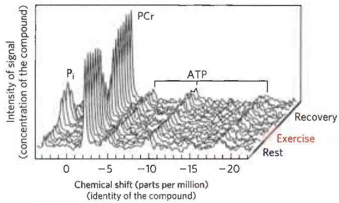  
FIGURE 23-16 Phosphocreatine buffers ATP concentration during exercise. A "stack plot" of magnetic resonance spectra (of $^{31}\mathrm{P}$ ) shows inorganic phosphate $(\mathbb{P}_{i})$ , phosphocreatine (PCr), and ATP (each of its three phosphates giving a signal). The series of plots represents the passage of time, from a period of rest to one of exercise, and then of recovery. Notice that the ATP signal barely changes during exercise, kept high by continued respiration and by the reservoir of phosphocreatine, which diminishes during exercise. During recovery, when ATP production by catabolism is greater than ATP use by the (now resting) muscle, the phosphocreatine reservoir is refilled. [Data from M. L. Blei, K. E. Conley, and M. J. Kushmerick, J. Physiol. 465:203, 1993, Fig. 4.]

  
FIGURE 23-17 Metabolic cooperation between skeletal muscle and the liver: the Cori cycle. Extremely active muscles use glycogen as their energy source, generating lactate by glycolysis. During recovery, some of the lactate is transported to the liver and converted to glucose by gluconeogenesis. The glucose is released to the blood and returned to the muscles to replenish their glycogen stores. The overall pathway, glucose → lactate → glucose, constitutes the Cori cycle.

Heart muscle differs from skeletal muscle in that it is continuously active in a regular rhythm of contraction and relaxation, and has a completely aerobic metabolism at all times. Mitochondria are much more abundant in heart muscle than in skeletal muscle, making up almost half the volume of the cells (Fig. 23-18). The heart uses mainly FFAs as a source of energy, but also some glucose and ketone bodies taken up from the blood; these fuels are oxidized aerobically to generate ATP. Like skeletal muscle, heart muscle does not store lipids or glycogen in large amounts. It does have small amounts of reserve energy in the form of phosphocreatine, enough for a few seconds of contraction. Because the heart is normally aerobic and obtains its energy from oxidative phosphorylation, the failure of $\mathrm{O}_2$ to reach part of the heart muscle when the blood vessels are blocked by lipid deposits (atherosclerosis) or blood clots (coronary thrombosis) can cause that region of the heart muscle to die. This is what happens in myocardial infarction (heart attack).

## The Brain Uses Energy for Transmission of Electrical Impulses

The metabolism of the brain is remarkable in several respects. The neurons of the adult mammalian brain normally use only glucose as fuel (Fig. 23-19). (Astrocytes, the other major cell type in the brain, can oxidize fatty acids.) The brain, which constitutes about 2% of total body mass, has a very active respiratory metabolism (Fig. 23-15); more than 90% of the ATP produced in the neurons comes from oxidative phosphorylation. The brain uses $O_{2}$ at a fairly constant rate, accounting for almost 20% of the total $O_{2}$ consumed by the body at rest. Because the brain contains very little glycogen, it is constantly dependent on incoming glucose in the blood.

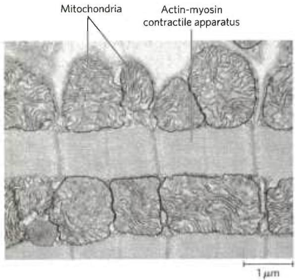  
FIGURE 23-18 Electron micrograph of heart muscle. In the profuse mitochondria of heart tissue, pyruvate (from glucose), fatty acids, and ketone bodies are oxidized to drive ATP synthesis. This steady aerobic metabolism allows the human heart to pump blood at a rate of nearly 6 L/min, or about 350 L/h — which amounts to $200 \times 10^{6}$ L of blood over 70 years. [D.w. Fawcett/Science Source.]

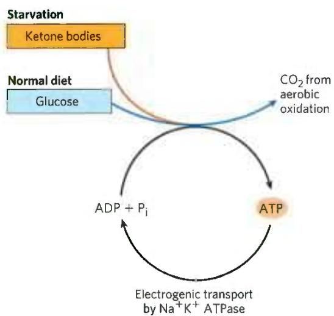  
FIGURE 23-19 The fuels that supply ATP in the brain. The energy source used by the brain varies with nutritional state. The ketone body used during starvation is $\beta$ -hydroxybutyrate. Electrogenic transport by the $\mathrm{Na^{+}K^{+}}$ ATPase maintains the transmembrane potential essential to information transfer among neurons.

# Creatine and Creatine Kinase: Invaluable Diagnostic Aids and the Muscle Builder's Friends

Animal tissues that have a high and fluctuating need for ATP, primarily skeletal muscle, cardiac muscle, and brain, contain several isozymes of creatine kinase. A cytosolic isozyme (cCK) is present in regions of high ATP use (myofibrils and sarcoplasmic reticulum, for example). By converting ADP produced during periods of high ATP use back to ATP, cCK prevents the accumulation of ADP to concentrations that could inhibit ATP-using enzymes by mass action. Another isozyme of creatine kinase is located in regions where the inner and outer membranes of mitochondria come into contact. This mitochondrial isozyme (mCK) probably serves to shuttle ATP equivalents produced in mitochondria to cytosolic sites of ATP use (Fig. 1). The species that diffuses from the mitochondrion to ATP-consuming activities in the cytosol is therefore creatine phosphate, not ATP. The mCK isozyme co-localizes with the adenine nucleotide transporter (in the inner mitochondrial membrane) and porin (in the outer mitochondrial membrane), which suggests that these three components may function together to transport ATP equivalents formed in mitochondria into the cytosol.

In knockout mice lacking the mitochondrial isozyme, myocytes compensate by producing more mitochondria, closely associated with myofibrils and sarcoplasmic reticulum, allowing quick diffusion of mitochondrial ATP to the sites of ATP use. Nevertheless, these mice have a reduced capacity for running, indicating a defect in some aspect of energy-supplying metabolism.

Creatine and phosphocreatine spontaneously break down to form creatinine (Fig. 2). To maintain high creatine levels, these losses have to be compensated for, either by dietary creatine, obtained primarily from meat (muscle) and dairy products, or by de novo synthesis from glycine, arginine, and methionine (see Fig. 22-28), which occurs primarily in liver and kidney. De novo synthesis of creatine is a major consumer of these amino acids, particularly in vegans, for whom this is the only source of creatine; plants do not contain creatine. Muscle tissue has a specific system to take up creatine (exported by liver or kidney) from the blood, against a substantial concentration gradient. Efficient uptake of dietary creatine requires continuous exercise; without exercise, creatine supplementation is of little value.

Should blood glucose fall significantly below a critical level for even a short time, severe and sometimes irreversible changes in brain function may result.

P3 Although the neurons of the brain cannot directly use free fatty acids or lipids from the blood as fuels, they can, when necessary, get up to 60% of their energy requirement from the oxidation of β-hydroxybutyrate (a ketone body), formed in the liver from fatty acids. The capacity of the brain to oxidize β-hydroxybutyrate via acetyl-CoA becomes important during prolonged fasting or starvation, after liver glycogen has been depleted, because it allows the brain to use body fat as an energy source. This spares muscle proteins—until they become the brain's ultimate source of glucose, via gluconeogenesis in the liver, during severe starvation.

  
FIGURE 1 Mitochondrial creatine kinase (mCK) transfers a phosphoryl group from ATP to creatine (Cr) to form phosphocreatine (PCr), which diffuses to sites of ATP use; at these sites, cytosolic creatine kinase (cCK) passes the phosphoryl group into ATP. Cytosolic CK can also use ATP produced by glycolysis to synthesize PCr. During periods of little ATP demand, the pools of ATP and PCr are replenished in preparation for the next period of intense demand for ATP. In resting muscle, the concentration of PCr is three to five times that of ATP, buffering the cell against rapid depletion of ATP during short bursts of ATP demand. [Information from U. Schlattner et al., Biochim. Biophys. Acta 1762:164, 2006, Fig. 1.]

In neurons, energy is required to create and maintain an electrical potential across the plasma membrane. The membrane contains an electrogenic ATP-driven antiporter, the $Na^{+}K^{+}$ ATPase, which simultaneously pumps two $K^{+}$ ions into and three $Na^{+}$ ions out of the neuron (see Fig. 11-39). The resulting transmembrane potential changes transiently as an electrical signal, an

  
FIGURE 2 Spontaneous (nonenzymatic) formation of creatinine from phosphocreatine or creatine consumes a few percent of the body's total creatine per day, which must be replaced by biosynthesis or from the diet.

Heart muscle contains a unique isozyme of creatine kinase (MB, for myocardial band), which is not normally found in the blood but appears there when released from heart muscle damaged by a heart attack. The blood level of MB begins to rise within 2 hours of the heart attack, typically peaks 12 to 36 hours after the heart attack, and returns to normal levels in 3 to 5 days. Measurement of the MB isozyme in blood therefore confirms a diagnosis of heart attack and indicates approximately when it occurred.

Children with inborn errors in the enzymes of creatine synthesis or uptake suffer severe intellectual disability and seizures. They have much-reduced levels of brain creatine as measured by NMR (see Fig. 23-16). Creatine supplementation raises their brain creatine and creatine phosphate concentrations and brings about partial improvement of the symptoms.

action potential, sweeps from one end of a neuron to the other (see Fig. 12-33). Action potentials are the chief mechanism of information transfer in the nervous system, so depletion of ATP in neurons would have disastrous effects on all activities coordinated by neuronal signaling.

## Blood Carries Oxygen, Metabolites, and Hormones

P2 Blood mediates the metabolic interactions among all tissues. It transports nutrients from the small intestine to the liver and from the liver and adipose tissue

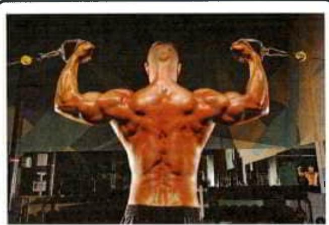  
FIGURE 3 Many body builders take supplemental creatine to supply phosphocreatine in new muscle tissue. [Steve Williams Photo/Getty Images.]

In the healthy kidney, creatinine from creatine breakdown is efficiently cleared from the blood into the urine. When renal function is defective, creatinine levels in the blood rise above the normal range of 0.8 to 1.4 mg/dL. Elevated blood creatinine is associated with renal failure in diabetes and other conditions in which renal function is temporarily or permanently compromised. Renal clearance of creatinine varies slightly with age, ethnicity, and gender, so correcting the calculation for those factors yields a more sensitive measure of the extent of renal function, the glomerular filtration rate (GFR).

Body builders who are adding muscle mass have a greater need for creatine and commonly take creatine supplements of up to 20 g per day for a few days, followed by lower maintenance doses. The combination of exercise and creatine supplementation increases muscle mass (Fig. 3) and improves performance in high-intensity, short-duration work.

to other organs; it also transports waste products from extrahepatic tissues to the liver for processing and to the kidneys for excretion. Oxygen moves in the bloodstream from the lungs to the tissues, and $CO_{2}$ generated by tissue respiration returns via the bloodstream to the lungs for exhalation. Blood also carries hormonal signals from one tissue to another. In its role as signal carrier, the circulatory system resembles the nervous system: both regulate and integrate the activities of different organs.

The average adult human has 5 to 6 L of blood. Almost half of this volume is occupied by three types of blood cells (Fig. 23-20): erythrocytes (red cells), filled with hemoglobin and specialized for carrying O₂ and CO₂; much smaller numbers of leukocytes (white cells) of several types (including lymphocytes, also found in lymphatic tissue), which are central to the immune system to defend against infections; and platelets (cell fragments), which help to mediate blood clotting. The liquid portion is the blood plasma, which is 90% water and 10% solutes. Dissolved or suspended in the plasma are many proteins, lipoproteins, nutrients, metabolites, waste products, inorganic ions, and hormones. More than 70% of the plasma solids are plasma proteins, primarily immunoglobulins (circulating antibodies), serum albumin, apolipoproteins (for lipid transport), transferrin (for iron transport), and blood-clotting proteins such as fibrinogen and prothrombin.

The ions and low molecular weight solutes in blood plasma are not fixed components; they are in constant flux between blood and various tissues. Dietary uptake of the inorganic ions that are the predominant electrolytes of blood and cytosol (Na $^{+}$ , K $^{+}$ , and Ca $^{2+}$ ) is, in general, counterbalanced by their excretion in the urine. For many blood components, something near a dynamic steady state is achieved: the concentration of a component changes little, although a continuous flux occurs between the digestive tract, blood, and urine. The plasma levels of $Na^{+}$ , $K^{+}$ , and $Ca^{2+}$ remain close to 140, 5, and 2.5 mm, respectively, with little change in response to dietary intake. Any significant departure from these values can result in serious illness or death. The kidneys play an especially important role in maintaining ion balance by selectively filtering waste products and excess ions out of the blood while preventing the loss of essential nutrients and ions.

  
FIGURE 23-20 The composition of blood (by weight). Whole blood can be separated into blood plasma and cells by centrifugation. About 10% of blood plasma is solutes, about 10% of these consisting of inorganic salts, 20% small organic molecules, and 70% plasma proteins. The major dissolved components are listed here. Blood contains many other substances, often in trace amounts. These include other metabolites, enzymes, hormones, vitamins, trace elements, and bile pigments. Measurements of the concentrations of components in blood plasma are important in the diagnosis and treatment of many diseases.

The human erythrocyte loses its nucleus and mitochondria during differentiation. It therefore relies on glycolysis alone for its supply of ATP. The lactate produced by glycolysis returns to the liver, where gluconeogenesis converts it to glucose, to be stored as glycogen or recirculated to peripheral tissues. The erythrocyte has constant access to glucose in the bloodstream.

The concentration of glucose in plasma is subject to tight regulation. We have noted the constant requirement of the brain for glucose and the role of the liver in maintaining blood glucose in the normal range, 60 to 90 mg/100 mL of whole blood (\~4.5 mm). (Because erythrocytes make up a significant fraction of blood volume, their removal by centrifugation leaves a supernatant fluid, the plasma, containing the "blood glucose" in a smaller volume. To convert blood glucose to plasma glucose concentration, multiply the blood glucose level by 1.14.) When blood glucose in a human drops to 70 mg/100 mL (the hypoglycemic condition), the person experiences discomfort and mental confusion (Fig. 23-21); further reductions lead to coma, convulsions, and, in extreme hypoglycemia, death. Maintaining the normal concentration of glucose in blood is therefore a high priority, and a variety of regulatory mechanisms have evolved to achieve that end. Among the most important regulators of blood glucose are the hormones insulin, glucagon, and epinephrine, as discussed in the next section.

  
FIGURE 23-21 Physiological effects of low blood glucose in humans. Blood glucose levels of 40 mg/100 mL and below constitute severe hypoglycemia.

## SUMMARY 23.2 Tissue-Specific Metabolism

In mammals there is a division of metabolic labor among specialized tissues and organs. The liver is the central processing and distribution organ for nutrients. Glucose 6-phosphate may be used to synthesize glycogen or fatty acids, or it may be sent into the citric acid cycle to produce ATP, or into the pentose phosphate pathway to yield NADPH and pentoses. Amino acids are used to synthesize liver and plasma proteins, or their carbon skeletons are converted to glucose and glycogen by gluconeogenesis; the ammonia formed by deamination is converted to urea. Fatty acids in the liver may undergo $\beta$ oxidation, or be converted to triglycerides, phospholipids or cholesterol, or be converted into ketone bodies.

■ White adipose tissue stores large reserves of triacylglycerol molecules and releases them into the blood in response to epinephrine or glucagon. Brown and beige adipose tissue are specialized for thermogenesis, the result of fatty acid oxidation in uncoupled mitochondria.

■ Skeletal muscle is specialized to produce and use ATP for mechanical work, oxidizing fatty acids and glucose during low to moderate muscular activity. During strenuous muscular activity, glycogen is the ultimate fuel, supplying ATP through glycolysis and fermentation to lactate. Phosphocreatine directly replenishes ATP during active contraction. Heart muscle obtains nearly all its ATP from oxidative phosphorylation, with fatty acids as the primary fuel.

The neurons of the brain use only glucose and $\beta$ -hydroxybutyrate as fuels, the latter being important during fasting or starvation. The brain uses most of its ATP for the active transport of $\mathrm{Na}^{+}$ and $\mathrm{K}^{+}$ to maintain the electrical potential across the neuronal membrane.

■ The blood transfers nutrients, oxygen, waste products, and hormonal signals among tissues and organs. It is made up of cells (erythrocytes, leukocytes, and platelets) and electrolyte-rich water (plasma) containing many dissolved proteins.

## 23.3 Hormonal Regulation of Fuel Metabolism

P3 The minute-by-minute adjustments that keep the blood glucose level near 4.5 mm involve the combined actions of insulin, glucagon, epinephrine, and cortisol on metabolic processes in many body tissues, but especially in liver, muscle, and adipose tissue. Insulin signals to these tissues that blood glucose is higher than necessary; as a result, cells take up excess glucose from the blood and convert it to glycogen and triacylglycerols for storage. Glucagon signals that blood glucose is too low, and tissues respond by producing glucose through glycogen breakdown and (in the liver) gluconeogenesis, and by oxidizing fats to reduce the need for glucose. Epinephrine is released into the blood to prepare the muscles, lungs, and heart for a burst of activity. Cortisol mediates the body's response to longer-term stresses.

In this section, we discuss these hormonal regulations in the context of three normal metabolic states—well fed, fasted, and starving.

## Insulin Counters High Blood Glucose in the Well-Fed State

After a high-carbohydrate meal, blood glucose rises several-fold. In response, insulin is released and acts through its plasma membrane receptors in muscle and liver (see Figs. 12-22, 12-23) to stimulate glucose uptake, phosphorylation, and oxidation via glycolysis and the citric acid cycle (Table 23-3). In response to insulin, GLUT4 glucose transporters sequestered in intracellular vesicles move to the plasma membrane, dramatically increasing the uptake of glucose from the blood (see Box 11-1). In the liver, insulin activates glycogen synthase and inactivates glycogen phosphorylase, so that much of the glucose 6-phosphate derived from blood glucose is channeled into glycogen.

TABLE 23-3 Effects of Insulin on Blood Glucose: Uptake of Glucose by Cells and Storage as Triacylglycerols and Glycogen

<table><tr><td>Metabolic effect</td><td>Target enzyme</td></tr><tr><td>↑ Glucose uptake (muscle, adipose tissue)</td><td>↑ Glucose transporter (GLUT4)</td></tr><tr><td>↑ Glucose uptake (liver)</td><td>↑ Glucokinase (increased expression)</td></tr><tr><td>↑ Glycogen synthesis (liver, muscle)</td><td>↑ Glycogen synthase</td></tr><tr><td>↓ Glycogen breakdown (liver, muscle)</td><td>↓ Glycogen phosphorylase</td></tr><tr><td>↑ Glycolysis, acetyl-CoA production (liver, muscle)</td><td>↑ PFK-1 (by PFK-2)↑ Pyruvate dehydrogenase complex</td></tr><tr><td>↑ Fatty acid synthesis (liver)</td><td>↑ Acetyl-CoA carboxylase</td></tr><tr><td>↑ Triacylglycerol synthesis (adipose tissue)</td><td>↑ Lipoprotein lipase</td></tr></table>

Insulin also stimulates the storage of excess fuel as fat in adipose tissue (Fig. 23-22). Excess acetyl-CoA not needed for energy production via the citric acid cycle is used for fatty acid synthesis. These fatty acids are converted to TAGs in the liver and exported to adipose tissue as components of plasma lipoproteins (VLDL; see Fig. 21-40). In adipose tissue, TAGs are released from VLDL as fatty acids, which are taken up by adipocytes and reconverted to TAGs for storage in response to insulin stimulation.

In summary, an important effect of insulin is to bring about the conversion of excess blood glucose after a meal to two storage forms: glycogen (in the liver and muscle) and TAGs (in adipose tissue).

## Pancreatic $\beta$ Cells Secrete Insulin in Response to Changes in Blood Glucose

The peptide hormones insulin, glucagon, and somatostatin are produced by clusters of specialized pancreatic cells, the islets of Langerhans (Fig. 23-23). Each cell type of the islets produces a single hormone: $\alpha$ cells produce glucagon; $\beta$ cells, insulin; and $\delta$ cells, somatostatin. When glucose enters the bloodstream from the intestine after a carbohydrate-rich meal, the resulting increase in blood glucose causes the pancreas to secrete insulin (and to decrease the secretion of glucagon).

As shown in Figure 23-24, when blood glucose rises, ① GLUT2 transporters carry glucose into the β cells, where it is immediately converted to glucose 6-phosphate by glucokinase and enters glycolysis. With the higher rate of glucose catabolism, ② [ATP] increases, causing ATP-gated K⁺ channels in the plasma membrane to close. ③ Reduced efflux of K⁺ depolarizes the membrane. (Recall from Section 12.6 that exit of K⁺ through an open K⁺ channel hyperpolarizes the membrane; thus, closing the K⁺ channel effectively depolarizes the membrane.) Membrane depolarization opens voltage-gated Ca²⁺ channels, and ④ the resulting increase in cytosolic $[Ca^{2+}]$ triggers ⑤ the release of insulin by exocytosis. The brain integrates inputs on energy supply and demand, and signals from the parasympathetic and sympathetic nervous systems also affect (stimulate and inhibit, respectively) insulin release. A simple feedback loop limits hormone release: insulin lowers blood glucose by stimulating glucose uptake by the tissues; the reduced blood glucose is detected by the $\beta$ cell as a diminished flux through the glucokinase reaction; this slows or stops the release of insulin. This feedback regulation holds blood glucose concentration nearly constant despite large fluctuations in dietary intake.

  
FIGURE 23-22 The well-fed state: the lipogenic liver. Immediately after a calorie-rich meal, glucose, fatty acids, and amino acids enter the liver. Blue arrows follow the path of glucose; orange arrows follow the path of lipids. Insulin released in response to the high blood glucose concentration stimulates glucose uptake by the tissues. Some glucose is exported to the brain for its energy needs, and some goes to adipose and muscle tissue. In the liver, excess  
glucose is oxidized to acetyl-CoA, which is used to make triacylglycerols for export to adipose and muscle tissue. The NADPH necessary for lipid synthesis is obtained by oxidation of glucose in the pentose phosphate pathway. Excess amino acids are converted to pyruvate and acetyl-CoA, which are also used for lipid synthesis. Dietary fats move from the intestine as chylomicrons, via the lymphatic system, to the liver, muscle, and adipose tissues.

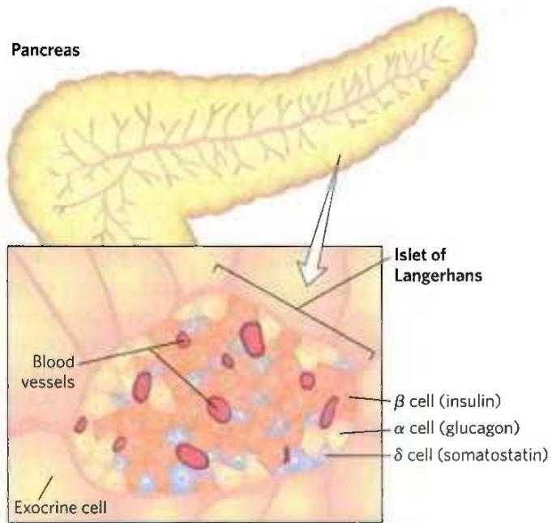  
FIGURE 23-23 The endocrine system of the pancreas. The pancreas contains both exocrine cells (see Fig. 18-3b), which secrete digestive enzymes in the form of zymogens, and clusters of endocrine cells, the islets of Langerhans. The islets contain $\alpha$ , $\beta$ , and $\delta$ cells (also known as A, B, and D cells, respectively), each cell type secreting a specific peptide hormone.

The activity of ATP-gated K $^{+}$ channels is central to the regulation of insulin secretion by β cells. The channels are octamers of four identical Kir6.2 subunits and four identical SUR1 subunits (Fig. 23-25a) and are constructed along the same lines as the K $^{+}$ channels of bacteria and those of other eukaryotic cells (see Fig. 11-45). The four Kir6.2 subunits form a cone around the K $^{+}$ channel and function as the selectivity filter and ATP-gating mechanism (Fig. 23-25b). When [ATP] rises, indicating increased blood glucose, the K $^{+}$ channels close, thus depolarizing the plasma membrane and triggering insulin release as shown in Figure 23-24. The sulfonylurea drugs, oral medications used in the treatment of type 2 diabetes mellitus, bind to the SUR1 (sulfonylurea receptor) subunits of the K+ channels, closing the channels and stimulating insulin release.

  
FIGURE 23-24 Glucose regulation of insulin secretion by pancreatic $\beta$ cells. When the blood glucose level is high, active metabolism of glucose in the $\beta$ cell raises intracellular [ATP], closing $K^{+}$ channels in the plasma membrane and thus depolarizing the membrane. In response to this membrane depolarization, voltage-gated $Ca^{2+}$ channels open, allowing $Ca^{2+}$ to flow into the cell. ( $Ca^{2+}$ is also released from the ER, in response to the initial elevation of $[Ca^{2+}]$ in the cytosol.) Cytosolic $[Ca^{2+}]$ is now high enough to trigger insulin release by exocytosis. The numbered processes are discussed in the text.

  
FIGURE 23-25 ATP-gated K $^{+}$ channels in β cells. (a) The ATP-gated channel, viewed in the plane of the membrane. The channel is formed by four identical Kir6.2 subunits, which are surrounded by four SUR1 (sulfonylurea receptor) subunits. The SUR1 subunits have binding sites for ADP and the drug diazoxide, both of which favor the open channel, and tolbutamide, a sulfonylurea drug that favors the closed channel. The Kir6.2 subunits constitute the channel, and they contain, on the cytosolic side, binding sites for ATP and phosphatidylinositol 4,5-bisphosphate (PIP $_{2}$ ), which favor the closed and the open channel, respectively. (b) The structure of the Kir6.2 portion of the channel, viewed in the plane of the membrane. For clarity, only two transmembrane domains and two cytosolic domains are shown. Three K $^{+}$ ions (green) are shown in the region of the selectivity filter. Mutation in certain amino acid residues (shown in red) leads to neonatal diabetes; mutation in others (shown in blue) leads to hyperinsulinism of infancy. This structure was obtained by mapping the known Kir6.2 sequence onto the crystal structures of a bacterial Kir channel (KirBac1.1) and the amino and carboxyl domains of another Kir protein, Kir3.1. [Data from (b) KirBac1.1: PDB ID 1P7B, A. Kuo et al., Science 300:1922, 2003; Kir3.1: PDB ID 1U4E, S. Pegan et al., Nature Neurosci. 8:279, 2005. Coordinates courtesy of Frances M. Ashcroft, Oxford University, used with permission of S. Haider and M. S. P. Sansom to re-create a model published in J. F. Antcliff et al., EMBO J. 24:229, 2005.]

Mutations in the ATP-gated K $^{+}$ channels of β cells are, fortunately, rare. Mutations in Kir6.2 that result in constantly open K $^{+}$ channels (red residues in Fig. 23-25b) lead to neonatal diabetes mellitus, with severe hyperglycemia that requires insulin therapy. Other mutations in Kir6.2 or SUR1 (blue residues in Fig. 23-25b) produce permanently closed K $^{+}$ channels and continuous release of insulin. If untreated, individuals with these mutations develop a condition in which excessive insulin causes severe hypoglycemia (low blood glucose) leading to irreversible brain damage. One effective treatment is surgical removal of part of the pancreas to reduce insulin production.

## Glucagon Counters Low Blood Glucose

P3 Several hours after the intake of dietary carbohydrate, blood glucose levels fall slightly because of the ongoing oxidation of glucose by the brain and other tissues. Lowered blood glucose triggers the pancreas to secrete glucagon and simultaneously decrease the release of insulin (Fig. 23-26).

Glucagon causes an increase in blood glucose concentration in several ways (Table 23-4). Like epinephrine, it stimulates the net breakdown of liver glycogen by activating glycogen phosphorylase and inactivating glycogen synthase; both effects are the result of phosphorylation of the regulated enzymes, triggered by cAMP. Glucagon inhibits glucose breakdown by glycolysis in the liver and stimulates glucose synthesis by gluconeogenesis. Both effects result from lowering the concentration of fructose 2,6-bisphosphate, an allosteric inhibitor of the gluconeogenic enzyme fructose 1,6-bisphosphatase (FBPase-1) and an activator of the glycolytic enzyme phosphofructokinase-1. Recall that [fructose 2,6-bisphosphate] is ultimately controlled by a cAMP-dependent protein phosphorylation reaction (see Fig. 14-25). Glucagon also inhibits the glycolytic enzyme pyruvate kinase, by promoting its cAMP-dependent phosphorylation, thus blocking the conversion of phosphoenolpyruvate to pyruvate and preventing oxidation of pyruvate via the citric acid cycle (see Fig. 14-26). The resulting accumulation of phosphoenolpyruvate favors gluconeogenesis. This effect is augmented by glucagon's stimulation of the synthesis of the gluconeogenic enzyme PEP carboxykinase. By stimulating glycogen breakdown, preventing glycolysis and promoting gluconeogenesis in hepatocytes, glucagon enables the liver to export glucose, restoring blood glucose to its normal level.

Although its primary target is the liver, glucagon (like epinephrine) also affects adipose tissue, activating TAG

FIGURE 23-26 The fasting state: the glucogenic liver. After some hours without a meal, the liver becomes the principal source of glucose for the brain. Liver glycogen is broken down to glucose 1-phosphate, and this is converted to glucose 6-phosphate, then to free glucose, which is released into the bloodstream. Amino acids from the degradation of proteins in liver and muscle, and glycerol from the breakdown of TAGs in adipose tissue, are used for gluconeogenesis. The liver uses fatty acids as its principal fuel, and excess acetyl-CoA is converted to ketone bodies for export to other tissues; the brain is especially dependent on this fuel when glucose is in short supply (see Fig. 23-19). Blue arrows follow the path of glucose; orange arrows, the path of lipids; and purple arrows, the path of amino acids.

<table><tr><td colspan="3">TABLE 23-4 Effects of Glucagon on Blood Glucose: Production and Release of Glucose by the Liver</td></tr><tr><td>Metabolic effect</td><td>Effect on glucose metabolism</td><td>Target enzyme</td></tr><tr><td>↑ Glycogen breakdown (liver)</td><td>Glycogen → glucose</td><td>↑ Glycogen phosphorylase</td></tr><tr><td>↓ Glycogen synthesis (liver)</td><td>Less glucose stored as glycogen</td><td>↓ Glycogen synthase</td></tr><tr><td>↓ Glycolysis (liver)</td><td>Less glucose used as fuel in liver</td><td>↓ PFK-1</td></tr><tr><td>↑ Gluconeogenesis (liver)</td><td>Amino acids Glycerol Oxaloacetate</td><td>↑ FBPase-2 ↓ Pyruvate kinase ↑ PEP carboxykinase</td></tr><tr><td>↑ Fatty acid mobilization (adipose tissue)</td><td>Less glucose used as fuel by liver, muscle</td><td>↑ Hormone-sensitive lipase ↑ PKA (perilipin-P)</td></tr><tr><td>↑ Ketogenesis</td><td>Provides alternative to glucose as energy source for brain</td><td>↓ Acetyl-CoA carboxylase</td></tr></table>

breakdown by causing cAMP-dependent phosphorylation of perilipin and hormone-sensitive lipase. The activated lipase liberates free fatty acids, which are exported to the liver and other tissues as fuel, sparing glucose for the brain. The net effect of glucagon is therefore to stimulate glucose synthesis and release by the liver and to mobilize fatty acids from adipose tissue, to be used instead of glucose by tissues other than the brain. All these effects of glucagon are mediated by cAMP-dependent protein phosphorylation.

## During Fasting and Starvation, Metabolism Shifts to Provide Fuel for the Brain

A healthy adult human has three types of fuel reserves: glycogen stored in the liver and, in smaller quantities, in muscles; large quantities of TAG in adipose tissues; and tissue proteins, which can be degraded when necessary to provide fuel (Table 23-5).

P3 Two hours after a meal, the blood glucose level is diminished slightly, and tissues receive glucose released from liver glycogen. There is little or no synthesis of TAGs. By four hours after a meal, blood glucose has fallen further, insulin secretion has slowed, and glucagon secretion has increased. These hormonal signals mobilize TAGs from adipose tissue, which now become the primary fuel for muscle and liver. Figure 23-27 shows the responses to prolonged fasting. ① To provide glucose for the brain, the liver degrades certain proteins—those most expendable in an organism not ingesting food. Their nonessential amino acids are transaminated or deaminated (Chapter 18), and ② the extra amino groups are converted to urea, which is exported via the bloodstream to the kidneys and excreted in the urine.

<table><tr><td colspan="4">TABLE 23-5 Available Metabolic Fuels in a Normal-Weight, 70 kg Man and in an Obese, 140 kg Man at the Beginning of a Fast</td></tr><tr><td>Type of fuel</td><td>Weight (kg)</td><td>Caloric equivalent (thousands of kcal (kJ))</td><td>Estimated survival (months)a</td></tr><tr><td>Normal-weight, 70 kg man</td><td></td><td></td><td></td></tr><tr><td>Triacylglycerols (adipose tissue)</td><td>15</td><td>140 (590)</td><td></td></tr><tr><td>Proteins (mainly muscle)</td><td>6</td><td>24 (100)</td><td></td></tr><tr><td>Glycogen (muscle, liver)</td><td>0.23</td><td>0.90 (3.8)</td><td></td></tr><tr><td>Circulating fuels (glucose, fatty acids, triacylglycerols, etc.)</td><td>0.023</td><td>0.10 (0.42)</td><td></td></tr><tr><td>Total</td><td></td><td>165 (690)</td><td>3</td></tr><tr><td>Obese, 140 kg man</td><td></td><td></td><td></td></tr><tr><td>Triacylglycerols (adipose tissue)</td><td>80</td><td>750 (3,100)</td><td></td></tr><tr><td>Proteins (mainly muscle)</td><td>8</td><td>32 (130)</td><td></td></tr><tr><td>Glycogen (muscle, liver)</td><td>0.23</td><td>0.92 (3.8)</td><td></td></tr><tr><td>Circulating fuels</td><td>0.025</td><td>0.11 (0.46)</td><td></td></tr><tr><td>Total</td><td></td><td>783 (3,200)</td><td>14</td></tr></table>

Also in the liver, and to some extent in the kidneys, the carbon skeletons of glucogenic amino acids are converted to pyruvate or intermediates of the citric acid cycle. ③ These intermediates (as well as the glycerol derived from TAGs in adipose tissue) provide the starting materials for gluconeogenesis in the liver, ④ yielding glucose for export to the brain. ⑤ Fatty acids released from adipose tissue are oxidized to acetyl-CoA in the liver, but as oxaloacetate is depleted by the use of citric acid cycle intermediates for gluconeogenesis, ⑥ entry of acetyl-CoA into the cycle is inhibited and acetyl-CoA accumulates. ⑦ This favors the formation of acetoacetyl-CoA and ketone bodies. After a few days of fasting, the levels of ketone bodies in the blood rise (Fig. 23-28) as they are exported from the liver to the heart, skeletal muscle, and brain, which use these fuels instead of glucose (Fig. 23-27, ⑧). When the concentration of ketone bodies in the blood exceeds the ability of the kidneys to reabsorb ketones ⑨, these compounds begin to appear in the urine.

Triacylglycerols stored in the adipose tissue of a normal-weight adult could provide enough fuel to maintain a basal rate of metabolism for about three months; a very obese adult has enough stored fuel to endure a fast of more than a year (Table 23-5). When fat reserves are gone, the degradation of essential proteins begins; this leads to loss of heart and liver function and, in prolonged starvation, to death. Stored fat can provide adequate energy (calories) during a fast or a rigid diet, but vitamins and minerals must be provided, and sufficient dietary glucogenic amino acids are needed to replace those being used for gluconeogenesis. Rations for those on a weight-reduction diet are commonly fortified with vitamins, minerals, and amino acids or proteins.

## Epinephrine Signals Impending Activity

When an animal is confronted with a stressful situation that requires increased activity—fighting or fleeing, in the extreme case—neuronal signals from the brain trigger the release of epinephrine and norepinephrine from the adrenal medulla. Both hormones dilate the respiratory passages to facilitate the uptake of $O_{2}$ , increase the rate and strength of the heartbeat, and raise the blood pressure, thereby promoting the flow of $O_{2}$ and fuels to the tissues (Table 23-6). This is the “fight-or-flight” response.

Epinephrine acts primarily on muscle, adipose, and liver tissues. It activates glycogen phosphorylase and inactivates glycogen synthase by cAMP-dependent phosphorylation of the enzymes, thus stimulating the