## RNA Polymerase Leaves Its Footprint on a Promoter

Footprinting, a technique derived from principles used in DNA sequencing, identifies the DNA sequences bound by a particular protein. Researchers isolate a DNA fragment thought to contain sequences recognized by a DNA-binding protein, and then radiolabel one end of one strand (Fig. 1). They then use chemical or enzymatic reagents to introduce random breaks in the DNA fragment (averaging about one break per molecule). Separation of the labeled cleavage products (broken fragments of various lengths) by high-resolution electrophoresis produces a ladder of radioactive bands. In a separate tube, the cleavage procedure is repeated on copies of the same DNA fragment in the presence of the DNA-binding protein. The researchers then subject the two sets of cleavage products to electrophoresis and compare them side by side. A gap ("footprint") in the series of radioactive bands derived from the DNA-protein sample, attributable to protection of the DNA by the bound protein, identifies the sequences that the protein binds.

  
FIGURE 1 Footprint analysis of the RNA polymerase-binding site on a DNA fragment. Separate experiments are carried out in the presence (+) and absence (−) of the polymerase.

The precise location of the protein-binding site can be determined by directly sequencing (see Fig. 8-35) copies of the same DNA fragment and including the sequencing lanes (not shown here) on the same gel with the footprint. Figure 2 shows footprinting results for the binding of RNA polymerase to a DNA fragment containing a promoter. The polymerase covers 60 to 80 bp; protection by the bound enzyme includes the -10 and -35 regions.

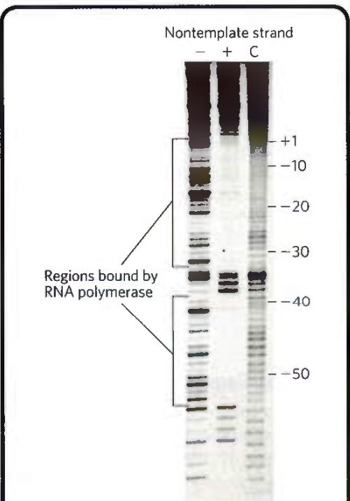  
FIGURE 2 Footprinting results of RNA polymerase binding to the lac promoter. In this experiment, the 5' end of the nontemplate strand was radioactively labeled. Lane C is a control in which the labeled DNA fragments were cleaved with a chemical reagent that produces a more uniform banding pattern. [© Courtesy of Carol Gross Laboratory.]

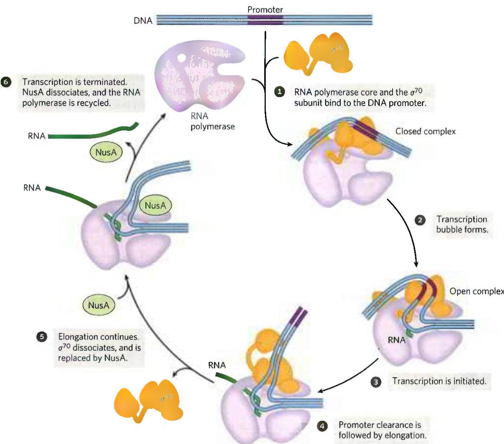  
FIGURE 26-6 Transcription initiation and elongation by E. coli RNA polymerase. Initiation of transcription requires several steps generally divided into two phases: binding and initiation. In the binding phase, the initial interaction of the RNA polymerase with the promoter leads to formation of a closed complex, in which the promoter DNA is stably bound but not unwound. A 12 to 15 bp region of DNA—from within the -10 region to position +2 or +3—is then unwound to form an open complex. Additional intermediates (not shown) have been detected in the pathways leading to the closed and open  
complexes, along with several changes in protein conformation. The initiation phase encompasses promoter binding, transcription initiation, and promoter clearance (steps 1 through 4 here). Once elongation commences, the $\sigma$ subunit is released and is replaced by the protein NusA. The polymerase leaves the promoter and becomes committed to elongation of the RNA (step 5). When transcription is complete, the RNA is released, the NusA protein dissociates, and the RNA polymerase dissociates from the DNA (step 6). Another $\sigma$ subunit binds to the RNA polymerase and the process begins again.

## Transcription Is Regulated at Several Levels

Requirements for any gene product vary with cellular conditions or developmental stage, and transcription of each gene is carefully regulated to form gene products only in the proportions needed. P1 Regulation can occur at any step of transcription, including elongation and termination. However, much of the regulation is directed at the polymerase binding and transcription initiation steps outlined in Figure 26-6. Differences in promoter sequences are just one of several levels of control.

The binding of proteins to sequences both near to and distant from the promoter can also affect levels of gene expression. Protein binding can activate transcription by facilitating either RNA polymerase binding or steps farther along in the initiation process, or it can repress transcription by blocking the activity of the polymerase. In E. coli, one protein that activates transcription is the cAMP receptor protein (CRP), which increases the transcription of genes coding for enzymes that metabolize sugars other than glucose when cells are grown in the absence of glucose. Repressors are proteins that block the synthesis of RNA at specific genes. In the case of the Lac repressor, transcription of the genes for the enzymes of lactose metabolism is blocked when lactose is unavailable.

As described further in Chapter 27, transcription of mRNAs and their translation are tightly coupled in bacteria. As a protein-coding gene is being transcribed, ribosomes rapidly bind to and begin to translate the mRNA before its synthesis is complete. Another protein, NusG, binds directly to both the ribosome and RNA polymerase, linking the two complexes. The rate of translation directly affects the rate of transcription. In contrast, eukaryotes carry out transcription in the nucleus and translation in the cytoplasm, making it impossible for these two steps to be physically coupled.

## Specific Sequences Signal Termination of RNA Synthesis

RNA synthesis is processive; that is, the RNA polymerase introduces a large number of nucleotides into a growing RNA molecule before dissociating (p. 917). This is necessary because, if the polymerase released an RNA transcript prematurely, it could not resume synthesis of the same RNA and would have to start again from the beginning of the gene. However, an encounter with certain DNA sequences results in a pause in RNA synthesis, and at some of these sequences transcription is terminated. Our focus here is again on the well-studied systems in bacteria. E. coli has at least two classes of termination signals: one class relies on a protein factor called $\rho$ (rho), and the other is $\rho$ -independent.

Most $\rho$ -independent terminators have two distinguishing features. The first is a region that produces an RNA transcript with self-complementary sequences, permitting the formation of a hairpin structure (see Fig. 8-19a) centered 15 to 20 nucleotides before the projected end of the RNA strand. The second feature is a highly conserved string of three A residues in the template strand that are transcribed into U residues near the 3' end of the hairpin. When a polymerase arrives at a termination site with this structure, it pauses (Fig. 26-7a). Formation of the hairpin structure in the RNA disrupts several A=U base pairs in the RNA-DNA hybrid segment and may disrupt important interactions between RNA and the RNA polymerase, facilitating dissociation of the transcript.

  
FIGURE 26-7 Termination of transcription in E. coli. (a) p-Independent termination. RNA polymerase pauses at a variety of DNA sequences, some of which are terminators. One of two outcomes is then possible: either the polymerase bypasses the site and continues on its way, or the complex undergoes a conformational change (isomerization). During isomerization, intramolecular pairing of complementary sequences in the newly formed RNA transcript may form a hairpin that disrupts the RNA-DNA hybrid, the interactions

The $\rho$ -dependent terminators lack the sequence of repeated A residues in the template strand but usually include a CA-rich sequence called a rut (rho utilization) element. The $\rho$ protein associates with the RNA at specific binding sites and migrates in the 5'→3' direction until it reaches the transcription complex that is paused at a termination site (Fig. 26-7b). Here it promotes release of the RNA transcript. The $\rho$ protein has an ATP-dependent RNA-DNA helicase activity that permits translocation of the protein along the RNA, and ATP is hydrolyzed by the $\rho$ protein during the termination process. The detailed mechanism by which the protein promotes the release of the RNA transcript is not known.

## Eukaryotic Cells Have Three Kinds of Nuclear RNA Polymerases

The transcriptional machinery in the nucleus of a eukaryotic cell is much more complex than that in bacteria. Eukaryotes have three nuclear RNA polymerases, designated I, II, and III, which are distinct complexes but have certain subunits in common. Each polymerase has a specific function (Table 26-1) and is recruited to a specific promoter sequence. In addition, eukaryotic mitochondria and chloroplasts have their own RNA polymerases for transcription of genes encoded in their own DNA (see Fig. 19-40). The RNA polymerases in these organelles are similar to bacterial RNA polymerases and less elaborate than the nuclear transcription machinery discussed below.

  
between RNA and polymerase, or both. An A=U hybrid region at the 3' end of the new transcript is relatively unstable, and the RNA dissociates from the complex completely, leading to termination. At nonterminating pause sites, the complex may escape after the isomerization step to continue RNA synthesis. (b) ρ-Dependent termination. RNAs that include a rut element recruit the ρ helicase. The ρ helicase migrates along the mRNA in the 5'→3' direction and separates it from the polymerase.

<table><tr><td colspan="2">TABLE 26-1 Eukaryotic Nuclear RNA Polymerases</td></tr><tr><td>RNA polymerase</td><td>Types of RNA synthesized</td></tr><tr><td>I</td><td>Pre-ribosomal RNA</td></tr><tr><td>II</td><td>mRNA ncRNA</td></tr><tr><td>III</td><td>tRNA 5S rRNA ncRNA</td></tr></table>

RNA polymerase I (Pol I) is responsible for the synthesis of only one type of RNA, a transcript called pre-ribosomal RNA (or pre-rRNA), which contains the precursor for the 18S, 5.8S, and 28S rRNAs. The principal function of RNA polymerase II (Pol II) is the synthesis of mRNAs and many ncRNAs. This enzyme can recognize thousands of promoters that vary greatly in sequence. Some Pol II promoters have a few sequence features in common, including a TATA box (eukaryotic consensus sequence TATA(A/T)A(A/T)(A/G)) near base pair -30 and an Inr sequence (initiator) near the RNA start site at +1 (Fig. 26-8). However, such promoters are in the minority, and elaborate interactions with regulatory proteins guide Pol II function at many promoters that lack these features.

RNA polymerase III (Pol III) makes tRNAs, the 5S rRNA, and other small, specialized ncRNAs, including the U6 RNA component of the spliceosome, which we will discuss in Section 26.2. The promoters recognized by Pol III are well characterized. Some of the sequences required for the regulated initiation of transcription by

<table><tr><td rowspan="3"></td><td colspan="2">-30</td><td colspan="2">+1</td></tr><tr><td colspan="2">TATAAA</td><td>YYANTA</td><td>YY</td></tr><tr><td>Various regulatory sequences</td><td>TATA box</td><td>Inr</td><td>3&#x27;</td></tr></table>

FIGURE 26-8 Some common features of TATA box promoters recognized by eukaryotic RNA polymerase II. The TATA box is the major assembly point for the proteins of the preinitiation complexes of Pol II. The DNA is unwound at the initiator sequence (Inr), and the transcription start site is usually within or very near this sequence. In the Inr consensus sequence shown here, N represents any nucleotide and Y represents a pyrimidine nucleotide. Additional sequences around the TATA box and downstream (to the right as shown here) of Inr may be recognized by one or more transcription factors. The sequence elements of Pol II promoters summarized here are much more variable and complex in comparison to E. coli promoters (see Fig. 26-5).

Pol III are located within the gene itself, whereas others are in more conventional locations upstream of the RNA start site (Chapter 28).

## RNA Polymerase II Requires Many Other Protein Factors for Its Activity

RNA polymerase II is central to eukaryotic gene expression and has been studied extensively. P1 Although this polymerase is strikingly more complex than its bacterial counterpart, the complexity masks a remarkable conservation of structure, function, and mechanism. Pol II isolated from either yeast or human cells is a 12-subunit enzyme with an aggregate molecular weight of more than 510,000. The largest subunit (RBP1) exhibits a high degree of homology to the $\beta'$ subunit of bacterial RNA polymerase. Another subunit (RBP2) is structurally similar to the bacterial $\beta$ subunit, and two others (RBP3 and RBP11) show some structural homology to the two bacterial $\alpha$ subunits. Pol II must function with genomes that are more complex and with DNA molecules more elaborately packaged than in bacteria. The need for protein-protein contacts with the numerous other protein factors required to navigate this labyrinth accounts in large measure for the added complexity of the eukaryotic polymerase.

The largest subunit of Pol II (RBP1) also has an unusual feature, a long carboxyl-terminal tail consisting of many repeats of a consensus heptad amino acid sequence,—YSPTSPS—. There are 26 repeats in the yeast enzyme (19 exactly matching the consensus) and 52 (21 exact) in the mouse and human enzymes. This carboxyl-terminal domain (CTD) is separated from the main body of the enzyme by an intrinsically disordered linker sequence. The CTD has many important roles in Pol II function, as outlined below.

RNA polymerase II requires an array of other proteins, called transcription factors, to form the active transcription complex. The general transcription factors required at every Pol II promoter (factors usually designated TFII with an additional identifier) are highly conserved in all eukaryotes (Table 26-2). The process of transcription by Pol II can be described in terms of several phases—assembly, initiation, elongation, termination—each associated with characteristic proteins (Fig. 26-9). The step-by-step pathway described below leads to active transcription in vitro. In the cell, many of the proteins may be present in larger, preassembled complexes, simplifying the pathways for assembly on promoters. As you read about this process, consult Figure 26-9 and Table 26-2 to help keep track of the many participants.

Assembly of RNA Polymerase and Transcription Factors at a Promoter The formation of a closed complex begins when the TATA-binding protein (TBP) binds to the TATA box (Fig. 26-9a, step 1). At promoters lacking a TATA box, TBP arrives as part of a multisubunit complex called

<table><tr><td colspan="4">TABLE 26-2 Proteins Required for Initiation of Transcription at the RNA Polymerase II (Pol II) Promoters of Eukaryotes</td></tr><tr><td>Transcription protein</td><td>Number of different subunits</td><td>Subunit(s)  $M_r^a$ </td><td>Function(s)</td></tr><tr><td colspan="4">Initiation</td></tr><tr><td>Pol II</td><td>12</td><td>7,000–220,000</td><td>Catalyzes RNA synthesis</td></tr><tr><td>TBP (TATA-binding protein)</td><td>1</td><td>38,000</td><td>Specifically recognizes the TATA box</td></tr><tr><td>TFIIA</td><td>2</td><td>13,000, 42,000</td><td>Stabilizes binding of TFIIIB and TBP to the promoter</td></tr><tr><td>TFIIB</td><td>1</td><td>35,000</td><td>Binds to TBP; recruits Pol II-TFIIF complex</td></tr><tr><td>TFIIDb</td><td>13–14</td><td>14,000–213,000</td><td>Required for initiation at promoters lacking a TATA box</td></tr><tr><td>TFIIE</td><td>2</td><td>33,000, 50,000</td><td>Recruits TFIIH; has ATPase and helicase activities</td></tr><tr><td>TFIIF</td><td>2–3</td><td>29,000–58,000</td><td>Binds tightly to Pol II; binds to TFIIIB and prevents binding of Pol II to nonspecific DNA sequences</td></tr><tr><td>TFIIH</td><td>10</td><td>35,000–89,000</td><td>Unwinds DNA at promoter (helicase activity); phosphorylates Pol II CTD; recruits nucleotide-excision repair proteins</td></tr><tr><td colspan="4">Elongationc</td></tr><tr><td>ELLd</td><td>1</td><td>80,000</td><td></td></tr><tr><td>pTEFb</td><td>2</td><td>43,000, 124,000</td><td>Phosphorylates Pol II CTD</td></tr><tr><td>SII (TFIIS)</td><td>1</td><td>38,000</td><td></td></tr><tr><td>Elongin (SIII)</td><td>3</td><td>15,000, 18,000, 110,000</td><td></td></tr></table>

$^{b}$ The presence of multiple copies of some TFIID subunits brings the total subunit composition of the complex to 21–22.  
$^{c}$ The function of all elongation factors is to suppress the pausing or arrest of transcription by the Pol II–TFIIF complex.  
$^{d}$ Name derived from eleven-nineteen lysine-rich leukemia. The gene for ELL is the site of chromosomal recombination events frequently associated with acute myeloid leukemia.

TFIID. TBP is bound, in turn, by the transcription factor TFIIB. TFIIA then binds and, along with TFIIB, helps to stabilize the TBP-DNA complex. The TFIIB-TBP complex is next bound by another complex consisting of TFIIF and Pol II. TFIIF helps target Pol II to its promoters, both by interacting with TFIIB and by reducing the binding of the polymerase to nonspecific sites on the DNA. Finally, TFIIE and TFIIH bind to create the closed, preinitiation complex (PIC).

A key function of TFIID in the PIC is to position TBP on the promoter, which in turn dictates the location of Pol II loading and transcription initiation. Because most human promoters (\~80%) lack a TATA box, how TFIID correctly positions TBP and Pol II relative to the transcription start site was poorly understood until their structures were determined by cryo-EM (Fig. 26-9b). These structures showed that TFIID binds the promoter DNA in an elongated complex that is anchored by TBP-DNA interactions on one end and extends linearly over 70 base pairs. The Inr sequence is positioned roughly in the middle, straddled on both ends by TFIID subunits. TFIID thus acts as a scaffold to direct binding of Pol II and other PIC components and uses its structure and interactions with TBP to help define the transcription start site.

TFIIH has multiple subunits and includes a DNA helicase activity that promotes the unwinding of DNA near the RNA start site (a process requiring the hydrolysis of ATP), thereby creating an open initiation complex (Fig. 26-9a, step 2). Counting all the subunits of the various factors (including TFIIA and the subunits of TFIID), this active initiation complex can have more than 50 polypeptides.

RNA Strand Initiation and Promoter Clearance TFIIH has an additional function during the initiation phase. A kinase activity in one of its subunits phosphorylates Pol II at many places in the CTD (Fig. 26-9a, step 3). Several other protein kinases, including CDK9 (cyclin-dependent kinase 9), which is part of the complex pTEFb (positive transcription elongation factor b), also phosphorylate the CTD, primarily on Ser residues of the CTD repeat sequence. CTD phosphorylation causes a conformational change in the overall complex, initiating transcription. During the subsequent elongation phase of transcription, the phosphorylation state of the CTD changes, affecting which RNA processing components are bound to the transcription complexes (Fig. 26-10).

During synthesis of the initial 60 to 70 nucleotides of RNA, first TFIIE, then TFIIH is released, and Pol II enters the elongation phase of transcription (Fig. 26-9a, step 4).

Elongation, Termination, and Release TFIIF remains associated with Pol II throughout elongation. During this stage, polymerase activity is greatly enhanced by protein elongation factors (Table 26-2). The elongation factors, some bound to the phosphorylated CTD, suppress pausing during transcription and also coordinate interactions between the supramolecular complexes involved in the posttranscriptional processing of mRNAs. Once the RNA transcript is completed, transcription is terminated (Fig. 26-9a, step 5). The Pol II CTD is dephosphorylated and the transcription machinery recycled, ready to initiate another transcript.

FIGURE 26-9 Transcription at RNA polymerase II promoters. (a) TBP (often with TFIIA and sometimes with TFIID) and TFIIB bind sequentially to a promoter. TFIIF plus Pol II are then recruited to that complex. The further addition of TFIIE and TFIIH results in a closed complex. Within the complex, the DNA is unwound at the Inr region by the helicase activity of TFIIH and perhaps of TFIIE, creating an open complex that completes assembly. The carboxyl-terminal domain of the largest Pol II subunit is phosphorylated by TFIIH, and the polymerase then escapes the promoter and initiates transcription. Elongation is accompanied by the release of many transcription factors and is also enhanced by elongation factors (see Table 26-2). After termination, Pol II is released, dephosphorylated, and recycled. (b) Structure of the human TFIIA/TFIID/TBP complex bound to promoter DNA, determined by cryo-EM. The DNA is stretched linearly over 70 base pairs, with the Inr sequence positioned roughly in the middle of TFIID, anchored by TBP/TATA-box interactions on the end. ([a) Information from E. Nogales et al., Curr. Opin. Struct. Biol. 47:60, 2017, Fig. 4. (b) Data from PDB ID 5FUR, R.K. Louder et al., Nature 531:604, 2016.]  

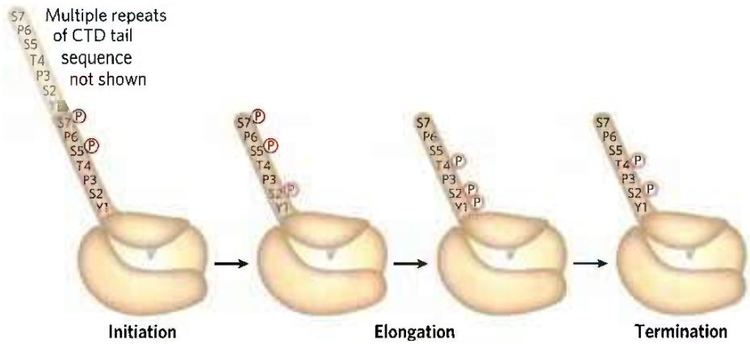  
FIGURE 26-10 Phosphorylation of the carboxyl-terminal domain (CTD) of RNA polymerase II. The phosphorylation pattern of the CTD changes during different phases of transcription due to the action of kinases and phosphorylases associated with the transcription machinery. Multiple

Regulation of transcription at Pol II promoters is an elaborate process. It involves the interaction of a wide variety of other proteins with the preinitiation complex. Some of these regulatory proteins interact with transcription factors, others with Pol II itself. The regulation of eukaryotic transcription is described in more detail in Chapter 28.

## RNA Polymerases Are Drug Targets

Both bacterial and eukaryotic RNA polymerases are the targets of a large number of chemical inhibitors. Some of these molecules inhibit transcription of both types of RNA polymerases; others selectively inhibit only certain types of polymerase.

The elongation of RNA strands by RNA polymerase in both bacteria and eukaryotes is inhibited by the antibiotic actinomycin D. The planar portion of this molecule inserts (intercalates) into the double-helical DNA between successive G≡C base pairs, deforming the DNA duplex. This prevents movement of the polymerase along the DNA during transcription. Because actinomycin D inhibits RNA elongation in intact cells as well as in cell extracts, it can be used to identify cell processes that depend on RNA synthesis.

Rifampin (Fig. 26-11a) inhibits bacterial RNA synthesis by preventing the promoter clearance step of transcription. Rifampin is an important antibiotic for the treatment of tuberculosis (TB), which is caused by the bacterium Mycobacterium tuberculosis and kills approximately 1.8 million people each year. The antibiotic binds near the active site of RNA polymerase and prevents extension of the RNA product beyond 2 to 3 nucleotides. Unfortunately, M. tuberculosis can develop resistance to rifampin; more than 600,000 cases of rifampin-resistant TB are reported each year. In many cases, resistance is due to mutation in the rifampin binding site (Fig. 26-11b), particularly at Asp $^{516}$ , His $^{526}$ , and Ser $^{531}$ of the $\beta$ subunit. New drugs that inhibit M. tuberculosis RNA polymerase are desperately needed for treatment of drug-resistant TB.

repeats of the CTD tail are phosphorylated with the patterns shown here during each stage; however, these are not shown for clarity. Understanding the patterns and heterogeneity of CTD tail phosphorylation at different stages of transcription and on different genes is an active area of transcription research.  
(a)  
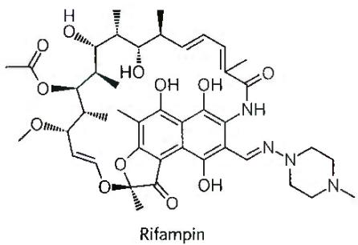

(b)  
  
FIGURE 26-11 Inhibition of RNA polymerase by rifampin. (a) Chemical structure of rifampin. (b) X-ray crystallographic structure of rifampin bound to the active site of M. tuberculosis RNA polymerase. In this slab view, much of the surrounding polymerase has been removed so that active site details, including one of the essential $\mathrm{Mg}^{2+}$ ions, can be highlighted. Rifampin (shown in spacefill) binds within the active site and blocks extension of the RNA transcript. Many RNA polymerase amino acids make direct contact with rifampin, and mutation of these amino acids can result in rifampicin-resistant RNA polymerase and TB infection. [(b) Data from PDB ID SUH6 and information from W. Lin et al., Mol. Cell 66:169, 2017.]

The death cap mushroom Amanita phalloides has a very effective defense mechanism against predators. It produces $\alpha$ -amanitin, which disrupts transcription in animal cells by blocking Pol II and, at higher concentrations, Pol III. Neither Pol I nor bacterial RNA polymerase is sensitive to $\alpha$ -amanitin—nor is the RNA polymerase II of A. phalloides itself. Because $\alpha$ -amanitin is selective for inhibiting the function of only certain RNA polymerases, it has proven useful for identifying the functions of different polymerases in the cell. Mitochondrial and bacterial RNA polymerases share significant similarities to one another, including $\alpha$ -amanitin resistance. By exposing eukaryotic cells to $\alpha$ -amanitin, it is possible to detect newly synthesized mRNAs that arise only from mitochondrial and not nuclear transcription. Researchers using $\alpha$ -amanitin need to exercise abundant caution because it is highly toxic to humans. An amount of $\alpha$ -amanitin the size of a grain of rice contains a lethal dose.

  
Amanita phalloides, the death cap mushroom [Wolstenholme Images/Alamy Stock Photo.]

## SUMMARY 26.1 DNA-Dependent Synthesis of RNA

■ Transcription is catalyzed by DNA-dependent RNA polymerases, which use ribonucleoside 5'-triphosphates to synthesize RNA in the 5'→3' direction, complementary to the template strand of duplex DNA. Transcription occurs in several phases: binding of RNA polymerase to a DNA site called a promoter, initiation of transcript synthesis, elongation, and termination.

■ RNA polymerases bind regions of DNA called promoters to initiate transcription of nearby genes. Promoter sequences help to establish the level of gene expression and in E. coli are recognized by variable RNA polymerase subunits called $\sigma$ factors. Transcription initiation involves formation of the closed and open complexes. DNA is unwound in the open complex to allow it to serve as the transcription template.

As the first committed steps in transcription, binding of RNA polymerase to the promoter and initiation of transcription are closely regulated.

■ Bacterial transcription stops at sequences called terminators. E. coli commonly uses two types of termination signals: $\rho$ -dependent and $\rho$ -independent.

■ Eukaryotic cells have three types of nuclear RNA polymerases. The vast majority of cellular mRNAs and ncRNAs are synthesized by Pol II.

■ Binding of Pol II to its promoters requires an array of proteins called transcription factors. Ultimately, a large molecular complex called the preinitiation complex, PIC, forms at the promoter. Elongation factors participate in the elongation phase of transcription. The phosphorylation state of the long carboxyl-terminal domain of the largest Pol II subunit changes in the initiation and elongation phases and determines what components are part of the initiation and elongation complexes.

■ RNA polymerases can be inhibited by a number of drugs, some of which are specific to either bacterial or eukaryotic polymerases. Drugs that inhibit bacterial RNA polymerase are commonly used to treat infections such as tuberculosis.

## 26.2 RNA Processing

P2 Many of the RNA molecules in bacteria and virtually all RNA molecules in eukaryotes are processed to some degree after synthesis. Processing can include addition or deletion of nucleotide sequences as well as chemical modification of RNA nucleotides. All of these events can be used to control the posttranscriptional fate of the RNA in the cell. As a result, many mature RNAs are not exact copies of the DNA genes from which they were transcribed. Some of the most interesting molecular events in RNA metabolism occur during posttranscriptional processing. Intriguingly, several of the enzymes that catalyze these reactions have active sites composed of RNA rather than protein. The discovery of these catalytic RNAs, or ribozymes, has brought a revolution in thinking about RNA function and about the origin of life, as we will discuss in Section 26.4.

A newly synthesized RNA molecule is called a primary or precursor transcript. Perhaps the most extensive processing of primary transcripts occurs in eukaryotic precursor mRNAs (pre-mRNAs) and in the tRNAs of both bacteria and eukaryotes. However, many ncRNAs are also processed.

The precursor transcript for a eukaryotic mRNA typically contains sequences encompassing one gene, although the sequences encoding the polypeptide may not be contiguous. Noncoding tracts that break up the coding region of the transcript are called introns, and the coding segments are called exons (see the discussion of introns and exons in DNA in Chapter 24). P2 In a process called RNA splicing, the introns are removed from the pre-mRNA, and the exons are spliced together to form a continuous sequence that specifies a functional polypeptide. Virtually all human genes contain introns, the average being eight introns per gene. Eukaryotic mRNAs are also modified at each end. A modified nucleotide structure called a 5' cap is added at the 5' end. The 3' end is cleaved, and 80 to 250 A residues are added to create a poly(A) "tail." The sometimes elaborate protein complexes that carry out 5' capping, splicing, and 3' polyadenylation mRNA-processing reactions do not operate independently. They are organized in association with each other and with the phosphorylated CTD of Pol II; each complex affects the function of the others, as outlined in Figure 26-12.

Proteins involved in mRNA transport to the cytoplasm are also associated with the mRNA in the nucleus, and the processing of the transcript is coupled to its transport. In effect, a eukaryotic mRNA, as it is synthesized, is ensconced in an elaborate and dynamic supramolecular messenger ribonucleoprotein (mRNP) complex comprising dozens of proteins. The composition of the mRNP changes as the transcript is processed, transported to the cytoplasm, and delivered to the ribosome for translation. Associated proteins can dramatically modulate the cellular destination, function, and fate of an mRNA.

In addition to splicing and 5' and 3' end modification, individual purine and pyrimidine nucleotides within primary transcripts can undergo chemical modification. Many eukaryotic mRNAs contain modified nucleotides that affect their interactions with RNA-binding proteins and regulate gene expression; however, RNA modification has been best characterized in primary tRNA transcript processing. Many bases and sugars in tRNAs are modified in both bacteria and eukaryotes, including with unusual bases not found in other nucleic acids (see

Fig. 26-22). Many ncRNAs also undergo elaborate processing, often involving the removal of segments from one or both ends.

The ultimate fate of any RNA is its complete and regulated degradation. The rate of turnover of RNAs plays a critical role in determining their steady-state levels and the rate at which cells can shut down expression of a gene when its product is no longer needed. During the development of multicellular organisms, for example, certain proteins must be expressed at one stage only, and the mRNA encoding such a protein must be made and destroyed at the appropriate times.

## Eukaryotic mRNAs Are Capped at the 5' End

P2 Most eukaryotic mRNAs have a 5' cap, a residue of 7-methylguanosine linked to the 5'-terminal residue of the mRNA through an unusual 5',5'-triphosphate linkage (Fig. 26-13). The 5' cap helps protect mRNA from ribonucleases. It also binds to specific cap-binding complexes of proteins and participates in binding of the mRNA to the ribosome to initiate translation (Chapter 27).

The 5' cap is formed by condensation of a molecule of GTP with the triphosphate at the 5' end of the transcript. The guanine is subsequently methylated at N-7, and additional methyl groups are often added at the 2' hydroxyls of the first and second nucleotides adjacent to the cap (Fig. 26-13a). The methyl groups are derived from S-adenosylmethionine. All these reactions (Fig. 26-12b) occur very early in transcription, after the first 20 to 30 nucleotides of the transcript have been added. All four of the enzymes in the cap-synthesizing complex, and through them the 5' end of the transcript itself, are associated with the RNA polymerase II CTD (Fig. 26-13c) until the cap is synthesized. The capped 5' end is then released from the cap-synthesizing complex and bound by the nuclear cap-binding complex, which facilitates both splicing and nuclear export of the RNA.

The 5' cap does not provide permanent protection of the transcript. Eukaryotes also contain cellular decapping enzymes, which are important for RNA regulation. Cap removal allows RNAs to be degraded by exonucleases that hydrolyze the RNA in the 5'→3' direction. Some viruses have also evolved elaborate mechanisms for removing the 5' cap from host mRNAs. The influenza virus needs no specialized enzymes for the synthesis of 5' caps on its viral RNAs; instead, it borrows these structures from host-cell transcripts in a process termed "cap-snatching." A capped host transcript is bound by the viral RNA polymerase and cleaved by an endonuclease. The influenza RNA polymerase can then use the resulting capped oligonucleotide to prime viral RNA synthesis.

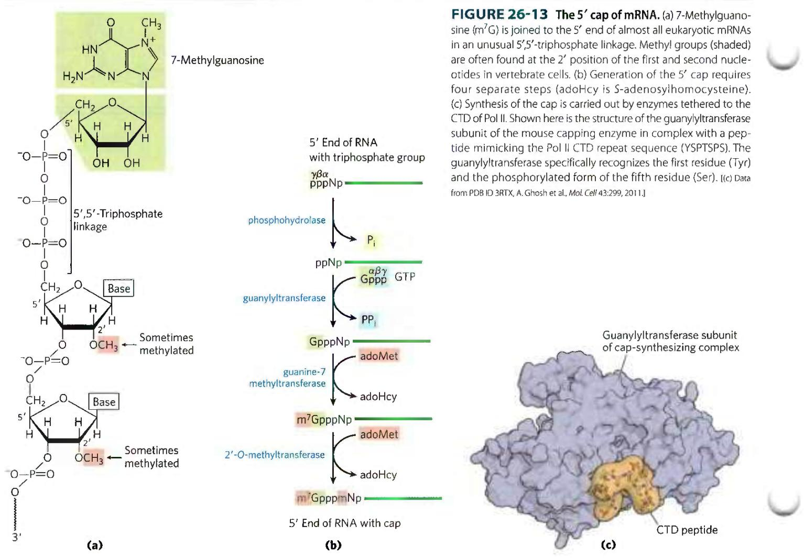

## Both Introns and Exons Are Transcribed from DNA into RNA

In bacteria, the mRNA used for translation is generally a direct copy of the DNA gene sequence, continuing along the DNA template without interruption until the information needed to specify the polypeptide is complete. However, the notion that all genes are continuous was disproved in 1977 when Phillip Sharp and Richard Roberts independently discovered that many genes for polypeptides in eukaryotes are interrupted by noncoding sequences (introns).

P2 The vast majority of genes in vertebrates contain introns; among the few exceptions are those that encode histones. The occurrence of introns in other eukaryotes varies. Many genes of the yeast Saccharomyces cerevisiae lack introns, but introns are more common in some other yeast species. Introns are also found in a few bacterial and archaeal genes. Introns in DNA are transcribed along with the rest of the gene by RNA polymerases. The introns in the primary RNA transcript are then spliced, and the exons are joined to form a mature, functional RNA. In eukaryotic mRNAs, most exons are less than 1,000 nucleotides long, with many in the 100 to 200 nucleotide size range, encoding stretches of 30 to 60 amino acids within a longer polypeptide. Introns vary in size from 50 to more than 700,000 nucleotides, with a median length of about 1,800. Genes of higher eukaryotes, including humans, typically have much more DNA devoted to introns than to exons. For example, the human dystrophin gene encodes a pre-mRNA more than 2 million nucleotides long. However, the final mRNA is 14,000 nucleotides long, indicating that more than 99% of the transcribed RNA is found within introns and removed by splicing. Deficiencies in dystrophin expression can lead to muscular dystrophies. The \~20,000 genes of the human genome include more than 200,000 introns.

## RNA Catalyzes the Splicing of Introns

There are four classes of introns (Table 26-3). The first two, the group I and group II introns, differ in the details of their splicing mechanisms but share one surprising characteristic: they are self-splicing—no proteins are needed to carry out catalysis. The introns found in the nuclear-encoded genes of eukaryotes comprise the third class. These pre-mRNA introns are removed by a large RNP called the spliceosome. Although the spliceosome requires dozens of proteins for its function, its active site includes RNA. The final class of introns requires protein enzymes for their removal. These introns are found in some tRNAs as well as certain mRNAs, such as that encoding the Xbox binding protein 1, Xbp1. Protein-mediated splicing of the XBP1 transcript regulates the cellular response to unfolded proteins that occurs under conditions of endoplasmic reticulum stress in human cells. The mechanisms of tRNA and XBP1 mRNA splicing are similar.

Group I introns are found in some nuclear, mitochondrial, and chloroplast genes that code for rRNAs, mRNAs, and tRNAs. Group II introns are generally found in the primary transcripts of mitochondrial or chloroplast mRNAs in fungi, algae, and plants. Group I and group II introns are also among the rare examples of introns in bacteria. The splicing mechanisms in both groups involve two transesterification reaction steps (Fig. 26-14), in which a ribose 2'- or 3'-hydroxyl group makes a nucleophilic attack on a phosphorus, and a new phosphodiester bond is formed at the expense of the old, maintaining the balance of energy. These reactions are very similar to the DNA breaking and rejoining reactions promoted by topoisomerases (see Fig. 24-18) and site-specific recombinases (see Fig. 25-37).

The group I splicing reaction requires a guanine nucleoside or nucleotide cofactor, but the cofactor is not used as a source of energy; instead, the 3'-hydroxyl group of guanosine is used as a nucleophile in the first step of the

<table><tr><td colspan="4">TABLE 26-3 Mechanisms of RNA Splicing</td></tr><tr><td>Mechanism</td><td>Components</td><td>Features</td><td>Cellular locations</td></tr><tr><td>Group I Intron</td><td>Catalytic RNA</td><td>Self-splicing using a guanine-derived cofactor</td><td>Found in nuclear, mitochondrial, and chloroplast genes that encode mRNAs, rRNAs, or tRNAs. Can be found in bacteria.</td></tr><tr><td>Group II Intron</td><td>Catalytic RNA; maturase and reverse transcriptase proteins</td><td>Self-splicing using a nucleophile within the intron to form a lariat</td><td>Primarily found in mitochondrial and chloroplast genes of fungi, algae, and plants. Can be found in bacteria.</td></tr><tr><td>Spliceosome</td><td>Catalytic snRNAs; dozens of protein splicing factors</td><td>Requires a large RNP for processing using a nucleophile within the intron to form a lariat</td><td>Found in nuclear genes of eukaryotes. Capable of alternative splicing to create multiple products from a given transcript.</td></tr><tr><td>Protein-catalyzed</td><td>Protein enzymes</td><td>Uses a splicing endonuclease and ligase</td><td>Found in tRNAs and a few mRNAs.</td></tr></table>

  
FIGURE 26-14 Splicing mechanism of group II introns. (a) In the first step, the $2'$ OH of an internal A residue (called the branch point) attacks the phosphodiester bond at the $5'$ splice site, resulting in $5'$ splice site cleavage and lariat formation. In the second step, the free $3'$ OH of the $5'$ exon attacks the phosphodiester bond at the $3'$ splice site, resulting in exon ligation and intron-lariat release. The spliceosome uses the same  
chemistry for intron removal, although different RNA sequences mark the intron boundaries and location of the branch point. (b) In the transesterification reaction that occurs during lariat formation, one phosphodiester bond is broken as a second one is created. This forms a lariatlike structure in which one branch is a 2',5'-phosphodiester bond (the linkage between the intron branchpoint A and intron G nucleotides).

splicing pathway. In group II splicing reactions, the nucleophile is the 2'-hydroxyl group of an A residue within the intron (Fig. 26-14a). A branched lariat structure is formed as an intermediate (Fig. 26-14b). In both group I introns and group II introns, the 3' hydroxyl of the exon that is displaced in the first step then acts as a nucleophile in a similar reaction at the 3' end of the intron. The result is precise excision of the intron and ligation of the exons.

Self-splicing of introns was first revealed in 1982 in studies of the splicing mechanism of the group I rRNA intron from the ciliated protozoan Tetrahymena thermophila, conducted by Thomas Cech and colleagues. These workers transcribed isolated Tetrahymena DNA (including the intron) in vitro, using purified bacterial RNA polymerase. The resulting RNA spliced itself accurately without any protein enzymes from Tetrahymena. The discovery that RNAs could have catalytic functions was a milestone in our understanding of biological systems and a major step forward in the understanding of how life probably evolved. Catalytic RNAs like group I and group II introns share many features with protein-based enzymes, including folding into well-defined secondary and tertiary structures (Fig. 26-15). Catalytic RNAs and their significance in evolution are described in greater detail in Section 26.4.

  
Thomas Cech
[Photo by Glenn Asakawa/
University of Colorado.]

  
FIGURE 26-15 Structure of a group I intron. (a) The secondary structure of the group I intron ribozyme from phage Twort, a mycobacterium phage named for Frederick Twort, the physician who discovered phage in 1915. Like most catalytic RNAs, this intron adopts well-defined secondary structure. It is composed of multiple RNA duplexes (P2–P9, each differently colored) capped by hairpin structures. (b) The tertiary structure of the intron bound to a spliced RNA product, obtained by x-ray crystallography, shows that the RNA duplexes pack closely with one another to yield a compact ribozyme. The RNA duplexes are colored and named as in (a). [Data from PDB ID 1Y0Q, B. Golden et al., Nat. Struct. Biol. 12:82, 2005.]

## In Eukaryotes the Spliceosome Carries out Nuclear pre-mRNA Splicing

In eukaryotes, most introns undergo splicing by the same lariat-forming mechanism as the group II introns. P2 However, the intron splicing takes place within a spliceosome, a large complex made up of multiple specialized RNP complexes called small nuclear ribonucleoproteins (snRNPs, pronounced snurps) and dozens of non-snRNP proteins. Each snRNP contains one of a class of eukaryotic RNAs, 100 to 200 nucleotides long, known as small nuclear RNAs (snRNAs). Five snRNAs (U1, U2, U4, U5, U6) involved in splicing reactions are generally found in abundance in eukaryotic nuclei. The U3 snRNP is also found in the nucleus but is involved in ribosome assembly and is not part of the spliceosome.

The role of snRNPs in the splicing reaction was discovered by Joan Steitz in a remarkable example of "bedside-to-bench" science. Using antibodies isolated

  
Joan Steitz [Photo by Robert A. Lisak, courtesy Yale School of Medicine.]

from patients with autoimmune diseases, members of the Steitz laboratory were able to purify the spliceosome's snRNP components and identify the associated snRNAs. Based on complementarity between the 5' end of the U1 snRNA and the 5' splice site of nuclear pre-mRNA introns (Fig. 26-16), Steitz proposed that snRNPs participate in the splicing reaction. Subsequently, it was discovered that patients suffering from the autoimmune disease lupus can generate antibodies against protein components of their own spliceosomes.

In yeast, the various snRNPs include about 80 different proteins, most of which have close homologs in all other eukaryotes. In humans, these conserved protein components are augmented by more than 200 additional proteins, which mostly participate in regulating the splicing reaction. Spliceosomes are thus among the most complex supramolecular machines in any eukaryotic cell. The RNA components of a spliceosome are the catalysts of the various splicing steps. The overall complex can be considered a highly flexible ribonucleoprotein enzyme that can adapt to the great diversity in size and sequence of nuclear pre-mRNAs.

Spliceosomal introns generally have the dinucleotide sequence GU at the 5' end and AG at the 3' end, marking the sites where splicing occurs. The U1 snRNA contains a sequence complementary to the 5' splice site (Fig. 26-16b), and the U1 snRNP binds to this region by forming an RNA duplex with the pre-mRNA. A U2 snRNP binds to the 3' end, also by base-pairing, and identifies the A residue that becomes the nucleophile used during the first transesterification reaction (Fig. 26-14). Addition of a complex of the U4, U5, and U6 snRNPs, called the tri-snRNP, leads to formation of the spliceosome (Fig. 26-16c).

Key parts of the splicing active site found in the U6 snRNA are initially sequestered by base-pairing to parts of U4 snRNA to prevent aberrant cleavage of nontarget phosphodiester bonds. In a process called activation, the U6 and U4 snRNAs must be unwound and separated to expose the active site needed for the first step in splicing. Unwinding of U4 and U6 as well as many other steps in splicing require ATP hydrolysis by a set of eight different ATPases that are part of the splicing machinery.

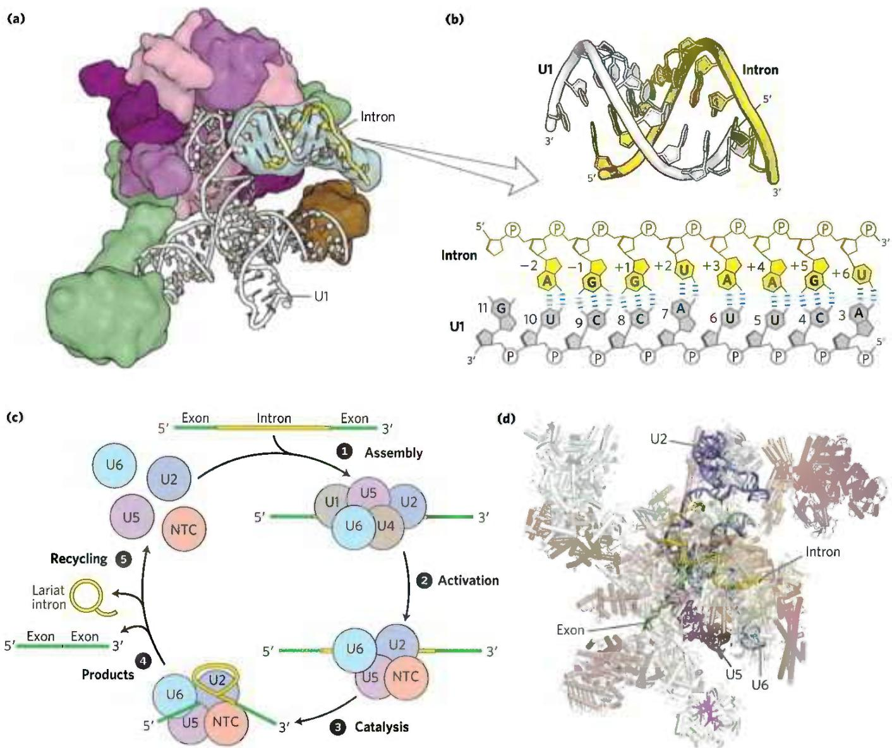  
FIGURE 26-16 Processing of pre-mRNA primary transcripts by the spliceosome. (a) Small nuclear RNPs, such as the human U1 snRNP shown here, contain snRNAs associated with a number of proteins. The human U1 snRNP contains a single copy of the U1 snRNA and 10 associated polypeptides. (b) The U1 snRNP recognizes the 5' splice site by base-pairing between the U1 snRNA and conserved RNA sequences within the intron that mark the 5' exon/intron boundary. The sequences and structure shown were obtained from x-ray crystal structure shown in (a). The human U1 snRNA normally contains pseudouridines at positions 5 and 6; however, an unmodified RNA was used to determine this structure. (c) Spliceosomes are assembled on introns from snRNPs and proceed through stages of assembly, activation, catalysis of intron removal, release of the RNA products, and recycling of the  
splicing factors. In addition to the U snRNPs discussed in the text, a large protein-only supramolecular complex called the Prp19-containing complex (also known as NineTeen Complex, or NTC) is required for splicing and joins the spliceosome during the activation step. (d) Structure of the human spliceosome, determined by cryo-EM. Nuclear pre-mRNA splicing requires this large molecular machine composed of dozens of proteins and five snRNAs to remove many different introns. By comparison, using similar chemistry, group II introns can catalyze their own removal. In order to highlight the RNA catalytic core of the spliceosome and the U2, U5, and U6 snRNAs, some protein splicing factors are not shown in this view. The RNA appears discontinuous where the structure could not be resolved. [Data from (a, b) PDB ID 4PJO, Y. Kondo et al., eLife 4:e04986, 2015; (d) PDB ID 6QDV, S. Fica et al., Science 363:710, 2019.]

Spliceosomes are single turnover enzymes, meaning that each spliceosome can remove only one intron from a single transcript. As a result, spliceosomes undergo a complex cycle of assembly, activation, catalysis, product release, and recycling of the snRNP components each time an intron is removed (Fig. 26-16c, steps ① through ⑤).

The chemical events of splicing—5' splice site cleavage by formation of an intron lariat followed by exon ligation—are identical in mechanism to that of group II introns, despite the former requiring dozens of proteins for activity and the latter being a self-splicing ribozyme. The similarities in chemistry as well as conservation between essential RNA components of each enzyme suggests that group II introns and spliceosomes are evolutionarily related to one another. Comparison of x-ray crystal structures of group II introns and cryo-EM structures of spliceosomes provide strong support for this hypothesis. Despite being surrounded by a large protein scaffold, the catalytic center of the spliceosome is composed of RNA and arranged in a nearly identical manner to that of group II introns (Fig. 26-17). Thus, the spliceosome uses a ribozyme core to carry out pre-mRNA splicing. As we shall see, some group II introns also contain domains that are themselves translated as mRNAs and encode proteins that bear striking similarity to those in the spliceosome, strengthening this evolutionary connection.

About 1% of human introns are spliced by a less common type of spliceosome, called the minor spliceosome, in which the U1, U2, U4, and U6 snRNPs are replaced by the U11, U12, U4atac, and U6atac snRNPs. Whereas U1- and U2-containing spliceosomes remove introns with (5')GU and AG(3') terminal sequences, the minor spliceosomes remove a rare class of introns that have (5')AU and AC(3') terminal sequences to mark the splice sites. Introns removed by either the major or the minor spliceosome most often remain in the nucleus and are degraded.

FIGURE 26-17 RNA active site conservation between group II introns and the spliceosome. A close-up examination of the active sites of (a) the Pylaiella littoralis group II intron and (b) the S. cerevisiae spliceosome reveal a similar arrangement of catalytic RNAs. In both cases, a catalytic RNA (domain V of the group II intron or U6 snRNA of the spliceosome) promotes a transesterification reaction by orienting the phosphodiester bond located at the 5' splice site/intron junction for nucleophilic attack and by coordinating essential Mg $^{2+}$ ions. In addition to similarities between domain V of group II introns and the U6 snRNA, group II intron domain VI and exon binding site 1 (EBS 1) play functional roles that are similar to those of the U2 and

U5 snRNAs in the spliceosome. Close examination shows that the active sites of the group II intron and the spliceosome are nearly identical, formed by a complex arrangement of nucleotides called the catalytic triplex. The triplex is responsible for binding $Mg^{2+}$ ions essential for catalysis as well as orienting the substrates for the splicing reaction. Conservation of sequence, chemistry, and three-dimensional structure suggests that the spliceosome evolved from a group II intron-like ribozyme. [Data from (a) left and center PDB ID 4R0D, A. R. Robart et al., Nature 514:193, 2014; right PDB ID 6QDV, S. M. Fica et al., Science 363:710, 2019; (b) left PDB ID 5LJ3, W. P. Galej et al., Nature 537:197, 2016, center PDB ID 5MQO, S. M. Fica et al., Nature 542:377, 2017; right PDB ID 6MEO, D. B. Haack et al., Cell 178:612, 2019. Information from W. Galej et al., Chem. Rev. 118:4156, 2018.]

Some components of the splicing apparatus are tethered to the CTD of RNA polymerase II, indicating that splicing, like other RNA processing reactions, is tightly coordinated with transcription. Most splicing in humans occurs cotranscriptionally, meaning that splicing occurs while Pol II is still transcribing the gene. For this to occur correctly, the rates of transcription, capping, splicing, and 3' end formation must be carefully regulated. Splicing of a pre-mRNA in the nucleus can also have profound effects on the function of the mRNA in the cytoplasm. Lynne Maquat and Melissa Moore discovered that the human spliceosome leaves behind a set of proteins on each spliced mRNA near the junction between two exons. This exon junction complex is retained on the mRNA as it is exported to the cytoplasm, where it can regulate the extent to which an mRNA can be translated over its lifetime before degradation.

## Proteins Catalyze Splicing of tRNAs

A fourth and final class of introns, found in certain tRNAs and a few mRNAs such as XBP1, is distinguished from other intron types in that the splicing reaction requires endonucleases and ligases made of protein and does not involve catalytic RNAs. The splicing endonuclease cleaves the phosphodiester bonds at both ends of the intron, and the two exons are joined by a mechanism similar to the DNA ligase reaction (see Fig. 25-15).

## Eukaryotic mRNAs Have a Distinctive 3' End Structure

P2 At their 3' end, most eukaryotic mRNAs undergoing translation in the cell cytoplasm have a string of A residues, about 30 residues in yeast and 50 to 100 in animals, called the poly(A) tail. This tail serves as a binding site for one or more specific proteins. The poly(A) tail and its associated proteins have a variety of roles in coordinating transcription and translation, and may help protect mRNA from enzymatic destruction. Many bacterial mRNAs also acquire poly(A) tails, but these tails stimulate decay of mRNA rather than protecting it from degradation.

The poly(A) tail is added in a multistep process. The transcript is extended beyond the site where the poly(A) tail is to be added, then is cleaved at the poly(A) addition site by an endonuclease component of a large enzyme complex, again associated with the CTD of RNA polymerase II (Fig. 26-18). The mRNA site where cleavage occurs is marked by two sequence elements: the highly conserved sequence (5')AAUAAA(3'), 10 to 30 nucleotides on the 5' side (upstream) of the cleavage site, and a less well-defined sequence rich in G and U residues, 20 to 40 nucleotides downstream of the cleavage site. Cleavage generates the free 3'-hydroxyl group that defines the end of the mRNA, to which A residues are immediately added by polyadenylate polymerase, which catalyzes the reaction

  
FIGURE 26-18 Addition of the poly(A) tail to the primary RNA transcript of eukaryotes. Pol II synthesizes RNA beyond the segment of the transcript containing the cleavage signal sequences, including the highly conserved upstream sequence (5')AAUAAA. This cleavage signal sequence is bound by an enzyme complex that includes an endonuclease, a polyadenylate polymerase, and several other multisubunit proteins involved in sequence recognition, stimulation of cleavage, and regulation of the length of the poly(A) tail; all of these proteins are tethered to the CTD. The RNA is cleaved by the endonuclease at a point 10 to 30 nucleotides 3' to (downstream of) the sequence AAUAAA. The polyadenylate polymerase synthesizes a poly(A) tail 80 to 250 nucleotides long, beginning at the cleavage site.

$$
\mathrm{RNA} + n \mathrm{ATP} \rightarrow \mathrm{RNA} - (\mathrm{AMP}) n + n \mathrm{PP} _ {\mathrm{i}}
$$

where n = 80 to 250. This enzyme does not require a template but does require the cleaved mRNA as a primer. These longer poly(A) tails are added in the nucleus, and then shortened significantly after the mRNA is transported to the cytoplasm.

The overall processing of a typical eukaryotic mRNA is summarized in Figure 26-19. In some cases, the polypeptide-coding region of the mRNA is also modified by RNA “editing” (see Section 27.1 for details). This editing includes processes that add or delete bases in the coding regions of primary transcripts or that change the sequence (such as by enzymatic deamination of a C residue to create a U residue). A particularly dramatic example occurs in trypanosomes, which are parasitic protists: large regions of an mRNA are synthesized without any uridylate, and the U residues are inserted later by RNA editing.

  
FIGURE 26-19 Overview of the processing of a eukaryotic mRNA. The ovalbumin gene, shown here, has introns A to G and exons 1 to 7 and L (L encodes a signal peptide sequence that targets the protein for export from the cell; see Fig. 27-38). About three-quarters of the RNA is removed during processing. Pol II extends the primary transcript well beyond the cleavage and polyadenylation site ("extra RNA") before terminating transcription.

## A Gene Can Give Rise to Multiple Products by Differential RNA Processing

One of the paradoxes of modern genomics is that the apparent complexity of organisms does not correlate with the number of protein-coding genes, or even the amount of genomic DNA. Some eukaryotic mRNA transcripts can be processed in more than one way to produce different mRNAs and thus different polypeptides. Much of the variability in processing is the result of alternative splicing, in which a particular exon may or may not be incorporated into the mature mRNA transcript. Alternative splicing occurs in a relatively small number of transcripts in yeast, but in more than 95% of human genes. Changes in alternative splicing can have profound impact on the development of an organism (Box 26-2). Alternative splicing of a single transcription factor in the staple grain quinoa differentiates palatable sweet varieties from those too bitter to ingest without processing. In Drosophila, sex is determined by alternative splicing of the sex lethal (Sxl) transcript based on the number of X chromosomes present in the cell.

Figure 26-20a illustrates how alternative splicing patterns can produce more than one protein from a common pre-mRNA. The pre-mRNA contains molecular signals for all the alternative processing pathways, and the pathway favored in a given cell or metabolic situation is determined by processing factors, RNA-binding proteins that promote one particular path. For example, splicing regulatory proteins or heterogeneous ribonuclear proteins (hnRNPs) may bind these signals and promote or inhibit spliceosome assembly at that site. There are many additional patterns of alternative splicing.

Complex transcripts can also have more than one site where poly(A) tails can form (Fig. 26-20b). If there are two or more sites for cleavage and polyadenylation, use of the one closest to the 5' end will remove more of the primary transcript sequence. This mechanism,

BOX 26-2

MEDICINE

## Alternative Splicing and Spinal Muscular Atrophy

Alternative splicing is one of the least understood steps in human gene regulation, in part because a gene product can be spliced together in many ways: entire exons can be left out of the mRNA (skipped) or spliced in (retained). More subtle changes can also occur in which alternative 5' or 3' splice sites are used that differ from their canonical positions by just a few nucleotides. The spliced isoform that is generated is determined by interactions among the spliceosome, a large number of regulatory factors that associate with the pre-mRNA transcript, and other cellular machinery, including the transcription complex.

Despite this complexity, scientists are learning how to control alternative splicing to treat genetic diseases such as spinal muscular atrophy (SMA). SMA is a progressive neurodegenerative disease and in its most severe form is always fatal. It is the most common genetic cause of death in infants. SMA is caused by a defect in the SMN1 (survival of motor neuron 1) gene. SMN1 encodes a protein that is essential for assembly of cellular snRNPs, including those that make up the spliceosome.

Humans have two SMN genes: SMN1 and SMN2. However, only SMN1 is capable of being correctly spliced to produce a functional protein (Fig. 1). SMN2 encodes an RNA sequence called a silencer, which causes exon 7 to be excluded from the mRNA. As a result, SMN2 cannot produce functional protein. Healthy individuals are able to get all of the SMN protein they require for snRNP assembly from the SMN1 gene. But those with a mutation in SMN1 do not produce enough SMN protein to assemble an adequate number of snRNPs. This leads to neuromuscular degeneration that is often fatal.

One possible solution for treating SMA would be to find a way to change the alternative splicing pattern of the SMN2 gene so that exon 7 would be included rather than skipped. This would produce functional SMN protein. This is exactly the strategy that

(Continued on next page)

## Alternative Splicing and Spinal Muscular Atrophy (Continued)

(b) SMA patient  

  
(c) SMA patient, treated with nusinersen

  
FIGURE 1 Alternative splicing of the SMN1 and SMN2 gene transcripts in healthy individuals and in those with SMA. (a) In healthy individuals, active protein is produced by translation of mRNAs that include exon 7 of the SMN1 gene. Alternative splicing of the SMN2 transcript skips exon 7, resulting in an mRNA that cannot produce functional protein. (b) In SMA patients, a mutation in the SMN1 gene results in no functional protein being produced from either SMN1 or SMN2. (c) Upon treatment with nusinersen, alternative splicing of SMN2 results in an mRNA that includes exon 7 and produces functional protein. This can prevent neuromuscular degeneration. [Information from D. R. Corey, Nat. Neurosci. 20:497, 2017, Fig. 1.]

called poly(A) site choice, generates diversity in the variable domains of immunoglobulin heavy chains (see Fig. 25-42).

Both alternative splicing and poly(A) site choice come into play in the expression of many genes. For example, a single RNA transcript is processed using

  
Adrian Krainer [Courtesy Adrian Krainer.]

Adrian Krainer used to correct SMA phenotypes in mice. Scientists in the Krainer lab discovered that if they injected mice with a synthetic oligonucleotide complementary to the silencer sequence of SMN2 exon 7 (also called an antisense oligonucleotide, or ASO), the sequence would be hidden from the splicing machinery. This changes the splicing of the SMN2 gene so that exon 7 is

included and the SMN2 gene is able to produce a functional SMN protein and prevent neurodegeneration (Fig. 1).

A drug called nusinersen has since been developed based on Krainer's research and became the first approved treatment for SMA. In SMA patients, injection of nusinersen into the central nervous system can correct splicing of the human SMN2 gene product, restore SMN protein production, and halt neurodegeneration. Most pharmaceuticals are small, organic molecules, but nusinersen is an 18-mer oligonucleotide. To turn an oligonucleotide into a drug, researchers had to incorporate chemical modifications into the phosphate backbone and ribose sugar (Fig. 2). These modifications prevent the oligonucleotide from being destroyed by cellular nucleases and also improve binding to RNA targets. Currently very few nucleic acid-based drugs have been approved for medical use, but their importance in medicine will likely continue to grow.

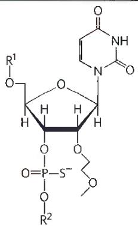  
FIGURE 2 The modified nucleotides in nusinersen use a phosphorthioate backbone rather than phosphodiesters, and the 2' hydroxyl groups are replaced by 2'-O-methoxyethyl groups.

both mechanisms to produce two different hormones: the calcium-regulating hormone calcitonin in rat thyroid and calcitonin-gene-related peptide (CGRP) in rat brain (Fig. 26-21). P2 Together, alternative splicing and poly(A) site choice greatly increase the variety of proteins generated from the genomes of higher eukaryotes.

Dihydrouridine (D)

(a)  

(b)  
  
FIGURE 26-20 Alternative transcript production in eukaryotes. (a) Alternative splicing patterns. Two 3' splice sites are shown. Different mature mRNAs are produced from the same primary transcript. (b) Two alternative cleavage and polyadenylation sites, A₁ and A₂.

  
FIGURE 26-21 Alternative processing of the calcitonin gene transcript in rats. The calcitonin gene encodes a primary transcript with two poly(A) sites; one predominates in the brain, the other in the thyroid. In the brain, splicing eliminates the calcitonin exon (exon 4); in the thyroid, this exon is retained. The resulting peptides are processed further to yield the final hormone products: calcitonin in the thyroid and calcitonin-gene-related peptide (CGRP) in the brain.

## Ribosomal RNAs and tRNAs Also Undergo Processing

Posttranscriptional processing is not limited to mRNA. Ribosomal RNAs of bacterial, archaeal, and eukaryotic cells are made from longer precursors called pre-ribosomal RNAs, or pre-rRNAs. Transfer RNAs are similarly derived from longer precursors. These RNAs may also contain a variety of modified nucleosides; some examples are shown in Figure 26-22.

Ribosomal RNAs In bacteria, 16S, 23S, and 5S rRNAs (and some tRNAs, although most tRNAs are encoded elsewhere) arise from a single 30S RNA precursor of about 6,500 nucleotides. RNA at both ends of the 30S precursor and segments between the rRNAs are removed during processing (Fig. 26-23). The 16S and 23S rRNAs contain modified nucleosides. In E. coli, the 11 modifications in the 16S rRNA include a pseudouridine and 10 nucleosides methylated on the base or the 2'-hydroxyl group or both. The 23S rRNA has 10 pseudouridines, 1 dihydrouridine, and 12 methylated nucleosides. In bacteria, each modification is generally catalyzed by a distinct enzyme. Methylation reactions use S-adenosylmethionine as cofactor. No cofactor is required for pseudouridine formation.

  
4-Thiouridine (S $^{4}$ U)

  
Inosine (I)

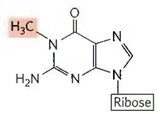  
1-Methylguanosine (m $^{1}$ G)

FIGURE 26-22 Some modified bases of RNA produced in posttranscriptional reactions. The standard symbols are shown in parentheses. This is just a small sampling of the 96 modified nucleosides known to occur in different RNA species, with 81 different types known in tRNAs and 30 observed to date in rRNAs. Notice the unusual ribose attachment point in pseudouridine. A complete listing of these modified bases can be found in the Modomics database of RNA modification pathways (http://iimcb.genesilico.pl/modomics/).

  
$N^{6}$ -Isopentenyladenosine ( $i^{6}A$ )

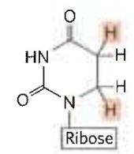  
Ribothymidine (T)

Pseudouridine (ψ)

The genome of E. coli encodes seven pre-rRNA molecules. All of these genes have essentially identical rRNA-coding regions, but they differ in the segments between these regions. The segment between the 16S and 23S rRNA genes generally encodes one or two tRNAs, with different tRNAs produced from different pre-rRNA transcripts. Coding sequences for tRNAs are also found on the 3' side of the 5S rRNA in some precursor transcripts.

The situation in eukaryotes is even more complicated (see Fig. 27-17). The entire process is initiated in the nucleolus, in large complexes that assemble on the rRNA precursor as it is synthesized by Pol I. There is a tight coupling between rRNA transcription, rRNA maturation, and ribosome assembly in the nucleolus. Each complex includes the ribonucleases that cleave the rRNA precursor, the enzymes that modify particular bases, large numbers of ncRNAs called small nucleolar RNAs, or snoRNAs, that guide nucleoside modification and some cleavage reactions, and ribosomal proteins. In yeast, the entire process involves the pre-rRNA, more than 170 nonribosomal proteins, snoRNAs for each nucleoside modification (about 70, because some snoRNAs guide two types of modification), and the 78 ribosomal proteins. Humans have an even greater number of modified nucleosides, about 200, and a greater number of associated snoRNAs. The composition of the complexes may change as the ribosomes are assembled, and many of the intermediate complexes rival the ribosome itself in complexity. The 5S rRNA of most eukaryotes is made as a completely separate transcript by a different polymerase (Pol III).

The most common nucleoside modifications in eukaryotic rRNAs are conversion of uridine to pseudouridine and adoMet-dependent nucleoside methylation (often at 2'-hydroxyl groups). These reactions often rely on snoRNA-protein complexes, or snoRNPs, each consisting of a snoRNA and four or five proteins, including the enzyme that carries out the modification. There are two classes of snoRNPs, both defined by key conserved sequence elements referred to as lettered boxes. The box H/ACA snoRNPs function in pseudouridylylation, and box C/D snoRNPs in 2'-O-methylations. The snoRNAs are 60 to 300 nucleotides long. Each snoRNA includes a 10 to 21 nucleotide sequence that is perfectly complementary to some site on an rRNA and serves to identify the modification site (Fig. 26-24). The conserved sequence elements in the remainder of the snoRNA fold into structures that are bound by the snoRNP proteins.

FIGURE 26-23 Processing of pre-rRNA transcripts in bacteria. ① Before cleavage, the 30S RNA precursor is methylated at specific bases (red tick marks), and some uridine residues are converted to pseudouridine (blue tick) or dihydrouridine (black tick) residues. The methylation reactions are of multiple types, some occurring on bases and some on 2'-hydroxyl groups. ② Cleavage liberates precursors of rRNAs and tRNA(s). Cleavage at the points labeled 1, 2, and 3 is carried out by the enzymes RNase III, RNase P, and RNase E, respectively. As discussed later in the text, RNase P is a ribozyme. ③ The final 16S, 23S, and 5S rRNA products result from the action of a variety of specific nucleases. The seven copies of pre-rRNA gene in the E. coli chromosome differ in the number, location, and identity of tRNAs included in the primary transcript. Some copies of the gene have additional tRNA gene segments between the 16S and 23S rRNA segments and at the far 3' end of the primary transcript.  

  
FIGURE 26-24 RNA pairing with box H/ACA snoRNAs to guide pseudouridylation. The pseudouridine conversion sites in the target rRNA are in the regions paired with the snoRNA, and the conserved H/ACA box sequences are protein-binding sites. [Information from T. Kiss, Cell 109:145, 2002.]

Transfer RNAs Most cells have 40 to 50 distinct tRNAs, and eukaryotic cells have multiple copies of many of the tRNA genes. Transfer RNAs are derived from longer RNA precursors by enzymatic removal of nucleotides from the 5' and 3' ends (Fig. 26-25). In eukaryotes, introns are present in a few tRNA transcripts and must be excised. Where two or more different tRNAs are contained in a single primary transcript, they are separated by enzymatic cleavage. The endonuclease RNase P, found in all organisms, removes RNA at the 5' end of tRNAs. This enzyme contains both protein and RNA. The RNA component is essential for activity, and in bacterial cells it can carry out its processing function with precision even without the protein component. RNase P is another example of a catalytic RNA, as described in more detail below. The 3' end of tRNAs is processed by one or more nucleases, including the exonuclease RNase D.

Transfer RNA precursors may undergo further post-transcriptional processing. The 3'-terminal trinucleotide CCA(3') to which an amino acid is attached during protein synthesis (Chapter 27) is absent from some bacterial tRNA precursors and all eukaryotic tRNA precursors and is added during processing (Fig. 26-25). This addition is carried out by tRNA nucleotidyltransferase, an unusual enzyme that binds the three ribonucleoside triphosphate precursors in separate active sites and catalyzes formation of the phosphodiester bonds to produce the CCA(3') sequence. The creation of this defined sequence of nucleotides is therefore not dependent on a DNA or RNA template—the template is the binding site of the enzyme.

The final type of tRNA processing is the modification of some bases by methylation, deamination, or reduction (Fig. 26-22). These modifications can change how the tRNA interacts with cellular proteins and even how the tRNA is used by the ribosome during translation. In the case of pseudouridine, the base (uracil) is removed and reattached to the sugar through C-5. Some of these modified bases occur at characteristic positions in all tRNAs (Fig. 26-25).

## Special-Function RNAs Undergo Several Types of Processing

The number of known classes of special-function noncoding RNAs (ncRNAs) is expanding rapidly, as is the variety of functions known to be associated with them. Many of these ncRNAs also undergo processing.

The snRNAs and snoRNAs not only facilitate RNA processing reactions but also are themselves synthesized as larger precursors and then processed. Many snoRNAs are encoded within the introns of other genes. As the introns are spliced from the pre-mRNA, proteins bind to the snoRNA sequences and ribonucleases remove the extra RNA at the 5' and 3' ends to form the snoRNP. The snRNAs destined for spliceosomes are synthesized as pre-snRNAs, and ribonucleases remove the extra RNA at each end. Particular nucleosides in snRNAs are also subject to 11 types of modification, with 2'-O-methylation and conversion of uridine to pseudouridine predominating.

MicroRNAs (miRNAs) are a special class of non-coding RNAs involved in gene regulation. The miRNAs are about 22 nucleotides long, complementary in sequence to particular regions of mRNAs. Found in plants and in animals, from worms to mammals, they promote mRNA degradation and suppress translation to fine-tune gene expression. About 1,500 human genes encode miRNAs, and one or more of these miRNAs affect the expression of most protein-coding genes.

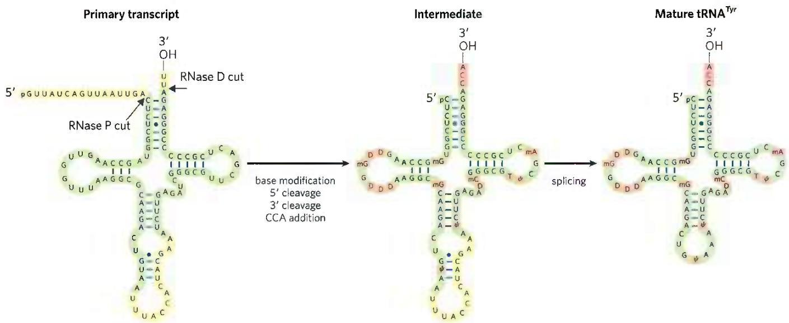  
FIGURE 26-25 Processing of tRNAs in bacteria and eukaryotes. The yeast tRNA $^{Tyr}$ (the tRNA specific for tyrosine binding; see Chapter 27) is used to illustrate the important steps. Short blue lines represent normal base pairing; blue dots indicate G–U base pairs. The nucleotide sequences shown in yellow are removed from the primary transcript. The ends are processed first, the 5' end before the 3' end. CCA is then added to the 3' end, a necessary  
step in processing all eukaryotic tRNAs and for those bacterial tRNAs that lack this sequence in the primary transcript. While the ends are being processed, specific bases in the rest of the transcript are modified (see Fig. 26-22). For the eukaryotic tRNA shown here, the final step is splicing of the 14 nucleotide intron by a protein enzyme. Introns are found in some eukaryotic tRNAs but not in bacterial tRNAs.

The miRNAs are synthesized from much larger precursors, in several steps (Fig. 26-26). The primary transcripts for miRNAs (pri-miRNAs) vary greatly in size; some are encoded in the introns of other genes and are coexpressed with these host genes. Processing of pri-miRNA is mediated by two endoribonucleases in the RNase III family, Drosha and Dicer. First, in the nucleus, the pri-miRNA is reduced to a 70 to 80 nucleotide precursor miRNA (pre-miRNA) by a protein complex including Drosha and another protein, DGCR8. The pre-miRNA is then exported to the cytoplasm in a complex with two proteins, exportin-5 and the Ran GTPase (see Fig. 27-42). In the cytoplasm, Ran hydrolyzes the GTP, then exportin-5 and the pre-miRNA are released. The pre-miRNA is then acted on by Dicer to produce the nearly mature miRNA paired with a short RNA complement. The complement is removed by an RNA helicase, and the mature miRNA is incorporated into protein complexes, such as the RNA-induced silencing complex (RISC), which then bind a target mRNA. If the complementarity between miRNA and its target is nearly perfect, the target mRNA is cleaved. If the complementarity is only partial, the complex blocks translation of the target mRNA. The roles of miRNAs and RISC in gene regulation are detailed in Chapter 28.

## Cellular mRNAs Are Degraded at Different Rates

The expression of genes is regulated at many levels. A crucial factor governing a gene's expression is the cellular concentration of its associated mRNA. The concentration of any molecule depends on two factors: its rate of synthesis and its rate of degradation. When synthesis and degradation of an mRNA are balanced, the concentration of the mRNA remains in a steady state. A change in either rate will lead to net accumulation or depletion of the mRNA. P2 Degradative pathways ensure that mRNAs do not build up in the cell and direct the synthesis of unnecessary proteins.

The rates of degradation vary greatly for mRNAs from different eukaryotic genes. For a gene product that is needed only briefly, the half-life of its mRNA may be only minutes or even seconds. Gene products needed

FIGURE 26-26 Synthesis and processing of miRNAs. The primary transcript of miRNAs is a larger RNA of variable length, called pri-miRNA. The pri-miRNA undergoes a number of processing events both in the nucleus and in the cytoplasm to make a mature miRNA. Once the miRNA has been loaded into a protein complex called RISC, it can then hybridize to mRNAs and repress their translation or trigger their cleavage and destruction. [Information from E. Wienholds and R. H. A. Plasterk, FEBS Lett. 579:5911, 2005; V. N. Kim et al., Nat. Rev. Mol. Cell Biol. 10:126, 2009, Figs 2–4.]

constantly by the cell may have mRNAs that are stable over many cell generations. The average half-life of the mRNAs of a vertebrate cell is about 3 hours, with the pool of each type of mRNA turning over about 10 times per cell generation. The half-life of bacterial mRNAs is much shorter—only about 1.5 min—perhaps because of regulatory requirements.

Messenger RNA is degraded by ribonucleases present in all cells. In E. coli, mRNAs typically contain 5' triphosphates remaining from the initiation of transcription. These groups protect the mRNA from 5' degradation. As a result, mRNA decay begins with one or several cuts by an endoribonuclease, followed by 3'→5' degradation by exoribonucleases (Fig. 26-27). The initial cut by the endonuclease generates an RNA fragment with a 5' monophosphate end, which serves to tether the endonuclease to the transcript and ensure its rapid destruction. Some bacteria (Bacillus subtilis, for example), have exonucleases that also recognize the 5' monophosphate end and can degrade RNA fragments in the 5'→3' direction.

Polynucleotide phosphorylase (PNPase) is a common 3'→5' exoribonuclease responsible for the degradation of many mRNAs in bacteria, chloroplasts, and mitochondria. It catalyzes the reversible phosphorolysis (rather than hydrolysis) of the mRNA chain using orthophosphate as the nucleophile. The PNPase reaction is readily reversible and the enzyme can also add nucleotides to the 3' ends of bacterial mRNAs. Decay of mRNAs containing complex 3' end structures, such as the hairpins responsible for $\rho$ -independent transcription termination (see Fig. 26-7), can involve multiple rounds of lengthening and shortening of the mRNA by PNPase until it is finally consumed. This unusual nontemplated RNA polymerization activity of PNPase proved to be critical for production of mRNA polymers used for deciphering the genetic code (Chapter 27).

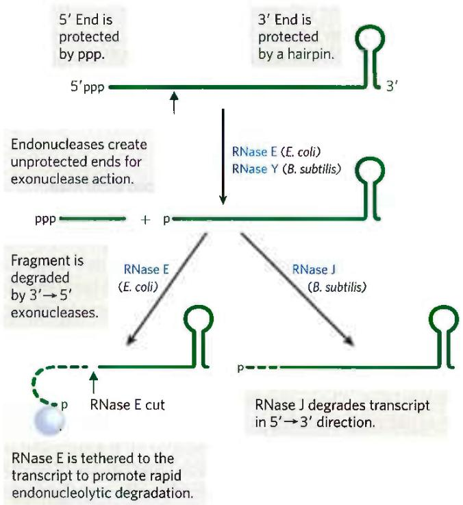  
FIGURE 26-27 Degradation of RNA in bacteria. In bacteria, mRNA degradation usually begins by endonucleolytic cleavage because the 5' and 3' ends of the mRNA are often protected by a triphosphate and hairpin structure, respectively. In E. coli, the RNase E endonuclease carries out this cleavage, whereas in B. subtilis the cleavage is carried out by the RNase Y endonuclease. The endonuclease activity produces RNA fragments that serve as substrates for 3'→5' or 5'→3' exonucleases. All bacteria contain 3'→5' exonucleases such as PNPase, RNase R, or RNase II. Some species, like B. subtilis, also contain a 5'→3' exonuclease called RNase J. The 5' phosphate produced by the endonuclease after the first cleavage can also serve as a tether to link the RNase E endonuclease directly to the mRNA, ensuring its rapid destruction. [Information from M. Hui et al. Annu. Rev. Genet. 48:537, 2014.]

As we have previously seen with transcription and RNA processing, the analogous processes for RNA degradation in eukaryotes are much more complex than their bacterial counterparts. Eukaryotes have multiple pathways for mRNA decay, and the pathway used can depend on the mRNA location, its structure, its association with ribosomes, and other factors. However, in most cases, decapping the 5' end and shortening the 3' poly(A) tail are critical steps for allowing exonucleases to access the mRNA.

All eukaryotes also have large $3^{\prime}\rightarrow5^{\prime}$ exoribonucleases called exosomes, which are responsible for the degradation for nearly all types of RNA. Exosomes are multisubunit complexes containing about 10 proteins. Specialized exosomes exist in the nucleus, cytoplasm, and nucleolus. The core of the exosome is a barrel-like structure through which RNA is threaded (Fig. 26-28). Even though this core is structurally similar to bacterial PNPase, RNA is not degraded within the barrel. Instead, the barrel serves as an adapter that efficiently channels the RNA to associated enzymes with $3'\rightarrow5'$ exonuclease and endonuclease activity.

  
FIGURE 26-28 Essential role of the exosome in eukaryotic RNA degradation. (a) Exosomes are multisubunit enzymes in which RNA is threaded through a central barrel and fed into a nuclease. In this structure, the exosome core is topped by ATPase and RNA helicase modules that help unwind RNA secondary structures so that single-stranded RNA can pass into the core. Below the core is a nuclease responsible for cleaving the RNA. (b) In this cartoon schematic, the passage of the substrate RNA through the barrel-like exosome and to the nuclease is highlighted. [Data from PDB ID 4IFD, D. L. Makino et al., Nature 495:70, 2013; PDB ID 4OO1, E.V. Wasmuth et al., Nature 511:435, 2014. Information from K. Januszyk and C. D. Lima, Curr. Opin. Struct. Biol. 24:132, 2014.]

## SUMMARY 26.2 RNA Processing

Many primary transcripts produced in bacteria and eukaryotes must be processed into a mature form to be functional. Processing can include modifications to the 5' and 3' ends of the RNA, removal of internal RNA sequences by splicing, and modifications of the RNA nucleotides.

Eukaryotic mRNAs have an inverted 7-methylguanosine residue cap at their 5' end. The cap helps to protect the RNA from degradation and interacts with proteins important for cellular transport and translation.

■ Many organisms contain genes in which the coding information is interrupted by introns. Splicing removes these introns and joins the flanking exons. Nearly every human gene contains multiple introns, which can vary dramatically in size.

There are four classes of introns: group I, group II, spliceosome-processed introns, and protein-processed introns. Group I and II introns are self-splicing with RNAs capable of carrying out catalysis independent of protein enzymes. Catalytic RNAs share features in common with protein-based enzymes.

Nuclear-encoded introns in eukaryotes are removed by a large RNP machine called a spliceosome. A spliceosome is a single-turnover enzyme containing snRNA and protein that recognizes introns by base-pairing with the snRNAs. Even though a spliceosome contains dozens of proteins, it uses an RNA active site and mechanism similar to that of group II introns.

■ Some tRNAs and a few mRNAs contain introns that must be removed by protein-based endonuclease and ligase enzymes.

In eukaryotes, transcription terminates when an endonuclease cleaves the nascent RNA, freeing it from Pol II. A poly(A) tail is then added to the 3' end of the RNA by a polyadenylate polymerase.

■ Alternative splicing and alternative poly(A) site choice in eukaryotes allow for many different transcripts to be produced from a single gene.

The primary transcripts of tRNAs, rRNAs, and miRNAs also undergo extensive processing, including endonucleolytic cleavage and chemical modification. Correct placement of these modifications is often guided by snoRNAs that base-pair with the target RNA.

■ The cellular lifetime of RNAs can be highly variable, and RNA degradation is tightly regulated. In bacteria, endonucleases generate mRNA fragments for destruction by exonucleases. In eukaryotes, mRNAs typically must be decapped and the poly(A) tail shortened before degradation. The exosome is a supramolecular complex of 3'→5' exo- and endonucleases involved in many steps of eukaryotic RNA decay.

## 26.3 RNA-Dependent Synthesis of RNA and DNA

In our discussion of DNA and RNA synthesis up to this point, the role of the template strand has been reserved for DNA. However, some enzymes use an RNA template for nucleic acid synthesis. With the important exception of viruses with an RNA genome, these enzymes play only supporting roles in information pathways. RNA viruses are the source of most characterized RNA-dependent polymerases, although some eukaryotes also use these enzymes to amplify double-stranded RNAs used in RNA interference.

The existence of RNA replication requires an elaboration of the central dogma—the notion that genetic information flows only from DNA to RNA to proteins. RNA-dependent polymerases allow the genetic information stored in RNA to be replicated and reverse transcribed into DNA. The enzymes of the RNA replication process have profound implications for investigations into the nature of self-replicating molecules that may have existed in prebiotic times.

## Reverse Transcriptase Produces DNA from Viral RNA

P3 Certain RNA viruses that infect animal cells carry within the viral particle an RNA-dependent DNA polymerase called reverse transcriptase. On infection, the single-stranded RNA viral genome (\~10,000 nucleotides) and the enzyme enter the host cell. The reverse transcriptase first catalyzes the synthesis of a DNA strand complementary to the viral RNA (Fig. 26-29), then degrades the RNA strand of the viral RNA-DNA hybrid and replaces it with DNA. The resulting duplex DNA often becomes incorporated into the genome of the eukaryotic host cell. These integrated (and dormant) viral genes can be activated and transcribed, and the gene products—viral proteins and the viral RNA genome itself—are packaged as new viruses. The RNA viruses that contain reverse transcriptases are known as retroviruses (retro is the Latin prefix for “backward”).

The existence of reverse transcriptases in RNA viruses was predicted by Howard Temin in 1962, and the enzymes were ultimately detected by Temin and, independently, by David Baltimore in 1970. P3 Their discovery aroused much attention as dogma-shaking proof that genetic information can flow "backward" from RNA to DNA.

  
FIGURE 26-29 Retroviral infection of a mammalian cell and integration of the retrovirus into the host chromosome. Viral particles entering the host cell carry viral reverse transcriptase and a cellular tRNA (picked up from a former host cell) already base-paired to the viral RNA. The purple segments represent the long terminal repeats on the viral RNA. The tRNA facilitates immediate conversion of viral RNA to double-stranded DNA by the action of reverse transcriptase. The double-stranded DNA enters the nucleus and is integrated into the host genome. The integration is catalyzed by a virally encoded integrase. Integration of viral DNA into host DNA is mechanistically similar to

  
Howard Temin, 1934–1994
[Bettmann/Getty Images.]

  
David Baltimore [AP Images.]  
the insertion of transposons in bacterial chromosomes (see Fig. 25-41). For example, a few base pairs of host DNA become duplicated at the site of integration, forming short repeats of 4 to 6 bp at each end of the inserted retroviral DNA (not shown). On transcription and translation of the integrated viral DNA, new viruses are formed and released by cell lysis (right). In the viruses, the viral RNA is enclosed by capsid proteins called Gag and outer envelope proteins called Env. Additional viral proteins (reverse transcriptase, integrase, and a viral protease needed for posttranslational processing of viral proteins) are packaged within the virus particle with the RNA.

Retroviruses typically have three genes: gag (a name derived from the historical designation group associated antigen), pol, and env (Fig. 26-30). The transcript that contains gag and pol is translated into a long "polyprotein," a single large polypeptide that is cleaved into six proteins with distinct functions. The proteins derived from the gag gene make up the interior core of the viral particle. The pol gene encodes the protease that cleaves the long polypeptide, an integrase that inserts the viral DNA into the host chromosomes, and reverse transcriptase. Many reverse transcriptases have two subunits, $\alpha$ and $\beta$ . The pol gene specifies the $\beta$ subunit ( $M_{r}$ 90,000), and the $\alpha$ subunit ( $M_{r}$ 65,000) is simply a proteolytic fragment of the $\beta$ subunit. The env gene encodes the proteins of the viral envelope. At each end of the linear RNA genome are long terminal repeat (LTR) sequences of a few hundred nucleotides. Transcribed into the duplex DNA, these sequences facilitate integration of the viral chromosome into the host DNA and contain promoters for viral gene expression.

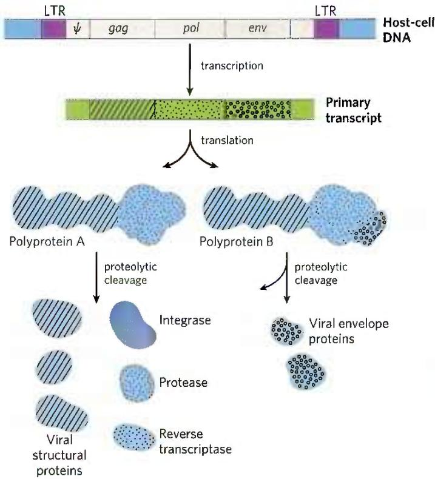  
FIGURE 26-30 Structure and gene products of an integrated retroviral genome. The long terminal repeats (LTRs) have sequences needed for the regulation and initiation of transcription. The sequence denoted $\psi$ is required for packaging of retroviral RNAs into mature viral particles. Transcription of the retroviral DNA produces a primary transcript encompassing the gag, pol, and env genes. Translation (Chapter 27) produces a polyprotein, a single long polypeptide derived from the gag and pol genes, which is cleaved into six distinct proteins. Splicing of the primary transcript yields an mRNA derived largely from the env gene, which is also translated into a polyprotein, then cleaved to generate viral envelope proteins.

Reverse transcriptases catalyze three different reactions: (1) RNA-dependent DNA synthesis, (2) RNA degradation, and (3) DNA-dependent DNA synthesis. Each transcriptase is most active with the RNA of its own virus, but each can be used experimentally to make DNA complementary to a variety of RNAs. The DNA and RNA synthesis and RNA degradation activities use separate active sites on the protein. For DNA synthesis to begin, the reverse transcriptase requires a primer, a cellular tRNA obtained during an earlier infection and carried in the viral particle. This tRNA is base-paired at its 3' end with a complementary sequence in the viral RNA. The new DNA strand is synthesized in the 5'→3' direction, as in all RNA and DNA polymerase reactions. Reverse transcriptases, like RNA polymerases, do not have $3'\rightarrow5'$ proofreading exonucleases. They generally have error rates of about 1 per 20,000 nucleotides added. An error rate this high is extremely unusual in DNA replication and seems to be a characteristic of most enzymes that replicate the genomes of RNA viruses. A consequence is a higher mutation rate and a faster rate of viral evolution, which is a factor in the frequent appearance of new strains of disease-causing retroviruses.

Reverse transcriptases have become important reagents in the study of DNA-RNA relationships and in DNA cloning techniques. They make possible the synthesis of DNA complementary to an mRNA template, and synthetic DNA prepared in this manner, called complementary DNA (cDNA), can be used to clone cellular genes (see Fig. 9-13).

## Some Retroviruses Cause Cancer and AIDS

P3 Retroviruses have featured prominently in the molecular understanding of cancer. Most retroviruses do not kill their host cells but remain integrated in the cellular DNA, replicating when the cell divides. Some retroviruses, classified as RNA tumor viruses, contain an oncogene that can cause the cell to grow abnormally. The first retrovirus of this type to be studied was the Rous sarcoma virus (also called avian sarcoma virus; Fig. 26-31), named for F. Peyton Rous, who studied chicken tumors now known to be caused by this virus. Since the initial discovery of oncogenes by Harold Varmus and Michael Bishop, many dozens of such genes have been found in retroviruses.

P3 The human immunodeficiency virus (HIV), which causes acquired immune deficiency syndrome (AIDS), is a retrovirus. Identified in 1983, HIV has an RNA genome with standard retroviral genes along with several other unusual genes (Fig. 26-32). Unlike many other retroviruses, HIV kills many of the cells it infects (principally T lymphocytes) rather than causing tumor formation. This gradually leads to suppression of the immune system in the host organism. The reverse transcriptase of HIV is even more error-prone than other known reverse transcriptases — 10 times more so — resulting in high mutation rates in this virus. One or more errors are generally made every time the viral genome is replicated, so any two viral RNA molecules are likely to differ.

Many modern vaccines for viral infections consist of one or more coat proteins of the virus, produced by methods described in Chapter 9. These proteins are not infectious on their own but stimulate the immune

<table><tr><td colspan="5">LTR</td><td>LTR</td></tr><tr><td></td><td>gag</td><td>pol</td><td>env</td><td>src</td><td></td></tr></table>

FIGURE 26-31 Rous sarcoma virus genome. The src gene encodes a tyrosine kinase, one of a class of enzymes that function in systems affecting cell division, cell-cell interactions, and intercellular communication (see Section 12.4). The same gene is found in chicken DNA (the usual  
host for this virus) and in the genomes of many other eukaryotes, including humans. When associated with the Rous sarcoma virus, this oncogene is often expressed at abnormally high levels, contributing to unregulated cell division and cancer.

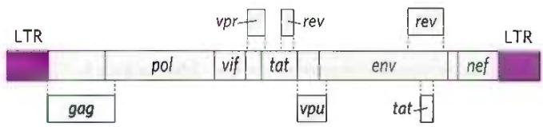  
FIGURE 26-32 The genome of HIV, the virus that causes AIDS. In addition to the typical retroviral genes, HIV contains several small genes with a variety of functions (not identified here and not all known). Some of these genes overlap. Alternative splicing mechanisms produce many different proteins from this small (9.7 × 10 $^{3}$ nucleotides) genome.

system to recognize and resist subsequent viral invasions (Chapter 5). Because of the high error rate of the HIV reverse transcriptase, the env gene in this virus (along with the rest of the genome) undergoes very rapid mutation, complicating the development of an effective vaccine. However, repeated cycles of cell invasion and replication are needed to propagate an HIV infection, so inhibition of viral enzymes offers the most effective therapy currently available. The HIV protease is targeted by a class of drugs called protease inhibitors (see Fig. 6-29). Reverse transcriptase is the target of some additional drugs widely used to treat HIV-infected individuals (Box 26-3).

## Many Transposons, Retroviruses, and Introns May Have a Common Evolutionary Origin

Some well-characterized eukaryotic DNA transposons from sources as diverse as yeast and fruit flies have a structure very similar to that of retroviruses; these are sometimes called retrotransposons (Fig. 26-33). Retrotransposons

  
FIGURE 26-33 Eukaryotic transposons. The Ty element of the yeast Saccharomyces and the copia element of the fruit fly Drosophila are examples of eukaryotic retrotransposons, which often have a structure similar to retroviruses but lack the env gene. The δ sequences of the Ty element are functionally equivalent to retroviral LTRs. In the copia element, INT and RT are homologous to the integrase and reverse transcriptase segments, respectively, of the pol gene.

## BOX 26-3

MEDICINE

## Fighting AIDS with Inhibitors of HIV Reverse Transcriptase

Research into the chemistry of template-dependent nucleic acid biosynthesis, combined with modern techniques of molecular biology, has elucidated the life cycle and structure of the human immunodeficiency virus, the retrovirus that causes AIDS. A few years after the isolation of HIV, this research resulted in the development of drugs capable of prolonging the lives of people infected by HIV.

The first drug to be approved for clinical use was azido-thymidine (AZT), a structural analog of deoxythymidine. AZT was first synthesized in 1964 by Jerome P. Horwitz. It failed as an anticancer drug (the purpose for which it was made), but in 1985 it was found to be a useful treatment for AIDS. AZT is taken up by T lymphocytes, immune system cells that are particularly vulnerable to HIV infection, and it is converted to AZT triphosphate. (AZT triphosphate taken directly would be ineffective because it cannot cross the plasma membrane.) HIV's reverse transcriptase has a higher affinity for AZT triphosphate than for deoxythymidine triphosphate (dTTP), and binding of AZT triphosphate to this enzyme competitively inhibits dTTP binding. When AZT is added to the 3' end of the growing DNA strand, lack of a 3' hydroxyl means that the DNA strand is terminated prematurely and viral DNA synthesis grinds to a halt.

AZT triphosphate is not as toxic to the T lymphocytes themselves because cellular DNA polymerases have a lower affinity for this compound than for dTTP. At concentrations of 1 to 5 $\mu$ M, AZT affects HIV reverse transcription but not most cellular DNA replication. Unfortunately, AZT seems to be toxic to the bone marrow cells that are the progenitors of erythrocytes, and many individuals taking AZT develop anemia. AZT can increase the survival time of people with advanced AIDS by about a year, and it delays the onset of AIDS in those who are still in the early stages of HIV infection. Some other AIDS drugs, such as dideoxyinosine (DDI), have a similar mechanism of action. Newer drugs target and inactivate the HIV protease. Because of the high error rate of HIV reverse transcriptase and the resulting rapid evolution of HIV, the most effective treatments of HIV infection use a combination of drugs directed at both the protease and the reverse transcriptase.

encode an enzyme homologous to the retroviral reverse transcriptase, and their coding regions are flanked by LTR sequences. They transpose from one position to another in the cellular genome by means of an RNA intermediate, using reverse transcriptase to make a DNA copy of the RNA, followed by integration of the DNA at a new site. Most transposons in eukaryotes use this mechanism for transposition, distinguishing them from bacterial transposons, which move as DNA directly from one chromosomal location to another (see Fig. 25-41).

Retrotransposons lack an env gene and so cannot form viral particles. They can be thought of as defective viruses, trapped in cells. Comparisons between retroviruses and eukaryotic transposons suggest that reverse transcriptase is an ancient enzyme that predates the evolution of multicellular organisms.

Many group I and group II introns are also mobile genetic elements. In addition to their self-splicing activities, they encode DNA endonucleases that promote their movement. During genetic exchanges between cells of the same species, or when DNA is introduced into a cell by parasites or by other means, these endonucleases promote insertion of the intron into an identical site in another DNA copy of a homologous gene that does not contain the intron, in a process termed homing (Fig. 26-34). Whereas group I intron homing is DNA-based, group II intron homing occurs through an RNA intermediate. The endonucleases of the group II introns have associated reverse transcriptase activity. The proteins can form complexes with the intron RNAs themselves, after the introns are spliced from the primary transcripts. Because the homing process involves insertion of the RNA intron into DNA and reverse transcription of the intron, the movement of these introns has been called retrohoming. Over time, every copy of a particular gene in a population may acquire the intron.

## FIGURE 26-34 Introns that move: homing and retrohoming.

FIGURE 26-31 introns that move homing and retrohoming. Certain introns include a gene (shown in red) for enzymes that promote homing (some group I introns) or retrohoming (some group II introns). (a) The gene in the spliced intron is bound by a ribosome and translated. Group I homing introns specify a site-specific endonuclease, called a homing endonuclease. Group II retrohoming introns specify a protein with both endonuclease and reverse transcriptase activities (not shown here). (b) Homing. Allele $a$ of a gene $X$ containing a group I homing intron is present in a cell containing allele $b$ of the same gene, which lacks the intron. The homing endonuclease produced by $a$ cleaves $b$ at the position corresponding to the intron in $a$ , and double-strand break repair (recombination with allele $a$ ; see Fig. 25-34) then creates a new copy of the intron in $b$ . (c) Retrohoming. Allele $a$ of gene $Y$ contains a retrohoming group II intron; allele $b$ lacks the intron. The spliced intron inserts itself into the coding strand of $b$ in a reaction that is the reverse of the splicing that excised the intron from the primary transcript (see Fig. 26-14), except that here the insertion is into DNA rather than RNA. The noncoding DNA strand of $b$ is then cleaved by the intron-encoded endonuclease/reverse transcriptase. This same enzyme uses the inserted RNA as a template to synthesize a complementary DNA strand. The RNA is then degraded by cellular ribonucleases and replaced with DNA.

(a) Production of homing endonuclease  

(c) Retrohoming  
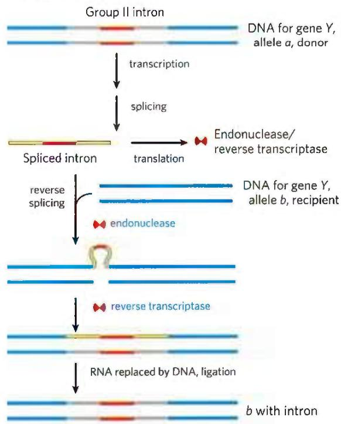

Much more rarely, the intron may insert itself into a new location in an unrelated gene. If this event does not kill the host cell, it can lead to the evolution and distribution of an intron in a new location. The structures and mechanisms used by mobile introns support the idea that at least some introns originated as molecular parasites whose evolutionary past can be traced to retroviruses and transposons.

## Telomerase Is a Specialized Reverse Transcriptase

Telomeres, the structures at the ends of linear eukaryotic chromosomes (see Fig. 24-7), generally consist of many tandem copies of a short oligonucleotide sequence. This sequence usually has the form $T_{x}G_{y}$ in one strand and $C_{y}A_{x}$ in the complementary strand, where x and y are typically in the range of 1 to 4 (p. 890). Telomeres vary in length from a few dozen base pairs in some ciliated protozoans to tens of thousands of base pairs in mammals. The TG strand is longer than its complement, leaving a region of single-stranded DNA of up to a few hundred nucleotides at the 3' end.

The ends of a linear chromosome are not readily replicated by cellular DNA polymerases. DNA replication requires a template and primer, and beyond the end of a linear DNA molecule no template is available for the pairing of an RNA primer. Without a special mechanism for replicating the ends, chromosomes would be shortened somewhat in each cell generation. The enzyme telomerase, discovered by Carol Greider and Elizabeth Blackburn, solves this problem by adding telomeres to chromosome ends.

  
Carol Greider [Courtesy Carol Greider.]

  
Elizabeth Blackburn [Micheline Pelletier/Getty Images.]

The discovery and purification of this enzyme provided insight into a reaction mechanism that is remarkable and unprecedented. Telomerase, like some other enzymes described in this chapter, is an RNP that contains both RNA and protein components. The RNA component in humans is about 150 nucleotides long and contains about 1.5 copies of the appropriate $C_{y}A_{x}$ telomere repeat. This region of the RNA acts as a template for synthesis of the $T_{x}G_{y}$ strand of the telomere. P3 Telomerase thereby acts as a cellular reverse transcriptase that provides the active site for RNA-dependent DNA synthesis. Unlike retroviral reverse transcriptases, telomerase copies only a small segment of RNA that it carries within itself. Telomere synthesis requires the 3' end of a chromosome as primer and proceeds in the usual 5'→3' direction. Having synthesized one copy of the repeat, the enzyme repositions to resume extension of the telomere (Fig. 26-35a).

After extension of the $T_{x}G_{y}$ strand by telomerase, the complementary $C_{y}A_{x}$ strand is synthesized by cellular DNA polymerases, starting with an RNA primer (see Fig. 25-11). The single-stranded region is protected by specific binding proteins in many lower eukaryotes, especially those species with telomeres of less than a few hundred base pairs. In higher eukaryotes (including mammals) with telomeres many thousands of base pairs long, the single-stranded end is sequestered in a specialized structure called a T loop (Fig. 26-35b). The single-stranded end is folded back and paired with its complement in the double-stranded portion of the telomere. The formation of a T loop involves invasion of the 3' end of the telomere's single strand into the duplex DNA, perhaps by a mechanism similar to the initiation of homologous genetic recombination (see Fig. 25-34). In mammals, the looped DNA is bound by two proteins, TRF1 and TRF2, with the latter protein involved in formation of the T loop. T loops protect the 3' ends of chromosomes, making them inaccessible to nucleases and the enzymes that repair double-strand breaks.

In protozoans (such as Tetrahymena), loss of telomerase activity results in a gradual shortening of telomeres with each cell division, ultimately leading to the death of the cell line. A similar link between telomere length and cell senescence (cessation of cell division) has been observed in humans. In germ-line cells, which contain telomerase activity, telomere lengths are maintained; in somatic cells, which lack telomerase, they are not. There is a linear, inverse relationship between the length of telomeres in cultured fibroblasts and the age of the individual from whom the fibroblasts were taken: telomeres in human somatic cells gradually shorten as an individual ages. If the telomerase reverse transcriptase is introduced into human somatic cells in vitro, telomerase activity is restored and the cellular life span increases markedly.

Is the gradual shortening of telomeres a key to the aging process? Is our natural life span determined by the length of the telomeres we are born with? Further research in this area should yield some fascinating insights.

## Some RNAs Are Replicated by RNA-Dependent RNA Polymerase

Apart from the retroviruses, the RNA viruses include some E. coli bacteriophages as well as eukaryotic viruses such as the influenza virus and coronaviruses that cause SARS or COVID-19. The single-stranded RNA chromosomes of these viruses also function as mRNAs for the synthesis of viral proteins. They are replicated in the host cell by an RNA-dependent RNA polymerase (RNA replicase). All RNA viruses—with the exception of retroviruses—must encode a protein with RNA-dependent RNA polymerase activity, either because the host cells lack such an enzyme or because the RNA genome structure of a virus imposes specialized enzymatic requirements.

  
FIGURE 26-35 Telomere synthesis and structure. (a) The internal template RNA of telomerase binds to and base-pairs with the TG primer $(\mathrm{T}_x\mathrm{G}_y)$ of DNA. Telomerase adds more T and G residues to the TG primer, then repositions the internal template RNA to allow the addition of more T and G residues to generate the TG strand of the telomere. The complementary strand is synthesized  
by cellular DNA polymerases, after priming by an RNA primase. (b) Proposed structure of T loops in telomeres. The single-stranded tail synthesized by telomerase is folded back and paired with its complement in the duplex portion of the telomere. The telomere is bound by several telomere-binding proteins, including TRF1 and TRF2 (telomere repeat binding factors).

The RNA replicase isolated from E. coli cells infected with the bacteriophage Qβ catalyzes the formation of an RNA complementary to the viral RNA, in a reaction equivalent to that catalyzed by DNA-dependent RNA polymerases. New RNA strand synthesis proceeds in the 5'→3' direction by a chemical mechanism identical to that used in all other nucleic acid synthetic reactions that require a template. RNA replicase requires RNA as its template and will not function with DNA. It lacks a separate proofreading endonuclease activity and has an error rate similar to that of RNA polymerase. Unlike the DNA and RNA polymerases, RNA replicases are specific for the RNA of their own virus; the RNAs of the host cell are generally not replicated. This explains how RNA viruses are preferentially replicated in the host cell, which contains many other types of RNA.

  
FIGURE 26-36 Structural similarities between RNA-dependent polymerases. RNA-dependent polymerases use a common active site architecture in which the duplexed substrate sits in a hand-shaped protein fold with palm and finger domains. This protein fold can be found in protein factors involved in (a) group II intron retrohoming, (b) spliceosome-catalyzed pre-mRNA splicing, (c) telomere synthesis, (d) HIV reverse transcription, and (e) hepatitis C viral genome replication. The retrohoming  
reverse transcriptase of group II introns is most structurally related to the reverse transcriptase structure present in the spliceosome, supporting their close evolutionary relationship. [Information from C. Zhao and A. M. Pyle, Nat. Struct. Mol. Biol. 23:558, 2016, Fig. 2. Data from (a) PDB ID 5HHJ, C. Zhao and A. M. Pyle, Nat. Struct. Mol. Biol. 23:558, 2016; (b) PDB ID 4I43, W. P. Galej et al., Nature 493:638, 2013; (c) PDB ID 3DU6, A. J. Gillis et al., Nature 455:633, 2008; (d) PDB ID 2HMI, J. Ding et al., J. Mol. Biol. 284:1095, 1998; (e) PDB ID 1C2P, C. A. Lesburg et al., Nat. Struct. Biol. 6:937, 1999.]

RNA-dependent RNA polymerases are not limited to viruses. Enzymes of this type are found in plants, protists, fungi, and some simpler animals, but not in insects or mammals. Those found in the genomes of eukaryotes generally play a role in the metabolism of another class of small RNAs, called small interfering RNAs (siRNAs), which participate in gene regulation (Chapter 28).

## RNA-Dependent RNA Polymerases Share a Common Structural Fold

Even though viral RNA replication and reverse transcription, retrohoming, and telomere synthesis represent a diverse array of biological processes, the polymerases involved in each pathway bear remarkable similarities in structure (Fig. 26-36). In all cases, palm and finger domains are used to grip the duplexed template and primer nucleic acids within the active site. Amazingly, the group II intron retrohoming reverse transcriptase is structurally most closely related to a protein component of the spliceosome that helps scaffold its RNA active site. In addition to identical splicing chemistry and active site features (see Fig. 26-17), this provides further evidence that the spliceosome evolved from a group II intron-like ancestor.

## SUMMARY 26.3 RNA-Dependent Synthesis of RNA and DNA

■ RNA-dependent DNA polymerases, also called reverse transcriptases, were first discovered in retroviruses, which must convert their RNA genomes into double-stranded DNA as part of their life cycle. These enzymes transcribe the viral RNA into DNA, a process that can be used experimentally to form cDNA.

■ Retroviruses can cause human diseases, including AIDS and cancers. Some of these viruses contain oncogenes, which cause infected cells to grow abnormally.

Many eukaryotic transposons are related to retroviruses, and their mechanism of transposition includes an RNA intermediate. An RNA intermediate is also present in group II intron retrohoming, in which the RNA intron is inserted into a DNA gene followed by production of a DNA copy by a reverse transcriptase.

■ Telomerase, the enzyme that synthesizes the telomere ends of linear chromosomes, is a specialized reverse transcriptase that contains an internal RNA template.

\- RNA-dependent RNA polymerases, such as the replicases of RNA bacteriophages, are template-specific for the viral RNA. These enzymes share structural homology with reverse transcriptases involved in retroviral replication, telomere production, and retrohoming.

## 26.4 Catalytic RNAs and the RNA World Hypothesis

P4 The study of posttranscriptional processing of RNA molecules led to one of the most exciting discoveries in biochemistry—the existence of RNA enzymes or ribozymes. The best-characterized ribozymes are the self-splicing group I introns, RNase P, and the hammerhead ribozyme (discussed below). Most of the activities of these ribozymes are based on two fundamental reactions: transesterification (Fig. 26-14) and phosphodiester bond hydrolysis (cleavage). The substrate for a ribozyme is often an RNA molecule, and it may even be part of the ribozyme itself. When its substrate is RNA, the RNA catalyst can make use of base-pairing interactions to align the substrate for the reaction.

## Ribozymes Share Features with Protein Enzymes

Like protein enzymes, ribozymes vary greatly in size. A self-splicing group I intron may have more than 400 nucleotides. In comparison, the hammerhead ribozyme consists of two RNA strands with a total of just 41 nucleotides. P4 Also as with protein enzymes, the three-dimensional structure of ribozymes is important for function. Ribozymes, like protein enzymes, are inactivated by heating above their melting temperature or by the addition of denaturing agents or complementary oligonucleotides, which disrupt normal base-pairing patterns. Ribozymes can also be inactivated if essential nucleotides are changed. The secondary structure of a self-splicing group I intron from the 26S rRNA precursor of Tetrahymena is shown in detail in Figure 26-37. This secondary structure highlights the large number of base-pairing and other noncovalent interactions that must occur for the ribozyme to adopt a catalytic structure. Just as amino acid mutations can change activities of protein enzymes, nucleotide mutations can alter the noncovalent interactions required for ribozyme folding and catalysis.

  
FIGURE 26-37 Secondary structure of the self-splicing rRNA intron of Tetrahymena. (a) A two-dimensional representation of secondary structure immediately prior to the initiation of the reaction. Intron sequences are shaded yellow and light red; flanking exon sequences are green; the internal guide sequences that help to align reacting segments at the active site are purple. Each thin, light-red line represents a bond between adjacent nucleotides in a continuous sequence (a device necessitated by showing this complex molecule in two dimensions). Short blue lines represent normal base pairing; blue dots indicate G-U base pairs. All nucleotides are shown. The catalytic core of the

P4 Ribozymes share several properties with enzymes besides accelerating the reaction rate, including kinetic behavior and specificity. Binding of the guanosine cofactor to the Tetrahymena group I rRNA intron is saturable ( $K_{m} < 30 \mu M$ ) and can be competitively inhibited by 3'-deoxyguanosine. The intron is very precise in its excision reaction, largely due to a segment called the internal guide sequence that can base-pair with exon sequences near the 5' splice site (Fig. 26-37). This pairing promotes the alignment of specific bonds to be cleaved and rejoined.

  
self-splicing activity is shaded in gray. Some base-paired regions are labeled (P1, P3, P2.1, P5a, and so forth) according to an established convention for this RNA molecule. The P1 region, which contains the internal guide sequence (purple), is the location of the 5' splice site (black arrow). Part of the internal guide sequence pairs with the end of the 3' exon, bringing the 5' and 3' splice sites (black arrows) into close proximity. (b) Three-dimensional structure of a reaction intermediate of the same intron, after guanosine-mediated cleavage (Fig. 26-14) and prior to exon ligation. Segments are colored as in (a). [Data from (a) PDB ID 1GID, J.H. Cate et al., Science 273:1678, 1996. (b) PDB ID 1U6B, P.L. Adams et al., Nature 430:45, 2004.]

Because the intron itself is chemically altered during the splicing reaction—its ends are cleaved—it may seem to lack one key enzymatic property: the ability to catalyze multiple reactions. Closer inspection has shown that after excision, the 414 nucleotide intron from Tetrahymena rRNA can, in vitro, act as a true enzyme (but in vivo it is quickly degraded). A series of intramolecular cyclization and cleavage reactions in the excised intron leads to the loss of 19 nucleotides from its 5' end. The remaining 395 nucleotide, linear RNA—referred to as L-19 IVS (intervening sequence)—promotes nucleotidyl transfer reactions in which some oligonucleotides are lengthened at the expense of others (Fig. 26-38). The best substrates are oligonucleotides, such as a synthetic (C) $_{5}$ oligomer, that can base-pair with the same guanylate-rich internal guide sequence that held the 5' exon in place for self-splicing.

The enzymatic activity of the L-19 IVS ribozyme results from a cycle of transesterification reactions mechanistically similar to self-splicing. Each ribozyme molecule can process about 100 substrate molecules per hour and is not altered in the reaction—that is, the intron acts as a catalyst. It follows Michaelis-Menten kinetics, is specific for RNA oligonucleotide substrates, and can be competitively inhibited. The $k_{cat}/K_{m}$ (specificity constant) is $10^{3} M^{-1} s^{-1}$ , lower than that of many protein enzymes, but the ribozyme accelerates hydrolysis by a factor of $10^{10}$ relative to the uncatalyzed reaction. P4 It makes use of substrate orientation, covalent catalysis, and metal-ion catalysis—all strategies shared with protein enzymes.

## Ribozymes Participate in a Variety of Biological Processes

E. coli RNase P has both an RNA component (the M1 RNA, with 377 nucleotides) and a protein component ( $M_{r}$ 17,500). In 1983, Sidney Altman and Norman Pace and their coworkers discovered that under some conditions, the M1 RNA alone is capable of catalysis, cleaving tRNA precursors at the correct position. The protein component apparently serves to stabilize the RNA or facilitate its function in vivo. The RNase P ribozyme recognizes the three-dimensional shape of its pre-tRNA substrate, along with the CCA sequence, and thus can cleave the 5' leaders from diverse tRNAs (Fig. 26-25).

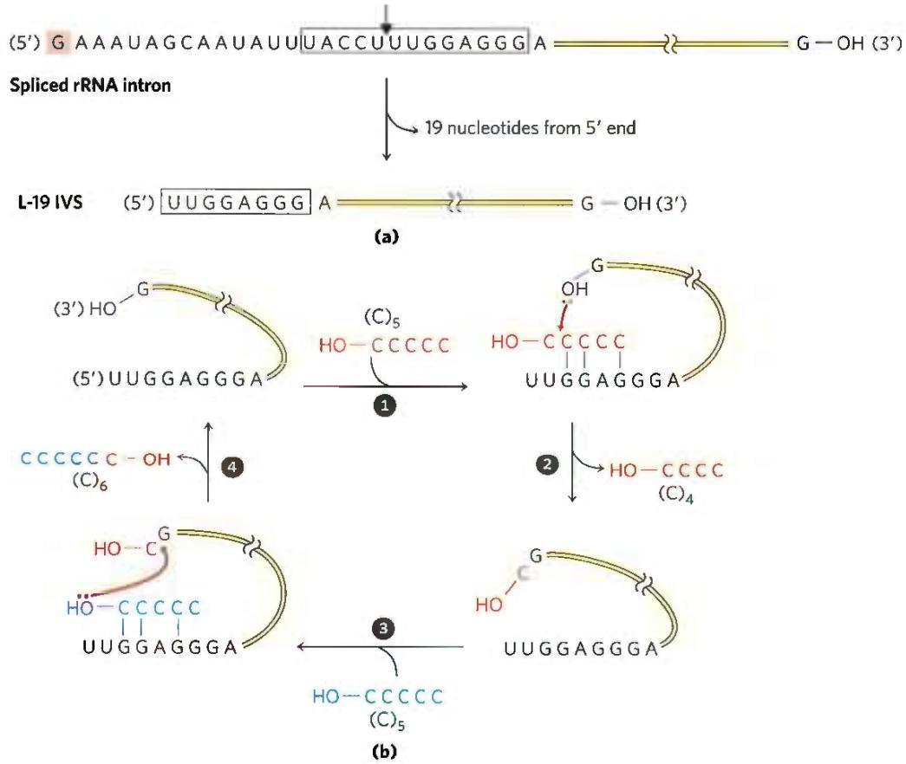  
FIGURE 26-38 In vitro catalytic activity of L-19 IVS. (a) L-19 IVS (intervening sequence, the term once used for intron) is generated by the autocatalytic removal of 19 nucleotides from the $5^{\prime}$ end of the spliced Tetrahymena intron. The cleavage site is indicated by the arrow in the internal guide sequence (boxed). The G residue (shaded) added in the first step of the splicing reaction is part of the removed sequence. A portion of the internal guide  
sequence remains at the 5' end of L-19 IVS. (b) L-19 IVS lengthens some RNA oligonucleotides at the expense of others in a cycle of transesterification reactions (steps 1 through 4). The 3' OH of the G residue at the 3' end of L-19 IVS plays a key role in this cycle (note that this is not the G residue added in the splicing reaction). (C) $_{5}$ is one of the ribozyme's better substrates because it can base-pair with the guide sequence remaining in the intron.

The known catalytic repertoire of ribozymes continues to expand. Some virusoids, small RNAs associated with plant RNA viruses, include a structure that promotes a self-cleavage reaction; the small hammerhead ribozyme illustrated in Figure 26-39 is in this class, catalyzing the hydrolysis of an internal phosphodiester bond. There are at least nine structural classes of ribozymes that engage in self-cleavage; all use general acid and base catalysis (Fig. 6-8) to promote the attack of a 2'-hydroxyl group on an adjacent phosphodiester bond. Despite being surrounded by proteins, the splicing reaction that occurs in a spliceosome relies on a catalytic center formed by the U2, U5, and U6 snRNAs and intron (see Figs 26-16 and 26-17). And, as we shall see in Chapter 27, an RNA component of ribosomes catalyzes the synthesis of proteins. Exploring catalytic RNAs has provided new insights into catalytic function in general and has important implications for our understanding of the origin and evolution of life on this planet.

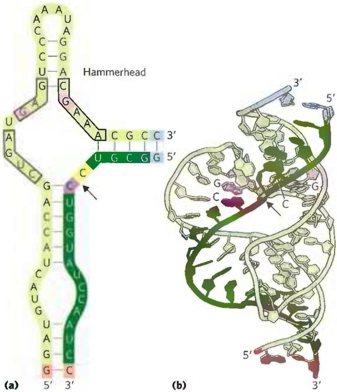  
FIGURE 26-39 Hammerhead ribozyme. Some virusoid RNAs include small segments that promote site-specific RNA cleavage reactions associated with replication. These segments are called hammerhead ribozymes, because their secondary structures are shaped like the head of a hammer. (a) The minimal sequences required for catalysis by the ribozyme. The boxed nucleotides are highly conserved and are required for catalytic function. Guanine nucleotides shaded pink form part of the active site. The arrow indicates the site of self-cleavage. (b) Three-dimensional structure of a hammerhead ribozyme (see Fig. 8-25b for a view of another hammerhead ribozyme). The strands are colored as in (a). The hammerhead ribozyme is a metalloenzyme; $\mathrm{Mg}^{2+}$ ions are required for activity in vivo. The phosphodiester bond at the site of self-cleavage is indicated by an arrow. [Data from PDB ID 3ZD5, M. Martick and W. G. Scott, Cell 126:309, 2006.]

## Ribozymes Provide Clues to the Origin of Life in an RNA World

The extraordinary complexity and order that distinguish living from inanimate systems are key manifestations of fundamental life processes. Maintaining the living state requires that selected chemical transformations occur very rapidly—especially those that use environmental energy sources and synthesize elaborate or specialized cellular macromolecules. Life depends on powerful and selective catalysts—enzymes—and on informational systems capable of both securely storing the blueprint for these enzymes and accurately reproducing the blueprint for generation after generation. Chromosomes encode the blueprint not for the cell but for the enzymes that construct and maintain the cell. The parallel demands for information and catalysis present a classic conundrum: what came first, the information needed to specify structure or the enzymes needed to maintain and transmit the information?

How might a self-replicating polymer come to be? How might it maintain itself in an environment where the precursors for polymer synthesis are scarce? How could evolution progress from such a polymer to the modern DNA-protein world? These difficult questions can be addressed by careful experimentation, providing clues about how life on Earth began and evolved.

  
Carl Woese, 1928–2012
[Steve Kagan.]

P4 The unveiling of the structural and functional complexity of RNA led Carl Woese, Francis Crick, and Leslie Orgel to propose in the 1960s that this macromolecule might serve as both information carrier and catalyst. Since that time, at least six lines of evidence have given increasing substance to their RNA world hypothesis.

1. Prebiotic Chemistry Experiments The probable origin of purine and pyrimidine bases is suggested by experiments designed to test hypotheses about prebiotic chemistry (pp. 31–32). Beginning with simple molecules thought to be present in the early atmosphere (CH₄, NH₃, H₂O, H₂), electrical discharges mimicking lightning generate, first, more reactive molecules such as HCN and aldehydes, then an array of amino acids and organic acids (see Fig. 1-33). When molecules such as HCN become abundant, purine and pyrimidine bases are synthesized in detectable amounts. Remarkably, a concentrated solution of ammonium cyanide, refluxed for a few days, generates adenine in yields of up to 0.5% (Fig. 26-40). Adenine may well have been the first and most abundant nucleotide constituent to appear on Earth. Intriguingly, most enzyme cofactors contain adenosine as part of their structure, although it plays no direct role in the cofactor function (see Fig. 8-41). This may suggest an evolutionary relationship. Based on the simple synthesis of adenine from cyanide, adenine may simply have been abundant and available.

  
FIGURE 26-40 Experiments supporting prebiotic synthesis of adenine from ammonium cyanide. Adenine is derived from five molecules of cyanide, denoted by shading.

2. The Existence of Catalytic RNAs P4 In an "RNA world," RNAs, not proteins, act as catalysts. Perhaps more than anything else, the discovery of ribozymes gave life to the RNA world hypothesis and led to widespread speculation that an RNA world might have been important in the transition from prebiotic chemistry to life (see Fig. 1-35). The parent of all life on this planet, in the sense that it could reproduce itself across the generations from the origin of life to the present, might have been a self-replicating RNA, or a polymer with equivalent chemical characteristics.

3. The Expanding Catalytic Repertoire of Ribozymes A self-replicating polymer would quickly use up available supplies of precursors provided by the relatively slow processes of prebiotic chemistry. Thus, from an early stage in evolution, metabolic pathways would be required to generate precursors efficiently, with the synthesis of precursors presumably catalyzed by ribozymes. The extant ribozymes found in nature have a limited repertoire of catalytic functions, and of the ribozymes that may once have existed, no trace is left. To explore the RNA world hypothesis more deeply, we need to know whether RNA has the potential to catalyze the many different reactions needed in a primitive system of metabolic pathways.

The search for RNAs with new catalytic functions has been aided by the development of a method that rapidly searches pools of random polymers of RNA and extracts those with particular activities; known as SELEX, this is nothing less than accelerated evolution in a test tube (Box 26-4). It has been used to generate RNA molecules that bind to amino acids, organic dyes, nucleotides, cyanocobalamin, and other molecules. Researchers have isolated ribozymes that catalyze ester and amide bond formation, $S_{N}2$ reactions, metallation of (addition of metal ions to) porphyrins, and carbon-carbon bond formation. The evolution of enzymatic cofactors with nucleotide “handles” that facilitate their binding to ribozymes might have further expanded the repertoire of chemical processes available to primitive metabolic systems.

4. The Structure of the Ribosome As we shall see in Chapter 27, some natural RNA molecules, components of ribosomes, catalyze the formation of peptide bonds, offering a glimpse of how the RNA world might have been transformed by the greater catalytic potential of proteins. The evolution of a capacity to synthesize proteins would have been a major event in the RNA world, allowing the generation of polymers that could greatly stabilize complex RNA structures. However, the onset of peptide synthesis would also have hastened the demise of the RNA world. Proteins simply have more catalytic potential. The information-carrying role of RNA may have passed to DNA because DNA is chemically more stable. RNA replicase and reverse transcriptase may be modern versions of enzymes that once played important roles in making the transition to the modern DNA-based system.

5. Extant Vestiges of an RNA World The known functions of RNA continue to multiply with each decade. Retroviruses, other RNA viruses, and retrotransposons inhabit a semi-independent universe, maintaining a parasitic existence within the biosphere. For evolutionary biologists, these almost-living entities provide a window on key steps in the evolution of life. Transposons may have been an early innovation in an RNA world. With the appearance of the first, inefficient self-replicators, transposition could have been an important alternative to replication as a strategy for successful reproduction and survival. Early parasitic RNAs would simply hop into a self-replicating molecule via catalyzed transesterification, then passively undergo replication. Natural selection would have driven transposition to become site-specific, targeting sequences that did not interfere with the catalytic activities of the host RNA. Replicators and RNA transposons could have existed in a primitive symbiotic relationship, each contributing to the evolution of the other. Modern introns, retroviruses, and transposons may all be vestiges of a "piggyback" strategy pursued by early parasitic RNAs. These elements continue to make major contributions to the evolution of their hosts.

6. Progress in the Search for an RNA Replicator The RNA world hypothesis requires a nucleotide polymer to reproduce itself. Can a ribozyme bring about its own synthesis in a template-directed manner? Researchers are getting closer to finding such a ribozyme or ribozyme system. For example, Gerald Joyce and colleagues, in 2009, reported on the first set of two ribozymes that could cross-catalyze each other's formation (Fig. 26-41). One ribozyme, E, catalyzes the joining of two oligonucleotides (A' and B') to create a second, complementary

FIGURE 2 RNA aptamer that binds ATP. The shaded nucleotides are those required for the binding activity.

## The SELEX Method for Generating RNA Polymers with New Functions

SELEX (systematic evolution of ligands by exponential enrichment) is used to generate aptamers, oligonucleotides selected to tightly bind a specific molecular target. The process is generally automated to allow rapid identification of one or more aptamers with the desired binding specificity.

Figure 1 illustrates how SELEX is used to select an RNA species that binds tightly to ATP. In step ①, a random mixture of RNA polymers is subjected to "unnatural selection" by passing it through a resin to which ATP is attached. The practical limit for the complexity of an RNA mixture is about $10^{15}$ different sequences, which allows complete randomization of 25 nucleotides ( $4^{25} = 10^{15}$ ). For longer RNAs, the RNA pool used to initiate the search does not include all possible sequences. RNA polymers that pass through the column are discarded (step ②); those that bind to ATP are washed from the column with salt solution and collected (step ③). In step ④, the collected RNA polymers are amplified by reverse transcriptase to make many DNA complements to the selected RNAs, then an RNA polymerase makes many RNA complements of the resulting DNA molecules. Finally, in step ⑤, this new pool of RNA is subjected to the same selection procedure, and the cycle is repeated a dozen or more times. At the end, only a few aptamers — in this case, RNA sequences with considerable affinity for ATP — remain.

Critical sequence features of an RNA aptamer that binds ATP are shown in Figure 2; molecules with this general structure bind ATP (and other adenosine nucleotides) with $K_{d} < 50 \mu M$ . Figure 3 presents the three-dimensional structure of a 36 nucleotide RNA aptamer (shown as a complex with AMP) generated by SELEX. This RNA has the backbone structure shown in Figure 2.

In addition to its use in exploring the potential functionality of RNA, SELEX has an important practical side in identifying short RNAs with pharmaceutical uses. Finding an aptamer that binds specifically to every potential therapeutic target may be impossible, but the capacity of SELEX to rapidly select and amplify a specific oligonucleotide sequence from a highly complex pool of sequences makes this a promising approach for generating new therapies. For example, one could select an RNA that binds tightly to a receptor protein prominent in the plasma membrane of cells in a particular cancerous tumor. Blocking the activity of the receptor, or targeting a toxin to the tumor cells by attaching it to the aptamer, would kill the cells. SELEX also has been used to select DNA aptamers that detect anthrax spores. Many other promising applications are under development.

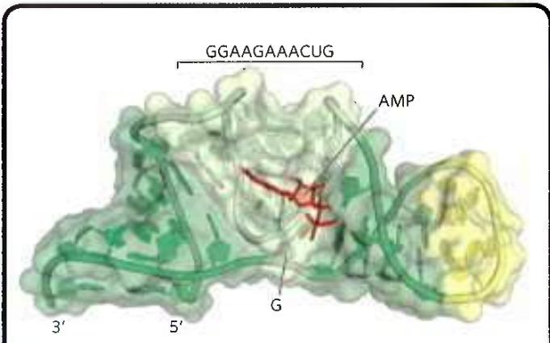  
FIGURE 3 RNA aptamer bound to AMP. The bases of the conserved nucleotides (forming the binding pocket) are pale green; the bound AMP is red. [Data from PDB ID 1RAW, T. Dieckmann et al., RNA 2:628, 1996.]

  
FIGURE 26-41 Self-sustained replication of an RNA enzyme. This system has many of the properties of a living system. The RNA molecules incorporate information and catalytic function, and the reactions produce an exponential increase in the product RNAs. When variants of the RNA substrates are introduced, the system undergoes natural selection such that the best replicators eventually dominate the population. (a) A possible reaction scheme. Oligoribonucleotides A and B anneal to ribozyme E' and are ligated catalytically to form ribozyme E. The joining

ribozyme called E'. E' could then catalyze the joining of two other oligonucleotides (A and B) to form another molecule of E. In this system, the formation of E and E' was templated, and the amounts grew exponentially as long as substrates were available and proteins were absent. The system evolved so that more-efficient enzymes appeared in the population. A more general RNA-polymerase-like ribozyme was described in 2011 by Philipp Holliger and colleagues.

Although the RNA world remains a hypothesis, with many gaps yet to be explained, experimental evidence supports a growing list of its key elements. Further experimentation should increase our understanding. Important clues to the puzzle will be found in the workings of fundamental chemistry, in living cells, and perhaps on other planets.

  
of oligoribonucleotides A' and B' is similarly catalyzed by ribozyme E. The levels of E and E' grow exponentially, with a doubling time of about one hour at 42 °C, as long as there is a supply of the precursors A, B, A', and B'. (b) The ligation reaction involves attack of the 3' OH of one oligoribonucleotide on the α phosphate of the 5'-triphosphate of the other oligoribonucleotide. Pyrophosphate is released. Base pairing of the substrates with the ribozyme plays a key role in aligning the substrates for the reaction. [Information from T. A. Lincoln and G. F. Joyce, Science 323:1229, 2009.]

## SUMMARY 26.4 Catalytic RNA and the RNA World Hypothesis

\- Ribozymes and protein-based enzymes share common features, including folded three-dimensional structures, inactivation by denaturation, acceleration of reaction rates, saturable kinetics, and reaction specificity.

\- Ribozymes and RNA-based catalysts are present in organisms today and are involved in a wide range of activities, including tRNA processing, nuclear pre-mRNA splicing, and translation.

The evolution of life on Earth may have included an RNA world in which RNA was the central information carrier and catalyst before proteins and DNA emerged as key players. The existence of ribozymes provides a powerful piece of evidence in support of this hypothesis.

## KEY TERMS

Terms in bold are defined in the glossary.

ribonucleoprotein (RNP) 960   
transcription 960   
messenger RNA (mRNA) 960   
transfer RNA (tRNA) 960   
ribosomal RNA (rRNA) 960   
noncoding RNA (ncRNA) 960   
transcriptome 960 DNA-dependent RNA polymerase 961   
template strand 962   
nontemplate strand 962 coding strand 962   
promoter 963   
consensus sequence 963   
footprinting 965   
cAMP receptor protein (CRP) 966   
repressor 966   
carboxyl-terminal domain (CTD) 968   
transcription factors 968   
general transcription factors 968   
preinitiation complex (PIC) 969   
ribozymes 972   
primary transcript 972   
precursor transcript 972   
intron 973

exon 973
RNA splicing 973
messenger ribonucleo-
protein (mRNP)
complex 973
5' cap 974
spliceosome 977
small nuclear RNA
(snRNA) 977
poly(A) tail 980
alternative splicing 981
poly(A) site choice 982
small nucleolar RNA
(snoRNA) 984
snoRNA-protein complex
(snoRNP) 984
microRNA (miRNA) 985
polynucleotide
phosphorylase 987
exosome 987
reverse transcriptase 988
retrovirus 988
complementary DNA
(cDNA) 990
homing 992
telomerase 993
T loop 993
RNA-dependent RNA
polymerase (RNA
replicase) 994
internal guide sequence 996
RNA world hypothesis 998
SELEX 1000
aptamer 1000

## PROBLEMS

1. RNA Polymerase (a) How long would it take for the E. coli RNA polymerase to synthesize the primary transcript for the E. coli genes encoding the enzymes for lactose metabolism, the 5,300 bp lac operon? (b) How far along the DNA would the transcription "bubble" formed by RNA polymerase move in 10 seconds? (c) Assuming that human Pol II transcribes at a similar rate, how long does it take to transcribe the 2,000,000 bp dystrophin gene?

2. Error Correction by RNA Polymerases DNA polymerases are capable of editing and error correction, whereas the capacity for error correction in RNA polymerases seems to be limited. Given that a single base error in either replication or transcription can lead to an error in protein synthesis, suggest a possible biological explanation for this difference.

3. RNA Posttranscriptional Processing Predict the likely effects of a mutation in the sequence (5')AAUAAA in a eukaryotic mRNA transcript.

4. Coding versus Template Strands The RNA genome of phage Qβ is the nontemplate strand, or coding strand, and when introduced into the cell, it functions as an mRNA. Suppose the RNA replicase of phage Qβ synthesized primarily template-strand RNA and uniquely incorporated this, rather than nontemplate strands, into the viral particles. What would be the fate of the template strands when they entered a new cell? What enzyme would have to be included in the viral particles for successful invasion of a host cell?

5. Transcription The gene encoding the E. coli enzyme enolase begins with the sequence ATGTCCAAAATCGTA. What is the sequence of the RNA transcript specified by this part of the gene?

6. The Chemistry of Nucleic Acid Biosynthesis Describe three properties common to the reactions catalyzed by DNA polymerase, RNA polymerase, reverse transcriptase, and RNA replicase. How is the enzyme polynucleotide phosphorylase similar to and different from these four enzymes?

7. RNA Processing I While studying human transcription in the 1960s, James Darnell carried out an experiment that has become a classic in biochemistry, but at the time, it was incredibly perplexing. Darnell and coworkers used radioactive isotopes, such as $[^{32}P]$ -labeled phosphate, to isolate and quantify RNAs from a cultured line of human cancer cells (HeLa). With this approach, they were able to identify those RNAs present in the nucleus and those present in the cytoplasm. The results were puzzling, because it was obvious that a large amount of transcription was occurring in the nucleus, but comparatively little radioactive mRNA was isolated from the cytoplasm. Moreover, the nuclear-isolated RNAs were much longer than those isolated from the cytoplasm. What can account for these observations?

8. The Transcriptome If a cell's genome is completely known, is it possible to determine the cell's transcriptome—the sequence of all the RNAs being produced by the cell—without additional information? Explain.

9. RNA Splicing What is the minimum number of transesterification reactions needed to splice an intron from a pre-mRNA transcript? Explain.

10. RNA Processing II Blocking the splicing of a particular pre-mRNA in a vertebrate cell also blocks a nucleotide modification reaction occurring in the rRNA. Suggest a reason for this.

11. RNA Modification I Researchers Brenda Bass and Harold Weintraub discovered double-stranded RNA-specific adenosine deaminases (ADARs) in 1987. These enzymes recognize double-stranded regions of mRNA and convert adenosine bases to inosine within these regions.

(a) When ADAR encounters a double-stranded RNA substrate in water that also contains $H_{2}[^{18}O]$ , radioactive oxygen incorporates into the RNA. Draw a reaction mechanism for ADAR that accounts for this observation.

(b) After ADAR reacts with a double-stranded RNA, the RNA duplex sometimes spontaneously unwinds to form single strands. Why might this occur?

(c) What is a possible consequence of adenosine to inosine conversion in the coding sequence of an mRNA?

12. Organization of RNA Processing In eukaryotes, pre-mRNA splicing by the spliceosome occurs only in the nucleus and translation of mRNAs occurs only in the cytosol. Why might the separation of these two activities into different cellular compartments be important?

13. RNA Modification II In addition to rRNAs and tRNAs, many human mRNAs also contain modified nucleotides, in particular $N^{6}$ -methyladenosine.

(a) How might incorporation of $N^{6}$ -methyladenosine impact RNA processing?

(b) Incorporation of $N^{6}$ -methyladenosine into the 3' untranslated region (UTR; see Fig. 9-24) of the MAT2A transcript, which encodes a methionine adenosyltransferase, regulates the metabolism of the cofactor S-adenosylmethionine. Why would metabolism of S-adenosylmethionine be linked to $N^{6}$ -methyladenosine formation?

14. RNA Genomes RNA viruses have relatively small genomes. For example, the single-stranded RNAs of retroviruses have about 10,000 nucleotides, and the Qβ RNA is only 4,220 nucleotides long. How might the properties of reverse transcriptase and RNA replicase have contributed to the small size of these viral genomes?

15. Screening of RNAs by SELEX The practical limit for the number of different RNA sequences that can be screened in a SELEX experiment is $10^{15}$ . (a) Suppose you are working with oligonucleotides that are 36 nucleotides long. How many sequences exist in a randomized pool containing every sequence possible? (b) What percentage of these can a SELEX experiment screen? (c) Suppose you wish to select an RNA molecule that catalyzes the hydrolysis of a particular ester. From what you know about catalysis, propose a SELEX strategy that might allow you to select the appropriate catalyst.

16. Slow Death The death cap mushroom, Amanita phalloides, contains several dangerous substances, including the lethal $\alpha$ -amanitin. This toxin blocks RNA elongation in consumers of the mushroom by binding to eukaryotic RNA polymerase II with very high affinity; it is deadly in concentrations as low as $10^{-8}$ M. The initial reaction to ingestion of the mushroom is gastrointestinal distress (caused by some of the other toxins). These symptoms disappear, but about 48 hours later, the mushroom-eater dies, usually from liver dysfunction. Speculate on why it takes this long for $\alpha$ -amanitin to kill.

17. Detection of Rifampin-Resistant Strains of Tuberculosis Rifampin is an important antibiotic used to treat tuberculosis and other mycobacterial diseases. Some strains of Mycobacterium tuberculosis, the causative agent of tuberculosis, are resistant to rifampin. These strains become resistant through mutations that alter the rpoB gene, which encodes the $\beta$ subunit of the RNA polymerase (see Fig. 26-10). Rifampin cannot bind to the mutant RNA polymerase and so is unable to block the initiation of transcription. DNA sequences from a large number of rifampin-resistant M. tuberculosis strains have been found to have mutations in a specific 69 bp region of rpoB. One well-characterized rifampin-resistant strain has a single base pair alteration in rpoB that results in a His residue being replaced by an Asp residue in the $\beta$ subunit.

(a) Based on your knowledge of protein chemistry, what technique could you use to detect whether a particular strain produces the rpoB His → Asp mutant protein?

(b) Based on your knowledge of nucleic acid chemistry, what technique could you also use to identify the mutant forms of rpoB?

## BIOCHEMISTRY ONLINE

18. The Ribonuclease Gene Human pancreatic ribonuclease has 128 amino acid residues.

(a) What is the minimum number of nucleotide pairs required to code for this protein?

(b) The mRNA expressed in human pancreatic cells was copied with reverse transcriptase to create a "library" of human DNA. The sequence of the mRNA coding for human pancreatic ribonuclease was determined by sequencing the complementary DNA (cDNA) from this library that included an open reading frame for the protein. Use the nucleotide database at NCBI (www.ncbi.nlm.nih.gov/nucleotide) to find the published sequence of this mRNA. (Search for accession number D26129.) What is the length of this mRNA?

(c) How can you account for the discrepancy between the size you calculated in (a) and the actual length of the mRNA?

## DATA ANALYSIS PROBLEM

19. Amputated RNAs with Prosthetic Tails The Wickens lab studies the dramatic effects of RNA processing on how a cell utilizes mRNAs, such as the c-mos (cellular mouse sarcoma) protooncogene, which controls meiosis and embryonic cell cycles in vertebrates. In frogs (Xenopus), expression of the c-mos protein is essential for maturation of oocytes after exposure to progesterone and embryo formation.

Specific RNAs can be cleaved (amputated) in Xenopus oocytes by injection of antisense DNA oligonucleotides that will hybridize to the mRNA. The formation of an RNA/DNA duplex triggers cleavage of the RNA strand by cellular RNase H. The figure below depicts the results of amputation of the c-mos mRNA after oligo injection. In this case, the oligonucleotide targeted the -883 region of the c-mos mRNA. This region is downstream of the c-mos open reading frame (depicted by the AUG start and UAA stop codons) within the 3' untranslated region (3'UTR).

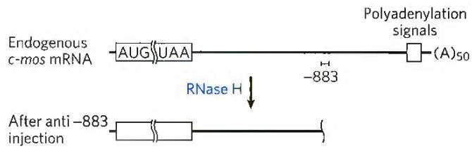

After injection of a sense oligonucleotide, the oocyte maturation percentage was nearly unchanged. However, when an antisense oligonucleotide was injected, the maturation percentage was reduced by \~60%. The c-mos mRNA was isolated from oocytes that either did or did not mature after injection of the antisense oligonucleotide. The mRNAs were analyzed by gel electrophoresis followed by northern blotting, as shown below. In a northern blot, RNAs are separated by gel electrophoresis according to their size, transferred to a membrane, and then detected by hybridization to radioactive or fluorescent complementary DNA probes.

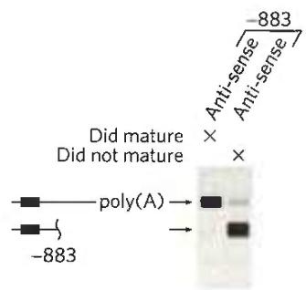

(a) What can you conclude about the importance of the c-mos mRNA poly(A) tail on oocyte maturation?

(b) Why was a sense oligonucleotide used in some experiments? Members of the Wickens lab then decided to inject a prosthetic RNA after amputation of the c-mos mRNA. The prosthetic RNA contained the c-mos mRNA 3'UTR as well as a region complementary to the amputated c-mos mRNA. Their observations are shown below. In these experiments, oocyte maturation was measured by the percentage of cells in which germinal vesicle breakdown (% GVBD) was observed. GVBD occurs when the oocyte nucleus (called the germinal vesicle) dissolves and the cell resumes meiosis.

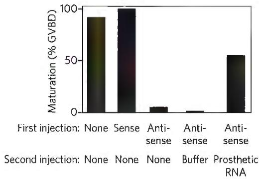  
(c) How do you explain these results?

Wickens lab scientists then tried attaching the c-mos mRNA 3'UTR to an unrelated reporter enzyme. In this case, they used luciferase, whose enzymatic activity can easily be measured by luminescence (see Box 13-2). The total luciferase activity is also proportional to the amount of luciferase protein being produced by the cell. They tried attaching the entire c-mos mRNA 3'UTR (mRNA1), the amputated 3'UTR (mRNA2), or a combination of the amputated 3'UTR with the prosthetic poly(A) tail to luciferase. High luciferase activity was observed only when either the entire c-mos mRNA 3'UTR was used or when the prosthetic poly(A) tail was included along with the amputated 3'UTR.

(d) What does this experiment tell you about the likely function of the 3'UTR and poly(A) tail for the c-mos mRNA and in oocyte maturation?

(e) How might these results be useful for controlling cellular gene expression?

## Reference

Sheets, M.D., M. Wu, and M. Wickens. 1995. Polyadenylation of c-mos mRNA as a control point in Xenopus meiotic maturation. Nature 374:511-516.

# PROTEIN METABOLISM

## 27.1 The Genetic Code 1006

27.2 Protein Synthesis 1015

## 27.3 Protein Targeting and Degradation 1041

Almost every biological process requires one or more proteins. A typical cell requires thousands of different proteins at any given moment. These proteins must be synthesized in response to the cell's current needs, modified to alter their activity or fate, transported (targeted) to their appropriate cellular locations, and degraded when no longer needed. Dozens of separate processes contribute to cellular proteostasis, the steady-state complement of proteins that enable the life of a cell at any given moment.

Many of the fundamental components and mechanisms used by the protein biosynthetic machinery are remarkably well conserved in all life-forms, from bacteria to higher eukaryotes, indicating that they were present in the last universal common ancestor (LUCA) of all extant organisms. Whereas the chapter focuses on protein biosynthesis, all aspects of proteostasis are considered. The principles that guide our approach are interrelated, reflecting all of these realities and more.

P1 Information is expensive. This principle, noted in earlier chapters, is particularly well illustrated by protein synthesis. Protein synthesis consumes more cellular resources than any other process in most cells. The 15,000 ribosomes, 100,000 molecules of protein synthesis-related protein factors and enzymes, and 200,000 tRNA molecules in a typical bacterial cell can account for more than $35\%$ of the cell's dry weight. Overall, almost 300 different macromolecules cooperate to synthesize polypeptides. Protein synthesis can account for up to $90\%$ of the chemical energy used by a cell for all biosynthetic reactions. Why? The enzymatic synthesis of an amide bond should require little energetic input. However, the sequence of amino acids in a protein is a form of biological information. Synthesis of each amide (peptide) bond between two particular amino

acids is ensured by the investment of more than four nucleoside triphosphates (NTPs).

P2 The genetic code is nearly universal and arose early in evolution. This is one of the many characteristics of living systems that ties all of them to a common ancestor. Even the rare exceptions to code universality reinforce this rule.

P3 The genetic code functions via linker molecules. The tRNAs are the crucial adaptor, matching amino acids with DNA codons.

P4 Proteins are synthesized by RNAs. The study of protein synthesis offers another important reward: a look at a world of RNA catalysts that may have existed in an RNA world before the dawn of life “as we know it.” Proteins are synthesized by a gigantic RNA enzyme.

P5 Protein metabolism is regulated at many levels. The resource investment in protein synthesis ensures that many layers of regulation work together to determine which proteins are synthesized at any given moment. However, proteins often function only in particular cellular locations and at particular times. Mechanisms for spatial and temporal regulation—protein targeting, activation, and eventual degradation—exhibit complexities that can approach those of the biosynthetic processes.

Several major advances set the stage for our present knowledge of protein biosynthesis (Fig. 27-1). First, in the early 1950s, Paul Zamecnik and Elizabeth Keller discovered the ribonucleoprotein particles in which protein synthesis occurs. These particles, visible in animal tissues by electron microscopy, were later named ribosomes. Soon after, Francis Crick considered how the genetic information encoded in the 4-letter language of nucleic acids could be translated into the 20-letter language of proteins. In 1955, Crick postulated that a small nucleic acid could serve the role of an adaptor, with one part of the adaptor molecule binding a specific

FIGURE 27-1 Timeline for the elucidation of protein biosynthetic pathways. Some key contributions are highlighted. However, our current understanding of the genetic code and protein biosynthetic pathways comes as the result of international endeavors involving hundreds of laboratories. [Top left to bottom left: Bettmann/Getty Images; data from PDB ID 4TRA, E. Westhof et al., Acta Crystallogr. A 44:112, 1988; Bettmann/Getty Images; Courtesy Archives, University of Wisconsin, Madison; Alastair Grant/AP Images; Lucas Jackson/Reuters/Newscm; Xinhua/ZUMAPRESS.com. Top right to bottom right: Joseph F. Gennaro Jr./Science Source; Archives and Special Collections, Massachusetts General Hospital; Cornell University Media Services PhotoSection records, #21-37-2227, Division of Rare and Manuscript Collections, Cornell University Library; Bob Schutz/AP Images; Courtesy Archives, University of Wisconsin, Madison; Courtesy Harry Noller; data from PDB ID 4V7R, A. Ben-Shem et al., Science 330:1203, 2010.]

amino acid and another part recognizing the nucleotide sequence encoding that amino acid in an mRNA (Fig. 27-2). Crick's adaptor hypothesis was soon verified when Mahlon Hoagland and Zamecnik discovered tRNA. The structure of alanyl-tRNA was reported by Robert Holley in 1964. The tRNA adaptor “translates” the nucleotide sequence of an mRNA into the amino acid sequence of a polypeptide. The overall process of mRNA-guided protein synthesis is often referred to simply as translation. Hoagland, Zamecnik, and Elizabeth Keller also discovered that amino acids were “activated” for protein synthesis when incubated with ATP and the cytosolic fraction of liver cells. The amino acids became attached to a heat-stable soluble RNA—the tRNA—to form aminoacyl-tRNAs. The enzymes that catalyze this process are the aminoacyl-tRNA synthetases.

  
FIGURE 27-2 Crick's adaptor hypothesis. Francis Crick proposed that one end of a small nucleotide adaptor could bind a specific amino acid and the other end could recognize a nucleotide sequence in the mRNA. Today we know that the amino acid is covalently bound at the 3' end of a tRNA molecule and that a specific nucleotide triplet elsewhere in the tRNA interacts with a particular triplet codon in mRNA through hydrogen bonding of complementary bases.

These developments soon led to recognition of the major stages of protein synthesis and ultimately to elucidation of the genetic code that specifies each amino acid. In subsequent decades, ribosomes were purified and their protein and rRNA components were dissected. Elucidation of the three-dimensional structures of ribosomes was completed by 2000, confirming a hypothesis first put forward by Harry Noller two decades earlier: it is the rRNA, rather than ribosomal proteins, that catalyzes peptide bond formation.

## 27.1 The Genetic Code

By the 1960s, it was apparent that at least three nucleotide residues of DNA are necessary to encode each amino acid. The four code letters of DNA (A, T, G, and C) in groups of two can yield only $4^{2} = 16$ different combinations, insufficient to encode 20 amino acids. Groups of three, however, yield $4^{3} = 64$ different combinations. Deciphering the genetic code quickly became a major goal.

  
FIGURE 27-3 Overlapping versus nonoverlapping genetic codes. In a nonoverlapping code, codons (numbered consecutively) do not share nucleotides. In an overlapping code, some nucleotides in the mRNA are shared by different codons. In a triplet code with maximum overlap, many nucleotides, such as the third nucleotide from the left (A), are shared by three codons. A nonoverlapping code provides much more flexibility in the triplet sequence of neighboring codons and therefore in the possible amino acid sequences designated by the code.

## The Genetic Code Was Cracked Using Artificial mRNA Templates

Several key properties of the genetic code were established in early genetic studies. A codon is a triplet of nucleotides that codes for a specific amino acid. In all living systems, translation occurs in such a way that these nucleotide triplets are read in a successive, nonoverlapping fashion (Figs. 27-3, 27-4). A specific first codon in the sequence establishes the reading frame, in which a new codon begins every three nucleotide residues. There is no punctuation between codons for successive amino acid residues. The amino acid sequence of a protein is defined by a linear sequence of contiguous triplets. In principle, any given single-stranded DNA or mRNA sequence has three possible reading frames. Each reading frame gives a different sequence of codons (Fig. 27-5), but only one is likely to encode a given protein. A key question remained: what were the three-letter code words for each amino acid?

In 1961, Marshall Nirenberg and J. Heinrich Matthaei reported the first breakthrough. They incubated synthetic polyuridylate, poly(U), with an Escherichia coli extract, GTP, ATP, and a mixture of the 20 amino acids in 20 different tubes, each tube containing a different radioactively labeled amino acid. Because poly(U) mRNA is made up of many successive UUU triplets, it should promote the synthesis of a polypeptide containing only the amino acid encoded by UUU. A radioactive polypeptide was formed only in the tube containing radioactive phenylalanine. Nirenberg and Matthaei therefore concluded that the triplet codon UUU encodes phenylalanine. The same approach soon revealed that polycytidylate, poly(C), encodes a polypeptide containing only proline (polyproline), and that polyadenylate, poly(A), encodes polylysine. Polyguanylate did not generate any polypeptide in this experiment because it spontaneously forms tetraplexes (see Fig. 8-20d) that cannot be bound by ribosomes.

  
FIGURE 27-4 The triplet, nonoverlapping code. Evidence for the general nature of the genetic code came from many types of experiments, including genetic experiments on the effects of deletion and insertion mutations. Inserting or deleting one base pair (shown here in the mRNA transcript) alters the sequence of all amino acids coded by the mRNA following the change. Combining insertion and deletion mutations affects some amino acids but can eventually restore the correct amino acid sequence. Adding or subtracting three nucleotides (not shown) leaves the remaining triplets intact, providing evidence that a codon has three, rather than four or five, nucleotides. The triplet codons shaded in gray are those transcribed from the original gene; codons shaded in blue are new codons resulting from the insertion or deletion mutations.

The synthetic polynucleotides used in such experiments were prepared by using polynucleotide phosphorylase (p. 987), which catalyzes the formation of RNA polymers starting from ADP, UDP, CDP, and GDP. This enzyme, discovered by physician/biochemist Severo Ochoa, requires no template and makes polymers with a base composition that directly reflects the relative concentrations of the nucleoside 5'-diphosphate precursors in the medium. If polynucleotide phosphorylase is presented with only UDP, it makes only poly(U). If it is presented with a mixture of five parts ADP and one part CDP, it makes a polymer in which about five-sixths of the residues are adenylate and one-sixth is cytidylate. This random polymer is likely to have many triplets of the sequence AAA; smaller numbers of AAC, ACA, and CAA triplets; relatively few ACC, CCA, and CAC triplets; and very few CCC triplets (Table 27-1). Using a variety of artificial mRNAs made by polynucleotide phosphorylase from different starting mixtures of ADP, GDP, UDP, and CDP, the Nirenberg and Ochoa groups soon identified the base compositions of the triplets coding for almost all the amino acids. Although these experiments revealed the base composition of the coding triplets, they usually could not reveal the sequence of the bases.

<table><tr><td>Reading frame 1</td><td>5&#x27; ---</td><td>U</td><td>U</td><td>C</td><td>U</td><td>C</td><td>G</td><td>G</td><td>A</td><td>C</td><td>C</td><td>U</td><td>G</td><td>G</td><td>A</td><td>G</td><td>A</td><td>U</td><td>U</td><td>C</td><td>A</td><td>C</td><td>A</td><td>G</td><td>U</td><td>---</td><td>3&#x27;</td></tr><tr><td>Reading frame 2</td><td></td><td>---</td><td>U</td><td>U</td><td>C</td><td>U</td><td>C</td><td>G</td><td>G</td><td>A</td><td>C</td><td>C</td><td>U</td><td>G</td><td>G</td><td>A</td><td>G</td><td>A</td><td>U</td><td>U</td><td>C</td><td>A</td><td>C</td><td>A</td><td>G</td><td>U</td><td>---</td></tr><tr><td>Reading frame 3</td><td></td><td>---</td><td>U</td><td>U</td><td>C</td><td>U</td><td>C</td><td>G</td><td>G</td><td>A</td><td>C</td><td>C</td><td>U</td><td>G</td><td>G</td><td>A</td><td>G</td><td>A</td><td>U</td><td>U</td><td>C</td><td>A</td><td>C</td><td>A</td><td>G</td><td>U</td><td>---</td></tr></table>

FIGURE 27-5 Reading frames in the genetic code. In a triplet, nonoverlapping code, all mRNAs have three potential reading frames, shaded here in different colors. The triplets, and hence the amino acids specified, are different in each reading frame.

TABLE 27-1 Incorporation of Amino Acids into Polypeptides in Response to Random Polymers of RNA

<table><tr><td>Amino acid</td><td>Observed frequency of incorporation (Lys = 100)</td><td>Tentative assignment for nucleotide composition of corresponding codona</td><td>Expected frequency of incorporation based on assignment (Lys = 100)</td></tr><tr><td>Asparagine</td><td>24</td><td> $A_{2}C$ </td><td>20</td></tr><tr><td>Glutamine</td><td>24</td><td> $A_{2}C$ </td><td>20</td></tr><tr><td>Histidine</td><td>6</td><td> $AC_{2}$ </td><td>4</td></tr><tr><td>Lysine</td><td>100</td><td>AAA</td><td>100</td></tr><tr><td>Proline</td><td>7</td><td> $AC_{2}$ , CCC</td><td>4.8</td></tr><tr><td>Threonine</td><td>26</td><td> $A_{2}C$ ,  $AC_{2}$ </td><td>24</td></tr></table>

Note: Presented here is a summary of data from one of the early experiments designed to elucidate the genetic code. A synthetic RNA containing only A and C residues in 5:1 ratio directed polypeptide synthesis, and both the identity and the quantity of incorporated amino acids were determined. Based on the relative abundance of A and C residues in the synthetic RNA, and assigning the codon AAA (the most likely codon) a frequency of 100, there should be three different codons of composition $\mathrm{A}_2\mathrm{C}$ , each at a relative frequency of 20; three of composition $\mathrm{AC}_2$ , each at a relative frequency of 4.0; and CCC at a relative frequency of 0.8. The CCC assignment was based on information derived from prior studies with poly(C). Where two tentative codon assignments are made, both are proposed to code for the same amino acid.  
$^{a}$ These designations of nucleotide composition contain no information on nucleotide sequence (except, of course, AAA and CCC).

KEY CONVENTION Much of the following discussion deals with tRNAs. The amino acid specified by a tRNA is indicated by a superscript, such as tRNA $^{Ala}$ , and the aminoacylated tRNA is designated by a hyphenated name, such as alanyl-tRNA $^{Ala}$ or Ala-tRNA $^{Ala}$ .

In 1964, Nirenberg and Philip Leder achieved another experimental breakthrough. Isolated E. coli ribosomes would bind a specific aminoacyl-tRNA in the presence of the corresponding synthetic polynucleotide messenger. For example, ribosomes incubated with poly(U) and phenylalanyl-tRNA $^{Phe}$ (Phe-tRNA $^{Phe}$ ) bind both RNAs, but if the ribosomes are incubated with poly(U) and some other aminoacyl-tRNA, the aminoacyl-tRNA is not bound, because it does not recognize the UUU triplets in poly(U) (Table 27-2). Even trinucleotides could promote specific binding of appropriate tRNAs, so these experiments could be carried out with chemically synthesized small oligonucleotides. With this technique, researchers determined which aminoacyl-tRNA bound to 54 of the 64 possible triplet codons. For some codons, either no aminoacyl-tRNA or more than one would bind. Another method was needed to complete and confirm the entire genetic code.

At about this time, a complementary approach was provided by H. Gobind Khorana, who developed chemical methods to synthesize polyribonucleotides with defined, repeating sequences of two to four bases. The polypeptides produced by these mRNAs had one or a few amino acids in repeating patterns. These patterns, when combined with information from the random polymers used by Nirenberg and colleagues, permitted unambiguous codon assignments. The copolymer (AC) $_{n}$ , for example, has alternating ACA and CAC codons: ACACACACACACACA. The polypeptide synthesized on this messenger contained equal amounts of threonine and histidine. Given that a histidine codon has one A and two Cs (Table 27-1), CAC must code for histidine and ACA for threonine.

<table><tr><td colspan="4">TABLE 27-2 Trinucleotides That Induce Specific Binding of Aminoacyl-tRNAs to Ribosomes</td></tr><tr><td rowspan="2">Trinucleotide</td><td colspan="3">Relative increase in14C-labeled aminoacyl-tRNA bound to ribosomea</td></tr><tr><td>Phe-tRNAPhe</td><td>Lys-tRNALys</td><td>Pro-tRNAPro</td></tr><tr><td>UUU</td><td>4.6</td><td>0</td><td>0</td></tr><tr><td>AAA</td><td>0</td><td>7.7</td><td>0</td></tr><tr><td>CCC</td><td>0</td><td>0</td><td>3.1</td></tr></table>

Information from M. Nirenberg and P. Leder, Science 145:1399, 1964.  
$^{a}$ Each number represents the factor by which the amount of bound ${}^{14}C$ increased when the indicated trinucleotide was present, relative to a control with no trinucleotide.

Consolidation of the results from many experiments permitted assignment of 61 of the 64 possible codons. The other three were identified as termination codons, in part because they disrupted amino acid coding patterns when they occurred in a synthetic RNA polymer (Fig. 27-6). Meanings for all the triplet codons (tabulated in Fig. 27-7) were established by 1966 and have been verified in many different ways. The cracking of the genetic code is regarded as one of the most important scientific discoveries of the twentieth century.

P2 Codons are the key to the translation of genetic information, directing the synthesis of specific proteins. The reading frame is set when translation of an mRNA molecule begins, and it is maintained as the synthetic machinery reads sequentially from one triplet to the next. If the initial

Reading frame 1 5' --- G U A A G U A A G U A A G U A A A --- 3'

Reading frame 2 --- G U A A G U A A G U A A G U A A G U A A ---

Reading frame 3 --- G U A A G | U A A | G U A | A G U | A A G | U A A | ---

FIGURE 27-6 Effect of a termination codon in a repeating tetranucleotide. Termination codons (light red) are encountered every fourth codon in three different reading frames (shown in different colors). Dipeptides or tripeptides are synthesized, depending on where the ribosome initially binds.

<table><tr><td colspan="5">First letter of codon (5&#x27; end)</td></tr><tr><td colspan="5">Second letter of codon</td></tr><tr><td></td><td>U</td><td>C</td><td>A</td><td>G</td></tr><tr><td rowspan="4">U</td><td>UUU Phe</td><td>UCU Ser</td><td>UAU Tyr</td><td>UGU Cys</td></tr><tr><td>UUC Phe</td><td>UCC Ser</td><td>UAC Tyr</td><td>UGC Cys</td></tr><tr><td>UUA Leu</td><td>UCA Ser</td><td>UAA Stop</td><td>UGA Stop</td></tr><tr><td>UUG Leu</td><td>UCG Ser</td><td>UAG Stop</td><td>UGG Trp</td></tr><tr><td rowspan="4">C</td><td>CUU Leu</td><td>CCU Pro</td><td>CAU His</td><td>CGU Arg</td></tr><tr><td>CUC Leu</td><td>CCC Pro</td><td>CAC His</td><td>CGC Arg</td></tr><tr><td>CUA Leu</td><td>CCA Pro</td><td>CAA Gln</td><td>CGA Arg</td></tr><tr><td>CUG Leu</td><td>CCG Pro</td><td>CAG Gln</td><td>CGG Arg</td></tr><tr><td rowspan="4">A</td><td>AUU Ile</td><td>ACU Thr</td><td>AAU Asn</td><td>AGU Ser</td></tr><tr><td>AUC Ile</td><td>ACC Thr</td><td>AAC Asn</td><td>AGC Ser</td></tr><tr><td>AUA Ile</td><td>ACA Thr</td><td>AAA Lys</td><td>AGA Arg</td></tr><tr><td>AUG Met</td><td>ACG Thr</td><td>AAG Lys</td><td>AGG Arg</td></tr><tr><td rowspan="4">G</td><td>GUU Val</td><td>GCU Ala</td><td>GAU Asp</td><td>GGU Gly</td></tr><tr><td>GUC Val</td><td>GCC Ala</td><td>GAC Asp</td><td>GGC Gly</td></tr><tr><td>GUA Val</td><td>GCA Ala</td><td>GAA Glu</td><td>GGA Gly</td></tr><tr><td>GUG Val</td><td>GCG Ala</td><td>GAG Glu</td><td>GGG Gly</td></tr></table>

FIGURE 27-7 "Dictionary" of amino acid code words in mRNAs. The codons are written in the $5' \rightarrow 3'$ direction. The third base of each codon (in bold type) plays a lesser role in specifying an amino acid than the first two. The three termination codons are shaded in light red, the initiation codon AUG in green. All the amino acids except methionine and tryptophan have more than one codon. In most cases, codons that specify the same amino acid differ only at the third base.

reading frame is off by one or two bases, or if translation somehow skips a nucleotide in the mRNA, all the subsequent codons will be out of register; the result is usually a "missense" protein with a garbled amino acid sequence.

Several codons serve special functions (Fig. 27-7). The initiation codon AUG is the most common signal for the beginning of a polypeptide in all cells, in addition to coding for Met residues in internal positions of polypeptides. The termination codons (UAA, UAG, and UGA), also called stop codons or nonsense codons, normally signal the end of polypeptide synthesis and do not code for any known amino acids.

As described in Section 27.2, initiation of protein synthesis in the cell is an elaborate process that relies on initiation codons and other signals in the mRNA. P1 In retrospect, the experiments of Nirenberg, Khorana, and others to identify codon function should not have worked in the absence of initiation codons. Serendipitously, experimental conditions caused the normally complex initiation requirements for protein synthesis (unknown at the time) to be relaxed. Diligence combined with chance to produce a breakthrough—a common occurrence in the history of biochemistry.

In a random sequence of nucleotides, 1 in every 20 codons in each reading frame is, on average, a termination codon. In general, a reading frame without a termination codon among 50 or more consecutive codons is referred to as an open reading frame (ORF). Long ORFs usually correspond to genes that encode proteins. In the analysis of sequence databases, sophisticated programs are used to search for ORFs in order to find genes among the often-huge background of nongenic DNA. An uninterrupted gene coding for a typical protein with a molecular weight of 60,000 would require an ORF with 500 or more codons.

A striking feature of the genetic code is that an amino acid may be specified by more than one codon, so the code is described as degenerate. This does not suggest that the code is flawed: although an amino acid may have two or more codons, each codon specifies only one amino acid. The degeneracy of the code is not uniform. Whereas methionine and tryptophan have single codons, for example, three amino acids (Arg, Leu, Ser) have six codons, five amino acids have four, isoleucine has three, and nine amino acids have two (Table 27-3).

The genetic code is nearly universal. With the intriguing exception of a few minor variations in mitochondria, some bacteria, and some single-celled eukaryotes, amino acid codons are identical in all species examined so far. Human beings, E. coli, tobacco plants, amphibians, and viruses share the same genetic code. This suggests that all life-forms have a common evolutionary ancestor, whose genetic code has been preserved throughout biological evolution. Even the variations (Box 27-1) reinforce this theme.

TABLE 27-3 Degeneracy of the Genetic Code

<table><tr><td>Amino acid</td><td>Number of codons</td><td>Amino acid</td><td>Number of codons</td></tr><tr><td>Met</td><td>1</td><td>Tyr</td><td>2</td></tr><tr><td>Trp</td><td>1</td><td>Ile</td><td>3</td></tr><tr><td>Asn</td><td>2</td><td>Ala</td><td>4</td></tr><tr><td>Asp</td><td>2</td><td>Gly</td><td>4</td></tr><tr><td>Cys</td><td>2</td><td>Pro</td><td>4</td></tr><tr><td>Gln</td><td>2</td><td>Thr</td><td>4</td></tr><tr><td>Glu</td><td>2</td><td>Val</td><td>4</td></tr><tr><td>His</td><td>2</td><td>Arg</td><td>6</td></tr><tr><td>Lys</td><td>2</td><td>Leu</td><td>6</td></tr><tr><td>Phe</td><td>2</td><td>Ser</td><td>6</td></tr></table>

## Exceptions That Prove the Rule: Natural Variations in the Genetic Code

In biochemistry, as in other disciplines, exceptions to general rules can be problematic for instructors and frustrating for students. At the same time, though, they teach us that life is complex and they inspire us to search for more surprises. Understanding the exceptions can even reinforce the original rule in unpredictable ways.

One would expect little room for variation in the genetic code. Even a single amino acid substitution can have profoundly deleterious effects on the structure of a protein. Nevertheless, variations in the code do occur in some organisms, and they are both interesting and instructive. The types of variation and their rarity provide powerful evidence for a common evolutionary origin of all living things.

To alter the code, changes must occur in the gene(s) encoding one or more tRNAs, with the obvious target for alteration being the anticodon. Such a change would lead to the systematic insertion of an amino acid at a codon that, according to the standard code (see Fig. 27-7), does not specify that amino acid. The genetic code, in effect, is defined by two elements: (1) the anticodons on tRNAs, which determine where an amino acid is placed in a growing polypeptide, and (2) the specificity of the enzymes — the aminoacyl-tRNA synthetases — that charge the tRNAs, which determines the identity of the amino acid attached to a given tRNA.

Most sudden changes in the code would have catastrophic effects on cellular proteins, so code alterations are more likely to persist where relatively few proteins would be affected — such as in small genomes encoding only a few proteins. The biological consequences of a code change could also be limited by restricting changes to the three termination codons, which do not generally occur within genes. This pattern is, in fact, observed.

Of the very few variations in the genetic code that we know of, most occur in mitochondrial DNA (mtDNA), which encodes only 10 to 20 proteins. Mitochondria have their own tRNAs, so their code variations do not affect the much larger cellular genome. The most common changes in mitochondria involve termination codons. These changes affect termination in the products of only a subset of genes, and sometimes the effects are minor, because the genes have multiple (redundant) termination codons.

Vertebrate mtDNAs have genes that encode 13 proteins, 2 rRNAs, and 22 tRNAs (see Fig. 19-40). Given the small number of codon reassignments, along with an unusual

## Wobble Allows Some tRNAs to Recognize More than One Codon

When several different codons specify one amino acid, the difference between them usually lies at the third base position (at the 3' end). For example, alanine is encoded by the triplets GCU, GCC, GCA, and GCG. The codons for set of wobble rules (p. 1012), the 22 tRNAs are sufficient to decode the protein-coding genes, as opposed to the 32 tRNAs required for the standard code. In mitochondria, these changes can be viewed as a kind of genomic streamlining, as a smaller genome confers a replication advantage on the organelle. Four codon families (in which the amino acid is determined entirely by the first two nucleotides) are decoded by a single tRNA with a U residue in the first (or wobble) position in the anticodon. Either the U pairs somehow with any of the four possible bases in the third position of the codon or a "two out of three" mechanism is used — that is, no base pairing is needed at the third position. Other tRNAs recognize codons with either A or G in the third position, and yet others recognize U or C, so that virtually all the tRNAs recognize either two or four codons.

In the standard code, only two amino acids are specified by single codons: methionine and tryptophan (see Table 27-3). If all mitochondrial tRNAs recognize two codons, we would expect additional Met and Trp codons in mitochondria. And we find that the single most common code variation is UGA, usually a termination codon, specifying tryptophan. The tRNA $^{Trp}$ recognizes and inserts a Trp residue at either UGA or the usual Trp codon, UGG. The second most common variation is conversion of AUA from an Ile codon to a Met codon; the usual Met codon is AUG, and a single tRNA recognizes both codons. The known coding variations in mitochondria are summarized in Table 1.

Turning to the much rarer changes in the codes for cellular (as distinct from mitochondrial) genomes, we find that the only known variation in a bacterium is again the use of UGA to encode Trp residues, occurring in the simplest free-living cell, Mycoplasma capricolum. Among eukaryotes, rare extramitochondrial coding changes occur in a few species of ciliated protists, in which both termination codons UAA and UAG can specify glutamine. There are also rare but interesting cases in which stop codons have been adapted to encode amino acids that are not among the standard 20, as detailed in Box 27-2.

Changes in the code need not be absolute; a codon might not always encode the same amino acid. For example, in many bacteria — including E. coli — GUG (Val) is sometimes used as an initiation codon that specifies Met. This occurs only for those genes in which the GUG is properly located relative to particular mRNA sequences that affect the initiation of translation (as discussed in Section 27.2).

most amino acids can be symbolized by $XY_{G}^{A}$ or $XY_{C}^{U}$ . The first two letters of each codon are the primary determinants of specificity, a feature that has some interesting consequences.

P3 Transfer RNAs base-pair with mRNA codons at a three-base sequence on the tRNA called the anticodon.

TABLE 1 Known Variant Codon Assignments in Mitochondria

<table><tr><td rowspan="2"></td><td colspan="5">Codons $^{a}$ </td></tr><tr><td>UGA</td><td>AUA</td><td>AGA AGG</td><td>CUN</td><td>CGG</td></tr><tr><td>Normal (cellular) code assignment</td><td>Stop</td><td>Ile</td><td>Arg</td><td>Leu</td><td>Arg</td></tr><tr><td colspan="6">Animals</td></tr><tr><td>Vertebrates</td><td>Trp</td><td>Met</td><td>Stop</td><td>+</td><td>+</td></tr><tr><td>Drosophila</td><td>Trp</td><td>Met</td><td>Ser</td><td>+</td><td>+</td></tr><tr><td colspan="6">Yeasts</td></tr><tr><td>Saccharomyces cerevisiae</td><td>Trp</td><td>Met</td><td>+</td><td>Thr</td><td>+</td></tr><tr><td>Torulopsis glabrata</td><td>Trp</td><td>Met</td><td>+</td><td>Thr</td><td>?</td></tr><tr><td>Schizosaccharomyces pombe</td><td>Trp</td><td>+</td><td>+</td><td>+</td><td>+</td></tr><tr><td>Filamentous fungi</td><td>Trp</td><td>+</td><td>+</td><td>+</td><td>+</td></tr><tr><td>Trypanosomes</td><td>Trp</td><td>+</td><td>+</td><td>+</td><td>+</td></tr><tr><td>Higher plants</td><td>+</td><td>+</td><td>+</td><td>+</td><td>Trp</td></tr><tr><td>Chlamydomonas reinhardtii</td><td>?</td><td>+</td><td>+</td><td>+</td><td>?</td></tr></table>

$^{a}$ N indicates any nucleotide; + indicates that a codon has the same meaning as in the cellular code; ? indicates that a codon was not observed in this mitochondrial genome.

The most surprising alteration in the genetic code occurs in some fungal species of the genus Candida, as originally discovered for Candida albicans. C. albicans is an organism of high genomic complexity, yet its genetic code has undergone a dramatic change: the CUG codon, which usually encodes Leu residues, encodes Ser instead. The natural selection pressure for this change is completely unknown. Furthermore, Ser and Leu are quite different in chemical structure. However, even this change can be understood based on the properties of a universal code. When several codons encode the same amino acid and use multiple tRNAs, not all of the codons are used with equal frequency. In a phenomenon called codon bias, some codons for a particular amino acid are used more frequently (sometimes much more frequently) than others. The tRNAs for the frequently used codons are often present at much higher concentrations than the tRNAs required for the rarely used codons. Code degeneracy leads to the presence of six codons for Leu. In bacteria, CUG often encodes Leu. However, in fungi of genera that are very closely related to Candida but do not have the coding change, CUG only rarely encodes Leu and is often entirely absent in highly

The first base of the codon in mRNA (read in the 5'→3' direction) pairs with the third base of the anticodon (Fig. 27-8a). If the anticodon triplet of a tRNA recognized only one codon triplet through Watson-Crick base pairing at all three positions, cells would have a different tRNA for each amino acid codon. This is not the case, however, expressed proteins. A change in the coding sense of CUG would thus have a much smaller effect on fungal cell metabolism than might be expected if all codons were used equally. The coding change may have occurred by a gradual loss of CUG codons in genes and of the tRNA that recognizes CUG as a Leu codon, followed by a capture event—a mutation in the anticodon of a tRNA $^{Ser}$ that allowed it to recognize CUG. Alternatively, there may have been an intermediate stage in which CUG was recognized as encoding both Leu and Ser, perhaps with contextual signals in the mRNAs that helped one tRNA or another recognize specific CUG codons (see Box 27-2). Phylogenetic analysis indicates that the reassignment of CUG as a Ser codon occurred in Candida ancestors about 150 million to 170 million years ago.

These variations tell us that the code is not quite as universal as once believed, but that its flexibility is severely constrained. The variations are obviously derivatives of the cellular code, and no example of a completely different code has been found. The limited scope of code variants strengthens the principle that all life on this planet evolved on the basis of a single (slightly flexible) genetic code.

because the anticodons in some tRNAs include the nucleotide inosinate (designated I), which contains the uncommon base hypoxanthine (see Fig. 8-5b). Inosinate can form hydrogen bonds with three different nucleotides — A, U, and C (Fig. 27-8b) — although these pairings are much weaker than the hydrogen bonds of Watson-Crick base pairs G≡C and A=U. In yeast, one tRNA $^{Arg}$ has the anticodon (5')ICG, which recognizes three arginine codons: (5')CGA, (5')CGU, and (5')CGC. The first two bases are identical (CG) and form strong Watson-Crick base pairs with the corresponding bases of the anticodon, but the third base (A, U, or C) forms rather weak hydrogen bonds with the I residue at the first position of the anticodon.

Examination of these and other codon-anticodon pairings led Crick to conclude that the third base of most codons pairs rather loosely with the corresponding base of its anticodon; to use his picturesque word, the third base of such codons (and the first base of their corresponding anticodons) "wobbles." Crick proposed a set of four relationships called the wobble hypothesis:

1. The first two bases of an mRNA codon always form strong Watson-Crick base pairs with the corresponding bases of the tRNA anticodon and confer most of the coding specificity.

2. The first base of the anticodon (reading in the 5'→3' direction; this pairs with the third base of the codon) determines the number of codons recognized by the tRNA. When the first base of the anticodon is C or A, base pairing is specific and only one codon is recognized by that tRNA. When the

  
(a)

$$
\begin{array}{c c c c c} & 3 & 2 & 1 \\ \text {Anticodon} & (3 ^ {\prime}) & G - C - I \\ & \equiv & \equiv & \equiv \\ \text {Codon} & (5 ^ {\prime}) & C - G - A \\ & & 1 & 2 & 3 \end{array} \qquad \qquad \begin{array}{c c c c c} & 3 & 2 & 1 \\ & G - C - I \\ & \equiv & \equiv & \equiv \\ & C - G - U \\ & 1 & 2 & 3 \end{array} \qquad \qquad \begin{array}{c c c c c} & 3 & 2 & 1 \\ & G - C - I & (5 ^ {\prime}) \\ & \equiv & \equiv & \equiv \\ & C - G - C & (3 ^ {\prime}) \\ & 1 & 2 & 3 \end{array}
$$

(b)

FIGURE 27-8 Pairing relationship of codon and anticodon. (a) Alignment of the two RNAs is antiparallel. The tRNA is shown in the traditional cloverleaf configuration. (b) Three different codon pairing relationships are possible when the tRNA anticodon contains inosinate.

first base is U or G, binding is less specific and two different codons may be read. When inosine (I) is the first (wobble) nucleotide of an anticodon, three different codons can be recognized—the maximum number for any tRNA. These relationships are summarized in Table 27-4.

3. When an amino acid is specified by several different codons, the codons that differ in either of the first two bases require different tRNAs.

4. A minimum of 32 tRNAs are required to translate all 61 codons (31 to encode the amino acids, 1 for initiation).

The wobble (or third) base of the codon contributes to specificity, but because it pairs only loosely with its corresponding base in the anticodon, it permits rapid dissociation of the tRNA from its codon during protein synthesis. If all three bases of a codon engaged in strong Watson-Crick pairing with the three bases of the anticodon, tRNAs would dissociate too slowly and this would limit the rate of protein synthesis. Codon-anticodon interactions balance the requirements for accuracy and speed.

P3 Although only 32 tRNAs are required to translate all codons, most cells have more than that. The bacterium E. coli has 47 different tRNA genes. Many of these are present in multiple copies, such that there are 86 total tRNA genes in the E. coli genome.

## The Genetic Code Is Mutation-Resistant

The genetic code plays an interesting role in safeguarding the genomic integrity of every living organism. Evolution did not produce a code in which codon assignments appeared at random. Instead, the code is strikingly resistant to the deleterious effects of the most common kinds

## TABLE 27-4 How the Wobble Base of the Anticodon Determines the Number of Codons a tRNA Can Recognize

1. One codon recognized:
Anticodon (3') X - Y - C (5') (3') X - Y - A (5')
Codon (5') X' - Y' - G (3') (5') X' - Y' - U (3')

2. Two codons recognized:
Anticodon (3') X - Y - U (5') (3') X - Y - G (5')
Codon (5') X' - Y' - A (3') (5') X' - Y' - C (3')

3. Three codons recognized:
Anticodon (3') X - Y - I (5')
Codon (5') X' - Y' - A U C (3')

Note: X and Y denote bases complementary to and capable of strong Watson-Crick base pairing with $X'$ and $Y'$ , respectively. Wobble bases—in the $3'$ position of codons and $5'$ position of anticodons—are shaded.

of mutations—missense mutations, in which a single new base pair replaces another. In the third, or wobble, position of the codon, single base substitutions produce a change in the encoded amino acid only about 25% of the time. Most such changes are thus silent mutations, in which the nucleotide is different but the encoded amino acid remains the same.

Due to the types of spontaneous DNA damage that affect genomes (see Chapter 8), the most frequent missense mutation is a transition mutation, in which a purine is replaced by a purine, or a pyrimidine by a pyrimidine (for example, G≡C changed to A=T). All three codon positions have evolved so that there is some resistance to transition mutations. A mutation in the first position of the codon will usually produce an amino acid coding change, but the change often results in an amino acid with similar chemical properties. This is especially true for the hydrophobic amino acids that dominate the first column of the code shown in Figure 27-7. Consider the Val codon GUU. A change to AUU would substitute Ile for Val. A change to CUU would replace Val with Leu. The resulting changes in the structure and/or function of the protein encoded by that gene would often (but not always) be small.

P2 Computational studies have shown that alternative genetic codes, delineated at random, are almost always less resistant to mutation than the existing code. The results indicate that the code underwent considerable streamlining before the appearance of LUCA, the ancestral cell.

The genetic code tells us how protein sequence information is stored in nucleic acids and provides some clues about how that information is translated into protein.

## Translational Frameshifting Affects How the Code Is Read

Once the reading frame has been set during protein synthesis, codons are translated without overlap or punctuation until the ribosomal complex encounters a termination codon. The other two possible reading frames usually contain no useful genetic information. Overlap between two genes would necessarily constrain the possible amino acid sequences encoded by one or both genes in the overlap region. However, to make maximal use of limited (and expensive) genetic information, a few genes are structured so that ribosomes "hiccup" at a certain point in the translation of their mRNAs, changing the reading frame from that point on. This allows two or more related but distinct proteins to be produced from a single transcript.

One of the best-documented examples of translational frameshifting occurs during translation of the mRNA for the overlapping gag and pol genes of the Rous sarcoma virus, a retrovirus (see Fig. 26-31). The reading frame for pol is offset to the left by one base pair (-1 reading frame) relative to the reading frame for gag (Fig. 27-9).

The product of the retroviral pol gene (reverse transcriptase) is translated as a larger polyprotein, on the same mRNA that is used for the Gag protein alone (see Fig. 26-30). The polyprotein, or Gag-Pol protein, is then trimmed to the mature reverse transcriptase by proteolytic digestion. Production of the polyprotein requires a translational frameshift in the overlap region to allow the ribosome to bypass the UAG termination codon at the end of the gag gene (shaded light red in Fig. 27-9).

Frameshifts occur during about 5% of translations of this mRNA, and the Gag-Pol polyprotein (and ultimately reverse transcriptase) is synthesized at about one-twentieth the frequency of the Gag protein, a level that suffices for efficient reproduction of the virus. A similar mechanism produces both the $\tau$ and $\gamma$ subunits of E. coli DNA polymerase III from a single dnaX gene transcript (see footnote to Table 25-2).

## Some mRNAs Are Edited before Translation

RNA editing can involve the addition, deletion, or alteration of nucleotides in the RNA in a manner that affects the meaning of the transcript when it is translated. Addition or deletion of nucleotides has been most commonly observed in RNAs originating from the mitochondrial and chloroplast genomes. The initial transcripts of the genes that encode cytochrome oxidase subunit II in some protist mitochondria provide an example of editing by insertion. These transcripts do not correspond precisely to the sequence needed at the carboxyl terminus of the protein product. A posttranscriptional editing process inserts four U residues that shift the translational reading frame of the transcript. The insertions require a special class of guide RNAs (gRNAs; Fig. 27-10) that act as templates for the editing process. The added U residues are all located in a small part of the transcript. Note that the base pairing between the initial transcript and the guide RNA includes several G=U base pairs (blue dots), which are common in RNA molecules.

RNA editing by alteration of nucleotides most commonly involves the enzymatic deamination of adenosine or cytidine residues, forming inosine or uridine, respectively (Fig. 27-11), although other base changes have been described. Inosine is interpreted as a G residue during translation. The adenosine deamination reactions are carried out by adenosine deaminases that act on RNA (ADARs). The cytidine deaminations are carried out by the apoB mRNA editing catalytic peptide (APOBEC) family of enzymes, which includes the activation-induced deaminase (AID) enzymes. Both the ADAR and APOBEC groups of deaminase enzymes have a homologous zinc-coordinating catalytic domain.

  
(b)  
FIGURE 27-11 Deamination reactions that result in RNA editing. (a) Conversion of adenosine nucleotides to inosine nucleotides is catalyzed by ADAR enzymes. (b) Cytidine-to-uridine conversions are catalyzed by the APOBEC family of enzymes.

FIGURE 27-10 RNA editing of the transcript of the cytochrome oxidase subunit II gene from Trypanosoma brucei mitochondria. (a) Insertion of four U residues (red) produces a revised reading frame. (b) A special class of guide RNAs, complementary to the edited product, acts as templates for the editing process. Note the presence of three G=U base pairs, signified by blue dots to indicate non-Watson-Crick pairing.  

The ADAR-promoted A-to-I editing of RNA transcripts is particularly common in primates. Most of the editing occurs in Alu elements, a subset of short interspersed elements (SINEs), eukaryotic transposons that are particularly common in primate genomes. Human DNA contains more than a million 300 bp Alu elements, making up about 10% of the genome. These elements are concentrated near protein-coding genes, often in introns and untranslated regions at the 3' and 5' ends of transcripts. When it is first synthesized (before processing), the average human mRNA includes 10 to 20 Alu elements. Certain microRNAs are also targeted by ADARs. The microRNA (miRNA) alterations generally reduce expression and/or function.

The ADAR enzymes bind to and promote A-to-I editing only in duplex regions of RNA. The abundant Alu elements offer many opportunities for intramolecular base pairing within the transcripts, providing the duplex targets required by ADARs. Some of the editing affects the coding sequences of genes. Defects in ADAR function have been associated with a variety of human neurological conditions, including amyotrophic lateral sclerosis (ALS), epilepsy, and major depression.

There are six general classes of APOBEC cytidine deaminases: APOBEC1–APOBEC5 and AID. The AID proteins function in increasing antibody diversity during immunoglobulin gene maturation (see Figs. 25-42 and 25-43). APOBEC1 and some of the APOBEC3 proteins (seven APOBEC paralogs are encoded by the human genome) edit mRNAs. A well-studied example of RNA editing by APOBEC1-mediated deamination occurs in the gene for the apolipoprotein B component of low-density lipoprotein in vertebrates. One form of apolipoprotein B, apoB-100 ( $M_{r}$ 513,000), is synthesized in the liver; a second form, apoB-48 ( $M_{r}$ 250,000), is synthesized in the intestine. Both are encoded by an mRNA produced from the gene for apoB-100. An APOBEC cytidine deaminase found only in the intestine binds to the mRNA at the codon for amino acid residue 2,153 (CAA=Gln) and converts the C to a U to create the termination codon UAA. The apoB-48 produced in the intestine from this modified mRNA is simply an abbreviated form (corresponding to the amino-terminal half) of apoB-100 (Fig. 27-12). P1 This reaction permits tissue-specific synthesis of two different proteins from one gene.

  
FIGURE 27-12 RNA editing of the transcript of the gene for the apoB-100 component of LDL. Deamination, which occurs only in the intestine, converts a specific cytidine to uridine, changing a Gln codon to a stop codon and producing a truncated protein.

APOBEC2, 4, and 5 act on DNA rather than RNA, and their functions are poorly understood. However, their ability to cause genomic mutations can make them a liability to the cell. One or more APOBEC enzymes are often overexpressed in tumor cells, and their mutagenic ability can contribute to the formation of tumors. They also provide a mechanism for introducing multiple mutations into a targeted segment of a chromosome, leading to selective and more rapid evolution of that DNA region.

## SUMMARY 27.1 The Genetic Code

The particular amino acid sequence of a protein is constructed through the translation of information encoded in mRNA. This process is carried out by ribosomes. Amino acids are specified by mRNA codons consisting of nucleotide triplets. Translation requires adaptor molecules, the tRNAs, that recognize codons and insert amino acids into their appropriate sequential positions in the polypeptide.

The base sequences of the codons were deduced from experiments using synthetic mRNAs of known composition and sequence. The codon AUG signals initiation of translation. The triplets UAA, UAG, and UGA are signals for termination. The genetic code is degenerate: it has multiple codons for almost every amino acid. The standard genetic code is universal in all species, with some minor deviations in mitochondria and a few single-celled organisms. The deviations occur in a pattern that reinforces the concept of a universal code.

\- The third position in each codon is much less specific than the first and second positions and is said to wobble. This property allows certain tRNAs to recognize more than one codon.

■ The genetic code is resistant to the effects of missense mutations. The code evolved so that many nucleotide changes in a DNA codon do not alter the encoded amino acid, or they result in a very conservative alteration.

■ Translational frameshifting and RNA editing affect how the genetic code is read during translation.

■ RNA editing by ADARs (adenosine deaminases) and APOBECs (cytidine deaminases) also alters the coding sequence of some mRNAs. Many APOBEC enzymes target DNA, where they function in facilitating antibody diversity and suppression of retroviruses and retrotransposons.

## 27.2 Protein Synthesis

As we have seen for DNA and RNA (Chapters 25 and 26), the synthesis of polymeric biomolecules can be considered in terms of initiation, elongation, and termination stages. These fundamental processes are typically bracketed by two additional stages: activation of precursors before synthesis and postsynthetic processing of the completed polymer. Protein synthesis follows the same pattern. The activation of amino acids before their incorporation into polypeptides and the posttranslational processing of the completed polypeptide play particularly important roles in ensuring both the fidelity of synthesis and the proper function of the protein product. The process is outlined in Figure 27-13. P1 The cellular components involved in the five stages of protein synthesis in E. coli and other bacteria are listed in Table 27-5; the requirements in eukaryotic cells are similar, although the components are usually more numerous. Before looking at these five stages in detail, we must examine two key components of protein biosynthesis: the ribosome and tRNAs.

## The Ribosome Is a Complex Supramolecular Machine

P1 Each E. coli cell contains 15,000 or more ribosomes, which comprise nearly a quarter of the dry weight of the cell. Bacterial ribosomes contain about 65% rRNA and 35% protein; they have a diameter of about 18 nm and are composed of two unequal subunits with sedimentation coefficients of 30S and 50S and a combined sedimentation coefficient of 70S. Both subunits contain dozens of ribosomal proteins (r-proteins) and at least one large rRNA (Table 27-6).

As it became clear that ribosomes are the complexes responsible for protein synthesis, and following elucidation of the genetic code, the study of ribosomes accelerated. In the late 1960s Masayasu Nomura and colleagues demonstrated that both ribosomal subunits can be broken down into their RNA and protein components, then reconstituted in vitro. Ribosomal subunits are identified by their S (Svedberg unit) values, sedimentation coefficients that refer to their rate of sedimentation in a centrifuge.

  
FIGURE 27-13 An overview of the five stages of protein synthesis.

<table><tr><td colspan="3">TABLE 27-5 Components Required for the Five Major Stages of Protein Synthesis in E. coli</td></tr><tr><td>Stage</td><td colspan="2">Essential components</td></tr><tr><td rowspan="3">1. Activation of amino acids</td><td>20 amino acids</td><td>ATP</td></tr><tr><td>20 aminoacyl-tRNA synthases</td><td> $Mg^{2+}$ </td></tr><tr><td>32 or more tRNAs</td><td></td></tr><tr><td rowspan="4">2. Initiation</td><td>mRNA</td><td>50S ribosomal subunit</td></tr><tr><td>N-Formylmethionyl-tRNA $^fMet$ </td><td>Initiation factors (IF1, IF2, IF3)</td></tr><tr><td>Initiation codon in mRNA (AUG)</td><td>GTP</td></tr><tr><td>30S ribosomal subunit</td><td> $Mg^{2+}$ </td></tr><tr><td rowspan="3">3. Elongation</td><td>Functional 70S ribosomes (initiation complex)</td><td>Elongation factors (EF-Tu, EF-Ts, EF-G)</td></tr><tr><td rowspan="2">Aminoacyl-tRNAs specified by codons</td><td>GTP</td></tr><tr><td> $Mg^{2+}$ </td></tr><tr><td rowspan="2">4. Termination and ribosome recycling</td><td>Termination codon in mRNA</td><td>EF-G</td></tr><tr><td>Release factors (RF1, RF2, RF3, RRF)</td><td>IF3</td></tr><tr><td>5. Folding and posttranslational processing</td><td colspan="2">Chaperones and folding enzymes (PPI, PDI); specific enzymes, cofactors, and other components for removal of initiating residues and signal sequences, additional proteolytic processing, modification of terminal residues, and attachment of acetyl, phosphoryl, methyl, carboxyl, carbohydrate, or prosthetic groups</td></tr></table>

Under appropriate experimental conditions, the RNA and protein spontaneously reassemble to form 30S or 50S subunits nearly identical in structure and activity to native subunits. This breakthrough fueled decades of research into the function and structure of ribosomal RNAs and proteins. At the same time, increasingly sophisticated structural methods revealed more and more details about ribosome structure.

<table><tr><td colspan="5">TABLE 27-6 RNA and Protein Components of the E. coli Ribosome</td></tr><tr><td>Subunit</td><td>Number of different proteins</td><td>Total number of proteins</td><td>Protein designations</td><td>Number and type of rRNAs</td></tr><tr><td>30S</td><td>21</td><td>21</td><td>S1-S21</td><td>1 (16S rRNA)</td></tr><tr><td>50S</td><td>33</td><td>36</td><td>L1-L36a</td><td>2 (5S and 23S rRNAs)</td></tr></table>

$^{a}$ The L1 to L36 protein designations do not correspond to 36 different proteins. The protein originally designated L7 is a modified form of L12, and L8 is a complex of three other proteins. Also, L26 proved to be the same protein as S20 (and not part of the 50S subunit). This gives 33 different proteins in the large subunit. There are four copies of the L7/L12 protein, with the three extra copies bringing the total protein count to 36.

The dawn of a new millennium illuminated the first high-resolution structures of bacterial ribosomal subunits by Venkatraman Ramakrishnan, Thomas Steitz, Ada Yonath, Harry Noller, and others. This work yielded a wealth of surprises (Fig. 27-14a). First, a traditional focus on the protein components of ribosomes was shifted. The ribosomal subunits are huge RNA molecules. In the 50S subunit, the 5S and 23S rRNAs form the structural core. The proteins are secondary elements in the complex, decorating the surface. Second, and most important, there is no protein within 18 Å of the active site for peptide bond formation. P4 The high-resolution structure thus confirms what Noller had predicted much earlier: the ribosome is a ribozyme. In addition to the insight that the detailed structures of the ribosome and its subunits provide into the mechanism of protein synthesis (as elaborated below), these findings have stimulated a new look at the evolution of life (Section 26.4). The ribosomes of eukaryotic cells have also yielded to structural analysis (Fig. 27-14b).

The bacterial ribosome is complex, with a combined molecular weight of $\sim 2.7$ million. The two irregularly shaped ribosomal subunits fit together to form a cleft through which the mRNA passes as the ribosome moves along it during translation (Fig. 27-14a). The 57 proteins in bacterial ribosomes vary enormously in size and structure. Molecular weights range from about 6,000 to 75,000. Most of the proteins have globular domains arranged on the ribosome surface. Some also have snakelike extensions that protrude into the rRNA core of the ribosome, stabilizing its structure. The functions of some of these proteins have not yet been elucidated in detail, although a structural role seems evident for many of them.

The sequences of the rRNAs of countless thousands of organisms are now known due to genomic sequencing. Each of the three single-stranded rRNAs of E. coli has a specific three-dimensional conformation with extensive intrachain base pairing. The folding patterns of the rRNAs are highly conserved in all organisms, particularly the regions implicated in key functions (Fig. 27-15). The predicted secondary structure of the rRNAs has largely been confirmed by structural analysis but fails to convey the extensive network of tertiary interactions apparent in the complete structure.

FIGURE 27-14 The structure of ribosomes. Our understanding of ribosome structure has been greatly enhanced by multiple high-resolution images of the ribosomes from bacteria and yeast. (a) The bacterial ribosome. The 50S and 30S subunits come together to form the 70S ribosome.  
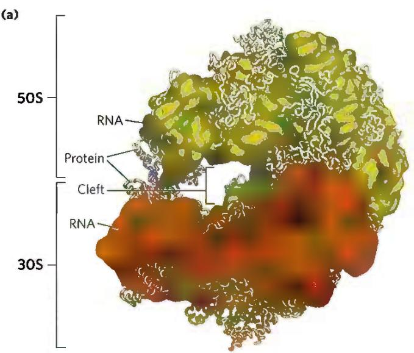

  
The cleft between them is where protein synthesis occurs. (b) The yeast ribosome has a similar structure with somewhat increased complexity. [Data from (a) PDB ID 4V4I, A. Korostelev et al., Cell 126:1065, 2006; (b) PDB ID 4V7R, A. Ben-Shem et al., Science 330:1203, 2010.]

  
FIGURE 27-15 Conservation of secondary structure in the small subunit rRNAs from the three domains of life. The red, yellow, and purple indicate areas where the structures of the rRNAs from bacteria, archaea, and eukaryotes have diverged. Conserved regions are shown in green. [Information originally from the Comparative RNA Web, University of Texas.]

The ribosomes of eukaryotic cells (other than mitochondrial and chloroplast ribosomes) are larger and more complex than bacterial ribosomes (Fig. 27-16; compare Fig. 27-14b), with a diameter of about 23 nm and a sedimentation coefficient of about 80S. They also have two subunits, which vary in size among species but on average are 60S and 40S. Altogether, a ribosome of the yeast Saccharomyces cerevisiae contains 79 different proteins and 4 ribosomal RNAs. The ribosomes of mitochondria and chloroplasts are somewhat smaller and simpler than bacterial ribosomes. Nevertheless, ribosomal structure and function are strikingly similar in all organisms and organelles.

In both bacteria and eukaryotes, ribosomes are assembled through a hierarchical incorporation of r-proteins as the rRNAs are synthesized. Much of the processing of pre-rRNAs occurs within large ribonucleoprotein complexes. The composition of these complexes changes as new r-proteins are added, the rRNAs acquire their final form, and some proteins required for rRNA processing dissociate. In eukaryotes, the early stages of assembly occur in the nucleolus, with the final maturation of the ribosome completed after export to the cytosol. P1 Dozens of assembly factors, both proteins and some small RNA molecules (snoRNAs; Fig. 26-24), participate in this process (Fig. 27-17).

## Transfer RNAs Have Characteristic Structural Features

To understand how tRNAs can serve as adaptors in translating the language of nucleic acids into the language of proteins, we must first examine their structure in more detail. Transfer RNAs are relatively small and consist of a single strand of RNA folded into a precise three-dimensional structure (see Fig. 8-25a). The tRNAs of bacteria and in the cytosol of eukaryotes have between 73 and 93 nucleotide residues, corresponding to molecular weights of 24,000 to 31,000. Mitochondria and chloroplasts contain distinctive, somewhat smaller tRNAs. Cells have at least one kind of tRNA for each amino acid; at least 32 tRNAs are required to recognize all the amino acid codons (some recognize more than one codon), but some cells use more than 32.

  
FIGURE 27-16 Summary of the composition and mass of ribosomes in bacteria and eukaryotes. The S values associated with the subunits are not additive when subunits are combined, because S values are approximately proportional to the two-thirds power of molecular weight and are also slightly affected by shape.

Yeast alanine tRNA (tRNA $^{Ala}$ ) was the first nucleic acid to be completely sequenced, by Robert Holley in 1965. It contains 76 nucleotide residues, 10 of which have modified bases. Comparisons of tRNAs from various species have revealed many common structural features (Fig. 27-18a). Eight or more of the nucleotide residues have modified bases and sugars, many of which are methylated derivatives of the principal bases. Most tRNAs have a guanylate (pG) residue at the 5' end, and all have the trinucleotide sequence CCA(3') at the

  
FIGURE 27-17 Assembly of ribosomes in eukaryotes. ① Most of the early steps of ribosome assembly occur in the nucleolus, an organelle inside the nucleus. Ribonucleases and specialized RNAs, including some snoRNAs, process the initial rRNA transcript. ② Large pre-ribosomal particles are formed and additional processing of the large complex occurs with the aid of proteins called assembly factors. The pre-40S and pre-60S complexes move into the nucleoplasm. ③ The 40S and 60S subunits are exported to the cytoplasm, coupled with the ejection of assembly factors. ④ Final maturation of the ribosome occurs in the cytoplasm.

3' end. When drawn in two dimensions, all tRNAs have a hydrogen-bonding pattern that forms a cloverleaf structure with four arms, as first proposed by Elizabeth Keller. The longer tRNAs have a short fifth arm, or extra arm. In three dimensions, a tRNA has the form of a twisted L (Fig. 27-18b).

P3 Two of the arms of a tRNA are critical for its adaptor function. The amino acid arm can carry a specific amino acid esterified by its carboxyl group to the 2'- or 3'-hydroxyl group of the A residue at the 3' end of the tRNA. The anticodon arm contains the anticodon. The other major arms are the D arm, which contains the unusual nucleotide dihydrouridine (D), and the TψC arm, which contains ribothymidine (T), not usually present in RNAs, and pseudouridine (ψ), which has an unusual carbon-carbon bond between the base and ribose (see Fig. 26-22). The D and TψC arms contribute important interactions for the overall folding of tRNA molecules, and the TψC arm interacts with the large-subunit rRNA.

  
(a)

  
(b)  
FIGURE 27-18 General structure of tRNAs. (a) The cloverleaf structure. The large dots on the backbone represent nucleotide residues; the blue lines represent base pairs. Characteristic and/or invariant residues common to all tRNAs are specified. Transfer RNAs vary in length from 73 to 93 nucleotides. Extra nucleotides occur in the extra arm or in the D arm. At the end of the anticodon arm is the anticodon loop, which always contains seven unpaired nucleotides. The D arm contains two or three D (5,6-dihydrouridine) residues, depending on the tRNA. In some tRNAs, the D arm has only three hydrogen-bonded base pairs. Pu represents purine nucleotide; Py, pyrimidine nucleotide; $\psi$ , pseudouridylate; G\*, guanylate or 2'-O-methylguanylate. (b) Schematic diagram of the folded tRNA, which resembles a twisted L.

Having looked at the structures of ribosomes and tRNAs, we now consider in detail the five stages of protein synthesis.

## Stage 1: Aminoacyl-tRNA Synthetases Attach the Correct Amino Acids to Their tRNAs

P3 For the synthesis of a polypeptide with a defined sequence, two fundamental chemical requirements must be met: (1) the carboxyl group of each amino acid must be activated to facilitate formation of a peptide bond, and (2) a link must be established between each new amino acid and the information in the mRNA that encodes it. Both these requirements are met by attaching the amino acid to a tRNA in the first stage of protein synthesis. When attached to their amino acid (aminoacylated), the tRNAs are said to be “charged.”

This first stage of protein synthesis takes place in the cytosol. Aminoacyl-tRNA synthetases esterify the 20 amino acids to their corresponding tRNAs. Each enzyme is specific for one amino acid and one or more corresponding tRNAs. Most organisms have one aminoacyl-tRNA synthetase for each amino acid. For amino acids with two or more corresponding tRNAs, the same enzyme usually aminoacylates all of them.

In all organisms, the aminoacyl-tRNA synthetases fall into two classes (Table 27-7), based on substantial differences in primary and tertiary structure and in reaction mechanism (Fig. 27-19). There is no evidence that the two classes share a common ancestor, and the biological, chemical, or evolutionary reasons for two enzyme classes for essentially identical processes remain obscure.

<table><tr><td colspan="2">Class I</td><td colspan="2">Class II</td></tr><tr><td>Arg</td><td>Leu</td><td>Ala</td><td>Lys</td></tr><tr><td>Cys</td><td>Met</td><td>Asn</td><td>Phe</td></tr><tr><td>Gln</td><td>Trp</td><td>Asp</td><td>Pro</td></tr><tr><td>Glu</td><td>Tyr</td><td>Gly</td><td>Ser</td></tr><tr><td>Ile</td><td>Val</td><td>His</td><td>Thr</td></tr></table>

Note: Here, Arg represents arginyl-tRNA synthetase, and so forth. The classification applies to all organisms for which tRNA synthetases have been analyzed and is based on protein structural distinctions and on the mechanistic distinction outlined in Figure 27-19.

The reaction catalyzed by an aminoacyl-tRNA synthetase is

$$
\begin{array}{c} \text {Amino acid + tRNA + ATP} \xrightarrow {\mathrm{Mg} ^ {2 +}} \\ \text {aminoacyl - tRNA + AMP + PP} _ {\mathrm{i}} \end{array}
$$

This reaction occurs in two steps in the enzyme's active site. In step 1 (Fig. 27-19), an enzyme-bound intermediate, aminoacyl adenylate (aminoacyl-AMP), is formed. In the second step, the aminoacyl group is transferred from enzyme-bound aminoacyl-AMP to its corresponding specific tRNA. The course of this second step depends on the class to which the enzyme belongs, as shown by pathways 2a and 2b in Figure 27-19. The resulting ester linkage between the amino acid and the tRNA (Fig. 27-20) has a highly negative standard free energy of hydrolysis ( $\Delta G^{\circ} = -29$ kJ/mol). The pyrophosphate formed in the activation reaction undergoes hydrolysis to phosphate by inorganic pyrophosphatase. Thus, two high-energy phosphate bonds are ultimately expended for each amino acid molecule activated, rendering the overall reaction for amino acid activation essentially irreversible:

$$
\begin{array}{r l} \text { Amino   acid } + \mathrm{tRNA} + \mathrm{ATP} & \xrightarrow {\mathrm{Mg} ^ {2 +}} \\ & \text { aminoacyl   -   tRNA } + \mathrm{AMP} + 2 \mathrm{P} _ {\mathrm{i}} \\ & \Delta G ^ {\prime \circ} \approx - 2 9 \mathrm{kJ/mol} \end{array}
$$

Proofreading by Aminoacyl-tRNA Synthetases The aminoacylation of tRNA accomplishes two ends: (1) it activates an amino acid for peptide bond formation and (2) it ensures appropriate placement of the amino acid in a growing polypeptide. The identity of the amino acid attached to a tRNA is not checked on the ribosome, so attachment of the correct amino acid to the tRNA is essential to the fidelity of protein synthesis.

As you will recall from Chapter 6, enzyme specificity is limited by the binding energy available from enzyme-substrate interactions. Discrimination between two similar amino acid substrates has been studied in detail in the case of Ile-tRNA synthetase, which distinguishes between valine and isoleucine, amino acids that differ by only a single methylene group ( $—CH_{2}—$ ):

$$
\begin{array}{c} \mathrm{COO} ^ {-} \\ \mathrm{H} _ {3} \mathrm{N} ^ {+} - \mathrm{C} - \mathrm{H} \\ \mathrm{H} - \mathrm{C} - \mathrm{CH} _ {3} \\ \mathrm{CH} _ {3} \end{array} \quad \text { Valine } \quad \text { Isoleucine }
$$

Ile-tRNA synthetase favors activation of isoleucine (to form Ile-AMP) over valine by a factor of 200—as we

MECHANISM FIGURE 27-19 Aminoacylation of tRNA by aminoacyl-tRNA synthetases. Step ① is formation of an aminoacyl adenylate, which remains bound to the active site. In the second step, the aminoacyl group is transferred to the tRNA. The mechanism of this step is somewhat different for the two classes of aminoacyl-tRNA synthetases.

For class I enzymes, 2a the aminoacyl group is transferred first to the 2'-hydroxyl group of the 3'-terminal A residue, then 3a to the 3'-hydroxyl group by a transesterification reaction. For class II enzymes, 2b the aminoacyl group is transferred directly to the 3'-hydroxyl group of the terminal adenylate.

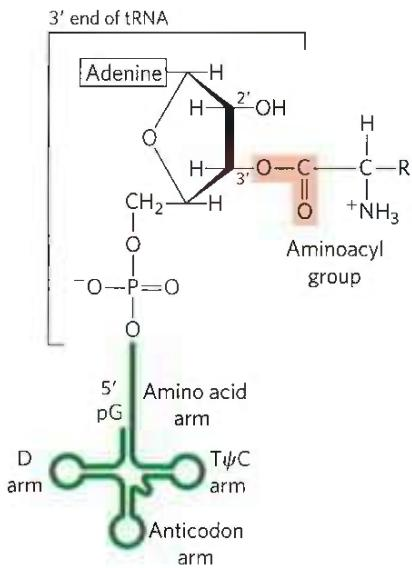  
FIGURE 27-20 General structure of aminoacyl-tRNAs. The aminoacyl group is esterified to the 3' position of the terminal A residue. The ester linkage that both activates the amino acid and joins it to the tRNA is shaded light red.

would expect, given the amount by which a methylene group (in Ile) could enhance substrate binding. Yet valine is erroneously incorporated into proteins in positions normally occupied by an Ile residue at a frequency of only about 1 in 3,000. How is this greater-than-10-fold increase in accuracy brought about? Ile-tRNA synthetase, like some other aminoacyl-tRNA synthetases, has a proofreading function.

Recall a general principle from the discussion of proofreading by DNA polymerases (see Fig. 25-6): if available binding interactions do not provide sufficient discrimination between two substrates, the necessary specificity can be achieved by substrate-specific binding in two successive steps. The effect of forcing the system through two successive filters is multiplicative. In the case of Ile-tRNA synthetase, the first filter is the initial binding of the amino acid to the enzyme and its activation to aminoacyl-AMP. The second is the binding of any incorrect aminoacyl-AMP products to a separate active site on the enzyme; a substrate that binds in this second active site is hydrolyzed. The R group of valine is slightly smaller than that of isoleucine, so Val-AMP fits the hydrolytic (proofreading) site of the Ile-tRNA synthetase, but Ile-AMP does not. P1 Thus Val-AMP is hydrolyzed to valine and AMP in the proofreading active site, and tRNA bound to the synthetase does not become aminoacylated to the wrong amino acid.

In addition to proofreading after formation of the aminoacyl-AMP intermediate, most aminoacyl-tRNA synthetases can hydrolyze the ester linkage between amino acids and tRNAs in the aminoacyl-tRNAs. This hydrolysis is greatly accelerated for incorrectly charged tRNAs, providing yet a third filter to enhance the fidelity of the overall process. The few aminoacyl-tRNA synthetases that activate amino acids with no close structural relatives (Cys-tRNA synthetase, for example) demonstrate little or no proofreading activity; in these cases, the active site for aminoacylation can sufficiently discriminate between the proper substrate and any incorrect amino acid.

The overall error rate of protein synthesis (\~1 mistake per $10^{4}$ amino acids incorporated) is not nearly as low as that of DNA replication. Because flaws in a protein are eliminated when the protein is degraded and are not passed on to future generations, they have less biological significance. The degree of fidelity in protein synthesis is sufficient to ensure that most proteins contain no mistakes and that the large amount of energy required to synthesize a protein is rarely wasted. One defective protein molecule is usually unimportant when many correct copies of the same protein are present.

A "Second Genetic Code" P3 An individual aminoacyl-tRNA synthetase must be specific not only for a single amino acid but for certain tRNAs as well. Discriminating among dozens of tRNAs is just as important for the overall fidelity of protein biosynthesis as is distinguishing among amino acids. The interaction between aminoacyl-tRNA synthetases and tRNAs has been referred to as the "second genetic code," reflecting its critical role in maintaining the accuracy of protein synthesis. The "coding" rules appear to be more complex than those in the "first" code.

Figure 27-21 summarizes what we know about the nucleotides involved in recognition by some aminoacyl-tRNA synthetases. Some nucleotides are conserved in all tRNAs and therefore cannot be used for discrimination. Nucleotide positions necessary for discrimination by the aminoacyl-tRNA synthetases seem to be concentrated in the amino acid arm and the anticodon arm, including the nucleotides of the anticodon itself. A few are located in other parts of the tRNA molecule. Determination of the crystal structures of aminoacyl-tRNA synthetases complexed with their cognate tRNAs and ATP has added a great deal to our understanding of these interactions (Fig. 27-22).

Ten or more specific nucleotides may be involved in recognition of a tRNA by its specific aminoacyl-tRNA synthetase. But in a few cases the recognition mechanism is quite simple. Across a range of organisms from bacteria to humans, the primary determinant of tRNA recognition by the Ala-tRNA synthetases is a single G=U base pair in the amino acid arm of tRNA $^{Ala}$ (Fig. 27-23a). A short synthetic RNA with as few as 7 bp arranged in a simple hairpin minihelix is efficiently aminoacylated by the Ala-tRNA synthetase, as long as the RNA contains the critical G=U (Fig. 27-23b). This relatively simple alanine system may be an evolutionary relic of a period when RNA oligonucleotides, ancestors to tRNA, were aminoacylated in a primitive system for protein synthesis.

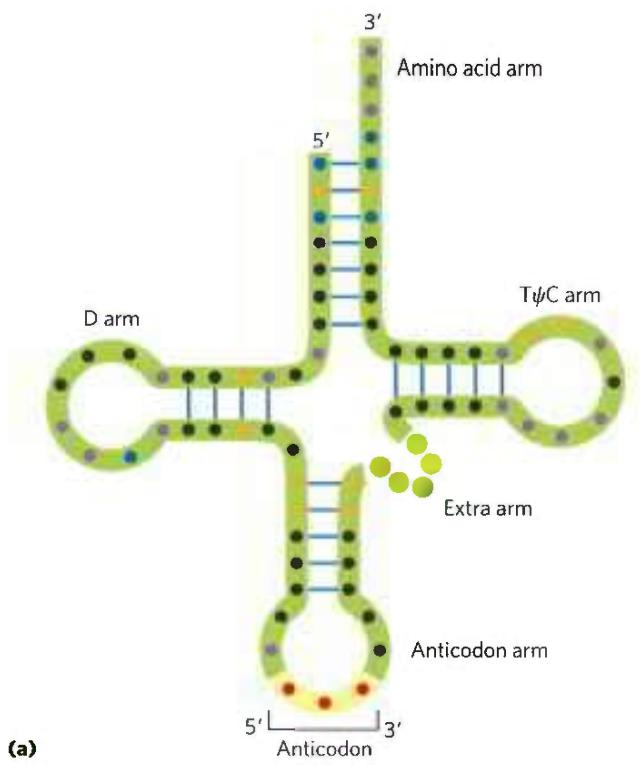  
FIGURE 27-21 Nucleotide positions in a tRNA that are recognized by aminoacyl-tRNA synthetases. (a) Some positions (purple dots) are the same in all tRNAs and therefore cannot be used to discriminate one from another. Other positions are known recognition points for one (orange) or more (blue) aminoacyl-tRNA synthetases. Structural features other than

  
(b)

sequence are important for recognition by some of the synthetases. (b) The same structural features are shown in three dimensions, with the orange and blue residues again representing positions recognized by one or more aminoacyl-tRNA synthetases, respectively. [(b) Data from PDB ID 1EHZ, H. Shi and P. B. Moore, RNA 6:1091, 2000.]  
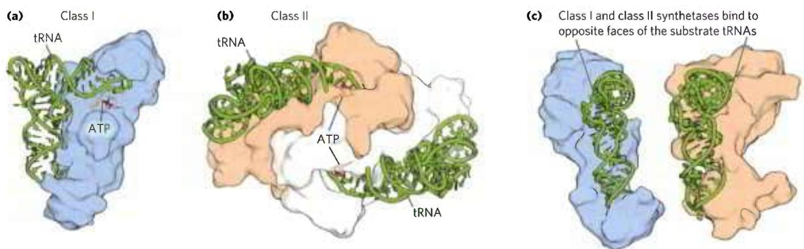  
FIGURE 27-22 Aminoacyl-tRNA synthetases. The synthetases are complexed with their cognate tRNAs (green). Bound ATP (red) pinpoints the active site near the end of the aminoacyl arm. (a) Gln-tRNA synthetase of E. coli, a typical monomeric class I synthetase. (b) Asp-tRNA synthetase of  
yeast, a typical dimeric class II synthetase. (c) The two classes of aminoacyl-tRNA synthetases recognize different faces of their tRNA substrates. [Data from (a, c (left)) PDB ID 1QRT, J. G. Arnez and T. A. Steitz, Biochemistry 35:14,725, 1996; (b, c (right)) PDB ID 1ASZ, J. Cavarelli et al., EMBO J. 13:327, 1994.]

The interaction of aminoacyl-tRNA synthetases and their cognate tRNAs is critical to accurate reading of the genetic code. Any expansion of the code to include new amino acids would necessarily require a new aminoacyl-tRNA synthetase-tRNA pair. A limited expansion of the genetic code has been observed in nature; a more extensive expansion has been accomplished in the laboratory (Box 27-2).

## Stage 2: A Specific Amino Acid Initiates Protein Synthesis

Protein synthesis begins at the amino-terminal end and proceeds by the stepwise addition of amino acids to the carboxyl-terminal end of the growing polypeptide. The AUG initiation codon thus specifies an amino-terminal methionine residue. Although methionine has only one codon, (5')AUG, all organisms have two tRNAs for methionine. One is used exclusively when (5')AUG is the initiation codon for protein synthesis. The other is used to code for a Met residue in an internal position in a polypeptide.

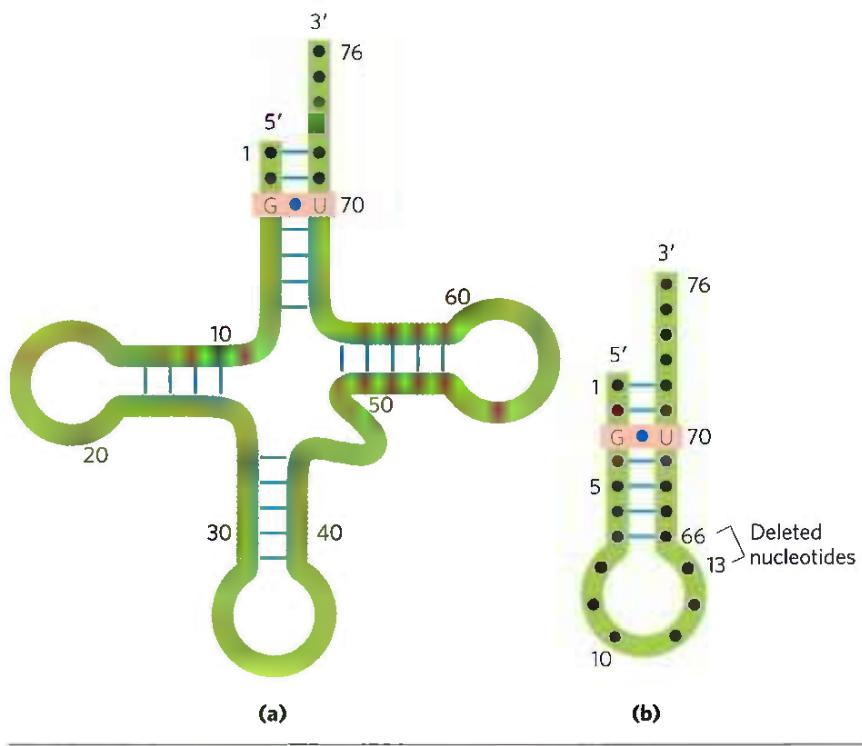

The distinction between an initiating (5')AUG and an internal one is straightforward. In bacteria, the two types of tRNA specific for methionine are designated tRNA $^{Met}$ and tRNA $^{fMet}$ . The amino acid incorporated in response to the (5')AUG initiation codon is N-formylmethionine (fMet). It arrives at the ribosome as N-formylmethionyl-tRNA $^{fMet}$ (fMet-tRNA $^{fMet}$ ), which is formed in two successive reactions. First, methionine is attached to tRNA $^{fMet}$ by the Met-tRNA synthetase (which in E. coli aminoacylates both tRNA $^{fMet}$ and tRNA $^{fMet}$ ):

Methionine + tRNA $^{fMet}$ + ATP →

$$
\mathrm{Met-tRNA} ^ {\mathrm{fMet}} + \mathrm{AMP} + \mathrm{PP} _ {\mathrm{i}}
$$

Next, a transformylase transfers a formyl group from $N^{10}$ -formyltetrahydrofolate to the amino group of the Met residue:

$N^{10}$ -Formyltetrahydrofolate + Met-tRNA $^{fMet}$ →

$$
\mathrm {tetrahydrofolate + fMet - tRN A ^ {fMet}}
$$

The transformylase is more selective than the Met-tRNA synthetase; it is specific for Met residues attached to tRNA $^{fMet}$ , presumably recognizing some unique structural feature of that tRNA. By contrast, Met-tRNA $^{fMet}$ inserts methionine in interior positions in polypeptides.

FIGURE 27-23 Structural elements of tRNA $^{Ala}$ that are required for recognition by Ala-tRNA synthetase. (a) The tRNA $^{Ala}$ structural elements recognized by the Ala-tRNA synthetase are unusually simple. A single G=U base pair (light red) is the only element needed for specific binding and aminoacylation. (b) A short synthetic RNA minihelix, with the critical G=U base pair but lacking most of the remaining tRNA structure. This is aminoacylated specifically with alanine almost as efficiently as the complete tRNA $^{Ala}$ .  

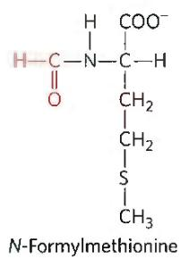

Addition of the N-formyl group to the amino group of methionine by the transformylase prevents fMet from entering interior positions in a polypeptide while also allowing fMet-tRNA $^{fMet}$ to be bound at a specific ribosomal initiation site that accepts neither Met-tRNA $^{Met}$ nor any other aminoacyl-tRNA.

In eukaryotic cells, all polypeptides synthesized by cytosolic ribosomes begin with a Met residue (rather than fMet), but, again, the cell uses a specialized initiating tRNA that is distinct from the tRNA $^{Met}$ used at (5')AUG codons at interior positions in the mRNA. Polypeptides synthesized by mitochondrial and chloroplast ribosomes, however, begin with N-formylmethionine. This strongly supports the view that mitochondria and chloroplasts originated from bacterial ancestors that were symbiotically incorporated into precursor eukaryotic cells at an early stage of evolution (see Fig. 1-37).

How can the single (5')AUG codon determine whether a starting N-formylmethionine (or methionine, in eukaryotes) or an interior Met residue is ultimately inserted? The details of the initiation process provide the answer.

## Natural and Unnatural Expansion of the Genetic Code

As we have seen, the 20 standard amino acids found in proteins offer only limited chemical functionality. Living systems generally overcome these limitations by using enzymatic cofactors or by modifying particular amino acids after they have been incorporated into proteins. In principle, expansion of the genetic code to introduce new amino acids into proteins offers another route to new functionality, but it is a very difficult route to exploit. Such a change might just as easily result in inactivation of thousands of cellular proteins.

Expanding the genetic code to include a new amino acid requires several cellular changes. A new aminoacyl-tRNA synthetase must generally be present, along with a cognate tRNA. Both of these components must be highly specific, interacting only with each other and the new amino acid. Significant concentrations of the new amino acid must be present in the cell, which may entail the evolution of new metabolic pathways. As outlined in Box 27-1, the anticodon on the tRNA would most likely pair with a codon that usually specifies termination. Making all of this work in a living cell seems unlikely, but it has happened both in nature and in the laboratory.

There are actually 22 rather than 20 amino acids specified by the known genetic code. The two extra amino acids are selenocysteine and pyrrolysine, each found in only very few proteins but both offering a glimpse into the intricacies of code evolution.

A few proteins in all cells (such as formate dehydrogenase in bacteria and glutathione peroxidase in mammals) require selenocysteine for their activity. In E. coli, selenocysteine is introduced into the enzyme formate dehydrogenase during translation, in response to an in-frame UGA codon. A special type of Ser-tRNA, present at lower levels than other Ser-tRNAs, recognizes UGA and no other codons. This tRNA is charged with serine by the normal serine aminoacyl-tRNA synthetase, and the serine is enzymatically converted to selenocysteine by a separate enzyme before its use at the ribosome. The charged tRNA does not recognize just any UGA codon; some contextual signal in the mRNA, still to be identified, ensures that this tRNA recognizes only the few UGA codons, within certain genes, that specify selenocysteine. In effect, UGA doubles as a codon for both termination and (very occasionally) selenocysteine. This particular code expansion has a dedicated tRNA, as described above, but it lacks a dedicated cognate aminoacyl-tRNA synthetase. The process works for selenocysteine, but one might consider it an intermediate step in the evolution of a complete new codon definition.

Pyrrolysine is found in a group of anaerobic archaea called methanogens (see Box 22-1). These organisms produce methane as a required part of their metabolism, and the Methanosarcinaceae family can use methylamines as substrates for methanogenesis. Producing methane from monomethylamine requires the enzyme monomethylamine methyltransferase. The gene encoding this enzyme has an in-frame UAG termination codon. The structure of the methyltransferase was elucidated in 2002, revealing the presence of the novel amino acid pyrrolysine at the position specified by the UAG codon. Subsequent experiments demonstrated that — unlike selenocysteine — pyrrolysine is attached directly to a dedicated tRNA by a cognate pyrrolysyl-tRNA synthetase. These methanogens produce pyrrolysine via a metabolic pathway that remains to be elucidated. The overall system has all the hallmarks of an established codon assignment, although it works only for UAG codons in this particular gene. As in the case of selenocysteine, there are probably contextual signals that direct this tRNA to the correct UAG codon.

Can scientists match this evolutionary feat? Modification of proteins with various functional groups can provide important insights into the activity and/or structure of the proteins. However, protein modification is often laborious. For example, an investigator who wishes to attach a new group to a particular Cys residue will have to somehow block other Cys residues that may be present on the same protein. If one could instead adapt the genetic code to enable a cell to insert a modified amino acid at a particular location in a protein, the process could be rendered much more convenient. Peter Schultz and coworkers have done just that.

To develop a new codon assignment, one again needs a new aminoacyl-tRNA synthetase and a novel cognate tRNA, both adapted to work only with a particular new amino acid. Efforts to create such an "unnatural" code expansion initially focused on E. coli. The codon UAG was chosen as the best target for encoding a new amino acid. UAG is the least used of the three termination codons, and strains with tRNAs selected

(Continued on next page)

## Natural and Unnatural Expansion of the Genetic Code (Continued)

FIGURE 1 Selecting $Mj\ tRNA^{Tyr}$ variants that function only with the tyrosyl-tRNA synthetase $Mj$ TyrRS. The sequence of the gene encoding $Mj\ tRNA^{Tyr}$ , on a plasmid, is randomized at 11 positions that do not interact with $Mj$ TyrRS (red dots). The mutagenized plasmids are introduced into E. coli cells to create a library of millions of $Mj\ tRNA^{Tyr}$ variants, represented by the six cells shown here. The toxic barnase gene, engineered to include the sequence TAG so that its transcript includes UAG codons, is present on a separate plasmid, providing a negative selection. If this gene is expressed, the cells die. It can be successfully expressed only if the $Mj\ tRNA^{Tyr}$ variant expressed by that particular cell is aminoacylated by endogenous (E. coli) aminoacyl-tRNA synthetases, inserting an amino acid instead of stopping translation. Another gene, encoding $\beta$ -lactamase, and also engineered with TAG sequences to produce UAG stop codons, is provided on yet another plasmid that also expresses the gene encoding $Mj$ TyrRS. This serves as a means of positive selection for the remaining $Mj$ tRNA $^{Tyr}$ variants. Those variants that are aminoacylated by $Mj$ TyrRS allow expression of the $\beta$ -lactamase gene, so these cells can grow on ampicillin. Multiple rounds of negative and positive selection yield the best $Mj$ tRNA $^{Tyr}$ variants that are aminoacylated uniquely by $Mj$ TyrRS and used efficiently in translation.

to recognize UAG do not exhibit growth defects. To create the new tRNA and tRNA synthetase, the genes for a tRNA $^{Tyr}$ and its cognate tyrosyl-tRNA synthetase were taken from the archaeon Methanococcus jannaschii (MjtRNA $^{Tyr}$ and MjTyrRS, respectively). MjTyrRS does not bind to the anticodon loop of MjtRNA $^{Tyr}$ , so the anticodon loop can be modified to CUA (complementary to UAG) without affecting the interaction. Because the archaeal and bacterial systems are orthologous, the modified archaeal components could be transferred to E. coli without disrupting the intrinsic translation system of the bacterial cells.

First, the gene encoding $MjtRNA^{Tyr}$ had to be modified to generate an ideal product tRNA — one that was not recognized by any aminoacyl-tRNA synthetases endogenous to E. coli but was aminoacylated by MjTyrRS. Finding such a variant could be accomplished through a series of negative and positive selection cycles designed to efficiently sift through variants of the tRNA gene (Fig. 1). Parts of the $MjtRNA^{Tyr}$ sequence were randomized, allowing creation of a library of cells that each expressed a different version of the tRNA. A gene encoding barnase (a ribonuclease toxic to E. coli) was engineered so that its mRNA transcript contained several UAG codons, and this gene was also introduced into the cells on a plasmid. If the $MjtRNA^{Tyr}$ variant expressed in a particular cell in the library were aminoacylated by an endogenous tRNA synthetase, it would express the barnase gene and that cell would die (negative selection). Surviving cells would contain tRNA variants that were not aminoacylated by endogenous tRNA synthetases, but could potentially be aminoacylated by MjTyrRS. A positive selection (Fig. 1) was then set up by engineering the $\beta$ -lactamase gene (which confers resistance to the antibiotic ampicillin) so that its transcript contained several UAG codons, and introducing this gene into the cells along with the gene encoding $Mj$ TyrRS. Those $MjtRNA^{Tyr}$ variants that could be aminoacylated by $Mj$ TyrRS allowed growth on ampicillin only when $Mj$ TyrRS was also expressed in the cell. Several rounds of this negative and positive selection scheme identified a new $MjtRNA^{Tyr}$ variant that was not affected by endogenous enzymes, was aminoacylated by $Mj$ TyrRS, and functioned well in translation.

Next, the $Mj$ TyrRS had to be modified to recognize the new amino acid. The gene encoding $Mj$ TyrRS was mutagenized to create a large library of variants. Variants that would aminoacylate the new $MjtRNA^{Tyr}$ variant with endogenous amino acids were eliminated using the barnase gene selection. A second positive selection (similar to the ampicillin selection described above) was carried out so that cells would survive only if the $MjtRNA^{Tyr}$ variant were aminoacylated only in the presence of the unnatural amino acid. Several rounds of negative and positive selection generated a cognate tRNA synthetase–tRNA pair that recognized only the unnatural amino acid.

Using this approach, researchers have constructed many E. coli strains, each capable of incorporating one particular unnatural amino acid into a protein in response to a UAG codon. The same approach has been used to artificially expand the genetic code of yeast and even mammalian cells. More than 30 different amino acids (Fig. 2) can be introduced site-specifically and efficiently into cloned proteins in this way. The result is an increasingly useful and flexible tool kit with which to advance the study of protein structure and function.

  
FIGURE 2 A sampling of unnatural amino acids that have been added to the genetic code. These unnatural amino acids add uniquely reactive chemical groups such as (a) a ketone; (b) an azide; (c) a photocrosslinker, a functional group designed to form a covalent bond with  
a nearby group when activated by light; (d) a highly fluorescent amino acid; (e) an amino acid with a heavy atom (Br) for use in crystallography; and (f) a long-chain cysteine analog that can form extended disulfide bonds. [Information from J. Xie and P. G. Schultz, Nat. Rev. Mol. Cell Biol. 7:775, 2006.]

The Three Steps of Initiation The initiation of polypeptide synthesis in bacteria requires (1) the 30S ribosomal subunit, (2) the mRNA coding for the polypeptide to be made, (3) the initiating fMet-tRNA $^{fMet}$ , (4) a set of three proteins called initiation factors (IF1, IF2, and IF3), (5) GTP, (6) the 50S ribosomal subunit, and (7) Mg $^{2+}$ . Formation of the initiation complex takes place in three steps (Fig. 27-24).

In step 1, the 30S ribosomal subunit binds two initiation factors, IF1 and IF3. Factor IF3 prevents the 30S and 50S subunits from combining prematurely. The mRNA then binds to the 30S subunit. The initiating (5')AUG is guided to its correct position by the Shine-Dalgarno sequence (named for Australian researchers John Shine and Lynn Dalgarno, who identified it) in the mRNA. This consensus sequence is an initiation signal of four to nine purine residues, 8 to 13 bp to the 5' side of the initiation codon (Fig. 27-25a). The sequence base-pairs with a complementary pyrimidine-rich sequence near the 3' end of the 16S rRNA of the 30S ribosomal subunit (Fig. 27-25b). This mRNA-rRNA interaction positions the initiating (5')AUG sequence of the mRNA in the precise position on the 30S subunit where it is required for initiation of translation. The particular (5')AUG where fMet-tRNA $^{fMet}$ is to be bound is distinguished from other methionine codons by its proximity to the Shine-Dalgarno sequence in the mRNA.

Bacterial ribosomes have three sites that bind tRNAs, the aminoacyl (A) site, the peptidyl (P) site, and the exit (E) site. The A and P sites bind aminoacyl-tRNAs, whereas the E site binds only uncharged tRNAs that have completed their task on the ribosome. Factor IF1 binds at the A site and prevents tRNA binding at this site during initiation. The initiating (5')AUG is positioned at the P site, the only site to which fMet-tRNA $^{fMet}$ can bind (Fig. 27-24). The fMet-tRNA $^{fMet}$ is the only aminoacyl-tRNA that binds first to the P site; during the subsequent elongation stage, all other incoming aminoacyl-tRNAs (including the Met-tRNA $^{fMet}$ that binds to interior AUG codons) bind first to the A site and only subsequently to the P and E sites. The E site is the site from which the “uncharged” tRNAs leave during elongation. Both the 30S and the 50S subunits contribute to the characteristics of the A and P sites, whereas the E site is largely confined to the 50S subunit.

In step 2 of the initiation process (Fig. 27-24), the complex consisting of the 30S ribosomal subunit, IF3, and mRNA is joined by both GTP-bound IF2 and the initiating fMet-tRNA $^{fMet}$ . The anticodon of this tRNA now pairs correctly with the mRNA's initiation codon.

In step 3, this large complex combines with the 50S ribosomal subunit; simultaneously, the GTP bound to IF2 is hydrolyzed to GDP and $P_{i}$ , which are released from the complex. All three initiation factors leave the ribosome at this point.

P1 Completion of the steps in Figure 27-24 produces a functional 70S ribosome called the initiation complex, containing the mRNA and the initiating fMet-tRNA $^{fMet}$ . The correct binding of the fMet-tRNA $^{fMet}$ to the P site in the complete 70S initiation complex is ensured by at least three points of recognition and attachment: the codon-anticodon interaction involving the initiation AUG fixed in the P site, the interaction between the Shine-Dalgarno sequence in the mRNA and the 16S rRNA, and the binding interactions between the ribosomal P site and the fMet-tRNA $^{fMet}$ . The initiation complex is now ready for elongation.

  
FIGURE 27-24 Formation of the initiation complex in bacteria. The complex forms in three steps (described in the text) at the expense of the hydrolysis of GTP to GDP and P1, IF1, IF2, and IF3 are initiation factors. E designates the exit site; P, the peptidyl site; and A, the aminoacyl site. Here the anticodon of the tRNA is oriented 3' to 5', left to right, as in Figure 27-8, but opposite to the orientation in Figures 27-21 and 27-23.

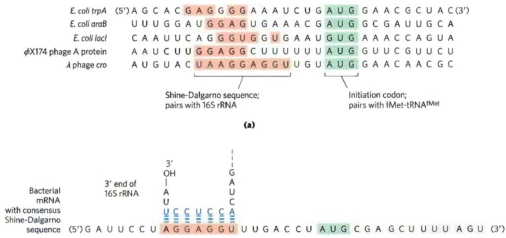  
(b)  
FIGURE 27-25 Messenger RNA sequences that serve as signals for initiation of protein synthesis in bacteria. (a) Alignment of the initiating AUG (shaded in green) at its correct location on the 30S ribosomal subunit depends in part on upstream Shine-Dalgarno sequences (light red). Portions of the mRNA transcripts of five bacterial genes are shown. Note the  
unusual example of the E. coli LacI protein, which initiates with a GUG (Val) codon. In E. coli, AUG is the start codon in approximately 91% of genes, with GUG (7%) and UUG (2%) assuming this role more rarely. (b) The Shine-Dalgarno sequence of the mRNA pairs with a sequence near the 3' end of the 16S rRNA.

Initiation in Eukaryotic Cells Translation is generally similar in eukaryotic and bacterial cells; most of the significant differences are in the number of components and the mechanistic details. The initiation process in eukaryotes is outlined in Figure 27-26. Eukaryotic mRNAs are bound to the ribosome as a complex with a number of specific binding proteins. Eukaryotic cells have at least 12 initiation factors. Initiation factors eIF1A and eIF3 are the functional homologs of the bacterial IF1 and IF3, binding to the 40S subunit in step ①, blocking tRNA binding to the A site and premature joining of the large and small ribosomal subunits, respectively. The factor eIF1 binds to the E site. The charged initiator tRNA is bound by the initiation factor eIF2, which also has bound GTP. In step ②, this ternary complex binds to the 40S ribosomal subunit, along with two other proteins involved in later steps, eIF5 (not shown in Fig. 27-26) and eIF5B. This creates a 43S preinitiation complex. The mRNA binds to the eIF4F complex, which, in step 3, mediates its association with the 43S preinitiation complex. The eIF4F complex is made up of eIF4E (binding to the 5' cap), eIF4A (an ATPase and RNA helicase), and eIF4G (a linker protein). The eIF4G protein binds to eIF3 and eIF4E to provide the first link between the 43S preinitiation complex and the mRNA. The eIF4G also binds to the poly(A) binding protein (PABP) at the 3' end of the mRNA, circularizing the mRNA (Fig. 27-27) and facilitating the translational regulation of gene expression, as described in Chapter 28.

Addition of the mRNA and its associated factors creates a 48S complex. This complex scans the bound mRNA, starting at the 5' cap, until an AUG codon is encountered. The scanning process (step 4 in Fig. 27-26) may be facilitated by the RNA helicase of eIF4A, which unwinds RNA secondary structures while in a transient complex with another factor, eIF4B (not shown in Fig. 27-26).

Once the initiating AUG site is encountered, the 60S ribosomal subunit associates with the complex in step 5, which is accompanied by release of many of the initiation factors. This requires the activity of eIF5 and eIF5B. The eIF5 protein promotes the GTPase activity of eIF2, producing an eIF2-GDP complex with reduced affinity for the initiator tRNA. The eIF5B protein is homologous to the bacterial IF2. It hydrolyzes its bound GTP and triggers dissociation of eIF2-GDP and other initiation factors, followed closely by association of the 60S subunit. This completes formation of the initiation complex.

  
FIGURE 27-26 Initiation of protein synthesis in eukaryotes. The five steps are described in the text. Eukaryotic initiation factors mediate the association of, first, the charged initiator tRNA to form a 43S preinitiation

  
FIGURE 27-27 Circularization of mRNA in the eukaryotic initiation complex. The 3' and 5' ends of eukaryotic mRNAs are linked by the eIF4F complex of proteins. The eIF4E subunit binds to the 5' cap, and the eIF4G protein binds to the poly(A) binding protein (PABP) at the 3' end of the mRNA. The eIF4G protein also binds to eIF3, linking the circularized mRNA to the 40S subunit of the ribosome.  
complex, and then the mRNA (with the 5' cap shown in red) to form a 48S complex. The final 80S initiation complex is formed as the 60S subunit associates, coupled with release of most of the initiation factors.

The roles of the various bacterial and eukaryotic initiation factors in the overall process are summarized in Table 27-8. The mechanism by which these proteins act is an important area of investigation.

## Stage 3: Peptide Bonds Are Formed in the Elongation Stage

The third stage of protein synthesis is elongation. Again, we begin with bacterial cells. Elongation requires (1) the initiation complex described above, (2) aminoacyl-tRNAs, (3) a set of three soluble cytosolic proteins called elongation factors (EF-Tu, EF-Ts, and EF-G in bacteria), and (4) GTP. Cells use three steps to add each amino acid residue, and the steps are repeated as many times as there are residues to be added.

Elongation Step 1: Binding of an Incoming Aminoacyl-tRNA In the first step of the elongation cycle (Fig. 27-28), the appropriate incoming aminoacyl-tRNA binds to a complex of GTP-bound EF-Tu. The resulting aminoacyl-tRNA-EF-Tu-GTP complex binds to the A site of the 70S initiation complex. The GTP is hydrolyzed and an EF-Tu-GDP complex is released from the 70S ribosome. The bound GDP is released when the EF-Tu-GDP complex binds to EF-Ts, and EF-Ts is subsequently released when another molecule of GTP binds to EF-Tu, recycling it.

<table><tr><td colspan="2">TABLE 27-8 Protein Factors Required for Initiation of Translation in Bacterial and Eukaryotic Cells</td></tr><tr><td>Factor</td><td>Function</td></tr><tr><td colspan="2">Bacterial</td></tr><tr><td>IF1</td><td>Prevents premature binding of tRNAs to A site</td></tr><tr><td>IF2</td><td>Facilitates binding of fMet-tRNA $^fMet$  to 30S ribosomal subunit</td></tr><tr><td>IF3</td><td>Binds to 30S subunit; prevents premature association of 50S subunit; enhances specificity of P site for fMet-rRNA $^fMet$ </td></tr><tr><td colspan="2">Eukaryotic</td></tr><tr><td>eIF1</td><td>Binds to the E site of the 40S subunit; facilitates interaction between eIF2-tRNA-GTP ternary complex and the 40S subunit</td></tr><tr><td>eIF1A</td><td>Homolog of bacterial IF1; prevents premature binding of tRNAs to A site</td></tr><tr><td>eIF2</td><td>GTPase; facilitates binding of initiating Met-tRNA $^Met$  to 40S ribosomal subunit</td></tr><tr><td>eIF2Ba, eIF3</td><td>First factors to bind 40S subunit; facilitate subsequent steps</td></tr><tr><td>eIF4F</td><td>Complex consisting of eIF4E, eIF4A, and eIF4G</td></tr><tr><td>eIF4A</td><td>RNA helicase activity; removes secondary structure in the mRNA to permit binding to 40S subunit; part of the eIF4F complex</td></tr><tr><td>eIF4B</td><td>Binds to mRNA; facilitates scanning of mRNA to locate the first AUG</td></tr><tr><td>eIF4E</td><td>Binds to the 5&#x27; cap of mRNA; part of the eIF4F complex</td></tr><tr><td>eIF4G</td><td>Binds to eIF4E and to poly(A) binding protein (PABP); part of the eIF4F complex</td></tr><tr><td>eIF5a</td><td>Promotes dissociation of several other initiation factors from 40S subunit as a prelude to association of 60S subunit to form 80S initiation complex</td></tr><tr><td>eIF5b</td><td>GTPase homologous to bacterial IF2; promotes dissociation of initiation factors before final ribosome assembly</td></tr><tr><td colspan="2">aNot shown in Figure 27-26.</td></tr></table>

Elongation Step 2: Peptide Bond Formation A peptide bond is now formed between the two amino acids bound by their tRNAs to the A and P sites on the ribosome. This occurs by transfer of the initiating N-formylmethionyl group from its tRNA to the amino group of the second amino acid, now in the A site (Fig. 27-29). The $\alpha$ -amino group of the amino acid in the A site acts as a nucleophile, displacing the tRNA in the P site to form a peptide bond. The constrained structure of the proline side chain interferes with the alignment needed for peptide bonds to form properly. A special system binds to the ribosome to facilitate peptide bonds between two proline residues whenever that is necessary (Box 27-3). The reaction produces a dipeptidyl-tRNA in the A site, and the now "uncharged" (deacylated) tRNA $^{fMet}$ remains bound to the P site. The tRNAs then shift to a hybrid binding state, with elements of each spanning two different sites on the ribosome, as shown in Figure 27-29.

  
FIGURE 27-28 First elongation step in bacteria: binding of the second aminoacyl-tRNA. The second aminoacyl-tRNA (AA $_{2}$ ) enters the A site of the ribosome bound to GTP-bound EF-Tu (shown here as Tu). Binding of the second aminoacyl-tRNA to the A site is accompanied by hydrolysis of the GTP to GDP and P $_{i}$ and release of the EF-Tu-GDP complex from the ribosome. The EF-Tu-GTP complex is regenerated in a process requiring EF-Ts and GTP. "Accommodation" involves a change in the conformation of the second tRNA that pulls its aminoacyl end into the peptidyl transferase site.

  
FIGURE 27-29 Second elongation step in bacteria: formation of the first peptide bond. The N-formylmethionyl group is transferred to the amino group of the second aminoacyl-tRNA in the A site, forming a dipeptidyl-tRNA. At this stage, both tRNAs bound to the ribosome shift position in the 50S subunit to take up a hybrid binding state. The  
uncharged tRNA shifts so that its 3' and 5' ends are in the E site. Similarly, the 3' and 5' ends of the peptidyl-tRNA shift to the P site. The anticodons remain in the P and A sites. Note the involvement of the 2'-hydroxyl group of the 3'-terminal adenosine as a general acid-base catalyst in this reaction.

P5 The peptidyl transferase activity that catalyzes peptide bond formation resides in the 23S rRNA rather than in any of the protein components of ribosomes. The ribosomal 23S rRNA catalyzes the reaction by binding and aligning the tRNAs in the A and P sites in the proper orientations for reaction. A highly conserved active site adenosine residue in the 23S rRNA (A2451 in E. coli) may facilitate the reaction by general base catalysis and transition state stabilization utilizing N-3 in the purine ring and/or the 2'-hydroxyl group. This addition to the known catalytic repertoire of ribozymes has interesting implications for the evolution of life (see Section 26.4).

Elongation Step 3: Translocation In the final step of the elongation cycle, translocation, the ribosome moves one codon toward the 3' end of the mRNA (Fig. 27-30a). This movement shifts the anticodon of the dipeptidyl-tRNA, which is still attached to the second codon of the mRNA, from the A site to the P site, and shifts the deacylated tRNA from the P site to the E site, from where the tRNA is released into the cytosol. The third codon of the mRNA now lies in the A site and the second codon lies in the P site. Movement of the ribosome along the mRNA requires EF-G (also known as translocase) and the energy provided by hydrolysis of another molecule of GTP. Because the structure of EF-G mimics the structure of the EF-Tu-tRNA complex (Fig. 27-30b), EF-G can bind the A site and, presumably, displace the peptidyl-tRNA.

After translocation, the ribosome, with its attached dipeptidyl-tRNA and mRNA, is ready for the next elongation cycle and attachment of a third amino acid residue. This process occurs in the same way as addition of the second residue (as shown in Figs. 27-28, 27-29, and 27-30). For each amino acid residue correctly added to the growing polypeptide, two GTPs are hydrolyzed to GDP and $P_{i}$ as the ribosome moves from codon to codon along the mRNA toward the 3' end.

The polypeptide remains attached to the tRNA of the most recent amino acid to be inserted. This association maintains the functional connection between the information in the mRNA and its decoded polypeptide output. At the same time, the ester linkage between this tRNA and the carboxyl terminus of the growing

## Ribosome Pausing, Arrest, and Rescue

Ribosomes may stall during protein biosynthesis, especially while translating an mRNA that is damaged or incomplete. If translation cannot proceed to the end of the gene, the termination factors cannot act, and the ribosome may become "stuck" and thus inactivated.

Translation can experience a variety of stalling events. One well-documented issue involves the addition of proline to the growing chain, particularly when two prolines must be added sequentially. Unlike the other amino acids, proline is a secondary amine and is not as good a nucleophile in the peptide bond formation step (Fig. 27-29). The constrained geometry of the proline side chain can also affect alignment of groups for reaction on the ribosome, an issue particularly acute when the peptide bond is to be between two prolines. Bacteria have an elongation factor P (EFP) that binds between the E and P sites on the ribosome next to the peptidyl-tRNA. EFP binding affects the positioning of adjacent bound tRNAs and facilitates an optimal alignment for peptide bond formation with proline. Ribosomes in cells lacking EFP stall regularly at locations where two or more proline codons must be read consecutively. In eukaryotes, a factor closely related to EFP, eIF5A, performs this same function.

When the ribosome encounters the end of an mRNA before encountering a stop codon, the translocation step leads to formation of a stable non-stop complex, in which the A site has no mRNA that can interact with a new charged tRNA. The non-stop complex cannot be recycled by the normal termination factors. Instead, the ribosome is rescued by trans-translation (Fig. 1). In virtually all bacteria, the rescue system consists of transfer-messenger RNA (tmRNA) and small protein B (SmpB). These bind to the stalled complex in such a way that the tmRNA is positioned in the empty A site so that the ribosome can continue translation until it encounters a stop codon embedded in the tmRNA. The ribosome is then recycled, and both the defective mRNA and the polypeptide translated from it are degraded. Similar systems exist in eukaryotes.

FIGURE 1 Rescue of stalled bacterial ribosomes by tmRNA. In bacteria, tmRNA rescues stalled ribosomes by mimicking both tRNA and mRNA. The multistep pathway permits release and degradation of the damaged mRNA and tags the truncated polypeptide with an abbreviated carboxyl-terminal amino acid sequence that ensures its rapid degradation.

polypeptide activates the terminal carboxyl group for nucleophilic attack by the incoming amino acid to form a new peptide bond (Fig. 27-29). As the existing ester linkage between the polypeptide and tRNA is broken during peptide bond formation, the linkage between the polypeptide and the information in the mRNA persists, because each newly added amino acid is still attached to its tRNA.

The elongation cycle in eukaryotes is similar to that in bacteria. Three eukaryotic elongation factors (eEF1α, eEF1βγ, and eEF2) have functions analogous to those of the bacterial elongation factors (EF-Tu, EF-Ts, and EF-G, respectively). When a new aminoacyl-tRNA binds to the A site, an allosteric interaction leads to ejection of the uncharged tRNA from the E site.

Proofreading on the Ribosome The GTPase activity of EF-Tu during the first step of elongation in bacterial cells (Fig. 27-28) makes an important contribution to the rate and fidelity of the overall biosynthetic process. Both the EF-Tu-GTP and EF-Tu-GDP complexes exist for a few milliseconds before they dissociate. These two intervals provide opportunities for the codon-anticodon interactions to be proofread. Incorrect aminoacyl-tRNAs normally dissociate from the A site during one of these periods. If the GTP analog guanosine

FIGURE 27-30 Third elongation step in bacteria: translocation. (a) The ribosome moves one codon toward the 3' end of the mRNA, using energy provided by hydrolysis of GTP bound to EF-G (translocase). The dipeptidyl-tRNA is now entirely in the P site, leaving the A site open for an incoming (third) aminoacyl-tRNA. The uncharged tRNA later dissociates from the E site, and the elongation cycle begins again. (b) The structure of EF-G (left) mimics the structure of EF-Tu complexed with tRNA (right). The carboxyl-terminal part of EF-G mimics the structure of the anticodon loop of tRNA in both shape and charge distribution. [(b) Data from (left) PDB ID 1DAR, S. al-Karadaghi et al., Structure 4:555, 1996; (right) PDB ID 1B23, P. Nissen et al., Structure 7:143, 1999.]

5'-O-(3-thiotriphosphate) (GTPγS) is used in place of GTP, hydrolysis is slowed, improving the fidelity (by increasing the proofreading intervals) but reducing the rate of protein synthesis.

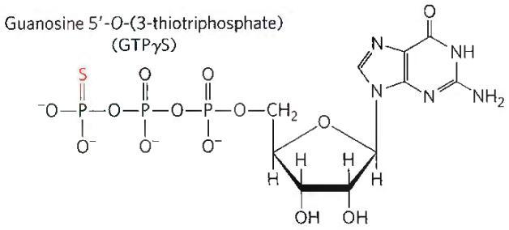

The process of protein synthesis (including the characteristics of codon-anticodon pairing already described) has clearly been optimized through evolution to balance the requirements for speed and fidelity. Improved fidelity might diminish speed, whereas increases in speed would probably compromise fidelity. And, recall that the proofreading mechanism on the ribosome establishes only that the proper codon-anticodon pairing has taken place, not that the correct amino acid is attached to the tRNA. If a tRNA is successfully aminoacylated with the wrong amino acid (as can be done experimentally), this incorrect amino acid is efficiently incorporated into a protein in response to whatever codon is normally recognized by the tRNA.

## Stage 4: Termination of Polypeptide Synthesis Requires a Special Signal

Elongation continues until the ribosome adds the last amino acid coded by the mRNA. Termination, the fourth stage of polypeptide synthesis, is signaled by the presence of one of three termination codons in the mRNA (UAA, UAG, UGA), immediately following the final coded amino acid. Mutations in a tRNA anticodon that allow an amino acid to be inserted at a termination codon are generally deleterious to the cell. In bacteria, once a termination codon occupies the ribosomal A site, three termination factors, or release factors—the proteins RF1, RF2, and RF3—contribute to (1) hydrolysis of the terminal peptidyl-tRNA bond; (2) release of the free polypeptide and the last tRNA, now uncharged, from the P site; and (3) dissociation of the 70S ribosome into its 30S and 50S subunits, ready to start a new cycle of polypeptide synthesis (Fig. 27-31). RF1 recognizes the termination codons UAG and UAA, and RF2 recognizes UGA and UAA. Either RF1 or RF2 (depending on which codon is present) binds at a termination codon and induces peptidyl transferase to transfer the growing polypeptide to a water molecule rather than to another amino acid. The release factors have domains thought to mimic the structure of tRNA, as shown for the elongation factor EF-G in Figure 27-30b. The specific function of RF3 has not been firmly established, although it is thought to release the ribosomal subunit. In eukaryotes, a single release factor, eRF, recognizes all three termination codons.

  
FIGURE 27-31 Termination of protein synthesis in bacteria. Synthesis is terminated in response to a termination codon in the A site. First, a release factor, RF (RF1 or RF2, depending on which termination codon is present), binds to the A site. This leads to hydrolysis of the ester linkage between the nascent polypeptide and the tRNA in the P site and release of the completed polypeptide. Finally, the mRNA, deacylated tRNA, and release factor leave the ribosome, which dissociates into its 30S and 50S subunits, aided by ribosome recycling factor (RRF), IF3, and energy provided by EF-G-mediated GTP hydrolysis. The 30S subunit complex with IF3 is ready to begin another cycle of translation.

Dissociation of the translation components leads to ribosome recycling. The release factors dissociate from the posttermination complex (with an uncharged tRNA in the P site) and are replaced by EF-G and a protein called ribosome recycling factor (RRF; $M_{r}$ 20,300). Hydrolysis of GTP by EF-G leads to dissociation of the 50S subunit from the 30S-tRNA-mRNA complex. EF-G and RRF are replaced by IF3, which promotes dissociation of the tRNA. The mRNA is then released. The complex of IF3 and the 30S subunit is then ready to initiate another round of protein synthesis (Fig. 27-24).

Energy Cost of Fidelity in Protein Synthesis P1 Synthesis of a protein true to the information specified in its mRNA requires energy well beyond what would be required to synthesize peptide bonds linking a random sequence of amino acids. Formation of each aminoacyl-tRNA uses two high-energy phosphate groups. An additional ATP is consumed each time an incorrectly activated amino acid is hydrolyzed by the deacylation activity of an aminoacyl-tRNA synthetase as part of its proofreading activity. A GTP is cleaved to GDP and $\mathbf{P}_{\mathrm{i}}$ during the first elongation step, and another during the translocation step. Thus, on average, the energy derived from the hydrolysis of more than four NTPs to NDPs is required for the formation of each peptide bond of a polypeptide.

This represents an exceedingly large thermodynamic “push” in the direction of synthesis: at least $4 \times 30.5$ kJ/mol = 122 kJ/mol of phosphodiester bond energy to generate a peptide bond, which has a standard free energy of hydrolysis of only about -21 kJ/mol. The net free-energy change during peptide bond synthesis is thus -101 kJ/mol. Proteins are information-containing polymers. The biochemical goal is not simply the formation of a peptide bond but the formation of a peptide bond between two specified amino acids. Each of the high-energy phosphate compounds expended in this process plays a critical role in maintaining proper alignment between each new codon in the mRNA and its associated amino acid at the growing end of the polypeptide. This energy permits very high fidelity in the biological translation of the genetic message of mRNA into the amino acid sequence of proteins.

Rapid Translation of a Single Message by Polysomes Large clusters of 10 to 100 ribosomes that are very active in protein synthesis can be isolated from both eukaryotic and bacterial cells. Electron micrographs show a fiber between adjacent ribosomes in the cluster, which is called a polysome (Fig. 27-32a). The connecting strand is a single molecule of mRNA that is being translated simultaneously by many closely spaced ribosomes, allowing the highly efficient use of the mRNA.

In bacteria, transcription and translation are tightly coupled. Messenger RNAs are synthesized and translated in the same 5'→3' direction. As soon as the 5' end of the mRNA appears, ribosomes and the RNA polymerase form a complex, the expressome, beginning translation long before transcription is complete (Fig. 27-32b). As the 5' end of the mRNA exits one ribosome, additional ribosomes are loaded in succession to form a polysome. The situation is quite different in eukaryotic cells, where newly transcribed mRNAs must leave the nucleus before they can be translated (see Fig. 27-17).

  
FIGURE 27-32 Coupling of transcription and translation in bacteria. (a) Electron micrograph of polysomes forming during transcription of a segment of DNA from E. coli. Each mRNA is being translated by many ribosomes simultaneously. The nascent polypeptide chains are difficult to see under the conditions used to prepare the sample shown here. The arrow marks the approximate beginning of the gene that is being transcribed. (b) Each mRNA is translated by ribosomes while it is still being transcribed from DNA by RNA polymerase. This is possible because the mRNA in bacteria does not have to be transported from a nucleus to the cytoplasm before encountering ribosomes. In this schematic diagram the ribosomes are depicted as smaller than the RNA polymerase. In reality, the ribosomes ( $M_r$ $2.7 \times 10^6$ ) are an order of magnitude larger than the RNA polymerase ( $M_r$ $3.9 \times 10^5$ ). [(a) O. L. Miller, Jr., et al. Science 169:392, 1970, Fig. 3. © 1970 American Association for the Advancement of Science.]

Bacterial mRNAs generally exist for just a few minutes (p. 986) before they are degraded by nucleases. To maintain high rates of protein synthesis, the mRNA for a given protein or set of proteins must be made continuously and translated with maximum efficiency. The short lifetime of mRNAs in bacteria allows a rapid cessation of synthesis when the protein is no longer needed.

## Stage 5: Newly Synthesized Polypeptide Chains Undergo Folding and Processing

In the final stage of protein synthesis, the nascent polypeptide chain is folded and processed into its biologically active form. During or after its synthesis, the polypeptide progressively assumes its native conformation. As introduced in Chapter 4, protein chaperones, chaperonins, and specific enzymes (e.g., protein disulfide isomerase and peptide prolyl cis-trans isomerase) play an important role in the correct folding of many proteins in all cells. Chaperones and chaperonins, exemplified by GroEL/GroES in bacteria (Fig. 27-33) and Hsp60 in eukaryotes, assist folding in part by restricting formation of unproductive aggregates and limiting the conformational space that a polypeptide may explore as it folds. P4 ATP is hydrolyzed as part of this process. The GroEL/GroES system is required for the folding of about 10%–15% of the proteins in E. coli.

Some newly made proteins, bacterial, archaeal, and eukaryotic, do not attain their final biologically active conformation until they have been altered by one or more posttranslational modifications. Protein modifications of one type or another have been described in almost every chapter of this text, and some prominent examples are summarized here.

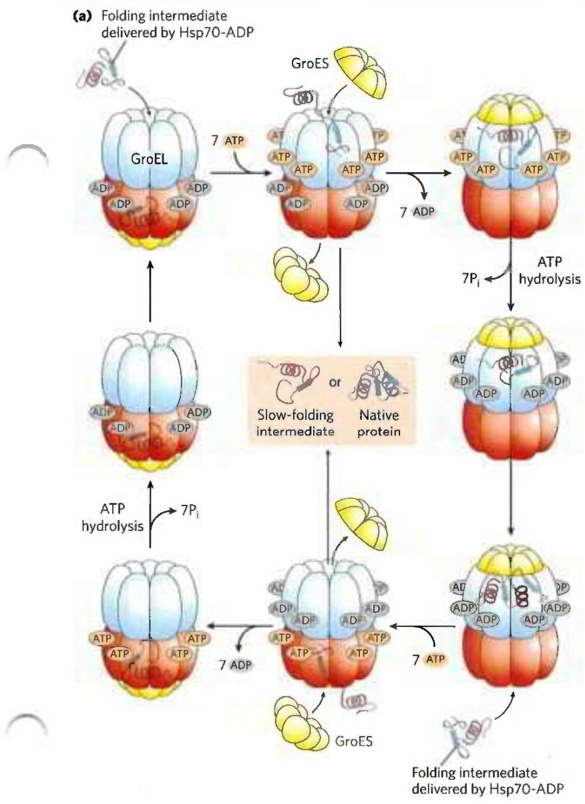

Amino-Terminal and Carboxyl-Terminal Modifications The first residue inserted in all polypeptides is N-formylmethionine (in bacteria) or methionine (in eukaryotes). However, the formyl group, the amino-terminal Met residue, and often additional amino-terminal (and, in some cases, carboxyl-terminal) residues may be removed enzymatically in formation of the final functional protein. In as many as 50% of eukaryotic proteins, the amino group of the amino-terminal residue is N-acetylated after translation. Carboxyl-terminal residues are also sometimes modified.

Loss of Signal Sequences As we shall see in Section 27.3, the 15 to 30 residues at the amino-terminal end of some proteins play a role in directing the protein to its ultimate destination in the cell. Such signal sequences are eventually removed by specific peptidases.

Modification of Individual Amino Acid Residues The hydroxyl groups of certain Ser, Thr, and Tyr residues of some proteins are enzymatically phosphorylated by ATP (Fig. 27-34a); the phosphate groups add negative charges to these polypeptides. The functional significance of this modification varies from one protein to the next. For example, the milk protein casein has many phosphoserine groups that bind $\mathrm{Ca^{2+}}$ . Calcium, phosphate, and amino acids are all valuable to suckling young, so casein efficiently provides three essential nutrients. And as we have seen in numerous instances, phosphorylation-dephosphorylation cycles regulate the activity of many enzymes and regulatory proteins.

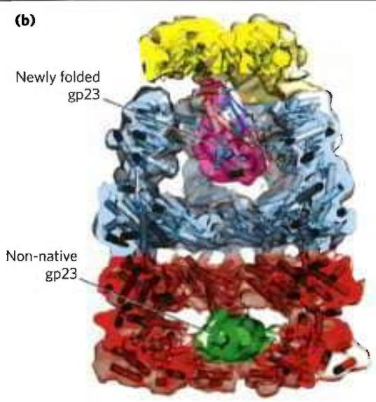  
FIGURE 27-33 Chaperonins in protein folding. (a) A proposed pathway for the action of the E. coli chaperonins GroEL (a member of the Hsp60 protein family) and GroES. Each GroEL complex consists of two large chambers formed by two heptameric rings (each subunit $M_{\mathrm{f}}$ 57,000). GroES, also a heptamer (subunit $M_{\mathrm{f}}$ 10,000), blocks one of the GroEL chambers after an unfolded protein is bound inside. The chamber with the unfolded protein is referred to as cis; the opposite one is trans. Folding occurs within the cis chamber, during the time it takes to hydrolyze the seven ATP that are bound to the subunits in the heptameric ring. The GroES and the ADP molecules then dissociate, and the protein is released. The two chambers of the GroEL/Hsp60 systems alternate in the binding and facilitated folding of client proteins. (b) A cutaway image of the GroEL/GroES complex. The $\alpha$ -helical secondary structure is represented as cylinders within a transparent surface structure. A folded protein (gp23) is shown within the large interior space of the upper chamber; an unfolded version of gp23 is shown in the lower chamber. [(a) Information from F. U. Hartl et al., Nature 475:324, 2011, Fig. 3. (b) Data from EMDB-1548, D. K. Clare et al., Nature 457:107, 2009; PDB ID 2CGT, D. K. Clare et al., J. Mol. Biol. 358:905, 2006; PDB ID 1YUE, A. Fokine et al., Proc. Natl. Acad. Sci. USA 102:7163, 2005.]

Extra carboxyl groups may be added to Glu residues of some proteins. For example, the blood-clotting protein prothrombin contains $\gamma$ -carboxyglutamate residues (Fig. 27-34b) in its amino-terminal region; the $\gamma$ -carboxyl groups are introduced by an enzyme that requires vitamin K. These carboxyl groups bind $Ca^{2+}$ , which is required to initiate the clotting mechanism.

Monomethyl- and dimethyllysine residues (Fig. 27-34c) occur in some muscle proteins and in cytochrome c. The calmodulin of most species contains one trimethyllysine residue at a specific position. In other proteins, the carboxyl groups of some Glu residues undergo methylation, removing their negative charge.

Attachment of Carbohydrate Side Chains The carbohydrate side chains of glycoproteins are attached covalently during or after synthesis of the polypeptide. In some glycoproteins, the carbohydrate side chain is attached enzymatically to Asn residues (N-linked oligosaccharides), in others to Ser or Thr residues (O-linked oligosaccharides; see Fig. 7-27). Many proteins that function extracellularly, as well as the lubricating proteoglycans that coat mucous membranes, contain oligosaccharide side chains (see Fig. 7-25).

Addition of Isoprenyl Groups Some eukaryotic proteins are modified by the addition of groups derived from isoprene (isoprenyl groups). A thioether bond is formed between the isoprenyl group and a Cys residue of the protein (see Fig. 11-16). The isoprenyl groups are derived from pyrophosphorylated intermediates of the cholesterol biosynthetic pathway (see Fig. 21-36), such as farnesyl pyrophosphate (Fig. 27-35). Proteins modified in this way include the Ras proteins (small G proteins), which are products of the ras oncogenes and proto-oncogenes, and the trimeric G proteins (both discussed in Chapter 12), as well as lamins, proteins found in the nuclear matrix. The isoprenyl group helps to anchor the protein in a membrane. The transforming (carcinogenic) activity of the ras oncogene is lost when isoprenylation of the Ras protein is blocked, a finding that has stimulated interest in identifying inhibitors of this posttranslational modification pathway for use in cancer chemotherapy.

Addition of Prosthetic Groups Many proteins require for their activity covalently bound prosthetic groups. Two examples are the biotin molecule of acetyl-CoA carboxylase and the heme group of hemoglobin or cytochrome c.

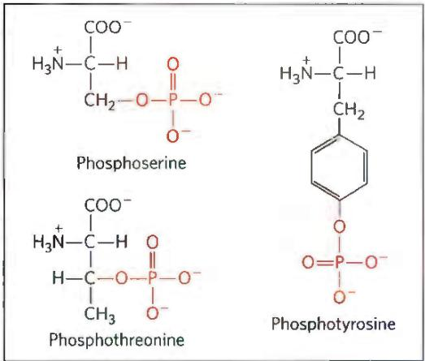  
(a)

  
(b)

  
(c)

FIGURE 27-34 Some modified amino acid residues. (a) Phosphorylated amino acids. (b) A carboxylated amino acid. (c) Some methylated amino acids.

  
FIGURE 27-35 Farnesylation of a Cys residue. The thioether linkage is shown in red. The Ras protein is the product of the ras oncogene.

Proteolytic Processing Many proteins are initially synthesized as large, inactive precursor polypeptides that are proteolytically trimmed to form their smaller, active forms. Examples include proinsulin (Fig. 23-4), some viral proteins (Fig. 26-30), and proteases such as chymotrypsinogen and trypsinogen (Fig. 6-42).

Formation of Disulfide Cross-Links After folding into their native conformations, some proteins form intrachain or interchain disulfide bridges between Cys residues. In eukaryotes, disulfide bonds are common in proteins to be exported from cells. The cross-links formed in this way help to protect the native conformation of the protein molecule from denaturation in the extracellular environment, which can differ greatly from intracellular conditions and is generally oxidizing.

## Protein Synthesis Is Inhibited by Many Antibiotics and Toxins

Protein synthesis is a central function in cellular physiology and is the primary target of many naturally occurring antibiotics and toxins. Except as noted otherwise, these antibiotics inhibit protein synthesis in bacteria. The differences between bacterial and eukaryotic protein synthesis, though in some cases subtle, are such that most of the compounds discussed below are relatively harmless to eukaryotic cells. Natural selection has favored the evolution of compounds that exploit minor differences in order to affect bacterial systems selectively, so that these biochemical weapons are synthesized by some microorganisms and are extremely toxic to others. Because nearly every step in protein synthesis can be specifically inhibited by one antibiotic or another, antibiotics have become valuable tools in the study of protein biosynthesis.

Puromycin, made by the mold Streptomyces alboniger, is one of the best-understood inhibitory antibiotics. Its structure is very similar to the 3' end of an aminoacyl-tRNA, enabling it to bind to the ribosomal A site and participate in peptide bond formation, producing peptidylpuromycin (Fig. 27-36). However, because puromycin resembles only the 3' end of the tRNA, it does not engage in translocation and dissociates from the ribosome shortly after it is linked to the carboxyl terminus of the peptide. This prematurely terminates polypeptide synthesis.

  
FIGURE 27-36 Disruption of peptide bond formation by puromycin. The antibiotic puromycin resembles the aminoacyl end of a charged tRNA, and it can bind to the ribosomal A site and participate in peptide bond formation. The product of this reaction, peptidyl puromycin, is not translocated to the P site. Instead, it dissociates from the ribosome, causing premature chain termination.

Tetracyclines inhibit protein synthesis in bacteria by blocking the A site on the ribosome, preventing the binding of aminoacyl-tRNAs. Chloramphenicol inhibits protein synthesis by bacterial (and mitochondrial and chloroplast) ribosomes by blocking peptidyl transfer; it does not affect cytosolic protein synthesis in eukaryotes. Conversely, cycloheximide blocks the peptidyl transferase of 80S eukaryotic ribosomes but not that of 70S bacterial (and mitochondrial and chloroplast) ribosomes. Streptomycin, a basic trisaccharide, causes misreading of the genetic code (in bacteria) at relatively low concentrations and inhibits initiation at higher concentrations.

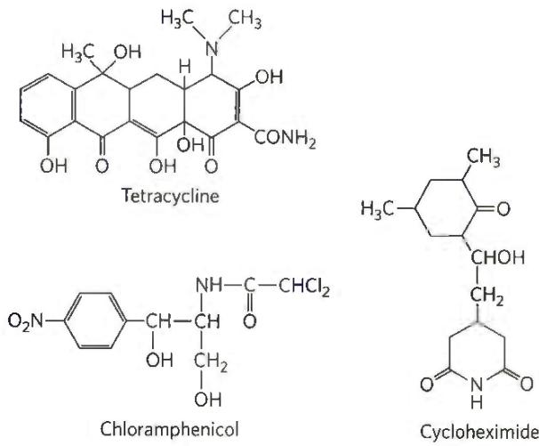

Several other inhibitors of protein synthesis are notable because of their toxicity to humans and other mammals. Diphtheria is a serious bacterial illness that causes sore throat, swollen glands, breathing difficulties, and often death. Although it has been largely eradicated in the developed world, a few thousand cases still occur each year in countries where vaccination is limited. The bacterium Corynebacterium diphtheriae releases the diphtheria toxin ( $M_{r}$ 58,330), which catalyzes the ADP-ribosylation of a diphthamide (a modified histidine) residue of eukaryotic elongation factor eEF2, thereby inactivating it. The resulting dead cells form a thick, gray membrane that covers the throat and tonsils, creating a putrid odor that is one hallmark of the disease. Ricin ( $M_{r}$ 29,895), an extremely toxic protein of the castor bean, inactivates the 60S subunit of eukaryotic ribosomes by depurinating a specific adenosine residue in 28S rRNA. Ricin was used in the infamous 1978 murder of BBC journalist and Bulgarian dissident Georgi Markov, presumably by the Bulgarian secret police. Using a syringe hidden at the end of an umbrella, a member of the secret police injected Markov in the leg with a ricin-infused pellet. He died four days later.

## SUMMARY 27.2 Protein Synthesis

■ Protein synthesis occurs on the ribosomes, which consist of protein and rRNA. Bacteria have 70S ribosomes, with a large (50S) and a small (30S) subunit. Eukaryotic ribosomes are significantly larger (80S) and contain more proteins. The growth of polypeptides on ribosomes begins with the amino-terminal amino acid and proceeds by successive additions of new residues to the carboxyl-terminal end.

Transfer RNAs have 73 to 93 nucleotide residues, some of which have modified bases. Each tRNA has an amino acid arm with the terminal sequence CCA(3') to which an amino acid is esterified, an anticodon arm, a TψC arm, and a D arm; some tRNAs have a fifth arm. The anticodon is responsible for the specificity of interaction between the aminoacyl-tRNA and the complementary mRNA codon.

In stage 1 of the five stages of protein synthesis, amino acids are activated by specific aminoacyl-tRNA synthetases in the cytosol. These enzymes catalyze the formation of aminoacyl-tRNAs, with simultaneous cleavage of ATP to AMP and PP $_{i}$ . The fidelity of protein synthesis depends on the accuracy of this reaction, and some of these enzymes carry out proofreading steps at separate active sites.

■ Stage 2 is initiation. In bacteria, the initiating aminoacyl-tRNA in all proteins is N-formylmethionyl-tRNA $^{fMet}$ . Initiation of protein synthesis involves formation of a complex between the 30S ribosomal subunit, mRNA, GTP, fMet-tRNA $^{fMet}$ , three initiation factors, and the 50S subunit; GTP is hydrolyzed to GDP and P $_{i}$ .

■ Stage 3 is elongation. In the elongation steps, GTP and elongation factors are required for binding the incoming aminoacyl-tRNA to the A site on the ribosome. In the first peptidyl transfer reaction, the fMet residue is transferred to the amino group of the incoming aminoacyl-tRNA. Movement of the ribosome along the mRNA then translocates the dipeptidyl-tRNA from the A site to the P site, a process requiring hydrolysis of GTP. Deacylated tRNAs dissociate from the ribosomal E site.

■ Stage 4 is termination. After many such elongation cycles, synthesis of the polypeptide is terminated with the aid of release factors. At least four high-energy phosphate equivalents (from ATP and GTP) are required to generate each peptide bond, an energy investment required to guarantee fidelity of translation.

■ Stage 5 is protein processing. Polypeptides fold into their active, three-dimensional forms. Many proteins are further processed by posttranslational modification reactions.

■ Many well-studied antibiotics and toxins inhibit some aspect of protein synthesis.

## 27.3 Protein Targeting and Degradation

The eukaryotic cell is made up of many structures, compartments, and organelles, each with specific functions that require distinct sets of proteins and enzymes. These proteins (with the exception of those produced in mitochondria and plastids) are synthesized on ribosomes in the cytosol, so how are they directed to their final cellular destinations?

We are now beginning to understand this complex and fascinating process. Proteins destined for secretion, integration in the plasma membrane, or inclusion in lysosomes generally share the first few steps of a pathway that begins in the endoplasmic reticulum. Proteins destined for mitochondria, chloroplasts, or the nucleus use three separate mechanisms. And proteins destined for the cytosol simply remain where they are synthesized. P1 The thermodynamic cost of protein synthesis is magnified by the processes used by cells to transport proteins to their correct cellular locations.

The most important element in many of these targeting pathways is a short sequence of amino acids called a signal sequence, whose function was first postulated by Günter Blobel and colleagues in 1970. The signal sequence directs a protein to its appropriate location in the cell and, for many proteins, is removed during transport or after the protein has reached its final destination. In proteins slated for transport into mitochondria, chloroplasts, or the ER, the signal sequence is at the amino terminus of a newly synthesized polypeptide. In many cases, the targeting capacity of particular signal sequences has been confirmed by fusing the signal sequence from one protein to a second protein and showing that the signal directs the second protein to the location where the first protein is normally found. The selective degradation of proteins no longer needed by the cell also relies largely on a set of molecular signals embedded in each protein's structure.

In this concluding section we examine protein targeting and degradation, emphasizing the underlying signals and molecular regulation that are so crucial to cellular metabolism. Except where noted, the focus is now on eukaryotic cells.

## Posttranslational Modification of Many Eukaryotic Proteins Begins in the Endoplasmic Reticulum

Perhaps the best-characterized targeting system begins in the ER. Most lysosomal, membrane, or secreted proteins have an amino-terminal signal sequence (Fig. 27-37) that marks them for translocation into the lumen of the ER; hundreds of such signal sequences have been determined. The carboxyl terminus of the signal sequence is defined by a cleavage site, where protease action removes the sequence after the protein is imported into the ER. Signal sequences vary in length from 13 to 36 amino acid residues, but all have the following features: (1) about 10 to 15 hydrophobic amino acid residues; (2) one or more positively charged residues, usually near the amino terminus, preceding the hydrophobic sequence; and (3) a short sequence at the carboxyl terminus (near the cleavage site) that is relatively polar, typically having amino acid residues with short side chains (especially Ala) at the positions closest to the cleavage site.

As originally demonstrated by the cell biologist George Palade, proteins with these signal sequences are synthesized on ribosomes attached to the ER. The signal sequence itself helps to direct the ribosome to the ER, as illustrated in Figure 27-38. The targeting pathway begins in step 1, with initiation of protein synthesis on free ribosomes. The signal sequence appears early in the synthetic process (step 2), because it is at the amino terminus, which, as we have seen, is synthesized first. As it emerges from the ribosome (step 3), the signal sequence—and the ribosome itself—is bound by the large signal recognition particle (SRP). The SRP is a rod-shaped complex containing a 300 nucleotide RNA (7SL-RNA) and six different proteins (combined $M_{\mathrm{r}}$ 325,000). The SRP then binds GTP and halts elongation of the polypeptide when it is about 70 amino acids long and the signal sequence has completely emerged from the ribosome. In step 4, the GTP-bound SRP directs the ribosome (still bound to the mRNA) and the incomplete polypeptide to GTP-bound SRP receptors in the cytosolic face of the ER; the nascent polypeptide is delivered to a peptide translocation complex in the ER, which interacts directly with the ribosome. In step 5, the SRP dissociates from the ribosome, accompanied by hydrolysis of GTP in both the SRP and the SRP receptor. The SRP receptor is a heterodimer of $\alpha$ ( $M_{\mathrm{r}}$ 69,000) and $\beta$ ( $M_{\mathrm{r}}$ 30,000) subunits, both of which bind and hydrolyze multiple GTP molecules during this process.

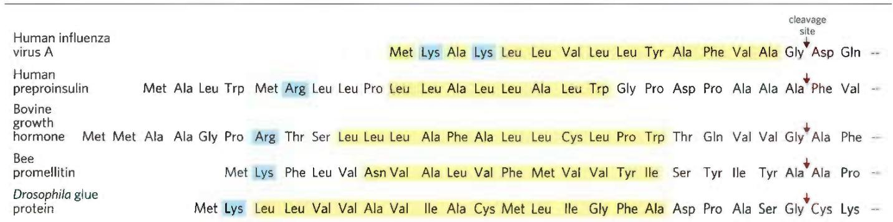  
FIGURE 27-37 Amino-terminal signal sequences of some eukaryotic proteins that direct their translocation into the ER. The hydrophobic core (yellow) is preceded by one or more basic residues (blue).  
Polar and short-side-chain residues immediately precede (to the left, as shown here) the cleavage sites (indicated by red arrows).

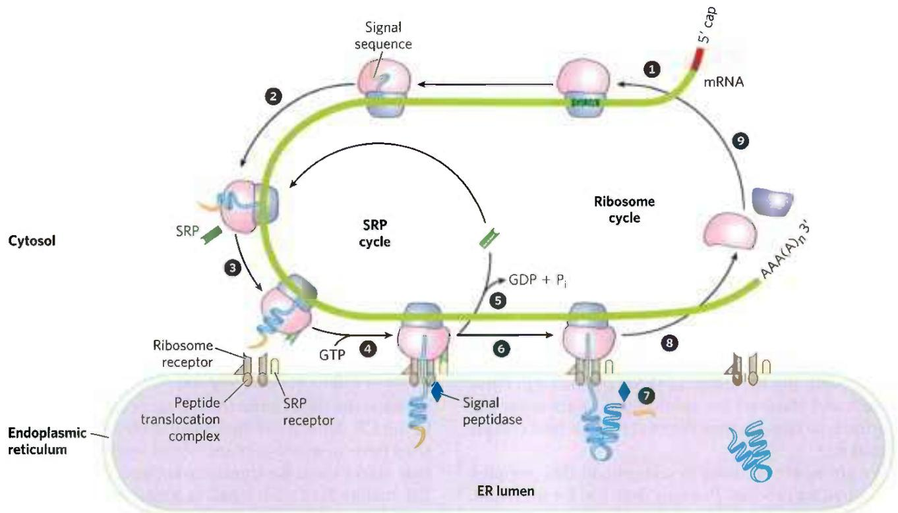  
FIGURE 27-38 Directing eukaryotic proteins with the appropriate signals to the endoplasmic reticulum. This process involves the SRP cycle and the translocation and cleavage of the nascent polypeptide.  
One protein subunit of SRP binds directly to the signal sequence, obstructing elongation by sterically blocking the entry of aminoacyl-tRNAs and inhibiting peptidyl transferase. Another protein subunit binds and hydrolyzes GTP.

Elongation of the polypeptide now resumes (step 6), with the ATP-driven translocation complex feeding the growing polypeptide into the ER lumen until the complete protein has been synthesized. In step 7, the signal sequence is removed by a signal peptidase within the ER lumen. The ribosome dissociates (step 8) and is recycled (step 9).

## Glycosylation Plays a Key Role in Protein Targeting

In the ER lumen, newly synthesized proteins are further modified in several ways. Following the removal of signal sequences, polypeptides are folded, disulfide bonds are formed, and many proteins are glycosylated to form glycoproteins. In many glycoproteins, the linkage to their oligosaccharides is through Asn residues. These N-linked oligosaccharides are diverse (Chapter 7), but the pathways by which they form have a common first step. A 14 residue core oligosaccharide is built up stepwise, first on the cytosolic face of the membrane and then on the lumenal face. Once completed, it is transferred from a dolichol phosphate donor molecule to certain Asn residues in the protein (Fig. 27-39). The transferase is on the lumenal face of the ER and thus cannot catalyze glycosylation of cytosolic proteins. After transfer, the core oligosaccharide is trimmed and elaborated in different ways on different proteins, but all N-linked oligosaccharides retain a pentasaccharide core derived from the original 14 residue oligosaccharide.

Several antibiotics act by interfering with one or more steps in this process and have aided in elucidating the steps of protein glycosylation. The best characterized is tunicamycin, which mimics the structure of UDP-N-acetylglucosamine and blocks the first step of the process (Fig. 27-39, step 1). A few proteins are O-glycosylated in the ER, but most O-glycosylation occurs in the Golgi complex or in the cytosol (for proteins that do not enter the ER).

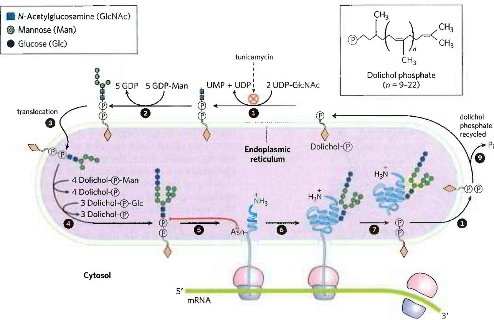  
FIGURE 27-39 Synthesis of the core oligosaccharide of glycoproteins. The core oligosaccharide is built up by the successive addition of monosaccharide units. ①, ② The first steps occur on the cytosolic face of the ER. ③ Translocation moves the incomplete oligosaccharide across the membrane (mechanism not shown), and ④ completion of the core oligosaccharide occurs within the lumen of the ER. The precursors that contribute additional mannose and glucose residues to the growing oligosaccharide in the lumen are dolichol phosphate derivatives. ⑤ In the first step in construction of the N-linked oligosaccharide moiety of

  
a glycoprotein, the core oligosaccharide is transferred from dolichol phosphate to an Asn residue of the protein, and 6 protein synthesis continues. The core oligosaccharide is then further modified in the ER and the Golgi complex in pathways that differ for different proteins. The five sugar residues shown surrounded by a beige screen, after step 7, are retained in the final structure of all N-linked oligosaccharides. 8 The released dolichol pyrophosphate is again translocated so that the pyrophosphate is on the cytosolic face of the ER, then 9 a phosphate is hydrolytically removed to regenerate dolichol phosphate.

Suitably modified proteins can now be moved to a variety of intracellular destinations. Proteins travel from the ER to the Golgi complex in transport vesicles (Fig. 27-40). In the Golgi complex, oligosaccharides are O-linked to some proteins, and N-linked oligosaccharides are further modified. By mechanisms not yet fully understood, the Golgi complex also sorts proteins and sends them to their final destinations. The processes that segregate proteins targeted for secretion from those targeted for the plasma membrane or lysosomes must distinguish among these proteins on the basis of structural features other than signal sequences, which were removed in the ER lumen.

This sorting process is best understood in the case of hydrolases destined for transport to lysosomes. On arrival of a hydrolase (a glycoprotein) in the Golgi complex, an as yet undetermined feature (sometimes called a signal patch) of the three-dimensional structure of the hydrolase is recognized by a phosphotransferase, which phosphorylates terminal mannose residues in the oligosaccharides (Fig. 27-41). The presence of one or more mannose 6-phosphate residues in its N-linked oligosaccharide is the structural signal that targets a protein to lysosomes. A receptor protein in the membrane of the Golgi complex recognizes the mannose 6-phosphate signal and binds the hydrolase so marked. Vesicles containing these receptor-hydrolase complexes bud from the trans side of the Golgi complex and make their way to sorting vesicles. Here, the receptor-hydrolase complex dissociates in a process facilitated by the lower pH in the vesicle and by phosphatase-catalyzed removal of phosphate groups from the mannose 6-phosphate residues. The receptor is then recycled to the Golgi complex, and vesicles containing the hydrolases bud from the sorting vesicles and move to the lysosomes. In cells treated with tunicamycin (Fig. 27-39, step 1), hydrolases that should be targeted to lysosomes are instead secreted, confirming that the N-linked oligosaccharide plays a key role in targeting these enzymes to lysosomes.

  
FIGURE 27-40 Pathway taken by proteins destined for lysosomes, the plasma membrane, or secretion. Proteins are moved from the ER to the cis side of the Golgi complex in transport vesicles. Sorting occurs primarily in the trans side of the Golgi complex.

The pathways that target proteins to mitochondria and chloroplasts also rely on amino-terminal signal sequences. Although mitochondria and chloroplasts contain DNA, most of their proteins are encoded by nuclear DNA and must be targeted to the appropriate organelle. Unlike other targeting pathways, however, the mitochondrial and chloroplast pathways begin only after a precursor protein has been completely synthesized and released from the ribosome. Precursor proteins destined for mitochondria or chloroplasts are bound by cytosolic chaperone proteins and delivered to receptors on the exterior surface of the target organelle. Specialized translocation mechanisms then transport the protein to its final destination in the organelle, after which the signal sequence is removed.

  
FIGURE 27-41 Phosphorylation of mannose residues on lysosome-targeted enzymes. N-Acetylglucosamine phosphotransferase recognizes some as yet unidentified structural feature of hydrolases destined for lysosomes.

## Signal Sequences for Nuclear Transport Are Not Cleaved

Molecular communication between the nucleus and the cytosol requires the movement of macromolecules through nuclear pores. RNA molecules synthesized in the nucleus are exported to the cytosol. Ribosomal proteins synthesized on cytosolic ribosomes are imported into the nucleus and assembled into 60S and 40S ribosomal subunits in the nucleolus; completed subunits are then exported back to the cytosol (Fig. 27-17). A variety of nuclear proteins (RNA and DNA polymerases, histones, topoisomerases, proteins that regulate gene expression, and so forth) are synthesized in the cytosol and imported into the nucleus. This traffic is modulated by a complex system of molecular signals and transport proteins that is gradually being elucidated.

In most multicellular eukaryotes, the nuclear envelope breaks down at each cell division, and once division is completed and the nuclear envelope reestablished, the dispersed nuclear proteins must be reimported. To allow this repeated nuclear importation, the signal sequence that targets a protein to the nucleus—the nuclear localization sequence (NLS)—is not removed after the protein arrives at its destination. An NLS, unlike other signal sequences, may be located almost anywhere along the primary sequence of the protein. NLSs can vary considerably in structure, but many consist of four to eight amino acid residues and include several consecutive basic (Arg or Lys) residues.

Nuclear importation is mediated by several proteins that cycle between the cytosol and the nucleus (Fig. 27-42), including importin $\alpha$ and $\beta$ and a small GTPase known as Ran (Ras-related nuclear protein). A heterodimer of importin $\alpha$ and $\beta$ functions as a soluble receptor for proteins targeted to the nucleus, with the $\alpha$ subunit binding NLS-bearing proteins in the cytosol. The complex of the NLS-bearing protein and the importin docks at a nuclear pore and is translocated through the pore by an energy-dependent mechanism. In the nucleus, the importin $\beta$ is bound by Ran GTPase, releasing importin $\beta$ from the imported protein. Importin $\beta$ is bound by Ran and by CAS (cellular apoptosis susceptibility protein) and separated from the NLS-bearing protein. Importin $\alpha$ and $\beta$ , in their complexes with Ran and CAS, are then exported from the nucleus. Ran hydrolyzes GTP in the cytosol to release the importins, which are then free to begin another importation cycle. Ran itself is also cycled back into the nucleus by the binding of Ran-GDP to nuclear transport factor 2 (NTF2). Inside the nucleus, the GDP bound to Ran is replaced with GTP through the action of Ran guanosine nucleotide-exchange factor (Ran-GEF).

  
FIGURE 27-42 Targeting of nuclear proteins. (a) 1 A protein with an appropriate nuclear localization signal (NLS) is bound by a complex of importins $\alpha$ and $\beta$ . 2 The resulting complex binds to a nuclear pore and translocates. 3 Inside the nucleus, dissociation of importin $\beta$ is promoted by the binding of Ran-GTP. 4 Importin $\alpha$ binds to Ran-GTP and CAS (cellular apoptosis susceptibility protein), releasing the nuclear protein. 5 Importins $\alpha$ and $\beta$ and CAS are transported out of the nucleus and recycled. They are released in the cytosol when Ran hydrolyzes its  
bound GTP. 6 Ran-GDP is bound by NTF2, and transported back into the nucleus. 7 Ran-GEF promotes the exchange of GDP for GTP in the nucleus, and Ran-GTP is ready to process another NLS-bearing protein-importin complex. (b) Transmission electron micrograph of a freeze-fractured nucleus, showing numerous nuclear pores. The nuclear pore complex is one of the largest molecular aggregates in the cell $(M_{\mathrm{r}} \sim 5 \times 10^{7})$ . It is made up of multiple copies of more than 30 different proteins. ([a) Information from C. Strambio-De-Castillia et al., Nat. Rev. Mol. Cell Biol. 11:490, 2010, Fig. 1. (b) Don W. Fawcett/Science Source.]

During mitosis, when the nuclear envelope transiently breaks down, the Ran GTPase and the importins play additional roles. The Ran GTPase–importin $\beta$ complex helps to position the spindle microtubules on the cell perimeter to facilitate chromosome segregation as the cell divides, and this complex also regulates microtubule interaction with other cellular structures.

## Bacteria Also Use Signal Sequences for Protein Targeting

Bacteria can target proteins to their inner or outer membranes, to the periplasmic space between these membranes, or to the extracellular medium. They use signal sequences at the amino terminus of the proteins (Fig. 27-43), much like those on eukaryotic proteins targeted to the ER, mitochondria, and chloroplasts.

Most proteins exported from E. coli make use of the pathway shown in Figure 27-44. Following translation, a protein to be exported may fold only slowly, the amino-terminal signal sequence impeding the folding. The soluble chaperone protein SecB binds to the protein's signal sequence or other features of its incompletely folded structure. The bound protein is then delivered to SecA, a protein associated with the inner surface of the plasma membrane. SecA acts as both a receptor and a translocating ATPase. Released from SecB and bound to SecA, the protein is delivered to a translocation complex in the membrane, made up of SecY, E, and G, and is translocated stepwise through the membrane at the SecYEG complex in lengths of about 20 amino acid residues. Each step requires the hydrolysis of ATP, catalyzed by SecA.

Although most exported bacterial proteins use this pathway, some follow an alternative pathway that uses signal recognition and receptor proteins homologous to components of the eukaryotic SRP and the SRP receptor (see Fig. 27-38).

## Cells Import Proteins by Receptor-Mediated Endocytosis

Some proteins are imported into eukaryotic cells from the surrounding medium; examples include low-density lipoprotein (LDL), the iron-carrying protein transferrin, peptide hormones, and circulating proteins destined for degradation. There are several importation pathways (Fig. 27-45). In one path, proteins bind to receptors in invaginations of the membrane called coated pits, which concentrate endocytic receptors in preference to other cell-surface proteins. The pits are coated on their cytosolic side with a lattice of the protein clathrin, which forms closed polyhedral structures (Fig. 27-46). The clathrin lattice grows as more receptors are occupied by target proteins. Eventually, a complete membrane-bounded

FIGURE 27-43 Signal sequences that target proteins to different locations in bacteria. Basic amino acids near the amino terminus are highlighted in blue, hydrophobic core amino acids in yellow. Cleavage sites marking the ends of the signal sequences are

<table><tr><td colspan="26">Inner membrane proteins</td><td></td><td></td></tr><tr><td>Phage fd, major coat protein</td><td>Met</td><td>Lys</td><td>Lys</td><td>Ser</td><td>Leu</td><td>Val</td><td>Leu</td><td>Lys</td><td>Ala</td><td>Ser</td><td>Val</td><td>Ala</td><td>Val</td><td>Ala</td><td>Thr</td><td>Leu</td><td>Val</td><td>Pro</td><td>Met</td><td>Leu</td><td>Ser</td><td>Phe</td><td>cleavage site↓Ala</td><td>Ala</td><td>Glu</td><td>--</td><td></td></tr><tr><td>Phage fd, minor coat protein</td><td></td><td></td><td></td><td></td><td></td><td>Met</td><td>Lys</td><td>Lys</td><td>Leu</td><td>Leu</td><td>Phe</td><td>Ala</td><td>Ile</td><td>Pro</td><td>Leu</td><td>Val</td><td>Val</td><td>Pro</td><td>Phe</td><td>Tyr</td><td>Ser</td><td>His</td><td>Ser</td><td>Ala</td><td>Glu</td><td>--</td><td></td></tr><tr><td colspan="26">Periplasmic proteins</td><td></td><td></td></tr><tr><td>Alkaline phosphatase</td><td></td><td>Met</td><td>Lys</td><td>Gln</td><td>Ser</td><td>Thr</td><td>Ile</td><td>Ala</td><td>Leu</td><td>Ala</td><td>Leu</td><td>Leu</td><td>Pro</td><td>Leu</td><td>Leu</td><td>Phe</td><td>Thr</td><td>Pro</td><td>Val</td><td>Thr</td><td>Lys</td><td>Ala</td><td>Arg</td><td>Thr</td><td>--</td><td></td><td></td></tr><tr><td>Leucine-specific binding protein</td><td>Met</td><td>Lys</td><td>Ala</td><td>Asn</td><td>Ala</td><td>Lys</td><td>Thr</td><td>Ile</td><td>Ile</td><td>Ala</td><td>Gly</td><td>Met</td><td>Ile</td><td>Ala</td><td>Leu</td><td>Ala</td><td>Ile</td><td>Ser</td><td>His</td><td>Thr</td><td>Ala</td><td>Met</td><td>Ala</td><td>Asp</td><td>Asp</td><td>--</td><td></td></tr><tr><td>β-Lactamase of pBR322</td><td>Met</td><td>Ser</td><td>Ile</td><td>Gln</td><td>His</td><td>Phe</td><td>Arg</td><td>Val</td><td>Ala</td><td>Leu</td><td>Ile</td><td>Pro</td><td>Phe</td><td>Phe</td><td>Ala</td><td>Ala</td><td>Phe</td><td>Cys</td><td>Leu</td><td>Pro</td><td>Val</td><td>Phe</td><td>Ala</td><td>His</td><td>Pro</td><td>--</td><td></td></tr><tr><td colspan="26">Outer membrane proteins</td><td></td><td></td></tr><tr><td>Lipoprotein</td><td></td><td></td><td></td><td>Met</td><td>Lys</td><td>Ala</td><td>Thr</td><td>Lys</td><td>Leu</td><td>Val</td><td>Leu</td><td>Gly</td><td>Ala</td><td>Val</td><td>Ile</td><td>Leu</td><td>Gly</td><td>Ser</td><td>Thr</td><td>Leu</td><td>Leu</td><td>Ala</td><td>Gly</td><td>Cys</td><td>Ser</td><td>--</td><td></td></tr><tr><td>LamB</td><td></td><td></td><td>Leu</td><td>Arg</td><td>Lys</td><td>Leu</td><td>Pro</td><td>Leu</td><td>Ala</td><td>Val</td><td>Ala</td><td>Val</td><td>Ala</td><td>Ala</td><td>Gly</td><td>Val</td><td>Met</td><td>Ser</td><td>Ala</td><td>Gln</td><td>Ala</td><td>Met</td><td>Ala</td><td>Val</td><td>Asp</td><td>--</td><td></td></tr><tr><td>OmpA</td><td>Met</td><td>Met</td><td>Ile</td><td>Thr</td><td>Met</td><td>Lys</td><td>Lys</td><td>Thr</td><td>Ala</td><td>Ile</td><td>Ala</td><td>Ile</td><td>Ala</td><td>Val</td><td>Ala</td><td>Leu</td><td>Ala</td><td>Gly</td><td>Phe</td><td>Ala</td><td>Thr</td><td>Val</td><td>Ala</td><td>Gln</td><td>Ala</td><td>Pro</td><td>--</td></tr></table>

indicated by red arrows. Note that the inner bacterial cell membrane is where phage fd coat proteins and DNA are assembled into phage particles. OmpA is outer membrane protein A; LamB is a cell surface receptor protein for $\lambda$ phage.

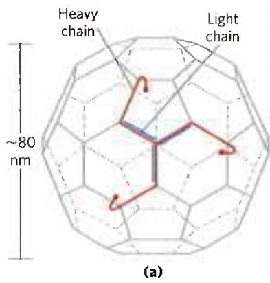

  
(b)  
FIGURE 27-46 Clathrin. (a) The protein has three light (L) chains $(M_{\mathrm{r}}35,000)$ and three heavy (H) chains $(M_{\mathrm{r}}180,000)$ of the $(\mathrm{HL})_3$ clathrin unit, organized as a three-legged structure called a triskelion. Triskelions tend to assemble into polyhedral lattices. (b) Electron micrograph of a coated pit on the cytosolic face of the plasma membrane of a fibroblast. [(a) Information from S. Mayor and R. E. Pagano, Nat. Rev. Mol. Cell Biol. 8:603, 2007. (b) ©1980 Heuser. The Rockefeller University Press. J. Heuser, J. Cell Biol. 84:560, 1980.]  
FIGURE 27-44 Model for protein export in bacteria. A newly translated polypeptide binds to the cytosolic chaperone protein SecB, which delivers it to SecA, a protein associated with the translocation complex (SecYEG) in the bacterial cell membrane. SecB is released, and SecA inserts itself into the membrane, forcing about 20 amino acid residues of the protein to be exported through the translocation complex. Hydrolysis of an ATP by SecA provides the energy for a conformational change that causes SecA to withdraw from the membrane, releasing the polypeptide. SecA binds another ATP, and the next stretch of 20 amino acid residues is pushed across the membrane through the translocation complex. Steps and are repeated until the entire protein has passed through and is released to the periplasm. The electrochemical potential across the membrane (denoted by + and -) also provides some of the driving force required for protein translocation.  
FIGURE 27-45 Summary of endocytosis pathways in eukaryotic cells. Pathways dependent on clathrin or caveolin make use of the GTPase dynamin to pinch vesicles from the plasma membrane. Some pathways do not use clathrin or caveolin; some of these make use of dynamin and some do not.

endocytic vesicle is pinched off the plasma membrane with the aid of the large GTPase dynamin, and it enters the cytoplasm. The clathrin is quickly removed by uncoating enzymes, and the vesicle fuses with an endosome. ATPase activity in the endosomal membranes reduces the pH therein, facilitating dissociation of receptors from their target proteins. In a related pathway, caveolin causes invagination of patches of membrane containing lipid rafts associated with certain types of receptors (see Fig. 11-23). These endocytic vesicles then fuse with caveolin-containing internal structures called caveosomes, where the internalized molecules are sorted and redirected to other parts of the cell and the caveolins are prepared for recycling to the membrane surface. There are also clathrin- and caveolin-independent pathways; some make use of dynamin and others do not.

The imported proteins and receptors then go their separate ways, their fates varying with the cell and protein type. Transferrin and its receptor are eventually recycled. Some hormones, growth factors, and immune complexes, after eliciting the appropriate cellular response, are degraded along with their receptors. LDL is degraded after the associated cholesterol has been delivered to its destination, but the LDL receptor is recycled (see Fig. 21-42).

Receptor-mediated endocytosis is exploited by some toxins and viruses to gain entry to cells. Influenza virus, diphtheria toxin, SARS-CoV-2 (the virus that causes COVID-19), and cholera toxin all enter cells in this way.

## Protein Degradation Is Mediated by Specialized Systems in All Cells

Protein degradation is critical to overall cellular proteostasis, preventing the buildup of abnormal or unwanted proteins and permitting the recycling of amino acids. The half-lives of eukaryotic proteins vary from 30 seconds to many days. Most proteins turn over rapidly relative to the lifetime of a cell, although a few (such as hemoglobin) can last for the life of the cell (about 110 days for an erythrocyte). Rapidly degraded proteins include those that are defective because of incorrectly inserted amino acids or because of damage accumulated during normal functioning. And enzymes that act at key regulatory points in metabolic pathways often turn over rapidly.

Defective proteins and those with characteristically short half-lives are generally degraded in both bacterial and eukaryotic cells by selective ATP-dependent cytosolic systems. A second system in vertebrates, operating in lysosomes, recycles the amino acids of membrane proteins, extracellular proteins, and proteins with characteristically long half-lives.

In E. coli, many proteins are degraded by one of several proteolytic systems that contain AAA+ ATPases (see Chapter 25), including Lon (the name refers to the "long form" of proteins, observed only when this protease is absent), ClpXP, ClpAP, ClpCP, ClpYQ, and FtsH. Each system targets particular proteins distinguished by their structure or subcellular location or both. Typically, ATP hydrolysis is used to maneuver a target protein through a pore into a proteolytic chamber, unfolding the protein in the process. Proteins are cleaved within the chamber. Once a protein has been reduced to small, inactive peptides, other ATP-independent proteases complete their degradation.

The ATP-dependent pathway in eukaryotic cells is quite different, involving the protein ubiquitin, which, as its name suggests, occurs throughout the eukaryotic kingdoms. One of the most highly conserved proteins known, ubiquitin (76 amino acid residues) is essentially identical in organisms as different as yeasts and humans and is key to proteostasis (see Figs. 4-23 and 13-29) and cell cycle regulation (see Fig. 12-38). Ubiquitin is covalently linked to proteins slated for destruction via an ATP-dependent pathway that includes three separate types of enzymes: E1 activating enzymes, E2 conjugating enzymes, and E3 ligases (Fig. 27-47).

  
FIGURE 27-47 Three-step pathway by which ubiquitin is attached to a protein. The pathway includes two different enzyme-ubiquitin intermediates. First, the free carboxyl group of ubiquitin's carboxyl-terminal Gly residue becomes linked to an E1-class activating enzyme through a thioester. The ubiquitin is then transferred to an E2 conjugating enzyme. An E3 ligase ultimately catalyzes transfer of the ubiquitin from E2 to the target, linking ubiquitin through an amide (isopeptide) bond to the ε-amino group of a Lys residue in the target protein. Additional cycles produce polyubiquitin, a covalent polymer of ubiquitin subunits that targets the attached protein for destruction in eukaryotes. Multiple pathways of this sort, with different protein targets, are present in most eukaryotic cells.

Ubiquitinated proteins are degraded by a large complex known as the 26S proteasome ( $M_{r}$ $2.5 \times 10^{6}$ ) (Fig. 27-48). The eukaryotic proteasome consists of two copies each of at least 32 different subunits, most of which are highly conserved from yeasts to humans. The proteasome contains two main types of subcomplexes: a barrel-like core particle and regulatory particles at each end of the barrel. The 19S regulatory particle on each end of the core particle contains approximately 18 subunits, including some that recognize and bind to ubiquitinated proteins. Six of the subunits are AAA+ ATPases that probably function in unfolding the ubiquitinated proteins and translocating the unfolded polypeptide into the core particle for degradation. The 19S particle also deubiquitinates the proteins as they are degraded in the proteasome. Most cells have additional regulatory complexes that can replace the 19S particle. These alternative regulators do not hydrolyze ATP and do not bind to ubiquitin, but they are important for the degradation of particular cellular proteins. The 26S proteasome can be effectively “accessorized” with regulatory complexes that change with changing cellular conditions.

  
FIGURE 27-48 Three-dimensional structure of the eukaryotic proteasome. The 20S core particle and the 19S regulatory particle, or cap, are shown (a) as a molecular structure and (b) in schematic form. The core particle consists of four rings arranged to form a barrel-like structure. The outer rings are formed from seven $\alpha$ subunits, and the inner rings from seven $\beta$ subunits. Three of the $\beta$ subunits have protease activities, each with different substrate specificity. A regulatory particle forms a cap on each end of the core particle. The regulatory particle binds ubiquitinated proteins, unfolds them, and translocates them into the core particle, where they are degraded to peptides of 3 to 25 amino acid residues. [(a) Data from PDB ID 3L5Q, K. Sadre-Bazzaz et al., Mol. Cell 37:728, 2010.]

Although we do not yet understand all the signals that trigger ubiquitination, one simple signal has been found. For many proteins, the identity of the first residue that remains after removal of the amino-terminal Met residue, and any other posttranslational proteolytic processing of the amino-terminal end, has a profound influence on half-life (Table 27-9). These amino-terminal signals have been conserved over billions of years of evolution and are the same in bacterial protein degradation systems and in the human ubiquitination pathway. More complex signals, such as the destruction box discussed in Chapter 12 (see Fig. 12-38), are also being identified.

Ubiquitin-dependent proteolysis is as important for the regulation of cellular processes as it is for the elimination of defective proteins. Many proteins required at only one stage of the eukaryotic cell cycle are rapidly degraded by the ubiquitin-dependent pathway after fulfilling their function. Ubiquitin-dependent destruction of cyclin is critical to cell-cycle regulation. The E1, E2, and E3 components of the ubiquitination pathway (Fig. 27-47) are large families of proteins. Different E1, E2, and E3 enzymes exhibit different specificities for target proteins and thus regulate different cellular processes. Some of these enzymes are highly localized in certain cellular compartments, reflecting a specialized function.

<table><tr><td>Amino-terminal residue</td><td>Half-life $^{a}$ </td></tr><tr><td colspan="2">Stabilizing</td></tr><tr><td>Ala, Gly, Met, Ser, Thr, Val</td><td>&gt;20 h</td></tr><tr><td colspan="2">Destabilizing</td></tr><tr><td>Gln, Ile</td><td>~30 min</td></tr><tr><td>Glu, Tyr</td><td>~10 min</td></tr><tr><td>Pro</td><td>~7 min</td></tr><tr><td>Asp, Leu, Lys, Phe</td><td>~3 min</td></tr><tr><td>Arg</td><td>~2 min</td></tr></table>

Information from A. Bachmair et al., Science 234:179, 1986.  
$^{a}$ Half-lives were measured in yeast for the $\beta$ -galactosidase protein modified so that in each experiment it had a different amino-terminal residue. Half-lives may vary for different proteins and in different organisms, but this general pattern appears to hold for all organisms.

Not surprisingly, defects in the ubiquitination pathway have been implicated in a wide range of disease states. An inability to degrade certain proteins that activate cell division (the products of oncogenes) can lead to tumor formation, and a too-rapid degradation of proteins that act as tumor suppressors can have the same effect. The ineffective or overly rapid degradation of cellular proteins also seems to play a role in a range of other conditions, including renal diseases, asthma, and neurodegenerative disorders such as Alzheimer and Parkinson diseases that are associated with the formation of characteristic proteinaceous structures in neurons. Cystic fibrosis is caused in some cases by a too-rapid degradation of a chloride ion channel, with resultant loss of function (see Box 11-2). Liddle syndrome, in which a sodium channel in the kidney is not degraded, leads to excessive $\mathrm{Na^{+}}$ absorption and early-onset hypertension. Drugs designed to inhibit proteasome function are being developed as potential treatments for some of these conditions. Many bacterial pathogens have found ways to hijack the eukaryotic ubiquitination system, evolving enzymes that ubiquitinate and thus eliminate host proteins as required to facilitate infection. In a changing metabolic environment, protein degradation is as important to a cell's survival as is protein synthesis, and much remains to be learned about these interesting pathways.

## SUMMARY 27.3 Protein Targeting and Degradation

■ After synthesis, many proteins are directed to particular locations in the cell, a process mediated by signal sequences embedded in the polypeptide chain. In eukaryotic cells, one class of signal sequences is recognized by the signal recognition particle (SRP), which binds the signal sequence as soon as it appears on the ribosome and transfers the entire ribosome and incomplete polypeptide to the endoplasmic reticulum. Polypeptides with these signal sequences are moved into the endoplasmic reticulum lumen as they are synthesized.

■ Once in the lumen of the ER, many proteins are glycosylated. So modified, they are moved to the Golgi complex, then sorted and sent to lysosomes, the plasma membrane, or transport vesicles.

■ Proteins targeted to the nucleus have an internal signal sequence that, unlike other signal sequences, is not cleaved once the protein is successfully targeted.

■ Proteins targeted to mitochondria and chloroplasts in eukaryotic cells, and those destined for export in bacteria, also make use of an amino-terminal signal sequence.

■ Some eukaryotic cells import proteins by receptor-mediated endocytosis.

All cells eventually degrade proteins, using specialized proteolytic systems. Defective proteins and those slated for rapid turnover are generally degraded by an ATP-dependent system. In eukaryotic cells, the proteins are first tagged by linkage to ubiquitin, a highly conserved protein. Ubiquitin-dependent proteolysis, critical to the regulation of many cellular processes, is carried out by proteasomes, which also are highly conserved.

## KEY TERMS

Terms in bold are defined in the glossary.

proteostasis 1005  
translation 1006  
aminoacyl-tRNA 1006  
aminoacyl-tRNA synthetases 1006  
codon 1007  
reading frame 1007  
initiation codon 1009  
termination codons 1009  
open reading frame (ORF) 1009  
degenerate code 1009  
anticodon 1010  
wobble 1012  
translational frameshifting 1013  
RNA editing 1013  
initiation 1028

Billic-Bargarino sequence 1028
aminoacyl (A) site 1028
peptidyl (P) site 1028
exit (E) site 1028
initiation complex 1028
elongation 1030
elongation factors 1030
peptidyl transferase 1032
translocation 1032
termination 1035
termination factors 1035
release factors 1035
polysome 1036
posttranslational modification 1037
puromycin 1039
tetracycline 1040

chloramphenicol 1040
cycloheximide 1040
streptomycin 1040
diphtheria toxin 1040
ricin 1040
signal sequence 1041
signal recognition particle (SRP) 1042
peptide translocation complex 1042

tunicamycin 1042  
nuclear localization sequence (NLS) 1045  
coated pits 1046  
clathrin 1046  
dynamin 1047  
ubiquitin 1048  
proteasome 1048

## PROBLEMS

1. Messenger RNA Translation Predict the amino acid sequences of peptides formed by ribosomes in response to each mRNA sequence, assuming that the reading frame begins with the first three bases in each sequence.

(a) GGUCAGUCGCUCCUGAUU

(b) UUGGAUGCGCCAUAAUUUGCU

(c) CAUGAUGCCUGUUGCUAC

(d) AUGGACGAA

2. How Many Different mRNA Sequences Can Specify One Amino Acid Sequence? Write all the possible mRNA sequences that can code for the simple tripeptide segment Leu-Met-Tyr. Your answer will give you some idea of the number of possible mRNAs that can code for one polypeptide.

3. Can the Base Sequence of an mRNA Be Predicted from the Amino Acid Sequence of Its Polypeptide Product? A given sequence of bases in an mRNA will code for one and only one sequence of amino acids in a polypeptide, if the reading frame is specified. From a given sequence of amino acid residues in a protein such as cytochrome c, can we predict the base sequence of the unique mRNA that encoded it? Give reasons for your answer.

4. Coding of a Polypeptide by Duplex DNA The template strand of a segment of double-helical DNA contains the sequence

(5')CTTAACACCCCTGACTTCGCGCCGTCG(3')

(a) What is the base sequence of the mRNA that can be transcribed from this strand?

(b) What amino acid sequence could be coded by the mRNA in (a), starting from the 5' end?

(c) If the complementary (nontemplate) strand of this DNA were transcribed and translated, would the resulting amino acid sequence be the same as in (b)? Explain the biological significance of your answer.

5. The Genetic Code and Mutation A mutation occasionally arises that converts a codon specifying an amino acid to a stop or nonsense codon. When this occurs in the middle of a gene, the resulting protein is truncated and often inactive. If the protein is essential, cell death can result. Which of these secondary mutations might restore some or all of the protein function so that the cell can survive (there may be more than one correct answer)?

(a) A mutation restoring the codon to one encoding the original amino acid

(b) A mutation changing the nonsense codon to one encoding a different but similar amino acid

(c) A mutation in the anticodon of a tRNA such that the tRNA now recognizes the nonsense codon

(d) A mutation in which an additional nucleotide inserts just upstream of the nonsense codon, changing the reading frame so the nonsense codon is no longer read as "stop"

6. The Direction of Protein Synthesis In 1961, Howard Dintzis established that protein synthesis on ribosomes begins at the amino terminus and proceeds toward the carboxyl terminus. He used immature red blood cells that were still synthesizing hemoglobin. He added radioactively labeled leucine (chosen because it occurs frequently in both the $\alpha$ and $\beta$ subunits) for various lengths of time, rapidly isolated only the full-length (completed) $\alpha$ subunits, and then determined where in the peptide the labeled amino acids were located. After the labeled leucine and extract had been incubated together for one hour, the protein was labeled uniformly along its length. However, after much shorter incubation times, the labeled amino acids were clustered at one end. At which end, amino or carboxyl terminus, did Dintzis find the labeled residues after the short exposure to labeled leucine?

7. Methionine Has Only One Codon Methionine is one of two amino acids with only one codon. How does the single codon for methionine specify both the initiating residue and the interior Met residues of polypeptides synthesized by E. coli?

8. The Genetic Code in Action Translate the mRNA shown, starting at the first 5' nucleotide, assuming that translation occurs in an E. coli cell. If all tRNAs make maximum use of wobble rules but do not contain inosine, how many distinct tRNAs are required to translate this RNA?

(5')AUGGGUCGUGAGUCAUCGUUAAUUGUAGCUGGAGGGGA GGAAUGA(3')

9. Synthetic mRNAs The genetic code was elucidated through the use of polyribonucleotides synthesized either enzymatically or chemically in the laboratory. Given what we now know about the genetic code, how would you make a polyribonucleotide that could serve as an mRNA coding predominantly for many Phe residues and for a small number of Leu and Ser residues? What other amino acid(s) would be encoded by this polyribonucleotide, but in smaller amounts?

10. Energy Cost of Protein Biosynthesis Determine the minimum energy cost, in terms of ATP equivalents expended, for the biosynthesis of the $\beta$ -globin chain of hemoglobin (146 residues), starting from a pool including all necessary amino acids, ATP, and GTP. Compare your answer with the direct energy cost of the biosynthesis of a linear glycogen chain of 146 glucose residues in $(\alpha1\rightarrow4)$ linkage, starting from a pool including glucose, UTP, and ATP. From your data, what is the extra energy cost of making a protein, in which all the residues are ordered in a specific sequence, compared with the cost of making a polysaccharide containing the same number of residues but lacking the informational content of the protein?

In addition to the direct energy cost for the synthesis of a protein, there are indirect energy costs—those required for the cell to make the necessary enzymes for protein synthesis. Compare the magnitude of the indirect costs to a eukaryotic cell of the biosynthesis of linear $(\alpha1\rightarrow4)$ glycogen chains and the biosynthesis of polypeptides, in terms of the enzymatic machinery involved.

11. Predicting Anticodons from Codons Most amino acids have more than one codon and attach to more than one tRNA, each with a different anticodon. Write all possible anticodons for the four codons of glycine: (5')GGU, GGC, GGA, and GGG.

(a) From your answer, which of the positions in the anticodons are primary determinants of their codon specificity in the case of glycine?

(b) Which of these anticodon-codon pairings has/have a wobbly base pair?

(c) In which of the anticodon-codon pairings do all three positions exhibit strong Watson-Crick hydrogen bonding?

12. Effect of Single-Base Changes on Amino Acid Sequence Much important confirmatory evidence on the genetic code has come from assessing changes in the amino acid sequence of mutant proteins after a single base has been changed in the gene that encodes the protein. Which of the listed amino acid replacements would be consistent with the genetic code if the replacements were caused by a single base change? Which cannot be the result of a single-base mutation? Why?

(a) Phe $\rightarrow$ Leu (e) Ile $\rightarrow$ Leu

(g) Pro→Ser

(d) Phe→Lys

13. Resistance of the Genetic Code to Mutation The RNA sequence shown represents the beginning of an open reading frame (ORF). What changes (if any) can occur at each position without generating a change in the encoded amino acid residue?

## (5')AUGAUUUUGCUAUCUUGGACU

14. Basis of the Sickle Cell Mutation Sickle cell hemoglobin has a Val residue at position 6 of the $\beta$ -globin chain instead of the Glu residue found in normal hemoglobin A. Can you predict what change took place in the DNA codon for glutamate to account for replacement of the Glu residue by Val?

15. Proofreading by Aminoacyl-tRNA Synthetases The isoleucyl-tRNA synthetase has a proofreading function that ensures the fidelity of the aminoacylation reaction, but the histidyl-tRNA synthetase lacks such a proofreading function. Explain.

16. Importance of the "Second Genetic Code" Some aminoacyl-tRNA synthetases do not recognize and bind the anticodon of their cognate tRNAs but instead use other structural features of the tRNAs to impart binding specificity. The tRNAs for alanine apparently fall into this category.

(a) What features of tRNA $^{Ala}$ does Ala-tRNA synthetase recognize?

(b) Describe the consequences of a C→G mutation in the third position of the anticodon of tRNA $^{Ala}$ .

(c) What other kinds of mutations might have similar effects?
(d) Mutations of these types are never found in natural populations of organisms. Why? (Hint: Consider what might happen both to individual proteins and to the organism as a whole.)

17. Rate of Protein Synthesis A bacterial ribosome can synthesize about 20 peptide bonds per minute. If the average bacterial protein is approximately 260 amino acid residues long, how many proteins can the ribosomes in an E. coli cell synthesize in 20 minutes if all ribosomes are functioning at maximum rates?

18. The Role of Translation Factors A researcher isolates mutant variants of the bacterial translation factors IF2, EF-Tu, and EF-G. In each case, the mutation allows proper folding of the protein and the binding of GTP but does not allow GTP hydrolysis. At what stage would translation be blocked by each mutant protein?

19. Maintaining the Fidelity of Protein Synthesis The chemical mechanisms used to avoid errors in protein synthesis are different from those used during DNA replication. DNA polymerases use a 3'→5' exonuclease proofreading activity to remove mispaired nucleotides incorrectly inserted into a growing DNA strand. There is no analogous proofreading function on ribosomes, and, in fact, the identity of an amino acid attached to an incoming tRNA and added to the growing polypeptide is never checked. A proofreading step that hydrolyzed the previously formed peptide bond after insertion of an incorrect amino acid into a growing polypeptide (analogous to the proofreading step of DNA polymerases) would be impractical. Why? (Hint: Consider how the link between the growing polypeptide and the mRNA is maintained during elongation; see Figs. 27-28 and 27-29.)

20. Bacterial Protein Export Bacteria mostly use the system shown in Fig. 27-44 to export proteins out of the cell. SecB, one of the chaperone proteins found only in gram-negative bacteria, delivers a newly translated polypeptide to the SecA ATPase on the interior side of the membrane. SecA pushes the exported protein through a membrane pore formed by the SecYEG complex. The SecYEG complex is homologous to the Sec61 complex in eukaryotes. Which component of this bacterial protein export system would be the most attractive target for antibiotic development? Explain.

21. Predicting the Cellular Location of a Protein You alter the gene for a eukaryotic polypeptide 300 amino acid residues long so that a signal sequence recognized by the SRP occurs at the polypeptide's amino terminus and a nuclear localization signal (NLS) occurs internally, beginning at residue 150. Where would you likely find the protein in the cell?

22. Requirements for Protein Translocation across a Membrane The secreted bacterial protein OmpA has a precursor, ProOmpA, which has the amino-terminal signal sequence required for secretion. If you denature purified ProOmpA with 8 M urea and then remove the urea (such as by running the protein solution rapidly through a gel filtration column), the protein can translocate across isolated bacterial inner membranes in vitro. However, translocation becomes impossible if you first incubate ProOmpA for a few hours in the absence of urea. Furthermore, ProOmpA maintains its capacity for translocation for an extended period if you first incubate it in the presence of another bacterial protein called trigger factor. Describe the probable function of trigger factor.

23. Protein-Coding Capacity of a Viral DNA The 5,386 bp genome of bacteriophage $\phi$ X174 includes genes for 10 proteins, designated A to K (omitting "I"), with sizes given in the table. How much DNA would be required to encode these 10 proteins? How can you reconcile the size of the $\phi$ X174 genome with its protein-coding capacity?

<table><tr><td>Protein</td><td>Number of amino acid residues</td><td>Protein</td><td>Number of amino acid residues</td></tr><tr><td>A</td><td>455</td><td>F</td><td>427</td></tr><tr><td>B</td><td>120</td><td>G</td><td>175</td></tr><tr><td>C</td><td>86</td><td>H</td><td>328</td></tr><tr><td>D</td><td>152</td><td>J</td><td>38</td></tr><tr><td>E</td><td>91</td><td>K</td><td>56</td></tr></table>

## DATA ANALYSIS PROBLEM

24. Designing Proteins by Using Randomly Generated Genes Studies of the amino acid sequence and corresponding three-dimensional structure of wild-type or mutant proteins have led to significant insights into the principles that govern protein folding. An important test of this understanding would be to design a protein based on these principles and see whether it folds as expected.

Kamtekar and colleagues (1993) used aspects of the genetic code to generate random protein sequences with defined patterns of hydrophilic and hydrophobic residues. Their clever approach combined knowledge about protein structure, amino acid properties, and the genetic code to explore the factors that influence protein structure.

The researchers set out to generate a set of proteins with the simple four-helix bundle structure shown below, with $\alpha$ helices (shown as cylinders) connected by segments of random coil (light red).

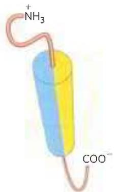

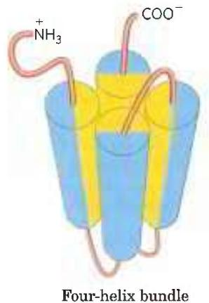  
An amphipathic $\alpha$ helix  
Four-helix bundle

Each $\alpha$ helix is amphipathic—the R groups on one side of the helix are exclusively hydrophobic (yellow), and those on the other side are exclusively hydrophilic (blue). A protein consisting of four of these helices separated by short segments of random coil would be expected to fold so that the hydrophilic sides of the helices face the solvent.

(a) What forces or interactions hold the four $\alpha$ helices together in this bundled structure?

Figure 4-3a shows a segment of $\alpha$ helix consisting of 10 amino acid residues. With the gray central rod as a divider, four of the R groups (purple spheres) extend from the left side of the helix, and six extend from the right.

(b) Number the R groups in Figure 4-3a, from top (amino terminus; 1) to bottom (carboxyl terminus; 10). Which R groups extend from the left side, and which extend from the right?

(c) Suppose you wanted to design this 10 amino acid segment to be an amphipathic helix, with the left side hydrophilic and the right side hydrophobic. Give a sequence of 10 amino acids that could potentially fold into such a structure. There are many possible correct answers.

(d) Give one possible double-stranded DNA sequence that could encode the amino acid sequence you chose for (c). (It is an internal portion of a protein, so you do not need to include start or stop codons.)

Rather than designing proteins with specific sequences, Kamtekar and colleagues designed proteins with partially random sequences, with hydrophilic and hydrophobic amino acid residues placed in a controlled pattern. They did this by taking advantage of some interesting features of the genetic code to construct a library of synthetic DNA molecules with partially random sequences arranged in a particular pattern.

To design a DNA sequence that would encode random hydrophobic amino acid sequences, the researchers began with the degenerate codon NTN, where N can be A, G, C, or T. They filled each N position by including an equimolar mixture of A, G, C, and T in the DNA synthesis reaction to generate a mixture of DNA molecules with different nucleotides at that position (see Fig. 8-32). Similarly, to encode random polar amino acid sequences, they began with the degenerate codon NAN and used an equimolar mixture of A, G, and C (but in this case, no T) to fill the N positions.

(e) Which amino acids can be encoded by the NTN triplet? Are all amino acids in this set hydrophobic? Does the set include all the hydrophobic amino acids?

(f) Which amino acids can be encoded by the NAN triplet? Are all of these polar? Does the set include all the polar amino acids? (g) In creating the NAN codons, why was it necessary to leave T out of the reaction mixture?

Kamtekar and coworkers cloned this library of random DNA sequences into plasmids, selected 48 that produced the correct patterning of hydrophilic and hydrophobic amino acids, and expressed these in E. coli. The next challenge was to determine whether the proteins folded as expected. It would be very time-consuming to express each protein, crystallize it, and determine its complete three-dimensional structure. Instead, the investigators used the E. coli protein-processing machinery to screen out sequences that led to highly defective proteins. In this initial screening, they kept only those clones that resulted in a band of protein with the expected molecular weight on SDS polyacrylamide gel electrophoresis (see Fig. 3-18).

(h) Why would a grossly misfolded protein fail to produce a band of the expected molecular weight on electrophoresis?

Several proteins passed this initial test, and further exploration showed that they had the expected four-helix structure.

(i) Why didn't all of the random-sequence proteins that passed the initial screening test produce four-helix structures?

## Reference

Kamtekar, S., J.M. Schiffer, H. Xiong, J.M. Babik, and M.H. Hecht. 1993. Protein design by binary patterning of polar and nonpolar amino acids. Science 262:1680–1685.

# REGULATION OF GENE EXPRESSION

28.1 The Proteins and RNAs of Gene Regulation 1055

28.2 Regulation of Gene Expression in Bacteria 1065

28.3 Regulation of Gene Expression in Eukaryotes 1075

Biological information is expensive. We have discussed the extraordinary energetic cost of replication, transcription, and translation in previous chapters. The ATP requirements of converting information from a gene in a chromosome to protein imposes a need for efficiency, explaining the pervasive and often complex regulation of the expression of every gene.

Of the 4,000 or so genes in the typical bacterial genome, or the 20,000 genes in the human genome, only a fraction are expressed in a cell at any given time. Some gene products are present in very large amounts: the elongation factors required for protein synthesis, for example, are among the most abundant proteins in bacteria, and ribulose 1,5-bisphosphate carboxylase/oxygenase (rubisco) of plants and photosynthetic bacteria is one of the most abundant enzymes in the biosphere. Other gene products occur in much smaller amounts; for instance, a cell may contain only a few molecules of the enzymes that repair rare DNA lesions. Requirements for some gene products change over time. The need for enzymes in certain metabolic pathways may wax and wane as food sources change or are depleted. During development of a multicellular organism, some proteins that influence cellular differentiation are present for just a brief time in only a few cells. Specialization of cellular function can greatly affect the need for various gene products; an example is the uniquely high concentration of a single protein—hemoglobin—in erythrocytes. It is clear from these examples that the appearance of gene products must be regulated. Our exploration of the regulation of gene expression is once again guided by multiple principles:

P1 The cellular concentration of a protein is determined by a delicate balance of at least seven processes, each having several potential points of regulation. These processes include synthesis of the primary RNA transcript (transcription); posttranscriptional modification of mRNA; degradation of mRNA; protein synthesis (translation); posttranslational modification of proteins; protein targeting and transport; and protein degradation.

P2 Regulation is achieved by specialized proteins and RNAs. The proteins are usually ligand-binding proteins with no other function. They bind to specific sequences in DNA or RNA. They respond to molecular signals that can be any kind of biological molecule. The RNAs either interact with other RNAs or serve as protein cofactors.

P3 Regulated gene expression may bring about increases or decreases in the amount of a gene product. Gene products that increase in concentration under particular molecular circumstances are referred to as inducible; the process of increasing their expression is induction. Conversely, gene products that decrease in concentration in response to a molecular signal are referred to as repressible, and the process is called repression.

P4 The default transcriptional state of a gene, on or off, is dictated in part by the size and complexity of the genome. In bacteria, where genomes are relatively small and DNA is readily accessible, the default state of genes is generally "on." Transcription of each gene or gene cluster is usually limited by a specific protein repressor. In eukaryotes, where genomes are larger and genes are encapsulated in chromatin, the default state of most genes is "off." Gene transcription requires chromatin modification followed by the action of transcription activators.

P5 Regulation is expensive. For many genes, especially in eukaryotes, the regulatory processes can require a considerable investment of chemical energy. That expenditure is nevertheless small when compared to the cost of RNA and protein synthesis when the gene is expressed.

P1 The steps required to generate and then remove an active protein or RNA, all of which may be regulated, are summarized in Figure 28-1. We have examined several of the relevant regulatory mechanisms in previous chapters. Post-transcriptional modification of mRNA, by processes such as alternative splicing patterns (see Fig. 26-20) or RNA editing (see Figs 27-10 and 27-12), can affect which proteins are produced from an mRNA transcript and in what amounts. A variety of nucleotide sequences in an mRNA can affect the rate of its degradation (p. 986). Many factors affect the rate at which an mRNA is translated into a protein, as well as the posttranslational modification, targeting, and eventual degradation of that protein (Chapter 27).

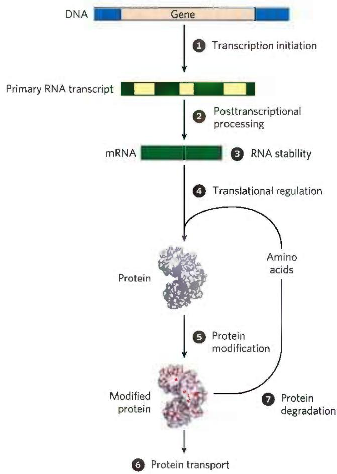  
FIGURE 28-1 Seven processes that affect the steady-state concentration of a protein. Each process has several potential points of regulation.

Of the regulatory processes illustrated in Figure 28-1, those operating at the level of transcription initiation are particularly well-documented. These processes are a major focus of this chapter, although we also consider other mechanisms. As noted in earlier chapters, the complexity of an organism is not reflected in the number of its protein-coding genes. Instead, as complexity increases from bacteria to mammals, mechanisms of gene regulation become more elaborate, and posttranscriptional and translational regulation play greater roles.

Control of transcription initiation permits the synchronized regulation of multiple genes encoding products with interdependent activities. For example, when their DNA is heavily damaged, bacterial cells require a coordinated increase in the levels of the many DNA repair enzymes. And perhaps the most sophisticated form of coordination occurs in the complex regulatory circuits that guide the development of multicellular eukaryotes, which can include many types of regulatory mechanisms.

We begin by examining the interactions between proteins and DNA that are the key to transcriptional regulation. We next discuss the specific proteins that influence the expression of specific genes, first in bacterial and then in eukaryotic cells. Information about posttranscriptional and translational controls is included in the discussion, where relevant, to provide a more complete overview of the rich complexity of cellular regulation.

## 28.1 The Proteins and RNAs of Gene Regulation

Transcription is mediated and regulated by protein-DNA interactions, especially those involving the protein components of RNA polymerase (Chapter 26). We first consider how the activity of RNA polymerase is regulated. Next, we proceed to a general description of the proteins participating in this regulation. We then examine the molecular basis for the recognition of specific DNA sequences by DNA-binding proteins. Regulatory RNAs are encountered most often in the regulation of mRNA translation in eukaryotes, but also play a role in the life of some bacterial mRNAs. We consider them briefly in this section, and in more detail in Section 28.3.

## RNA Polymerase Binds to DNA at Promoters

RNA polymerases bind to DNA and initiate transcription at promoters (see Fig. 26-5), sites generally found near points at which RNA synthesis begins on the DNA template. The regulation of transcription initiation often entails changes in how RNA polymerase interacts with a promoter.

The nucleotide sequences of promoters vary considerably, affecting the binding affinity of RNA polymerases and thus the frequency of transcription initiation. Some Escherichia coli genes are transcribed once per second, others less than once per cell generation. Much of this variation is due to differences in promoter sequence. In the absence of regulatory proteins, differences in promoter sequence may affect the frequency of transcription initiation by a factor of 1,000 or more. Most E. coli promoters have a sequence close to a consensus (Fig. 28-2). Mutations that result in a shift away from the consensus sequence usually decrease the function of bacterial promoters; conversely, mutations toward consensus usually enhance promoter function.

<table><tr><td>DNA 5&#x27;</td><td>UP element</td><td>TTGACA</td><td> $N_{17}$ </td><td>TATAAT</td><td> $N_{5-9}$ </td><td>RNA start site</td><td>mRNA</td></tr></table>

FIGURE 28-2 Consensus sequence for many E. coli promoters. Most base substitutions in the -10 and -35 regions have a negative effect on promoter function. Some promoters also include the UP (upstream promoter) element.

KEY CONVENTION By convention, DNA sequences are shown as they exist in the nontemplate strand, with the 5' terminus on the left. Nucleotides are numbered from the transcription start site, with positive numbers to the right (in the direction of transcription) and negative numbers to the left. N indicates any nucleotide.

Genes for products that are required at all times, such as those for the enzymes of central metabolic pathways, are expressed continuously, with little variation in virtually every cell of a species or organism. Such genes are often referred to as housekeeping genes. Expression of a gene at approximately constant levels is called constitutive gene expression. Although housekeeping genes are expressed constitutively, the cellular concentrations of the proteins they encode vary widely. For these genes, the RNA polymerase–promoter interaction strongly influences the rate of transcription initiation. Differences in promoter sequence may be the only level of regulation for a housekeeping gene, allowing the cell to synthesize the appropriate level of each housekeeping gene product.

The basal rate of transcription initiation at the promoters of nonhousekeeping genes is also determined by the promoter sequence, but expression of these genes is further modulated by regulatory proteins. Many of these proteins work by enhancing or interfering with the interaction between RNA polymerase and the promoter.

The sequences of eukaryotic promoters are much more variable than their bacterial counterparts. The three eukaryotic RNA polymerases usually require an array of general transcription factors in order to bind to a promoter, and these can heavily influence basal transcription rates. Yet, as with bacterial gene expression, the basal level of transcription is determined in part by the effect of promoter sequences on the function of RNA polymerase and its associated transcription factors.

## Transcription Initiation Is Regulated by Proteins and RNAs

P2 At least three types of regulatory proteins regulate transcription initiation by RNA polymerase: specificity factors alter the specificity of RNA polymerase for a given promoter or set of promoters, repressors impede access of RNA polymerase to the promoter, and activators enhance the RNA polymerase-promoter interaction.

As our understanding of the roles of protein regulators slowly matures, many new roles for gene regulation by noncoding RNAs (ncRNAs) are also beginning to emerge. Among these are the long noncoding RNAs (lncRNAs), generally defined as noncoding RNAs more than 200 nucleotides long that lack an open reading frame (ORF) that encodes a protein—thus distinguishing them from the small, functional ncRNAs (miRNA, snoRNA, snRNA, etc.) described in Chapter 26. The lncRNAs are found in all types of organisms, with tens of thousands expressed in mammalian cells. Known functions of lncRNAs include regulation of nucleosome positioning and chromatin structure, control of DNA methylation and posttranscriptional histone modifications, transcriptional gene silencing, multiple roles in transcriptional activation and repression, and much more.

We introduced bacterial specificity factors in Chapter 26, although we did not refer to these proteins by that name. The $\sigma$ subunit of the $E.$ coli RNA polymerase holoenzyme is a specificity factor that mediates promoter recognition and binding. Most $E.$ coli promoters are recognized by a single $\sigma$ subunit ( $M_{\mathrm{r}}$ 70,000), $\sigma^{70}$ (see Fig. 26-5). Under some conditions, some of the $\sigma^{70}$ subunits are replaced by one of six other specificity factors. One notable case arises when bacteria are subjected to heat stress, leading to the replacement of $\sigma^{70}$ by $\sigma^{32}$ ( $M_{\mathrm{r}}$ 32,000). When bound to $\sigma^{32}$ , RNA polymerase is directed to a specialized set of promoters with a different consensus sequence (Fig. 28-3). These promoters control the

FIGURE 28-3 Consensus sequence for promoters that regulate expression of the E. coli heat shock genes. This system responds to temperature increases as well as some other environmental stresses, resulting in the induction of a set of proteins. Binding of RNA polymerase to heat shock promoters is mediated by a specialized $\sigma$ subunit of the polymerase, $\sigma^{32}$ , which replaces $\sigma^{70}$ in the RNA polymerase initiation complex.

expression of a set of genes that encode proteins, including some protein chaperones (p. 132), that are part of a stress-induced system called the heat shock response. Thus, through changes in the binding affinity of the polymerase that direct the enzyme to different promoters, a set of genes involved in related processes is coordinately regulated. In eukaryotic cells, some of the general transcription factors, in particular the TATA-binding protein (TBP; see Fig. 26-9), may be considered specificity factors.

Repressors bind to specific sites on the DNA. In bacterial cells, such binding sites, called operators, are generally near a promoter. RNA polymerase binding, or its movement along the DNA after binding, is blocked when the repressor is present. P3 Regulation by means of a repressor protein that blocks transcription is referred to as negative regulation. Repressor binding to DNA is regulated by a molecular signal, or effector, usually a small molecule or a protein that binds to the repressor and causes a conformational change. The interaction between repressor and signal molecule either increases or decreases transcription. In some cases, the conformational change results in dissociation of a DNA-bound repressor from the operator (Fig. 28-4a). Transcription initiation can then proceed unhindered. In other cases, interaction between an inactive repressor and the signal molecule causes the repressor to bind to the operator (Fig. 28-4b). P4 In eukaryotic cells, gene regulation by a repressor is less common. Where it does occur (more often in lower eukaryotes such as yeast), the binding site for a repressor may be some distance from the promoter. Binding of these repressors to their binding sites has the same effect as in bacterial cells: inhibiting the assembly or activity of a transcription complex at the promoter.

P3 Activators provide a molecular counterpoint to repressors; they bind to DNA and enhance the activity of RNA polymerase at a promoter; this is positive regulation. In bacteria, activator-binding sites are often adjacent to promoters that are bound weakly or not at all by RNA polymerase alone, such that little transcription occurs in the absence of the activator. Some activators are usually bound to DNA, enhancing transcription until dissociation of the activator is triggered by the binding of a signal molecule (Fig. 28-4c). In other cases the activator binds to DNA only after interaction with a signal molecule (Fig. 28-4d). Signal molecules can therefore increase or decrease transcription, depending on how they affect the activator.

P4 Positive regulation by activators is particularly common in eukaryotes. Many eukaryotic activators bind to DNA sites, called enhancers, that are distant from the promoter, affecting the rate of transcription at a promoter that may be located thousands of base pairs away.

The distance between a promoter and the binding site of an activator or repressor is bridged by looping out of the DNA between the two sites (Fig. 28-5). The looping is facilitated in some cases by proteins called architectural regulators that bind to intervening sites. Interaction

(a) Negative regulation
Molecular signal causes dissociation of repressor from DNA, inducing transcription.

(b) Negative regulation
Molecular signal causes binding of repressor to DNA, inhibiting transcription.

  
(c) Positive regulation
Molecular signal causes dissociation of activator from DNA, inhibiting transcription.

(d) Positive regulation
Molecular signal causes binding of activator to DNA, inducing transcription.

  
FIGURE 28-4 Common patterns of regulation of transcription initiation. Two types of negative regulation are illustrated. (a) Repressor binds to the operator in the absence of the molecular signal; the external signal causes dissociation of the repressor to permit transcription. (b) Repressor binds in the presence of the signal; the repressor dissociates, and transcription ensues when the signal is removed. Positive regulation is mediated by gene activators. Again, two types are shown. (c) Activator binds in the absence of the molecular signal and transcription proceeds; when the signal is added, the activator dissociates and transcription is inhibited. (d) Activator binds in the presence of the signal; it dissociates only when the signal is removed. Note that "positive" regulation and "negative" regulation refer to the type of regulatory protein involved: the bound protein either facilitates or inhibits transcription. In either case, addition of the molecular signal may increase or decrease transcription, depending on its effect on the regulatory protein.

between activators and the RNA polymerase at the promoter is often mediated by intermediary proteins called coactivators. In some instances, protein repressors may take the place of coactivators, binding to the activators and preventing the activating interaction.

  
FIGURE 28-5 Interaction between activators/repressors and RNA polymerase in eukaryotes. Eukaryotic activators and repressors frequently bind sites thousands of base pairs distant from the promoters they regulate. DNA looping, often facilitated by architectural regulators, brings the sites together. The interaction between activators and RNA polymerase may be mediated by coactivators, as shown. Repression is sometimes mediated by repressors (described later) that bind to activators, thereby preventing the activating interaction with RNA polymerase.

## Many Bacterial Genes Are Clustered and Regulated in Operons

Bacteria have a simple general mechanism for coordinating the regulation of multiple genes: these genes are clustered on the chromosome and are transcribed together. Many bacterial mRNAs are polycistronic—multiple genes on a single transcript—and the single promoter that initiates transcription of the cluster is the site of regulation for expression of all the genes in the cluster. The gene cluster and promoter, plus additional sequences that function together in regulation, are called an operon (Fig. 28-6). Operons that include two to six genes transcribed as a unit are common; some operons contain 20 or more genes. The identity and order of the genes in an operon are not random. In many cases, genes in the same operon encode subunits of a larger protein complex, and cotranslation directly enables assembly of the complex. Some operons organize genes involved in related processes that require coordinated regulation. In other cases, the genes may seem to be unrelated, but they encode products required by the cell under similar conditions.

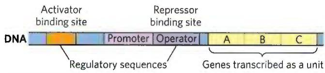  
FIGURE 28-6 Representative bacterial operon. Genes A, B, and C are transcribed on one polycistronic mRNA. Typical regulatory sequences include binding sites for proteins that either activate or repress transcription from the promoter.

Many of the principles of bacterial gene expression were first defined by studies of lactose metabolism in E. coli, which can use lactose as its sole carbon source. In 1960, François Jacob and Jacques Monod published a short paper in the Proceedings of the French Academy of Sciences that described how two adjacent genes involved in lactose metabolism were coordinately regulated by a genetic element located at one end of the gene cluster. The genes were those for $\beta$ -galactosidase, which cleaves lactose to galactose and glucose, and for galactoside permease, which transports lactose into the cell (Fig. 28-7). The terms “operon” and “operator” were first introduced in this paper. With the operon model, gene regulation could, for the first time, be considered in molecular terms.

## The lac Operon Is Subject to Negative Regulation

The lactose (lac) operon (Fig. 28-8a) includes the genes for $\beta$ -galactosidase (Z), galactoside permease (Y), and thiogalactoside transacetylase (A). The last of these enzymes seems to modify toxic galactosides to facilitate their removal from the cell. Each of the three genes is preceded by a ribosome-binding site (not shown in Fig. 28-8) that independently directs the translation of that gene (Chapter 27). Regulation of the lac operon by the lac repressor protein (Lac) follows the pattern outlined in Figure 28-4a.

The study of lac operon mutants has revealed some details of the workings of the operon's regulatory system. In the absence of lactose, the lac operon genes are repressed. Mutations in the operator or in another gene, the I gene, result in constitutive synthesis of the gene products. When the I gene is defective, repression can be restored by introducing a functional I gene into the cell on another DNA molecule, demonstrating that the I gene encodes a diffusible molecule that causes gene repression. This molecule proved to be a protein, now called the Lac repressor, a tetramer of identical monomers. The operator to which it binds most tightly (O $_{1}$ ) abuts the transcription start site (Fig. 28-8a). The I gene is transcribed from its own promoter (P $_{1}$ ) independent of the lac operon genes. The lac operon has two secondary binding sites for the Lac repressor: $O_{2}$ and $O_{3}$ . $O_{2}$ is centered near position +410, within the gene encoding $\beta$ -galactosidase (Z); $O_{3}$ is near position -90, within the I gene. To repress the operon, the Lac repressor seems to bind to both the main operator and one of the two secondary sites, with the intervening DNA looped out (Fig. 28-8b, c). Either binding arrangement blocks transcription initiation.

(a)  
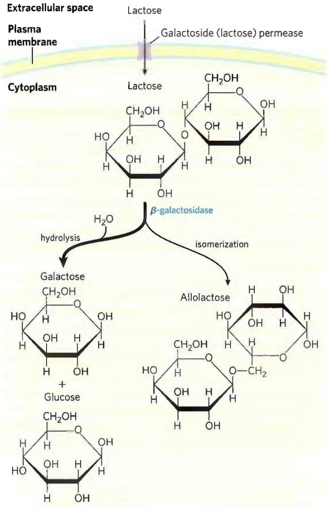  
FIGURE 28-7 Lactose metabolism in E. coli. Uptake and metabolism of lactose require the activities of galactoside (lactose) permease and $\beta$ -galactosidase. Conversion of lactose to allolactose by transglycosylation is a minor reaction also catalyzed by $\beta$ -galactosidase.

Despite this elaborate binding complex, repression is not absolute. Binding of the Lac repressor reduces the rate of transcription initiation by a factor of $10^{3}$ . If the $O_{2}$ and $O_{3}$ sites are eliminated by deletion or mutation, the binding of repressor to $O_{1}$ alone reduces transcription by a factor of about $10^{2}$ . Even in the repressed state, each cell has a few molecules of $\beta$ -galactosidase and galactoside permease, presumably synthesized on the rare occasions when the repressor transiently dissociates from the operators. This basal level of transcription is essential to operon regulation.

  
FIGURE 28-8 The lac operon. (a) In the lac operon, the lacI gene encodes the Lac repressor. The lac Z, Y, and A genes encode β-galactosidase, galactoside permease, and thiogalactoside transacetylase, respectively. P is the promoter for the lac genes, and P₁ is the promoter for the I gene. O₁ is the main operator for the lac operon; O₂ and O₃ are secondary operator sites of lesser affinity for the Lac repressor. The inverted repeat to which the Lac repressor binds in O₁ is shown. (b) The Lac repressor binds to the main operator and O₂ or O₃, and it seems to form a loop in the DNA. (c) Lac repressor (shades of red) is shown bound to short, discontinuous segments of DNA (blue and orange). [(c) Data from PDB ID 2PES, R. Daber et al., J. Mol. Biol. 370:609, 2007.]

When cells are provided with lactose, the lac operon is induced. An inducer (signal) molecule binds to a specific site on the Lac repressor, causing a conformational change that results in dissociation of the repressor from the operator. The inducer in the lac operon system is not lactose itself but allolactose, an isomer of lactose (Fig. 28-7). After entry into the E. coli cell (via the few preexisting molecules of lactose permease), lactose is converted to allolactose by one of the few preexisting $\beta$ -galactosidase molecules. Release of the operator by Lac repressor, triggered as the repressor binds to allolactose, allows expression of the lac operon genes and leads to a $10^{3}$ -fold increase in the concentration of $\beta$ -galactosidase.

Several $\beta$ -galactosides structurally related to allolactose are inducers of the lac operon but are not substrates for $\beta$ -galactosidase; others are substrates but not inducers. One particularly effective and nonmetabolizable inducer of the lac operon that is often used experimentally is isopropylthiogalactoside (IPTG).

  
Isopropyl- $\beta$ -D-thiogalactoside (IPTG)

An inducer that cannot be metabolized allows researchers to explore the physiological function of lactose as a carbon source for growth, separate from its function in the regulation of gene expression.

In addition to the multitude of operons now known in bacteria, a few polycistronic operons have been found in the cells of lower eukaryotes. In the cells of higher eukaryotes, however, almost all protein-coding genes are transcribed separately.

The mechanisms by which operons are regulated can vary significantly from the simple model presented in Figure 28-8. Even the lac operon is more complex than indicated here, with an activator also contributing to the overall scheme, as we shall see in Section 28.2. Before any further discussion of the layers of regulation of gene expression, however, we examine the critical molecular interactions between DNA-binding proteins (such as repressors and activators) and the DNA sequences to which they bind.

## Regulatory Proteins Have Discrete DNA-Binding Domains

P2 Regulatory proteins generally bind to specific DNA sequences. Their affinity for these target sequences is roughly $10^{4}$ to $10^{6}$ times higher than their affinity for any other DNA sequence. Most regulatory proteins have discrete DNA-binding domains containing substructures that interact closely and specifically with the DNA. These binding domains usually include one or more of a relatively small group of recognizable and characteristic structural motifs.

To bind specifically to DNA sequences, regulatory proteins must recognize surface features on the DNA (see Fig. 8-13). Most of the chemical groups that differ among the four bases and thus permit discrimination between base pairs are hydrogen-bond donor and acceptor groups exposed in the major groove of DNA (Fig. 28-9), and most of the protein-DNA contacts that impart specificity are hydrogen bonds. A notable exception is the nonpolar surface near C-5 of pyrimidines, where thymine is readily distinguished from cytosine by its protruding methyl group. Protein-DNA contacts are also possible in the minor groove of the DNA, but the hydrogen-bonding patterns there generally do not allow ready discrimination between base pairs.

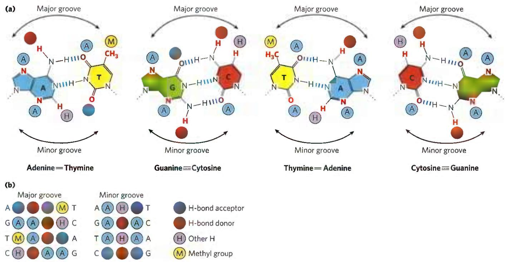  
FIGURE 28-9 Groups in DNA available for protein binding. (a) Shown here are functional groups on all four base pairs that are displayed in the major and minor grooves of DNA. Hydrogen-bond acceptor (A) and donor (D) atoms are marked by blue and red disks, respectively. Other hydrogen atoms (H) are marked with purple disks, and methyl groups (M) with  
yellow disks. (b) Recognition patterns for each base pair (from left to right). The much greater variation in the patterns for the major groove gives rise to a much greater discriminatory power in the major groove relative to the minor groove. [Information from J. L. Huret, Atlas Genet. Cytogenet. Oncol. Haematol. 2006, http://atlasgeneticsoncology.org/Educ/DNAEnglID30001ES.html.]

Within regulatory proteins, the amino acid side chains most often hydrogen-bonding to bases in the DNA are those of Asn, Gln, Glu, Lys, and Arg residues. Is there a simple recognition code in which a particular amino acid always pairs with a particular base? The two hydrogen bonds that can form between Gln or Asn and the $N^{6}$ and N-7 positions of adenine cannot form with any other base. And an Arg residue can form two hydrogen bonds with N-7 and $O^{6}$ of guanine (Fig. 28-10). Examination of the structure of many DNA-binding proteins, however, has shown that a protein can recognize each base pair in more than one way, leading to the conclusion that there is no simple amino acid-base code. For some proteins, the Gln-adenine interaction can specify A=T base pairs, but in others a van der Waals pocket for the methyl group of thymine can recognize A=T base pairs. Researchers cannot yet examine the structure of a DNA-binding protein and infer the DNA sequence to which it binds.

To interact with bases in the major groove of DNA, a protein requires a relatively small substructure that can stably protrude from the protein surface. The DNA-binding domains of regulatory proteins tend to be small (60 to 90 amino acid residues), and the structural motifs within these domains that are actually in contact with the DNA are smaller still. Many small proteins are unstable because of their limited capacity to form layers of structure to bury hydrophobic groups. The DNA-binding motifs provide either a very compact stable structure or a way of allowing a segment of protein to protrude from the protein surface.

P2 The DNA-binding sites for regulatory proteins are often inverted repeats of a short DNA sequence (a palindrome) at which multiple (usually two) subunits of a regulatory protein bind cooperatively. The Lac repressor is unusual in that it functions as a tetramer, with two dimers tethered together at the end distant from the DNA-binding sites (Fig. 28-8b). An E. coli cell usually contains about 20 tetramers of the Lac repressor. Each of the tethered dimers separately binds to a palindromic operator sequence, in contact with 17 bp of a 22 bp region in the lac operon. And each of the tethered dimers can independently bind to an operator sequence, with one generally binding to O $_{1}$ and the other to O $_{2}$ or O $_{3}$ (as in Fig. 28-8b). The symmetry of the O $_{1}$ operator sequence corresponds to the twofold axis of symmetry of two paired Lac repressor subunits. The tetrameric Lac repressor binds to its operator sequences in vivo with an estimated dissociation constant of 10 $^{-10}$ M. The repressor discriminates between the operators and other sequences by a factor of about 10 $^{6}$ , so binding to these few base pairs among the 4.6 million or so of the E. coli chromosome is highly specific.

  
FIGURE 28-10 Specific amino acid residue–base pair interactions. The two examples shown have been observed in DNA-protein binding.

Several DNA-binding motifs have been described, but here we focus on two that play prominent roles in the binding of DNA by regulatory proteins from all domains of life: the helix-turn-helix and the zinc finger. We also consider two other types of such motifs: the homeodomain and the RNA recognition motif, which, as its name implies, also binds RNA; both motifs play prominent roles in some eukaryotic regulatory proteins.

Helix-Turn-Helix The helix-turn-helix motif is crucial to the interaction of many regulatory proteins with DNA in bacteria, and similar motifs occur in some eukaryotic regulatory proteins. The helix-turn-helix comprises about 20 amino acid residues in two short $\alpha$ -helical segments, each 7 to 9 residues long, separated by a $\beta$ turn (Fig. 28-11). This structure generally is not stable by itself; it is simply the interactive portion of a somewhat larger DNA-binding domain. One of the two $\alpha$ -helical segments is called the recognition helix, because it usually contains many of the amino acids that interact with DNA in a sequence-specific way. This $\alpha$ helix is stacked on other segments of the protein structure so that it protrudes from the protein surface. When bound to DNA, the recognition helix is positioned in or nearly in the major groove. The Lac repressor has this DNA-binding motif.

Zinc Finger In a zinc finger, about 30 amino acid residues form an elongated loop held together at the base by a single $\mathrm{Zn}^{2+}$ ion, which is coordinated to 4 of the residues (4 Cys, or 2 Cys and 2 His). The zinc does not itself interact with DNA; rather, the coordination of zinc with the amino acid residues stabilizes this small structural motif. Several hydrophobic side chains in the core of the structure also lend stability. Figure 28-12 shows the interaction between DNA and three zinc fingers of a single polypeptide from the mouse regulatory protein Zif268.

  
FIGURE 28-11 Helix-turn-helix. (a) DNA-binding domain of the Lac repressor bound to DNA. (b) The entire Lac repressor. The DNA-binding domains and the $\alpha$ helices involved in tetramer formation are labeled. The remainder of the protein has the binding sites for allolactose. The allolactose-binding domains are linked to the DNA-binding domains through linker helices. [Data from PDB ID 2PES, R. Daber et al., J. Mol. Biol. 370:609, 2007.]

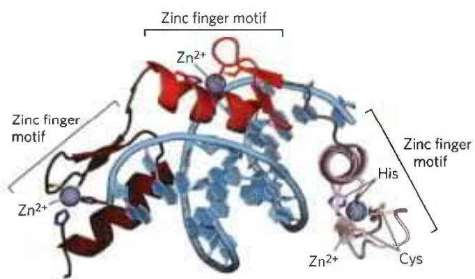  
FIGURE 28-12 Zinc fingers. Three zinc fingers of the regulatory protein Zif268, complexed with DNA. Each $\mathrm{Zn^{2+}}$ coordinates with two His and two Cys residues. [Data from PDB ID 1ZAA, N.P. Pavletich and C.O. Pabo, Science 252:809, 1991.]

Many eukaryotic DNA-binding proteins contain zinc fingers. The interaction of a single zinc finger with DNA is typically weak, and many DNA-binding proteins, like Zif268, have multiple zinc fingers that substantially enhance binding by interacting simultaneously with the DNA. One DNA-binding protein of the frog Xenopus has 37 zinc fingers. There are few known examples of the zinc finger motif in bacterial proteins.

  
FIGURE 28-13 Homeodomains. Shown here are two homeodomains bound to DNA. In each homeodomain, the recognition helix, layered on two others, can be seen protruding into the major groove. This is only a small part of a larger regulatory protein from a class called Pax, active in the regulation of development in fruit flies (see Section 28.3). [Data from PDB ID 1FJL, D. S. Wilson et al., Cell 82:709, 1995.]

The precise manner in which proteins with zinc fingers bind to DNA differs from one protein to the next. Some zinc fingers contain the amino acid residues that are important in sequence discrimination, whereas others seem to bind DNA nonspecifically (the amino acids required for specificity are located elsewhere in the protein). Zinc fingers can also function as RNA-binding motifs, such as in certain proteins that bind eukaryotic mRNAs and act as translational repressors. We discuss this role later (Section 28.3).

Homeodomain Another type of DNA-binding domain has been identified in some proteins that function as transcriptional regulators, especially during eukaryotic development. This domain of 60 amino acid residues—called the homeodomain, because it was discovered in homeotic genes (genes that regulate the development of body patterns)—is highly conserved and has now been identified in proteins from a wide variety of organisms, including humans (Fig. 28-13). The DNA-binding segment of the domain is related to the helix-turn-helix motif. The DNA sequence that encodes this domain is known as the homeobox.

RNA Recognition Motif New classes of proteins with RNA-binding domains continue to be identified. RNA recognition motifs (RRMs) are found in some eukaryotic gene activators, where they may do double duty in binding DNA and RNA. When bound to specific binding sites in DNA, these activators induce transcription. The same activators are sometimes regulated in part by specific lncRNAs that compete with DNA binding and decrease gene transcription. Other proteins with RRM motifs bind to mRNA, rRNA, or any of a range of other smaller, noncoding RNAs. The RRM consists of 90 to 100 amino acid residues, arranged in a four-strand antiparallel $\beta$ sheet sandwiched against two $\alpha$ helices, with a $\beta_{1}-\alpha_{1}-\beta_{2}-\beta_{3}-\alpha_{2}-\beta_{4}$ topology (Fig. 28-14a). This motif may be present as part of DNA-binding regulatory proteins that also have other DNA-binding motifs or may occur in proteins that bind uniquely to RNA. The RRM is just one of many diverse protein motifs known to interact with RNA (Fig. 28-14b).

## Regulatory Proteins Also Have Protein-Protein Interaction Domains

Regulatory proteins contain domains not only for DNA binding but also for protein-protein interactions—with RNA polymerase, other regulatory proteins, or other subunits of the same regulatory protein. Examples include many eukaryotic transcription factors that function as gene activators, which often bind as dimers to the DNA through DNA-binding domains that contain zinc fingers. Some structural domains are devoted to the interactions required for dimer formation, which is generally a prerequisite for DNA binding. Like DNA-binding motifs, the structural motifs that mediate protein-protein interactions tend to fall within one of a few common categories. Two important examples are the leucine zipper and the basic helix-loop-helix. Structural motifs such as these are the basis for classifying some regulatory proteins into structural families.

Leucine Zipper The leucine zipper is an amphipathic $\alpha$ helix with a series of hydrophobic amino acid residues concentrated on one side (Fig. 28-15), with the hydrophobic surface forming the area of contact between the two polypeptides of a dimer. A striking

  
FIGURE 28-14 RNA recognition motifs (RRMs). (a) An RRM from the p50 subunit of regulatory protein NF- $\kappa$ B is shown, bound to (left) DNA and (right) RNA. Black lines indicate hydrogen-bonding interactions between particular amino acid residues and bases in the DNA or RNA. NF- $\kappa$ B is the name of a family of structurally related eukaryotic transcription factors that regulate processes ranging from immune and inflammatory responses  
to cell growth and apoptosis. (b) Three additional RRM motifs from widespread RNA-binding protein families. [(a) Data from (left) PDB ID 100A, D. B. Huang et al., Proc. Natl. Acad. Sci. USA 100:9268, 2003; (right) PDB ID IVKX, F. E. Chen et al., Nature 391:410, 1998. (b) DEAD box RIG1: PDB ID 3LRR, C. Lu et al., Structure 18:1032, 2010; ROQ domain: PDB ID 4QIK, D. Tan et al., Nat. Struct. Mol. Biol. 21:679, 2014; Pumilio-Nos-hunchback: PDB ID 5KL1, C. A. Weidmann et al., eLife 5, 2016.]

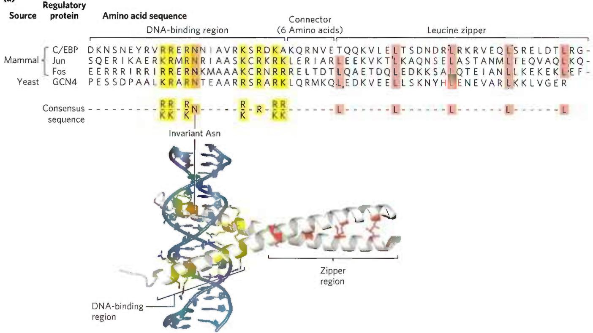  
FIGURE 28-15 Leucine zippers. (a) Comparison of amino acid sequences of several leucine zipper proteins. Notice the Leu (L) residues (shaded) at every seventh position in the zipper region, and the number of Lys (K) and Arg (R) residues in the DNA-binding region. (b) Leucine zipper from the yeast activator protein GCN4. Only the "zippered" $\alpha$ helices, derived

feature of these $\alpha$ helices is the occurrence of Leu residues at every seventh position, forming a straight line along the hydrophobic surface. Although researchers initially thought the Leu residues interdigitated (hence the name "zipper"), we now know that they line up, side by side, as the interacting $\alpha$ helices coil around each other (forming a coiled coil; Fig. 28-15b). Regulatory proteins with leucine zippers often have a separate DNA-binding domain with a high concentration of basic (Lys or Arg) residues that can interact with the negatively charged phosphates of the DNA backbone. Leucine zippers have been found in many eukaryotic proteins and a few bacterial proteins.

Basic Helix-Loop-Helix Another common structural motif, the basic helix-loop-helix, occurs in some eukaryotic regulatory proteins implicated in the control of gene expression during development of multicellular organisms. These proteins share a conserved region of about 50 amino acid residues important in both DNA binding and protein dimerization. This region can form two short, amphipathic $\alpha$ helices linked by a loop of variable length, the helix-loop-helix (distinct from the helix-turn-helix motif associated with DNA binding). The helix-loop-helix motifs of two polypeptides interact to form dimers (Fig. 28-16). In these proteins, DNA binding is mediated by an adjacent short amino acid sequence rich in basic residues, similar to the separate DNA-binding region in proteins containing leucine zippers.

from different subunits of the dimeric protein, are shown. The two helices wrap around each other in a gently coiled coil. The interacting Leu side chains and the conserved residues in the DNA-binding region are highlighted to correspond to the sequence in (a). [(a) Information from S. L. McKnight, Sci. Am. 264 (April):S4, 1991. (b) Data from PDB ID 1YSA, T. E. Ellenberger et al., Cell 71:1223, 1992.]  
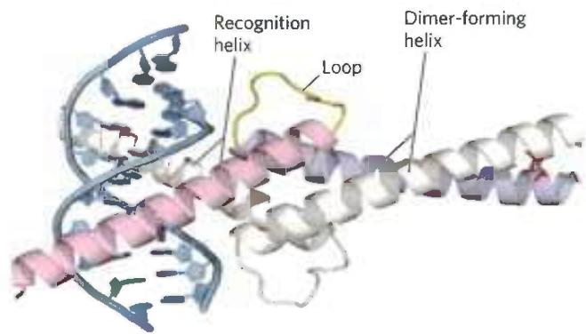  
FIGURE 28-16 Helix-loop-helix. The human transcription factor Max, bound to its DNA target site. The protein is dimeric; one subunit is colored. The recognition helix is linked via the loop to the dimer-forming helix, which merges with the carboxyl-terminal end of the subunit. Interaction of the carboxyl-terminal helices of the two subunits describes a coiled coil very similar to that of a leucine zipper (see Fig. 28-15b), but with only one pair of interacting Leu residues (side chains at the right) in this example. The overall structure is sometimes called a helix-loop-helix/leucine zipper motif. [Data from PDB ID 1HLO, P. Brownlie et al., Structure S:509, 1997.]

Protein-Protein Interactions in Eukaryotic Regulatory Proteins In eukaryotes, most genes are regulated by activators,