and most genes are monocistronic. If a different activator were required for each gene, the number of activators (and genes encoding them) would need to be equivalent to the number of regulated genes. However, in yeast, about 300 transcription factors (many of them activators) are responsible for the regulation of many thousands of genes. Many of the transcription factors regulate the induction of multiple genes, but most genes are subject to regulation by multiple transcription factors.
P4 Appropriate regulation of different genes is accomplished by different combinations of a limited repertoire of transcription factors at each gene, a mechanism referred to as combinatorial control.

Combinatorial control is accomplished in part by mixing and matching the variants within a regulatory protein family to form a series of different active protein dimers. Several families of eukaryotic transcription factors have been defined on the basis of close structural similarities. Within each family, dimers can sometimes form between two identical proteins (a homodimer) or between two different members of the family (a heterodimer). A hypothetical family of four different leucine-zipper proteins could thus form up to 10 different dimeric species. In many cases, the different combinations have distinct regulatory and functional properties and regulate different genes. As we shall see, multiple regulatory proteins of this kind function in the regulation of most eukaryotic genes, further contributing to combinatorial control.

In addition to having structural domains devoted to DNA binding and protein dimerization, which direct a particular protein dimer to a particular gene, many regulatory proteins have domains that interact with RNA polymerase, with regulatory RNAs, with unrelated regulatory proteins, or with some combination of the three. At least three types of additional domains for protein-protein interaction have been characterized (primarily in eukaryotes): glutamine-rich, proline-rich, and acidic domains, the names reflecting the amino acid residues that are especially abundant.

Protein-DNA and protein-RNA binding interactions are the basis of the intricate regulatory circuits fundamental to gene function. We now turn to a closer examination of these gene regulatory schemes, first in bacteria, then in eukaryotes.

## SUMMARY 28.1 The Proteins and RNAs of Gene Regulation

■ Transcription is initiated when an RNA polymerase interacts with a site called a promoter. In bacteria, the frequency of transcription initiation is dictated in part by sequence changes within the promoter. For gene products required all the time at a defined level—the products of housekeeping genes—the promoter sequence may be the sole element of regulation. For genes encoding products that are not always needed, regulation is imposed by additional proteins and RNAs.

■ Regulation of gene transcription is imposed primarily by three types of proteins: specificity factors, repressors, and activators. Regulatory RNAs also play an important role in regulating the expression of many genes.

In bacteria, genes that encode products with interdependent functions are often clustered in an operon, a single transcriptional unit. Transcription of the genes is generally blocked by binding of a specific repressor protein at a DNA site called an operator. Dissociation of the repressor from the operator is mediated by a specific small molecule, an inducer.

■ Many principles of gene regulation in bacteria were first elucidated in studies of the lactose (lac) operon. The Lac repressor dissociates from the lac operator when the repressor binds to its inducer, allolactose.

■ Regulatory proteins are DNA-binding proteins that recognize specific DNA sequences; most have distinct DNA-binding domains. Within these domains, common structural motifs that bind DNA (and/or RNA) are the helix-turn-helix, zinc finger, homeodomain, and RNA recognition motif.

■ Regulatory proteins often contain domains such as the leucine zipper and helix-loop-helix, required for dimerization or other protein-protein interactions, and other motifs required for activation of transcription. Mixing and matching of protein family variants in dimeric transcription factors provides for more efficient and responsive regulation through combinatorial control.

## 28.2 Regulation of Gene Expression in Bacteria

As in many other areas of biochemical investigation, the study of the regulation of gene expression advanced earlier and faster in bacteria than in other experimental organisms. The examples of bacterial gene regulation presented here are chosen from among scores of well-studied systems, partly for their historical significance, but primarily because they provide a good overview of the range of regulatory mechanisms in bacteria. Many of the principles of bacterial gene regulation are also relevant to understanding gene expression in eukaryotic cells.

We begin by examining the lactose and tryptophan operons; each system has regulatory proteins, but the overall mechanisms of regulation are very different. This is followed by a short discussion of the SOS response in E. coli, illustrating how genes scattered throughout the genome can be coordinately regulated. We then describe two bacterial systems of quite different types, illustrating the diversity of gene regulatory mechanisms: regulation of ribosomal protein synthesis at the level of translation, with many of the regulatory proteins binding to RNA (rather than DNA), and regulation of the process of “phase variation” in Salmonella, which results from genetic recombination. Finally, we examine some additional examples of posttranscriptional regulation in which the RNA modulates its own function.

## The lac Operon Undergoes Positive Regulation

The operator-repressor-inducer interactions described earlier for the lac operon (Fig. 28-8) provide an intuitively satisfying model for an on/off switch in the regulation of gene expression, but operon regulation is rarely so simple. A bacterium's environment is too complex for its genes to be controlled by one signal. Other factors besides lactose, such as the availability of glucose, affect the expression of the lac genes. Glucose, metabolized directly by glycolysis, is the preferred energy source in E. coli. Other sugars can serve as the main or sole nutrient, but extra enzymatic steps are required to prepare them for entry into glycolysis, necessitating the synthesis of additional enzymes. Clearly, expressing the genes for proteins that metabolize sugars such as lactose or arabinose is wasteful when glucose is abundant.

What happens to the expression of the lac operon when both glucose and lactose are present? A regulatory mechanism known as catabolite repression restricts expression of the genes required for catabolism of lactose, arabinose, and other sugars in the presence of glucose, even when these secondary sugars are also present. The effect of glucose is mediated by cAMP, as a coactivator, and an activator protein known as cAMP receptor protein, or CRP (the protein is sometimes called CAP, for catabolite gene activator protein). CRP is a homodimer (subunit $M_{r}$ 22,000) with binding sites for DNA and cAMP. Binding is mediated by a helix-turn-helix motif in the protein's DNA-binding domain (Fig. 28-17). When glucose is absent, CRP-cAMP binds to a site near the lac promoter (Fig. 28-18) and stimulates RNA transcription 50-fold. The wild-type lac promoter is a relatively

  
FIGURE 28-17 CRP homodimer with bound cAMP. Note the bending of the DNA around the protein. The region that interacts with RNA polymerase is labeled. [Data from PDB ID 1RUN, G. Parkinson et al., Nat. Struct. Biol. 3:837, 1996.]

(a) Glucose high, cAMP low, lactose absent  

(b) Glucose low, cAMP high, lactose absent  
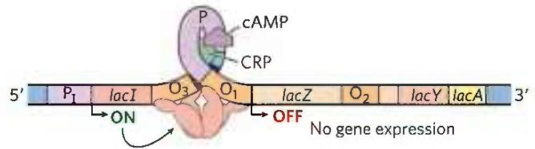

(c) Glucose high, cAMP low, lactose present  
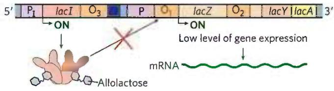

(d) Glucose low, cAMP high, lactose present  
  
FIGURE 28-18 Positive regulation of the lac operon by CRP. The binding site for CRP-cAMP is near the promoter. The combined effects of glucose and lactose availability on lac operon expression are shown. When lactose is absent, the repressor binds to the operator and prevents transcription of the lac genes. It does not matter whether glucose is (a) present or (b) absent. (c) If lactose is present, the repressor dissociates from the operator. However, if glucose is also available, low cAMP levels prevent CRP-cAMP formation and DNA binding. RNA polymerase may occasionally bind and initiate transcription, resulting in a very low level of lac genes transcription. (d) When lactose is present and glucose levels are low, cAMP levels rise. The CRP-cAMP complex forms and facilitates robust binding of RNA polymerase to the lac promoter and high levels of transcription.

weak promoter, diverging from the consensus shown in Figure 28-2. The open complex of RNA polymerase and the promoter (see Fig. 26-6) does not form readily unless CRP-cAMP is present and also bound (Fig. 28-18a, c). CRP-cAMP is therefore a positive regulatory element responsive to glucose levels, whereas the Lac repressor is a negative regulatory element responsive to lactose.

The two act in concert. CRP-cAMP has little effect on the lac operon when the Lac repressor is blocking transcription, and dissociation of the repressor from the lac operator has little effect on transcription of the lac operon unless CRP-cAMP is present to facilitate transcription. CRP interacts directly with RNA polymerase (at the region shown in Fig. 28-17) through the polymerase's $\alpha$ subunit. Thus, optimal expression of the lac operon requires dissociation of the Lac repressor (indicating that lactose is available) and the binding of CRP-cAMP (indicating that glucose is not available).

The effect of glucose on CRP is mediated by the cAMP interaction (Fig. 28-18). CRP binds to DNA most avidly when cAMP concentrations are high. In the presence of glucose, the synthesis of cAMP is inhibited and efflux of cAMP from the cell is stimulated. As [cAMP] declines, CRP binding to DNA declines, thereby decreasing the expression of the lac operon.

CRP and cAMP participate in the coordinated regulation of many operons, primarily those that encode enzymes for the metabolism of secondary sugars such as lactose and arabinose. A network of operons with a common regulator is called a regulon. This arrangement, which allows coordinated shifts in cellular functions that can require the action of hundreds of genes, is a major theme in the regulated expression of dispersed networks of genes in eukaryotes. Other bacterial regulons include the heat shock gene system that responds to changes in temperature and the genes induced in E. coli as part of the SOS response to DNA damage, described later.

## Many Genes for Amino Acid Biosynthetic Enzymes Are Regulated by Transcription Attenuation

The 20 common amino acids are required in large amounts for protein synthesis, and E. coli can synthesize all of them. The genes for the enzymes needed to synthesize a given amino acid are generally clustered in an operon and are expressed whenever existing supplies of that amino acid are inadequate for cellular requirements. When the amino acid is abundant, the biosynthetic enzymes are not needed and the operon is repressed.

The E. coli tryptophan (trp) operon (Fig. 28-19) includes five genes for the enzymes required to convert chorismate to tryptophan (see Fig. 22-19). Note that two of the enzymes catalyze more than one step in the pathway. The mRNA from the trp operon has a half-life of only about 3 min, allowing the cell to respond rapidly to changing needs for this amino acid. The Trp repressor is a homodimer. When tryptophan is abundant, it binds to the Trp repressor, causing a conformational change that permits the repressor to bind to the trp operator and inhibit expression of the trp operon. The trp operator site overlaps the promoter, so binding of the repressor blocks binding of RNA polymerase.

Once again, this simple on/off circuit mediated by a repressor is not the entire regulatory story. Different cellular concentrations of tryptophan can vary the rate of synthesis of the biosynthetic enzymes over a 700-fold range. P1 Once repression is lifted and transcription begins, the rate of transcription is fine-tuned to cellular tryptophan requirements by a second regulatory process, called transcription attenuation, in which transcription is initiated normally but is abruptly halted before the operon genes are transcribed. The frequency with which transcription is attenuated is regulated by the availability of tryptophan and relies on the very close coupling of transcription and translation in bacteria.

The trp operon attenuation mechanism uses signals encoded in four sequences within a 162 nucleotide leader region at the 5' end of the mRNA, preceding the initiation codon of the first gene (Fig. 28-20a). The leader contains a region known as the attenuator, made up of sequences 3 and 4. These sequences base-pair to form a G≡C-rich stem-and-loop structure closely followed by a series of U residues. The attenuator structure acts as a transcription terminator (Fig. 28-20b; see also Fig. 26-7a). Sequence 2 is an alternative complement for sequence 3 (Fig. 28-20c). If sequences 2 and 3 base-pair, the attenuator structure cannot form and transcription continues into the trp biosynthetic genes; the loop formed by the pairing of sequences 2 and 3 does not obstruct transcription.

Regulatory sequence 1 is crucial for a tryptophan-sensitive mechanism that determines whether sequence 3 pairs with sequence 2 (allowing transcription to continue) or with sequence 4 (attenuating transcription). Formation of the attenuator stem-and-loop structure depends on events that occur during translation of regulatory sequence 1, which encodes a leader peptide (so called because it is encoded by the leader region of the mRNA) of 14 amino acids, two of which are Trp residues. The leader peptide has no other known cellular function; its synthesis is simply an operon regulatory device. This peptide is translated immediately after it is transcribed, by a ribosome that follows closely behind RNA polymerase as transcription proceeds.

When tryptophan concentrations are high, concentrations of charged tryptophan tRNA (Trp-tRNA $^{Trp}$ ) are also high. This allows translation to proceed rapidly past the two Trp codons of sequence 1 and into sequence 2, before sequence 3 is synthesized by RNA polymerase. In this situation, sequence 2 is covered by the ribosome and unavailable for pairing to sequence 3 when sequence 3 is synthesized; the attenuator structure (sequences 3 and 4) forms and transcription halts (Fig. 28-20b, top). When tryptophan concentrations are low, however, the ribosome stalls at the two Trp codons in sequence 1, because charged tRNA $^{Trp}$ is less available. Sequence 2 remains free while sequence 3 is synthesized, allowing these two sequences to base-pair and permitting transcription to proceed (Fig. 28-20b, bottom). In this way, the proportion of transcripts that are attenuated declines as tryptophan concentration declines.

Many other amino acid biosynthetic operons use a similar attenuation strategy to fine-tune biosynthetic enzymes to meet the prevailing cellular requirements. The 15 amino acid leader peptide produced by the phe operon contains seven Phe residues. The leu operon leader peptide has four contiguous Leu residues. The leader peptide for the his operon contains seven contiguous His residues. In fact, in the his operon and several others, attenuation is sufficiently sensitive to be the only regulatory mechanism.

## Induction of the SOS Response Requires Destruction of Repressor Proteins

Extensive DNA damage in the bacterial chromosome triggers the induction of nearly 60 genes scattered about the chromosome. P3 The genes involved in the coordinated inducible response, called the SOS response (p. 939), constitute the SOS regulon. Many of the induced genes are involved in DNA repair. The key regulatory proteins are the RecA protein and the LexA repressor.

The LexA repressor ( $M_{r}$ 22,700) inhibits transcription of all the SOS genes (Fig. 28-21), and induction of the SOS response requires removal of LexA. This is not a simple dissociation from DNA in response to binding of a small molecule, as in the regulation of the lac operon described above. Instead, the LexA repressor is inactivated when it catalyzes its own cleavage at a specific Ala–Gly peptide bond, producing two roughly equal protein fragments. At physiological pH, this autocleavage reaction requires the RecA protein. RecA is not a protease in the classical sense, but its interaction with LexA enables the repressor's self-cleavage reaction. This function of RecA is sometimes called a co-protease activity.

The RecA protein provides the functional link between the biological signal (DNA damage) and induction of the SOS genes. Heavy DNA damage leads to numerous single-strand gaps in the DNA, and only RecA that is bound to single-stranded DNA can facilitate cleavage of the LexA repressor (Fig. 28-21, bottom). Binding of RecA at the gaps eventually activates its co-protease activity, leading to cleavage of the LexA repressor and SOS induction.

During induction of the SOS response in a severely damaged cell, RecA also promotes the autocatalytic cleavage of, and thus inactivates, the repressors that otherwise allow propagation of certain viruses in a dormant lysogenic state within the bacterial host. This provides a remarkable illustration of evolutionary adaptation. These repressors, like LexA, undergo self-cleavage at a specific Ala-Gly peptide bond, so induction of the SOS response permits replication of the virus and lysis of the cell, releasing new viral particles. Thus, the bacteriophage can make a hasty exit from a compromised bacterial host cell.

When tryptophan levels are low, the ribosome pauses at the Trp codons in sequence 1. Formation of the paired structure between sequences 2 and 3 prevents attenuation, because sequence 3 is no longer available to form the attenuator structure with sequence 4. The 2:3 structure, unlike the 3:4 attenuator, does not prevent transcription.  
  
(a)

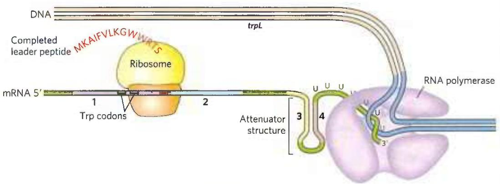

When tryptophan levels are high, the ribosome quickly translates sequence 1 (open reading frame encoding leader peptide) and blocks sequence 2 before sequence 3 is transcribed. Continued transcription leads to attenuation at the terminator-like attenuator structure formed by sequences 3 and 4.

  
(c)

(b)

FIGURE 28-20 Transcriptional attenuation in the trp operon. Transcription is initiated at the beginning of the 162 nucleotide mRNA leader encoded by a DNA region called trpL (see Fig. 28-19). A regulatory mechanism determines whether transcription is attenuated at the end of the leader or continues into the structural genes. (a) The trp mRNA leader (trpL). The attenuation mechanism in the trp operon involves sequences 1 to 4 (highlighted). (b) Sequence 1 encodes a small peptide, the leader peptide, containing two Trp residues (W); it is translated immediately after transcription begins. Sequences 2 and 3 are complementary, as are sequences 3 and 4. The attenuator structure forms by the pairing of sequences 3 and 4 (top). Its structure and function are similar to those of a transcription terminator. Pairing of sequences 2 and 3 (bottom) prevents the attenuator structure from forming. Note that the leader peptide has no other cellular function. Translation of its open reading frame has a purely regulatory role that determines which complementary sequences (2 and 3, or 3 and 4) are paired. (c) Base-pairing schemes for the complementary regions of the trp mRNA leader.

  
FIGURE 28-21 SOS response in E. coli. The LexA protein is the repressor in this system, which has an operator site near each gene. Because the recA gene is not entirely repressed by the LexA repressor, the normal cell contains about 1,000 RecA monomers. When DNA is extensively damaged (such as by UV light), DNA replication is halted and the number of single-strand gaps in the DNA increases. RecA protein binds to this damaged, single-stranded DNA, activating the protein's co-protease activity. While bound to DNA, the RecA protein facilitates cleavage and inactivation of the LexA repressor. When the repressor is inactivated, the SOS genes, including recA, are induced; RecA levels increase 50- to 100-fold.

The destruction of the LexA repressor proteins as part of the response means that LexA must be resynthesized in order to reestablish gene control when the DNA damage is no longer present. P5 The considerable amount of ATP and GTP needed for protein synthesis to maintain SOS regulon repression provides one example of the energetic cost of regulation.

## Synthesis of Ribosomal Proteins Is Coordinated with rRNA Synthesis

In bacteria, an increased cellular demand for protein synthesis is met by increasing the number of ribosomes rather than altering the activity of individual ribosomes. In general, the number of ribosomes increases as the cellular growth rate increases. At high growth rates, ribosomes make up approximately 45% of the cell's dry weight. The proportion of cellular resources devoted to making ribosomes is so large, and the function of ribosomes so important, that cells must coordinate the synthesis of the ribosomal components: the ribosomal proteins (r-proteins) and RNAs (rRNAs). P1 This regulation is distinct from the mechanisms described so far: it occurs largely at the level of translation.

The 52 genes that encode the r-proteins are distributed across at least 20 operons, each with 1 to 11 genes. Some of these operons also contain the genes for the subunits of DNA primase, RNA polymerase, and protein synthesis elongation factors—reflecting the close coupling of replication, transcription, and protein synthesis during bacterial cell growth.

The r-protein operons are regulated primarily through a translational feedback mechanism. One r-protein encoded by each operon also functions as a translational repressor, which binds to the mRNA transcribed from that operon and blocks translation of all the genes the messenger encodes (Fig. 28-22). In general, the r-protein that plays the role of repressor also binds directly to an rRNA. Each translational repressor r-protein binds with higher affinity to the appropriate rRNA than to its mRNA, so the mRNA is bound and translation repressed only when the level of the r-protein exceeds that of the rRNA. This ensures that translation of the mRNAs encoding r-proteins is repressed only when synthesis of these r-proteins exceeds that needed to make functional ribosomes. In this way, the rate of r-protein synthesis is kept in balance with rRNA availability.

  
FIGURE 28-22 Translational feedback in some ribosomal protein operons. The r-proteins that act as translational repressors are shown (red circles). Each translational repressor blocks the translation of all genes in that operon by binding to the indicated site on the mRNA. The operons include the genes that encode the $\alpha$ , $\beta$ , and $\beta'$ subunits of RNA polymerase and the elongation factors EF-G and EF-Tu (labeled). The r-proteins of the large (50S) ribosomal subunit are designated L1 to L34; those of the small (30S) subunit are designated S1 to S21.

The mRNA-binding site for the translational repressor is near the translational start site of one of the genes in the operon, often but not always the first gene (Fig. 28-22). In other operons this would affect only that one gene, because in bacterial polycistronic mRNAs, most genes have independent translation signals. In the r-protein operons, however, the translation of one gene depends on the translation of all the others. The translation of multiple genes seems to be blocked by folding of the mRNA into an elaborate three-dimensional structure that is stabilized both by internal base pairing and by binding of the translational repressor protein. When the translational repressor is absent, ribosome binding and translation of one or more of the genes disrupts the folded structure of the mRNA and allows all the genes to be translated.

Because the synthesis of r-proteins is coordinated with the availability of rRNA, the regulation of ribosome production reflects the regulation of rRNA synthesis. In E. coli, rRNA synthesis from the seven rRNA operons responds to cellular growth rate and to changes in the availability of crucial nutrients, particularly amino acids. The regulation coordinated with amino acid concentrations is known as the stringent response (Fig. 28-23). When amino acid concentrations are low, rRNA synthesis is halted. Amino acid starvation leads to the binding of uncharged tRNAs to the ribosomal A site; this triggers a sequence of events that begins with the binding of an enzyme called stringent factor (RelA protein) to the ribosome. When bound to the ribosome, stringent factor catalyzes formation of the unusual nucleotide guanosine tetraphosphate (ppGpp); it adds pyrophosphate to the 3' position of GTP, in the reaction

$$
\mathrm{GTP} + \mathrm{ATP} \rightarrow \mathrm{pppGpp} + \mathrm{AMP}
$$

Then a phosphohydrolase cleaves off one phosphate to convert some pppGpp to ppGpp. The abrupt rise in pppGpp and ppGpp levels in response to amino acid starvation results in a great reduction in rRNA synthesis, mediated at least in part by the binding of ppGpp to RNA polymerase.

The nucleotides pppGpp and ppGpp, along with cAMP, belong to a class of modified nucleotides that act as cellular second messengers. In E. coli, these two nucleotides serve as starvation signals; they cause large changes in cellular metabolism by increasing or decreasing the transcription of hundreds of genes. In eukaryotic cells, similar nucleotide second messengers also have multiple regulatory functions. The coordination of cellular metabolism with cell growth is highly complex, and further regulatory mechanisms undoubtedly remain to be discovered.

## The Function of Some mRNAs Is Regulated by Small RNAs in Cis or in Trans

As described throughout this chapter, proteins play an important and well-documented role in regulating gene expression. But RNA also has a crucial role—one that is becoming increasingly recognized as more examples of regulatory RNAs are discovered. Once an mRNA is synthesized, its functions can be controlled by RNA-binding proteins, as seen for the r-protein operons just described, or by an RNA. A separate RNA molecule may bind to the mRNA “in trans” and affect its activity. Alternatively, a portion of the mRNA itself may regulate its own function. When part of a molecule affects the function of another part of the same molecule, it is said to act “in cis.”

  
FIGURE 28-23 Stringent response in E. coli. This response to amino acid starvation is triggered by binding of an uncharged tRNA in the ribosomal A site. A protein called stringent factor binds to the ribosome and catalyzes the synthesis of pppGpp, which is converted by a phosphohydrolase to ppGpp. The signal ppGpp reduces transcription of some genes and increases transcription of others, in part by binding to the $\beta$ subunit of RNA polymerase and altering the enzyme's promoter specificity. Synthesis of rRNA is reduced when ppGpp levels increase.

A well-characterized example of RNA regulation in trans is regulation of the mRNA of the gene rpoS (RNA polymerase sigma factor), which encodes $\sigma^{S}$ (formerly known as $\sigma^{38}$ ), one of seven E. coli sigma factors. The cell uses this specificity factor in certain stress situations, such as when it enters the stationary phase (a state of no growth, necessitated by lack of nutrients) and $\sigma^{S}$ is needed to transcribe large numbers of stress response genes. The $\sigma^{S}$ mRNA is present at low levels under most conditions but is not translated, because a large hairpin structure upstream of the coding region inhibits ribosome binding (Fig. 28-24). P2 Under certain stress conditions, one or both of two small ncRNAs, DsrA (downstream region A) and RprA (rpoS regulator RNA A), are induced. Both can pair with one strand of the hairpin in the $\sigma^{S}$ mRNA, disrupting the hairpin and thus allowing translation of rpoS.

  
FIGURE 28-24 Regulation of bacterial mRNA function in trans by sRNAs. Several sRNAs (small RNAs) — DsrA, RprA, and OxyS — participate in regulation of the rpoS gene. All require the protein Hfq, an RNA chaperone that facilitates RNA-RNA pairing. Hfq has a toroid structure, with a pore in the center. (a) DsrA promotes translation by pairing with one strand of a stem-loop structure that otherwise blocks the ribosome-binding site. RprA (not shown) acts in a similar way. (b) OxyS blocks translation by pairing with the ribosome-binding site. [Information from M. Szymański and J. Barciszewski, Genome Biol. 3:reviews0005.1, 2002.]

Another small RNA, OxyS (oxidative stress gene S), is induced under conditions of oxidative stress and inhibits the translation of rpoS, probably by pairing with and blocking the ribosome-binding site on the mRNA. OxyS is expressed as part of a system that responds to a different type of stress (oxidative damage) than does the rpoS RNA, and its task is to prevent expression of unneeded repair pathways. DsrA, RprA, and OxyS are all relatively small bacterial RNA molecules (less than 300 nucleotides), designated sRNAs (s for small; there are, of course, other "small" RNAs with other designations in eukaryotes). All sRNAs require for their function a protein called Hfq, an RNA chaperone that facilitates RNA-RNA pairing. The known bacterial genes regulated in this way are few in number, just a few dozen in a typical bacterial species. However, these examples provide good model systems for understanding patterns present in the more complex and numerous examples of RNA-mediated regulation in eukaryotes.

Regulation in cis involves a class of RNA structures known as riboswitches. As described in Box 26-4, aptamers are RNA molecules, generated in vitro, that are capable of specific binding to a particular ligand. As one might expect, such ligand-binding RNA domains are also present in nature—in riboswitches—in a significant number of bacterial mRNAs (and even in some eukaryotic mRNAs). These natural aptamers are structured domains found in untranslated regions at the 5' ends of certain bacterial mRNAs. Some riboswitches also regulate the transcription of certain noncoding RNAs. Binding of an mRNA's riboswitch to its appropriate ligand results in a conformational change in the mRNA, and transcription is inhibited by stabilization of a premature transcription termination structure, or translation is inhibited (in cis) by occlusion of the ribosome-binding site (Fig. 28-25). In most cases, the riboswitch acts in a kind of feedback loop. Most genes regulated in this way are involved in the synthesis or transport of the ligand that is bound by the riboswitch; thus, when the ligand is present in high concentrations, the riboswitch inhibits expression of the genes needed to replenish this ligand.

  
FIGURE 28-25 Regulation of bacterial mRNA function in cis by riboswitches. The known modes of action are illustrated by several different riboswitches, based on a widespread natural aptamer that binds thiamine pyrophosphate. TPP binding to the aptamer leads to a conformational change that produces the varied results illustrated in (a), (b), and (c) in several different systems in which the aptamer is utilized. [Information from W. C. Winkler and R. R. Breaker, Annu. Rev. Microbiol. 59:487, 2005.]

Each riboswitch binds only one ligand. Distinct riboswitches have been detected that respond to more than a dozen different ligands, including thiamine pyrophosphate (TPP, vitamin $B_{1}$ ), cobalamin (vitamin $B_{12}$ ), flavin mononucleotide, lysine, S-adenosylmethionine (adoMet), purines, N-acetylglucosamine 6-phosphate, glycine, and some metal cations such as $Mn^{2+}$ . It is likely that many more remain to be discovered. The riboswitch that responds to TPP seems to be the most widespread; it is found in many bacteria, fungi, and some plants. The bacterial TPP riboswitch inhibits translation in some species and induces premature transcription termination in others (Fig. 28-25). The eukaryotic TPP riboswitch is found in the introns of certain genes and modulates the alternative splicing of those genes. It is not yet clear how common riboswitches are. However, estimates suggest that more than 4% of the genes of Bacillus subtilis are regulated by riboswitches.

Most of the riboswitches described to date, including the one that responds to adoMet, have been found only in bacteria. A drug that bound to and activated the adoMet riboswitch would shut down the genes encoding the enzymes that synthesize and transport adoMet, effectively starving the bacterial cells of this essential cofactor. Drugs of this type are being sought for use as a new class of antibiotics.

The pace of discovery of functional RNAs shows no signs of abating and continues to bolster the hypothesis that RNA played a special role in the evolution of life (Chapter 26). The sRNAs and riboswitches, like ribozymes and ribosomes, may be vestiges of an RNA world obscured by time but persisting as a rich array of biological devices still functioning in the biosphere. The laboratory selection of aptamers and ribozymes with novel ligand-binding and enzymatic functions tells us that the RNA-based activities necessary for a viable RNA world are possible. Discovery of many of the same RNA functions in living organisms tells us that key components for RNA-based metabolism do exist. For example, the natural aptamers of riboswitches may be derived from RNAs that, billions of years ago, bound to cofactors needed to promote the enzymatic processes required for metabolism in the RNA world.

## Some Genes Are Regulated by Genetic Recombination

We turn now to another mode of bacterial gene regulation, at the level of DNA rearrangement—recombination. Salmonella typhimurium, which inhabits the mammalian intestine, moves by rotating the flagella on its cell surface (Fig. 28-26). The many copies of the protein flagellin $(M_{r} \ 53,000)$ that make up the flagella are prominent targets of mammalian immune systems. But Salmonella cells have a mechanism that evades the immune response: they switch between two distinct flagellin proteins (FljB and FliC) roughly once every 1,000 generations, using a process called phase variation.

  
FIGURE 28-26 Salmonella typhimurium. The appendages emanating from the cell are flagella. [Eye of Science/Science Source.]

The switch is accomplished by periodic inversion of a segment of DNA containing the promoter for a flagellin gene. The inversion is a site-specific recombination reaction (see Fig. 25-37) mediated by the Hin recombinase at specific 14 bp sequences (hix sequences) at each end of the DNA segment. When the DNA segment is in one orientation, the gene for FljB flagellin and the gene encoding a repressor, FljA, are expressed (Fig. 28-27a); the repressor shuts down expression of the gene for FliC flagellin. When the DNA segment is inverted (Fig. 28-27b), the fljA and fljB genes are no longer transcribed, and the fliC gene is induced as the repressor becomes depleted. The Hin recombinase, encoded by the hin gene in the DNA segment that undergoes inversion, is expressed when the DNA segment is in either orientation, so the cell can always switch from one state to the other.

This type of regulatory mechanism has the advantage of being absolute: gene expression is impossible when the gene is physically separated from its promoter (note the position of the fljB promoter in Fig. 28-27b). An absolute on/off switch may be important in this system (even though it affects only one of the two flagellin genes) because a flagellum with just one copy of the wrong flagellin might be vulnerable to host antibodies against that protein. The Salmonella system is by no means unique. Similar regulatory systems occur in some other bacteria and in some bacteriophages, and recombination systems with similar functions have been found in eukaryotes (Table 28-1). Gene regulation by DNA rearrangements that move genes and/or promoters is particularly common in pathogens that benefit by changing their host range or by changing their surface proteins, thereby staying ahead of host immune systems.

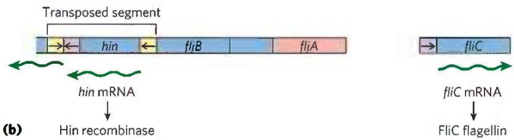  
FIGURE 28-27 Regulation of flagellin genes in Salmonella: phase variation. The products of genes fliC and fljB are different flagellins. The hin gene encodes the recombinase that catalyzes inversion of the DNA segment containing the fljB promoter and the hin gene. The recombination sites (inverted repeats) are called hix. (a) In one orientation, fljB is expressed  
along with a repressor protein (product of the fliA gene) that represses transcription of the fliC gene. (b) In the opposite orientation, only the fliC gene is expressed; the fliA and fliB genes cannot be transcribed. The interconversion between these two states, known as phase variation, also requires two other nonspecific DNA-binding proteins (not shown), HU and FIS.

<table><tr><td colspan="4">TABLE 28-1 Examples of Gene Regulation by Recombination</td></tr><tr><td>System</td><td>Recombinase/recombination site</td><td>Type of recombination</td><td>Function</td></tr><tr><td>Phase variation (Salmonella)</td><td>Hin/hix</td><td>Site-specific</td><td>Alternative expression of two flagellin genes allows evasion of host immune response.</td></tr><tr><td>Host range (bacteriophage μ)</td><td>Gin/gix</td><td>Site-specific</td><td>Alternative expression of two sets of tail fiber genes affects host range.</td></tr><tr><td>Mating-type switch (yeast)</td><td>HO endonuclease, RAD52 protein, other proteins/MAT</td><td>Nonreciprocal gene conversiona</td><td>Alternative expression of two mating types of yeast, a and α, creates cells of different mating types that can mate and undergo meiosis.</td></tr><tr><td>Antigenic variation (trypanosomes)b</td><td>Varies</td><td>Nonreciprocal gene conversiona</td><td>Successive expression of different genes encoding the variable surface glycoproteins (VSGs) allows evasion of host immune response.</td></tr></table>

$^{a}$ In nonreciprocal gene conversion (a class of recombination events not discussed in Chapter 25), genetic information is moved from one part of the genome (where it is silent) to another (where it is expressed). The reaction is similar to replicative transposition (see Fig. 25-41).  
$^{b}$ Trypanosomes cause African sleeping sickness and other diseases (see Box 6-1). The outer surface of a trypanosome is made up of multiple copies of a single VSG, the major surface antigen. A cell can change surface antigens to more than 100 different forms, precluding an effective defense by the host immune system.

## SUMMARY 28.2 Regulation of Gene Expression in Bacteria

In addition to repression by the Lac repressor, the E. coli lac operon undergoes positive regulation by the cAMP receptor protein (CRP). When [glucose] is low, [cAMP] is high and CRP-cAMP binds to a specific site on the DNA, stimulating transcription of the lac operon and production of lactose-metabolizing enzymes. The presence of glucose depresses [cAMP], decreasing expression of lac and other genes involved in metabolism of secondary sugars. A group of coordinately regulated operons is referred to as a regulon.

■ Operons that produce the enzymes of amino acid synthesis have a regulatory circuit called attenuation, which uses a transcription termination site, called the attenuator, in the mRNA. Formation of the attenuator is modulated by a mechanism that couples transcription and translation while responding to small changes in amino acid concentration.

In the SOS system, multiple unlinked genes repressed by a single repressor are induced simultaneously when DNA damage triggers RecA protein-facilitated autocatalytic proteolysis of the repressor.

In the synthesis of ribosomal proteins, one protein in each r-protein operon acts as a translational repressor. The mRNA is bound by the repressor, and translation is blocked only when the r-protein is present in excess of available rRNA.

■ Posttranscriptional regulation of some mRNAs is mediated by sRNAs that act in trans or by riboswitches, part of the mRNA structure itself, that act in cis.

■ Some genes are regulated by genetic recombination processes that move promoters relative to the genes being regulated. Regulation can also take place at the level of translation.

## 28.3 Regulation of Gene Expression in Eukaryotes

Initiation of transcription is a crucial regulation point for gene expression in all organisms. Although eukaryotes and bacteria use some of the same regulatory mechanisms, the regulation of transcription in the two systems is fundamentally different.

P4 We can define a transcriptional ground state as the inherent activity of promoters and transcriptional machinery in vivo in the absence of regulatory sequences. In bacteria, RNA polymerase generally has access to every promoter and can bind and initiate transcription at some level of efficiency in the absence of activators or repressors. In eukaryotes, however, strong promoters are generally inactive in vivo in the absence of regulatory proteins. This fundamental difference gives rise to at least five important features that distinguish the regulation of gene expression at eukaryotic promoters from that observed in bacteria.

First, access to eukaryotic promoters is restricted by the structure of chromatin, and activation of transcription is associated with many changes in chromatin structure in the transcribed region. Second, although eukaryotic cells have both positive and negative regulatory mechanisms, positive mechanisms are more prominent. Almost every eukaryotic gene requires activation to be transcribed. Third, regulatory mechanisms involving lncRNAs are more common in eukaryotic transcriptional regulation. Fourth, eukaryotic cells have larger, more complex multimeric regulatory proteins than do bacteria. Finally, transcription in the eukaryotic nucleus is separated from translation in the cytoplasm in both space and time.

The complexity of regulatory circuits in eukaryotic cells is extraordinary, as is evident from the following discussion. The section ends with an illustrated description of one of the most elaborate circuits: the regulatory cascade that controls development in fruit flies.

## Transcriptionally Active Chromatin Is Structurally Distinct from Inactive Chromatin

The effects of chromosome structure on gene regulation in eukaryotes have no clear parallel in bacteria. In the eukaryotic cell cycle, interphase chromosomes appear, at first viewing, to be dispersed and amorphous (see Fig. 24-22). Nevertheless, several forms of chromatin can be found along these chromosomes. About 10% of the chromatin in a typical eukaryotic cell is in a more condensed form than the rest of the chromatin. This form, heterochromatin, is transcriptionally inactive.

Heterochromatin is generally associated with particular chromosome structures—the centromeres, for example. The remaining, less condensed chromatin is called euchromatin.

Transcription of a eukaryotic gene is strongly repressed when its DNA is condensed within heterochromatin. Some, but not all, of the euchromatin is transcriptionally active. Transcriptionally active chromosomal regions are distinguished from heterochromatin in at least three ways: the positioning of nucleosomes, the presence of histone variants, and the covalent modification of nucleosomes. These transcription-associated structural changes in chromatin are collectively called chromatin remodeling. The remodeling employs a set of enzymes that promote these changes (Table 28-2).

Four known families of chromatin remodeling complexes, distinguished by their structural features, act directly to alter nucleosome composition in transcribed regions. They may unwrap, translocate, remove, or exchange nucleosomes on the DNA, hydrolyzing ATP in the process (Table 28-2; see the table footnote for an explanation of the abbreviated names of enzyme complexes described here). In some cases, the enzymes catalyze the exchange of pairs of histones within nucleosomes to alter nucleosome composition. The multitude of different complexes are specialized to function at particular genes or chromosomal regions. There are two related complexes in the SWI/SNF family in all eukaryotic cells, both of which remodel chromatin so that nucleosomes are ejected from the DNA near transcription start sites. They appear to be involved in a dynamic cycle to allow replacement of nucleosomes with transcription factors (Fig. 28-28). The two distinct complexes generally function at different sets of genes. Most of the ISWI family complexes optimize nucleosome spacing to allow chromatin assembly and transcriptional silencing. There are generally 9 or 10 different CHD family complexes in eukaryotic cells, separated into three subfamilies. The different family members have specialized roles, either ejecting nucleosomes to activate transcription or assembling chromatin to repress transcription. The INO80 family complexes have a variety of roles in remodeling chromatin for transcriptional activation and DNA repair. One family member, SWR1, promotes subunit exchange in nucleosomes to introduce histone variants such as H2AZ (see Box 24-1), found in transcriptionally active regions.

The covalent modification of histones is altered dramatically within transcriptionally active chromatin. The core histones of nucleosome particles (H2A, H2B, H3, H4; see Fig. 24-24) are modified by methylation of Lys or Arg residues, phosphorylation of Ser or Thr residues, acetylation (see below), ubiquitination (see Fig. 27-47), or SUMOylation (SUMOs are small ubiquitin-like modifiers). Each of the core histones has two distinct structural domains. A central domain is involved in histone-histone interaction and the wrapping of DNA around the nucleosome. A lysine-rich amino-terminal domain is generally positioned near the exterior of the assembled nucleosome particle; the covalent modifications occur at specific residues concentrated in this amino-terminal domain. The patterns of modification have led some researchers to propose the existence of a histone code, in which modification patterns are recognized by enzymes that alter the structure of chromatin. Indeed, some of the modifications are essential for interactions with proteins that play key roles in transcription.

<table><tr><td colspan="4">TABLE 28-2 Some Enzyme Complexes That Catalyze Chromatin Structural Changes Associated with Transcription</td></tr><tr><td>Enzyme complexa</td><td>Oligomeric structure (number of polypeptides)</td><td>Source</td><td>Activities</td></tr><tr><td colspan="4">Histone movement, replacement, or editing, requiring ATP</td></tr><tr><td>SWI/SNF family</td><td> $8-17,M_r >10^6$ </td><td>Eukaryotes</td><td>Nucleosome remodeling; transcriptional activation</td></tr><tr><td>ISWI family</td><td>2-4</td><td>Eukaryotes</td><td>Nucleosome remodeling; transcriptional repression; transcriptional activation in some cases</td></tr><tr><td>CHD family</td><td>1-10</td><td>Eukaryotes</td><td>Nucleosome remodeling; nucleosome ejection for transcriptional activation; some have repressive roles</td></tr><tr><td>INO80 family</td><td>&gt;10</td><td>Eukaryotes</td><td>Nucleosome remodeling; transcriptional activation; family member SWR1 engages in replacement of H2A-H2B with H2AZ-H2B</td></tr><tr><td colspan="4">Histone modification</td></tr><tr><td>GCN5-ADA2-ADA3</td><td>3</td><td>Yeast</td><td>GCN5 has type A HAT activity</td></tr><tr><td>SAGA/PCAF</td><td>&gt;20</td><td>Eukaryotes</td><td>Includes GCN5-ADA2-ADA3; acetylates residues in H3, H2B, H2AZ</td></tr><tr><td>NuA4</td><td>≥12</td><td>Eukaryotes</td><td>EsaI component has HAT activity; acetylates H4, H2A, and H2AZ</td></tr><tr><td colspan="4">Histone chaperones not requiring ATP</td></tr><tr><td>HIRA</td><td>1</td><td>Eukaryotes</td><td>Deposition of H3.3 during transcription</td></tr><tr><td colspan="4">*The abbreviations for eukaryotic genes and proteins are often more confusing or obscure than those used for bacteria. SWI (switching) was discovered as a protein required for expression of certain genes involved in mating-type switching in yeast, and SNF (sucrose nonfermenting) as a factor for expression of the yeast gene for sucrase. Subsequent studies revealed multiple SWI and SNF proteins that act in a complex. The SWI/SNF complex has a role in expression of a wide range of genes and has been found in many eukaryotes, including humans. ISWI is imitation SWI. CHD is chromodomain, helicase, DNA binding; INO80 is Inositol-requiring 80; and SWR1 is SWI2/Snf2-related ATPase 1. The complex of GCN5 (general control nonderepressible) and ADA (alteration/deficiency in activation) proteins was discovered during investigation of the regulation of nitrogen metabolism genes in yeast. These proteins can be part of the larger SAGA (SPF, ADA2,3, GCNS, acetyltransferase) complex in yeasts. The equivalent of SAGA in humans is PCAF (p300/CBP-associated factor). NuA4 is nucleosome acetyltransferase of H4; ESA1 is essential SAS2-related acetyltransferase; HIRA is histone regulator A</td></tr></table>

  
FIGURE 28-28 Nucleosome ejection by a SWI/SNF remodeler. The SWI/SNF enzyme engulfs the nucleosome, interacting with short CGCG sequences nearby. With the aid of ATP hydrolysis, the DNA is partially separated from the nucleosome, exposing a site for transcription factor (TF) binding. After the transcription factor is bound, the nucleosome is ejected. When transcription is no longer needed, the nucleosome can again replace the transcription factor or factors, completing the cycle. [Information from S. Brahma and S. Henikoff, Trends Biochem. Sci. 45:13, 2020.]

The acetylation and methylation of histones figure prominently in the processes that activate chromatin for transcription. During transcription, histone H3 in nucleosomes is methylated (by specific histone methylases) at Lys $^{4}$ near the 5' end of the coding region and at Lys $^{36}$ within the coding region. These methylations enable the binding of histone acetyltransferases (HATs), enzymes that acetylate particular Lys residues. Cytosolic (type B) HATs acetylate newly synthesized histones before the histones are imported into the nucleus. The subsequent assembly of the histones into chromatin after replication is facilitated by histone chaperones: CAF1 for H3 and H4 (see Box 24-1), and NAP1 for H2A and H2B.

Where chromatin is being activated for transcription, the nucleosomal histones are further acetylated by nuclear (type A) HATs. The acetylation of multiple Lys residues in the amino-terminal domains of histones

H3 and H4 can reduce the affinity of the entire nucleosome for DNA. Acetylation of particular Lys residues is critical for the interaction of nucleosomes with other proteins.

When transcription of a gene is no longer required, the extent of methylation and acetylation of nucleosomes in that vicinity is reduced as part of a general gene-silencing process that restores the chromatin to a transcriptionally inactive state. There are two known classes of demethylases. One class, called LSD (lysine-specific histone demethylases), first converts the $\mathrm{CH}_3$ -N linkage to an imine ( $\mathrm{CH}_2 = \mathrm{N}$ ) linkage, followed by hydrolysis to generate formaldehyde and the demethylated lysine. The other class of demethylases contains JmjC (Jumonji-C) domains, first hydroxylating the methyl group, which is again subsequently removed as formaldehyde. More than 20 JmjC domain-containing histone demethylases are encoded by mammalian genomes. They are part of the same $\alpha$ -ketoglutarate-dependent hydroxylase enzyme family that includes the enzyme that hydroxylates proline residues in collagen (see Box 4-2). These enzymes are strongly inhibited by 2-hydroxyglutarate, an unusual metabolite produced in abundance by a mutated form of isocitrate dehydrogenase that is common in human cancers (see Fig. 16-20). Within the tumors, the high levels of 2-hydroxyglutarate produce global changes in gene expression.

Histone acetylation is reduced by the action of histone deacetylases (HDACs). The deacetylases include SIRT1, SIRT2, SIRT6, and SIRT7, which are NAD $^{+}$ -dependent enzymes in the sirtuin family (SIRT1–7 in mammals). These enzymes deacetylate specific Lys residues in histones and other, cytoplasmic targets. In addition to the removal of certain acetyl groups, new covalent modification of histones marks chromatin as transcriptionally inactive. For example, Lys $^{9}$ of histone H3 is often methylated in heterochromatin.

The net effect of chromatin remodeling in the context of transcription is to make a segment of the chromosome more accessible and to "label" (chemically modify) it so as to facilitate the binding and activity of transcription factors that regulate expression of the gene or genes in that region.

## Most Eukaryotic Promoters Are Positively Regulated

As already noted, eukaryotic RNA polymerases have little or no intrinsic affinity for their promoters. P4 The default state of eukaryotic genes is "off," and initiation of transcription is almost always dependent on the action of multiple activator proteins. One important reason for the apparent predominance of positive regulation seems obvious: the storage of DNA within chromatin effectively renders most promoters inaccessible, so genes are silent in the absence of other regulation. The structure of chromatin affects access to some promoters more than others, but repressors that bind to DNA so as to preclude access of RNA polymerase (negative regulation) would often be simply redundant. Other factors must be at play in the use of positive regulation, and speculation generally centers around two: the large size of eukaryotic genomes and the greater efficiency of positive regulation.

First, nonspecific DNA binding of regulatory proteins becomes a more important problem in the much larger genomes of higher eukaryotes. And the chance that a single specific binding sequence will occur randomly at an inappropriate site also increases with genome size. Combinatorial control thus becomes important in a large genome (Fig. 28-29). Specificity for transcriptional activation can be improved if each of several positive regulatory proteins must bind specific DNA sequences to activate a gene. The average number of regulatory sites for a gene in a multicellular organism is six, and genes that are regulated by a dozen such sites are common. The requirement for binding of several positive regulatory proteins to specific DNA sequences vastly reduces the probability of the random occurrence of a functional juxtaposition of all the necessary binding sites. This requirement also reduces the number of regulatory proteins that must be encoded by a genome to regulate all of its genes (Fig. 28-28). Thus, a new regulator is not needed for every gene, although regulation is complex enough in higher eukaryotes that regulatory proteins may represent 5% to 10% of all protein-coding genes.

In principle, a similar combinatorial strategy could be used by multiple negative regulatory elements, but this brings us to the second reason for the use of positive regulation: it is simply more efficient. If the \~20,000 genes in the human genome were negatively regulated, each cell would have to synthesize, at all times, all of the different repressors in concentrations sufficient to permit specific binding to each “unwanted” gene. In positive regulation, most of the genes are usually inactive (that is, RNA polymerases do not bind to the promoters) and the cell synthesizes only the activator proteins needed to promote transcription of the subset of genes required in the cell at that time.

These arguments notwithstanding, there are examples of negative regulation in eukaryotes, from yeasts to humans, as we shall see. Some of that negative regulation involves lncRNAs, which are more economical to synthesize than repressor proteins.

## DNA-Binding Activators and Coactivators Facilitate Assembly of the Basal Transcription Factors

To continue our exploration of the regulation of gene expression in eukaryotes, we return to the interactions between promoters and RNA polymerase II (Pol II), the enzyme responsible for the synthesis of eukaryotic mRNAs. Although many (but not all) Pol II promoters include the TATA box and Inr (initiator) sequences, with their standard spacing (see Fig. 26-8), they vary greatly in both the number and the location of additional sequences required for the regulation of transcription.

  
FIGURE 28-29 The advantages of combinatorial control. Combinatorial control allows specific regulation of many genes using a limited repertoire of regulatory proteins. Consider the possibilities inherent in regulation by two different families of leucine zipper proteins (red and green). If each regulatory gene family had three members (as shown here, in dark, medium, and light shades, each binding to a different DNA sequence) that could freely form either homo- or heterodimers, there  
would be six possible dimeric species in each family and each dimer would recognize a different bipartite regulatory DNA sequence. If a gene had a regulatory site for each protein family, 36 different regulatory combinations would be possible, using just the six proteins from these two families. With six or more sites used in the regulation of a typical eukaryotic gene, the number of possible variants is much greater than this example suggests.

The additional regulatory sequences, generally bound by transcription activators, are usually called enhancers in higher eukaryotes and upstream activator sequences (UASs) in yeast. A typical enhancer may be found hundreds or even thousands of base pairs upstream from the transcription start site, or may even be downstream, within the gene itself. When bound by the appropriate regulatory proteins, an enhancer increases transcription at nearby promoters regardless of its orientation in the DNA. The UASs of yeast function in a similar way, although generally they must be positioned upstream and within a few hundred base pairs of the transcription start site.

Successful binding of the active Pol II holoenzyme at one of its promoters usually requires the combined action of proteins of five types: (1) transcription activators, which bind to enhancers or UASs and facilitate transcription; (2) architectural regulators, which facilitate DNA looping; (3) chromatin modification and remodeling proteins, described above; (4) coactivators; and (5) basal transcription factors, also called general transcription factors (see Fig. 26-9, Table 26-2), required at most Pol II promoters (Fig. 28-30). The coactivators are required for essential communication between activators and the complex composed of Pol II and the basal transcription factors. Coactivators also play a direct role in assembly of the preinitiation complex (PIC). Furthermore, a variety of repressor proteins can interfere with communication between Pol II and the activators, resulting in repression of transcription (Fig. 28-30b). Here we focus on the protein complexes shown in Figure 28-30 and how they interact to activate transcription.

Transcription Activators The requirements for activators vary greatly from one promoter to another. A few are known to activate transcription at hundreds of promoters, whereas others are specific for a few promoters. Many activators are sensitive to the binding of signal molecules, providing the capacity to activate or deactivate transcription in response to a changing cellular environment. Some enhancers bound by activators are quite distant from the promoter's TATA box. Multiple enhancers (often six or more) are bound by a similar number of activators for a typical gene, providing combinatorial control and response to multiple signals.

Some transcription activators can bind to both DNA and RNA, and their function is affected by one or more lncRNAs. The protein NF- $\kappa$ B, for example (Fig. 28-14), activates transcription of many genes involved in the immune response and cytokine production. It can bind to a DNA enhancer site or, alternatively, to an lncRNA called lethe, named after the river of forgetfulness in Greek mythology. The lncRNA reduces transcription of genes controlled by NF- $\kappa$ B.

(a) Activation  
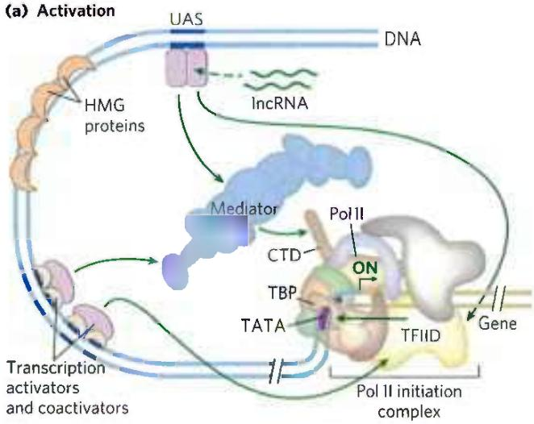

(c)  
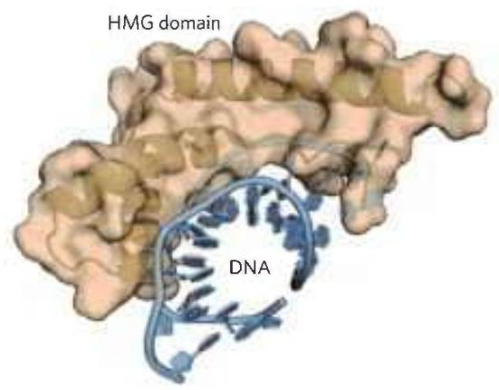

Architectural Regulators How do activators function at a distance? The answer in most cases seems to be that, as

FIGURE 28-30 Eukaryotic promoters and regulatory proteins. RNA polymerase II and its associated basal (general) transcription factors form a preinitiation complex at the TATA box and lnr site of the cognate promoters, a process facilitated by transcription activators, acting through coactivators (Mediator, TFIID, or both). (a) A composite promoter with typical sequence elements and protein complexes found in both yeast and higher eukaryotes. The carboxyl-terminal domain (CTD) of Pol II (see Fig. 26-9) is an important point of interaction with Mediator and other protein complexes. Histone modification enzymes (not shown) catalyze methylation and acetylation; remodeling enzymes alter the content and placement of nucleosomes. The transcription activators have distinct DNA-binding domains and activation domains. In some cases, their function is affected by interaction with lncRNAs. Arrows indicate common modes of interaction often required for the activation of transcription. The HMG proteins are a common type of architectural regulator (see Fig. 28-5), allowing the looping of the DNA required to bring together system components bound at distant binding sites. (b) Eukaryotic transcriptional repressors function through a range of mechanisms. Some bind directly to DNA, displacing a protein complex required for activation (not shown); many others interact with various parts of the transcription or activation protein complexes to prevent activation. Possible points of interaction are indicated with arrows. (c) The structure of an HMG protein complex with DNA shows how HMG proteins facilitate DNA looping. The binding is relatively nonspecific, although DNA sequence preferences have been identified for many HMG proteins. Shown here is the HMG domain of the protein HMG-D of Drosophila, bound to DNA. [(c) Data from PDB ID 1QRV, F.V. Murphy IV et al., EMBO J. 18:6610, 1999.]

indicated earlier, the intervening DNA is looped so that the various protein complexes can interact directly. The looping is promoted by architectural regulators that are abundant in chromatin and bind to DNA with limited specificity. Most prominently, the high mobility group (HMG) proteins (Fig. 28-29c; "high mobility" refers to their electrophoretic mobility in polyacrylamide gels) play an important structural role in chromatin remodeling and transcriptional activation.

Coactivator Protein Complexes Most transcription requires the presence of additional protein complexes. Some major regulatory protein complexes that interact with Pol II have been defined both genetically and biochemically. These coactivator complexes act as intermediaries between the transcription activators and the Pol II complex.

Mediator, a complex consisting of 25 (yeast) to 30 (human) polypeptides, is a major eukaryotic coactivator (Fig. 28-30). Many of the 25 core polypeptides are highly conserved from fungi to humans. A subcomplex of four subunits has a kinase role, interacting transiently with the remainder of the Mediator complex, and may dissociate prior to transcription initiation. Mediator binds tightly to the carboxyl-terminal domain (CTD) of the largest subunit of Pol II. The Mediator complex is required for both basal and regulated transcription at many promoters used by Pol II, and it also stimulates phosphorylation of the CTD by TFIIH (a basal transcription factor). Transcription activators interact with one or more components of the Mediator complex, with the precise interaction sites differing from one activator to another. Coactivator complexes function at or near the promoter's TATA box.

Additional coactivators, functioning with one or a few genes, have also been described. Some of these operate in conjunction with Mediator, and some may act in systems that do not employ Mediator.

TATA-Binding Protein and Basal Transcription Factors The first component to bind in the assembly of a preinitiation complex (PIC) at the TATA box of a typical Pol II promoter is the TATA-binding protein (TBP). At promoters lacking a TATA box, TBP is usually delivered as part of a larger complex (13 to 14 subunits) called TFIID. The complete complex also includes the basal transcription factors TFIIB, TFIIE, TFIIF, TFIIH; Pol II; and perhaps TFIIA. This minimal PIC, however, is often insufficient for initiation of transcription and generally does not form at all if the promoter is obscured within chromatin. Positive regulation, leading to transcription, is imposed by the activators and coactivators. Mediator interacts directly with TFIIH and TFIIE, allowing their recruitment to the PIC.

Choreography of Transcriptional Activation We can now begin to piece together the sequence of transcriptional activation events at a typical Pol II promoter (Fig. 28-31). The exact order of binding of some components may vary, but the model in Figure 28-31 illustrates the principles of activation as well as one common path. Many transcription activators have significant affinity for their binding sites even when the sites are within condensed chromatin. The binding of activators is often the event that triggers subsequent activation of the promoter. Binding of one activator may enable the binding of others, gradually displacing some nucleosomes.

Crucial remodeling of the chromatin then takes place in stages, facilitated by interactions between activators and HATs or enzyme complexes such as SWI/SNF, or both. In this way, a bound activator can draw in other components necessary for further chromatin remodeling to permit transcription of specific genes. The bound activators interact with the large Mediator complex. Mediator, in turn, provides an assembly surface for the binding of, first, TBP (or TFIID), then TFIIB, and then other components of the PIC, including Pol II. Mediator stabilizes the binding of Pol II and its associated transcription factors and greatly facilitates formation of the PIC. Complexity in these regulatory circuits is the rule rather than the exception, with multiple DNA-bound activators promoting transcription.

The script can change from one promoter to another. For example, many promoters have a different set of recognition sequences and may not have a TATA box, and in multicellular eukaryotes the subunit composition of factors such as TFIID can vary from one tissue to another. However, most promoters seem to require a precisely ordered assembly of components to initiate transcription. The assembly process is not always fast. For some genes it may take minutes; for certain genes of higher eukaryotes, the process can take days.

  
FIGURE 28-31 The components of transcriptional activation. Activators bind the DNA first. The activators recruit the histone modification/nucleosome remodeling complexes and a coactivator such as Mediator. Mediator facilitates the binding of TBP (or TFIID) and TFIIB, and the other basal transcription factors and Pol II then bind. Phosphorylation of the CTD of Pol II leads to transcription initiation (not shown). [Information from J. A. D'Alessio et al., Mol. Cell 36:924, 2009.]

## The Genes of Galactose Metabolism in Yeast Are Subject to Both Positive and Negative Regulation

Some of the general principles described above can be illustrated by one well-studied eukaryotic regulatory circuit (Fig. 28-32). The enzymes required for the importation and metabolism of galactose in yeast are encoded by genes scattered over several chromosomes (Table 28-3). Each of the GAL genes is transcribed separately, and yeast cells have no operons like those in bacteria. However, all the GAL genes have similar promoters and are regulated coordinately by a common set of proteins. The promoters for the GAL genes consist of the TATA box and Inr sequences, as well as an upstream activator sequence (UAS $_{G}$ ) recognized by the transcription activator Gal4 protein (Gal4p). Regulation of gene expression by galactose entails an interplay between Gal4p and two other proteins, Gal80p and Gal3p. Gal80p forms a complex with Gal4p, preventing Gal4p from functioning as an activator of the GAL promoters. When galactose is present, it binds Gal3p, which then interacts with the Gal80p-Gal4p complex and allows Gal4p to function as an activator at the GAL promoters. As the various galactose genes are induced and their products build up, Gal3p may be replaced with Gal1p (a galactokinase needed for galactose metabolism that also acts as a regulator) for sustained activation of the regulatory circuit.

Other protein complexes also have a role in activating transcription of the GAL genes. These include the SAGA complex for histone acetylation and chromatin remodeling, the SWI/SNF complex for chromatin remodeling, and Mediator. The Gal4 protein is responsible for recruitment of these additional factors needed for transcriptional activation. SAGA may be the first and primary recruitment target for Gal4p.

Glucose is the preferred carbon source for yeast, as it is for bacteria. When glucose is present, most of the GAL genes are repressed—whether galactose is present or not. The GAL regulatory system described above is effectively overridden by a complex catabolite repression system that includes several proteins (not depicted in Fig. 28-32).

## Transcription Activators Have a Modular Structure

Transcription activators typically have a distinct structural domain for specific DNA binding and one or more additional domains for transcriptional activation or for interaction with other regulatory proteins. Interaction of two regulatory proteins is often mediated by domains containing leucine zippers (Fig. 28-15) or helix-loop-helix motifs (Fig. 28-16). We consider here three distinct types of structural domains used in activation by the transcription activators Gal4p, Sp1, and CTF1 (Fig. 28-33a).

Gal4p contains a zinc finger-like structure in its DNA-binding domain, near the amino terminus; this domain has six Cys residues that coordinate two $Zn^{2+}$ .

  
FIGURE 28-32 Regulation of transcription of GAL genes in yeast. Galactose imported into the yeast cell is converted to glucose 6-phosphate by a pathway involving five enzymes, whose genes are scattered over three chromosomes (see Table 28-3). Transcription of these genes is regulated by the combined actions of the proteins Gal4p, Gal80p, and Gal3p, with Gal4p playing the central role of transcription activator. The Gal4p-Gal80p complex is inactive. Binding of galactose to Gal3p leads to interaction of Gal3p with the Gal80p-Gal4p complex and activates Gal4p. The Gal4p subsequently recruits SAGA, Mediator, and TFIID to the galactose promoters, leading to recruitment of RNA polymerase II and initiation of transcription. Chromatin remodeling to allow transcription also requires a SWI/SNF complex.

The protein functions as a homodimer (with dimerization mediated by interactions between two coiled coils) and binds to UAS $_{G}$ , a palindromic DNA sequence about 17 bp long. Gal4p has a separate activation domain with many acidic amino acid residues. Experiments that substitute a variety of different peptide sequences for the acidic activation domain of Gal4p suggest that the acidic nature of this domain is critical to its function, although its precise amino acid sequence can vary considerably.

<table><tr><td colspan="7">TABLE 28-3 Genes of Galactose Metabolism in Yeast</td></tr><tr><td rowspan="2">Gene</td><td rowspan="2">Protein function</td><td rowspan="2">Chromosomal location</td><td rowspan="2">Protein size (number of residues)</td><td colspan="3">Relative protein expression in different carbon sources</td></tr><tr><td>Glucose</td><td>Glycerol</td><td>Galactose</td></tr><tr><td colspan="7">Regulated genes</td></tr><tr><td>GAL1</td><td>Galactokinase</td><td>II</td><td>528</td><td>-</td><td>-</td><td>+++</td></tr><tr><td>GAL2</td><td>Galactose permease</td><td>XII</td><td>574</td><td>-</td><td>-</td><td>+++</td></tr><tr><td>PGM2</td><td>Phosphoglucomutase</td><td>XIII</td><td>569</td><td>+</td><td>+</td><td>++</td></tr><tr><td>GAL7</td><td>Galactose 1-phosphate uridylyltransferase</td><td>II</td><td>365</td><td>-</td><td>-</td><td>+++</td></tr><tr><td>GAL10</td><td>UDP-glucose 4-epimerase</td><td>II</td><td>699</td><td>-</td><td>-</td><td>+++</td></tr><tr><td>MEL1</td><td>α-Galactosidase</td><td>II</td><td>453</td><td>-</td><td>+</td><td>++</td></tr><tr><td colspan="7">Regulatory genes</td></tr><tr><td>GAL3</td><td>Inducer</td><td>IV</td><td>520</td><td>-</td><td>+</td><td>++</td></tr><tr><td>GAL4</td><td>Transcriptional activator</td><td>XVI</td><td>881</td><td>+/-</td><td>+</td><td>+</td></tr><tr><td>GAL80</td><td>Transcriptional inhibitor</td><td>XIII</td><td>435</td><td>+</td><td>+</td><td>++</td></tr></table>

  
FIGURE 28-33 Transcription activators. (a) Typical activators such as CTF1, Gal4p, and Sp1 have a DNA-binding domain and an activation domain. The nature of the activation domain is indicated by symbols: -- -, acidic; Q Q Q, glutamine-rich; P P P, proline-rich. These proteins generally activate transcription by interacting with coactivator complexes such as Mediator. Note that the binding sites illustrated here are not generally found together near a single gene. (b) A chimeric protein containing the DNA-binding domain of Sp1 and the activation domain of CTF1 activates transcription if a GC box is present.

Sp1 ( $M_{r}$ 80,000) is a transcription activator for many genes in higher eukaryotes. Its DNA-binding site, the GC box (consensus sequence GGGCGG), is usually quite near the TATA box. The DNA-binding domain of the Sp1 protein is near its carboxyl terminus and contains three zinc fingers. Two other domains in Sp1 function in activation and are notable in that 25% of their amino acid residues are Gln. A wide variety of other activator proteins also have these glutamine-rich domains.

CTF1 (CCAAT-binding transcription factor 1) belongs to a family of transcription activators that bind a sequence called the CCAAT site (its consensus sequence is TGGN $_{6}$ GCCAA, where N is any nucleotide). The DNA-binding domain of CTF1 contains many basic amino acid residues, and the binding region is probably arranged as an $\alpha$ helix. This protein has neither a helix-turn-helix motif nor a zinc finger motif; its DNA-binding mechanism is not yet clear. CTF1 has a proline-rich activation domain, with Pro accounting for more than 20% of the amino acid residues.

The discrete activation and DNA-binding domains of regulatory proteins often act completely independently, as has been demonstrated in "domain-swapping" experiments. Genetic engineering techniques (Chapter 9) can join the proline-rich activation domain of CTF1 to the DNA-binding domain of Sp1 to create a protein that, like intact Sp1, binds to GC boxes on the DNA and activates transcription at a nearby promoter (as in Fig. 28-33b). The DNA-binding domain of Gal4p has similarly been replaced experimentally with the DNA-binding domain of the E. coli LexA repressor (of the SOS response; Fig. 28-21). This chimeric protein neither binds at UAS $_{G}$ nor activates the yeast GAL genes (as would intact Gal4p) unless the UAS $_{G}$ sequence in the DNA is replaced by the LexA recognition site.

## Eukaryotic Gene Expression Can Be Regulated by Intercellular and Intracellular Signals

The effects of steroid hormones (and of thyroid and retinoid hormones, which have a similar mode of action) provide additional well-studied examples of the modulation of eukaryotic regulatory proteins by direct interaction with molecular signals (see Fig. 12-34). Unlike other types of hormones, steroid hormones do not have to bind to plasma membrane receptors. Instead, they can interact with intracellular receptors that are transcription activators. Steroid hormones too hydrophobic to dissolve readily in the blood (estrogen, progesterone, and cortisol, for example) travel on specific carrier proteins from their point of release to their target tissues. In the target tissue, the hormone passes through the plasma membrane by simple diffusion. Once inside the cell, the hormone interacts with one of two types of steroid-binding nuclear receptor (Fig. 28-34). In both cases, the hormone-receptor complex acts by binding to highly specific DNA sequences called hormone response elements (HREs), thereby altering gene expression. Acting at these sites, the receptors act as transcription activators, recruiting coactivators and Pol II (plus its associated transcription factors) to trigger transcription of the gene.

The DNA sequences (HREs) to which hormone-receptor complexes bind are similar in length and arrangement for the various steroid hormones, but they differ in sequence. Each receptor has a consensus HRE sequence (Table 28-4) to which the hormone-receptor complex binds well, with each consensus consisting of two six-nucleotide sequences, either contiguous or separated by three nucleotides, in tandem or in a palindromic arrangement. The hormone receptors have a highly conserved DNA-binding domain with two zinc

FIGURE 28-34 Mechanisms of steroid hormone receptor function. There are two types of steroid-binding nuclear receptors. (a) Monomeric type I receptors (NR) are found in the cytoplasm, in a complex with the heat shock protein Hsp70. Receptors for estrogen, progesterone, androgens, and glucocorticoids are of this type. When the steroid hormone binds, the Hsp70 dissociates and the receptor dimerizes, exposing a nuclear localization signal. The dimeric receptor, with hormone bound, migrates to the nucleus, where it binds to a hormone response element (HRE) and acts as a transcription activator. The activity of the receptor can be repressed by binding to an IncRNA (such as GASS), which competes directly with binding to the HRE. (b) Type II receptors, by contrast, are always in the nucleus, bound to an HRE in the DNA and to a corepressor that renders the receptor inactive. The thyroid hormone receptor (TR) is of this type. The hormone migrates through the cytoplasm and diffuses across the nuclear membrane. In the nucleus it binds to a heterodimer consisting of the thyroid hormone receptor and the retinoid X receptor (RXR). A conformation change leads to dissociation of the corepressor, and the receptor then functions as a transcription activator.

fingers (Fig. 28-35). The hormone-receptor complex binds to the DNA as a dimer, with the zinc finger domains of each monomer recognizing one of the six-nucleotide sequences. The ability of a given hormone to act through the hormone-receptor complex to alter the expression of a specific

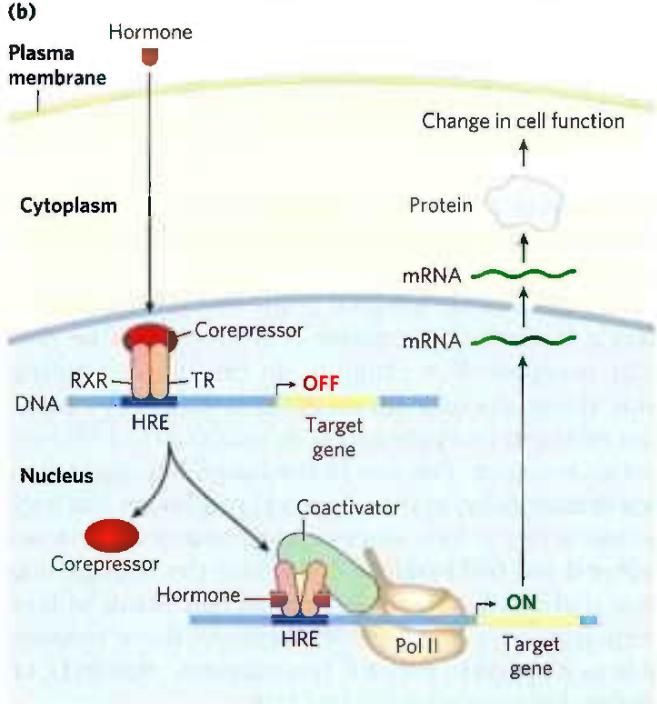

  
TABLE 28-4 Hormone Response Elements (HREs) Bound by Steroid-Type Hormone Receptors

<table><tr><td>Receptor</td><td>HRE consensus sequence bounda</td></tr><tr><td>Androgen</td><td>GG(A/T)ACAN2TGTTCT</td></tr><tr><td>Glucocorticoid</td><td>GGTACAN3TGTTCT</td></tr><tr><td>Retinoic acid (some)</td><td>AGGTCAN5AGGTCA</td></tr><tr><td>Vitamin D</td><td>AGGTCAN3AGGTCA</td></tr><tr><td>Thyroid hormone</td><td>AGGTCAN3AGGTCA</td></tr><tr><td>RXb</td><td>AGGTCANAGGTCANAG GTCANAGGTCA</td></tr></table>

$^{a}$ N represents any nucleotide.  
$^{b}$ Forms a dimer with the retinolic acid receptor or vitamin D receptor.

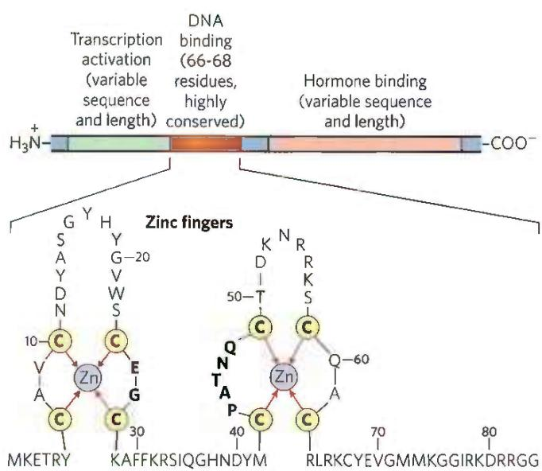  
FIGURE 28-35 Typical steroid hormone receptors. These receptor proteins have a binding site for the hormone, a DNA-binding domain, and a region that activates transcription of the regulated gene. The highly conserved DNA-binding domain has two zinc fingers. The sequence shown here is that for the estrogen receptor, but the residues in bold type are common to all steroid hormone receptors.

gene depends on the exact sequence of the HRE, its position relative to the gene, and the number of HREs associated with the gene.

The ligand-binding region of the receptor protein—always at the carboxyl terminus—is specific to the particular receptor. For example, in the ligand-binding region, the glucocorticoid receptor is only 30% similar to the estrogen receptor and 17% similar to the thyroid hormone receptor. The size of the ligand-binding region varies dramatically; in the vitamin D receptor it has only 25 amino acid residues, whereas in the mineralocorticoid receptor it has 603 residues. Mutations that change one amino acid residue in these regions can result in loss of responsiveness to a specific hormone. Some humans unable to respond to cortisol, testosterone, vitamin D, or thyroxine have mutations of this type.

P2 The lncRNAs introduce another dimension to regulation by hormone receptors. An lncRNA called GAS5 (growth arrest specific 5) inhibits transcriptional activation by the glucocorticoid receptor by directly competing with DNA for receptor binding. GAS5 also inhibits activity of the closely related androgen, progesterone, and mineralocorticoid receptors. In addition, GAS5 interacts with and sequesters an miRNA called miR-21, which interacts with and inhibits the activity of some regulatory proteins that act as tumor suppressors. Expression of GAS5 is suppressed in a wide range of tumors, resulting in increased expression of steroid hormones, higher levels of active miR-21, and faster tumor growth. Low GAS5 levels thus correlate with worsened outcomes for cancer patients, making this lncRNA a subject of intense ongoing investigation.

Some hormone receptors, including the human progesterone receptor, activate transcription with the aid of a different lncRNA of \~700 nucleotides that acts as a coactivator—steroid receptor RNA activator (SRA). SRA is part of a ribonucleoprotein complex, but it is the RNA component that is required for transcription coactivation. The detailed set of interactions between SRA and other components of the regulatory systems for these genes remains to be worked out.

## Regulation Can Result from Phosphorylation of Nuclear Transcription Factors

We noted in Chapter 12 that the effects of insulin on gene expression are mediated by a series of steps leading ultimately to the activation of a protein kinase in the nucleus that phosphorylates specific DNA-binding proteins, thereby altering their ability to act as transcription factors (see Fig. 12-22). This general mechanism mediates the effects of many nonsteroid hormones. For example, the $\beta$ -adrenergic pathway that leads to elevated levels of cytosolic cAMP, which acts as a second messenger in both eukaryotes and bacteria (Fig. 28-18), also affects the transcription of a set of genes, each of which is located near a specific DNA sequence called a cAMP response element (CRE). The catalytic subunit of protein kinase A, released when cAMP levels rise (see Fig. 12-6), enters the nucleus and phosphorylates a nuclear protein, the CRE-binding protein (CREB). When phosphorylated, CREB binds to CREs near certain genes and acts as a transcription factor, turning on expression of these genes.

## Many Eukaryotic mRNAs Are Subject to Translational Repression

P1 Regulation at the level of translation assumes a much more prominent role in eukaryotes than in bacteria and is observed in a range of cellular situations. In contrast to the tight coupling of transcription and translation in bacteria, the transcripts generated in a eukaryotic nucleus must be processed and transported to the cytoplasm before translation. This can impose a significant delay on the appearance of a protein. When a rapid increase in protein production is needed, a translationally repressed mRNA already in the cytoplasm can be activated for translation without delay. Translational regulation may play an especially important role in regulating certain very long eukaryotic genes (a few are measured in the millions of base pairs), for which transcription and mRNA processing can require many hours. Some genes are regulated at both the transcriptional and translational stages, with the latter playing a role in the fine-tuning of cellular protein levels. In some non-nucleated cells, such as reticulocytes (immature erythrocytes), transcriptional control is entirely unavailable and translational control of stored mRNAs becomes essential. As described below, translational controls can also have spatial significance during development, when the regulated translation of prepositioned mRNAs creates a local gradient of the protein product.

Eukaryotes have at least four main mechanisms of translational regulation:

1. Translation initiation factors are subject to phosphorylation by protein kinases. The phosphorylated forms are often less active and cause a general depression of translation in the cell.

2. Some proteins bind directly to mRNA and act as translational repressors, many of them binding at specific sites in the 3' untranslated region (3'UTR). So positioned, these proteins interact with other translation initiation factors bound to the mRNA, or with the 40S ribosomal subunit, to prevent translation initiation (Fig. 28-36).

3. Binding proteins, present in eukaryotes from yeast to mammals, disrupt the interaction between eIF4E and eIF4G (see Fig. 27-27). The mammalian versions are known as 4E-BPs (eIF4E binding proteins). When cell growth is slow, these proteins limit translation by binding to the site on eIF4E that normally interacts with eIF4G. When cell growth resumes or increases in response to growth factors or other stimuli, the binding proteins are inactivated by protein kinase-dependent phosphorylation.

  
FIGURE 28-36 Translational regulation of eukaryotic mRNA. One of the most important mechanisms for translational regulation in eukaryotes is the binding of translational repressors (RNA-binding proteins) to specific sites in the 3' untranslated region (3'UTR) of the mRNA. These proteins interact with eukaryotic initiation factors or with the ribosome to prevent or slow translation.

4. RNA-mediated regulation of gene expression often occurs at the level of translational repression, often by the binding of ncRNAs to mRNAs.

The variety of translational regulation mechanisms provides flexibility, allowing focused repression of a few mRNAs or global regulation of all cellular translation.

Translational regulation has been particularly well studied in reticulocytes. One such mechanism in these cells involves eIF2, the initiation factor that binds to the initiator tRNA and conveys it to the ribosome; when Met-tRNA has bound to the P site, the factor eIF2B binds to eIF2, recycling it with the aid of GTP binding and hydrolysis. The maturation of reticulocytes includes destruction of the cell nucleus, leaving behind a plasma membrane packed with hemoglobin. Messenger RNAs deposited in the cytoplasm before the loss of the nucleus allow for the replacement of hemoglobin. When reticulocytes become deficient in iron or heme, the translation of globin mRNAs is repressed. A protein kinase called HCR (hemin-controlled repressor) is then activated, catalyzing the phosphorylation of eIF2. When phosphorylated, eIF2 forms a stable complex with eIF2B that sequesters the eIF2, making it unavailable for participation in translation. In this way, the reticulocyte coordinates the synthesis of globin with the availability of heme.

## Posttranscriptional Gene Silencing Is Mediated by RNA Interference

In higher eukaryotes, including nematodes, fruit flies, plants, and mammals, microRNAs (miRNAs) mediate the silencing of many genes. In a phenomenon first described and explained by Craig Mello and Andrew Fire, the RNAs function by interacting with mRNAs, often in the 3'UTR, resulting in either degradation of the mRNA or inhibition of translation. In either case, the mRNA, and thus the gene that produces it, is silenced. This form of gene regulation controls developmental timing in at least some organisms. It is also used as a mechanism to protect against invading RNA viruses (particularly important in plants, which lack an immune system) and to control the activity of transposons. In addition, small RNA molecules may play a critical (as yet undefined) role in the formation of heterochromatin.

Many miRNAs are present only transiently during development, and these are sometimes referred to as small temporal RNAs (stRNAs). Thousands of different miRNAs have been identified in higher eukaryotes, and they may affect the regulation of a third of mammalian genes. They are transcribed as precursor RNAs \~70 nucleotides long, with internally complementary sequences that form hairpinlike structures. Details of the pathway for processing of miRNAs were described in Fig. 26-26). The precursors are cleaved by endonucleases such as Drosha and Dicer to form short duplexes of 20 to 25 nucleotides. One strand of the processed miRNA is transferred to the target mRNA (or to a viral or transposon RNA), leading to inhibition of translation or degradation of the mRNA (Fig. 28-37a). Some miRNAs bind to and affect a single mRNA and thus affect expression of only one gene. Others interact with multiple mRNAs and form the mechanistic core of regulons that coordinate the expression of multiple genes.

This gene regulation mechanism has an interesting and very useful practical side. If an investigator introduces into an organism a duplex RNA molecule corresponding in sequence to virtually any mRNA, Dicer cleaves the duplex into short segments, called small interfering RNAs (siRNAs). These bind to the mRNA and silence it (Fig. 28-37b). The process is known as RNA interference (RNAi). In plants, almost any gene can be effectively shut down in this way. Nematodes can readily ingest entire functional RNAs, and simply introducing the duplex RNA into the worm's diet produces very effective suppression of the target gene. The technique is an important tool in the ongoing efforts to study gene function, because it can disrupt gene function without creating a mutant organism. The procedure can be applied to humans as well. Laboratory-produced siRNAs have been used to block HIV and poliovirus infections in cultured human cells for a week or so at a time. The wider application of RNAi-based pharmaceuticals was initially stymied by the difficulty inherent in delivering RNAi molecules to their required target, given the many nucleases that degrade RNA in human tissues. With recent advances in delivery methods, there are now more than a dozen RNAi pharmaceuticals in advanced clinical trials to treat a range of conditions, from familial amyloidotic polyneuropathy to viral infections and cancer.

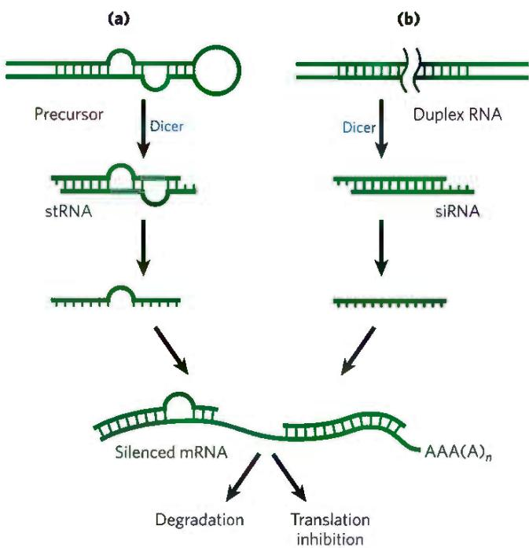  
FIGURE 28-37 Gene silencing by RNA interference. (a) Small temporal RNAs (stRNAs, a class of miRNAs) are generated by Dicer-mediated cleavage of longer precursors that fold to create duplex regions. The stRNAs then bind to mRNAs, leading to degradation of mRNA or inhibition of translation. (b) Double-stranded RNAs designed to interact with a particular target and to function as Dicer substrates can be constructed and introduced into a cell. Dicer processes the duplex RNAs into small interfering RNAs (siRNAs), which interact with the target mRNA. Again, either the mRNA is degraded or translation is inhibited.

## RNA-Mediated Regulation of Gene Expression Takes Many Forms in Eukaryotes

All RNAs (regardless of their length) that do not encode proteins, including rRNAs and tRNAs, come under the general designation of ncRNAs. Mammalian genomes encode more ncRNAs than coding mRNAs. The ncRNAs in eukaryotes include miRNAs, described above; snRNAs, involved in RNA splicing (see Fig. 26-16); snoRNAs, involved in rRNA modification (see Fig. 26-24); and lncRNAs, already encountered in this chapter. Not surprisingly, additional functional classes of ncRNAs are still being discovered. P2 Here we describe a few more examples of ncRNAs that participate in gene regulation, which are designated lncRNAs when their length exceeds 200 nucleotides.

Heat shock factor 1 (HSF1) is an activator protein that, in nonstressed cells, exists as a monomer bound by the chaperone Hsp90. Under stress conditions, HSF1 is released from Hsp90 and trimerizes. The HSF1 trimer binds to DNA and activates transcription of genes encoding products required to deal with the stress. An lncRNA called HSR1 (heat shock RNA 1; \~600 nucleotides) stimulates HSF1 trimerization and DNA binding. HSR1 does not act alone; it functions in a complex with the translation elongation factor eEF1A.

Additional RNAs affect transcription in a variety of ways. A 331 nucleotide lncRNA called 7SK, abundant in mammals, binds to the Pol II transcription elongation factor pTEFb (see Table 26-2) and represses transcript elongation. The ncRNA B2 (\~178 nucleotides) binds directly to Pol II during heat shock and represses transcription. The B2-bound Pol II assembles into stable PICs, but transcription is blocked. The mechanism that allows HSF1-responsive genes to be expressed in the presence of B2 remains to be worked out.

The recognized roles of ncRNAs in gene expression and in many other cellular processes are rapidly expanding. At the same time, the study of the biochemistry of gene regulation is becoming much less protein-centric.

## Development Is Controlled by Cascades of Regulatory Proteins

For sheer complexity and intricacy of coordination, the patterns of gene regulation that bring about development of a zygote into a multicellular animal or plant have no peer. Development requires transitions in morphology and protein composition that depend on tightly coordinated changes in expression of the genome. More genes are expressed during early development than in any other part of the life cycle. For example, in the sea urchin, an oocyte has about 18,500 different mRNAs, compared with about 6,000 different mRNAs in the cells of a typical differentiated tissue. The mRNAs in the oocyte give rise to a cascade of events that regulate the expression of many genes across both space and time.

Several organisms have emerged as important model systems for the study of development, because they are easy to maintain in a laboratory and have relatively short generation times. These include nematodes, fruit flies, zebra fish, mice, and the plant Arabidopsis. Here, we provide a brief discussion of the development of fruit flies. Our understanding of the molecular events during development of Drosophila melanogaster is particularly well advanced and can be used to illustrate patterns and principles of general significance.

The life cycle of the fruit fly includes complete metamorphosis during its progression from an embryo to an adult (Fig. 28-38). Among the most important characteristics of the embryo are its polarity (the anterior and posterior parts of the animal are readily distinguished, as are its dorsal and ventral surfaces) and its metamerism (the embryo body is made up of serially repeating segments, each with characteristic features). During development, these segments become organized into a head, thorax, and abdomen. Each segment of the adult thorax has a different set of appendages. Development of this complex pattern is under genetic control, and a variety of pattern-regulating genes have been discovered that greatly affect the organization of the body.

The Drosophila egg, along with 15 nurse cells, is surrounded by a layer of follicle cells (Fig. 28-39). As the egg cell forms (before fertilization), mRNAs and proteins originating in the nurse and follicle cells are deposited in the egg cell, where some play a critical role in development. Once a fertilized egg is laid, its nucleus divides and the nuclear descendants continue to divide in synchrony every 6 to 10 min. Plasma membranes are not formed around the nuclei, which are distributed within the egg cytoplasm, forming a syncytium. Between the eighth and eleventh rounds of nuclear division, the nuclei migrate to the outer layer of the egg, forming a monolayer of nuclei surrounding the common yolk-rich cytoplasm; this is the syncytial blastoderm. After a few additional divisions, membrane invaginations surround the nuclei to create a layer of cells that form the cellular blastoderm. At this stage, the mitotic cycles in the various cells lose their synchrony. The developmental fate of the cells is determined by the mRNAs and proteins originally deposited in the egg by the nurse and follicle cells.

Proteins that, through changes in local concentration or activity, cause the surrounding tissue to take up a particular shape or structure are sometimes referred to as morphogens; they are the products of pattern-regulating genes. As defined by Christiane Nüsslein-Volhard, Edward B. Lewis, and Eric F. Wieschaus, three major classes of pattern-regulating genes — maternal, segmentation, and homeotic genes — function in successive stages of development to specify the basic features of the Drosophila embryo body. Maternal genes are expressed in the unfertilized egg, and the resulting maternal mRNAs remain dormant until fertilization.

  
FIGURE 28-38 Life cycle of the fruit fly Drosophila melanogaster. Drosophila undergoes a complete metamorphosis, which means that the adult insect is radically different in form from its immature stages, a transformation that requires extensive alterations during development. By the late embryonic stage,  
segments have formed, each containing specialized structures from which the various appendages and other features of the adult fly will develop. (Late embryo: Courtesy of F. R. Turner, Department of Biology, University of Indiana, Bloomington. Other photos: Courtesy of Prof. Dr. Christian Klambt, Westfälische Wilhelms-Universität Münster, Institut für Neuro- und Verhaltensbiologie.)

FIGURE 28-39 Early development in Drosophila. During development of the egg, maternal mRNAs and proteins are deposited in the developing oocyte (unfertilized egg cell) by nurse cells and follicle cells. After fertilization, the nuclei of the egg divide in synchrony within the common cytoplasm (syncytium), then migrate to the periphery. Membrane invaginations surround the nuclei to create a monolayer of cells at the periphery; this is the cellular blastoderm stage. During the early nuclear divisions, several nuclei at the far posterior become pole cells, which later become the germ-line cells.  

These provide most of the proteins needed in very early development, until the cellular blastoderm is formed. Some of the proteins encoded by maternal mRNAs direct the spatial organization of the developing embryo at early stages, establishing its polarity. Segmentation genes, transcribed after fertilization, direct the formation of the proper number of body segments. At least three subclasses of segmentation genes act at successive stages: gap genes divide the developing embryo into several broad regions; pair-rule genes, together with segment polarity genes, define 14 stripes that become the 14 segments of a normal embryo. Homeotic genes are expressed still later; they specify which organs and appendages will develop in particular body segments.

If all cells divided to produce two identical daughter cells, multicellular organisms would never be more than a ball of identical cells. A key event in very early development is establishment of mRNA and protein gradients along the body axes, producing asymmetric cell divisions and different cell fates. Some maternal mRNAs have protein products that diffuse through the cytoplasm to create an asymmetric distribution in the egg. Different cells in the cellular blastoderm therefore inherit different amounts of these proteins, setting the cells on different developmental paths. An example is the bicoid gene. The bicoid gene product is a major anterior morphogen. The mRNA from the bicoid gene is synthesized by nurse cells and deposited in the unfertilized egg near its anterior pole. Translated soon after fertilization, the Bicoid protein diffuses through the cell to create, by the seventh nuclear division, a concentration gradient radiating out from the anterior pole (Fig. 28-40). The Bicoid protein contains a homeodomain (p. 1062), encoded by a gene sequence motif called a homeobox and found in many proteins involved in regulating development. Bicoid is multifunctional—a transcription factor that activates the expression of several segmentation genes and also a translational repressor that inactivates certain mRNAs. The amount of Bicoid protein in various parts of the embryo increases or decreases the expression of other genes in a threshold-dependent manner. As its concentration varies along its gradient, interactions of the bicoid gene product with proteins and RNAs encoded by the nanos, pumilio, caudal, hunchback, and other regulatory genes also vary to produce different effects along the axis of the developing organism. This results in different developmental fates of cells in the blastoderm, depending on their location.

  
(a)  
FIGURE 28-40 Distribution of a maternal gene product in a Drosophila egg. (a) Micrograph of an immunologically stained egg (top), showing distribution of the bicoid (bcd) gene product. The graph shows stain intensity along the length of the egg. This distribution is essential for normal development of the anterior structures in the larva (bottom). (b) If the bcd

Humans do not resemble fruit flies, but the genes and mechanisms involved in development are nevertheless highly conserved. This can be seen in the gene clusters encoding the homeotic or Hox genes, the latter term derived from homeobox. Drosophila has one such cluster, while humans have four (Fig. 28-41), with the genes within the clusters remarkably similar from nematodes to humans.

The many regulatory genes in these three classes direct the development of an adult fly, with a head, thorax, and abdomen, with the proper number of segments, and with the correct appendages on each segment. Although embryogenesis takes about a day to complete, all these genes are activated during the first four hours. Some mRNAs and proteins are present for only a few minutes at specific points during this period. Some of the genes code for transcription factors that affect the expression of other genes in a kind of developmental cascade. Regulation at the level of translation also occurs, and many of the regulatory genes encode translational repressors, most of which bind to the 3'UTR of the mRNA (Fig. 28-36). Because many mRNAs are deposited in the egg long before their translation is required, translational repression provides an especially important avenue for regulation in developmental pathways.

  
(b)  
gene is not expressed by the mother (bcd $^{-}$ /bcd $^{-}$ mutant) and thus no bicoid mRNA is deposited in the egg, the resulting larva has two posteriors (and soon dies). [Republished with permission of Elsevier, from "The bicoid protein determines position in the Drosophila embryo in a concentration-dependent manner" by Wolfgang Driever and Christiane Nüsslein-Volhard, Cell 5483–93, July 1, 1988; permission conveyed through Copyright Clearance Center, Inc.]

Many of the principles of development outlined above apply to other eukaryotes, from nematodes to humans. Some of the regulatory proteins are conserved. For example, the products of the homeobox-containing genes HOXA7 in mouse and antennapedia in fruit fly differ in only one amino acid residue. Of course, although the molecular regulatory mechanisms may be similar, many of the ultimate developmental events are not conserved (humans do not have wings or antennae). The different outcomes are brought about by differences in the downstream target genes controlled by the Hox genes. The discovery of structural determinants with identifiable molecular functions is the first step in understanding the molecular events underlying development. As more genes and their protein products are discovered, the biochemical side of this vast puzzle will be elucidated in increasingly rich detail.

## Stem Cells Have Developmental Potential That Can Be Controlled

If we can understand development, and the mechanisms of gene regulation behind it, we can control it. An adult human has many different types of tissues. Many of the cells are terminally differentiated and no longer divide. If an organ malfunctions due to disease, or a limb is lost in an accident, the tissues are not readily replaced. Most cells, because of the regulatory processes in place, or even because of the loss of some or all of the genomic DNA, are not easily reprogrammed. Medical science has made organ transplants possible, but organ donors are a limited resource and organ rejection remains a major medical problem. If humans could regenerate their own organs or limbs or nervous tissue, rejection would no longer be an issue. Cures for kidney failure or neurodegenerative disorders could become reality.

(a)  

(b)  
  
FIGURE 28-41 The Hox gene clusters and their effects on development. (a) Each Hox gene in the fruit fly is responsible for the development of structures in a defined part of the body and is expressed in defined regions of the embryo, as labeled. (b) Drosophila has one Hox gene cluster; the human genome has four. Many of these genes are highly conserved in multicellular animals. Evolutionary relationships, as indicated by sequence alignments, between genes in the fruit fly Hox gene cluster and those in the mammalian Hox gene clusters are shown by dashed lines. Similar relationships among the four sets of mammalian Hox genes are indicated by vertical alignment. [(a) Information from F. R. Turner, University of Indiana, Department of Biology.]

The key to tissue regeneration lies in stem cells—cells that have retained the capacity to differentiate into various tissues. In humans, after an egg is fertilized, the first few cell divisions create a ball of totipotent cells, called the morula, that have the capacity to differentiate individually into any tissue or even into a complete organism (Fig. 28-42). Continued cell division produces a hollow ball, the blastocyst. The outer cells of the blastocyst eventually form the placenta. The inner layers form the germ layers of the developing fetus—the ectoderm, mesoderm, and endoderm. These cells are pluripotent: they can give rise to cells of all three germ layers and can differentiate into many types of tissues. However, they cannot differentiate into a complete organism. Some of these cells are unipotent: they can develop into only one type of cell and/or tissue. It is the pluripotent cells of the blastocyst, the embryonic stem cells, that are currently used in embryonic stem cell research.

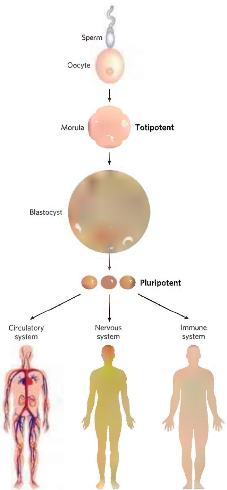  
FIGURE 28-42 Totipotent and pluripotent stem cells. Cells at the morula stage are totipotent and have the capacity to differentiate into a complete organism. The source of pluripotent embryonic stem cells is the cells in the cavity of the blastocyst. Pluripotent cells give rise to many tissue types but cannot form complete organisms.

Stem cells have two functions: to replenish themselves and, at the same time, provide cells that can differentiate. These tasks are accomplished in multiple ways (Fig. 28-43a). All or parts of the stem cell population can, in principle, be involved in replenishment, differentiation, or both.

  
FIGURE 28-43 Stem cell proliferation versus differentiation and development. Stem cells must strike a balance between self-renewal and differentiation. (a) Some possible cell division patterns that allow the replenishment of stem cells and production of some differentiated cells. Each cell may produce one stem cell and one differentiated cell, or two differentiated cells, or two stem cells in defined parts of the tissue or culture. Or a gradient of growth conditions can be established, with cell fates differing from one end of the gradient to the other. (b) Establishing a developmental niche through stem cell contact with a cell or group of cells. Molecular signals provided by the niche cells (in this case, in plants, a distal tip cell) help orient the mitotic spindle for stem cell division and ensure that one daughter cell retains stem cell properties.

Other types of stem cells can potentially be used for medical benefit. In the adult organism, adult stem cells, as products of additional differentiation, have a more limited potential for further development than do embryonic stem cells. For example, the hematopoietic stem cells of bone marrow can give rise to many types of blood cells and also to cells with the capacity to regenerate bone. They are referred to as multipotent. However, these cells cannot differentiate into a liver or kidney or neuron. Adult stem cells are often said to have a niche, a microenvironment that promotes stem cell maintenance while allowing differentiation of some daughter cells as replacements for cells in the tissue they serve (Fig. 28-43b). Hematopoietic stem cells in the bone marrow occupy a niche in which signaling from neighboring cells and other cues maintain the stem cell lineage. At the same time, some daughter cells differentiate to provide needed blood cells. Understanding the niche in which stem cells operate, and the signals the niche provides, is essential in efforts to harness the potential of stem cells for tissue regeneration. The identification and culturing of pluripotent stem cells from human blastocysts was reported by James Thomson and colleagues in 1998. This advance led to the long-term availability of established cell lines for research.

All stem cells present problems for human medical applications. Adult stem cells have a limited capacity to regenerate tissues, are generally present in small numbers, and are hard to isolate from an adult human. Embryonic stem cells have much greater differentiation potential and can be cultured to generate large numbers of cells, but their use is accompanied by ethical concerns related to the necessary destruction of human embryos. Identifying a source of plentiful and medically useful stem cells that does not raise such concerns remains a major goal of medical research.

Our ability to culture stem cells (i.e., maintain them in an undifferentiated state), and to manipulate them to grow and differentiate into particular tissues, is very much a function of our understanding of developmental biology.

Thus far, mouse and human embryonic stem cells have been used for most research. Although both types of stem cells are pluripotent, they require very different culture conditions, optimized to allow cell division indefinitely without differentiation. Mouse embryonic stem cells are grown on a layer of gelatin and require the presence of leukemia inhibitory factor (LIF). Human embryonic stem cells are grown on a feeder layer of mouse embryonic fibroblasts and require basic fibroblast growth factor (bFGF, or FGF2). The use of a feeder cell layer implies that the mouse cells are providing a diffusible product or some surface signal, not yet known, that is needed by human stem cells to either promote cell division or prevent differentiation.

A significant advance, reported in 2007, centers on success in reversing differentiation. In effect, skin

## Of Fins, Wings, Beaks, and Things

South America has several species of seed-eating finches, commonly called grassquits. About 3 million years ago, a small group of grassquits, of a single species, took flight from the continent's Pacific coast. Perhaps driven by a storm, they lost sight of land and traveled nearly 1,000 km. Small birds such as these might easily have perished on such a journey, but the smallest of chances brought this group to a newly formed volcanic island in an archipelago later to be known as the Galápagos. It was a virgin landscape with untapped plant and insect food sources, and the newly arrived finches survived. Over the years, new islands formed and were colonized by new plants and insects — and by the finches. The birds exploited the new resources on the islands, and groups of birds gradually specialized and diverged into new species. By the time Charles Darwin stepped onto the islands in 1835, many different finch species were to be found on the various islands of the archipelago, feeding on seeds, fruits, insects, pollen, or even blood.

The diversity of living creatures was a source of wonder for humans long before scientists sought to understand its origins. The extraordinary insight handed down to us by Darwin, inspired in part by his encounter with the Galápagos finches, provided a broad explanation for the existence of organisms with a vast array of appearances and characteristics. It also gave rise to many questions about the mechanisms underlying evolution. Answers to those questions have started to appear, first through the study of genomes and nucleic acid metabolism in the last half of the twentieth century, and more recently through an emerging field nicknamed evo-devo—a blend of evolutionary and developmental biology.

In its modern synthesis, the theory of evolution has two main elements: mutations in a population generate genetic diversity; natural selection then acts on this diversity to favor individuals with more useful genomic tools and to disfavor others. Mutations occur at significant rates in every individual's genome, in every cell (see Section 8.3). Advantageous mutations in single-celled organisms or in the germ line of multicellular organisms can be inherited, and they are more likely to be inherited (that is, passed on to greater numbers of

cells—first from mice, then from humans—have been reprogrammed to take on the characteristics of pluripotent stem cells. The reprogramming involves manipulations to get the cells to express at least four transcription factors, Oct4, Sox2, Nanog, and Lin28, all of which are known to help maintain the stem cell-like state. Gradual improvements in this technology may make the harvesting of embryonic stem cells unnecessary and provide a source of stem cells that is genetically matched to a prospective patient.

offspring) if they confer an advantage. It is a straightforward scheme. But many have wondered whether it is enough to explain, say, the many different beak shapes in the Galápagos finches or the diversity of size and shape among mammals. Until recent decades, there were several widely held assumptions about the evolutionary process: that many mutations and new genes would be needed to bring about a new physical structure, that more-complex organisms would have larger genomes, and that very different species would have few genes in common. All of these assumptions were wrong.

Modern genomics has revealed that the human genome contains fewer genes than expected — not many more than the fruit fly genome and fewer than some amphibian genomes. The genomes of every mammal, from mouse to human, are surprisingly similar in the number, types, and chromosomal arrangement of genes. Meanwhile, evo-devo is telling us how complex and very different creatures can evolve within these genomic realities.

In the late nineteenth century, English biologist William Bateson studied animals with homeotic mutations — creatures with body parts growing in the wrong location. Bateson used his observations to challenge the Darwinian notion that evolutionary change would have to be gradual. Recent studies of the genes that control organismal development have put an exclamation point on Bateson's ideas. Subtle changes in regulatory patterns during development, reflecting just one or a few mutations, can result in startling physical changes and fuel surprisingly rapid evolution.

The Galápagos finches provide a wonderful example of the link between evolution and development. There are at least 14 (some specialists list 15) species of Galápagos finches, distinguished in large measure by their beak structure. The ground finches, for example, have broad, heavy beaks adapted to crushing large, hard seeds. The cactus finches have longer, slender beaks ideal for probing cactus fruits and flowers (Fig. 1). Clifford Tabin and colleagues carefully surveyed a set of genes expressed during avian craniofacial development. They identified a single gene, Bmp4, whose expression level correlated with formation of the more robust beaks of

Our discussion of developmental regulation and stem cells brings us full circle, back to a biochemical beginning. Evolution appropriately provides the first and last words of this book. If evolution is to generate the kind of changes in an organism that would render it a different species, it is the developmental program that must be affected. Developmental and evolutionary processes are closely allied, each informing the other (Box 28-1). The continuing study of biochemistry has everything to do with enriching the future of humanity and understanding our origins.

the ground finches. More-robust beaks were also formed in chicken embryos when high levels of Bmp4 were artificially expressed in the appropriate tissues, confirming the importance of Bmp4. In a similar study, the formation of long, slender beaks was linked to the expression of calmodulin (see Fig. 12-17) in particular tissues at appropriate developmental stages. Thus, major changes in the shape and function of the beak can be brought about by subtle changes in the expression of just two genes involved in developmental regulation. Very few mutations are required, and the needed mutations affect regulation. New genes are not required.

The system of regulatory genes that guides development is remarkably conserved among all vertebrates. Elevated expression of Bmp4 in the right tissue at the right time leads to more-robust jaw parts in zebrafish. The same gene plays a key role in tooth development in mammals. The development of eyes is triggered by the expression of a single gene, Pax6, in fruit flies and in mammals. The mouse Pax6 gene will trigger the development of fruit fly eyes in the fruit fly, and the fruit fly Pax6 gene will trigger the development of mouse eyes in the mouse. In each organism, these genes are part of the much larger regulatory cascade that ultimately creates the correct structures in the correct locations in each organism. The cascade is ancient; for example, the Hox genes (described in the text) have been part of the developmental program of multicellular eukaryotes for more than 500 million years. Subtle changes in the cascade can have large effects on development, and thus on the ultimate appearance, of the organism. These same subtle changes can fuel remarkably rapid evolution. For example, the 400 to 500 described species of cichlids (spiny-finned fish) in Lake Malawi and Lake Victoria on the African continent are all derived from one or a few populations that colonized each lake in the past 100,000 to 200,000 years. The Galápagos finches simply followed a path of evolution and change that living creatures have been traveling for billions of years.

  
FIGURE 1 Evolution of new beak structures to exploit new food sources. In the Galápagos finches, the different beak structures of the cactus finch and the large ground finch, which feed on different, specialized food sources, were produced to  
a large extent by a few mutations that altered the timing and level of expression of just two genes: those encoding calmodulin (CaM) and Bmp4. [Information from A. Abzhanov et al., Nature 442:563, 2006, Fig. 4.]

## SUMMARY 28.3 Regulation of Gene Expression in Eukaryotes

In eukaryotes, large changes in chromatin structure accompany the expression of a gene. Transcriptionally inactive heterochromatin is opened up by chromatin remodeling proteins. These eject, replace, or modify nucleosomes to allow other proteins, mainly RNA polymerase components and regulators, to access sites required to initiate transcription.

■ In eukaryotes, positive regulation is more common than negative regulation.

\- Promoters for Pol II typically have a TATA box and Inr sequence, as well as multiple binding sites for transcription activators. The latter sites, sometimes located hundreds or thousands of base pairs away from the TATA box, are called upstream activator sequences in yeast and enhancers in higher eukaryotes. To regulate transcriptional activity generally requires large complexes of proteins. These include basal transcription factors, activators, coactivators, architectural regulators, and the enzymes that modify and remodel chromatin. The effects of transcription activators on Pol II are facilitated by coactivator protein complexes such as Mediator.

■ The well-studied yeast genes involved in galactose metabolism provide examples of both positive and negative regulation in a eukaryote.

■ The modular structures of the activators have distinct activation and DNA-binding domains.

■ Hormones affect the regulation of gene expression in one of two ways. Steroid hormones interact directly with intracellular receptors that are DNA-binding regulatory proteins; binding of the hormone has either positive or negative effects on the transcription of targeted genes.

■ Nonsteroid hormones bind to cell surface receptors, triggering a signaling pathway that can lead to phosphorylation of a regulatory protein, affecting its activity.

■ Translational regulation is particularly important in eukaryotes. Modulating the translation of an mRNA stored in the cytoplasm affords a more rapid response to cellular challenges than de novo assembly of transcription complexes and mRNA synthesis.

■ MicroRNAs (miRNAs) are involved in gene silencing during development and as an antiviral defense. The pathway for processing miRNAs from larger precursors has been harnessed by researchers to develop the gene-silencing technology called RNA interference, or RNAi.

■ Regulation mediated by ncRNAs plays an important role in eukaryotic gene expression, with known mechanisms including interactions with proteins, mRNA, and other ncRNAs.

■ Development of a multicellular organism presents the most complex regulatory challenge. The fate of cells in the early embryo is determined by establishment of anterior-posterior and dorsal-ventral gradients of proteins that act as transcription activators or translational repressors, regulating the genes required for development of structures appropriate to a particular part of the organism. Sets of regulatory genes operate in temporal and spatial succession, transforming given areas of an egg cell into predictable structures in the adult organism.

■ The differentiation of stem cells into functional tissues can be controlled by extracellular signals and conditions.

## KEY TERMS

Terms in bold are defined in the glossary.

induction 1054  
repression 1054  
housekeeping genes 1056  
specificity factor 1056  
repressor 1056

activator 1056
noncoding RNA
(ncRNA) 1056
long noncoding RNA
(lncRNA) 1056 operator 1057
negative regulation 1057
positive regulation 1057
architectural regulator 1057
operon 1058
helix-turn-helix 1061
zinc finger 1061
homeodomain 1062
homeobox 1062
RNA recognition motif (RRM) 1062
leucine zipper 1063
basic helix-loop-helix 1064
combinatorial control 1065
cAMP receptor protein (CRP) 1066
regulon 1067
transcription attenuation 1068
translational repressor 1070
stringent response 1071
riboswitch 1072
phase variation 1073
chromatin remodeling 1075
SWI/SNF 1075
histone acetyltransferases (HATs) 1076
enhancers 1078

upstream activator sequences (UASs) 1078   
transcription activators 1078   
coactivators 1078   
basal transcription factors 1078   
preinitiation complex (PIC) 1078   
high mobility group (HMG) 1079   
Mediator 1079   
TATA-binding protein (TBP) 1080   
hormone response element (HRE) 1083   
RNA interference (RNAi) 1086   
polarity 1087   
metamerism 1087   
maternal genes 1087   
maternal mRNAs 1087   
segmentation genes 1088   
gap genes 1088   
pair-rule genes 1088   
segment polarity genes 1088

totipotent 1090  
pluripotent 1091  
unipotent 1091  
embryonic stem cells 1091

## PROBLEMS

1. Effect of mRNA and Protein Stability on Regulation E. coli cells are growing in a medium with glucose as the sole carbon source. After the sudden addition of tryptophan, the cells continue to grow and divide every 30 min. Describe (qualitatively) how the amount of tryptophan synthase activity in the cells changes with time under each condition:

(a) The trp mRNA is stable (degrades slowly over many hours).

(b) The trp mRNA degrades rapidly, but tryptophan synthase is stable.

(c) The trp mRNA and tryptophan synthase both degrade rapidly.

2. The Lactose Operon A researcher engineers a lac operon on a plasmid but inactivates all parts of the lac operator (lacO) and the lac promoter, replacing them with the binding site for the LexA repressor (which acts in the SOS response) and a promoter regulated by LexA. She then introduces the plasmid into E. coli cells that have a lac operon with an inactive lacZ gene. Under what conditions will these transformed cells produce β-galactosidase?

3. Negative Regulation Describe the probable effects on gene expression in the lac operon of each mutation:

(a) Mutation in the lac operator that deletes most of $O_{1}$

(b) Mutation in the lacI gene that eliminates binding of repressor to operator

(c) Mutation in the promoter near position -10 that increases its similarity to the E. coli consensus sequence

(d) Mutation in the lacI gene that eliminates binding of repressor to lactose

(e) Mutation in the promoter near position -10 that decreases its similarity to the E. coli consensus sequence

4. Specific DNA Binding by Regulatory Proteins A typical bacterial repressor protein discriminates between its specific DNA-binding site (operator) and nonspecific DNA by a factor of $10^{4}$ to $10^{6}$ . About 10 molecules of repressor per cell are sufficient to ensure a high level of repression. Assume that a very similar repressor existed in a human cell, with a similar specificity for its binding site. How many copies of the repressor would a human cell require to elicit a level of repression similar to that in the bacterial cell? (Hint: The E. coli genome contains about 4.6 million bp; the human haploid genome has about 3.2 billion bp.)

5. Repressor Concentration in E. coli The dissociation constant for a particular repressor-operator complex is very low, about $10^{-13}$ M. An E. coli cell (volume $2 \times 10^{-12}$ mL) contains 10 copies of the repressor. Calculate the cellular concentration of the repressor protein. How does this value compare with the dissociation constant of the repressor-operator complex? What is the significance of this answer?

6. Catabolite Repression E. coli cells are growing in a medium that contains lactose but no glucose. Indicate whether each of the following changes or conditions would increase, decrease, or not change the expression of the lac operon. It may be helpful to draw a model depicting what is happening in each situation.

(a) Addition of a high concentration of glucose (b) A mutation that prevents dissociation of the Lac repressor from the operator

(c) A mutation that completely inactivates $\beta$ -galactosidase (d) A mutation that completely inactivates galactoside permease (e) A mutation that prevents binding of CRP to its binding site near the lac promoter

7. Transcription Attenuation How would each manipulation of the leader region of the trp mRNA affect transcription of the E. coli trp operon?

(a) Increasing the distance (number of bases) between the leader peptide gene and sequence 2

(b) Increasing the distance between sequences 2 and 3

(c) Removing sequence 4

(d) Changing the two Trp codons in the leader peptide gene to His codons

(e) Eliminating the ribosome-binding site for the gene that encodes the leader peptide

(f) Changing several nucleotides in sequence 3 so that it can base-pair with sequence 4 but not with sequence 2

8. Repressors and Repression How would a mutation in the lexA gene that prevents autocatalytic cleavage of the LexA protein affect the SOS response in E. coli?

9. Regulation by Recombination In the phase variation system of Salmonella, what would happen to the cell if the Hin recombinase became more active and promoted recombination (DNA inversion) several times in each cell generation?

10. Initiation of Transcription in Eukaryotes A biochemist discovers a new RNA polymerase activity in crude extracts of cells derived from an exotic fungus. The RNA polymerase initiates transcription only from a single, highly specialized promoter. As the biochemist purifies the polymerase, its activity declines, and the purified enzyme is completely inactive unless he adds crude extract to the reaction mixture. Suggest an explanation for these observations.

11. Functional Domains in Regulatory Proteins A biochemist replaces the DNA-binding domain of the yeast Gal4 protein with the DNA-binding domain from the Lac repressor and finds that the engineered protein no longer regulates transcription of the GAL genes in yeast. Draw a diagram of the different functional domains you would expect to find in the Gal4 protein and in the engineered protein. Why does the engineered protein no longer regulate transcription of the GAL genes? What might be done to the DNA-binding site recognized by this chimeric protein to make it functional in activating transcription of GAL genes?

12. Nucleosome Modification during Transcriptional Activation To prepare genomic regions for transcription, cells acetylate and methylate certain histones in the resident nucleosomes at specific locations. Once transcription is no longer needed, cells need to reverse these modifications. In mammals, peptidylarginine deiminases (PADIs) reverse the methylation of Arg residues in histones. The reaction promoted by these enzymes does not yield unmethylated arginine. Instead, it produces citrulline residues in the histone. What is the other product of the reaction? Suggest a mechanism for this reaction.

13. Gene Repression in Eukaryotes Explain why repression of a eukaryotic gene by an RNA might be more efficient than repression by a protein repressor.

14. Inheritance Mechanisms in Development A Drosophila egg that is $bcd^{-}/bcd^{-}$ may develop normally, but the adult fruit fly will not be able to produce viable offspring. Explain.

## DATA ANALYSIS PROBLEM

15. Engineering a Genetic Toggle Switch in E. coli Gene regulation is often described as an "on or off" phenomenon: a gene is either fully expressed or not expressed at all. In fact, repression and activation of a gene involve ligand-binding reactions, so genes can show intermediate levels of expression when intermediate levels of regulatory molecules are present. For example, for the E. coli lac operon, consider the binding equilibrium of the Lac repressor, operator DNA, and inducer (see Fig. 28-8). Although this is a complex, cooperative process, it can be approximately modeled by the following reaction (R is repressor; IPTG is the inducer isopropyl- $\beta$ -D-thiogalactoside):

$$
\mathrm{R} + \mathrm{IPTG} \xrightarrow {K _ {\mathrm{dl}} = 1 0 ^ {- 4} \mathrm{M}} \mathrm{R} \cdot \mathrm{IPTG}
$$

Free repressor, R, binds to the operator and prevents transcription of the lac operon; the R • IPTG complex does not bind to the operator, and thus transcription of the lac operon can proceed.

(a) Using Equation 5-8, we can calculate the relative expression level of the proteins of the lac operon as a function of [IPTG]. Use this calculation to determine over what range of [IPTG] the expression level would vary from 10% to 90%.

(b) Describe qualitatively the level of lac operon proteins present in an E. coli cell before, during, and after induction with IPTG. You do not need to give the amounts at exact times—just indicate the general trends.

Gardner, Cantor, and Collins (2000) set out to make a "genetic toggle switch"—a gene-regulatory system with two key characteristics, A and B, of a light switch. (A) It has only two states: it is either fully on or fully off; it is not a dimmer switch. In biochemical terms, the target gene or gene system (operon) is either fully expressed or not expressed at all; it cannot be expressed at an intermediate level. (B) Both states are stable: although you must use a finger to flip the light switch from one state to the other, once you have flipped it and removed your finger, the switch stays in that state. In biochemical terms, exposure to an inducer or some other signal changes the expression state of the gene or operon, and it remains in that state once the signal is removed.

(c) Explain how the lac operon lacks both characteristics A and B.

To make their "toggle switch," Gardner and coworkers constructed a plasmid from the following components:

ori An origin of replication

$amp^{R}$ A gene conferring resistance to the antibiotic ampicillin

$OP_{lac}$ The operator-promoter region of the E. coli lac operon

$OP_{\lambda}$ The operator-promoter region of $\lambda$ phage

lacI The gene encoding the lac repressor protein, LacI. In the absence of IPTG, this protein strongly represses $OP_{lac}$ ; in the presence of IPTG, it allows full expression from $OP_{lac}$ .

rep $^{ts}$ The gene encoding a temperature-sensitive mutant $\lambda$ repressor protein, rep $^{ts}$ . At 37 °C, this protein strongly represses OP $_{\lambda}$ ; at 42 °C, it allows full expression from OP $_{\lambda}$ .

GFP The gene for green fluorescent protein (GFP), a highly fluorescent reporter protein (see Fig. 9-16)

T Transcription terminator

The investigators arranged these components, as shown in the following figure, so that the two promoters were reciprocally repressed: $OP_{lac}$ controlled expression of $rep^{ts}$ , and $OP_{\lambda}$ controlled expression of lacI. The state of this system was reported by the expression level of GFP, which was also under the control of $OP_{lac}$ .

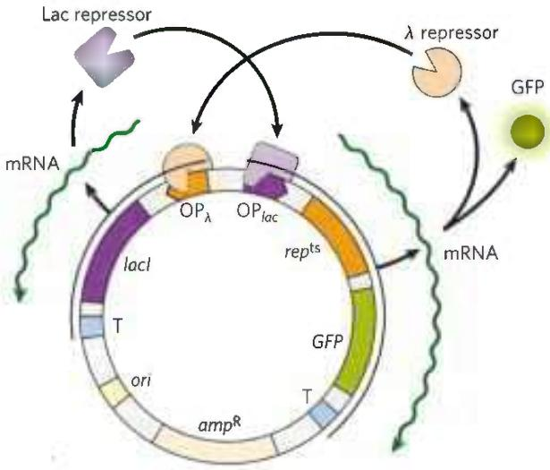

(d) The constructed system has two states: GFP-on (high level of expression) and GFP-off (low level of expression). For each state, describe which proteins are present and which promoters are being expressed.

(e) Treatment with IPTG would be expected to toggle the system from one state to the other. From which state to which? Explain your reasoning.

(f) Treatment with heat (42 °C) would be expected to toggle the system from one state to the other. From which state to which? Explain your reasoning.

(g) Why would this plasmid be expected to have characteristics A and B as described above?

To confirm that their construct did indeed exhibit these characteristics, Gardner and colleagues first showed that, once switched, the GFP expression level (high or low) was stable for long periods of time (characteristic B). Next, they measured the GFP level at different concentrations of the inducer IPTG, with the following results.

  
They noticed that the average GFP expression level was intermediate at concentration X of IPTG. However, when they measured the GFP expression level in individual cells at [IPTG] = X, they found either a high level or a low level of GFP — no cells showed an intermediate level.

(h) Explain how this finding demonstrates that the system has characteristic A. What is happening to cause the bimodal distribution of expression levels at [IPTG] = X?

## Reference

Gardner, T.S., C.R. Cantor, and J.J. Collins. 2000. Construction of a genetic toggle switch in Escherichia coli. Nature 403:339–342.

# Abbreviated Solutions to Problems

Fuller solutions to all chapter problems are published in the Absolute Ultimate Guide to Lehninger Principles of Biochemistry. For all numerical problems, answers are expressed with the correct number of significant figures.

## Chapter 1

1. (a) Diameter of magnified cell = 500 mm (b) 36,000 mitochondria (c) $3.9 \times 10^{10}$ glucose molecules

2. (a) 10% (b) 5% (c) 1.6 mm; 800 times longer than the cell; DNA must be tightly coiled

3. Collect the supernatant from the high-speed centrifugation and centrifuge at a very high speed (150,000 g) for 3 hours. The ribosomes will be in the pellet.

4. (a) Metabolic rate is limited by diffusion, which is limited by surface area. (b) $12 \mu m^{-1}$ for the bacterium (c) Surface-to-volume ratio 300 times higher in the bacterium.

5. $2 \times 10^{6} \mathrm{~s}$ (about 23 days)

6. The vitamin molecules from the two sources are identical; the body cannot distinguish the source; only associated impurities might vary with the source.

7. (a) COO $^{-}$ , carboxyl; NH $_{3}$ , amino; OH, hydroxyl; CH $_{3}$ , methyl

(b)

(c) 2

D-Threonine

8.

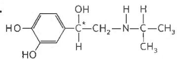

The two enantiomers have different interactions with a chiral biological "receptor" (a protein).

9. (a) Fatty acids are more nonpolar than amino acids, which makes them separable on the basis of solubility. The larger size and longer shape of fatty acids could allow separation by some types of chromatography. (b) The charge on the phosphate groups of nucleotides could be used to separate them from glucose. The larger size and shape could allow separation by some types of chromatography.

10. Carbon atoms can form linear chains, branched chains, and cyclic structures. It is improbable that silicon could serve as the central organizing element for life, especially in an $O_{2}$ -containing atmosphere such as that of Earth. Long chains of silicon atoms are not readily synthesized; the polymeric macromolecules necessary for more complex functions would not readily form. Oxygen disrupts bonds between silicon atoms, and silicon-oxygen bonds are extremely stable and difficult to break, preventing the breaking and making of bonds that are essential to life processes.

11. (a) $(R)$ -enantiomer: A is $\mathrm{COO}^{-}$ ; B is H; C is $\mathrm{CH}_3$ . $(S)$ -enantiomer: A is $\mathrm{CH}_3$ ; B is H; C is $\mathrm{COO}^{-}$ . (b) It is unnecessary to make enantiomerically pure $(S)$ -ibuprofen available because the isomerase converts the less effective enantiomer to the effective enantiomer, but does not catalyze the reverse reaction.

12. (a) 3 Phosphoric acid groups; $\alpha$ -D-ribose; guanine (b) Tyrosine; 2 glycines; phenylalanine; methionine (c) Choline; phosphoric acid; glycerol; oleic acid; palmitic acid

13. (a) $CH_{2}O; C_{3}H_{6}O_{3}$

(b)

2

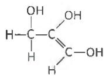

3

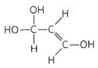

5

6

7

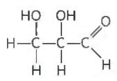

8

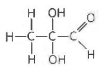

9

10

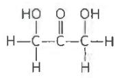

11

12

(c) X contains a chiral center; eliminates all but 6 and 8. (d) X contains an acidic functional group; eliminates 8; structure 6 is consistent with all data. (e) Structure 6; we cannot distinguish between the two possible enantiomers.

14. (a) The carbon bearing the hydroxyl group is the chiral carbon.
(b) The structure shows the (R) isomer of propranolol. (c) (S)-Propranolol has this structure:

15. (a) The chiral carbons are indicated with asterisks. (b) The structure shows the $(S,S)$ isomer of methylphenidate. (c) $(R,R)$ -methylphenidate has this structure:

16. Spores are alive because they can transition from a state of being metabolically inert under harsh environmental conditions to an actively growing state when conditions improve. During this transition, spores take in water, which is essential to many biochemical reactions. Germination does not seem to depend on ATP.

17. (a) $\Delta G^{\circ}$ is negative and relatively large. (b) There is not enough thermal energy in the wood to overcome the activation energy.
(c) A match supplies thermal energy to overcome the activation energy barrier. (d) The enzyme lowers the activation energy enough for the reaction to occur at room temperature.

18. If this mutation occurs in a coding sequence, it may cause an amino acid substitution during protein synthesis. The consequence to the cell could be anywhere on the spectrum from beneficial, to neutral, to fatal.

19. The resulting protein may fold incorrectly and may not attain its native conformation. Alternatively, the shape of the region that binds with its partner may change, preventing complementary fit. A mutation that malforms an enzyme's active site can destroy the enzyme's catalytic activity.

20. (a) The copy begins with already-formed domains with biological activity, so it does not have to evolve from scratch. The copy can undergo mutation without harm to the cell, since the original gene encodes the original product. Alternatively, the copy could undergo mutations that create a lethal product, even though the original gene remains intact. The daughter cell's newly acquired function may be positive or negative. (b) Each time a duplicate gene undergoes mutation is an opportunity for the cell to acquire a new, positive trait without risking the loss of function provided by the original gene, which may remain unchanged.

21. Yes, when environmental conditions improve, such as temperature moderation and the availability of water, the animal can rehydrate and recover. That is, biochemical mechanisms exist for restoring the normal state.

22. Mutations may have made DNA repair more efficient. Resistant cells may have developed or increased the ability to synthesize a compound that destroys free radicals. Gene duplication may have provided backup for genes damaged by radiation.

23. (a) The enzyme that catalyzes the reaction is a membrane-bound enzyme because the preparation containing only membranes had the largest amount of labeled product. (b) The enzyme generated the largest amount of product at pH 7. (c) Enzyme activity is slightly higher at pH 8 than at pH 6. (d) Magnesium $(\mathrm{Mg}^{2+})$ is effective at activating the system over a range of concentrations. At low concentrations, manganese $(\mathrm{Mn}^{2+})$ is effective at activating the system, but it may inhibit the reaction at higher concentrations. The system shows minimal response to calcium ions $(\mathrm{Ca}^{2+})$ . (e) The reaction requires CTP, but not GTP, UTP, or ATP. However, the addition of ATP may increase the rate of lecithin synthesis. The ATP from lot 116 was likely contaminated with CTP. (f) Phosphocholine + membrane-bound enzyme + $\mathrm{Mg}^{2+}$ + CTP $\rightleftharpoons$ lecithin

## Chapter 2

1. Weaker; ionic attractive force is proportional to the inverse of the dielectric constant, and a hydrophobic "solvent" such as the environment inside the protein has a lower dielectric constant than a polar solvent such as water.

2. Biomolecular interactions generally need to be reversible; weak interactions allow reversibility.

3. Ethanol is polar; ethane is not. The ethanol —OH group can hydrogen-bond with water.

4. (a) 4.76 (b) 9.19 (c) 4.0 (d) 4.82

5. (a) $1.51 \times 10^{-4} \mathrm{M}$ (b) $3.02 \times 10^{-7} \mathrm{M}$ (c) $7.76 \times 10^{-12} \mathrm{M}$

6.1.1

7. (a) $\mathrm{HCl} \rightleftharpoons \mathrm{H}^{+} + \mathrm{Cl}^{-}$ (b) 3.3 (c) $\mathrm{NaOH} \rightleftharpoons \mathrm{Na}^{+} + \mathrm{OH}^{-}$ (d) 9.8

8.1.1

9. 1.7 nmol of acetylcholine

10. 0.1 M hydrofluoric acid

11. (a) strong (b) weak (c) strong (d) strong (e) weak (f) weak
12. 3.3 mL

13. (a) $\mathrm{H}_2\mathrm{PO}_4^-$ (b) $\mathrm{HCO}_3^-$ (c) $\mathrm{CH}_3\mathrm{COO}^-$ (d) $\mathrm{CH}_3\mathrm{NH}_2$

14. (a) 5.06 (b) 4.28 (c) 5.46 (d) 4.76 (e) 3.76

15. quinoline ion: 0.1 M HCl; m-cresol: 0.1 M NaOH;

2-(methylthio)pyridine ion: 0.1 M HCl

16. (d) Bicarbonate, a weak base, titrates —OH to —O $^{-}$ , making the compound more polar and more water-soluble.

17. Stomach; the neutral form of aspirin present at the lower pH is less polar and passes through the membrane more easily.

18. 8.8

19.7.4

20. (a) pH 8.6 to 10.6 (b) 4/5 (c) 10 mL (d) pH = pK $_{a}$ - 2

21.8.9

22. 2.4

23.6.9

24.1.4

25. $\mathrm{NaH_2PO_4\cdot H_2O}$ , 5.8 g/L; $\mathrm{Na_2HPO_4}$ , 8.2 g/L

26. $[\mathrm{A}^{-}] / [\mathrm{HA}] = 0.10$

27. Mix 150 mL of 0.10 M sodium acetate and 850 mL of 0.10 M acetic acid.

28. (a) pH 3 (b) pH 5 (c) pH 9 (d) pH 9 (e) pH 3 (f) pH 5. The total buffering region spans approximately 1 pH unit on either side of the $pK_{a}$ value.

29. (a) 4.6 (b) 0.1 pH unit (c) 4 pH units

30.4.3

31. 0.13 M acetate and 0.07 M acetic acid

32.1.8

33.7

## 34. (a) fully protonated (b) zwitterionic (c) zwitterionic

(d) zwitterionic (e) fully deprotonated. When the pH is lower than both $pK_{a}$ values, both the $\alpha$ -amino group and the $\alpha$ -carboxyl group are protonated. When the pH is greater than both $pK_{a}$ values, neither the $\alpha$ -amino group nor the $\alpha$ -carboxyl group is protonated. When the pH is between the two $pK_{a}$ values, the $\alpha$ -amino group is protonated, whereas the $\alpha$ -carboxyl group is unprotonated.

35. (a) Blood pH is controlled by the carbon dioxide-bicarbonate buffer system, $CO_{2} + H_{2}O \rightleftharpoons H^{+} + HCO_{3}^{-}$ . During hypoventilation, $pCO_{2}$ increases in the air space of the lungs and arterial blood, driving the equilibrium to the right, raising $[H^{+}]$ and lowering blood pH.
(b) During hyperventilation, $[CO_{2}]$ decreases in the lungs and arterial blood, reducing $[H^{+}]$ and increasing pH above the normal 7.4 value.
(c) Lactate is a moderately strong acid, completely dissociating under physiological conditions and thus lowering the pH of blood and muscle tissue. Hyperventilation removes $H^{+}$ , raising the pH of blood and tissues in anticipation of the acid buildup.

36.7.4

37. Dissolving more $CO_{2}$ in the blood increases $[H^{+}]$ in blood and extracellular fluids, lowering pH: $\mathrm{CO}_{2}(\mathrm{aq}) + \mathrm{H}_{2}\mathrm{O} \rightleftharpoons \mathrm{H}_{2}\mathrm{CO}_{3} \rightleftharpoons \mathrm{H}^{+} + \mathrm{HCO}_{3}^{-}$ 38. (a) $CH_{3}-OH < CH_{3}-CH_{2}-OH < HO-CH_{2}CH_{2}-OH < HO-CH_{2}CH_{2}CH_{2}-OH$ (b) number of hydrogen bonds that the compound can form and length of the carbon chain

39. The average bond duration decreases.

40. (a) $\mathrm{H}_2\mathrm{S}$ forms hydrogen bonds with $\mathrm{H}_2\mathrm{O}$ but not with itself. (b) $\mathrm{H}_2\mathrm{S}$ has a lower boiling point than $\mathrm{H}_2\mathrm{O}$ . (c) No, $\mathrm{H}_2\mathrm{S}$ is a less polar solvent than $\mathrm{H}_2\mathrm{O}$ .

41. sodium acetate > sodium propionate > glycine > L-phenylalanine > sodium octanoate

$$
\begin{array}{l} 4 2. \mathrm{CH} _ {3} - (\mathrm{CHOH}) - \mathrm{CH} _ {2} - \mathrm{CHOH} - \mathrm{CH} _ {2} - \mathrm{OH} > \mathrm{CH} _ {3} - (\mathrm{CH} _ {2}) _ {5} - \mathrm{OH} > \\ \mathrm{CH} _ {3} - (\mathrm{CH} _ {2}) _ {1 0} - \mathrm{OH} \end{array}
$$

$$
\begin{array}{l} \text {43. (a) HOOC - (CH_{2})_{4} -COOH, - 2; CH_{3} -(CH_{2})_{4} -COOH, - 1;} \\ \text {HOOC - (CH_{2})_{2} -COOH, - 2} \end{array}
$$

(b) HOOC—(CH₂)₂—COOH > HOOC—(CH₂)₄—COOH >

$$
\mathrm{CH} _ {3} - (\mathrm{CH} _ {2}) _ {4} - \mathrm{COOH}
$$

44. (a) No, because an effluent of pH 1 would harm the trout and other life in the stream. (b) The pH scale runs from very acidic to very alkaline, with the point of neutrality (which is best for living creatures, including trout) midway between 0 and 14. He is proposing to jump out of the frying pan into the fire!

45. pH = 7.6; osmolarity = 0.313 osm/L

46.

(a)  
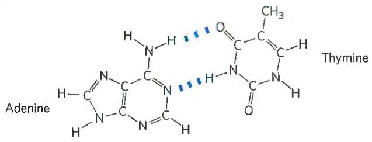

47. (a) Use the substance in its surfactant form to emulsify the spilled oil, collect the emulsified oil, then switch to the nonsurfactant form. The oil and water will separate, and the oil can be collected for further use. (b) The equilibrium lies strongly to the right. The stronger acid (lower $pK_{a}$ ), $H_{2}CO_{3}$ , donates a proton to the conjugate base of the weaker acid (higher $pK_{a}$ ), amidine. (c) The strength of a surfactant depends on the hydrophilicity of its head groups: the more hydrophilic, the more powerful the surfactant. The amidinium form of s-surf is much more hydrophilic than the amidine form, so it is a more powerful surfactant. (d) Point A: amidinium; the $CO_{2}$ has had plenty of time to react with the amidine to produce the amidinium form. Point B: amidine; Ar has removed $CO_{2}$ from the solution, leaving the amidine form. (e) The conductivity rises as uncharged amidine reacts with $CO_{2}$ to produce the charged amidinium form. (f) The conductivity falls as Ar removes $CO_{2}$ , shifting the equilibrium to the uncharged amidine form. (g) Treat s-surf with $CO_{2}$ to produce the surfactant amidinium form, and use this to emulsify the spill. Treat the emulsion with Ar to remove the $CO_{2}$ and produce the nonsurfactant amidine form. The oil will separate from the water and can be recovered.

## Chapter 3

1. The constituents are Glu, Cys, and Gly. The Glu links to the Cys via its $\gamma$ -carboxyl group.

2. It is L-ornithine, because the amino group occupies the same relative position as the hydroxyl group in L-glyceraldehyde.

3. (a) II (b) IV (c) I (d) III (e) II (f) II (g) IV (h) III (i) V (j) III (k) II and IV

4. (a) $\mathrm{pI} > \mathrm{pK}_{\mathrm{a}}$ of the $\alpha$ -carboxyl group and $\mathrm{pI} < \mathrm{pK}_{\mathrm{a}}$ of the $\alpha$ -amino group, so both groups are charged (ionized). (b) 1 in $2.19 \times 10^{7}$ . The pI of alanine is 6.01. From Table 3-1 and the Henderson-Hasselbalch equation, 1 in 4,680 carboxyl groups and 1 in 4,680 amino groups are uncharged. The fraction of alanine molecules with both groups uncharged is 1 in $4,680^{2}$ .

5. (a)  

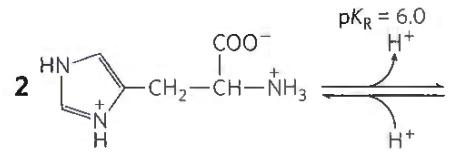

(b), (c)

<table><tr><td>pH</td><td>Structure identified in (a)</td><td>Net charge</td><td>Migrates toward</td></tr><tr><td>1</td><td>1</td><td>+2</td><td>Cathode</td></tr><tr><td>4</td><td>2</td><td>+1</td><td>Cathode</td></tr><tr><td>8</td><td>3</td><td>0</td><td>Does not migrate</td></tr><tr><td>12</td><td>4</td><td>-1</td><td>Anode</td></tr></table>

6. (a) Glutamate (b) Methionine (c) Aspartate (d) Glycine (e) Serine

7. (a) 2 (b) 4

(c)  

8. (a) Structure at pH 7:

(b) Electrostatic interaction between the carboxylate anion and the protonated amino group of the alanine zwitterion favorably affects ionization of the carboxyl group. This favorable electrostatic interaction decreases as the length of the poly(Ala) increases, resulting in an increase in $pK_{1}$ . (c) Ionization of the protonated amino group destroys the favorable electrostatic interaction noted in (b). With increasing distance between the charged groups, removal of the proton from the amino group in poly(Ala) becomes easier and thus $pK_{2}$ is lower. The intramolecular effects of the amide (peptide bond) linkages keep $pK_{a}$ values lower than they would be for an alkyl-substituted amine.

9. One H comes from the $\alpha$ -amino group of one amino acid, and an OH is removed from the $\alpha$ -carboxyl group of the amino acid to which the first is joined.

10. 75,000

11. (a) 10,300. The elements of water are lost when a peptide bond forms, so the molecular weight of a Cys residue is not the same as the molecular weight of free cysteine. (b) 21

12. The protein has four subunits, with molecular masses of 160, 90, 90, and 60 kDa. The two 90 kDa subunits (possibly identical) are linked by one or more disulfide bonds.

13. (a) at pH 3, +2; at pH 8, 0; at pH 11, -1 (b) pI = 7.8

14. Lys, His, Arg; negatively charged phosphate groups in DNA interact with positively charged side groups in histones.

$$
\begin{array}{l} \textbf {1 5 . (a) (G l u) _ {2 0} (b) (L y s - V a l) _ {3} (c) (A s n - S e r - H i s) _ {5}} \\ \textbf {(d) (A s n - S e r - H i s) _ {5}} \end{array}
$$

16. (a) Specific activity after step 1 is 6.8 units/mg; step 2, 13 units/mg; step 3, 14 units/mg; step 4, 700 units/mg; step 5, 3,500 units/mg; step 6, 5,000 units/mg. (b) Step 4 (c) Step 3 (d) Yes. Specific activity increased only modestly in step 6; SDS polyacrylamide gel electrophoresis.

17. (a) [NaCl] = 0.5 mm (b) [NaCl] = 8 μm

18. B elutes first, A second, C last.

19. The chymotrypsin protein has three distinct polypeptide chains linked by disulfide bonds. They move on the gel as separate species once the disulfide bonds are broken to form the three peptides in lane 2.

20. (a) Amino terminus (b) Tyr-Gly-Gly-Phe-Leu

21. Phosphorylation of serine would alter the mass by 80.

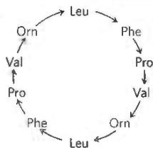

The arrows correspond to the orientation of the peptide bonds, $-CO \rightarrow NH-$ .

23. 75%, 93%. If the efficiency of each amino acid addition is x, then the percentage of full-length peptides with the correct sequence after the addition of seven amino acids will be $x^{7}$ , as there are seven peptide bonds.

24. (a) Y (Tyr) at position 1, F (Phe) at position 7, and R (Arg) at position 9. (b) Positions 4 and 9; K (Lys) is more common at 4, R (Arg) is invariant at 9. (c) Positions 5 and 10; E (Glu) is more common at both positions. (d) Position 2; S (Ser).

25. (a) Anion-exchange chromatography: peptide 2; cation-exchange chromatography: peptide 1; size-exclusion chromatography: peptide 2 (b) peptide 3

26. (a) Any linear polypeptide chain has only two kinds of free amino groups: a single $\alpha$ -amino group at the amino terminus, and an $\varepsilon$ -amino group on each Lys residue. These amino groups react with FDNB to form a DNP-amino acid derivative. Insulin gave two different $\alpha$ -amino-DNP derivatives, suggesting that it has two amino termini and thus two polypeptide chains—one with an amino-terminal Gly and the other with an amino-terminal Phe. Because the DNP-lysine product is $\varepsilon$ -DNP-lysine, the Lys is not at an amino terminus. (b) Yes. The A chain has amino-terminal Gly, the B chain has amino-terminal Phe, and (nonterminal) residue 29 in the B chain is Lys. (c) Phe-Val-Asp-Glu-. Peptide B1 shows that the amino-terminal residue is Phe. Peptide B2 also includes Val, but since no DNP-Val is formed, Val is not at the amino terminus; it must be on the carboxyl side of Phe. Thus the sequence of B2 is DNP-Phe-Val. Similarly, the sequence of B3 must be DNP-Phe-Val-Asp, and the sequence of the A chain must begin Phe-Val-Asp-Glu-. (d) No. The known amino-terminal sequence of the A chain is Phe-Val-Asn-Gln-. The Asn and Gln appear in Sanger's analysis as Asp and Glu because the vigorous hydrolysis in step 7 hydrolyzed the amide bonds in Asn and Gln (as well as the peptide bonds), forming Asp and Glu. Sanger et al. could not distinguish Asp from Asn or Glu from Gln at this stage in their analysis. (e) The sequence exactly matches that in Fig. 3-24. Each peptide in the table gives specific information about which Asx residues are Asn or Asp and which Glx residues are Glu or Gln.

Ac1: residues 20–21. This is the only Cys-Asx sequence in the A chain; there is \~1 amido group in this peptide, so it must be Cys-Asn:

$$
\begin{array}{c c c} N \text {-Gly-Ile-Val-Glx-Glx-Cys-Cys-Ala-Ser-Val-} \\ 1 & 5 & 1 0 \\ \text {Cys - Ser - Leu - Tyr - Glx - Leu - Glx - Asx - Tyr - Cys - Asn - C} \\ & 1 5 & 2 0 \end{array}
$$

Ap15: residues 14–15–16. This is the only Tyr-Glx-Leu sequence in the A chain; there is \~1 amido group, so the peptide must be Tyr-Gln-Leu:

$$
\begin{array}{c c c} N \text {-Gly-Ile-Val-Glx-Glx-Cys-Cys-Ala-Ser-Val-} \\ 1 & 5 & 1 0 \\ \text {Cys - Ser - Leu - Tyr - Gln - Leu - Glx - Asx - Tyr - Cys - Asn - C} \\ & 1 5 & 2 0 \end{array}
$$

Ap14: residues 14-15-16-17. There is \~1 amido group, and we already know that residue 15 is Gln, so residue 17 must be Glu:

$$
\begin{array}{c c c} N \text {-Gly-Ile-Val-Glx-Glx-Cys-Cys-Ala-Ser-Val-} \\ 1 & 5 & 1 0 \\ \text {Cys - Ser - Leu - Tyr - Gln - Leu - Glu - Asx - Tyr - Cys - Asn - C} \\ & 1 5 & 2 0 \end{array}
$$

Ap3: residues 18–19–20–21. There are \~2 amido groups, and we know that residue 21 is Asn, so residue 18 must be Asn:

$$
\begin{array}{c c c} N - \text {Gly-Ile-Val-Glx-Glx-Cys-Cys-Ala-Ser-Val-} \\ 1 & 5 & 1 0 \\ \text {Cys-Ser-Leu-Tyr-Gln-Leu-Glu-Asn-Tyr-Cys-Asn-C} \\ & 1 5 & 2 0 \end{array}
$$

Ap1: residues 17–18–19–20–21, which is consistent with residues 18 and 21 being Asn.

Ap5pa1: residues 1–2–3–4. There are \~0 amido groups, so residue 4 must be Glu:

$$
\begin{array}{c c c} N - \text {Gly - Ile - Val - Glu - Glx - Cys - Cys - Ala - Ser - Val- } \\ 1 & 5 & 1 0 \\ \text {Cys - Ser - Leu - Tyr - Gln - Leu - Glu - Asn - Tyr - Cys - Asn - C} \\ 1 5 & 2 0 \end{array}
$$

Ap5: residues 1 through 13. There is \~1 amido group, and we know that residue 4 is Glu, so residue 5 must be Gln:

$$
\begin{array}{c c c} N \text {-Gly-Ile-Val-Glu-Gln-Cys-Cys-Ala-Ser-Val-} \\ 1 & 5 & 1 0 \\ C y s - S e r - L e u - T y r - G l n - L e u - G l u - A s n - T y r - C y s - A s n - C \\ & 1 5 & 2 0 \end{array}
$$

Chapter 4

1. (a) Shorter bonds have a higher bond order (are multiple rather than single) and are stronger. The peptide C—N bond is stronger than a single bond and is midway between a single bond and a double bond in character. (b) Rotation about the peptide bond is difficult at physiological temperatures because of its partial double-bond character.

2. (a) The principal structural units in the wool fiber polypeptide ( $\alpha$ -keratin) are successive turns of the $\alpha$ helix, at 5.4 Å intervals; coiled coils produce the 5.2 Å spacing. Steaming and stretching the fiber yields an extended polypeptide chain with the $\beta$ conformation, with a distance between adjacent R groups of about

7.0 Å. As the polypeptide reassumes an $\alpha$ -helical structure, the fiber shortens. (b) Wool shrinks in the presence of moist heat, as polypeptide chains are converted from an extended $\beta$ conformation to the native $\alpha$ -helix conformation. The structure of silk— $\beta$ sheets, with their small, closely packed amino acid side chains—is more stable than that of wool.

## 3. \~42 peptide bonds per second

4. At pH > 6, the carboxyl groups of poly(Glu) are deprotonated; repulsion among negatively charged carboxylate groups leads to unfolding. Similarly, at pH 7, the amino groups of poly(Lys) are protonated; repulsion among these positively charged groups also leads to unfolding.

5. (a) Disulfide bonds are covalent bonds, which are much stronger than the noncovalent interactions that stabilize most proteins. They cross-link protein chains, increasing their stiffness, mechanical strength, and hardness. (b) Cystine residues (disulfide bonds) prevent the complete unfolding of the protein.

## 6. $\phi = (\mathrm{f})$ and $\psi = (\mathrm{e})$

7. (a) Bends are most likely at residues 7 and 19; Pro residues in the cis configuration accommodate turns well. (b) The Cys residues at positions 13 and 24 can form disulfide bonds. (c) External surface: polar and charged residues (Asp, Gln, Lys); interior: nonpolar and aliphatic residues (Ala, Ile); Thr, though polar, has a hydropathy index near zero and thus can be found either on the external surface or in the interior of the protein.

8. (a) At pH 6.0, the amino acid residues are in the correct protonation state to form an ion pair. At pH 2.0, both Asp and His are predominantly protonated, and at pH 10.0, they are both predominantly deprotonated. (b) Burial of a charged amino acid residue will destabilize the protein and shift the thermal denaturation curve to lower temperatures. (c) Lesser. At pH 10.0, a greater fraction of the Lys side chain will be deprotonated and uncharged, facilitating its burial in a hydrophobic environment.

## 9. 30 amino acid residues; 0.87

10. For many proteins, the amino acid sequence dictates the formation of a unique, folded structure. However, the reverse is not true. Many different amino acid sequences can give rise to similar folded structures. For example, the relative orientation of the charged amino acid residues in an ion pair can be switched while still preserving the overall location of the interaction.

11. Protein (a), a $\beta$ barrel, is described by Ramachandran plot (c), which shows most of the allowable conformations in the upper left quadrant where the bond angles characteristic of the $\beta$ conformation are concentrated. Protein (b), a series of $\alpha$ helices, is described by plot (d), where most of the allowable conformations are in the lower left quadrant.

12. (a) The number of moles of DNP-valine formed per mole of protein equals the number of amino termini and thus the number of polypeptide chains. (b) 4 (c) Different chains would probably run as discrete bands on an SDS polyacrylamide gel.

13. (a) Aromatic residues seem to play an important role in stabilizing amyloid fibrils. Thus, molecules with aromatic substituents may inhibit amyloid formation by interfering with the stacking or association of the aromatic side chains. (b) Amyloid forms in the pancreas in association with type 2 diabetes, and forms in the brain in Alzheimer disease. Although the amyloid fibrils in the two diseases involve different proteins, the fundamental structure of the amyloid is similar and is similarly stabilized in both, so they are potential targets for similar drugs designed to disrupt this structure.

14. Although a protein may have only one unique folded structure, many different unfolded structures may exist. The different folding pathways and structures used by the product of other disease alleles of CFTR may not be corrected by lumacaftor.

15. (a) x-ray crystallography (b) cryo-EM (c) NMR (d) NMR or CD
16. (a) 2QYC is B; 2BNH is C; 2Q5R is E or M; 1XU9 is H; 3H7X is I; 1OU5 is E or M; 2WCD is O. (b) dimer, α/β; monomer, α/β; dimer, α/β; tetramer, α/β; trimer, all α; dimer, α/β; 24-mer or double dodecamer (12-mer), all α. (c) BIOCHEM

  
(a)

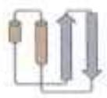  
(b)

  
(c)

17. (a) NFκB transcription factor, also called RelA transforming factor (b) No. You will obtain similar results, but with additional related proteins listed. (c) The protein has two subunits. There are multiple variants of the subunits, with the best characterized being 50, 52, or 65 kDa. These pair with each other to form a variety of homodimers and heterodimers. The structures of a number of different variants can be found in the PDB. (d) The NFκB transcription factor is a dimeric protein that binds specific DNA sequences, enhancing transcription of nearby genes. One such gene is the immunoglobulin κ (kappa) light chain, from which the transcription factor gets its name.

18. (a) Aba is a suitable replacement because Aba and Cys have side chains that are approximately the same size and are similarly hydrophobic. However, Aba cannot form disulfide bonds, so it will not be a suitable replacement if these are required. (b) There are many important differences between the synthesized protein and HIV protease produced by a human cell, any of which could result in an inactive synthetic enzyme. (1) Although Aba and Cys have a similar size and hydrophobicity, Aba may not be similar enough for the protein to fold properly. (2) HIV protease may require disulfide bonds for proper functioning. (3) Many proteins synthesized by ribosomes fold while being produced; the protein in this study folded only after the chain was complete. (4) Proteins synthesized by ribosomes may interact with the ribosomes as they fold; this is not possible for the protein in the study. (5) Cytosol is a more complex solution than the buffer used in the study; some proteins may require specific, unknown proteins for proper folding. (6) Proteins synthesized in cells often require chaperones for proper folding; these are not present in the study buffer. (7) In cells, HIV protease is synthesized as part of a larger chain that is then proteolytically processed; the protein in the study was synthesized as a single molecule. (c) Because the enzyme is functional when Aba is substituted for Cys, disulfide bonds do not play an important role in the structure of HIV protease. (d) Model 1: It would fold like the L-protease. For: The covalent structure is the same (except for chirality), so it should fold like the L-protease. Against: Chirality is not a trivial detail; three-dimensional shape is a key feature of biological molecules. The synthetic enzyme will not fold like the L-protease. Model 2: It would fold to the mirror image of the L-protease. For: Because the individual components are mirror images of those in the biological protein, it will fold in the mirror-image shape. Against: The interactions involved in protein folding are very complex, so the synthetic protein will most likely fold in another form. Model 3: It would fold to something else. For: The interactions involved in protein folding are very complex, so the synthetic protein will most likely fold in another form. Against: Because the individual components are mirror images of those in the biological protein, it will fold in the mirror-image shape. (e) Model 2. The enzyme is active, but with the enantiomeric form of the biological substrate, and it is inhibited by the enantiomeric form of the biological inhibitor. This is consistent with the D-protease being the mirror image of the L-protease. (f) Evans blue is achiral; it binds to both forms of the enzyme. (g) No. Because proteases contain only L-amino acids and recognize only L-peptides, chymotrypsin would not digest the D-protease. (h) Not necessarily. Depending on the individual enzyme, any of the problems listed in (b) could result in an inactive enzyme.

## Chapter 5

1. Protein B has a higher affinity for ligand X; its lower $K_{d}$ indicates that protein B will be half-saturated at a much lower concentration of X than will protein A. Protein A has $K_{a} = 3.3 \times 10^{6} M^{-1}$ ; protein B has $K_{a} = 2.5 \times 10^{7} M^{-1}$ .

2. (a) $n_{H} < 1.0$ can mean that the protein exhibits negative cooperativity, where the binding of one ligand to the protein decreases its affinity for other ligand molecules. (b), (c) There are some instances where $n_{H} < 1.0$ occurs without true negative cooperativity. For example, $n_{H} < 1.0$ could also occur if a single polypeptide contained multiple binding sites that had a different affinity for the ligand. If a protein preparation contains a heterogeneous mixture of the protein where some molecules are partially denatured, the measured binding affinity would be artificially decreased, resulting in $n_{H} < 1.0$ . (d) If a protein has multiple ligand binding sites that all have the same binding affinity and do not affect one another, no cooperativity, positive or negative, will be observed.

$$
3. k _ {\mathrm{d}} = 8. 9 \times 1 0 ^ {- 5} \mathrm{s} ^ {- 1}
$$

4. (a) 33 nm, (b) 0.15 μm, (c) 1.9 μm

5. (a) $K_{d} = 4.0 \, nm$ (shortcut: the $K_{d}$ is equivalent to the ligand concentration where Y = 0.5). (b) The rat receptor has the highest affinity, as it has the lowest $K_{d}$ .

6. Tight binding of CO to a few binding sites in a hemoglobin tetramer tends to force the entire protein into the R state. $O_{2}$ can still bind to the unoccupied sites, but it will bind tightly and not be released into the tissues.

7. The cooperative behavior of hemoglobin arises from subunit interactions.

8. (a) Shift the curve to the right. (b) Shift the curve to the right. (c) Shift the curve to the right. All of these conditions would decrease the affinity of hemoglobin for $O_{2}$ .

9. (a) The observation that HbA (maternal) is about 60% saturated when the pO₂ is 4 kPa, whereas HbF (fetal) is more than 90% saturated under the same physiological conditions, indicates that HbF has a higher O₂ affinity than HbA. (b) The higher O₂ affinity of HbF ensures that oxygen will flow from maternal blood to fetal blood in the placenta. Fetal blood approaches full saturation where the O₂ affinity of HbA is low. (c) The observation that the O₂-saturation curve of HbA undergoes a larger shift on BPG binding than that of HbF suggests that HbA binds BPG more tightly than does HbF. Differential binding of BPG to the two hemoglobins may determine the difference in their O₂ affinities.

10. (a) Hb Memphis (b) HbS, Hb Milwaukee, Hb Providence, and possibly Hb Cowtown (c) Hb Providence

11. More tightly. An inability to form tetramers would limit the cooperativity of these variants, and the binding curve would become more hyperbolic. Also, the BPG-binding site would be disrupted. Oxygen binding would probably be tighter, because the default state in the absence of bound BPG is the tight-binding R state.

12. (a) $3.3 \times 10^{-8} \mathrm{M}$ (b) $5 \times 10^{-8} \mathrm{M}$ (c) $2 \times 10^{-7} \mathrm{M}$ (d) $4.5 \times 10^{-7} \mathrm{M}$ . Note that a rearrangement of Eqn 5-8 gives $[\mathrm{L}] = YK_{\mathrm{d}} / (1 - Y)$ .

13. The epitope is likely to be a structure that is buried when G-actin polymerizes to form F-actin.

14. (a) The human immune system requires several days to mount a staged response to antigens on the surface of a pathogen. Both trypanosomes and HIV evade the immune system by altering the surface proteins to which immune system components initially bind. Thus, the host organism regularly faces new antigens and requires time to mount an immune response to each one, giving the pathogen time to replicate and spread. HIV also evades the immune system by actively infecting and destroying immune system cells—namely, helper T cells ( $T_{H}$ cells).

15. Binding of ATP to myosin triggers dissociation of myosin from the actin thin filament. In the absence of ATP, actin and myosin bind tightly to each other.

## 16. (a) 2 (b) 3 (c) 1 (d) 4

17. (a) Chain L is the light chain and chain H is the heavy chain of the Fab fragment. Chain Y is lysozyme. (b) $\beta$ conformation structures are predominant in the variable and constant regions of the fragment. (c) Fab heavy-chain fragment: 218 amino acid residues; light-chain fragment: 214; lysozyme: 129. Less than 15% of the lysozyme molecule is in contact with the Fab fragment. (d) Residues that seem to be in contact with lysozyme include, in the H chain: Gly $^{31}$ , Tyr $^{32}$ , Arg $^{99}$ , Asp $^{100}$ , and Tyr $^{101}$ ; in the L chain: Tyr $^{32}$ , Tyr $^{49}$ , Tyr $^{50}$ , and Trp $^{92}$ . In lysozyme, residues Asn $^{19}$ , Gly $^{22}$ , Tyr $^{23}$ , Ser $^{24}$ , Lys $^{116}$ , Gly $^{117}$ , Thr $^{118}$ , Asp $^{119}$ , Gln $^{121}$ , and Arg $^{125}$ seem to be situated at the antigen-antibody interface. Not all of these residues are adjacent in the primary structure. Folding of the polypeptide into higher levels of structure brings nonconsecutive residues together to form the antigen-binding site.

18. (a) 2 (b) Instantly. Suitable antibodies are almost always present before any challenge from the virus. (c) >100,000,000

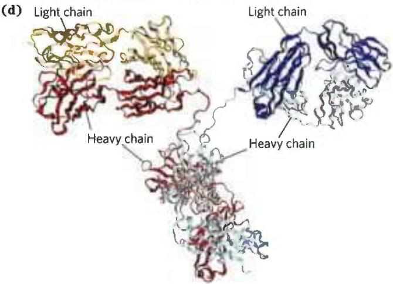

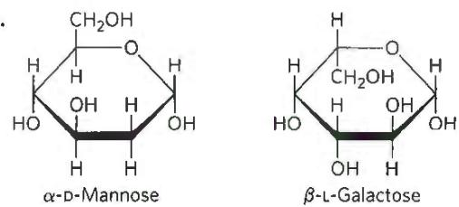

The drawing is not to scale; any given cell would have many more myosin molecules on its surface. (b) ATP is needed to provide the chemical energy to drive the motion (see Chapter 13). (c) An antibody that bound to the myosin tail, the actin-binding site, would block actin binding and prevent movement. An antibody that bound to actin would also prevent actin-myosin interaction and thus movement. (d) There are two possible explanations: (1) Trypsin cleaves only at Lys and Arg residues (see Table 3-6), so would not cleave at many sites in the protein. (2) Not all Arg or Lys residues are equally accessible to trypsin; the most-exposed sites would be cleaved first. (e) The S1 model. The hinge model predicts that bead-antibody-HMM complexes (with the hinge) would move, but bead-antibody-SHMM complexes (no hinge) would not. The S1 model predicts that because both complexes include S1, both would move. The finding that the beads move with SHMM (no hinge) is consistent only with the S1 model. (f) With fewer myosin molecules bound, the beads could temporarily fall off the actin as a myosin let go of it. The beads would then move more slowly, as time is required for a second myosin to bind. At higher myosin density, as one myosin lets go, another quickly binds, leading to faster motion. (g) Above a certain density, what limits the rate of movement is the intrinsic speed with which myosin molecules move the beads. The myosin molecules are moving at a maximum rate; adding more will not increase speed.

## Chapter 6

1. The activity of the enzyme that converts sugar to starch is destroyed by heat denaturation.

2. $2.4 \times 10^{-6}$ M

3. $9.5 \times 10^{8}$ years

4. The enzyme-substrate complex is more stable than the enzyme alone.

5. The reaction rate can be measured by following the decrease in absorption by NADH (at 340 nm) as the reaction proceeds. Determine the $K_{m}$ value; using substrate concentrations well above the $K_{m}$ , measure initial rate (rate of NADH disappearance with time, measured spectrophotometrically) at several known enzyme concentrations, and plot initial rate versus concentration of enzyme. The plot should be linear, with a slope that provides a measure of LDH concentration.

6. (a), (c), (e)

7. (a) $1.7 \times 10^{-3}$ M (b) 0.33, 0.67, 0.91 (c) The red curve corresponds to enzyme B ([X] > K $_{m}$ for this enzyme); the black curve, to enzyme A.

8. (a) $0.2\mu \mathrm{M}s^{-1}$ (b) $0.6\mu \mathrm{M}s^{-1}$ (c) $0.9\mu \mathrm{M}s^{-1}$

9. (a) $2,000 \, s^{-1}$ (b) Measured $V_{max} = 1 \, \mu M \, s^{-1}$ ; $K_{m} = 2 \, \mu M$

10. (a) $400 \, s^{-1}$ (b) $10 \, \mu M$ (c) $\alpha = 2, \alpha' = 3$ (d) Mixed inhibitor

11. (a) 24 nm (b) 4 μM ( $V_{0}$ is exactly one-half $V_{max}$ , so $[X] = K_{m}$ ) (c) 40 μM ( $V_{0}$ is exactly one-half $V_{max}$ , so $[X] = 10$ times $K_{m}$ in the presence of inhibitor) (d) No. $k_{cat}/K_{m} = (0.33 \, s^{-1})/(4 \times 10^{-6} \, M) = 8.25 \times 10^{4} \, m^{-1} \, s^{-1}$ , well below the diffusion-controlled limit.

12. $V_{max} \approx 140 \mu M/min; K_{m} \approx 1 \times 10^{-5} M$

13. (a) $V_{max} = 51.5 \, mm/min$ ; $K_{m} = 0.59 \, mm$ (b) Competitive inhibition
14. $V_{max} = 0.50 \, \mu mol/min$ ; $K_{m} = 2.2 \, mm$

15. (a) A; (b) B

16. $2.0 \times 10^{7} \mathrm{~min}^{-1}$

17. (a) P (b) Q (c) E (d) B (e) A (f) F

5.

18. (a) Increase (b) Decrease (c) No change (d) No change
19. The basic assumptions of the Michaelis-Menten equation still hold. The reaction is at steady state, and the rate is determined by $V_{0} = k_{2}[ES]$ . The equations needed to solve for [ES] are

$$
\left[ \mathrm{E} _ {\mathrm{t}} \right\rbrace = \{\mathrm{E} \} + \{\mathrm{ES} \} + [ \mathrm{EI} ] \quad \text { and } \quad [ \mathrm{EI} ] = \frac {[ \mathrm{E} ] [ 1 ]}{K _ {\mathrm{I}}}
$$

[E] can be obtained by rearranging Eqn 6-19. The rest follows the pattern of the Michaelis-Menten equation derivation in the text.

20. 29,000. The calculation assumes that there is only one essential Cys residue per enzyme molecule.

21. Activity of the prostate enzyme equals total phosphatase activity in a blood sample minus phosphatase activity in the presence of enough tartrate to completely inhibit the prostate enzyme.

22. The inhibition is mixed. Because $K_{m}$ seems not to change appreciably, this could be the special case of mixed inhibition called noncompetitive.

23. Apparent $K_{\mathrm{m}} = \alpha K_{\mathrm{m}} / \alpha'$ . The [S] at which $V_0 = V_{\max} / 2\alpha'$ is obtained when all terms except $V_{\max}$ on the right side of Eqn 6-30—that is, $[\mathrm{S}] / (\alpha K_{\mathrm{m}} + \alpha'[[\mathrm{S}]) - \text{equal } \alpha'/2$ . Begin with $[\mathrm{S}] / (\alpha K_{\mathrm{m}} + \alpha'[[\mathrm{S}]) = \alpha'/2$ and solve for [S].

24. An amino acid with a positively charged side chain, such as Lys, His, or Arg, could pull electron density away from Tyr.

25. At pH 5.2, Glu $^{35}$ is protonated and neutral and Asp $^{52}$ is unprotonated and negatively charged. The optimum activity occurs when Glu $^{35}$ is protonated and Asp $^{52}$ is unprotonated. Optimal activity requires that Glu $^{35}$ be protonated and Asp $^{52}$ be unprotonated. Activity thus declines with decreasing pH as Asp $^{52}$ is protonated, and with increasing pH as Glu $^{35}$ is unprotonated.

26. (a) Although it can be ionized, the sulfhydryl group is relatively nonpolar (see Chapter 3). Amino butyric acid has a nonpolar side chain of similar size to the Cys side chain. (b) Because the peptide is made up of D-amino acids, the same shape is unlikely. A mirror image shape is likely, as the D-amino acids are mirror images of their L-stereoisomers. Prior to testing, a completely inactive form is at least plausible. (c) The mirror image hypothesis is strongly supported. The substrates and inhibitors made up of D-amino acids are uniquely active. (d) No. The active site of chymotrypsin is configured to act on peptides made up of L-amino acids. (e) No. The folding process is complex, and sometimes requires assistance from chaperones and specialized enzymes. Some enzymes and proteins can fold spontaneously into an active protein, but others cannot.

## Chapter 7

1. With reduction of the carbonyl oxygen to a hydroxyl group, the chemistry at C-1 and C-3 is the same; the glycerol molecule is not chiral.

2. Epimers differ by the configuration about only one carbon.

(a) D-altrose (C-2), D-glucose (C-3), D-gulose (C-4)

(b) D-idose (C-2), D-galactose (C-3), D-allose (C-4)

(c) D-arabinose (C-2), D-xylose (C-3)

3. To convert $\alpha$ -D-glucose to $\beta$ -D-glucose, the bond between C-1 and the hydroxyl on C-5 (as in Fig. 7-6) must be broken; to convert D-glucose to D-mannose, either the —H or —OH bond on C-2 must be broken. Conversion between chair conformations does not require bond breakage; this is the critical distinction between configuration and conformation.

4. (a) Both are polymers of D-glucose, but they differ in the glycosidic linkage: $(\beta1\rightarrow4)$ for cellulose, $(\alpha1\rightarrow4)$ for glycogen. (b) Both are hexoses, but glucose is an aldohexose, fructose a ketohexose. (c) Both are disaccharides, but maltose has two $(\alpha1\rightarrow4)$ -linked D-glucose units, and sucrose has $(\alpha1\leftrightarrow2\beta)$ -linked D-glucose and D-fructose.

  
24.

6.  
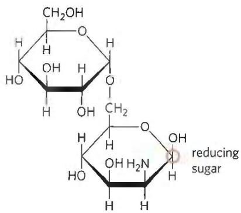

7. An individual with a condition that increases the rate of erythrocyte destruction and turnover would be expected to exhibit less hemoglobin glycation (a lower HbA1c value) because of the shorter-than-normal exposure of the hemoglobin to glucose.

8. A hemiacetal forms when an aldose or a ketose condenses with an alcohol; a glycoside forms when a hemiacetal condenses with an alcohol (see Fig. 7-5).

9. Fructose cyclizes to either the pyranose structure or the furanose structure. Increasing the temperature shifts the equilibrium in the direction of the furanose, the less-sweet form.

10. In 6-phosphogluconolactone, C-1 is a carboxylic acid ester; in glucose, C-1 is a hemiacetal.

11. Boiling a solution of sucrose in water hydrolyzes some of the sucrose to invert sugar. Hydrolysis is accelerated and occurs at lower temperatures with the addition of a small amount of acid (lemon juice or cream of tartar, for example).

12. Prepare a slurry of sucrose and water for the core; add a small amount of sucrase (invertase); immediately coat with chocolate.

13. Sucrose has no free anomeric carbon to undergo mutarotation.

14.  

Yes; yes

15. N-Acetyl- $\beta$ -D-glucosamine is a reducing sugar; its C-1 can be oxidized (p. 237). D-Gluconate is not a reducing sugar; its C-1 is already at the oxidation state of a carboxylic acid. GlcN( $\alpha$ 1 $\leftrightarrow$ 1 $\alpha$ )Glc is not a reducing sugar; the anomeric carbons of both monosaccharides are involved in the glycosidic bond.

16. Native cellulose consists of glucose units linked by (β1→4) glycosidic bonds, which force the polymer chain into an extended conformation. Parallel series of these extended chains form intermolecular hydrogen bonds, aggregating into long, tough, insoluble fibers. Glycogen consists of glucose units linked by (α1→4) glycosidic bonds, which cause bends in the chain and prevent formation of long fibers. In addition, glycogen is highly branched and, because many of its hydroxyl groups are exposed to water, is highly hydrated and disperses in water.

Cellulose is a structural material in plants, consistent with its side-by-side aggregation into insoluble fibers. Glycogen is a storage fuel in animals. Highly hydrated glycogen granules with their many nonreducing ends can be rapidly hydrolyzed by glycogen phosphorylase to release glucose 1-phosphate.

17. Cellulose is several times longer; it assumes an extended conformation, whereas amylose has a helical structure.

18. $7 \times 10^{3}$ residues/s

19. Glycoproteins: b, c, f; proteoglycans: a, d, e

20. The ball-and-stick models of the disaccharide in Fig. 7-16 show no steric interactions, but space-filling models, showing atoms with their correct relative sizes, would show several strong steric hindrances in the high-energy conformer that are not present in the extended conformer.

21. The negative charges on chondroitin sulfate repel each other and force the molecule into an extended conformation. The polar molecule attracts many water molecules, increasing the molecular volume. In the dehydrated solid, each negative charge is counterbalanced by a positive ion, and the molecule condenses.

22. Positively charged amino acid residues would bind the highly negatively charged groups on heparin. In fact, Lys residues of antithrombin III interact with heparin.

23. The order of the hexoses (ABC, ACB, etc.), the stereochemistry at each of two anomeric carbons ( $\alpha$ or $\beta$ ), and the carbon atoms involved in each glycosidic linkage ((1→4), (1→6), (3→4), etc.)

25. Oligosaccharides; their subunits can be combined in more ways than the amino acid subunits of oligopeptides. Each hydroxyl group can participate in glycosidic bonds, and the configuration of each glycosidic bond can be either $\alpha$ or $\beta$ . The polymer can be linear or branched.

26. Administer an oligosaccharide with the same structure as that recognized by ricin, or high concentrations of N-acetylgalactosamine itself. Ricin will bind the free oligosaccharide or acetylgalactosamine instead of the cell surface target, preventing the entry of the toxin.

27. (a) Branch-point residues yield 2,3-di-O-methylglucose; unbranched residues yield 2,3,6-tri-O-methylglucose. (b) 3.75%

28. (a) The tests involve trying to dissolve only part of the sample in a variety of solvents, then analyzing both dissolved and undissolved materials to see whether their compositions differ. (b) For a pure substance, all molecules are the same and any dissolved fraction will have the same composition as any undissolved fraction. An impure substance is a mixture of more than one compound. When the sample is treated with a particular solvent, more of one component may dissolve, leaving more of the other component(s) behind. As a result, the dissolved and undissolved fractions will have different compositions. (c) A quantitative assay allows researchers to be sure that none of the activity has been lost through degradation. When the structure of a molecule is being determined, it is important that the sample under analysis consist only of intact (undegraded) molecules. If the sample is contaminated with degraded material, this will give confusing and perhaps uninterpretable structural results. A qualitative assay would detect the presence of activity, even if the sample had become significantly degraded. (d) Results 1 and 2. Result 1 is consistent with the known structure, because type B antigen has three molecules of galactose; types A and O each have only two. Result 2 is also consistent, because type A has two amino sugars (N-acetylgalactosamine and N-acetylglucosamine); types B and O have only one (N-acetylglucosamine). Result 3 is not consistent with the known structure: for type A, the glucosamine:galactosamine ratio is 1:1; for type B, it is 1:0. (e) The samples were probably impure and/or partly degraded. The first two results were correct possibly because the method was only roughly quantitative and thus not as sensitive to inaccuracies in measurement. The third result is more quantitative and thus more likely to differ from predicted values because of impure or degraded samples. (f) An exoglycosidase. If it were an endoglycosidase, one of the products of its action on O antigen would include galactose, N-acetylglucosamine, or N-acetylgalactosamine, and at least one of those sugars would be able to inhibit the degradation. Given that the enzyme is not inhibited by any of these sugars, it must be an exoglycosidase, removing only the terminal sugar from the chain. The terminal sugar of O antigen is fucose, so fucose is the only sugar that could inhibit the degradation of O antigen. (g) The exoglycosidase removes N-acetylgalactosamine from A antigen and galactose from B antigen. Because fucose is not a product of either reaction, it will not prevent removal of these sugars, and the resulting substances will no longer be active as A antigen or as B antigen. However, the products should be active as O antigen, because degradation stops at fucose. (h) All the results are consistent with Fig. 10-13. (1) D-Fucose and L-galactose, which would protect against degradation, are not present in any of the antigens. (2) The terminal sugar of A antigen is N-acetylgalactosamine, and this sugar alone protects this antigen from degradation. (3) The terminal sugar of B antigen is galactose, which is the only sugar capable of protecting this antigen.

## Chapter 8

## 1. N-3 and N-7

2. (5')GCGCAATATTTTGAGAAATATTGCGC(3'); it contains a palindrome. The individual strands can form hairpin structures; the two strands can form a cruciform.

3. $9.4 \times 10^{17}$

4. (a) Deoxyadenylate, deoxy- $O^{6}$ -methylguanylate, an apurinic site (or AP site or abasic site), deoxyuridylate (b) $5^{\prime}$ end at upper left and $3^{\prime}$ end at lower right (c) The tetranucleotide is DNA, as it is made up of deoxynucleotides. This is true despite the presence of a uracil base.

5. Helices in RNA hairpins assume an A conformation; helices in DNA hairpins generally assume a B conformation.

6. In eukaryotic DNA, about 5% of C residues are methylated. 5-Methylcytosine can spontaneously deaminate to form thymine; the resulting G–T pair is one of the most common mismatches in eukaryotic cells.

7. Higher

8. Without the base, the ribose ring can be opened to generate the noncyclic aldehyde form. This, and the loss of base-stacking interactions, could contribute significant flexibility to the DNA backbone.

9. CGCGCGTGCGCGCGCG

10. RNA nucleotides have a 2'-hydroxyl group on the pentose ring, and the common pyrimidine bases for RNA nucleotides are uracil and cytosine.

11. Base stacking in nucleic acids tends to reduce the absorption of UV light. Denaturation involves loss of base stacking, and UV absorption increases.

12.

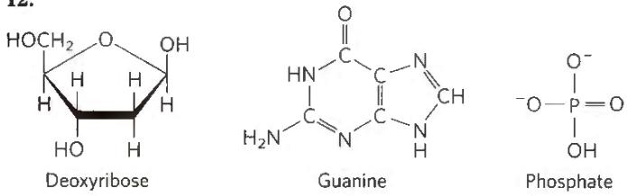

Solubilities: phosphate > deoxyribose > guanine. The highly polar phosphate groups and sugar moieties are on the outside of the double helix, exposed to water; the hydrophobic bases are in the interior of the helix.

## 13. Primer 1: CCTCGAGTCAATCGATGCTG

Primer 2: CGCGCACATCAGACGAACCA

Recall that all DNA sequences are written in the $5'\rightarrow3'$ direction, left to right; that DNA polymerase synthesizes DNA in the $5'\rightarrow3'$ direction; that the two strands of a DNA molecule are antiparallel; and that both PCR primers must target the end sequences so that their $3'$ ends are oriented toward the segment to be amplified.

## 14. (a) B (b) C (c) A

15. The primers can be used to probe libraries containing long genomic clones to identify contig ends that lie close to each other. If the contigs flanking the gap are close enough, the primers can be used in PCR to directly amplify the intervening DNA separating the contigs, which can then be cloned and sequenced.

16. The 3'-H would prevent addition of any subsequent nucleotides, so the sequence for each cluster would end after the first nucleotide addition.

17. If dCTP is omitted, when the first G residue is encountered in the template, ddCTP will be added, and polymerization will halt. Only one band will be seen in the sequencing gel.

18.  
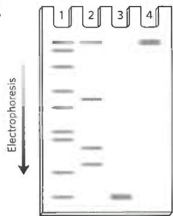

19. The products are:
(5')GCGCCAUUGC(3')—OH
(5')GCGCCAUUG(3')—OH
(5')GCGCCAUU(3')—OH
(5')GCGCCAU(3')—OH
(5')GCGCCA(3')—OH
(5')GCGCC(3')—OH
(5')GCGC(3')—OH
(5')GCG(3')—OH
(5')GC(3')—OH

and the nucleoside 5'-phosphates

20. (a) Water is a participant in most biological reactions, including those that cause mutations. The low water content in endospores reduces the activity of mutation-causing enzymes and slows the rate of nonenzymatic depurination reactions, which are hydrolysis reactions. (b) UV light induces formation of cyclobutane pyrimidine dimers. Because B. subtilis is a soil organism, spores can be lofted to the top of the soil or into the air, where they may be subject to prolonged UV exposure.

21. DMT is a blocking group that prevents reaction of the incoming base with itself.

22. (a) Right-handed. The base at one 5' end is adenine; at the other 5' end, cytosine. (b) Left-handed (c) If you cannot see the structures in stereo, use a search engine to find tips online.

23. (a) It would not be easy! The data for different samples from the same organism show significant variation, and the recovery is never 100%. The numbers for C and T show much more consistency than those for A and G, so for C and T it is much easier to make the case

that samples from the same organism have the same composition. But even with the less consistent values for A and G, (1) the range of values for different tissues does overlap substantially; (2) the difference between different preparations of the same tissue is about the same as the difference between samples from different tissues; and (3) in samples for which recovery is high, the numbers are more consistent. (b) This technique would not be sensitive enough to detect a difference between normal cells and cancerous cells. Cancer is caused by mutations, but these changes in DNA—a few base pairs out of several billion—would be too small to detect with these techniques. (c) The ratios of A:G and T:C vary widely among different species. For example, in the bacterium Serratia marcescens, both ratios are 0.4, meaning that the DNA contains mostly G and C. In Haemophilus influenzae, by contrast, the ratios are 1.74 and 1.54, meaning that the DNA is mostly A and T. (d) Conclusion 4 has three requirements. (1) A = T: The table shows an A:T ratio very close to 1 in all cases. Certainly, the variation in this ratio is substantially less than the variation in the A:G and T:C ratios. (2) G = C: Again, the G:C ratio is very close to 1, and the other ratios vary widely. (3) A + G = T + C: This is the purine:pyrimidine ratio, which also is very close to 1.

## Chapter 9

1. (a) $(5')$ --- G $(3')$ and $(5')$ AATTC --- $(3')$ $(3')$ --- CTTAA $(5')$ $(3')$ G --- $(5')$

(b) $(5')$ --- GAATT $(3')$ and $(5')$ AATTC --- $(3')$ $(3')$ --- CTTAA $(5')$ $(3')$ TTAAG --- $(5')$

(c) $(5')$ -- GAATTAATTC -- $(3')$ $(3')$ -- CTTAATTAAG -- $(5')$

(d) $(5')---G(3')$ and $(5')C---(3')$ $(3')---C(5')$ $(3')G---(5')$

(f) $(5')$ --- CAG $(3')$ and $(5')$ CTG --- $(3')$ $(3')$ --- GTC $(5')$ $(3')$ GAC --- $(5')$

(g) $(5^{\prime})$ --- CAGAATTC --- $(3^{\prime})$

(3') --- GTCTTAAG --- (5')

(h) Method 1: Cut the DNA with EcoRI as in (a), then treat the DNA as in (b) or (d), and then ligate a synthetic DNA fragment with the BamHI recognition sequence between the two resulting blunt ends. Method 2 (more efficient): Synthesize a DNA fragment with the structure

## (5')AATTGGATCC(3')

## (3')CCTAGGTTAA(5')

This would ligate efficiently to the sticky ends generated by EcoRI cleavage, would introduce a BamHI site, but would not regenerate the EcoRI site.

(i) The four fragments (with N = any nucleotide), in order of discussion in the problem, are

(5')AATTCNNNNCTGCA(3')
(3')GNNNNG(5')

(5')AATTCNNNNGTGCA(3')
(3')GNNNNC(5')

(5')AATTGNNNNCTGCA(3')
(3')CNNNNG(5')

(5')AATTGNNNNGTGCA(3')

(3')CNNNNC(5')

2. Yeast artificial chromosomes (YACs) are not stable in a cell unless they have two telomere-containing ends and a large DNA segment cloned into the chromosome. YACs less than 10,000 bp long are soon lost during continued mitosis and cell division.

3. (a) Plasmids in which the original pBR322 was regenerated without insertion of a foreign DNA fragment; these would retain resistance to ampicillin. Also, two or more molecules of pBR322 might be ligated together with or without insertion of foreign DNA.

(b) The clones in lanes 1 and 2 each have one DNA fragment inserted in different orientations. The clone in lane 3 has two DNA fragments, ligated such that the EcoRI proximal ends are joined.

## 4. (5')GAAAGTCCGCGTTATAGGCATG(3')

## (3')ACGTCTTTCAGGCGCAATATCCGTACTTAA(5')

5. Your test would require DNA primers, a heat-stable DNA polymerase, deoxynucleoside triphosphates, and a PCR machine (thermal cycler). The primers would be designed to amplify a DNA segment encompassing the CAG repeat. The DNA strand shown is the coding strand, oriented 5'→3', left to right. The primer targeted to DNA to the left of the repeat would be identical to any 25-nucleotide sequence shown in the region to the left of the CAG repeat. The primer on the right side must be complementary and antiparallel to a 25-nucleotide sequence to the right of the CAG repeat. Using the primers, DNA including the CAG repeat would be amplified by PCR, and its size would be determined by comparison with size markers after electrophoresis. The length of the DNA would reflect the length of the CAG repeat, providing a simple test for the disease.

6. Design PCR primers that are complementary to the DNA in the deleted segment but would direct DNA synthesis away from each other. No PCR product is generated unless the ends of the deleted segment are joined to create a circle.

7. The two proteins likely co-localize under nutrient starvation and possibly form a protein complex.

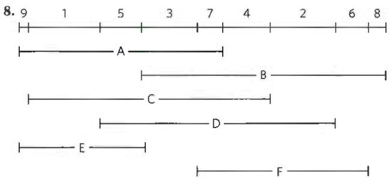

9. The production of labeled antibodies is difficult and expensive, and the labeling of every antibody to every protein target would be impractical. By labeling one antibody preparation for binding to all antibodies of a particular class, the same labeled antibody preparation can be used in many different immunofluorescence experiments.

10. Express the protein in yeast strain 1 as a fusion protein with one of the domains of Gal4p—say, the DNA-binding domain. Using yeast strain 2, make a library in which essentially every protein of the fungus is expressed as a fusion protein with the interaction domain of Gal4p. Mate strain 1 with the strain 2 library, and look for colonies that are colored due to expression of the reporter gene. These colonies will generally arise from mated cells containing a fusion protein that interacts with your target protein.

11. Reverse transcriptase is used to convert single-stranded RNA into double-stranded DNA in one of the early steps of RNA-Seq.

12. RNA-Seq detects noncoding RNAs. These have special functions, and they lack protein-coding sequences. Many RNAs encoded by eukaryotic genomes are not messenger RNAs. Instead, they are noncoding RNAs with a variety of functions. They need not possess an open reading frame as part of their sequence.

13. ATSAAGWDEWEGGKVLIHLDGKLQNRGALLELDIGAV

14. The pattern of haplotypes in the Aleut and Eskimo populations suggests that their ancestors' migration into the American Arctic regions was separate from the migrations that eventually populated the rest of North America and South America.

15. Interbreeding between the Denisovans and Homo sapiens must have occurred in Asia, sometime in the many millennia during which humans migrated from Africa to Asia and then to Australia and Melanesia.

16. The same disease condition can be caused by defects in two or more genes that are on different chromosomes.

17. (b) would act as a suitable primer pair for this transcript; (a) would form primer dimers because of the high number of complementary bases in the primers; (c) also exhibits significant self-complementarity and would have a very high melting point due to the C-G pairs; (d) also exhibits self-complementarity and would form stem-loops.

18. (a) DNA solutions are highly viscous because the very long molecules are tangled in solution. Shorter molecules tend to tangle less and form a less viscous solution, so decreased viscosity corresponds to shortening of the polymers—as caused by nuclease activity. (b) An endonuclease. An exonuclease removes single nucleotides from the 5' end or 3' end and would produce TCA-soluble ${}^{32}$ P-labeled nucleotides. An endonuclease cuts DNA into oligonucleotide fragments and produces little or no TCA-soluble ${}^{32}$ P-labeled material. (c) The 5' end. If the phosphate were left on the 3' end, the kinase would incorporate significant ${}^{32}$ P as it added phosphate to the 5' end; treatment with the phosphatase would have no effect on this. In this case, samples A and B would incorporate significant amounts of ${}^{32}$ P. When the phosphate is left on the 5' end, the kinase does not incorporate any ${}^{32}$ P: it cannot add a phosphate if one is already present. Treatment with the phosphatase removes 5' phosphate, and the kinase then incorporates significant amounts of ${}^{32}$ P. Sample A will have little or no ${}^{32}$ P, and B will show substantial ${}^{32}$ P incorporation—as was observed. (d) Random breaks would produce a distribution of fragments of random size. The production of specific fragments indicates that the enzyme is site-specific. (e) Cleavage at the site of recognition. This produces a specific sequence at the 5' end of the fragments. If cleavage occurred near but not within the recognition site, the sequence at the 5' end of the fragments would be random. (f) The results are consistent with two recognition sequences, as shown below, cleaved where shown by the arrows:

which gives the (5')pApApC and (3')TpTp fragments; and

which gives the $(5')$ pGpApC and $(3')$ CpTp fragments.

## Chapter 10

1. The term "lipid" does not specify a particular chemical structure. Compounds are categorized as lipids based on their greater solubility in organic solvents than in water.

20:6( $\Delta^{4,7,10,13,16,19}$ ) Docosahexaenoic acid (DHA)

3. (a) The number of cis double bonds. Each cis double bond causes a bend in the hydrocarbon chain, lowering the melting temperature. (b) Six different triacylglycerols can be constructed, in order of increasing melting points:

$$
\mathrm{OOO} <   \mathrm{OOP} = \mathrm{OPO} <   \mathrm{PPO} = \mathrm{POP} <   \mathrm{PPP}
$$

(c) where O = oleic and P = palmitic acid. The greater the content of saturated fatty acid, the higher the melting point. (d) Branched-chain fatty acids increase the fluidity of membranes because they decrease the extent of membrane lipid packing.

4. It reduces double bonds, which increases the melting point of lipids containing the fatty acids.

5. Long, saturated acyl chains, nearly solid at air temperatures, form a hydrophobic layer in which a polar compound such as $H_{2}O$ cannot dissolve or diffuse.

6. Spearmint is (R)-carvone; caraway is (S)-carvone.

7. The ${}^{18}$ O label appears in the fatty acid salts.

8. Hydrophobic units: (a) 2 fatty acids (b), (c), and (d) 1 fatty acid and the hydrocarbon chain of sphingosine (e) the steroid nucleus and acyl side chain. Hydrophilic units: (a) phosphoethanolamine (b) phosphocholine (c) D-galactose (d) several sugar molecules (e) alcohol group (-OH)

9. Serine

10.  

11. The part of the membrane lipid that determines blood type is the oligosaccharide in the head group of the membrane sphingolipids (see Fig. 10-13). This same oligosaccharide is attached to certain membrane glycoproteins, which also serve as points of recognition by the antibodies that distinguish blood groups.

12. (a) The free —OH group on C-2 and the phosphocholine head group on C-3 are hydrophilic; the fatty acid on C-1 of lysolecithin is hydrophobic. (b) Certain steroids, such as prednisone, inhibit the action of phospholipase A₂, inhibiting the release of arachidonic acid from C-2. Arachidonic acid is converted to a variety of eicosanoids, some of which cause inflammation and pain. (c) Phospholipase A₂ releases arachidonic acid, a precursor of other eicosanoids with vital protective functions in the body; it also breaks down dietary glycerophospholipids.

13. Diacylglycerol is hydrophobic and remains in the membrane. Inositol 1,4,5-trisphosphate is highly polar, very soluble in water, and more readily diffusible in the cytosol. Both are second messengers.

14.  

15. (a) Glycerol and the sodium salts of palmitic and stearic acids  
(b) D-Glycerol 3-phosphocholine and the sodium salts of palmitic and oleic acids

16. Solubility in water: monoacylglycerol > diacylglycerol > triacylglycerol

17. First eluted to last eluted: cholesteryl palmitate and triacylglycerol; cholesterol and n-tetradecanol; phosphatidylcholine and phosphatidylethanolamine; sphingomyelin; phosphatidylserine and palmitate. The lipids elute from the silica gel column in order of polarity. The least polar lipid will elute first and the most polar lipid will elute last.

18. (a) Subject acid hydrolysates of each compound to chromatography (GC or silica gel TLC), and compare the result with known standards. Sphingomyelin hydrolysate: sphingosine, fatty acids, phosphocholine, choline, and phosphate; cerebroside hydrolysate: sphingosine, fatty acids, sugars, but no phosphate. (b) Strong alkaline hydrolysis of sphingomyelin yields sphingosine; phosphatidylcholine yields glycerol. Detect hydrolysate components on thin-layer chromatograms by comparing with standards or by their differential reaction with FDNB (only sphingosine reacts to form a colored product). Treatment with phospholipase A $_{1}$ or A $_{2}$ releases free fatty acids from phosphatidylcholine, but not from sphingomyelin.

19. (a) Sphingosine (4.78); linoleic acid (5.88); stearic acid (6.33); cholesterol (7.68) (b) Log P describes the lipophilicity of the drug, crucial for determining how to formulate the drug for transport through aqueous compartments of the body such as the gut and the bloodstream. Log P also determines the likelihood of a drug being absorbed by fats and fatty tissues, which can alter its effectiveness, half-life, and potential toxicity.

20. (a) $\beta$ barrel (b) Phe, Trp, Tyr, Leu. All are hydrophobic or have nonpolar R groups. (c) The polar head group can hydrogen bond with water; the hydrocarbon tail cannot. Hydrophobic portions of the residues of the pocket protect the tail from contact with water as it moves through the bloodstream.

21. (a) GM1 and globoside. Both glucose and galactose are hexoses, so "hexose" in the molar ratio refers to glucose + galactose. The ratios for the four gangliosides are GM1, 1:3:1:1; GM2, 1:2:1:1; GM3, 1:2:0:1; globoside, 1:3:1:0. (b) Yes. The ratio matches GM2, the ganglioside expected to build up in Tay-Sachs disease (see Box 10-1, Fig. 1). (c) This analysis is similar to that used by Sanger to determine the amino acid sequence of insulin. The analysis of each fragment reveals only its composition, not its sequence, but because each fragment is formed by sequential removal of one sugar, we can draw conclusions about sequence. The structure of the normal asialoganglioside is ceramide-glucose-galactose-galactosamine-galactose, consistent with Box 10-1 (excluding Neu5Ac, removed before hydrolysis). (d) The Tay-Sachs asialoganglioside is ceramide-glucose-galactose-galactosamine, consistent with Box 10-1. (e) The structure of the normal asialoganglioside, GM1, is ceramide-glucose [2-OH involved in glycosidic links; 1-OH involved in ring structure; 3-OH (2, 3, 6) free for methylation]-galactose [2-OH in links; 1-OH in ring; 3-OH (2, 4, 6) free for methylation]-galactosamine [2-OH in links; 1-OH in ring; 1-NH₂ instead of -OH; 2-OH (4, 6) free for methylation]-galactose [1-OH in link; 1-OH in ring; 4-OH (2, 3, 4, 6) free for methylation]. (f) Two key pieces of information are missing: What are the linkages between the sugars? Where is Neu5Ac attached?

## Chapter 11

1. The area per molecule would be calculated from the known amount (number of molecules) of lipid used and the area occupied by a monolayer when it begins to resist compression (when the required force increases dramatically, as shown in the plot of force versus area).

2. (a) Lipids that form bilayers are amphipathic molecules: they contain a hydrophilic region and a hydrophobic region. To minimize the hydrophobic area exposed to the water surface, these lipids form two-dimensional sheets, with the hydrophilic regions exposed to water and the hydrophobic regions buried in the interior of the sheet. Furthermore, to avoid exposing the hydrophobic edges of the sheet to water, lipid bilayers close on themselves. (b) These sheets form the closed membrane surfaces that envelop cells and compartments within cells (organelles).

3. 2 nm. Two palmitates placed end to end span about 4 nm, approximately the thickness of a typical bilayer.

4. Integral proteins are firmly embedded in the lipid bilayer and can be released only by treating membranes with a detergent or nonpolar solvent. Peripheral membrane proteins are more easily released, by changes in pH, metal ion concentration, or protein-denaturing reagents like urea. Amphitropic membrane proteins are loosely and reversibly associated with membranes and move between membrane and cytosol as part of their function.

5. Salt extraction indicates a peripheral location, and inaccessibility to protease in intact cells indicates an internal location. Protein X is likely to be a peripheral protein on the cytosolic face of the membrane.

6. Construct a hydropathy plot; hydrophobic regions of 20 or more residues suggest transmembrane segments. Determine whether the protein in intact erythrocytes reacts with a membrane-impermeant reagent specific for primary amines; if it does, the transporter's amino terminus is on the outside of the cell.

7. \~4%; estimated by calculating the surface area of the cell and of 10,000 transporter molecules

8. -22. To estimate the fraction of membrane surface covered by phospholipids, you would need to know (or estimate) the average cross-sectional area of a phospholipid molecule in a bilayer (e.g., from an experiment such as that described in Problem 1 in this chapter) and the average cross-sectional area of a $50\mathrm{kDa}$ protein.

9. Rate of diffusion would decrease. Movement of individual lipids in bilayers occurs much faster at $37^{\circ}$ C, when the lipids are in the "fluid" phase, than at $10^{\circ}$ C, when they are in the "solid" phase. This effect is more pronounced than the usual decrease in Brownian motion with decreased temperature.

10. Interactions among membrane lipids are due to the hydrophobic effect, noncovalent and reversible, allowing membranes to spontaneously reseal.

11. The temperature of body tissues at the extremities is lower than that of tissues closer to the center of the body. If lipid is to remain fluid at this lower temperature, it must contain a higher proportion of unsaturated fatty acids; unsaturated fatty acids lower the melting point of lipid mixtures.

12. There is a very high energetic barrier to taking the polar head of a membrane lipid through the hydrocarbon core. Higher temperatures might make it more likely to occur, as would the presence of a catalyst, such as a flippase, a floppase, or a scramblase protein.

13. The energetic cost of moving the highly polar, sometimes charged, head group through the hydrophobic interior of the bilayer is prohibitive.

14. Scramblases catalyze the transport of membrane lipids from one membrane leaflet to the other. The reaction is ATP-independent, driven by a transbilayer lipid gradient. Scramblases cannot create an asymmetric distribution of lipids across the bilayer. Flippases catalyze the ATP-dependent transport of aminophospholipids (phosphatidylserine and phosphatidylethanolamine) from the extracellular or lumenal leaflet of a membrane to the cytosolic leaflet.

15. At pH 7, tryptophan bears both a positive charge and a negative charge, but indole is uncharged. The movement of the less polar indole through the hydrophobic core of the bilayer is energetically more favorable.

16. The transporter has a $K_{t}$ greater than 0.2 mm and it is a cotransporter, a symporter with $Na^{+}$ .

17.  
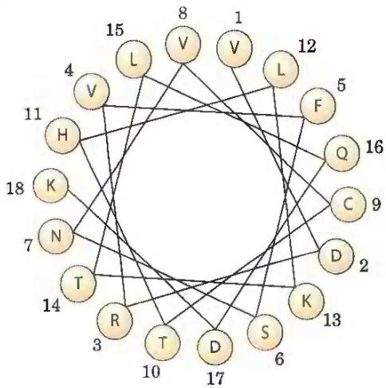

The amino acids with the greatest hydropathy index (V, L, F, and C) are clustered on one side of the helix. This amphipathic helix is likely to dip into the lipid bilayer along its hydrophobic surface while exposing its other surface to the aqueous phase. Alternatively, a group of helices may cluster with their polar surfaces in contact with one another and their hydrophobic surfaces facing the lipid bilayer.

## 18. 0.60 mol

19. Valinomycin is an ionophore that will carry $K^{+}$ across the plasma membrane, deflating the membrane potential that is normally achieved by the unequal pumping of $Na^{+}$ and $K^{+}$ by the $Na^{+}K^{+}$ ATPase.

## 20. 13 kJ/mol

21. Most of the $O_{2}$ consumed by a tissue is for oxidative phosphorylation, the source of most of the ATP. Therefore, about two-thirds of the ATP synthesized by the kidney is used for pumping $K^{+}$ and $Na^{+}$ .

22. Under normal conditions, the $Na^{+}Ca^{2+}$ exchanger pumps $Ca^{2+}$ out as it allows $Na^{+}$ to move inward. The excess of $Na^{+}$ on the outside is created by the $Na^{+}K^{+}$ ATPase. When that enzyme is blocked with digoxin, the $Na^{+}$ gradient is depleted, and with it, the driving force for $Ca^{2+}$ exit. So $Ca^{2+}$ would flow down its gradient, entering the cell. This (increased $Ca^{2+}$ concentration) is generally lethal for the cell.

23. No. The symporter may carry more than one equivalent of $Na^{+}$ for each mole of glucose transported.

24. Treat a suspension of cells with unlabeled NEM in the presence of excess lactose, remove the lactose, then add radiolabeled NEM. Use SDS-polyacrylamide gel electrophoresis (SDS-PAGE) to determine the $M_{r}$ of the radiolabeled band (the transporter).

25. ATP-dependence signifies active transport; $[Na^{+}]$ -independence suggests primary transport.

26. The leucine transporter is specific for the L isomer, but the binding site can accommodate either L-leucine or L-valine. Reduction of $V_{max}$ in the absence of $Na^{+}$ indicates that leucine (or valine) is transported by symport with $Na^{+}$ . By depleting the $Na^{+}$ gradient, ouabain would inhibit L-leucine uptake.

27. The $K^{+}$ channel has a “pore” that allows $K^{+}$ to diffuse through the channel, stabilized by its interaction with the carbonyl oxygens of the amino acids that line the pore. $Na^{+}$ is smaller than $K^{+}$ , so it is not sterically hindered from passage through the pore, but $Na^{+}$ is too small to interact with the carbonyl oxygens, so it is not stabilized by that interaction.

28. $V_{max}$ increases; $K_{t}$ is unaffected.

29. (a) Glycophorin A: 1 transmembrane segment; myoglobin: no segments long enough to cross a membrane (not a membrane protein); aquaporin: 6 transmembrane segments (may be a membrane channel or a receptor protein) (b) The 15 residue window provides a better

signal-to-noise ratio. (c) A narrower window reduces the impact of "edge effects" when a transmembrane sequence occurs near either end of the protein.

30. (a) The rise per residue for an $\alpha$ helix (Chapter 4) is about $1.5\AA = 0.15\mathrm{nm}$ . To span a $4\mathrm{nm}$ bilayer, an $\alpha$ helix must contain about 27 residues; thus, for seven spans, about 190 residues are required. A protein of $M_{\mathrm{r}}64,000$ has about 580 residues. (b) A hydropathy plot is used to locate transmembrane regions. (c) Because about half of this portion of the receptor consists of charged residues, it probably represents an intracellular loop that connects two adjacent membrane-spanning regions of the protein. (d) Because this helix is composed mostly of hydrophobic residues, this portion of the receptor is probably one of the membrane-spanning regions of the protein.

31. (a) Model A: supported. The two dark lines are either the protein layers or the phospholipid heads, and the clear space is either the bilayer or the hydrophobic core, respectively. Model B: not supported. This model requires a more-or-less uniformly stained band surrounding the cell. Model C: supported, with one reservation. The two dark lines are the phospholipid heads; the clear zone is the tails. This assumes that the membrane proteins are not visible, because they do not stain with osmium or do not happen to be in the sections viewed.

(b) Model A: supported. A "naked" bilayer (4.5 nm) + two layers of protein (2 nm) sums to 6.5 nm, which is within the observed range of thickness. Model B: neither. This model makes no predictions about membrane thickness. Model C: unclear. The result is hard to reconcile with this model, which predicts a membrane as thick as, or slightly thicker than (due to the projecting ends of embedded proteins), a "naked" bilayer. The model is supported only if the smallest values for membrane thickness are correct or if a substantial amount of protein projects from the bilayer.

(c) Model A: unclear. The result is hard to reconcile with this model. If the proteins are bound to the membrane by ionic interactions, the model predicts that the proteins contain a high proportion of charged amino acids, in contrast to what was observed. Also, because the protein layer must be very thin (see (b)), there would not be much room for a hydrophobic protein core, so hydrophobic residues would be exposed to the solvent. Model B: supported. The proteins have a mixture of hydrophobic residues (interacting with lipids) and charged residues (interacting with water). Model C: supported. The proteins have a mixture of hydrophobic residues (anchoring in the membrane) and charged residues (interacting with water).

(d) Model A: unclear. The result is hard to reconcile with this model, which predicts a ratio of exactly 2.0; this would be hard to achieve under physiologically relevant pressures. Model B: neither. This model makes no predictions about amount of lipid in the membrane. Model C: supported. Some membrane surface area is taken up with proteins, so the ratio would be less than 2.0, as was observed under more physiologically relevant conditions.

(e) Model A: unclear. The model predicts proteins in extended conformations rather than globular conformations, so is supported only if one assumes that proteins layered on the surfaces include helical segments. Model B: supported. The model predicts mostly globular proteins (containing some helical segments). Model C: supported. The model predicts mostly globular proteins.

(f) Model A: unclear. The phosphorylamine head groups are protected by the protein layer, but only if the proteins completely cover the surface will the phospholipids be completely protected from phospholipase. Model B: supported. Most head groups are accessible to phospholipase.

Model C: supported. All head groups are accessible to phospholipase.

(g) Model A: not supported. Proteins are entirely accessible to trypsin digestion, and virtually all will undergo multiple cleavage, with no protected hydrophobic segments. Model B: not supported. Virtually all proteins are in the bilayer and inaccessible to trypsin. Model C: supported. Segments of protein that penetrate or span the bilayer are protected from trypsin; those exposed at the surfaces will be cleaved. The trypsin-resistant portions have a high proportion of hydrophobic residues.

## Chapter 12

1. X is cAMP; its production is stimulated by epinephrine.
(a) Centrifugation sediments adenylyl cyclase (which catalyzes cAMP formation) in the particulate fraction. (b) Added cAMP stimulates glycogen phosphorylase. (c) cAMP is heat-stable; it can be prepared by treating ATP with barium hydroxide.

2. Unlike cAMP, dibutyryl cAMP passes readily through the plasma membrane.

3. (a) It increases [cAMP]. (b) cAMP regulates $\mathrm{Na}^{+}$ permeability. (c) Replace lost body fluids and electrolytes.

4. (a) The mutation makes R unable to bind and inhibit C, so C is constantly active. (b) The mutation prevents cAMP binding to R, leaving C inhibited by bound R.

5. Albuterol raises [cAMP], leading to relaxation and dilation of the bronchi and bronchioles. Because $\beta$ -adrenergic receptors control many other processes, this drug would have undesirable side effects. To minimize these effects, find an agonist specific for the subtype of $\beta$ -adrenergic receptors found in bronchial smooth muscle.

6. Hormone degradation; hydrolysis of GTP bound to a G protein; degradation, metabolism, or sequestration of second messenger; receptor desensitization; removal of receptor from the cell surface.

7. Fuse CFP to $\beta$ -arrestin and fuse YFP to the cytoplasmic domain of the $\beta$ -adrenergic receptor, or vice versa. In either case, illuminate at 433 nm and observe fluorescence at both 476 nm and 527 nm. If the interaction occurs, emitted light intensity will decrease at 476 nm and increase at 527 nm upon addition of epinephrine to cells expressing the fusion proteins. If the interaction does not occur, the wavelength of emitted light will remain at 476 nm. Some reasons why this might fail: the fusion proteins (1) are inactive or otherwise unable to interact, (2) are not translocated to their normal subcellular location, or (3) are not stable to proteolytic breakdown.

8. Vasopressin acts by elevating cytosolic $[Ca^{2+}]$ to $10^{-6}M$ , activating protein kinase C. EGTA injection blocks vasopressin action but should not affect the response to glucagon, which uses cAMP, not $Ca^{2+}$ , as second messenger.

9. Amplify: (a), (b), (e), (f). Terminate: (c), (d), (f). (f) can contribute to both.

10. IRS1, Grb2, Sos, Ras, Raf, MEK, ERK

11. A mutation in ras that inactivated the Ras GTPase activity would create a protein that, once activated by the binding of GTP, would continue to give, through Raf, the insulin-response signal.

12. Shared properties of Ras and $G_{s}$ : Both bind either GDP or GTP; both are activated by GTP; both, when active, activate a downstream enzyme; both have intrinsic GTPase activity that shuts them off after a short period of activation. Differences: Ras is a small, monomeric protein; $G_{s}$ is heterotrimeric. Functional difference between $G_{s}$ and $G_{i}$ : $G_{s}$ activates adenylyl cyclase; $G_{i}$ inhibits it.

13. Kinase (factor in parentheses): PKA (cAMP); PKG (cGMP); PKC (Ca $^{2+}$ , DAG); Ca $^{2+}$ /CaM kinase (Ca $^{2+}$ , CaM); cyclin-dependent kinase (cyclin); receptor Tyr kinase (ligand for the receptor, such as insulin); MAPK (Raf); Raf (Ras); glycogen phosphorylase kinase (PKA).

14. $G_{s}$ remains in its activated form when the nonhydrolyzable analog is bound. The analog therefore prolongs the effect of epinephrine on the injected cell.

15. Individuals with Oguchi disease might have a defect in rhodopsin kinase or in arrestin.

16. Rod cells would no longer show any change in membrane potential in response to light. This experiment has been done. Illumination did activate PDE, but the enzyme could not significantly reduce the 8-Br-cGMP level, which remained well above that needed to keep the gated ion channels open. Thus, light had no impact on membrane potential.

17. Insulin increases glycogen synthesis.

18. Nearly every component of the $\beta$ -adrenergic and insulin receptor signaling pathways communicates signal activation by some connection through an IDR. The activation loop of protein kinases is an IDR, and the carboxyl-terminal end of most of the protein kinases in those pathways is an IDR. AKAPs and other scaffold proteins serve as anchors to hold pathway components in proximity. Phosphorylation/dephosphorylation of IDRs serves as a switch for the ability of the target proteins to associate.

19. (b), (c), (e), (d), (a)

20. (a) On exposure to heat, TRPV1 channels open, causing an influx of $Na^{+}$ and $Ca^{2+}$ into the sensory neuron. This depolarizes the neuron, triggering an action potential. When the action potential reaches the axon terminus, neurotransmitter is released, signaling to the nervous system that heat has been sensed. (b) Capsaicin mimics the effects of heat by opening TRPV1 at low temperatures, leading to the false sensation of heat. The extremely low $EC_{50}$ indicates that even very small amounts of capsaicin will have dramatic sensory effects. (c) At low levels, menthol should open the TRPM8 channel, leading to a sensation of cool; at high levels, both TRPM8 and TRPV3 open, leading to a mixed sensation of cool and heat, such as you may have experienced with very strong peppermints.

21. (a) These mutations might lead to permanent activation of the $PGE_{2}$ receptor, leading to unregulated cell division and tumor formation. (b) The viral gene might encode a constitutively active form of the receptor, causing a constant signal for cell division and thus tumor formation. (c) E1A protein might bind to pRb and prevent E2F from binding, so E2F is constantly active and cells divide uncontrollably. (d) Lung cells do not normally respond to $PGE_{2}$ because they do not express the $PGE_{2}$ receptor; mutations resulting in a constitutively active $PGE_{2}$ receptor would not affect lung cells.

22. A normal tumor suppressor gene encodes a protein that restrains cell division. A mutant form of the protein fails to suppress cell division, but if either of the two alleles in an individual encodes a normal protein, normal function will continue. A normal oncogene encodes a regulator protein that triggers cell division, but only when an appropriate signal (growth factor) is present. The mutant version of the oncogene product constantly sends the signal to divide, whether or not growth factors are present.

23. In a child who develops multiple tumors in both eyes, every retinal cell had a defective copy of the Rb gene at birth. Early in the child's life, several cells independently underwent a second mutation that damaged the one good Rb allele, producing a tumor. A child who develops a single tumor had, at birth, two good copies of the Rb gene in every cell; mutation in both Rb alleles in one cell (extremely rare) caused the single tumor.

24. Two cells expressing the same surface receptor may have access to different complements of target proteins for protein phosphorylation and therefore have different responses to the same signal.

25. (a) The data favor the cell-based model, which predicts different receptors present on different cells. (b) This experiment addresses the issue of the independence of different taste sensations. Even though the receptors for sweet and/or umami are missing, the animals' other taste sensations are normal; thus, pleasant and unpleasant taste sensations are independent. (c) Yes. Loss of either T1R1 or T1R3 subunits abolishes umami taste sensation. (d) Both models. With either model, removing one receptor would abolish that taste sensation. (e) Yes. Loss of either the T1R2 or T1R3 subunits almost completely abolishes the sweet taste sensation; complete elimination of sweet taste requires deletion of both subunits. (f) At very high sucrose concentrations, T1R2 and, to a lesser extent, T1R3 receptors, as homodimers, can detect sweet taste. (g) The results are consistent with either model of taste encoding, but they do strengthen the researchers' conclusions. Ligand binding can be completely separated from taste sensation. If the ligand for the receptor in "sweet-tasting cells" binds a molecule, mice prefer that molecule as a sweet compound.

## Chapter 13

1. Consider the developing chick as the system; the nutrients, egg shell, and outside world are the surroundings. Transformation of the single cell into a chick drastically reduces the entropy of the system. Initially, the parts of the egg outside the embryo (the surroundings) contain complex fuel molecules (a low-entropy condition). During incubation, some of these complex molecules are converted to large numbers of $CO_{2}$ and $H_{2}O$ molecules (high entropy). This increase in the entropy of the surroundings is larger than the decrease in entropy of the chick (the system).

2. (a) -4.8 kJ/mol (b) 7.56 kJ/mol (c) -13.7 kJ/mol

3. (a) 262 (b) 608 (c) 0.30

4. $K_{eq}^{\prime}=21;\Delta G^{\circ}=-7.6\ kJ/mol$

5. -31 kJ/mol

6. (a) $-1.68\mathrm{kJ / mol}$ (b) $-4.4\mathrm{kJ / mol}$ (c) At a given temperature, the value of $\Delta G^{\prime \circ}$ for any reaction is fixed and is defined for standard conditions (here, both fructose 6-phosphate and glucose 6-phosphate at $1\textrm{M}$ ). In contrast, $\Delta G$ is a variable that can be calculated for any set of reactant and product concentrations.

7. $K_{\mathrm{eq}}^{\prime} \approx 1; \Delta G^{\prime \circ} \approx 0$

8. Less. The overall equation for ATP hydrolysis can be approximated as

$$
\mathrm{ATP} ^ {4 -} + \mathrm{H} _ {2} \mathrm{O} \rightarrow \mathrm{ADP} ^ {3 -} + \mathrm{HPO} _ {4} ^ {2 -} + \mathrm{H} ^ {+}
$$

(This is only an approximation, because the ionized species shown here are the major, but not the only, forms present.) Under standard conditions ([ATP] = [ADP] = [P $_{i}$ ] = 1 M), the concentration of water is 55 M and does not change during the reaction. Because H $^{+}$ ions are produced in the reaction, at a higher [H $^{+}$ ] (pH 5.0) the equilibrium would be shifted to the left and less free energy would be released.

9.10

10.  
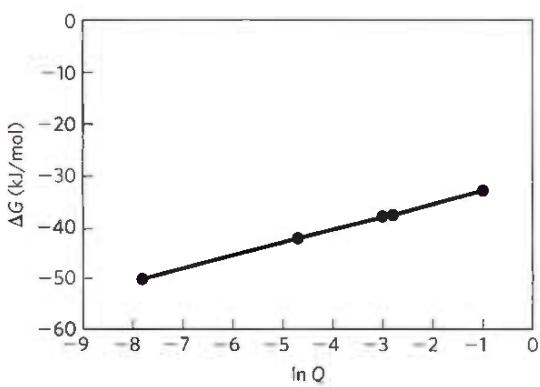

$\Delta G$ for ATP hydrolysis is lower when [ATP]/[ADP] is low ( $\ll 1$ ) than when [ATP]/[ADP] is high. Less energy is available to the cell from a given [ATP] when the [ATP]/[ADP] ratio falls and more is available when it rises.

11. (a) $4.74 \times 10^{-3} \mathrm{M}^{-1}$ ; [glucose 6-phosphate] = $1.1 \times 10^{-7} \mathrm{M}$ . No. The cellular [glucose 6-phosphate] is much greater than this, favoring the reverse reaction. (b) $11 \mathrm{M}$ . No. The maximum solubility of glucose is less than $1 \mathrm{M}$ . (c) $651 (\Delta G^{\circ} = -16.7 \mathrm{kJ/mol})$ ; [glucose] = $1.5 \times 10^{-7} \mathrm{M}$ . Yes. This reaction path can occur with a concentration of glucose that is readily soluble and does not produce a large osmotic force. (d) No. This would require such high $[\mathbf{P}_i]$ that the phosphate salts of divalent cations would precipitate. (e) By directly transferring the phosphoryl group from ATP to glucose, the phosphoryl group transfer potential ("tendency" or "pressure") of ATP is utilized without generating high concentrations of intermediates. The essential part of this transfer is, of course, the enzymatic catalysis.

12. (a) -12.5 kJ/mol (b) -14.6 kJ/mol

13. (a) $3.16 \times 10^{-4}$ (b) 68.7 (c) $7.39 \times 10^{4}$

14. -13 kJ/mol

## 15. 46.7 kJ/mol

16. Isomerization moves the carbonyl group from C-1 to C-2, setting up a carbon-carbon bond cleavage between C-3 and C-4. Without isomerization, bond cleavage would occur between C-2 and C-3, generating one two-carbon compound and one four-carbon compound.

17. The mechanism is the same as that of the alcohol dehydrogenase reaction (see Fig. 14-12).

18. The first step is the reverse of an aldol condensation (see the aldolase mechanism, Fig. 14-5); the second step is an aldol condensation (see Fig. 13-4).

19. (a) Oxidation-reduction, dehydrogenase with NAD cofactor; $\mathrm{NADH} + \mathrm{H}^{+}$ also produced (b) Isomerization, isomerase (c) Internal rearrangement, isomerase (d) Phosphoryl group transfer, kinase and ATP; ADP produced (e) Hydrolysis, protease or peptidase and $\mathrm{H}_2\mathrm{O}$ (f) Oxidation-reduction, dehydrogenase with NAD cofactor; $\mathrm{NADH} + \mathrm{H}^{+}$ also produced (g) Oxidation-reduction, dehydrogenase with NAD cofactor and $\mathrm{H}_2\mathrm{O}$ ; $\mathrm{NADH} + \mathrm{H}^{+}$ also produced

20. ATP; the products of phosphoarginine hydrolysis are stabilized by resonance forms not available in the intact molecule.

21. Yes. If [ADP] and [polyphosphate] are kept high, and [ATP] is kept low, the actual free-energy change would be negative.

22. (a) 46 kJ/mol (b) 46 kg; 68% (c) ATP is synthesized as it is needed, then broken down to ADP and $P_{i}$ ; its concentration is maintained in a steady state.

23. The ATP system is in a dynamic steady state; [ATP] remains constant because the rate of ATP consumption equals its rate of synthesis. ATP consumption involves release of the terminal ( $\gamma$ ) phosphoryl group; synthesis of ATP from ADP involves replacement of this group. Hence the terminal phosphoryl undergoes rapid turnover. In contrast, the central ( $\beta$ ) phosphoryl undergoes only relatively slow turnover.

24. (a) 1.7 kJ/mol (b) Inorganic pyrophosphatase catalyzes the hydrolysis of pyrophosphate and drives the net reaction toward the synthesis of acetyl-CoA.

25. Although all the options are possible in principle, the production of AMP and PP $_{i}$ in the reaction tells us that AMP is the activating group.
26. 36 kJ/mol

27. (d) (a) (c) (b)

28. (a) $NAD^{+}/NADH$ (b) Pyruvate/lactate (c) Lactate formation (d) -26.1 kJ/mol (e) $3.63 \times 10^{4}$

29. (a) Initially, electrons will be given up by lactate (converting it to pyruvate) and will flow to fumarate, converting it to succinate. (b) -42 kJ/mol (c) The four reactants have reached their equilibrium concentrations; $\Delta G = 0$ .

30. (a) 1.14 V (b) -220 kJ/mol (c) \~4

31. (a) -0.35 V (b) -0.320 V (c) -0.29 V

32. In order of increasing tendency: (a), (d), (b), (c)

33. (c) and (d)

34. (a) 0.0293 (b) 308 (c) Q is much lower than $K_{eq}^{\prime}$ , indicating that the PFK-1 reaction is far from equilibrium in cells; this reaction is slower than the subsequent reactions in glycolysis. Flux through the glycolytic pathway is largely determined by the activity of PFK-1.

35. (a) $1.4 \times 10^{-9}$ M (b) The physiological concentration (0.023 mm) is 16,000 times the equilibrium concentration; this reaction does not reach equilibrium in the cell. Many reactions in the cell are not at equilibrium.

36. Malate synthase is saturated with the substrate acetyl-CoA; its concentration is almost $10^{2}$ greater than $K_{m}$ for acetyl-CoA. But we are not given the concentration or $K_{m}$ of its other substrate (glyoxylate). If [glyoxylate] is below the $K_{m}$ for glyoxylate, the reaction rate is limited by [glyoxylate], and malate synthase is not operating at $V_{max}$ .

37. (a) The lowest-energy, highest-entropy state occurs when the dye concentration is the same in both cells. If a "fish trap" gap junction allowed unidirectional transport, more of the dye would end up in the oligodendrocyte and less in the astrocyte. This would be a higher-energy, lower-entropy state than the starting state, violating the second law of thermodynamics. The model proposed by Robinson et al. requires an impossible spontaneous change from a lower-energy state to a higher-energy state without an energy input—again, thermodynamically impossible. (b) Molecules, unlike fish, do not exhibit directed behavior; they move randomly by Brownian motion. Diffusion results in net movement of molecules from a region of higher concentration to a region of lower concentration simply because it is more likely that a molecule on the high-concentration side will enter the connecting channel. The narrower end, like the rate-limiting step of a metabolic pathway, limits the rate at which molecules pass through; random motion of the molecules is less likely to move them through the smaller cross section. The wide end of the channel does not act like a funnel for molecules because the narrow end limits the rate of movement equally in both directions. When the concentrations on both sides are equal, the rates of movement in both directions are equal and there will be no change in concentration. (c) Fish exhibit nonrandom behavior. Fish behavior favors forward movement and avoids crowding and narrow places. Fish that enter the large opening of the channel tend to move forward but then are unlikely to enter the small opening because of their preferred behavior. (d) Here are two of many possible explanations: (1) The dye could bind to a molecule in the oligodendrocyte. Binding effectively removes the dye from the bulk solvent, yet it remains visible in the fluorescence microscope. (2) The dye could be sequestered in a subcellular organelle of the oligodendrocyte, either actively pumped in at the expense of ATP or drawn in by its attraction to other molecules in that organelle.

## Chapter 14

1. At equilibrium,

$K_{\mathrm{eq}} = 7.8 \times 10^{2} = [\mathrm{ADP}][\mathrm{glucose} 6\text{-phosphate}] / [\mathrm{ATP}][\mathrm{glucose}]$

In living cells, [ADP][glucose 6-phosphate]/[ATP][glucose] = (0.5 mm)(1 mm)/(5 mm)(2 mm) = 0.05. The reaction is therefore far from equilibrium: the cellular concentrations of the products (glucose 6-phosphate and ADP) are much lower than expected at equilibrium, and those of the reactants are much higher. The reaction therefore tends strongly to go to the right.

2. Net equation: Glucose + 2ATP → 2 glyceraldehyde 3-phosphate + 2ADP; $\Delta G^{\prime\circ} = 2.1$ kJ/mol

3. Net equation: 2 Glyceraldehyde 3-phosphate + 4ADP + 2P $_{i}$ → 2 lactate + 4ATP + 2H $_{2}$ O; ΔG''° = -114 kJ/mol

4. -8.6 kJ/mol

5. C-1. This experiment demonstrates the reversibility of the aldolase reaction. The C-1 of glyceraldehyde 3-phosphate is equivalent to C-4 of fructose 1,6-bisphosphate (see Fig. 14-6). The starting glyceraldehyde 3-phosphate must have been labeled at C-1. The C-3 of dihydroxyacetone phosphate becomes labeled through the triose phosphate isomerase reaction, thus giving rise to fructose 1,6-bisphosphate labeled at C-3.

6. No. There would be no anaerobic production of ATP; aerobic ATP production would be diminished only slightly.

7. No. Lactate dehydrogenase is required to recycle $NAD^{+}$ from the NADH formed during the oxidation of glyceraldehyde 3-phosphate.

8. The transformation of glucose to lactate occurs when myocytes are low in oxygen, and it provides a means of generating ATP under $O_{2}$ -deficient conditions. Because lactate can be oxidized to pyruvate, glucose is not wasted; pyruvate is oxidized by aerobic reactions when $O_{2}$ becomes plentiful. This metabolic flexibility gives the organism a greater capacity to adapt to its environment.

9. The cell rapidly removes the 1,3-bisphosphoglycerate in a favorable subsequent step, catalyzed by phosphoglycerate kinase.

10. (a) 3-Phosphoglycerate would be the product. (b) In the presence of arsenate, there is no net ATP synthesis under anaerobic conditions.

11. (a) Ethanol fermentation requires 2 mol of $P_{i}$ per mole of glucose.
(b) Ethanol is the reduced product formed during reoxidation of NADH to $NAD^{+}$ , and $CO_{2}$ is the byproduct of the conversion of pyruvate to ethanol. Yes. Pyruvate must be converted to ethanol to produce a continuous supply of $NAD^{+}$ for the oxidation of glyceraldehyde 3-phosphate. Fructose 1,6-bisphosphate accumulates; it is formed as an intermediate in glycolysis. (c) Arsenate replaces $P_{i}$ in the glyceraldehyde 3-phosphate dehydrogenase reaction to yield an acyl arsenate, which spontaneously hydrolyzes. This prevents formation of ATP, but 3-phosphoglycerate continues through the pathway.

12. Dietary niacin is used to synthesize $NAD^{+}$ . Oxidations carried out by $NAD^{+}$ are part of cyclic processes, with $NAD^{+}$ as electron carrier (reducing agent); one molecule of $NAD^{+}$ can oxidize many thousands of molecules of glucose, and thus the dietary requirement for the precursor vitamin (niacin) is relatively small.

13. Dihydroxyacetone phosphate + NADH + H $^{+}$ → glycerol 3-phosphate + NAD $^{+}$ (catalyzed by a dehydrogenase)

14. Galactokinase deficiency: galactose (less toxic); transferase deficiency: galactose 1-phosphate (more toxic)

15. Consumption of alcohol forces competition for $NAD^{+}$ between ethanol metabolism and gluconeogenesis. The problem is compounded by strenuous exercise and lack of food, because at these times the level of blood glucose is already low.

16. (a) The rapid increase in glycolysis; the rise in pyruvate and NADH results in a rise in lactate. (b) Lactate is transformed to glucose via pyruvate. This is a slower process because formation of pyruvate is limited by $NAD^{+}$ availability, the lactate dehydrogenase equilibrium is in favor of lactate, and conversion of pyruvate to glucose is energy-requiring. (c) The equilibrium for the lactate dehydrogenase reaction is in favor of lactate formation.

17. Lactate is transformed to glucose in the liver by gluconeogenesis (see Fig. 14-16). A defect in FBPase-1 would prevent entry of lactate into the gluconeogenic pathway in hepatocytes, causing lactate to accumulate in the blood.

18. In the absence of $O_{2}$ , the ATP needs are met by anaerobic glucose metabolism (fermentation to lactate). Because aerobic oxidation of glucose produces far more ATP than does fermentation, less glucose is needed to produce the same amount of ATP.

19. (a) There are two binding sites for ATP: a catalytic site and a regulatory site. Binding of ATP to a regulatory site inhibits PFK-1, by reducing $V_{max}$ or increasing $K_{m}$ for ATP at the catalytic site.
(b) Glycolytic flux is reduced when ATP is plentiful. (c) The graph indicates that increased [ADP] suppresses the inhibition by ATP. Because the adenine nucleotide pool is fairly constant, consumption of ATP leads to an increase in [ADP]. The data show that the activity of PFK-1 may be regulated by the [ATP]/[ADP] ratio.

20. The phosphate group of glucose 6-phosphate is completely ionized at pH 7, giving the molecule an overall negative charge. Because membranes are generally impermeable to electrically charged molecules, glucose 6-phosphate cannot pass from the bloodstream into cells and hence cannot enter the glycolytic pathway and generate ATP. (This is why glucose, once phosphorylated, cannot escape from the cell.)

21. $\mathrm{CH}_3\mathrm{CHO} + \mathrm{NADH} + \mathrm{H}^+ \rightleftharpoons \mathrm{CH}_3\mathrm{CH}_2\mathrm{OH} + \mathrm{NAD}^+ K_{\mathrm{eq}}' = 1.45 \times 10^{4}$ 22. (a) $^{14}\mathrm{CH}_3\mathrm{CH}_2\mathrm{OH}$ (b) [3-14C]glucose or [4-14C]glucose

When aldolase splits glucose into two trioses phosphates, C-3 and C-4 of glucose become C-1 of the glyceraldehyde 3-phosphate that proceeds through glycolysis.

23. Fermentation releases energy, some conserved in the form of ATP but much of it dissipated as heat. Unless the fermenter contents are cooled, the temperature would become high enough to kill the microorganisms.

24. Soybeans and wheat contain starch, a polymer of glucose. The microorganisms break down starch to glucose, glucose to pyruvate via glycolysis, and — because the process is carried out in the absence of $O_{2}$ (i.e., it is a fermentation)—pyruvate to lactate and ethanol. If $O_{2}$ were present, pyruvate would be oxidized to acetyl-CoA, then to $CO_{2}$ and $H_{2}O$ . Some of the acetyl-CoA, however, would also be hydrolyzed to acetic acid (vinegar) in the presence of oxygen.

25. (a), (b), and (d) are glucogenic; (c) and (e) are not.

26. (a) In the pyruvate carboxylase reaction, ${}^{14}CO_{2}$ is added to pyruvate, but PEP carboxykinase removes the same $CO_{2}$ in the next step. Thus, ${}^{14}C$ is not (initially) incorporated into glucose.

(b)

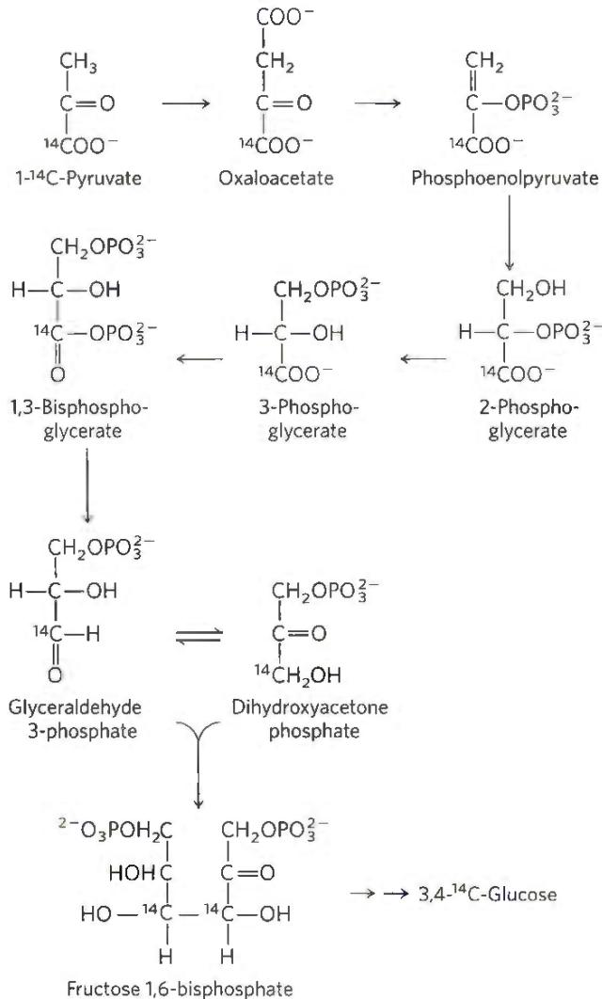

27. 4 ATP equivalents per glucose molecule

28. Gluconeogenesis would be highly endergonic, and it would be impossible to separately regulate gluconeogenesis and glycolysis.

29. The cell "spends" 1 ATP and 1 GTP in converting pyruvate to PEP.
30. The proteins are degraded to amino acids and used for gluconeogenesis.

31. Succinate transforms to oxaloacetate, which passes into the cytosol and is converted to PEP by PEP carboxykinase. Two moles of PEP are then required to produce a mole of glucose by the route outlined in Fig. 14-16.

32. If the catabolic and anabolic pathways of glucose metabolism are operating simultaneously, unproductive cycling of ADP and ATP occurs, with extra $O_{2}$ consumption.

33. At the very least, accumulation of ribose 5-phosphate would tend to force this reaction in the reverse direction by mass action (see Eqn 13-4). It might also affect other metabolic reactions that involve ribose 5-phosphate as a substrate or product—such as the pathways of nucleotide synthesis.

34. (a) Ethanol tolerance is likely to involve many more genes, and thus the engineering would be a much more involved project.
(b) L-Arabinose isomerase (the araA enzyme) converts an aldose to a ketose by moving the carbonyl of a nonphosphorylated sugar from C-1 to C-2. No analogous enzyme is discussed in this chapter; all the enzymes described here act on phosphorylated sugars. An enzyme that carries out a similar transformation with phosphorylated sugars is phosphohexose isomerase. L-Ribulokinase (araB) phosphorylates a sugar at C-5 by transferring the γ phosphate from ATP. Many such reactions are described in this chapter, including the hexokinase reaction. L-Ribulose 5-phosphate epimerase (araD) switches the —H and —OH groups on a chiral carbon of a sugar. No analogous reaction is described in the chapter, but it is described in Chapter 20 (see Fig. 20-31).
(c) The three ara enzymes would convert arabinose to xylulose 5-phosphate by the following pathway: Arabinose
→L-arabinose isomerase →L-ribulose →L-ribulokinase →5-phosphate
→epimerase →xylulose 5-phosphate.
(d) The arabinose is converted to xylulose 5-phosphate as in (c), which enters the pathway in Fig. 14-31a; the glucose 6-phosphate product is then fermented to ethanol and CO₂.
(e) 6 molecules of arabinose + 6 molecules of ATP are converted to 6 molecules of xylulose 5-phosphate, which feed into the pathway in Fig. 14-31a to yield 5 molecules of glucose 6-phosphate, each of which is fermented to yield 3 ATP (they enter as glucose 6-phosphate, not glucose)—15 ATP in all. Overall, you would expect a yield of 15 ATP - 6 ATP = 9 ATP from the 6 arabinose molecules.
The other products are 10 molecules of ethanol and 10 molecules of CO₂.
(f) Given the lower ATP yield, for an amount of growth (i.e., of available ATP) equivalent to growth without the added genes, the engineered Z. mobilis must ferment more arabinose, and thus it produces more ethanol.
(g) One way to allow the use of xylose would be to add the genes for two enzymes: an analog of the araD enzyme that converts xylose to ribose by switching the —H and —OH on C-3, and an analog of the araB enzyme that phosphorylates ribose at C-5.
The resulting ribose 5-phosphate would feed into the existing pathway.

## Chapter 15

## 1. 11 s

2. (a) In muscle: Glycogen breakdown supplies energy (ATP) via glycolysis. Glycogen phosphorylase catalyzes the conversion of stored glycogen to glucose 1-phosphate, which is converted to glucose 6-phosphate, an intermediate in glycolysis. During strenuous activity, skeletal muscle requires large quantities of glucose 6-phosphate. In the liver: Glycogen breakdown maintains a steady level of blood glucose between meals (glucose 6-phosphate is converted to free glucose). (b) In actively working muscle, ATP flux requirements are very high and glucose 1-phosphate must be produced rapidly, requiring a high $V_{\text{max}}$ .

3. (a) 3.5/1 (b), (c) The value of this ratio in the cell (>100:1) indicates that [glucose 1-phosphate] is far below the equilibrium value. The rate at which glucose 1-phosphate is removed (through entry into glycolysis) is greater than its rate of production (by the glycogen phosphorylase reaction), so metabolite flow is from glycogen to glucose 1-phosphate. The glycogen phosphorylase reaction is probably the regulatory step in glycogen breakdown.

4. (a) Increases (b) Decreases (c) Increases

5. Resting: [ATP] high; [AMP] low; [acetyl-CoA] and [citrate] intermediate. Running: [ATP] intermediate; [AMP] high; [acetyl-CoA] and [citrate] low. Glucose flux through glycolysis increases during the anaerobic sprint because (1) the ATP inhibition of glycogen

phosphorylase and PFK-1 is partially relieved, (2) AMP stimulates both enzymes, and (3) lower citrate and acetyl-CoA levels relieve their inhibitory effects on PFK-1 and pyruvate kinase, respectively.

6. The migrating bird relies on the highly efficient aerobic oxidation of fats, rather than the anaerobic metabolism of glucose used by a sprinting rabbit. The bird reserves its muscle glycogen for short bursts of energy during emergencies.

7. Case A: (f), (3); Case B: (c), (3); Case C: (h), (4); Case D: (d), (6)
8. (a) (1) Adipose: fatty acid synthesis slower. (2) Muscle: glycolysis, fatty acid synthesis, and glycogen synthesis slower. (3) Liver: glycolysis faster; gluconeogenesis, glycogen synthesis, and fatty acid synthesis slower; pentose phosphate pathway unchanged. (b) (1) Adipose and (3) liver: fatty acid synthesis slower because lack of insulin results in inactive acetyl-CoA carboxylase, the first enzyme of fatty acid synthesis. Glycogen synthesis inhibited by cAMP-dependent phosphorylation (thus activation) of glycogen synthase. (2) Muscle: glycolysis slower because GLUT4 is inactive, so glucose uptake is inhibited. (3) Liver: glycolysis slower because the bifunctional PFK-2/FBPase-2 is converted to the form with active FBPase-2, decreasing [fructose 2,6-bisphosphate], which allosterically stimulates phosphofructokinase and inhibits FBPase-1; this also accounts for the stimulation of gluconeogenesis.

## 9. (a) Elevated (b) Elevated (c) Elevated

10. (a) PKA cannot be activated in response to glucagon or epinephrine, and glycogen phosphorylase is not activated. (b) PP1 remains active, allowing it to dephosphorylate glycogen synthase (activating it) and glycogen phosphorylase (inhibiting it). (c) Phosphorylase remains phosphorylated (active), increasing the breakdown of glycogen. (d) Gluconeogenesis cannot be stimulated when blood glucose is low, leading to dangerously low blood glucose during periods of fasting.

11. The drop in blood glucose triggers release of glucagon by the pancreas. In the liver, glucagon activates glycogen phosphorylase by stimulating its cAMP-dependent phosphorylation and stimulates gluconeogenesis by lowering [fructose 2,6-bisphosphate], thus stimulating FBPase-1.

12. (a) Reduced capacity to mobilize glycogen; lowered blood glucose between meals (b) Reduced capacity to lower blood glucose after a carbohydrate meal; elevated blood glucose (c) Reduced concentration of fructose 2,6-bisphosphate (F26BP) in liver, stimulating glycolysis and inhibiting gluconeogenesis (d) Reduced [F26BP], stimulating gluconeogenesis and inhibiting glycolysis (e) Increased uptake of fatty acids and glucose; increased oxidation of both (f) Increased conversion of pyruvate to acetyl-CoA; increased fatty acid synthesis

13. (a) Given that each particle contains about 55,000 glucose residues, the equivalent free glucose concentration would be $55,000 \times 0.01 \mu \mathrm{M} = 550 \mathrm{~mm}$ , or $0.55 \mathrm{M}$ . This would present a serious osmotic challenge for the cell! (Body fluids have a substantially lower osmolarity.) (b) The lower the number of branches, the lower the number of free ends available for glycogen phosphorylase activity, and the slower the rate of glucose release. With no branches, there would be just one site for phosphorylase to act. (c) The outer tier of the particle would be too crowded with glucose residues for the enzyme to gain access to cleave bonds and release glucose. (d) The number of chains doubles in each succeeding tier: tier 1 has one chain $(2^{0})$ , tier 2 has two $(2^{1})$ , tier 3 has four $(2^{2})$ , and so on. Thus, for $t$ tiers, the number of chains in the outermost tier, $C_{\mathrm{A}}$ , is $2^{t-1}$ . (e) The total number of chains is $2^{0} + 2^{1} + 2^{2} + \ldots + 2^{t-1} = 2^{t} - 1$ . Each chain contains $g_{\mathrm{c}}$ glucose molecules, so the total number of glucose molecules, $G_{\mathrm{T}}$ , is $g_{\mathrm{c}}(2t - 1)$ . (f) Glycogen phosphorylase can release all but four of the glucose residues in a chain of length $g_{\mathrm{c}}$ . Therefore, from each chain in the outer tier it can release $(g_{\mathrm{c}} - 4)$ glucose molecules. Given that there are $2^{t-1}$ chains in the outer tier, the number of glucose molecules the enzyme can release, $G_{\mathrm{PT}}$ , is $(g_{\mathrm{c}} - 4)(2^{t-1})$ . (g) The volume of a sphere is $\frac{4}{3} \pi r^3$ . In this case, $r$ is the thickness of one tier times the number of tiers, or $(0.12 g_{\mathrm{c}} + 0.35)t$ nm. Thus

$V_{s} = \frac{1}{3}\pi t^{3}(0.12g_{c} + 0.35)^{3} \text{ nm}^{3}$ . (h) You can show algebraically that the value of $g_{c}$ that maximizes $f$ is independent of $t$ . Choosing $t = 7$ :

<table><tr><td> $g_c$ </td><td> $C_A$ </td><td> $G_T$ </td><td> $G_{PT}$ </td><td> $V_S$ </td><td>f</td></tr><tr><td>5</td><td>64</td><td>635</td><td>64</td><td>1,232</td><td>2,111</td></tr><tr><td>6</td><td>64</td><td>762</td><td>128</td><td>1,760</td><td>3,547</td></tr><tr><td>7</td><td>64</td><td>889</td><td>192</td><td>2,421</td><td>4,512</td></tr><tr><td>8</td><td>64</td><td>1,016</td><td>256</td><td>3,230</td><td>5,154</td></tr><tr><td>9</td><td>64</td><td>1,143</td><td>320</td><td>4,201</td><td>5,572</td></tr><tr><td>10</td><td>64</td><td>1,270</td><td>384</td><td>5,350</td><td>5,834</td></tr><tr><td>11</td><td>64</td><td>1,397</td><td>448</td><td>6,692</td><td>5,986</td></tr><tr><td>12</td><td>64</td><td>1,524</td><td>512</td><td>8,240</td><td>6,060</td></tr><tr><td>13</td><td>64</td><td>1,651</td><td>576</td><td>10,011</td><td>6,079</td></tr><tr><td>14</td><td>64</td><td>1,778</td><td>640</td><td>12,019</td><td>6,059</td></tr><tr><td>15</td><td>64</td><td>1,905</td><td>704</td><td>14,279</td><td>6,011</td></tr><tr><td>16</td><td>64</td><td>2,032</td><td>768</td><td>16,806</td><td>5,943</td></tr></table>

Note: The optimum value of $g_{c}$ (i.e., at maximum f) is 13. In nature, $g_{c}$ varies from 12 to 14, which corresponds to f values very close to the optimum. If you choose another value for t, the numbers will differ but the optimal $g_{c}$ will still be 13.

## Chapter 16

1. (a)

① Citrate synthase:

Acetyl-CoA + oxaloacetate + $H_{2}O \rightarrow$ citrate + CoA

② Aconitase:

Citrate → isocitrate

③ Isocitrate dehydrogenase:

Isocitrate + NAD $^{+}$ → α-ketoglutarate + CO $_{2}$ + NADH

4 α-Ketoglutarate dehydrogenase:

$\alpha$ -Ketoglutarate + NAD $^{+}$ + CoA $\rightarrow$ succinyl-CoA + CO $_{2}$ + NADH

5 Succinyl-CoA synthetase:

Succinyl-CoA + $P_{i}$ + GDP → succinate + CoA + GTP

6 Succinate dehydrogenase:

Succinate + FAD → fumarate + FADH $_{2}$

⑦ Fumarase:

Fumarate + H₂O → malate

8 Malate dehydrogenase:

Malate + NAD $^{+}$ → oxaloacetate + NADH + H $^{+}$ (b), (c) ① CoA, condensation; ② none, isomerization; ③ NAD $^{+}$ , oxidative decarboxylation; ④ NAD $^{+}$ , CoA, and thiamine pyrophosphate, oxidative decarboxylation; ⑤ CoA, substrate-level phosphorylation; ⑥ FAD, oxidation; ⑦ none, hydration; ⑧ NAD $^{+}$ , oxidation

(d) Acetyl-CoA + 3NAD $^{+}$ + FAD + GDP + P $_{i}$ + 2H $_{2}$ O →

$$
2 \mathrm{CO} _ {2} + \mathrm{CoA} + 3 \mathrm{NADH} + \mathrm{FADH} _ {2} + \mathrm{GTP} + 2 \mathrm{H} ^ {+}
$$

2. Glucose + 4ADP + 4P $_{i}$ + 10NAD $^{+}$ + 2FAD →
4ATP + 10NADH + 2FADH $_{2}$ + 6CO $_{2}$

3. (a) Oxidation; methanol → formaldehyde + [H—H]

(b) Oxidation; formaldehyde + $H_{2}O \rightarrow$ formate + [H—H]

(c) Reduction; $CO_{2} + [H—H] \rightarrow formate + H^{+}$

(d) Reduction; glycerate + H $^{+}$ + [H—H] → glyceraldehyde + H $_{2}$ O

(e) Oxidation; glycerol → dihydroxyacetone + [H—H]

(f) Oxidation; $2H_{2}O + toluene \rightarrow benzoate + H^{+} + 3[H--H]$

(g) Oxidation; succinate → fumarate + [H—H]

(h) Oxidation; pyruvate + $H_{2}O \rightarrow$ acetate + $CO_{2}$ + [H—H]

4. From the structural formulas, we see that the carbon-bound H/C ratio of hexanoate (11/6) is higher than that of glucose (7/6). Hexanoate is more reduced and yields more energy on complete combustion to $CO_{2}$ and $H_{2}O$ .

5. (a) Oxidized; ethanol + NAD $^{+}$ → acetaldehyde + NADH + H $^{+}$

(b) Reduced; 1,3-bisphosphoglycerate + NADH + H $^{+}$ →

glyceraldehyde 3-phosphate + NAD $^{+}$ + HPO $_{4}^{2-}$

(c) Unchanged; pyruvate + H $^{+}$ → acetaldehyde + CO $_{2}$

(d) Oxidized; pyruvate + $NAD^{+} \rightarrow$ acetate + $CO_{2} + NADH + H^{+}$

(e) Reduced; oxaloacetate + NADH + H $^{+}$ → malate + NAD $^{+}$

(f) Unchanged; acetoacetate + $H^{+}$ → acetone + $CO_{2}$

6. TPP: thiazolium ring adds to $\alpha$ carbon of pyruvate, then stabilizes the resulting carbanion by acting as an electron sink. Lipoic acid: oxidizes pyruvate to level of acetate (acetyl-CoA) and activates acetate as a thioester. CoA-SH: activates acetate as thioester. FAD: oxidizes lipoic acid. $NAD^{+}$ : oxidizes $\mathrm{FADH}_{2}$ .

7. Lack of TPP, caused by thiamine deficiency, inhibits pyruvate dehydrogenase; pyruvate accumulates.

8. Oxidative decarboxylation; NAD $^{+}$ or NADP $^{+}$ ; $\alpha$ -ketoglutarate dehydrogenase reaction

9. Oxygen consumption is a measure of the activity of the first two stages of cellular respiration: glycolysis and the citric acid cycle. The addition of oxaloacetate or malate stimulates the citric acid cycle and thus stimulates respiration. The added oxaloacetate or malate serves a catalytic role: it is regenerated in the latter part of the citric acid cycle.

10. (a) $5.6 \times 10^{-6}$ (b) $1.1 \times 10^{-8} \mathrm{M}(\mathbf{c})$ 28 molecules

11. ADP (or GDP), $P_{i}$ , CoA-SH, TPP, $NAD^{+}$ ; not lipoic acid, which is covalently attached to the isolated enzymes that use it

12. The flavin nucleotides, FMN and FAD, would not be synthesized. Because FAD is required in the citric acid cycle, flavin deficiency would strongly inhibit the cycle.

13. Oxaloacetate might be withdrawn for aspartate synthesis or for gluconeogenesis. Oxaloacetate is replenished by the anaplerotic reactions catalyzed by PEP carboxykinase, PEP carboxylase, malic enzyme, or pyruvate carboxylase (see Fig. 16-15).

14. The terminal phosphoryl group of GTP can be transferred to ADP in a reaction catalyzed by nucleoside diphosphate kinase, with an equilibrium constant of 1.0: GTP + ADP → GDP + ATP.

15. (a) ${}^{-}$ OOC—CH $_{2}$ —CH $_{2}$ —COO $^{-}$ (succinate) (b) Malonate is a competitive inhibitor of succinate dehydrogenase. (c) A block in the citric acid cycle stops NADH formation, which stops electron transfer, which stops respiration. (d) A large excess of succinate (substrate) overcomes the competitive inhibition.

16. (a) Add uniformly labeled $[^{14}C]$ glucose and check for the release of ${}^{14}CO_{2}$ . (b) Equally distributed in C-2 and C-3 of oxaloacetate; an infinite number of turns

17. (a) C-1 (b) C-3 (c) C-3 (d) C-2 (methyl group) (e) C-4 (f) C-4 (g) Equally distributed in C-2 and C-3

18. Thiamine is required for the synthesis of TPP, a prosthetic group in the pyruvate dehydrogenase and $\alpha$ -ketoglutarate dehydrogenase complexes. A thiamine deficiency reduces the activity of these enzyme complexes and causes the observed accumulation of precursors.

19. No. For every two carbons that enter as acetate, two leave the cycle as $CO_{2}$ ; thus there is no net synthesis of oxaloacetate. Net synthesis of oxaloacetate occurs by the carboxylation of pyruvate, an anaplerotic reaction.

20. Yes. The citric acid cycle would be inhibited. Oxaloacetate is present at relatively low concentrations in mitochondria, and removing it for gluconeogenesis would tend to shift the equilibrium for the citrate synthase reaction toward oxaloacetate.

21. (a) Inhibition of aconitase (b) Fluorocitrate; competes with citrate; by a large excess of citrate (c) Citrate and fluorocitrate are inhibitors of PFK-1. (d) All catabolic processes necessary for ATP production are shut down.

22. Glycolysis:

Glucose + 2P $_{i}$ + 2ADP + 2NAD $^{+}$ →

$$
2 \mathrm{pyruvate} + 2 \mathrm{ATP} + 2 \mathrm{NADH} + 2 \mathrm{H} ^ {+} + 2 \mathrm{H} _ {2} \mathrm{O}
$$

Pyruvate carboxylase reaction:

$$
2 \mathrm{Pyruvate} + 2 \mathrm{CO} _ {2} + 2 \mathrm{ATP} + 2 \mathrm{H} _ {2} \mathrm{O} \rightarrow
$$

$$
2 \text {   oxaloacetate   } + 2 \mathrm{ADP} + 2 \mathrm{P} _ {\mathrm{i}} + 4 \mathrm{H} ^ {+}
$$

Malate dehydrogenase reaction:

$$
2 \mathrm{Oxaloacetate} + 2 \mathrm{NADH} + 2 \mathrm{H} ^ {+} \rightarrow 2 \mathrm{L-malate} + 2 \mathrm{NAD} ^ {+}
$$

This sequence recycles nicotinamide coenzymes under anaerobic conditions. The overall reaction is glucose + 2CO₂ → 2 L-malate + 4H⁺. Four H⁺ are produced per glucose, increasing the acidity and thus the tartness of the wine.

23. Pyruvate + ATP + CO₂ + H₂O → oxaloacetate + ADP + P₁ + H⁺

Pyruvate + CoA + NAD $^{+}$ → acetyl-CoA + CO $_{2}$ + NADH + H $^{+}$

Oxaloacetate + acetyl-CoA → citrate + CoA

Citrate $\rightarrow$ isocitrate

Isocitrate + NAD $^{+}$ → α-ketoglutarate + CO $_{2}$ + NADH + H $^{+}$

Net reaction: 2 Pyruvate + ATP + 2NAD $^{+}$ + H $_{2}$ O →

$$
\alpha \text {-ketoglutarate} + \mathrm{CO} _ {2} + \mathrm{ADP} + \mathrm{P} _ {\mathrm{i}} + 2 \mathrm{NADH} + 3 \mathrm{H} ^ {+}
$$

24. The cycle participates in catabolic and anabolic processes. For example, it generates ATP by substrate oxidation, but also provides precursors for amino acid synthesis (see Fig. 16-15).

25. (a) Decreases (b) Increases (c) Decreases

26. (a) Citrate is produced through the action of citrate synthase on oxaloacetate and acetyl-CoA. Citrate synthase can be used for net synthesis of citrate when (1) there is a continuous influx of new oxaloacetate and acetyl-CoA and (2) isocitrate synthesis is restricted, as in a culture medium low in $Fe^{3+}$ . Aconitase requires $Fe^{3+}$ , so an $Fe^{3+}$ -restricted medium restricts the synthesis of aconitase.

(b) Sucrose + $H_{2}O \rightarrow$ glucose + fructose

Glucose + 2P $_{i}$ + 2ADP + 2NAD $^{+}$ →

$$
2 \mathrm{pyruvate} + 2 \mathrm{ATP} + 2 \mathrm{NADH} + 2 \mathrm{H} ^ {+} + 2 \mathrm{H} _ {2} \mathrm{O}
$$

Fructose $+2\mathrm{P_i} + 2\mathrm{ADP} + 2\mathrm{NAD}^+ \rightarrow$

$$
2 \mathrm{pyruvate} + 2 \mathrm{ATP} + 2 \mathrm{NADH} + 2 \mathrm{H} ^ {+} + 2 \mathrm{H} _ {2} \mathrm{O}
$$

2 Pyruvate + 2NAD $^{+}$ + 2CoA →

$$
2 \mathrm{acetyl-CoA} + 2 \mathrm{NADH} + 2 \mathrm{H} ^ {+} + 2 \mathrm{CO} _ {2}
$$

$$
2 \mathrm{Pyruvate} + 2 \mathrm{CO} _ {2} + 2 \mathrm{ATP} + 2 \mathrm{H} _ {2} \mathrm{O} \rightarrow
$$

$$
2 \text {   oxaloacetate   } + 2 \mathrm{ADP} + 2 \mathrm{P} _ {\mathrm{j}} + 4 \mathrm{H} ^ {+}
$$

2 Acetyl-CoA + 2 oxaloacetate + $2H_{2}O \rightarrow 2$ citrate + 2CoA

The overall reaction is

$$
\mathrm{Sucrose} + \mathrm{H} _ {2} \mathrm{O} + 2 \mathrm{P} _ {\mathrm{i}} + 2 \mathrm{ADP} + 6 \mathrm{NAD} ^ {+} \rightarrow
$$

$$
2 \mathrm{citrate} + 2 \mathrm{ATP} + 6 \mathrm{NADH} + 1 0 \mathrm{H} ^ {+}
$$

(c) The overall reaction consumes $NAD^{+}$ . Because the cellular pool of this oxidized coenzyme is limited, it must be regenerated from NADH by the electron-transfer chain, with consumption of $O_{2}$ . Consequently, the overall conversion of sucrose to citric acid is an aerobic process and requires molecular oxygen.

27. Succinyl-CoA is an intermediate of the citric acid cycle; its accumulation signals reduced flux through the cycle, calling for reduced entry of acetyl-CoA into the cycle. Citrate synthase, by regulating the primary oxidative pathway of the cell, regulates the supply of NADH and thus the flow of electrons from NADH to $O_{2}$ .

28. Fatty acid catabolism increases [acetyl-CoA], which stimulates pyruvate carboxylase. The resulting increase in [oxaloacetate] stimulates acetyl-CoA consumption by the citric acid cycle, and

[citrate] rises, inhibiting glycolysis at the level of PFK-1. In addition, increased [acetyl-CoA] inhibits the pyruvate dehydrogenase complex, slowing the utilization of pyruvate from glycolysis.

29. Oxygen is needed to recycle $NAD^{+}$ from the NADH produced by the oxidative reactions of the citric acid cycle. Reoxidation of NADH occurs during mitochondrial oxidative phosphorylation.

30. Increased $[NADH]/[NAD^{+}]$ inhibits the citric acid cycle by mass action at the three $NAD^{+}$ -reducing steps; high $[NADH]$ shifts the equilibrium toward $NAD^{+}$ .

31. Toward citrate; $\Delta G$ for the citrate synthase reaction under these conditions is about -8 kJ/mol.

32. Steps ④ and ⑤ are essential in the reoxidation of the enzyme's reduced lipoamide cofactor.

33. Many answers are possible. A genetic defect in MPC1 or MPC2 switches pyruvate catabolism from the oxidative path (through acetyl-CoA and the citric acid cycle) to the anaerobic reduction of pyruvate to lactate, with a much-increased use of glucose for the glycolytic production of ATP. The increase in cytosolic lactate concentration would acidify that part of the cell. Citric acid cycle activity would slow or would draw on substrates other than glycolytic pyruvate, such as fatty acids from adipose tissue. Blood levels of pyruvate and lactate would rise and blood pH would drop, producing acidosis. Muscle would fatigue easily.

34. The citric acid cycle is so central to metabolism that a serious defect in any cycle enzyme would probably be lethal to the embryo.

35. (a) The only reaction in muscle tissue that consumes significant amounts of oxygen is cellular respiration, so $O_{2}$ consumption is a good proxy for respiration. (b) Freshly prepared muscle tissue contains some residual glucose; $O_{2}$ consumption is due to oxidation of this glucose. (c) Yes. Because the amount of $O_{2}$ consumed increased when citrate or 1-phosphoglycerol was added, both can serve as substrate for cellular respiration in this system. (d) Experiment I: Citrate is causing much more $O_{2}$ consumption than would be expected from its complete oxidation. Each molecule of citrate seems to be acting as though it were more than one molecule. The only possible explanation is that each molecule of citrate functions more than once in the reaction—which is how a catalyst operates. Experiment II: The key is to calculate the excess $O_{2}$ consumed by each sample compared with the control (sample 1).

<table><tr><td>Sample</td><td>Substrate(s) added</td><td>μL O2absorbed</td><td>Excess μL O2consumed</td></tr><tr><td>1</td><td>No extra</td><td>342</td><td>0</td></tr><tr><td>2</td><td>0.3 mL 0.2 M1-phosphoglycerol</td><td>757</td><td>415</td></tr><tr><td>3</td><td>0.15 mL 0.02 M citrate</td><td>431</td><td>89</td></tr><tr><td>4</td><td>0.3 mL 0.2 M1-phosphoglycerol+ 0.15 mL 0.02 M citrate</td><td>1,385</td><td>1,043</td></tr></table>

If both citrate and 1-phosphoglycerol were simply substrates for the reaction, you would expect the excess $O_{2}$ consumption by sample 4 to be the sum of the individual excess consumptions by samples 2 and 3 (415 $\mu L + 89 \mu L = 504 \mu L$ ). However, the excess consumption when both substrates are present is roughly twice this amount (1,043 $\mu L$ ). Thus citrate increases the ability of the tissue to metabolize 1-phosphoglycerol. This behavior is typical of a catalyst. Both experiments (I and II) are required to make this case convincing. Based on experiment I only, citrate is somehow accelerating the reaction, but it is not clear whether it acts by helping substrate metabolism or by some other mechanism. Based on experiment II only, it is not clear which molecule is the catalyst, citrate or 1-phosphoglycerol. Together, the experiments show that citrate is acting as a “catalyst” for the oxidation of 1-phosphoglycerol.

(e) Given that the pathway can consume citrate (see sample 3), if citrate is to act as a catalyst it must be regenerated. If the set of reactions first consumes then regenerates citrate, it must be a circular rather than a linear pathway. (f) When the pathway is blocked at $\alpha$ -ketoglutarate dehydrogenase, citrate is converted to $\alpha$ -ketoglutarate but the pathway goes no further. Oxygen is consumed by reoxidation of the NADH produced by isocitrate dehydrogenase.

(g)  

This differs from Fig. 16-7 in that it does not include cis-aconitate and isocitrate (between citrate and $\alpha$ -ketoglutarate), or succinyl-CoA, or acetyl-CoA. (h) Establishing a quantitative conversion was essential to rule out a branched or other, more complex pathway.

## Chapter 17

1. The fatty acid portion; the carbons in fatty acids are more reduced than those in glycerol.

2. Response to glucagon or epinephrine would be prolonged, mobilizing more fatty acids in adipocytes.

3. Fatty acyl groups condensed with CoA in the cytosol are first transferred to carnitine, releasing CoA, then transported into the mitochondrion, where they are again condensed with CoA. The cytosolic and mitochondrial pools of CoA are thus kept separate, and no radioactive CoA from the cytosolic pool enters the mitochondrion.

4. Malonyl-CoA would no longer inhibit entry of fatty acids into the mitochondrion for $\beta$ oxidation, so there might be a futile cycle of simultaneous fatty acid synthesis in the cytosol and fatty acid breakdown in mitochondria.

5. (a) The carnitine-mediated entry of fatty acids into mitochondria is the rate-limiting step in fatty acid oxidation. Carnitine deficiency slows fatty acid oxidation; added carnitine increases the rate. (b) All increase the metabolic need for fatty acid oxidation. (c) Carnitine deficiency might result from a deficiency of a carnitine precursor (such as lysine), or from a defect in one of the enzymes in the biosynthesis of carnitine.

6. (a) $4.0 \times 10^{5}$ kJ ( $9.6 \times 10^{4}$ kcal) (b) 48 days (c) 0.48 lb/day

7. The first step in fatty acid oxidation is analogous to the conversion of succinate to fumarate; the second step, to the conversion of fumarate to malate; the third step, to the conversion of malate to oxaloacetate.

8. 8 cycles; the last releases 2 acetyl-CoA.

9. (a) R—COO $^{-}$ + ATP → acyl-AMP + PP $_{i}$

Acyl-AMP + CoA → acyl-CoA + AMP

(b) Irreversible hydrolysis of PP $_{i}$ to 2P $_{i}$ by cellular inorganic pyrophosphatase

10. cis- $\Delta^{3}$ -Dodecanoyl-CoA; it is converted to cis- $\Delta^{2}$ -dodecanoyl-CoA, then $\beta$ -hydroxydodecanoyl-CoA.

11. 4 acetyl-CoA and 1 propionyl-CoA

12. Yes. Some of the tritium is removed from palmitate during the dehydrogenation reactions of $\beta$ oxidation. The removed tritium appears as tritiated water.

13. (a) In the pigeon, $\beta$ oxidation predominates; in the pheasant, anaerobic glycolysis of glycogen predominates. (b) Pigeon muscle would consume more $\mathrm{O}_2$ . (c) Fat contains more energy per gram than glycogen does. In addition, the anaerobic breakdown of glycogen is limited by the tissue's tolerance to lactate buildup. Thus the pigeon, using the oxidative catabolism of fats, is the long-distance flyer. (d) The enzymes listed in the table are the regulatory enzymes of their respective pathways and thus limit ATP production rate; however, triose phosphate isomerase and malate dehydrogenase are not regulatory enzymes of their respective pathways.

14. Oxidation of fats releases metabolic water; 1.5 L of water per kg of tripalmitoylglycerol (ignores the small contribution of glycerol to the mass).

15. (a) $M_{r}$ 136; phenylacetic acid (b) Even; removal of two carbons at a time from odd-number chains would leave phenylpropionate.

16. Because the mitochondrial pool of CoA is small, CoA must be recycled from acetyl-CoA via the formation of ketone bodies. This allows the operation of the $\beta$ -oxidation pathway, necessary for energy production.

17. (a) Glucose yields pyruvate via glycolysis, and pyruvate is the main source of oxaloacetate. Without glucose in the diet, [oxaloacetate] drops and the citric acid cycle slows. (b) Odd-number; propionate conversion to succinyl-CoA provides intermediates for the citric acid cycle and four-carbon precursors for gluconeogenesis.

18. For the odd-number heptanoic acid, $\beta$ oxidation produces propionyl-CoA, which can be converted in several steps to oxaloacetate, a starting material for gluconeogenesis. The even-number fatty acid cannot support gluconeogenesis, because it is entirely oxidized to acetyl-CoA.

19. $\beta$ Oxidation of $\omega$ -fluorooleate forms fluoroacetyl-CoA, which enters the citric acid cycle and produces fluorocitrate, a powerful inhibitor of aconitase. Inhibition of aconitase shuts down the citric acid cycle. Without reducing equivalents from the citric acid cycle, oxidative phosphorylation (ATP synthesis) is fatally slowed.

20. Ser to Ala: the Ala side chain in ACC cannot be phosphorylated (and thereby inactivated). Malonyl-CoA continues to be made, which inhibits carnitine acyltransferase 1. $\beta$ oxidation in mitochondria is blocked. Ser to Asp: ACC has a negative charge where Ser would normally be phosphorylated, so it remains inactive. Fatty acid synthesis is blocked and $\beta$ oxidation is stimulated (derepressed).

21. Enz-FAD, having a more positive standard reduction potential, is a better electron acceptor than $NAD^{+}$ , and the reaction is driven in the direction of fatty acyl-CoA oxidation. This more favorable equilibrium is obtained at the cost of 1 ATP; only 1.5 ATP are produced per $FADH_{2}$ oxidized in the respiratory chain (vs. 2.5 per NADH).

22. 9 turns; arachidic acid, a 20-carbon saturated fatty acid, yields 10 molecules of acetyl-CoA, the last two formed in the ninth turn.

23. See Fig. 17-12. [3-14C]Succinyl-CoA is formed, which gives rise to oxaloacetate labeled at C-2 and C-3.

24. Phytanic acid → pristanic acid → propionyl-CoA → → → succinyl-CoA → succinate → fumarate → malate. All malate carbons would be labeled, but C-1 and C-4 would have only half as much label as C-2 and C-3.

25. ATP hydrolysis in the energy-requiring reactions of a cell takes up water in the reaction $ATP + H_{2}O \rightarrow ADP + P_{i}$ ; thus, in the steady state, there is no net production of $H_{2}O$ .

26. Digestion of propionate requires methylmalonyl-CoA mutase, which, in turn, requires the cobalt-containing cofactor formed from vitamin $B_{12}$ .

27. Mass lost per day is about 0.66 kg, or about 140 kg in seven months. Ketosis could be avoided by degradation of nonessential body proteins to supply amino acid skeletons for gluconeogenesis.

28. (a) Fatty acids are converted to their CoA derivatives by enzymes in the cytoplasm; the acyl-CoAs are then imported into mitochondria for oxidation. Given that the researchers were using isolated mitochondria, they had to use CoA derivatives. (b) Stearoyl-CoA was rapidly converted to 9 acetyl-CoA by the $\beta$ -oxidation pathway. All intermediates reacted rapidly, and none were detectable at significant levels. (c) Two rounds. Each round removes two carbon atoms, thus two rounds convert an 18-carbon to a 14-carbon fatty acid and 2 acetyl-CoA. (d) The $K_{\mathrm{m}}$ is higher for the trans isomer than for the cis, so a higher concentration of trans isomer is required for the same rate of breakdown. Roughly speaking, the trans isomer binds less well than the cis, probably because differences in shape, even though not at the target site for the enzyme, affect substrate binding to the enzyme. (e) The substrate for LCAD/VLCAD builds up differently, depending on the particular substrate; this is expected for the rate-limiting step in a pathway. (f) The kinetic parameters show that the trans isomer is a poorer substrate than the cis for LCAD, but there is little difference for VLCAD. Because it is a poorer substrate, the trans isomer accumulates to higher levels than the cis. (g) One possible pathway is shown below (indicating "inside" and "outside" mitochondria).

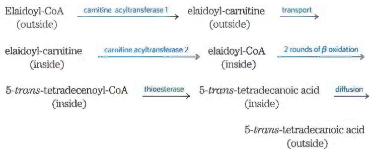

(h) It is correct insofar as trans fats are broken down less efficiently than cis fats, and thus trans fats may "leak" out of mitochondria. It is incorrect to say that trans fats are not broken down by cells; they are broken down, but at a slower rate than cis fats.

## Chapter 18

(a)

(b)

(c)

(d)

2. This is a coupled-reaction assay. The product of the slow transamination (pyruvate) is rapidly consumed in the subsequent "indicator reaction" catalyzed by lactate dehydrogenase, which consumes NADH. Thus the rate of disappearance of NADH is a measure of the rate of the aminotransferase reaction. The indicator reaction is monitored by observing the decrease in absorption of NADH at 340 nm with a spectrophotometer.

3. Alanine and glutamine play special roles in the transport of amino groups from muscle and from other nonhepatic tissues, respectively, to the liver.

4. GTP is a product of the citric acid cycle, generated in the second step after the formation of $\alpha$ -ketoglutarate. Elimination of the

## AS-22 Abbreviated Solutions to Problems

GTP inhibition of glutamate dehydrogenase leads to unconproduction of $\alpha$ -ketoglutarate, which is oxidized to product levels of ATP. This in turn leads to insulin secretion.

5. No. The nitrogen in alanine can be transferred to oxaloa transamination, to form aspartate.

6. 15 mol of ATP per mol of lactate; 13 mol of ATP per mol when nitrogen removal is included

7. (a) Fasting resulted in low blood glucose; subsequent administration of the experimental diet led to rapid catabol of glucogenic amino acids. (b) Oxidative deamination cat rise in $\mathrm{NH}_3$ levels; the absence of arginine (an intermedia urea cycle) prevented conversion of $\mathrm{NH}_3$ to urea; arginine synthesized in sufficient quantities in the cat to meet the imposed by the stress of the experiment. This suggests that is an essential amino acid in the cat's diet. (c) Ornithine to arginine by the urea cycle.

8. $\mathrm{H}_2\mathrm{O} +$ glutamate $+\mathrm{NAD^{+}}\rightarrow \alpha$ -ketoglutarate $+\mathrm{NH}_{4}^{+} + \mathrm{NH}$ $\mathrm{NH_{4}^{+} + 2ATP + H_{2}O + CO_{2}\rightarrow carbamoyl phosphate + 2ADF}$

19. A likely mechanism is  

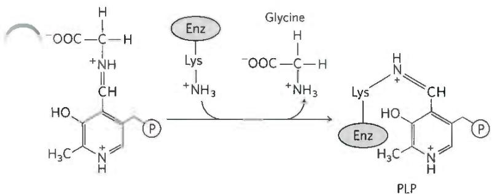

The formaldehyde (HCHO) produced in the second step reacts rapidly with tetrahydrofolate at the enzyme active site to produce $N^{5}, N^{10}$ -methylenetetrahydrofolate (see Fig. 18-17).

20. (a) Transamination; no analogies; PLP (b) Oxidative decarboxylation; analogous to oxidative decarboxylation of pyruvate to acetyl-CoA prior to entry into the citric acid cycle, and of $\alpha$ -ketoglutarate to succinyl-CoA in the citric acid cycle; $\mathrm{NAD^{+}}$ , FAD, lipoate, and TPP (c) Dehydrogenation (oxidation); analogous to dehydrogenation of succinate to fumarate in the citric acid cycle, and of fatty acyl-CoA to enoyl-CoA in $\beta$ oxidation; FAD (d) Carboxylation; no analogies in citric acid cycle or $\beta$ oxidation; ATP and biotin (e) Hydration; analogous to hydration of fumarate to malate in the citric acid cycle, and of enoyl-CoA to 3-hydroxyacyl-CoA in $\beta$ oxidation; no cofactors (f) Reverse aldol reaction; analogous to reverse of citrate synthase reaction in the citric acid cycle; no cofactors

21. Most amino acid catabolism occurs in the liver, including the key steps that are blocked in maple syrup urine disease. A liver transplant from a suitable donor with a normally functioning branched-chain $\alpha$ -keto acid dehydrogenase complex could alleviate disease symptoms.

22. (a) Leucine; valine; isoleucine (b) Cysteine (derived from cystine). If cysteine were decarboxylated as shown in Fig. 18-6, it would yield $\mathrm{H}_3\mathrm{N}-\mathrm{CH}_2-\mathrm{CH}_2-\mathrm{SH}$ , which could be oxidized to taurine.

(c) The January 1957 blood shows significantly elevated levels of isoleucine, leucine, methionine, and valine; the January 1957 urine, significantly elevated isoleucine, leucine, taurine, and valine. (d) All patients had high levels of isoleucine, leucine, and valine in both blood and urine, suggesting a defect in the breakdown of these amino acids. Given that the urine also contained high levels of the keto forms of these three amino acids, the block in the pathway must occur after deamination but before dehydrogenation (as shown in Fig. 18-28). (e) The model does not explain the high levels of methionine in blood and taurine in urine. The high taurine levels may be due to the death of brain cells during the end stage of the disease. However, the reasons for high levels of methionine in blood are unclear; the pathway of methionine degradation is not linked with the degradation of branched-chain amino acids. Increased methionine could be a secondary effect of buildup of the other amino acids. It is important to keep in mind that the January 1957 samples were from an individual who was dying, so comparing blood and urine results with those of a healthy individual may not be appropriate. (f) The following information is needed (and was eventually obtained by other workers): (1) The dehydrogenase activity is significantly reduced or missing in individuals with maple syrup urine disease. (2) The disease is inherited as a single-gene defect. (3) The defect occurs in a gene encoding all or part of the dehydrogenase. (4) The genetic defect leads to production of inactive enzyme.

## Chapter 19

1. Reaction 1: (a), (d) NADH; (b), (e) E-FMN; (c) $\mathrm{NAD^{+} / NADH}$ and E-FMN/FMNH $_2$

Reaction 2: (a), (d) E-FMNH $_{2}$ ; (b), (e) Fe $^{3+}$ ; (c) E-FMN/FMNH $_{2}$ and Fe $^{3+}$ /Fe $^{2+}$

Reaction 3: (a), (d) $\mathrm{Fe}^{2+}$ ; (b), (e) Q; (c) $\mathrm{Fe}^{3+}/\mathrm{Fe}^{2+}$ and $\mathrm{Q}/\mathrm{Q}\mathrm{H}_2$

2. The side chain makes ubiquinone soluble in lipids and allows it to diffuse in the semifluid membrane.

3. From the difference in standard reduction potential ( $\Delta E^{\prime\circ}$ ) for each pair of half-reactions, we can calculate $\Delta G^{\prime\circ}$ . The oxidation of succinate by FAD is favored by the negative standard free-energy change ( $\Delta G^{\prime\circ} = -3.7$ kJ/mol). Oxidation by NAD $^{+}$ would require a large, positive, standard free-energy change ( $\Delta G^{\prime\circ} = 68$ kJ/mol).

4. (a) All carriers reduced; $\mathrm{CN}^-$ blocks the reduction of $\mathrm{O}_2$ catalyzed by cytochrome oxidase. (b) All carriers reduced; in the absence of $\mathrm{O}_2$ , the reduced carriers are not reoxidized. (c) All carriers oxidized (d) Early carriers more reduced; later carriers more oxidized

5. (a) Inhibition of NADH dehydrogenase by rotenone decreases the rate of electron flow through the respiratory chain, which in turn decreases the rate of ATP production. If this reduced rate is unable to meet the organism's ATP requirements, the organism dies. (b) Antimycin A strongly inhibits the oxidation of Q in the respiratory chain, reducing the rate of electron transfer and leading to the consequences described in (a). (c) Because antimycin A blocks all electron flow to oxygen, it is a more potent poison than rotenone, which blocks electron flow from NADH but not from $\mathrm{FADH}_2$ .

6. (a) The rate of electron transfer necessary to meet the ATP demand increases, and thus the P/O ratio decreases. (b) High concentrations of uncoupler produce P/O ratios near zero. The P/O ratio decreases and more fuel must be oxidized to generate the same amount of ATP. The extra heat released by this oxidation raises the body temperature. (c) Increased activity of the respiratory chain in the presence of an uncoupler requires the degradation of additional fuel. By oxidizing more fuel (including fat reserves) to produce the same amount of ATP, the body loses weight. When the P/O ratio approaches zero, the lack of ATP results in death.

7. Valinomycin acts as an uncoupler. It combines with $K^{+}$ to form a complex that passes through the inner mitochondrial membrane, dissipating the membrane potential. ATP synthesis decreases, which causes the rate of electron transfer to increase. This results in an increase in the $H^{+}$ gradient, $O_{2}$ consumption, and amount of heat released.

8. The steady-state concentration of $P_{i}$ in the cell is much higher than that of ADP. The $P_{i}$ released by ATP hydrolysis changes total $[P_{i}]$ very little.

9. Superoxide dismutase catalyzes the reduction of superoxide to hydrogen peroxide. The hydrogen peroxide can then be eliminated by glutathione peroxidase. This is a major pathway for eliminating the superoxide generated during respiration, helping to ameliorate the damaging effects of reactive oxygen species.

10. (a) External medium: $4.0 \times 10^{-8}$ M; matrix: $2.0 \times 10^{-8}$ M (b) $[H^{+}]$ gradient contributes 1.7 kJ/mol toward ATP synthesis. (c) 21 (d) No (e) From the overall transmembrane potential

11. (a) 0.91 $\mu$ mol/s $\cdot$ g (b) 5.5 s; to provide a constant level of ATP, regulation of ATP production must be tight and rapid.

12. 53 $\mu$ mol/s • g. With a steady state [ATP] of 7.0 $\mu$ mol/g, this is equivalent to 10 turnovers of the ATP pool per second; the reservoir would last about 0.13 s.

13. The citric acid cycle is stalled for lack of an acceptor of electrons from NADH. Pyruvate produced by glycolysis cannot enter the cycle as acetyl-CoA; accumulated pyruvate is transaminated to alanine and exported to the liver.

14. Cytosolic malate dehydrogenase plays a key role in the transport of reducing equivalents across the inner mitochondrial membrane via the malate-aspartate shuttle.

15. The inner mitochondrial membrane is impermeable to NADH, but the reducing equivalents of NADH are transferred (shuttled) through the membrane indirectly: they are transferred to oxaloacetate in the cytosol, the resulting malate is transported into the matrix, and mitochondrial $\mathrm{NAD^{+}}$ is reduced to NADH.

16. Pyruvate dehydrogenase is located in mitochondria; glyceraldehyde 3-phosphate dehydrogenase, in the cytosol. The NAD pools are separated by the inner mitochondrial membrane.

17. (a) Glycolysis becomes anaerobic. (b) Oxygen consumption ceases. (c) Lactate formation increases. (d) ATP synthesis decreases to 2 ATP/glucose.

18. The response to (a), increased [ADP], is faster because the response to (b), reduced $pO_{2}$ , requires protein synthesis.

19. (a) NADH is reoxidized via electron transfer instead of lactic acid fermentation. (b) Oxidative phosphorylation is more efficient. (c) The high mass-action ratio of the ATP system inhibits phosphofructokinase-1.

20. The Pasteur effect is not observed, because the citric acid cycle and respiratory chain are inactive. Fermentation to ethanol could be accomplished in the presence of $O_{2}$ , which is an advantage because strict anaerobic conditions are difficult to maintain.

21. Reactive oxygen species react with macromolecules, including DNA. If a mitochondrial defect leads to increased production of ROS, proto-oncogenes in the nuclear chromosomes can be damaged, producing oncogenes and leading to unregulated cell division and cancer (see Section 12.9).

22. Different extents of heteroplasmy for the defective gene produce different degrees of defective mitochondrial function.

23. Complete lack of glucokinase (two defective alleles) makes it impossible to carry out glycolysis at a sufficient rate to raise [ATP] to the threshold required for insulin secretion.

24. Defects in Complex II result in increased production of ROS, damage to DNA, and mutations that lead to unregulated cell division (cancer; see Section 12.9). It is not clear why the cancer tends to occur in the midgut.

25. (a) Unsaturated fatty acids increase membrane fluidity. (b) The cells cannot survive if their membranes contain less than 15% unsaturated fatty acids. (c) Oxygen is required for respiration. If cell growth is affected by membrane fluidity only in the presence of oxygen, then logically respiration rates may be affected by membrane fluidity. (d) The first observation indicates that something that migrates in the membrane is limiting the rate of respiration. The second observation suggests that respiration is inhibited when unsaturated fatty acid content is low. This might occur if membrane viscosity somehow affected the function of enzymes embedded in the membranes, the passive permeation of oxygen, or the rate of diffusion of a key factor in the membrane itself. (e) The overall conclusion is that ubiquinone diffusion through the membrane limits the rate of respiration.

## Chapter 20

1. For the maximum photosynthetic rate, PSI (which absorbs light of 700 nm) and PSII (which absorbs light of 680 nm) must be operating simultaneously.

2. From water consumed in the overall reaction

3. $H_{2}S$ is the hydrogen donor in photosynthesis. No $O_{2}$ is evolved, because $H_{2}O$ is not split; the single photosystem lacks the water-splitting cofactor.

4. (a) Stops (b) Slows; some electron flow continues by the cyclic pathway.

5. During illumination, a proton gradient is established. When ADP and $P_{i}$ are added, ATP synthesis is driven by the gradient, which becomes exhausted in the absence of light.

6. DCMU blocks electron transfer between PSII and the first site of ATP production.

7. Venturicidin blocks proton movement through the $CF_{0}CF_{1}$ complex; electron flow ( $O_{2}$ evolution) continues only until the free-energy cost of pumping protons against the rising proton gradient equals the free energy available in a photon. DNP, by dissipating the proton gradient, restores electron flow and $O_{2}$ evolution.

8. From the difference in reduction potentials, you can calculate $\Delta G^{\prime\prime} = 15$ kJ/mol for the redox reaction. Fig. 20-4 shows that the energy of photons in any region of the visible spectrum is more than sufficient to drive this endergonic reaction. Even photons in the infrared spectrum can provide sufficient energy.

9. $1.35 \times 10^{-77}$ ; the reaction is highly unfavorable! In chloroplasts, the input of light energy overcomes this barrier.

## 10. -968 kJ/mol

11. No. The electrons from $H_{2}O$ flow to the artificial electron acceptor $Fe^{3+}$ , not to $NADP^{+}$ .

12. About once every 0.1 s; 1 in $10^{8}$ is excited

13. Light of 700 nm excites PSI, but not PSII; electrons flow from P700 to NADP $^{+}$ , but no electrons flow from P680 to replace them. When light of 680 nm excites PSII, electrons tend to flow to PSI, but the electron carriers between the two photosystems quickly become completely reduced.

14. No. The excited electron from P700 returns to refill the electron "hole" created by illumination. PSII is not needed to supply electrons, and no $\mathrm{O}_2$ is evolved from $\mathrm{H}_2\mathrm{O}$ . No NADPH is formed, because the

excited electron returns to P700. Cyclic photophosphorylation produces ATP rather than NADPH.

15. ATP and NADPH are generated in the light and are essential for $CO_{2}$ fixation; conversion stops as the supply of ATP and NADPH becomes exhausted. Some enzymes are switched off in the dark.

16. X is 3-phosphoglycerate; Y is ribulose 1,5-bisphosphate.

17. Ribulose 5-phosphate kinase, fructose 1,6-bisphosphatase, sedoheptulose 1,7-bisphosphatase, and glyceraldehyde 3-phosphate dehydrogenase; all are activated by reduction of a critical disulfide bond to a pair of sulfhydryls, which iodoacetate then blocks irreversibly.

18. The reductive pentose phosphate pathway regenerates ribulose 1,5-bisphosphate from triose phosphates produced during photosynthesis. The oxidative pentose phosphate pathway provides NADPH for reductive biosynthesis and ribose 5-phosphate for nucleotide synthesis.

19. Both types of "respiration" occur in plants, consume $\mathrm{O}_2$ , and produce $\mathrm{CO}_2$ . (Mitochondrial respiration also occurs in animals.) Mitochondrial respiration takes place continuously, though primarily at night or on cloudy days; electrons derived from various fuels are passed through a chain of carriers in the inner mitochondrial membrane to $\mathrm{O}_2$ . Photorespiration takes place in chloroplasts, peroxisomes, and mitochondria, during the daytime, when photosynthetic carbon fixation is occurring. Electron transfer in photorespiration is shown in Fig. 20-43; that for mitochondrial respiration, in Fig. 19-19.

20. In maize, the $C_{4}$ pathway fixes $CO_{2}$ . Phosphoenolpyruvate (PEP) carboxylase carboxylates PEP to form oxaloacetate. Some of the oxaloacetate undergoes transamination to aspartate, but most undergoes reduction to malate in the mesophyll cells. Only after subsequent decarboxylation does the $CO_{2}$ enter the Calvin cycle.

21. Measure the amount of ${}^{14}CO_{2}$ fixed in leaves during an hour of darkness and an hour of bright illumination. The CAM plant will take up much more $CO_{2}$ at night. Alternatively, measure the concentration of organic acids in the vacuoles by titrating an extract of leaves. In darkness, the $C_{4}$ plant will have a lower level of titratable acidity.

## 22. Isocitrate dehydrogenase reaction

23. Rates of photorespiration, which occurs when rubisco uses $O_{2}$ rather than $CO_{2}$ as a substrate, are increased at higher light intensities and higher leaf temperatures. $C_{4}$ plants evolved mechanisms to minimize photorespiration, resulting in an increased ability to perform photosynthesis under these conditions. Because PEP carboxylase has a higher affinity for $CO_{2}$ than rubisco, $C_{4}$ plants take up more $CO_{2}$ under conditions of low $[CO_{2}]$ . Thus, species 1 is a $C_{4}$ plant and species 2 is a $C_{3}$ plant.

24. $[PP_{i}]$ is high in the cytosol because the cytosol lacks inorganic pyrophosphatase.

25. (a) Low $[P_{i}]$ in the cytosol and high [triose phosphate] in the chloroplast (b) High $[P_{i}]$ and [triose phosphate] in the cytosol

26. 3-Phosphoglycerate is the primary product of photosynthesis; $[P_{i}]$ rises when light-driven synthesis of ATP from ADP and $P_{i}$ slows.

27. (a) Sucrose + (glucose) $_{n}$ → (glucose) $_{n+1}$ + fructose (b) Fructose generated in the synthesis of dextran is readily imported and metabolized by the bacteria.

28. The first enzyme in each path is under reciprocal allosteric regulation. Inhibition of one path shunts isocitrate into the other path.

29. (a) (1) The presence of $Mg^{2+}$ supports the hypothesis that chlorophyll is directly involved in catalysis of the phosphorylation reaction, ADP + $P_{i} \rightarrow ATP$ . (2) Many enzymes (or other proteins) that contain $Mg^{2+}$ are not phosphorylating enzymes, so the presence of $Mg^{2+}$ in chlorophyll does not prove its role in phosphorylation reactions. (3) The presence of $Mg^{2+}$ is essential to chlorophyll's photochemical properties: light absorption and electron transfer.

(b) (1) Enzymes catalyze reversible reactions, so an isolated enzyme that can, under certain lab conditions, catalyze removal of a phosphoryl group could probably, under different conditions (such as in cells), catalyze addition of a phosphoryl group. So, chlorophyll could be involved in the phosphorylation of ADP. (2) There are two possible explanations: the chlorophyll protein is a phosphatase only and does not catalyze ADP phosphorylation under cellular conditions, or the crude preparation contains a contaminating phosphatase activity that is unconnected to the photosynthetic reactions. (3) The preparation was probably contaminated with a nonphotosynthetic phosphatase activity.

(c) (1) This light inhibition would be expected if the chlorophyll protein catalyzed the reaction ADP + $P_{i}$ + light → ATP. Without light, the reverse reaction, a dephosphorylation, would be favored. In the presence of light, energy is provided and the equilibrium would shift to the right, reducing the phosphatase activity. (2) This inhibition must be an artifact of the isolation or assay methods. (3) The crude preparation methods in use at the time were unlikely to preserve intact chloroplast membranes, so the inhibition must be an artifact. (d) In the presence of light, (1) ATP is synthesized and other phosphorylated intermediates are consumed; (2) glucose is produced and is metabolized by cellular respiration to produce ATP, with changes in the levels of phosphorylated intermediates; (3) ATP is produced and other phosphorylated intermediates are consumed. (e) Light energy is used to produce ATP (as in the Emerson model) and is used to produce reducing power (as in the Rabinowitch model). (f) The approximate stoichiometry for photophosphorylation is that 8 photons yield 2 NADPH and about 3 ATP. To reduce 1 $CO_{2}$ requires 2 NADPH and 3 ATP. Thus, at a minimum, 8 photons are required per $CO_{2}$ molecule reduced, in good agreement with Rabinowitch's value. (g) Because the energy of light is used to produce both ATP and NADPH, each photon absorbed contributes more than just 1 ATP for photosynthesis. The process of energy extraction from light is more efficient than Rabinowitch supposed, and plenty of energy is available for this process—even with red light.

## Chapter 21

1. (a) The 16 carbons of palmitate are derived from 8 acetyl groups of 8 acetyl-CoA molecules. The $^{14}\mathrm{C}$ -labeled acetyl-CoA gives rise to malonyl-CoA labeled at C-1 and C-2. (b) The metabolic pool of malonyl-CoA, the source of all palmitate carbons except C-16 and C-15, does not become labeled with small amounts of $^{14}\mathrm{C}$ -labeled acetyl-CoA. Hence, only [15,16- $^{14}\mathrm{C}$ ] palmitate is formed.

2. Both glucose and fructose are degraded to pyruvate in glycolysis. Pyruvate is converted to acetyl-CoA by the pyruvate dehydrogenase complex. Some of this acetyl-CoA enters the citric acid cycle, which produces reducing equivalents, NADH and NADPH. Mitochondrial electron transfer to $O_{2}$ yields ATP.

3. 8 Acetyl-CoA + 15ATP + 14NADPH + 9H₂O →

$$
\text { palmitate } + 8 \mathrm{CoA} + 1 5 \mathrm{ADP} + 1 5 \mathrm{P} _ {\mathrm{i}} + 1 4 \mathrm{NADP} ^ {+} + 2 \mathrm{H} ^ {+}
$$

4. (a) 3 deuteriums per palmitate; all located on C-16; all other two-carbon units are derived from unlabeled malonyl-CoA (b) 7 deuteriums per palmitate; located on all even-numbered carbons except C-16

5. By using the three-carbon unit malonyl-CoA, the activated form of acetyl-CoA (recall that malonyl-CoA synthesis requires ATP), metabolism is driven in the direction of fatty acid synthesis by the exergonic release of $CO_{2}$ .

6. (a) The rate-limiting step in fatty acid synthesis is carboxylation of acetyl-CoA, catalyzed by acetyl-CoA carboxylase. High [citrate] and [isocitrate] indicate that conditions are favorable for fatty acid synthesis: an active citric acid cycle is providing a plentiful supply of ATP, reduced pyridine nucleotides, and acetyl-CoA. Citrate stimulates (increases the $V_{max}$ of) acetyl-CoA carboxylase (b). Because citrate binds more tightly to the filamentous (active) form of the enzyme, high [citrate] drives the protomer $\rightleftharpoons$ filament equilibrium in the direction of the active form. In contrast, palmitoyl-CoA (the end product of fatty acid synthesis) drives the equilibrium in the direction of the inactive (protomer) form. Hence, when the end product of fatty acid synthesis accumulates, the biosynthetic path slows.

$$
7. (\mathbf {a}) \mathrm{Acetyl-CoA} _ {\text {(nol)}} + \mathrm{ATP} + \mathrm{CoA} _ {\text {(cyl)}} \rightarrow
$$

$$
\text { acetyl - CoA } _ {\text {(cyt)}} + \text { ADP } + \text { P } _ {i} + \text { CoA } _ {\text {(mit)}}
$$

(b) 1 ATP per acetyl group (c) Yes

8. No. The double bond in palmitoleate is introduced by an oxidation catalyzed by fatty acyl-CoA desaturase, a mixed-function oxidase that requires $O_{2}$ as a cosubstrate.

9. 3 Palmitate + glycerol + 7ATP + 4H₂O →

$$
\mathrm{tripalmitin} + 7 \mathrm{ADP} + 7 \mathrm{P} _ {\mathrm{i}} + 7 \mathrm{H} ^ {+}
$$

10. In adult rats, stored triacylglycerols are maintained at a steady-state level through a balance of rates of degradation and biosynthesis. Hence, triacylglycerols of adipose (fat) tissue are constantly turned over, which explains the incorporation of ${}^{14}$ C label from dietary glucose.

11. Net reaction:

Dihydroxyacetone phosphate + NADH + palmitate + oleate + 3ATP + CTP + choline + 4H₂O →

phosphatidylcholine + NAD $^{+}$ + 2AMP + ADP + H $^{+}$ + CMP + 5P $_{i}$ 7ATP per molecule of phosphatidylcholine

12. Methionine deficiency reduces the level of adoMet, which is required for de novo synthesis of phosphatidylcholine. The salvage pathway does not employ adoMet, but uses available choline. Thus phosphatidylcholine can be synthesized even when the diet is deficient in methionine, as long as choline is available.

13. During cholesterol biosynthesis, the two Claisen condensations involving acetyl-CoA and leading to HMG-CoA are both thermodynamically unfavorable. However, the product HMG-CoA is rapidly siphoned off by more thermodynamically favorable subsequent reactions. In fatty acid synthesis, all of the condensation reactions involving each new malonyl-CoA are identical. If acetyl-CoA were utilized instead of malonyl-CoA, all would be thermodynamically unfavorable. As subsequent reduction steps that expend NADPH in each four-step cycle are also thermodynamically unfavorable, there are no downstream processes capable of balancing the thermodynamics and pulling the sequence toward synthesis. The synthesis of long fatty acids would not be chemically feasible without the use of malonyl-CoA and the thermodynamic boost provided by decarboxylation.

14. ${}^{14}$ C label appears in three places in the activated isoprene:

$$
\begin{array}{c} ^ {1 4} \mathrm{CH} _ {2} \\ \mathrm{C} - ^ {1 4} \mathrm{CH} _ {2} - \mathrm{CH} _ {2} - \textcircled {P} - \textcircled {P} \\ ^ {1 4} \mathrm{CH} _ {3} \end{array}
$$

15. (a) ATP (b) UDP-glucose (c) CDP-ethanolamine (d) UDP-galactose (e) Fatty acyl-CoA (f) S-Adenosylmethionine (g) Malonyl-CoA (h) $\Delta^{3}$ -Isopentenyl pyrophosphate

16. Linoleate is required in the synthesis of prostaglandins. Animals cannot transform oleate to linoleate, so linoleate is an essential fatty acid. Plants can convert oleate to linoleate, and they provide animals with the required linoleate (see Fig. 21-12).

17. The rate-determining step in the biosynthesis of cholesterol is the synthesis of mevalonate, catalyzed by HMG-CoA reductase. This enzyme is allosterically regulated by mevalonate and cholesterol derivatives. High intracellular [cholesterol] also reduces transcription of the gene encoding HMG-CoA reductase.

18. When cholesterol levels decline because of treatment with a statin, cells attempt to compensate by increasing expression of the gene encoding HMG-CoA reductase; however, statins are good competitive inhibitors of HMG-CoA reductase activity and reduce overall production of cholesterol.

19. Note: In the absence of detailed knowledge of the literature on this enzyme, students might propose several plausible alternatives. Thiolase reaction: Begins with nucleophilic attack of an active-site Cys residue on the first acetyl-CoA substrate, displacing —S-CoA and forming a covalent thioester link between Cys and the acetyl group. A base on the enzyme then extracts a proton from the methyl group of the second acetyl-CoA, leaving a carbanion that attacks the carbonyl carbon of the thioester formed in the first step. The sulfhydryl of the Cys residue is displaced, creating the product acetoacetyl-CoA. HMG-CoA synthase reaction: Begins in the same way, with a covalent thioester link formed between the enzyme's Cys residue and the acetyl group of acetyl-CoA, with displacement of —S-CoA. The —S-CoA dissociates as CoA-SH, and acetoacetyl-CoA binds to the enzyme. A proton is abstracted from the methyl group of the enzyme-linked acetyl, forming a carbanion that attacks the ketone carbonyl of the acetoacetyl-CoA substrate. The carbonyl is converted to a hydroxyl ion in this reaction, which is protonated to create —OH. The thioester link with the enzyme is then cleaved hydrolytically to generate the HMG-CoA product. HMG-CoA reductase reaction: Two successive hydride ions derived from NADPH first displace the —S-CoA, and then reduce the aldehyde to a hydroxyl group.

20. Statins inhibit HMG-CoA reductase, an enzyme in the pathway to the synthesis of activated isoprenes, which are precursors of cholesterol and a wide range of isoprenoids, including coenzyme Q (ubiquinone). Hence, statins might reduce the levels of coenzyme Q available for mitochondrial respiration. Ubiquinone is obtained in the diet as well as by direct biosynthesis, but it is not yet clear how much is required and how well dietary sources can substitute for reduced synthesis. Reductions in the levels of particular isoprenoids may account for some side effects of statins.

21. (a)  
  
Astaxanthin

(b) Head-to-head. There are two ways to look at this. First, the "tail" of geranylgeranyl pyrophosphate has a branched dimethyl structure, as do both ends of phytoene. Second, no free —OH is formed by the release of PP $_{i}$ , indicating that the two —O—P—P “heads” are linked to form phytoene. (c) Four rounds of dehydrogenation convert four single bonds to double bonds. (d) No. A count of single and double bonds in the reaction below shows that one double bond is replaced by two single bonds—so, there is no net oxidation or reduction:

Lycopene (C-40)

bend ends around for cyclization

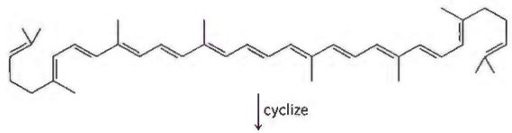

  
β-Carotene (C-40)

(e) Steps ① through ③. The enzyme can convert IPP and DMAP to geranylgeranyl pyrophosphate, but it catalyzes no further reactions in the pathway, as confirmed by results with the other substrates. (f) Strains 1 through 4 lack crtE and have much lower astaxanthin production than strains 5 through 8, all of which overexpress crtE. Thus, overexpression of crtE leads to a substantial increase in astaxanthin production. Wild-type E. coli has some step ③ activity, but this conversion of farnesyl pyrophosphate to geranylgeranyl pyrophosphate is strongly rate-limiting. (g) IPP isomerase. Comparing strains 5 and 6 shows that adding ispA, which catalyzes steps ① and ②, has little effect on astaxanthin production, so these steps are not rate-limiting. However, comparing strains 5 and 7 shows that adding idi substantially increases astaxanthin production, so IPP isomerase must be the rate-limiting step when crtE is overexpressed.

## Chapter 22

1. In their symbiotic relationship with the plant, bacteria supply ammonium ion by reducing atmospheric nitrogen, a process that requires large quantities of ATP because of the very high activation energy of ammonia production from $N_{2}$ .

2. Fixed nitrogen is limiting in most environments, including marine ecosystems. Large increases in fixed nitrogen help to feed algae blooms, with an accompanying increase in aerobic respiration, which depletes oxygen in the affected waters.

3. A link is formed between enzyme-bound PLP and the phosphohomoserine substrate, with rearrangement to generate the ketimine at the $\alpha$ carbon of the substrate. This activates the $\beta$ carbon for proton abstraction, leading to displacement of the phosphate and formation of a double bond between the $\beta$ and $\gamma$ carbons. A rearrangement (beginning with proton abstraction at the pyridoxal carbon adjacent to the substrate amino nitrogen) moves the α-β double bond and converts the ketimine to the aldimine form of PLP. Attack of water at the β carbon is then facilitated by the linked pyridoxal, followed by hydrolysis of the imine link between PLP and the product, to generate threonine.

4. In the mammalian route, toxic ammonium ions are transformed to glutamine, reducing toxic effects on the brain.

$$
5. \mathrm{Glucose} + 2 \mathrm{CO} _ {2} + 2 \mathrm{NH} _ {3} \rightarrow 2 \text { aspartate } + 2 \mathrm{H} ^ {+} + 2 \mathrm{H} _ {2} \mathrm{O}
$$

6. The amino-terminal glutaminase domain is similar in all glutamine amidotransferases. A drug that targeted this active site would probably inhibit many enzymes and produce many more side effects than a more specific inhibitor that targets the unique carboxyl-terminal synthetase active site.

7. If phenylalanine hydroxylase is defective, the biosynthetic route to tyrosine is blocked and tyrosine must be obtained from the diet.

8. The biosynthetic pathway requires reduction of the $\gamma$ -carboxyl group of glutamate to a carbonyl. Prior acetylation of the $\alpha$ -amino group prevents a spontaneous cyclization reaction that leads not to arginine, but to proline.

9. In adoMet synthesis, triphosphate is released from ATP. Hydrolysis of the triphosphate renders the reaction thermodynamically more favorable.

10. If the inhibition of glutamine synthase were not concerted, saturating concentrations of histidine would shut down the enzyme and cut off production of glutamine, which the bacterium needs to synthesize other products.

11. Folic acid is a precursor of tetrahydrofolate (see Fig. 18-16), required in the biosynthesis of glycine (see Fig. 22-14), a precursor of porphyrins. A folic acid deficiency therefore impairs hemoglobin synthesis.

12. This is a PLP-catalyzed decarboxylation.

13. Glycine auxotrophs: adenine and guanine; glutamine auxotrophs: adenine, guanine, and cytosine; aspartate auxotrophs: adenine, guanine, cytosine, and uridine

14. See Fig. 18-6, step 2, for the reaction mechanism of amino acid racemization. The F atom of fluoroalanine is an excellent leaving group. Fluoroalanine causes irreversible (covalent) inhibition of alanine racemase. One plausible mechanism (where Nuc denotes any nucleophilic amino acid side chain in the enzyme active site) is

15. (a) As shown in Fig. 18-16, p-aminobenzoate is a component of tetrahydrofolate ( $H_{4}$ folate), the cofactor involved in the transfer of one-carbon units. (b) In the presence of sulfanilamide, a structural analog of p-aminobenzoate, bacteria are unable to synthesize tetrahydrofolate, a cofactor necessary for converting AICAR to FAICAR; thus, AICAR accumulates. (c) The competitive inhibition by sulfanilamide of the enzyme involved in tetrahydrofolate biosynthesis is overcome by the addition of excess substrate (p-aminobenzoate).

16. (b) and (d)

17. The ${}^{14}$ C-labeled orotate arises from the following pathway (the first three steps are part of the citric acid cycle):

18. Organisms do not store nucleotides to be used as fuel, and they do not completely degrade them, but rather hydrolyze them to release the bases, which can be recovered in salvage pathways. The low C:N ratio of nucleotides makes them poor sources of energy.

19. Treatment with allopurinol has two consequences. (1) It inhibits conversion of hypoxanthine to uric acid, causing accumulation of hypoxanthine, which is more soluble and more readily excreted; this alleviates the clinical problems associated with AMP degradation. (2) It inhibits conversion of guanine to uric acid, causing accumulation of xanthine, which is less soluble than uric acid; this is the source of xanthine stones. Because the amount of GMP degradation is low relative to AMP degradation, the kidney damage caused by xanthine stones is less than the damage caused by untreated gout.

20. Tetrahydrofolate is utilized in thymidylate synthesis, and also in the synthesis of glycine from serine.

21. (a) The $\alpha$ -carboxyl group is removed and an —OH is added to the $\gamma$ carbon. (b) BtrI has sequence homology with acyl carrier proteins. The molecular weight of BtrI increases when incubated under conditions in which CoA could be added to the protein. Adding CoA to a Ser residue would replace an —OH, formula weight (FW) 17, with a $4^{\prime}$ -phosphopantetheine group (see Fig. 21-5; formula $\mathrm{C_{11}H_{21}N_2O_7PS}$ ), FW 356. Thus, 11,182 - 17 + 356 = 12,151, which is very close to the observed $M_r$ of 12,153. (c) The thioester could form with the $\alpha$ -carboxyl group. (d) In the most common reaction for removing the $\alpha$ -carboxyl group of an amino acid (see Fig. 18-6, reaction ©), the carboxyl group must be free. Furthermore, it is difficult to imagine a decarboxylation reaction starting with a carboxyl group in its thioester form. (e) 12,240 - 12,281 = 41, close to the $M_r$ of $\mathrm{CO}_{2}$ (44). Given that BtrK is probably a decarboxylase, the most likely structure is the decarboxylated form:

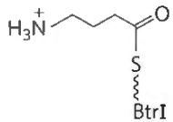

(f) 12,370 - 12,240 = 130. Glutamic acid (C $_{5}$ H $_{9}$ NO $_{4}$ ; M $_{r}$ 147), minus the —OH (FW 17) removed in the glutamylation reaction, leaves a glutamyl group of FW 130; thus, γ-glutamylating the molecule shown above would add 130 to its M $_{r}$ . BtrJ is capable of γ-glutamylating other substrates, so it may γ-glutamylate this molecule. The most likely site for this is the free amino group, giving the following structure:

## Chapter 23

1. They are recognized by two different receptors, typically found in different cell types, and are coupled to different downstream effectors.

2. Ammonia is highly toxic to nervous tissue, especially the brain. In healthy individuals, excess $NH_{3}$ is removed by transformation of glutamate to glutamine, which travels to the liver and is subsequently transformed to urea. The additional glutamine arises from conversion of glucose to $\alpha$ -ketoglutarate, transamination of $\alpha$ -ketoglutarate to glutamate, and conversion of glutamate to glutamine.

3. Glucogenic amino acids are used to make glucose for the brain; others are deaminated, then oxidized in mitochondria via the citric acid cycle.

4. From glucose, by the following route: Glucose → dihydroxyacetone phosphate (in glycolysis); dihydroxyacetone phosphate + NADH + H⁺ → glycerol 3-phosphate + NAD⁺ (glycerol 3-phosphate dehydrogenase reaction)

5. (a) Increased muscular activity increases the demand for ATP, which is met by increased $O_{2}$ consumption. (b) After the sprint, lactate produced by anaerobic glycolysis is converted to glucose and glycogen, which requires ATP and therefore $O_{2}$ .

6. Glucose is the primary fuel for the brain. TPP-dependent oxidative decarboxylation of pyruvate to acetyl-CoA is essential to complete glucose metabolism. TPP synthesis requires the vitamin thiamine.

7. $5.5 \times 10^{7}$ L. For comparison, an Olympic pool, 50 m long, 25 m wide, and 2 m deep, holds $2.5 \times 10^{6}$ L.

8. (a) Inactivation provides a rapid means to change the concentration of active hormone and thus end its effects. (b) Changes in the rate of release from storage, the rate of conversion from prohormone to active hormone, and the rate of inactivation can rapidly change the level of a circulating peptide hormone.

9. Water-soluble hormones bind to receptors on the outer surface of the cell, triggering formation of a second messenger (e.g., cAMP) inside the cell. Lipid-soluble hormones can pass through the plasma membrane to act on target molecules or receptors directly.

10. (a) Skeletal muscle does not express glucose 6-phosphatase. Any glucose 6-phosphate produced enters the glycolytic pathway and, under O₂-deficient conditions, is converted to lactate via pyruvate. (b) In a “fight-or-flight” situation, the concentration of glycolytic precursors must be high in preparation for muscular activity. Phosphorylated intermediates cannot escape from myocytes because the membrane is not permeable to charged species, and glucose 6-phosphate is not exported by the glucose transporter. In the liver, glucose is formed from glucose 6-phosphate and enters the bloodstream to maintain the blood glucose level in the homeostatic range.

11. (a) Excessive uptake and use of blood glucose by the liver, leading to hypoglycemia; shutdown of amino acid and fatty acid catabolism (b) Little circulating fuel is available for ATP requirements. Brain damage results because glucose is the main source of fuel for the brain.

12. As an uncoupler of oxidative phosphorylation, thyroxine would decrease the efficiency of the process (lower the P/O ratio), forcing the tissue to increase respiration to meet the normal demand for ATP. This less-efficient respiration would dissipate as heat a greater proportion of the energy potentially available for making ATP. Thermogenesis could also be due to the increased rate of ATP use by the thyroid-stimulated tissue. In this case, the efficiency of oxidative phosphorylation (the P/O ratio) would be unchanged. But because some energy is always dissipated as heat in the process, the increased production of ATP demanded by the stimulated tissue would produce more heat overall.

13. Because prohormones are inactive, they can be stored in quantity in secretory granules. Rapid activation is achieved by enzymatic cleavage in response to an appropriate signal.

14. In animals, glucose can be synthesized from many precursors (see Fig. 14-15). In humans, the principal precursors are glycerol from TAGs, glucogenic amino acids from protein degradation, and oxaloacetate formed by pyruvate carboxylase.

15. The ob/ob mouse, which is initially obese, will lose weight. The OB/OB mouse will retain its normal body weight.

16. BMI = 39.3. For a BMI of 25, weight must be 75 kg; he must lose 43 kg, or 95 lb.

17. Reduced insulin secretion. Valinomycin has the same effect as opening the $K^{+}$ channel, allowing $K^{+}$ exit and consequent hyperpolarization.

18. The liver does not receive the insulin message and therefore continues to have high levels of glucose 6-phosphatase and gluconeogenesis, increasing blood glucose both during a fast and after a glucose-containing meal. The elevated blood glucose triggers insulin release from pancreatic $\beta$ cells, hence the high level of insulin in the blood.

19. Some things to consider: What do the data show about the frequency of heart attack attributable to the drug among people taking the drug? How does this frequency compare with the data on individuals spared the long-term consequences of type 2 diabetes? Are other, equally effective treatment options with fewer adverse effects available?

20. Without intestinal glucosidase activity, absorption of glucose from dietary glycogen and starch is reduced, blunting the usual rise in blood glucose after a meal. The undigested oligosaccharides are fermented by intestinal bacteria, and the gases released cause intestinal discomfort.

21. (a) Increased; closing the ATP-gated K+ channel would depolarize the membrane, increasing insulin release. (b) Type 2 diabetes results from decreased sensitivity to insulin, not a deficit of insulin production; increasing circulating insulin levels will reduce the symptoms associated with this disease. (c) Individuals with type 1 diabetes have deficient pancreatic β cells, so glyburide will have no beneficial effect. (d) lodine, like chlorine (the atom it replaces in the labeled glyburide), is a halogen, but it is a larger atom and has slightly different chemical properties. The iodinated glyburide might not bind to SUR. If it bound to another molecule instead, the experiment would result in cloning of the gene for this other, incorrect protein. (e) Although a protein has been "purified," the "purified" preparation might be a mixture of several proteins that co-purify under those experimental conditions. In this case, the amino acid sequence could be that of a protein that co-purifies with SUR. Using antibody binding to show that the peptide sequences are present in SUR excludes this possibility. (f) Although the cloned gene does encode the 25 amino acid sequence found in SUR, it could be a gene that, coincidentally, encodes the same sequence in another protein. In this case, this other gene would most likely be expressed in different cells than the SUR gene. The mRNA hybridization results are consistent with the putative SUR cDNA actually encoding SUR. (g) The excess unlabeled glyburide competes with labeled glyburide for the binding site on SUR. As a result, there is significantly less binding of labeled glyburide, so little or no radioactivity is detected in the $140\mathrm{kDa}$ protein. (h) In the absence of excess unlabeled glyburide, labeled $140\mathrm{kDa}$ protein is found only in the presence of the putative SUR cDNA. Excess unlabeled glyburide competes with the labeled glyburide, and no ${}^{125}\mathrm{I}$ -labeled $140\mathrm{kDa}$ protein is detected. This shows that the cDNA produces a glyburide-binding protein of the same molecular weight as SUR—strong evidence that the cloned gene encodes the SUR protein. (i) Several additional steps are possible, such as the following: (1) Express the putative SUR cDNA in CHO (Chinese hamster ovary) cells and show that the transformed cells have ATP-gated $\mathbf{K}^+$ channel activity. (2) Show that HIT cells with mutations in the putative SUR gene lack ATP-gated $\mathbf{K}^+$ channel activity. (3) Show that humans or experimental animals with mutations in the putative SUR gene are unable to secrete insulin.

## Chapter 24

1. $6.1 \times 10^{4}$ nm; 290 times longer than the T2 phage head

2. The number of A residues does not equal the number of T residues, nor does the number of G equal the number of C, so the DNA is not a base-paired double helix; the M13 DNA is single-stranded.

3. $M_{r} = 3.8 \times 10^{8}$ ; length = 200 $\mu$ m; $Lk_{0} = 55, 200$ ; Lk = 51, 900

4. The exons contain 3 bp/amino acid × 192 amino acids = 576 bp. The remaining 864 bp are in introns, possibly in a leader or signal sequence, and/or in other noncoding DNA.

5. 5,000 bp. (a) Doesn't change; Lk cannot change without breaking and re-forming the covalent backbone of the DNA. (b) Becomes undefined; a circular DNA with a break in one strand has, by definition, no Lk. (c) Decreases; in the presence of ATP, gyrase underwinds DNA. (d) Doesn't change; this assumes that neither of the DNA strands is broken in the heating process.

6. For Lk to remain unchanged, the topoisomerase must introduce the same number of positive and negative supercoils.

7. $\sigma = -0.067; > 70\%$ probability

8. (a) Undefined; the strands of a nicked DNA could be separated and thus have no Lk. (b) 476 (c) The DNA is already relaxed, so the topoisomerase does not cause a net change; Lk = 476. (d) 460; gyrase plus ATP reduces the Lk in increments of 2. (e) 464; eukaryotic type 1 topoisomerases increase the Lk of underwound or negatively supercoiled DNA in increments of 1. (f) 460; nucleosome binding does not break any DNA strands and thus cannot change Lk.

9. A fundamental structural unit in chromatin repeats about every 200 bp; the DNA is accessible to the nuclease only at 200 bp intervals. The brief treatment was insufficient to cleave the DNA at every accessible point, so a ladder of DNA bands is created in which the DNA fragments are multiples of 200 bp. The thickness of the DNA bands suggests that the distance between cleavage sites varies somewhat. For instance, not all the fragments in the lowest band are exactly 200 bp long.

10. A right-handed helix has a positive Lk; a left-handed helix (such as Z-DNA) has a negative Lk. Decreasing the Lk of a closed circular B-DNA by underwinding facilitates formation of regions of Z-DNA within certain sequences. (See Chapter 8, p. 273, for a description of sequences that permit the formation of Z-DNA.)

11. (a) Both strands must be covalently closed, and the molecule must be either circular or constrained at both ends. (b) Formation of cruciforms, left-handed Z-DNA, plectonemic or solenoidal supercoils, and unwinding of the DNA are favored. (c) E. coli DNA topoisomerase II or DNA gyrase (d) It binds the DNA at a point where it crosses on itself, cleaves both strands of one of the crossing segments, passes the other segment through the break, then reseals the break. The result is a change in Lk of -2.

12. Centromere, telomeres, and an autonomous replicating sequence or replication origin

13. The bacterial nucleoid is organized into domains approximately 10,000 bp long. Cleavage by a restriction enzyme relaxes the DNA within a domain, but not outside the domain. Any gene in the cleaved domain for which expression is affected by DNA topology will be affected by the cleavage; genes outside the domain will not.

14. (a) The lower, faster-migrating band is negatively supercoiled plasmid DNA. The upper band is nicked, relaxed DNA. (b) DNA topoisomerase I would relax the supercoiled DNA. The lower band would disappear, and all of the DNA would converge on the upper band. (c) DNA ligase would produce little change in the pattern. Some minor additional bands might appear near the upper band, due to the trapping of topoisomers not quite perfectly relaxed by the ligation reaction. (d) The upper band would disappear, and all of the DNA would be in the lower band. The supercoiled DNA in the lower band might become even more supercoiled and migrate somewhat faster.

15. (a) When DNA ends are sealed to create a relaxed, closed circle, some DNA species are completely relaxed but others are trapped in slightly underwound or overwound states. This gives rise to a distribution of topoisomers centered on the most relaxed species. (b) Positively supercoiled (c) The DNA that is relaxed despite the addition of dye is DNA with one or both strands broken. DNA isolation procedures inevitably introduce small numbers of strand breaks in some of the closed-circular molecules. (d) -0.05. This is determined by simply comparing native DNA with samples of known $\sigma$ . In both gels, the native DNA migrates most closely with the sample of $\sigma = -0.049$ .

16. 62 million (the genome refers to the haploid genetic content of the cell; the cell is actually diploid, so the number of nucleosomes is doubled). The number is obtained by dividing 3.1 billion bp by 200 bp/nucleosome (giving 15.5 million nucleosomes), multiplying by 2 copies of H2A per nucleosome, and again multiplying by 2 to account for the diploid state of the cell. The 62 million would double upon replication.

17. DNA topoisomerase IV is needed to decatenate the two circular chromosome products of DNA replication prior to cell division.

18. A TAD, or topologically associating domain, is a DNA loop that is bound and constrained at its base. Supercoiling within the TAD is maintained in part by the restriction to free DNA rotation imposed by the protein binding at the base of the loop.

19. (a) In nondisjunction, one daughter cell and all of its descendants get two copies of the synthetic chromosome and are white; the other daughter cell and all of its descendants get no copies of the synthetic chromosome and are red. This gives rise to a half-white, half-red colony. (b) In chromosome loss, one daughter cell and all of its descendants get one copy of the synthetic chromosome and are pink; the other daughter cell and all of its descendants get no copies of the synthetic chromosome and are red. This gives rise to a half-pink, half-red colony. (c) The minimum functional centromere must be smaller than 0.63 kbp, because all fragments of this size or larger confer relative mitotic stability. (d) Telomeres are required to fully replicate only linear DNA; a circular molecule can replicate without them.

(f)  

(e) The larger the chromosome, the more faithfully it is segregated. The data show neither a minimum size below which the synthetic chromosome is completely unstable nor a maximum size above which stability no longer changes.

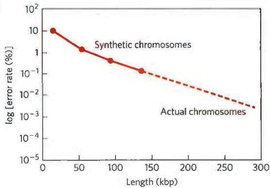  
As shown in the graph, even if the synthetic chromosomes were as long as the normal yeast chromosomes, they would not be as stable. This suggests that other, as yet undiscovered, elements are required for stability.

## Chapter 25

1. (a) Structure 1

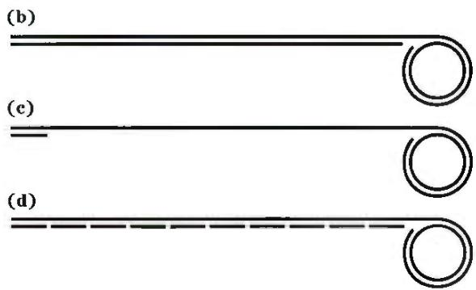

2. This is an extension of the classic Meselson-Stahl experiment. After three generations the molar ratio of ${}^{15}N-{}^{14}N$ DNA to ${}^{14}N-{}^{14}N$ DNA is 2/6 = 0.33.

3. (a) $4.42 \times 10^{5}$ turns (b) 40 min. In cells dividing every 20 min, a replicative cycle is initiated every 20 min, each cycle beginning before the prior one is complete. (c) 2,000 to 5,000 Okazaki fragments. The fragments are 1,000 to 2,000 nucleotides long. The ligation of Okazaki fragments does not occur randomly. Each fragment is stably base-paired with the lagging strand template prior to ligation with its neighbor, ensuring proper ordering.

4. A, 28.7%; G, 21.3%; C, 21.3%; T, 28.7%. The DNA strand made from the template strand: A, 32.7%; G, 18.5%; C, 24.1%; T, 24.7%; the DNA strand made from the complementary template strand: A, 24.7%; G, 24.1%; C, 18.5%; T, 32.7%. This assumes that the two template strands are replicated completely.

5. (a) No. Incorporation of ${}^{32}$ P into DNA results from the synthesis of new DNA, which requires the presence of all four nucleotide precursors. (b) Yes. Although all four nucleotide precursors must be present for DNA synthesis, only one of them has to be radioactive for radioactivity to appear in the new DNA. (c) No. Radioactivity is incorporated only if the ${}^{32}$ P label is in the $\alpha$ phosphate; DNA polymerase cleaves off pyrophosphate—that is, the $\beta$ - and $\gamma$ -phosphate groups.

6. Mechanism 1: 3'-OH group of an incoming dNTP attacks the $\alpha$ phosphate of the triphosphate at the 5' end of the growing DNA strand, displacing pyrophosphate. This mechanism uses normal dNTPs, and the growing end of the DNA always has a triphosphate on the 5' end.

Mechanism 2: This uses a new type of precursor, nucleotide 3'-triphosphates. The growing end of the DNA strand has a 5'-OH group, which attacks the $\alpha$ phosphate of an incoming deoxynucleoside 3'-triphosphate, displacing pyrophosphate. Note that this mechanism would require the evolution of new metabolic pathways to supply the needed deoxynucleoside 3'-triphosphates.

7. The DNA polymerase contains a $3'\rightarrow5'$ exonuclease activity that degrades DNA to produce $[^{32}P]dNMPs$ . The activity is not a $5'\rightarrow3'$ exonuclease, because the addition of unlabeled dNTPs inhibits the production of $[^{32}P]$ dNMPs (polymerization activity would suppress a proofreading exonuclease but not an exonuclease operating downstream of the polymerase). Addition of pyrophosphate would generate $[^{32}P]$ dNTPs through reversal of the polymerase reaction.

8. Leading strand: Precursors: dATP, dGTP, dCTP, dTTP (also needs a template DNA strand and DNA primer); enzymes and other proteins: DNA gyrase, helicase, single-stranded DNA-binding protein, DNA polymerase III, topoisomerases, and pyrophosphatase. Lagging strand: Precursors: ATP, GTP, CTP, UTP, dATP, dGTP, dCTP, dTTP (also needs an RNA primer); enzymes and other proteins: DNA gyrase, helicase, single-stranded DNA-binding protein, primase, DNA polymerase III, DNA polymerase I, DNA ligase, topoisomerases, and pyrophosphatase. NAD+ is also required as a cofactor for DNA ligase.

9. Mutants with defective DNA ligase produce a DNA duplex in which one of the strands remains in pieces (as Okazaki fragments). When this duplex is denatured, sedimentation results in one fraction containing the intact single strand (the high molecular weight band) and one fraction containing the unspliced fragments (the low molecular weight band).

10. Watson-Crick base pairing between template and leading strand; proofreading and removal of wrongly inserted nucleotides by the 3'-exonuclease activity of DNA polymerase III. Yes—perhaps. Because the factors ensuring fidelity of replication are operative in both the leading and the lagging strands, the lagging strand would probably be made with the same fidelity. However, the greater number of distinct chemical operations involved in making the lagging strand might provide a greater opportunity for errors to arise.

## 11. \~1,200 bp (600 in each direction)

12. A small fraction (13 of $10^{9}$ cells) of the histidine-requiring mutants spontaneously undergo back-mutation and regain their capacity to synthesize histidine. 2-Aminoanthracene increases the rate of back-mutations about 1,800-fold and is therefore mutagenic. Since most carcinogens are mutagenic, 2-aminoanthracene is probably carcinogenic.

13. Spontaneous deamination of 5-methylcytosine (see Fig. 8-29a) produces thymine, and thus a G-T mismatched pair. These are among the most common mismatches in the DNA of eukaryotes. The specialized repair system restores the G=C pair.

14. \~1,950 (650 in the DNA degraded between the mismatch and GATC, plus 650 in DNA synthesis to fill the resulting gap, plus 650 in degradation of the pyrophosphate products to inorganic phosphate). ATP is hydrolyzed by the MutSL complex and by the UvrD helicase.

15. (a) UV irradiation produces pyrimidine dimers; in normal fibroblasts, these are excised by cleavage of the damaged strand by a special excinuclease. Thus the denatured single-stranded DNA contains the many fragments created by the cleavage, and the average molecular weight is lowered. These fragments of single-stranded DNA are absent from the XPG samples, as indicated by the unchanged average molecular weight. (b) The absence of fragments in the single-stranded DNA from the XPG cells after irradiation suggests the special excinuclease is defective or missing.

16. Most cancerous tumors consist of cells that are deficient in some aspect of DNA repair, relative to the normal surrounding tissue. They thus can be more sensitive to the DNA damaging agent. Tumor cells also tend to be actively dividing, a state in which cells are more sensitive to DNA damage that might be encountered by replication forks.

17. Using G\* to represent $O^{6}$ -meG:
(a) (5')AACG\*TGCAC
TTG T ACGTG
(5')AACGTGCAC
TTGCACGTG

(b) (5')AACGTGCAC TTGCACGTG

(5')AACGTGCAC TTGCACGTG

(c) (5')AACG\*TGCAC TTG T ACGTG

(5')AACATGCAC

TTGTACGTG

$2\times (5^{\prime})$ AACGTGCAC TTGCACGTG

18. Once paired with a complement after strand invasion, the 3' end, unlike a 5' end, can be extended by a DNA polymerase.

19. During homologous genetic recombination, a Holliday intermediate may be formed almost anywhere within the two paired, homologous chromosomes; the branch point of the intermediate can move extensively by branch migration. In site-specific recombination, the Holliday intermediate is formed between two specific sites, and branch migration is generally restricted by heterologous sequences on either side of the recombination sites.

## 20. (a) Points Y (b) Points X

21. Once replication has proceeded from the origin to a point where one recombination site has been replicated but the other has not, site-specific recombination not only inverts the DNA between the recombination sites but also changes the direction of one replication fork relative to the other. The forks will chase each other around the DNA circle, generating many tandem copies of the plasmid. The multimeric circle can be resolved to monomers by additional site-specific recombination events.

  
22. (a) Even in the absence of an added mutagen, background mutations occur due to radiation, cellular chemical reactions, and so forth. (b) If the DNA is sufficiently damaged, a substantial fraction of gene products is nonfunctional and the cell is nonviable. (c) Cells with reduced DNA repair capability are more sensitive to mutagens. Because they less readily repair lesions caused by R7000, Uvr $^{-}$ bacteria have an increased mutation rate and increased chance of lethal effects. (d) In the Uvr $^{+}$ strain, the excision-repair system removes DNA bases with attached $[^{3}H]R7000$ , decreasing the amount of ${}^{3}H$ in these cells over time. In the Uvr $^{-}$ strain, the DNA is not repaired and the ${}^{3}H$ level increases as $[{}^{3}H]R7000$ continues to react with the DNA.

(e) All mutations listed in the table except A=T to G≡C show significant increases over background. Each type of mutation results from a different type of interaction between R7000 and DNA. Because different types of interactions are not equally likely (due to differences in reactivity, steric constraints, etc.), the resulting mutations occur with different frequencies. (f) No. Only those that start with a G≡C base pair are explained by this model. Thus A=T to C≡G and A=T to T=A must be due to R7000 attaching to an A or a T. (g) R7000—G pairs with A. First, R7000 adds to G≡C to give R7000—G≡C. (Compare this with what happens with the CH₃—G in Fig. 25-27b.) If this is not repaired, one strand is replicated as R7000—G=A, which is repaired to T=A. The other strand is wild-type. If the replication produces R7000—G=T, a similar pathway leads to an A=T base pair. (h) No. Compare data in the two tables, and keep in mind that different mutations occur at different frequencies.

A=T to C≡G: moderate in both strains; but better repair in Uvr $^{+}$

G≡C to A=T: moderate in both; no real difference

G≡C to C≡G: higher in Uvr $^{+}$ ; certainly less repair!

G≡C to T=A: high in both; no real difference

A=T to T=A: high in both; no real difference

A=T to G≡C: low in both; no real difference

Certain adducts may be more readily recognized by the repair apparatus than others, and these are repaired more rapidly and result in fewer mutations.

## Chapter 26

1. (a) 60 to 100 s (b) 500 to 900 nucleotides (c) 6 to 11 h

2. A single base error in DNA replication, if not corrected, would cause one of the two daughter cells, and all its progeny, to have a mutated chromosome. A single base error in RNA transcription would not affect the chromosome; it would lead to formation of some defective copies of one protein, but because mRNAs turn over rapidly, most copies of the protein would not be defective. The progeny of this cell would be normal.

3. Normal posttranscriptional processing at the 3' end (cleavage and polyadenylation) would be inhibited or blocked.

4. Because the template-strand RNA does not encode the enzymes needed to initiate viral infection, it would probably be inert or simply degraded by cellular ribonucleases. Replication of the template-strand RNA and propagation of the virus could occur only if intact RNA replicase (RNA-dependent RNA polymerase) were introduced into the cell along with the template strand.

5. AUGUCCAAAAUCGUA

6. (1) Use of a template strand of nucleic acid; (2) synthesis in the $5'\rightarrow3'$ direction; (3) use of nucleoside triphosphate substrates, with formation of a phosphodiester bond and displacement of $PP_{i}$ . Polynucleotide phosphorylase forms phosphodiester bonds but differs in all other listed properties.

7. Most of the RNA transcribed in the nucleus was intronic and removed from the mRNAs.

8. No, at this time it is not possible to determine a cell's transcriptome based solely on the genome. Different cells have different transcriptomes based on which promoters are being used and how the transcripts are processed by factors present in the cell.

9. Generally two: one to cleave the phosphodiester bond at one intron-exon junction, the other to link the resulting free exon end to the exon at the other end of the intron. If the nucleophile in the first step were water, this step would be a hydrolysis, and only one transesterification step would be required to complete the splicing process.

10. Many snoRNAs, required for rRNA modification reactions, are encoded in introns. If splicing does not occur, snoRNAs are not produced.

11. (a) Water attacks the C-6 position of adenine, forming a tetrahedral intermediate, which then eliminates ammonia to form inosine. (b) Inosine can no longer pair correctly with U residues found on the opposite RNA strand prior to ADAR activity. This results in disruption of the RNA duplex. (c) Inosine does not have the same pairing properties as adenine and could potentially recode that particular codon so that a different amino acid is incorporated into the protein.

12. Physical separation of the processes prevents translation of primary or precursor transcripts that have not yet been processed by the cell. It also prevents the RNA processing and translational machineries from competing with one another for mRNAs.

13. (a) This could change how proteins or other RNAs recognize a particular RNA sequence and interfere with splicing, poly(A) formation, RNA modification, or other steps in which sequence-specific RNA recognition is important. (b) S-adenosylmethionine serves as the methyl donor in the synthesis of $N^{6}$ -methyladenosine.

14. These enzymes lack a $3'\rightarrow5'$ proofreading exonuclease and have a high error rate; the likelihood of a replication error that would inactivate the virus is much lower in a small genome than in a large one.

15. (a) $4^{36} = 4.7 \times 10^{21}$ (b) 0.00002% (c) For the “unnatural selection” step, use a chromatographic resin with a bound molecule that is a transition-state analog of the ester hydrolysis reaction.

16. Though RNA synthesis is quickly halted by $\alpha$ -amanitin toxin, it takes several days for the critical mRNAs and proteins in the liver to degrade, causing liver dysfunction and death.

17. (a) After lysis of the cells and partial purification of the contents, an antibody-based assay could detect the $\beta$ subunit. The $\beta$ subunit could then be subjected to tandem mass spectrometry, which could detect the difference in amino acid residues between the normal $\beta$ subunit and the mutated form. (b) Direct DNA sequencing (by the Sanger method)

18. (a) 384 (b) 1,620 nucleotide pairs (c) Most of the nucleotides are untranslated regions at the 3' and 5' ends of the mRNA. Also, most mRNAs code for a signal sequence (Chapter 27) in their protein products, which is eventually removed to produce the mature, functional protein.

19. (a) Injection of the antisense oligo cleaves the c-mos RNA and removes its poly(A) tail. This correlates with a loss in oocyte maturation. The noncoding poly(A) tail of the c-mos mRNA must be important for its function in maturation. (b) The sense oligo control shows that these results depend on complementarity to the c-mos mRNA. (c) The prosthetic RNA likely base-paired with the amputated c-mos mRNA and restored its function. Therefore, poly(A) tails can function "in trans"—they do not need to be covalently connected to the mRNAs they regulate. (d) The poly(A) tail stimulates protein expression in the reporter. This is likely also occurring with c-mos, and this protein expression is important for oocyte maturation. (e) These results suggest that the expression of genes can be artificially controlled either by cutting off their poly(A) tails or by attaching synthetic ones derived from other genes. This could be useful for fine-tuning gene expression in bioengineered cells or turning expression on or off.

## Chapter 27

1. (a) Gly-Gln-Ser-Leu-Leu-Ile (b) Leu-Asp-Ala-Pro (c) His-Asp-Ala-Cys-Cys-Tyr (d) Met-Asp-Glu in eukaryotes; fMet-Asp-Glu in bacteria

2. UUAAUGUAU, UUGAUGUAU, CUUAUGUAU, CUCAUGUAU, CUAAUGUAU, CUGAUGUAU, UUAAUGUAC, UUGAUGUAC, CUUAUGUAC, CUCAUGUAC, CUAAUGUAC, CUGAUGUAC

3. No. Because nearly all the amino acids have more than one codon (e.g., Leu has six), any given polypeptide can be encoded by several different base sequences. However, some amino acids are encoded by only one codon, and those with multiple codons often share the same nucleotide at two of the three positions, so certain parts of the mRNA sequence encoding a protein of known amino acid sequence can be predicted with high certainty.

4. (a) (5')CGACGGCGCGAAGUCAGGGGUGUUAAG(3') (b) Arg-Arg-Arg-Glu-Val-Arg-Gly-Val-Lys (c) No. The complementary antiparallel strands in double-helical DNA do not have the same base sequence in the 5'→3' direction. RNA is transcribed from only one specific strand of duplex DNA. The RNA polymerase must therefore recognize and bind to the correct strand.

5. (a), (b), and (c) are correct. (a) This outcome would restore the original gene and allow production of the native protein. (b) Altering the gene to insert a different amino acid at this position would allow for the generation of a full-length protein. Some activity may be present, especially if the new amino acid represented a conservative alteration (such as Ile substituting for Val). (c) This outcome would be similar to (c), inserting an amino acid (probably a different one) at the affected position and allowing synthesis of a full length and perhaps active protein. This outcome is called nonsense suppression. It works because most cells have multiple copies of particular tRNAs, some of which are expressed at low levels. If a minor one is altered, the genetic code is not disrupted because the other copies of the tRNA provide normal function. (d) This outcome would rarely work, since it would tend to introduce too many amino acid changes into the protein.

6. The labeled amino acids were found at the carboxyl end. Dintzis only isolated complete $\alpha$ subunits. With short incubation times, labeled amino acids would only appear in the part of the polypeptide that was synthesized last. Labeled amino acids introduced at the amino terminus would not be seen, because those polypeptides would not have been completed prior to protein isolation.

7. There are two tRNAs for methionine: tRNA $^{fMet}$ , which is the initiating tRNA, and tRNA $^{Met}$ , which can insert a Met residue in interior positions in a polypeptide. Only fMet-tRNA $^{fMet}$ is recognized by the initiation factor IF2 and is aligned with the initiating AUG positioned at the ribosomal P site in the initiation complex. AUG codons in the interior of the mRNA can bind and incorporate only Met-tRNA $^{Met}$ .

8. (5')AUG-GGU-CGU-GAG-UCA-UCG-UUA-AUU-GUA-GCU-GGA-GGG-GAG-GAA-UGA(3') is translated as Met-Gly-Arg-Glu-Ser-Ser-Leu-Ile-Val-Ala-Gly-Gly-Glu-Glu. The peptide is 14 amino acids long instead of 15, because the last codon is a stop codon. Ten tRNAs are needed, one for each type of amino acid.

9. Allow polynucleotide phosphorylase to act on a mixture of UDP and CDP in which UDP has, say, five times the concentration of CDP. The result would be a synthetic RNA polymer with many UUU triplets (coding for Phe), a smaller number of UUC (Phe), UCU (Ser), and CUU (Leu), a much smaller number of UCC (Ser), CUC (Leu), and CCU (Pro), and an even smaller number of CCC (Pro).

10. A minimum of 583 ATP equivalents (based on 4 per amino acid residue added, except that there are only 145 translocation steps). Correction of each error requires 2 ATP equivalents. For glycogen synthesis, 292 ATP equivalents are required. The extra energy cost for $\beta$ -globin synthesis reflects the cost of the information content of the protein. At least 20 activating enzymes, 70 ribosomal proteins, 4 rRNAs, 32 or more tRNAs, an mRNA, and 10 or more auxiliary enzymes must be made by the eukaryotic cell in order to synthesize a protein from amino acids. The synthesis of an $(\alpha 1 \rightarrow 4)$ chain of glycogen from glucose requires only 4 or 5 enzymes (Chapter 15).

11.

<table><tr><td>Glycine codons</td><td>Anticodons</td></tr><tr><td>(5&#x27;)GGU</td><td>(5&#x27;)ACC, GCC, ICC</td></tr><tr><td>(5&#x27;)GGC</td><td>(5&#x27;)GCC, ICC</td></tr><tr><td>(5&#x27;)GGA</td><td>(5&#x27;)UCC, ICC</td></tr><tr><td>(5&#x27;)GGG</td><td>(5&#x27;)CCC, UCC</td></tr></table>

(a) The 3' and middle position (b) Pairings with anticodons (5')GCC, ICC, and UCC (c) Pairings with anticodons (5')ACC and CCC 12. (a), (c), (e), and (g) only; (b), (d), and (f) cannot be the result of single-base mutations, because (b) and (f) would require substitutions of two bases, and (d) would require substitutions of all three bases.

13. (5') AUGAUUUGCUAUCUUGGACU

<table><tr><td>Changes:</td><td>CC</td><td>AU</td><td>U</td><td>C</td><td>C</td></tr><tr><td></td><td>U</td><td></td><td>C</td><td>A</td><td>A</td></tr><tr><td></td><td></td><td></td><td>G</td><td>G</td><td>G</td></tr></table>

Of 63 possible one-base changes, 14 would result in no coding change.

14. The two DNA codons for Glu are GAA and GAG, and the four DNA codons for Val are GTT, GTC, GTA, and GTG. A single base change in GAA to form GTA or in GAG to form GTG could account for the Glu → Val replacement in sickle-cell hemoglobin. Much less likely are two-base changes, from GAA to GTG, GTT, or GTC; and from GAG to GTA, GTT, or GTC.

15. Isoleucine is similar in structure to several other amino acids, particularly valine. Distinguishing between valine and isoleucine in the aminoacylation process requires a second filter—a proofreading function. Histidine has a structure unlike that of any other amino acid, providing opportunities for binding specificity adequate to ensure accurate aminoacylation of the cognate tRNA.

16. (a) The Ala-tRNA synthetase recognizes the G $^{3}$ -U $^{70}$ base pair in the amino acid arm of tRNA $^{Ala}$ . (b) The mutant tRNA $^{Ala}$ would insert Ala residues at codons encoding Pro. (c) A mutation that might have similar effects is an alteration in tRNA $^{Pro}$ that allowed it to be recognized and aminoacylated by Ala-tRNA synthetase. (d) Most of the proteins in the cell would be inactivated, so these would be lethal mutations and hence never observed. This represents a powerful selective pressure for maintaining the genetic code.

17. The 15,000 ribosomes in an E. coli cell can synthesize more than 23,000 proteins in 20 minutes.

18. IF2: The 70S ribosome would form, but initiation factors would not be released and elongation could not start. EF-Tu: The second aminoacyl-tRNA would bind to the ribosomal A site, but no peptide bond would form. EF-G: The first peptide bond would form, but the ribosome would not move along the mRNA to vacate the A site for binding of a new EF-Tu-tRNA.

19. The amino acid most recently added to a growing polypeptide chain is the only one covalently attached to a tRNA and thus is the only link between the polypeptide and the mRNA encoding it. A proofreading activity would sever this link, halting synthesis of the polypeptide and releasing it from the mRNA.

20. SecA; Drugs that inhibit the ability of SecA to bind bacterial proteins or hydrolyze ATP could significantly disrupt the export of bacterial proteins. SecB is nonessential as bacteria have numerous other chaperone proteins. Antibiotics that target the SecYEG complex, which is homologous to its eukaryotic counterpart (Sec61), could cause significant adverse effects in humans.

21. The protein would be directed into the ER, and from there the targeting would depend on additional signals. SRP binds the amino-terminal signal early in protein synthesis and directs the nascent polypeptide and ribosome to receptors in the ER. Because the protein is translocated into the lumen of the ER as it is synthesized, the NLS is never accessible to the proteins involved in nuclear targeting.

22. Trigger factor is a molecular chaperone that stabilizes an unfolded and translocation-competent conformation of ProOmpA.

23. DNA with a minimum of 5,784 bp; some of the coding sequences must be nested or overlapping.

24. (a) The helices associate through the hydrophobic effect and van der Waals interactions. (b) R groups 3, 6, 7, and 10 extend to the left; 1, 2, 4, 5, 8, and 9 extend to the right. (c) One possible sequence is

<table><tr><td>1</td><td>2</td><td>3</td><td>4</td><td>5</td><td>6</td><td>7</td><td>8</td><td>9</td><td>10</td></tr><tr><td colspan="10">N-Phe-Ile-Glu-Val-Met-Asn-Ser-Ala-Phe-Gln-C</td></tr></table>

(d) One possible DNA sequence for the amino acid sequence in (c) is Nontemplate strand

(5')TTTATTGAAGTAATGAATAGTGCATTCCAG(3')
(3')AAATAACTTCATTACTTATCACGTAAGGTC(5')

Template strand

(e) Phe, Leu, Ile, Met, and Val. All are hydrophobic, but the set does not include all the hydrophobic amino acids; Trp, Pro, and Ala are missing. (f) Tyr, His, Gln, Asn, Lys, Asp, and Glu. All of these are hydrophilic, although Tyr is less hydrophilic than the others. The set does not include all the hydrophilic amino acids; Ser, Thr, and Arg are missing. (g) Omitting T from the mixture excludes codons starting or ending with T—thus excluding Tyr, which is not very hydrophilic, and, more importantly, excluding the two possible stop codons (TAA and TAG). No other amino acids in the NAN set are excluded by omitting T. (h) Misfolded proteins are often degraded in the cell. Therefore, if a synthetic gene has produced a protein that forms a band on the SDS gel, it is likely that this protein is folded properly. (i) Protein folding depends on more than the hydrophobic effect and van der Waals interactions. There are many reasons why a synthesized random-sequence protein might not fold into the four-helix structure. For example, hydrogen bonds between hydrophilic side chains could disrupt the structure. Also, not all sequences have an equal propensity to form an $\alpha$ helix.

## Chapter 28

1. (a) Tryptophan synthase levels remain high despite the presence of tryptophan. (b) Levels again remain high. (c) Levels rapidly decrease, preventing wasteful synthesis of tryptophan.

2. The E. coli cells will produce $\beta$ -galactosidase when they are subjected to high levels of a DNA-damaging agent such as UV light. Under such conditions, RecA binds to single-stranded chromosomal DNA and facilitates autocatalytic cleavage of the LexA repressor, releasing LexA from its binding site and allowing transcription of downstream genes.

3. (a) Constitutive, low-level expression of the operon; most mutations in the operator would make the repressor less likely to bind.
(b) Constitutive expression; mutation prevents negative regulation of the operon. (c) Increased expression; under conditions in which the operon is induced, mutation increases recruitment of RNA polymerase.
(d) Constant repression; mutation allows repressor to readily bind to operator. (e) Decreased expression; under conditions in which the operon is induced, mutation decreases recruitment of RNA polymerase.

## 4. 7,000 copies

5. $8 \times 10^{-9}$ M, about $10^{5}$ times greater than the dissociation constant. With 10 copies of active repressor in the cell, the operator site is always bound by the repressor molecule.

6. (a) through (e). Each condition decreases expression of lac operon genes.

7. (a) Less attenuation. The ribosome completing the translation of sequence 1 would no longer overlap and block sequence 2; sequence 2 would always be available to pair with sequence 3, preventing formation of the attenuator structure. (b) More attenuation. Sequence 2 would pair less efficiently with sequence 3; the attenuator structure would be formed more often, even when sequence 2 was not blocked by a ribosome. (c) No attenuation. The only regulation would be that afforded by the Trp repressor. (d) Attenuation loses its sensitivity to Trp tRNA. It might become sensitive to His tRNA. (e) Attenuation would rarely, if ever, occur. Sequences 2 and 3 always block formation of the attenuator. (f) Constant attenuation. Attenuator always forms, regardless of the availability of tryptophan.

8. Induction of the SOS response could not occur, making the cells more sensitive to high levels of DNA damage.

9. Each Salmonella cell would have flagella made up of both types of flagellar protein, and the cell would be vulnerable to antibodies generated in response to either protein.

10. A dissociable factor necessary for activity (e.g., a specificity factor similar to the $\sigma$ subunit of the E. coli enzyme) may have been lost during purification of the polymerase.

11.

## Gal4 protein

<table><tr><td>Gal4p DNA-binding domain</td><td>Gal4p activator domain</td></tr></table>

## Engineered protein

<table><tr><td>Lac repressor DNA-binding domain</td><td>Gal4p activator domain</td></tr></table>

The engineered protein cannot bind to the Gal4p-binding site in the GAL gene (UAS $_{G}$ ) because it lacks the Gal4p DNA-binding domain. Modify the Gal4p-binding site in the DNA to give it the nucleotide sequence to which the Lac repressor normally binds (using methods described in Chapter 9).

12. Methylamine. The reaction proceeds with attack of water on the guanidinium carbon of the modified arginine.

13. Synthesis of a protein first requires the synthesis of an mRNA long enough to encode the protein and to include any necessary regulatory sequences, with one ribonucleoside triphosphate used up for every nucleotide residue included in the mRNA. Then, the mRNA must be translated—one of the most energy-intensive processes in the cell (Chapter 27). To maintain repression, the repressor protein would need to be synthesized repeatedly. With the use of RNA as repressor, the RNA can be shorter than a protein repressor—encoding mRNA, and no translation step is required.

14. The bcd mRNA needed for development is contributed to the egg by the mother. The fertilized egg develops normally even if its genotype is $bcd^{-}/bcd^{-}$ , as long as the mother has one normal bcd gene and the $bcd^{-}$ allele is recessive. However, the adult $bcd^{-}/bcd^{-}$ female will be sterile because she has no normal bcd mRNA to contribute to her eggs.

15. (a) For 10% expression (90% repression), 10% of the repressor has bound inducer and 90% is free and available to bind the operator. The calculation uses Eqn 5-8 (p. 151), with Y = 0.1 and $K_{d} = 10^{-4}$ M:

$$
Y = \frac {[ \mathrm{IPTG} ]}{[ \mathrm{IPTG} ] + K _ {\mathrm{d}}} = \frac {[ \mathrm{IPTG} ]}{[ \mathrm{IPTG} ] + 1 0 ^ {- 4} \mathrm{M}}
$$

$$
0. 1 = \frac {[ \mathrm{IPTG} ]}{[ \mathrm{IPTG} ] + 1 0 ^ {- 4} \mathrm{M}}
$$

$$
0. 9 [ \mathrm{IPTG} ] = 1 0 ^ {- 5} \quad \text { or } \quad [ \mathrm{IPTG} ] = 1. 1 \times 1 0 ^ {- 5} \mathrm{M}
$$

For 90% expression, 90% of the repressor has bound inducer, so Y = 0.9. Entering the values for Y and $K_{d}$ in Eqn 5-8 gives [IPTG] = $9 \times 10^{-4}$ M. Thus, gene expression varies 10-fold over a roughly 10-fold [IPTG] range. (b) You would expect the protein levels to be low before induction, to rise during induction, and then to decay as synthesis stops and the proteins are degraded. (c) As shown in (a), the lac operon has more levels of expression than just on or off; thus it does not have characteristic A. As shown in (b), expression of the lac operon subsides once the inducer is removed; thus it lacks characteristic B. (d) GFP-on: rep $^{ts}$ (designating the protein product of the rep $^{ts}$ gene) and GFP are expressed at high levels; rep $^{ts}$ represses OP $_{\lambda}$ , so no LacI is produced. GFP-off: LacI is expressed at a high level; LacI represses OP $_{lac}$ , so rep $^{ts}$ and GFP are not produced. (e) IPTG treatment switches the system from GFP-off to GFP-on. IPTG has an effect only when LacI is present, so it affects only the GFP-off state. Adding IPTG relieves the repression of OP $_{lac}$ , allowing high-level expression of rep $^{ts}$ , which turns off expression of LacI, and high-level expression of GFP. (f) Heat treatment switches the system from GFP-on to GFP-off. Heat has an effect only when $rep^{ts}$ is present, so affects only the GFP-on state. Heat inactivates $rep^{ts}$ and relieves the repression of $OP_{\lambda}$ , allowing high-level expression of LacI. LacI then acts at $OP_{lac}$ to repress synthesis of $rep^{ts}$ and GFP.

(g) Characteristic A: The system is not stable in the intermediate state. At some point, one repressor will act more strongly than the other due to chance fluctuations in expression; this shuts off expression of the other repressor and locks the system in one state. Characteristic B: Once one repressor is expressed, it prevents the synthesis of the other; thus the system remains in one state even after the switching stimulus has been removed. (h) At no time does any cell express an intermediate level of GFP—this is a confirmation of characteristic A. At the intermediate concentration (X) of inducer, some cells have switched to GFP-on while others have not yet made the switch and remain in the GFP-off state; none are in between. The bimodal distribution of expression levels at [IPTG] = X is caused by the mixed population of GFP-on and GFP-off cells.

## a

proteins with sequences that make up ATP-binding cassettes; serve to transport a large variety of substrates, including inorganic ions, lipids, and nonpolar drugs, out of the cell, using ATP as the energy source.

absolute configuration: The configuration of four different substituent groups around an asymmetric carbon atom, in relation to D- and L-glyceraldehyde.

absorption: Transport of the products of digestion from the intestinal tract into the blood.

acceptor control: Regulation of the rate of respiration by the availability of ADP as phosphate group acceptor.

light-absorbing pigments (carotenoids, xanthophylls, and phycobilins) in plants and photosynthetic bacteria that complement chlorophylls in trapping energy from sunlight.

acid dissociation constant: The dissociation constant ( $K_{a}$ ) of an acid, describing its dissociation into its conjugate base and a proton.

acidosis: A metabolic condition in which the capacity of the body to buffer $\mathrm{H^{+}}$ is diminished; usually accompanied by decreased blood pH. Compare alkalosis.

actin: A protein that makes up the thin filaments of muscle; also an important component of the cytoskeleton of many eukaryotic cells.

action spectrum: A plot of the efficiency of light at promoting a light-dependent process such as photosynthesis as a function of wavelength.

activation energy ( $\Delta G^{\ddagger}$ ): The amount of energy (in joules) required to convert all the molecules in 1 mol of a reacting substance from the ground state to the transition state.

activator: (1) A DNA-binding protein that positively regulates the expression of one or more genes; that is, transcription rates increase when an activator is bound to the DNA. (2) A positive modulator of an allosteric enzyme.

active site: The region of an enzyme surface that binds the substrate molecule and catalytically transforms it; also known as the catalytic site.

active transporter: Membrane protein that moves a solute across a membrane against an electrochemical gradient in an energy-requiring reaction.

activity: The true thermodynamic activity or potential of a substance, as distinct from its molar concentration.

acyl phosphate: Any molecule with the general chemical form R-C(=O)-O-OPo $_{3}^{2-}$ ;

an acid anhydride between a carboxylic acid and phosphoric acid.

adaptor proteins: Signaling proteins, generally lacking enzymatic activities, that have binding sites for two or more cellular components and serve to bring those components together.

adenosine 3',5'-cyclic monophosphate: See cyclic AMP.

adenosine diphosphate: See ADP.
adenosine triphosphate: See ATP.

S-adenosylmethionine (adoMet): An enzymatic cofactor involved in methyl group transfers.

adenylate kinase: The enzyme that catalyzes the reversible reaction ATP + AMP → 2 ADP. When anabolic activities have depleted the supply of ATP, this enzyme produces more ATP from ADP. Also called myokinase. Compare nucleoside monophosphate kinase.

adipocyte: An animal cell specialized for the storage of fats (triacylglycerols).

adipose tissue: Connective tissue specialized for the storage of large amounts of triacylglycerols. See also beige adipose tissue; brown adipose tissue; white adipose tissue.

ADP (adenosine diphosphate): A ribonucleoside 5'-diphosphate serving as phosphate group acceptor in the cell energy cycle.

adoMet: See S-adenosylmethionine.

aerobe: An organism that lives in air and uses oxygen as the terminal electron acceptor in respiration.

aerobic: Requiring or occurring in the presence of oxygen.

aerobic glycolysis: Cellular energy generation by glycolysis alone (without subsequent oxidation of pyruvate) even though oxygen is available. See glycolysis.

agonist: A compound, typically a hormone or neurotransmitter, that elicits a physiological response when it binds to its specific receptor.

family of proteins that share a domain that binds the R subunit of protein kinase A (PKA). Each also has a domain with affinity for one of a number of diverse proteins, so that each AKAP anchors PKA in a specific location or to a specific protein.

alcohol fermentation: See ethanol fermentation.

aldose: A simple sugar in which the carbonyl carbon atom is an aldehyde; that is, the carbonyl carbon is at one end of the carbon chain.

alkalosis: A metabolic condition in which the capacity of the body to buffer $OH^{-}$ is diminished; usually accompanied by an increase in blood pH. Compare acidosis.

allosteric enzyme: A regulatory enzyme with catalytic activity modulated by the noncovalent binding of a specific metabolite at a site other than the active site.

allosteric protein: A protein (generally with multiple subunits) with multiple ligand-binding sites, such that ligand binding at one site affects ligand binding at another.

allosteric site: The specific site on the surface of an allosteric protein molecule to which the modulator or effector molecule binds.

α helix: A helical conformation of a polypeptide chain, usually right-handed, with maximal intrachain hydrogen bonding; one of the most common secondary structures in proteins.

α oxidation: An alternative path for the oxidation of β-methyl fatty acids in peroxisomes, as distinct from β oxidation and ω oxidation.

alternative splicing: A process in which exons are selectively spliced (linked) in alternative ways to generate different mature mRNAs.

Ames test: A simple bacterial test for carcinogenicity, based on the assumption that carcinogens are mutagens.

amino acid activation: ATP-dependent enzymatic esterification of the carboxyl group of an amino acid to the 3'-hydroxyl group of its corresponding tRNA.

amino acids: $\alpha$ -Amino-substituted carboxylic acids, the building blocks of proteins.

aminoacyl-tRNA: An aminoacyl ester of a tRNA.

aminoacyl-tRNA synthetases: Enzymes that catalyze synthesis of an aminoacyl-tRNA at the expense of ATP energy.

amino-terminal residue: The only amino acid residue in a polypeptide chain that has a free $\alpha$ -amino group; defines the amino terminus of the polypeptide.

aminotransferases: Enzymes that catalyze the transfer of amino groups from $\alpha$ -amino to $\alpha$ -keto acids; also called transaminases.

ammonotelic: Excreting excess nitrogen in the form of ammonia.

protein kinase allosterically activated by 5'-adenosine monophosphate (AMP) and inhibited by ATP. AMPK action generally shifts metabolism away from biosynthesis toward energy production.

amphibolic pathway: A metabolic pathway used in both catabolism and anabolism.

amphipathic: Containing both polar and nonpolar domains.

amphitropic proteins: Proteins that associate reversibly with the membrane and thus can be found in the cytosol, in the membrane, or in both places.

ampholyte: A substance that can act as either a base or an acid.

amphoteric: Capable of donating and accepting protons, thus able to serve as an acid or a base.

AMPK: See AMP-activated protein kinase.

amyloidoses: A variety of progressive diseases characterized by abnormal deposits of misfolded proteins in one or more organs or tissues.

anabolism: The phase of intermediary metabolism concerned with the energy-requiring biosynthesis of cell components from smaller precursors, typically a reductive process.

anaerobe: An organism that lives without oxygen. Obligate anaerobes die when exposed to oxygen.

anaerobic: Occurring in the absence of air or oxygen.

analyte: A molecule to be analyzed by mass spectrometry.

anammox: Anaerobic oxidation of ammonia to $N_{2}$ , using nitrite as electron acceptor; carried out by specialized chemolithotrophic bacteria.

anaplerotic reaction: An enzyme-catalyzed reaction that can replenish the supply of intermediates in the citric acid cycle.

angstrom (Å): A unit of length ( $10^{-8}$ cm) used to indicate molecular dimensions. 10 Å = 1 nm.

anhydride: The product of the condensation of two carboxyl or phosphate groups in which the elements of water are eliminated to form a compound with the general structure R—X—O—X—R, where X is either carbon

or phosphorus.

anion-exchange resin: A polymeric resin with fixed cationic groups, used in the chromatographic separation of anions.

anomeric carbon: The carbon atom in a sugar at the new chiral center formed when a sugar cyclizes to form a hemiacetal. This is the carbonyl carbon of aldehydes and ketones.

anomers: Two stereoisomers of a given sugar that differ only in the configuration about the carbonyl (anomeric) carbon atom.

anorexigenic: Tending to decrease appetite and food consumption. Compare orexigenic.

antagonist: A compound that interferes with the physiological action of another substance (the agonist), usually at a hormone or neurotransmitter receptor.

antibiotic: One of many different organic compounds that are formed and secreted by various species of microorganisms and plants, are toxic to other microbial species, and presumably have a defensive function.

antibody: A defense protein synthesized by the immune system of vertebrates and circulated in the blood. See also immunoglobulin.

anticodon: A specific sequence of three nucleotides in a tRNA, complementary to a codon for an amino acid in an mRNA.

antigen: A molecule capable of eliciting the synthesis of a specific antibody in vertebrates.

antiparallel: Describes two linear polymers that are opposite in polarity or orientation.

antiport: Cotransport of two solutes across a membrane in opposite directions.

apoenzyme: The protein portion of an enzyme, exclusive of any organic or inorganic cofactors or prosthetic groups that might be required for catalytic activity.

apolipoprotein: The protein component of a lipoprotein.

apoprotein: The protein portion of a protein, exclusive of any organic or inorganic cofactors or prosthetic groups that might be required for activity.

apoptosis: Process in which a cell in an organism brings about its own death and lysis, in response to a signal from outside or programmed in its genes, by systematically degrading its own macromolecules for salvage by the organism.

aptamer: An oligonucleotide that binds specifically to one molecular target, usually selected by an iterative cycle of affinity-based enrichment (SELEX).

aquaporins (AQPs): A family of integral membrane proteins that mediate the flow of water across membranes.

archaea: Members of Archaea, one of the three domains of living organisms; include many species that thrive in extreme environments of high ionic strength, high temperature, or low pH.

arcuate nucleus: A group of neurons in the hypothalamus that function in regulation of hunger and feeding behavior.

asymmetric carbon atom: A carbon atom that is covalently bonded to four different groups and thus may exist in two different tetrahedral configurations.

ATP (adenosine triphosphate): A ribonucleoside 5'-triphosphate functioning as a phosphate group donor in the cellular energy cycle; carries chemical energy between metabolic pathways by serving as

a shared intermediate coupling endergonic and exergonic reactions.

ATPase: An enzyme that hydrolyzes ATP to yield ADP and phosphate, usually coupled to a process requiring energy.

ATP synthase: An enzyme complex that forms ATP from ADP and phosphate during oxidative phosphorylation in the inner mitochondrial membrane or the bacterial plasma membrane, and during photophosphorylation in chloroplasts.

attenuator: An RNA sequence involved in regulating the expression of certain genes; functions as a transcription terminator.

autophagy: Catabolic lysosomal degradation of cellular proteins and other components.

autophosphorylation: Strictly, the phosphorylation of an amino acid residue in a protein that is catalyzed by the same protein molecule; often extended to include phosphorylation of one subunit of a homodimer by the other subunit.

autotroph: An organism that can synthesize its own complex molecules from very simple carbon and nitrogen sources, such as carbon dioxide and ammonia.

auxin: A plant growth hormone.

auxotrophic mutant (auxotroph): A mutant organism defective in the synthesis of a particular biomolecule, which must therefore be supplied for the organism's growth.

Avogadro's number (N): The number of molecules in a gram molecular weight (a mole) of any compound $(6.02 \times 10^{23})$ .

## b

bacteria: Members of Bacteria, one of the three domains of living organisms; they have a plasma membrane but no internal organelles or nucleus.

bacteriophage: A virus capable of replicating in a bacterial cell; also called a phage.

baculovirus: Any of a group of double-stranded DNA viruses that infect invertebrates, particularly insects; widely used for protein expression in biotechnology.

Barr body: A condensed, inactive form of the X chromosome found in the cells of female mammals.

basal metabolic rate: An animal's rate of oxygen consumption when at complete rest, long after a meal.

base pair: Two nucleotides in nucleic acid chains that are paired by hydrogen bonding of their bases; for example, A with T or U, and G with C.

BAT: See brown adipose tissue.

B cell: See B lymphocyte.

beige adipose tissue: Thermogenic adipose tissue activated by cooling of the individual; expresses the uncoupling protein UCP1 (thermogenin) at a high level. Compare brown adipose tissue; white adipose tissue.

β conformation: An extended, zigzag arrangement of a polypeptide chain; a common secondary structure in proteins.

β oxidation: Oxidative degradation of fatty acids into acetyl-CoA by successive oxidations at the β-carbon atom; as distinct from α oxidation and ω oxidation.

β sheet: The side-by-side, hydrogen-bonded arrangement of polypeptide chains in the extended β conformation.

β turn: A type of protein secondary structure consisting of four amino acid residues arranged in a tight turn so that the polypeptide turns back on itself.

bilayer: A double layer of oriented amphipathic lipid molecules, forming the basic structure of biological membranes. The hydrocarbon tails face inward to form a continuous nonpolar phase.

bile acids: Polar derivatives of cholesterol, secreted by the liver into the intestine, that serve to emulsify dietary fats, facilitating lipase action.

bile salts: Amphipathic steroid derivatives with detergent properties, participating in digestion and absorption of lipids.

binding energy ( $\Delta G_{B}$ ): The energy derived from noncovalent interactions between enzyme and substrate or receptor and ligand.

binding site: The crevice or pocket on a protein in which a ligand binds.

bioassay: A method for measuring the amount of a biologically active substance (such as a hormone) in a sample by quantifying the biological response to aliquots of that sample.

( $\Delta G^{\circ}$ ): The free-energy change for a reaction occurring under a set of standard conditions: temperature, 298 K; pressure, 1 atm (101.3 kPa); all solutes at 1 M concentration; at pH 7.0 in 55.5 M water. Also called standard transformed free-energy change. Compare standard free-energy change ( $\Delta G^{\circ}$ ).

biochemistry: A molecular description of the structures, mechanisms, and chemical processes of living things in all their diverse forms.

bioinformatics: The computerized analysis of biological data, using methods derived from statistics, linguistics, mathematics, chemistry, biochemistry, and physics. The data are often nucleic acid or protein sequences or structural data.

biosphere: All the places on or in the earth, the seas, and the atmosphere occupied by living matter.

biotin: A vitamin; an enzymatic cofactor in carboxylation reactions.

B lymphocyte (B cell): One of a class of blood cells (lymphocytes), responsible for the production of circulating antibodies.

## body mass index (BMI): A measure of

obesity, calculated as weight in kilograms divided by (height in meters) $^{2}$ . A BMI of more than 27.5 is defined as overweight; more than 30, as obese.

bond energy: The energy required to break a bond.

branch migration: Movement of the branch point in a branched DNA formed from two DNA molecules with identical sequences. See also Holliday intermediate.

brown adipose tissue (BAT): Thermogenic adipose tissue rich in mitochondria that contain the uncoupling protein UCP1 (thermogenin), which uncouples electron transfer through the respiratory chain from ATP synthesis. Compare beige adipose tissue; white adipose tissue.

buffer: A system capable of resisting changes in pH, consisting of a conjugate acid-base pair in which the ratio of proton acceptor to proton donor is near unity.

## C

$C_{3}$ plants: Plants in which the first product of $CO_{2}$ fixation is the three-carbon compound 3-phosphoglycerate. Compare $C_{4}$ plants.

$C_{4}$ pathway: The metabolic pathway in which $CO_{2}$ is first added to phosphoenolpyruvate by the enzyme PEP carboxylase to produce the four-carbon compound within mesophyll cells that is later transported to the bundle-sheath cells, where the $CO_{2}$ is released for use in the Calvin cycle.

$C_{4}$ plants: Plants (generally tropical) in which $CO_{2}$ is first fixed into a four-carbon compound, oxaloacetate or malate, before entering the Calvin cycle via the rubisco reaction. Compare $C_{3}$ plants.

calorie: The amount of heat required to raise the temperature of 1.0 g of water from 14.5 to 15.5 °C. One calorie (cal) equals 4.18 joules (J). The nutritional calorie, Cal, is equal to 1,000 calories, or 1 kcal.

Calvin cycle: The cyclic pathway in plants that fixes carbon dioxide and produces triose phosphates.

CAM plants: Succulent plants of hot, dry climates, in which $CO_{2}$ is fixed into oxaloacetate in the dark, then fixed by rubisco in the light when stomata close to exclude $O_{2}$ .

cAMP: See cyclic AMP.

cAMP receptor protein (CRP): In bacteria, a specific regulatory protein that controls initiation of transcription of the genes that produce the enzymes required to use some other nutrient when glucose is lacking; also called catabolite gene activator protein (CAP).

kinase A; PKA): A protein kinase that phosphorylates Ser or Thr residues when bound by its allosteric activator, cAMP.

CAP: See cAMP receptor protein.

capsid: The protein coat of a virion, or virus particle.

carbanion: A negatively charged carbon atom.

carbocation: A positively charged carbon atom; also called a carbonium ion.

carbohydrate: A polyhydroxy aldehyde or ketone, or substance that yields such a compound on hydrolysis. Many carbohydrates have the empirical formula $(\mathrm{CH}_{2}\mathrm{O})_{n}$ ; some also contain nitrogen, phosphorus, or sulfur.

carbon-assimilation reactions: Formerly referred to as dark reactions. See CO₂ assimilation.

carbon fixation: See $\mathrm{CO}_{2}$ fixation.  
carbonium ion: See carbocation.

carboxyl-terminal domain of eukaryotic RNA polymerase II, containing many repeats of the heptapeptide YSPTSPS. Phosphorylation of the CTD changes during transcription. Many cellular factors interact with the CTD to regulate gene expression.

carboxyl-terminal residue: The only amino acid residue in a polypeptide chain that has a free $\alpha$ -carboxyl group; defines the carboxyl terminus of the polypeptide.

cardiolipin: A membrane phospholipid in which two phosphatidic acid moieties share a single glycerol head group.

carnitine shuttle: A mechanism for moving fatty acids from the cytosol to the mitochondrial matrix as fatty esters of carnitine.

carotenoids: Lipid-soluble photosynthetic pigments made up of isoprene units.

cascade: See enzyme cascade; regulatory cascade.

catabasis: Resolution of inflammation.

catabolism: The phase of intermediary metabolism concerned with the energy-yielding degradation of nutrient molecules, typically an oxidative process.

catabolite gene activator protein (CAP): See cAMP receptor protein.

catalytic site: See active site.

catecholamines: Hormones, such as epinephrine, that are amino derivatives of catechol.

catenane: Two or more circular polymeric molecules interlinked by one or more noncovalent topological links, resembling the links of a chain.

cation-exchange resin: An insoluble polymer with fixed negative charges, used in the chromatographic separation of cationic substances.

CD spectroscopy: See circular dichroism spectroscopy.

cDNA: See complementary DNA.

CBNA library: A collection of cloned DNA fragments derived entirely from the complement of mRNA being expressed in a particular organism or cell type under a defined set of conditions.

cellular differentiation: The process in which a precursor cell becomes specialized to carry out a particular function, by acquiring a new complement of proteins and RNA.

central dogma: An organizing principle of molecular biology that is now accepted as fact rather than dogma: genetic information flows between nucleic acids and from nucleic acid to protein, but not from protein to nucleic acid or from protein to protein.

centromere: A specialized site in a chromosome, serving as the attachment point for the mitotic or meiotic spindle.

cerebroside: A sphingolipid containing one sugar residue as a head group.  
channeling: See substrate channeling.

chaperone: Any of several classes of proteins or protein complexes that catalyze the accurate folding of proteins in all cells.

chaperonin: One of two major classes of chaperones in virtually all organisms; a complex of proteins that functions in protein folding: GroES/GroEL in bacteria; Hsp60 in eukaryotes.

chemiosmotic coupling: Coupling of ATP synthesis to electron transfer by a transmembrane difference in charge and pH.

chemiosmotic theory: The theory that energy derived from electron transfer reactions is temporarily stored as a transmembrane difference in charge and pH, which subsequently drives formation of ATP in oxidative phosphorylation and photophosphorylation.

chemotaxis: A cell's sensing of and movement toward or away from a specific chemical agent.

chemotroph: An organism that obtains energy by metabolizing organic compounds derived from other organisms.

chiral center: An atom with substituents arranged so that the molecule is not superposable on its mirror image.

chiral compound: A compound that contains an asymmetric center (chiral atom or chiral center) and thus can occur in two nonsuperposable mirror-image forms (enantiomers).

chlorophylls: A family of green pigments that function as receptors of light energy in photosynthesis; magnesium-porphyrin complexes.

chloroplast: A chlorophyll-containing photosynthetic organelle in some eukaryotic cells.

chondroitin sulfate: One of a family of sulfated glycosaminoglycans, a major component of the extracellular matrix.

chromatin: A filamentous complex of DNA, histones, and other proteins, constituting the eukaryotic chromosome.

chromatography: A process in which complex mixtures of molecules are separated by many repeated partitionings between a flowing (mobile) phase and a stationary phase.

chromatophore: A compound or moiety (natural or synthetic) that absorbs visible or ultraviolet light.

chromosome: A single large DNA molecule and its associated proteins and often associated regulatory or structural RNA; containing many genes; stores and transmits genetic information.

chromosome territory: A region of the nucleus preferentially occupied by a particular chromosome.

chylomicron: A plasma lipoprotein consisting of a large droplet of triacylglycerols stabilized by a coat of protein and phospholipid; carries lipids from the intestine to tissues.

circular dichroism (CD) spectroscopy: A method used to characterize the degree of folding in a protein, based on differences in the absorption of right-handed versus left-handed circularly polarized light.

cis-trans isomers: See geometric isomers.

cistron: A unit of DNA or RNA corresponding to one gene.

citric acid cycle: A cyclic pathway for the oxidation of acetyl residues to carbon dioxide, in which formation of citrate is the first step; also known as the Krebs cycle or tricarboxylic acid cycle.

Cleland nomenclature: A shorthand notation developed by W. W. Cleland for describing the progress of enzymatic reactions with multiple substrates and products.

clones: The descendants of a single cell.

cloning: The production of large numbers of identical DNA molecules, cells, or organisms from a single, ancestral DNA molecule, cell, or organism.

closed system: A system that exchanges neither matter nor energy with the surroundings. See also system.

CO $_{2}$ assimilation: Reaction sequence in which atmospheric CO $_{2}$ is converted into organic compounds.

cobalamin: See coenzyme B $_{12}$ .

coding strand: In DNA transcription, the DNA strand identical in base sequence to the RNA transcribed from it, with U in the RNA in place of T in the DNA; as distinct from the template strand. Also called the nontemplate strand.

codon: A sequence of three adjacent nucleotides in a nucleic acid that codes for a specific amino acid.

coenzyme: An organic cofactor required for the action of certain enzymes; often is synthesized from a vitamin.

coenzyme A: A coenzyme with two sulfhydryl groups that serve both as acyl group carriers and redox cofactors.

coenzyme B $_{12}$ : An enzymatic cofactor derived from the vitamin cobalamin, involved in certain types of carbon skeletal rearrangements.

cofactor: An inorganic ion or a coenzyme required for enzyme activity.

CO $_{2}$ fixation: The reaction, catalyzed by rubisco during photosynthesis or by other carboxylases, in which atmospheric CO $_{2}$ is initially incorporated (fixed) into an organic compound.

cognate: Describes two biomolecules that normally interact; for example, an enzyme and its usual substrate, or a receptor and its usual ligand.

cohesive ends: See sticky ends.

cointegrate: An intermediate in the migration of certain DNA transposons in which the donor DNA and target DNA are covalently attached.

colligative properties: The properties of a solution that depend on the number of solute particles per unit volume; for example, freezing-point depression.

combinatorial control: The use of combinations of a limited repertoire of regulatory proteins to provide gene-specific regulation of many individual genes.

comparative genomics: A discipline in which genomic information is compared within one organism or between two species or many. Comparisons may focus on, but are not limited to, gene sequences, gene order on a chromosome, regulatory sequences, gene modifications, and gene evolution.

competitive inhibition: A type of enzyme inhibition reversed by increasing the substrate concentration; a competitive inhibitor generally competes with the normal substrate or ligand for a protein's binding site.

complementary: Having a molecular surface with chemical groups arranged to interact specifically with chemical groups on another molecule.

complementary DNA (cDNA): A DNA complementary to a specific RNA, usually made through the use of reverse transcriptase.

Complex I: Respiratory chain complex that catalyzes the transfer to ubiquinone of a hydride ion from NADH and a proton from the mitochondrial matrix, coupled to the transfer of four protons from the matrix to the intermembrane space. Complex I is composed of 45 different polypeptide chains, including an FMN-containing flavoprotein and at least 8 iron-sulfur centers. Also called NADH:ubiquinone oxidoreductase and NADH dehydrogenase.

Complex II: Membrane-bound respiratory chain complex and citric acid cycle component that couples the oxidation of succinate with the reduction of ubiquinone. Complex II has four different protein subunits, a heme group, three 2Fe-2S centers, bound FAD, and binding sites for succinate and ubiquinone. Also called succinate dehydrogenase.

Complex III: Respiratory chain complex that couples the transfer of electrons from ubiquinol to cytochrome c with the vectorial transport of protons from the matrix to the intermembrane space (from the cytosol to the periplasmic space in bacteria). Complex III functions as a homodimer; each monomer consists of three proteins: cytochrome b, cytochrome $c_{1}$ , and the Rieske iron-sulfur protein. Also called cytochrome $bc_{1}$ complex and ubiquinone:cytochrome c oxidoreductase.

Complex IV: Respiratory chain complex that carries electrons from cytochrome c to molecular oxygen, reducing it to $H_{2}O$ . Also called cytochrome oxidase.

condensation: A reaction type in which two compounds are joined with the elimination of water.

configuration: The spatial arrangement of an organic molecule conferred by the presence of (1) double bonds, about which there is no freedom of rotation, or (2) chiral centers, around which substituent groups are arranged in a specific sequence. Configurational isomers cannot be interconverted without breaking one or more covalent bonds.

conformation: A spatial arrangement of substituent groups that are free to assume different positions in space, without breaking any bonds, because of the freedom of bond rotation.

conjugate acid-base pair: A proton donor and its corresponding deprotonated species; for example, acetic acid (donor) and acetate (acceptor).

conjugated protein: A protein containing one or more prosthetic groups.

conjugate redox pair: An electron donor and its corresponding electron acceptor; for example, $Cu^{+}$ (donor) and $Cu^{2+}$ (acceptor), or NADH (donor) and $NAD^{+}$ (acceptor).

consensus sequence: A DNA or amino acid sequence consisting of the residues that most commonly occur at each position in a set of similar sequences.

conservative substitution: Replacement of an amino acid residue in a polypeptide by another residue with similar properties; for example, substitution of Glu by Asp.

constitutive enzymes: Enzymes required at all times by a cell and present at some constant level; for example, many enzymes of the central metabolic pathways. Sometimes called housekeeping enzymes.

contig: A series of overlapping clones or a continuous sequence defining an uninterrupted section of a chromosome.

contour length: The length of a nucleic acid molecule as measured along its helical axis.

cooperativity: The characteristic of an enzyme or other protein in which binding of the first molecule of a ligand changes the affinity for the second molecule. In positive cooperativity, the affinity for the second ligand molecule increases; in negative cooperativity, it decreases.

cotransport: The simultaneous transport, by a single transporter, of two solutes across a membrane. See also antiport; symport; uniport.

coupled reactions: Two chemical reactions that have a common intermediate and thus a means of energy transfer from one to the other.

covalent bond: A chemical bond that involves sharing of electron pairs.

CRISPR/Cas: Bacterial systems that evolved to provide a defense against bacteriophage infection. CRISPR stands for clustered, regularly interspaced short palindromic repeats. Gas stands for CRISPR-associated. Engineered CRISPR/Cas systems are used for efficient, targeted genome editing in a wide range of organisms.

cristae: Infoldings of the inner mitochondrial membrane.

CRP: See cAMP receptor protein.

cruciform: A secondary structure in double-stranded RNA or DNA in which the double helix is denatured at palindromic repeat sequences in each strand, and each separated strand is paired internally to form opposing hairpin structures. See also hairpin.

cryo-electron microscopy (cryo-EM): A technique for determining the structure of proteins or protein complexes; molecules are quick-frozen on a grid in random orientations and visualized by EM. Images of individual molecules are computationally aligned and combined, yielding a three-dimensional map into which a structure can be modeled.

cyclic AMP (cAMP; adenosine 3',5'-cyclic monophosphate): A second messenger; its formation from ATP in a cell by adenylyl cyclase is stimulated by certain hormones or other molecular signals.

cyclic electron transfer: In chloroplasts, the light-induced transfer of electrons originating from and returning to photosystem I.

cyclic photophosphorylation: ATP synthesis driven by cyclic electron transfer through cytochrome $b_{6}f$ and photosystem I.

cyclin: One of a family of proteins that activate cyclin-dependent protein kinases and thereby regulate the cell cycle.

cytochrome P-450: A family of heme-containing enzymes, with a characteristic absorption band at 450 nm, that participate in biological hydroxylations with O₂.

cytochromes: Heme proteins serving as electron carriers in respiration, photosynthesis, and other oxidation-reduction reactions.

cytokine: One of a family of small secreted proteins (such as interleukins and interferons) that activate cell division or differentiation by binding to plasma membrane receptors in target cells.

cytokinesis: The final separation of daughter cells following mitosis.

cytoplasm: The portion of a cell's contents outside the nucleus but within the plasma membrane; includes organelles such as mitochondria.

cytoskeleton: The filamentous network that provides structure and organization to the cytoplasm; includes actin filaments, microtubules, and intermediate filaments.

cytosol: The continuous aqueous phase of the cytoplasm, with its dissolved solutes; excludes the organelles such as mitochondria.

## d

dalton: Unit of atomic or molecular weight; I dalton (Da) is the weight of a hydrogen atom $1.66 \times 10^{-24} \text{ g}$ .

dark reactions: See carbon-assimilation reactions.

deamination: The enzymatic removal of amino groups from biomolecules such as amino acids or nucleotides.

degenerate code: A code in which a single element in one language is specified by more than one element in a second language.

dehydrogenases: Enzymes that catalyze the removal of pairs of hydrogen atoms from substrates, often with NAD as a coenzyme.

deletion mutation: A mutation resulting from deletion of one or more nucleotides from a gene or chromosome.

ΔG: See free-energy change.

$\Delta G^{\ddagger}$ : See activation energy.

$\Delta G^{\circ}$ : See standard free-energy change.

$\Delta G^{\circ}$ : See biochemical standard free-energy change.

$\Delta G_{B}$ : See binding energy.

$\Delta G_{p}$ : See phosphorylation potential.

denaturation: Partial or complete unfolding of the specific native conformation of a polypeptide chain, protein, or nucleic acid such that the function of the molecule is lost.

denatured protein: A protein that has lost enough of its native conformation by

exposure to a destabilizing agent such as heat or detergent that its function is lost.

de novo pathway: A pathway for the synthesis of a biomolecule, such as a nucleotide, from simple precursors; as distinct from a salvage pathway.

deoxyribonucleic acid: See DNA.

deoxyribonucleotides: Nucleotides containing 2-deoxy-D-ribose as the pentose component.

desaturases: Enzymes that catalyze the introduction of double bonds into the hydrocarbon portion of fatty acids.

desensitization: A universal process by which sensory mechanisms cease to respond after prolonged exposure to the specific stimulus they detect.

desolvation: In aqueous solution, the release of bound water surrounding a solute.

diabetes mellitus: A group of metabolic diseases with symptoms that result from a deficiency in insulin production or responsiveness; characterized by an inability to transport glucose from the blood into cells at normal glucose concentrations.

dialysis: Removal of small molecules from a solution of a macromolecule by their diffusion through a semipermeable membrane into a suitably buffered solution.

dideoxy sequencing: See Sanger sequencing.

differential centrifugation: Separation of cell organelles or other particles of different size by their different rates of sedimentation in a centrifugal field.

differentiation: Specialization of cell structure and function during growth and development.

diffusion: Net movement of molecules in the direction of lower concentration.

digestion: Enzymatic hydrolysis of major nutrients in the gastrointestinal system to yield their simpler components.

diploid: Having two sets of genetic information; describes a cell with two chromosomes of each type. Compare haploid.

disaccharide: A carbohydrate consisting of two covalently joined monosaccharide units.

dissociation constant ( $K_{d}$ ): An equilibrium constant for the dissociation of a complex of two or more biomolecules into its components; for example, dissociation of a substrate from an enzyme.

disulfide bond: A covalent bond resulting from the oxidative linkage of two Cys residues, from the same or different polypeptide chains, forming a cystine residue.

DNA (deoxyribonucleic acid): A poly-nucleotide with a specific sequence of deoxyribonucleotide units covalently joined through 3',5'-phosphodiester bonds; serves as the carrier of genetic information.

DNA chimera: DNA containing genetic information derived from two different species.

DNA chip: An informal term for a DNA microarray, referring to the small size of typical microarrays.

DNA cloning: See cloning.

DNA library: A collection of cloned DNA fragments.

DNA ligases: Enzymes that create a phosphodiester bond between the 3' end of one DNA segment and the 5' end of another.

DNA looping: The interaction of proteins bound at distant sites on a DNA molecule so that the intervening DNA forms a loop.

DNA microarray: A collection of DNA sequences immobilized on a solid surface, with individual sequences laid out in patterned arrays that can be probed by hybridization.

DNA polymerases: Enzymes that catalyze template-dependent synthesis of DNA from its deoxyribonucleoside 5'-triphosphate precursors. The bacterium Escherichia coli has five DNA polymerases, numbered I through V; eukaryotes have a larger number.

DNA supercoiling: The coiling of DNA upon itself, generally as a result of bending, underwinding, or overwinding of the DNA helix.

DNA transposition: See transposition.

domain: A distinct structural unit of a polypeptide; domains may have separate functions and may fold as independent, compact units.

double helix: The natural coiled conformation of two complementary, antiparallel DNA chains.

double-reciprocal plot: A plot of $1/V_{0}$ versus 1/[S], which allows a more accurate determination of $V_{max}$ and $K_{m}$ than a plot of $V_{0}$ versus [S]; also called the Lineweaver-Burk plot.

## e

$E^{\circ}$ : See standard reduction potential. $E^{\prime\circ}$ : Standard transformed reduction potential. See standard reduction potential.

ECM: See extracellular matrix.

eicosanoid: Any of several classes of hydrophobic signaling molecules derived from the lipid arachidonate, including prostaglandins, thromboxanes, and leukotrienes, that regulate physiological responses in humans such as inflammation, blood pressure, and fever.

electrochemical gradient: The resultant of the gradients of concentration and of electric charge of an ion across a membrane; the driving force for oxidative phosphorylation and photophosphorylation.

electrochemical potential: The energy required to maintain a separation of charge and of concentration across a membrane.

electrogenic: Contributing to an electrical potential across a membrane.

electron acceptor: A substance that receives electrons in an oxidation-reduction reaction.

electron carrier: A protein, such as a flavoprotein or a cytochrome, that can reversibly gain and lose electrons; functions in the transfer of electrons from organic nutrients to oxygen or some other terminal acceptor.

electron donor: A substance that donates electrons in an oxidation-reduction reaction.

electron transfer: Movement of electrons from electron donor to electron acceptor; especially, from substrates to oxygen via the carriers of the respiratory (electron-transfer) chain.

Flavoprotein that carries electrons from fatty acid $\beta$ -oxidation to the mitochondrial electron transfer chain.

electrophile: An electron-deficient group with a strong tendency to accept electrons from an electron-rich group (nucleophile).

electrophoresis: Movement of charged solutes in response to an electrical field; often used to separate mixtures of ions, proteins, or nucleic acids.

ELISA: See enzyme-linked immunosorbent assay.

elongation factors: (1) Proteins that function in the elongation phase of eukaryotic transcription. (2) Specific proteins required in the elongation of polypeptide chains by ribosomes.

eluate: The effluent from a chromatographic column.

enantiomers: Stereoisomers that are nonsuperposable mirror images of each other.

endergonic reaction: A chemical reaction that consumes energy (i.e., for which $\Delta G$ is positive).

endocannabinoids: Endogenous substances capable of binding to and functionally activating cannabinoid receptors.

endocrine: Pertaining to cellular secretions that enter the bloodstream and have their effects on distant tissues.

endocytosis: The uptake of extracellular material by its inclusion in a vesicle (endosome) formed by invagination of the plasma membrane.

endonucleases: Enzymes that hydrolyze the interior phosphodiester bonds of a nucleic acid—that is, act at bonds other than the terminal bonds.

endoplasmic reticulum: An extensive system of double membranes in the cytoplasm of eukaryotic cells; it encloses secretory channels and is often studded with ribosomes (rough endoplasmic reticulum).

endothermic reaction: A chemical reaction that takes up heat (i.e., for which $\Delta H$ is positive).

end-product inhibition: See feedback inhibition.

energy transduction: The conversion of energy from one form to another.

enhancers: DNA sequences that facilitate the expression of a given gene; may be located a few hundred, or even thousand, base pairs away from the gene.

enthalpy (H): The heat content of a system.

enthalpy change ( $\Delta H$ ): For a reaction, approximately equal to the difference between the energy used to break bonds and the energy gained by formation of new bonds.

entropy (S): The extent of randomness or disorder in a system.

enzyme: A biomolecule, either protein or RNA, that catalyzes a specific chemical reaction. It does not affect the equilibrium of the catalyzed reaction; it enhances the rate of the reaction by providing a reaction path with a lower activation energy.

enzyme cascade: A series of reactions, often involved in regulatory events, in which one enzyme activates another (often by phosphorylation), which activates a third, and so on. The effect of a catalyst activating a catalyst is a large amplification of the signal that initiated the cascade. See also regulatory cascade.

## enzyme-linked immunosorbent assay

(ELISA): A sensitive immunoassay that uses an enzyme linked to an antibody or antigen to detect a specific protein.

epigenetic: Describes any inherited characteristic of a living organism that is acquired by means that do not involve the nucleotide sequence of the parental chromosomes; for example, covalent modifications of histones.

epimerases: Enzymes that catalyze the reversible interconversion of two epimers.

epimers: Two stereoisomers differing in configuration at one asymmetric center in a compound having two or more asymmetric centers.

epithelial cell: Any cell that forms part of the outer covering of an organism or organ.

epitope: An antigenic determinant; the particular chemical group or groups in a macromolecule (antigen) to which a given antibody binds.

epitope tag: A protein sequence or domain bound by a well-characterized antibody.

equilibrium: The state of a system in which no further net change is occurring; the free energy is at a minimum.

equilibrium constant ( $K_{eq}$ ): A constant, characteristic for each chemical reaction, that relates the specific concentrations of all reactants and products at equilibrium at a given temperature and pressure.

erythrocyte: A cell containing large amounts of hemoglobin and specialized for oxygen transport, but without a nucleus or mitochondria; a red blood cell.

essential amino acids: Amino acids that cannot be synthesized by humans and must be obtained from the diet.

essential fatty acids: The group of polyunsaturated fatty acids produced by plants, but not by humans; required in the human diet.

ETF: See electron-transferring flavoprotein.

ethanol fermentation: The anaerobic conversion of glucose to ethanol via glycolysis; also called alcohol fermentation. See also fermentation.

euchromatin: The regions of interphase chromosomes that are more open (less condensed), where genes are being actively expressed. Compare heterochromatin.

eukaryotes: Members of Eukarya, one of the three domains of living organisms; unicellular or multicellular organisms with cells having a membrane-bounded nucleus, multiple chromosomes, and internal organelles.

exchange factors: Enzymes that catalyze the exchange of histone variants within eukaryotic nucleosomes.

excited state: An energy-rich state of an atom or molecule, produced by absorption of light energy; as distinct from ground state.

exergonic reaction: A chemical reaction that proceeds with the release of free energy (i.e., for which $\Delta G$ is negative).

exocytosis: The fusion of an intracellular vesicle with the plasma membrane, releasing the vesicle contents to the extracellular space.

exon: The segment of a eukaryotic gene that encodes a portion of the final product of the gene; a segment of RNA that remains after posttranscriptional processing and is transcribed into a protein or incorporated into the structure of an RNA. See also intron.

exonucleases: Enzymes that hydrolyze only those phosphodiester bonds that are in the terminal positions of a nucleic acid.

exosome: In eukaryotes, a large protein complex involved in RNA degradation that is composed of a barrel-like assembly of proteins through which RNA is fed into a nuclease.

exothermic reaction: A chemical reaction that releases heat (i.e., for which $\Delta H$ is negative).

expression vector: A vector incorporating sequences that allow the transcription and translation of a cloned gene. See vector.

extracellular matrix (ECM): An interwoven combination of glycosaminoglycans, proteoglycans, and proteins, just outside the plasma membrane, that provides cell anchorage, positional recognition, and traction during cell migration.

extrahepatic: Describes all tissues outside the liver; implies the centrality of the liver in metabolism.

## f

## FAD (flavin adenine dinucleotide): The

coenzyme of some oxidation-reduction enzymes; contains riboflavin.

$F_{1}$ ATPase: The multiprotein subunit of ATP synthase that has the ATP-synthesizing catalytic sites. It interacts with the $F_{0}$ subunit of ATP synthase, coupling proton movement to ATP synthesis.

fatty acid: A long-chain aliphatic carboxylic acid in natural fats and oils; also a component of membrane phospholipids and glycolipids.

feedback inhibition: Inhibition of an allosteric enzyme at the beginning of a metabolic sequence by the end product of the sequence; also known as end-product inhibition.

fermentation: Energy-yielding anaerobic breakdown of a nutrient molecule, such as glucose, without net oxidation; yields lactate, ethanol, or some other simple product.

ferredoxin: One of a family of small, soluble Fe-S proteins that serve as one-electron carriers between PSI and NADH in photosynthetic organisms.

fibrin: A protein factor that forms the cross-linked fibers in blood clots.

fibrinogen: The inactive precursor protein of fibrin.

fibroblast: A cell of the connective tissue that secretes connective tissue proteins such as collagen.

fibrous proteins: Insoluble proteins that serve a protective or structural role; contain polypeptide chains that generally share a common secondary structure.

first law of thermodynamics: The law stating that, in all processes, the total energy of the universe remains constant.

Fischer projection formulas: A method for representing molecules that shows the configuration of groups around chiral centers; also known as projection formulas.

5' end: The end of a nucleic acid that lacks a nucleotide bound at the 5' position of the terminal residue.

flagellum: A cell appendage used in propulsion. Bacterial flagella have a much simpler structure than eukaryotic flagella, which are similar to cilia.

flavin adenine dinucleotide: See FAD.

flavin-linked dehydrogenases: Dehydrogenases requiring one of the riboflavin coenzymes, FMN or FAD.

flavin mononucleotide: See FMN.

flavin nucleotides: Nucleotide coenzymes (FMN and FAD) containing riboflavin.

flavoprotein: An enzyme containing a flavin nucleotide as a tightly bound prosthetic group.

flippases: Membrane proteins in the ABC transporter family that catalyze movement of phospholipids from the extracellular leaflet (monolayer) to the cytosolic leaflet of a membrane bilayer.

floppases: Membrane proteins in the ABC transporter family that catalyze movement of phospholipids from the cytosolic leaflet (monolayer) to the extracellular leaflet of a membrane bilayer.

fluid mosaic model: The model describing biological membranes as a fluid lipid bilayer with embedded proteins; the bilayer exhibits both structural and functional asymmetry.

fluorescence: Emission of light by excited molecules as they revert to the ground state.

fluorescence recovery after photobleaching: See FRAP.

fluorescence resonance energy transfer: See FRET.

FMN (flavin mononucleotide): Riboflavin phosphate, a coenzyme of certain oxidation-reduction enzymes.

fold: See motif.

footprinting: A technique for identifying the nucleic acid sequence bound by a DNA- or RNA-binding protein.

fraction: A portion of a biological sample that has been subjected to a procedure designed to separate macromolecules based on a property such as solubility, net charge, molecular weight, or function.

fractionation: The process of separating the proteins or other components of a complex molecular mixture into fractions based on differences in properties such as solubility, net charge, molecular weight, or function.

frame shift: A mutation caused by insertion or deletion of one or more paired nucleotides, changing the reading frame of codons during protein synthesis; the polypeptide product has a garbled amino acid sequence beginning at the mutated codon.

FRAP (fluorescence recovery after photobleaching): A technique used to quantify the diffusion of membrane components (lipids or proteins) in the plane of the bilayer.

free energy (G): The component of the total energy of a system that can do work at constant temperature and pressure.

free energy of activation ( $\Delta G^{\ddagger}$ ):
See activation energy.

free-energy change ( $\Delta G$ ): The amount of free energy released (negative $\Delta G$ ) or absorbed (positive $\Delta G$ ) in a reaction at constant temperature and pressure.

free radical: See radical.

FRET (fluorescence resonance energy transfer): A technique for estimating the distance between two proteins or two

domains of a protein by measuring the nonradiative transfer of energy between reporter chromophores when one protein or domain is excited and the fluorescence emitted from the other is quantified.

functional group: The specific atom or group of atoms that confers a particular chemical property on a biomolecule.

furanose: A simple sugar containing the five-membered furan ring.

fusion protein: (1) One of a family of proteins that facilitate membrane fusion. (2) The protein product of a gene created by the fusion of two distinct genes or portions of genes.

futile cycle: See substrate cycle.

## g

$G_{i}$ : See inhibitory G protein. $G_{s}$ : See stimulatory G protein.

gametes: Reproductive cells with a haploid gene content; sperm or egg cells.

ganglioside: A sphingolipid containing a complex oligosaccharide as a head group; especially common in nervous tissue.

GAPs: See GTPase activator proteins.

GEFs: See guanosine nucleotide-exchange factors.

gel filtration: See size-exclusion chromatography.

gene: A chromosomal segment that codes for a single functional polypeptide chain or RNA molecule.

gene expression: Transcription, and, in the case of proteins, translation, to yield the product of a gene; a gene is expressed when its biological product is present and active.

gene fusion: The enzymatic attachment of one gene, or part of a gene, to another.

general acid-base catalysis: Catalysis involving proton transfer(s) to or from a molecule other than water.

general transcription factors: Protein factors required for transcription by RNA polymerase II in eukaryotes.

genetic code: The set of triplet code words in DNA (or mRNA) coding for the amino acids of proteins.

genetic engineering: Any process by which genetic material, particularly DNA, is altered by a molecular biologist.

genetic map: A diagram showing the relative sequence and position of specific genes along a chromosome.

genome: All the genetic information encoded in a cell or virus.

genome annotation: The process of assigning actual or likely functions to genes discovered during genomic DNA sequencing projects.

genomic library: A DNA library containing DNA segments that represent all (or most) of the sequences in an organism's genome.

genomics: A science devoted broadly to the understanding of cellular and organism genomes.

genotype: The genetic constitution of an organism, as distinct from its physical characteristics, or phenotype.

geometric isomers: Isomers related by rotation about a double bond; also called cis-trans isomers.

germ-line cell: A type of animal cell that is formed early in embryogenesis and may multiply by mitosis or produce, by meiosis, cells that develop into gametes (egg or sperm cells).

GFP: See green fluorescent protein.

globular proteins: Soluble proteins with a globular (somewhat rounded) shape.

glucogenic: Capable of being converted into glucose or glycogen by the process of gluconeogenesis.

gluconeogenesis: The biosynthesis of a carbohydrate from simpler, noncarbohydrate precursors such as oxaloacetate or pyruvate.

GLUT: Designation for a family of membrane proteins that transport glucose.

glycan: A polymer of monosaccharide units joined by glycosidic bonds; polysaccharide.

glyceroneogenesis: The synthesis in adipocytes of glycerol 3-phosphate from pyruvate for use in triacylglycerol synthesis.

glycerophospholipid: An amphipathic lipid with a glycerol backbone; fatty acids are ester-linked to C-1 and C-2 of the glycerol, and a polar alcohol is attached through a phosphodiester linkage to C-3.

glycoconjugate: A compound containing a carbohydrate component bound covalently to a protein or lipid, forming a glycoprotein or glycolipid.

glycogenesis: The process of converting glucose to glycogen.

glycogenin: The protein that both primes the synthesis of new glycogen chains and catalyzes the polymerization of the first few sugar residues of each chain before glycogen synthase continues the extension.

glycogenolysis: The enzymatic breakdown of stored (not dietary) glycogen.

glycolate pathway: The metabolic pathway in photosynthetic organisms that converts glycolate produced during photorespiration into 3-phosphoglycerate.

glycolipid: A lipid containing a carbohydrate group.

glycolysis: The catabolic pathway by which a molecule of glucose is broken down into two molecules of pyruvate. Compare aerobic glycolysis.

glycome: The full complement of carbohydrates and carbohydrate-containing molecules of a cell or tissue under a particular set of conditions.

glycomics: The systematic characterization of the glycome.

glycoprotein: A protein containing a carbohydrate group, typically a complex oligosaccharide.

glycosaminoglycan: A heteropolysaccharide of two alternating units: one is either N-acetylglucosamine or N-acetylgalactosamine; the other is a uronic acid (usually glucuronic acid). Formerly called a mucopolysaccharide.

glycosidic bonds: See O-glyosidic bonds.

glycosphingolipid: An amphipathic lipid with a sphingosine backbone to which are attached a long-chain fatty acid and a polar alcohol head group.

glyoxylate cycle: A variant of the citric acid cycle, for the net conversion of acetate into succinate and, eventually, new carbohydrate; present in bacteria and some plant cells.

glyoxysome: A specialized peroxisome containing the enzymes of the glyoxylate cycle; found in cells of germinating seeds.

glypican: A heparan sulfate proteoglycan attached to a membrane through a glycosyl phosphatidylinositol (GPI) anchor.

Golgi complex: A complex membranous organelle of eukaryotic cells; functions in the posttranslational modification of proteins and their secretion from the cell or incorporation into the plasma membrane or organellar membranes.

GPCRs: See G protein-coupled receptors.

GPI-anchored protein: A protein held to the outer monolayer of the plasma membrane by its covalent attachment through a short oligosaccharide chain to a phosphatidylinositol molecule in the membrane.

(GRKs): A family of protein kinases that phosphorylate Ser and Thr residues near the carboxyl terminus of G protein-coupled receptors, initiating their internalization.

G protein-coupled receptors (GPCRs): A large family of membrane receptor proteins with seven transmembrane helical segments, often associating with G proteins to transduce an extracellular signal into a change in cellular metabolism.

G proteins: A large family of GTP-binding proteins that act in intracellular signaling pathways and in membrane trafficking. Active when GTP is bound, they self-inactivate by converting GTP to GDP. Also called guanosine nucleotide-binding proteins.

gram molecular weight: For a compound, the weight in grams that is numerically equal to its molecular weight; the weight of one mole.

grana: Stacks of thylakoids, flattened membranous sacs or disks, in chloroplasts.

green fluorescent protein (GFP): A small protein from a marine organism that produces bright fluorescence in the green region of the visible spectrum. Fusion proteins with GFP are commonly used to determine the

subcellular location of the fused protein by fluorescence microscopy.

GRKs: See G protein-coupled receptor kinases.

gRNA: See guide RNA.

ground state: The normal, stable form of an atom or molecule, as distinct from the excited state.

group transfer potential: A measure of the ability of a compound to donate an activated group (such as a phosphate or acyl group); generally expressed as the standard free energy of hydrolysis.

growth factors: Proteins or other molecules that act from outside a cell to stimulate cell growth and division.

Regulatory proteins that bind activated G proteins and stimulate their intrinsic GTPase activity, speeding their self-inactivation.

guanosine nucleotide-binding proteins: See G proteins.

guanosine nucleotide-exchange factors (GEFs): Regulatory proteins that bind to and activate G proteins by stimulating the exchange of bound GDP for GTP.

guide RNA (gRNA): An RNA found in CRISPR systems that has sequences complementary to those in a target DNA such as a phage DNA.

## h

hairpin: Secondary structure in single-stranded RNA or DNA, in which complementary parts of a palindromic repeat fold back and pair to form an antiparallel duplex helix closed at one end. See also cruciform.

half-life: The time required for the disappearance or decay of one-half of a given component in a system.

haploid: Having a single set of genetic information; describes a cell with one chromosome of each type. Compare diploid.

haplotype: A combination of alleles of different genes located sufficiently close together on a chromosome that they tend to be inherited together.

hapten: A small molecule that, when linked to a larger molecule, elicits an immune response.

Haworth perspective formulas: A method for representing cyclic chemical structures so as to define the configuration of each substituent group; commonly used for representing sugars.

helicases: Enzymes that catalyze separation of strands of double-stranded DNA or RNA. Helicases are required for gene replication and expression.

heme: The iron-porphyrin prosthetic group of heme proteins.

heme protein: A protein containing a heme as prosthetic group.

hemoglobin: A heme protein in erythrocytes; functions in oxygen transport.

Henderson-Hasselbalch equation: An equation relating pH, $pK_{a}$ , and ratio of the concentrations of proton-acceptor (A $^{-}$ ) and proton-donor (HA) species in a solution:

pH = pK $_{a}$ + log $\frac{[A^{-}]}{[HA]}$ .

heparan sulfate: A sulfated polymer of alternating N-acetylglucosamine and a uronic acid, either glucuronic or iduronic acid; typically found in the extracellular matrix.

hepatocyte: The major cell type of liver tissue.

heterochromatin: The regions of chromosomes that are condensed, in which gene expression is generally suppressed. Compare euchromatin.

heteropolysaccharide: A polysaccharide containing more than one type of sugar.

heterotroph: An organism that requires complex nutrient molecules, such as glucose, as a source of energy and carbon.

heterotropic: Describes an allosteric modulator that is distinct from the normal ligand.

heterotropic enzyme: An allosteric enzyme requiring a modulator other than its substrate.

hexose: A simple sugar with a backbone containing six carbon atoms.

hexose monophosphate pathway: See pentose phosphate pathway.

## high-performance liquid chromatography

(HPLC): Chromatographic procedure, often conducted at relatively high pressures using automated equipment, which permits refined and highly reproducible profiles.

Hill coefficient: A measure of cooperative interaction between protein subunits.

Hill reaction: The evolution of oxygen and photoreduction of an artificial electron acceptor by a chloroplast preparation in the absence of carbon dioxide.

histones: The family of basic proteins that associate tightly with DNA in the chromosomes of all eukaryotic cells.

Holliday intermediate: An intermediate in genetic recombination in which two double-stranded DNA molecules are joined by a reciprocal crossover involving one strand of each molecule.

holoenzyme: A catalytically active enzyme, including all necessary subunits, prosthetic groups, and cofactors.

homeobox: A conserved DNA sequence of 180 base pairs that encodes a protein domain found in many proteins with a regulatory role in development.

homeodomain: The protein domain encoded by the homeobox; a regulatory unit that determines the segmentation of a body plan.

homeostasis: The maintenance of a dynamic steady state by regulatory mechanisms that compensate for changes in external circumstances.

homeotic genes: Genes that regulate development of the pattern of segments in the Drosophila body plan; similar genes are found in most vertebrates.

## homologous genetic recombination:

Recombination between two DNA molecules of similar sequence, taking place in all cells; occurs during meiosis and mitosis in eukaryotes.

homologous proteins: Proteins having similar sequences and functions in different species; for example, the hemoglobins.

homologs: Genes or proteins that possess a clear sequence and functional relationship to each other.

homopolysaccharide: A polysaccharide made up of one type of monosaccharide unit.

homotropic: Describes an allosteric modulator that is identical to the normal ligand.

homotropic enzyme: An allosteric enzyme that uses its substrate as a modulator.

hormone: A chemical substance, synthesized in small amounts by an endocrine tissue, that is carried in the blood to another tissue, or diffuses to a nearby cell, where it acts as a messenger to regulate the function of the target tissue or organ.

hormone receptor: A protein in, or on the surface of, target cells that binds a specific hormone and initiates the cellular response.

## hormone response element (HRE): A short

(12 to 20 base pairs) DNA sequence that binds receptors for steroid, retinoid, thyroid, and vitamin D hormones, altering expression of the contiguous genes. Each hormone has a consensus sequence preferred by the cognate receptor.

housekeeping genes: Genes that encode products (such as the enzymes of the central energy-yielding pathways) needed by cells at all times; also called constitutive genes because they are expressed under all conditions.

HPLC: See high-performance liquid chromatography.

HRE: See hormone response element.

hyaluronan: A high molecular weight, acidic polysaccharide typically composed of the alternating disaccharide GlcUA(β1→3)GlcNAc; major component of the extracellular matrix, forming larger complexes (proteoglycans) with proteins and other acidic polysaccharides. Also called hyaluronic acid.

hybridoma: Stable, antibody-producing cell lines that grow well in tissue culture; created by fusing an antibody-producing B lymphocyte with a myeloma cell.

## hydrogen bond: A weak electrostatic

attraction between one electronegative atom (such as oxygen or nitrogen) and a hydrogen atom covalently linked to a second electronegative atom.

hydrolases: Enzymes (e.g., proteases, lipases, phosphatases, nucleases) that catalyze hydrolysis reactions.

hydrolysis: Cleavage of a bond, such as an anhydride or peptide bond, by addition of the elements of water, yielding two or more products.

hydronium ion: The hydrated hydrogen ion ( $H_{3}O^{+}$ ).

hydropathy index: A scale that expresses the relative hydrophobic and hydrophilic tendencies of a chemical group.

hydrophilic: Polar or charged; describes molecules or groups that associate with (dissolve easily in) water.

hydrophobic: Nonpolar; describes molecules or groups that are insoluble in water.

hydrophobic effect: The aggregation of nonpolar molecules in aqueous solution, excluding water molecules; caused largely by an entropic effect related to the hydrogen-bonding structure of the surrounding water.

hyperchromic effect: The large increase in light absorption at 260 nm as a double-helical DNA unwinds (melts).

hypoxia: The metabolic condition in which the supply of oxygen is severely limited.

## i

## Ig: See immunoglobulin.

immune response: The capacity of a vertebrate to generate antibodies to an antigen, a macromolecule foreign to the organism.

## immunoblotting: A technique using

antibodies to detect the presence of a protein in a biological sample after the proteins have been separated by gel electrophoresis, transferred to a membrane, and immobilized; also called Western blotting.

immunoglobulin (Ig): An antibody protein generated against, and capable of binding specifically to, an antigen.

induced fit: An enzyme conformation change in response to substrate binding that renders the enzyme catalytically active; also denotes a conformation change in any macromolecule in response to ligand binding, such that the binding site better conforms to the shape of the ligand.

inducer: A signal molecule that, when bound to a regulatory protein, increases the expression of a given gene.

induction: An increase in the expression of a gene in response to a change in the activity of a regulatory protein.

## informational macromolecules:

Biomolecules containing information in the form of specific sequences of different monomers; for example, many proteins, lipids, polysaccharides, and nucleic acids.

GTP-binding protein that, when activated by an associated plasma membrane receptor, inhibits a neighboring membrane enzyme such as adenylyl cyclase. Compare stimulatory G protein ( $G_{s}$ ).

initiation codon: AUG (sometimes GUG or, more rarely, UUG in bacteria and archaea); codes for the first amino acid in a polypeptide sequence: N-formylmethionine in bacteria; methionine in archaea and eukaryotes.

initiation complex: A complex of a ribosome with an mRNA and the initiating Met-tRNA $^{Met}$ or fMet-tRNA $^{fMet}$ , ready for the elongation steps.

## inorganic pyrophosphatase: An enzyme

that hydrolyzes a molecule of inorganic pyrophosphate to yield two molecules of (ortho) phosphate; also known as pyrophosphatase.

insertion mutation: A mutation caused by insertion of one or more extra bases, or a mutagen, between successive bases in DNA.

insertion sequence: Specific base sequences at either end of a transposable segment of DNA.

in silico: "In silicon"; that is, by computer simulation.

in situ: "In position"; that is, in its natural position or location.

integral proteins: Proteins firmly bound to a membrane by interactions resulting from the hydrophobic effect; as distinct from peripheral proteins.

integrin: One of a large family of heterodimeric transmembrane proteins that mediate adhesion of cells to other cells or to the extracellular matrix.

intercalation: Insertion between stacked aromatic or planar rings; for example, insertion of a planar molecule between two successive bases in a nucleic acid.

intermediary metabolism: In cells, the enzyme-catalyzed reactions that extract chemical energy from nutrient molecules and use it to synthesize and assemble cell components.

intrinsically disordered proteins: Proteins, or segments of proteins, that lack a definable three-dimensional structure in solution. In some cases folding can be dictated by binding partners.

intron: A sequence of nucleotides in a gene that is transcribed but removed from the RNA transcript before translation; also called intervening sequence. See also exon.

in vitro: "In glass"; that is, in the test tube.  
in vivo: "In life"; that is, in the living cell or organism.

ion channels: Integral proteins that provide for the regulated transport of a specific ion, or ions, across a membrane.

ion-exchange chromatography: A process for separating complex mixtures of ionic compounds by many repeated partitionings between a flowing (mobile) phase and a stationary phase consisting of a polymeric resin that contains fixed charged groups.

ionizing radiation: A type of radiation, such as x-rays, that causes loss of electrons from some organic molecules, thus making them more reactive.

ionophore: A compound that binds one or more metal ions and is capable of diffusing across a membrane, carrying the bound ion.

ionotropic: Describes a membrane receptor that acts as a ligand-gated ion channel. Compare metabotropic.

ion product of water ( $K_{w}$ ): The product of the concentrations of $H^{+}$ and $OH^{-}$ in pure water; $K_{w} = [H^{+}][OH^{-}] = 1 \times 10^{-14}$ at 25 °C.

iron-sulfur protein: One of a large family of electron-transfer proteins in which the electron carrier is one or more iron ions associated with two or more sulfur atoms of Cys residues or of inorganic sulfide.

isoelectric focusing: An electrophoretic method for separating macromolecules on the basis of isoelectric pH.

isoelectric pH (isoelectric point, pl): The pH at which a solute has no net electric charge and thus does not move in an electric field.

isoenzymes: See isozymes.

Isomerases: Enzymes that catalyze the transformation of compounds into their positional isomers.

isomers: Any two molecules with the same molecular formula but a different arrangement of molecular groups.

isoprene: The hydrocarbon 2-methyl-1,3-butadiene, a recurring structural unit of terpenoids.

isoprenoid: Any of a large number of natural products synthesized by enzymatic polymerization of two or more isoprene units; also called terpenoid.

isozymes: Multiple forms of an enzyme that catalyze the same reaction but differ in amino acid sequence, substrate affinity, $V_{max}$ , and/or regulatory properties; also called isoenzymes.

## k

$K_{a}$ : See acid dissociation constant. $K_{d}$ : See dissociation constant. $K_{eq}$ : See equilibrium constant. $K_{m}$ : See Michaelis constant. $K_{t}$ ( $K_{transport}$ ): See transport constant. $K_{w}$ : See ion product of water.

sometimes experienced by people with untreated diabetes in which the ketone bodies acetoacetate and $\nu-\beta$ -hydroxybutyrate reach extraordinary levels in tissues, urine, and blood (ketosis), which lowers the blood pH (acidosis).

ketogenic: Yielding acetyl-CoA, a precursor for ketone body formation, as a breakdown product.

ketone bodies: Acetoacetate, D-β-hydroxybutyrate, and acetone; water-soluble fuels normally exported by the liver but overproduced during fasting or in untreated diabetes mellitus.

ketose: A simple monosaccharide in which the carbonyl group is a ketone.

ketosis: A condition in which the concentration of ketone bodies in the blood, tissues, and urine is abnormally high.

kinases: Enzymes that catalyze phosphorylation of certain molecules by ATP.

kinetics: The study of reaction rates.

Krebs cycle: See citric acid cycle.

## |

lagging strand: The DNA strand that, during replication, must be synthesized in the direction opposite to that in which the replication fork moves.

Lands cycle: The process of remodeling the fatty acyl content of phosphatidylcholine.

law of mass action: The law stating that the rate of any given chemical reaction is proportional to the product of the activities (or concentrations) of the reactants.

leader: A short sequence near the amino terminus of a protein or the 5' end of an RNA that has a specialized targeting or regulatory function.

leading strand: The DNA strand that, during replication, is synthesized in the same direction in which the replication fork moves.

leaky mutant: A mutant gene that gives rise to a product with a detectable level of biological activity.

leaving group: The departing or displaced molecular group in a unimolecular elimination or bimolecular substitution reaction.

lectin: A protein that binds a carbohydrate, commonly an oligosaccharide, with very high affinity and specificity, mediating cell-cell interactions.

lethal mutation: A mutation that inactivates a biological function essential to the life of the cell or organism.

leucine zipper: A protein structural motif involved in protein-protein interactions in many eukaryotic regulatory proteins; consists of two interacting $\alpha$ helices in which Leu residues at every seventh position are a prominent feature of the interacting surfaces.

leukocyte: A white blood cell; involved in the immune response in mammals.

leukotriene (LT): Any of a class of noncyclic eicosanoid signaling lipids with three conjugated double bonds; they mediate inflammatory responses, including smooth muscle activity.

ligand: A small molecule that binds specifically to a larger one; for example, a hormone is the ligand for its specific protein receptor.

ligases: Enzymes that catalyze condensation reactions in which two atoms are joined, using the energy of ATP or another energy-rich compound.

light-dependent reactions: The reactions of photosynthesis that require light and cannot occur in the dark; also known as light reactions.

linear electron transfer: The light-induced transfer of electrons from water to NADP $^{+}$ in oxygen-evolving photosynthesis; involves photosystems I and II.

Lineweaver-Burk equation: An algebraic transform of the Michaelis-Menten equation, allowing determination of $V_{max}$ and $K_{m}$ by extrapolation of [S] to infinity: $\frac{1}{V_{0}} = \frac{K_{m}}{V_{\text{max}}[\text{S}]} + \frac{1}{V_{\text{max}}}$

linking number: The number of times one closed circular DNA strand is wound about another; the number of topological links holding the circles together.

lipases: Enzymes that catalyze the hydrolysis of triacylglycerols.

lipid: A small water-insoluble biomolecule generally containing fatty acids, sterols, or isoprenoid compounds.

lipidome: The full complement of lipid-containing molecules in a cell, organ, or tissue under a particular set of conditions.

lipidomics: The systematic characterization of the lipidome.

lipid transfer protein: A family of proteins that transfer membrane lipids between parts of the endomembrane system at contact points.

lipoate (lipoic acid): A vitamin for some microorganisms; an intermediate carrier of hydrogen atoms and acyl groups in $\alpha$ -keto acid dehydrogenases.

lipoprotein: A lipid-protein aggregate that carries water-insoluble lipids in the blood. The protein component alone is an apolipoprotein.

liposome: A small, spherical vesicle composed of a phospholipid bilayer, forming spontaneously when phospholipids are suspended in an aqueous buffer.

lipoxin (LX): One of a class of hydroxylated linear derivatives of arachidonate that act as potent anti-inflammatory agents.

long noncoding RNA (lncRNA): A functional class of RNA, more than 200 nucleotides long, that does not encode protein, but can have roles in chromosome structure and function. LT: See leukotriene.

LX: See lipoxin.

lyases: Enzymes that catalyze removal of a group from a molecule to form a double bond, or addition of a group to a double bond.

lymphocytes: A subclass of leukocytes involved in the immune response. See also B lymphocyte; T lymphocyte.

lysis: Destruction of a plasma membrane or (in bacteria) cell wall, releasing the cellular contents and killing the cell.

lysophosphatidylcholine acyltransferases: Enzymes that add polyunsaturated fatty acids of various types to lysophosphatidylcholine at C-2.

lysosome: An organelle of eukaryotic cells; contains many hydrolytic enzymes and serves as a degrading and recycling center for unneeded cellular components.

## m

macromolecule: A molecule having a molecular weight in the range of a few thousand to many millions.

MAPKs: Mitogen-activated protein kinases that phosphorylate protein substrates on Ser, Thr, or Tyr residues. They function in protein phosphorylation cascades connecting surface receptors such as the insulin receptor to specific gene expression in the nucleus.

mass-action ratio (Q): For the reaction aA + bB $\rightleftharpoons$ cC + dD, the ratio $[C]^{c}[D]^{d}/[A]^{a}[B]^{b}$ .

mass spectrometry: A set of methods for the accurate assessment of molecular mass of individual molecules or mixtures of molecules. After samples are introduced to a vacuum and ionized, mass is determined by molecular behavior in successive electrical and magnetic fields, separating ions into a spectrum.

matrix: The space enclosed by the inner membrane of the mitochondrion.

MCS: See multiple cloning sites.

mechanistic target of rapamycin complex 1: See mTORC1.

Mediator: A highly conserved, multisubunit, eukaryotic coactivator complex required for transcription from many RNA polymerase II promoters.

meiosis: A type of cell division in which diploid cells give rise to haploid cells destined to become gametes or spores.

membrane potential ( $V_{m}$ ): The difference in electrical potential across a biological membrane, commonly measured by insertion of a microelectrode; typical values range from -25 mV (by convention, the negative sign indicates that the inside is negative relative to the outside) to more than -100 mV across some plant vacuolar membranes.

membrane transport: Movement of a polar solute across a membrane via a specific membrane protein (a transporter).

messenger ribonucleoprotein complex: A supramolecular complex of messenger RNA and associated proteins. Also called mRNP complex.

messenger RNA (mRNA): A class of RNA molecules that are translated by ribosomes to produce proteins.

metabolic control: The mechanisms by which flux through a metabolic pathway is changed to reflect a cell's altered circumstances.

metabolic regulation: The mechanisms by which a cell resists changes in the concentrations of individual metabolites that would otherwise occur when metabolic control mechanisms alter flux through a pathway.

metabolic syndrome: A combination of medical conditions that together predispose to cardiovascular disease and type 2 diabetes; includes high blood pressure, high concentrations of LDL and triacylglycerol in the blood, slightly elevated fasting blood glucose concentration, and obesity.

metabolism: The entire set of enzyme-catalyzed transformations of organic molecules in living cells; the sum of anabolism and catabolism.

metabolite: A chemical intermediate in the enzyme-catalyzed reactions of metabolism.

metabolome: The complete set of small-molecule metabolites (metabolic intermediates, signals, secondary metabolites) present in a given cell or tissue under specific conditions.

metabolomics: The systematic characterization of the metabolome of a cell or tissue.

metabolon: A supramolecular assembly of sequential metabolic enzymes.

metabotropic: Describes a membrane receptor that acts through a second messenger. Compare ionotropic.

metalloprotein: A protein with a metal ion as its prosthetic group.

metamerism: Division of the body into segments, as in insects, for example.

micelle: An aggregate of amphipathic molecules in water, with the nonpolar portions in the interior and the polar portions at the exterior surface, exposed to water.

Michaelis constant ( $K_{m}$ ): The substrate concentration at which an enzyme-catalyzed reaction proceeds at one-half its maximum velocity.

Michaelis-Menten equation: The equation describing the hyperbolic dependence of the initial reaction velocity, $V_{0}$ , on substrate concentration, [S], in many enzyme-catalyzed reactions: $V_{0} = \frac{V_{\max}[S]}{K_{m} + [S]}$ .

Michaelis-Menten kinetics: A kinetic pattern in which the initial rate of an enzyme-catalyzed reaction exhibits a hyperbolic dependence on substrate concentration.

microRNA (miRNA): A class of small RNA molecules (20 to 25 nucleotides after processing is complete) involved in gene silencing by inhibiting translation and/or promoting degradation of particular mRNAs.

microsomes: Membranous vesicles formed by fragmentation of the endoplasmic reticulum of eukaryotic cells; recovered by differential centrifugation.

miRNA: See microRNA.

mismatch: A base pair in a nucleic acid that cannot form a normal Watson-Crick pair.

mismatch repair: An enzymatic system for repairing base mismatches in DNA.

mitochondrion: An organelle of eukaryotic cells; contains the enzyme systems required for the citric acid cycle, fatty acid oxidation, respiratory electron transfer, and oxidative phosphorylation.

mitogen-activated protein kinases: See MAPKs.

mitosis: In eukaryotic cells, the multistep process that results in chromosome replication and cell division.

mixed-function oxidases: Enzymes that catalyze reactions in which two different substrates are oxidized by molecular oxygen simultaneously, but the oxygen atoms do not appear in the oxidized product.

mixed-function oxygenases: Enzymes (e.g., monooxygenases) that catalyze reactions in which two reductants—one generally NADPH, the other the substrate—are oxidized by molecular oxygen, with one oxygen atom incorporated into the product and the other reduced to $H_{2}O$ .

mixed inhibition: The reversible inhibition pattern resulting when an inhibitor molecule can bind to either the free enzyme or the enzyme-substrate complex (not necessarily with the same affinity).

modulator: A metabolite that, when bound to the allosteric site of an enzyme, alters its kinetic characteristics.

molar solution: One mole of solute dissolved in water to give a total volume of 1,000 mL.

mole: One gram molecular weight of a compound. See also Avogadro's number.

monocistronic mRNA: An mRNA that can be translated into only one protein.

monoclonal antibodies: Antibodies produced by a cloned hybridoma cell, which are therefore identical and directed against the same epitope of the antigen.

monosaccharide: A carbohydrate consisting of a single sugar unit.

moonlighting enzymes: Enzymes that play two distinct roles, at least one of which is catalytic; the other may be catalytic, regulatory, or structural.

motif: Any distinct folding pattern for elements of secondary structure, observed in one or more proteins. A motif can be simple or complex, and can represent all or just a small part of a polypeptide chain. Also called a fold or supersecondary structure.

mRNA: See messenger RNA.

mRNP complex: See messenger ribonucleoprotein complex.

complex 1): A multiprotein complex of mTOR (mechanistic target of rapamycin) and several regulatory subunits, which together act as a Ser/Thr protein kinase; stimulated by nutrients and energy-sufficient conditions, it triggers cell growth and proliferation.

mucopolysaccharide: See glycosaminoglycan.

multidrug transporters: Plasma membrane transporters in the ABC transporter family that expel several commonly used antitumor drugs, thereby interfering with antitumor therapy.

multienzyme system: A group of related enzymes participating in a given metabolic pathway.

multiple cloning site (MCS): A planned DNA sequence that includes recognition sequences for multiple restriction endonucleases in close proximity.

mutarotation: The change in specific rotation of a pyranose or furanose sugar or glycoside that accompanies equilibration of its $\alpha$ - and $\beta$ -anomeric forms.

mutases: Enzymes that catalyze the transposition of functional groups.

mutation: An inheritable change in the nucleotide sequence of a chromosome.

myocyte: A muscle cell.

myofibril: A unit of thick and thin filaments of muscle fibers.

myokinase: See adenylate kinase.

myosin: A contractile protein; the major component of the thick filaments of muscle and other actin-myosin systems.

## n

N: Avogadro's number, the number of molecules in a gram molecular weight (a mole) of any compound $(6.02 \times 10^{23})$ .

Nicotinamide-containing coenzymes that function as carriers of hydrogen atoms and electrons in some oxidation-reduction reactions.

NADH dehydrogenase: See Complex I.

Na $^{+}$ K $^{+}$ ATPase: The electrogenic ATP-driven active transporter in the plasma membrane of most animal cells that pumps three Na $^{+}$ outward for every two K $^{+}$ moved inward.

native conformation: The biologically active conformation of a macromolecule.

ncRNA: See noncoding RNA.

negative cooperativity: A property of some multisubunit enzymes or proteins in which binding of a ligand or substrate to one subunit impairs binding to another subunit.

negative feedback: Regulation of a biochemical pathway in which a reaction product inhibits an earlier step in the pathway.

neuron: A cell of nervous tissue specialized for transmission of a nerve impulse.

neurotransmitter: A low molecular weight compound (usually containing nitrogen) secreted from the axon terminal of a neuron and bound by a specific receptor on the next neuron or on a myocyte; transmits a nerve impulse.

NHEJ: See nonhomologous end joining.

nitrogenase complex: A system of enzymes capable of reducing atmospheric nitrogen to ammonia in the presence of ATP.

nitrogen fixation: Conversion of atmospheric nitrogen ( $N_{2}$ ) into a reduced, biologically available form by nitrogen-fixing organisms.

NMR: See nuclear magnetic resonance spectroscopy.

noncoding RNA (ncRNA): Any RNA that does not encode instructions for a protein product.

nonessential amino acids: Amino acids that can be made by humans from simpler precursors and are thus not required in the diet.

nonheme iron proteins: Proteins, usually acting in oxidation-reduction reactions, that contain iron but no porphyrin groups.

nonhomologous end joining (NHEJ): A process in which a double-strand break in a chromosome is repaired by end-processing and ligation, often creating mutations at the ligation site.

nonpolar: Hydrophobic; describes molecules or groups that are poorly soluble in water.

nonsense codon: A codon that does not specify an amino acid, but signals termination of a polypeptide chain.

nonsense mutation: A mutation that results in premature termination of a polypeptide chain.

nonsense suppressor: A mutation, usually in the gene for a tRNA, that causes an amino acid to be inserted into a polypeptide in response to a termination (nonsense) codon.

nontemplate strand: See coding strand.

nuclear magnetic resonance (NMR)

spectroscopy: A technique that utilizes certain quantum mechanical properties of atomic nuclei to study the structure and dynamics of the molecules of which the nuclei are a part.

nucleases: Enzymes that hydrolyze the internucleotide (phosphodiester) linkages of nucleic acids.

nucleic acids: Biologically occurring polynucleotides in which the nucleotide residues are linked in a specific sequence by phosphodiester bonds; DNA and RNA.

nucleoid: In bacteria, the nuclear zone that contains the chromosome but has no surrounding membrane.

nucleolus: In eukaryotic cells, a densely staining structure in the nucleus; the site of rRNA synthesis and ribosome formation.

nucleophile: An electron-rich group with a strong tendency to donate electrons to an electron-deficient nucleus (electrophile); the entering reactant in a bimolecular substitution reaction.

nucleoplasm: The portion of a eukaryotic cell's contents that is enclosed by the nuclear membrane.

nucleoside: A compound consisting of a purine or pyrimidine base covalently linked to a pentose.

nucleoside diphosphate kinase: The enzyme that catalyzes reversible transfer of the terminal phosphate of a nucleoside 5'-triphosphate to a nucleoside 5'-diphosphate.

coenzyme-like carrier of a sugar molecule, functioning in the enzymatic synthesis of polysaccharides and sugar derivatives.

nucleoside monophosphate kinase: An enzyme that catalyzes transfer of the terminal phosphate of ATP to a nucleoside 5'-monophosphate. Compare adenylate kinase.

nucleosome: In eukaryotes, a structural unit for packaging chromatin; consists of a DNA strand wound around a histone core.

nucleotide: A nucleoside phosphorylated at one of its pentose hydroxyl groups.

nucleus: In eukaryotes, an organelle that contains chromosomes.

## 0

O-glycosidic bonds: Bonds between a sugar and another molecule (typically an alcohol, purine, pyrimidine, or sugar) through an intervening oxygen. Also called simply glycosidic bonds.

oligomer: A short polymer, usually of amino acids, sugars, or nucleotides; the definition of "short" is somewhat arbitrary, but usually fewer than 50 subunits.

oligomeric protein: A multisubunit protein having two or more polypeptide chains.

oligonucleotide: A short polymer of nucleotides (usually fewer than 50).

oligopeptide: A short polymer of amino acids joined by peptide bonds.

oligosaccharide: Several monosaccharide groups joined by glycosidic bonds.

ω oxidation: An alternative mode of fatty acid oxidation in which the initial oxidation is at the carbon most distant from the carboxyl carbon; as distinct from α oxidation and β oxidation.

oncogene: A cancer-causing gene; any of several mutant genes that cause cells to exhibit rapid, uncontrolled proliferation. See also proto-oncogene.

open reading frame (ORF): A group of contiguous, nonoverlapping nucleotide codons in a DNA or RNA molecule that does not include a termination codon.

open system: A system that exchanges matter and energy with its surroundings. See also system.

operator: A region of DNA that interacts with a repressor protein to control the expression of a gene or group of genes.

operon: A unit of genetic expression consisting of one or more related genes and the operator and promoter sequences that regulate their transcription.

opsin: The protein portion of the visual pigment, which becomes rhodopsin with addition of the chromophore retinal.

optical activity: The capacity of a substance to rotate the plane of plane-polarized light.

optimum pH: The characteristic pH at which an enzyme has maximal catalytic activity.

orexigenic: Tending to increase appetite and food consumption. Compare anorexigenic.

ORF: See open reading frame.

organelles: Membrane-bounded structures found in eukaryotic cells; contain enzymes and other components required for specialized cell functions.

origin: The nucleotide sequence or site in DNA at which replication is initiated.

orthologs: Genes or proteins from different species that possess a clear sequence and functional relationship to each other.

osmosis: Bulk flow of water through a semipermeable membrane into another aqueous compartment containing solute at a higher concentration.

osmotic pressure: Pressure generated by the osmotic flow of water through a semipermeable membrane into an aqueous compartment containing solute at a higher concentration.

oxidases: Enzymes that catalyze oxidation reactions in which molecular oxygen serves as the electron acceptor, but neither of the oxygen atoms is incorporated into the product. Compare oxygenases.

oxidation: The loss of electrons from a compound.

oxidation-reduction reaction: A reaction in which electrons are transferred from a donor to an acceptor molecule; also called a redox reaction.

oxidative phosphorylation: The enzymatic phosphorylation of ADP to ATP coupled to electron transfer from a substrate to molecular oxygen.

oxidizing agent (oxidant): The acceptor of electrons in an oxidation-reduction reaction.

oxygenases: Enzymes that catalyze reactions in which oxygen atoms are directly incorporated into the product, forming a hydroxyl or carboxyl group. In a monooxygenase reaction, only one oxygen atom is incorporated; the other is reduced to $H_{2}O$ . In a dioxygenase reaction, both oxygens are incorporated into the product. Compare oxidases.

oxygen-evolving center: In green plants, the region of photosystem II with the cofactor $Mn_{4}O_{4}Ca$ , in which $H_{2}O$ is oxidized to $O_{2}$ . Also called the water-splitting center.

oxygenic photosynthesis: Light-driven ATP and NADPH synthesis in organisms that use water as the electron source, producing $\mathrm{O}_2$ . Compare photosynthesis.

## p

palindrome: A segment of duplex DNA in which the base sequences of the two strands exhibit twofold rotational symmetry about an axis.

paradigm: In biochemistry, an experimental model or example.

paralogs: Genes or proteins present in the same species that possess a clear sequence and functional relationship to each other.

partition coefficient: A constant that expresses the ratio in which a given solute will be partitioned or distributed between two given immiscible liquids at equilibrium.

passive transporter: A membrane protein that increases the rate of movement of a solute across the membrane along its electrochemical gradient without the input of energy.

pathogenic: Disease-causing.

PCR: See polymerase chain reaction.

PDB (Protein Data Bank): An international data bank (www.rcsb.org) that archives data describing the three-dimensional structure of nearly all macromolecules for which structures have been published.

pentose: A simple sugar with a backbone containing five carbon atoms.

pentose phosphate pathway: A pathway, present in most organisms, that interconverts hexoses and pentoses and is a source of reducing equivalents (NADPH) and pentoses for biosynthetic processes; it begins with glucose 6-phosphate and includes 6-phosphogluconate as an intermediate. Also called the phosphogluconate pathway and hexose monophosphate pathway.

peptidases: Enzymes that hydrolyze peptide bonds.

peptide: Two or more amino acids covalently joined by peptide bonds.

peptide bond: A substituted amide linkage between the $\alpha$ -amino group of one amino acid and the $\alpha$ -carboxyl group of another, with elimination of the elements of water.

peptidoglycan: A major component of bacterial cell walls; generally consists of parallel heteropolysaccharides cross-linked by short peptides.

peptidyl transferase: The enzyme activity that synthesizes the peptide bonds of proteins; a ribozyme, part of the rRNA of the large ribosomal subunit.

peripheral proteins: Proteins loosely bound to a membrane by hydrogen bonds or electrostatic forces; generally water-soluble once released from the membrane. Compare integral proteins.

permeases: See transporters.

peroxisome: An organelle of eukaryotic cells; contains peroxide-forming and peroxide-destroying enzymes.

peroxisome proliferator-activated receptor: See PPAR.

PG: See prostaglandin.

pH: The negative logarithm of the hydrogen ion concentration of an aqueous solution.

phage: See bacteriophage.

phenotype: The observable characteristics of an organism.

phosphatases: Enzymes that cleave phosphate esters by hydrolysis, the addition of the elements of water.

phosphodiester linkage: A chemical grouping that contains two alcohols esterified to one molecule of phosphoric acid, which thus serves as a bridge between them.

phosphogluconate pathway: See pentose phosphate pathway.

phospholipid: A lipid containing one or more phosphate groups.

phosphoprotein phosphatases: See protein phosphatases.

phosphorolysis: Cleavage of a compound with phosphate as the attacking group; analogous to hydrolysis.

phosphorylases: Enzymes that catalyze phosphorolysis.

phosphorylation: Formation of a phosphate derivative of a biomolecule, usually by enzymatic transfer of a phosphoryl group from ATP.

phosphorylation potential( $\Delta G_{p}$ ): The actual free-energy change of ATP hydrolysis under the nonstandard conditions prevailing in a cell.

photochemical reaction center: The part of a photosynthetic complex where the energy of an absorbed photon causes charge separation, initiating electron transfer.

photon: The ultimate unit (a quantum) of light energy.

formation of ATP from ADP coupled to the light-dependent transfer of electrons in photosynthetic cells.

photoreduction: The light-induced reduction of an electron acceptor in photosynthetic cells.

photorespiration: Oxygen consumption occurring in illuminated temperate-zone plants that is largely due to oxidation of phosphoglycolate.

photosynthesis: The use of light energy to produce carbohydrates from carbon dioxide and a reducing agent such as water. Compare oxygenic photosynthesis.

photosynthetic phosphorylation: See photophosphorylation.

photosystem: In photosynthetic cells, a functional set of light-absorbing pigments and its reaction center, where the energy of an absorbed photon is transduced into a separation of electric charges.

phototroph: An organism that can use the energy of light to synthesize its own fuels from simple molecules such as carbon dioxide, oxygen, and water; as distinct from a chemotroph.

pl: See isoelectric pH.  
PIC: See preinitiation complex. $\mathsf{pK}_{a}$ : The negative logarithm of an equilibrium constant.

PKA: See cAMP-dependent protein kinase.
plasmalogen: A phospholipid with an alkenyl ether substituent on C-1 of glycerol.
plasma membrane: The exterior membrane enclosing the cytoplasm of a cell.

plasma proteins: The proteins present in blood plasma.

plasmid: An extrachromosomal, independently replicating, small circular DNA molecule; commonly employed in genetic engineering.

plastid: In plants, a self-replicating organelle; may differentiate into a chloroplast or amyloplast.

plastocyanin: A small, soluble, copper-containing electron carrier in the thylakoid lumen. It transfers electrons, one at a time, between cytochrome $b_{0}f$ and the reaction center P700, alternating between its $Cu^{+}$ and $Cu^{2+}$ forms.

platelets: Small, enucleated cells that initiate blood clotting; they arise from bone marrow cells called megakaryocytes. Also known as thrombocytes.

plectonemic: Describes a structure in a molecular polymer that has a net twisting of strands about each other in a simple and regular way.

PLP: See pyridoxal phosphate.

polar: Hydrophilic, or "water-loving"; describes molecules or groups that are soluble in water.

polarity: (1) In chemistry, the nonuniform distribution of electrons in a molecule; polar molecules are usually soluble in water. (2) In molecular biology, the distinction between the 5' and 3' ends of nucleic acids.

poly(A) site choice: The strand cleavage and addition of a 3'-poly(A) tract at alternative locations within an mRNA transcript to generate different mature mRNAs.

poly(A) tail: A length of adenosine residues added to the 3' end of many mRNAs in eukaryotes (and sometimes in bacteria).

polycistronic mRNA: A contiguous mRNA with more than two genes that can be translated into proteins.

polyclonal antibodies: A heterogeneous pool of antibodies produced in an animal by different B lymphocytes in response to an antigen. Different antibodies in the pool recognize different parts of the antigen.

polymerase chain reaction (PCR): A repetitive laboratory procedure that results in geometric amplification of a specific DNA sequence.

polymorphic: Describes a protein for which amino acid sequence variants are present in a population of organisms, but the variations do not destroy the protein's function.

polynucleotide: A covalently linked sequence of nucleotides in which the 3' hydroxyl of the pentose of one nucleotide residue is joined by a phosphodiester bond to the 5' hydroxyl of the pentose of the next residue.

polypeptide: A long chain of amino acids linked by peptide bonds; the molecular weight is generally less than 10,000.

polyribosome: See polysome.

polysaccharide: A linear or branched polymer of monosaccharide units linked by glycosidic bonds.

polysome: A complex of an mRNA molecule and two or more ribosomes; also called a polyribosome.

polyunsaturated fatty acid (PUFA): A fatty acid with more than one double bond, generally nonconjugated.

P/O ratio: The number of moles of ATP formed in oxidative phosphorylation per $\frac{1}{2}O_{2}$ reduced (thus, per pair of electrons passed to $O_{2}$ ). Experimental values used in this text are 2.5 for passage of electrons from NADH to $O_{2}$ , and 1.5 for passage of electrons from FADH to $O_{2}$ .

porphyria: An inherited disease resulting from the lack of one or more enzymes required to synthesize porphyrins.

porphyrin: A complex nitrogenous compound containing four substituted pyrroles covalently joined in a ring; often complexed with a central metal atom.

## positive cooperativity: A property of some

multisubunit enzymes or proteins in which binding of a ligand or substrate to one subunit facilitates binding to another subunit.

observation that most plasma membrane proteins are oriented so that most of their positively charged residues (Lys and Arg) are on the cytosolic face.

posttranscriptional processing: The enzymatic processing of the primary RNA transcript to produce functional RNAs, including mRNAs, tRNAs, rRNAs, and many other classes of RNAs.

posttranslational modification: The enzymatic processing of a polypeptide chain after translation from its mRNA.

## PPAR (peroxisome proliferator-activated

receptor): A family of nuclear transcription factors, activated by lipidic ligands, that alter the expression of specific genes, including those encoding enzymes of lipid synthesis and breakdown.

prebiotic: A selectively fermented, nondigestible food ingredient that supports the growth of health-promoting bacteria.

precursor transcript: The immediate RNA product of transcription before any posttranscriptional processing reactions. Also called primary transcript.

preinitiation complex (PIC): The set of proteins necessary for positioning RNA polymerases at transcription start sites in eukaryotes. For RNA polymerase II, this can include nearly 100 factors including the polymerase, general transcription factors, and Mediator complex.

pre-steady state: In an enzyme-catalyzed reaction, the period preceding establishment of the steady state, often encompassing just the first enzymatic turnover.

primary structure: A description of the covalent backbone of a polymer (macromolecule), including the sequence of monomeric subunits and any interchain and intrachain covalent bonds.

primary transcript: See precursor transcript.

primases: Enzymes that catalyze formation of RNA oligonucleotides used as primers by DNA polymerases.

primer: A short oligomer (e.g., of sugars or nucleotides) to which an enzyme adds additional monomeric subunits.

primer terminus: The end of a primer to which monomeric subunits are added.

priming: (1) In protein phosphorylation, the phosphorylation of an amino acid residue that becomes the binding site and point of reference for phosphorylation of other residues in the same protein. (2) In DNA replication, the synthesis of a short oligonucleotide to which DNA polymerases can add additional nucleotides.

primosome: An enzyme complex that synthesizes the primers required for lagging strand DNA synthesis.

probiotic: A live microorganism that, ingested in adequate amounts, confers a health benefit on the host.

processivity: For any enzyme that catalyzes the synthesis of a biological polymer, the property of adding multiple subunits to the polymer without dissociating from the substrate.

prochiral molecule: A symmetric molecule that can react asymmetrically with an enzyme having an asymmetric active site, generating a chiral product.

projection formulas: See Fischer projection formulas.

prokaryote: A term used historically to refer to any species in the domains Bacteria and Archaea. The differences between bacteria (formerly "eubacteria") and archaea are sufficiently great that this term is of marginal usefulness. A tendency to use "prokaryote" when referring only to bacteria is common and misleading; "prokaryote" also implies an ancestral relationship to eukaryotes, which is incorrect. We do not use "prokaryote" and "prokaryotic" in this text.

promoter: A DNA sequence at which RNA polymerase may bind, leading to initiation of transcription.

proofreading: The correction of errors in the synthesis of an information-containing biopolymer by removing incorrect monomeric subunits after they have been covalently added to the growing polymer.

prostaglandin (PG): One of a class of polyunsaturated, cyclic eicosanoid lipids that act as paracrine hormones.

prosthetic group: A metal ion or organic compound (other than an amino acid) covalently bound to a protein and essential to its activity.

proteases: Enzymes that catalyze the hydrolytic cleavage of peptide bonds in proteins.

proteasome: A supramolecular assembly of enzyme complexes that function in the degradation of damaged or unneeded cellular proteins.

protein: A macromolecule composed of one or more polypeptide chains, each with a characteristic sequence of amino acids linked by peptide bonds.

Protein Data Bank: See PDB.

protein kinase A (PKA): See cAMP-dependent protein kinase.

protein kinases: Enzymes that transfer the terminal phosphoryl group of ATP or another nucleoside triphosphate to a Ser, Thr, Tyr, Asp, or His side chain in a target protein, thereby regulating the activity or other properties of that protein.

hydrolyze a phosphate ester or anhydride bond on a protein, releasing inorganic phosphate, $P_{i}$ . Also called phosphoprotein phosphatases.

protein targeting: The process by which newly synthesized proteins are sorted and transported to their proper locations in the cell.

proteoglycan: A hybrid macromolecule consisting of a heteropolysaccharide joined to a polypeptide; the polysaccharide is the major component.

proteome: The full complement of proteins expressed in a given cell, or the complete complement of proteins that can be expressed by a given genome.

proteomics: Broadly, the study of the protein complement of a cell or organism.

proteostasis: The maintenance of a cellular steady-state collection of proteins that are required for cell functions under a given set of conditions.

protomer: A general term describing any repeated unit of one or more stably associated protein subunits in a larger protein structure. In a protomer with multiple subunits, the subunits may be identical or different.

proton acceptor: An anionic compound capable of accepting a proton from a proton donor; that is, a base.

proton donor: The donor of a proton in an acid-base reaction; that is, an acid.

proton-motive force: The electrochemical potential inherent in a transmembrane gradient of $H^{+}$ concentration; used in oxidative phosphorylation and photophosphorylation to drive ATP synthesis.

proto-oncogene: A cellular gene, usually encoding a regulatory protein, that can be converted into an oncogene by mutation.

PUFA: See polyunsaturated fatty acid.

purine: A nitrogenous heterocyclic base that is a component of nucleotides and nucleic acids; contains fused pyrimidine and imidazole rings.

puromycin: An antibiotic that inhibits polypeptide synthesis by incorporating into a growing polypeptide chain, causing its premature termination.

pyranose: A simple sugar containing the six-membered pyran ring.

pyridine nucleotide: A nucleotide coenzyme containing the pyridine derivative nicotinamide; NAD or NADP.

pyridoxal phosphate (PLP): A coenzyme containing the vitamin pyridoxine (vitamin B $_{6}$ ); functions in amino group transfer reactions.

pyrimidine: A nitrogenous heterocyclic base that is a component of nucleotides and nucleic acids.

pyrimidine dimer: A covalently joined dimer of two adjacent pyrimidine residues in DNA, induced by absorption of UV light; most commonly derived from two adjacent thymines (a thymine dimer).

pyrophosphatase: See inorganic pyrophosphatase.

pyrosequencing: A DNA sequencing technology in which each nucleotide addition by DNA polymerase triggers a series of reactions ending in a luciferase-generated flash of light.

## q

Q: See mass-action ratio.

quantitative PCR (qPCR): A PCR procedure that allows determination of how much of an amplified template was in the original sample; also called real-time PCR.

quantum: The ultimate unit of energy. quaternary structure: The three-dimensional structure of a multisubunit protein, particularly the manner in which the subunits fit together.

## r

racemic mixture (racemate): An equimolar mixture of the D and L stereoisomers of an optically active compound.

radical: An atom or group of atoms possessing an unpaired electron; also called a free radical.

radioactive isotope: An isotopic form of an element with an unstable nucleus that stabilizes itself by emitting ionizing radiation.

radioimmunoassay (RIA): A sensitive, quantitative method for detecting trace amounts of a biomolecule, based on its capacity to displace a radioactive form of the molecule from combination with its specific antibody.

Ras superfamily of G proteins: Small $(M_{r} \sim 20,000)$ , monomeric guanosine nucleotide-binding proteins that regulate signaling and membrane trafficking pathways; inactive with GDP bound, activated by displacement of the GDP by GTP, then inactivated by their intrinsic GTPase. Also called small G proteins.

rate constant: The proportionality constant that relates the velocity of a chemical reaction to the concentration(s) of the reactant(s).

rate-limiting step: (1) Generally, the step in an enzymatic reaction with the greatest activation energy or with the transition state of highest free energy. (2) The slowest step in a metabolic pathway.

reaction intermediate: Any chemical species in a reaction pathway that has a finite chemical lifetime.

reactive oxygen species (ROS): Highly reactive products of the partial reduction of $\mathrm{O}_2$ , including hydrogen peroxide $(\mathrm{H}_2\mathrm{O}_2)$ ,

superoxide ( $^{\circ}O_{2}^{-}$ ), and hydroxyl free radical ( $^{\circ}OH$ ); minor byproducts of oxidative phosphorylation.

reading frame: A contiguous, nonoverlapping set of three-nucleotide codons in DNA or RNA.

real-time PCR: See quantitative PCR.

receptor Tyr kinase (RTK): A large family of plasma membrane proteins with a ligand-binding site on the extracellular domain, a single transmembrane helix, and a cytoplasmic domain with protein Tyr kinase activity controlled by the extracellular ligand.

recombinant DNA: DNA formed by the joining of genes into new combinations.

recombination: Any enzymatic process by which the linear arrangement of a nucleic acid sequence in a chromosome is altered by cleavage and rejoining.

recombinational DNA repair: Recombinational processes directed at the repair of DNA strand breaks or cross-links, especially at inactivated replication forks.

redox pair: An electron donor and its corresponding oxidized form; for example, NADH and $\mathrm{NAD^{+}}$ .

redox reaction: See oxidation-reduction reaction.

reducing agent (reductant): The electron donor in an oxidation-reduction reaction.

reducing end: The end of a polysaccharide that has a terminal sugar with a free anomeric carbon; the terminal residue can act as a reducing sugar.

reducing equivalent: A general term for an electron or an electron equivalent in the form of a hydrogen atom or a hydride ion.

reducing sugar: A sugar in which the carbonyl (anomeric) carbon is not involved in a glycosidic bond and can therefore undergo oxidation.

reduction: The gain of electrons by a compound or ion.

regulator of G protein signaling (RGS): A protein structural domain that stimulates the GTPase activity of heterotrimeric G proteins.

regulatory cascade: A multistep regulatory pathway in which a signal leads to activation of a series of proteins in succession, with each protein in the succession catalytically activating the next, such that the original signal is amplified exponentially. See also enzyme cascade.

regulatory enzyme: An enzyme with a regulatory function, through its capacity to undergo a change in catalytic activity by allosteric mechanisms or by covalent modification.

regulatory gene: A gene that gives rise to a product involved in regulation of the expression of another gene; for example, a gene encoding a repressor protein.

regulatory protein: Protein whose function is to regulate the activity of another protein or enzyme by binding to it.

regulatory sequence: A DNA sequence involved in regulating the expression of a gene; for example, a promoter or operator.

regulon: A group of genes or operons that are coordinately regulated, even though some, or all, may be spatially distant in the chromosome or genome.

relaxed DNA: Any DNA that exists in its most stable, unstrained structure, typically the B form under most cellular conditions.

release factors: Protein factors in the cytosol required for the release of a completed polypeptide chain from a ribosome; also known as termination factors.

renaturation: The refolding of an unfolded (denatured) globular protein so as to restore its native structure and function.

replication: Synthesis of daughter nucleic acid molecules identical to the parental nucleic acid.

replication fork: The Y-shaped structure generally found at the point where DNA is being synthesized.

replicative form: Any of the full-length structural forms of a viral chromosome that serve as distinct replication intermediates.

replisome: The multiprotein complex that promotes DNA synthesis at the replication fork.

repressible enzyme: In bacteria, an enzyme for which synthesis is inhibited when its reaction product is readily available to the cell.

repression: A decrease in the expression of a gene in response to a change in the activity of a regulatory protein.

repressor: The protein that binds to the regulatory sequence or operator for a gene, blocking its transcription.

residue: A single unit in a polymer; for example, an amino acid in a polypeptide chain. The term reflects the fact that sugars, nucleotides, and amino acids lose a few atoms (generally the elements of water) when incorporated in their respective polymers.

respirasome: A supercomplex of electron transfer Complexes I, III, and IV in the mitochondrial inner membrane.

respiration: Any metabolic process that leads to the uptake of oxygen and release of $CO_{2}$ .

respiration-linked phosphorylation: ATP formation from ADP and $P_{i}$ , driven by electron transfer through a series of membrane-bound carriers, with a proton gradient as the direct source of energy driving rotational catalysis by ATP synthase.

respiratory chain: The electron-transfer chain; a sequence of electron-carrying proteins that transfers electrons from substrates to molecular oxygen in aerobic cells.

response element: A region of DNA, near (upstream from) a gene, bound by specific proteins that influence the rate of transcription of the gene.

## restriction endonucleases: Site-specific

endonucleases that cleave both strands of DNA at points in or near the specific site recognized by the enzyme; important tools in genetic engineering.

restriction fragment: A segment of double-stranded DNA produced by the action of a restriction endonuclease on a larger DNA.

enzyme system, generally in bacteria, that will either cleave (restrict) invading viral DNA at a particular sequence or methylate (modify) one or more nucleotides within the same sequence where it occurs in the host chromosome, so as to avoid chromosome cleavage.

retinal: A 20-carbon isoprene aldehyde derived from carotene, which serves as the light-sensitive component of the visual pigment rhodopsin. Illumination converts 11-cis-retinal to all-trans-retinal.

retrovirus: An RNA virus containing a reverse transcriptase.

reverse transcriptase: An RNA-directed DNA polymerase of retroviruses; capable of making DNA complementary to an RNA.

reverse transcriptase PCR (RT-PCR): A PCR procedure in which reverse transcriptase is used to convert RNA into cDNA in the first few steps. The cDNA is then amplified by standard PCR or qPCR. When coupled to qPCR, the method can provide a measure of RNA abundance.

reversible inhibition: Inhibition by a molecule that binds reversibly to the enzyme, such that the enzyme activity returns when the inhibitor is no longer present.

sequencing technology in which nucleotide additions are detected and scored by the color of fluorescence displayed when a labeled nucleotide with a removable sequence terminator is added.

R group: (1) Formally, an abbreviation denoting any alkyl group. (2) Occasionally, used in a more general sense to denote virtually any organic substituent (e.g., the R groups of amino acids).

RGS: See regulator of G protein signaling.
rhodopsin: The visual pigment, composed of the protein opsin and the chromophore retinal.

RIA: See radioimmunoassay.

ribonuclease: A nuclease that catalyzes the hydrolysis of certain internucleotide linkages of RNA.

ribonucleic acid: See RNA.

ribonucleoprotein (RNP): Biomolecule with subunits of both RNA and protein. Examples include telomerase, spliceosomes, and ribosomes.

ribonucleotide: A nucleotide containing D-ribose as its pentose component.

ribosomal RNA (rRNA): A class of RNA molecules serving as components of ribosomes.

ribosome: A supramolecular complex of rRNAs and proteins, approximately 18 to 22 nm in diameter; the site of protein synthesis.

ribosome profiling: A technique employing next-generation DNA sequencing of cDNA fragments derived from RNA bound to cellular ribosomes, to determine what mRNAs are being translated at a given moment.

riboswitch: A structured segment of an mRNA that binds to a specific ligand and affects translation or processing of the mRNA.

ribozymes: Ribonucleic acid molecules with catalytic activities; RNA enzymes.

oxygenase (rubisco): The enzyme that fixes $CO_{2}$ into organic form (3-phosphoglycerate) in organisms (plants and some microorganisms) capable of $CO_{2}$ fixation.

Rieske iron-sulfur protein: A type of iron-sulfur protein in which two of the ligands to the central iron ion are His side chains; act in many electron-transfer sequences, including oxidative phosphorylation and photophosphorylation.

RNA (ribonucleic acid): A polyribonucleotide of a specific sequence linked by successive 3',5'-phosphodiester bonds.

RNA editing: Posttranscriptional modification of an mRNA that can alter the meaning of one or more codons during translation.

RNA polymerase: An enzyme that catalyzes formation of RNA from ribonucleoside 5'-triphosphates, using a strand of DNA or RNA as a template.

RNA recognition motif (RRM): A single-stranded nucleic acid-binding motif consisting of a four-strand antiparallel $\beta$ sheet with two $\alpha$ helices on one face.

RNA-Seq: A method for determining the relative expression levels of all or selected groups of genes within a genome.

RNA splicing: Removal of introns and joining of exons in a primary transcript. Also called simply splicing.

RNA world hypothesis: A hypothesis that life on Earth originated with molecules like RNA capable of storing and replicating genetic information in addition to catalyzing biochemical reactions.

RNP: See ribonucleoprotein.

ROS: See reactive oxygen species.

rRNA: See ribosomal RNA.

RRM: See RNA recognition motif.

RTK: See receptor Tyr kinase.

RT-PCR: See reverse transcriptase PCR.
rubisco: See ribulose 1,5-bisphosphate carboxylase/oxygenase.

## \$

salvage pathway: A pathway for synthesis of a biomolecule, such as a nucleotide, from intermediates in the degradative pathway for the biomolecule; a recycling pathway, as distinct from a de novo pathway.

method based on the use of dideoxynucleoside triphosphates, developed by Frederick Sanger; also called dideoxy sequencing.

sarcomere: A functional and structural unit of the muscle contractile system.

satellite DNA: See simple-sequence DNA.

saturated fatty acid: A fatty acid containing a fully saturated alkyl chain.

scaffold proteins: Noncatalytic proteins that nucleate formation of multienzyme complexes by providing two or more specific binding sites for those proteins.

scramblases: Membrane proteins that catalyze movement of phospholipids across the membrane bilayer, leading to uniform distribution of a lipid between the two membrane leaflets (monolayers).

scRNA-seq: See single-cell RNA-seq.

secondary metabolism: Pathways that lead to specialized products not found in every living cell.

secondary structure: The local spatial arrangement of the main-chain atoms in a segment of a polymer (polypeptide or polynucleotide) chain.

second law of thermodynamics: The law stating that, in any chemical or physical process, the entropy of the universe tends to increase.

second messenger: An effector molecule synthesized in a cell in response to an external signal (first messenger) such as a hormone.

sedimentation coefficient: A physical constant specifying the rate of sedimentation of a particle in a centrifugal field under specified conditions.

selectins: A large family of membrane proteins that bind oligosaccharides on other cells tightly and specifically and carry signals across the plasma membrane.

SELEX: A method for rapid experimental identification of nucleic acid sequences (usually RNA) that have particular catalytic or ligand-binding properties.

septins: A family of highly conserved GTP-binding proteins that act in processes that involve membrane bending, such as cytokinesis, exocytosis, phagocytosis, and apoptosis.

sequence polymorphisms: Any alterations in genomic sequence (base-pair changes, insertions, deletions, rearrangements) that help distinguish subsets of individuals in a population or distinguish one species from another.

sequencing depth: The number of times, on average, that a given genomic nucleotide is included in sequenced DNA segments.

serine proteases: One of four major classes of proteases, having a reaction mechanism in which an active-site Ser residue acts as a covalent catalyst.

sgRNA: See single guide RNA.

Shine-Dalgarno sequence: A sequence in an mRNA that is important for binding bacterial ribosomes.

short tandem repeat (STR): A short (typically 3 to 6 base pairs) DNA sequence, repeated many times in tandem at a particular location in a chromosome.

tightly to a phosphotyrosine residue in certain proteins, such as the receptor Tyr kinases, initiating formation of a multiprotein complex that acts in a signaling pathway.

shuttle vector: A recombinant DNA vector that can be replicated in two or more different host species. See also vector.

sickle cell anemia: A human disease characterized by defective hemoglobin molecules in individuals homozygous for a mutant allele coding for the $\beta$ chain of hemoglobin.

σ: (1) A subunit of the bacterial RNA polymerase that confers specificity for certain promoters; usually designated by a superscript indicating its size (e.g., $\sigma^{70}$ has a molecular weight of 70,000). (2) See superhelical density.

signal sequence: An amino acid sequence, often at the amino terminus, that signals the cellular fate or destination of a newly synthesized protein.

signal transduction: The process by which an extracellular signal (chemical, mechanical, or electrical) is amplified and converted to a cellular response.

silent mutation: A gene mutation that causes no detectable change in the biological characteristics of the gene product.

simple diffusion: Movement of solute molecules across a membrane to a region of lower concentration, unassisted by a protein transporter.

simple protein: A protein yielding only amino acids on hydrolysis.

simple-sequence DNA: Highly repeated, nontranslated segments of DNA in eukaryotic chromosomes; most often associated with the centromeric region. Its function is unknown. Also called satellite DNA.

single cell RNA-Seq (scRNA-Seq): An adaptation of RNA-Seq that is focused on global levels of gene expression within a single cell.

single guide RNA (sgRNA): A combination of gRNA and tracrRNA that allows one RNA to both activate Cas nucleases (particularly Cas9) and target the system to a particular DNA sequence. Parts of the RNA can be engineered to target the system to any desired DNA sequence.

single-molecule real-time (SMRT) sequencing: A DNA sequencing technology in which nucleotide additions are detected as flashes of fluorescent colored light, with sensitivity enhanced so that long DNA

molecules (up to 15,000 nucleotides) can be sequenced and the results displayed in real time.

A genomic base-pair change that helps distinguish one species from another or one subset of individuals in a population.

site-directed mutagenesis: A set of methods used to create specific alterations in the sequence of a gene.

site-specific recombination: A type of genetic recombination that occurs only at specific sequences.

size-exclusion chromatography: A procedure for separation of molecules by size, based on the capacity of porous polymers to exclude solutes above a certain size; also called gel filtration.

small G proteins: See Ras superfamily of G proteins.

small nuclear RNA (snRNA): A class of short RNAs, typically 100 to 200 nucleotides long, present in the nucleus; involved in the splicing of eukaryotic mRNAs.

small nucleolar RNA (snoRNA): A class of short RNAs, generally 60 to 300 nucleotides long, that guide modification of rRNAs in the nucleolus.

SMRT sequencing: See single-molecule real-time sequencing.

SNP: See single nucleotide polymorphism.
snRNA: See small nuclear RNA.

snoRNA: See small nucleolar RNA.

somatic cells: All body cells except the germ-line cells.

SOS response: In bacteria, a coordinated induction of a variety of genes in response to high levels of DNA damage.

Southern blot: A DNA hybridization procedure in which one or more specific DNA fragments are detected in a larger population by hybridization to a complementary, labeled nucleic acid probe.

specialized pro-resolving mediator (SPM): One of several eicosanoids, derived from essential fatty acids, that promote the resolution phase of the inflammatory response.

specific acid-base catalysis: Acid or base catalysis involving the constituents of water (hydroxide or hydronium ions).

specific activity: The number of micromoles ( $\mu$ mol) of a substrate transformed by an enzyme preparation per minute per milligram of protein at 25 °C; a measure of enzyme purity.

specificity: The ability of an enzyme or receptor to discriminate among competing substrates or ligands.

specific rotation: The rotation, in degrees, of the plane of plane-polarized light (p-line of sodium) by an optically active compound at 25 °C, with a specified concentration and light path.

sphingolipid: An amphipathic lipid with a sphingosine backbone to which are attached a long-chain fatty acid and a polar alcohol.

spliceosome: A complex of RNAs and proteins involved in the splicing of mRNAs in eukaryotic cells.

splicing: See RNA splicing.

SPM: See specialized pro-resolving mediator.

standard free-energy change ( $\Delta G^{\circ}$ ): The free-energy change for a reaction occurring under a set of standard conditions: temperature, 298 K; pressure, 1 atm (101.3 kPa); and all solutes at 1 M concentration. $\Delta G^{\prime\circ}$ denotes the standard transformed free-energy change at pH 7.0 in 55.5 M water used by biochemists.

standard reduction potential ( $E^{\circ}$ ): The electromotive force exhibited at an electrode by 1 M concentrations of a reducing agent and its oxidized form at 25 °C; a measure of the relative tendency of the reducing agent to lose electrons. $E^{\circ}$ denotes the standard transformed reduction potential at pH 7.0 and 55.5 M water used by biochemists.

statin: Any of a class of drugs used to reduce blood cholesterol in humans; acts by inhibiting the enzyme HMG-CoA reductase, an early step in sterol synthesis.

steady state: A nonequilibrium state of a system through which matter is flowing and in which all components remain at a constant concentration.

stem cells: The common, self-regenerating cells in bone marrow that give rise to differentiated blood cells such as erythrocytes and lymphocytes.

stereoisomers: Compounds that have the same composition and the same order of atomic connections but different molecular arrangements.

sterol: A group of steroid lipids in which the 3 position of the A ring of the steroid nucleus has been modified with a hydroxyl group.

sticky ends: Two DNA ends in the same DNA molecule, or in different molecules, with short overhanging single-stranded segments that are complementary to one another, facilitating ligation of the ends; also known as cohesive ends.

stimulatory G protein (G $_{s}$ ): A trimeric regulatory GTP-binding protein that, when activated by an associated plasma membrane receptor, stimulates a neighboring membrane enzyme such as adenylyl cyclase; its effects oppose those of G $_{i}$ . Compare inhibitory G protein (G $_{i}$ ).

stop codons: See termination codons.
STR: See short tandem repeat.

stroma: The space and aqueous solution enclosed within the inner membrane of a chloroplast, not including the contents of the thylakoid membranes.

structural gene: A gene coding for a protein or RNA molecule; as distinct from a regulatory gene.

substitution mutation: A mutation caused by replacement of one base by another.

substrate: The specific compound acted upon by an enzyme.

chemical intermediates in a series of enzyme-catalyzed reactions from the active site of one enzyme to that of the next enzyme in the pathway, without leaving the surface of the protein complex that includes the enzymes.

substrate cycle: A cycle of enzyme-catalyzed reactions that results in release of thermal energy by the hydrolysis of ATP; sometimes referred to as a futile cycle.

Phosphorylation of ADP or some other nucleoside 5'-diphosphate coupled to dehydrogenation of an organic substrate; independent of the respiratory chain.

suicide inactivator: A relatively inert molecule that is transformed by an enzyme, at its active site, into a reactive substance that irreversibly inactivates the enzyme.

sulfonylurea drugs: A group of oral medications used in the treatment of type 2 diabetes; act by closing $\mathbf{K}^{+}$ channels in pancreatic $\beta$ cells, stimulating insulin secretion.

supercoil: The twisting of a helical (coiled) molecule on itself; a coiled coil.

supercoiled DNA: DNA that twists upon itself because it is under- or overwound (and thereby strained) relative to B-form DNA.

superhelical density ( $\sigma$ ): In a helical molecule such as DNA, the number of supercoils (superhelical turns) relative to the number of coils (turns) in the relaxed molecule.

supersecondary structure: See motif.

suppressor mutation: A mutation, at a site different from that of a primary mutation, that totally or partially restores a function lost by the primary mutation.

Svedberg (S): A unit of measure of the rate at which a particle sediments in a centrifugal field.

symbionts: Two or more organisms that are mutually interdependent and usually living in physical association.

symport: Cotransport of solutes across a membrane in the same direction.

syndecan: A heparan sulfate proteoglycan with a single transmembrane domain and an extracellular domain bearing three to five chains of heparan sulfate and, in some cases, chondroitin sulfate.

synteny: Conserved gene order along the chromosomes of different species.

synthases: Enzymes that catalyze condensation reactions that do not require nucleoside triphosphate as an energy source.

synthetases: Enzymes that catalyze condensation reactions using ATP or another nucleoside triphosphate as an energy source.

system: An isolated collection of matter; all other matter in the universe apart from the system is called the surroundings.

systems biology: The study of complex biochemical systems, integrating information from genomics, proteomics, and metabolomics.

## t

TADs: See topologically associating domains.

tag: An extra segment of protein that is fused to a protein of interest by modification of its gene, usually for purposes of purification.

tautomers: Isomers that interconvert rapidly such that they exist in equilibrium.

TCA (tricarboxylic acid) cycle: See citric acid cycle.

T cell: See T lymphocyte.

telomerase: The ribonucleoprotein supramolecular complex responsible for addition of telomere repeat DNA to chromosome ends in eukaryotes.

telomere: A specialized nucleic acid structure at the ends of linear eukaryotic chromosomes.

template: A macromolecular mold or pattern for the synthesis of an informational macromolecule.

template strand: A strand of nucleic acid used by a polymerase as a template to synthesize a complementary strand, as distinct from the coding strand.

terminal transferase: An enzyme that catalyzes addition of nucleotide residues of a single kind to the 3' end of DNA chains.

termination codons: UAA, UAG, and UGA; in protein synthesis, these codons signal termination of a polypeptide chain. Also known as stop codons.

termination factors: See release factors.

termination sequence: A DNA sequence, at the end of a transcriptional unit, that signals the end of transcription.

tertiary structure: The three-dimensional conformation of a polymer in its native, folded state.

tetrahydrobiopterin: The reduced coenzyme form of biopterin.

tetrahydrofolate: The reduced, active coenzyme form of the vitamin folate.

thermogenesis: The biological generation of heat by muscle activity (shivering), uncoupled oxidative phosphorylation, or the operation of substrate (futile) cycles.

thermogenin: See uncoupling protein 1.

thiamine pyrophosphate (TPP): The active coenzyme form of vitamin $\mathbf{B}_{1}$ ; involved in aldehyde transfer reactions.

thiazolidinediones: A class of medications used in the treatment of type 2 diabetes; act to reduce circulating fatty acids and increase sensitivity to insulin. Also known as glitazones.

thioester: An ester of a carboxylic acid with a thiol or mercaptan.

thioredoxin: A small, ubiquitous protein with a pair of Cys residues that participate in redox reactions, alternating between their —SH and —S—S— forms. One role is to maintain the sulfhydryl residues of key proteins in their reduced state.

3' end: The end of a nucleic acid that lacks a nucleotide bound at the 3' position of the terminal residue.

thrombocytes: See platelets.

eicosanoid lipids with a six-membered ether-containing ring; involved in platelet aggregation during blood clotting.

thylakoid: A closed, continuous system of flattened disks, formed by the pigment-bearing internal membranes of chloroplasts.

thymine dimer: See pyrimidine dimer.

tissue culture: A method by which cells derived from multicellular organisms are grown in liquid media.

titration curve: A plot of pH versus the equivalents of base added during titration of an acid.

T lymphocyte (T cell): One of a class of blood cells (lymphocytes) of thymic origin, involved in cell-mediated immune reactions.

tocopherol: Any of several forms of vitamin E.

topoisomerases: Enzymes that introduce positive or negative supercoils in closed, circular duplex DNA.

topoisomers: Different forms of a covalently closed, circular DNA molecule that differ only in linking number.

Large DNA loops within chromosomes, constrained at the base and encompassing 800,000 or more base pairs of DNA; found in both transcriptionally active and inactive chromosomal regions.

topology: The study of the properties of an object that do not change under continuous deformations such as twisting or bending.

topology diagram: A structural representation in which the connections between elements of secondary structure are depicted in two dimensions.

TPP: See thiamine pyrophosphate.

trace element: A chemical element required by an organism in only trace amounts.

trans-activating CRISPR RNA (tracrRNA): A bacterially encoded RNA required for the activation and function of the relatively simple CRISPR/Cas system in the human pathogen Streptococcus pyogenes.

transaminases: See aminotransferases.

transamination: Enzymatic transfer of an amino group from an $\alpha$ -amino acid to an $\alpha$ -keto acid.

transcription: The enzymatic process whereby the genetic information contained in one strand of DNA is used to specify a complementary sequence of bases in an mRNA.

transcriptional control: Regulation of the synthesis of a protein by regulation of the formation of its mRNA.

transcription factor: A protein that affects the regulation and transcription initiation of a gene by binding to a regulatory sequence near or within the gene and interacting with RNA polymerase and/or other transcription factors.

transcriptome: The entire complement of RNA transcripts present in a given cell or tissue under specific conditions.

transcriptomics: A discipline focused on the study of gene expression on a genomic scale, often following increases and decreases in transcription of various genes under different conditions.

transduction: (1) Generally, the conversion of energy or information from one form to another. (2) The transfer of genetic information from one cell to another by means of a viral vector.

transfer RNA (tRNA): A class of RNA molecules ( $M_{r}$ 25,000 to 30,000), each of which combines covalently with a specific amino acid as the first step in protein synthesis.

transformation: Introduction of an exogenous DNA into a cell, causing the cell to acquire a new phenotype.

transgenic: Describes an organism that has genes from another organism incorporated in its genome as a result of recombinant DNA procedures.

transition state: An activated form of a molecule in which the molecule has undergone a partial chemical reaction; the highest point on the reaction coordinate.

transition-state analog: A stable molecule that resembles the transition state of a particular reaction and therefore binds the enzyme that catalyzes the reaction more tightly than does the substrate in the enzyme-substrate complex.

translation: The process in which the genetic information in an mRNA molecule specifies the sequence of amino acids during protein synthesis.

translational control: Regulation of the synthesis of a protein by regulation of the rate of its translation on the ribosome.

translational frameshifting: A programmed change in the reading frame during translation of an mRNA on a ribosome, occurring by any of several mechanisms.

translational repressor: A repressor that binds to an mRNA, blocking translation.

translocase: An enzyme that causes movement, such as movement of a ribosome along an mRNA.

transpiration: Passage of water from the roots of a plant to the atmosphere via the vascular system and the stomata of leaves.

transport constant( $K_{t}$ ; $K_{transport}$ ): A kinetic parameter for a membrane transporter,

analogous to the Michaelis constant, $K_{m}$ , for an enzymatic reaction. The rate of substrate uptake is half-maximal when the substrate concentration equals $K_{t}$ .

transporters: Proteins that span a membrane and transport specific nutrients, metabolites, ions, or proteins across the membrane; sometimes called permeases.

transposition: Movement of a gene or set of genes from one site in the genome to another. Also called DNA transposition.

transposon (transposable element): A segment of DNA that can move from one position in the genome to another.

triacylglycerol: An ester of glycerol with three molecules of fatty acid; also called a triglyceride or neutral fat.

tricarboxylic acid (TCA) cycle: See citric acid cycle.

trimeric G proteins: Members of the G protein family with three subunits; function in a variety of signaling pathways. They are inactive with GDP bound, activated by associated receptors as the GDP is displaced by GTP, then inactivated by their intrinsic GTPase activity.

triose: A simple sugar with a backbone containing three carbon atoms.

tRNA: See transfer RNA.

tropic hormones (tropins): Peptide hormones that stimulate a specific target gland to secrete its hormone; for example, thyrotropin produced by the pituitary stimulates secretion of thyroxine by the thyroid.

t-SNAREs: Protein receptors in a targeted membrane (typically the plasma membrane) that bind to v-SNAREs in the membrane of a secretory vesicle, mediating fusion of the vesicle and target membranes.

tumor suppressor gene: One of a class of genes that encode proteins that normally regulate the cell cycle by suppressing cell division. Mutation of one copy of the gene is usually without effect, but when both copies are defective, the cell continues dividing without limitation, producing a tumor.

turnover number: The number of times an enzyme molecule transforms a substrate molecule per unit time, under conditions giving maximal activity at saturating substrate concentrations.

TX: See thromboxane.

type 2 diabetes mellitus: A metabolic disorder characterized by insulin resistance and poorly regulated blood glucose level; also known as adult-onset diabetes or noninsulin-dependent diabetes (NIDD).

## u

ubiquitin: A small, highly conserved eukaryotic protein that targets an intracellular protein for degradation by proteasomes. Several ubiquitin molecules are covalently attached in tandem to a Lys residue of the target protein by a ubiquitinating enzyme.

ultraviolet (UV) radiation: Electromagnetic radiation in the region of 200 to 400 nm.

uncompetitive inhibition: The reversible inhibition pattern resulting when an inhibitor molecule can bind to the enzyme-substrate complex but not to the free enzyme.

uncoupling protein 1 (UCP1): A protein of the inner mitochondrial membrane in brown and beige adipose tissue that allows transmembrane movement of protons, short-circuiting the normal use of protons to drive ATP synthesis and dissipating the energy of substrate oxidation as heat. Also called thermogenin.

uniport: A transport system that carries only one solute, as distinct from cotransport.

unsaturated fatty acid: A fatty acid containing one or more double bonds.

urea cycle: A cyclic metabolic pathway in vertebrate liver that synthesizes urea from amino groups and carbon dioxide.

ureotelic: Excreting excess nitrogen in the form of urea.

uricotelic: Excreting excess nitrogen in the form of urate (uric acid).

## V

$V_{0}$ : Initial velocity, the initial rate of a reaction.

$V_{m}$ : See membrane potential.

$V_{max}$ : The maximum velocity of an enzymatic reaction when the binding site is saturated with substrate.

van der Waals interactions: Weak intermolecular forces between molecules as a result of each inducing polarization in the other.

vector: A DNA molecule known to replicate autonomously in a host cell, to which a segment of DNA may be spliced to allow its replication in a cell; for example, a plasmid or an artificial chromosome.

vectorial: Describes an enzymatic reaction or transport process in which the protein has a specific orientation in a biological membrane such that the substrate is moved from one side of the membrane to the other as it is converted into product.

vectorial metabolism: Metabolic transformations in which the location (not the chemical composition) of a substrate changes relative to the plasma membrane or organellar membrane; for example, the action of transporters and the proton pumps of oxidative phosphorylation and photophosphorylation.

vesicle: A small, spherical, membrane-bounded particle with an internal aqueous compartment that contains components such as hormones or neurotransmitters to be moved within or out of a cell.

viral vector: A viral DNA altered so that it can act as a vector for recombinant DNA.

virion: A virus particle.

virus: A self-replicating, infectious, nucleic acid–protein complex that requires an intact host cell for its replication; its genome is DNA or RNA.

vitamin: An organic substance required in small quantities in the diet of some species; generally functions as a component of a coenzyme.

v-SNAREs: Protein receptors in the membrane of a secretory vesicle that bind to t-SNAREs in a targeted membrane (typically the plasma membrane) and mediate fusion of the vesicle and target membranes.

## W

water-splitting center: See oxygen-evolving center.

Western blotting: See immunoblotting.

white adipose tissue (WAT): Nonthermogenic adipose tissue rich in triacylglycerols, stored and mobilized in response to hormonal signals. Transfer of electrons in the respiratory chain of WAT mitochondria is tightly coupled to ATP synthesis. Compare beige adipose tissue; brown adipose tissue.

wild type: The normal (unmutated) genotype or phenotype.

wobble: The relatively loose base pairing between the base at the 3' end of a codon and the complementary base at the 5' end of the anticodon.

## X

x-ray crystallography: The analysis of x-ray diffraction patterns of a crystalline compound, used to determine the molecule's three-dimensional structure.

## z

zinc finger: A specialized protein motif of some DNA-binding proteins, involved in DNA recognition; characterized by a single atom of zinc coordinated to four Cys residues or to two His and two Cys residues.

Z scheme: In oxygenic photosynthesis, the path of electrons from water through photosystem II and the cytochrome $b_{6}f$ complex to photosystem I and finally to NADPH. When the sequence of electron carriers is plotted against their reduction potentials, the path of electrons looks like a sideways Z.

zwitterion: A dipolar ion with spatially separated positive and negative charges.

zymogen: An inactive precursor of an enzyme; for example, pepsinogen, the precursor of pepsin.

The image contains no text. The visible element is a graphical element (a vertical line on the left) and lacks any legible character or punctuation. According to Rule 4 (Edge Noise Strategy), since there is no text, the OCR output must be empty.

Therefore, the corrected OCR text is:

\`\`\`text
[No text detected]

## Index

Key: b = boxed material; f = figures; s = structural formulas; t = tables; boldface = boldfaced terms

## A

A. See adenine
A. See absorbance
A bands, 170, 171f
A kinase anchoring proteins (AKAPs), 420, 421f
A site. See aminoacyl site
AAA+ ATPase, 922, 923
AAT. See aspartate aminotransferase
abasic site, 280, 281f, 935
ABC excinuclease, 936
ABC transporters. See ATP-binding cassette transporters
abiotic production, 32f
Abl gene, 452b–453b
absolute configuration, 72, 72f
absorbance (A), 75b
absorption, of dietary fats, 602–603, 602f
ACAT. See acyl-CoA-cholesterol acyl transferase
ACC. See acetyl-CoA carboxylase
acceptor control, 687
acceptor control ratio, 687
accessory pigments, 705, 705f, 706f
acetaldehyde, oxidation of, 490f
acetals, 234
acetate, 588b
acetic acid, oxidation of, 490f
acetic acid-acetate buffer system, 58–60, 60f
acetoacetate, 619, 619s
in diabetes mellitus, 877
formation and use of, 619–621, 619f, 620f
acetoacetate decarboxylase, 619f, 621
acetoacetyl-ACP, 748, 749f
acetone, 619, 619s
in diabetes mellitus, 877
formation and use of, 619–621, 619f, 620f
oxidation of, 490f
acetylation, 216, 217f
of histones, 1075–1077, 1076t
acetylcholine, in neuronal signaling, 443–444, 444f
acetylcholine receptors, 380, 444
acetyl-CoA. See acetyl-coenzyme A
acetyl-CoA acetyl transferase, 773, 773f
acetyl-CoA carboxylase (ACC), 744
malonyl-CoA formation by, 744–745, 745f
regulation of, 752–753, 752f
in regulation of fatty acid oxidation, 613, 616, 616f
acetyl-coenzyme A (acetyl-CoA), 13f, 13s, 745s
amino acid degradation to, 640f, 647–648, 647f, 648f
in cholesterol synthesis, 772–775, 773f, 775f, 776f
in citric acid cycle, 587f, 609–611
fatty acid oxidation to. See fatty acid oxidation
in fatty acid synthesis, 747, 748–750, 748f, 750f
shuttling of, 751–752, 752f
free energy of hydrolysis of, 481t, 482, 482f
in glyoxylate cycle, 735–736, 736f
ketone bodies from, 619–621, 619f, 620f
in liver, 849, 850, 851f
malonyl-CoA formation from, 744–745, 745f
oxidation of. See citric acid cycle
pyruvate kinase regulation by, 544, 544f
pyruvate oxidation to, 545f, 574
allosteric and covalent regulation of, 593–594,
593f
oxidative decarboxylation reaction, 575, 576f
PDH complex coenzymes, 576, 576f, 577f
PDH complex enzymes, 576–577, 577f
PDH complex substrate channeling, 577–578,
578f
acetylene, oxidation of, 490f
N-acetylglucosamine, 243, 243f, 244
N-acetylglutamate, 637, 638, 638f
N-acetylglutamate synthase, 637, 638, 638f, 639f

N-acetylmuramic acid, 244
N-acetylneuramine phosphotransferase, 1044f
N-acetylneuraminic acid (Neu5Ac), 236f, 237, 254, 256f, 351
achiral molecules, 16f
acid dissociation constants ( $K_{a}$ ), 57, 57f
acid-base catalysis
chymotrypsin, 205, 205f
enzymatic, 186–187, 187f
acidic activation domain, 1082, 1082f
acidic R groups, 74f, 76
acidosis, 56, 621, 877
in diabetes mellitus, 63–64, 63f, 620–621, 877
effects of, 64
ketone bodies causing, 620–621, 877
metabolic, 631–632
acids
amino acids as, 76–79, 78f, 79f, 80f
as buffers, 59–64, 60f, 61f, 62f
ionization of
acid dissociation constants and, 57, 57f
equilibrium constants and, 54–55
pH scale and, 55–56, 55t, 56f
pure water, 54, 54f
titration curves and, 58–59, 58f, 59f
AcMNPV. See Autographa californica multicapsid nucleopolyhedrovirus
aconitase, 581
in citric acid cycle, 579f, 581–582, 583f, 584b–585b
cis-aconitate, 581
in citric acid cycle, 579f, 581–582, 583f, 584b–585b
aconitate hydratase, 581
in citric acid cycle, 579f, 581–582, 583f, 584b–585b
ACP. See acyl carrier protein
acquired immune deficiency syndrome (AIDS)
protease inhibitors for, 208–209, 208f, 209f
retrovirus as cause of, 990–991, 991f
reverse transcriptase inhibitors for, 991b
T $_{H}$ cells in, 165
ACTH. See adrenocorticotropic hormone
actin, 6, 8f, 169, 170f
CDK phosphorylation of, 450
myosin thick filament interactions with, 170–172, 172f
actin filaments, 8f
actinomycin D, 971
action potential, 443, 857
action potentials, voltage-gated ion channels producing, 443–444, 444f
action spectrum, 705, 706f
activation energy ( $\Delta G^{\ddagger}$ ), 25–26, 181
in enzymatic reactions, 180–181, 181f
binding energy and, 185, 185f
of transmembrane passage, 386, 386f
rate constant relationship to, 182
activation-induced deaminases (AIDs), 1014
activators, 1056, 1057, 1058f
DNA-binding, in transcription factor assembly, 1077–1080, 1079f, 1080f
modular structure of, 1081–1083, 1082f
active site, 179, 979f
enzyme catalysis at, 180, 180f
of ribosomes, 1017, 1018f
active transport, 385f, 386
against concentration or electrochemical gradient,
391–392, 391f
ion gradients providing energy for, 398–399, 400f
proton-motive force driving, 683, 683f
active transporters, 386
ABC transporters, 395–396, 396f, 396t, 397b–398b
P-type ATPases, 392–394, 393f, 394f
V-type and F-type ATPases, 394–395, 395f

activity, 90
of enzymes, 89–90, 90f
regulation of, 498–501, 499f, 499t, 500f, 500t, 501f
Actos. See pioglitazone
acute intermittent porphyria, 819b
acute lymphoblastic leukemia (ALL), 810
acute myeloid leukemia, 452b–453b
acute pancreatitis, 628
acyclovir, 929, 929s
acyl carrier protein (ACP), 747, 747f
acetyl and malonyl group transfer to, 747–748, 748f
acyl groups
in lipid bilayer, ordered states of, 377–378, 377f
transfer of, 475–476
acyl phosphate, 518
acylation, in chymotrypsin mechanism, 204–208,
204f, 205f, 206f–207f
acyl-carnitine/carnitine cotransporter, 605, 606, 606f
acyl-CoA acetyltransferase, 608
in fatty acid oxidation, 607f, 608
in ketone body formation, 619f, 620
acyl-CoA dehydrogenase, 607, 607f, 671
electron transfer by, 671, 672f
genetic defects in, 616–617
acyl-CoA synthetases, 760
in triacylglycerol and glycerophospholipid synthesis, 760, 761f
acyl-CoA-cholesterol acyl transferase (ACAT), 776,
777f
N-acylsphinganine, 768, 772f
N-acylsphingosine, 770, 772f
ADA. See adenosine deaminase
adaptor hypothesis, 1006f
adaptor proteins, 420
multivalent, 439–442, 439f, 441f
ADARs. See adenosine deaminases that act on RNA
Addison disease, 866
adenine (A), 264, 264s, 265t
base pairing of, 269f
biosynthesis of, 825, 826f, 827f
deamination of, 280, 281f
degradation of, 833–836, 834f, 835f
methylation of, 283
origin of, 998–999, 999f
adenine nucleotide translocase, 683, 683f
adenosine, 266s
in enzyme cofactors, 294–295, 295f
adenosine 3',5'-cyclic monophosphate (cyclic AMP,
cAMP), 296
in epinephrine and glucagon action, 566f
FRET studies of, 416b–417b
as regulatory molecule, 295f, 296
as second messenger
for β-adrenergic receptors, 413–416, 414f, 415f,
418f, 421f
Ca²⁺ crosstalk with, 428
other regulatory molecules using, 416b–417b,
420, 420t, 421f
removal of, 415f, 417
in triacylglycerol mobilization, 603, 604f
adenosine deaminase (ADA), 833, 834f
deficiency of, 834, 835
adenosine deaminases that act on RNA (ADARs),
1014, 1014f
adenosine diphosphate (ADP)
ATP synthesis from, 487–488
in coordinated regulation of cellular respiration pathways, 688–689, 689f
in glycolytic pathway, 513f, 521
in metabolic regulation, 502–503, 503t
oxidative phosphorylation regulation by, 686–687,
688–689, 689f
PFK-1 and FBPase-1 regulation by, 541–542, 541f,
542f
as signaling molecule, 296

adenosine monophosphates, 267s

adenosine phosphoribosyltransferase, 835

in cellular metabolism, 26f, 27

as chemical energy carrier, 294, 294f

in coordinated regulation of cellular respiration pathways, 688–689, 689f

energy from, 21, 21f

in fatty acid synthesis, 750–751

glucose oxidation yield of, 589t, 686–687, 686t

in glycolytic pathway
coupling of, 513–514
net gain of, 521
payoff phase of, 512f, 513, 513f, 518–521, 520f, 525f
preparatory phase of, 511–513, 512f, 513f, 514–517, 515f, 517f, 519f

histidine biosynthesis from, 814, 815f

hydrolysis of
free energy of, 479–481, 479f, 480t
hypoxia-induced inhibition of, 687, 687f

in metabolic regulation, 502–503, 503t

metabolism, role in, 26f

muscle use of, 852–855, 854f, 855f, 856b–857b

in nitrogen fixation, 800

from oxidative phosphorylation, 659–660, 660f, 674–675

active transport energized by proton-motive force in, 683, 683f

ATP stabilization in, 677–678, 678f

ATP synthase $F_{0}$ and $F_{1}$ domains in, 677, 678f

conformations of ATP synthase $\beta$ unit in, 678–680, 679f

NADH shuttle systems for, 683–684, 684f, 686f

nonintegral stoichiometries of $O_{2}$ consumption and ATP synthesis in, 682–683

oxidation and phosphorylation coupling in, 675–677, 675f, 676f

proton flow producing rotary motion in,
681–683, 681f

proton gradient driving ATP release in, 678, 678f

rotational catalysis in, 680–682, 680f, 681f

PDH complex regulation by, 593–594, 593f

PFK-1 and FBPase-1 regulation by, 541–542, 541f, 542f

phosphoryl group transfers and
in assembly of informational macromolecules,
485–487

energy provided by, 482–484, 483f

free-energy change for ATP hydrolysis, 479-481, 479f, 480t

large free energies of hydrolysis, 481–482, 481f, 481t, 482f

in muscle contraction, 483, 487

reactions involved in, 484–485, 484f, 486b

in transphosphorylations between nucleotides, 487–488, 487f

pyrimidine biosynthesis regulation by, 829, 829f

pyruvate kinase regulation by, 544, 544f

in replication initiation, 923

as signaling molecule, 296

in skeletal muscle contractions, 170–171, 172f

spliceosome and, 977

in succinyl-CoA synthetase reaction, 579f, 584–586, 586f

synthesis of, by photophosphorylation, 716, 716f urea cycle use of, 638

S-adenosylhomocysteine, 641–642, 643f

adenylate (AMP), 265t, 486
biosynthesis of, 825–827, 826f, 827f
degradation of, 833–836, 834f, 835f in metabolic regulation, 502–503, 503t

PFK-1 and FBPase-1 regulation by, 541–542, 541f, 542f

adenylate kinase, 487, 503, 829

adenylyl cyclase, 413

in GPCR signaling
β-adrenergic system, 413, 414f, 415f, 416, 418f
other regulatory molecules using, 420, 420t,
421f, 425

in triacylglycerol mobilization, 603, 604f

adenylyl groups, ATP donation of, 484–485, 485f

adenylylation, 217f, 485
in ATP reactions, 484–485, 485f, 486b adenylyltransferase, 803, 804f

adenylyltyrosine, 77s

ADH. See antidiuretic hormone

brown, 689–690, 690f, 851f, 852, 853f

adipogenesis, gut microbial influence on, 874–875, 875f

adipose tissue production of, 867–868, 867f, 868f

adiponectin, 846, 869
feeding behavior regulation by, 847t
insulin sensitivity actions of, 869, 870f

adipose tissue
beige, 852
brown, 610b, 689–690, 690f, 851f, 852, 853f
cortisol effects on, 865–866
endocrine functions of, 867–868, 867f, 868f
epinephrine effects on, 864–865, 866t
glucagon effects on, 862–863, 863f, 863t
glucose uptake by, 389, 390b
glyceroneogenesis in, 762–763, 762f, 763f
insulin effects on, 859–860, 859t, 860f
metabolic functions of, 848f, 851–852, 851f, 853f
in starvation state, 863–864, 864t, 865f, 866f
triacylglycerol recycling in, 761f, 762
white, 851–852, 851f

adoMet. See S-adenosylmethionine

ADP. See adenosine diphosphate

ADP-glucose, 733

ADP-glucose pyrophosphorylase, 735f, 735

ADP-ribosylation, 216, 217f, 424–425, 424f

adrenal gland, 846f

$\beta$ -adrenergic receptor kinase (βARK, GRK2), 418, 419, 419f

adrenergic receptors, 412

$\beta$ -adrenergic receptors, 413 cAMP as second messenger of, 412-413, 414f, 415f, 418f, 421

cross talk in signaling by, 438, 438f

desensitization of, 418–419, 419f

adrenocorticotropic hormone (ACTH, corticotropin), 845–846

cAMP signaling by, 420

Adriamycin. See doxorubicin

adult stem cells, 1091

advanced glycation end products (AGEs), 239b

aerobic environments, 3
respiration in, 574. See also cellular respiration

afamelanotide, 819b

affinity, of signal transduction, 409, 410f

affinity chromatography, 86
of proteins, 84, 85f
tags for, 313–314, 313t, 314f

AFM. See atomic force microscopy

A-form DNA, 272, 273, 273f

A-form RNA, 276, 276f

African sleeping sickness, 201b–202b, 256, 838

agarose, 247t

AGEs. See advanced glycation end products aggrecans, 250, 252f aging
mitochondrial role in, 694
telomere role in, 993

agonists, 412
of β-adrenergic receptors, 412, 414f, 419

AIDS. See acquired immune deficiency syndrome

AIDs. See activation-induced deaminases

AIR carboxylase, 825, 826f

AKAPs. See A kinase anchoring proteins

Akt. See protein kinase B

ALA. See α-linolenic acid

alanine aminotransferase (ALT), 632, 632f tissue-damage assays using, 637b

alanylglutamylglycyllysine, 81s

Ala-tRNA synthetase, 1024f

Alberts, Alfred, 786b–787b

albinism, 646t

albumin, 603, 604f

alcohol consumption
niacin deficiency and, 495
thiamine deficiency and, 551, 578

alcohol dehydrogenase, 127f, 530
competitive inhibition of, 198
in ethanol fermentation, 530, 530f alcohol fermentation. See ethanol fermentation

aldehyde, 265s

aldol condensation, 473, 474f

aldonic acids, 237

aldoses, 230–231, 230f

aldosterone, as cholesterol derivative, 356, 356f

aldotriose, 230

algal cell walls, heteropolysaccharides in, 244

alkaline phosphatase, 303t

alkalosis, 56, 64

alkaptonuria, 646t, 650

AlkB protein, 938, 939f

alkylated nitrogenous bases, 938, 939f

alkylating agents, 282–283, 282f

ALL. See acute lymphoblastic leukemia

allantoin, 834, 834f

allergic response, lgE role in, 167

alligators, lactic acid fermentation by, 529b

allopurinol, 835
for African sleeping sickness, 838
for gout, 835–836, 835f

allose, 233s

allosteric effectors, 213
in metabolic regulation, 499f, 500, 500t

allosteric enzymes, 213
conformational changes of, 214–215, 214f, 215f
kinetic properties of, 215, 216f
structure of, 214, 214f

allosteric modulators, 213 of allosteric enzymes, 214–215

allosteric protein, 157

allosteric regulation
of acetyl-CoA carboxylase, 752–753, 752f
of amino acid biosynthesis, 814–816, 816f

carbohydrate and lipid metabolism integration by, 570

of global carbohydrate metabolism, 568–570, 569f, 570f

of glutamine synthetase, 803, 803f

of glycogen phosphorylase, 565–567, 565f, 566f

of glycolysis, 526

in metabolic regulation, 498, 499f, 500, 500t

of PDH complex, 593–594, 593f

of PFK-1 and FBPase-1
by ATP, ADP, AMP and citrate, 541–542, 541f, 542f
by fructose 2,6-bisphosphate, 542, 543f

of protein kinases, 413, 414f

of pyrimidine biosynthesis, 829, 829f

all-trans-retinol, 357
as hormone precursor, 357, 358f

Alper, Tikvah, 134b

α helix, 111–114, 112f, 112t, 113b, 123t
amino acid sequence and stability of, 113–114
in membrane proteins, 374–375

α oxidation, 618, 618f

$\alpha /\beta$ barrel, 124, 125f

ALT. See alanine aminotransferase

alternative splicing, 981, 981b–982b, 982, 983f

Altman, Sidney, 997

altrose, 233s

Alzheimer disease
genes involved in, 331–333, 332f
protein misfolding in, 133, 133f, 134–135

Amanita phalloides, 972

α-amanitin, 972

Amaryl. See glimepiride

Ames test, 930, 931f

amino acid arm, 1019, 1019f

amino acid biosynthesis, 804–805, 804f, 806t
allosteric regulation of, 814–816, 816f
chorismate pathways, 811–812, 812f, 814f
α-ketoglutarate pathways, 806, 807f
oxaloacetate and pyruvate pathways, 809–811, 811f

3-phosphoglycerate pathways, 806

regulation of, 816f

ribose 5-phosphate pathway, 812–814, 815f

special classes of reactions in, 804–805, 804f transcription attenuation of genes for, 1067–1068, 1067f, 1069f

amino acid catabolism, 625, 626f

branched-chain amino acid degradation, 640f, 651–653, 654f

conversion to $\alpha$ -ketoglutarate, 640f, 650, 651f conversion to glucose or ketone bodies, 640–641, 640f

conversion to succinyl-CoA, 640f, 650–651, 652f, 653b

defects in, 646, 646t, 648–653, 649f, 653b, 654f

degradation to acetyl-CoA, 640f, 647–648, 647f, 648f

degradation to oxaloacetate, 640f, 653–654, 654f

degradation to pyruvate, 640f, 644–647, 644f, 645f, 646t

enzyme cofactors involved in, 641–644, 641f, 642f, 643f

metabolic fates of amino groups, 626–627, 627f
alanine transport of ammonia, 632–633, 632f
ammonia toxicity and, 633
enzymatic degradation of dietary proteins, 627–628, 628f
glutamate release of ammonia, 630–631, 632f
glutamine transport of ammonia, 631–632, 632f
transfer of α-amino groups to α-ketoglutarate, 628–630, 629f, 630f

nitrogen excretion via urea cycle, 633
citric acid cycle links to, 636–637, 636f
defects in, 638–639
enzymatic steps of, 633–636, 634f–635f
pathway interconnections reducing energetic cost of, 638
reactions feeding amino groups into, 634f–635f
regulation of, 637–638, 638f

amino acid residues, 70

modified, 1037–1038, 1038f

amino acid sequences

biochemical information from, 96, 98b

coding nucleotide sequences correlating with, 886, 886f

comparisons of, 317–318, 318f

determination of, 91
classical-based methods, 92–93, 92f, 92t, 93f
mass spectrometry, 93–95, 94f, 95f

directed mutagenesis of, 312–313, 312f

of hemoglobin and myoglobin, 153, 154f

historical information from, 96–100, 99f, 100f

of integral membrane proteins, topology predictions based on, 374–375, 375f, 376f nucleotide sequence relationship to, 263

protein function and, 91–92

tertiary structure and, 130–131, 130f

amino acids, 14s, 70. See also specific amino acids

abbreviations for, 71, 73t

acid-base properties of, 76–79, 78f, 79f, 80f

activation of, 1015, 1016f, 1016t
aminoacyl-tRNA synthetases in, 1020–1023,
1020t, 1021f, 1023f, 1025b–1027b

bacteria use of p-, 820

biosynthesis of, 805–816, 805f

breakdown of, 590

as buffers, 61, 61f, 79

carbon atom designations in, 71–72

classification of, 73–76, 74f, 75b, 75f, 77f

codons coding for, 886, 886f, 1007, 1007f
determination of, 1007–1009, 1007f, 1008t,
1009f, 1010b–1011b, 1012t

dietary protein degradation to, 627–628, 628f

electric charge of, 79

essential, 638, 638t, 805

in general acid-base catalysis, 186–187, 187f

in genetic code, 1025b–1027b

glucogenic, 538, 538t, 640

in glyoxylate cycle, 735, 736f

ketogenic, 640

in liver, 850, 850f

molecules derived from biological amines, 821–822, 823f, 824f creatine and glutathione, 819–820, 821f NO, 822, 824f plant substances, 820–821, 822f porphyrins, 817–821, 817f, 819b, 820f

nonessential, 805

in peptides, 81, 81f

$pK_{a}$ and hydropathy index of, 73t

posttranslational modifications of, 1036–1039, 1038f

protein synthesis initiation by, 1023–1030, 1023f, 1028f, 1030f, 1031t

in proteins, 9f, 13, 14f, 72, 80–83, 82t, 83t

structural features of, 71–72, 71f, 72f, 73t

titration curves of, 78–79, 78f, 79f, 80f

uncommon, 76, 77f

D-amino acids, bacteria use of, 820

metabolic fates of, 626–627, 627f
alanine transport of ammonia, 632–633, 632f
ammonia toxicity and, 633
enzymatic degradation of dietary proteins, 627–628, 628f
glutamate release of ammonia, 630–631, 632f
glutamine transport of ammonia, 631–632, 632f
transfer of α-amino groups to α-ketoglutarate, 628–630, 629f, 630f

in urea cycle. See urea cycle

aminoacyl (A) site, 1028, 1028f

aminoacyl adenylate (aminoacyl-AMP), 1020, 1021f

aminoacyl-AMP. See aminoacyl adenylate

aminoacyl-tRNA synthetases, 1006, 1020, 1020t, 1021f, 1023f

genetic code expansion and, 1025b–1027b

proofreading by, 1020-1022

tRNA interactions with, 1022–1023, 1023f

aminoacyl-tRNAs, 1006

codons binding to, 1008, 1008t

genetic code expansion and, 1025b–1027b

synthesis of, 1020–1023, 1020t, 1021f, 1023f

γ-aminobutyric acid (GABA), 821 biosynthesis of, 821–822, 823f receptors for, 444

δ-aminolevulinate, 817, 817f, 818f

aninopterin, 836–837, 836f

amino-terminal (N-terminal) residue, 81

amino-terminal modifications, posttranslational, 1037

aminotransferases, 628
in transfer of α-amino groups to α-ketoglutarate,
628–630, 629f, 630f

anumonia

glutamate and glutamine assimilation of, 802–803 glutamate release of amino group as, 630–631, 632f

nitrate assimilation producing, 795, 795f

oxidation of, by obligate anaerobes, 795, 795f, 798b–799b

toxicity of, 633

transport of
by alanine, 632–633, 632f
by glutamine, 631–632, 632f

urea production from, enzymatic steps of, 633–636, 634f–635f

ammonotelic species, 626

amoxicillin, 211, 212f

AMP. See adenylate

in hormonal signaling, 847f

leptin stimulation of, 869

in metabolic regulation, 503

amphibolic pathway, 590
citric acid cycle as, 590, 591f, 591t

amphipathic helix, 388, 388f amphipathic solutes, 46
examples of, 46t
water structure effects of, 48

amphitropic proteins, 372, 373f reversible associations of, 376

ampholytes, 77

amphoteric substances, 77

amphotericin B, 361f

AMPK. See AMP-activated protein kinase

in epinephrine and glucagon action, 566, 566f

in GPCR signaling, 416, 418f

in hormonal signaling, 843, 845–846 multivalent adaptor proteins involved in, 440, 441f

protein production
altered genes and proteins, 312–313, 312f
bacteria systems used for, 310, 310f
expression vectors for, 309, 310f
insect and insect virus systems used for,
311–312, 311f

in RTK signaling, 433f, 434–435, 434f

in signal transduction, 409, 410f

α-amylases, 523

amylo (1→4) to (1→6) transglycosylase, 563f

amyloid, 133, 133f, 134–135
in Alzheimer disease, gene mutations affecting,
333

amyloidoses, 133, 133f, 134
amylopectin, 242, 242f, 733. See also starch
amylose, 242, 242f
glycosidic bond in, 244f
structure of, 243–244, 244f
amytal, 666–667, 667t
anabolism, 26, 462, 463f
AMPK coordination of, 869–871, 870f
anaerobic environments, 3
bacteria and archaea in, anammox by, 795, 795f, 798b–799b
fermentation in, 514
ethanol, 514, 525f, 530, 530f, 531–532
foods and industrial chemicals produced by, 530–532
lactic acid, 514, 525f, 526, 529b
thiamine pyrophosphate in, 530, 531f, 532t
analytes, 94
analytical reagents, antibodies as, 167–168, 168f
anammox, 795f, 796, 798b–799b
anammoxosome, 799b
anaplerotic reactions, 590
citric acid cycle intermediates from, 591t, 590, 591f
androgens, 786
synthesis of, 785–787, 788f
anemia. See also sickle cell anemia
folate deficiency causing, 643
vitamin B $_{12}$ deficiency causing, 615b, 643
aneuploidy, 946b
ANF. See atrial natriuretic factor
Anfinsen, Christian, 130
angina pectoris, 423b
angiogenesis, VEGFR role in, in cancer, 452b–453b
animal cells, structure of, 6, 7f
anion exchangers, 86
chloride-bicarbonate exchanger, 389–392, 391f
Anitschkov, N. N., 786b
annealing, 279
DNA, 278–280, 279f, 280f
annular lipids, 375f
anomeric carbon, 234
anomers, 234
anorexigenic neurons, 868, 869f
anorexigenic peptide hormones, leptin stimulation of, 868–869, 869f
antagonists, 412
of β-adrenergic receptors, 412, 414f
antenna chlorophylls, 706f
antenna molecules, 705
in photosystem I, 710, 710f
in photosystem II, 709
anterior pituitary, 846f, 847f
antibacterials, lysozyme, 210–211, 244
antibiotics, 906b
amino acid racemization inhibitors, 820
enzyme mechanisms in development of, 210–211, 212f, 213f
fermentation and, 532
ion gradient disruptors, 399, 400f
nucleotide biosynthesis targets of, 838
polyketides, 360, 361f
protein synthesis inhibition by, 1039–1040, 1039f
protein targeting disruption by, 1042, 1043f
resistance to, 211, 213f, 396, 887
riboswitches as targets of, 1073
sulfa, 548b
antibodies, 165
antigen binding by
affinity and specificity of, 167, 168f
analytical procedures based on, 167–168, 168f
sites of, 165–167, 166f
recombination and, 954
anticoagulation, medical approaches to, 222, 360
anticodon arm, 1019f, 1020
anticodons, 1010, 1019f
codon pairing with, 1010–1012, 1012f, 1012t
variations in, 1010b–1011b
antidiuretic hormone (ADH), water regulation by,
400

antifungals, polyketides, 360, 361f
antigen, antibody binding of
affinity and specificity of, 167, 168f
analytical procedures based on, 167–168, 168f
sites for, 165–167, 166f
antigenic determinant, 165
antigens, 165
antimycin A, 667t
antioxidants, lipid cofactors, 359–360, 359f
antiparallel strands, 271, 271f, 275f
antiport, 391, 391f, 399
α1-antiproteinase, 220
anti-silencing factor 1 (ASF1), 901
antithrombin, heparan sulfate and, 249–250, 249f
antithrombin III (ATIII), 222
antitumor drugs, tumor resistance to, 396
antiviral therapy, 929–930
AP endonucleases, 935
AP site, 281f, 935
Apaf-1. See apoptosis protease activating factor-1
APC gene, mutations in, 455
apoB mRNA editing catalytic peptide (APOBEC), 1014, 1014f, 1015, 1015f
APOBEC. See apoB mRNA editing catalytic peptide
apoE, 778–779
apoenzyme, 179
apolipoproteins, 603, 777
in plasma lipoproteins, 777, 778f, 779f, 779t
apolipoproteins B-48 (apoB-48), 603
apolipoproteins C-II (aspC-II), 603
apoprotein, 179
apoptosis, 355, 455, 691
mitochondrial triggering of, 691, 692f
phosphatidylserine triggering of, 378
regulation of, 455–456, 456f
apoptosis protease activating factor-1 (Apaf-1), 691, 692f
apoptosome, 691, 692f
App(NH)p, 680, 680s
aptamers, 1000b
aquaporins (AQPs), 374f, 400
water passage by, 400–401, 400t
aqueous solutions
buffering of, 59
in cells and tissues, 61–63, 61f, 62f, 63f
conjugate acid-base pairs, 59–63, 60f, 62f
Henderson-Hasselbalch equation for, 60
ionization in
acid dissociation constants and, 57, 57f
equilibrium constants and, 54–55
pH scale and, 55–56, 55t, 56f
pure water, 54, 54f
titration curves and, 58–59, 58f, 59f
weak interactions in, 43–53
colligative properties and, 51–53, 51f
electrostatic, 46, 46t, 47f, 50t
entropy, 47, 47f
hydrogen bonding, 44–45, 44f, 45f, 46f, 50, 50t
macromolecular structure and function and,
49–51, 50f, 50t, 51f
nonpolar compounds, 47–49, 48f, 49f, 50t
nonpolar gases, 47, 47t
polar solutes, 45, 45f, 46f, 50, 50t
van der Waals interactions, 49, 49t, 50t
Arabidopsis thaliana, cellulose synthesis in, 701, 737f
arabinose, 232, 233s
arachidic acid, structure and properties of, 342t
arachidonate, 754
eicosanoids derived from, 755, 758–759, 758f
synthesis of, 754, 754f
arachidonic acid
eicosanoids derived from, 355, 355f
structure and properties of, 342t
Archaea, 3, 4f, 5–6, 5f
archaea
cells of, 5–6, 5f
nitrogen fixation by, 797–802, 797f, 800f, 801f
obligate anaerobes, anammox by, 795, 795f,
798b–799b
signaling in, 447f

archaeal tetraether lipids, 346
architectural regulators, 1057, 1078, 1079, 1079f
arcuate nucleus, 868
insulin actions on, 869
leptin receptors in, 868, 868f
ARF6, 424
arginase, 634
in urea cycle, 634f–635f, 636
arginine, 74s, 76, 650, 806
biosynthesis of, 806, 807f
catabolism of, 640f, 650, 651f
in general acid-base catalysis, 187f
NO synthesis from, 822, 824f
properties and conventions associated with, 73t
in urea cycle, 634f–635f, 635, 636
for urea cycle defects, 639
argininemia, 646t
argininosuccinate, 634
in urea cycle, 634f–635f, 635
argininosuccinate, 636
in urea cycle, 634f–635f, 635
argininosuccinate synthetase, 634
in urea cycle, 634f–635f, 635, 636
argininosuccinic acidemia, 646t
βARK. See β-adrenergic receptor kinase
aromatic amino acids, 820–821
aromatic R groups, 74f, 75–76, 75f
β-arrestin (βarr), 418, 419, 419f
arrestin 1, 431
arrestin 2, 418–419, 419f
ARSs. See autonomously replicating sequences
Artemis, 949–950, 950f
artificial chromosomes
bacterial, 307, 308f
human, 890
yeast, 307–309, 890
artificial mRNA templates, genetic code cracking using, 1007–1009, 1007f, 1008t, 1009f,
1010b–1011b, 1012t
artificial sweeteners, 231b
ascorbic acid. See vitamin C
ASF1. See anti-silencing factor 1
asparaginase, 653, 654f
for acute lymphoblastic leukemia, 810
asparagine, 74s, 76, 653, 809
catabolism of, 653–654, 654f
properties and conventions associated with, 73t
aspartame, 82s, 231b, 650
aspartate, 74s, 76, 653, 809
biosynthesis of, 809, 816f
in C₄ pathway, 730
in citric acid cycle, 590
in general acid-base catalysis, 187f
gluconeogenesis from, 533f
metabolism of, 627, 627f
carbon skeleton degradation, 653–654, 654f
in urea cycle, 634f–635f, 635, 636–637
properties and conventions associated with, 73t
in purine biosynthesis, 825, 825f
in pyrimidine biosynthesis, 827–829, 828f, 829f
aspartate aminotransferase (AAT), 637
tissue-damage assays using, 637b
aspartate transcarbamoylase (ATCase), 214–215,
215f, 216f, 828, 828f, 829, 829f
aspartate-argininosuccinate shunt, 636, 636f
aspartyl protease, 208
aspirin, 222
as anticoagulant, 222
lipoxin synthesis stimulation by, 356
prostaglandin synthesis inhibition by, 758f,
355–356, 355f, 758
assisted protein folding, 132–133, 132f
association constant (Kₐ), 150, 150f
asthma, 356
ATCase. See aspartate transcarbamoylase
atherosclerosis, 784, 784f
reverse cholesterol transport by HDL countering,
785
statin drugs and, 785, 786b–787b
ATIII. See antithrombin III

ATM, 447, 450, 455
ATM gene, mutations in, 454
atomic mass unit, 13b
ATP. See adenosine triphosphate
ATP synthase, 395, 677
ATP release from, 678, 678f
β unit conformations of, 678–680, 679f
of chloroplasts, 716, 717–718
F₁ domain of, 677–678, 678f, 679f
in Fe-S reaction center, 708f
F₀ domain of, 677–678, 679f, 680–682, 681f
as F-type ATPase, 394–395, 395f, 677
hypoxia-induced inhibition of, 687, 687f
inhibition of, 667t
orientation of, 717f
in pheophytin-quinone reaction center, 708, 708f
rotational catalysis by, 680–682, 680f, 681f
proton flow driving, 681–683, 681f
structure and mechanism of, 717–718
ATP synthasome, 683, 683f
ATP6 gene, 695
ATPases
AAA+, 922–923
F-type, 394–395, 395f, 677
Na⁺K⁺
ATP energy for, 487
in electrical signaling, 442–443, 443f
structure and mechanism of, 392–394, 393f,
394f
P-type, 392–394, 393f, 394f
V-type, 394–395, 395f
ATP-binding cassette (ABC) transporters, 395–396
ATP use by, 395–396, 396f, 396t
defects in, 396, 397b–398b
ATP-gated K⁺ channels, 860, 862, 862f
in insulin secretion, 861–862, 862f
ATR, 447, 450, 455
atractyloside, 667t
atrial natriuretic factor (ANF), 422b
attenuator, 1068, 1069f
aurovertin, 667t
autocrine hormones, 844
Autographa californica multicapsid nucleopoly-
hedrovirus (AcMNPV), recombinant protein
expression using, 311
automated DNA sequencing, 287, 290, 290f
automated DNA synthesis, 283, 284f
autonomously replicating sequences (ARSs), 928
autophosphorylation, 434
of RTKs, 433f, 434
autotrophs, 4f, 5, 461
carbon, oxygen, and water cycling by, 461–462,
462f
nitrogen cycling by, 462, 462f
auxin, 821, 821f, 822f
Avandia. See rosiglitazone
Avastin. See bevacizumab
Avery, Oswald T., 270
Azotobacter vinelandii, 800–801
AZT, 991b

## B

B cells, 165, 166
B lymphocytes, 165, 166
bacmids, 311, 312
BACs. See bacterial artificial chromosomes
Bacteria, 3, 4f, 5–6, 5f
bacteria. See also Escherichia coli
cells of, 5–6, 5f
cellulose synthesis in, 736–738, 737f
chloroplasts evolution from, 717–718, 718f
chromosomes of
artificial, 307, 308f
elements of, 887, 888f, 888t
structure of, 908–909, 908f
D-amino acids in, 820
DNA organization in, 909–910, 910f
DNA repair in, 931t. See also DNA repair
DNA replication in. See DNA replication
elongation in, 1030–1035, 1031f, 1032f, 1034f

evolution of, 717–718, 718f
fatty acid synthesis in, 745, 753
gene regulation in
    coordination of r-protein and rRNA synthesis, 1070–1071, 1070f, 1071f
    genetic recombination, 1073, 1074f, 1074t
    induction of SOS response, 1068–1070, 1070f
    positive regulation of lac operon, 1066–1067, 1066f
    sRNA regulation of mRNAs, 1071–1073, 1071f, 1072f
    transcription attenuation of genes for amino acid biosynthetic enzymes, 1067–1068, 1067f, 1069f
    genetic code variations in, 1010b–1011b
    glutamine synthetase in, 802, 803f
    glycogen synthesis in, 733
    homologous genetic recombination in, 941–943, 941f, 942f, 943f
    initiation in, 1023–1030, 1023f, 1028f, 1030f
    introns in, 975
    lectins of, 255, 256f
    lipopolysaccharides of, 253, 253f
    mitochondrial evolution from, 34, 35f, 692–693, 693f
    nitrogen fixation by, 797–802, 797f, 800f, 801f
    obligate anaerobes, anammox by, 795, 795f, 798b–799b
    operons in, 1058–1060, 1058f, 1059f
    phospholipid synthesis in, 766f, 767
    photosynthetic, reaction centers of, 707–708
    protein targeting in, 1045–1046, 1046f
    recombinant protein expression in, 310, 310f
    ribosomal RNA processing in, 983–984, 983f
    ribosomes of, 1015–1018, 1018f
    signaling in, 447f
    transcription and translation coupling in, 1036, 1036f
    transcription in
    poly(A) tail and, 980
    rifampicin and, 971f
    RNA polymerase in, 961–963, 962f, 963f
    transposition in, 951–953, 953f
    bacterial artificial chromosomes (BACs), 307 as cloning vectors, 307, 308f
    bacterial cell walls, heteropolysaccharides in, 244
    bacterial genes, naming conventions for, 914–915
    bacterial transposons, 952
    bacteriophages
    DNA of, 885f
    in recombinant DNA technology, 303t
    RNA, 993
    bacteriorhodopsin, 372–373, 373f, 375f
    baculoviruses, 311
    recombinant protein expression in, 311–312, 311f
    Baker, David, 138b
    baker's yeast, ethanol fermentation by, 530, 530f
    ball-and-stick models, 15, 15f
    Ballard, John, 762
    Baltimore, David, 988, 989
    Banting, Frederick G., 876b
    BAR domains, 382
    membrane curvature and, 382, 383f
    barbiturates, P-450 enzyme metabolism of, 757b
    bariatric surgery, 878–879, 879t
    Barr body, 907b
    basal transcription factors, 1078
    DNA-binding activators and coactivators in assembly of, 1077–1080, 1079f, 1080f
    base pairs, 268, 269f
    in codon and anticodon recognition, 1010–1012, 1012f, 1012t
    in DNA replication, 918f, 919f
    DNA stability and, 280
    DNA structure determination and, 270–271, 271f
    Hoogsteen, 274, 275f
    RNA, 276–277, 276f, 278f
    in transcription, 963
base-excision repair, 931t, 934–935, 935f

bases
amino acids as, 76–79, 78f, 79f, 80f
as buffers, 59–63, 60f, 62f
ionization of
acid dissociation constants and, 57, 57f
equilibrium constants and, 54–55
pH scale and, 55–56, 55t, 56f
pure water, 54, 54f
titration curves and, 58–59, 58f, 59f
nucleotide. See nitrogenous bases
basic helix-loop-helix, 1064, 1064f
basic R groups, 74f, 76
basophils, in allergic response, 167
Bassham, James A., 719
BAT. See brown adipose tissue
Bateson, William, 1092b
BCRP. See breast cancer resistance protein
Beadle, George, 886
beef fat, fatty acid composition, 345f
beer, ethanol fermentation producing, 532f,
531–532
beeswax, 346, 346f
beige adipocytes, 852
Benson, Andrew, 719
benzene, lipid extraction using, 361
benzoate, for urea cycle defects, 638, 639f
Berg, Paul, 301, 304
beriberi, 551, 578
Bernard, Claude, 556
Best, Charles, 876b
beta blockers, 412
β-α-β loop, 123, 123f, 124, 125f
β barrel, 123, 123f, 374
in membrane proteins, 374–375, 375f
β cells. See pancreatic β cells
β conformation, 112t, 114, 114f
β oxidation, 601
of fatty acyl-CoAs, 609f
as first stage of fatty acid oxidation, 606, 607f
of odd-number fatty acids, 612–613, 613f,
614b–615b
overview of, 616f
in peroxisomes, 617–618, 617f, 618f
of saturated fatty acids
acetyl-CoA oxidation in citric acid cycle,
609–611, 611t
four basic steps of, 607–608, 607f, 608f
hibernation fueled by, 610b
repetition of steps to yield acetyl-CoA and ATP,
608–609, 610b
of unsaturated fatty acids, 611–612, 612f
β sheet, 114, 114f, 124f
β sliding clamp, 920, 925, 926f
β barrel, 123f
β conformation, 111, 112t, 114, 114f, 117t, 123t, 124
β-granule, 557–558, 558f
β strand, 124f
β turns, 112t, 114, 115f
bevacizumab (Avastin), 453b
Bextra. See valdecoxib
B-form DNA, 272, 273, 273f
BFP. See blue fluorescent protein
bicarbonate
for acidosis, 64
anion exchange of, 389–392, 391f
malonyl-CoA formation from, 744–745, 745f
bicarbonate buffer system, 62–63, 62f
bicoid gene, 1088, 1089f
biguanides, 879t
bilayer, 368, 368f. See also lipid bilayer
bile acids, 352, 602, 602f, 776
synthesis of, 776–777, 777f
biliary cholesterol, 777
bilirubin, 817, 818, 820f
biliverdin, 817, 818, 820f
binding
allosteric enzyme response to, 214–215, 214f, 215f
heterotropic, 157
homotropic, 157
protein-ligand. See protein-ligand interactions

binding energy ( $\Delta G_{\beta}$ ), 183
of ATP and ADP with ATP synthase, 677–678, 678f
in enzyme catalysis
contributions of, 185–186, 186f
weak interactions creating, 183–186, 183f, 184f, 185f
in glycolysis, 514
binding site, 147
antibody, 165–167, 166f
myoglobin, 149, 149f
of proteins, 147
binding-change model, 681
for ATP synthase, 680–682, 680f, 681f
biochemical reactions
basic principles of, 472, 472f
energy changes in. See bioenergetics
equations for, 478
free-radical reactions, 475, 475f
group transfer reactions, 475–476, 476f
phosphoryl group. See phosphoryl group transfers
internal rearrangements, isomerizations, and eliminations, 474, 475f
oxidation-reduction reactions, 476–478, 477f, 488
dehydrogenases involved in, 493–494, 493f
dehydrogenation, 477f, 489–490
electron carriers in, 492–494, 493f
flavin nucleotides in, 495–496, 495f
free-energy change of, 491t, 492
half-reactions describing, 489
NAD+ functions outside of, 494–495
NADH and NADPH in, 493–495, 493f, 495f
niacin deficiency and, 494, 495f
oxidation of glucose to CO₂, 492
reduction potentials for, 490–492, 491f, 491t
work provided by electron flow in, 488–489
reactions making or breaking carbon-carbon bonds, 473–474, 474f, 475f
repeating patterns of, 472–478
biochemical standard free-energy change ( $\Delta G^{\prime\circ}$ ), 180
of ATP synthesis on surface of ATP synthase, 677–678, 678f
standard equilibrium constant relationship to, 182, 182t, 468–470, 468t, 469t
biochemistry, foundations of, 2, 2f
cellular, 2–10, 2f, 3f, 4f, 5f, 7f, 8f, 9f
chemical, 10–19, 10f, 11f, 12f, 13b, 13f, 14f, 14t,
15f, 16f, 17b, 18f, 19f
evolutionary, 30–36, 31f, 32f, 33f, 35f
genetic, 27–30, 28f, 29f
models of, 15f
physical, 19–27, 20f, 21f, 22b–23b, 24f, 26f
bioenergetics, 22
of ATP phosphoryl group transfers
in assembly of informational macromolecules,
485–487
energy provided by, 482–484, 483f
free-energy change for ATP hydrolysis,
479–481, 479f, 480t
in muscle contraction, 483, 487
phosphorylated compounds and thioesters with large free energies of hydrolysis, 481–482,
481f, 481t, 482f
reactions involved in, 484–485, 484f, 486b
in transphosphorylations between nucleotides,
487–488, 487f
of gluconeogenesis and glycolysis, 534, 535t, 537,
537t
thermodynamics and
additive nature of free-energy changes, 471
first and second laws, 466–467, 467t
free energy sources of cells, 467
reactant and product concentration effects on actual free-energy changes, 470–471
relationship between standard free-energy change and equilibrium constant, 182, 182t,
468–470, 468t, 469t
biofuels, ethanol fermentation producing, 531–532

biological amines, amino acid decarboxylation
producing, 821–822, 823f, 824f
biological tethers, 593f
bioluminescence, 486b
biomass, ethanol from, 730b–731b
biomolecules, 1
abiotic production of, 32f
carbon structure and functional groups, 10–11,
11f, 12f, 13f
configuration and conformation, 14–18, 18f
evolution of, 30–31, 32f
interactions among, 18
macromolecules. See macromolecules
models of, 15, 15f
small cellular, 11–12
stereoisomerism of, 72
stereospecific interactions of, 15, 18, 19f
structural hierarchy, 9f
three-dimensional structure of, 14–18, 15f, 16f,
18f, 19f
biosignaling. See signaling
biosynthesis. See anabolism
biosynthetic precursors, 3–5, 4f
biotin, 534, 590
in acetyl-CoA carboxylase reaction, 744–745, 745f
in amino acid degradation, 641, 641f
1,3-bisphosphoglycerate
free energy of hydrolysis of, 481, 481t, 482f
in glycolytic pathway, 512f, 513, 513f, 525f
2,3-bisphosphoglycerate (BPG), hemoglobin-
oxygen binding regulation by, 161–162, 162f
in pyruvate carboxylase reaction, 534, 535f,
590–591, 592f
Bishop, Michael, 990
1,3-bisphosphoglycerate, 481, 482f, 518
2,3-bisphosphoglycerate (BPG), 161, 162
bisulfite, DNA damage caused by, 282
bitopic membrane proteins, 372
Blackburn, Elizabeth, 993
blacktongue, 494, 495f
blindness, vitamin A deficiency causing, 358f, 358
Blobel, Günter, 1041
Bloch, Konrad, 775
blood
ammonia transport in, 631–632, 632f
buffering of, 62–63, 62f
composition of, 857–859, 858f
metabolic functions of, 857–859, 858f
oxygen transport in, 153
blood coagulation
medical control of, 222
vitamin K in, 360
zymogen cascade in, 220–223, 220f, 221f
blood glucose, 857–859, 858f
concentration of
drops in, 503
measurements of, 238b–239b, 877
global regulation of, 568–570, 569f, 570f
glucose 1-phosphate replenishment of, 559–560
hormonal regulation of, 858–859
cortisol in, 865–866
diabetes mellitus and, 875–877
epinephrine in, 864–865, 866t
during fasting and starvation, 863–864, 864t,
865f, 866f
glucagon effects in, 862–863, 863f, 863t
insulin effects in, 859–860, 859t, 860f
pancreatic β cell insulin secretion in, 860–862,
861f, 862f
liver replenishment of, 849, 849f
blood group type, gangliosides and, 253, 351, 351f
blood plasma, 858, 858f
blood-brain barrier, glucose transport across, 389t
blue fluorescent protein (BFP), 416b–417b
blunt ends, 304, 305f
BMI. See body mass index
Bmp4 gene, 1092b–1093b
body mass index (BMI), 867
body mass regulation
adiponectin effects in, 869, 870f

AMPK role in, 869–871, 870f
diet effects on, 871–872, 871f
endocrine functions of adipose tissue, 867–868, 867f, 868f
ghrelin, PYY $_{3:3b}$ , and cannabinoid effects in, 872–874, 874f
gut microbial effects on, 874–875, 875f
insulin effects in, 869
leptin effects in, 869, 869f
mTORC1 pathway in, 871, 871f
Bohr, Christian, 160
Bohr effect, 160
boiling point, of water, 44–45
Boltzmann constant (k), 182, 467t
bond dissociation energy, 44
bone spurs, 251b
bonobo, human genome comparisons with, 329–331, 330f
Botox. See botulinum toxin
bottom-up signaling, hormonal, 846–847, 847f
botulinum toxin (Botox), 383
bovine spongiform encephalopathy (BSE), 134b–135b
box C/D snoRNPs, 984, 984f
box H/ACA snoRNPs, 984, 984f
Boyer, Herbert, 301
Boyer, Paul, 680
BPG. See 2,3-bisphosphoglycerate
brain
ammonia in, 633
during fasting or starvation, 863–864, 864t, 865f, 866f
glucose requirements of, 533, 557, 855–856, 855f
ketone body use by, 619
metabolic functions of, 848f, 855–857, 855f
branch migration, 942
branch synthesis, 564f
branched-chain α-keto acid dehydrogenase complex, 651, 652, 654f
branched-chain amino acids, degradation of, 640f, 651–653, 654f
branched-chain ketoaciduria. See maple syrup
brassinolide, 356, 356f
brazzein, 231b
BRCA1 genes, mutations in, 454
BRCA1/2, 948b
breakdown of amino acids, 590
breast cancer, 948b
hormone-based drugs targeting, 445
protein kinase inhibitors for, 452b–453b
breast cancer resistance protein (BCRP), 396
brewing, ethanol fermentation in, 530, 530f, 531–532, 532f
Briggs, G. E., 190
3-bromopyruvate, for cancer treatment, 527b–528b
Brown, Michael, 781–782, 786b
brown adipose tissue (BAT), 610b, 690, 690f, 851f, 852, 853f
Bruce, Ames, 930
BSE. See bovine spongiform encephalopathy
Buchanan, John M., 825
Buchner, Eduard, 178, 511
buffering region, 60
buffers, 59
amino acids as, 61, 61f, 79
in cells and tissues, 61–63, 61f, 62f, 63f
composition of, 58, 59–60, 60f
Henderson-Hasselbalch equation for, 60
bundle-sheath cells, 729–731, 729f
trans-Δ $^{2}$ -butenoyl-ACP, 748, 749f
butter, fatty acid composition, 345f
butyrate, 874
butyryl-ACP, 748, 749f
Byetta. See exenatide

C
C. See cytosine
C. See flux control coefficient
c ring, 680, 681f, 682f
C segments, 954, 954f

c subunits, 682f

$C_{3}$ plants, 720, 732t
photosynthesis in, 729–732, 729f

$\mathrm{C_4}$ pathway, 729

$C_{4}$ plants, 729, 732t
photosynthesis in, 729–732, 729f $\mathrm{Ca^{2+}}$ . See calcium ion

$\mathrm{Ca^{2+}ATPase,393,393f}$

$Ca^{2+}$ channels, voltage-gated, action potentials produced by, 443–444, 444f

Ca $^{2+}$ /calmodulin-dependent protein kinases (CaM kinases), 426

cadherins, 384

CAF1. See chromatin assembly factor 1

Cairns, John, 915, 919

calcitonin gene, 983f

as second messenger, 425, 425t, 427f
space and time localization of, 425–428, 427f,
427t

SERCA pump movement of, 393, 393f, 394f

calmodulin (CaM), 426

calmodulin (CaM), 426
Ca $^{2+}$ binding by, 426–427, 427f, 427t

Calvin, Melvin, 719

Calvin cycle, 719

in C $_{4}$ plants, 729–732, 729f

in CAM plants, 732

CO $_{2}$ fixation into 3-phosphoglycerate, 720–721, 724f, 728f

light activation in, 720f, 725–726, 727f

NADPH and ATP requirements for, 722–724, 724f

3-phosphoglycerate conversion to glyceraldehyde
3-phosphate, 720f, 721–722

ribulose 1,5-bisphosphate regeneration, 720f, 722, 724f, 728f

rubisco in, 719–722, 724f, 728f

transport system for, 720f, 724–725, 725f, 726f

CaM. See calmodulin

CaM kinases. See $Ca^{2+}$ /calmodulin-dependent protein kinases

CAM plants, 732, 732t

cAMP. See adenosine 3',5'-cyclic monophosphate

cAMP receptor protein (CRP), 966, 1066, 1066f, 1067

cAMP response element binding protein (CREB), 420, 1084

cAMP response element (CRE), 1084

cAMP-dependent protein kinase, 413
FRET studies of, 416b–417b
in GPCR signaling
β-adrenergic system, 413–416, 414f, 415f
other regulatory molecules using, 416b–417b
β-adrenergic system, 418f
other regulatory molecules using, 420, 420t, 421f

Campto. See irinotecan

camptothecin, 906b

hormone-based drugs targeting, 445

Candida albicans, genetic code variations in, 1011b

cannabinoids, body mass regulation by, 872–874, 874f

canthaxanthin, 360f

cap-snatching, 975

carbamoyl glutamate, for urea cycle defects, 639, 639s

carbamoyl phosphate, 827–829
in pyrimidine biosynthesis, 827–829, 828f, 829f
in urea cycle, 634f–635f, 635

carbamoyl phosphate synthetase 1, 634

regulation of, 637–638, 638f

carbamoyl phosphate synthetase II, 828, 828f

carbanions, 473, 551f
in making or breaking of carbon-carbon bonds,
473–474, 474f, 475f

carbocations, 473

in making or breaking of carbon-carbon bonds, 473–474, 474f, 475f

carbohydrate binding domain (CBD), 257

carbohydrate metabolism

adenine nucleotides in, 502–503, 503t

enzyme regulation in, 498–501, 499f, 499t, 500f, 500t, 501f

global regulation of, 568–570, 569f, 570f

glycogenolysis and glycogenesis coordination in allosteric and hormonal regulation of glycogen phosphorylase, 565–567, 565f, 566f

carbohydrate metabolism, 568–570, 569f, 570f

GSK3 mediation of insulin, 567–568, 568f

phosphorylation and dephosphorylation of glycogen synthase, 565–567, 567f, 568f

glycolysis and gluconeogenesis coordination in, 539

ATP in allosteric inhibition of pyruvate kinase, 544, 544f

conversion of pyruvate to phosphoenolpyruvate, 544–545, 544f

fructose 2,6-bisphosphate in allosteric regulation of PFK-1 and FBPase-1, 542, 543f

hexokinase isozyme responses to glucose 6-phosphate, 539–541, 539f, 540b

reciprocal regulation of phosphofructokinase-1 and fructose 1,6-bisphosphatase, 541–542, 541f, 542f

transcriptional regulation of number of enzyme molecules, 545–546, 545t, 546f

xylulose 5-phosphate as key regulator in, 543–544

lipid metabolism integration with, 570

in liver, 849–850, 849f

reaction equilibria and, 501–502, 502t

steady state maintenance in cells and organisms, 498

xylulose 5-phosphate as key regulator of, 543–544

carbohydrate response element binding protein (ChREBP), 545, 546, 546f

carbohydrate synthesis

$C_{4}$ pathway in, 729–732, 729f

cellulose synthesis in, 736–738, 737f

glucose synthesis, 733

glycogen synthesis, 733

glycolate pathway in, 720–721, 725f, 728f

integrated processes in, 738–739, 739f

pentose phosphate pathway in, 719

starch synthesis, 733, 735f

carbohydrates, 9f, 18, 229
analysis of, 258–260, 259f

in glycoconjugates. See glycoconjugates

information carried by, 247
lectin reading of, 254–257, 255f, 256f
lectin-carbohydrate interactions, 256–257, 257f, 258f

monosaccharides, 229

asymmetric centers of, 232, 232f

cyclic structures of, 232f, 233–235, 234f, 236f

hexose derivatives in living organisms, 236–237, 236f

as reducing agents, 237, 238b–239b

oligosaccharides, 229
analysis of, 258–260, 259f

in feeder pathways for glycolysis, 522f, 523–525

in glycoproteins, 251, 252f

glycosidic bond in, 240, 240t

information carried by, 247, 254–257, 255f, 256f, 257f, 258f

nomenclature of, 240, 240t

polysaccharides. See polysaccharides

synthesis of, 533f

carbon, 10–11

carbon, in biomolecules, 10–11, 11f, 12f, 13f, 14f

carbon bonds, 10–11, 11f

carbon cycle, 461–462, 462f

carbon dioxide (CO₂)

carbon dioxide (CO₂)
biotin as carrier for, 590–591, 592f

as buffer. See bicarbonate buffer system

glucose oxidation to. See glucose oxidation

hemoglobin transport of, 160–161, 161f

isocitrate oxidation to, 579f, 582, 583f

α-ketoglutarate oxidation to, 579f, 582–584, 583f

carbon dioxide $(\mathrm{CO}_{2})$ assimilation, 719

in $\mathrm{C}_3$ plants, 729-732

in $C_{4}$ plants, 729–732, 729f

in CAM plants, 732

CO $_{2}$ fixation into 3-phosphoglycerate, 720–721, 724f, 728f

light activation in, 720f, 725-726, 726f

NADPH and ATP requirements for, 722–724, 724f

3-phosphoglycerate conversion to glyceraldehyde
3-phosphate, 720f, 721–722

ribulose 1,5-bisphosphate regeneration, 720f, 722, 724f, 728f

stages of, 719–722, 720f

stoichiometry of, 724f

transport system for, 720f, 724–725, 725f

carbon dioxide (CO₂) fixation, 719
into 3-phosphoglycerate, 720–721, 724f, 728f

carbon fixation, 719

carbon flux, anthropogenic, 730b

carbon-assimilation reactions, 701f, 727

carbon-carbon bonds, biochemical reactions making or breaking, 473–474, 474f, 475f

carbon-fixation reactions, 701f

carbonic acid, as buffer. See bicarbonate buffer system

carbonic anhydrase, 160

carbonyl groups, 473, 473f

carbonylcyanide-p-trifluoromethoxyphenylhydrazone (FCCP), oxidative phosphorylation uncoupling by, 676, 676f

2-carboxyarabinitol bisphosphate, 721f

γ-carboxyglutamate, 76, 77s

γ-carboxyglutamate (Gla) residues, 222, 1038f

carboxyl group, in fatty acid oxidation, 609f

carboxylic acids, 877

carboxyl-terminal (C-terminal) residue, 81

carboxyl-terminal domain (CTD), 968, 971f

carboxyl-terminal modifications, posttranslational, 1037

carboxypeptidase, 123t

carboxypeptidases A and B, 628

carcinogens, 451

cardiolipin, 347, 348f, 765

cardiovascular disease
dysregulation of cholesterol metabolism in,
784–785, 784f, 786b–787b
PUFA role in, 343
trans fatty acid role in, 345, 345f

caretaker genes. See stability genes carnitine, 605
carnitine acyltransferase 1, 605, 606f
regulation of, 613, 616f
carnitine acyltransferase 2, 605, 606f
carnitine palmitoyltransferase 1 (CPT1), 605, 606f
regulation of, 616f
carnitine palmitoyltransferase 2 (CPT2), 605, 606f
carnitine shuttle, 603, 605–606, 605f, 606f, 613
carotene, 360
β-carotene, 705
as hormone precursor, 357, 358f
light absorption by, 704f, 705
structure of, 704f
carotenoids, 357, 705
light absorption by, 705
structure of, 704f
Caruthers, Marvin, 283
CAS. See cellular apoptosis susceptibility protein
casein kinase II (CKII), 567
glycogen synthase regulation by, 567, 567f, 568f
caspase 8, in apoptosis, 455, 456f
caspase 9, in apoptosis, 455, 456f, 691, 692f
caspases, 691
in apoptosis, 455, 456f, 691, 692f
catabasis, 759
catabolism, 26, 462, 463, 463f
AMPK coordination of, 869–871, 870f
high-energy phosphate compound synthesis, 484
catabolite repression, 1066, 1066f
catalase, 283, 617
catalysis
enzymatic, 25–27, 26f, 177, 179–188, 188f
acid-base, 186–187, 187f
at active site, 180, 180f
binding energy in, 183–186, 183f, 184f, 185f, 186f
covalent, 187
kinetics of. See enzyme kinetics
metal ion, 187–188
principles of, 182–183
reaction rate and equilibrium effects during,
180–182, 180f, 181f
regulation of, 498–501, 499f, 499t, 500f, 500t,
501f
specificity of, 182–183, 185, 186f
thermodynamics of, 182, 182t, 470–471
transition state role in, 183–186, 183f, 184f,
185f
by RNA, 31–33, 33f
ribozymes, 277, 278f, 999–1001, 1000b, 1001f,
1017
catalytic triad, 205
catecholanines, amino acid decarboxylation
producing, 821, 823f
catenanes, 896, 927, 927f, 928f
cation exchangers, 86
cation-exchange chromatography, 86
of proteins, 85f, 86
Caudal protein, 1088
caveolae, 381, 381f
signaling protein segregation by, 442
caveolin, 381, 381f, 1047, 1047f
CD spectroscopy. See circular dichroism
spectroscopy
CDK. See cyclin-dependent protein kinase
cDNA library, 316, 316f, 320f
cDNAs. See complementary DNAs
CDP. See cytidine diphosphate
CDP-diacylglycerol, 765
in phospholipid synthesis, 765–767, 766f, 768f
Cech, Thomas, 976
Celebrex. See celecoxib
celecoxib (Celebrex), 758
cell cycle
chromosome changes during, 898, 899f
four stages of, 446–447, 447f
cell cycle regulation
apoptosis, 455–456, 456f
loss of
oncogene role in, 451, 452b–453b, 454
tumor suppressor gene role in, 454f, 455

by protein kinases, 446–447
oscillating CDK levels in, 447, 447f, 448f, 449f, 450f
protein phosphorylation in, 449–450, 450f
cell envelope, 5, 5f, 6
cell fractionation, 6, 8f
cell senescence, telomere role in, 993
cell surface
glycoproteins on, 253
lectins on, 254–256, 255f, 256f
proteoglycans on, 247–253, 247f, 248f, 249f, 252f
sphingolipids at, as sites of biological recognition, 351
cell surface receptors, for hormones, 842–843, 843f
cell wall, 7f
cell walls, bacterial and algal, heteropolysaccharides in, 244
cells, 2–3, 2f, 9, 9f
amino acid sources of, 625
ATP concentrations in, 481
bacterial and archaeal, 5–6, 5f
buffers in, 61–63, 61f, 62f, 63f
characteristics of, 2–3, 2f
differentiation of, 1091f
dimensions of, 3, 3f
dynamic steady state maintenance in, 497–498
energy sources and biosynthetic precursors of, 3–5, 4f
eukaryotic, 6, 7f, 8f
evolution of, 33–35, 35f
fat sources of, 602
first, 33–34, 35f
free energy sources of, 467
in immune response, 164–165
macromolecules of, 8–9, 9f, 12–14, 14t, 15t
membranes enclosing. See membranes
protein concentrations in, 1054, 1055f
protein import into, 1046–1048, 1047f
protein localization within, 318–320, 318f, 319f, 320f
small molecules of, 11–12
supramolecular structures of, 8–9, 9f
surface of, 3f
in vitro studies of, 9, 9f
cellular apoptosis susceptibility protein (CAS), 1045f, 1046
cellular function, 317
cellular immune system, 165
cellular proteomes, 319
cellular respiration, 574
acetyl-CoA oxidation. See citric acid cycle
acetyl-CoA production, 574
oxidative decarboxylation reaction, 575, 576f
PDH complex coenzymes, 576, 576f, 577f
PDH complex enzymes, 576–577, 577f
PDH complex substrate channeling, 577–578, 578f
ATP yield in, 686–687, 686t
coordinated regulation of ATP-producing pathways in, 688–689, 689f
oxidative phosphorylation. See oxidative phosphorylation
stages of, 574, 575f
cellulase, 523
cellulose, 229, 243
folding of, 243–244, 243f, 244f
glycosidic bond in, 244f
structural role of, 243, 243f
structure of, 736, 737f
structures and roles of, 247t
synthesis of, 736–738, 737f
cellulose synthase, 737
CENPA, 904b
central dogma of molecular biology, 884
centromere, 890, 890f
ceramides, 350, 350f
as intracellular signal, 355
cerebrosides, 350, 770
synthesis of, 770, 772f
ceruloplasmin, lectin role in destruction of, 254

cetuximab (Erbitux), 453b
CF. See cystic fibrosis
CFP. See cyan fluorescent protein
CFTR. See cystic fibrosis transmembrane conductance regulator protein
cGMP. See guanosine 3',5'-cyclic monophosphate
cGMP PDE. See cyclic GMP phosphodiesterase
cGMP-dependent protein kinase, 123b, 422b
Chagas disease, 256
Chalfie, Martin, 319–320
Changeux, Jean-Pierre, 158
chaperones, 132, 132f
chaperonins, 132f, 133, 1037, 1037f
Chargaff, Erwin, 270
charged solutes, electrostatic interactions of, 46, 46t, 47f, 50t
Chase, Martha, 270
CHD family, 1075
chemical elements, 10, 10f
chemical energy
light energy from, 486b
nucleotides as carriers of, 294, 294f
protein interactions modulated by
myosin and actin, 169, 170f
sliding of filaments, 170–172, 172f
thin and thick filament organization, 169–172, 171f
chemical equations, biochemical equations compared with, 478
chemical evolution, 30–31, 32f
chemical reactions
activation energy of, 25–26, 181, 181f, 182, 185, 185f
biological. See biochemical reactions
cellular regulation of, 27
of early cells, 33–34, 35f
energy changes during, 24–27, 26f, 180–181, 180f, 181f, 185, 185f
in biological systems. See bioenergetics
energy coupling of, 22–23, 24f
enzyme catalysis of, 25–27, 26f, 177
acid-base, 186–187, 187f
at active site, 180, 180f
binding energy in, 183–186, 183f, 184f, 185f, 186f
covalent, 187
kinetics of. See enzyme kinetics
metal ion, 187–188
principles of, 182–183
reaction rate and equilibrium effects during, 180–182, 180f, 181f
regulation of, 498–501, 499f, 499t, 500f, 500t, 501f
specificity of, 182–183, 185, 186f
thermodynamics of, 182, 182t, 470–471
transition state role in, 183–186, 183f, 184f, 185f
ground state of, 180, 180f
intermediates of, 181, 181f $K_{eq}$ and $\Delta G^{\circ}$ of, 23–25
of nucleic acids
denaturation, 278–280, 279f, 280f
DNA amplification, 283–286, 285f, 288b–289b
DNA chemical synthesis, 283, 284f
DNA methylation, 283
DNA sequencing, 287–293, 287f, 290f, 292f, 293f
nonenzymatic transformations, 280–283, 281f, 282f
prebiotic, 998–999, 999f
rate of. See reaction rates
rate-limiting step of, 181
thermodynamics of. See thermodynamics
transition state of, 25–26, 26f, 180f, 181, 181f
chemical synthesis
carbohydrate analysis using, 259–260
of DNA, 283, 284f
of proteins and peptides, 95–96, 97f
chemiosmotic model, 675
chemiosmotic theory, 659
for ATP synthase in chloroplasts and mitochondria, 702f
of oxidative phosphorylation, 659–660, 660f

nonintegral stoichiometries of $O_{2}$ consumption and ATP synthesis in, 682–683
oxidation and phosphorylation coupling in, 675–677, 675f, 676f
chemotaxis, in bacteria, 447f
chemotherapeutic drugs
glycolysis-based targets of, 527b–528b
nucleotide biosynthesis targets of, 836–838, 836f
protein kinases inhibitors, 452b–453b
topoisomerase inhibitors as, 906b
tumor resistance to, 396
chemotrophs, 4f, 5
chi, 942
chimpanzee, human genome comparisons with, 329–330, 330f
ChIP. See chromatin immunoprecipitation
chiral centers, 16–17, 16f, 17b, 71
in amino acids, 71, 72, 72f
in monosaccharides, 232, 232f
chiral molecules, 16f
chitin, 243
structural role of, 243, 243f
structures and roles of, 247t
chloramphenicol, 1040, 1040s
chloride ion (Cl⁻), CFTR protein transport of, 397b–398b
chloride-bicarbonate exchanger
electroneutral anion cotransport by, 389–392, 391f
membrane anchoring of, 380, 380f
chloroform, lipid extraction using, 361, 362f
chlorophyll a, 704f
absorption spectrum of, 705, 705f
in LHCII, 705, 706, 706f
in P680, 709
in P700, 711
in P870, 708
in photosystem I, 709
in photosystem II, 709
structure of, 704f
chlorophyll b, 704f
absorption spectrum of, 705, 705f
in LHCII, 705, 706f
in P680, 709
in P700, 709
in photosystem I, 709
in photosystem II, 709
structure of, 704f
chlorophylls, 704
exciton transfer of, 705–707, 706f, 707f
light absorption by, 704–705, 704f
structure of, 704–705, 704f
chloroplast DNA (cpDNA), 887
chloroplasts, 6, 7f, 701
ATP synthase of, 716
chemiosmotic mechanisms in, 702f
electron flow and, 701–704
in endomembrane system, 370
evolution of, 34, 35f, 717–718, 718f
fatty acid synthesis in, 750–751, 751f
galactolipids and sulfolipids in, 349, 349f
genome of, 301
gluconeogenesis in, 735–736, 736f
introns in, 975
light absorption by, 703f, 704–705
photochemical reaction systems in, 709, 709f
photosynthesis, 701–704
P₁-triose phosphate antiport system in, 724–725,
725f, 726f
starch production in, 722, 733
structure of, 701–702, 702f
cholecalciferol, 357
as hormone precursor, 357f
cholecystokinin, 628
cholera, ganglioside interactions in, 351
cholera toxin, 424, 424f, 494
cholesterol, 352
biosynthesis of, 773f
carbon atoms, origins of, 773f
fused carbon rings of, 352, 352f
hormones derived from, 354

as membrane lipid, 352, 352f
lipid bilayer fluidity and, 378
rafts of, 380–382, 380f, 381f

metabolic fates of, 775–777, 777f

receptor-mediated endocytosis of, 781–782, 781f

steroid hormones derived from, 356, 356f, 776, 777f, 785, 788f

synthesis of alternative fates of intermediates in, 787–788, 788f four stages of, 772–775, 773f, 775f, 776f isoprene units in, 773f, 774 regulation of, 782–784, 782f, 783f, 784f, 786b–787b

trans fatty acid effects on, 345, 345f

transport of
by HDL, 778f, 778t, 779f, 779t, 780–781, 780f, 785, 785f
by plasma lipoproteins, 777–780, 778f, 778t, 779f, 779t
by receptor-mediated endocytosis, 781–782, 781f
regulation of, 782–784, 782f, 783f, 785f, 786b–787

cholesteryl esters, 776, 777f endocytosis of, 781–782, 781f cholestyramine, 786b

chorismate, in amino acid biosynthesis, 811–812, 811f, 812f, 814f

ChREBP. See carbohydrate response element binding protein

chromatids, sister, 944–946, 945f, 947f

chromatin, 899
contents of, 898–899, 899f
nucleosomes as fundamental units of, 900–902, 901f, 904b–905b
transcriptionally active compared with inactive, 1075–1077, 1076t

chromatin assembly factor 1 (CAF1), 901, 904b

chromatin immunoprecipitation (ChIP), 904b–905b

chromatin modification and remodeling proteins, 1078

chromatin remodeling, 1075, 1076t, 1077, 1078, 1079f

chromatography
carbohydrate analysis using, 259
of lipids, 361–362, 362f
of proteins, 84, 84f, 85f, 86
tags for, 313–314, 313t, 314f

chromosomal scaffolds, 902, 902f

chromosome territory, 904, 908f

bacterial
artificial, 307, 308f
elements of, 887, 888f, 888t
structure of, 908–909, 908f

complete replication of, 950–951, 952f

complexity of, 889–890, 889f, 890t

disease gene localization on, 331–333, 332f

elements of, 885–890

eukaryotic, 887–890, 888t

genes of, 886, 886f. See also genes

mitochondrial, 692, 692t, 693f

movement of, 169

organization of, 903f

segregation of, 946b

structure of, 898–910
in bacteria, 908–909, 908f
cell cycle changes in, 898, 899f
chromatin, 898–899, 899f, 901f, 904b–905b, 1075–1077, 1076t
highly condensed structures, 902–905, 902f
histones, 899–900, 899f, 900f, 900t, 901f, 904b–905b, 1075–1077, 1076t

nucleosomes, 899f, 900–902, 900f, 901f, 902f, 904b–905b

SMC proteins, 908, 908f, 909f

supercoiling in, 891, 891f, 892f
linking numbers describing, 893–895, 894f
plectonemic and solenoidal, 898, 898f
replication and transcription and, 891, 892f
topoisomerases changing, 895–898, 895f, 896f, 897f, 897t, 906b
underwinding of, 892–895, 893f, 894f, 895f

viral, 885f, 886–887, 887t

chronic myeloid leukemia, 453b

chylomicrons, 602f, 603, 777
cholesterol transport as, 777–778, 778f, 778t, 779f, 779t

chymotrypsin, 107f, 628
inhibition of, 200f
mechanism of, 204–208, 204f, 205f, 206f–207f
residues, 123t
structure of, 204f
zymogens of, 220, 220f

chymotrypsinogen, 220, 220f, 628
composition of, 82, 82t, 83t

Cialis. See tadalafil

cimetidine (Tagamet), 822

cinnamate, 822f

Cipro. See ciprofloxacin

ciprofloxacin (Cipro), 906b

circular dichroism (CD) spectroscopy, 116, 116f

cis-trans isomers, 15, 15f

citrate lyase, 751, 752f

citrate transporter, 751, 752f

acetyl-CoA production for, 574
allosteric and covalent regulation of, 593–594, 593f
from fatty acid oxidation, 606, 607f, 609–611, 611t
oxidative decarboxylation of pyruvate, 575, 576f
PDH complex coenzymes, 576, 576f, 577f
PDH complex enzymes, 576–577, 577f
PDH complex substrate channeling, 577–578, 578f

anaplerotic reactions replenishing intermediates of, 590, 591f, 591t

biosynthetic intermediates from, 590, 591f, 591t

biotin as CO₂ group carrier in, 590–591, 592f

cancer-causing mutations in, 594–595, 595f

catabolic and anabolic processes, 590

chemical sense of reaction sequence used in, 579f, 580

conservation of energy of oxidations in, 587–589, 589t

as cyclic metabolic pathway, 579f

eight steps of, 580–587
conversion of succinyl-CoA to succinate, 579f,
584–586, 586f

formation of citrate, 579f, 581, 581f, 582f, 587f

formation of isocitrate via cis-aconitate, 579f, 581–582, 583f, 584b–585b

hydration of fumarate to malate, 579f, 587

oxidation of isocitrate to $\alpha$ -ketoglutarate and $CO_{2}$ , 579f, 582, 583f

oxidation of malate to oxaloacetate, 579f, 587 citric acid cycle (Continued)
gluconeogenesis from intermediates of, 533f, 538, 538t
in liver, 849, 850f
products of, 587f
reactions to, 578–580
regulation of
allosteric and covalent regulation of PDH complex, 593–594, 593f
defects in, 594–595, 595f
at exergonic steps, 594
substrate channeling, 595, 595f, 596f
as stage in cellular respiration, 574, 575f
urea cycle links to, 636–637, 636f
citrulline, 76, 77s
in urea cycle, 634f–635f, 635, 636
CKII. See casein kinase II
Cl⁻. See chloride ion
Claisen condensation, 473–474, 474f, 608
as first step of citric acid cycle, 579f, 581f, 582f
as first step of fatty acid synthesis, 748, 749f
class I aldolase, 513f, 516, 517f
clathrates, 48
clathrin, 1046, 1047f
Claude, Albert, 6
Clausius, Rudolf, 22b
clavulanic acid, 211, 213f
Cleland, W. W., 195
Cleland nomenclature, 194f, 195
climate change, 730b–731b
clonal selection, 165
clone, 167, 302
cloning. See DNA cloning
cloning vectors, 302
BACs, 307, 308f
expression, 309, 310f
plasmids, 305–306, 306f, 307f
YACs, 307–309
clopidogrel (Plavix), 296
closed complex, 964
closed system, 20
closed-circular DNAs, 892, 894
Clostridium acetobutyricum, 532
Clostridium botulinum toxin, 383
Clostridium tetani toxin, 383
CMP. See cytidylate
CO. See carbon monoxide
CO₂. See carbon dioxide
CoA. See coenzyme A
coactivators, 1079–1080
DNA-binding, in transcription factor assembly, 1077–1080, 1079f, 1080f
coagulation cascade, 220–223, 220f, 221f
vitamin K in, 360
coated pits, 1046, 1047f
cobalamin. See vitamin B₁₂
cobrotoxin, 444
coding strand, 962
CODIS. See Combined DNA Index System
codon bias, 1011b
codons, 886, 886f, 1007, 1007f
anticodon pairing with, 1010–1012, 1012f, 1012t
determination of, 1007–1009, 1007f, 1008t, 1009f,
1010b–1011b, 1012t
genetic code expansion and, 1025b–1027b
initiation, 1009
protein synthesis initiation by, 1023–1030,
1023f, 1028f, 1030f, 1031t
termination, 1009
variations in, 1010b–1011b
coelacanths, lactic acid fermentation by, 529b
coenzyme A (CoA), 294–295, 295f, 576s, 606
in PDH complex, 576, 576f, 577f
coenzyme B₁₂, 613, 613f, 614b–615b
coenzyme Q. See ubiquinone
coenzymes, 2, 178. See also specific coenzymes adenosine in, 294–295, 295f
as electron carriers, 492–494
examples of, 178t, 179t
cofactors, 178, 478. See also specific cofactors

adenosine in, 294–295, 295f
in amino acid degradation, 628–630, 629f, 630f,
641–644, 641f, 642f, 643f
inorganic ions serving as, 178, 178t
for intron splicing, 975, 976f
lipids as
dolichols, 359f, 360
lipid quinones, 359–360
vitamins E and K, 359–360
Cohen, Stanley N., 301
cohesins, 908, 908f, 909f, 944
cointegrate, 953
collagen, 118
structure and function of, 118–120, 119b, 119f, 120f
collagen fibrils, 120, 120f
colligative properties, 51
of aqueous solutions, 51–53, 51f
Collins, Kathleen, 141, 142
Collip, J. B., 876b
color blindness, 430b
color vision, 430b, 430f
colorectal cancer, mutations in, 454f, 455
column chromatography, 84
of lipids, 362, 362f
of proteins, 84, 84f, 85f, 86
combinatorial control, 1065, 1077, 1078f
combinatorial gene library, 316
Combined DNA Index System (CODIS), 289b, 289t
compactin, 786b–787b
comparative genomics, 36, 317, 318f
closest biological relatives of humans, 329–331, 330f
genes involved in disease, 331–333, 336f
human history learned from, 333–335, 334b–335b,
336f
protein function and, 317t
competitive inhibitor, 197, 197f, 198
complementarity, of DNA strands, 28–29, 29f, 271, 271f
complementary DNAs (cDNAs), 316, 316f, 320f, 990
complementary protein-ligand interactions, in
immune system
analytical procedures based on, 167–168, 168f
antibody binding to antigens, 165–168, 166f, 168f
immune response cells and proteins, 164–165
complementary strands, 271
Complex I, 665, 665t, 666–667, 666f, 672f
Complex II, 665t, 666f, 667–668, 667, 667f, 672f
Complex III, 665t, 666f, 668f, 668–669, 669f, 672f
Complex IV, 665t, 666f, 669, 670–671, 670f, 672f
in hypoxic conditions, 688
complex transposons, 952
Complex V. See ATP synthase
computational biochemistry, 138b–139b
concentration gradient, active transport against,
391–392, 391f
concerted inhibition, 814
concerted model, 158, 160f
condensation, 81
condensation reaction. See also Claisen condensation
peptide bond formation by, 81, 81f
condensins, 908, 908f, 909f
cone cells, GPCR signaling in, 429f, 430b, 430f
configuration, 14–18, 15, 15f, 16f
of biomolecules, 14–18
conformation(s), 18, 18f, 108
of allosteric enzymes, 214–215, 214f, 215f
of ATP synthase β units, 678–680, 679f
ATP-driven changes in, 483
of biomolecules, 14–18, 18f
of DNA, 272–273, 272f, 273f
of GLUT1, 388, 389f
of hemoglobin, 153, 155f, 156f, 157, 160f
in homopolysaccharides, 243–244,
243f, 244f
induced fit changes in, 186
of proteins, 29
weak interactions stabilizing, 107–108
of pyranose ring, 235, 236f
congenital hyperinsulinemia, 862
congenital malformations, vitamin A deficiency
causing, 357–358

conjugate acid-base pair, 57, 57f
as buffers, 59–63, 60f, 62f
conjugate redox pair, 489
conjugated dienes, lipidic, 360
conjugated proteins, 83, 83t
consensus sequences, 96, 98b, 98f, 414–415, 963
for E. coli promoters, 1056f
of PKA protein substrates, 414–415
of PKC protein substrates, 425
for protein kinases, 219, 219t
in transcription, 963, 964f
conservation of energy, 466
constitutive gene expression, 1056
contigs, 293
contraceptives, mifepristone, 445
contraction
ATP energy for, 483, 487
motor proteins involved in
interactions of, 170–172, 172f
myosin and actin, 169, 170f
proteins organizing thin and thick filaments,
169–172, 171f
muscle metabolism for, 852–855, 854f, 855f,
856b–857b
regulation of, 171, 172f, 427
convergent metabolic pathways, 463
cooking oils, partial hydrogenation of, 345, 345f
Coomassie blue, 87f, 88
cooperative binding
conformational changes in, 155–156, 156f, 160f
hemoglobin and carbon monoxide, 158b–159b
hemoglobin and oxygen, 155–156, 156f
mechanistic models of, 158–160, 160f
quantitative description of, 156–157, 160f
cooperativity, of signal transduction, 409, 410f
Corey, Robert, 109, 111–116
Cori, Carl F., 529b, 561b–562b, 565
Cori, Gerty T., 529b, 561b–562b, 565
Cori cycle, 529b, 533, 561b–562b
in muscle, 854, 855f
Cornforth, John, 775
Coronary Primary Prevention Trial, 786b
corrin ring system, 614b
corticotropin. See adrenocorticotropic hormone
corticotropin-releasing hormone, 845, 846f
cortisol, 845–846, 865
as cholesterol derivative, 356, 356f
phosphoenolpyruvate carboxykinase regulation
by, 763, 763f
stress signaling by, 865–866
cotransport systems, 391
chloride-bicarbonate exchanger, 389–392, 391f
ion gradients providing energy for, 398–399, 400f
Na+K+ ATPase as, 392–394, 393f, 394f
Coumadin. See warfarin
coumarins, 906b
coumermycin A1, 906b
covalent catalysis, 187
covalent modification, 214
of acetyl-CoA carboxylase, 753, 753f
of glutamine synthetase, 803–804, 804f
of histones, 904b–905b, 1075–1077, 1076t
of HMG-CoA reductase, 782, 782f
of PDH complex, 593–594, 593f
of regulatory enzymes, 216–217, 217f
in metabolic regulation, 500, 501f
COX. See cyclooxygenase
COX-1. See cyclooxygenase 1
COX-2. See cyclooxygenase 2
COX4-1, 688
COX4-2, 688
cpDNA. See chloroplast DNA
CpG sequences, methylation of, 283
CPT1. See carnitine palmitoyltransferase 1
CPT2. See carnitine palmitoyltransferase 2
Crassulaceae, photosynthesis in, 732
CRE. See cAMP response element
creatine, 819
biosynthesis of, 819–820, 821f
in muscle, 854, 854f, 856b–857b