# 第8章 基因组结构、染色质和核小体

本章概要
基因组序列和染色体多样性
染色体的复制和分离

核小体
染色质的高级结构
染色质结构的调控
核小体的组装

我们在第 4 章中单独介绍了 DNA 的结构。然而，在细胞中 DNA 是和蛋白质结合存在的，每条 DNA 及其结合的蛋白质构成了一条染色体（chromosome）。在原核生物、真核生物甚至病毒中，DNA 都是以这种结构存在。DNA 包装为染色体具有几个重要的功能：第一，染色体是 DNA 的紧密结构，更适合存在于细胞中。第二，这种包装可以保护 DNA 免于损伤。完全裸露的 DNA 分子在细胞中是相当不稳定的。相反，染色体 DNA 是非常稳定的。第三，只有包装成染色体的 DNA 才能在每次细胞分裂时有效地将 DNA 传递给两个子代细胞。第四，染色体将每个 DNA 分子全面地组织起来。该组

织可以通过调节 DNA 的可接近性来调控细胞内所有 DNA 参与的事件。

真核细胞染色体分子质量的一半为蛋白质。在真核细胞中，DNA 的一段特定区域及与之结合的蛋白质称为染色质(chromatin)，这些结合蛋白大部分是小的碱性蛋白质，即组蛋白(histone)；其他丰度较低的核染色体结合蛋白，通常称为非组蛋白(non-histone protein)。这些蛋白质包含大量的 DNA 结合蛋白，可以调控细胞 DNA 的转录、复制、修复和重组。这些内容将在随后的五章中逐一详细讨论。

染色质中的蛋白质有另一重要的功能：压缩 DNA，下面的计算可以清晰地看出该功能的重要性。人的细胞中单套染色体（单倍体）（haploid set）含有 $3 \times 10^{9}$ 碱基对，我们在第 4 章里学到，每个碱基对的厚度为 3.4Å，如果将单倍体 DNA 拉直并首尾相接，DNA 的长度将约为 $10^{10}$ Å，即 1 m。对于一个二倍体细胞（人的细胞是典型的二倍体细胞）来说，DNA 的长度加倍为 2 m。由于一个典型的人的细胞核的直径仅为 10～15μm，显而易见，DNA 必须被压缩多个数量级才能适应那么小的空间。这是怎样做到的呢？

在人的细胞（和其他所有的真核细胞）中，DNA 的压缩主要是通过 DNA 有规律地结合组蛋白，形成核小体（nucleosome）来实现。形成结构紧密的核小体是第一步，压缩后的 DNA 线性长度只有原先的万分之一。当然，DNA 的压缩也会造成损失。DNA 与组蛋白及其他包装蛋白的结合限制了 DNA 的可接近性，可接近性的降低会干扰介导 DNA 复制、修复、重组的蛋白质与 DNA 的相互作用，尤其是对转录相关的蛋白质影响最显著。真核细胞利用染色质的抑制特性来调控基因表达及其他与 DNA 有关的生命活动。个别核小体的结构变化可以使染色体特定区域的 DNA 与其他蛋白质相互作用。核小体的改变由修饰和重塑核小体的酶所介导，这是个动态的、区域性的过程，可以使酶和调控蛋白在不同的时间结合到染色体的不同区域。因此，了解核小体的结构及其与 DNA 相关的调控是解释真核细胞中涉及 DNA 的多数调控过程的关键。

尽管原核细胞的基因组都较小，但是对其 DNA 进行压缩仍是必要的。E.coli 必须把它的大约 1mm 的 DNA 包装到长度仅有 1μm 的细胞中。目前尚不清楚原核 DNA 是如何进行压缩的。例如，细菌没有组蛋白和核小体，却有其他小的碱性蛋白质，这些蛋白质可能会有相似的功能。本章我们将集中介绍真核细胞的染色体和染色质。首先，我们将讨论不同生物染色体的 DNA 序列特征，尤其集中在蛋白质编码内容的变化上；随后，将讨论保证细胞分裂时染色体能精确传递的机制；最后，我们将介绍真核染色质及其基本功能单元——核小体的结构和调控。

## 基因组序列和染色体多样性

在我们详细介绍染色体结构之前，有必要先了解构成染色体骨架的 DNA 分子的结构。近来对几千个生物基因组的测序提供了丰富的信息，使我们了解染色体 DNA 的构成及其特性是如何随着生物体复杂性的增加而变化的。

## 染色体可以是环状或线性的

传统的观点认为原核细胞有一条环状的染色体，真核细胞有多条线性染色体（表8-1）。随着对越来越多的原核生物的研究，这个观点受到了挑战。尽管大多数研究过的原核生物（如E.coli和B.subtilis）确实只有单一的环状染色体，然而现已发现大量的原核生物含有多条染色体，或线性染色体，或二者皆有。相反，所有的真核细胞都含有多条线性染色体。真核生物染色体的数目因物种而不同，通常为2\~50条，但在极少的情况下染色体数目能达到数千条[例如原生生物四膜虫（Tetrahymena）的大核，表8-1]。

表 8-1 不同生物体染色体组成的变化

<table><tr><td>物种</td><td>染色体数目</td><td>染色体拷贝数</td><td>染色体形式</td><td>基因组大小/Mb</td></tr><tr><td colspan="5">原核生物</td></tr><tr><td>生殖道支原体</td><td>1</td><td>1</td><td>环状</td><td>0.58</td></tr><tr><td>大肠杆菌 K-12</td><td>1</td><td>1</td><td>环状</td><td>4.6</td></tr><tr><td>根瘤农杆菌</td><td>4</td><td>1</td><td>3 条环状,1 条线性</td><td>5.67</td></tr><tr><td>苜蓿中华根瘤菌</td><td>3</td><td>1</td><td>环状</td><td>6.7</td></tr><tr><td colspan="5">真核生物</td></tr><tr><td>酿酒酵母(芽殖酵母)</td><td>16</td><td>1或2</td><td>线性</td><td>12.1</td></tr><tr><td>粟酒裂殖酵母(裂殖酵母)</td><td>3</td><td>1或2</td><td>线性</td><td>12.5</td></tr><tr><td>秀丽线虫(线虫)</td><td>6</td><td>2</td><td>线性</td><td>97</td></tr><tr><td>拟南芥(草本植物)</td><td>5</td><td>2</td><td>线性</td><td>125</td></tr><tr><td>黑腹果蝇(果蝇)</td><td>4</td><td>2</td><td>线性</td><td>180</td></tr><tr><td>四膜虫(原生生物)</td><td>小核5,大核225</td><td>小核2,大核10~10000</td><td>线性</td><td>125</td></tr><tr><td>红鳍东方鲀(鱼类)</td><td>22</td><td>2</td><td>线性</td><td>393</td></tr><tr><td>小鼠(啮齿类)</td><td>19+X,Y</td><td>2</td><td>线性</td><td>2600</td></tr><tr><td>人</td><td>22+X,Y</td><td>2</td><td>线性</td><td>3200</td></tr></table>

环状和线性染色体都有各自的问题，必须克服这些问题才能保证基因组的维持和复制。环状染色体复制后需要拓扑异构酶来将其分离到子代细胞中，没有这些酶，复制后两个子代染色体仍然会互锁或连接在一起（见第4章，图4-23），相反，线性真核染色体的DNA末端必须保护起来以避免酶对DNA末端的降解，这造成了DNA复制过程中的一系列不同的困难，我们将在第9章中进行讨论。

## 每个细胞都有特定的染色体数目

典型的原核细胞的染色体仅有一个完整拷贝，包装在一个称为类核（nucleoid）的结构中（图 8-1b）。然而，当原核细胞迅速分裂时，正在复制过程中的那部分染色体会存在2个有时甚至是4个拷贝。原核细胞还经常携带一个或多个小的、独立的环状DNA，称为质粒（plasmid）。与大的染色体DNA不同，质粒通常不是细菌生长所必需的，而是携带着赋予细菌良好特性的基因，如抗生素抗性基因。此外，质粒有别于染色体DNA的另一特征是每个细胞中可以有多个完整拷贝存在。

大多数真核细胞是二倍体（diploid），也就是说，细胞中每条染色体有两个拷贝（图8-1c）。同一个染色体的两个拷贝叫做同源染色体（homolog），分别来自父本和母本。但是，一个真核生物中的所有细胞并非都是二倍体，某些细胞是单倍体或多倍体。单倍体（haploid）细胞每条染色体只有一个拷贝，并且参与有性生殖（例如，精子和卵子都是单倍体细胞）。多倍体（polyploid）细胞中每条染色体都超过两个拷贝。事实上，许多生物体维持它们大多数的成熟细胞在多倍体状态。在极端情况下，每条染色体的拷贝数可能有数百甚至数千。这种全基因组扩增的方式可以使一个细胞产生大量的RNA和随后的蛋白质产物。例如，巨核细胞（megakaryocyte）是一种特化的多倍体细胞（每条染色体大约有28个拷贝），能产生数千个人体血液所必需的、没有染色体的血小板（每毫升血液中大约有200 000个血小板）。通过多倍体形式，巨核细胞维持高水平的新陈代谢，以生产大量的血小板。由于这么多条染色体的分离是非常困难的事，因此多倍体细胞几乎总是处于停止分裂的状态。无论染色体数目的多少，真核染色体总是包含在由膜包围的称为细胞核（nucleus）的细胞器中（图8-1c）。

  
图 8-1 典型的原核细胞与真核细胞的比较。(a). 一个典型的真核细胞的直径约为 10\~100μm，原核细胞约为 1μm。(b). 原核染色体 DNA 位于类核内，占据细胞内大部分的空间。与真核细胞的细胞核不同，类核没有膜将它和细胞的其他组分分开，质粒 DNA 用红色表示。(c). 真核染色体位于由膜所包围的细胞核中。由细胞核中存在的染色体的拷贝数可区分单倍体和二倍体细胞。（来源：Brown T. A. 2002 Genomes, 2nd edition, p. 32. Fig2.1. © BIOS Scientific Publishers. 经 Taylor & Francis 许可.）

## 基因组的大小与生物体的复杂度相关

基因组的大小（单倍染色体中 DNA 的长度）在不同的生物中有相当大的变化（表 8-2）。由于生物的复杂度越高，所需的基因也就越多（比较细菌、单细胞真核生物和多细胞真核生物时可以看到这个规律，见第 21 章）。因此基因组的大小与生物体的复杂度相关也就不足为奇。但通常原核细胞的基因组不足 10Mb。尽管一些较复杂的原生生物可能有大于 200Mb 的基因组，通常单细胞真核生物的基因组都小于 50Mb，而多细胞生物的基因组更大，甚至可超过 100 000Mb。

尽管生物体的复杂度与基因组的大小之间大致呈正相关，但并不精确。许多复杂度相近的生物体的基因组大小却显著不同：果蝇的基因组大约是蝗虫的基因组的1/25，而小麦的基因组是水稻基因组的40倍（表8-2）。这些例子中，基因的数目而不是基因组的大小，与生物的复杂性更密切相关。当我们比较不同生物的相对基因密度时，可以清楚地看到这一点。

表 8-2 不同生物体基因组中基因密度的比较

<table><tr><td>物种</td><td>基因组大小/Mb</td><td>大致的基因数目</td><td>基因密度/(个/Mb)</td></tr><tr><td>原核生物(细菌)</td><td></td><td></td><td></td></tr><tr><td>生殖器支原体</td><td>0.58</td><td>500</td><td>860</td></tr><tr><td>肺炎链球菌</td><td>2.2</td><td>2300</td><td>1060</td></tr><tr><td>大肠杆菌 K-12</td><td>4.6</td><td>4400</td><td>950</td></tr><tr><td>根瘤农杆菌</td><td>5.7</td><td>5400</td><td>960</td></tr><tr><td>苜蓿中华根瘤菌</td><td>6.7</td><td>6200</td><td>930</td></tr><tr><td>真核生物(动物)</td><td></td><td></td><td></td></tr><tr><td>真菌</td><td></td><td></td><td></td></tr><tr><td>酿酒酵母</td><td>12</td><td>5800</td><td>480</td></tr><tr><td>粟酒裂殖酵母</td><td>12</td><td>4900</td><td>410</td></tr><tr><td>原生生物</td><td></td><td></td><td></td></tr><tr><td>四膜虫</td><td>125</td><td>27000</td><td>220</td></tr><tr><td>无脊椎动物</td><td></td><td></td><td></td></tr><tr><td>秀丽线虫</td><td>103</td><td>20000</td><td>190</td></tr><tr><td>果蝇</td><td>180</td><td>14700</td><td>82</td></tr><tr><td>紫海胆</td><td>160</td><td>16000</td><td>100</td></tr><tr><td>东亚飞蝗</td><td>5000</td><td>未定</td><td>未定</td></tr><tr><td>脊椎动物</td><td></td><td></td><td></td></tr><tr><td>河豚</td><td>393</td><td>22000</td><td>56</td></tr><tr><td>人类</td><td>3200</td><td>20000</td><td>6.25</td></tr><tr><td>小鼠</td><td>2600</td><td>22000</td><td>8.5</td></tr><tr><td>植物</td><td></td><td></td><td></td></tr><tr><td>拟南芥</td><td>120</td><td>26500</td><td>200</td></tr><tr><td>水稻</td><td>430</td><td>~45000</td><td>~100</td></tr><tr><td>玉米</td><td>2200</td><td>&gt;45000</td><td>&gt;20</td></tr><tr><td>小麦</td><td>16000</td><td>未定</td><td>未定</td></tr><tr><td>郁金香</td><td>~120000</td><td>未定</td><td>未定</td></tr></table>

## E.coli 的基因组几乎全部由基因构成

E.coli 的单一染色体上的绝大多数 DNA 都编码蛋白质或结构 RNA（图 8-2）。而大部分非编码序列都参与调控基因的转录（第 18 章）。由于一个转录起始位点通常可以控制几个基因的表达，因而这些区域在基因组中维持在最小的比例。E.coli 基因组中的一个关键元件并不是基因的一部分，也不是一段调控基因表达的序列，而是 E.coli 复制起始区。这个短的染色体区段指导着整个复制机器的组装（将在第 9 章讨论）。复制起始区虽然有重要的功能，但它非常小，仅为 E.coli 4.6 Mb 基因组中的几百个碱基对。

  
图 8-2 不同生物染色体基因密度的比较。图中展示了 4 种生物中一个具有代表性的 65 kb 的 DNA 区段。编码 RNA 聚合酶（真核生物编码 RNA 聚合酶 II）大亚基的区域用红色表示，编码其他基因的区域用绿色表示，内含子 DNA 用紫色表示，重复 DNA 用黄色表示，独特的基因间 DNA 用灰色表示。注意随着生物复杂度的增加，在相同长度的 DNA（65 kb DNA 区域）中编码基因的数目是如何变化的

## 复杂度高的生物基因密度低

如何解释具有相似复杂度的生物体却有明显不同的基因组大小（如果蝇和蝗虫）？这种不同主要与基因的密度有关。基因密度的简单衡量方法是每 Mb 基因组 DNA 上基因的平均数目。如果一个 50Mb 基因组的生物有 5000 个基因，那么这个生物体的基因密度为 100 个基因/Mb。当比较不同生物体的基因密度时，可以清楚地看到不同生物体利用 DNA 来编码基因的效率不同。生物体的复杂度与基因的密度之间存在大致负相关的关系；生物体复杂度越低，其基因密度越高。例如，目前所发现的基因密度最高的生物体是病毒。在某些情况下病毒利用 DNA 的两条链来编码相互重叠的基因。尽管在细菌中重叠基因极少见，但细菌的基因密度非常恒定地接近 1000 个基因/Mb。

与原核生物相比，真核生物的基因密度较低且更多变（表8-2）。在真核生物中仍然存在一个普遍的趋势，即基因密度随生物体复杂度的增加而降低。简单的单细胞真核生物酿酒酵母（S. cerevisiae）的基因密度（约500个基因/Mb）与原核生物非常接近。相反，人的基因密度估计是原核生物的1/50。图8-2比较了在所有生物中相对保守的RNA聚合酶的大亚基基因的DNA序列，尽管所编码蛋白的分子质量相似，但是不同的生物间基因大小存在极大的差异。较人基因组更大的生物可能有着更小的基因密度。是什么原因导致基因密度的降低呢？

## 基因仅占真核染色体 DNA 的一小部分

两种因素会导致真核细胞中基因密度的降低：基因大小和基因间序列（intergenic sequence）的增加。复杂度高的生物，基因大的主要原因并不是蛋白质大，或需要更长的 DNA 来编码相同的蛋白质，而是因为在真核生物中编码蛋白质的基因区域通常是不连续的。这些分散的非蛋白质编码区段称为内含子（intron）。内含子转录后可通过 RNA 剪接（RNA splicing）的过程从 RNA 中删除（图 8-3），我们将在第 14 章详细讨论 RNA 剪接。内含子的存在极大地增加了编码一个基因所需的 DNA 的长度（表 8-3）。例如，人的一个基因的平均转录长度大约为 27kb（不要与基因密度相混淆），而平均编码蛋白质的区段仅为 1.3 kb。一个简单的计算可看出，人的编码蛋白质的基因中平均仅有 5% 的序列直接参与了编码相应的蛋白质，而其他的 95% 都由内含子构成。简单的真核生物的内含子较少，这与它们较高的基因密度相一致。例如，在酿酒酵母中，仅有 3.5% 的基因有内含子，而且没有一个内含子大于 1kb（表 8-3）。

  
图 8-3 RNA 剪接的示意图。外显子 1 上方的箭头表示前体 mRNA 转录启动的位置。此初级转录物经过剪接加工去除非编码的内含子，生成 mRNA。

表 8-3 不同基因组中内含子和重复序列的比例

<table><tr><td>物种</td><td>基因密度(个/Mb)</td><td>基因中平均的内含子数目</td><td>重复序列的比例</td></tr><tr><td>原核生物(细菌)</td><td></td><td></td><td></td></tr><tr><td>大肠杆菌 K-12</td><td>950</td><td>0</td><td>&lt; 1</td></tr><tr><td>真核生物(动物)</td><td></td><td></td><td></td></tr><tr><td>真菌</td><td></td><td></td><td></td></tr><tr><td>酿酒酵母</td><td>480</td><td>0.04</td><td>3.4</td></tr><tr><td>无脊椎动物</td><td></td><td></td><td></td></tr><tr><td>秀丽线虫</td><td>190</td><td>5</td><td>6.3</td></tr><tr><td>果蝇</td><td>82</td><td>3</td><td>12</td></tr><tr><td>脊椎动物</td><td></td><td></td><td></td></tr><tr><td>河豚</td><td>56</td><td>5</td><td>2.7</td></tr><tr><td>人</td><td>6.25</td><td>6</td><td>46</td></tr><tr><td>植物</td><td></td><td></td><td></td></tr><tr><td>拟南芥</td><td>220</td><td>3</td><td>未定</td></tr><tr><td>水稻</td><td>~100</td><td>未定</td><td>42</td></tr></table>

在更复杂的生物中，基因间序列数目的大量增加是导致基因密度降低的另一原因。基因间隔区是基因组上与蛋白质和结构 RNA 的表达无关的那部分 DNA。人的基因组中有超过 60% 的部分由基因间序列组成，这其中绝大多数的功能未知（图 8-4）。基因间隔区 DNA 分为两类：单一的和重复的。大约 1/4 的基因间隔区 DNA 是单一的，导致单一基因间 DNA 序列增加的原因之一是指导和调控转录的 DNA 序列的增加，也称为调控序列（regulatory sequence）。随着生物体复杂度的提高，编码更多的基因，调控基因表

  
图 8-4 人类基因组的组织及其组分。人类基因组由许多不同类型的 DNA 序列构成，绝大多数 DNA 序列不编码蛋白质。此图显示了各种类型序列的分布和数量。（来源：Brown T. A. 2002. Genomes, 2nd edition, p.23, box1.4.© BIOS Scientific Publishers. 经 Taylor & Francis 许可.）

达的调控序列也变得更加复杂，其序列大小也不断增加。人类基因组基因间 DNA 的单一区段包含了许多显而易见的、已丧失功能的残留区段，如无功能的突变基因、基因碎片和假基因。突变基因和基因碎片是由于简单的随机突变或在 DNA 重组过程中的错误所造成的。假基因则是因反转录酶（reverse transcriptase）的作用而形成的（图 8-5 和第 12 章）。这种酶可将 RNA 复制为双链 DNA（称为拷贝 DNA、copy DNA 或 cDNA），通常只在某些特定类型的病毒中表达，参与病毒的繁殖。但是，当细胞被这类病毒感染后，作为其副效应，细胞中

  
图 8-5 反转录 mRNA 的整合导致假基因的产生。当细胞中存在反转录酶时，mRNA 分子能被拷贝成双链 DNA。在极少数情况下，这些 DNA 分子能整合入基因组形成假基因。由于在新转录的 RNA 中内含子会被迅速地删除，所以假基因共同的特征就是缺少内含子。这可以将其与原基因区分开来。另外，因为启动子序列不是 mRNA 的一部分，所以假基因缺少相应的、指导其转录的启动子序列。

的 mRNA 会被拷贝成 DNA，而这些 DNA 片段可以一个较低的频率重新整合到基因组中。然而，由于这些 DNA 缺少指导其表达的正确序列（这些序列一般不存在于基因的 RNA 产物中，见第 13 章），因此它们是不能表达的。

最后，尽管我们对真核细胞单一基因间区域的功能还不清楚，但可以确定的是，它在真核细胞中是有功能的，如最新发现的微RNA，一般称为miRNA。这些结构性的小RNA通过改变mRNA的稳定性或者mRNA的翻译能力来调节其他基因的表达（参见微RNA的基因调控，第20章）。由于这些序列在最近才被发现，所以还没有包括在表8-2中。然而，在人类细胞中据估计有500多个miRNA。相似地，已经鉴定了数以千计的长链基因间非编码RNA（lincRNA）。尽管不编码任何相应长度的蛋白质，但是最近研究表明，这些lincRNA以尚不清楚的方式正向或者负向调控基因表达。多数单一性基因间区域的另一功能还可能与复制的起始相关，尽管在多数真核生物中还没有被证明。

## 人的基因间隔区序列主要由重复 DNA 构成

几乎一半的人类基因组由在基因组中重复多次的 DNA 序列组成。重复 DNA 一般有两种：微卫星 DNA 和基因组范围的重复序列（genome-wide repeat）。微卫星 DNA（microsatellite DNA）由非常短的（小于 13 bp）串联重复序列构成。最常见的微卫星序列是二核苷酸重复序列（如 CACACACACACACACA）。这种重复来自于 DNA 的正确复制的困难，几乎占了人类基因组 3% 的序列。

基因组范围的重复序列（genome-wide repeats）要比微卫星大得多，每个重复单元的长度都大于100bp，甚至大于1kb。这些序列要么作为单一拷贝散布在基因组中，要么紧密相连成簇存在。尽管这些重复有许多种类，但是它们有着共同的特点，即都是转座因子（transposable element）。

转座因子是指能从基因组的一个位置转移到另一个位置的序列，这个过程称为转座(transposition)。在转座过程中，转座元件经常在保留原拷贝的情况下，转移到基因组中新的位置上。因此，这些序列可在基因组中加倍并累积。在人的细胞中，转座因子的移动极少发生。然而，在漫长的生命演化过程中，这些转座因子非常成功地繁衍了自己，已大约占人基因组的 $45\%$ 。在第12章中我们将讨论转座因子在基因组中移动的机制，以及如何控制它们的移动以防止它们整合到基因中。

虽然我们是以人类基因组为背景讨论基因间序列的特征，然而在其他生物体中也发现了许多相同的特征。例如，通过对基因组非常大的几种植物（如玉米）的部分已知序列的比较，可以看到在这些基因组中转座因子可能占有更大的比例。甚至在像 E.coli 和酿酒酵母这样基因组结构致密的生物中，也发现有转座因子和微卫星重复的存在（图 8-2）。不同之处只是这些序列在简单生物体中占据基因组不那么成功，可能是由低效率的复制和（或）高效率的删除（被修复机制删除或是发生复制的生物体被删除）综合影响的结果。

尽管现在倾向于认为重复 DNA 是垃圾 DNA（junk DNA），但是这些序列可以稳定地维持成百上千代，表明基因间 DNA 对宿主生物体有积极的意义（或者选择优势）。

## 染色体的复制和分离

真核染色体在细胞分裂过程中需要着丝粒、端粒和复制起始位点

在真核染色体上有几个重要的 DNA 元件，它们不是基因，也不参与基因表达的调控（图 8-6）。这些元件包括指导染色体 DNA 复制起始的复制起始位点（origins of replication）、引导染色体进入子代细胞的着丝粒（centromere），以及负责保护和复制线性染色体末端的端粒（telomere）。它们对于细胞分裂过程中染色体的正确复制和分离是至关重要的。现在我们对每个元件逐一加以讨论。

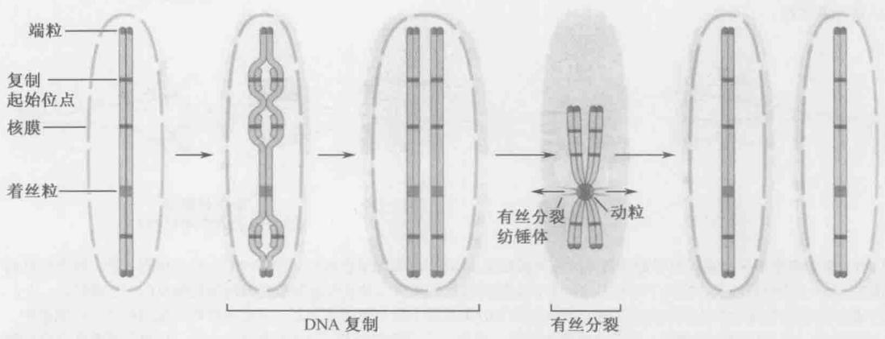  
图 8-6 着丝粒、复制起始位点和端粒是真核染色体的稳定所必需的。每条真核染色体包括两个端粒、一个着丝粒和多个复制起始位点。端粒位于每条染色体的两端。与端粒不同，每条染色体上只有一个着丝粒，且没有固定的位置。有些着丝粒靠近染色体中部，有些靠近端粒。复制起始位点分布于整条染色体上（在酿酒酵母中大约每 30 kb 有一个复制起始位点）。

复制起始位点（origins of replication）是 DNA 复制机器组装和复制起始的位点。复制起始位点间隔约 30\~40kb，分布在每条真核染色体上。原核染色体也需要复制起始位点。与真核染色体不同，原核染色体通常只有一个复制起始位点。一般来说，复制起始位点位于非编码区。复制起始位点的 DNA 序列将在第 9 章详细讨论。

着丝粒（centromere）是 DNA 复制后染色体准确分离所必需的。复制后的染色体的两个拷贝叫姐妹染色体（sister chromosomes），它们必须分离为单拷贝，分别进入两个子细胞。与复制起始位点相似，着丝粒指导一个精细的蛋白质复合体的形成，此结构也称为动粒（kinetochore）。动粒的作用机制是与着丝粒 DNA 和蛋白质纤维（微管）相互作用，拉动姐妹染色体相互远离并进入两个子细胞。与每条真核染色体上有多个复制起始位点不同，每条染色体上仅有一个着丝粒（图 8-7a）。若着丝粒缺失，复制后的染色体会随机分离，导致子细胞的染色体的缺失或加倍（图 8-7b）。如果一条染色体上存在一个以上拷贝的着丝粒，同样是灾难性的。动粒会附着在将染色体拉向相反方向的微管上，导致染色体的断裂（图 8-7c）。着丝粒的大小变化很大。在酿酒酵母中，着丝粒为不到 200bp 的单一序列；而大多数真核生物的着丝粒大于 40kb，并且主要由重复 DNA 序列组成（图 8-8）。

## a 一个着丝粒

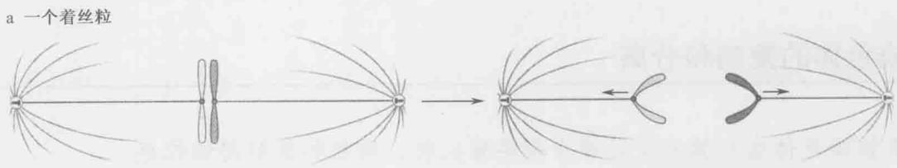  
每个细胞一个染色体

图 8-7 多于或少于一个着丝粒导致染色体的丢失或断裂。（a）. 正常的染色体有一个着丝粒。染色体复制后，每个拷贝的端粒指导一个动粒的形成。这两个动粒结合到有丝分裂纺锤体的两极，并在细胞分裂之前向细胞相反的两边牵拉。（b）. 缺少着丝粒的染色体会很快从细胞中丢失。着丝粒缺失时染色体不能与纺锤体结合，只能随机地分配到两个子代细胞中。这经常导致一个子代细胞得到同一染色体的两个拷贝，而另一子代细胞丢失了这条染色体。（c）. 有两个或更多个着丝粒的染色体在分离时经常发生断裂。如果一个染色体有多个着丝粒，它能同时与纺锤体的两极结合。当分离起始时，有丝分裂纺锤体的两极的反向作用力经常会使同时结合在两极上的染色体断裂。  

图 8-8 着丝粒的大小和组成在不同生物体间变化很大。酿酒酵母的着丝粒很小且由非重复序列组成。而其他的生物体，如果蝇和裂殖酵母的着丝粒非常大，而且主要由重复序列组成。裂殖酵母着丝粒仅中间的 4～7 kb 是非重复序列，绝大多数果蝇和人的着丝粒由重复 DNA 组成。  
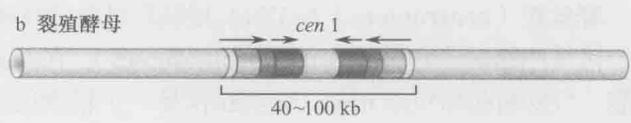

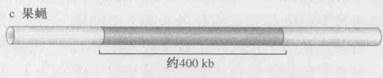

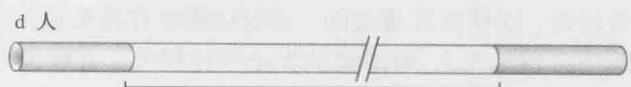  
240 kb 到几 Mb

端粒（telomere）位于线性染色体的两端。与复制起始位点和着丝粒类似，端粒结合有许多蛋白质，在这种情况下，这些蛋白质执行着两个重要的功能。首先，端粒蛋白质可以将细胞中染色体的天然末端与染色体断裂和其他DNA的断裂区分开来。一般来说，DNA的末端是经常发生重组和DNA降解的位点。结合在端粒上的蛋白质能避免重组和DNA降解的发生。其次，端粒作为一种特殊的复制起始位点，可以使细胞复制染色体的末端。在第9章里将详细讨论标准的DNA复制机器不能完整地复制线性染色体的末端的原因。端粒通过一种特殊的DNA聚合酶——端粒酶（telomerase）来完成线性染色体末端的复制。

与染色体的大多数部分不同，端粒的相当一部分以单链的形式存在（图 8-9）。大多数端粒具简单的重复序列，重复序列因物种而异。典型的重复序列由一段短的、富含TG的序列组成。例如，人的端粒具有5'-T TAGGG-3'的重复序列。我们将在第9章中讲到，端粒中的重复序列是由于它们特殊的复制方式所造成的。

  
图 8-9 典型的端粒结构。框中显示了一个重复序列单元（取自人的细胞）。注意  
染色体 3'端的单链 DNA 区域可长达数百个碱基。

## 真核染色体的复制和分离发生在细胞周期的分裂期

在细胞分裂过程中，染色体必须复制并分离到子细胞中去。在细菌细胞中这些过程是同时发生的。也就是说，在 DNA 复制的同时，产生的两个拷贝会向细胞相反的两边分离。尽管已经清楚在细菌中这些过程受到严格的调控，但调控的机制还不清楚。相反，真核细胞染色体的复制和分离发生在细胞分裂过程的不同时期，下面我们将加以讨论。

细胞完成一轮分裂的过程称为细胞周期（cell cycle）。大多数真核细胞的分裂会使子细胞维持与母细胞一致的染色体数目，这种分裂类型称为细胞的有丝分裂（mitotic cell division）。

有丝分裂的细胞周期可以分为四期： $G_{1}$ 、S、 $G_{2}$ 和 M（图 8-10）。涉及染色体增殖的关键过程发生在细胞周期的特定阶段。DNA 合成发生在细胞周期的合成期或 S 期（synthesis 或 S phase），导致每条染色体的复制（图 8-11）。复制后配对的每条染色体叫做一条染色单体（chromatid），配对的两条染色单体称为姐妹染色单体（sister chromatid）。复制后的姐妹染色单体通过一个叫做黏粒（cohesin）的分子聚在一起，这一过程称为姐妹染色单体的附着（sister chromatid cohesion），这种状态一直维持到染色体的相互分离。

染色体分离发生在细胞周期的有丝分裂期或 M 期（mitosis，M phase）。下面将讲述有丝分裂的全过程，但先讨论这个过程中的 3 个关键步骤（图 8-12）。首先，每对姐妹染色单体与一个叫做有丝分裂纺锤体（mitotic spindle）的结构结合。纺锤体由长的蛋白质纤维——微管（microtubule）组成。微管与两个微管组织中心（microtubule organizing center）中的一个相连。[微管组织中心在动物细胞中称为中心粒（centrosome），在酵母和其他真菌中称为纺锤体极体（spindle pole body）]。微管组织中心位于细胞的两侧，形成“极”，微管向着两极拉动染色单体。染色单体的配对由组装在每个着丝粒处的动粒（kinetochore）所介导（图8-6）。其次，由于黏粒的水解，染色单体间黏附力消失。在黏附力消失之前，它可以抵抗有丝分裂纺锤体的拉力。当黏附力消失之后，有丝分裂的第三个重要过程才能发生：姐妹染色单体分离（sister chromatid separation）。由于缺少了染色单体黏附力的抗衡，染色单体被迅速地拉向有丝分裂纺锤体相反的两极。因此，姐妹染色单体间的黏附力与有丝分裂纺锤体相反两极对姐妹染色单体动粒的黏附力是相互对立的作用，只有精细地协调二者才能使染色体正确地进行分离。

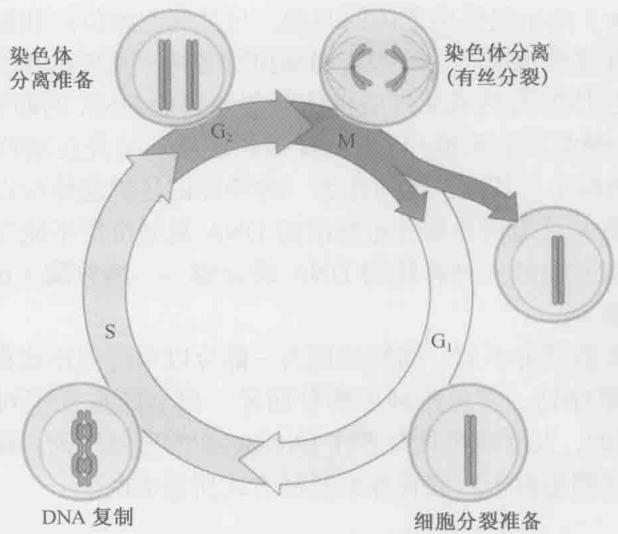

图 8-10 真核有丝分裂细胞周期。真核细胞周期有 4 个阶段。染色体复制发生在 S 期，染色体分离发生在 M 期。 $G_{1}$ 和 $G_{2}$ 间期允许细胞为细胞周期的后续过程做准备。例如，许多真核细胞利用细胞周期的 $G_{1}$ 期合成完成细胞分裂所需的足量的营养成分。  
  
图 8-11 S 期的事件。在 S 期有两个主要的染色体事件发生。每条染色体完整地进行 DNA 复制拷贝，复制发生后不久，环状的黏粒分子将复制后的两拷贝 DNA 缚在一起，导致姐妹染色单体的附着。每个蓝色或红色的“管”代表一个单链 DNA 分子。

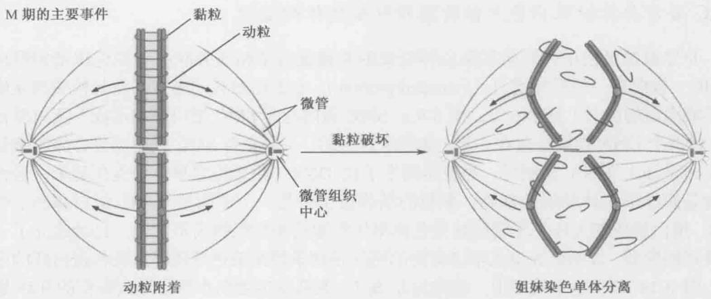  
图 8-12 分裂期（M 期）的事件。三个重要的事件发生在有丝分裂期。首先，连接姐妹染色单体对的两个动粒分别黏附到有丝分裂纺锤体的相反两极。一旦全部的动粒都结合到两极上，通过破坏黏粒环使姐妹染色单体间的黏附力消失。最后，当黏附力消失后，姐妹染色体分离到有丝分裂纺锤体相反的两极。

## 真核细胞分裂时染色体的结构发生变化

在一轮细胞分裂中，染色体的结构发生多次变化；然而，染色体主要以两种状态存在（图 8-13）。当细胞的染色体分离时，染色体处于最压缩的状态。形成这种压缩状态的过程称为染色体凝聚（chromosome condensation）。在这种压缩状态下，染色体间完全相互独立，大大方便了分离过程的进行。

在 $G_{1}$ 、S 和 $G_{2}$ 期 [统称为间期（interphase）]，染色体不分离时，其压缩程度大大降低。事实上，在细胞周期的这些阶段，染色体可能是高度缠绕的，与有丝分裂过程中染色体的有组织排布相比，此时的染色体更像一盘意大利面条。然而，在这些阶段中染色体的结构也会发生改变。DNA 复制要求与染色体结合的蛋白质几乎全部解离和重装。DNA 复制完成后，姐妹染色单体的黏附立即形成，使新复制的两条染色单体相互连接。在细胞周期中，单个基因转录的开关或者上调下调伴随着染色体相关位置上结构的改变。因此，染色体是一个不断变化的结构，它更像是一个细胞器，而不只是一条简单的 DNA 链。

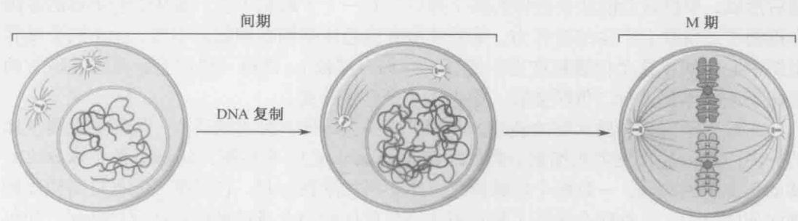  
图 8-13 染色质结构的变化。M 期的染色体达到最大程度的压缩，而在细胞周期的其他阶段（有丝分裂的 $G_{1}$ 、S 和 $G_{2}$ ）染色体处于解聚状态。这些解聚的时期统称为间期。

## SMC 蛋白介导姐妹染色单体的黏附和染色体的凝聚

介导姐妹染色单体黏附和染色体凝聚的关键蛋白是相互关联的。染色体结构维持（SMC）蛋白是一类延伸蛋白（extended protein），它们通过长的螺旋卷曲结构域相互作用形成固定的配对（见第6章，图6-9）。SMC蛋白与非SMC蛋白一起形成多蛋白复合体，将两个DNA螺旋连接在一起。如前所讨论的，一种含有SMC蛋白的复合体叫做黏粒（cohesin），DNA复制后，黏粒将两个子代DNA（姐妹染色单体）连接起来，这种连接是姐妹染色体黏附的基础。黏粒的结构被认为是一个由两个SMC蛋白和两个非SMC蛋白组成的大环。尽管姐妹染色体单体黏附的确切机制尚不清楚，已经建立了一个很好的模型，表明姐妹染色单体黏附的机制是两条姐妹染色单体穿过黏粒蛋白环的中心（图8-14）。在这个模型中，黏粒的非SMC亚基发生蛋白水解会导致黏粒的开环，姐妹染色单体凝聚消失，子染色体向细胞相反的两极迁移。

伴随染色体分离所发生的染色体凝聚同样需要一个相关的含有 SMC 蛋白的复合体——凝聚蛋白（condensin）。尽管我们对这种复合体的结构和功能知之甚少，但它具有许多与黏粒复合体相同的特点，因此猜测它也是一个环状复合体。如果是这样，它可能是利用环状的特点引起染色体的凝聚。例如，凝聚蛋白能将同一染色体的不同区域连接在一起，大大减少染色体的线性长度（图 8-14）。

## 有丝分裂维持亲本染色体的数目

我们现在讲述有丝分裂的全过程。有丝分裂分为几个时期（图 8-15）。在分裂前期（prophase），凝聚蛋白和拓扑异构酶Ⅱ（帮助解开染色体）使染色体凝聚成高度紧密的结构以准备进行分离。在前期结束时，核膜裂解，细胞进入分裂中期（metaphase）。

在分段中期，有丝分裂纺锤体形成，姐妹染色体的动粒与微管结合。只有当一对姐妹染色单体的两个动粒分别与从相对的微管组织中心发出的微管结合后，正确的染色单体连接才告完成。这种连接类型叫做二价联会（bivalent attachment，图8-15），会导致微管对染色单体对施加拉张力，向相反的方向牵拉姐妹染色单体。从同一微管组织中心发出的微管与两个染色单体或者其中之一的结合，叫做单价联会（monovalent attachment）。这种结合不能产生拉张力，最终导致染色体的丢失。如果二价联会不能随后形成，单价联会能让染色体的两个拷贝拉到一个子细胞中去。姐妹染色单体的黏附力抵消了二价联会产生的拉张力，从而使所有染色体排列在细胞的中部，位于两个微管组织中心之间（这个位置被称为中期板，亦称赤道板）。值得一提的是，只有在所有的姐妹染色单体都进行二价联会后，染色体才会开始分离。

黏粒分子因蛋白质水解的破坏，导致姐妹染色单体间黏附的消失，从而触发染色体的分离。这一过程发生在细胞分裂的后期（anaphase）。在后期，姐妹染色单体分离并移动到细胞的两侧。一旦两个姐妹染色单体不再黏附在一起，它们便不能抵抗纺锤体微管向外的拉力。二价联会保证了每对姐妹染色单体的两个成员被拉向相反的两极，使每个子代细胞都得到每个复制的染色体的一个拷贝。

有丝分裂的最后阶段称为末期（telophase）。在末期，包围每套分离的染色体的核膜

  
图 8-14 推测的黏粒和凝聚蛋白模型。黏粒和凝聚蛋白是环状蛋白复合体，包括两个 SMC 蛋白，是细胞核骨架的组成部分，对连接远距离的或不同区域的 DNA 有重要作用。推测含有环状结构的这些蛋白质允许 DNA 的两个区段柔韧且牢固地连接。在图示中，SMC 蛋白用绿色（黏粒）或者蓝色（凝聚蛋白）表示。（来源：Haering C. H. et al. 2002. Mol. Cell 9: 773-778, F8, page785, ©Elsevier.）

图 8-15 有丝分裂。在有丝分裂之前，染色体以解聚状态存在，此时为间期。前期，染色体凝聚，准备分离，在大多数真核细胞中，包围着染色体的核膜发生裂解；在中期，每个姐妹染色单体对结合到有丝分裂纺锤体的两极；进入后期，姐妹染色单体间黏附力消失，导致姐妹染色单体的分离；末期，染色体凝聚状态消失，包围着两群分离后的染色体的核膜重新形成；细胞质分裂是细胞周期的最后阶段，包围着两个核的细胞膜收缩，并最终分裂成两个子细胞。所有的 DNA 分子都是双链的。

重新形成。此时，两个细胞所共有的细胞质发生物理分离，细胞分裂完成。这个过程称为胞质分裂（cytokinesis）。

细胞周期的间期为下一个细胞周期作准备，同时检查上一个阶段是否正确完成

真核细胞周期中余下的两个阶段是间期。 $G_{1}$ 期发生于 DNA 合成之前， $G_{2}$ 期位于 S 期和 M 期之间。细胞周期的间期有两个作用：一是为下一个细胞周期阶段做好时间上的准备，二是检查上一个细胞周期阶段是否正确完成。例如，在进入 S 期以前，大多数细胞必须达到一定的大小和蛋白质合成水平，以满足完成下一轮 DNA 合成所需的足够的蛋白质和营养成分。如果在细胞周期的前一阶段存在问题，细胞周期检查点（cell cycle checkpoint）则停止细胞周期并给细胞提供时间以完成这一步。例如，含有损伤 DNA 的细胞将细胞周期阻止在 DNA 合成之前的 $G_{1}$ 期或者有丝分裂之前的 $G_{2}$ 期，以防止产生损伤的染色体的事件发生。在细胞周期继续进行之前，这种延迟为损伤的修复提供了时间。

## 减数分裂减少了亲本染色体的数目

真核细胞分裂的另一种类型——减数分裂，专门产生子代细胞，和母细胞相比，它仅含有半数的染色体。这是由 DNA 复制之后的两轮染色体分离完成的。与有丝分裂细胞周期相似，减数分裂细胞周期（meiotic cell cycle）包括 $G_{1}$ 期、S 期和一个延长的 $G_{2}$ 期（图 8-16）。在减数分裂的 S 期，每条染色体复制。与有丝分裂 S 期相同，姐妹染色单体仍然结合在一起。进入减数分裂的细胞必须是二倍体，因此 DNA 复制前每条染色体有两个拷贝，分别来自父母。DNA 复制之后，这些相关的姐妹染色单体对，称为同源染色体（homologs），互相配对并发生重组。同源染色体间的重组在两个同源染色体间构建了一个物理连接，这种连接是染色体分离时连接两个相关的姐妹染色单体对所必需的。我们将在第 11 章详细讨论减数分裂过程中的重组。

减数分裂与有丝分裂细胞周期的最大不同发生在染色体分离阶段。有丝分裂仅有一轮染色体分离，而减数分裂中的染色体经过两轮分离，称为减数分裂Ⅰ期和Ⅱ期。与有丝分裂相同，每一轮染色体分离都包括前期、中期和后期。减数分裂Ⅰ的中期也叫做中期Ⅰ（meiosisⅠ），此时同源染色体与微管纺锤体相反的两极结合。这一结合由动粒介导。由于每个姐妹染色单体对的两个动粒都结合到微管纺锤体的同一极，这个相互作用被称为单价联会（monovalent attachment）（与有丝分裂的二价联会相反，有丝分裂中每个姐妹染色单体对的两个动粒是结合到纺锤体相反的两极上的）。如同在有丝分裂中一样，配对的同源染色体最初能抵抗纺锤体所施加的将它们拉开的拉张力。在减数分裂Ⅰ期时，此过程是通过同源染色体间的物理连接或者重组所诱发的染色体交换所介导。沿姐妹染色单体臂上的黏附力也可提供这种抵抗力。当这种黏附力在后期Ⅰ消失后，同源染色体相互释放并分离到细胞相反的两极。重要的是，姐妹染色单体的着丝粒附近间的黏附力仍然存在，使姐妹染色单体仍保持配对状态。

图 8-16 减数分裂。减数分裂与有丝分裂相似，也能分成不连续的阶段。DNA 复制后，同源姐妹染色单体相互配对，形成 4 条相关的染色体。为简便起见，仅用一个染色体描述分离过程，蓝色和黄色拷贝代表分别来自父母。在配对过程中，来自不同姐妹染色质的染色单体发生重组，在同源染色体间形成一种称为交叉的连接。中期 I 期间，每个姐妹染色单体对的两个动粒与减数分裂纺锤体的一极结合。同源的姐妹染色单体的动粒与相反的两极结合形成的拉张力，被同源染色体间的连接力所抵抗。作用于染色体臂的姐妹染色单体黏附力的消失驱动细胞进入后期 I。失去染色体臂黏附使同源染色体相互分离。姐妹染色单体通过着丝粒附近的黏附力仍然结合在一起。减数分裂 II 期与有丝分裂非常相似。在减数中期 II，两个减数分裂纺锤体形成。与有丝分裂中期相同，每个姐妹染色单体对的动粒与减数分裂纺锤体的相反两极结合。在后期 II，姐妹染色单体间残余的黏附力消失，姐妹染色单体相互分离。分离后的 4 套染色体包装到细胞核内并分离成 4 个细胞，形成 4 个孢子或配子。所有的 DNA 分子以双链形式存在。（来源：Murray A. and Hunt T.1993. The cell cycle: An introduction, Fig.10.2 Copyright © 1993 by Oxford University Press, Inc. 经 Oxford University Press, Inc. 许可）

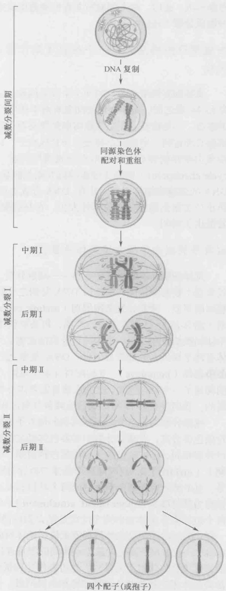

减数分裂的第二轮分离，即减数分裂Ⅱ期（meiosis Ⅱ），与有丝分裂非常相似，主要的不同是这轮分离之前没有 DNA 的复制。相反，纺锤体已形成且与两个新分离的姐妹染色单体对相连。与有丝分裂相同，中期Ⅱ（metaphase Ⅱ）时的纺锤丝以二价联会方式结合到姐妹染色单体对的两个动粒上。在减数分裂后期 I 仍维持在着丝粒附近的黏附力是抵抗纺锤体拉力的关键因素。当这种黏附力消除后，后期Ⅱ（anaphase Ⅱ）开始。此时的细胞中有 4 套染色体，每套只包含每条染色体的一个拷贝。每套染色体外周形成一个细胞核，然后胞质分离，形成 4 个单倍体细胞。这些细胞可通过交配形成新的二倍体细胞。

## 在显微镜下可观察到不同时期的染色体结构

长期以来，显微镜用来观察染色体的结构和功能。事实上，在明确染色体是细胞中遗传信息的载体之前，对细胞分裂过程中染色体的运动和变化就有了较深入的研究。用简单的光学显微镜就可以容易地观察到凝聚状态下的有丝分裂或减数分裂染色体。凝聚染色体的显微镜分析还常被用于鉴定人类细胞的染色体构成，以检测是否存在如染色体缺失等染色体异常，或者某一个染色体的拷贝过少或过多的个体。

处于非有丝分裂期（即间期）的染色体 DNA 凝聚程度较低（图 8-17a）。在电子显微镜下可以观察到两种状态的染色质：直径 30nm 的纤丝和直径为 10nm 的纤丝（图 8-17b）。30nm 的纤丝是染色质较紧密的结构，通常折叠成大环从蛋白核或骨架中伸出；相反，10nm 的纤丝是染色质较松散的形式，通常组装成一串串有规则的“念珠”，而这些珠子就是核小体，该蛋白质-DNA 复合物在染色体结构和功能方面的调控中有重要作用。我们首先着重讲述核小体的特点，包括核小体是怎样形成的，然后描述依赖于核小体的结构是怎样对核 DNA 的易接近性进行控制的。

  
图 8-17 电子显微镜下观察到的染色质结构。（a）. M 期和间期 DNA 的电子显微照片显示了染色质的结构变化。（b）. 间期细胞中不同形式的染色质的电子显微照片显示了 30 nm 和 10 nm 的染色质纤丝（念珠状）。（来源：a. Alberts B. et al. 2002. Molecular biology of the cell, 4th edition., Figs. 4-21 和 4-23, Garland Science/Taylor & Francis LLC@V.Foe.)

## 核小体

## 核小体是染色体的结构单位

在真核细胞中大多数 DNA 被包装成核小体。核小体由 8 个组蛋白所形成的核心组成，DNA 缠绕在组蛋白核心上。每个核小体之间的 DNA（“念珠”上的“线”，图 8-17b）叫做连接 DNA（linker DNA）。DNA 通过包装进核小体，被压缩了大约 6 倍，但这远不及在真核细胞中观察到的压缩 1000～10 000 倍的 DNA。然而，这种 DNA 的初始包装对于后续各个层次上的 DNA 压缩是至关重要的。

与核小体结合最紧密的 DNA 叫做核心 DNA（core DNA），它像线缠绕线轴一样盘绕组蛋白八聚体约 1.65 圈（图 8-18）。通过核酸酶处理能确定每个核小体上 DNA 的长度（框 8-1）。在所有的真核细胞中，长度约 147bp 的核心 DNA 是核小体一个不变的特征。相反，核小体之间的连接 DNA 的长度是可变的。这个距离一般是 20\~60bp，并且每个真核生物有各自特征性的连接 DNA 的平均长度（表 8-4）。连接 DNA 平均长度的不同可能是因为不同生物由核小体 DNA 形成的更复杂结构的特点不同，而不仅仅是核小体自身的不同（参见染色体高级结构部分）。

  
图 8-18 DNA 包装成核小体。(a) 核小体包装和组织的示意图。(b) 一个核小体的晶体结构显示了 DNA 盘绕在组蛋白核上。H2A、H2B、H3 和 H4 分别用红色、黄色、紫色和绿色表示。注意在随后的图中，不同的组蛋白都用相同的颜色表示。(Luger K. et al. 1997. Nature 389:251-260.) 镜像图用 MolScript 和 Raster3D 制作。

在任何细胞中都会有数段 DNA 没有被包装到核小体中。这些 DNA 区段一般参与基因的表达、复制或者重组。这些位点尽管未与核小体结合，但通常与参与调控这些过程的非组蛋白结合。我们将在随后的第 19 章讨论从 DNA 上去除核小体并维持此 DNA 区域在无核小体状态下的机制。

## 框 8-1 微球菌核酸酶和核小体 DNA

通过利用无序列特异性的微球菌核酸酶（micrococcal nuclease，MNase）处理染色体，人们第一次得到了纯化的核小体。这个酶剪切DNA的能力主要由DNA的易接近性控制。微球菌核酸酶能迅速地剪切无蛋白质保护的DNA序列而对结合有蛋白质的DNA序列的剪切效率很差。利用这种酶有控制地处理染色体，可得到具核酸酶抗性的、与组蛋白结合的DNA分子。这些DNA分子的长度为160\~220bp，且与各两个拷贝的H2A、H2B、H3和H4结合。一般来说，这些颗粒包括与核小体紧密结合的DNA和一单位的连接DNA。进一步的微球菌核酸酶处理会使全部的连接DNA降解，剩下的最小的核小体仅包括147bp的DNA，被称为核小体核心颗粒（nucleosome core particle）。

利用一个简单的实验可以测量缠绕每个核小体的 DNA 的平均长度（框 8-1 图 1）。用微球菌核酸酶温和地处理染色质，这将在部分的连接 DNA 中仅仅打开一个切点。核酸酶处理之后，从全部的蛋白质（包括组蛋白）中提取 DNA 并进行凝胶电泳分离。电泳得到一组具长度梯度的片段，其长度为核小体到核小体的平均距离的整倍数。这是由于微球菌核酸

  
框 8-1 图 1 微球菌核酸酶对核小体 DNA 的逐步消化。
(R.D. Kornberg 惠赠)

酶对染色质的部分消化所造成的。因此，有许多核小体未被消化分离，使得其 DNA 片段等于结合于这些核小体上的全部 DNA 的长度。进一步的消化将切开全部的连接 DNA，形成核小体核心颗粒，这时仅得到一条约 147bp 的片段。

表 8-4 各种生物体中连接 DNA 的平均长度

<table><tr><td>物种</td><td>核小体重复长度/bp</td><td>连接 DNA 的平均长度/bp</td></tr><tr><td>酵母</td><td>160~165</td><td>13~18</td></tr><tr><td>海胆(精子)</td><td>~260</td><td>~110</td></tr><tr><td>果蝇</td><td>~180</td><td>~33</td></tr><tr><td>人类</td><td>185~200</td><td>38~53</td></tr></table>

## 组蛋白是带正电荷的小分子蛋白质

组蛋白是目前所知与真核 DNA 相关的丰度最高的蛋白质。真核细胞一般包括 5 种组蛋白：H1、H2A、H2B、H3 和 H4。组蛋白 H2A、H2B、H3 和 H4 是核心组蛋白（core histone），各两个拷贝的这几种组蛋白形成核小体的蛋白核，核小体 DNA 盘绕其上。组蛋白 H1 不是核小体核心颗粒的一部分，相反，它与连接 DNA 结合，被称为连接组蛋白（linker histone）。4 种核心组蛋白在细胞中以同等的数量存在，而 H1 仅有其他组蛋白丰度的一半。这与每个核小体（含每个核心组蛋白的两个拷贝）与 H1 一一对应的发现相符。

组蛋白与带负电荷的 DNA 分子紧密结合。与此一致的是，组蛋白中带正电荷的氨基酸的含量很高（表 8-5）。各种组蛋白中有超过 20% 的氨基酸残基是赖氨酸或精氨酸。核心组蛋白是相对较小的蛋白质，分子质量一般为 11\~15 kDa，组蛋白 H1 稍大，分子质量约为 21 kDa。

表 8-5 组蛋白的一般特征

<table><tr><td>组蛋白类型</td><td>组蛋白</td><td>分子质量/Da</td><td>赖氨酸及精氨酸的百分含量/%</td></tr><tr><td rowspan="4">核心组蛋白</td><td>H2A</td><td>14 000</td><td>20</td></tr><tr><td>H2B</td><td>13 900</td><td>22</td></tr><tr><td>H3</td><td>15 400</td><td>23</td></tr><tr><td>H4</td><td>11 400</td><td>24</td></tr><tr><td>连接组蛋白</td><td>H1</td><td>20 800</td><td>32</td></tr></table>

核小体的蛋白核是一个圆盘状的结构，只有当 DNA 存在时才组装成一种有序的结构。没有 DNA 时，核心组蛋白在溶液中形成中间组装体。在每种核心组蛋白中都存在一个保守区域，称为组蛋白折叠域（histone-fold domain），调节这些组蛋白中间体的组装（图 8-19）。组蛋白折叠域由 3 个 $\alpha$ 螺旋组成，螺旋之间被两个短的无规则环隔开。组蛋白折叠域调节头尾相连的、专一配对的组蛋白异源二聚体的形成。组蛋白 H3 和 H4 首先形成异源二聚体，然后两个二聚体形成一个四聚体，含有两个分子的 H3 和 H4。相反，H2A 和 H2B 在溶液中形成异源二聚体而不是四聚体。

一个核小体的组装涉及这些结构单位与DNA有序地结合(图8-20)。首先，H3·H4四聚体与DNA结合；然后两个H2·H2B二聚体结合到H3·H4-DNA复合体，形成最后的核小体。我们将在本章的后面部分讨论组装过程是在什么时候、如何在细胞中完成的。

每个核心组蛋白有一个 N 端延伸，称为尾巴（tail），它没有一个确定的结构，是完整的核小体中易接近的部分。用胰蛋白酶（能专一性地从蛋白质上去除带正电荷的氨基酸）处理核小体能检测到这种易接近性。用胰蛋白酶处理核小体能迅速地去除组蛋白易接近的 N 端尾巴，但不能切断紧密包装的组蛋白折叠区（图 8-21）。因为蛋白酶消化后 DNA 仍然与核小体紧密结合，所以暴露的 N 端尾巴对于 DNA 与组蛋白八聚体的结合不是必需的。然而，尾巴上有许多高度修饰的位点，可以改变这些核小体的功能。这些修饰包括丝氨酸、赖氨酸和精氨酸残基上的磷酸化、乙酰化和甲基化。我们将在讨论核小体功能之后，再讨论组蛋白尾修饰的作用。现在，我们讨论核小体的详细结构。

  
图 8-19 核心组蛋白具有共同的折叠结构。(a). 图中 4 种组蛋白显示为线性分子。形成 α 螺旋的组蛋白折叠域以圆柱表示，注意每个组蛋白都有结构上特异的相邻区域，其中包括其他的 α 螺旋区。(b). 两个组蛋白（H2A 和 H2B）的螺旋区结合形成一个二聚体。H3 和 H4 也用相似的方式形成 H3₂·H4₂ 四聚体。(Alberts B. et al. 2002. Molecular biology of the cell, 4th edition, p.209, Fig. 4-26. © Garland Science Taylor & Francis. LLC.)

## 核小体的原子结构

核小体核心颗粒（图 8-18b，147bp 的 DNA 加上一个完整的组蛋白八聚体）高分辨率的三维结构为我们揭示了核小体是如何行使功能的。核小体对 DNA 的高度亲和性、DNA 结合到核小体上时发生的扭曲和 DNA 序列的非特异性这些现象，都可用此组蛋白与 DNA 相互作用的结构来解释。这个结构也凸显了 N 端尾巴的功能和位置。最后，此 DNA 与组蛋白八聚体相互作用的结构揭示了核小体的动态特征和核小体组装的过程。在接下来的几部分中我们将讨论核小体的每一个特性。

## 核小体中 DNA 的组蛋白结合区

尽管核小体不是完全对称的，但是有大致的二重轴对称，叫做二价轴(dyad axis)。如果将圆盘状的组蛋白八聚体的表面视作时钟，将147bp的DNA的中点定在12点钟的位置（图8-22），就可以看到这种对称性，而DNA的末端靠近于11点和1点钟的位置。从12点到6点通过圆盘的中心画一条线，定义为二价轴。绕着这个轴将核小体旋转 $180^{\circ}$ ，可以看到一个和旋转前几乎相同的外观。

图 8-20 核小体的组装。 $H_{32}\cdot H_{42}$ 四聚体的形成启动核小体的组装，四聚体然后与双链 DNA 结合。结合到 DNA 上的 $H_{32}\cdot H_{42}$ 四聚体再与两个拷贝的 H2A·H2B 二聚体结合，完成核小体的组装。（来源：Alberts B. et al. 2002. Mo lecular biology of the cell, 4th edition, p.210, Fig.4-27. Garland Science/Taylor & Francis LLC@J.Waterborg.）  

H3·H4 四聚体和 H2A·H2B 二聚体分别与核小体中特定的 DNA 区段相互作用（图 8-23）。H3·H4 四聚体的组蛋白折叠区与 147bp DNA 中间的 60bp 相互作用。H3 的 N 端区域最接近组蛋白折叠区，形成第 4 个 α 螺旋，与结合的 DNA 两个末端的 13bp 片段相互作用（这个区域与前述的无结构的 H3 的 N 端尾是有区别的）。如果我们将核小体绘成上述的时钟，H3·H4 四聚体构成组蛋白八聚体的上半部分。重要的是，组蛋白 H3·H4 四聚体在核小体中占据着关键的位置，分别与 DNA 的中部和两端结合（图 8-23a 中标为青绿色的 DNA）。两个 H2A·H2B 二聚体分别与结合着 H3 和 H4 的中间 60bp、两侧大约各 30bp 的 DNA 结合。我们再次用时钟作比喻，与 H2A·H2B 二聚体结合的 DNA 定位于核小体圆盘的大约 5 点到 9 点钟的位置。两个 H2A·H2B 二聚体构成组蛋白八聚体的底端部分，从 DNA 的末端穿过圆盘（图 8-23b 中标为橙色的 DNA）。

  
图 8-21 核心组蛋白的 N 端尾易受到蛋白酶的作用。用有限的可以在碱性氨基酸之后切开的蛋白酶（如胰蛋白酶）处理核小体，能专一地去除 N 端尾巴而保留完整的组蛋白核。

  
图 8-22 核小体有一个大致的二重轴对称。(a). 三维结构。(b). 核小体 “钟面” 示意图。从 3 个方向显示核小体的结构。每个方向都是绕（b）图中所示的 12 点到 6 点的轴线旋转 90° 所得。(a. Luger K., et al. 1997. Nature 389:251-260.) 镜像图用 BobScript、MolScript 和 Raster3D 制作。

  
图 8-23 组蛋白和核小体 DNA 的相互作用。(a). H3·H4 与 DNA 的中部和末端结合（用青绿色表示）。(b). H2A·H2B 二聚体与核小体一侧 DNA 的 30bp 结合。与 H2A·H2B 二聚体结合的 DNA 用橙色表示。(Luger K., et al. 1997. Nature389: 251-260.) 镜像图用 Bob Script、MolScript 和 Raster3D 制作。

H3·H4 四聚体与 DNA 之间广泛的相互作用有助于解释核小体的有序组装（图 8-24）。H3·H4 四聚体与 DNA 的中部和末端结合，造成 DNA 高度弯曲和固定，使得 DNA 与 H2A·H2B 二聚体的结合相对容易。与此相反，DNA 与 H2A·H2B 二聚体相对较短的结合长度，不足以造成 DNA 与 H3·H4 四聚体的结合。

## 许多不依赖于 DNA 序列的接触介导核心组蛋白与 DNA 间的相互作用

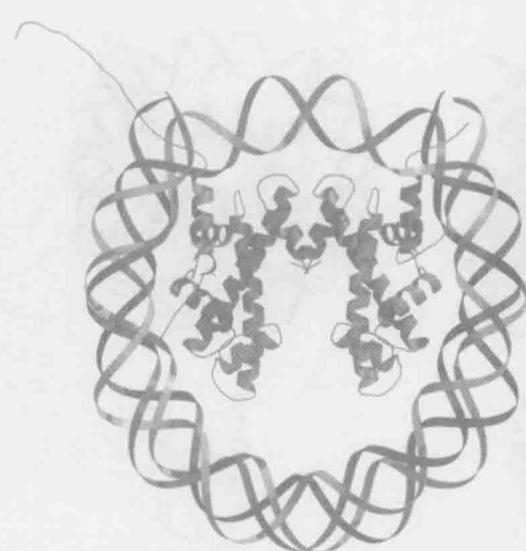  
图 8-24 缺少 H2A 和 H2B 的核小体。在这个图中，组蛋白 H2A 和 H2B 被人为地从核小体中去除。这个结构可能与核小体组装过程中的 DNA·H3₂·H4₂ 四聚体中间物类似（图 8-20）。（Luger K., et al.1997. Nature 389: 251-260.）镜像图用 BobScript、MolScript 和 Raster3D 制作。

对组蛋白和核小体 DNA 相互作用的进一步观察揭示出核小体内的 DNA 结合和弯曲的结构基础。每次 DNA 的小沟面对组蛋白八聚体时可发现一个接触位点，共发现了 14 个不同的位点（图 8-25）。DNA 与核小体之间的这种联系是通过组蛋白和 DNA 间大量的氢键（约 40 个）所介导的。这些氢键大多位于蛋白质和 DNA 小沟附近磷酸二酯骨架上的氧原子之间，只有 7 个氢键位于蛋白质侧链和 DNA 小沟的碱基之间，所有这些氢键都在 DNA 的小沟里。

这些氢键中的大多数（一个典型的识别特异序列的 DNA 结合蛋白质仅有 20 个氢键与 DNA 作用）提供使 DNA 弯曲的驱动力。高度碱性的组蛋白通过屏蔽具抵抗 DNA 弯曲作用的磷酸基团的负电荷而将

  
图 8-25 组蛋白与 DNA 的接触位点。为了清楚起见,图中只显示了 DNA 与一个 H3·H4 二聚体的相互作用。参与组蛋白与 DNA 相互作用的部分亚基用红色表示。注意这些区域聚集在 DNA 的小沟处。(Luger.1997. Nature 389: 251-260.) 镜像图用 BobScript、MolScript 和 Raster3D 制作。

DNA 弯曲。只有 DNA 弯曲使弯曲区内部的磷酸基团变为不适宜的邻近状态。组蛋白的高碱性特点还有助于两个相邻 DNA 螺旋紧密毗邻，这种毗邻对于 DNA 在组蛋白八聚体上多次缠绕是必要的。

组蛋白与 DNA 间的所有接触位点都与 DNA 的小沟或磷酸骨架相关。这个发现与组蛋白八聚体和 DNA 结合的非序列特异性的事实相一致。无论是 DNA 的小沟还是磷酸骨架，都不富含具碱基特异性的信息。而且，在与 DNA 小沟中的碱基所形成的 7 个氢键中，都不含有可区分 G:C 和 A:T 碱基对的元素（第 4 章，图 4-10）。

## 组蛋白的 N 端尾可稳定盘绕在八聚体上的 DNA

核小体的结构也能使我们对组蛋白 N 端尾巴的情况有所了解。4 个 H2B 和 H3 的尾巴从两个 DNA 螺旋间伸出。它们伸出的路径由两个相邻的小沟形成，在两个 DNA 螺旋之间形成了一个仅容一条多肽链的缝隙（图 8-26a）。值得注意的是，绕着组蛋白八聚体圆盘所伸出的 H2B 和 H3 尾巴之间的距离大致相等（H3 尾巴在大约 1 点和 11 点处伸出，H2B 尾巴在大约 4 点和 8 点处伸出）。H4 和 H2A 氨基端尾巴不是从两个 DNA 螺旋之间伸出，而是从 DNA 螺旋的“上面”或“下面”伸出来的（图 8-26a）。H4 尾巴位于核小体表面的 3 点和 9 点处，H2A 尾巴位于 5 点和 7 点处（图 8-26b）。从 DNA 螺旋之间或两侧伸出的组蛋白尾巴，其作用类似于一个螺丝上的凹槽，指导 DNA 以左手方式盘绕于组蛋白八聚体的圆盘上。正如我们在第 4 章中所讨论的一样，DNA 以左手方式缠绕使 DNA 形成负的超螺旋。当有 DNA 穿过时，组蛋白尾巴上最接近组蛋白圆盘的部分（不会被蛋白酶降解），也可在组蛋白和 DNA 之间形成许多氢键。

  
图 8-26 组蛋白尾巴从核小体核心的特定位置伸出。(a). 这个侧面图展示了从两个 DNA 螺旋间伸出的 H2B 和 H3 尾巴, 相反, H4 和 H2A 尾巴从两个 DNA 螺旋的上面或下面伸出。(Luger K. et al. 1997. Nature 389: 251-260.) 示意图用 GRASP 绘制。(b). 图中所示为组蛋白尾巴相对于 DNA 进出的位置, 组蛋白尾巴可在 DNA 的很多相应位置上伸出。(Davey C. A. et al. 2002. J. Mol. Biol. 319: 1097-1113.) 镜像图用 BobScript、MolScript 和 Raster3D 制作。

## 缠绕组蛋白核心的 DNA 呈负超螺旋特性

往共价闭环 DNA 模板上每加一个核小体，就能使相应 DNA 的连环数（linking number）改变约-1.2。由于 DNA 维持松弛状态主要依赖拓扑异构酶（topoisomerases），所以如果将核小体和 DNA 分离，被包装成核小体的 DNA 将形成负超螺旋。因此核小体可以被看成是维持或者稳定负超螺旋的结构。细胞为什么要保持这样一个负超螺旋的储库呢？已有很多例子说明该储库对细胞内 DNA 进行解链具有重要的促进作用，如 DNA 复制的起始、转录和重组。更重要的是，DNA 的负超螺旋有利于 DNA 的解旋（见第 4 章，图 4-17）。因此，核小体移除不仅增加了 DNA 的可接近性，还有利于附近 DNA 序列的解旋（框 8-2）。

如果核小体在真核生物细胞中具有储存负超螺旋的功能，那么是什么在原核生物中起相应作用呢？答案是多数原核生物的整个基因组都保持在负超螺旋状态。这种作用是由一种称为促旋酶（gyrase）的特殊的拓扑异构酶，通过减少连环数来增加负超螺旋的方法来实现的。例如，在 E.coli 细胞中，促旋酶的作用结果是使整个基因组具有大约平均 -0.07 的超螺旋密度。把负超螺旋导入松弛 DNA 是一种需能反应，因此，促旋酶只有在 ATP 存在的情况下才能把负超螺旋导入 DNA 中。在缺少 ATP 的情况下，促旋酶仅能使 DNA 松弛（如减少正超螺旋 DNA 的连环数）。

并不是所有的细菌都需要将它们的 DNA 保持在负超螺旋状态。适宜在极高温度条件下（>80℃）生长的细菌必须消耗额外的能量防止 DNA 由于热变性而解旋。这些生物有一种不同的拓扑异构酶，称为反促旋酶（reverse gyrase）。在 ATP 存在的情况下，反促旋酶可以增加松弛 DNA 的连环数。热变性通常会导致基因组的很多区域被解旋，反促旋酶通过维持基因组的正超螺旋结构逆转热变性的效果。

## 框 8-2 核小体和超螺旋密度

为什么核小体能改变自己含有 DNA 的拓扑结构呢？正如第 4 章所述，两种扭曲方式对 DNA 超螺旋的形成具有重要作用：环螺旋型的和缠绕型的（也称绞螺旋型的）。DNA 是以环螺旋方式缠绕到组蛋白八聚体上的。左手螺旋或右手螺旋决定了引入的超螺旋是正超螺旋还是负超螺旋（即相关 DNA 连环数的增加或减少等）。对环螺旋型扭曲而言，左手螺旋引入负超螺旋（对缠绕型扭曲而言则相反，右手螺旋引入负超螺旋）。因此，缠绕核小体 DNA 的左手螺旋环型扭曲减少了相关 DNA 的连环数。基于这个原因，核小体倾向于整合负超螺旋密度的 DNA，要用 DNA 组装核小体并且引入正超螺旋是很困难的。

很多用共价闭和环状 DNA（cccDNA）来组装的核小体需要拓扑异构酶来适应与组蛋白结合的 DNA 的连环数的变化（见框 8-2 图 1）。如果缺少拓扑异构酶，cccDNA 组装成一个核小体时，需要非结合的 DNA（非核小体相关 DNA）来适应连环数的等量的增加（注意，在缺少拓扑异构酶的情况下，cccDNA 的总连环数是确定的）。因此，非结合 DNA 将会积累增加的连环数，增大正超螺旋的密度。非结合 DNA 的正超螺旋数越多，就越难组装到核小体里去。

拓扑异构酶的加入能极大地促进核小体与 cccDNA 的结合。核小体组装时如果存在拓扑异构酶，它并不能作用于与核小体结合的 DNA，而是使非核小体结合 DNA 松驰，通过减少这些区域的连环数来降低正超螺旋的密度。拓扑异构酶通过维持非结合 DNA 的松驰状态，来促进组蛋白和 DNA 的结合以及更多的核小体的形成。值得一提的是，在质粒中的总体效应是随着核小体的不断被组装，连环数不断下降。

由拓扑异构酶引起的连环数减少，能够作为核小体组装过程的实验分析指标。该分析基于凝胶电泳能将松弛和超螺旋 cccDNA 区分开来（见图 4-27）的原理。第一步是在拓扑异构酶存在的条件下以 cccDNA 组装核小体。在适当的时间点往组装反应中加入强去污剂（如 SDS），使拓扑异构酶失活并将组蛋白从 DNA 上去除。得到的 DNA 通过凝胶电泳分离并鉴定其超螺旋特性。因为在组蛋白从 DNA 上去除的同时，拓扑异构酶也失活，保留了组装成核小体的 DNA 的连环数。一般来说，拓扑异构酶能把组装到每个核小体上的 cccDNA 减少 1.2 个连环数。因此，组装到核小体上的 cccDNA 越多，形成的负超螺旋数也越多（框 8-2 图 1c，d）。超螺旋的电泳迁移率较快，这在凝胶电泳中很容易被观察到（框 8-2 图 2）。

由于核小体 DNA 在组蛋白上缠绕 1.65 圈，环状共价闭合的质粒形成单个核小体的时候就会导致 -1.65 圈的扭曲，所以会造成等量的连环数变化。就像上面所说的，当测量每个核小体对应的连环数时，得到的结果为 -1.2，小于这个数。这种偏差称为“核小体连环数悖论”，而解决这一难题的关键是揭示核小体高溶解作用的晶体结构是在什么时候被溶解的。对组蛋白核心相关的 DNA 进行深入分析表明：相对于裸 DNA 而言，每圈螺旋的碱基数减少了（从 10.5bp/圈降至 10.2 bp/圈）。每个螺旋的碱基数减少导致那段 DNA 的连环数增加。考虑到第 4 章中 cccDNA（10 500 bp）这个例子，常规的 B 型 DNA 为 10.5 bp/圈，在质粒中就有 +1000 连环数（10 500/10.5）。相反，以每螺旋 10.2 bp 计，同样的 DNA 连环数就约为 +1029 的（10500/10.2）。因此，通过减少

框8-2图1共价闭环DNA（cccDNA）组装核小体需要拓扑异构酶。（a）在缺少拓扑异构酶的情况下，非结合DNA上的正超螺旋的积累抑制了核小体和cccDNA的组装。（b）拓扑异构酶存在的情况下，核小体装配并没有增加。示拓扑异构酶是如何通过减少连环数使非结合DNA松弛的。（c）拓扑异构酶存在的情况下，增加核小体装配。（d）同时去除组蛋白和灭活拓扑异构酶（如通过加入强去污剂）表明连环数的减少与核小体DNA相关。

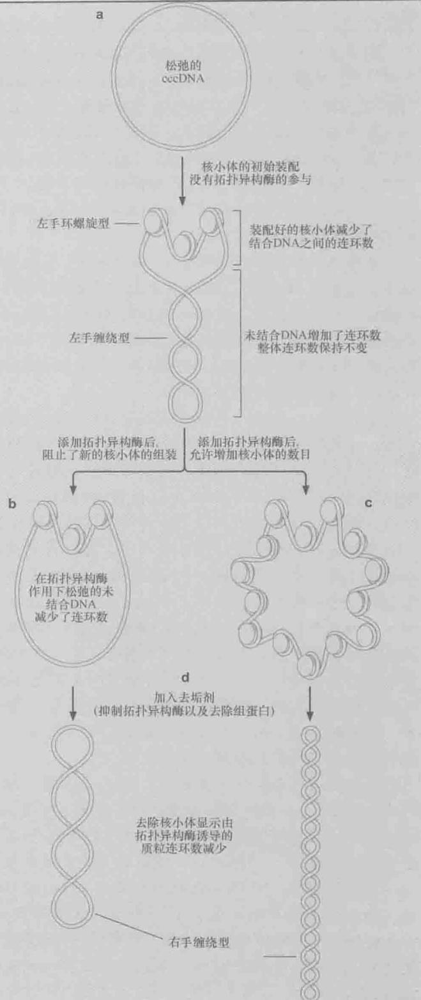

  
框 8-2 图 2 核小体组装实验检测相应连环数减少的实例。在拓扑异构酶存在的情况下，核小体以 cccDNA 进行组装。在组装开始（0min）或者核小体组装反应的各个时间点加入去污剂，并且通过非变性琼脂糖凝胶电泳分离及溴化乙锭染色。尽管琼脂糖凝胶电泳并不能区分 cccDNA 是正超螺旋还是负超螺旋，但是 DNA 嵌入剂（intercalator）能增加连环数从而改变凝胶中的 DNA 状态（一种更加松弛的状态），根据这一点能够用来显示 cccDNA 的负超螺旋（没有显示，经 ItoT.et al.1997.Cell 90:145-155.Fig.2c ©Elsevier 许可使用。）

每圈螺旋的碱基数与组蛋白八聚体的结合，就会使核小体结合 DNA 的连环数略微增加。这种改变使每个核小体上连环数的变化由 -1.65 降到 -1.2。这一差异（大约每个核小体变化 +0.4）可以由每圈上碱基数的数量和核小体 DNA 的长度的改变计算得到。

这些问题与真核生物线性染色体是否有关？短的线性片段与超螺旋无关，因为DNA末端可以通过旋转来适应连环数的改变。但对于非常大的真核生物细胞的线性染色体就不适用了。首先，这些染色体太大，不能通过快速旋转来消除DNA超螺旋变化。更重要的是，染色体不是简单的线性DNA链，每条染色体DNA都被折叠到一个由大环组成的更加紧密的结构中，这些大环与被称为核骨架的蛋白质结构拴在一起。这些附属装置将环与环在拓扑学上分开，同时也阻止了染色体DNA的自由旋转。

## 染色质的高级结构

## 异染色质和常染色质

自早期利用光学显微镜的观察开始，科学家就发现染色体的结构是不一致的。对染色体的早期研究将染色体区域分为两个部分：异染色质（heterochromatin）和常染色质（euchromatin）。异染色质能被多种染料染成深色，具有更为紧密的形态；而常染色质则具有相反的特征即染色浅而具有相对伸展的结构。随着分子生物学对基因和基因表达的深入了解，发现染色体的异染色质区域的基因表达量非常有限，而常染色质区域的基因表达量较高。这一发现提示染色体的这两种不同染色质的结构与基因表达的总体水平有关联。

尽管异染色质区域显示基因表达很少，但这并不意味这些区域不重要。正如我们在讨论基因表达时将学到的，关闭一个基因与启动一个基因可以说同等重要。另外，异染色质与包括端粒和着丝粒在内的特定染色体区域相关，这两个染色体关键组分的功能非常重要。

经过若干年的研究，研究人员已对异染色质和常染色质结构有了分子水平上更加完整的理解。现在已清楚，这两种染色质中的 DNA 都被组装进核小体中。异染色质结构和常染色质结构的不同在于，位于这两个不同染色体区域的核小体是如何被（或不被）组装进更大的组件之中。现在很清楚，异染色质区由组装进高级结构的核小体 DNA 组成，并因此形成了基因表达的障碍。相反，常染色质区的核小体的组装程度要低得多。在下面的章节中，我们将讨论核小体是如何被组装进高级结构的。

## 组蛋白 H1 与核小体之间的连接 DNA 结合

一旦核小体形成，DNA 包装的下一步就是与组蛋白 H1 结合。与核心组蛋白相似，H1 是一种小的、带正电荷的蛋白质（表 8-5）。H1 与核小体之间的连接 DNA 的相互作用，进一步加强了核小体与 DNA 间的紧密结合，增加了对核小体 DNA 的保护。这可以从对微球菌核酸酶消化的抵抗力增强检测到。因此，除了核心组蛋白保护 147bp 的 DNA 之外，组蛋白 H1 与核小体的结合保护了额外的 20bp DNA 免于微球菌核酸酶的消化。

组蛋白 H1 具有不同寻常的特点，可与 DNA 双螺旋的两个不同的区域结合。通常，这两个区域是与核小体结合的同一 DNA 分子的一部分（图 8-27）。相对于核小体而言，H1 的结合位点是不对称的。H1 的一个结合区是核小体一端的连接 DNA，另一结合位点在与核小体结合的 147 bp DNA 的中间（在二价轴上仅有的 DNA 双螺旋）。因此，上

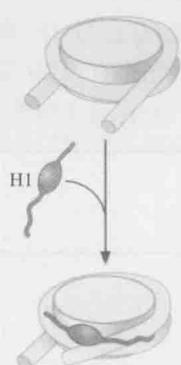  
H1 结合

图 8-27 组蛋白 H1 结合两个 DNA 螺旋。就组蛋白 H1 与核小体的相互作用而言，组蛋白 H1 分别与核小体一端的连接 DNA 及与核小体结合的 DNA 中部的 DNA 螺旋结合（即核心组蛋白八聚体结合的 147bpDNA 的中间）。

述免于核酸酶消化的、额外的 DNA 仅是核小体一侧的连接 DNA。H1 的结合使 DNA 的两个区域紧密靠近，增加了在组蛋白八聚体上紧密盘绕的 DNA 的长度。

H1 的结合使 DNA 进出核小体的角度更为固定。通过电子显微镜可以观察到（图 8-28），这种效果使核小体 DNA 呈现出独特的锯齿形外观。DNA 进出的角度视条件（包括盐浓度、pH 和其他蛋白质的存在）变化很大。如果我们假设这些角度相对于二价轴是约 $20^{\circ}$ ，这将导致核小体交替存在于组蛋白 H1 结合的连接 DNA 中心区的两侧（图 8-29）。

  
图 8-28 H1 的结合导致核小体 DNA 的进一步凝聚。这两幅照片是在电子显微镜下显示的组蛋白 H1 存在（a）或缺失（b）时的核小体 DNA。注意在组蛋白 H1 存在时，核小体 DNA 的凝聚更紧密且结构更固定。（来源：Thoma F. et al. 1979. J. Cell Biology 83: 403-427, Figs. 4&6. © RockefellerUniversityPress.）

  
图 8-29 组蛋白 H1 使 DNA 更紧密地盘绕于核小体。这两幅图是组蛋白 H1 存在或缺失条件下 DNA 盘绕核小体情况的比较。组蛋白 H1 能与每个核小体作用，结合于连接 DNA 和核小体结合 DNA 中部的 DNA 螺旋。

## 核小体束能形成更复杂的结构：30nm 纤丝

组蛋白 H1 的结合稳定了染色质的高级结构。在试管中，当盐浓度增加时，组蛋白 H1 的加入导致核小体 DNA 形成一条 30nm 纤丝（30nm fiber）。这个结构也能在体内观察到，代表了 DNA 凝聚的下一层次。更重要的是，DNA 整合到这种纤丝内使其不易被许多依赖 DNA 的酶（如 RNA 聚合酶）接近。

关于 30nm 纤丝的结构，目前有两种模型。在螺线管模型（solenoid model）中，核小体 DNA 形成一个超螺旋，每圈大约包含 6 个核小体（图 8-30a）。电镜和 X 射线衍射研究都支持这个结构。研究表明，30nm 纤丝有一个大约 11nm 的螺旋斜度。这也是核小体圆盘的大约直径，表明 30nm 纤丝是由核小体圆盘堆叠成螺旋状所构成（图 8-30a）。在这个模型中，组蛋白八聚体圆盘的平面间相互连接，而核小体的 DNA 表面形成超螺旋外部易接近的表面。连接 DNA 被埋藏在超螺旋的中心，但从不穿过纤丝轴。而且，当 DNA 从一个核小体移到另一核小体时，连接 DNA 环绕着中心轴。

30nm 纤丝的另一模型是锯齿模型（图 8-30b）。这个模型的基础是结合 H1 后的核小体呈锯齿状。在这种模型下，30nm 纤丝是这些锯齿形核小体束的压缩结构。新近以 4 个核小体 DNA 单一分子的 X 射线衍射和对弹簧状的单一 30 nm 纤丝的分析支持这个模型。与螺线管模型不同，锯齿状的构象要求连接 DNA 以相对笔直的方式穿过纤丝的中心轴（图 8-30b）。因此，较长的连接 DNA 有利于这种构象的形成。因为连接 DNA 的平均长度在不同物种间有变化（表 8-4），所以 30nm 纤丝的结构并不总是相同，根据局部的连接 DNA 长度，30nm 纤丝的两种形式都可以在细胞中找到。

  
图 8-30 30nm 染色质纤丝的两种模型。在 a、b 两组中，左边为纤丝的侧面，右边为沿纤丝的中心轴的下观图。（a）.螺线管模型。注意连接 DNA 不穿过超螺旋的中心轴且进出核小体的位点和侧面相对不易靠近。（b）.锯齿模型。在这种模型中，连接 DNA 经常穿过纤丝的中心轴，侧面甚至进出位点更易靠近。（来源：Pollard T.and Earnshaw W.2002.Cell Biology,1st edition, p.202, Fig.13-6. ©Elsevier）

## 组蛋白 N 端尾巴对于 30nm 纤丝的形成是必需的

缺少 N 端尾巴的核心组蛋白不能形成 30nm 纤丝。这个尾巴最可能的作用是通过它与相邻核小体的相互作用稳定 30nm 纤丝。核小体的三维晶体结构支持这种模型。

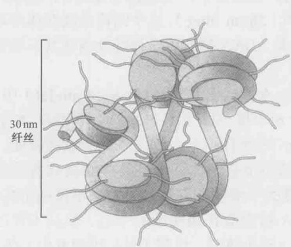  
图 8-31 组蛋白 N 端尾巴稳定 30nm 纤丝的推测模型。在这个模型中，30nm 纤丝用锯齿模型表示。几种不同的核心组蛋白与尾巴的相互作用是可能的。这里描绘了每个交替的组蛋白间的相互作用，但这种相互作用也能在相邻的或更远的组蛋白间发生。

核小体三维结构显示，在晶格中，H2A、H3和H4的N端尾巴各自与相邻的核小体相互作用（图8-31）。最近的研究表明，组蛋白H4带正电荷的N端与组蛋白H2A带负电荷的折叠区相互作用，对于 $30\mathrm{nm}$ 纤丝的形成特别重要。与H4尾巴相互作用的H2A残基在许多真核生物中是保守的，但这些残基不参与DNA的结合或组蛋白八聚体的形成，一种可能性是H2A的这些区域是保守地介导核小体相互之间与H4尾巴的作用。我们将在下面看到，在细胞中组蛋白尾巴经常是修饰的靶标，这些修饰可能影响 $30\mathrm{nm}$ 纤丝和其他核小体高级结构的形成能力。

  
图 8-32 染色质的高级结构。(a). 一个透射电子显微照片显示染色质从染色体的中心结构处伸出。电子密集的区域是核骨架，在真核细胞中它负责将大量的染色体 DNA 组织起来。(b). 一个真核染色体的结构模型，显示大多数 DNA 包装进 30nm 纤丝的大环且其根部结合于核骨架上。而有活性的 DNA 位点（如转录或 DNA 复制位点）以 10nm 纤丝甚至裸露 DNA 的形式存在。（来源：a. Courtesy of J. R. Paulson and U.K. Laemmli.）

## DNA 的进一步凝聚与核小体 DNA 的大环有关

DNA 包装为核小体和 30nm 纤丝共同导致 DNA 的线性长度压缩了大约 40 倍。但这种 1\~2 m 长的 DNA 仍然不能适合大约 $10^{-5}$ m 直径的细胞核。为了使 DNA 压缩更紧，必须对 30nm 纤丝进行进一步折叠。尽管尚不清楚这种折叠的确切结构，但是一个流行的模型推测 30nm 纤丝形成 40\~90 kb 的环，在其根部通过蛋白质结构的核骨架（nuclear scaffold）连接起来（图 8-32）。虽然核骨架的真实结构仍是个谜，但已经研究出一些方法来鉴定作为这个结构一部分的那些蛋白质。

目前已发现有两类蛋白质参与核骨架的形成。一类是拓扑异构酶Ⅱ（TopoⅡ），它大量存在于核骨架的制备物和纯化的有丝分裂染色体中。用能够导致DNA在TopoⅡ的DNA结合位点发生断裂的药物处理细胞，得到长约50kb的DNA片段。这与用有限的核酸酶消化染色体所得到的片段长度相似，表明TopoⅡ可能是参与形成这种根部相连的环状DNA的机制的一部分。此外，每个环的根部的TopoⅡ可以保证这些环在拓扑学上的相互分离。

SMC 蛋白也是核骨架中含量丰富的组成成分。正如我们先前所讨论的（见“染色体复制和分离部分”），SMC 蛋白是染色体复制后进行凝聚和维持姐妹染色体联会机制的关键组成成分。这些蛋白质通过与核骨架的结合，为其与染色体 DNA 的相互作用提供了内在的基础，从而增强它们的功能。

## 组蛋白的变构体影响核小体功能

核心组蛋白是最保守的真核蛋白质之一。因此，由这些蛋白质形成的核小体在全部真核生物中是非常相似的。但是，在真核细胞中发现了很多组蛋白变构体，能替代四种标准组蛋白中的一种，形成替代型核小体。这类核小体可能用来划分染色体的特定区域，或者赋予核小体特定的功能。例如，H2A.X是H2A的一种变构体，广泛分布于真核细胞的核小体中，当染色体DNA发生断裂的时候（称为双链断裂），邻近断点的H2A.X会被磷酸化。这种被磷酸化后的H2A.X可以被DNA修复酶特异地识别，并将修复酶定位到DNA损伤位点。

另一个组蛋白变构体 CENP-A，与含有着丝粒 DNA 的核小体结合。在这个染色体区域，CENP-A 替代了核小体中的组蛋白 H3 亚基。这些核小体整合进动粒，介导染色体与有丝分裂纺锤体的黏附（图 8-12）。与 H3 相比，CENP-A 含有较长的 N 端尾巴，但含有相似的组蛋白折叠结构域，所以 CENP-A 的加入不大可能改变核小体的核心结构。然而，CENP-A 延长的尾巴可能给动粒的其他蛋白质组分提供新的结合位点（图 8-33）。按照这种假说，CENP-A 的丢失可能干扰动粒组分与着丝粒 DNA 的相互作用。

  
图 8-33 组蛋白变构体掺入引起的染色质改变。CENP-A 替代组蛋白 H3 可能为一个或多个动粒的组分提供了结合位点。

## 染色质结构的调控

## DNA 与组蛋白八聚体的相互作用是动态过程

正如我们将在第 19 章详细讲述的，DNA 包装进核小体对基因组的表达有重要影响。在许多情况下，能够靠近特定 DNA 区域所需的关键步骤是将核小体去除，或者使其与 DNA 的结合不那么紧密。为适应这种需要，组蛋白八聚体与 DNA 的结合应该是动态的。此外，有一些因子能与核小体相互作用，增加或降低这种动态结合。这些特征共同保证了核小体的位置以及与 DNA 相互作用的改变，以适应 DNA 易接近性经常变化的需要。

类似于所有非共价键介导的相互作用，任何特定的 DNA 区段与组蛋白八聚体的结合都不是永久的，任何 DNA 区段都将短暂地从与八聚体的紧密相互作用中释放出来。这种释放类似于 DNA 双螺旋的暂时解链（与我们在第 4 章中讨论的一致）。由于许多 DNA 结合蛋白更易结合没有组蛋白的 DNA，因此 DNA 与组蛋白核心结构结合的动态特点十分重要。只有从组蛋白八聚体上释放出来，或者结合到连接 DNA 上，即 DNA 上没有核小体的区段，这些蛋白质才能识别 DNA 上的结合位点。

DNA 从核小体上间歇性地、自发性地释放，其结果是蛋白质与其 DNA 结合位点接近的概率为 1/50\~1/100 000，概率的大小取决于结合位点在核小体中的位置，越处于中心的结合位点越不易接近。因此，在与核小体紧密结合的 147bp DNA 上的 73 位点附近的结合位点是最不易接近的位点，而在核小体 DNA 两端（1 或 147 位点）的结合位点最易于接近。这些发现表明 DNA 暴露的机制归因于 DNA 从核小体上解绕，而不是简单地从组蛋白八聚体表面伸出（图 8-34）。值得注意的是，这些研究都是在试管里用分离纯化的核小体来进行的，与细胞中 DNA 从核小体上解绕可能有所不同，因为在细胞中，长长的 DNA 要组装到很多相邻的核小体（被称为核小体集束）里去。与 H1 的结合及核小体组装成 30nm 的纤丝，都将改变这些事件的发生概率。然而，核小体的动态结构表明，X 射线晶体学揭示的核小体结构只是短暂性的，而不是大部分时间里的其他构型。

  
图 8-34 接近与核小体结合的 DNA 的模型。对具序列特异性的 DNA 结合蛋白与核小体结合能力的研究表明，DNA 从核小体上的解绕对于 DNA 的易接近性起决定作用。因此，最靠近核小体进出位点处的 DNA 结合位点是最易接近的，而最靠近结合 DNA 中部的位点是最不易被接近的。

## 核小体重塑复合体有助于核小体的移动

除了核小体所呈现的内在动态性之外，组蛋白和 DNA 相互作用的稳定性还受到蛋白质大复合体、称为核小体重塑复合体（nucleosome-remodeling complex）的影响。这些多蛋白复合体有助于以 ATP 水解为能量的核小体-DNA 的相互作用或核小体位置的改变。被这些酶催化的核小体改变，有三种基本的类型（图 8-35）。所有核小体重塑复合体都能催化 DNA 沿着组蛋白八聚体表面的“滑动”（sliding）。另一种类型的核小体重塑复合体能够催化第二种更为极端的变化，使组蛋白八聚体进入溶液或从一个 DNA 螺旋向另一个螺旋“转移”（transfer）。最后，某些酶可以促进核小体中的二聚体 H2A/H2B 转换成其他形式的二聚体（如 H2A.X/H2B 在双链断裂处转换为 H2A/H2B）。

  
图 8-35 核小体重塑催化核小体的移动。（上）核小体沿 DNA 分子滑动，暴露出 DNA 结合蛋白的结合位点。（中）核小体重塑复合体也可以从 DNA 中解离出核小体，从而产生更大的无核小体区，（下）一组核小体重塑复合体可以同时催化未经修饰的和变化的 $H_{2}A/H_{2}B$ 二聚体的交换。

最近的研究已经揭示核小体重塑复合体是如何将DNA在组蛋白八聚体上移动的（图8-36）。每一个这样的多亚基酶都有一个ATP水解亚基，当从核糖体重塑复合体中解离后，可以在双链DNA上定向移动（也称为移位）。目前的结构表明核小体重塑复合体可以与组蛋白八聚体，以及与核小体DNA相邻的DNA移位酶亚基结合。通过将移位酶固定在组蛋白八聚体的特定位置上，核小体重塑复合体的ATP水解，其最终结果是将组蛋白八聚体表面的DNA移开。从转移位点的核小体表面释放的DNA的转移可以产生DNA环。这个环可以在组蛋白八聚体的表面传送直到其到达核小体DNA的另一端。尽管该环可以向任意方向移动，但是核小体重塑复合体与核小体DNA之间的其他作用力阻止了该DNA环向近端DNA连接器的移动（该移动不会改变核小体的位置）。重要的是，这种方法并不要求组蛋白八聚体与核小体DNA之间的作用瞬间消失。相反，在组蛋白八聚体表面的DNA的这种“尺蠖样”（inchworm-like）运动允许在整个重塑过程中组蛋白-DNA之间主要相互作用保持不变。重要的是要记住，DNA 序列与组蛋白八聚体的相互作用的亲和性是基本等同的。这样，可以把 DNA 分子沿着组蛋白八聚体的滑动看成是不同的能量等同状态与组蛋白八聚体的结合，核小体重塑复合物使 DNA 更为容易地接近这些不同的状态。

  
图 8-36 核小体重塑复合体催化的核小体 DNA 滑动模型。(a) 据这一模型，核小体重塑复合体的 ATP 水解亚基结合到距中心二价轴两个螺周的核小体 DNA 上（如核小体的 147 bp 中的 52 位）。核小体重塑复合物的其他亚基都与组蛋白紧密结合。图示 DNA 和组蛋白从二价轴到最邻近的、未结合 DNA 的每一个接触点（每两螺周一个接触点，14 螺周中有 7 个接触点）。(b) ATP 依赖的 DNA 移位活性，使核小体重塑复合体首先将 DNA 从最近邻的连接区拉入核小体。ATP 水解亚基和连接 DNA 之间的 5 个接触点被打断（被打断的接触点为黑色，完整的接触点为白色）。(c) 被打断的接触点在移位的 DNA 重新形成(1\~5 位)，留下 DNA 环紧靠 ATP 水解亚基（6 位）。(d) 为去除 DNA 环，这个模型提出其他序列像“波”（wave）一样沿着组蛋白的表面移动，每一次打断 1 或 2 个接触点（先是 6，然后是 7），直到所有接触点都以它们之间适量的 DNA 重新形成。此时，与组蛋白结合的 DNA 不再过量，核小体已经在 DNA 上就位。(e) DNA 环移动到末梢时，核小体也在 DNA 上移位。(经许可修改自 Saha A. et al. 2006. Nat. Rev. Mol. Cell Biol. 7: 437-447, Fig. 4 a. ©Macmillan.)

在任一细胞中都有多种类型的核小体重塑复合体（表8-6）。它们至少有2个亚基，最多有10个亚基。正如前文所描述的（见图8-36），这些复合体中的每一种都含有一个推进DNA移动的ATP水解亚基。尽管在不同的复合体中ATP水解亚基是相似的，但是与每一个复合物结合的其他亚基可以调节其功能。例如，这些复合体包含能将其定位于特定染色体位置上的亚基。在一些情况下，这种定位由重塑复合体亚基和DNA结合的转录因子间的相互作用所介导。在其他情况下，结合到经特异修饰的组蛋白N端尾巴也可以介导定位[通过铬功能域(chromodomain)或溴功能域(bromodomain)，将在下面讲到]。

表 8-6 ATP 依赖性核小体重塑复合体

<table><tr><td>类型</td><td>亚基数目</td><td>组蛋白结合域</td><td>滑动</td><td>转移</td></tr><tr><td>SWI/SNF</td><td>8~14</td><td>溴功能域</td><td>有</td><td>有</td></tr><tr><td>ISWI</td><td>2~4</td><td>溴功能域,SANT域,PHD指纹</td><td>有</td><td>无</td></tr><tr><td>CHD</td><td>1~10</td><td>铬功能域,PHD指纹,SANT域</td><td>有</td><td>有</td></tr><tr><td>INO80</td><td>10~16</td><td>溴功能域</td><td>有</td><td>未定</td></tr></table>

## 某些核小体处于特定的位置：核小体的定位

由于核小体与 DNA 的相互作用是动态的，并且没有序列特异性，所以大多数核小体的位置是不固定的。但在有些情况，对核小体的位置，或称为核小体的定位（positioning），进行限制是有利的。通常，核小体的定位允许调节蛋白的 DNA 结合位点处于易接近的连接 DNA 区。在多数情况下，这些没有核小体结合的 DNA 区段要足够大，以使多个调节蛋白的结合位置易于被接近。例如，活跃的转录因子的上游起始位点通常是无核小体的部位。

核小体定位可由 DNA 结合蛋白或特定的 DNA 序列指导。在细胞中，最常见的方式是核小体与 DNA 结合蛋白间的竞争。正如许多蛋白质不能与核小体内的 DNA 结合一样，当蛋白质与 DNA 结合后，就阻止了核心组蛋白与这段 DNA 随后的结合。如果两个 DNA 结合蛋白与 DNA 结合的位点间的距离小于 DNA 组装成一个核小体所需的最小长度（约 150bp），那么这两个蛋白质之间的 DNA 将不与核小体结合（图 8-37a）。邻近 DNA 与其他蛋白质的结合能进一步增加不与核小体结合的区域的长度。除了这种依赖于蛋白质的核小体定位的抑制机制外，一些 DNA 结合蛋白与相邻的核小体紧密作用，导致核小体立即在与这些蛋白质相邻的位置优先组装（图 8-37b）。

核小体定位的另一种方式涉及特定的 DNA 序列，这些序列对核小体有高度的亲和性。由于结合在核小体上的 DNA 是弯曲的，所以核小体优先在 DNA 易弯曲的区域形成。富含 A:T 的 DNA 有向小沟弯曲的潜在倾向。因此，富含 A:T 的 DNA 有利于组装，其小沟面对组蛋白八聚体。富含 G:C 的 DNA 则有相反的倾向，因此，当小沟背

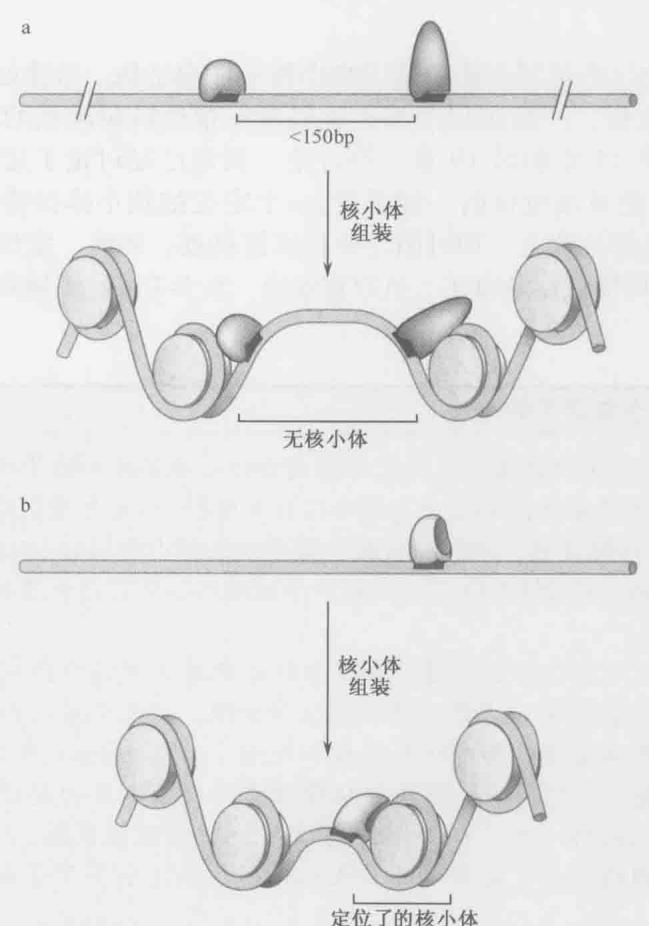  
图 8-37 两个依赖于 DNA 结合蛋白的核小体定位模型。（a）许多 DNA 结合蛋白与 DNA 的结合和同一 DNA 与组蛋白八聚体的结合是不兼容的。因为核小体的形成需要多于 147bp 的 DNA，如果两个与 DNA 结合的结合因子间的距离小于 147bp，那么二者之间的 DNA 不能组装进核小体。（b）一些 DNA 结合蛋白具有与核小体结合的能力。这些蛋白质一旦与 DNA 结合，将立即有助于核小体与相邻蛋白质 DNA 结合位点的结合。

离组蛋白八聚体时有利于组装（图8-38）。每个核小体都试图使富含A:T和富含G:C序列的这种排列方式最大化，最近对酵母(S.cerevisiae)核小体定位的研究揭示，高达50%的核小体严格定位可归因于这些核小体的组蛋白核心对其所包含的DNA序列的优先结合。值得注意的是，虽然这些序列可被优先结合，但却不是核小体组装所必需的，而通过其他蛋白质的作用，包括染色质重塑和转录因子结合，还可将核小体从这些它们偏

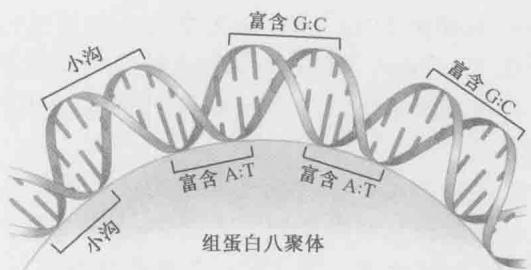  
图 8-38 核小体倾向于与弯曲的 DNA 结合。特定的 DNA 序列能定位核小体。由于 DNA 在与核小体结合的过程中会剧烈弯曲，所以具有内在弯曲倾向的 DNA 序列可定位核小体。A：T 碱基对有向小沟弯曲的内在倾向，G：C 碱基对则有相反的倾向。富含 A：T 和 G：C 的序列之间以约 5 bp 为周期变化的交替序列是核小体优先的结合位点。（来源：Alberts B. et al. 2002. Molecular biology of the cell, 4th edition, Fig.4-28. ©Garland Science / Taylor & Francis LLC.）

好的位置移除。

核小体定位的这些机制会影响基因组中核小体的结构。尽管如此，大多数核小体并没有严格的定位。严格定位的核小体经常在指导转录起始的位点，这将在真核转录的章节（第13章和第19章）中讨论。我们已经讨论了定位主要是作为保证调控DNA序列的可接近性的一种手段，一个定位的核小体仅需通过定位在与某一特定位点有重叠的位置上，即可阻止此位点被接近。因此，定位的核小体对于其附近DNA序列的可接近性具有正、负双重效应。框8-3描述了确定核小体定位的一种方法。

## 框8-3 细胞中核小体定位的实验

核小体与相邻的重要调控序列间定位的重要性促进了在细胞中追踪核小体定位方法的发展。这其中的许多方法都是利用核小体具有保护 DNA 免受微球菌核酸酶消化的能力。正如框 8-1 所描述的，微球菌核酸酶易于切断核小体间的 DNA，而不是与核小体紧密结合的 DNA。利用这个性质可以在一个细胞群体中定位与结合位置相同的核小体（框 8-3 图 1）。

为了精确地定位核小体的位置，分离细胞染色质并用适量微球菌核酸酶处理使之轻微断裂是非常重要的。通常是温和地裂解细胞，得到完整的细胞核，然后再用几种不同浓度的微球菌核酸酶短暂地处理细胞核（一般1min），微球菌核酸酶很小，能迅速地进入细胞核。利用不同浓度微球菌核酸酶处理的目的是使核酸酶在每个细胞中对目的区域仅切割一次。一旦DNA被消化，将细胞核裂解，从DNA上去除全部的蛋白质。切割的位点（更重要的是未切割的位点）留下了蛋白质结合DNA的记录。

为了鉴定特定区域的切割位点，有必要对所有的切割片段创建一个确定的末端位点并研究 DNA 杂交的专一性。为了创建固定的末端位点，可以利用一种酶切位点在目的区域附近的限制性内切核酸酶处理从样品中纯化的 DNA。根据 DNA 的大小在琼脂糖凝胶电泳上分离后，将 DNA 变性并转移到硝酸纤维素膜上，然后用特定序列的标记 DNA 探针与之杂交（称为 Southern 印迹，第 7 章有详细描述）。在这种情况下，DNA 探针需仔细地选择，以使其与目的位点处限制位点的紧邻序列杂交。经杂交和洗脱后，DNA 探针将显示出微球菌核酸酶处理目的区域后所产生片段的长度。

片段的长度是如何揭示定位的核小体的位置呢？与定位的核小体结合的 DNA 将不被抗微球菌核酸酶消化，而是产生约 160\~200bp 的、没有被切断的 DNA 区域，在 Southern 印迹中显示为 DNA 条带梯度中有一个大的间隙。经常能发现有定位的核小体束存在，表现为一个相似的、周期性的 160\~200bp 片段循环，代表了切割和保护的位点。

最近发展了一个相关的方法用于鉴定整个基因组中的核小体位置。该方法首先通过甲醛处理细胞，使其组蛋白和DNA交联在一起（框8-3图2a）。然后将细胞裂解，分离出染色质并利用微球菌核酸酶处理直到DNA的大部分是单核小体大小(约147bp)。

  
框 8-3 图 1 细胞中核小体定位的分析。此图描述了在细胞中确定核小体定位的实验步骤。细节参阅正文。

在反向交联后，DNA 通过凝胶电泳分离，产生的 147bp 的 DNA 片段纯化后进行末端配对深度测序。深度测序的方法不仅检测每个 DNA 片段的末端，而且会追溯哪些末端是来自于相同的 DNA 片段。因此，末端配对测序既揭示了基因组位置又揭示了测序 DNA 片段的长度。核小体尺寸的 DNA 片段测序揭示了核小体的位置。这些位置可以定位在每个染色体上。核小体的定位由许多来源于相同 147bp 区域的 DNA 片段决定（框 8-3 图 2b）。利用这种方法，整个基因组上的核小体都可以实现定位。

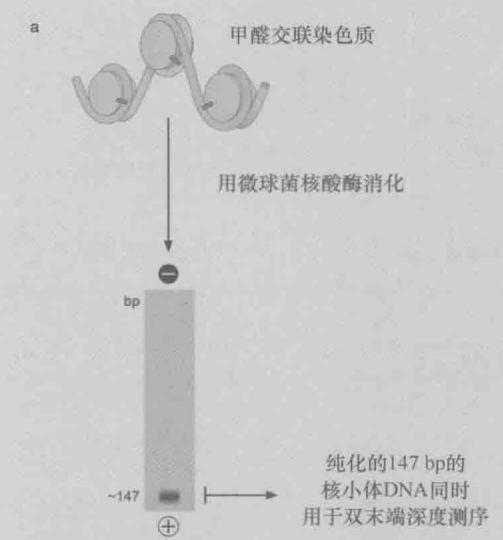

  
框 8-3 图 2 核小体定位的全基因组分析。(a) 细胞利用甲醛交联后, 分离出染色质并用微球菌核酸酶处理完全, 从而产生主要的核小体颗粒。反向交联后, 147bp DNA 的主带通过凝胶电泳进行分离及末端配对测序。(b) 插图展现在随机及特点位点的核小体连接 DNA 的染色体映射。

## 组蛋白 N 端的尾巴经常被修饰

当组蛋白从细胞中分离出来，其 N 端尾巴通常被许多种小分子修饰（图 8-39）。尾巴中的赖氨酸经常被单一的乙酰基或甲基基团修饰，而精氨酸则会被一个、两个或者三个甲基基团修饰（图 8-40）。同样，丝氨酸和苏氨酸（以及一个酪氨酸）主要受磷酸化修饰。尽管并不常见，在组氨酸上还存在其他较大的修饰基团，包括 ADP-核糖和小蛋白（如泛素及小泛素相关修饰物）。

  
图 8-39 组蛋白 N 端尾巴的修饰改变了染色质的功能。图中显示了每个组蛋白上已知的修饰位点。为简单起见，仅表示乙酰化、甲基化、磷酸化和泛素化。大多数修饰发生在组蛋白的尾巴区域，但偶尔也发生在组蛋白折叠内部（如组蛋白 H3 的 79 位赖氨酸的甲基化）。(来源: Alberts B. et al. 2002. Molecular biology of the cell, 4th edition, Fig. 4-35. ©Garland Science/Taylor & Francis LLC 和 Jenuwein and Allis. C. D. 2001. Science 293: 1074-1080, Figs. 2 and 3. ©AAAS, 经许可)

重要的是，组蛋白的特殊修饰与不同的细胞事件相关联。例如，在组蛋白H4氨基端第8和第16位氨酸位点上发生的乙酰化与基因表达的起始位置相关，而发生在第5和第12位赖氨酸位点上的乙酰化就不具有这种意义，但却是新合成的H4的分子标志，意味着相应H4分子将与DNA被整合进新的核小体中。相似地，组蛋白尾巴的甲基化也可具有不同的生物学意义，组蛋白H3第4、36或79位点上的赖氨酸甲基化与基因表达相关，而第9或第27位点上的赖氨酸甲基化则与转录抑制相关。由于组氨酸修饰较易发生在染色质的特殊功能区（如转录起始位点），所以提出了组蛋白尾端修饰组成生物密码，可以被细胞内特定蛋白读写删除的假设。关于该假设的全面讨论见框19-5。

  
图 8-40 组蛋白末端修饰的结构。图中标注了小分子组蛋白修饰的分子结构和相关的修饰酶的类型 [组蛋白乙酰转移酶（HAT）；组蛋白脱酰酶（HDAc）；组蛋白甲基转移酶（HMT）；组蛋白去甲基酶（HDM）]。只列出了被作用的氨基酸。至今仍未发现甲基化的精氨酸组蛋白去甲基酶，提示该标记只能通过组蛋白脱离 DNA 链的方式来去除。（授权引用自 Lohse B. et al. 2011. Bioorg. Med. Chem. 19: 3625-3636, Fig.1. ©Elsevier.）

组蛋白的修饰是如何改变核小体功能的呢？一个显而易见的改变是乙酰化和磷酸化减少了组蛋白尾巴的正电荷（图8-41）。正电荷的减少降低了组蛋白尾巴对带负电荷的 DNA 骨架的亲和性。更加重要的是，组蛋白尾巴的修饰影响了组蛋白束形成更为抑制状态的高级染色质结构的能力。如前所述，组蛋白 N 端尾巴对于 30nm 纤丝的形成是必需的，而对组蛋白尾巴的修饰可调节这个功能。例如，乙酰化的组蛋白与基因组的表达区结合，H4 的 N 端尾巴的乙酰化影响了核小体整合进抑制状态的 30nm 纤丝的能力。如前所述，带正电荷的 H4 N 端尾巴和带负电荷的 H2A 组蛋白折叠区表面的相互作用是形成 30nm 纤丝的关键。乙酰化改变了 H4 尾巴的电荷状态，从而干扰了这一过程。

  
图 8-41 组蛋白尾巴修饰的影响。(a). 核小体与 DNA 结合的影响。未修饰的和甲基化的组蛋白尾巴被认为与核小体 DNA 的结合比乙酰化的组蛋白尾巴更紧密。(b). 组蛋白尾巴的修饰为修饰染色质的酶提供了结合位点。

## 核小体重塑和修饰复合物的蛋白结构域识别经修饰的组蛋白

经修饰的组蛋白尾巴能聚集特异性蛋白到染色质上（图 8-41b）。溴结构域（bromodomains）、铬结构域（chromodomains），TUDOR 结构域和 PHD 指纹（plant homodomain）能识别修饰形式的组蛋白尾巴。含溴结构域的蛋白质能与乙酰化的组蛋白尾巴相互作用，而含有铬结构域-TUDOR 结构域和 PHD 指纹的蛋白质能与甲基化的组蛋白相互作用。另一个称为 SANT 结构域的蛋白结构域的特点正好相反，那些含 SANT 结构域的蛋白质优先与未经修饰的组蛋白尾巴相互作用。这些蛋白结构域很好地解释了组蛋白修饰的重要性，很多情况下含这些结构域的蛋白质特异性地识别众多组蛋白修饰中的一种修饰形式。例如，HP1 蛋白含有一个铬结构域，它只能与 9 位赖氨酸甲基化了的 H3 组蛋白结合，而不与任何其他甲基化的组蛋白结合。有趣的是，还有很多蛋白质也含有这样的一个结构域，说明这些蛋白质是特化了的，专门识别多种修饰的组蛋白。例如，一些蛋白质含有 PHD 指纹，特异性识别组蛋白 H3 的 4 位甲基化赖氨酸并紧靠溴结构域，而这溴结构域能识别乙酰化的赖氨酸。

这些能识别经修饰的组蛋白的结构域是如何改变相关核小体的功能的？一个重要的方式是经修饰的组蛋白能将很多酶聚集起来，进一步修饰邻近的核小体。例如，很多修饰组蛋白尾巴的酶（称为组蛋白乙酰基转移酶，histone acetyltransferase）含有溴结构域，这些溴结构域能识别它们产生的同样的组蛋白修饰（表8-7），在这种情况下，溴结构域能进一步修饰已经乙酰化的区域，有助于乙酰化组蛋白的维持和继续（见下面的讨论）。

表 8-7 组蛋白修饰酶

<table><tr><td colspan="5">组蛋白乙酰转移酶复合体</td></tr><tr><td>类型</td><td>亚基数目</td><td>催化亚基</td><td>组蛋白结合域</td><td>靶组蛋白</td></tr><tr><td>SAGA</td><td>15</td><td>Gcn5</td><td>铬功能域、溴功能域</td><td>H3和H2B</td></tr><tr><td>PCAF</td><td>11</td><td>PCAF</td><td>溴功能域</td><td>H3和H4</td></tr><tr><td>NuA3</td><td>3</td><td>Sas3</td><td>PHD指纹</td><td>H3</td></tr><tr><td>NuA4</td><td>6</td><td>Esal</td><td>铬功能域、SANT域、PHD指纹</td><td>H4和H2A</td></tr><tr><td>P300/CBP</td><td>1</td><td>P300/CBP</td><td>溴功能域、PHD</td><td>H2A、H2B、H3和H4</td></tr><tr><td colspan="5">组蛋白去乙酰化酶复合体</td></tr><tr><td>类型</td><td>亚基数目</td><td>催化亚基</td><td colspan="2">同源调节域/修饰域</td></tr><tr><td>NuRD</td><td>9</td><td>HDAC1/HDAC2</td><td colspan="2">溴功能域、PHD指纹</td></tr><tr><td>SIR2复合物</td><td>3</td><td>Sir2</td><td colspan="2">无</td></tr><tr><td>Rpd3大亚基</td><td>12</td><td>Rpd3</td><td colspan="2">PHD指纹</td></tr><tr><td>Rpd3小亚基</td><td>5</td><td>RpD3</td><td colspan="2">溴功能域、PHD指纹</td></tr><tr><td colspan="5">组蛋白甲基转移酶</td></tr><tr><td>名称</td><td colspan="2">组蛋白结合域</td><td colspan="2">靶组蛋白</td></tr><tr><td>SET1</td><td colspan="2">无</td><td colspan="2">H3(赖氨酸4)</td></tr><tr><td>SUV39/CLR4</td><td colspan="2">溴功能域</td><td colspan="2">H3(赖氨酸9)</td></tr><tr><td>SET2</td><td colspan="2">无</td><td colspan="2">H3(赖氨酸36)</td></tr><tr><td>DOT1</td><td colspan="2">无</td><td colspan="2">H3(赖氨酸79)</td></tr><tr><td>PRMT</td><td colspan="2">无</td><td colspan="2">H3(精氨酸3)</td></tr><tr><td>SET9/SUV4-20</td><td colspan="2">无</td><td colspan="2">H4(赖氨酸20)</td></tr><tr><td colspan="5">组蛋白去甲基化酶</td></tr><tr><td>名称</td><td colspan="2">组蛋白结合域</td><td colspan="2">靶甲基化组蛋白</td></tr><tr><td>LSD1</td><td colspan="2">PHD指纹、SANT域</td><td colspan="2">H3(赖氨酸4)</td></tr><tr><td>JHDM1</td><td colspan="2">PHD指纹</td><td colspan="2">H3(赖氨酸36)</td></tr><tr><td>JHDM3</td><td colspan="2">PHD指纹,TUDOR域</td><td colspan="2">H3(赖氨酸9,36)</td></tr></table>

经修饰的组蛋白也能聚集作用于染色质的其他蛋白质。很多核小体重塑复合物的一个或几个亚基都有这些识别修饰后组蛋白的结构域（见表8-6），使修饰后的组蛋白能够聚集这些酶。很多与转录调控有关的蛋白质也含有这些结构域。例如，TF11D转录机器的关键组分就含有一个溴结构域，这个结构域将转录机器引导到核小体乙酰化位置上。这是组蛋白乙酰化的另一个途径，这一乙酰化能增加相关DNA的转录活性。能识别组蛋白甲基化位置的铬结构域可以与转录被抑制的基因结合，这个铬结构域在好多蛋白质中都已发现。这些蛋白质对于异染色质的形成非常重要，包括HP1蛋白和“多梳”蛋白（polycomb）（分别见第19章和第21章）。

## 特定的酶负责组蛋白的修饰

我们刚才已经讲述了组蛋白的修饰是动态的，且是由特定的酶催化的（图 8-40）。组蛋白乙酰转移酶（HAT）催化乙酰基团添加到组蛋白上，而组蛋白去乙酰化酶（HDAc）可去除这种修饰。相似地，组蛋白甲基转移酶（HMT）将甲基加到组蛋白上，组蛋白去甲基酶（HDM）则将甲基去除。许多不同的组蛋白乙酰转移酶和去乙酰化酶已经被鉴定，可通过它们对不同的组蛋白或是同一组蛋白不同赖氨酸的识别能力来进行区分。组蛋白甲基转移酶和去甲基化酶有更好的特异性，通常可以精确识别组蛋白上众多赖氨酸或精氨酶中的某一个（表 8-7）。由于不同的修饰对核小体的功能有不同的影响，因此不同的组蛋白乙酰转移酶或甲基转移酶对核小体的修饰（或相对应酶的去修饰）会对染色质的结构和 DNA 的很多功能进行调控。

与核小体重塑复合体一样，这些修饰酶是大的多聚蛋白复合体的一部分。其他的亚基在引导这些酶到特定的 DNA 区域上起着重要作用。与核小体重塑复合体相似，这些复合体可以和与 DNA 结合的转录因子，或直接与修饰的核小体发生相互作用。引导这些酶到特定的 DNA 区域是沿着染色质能够观察到特定的组蛋白修饰模式的原因，并且是调控真核染色体中基因表达水平的主要机制（见第 19 章）。

## 核小体的修饰和重塑共同增强 DNA 的易接近性

N 端尾巴的修饰和核小体重塑的共同作用能显著地改变 DNA 的易接近性。正如我们将在第 13 章和第 19 章中所见，参与这些修饰的蛋白质复合体经常集合到转录活性位点上。尽管它们发挥作用的顺序不总是相同，但累积起来的效果使 DNA 的易接近性在特定的部位产生显著的改变。N 端尾巴的修饰能减少核小体束形成抑制性结构，产生能集合包括核小体重塑因子在内的其他蛋白质的位点。随后的核小体重塑能进一步增强核小体 DNA 的易接近性，允许 DNA 结合蛋白接近它们的结合位点，与适当的 DNA 结合蛋白或 DNA 序列相结合，这些改变能导致 DNA 特定位点处的核小体的定位或释放（图 8-42）。

  
图 8-42 染色质重塑复合体和组蛋白修饰酶共同改变染色质的结构。序列特异性的 DNA 结合蛋白通常引导这些酶到染色体的特定区域。在这个图中，DNA 结合蛋白（蓝色）首先引导一个组蛋白乙酰转移酶来修饰邻近的核小体，使局部的 30 nm 染色质纤丝转变为较易接近的 10 mm 纤丝，增强 DNA 的易接近性。这导致了第二个 DNA 结合蛋白（橙色）的结合，它又导入了一个核小体重塑复合物，核小体重塑复合物的定位有助于邻近核小体的滑动，暴露了第三个结合蛋白（绿色）的结合位置，如转录起始位点的 TATA 结合蛋白质的结合位点。尽管我们在这里描述的是先发生组蛋白乙酰化复合体结合，然后导入染小体重塑复合体的顺序，但两种顺序都可以观察到并具有相同的效果。事实上，不同的组蛋白修饰酶，也能形成更浓缩的、不易接近的染色质。

## 核小体的组装

## DNA 复制后核小体组装即开始

一条染色体的复制需要 DNA 的复制和子代 DNA 分子上相关蛋白质的重新组装。后一过程与 DNA 复制紧密相连，以确保新复制的 DNA 分子迅速组装进核小体。在第 9 章中我们将详细讨论 DNA 复制的机制。这里我们只讨论 DNA 复制后指导核小体组装的机制。

虽然 DNA 的复制要求核小体的部分解离，但是 DNA 在一系列有序的过程中很快被重新组装。如前所述，在 DNA 上核小体组装的第一步是结合一个 H3 和 H4 四聚体。一旦四聚体结合后，两个 H2A·H2B 二聚体结合形成最终的核小体。据推测，在高级染色质组装的过程中，H1 最后加入这个复合体。

为了复制一条染色体，子代染色体上的核小体至少半数是新合成的。是不是将全部的原有组蛋白丢失而仅用新合成的组蛋白来组装成核小体？如果不是这样，原有的组蛋白是如何在两个子代染色体间分配的？考虑到组蛋白的修饰会对染色质的易接近性有影响，因此原有组蛋白的命运就成为一个特别重要的问题。如果原有的组蛋白完全丢失，那么染色体的复制将删除对先前修饰的核小体的任何“记忆”。相反，如果原有的组蛋白保留在一条染色体上，那么这条染色体相对于另一拷贝的染色体将有一套不同的修饰。

在实验中采用不同的标记物标记原有的和新的组蛋白，发现原有的组蛋白存在于两条子代染色体中（图8-43）。然而，这种混合不是完全随机的。H3·H4四聚体和H2A·H2B二聚体或者全由新的组蛋白，或者全由旧的组蛋白所组成。因此，当复制叉经过时，核小体解离为亚组装部件。H3·H4四聚体似乎仍随机地与两个子代双螺旋之一结合，并不从DNA上释放而成为游离的组蛋白成分。相反，H2A·H2B二聚体被释放且进入局部的环境，参与新的核小体的组装。

在染色体复制过程中，原有组蛋白分布的遗传性为精确地按父本模式进行组蛋白修饰提供了一个机制。通过这个机制，无论原有的组蛋白在哪个子代染色体上，都倾向于重新结合到靠近它们在父代染色体上的位置上（图8-44）。这种修饰组蛋白定位的遗传性为每个子代染色体上相似的位置提供了数量有限的修饰。这些组蛋白修饰具有引导修饰酶的能力，可以在邻近的核小体上进行相似的修饰（见上面对组蛋白结合域的讨论）。这为在DNA复制发生后维持相似的修饰状态提供了一个简单的机制（图8-44）。这些机制可能对染色质状态的世代遗传具有重要作用。考虑到组蛋白修饰在基因表达调控（见第19章）以及其他一些DNA的相互作用中的重要性，保持这些修饰状态对维持细胞特性，以及细胞中DNA的复制与分离都是很关键的。

## 核小体的组装需要组蛋白“伴侣”

核小体的组装不是一个自发的过程。早期的研究发现简单的将纯化的组蛋白添加到DNA中，仅有很少的甚至没有核小体形成。相反，大多数组蛋白聚集形成没有活性的形式。为了正确组装核小体，有必要将盐浓度提高到非常高的水平（大于 1mol/L NaCl），然后再在数小时内缓慢降低浓度。尽管提高盐浓度有助于核小体组装的离体研究（如前面讨论的对核小体结构的研究），但在体内核小体的组装并不涉及盐浓度的升高。

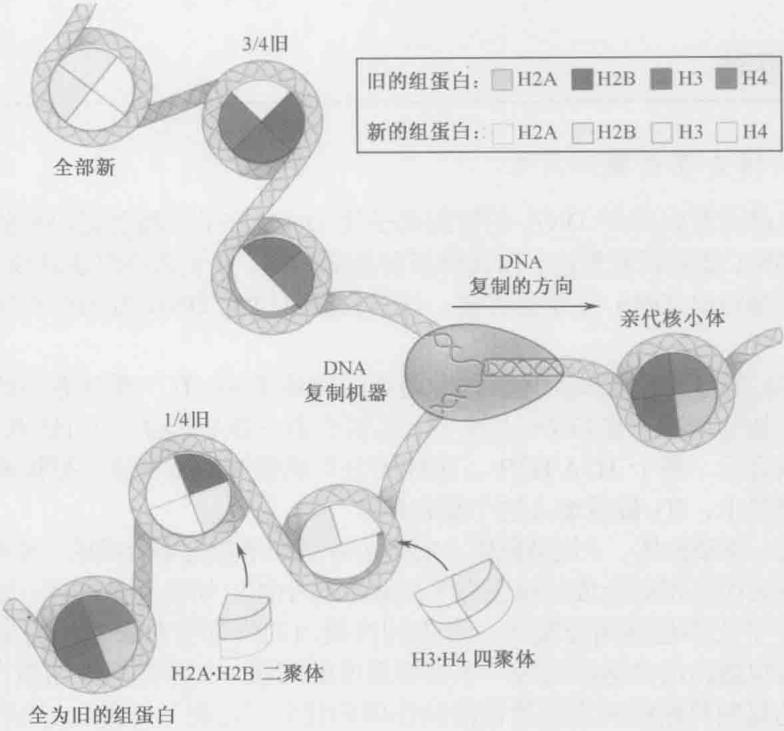  
图 8-43 DNA 复制后组蛋白的遗传。染色体复制时，与父本染色体结合的组蛋白具有不同的分配形式。组蛋白 H3·H4 四聚体随机地转移到两条子链中的任一条上，但不解离为游离状态的 H3·H4 四聚体。新合成的 H3·H4 四聚体在没有继承亲代四聚体的链上形成核小体的基础；相反，H2A 和 H2B 二聚体被释放进入游离的可溶环境，并与新合成的 H2A 和 H2B 竞争与 H3·H4 的结合。一般来说，这种分配类型的后果是新合成的 DNA 上的第二个 H3·H4 四聚体将来自亲代染色体。这些四聚体保留了全部父代核小体上的修饰；H2A 和 H2B 二聚体则更可能是新合成的。

在生理盐浓度下对核小体组装的研究鉴定出一些能指导组蛋白在 DNA 上组装的因子。这些因子是带负电荷的蛋白质，与 H3·H4 四聚体或 H2A·H2B 二聚体形成复合体（表 8-8），并护送它们到核小体组装的位置。由于这些因子可以避免组蛋白与 DNA 发生无效的相互作用，因此被称为组蛋白伴侣（histone chaperone）（图 8-45）。

组蛋白伴侣是如何指导在新的 DNA 合成位置进行核小体的组装呢？对组蛋白 H3·H4 四聚体伴侣 CAF-1 的研究揭示了一个可能的答案。由 CAF-1 指导的核小体的组装需要靶 DNA 正在复制，因此，正在复制的 DNA 以某种方式被标记，用于核小体的组装。有趣的是，当 DNA 复制完成后这种标记就逐渐消失。对依赖于 CAF-1 的组装的研究表明，这个标记是一种叫做 PCNA 的环状滑动夹蛋白。正如将在第 9 章详细讨论的一样，PCNA 形成一个环绕着 DNA 双螺旋的环，在 DNA 合成过程中将 DNA 聚合酶固定在 DNA 上。当聚合酶作用完成后，PCNA 从 DNA 聚合酶上释放，但仍与 DNA 相连。

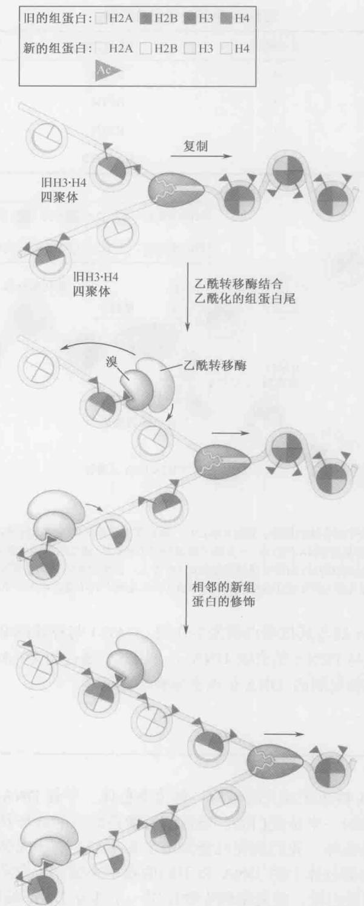  
图 8-44 亲代 H3·H4 四聚体的遗传有助于染色质状态的遗传。染色体复制后，父代 H3·H4 四聚体的分配导致子代染色体获得了与亲代相同的修饰。这些修饰具有导入相同修饰酶的能力，有助于将相同的修饰状态正确传递到两个子代染色体。为简便起见，图中显示在组蛋白核心区的乙酰化。事实上，这种修饰一般发生在组蛋白的 N 端尾。

表 8-8 组蛋白伴侣的特征

<table><tr><td>名称</td><td>亚基数目</td><td>结合组蛋白</td><td>与滑动夹是否相互作用</td></tr><tr><td>CAF-1</td><td>4</td><td>H3·H4</td><td>是</td></tr><tr><td>H1RA</td><td>4</td><td>H3·H4</td><td>否</td></tr><tr><td>RCAF</td><td>1</td><td>H3·H4</td><td>否</td></tr><tr><td>NAP-1</td><td>1</td><td>H2A·H2B</td><td>否</td></tr></table>

  
图 8-45 染色质组装因子有助于核小体的组装。复制叉经过后，染色质组装因子伴随游离的 H3·H4 四聚体（如 CAF-1）和 H2A·H2B 二聚体（NAP-1）到新复制 DNA 的位点。一旦到了新复制的 DNA 上，这些因子即将其结合的组蛋白转移给 DNA。CAF-1 因子通过与 DNA 滑动夹的相互作用被引导到新复制的 DNA 上。这些环状的辅助复制因子环绕 DNA，当复制叉移动时可从复制机器上释放。有关更为详细的 DNA 滑动夹及其在 DNA 复制中的功能将在第 9 章讲述。

在这种情况下，PCNA 能与其他蛋白质发生作用。CAF-1 与释放的 PCNA 结合，优先将 H3·H4 四聚体组装到与 PCNA 结合的 DNA 上。因此，通过与 DNA 复制机制上的一个成分结合，CAF-1 在新复制的 DNA 位点指导核小体组装。

## 小结

在细胞中，DNA 被组织成大的结构，称为染色体。尽管 DNA 是构成染色体的基础，但是每条染色体的一半是蛋白质。染色体可能是线性的或环状的，但每个细胞有特定数目和结构的染色体。我们现在已经知道了几千种生物体完整的基因组序列，这些序列显示每个生物染色体上的 DNA 以不同的效率来编码蛋白质。简单生物使用绝大多数的 DNA 编码蛋白质，较复杂的生物仅用一小部分 DNA 编码蛋白质或 RNA。调控序列复杂度的增加、内含子及其他调控 RNA 的出现都导致了复杂机体基因组的非编码区的扩大。

当细胞分裂时，细胞必须精确维持其染色体的组成。每个染色体必须含有细胞分裂时维持染色体的 DNA 元件。所有的染色体必须有一个或多个复制起始位点。在真核细胞中，着丝粒在染色体分离过程中起着至关重要的作用，而端粒保护线性染色体末端并进行复制。在细胞分裂过程中，真核细胞精细地将染色体的复制和分离过程分开。染色体的分离有两种方式。在有丝分裂过程中，一种高度特化的机制确保每个复制的染色体的一个拷贝传递到每个子代细胞中；在减数分裂过程中，额外的一轮染色体分离（没有 DNA 复制）减少了子代细胞中染色体的数目。

真核 DNA 及其相关蛋白质的结合成染色质。染色质的基本单位是核小体，由各两个拷贝的核心组蛋白（H2A、H2B、H3、H4）和大约 147bp 的 DNA 构成。这个蛋白质-DNA 复合物在细胞中有两个重要的功能：压缩 DNA 以适应细胞核的大小和限制 DNA 的易接近性。细胞广泛地利用后一种功能来调控许多 DNA 的功能，包括基因表达。

核小体的原子结构显示 DNA 盘绕在圆盘状的组蛋白核心外大约 1.7 圈。DNA 和组蛋白的相互作用非常广泛，但没有碱基特异性。这些相互作用的特点解释了 DNA 绕组蛋白八聚体的弯曲和几乎所有 DNA 序列最终组装进核小体的能力。这个结构也揭示了组蛋白 N 端尾巴的位置及其指导 DNA 进出核小体的路径。

一旦 DNA 组装成核小体，它有能力形成更复杂的结构来进一步压缩 DNA。第五种组蛋白 H1 有助于这个过程的完成。H1 通过与结合在核小体上的 DNA 结合，使得 DNA 更紧密地盘绕在八聚体上。一种更为压缩的染色质形式——30nm 纤丝，是由结合有 H1 的核小体束有序排列构成。这个结构比 DNA 仅仅形成核小体更具有抑制性。已有的证据表明，形成这种结构显著降低了 DNA 接近参与 DNA 转录的酶或蛋白质的可能性。

在核小体中 DNA 与组蛋白的结合是动态的，允许 DNA 结合蛋白间歇地靠近 DNA。核小体重塑复合物通过增加核小体的可移动性来增加核小体上 DNA 的易接近性。可观察到两种运动方式：组蛋白八聚体沿 DNA 的滑动；组蛋白八聚体从一个 DNA 完整地转移到另一个 DNA 分子。这些复合体定位于基因组的特定区域，以便于染色质易接近性的改变。某些核小体被限定在基因组的固定位置上，称为“定位”。核小体的定位由 DNA 结合蛋白或特殊的 DNA 序列指导。

组蛋白 N 端尾巴的修饰也可以改变染色质的易接近性。修饰的类型包括赖氨酸的乙酰化和甲基化及丝氨酸的磷酸化。N 端尾巴的乙酰化经常发生在基因表达的活跃区。这些修饰既改变了核小体自身的特性，也作为蛋白质的结合位点，由此影响染色质的易接近性。这些修饰也会召集具有相同修饰作用的酶，对相邻核小体进行相似的修饰，使染色体复制时被修饰的核小体/染色质的区域得以稳定地传递。

DNA 复制后，立即组装成核小体，未包装状态的 DNA 存在时间极短。这涉及特定的组蛋白伴侣，这些组蛋白伴侣护送 H3·H4 四聚体和 H2A·H2B 二聚体到达复制

Brown T.A. 2007. Genomes 3, 2nd ed. Garland Science, New York.
Morgan D.O. 2007. The cell cycle: Principles of control. New Science Press Ltd., London.

叉。在 DNA 的复制过程中，核小体暂时解离。组蛋白 H3·H4 四聚体和 H2A·H2B 二聚体被随机地分配到任一子代分子中。一般来说，每个新的 DNA 分子中有一半旧的和一半新的组蛋白。这样，两组染色体都承继了修饰的组蛋白，这些修饰的组蛋自然后作为“种子”，使邻近的组蛋白发生相似的修饰。

## 参考文献

## 书籍

Allis C.D., Jenuwein T., Reinberg D., and Caparros M.-L., eds. 2007. Epigenetics. Cold Spring Harbor Laboratory Press, Cold Spring Harbor, New York.

## 染色体

Bendich A.J. and Drlica K. 2000, Prokaryotic and eukaryotic chromosomes: What's the difference? Bioessays 22: 481–486.

Thanbichler M., Wang S.C., and Shapiro L. 2005. The bacterial nucleoid: A highly organized and dynamic structure. J. Cell Biochem. 96:506–521.

核小体

Clapier C.R. and Cairns B.R. 2009. The biology of chromatin remodeling

complexes. Annu. Rev. Biochem. 78: 273–304.

Gardner K.E., Allis C.D., and Strahl B.D. 2011, Operating on chromatin, a colorful language where context matters. J. Mol. Biol. 409:36–46.

Li G. and Reinberg D. 2011. Chromatin higher-order structures and gene regulation. Curr. Opin. Genet. Dev. 21; 175–186.

Luger K., Madev A.W., and Richmond R.K. 1997. Crystal structure of the nucleosome core particle at 2.8 Å resolution. Nature 389: 251–260.

Narliker G.J., Fan H.-Y., and Kingston R.E. 2002. Cooperation between complexes that regulate chromatin structure and transcription. Cell 108: 475–487.

Rando O. 2012. Combinatorial complexity in chromatin structure and function: Revisiting the histone code. Curr. Opin. Genet. Dev. 22:148–155.

Shahbazian M.D. and Grunstein M. 2007. Functions of site-specific histone acetylation and deacetylation. Annu. Rev. Biochem. 76:75–100.

Thiriet C. and Hayes J.J. 2005. Chromatin in need of a fix: Phosphorylation of H2AX connects chromatin to DNA repair. Mol. Cell 18:617–622.

## 习题

## 偶数习题的答案请参见附录2

习题 1 请列举至少三个大肠杆菌和人类细胞之间在染色体组成上的不同之处。

习题2 请说明染色质DNA分别处于真核细胞和原核细胞的哪个位置？

习题3 基因组的大小是否直接与物种的复杂度相关？请解释你的依据。

习题 4 基因间序列大约为人类基因组的 60%，这些基因间序列是从何而来的？它们的作用又有什么？

习题5 请解释为何真核细胞的每个染色体包含了多个复制起始位点，但却只有一个着丝粒？

习题 6 姐妹染色单体是如何聚合从而保证每个子代细胞只会得到每个染色体的一个拷贝？

习题 7 一个双倍体人类细胞，不同阶段每个细胞（或者即将成为子代细胞）内包含的

染色体拷贝数分别是多少？  
有丝分裂起始时  
有丝分裂结束时  
减数分裂I期结束时  
减数分裂II期结束时

习题8 在人类中，什么细胞进行有丝分裂，什么细胞进行减数分裂？

习题 9 请描述一个核小体的组成成分。

习题 10 请描述组蛋白和 DNA 之间的成键类型，并指出这些键在 DNA 的什么位置形成。这些相互作用是否具有序列特异性？请解释你的判断。

习题 11 请解释为何称将负超螺旋形式的 DNA 包装入核小体是细胞功能的一种进步。

习题 12 蛋白质的哪个(或哪些)结构域识别组蛋白的乙酰化氨基末端? 哪个(或哪些)蛋白结构域识别组蛋白的甲基化氨基末端?

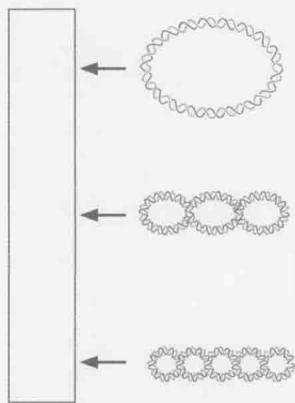

习题 13 请回顾框 8-2 图 1 的内容, 根据以下图示, 预测下列不同形式的 DNA 在琼脂糖胶内的迁移位置。
A. 松弛的 cccDNA，如框 8-2 图 1a 所示。
B. 无拓扑异构酶组装的核小体（如框 8-2 图 1a 所示），并在电泳前用去垢剂处理。
C. 在最初反应中加入拓扑异构酶但防止进一步的核小体组装（如框 8-2 图 1b 所示），并在电泳前加入去垢剂处理。
D. 在 B 中加入拓扑异构酶，允许其如框 8-2 图 1c 所描述的进一步的核小体组装，并在电泳前加入去垢剂处理。

习题 14 为了研究核小体结合 DNA 和一个特异组蛋白去乙酰化酶之间可能的相互作用，你决定进行一个电泳迁移率变动分析（EMSA）。关于该技术细节请参考第 7 章。利用 ${}^{32}$ P 末端标记的、含有两个核小体定位位点的线性 DNA 模板，在孵育前将两个核小体组装到该 DNA 模板上，再将其分别与含和不含组蛋白去乙酰化酶进行孵育。在一些反应中你采用了未修饰的核小体，而另外的反应中则采用了 36 位赖氨酸甲基化的组蛋白 H3。

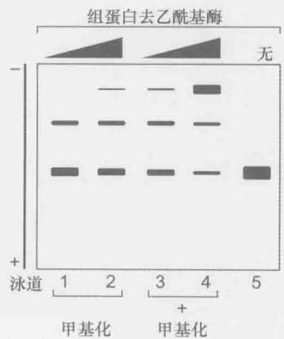

A. 基于以上数据，提出一个组蛋白去乙酰化酶和核小体结合 DNA 之间相互作用的模型。
B. 你认为是什么类型的蛋白质结构域允许组蛋白去乙酰化酶与核小体之间的相互作用。

摘自 Huh et al. （2012.EMBO J. 31：3564-3574）

(逄莎莎 胡学达 潘庆飞 译 刘韧 侯桂雪 杨焕明 校)
