## 第9章

本章概要

DNA合成的化学基础

DNA聚合酶的作用机制

复制叉

DNA聚合酶的特化

复制叉上的DNA合成

DNA复制的起始

结合和解旋：起始子蛋白对复制起始位点的选择和激活

结束复制

## DNA 的复制

当 DNA 双螺旋被揭示的时候，最令生物学家振奋的是 DNA 多聚核苷酸互绕链上碱基之间的互补性。似乎很难想象这种互补性的结构会不被用作 DNA 复制的基础。事实上，正是 DNA 的结构所揭示出的自身互补性质，才最终使生物学家们接受了 Oswald T. Avery 的论断，即遗传信息的载体是 DNA，而不是某种形式的蛋白质（第 2 章）。

当讨论模板如何作用的时候，我们强调两个具有相同表面的基团不会相互吸引（第4章）；相反，具有相反形状或电荷基团之间的吸引则容易得多。因此，无需任何结构上的认识，也能猜测到像基因这样复杂的分子不可能直接被复制；相反，复制会涉及形成具有形状上互补的分子，并作为复制的模板。因此，在对蛋白质或核酸结构取得详尽的认识之前，一些遗传学

家曾怀疑 DNA 是否作为某一特定蛋白质的模板，而此蛋白质反过来也是相应 DNA 的模板。

但是自 DNA 自身互补的性质被揭示后，关于蛋白质模板可能参与 DNA 复制的观点很快就被否定了。人们很容易就推测到每个亲代 DNA 分子双链中的任一条链都可作为模板形成子代 DNA 分子的互补链。尽管这个假设一经提出就被认为是最合理可行的，但是仍需有实验的支持。令人高兴的是，在 DNA 双螺旋结构发现后的 5 年内，就有明确的证据显示 DNA 在复制过程中发生了互补链的分离（见第 2 章对 Meselson 和 Stahl 实验的讨论），而且有切实的酶学证据显示单独的 DNA 就可作为新 DNA 链合成的模板。

从某种意义上讲，这些结果使基因如何复制的问题得到了解答；但从另一种意义上讲，对 DNA 复制的研究才刚刚开始。DNA 是怎样开始复制的？缠绕的 DNA 是如何分开从而可以作为复制模版的？是什么调节复制的机制保证子细胞既不积累也不丢失染色体？对于这些及其他问题的研究表明，即使是最简单的 DNA 的复制，都是一个复杂的、多步骤的过程。此过程中所涉及的酶，比最初发现第一个 DNA 聚合酶后所预计的要多很多。真核细胞中大的线性染色体的复制则更为复杂。这些染色体的复制需要很多复制起始位点，以严格的时相方式合成完整的染色体，而且，复制的起始必须在精确的协调控制下，以确保所有序列都仅仅复制一次。此外，保守性的 DNA 复制不能完全复制染色体末端（端粒），细胞必须形成一套新的方式来保持这部分染色体的完整性。

本章将首先讲述 DNA 合成的化学基础及催化此反应的酶的功能，然后将讨论在一条完整的染色体上 DNA 的合成是如何在复制叉上起始的，我们将重点放在 DNA 复制的起始。在所有细胞中，DNA 的复制都受到严格的控制，而复制起始是高度受调控的步骤。我们将描述复制起始蛋白是如何在基因组上被称为复制起始位点的特定位点处解开 DNA 双螺旋，复制叉蛋白如何聚集到这些位点形成复制体。最后，我们将描述 DNA 复制的终止以及线性染色体末端复制的特殊问题。总之，研究揭示了多种蛋白共同协作形成一个复合物，多种酶参与这一严格的过程，以令人惊叹的速度、准确性和完整性精确执行了 DNA 复制这一过程。

## DNA 合成的化学基础

## DNA 合成需要脱氧核苷三磷酸和引物-模板接头

进行 DNA 的合成，必须具备两个关键的底物。首先，新的合成需要 4 种脱氧核苷三磷酸—dGTP、dCTP、dATP、dTTP（图 9-1a）。核苷三磷酸通过 2'-脱氧核糖上的 5'羟基连接 3 个磷酰基团。最内侧的磷酰基团（最靠近脱氧核糖的基团）称为 α-磷酸，而中间的和最外侧的基团分别称为 β-磷酸和 γ-磷酸。

DNA 合成第二个重要的底物是具有特定排列的单链 DNA 或双链 DNA（图 9-1b），称为引物-模板接头（primer-template junction）。恰如其名，引物-模板接头有两个重要的元件。模板（template）是指导所有互补脱氧核苷酸添加的单链 DNA，引物（primer）是与模板互补但比模板短的一小段序列。引物还必须有一个与模板单链区毗邻的、暴露的 3'-OH，当新核苷酸加入时，此 3'-OH 使链得以延伸。

  
图 9-1 DNA 合成所需的底物。(a) 2'-脱氧核糖核苷三磷酸的常规结构。α-、β-和γ-磷酸的位置被标示。(b) 引物-模板接头的常规结构。较短的引物与较长的 DNA 链完全退火，而且它必须有与模板单链 DNA 区毗邻的游离的 3'-OH；较长的 DNA 链有一个与引物退火的区域和一个毗邻的单链 DNA 区，此区作为 DNA 合成的模板。新 DNA 的合成使引物的 3' 端得到延伸。

一般而言,只有引物-模板接头的引物部分才是 DNA 合成的底物,这是因为在 DNA 合成过程中只有引物被化学修饰,模板仅提供选择哪种核苷酸进行添加的必要的信息。然而,对所有 DNA 合成而言,引物和模板都是不可缺少的。

DNA 通过引物 3' 端的延伸进行合成

DNA 合成要求新链通过引物 3'端的延伸而生长（图 9-2）。事实上，这是 RNA 和 DNA 合成共同的性质。 $S_{N}2$ 反应中形成磷酸二酯键，在此反应中，引物链 3'端的羟基基团攻击引入的核苷三磷酸的 $\alpha$ -磷酰基基团。切下的基团是焦磷酸，它是核苷酸底物释放 $\beta$ -和 $\gamma$ -磷酸所产生的。

  
图 9-2 DNA 合成的机制。DNA 合成由掺入 dNTP 的 α-磷酸的亲核攻击引发。这导致引入的引物 3' 端延伸一个核苷酸并释放一个焦磷酸分子。焦磷酸很快被焦磷酸酶水解成 2 个磷酸分子。

模板链指导 4 种核苷三磷酸的添加。与模板链碱基配对的核苷三磷酸非常容易被添加到引物链上。注意，双螺旋的两条链为反向平行的走向，这种结构意味着 DNA 合成的模板链有与 DNA 生长链相反的走向。

## 焦磷酸水解是 DNA 合成的驱动力

单个核苷酸添加到长度为 n 的多聚核苷酸生长链上可用下面的反应来表述：

$$
\mathrm{XTP} + (\mathrm{XMP}) _ {n} \rightarrow (\mathrm{XMP}) _ {n + 1} + \mathrm{P} \sim \mathrm{P}
$$

但是此反应的自由能非常小（ $\Delta G = -3.5 \, kcal/mol$ ），那么核苷酸多聚化形成 DNA 的驱动力是什么呢？额外的自由能由焦磷酸酯酶将焦磷酸快速水解成 2 个磷酸基团来提供。

$$
\mathrm{P} \sim \mathrm{P} \rightarrow 2 \mathrm{P} _ {i}
$$

核苷酸添加和焦磷酸水解的净结果是 2 个高能磷酸键的断裂。因此，DNA 合成是个耦联反应，其全反应为

$$
\mathrm{XTP} + (\mathrm{XMP}) _ {n} \rightarrow (\mathrm{XMP}) _ {n + 1} + 2 \mathrm{P} _ {i}
$$

这是一个极易发的反应，其 $\Delta G$ 为-7kcal/mol，相对应的平衡常数（Keq）约为 $10^{5}$ 。如此高的 Keq 意味着 DNA 合成反应是完全不可逆的。

## DNA 聚合酶的作用机制

## DNA 聚合酶用一个活性位点催化 DNA 的合成

DNA 合成由 DNA 聚合酶（DNA polymerase）催化。与大多数对一个反应只有一个活性位点的酶不同，DNA 聚合酶用一个活性位点来催化任意 4 种脱氧核苷三磷酸的添加。DNA 聚合酶通过 A:T 和 G:C 碱基对几乎相当的几何尺寸来达到其催化的灵活性（注意 DNA 螺旋的尺寸与 DNA 序列基本无关）。

DNA 聚合酶监测的是引入核苷酸形成 A:T 或 G:C 碱基对的能力，而不是进入活性位点的是何种核苷酸（图 9-3）。只有在形成正确的碱基对的情况下，引物的 3'-OH

a 正确的碱基对

b 不正确的碱基对

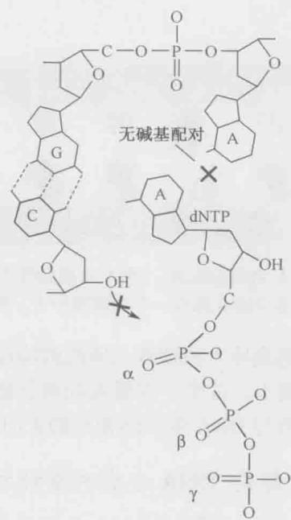  
图 9-3 DNA 聚合酶催化核苷酸添加需要正确配对的碱基。(a) 引物 3'-OH 端对正确配对的 dNTP 进攻的示意图。(b) DNA 聚合酶对不正确碱基配对催化结果的示意图。如图所示，不正确的 A:A 碱基对使引入核苷酸的 α-磷酸错位。这种不正确的排列极大地降低了催化速率，导致 DNA 聚合酶优先添加正确配对的 dNTP。(来源：Brautigan C. A. and Steitz T. A. 1998. Curr. Opin. Structural Biology 8: 54-63, Fig 4d. ©Elsevier.)

和在最佳催化位置上的引入核苷三磷酸的 $\alpha$ -磷酸才能发生催化反应。不正确的碱基配对因为使底物处于不利于催化的排列，使得核苷酸的添加效率显著降低（图 9-3b）。这是一个动力学选择性的实例。其中，酶对几种可能的底物具有催化选择性，只有当正确的底物存在时，共价键形成的速率才显著增加。事实上，错误核苷酸掺入的速率是碱基配对正确时的掺入速率的 1/10 000。通常检测新 DNA 合成的方式描述如框 9-1。

DNA 聚合酶对核糖核苷三磷酸（rNTP）与脱氧核糖核苷三磷酸（dNTP）显示出令人惊异的分辨能力。虽然在细胞中 rNTP 比 dNTP 的浓度要高约 10 倍，但它们掺入的速率却是 dNTP 的 1/1000。这种分辨能力是通过将 rNTP 立体排斥在 DNA 聚合酶活性位点之外而达到的（图 9-4）。在 DNA 聚合酶中，核苷酸结合口袋非常小，不能容纳引入核苷酸上的 2'-OH。此空间被 2 个与糖环形成范德华接触的氨基酸占据。有趣的是，将这些氨基酸换成其他较小侧链的氨基酸（如将谷氨酸换成丙氨酸），则 DNA 聚合酶对 dNTP 和 rNTP 的分辨率显著降低。符合 DNA 聚合酶部分要求但不是所有要求的核苷酸能够阻止 DNA 聚合反应的延伸。这些核苷酸也代表了一类用于治疗癌症和病毒感染的药物（见框 9-2）。

  
图 9-4 空间位阻阻止 DNA 聚合酶催化反应使用 rNTP。（a）正确碱基配对的 dNTP 结合到 DNA 聚合酶上，在此条件下，引物的 3'-OH 与 dNTP 的 α-磷酸紧密靠近。（b）增加 2'-OH 引起对核苷酸结合口袋内氨基酸 [分辨器（discriminator）氨基酸] 的空间碰撞，导致 dNTP 的 α-磷酸错位，以及与引物 3'-OH 的定位偏差（misalignment），极大地降低了催化的速率。

## 框 9-1 核素掺入法用来测定核酸和蛋白质合成

DNA 聚合酶的活性如何测定？最简单的用于测定一种聚合物合成的方法是核素掺入法。在 DNA 聚合酶实例中，用这种方式来测定被标记的 dNTP 前体整合进 DNA 分子。典型的实例是用放射性原子标记 dNTP，这些放射性原子最终保留在 DNA 产物中（如用放射性同位素 ${}^{32}$ P 替换 $\alpha$ 位磷酸中的磷原子，框 9-1 图 1a）。或者，dTTP 甲基基团位置用荧光分子合成（框 9-1 图 1b）。甲基基团不包含在碱基配对中，DNA 聚合酶能够容易地适应这个位点比较大的成分。此外，这些修饰能够很容易地用拍照或敏感的光电倍增管探测电子或光子的情况。

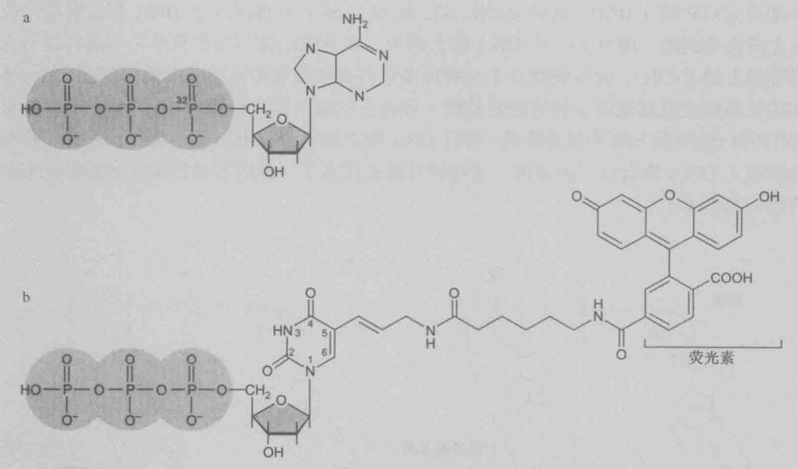  
框 9-1 图 1 标记的脱氧核苷三磷酸盐。(a) $\alpha[^{32}P]dATP$ . 核苷酸的 $\alpha$ 位的 P 被放射性同位素 ${}^{32}P$ 替代。注意，仅有 P 原子最终会成为合成后 DNA 的一部分。(b) 荧光标记的三磷酸胸苷。在这个标记的前体中，荧光复合物荧光素和胸腺嘧啶环的第五位相连，这个位置通常连接的是甲基。

核素掺入法需要两步（框9-1图2）。第一步，前体被整合进聚合物。在DNA聚合酶的实例中，聚合酶与引物：模板及标记的dNTP前体孵育适当时间。在大多数情况下，四种dNTP中的只有一种被标记，因为检测方法是很灵敏的。第二步，产生的聚合物必须和没有整合进的前体分离开。以DNA为例，这一步有两种方法完成。一种方法是，将DNA聚合酶反应物在高盐浓度下通过带正电荷的滤膜，带强负电荷的DNA主链能够结合在膜上，弱电荷的单个苷酸则不结合。此外，凝胶电泳能够通过分子大小区分DNA产物，游离核苷比DNA移动更快。同时，DNA产物的合成能够用标记的核苷酸整合进DNA聚合物中的数目来测定。

我们描述了以 DNA 聚合反应为背景的核酸掺入法，但是，这种方法也能够用来测定催化 RNA 和蛋白质合成的酶的活性。比如，标记的氨基酸能够用来分析它们整合进蛋白质的情况。

  
框 9-1 图 2 核素掺入法来测定 DNA 合成。如例所示，滤膜结合用来分离没有被结合的核苷酸和合成的 DNA 链。

## DNA 聚合酶像手一样握住引物-模板接头

关于 DNA 聚合酶如何催化 DNA 合成的分子解释，来自于对各种与引物-模板接头结合的 DNA 聚合酶的原子结构的研究。这些结构揭示了 DNA 底物位于一个大的、形似一只半握的右手的裂缝之中（图 9-5）。依据对手的类比，聚合酶的 3 个结构域被称为拇指、手指和手掌。

  
图 9-5 DNA 聚合酶的三维结构类似于一只右手。（a）图示 DNA 聚合酶与引物-模板接头结合。手指、拇指和手掌已被标出。新合成的 DNA 与手掌相连，DNA 催化位点位于手指和拇指之间的裂缝中。模板链的单链区强烈弯曲，不从拇指和手指之间穿过。（b）类似的 T7DNA 聚合酶与 DNA 结合的图示。DNA 用填充（space-filling）方式表示，蛋白质用条带（ribbon）方式显示。手指和拇指由 $\alpha$ 螺旋构成，手掌因为 DNA 的遮挡而看不见。引入的 dNTP 显示为红色（碱基和脱氧核糖）和黄色（三磷酸部分）。DNA 模板链显示为黑灰色，引物链显示为银灰色。（Doublie S., Tabor S., Long A.M., Richardson C.C., and Ellenberger T.1998. Nature 391:251-258.）镜像图用 BobScript、MolScript 和 Raster3D 制作。

手掌域由一个 $\beta$ 折叠片构层成，含有催化位点的基本元件，尤其是DNA聚合酶的这一区域结合2个二价金属离子（通常是 $\mathrm{Mg}^{2+}$ 或 $\mathrm{Zn}^{2+}$ ），可以改变正确碱基配对的dNTP和引物 $3^{\prime}$ -OH周围的化学环境（图9-6）。第一个金属离子降低 $3^{\prime}$ -OH对氢的亲和力，产生一个准备对引入dNTP上α-磷酸进行亲核攻击的 $3^{\prime}\mathrm{O}^{-}$ 。第二个金属离子与dNTP的β-和γ-磷酸负电荷协同作用，稳定由引物和引入核苷酸连接在一起时所产生的焦磷酸。

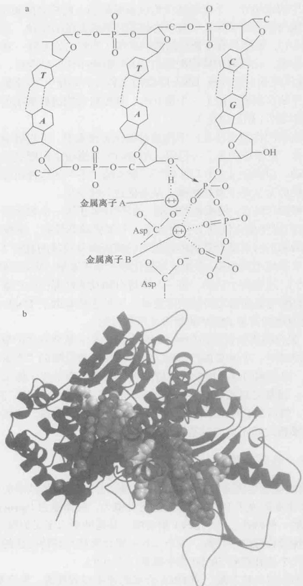  
图 9-6 与 DNA 聚合酶结合的两个金属离子催化核苷酸的添加。（a）图示为 DNA 聚合酶的活性位点。两个金属离子（显示为绿色）通过与两个高度保守的天冬氨酸残基的相互作用被固定。金属离子 A 主要与 3'-OH 相作用，使得 O 和 H 之间的连接变弱。这产生一个亲核的 $3'O^{-}$ ；金属离子 B 与引入的 dNTP 的三磷酸相互作用，中和它的负电荷。催化后，焦磷酸产物通过与金属离子 B 类似的相互作用得到稳定（未显示）。（b）金属离子与 DNA 聚合酶、引物 3'-OH 端，以及引入核苷酸的相互作用的活性位点处的三维结构。金属离子显示为绿色，其他元件的颜色同图 9-5b。本处所示的聚合酶的视角，基本等同于将图 9-5b 中的图沿 DNA 螺旋的轴旋转约 $180^{\circ}$ 的图像。（Doublie S., Tabor S., Long A.M., Richardson C. C., and Ellenberger T. 1998. Nature 391: 251-258.）镜像图用 BobScript、MolScript 和 Raster3D 制作。

除了在催化中的作用外，手掌域还负责检查最新加入的核苷酸碱基配对的准确性。聚合酶的这一区域与新合成 DNA 小沟中的碱基对形成大量的氢键。这种接触虽无碱基特异性（见图 4-10），但是只有在新添加的核苷酸（不管它们是哪一种核苷酸）碱基配对正确的时候才形成。此区域中错误配对的 DNA 影响小沟的结合性，使催化活性显著降低。变慢的催化反应和对新合成 DNA 降低的亲和力共同使引物-模板从聚合酶活性位点上脱离下来，并结合到聚合酶上一个独立的、具校对功能的核酸酶的活性位点上，在那里错配 DNA 被切掉（稍后讨论）。

手指域和拇指域的作用是什么？手指域对催化也很重要。手指域中的几个残基可与引入的 dNTP 结合。更重要的是，一旦引入的 dNTP 与模板之间形成正确的碱基配对，手指域即发生移动，包围住 dNTP（图 9-7）。聚合酶“手”的这种闭合形式可以使引入的核苷酸与催化性的金属离子密切接触，从而促进催化反应。

手指域还与模板区结合，使模板的磷酸二酯键骨架在第一个和第二个碱基间产生约90°的回折，此弯曲仅使催化位点上引物后第一个模板碱基暴露。模板的这种构象避免了在下一个核苷酸添加时可能会造成的对配对的模板碱基选择的混淆（图9-8）。

与手指域及手掌域不同的是,拇指域与催化的关系不紧密,而是与最新合成的 DNA 相互作用（图 9-5）。这有两个目的：第一，维持引物及活性部位的正确位置；第二，帮助维持 DNA 聚合酶与其底物之间的紧密连接。这种连接有助于 DNA 聚合酶每次与引物-模板接头结合时添加许多 dNTP 的能力（稍后讨论）。

总之，DNA 聚合酶将核苷酸添加到 DNA 生长链是一系列有序的事件。引入的核苷酸碱基与模板提供的下一个碱基进行配对，这种作用使聚合酶的“手指”在碱基配对的 dNTP 周围闭合。聚合酶的这种构象将关键的催化性金属离子置于催化下一个磷酸二酯键形成的位置上。碱基配对的核苷酸与引物的结合使手指重新打开，并使引物-模板接头移动一个碱基，然后聚合酶准备进行下一次的添加。重要的是，这些事件的每一步都由引入 dNTP 与模板之间正确的碱基配对驱动。

## DNA 聚合酶是一种延伸酶

DNA 聚合酶的催化是快速的。DNA 聚合酶能在引物链上每秒添加 1000 个核苷酸。DNA 合成的速度主要取决于 DNA 聚合酶的延伸能力。延伸能力（processivity）是酶处理多聚体底物时的一种特性。对于 DNA 聚合酶，其延伸能力定义为每次酶与引物-模板接头结合时所添加核苷酸的平均数。每个 DNA 聚合酶都有其特征性的延伸能力，范围从每次结合时仅几个核苷酸到 50000 多个碱基（图 9-9）。

每次结合添加大量的核苷酸，使 DNA 合成的速率显著提高。聚合酶与引物-模板接头的初始结合是限速步骤。典型的 DNA 聚合酶反应中，DNA 聚合酶定位并结合到引物-模板接头的时间约为 1s，一旦结合后，核苷酸的添加非常迅速（在毫秒范围内）。因此，一个完全非延伸性的 DNA 聚合酶每秒添加约 1 个碱基对；相反，最快的 DNA 聚合酶通过保持与模板的结合进行多轮 dNTP 的添加，速度可达每秒添加 1000 个核苷酸。因此，高延伸性的聚合酶与一个完全非延伸性的酶相比，其 DNA 合成的整体速率可高出 1000 倍。

<!-- END OFFICIAL API PART part_003 -->

<!-- BEGIN OFFICIAL API PART part_004 -->

  
图 9-7 当形成正确碱基配对的时候，DNA 聚合酶 “抓住” 模板和引入的核苷酸。（a）图示为引入核苷酸与 DNA 模板正确碱基配对之后，DNA 聚合酶结构的变化。主要的变化是在手指域中，一个被称为 O 螺旋的螺旋旋转 $40^{\circ}$ 。在打开的构象中，此螺旋远离引入的核苷酸。当聚合酶为闭合构象时，此螺旋运动并与引入的 dNTP 形成几个重要的相互作用。酪氨酸与 dNTP 的碱基形成堆积作用，两个带电残基与三磷酸结合。这些相互作用共同使 dNTP 就位，并由与 DNA 聚合酶结合的两个金属离子介导完成催化。（b）与底物结合的 T7 DNA 聚合酶处于闭合构象时的结构。O 螺旋显示为紫色；蛋白质结构中的其他部分为清楚起见显示为透明；在 O 螺旋后面的关键的酪氨酸、赖氨酸和精氨酸显示为粉色；引入 dNTP 的碱基和脱氧核糖显示为红色；引物显示为银灰色；模板链显示为黑灰色；两个催化性金属离子显示为绿色；磷酸显示为黄色。（Doublie S., et al. 1998. Nature 391;251-258.）镜像图用 BobScript、MolScript 和 Raster 3D 制作。

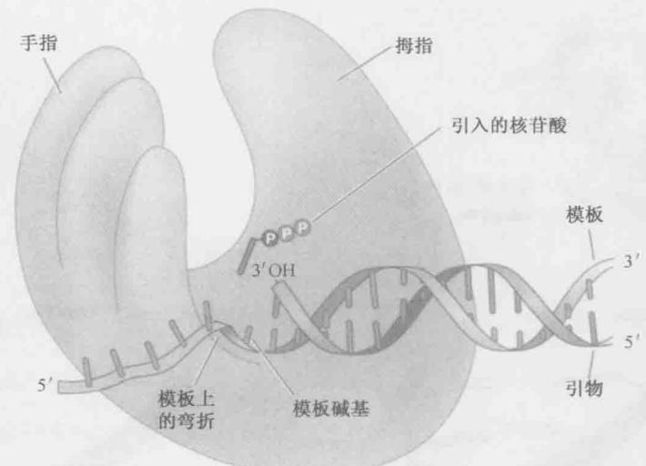

图 9-8 模板 DNA 穿过 DNA 聚合酶的路径示意图。刚合成的 DNA 与 DNA 聚合酶的手掌域结合。在活性位点上，模板单链区的第一个碱基位于预计将合成为双链 DNA 的位置上。当沿着模板链向其 5'端行进时，磷酸二酯骨架突然 90°回折，使得第二个及随后所有的单链碱基都处于另一个位置上，此位置消除了与活性位点上结合的 dNTP 进行碱基配对的所有可能。  
  
图 9-9 DNA 聚合酶以延伸方式合成 DNA。此图表示延伸性 DNA 聚合酶和非延伸性 DNA 聚合酶之间的差别。两种 DNA 聚合酶都与引物-模板接头结合。当结合时，非延伸性酶在引物的 3' 端添加一个 dNTP，然后从新的引物-模板接头释放下来。相反，延伸性的 DNA 聚合酶与模板结合一次，就添加很多 dNTP。

DNA 聚合酶沿 DNA 模板滑行的能力有利于提高延伸能力。DNA 聚合酶一旦与引物-模板接头结合，立即以序列非特异的方式与 DNA 的大部分双链区域紧密作用。此相互作用包括磷酸骨架与拇指域之间的电子静电相互作用，以及 DNA 小沟与手掌域（如上所述）之间的相互作用。此相互作用无序列相关性，使得 DNA 即使在与聚合酶相结合后也能自如地移动。每次引物链上添加一个核苷酸，DNA 就与聚合酶部分脱离（与小沟之间的氢键断裂但与拇指域之间的静电相互作用仍保持）。然后 DNA

用同样的序列非特异性机制，迅速地在移动一个碱基对的位置上与聚合酶重新结合。下面我们将要继续讨论，DNA 聚合酶与完全包围 DNA 的 “滑动夹” 蛋白之间的相互作用，可进一步提高延伸能力。

## 外切核酸酶校正新合成出的 DNA

仅依靠碱基配对的几何学以及碱基间的互补，尚无法达到细胞内观测到的极高的 DNA 合成精确度（约每添加 $10^{10}$ 个碱基对产生一个错误）。影响 DNA 聚合酶精确度的主要因素是碱基偶然 $(1/10^{5})$ 地变换成“错误”的互变异构体（亚氨基或烯醇，见第 4 章，图 4-5）。碱基的这种变构体使不正确的碱基对可以位于催化中正确的位置（图 9-10）。如我们现在所述，校正过程可纠正这种错误。

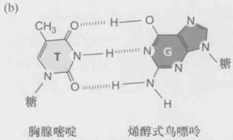  
图 9-10 鸟嘌呤的异构转换导致与胸腺嘧啶错配。(a)正常的酮式鸟嘌呤与胞嘧啶配对。(b)鸟嘌呤罕见的烯醇式异构体与胸腺嘧啶配对，而不与胞嘧啶配对。尽管仅列举了鸟嘌呤异构转换造成的错配，其实在每种碱基均存在并影响配对的特异性。

## 框 9-2 抗癌、抗病毒试剂靶向 DNA 复制

DNA 在细胞分裂时进行复制的过程成为了很多用来阻止恶性肿瘤生长的化学药物的靶标。这些药物靶向 DNA 复制的不同阶段。

一些常用的化学疗法实际靶向了核苷酸前体的生物合成，因此DNA聚合酶没有底物合成DNA。例如，药物5-氟尿嘧啶（5-FU）和6-巯基嘌呤（6-MP）是核苷酸前体的类似物，分别抑制嘧啶和嘌呤核苷酸的合成（框9-2图1a，b）。5-氟尿嘧啶（5-FU）是治疗结肠癌的主要药物，它也被用来治疗胃癌、胰腺癌、早期乳腺癌。6-巯基嘌呤（6-MP）基本用于治疗血癌患者。

其他的抗癌药物直接地靶向 DNA 的合成。阿糖胞苷（AraC）是脱氧胞苷酸类似物，转化成三磷酸核苷后整合进 DNA，替代了 dCTP（框 9-2 图 1c）。一旦整合进去，dCTP 脱氧核糖糖基和阿糖胞苷（AraC）的阿拉伯糖基之间的差异导致 DNA 3' 端位

置的不正确和末端延伸的终止。类似于 6-巯基嘌呤（6-MP），阿糖胞苷（AraC）主要用于治疗急性白血病。

第三类的药物破坏 DNA 来阻断 DNA 的复制。顺铂和亚硝基脲氮芥（BCNU）在鸟苷酸残基彼此相近时会引起链内和链间 DNA 链的交联（框 9-2 图 1d，e）。这种交联（尤其是链间的交联）干扰了 DNA 的延伸。顺铂是治疗睾丸癌的主要药物，亚硝基脲氮芥（BCNU）用于治疗脑瘤和白血病。相似地，喜树碱和依托泊苷对拓扑异构酶有抑制作用，进而阻断了这些蛋白质在 DNA 主链的断开后进行磷酸二酯结合的作用（见第 4 章，图 4-24）。当 DNA 聚合酶试图用某一 DNA 为模板进行复制时，这些抑制药物会在 DNA 模板上产生阻断 DNA 复制的断裂。

这些药物的靶细胞复制自身的 DNA 并快速分裂。尽管癌细胞快速分裂的特性使它们对这些药物敏感，但是体内其他的细胞也受到影响。毫无疑问，这些药物也对快速分裂的宿主细胞，如红细胞、白细胞、发质细胞有毒性。使用这些药物带来的副作用包括免疫力下降（因为白细胞的丢失）、贫血（由于红细胞的丢失）、腹泻（因为肠胃道受损）和脱发。

复制抑制剂也可被作抗病毒药物。第一个发现抗 HIV 感染的有效药物是 3-叠氮脱氧胸苷（AZT），一种脱氧胸苷的类似物，阻止特异的 DNA 聚合酶（称逆转录酶；见第 12 章）在 HIV 感染后复制 HIV 的 RNA 基因进而合成 DNA。最近一种鸟嘌呤核苷酸类似物叫做阿昔洛韦已经替代了 AZT 作为 HIV DNA 聚合酶的抑制剂。

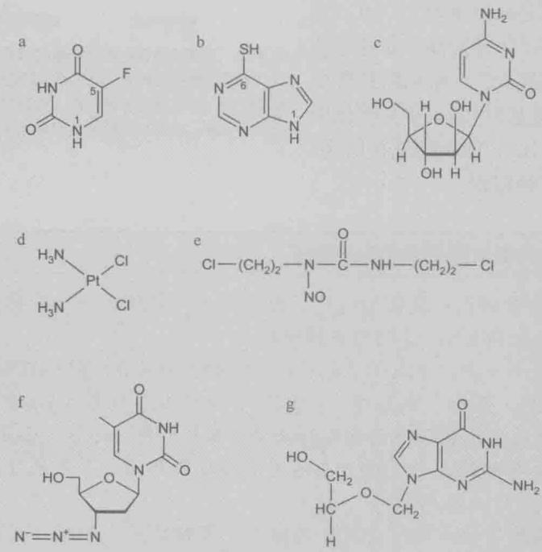  
框 9-2 图 1 靶向 DNA 复制的一些常见化疗药物的结构。(a) 5-氟尿嘧啶；(b) 6-巯基嘌呤；(c) 阿糖胞苷；(d) 顺铂；(e) 亚硝基脲氮芥；(f) 叠氮胸苷；(g) 阿昔洛韦

这个类似物是具有一个开放链的正常腺苷的核糖（框 9-2 图 1f, g）。然而，这个类似物能够被修饰成一个三磷酸根的形式，通过病毒的 DNA 聚合酶被整合进 DNA。一旦整合进去，由于缺乏核苷这些类似物起到链终止的作用，因而 3'-OH 需要更多的核苷酸添加。重要的一点是，细胞内的 DNA 聚合酶识别这些药物的能力很弱，因而同化疗药物相比副作用很小。

DNA 合成的校正通过核酸酶去除不正确配对的核苷酸来实现。最初这种类型的酶被认作是 DNA 聚合酶的同一类多肽，现在则认为是校正外切核酸酶（proofreading exonuclease）。这类酶可以从 DNA 的 3' 端，即从新 DNA 链的生长端开始降解 DNA [只能从 DNA 末端进行降解的酶叫做外切核酸酶（exonuclease），而能在 DNA 链中部切割的核酸酶叫做内切核酸酶（endonuclease）]。

最初，3'外切核酸酶作为 DNA 聚合酶同一多肽的一个部分并没引起什么关注。为什么 DNA 聚合酶需要把它刚刚合成出的 DNA 降解掉呢？当了解到外切核酸酶有很强的降解含错误碱基对 DNA 的倾向时，它的功能就变得清晰了。这样，当发生不正确核苷酸被添加到引物链这种罕见的情况时，校正外切核酸酶可将此核苷酸从引物链的 3'端除去。这个新加长 DNA 的“校正”给了 DNA 聚合酶第二次添加正确核苷酸的机会。

DNA 聚合酶向碱基错配的引物附近添加核苷酸的能力降低，从而加快了对错配核苷酸的去除。因为与手掌域相互作用弱，所以错配 DNA 改变了 3'-OH 和引入核苷酸的几何构象。添加了错配的 dNTP 使催化作用降低，几何构象的改变也降低了核苷酸的添加速度。所以，当发生错配碱基时，它既降低了新核苷酸添加的速度，也提高了校正外切核酸酶的活性。

在 DNA 合成时，无需 DNA 脱离聚合酶即可进行校正（图 9-11）。当错配碱基对存在于 DNA 聚合酶的活性位点时，引物-模板接头会不稳固，产生若干不成对的碱基对 DNA，DNA 聚合酶对错配碱基的亲和力降低，但核酸外切酶活性在单链的 3' 端增强了 10 倍，因而新合成的未配对的 3' 端由 DNA 聚合酶活性位点移到核酸外切酶活性位点，不正确的核苷酸被外切酶移除（其余的额外核苷酸也被移去）。当不正确碱基对被去除后，正确配对的引物-模板接头滑回 DNA 聚合酶的活性位点，DNA 合成继续进行。

本质上，校正外切核酸酶就像键盘上的“delete”（删除）键那样工作，它只能去除最近发生的错误。校正外切核酸酶的加入极大地增加了DNA合成的精确度。平均DNA聚合酶每添加 $10^{5}$ 个核苷酸，就会插入1个不正确的核苷酸。校正外切核酸酶将错配碱基的发生概率降低到每添加 $10^{7}$ 个核苷酸出现1次。此错误概率仍比通常在细胞中观察到的实际突变概率高很多（每添加 $10^{10}$ 个核苷酸出现1次错误）。这部分高出来的精确度是由第10章所述的复制后错配修复过程实现的。

  
(b) 切除错配的核苷酸

(c) 恢复DNA合成  
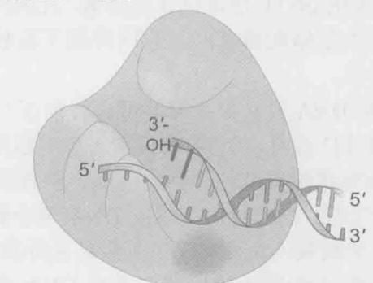

图 9-11 校正外切核酸酶将错配碱基从 DNA 的 3' 端除去。(a) 当聚合酶把不正确核苷酸掺入 DNA 后, DNA 合成的速度降低且引物 3' 端与 DNA 聚合酶活性位点的亲和力减弱。(b) 因为存在错配的 3' 端, 引物的最后 3\~4 个核苷酸成为单链, 与校正外切核酸酶活性位点的亲和力增加。与此活性位点结合后, 错配核苷酸 (及额外核苷酸) 即从引物上被除去。(c) 当错配核苷酸被除去后, 正确配对的引物-模板重新形成, DNA 聚合酶重新聚集 (新合成 DNA 以红色表示)。(来源: Baker T.A. and Bell S. P. 1998. Cell 92: 295-305, Fig. 1b. ©Elsevier.)

## 复制叉

## 复制叉上 DNA 的两条链同时合成

至此，我们已经在相对模拟的条件下讨论了 DNA 的合成，即在引物-模板接头处仅产生一条 DNA 新链。然而在细胞中，DNA 双链的两条链是同时进行复制的。这要求将双螺旋的两条链分开以形成两条 DNA 模板。刚分开的模板链与未复制的双链 DNA 之间的连接区称为复制叉（replication fork）（图 9-12），复制叉向着未复制的 DNA 双链区域连续运动，其身后留下指导两个子代 DNA 双链形成的两条单链 DNA 模板。

  
图 9-12 复制叉。新合成的 DNA 表示为红色，RNA 引物表示为绿色。为了方便说明，所示的冈崎片段人为地缩短了。在细胞中，冈崎片段为 100\~2000bp 不等。

DNA 反向平行的性质给在复制叉上两条暴露的模板同时进行复制制造了难题，因为 DNA 只能沿着 3' 端进行合成，所以两条暴露的模板中仅有一条能够随着复制叉的运动进行连续的复制。在此条模板链上，DNA 聚合酶简单地尾随着复制叉。此模板指导下新合成的 DNA 链称为前导链（leading strand）。

另一条单链 DNA 模板指导下的新 DNA 链合成更复杂，此模板指导 DNA 聚合酶在与复制叉相反的方向上运动。此模板指导的新 DNA 链称为后随链（lagging strand）。如图 9-12 所示，此条 DNA 链必须以不连续方式进行合成。

前导链 DNA 聚合酶在模板一解开后就能进行复制，后随链在其能够复制之前，必须等复制叉运动并暴露出足够长的模板后才能进行合成。当新的后随链模板暴露足够长度后，DNA 合成起始并持续至它抵达后随链 DNA 的上一个新合成片段的 5' 端为止。

在后随链上形成的新链 DNA 短片段称为冈崎片段（Okazaki fragment），其在细菌中的长度变化为 1000～2000 个核苷酸，在真核生物中为 100～400 个核苷酸。冈崎片段被合成出来后，相互之间很快共价连接成一条连续的完整的新 DNA 链（稍后讨论）。因此，冈崎片段是 DNA 复制中短暂的中间产物。

## DNA 新链的起始需要一条 RNA 引物

如上所述，所有 DNA 聚合酶均需要带有游离 3'-OH 的引物，它们不能够从头启动新 DNA 链的合成。DNA 新链的合成是如何开始的呢？为了完成这一步，细胞利用了 RNA 聚合酶具有而 DNA 聚合酶没有的能力：从头合成新 RNA 链。引物酶（primase）

是一种能在单链 DNA 模板上制造短 RNA 引物（5～10 个核苷酸长度）的特殊的 RNA 聚合酶。这些引物随后由 DNA 聚合酶进行延伸。虽然 DNA 聚合酶只能将脱氧核糖核苷酸添加到 DNA 中，但它们用与 DNA 模板退火的 RNA 引物或 DNA 引物都能启动合成。

虽然前导链和后随链都需要引物酶来起始 DNA 的合成，但是引物酶在这两种链上工作的频率却相差极大（图 9-12）。每条前导链只需要一条 RNA 引物；相反，后随链的不连续合成意味着每个冈崎片段都需要新引物。因为一个复制叉可复制数百万个碱基对，所以后随链的合成需要数百至数千冈崎片段及其相关的 RNA 引物。

与 mRNA、rRNA 和 tRNA 合成中涉及的 RNA 聚合酶不同（第 15 章），引物酶不需要用特异 DNA 序列来起始新 RNA 引物的合成，反而偏好用含有一个特殊三聚体的 ssRNA 模板来起始 RNA 的合成（在大肠杆菌的引物酶为 GTA）。有意思的是，在分析大肠杆菌基因组序列时发现，大肠杆菌引物酶的 GTA 目标序列在基因组分中

  
图 9-13 从新合成 DNA 上除去 RNA 引物。图示为 RNA 引物去除过程中，RNase H、5' 外切核酸酶、DNA 聚合酶以及 DNA 连接酶相继作用。RNA 引物除去前的 DNA 显示为灰色，RNA 引物显示为绿色，新合成的替代 RNA 引物的 DNA 显示为红色。

过量表达，将会是后随链 DNA 合成的模板。

当引物酶与处于 DNA 复制叉的 DNA 解旋酶（DNA helicase）结合时，其活性会明显增加。此蛋白质在 DNA 复制叉处解开 DNA 链，产生可以被引物酶作用的 ssDNA 模板，DNA 解旋酶将在下面详细介绍。ssDNA 模板与 DNA 解旋酶的结合确保了引物酶只在复制叉处具有活性。

## 完成 DNA 复制必须除去 RNA 引物

要完成 DNA 的复制，用于起始的 RNA 引物就必须被除去并用 DNA 取而代之（图 9-13）。对 RNA 引物的去除可以认为是 DNA 的修复，且此步骤与 DNA 的切除修复有许多相同的性质，后者在第 10 章中有详细阐述。

为了用 DNA 取代 RNA 引物，RNA 酶 H（RNase H）识别并除去各条 RNA 引物的大部分。此酶特异性地降解与 DNA 碱基配对的 RNA（此处，其名称中的“H”意指 RNA-DNA 杂交链中的杂交，

hybrid）。除了与 DNA 末端直接连接的核糖核苷酸外，RNase H 可除去其他所有的 RNA 引物。这是因为 RNase H 只能断裂两个核糖核苷酸之间的键。最后一个核糖核苷酸是由从 5' 端降解 RNA 或 DNA 的外切核酸酶除去的。

RNA 引物除去后在双链 DNA 中留下的切口，形成引物-模板接头，这是 DNA 聚合酶理想的底物（图 9-13）。DNA 聚合酶填补此切口直至每个核苷酸都碱基配对，生成一条完整的 DNA 分子（除了在磷酸二酯键骨架上被修复链的 3'-OH 和 5'磷酸基之间有一处断裂）。DNA 上的这个“切口”被称为 DNA 连接酶（DNA ligase）的酶修复。DNA 连接酶用一个高能协同因子，如 ATP，在毗邻的 5' 磷酸基和 3'-OH 之间形成一个磷酸二酯键。只有当所有的 RNA 引物都被替代且相关的切口均被修复后，DNA 的合成才告结束。

## DNA 解旋酶在复制叉之前解开双螺旋

一般而言，DNA 聚合酶解离双链 DNA 的两条碱基配对链的能力很差。因此，在复制叉上，由称为 DNA 解旋酶（DNA helicase）的另一组酶催化双链 DNA 两条链的分离。这些酶使用核苷三磷酸（一般为 ATP）水解的能量结合到单链 DNA 上，并沿着其定向移动，以去除任何退火到其所结合的单链 DNA 上的 DNA 链。在复制叉上作用的 DNA 解旋酶通常是环形的六聚体蛋白（图 9-14）。这些环形的蛋白质复合体环绕着单链-双链接头附近复制叉上的两条单链中的一条。

与 DNA 聚合酶一样，DNA 解旋酶也具有延伸性。在每次与底物结合后，就可解开 DNA 上的多个碱基对。在复制叉上发现的环形六聚体 DNA 解旋酶，因为环绕着 DNA 而显示有高度的延伸能力。因此，解旋酶从其 DNA 底物上释放下来需要打开六聚体蛋白环，这是非常罕见的。换句话说，解旋酶只有当它到达其环绕的 DNA 的末端时才解离下来。

当然，酶和 DNA 的这种排列方式为最初 DNA 解旋酶与 DNA 底物的结合制造了麻烦。在环状染色体中没有 DNA 末端被 DNA 解旋酶穿过，这个问题也更为明显。由于

解旋酶总是结合在线性染色体的外端,外端的复制也存在同样问题。因此,细胞中有特殊的机制来组装 DNA 解旋酶环绕 DNA（参见下文“复制的起始”）。这种 DNA 复制中所涉及的蛋白质与其 DNA 底物之间的拓扑学连接是提高延伸能力的常见机制。

每个 DNA 解旋酶在单链 DNA 上都沿着一定的方向运动。这是所有 DNA 解旋酶都具有的特性，称为极性(polarity)。DNA 解旋酶可以有 $5'\rightarrow3'$ 或 $3'\rightarrow5'$ 的极性，此方向始终是根据结合的（或被环形解旋酶环绕的）DNA 链而不是去除的

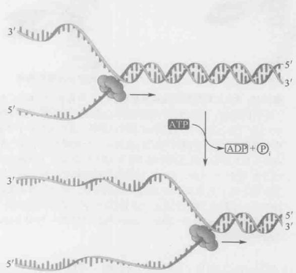  
图 9-14 DNA 解旋酶分离双螺旋的两条链。当 ATP 加到与单链 DNA 结合的 DNA 解旋酶上时，解旋酶在单链 DNA 上以一定的极性运动。在图示中，DNA 解旋酶具有 $5'\rightarrow3'$ 极性。这个极性说明 DNA 解旋酶与复制叉上的后随链模板结合。

那一条链决定的。以在复制叉的后随链模板上作用的 DNA 解旋酶为例，其 $5'\rightarrow3'$ 的极性使 DNA 解旋酶朝复制叉双链区域行进（图 9-14）。与所有以定向方式沿 DNA 运动的酶一样，解旋酶沿单链 DNA 的运动也需要化学能量的提供。解旋酶的能量由 ATP 水解提供。

## DNA 解旋酶牵引单链 DNA 通过蛋白质中心孔

一个六聚体 DNA 解旋酶如何利用 ATP 水解释放的能量移动 DNA？一种病毒的六聚体解螺旋酶结合到单链 DNA 的原子结构提供了这个问题的突破点。在这种结构中，单链 DNA 被解旋酶的 6 个亚基所环绕（图 9-15），每个亚基有一个“发夹”蛋白环，结合 DNA 主干的磷酸基和它两个邻近的核糖组分。有意思的是，这些 DNA 结合的环是右手螺旋，沿着单链 DNA 每一个环结合到下一个磷酸基团。如图 9-15 所示，最顶端的“阶梯”结合到 5'端，最低层的结合到单链 DNA 的 3'端。

  
图 9-15 DNA 解旋酶的结构和机制。(a) 牛乳头瘤病毒 EI 六聚体解旋酶的整体结构。每个亚基显示出了不同的颜色，图示为从左侧看的中心通道的复合物。蛋白亚基显示丝带的结构，单链 DNA 用棒图显示。(b) DNA 结合发夹假定运动图示说明。我们仅展示了单链 DNA 在解旋酶的中心通道，六聚体蛋白环中的两个在转位过程中结合在此处。三个视图分别是紫色发卡环与磷酸和黑色的核苷酸相互作用，从顶端（ATP 结合）状态到中间状态（ADP 结合态），再到底部状态（无核苷酸相连）。注意，在 ATP 结合状态和 ADP+Pi 状态，ssDNA 中的黑色碱基和蓝色发卡是如何一起移动，并在无核苷酸状态释放出来。重新结合的 ATP 驱动 DNA 结合环返回顶部，结合新的磷酸基（蓝色环比紫色环在“无核苷酸相连”步骤中早一步形成，图的上部显示了紫色发卡环）。注意其他的四个 DNA 结合环经历着同样的过程（Enemark E. J. and Joshua-Tor L. 2006. Nature 442: 270-275. PDB Code:2 GXA）。图像用 MoScript、BobScript 和 Raster3D 处理。

这张原子结构图只是一个快照，但是，6个不同的亚基在DNA移位过程中处于不同的阶段。结合6个不同亚基同DNA、ATP/ADP的相互作用说明了蛋白质的发夹结构如何协同运动来牵引ssDNA通过解旋酶的中心孔。一个亚基首先结合到单链DNA结构的顶部（图9-15b），DNA结合环通过连续的构象移向底部，牵引DNA通过。重要的是，不同的构象结合着不同的核苷酸状态：顶部是 ATP 结合状态，中间是 ADP 结合状态，底部是无核苷酸结合状态。因此，每一个单一的亚基结合点、水解酶、游离的 ATP，都将经历从顶部到中间再到底部的构象。总之，可以把解旋酶想象为有 6 只手且 6 只手交互地拉一根绳子的样子。

除了沿 ssDNA 的移位，解旋酶必须置换互补链来使 DNA 解旋。六聚解旋酶的中心通道结构表明，链的置换是为了使 DNA 通过中心通道。中心通道最窄的部位直径是 13 Å，对单链 DNA 来说足够大，但是对直径为 20 Å 的双链 DNA 而言太小了。

## 复制前单链结合蛋白使单链 DNA 稳定

DNA 解旋酶经过之后，新产生的单链 DNA 必须保持碱基未配对的状态，直至被用作 DNA 合成的模板。为了使分开的链稳定，单链 DNA 结合蛋白（ssDNA-binding protein, SSB）迅速地结合其上。一个 SSB 的结合会促进另一个 SSB 与其紧邻的单链 DNA 结合（图 9-16）。

  
图 9-16 单链 DNA 结合蛋白（SSB）与 DNA 的结合。（a）图中显示有限的 SSB 与 9 条单链 DNA 分子中的 4 条结合。（b）当更多的 SSB 与 DNA 结合后，它优先结合到先前已有 SSB 分子结合的 DNA 附近。只有最初结合的单链 DNA 被 SSB 完全覆盖后，其他 DNA 分子才发生结合。注意，当单链 DNA 被 SSB 覆盖后，变成更为伸直的构象，以抑制分子间的碱基配对。

这一过程称为协同结合（cooperative binding），因为与紧邻的单链 DNA 区域结合的 SSB 分子相互之间也能够结合。这样大大稳定了 SSB 与单链 DNA 之间的相互作用，使得已有一个或多个 SSB 结合的位点比其他位点更易结合新的 SSB。

协同结合使单链 DNA 随着 DNA 解旋酶的释放而很快被 SSB 所覆盖（协同结合是许多 DNA 结合蛋白的一种特性，见第 18 章，框 18-4）。一旦被 SSB 覆盖，ssDNA 即处于伸直状态，有利于其作为模板进行 DNA 合成或 RNA 引物的合成。

SSB 以序列非特异性方式与 ssDNA 相互作用。SSB 主要通过与磷酸骨架的静电相互作用，以及与 DNA 碱基的相互堆积作用与 ssDNA 接触。与序列特异性的 DNA 结合蛋白不同，SSB 与 ssDNA 碱基之间几乎没有氢键的作用。

## 拓扑异构酶除去 DNA 解旋时在复制叉上产生的超螺旋

随着复制叉上 DNA 链的分离, 叉前的双链 DNA 变得更加正超螺旋化(图 9-17)。这种超螺旋的积累是 DNA 解旋酶消除了两链间碱基部分的结果。如果 DNA 链保持不断裂, 则不会减少 DNA 双链解旋的连环数（两条 DNA 互绕的次数）(第 4章）。因此，随着 DNA 解旋酶的行进，DNA 必须在越来越少的碱基对中维持同样数目的连环数。事实上，若复制叉前方的 DNA 保持松弛状态，每 10 个 DNA 碱基解旋时就要除去 1 个 DNA 连环。如果没有机制来消除这些累积的超螺旋，复制机器将在不断上升的压力面前陷于停顿。

  
图 9-17 拓扑异构酶在复制叉上的作用。当正超螺旋在复制叉前累积时，拓扑异构酶会将其迅速地除去。本图显示拓扑异构酶Ⅱ除去由复制叉所产生的正超螺旋，将未复制的双链 DNA 中的一部分通过位于未复制区域附近的双链断口可以消除正超螺旋。值得注意的是，这种变化将使连环数减少 2 个，因此每复制 20bp 会发生一次。虽然此处所示的是Ⅱ型拓扑异构酶的作用,但是Ⅰ型拓扑异构酶也能消除复制叉产生的正超螺旋。注意，正超螺旋在复制叉前端表现为右手螺旋（一个完整的环形相当于一个正螺旋）。一个 dsDNA 分子通过后完全转换为左手螺旋（一个完整的环形相当于一个负螺旋）。这说明了为何Ⅱ型拓扑异构酶改变的连环数为 2 个单位（DNA 拓扑和螺旋的更多信息请参见第 4 章和第 8 章，框 8-2）。

对于细菌的环形染色体，此问题非常明显，但真核生物染色体也有同样的问题。因为真核生物染色体不是闭合的环，原则上它们能通过沿着其长度方向的旋转来消除引入的超螺旋。然而事实并非如此，因为不可能每次当螺旋解开一圈时，就旋转长达几百万碱基对长度的 DNA。

由 DNA 解旋酶的作用所引入的超螺旋，可通过拓扑异构酶（topoisomerase）对在复制叉前未被复制的双链 DNA 的作用来消除（图 9-17）。这些酶是通过断裂一条或两条 DNA 链但不让其脱落，并且让同等数目的 DNA 链通过断口来完成的（如我们在第 4 章所述）。此作用消除了超螺旋的累积。通过这种方式，拓扑异构酶作为一个“转环”，快速地消除了 DNA 解旋所产生的超螺旋累积。

## 复制叉酶扩大了 DNA 聚合酶底物的范围

DNA 聚合酶本身只能使与单链 DNA 模板退火的 3'-OH 引物延长，引物酶、DNA 解旋酶及拓扑异构酶的加入极大地扩大了 DNA 聚合酶可能的底物范围。引物酶提供了在任何单链 DNA 上都能起始新的 DNA 链的能力。当然，引物酶也要求除去 RNA 引物来完成复制。类似地，DNA 解旋酶对链的解离，以及拓扑异构酶对正超螺旋的消除使 DNA 聚合酶能够复制双链 DNA。虽然不同生物中这些蛋白质的名称不同（表 9-1），但是，细菌、酵母和人等生物均使用这一套酶来完成染色体 DNA 的复制。

表 9-1 复制叉上工作的酶

<table><tr><td></td><td>大肠杆菌(E. coli)</td><td>酿酒酵母(S. cerevisiae)</td><td>人类</td></tr><tr><td>引物酶</td><td>DnaG</td><td>引物酶(PRI 1/PRI 2)</td><td>引物酶</td></tr><tr><td>DNA 解旋酶</td><td>DnaB</td><td>Mcm2-7 复合体</td><td>Mcm2-7 复合体</td></tr><tr><td>SSB</td><td>SSB</td><td>RPA</td><td>RPA</td></tr><tr><td>拓扑导构酶</td><td>旋转酶、拓扑异构酶I</td><td>拓扑异构酶I、II</td><td>拓扑异构酶I、II</td></tr></table>

值得注意的是，DNA 解旋酶和拓扑异构酶行使其功能时，均没有永久性地改变 DNA 的化学结构或合成任何新的 DNA 分子。DNA 解旋酶仅仅把将 DNA 双链维持在一起的氢键打开而没有断裂任何共价键。虽然拓扑异构酶断裂掉一个或多个 DNA 的共价键，但在 DNA 脱离之前每个断裂的键都被精确地修复了（见第 4 章，图 4-25）。这些酶的作用是使 DNA 分子的构象发生改变，而不是改变 DNA 的化学结构。重要的是，这些构象的变化对于作为细菌和真核生物染色体基础的大的双链 DNA 分子的复制是至关重要的。

在复制叉上工作的蛋白质与 DNA 密切作用，但采用的是序列非特异的方式。这些相互作用利用 DNA 与特定碱基对无关的特性：负电荷及磷酸骨架结构（如 DNA 聚合酶的拇指域）、小沟内残基的氢键（如 DNA 聚合酶的手掌域）、碱基之间的疏水堆积作用（如 SSB）。另外，很多蛋白质具有环绕（如 DNA 解旋酶）或包裹（如 DNA 聚合酶）DNA 的结构，以保持与 DNA 的结合。

## DNA 聚合酶的特化

## 细胞中 DNA 聚合酶为行使不同的功能而被特化

DNA 聚合酶在高效而精确地复制基因组过程中所处的核心地位要求细胞有多种特化的 DNA 聚合酶。例如，E. coli 中至少有 5 种 DNA 聚合酶，这些酶依据其酶学特性、亚基组成和丰度而划分（表 9-2）。DNA 聚合酶 III（DNA Pol III）是染色体复制中所涉及的最主要的酶。因为全长为 4.6 Mb 的 E.coli 由 2 个复制叉进行复制，DNA 聚合酶 III 必须有很强的延伸能力。与这些要求相一致的是，人们发现 DNA 聚合酶 III 常常作为更大的、具有高度延伸能力的复合体——DNA 聚合酶 III 全酶（DNA Pol III holoenzyme）的一部分。

表 9-2 DNA 聚合酶的活性和功能

<table><tr><td></td><td>亚基数目</td><td>功能</td></tr><tr><td colspan="3">原核生物(E. coli)</td></tr><tr><td>Pol I</td><td>1</td><td>RNA引物的去除、DNA修复</td></tr><tr><td>Pol II(Din A)</td><td>1</td><td>DNA修复</td></tr><tr><td>Pol III核心酶</td><td>3</td><td>染色体复制</td></tr><tr><td>Pol III全酶</td><td>9</td><td>染色体复制</td></tr><tr><td>Pol IV(Din B)</td><td>1</td><td>DNA修复、移损合成(translesion synthesis)(TLS)</td></tr><tr><td>Pol V(UmuC、UmuD2°C)</td><td>3</td><td>移损合成</td></tr><tr><td colspan="3">真核生物</td></tr><tr><td>Pol α</td><td>4</td><td>DNA复制过程中合成引物</td></tr><tr><td>Pol β</td><td>1</td><td>碱基切除修复</td></tr><tr><td>Pol γ</td><td>3</td><td>线粒体DNA复制及修复</td></tr><tr><td>Pol δ</td><td>2~3</td><td>后随链DNA复制、核苷酸和碱基切除修复</td></tr><tr><td>Pol ε</td><td>4</td><td>前导链DNA复制、核苷酸和碱基切除修复</td></tr><tr><td>Pol θ</td><td>1</td><td>DNA交联修复</td></tr><tr><td>Pol ξ</td><td>1</td><td>移损合成</td></tr><tr><td>Pol λ</td><td>1</td><td>减数分裂相关的DNA修复</td></tr><tr><td>Pol μ</td><td>1</td><td>体细胞超变</td></tr><tr><td>Pol κ</td><td>1</td><td>移损合成</td></tr><tr><td>Pol η</td><td>1</td><td>相对精确的移损合成通过顺-反环丁烷二联体</td></tr><tr><td>Pol i</td><td>1</td><td>移损合成、体细胞超变</td></tr><tr><td>Rev 1</td><td>1</td><td>移损合成</td></tr></table>

数据源自 Sutton M.D. and Walker G.C. 2001. Proc. Natl. Acad. Sci. 98:8342-8349 及其参考文献.

相反，DNA 聚合酶 I（DNA Pol I）专门用于除去起始 DNA 合成所需的 RNA 引物。为此，DNA 聚合酶 I 具有 5' 外切核酸酶的活性，能将 DNA 合成位点最上游的 RNA 或 DNA 迅速除去。与 DNA 聚合酶 III 不同，DNA 聚合酶 I 的延伸能力不强，每次结合仅能添加 20～100 个核苷酸。这些性质使其适用于 RNA 引物的去除和在所产生的单链 DNA 缺口中进行 DNA 的合成。DNA 聚合酶 I 的 5' 外切核酸酶可以除去 RNase H 所不能除去的 RNA-DNA 连接（图 9-13）。DNA 聚合酶 I 合成较短片段的能力使其适用于合成先前被 RNA 引物占据的短区域（<10 个核苷酸），在大量 DNA 降解及重新合成之前即解离下来。总之，DNA 聚合酶 I 完成其功能后仅在 DNA 链上留一个缺口。

因为 DNA 聚合酶 I 和 DNA 聚合酶 III 都与 DNA 复制有关, 所以这两种酶都必须有高度的精确性。因此, 这两种蛋白质都具有相关的校正外切核酸酶活性。E.oli 中的另外 3 种 DNA 聚合酶特别用于 DNA 的修复, 它们无校正活性, 这些酶将在第 10 章中予以讨论。

真核细胞中也有多种 DNA 聚合酶，通常有 15 种以上。其中，对于基因组的复制至关重要的有3种：DNA Pol δ、DNA Pol ε及DNA Pol α/引物酶。这些真核生物的DNA聚合酶由多个亚基构成（表9-2）。DNA Pol α/引物酶特别参与新DNA链的起始，这种四亚基蛋白复合体由二亚基的DNA Pol α和二亚基的引物酶组成。引物酶合成RNA引物后，所产生的RNA引物-模板接头立即与DNA Pol α结合以启动DNA的合成。

因为 DNA Pol α/引物酶的延伸能力相对较低，所以很快就被高延伸性的 DNA Pol δ 或 ε 取代。DNA Pol δ 或 ε 取代 DNA Pol α/引物酶的过程称为聚合酶的切换（polymerase switching）（图 9-18），这导致在真核细胞复制叉上有 3 种不同的 DNA 聚合酶在工作。DNA Pol δ 和 ε 在复制叉上特异性地复制不同的链，DNA Pol δ 合成前导链，DNA Pol ε 合成后随链。如同在细菌细胞中那样，真核细胞中其他的 DNA 聚合酶大多参与 DNA 的修复。

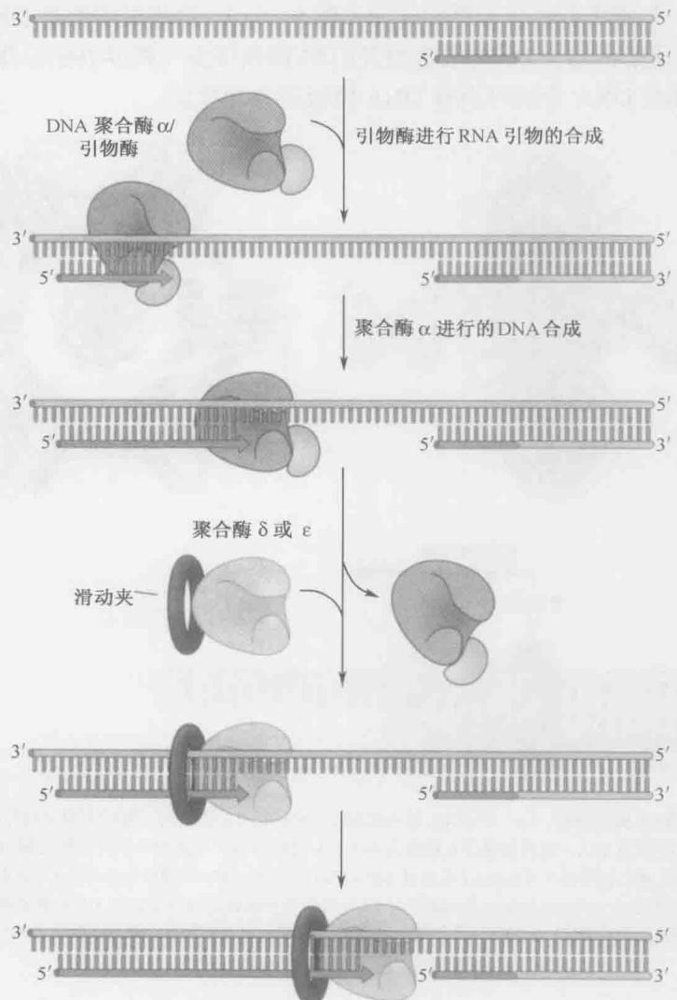  
图 9-18 真核细胞 DNA 复制过程中 DNA 聚合酶的切换。本图显示了真核细胞中 DNA 聚合酶的作用顺序。为了图示方便，DNA 合成的长度比实际的短。通常 DNA Polα/引物酶的产物为 50\~100bp，由 Pol δ 或 ε 进一步延伸为 100\~10000 个核苷酸。虽然 DNA Pol δ 和 DNA Pol ε 都能替代 DNA Pol α/引物酶，但目前的研究表明 DNA Pol δ 位于前导链，DNA Pol ε 位于后随链。

## 滑动夹极大地增加了 DNA 聚合酶的延伸能力

复制叉上高度的延伸能力确保了染色体的快速复制。如我们所讨论的，DNA 聚合酶在复制叉上可以在不脱离模板的情况下合成成千上万的碱基对。尽管如此，在没有其他蛋白质存在的情况下，DNA 聚合酶在复制叉上仅能合成 20～100 个碱基对后即从模板上脱离下来。那么，是什么原因使这些酶在复制叉上的延伸能力如此显著地提高了呢？

DNA 聚合酶在复制叉上具有高延伸能力的关键原因在于它们与被称为滑动 DNA 夹（sliding DNA clamp）的蛋白质间的结合。这些蛋白质由多个相同的亚基构成，并组装成“油炸圈饼”的形状。夹子中央的孔洞大得足以环绕 DNA 双螺旋，并在 DNA 和蛋白质之间留下一个或两个水分子厚的空间（图 9-19a）。这些夹子沿着 DNA 滑动，并不与 DNA 分离，还紧密结合 DNA 聚合酶及引物-模板接头（图 9-19b）。聚合酶与滑动夹所形成的复合体在 DNA 合成时沿着 DNA 模板高效地移动。

  
图 9-19 滑动 DNA 夹的结构。(a) 与 DNA 结合的滑动 DNA 夹的三维结构。滑动夹中央的开孔约为 35 Å，DNA 螺旋的宽度约为 20 Å，这样提供了在滑动夹和 DNA 之间容纳一个或两个水分子厚度薄层的足够空间，使滑动夹沿 DNA 运动很容易。(Krishna T.S., et al. 1994. Cell 79:1233-1243. 图像用 Bob-Script、MolScript 和 Raster 3D 绘制。DNA 模型由 Leemor Joshua-Tor 制作)。(b) 滑动夹环绕着由与其结合的 DNA 聚合酶所产生的新复制的 DNA。当新合成的 DNA 从 DNA 聚合酶上出现时，滑动夹与最靠近新合成 DNA 的 DNA 聚合酶部分相互作用。

与滑动夹的结合是如何改变 DNA 聚合酶的延伸能力的呢？在无滑动夹的情况下，DNA 聚合酶平均每合成 20～100 个碱基对就从 DNA 模板上解离并散落开来。在有滑动夹的情况下，DNA 聚合酶的活性部位仍经常从 DNA 的 3'-OH 末端脱落，但是其与滑动夹的结合阻止了聚合酶从 DNA 上散开（图 9-20）。通过保持 DNA 聚合酶与 DNA 的紧密接触，滑动夹使 DNA 聚合酶能迅速地重新结合到同一引物-模板接头上，大大增加了 DNA 聚合酶的延伸能力。

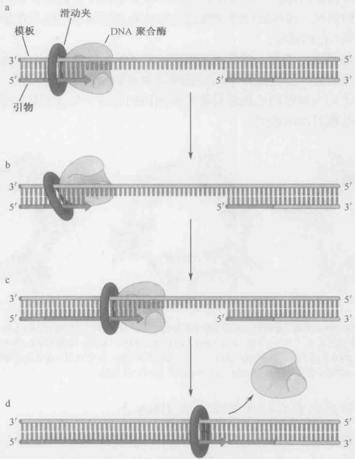  
图 9-20 滑动 DNA 夹增强了相结合的 DNA 聚合酶的延伸能力。(a) 滑动 DNA 夹环绕 DNA 同时结合 DNA 聚合酶。(b) 相对较低持续合成能力的 DNA 聚合酶会导致频繁地从引物:模板结合上脱落,但与聚合酶结合的滑动夹防止了聚合酶从 DNA 上散开。(c) DNA 聚合酶与滑动夹之间的结合确保 DNA 聚合酶能重新结合相同的引物:模板并继续 DNA 的合成。(d) DNA 聚合酶完成模板合成后,由于没有引物:模板再次结合而从滑动夹上释放。

当单链 DNA 模板完全复制后，DNA 聚合酶必须从双链 DNA 和滑动夹上释放，与新的引物-模板接头结合。此释放是通过依赖于环结合 DNA 的 DNA 聚合酶与滑动夹之间亲和力的变化实现的。与引物-模板接头结合的 DNA 聚合酶与夹子有很高的亲和力。但是，当 DNA 聚合酶到达单链 DNA 模板的末端时（如冈崎片段的末端），活性部位存在的双链 DNA 使 DNA 聚合酶构象发生变化，降低了其与滑动夹及 DNA 之间的亲和力（图 9-20）。因此，当聚合酶完成一段 DNA 复制后，它即从滑动夹释放，在新的引物-模板接头上开始工作。

释放 DNA 聚合酶后，滑动夹并不立即从复制的 DNA 上脱落下来。相反，其他必须在 DNA 新合成处作用的蛋白质通过与夹子蛋白相互作用而执行其功能。如第 8 章所述，真核细胞中组装染色质的酶通过与真核滑动 DNA 夹（称为 PCNA）之间的相互作用被募集到 DNA 的复制部位。类似地，冈崎片段修复所涉及的真核蛋白也与滑动夹蛋白作用。不论何种情况，这些蛋白质均通过与滑动夹之间的相互作用在最需要它们的时候聚集到新的 DNA 合成部位。

滑动夹蛋白是病毒、细菌、酵母及人类等生物 DNA 复制体系中的保守部件。与其功能保守性相一致的是，源自这些不同生物的滑动夹的结构也是保守的（图 9-21）。不论何种情况，夹子均为同样的六边形对称并有相同的直径。尽管其整体结构非常类似，但形成夹子的亚基数目却不相同。

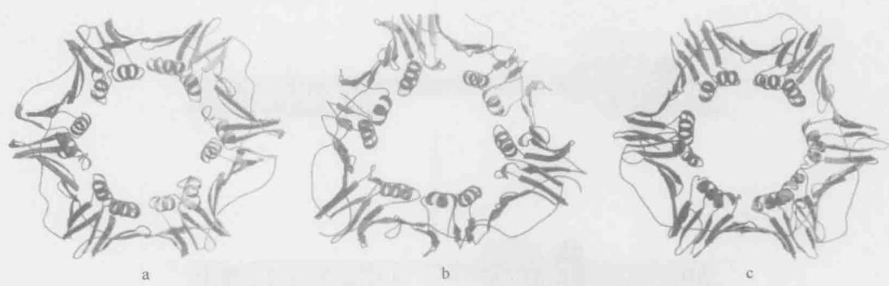  
图 9-21 不同生物中滑动 DNA 夹的三维结构。所有生物中都发现有滑动 DNA 夹，它们有相似的结构。（a）E. coli 的滑动 DNA 夹由 2 个拷贝的 β 蛋白构成。（Kong X.P., et al. 1992. Cell 69:425-437.）（b）T4 噬菌体滑动 DNA 夹是 gp45 蛋白的三聚体（Moarefi l., et al. 2000. I Mol. Biol. 296:1215-1223.）（c）真核滑动 DNA 夹是 PCNA 蛋白的三聚体。（Krishna T. S., et al. 1994. Cell 79:1233-1243.）镜像图用 BobScript、MolScript 和 Raster 3D 绘制。

## 滑动夹通过滑动夹装载器打开并安置在 DNA 上

滑动夹在溶液中是一个闭合的环，必须打开才能套在 DNA 双螺旋上。一类称为滑动夹装载器（sliding clamp loader）的特殊的蛋白复合体催化滑动夹的打开并将其安放在 DNA 上。这些酶通过结合 ATP 并将其水解而将滑动夹环置于 DNA 的引物-模板接头上（框 9-3）。滑动夹装载器还能将滑动夹在不使用的时候将其从 DNA 上移除，这一过程不需要 ATP。像 DNA 解旋酶和拓扑异构酶一样，这些酶改变其靶物（滑动夹）的构象，但并不改变其化学组成。

## 框 9-3 ATP 控制蛋白的功能：滑动夹的装载

滑动 DNA 夹装载器由 5 个亚基组成，是一类含有相关 ATP 结合和水解位点的蛋白质家族成员，称为 AAA $^{+}$ 蛋白。这种蛋白质组合成 AAA $^{+}$ 蛋白复合体，利用水解 ATP 的能量来改变目标蛋白或 DNA 的结构。滑动 DNA 夹装载器是由不同的 AAA $^{+}$ 蛋白组成的，而其他 AAA $^{+}$ 蛋白复合体一般是由一种 AAA $^{+}$ 蛋白的多个拷贝组成。尽管 AAA $^{+}$ 蛋白含有相关 ATP 结合和水解位点，但是它们行使不同的功能。除了装载成 DNA 滑动夹，AAA $^{+}$ 蛋白还解开 DNA，在 DNA 模板周围加载解旋酶（如 ORC 和 DnaC，在 DNA 复制起始的章节我们谈论过），蛋白质去折叠，拆分蛋白质复合物。实际上，因为它具有多种活性，我们称这些 AAA 蛋白为 ATPase。

ATP的结合及水解是如何与滑动夹的装载联系到一起的？起始步骤要求ATP结合到装载器，当与ATP结合时，夹子装载器与滑动夹结合并通过拆开一个亚基-亚基界面使滑动夹打开（框9-3图1）。打开的滑动夹通过夹子装载器上一个高亲和力的DNA结合位点被运送到DNA上。与滑动夹的结合相一致，DNA的结合需要装载器结合ATP。滑动夹在DNA合成合成位点一直存在，装载器的DNA结合位点特异性地识别引物-模板接头。打开的滑动夹环绕住引物-模板接头的双链DNA区域。

滑动夹装载的最后一步是由 ATP 水解所催化的。夹子装载器与引物-模板接头的结合激发了 ATP 的水解（通过夹子装载器进行）。因为夹子装载器只有在与 ATP 结合时（而不是 ADP）才能与滑动夹及 DNA 结合，水解使夹子装载器释放滑动夹并从 DNA 上脱离。滑动夹一旦从夹子装载器上释放，即自动闭合而套住 DNA。此过程的净结果是滑动夹安装到 DNA 聚合酶的作用位点——引物-模板接头上。ADP 和 Pi 的释放以及与新 ATP 分子的结合使夹子装载器能够启动新一轮的装载。

夹子装载器的功能解释了 ATP 结合和水解与分子事件耦联的几个特征。通常 ATP 与蛋白质的结合多发生在事件的组装阶段：因子与靶分子的结合。例如，夹子装载器有两个靶分子：滑动夹及引物-模板接头。夹子装载器与这两个靶分子的结合都需要 ATP。类似地，ATP 的结合也激发 DNA 解旋酶与单链 DNA 结合的能力。不论哪种情况，与 ATP 结合相耦联的事件均被视为循环中的一部分。对夹子装载器而言，打开滑动夹环需要的是 ATP 的结合而不是水解。对于 DNA 解旋酶来说，与单链 DNA 的结合很可能是 DNA 解旋的关键事件。在这些事例中，与 ATP 的结合稳定了酶的构象，利于酶以特定的构象与底物相互作用。

那 ATP 水解的作用是什么？ATP 的水解通常与事件中的解离阶段相关：释放结合在酶上的靶分子。ATP 所稳定的复合体一旦形成，就一定会解离。这可能是简单的分离，但是，更多情况下是将元件还原到其起始状态（如溶液中游离的滑动夹）。如果 ATP 所稳定的复合体结合得十分牢固，此过程将很缓慢。为了保证在正确的时间、地点以正确的速率发生解离，由 ATP 水解来起始解离。例如，ATP 水解使夹子装载器恢复到它既不与滑动夹也不与 DNA 结合的状态。这种初始状态的回复可能会发生在当酶仍与 ATP 水解产物（ADP 和 Pi）结合的时候，或是需要其分离的时候。

ATP 水解与反应耦联的最后一个重要的机制是 ATP 水解的引发。在所需要的复合体组装好之前，相关因子不水解 ATP 是十分关键的。一般而言，特定复合体的形成可引发 ATP 的水解。对于夹子装载器而言，此复合体是滑动夹、夹子装载器及引物-模板接头所形成的三体复合体。

因此，ATP 控制这些分子事件与酶对构象变化的时相控制最直接相关。酶通过在两种构象状态之间有序地变化和形成一种重要的中间物引发 ATP 水解以完成这种控制。相反，如果酶只是结合和释放 ATP（无水解），则反应将频繁回到起始状态而几乎不能完成任何工作。

框 9-3 图 1 ATP 控制滑动夹的装载。(a) 滑动夹装载器是五亚基的蛋白质复合体，其活性是由 ATP 的结合和水解控制的。在 E.coli 中夹子装载器称为 γ-复合体，在真核细胞中称为复制因子 C(RF-C)。(b) 为了催化滑动夹的打开，夹子装载器必须与 ATP 结合。(c) 夹子装载器一旦与 ATP 结合，即与夹子结合并在一个亚基-亚基界面处将环打开。(d) 形成的复合体可与 DNA 结合。DNA 的结合是由优先与引物-模板接头结合的夹子装载器介导的。与 DNA 的正确结合有两个结果：第一，打开后的滑动夹被定位，可使双链 DNA 处于夹子的孔洞之中；第二，DNA 的结合通过夹子装载器激发了 ATP 的水解。(e) 因为只有结合 ATP 的夹子装载器才能与夹子以及 DNA 结合，所以结合 ADP 的夹子装载器很快就从夹子及 DNA 上脱离下来，留下套在双链 DNA 引物-模板接头位置处的闭合的夹子。(来源：O'Donnell M. et al. 2001. Curr. Biol. 11: R935-R946, Fig. 5. ©Elsevier.)

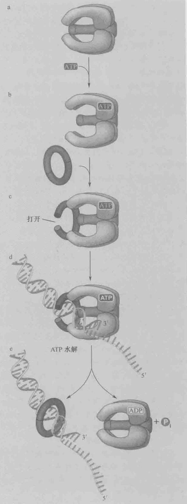

是什么控制滑动夹何时从 DNA 上装载和移除呢？只要细胞中出现引物-模板接头，滑动夹的装载就可能发生。此 DNA 结构并非只在 DNA 复制时形成，在 DNA 修复事件中也有（第 10 章）。滑动夹只有当其不再被其他酶使用时才能从 DNA 上移除。滑动夹装载器和 DNA 聚合酶不能同时与滑动夹作用，因为它们在滑动夹的同一面上有重叠的结合位点。因此，与 DNA 聚合酶结合的滑动夹不会从 DNA 上移除。类似地，核小体组装因子、冈崎片段修复蛋白及其他 DNA 修复蛋白均与夹子装载器一样，与滑动夹的同一区域作用，因此，滑动夹只能在与其相作用的所有酶都完成工作后才能从 DNA 上移除。

## 复制叉上的 DNA 合成

在复制叉上前导链和后随链同时进行合成，这对在 DNA 合成期内限制细胞内单链 DNA 的数量有重要意义。当 DNA 的单链区断裂时，在染色体上会产生完全的断裂，这比双链 DNA 上的一条单链 DNA 断裂修复起来要困难得多。而且，修复这种类型的损伤经常会导致 DNA 的突变（第 10 章）。因此，限制 DNA 处于此状态的时间是十分重要的。为了协调 DNA 两条链的复制，在复制叉上有多种 DNA 聚合酶在行使功能。

E. coli 中，这些聚合酶的协同作用是通过连接成巨大的多蛋白复合体来实现，此复合体称为 DNA Pol Ⅲ全酶（图 9-22）。全酶是核心酶和对其有增强功能的其他元件组成的多蛋白复合体的总称。DNA Pol Ⅲ全酶含有3个拷贝的核心 DNA Pol Ⅲ和1个拷贝的五亚基滑动夹装载器。虽然在全酶中滑动夹装载器只有一个拷贝，但包括3个拷贝 $\tau$ 蛋白，每个 $\tau$ 蛋白结合一个 DNA Pol Ⅲ核心酶（图9-22）。

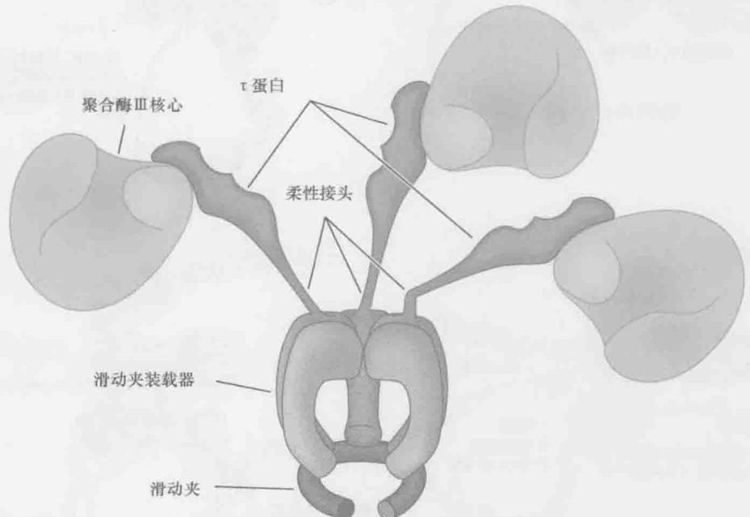  
图 9-22 DNA Pol III全酶的组成。每个拷贝的 DNA Pol III全酶有 4 个酶：3 个拷贝的 DNA Pol III核心酶和 1 个拷贝的滑动夹装载器。滑动夹装载器含有 3 个拷贝的 τ 蛋白，每个 τ 蛋白均与一个 DNA Pol III核心酶相作用。对 τ 蛋白进行的氨基酸序列分析表明，此蛋白质的 DNA Pol III结合区域与夹子装载器所涉及的蛋白质之间有一段延伸的柔性接头。这个接头据认为可以使聚合酶以相对独立的方式运动，一个聚合酶复制前导链，而另两个聚合酶复制后随链。（来源：O'Donnell M. et al. 2001. Curr. Biol. 11:R935–R946, Fig. 6. ©Elsevier.）

当 DNA 同时在前导链和后随链模板上合成的时候，多个 DNA 聚合酶如何在复制叉处保持连接？一个解释此耦联效应的模型认为复制机器利用了 DNA 和 $\tau$ 蛋白的柔性（图 9-23）。当解旋酶在复制叉处解开 DNA 螺旋后，前导链模板暴露并立即与一个 DNAPol III 核心酶作用，合成一条连续的 DNA 互补链。相反，后随链模板并不是立即与 DNA 聚合酶作用，而是以单链 DNA 的形式伸出，并被 SSB 迅速结合。引物酶与 DNA 解旋酶相互作用从而被激活，在后随链模板上合成一条新的 RNA 引物。产生的 RNA：DNA 杂交体被滑动夹装载器识别为引物-模板接头，滑动夹在此处组装，第二个 DNA Pol III 启动后随链的合成。

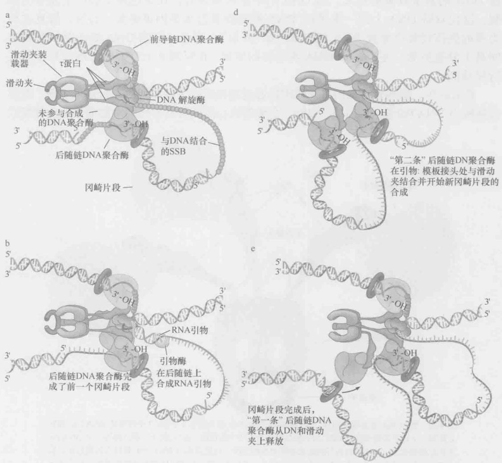

  
图 9-23 E.coli 复制叉上用于协调两种 DNA 聚合酶复制的“长号模型”。(a) E. coli DNA 复制叉上的 DNA 解旋酶在后随链模板上沿着 5'→3'方向运动。DNA Pol III 全酶通过 τ 亚基与 DNA 解旋酶相互作用，τ 亚基也与 DNA Pol III 核心酶结合。一个 DNA Pol III 核心酶复制前导链，另两个 DNA Pol III 核心酶复制后随链。SSB 覆盖在 DNA 的单链区域（为了简便起见，后随链上的 SSB 只在 a 部分中显示）。(b) DNA 引物酶周期性地与 DNA 解旋酶结合并在后随链模板上合成新的 RNA 引物。(c) 新的 RNA 引物合成后，DNA 滑动夹装载器就在模板-引物接头处加载滑动夹。(d) 空闲的“第二个”后随链 DNA 聚合酶在模板-引物接头处快速识别 DNA 滑动夹，并合成新的冈崎片段。(e) 当“第一个”后随链 DNA 聚合酶到达冈崎链模板的末端后，从滑动夹释放出来。此时“第一个”后随链 DNA 聚合酶已经就位，准备识别后随链模板的下一个 RNA 引物/滑动夹。所以，本模型描述了两个后随链 DNA 聚合酶交替启动冈崎片段的合成。

当一个后随链上的 DNA 聚合酶合成冈崎片段后，解旋酶产生了更多的单链 DNA，而该模板上新的 RNA 引物也被合成。与前面的后随链的引物一样，新的 RNA 引物可以被滑动夹装载器识别。尽管传统上认为 DNA Pol 全酶仅有两个 DNA Pol Ⅲ核心酶，近期研究认为还存在第三个 DNA Pol Ⅲ。在前一个冈崎片段尚未完成合成时，一旦 DNA 滑动夹在 RNA 引物上加载后，第三种 DNA Pol Ⅲ就可启动新冈崎片段的合成。因此，第二个冈崎片段在合成前一个冈崎片段的聚合酶释放前就已经开始合成了。当每个冈崎片段合成结束后，聚合酶即从模板上释放（即一旦 DNA 聚合酶完成冈崎片段的合成后，立刻从滑动夹上解离）。此时第二个 DNA 聚合酶正在指导后随链的合成，因为 DNA 聚合酶从滑动夹上解离比 DNA 合成速度慢，于是在其缓慢的解离过程中后随链的合成得以继续。因为解离的 DNA Pol Ⅲ核心酶通过滑动夹装载器的 τ 亚基与解旋酶保持着联系，所以在加载滑动夹后该 DNA 聚合酶立即与 RNA 引物-模板接头在理想的位置结合。这个模型被称为“长号模型”，以比喻在后随链模板上 DNA 聚合酶和 DNA 解旋酶之间形成的单链 DNA 环状结构大小的变化。

真核细胞中 DNA 的复制也需要三种 DNA 聚合酶：DNA Pol α/引物酶、DNA Pol δ 及 DNA Pol ε（图 9-18）。DNA Pol α/引物酶启动新链合成，DNA Pol δ 和 DNA Pol ε 进行链的延伸。在 E.coli 中，一种 DNA 聚合酶（DNA Pol ε）合成前导链，两种 DNA 聚合酶（DNA Pol α/引物酶和 DNA Pol δ）合成后随链（尽管 DNA Pol α/引物酶和也可以合成前导链的引物，但是其功能在后随链更强）。已知许多其他蛋白质为真核细胞复制叉的一部分，这些蛋白质的作用目前了解甚少，它们很可能协调三种 DNA 聚合酶，并耦联聚合酶 DNA 解旋酶（Mcm2-7 复合物）的功能。与原核细胞所不同的是，真核细胞的滑动夹装载器——RF-C 不具有这样的功能。

## 复制叉蛋白之间的相互作用形成 E.coli 的复制体

DNA Pol III全酶组分之间的联系并不是发生在细菌复制叉各元件中唯一的相互作用。除了DNA Pol III全酶组分之间的相互作用以外，还有几个复制叉蛋白-蛋白间的相互作用加快了复制叉的进程。其中最重要的是DNA解旋酶（六聚体dnaB蛋白）（表9-1）与DNA Pol III全酶（图9-24）之间的相互作用。该作用由组成全酶的滑动夹装载器的 $\tau$ 亚基介导，将解旋酶和DNA Pol III全酶连接到一起。此作用使解旋酶运动的速度增加10倍，从而激发了解旋酶的活性。如果DNA解旋酶与DNA聚合酶分离，其速度将减慢（图9-24）。解旋酶活性与DNA Pol III耦联，防止了解旋酶从DNA Pol III全酶上“逃脱”，使得这两个关键的复制叉酶得以协调。

  
图 9-24 DNA 解旋酶与 DNA Pol III 全酶的结合加快 DNA 链的分离。滑动夹装载器的 τ-亚基在复制叉上与 DNA 解旋酶和 DNA 聚合酶都发生作用。(a) 当此相互作用发生后，DNA 解旋酶以与 DNA 聚合酶复制 DNA 大致相同的速度解开 DNA。(b) 如果 DNA 解旋酶没有与 DNA Pol III 全酶作用，则 DNA 解开的速度变为原来的 1/10。在此情况下，DNA 聚合酶的复制快于 DNA 解旋酶对未复制 DNA 链的拆分。这使 DNA Pol III 全酶能赶上 DNA 解旋酶并重新形成一个复制体。

第二个重要的蛋白质间相互作用发生在 DNA 解旋酶与引物酶之间。与 E.coli 复制叉中的多数蛋白质不同，引物酶与复制叉的结合并不紧密。相反，在约 1 秒一次的间隔中，引物酶与解旋酶及 SSB 覆盖的单链 DNA 结合并合成新的 RNA 引物。虽然 DNA 解旋酶与引物酶之间的作用相对较弱，但是其相互作用大大激发了引物酶的活性（提高约 1000 倍）。RNA 引物合成后，引物酶从 DNA 解旋酶上脱落并进入溶液中。

在 E.coli 中，引物酶与 DNA 解旋酶之间相对较弱的相互作用对于调节冈崎片段长度很重要。紧密的结合可导致后随链上的引物合成更频繁，这样冈崎片段就会较短。较弱的作用则产生较长的冈崎片段。

复制叉上发挥作用的全部蛋白质的总和称为复制体（replisome）。这些蛋白质在一起形成一个用于DNA合成的、调度有序的“工厂”，此“工厂”含有多个相互关联的机器。这些机器都可单独地行使重要的特殊功能。当它们在一起的时候，其活动通过相互之间的作用进行协调。这些相互作用在E. coli细胞中已所知甚详，但是对噬菌体和真核DNA复制机器的研究表明，这些生物中的DNA复制亦涉及类似的、多机器间的协调作用。事实上，在E. coli复制中涉及的蛋白质在其他生物中也有明确的同源蛋白。噬菌体、原核生物和真核生物DNA复制中执行类似功能的因子的名称见表9-1。

为了更好地体会复制 DNA 的酶令人惊叹的能力，设想一个 DNA 碱基有你的课本那么大。这种情况下双链 DNA 将有约 1m 的直径，E.coli 基因组将是一个约 500 英里（800 千米）周长的大环。更重要的是，复制体有联邦快递（UPS）的运货车那么大，它将以超过 375 英里/小时（600 千米/小时）的速度运动！对两个这样的机器来说，E.coli 基因组的复制历时 40 分钟、途经 250 英里（400 千米）路程，每个机器在它的航迹上留下两条 1 米粗的 DNA 线缆。令人叫绝的是，复制机器在路程当中平均仅产生一个错误。

## DNA 复制的起始

## 特定的基因组 DNA 序列指导 DNA 复制的起始

复制叉最初的形成需要 DNA 双链的分离提供单链 DNA 用于 DNA 解旋酶结合和 RNA 引物及新 DNA 的合成所必需的模板。虽然 DNA 链的分离（也称为 DNA 解旋）在染色体末端最容易进行，但是 DNA 的合成通常是在中间区域起始的。事实上，对于环状染色体来说，无染色体末端使内部 DNA 解旋对复制起始很重要。

DNA 解旋和复制起始发生的特殊位点称为复制起始位点（origin of replication），其数目依不同的生物而不同，每个染色体上可有少至一个、多至数千个的起始位点。

## 复制起始的复制子模型

1963 年，Francois Jacob、Sydney Brener 及 Jacques Cuzin 提出一个模型来解释细菌中复制起始事件。他们定义所有的 DNA 均从称为复制子（replicon）的特定起始位点开始复制。例如，因为 E.coli 中的单条染色体只有一个复制起始位点，所以整个染色体是一个复制子。相反，多个复制起始位点的存在将每个真核染色体分成多个复制子——每一个都有一个复制起始位点。

复制子模型提出了控制复制起始的两个元件：复制器和起始子（图9-25）。复制器（replicator）是指足够指导DNA复制起始的整套顺式作用的DNA序列。与之相对照的是，复制起始位点是在DNA上发生DNA解旋及DNA合成起始位点。尽管复制起始位点始终是复制器的一部分，但是有时（尤其是在真核细胞中）复制起始位点仅仅是指导复制起始（复制器）的DNA序列的一部分。如我们将在第13章所见到的，在转录启动子与转录起始位点之间也有同样的区别。

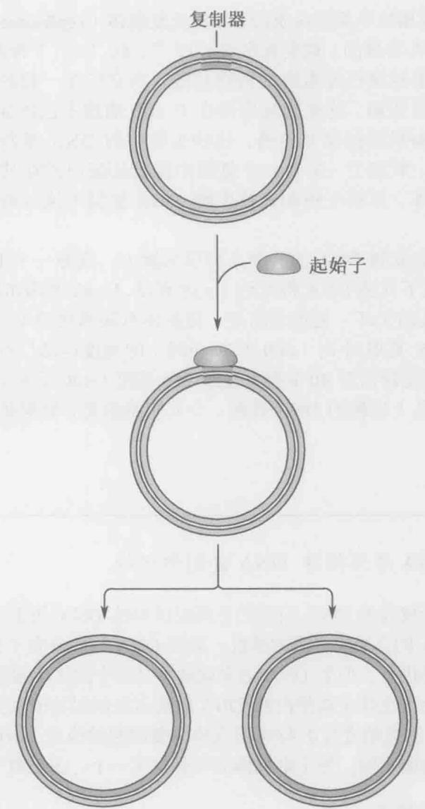  
图 9-25 复制子模型。起始子与复制器的结合引发了复制的起始和相关 DNA 的复制。

复制子模型的第二个元件是起始子（initiator）蛋白。此蛋白质特异性地识别复制器中的一个DNA元件并激活复制的起始（图9-25）。起始子蛋白已经在多种生物中得到确认，包括细菌、病毒及真核细胞。虽然这些蛋白质结合到DNA上的方法各不相同，但是它们选择的位点都将成为复制起点。有趣的是，所有已知起始子蛋白均由ATP的结合和水解调节，并且有共同的核心AAA $^{+}$ ATP结合基序，该基序和DNA滑动夹装载器不同但相关联。

如下面我们所看到的，起始子蛋白是复制起始中唯一涉及的序列特异性 DNA 结合蛋白，复制起始所需的其他蛋白质均不与 DNA 特异性地结合，相反，这些蛋白质通过相互作用，以及对特殊 DNA 结构（如单链 DNA 或引物-模板接头）的亲和性而聚集到复制子上。进一步而言，对很多真核细胞，起始子蛋白并没有表现出序列特异性的结合活性。

## 复制器序列包括起始子结合位点和容易解旋的 DNA

复制器的 DNA 序列有两个共同的特性（图 9-26）。第一，它们含有起始子蛋白结合位点，此位点是组装复制起始机器的核心；第二，它们含有一段富含 AT 的 DNA，此段 DNA 容易解旋但并不自发进行。在复制器上，DNA 的解旋是由复制起始蛋白控制的，多数生物中这些蛋白质被严格调控。

  
图 9-26 复制器的结构。图示为组成三个研究得很透彻的复制器的 DNA 元件。起始子 DNA 结合位点表示为绿色，促进 DNA 解旋的元件表示为蓝色，DNA 合成的起始位点表示为红色。（a）oriC 由 5 个 “9mer” 的 DnaA 结合位点和 3 个 “13mer” 的重复元件构成，后者是 DNA 解旋的起始位点。（oriC 位点不在所示的序列之内）（b）真核病毒 SV40 的复制器由 4 个称为大 T 抗原的五聚体起始子蛋白结合位点（P）和 20bp 早期回文序列（EP）构成，后者是 DNA 解旋的部位。（c）在酵母复制器上常见 3 种元件。A 元件和 B1 元件与起始子 ORC 结合，B2 元件促进 DNA 的解旋酶的结合。

E.coli 染色体复制所需要的单个复制器被称为 “oriC”。有两个重复的基序对 oriC 功能至关重要（图 9-26a）。9mer 单位的基序是 E.coli 起始子 DnaA 的结合位点，其在 oriC 上重复 5 次。13mer 单位的基序重复 3 次，是起始时单链 DNA 形成的起始位点。

虽然很多真核生物病毒与单细胞真核酿酒酵母复制器的特殊序列不同，但其整体结构却很相似（图 9-26b,c）。定义复制起始位点的方法见框 9-4。

对多细胞真核生物的复制器了解还不多。相对于单细胞真核生物和细菌采用的、针对稳定繁殖的环形小 DNA 的遗传分析方法，对鉴别多细胞真核生物复制器的特征变得困难重重（框 9-4）。在少数几例得到鉴别的复制器中，发现它们比酿酒酵母和细菌染色体中的复制器大得多。与那些较小的复制器不同，在这些复制器中很难发现简单突变导致的功能丧失。而且特异的 DNA 序列在此并没有发挥重要作用。最近研究表明，局部核小体密度及相邻转录因子减少是重要的复制器决定因素。

## 框9-4 复制起始位点和复制器的鉴别

复制器序列通常用遗传学实验进行鉴别。例如，首个酵母复制器就是用 DNA 转化实验鉴别的（框 9-4 图 1）。在这些研究中，研究人员将基因组 DNA 片段随机地克隆到缺少复制器但含有一个宿主细胞中缺少的选择性标记的质粒中。对于转化后可在细胞中维持的质粒，克隆的 DNA 片段中一定含有一个酵母复制器。被鉴别的 DNA 片段称为自主复制序列（autonomously replicating sequence，ARS）。这些序列是在人工合成的环形质粒中作为复制器起作用，所以需要进一步的证据来证明这些序列在其原本的染色体位置处也是复制器。

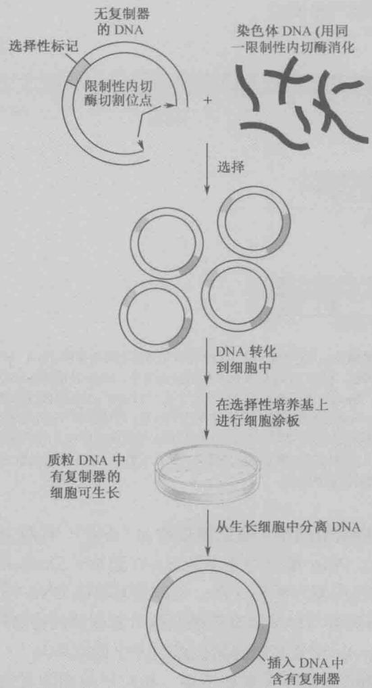

框9-4图1 复制器的遗传学鉴别。用限制性内切酶切割含有选择性标记的质粒（小的环形DNA分子），使质粒中正常的复制器被切除，产生一个不含复制器的DNA片段。为了从特定物种中分离到复制器，使用同一种限制性内切酶切割来自此物种的DNA并将其连接到被切割的质粒中，重新生成环形的质粒，每个质粒中都含有一个来自受试物种的片段。此DNA然后转化到宿主中并用质粒上的选择性标记对重组的质粒进行筛选（如果标记为抗生素抗性，细胞将在有抗生素情况下生长）。生长的细胞中含有质粒及其选择性标记，表明质粒能够在细胞中复制，而且质粒一定含有复制器。从宿主细胞中分离质粒并对插入DNA进行测序，可鉴别含有复制器片段的序列。进一步对插入DNA进行诱变（如删除插入DNA的特殊区域）并重复上述实验，可对复制器进行精细的鉴定。

为了证实 ARS 在染色体中是作为复制器而起作用的，有必要发展在细胞中定位复制起始位点的方法。一个方法是利用在复制起始过程中形成的 DNA 复制中间体不寻常的结构。与完全复制的或完全未复制的 DNA 不同，正处于复制过程中的 DNA 不是线性的。例如，不含有复制起始位点的 DNA 片段（由限制性内切酶对 DNA 切割产生）在其复制的时候具有各种 “Y” 形的构象（框 9-4 图 2，蓝色的 DNA 片段）。类似地，含有复制起始位点的 DNA 片段复制起始后立即呈水泡形。最后，如果复制起始位点不对称地位于 DNA 片段内，则 DNA 开始呈水泡形然后转变成 Y 形（框 9-4 图 2，红色的 DNA 片段）。利用双向琼脂糖凝胶电泳可将这些特殊形状的 DNA 与大多数线性 DNA 区分开来（框 9-4 图 3）。

框 9-4 图 2 复制过程中的 DNA 的特殊结构。所示为限制性内切酶对复制过程中的 DNA 切割的结果。图示表示“复制泡”（由两个复制叉从复制起始位点上背道而驰所形成）的生长。对复制中间体进行切割，随后用 DNA 标记探针进行杂交来检测。如果使用红色的限制性内切酶，而且只检测到可与红色的 DNA 探针杂交的片段，则将产生左侧的模式。如果使用蓝色的限制性内切酶和蓝色的 DNA 探针来检测生成的 DNA 片段，则可观察到右侧的模式。注意左侧模式开始的时候有含“水泡”的 DNA 片段，最终变为“Y”形分子。右侧模式始终无“水泡”，但是有各种各样的“Y”形中间体。只有含有复制起始位点的 DNA 片段才能够产生左侧的模式。

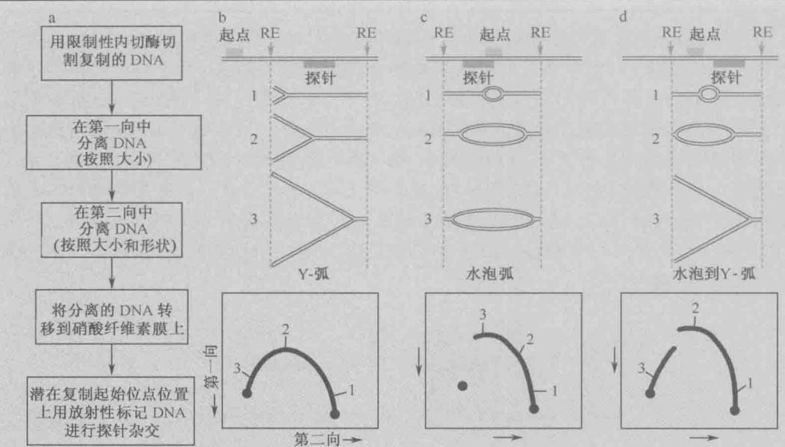  
框9-4图3复制起始位点的分子鉴别。（a）通过双向电泳分离DNA，可以将处于复制过程中的DNA与完全复制的或完全未复制的DNA分离开来。总DNA从分裂期细胞（即正在复制）中提取。DNA首先按照大小进行分离（使用低电压电泳和大孔径琼脂糖凝胶）。然后电场旋转 $90^{\circ}$ ，DNA再按照大小和形状进行分离（使用高电压和在小孔径琼脂糖凝胶）。用Southern印迹来检测插入的DNA。起点（绿色）、限制性内切酶切割位点（红色）、DNA探针（蓝色）的位置显示出3种不同的模式。（b）起始点位于DNA片段外的Southern杂交图，称为Y-弧，所有的复制中间体、物均呈Y字形。有3个等长臂的分子（2号）在第二向电泳中移动最慢。（c）起始点位于DNA片段中间，检测结果为水泡-弧。含最大复制泡的中间体在第二向电泳中迁移最慢（d）起始点位于中心区外侧的限制性片段图谱。中间体开始是水泡形，随后（复制叉通过限制性位点后）成为Y字形，水泡到Y-弧模式”被认为是对起始位点的最好显示。

为了鉴别在复制过程中的 DNA，首先用限制性内切酶消化正在分裂细胞的 DNA 并用双向琼脂糖凝胶电泳进行分离。在第一向中，DNA 按照大小进行分离，在第二向中，DNA 按照大小和形状进行分离。这是通过在每一向上使用不同的凝胶密度和电泳速率达到的。为了按照大小和形状进行分离，琼脂糖凝胶的孔径要小（高琼脂糖密度），而且电泳速度要快。相反，如果主要是按照大小进行分离，则琼脂糖凝胶的孔径要大一些（低琼脂糖密度）并且电泳的速度要慢一些。当电泳完成后，将 DNA 分子转移到硝酸纤维素膜上并用 Southern 印迹检测（第 7 章）。对限制性内切酶和 DNA 探针的选择能极大地影响分析的效果。通常，这个方法需要研究人员对复制起始位点可能的定位有充分认识。近来出现了利用 DNA 芯片鉴定起始位点的新方法，这种方法不需要任何对起始位点位置的经验认识。

双向电泳是如何鉴别含复制起始位点的 DNA 中间体的呢？DNA 迁移的特殊模式能为复制起始位点的鉴别提供明确的证据。在第一向中特殊的结构迁移最慢。例如，一个含有 3 个等长臂的 Y 形分子，在从特定 DNA 片段中得到的所有这样的分子中迁移最慢（框 9-4 图 3b），因此在 DNA 分子弧形顶端的是非线性分子。相反，带有两个非常短的复制臂和一个大的复制区域的 Y 形分子，其迁移与同一 DNA 片段的未复制版本非常相似。最后，由几乎已经完全复制的片段所产生的 Y 形分子在形状上与二倍于未复制片段大小的线形分子相似。因此，当一个 DNA 分子被单个复制叉复制时，它迁移的位置将与弧形中的未复制片段紧邻，并且最终到达二倍于未复制 DNA 大小的线性分子预计迁移到的位置。此形状被称为 Y-弧（Y-arc），代表的是正处于复制过程的分子。因为每一轮复制中所有的 DNA 分子都被复制，所以大部分的 DNA 片段都是这种类型的模式。

含有复制起始位点的分子形成水泡形的复制中间物，此中间物在第一向中迁移得甚至比Y形分子还慢。泡越大，迁移越异于线性DNA（框9-4图3c）。不幸的是，对泡形复制中间物的片段所产生的弧[称为水泡弧（bubble arc）]与Y形中间物产生的弧很难分辨（框9-4图3b,c）。如果起始位点不对称地位于DNA片段内，则此困难可得到解决。在这种情况下，中间物开始是水泡形，但是，当最靠近片段末端的复制又完成复制的时候，水泡形的中间物将变成Y形。这个所谓的水泡形到Y形转换（bubble-to-Y transition）造成弧的间断，很容易被检测到，可作为复制起始位点的明确标志（框9-4图3d）。因此，理想化的状态是选择在待检的复制起始位点两侧不对称的位置上进行切割的限制性内切酶。

## 结合和解旋：起始子蛋白对复制起始位点的选择和激活

起始子蛋白在复制起始过程中一般执行至少两种不同的功能。第一，这些蛋白质通过结合位点与复制器 DNA 结合；第二，起始子蛋白与复制起始过程中所需的其他因子相互作用，将其聚集到复制器。不是所有的起始子蛋白都行使第三种功能：扭曲或解旋其结合位点附近的 DNA 区域以利于打开双链 DNA。

以 E.coli 起始子蛋白 DnaA 为例，DnaA 包含两个 DNA 结合域，一个与 oriC 中双链区重复的 9mer 元件结合（图 9-26），当与 ATP（非 ADP）结合时，DnaA 还与 oriC 中重复的 13mer 元件所在区域的 DNA 相互作用。这些额外的相互作用涉及 DnaA 的单链 DNA 结合位点，使 13mer 元件区域内 20bp 的 DNA 链分离。有趣的是，一旦与 DnaA 结合，单链 DNA 将保持防止形成多于 3 个连续碱基对的构象。此解旋 DNA 给其他复制蛋白提供了单链 DNA 模板，用于起始复制中的 RNA 和 DNA 合成步骤（稍后讨论）。

在染色体一个位置上形成单链 DNA 不能满足 DNA 解旋酶和其他复制蛋白的组装，DnaA 还会在复制器所形成的单链 DNA 上聚集其他的包括 DNA 解旋酶在内的复制蛋白（见下节）。E.coli 复制的调控与 DnaA 活性的变化有关，对此将在框 9-5 中讨论。

真核细胞中，起始子是一个被称为起始位点识别复合体（origin recognition complex, ORC）的六蛋白复合体。ORC 的功能在酵母细胞中研究得最清楚。ORC 可识别酵母复制器上被称为 A 元件的保守序列，以及次保守的 B1 元件（图 9-26）。像 DnaA 那样，ORC 结合并水解 ATP。在起始位点上的序列特异性 DNA 结合需要结合 ATP，ORC 将真核细胞 DNA 解旋酶装载到复制器 DNA 的过程需要水解 ATP（稍后讨论）。与 DnaA 不同的是，与酵母复制器结合的 ORC 自身并不导致相邻 DNA 链的分离。但是，ORC 可直接或间接地将其他复制蛋白全部召集到复制器上（见下文）。

## 蛋白质-蛋白质和蛋白质-DNA 相互作用指导起始过程

起始子与复制器结合后，复制起始中剩下的步骤主要由蛋白质相互作用和序列非依赖性的蛋白质-DNA 相互作用来驱动。最终结果是组装出两个我们前面描述的复制叉机器。为了阐述形成这些蛋白质机器的事件，我们从了解最透彻的 E.coli 开始。

起始子（DnaA）结合到 oriC 并使 13merDNA 解旋后，单链 DNA 和 DnaA 共同召集双蛋白复合体：DNA 解旋酶(DnaB)及解旋酶装载器 DnaC（图 9-27 a-d）。重要的是，结合到解旋酶装载器后会将灭活 DNA 解旋酶，并阻止其在不适当的位点行驶功能。一旦在起始位点结合单链 DNA，解旋酶装载器就指导它结合的 DNA 解旋酶在单链 DNA 周围进行组装（单链 DNA 穿过 DnaB 解旋酶六聚体蛋白环中央）。尽管组装的机制还不清楚，但类似于套在引物-模板接头上的滑动 DNA 夹的组装，需要打开 DNA 解旋酶的六聚体环并且环绕在靶 ssDNA 上（框 9-3）。有趣的是，DnaC 和滑动夹装载器一样是利用 ATP 的 AAA $^{+}$ 蛋白。

解旋酶与上面所述的复制叉其他元件之间的相互作用指导复制机器其他部分的组装（图9-27e,f）。解旋酶将DNA引物酶召集到DNA的起始位点上，导致在起始位点的两条链上合成RNA引物。为了在前导链合成引物，此过程中解旋酶装载器被释放，导致解旋酶激活。DNA PolⅢ全酶通过与引物-模板接头及解旋酶的相互作用被引导到起始位点上。当全酶出现后，即在RNA引物上组装滑动夹，前导链聚合酶开始工作。在解旋酶的作用下，新的单链DNA不断暴露并与SSB结合，DNA引物酶合成第一条后随链引物。这些新的引物-模板接头被夹子装载器锁定，此夹子装载器将另外两个滑动夹安放到后随链上。这些夹子被第二个核心DNA PolⅢ识别，导致后随链合成的启动。随着第一个冈崎片段的延伸和更多的单链DNA后随链模板形成，新的RNA引物开始合成。滑动DNA夹组装形成后，第三个核心DNA PolⅢ启动第二个冈崎片段合成（图9-27g,h）。这时，两个复制叉已经组装完成，复制起始结束。

## 真核染色体每一个细胞周期精确地复制一次

如第 7 章所讨论的，真核细胞分裂所需过程发生在细胞周期的不同时期。染色体 DNA 复制仅发生在细胞周期的 S 期。在此期间，细胞中的所有 DNA 都必须精确地复制一次。染色体任何部分复制的不完整都可造成子染色体之间不适当的连接。互联染色体的分离会引起染色体的断裂或缺失（图 9-28）。即使极其有限的 DNA 的重复复制都将产生很难修复的损伤。频繁地修复这些损伤，将导致相关 DNA 的扩增，从而增加了相关基因的表达。重要调控基因的拷贝数即使增加一个或两个也会导致基因表达、细胞分裂或对环境信号应答的灾难性缺陷。所以，真核细胞每分裂一次，每条染色体中每个碱基对复制且只能复制一次，这是极其重要的。

图 9-27 E.coli DNA 复制起始的模型。图示为 E. coli 复制起始的主要事件。（a）多个 DnaA-ATP 蛋白结合到 oriC 内的 9mer 重复序列上。（b）DnaA-ATP 与这些序列的结合导致链在 13mer 重复处分离。这是由 DnaA-ATP 中的 ssDNA 结合域介导的，改变了相关 ssDNA 的结构，使其不能与配对的 ssDNA 链杂交。（c）DNA 解旋酶（DnaB）和 DNA 解旋酶装载器（DnaC）形成复合物与 DnaA 起始位点结合，该相互作用由解旋酶装载器的 ssDNA 结合域，及 DnaA 和解旋酶/解旋酶装载器之间的作用来介导。（d）DNA 解旋酶装载器催化 DNA 解旋酶蛋白环的打开和环在单链 DNA 起始位点位置上的套装。（e）每个 DNA 解旋酶募集一个引物酶，引物酶在各模板上合成 RNA 引物。RNA 引物导致解旋酶装载器从解旋酶上释放，激活解旋酶。DNA 解旋酶的运动还将所有剩下的、与复制器结合的 DnaA 除去。（f）新合成的引物和解旋酶被 DNA Pol III 全酶中的夹子装载器元件识别。滑动夹在每条 RNA 引物上组装，前导链的合成是由全酶的三个核心 DNA Pol III 中的一个启动的。（g）当各个 DNA 解旋酶运动约 1000bp 之后，在各自的后随链模板上合成第二条 RNA 引物并装载滑动夹。产生的引物-模板接头被全酶中的第二个 DNA Pol III 核心酶识别，导致后随链合成的启动。（h）现在各个复制叉上的前导链和后随链合成都已启动，如图 9-23 所示，第三个核心 DNA Pol III 参与后随链合成。每个复制叉将持续到模板的末端或遇到邻近复制起始位点产生的另一个复制叉为止。  
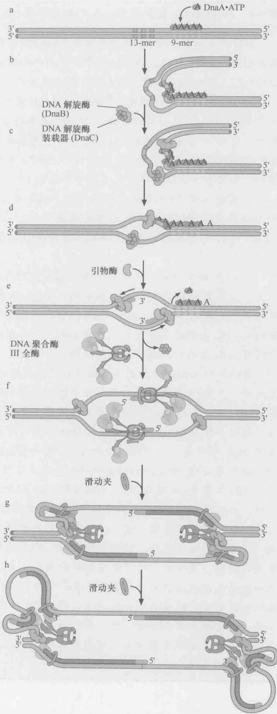

## 框 9-5 E.coli DNA 复制受 DnaA-ATP 水平及 SeqA 的调控

在所有生物中，为了保证染色体数目和细胞数量保持适当的平衡，对复制起始进行严格控制十分重要。虽然在真核细胞中对这种平衡的调控最为严格，E.coli也通过禁止新近启动的起点重新启动而防止染色体复制出现意外。有几种不同的机制涉及其中。

有一种方法可检测 DNA 复制前后甲基化状况的变化(框 9-5 图 1)。E.coli 细胞中，一种称为 Dam 甲基转移酶的酶将甲基基团加到每个 GATC 序列的 A 上（注意此序列是回文结构）。通常基因组在 GATC 序列上是完全甲基化的。这种情况在 GATC 序列复制之后就改变了。因为在新合成的 DNA 链中，A 残基尚未甲基化，所以这些刚刚被复制的位点只有一条链被甲基化（即半甲基化）。

新复制 oriC 的半甲基化状态可被 SeqA 蛋白检测到。SeqA 与 GATC 紧密结合，但这仅发生在 GTAC 序列半甲基化的时候。在 oriC 内部及相邻的位置有大量的 GTAC 序列。当复制起始后，SeqA 即结合在这些位点直到它们被 Dam 甲基化酶完全甲基化。

SeqA 的结合有两个结果。首先，它极大地降低了 GATC 结合部位的甲基化速率；其次，当与这些 oriC 邻近位点结合时，SeqA 阻止了 DnaA 与 oriC 的结合和结合所导致的新一轮复制。因此，oriC 附近 GATC 位点从甲基化到半甲基化的转化（此事件是复制从 oriC 起始的直接结果）导致 DnaA 结合受抑制，从而阻止了从两个新合成出的子拷贝 oriC 上进行快速的复制重启动。

其他针对 DnaA 的机制也可抑制在新合成出的子拷贝 oriC 上进行快速的重启。如上所述，只有与 ATP 结合的 DnaA 才能指导复制的起始；但在起始过程中，ATP 转化成 ADP。此外，复制起始后，装载的滑动夹募集 Hda 蛋白，导致 DnaA 水解 ATP。因此，经过一轮复制起始的过程后，DnaA 成为失活状态而无法被重新使用。将结合的 ADP 换成 ATP 是一个非常缓慢的过程，进一步阻滞了可促进复制作用的 DnaA-ATP 结合物的积累。oriC 附近序列的复制进程也减少了可与 oriC 结合的 DnaA 的数量。在 oriC 外有 300 多个 9mer 结合位点（DnaA 还在许多启动子上作为转录调节子），当它们被复制时，此数量加倍。DnaA 结合位点的增加使得可利用的 DnaA 数量降低。

这些机制共同作用，使 E.coli 在 oriC 的新拷贝上启动复制的能力快速、显著地降低。虽然这些机制防止了快速的重起始，但是此种抑制却并不需要一直持续到细胞分裂完成之时。事实上，为了使 E.coli 细胞用最大速度进行分裂，oriC 的子拷贝必须在上一轮复制完成之前就启动复制。这是因为 E.coli 细胞每 20min 分裂一次，但是 E.coli 基因组复制一次就需要 40min 以上。因此，在快速生长条件下，E.coli 细胞在上一轮复制完成之前就要重新启动一次，有时候是两次（框 9-5 图 2）。即使在这样快速的生长条件下，每轮细胞分裂中复制起始也不超过一次，因此，每一轮细胞分裂就只有一轮自 oriC 的复制起始。

框9-5图1SeqA与半甲基化的DNA结合抑制了新近复制的子代复制起始位点的重起始。（a）在DNA复制之前，E.coli基因组上所有的GATC序列都是两条链被甲基化的（“完全”甲基化）。图中甲基基团用红色的六边形表示。（b）DNA复制使这些位点变成半甲基化状态（只有一条DNA链被甲基化）。（c）半甲基化的GATC序列很快被SeqA结合。（d）结合的SeqA蛋白抑制这些序列被完全甲基化以及DnaA蛋白对oriC的结合。（为了简便起见，d、e、f部分只图示两条子分子中的一条。）（e）当SeqA偶尔从GATC位点上脱离时，序列即被DNA甲基转移酶完全甲基化，防止了SeqA的重新结合。（f）当GATC被完全甲基化之后，DnaA能结合到9mer序列并指导新一轮子代oriC复制器的复制。  

  
框 9-5 图 2 在快速生长的细胞中复制起始位点的重起始先于细胞分裂。为了使基因组在每一轮细胞分裂前完全复制，细菌细胞必须在细胞分裂完成之前在其单起始位点上经常进行 DNA 复制的起始。这意味着分离到子细胞中的染色体仍在进行活跃的复制。这与真核细胞不同，真核细胞中在所有的 DNA 复制完成之前不进行染色体的分离。

  
图 9-28 DNA 复制不完整所导致的染色体断裂。图示显示的是不完全复制后染色体分离的结果。每个图片上面显示的都是完整的染色体。底部显示的是染色体在 DNA 水平上的断裂细节。（染色体分离详见第 7 章。）随着染色体被拉开，未复制的 DNA 上承受张力，导致染色体断裂。

对真核生物染色体来说，由于每条染色体上都有很多个复制起始位点，所以 DNA 复制且只能复制一次的要求对其非常具有挑战性。通常每隔 30kb 就有一个起点，所以即便是一个小的真核染色体，也可能含有超过 10 个复制起点，人的染色体则含有成千上万个复制起点。必须激活足够多的起始位点，以保证每个 S 期中每条染色体都被完全复制。通常，完成复制并不需要把所有的起始位点都激活，但是如果激活得太少，基因组中将有部分区域没有被复制。虽然在某些细胞分裂轮次中，有些可能的起始位点并没有被用到，但是没有一个已复制的复制起始位点可以重启动。因此，一个起始位点不管是被激活而使其自身复制，还是被邻近起始位点产生的复制叉所复制，它都必须失活，直至下一轮细胞分裂开始为止（图 9-29）。如果这些前提条件没有达到，则一个细胞周期内带有起始位点的 DNA 将被复制两次，将会打破真核 DNA 复制的“复制且仅复制一次”的原则。

  
图 9-29 DNA 复制使复制器失活。图示为带有 5 个复制器的真核染色体。标识为 3 和 5 的复制器首先被激活，导致两对双向复制叉的形成。亲代复制叉的激活导致两个子代 DNA 分子上这两个复制器的拷贝都失活，直至下一个细胞周期（用红色 × 表示）。复制叉继续延伸使与 2 号和 4 号复制器交叠的 DNA 被复制。如果一个复制器在尚未被启动的时候被邻近起始位点过来的复制叉复制，则称其为被动复制。虽然这些复制器并未被启动，但是它们仍然因其 DNA 的复制作用而失活（稍后我们将讨论，这是因为装载于起始点的解旋酶被移动过来的复制叉移除了）。相反，复制器 1 在启动之前邻近的复制叉并未抵达，它就能正常启动。复制器出现的数目多于完成 DNA 复制所需的复制器的数目，这是一种保证每条染色体都能完成复制的冗余形式。

## 装载解旋酶是真核细胞中复制起始的第一步

真核细胞中复制起始需要的两个步骤发生在细胞周期的不同时期内（第8章）。在复制器上装载解旋酶发生于 $G_{1}$ 期（早于S期）。复制器或起始位点的激活，包括解旋酶活化和复制体组装，仅在细胞进入S期后才发生。

装载解旋酶和起始位点激活的分离与原核细胞中的情况不同，原核细胞中起始因子结合到复制器 DNA 直接启动了 DNA 的解旋、装载解旋酶及复制体的组装。如我们下面所看到的那样，在真核细胞中，解旋酶装载与解旋酶激活、复制体组装这两个事件的短暂分离保证了在每个细胞周期中每条染色体仅仅复制一次（细菌细胞对此问题的解

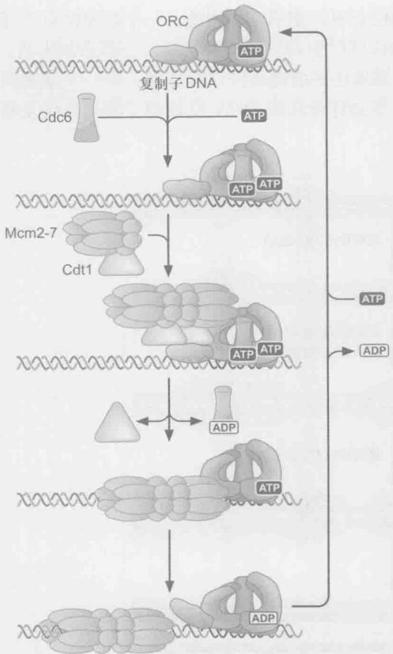  
图 9-30 真核生物解旋酶的装载。真核生物 DNA 复制解旋酶的装载是一个有序的过程，由 ATP 结合的起始位点识别复合体（ORC）与复制器的结合引发。ORC 与复制器结合后，就募集 ATP 结合的 Cdc6 和两个拷贝的 Mcm2-7 解旋酶并结合到解旋酶装载蛋白 Cdt1 上。这些蛋白的组装触发 Cdc6 水解 ATP，导致了 Mcm2-7 头对头二聚体的装载，以致它们将起始点 DNA 双链起点包围起来，并使得 Cdc6 和 Cdt1 从起始点上被释放。ORC 水解 ATP 可以重置该过程（图示为从 Mcm2-7 上释放）。ATP 和 ADP 的交换允许新一轮解旋酶的加载。

决方法不同，见框9-5）。

真核细胞装载解旋酶需要4个独立的蛋白质在复制器中完成（图9-30）。解旋酶装载的第一个步骤是复制器被真核起始子ORC识别，结合ATP。当细胞进入细胞周期的 $\mathrm{G}_{1}$ 期时，ORC与起始点结合，募集两个解旋酶装载蛋白（Cdc6和Cdt1）和两个拷贝的Mcm2-7解旋酶。有趣的是，一些ORC亚基和Cdc6蛋白与DnaC和滑动夹装载器的亚基一样，都是AAA+家族成员。和滑动夹装载器一样，ATP与ORC和Cdc6的结合对于ORCDNA结合、稳定募集的解旋酶及解旋酶装载蛋白是必需的。Cdc6水解ATP导致了Mcm2-7头对头二聚体的装载，这一复合物将DNA双链起点包围起来。在该过程中，Cdt1和Cdc6从起始点上释放出来。ORCATP的水解可以重置该过程并允许新一轮Mcm2-7装载以启动ATP与ORC的结合。与Mcm2-7复合体包围dsDNA而不是ssDNA一致的是，真核解旋酶的装载并不能立刻导致起始位置DNA的解旋。相反，解旋酶在 $\mathrm{G}_{1}$ 期装载，但是只有细胞从 $\mathrm{G}_{1}$ 期进入到S期时，解旋酶才被激活使DNA解旋并起始复制。

装载的解旋酶被两种蛋白激酶——CDK(细胞周期依赖性激酶)和DDK(Dbf4依赖性激酶)激活（图9-31）。蛋白激酶（protein Kinase）是可将磷酸基团共价连

接到靶蛋白上的蛋白质（第13章）。这些激酶只有在细胞进入S期以后才能被激活。当其被激活后，DDK作用于已装载的解旋酶，而CDK则作用于其他两种复制酶。这些蛋白质的磷酸化导致Cdc45和GINS蛋白结合到Mcm2-7解旋酶（图9-31）。重要的是，Cdc45和GINS强烈地促进Mcm2-7ATPase和解旋酶的活性，并共同形成Mcm2-7DNA解旋酶活性形式——Cdc45-Mcm2-7-GINS(CMG)复合体。尽管解旋酶最初装载到dsDNA上形成头对头的二聚体，但是在复制叉上解旋酶被认为是环绕着ssDNA的单一Mcm2-7六聚体。因此，在活化阶段，DNA的一条链需要从每个解旋酶的中心通道解离出来，而两个Mcm2-7复合体的相互作用会破裂（图9-32）。三种真核DNA聚合酶以特定的顺序在起始位点组装。在DNA解旋前，DNA Polε与Cdc45和GINS同时结合在起点上。相反，DNA Pol δ 和 DNA Pol α/引物酶在募集到起始点之前都要求 DNA 解旋。此顺序保证了 3 种 DNA 聚合酶在起始位点的出现都先于首个 RNA 引物合成（由 DNA Pol α/引物酶进行）。

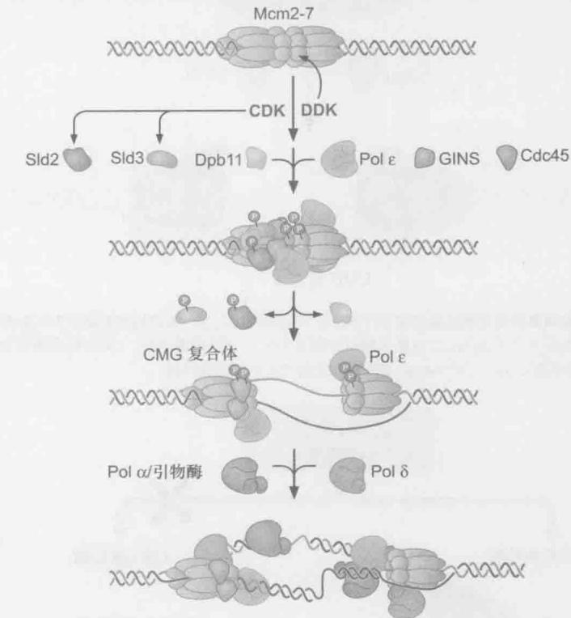  
图 9-31 激活装载的解旋酶导致真核复制体的组装。当细胞进入细胞周期的 S 期时，两种蛋白激酶——CDK 和 DDK 被激活。DDK 使装载的 Mcm2-7 解旋酶磷酸化，而 CDK 使 Sld2 和 Sld3 磷酸化。磷酸化的 Sld2 和 Sld3 与 Dpb11 结合，这些蛋白质导致解旋酶激活蛋白 Cdc45 和 GINS 与解旋酶结合。Cdc45 和 GINS 与 Mcm2-7 解旋酶形成一种稳定的复合物（称为 Cdc45/Mcm2-7/GINS 或 CMG 复合体），并极大地促进了 Mcm2-7 解旋酶的活性。前导链 DNA 聚合酶（ε）被招募到此时的解旋酶上（DNA 解旋之前）。在 CMG 复合物形成后，Sld2、Sld3 和 Dpb11 从起始位点释放。DNA Pol α/引物酶和 DNA Pol δ（主要作用于后随链）只能在 DNA 解旋后被召募。将 DNA 聚合酶维持在复制叉上的蛋白质-蛋白质相互作用力仍然知之甚少。

在起始位点组装的蛋白质只有部分仍作为真核复制体的一部分继续起作用。CMG复合体和三种DNA聚合酶成为复制叉机器的部件。与E.coli DNA解旋酶装载器(DnaC)类似，其他因子（如Cdc6和Cdt1）只是参与复制叉蛋白的组装，在其作用结束之后被释放或被破坏（图9-31）。

## 对解旋酶装载和激活的调控使每个细胞周期中仅有一轮复制发生

真核细胞如何对数以百计甚至数以千计的复制起始位点进行活性控制，以使得在一个细胞周期中甚至没有一个位点被激活超过一次？答案在于在每个细胞周期中发生的两种复制状态之间的相互转换。在 $G_{1}$ 期，细胞处于解旋酶装载阶段，可以进行解旋酶的装载但是不能激活已组装好的解旋酶。而进入 S 期以及之后的 $G_{2}$ 和 M 期时，在 $G_{1}$ 期装载的解旋酶可以被激活，而新的解旋酶的装载则受到了严格的抑制（图 9-33）。重要的是，对于解旋酶装载和激活的条件并不适用于另一种解旋酶。尽管在不同机体中的精确的机制是各不相同，但是在所有活跃分裂的真核细胞中的调控机制是相同的。因此，在每个细胞周期中，对于解旋酶而言，仅有一次机会可以装载到起始点上（ $G_{1}$ 期），而装载的解旋酶也只有一次机会被激活（在S期、 $G_{2}$ 期和M期，尽管实际上，S期时所有装载好的解旋酶都被复制叉激活或破坏）。只有在细胞分离它们的复制染色体并分开后，它们才可以重新进入 $G_{1}$ 期并在起始点上装载新的解旋酶。

  
图 9-32 解旋酶激活改变解旋酶的相互作用。在解旋酶激活之前，装载的解旋酶以头对头的双六聚物形式包围双链 DNA（由 Mcm2-7 氨基末端相互作用介导）。解旋酶激活后，CMG 复合物的 Mcm2-7 蛋白质转向包围单链 DNA，两个 Mcm2-7 复合物之间的相互作用被打破。

  
图 9-33 在不同细胞周期真核解旋酶的装载和活化。在细胞周期的 $G_{1}$ 期，允许装载解旋酶，但是解旋酶的活化被抑制。而在剩余的细胞周期中（S 期， $G_{2}$ 期和 M 期），解旋酶的装载被抑制，而已装载的解旋酶能被激活（该过程只在 S 期发生，因为在 S 期后所有装载的 Mcm2-7 复合物将会从 DNA 上移除；见图 9-29）。

该调控是如何完成的？在出芽期的啤酒酵母中，该调控与 CDK 的功能有紧密的关系（图 9-34）。这些酶在调控复制时的功能是相互对立的。首先，如上面描述的，这些酶是激活装载的解旋酶从而起始 DNA 的复制。其次，CDK 的活性抑制了解旋酶的装载。当考虑到上述调控时，这些不同的角色允许一种酶来控制复制起始两种状态的相互转换。在 G₁ 期时 CDK 的水平很低，因而可以允许解旋酶的装载，但是阻止解旋酶的激活。进入 S 期伴随着 CDK 活性的迅速升高，从而激活装载好的解旋酶同时阻止新的解旋酶的装载。重要的是，在细胞周期的剩余时期（S 期、G₂ 期和 M 期），CDK 的水平依然是升高的。

  
图 9-34 在细胞周期中 CDK 活性调控复制。在啤酒酵母细胞中，CDK 水平严格调控着解旋酶的装载和活化。 $G_{1}$ 期，CDK 水平低，新的解旋酶复合体虽能形成但是却不能被激活（因为该活化行为需要 CDK 的参与）。在 S 期，活性水平提高的 CDK 引发 DNA 复制的起始并阻止任何在刚复制的 DNA 上的新解旋酶复合体形成。解旋酶被用于复制起始之后，不进入复制叉并从起始点解离。类似地，对与解旋酶相连的 DNA 的复制也引起复合体的解体（未显示）。因为 CDK 在有丝分裂结束之前一直保持高水平，所以在染色体完成分离之前不再形成任何新的解旋酶复合体。无新的解旋酶复合体形成，复制重新起始是不可能发生的。

装载好的解旋酶在复制叉完成 DNA 合成后，或它们所结合的 DNA 被复制之后被释放出来（通过在相邻起点上的复制叉，图 9-29）。这些暴露的复制器随后用于新解旋酶复合体的形成并迅速结合上 ORC。尽管这些位点上存在起始子，但 S 期、 $G_{2}$ 期和 M 期细胞中高活性水平的 CDK 阻止了 ORC、Cdc6 和 Cdt1 的功能。只有当细胞将其染色体分离且完成细胞分裂的时候，CDK 的活性才消失，新一轮的解旋酶装载才能够开始。

## 真核和原核生物 DNA 复制起始的相似性

现在我们已经描述了在真核细胞和原核细胞中的复制起始，很明显，在两种情况下复制起始有共同的特点。第一步是起始子蛋白对复制器的识别。起始子蛋白和一个或多个解旋酶装载蛋白共同将 DNA 解旋酶募集到复制器上。解旋酶（和真核细胞中起始位点上其他潜在的蛋白质）产生单链 DNA 区域，作为 RNA 引物合成的模板。当引物合成后，复制体的其他元件通过与形成的引物-模板接头相互作用进行组装。

尽管真核细胞和原核细胞中的复制起始相似，但是二者所涉及的调节机制是完全不同的。例如，与真核细胞不同，快速分裂的细菌细胞在一次细胞循环内多次起始复制。复制调节中最严谨的步骤在真核细胞和原核细胞中也是不同的。真核细胞对复制的调节集中在 MCM 解旋酶装载到 DNA 的起始位点上，而细菌细胞集中在 DnaA 起始蛋白与 DNA 的结合上（框 9-5）。

## 结束复制

DNA 复制的完成需要一系列特殊的事件。对于环形和线性染色体来说，这些事件是不同的。对于环形染色体，常规的复制叉机器能复制整个分子，但是产生的子代分子之间是相互拓扑连接的。相反，线性染色体最末端处的复制不能由我们目前所讨论的复制叉机器来完成。因此，含有线性染色体的生物发展出一套新的策略以克服这种末端复制的问题。

## 子代 DNA 分子的分离需要拓扑异构酶Ⅱ

环形染色体复制完成之后，产生的子代 DNA 分子如铰链般连接在一起（图 9-35；第 4 章，图 4-23）。铰链是描述两个相连的圆环（类似于链中的连环）的一般性术语。为了使这些染色体分离到子细胞中去，两个环形 DNA 分子必须相互脱离。此分离是由拓扑异构酶Ⅱ（type II topoisomerase）作用完成的。如我们在第 4 章所讨论的，这些酶具有断裂一条双链 DNA 分子并使第二条双链 DNA 分子通过此缺口的能力。这样，拓扑异构酶Ⅱ催化了两个子代 DNA 分子中的一个断裂并使另一个子代分子通过这个缺口。此反应使两个子代染色体解开铰环，并使它们分配到两个分离的细胞中。

虽然此活性对环形染色体的分离的重要性毋庸置疑，但是拓扑异构酶Ⅱ的活性对于大的线性分子分离也很重要。尽管线形分子复制之后本身并无拓扑学连接，但是体积巨大的真核生物染色体必须将DNA折叠成环并与蛋白质支架连接（第8章，图8-32b）。这种连接导致在两个子代染色体分离时会遇到很多与环形染色体分离同样的问题。如同

环形 DNA, 拓扑异构酶 II 也能使这些连接的 DNA 分离。

后随链的合成不能复制线性染色体的最末端

所有新的 DNA 合成启动都需要一条 RNA 引物，这使线性染色体末端的复制成为难题，这种情况被称为末端复制问题（end replication problem）（图 9-36）。对前导链模板复制来说不存在这种问题。在这种情况下，一条内部的 RNA 引物即可指导 DNA 链的起始并能延伸到其模板的 5' 末端。与此相反，后随链合成的完成需要多条引物，这意味着不能产生一条完整拷贝的模板。即使是在冈崎片段合成的最后一个 RNA 引物的末端与后随链模板上最末端的碱基对退火的情况下，当此 RNA 引物被去除以后，在染色体末端仍将有一小段未复制的单链 DNA（RNA 引物长度）。尽管截短发生在两条子代 DNA 中的一条，但是在下一轮复制完成后，两条子代 DNA 都会发生截短。这意味着每一轮 DNA 复

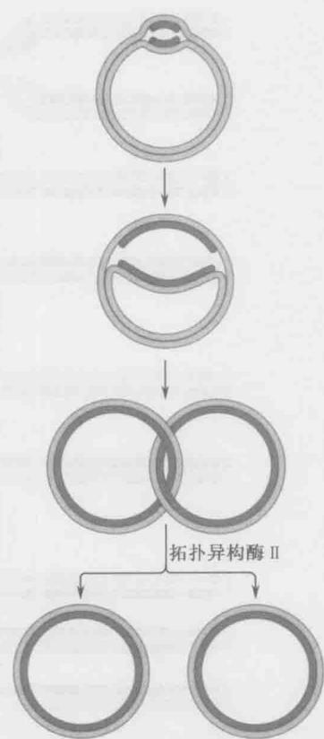  
图 9-35 拓扑异构酶Ⅱ催化复制产物的解环。当一个环形 DNA 复制后，产生的子代 DNA 分子仍保持相互连接。DNA 拓扑异构酶Ⅱ能够有效地使 DNA 环分开（或解环）。

制都将出现两条子代 DNA 分子中的一条被截短的情况。很显然，这种情况将破坏遗传物质从一代向另一代的完整传递。尽管缓慢，但是最终染色体末端的基因将会丢失。

细胞解决末端复制问题有各种各样的方法。一种解决方法是用蛋白质代替 RNA 作为每个染色体末端最后一个冈崎片段的引物（图 9-37）。在这种情况下，“引物蛋白”与后随链模板结合并用一个氨基酸来提供 -OH（通常为酪氨酸），以代替正常情况下 RNA 引物提供的 3'-OH。通过与最后的后随链结合，引物蛋白与染色体的 3' 端形成共价连接。这种在末端连接复制蛋白质的情况，在某些具线性染色体的细菌（多数细菌是环形染色体）的染色体末端，以及在某些具线性染色体的细菌病毒和动物病毒的染色体末端都有发现。

多数真核细胞使用完全不同的方法来复制其染色体末端。如我们在第8章所述，真核生物染色体的末端称为端粒(telomere)，它们通常由首尾相接的、富含TG的DNA序列构成。例如，人端粒含有很多首尾相接的重复序列5'-TTAGGG-3'。虽然这种重复序列很多都是双链的，但是每条染色体的3'端都位于其5'端之外成为单链DNA。这种独特的结构可作为新的复制起始位点以弥补末端复制问题。此起始位点不与其他真核生物的起始蛋白相互作用，而是募集一个称为端粒酶（telomerase）的特殊DNA聚合酶。

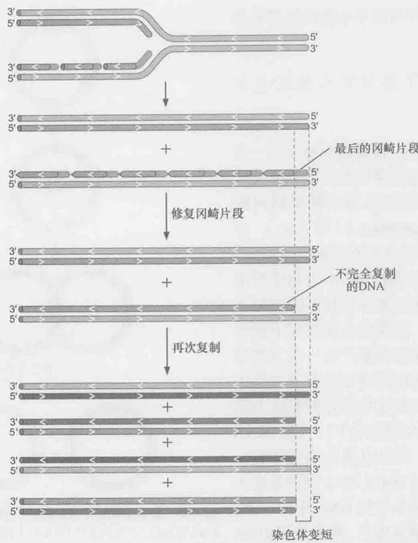  
图 9-36 末端复制问题。当后随链复制机器到达染色体末端时，有时引物酶没有足够的空间去合成新的 RNA 引物。这导致复制的不完整和后随链 DNA 产物上 3' 端形成一小段单链 DNA。当此 DNA 产物在下一轮被复制的时候，两个产物中的一个将变短，在上一轮复制中没有被复制的区域将丢失。

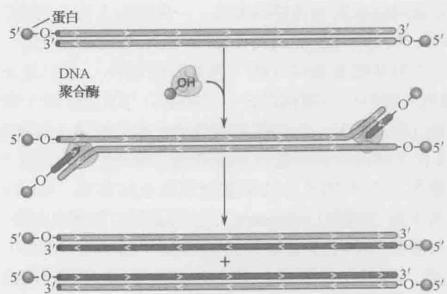  
图 9-37 蛋白质引物是解决末端复制问题的一个办法。通过与 DNA 聚合酶和模板 3'端的结合，蛋白质提供具引物作用的羟基基团以起始 DNA 的合成。在所示的例子中，蛋白质如在很多病毒中所见到的那样成为 DNA 合成的引物。对于较长的 DNA 分子来说，此方法结合传统的起始位点处的复制方法来使染色体进行复制。

## 端粒酶是一种不需要外源模板的新型 DNA 聚合酶

端粒酶（telomerase）是一种特殊的酶，它既含有多蛋白亚基，也含有RNA成分（所以这是一个核糖核蛋白的例子，见第5章）。与其他所有DNA聚合酶相同的是，端粒酶用于延伸其DNA底物的3'端。但与大多数DNA聚合酶不同的是，端粒酶不需要外源性DNA模板来指导dNTP的添加，而是利用其RNA成分作为模板，将端粒序列添加到染色体末端的3'端。端粒酶利用其自身的RNA作为模板，特异性地延伸特定单链DNA序列的3'-OH。这一特殊机制的结果是，新合成的DNA为单链DNA。

端粒酶发挥特殊功能的关键所在是该酶的 RNA 组分，称为端粒酶 RNA 或 TER，在不同物种中，TER 大小从 150 到 1300 碱基不等。在所有生物中，此 RNA 序列含有 1.5 拷贝的完整端粒序列（对人而言，此序列是 5'-TAACCCTAA-3'），能与端粒 3' 端的单链 DNA 退火（图 9-38）。退火发生的方式是 RNA 模板的一部分保持单链，形成端粒酶发挥作用的引物-模板接头。端粒酶的一个蛋白质亚属于 DNA 聚合酶，这种 DNA 聚合酶使用 RNA 模板，称为反转录酶（此亚基称为端粒酶反转录酶或 TERT）。如我们将在第 12 章所看到的，这些酶将 RNA 反转录成 DNA，而不是较常规的 DNA 转录成 RNA。采用 RNA 模板，TERT 合成 DNA 至 TER 模板的末端，但是不能继续复制此 RNA 之外的序列。此时 RNA 模板与 DNA 产物解离，再次与端粒上的最后 4 个核苷酸退火，然后重复此过程。

端粒酶的特性在某种程度上来说具有其独特性，但与其他 DNA 聚合酶仍然非常类似。端粒酶含有 RNA 成分、不需要外源性模板，以及能够使用单纯的单链 DNA 底物的特点，使其与其他 DNA 聚合酶相区别。此外，端粒酶还具有将其 RNA 模板从 DNA 产物上去除的能力，以重复进行模板指导下的合成。通常，这意味着端粒酶有 RNA-DNA 解旋酶活性。另一方面，与其他所有的 DNA 聚合酶相同，端粒酶也需要模板来指导核苷酸的添加，只能延长 DNA 的 3' 端、使用同样的核苷酸前体、具有持续延伸能力、每次与 DNA 底物结合后可添加很多重复序列。框 9-6 讨论了端粒酶在调节细胞生长和细胞衰老过程中的作用。

## 端粒酶通过延伸染色体 3' 端解决了末端复制问题

当端粒酶作用于端粒的 3'端时，它仅能延伸染色体两条链中的一条。那么，5'端是怎样延伸的呢？此工作是由后随链 DNA 复制机器来完成的（图 9-39）。通过提供一个延伸的 3'端，端粒酶为后随链复制机器的作用提供了额外的模板。用端粒酶延伸的 3'端作为模板，RNA 引物进行合成和延伸，使细胞也能有效地增加染色体 5'端的长度。

即便是在后随链复制机器作用后，染色体末端仍有一小段单链 DNA 区域。事实上，3'端凸出尾巴的存在对端粒的末端保护功能可能很重要（如下所述）。然而，端粒酶和后随链复制机器的作用，能够保证端粒维持在足够的长度以保护染色体末端不会变得太短。由于端粒 DNA 的重复性及非蛋白编码特性，细胞可以耐受不同长度的端粒存在。

  
图 9-38 端粒酶进行的端粒复制。端粒酶用其 RNA 成分与端粒单链 DNA 区域的 3' 端退火。随后用其反转录酶活性合成 DNA 至 RNA 模板末端。然后端粒酶将 RNA 从 DNA 产物上移去并重新结合到端粒的末端，重复上述过程。

## 框 9-6 老化、癌症和端粒假说

所有的生物都终归面临死亡。无论是只能存活几天或几周的较小生物，还是能与人类一样存活许多年的生物都不能摆脱既定的死亡。正如所料，研究人员（和其他人）一直在研究这些限制，希望能理解（或许克服）它们，寻找传说中的“青春之泉”。

当研究人员研发出体外细胞生长的方法时，他们认为这些细胞可以永生化。这提示死亡是机体而不是细胞的问题。在 Leonard Hayflick 仔细研究培养细胞的分裂后，这种假设就站不住脚了。他们发现即使在独立培养中，细胞的分裂次数也是有限的。有趣的是，Hayflick 的研究发现细胞能够分裂的有限次数是该源头细胞的一种特性，现在被称为 “Hayflick 极限”。

Hayflick 的研究引出了关于细胞携带着一个内在的倒计时计时器来限制细胞分裂次数的想法。当这个钟到达零的时候，细胞将被阻止再次分裂。多年来这个时钟分子一直不为人知，然而，端粒的性质及其在 DNA 复制中的作用已了解得较为透彻，人们渐渐明确端粒很可能就是长久以来梦寐以求的分裂计数钟。与这个想法一致，从年轻人分离出来的端粒 DNA 比老年人长。这个观察提出了端粒 DNA 的长度限制了细胞分裂次数的假说。

虽然这个概念仍然是一个假说，但支持端粒与细胞老化相关的实验数据却在增加。例如，如果假说可行，正常细胞应该只有很少或者没有端粒酶活性，否则这些细胞就会简单地在端粒变短的时候延长它们的端粒。确实，很多正常细胞只有非常有限的端粒酶活性。相反的，细胞增殖能力增加，如干细胞和肿瘤来源细胞，都有较高的端粒酶活性。事实上，对肿瘤细胞的培养研究表明，它们可以无限增殖。第二个重要的支持该模型的实验表明，在正常细胞中表达端粒酶能有效地使细胞永生化。

肿瘤细胞中端粒酶活性升高这一发现提出了一个假设，认为端粒可作为抑制失去正常生长控制细胞的增殖能力的方法。如果真如此，那么就可以解释为什么多细胞生物不允许在所有的细胞中存在端粒酶活性。事实上，已有很多研究在努力寻求抑制端粒酶活性的抑制剂作为化疗药物。端粒酶活性在肿瘤细胞中的升高同时也提示，全面活化端粒酶活性很可能不是一种明智的、追求永生化的选择。

## 端粒结合蛋白调节端粒酶活性和端粒长度

端粒酶是一种结合于端粒双链区、能调节端粒长度的蛋白质，理论上，端粒酶可以无限制地延长端粒（图 9-40）。在酵母细胞中，结合在端粒上的蛋白质是端粒酶活性的弱抑制剂（图 9-41）。当端粒序列重复拷贝较少时，较少的蛋白质与端粒结合，端粒酶可以延长端粒的 3'羟基末端。随着端粒的逐渐增长，更多的端粒结合蛋白聚积并且抑制端粒酶

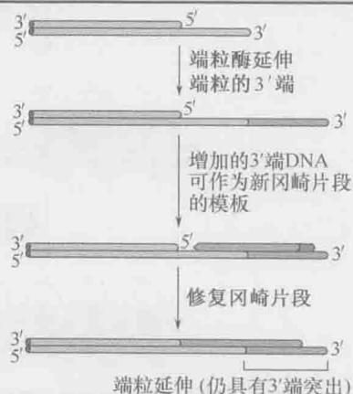  
图 9-39 端粒酶对端粒 3' 端的延伸解决了末端复制问题。虽然端粒酶只能通过为后随链 DNA 合成提供新增的模板来直接延伸端粒的 3' 端，但染色体的两个末端都得到了延伸。

  
图 9-40 端粒结合蛋白。端粒结合蛋白调节端粒酶活性在酵母和人细胞中的图示。（a）酵母细胞。Rap1 直接和端粒双链重复 DNA 结合，而 Rif1 和 Rif2 通过与 Rap1 的结合间接地与端粒发生作用。这三种蛋白质均抑制端粒酶活性。Cdc13 和端粒单链重复 DNA 结合，在端粒酶的募集中起作用。（b）人细胞。TRF1 和 TRF2 直接结合到端粒双链重复 DNA 上。人细胞中 Rap1 的同源蛋白以及 TIN2、TPP1 和 POT1 都与 TRF1 和 TRF2 相互作用。这些蛋白质一起形成一个复合体，使端粒逃脱 DNA 修复酶的作用而保护端粒，此复合体被命名为 “Shelterin”。POT1 同样能直接和端粒单链重复 DNA 结合并抑制端粒酶活性。

  
图 9-41 端粒结合蛋白调节端粒的长度。端粒相对较短时，出现少量端粒结合蛋白并对端粒酶有较弱的抑制作用。在此情况下，端粒酶可以延长端粒的3'端。当这些区域由后随链DNA合成机器作用变成双链结构时，其他端粒结合蛋白可以与端粒相互作用。这些蛋白的结合增强了对端粒酶的抑制作用，阻止了端粒酶的进一步延伸。（经允许改编，源自Smogorzeska and de Lange T. 2004. Annu. Rec. Biochem. 73: 177-208. Fig. 3a. © Annual Reviews）

延长端粒的 3'羟基末端。这一简单的负反馈机制（长端粒抑制端粒酶）是维持端粒在所有染色体末端具有相同长度的强有力的方法。

结合蛋白识别单链形式的端粒同样能调节端粒酶活性。在酵母细胞中，Cdcl3蛋白与端粒的单链区结合，研究表明，该蛋白质募集端粒酶到端粒上，因此Cdcl3是端粒酶的正向激活因子。相反，结合到端粒单链DNA上的人体蛋白POT1，则是端粒酶活性的抑制因子，缺少该蛋白质的细胞，端粒DNA的长度大大增加。有趣的是，该蛋白质间接地和人细胞中端粒双链结合蛋白相互作用。研究已经表明端粒长度越长，募集越多的TOP1结合在端粒的单链DNA末端，抑制端粒酶活性。

## 端粒结合蛋白保护染色体末端

端粒结合蛋白除调节端粒酶功能之外，还对保护染色体末端至关重要。通常认为在细胞中，DNA末端的存在是DNA中双链断裂的标记，该断裂是DNA修复机器的靶位点（见第10章）。这种修复最常见的结果是启动基因组上DNA之间的重组（在二倍体细胞中，这种重组以断裂染色体的完整拷贝为靶位点）。但是这种重组只适于DNA随机断裂，如果端粒参与该重组事件将会产生严重后果。以修复双链DNA断裂的方式来修复端粒会导致染色体融合，最终导致染色体随机断裂。

是什么在保护端粒逃脱这种命运呢？简单来说，结合在端粒上的蛋白质将端粒同细胞中其他 DNA 末端区分开来。这些蛋白质的减少将导致端粒被误认为是正常的 DNA 断裂。一种简单有效的保护方法是用结合在其上的蛋白质包被端粒。对人类端粒结构的研究提供了另一种保护方法。电镜观察到从人类细胞中分离的端粒是环状结构而非线性结构（图 9-42a），后续分析显示该结构（称为 t 环）是由端粒的 3'单链 DNA 末端向端粒的双链 DNA 区域插入产生的（图 9-42b）。我们推测，形成 t 环后端粒末端被包裹起来，不能被识别为正常 DNA。有趣的是，纯化的 TRF2 能够指导纯化的端粒 DNA t 环结构的形成。

  
图 9-42 细胞中端粒环状结构的形成。(a) 人类细胞中分离到的端粒的电镜图。DNA 末端环包括端粒末端的单链 DNA，即文中提到的 t 环。图中右上角的 DNA 末端与染色体剩余部分结合。(经允许再版，源自 Griffith J. D. et al. 1999. Cell 97: 503-514. Fig. 3f © Elsevier) (b) t 环形成机制。首先端粒折叠使端粒末端的单链 DNA 接近端粒的双链 DNA 重复区。一旦单链 DNA 恰当定位，将插入双链 DNA 重复序列，代替双链 DNA 另一条链与互补链形成螺旋。该现象称为置换环，是同源重组中常见的中间体（见第 11 章）。端粒结合蛋白和其他细胞蛋白（如重组蛋白）共同作用促进该过程的发生。注意，若端粒变短，此折叠不易发生。

t 环结构与端粒长度的控制有关。正如环状结构可以保护端粒不被 DNA 修复酶修复一样，端粒酶不能识别环状端粒，因为其缺少明显的单链 3'末端。有人提出，端粒长度越短，就越难形成 t 环结构，因此细胞内出现更多的端粒 3'末端。

## 小结

DNA 的合成依赖于两种类型的底物：4 种脱氧核苷三磷酸（dATP、dTTP、dCTP、dGTP）；模板 DNA 的结构——引物-模板接头。模板 DNA 决定了掺入核苷酸的序列。引物作为脱氧核苷酸添加的底物，每个脱氧核苷酸都持续地添加到 3' 端的羟基上。

DNA 的合成被称为 DNA 聚合酶的酶所催化，此酶利用单一活性位点来添加 4 种 dNTP 前体。对 DNA 聚合酶的结构研究发现，其类似于一只在催化位点抓住 DNA 和即将添加的核苷酸的手。此结构对极精确的 DNA 合成反应具有重要意义。DNA 聚合酶具有延伸性，每次结合一个底物，都可添加很多核苷酸。校正性核酸外切酶通过类似于“删除键”那样的作用除去不正确添加的核苷酸，可进一步增强 DNA 合成的精确性。

在细胞中，DNA 模板的两条链在称为复制叉的结构上同时被复制。因为 DNA 的两条链是反向平行的，所以只有一条 DNA 模板链能以连续方式进行复制（称为前导链）。另一条 DNA 链（称为后随链）必须先合成一系列短的、称为冈崎片段的 DNA 片段。每条 DNA 链都用一条由引物酶所合成的 RNA 引物来起始。为完成复制，这些引物必须被除去。当 RNA 引物被 DNA 取代以后，所有单独引物合成的后随链 DNA 片段由连接酶连接在一起，形成一个连续的 DNA 链。

除 DNA 聚合酶以外，还有一系列的蛋白质帮助协调和促进 DNA 复制反应。这些额外的因子促进双链 DNA 模板的解旋（DNA 解旋酶）、稳定单链 DNA 模板（SSB），以及除去在复制叉前形成的超螺旋（拓扑异构酶）。DNA 聚合酶被特化用于 DNA 复制期间的不同事件。有些具有高延伸性，有些则仅有很低的延伸性。DNA 滑动夹增强了用于大片段 DNA 复制（如整条染色体）的 DNA 聚合酶的延伸能力。这些夹子蛋白与 DNA 拓扑连接，但是，当其与 DNA 聚合酶结合的时候能沿着刚合成出来的 DNA 滑行，有效地防止了结合的 DNA 聚合酶从引物-模板接头上脱落。称为滑动 DNA 夹装载器的特殊蛋白复合体，用 ATP 水解的能量将滑动夹安装到引物-模板接头附近的 DNA 上。

复制叉上蛋白质之间的相互作用在 DNA 合成中起着重要作用。在 E.coli 中，三个 DNA 聚合酶组合成称为 DNA Pol Ⅲ全酶的大复合体。DNA Pol Ⅲ全酶与 DNA 解旋酶的结合刺激了 DNA 解旋的速度。类似地，引物酶与 DNA 解旋酶的结合增加了其合成 RNA 引物的能力。这样，当整套复制蛋白都在复制叉上的时候，复制反应的效率最高。这套蛋白质所形成的复合体称为复制体。

DNA 合成的起始受复制器的特殊序列指导。复制起始的物理位点称为复制起始位点。复制器与起始子的蛋白质特异性地结合，起始子刺激并募集复制起始所需的其他蛋白质（如 DNA 解旋酶），在部分情况下使 DNA 解旋。随后，蛋白质-蛋白质或非特异性蛋白质-DNA 相互作用驱动 DNA 复制的起始。

真核细胞中 DNA 复制的起始被严格地调控，以确保每条染色体上的每个核苷酸在一轮细胞分裂中都只能被复制一次。这种严格的调控是通过在细胞周期中控制解旋酶的装载和激活来实现的。在细胞周期的 $G_{1}$ 期，解旋酶可装载但是不激活。在细胞周期的其他时期内（S 期、 $G_{2}$ 期和 M 期），装载的解旋酶被激活，启动 DNA 复制，但是不能装载新的解旋酶。因此，一个细胞周期中，每个复制器仅指导一轮复制起始，这保证了 DNA 只被精确地复制一次。

结束 DNA 复制需要特殊酶的活性。对于环形染色体来说，DNA 拓扑异构酶Ⅱ将拓扑连接的环状产物彼此分开；线性染色体也需要特殊的蛋白质来确保其复制的完整。在真核细胞中，一种称为端粒酶的特殊 DNA 聚合酶可使染色体末端（端粒）作为一个独特的复制起始位点。通过延长端粒的 3' 端，端粒酶消除了复制叉机器进行常规合成时所造成的染色体末端渐进性丢失的问题。结合于端粒 DNA 上的蛋白质调节端粒酶的活性，保护染色体末端不被降解和重组。

## 参考文献

## 书籍

DePamphilis M.L., Bell S., and Méchali M. 2012. DNA replication. Cold Spring Harbor Laboratory Press, Cold Spring Harbor, New York. In press.

## DNA 合成的化学基础

Brautigam C.A. and Steitz T.A. 1998. Structural and functional insights provided by crystal structures of DNA polymerases. Curr. Opin. Struct. Biol. 8: 54–63.

Jäger J. and Pata J.D. 1999. Getting a grip: Polymerases and their substrate complexes. Curr. Opin. Struct. Biol. 9: 21–28.

## DNA 聚合酶的作用机制

Doublie S. and Ellenberger T. 1998. The mechanism of action of T7 DNA polymerase. Curr. Opin. Struct. Biol. 8: 704–712.

Steitz T.A. 1998. A mechanism for all polymerases. Nature 391: 231–232.

——. 2006. Visualizing polynucleotide polymerase machines at work. EMBO J. 25: 3458–3468.

## 复制叉

Corn J.E. and Berger J.M. 2006. Regulation of bacterial priming and daughter strand synthesis through helicase–primase interactions. Nucleic Acids Res. 34: 4082–4088.

McHenry C.S. 2011. DNA replicases from a bacterial perspective. Ann. Rev. Biochem. 80: 403–436.

O'Donnell M. and Kuriyan J. 2006, Clamp loaders and replication initiation. Curr. Opin. Struct. Biol. 16: 405–415.

Vos S.M., Tretter E.M., Schmidt B.H., and Berger J.M. 2011. All tangled up: How cells direct, manage and exploit topoisomerase function. Nat. Rev. Mol. Cell Biol. 12: 827–841.

## DNA 聚合酶的特化

Lovett S.T. 2007. Polymerase switching in DNA replication. Mol. Cell. 27:523–526.

## DNA 复制的起始

Arias E.F. and Walter J.C. 2007. Strength in numbers: Preventing recomplication via multiple mechanisms in eukaryotic cells. Genes Dev. 21:497–518.

Duderstadt K.F. and Berger J.M. 2008. AAA ATPases in the initiation of DNA replication. Crit. Rev. Biochem. Mol. Biol. 43: 163–187.

Remus D. and Diffley J.F.X. 2009. Eukaryotic DNA replication control: Lock and load, then fire. Curr. Opin. Cell Biol. 21: 771–777.

Robinson N.P. and Bell S.D. 2005. Origins DNA replication in the three domains of life. FERS J. 272: 3757–3766.

## 结束复制

Blackburn E.II, and Collins K. 2011, Telomerase: An RNP enzyme synthesizes DNA. Cold Spring Harb. Perspect. Biol. 3; a003558. doi:10.1101/cshperspect.a003558.

Lingor B.R. and Price C.M. 2009. Conservation of telomere protein complexes: Shuffling through evolution. Crit. Rev. Biochem. Mol. Biol. 44: 434–446.

## 习题

偶数习题答案请参见附录2。

习题 1 请写出 DNA 合成的两个底物的名称,并解释为何各自都是 DNA 合成所必需的。

习题 2 请列出从引物结合模板与脱氧核苷三磷酸起始的 DNA 合成反应步骤。

习题 3 请解释为何 DNA 的合成反应同时伴随着焦磷酸盐的水解。

习题 4 抗病毒药物阿昔洛韦(分子结构图如下)被用于治疗双链 DNA 病毒如单纯疱疹病毒引起的感染。阿昔洛韦在 DNA 合成水平发挥作用。
A. 阿昔洛韦的功能是作为哪个脱氧核糖核苷的模拟物？
B. 阿昔洛韦必须被一个病毒编码的激酶改造后才能被组装到 DNA 中。请解释为何阿昔洛韦并入 DNA 合成过程装到 DNA 中。请解释为何阿昔洛韦并入 DNA 合成过程前要有激酶的激活作用。

习题 5 请解释为何 PCR（聚合酶链反应）过程中需要在缓冲液内加入氯化镁。

习题 6 请推测为何某些 DNA 聚合酶缺乏外切酶活性却并非 DNA 复制过程中引入错配的主要因素。

习题 7 下图为一个正在进行后随链合成的长链 DNA 模板。短横线代表了两个已经合成好的冈崎片段，请在图中的用字母代表的复制叉处（a

至 d），指出何处将是引发酶合成下一个 RNA 引物的位置，并解释你的选择。

习题 8 下图是真核细胞的一个复制起点。

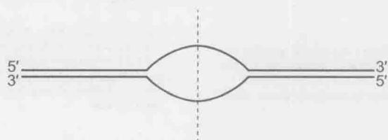

A. 整个复制过程发生在虚线的哪一边：左，右或者两边？  
B. 在双划线的右边，哪一条模板链（上或下）与DNA聚合酶会是持续复制反应？  
C. 在双划线的左边，哪一条模板链（上或下）的完全复制过程更易被导致DNA连接酶部分功能活化的突变所影响？

习题 9 你想要设计一个实验，起始是一个滑动夹结合在 DNA 上，那么该 DNA 需要什么特性来建立滑动夹子和 DNA 之间的结合？还需要其他什么蛋白组分来确保该结合？

习题10

A. 请解释为何大肠杆菌的基因组的完全复制需要 $40 \mathrm{~min}$ , 但每个细胞的分裂只需要 $20 \mathrm{~min}$ 。  
B. 为何大肠杆菌细胞不需要端粒酶？

习题11

A. 请描述 DNA 解旋酶在复制叉中的作用。
B. 由于 DNA 解旋酶的活性，拓扑异构酶也同样是复制过程中所必需的。请解释拓扑异构酶是如何帮助 DNA 解旋酶更有效地工作。
C. 在 PCR 过程中你并不需要加入 DNA 解旋酶到反应中，请解释原因。

习题 12 在大肠杆菌中，DNA 聚合酶 I 拥有 5' 和 3' 外切酶活性，而 DNA 聚合酶 III 只有 3' 外切酶活性。请解释这两种聚合酶的外切酶活性差异背后的功能学意义。

习题 13 研究者已经将如先天角化不良症等疾病相关的突变定位到编码端粒酶 RNA 组分的 DNA 序列上。请描述端粒酶 RNA 组分的缺陷为何会与疾病相关。

习题 14 回顾框 9-1。利用 ${}^{32}$ P 标记的 dNTP（ ${}^{32}$ P 替代了 dNTP 中的 $\alpha$ 磷酸基）核素掺入实验来检测 DNA 合成。

A. 如果你使用的 dNTP 是标记在 $\beta$ 或 $\gamma$ 磷酸基，你在新合成的 DNA 上将检测不到任何放射活性，请解释原因。

B. 在掺入 ${}^{32}$ P 标记的 dNTP 后、检测 ${}^{32}$ P 的掺入量前还必须先将未掺入的标记 dNTP 与新合成的 DNA 链分离开。解释凝胶电泳作为一种手段是如何将未掺入的标记 dNTP 与新合成的 DNA 分开的。

C. 如框 8-1 图 2 所示的过滤结合过程, 请说出一个能确定过滤已经将未掺入的 ${}^{32}$ P 标记 dNTP 从 DNA 中分离的阴性对照。
