## 第13章 转录机制

## 本章概要

RNA 聚合酶和转录周期

细菌的转录周期

真核生物的转录

由 RNA 聚合酶 I 和 III 催化的转录

在此之前,我们一直在考察基因组的维持,也就是说遗传物质是如何组织、保护和复制的。现在,我们将问题转到遗传物质如何表达,即 DNA 的一串碱基是如何指导 RNA 和蛋白质的合成的,后者可以行使细胞功能和定义细胞特性。在后面的几章里,我们将描述负责基因表达的基本过程:转录、RNA 加工及翻译。

转录在化学和酶学上与 DNA 的复制（第 9 章）非常相似。二者都通

过酶的作用合成一条与 DNA 模板互补的核酸链。当然，二者之间存在一些重要的差别，最主要的就是转录得到的新链是由核糖核苷酸（ribonucleotide）组成的，而不是脱氧核糖核苷酸（ribonucleotide）（第 5 章）。转录机制区别于复制的其他特征包括以下几点。

\- RNA 聚合酶（RNA polymerase，催化 RNA 合成的酶）不需要引物，它能够从头起始转录（但是正如我们将要讨论的，细胞内的转录必须在特定的序列上才能起始）。

\- RNA 产物不与模板 DNA 链的碱基保持互补状态。相反，RNA 聚合酶在每个核糖核苷酸添加处的几个核苷酸之后，便将正在延长的链从模板上置换下来（图 13-1）。这一置换对 RNA 行使功能非常关键（例如，最常见的产生蛋白质产物的翻译过程）。而且，由于这一释放紧随合成位点之后，多个 RNA 聚合酶分子可以一个紧接着另一个，在同一时间转录同一个基因。这样，一个细胞就可以在短时间内在一个基因（或其他 DNA 序列）上合成大量的转录产物。重要的是，当 RNA 产物紧跟在每个行进的 RNA 聚合酶后面从 DNA 模板上解离下来时，两条 DNA 链重新配对（图 13-1）。

\- 尽管转录是非常精确的（每添加1万个核苷酸发生1次错误），但还是不如复制更为精确（每1000万个核苷酸发生1次错误）。这一区别反映出尽管确实存在两种RNA合成的校正办法，转录过程还是缺乏广泛的校正机制。

  
图 13-1 DNA 转录成为 RNA。本图所示为在没有相关酶的作用下，DNA 双螺旋是如何解旋和 RNA 链是如何在模板上合成的。本图还显示了 RNA 转录产物是如何在合成点几个核苷酸后从 DNA 模板上解离下来的，以及 DNA 链如何重新配对。图中转录从左到右进行。

较转录而言，细胞更关注复制的精确性是有道理的。DNA 是储存遗传物质的分子，DNA 复制是遗传物质得以传递的过程。复制过程中发生的任何错误都会很容易引起灾难性后果——它将永远存在于这一个体的基因组中，并传递给它的后代。相反，转录仅仅产生一些暂时性的拷贝，而且通常从同一个转录区域会得到几个拷贝。因此，转录过程中发生一个错误，除了在许多暂时性的副本中产生一个有缺陷的副本外，几乎不会造成任何其他的损害。

除了上述机制的区别，DNA 复制和转录之间还存在一个重要的差异，体现在两者的不同目的。转录仅是有选择性地复制基因组的特定部分，并从任何特定的部分产生一个到几百个，或者甚至上千个拷贝。相反，复制必须将整个基因组全部拷贝，并且在每次细胞分裂时进行一次（并且只进行一次，见第 9 章）。转录区域的选择并不是随机的，每个转录区域通常包括一个或多个基因，而且在每个转录区域的首端和尾端都存在特定的 DNA 序列指导转录的起始和终止。

不仅基因组的不同部分的转录程度不同，而且转录哪一部分、转录范围有多大都是可以调控的。这样，在不同的细胞中，或者同一细胞的不同时段，可能转录不同组别的基因。例如，某个人的两个遗传特征相同的细胞在很多情况下会转录不同组别的基因，从而导致那两个细胞在特征和功能上的差异（如一个可以是肌肉细胞，而另一个是神经细胞）。或者，一些特定的细菌细胞会依其生长的培养基的不同而转录不同组别的基因。这些调控的问题将在第4篇予以解答。

## RNA 聚合酶和转录周期

## RNA 聚合酶具有不同形式，但有许多共同特性

从细菌到人类的所有细胞里，RNA 聚合酶在本质上都进行同一种反应。因此，来自这些不同物种的酶具有许多共同的特性就不足为奇了，尤其是那些直接参与催化 RNA 合成的部分。从细菌到哺乳动物，细胞的 RNA 聚合酶都是由多个亚基（subunit）构成的（虽然一些噬菌体和细胞器的确编码一些单亚基的酶来完成相同的任务，框 13-2）。表 13-1 列出了各种情况下亚基的数目和大小，以及不同的酶之间哪些亚基序列是保守的。

表 13-1 RNA 聚合酶的亚基

<table><tr><td colspan="2">原核生物</td><td colspan="3">真核生物</td></tr><tr><td>细菌核心酶</td><td>古细菌核心酶</td><td>RNA聚合酶I</td><td>RNA聚合酶II</td><td>RNA聚合酶III</td></tr><tr><td> $\beta'$ </td><td>A&#x27;/A&#x27;&#x27;</td><td>RPA1</td><td>RPB1</td><td>RPC1</td></tr><tr><td> $\beta$ </td><td>B</td><td>RPA2</td><td>RPB2</td><td>RPC2</td></tr><tr><td> $\alpha^I$ </td><td>D</td><td>RPC5</td><td>RPB3</td><td>RPC5</td></tr><tr><td> $\alpha^II$ </td><td>L</td><td>RPC9</td><td>RPB11</td><td>RPC9</td></tr><tr><td> $\omega$ </td><td>K</td><td>RPB6</td><td>RPB6</td><td>RPB6</td></tr><tr><td></td><td>[+6个其他亚基]</td><td>[+9个其他亚基]</td><td>[+7个其他亚基]</td><td>[+11个其他亚基]</td></tr></table>

每列的亚基按分子质量由大到小排序。(经允许, 引用自 Ebright R.H. 2000.J. Mol. Biol. 304: 687–698, Fig. 1, p. 688. ©Elsevier.)

由此表可见，细菌只有1种RNA聚合酶，而真核细胞中则有3种——RNA聚合酶I、Ⅱ和Ⅲ（RNA Pol I、Ⅱ和Ⅲ）。聚合酶Ⅱ（Pol II）是本章后半部分阐述真核转录时将要重点讲到的酶，它是这些酶中研究得最为深入的，也是负责转录大多数基因的酶——实际上是转录几乎所有蛋白质编码基因的酶。聚合酶I（Pol I）和聚合酶Ⅲ（Pol III）分别参与转录专门的RNA编码基因。具体来说，Pol I转录的是大核糖体RNA前体基因，而PolⅢ转录的是tRNA基因、一些小的核RNA基因和5S rRNA基因。在本章的末尾我们将再讨论这些酶。近年来，学界又发现了两种DNA依赖的RNA聚合酶，并将其命名为Pol IV和Pol V。这两种酶只在植物中存在，它们转录参与转录抑制的小干扰RNA（small interfering RNA，第20章）。它们与Pol II的亲缘关系较为密切，演化产生的时间不长。它们的一些蛋白亚单位与Pol II是一致的，由同样的基因编码；另一些序列上游区别的亚单位则是来自于近期复制的拷贝。

细菌 RNA 聚合酶的核心酶（core enzyme）可以独立合成 RNA，它是由 $\alpha$ 亚基（subunit）的两个拷贝和 $\beta$ 、 $\beta'$ 、 $\omega$ 亚基的各一个拷贝组成的。这个酶与真核生物的聚合酶密切相关（表 13-1）。具体来说，它的两个大亚基（ $\beta$ 和 $\beta'$ ）与 RNA 聚合酶Ⅱ的两个大亚基（RPB1 和 RPB2）同源。同时， $\alpha$ 亚基与 RPB3 和 RPB11 同源、 $\omega$ 亚基与 RPB6 同源。细菌 RNA 聚合酶的核心酶结构与酵母 RNA 聚合酶Ⅱ的核心酶相似，二者在图 13-2 中并列显示。后面我们将会描述一些能够阐明这些酶的工作原理的结构细节，这里我们只重点描述一些共同的特征。

细菌和酵母的核心酶有着共同的总体形态和组织形式；实际上，它们比亚基在序列上的相似度更为相似。二者内部靠近活性位点的部分尤为如此，而外周部分的相似性则差一些。这些相似点和相异点的分布是合理的：酶的内部参与在 DNA 模板上合成 RNA（所有生物体都一样）；然而，酶的许多外周部分参与到其他蛋白质的相互作用中，而这些在原核和真核细胞中是不同的。

总的来说，每一个酶的形状都像一只蟹爪。这让我们回想起第9章中描述的DNA聚合酶的“手”形结构（图9-5）。“蟹爪”的两个“钳子”主要是由各个酶的两个最大亚基构成（细菌的酶是 $\beta$ 和 $\beta^{\prime}$ 亚基，真核生物的酶是RPB1和RPB2亚基）。酶的活性位点是由这两个亚基的一些区域共同组成的，位于钳子基部，被称为“活性中心裂隙”（active center cleft）区域（图13-2）。活性位点的工作原理依据双金属离子催化添加核苷酸的机制，该机制在所有的聚合酶中均如此（第9章）。然而，RNA聚合酶的活性位点含有一个紧密结合的 $\mathrm{Mg}^{2+}$ ，第二个离子是在合成周期中由每个新的核苷酸带入的，与焦磷酸一起释放。

生物体中有多种通道允许 DNA、RNA 和核糖核酸进出这些酶的活性中心裂隙。我们会在后面谈到转录机制的部分再进行详细的讨论。

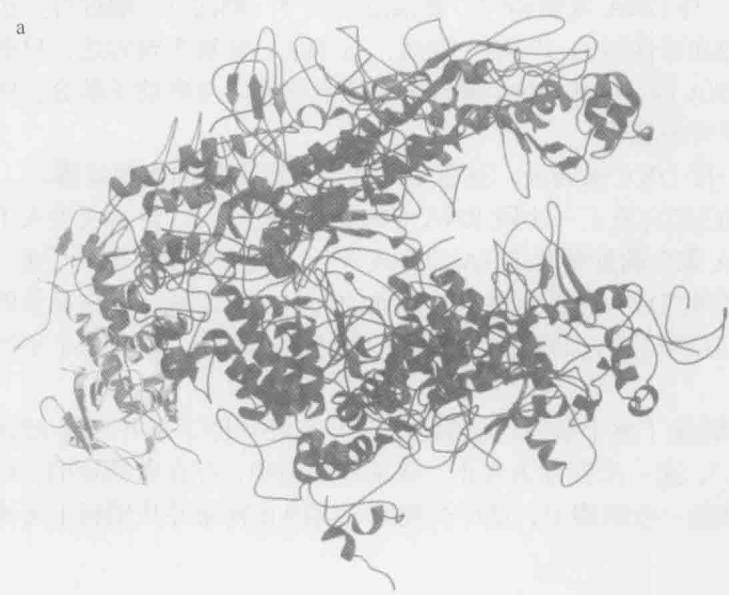

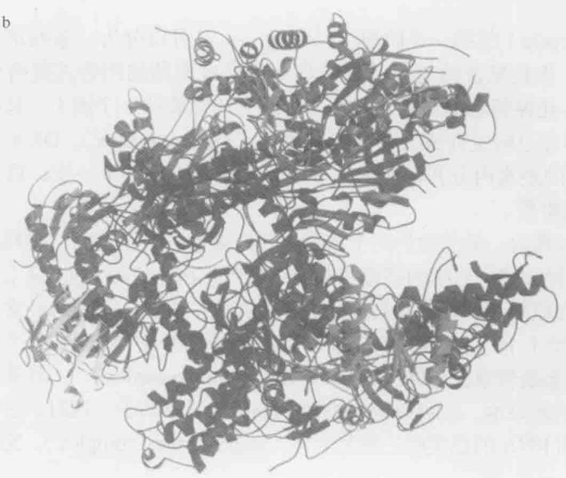  
图 13-2 原核生物和真核生物 RNA 聚合酶晶体结构（crystal structure）的比较。（a）。栖热水生菌（T. aquaticus）RNA 聚合酶的核心酶结构。各个亚基以不同的颜色表示：β 亚基为蓝色，β' 亚基为紫色，两个 α 亚基分别为黄色和绿色，ω 亚基为红色，以红球表示的 Mg $^{2+}$ 在 a、b 中均注明了活性位点（来源：Seth Darst，洛克菲勒大学，私人通信）。（b）。酿酒酵母（S. cerevisiae）RNA 聚合酶Ⅱ的结构。各个亚基以不同的颜色表示，以表明与细菌中相应亚基的关系（表 13-1）。因此，RPB1 和 RPB2 分别为紫色和蓝色，RPB3 和 RPB11 分别为绿色和黄色，RPB6 为红色（来源：Cramer P., et al. 2001. Science. 292: 1863）。图像使用 MolScript、BobScript 和 Raster 3D 软件制作。

## 由 RNA 聚合酶进行的转录是由一系列步骤完成的

为转录一个基因，RNA 聚合酶要进行一系列定义明确的步骤，这些步骤分为三个阶段：起始（initiation）、延伸（elongation）和终止（termination）。在这里及图 13-3 中，我们总结了每个阶段的基本特征。

起始 启动子（promoter）是最初结合 RNA 聚合酶的 DNA 序列（与所需的转录起始因子一起结合）。启动子-聚合酶复合体一旦形成就发生结构改变，以利于起始过程继续进行。和复制的起始一样，DNA 在转录将要开始的部位解旋，碱基对分开，产生一个单链 DNA 的“转录泡”。与 DNA 复制相同，转录总是从 5' 端向 3' 端进行。也就是说，新的核糖核苷酸添加在延伸链的 3' 端。然而，与 DNA 复制不同的是，只有一条 DNA 链作为模板合成 RNA 链。因为 RNA 聚合酶以固定的方向与启动子结合，所以同一条链总是从特定启动子开始转录。

启动子的选择决定了哪一段 DNA 被转录，这也是对转录进行调控的主要步骤。

延伸 一旦 RNA 聚合酶已经合成了一小段 RNA（10 个碱基左右），转录便进入了延伸阶段。在延伸阶段，RNA 聚合酶除催化 RNA 的合成外，还执行着多项重要任务。它解开前方的 DNA，又使其后的 DNA 重新复性；在移动的同时，逐步解开正在延长的 RNA 链与模板的配对；而且还执行校正的功能。相反，在复制过程中，需要几个不同的酶来执行这些相似的功能。

终止 一旦 RNA 聚合酶转录了整个基因（或整组基因），它必须停下来并释放 RNA 产物（并从 DNA 上解离下来），这一步骤称为终止。在某些细胞中，存在着特定的、已研究清楚的终止序列；而在其他一些细胞中，是什么使聚合酶停止转录并从模板上分离还不十分清楚。

## 转录起始包括三个定义明确的步骤

转录周期（transcription cycle）的第一个阶段——起始——又可以分为一系列定义明确的步骤（图 13-3）。第一步是聚合酶与启动子初步结合形成所谓的闭合式复合体（closed complex），这时 DNA 还保持着双链状态，聚合酶结合在螺旋的一个面上。起始阶段的第二步，闭合式复合体经过转变而成为开放式复合体（open complex），DNA 双链在起始位点周围大约 13 bp 的距离内分开以形成转录泡。在起始阶段的下一步，启动子逃离，聚合酶进入转录起始阶段。

DNA 的展开使模板链得以释放。最前面的两个核糖核苷酸被带入活性位点，排列在模板链上并彼此结合。通过这种方式，后续的核糖核苷酸结合到正在延长的 RNA 链上。最初 10 个左右核糖核苷酸的合成是一个效率相当低的过程，在这一阶段，聚合酶经常释放出很短的转录物（每一个都短于 10 个左右的核苷酸），然后再重新开始合成。在这个阶段，聚合酶启动子复合体称为起始转录复合体（initial transcribing complex）。一旦某个聚合酶释放出超过 10 核苷酸的转录本，就可以说它逃离(escaped)了启动子。这时，它已经形成了一个包括酶、DNA 和 RNA 的稳定的三重复合体（stable ternary complex），完成了向延伸阶段的转变。

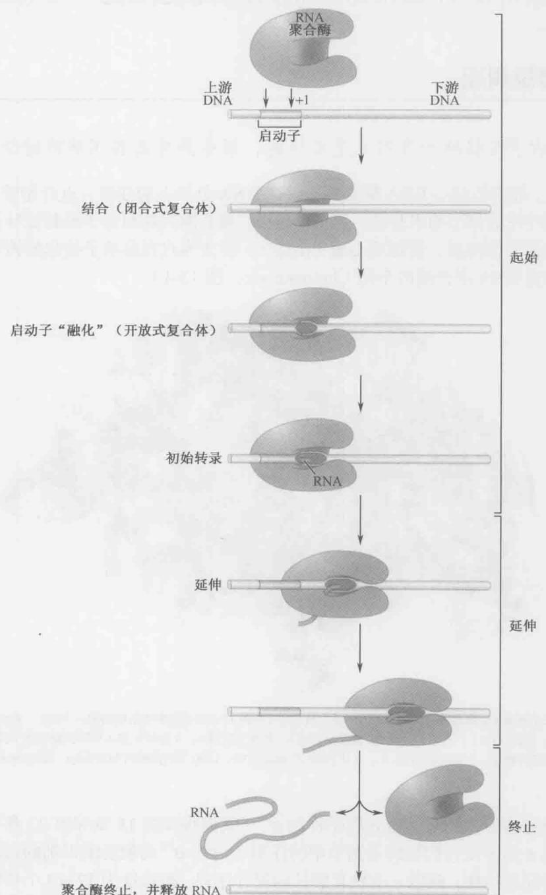  
聚合酶终止，并释放 RNA

图 13-3 转录周期的几个阶段：起始、延伸和终止。图中显示了转录周期的常规步骤。所示特征为细菌和真核生物转录共同拥有的。起始、延伸和终止所需要的其他因子并未在这里显示，但将在后面的正文中进行描述。编码 RNA 链开端的 DNA 核苷酸称为转录起始位点，指定为“+1”位置。转录行进方向的序列称为起始位点的下游。类似地，起始位点前面的序列称为上游序列。当提到上游序列的某一特定位置时，将给予一个负值，下游序列则给予正值。

在本章的后续部分，我们将更为详细地对转录周期进行描述——首先是细菌，然后是真核系统。

## 细菌的转录周期

## 细菌的启动子在强度和序列上是多样的，但是具有某些明确的特征

原则上，细菌的核心 RNA 聚合酶能够在 DNA 分子上的任何一点开始转录，这点可以在体外用纯化的核心酶来验证。但在细胞内，聚合酶只在启动子处起始转录。一个称为 $\sigma$ 的起始因子的加盟，使得核心酶 $(\alpha_{2}\beta\beta'\omega)$ 转变为只在启动子处起始转录。该酶的这种形式称为 RNA 聚合酶的全酶（holoenzyme，图 13-4）。

  
图 13-4 栖热水生菌 RNA 聚合酶的全酶。灰色所示为核心酶（与图 13-2 的 a 图中所示的是同一个酶），紫色所示为 $\sigma^{70}$ 亚基（区域 2、3、4，见图 13-6）。右边为区域 2，顶部为区域 3，底部为区域 4。 $\sigma$ 区域 2 和 4 分别识别启动子的 -10 和 -35 区域，稍后将在正文中进行描述。（Murakami K. S., et al. 2002. Science. 296: 1280.）图像使用 MolScript、BobScript 和 Raster 3D 软件制作。

在大肠杆菌中，最常见的 $\sigma$ 因子称为 $\sigma^{70}$ （我们将在第 18 章和第 22 章中讨论其他可供选择的 $\sigma$ 因子及它们在转录调节中的作用）。含有 $\sigma^{70}$ 的聚合酶识别的启动子具有以下共同的特征性结构：两段 6 个核苷酸长的保守序列，被长度为 17\~19 个核苷酸的非特异序列（图 13-5a）所分隔。这两段保守序列的中心分别位于 RNA 合成起始位点上游约 10bp 和 35bp 处。因此，根据图 13-3 的计数方案（编码 RNA 链开端的 DNA 核苷酸被指定为 +1），这两段序列称为 -35 和 -10 区域（region）或元件（element）。

虽然绝大多数的 $\sigma^{70}$ 启动子包含可被识别的-35 和-10 区域，但序列并不一致。通过对许多不同启动子的比较，可以得到一个共有序列（consensus sequence，关于这些共有序列的来源详细可见框 13-1）。共有序列反映了首选的-35 和-10 区域，被最适宜的长度（17bp）所分隔。很少有启动子具有与其一模一样的序列，但多数与其仅有几个核苷酸的差别。

  
图 13-5 细菌启动子的特征。图中显示了细菌启动子元件的不同组合情况。每个元件对聚合酶的结合和功能所起的作用在正文中有详细描述。

## 框13-1 共有序列

被某个特定蛋白质识别的结合位点，其 DNA 序列不一定完全一致。类似地，使一个蛋白质具有某种特殊功能的氨基酸序列在不同的蛋白质中可能会有微小的差异。共有序列就是在上述的每种情况中，由不同样本在每一个位置上最常见的核苷酸（或氨基酸）所组成的序列版本。含有 $\sigma^{70}$ 因子的 RNA 聚合酶识别大肠杆菌启动子的共有序列如图所示（框 13-1 图 1）。这一共有序列是通过对 300 个已知具有 $\sigma^{70}$ 启动子功能的序列进行比较，并确定在 -35 和 -10 六核苷酸区域中每一个位置上最常见的碱基得到的。该核苷酸就被选为共有序列中该位置上的特定核苷酸；每一个位置上的特定核苷酸出现的相对频率及其他三种核苷酸的频率在图表中进行了描绘。注意，位于 -35 和 -10 区域之间的 17\~19 个核苷酸并不存在具有显著意义的共有序列。

在图例中，每一个单独的启动子序列都已确定，所以比较这些序列并没有什么价值。但是，让我们来考虑一个完全不同的例子：所涉及的 DNA 结合蛋白还没有确定的结合位点。但是，一条染色体的几个区域在其长度范围内的某个位置上含有结合位点。可以使用一种扫描所有这些染色体区域序列的计算机算法来寻找它们共有的潜在结合位点。

当结合位点未知时，找到 DNA 结合蛋白所识别的共有序列的第二种途径是，利用化学方法合成大批随机序列的短 DNA 片段。将目标蛋白与这些 DNA 分子混合在一起，就可以筛选到与目标蛋白结合的 DNA，并测定其序列。对这些序列的比较很容易显示出共有序列，因为每一个片段都非常短。这种方法（常被称为 SELEX）广泛地用于确定未知的 DNA 结合蛋白的结合位点。第 7 章中有对 SELEX 的详细描述。

  
框 13-1 图 1 启动子的共有序列和共有间距。（获得许可并重新绘图自 Alberts B. et al. 2002. Molecular biology of the cell, 4th ed., p. 308, Fig. 6.12. ©Garland Science/Taylor & Francis Books LLC.）

具有与共有序列更近似序列的启动子通常要比那些匹配较差的启动子“更强”。所谓启动子的强度（strength），是指一个启动子在一定时间内可以起始多少个转录物。这一度量标准受到以下因素的影响：启动子最初与聚合酶的结合程度、对异构化作用的支持效率，以及此后聚合酶逃离的难易程度。启动子强度与序列的相关性解释了为什么有许多不同种类的启动子：一些基因的表达水平远远超出其他基因，前者很可能具有与共有序列更为接近的序列。

在一些较强的启动子中，如指导核糖体 RNA（rRNA）基因表达的启动子，发现额外与 RNA 聚合酶结合的 DNA 元件，称为 UP 元件（UP-element，图 13-5b）。它通过提供额外的特异性相互作用而增强聚合酶与 DNA 的结合。

另一类型的 $\sigma^{70}$ 启动子缺乏-35 区域，而是有一个所谓的“延长的-10 区域”元件（图 13-5c）。与标准的-10 区域相比，这一元件在其上游末端有一个额外的短序列元件。聚合酶与这一额外序列元件之间的联系，补偿了-35 区域的缺失。大肠杆菌的 gal 基因（该基因产物指导乳糖的代谢；第 18 章）使用的就是这种启动子。

最后，在紧挨着-10元件的下游发现了一个新的结合RNA聚合酶的DNA元件。这个新元件称为鉴别子（discriminator，图13-5d）。鉴别子与聚合酶之间相互作用的强度影响酶与启动子复合体的稳定性。

## σ 因子介导聚合酶与启动子的结合

$\sigma^{70}$ 因子可以分为四个区域,称为 $\sigma$ 区域1\~ $\sigma$ 区域4(图13-6)。识别启动子-10和-35元件的区域分别是区域2和4。

区域 4 的两个螺旋形成一个常见的 DNA 结合基序（motif），称为螺旋-转角-螺旋（helix-turn-helix）。其中一个螺旋插入到-35 区域的大沟（major groove）中并与该区域的碱基相互作用；另一个则从大沟的顶部横向穿过，与 DNA 骨架接触。这一结构基序见于许多 DNA 结合蛋白，例如细菌细胞中几乎所有的转录激活因子与抑制因子（见第 18 章），我们在第 6 章进行了详细的讨论（图 6-13）。

  
图 13-6 σ 因子的区域。识别启动子特定区域的 σ 因子的那些区域以箭头指示。区域 2.3 负责 DNA 解旋。有关 σ 因子将 RNA 聚合酶核心酶募集到一个标准启动子上的示意图，见图 13-7。（经许可引用自 Young B.A. et al. 2002. Cell. 109: 417–420, Fig. 1. ©Elsevier.）

-10 区域也被一个 $\alpha$ 螺旋所识别，但其复杂的相互作用尚未彻底研究清楚。原因在于-35区域仅提供能量以确保聚合酶与启动子的结合，而-10区域在转录起始过程中有着更为精细的任务，因为它处在闭合式复合体向开放式复合体转变时DNA解旋起始元件中。因而，与-10区域相互作用的 $\sigma$ 因子区域不光与DNA结合，还参与其他的功能。与这一预想相一致，参与识别-10区域的 $\alpha$ 螺旋包含几个芳香族氨基酸，这些氨基酸可以和非模板链上的碱基相互作用，以维持解旋DNA的稳定。在第9章中，我们曾描述过DNA复制过程中单链结合蛋白（single-strand binding，SSB）存在类似的功能。

最近的对区域 2 的结构研究发现，它与一个单链状态的-10 元件结合，而且全部与开放复合体相接触，揭示了 $\sigma$ 因子和单链 DNA 分子间以适当的结合相互作用来推动解离过程的。非模板链上的两个碱基将插入到 $\sigma$ 因子的“口袋”结构中，这一过程中适当的分子间接触可以稳定处于解螺旋状态的启动子序列。

在某些物种中细胞的-10元件会延长一部分序列，这些序列将被 $\sigma$ 区域3中的一个 $\alpha$ 螺旋所识别，此螺旋与组成这一元件的两个特异性的碱基对接触。同时，鉴别子由 $\sigma$ 区域1、2识别。

与启动子内的其他元件不同，UP 元件并不被 $\sigma$ 因子所识别，而是被 $\alpha$ 亚基的羧基末端域一个被称为 $\alpha$ CTD 的结构域（图 13-7）识别。 $\alpha$ CTD 通过一个可变形的衔接物与 $\alpha$ 亚基的氨基端域（ $\alpha$ NTD）相连接。因而，虽然 $\alpha$ NTD 包埋在酶内部， $\alpha$ CTD 仍可以到达上游元件，即使该元件并不处于与 -35 区域直接相邻的位置，而是位于上游更远处。

$\sigma$ 亚基以这样一种方式定位在全酶结构内，实现对各种启动子元件的识别。所以，DNA结合区域朝向酶体外部而不是被包埋起来。而且，这些区域之间的间距与它们所识别的DNA元件之间的距离是一致的。当 $\sigma$ 因子结合在全酶里时， $\sigma$ 区域2和4分开大约 $75\AA$ ，这与一个典型的 $\sigma^{70}$ 启动子的-10和-35元件中心点之间的距离基本相同（图13-7）。区域2与区域4之间的这一相当大的蛋白结构域的间距是由 $\sigma$ 的区域3提供的，尤其是区域3.2也称为 $\sigma_{3/4}$ 连接区（图13-4和图13-6）。

  
图 13-7 σ 和 α 亚基将 RNA 聚合酶核心酶募集到启动子上。α 亚基的 C 端域（α CTD）识别 UP 元件（如果存在的话），而 σ 区域 2 和 4 分别识别 -10 和 -35 区域（图 13-6）。在本图中，RNA 聚合酶的示意形式与在先前的图中所显示的有相当大的差别。这种形式对于显示与 DNA 和调节蛋白的接触面是非常有用的，我们在第 18 章考察细菌的转录调节时还将会在某些图中使用它。

## 向开放式复合体的转变过程涉及 RNA 聚合酶和启动子 DNA 的结构变化

在闭合式复合体内 RNA 聚合酶与启动子 DNA 的结合使 DNA 仍处于双链状态。转录起始的下一个阶段要求聚合酶在开放式复合体中与启动子更紧密地结合在一起。从闭合式复合体到开放式复合体的转变过程涉及聚合酶的结构变化，以及 DNA 双链的打开，暴露出模板链和非模板链。相对于转录起始位点而言，这一解离事件发生在 -11 和 +2 之间的区域。

对于含 $\sigma^{70}$ 因子的细菌聚合酶，这一转变被称为异构化作用（isomerization）。它不需要从 ATP 水解获得能量，而是 DNA-酶复合体的构象自发地变成一种在能量上更具优势的形式。就像我们上面指出的那样，非模板链上的-10 元件的两个碱基（ $A_{11}$ 和 $T_{7}$ ）（图 13-8）处于自由状态，不再插入到 $\sigma$ 因子的“口袋”结构中，也就不再有如下功能的相互作用：通过将单链形式的-10 元件稳定下来，这些相互作用可以推动启动子去解离（图 13-8）。

异构化作用本质上是不可逆的，一旦异构化完成，通常转录将会随后起始（虽然在某些情况下还会再发生调控）。相反，闭合式复合体的形成则是易于逆转的——聚合酶可以转变为开放式复合体，从启动子上脱离。

为了描绘伴随异构化作用发生的结构变化，我们需要更为细致地了解全酶的结构。正如前面所描述的，在这个爪状酶的钳子之间有一条通道穿过（图 13-2）。由 $\beta$ 和 $\beta'$ 亚基的一些区域共同组成的活性位点，位于钳子基部的“活性中心裂隙”之内。

有 5 条通道通向酶的内部，如图 13-9 的开放式复合体的图片中所示。核苷三磷酸（NTP）摄取通道（没有在图中展示，请见图例说明）允许核糖核苷酸进入活性中心。RNA 出口通道允许正在延长的 RNA 链在延伸合成的同时离开此酶。其他的 3 个通道允许 DNA 进出此酶，如下所述。

下游 DNA（也就是聚合酶前方将被转录的 DNA）以双链的形式经下游 DNA 通道（在两个钳子之间）进入活性中心裂隙。在活性中心裂隙内，DNA 双链从 +3 位置开始分离。非模板链（NT）通过其特异性的通道离开活性中心裂隙并从聚合酶的表面经过，模板链（T）则沿着一条路线穿过活性中心裂隙，经它的特异性通道离开。聚合酶后面的上游 DNA 在 -11 位置处重新恢复双链状态。

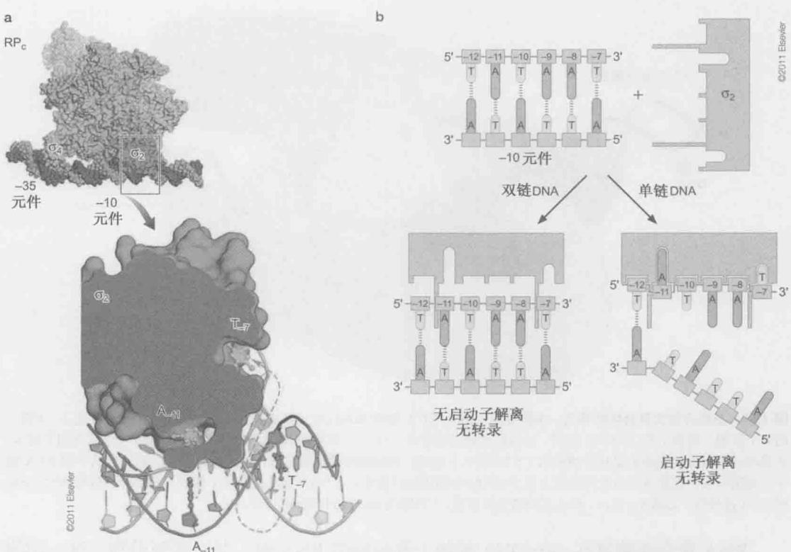  
图 13-8 通过 σ 区域 2 识别和解离 -10 元件。σ 区域 2 上具有两个口袋结构，其中各自结合非模板链的自由状态的 -10 碱基。这些能量上有优势的连接反应驱动了启动子的解离，这一反应过程不需要 ATP 的水解。（a）Taq RNA 聚合酶 σ₂ 区域的放大影像，以及结合闭合式复合体（蓝色）的双链 DNA 和部分开放式复合体（黄色）的单链 DNA。图中还展示了“口袋”结构中的两个碱基（A 和 T，用黄色表示）。红色箭头指示自由状态的碱基如何联系到闭合式复合体中相同的碱基（经许可图片复制自 Feklistov A. 和 Darst S.A. 2011. Cell 147: 1257, Fig. 6C, p. 1265. ©Elsevier.）（b）详细展示图 a 中区域 2 和非模板链的 -10 区域是如何结合的，特别是自由状态的碱基如何驱动 DNA 从这一区域解离（经许可并调整自 Liu X., Bushnell D.A., and Kornberg R.D. 2011. Cell 147: 1218, Fig. 1, p. 1219. ©Elsevier.）

从闭合式复合体向开放式复合体转变的异构化作用中，可以观察到聚合酶发生了两个显著的结构变化。第一，位于聚合酶前部的钳子牢固地钳压在下游DNA上。第二， $\sigma$ 的N端区域（区域1.1）位置有至关重要的移动。在未结合DNA时， $\sigma$ 区域1.1处于全酶的活性中心裂隙内部，阻断了开放式复合体中模板DNA链经过的路线。在开放式复合体中，区域1.1移动了大约 $50\AA$ 的距离，出现在酶的外部，使DNA可以进到裂隙中（图13-9）。 $\sigma$ 区域1.1处于高度的负电荷状态（恰似DNA）。因而，在全酶中，区域1.1起着DNA的分子模拟物（molecular mimic）的作用。活性中心裂隙的空间呈高度正电荷状态，既可以被区域1.1占据，也可以被DNA占据。

## 转录由 RNA 聚合酶起始，不需要引物

我们在第9章中谈到，DNA聚合酶并不重新合成新的DNA链，也就是说，它只能延伸一条已经存在的多聚核苷酸链。因此，复制总是需要引物链。引物通常是一段较短的RNA，与DNA模板链结合，形成一段较短的杂交双链区域；然后DNA聚合酶将核苷酸添加到引物的3'端。

  
图 13-9 进出开放式复合体的通道。本图显示了两条 DNA 链的相对位置（模板链为灰色，非模板链为橘红色）、 $\sigma$ 因子的 4 个区域、启动子的 -10 和 -35 区域，以及转录的起始位点（+1）。DNA 和 RNA 进出 RNA 聚合酶的通道也在图中显示。这里唯一没有显示的通道是核苷酸进入（NTP 摄入）通道，核苷酸由此通道进入活性位点裂隙，结合到增长中的 RNA 链中。如图所示，该通道从页面深处进入位于 DNA +1 附近的活性位点。DNA 链从蛋白质下面经过的部分以虚线表示。 $\sigma$ 区域 3/4 连接区，也称 $\sigma_{3,2}$ 是 $\sigma_{3,1}$ 和 $\sigma_{4}$ 之间的连接区域。（原图由 Richard Ebright 设计。）

RNA 聚合酶能够在一条 DNA 模板上起始新的 RNA 链，并不需要引物。这一功能要求起始的核糖核苷酸被带到活性位点，并稳定地保持在模板上，同时下一个核苷三磷酸以正确的几何形态呈递，使聚合这一化学过程得以完成。这是相当困难的，因为 RNA 聚合酶的转录物大多以腺嘌呤核苷酸（A）开始，这种核苷酸仅通过两个氢键与模板核苷酸（胸腺嘧啶核苷酸，T）结合，而胞嘧啶核苷酸（C）和鸟嘌呤核苷酸（G）之间有三个氢键。

因此，聚合酶必须与一条或者多条 DNA 模板链、起始核苷酸以及第二个核苷酸建立特异性的相互作用，严格控制其保持正确的方向，才可以开始对引入的核苷三磷酸进行化学反应。这种对聚合酶与起始核苷酸之间特异性相互作用的要求可能解释了为什么大多数转录物都以同一种核苷酸开始。目前学界大多认为， $\sigma$ 区的 3/4 链接处与模板链互作，可以保证在正确的构象和位置启动转录。与此一致的是，用含有缺少此部分的 $\sigma^{70}$ 的聚合酶进行的实验中，起始过程所需要的两个核苷酸中的一个或两个的浓度比平时要高得多。

## 转录起始阶段，RNA 聚合酶保持位置不变并将下游 DNA 拉向自己

如我们已经描述的，RNA 聚合酶首先合成并释放一些短于 10 核苷酸（无效合成）的小 RNA 转录物，然后进入转录起始阶段，包括逃离启动子、进入延长阶段，以及合成正确的转录物。很长时间我们都不明白在最初的无效转录循环中，酶的活性位点是如何沿着 DNA 模板移动的。迄今提出过三个通用模型（图 13-10）具体如下。

1. “瞬时漂移”（transient excursion）模型提出 RNA 聚合酶正向反向的瞬时迁移循

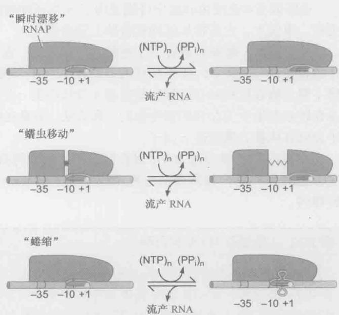

环。聚合酶被认为离开启动子沿着 DNA 模板移动一小段，合成一小段转录物，然后流产释放转录物，再回到其在启动子的原始位置。

2.“蠕虫移动”（inchworming）模型认为在聚合酶内有一个具伸缩性的元件，使得酶前方含有活性位点的部件向下游移动，合成一小段转录物，然后流产，再收缩回到其仍留在启动子上的酶主体。

3. “蜷缩”（scrunching）模型认为位于固定位置的、与启动子结合的、聚合酶下游的 DNA 被酶拉进来。于是在酶的内部堆积的 DNA 以单链“泡”的形式逗留。

现在普遍相信第三个模型

——蜷缩，反映了真实的情况。这个结论基于一系列的发现——包括单分子分析实验，这些实验可以测量在最初的转录阶段聚合酶不同部分相互之间及相对于图 13-10 最初转录的机制。在最初的转录起始阶段，RNA 聚合酶的活性中心相对于 DNA 模板向前移动，合成短的转录物并流产，然后重复这个循环直到逃离启动子。图中表示了说明该过程的三个模型。根据第一个模型——瞬时漂移（上图），聚合酶沿着 DNA 移动。在第二个模型——蠕虫移动（中图）中——酶的前部分沿着 DNA 移动，但由于酶内部有一个具伸缩性的区域，酶的后部分可以在启动子上保持固定。在第三个模型——蜷缩（下图）中，酶保持固定，把 DNA 拉过来。这些模型之间的不同点，以及支持蜷缩模型的证据在正文中有描述。（获得许可并重新绘图自 Kapanidis A.N. et al. 2006. Science 314: 1144–1147, Fig. 1a. ©AAAS.）

DNA 模板链的位置。结果显示，在最初的转录阶段，聚合酶在启动子上位置不变并解开下游 DNA 把其拉进来。只有蜷缩模型与这些结果吻合。

启动子逃离涉及聚合酶-启动子相互作用及聚合酶核心- $\sigma$ 相互作用的破坏

我们已经看到，在最初的转录阶段存在一个流产性起始过程，短的（9个核苷酸或更短）转录物合成并释放。只有合成一条达到阈值（10个核苷酸或更多）的转录物时，聚合酶才能逃离启动子并进入延伸阶段。一旦达到这个长度，转录物不能停留在与DNA配对的区域，必须开始像线一样穿入RNA出口通道（图13-9）。启动子逃离与打破聚合酶和启动子元件之间，以及聚合酶与作用于特定启动子的任何调控蛋白之间的所有相互作用有关（第18章）。

目前还不清楚 RNA 聚合酶为什么必须在成功逃离启动子之前经历流产性转录起始。但是 $\sigma$ 因子的一个区域作为分子模拟物参与其中，它是 3/4 连接区，模拟的是 RNA。此区域位于开放式复合体的 RNA 出口通道中间（图 13-9），为了使 RNA 链可以合成超过 10 个核苷酸， $\sigma$ 的这个区域必须从该位置被逐出，这个过程需要聚合酶尝试几次才能成功。

σ 区域 3/4 连接区的逐出可能说明了 σ 与延伸酶的结合比其与开放式复合体的结合更弱。事实上，它常常从延伸复合体上完全丢失。

一旦逃离，蜷缩过程将发生逆转。也就是说，在蜷缩时解离的 DNA 又重新复合，伴随着转录“泡”从 22\~24 个核苷酸萎缩成 12\~14 个核苷酸大小（图 13-3），这个过程提供了聚合酶在逃离时打破聚合酶启动子及核心酶 $\sigma$ 相互作用所需要的能量。因此，蜷缩是在转录起始中储存和转移能量的一种方法，能量在逃离时的释放可以使聚合酶与启动子分离并从核心酶驱逐 $\sigma$ 因子。

在框 13-2 “单亚基 RNA 聚合酶” 中，我们将看到，尽管缺乏 $\sigma$ 亚基，在从起始复合物向延伸复合物转变的过程中这些简单的 RNA 聚合酶是如何经历结构上类似的转移的。

## 框 13-2 单亚基 RNA 聚合酶

正文中讨论了在细菌和真核生物细胞中发现的多亚基RNA聚合酶。但是亦有单亚基RNA聚合酶，这些酶能够完成与那些在复杂的多细胞中的对应物一样的基本反应。许多噬菌体，如大肠杆菌噬菌体T7编码的这种聚合酶，在感染时用以转录其大多数基因。类似地，多数线粒体和叶绿体的基因也是由一些与此类单亚基噬菌体酶紧密相关的聚合酶转录的。演化造就了这些能够完成转录任务的相对简单的酶，正如我们在正文中强调过的，即使对大得多并且更为复杂的多亚基酶来说，转录也是一项令人印象深刻的成就。

T7聚合酶是研究得最为广泛的单亚基聚合酶。它的分子质量为100kDa，而细菌的核心酶为400kDa（不包括σ因子），其结构在框13-2图1中显示。总体上，它看起来与我们在第9章中描述过的DNA聚合酶的PolI家族相似。因而，T7的RNA聚合酶像是一只右手，具有手指、拇指和手掌，代表排布在中心裂隙周围的域，活性位点位于裂隙内。

虽然 T7 聚合酶在结构上与 RNA 聚合酶没有关联，反而更像 DNA 聚合酶，但它的确也具有与细胞的 RNA 聚合酶一样的特征。通过比较 T7 聚合酶和细菌聚合酶在与各自的模板组成的复合体中的结构，这些特征变得很明显。如我们在正文中所看到的，细菌的聚合酶具有各种各样的通道进出活性中心裂隙（图 13-8）。例如，一个通道允许核苷三磷酸进入活性中心，接触模板，并在模板的影响下聚合到增长中的 RNA 链上。另一个通道则为增长中的 RNA 链提供了离开聚合酶的出口。类似的通道也可以在噬菌体聚合酶的结构中见到。

将细菌和 T7 聚合酶的起始和延伸复合体进行比较后发现一个明显的差异，即在细菌和 T7 中，一种类似的功能转变是通过不同结构变化而实现的。我们在正文中曾特别指出，在细菌中从起始到延伸的转变包括了 $\sigma$ 因子一个区域的位置明显的移动。这一移动打开了 RNA 出口通道，因此使长度超过 10 个核苷酸的转录物得以生成。T7 聚合酶中没有 $\sigma$ 因子，但是在此单亚基酶体内的一个类似的结构变化介导了起始复合体向延伸复合体的转变，这一结构变化对于 RNA 出口通道的形成是必需的。

  
框 13-2 图 1 噬菌体 T7 的 RNA 聚合酶。(来自 Jeruzalmi D. and Steitz T.A. 1998. EMBO J. 17: 4101.) 图像使用 MolScript、BobScript 和 Raster 3D 等软件制作。

## 延伸聚合酶是一个边合成边校对 RNA 的向前行进的机器

DNA 通过延伸酶的方式与通过开放式复合体相似（图 13-9），双链 DNA 在两个钳子之间进入酶的前部。在催化裂隙的开口处，两条链分开并沿着不同的路径穿过酶，然后从各自的通道离开酶，并在延伸聚合酶（elongation polymerase）的后面重新形成双螺旋结构。核苷酸通过其固定的通道进入活性位点，并在模板 DNA 链的引导下添加到增长中的 RNA 链上。在任何一个特定时刻，增长中的 RNA 链中只有 8 个或 9 个核苷酸与 DNA 模板保持碱基互补状态；RNA 链的其余部分则剥落并从 RNA 出口通道离开。参见图 13-11 的延伸复合物示意图。

在延伸过程中，聚合酶在增长的 RNA 转录物上一次添加一个核苷酸。与转录起始时聚合酶采用蜷缩的方式将 DNA 拉入酶不一样（图 13-10），在延伸过程中聚合酶使用一步作用机制：单分子技术显示聚合酶就像一个分子马达一样向前推进，每前进一步的距离相当于任何一个正在加入 RNA 链的核苷酸的碱基对的长度。另外，“泡”的大小，即非双链 DNA 的长度，在延伸过程中保持不变：当一个核苷酸对在行进酶的前方分开，一个核苷酸对就在其后方形成。

除了合成转录本，RNA 聚合酶还执行着两项校对（proofreading）功能。第一个被称为焦磷酸化编辑（pyrophosphorolytic editing）。在此状态下，聚合酶利用它的活性位点，在一个简单的逆向反应中，通过重新加入 PPi 催化错误插入的核糖核苷酸的去除。然后聚合酶可以将另一个核糖核苷酸加入到增长中 RNA 链的相应位置上。需要注意的是，通过这种方式聚合酶既可以去除错误的碱基，也可以去除正确的碱基，但是它在不匹配的地方比在匹配的地方花的时间更长，所以常去除前者。在第二种称为水解编辑（hydrolytic editing）的校对机制中，聚合酶倒退一个或更多的核苷酸（图 13-11d）并切

开 RNA 产物，去除掉错误的序列。

水解编辑是由一些 Gre 因子激发的。Gre 因子不仅能够增强水解编辑的功能，而且同时也作为延伸刺激因子。也就是说，它们确保聚合酶能够有效地延伸并帮助克服转录在较难转录的序列处“停滞不前”。这些功能的组合类似于真核生物的转录因子 TFIIS 对其 RNA 聚合酶Ⅱ的作用（见本章后续的描述及图 13-22）。另一组蛋白质——Nus 蛋白，在延伸阶段加入聚合酶，并以目前还很不明确的方式促进延伸和终止的过程（第 18 章描述了一个调控延伸过程的例子）。其中一种细菌中的 Nus 蛋白——NusG，在古菌和真核生物中保守性同样很高（在真核生物中被称为 Spt5，见后面的讨论）。

## RNA 聚合酶可能变得停滞不前，需要挪走

在有些情况下，一个延伸着的 RNA 聚合酶可能变得停滞不前并结束转录。停滞不前的一个常见理由是一条损坏的 DNA 链。如果被转录的基因是必不可少的，停滞不前的后果可能是灾难性的：停滞不前的聚合酶不能制造有效的产物，并且对试图转录同一个基因的其他聚合酶造成障碍。

为了处理这种情况，细胞具有挪走停滞不前的聚合酶并且同时招募修复酶[具体而言是内切酶Uvr（A）BC的功能]。接下来的修复称为转录偶联的修复，我们在第10章讨论过。聚合酶的挪走及修复酶的招募都是由一个叫做TRCF的蛋白进行的。

TRCF 具有 ATPase 活性。它结合聚合酶上游的双链 DNA，并且利用 ATPase 传动器（motor）沿着 DNA 移动，直到遇到停止的 RNA 聚合酶。碰撞把聚合酶往前推，或是使它重新开始延伸，或更常见的是，使 RNA 聚合酶、模板 DNA、和 RNA 转录物的三重复合体解离。这样就结束了酶的转录，但为修复酶和其他 RNA 聚合酶开辟了道路。

## 转录由 RNA 序列内部信号终止

我们已经看到转录终止的一种途径。在延伸过程中，当 RNA 聚合酶停滞不前时，它可以通过置换因子 TRCF 的作用从 DNA 上除去（正如上面所描述的）。这种终止由损坏的 DNA 或其他计划外的障碍引起。但是在基因的末端，转录终止是一个正常且重要的功能。称为终止子（terminator）的序列引发延伸聚合酶从 DNA 上脱离并且释放出它已经合成的 RNA 链。在细菌中，终止子有两种类型：Rho 依赖型（Rho-dependent）和 Rho 非依赖型（Rho-independent）。第一种类型，顾名思义，需要一个称为 Rho 的蛋白质来诱发终止反应。第二种类型不需要其他因子的参与就导致终止。我们将依次讨论这两种类型的终止子。

Rho 依赖型终止有一些定义不太明确的 RNA 元件，被称为 rut 位点。就像下面将要讨论到的，它们需要 Rho 因子的参与才能发挥作用。Rho 是一个具有 6 个相同亚基的环状蛋白质，在单链 RNA 离开聚合酶时与之结合（图 13-12）。此蛋白质还具有 ATPase 活性：一旦与转录物结合，它就利用 ATP 水解产生的能量来诱发终止。终止的准确机制还不清楚，模型有如下几个：Rho 把聚合酶往相对于 DNA 和 RNA 的前方推，导致终止，与 TRCF 介导的终止方式（如前所述）类似；或 Rho 把 RNA 拉出聚合酶导致终止；

或者 Rho 诱发聚合酶的构象改变使酶终止。最近的大多数实验证据显示，最后一种方式至少在不同基因转录的终止中发挥了重要作用。构象改变引起延伸复合物终止后，参与因子的解离过程更慢。

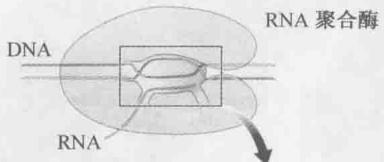

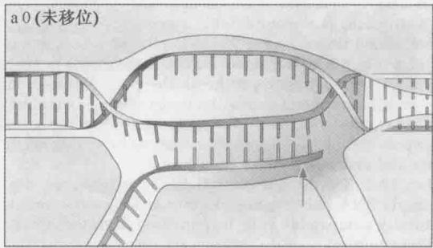

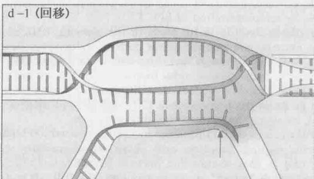  
图 13-11 RNA 聚合酶延伸复合体内部的模板和转录物。图示转录过程的不同阶段 RNA 聚合酶内 RNA 及 DNA 模板相对位置的示意图。(a)未移位的聚合酶（0）显示 RNA 链与模板 DNA 链 9 个碱基的配对。(b)前移的聚合酶（+1）显示聚合酶已经向前方移动了一个碱基的情况。(c)结合 NTP 的前移聚合酶显示如图 b 中相同的 DNA 和 RNA 位置，带着一个进入的 NTP。(d)回移的聚合酶（-1）显示当聚合酶如在水解编辑时回移一个碱基的情况。红色箭头指向聚合酶中一个固定的位置，所有图中都一样。为了清晰起见，这里显示的聚合酶与图 13-9 方向不同，RNA 出口通道在下方。(由 Richard Ebright 友情提供。)

最近的研究同时显示 Rho 可以通过转录循环来与 RNA 聚合酶结合。因此，Rho 并不是通过易位到一个初期的、包含 rut 序列的转录本来接触聚合酶的。它更倾向于在转录的早期与聚合酶结合，或者在之后的某个时间点结合到正在从延伸酶上释放的 RNA 转录的上。Rho 的易位可能会导致 RNA 环更为绷紧，而当它足够紧的时候，延伸的 RNA 酶将会终止。

Rho 是如何被引导到特定的 RNA 分子上的？首先，它结合的位点有某种特异性（所谓的 rut 位点，即 Rho 的利用）。这些位点最理想的组成成分是几段约 40 个核苷酸、不折叠为二级结构的序列（也就是说，它们主要保持着单链状态），还富含 C 残基。

特异性的第二个层次是 Rho 无法与任何正在被翻译的转录物（也就是与核糖体结合的转录物）

  
图 13-12 Rho 转录终止因子。图为 Rho 终止因子的晶体结构俯视图。它由一个 Rho 蛋白的六聚体组成，每一个单体以一种不同的颜色表示。6 个单体形成一个开放的环，这个环并不是平面的，第 6 个亚基要比第 1 个更深入页面所在的平面。两个亚基之间的缝隙为 12Å，螺旋倾斜度为 45 Å。据认为，Rho 所作用的 RNA 转录物（未显示）是沿着每个亚基的底部结合的，然后从环的中央穿过。（Skordalakes E. and Berger J.M. 2003. Cell 114: 135.）图像使用 MolScript、BobScript 和 Raster 3D 等软件制作。

结合。在细菌中，转录和翻译是紧密相连的——延伸中的 RNA 转录物还在合成时，一旦离开了聚合酶，翻译就在其上起始了。因而，Rho 只会终止那些转录已超出一个基因或操纵子（operon）的末端但仍在转录着的转录物。

Rho 非依赖型终止子也被称为固有终止子（intrinsic terminator），因为它们不需要其他因子就能够发挥作用。Rho 非依赖型终止子由两个序列元件组成：一段短的反向重复序列（约 20 个核苷酸），其后是一段约 8 个 A:T 碱基对的序列（图 13-13）。这些元件要转录后才会影响聚合酶，也就是说它们是以 RNA 而不是 DNA 起作用的。当聚合酶转录一段反向重复序列时，合成的 RNA 能够通过自身碱基配对形成一个茎环结构（stem-loop，常称为“发夹”，见第 5 章）。发夹的形成破坏了延伸复合体，从而引起终止。与 Rho 依赖型终止一样，其作用机制还不清楚。现行的模型与那些 Rho 依赖型的差不多，也就是说，发夹或是把聚合酶往相对于 DNA 和 RNA 的方向推，或是把转录物从聚合酶上硬扯下来，或是诱发聚合酶的构象改变而导致终止。

如我们之前所描述的，发夹结构只有在后面跟随着一段 A：U 碱基对时才能有效地发挥终止子的作用。这是因为在这种环境中，当发夹结构形成时，增长中的 RNA 链仅通过 A：U 碱基对固定在模板上的活性位点。由于 A：U 碱基对是所有碱基对中最弱的（甚至比 A：T 碱基对还要弱），所以更容易被含有茎环结构的转录聚合酶所打断，RNA 也因

而更容易脱离下来（图 13-14）。

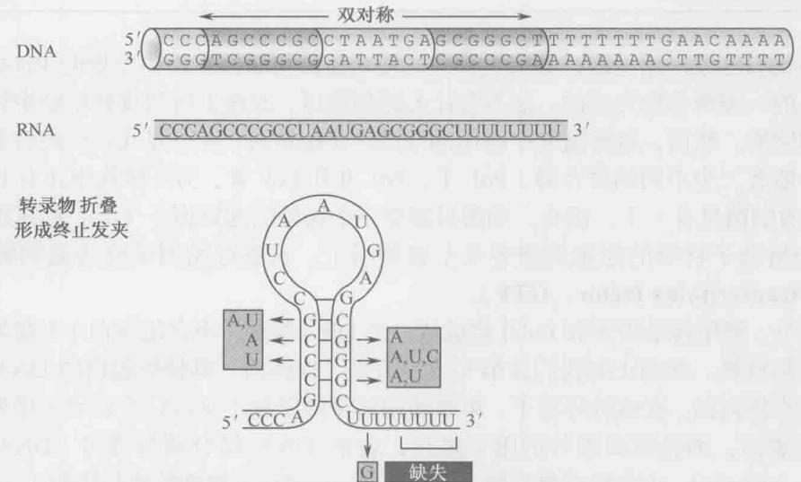  
图 13-13 一个 Rho 非依赖型终止子的序列。上部是终止子在 DNA 中的序列，中部显示 RNA 的序列，底部是终止子发夹的结构。所讨论的终止子来自于第 18 章中讨论的色氨酸衰减子（trp attenuator）。方框中显示的是分离到的破坏终止子序列的突变。（引自 Yanofsky C. 1981. Nature 289: 751–758.）

  
图 13-14 转录终止。图为 Rho 非依赖型终止子如何工作的模型。(a) RNA（图 13-11）中的发夹结构在该区域被聚合酶转录后立刻形成（聚合酶未在此显示）；(b) 该 RNA 结构在聚合酶转录 DNA 下游的 AT 富集区域时将其破坏；(c) 究竟发夹是如何破坏正在转录的聚合物还不太清楚（文中有不同的模型）。发夹结构，以及 RNA 中一段 U 与模板中 A 之间的弱相互作用协同显然使转录物的释放变得容易（引自 Platt T. 1984, Cell 24: 10-23.）

## 真核生物的转录

正如我们已经讨论过的，真核生物中的转录是由与原核生物中发现的 RNA 聚合酶密切相关的一类聚合酶完成的。这不会让人感到惊讶，原核生物与真核生物中转录过程本身是相同的。然而，每种情况中所用的“机器”存在差别。有一点我们已经看到了：真核生物一般有三个不同的聚合酶（Pol I、Pol II 和 Pol III，另外植物中还有 Pol IV 和 Pol V），而细菌只有一个。还有，细菌只需要一个额外的起始因子（σ），而真核生物中有效的和启动子特异的起始则需要几个起始因子。这些起始因子称为通用转录因子（general transcription factor，GTF）。

在体外，通用转录因子和 PolⅡ构成从一个 DNA 模板（不含组蛋白）上起始转录所需要的全部材料。然而正如我们在第 8 章中所见，在体内，真核细胞内的 DNA 模板是整合在核小体内的。在这种环境下，单靠通用转录因子就不足以结合启动子序列并启动有意义的表达，而是需要额外的因子参与，包括 DNA 结合调节蛋白（DNA-binding regulatory protein）、中介蛋白复合体（mediator complex）和染色质修饰酶（chromatin-modifying enzyme）。

我们将先讨论在体外 Pol Ⅱ和通用转录因子被招募到一个启动子上起始转录的基本机制，然后再讨论在体内启动转录所需的额外成分的作用。

## RNA 聚合酶Ⅱ的核心启动子由 4 个不同序列的元件组合而成

真核细胞的核心启动子（core promoter）是指在体外检测时，Pol II 机器精确地起始转录所需要的最少的一组序列元件。代表性的核心启动子的长度大约有 40\~60 个核苷酸，从转录起始位点向上游或下游延伸。图 13-15 显示了在 Pol II 核心启动子中发现的几个元件相对于转录起始位点的位置。它们分别是 TFIIB 识别元件（TFIIB recognition element, BRE）、TATA 元件（或被称为盒子）、起始子（initiator, Inr）和下游启动子元件（downstream promoter element，包括 DPE, DCE, 和 MTE）。通常，一个启动子只含有这些元件之中的几个。比如，启动子通常含有 TATA 元件或 DPE，而不是两者兼备。含 TATA 的启动子经常也会含有一个 DCE。Inr 是最常用的元件，与 TATA 和 DPE 都能共同存在。每一个元件的共有序列和与其结合的通用转录因子在图中也有显示，我们将在下面的部分对这些特征进行更为详细的描述。

在核心启动子之外（而且通常是在其上游）存在一些在体内进行有效转录所需的其他序列元件。这些元件共同组成调节序列（regulatory sequence），并可以划分为几类，反映出它们的位置、所讨论的生物体及它们的功能。这些元件包括：启动子最近元件（promoter proximal element）、上游激活物序列（upstream activator sequence，UAS）、增强子（enhancer），以及一系列称为沉默子（silencer）、边界元件（boundary element）和绝缘子（insulator）的抑制元件。所有这些DNA元件都可以与调控蛋白（激活因子或抑制因子）结合。调控蛋白可以帮助或阻碍从核心启动子开始的转录，我们将在第19章展开讨论。其中有些调控序列可以位于距它们所作用的核心启动子几万甚至几十万碱基之外。

  
图 13-15 Pol II 核心启动子。图中显示了不同 DNA 元件相对于转录起始位点（以 DNA 上方的箭头指示）的位置。正文中所描述的这些元件如下：BRE（TFIIB recognition element，TFⅡB识别元件）；TATA（TATA box，TATA 盒）；Inr（initiator element，起始子元件）；DPE（downstream promoter element，下游启动子元件）；DCE（downstream core element，下游核心元件）。另一个在正文中提及的元件——MTE（motif ten element，十基序元件）未在本图显示，它紧邻 DPE 的上游。图中还显示了每个元件的共有序列（元件的确定方法与细菌启动子元件相同，框 13-1），以及识别每一个元件的通用转录因子的名称。

## RNA 聚合酶Ⅱ在启动子上和通用转录因子形成前起始复合体

通用转录因子共同执行 $\sigma$ 因子在细菌转录中所执行的功能。其中有些因子与 $\sigma$ 的个别区域具有较弱的同源性，通用转录因子帮助聚合酶结合到启动子上并解开 DNA（类似于细菌转录中由闭合式复合体向开放式复合体的转变）。它们也帮助聚合酶从启动子上逃离并开始延伸阶段。一起结合在启动子上准备开始转录的一套完整的通用转录因子和聚合酶称为前起始复合体（pre-initiation complex）。

如上所述（及图 13-15），许多 Pol II 启动子包含一个所谓的 TATA 元件（大约在转录起始位点上游 30 个碱基对处）。这是前起始复合体开始形成的位置。TATA 元件是由叫做 TFIID 的通用转录因子所识别的[“TFII”的名称是指 Pol II 的转录因子（transcription factor for Pol II），单独的因子以 A、B 等加以区分]。像很多通用转录因子一样，TFIID 实际上是一个多亚基复合体。TFIID 中与 TATA 序列结合的成分称为 TBP（TATA binding protein）。此复合体中的其他亚基称为 TAF，即 TBP 关联因子（TBP-associated factor）。某些 TAF 识别其他启动子核心元件，如 Inr、DPE 和 DCE，即使最强的结合是在 TBP 和 TATA 之间，因此，TFIID 是启动子识别和建立前起始复合体必不可少的因子。

TBP 一旦结合到 DNA 上，就使 TATA 序列极大地扭曲变形（我们不久将对这一点进行更为详细的讨论）。形成的 TBP-DNA 复合体提供了一个平台，把其他通用转录因子和聚合酶本身募集到启动子上。在体外，这些蛋白质按照下列顺序在启动子处组装（图 13-16）：TFIIA、TFIIB、TFIIF 与聚合酶一起，然后是 TFIIE 和 TFIIH。包含这些成分的前起始复合体形成后，启动子就开始解旋。与细菌中的情形相反，真核细胞中的启动子解旋需要 ATP 的水解并由 TFIIH 介导，是该因子的类解旋酶活性刺激了启动子 DNA 的解开。

## 启动子逃离需要聚合酶“尾巴”的磷酸化

与细菌中的过程类似，在聚合酶从启动子逃离并进入延伸阶段之前，有一个流产性起始阶段。回忆一下上文提到的细菌中转录起始过程，在流产性起始过程中，聚合酶合成一连串短的转录物。在真核细胞启动子逃离的两个步骤是细菌中所没有的：一个是

ATP 水解（除了前面 DNA 解离所需要的 ATP 水解之外），另一个是聚合酶的磷酸化，对此我们即将进行描述。

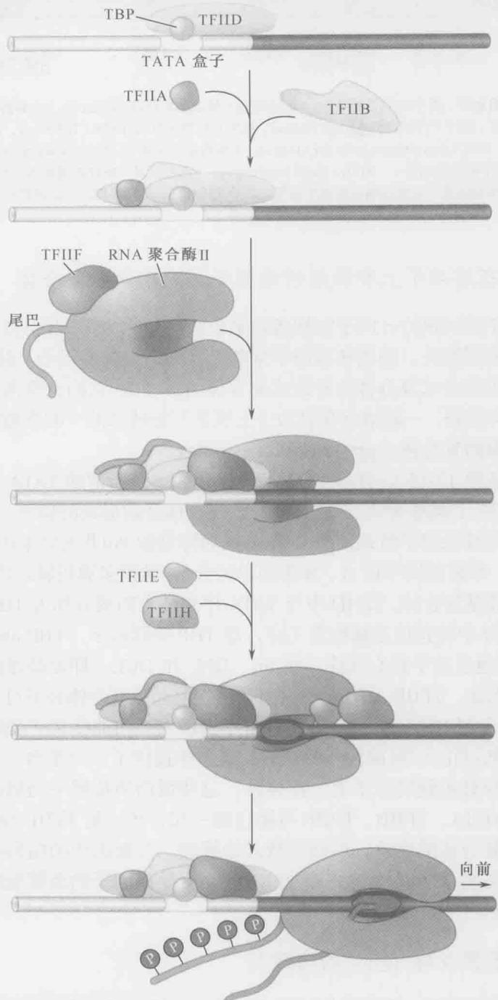  
图 13-16 由 RNA 聚合酶Ⅱ引发的转录起始。这里显示了按步骤进行的 Pol Ⅱ前起始复合体的组装过程，正文对此进行了详细描述。一旦在启动子处完成组装，添加 RNA 合成所需的核苷酸前体，以及聚合酶“尾巴”内部的丝氨酸残基发生磷酸化，Pol Ⅱ就会离开前起始复合体。此尾巴包含多个重复的七肽序列：Tyr-Ser-Pro-Thr-Ser-Pro-Ser（见图 13-21）。

Pol II 的大亚基有一个 C 端域 (carboxy-terminal domain, CTD), 称为“尾巴”(图 13-16)。CTD 包含一连串重复的七肽序列：Tyr-Ser-Pro-Thr-Ser-Pro-Ser。酵母 Pol II 的 CTD 中有 27 个这样的重复序列，秀丽新小杆线虫有 32 个，果蝇有 45 个，人类有 52 个。事实上，重复序列的数字看来与基因组的复杂性相关。每一个重复序列都包含特定的蛋白激酶的磷酸化位点，其中一个激酶就是 TFIIH 的一个亚基。

被募集到启动子上的 PolⅡ最初包含了一个尾巴，这些序列在很大程度上未被磷酸化。但是在延伸复合体内发现的 PolⅡ，则在其尾巴上出现了多个磷酰基基团（phosphoryl group）。这些磷酸盐的添加帮助聚合酶摆脱起始转录所用的大部分通用转录因子，并在逃离启动子时将它们丢下。

就像我们将要看到的，对 PolⅡ的 CTD 的磷酸化状态的调控也控制着后面的步骤——RNA 合成的延伸，甚至 RNA 的加工。实际上，除 TFIIH 外，已发现许多作用于 CTD 的其他蛋白激酶，并且还发现了一个去除由那些蛋白激酶加上的磷酸盐的磷酸酯酶。

## TBP 用一个插入双螺旋小沟的 $\beta$ 折叠来结合并扭曲 DNA

TBP 用一个广泛的 β 折叠（β sheet）区域识别 TATA 元件的小沟（minor groove，图 13-17），这是不常见的。典型的情况是，蛋白质用插入 DNA 大沟的 α 螺旋来识别 DNA，如我们在第 6 章中所见，本章前部分描述的 σ 因子也是如此。TBP 的非传统

识别机制的原因与该蛋白质扭曲局部 DNA 结构有关。但是这一识别模式引出了一个问题：特异性是如何实现的？

我们在第 6 章中已经看到，与 DNA 的大沟相比，小沟中能够区分碱基对的化学信息较少。相反，TBP 依赖 TATA 序列能够经受特殊结构扭曲的能力而对其进行选择，如下面即将要描述的。

当与 DNA 结合时，TBP 会使小沟扩展为一个近乎平面的构象；它还以大约 $80^{\circ}$ 的角度使 DNA 弯曲。TBP 与 DNA 的相互作用仅包括该蛋白质和小沟中碱基对边缘之间有限的一些氢键。相反，特异性主要由插入到识别序列两端的碱基对提供，具体是由能够驱使 DNA 发生强烈弯曲的两对苯基丙氨酸（phenylalanine）的侧链实现的。

  
图 13-17 TBP-DNA 复合体。TBP（紫色）与在许多 Pol II 基因的起始处 DNA 的 TATA 序列（灰色）构成复合体，这一相互作用的细节在正文中进行了描述。（引自 Nikolov D.B. et al. 1995. Nature 377:119.）图像使用 MolScript、BobScript 和 Raster 3D 等软件制作，图像两侧延伸的 DNA 模型由 Leemor Joshua-Tor 建立。

A: T 碱基对更为有利，因为它们易于扭曲而使小沟开始开放。 $\beta$ 折叠中的磷酸盐骨架和基本残基之间也存在着广泛的相互作用，从而增加了相互作用的总体结合能量。

## 其他通用转录因子在起始中也有特殊作用

我们并不完全知道所有其他通用转录因子的功能。正如我们已经指出的，这些因子

中的一些实际上是由两个或更多亚基组成的复合体（表 13-2）。下面我们来阐述几个结构和功能的特征。

TAF TBP 与大约 10 个 TAF 结合。两个 TAF 在启动子处结合 DNA 元件，如起始子元件（Inr）和下游启动子元件（DPE）（图 13-15）。几个 TAF 与组蛋白有结构同源性，尽管没有证据，已有人提出它们可能以相似的方式与 DNA 结合。例如，果蝇（Drosophila）的 TAF42 和 TAF62 已被表

表 13-2 RNA 聚合酶 II 的通用转录因子

<table><tr><td>通用转录因子</td><td>亚基数量</td></tr><tr><td>TBP</td><td>1</td></tr><tr><td>TFIIA</td><td>2</td></tr><tr><td>TFIIB</td><td>1</td></tr><tr><td>TFIE</td><td>2</td></tr><tr><td>TFIIF</td><td>3</td></tr><tr><td>TFIHH</td><td>10</td></tr><tr><td>TAFs</td><td>11</td></tr></table>

表中的亚基数量描述的是酵母细胞，但它们同包括人类在内的其他真核细胞也很相似。然而，也有些许的不同，比如人类的TFIIF只有两个亚基，而TFIIA则有三个。

明形成一个类似于 H3·H4 四聚体（第 8 章）的结构。这些类组蛋白 TAF 不仅在 TFIID 复合体中发现，而且与一些组蛋白修饰酶结合，如酵母的 SAGA 复合体（第 8 章和表 8-7）。

另一个 TAF 似乎调控 TBP 与 DNA 的结合。它利用一个与 TBP 的 DNA 结合表面结合的抑制性盖子来完成这一任务——这是另外一个分子模拟的例子。TBP 要与 TATA 结合，这个盖子就必须被移去。

TFIIB 此蛋白质为一条多肽单链，在 TBP 之后进入前起始复合体（图 13-16）。TFIIB-TBP-DNA 三元复合体的晶体结构显示出特殊的 TFIIB-TBP 和 TFIIB-DNA 联系（图 13-18），其中包括与 TATA 元件上游的大沟（至 BRE）（图 13-15）和下游的小沟之间的碱基特异性相互作用。TFIIB 与 TBP-TATA 复合体的非对称性结合造成了前起始复合体其余部分组装的非对称性，以及由此引起的单向转录。TFIIB 在前起始复合体中也与 Pol II 接触。所以，此蛋白质似乎是连接 TBP-TATA 与聚合酶之间的桥梁。结构研究显示，TFIIB 的部分区域以与细菌中 σ3/4 连接区相似的方式插入 Pol II 的 RNA 出口通道和活性中心裂隙。这些 TFIIB 的区域[被称为连接者（linker）和阅读者（reader）]协助了开放式复合体的形成，这一过程可能是通过在 RNA：DNA 杂合链形成之前稳定解离的 DNA 实现的。

TFIIF 这个双亚基（人类）因子与 PolⅡ结合，并与 PolⅡ（以及其他因子）一起被募集到启动子上。PolⅡ-TFIIF 起着稳定 DNA-TBP-TFIIB 复合体的作用，并且是 TFIIE 和 TFIIH 被募集到前起始复合体上的前提条件（图 13-6）。在酵母中，这个因子包括第三个功能未知的亚基（表 13-2）。

<!-- END OFFICIAL API PART part_005 -->

<!-- BEGIN OFFICIAL API PART part_006 -->

TFIIE 和 TFIIH TFIIE 与 TFIIF 相似，由两个亚基构成，它是下一个结合到前起始复合体上的，并参与 TFIIH 的募集和调控。TFIIH 控制着依赖 ATP 的、从前起始复合体向开放式复合体的转变。它也是通用转录因子中最大和最复杂的——它有 10 个亚基，而且分子质量与聚合酶本身相当。TFIIH 内有两个亚基具有 ATP 酶的功能；还有一个亚基是蛋白激酶，参与启动子的解旋和逃离，如上面所描述过的。与其他因子一起，ATP 酶亚基还参与核苷酸错误匹配的修复（第 10 章）。

TFIIH 是怎样介导启动子 DNA 序列解离的呢？从细菌的例子中我们可以看到，通过

  
图 13-18 TFIIB-TBP-启动子复合体。此结构显示了结合在 TATA 序列上的 TBP 蛋白，正如我们在前面的图中所看到的。这里通用转录因子 TFIIB（蓝绿色）已经加载到复合体上。这个三重复合体形成了一个平台，在前起始复合体组装过程中，其他通用转录因子和 Pol II 被募集到此平台上（引自 Nikolov D.B. et al. 1995. Nature 377: 119.）图像使用 MolScript、BobScript 和 Raster 3D 等软件制作，图像两侧延伸的 DNA 模型由 Leemor Joshua-Tor 建立。

DNA 非编码链上的碱基与 $\sigma$ 亚单位的口袋结构结合，-10 元件从启动子解离。这一过程不需要 ATP 的水解作用，仅仅是通过结合反应的结果倾向于解离的构象而推动的（图 13-8）。真核生物中的情况更为复杂。TFIIH 亚单位的作用类似于 ATP 驱动的双链 DNA 的易位因子。这一亚单位与自聚合酶开始的下游 DNA 结合（正如我们在图 13-16 中看到的），以右手螺旋的方式插入到聚合酶的裂缝中并与双链 DNA 相互作用。由于上游启动子 DNA 被 TFIID 和其他一些 GTF 固定住，TFIIH 这一反应推动了 DNA 的解螺旋。

## 体内的转录起始需要其他蛋白质参与，包括中介蛋白复合体

到现在为止，我们已经描述了在体外 Pol Ⅱ从一条裸露的 DNA 模板起始转录所需的条件。但是我们已经指出，细胞内高水平的、受调控的转录还需要额外的转录调控蛋白、中介蛋白复合体和核小体修饰酶（其自身常常是大的蛋白质复合体的组成部分）（图 13-19）。各个修饰复合体的特征列在第 8 章和表 8-7 中。

这些额外需求的原因之一是 DNA 模板在细胞内包装到染色质内，正如我们在第 8 章中讨论过的。这一条件使聚合酶及其相关因子与启动子的结合变得复杂。被称为激活因子（activator）的转录调控蛋白帮助聚合酶募集到启动子上，使其稳定地结合在那里。这一募集过程是通过 DNA 结合的激活因子、染色质修饰及重塑因子、转录机器组成部分之间的相互作用介导的。其中一个相互作用是与中介复合体（因此而得名）。中介蛋白通过一个表面与大聚合酶亚基的 CTD“尾巴”结合，而将其他表面用于与 DNA 结合的激活因子之间的相互作用。这解释了在细胞内成功地进行转录为什么需要中介蛋白。

  
图 13-19 在中介蛋白、核小体修饰因子和重塑因子及转录激活因子存在时前起始复合体的组装。除了图 13-16 中所示的通用转录因子之外，结合在基因附近位点的转录激活因子募集核小体修饰和重塑复合体、中介蛋白复合体共同帮助形成前起始复合体。

除了在转录激活中的这一核心作用外，中介蛋白中单个亚基的缺失常常导致一小部分基因失去表达，每个亚基对应不同子集的基因（它是由许多亚基构成的）。这很可能反映了一个事实，即不同激活因子被认为与不同中介蛋白亚基相互作用而将聚合酶带到不同的基因上。此外，中介蛋白还通过调控TFIIH内的CTD激酶来帮助转录起始。

  
酵母中介蛋白

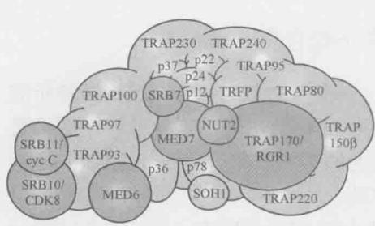  
人类中介蛋白  
图 13-20 酵母和人类中介蛋白的比较。大多数亚基在酵母和人类中都存在，不同的亚基以浅色阴影显示。（酵母中介蛋白图片调整自 Guglielmi B. et al. 2004. Nucleic Acids Res. 32: 5379-5391, Fig. 8B；人蛋白图片获得许可并调整自 Malik S. 和 Roeder R.G. 2005. Trends biochem. Sci. 30: 256-263, Fig. la. ©Elsevier.）

对核小体修饰因子和重塑因子的需求在不同的启动子上甚至同一启动子在不同的环境下都是不同的。无论何时何处，当需要时，这些复合体也是由 DNA 结合的激活因子或者调控 RNA 募集的。

我们将在第 19 章中讨论中介蛋白和修饰因子在激发转录中的作用。现在我们要考察中介蛋白的一些结构和功能上的特性。

中介蛋白包含很多亚基，其中有些亚基从酵母到人类是保守的

如图 13-20 所示, 酵母和人的中介蛋白各自包括 20 个以上的亚基, 其中 7 个在两种生物之间表现出显著的序列同源性(起初, 二者的名称是不同的, 这是由于鉴别它们的过程中所使用的实验方法不同。但最近确立了一个协定, 不同生物体中相当的亚基取一样的名字。图 13-20 也采用了这种命名)。这些亚基的功能几乎都没有鉴定。只有一个 (Srb4 / Med17) 几乎是在所有 Pol II 细胞内转录所必需的。低分辨率的结构比较提示两种中介蛋白具有相似的形状, 而且二者都非常大, 甚至比 RNA 聚合酶本身还要大。

酵母和人类的中介蛋白都是由一些模块组装而成的，每个模块是一组亚基（图13-20）。在体外，这些模块在某些条件下能够彼此分离。这一观测结果和分离手段的不同可以获得多种多样的人类中介蛋白组合（和大小）的事实，使人们认为存在各种形式的中介蛋白（尤其在多细胞动物中），每一种形式都包含一些中介蛋白亚基的子集，而且不同的形式参与调控不同子集的基因或者应答不同类别的调控因子（激活因子或抑制因子）。然而，亚基组成的变化也可能仅仅反映了分离方法的不同，是一种人为因素造成的。

最近完成的对中介蛋白上一个部分（酵母中介蛋白的头部模块）的晶体结构解析有助于我们了解中介蛋白整体的结构。这个模块包含了7个亚单位（Med17/Srb4、Med11、Med22/Srb6、Med6、Med8、Med18/Srb5、Med20/Srb2），形成了具有三个结构域的三维结构，通过与TFIIH和RNA聚合酶的CTD尾部并置的形式与转录复合物结合，并通过前两者的引入推动复合物的磷酸化反应。对丝氨酸残基的磷酸化是转录起始和启动子逃逸所需要的（接下来我们将讨论）。特别需要指出的是，通过TFIIH自身对丝氨酸5的磷酸化将导致中介蛋白在这一过程中从聚合酶上脱离。

## 一组新的因子激发 PolⅡ延伸和 RNA 校对（proofreading）

如前所述，一旦聚合酶逃离了启动子并起始了转录，便转入了延伸阶段。这一转变包括 PolⅡ酶从大部分起始因子的结合体中脱离，如通用转录因子和中介蛋白。另一组因子被募集在它们的位置上。其中的一些（如 TFIIS 和 SPT5）是所谓的延伸因子（elongation factor），也就是激发延伸的因子，其他的是 RNA 加工所需要的。参与 RNA 加工的酶像一些之前已经讨论过的起始因子一样，被募集到 PolⅡ大亚基的 C 端尾巴（CTD）上（图 13-21）。然而，在这一情况中，那些因子更倾向于 CTD 被磷酸化的形式。因而，CTD 的磷酸化导致了起始因子与延伸和 RNA 加工所需要的那些因子之间的交换。

从酵母 PolⅡ的晶体结构可以明显看出，聚合酶 CTD 的位置与新合成的 RNA 离开此酶的通道直接相邻（它能够从酶体延伸出大约 800Å，其长度很长，约 7 倍于酶的其他部分的长度）。这些特征使得它的尾巴可以与延伸和加工机器的几个组分结合并将它们运送到新生成的 RNA 处。

有多个蛋白质被确认可以激发由 PolⅡ介导的延伸。其中之一是激酶 P-TEFb，它是由转录激活因子募集到聚合酶上的。一旦与 PolⅡ结合，此蛋白质就将 CTD 重复序列中第二个单位的丝氨酸残基磷酸化，此磷酸化事件与延伸有关（图 13-21）。此外，P-TEFb 磷酸化，并因此激活另一个称为 SPT5 的蛋白质，它本身是一个延伸因子。最后，还有另一个延伸因子 TAT-SF1 被 P-TEFb 募集。因而，P-TEFb 以三种不同的方式激发延伸。

SPT5 是一种与我们在上文中谈到了细菌转录延伸因子 NusG 相似的蛋白质。事实上，这是在所有生物界的唯一普遍保守的转录因子——从细菌、古菌到真核生物均有存在。NusG/SPT5 蛋白在夹钳的顶端结合各自的 RNA 聚合酶，重叠的部分被区域 4（细菌内）和 TFⅡB（真核生物内）接触。这个重叠区域（可能相互排斥）的绑定显示出一种有趣的可能性；取代启动因子可能是这些延伸机制的一部分。这也表明，调节基因表达进而调节延伸速度是一种古老的机制。

  
图 13-21 RNA 加工酶是由聚合酶的 CTD 尾巴募集的。（a）参与 RNA 加工的各种因子由聚合酶的 CTD 尾巴募集。不同因子的募集取决于尾巴的磷酸化状态。这些因子随后在需要的时候转移到 RNA 上（见正文下节）。（b）第一行显示尾巴的示意图，以及一个拷贝的七肽重复序列。被磷酸化的丝氨酸残基的位置在第二、三行中标出。位置 5 处的丝氨酸残基的磷酸化见于启动子逃离后，并与加帽因子的募集相关。位置 2 处的丝氨酸残基的磷酸化见于延伸期间，并与剪接因子的募集相关。参与转录延伸和 RNA 加工的因子的募集是重叠的。因此，延伸因子 hSPT5 被募集到在 Ser-5 磷酸化的尾巴上。

正如我们将在第19章讨论的，在部分高等真核生物中，启动子招募前起始复合物有较高的效率，但是在起始转录后聚合酶仍然处于暂停的状态。这些启动子看上去，Nus5G/SPT5与相应的RNA聚合酶的“钳子”部位结合，这一部位覆盖了与细菌中的bys区域4或者真核生物中的TFIIB相互作用的序列。这种结合（而且被推断为是互斥的）使分子获得了一种有趣的可能性，即将起始因子重置使之成为延伸因子发挥功能的一部分。这一现象同样提示了对转录延伸速率的调控是一种调节基因表达的古老的机制。这些启动子可能与基因的快速表达或者参与某种高度协调的调控机制有关。同时，招录特定的激活因子（如PETFb激酶）可以将它们从静止状态中释放出来从而调控它们的表达（第19章）。

另一类延伸因子是所谓的 ELL 家族。它们也结合延伸中的聚合酶并抑制聚合酶的瞬时停顿；否则，这种暂停会发生在 DNA 的许多位点。第一个人类 ELL 蛋白最初是在急性髓系白血病(acute myeloid leukemia)中被发现的，作为一个经历置换的基因产物发挥功能(框 19-3)。

另一个不影响起始但激发延伸的因子是TFIIS。类似ELL此因子促进延伸的总体速度，在遭遇到减缓聚合酶进程的序列时，它可以通过限制其暂停时间而发挥功能。聚合酶并不是以一个固定的速度转录整个序列的，这是其特征之一。相反，它会周期性地暂停，有时在恢复转录前会暂停相当长的时间。在TFIIS存在时，聚合酶在任何一个特定位点上暂停的时间都会被缩短。

TFIIS 还有另外一个功能—参与由聚合酶进行的校对。我们在本章的开头已经谈到了聚合酶是如何能够低效地用酶的活性位点来进行核苷酸掺入的逆向反应而去除错误加入的碱基的。除此之外，TFIIS 能够激发聚合酶内固有的 RNA 酶活性（非活性位点的部分），允许通过局部有限的 RNA 降解这样一个不同的途径来去除错误加入的碱基。这一特征与细菌中的 Gre 因子激发的水解编辑相类似。图 13-22 显示了尽管结构与序列上无关，TFIIS 和 GreB 如何以相似的方式分别与酵母和细菌的聚合酶结合来激发同样的反应。

## 延伸 RNA 聚合酶在行进过程中必须应对组蛋白的空间阻碍

与转录起始一样，延伸也在组蛋白的存在下进行，因为 DNA 模板整合在核小体内。RNA 聚合酶如何通过这些潜在的障碍而转录？

比较裸露 DNA 和整合在染色质中的 DNA 的体外转录实验，我们可以观察到染色质在细胞内极大地阻碍转录过程。这个实验设置提供了在染色质存在的情况下确定促转录因子的分析方法。由此，在人类细胞提物中确定了一个称为促进染色体转录（facilitates chromatin transcription, FACT）因子。顾名思义，这个因子使染色质模板进行的转录更有效。FACT 是两个非常保守的蛋白的异型双聚体（heterodimer）——Spt16 和 SSRP1。前者的酵母同源基因在遗传学研究中已经被确定与染色质调制有关。FACT 在延伸中的作用是通过这个复合体与包括 TFIIS 在内的已知的延伸因子之间的遗传相互作用而建立的。

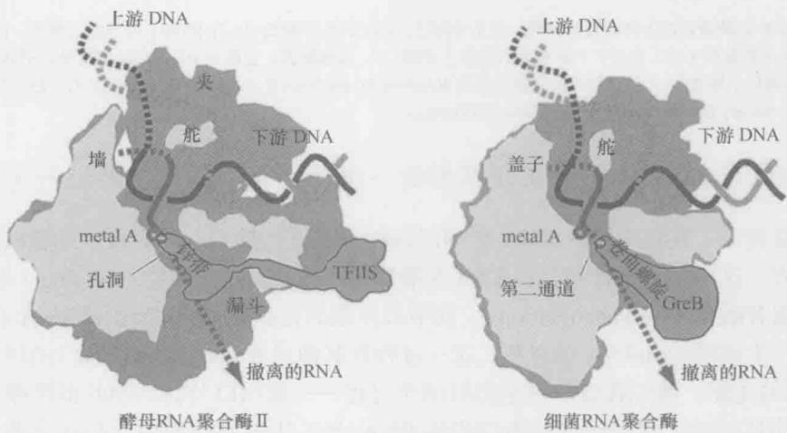  
图 13-22 TFIIS 和 GreB 行为相似。剖面图显示暂停的 RNA 聚合酶Ⅱ与 TFIIS 复合体（左图）以及细菌 RNA 聚合酶与 GreB（右图）的主要特征。TFIIS（橙色）插入 RNA 聚合酶Ⅱ的核心，而 GreB（也是橙色）插入细菌 RNA 聚合酶的通道。在各自情况下，主要的催化镁离子指定为 Metal A（粉色），两个保守的酸性残基用绿色环表示。因此我们看到，虽然这两个蛋白质不同，它们的行为基本一致。虚线箭头表示撤离的 RNA 的假定位置（也参见图 13-11）。（来源：Conaway R.C. et al. 2003. Cell 114: 272–274, Fig. 1. ©Elsevier. 经许可并重新绘制。）

FACT 如何起作用？第 8 章曾提到核小体是八聚体，由 H2A、H2B、H3、H4 组蛋白和 DNA 组成（第 8 章和图 8-20）。这些组蛋白排成两个模块：H2A·H2B 二聚体和 H3·H4 四聚体。Spt16 结合前者，SSRP1 结合后者。令人惊奇的是，FACT 可以通过挪开一个 H2A·H2B 二聚体而拆除组蛋白，也可以通过放回 H2A·H2B 二聚体而重新组装组蛋白。

由此我们描绘出在延伸过程中 FACT 如何起的作用（图 13-23）。在转录中 RNA 聚合酶的前方，FACT 挪开一个 H2A·H2B 二聚体。这使得聚合酶通过那个核小体（在体外，已经显示了从模板上挪开一个 H2A·H2B 二聚体使转录能够进行）。FACT 还有组蛋白伴护活性，这使得它能够在行进的聚合酶后将 H2A·H2B 二聚体立即放回到组蛋白六聚体中。如此，FACT 使得聚合酶延伸，同时保持了转录中染色质的完整性。

  
图 13-23 FACT 协助通过核小体的延伸模型。如文中所述，FACT 显示为 Spt16 和 SSRP1 的异型二聚体，能够在转录的 RNA 聚合酶前方拆除核小体（步聚一）并在其后重装（步骤二）。具体地说，它挪开 H2A·H2B 二聚体。STP6 结合组蛋白 H3，相信能帮助核小体重装。（获得许可并重新绘图自 Reinberg D. and Sims R. 2006. J. Biol. Chem. 281: 23297–23301，Fig. 2b. ©American Society for Biochemistry and Molecular Biology.）

## 延伸聚合酶与各种 RNA 加工所需要的一组新的蛋白质因子相互作用

一旦被转录，真核细胞的 RNA 必须以各种方式进行加工，然后再从细胞核输出到可翻译的地方。这些加工事件包括：RNA 5'端加帽（capping）、剪接（splicing）和 RNA 3'端的多聚腺苷酸化（polyadenylation）。其中最复杂的是剪接——非编码的内含子从 RNA 中去除而产生成熟的 mRNA 的过程。这一过程和其他过程（如 RNA 编辑）的机制及调控是第 14 章的主题。我们在这里讨论另外两个过程——加帽以及转录物的多聚腺苷酸化。

引人注目的是，参与延伸的蛋白质和RNA加工所需要的蛋白质存在交叠。例如，上面提到过的一个延伸因子（SPT5）也帮助募集 $5^{\prime}$ 加帽酶到聚合酶的CTD尾巴[第5位上的丝氨酸磷酸化（图13-21b)]。hSPT5激活 $5^{\prime}$ 加帽酶的活性。又如，延伸因子TAT-SF1募集剪接机器的组分到带有Ser2磷酸化尾巴的聚合酶上（图13-21b）。因而转录的延伸、终止和RNA加工似乎是相互联系的，人们推测这是为了保证它们的正确配合。

第一个 RNA 加工事件是加帽，涉及在 RNA 的 5' 端添加一个修饰过的鸟嘌呤碱基。具体来讲，这是一个甲基化的鸟嘌呤，而且是以一种不常见的包括 3 个磷酸盐的 5'-5' 连接方式加入到 RNA 转录物中的（这一结构展示在图 13-24 的底部）。

5'帽子是由3个酶促反应步骤生成的，细节见图13-24及其说明。在第一个步骤中，一个磷酸盐基团从转录物的5'端去除。然后在第二个步骤中，GMP部分加上。在最后一步中，给此核苷酸添加上一个甲基。RNA从聚合酶的RNA出口通道一出现就被加帽了。这一分子事件发生在转录周期中起始和延伸间的转变阶段。加帽之后，尾部序列重复中的Ser5发生去磷酸化可能导致加帽机器的脱离，而进一步的磷酸化（这次是尾部重复中的Ser2）导致RNA剪接所需要的机器的募集（详见第14章及图13-21b）。

最后一个 RNA 加工事件——mRNA 3'端的多聚腺苷酸化，是与转录的终止密切相关的（图 13-25）。正如加帽和剪接一样，聚合酶的 CTD 尾巴也参与募集某些多聚腺苷酸化所必需的酶（图 13-21）。一旦聚合酶到达基因的末端，就会遇到一段特殊的序列，此序列在转录到 RNA 之后会引发多聚腺苷酸化酶向该 RNA 的转移，导致 4 个事件的发生：mRNA 的切割、多个腺嘌呤被添加到其 3'端、将与 RNA 聚合酶结合着的 RNA 按照由 5'到 3'核酸酶进行降解，以及随后由聚合酶进行的转录终止。下面详述这一系列事件。

在聚合酶接近基因的末端时，两个蛋白质复合体由聚合酶的 CTD 运载：切割和聚腺苷酸化特异性因子（cleavage and polyadenylation specificity factor, CPSF）；切割刺激因子（cleavage stimulation factor, CSTF）。有些序列一旦转录到 RNA 中就会引发这些因子向 RNA 的转移，这些序列被称为 poly-A 信号（poly-A signal），它们的作用方式在图 13-25 中显示。一旦 CPSF 和 CSTF 结合到 RNA 上，其他蛋白质也就被募集，先引起 RNA 的切割，然后是多聚腺苷酸化。

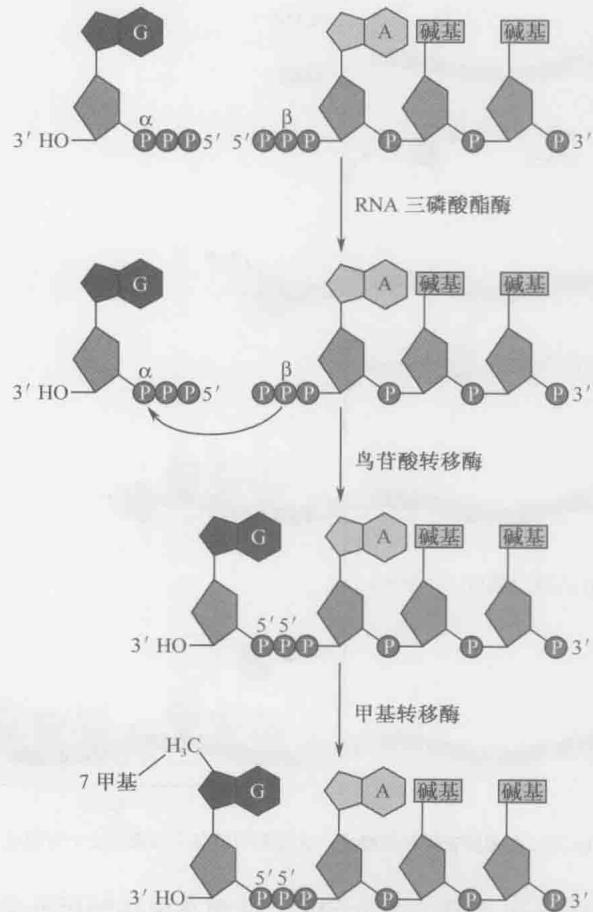  
图 13-24 RNA 的 5' 帽子的结构和形成。第一步，RNA 5' 端的γ-磷酸盐由 RNA 三磷酸酯酶（triphosphatase）去除（一个转录物的起始核苷酸最初保留着其α-、β-和γ-磷酸盐）。下一步，鸟苷酸转移酶（guanylyl transferase）把 GMP 部分加到末端的β-磷酸盐上。这是一个两步过程：首先，酶-GMP 复合体通过 GTP 释放β-和γ-磷酸盐而产生。然后来自酶的 GMP 转移到 RNA5' 端的β-磷酸盐上。一旦形成了这一连接，新加上的鸟嘌呤和 mRNA 起初的 5' 端的嘌呤就由甲基转移酶加上甲基基团而得到进一步的修饰。所形成的 5' 帽子结构随后将核糖体募集到 mRNA 上以准备开始转录（第 15 章）。

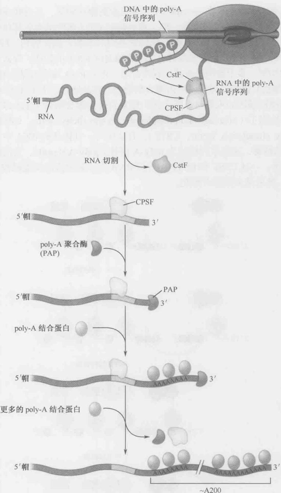  
图 13-25 多聚腺苷酸化和终止。此过程中的各个步骤在文中有描述。

多聚腺苷酸化是由 poly-A 聚合酶介导的，此酶在由切割所形成的 RNA 的 3'端添加大约 200 个腺嘌呤。它以 ATP 作为前体，并以与 RNA 聚合酶相同的化学机制添加核苷酸，但是这一过程并不需要模板，因而长腺苷酸尾巴见于 RNA 中，而非 DNA 中。目前还不清楚决定 poly-A 尾巴长度因素是什么，但是该过程涉及其他与 poly-A 序列特异结合的蛋白质，然后成熟的 mRNA 从细胞核中运出（在第 14 章中讨论）。值得注意的是，长腺苷酸尾巴是由 PolⅡ产生的转录物所特有的，此特征使得可以在实验中用亲和层析法分离蛋白质编码的 mRNA。

如上所述,我们了解了一旦基因被转录,成熟的 mRNA 是如何从聚合酶上释放的。不过是什么终止了聚合酶的转录呢?实际上,聚合酶并不在 RNA 被切割和多聚腺苷酸化时就立刻终止。相反,它继续沿着模板移动,产生第二个 RNA 分子。聚合酶在终止以及从模板上分离前,还可以继续转录几千个核苷酸。接下来将描述转录终止的模型。

转录终止与高活性的 RNase 对 RNA 的破坏紧密关联

多聚腺苷酸化与转录终止密切相关，虽然其机制还不十分清楚。最近，当降解即刻从聚合酶出现的第二个 RNA 的酶已经被确认，这个酶本身可能就引发终止。这被称为终止的“鱼雷模型”（torpedo model）（图 13-26a）。

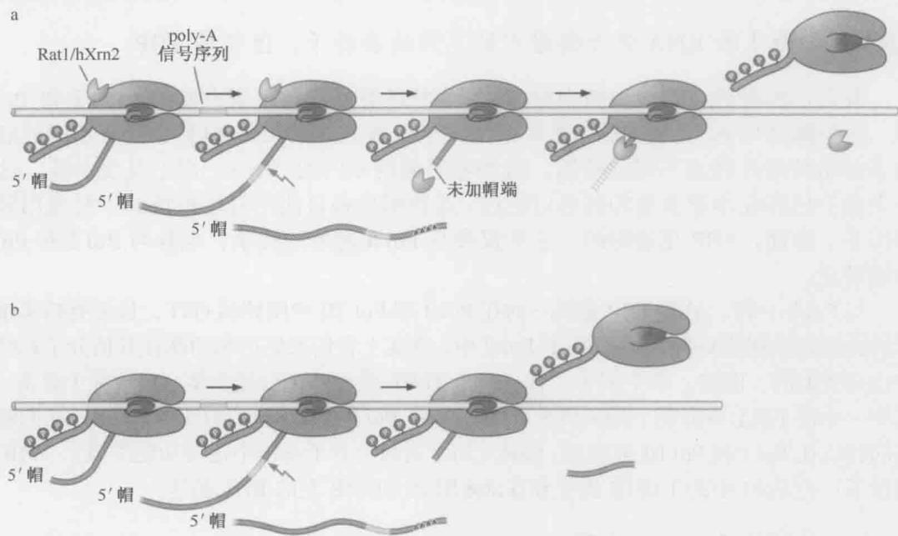  
图 13-26 转录终止的模型：鱼雷（torpedo）和变构（allosteric）。如正文中所述，有两个模型解释真核 RNAPol II 转录一个基因后是如何终止的。图中，在 DNA 上的 poly-A 位点就在紧邻基因的下游（浅绿色，转录本也用浅绿色表示，绿色虚线表示降解的转录物）。（a）在鱼雷模型中，poly-A 位点下游转录的 RNA 被 5'→3'RNase（鱼雷）攻击，该 RNase 由聚合酶本身带到这个转录物上。当这个核酸外切酶追上聚合酶时，它引发了从 DNA 模板上解离和转录的终止。（b）在变构模型中，聚合酶在转录基因时具有高活性，之后一旦过了 poly-A 位点，活性降低。这个改变可能由于修饰和构象改变。即使在变构模型，第二个 RNA 要被 RNase 降解，但不是终止的原因。在此情况下，RNA 降解没有在图中显示，以强调这两个模型不同的终止机制。（来源：Luo W. and Bentley D. 2004, Cell 119: 911–914, Fig. 1. ©Elsevier. 经许可并重新绘制）

第二个 RNA 的自由端没有被加帽, 因此可以与真正的转录物加以区别。这个新 RNA 被一种在酵母中称为 Rat1（人类中是 Xrn2）的 RNase 所识别，该酶被另一个与 RNA 聚合酶的 CTD 结合蛋白（Rtt103）运送到 RNA 的末端。Rat1 酶活性很高，从 5'→3' 方向迅速地降解 RNA，直到追上还在转录的、RNA 不断从中涌出的聚合酶。转录终止可能不需要 Rat1 和聚合酶之间有任何特异的相互作用，实际上是以与本章前面部分描述过的细菌中 Rho 依赖型终止类似的方式引发的，即高活性的 RNase 把聚合酶往前推，并且 / 或者将余下的新生 RNA 转录物从聚合酶中拉出来。除了 Rat1 之外，其他因子也可能是聚合酶在体外离开 DNA 链的过程所需要的。仅有 Rat1 不能完成这一功能，甚至直到转录本被降解的时候。

尽管转录终止的鱼雷模型的认可程度在目前占有优势，但有人还提出了另外一个模型称为“变构模型”（allosteric model）（图 13-26b）。根据这个模型，终止取决于延伸聚合酶的构象改变，构象改变降低了酶的活性，导致其后不久就自发终止。这个构象改变可能与多聚腺苷酸化相关联，可能的引发原因有聚合酶 CTD 尾巴的 3'加工酶转移到 RNA，随后结合到其他诱发构象改变的因子的 CTD 尾巴上等。

## 由 RNA 聚合酶 | 和 RNA 聚合酶 || 催化的转录

## RNA 聚合酶 I 和 RNA 聚合酶 III 识别不同的启动子，但仍需 TBP

我们已经提到，真核细胞中除 PolⅡ之外还有另外两个聚合酶——PolⅠ和PolⅢ。这些酶是与PolⅡ相关的，甚至共用几个亚基（表13-2），但是它们从不同的启动子起始转录并转录不同的基因。这些基因编码专门的RNA，而不是蛋白质，这一点我们已经在本章前面的部分讨论过。这些酶也各自使用自己独特的一组通用转录因子。然而，TBP是通用的，它不仅参与PolⅡ起始的转录，也参与PolⅠ和PolⅢ的转录。

与 PolⅡ一样，虽然 TBP 是唯一的在 Pol I 和 Pol III 中用到的 GTF，最近有越来越多的证据显示别的 GTF 同样存在于 PolⅡ中，事实上它们的结构和功能在其他分子系统中也是类似的。因此，举个例子，有一个与 TFIIE 类似的蛋白复合体，包含两个亚基，其中一个在 Pol I 中出现（A49/34.5），另一个在 PolⅡ中出现（C37/53）。TFIIE 样的亚基同样也在 Pol I 和 Pol III 被发现。除此之外，这两个分子系统中包含功能类似于 TFIIB 的因子：在 Pol I 中的 TAF1B 因子和在 Pol III 的 TFIIIB 上的 Brf1 亚基。

## Pol I 只用于转录 rRNA 基因

Pol I 只用于一个基因的表达, 那就是合成 rRNA 前体的基因。该基因在每个细胞中都有很多拷贝, 事实上它的表达水平远远高于其他任何基因, 这也许解释了为什么它有自己专用的聚合酶。

rRNA 基因的启动子包括两个部分：核心元件和上游控制元件（upstream control element，UCE），如图 13-27 所示。前者位于转录起始位点周围，后者在上游 100\~150bp 处（在人类中）。除了 Pol I 之外，起始还需要另外两个称为 SL1 和 UBF 的因子。SL1 由 TBP 和 3 个 Pol I 转录特异的 TAF 组成，这一复合体结合核心元件。SL1 只有在 UBF 存在时才与 DNA 结合，该因子结合 UCE，引入 SL1 并通过募集 Pol I 至核心启动子激发转录。

## Pol III 启动子位于转录起始位点的下游

Pol Ⅲ启动子有多种形式，而且绝大部分具有位于转录起始位点下游的不寻常特征（如在基因的编码区内）。一些 Pol Ⅲ启动子（如 tRNA 基因的启动子）包含两个区域，称为盒子 A 和盒子 B，二者被一个短的元件分隔开（图 13-28）；另一些包含盒子 A 和盒子 C（如 5S rRNA 基因）；还有一些包含与 Pol Ⅱ启动子相似的 TATA 元件。

  
图 13-27 Pol I 启动子区域。(a) Pol I 启动子结构；(b) Pol I 转录因子。这里显示的是人类的情况。酵母中参与帮助 Pol I 转录的一组蛋白质明显不同。

与 Pol Ⅱ和 Pol Ⅰ一样，Pol Ⅲ进行的转录除需要聚合酶之外，还需要转录因子。在这一情况中，这些因子称为 TFIIIB 和 TFIIIC（对于 tRNA 基因），5S rRNA 基因的转录还需要加上 TFIIIA。

图 13-28 显示了 tRNA 的启动子。这里，TFIIIC 复合体结合到启动子区域。这个复合体将 TFIIIB 募集到紧邻起始位点上游的 DNA 上，在那里它将 Pol III 募集到转录的起始位点上，然后此酶起始转录。推测当它转录时将 TFIIIC 从 DNA 模板上替换掉。与另两类聚合酶一样，Pol III 也使用 TBP，这一普遍存在的因子见于 TFIIIB 复合体中。

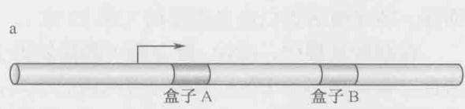

  
图 13-28 Pol III 核心启动子。这里显示的是一个酵母 tRNA 基因的启动子。导致转录起始的事件的次序在正文中有描述。对于其他 Pol III 基因（就像对于 5S rRNA 一样），TFIIIA、TFIIIB 和 TFIIIC 这样的蛋白因子是必需的，其中 TFIIIA 结合在盒 A 上。

## 小结

基因表达是 DNA 双螺旋中的信息转移到 RNA 和蛋白质中的过程, 蛋白质的活性则赋予了一个细胞形态和功能。转录是基因表达的第一步, 包括将 DNA 复制成 RNA。这

一过程是由 RNA 聚合酶催化的。

RNA 聚合酶从细菌到人是高度保守的。真核细胞至少有三个不同的聚合酶，细菌只有一个。真核细胞的三个常见的 RNA 聚合酶称为 RNAPol I、Ⅱ和Ⅲ。在本章中我们主要集中在 Pol Ⅱ上，因为它是转录细胞中绝大部分基因和全部蛋白质编码基因的酶。在植物中还存在另外两种 RNA 聚合酶——Pol IV 和 Pol V。

大肠杆菌的基本酶称为核心酶，含有各一个拷贝的 $\beta$ 、 $\beta'$ 、 $\omega$ 亚基和两个拷贝的 $\alpha$ 亚基。所有这些亚基在真核细胞的酶中都有同源物。细菌和酵母 Pol II 的结构也很相似，二者都组装成一个蟹爪的形状，在细菌的酶中蟹钳是由最大的亚基 $\beta$ 和 $\beta'$ 组成的。活性位点在钳子的基部，进出活性位点的途径是由 5 个通道提供的：一个允许双链 DNA 从酶前部的钳子之间进入；另外两个允许两条单链——模板和非模板链通过活性位点之后离开酶；另一个通道为 NTP 进入活性位点提供途径；在聚合位点后面一小段距离从 DNA 模板上剥离下来的 RNA 产物，则从第 5 个通道离开酶。

PolⅡ在一个很重要的方面与细菌的酶不同。前者在大亚基的C端末尾有一个所谓的“尾巴”，而细菌的酶是没有的。这个尾巴是由多个七肽序列重复组成的。

一个周期的转录要经过三个阶段，称为起始、延伸和终止。虽然 RNA 聚合酶能够独立地合成 RNA，但精确而有效的转录起始需要其他称为起始因子蛋白的参与。这些因子确保酶只从 DNA 上称为启动子的适当位置起始转录。在细菌中只有一个起始因子 $\sigma$ ，而在真核细胞中则有几个，合称通用转录因子。真核细胞的 DNA 是包裹在核小体内的，在细胞内的有效起始通常需要额外的蛋白质参与，包括中介蛋白复合体和核小体修饰酶。转录激活蛋白也是需要的（第 19 章）。

在起始过程中，RNA 聚合酶（和起始因子一起）在一个闭合式复合体中与启动子结合。在该状态下 DNA 仍保持着双链的形式，然后这一闭合式复合体经历异构化作用而变为开放式复合体。在该形式中，转录起始位点周围的 DNA 解开，从而破坏碱基对并形成一个单链 DNA“泡”。这一转变使得聚合酶等可以接近模板链，而模板链将决定新 RNA 链中碱基顺序的。起始的这一阶段之后是启动子逃离：一旦酶合成了一系列短 RNA（称为流产性起始），它会设法生成一段超过 10 个碱基的转录物。此时酶离开启动子而进入了延伸阶段。在这一阶段中，聚合酶沿着基因移动，同时执行几项功能：它打开 DNA 的下游序列并在活性位点的上游（后方）将其重新合上；它将核糖核苷酸添加到正在延长的转录物的 3' 端；它在聚合位点后方大约 8bp 或 9bp 的位置将新形成的 RNA 链从模板上剥离；它还校对转录物，查找（并替换）错误插入的核苷酸。

细菌和真核细胞中的转录按照大体相同的步骤进行。然而，两者也存在一些区别。例如，在细菌中，向开放式复合体转变的异构化作用是自发的，不需要 ATP 水解；在真核细胞中这一步骤则是需要 ATP 水解的。更为惊人的是，在真核细胞中启动子逃离是由 CTD 尾巴的磷酸化状态调控的。这样在前起始复合体中与启动子结合的 PolⅡ有一个未磷酸化的 CTD。CTD 被一个或多个激酶磷酸化，其中一个是通用转录因子之一（TFIIH）的一部分。

一旦被磷酸化, PolⅡ的 CTD 尾巴就将自己从与启动子上的其他蛋白质的结合状态中释放出来，使聚合酶进入延伸阶段。然后 CTD 与参与转录延伸和 RNA 加工的因子相结合。因而，当聚合酶从启动子移走并开始转录基因时，存在一个起始因子与延伸和加工因子的互换。延伸因子和参与加工的因子之间也存在相互作用，确保这些事件被正确地协调起来。细菌和真核之间的另一个不同点是后者必须在延伸阶段对付核小体。这要求另一个复合体可以在前方拆除核小体，在后方重装核小体使聚合酶向前。

在细菌和真核细胞中转录终止也是不同的。在细菌中有两种终止子——固有的Rho非依赖型和Rho依赖型。固有终止子包括两个RNA转录后才起作用的序列元件。一个元件是一段在RNA内形成一个茎-环结构的反向重复序列，它可以与一串U核苷酸（仅与模板链微弱结合）共同作用，引起转录物的释放。Rho依赖型终止子需要ATP酶Rho，它与正在延伸的转录本结合并沿着转录过程移动，直到遇上聚合酶引发转录的终止。在真核细胞中，转录终止是与3'聚腺苷酸化的RNA加工事件密切相关的。在这类生物中，转录终止则涉及另一个蛋白RNase，沿着一条新生的转录本行进，直到撞到聚合酶引发终止。

在本章中我们讨论了 RNA 转录物 5'端的加帽、3'端的聚腺苷酸化，以及后者与转录终止之间的联系。剪接将在下一章中进行描述。

## 参考文献

## 书籍

Cold Spring Harbor Symposia on Quantitative Biology. 1998. Volume 63: Mechanisms of transcription. Cold Spring Harbor Laboratory Press, Cold Spring Harbor, New York.

## RNA 聚合酶和转录起始

Brueckner F., Ortiz J., and Cramer P. 2009. A movie of the RNA polymerase nucleotide addition cycle. Curr. Opin. Struct. Biol. 19:294–299.

Campbell E.A., Westblade L.F., and Darst S.A. 2008. Regulation of bacterial RNA polymerase σ factor activity: A structural perspective. Curr. Opin. Microbiol. 11: 121–127.

Conaway R.C. and Conaway J.W. 2011. Origins and activity of the Mediator complex. Semin. Cell Dev. Biol. 22: 729–734.

Cramer P., Armache K.J., Baumli S., Benkert S., Brueckner F., Buchen C., Damsma G.E., Dengl S., Geiger S.R., Jasiak A.J., et al. 2008. Structure of eukaryotic RNA polymerases. Annu. Rev. Biophys. 37: 337–352.

Ebright R.H. 2000. RNA polymerase: Structural similarities between bacterial RNA polymerase and eukaryotic RNA polymerase II. J. Mol. Biol. 304: 687–698.

Hahn S. and Young E.T. 2011. Transcriptional regulation in Saccharomyces cerevisiae: Transcription factor regulation and function, mechanisms of initiation, and roles of activators and coactivators. Genetics 189: 705–736.

Kornberg R.D. and Young E.T. 2007. The molecular basis of eukaryotic transcription Proc. Natl. Acad. Sci. 104: 12955–12961.

Krishnamurthy S. and Hampsey M. 2009. Eukaryotic transcription initiation. Curr. Biol. 19: R153–R156.

Malik S. and Roeder R.G. 2005. Dynamic regulation of Pol II transcription by the mammalian Mediator complex. Trends Biochem. Sci. 30:256–263.

Roberts J.W. 2006. RNA polymerase, a scrunching machine. Science 314:1097–1098.

Saecker R.M., Record M.T. Jr, and Dehaseth P.L. 2011. Mechanism of bacterial transcription initiation: RNA polymerase promoter binding, isomerization to initiation-competent open complexes, and initiation of RNA synthesis. J. Mol. Biol. 412: 754–771.

Sekine S., Tagami S., and Yokoyama S. 2012. Structural basis of transcrip-

Sekine S., Tagami S., and Yokoyama S. 2012. Structural basis of transcription by bacterial and eukaryotic RNA polymerases. Curr. Opin. Struct. Biol. 22: 110–118.

## 启动子

Juven-Gershon T., Hsu J.Y., Theisen J.W., and Kadonaga J.T. 2008. The RNA polymerase II core promoter—The gateway to transcription. Curr. Opin. Cell Biol. 20: 253–259.

## 延伸和 RNA 加工

Herbert K.M., Greenleaf W.J., and Block S.M. 2008. Single-molecule studies of RNA polymerase: Motoring along. Annu. Rev. Biochem. 77:149–176.

Maniatis T. and Reed R. 2002. An extensive network of coupling among gene expression machines. Nature 416: 499–506.

Perales R. and Bentley D. 2009. "Cotranscriptionality": The transcription elongation complex as a nexus for nuclear transactions. Mol. Cell. 36:178–191.

Petesch S.J. and Lis J.T. 2012. Overcoming the nucleosome barrier during transcript elongation. Trends Genet. 28: 285–294.

Reinberg D. and Smith R.J. III 2006. de FACTo nucleosome dynamics. J. Biol. Chem. 281: 23297–23301.

Zhou Q., Li T., and Price D.H. 2012. RNA polymerase II elongation control. Annu. Rev. Biochem. 81: 119–143.

## 终止

Luo W. and Bartley D. 2004. A ribonucleolytic rat torpedoes RNA polymerase II. Cell 119: 911–914.

Peters J.M., Vangeloff A.D., and Landick R. 2011. Bacterial transcription terminators: The RNA 3'-end chronicles. J. Mol. Biol. 412: 793–813.

Richardson J.P. 2006. How Rho exerts its muscle as RNA. Mol. Cell 23:711–712.

Rosonina E., Kaneko S., and Manley J.L. 2006. Terminating the transcript: Breaking up is hard to do. Genes Dev. 20: 1050–1056.

## RNA 聚合酶 I 和 III

Schramm L. and Hernandez N. 2002. Recruitment of RNA polymerase III to its target promoters. Genes Dev. 16: 2593–2620.

Vannini A. and Cramer P. 2012. Conservation between the RNA polymerase I, II, and III transcription initiation machineries. Mol. Cell 45:439–446.

White R.J. 2008. RNA polymerases I and III, non-coding RNAs and cancer. Trends Genet. 24: 62.

## 习题

## 偶数习题的答案请参见附录2。

习题 1 除了胸腺嘧啶被尿嘧啶替代，RNA 转录产物同哪一条 DNA 链是完全相同的？请从下面的选项中选择一项或多项：模板链、非模板链、编码链、非编码链。请对你的选择做出解释。

习题 2 请解释为什么转录的调节经常涉及启动子和启动子相互作用蛋白。

习题 3 转录的起始发生在转录延伸阶段之前，包括三步。请描述这三步，尤其注意每一步中 RNA 聚合酶的主要特征。

习题 4 设想现在有一个含有-35 元件和-10 元件的细菌启动子，如果想展示 RNA 聚合酶确实是以转录起始位点上游-35 和-10 位点为中心的区域结合，什么样的分析或者试验是最好的？（回顾第 7 章可能有所帮助）

习题 5 有一种论断称 “-35 元件的序列总是 5'-TTGACA-3'”，请判断该论断的的对错并给出解释。

习题 6 在给定的三种细菌转录起始模型（transient excursion 模型、inchworming 模型和 scrunching 模型）中，哪一种模型代表的假设被大多数数据所支持？请描述这些实验的一般性结论。

习题 7 请描述原核生物中 RNA 聚合酶的两种校对功能。

习题8 假设现在有一段Rho非依赖型终止子序列5'-CCCAGCCCGCCUAAUGAGCGG GCUUUUUUUU-3'。为什么任意一个粗体所示核苷酸位置的点突变都可以导致转录的终止？你如何来检测你的结论？

习题 9 请解释为什么真核细胞中高水平的转录反应需要中介蛋白和核小体重塑因子，

而在体外则不然？

习题 10 在真核生物转录周期中，哪些步骤是因为 RNA 聚合酶Ⅱ大亚基的羧基末端发生磷酸化而激活甚至过度激活的？

习题 11 你想对 5'RNA 帽子形成过程中的 mRNA 5'端进行放射性同位素标记，在帽形成反应中，你想使用 $\alpha-$ 、 $\beta-$ 还是 $\gamma-^{32}P$ GTP？请解释为什么。

习题 12 Poly-A 聚合酶同 RNA 聚合酶在功能上有什么不同？

习题 13 对于真核生物的 mRNA 来说，帽子结构和 poly-A 尾巴的添加有什么作用？

习题 14 从事真核生物转录终止的鱼雷模型研究的科研人员想对 Rtt103 和 Rat1 在转录基因上的定位进行检测，为此，他们使用带有标签的 Rat1 蛋白进行了染色质免疫沉淀试验（ChIP，可参考第 7 章）。他们首先对从野生型细胞中提取到的染色质进行剪断处理，然后使用针对 Rat1 蛋白标签的特异性蛋白对 Rat1 蛋白进行免疫沉淀。之后他们又使用不同的引物组合对沉淀得到的 DNA 进行扩增，

这些引物仅特异性针对高转录活性的基因。我们以 ADH1 基因为例展示试验的结果。针对该基因，科研人员选择了三种特异性的引物：一种用于特异性扩增可读框（ORF）上游的 TATA 框序列，结果见泳道 1；一种用于特异性扩增可读框的 3' 端区域，结果见泳道 2；另一种用于特异性扩增 DNA 3' 端编码 poly-A 信号序列的 DNA 区域，结果见泳道 3。他们比较了免疫沉淀前后（分别如左右图所示）染色质样品的 PCR 反应结果。此外，研究人员还对 5 号染色体上的非转录区域进行了特异性扩增，两张电泳图中每条泳道底部的条带表示的就是该反应的结果。

A. 如左图所示，在免疫沉淀前样品的 PCR 结果中，所有条带的强度大致相等。请解释其中的原因。
B. 从以上的染色质免疫沉淀试验中我们能得出的主要结论是什么？
C. 其他高转录活性基因的 ChIP 数据同 ADH1 基因的类似，请解释这样的数据是如果支持 torpedo 模型的。

改编自 Kim et al. (2004. Nature 432: 517-522)。
