## 第15章

本章概要

信使RNA

转运RNA

连接氨基酸到 tRNA 上

核糖体

翻译的起始

翻译延伸

翻译终止

翻译的调控

依赖于翻译过程的 mRNA 和蛋白质的稳定性调节

## 翻 译

本章和下一章讨论的中心问题是，蕴藏在信使 RNA（mRNA, messenger RNA）核苷酸序列中的遗传信息是如何被解读并产生蛋白质氨基酸序列的。这一过程称作翻译（translation）。在我们之前所讨论过的所有生理过程中，翻译是所有生物体中最保守，也是细胞中最耗费能量的过程之一。在快速生长的细菌细胞中，最多可有80%的能量和50%的细胞干重是专门用于蛋白质合成的。实际上，仅一个蛋白质的合成就需要上百种蛋白质和 RNA 的配合工作。由于翻译过程的本质较为复杂，我们分两章对其进行讨论。本章描述解码 mRNA 的一系列过程。第16章描述遗传密码的本质和转运 RNA（tRNA）对遗传密码的识别。

在信息传递中，翻译远比 DNA 到 RNA 的转录过程复杂。与 DNA 模板和信使 RNA 的核苷酸互补性不同的是，氨基酸的侧链与 RNA 的嘧啶和嘌呤之间几乎没有什么特异的亲和力。例如，丙氨酸（alanine, Ala）、缬氨酸（valine,

Val）、亮氨酸（leucine，Leu）和异亮氨酸（isoleucine，Ile）构成的疏水侧链不能和核苷酸碱基中的氨基和酮基形成疏水键。同样地，很难想像每三个RNA碱基所形成的不同组合能够与芳香族氨基酸包括苯丙氨酸（phenylalanine，Phe）、酪氨酸（tyrosine，Tyr）和色氨酸（tryptophan，Trp）形成特异亲和的表面。因此，多肽链中特异而准确的氨基酸序列似乎不可能是由mRNA模板和氨基酸的直接相互作用导致的。

考虑到上述问题，在 1955 年 Francis H. Crick 提出，在形成多肽链之前，氨基酸必须结合一个能够直接识别并作用于信使 RNA 三核苷酸密码子的特殊的转配分子(adaptor)。Crick 猜测这一转配器分子可能是 RNA 分子, 因为这个分子需要通过 Watson-Crick 的碱基互补原则来识别遗传密码。仅仅两年之后, Paul C. Zamecnik 和 Mahlon B. Hoagland 就证明了, 在蛋白质形成之前, 氨基酸确实和一组 RNA 分子 (约占所有细胞 RNA 的 15%) 相结合。这些 RNA 称为转运 RNA (或 tRNA), 因为它们携带的氨基酸随后被转运到不断延伸的多肽链上。

将信使 RNA 的语言翻译成蛋白质语言的机器由 4 种基本的成分组成：信使 RNA (mRNA)、转运 RNA (tRNA)、氨酰-tRNA 合成酶（aminoacyl tRNA synthetase）和核糖体（ribosome）。通过合作，它们完成了一项非凡的任务：将一种由 4 种碱基书写的密码翻译成由 20 种氨基酸书写的密码。作为翻译的模板，mRNA 提供了必须由翻译机器来解读的信息。mRNA 的蛋白质编码区是由称为密码子（codon）的一系列有序的三核苷酸单位组成的，密码子的排列顺序将决定氨基酸的排列顺序。tRNA 提供了将要组合到多肽链的氨基酸和 mRNA 的密码子之间的物理界面。氨酰-tRNA 合成酶使氨基酸和能识别相应密码子的特异 tRNA 结合起来。翻译过程最后一个重要角色是核糖体，它是一个由 RNA 和蛋白质组成的分子质量为数百万道尔顿的庞大的细胞器。核糖体协调着 tRNA 对 mRNA 的正确识别，并催化处于合成状态中的多肽链和已结合到特定 tRNA 上的氨基酸形成肽键结构。

我们将首先讨论4个组分中每一组分的主要特征，然后描述这4种组分如何共同作用以完成翻译。最近对阐明翻译机器各组分的结构相关研究进展使得翻译过程成为激动人心的研究领域——一个充满着机械论思想的领域。我们将要提出以下的问题：mRNA中核苷酸序列信息的组织结构是怎样的？tRNA的结构是怎样的？氨酰—tRNA合成酶是如何识别并结合正确的氨基酸到各个tRNA上的？最后，核糖体是如何解码核苷酸序列信息和把氨基酸加入到延伸过程中的多肽链上的？

## 信使RNA

## 多肽链是由可读框决定的

翻译机器只解码每条 mRNA 的部分序列。如在第 2 章中所提到的及在第 16 章中将要详细讨论的，蛋白质合成的信息蕴藏在三联核苷酸密码子中，每个密码子决定一个氨基酸。每条 mRNA 的蛋白质编码区由连续的、不交叠的、称为可读框（open reading frame，一般简称为 ORF）的密码子串组成。每个 ORF 对应一个蛋白质，其起始和终止点都位于 mRNA 内部，即 ORF 的终止点不同于 mRNA 的终止点。

翻译始于可读框的 5'端起点，每次读取一个密码子直到 3'端终点。第一个和最后一个密码子分别称为起始密码子（start codon）和终止密码子（stop codon）。细菌中，起始密码子通常是 5'-AUG-3'，但是 5'-GUG-3'有时甚至 5'-UUG-3'也被使用。真核细胞总是使用 5'-AUG-3'作为起始密码子。起始密码子有两个重要的功能：第一，它决定插入到延伸过程中的多肽链的第一个氨基酸；第二，它确定了所有后续密码子的可读框。由于密码子是一个紧接一个排列（但不相互交叠），而且由三个核苷酸组成，因此每条mRNA 链可以用三种不同模式的可读框来翻译（图 15-1）。但是一旦翻译开始了，可读框的模式就确定了。这样，通过设定第一个密码子的位置，起始密码子决定了所有后续密码子的位置。

  
图 15-1 大肠杆菌 Trp（Escherichia coli trp）前导序列的三种可能的可读框。起始密码子以绿色表示，终止密码子以红色表示。每个可读框编码的氨基酸序列在每一密码子的下方以单个字母表示。

终止密码子有三个（5'-UAG-3'、5'-UGA-3'、5'-UAA-3'），它们决定可读框的终点并发出终止多肽合成的信号。我们现在可以全面地理解可读框这一术语的含义了。它是一段连续的密码子，以特定的框架（由第一个密码子决定）来“阅读”，该框架对翻译过程是“开放”的，因为它没有终止密码子（也就是说，翻译过程可持续到ORF的最后一个密码子）。

信使 RNA 包含至少一个可读框。每条 mRNA 的 ORF 数量在真核和原核细胞中是有区别的。真核细胞的 mRNA 几乎都只有一个 ORF。相反，原核细胞的 mRNA 经常含有两个或多个 ORF，因此可编码多个多肽链。含有多个 ORF 的信使 RNA 称为多顺反子 mRNA（polycistronic mRNA），而那些只编码一个 ORF 的信使 RNA 称为单顺反子 mRNA（monocistronic mRNA）。正如在第 13 章中所提到的，细菌中的多顺反子 mRNA 经常编码功能相关的蛋白质，如在氨基酸或核酸的生物合成过程中参与不同步骤的蛋白质。典型的原核和真核细胞的 mRNA 结构如图 15-2 所示。

## 原核细胞 mRNA 具有核糖体结合位点，可以募集翻译机器

要使翻译发生，mRNA 必须募集核糖体。为了促进其与核糖体结合，许多原核细胞的可读框在起始密码子的上游（5'端）含有一段短序列称为核糖体结合位点（ribosomebinding site, RBS）。这一元件也被称作 SD 序列（Shine-Dalgarno sequence），它是通过比较多个 mRNA 序列后所发现，并以发现它的科学家的名字所命名的。RBS 一般位于起始密码子 5'端 3\~9 个碱基内，并与核糖体 RNA 组分之一的 16S 核糖体 RNA（rRNA，图 15-2a）的 3'端的一段序列互补。RBS 与这一 RNA 发生碱基配对，使得核糖体排列在可读框的起始处。16S RNA 的这一区域的核心序列为 5'-CCUCCU-3'。无独有偶，原核细胞的 RBS 大多具有 5'-AGGAGG-3'序列。RBS 和起始密码子之间碱基的互补状况和空间距离对可读框翻译的活跃程度有很大的影响：互补度高并且距离适合的情况能提高翻译的水平；反之，互补度低和（或）距离不当则通常导致较低水平的翻译。

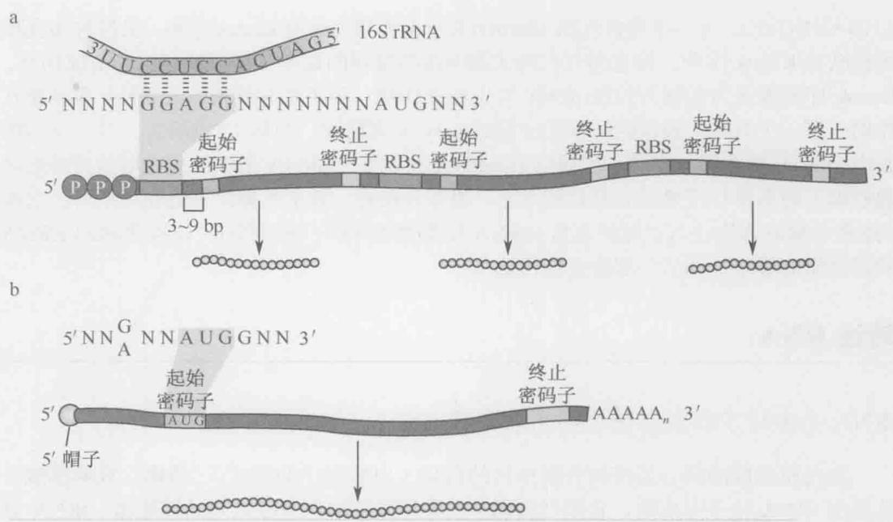  
图 15-2 信使 RNA 的结构。(a) 一个多顺反子的原核细胞信使 RNA。核糖体结合位点以 RBS 表示。(b) 一个单顺反子的真核细胞信使 RNA。5' 帽子结构在 mRNA 的末端以球形表示。

某些原核细胞的 ORF 缺乏较强的 RBS 但仍有活跃的翻译。这些 ORF 不是 mRNA 的第一个 ORF，而位于多顺反子信使 RNA 中另一个 ORF 之后（不是所有的原核 mRNA 是多顺反子）。在这些情况下，下游可读框的起始密码子经常与上游可读框的 3' 端相交叠（大多数是 5'-AUGA-3' 序列，既有起始密码子，也有终止密码子）。这样，刚刚结束上游可读框翻译的核糖体正好处于恰当的位置，并从下游可读框的起始密码子开始翻译。这种结构安排绕开了用 RBS 募集核糖体的需要。这种交叠可读框之间的连锁翻译称为翻译耦合（translational coupling）。需要注意的是，在这种情况下，下游 ORF 的翻译的进行需要依赖于上游 ORF 的翻译。事实上，对于两个翻译耦合的基因，上游 ORF 中的终止突变也会阻止下游 ORF 的翻译。

## 真核细胞 mRNA 在 5' 和 3' 端被修饰，以促进翻译

与原核细胞不同，真核细胞的 mRNA 通过位于 5' 端的称为 5' 帽子（5' cap）的特殊化学修饰来募集核糖体（第 13 章和图 13-25b）。所谓 5' 帽子，是一个通过与众不同的 5'-5' 结合方式与 mRNA 的 5' 端结合的甲基化鸟嘌呤核苷酸。经过 3 个步骤进行合成（第 13 章和图 13-24），5' 帽子的鸟嘌呤核苷酸与 mRNA 的 5' 端通过 3 个磷酸基团结合。这样形成的 5' 帽子结构能够募集核糖体结合到 mRNA 上。一旦结合到 mRNA 上，核糖体沿着 5'→3' 的方向移动直至遇到 5'-AUG-3' 起始密码子，这一过程称为扫描（scanning）。

真核生物 mRNA 有另外两个特征能促进翻译过程。其一是在某些 mRNA 中，起始密码子的上游第三个碱基为嘌呤并且第一个下游碱基为鸟嘌呤的特殊序列（5'-G/

ANNAUGG-3')。这一序列首先由 Marilyn Kozak 发现，称为 Kozak 序列。虽然许多真核细胞缺乏 Kozak 序列，但它的存在确实能够提高翻译的效率。与原核细胞的情况相反，Kozak 序列被认为能够与起始 tRNA 发生相互作用，而不是与核糖体的 RNA 成分相互作用。另一个有利于翻译的特征是 3' 端的 poly-A 尾结构。如第 13 章所述，这一尾结构是由 poly-A 聚合酶合成的。尽管位于 mRNA 的 3' 端，poly-A 尾巴可通过增强关键翻译起始因子的募集作用来提高翻译的水平。更重要的是，除了在翻译中的作用以外，这些 5' 端和 3' 端的修饰也可以保护真核 mRNA 免受快速降解（我们将在“依赖翻译的 mRNA 和蛋白质的稳定性调节”部分进行讨论）。

## 转运RNA

## tRNA 是密码子和氨基酸之间的转配器

蛋白质合成的核心是将核苷酸序列的信息（以密码子的形式）“翻译”成氨基酸。这是由 tRNA 分子完成的，它担当密码子及其所决定的氨基酸之间的转配器。tRNA 分子有很多种，但每一种仅与一个特定的氨基酸结合并识别 mRNA 的一个或几个特定的密码子（大多数 tRNA 识别一个以上密码子，我们将在第 16 章讨论）。tRNA 分子的长度为 75\~95 个核苷酸。虽然各自的序列不同，但所有的 tRNA 都具有某些共同的特征。首先，所有的 tRNA 在 3'端均为 5'-CCA-3'序列（见框 15-1）。与该高度保守性相一致的是，该序列（和 tRNA 的）3'端是与其编码的氨基酸相结合的位点。

## 框 15-1 CCA 添加（CCA-adding）酶：无模板合成 RNA

如正文所述，5'-CCA-3' 端在所有 tRNA 中是保守的，并且在蛋白质合成中是必需的。但奇怪的是，当克隆那些编码 tRNA 的基因时，却发现许多并不编码 CCA 末端。反而这些基因比成熟的 tRNA 3' 端短 3 个核苷酸。事实上，许多编码细菌 tRNA 和几乎所有真核生物 tRNA 的基因都缺乏末端的这 3 个碱基。那么，这些 tRNA 是怎样获得其 CCA 末端的呢？答案来自一种称为 CCA-添加酶的特殊 RNA 合成酶。顾名思义，这种酶可以将 CCA 添加到末端原本缺乏这个序列的 tRNA 上。奇怪的是，这种酶没有对应的核酸组分；也就是说，CCA-添加酶在没有 RNA 或 DNA 模板的情况下将一段特定的序列添加到 tRNA 的末尾。

CCA 添加酶如何在没有模板的情况下加入一段特定的序列呢？对这些酶的一系列三维结构的研究开始揭示其答案。首先，像其他 RNA 合成酶和 DNA 合成酶一样，CCA 添加酶只有一个活性位点，采用类似的双金属离子催化机制（见第 9 章和图 9-6）。在这一活性位点内部，一个氨基酸和 tRNA 末尾核苷酸的一个磷酸基团与 A 和 C 碱基而不是 G 和 U 碱基形成氢键。可以通过观察每个碱基的氢键供体和受体的键型来理解这种特异性（见第 6 章和图 6-14）。A 和 C 的键型相似和重叠，而 G 和 U（或 T）则相反和互补。实际上，正是这种互补性担负着 DNA 双螺旋内的碱基配对的特异性。这种氢键键型解释了 CCA 添加酶对 A 和 C 的特异性。

添加 C 还是 A 的特异性是由加入碱基时酶活性位点的变化来控制的。与其他聚合酶不同，当额外的核苷加入时，tRNA 模板并不改变位置。相反，tRNA 模板紧紧地固定在其位置上，每个加入的核苷改变了酶活性位点的结构。改变的结果是，当缺失 CCA 的 tRNA 与酶结合时，酶活性位点对 C 具有特异性，而当加入了两个 C 之后，酶变得对 A 具有特异性。一旦 A 加入之后，活性位点不再对任何多余的碱基开放，而带有新加入的 CCA 末端的 tRNA 得以释放。

tRNA 另一个显著的特征就是在其一级结构中存在一些特殊的碱基。这些特殊的碱基是多核苷酸链的正常碱基在转录后受到酶的修饰作用形成的。例如，假尿嘧啶（ΨU）就是尿苷经异构化作用使尿嘧啶与核糖结合的位置从环 1 位的 N 转移到环 5 位的 C 而形成的（图 15-3）。同样地，双氢尿嘧啶（dihydrouridine，D）是尿苷经酶的作用使 5 位和 6 位之间的 C 双键减为单键而形成的。tRNA 中发现的另一些特殊碱基包括次黄嘌呤（hypoxanthine，H）、胸腺嘧啶（thymine，T）和甲基鸟嘌呤（methylguanine，Gm）。这些修饰碱基对 tRNA 的功能并非不可或缺，但缺少这些碱基的细胞生长变慢。这一现象暗示这些修饰碱基可能可以提高 tRNA 的功能。例如，如第 16 章将要提到的，次黄嘌呤在某些 tRNA 对密码子的识别过程中扮演重要的角色。

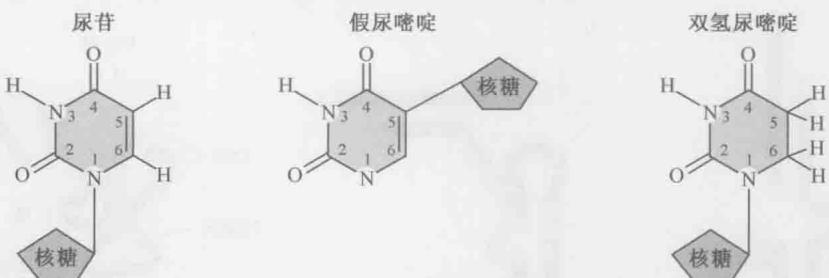  
图 15-3 tRNA 中发现的一部分修饰核苷。图示为尿苷和 2 个尿苷相关的核苷。

## tRNA 具有共同的三叶草型的二级结构

在第 5 章中曾谈到，RNA 分子通常含有自我互补区域，能够通过碱基配对形成有限的双螺旋结构；而 RNA 的其他区域是没有互补结构的，所以是单链的。tRNA 分子表现为特异的，高度保守的单链和双链区域（二级结构），该结构可描绘成三叶草型（图 15-4）。tRNA 三叶草型结构的主要特征是具有 1 个受体臂、3 个茎环（分别为 $\Psi U$ 环、D 环和反密码子环）和 1 个可变环。对于这些特征结构的描述如下：

\- 受体臂（acceptor stem）由于具有结合氨基酸的位点而得名，由 tRNA 分子的 5' 和 3' 端的碱基配对而成。其 3' 端的 5'-CCA-3' 序列突出双链之外。

\- $\Psi$ U环（ $\Psi$ U loop）因特殊碱基 $\Psi$ U（假尿嘧啶）的存在而得名。这一修饰碱基经常发现位于 $5^{\prime}$ -T $\Psi$ UCG-3'序列中。

\- D环（D loop）因特殊碱基双氢尿嘧啶的存在而得名。

\- 反密码子环（anticodon loop），顾名思义，包含反密码子——一个三核苷酸序列，能够通过碱基配对方式识别 mRNA 的密码子。反密码子的两端由 5'端的尿嘧啶和 3'端的嘌呤界定。

\- 可变环（variable loop）位于反密码子环和 $\Psi U$ 环之间，长度为 $3\sim 21bp$ 不等，正如其名。

## tRNA 具有 L 形的三维结构

三叶草型结构揭示了 tRNA 含有自我互补的区域。那么，这一转配器分子实际的三维构象是如何的呢？X 射线晶体学揭示其为 L 形的三级结构，受体臂在一端，反密码子环在另一端，两者相距 70Å（图 15-5c）。要了解这一 L 形结构和三叶草型结构的关系，请考虑以下方面：在最终形成的 tRNA 三维构象中，受体臂和 ΨU 环茎之间将形成延伸的螺旋结构（图 15-5b）。同样地，反密码子茎和 D 环茎形成第二个延伸的螺旋。这两个延伸的螺旋垂直排列，D 环和 ΨU 环靠在一起。

  
图 15-4 tRNA 的三叶草状二级结构。在此 tRNA 示意图中，红色虚线表示 tRNA 不同部分之间的碱基配对。

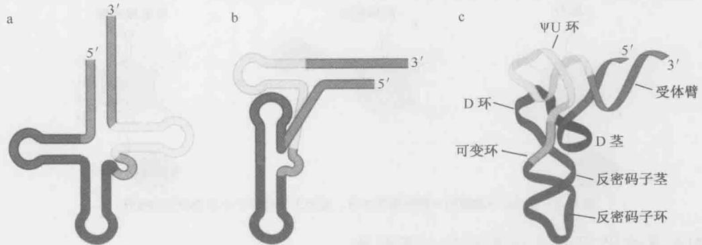  
图 15-5 tRNA 的三叶草结构和实际的三维结构之间的转换。(a) 三叶草示意图；(b) L 状结构示意图显示最终折叠的 tRNA 碱基配对的位置；(c) tRNA 的实际折叠结构的带状示意图。请注意虽然此图说明了实际的 tRNA 结构与三叶草结构的关系，但 tRNA 并不是通过先碱基配对再 L 状折叠来形成最后的结构的。

三种相互作用使这 L 状结构得以稳定。第一，因形成两个延伸的碱基配对区域而获得的类似 DNA 双链的碱基堆积作用。第二，三维结构中相互靠近的不同螺旋区域的碱基间的氢键，这些碱基间的相互作用通常是非常规（非 Watson-Crick）键对。第三，碱基和磷酸核糖骨架之间的相互作用。

## 氨基酸连接到 tRNA 上

## 氨基酸通过高能酰基连接到 tRNA 3'端的腺苷酸上使 tRNA 负载

连接了氨基酸的 tRNA 分子称为负载的（charged）tRNA，未连接氨基酸的 tRNA称为空载的（uncharged）tRNA。这一负载过程需要氨基酸的羧基与 tRNA 3'端受体臂突出的腺苷酸的 2'或 3'羟基（见下文的讨论）形成酰基。形成的酰基是一个高能键，因为它的水解导致自由能的产生较大变化。这对于蛋白质的合成是非常重要的——这一高能键水解所释放的能量帮助推动多肽链中氨基酸之间肽键的形成。

## 氨酰 tRNA 合成酶分两步使 tRNA 负载

所有的氨酰-tRNA 合成酶分两个酶促步骤使氨基酸连接到 tRNA 上（图 15-6）。第一步是腺苷酰基化（adenylylation），氨基酸和 ATP 反应而被腺苷酰基化，同时释放出焦磷酸。腺苷酰基化指的是 AMP 的转移，与腺苷酸化（adenylylation）相反，后者发生的是腺苷酸的转移。正如我们在多核苷酸的合成过程中看到的一样（第 9 章），腺苷酰基化反应的主要驱动能量来自于随后的焦磷酸酶对焦磷酸的水解。腺苷酰基化的结果是，通过氨基酸的羧基与 AMP 的磷酸基团形成的高能酯键，使氨基酸与腺苷酸连接。第二步是 tRNA 负载（tRNA charging），腺苷酰基化的氨基酸与氨酰 tRNA 合成酶保持紧密结合的状态下，与 tRNA 发生反应。这一反应导致氨基酸通过与 tRNA 上的 2' 或 3' 羟基作用，转移到 tRNA 的 3' 端，同时释放出 AMP。

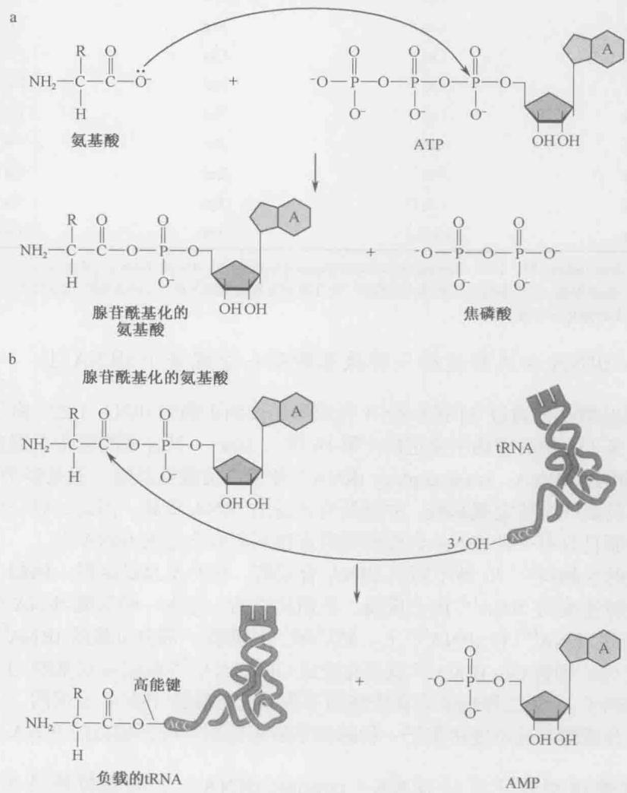  
图 15-6 氨酰-tRNA 负载的两个步骤。(a) 氨基酸的腺苷酰基化；(b) 腺苷酰基化的氨基酸转移至 tRNA 上。此图显示的为Ⅱ类 tRNA 合成酶的反应（该酶连接氨基酸到 3'-OH 上）。

tRNA 合成酶分两类（表 15-1）。Ⅰ类酶将氨基酸连接到 tRNA 的 2'羟基，并且通常是单聚体；Ⅱ类酶将氨基酸连接到 tRNA 3'羟基，并且通常是二聚体或四聚体。虽然氨基酸与 tRNA 之间最初的耦联方式不同，然而一旦从合成酶中释放出来，氨基酸能够很快地平衡其与 2'或 3'羟基的连接。

表 15-1 氨基酰 tRNA 合成酶的种类

<table><tr><td>II类</td><td>四级结构</td><td>I类</td><td>四级结构</td></tr><tr><td>Gly</td><td> $(\alpha_{2}\beta_{2})$ </td><td>Glu</td><td> $(\alpha)$ </td></tr><tr><td>Ala</td><td> $(\alpha_{4})$ </td><td>Gln</td><td> $(\alpha)$ </td></tr><tr><td>Pro</td><td> $(\alpha_{2})$ </td><td>Arg</td><td> $(\alpha)$ </td></tr><tr><td>Ser</td><td> $(\alpha_{2})$ </td><td>Cys</td><td> $(\alpha_{2})$ </td></tr><tr><td>Thr</td><td> $(\alpha_{2})$ </td><td>Met</td><td> $(\alpha_{2})$ </td></tr><tr><td>His</td><td> $(\alpha_{2})$ </td><td>Val</td><td> $(\alpha)$ </td></tr><tr><td>Asp</td><td> $(\alpha_{2})$ </td><td>Ile</td><td> $(\alpha)$ </td></tr><tr><td>Asn</td><td> $(\alpha_{2})$ </td><td>Leu</td><td> $(\alpha)$ </td></tr><tr><td>Lys</td><td> $(\alpha_{2})$ </td><td>Tyr</td><td> $(\alpha)$ </td></tr><tr><td>Phe</td><td> $(\alpha_{2}\beta_{2})$ </td><td>Trp</td><td> $(\alpha)$ </td></tr></table>

来源：Data from Delarue M. 1995. Current Opinion in Structural Biology 5: 48-55. Table 1. ©Elsevier.  
注：Ⅰ类酶一般是单体，而Ⅱ类酶是二聚体或四聚体，来自两个亚基的残基为单个tRNA提供结合位点。α和β指tRNA合成酶的亚基，下标指化学计量。

## 每种氨酰—tRNA 合成酶连接一种氨基酸到一个或多个 tRNA 上

20 种氨基酸都是通过专门的 tRNA 合成酶连接到正确的 tRNA 上的。由于大多数的氨基酸是由多于一种的密码子决定的（第 16 章），因此一种合成酶经常识别多于一种的 tRNA（称为同工 tRNA，iso-accepting tRNA）并使之负载氨基酸，但是多个同种 tRNA 合成酶需要负责一个特定氨基酸，并使所有合适的 tRNA 负载。因此，对一个氨基酸而言，有一种而且只有一种 tRNA 合成酶将其连接到所有合适的 tRNA 上。

大多数的生物具有20种不同的tRNA合成酶，但并不总是这样。例如，有些细菌缺乏使谷酰胺连接到 $\mathrm{tRNA}^{\mathrm{Gln}}$ 的合成酶。取而代之的，是由一种氨酰-tRNA合成酶负责将Glu连接到 $\mathrm{tRNA}^{\mathrm{Gln}}$ 和 $\mathrm{tRNA}^{\mathrm{Glu}}$ 上。然后第二种酶将一部分负载的 $\mathrm{tRNA}^{\mathrm{Gln}}$ 上的Glu氨基化形成Gln。即将 $\mathrm{Glu - tRNA}^{\mathrm{Gln}}$ 氨基化变成 $\mathrm{Gln - tRNA}^{\mathrm{Gln}}$ （前缀指氨基酸，上标指tRNA所识别的密码子）。第二种酶的存在使细菌不再需要谷酰胺tRNA合成酶。但是，一种氨酰-tRNA合成酶永远不能将多于一种的氨基酸连接到一种其相应的tRNA上。

## tRNA 合成酶识别位于同族 tRNA（cognate tRNA）上的独特结构特征

从前面的讨论中可以看出，氨酰-tRNA 合成酶面临两个重要的挑战：它们必须识别针对特定氨基酸的一组正确的 tRNA，而且它们必须使这些同工 tRNA 负载正确的氨基酸。这两个过程都必须高度精确地进行。

让我们首先探讨 tRNA 识别的特异性：tRNA 分子的什么特征使得合成酶能够将某种氨基酸的同工 tRNA 与其他 19 种氨基酸的 tRNA 区别开呢？来自遗传学、生物化学和 X 射线晶体学研究的证据表明决定这特异性的因素来自 tRNA 分子的两个相距较远的位点：受体臂和反密码子环（图 15-7）。受体臂是 tRNA 合成酶特异性识别的一个极其重要的决定因素。在某些情况下，改变受体臂的一个碱基[称为鉴别者碱基（discriminatorbase）]足以使特异性识别某个 tRNA 的合成酶变为另一种合成酶。虽然如此，反密码子环也经常对识别特异性有所贡献。例如，谷氨酰胺 tRNA 合成酶同受体臂和反密码子环都有广泛的接触，包括反密码子本身（图 15-8）。

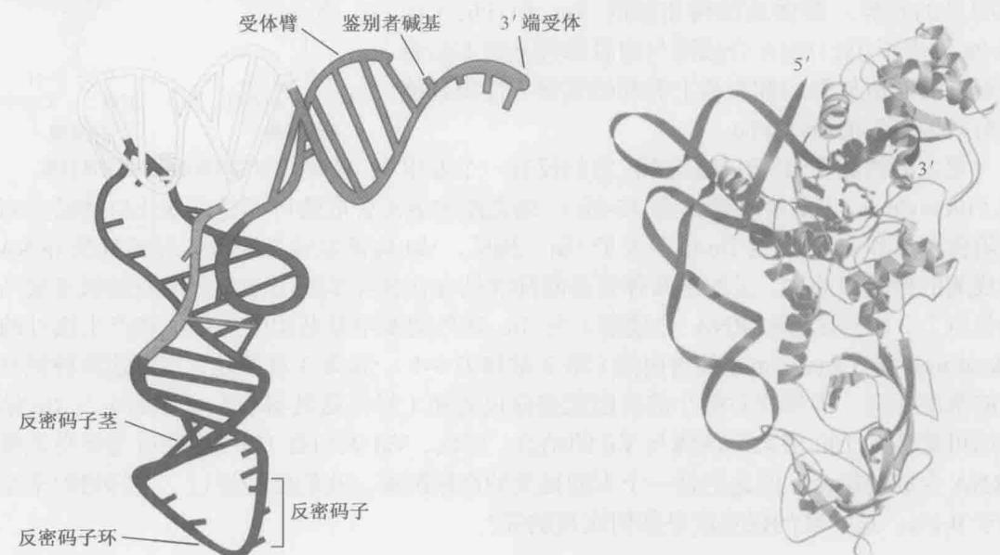  
图 15-7 tRNA 结构：供氨酰-tRNA 合成酶识别的必需元件。  
图 15-8 谷氨酰胺 tRNA 合成酶与 tRNA $^{Gln}$ 结合的晶体结构图。酶以灰色表示，tRNA $^{Gln}$ 以紫红色表示，黄色、红色和绿色的分子是谷氨酰-AMP。请注意这一分子和 tRNA $^{Gln}$ 的 3'端的距离，以及 tRNA 和合成酶作用的结合点。（Rath V.L. et al. 1998. Structure 6: 439–449.）图像使用 BobScript、MolScript 和 Raster 3D 软件制作。

你也许会认为反密码子总是被 tRNA 合成酶在识别过程中所利用，因为它是 tRNA 的最终决定特征——反密码子决定了 tRNA 负责加入到延伸多肽链上的氨基酸种类。但是，由于每个氨基酸通常由多于一个的密码子所编码，因此在很多情况下，反密码子不能被用作 tRNA 合成酶识别的标志。例如，Ser 可以由 6 种密码子编码，其中包括 5'-AGC-3' 和 5'-UCA-3' 这两个完全不同的密码子。这样，Ser 的 tRNA 需要具有不同的反密码子，而无法轻易地被单一的 tRNA 合成酶所识别。为此，Ser 的合成酶必须依靠反密码子以外的因素来识别其 tRNA 分子。

## 氨酰-tRNA 的形成是非常精确的

氨酰-tRNA合成酶在选择正确的氨基酸方面所面临的挑战也许比其在识别正确的tRNA分子上的挑战更为令人吃惊（图15-9）。这是因为氨基酸的体积较小，并且在某些情况下，它们非常相似。尽管挑战巨大，负载出错的概率却是非常小的，通常1000个tRNA分子中只有不到一个tRNA负载了错误的氨基酸。在某些情况下，如何实现这一高精确度是非常容易理解的。例如，Cys和Trp在体积、构形和化学组成上都有明显的差异。即便是结构相似的Tyr和Phe（图15-9a），由于Tyr tRNA合成酶与前者的羟基而非后者的羟基能形成较强的和能量上有利的氢键，使得其能够有效地鉴别而排斥Phe。

更大的挑战在 Ile 和 Val 之间, 它们仅有一个亚甲

图 15-9 相似的氨基酸，不同的特征。

基（methylene）基团的差异（图15-9b）。缬氨酰-tRNA合成酶可通过其催化口袋的空间位阻作用排斥Ile，因为Ile体积大于Val。相反，Val应该能轻易地滑入异亮氨酰-tRNA合成酶的催化口袋中。虽然这两种氨基酸都能结合在异亮氨酰-tRNA合成酶的氨基酸结合位点上，（异亮氨酰-tRNA合成酶）与Ile额外的亚甲基基团的作用能够产生额外的-2kcal/mol到-3 kcal/mol的自由能（第3章和表3-1）。如第3章所述，如果这两种氨基酸的浓度相同，即使相对微小的自由能差异也能使（异亮氨酰-tRNA合成酶）与Ile结合的可能性约100倍大于该酶与Val的结合。因此，Val大约有 $1\%$ 可能性可与异亮氨酰-tRNA合成酶结合。但这仍是一个不能接受的高错配率。我们已经说过，实际错配率是小于 $0.1\%$ 。这样高的保真度是如何实现的呢？

## 某些氨酰-tRNA 合成酶利用编辑口袋来高精度地负载 tRNA

提高氨酰-tRNA合成酶保真度的一个普遍机制是对负载反应的产物进行校对，正如第9章中讨论过的DNA聚合酶的校对作用一样。例如，除了催化口袋（负责腺苷酰基化），异亮氨酰-tRNA合成酶在催化口袋附近还有一个编辑口袋（酶上的深裂缝），用以对腺苷酰基化产物进行校对。AMP-Val（同样还有其他小氨基酸，如Ala等的腺苷酰基化物）能够进入这样的编辑口袋，在那里被水解成自由的Val和AMP而释放出来。相反，AMP-Ile因太大而无法进入编辑口袋，因而不能被水解。其结果为，异亮氨酰-tRNA合成酶能够对Val进行两次筛选：在最初的氨基酸结合和腺苷酰基化过程中（筛选效率约为100倍），以及随后的腺苷酰基化氨基酸的编辑过程中（同样筛选效率约为100倍），两者总共可进行大约10000倍的筛选（即错配率约为 $0.01\%$ ）。

## 核糖体不能辨别 tRNA 的负载是否正确

氨酰-tRNA 合成酶承担如此多的责任以保证正确的氨基酸与其相应的 tRNA 耦联的原因在于，核糖体不能辨别 tRNA 的负载是否正确。换句话说，核糖体只是 “盲目地” 接受任何表现出正确的密码子-反密码子相互作用的负载 tRNA，不管 tRNA 是否携带的是正确的氨基酸。

这个结论由两类实验支持：一类为遗传学的，另一类是生物化学的。遗传实验分离出一种反密码子上携带一个核苷酸替换的突变 tRNA。考虑 tRNA 合成酶经常不依赖于与反密码子的相互作用来识别相关的 tRNA 分子，这样，出一种反密码子上携带一个核苷酸替换的突变 tRNA。考与反密码子的相互作用来识别相关的 tRNA 分子，这样，有些 tRNA 可能在反密码子上存在突变但仍然可以负载通常的相关氨基酸。但是，作为反密码子突变的后果，突变的 tRNA 将会把氨基酸带到错误的密码子上。换句话说，核糖体和其他与核糖体联合作用的辅助蛋白（我们将简短地讨论）主要核对的是负载 tRNA 是否与 mRNA 具有正确的密码子-反密码子配对作用。但核糖体和这些蛋白质极少阻止错误负载的 tRNA 将错误的氨基酸加到多肽链上。

一个经典的生化实验很好地说明了核糖体只识别tRNA而非其携带的氨基酸这个观点。设想一个负载半胱氨酸的半胱氨酰-tRNA $^{Cys}$ （记住前缀指氨基酸，上标指tRNA的类型）。半胱氨酰-tRNA $^{Cys}$ 负载的Cys可通过化学方法转变为Ala，从而形成丙胺酰-tRNA $^{Cys}$ （图15-10）。当加入到不依赖于细胞的蛋白质合成体系中，丙氨酰tRNA $^{Cys}$ 将Ala带到指定Cys插入的密码子上。因此，翻译机器主要依靠氨酰-tRNA合成酶的高保真度来保证每个mRNA正确解码（框15-2）。

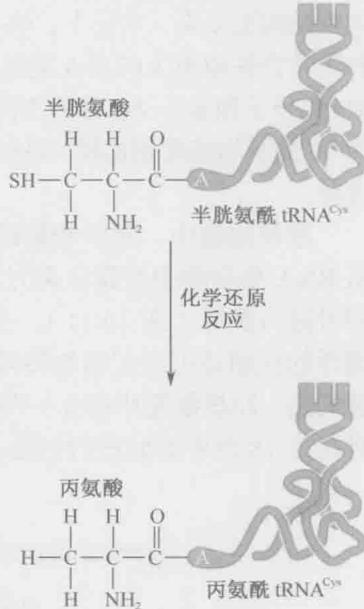  
图 15-10 从 Cys-tRNA $^{Cys}$ 到 Ala-tRNA $^{Cys}$ 的化学还原过程。

## 框 15-2 硒代半胱氨酸

某些蛋白质，如谷胱甘肽过氧化物酶（glutathione peroxidase）和甲酸盐脱氢酶（formate dehydrogenase），含有一个独特的氨基酸，称作硒代半胱氨酸，它是酶的催化中心的一部分。硒代半胱氨酸在Cys的硫原子处是微量元素硒（框15-2图1）。有趣的是，硒代半胱氨酸不是通过翻译后进行化学修饰而整合到蛋白质的[其他某些独特的氨基酸是通过这一方法整合的，如在胶原质中发现的羟基脯氨酸（hydroxyproline）]。相反，硒代半胱氨酸是从半胱氨酰-tRNA合成酶负载的特殊tRNA上携带的Cys通过酶促反应而产生的。这一改变后的tRNA被用来把硒代半胱氨酸直接整合到正在合成中的谷胱甘肽过氧化物酶中去。一个专一的（类似于EF-Tu，见下文）翻译延伸因子把硒代半胱氨酰

-tRNA 送达核糖体的 UGA 密码子，该密码子通常被识别为终止子。要在 UGA 密码子处整合硒代半胱氨酸必须在 mRNA 的其他地方存在一个特殊的序列。因此，硒代半胱氨酸可以被认为是第 21 个氨基酸，它通过对细胞的标准翻译机器进行修饰而整合到蛋白质中。

  
框 15-2 图 1 半胱氨酸和硒化半胱氨酸的结构

## 核糖体

核糖体（ribosome）是指导蛋白质合成的大分子机器。与将核苷酸密码翻译成氨基酸密码所面临的更为复杂的挑战相一致，核糖体比合成 DNA 或 RNA 所需的最小的机器更大且结构更复杂。实际上，单一的多肽可以执行 DNA 或 RNA 的合成（虽然 DNA 的复制和转录往往由更大的多亚基复合物来介导）。相比之下，聚合氨基酸的机器则至少由 3 种 RNA 分子和多于 50 种的不同蛋白质组成，它们累计起来的分子质量大于 2.5 MDa。与 DNA 复制的速度相比较（每秒 200\~1000 个碱基），翻译只能以每秒 2\~20 个氨基酸的速度进行。

原核细胞中，转录和翻译的系统位于同一区域中。因此，核糖体能够在 mRNA 刚从 RNA 聚合酶中暴露出来时着手翻译。这样核糖体可以随着 RNA 聚合酶延伸转录体的同时进行翻译（图 15-11）。考虑到 RNA 的 5' 端首先合成，因此从 mRNA 5' 端开始进行翻译的核糖体可以在初始转录体刚刚在 RNA 聚合酶中暴露出来的时候就开始翻译。有趣的是，原核细胞中存在一些利用转录和翻译耦联现象进行基因表达调节的例子，我们将在第 18 章中对此进行讨论。

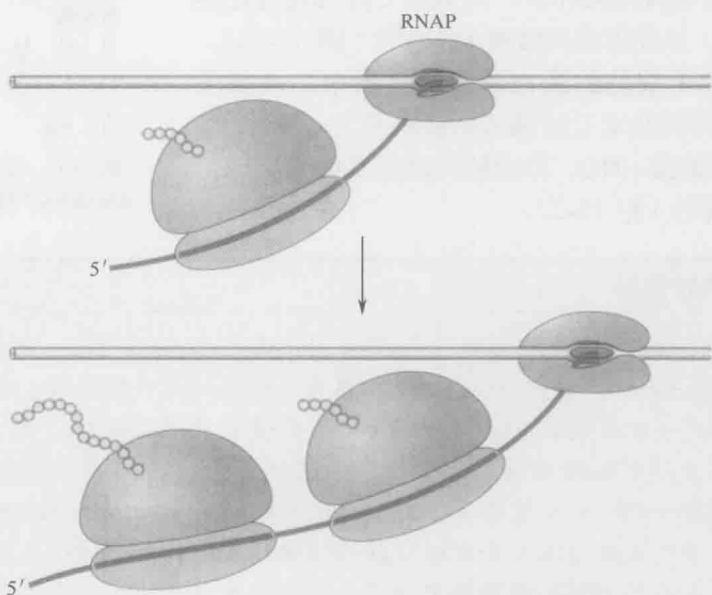  
图 15-11 原核细胞的 RNA 聚合酶和多个核糖体作用于同一 mRNA。

虽然原核细胞中，（翻译的速度）相对于 DNA 合成的速度要慢，但核糖体仍可以赶上转录的速度。原核细胞典型的每秒 20 个氨基酸的翻译速度相当于每秒翻译 60 个 mRNA 上的核苷酸（即 20 个密码子）。这与 RNA 聚合酶每秒合成 50\~100 个核苷酸的速度相近。

与原核细胞的情况不同，真核细胞的翻译完全与转录分开。这些生理过程在细胞的不同区域里进行：转录发生在细胞核，而翻译发生在细胞质中。也许由于不与转录过程关联，真核细胞的翻译以每秒2\~4个氨基酸的较慢的速度进行。

## 核糖体是由一个大亚基和一个小亚基组成的

核糖体由 RNA 和蛋白质构成，其中蛋白质部分包括大亚基和小亚基两个部件。大亚基含有肽基转移酶中心（peptidyl transferase center），负责肽键的形成。小亚基含有解码中心（decoding center），负载氨基酸的 tRNA 在此阅读或“解码” mRNA 的密码子单元。

按照惯例，大、小亚基的命名是根据离心时的沉降速率而定的（图 15-12）。测量沉降速率的单位是 Svedberg（S；S 值越大，沉降速率越快，分子越大），这是以超速离心的发明者 Theodor Svedberg 的名字命名的。在细菌中，大亚基的沉降速率是 50 Svedberg，因此相应地称为 50S 亚基，而小亚基称为 30S 亚基。完整的原核细胞的核糖体称为 70S 核糖体。注意 70S 小于 50S 和 30S 相加的和！出现这一明显矛盾现象是由于沉降速率是由形状和大小共同决定的，因而不是绝对质量的精确计量。真核细胞的核糖体稍微大些，由 60S 和 40S 两个亚基组成，合在一起形成 80S 的核糖体。

大、小亚基都由一个或更多核糖体 RNA（rRNA）和许多核糖体蛋白质组成（图 15-13）。Svedberg 单位再次用以区分核糖体 RNA。因此，在细菌中，50S 亚基含有 5S rRNA 和 23S rRNA，而 30S 亚基只含有 16S rRNA。虽然每一亚基中核糖体蛋白质要远远多于核糖体 RNA，但是原核细胞核糖体中超过

  
图 15-12 通过超速离心沉淀从完整的核糖体中分离核糖体亚基。

2/3 的质量来自 RNA，因为核糖体蛋白质量比较小（细菌小亚基的核糖体蛋白质的平均分子质量约为 15kDa）。相反，16S 和 23S rRNA 质量比较大。我们试想，平均来说，一个核苷酸的分子质量是 330Da。因此，由 2900 个核苷酸组成的 23S rRNA 的分子质量即接近 1000kDa。

## 大、小亚基在每一循环周期的翻译过程中都经历结合与分离

蛋白质每合成一次，翻译机器就经历一系列特定的事件：核糖体的大、小亚基相互之间结合后与 mRNA 相结合，以翻译目标 mRNA，完成蛋白质合成后则相互分离。这种结合和分离相间的顺序称为核糖体循环（ribosome cycle，图 15-14）。简而言之，当 mRNA 和起始 tRNA 结合于游离的小亚基上，翻译过程就开始了。随后这个“小亚基-mRNA-起始 tRNA”复合体吸引大亚基结合，从而形成完整的、大小亚基间夹着 mRNA 的核糖体。下一步是蛋白质合成启动，始于 mRNA 5'端的起始密码子并向 mRNA 3'端移动。随着核糖体从一个密码子易位到另一个密码子，一个接一个的负载 tRNA 进入核糖体的解码和肽基转移酶中心。当移动的核糖体碰到终止密码子时，合成完成的多肽链就被释放出来，核糖体大、小亚基分离，各自离开 mRNA。这些分离的亚基就可以结合到新的 mRNA 分子上，重复蛋白质合成的循环。

虽然一个核糖体一次只能合成一条多肽，但每个 mRNA 分子却能同时被多个核糖体同时翻译（简便起见，我们假设 mRNA 是单顺反子的）。结合多个核糖体的 mRNA 称为多聚核糖体（polyribosome 或 polysome，图 15-15）。一个核糖体大约与 mRNA 上的 30 个核苷酸相接触，但核糖体的巨大体积只能允许 mRNA 上每 80 个核苷酸结合一个核糖体。即便这样，一个 1000bp 的小 ORF（编码约 35kDa 的蛋白质）可以结合多于 10 个核糖体，从而指导多个多肽链的同时合成。

  
图 15-13 原核细胞和真核细胞的核糖体组成。图中标明了不同亚基中的 rRNA 和蛋白质组分，还标明了各亚基中的 rRNA 长度和蛋白质数目。

多个核糖体作用于单一mRNA分子的能力解释了细胞中mRNA为什么相对较少(一般仅占总RNA的1%\~5%)。如果一个mRNA一次只能被一个核糖体翻译，那么一个典型细胞中只有约10%的核糖体能参加蛋白质的合成。但是多个核糖体和单个mRNA分子的结合方式确保在任何时候大多数的核糖体都能参与翻译。

## 新的氨基酸连接在延伸肽链的碳末端

由于多核苷酸链和多肽链都有内在的极性，因此我们关注于这些链的哪一端首先合成。从第9章和第13章中我们知道，DNA和RNA的合成都是将新的核糖三磷酸加到延伸多核苷酸链的3'端（通常以5'→3'方向合成）。

图 15-14 翻译的总体过程：核糖体循环。  
  
图 15-15 多聚核糖体。

那么多肽链的合成方向如何呢？这首次由 Howard Dintzis 所做的一个经典的实验所确定，该实验已在第 2 章有所描述。这一实验发现,每一个新的氨基酸必须加在延伸多肽链的羧基端（通常称为氨基端→羧基端方向合成）。如下一小节将要描述的，这样的合成方向是由蛋白质合成的化学特性直接决定的。

## 肽键是通过将正在延伸的多肽链从一个 tRNA 转移到另一个 tRNA 而形成的

核糖体能够催化单一的化学反应——肽键的形成。这一反应发生在延伸多肽链碳端的氨基酸残基和将要加入的氨基酸之间。多肽链和将要加入的氨基酸都结合在 tRNA 上，从而在肽键的合成过程中，不断增长的多肽链持续地结合在 tRNA 分子上。

每轮氨基酸加入的底物实际是两种负载的 tRNA：氨酰-tRNA 和肽酰-tRNA（peptidyl-tRNA）。如本章前面所讨论的（见氨基酸与 tRNA 结合的章节），氨酰-tRNA 结合在氨基酸 3'端的羧基上。肽酰-tRNA 也以同样的方式（3'端）结合在多肽链的碳末端上。氨酰-tRNA与氨基酸之间的键在下一个肽键的形成过程中是不断裂的。相反，当延伸多肽链在与负载氨酰-tRNA上的氨基酸结合而形成一个新的肽键时，肽酰-tRNA与多肽链之间的键发生断裂。

为了催化肽键的形成，这两个氨基酸的3'端被核糖体安排到相邻的位置。这一位置效应可以使氨酰-tRNA的氨基基团攻击肽酰-tRNA上多肽碳端的羧基基团，形成一个新的肽键（图15-16）。多肽合成的这一方式产生了两个后果。第一，这个肽键形成的原理要求蛋白质的氮端先于碳端合成；第二，多肽链从肽酰-tRNA转移到氨酰-tRNA上。因此，新肽键形成的反应称为肽酰转移酶反应（peptidyl transferase reaction）。

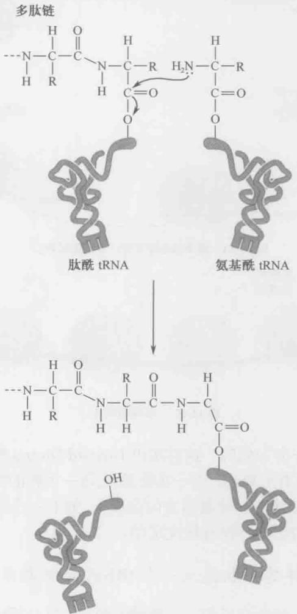  
图 15-16 肽酰转移酶反应。

有趣的是，肽键的形成并没有伴随三磷酸核苷的水解。这是因为肽键的形成是由连接多肽链和 tRNA 的高能酰键的断裂来驱动的。请回忆一下，这一高能酰键是在 tRNA 负载氨基酸时由 tRNA 合成酶催化产生的。tRNA 负载氨基酸的反应伴有一个 ATP 分子的水解。因此肽键形成所需的能量来自于 tRNA 负载氨基酸时所水解的那一个 ATP 分子（图 15-6）。

## 核糖体 RNA 是核糖体中的结构和催化功能决定因子

虽然核糖体和它的基本功能早在 40 年以前就发现了，但近年来对原核细胞核糖体的高精度三维结构的确定大大加快了我们对这一分子机器工作机制的认识（图 15-17）。也许其中最重要的结果就是发现核糖体 RNA 并不单单是核糖体的结构成分，相反，它们还直接负责核糖体的关键功能。最明显的证据就是肽基转移酶中心几乎完全是由 RNA 组成的，这将在下面详细讨论。RNA 也在核糖体小亚基功能中扮演中心的角色。负载 tRNA 的反密码子环和 mRNA 的密码子都是与 16S rRNA 相作用，而不是与小亚基的核糖体蛋白相作用。

  
图 15-17 核糖体的两个视图。这两个图中，50S 亚基都位于 30S 亚基之上。右图中 50S 和 30S 亚基之间的空洞展现了 tRNA 结合的位点（图 15-19b）。50S 亚基的 RNA 部分以灰色表示而蛋白质以紫红色表示。30S 亚基的 RNA 部分以淡蓝色表示而蛋白质部分以深蓝色表示。（Yusupov M.M. et al. 2001. Science 292: 883–896.）图像使用 MolScript、BobScript 和 Raster 3D 软件制作。

进一步说明 RNA 在核糖体的结构和功能方面的重要性的证据是，大多数的核糖体蛋白位于核糖体的周边，而非其内部（图 15-17）。核糖体的核心功能结构域（肽基转移酶中心及解码中心）完全或者绝大部分由 RNA 组成。某些核糖体蛋白质的一部分确实也伸入到亚基的核心，但它们的作用似乎是通过屏蔽其磷酸戊糖骨架的负电荷来稳定紧密缠绕的 rRNA。实际上，现代的核糖体很可能是从完全由 RNA 组成的原始蛋白质合成机器演化而来的，而核糖体蛋白的加入是为了提升这种原始 RNA 机器的功能。

## 核糖体有三个 tRNA 结合位点

为了进行肽基转移酶反应，核糖体必须能够同时结合至少两个 tRNA。实际上，核糖体含有三个 tRNA 结合位点，分别为 A、P 和 E 位点（图 15-18 和图 15-19）。A 位点（A site）是氨酰-tRNA 的结合位点，P 位点（P site）是肽酰-tRNA 的结合位点，E 位点（E site）是延伸的多肽链转移到氨酰-tRNA 后被释放的 tRNA 的结合位点（E 指 exit，退出）。

  
图 15-18 核糖体有三个 tRNA 结合位点。核糖体示意图显示横跨两个亚基的三个 tRNA 结合位点（E、P 和 A）。

每一个 tRNA 结合位点都在核糖体的大、小亚基的交界面形成（图 15-19a 和 b）。因此，结合核糖体的 tRNA 能够横跨大亚基的肽基转移酶中心（图 15-19c）和小亚基的解码中心（图 15-19d）。耦联氨基酸或肽链的 tRNA 的 3' 端紧邻在大亚基的一方，结合核糖体的 tRNA 的反密码子环则紧接着小亚基的一方。

  
图 15-19 包含三个结合 tRNA 的核糖体三维结构示意图。E、P 和 A 位点的 tRNA 分别以黄色、红色和绿色表示。大、小亚基的 RNA 和蛋白质组分的颜色与图 15-17 相同。(a, b) 核糖体与 tRNA 结合于 E、P 和 A 位点的两种视角情况，请注意 a 和 b 图的核糖体与图 15-17 的核糖体的视角相对应。(c) 分离的 50S 亚基结合于 tRNA，图片显示在其整个核糖体中的状况（本图的角度是从小亚基向大亚基看），圆圈标记区域为肽酰转移酶中心。(d) 分离的 30S 亚基结合于 tRNA，图片显示其在整个核糖体中的状况，圆圈标记区域为解码中心。（Yusupov M.M. et al. 2001. Science 292: 883–896.）图像使用 MolScript、BobScript 和 Raster 3D 软件制作。

## 核糖体的通道可以使 mRNA 和延伸多肽链进出核糖体

解码中心和肽基转移酶中心都埋于完整的核糖体内。但是，翻译过程中，mRNA 必须穿过解码中心，新合成的多肽链也必须从肽基转移酶中心离开。这些聚合体（如mRNA）是如何进入和离开核糖体的呢？这个问题的答案就在核糖体的结构中，它揭示了进出核糖体的“通道”。

mRNA 通过小亚基的两个狭窄的通道进出解码中心。进入通道的宽度只足够让未配对的 RNA 通过。这个特征保证了 mRNA 以一种单链的形状进入解码中心，这是通过解除 mRNA 分子内可能已经形成的碱基配对相互作用而达到的。在进出通道之间有一个 tRNA 可进入的区域，彼此相邻的密码子能够在此分别与 A 位点的氨酰-tRNA 和 P 位点的肽酰-tRNA 结合。有趣的是，mRNA 的两个密码子之间存在明显的扭结（kink），这有利于维持正确的可读框（图 15-20）。这个扭结使 A 位点的密码子处于一个独特的位置，从而阻止随后进入的氨酰-tRNA 与其相邻的密码子相接触。

大亚基上的另一个通道提供了新合成的多肽链离开核糖体的途径（图 15-21）。与 mRNA 的通道一样，这个通道的大小限制了多肽链的折叠。在这种情况下，新合成的多肽链只能在通道内形成 $\alpha$ 螺旋，而其他的二级结构（如 $\beta$ 折叠）和三级结构作用只能在多肽链离开大亚基后形成。由于这一原因，新合成的多肽链最终的三维结构只能在其从核糖体释放后形成。

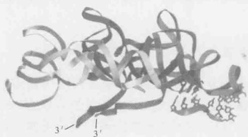  
图 15-20 核糖体内 mRNA 与 A、P 位点的 tRNA 的相互作用。两图表示 mRNA 和 tRNA 在核糖体内的结构。为清晰起见，核糖体未表示。E、P 和 A 位点的 tRNA 分别以黄色、红色和绿色表示，mRNA 以蓝色表示。只有参与密码子-反密码子相互作用的碱基被表示出。mRNA 上明显的扭结清晰地把 A 位点和 P 位点的密码子区别开。在下图可看出 A 位点和 P 位点的 tRNA 的 3' 端之间非常接近。(Yusupov M.M. et al. 2001. Science 292:883–896.) 图像使用 MolScript、BobScript 和 Raster 3D 软件制作。

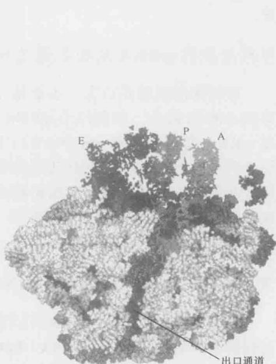  
出口通道

图 15-21 多肽出口通道。此图中，50S 亚基切成一半以显示多肽出口通道。rRNA 以白色显示，而核糖体蛋白质以黄色显示。三个结合的 tRNA 显示为：E 位点（褐色）、P 位点（紫红色）、A 位点（绿色）。紧接 A 位点 tRNA 的红色和金色的 rRNA 部分是肽酰转移酶中心的组成部分。（由 T. Martin Schmeing 和 Thomas Steitz 提供；获得许可，并修改自 Schmeing T.M. et al. 2002. Nat. Struct. Biol. 9: 225–230. Macmillan.）

现在我们已经描述了翻译过程的4种主要组分，本章剩余的部分将集中描述翻译的每一个步骤。我们的描述将以翻译的3个步骤依次进行：多肽链合成的起始、多肽链的延伸和多肽链合成的终止。下面将要看到，原核生物和真核生物的蛋白质合成在策略上重要的相同点和不同点。我们将在下面的各个小节中讨论这两种细胞的翻译机制的本质。正如DNA和RNA合成一样，虽然核糖体是蛋白质合成的中心，但各种辅助因子在翻译的各个阶段也起着重要的作用，而且它们也是使蛋白质合成以迅速和正确的方式进行所必需的。

## 翻译的起始

翻译要成功地起始，必须发生三个步骤（图 15-22）。第一，核糖体必须被募集到 mRNA 上；第二，负载 tRNA 必须置于核糖体的 P 位点；第三，核糖体必须精确地定位在起始密码子上。其中第三条是关键的，因为这一步确定了 mRNA 翻译的可读框。即使核糖体定位只发生一个碱基的易位，也将导致一个完全不相关的多肽的合成（见上面和第 16 章有关信使 RNA 的讨论）。原核生物和真核生物 mRNA 结构的不同导致完成翻译起始方式的明显不同。我们先阐明原核细胞的起始情况，然后讨论与真核细胞的差异。

## 原核细胞的 mRNA 最初是通过与 rRNA 的碱基配对而募集到小亚基上的

核糖体的组装是由大、小亚基一个一个地装配到 mRNA 上完成的。首先，小亚基和 mRNA 结合。如在讨论 mRNA 结构时所述（图 15-2），在原核细胞中，小亚基和 mRNA 的结合是由（mRNA 的）RBS 和（小亚基的）16S RNA 之间的碱基配对作用介导的（图 15-23）。对理想定位的 RBS 来说，小亚基处于 mRNA 上的恰当位置，使大亚基加入复合体时，起始密码子正好处于 P 位点。大亚基是在起始过程即将结束的时候加入复合体的，恰好在第一个肽键形成之前。因此，翻译起始的许多关键事件发生在完整的核糖体形成之前。

## 负载着修饰甲硫氨酸的特定 tRNA 直接结合到原核细胞的小亚基上

在翻译的起始阶段，tRNA可以直接结合到P位点，而不需要先占用A位点。这一过程需要一个被称为起始tRNA（initiator tRNA）的特定tRNA，它与起始密码子（通常是AUG或GUG）碱基配对。当AUG和GUG在可读框内出现时具有不同的含义，它们分别被搬运Met的tRNA（ $\mathrm{tRNA}^{\mathrm{Met}}$ ）和Val的tRNA（ $\mathrm{tRNA}^{\mathrm{Val}}$ ）所识别和阅读（第16章）。即使起始tRNA上一开始负载的是Met，甲酰基团会通过利用一种独立的酶（Met-tRNA转甲酰酶）迅速地添加到氨基酸基团上。因此，起始tRNA上负载的既非Met亦非Val，它负载的是N-甲酰甲硫氨酸（N-formyl methionine，图15-24）。负载此氨基酸的起始tRNA称为fMet-tRNA $_i^{fMet}$ 。

图 15-22 翻译起始的总体过程。  
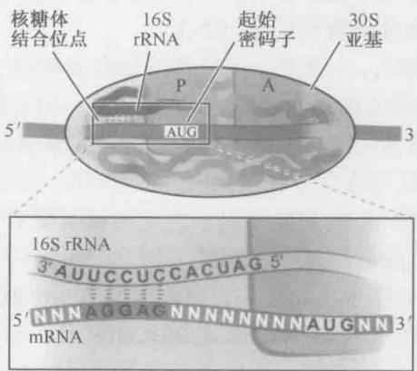  
图 15-23 16S rRNA 作用于 RBS, 将 AUG 定位于 P 位点。本图为 RBS 和起始 AUG 之间具有合适距离的 mRNA。这一距离将 AUG 置于 P 位点。许多 mRNA 没有这一合适的距离，导致翻译效率的下降。甚至有一些 mRNA 完全缺失 RBS。

由于 N-甲酰甲硫氨酸是多肽链的第一个氨基酸,你也许认为所有原核生物的蛋白质在它们的氨基端都有甲酰基的结构。但事实并非如此，因为去甲酰化酶（deformylase）

能够在多肽链合成的进行过程中或合成过程之后将这个甲酰基从氨基端去除掉。实际上，许多原核细胞的蛋白质甚至不是以 Met 开始的；氨肽酶（aminopeptidase）通常在氨基端切除 Met 及另外一两个氨基酸。

三种起始因子指导包含 mRNA 和起始 tRNA 的起始复合物的装配

  
图 15-24 甲硫氨酸和 N-甲酰甲硫氨酸（methionine and N-formyl methionine）

原核细胞的翻译始于小亚基，由三种翻译起始因子（translation initiation factor, IF）——IF1、IF2 和 IF3 所催化。每一个因子催化起始过程的一个关键步骤：

\- IF1 防止 tRNA 结合到小亚基中将形成 A 位点的位置上。

\- IF2是GTP酶（结合和水解GTP的蛋白质），它与起始过程的3个主要成分（小亚基、IF1和负载起始tRNA，即fMet-tRNA $_i^{fMet}$ ）相互作用。通过与这些成分相互作用，IF2促使fMet-tRNA $_i^{fMet}$ 和小亚基的结合，并阻止其他负载tRNA与小亚基结合。

\- IF3 与小亚基结合并阻止其与大亚基重新结合。由于翻译起始需要游离的小亚基，因此 IF3 与小亚基的结合对于翻译的新一轮循环是十分重要的。IF3 在上一轮循环即将结束时开始与小亚基结合，并协助 70S 核糖体分解为大、小亚基。

每一个起始因子能够结合到小亚基中的三个 tRNA 结合位点中的其中一个或其附近。为防止负载 tRNA 结合到 A 位点，IF1 能够直接结合到小亚基中将形成 A 位点的位置上。IF2 结合 IF1 并横跨 A 位点和 P 位点以结合 fMet-tRNA $_{i}^{fMet}$ 。最后，IF3 占据了将成为 E 位点的小亚基上的位置。这样，在小亚基的三个潜在的 tRNA 结合位点中，只有 P 位点在起始因子存在的条件下能够结合 tRNA。

随着三个起始因子的加入, 小亚基已经准备好结合 mRNA 和起始 tRNA(图 15-25)。这两种 RNA 能以任何一种方向结合, 并且互相独立。如上面所讨论的, 小亚基结合 mRNA 需要 mRNA 的 RBS 和小亚基的 16S RNA 之间的碱基配对。而 fMet-tRNA $_{i}^{fMet}$ 结合小亚基过程的促进是通过与结合 GTP 的 IF2 相互作用, 并且 (一旦 mRNA 结合于小亚基上) 由反密码子和 mRNA 的起始密码子之间的碱基配对作用来实现的。类似地, fMet-tRNA $_{i}^{fMet}$ 和 mRNA 之间的碱基配对起到了定位起始密码子到 P 位点上的作用。

翻译起始过程的最后步骤涉及大亚基的聚合以形成70S起始复合体（70S initiation complex）。当起始密码子和 $\mathrm{fMet - tRNA_i^{fMet}}$ 的碱基配对后，小亚基的构象发生变化，导致IF3的释放。在IF3离开的情况下，大亚基可以自由地与小亚基及其负载的IF1、IF2、mRNA和 $\mathrm{fMet - tRNA_i^{fMet}}$ 结合。而且，IF2可以作为大亚基的初始对接位点，并且这种相互作用激活了IF2-GTP的GTP酶活性。因此，IF2-GDP与核糖体和起始tRNA的亲和力降低，导致IF2-GDP和IF1从核糖体释放出来。这样，翻译起始过程的最终产物是在mRNA的起始位点组装了一个完整的70S核糖体，其P位点有 $\mathrm{fMet - tRNA_i^{fMet}}$ ，而A位点是空的。这个核糖体-mRNA的复合体已准备好在A位点结合负载tRNA，开始多肽链的合成。

真核细胞的 mRNA 通过 5'帽子募集核糖体

真核细胞翻译的起始过程在很多方面与原核细胞相同。它们都使用起始密码子和专门的起始 tRNA，都在大亚基的加入之前利用起始因子形成结合 mRNA 的小亚基复合体。但是，真核细胞运用一个根本不同的方式来识别 mRNA 和起始密码子，这对真核细胞的翻译方式产生重要的影响。

在真核细胞中，小亚基在被募集到mRNA的5'端帽子结构之前，已经与起始tRNA结合。然后以 $5'\rightarrow3'$ 方向沿着mRNA“扫描”直到遇见第一个5'-AUG-3'（见前面章节中有关mRNA前导区Kozak序列的讨论），该密码子被识别为起始密码子。因此，在大多数情况下（框15-3），只有第一个AUG才能作为真核细胞翻译的起点。请注意，这一起始方式和大多数真核mRNA只编码一个多肽链（单顺反子，monocistronic）的事实相一致；对其内部起始密码子的识别通常是不必要的，也是不可能的。

正如我们在其他分子过程（如转录时对启动子的识别）中所看到的，真核细胞较之原核细胞需要更多的辅助蛋白来完成起始过程。整个起始过程可分为4步。第一，与在原核生物中不同，在真核细胞中起始tRNA与核糖体小亚基的结合总是先于其与mRNA的结合（图15-26a）。第二，由另一组不同的辅

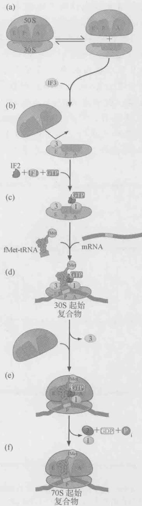  
图 15-25 对原核生物转录起始的总结。

助因子介导对 mRNA 的识别。第三，结合于起始 tRNA 的核糖体在 mRNA 上 “扫描” 以搜寻第一个 AUG 序列。第四，核糖体的大亚基在起始 tRNA 与起始密码子碱基配对之后被募集进来。现在，我们详述这些事件。

## 框15-3 uORF和IRES：能够证明翻译规则的特例

不是所有真核生物的多肽都是由最靠近5'端的AUG起始的可读框编码的。有时，第一个AUG处于不合适的上下游序列中而经常被跳过。有时，短的上游可读框（uORF，编码少于10个氨基酸长度的肽段）见于编码长肽的主要可读框的上游。但是在uORF的翻译结束之后，一部分40s的亚单位仍然保持结合在mRNA上（一般为50%）。较短的uORF便于其与翻译起始因子的相互作用（如eIF4G和eIF3），从而使40S亚单位牢固地结合在mRNA上而且能够在翻译终止后仍然保持该状态（框15-3图1）。保留的40S亚单位继续在mRNA上扫描下一个AUG，但是由于起始tRNA反密码子是识别AUG的必要条件，它对AUG的识别只能在结合一个新的三元复合物（TC；eIF2起始tRNA）的基础上进行（框15-3图1）。通常，这些uORF能够减少而不是完全去除下游长ORF的翻译。我们将在本章举例讨论关于uORF如何用于调控翻译过程。

  
框 15-3 图 1 uORF 调控下游 ORF 的翻译。在某些情况下，当一个核糖体翻译了一个 uORF 后，小亚基仍然留在 mRNA 上，并重新开始扫描搜寻下一个 AUG。只有当结合了一个新的起始 rRNA，它才能识别下一个 AUG。

在最靠近 5' 端的 AUG 的下游位点起始翻译的一个更极端的例子是内部核糖体进入位点（internal ribosome entry site，IRES）。IRES 是 RNA 序列，功能类似于原核生物的 RBS。它们募集小亚基结合于 mRNA 的一个内部位点并在缺少 5' 帽子的情况下起始翻译（框 15-3 图 2）。IRES 多编码于病毒 mRNA，因为它们通常缺乏 5' 帽子并需要最大限度地利用它们的基因组序列。通过使用 IRES，病毒 mRNA 可以编码多于一个的蛋白质，减少对每个蛋白质编码序列所需的转录调控序列。更重要的是，通过减少一个或多个起始因子的需求，IRES 可以在缺乏某种起始因子的情况下继续实现其功能。利用这独特的机制，某一小部分包含 IRES 的 mRNA 在缺少起始因子的细胞中仍能进行翻译。举例来说，在细胞凋亡（或被称为细胞程序性死亡）过程中新激活的蛋白酶降解 eIF4E，但是一小部分用于降解的蛋白质在这一过程中仍然可以被翻译，这是由于其 mRNA 的 5'UTR 上存在一个 IRES 序列，因此避开了对 eIF4E 分子的需求。

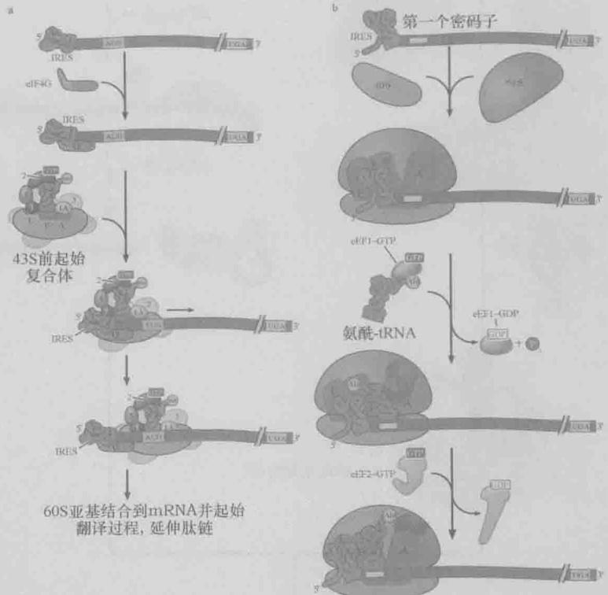  
框 15-3 图 2 IRES 绕过翻译起始的常规要求。病毒的 mRNA 经常包含 IRES 序列，这些序列可以折叠成 RNA 结构来绕过翻译过程中所需要的一种或多种真核细胞的翻译因子。（a）脊髓灰质炎病毒（poliovirus）的 IRES 绕开了需要的 5'帽子的要求，直接与 eIF4G 结合。（b）蟋蟀麻痹病毒编码的一个 mRNA 含有一个精巧的 IRES，折叠后模仿 tRNA 直接结合到 40S 和 60S 核糖体亚基的 P 位点上。下游的 mRNA 进入到 A 位点并开始翻译以丙氨酸为首的肽链。

不同的 IRES 的工作机制不同。在病毒中，至少有一个 IRES 能够直接结合 eIF4G，它绕开了对 5'帽结合蛋白 eIF4E 的需求，然后募集 eIF4G 从而进行翻译（框 15-3 图 2a）。IRES 最极端的形式是蟋蟀麻痹病毒（cricket paralysis virus）的 mRNA。这个 mRNA 的 5'UTR 形成了一个复杂的结构，它可以模仿 tRNA 结合 mRNA 的形式，将自身置于 P 位点和 E 位点的杂合区域中，并且直接结合到 40S 亚单位的 P 位点上。通过这种方式，mRNA 的翻译不再需要起始因子和起始 tRNA（框 15-3 图 2b）。更重要的是，下游的 RNA 序列直接放在了解码中心的 A 位点上，使其直接以第一个密码子发挥作用。生物体中 IRES 的存在使翻译起始因子变得不必要，这提示我们在演化的早期所有的 mRNA 都有可能包含这样的 IRES，而翻译起始因子可能是之后才产生的，它带来的是翻译过程的更高效率与更具适用性。

  
图 15-26 真核细胞核糖体小亚基和起始 tRNA 装配到 mRNA 上。

真核生物核糖体完成了一个周期的翻译之后，就解体为游离的大、小亚基，此时四个起始因子——eIF1、eIF1A、eIF3和eIF5均结合于小亚基上。同时，eIF1,eIF1A和eIF5与原核生物起始因子的IF3和IF1因子功能相似，都能够阻止大亚基与小亚基的重新组合以及tRNA结合到A位点的过程。起始tRNA被三个亚基组成的GTP结合蛋白eIF2送至小亚基上。与IF2类似，eIF2以GTP结合的形式与起始tRNA结合。这种由起始tRNA和EIF2产生的复合体称为三重复合物(ternary complex,TC)。

对于真核生物来讲，起始 tRNA（与细菌的情况相同，起始过程之后所使用的 tRNA[Met]是有区别的）负载甲硫氨酸，而不是 N-甲酰甲硫氨酸，称为 $Met-tRNA_{i}^{Met}$ 。eIF2 将 $Met-tRNA_{i}^{Met}$ 放置在小亚基中将形成 P 位点的位置上，形成 43S 前起始复合物（43S preinitiation complex）。值得注意的是，eIF3 几乎和整个 40S 亚基大小一致，但它却主要结合在核糖体的小亚基上靠近 RNA 进出的位点处。然而，eIF3 与 43SPIC 的每一个成员，包括起始 tRNA，相互作用，从而促进 43SPIC 的组装过程。

在另外一系列反应中，mRNA为小亚基对其的识别做好准备。这一过程以“帽子”结合蛋白eIF4G识别5'端帽子为起始。然后，一系列附加的起始因子募集进来。eIF4G同时结合eIF4E和mRNA，而eIF4A结合eIF4G和mRNA（图15-26b）。eIF4G和eIF4E的这种联合尤为重要——细胞中翻译的整体水平由这个步骤中一个蛋白家族控制。这个能够与eIF4G相互竞争结合的蛋白，称为eIF4E结合蛋白（见本章后面部分的翻译调控）。这一复合体然后与eIF4B分子结合，该分子能够激活eIF4A的RNA解旋酶活性。解旋酶能够解开任何可能形成于mRNA末端的二级结构（如发夹结构）。解除二级结构是非常必要的，因为mRNA5'端必须消除二级结构才能与小亚基结合。最后，结合在消除了较高级结构的mRNA上的eIF4G因子与结合在小亚基上的起始因子（特别是eIF3）不断发生相互作用，直到将43S前起始复合物募集到mRNA上，形成48S前起始复合物（48S preinitiation complex）。

## 翻译起始因子使真核 mRNA 保持环状

Poly-A 尾巴的存在对于提高真核生物蛋白质翻译的效率有所贡献。除了与 mRNA 的 5' 端结

mRNA 的 5' 端结合, 起始因子也可以通过 poly-A 尾与 mRNA 的 3' 端紧密结合 (图 15-27)。这一相互作用主要通过 eIF4G 和 mRNA3' 末端的直接结合以及与包绕在 poly-A 尾的 poly-A 结合蛋白 (poly-A binding protein) 的结合作用实现的。这种作用使 5' 端和 3' 端之间的分子紧密相邻, 并且使 mRNA 维持一种环状的构象。与 polyA 尾结构能够提高

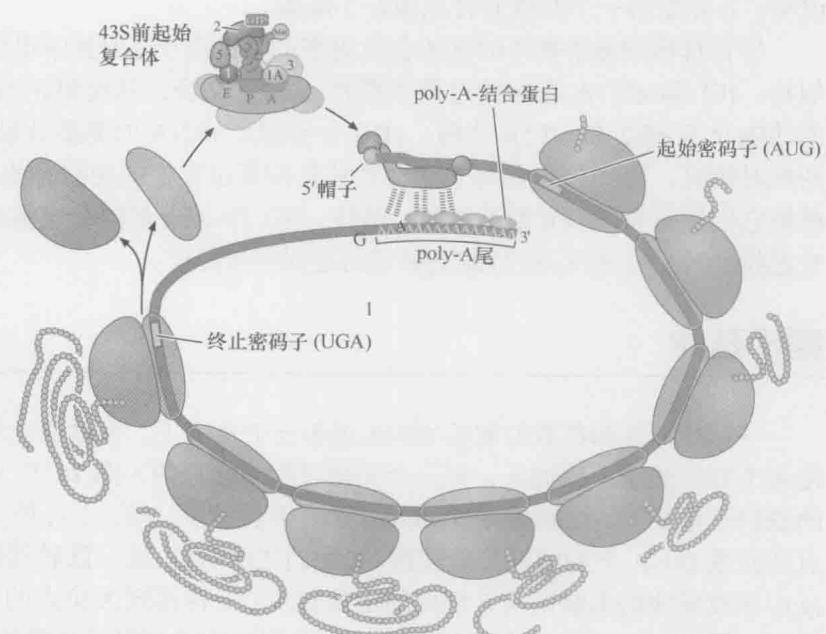  
图 15-27 真核 mRNA 环化模型。环化被认为是由 eIF4G 和 poly-A 结合蛋白的相互作用介导的。

mRNA 翻译效率的情况相似，这些相互作用，包括 eIF4E 结合 mRNA 帽子和大亚基的募集过程，能够提高翻译起始过程中某些步骤的效率。更重要的是，eIF4G 与 mRNA 上的 polyA 结合蛋白之间的相互作用在多个翻译的周期都存在。除此以外，这种 mRNA 结构对于重新定位刚结束翻译的核糖体分子到 AUG 密码子的过程，即重新起始翻译过程有促进作用。

## 起始密码子是从 mRNA 的 5' 端向下游 “扫描” 发现的

一旦小亚基和它的结合因子在 mRNA 的 5'端组装好，它们就按照 5'→3'方向沿着 mRNA 移动。这一移动是依赖于 ATP 的，并通过与 eIF4A / B 结合的 RNA 解旋酶所驱动（图 15-28）。在移动过程中，小亚基扫描 mRNA 以寻找起始密码子。起始密码子的识别是通过起始 tRNA 的反密码子和起始密码子之间的碱基配对作用（这就是起始 tRNA 先与小亚基结合、后与 mRNA 结合之所以重要的原因）。正确的碱基配对改变了 48S 复合体的构象，导致了 eIF1 的释放和 eIF5 构象的改变。因此促使 eIF2 水解与之结合的 GTP。当 eIF2 处于 GDP 结合态时，就不再结合起始 tRNA，并且同 eIF5 一起从小亚基上释放出来。

eIF2 的离开使第二个受 GTP 调控的、被称为 eIF5B 的起始 tRNA 结合蛋白得以产生结合反应。当其结合到起始 tRNA，eIF5B·GTP 能够促使 60S 亚基正确结合于 40S 亚基。这种结合之所以成为可能，就是因为先前阻止这种结合过程的蛋白因子（eIF1 和 eIF5）已经被释放。和原核生物一样，大亚基的结合导致剩余的起始因子释放，这是通过促进 eIF5B 对 GTP 的水解而完成的。这些事件的结果是，Met-tRNA $_{i}^{Met}$ 被置于新的 80S 起始复合体（80S initiation complex）的 P 位点，核糖体为在 A 位点接受一个负载 tRNA 并开始第一个肽键的合成做好了准备。

尽管真核细胞中翻译的起始包含更多的辅助因子，但其中很多是细菌起始因子的类似物。IF1 和 eIF1A 在起始过程中都和 A 位点结合，从而阻止 tRNA 过早的结合。IF2 的功能介于 eIF2 和 eIF5B 之间：eIF2 介导起始 tRNA 的募集及检测与起始密码子 AUG 的配对情况，而 eIF5B 执行 IF2 在大亚基招募过程中的功能。就像 IF2，eIF2 和 eIF5B 都被它们所结合的核苷酸所调节。最终，IF3 和 eIF1 都同小亚基上的 P 位点结合，且都在起始 tRNA 与 AUG 进行碱基配对的过程中被释放。

## 翻译延伸

一旦核糖体和负载的起始 tRNA 组装于 P 位点上，多肽的合成就能够开始了。为了使每个氨基酸能正确加入，有三个关键过程是必需的（图 15-29）：首先，在 A 位点上的密码子指导下，正确的氨酰-tRNA 置于 A 位点上；第二，A 位点的氨酰-tRNA 与 P 位点的肽酰 tRNA 上的肽链形成肽键。如我们之前所见，这一肽转移酶(peptidyl transferase)反应导致延伸的多肽链从 P 位点的负载 tRNA 上转移到 A 位点的负载 tRNA 的氨基酸残基上；第三，在 A 位点形成的肽酰-tRNA 和相应的密码子必须易位（translocate）至 P 位点，以使核糖体为下一循环的密码子识别和肽键形成做好准备。同 mRNA 的起始位置必须精确一样，核糖体在 mRNA 上的移动也必须准确以保持正确解读遗传信息的可读框。两种被称为延伸因子（elongation factor）的辅助蛋白调控这些事件。这两种因子都利用 GTP 结合和水解产生的能量来提高核糖体作用的效率和准确性。

  
图 15-28 真核细胞翻译起始阶段，核糖体 48S PIC 对起始 AUG 的识别和大亚基的结合。

  
图 15-29 翻译延伸步骤的总结。

与翻译的起始不同，延伸的机制在原核细胞和真核细胞之中是高度保守的。我们将延伸的讨论仅限于原核细胞上，它已经被详细地了解了，但真核细胞的翻译延伸过程无论在涉及的因子和机制上都与原核细胞相似。

## 氨酰—tRNA 由延伸因子 EF-Tu 送达 A 位点

氨酰—tRNA 不能独自与核糖体结合。相反，它们是由延伸因子 EF-Tu “护送” 到核糖体上的（图 15-30）。一旦 tRNA 被氨基酰化，EF-Tu 就结合于 tRNA 的 3' 端，覆盖耦合的氨基酸。这个作用防止了氨酰-tRNA 参与肽键的形成，直到从 EF-Tu 中释放出来。

与起始因子 IF2 一样，延伸因子 EF-Tu 结合并水解 GTP，并且鸟嘌呤核苷酸结合的类型决定了 EF-Tu 的功能。只有当 EF-Tu 与 GTP 结合后，EF-Tu 才能结合氨酰——tRNA。而 EF-Tu 与 GDP 结合，或缺乏结合态核苷酸的时候，与氨酰-tRNA 没有什么亲和力。因此当 EF-Tu 水解结合的 GTP 时，其所结合的氨酰-tRNA 就被释放出来。结合氨酰-tRNA 的 EF-Tu 单独不能有效地水解 GTP。相反，EF-Tu GTP 水解酶活性是在与大亚基的一个结构域结合之后而得以激活的，该结构域与大亚基加入起始复合体时激活 IF2 GTP 水解酶的作用位置相同。这一结构域称为因子结合中心（factor binding center）。只有当 tRNA 置于 A 位点并且产生正确的密码子-反密码子配对后，EF-Tu 才能与因子结合中心相互作用。然后，EF-Tu 水解结合的 GTP，并从核糖体中释放出来（图 15-30）。正如下面将讨论的，EF-Tu 调控 GTP 的水解对翻译的特异性是非常重要的。

核糖体利用多种选择机制排斥错误配对的氨-酰 tRNA

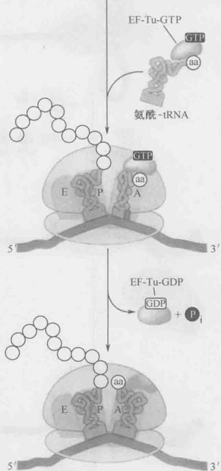  
图 15-30 EF-Tu “护送” 氨酰-tRNA 至核糖体的 A 位点。当负载 tRNA 最初与核糖体的 A 位点发生作用时，它们是与 EF-Tu-GTP 结合在一起的。当正确的密码子-反密码子相互作用发生时，EF-Tu 与因子结合中心发生反应，水解所结合的 GTP，并从 tRNA 和核糖体上脱离。当 EF-Tu 被释放之后，tRNA 将旋转进入核糖体的转肽酶中心。

翻译的错误率为 $10^{-3} \sim 10^{-4}$ 。这就是说，在合成的蛋白质中，每1000个氨基酸中只有不多于一个氨基酸是组装错误的。选择正确的氨酰-tRNA的根本原则在于负载tRNA和核糖体A位点的密码子之间的碱基配对。尽管如此，正确的密码子-反密码子配对和不正确的配对之间的能量差异尚不能完全解释这样高的准确率。在许多情况下，密码子-反密码子相互作用的三对核苷酸中只有一对是错配的，但核糖体很少允许这样的氨酰-tRNA继续翻译。至少有三种不同的机制促成了翻译的高准确率（图15-31）。这些机制都选择排斥密码子-反密码子配对错误的氨酰-tRNA。

其中一个有助于密码子识别准确性的机制涉及小亚基 A 位点内 16S RNA 的两个相邻的腺嘌呤残基。这两个腺嘌呤在 A 位点中反密码子和密码子的前两个碱基之间每个正确配对所形成的小沟中形成氢键(图 15-31a)。正如之前谈到的(第 6 章和图 6-10)，在 Watson-Crick 的 G：C 和 A：U 碱基配对所形成的小沟中，氢键的特性是非常相似的。因此，相邻的 16S RNA 的 A 残基不能辨别 G：C 或 A：U 配对，因而认为任何一对都是正确的。相反，非 Watson-Crick 碱基配对或错配所形成的小沟就不能被 16S RNA 的这两个腺嘌呤识别，导致对非正确 tRNA 的亲和力明显降低。这些作用的综合结果是，正确配对的 tRNA 从核糖体解离的速度要远低于非正确配对的 tRNA。

第二个有助于保证正确的反密码子-密码子配对的机制涉及 EF-Tu 的 GTP 酶的活性（图 15-31b）。如上所述，EF-Tu 从 tRNA 的释放需要 GTP 的水解，这一作用对正确的反密码子-密码子配对是非常敏感的。即使只有一个碱基的不配对也将改变 EF-Tu 的位置，降低其与因子结合中心的相互作用能力。这就导致了 EF-Tu 的 GTP 酶活性的急剧下降。这一机制是动力学选择性的一个范例，并且与 DNA 合成过程中保证正确的碱基配对的机制有关（见第 9 章）。在这两个过程中，正确的碱基配对的形成都明显地加快了一个重要的生化步骤的速度。对 DNA 聚合酶来说，这个步骤就是磷酸二酯键的形成。对蛋白质合成来说，这个步骤就是 EF-Tu 对 GTP 的水解。

第三个保证碱基配对正确性的机制是 EF-Tu 释放后的一个校正机制。当负载 tRNA 与 EF-Tu-GTP 的复合体进入 A 位点时，它的 3' 端远离肽键形成的位点。为了成功地进行肽转移酶反应，氨酰-tRNA 必须旋转进入到大亚基的肽转移酶中心，这一过程称为入位（accommodation，图 15-31c）。在入位过程中，氨酰-tRNA 的 3' 端移动了几乎 70Å。非正确配对的 tRNA 在入位过程中经常从核糖体上脱离下来。有假设认为氨酰-tRNA 的旋转为密码子-反密码子的相互作用带来了张力，而只有正确配对的反密码子才能承受这种张力。因此，错配的氨酰-tRNA 就更有可能在肽转移酶反应进行之前从核糖体上脱离下来。

总之，除了密码子-反密码子的相互作用，核糖体还利用小沟的作用和两种校正机制来保证正确的氨酰-tRNA结合在A位点上。这三种额外的选择机制阻止了那些不能形成正确的密码子-反密码子作用的氨酰-tRNA的留存。

## 核糖体是一种核酶

一旦正确的负载 tRNA 置于 A 位点并旋转进入肽转移酶中心，肽键的形成就开始了。这一反应由 RNA，尤其是大亚基的 23S rRNA 来催化。这种论点的早期证据来自于下面的实验：即使剥离了很多蛋白质的大亚基依然能够进行肽键的形成。对肽转移酶其实由

RNA 组成的这一事实的证明，来自于一个原核生物核糖体的高精度三维结构研究，它揭示没有氨基酸位于活性位点的 18Å 之内（图 15-32）。

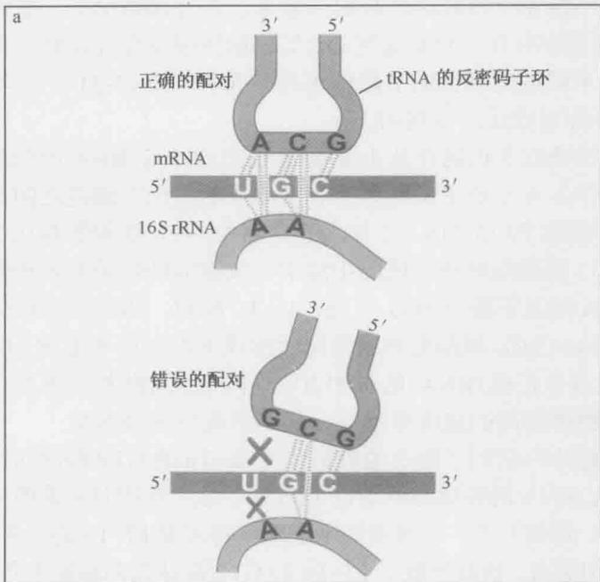

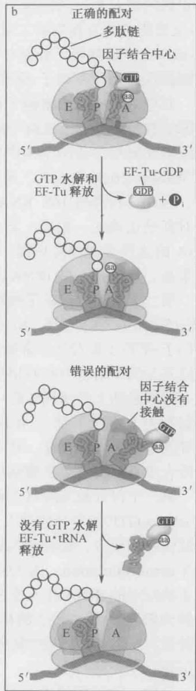  
图 15-31 保证 tRNA 和 mRNA 正确配对的三种机制。(a) 只有当密码子-反密码子正确配对时, 16S rRNA 的两个腺嘌呤残基与配对碱基对的小沟之间才能形成额外的氢键。(b) 正确的碱基配对使得结合氨酰-tRNA 的 EF-Tu 与因子结合中心相互作用, 诱发 GTP 的水解和 ET-Tu 的释放。(c) 只有碱基配对正确的氨酰-tRNA 在肽键形成过程中旋转进入正确位置时, 才能保持与核糖体的结合。这一旋转易位称为 tRNA 入位。

对 E.coli 核糖体与 mRNA 及 tRNA 整合复合物三维结构的解析已揭示出, 某个蛋白质（L27）的氨基末端确定能够完全进入到其活性部位。这一发现可能意味着这一蛋白

质在催化过程中起到某种作用。为了检测这种可能性，将L27蛋白氨基端9个处于活性中心附近的氨基酸进行缺失突变。生成的细胞所产生的核糖体具有降低的，但可被检测到的肽酰转移酶活性，这就清楚地说明L27蛋白的这一区域影响肽酰转移酶的活性。然而突变的核糖体依然以野生型核糖体蛋白合成水平的 $30\% \sim 50\%$ 来合成蛋白质，并且含有突变核糖体的细胞仍然可以生长分裂。与底物（氨酰-tRNA）在溶液中单独存在时相比，核糖体提高了 $10^{7}$ 倍的肽键形成速率。显然，即使L27不在活性位点上，核糖体依然保留了绝大部分的活性。因此，尽管这一蛋白质促进肽键形成，但它对于肽酰转移酶活性并

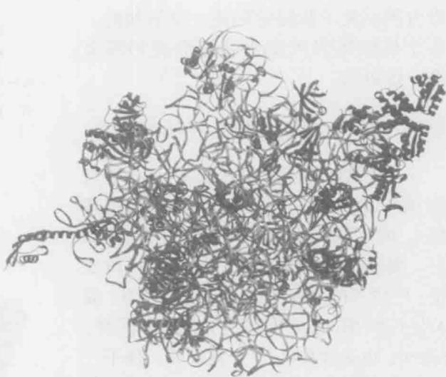  
图 15-32 RNA 环绕着大亚基的肽转移酶中心。图中所示为细菌 50S 亚基的三维结构。RNA 为灰色，核糖体蛋白质为紫红色。紧邻肽酰转移酶中心的位于 A 位点和 P 位点的 tRNA 的 3'端分别以绿色和红色表示。（Yusupov M.M. et al. 2001. Science 292: 883–896.）图像使用 MolScript、BobScript 和 Raster 3D 软件制作。

不是必需的。像其他核糖体蛋白一样，L27最有可能的功能就是将一个或更多的RNA组分正确地摆放到活性位点。更为重要的是，因为这个蛋白质是唯一一个距离活性中心最近的、行使催化功能的蛋白质，所以核糖体的rRNA组分一定承担着催化肽键形成的主要功能。

23S rRNA 接下来是如何催化肽键形成的呢？准确的机制仍然需要研究，但某些答案已经清楚了。首先 23S rRNA 与处于 A 和 P 位点的 tRNA 的 CCA 末端之间碱基配对，有助于氨酰-tRNA 的 α 氨基基团攻击结合于肽酰-tRNA 的多肽羰基基团。这一作用也有可能稳定入位后的氨酰-tRNA。这类催化机制称为熵催化（entropic catalysis）。也就是说，酶通过将底物带到一起的方式来激发催化。

由于仅仅靠底物的紧密相邻并不足以产生高水平的催化作用，因此很可能 rRNA 的其他元件也参与了催化。实际上，去掉 23S rRNA 上一个高度保守残基（E.coli 23S rRNA 上的 A2451 位点）的 2'-OH 这样的一种变化使催化速率至少降低了 10 倍。近期的研究又发现了一个未曾料到的、在催化中很关键的 RNA 分子：P 位点 tRNA。去掉 P 位点 tRNA 的 3'端 A 残基的 2'-OH 导致催化速率降低了 $10^{6}$ 倍。这种称为“底物辅助催化”（substrate-assisted catalysis）的现象是一个尤为有趣的发现，因为这预示着氨酰-tRNA 本身就携带着关键的催化元件。这一发现意味着在核糖体演化之前，tRNA 可能已经为催化其自身蛋白质的合成提供关键元件了。

基于一系列相关考虑，人们提出，P位点tRNA的2'-OH可能充当“质子穿梭机制”(proton shuttle)的一部分(图15-33)。在这一模型中，2'-OH向肽酰-tRNA的3'-OH提供一个H，并从发起攻击的、连接于A位点tRNA的氨基酸的α-氨基基团得到一个质子。十分重要的是，这两个发现都强烈支持这样一种假设，即正是RNA而不是

蛋白质催化了肽键的形成。尽管如此，关于核糖体怎样催化肽键形成仍需要进一步研究。

## 肽键形成启动大亚基中的易位反应

一旦肽转移酶反应开始发生，P 位点的 tRNA 就被去乙酰基化（不再结合氨基酸），而多肽链则连接到 A 位点的 tRNA 上。要使肽链延伸的新一轮循环得以发生，P 位点的 tRNA 必须移至 E 位点，而 A 位点的 tRNA 必须移至 P 位点。同时，mRNA 也必须移动 3 个核苷酸，使下一个密码子暴露出来。这些移动是在核糖体内协调进行的，统称为易位 (translocation)。

易位的起始步骤是与肽转移酶的耦联反应（图 15-34）。一旦多肽链移至 A 位点的 tRNA 上，A 位点和 P 位点的 tRNA 就会开始占据到大亚基上的新位置上。A 位点 tRNA 的 3' 端与多肽结合，而结合到大亚基的 P 位点上。这时已脱氨基的 P 位点 tRNA 不再与多肽结合，而结合到大亚基的 E 位点上。与此相反，在这个时候，这些 tRNA 的反密码子仍然停留在小亚基的原始位置上并与 mRNA 配对。因此，大亚基的易位是先于小亚基的易位，而 tRNA 就处于 “杂合状态”。它们的 3' 端移入一个新的位置，但它们的反密码子末端仍位于未发生肽转移酶反应时的位置上（图 15-34b）。更重要的是，这种改变是在小亚基中以逆时针方向进行的，而且这与大亚基中的几个有着明显位置差别的 tRNA 之间所产生的相互作用有关。

EF-G 通过稳定中间体的方法推动易位

  
图 15-33 肽键形成中 P 位点 tRNA 2'-OH 的功能。肽酰-tRNA 最后一个 “A” 的 2'-OH 对于肽键形成十分关键。基于以上发现，有人提出 2'-OH 的氢组分可能参与一个 “质子穿梭机制”。在此模型中，随着肽酰-tRNA 与肽链之间的键断裂，3'氧原子从 2'-OH 夺取一个氢原子（以黄色表示），而 2'氧原子反过来从攻击羧基的氨基基团夺取一个氢原子（以绿色表示）。红色箭头显示肽键形成过程中可能的电子运行方向。

易位的的完成需要第二个延长因子，EF-G 的协助。EF-G 在与 GTP 相互作用后会初步地结合到核糖体上。在肽酰转移酶的作用下，EF-G-GTP 以旋转混合的状态结合并稳定在核糖体上（图 15-34c）。一旦 EF-G-GTP 结合，则会与大亚基上的因子结合中心发生作用从而激活 GTP 的水解。

  
图 15-34 EF-G 激活易位的过程需要 GTP 的水解。

GTP 的水解会改变 EF-G 的两个序列的构象（图 15-34d）。首先，EF-G-GDP 与核糖体间的相互作用被认为是用于“解锁”核糖体。结构学研究表明存在分离 A-、P-和 E 位点的“门”，而 EF-G-GDP 则可以通过打开这些门来解锁核糖体。其次，改变构象后的 EF-G-GDP 结合到解码中心的 A-位点，从而与 tRNA 竞争性的结合解码中心的 A 位点。由于核糖体被“解锁”了，原来的 A-位点 tRNA 可以移动到 P-位点，从而可以允许 EF-G-GDP 结合到 A 位点。因而，正如 EF-G-FTP 稳定了核糖体的杂合状态，改变后的 EF-G-GDP 构象在 tRNA 离开 A-位点后可以与解锁后的核糖体更加紧密的结合。像多米诺骨牌一样，A-位点 tRNA 移动到 P-位点会导致 P-位点的 tRNA 移动到 E-位点。tRNA 和 mRNA 之间的碱基配对导致 mRNA 移动 3bp。当出现具有 4 个核苷酸反密码子的稀有“移码”tRNA 时（因此可以补偿因特定移码突变时产生的错误），可以导致 mRNA 移动 4bp 而非 3bp，这表明 mRNA 移动的距离是由 tRNA 决定的。

易位的完成伴随着小亚基顺时针旋转回到原位。这导致核糖体的结构很大程度上降低了与 EF-G-GDP 的亲和力。EF-G 的释放导致核糖体回到 “紧闭” 状态，即 tRNA 和 mRNA 再一次紧密的结合在小亚基的解码中心上，A-，P- 和 E- 位点的门被关闭。同时，这些事件导致了 A- 位点的 tRNA 易位到 P- 位点，P- 位点的 tRNA 易位到 E- 位点，mRNA 准确移动 3bp（图 15-34e）。这样核糖体则准备好进行下一轮的添加氨基酸的状态。

EF-G-GDP是如何与解码中心的A位点高效的结合呢？EF-G和EF-Tu与tRNA结合的晶体学研究表明，EF-G-GDP与EF-Tu-GTP-tRNA有非常相似的结构（图15-35）。EF-Tu-GTP-tRNA也可以与解码中心的A位点结合。这种相似性中最值得注意的是，尽管EF-G由单个多肽组成，它的结构却像tRNA结合到一个蛋白质上一样。这是“分子拟态”的一个例子，即一个蛋白像tRNA一样的外观结构从而促使其可以结合到与tRNA相同的结合位点上。有趣的是，真核细胞中EF-G的类似物（如eEF-2）的结构学研究中发现两个构象完全不同的蛋白质（一个与抗生素 sordarin 结合）。如图 15-35 所示，一个构象与 EF-G 的结构相似，而第二个构象则是由相对于 GTP 结合区域的 tRNA 模拟区域的显著的移动造成的。在这样特有构象间的改变能力对于易位时 EF-G 的功能很重要。

  
图 15-35 延伸因子的结构比较。左图为 EF-Tu-GDPNP-Phe-tRNA，右图为 EF-G-GDP。GDPNP 为不能水解的 GTP 类似物，在形成各分子三维结构时用于在 GTP 结合的构象中锁定分子。请注意 EF-G 中以绿色标注的结构和与 EF-Tu 结合的 tRNA（也用绿色表示）的结构具有相似性。（左图：Nissen P. et al. 1995. Science 270: 1464–1472. 右图：al-Karadaghi S. et al. 1996. Structure 4: 555–565.）图像使用 MolScript、BobScript 和 Raster 3D 软件制作。

## EF-Tu-GDP 和 EF-G-GDP 在参加新一轮延伸之前必须将 GDP 换成 GTP

EF-Tu 和 EF-G 是具有催化功能的蛋白质，在每一轮 tRNA 结合核糖体、肽键形成和易位的过程中只能使用一次。GTP 水解后，这两个蛋白质必须释放其所结合的 GDP，并结合一个新的 GTP 分子。对 EF-G 来说，这是一个简单的过程，因为 GDP 与 EF-G 的亲和力要低于 GTP。因此 GTP 水解后，GDP 和磷酸释放出来，游离的 EF-G 很快与一个新的 GTP 分子相结合。而对 EF-Tu 而言，需要另一个蛋白质来完成 GDP 到 GTP 的交换。延伸因子 EF-Ts 是 EF-Tu 的 GTP 交换因子（GTP exchange factor）（图 15-36）。EF-Tu-GDP 从核糖体释放出来后，EF-Ts 与 EF-Tu 结合，促使 GDP 脱落。随后，GTP 结合 EF-Tu-EF-Ts 复合体，导致它分解为游离的 EF-Ts 和 EF-Tu-GTP。最后，EF-Tu-GTP 结合一个负载的 tRNA，重新形成 EF-Tu-GTP-氨酰-tRNA 复合体，再一次准备将新的负载 tRNA 送至核糖体。

## 形成肽键的一个循环要消耗两个 GTP 分子和一个 ATP 分子

我们以计算能量消耗来结束对延伸过程的讨论。有多少三磷酸核苷酸分子在每一轮的肽键形成中被消耗了呢(不算氨基酸生物合成的能量消耗和起始与结束阶

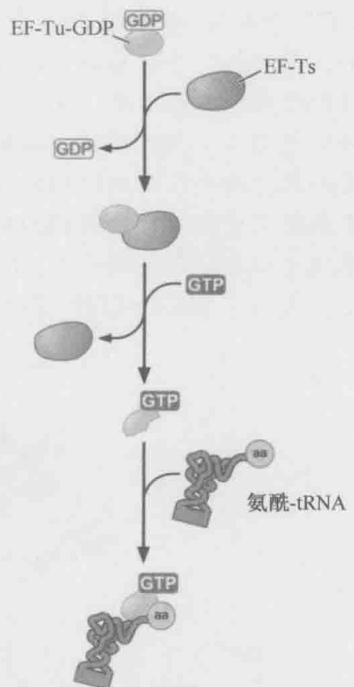  
图 15-36 EF-Ts 促进 GDP 与 EF-Tu 的解离。结合于 EF-Tu 的 GDP 释放非常缓慢。EF-Ts 结合于 EF-Tu-GDP，引发 GDP 的快速解离。结合于 EF-Tu-EF-Ts 复合物中的 EF-Tu 上的 GTP 取代 ET-Ts 并释放 EF-Tu-GTP。EF-Tu-GTP 随后能够结合一个新的氨酰-tRNA 并运往核糖体。

段的消耗）？还记得一个 ATP 分子被氨酰-tRNA 合成酶消耗，形成了连接氨基酸和 tRNA 的高能酰基键。这一高能酰基键断裂（所释放的能量）驱动了产生肽键的肽转移酶反应。第二个三磷酸核苷酸（GTP）分子在 EF-Tu 将负载 tRNA 运送至核糖体的 A 位点和确保正确的密码子-反密码子的识别过程中被消耗。最后，第三个三磷酸核苷酸（GTP）在 EF-G 介导的易位过程中被消耗。这样，一个肽键的形成就消耗了细胞两个 GTP 分子和一个 ATP 分子，翻译延伸过程的每一步消耗一个三磷酸核苷酸。有趣的是，这三个分子中，只有一个（ATP）与肽键的形成有关，另外两个（GTP）分子的能量用于保证翻译的精确有序（框 15-4）。

  
框 15-4 图 1 比较结合 GDP 及结合 GTP 的 EF-Tu。（a）结合 GDP 的 EF-Tu；（b）结合 GTP 的 EF-Tu。GTP 结合域以松绿色显示。当结合 GTP 时，洋红色结构域的旋转，以及松绿色和蓝色结构域的改变导致强的 tRNA 结合位点的形成（图 15-35）。GTP 以棒形表示。（a，Polekhina G. et al. 1996. Structure 4：1141–1141；b，Kjeldgard M. et al. 1993. Structure 1：35–50。）图像使用 MolScript、BobScript 和 Raster 3D 软件制作。

## 框 15-4 GTP 结合蛋白、构象转变及翻译过程精确有序

在整个翻译过程中，GTP 被用来控制关键事件。与 ATP 在连接氨基酸到 tRNA 上所行使的功能不同，GTP 水解的能量不与化学修饰过程相关。相反，在翻译过程中，GTP 水解的能量被用来控制事件的次序和忠实性。这是如何完成的呢？

GTP 结合蛋白参与翻译的一个关键特征是它们的构象因结合哪种鸟苷酸(GDP 还是 GTP)而改变。这在框 15-4 图 1 的 EF-Tu 中可见，该图显示了结合 GTP 或 GDP 的 EF-Tu 的三维结构。当与 GTP 结合时，EF-Tu 经历一个重大的构象改变，导致其 tRNA 结合位点的形成。具体来说，取决于结合的核苷酸，EF-Tu 的一个结构域（在框 15-4 图 1 中以洋红色显示）相对于该蛋白质的其他结构域可以进行位置的迁移。结构域位置的这个改变和其他两个结构域的构象改变（以松绿色和深蓝色显示）导致 EF-Tu 上形成一个新的表面用来紧密结合负载 tRNA（可在图 15-35 中看到结合了一个 tRNA 的 EF-Tu）。这样，取决于结合的鸟苷酸形式，这些因子可以有不同的功能，或结合到不同的蛋白质或 RNA 上。例如，EF-Tu-GTP 可以结合到氨酰-tRNA 上，但 EF-Tu-GDP 不能。

在翻译中通过将 GTP 水解与关键事件的完成关联起来，可以牢牢掌控这些事件的次序。对 EF-Tu 来说，依赖 GTP 的 EF-Tu 与氨酰 tRNA 的结合保证了肽键的形成不会在正确的密码子-反密码子配对之前发生。正确碱基配对的形成激发了 GTP 水解。一旦与 GDP 结合，EF-Tu 就从氨酰-tRNA 上释放出来，使肽键的形成能随后发生。

每个 GTP 调节的辅助蛋白活化 GTP 水解的机制是一样的。在每种情况下，GTP 酶的活性是通过与称为因子结合中心（factor binding center）的大亚基的一个特定区域的相互作用而激活的。这个相互作用因缺乏足够的亲和力，因此不能在在分离状态下发生。相反，每个 GTP 控制的翻译因子必须与核糖体发生几个其他的重要相互作用来稳定与因子结合中心的精确关联，从而引发 GTP 酶的活性。实际上，如同我们从 EF-Tu 所看到的，这个相互作用对 EF-Tu、氨酰-tRNA、mRNA 和核糖体之间相互作用的确切性质非常敏感。因此，与因子结合中心的相互作用监控这些蛋白质和 RNA 与核糖体的所有其他的相互作用。只有当正确的密码子-反密码子配对形成，EF-Tu 中的 GTP 结合位点才能够有效地与因子结合中心作用，促使 GTP 水解和蛋白质构象相应改变。

翻译过程对 GTP 的利用与滑动夹装载器（sliding clamp loaders，第 9 章和框 9-3）对 ATP 的利用类似。ATP 的结合对于将滑动夹与一个起始复合物组装的过程是必需的，但 ATP 的水解和滑动夹的释放只有在夹子装载器与引物：模板结合处结合后才能发生。在翻译过程中，GTP 是核糖体（在某些情况中是其他的 RNA 和蛋白质）与 GTP 调控因子起始结合时所必需的，GTP 水解只在因子正确地与核糖体作用后才会发生。如同滑动夹的例子，GTP 水解一般导致翻译相关因子从核糖体上释放出来。

在翻译延伸过程的讨论中，我们并没有区分原核细胞和真核细胞。虽然真核细胞中与 EF-Tu（eEF1）和 EF-G（eEF2）相对应的因子的名称不同，但它们与原核细胞的对应因子的作用是非常相似的。

## 翻译终止

## 释放因子在终止密码子的作用下终止翻译

氨酰-tRNA 的结合、肽键的形成和易位的核糖体循环在三个终止密码子其中之一进入 A 位点时就终止了。最初是假定存在一种或几种可识别这些终止密码子的链终止 tRNA。但是事实并非如此。终止密码子其实是被称为释放因子（release factor，RF）的蛋白质识别的，这些因子激活多肽链从肽酰 tRNA 中释放的水解反应。

有两类释放因子：Ⅰ类释放因子识别终止密码子，并催化多肽链从P位点的tRNA中水解释放出来。原核细胞有两种Ⅰ类释放因子：RF1和RF2。RF1识别终止密码子UAG，RF2识别终止密码子UGA，两者皆可识别第三个终止密码子UAA。真核细胞只有一种能识别三个终止密码的Ⅰ类释放因子——eRF1。Ⅱ类释放因子在多肽链释放后刺激Ⅰ类因子从核糖体中解离开来。原核细胞和真核细胞都只有一种Ⅱ类因子，分别是RF3和eRF3。与EF-G、IF2和EF-Tu一样，Ⅱ类释放因子也是由GTP的结合与水解调节的。

## I 类释放因子的一小段区域识别终止密码子并催化多肽链的释放

释放因子是如何识别终止密码子的呢？由于释放因子完全是由蛋白质组成的，因此对密码子的识别必然通过蛋白质-RNA相互作用。将RF1和RF2（有不同的终止密码子特异性）的编码区序列交换的遗传学实验证明，释放因子的识别区域是串联的三个氨基酸。RF1和RF2之间这三个氨基酸的交换导致对终止密码子识别特异性的转换。因此这三个氨基酸序列称为肽反密码子，作用于并识别终止密码子。结合RF1的核糖体三维结构证实了RF1结合于核糖体的A位点（图15-37a）。在该结构中肽反密码子区就位于反密码子附近，但很可能还有其他蛋白区域也对密码子识别有所贡献（图 15-37b）。

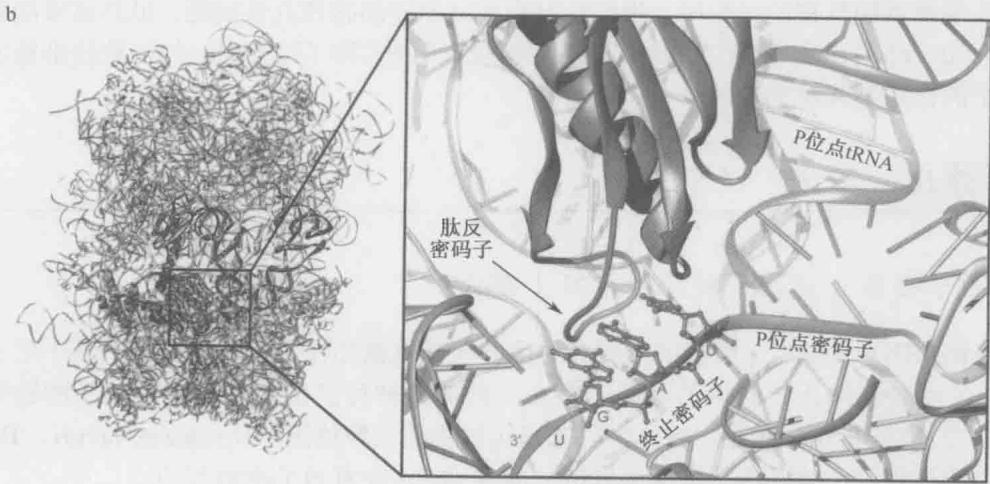

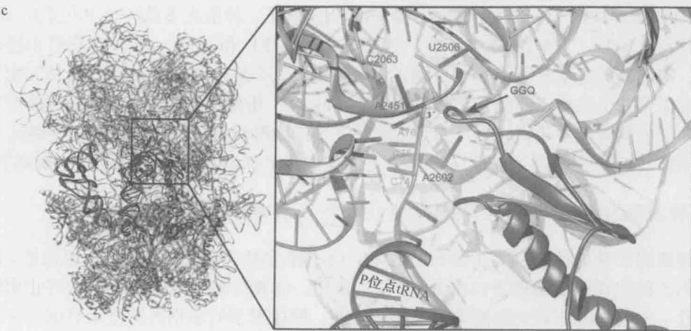  
图 15-37 RF1 结合核糖体三维结构。(a) 本图显示结合于核糖体 A 位点的 RF1。(b) 这一结构显示肽反密码子与反密码子非常接近。(c) 本图显示 RF1 与核糖体结合的结构中，GGQ 基序与 P 位点 tRNA 的 3' 端和肽酰转移酶中心十分接近。(获得许可并修改自 Petry et al. 2005. Cell 123: 1255–1266. Elsevier.)

<!-- END OFFICIAL API PART part_006 -->

<!-- BEGIN OFFICIAL API PART part_007 -->

I 类释放因子中促使多肽链释放的区域也被确认了。所有的 I 类因子共有一段保守的三氨基酸（GGQ）序列，这一序列对多肽链的释放是关键的。而且，结合 RF1 的核糖体结构也证明了 GGQ 位于肽转移酶中心的附近（图 15-38）。目前尚不清楚 GGQ 是直接参与了多肽链从肽酰 tRNA 中水解的过程，还是诱导了肽转移酶中心的某些变化，从而使得这一中心本身能催化水解。对肽酰转移酶中心（例如 A2541 或 A2602）靠近 CCA 末端的位置所发现的保守碱基的研究表明，其中几个残基是肽的水解所必需的。实际上，相比在肽键形成中的作用，这些碱基似乎在肽的释放中具有更重要的作用。关于这种差别的一个可能的解释就是，只有邻近的 RNA 残基可以摆放一个小的水分子用于水解，但核糖体上的许多位点上

  
图 15-38 RF1 与 tRNA 的结构比较。tRNA（以深红色表示），与 RF1（以灰色表示）占据同一位置。（获得许可并修改自 Petry et al. 2005. Cell 123:1255–1266, Fig. 3E. Elsevier.）

的残基能够帮助摆放较大的 tRNA 分子用于催化作用。

总之，基于这些研究提出了以下假设：Ⅰ类释放因子是在功能上模仿了 tRNA，它具有一个与终止密码子作用的肽反密码子，以及能进入肽转移酶中心的 GGQ 区域。RF1 与 tRNA 的结构对比揭示了这一蛋白怎样从功能上模拟了一个 tRNA（图 15-38）。正如 CCA 的 3' 端和反密码子环占据每个 tRNA 的最末端的情况一致，GGQ 和肽 “反密码子” 环也占据 RF1 的最末端。

## GDP / GTP 交换和 GTP 水解调控Ⅱ类释放因子的功能

一旦Ⅰ类释放因子启动了肽酰-tRNA的水解，它必须离开核糖体（图15-39）。这一步是由Ⅱ类释放因子RF3（或在真核细胞中eRF3）来实现的。RF3是一种GTP结合蛋白，但与其他参与翻译的GTP结合蛋白不同，这一因子与GDP的亲和力大于与GTP的亲和力。因此，游离的RF3主要是以与GDP结合的形式存在。RF3-GDP与核糖体结合取决于Ⅰ类释放因子存在与否。在Ⅰ类RF激发多肽释放后，核糖体和Ⅰ类释放因子的构象改变诱导RF3交换GDP而结合GTP。也就是说，这些因子扮演RF3的GTP交换因子，就像EF-Ts扮演EF-Tu的GTP交换因子那样。RF3与GTP的结合导致其与核糖体之间的高亲和力相互作用的形成，从而形成之前易位过程中产生的旋转杂合区域。这种变化能够使其结合在核糖体上并替换Ⅰ类分子。这一变化还使得RF3与大亚基的因子结合中心相结合。与参与翻译的其他GTP结合蛋白一样，这个作用引发GTP的水解。在（与核糖体结合的）Ⅰ类因子不存在的情况下，RF3-GDP与核糖体的亲和力较弱因而很快从核糖体中释放出来。

核糖体循环因子模仿 tRNA

在多肽链和释放因子离开核糖体后，核糖体仍然结合 mRNA，并留有两个脱氨基的 tRNA（在 P 位点和 E 位点）。为了参与新一轮的多肽合成，tRNA 和 mRNA 必须离开核糖体而核糖体也必须分解为大、小亚基。这几个事件统称为核糖体循环（ribosome recycling）。

在原核细胞中，一种称为核糖体循环因子（ribosome recycling factor，RRF）在多肽释放后与 EF-G 和 IF3 共同作用来推动核糖体循环（图 15-40）。RRF 与空位的 A 位点结合，并模仿 tRNA。RRF 也募集 EF-G-GTP 到核糖体上，在那些模仿延伸过程中 EF-G 功能的事件中，EF-G 引发结合在 P 位点和 E 位点的空载 tRNA 的释放。虽然这一释放过程的详细机制并不清楚，但一般认为 A 位点的 RRF 被 EF-G 所替代的方式就像延伸过程中 A 位点的 tRNA 被替代的方式一样。一旦 tRNA 从核糖体中脱离，EF-G-GDP 和 RRF 同 mRNA 一起也从核糖体中释放出来。IF3（起始因子）也可能参与了 mRNA 的释放，而且它对核糖体分解为大、小亚基是必需的。这些事件的最后结果是形成一个与 IF3（而非 tRNA 或 mRNA）结合的小亚基和一个游离的大亚基。这些游离的核糖体就可以参与新一轮的翻译。

这里需要重新强调 RRF 是 tRNA 模仿者的观点，事实上 RRF 的三维结构与 tRNA 相似。但是其与核糖体作用的方式同 tRNA（与核糖体）作用的方式是非常不同的。RRF 仅与处在 A 位点的大亚基部分紧密结合。我们可以对循环因子和 tRNA 作用的进行如下分析：如果核糖体循环因子完全模仿 A 位点的 tRNA，那么 P 位点的 tRNA 将被 EF-G 移至 E 位点。相反，EF-G 和循环因子将 P 位点的 tRNA 直接从 P 位点释放出来。很有可能，EF-G 和循环因子引起了核糖体结构的变化比一般易位过程所发生的要大得多，从而导致 mRNA 和 tRNA 同时释放出来。

与起始和延伸过程一样，翻译的终止也是由一系列有序的、相互依附的因子的结合和释放来介导的。翻译过程的这种有序的性质保证了每一步骤都是在前一步骤完成后才能发生。例如，EF-Tu 只有在 EF-G 完成易位后才能护送新的 tRNA 进入 A 位点。同样地，只有在 I 类释放因子识别了一个终止密码子后，RF3 才能结合核糖体。翻译的这一有序的方法也有缺陷：如果其中任意一步不能完成，那么整个过程就会停止。抗生素就是利用了这一致命的弱点，而以阻碍翻译过程作为目标而达到其效用（框 15-5）。

虽然在真核细胞中具有Ⅰ类和Ⅱ类释放因子，它们的结构和氨基酸序列没有什么相关性，而且只有Ⅰ类因子的功能类似。就像RF1和RF2一样，eRF1识别所有三种终止密码子，并将GGQ基序带入肽基转移酶中心导致多肽链的解离。与原核细胞RF3催化RF1/RF2解离不同，eRF3将eRF1传送至核糖体。eRF3·GTP与远离核糖体的eRF1结合，然后类似EF-Tu和负载的tRNA作用，将eRF1送至核糖体中（图15-41）。同样，和EF-Tu类似的，只要eRF1识别一个终止密码子，eRF3·GTP将结合到核糖体的因子结合中心从而激活GTP的水解反应。eRF3·GTP快速地从核糖体上解离，同时eRF1以类似tRNA的入位方式进入肽基转移酶中心。有趣的是，在真核细胞中没有发现任何一个核糖体循

  
图 15-39 通过两个释放因子催化多肽的释放。Ⅰ类释放因子（RF1）识别终止密码子，并激发多肽通过位于肽酰转移酶中心的 GGQ 基序释放。Ⅱ类释放因子（RF3）只在多肽释放后与核糖体结合，并推动Ⅰ类释放因子的解离。

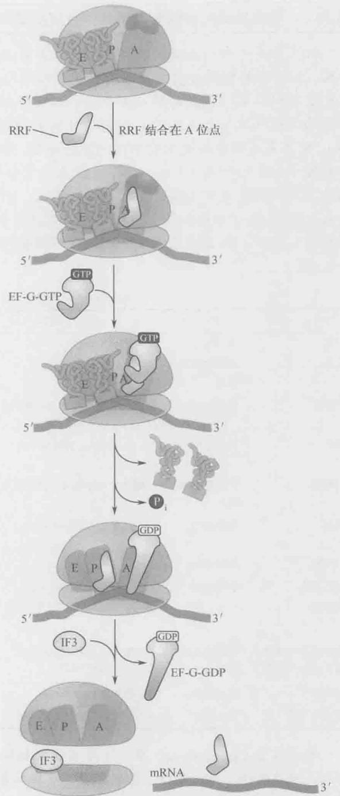  
图 15-40 RRF 和 EF-G 耦联并激发 tRNA 和 mRNA 从终止的核糖体中释放出来。

## 框15-5 抗生素通过阻遏翻译的某些特定步骤抑制细胞分裂

抗生素是一种与疾病搏斗的有力工具。在医学中最为广泛使用的抗生素能够杀死细菌，但对真核细胞没有或很少有作用，因而对患者是无毒性的。自从20世纪上半叶抗生素发现以来，已经使诸如肺结核、细菌性肺炎、梅毒和淋病等以前无法治疗的感染疾病变得可被治疗（尽管抗生素抗性细菌的出现成为有效治疗疾病的越来越大的障碍）。抗生素在细菌细胞里有不同的目标途径，但大约40%的已知抗生素是翻译机器的抑制因子（框15-5表1）。一般来讲，抗生素结合翻译机器的一个组分并抑制它的功能。因为不同的抗生素在不同的步骤中阻遏翻译，并且非常精确地进行（如，就在EF-Tu释放之前），这些药剂已经成为研究蛋白质合成机制的有力工具。这样，除了它们明显的医学用处外，抗生素已经在帮助我们理解翻译机器的工作原理上方面扮演了一个重要的角色。

框 15-5 表 1 抗生素：目标和后果

<table><tr><td>抗生素/毒素</td><td>目标细胞</td><td>分子目标</td><td>后果</td></tr><tr><td>四环素</td><td>原核细胞</td><td>30S亚基A位点</td><td>抑制氨基酰tRNA结合到A位点上</td></tr><tr><td>潮霉素</td><td>原核和真核细胞</td><td>30S亚基A位点附近</td><td>阻挠A位点tRNA到P位点的易位</td></tr><tr><td>巴龙霉素</td><td>原核细胞</td><td>靠近30S亚基A位点的密码子-反密码子相互作用位点</td><td>通过降低密码子与反密码子配对的敏感度在翻译过程中提高错误率</td></tr><tr><td>氯霉素</td><td>原核细胞</td><td>50S亚基的肽基转移酶中心</td><td>阻断A位点的氨酰-tRNA为进行肽基转移反应的正确定位</td></tr><tr><td>嘌呤霉素</td><td>原核和真核细胞</td><td>核糖体大亚基的肽基转移酶中心</td><td>链终止子;模仿A位点的氨酰-tRNA的3&#x27;端,作为新的多肽链的接受者</td></tr><tr><td>红霉素</td><td>原核细胞</td><td>50S亚基的肽出口通道</td><td>关闭成长中的多肽链从核糖体离开的出口阻遏翻译</td></tr><tr><td>梭链孢酸</td><td>原核细胞</td><td>EF-G</td><td>阻挠EF-G-GDP从核糖体中释放</td></tr><tr><td>硫链丝菌肽</td><td>原核细胞</td><td>50S亚基的因子结合中心</td><td>妨碍IF2和EF-G与因子结合中心的接合</td></tr><tr><td>黄色霉素</td><td></td><td>EF-Tu</td><td>阻挠与GTP水解关联的构象改变,从而防止EF-Tu的释放</td></tr><tr><td>蓖麻毒素和α-帚曲菌素(蛋白质毒素)</td><td>原核和真核细胞</td><td>在核糖体大亚基的因子结合中心化学修饰RNA</td><td>阻挠翻译因子GTP酶的活化</td></tr><tr><td>白喉毒素</td><td>真核细胞</td><td>化学修饰EF-Tu</td><td>抑制EF-Tu的功能</td></tr><tr><td>放线(菌)酮</td><td>真核细胞</td><td>60S亚基的肽基转移酶中心</td><td>抑制肽基转移酶活性</td></tr></table>

嘌呤霉素（puromycin）是一个经常用在翻译研究中的抗生素。它结合在处于A位点的大亚基区域。一旦结合，嘌呤霉素可以在肽基转移反应中取代氨酰-tRNA（框15-5图1）。因为嘌呤霉素相对于tRNA来说非常小，它结合到A位点不足以把多肽链保留在核糖体上。于是，转移到嘌呤霉素上的肽链以不完整的、结合嘌呤霉素的形式从核糖体上分离下来。换句话说，嘌呤霉素导致多肽合成未成熟时即终止了。其他抗生素以核糖体的其他特征作为目标，如肽出口通道、肽基转移中心、因子结合中心、解码中心和易位相关区域。（框15-5表1）

还有些抗生素是翻译因子的抑制因子。例如，黄色霉素（kirromycin）和梭链孢酸（fusidic acid）分别是延伸因子 EF-Tu 和 EF-G 的抑制因子（框 15-5 表 1）。在两种情况中，抗生素都与结合 GTP 的翻译因子相互作用，阻止其通常在 GTP 水解后发生的构象改变。于是，黄色霉素使核糖体停留在与 EF-Tu·GDP 氨酰-tRNA 结合的步骤中。同样地，梭链孢酸使核糖体停留在与 EF-G·GDP 结合的形式。在两种情况中，翻译的下一步都因为延伸因子无法释放而被阻遏了。

  
框 15-5 图 1 嘌呤霉素通过在 A 位点模仿 tRNA 来终止翻译。嘌呤霉素结合在 A 位点上并参与肽键形成。一旦完成，嘌呤霉素和相连的多肽就从核糖体上释放出来。

环因子，eEF2（真核生物中的 EF-G）也没有参与到核糖体循环中。相反的，当前的模型反映激活 tRNA 的 P 位点的肽键水解之后，eRF1（与一个名为 Rli1 的 ATP 酶连接）也参与到核糖体循环中。这个反应中 eRF1 和 eRF3 由于与 Dom34 和 Hbs1 的相似性从而激活核糖体的解离（详见后面的讨论）。

## 翻译的调控

尽管大多数基因的表达都是在 mRNA 转录水平上受到调控的，但是目前越来越明确地证实很多基因在蛋白质合成的水平上也受到调节。翻译调控较之转录调控的优点之一是能够对外界刺激迅速产生反应。蛋白质合成水平的调控免去了改变 mRNA 转录水平所需的时间（而且在真核生物中还包括 mRNA 加工及运输到胞质的时间），因此使蛋白质水平的改变更加迅速。像其他类型的调控那样，翻译调控主要在起始步骤。总体来说，调控一个通路的早期步骤，与启动一个功能进程然后再停止它这种手段相比，显得更加有效。对翻译来说，起始水平的调控也能够减少产生那些改变了功能的不完整蛋白产物。

在本部分中，我们将首先描述细菌和真核细胞翻译调控所使用的一般机制。然后，我们介绍使用这种调控的一些具体实例。

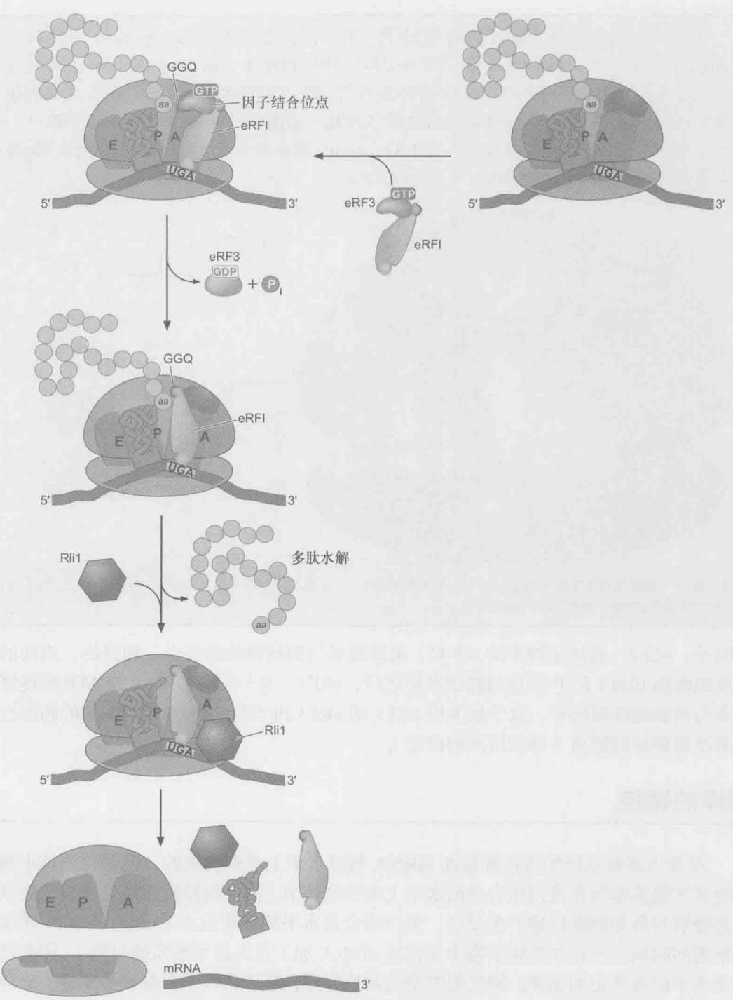  
图 15-41 真核细胞翻译终止和核糖体循环。

蛋白质或 RNA 在核糖体结合位点附近结合负调控细菌翻译的起始

细菌翻译起始调控因子的首要目标就是干扰 30S 亚基对 RBS 的识别。总体来说，这些抑制因子的作用机制就是与 RBS 附近的序列结合，从物理上阻断了 RBS 和 16S rRNA 的碱基配对（图 15-42a）。这些抑制因子通常是 RNA 结合蛋白，识别形成于 RBS 附近的 RNA 结构。尽管它们不直接与 RBS 结合，但结合蛋白足够大，从而在空间阻止 30S 亚基接近 RBS。实际上，这些抑制因子不直接与 RBS 结合有着重要意义，因为如果那样就会发生阻止细胞中大部分蛋白质翻译的风险。

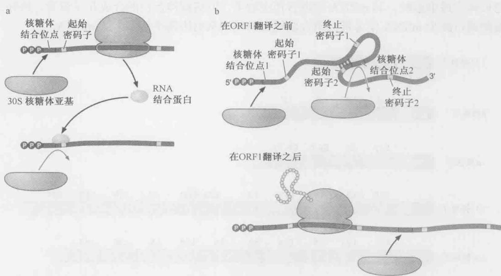  
图 15-42 通过抑制 30S 亚基的结合来调控细菌翻译起始。(a) 结合于 RBS 附近位点的蛋白质阻止 16S rRNA 接近 RBS。在这种情况下，mRNA 编码的蛋白质结合于自身 mRNA 的 RBS。(b) mRNA 分子内的碱基配对能够干扰与 16S rRNA 的碱基配对。在很多情况下，这种抑制由处于同一操纵子内的其他基因的翻译来调节。如果与 RBS 邻近区域碱基配对的 mRNA 区域处于某个 ORF 内，那么当这个 ORF 翻译时，起干扰作用的碱基配对发生断裂，使得下一个核糖体能够识别先前被掩盖的 RBS。

RNA 分子也可以利用相同的机制来充当翻译的抑制因子。这种调控经常发生在 mRNA 与自己的碱基配对，掩盖了一个或更多的 RBS（图 15-42b）。这种掩盖可以抑制相关 ORF 的翻译，直到这种相互作用被中断。在很多情况下，中断的发生是翻译操纵子中的另一个基因导致的后果。在这种情况下，与 RBS 邻近区域相互作用的 mRNA 区域存在于另一个 ORF 中，核糖体的通过阻断这种碱基配对，因此使得另一个核糖体可以识别未被掩盖的 RBS。

## 原核翻译调控：核糖体蛋白是其自身合成的翻译抑制因子

现在我们介绍一个细菌中调控翻译的例子，阐明细胞怎样利用这一系列机制控制核糖体蛋白基因的正确表达。协调核糖体蛋白的表达与 rRNA 的表达向细胞提出了一个有趣的调控问题。正如我们前面谈到的，每个核糖体都包含 50 多种截然不同的蛋白质，它们应该和与之结合的 rRNA 以相同速率合成。此外，细胞合成蛋白质的速率及其需要的核糖体数目与细胞的生长速率紧密相关。生长环境的改变会迅速导致所有核糖体组分合成速率的适当升高或降低，而这种协同调控是怎样完成的呢？

核糖体蛋白基因的协同调控通过组成若干操纵子（operon）而得以简化，每个操纵子包括最多11个核糖体蛋白基因（图15-43）。与其他操纵子一样，这些基因簇是在RNA合成水平进行调控的（第18章），然而，最重要的核糖体蛋白合成调控是在mRNA翻译水平进行的。一个简单的实验可以阐明这个结论。当把一个核糖体蛋白操纵子的额外拷贝体引进细胞时，其mRNA的数目相应增多，但核糖体蛋白的合成几乎没变。这样，细胞通过减少mRNA作为蛋白质合成模板的使用从而协调平衡多余的mRNA。

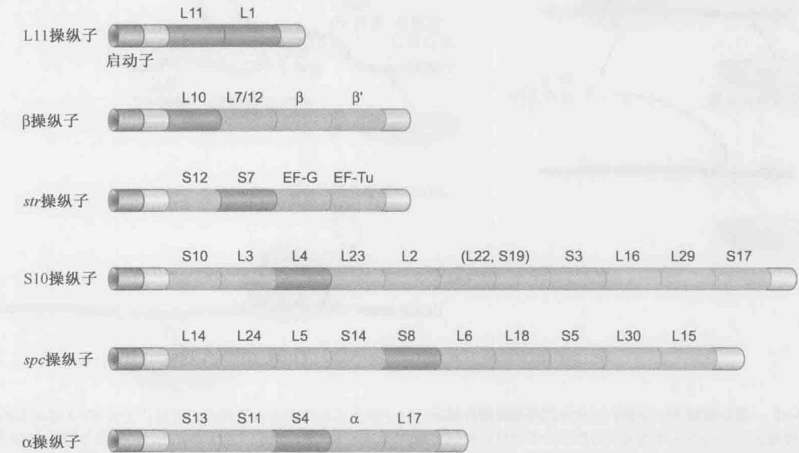  
图 15-43 E.coli 核糖体蛋白操纵子。作为其他蛋白质的翻译抑制因子的蛋白质以红色阴影表示。启动子以紫色表示。每个 ORF 都按照编码的核糖体蛋白来标记（如 L14 是大核糖体蛋白 14）。（获得许可并重新绘图自 NomuraM. et al. 1984. Annu. Rev. Biochem. 53: 75–117. Annual Reviews.）

核糖体蛋白 mRNA 翻译的严格调控是其自我抑制的结果。对于每个核糖体蛋白操纵子来说，一个编码的核糖体蛋白（或两个编码的核糖体蛋白的复合体）将会结合到最接近 5' 基因的其中一个翻译起始序列附近操纵子的 mRNA。核糖体蛋白的结合在空间上抑制了核糖体小亚基与附近 RBS 的结合，因此也就抑制了翻译的起始。

理解核糖体蛋白的结合怎样阻止操纵子起始基因的翻译是十分容易的。但这种结合是怎样影响下游那些拥有其自身 RBS 的基因呢？这种“极性”效应可以通过多种机制发生。正如我们在本章前面部分所介绍的，当一个上游基因的终止密码子距离下游基因的起始密码子很近时，就可能发生翻译耦联。这种邻近性所产生的情况是下游基因的翻译需要上游基因的翻译才能得以完成。第二种机制则是利用 mRNA 折叠成一定的结构。核糖体蛋白操纵子 mRNA 通常折叠成这样的结构，即只有当 mRNA 的前端基因被翻译，才允许识别内部的 RBS。例如，假定 mRNA 第一个基因编码区的一个区域与第二个基因的 RBS 附近的一个位点发生碱基配对。在这种情况下，只有当抑制性的碱基配对因核糖体在第一个基因的编码区进行翻译的过程中受到阻遏之后，16S rRNA 才识别第二

个基因的 RBS（图 15-42b）。

核糖体蛋白的表达怎样与细胞中 rRNA 的数量相关联呢？在每种情况下，与 mRNA 结合的调控性核糖体蛋白同时也识别位于适当 rRNA 上的一个结合能力很强的位点（图 15-44）。若这一结合位点没有被占据，核糖体蛋白会首先结合这个位点。另一方面，若所有的 rRNA 结合位点都被占据了，那么调节蛋白就结合到第二个位点，即位于其自身 mRNA 上的较弱的结合位点。因此，只有当核糖体蛋白多于其目标 rRNA 时，它才与自身 mRNA 结合。这一简单的竞争性结合事件确保只有当调控性核糖体蛋白数量过剩时核糖体蛋白的合成才被抑制。

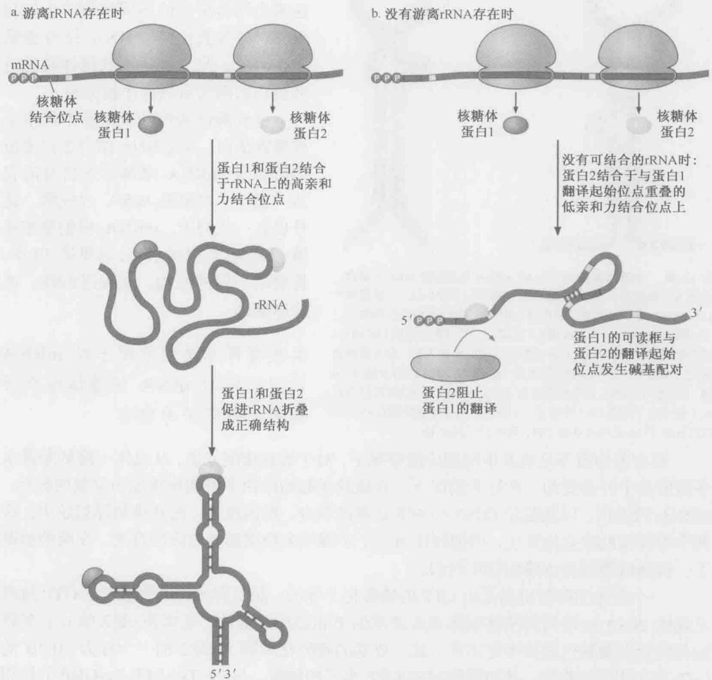  
图 15-44 核糖体蛋白表达的调控。在这个例子中，我们介绍一个简单的双蛋白核糖体蛋白基因操纵子。（a）在没有结合的 rRNA 存在的情况下，这个操纵子表达的两个核糖体蛋白都与 rRNA 结合，并且协助核糖体的正确装配。在这种情况下，核糖体蛋白 2 不与邻近核糖体蛋白 1 上的 RBS 的较低亲和力结合位点结合。（b）在没有 rRNA 与核糖体蛋白结合时，核糖体蛋白 2 就结合于邻近的核糖体蛋白 1 的 RBS，从而阻断这一 ORF 的翻译。在没有翻译核糖体蛋白 1 存在时，与核糖体蛋白 2 RBS 邻近序列互补的序列就与之发生碱基配对，阻止 30S 亚基与此位点的结合。如正文所述，翻译耦联也可发挥抑制下游 ORF 翻译的作用。

不足为奇的是，在很多情况下，调控性核糖体蛋白的两个结合位点是彼此相关的。

(a) 16S核糖体RNA上的S8结合位点

  
(b) S8蛋白mRNA上的翻译起始区

  
图 15-45 核糖体蛋白 S8 与 16S rRNA 及其自身 mRNA 结合。此图为核糖体蛋白 S8（由 spc 操纵子编码；图 15-43）与核糖体中 16S rRNA 结合的区域与其自身 mRNA 的翻译起始位点的对比。（a）被 S8 蛋白结合的 16S rRNA 区域。（b）当没有游离的 16S rRNA 结合的时候，核糖体蛋白 S8 的翻译启动位点被占据。共有序列被标记为深绿色。虚线框中表示的是 16S rRNA 被 S8 蛋白保护的区域。S8 蛋白 mRNA 结合所需要的 AUG（红色的）和 RBS 结合位点（框中的）在图（b）中表示。（获得许可并重新绘图自 Cerretti D.P. et al. 1988. J. Mol. Biol. 204: 309–329. Elsevier.）

在核糖体蛋白 S8 的情况中，这两个位点具有相当大的相似性（图 15-45）。mRNA 上结合位点的序列清晰地揭示了 S8 蛋白抑制翻译的机制。mRNA 上的结合位点包括起始 AUG。因此，被过量的 S8 蛋白（在本例中）结合的 mRNA 不能结合核糖体而起始翻译。这两个结合位点的不同解释了为何与 rRNA 结合会比与 mRNA 结合更紧密。因此，只有满足了核糖体装配对 S8 蛋白的需求后翻译才被抑制。

这种翻译调控的策略并不局限于核糖体蛋白。其他 RNA 结合蛋白通过结合自身 mRNA 来调节其自身的表达，包括一些氨酰-tRNA 合成酶。此外也有一些例子，mRNA 根据细胞环境（如温度或代谢水平，详见第 20 章）折叠成不同的结构，或促进翻译，或抑制翻译。

真核翻译总体调节因子以 mRNA 识别及起始 tRNA 核糖体结合所需的关键因子为靶标

在营养物质不足或其他细胞应激情况下，对于真核细胞来说，从总体上降低翻译水平通常是十分必要的。在这些情况下，真核翻译起始的两个早期步骤成为抑制的靶标：mRNA 的识别，以及起始 tRNA 与 40S 亚基的结合。前面说过，在真核翻译起始中，这两个事件彼此独立地发生，但抑制任何一个步骤均会抑制新蛋白质的合成。在两种情况下，抑制机制都是由磷酸化控制的。

一个常见的抑制机制是由 eIF2 的磷酸化介导的。前面讲过，eIF2 结合于 GTP 过程是起始 tRNA 运输到真核核糖体 40S 亚基的 P 位点所必需的。很多使 eIF2 的 α 亚基磷酸化的蛋白激酶已经被鉴定出来。这一亚基的磷酸化抑制了 eIF2 的一个称为 eIF2B 的 GTP 交换因子的作用，从而导致 eIF2-GTP 水平的降低。与 EF-Ts 对 EF-Tu-GDP 的作用相似，eIF2B 激活 eIF2-GDP 以释放结合的 GDP 并与 GTP 结合。因为 eIF2 与 GTP 的结合是护送起始 tRNA 到 40S 亚基过程中所必需的，所以 eIF2-GTP 水平的降低限制了翻译的起始。已知的 eIF2α 激酶可被众多不同的胞内环境所激活，包括氨基酸缺乏（见下文）、病毒感染及温度升高。

另一种常见的总体翻译抑制机制以 5'帽结合蛋白 eIF4E 为靶标。前文提到，在与 5'帽结合之后，eIF4E 结合 eIF4G。eIF4G 中被 eIF4E 识别的短结构域在一个称为 eIF4E 结合蛋白（4E-BP）家族中也有发现。这些蛋白质与 eIF4G 竞争结合 eIF4E 并因此充当翻译的一般抑制因子（图 15-46）。与 eIF2 类似，4E-BP 也受磷酸化的调控。在其非磷酸化状态下，4E-BP 与 eIF4E 紧密结合，并抑制翻译的进行。相反，4E-BP 的磷酸化抑制其与 eIF4E 的结合（图 15-46）。

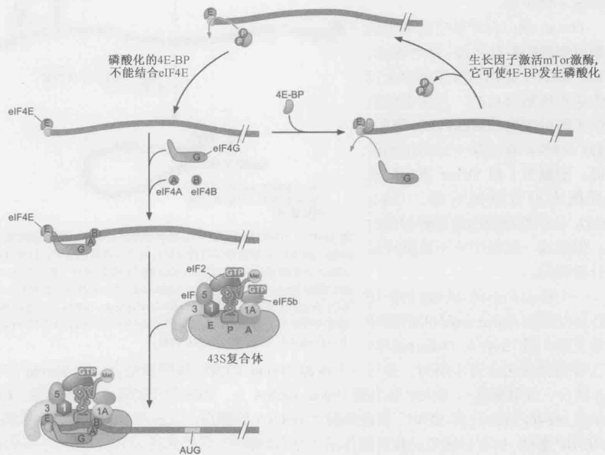  
图 15-46 真核翻译起始总体上受到 eIF4E 结合蛋白（4E-BP）的调控。4E-BP 与 eIF4G 竞争结合帽结合蛋白 eIF4E。这阻断了 eIF4A 介导的 mRNA 5'端的解旋及依赖于 eIF4G 的 43S 前起始复合物的募集。4E-BP 与 eIF4E 的结合受磷酸化的调控。mTor 激酶磷酸化 4E-BPs 的 eIF4E 结合区，使其再也不能识别 eIF4E。这样，通过抑制 4E-BP 的作用，mTor 激酶上调细胞的翻译活性。

4E-BP 的磷酸化由一个称为 mTor 的关键的胞内蛋白激酶所介导。激活细胞分裂的生长因子、激素及其他因子会激活这种激酶，从而提高细胞的整体翻译水平。这些现象引起了一个假设，即翻译水平的调控与细胞的增殖是精确协调的。实际上，eIF4E 的过表达可以导致细胞的癌性转化，并且 mTor 的抑制因子（如雷帕霉素，rapamycin）是十分有效的化疗试剂。尽管我们是在翻译的总体调控范畴中介绍过这些调控机制，但这两种机制也都用于细胞中特定 mRNA 的翻译调控，这将在下面详细叙述。

## 通过对 mRNA 特异的 4E-BP 进行的翻译空间调控

除了翻译的总体调控，与 eIF4E 结合也用来调控特定 mRNA 的翻译。例如，黑腹

果蝇卵母细胞及发育胚胎的前后轴的正确建立，需要很多蛋白质正确定位在一个共有的大细胞质中（第21章对此事件有完整的描述）。在有些情况下，这些关键调控蛋白的空间限制性翻译在控制其定位方面发挥着主要作用。

Oskar 蛋白在受精之前确定位于卵母细胞的后部区域。尽管如此，Oskar mRNA 是由与母果蝇卵巢结合的滋养细胞合成的，并在受精前定位于卵母细胞的前部区域。随后，Oskar mRNA 被运输至卵母细胞的后部。细胞为了使 Oskar 蛋白的表达局限在卵母细胞后部，Oskar mRNA 从卵母细胞的前部转移到后部，保证这一过程中它不被翻译是十分必要的。

一个称为 Cup 的 4E-BP 的作用对特异性限制 Oskar mRNA 的翻译非常关键（图 15-47）。OskarmRNA

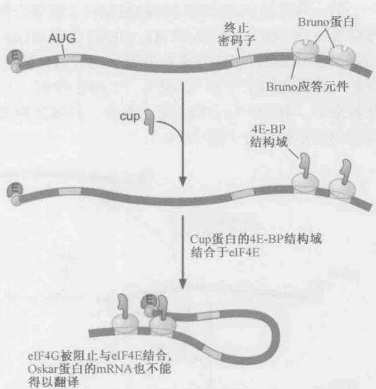  
图 15-47 eIF4E 结合蛋白 Cup 特异性抑制 Oskar mRNA 的翻译。当 Oskar mRNA 从果蝇卵母细胞前部运输至后部的过程中，保证 Oskar mRNA 不被翻译是十分关键的。Oskar 翻译的抑制由两个蛋白介导。RNA 结合蛋白 Bruno 结合于多个位于 Oskar mRNA 3' 非翻译区的序列，它们称为 Bruno 应答元件（Bruno response elements，BREs）。随后 Bruno 募集 4E-BP Cup 到 mRNA。当定位于 mRNA 后，Cup 马上与 eIF4G 竞争结合 eIF4E，抑制这一 mRNA 的翻译。

在 3'非翻译区包含若干序列，并与一个叫做 Bruno 的蛋白质特异结合。而 Bruno 可与 Cup 结合，并募集这一 4E-BP 结合到 Oskar mRNA 上。当定位于 Oskar mRNA 后，Cup 竞争过 eIF4G 而结合到 eIF4E，因此抑制了 mRNA 的翻译。Cup 并不能像上述总体调控的 4E-BP 那样，具有足够多的数量而作用于所有的翻译。尽管如此，当定位于某一 mRNA 后，Cup 即成为一个非常有效的翻译抑制因子。这一机制并不局限于 Oskar 蛋白。果蝇中的 Nanos 蛋白也是通过将 Cup 募集于其 mRNA 来调控的。与此相似，一个叫做 CPEB 的 mRNA 结合蛋白将一种称为 Maskin 的 4E-BP 募集至许多在脊椎动物卵母细胞发育中翻译过程被抑制了的 mRNA 上。

## 由铁离子调控的 RNA 结合蛋白调控转铁蛋白（Ferritin）的翻译

人体内铁离子的水平需要审慎的调节。许多蛋白质利用铁离子作为辅助因子，包括血红蛋白和肌红蛋白等氧转运蛋白，以及诸多参与氧化磷酸化的蛋白质。与铁离子在氧气运输和能量生成中的重要作用相一致，人体中铁的缺乏（或称为贫血，anemia）会造成一种整体的虚弱感。而另一方面，过量的铁对细胞有毒害，并且可以导致肝损伤、心衰和糖尿病。

铁离子结合蛋白—转铁蛋白是人体中调节铁离子水平的主要调节因子。转铁蛋白以一种受控的方式储存并释放铁离子，从而保持体内铁含量的稳定。因此，转铁蛋白的水平必须迅速应答于体内游离铁的水平。细胞对胞内游离铁的水平变化需要作出迅速反应，因此转铁蛋白表达的调节发生在蛋白质合成水平。

转铁蛋白的翻译受到一些被称为铁离子调控蛋白（iron regulated protein，IRP）的铁离子结合蛋白的调控。这些蛋白质也是RNA结合蛋白，它们能够识别转铁蛋白mRNA的5'端形成的一个称为铁离子调控元件（iron regulatory element，IRE，图15-48）的特异发夹结构。重要的是，这些蛋白质识别IRE的能力受到细胞中铁离子水平的调控。在铁离子缺乏的细胞中，铁离子的浓度太低而不能与IRP结合。在缺乏结合的铁离子的情况下，这些蛋白质与IRE紧密结合，抑制eIF4A/B解开IRE发夹结构的能力。发夹结构的持续存在会在空间上阻碍43S复合体结合mRNA。与此相反，当细胞中的游离铁浓度升高时，IRP与铁离子形成结合态。而结合了铁离子后，IRP即失去其与IRE结合的能力并因此抑制翻译。

  
图 15-48 铁离子对转铁蛋白的翻译调控。转铁蛋白基因 5' 非翻译区包含一个称为铁离子调控元件（IRE）的茎环结构。当不与 $Fe^{2+}$ 结合时，铁离子调控蛋白（IRP）就紧密结合于这一位点。通过稳定 IRE 的茎环结构，IRP 阻止 eIF4A 从转铁蛋白 mRNA 末端清除这一结构。在这种情况下，43S 前起始复合体与 mRNA 的结合就不能发生，转铁蛋白基因也不被翻译。当铁离子水平升高并且需要转铁蛋白时，IRP 就与 $Fe^{2+}$ 结合，这就抑制了 IRP 与 IRE 的结合能力，也因此使转铁蛋白得以翻译。

## 酵母转录激活因子 Gcn4 的翻译受到上游短 ORF 及三元复合物丰度的调控

Gcn4 是一个酵母转录激活因子，调控多种指导氨基酸生物合成的酶基因的表达。尽管 Gcn4 是一个转录激活因子，但其对自身的调控却在翻译水平进行。当氨基酸水平低时，Gcn4 mRNA 得以翻译（所以生物合成的酶也得以表达）；但当氨基酸水平高时，Gcn4 mRNA 不被翻译。这样的调控是怎样做到的呢？

与典型的真核 mRNA 结构不同，编码 Gcn4 蛋白的 mRNA 在 Gcn4 编码序列上游有 4 个小的可读框（称为 uORF）。其中最上游的短 ORF（uORF1）可被从 mRNA 5'端扫描的核糖体高效识别。一旦核糖体翻译了 uORF1，这一 ORF 的独有特性使得 50% 的核糖体小亚基仍然结合于 RNA，并且重新开始扫描下游以寻找起始密码子 AUG（图 15-49 和框 15-3）。

究竟哪个下游 AUG 被正在进行扫描的小亚基所识别，这受到进行扫描的小亚基何时结合于带有一个起始 tRNA 的 eIF2 复合物的调控。前面讲过，在 P 位点没有起始 tRNA存在的情况下，40S 亚基就不能识别 mRNA 上的 AUG 序列。因此，在开启下游任何一个 ORF 的翻译之前，进行扫描的 40S 亚基必须结合 eIF2·Met-tRNA $_{i}^{Met}$ （下面称为 TC，即 ternary complex，三元复合物）。

当氨基酸含量足够时，TC 在核糖体翻译 uORF1 完成后不久就与正在进行扫描的核糖体重新结合（图 15-49a）。一旦与 TC 重新结合，核糖体小亚基就可以识别一个 AUG，在其他某个 uORF（2、3 或 4）上重新起始翻译。与 uORF1 的情形不同，在翻译完这些 uORF 之后，核糖体从 mRNA 上完全解离下来，而不能到达 Gcn4 的 ORF，从而不产生 Gcn4 蛋白。

  
图 15-49 应答于氨基酸缺乏的 Gcn4 翻译调控。如正文中详细介绍的，编码酵母转录激活因子 Gcn4 的 ORF 上游有 4 个短的 ORF，称为 uORF（此处只显示 uORF1 和 uORF4）。第一个上游 ORF 首先翻译，由于这一 ORF 的特殊性质，大约 50% 的 40S 亚基在翻译终止之后仍然结合于 mRNA 上，并继续扫描 Gcn4 mRNA。（a）当氨基酸含量丰富时，eIF2B 激活 eIF2 使其迅速将 GDP 转换成 GTP。这使得 eIF2-GTP-Met-tRNA $_{i}^{Met}$ 与 40S 亚基迅速结合并具备识别另外三个短小 ORF 其中之一的能力。这些 uORF 中任何一个翻译都将导致翻译的完全终止。（b）在氨基酸缺乏时，由 eIF2-α 激酶 Gcn2 介导的 eIF2 磷酸化降低 eIF2B 并激活 GTP 结合于 eIF2 的能力。eIF2-GTP 水平的降低导致 eIF2-GTP-Met-tRNA $_{i}^{Met}$ 与 40S 亚基的结合变慢。起始 tRNA 结合速率的降低增加了进行扫描的核糖体在能够识别 AUG 前通过其余 uORF 的可能性，因此对 Gcn4 的翻译有利。（获得许可并重新绘图自 Hinnebusch A.G. 1997. J. Biol. Cell 272: 21661–21664, Fig. 1. American Society for Biochemistry & Molecular Biology.）

在氨基酸缺乏的情况下，几个事件的综合效应降低了TC与40S亚基结合的速率。有限的氨基酸导致空载tRNA的增多，这反过来激活一个叫做Gcn2的eIF2α激酶。正如在eIF2α激酶介导的翻译总体调控中所介绍的，当Gcn2磷酸化eIF2之后，eIF2-GTP的数量将会减少，因为eIF2与GTP交换因子eIF2B的相互作用被阻遏了。由于eIF2只有在GTP存在的情况下才与Met-tRNA $_{i}^{Met}$ 结合，这导致胞内TC数量减少并降低TC结合40S亚基的速率（图15-49b）。结合速率的降低意味着40S亚基在缺乏发现AUG的能力的情况下，沿mRNA序列进行更远距离的扫描。如果核糖体在与TC重新结合之前扫描通过了uORF2\~4的AUG，那么这些ORF就不会被翻译。uORF2\~4的起始密码子与uORF1的起始密码子比较接近，而Gcn4 ORF的起始密码子AUG却处于下游较远的地方。这一额外的距离为TC在小亚基碰到Gcn4的ORF之前与之结合提供了更多的时间，从而增加了核糖体对其进行翻译的机会。实际上，删除位于uORF和Gcn4起始密码子之间的间隔RNA导致Gcn4蛋白表达的减少。因此，当有限的TC存在时，Gcn4得到翻译，并能够开启能在细胞中合成更多氨基酸的相关基因。框15-6描述了应用下一代测序技术来分析细胞内整体的翻译模式，即测量所有处于翻译阶段的mRNA。

## 框 15-6 核糖体和多聚核糖体谱

有很多种方法来检验细胞中基因表达的水平。大多数检验方法关注于基因表达的初始产物，即 RNA 的量。从另一个角度来看，mRNA 的量并不能直接代表它所编码的

蛋白在细胞中的数量。为了识别某个蛋白在细胞中是否真的被合成出来了，我们需要对 mRNA 的翻译进行量化研究。

早先对于 mRNA 转录程度的分析集中在 mRNA 和多聚核糖体的相关性上。在这些研究中，研究者加入一种药物——放线菌酮（cycloheximide）使翻译终止在氨基酸易位阶段。然后裂解处理的细胞，通过蔗糖梯度离心（sucrose gradient centrifugation）的方法分离细胞内容物（框 15-6 图 1）。由于核糖体的体积较大，结合于核糖体上的 mRNA 在离心过程中相对于游离状态的 mRNA 沉降速率会快很多。而且，由于 mRNA 是多聚核糖体的一部分，也会相对沉降得较快。在浓度梯度中测量总蛋白会发现，其根据 mRNA 结合核糖体数量的不同而形成的几个峰。检测这些峰的成分中 mRNA（例如利用 Northern bolt 或 RT-PCR），可以研究哪些 mRNA 处于翻译过程中。

  
蔗糖梯度片段

框 15-6 图 1 核糖体谱。mRNA 与结合在其上的不同数量的核糖体（被称为多聚核糖体）可以通过蔗糖密度梯度离心分离出来。从而使核糖体单体，核糖体亚基和游离的 mRNA 分开。mRNA 和多聚核糖体的结合是该 mRNA 活跃转录的证据。

最近，在新一代测序技术的基础上，这一检测可以拓展为在一个细胞群体中衡量全部 mRNA 的翻译情况。这一被称为核糖体谱的技术首先需要使用放线菌酮处理待测细胞并提取细胞内容物。由于延伸中的核糖体的解码中心可以在 RNA 酶 I 作用时保护 mRNA 包埋其中的 28 个碱基，这一特点因此可以被测序技术利用（框 15-6 图 2a）。因此，在蔗糖梯度离心之前，细胞提取物首先使用 RNA 酶 I 处理。离心后包含 80S 颗粒的组分（包含核糖体和被保护的 mRNA）被分离和变性，然后 28bp 的 RNA 通过胶纯化的方法分离出来，再被反转录成双链 DNA 用于深度测序。通过分析得到的 DNA 序列，研究者可以很容易地确定哪些 mRNA 序列在放线菌酮处理后正在活跃地翻译，也可以确认每个核糖体在 mRNA 上的定位。实际上这一方法有足够的准确性来识别哪个密码子处于核糖体的 A 位点和 P 位点。

这个技术在分析基因表达时越来越重要。通过比较两个细胞群体给定基因的测序读出序列的数量，研究者可以发现两群细胞中该基因蛋白质产出的差异（如在氨基酸供给充足或不足时的差异，如框15-6图2b）。除此之外，考虑到技术的准确性，这个方法还可以揭示翻译过程的特征。举例来说，核糖体谱技术可以用来分析大肠杆菌细胞中由于ORF中的RBS类似序列所导致的翻译暂停。

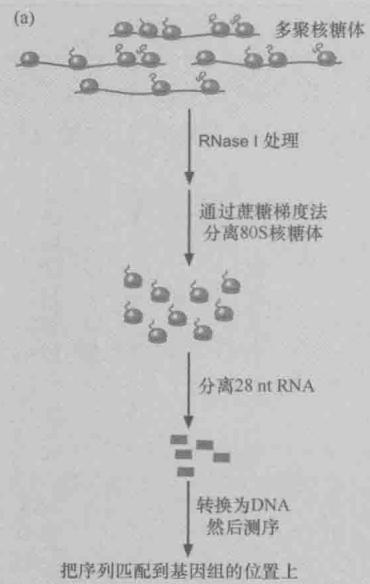

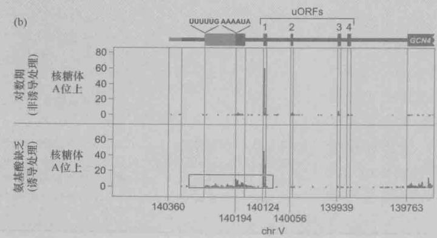

框 15-6 图 2 核糖体谱。(a) 用 RNase I 处理多聚核糖体, 然后用蔗糖密度梯度离心的方法将单一的核糖体 (80S 颗粒) 分离出来。这样的核糖体上只结合着 28 个 mRNA 的核苷酸, 它们被核糖体保护而没有降解。所得的 mRNA 片段通过胶纯化后反转录为 DNA, 然后用于深度 DNA 测序。得到的序列与该物种的基因组 DNA 序列比对, 得出与核糖体结合的区域 (代表了翻译的区域)。对于某个区域而言, 得到的序列越多, 它的翻译活性越高。(b) 酵母核糖体谱在 GCN4 基因上的示意图, 分为富含和匮乏氨基酸的生长状态。用柱状图展示了总数据量均一化后不同 mRNA 区域的翻译情况 (每百万碱基的读出序列, reads per million bases, rpM)。此图着重说明了在两种培养条件下 uORF 和 Gcn4 ORF 翻译程度的区别。

## 依赖翻译的 mRNA 和蛋白质的稳定性调节

mRNA 会以一定的频率出现突变和损伤。这样的缺陷 mRNA 可能由转录错误造成，也可能由其合成后的损伤造成。例如，由于 mRNA 是单链的，因此更易于断裂。这样的缺陷 mRNA 可能产生不完整和不正确的蛋白质，它们可能给细胞带来负面作用。某些情况下，如发生只改变一个氨基酸的点突变，是很难消除突变的 mRNA 或其蛋白质产物的。但在下面描述的其他情况下，翻译过程可以识别缺陷的 mRNA，并予以去除或将其蛋白质产物去除。

## SsrA RNA 补救正在翻译缺陷 mRNA 的核糖体

正常情况下，一个终止密码子对mRNA从核糖体中的脱离是必需的。那么，对于在可读框中缺失了终止密码子的mRNA上进行翻译的核糖体将被怎么处理呢？这样的mRNA可能由不完全的转录或核酸酶的作用而产生。这一类型的mRNA的翻译可以正常启动和延伸，直至达到mRNA的3'端。这时，核糖体不能再移动了。此处也没有与氨酰-tRNA或释放因子相结合的密码子。如果没有一定的机制使核糖体脱离这些缺陷mRNA，那么很多核糖体将永久地受困，不能参与多肽的合成。在原核细胞，这样的核糖体是由一种嵌合的RNA分子解救的，这种RNA分子部分是tRNA、部分是mRNA，称为tmRNA。

SsrA RNA 是一个由 457 个核苷酸

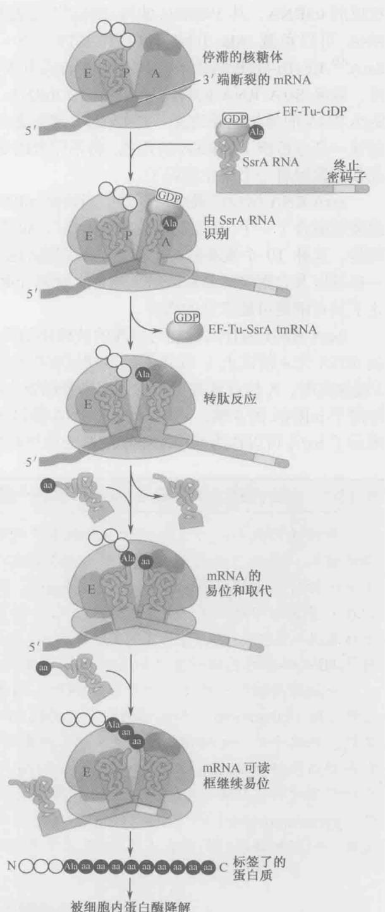  
图 15-50 tmRNA SsrA 补救停滞于未成熟 mRNA 上而终止翻译的核糖体。SsrA 模仿 tRNA，但只能结合停滞于 mRNA 3' 端的核糖体。一旦结合，SsrA 的一部分序列可作为一个新的 “mRNA” 工作。

组成的 tmRNA，其 3' 端的区域与 tRNA $^{Ala}$ 非常相似（图 15-50）。这一相似性使得 SsrA RNA 可以负载 Ala 并结合 EF-Tu-GTP。当一个核糖体停滞于 mRNA 的 3' 端时，SsrA $^{Ala}$ -EF-Tu-GTP 结合于核糖体的 A 位点并参与肽转移酶反应，就如其他的 tRNA 一样。肽酰-SsrA RNA 的易位导致缺陷的 mRNA 从核糖体中释放出来。值得注意的是，SsrA RNA 的易位也导致这一 RNA 的一部分进入核糖体的 mRNA 结合隧道。SsrA RNA 的这一部分扮演了 mRNA 的角色，将不完全的 mRNA 的可读框延伸了 10 个密码子，并在其后紧跟着一个终止密码子。

SsrA RNA 结合的最终结果是，当缺陷 mRNA 从核糖体中释放出来时，不完整多肽的碳端融合了一个 10 个氨基酸的 “标签”，而核糖体重新进入翻译的循环过程中。有趣的是，这种 10 个氨基酸的 “标签” 被细胞的蛋白水解酶识别，蛋白水解酶很快地将这一标签以及它附着的多肽降解。这样，缺陷 mRNA 的多肽产物很快就被清除，从而防止了其对细胞可能带来的伤害。

SsrA RNA 为什么只能与停滞的核糖体结合呢？这是因为它的巨大体积（它比标准的 tRNA 大 4 倍以上），在正常的延伸过程中它不能结合于 A 位点。相反，当 mRNA 的 3' 端缺失时，A 位点就有更大的体积来容纳较大的 RNA（图 15-50）。因此，只有核糖体停滞于 mRNA 的 3' 端，才能为 SsrA RNA 提供潜在的结合位点（框 15-7）。最近有研究揭示了 SsrA 可以作为治疗肺结核的联合使用药物的靶点。

## 框15-7 在治疗肺结核中靶向SsrA肽段的一线药物

肺结核作为人类历史上一种危害极其严重的疾病，早在埃及木乃伊中就有疾病感染的证据。久咳、痰血和消瘦（因此过去被称为肺痨）是其主要病症。肺结核的病原体是结核杆菌（Mycobacterium tuberculosis）。据估计地球上1/3的人口感染结核杆菌，但在大多数人中该细菌保持在潜伏状态，个体则显示为健康状态。大约 $10\%$ 的受感染个体在其一生中发病，导致每年约800万人患肺结核并有约150万人死于这种疾病。携带HIV病毒的艾滋病患者和其他各种免疫缺陷个体患肺结核的风险显著升高。

一般肺结核的一线治疗使用 4 种药物：利福平（rifampicin）、异烟肼（isoniazid）、乙胺丁醇（ethambutol）和吡嗪酰胺（pyrazinamide）。其中 3 种药物的作用模式是非常清楚的。利福平是一种细菌 RNA 聚合酶的抑制剂（第 18 章），而异烟肼和乙胺丁醇则分别抑制结核杆菌细胞膜形成所需的不同蛋白质。吡嗪酰胺的作用机制在其被临床使用半个世纪后才得以揭示。吡嗪酰胺是一种前体药物，它在进入到细菌细胞之后由吡嗪酰胺酶（pyrazinamidase）的脱氨基作用转化为吡嗪羧酸后发挥作用（框 15-7 图 1）。最近，美国、中国和韩国的科学家发现 SsrA 是吡嗪羧酸的靶分子（见正文的描述和图 15-50）。

  
框 15-7 图 1 吡嗪酰胺向吡嗪羧酸的转变。

Shi 等在 2001 年使用亲和层析法研究结核杆菌蛋白与药物结合的过程中发现了吡嗪羧酸是如何工作的。其中一个相关的蛋白质是核糖体小亚基中最大的蛋白质——核糖体蛋白 S1，或被称为 RpsA。RpsA 在翻译中起到重要的作用，它将 mRNA 上游的 Shine-Dalgarno 序列带至核糖体并帮助翻译起始过程中将 mRNA 锚定在小亚基中。RpsA 与 SsrA 标记有关。SsrA RNA 被运送到停滞的核糖体上，这种核糖体处于包含有 SsrA 结合蛋白（SmpB）的复合体中，而该复合体同样包含了 RpsA（当然还有 EF-Tu-GTP）。Shi 等发现 RpsA 的突变型的细菌获得了对吡嗪酰胺的耐药性。他们同时发现吡嗪羧酸阻止 SsrA RNA 与野生型的 RpsA 的结合，但不能阻碍这个 RNA 与抗吡嗪羧酸的突变型 RpsA 的结合。最后而且最重要的一点是，通过体外蛋白合成试验合成一个需要 SsrA 功能下才能完成翻译的修饰化 mRNA，他们发现药物抑制了 SsrA 标签序列的生成。作为对照，吡嗪羧酸对于普通 mRNA 模板的蛋白质合成几乎没有影响，说明它对 RpsA 的正常功能没有抑制作用。

吡嗪酰胺的发现显示出在现代医学中化学生物学和分子生物学越来越紧密的结合在一起。新的、重要的药物有时来自于小分子库的扫描，而这些小分子能够拮抗一些调控疾病相关的重要的细胞过程的蛋白分子。相反的，过去仅清楚其治疗效果的药物可能会被发现其能够作用于细胞中不为人知的靶点。最后，了解了吡嗪酰胺通过结合RpsA所产生的临床效果提示我们，开发针对SsrA标签的新类型抗结核杆菌药物是可能的。

## 真核细胞降解不完整的或提前终止密码子的 mRNA

真核细胞的翻译与 mRNA 的衰减过程紧密相连（图 15-51）。这一连锁是由两种监控被翻译的 mRNA 的完整性的机制来实现的。例如，当一个 mRNA 分子含有提前的终止密码子时（称为无义密码子，见第 16 章），这一 mRNA 很快被降解，此过程称为无义密码子介导的 mRNA 衰减（nonsense mediated mRNA decay，图 15-51b）。在哺乳动物细胞中，对含有提前的终止密码子的 mRNA 的识别依赖于聚集在 mRNA 可读框内的蛋白复合体。这些外显子拼接复合体是剪接过程所产生的产物并聚合在 mRNA 上的，并正好坐落于每一外显子-外显子结合处的上游（第 14 章）。一般来讲，当第一个核糖体翻译某个 mRNA 时，这些复合体在 mRNA 进入核糖体的解码中心时被置换出来。但是，如果 mRNA 存在一个提前的终止密码子（源于基因的突变或转录与剪接过程中的错误），那么核糖体就在这些复合体被置换之前从 mRNA 上脱离出来。在这些情况下，外显子拼接复合体和 eRF3 将结合于提前终止的核糖体并募集一系列的蛋白。这些蛋白募集并且/或者激活多种酶对 mRNA 进行剪切，并去除 mRNA 5'端帽结构，或 3'端的 poly-A 尾结构。由于 mRNA 通常就是受 5'端帽结构保护来防止降解的，因而这些过程令未受保护的 5'或 3'端暴露出来，从而导致 mRNA 很快地被 5'→3'和 3'→5'核酸外切酶所降解。

另一种挽救正在翻译缺乏终止密码子的 mRNA 的核糖体的机制，称为无终止密码子介导的衰减（nonstop mediated decay，图 15-52a）。与原核细胞不同，真核细胞的mRNA 以多聚 A 尾结束。当缺失终止密码子的 mRNA 翻译时，核糖体就会翻译多聚 A 尾（因为没有终止密码子在多聚 A 尾之前终止翻译）。这就导致了蛋白质的末端添加了多个赖氨酸（AAA 是赖氨酸的密码子），并使核糖体停止在 mRNA 的 3'端。停止的核糖体与 eRF1 和 eRF3 (Dom34 和 Hbs1) 蛋白结合，从而促使核糖体的解离以及释放肽酰-tRNA 和 mRNA。第二类 eRF3 相关因子，Ski7 蛋白，能够募集 3'→5'核酸外切酶降解“无终止密码子”的 mRNA。另外，无终止密码子介导的衰减过程中，没有终止密码子的 mRNA 也可以被核酸内切酶切断。更重要的是，在羰基末端含有多聚赖氨酸的蛋白质是不稳定的，导致无终止密码子的 mRNA 表达的蛋白质被快速降解。这样，与原核细胞一样，由缺失终止密码子的 mRNA 翻译的蛋白质很快从细胞中去除。

(b) 无义密码子介导的mRNA衰减  
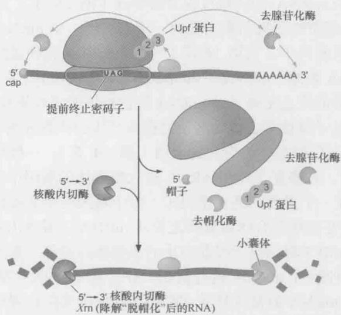  
图 15-51 真核细胞中包含提前终止密码子的 mRNA 是降解的靶标。（a）核糖体在正常 mRNA 的翻译中移动移除了所有外显子拼接复合物（exon-junction complex）。（b）无义密码子介导的衰减。当翻译带有提前终止密码子的时候，核糖体不能移除一个或多个外显子拼接复合体，导致 Upf1、Upf2 和 Upf3 结合到核糖体。一旦与核糖体结合，这些蛋白质激活一种脱帽酶，能够将 mRNA 的 5' 帽去除，以及一种去腺苷酶，能够去除 mRNA 的 poly A 尾巴；没有 5' 帽而且去腺苷化的 mRNA 很快被内切 5'→3' 核酸酶（Xrn1）或者 3'→5' 外切核酸酶降解（exosome）。外切酶正常条件下不能降解具有 5' 帽子和 3' 多聚腺苷酸尾巴的 mRNA。

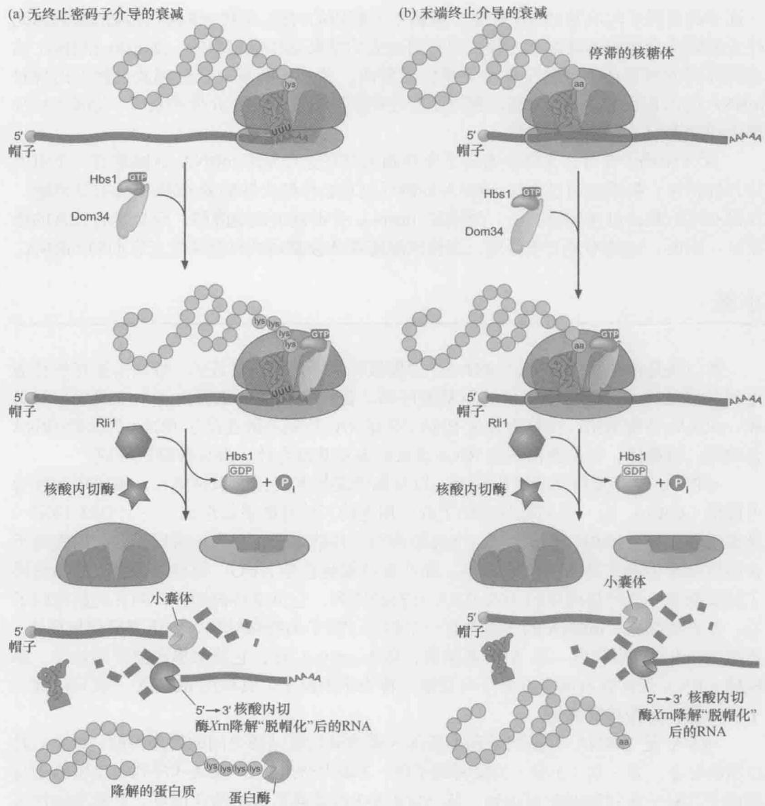  
图 15-52 真核细胞中包含提前终止密码子的 mRNA 是降解的靶标。（a）无终止密码子介导的衰减。在缺乏终止密码子的条件下，mRNA 的多聚腺苷酸尾巴被翻译，导致了在肽链末端出现了多聚赖氨酸（AAA 可编码 Lys）。当到达模板链的 3'端尾巴时，停滞的核糖体被 Dom34 和 Hbs1 识别。Dom34 传送至核糖体之后，Hbs1 水解 GTP 并被释放。在与 Rli1 ATP 酶结合后，Dom34 将核糖体解离为两个亚基，之后它将募集内切核酸酶切割与核糖体结合的 mRNA 上游序列，生成的 mRNA 片段将被 5'→3' 内切酶和 3'→5' 外切酶消化掉。（b）末端终止介导的衰减。如同无终止密码子介导的衰减，末端终止介导的衰减由核糖体的停滞起始。这种停滞的情况是由 RNA 二级结构或者一连串的密码子缺乏相应的负载 tRNA（一般是罕见的密码子）所产生的。停滞的核糖体被 Dom34 和 Hbs1 所识别，之后与无终止密码子介导的衰减类似，核糖体释放、mRNA 被降解。

第三种监督 mRNA 翻译的机制与无终止密码子介导的衰减类似，它被称为末端终止介导的衰减（no-go decay，图 15-52b）。这种机制能够识别在一条 mRNA 上停滞的核糖体。这种情况会发生在一个 mRNA 的编码区上出现了稳定的二级结构的时候，或者一连串的密码子对应的 tRNA 在某个细胞中不够用的时候。虽然 mRNA 停滞的原因和无终止密码子介导的衰减很不一样，但它们造成的结果是非常相似的。Dom34 和 Hbs1 结合到停滞的核糖体上激活了大小亚单位的解离。此外也有研究观察到此过程中出现对 mRNA 的内切反应。对于无终止密码子介导的衰减和末端终止介导的衰减，是哪个核苷酸内切酶参与了反应尚不明确。

无义密码子介导，无终止密码子介导和末端终止介导的 mRNA 衰减都有一个引人注目的特性：都需要通过受损 mRNA 的翻译过程去检测出缺陷的 mRNA 并对其降解。在没有进行翻译过程的情况下，受损的 mRNA 并不被很快地降解，而且具有正常的稳定性。因此，虽然不是直接作用，真核细胞需要依赖翻译的机制来校正它们的 mRNA。

## 小结

蛋白质是依据信使 RNA（mRNA）的模板在翻译过程中合成的。翻译需要将核苷酸序列的信息解码为线性多肽链的氨基酸序列。蛋白质合成的机器由 4 个主要的部分组成：mRNA；适配 RNA，也称为转运 RNA，即 tRNA；将氨基酸连接于 tRNA 的氨酰-tRNA 合成酶；核糖体，它是蛋白质和 RNA 组成的多亚基复合体，催化肽键的形成。

mRNA 含有蛋白质的编码序列，以及翻译起始和终止的识别单元。编码序列称为可读框（ORF），由一系列称为密码子的、相连的三核苷酸单位组成。一个 ORF 确定一条多肽链。每个 ORF 都起始于一个起始密码子并结束于一个终止密码子。起始密码子在原核细胞中通常是 AUG 或 GUG，而在真核细胞总是 AUG。原核细胞中，起始密码子的前面有一段与核糖体的 16S RNA 互补的序列，它负责将核糖体排列在起始密码子上。在真核细胞，mRNA 的 5'端含有一个称为 5'帽子的特殊结构，它负责募集核糖体。真核的 mRNA 序列以一串 A 残基结束，称为 poly-A 尾，它能够提高翻译的效率。原核的 mRNA 经常含有两个或多个可读框，称为多顺反子。真核的 mRNA 一般只包含一个可读框，称为单顺反子。

tRNA 是 mRNA 的密码子和准备加入多肽链的氨基酸之间的物理界面。tRNA 是 L-型的分子，其一端（5'端）为反密码子环，3'端为凸出的 5'-CCA-3'序列。反密码子与密码子互补，通过碱基配对识别。其 5'-CCA-3'端是氨基酸的结合位点，氨基酸的加入是通过氨基酸的羰基和 2'或 3'端核糖的羟基形成的酰基来实现的。

氨酰-tRNA合成酶分两步将氨基酸结合于tRNA，这一过程称为负载。一个氨酰-tRNA合成酶负责某种氨基酸的所有相应的tRNA的负载。合成酶通过与L-型tRNA的两端作用来识别正确的tRNA。合成酶负责将正确的氨基酸连接到相关的tRNA上，而且这一过程具有很高的保真度。一些氨酰-tRNA合成酶通过校正机制来获得更高的准确率。

核糖体由大、小亚基组成，大亚基含有肽键形成的位点（肽酰转移酶中心），小亚基含有解码 mRNA 的位点（解码中心）。每一亚基由一种或多种 RNA 和多种蛋白质组成。RNA 不仅是亚基的主要结构组分，而且负责核糖体的主要功能。完整的核糖体含有三个横跨两个亚基的 tRNA 结合位点：A 位点是负载 tRNA 进入核糖体的位置，P 位点含有肽酰—tRNA，而 E 位点是脱氨基酸的 tRNA 离开核糖体的位置。

一个蛋白质的翻译包括大、小亚基的结合与分离的循环。在核糖体循环中，小、大亚基在可读框的起始位置结合起来，并在 ORF 翻译完成后分离为游离亚基。mRNA 的翻译始于 ORF 的 5'端，多肽链的合成以氨基末端向羧基末端的方向进行。

翻译有三个主要的步骤：起始、延伸和终止。原核细胞中，起始需要 mRNA 通过核糖体结合位点（RBS）与小亚基的 16S RNA 的作用来将核糖体吸引到 mRNA 上。这一作用由三个辅助蛋白（称为起始因子 IF1、IF2 和 IF3）协助，使两个亚基保持分离，并将一个特殊的起始 tRNA 募集至起始密码子。负载的起始 tRNA 的反密码子和起始密码子的配对引发了大亚基的募集结合、起始因子的释放及负载的起始 tRNA 进入 P 位点。这就是原核细胞的起始复合体，它为接受一个负载 tRNA 进入 A 位点并进行第一个肽键的形成做好了准备。

真核细胞的 mRNA 通过 5'帽子的识别和许多辅助因子的作用来募集小亚基。然后，一系列在功能上类似于原核起始因子的蛋白质被用来招募起始 tRNA 到小亚基上。然后，另一组在真核细胞中特有的因子能够识别 5'帽子并帮助 mRNA 结合到已经结合了起始因子的小亚基（43S 前起始复合物）上。然后小亚基沿着 mRNA 向下游扫描，直到遇见 AUG——起始密码子。与原核细胞一样，只有在起始密码子 AUG 被识别后，大亚基才能结合于 mRNA。

翻译延伸过程的第一步是将一个负载 tRNA 引入 A 位点。这在原核细胞是由 GTP 结合蛋白 EF-Tu 来催化的，在真核细胞则由它的等价物来催化。在氨酰基团进入肽酰转移酶中心之前，有许多机制保证了密码子和反密码子之间的正确配对。然后，通过将肽链从 P 位点的 tRNA 转移到 A 位点的氨酰-tRNA 来形成肽键。肽键的形成是由大亚基的肽转移酶中心的 RNA 及 P 位点 tRNA 的 2'-OH 催化的。这一核糖酶促使 A 位点的氨酰-tRNA 的氨基基团亲核攻击 P 位点上连接延伸着的多肽链的 tRNA 的羰基基团。最后，核糖体易位至下一个空的密码子上，这一过程由肽转移酶和延伸因子 EF-G（或真核细胞中的等价物）共同催化。易位的结果是 P 位点的脱氨基酸的 tRNA 移入 E 位点，并从 E 位点离开核糖体；A 位点的肽酰-tRNA 进入刚刚空出的 P 位点。mRNA 的下一个密码子移入空的 A 位点，并做好接受由 EF-Tu 携带的另一个负载 tRNA 的准备。

翻译终止于核糖体遇见一个终止密码子的时候,对终止密码子的识别是通过原核的两个Ⅰ类释放因子之一和真核的一个Ⅰ类释放因子进行的。释放因子促使肽酰-tRNA 的水解,导致完整的肽链释放出来。最后,在原核细胞中,一个Ⅱ类释放因子、一个核糖体循环因子和一个起始因子(原核生物中为 IF3)通过引起 mRNA 和脱氨基酸的 tRNA 的释放,以及核糖体解离为大、小亚基的过程完成翻译的终止过程。真核生物中的翻译终止需要 eRF3 将 eRF1 带至核糖体。核糖体循环的机制尚不完全清楚,但是很有可能 eRF1 扮演了 RRF 在原核细胞中的角色。此时核糖体循环终于完成,小亚基又准备开始新一轮的多肽合成。

很多基因的表达是在翻译起始的水平受调控的。在细菌细胞中，这种调控总体上通过抑制小亚基与RBS的结合来进行。这种抑制可由蛋白质或RNA结合到RBS附近的mRNA序列上来介导。真核生物翻译的总体水平由4E-BP蛋白及eIF2α激酶来调控，前者可结合 eIF4E，并且同 eIF4G 竞争与之结合的能力，后者抑制 eIF2 把 GDP 转化为 GTP 的能力。特殊的真核 mRNA 的翻译调控有时由小 uORF 介导，它能够限制核糖体小亚基接近下游的 ORF。通过对这些机制进行改变，可以适应并调控某些特殊的基因。

细菌和真核细胞都采用翻译来监控 mRNA 的完整性并去除突变的 mRNA 及其蛋白质产物。缺失终止密码子的 mRNA 将导致合成某些异常蛋白，其将会被胞内蛋白酶识别并降解。包含提前终止密码子的真核生物 mRNA、停滞的核糖体或者缺少终止密码子的 mRNA 会被识别出来，之后相关的 mRNA 将进入降解过程。

## 参考文献

## 书籍

Mathews M.B., Sonenberg N., and Hershey J.W.B. 2007. Translational control in biology and medicine. Cold Spring Harbor Laboratory Press, Cold Spring Harbor, New York.

## tRNA 及氨酰-tRNA 合成酶

Arnez J.G. and Moras D. 1997. Structural and functional considerations of the aminoacylation reaction. Trends Biochem. Sci. 2: 189–232.

Ling J., Reynolds N., and Ibba I. 2009. Aminoacyl-tRNA synthesis and translational quality control. Annu. Rev. Microbiol. 63: 61–78.

## 核糖体

Dunkle J.A., Wang L., Feldman M.B., Pulk A., Chen V.B., Kapral G.J., Noeske J., Richardson J.S., Blanchard S.C., and Cate J.H.D. 2011. Structures of the bacterial ribosome in classical and hybrid states of tRNA binding. Science 332: 981–984.

Frank J. and Gonzalez R.L. 2010. Structure and dynamics of a processive Brownian motor: The translating ribosome. Annu. Rev. Biochem. 79:381–412.

Koronstelev A., Trakhanov S., Laurberg M., and Noller H.F. 2006. Crystal structure of a 70S ribosome–tRNA complex reveals functional interactions and rearrangements. Cell 126: 1065–1077.

Moore P.B. and Steitz T.A. 2005. The ribosome revealed. Trends Biochem. Sci. 30: 281–283.

Poehlsgaard J. and Douthwaite S. 2005. The bacterial ribosome as a target for antibiotics. Nat. Rev. Microbiol. 3: 870–881.

Ramakrishnan V. 2002. Ribosome structure and the mechanism of translation. Cell 108: 557–572.

Rodnina M.V., Beringer M., and Wintermeyer W. 2006. How ribosomes make peptide bonds. Trends Biochem. Sci. 32: 20–26.

Selmer M., Dunham C.M., Murphy F.V., Weixlbaumer A., Petry S., Kelley A.C., Weir J.R., and Ramakrishnan V. 2006. Structure of the 70S ribosome complexed with mRNA and tRNA. Science 313: 1935–1942.

## 翻译

Balvay L., Soto Rifo R., Ricci E.P., Decimo D., and Ohlmann T. 2009. Structural and functional diversity of viral IRESes. Biochim. Biophys. Acta 1789: 542–557.

Broderson D.E. and Ramakrishnan V. 2003. Shapes can be seductive. Nat. Struct. Biol. 10: 78–80.

Dever T.E. and Green R. 2012. The elongation, termination, and recycling phases of translation in eukaryotes. Cold Spring Harb. Perspect. Biol.

4: a013706.

Hernández G. 2008. Was the initiation of translation in early eukaryotes IRES-driven? Trends Biochem. Sci. 33: 58–64.

Laursen B.S., Sorenson H.P., Mortenson K.K., and Sperling-Peterson H.U. 2005. Initiation of protein synthesis in bacteria. Microbiol. Mol. Biol. Rev. 60: 101–123.

Nilsson J. and Nissen P. 2005. Elongation factors on the ribosome. Curr. Opin. Struct. Biol. 15: 349–354.

Nissen P., Kjeldgaard M., and Nyborg J. 2000. Macromolecular mimicry. EMBO J. 19: 489–495.

Sonenberg N. and Hinnebusch A.G. 2009. Regulation of translation initiation in eukaryotes: Mechanisms and biological targets. Cell 136: 731–745.

Weinger J.S., Parnell K.M., Forner S., Green R., and Strobel S.A. 2004. Substrate-assisted catalysis of peptide bond formation by the ribosome. Nat. Struct. Mol. Biol. 11: 1101–1106.

## 翻译的调控

Gebauer F. and Hentze M.W. 2004. Molecular mechanisms of translational control. Nat. Rev. Mol. Cell Biol. 5: 827–835.

Ingolia N.T., Ghaemmaghami S., Newman J.R.S., and Weissman J.S. 2009. Genome-wide analysis in vivo of translation with nucleotide resolution using ribosome profiling. Science 324: 218–223.

Janssen B.D. and Hayes C.S. 2012. The tmRNA ribosome-rescue system. Adv. Protein Chem. Struct. Biol. 86: 151–191.

Richter J.D. and Sonenberg N. 2006. Regulation of cap-dependent translation by eIF4E inhibitory proteins. Nature 433: 477–480.

Shi W., Zhang X., Jiang X., Yuan H., Lee J.S., Barry C.E. 3rd, Wang H., Zhang W., and Zhang Y. 2011. Pyrazinamide inhibits transtranslation in Mycobacterium tuberculosis. Science 333: 1630–1632.

van Hoof A. and Wagner E.J. 2011. A brief survey of mRNA surveillance. Trends Biochem. Sci. 36: 585–592.

Gebauer F. and Hentze M.W. 2004. Molecular mechanisms of translational control. Nat. Rev. Mol. Cell Biol. 5: 827–835.

Ingolia N.T., Ghaemmaghami S., Newman J.R.S., and Weissman J.S. 2009. Genome-wide analysis in vivo of translation with nucleotide resolution using ribosome profiling. Science 324: 218–223.

Janssen B.D. and Hayes C.S. 2012. The tmRNA ribosome-rescue system. Adv. Protein Chem. Struct. Biol. 86: 151–191.

Richter J.D. and Sonenberg N. 2006. Regulation of cap-dependent translation by eIF4E inhibitory proteins. Nature 433: 477–480.

Shi W., Zhang X., Jiang X., Yuan H., Lee J.S., Barry C.E. 3rd, Wang H., Zhang W., and Zhang Y. 2011. Pyrazinamide inhibits trans-translation in Mycobacterium tuberculosis. Science 333: 1630–1632.

van Hoof A. and Wagner E.J. 2011. A brief survey of mRNA surveillance. Trends Biochem. Sci. 36: 585–592.

## 习题

偶数习题的答案请参见附录2

习题 1 请比较原核生物 mRNA 同真核生物 mRNA 的异同。

习题 2 请描述每个 tRNA 3'末端的 5'-CCA-3'序列的意义。

习题 3 请使用苏氨酸和苏氨酰-tRNA 合成酶分别写出 tRNA 负载过程的第一步和第二步的反应式，然后写出总反应式。

习题 4 请使用苏氨酰-tRNA 合成酶写出编辑 Ser-tRNA $^{Thr}$ 的反应式。

习题 5 请解释酪氨酰-tRNA 合成酶是如何区分酪氨酸和苯丙氨酸以避免错配的。

习题 6 你认为哪一种 tRNA 合成酶具有可以水解与甘氨酸发生错配的氨酰-tRNA 的编辑口袋（editing pocket）？请给出解释。

习题 7 mRNA 可以同时被多个核糖体进行翻译，请描述该现象对细胞的有利之处。

习题 8 请描述一个可以支持该论断的实验——催化肽键转移反应的是核糖体中的一种 rRNA，而不是核糖体中的蛋白质成分。

习题 9 请解释肽键形成的能量来自哪里。

习题 10 EF-G-GDP 和 EF-Tu-GTP-tRNA 是两种原核复合体，它们在翻译延伸过程中可以在不同的时间点与解码中心的 A 位点发生相互作用。请解释相关的结构学研究是如何揭示这种相互作用的。

习题 11 请计算，在起始完成后，一轮延伸所需要消耗的核苷三磷酸的数量，并描述核苷三磷酸是如何被利用的。

习题 12 请解释生物素抑制转录以及特异性靶向细菌细胞的一般机制。

习题 13 原核细胞可以通过两种机制来抑制翻译的起始，这是它们调节翻译的一种方式。请描述这两种机制。

习题 14 缬氨酰-tRNA 合成酶（ValRS）在一般情况下可以使缬氨酸发生腺苷酰化并将其转移到 $tRNA^{Val}$ 中。但有些时候，ValRS 可以把苏氨酸错误地装填到 $tRNA^{Val}$ 中。研究人员想判断一下 ValRS 编辑口袋中哪种氨基酸对于编辑错误装填的 Thr-tRNA $^{Val}$ 比较重要。

## A. 为什么 ValRS 会对苏氨酸进行错误装填，而不是其他的氨基酸？

为了研究编辑口袋中重要的氨基酸残基，研究人员对编辑口袋的不同位置进行了氨基酸替代，然后使用突变型 ValRS 和野生型 ValRS 进行了体外装载反应并对合成的 Thr-tRNA $^{Val}$ 的数量及消耗的 ATP 的数量进行了测量。突变型 ValRS 的标记是 F264A，表示第 264 位位点上是丙氨酸而不是苯丙氨酸。相应的数据如下图所示。

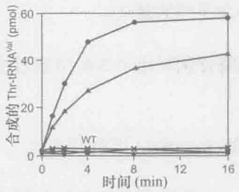

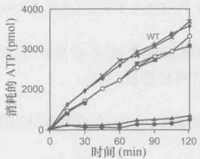  
ValRS 突变体的酶活性。野生型，◆；D279A，●；K270A，▲；其他突变型用■、○、X 和 \* 表示。  
（数据引自 Fukunaga R. and Yokoyama S. 2005. J. Biol. Chem. 280:29937-29945, 图 5 B 和 C, 第 29943 页. © The American Society for Biochemistry and Molecular Biology. 已取得授权）

B. 根据左图的数据, 与野生型 ValRS 相比, 哪种或哪些突变编辑功能的缺失最为明显? 为什么?

C. 根据右图所示，相较于 K270A 的野生型 ValRS，野生型 ValRS 会消耗更多的 ATP，请解释这是为什么。
