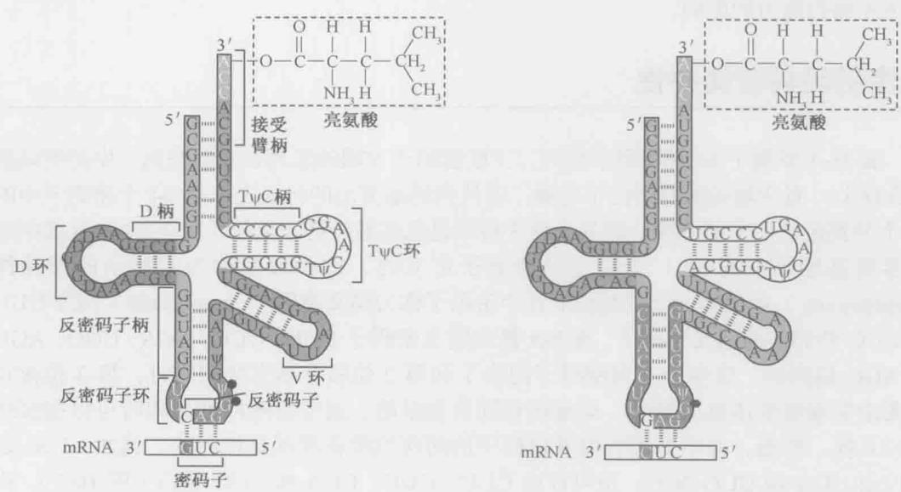
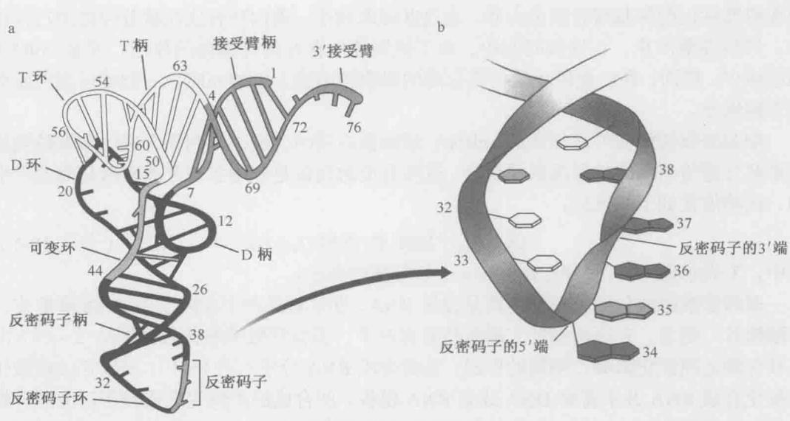
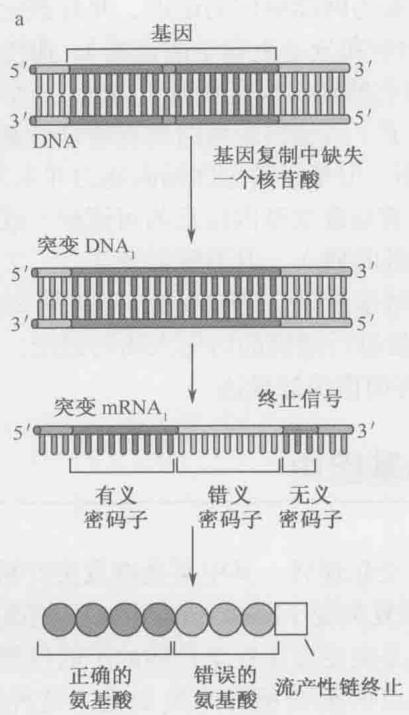
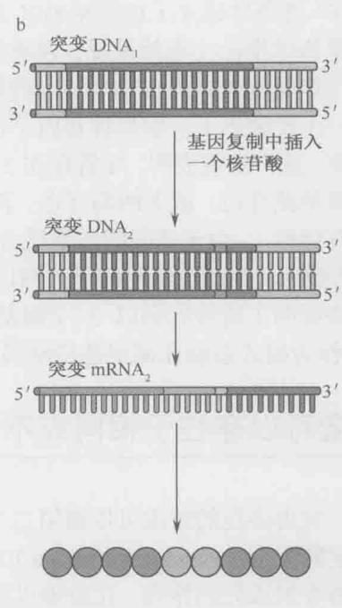
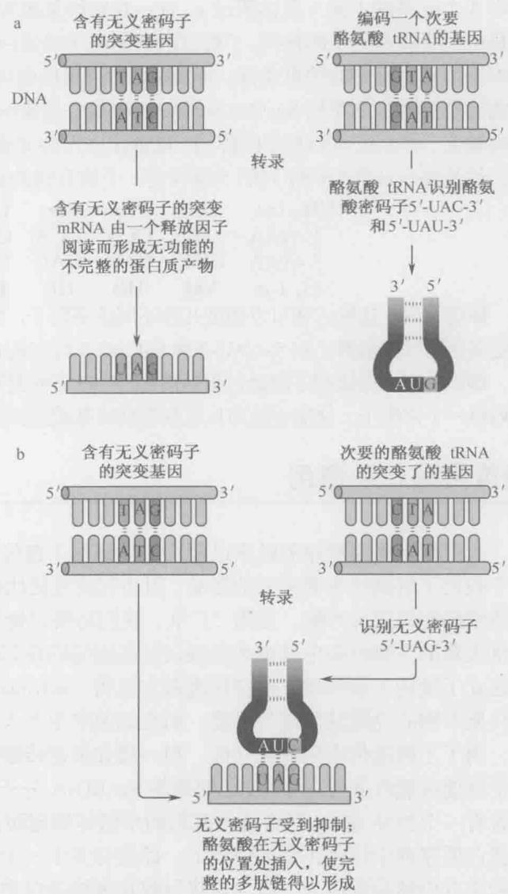
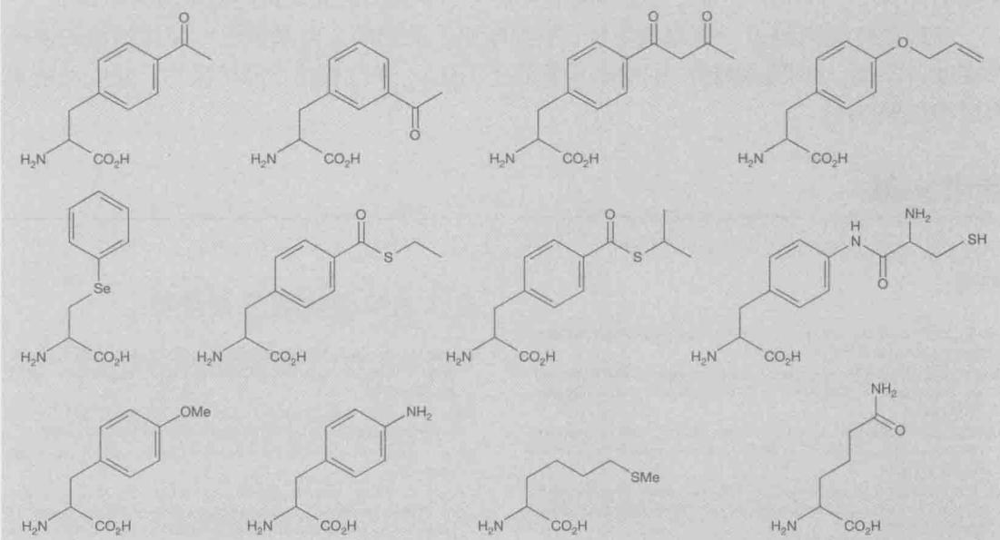

## 第16章 遗传密码

## 本章概要

遗传密码具有简并性

遗传密码遵循的三条规律

抑制突变可以存在于相同或不同的基因中

遗传密码几乎通用

中心法则最核心的内容是遗传信息从由4个字母组成的线性多核苷酸链传递给由20个氨基酸语言组成的多肽链。如前所述，将遗传信息传递给氨基酸序列的翻译过程发生在核糖体上，并且是由一种称为tRNA的特殊转配器分子所介导的。这些tRNA能够识别由3个连续的核苷酸组成的密码子。由于每个位置上的核苷酸只有4种可能，所以三联密码子排列的总数是 $64(4 \times 4 \times 4)$ ，远远超过了氨基酸的数目。

那么每一种氨基酸是由哪个三联密码子决定的呢？使用的规则又如何呢？在本章我们将要讨论遗传密码的本质、内在联系、遗传密码如何被“破译”（cracked），以及突变对mRNA编码能力的影响。

## 遗传密码具有简并性

表 16-1 罗列了 64 种密码子排列。三联密码子 5'端碱基列在表的左侧，中间的碱基排在顶上，而 3'端的碱基则位于右侧。遗传密码最突出的特征之一是 64 个密码子中的 61 个分别定义一个氨基酸，而其余的 3 种则是氨基酸链终止信号（见下面）。这意味着很多氨基酸是由超过 1 个以上的密码子定义的，这种现象称为密码子的简并性（degeneracy）。定义同一个氨基酸的几个密码子称为同义密码子（synonyms）。例如 UUU 和 UUC 是 Phe 的同义密码子，而 Ser 是由同义密码子 UCU、UCC、UCA、UGG、AGU 和 AGC 编码的。事实上，当密码子的第 1 和第 2 位核苷酸完全相同时，第 3 位核苷酸无论是胞嘧啶还是尿嘧啶，均编码相同的氨基酸，通常腺嘌呤和鸟嘌呤可以相似地进行互换。然而，并不是所有简并密码子的前两位核苷酸都是相同的。例如，Leu 既可以由 UUA 和 UUG 编码，也可以由 CUU、CUC、CUA 和 CUG 编码（图 16-1）。很多生物基因组 DNA 分子中 AT / CG 的比例有很大的变异，但它们的蛋白质分子中氨基酸的比例却没有相应的大变化，这一现象可以用密码子的简并性，特别是在密码子第 3 位单核苷酸上常见的胞嘧啶与尿嘧啶或者腺嘌呤与鸟嘌呤的互换性来解释（例如，某些细菌的基因组中 AT / GC 的比例差别极大，但亲源性又很高，编码有着高度相似的氨基酸序列的蛋白质）。

表 16-1 遗传密码  
第2个位置

<table><tr><td></td><td colspan="2">U</td><td colspan="2">C</td><td colspan="2">A</td><td colspan="2">G</td></tr><tr><td rowspan="4">U</td><td>UUU</td><td rowspan="2">Phe</td><td>UCU</td><td rowspan="4">Ser</td><td>UAU</td><td rowspan="2">Tyr</td><td>UGU</td><td rowspan="2">Cys</td></tr><tr><td>UUC</td><td>UCC</td><td>UAC</td><td>UGC</td></tr><tr><td>UUA</td><td rowspan="2">Leu</td><td>UCA</td><td>UAA</td><td>终止子</td><td>UGA</td><td>终止子</td></tr><tr><td>UUG</td><td>UCG</td><td>UAG</td><td>终止子</td><td>UGG</td><td>Trp</td></tr><tr><td rowspan="4">C</td><td>CUU</td><td rowspan="4">Leu</td><td>CCU</td><td rowspan="4">Pro</td><td>CAU</td><td rowspan="2">His</td><td>CGU</td><td rowspan="4">Arg</td></tr><tr><td>CUC</td><td>CCC</td><td>CAC</td><td>CGC</td></tr><tr><td>CUA</td><td>CCA</td><td>CAA</td><td rowspan="2">Gln</td><td>CGA</td></tr><tr><td>CUG</td><td>CCG</td><td>CAC</td><td>CGG</td></tr><tr><td rowspan="4">A</td><td>AUU</td><td rowspan="3">Ile</td><td>ACU</td><td rowspan="4">Thr</td><td>AAU</td><td rowspan="2">Asn</td><td>AGU</td><td rowspan="2">Ser</td></tr><tr><td>AUC</td><td>ACC</td><td>AAC</td><td>AGC</td></tr><tr><td>AUA</td><td>ACA</td><td>AAA</td><td rowspan="2">Lys</td><td>AGA</td><td rowspan="2">Arg</td></tr><tr><td> $AUG^†$ </td><td>Met</td><td>ACG</td><td>AAG</td><td>AGG</td></tr><tr><td rowspan="4">G</td><td>GUU</td><td rowspan="4">Val</td><td>GCU</td><td rowspan="4">Ala</td><td>GAU</td><td rowspan="2">Asp</td><td>GGU</td><td rowspan="4">Gly</td></tr><tr><td>GUC</td><td>GCC</td><td>GAC</td><td>GGC</td></tr><tr><td>GUA</td><td>GCA</td><td>GAA</td><td rowspan="2">Glu</td><td>GGA</td></tr><tr><td>GUG</td><td>GCG</td><td>GAG</td><td>GGG</td></tr></table>

\* 肽链“终止密码子”或者“无义密码子”。  
† 细菌还用来定义起始的甲基-Met-tRNA $^{fMet}$ 。

  
图 16-1 两个 tRNA $^{Leu}$ 分子的密码子-反密码子配对。标出了 tRNA 结构中关键的柄、环区域（第 14 章）。与 G（反密码子的 3'端）连接的红色六边形表示碱基 N1 位置的甲基化。注意密码子的方向为 3'→5'。

## 认识密码子组成的规律

考察密码子在遗传密码中的分布，可以得到遗传编码的演化趋向于将突变的有害效应减少到最小的规律。例如，密码子第1个位置上核苷酸的突变将使编码的氨基酸，即使不完全相同，也比较相似。另外，第2个位置的核苷酸为嘧啶的密码子所编码的氨基酸往往呈疏水性，而为嘌呤的密码子所编码的蛋白质往往是极性氨基酸（表16-1，第5章及图5-4）。由于转换（A:T→G:C或者G:C→A:T替换）是最常见的点突变类型，密码子第2个位置的核苷酸变化往往使一个氨基酸被另一个非常相似的氨基酸所取代。最后，如果密码子第3个位置上的核苷酸发生转换突变，也极少产生出不同的氨基酸。在半数情况下，即使在这个位置上发生颠换突变，也不会带来什么不同的后果。

遗传密码中另一个显而易见的规律是：当密码子的第1个和第2个位置均为G或C时，第3个位置上的核苷酸无论为A、T、C或G中的任何一个，均编码相同的氨基酸（如Pro、Ala、Arg或者Gly）。另一方面，当密码子的第1个和第2个位置均为A或U时，第3个位置的核苷酸对蛋白质的编码就会产生影响。因为G：U碱基对比A：U碱基对强，当密码子的第1个和第2个位置为结合力强的G：C碱基对时，密码子将能够耐受第3个位置上碱基的错配。因此，在第3个位置上使所有4种核苷酸定义相同的氨基酸可能已逐渐演化为一种安全机制，以便在阅读这种密码子时将错误减到最少。

## 反密码子的摆动配对

最初人们认为每一个密码子都有特异的 tRNA 反密码子。如果这种假说是正确的，生物体中应该有至少 61 种不同的 tRNA，可能还有另外 3 种对应于终止密码子。然而有证据表明，某种高度纯化的、已知序列的 tRNA 可以识别几种不同的密码子。也有研究发现反密码子除了 4 种常规的核苷酸之外，还有第 5 种核苷酸——次黄嘌呤核苷酸（Inosine，I）。和其他 tRNA 中的次要核苷酸一样，次黄嘌呤核苷酸是通过对完整 tRNA 链中的碱基进行酶修饰而得来的。次黄嘌呤源于腺嘌呤，即腺嘌呤分子上第 6 个碳原子脱去氨基，成为次黄嘌呤的 6-酮基基团（6-keto group）[实际上，次黄嘌呤是由核糖和次黄嘌呤碱基（hypoxanthine）组成的核苷酸，但现已常常用来指碱基，就如同我们这里所用的]。

1966 年，Francis Crick 提出了摆动理论（wobble concept）来解释所观察到的现象。摆动理论指出，反密码子 5' 端的碱基在空间上不如其他 2 个位置上的碱基那么受限制，

可以和密码子 3'端的几种碱基形成氢键。不是所有组合都行，配对局限于表 16-2 中的碱基。例如，位于摆动位置的 U 可以和 A 或 G 配对，I 可以和 U、C 或 A 配对（图 16-2）。摆动规则所允许的配对是那些核糖与核糖之间的距离与标准的 A：U 或 G：C 碱基对相似的配对。（除了 I：A 碱基对）

表 16-2 摆动理论的配对组合

<table><tr><td>反密码子中的碱基</td><td>密码子中的碱基</td></tr><tr><td>G</td><td>U或C</td></tr><tr><td>C</td><td>G</td></tr><tr><td>A</td><td>U</td></tr><tr><td>U</td><td>A或G</td></tr><tr><td>I</td><td>A、U或C</td></tr></table>

  
图 16-2 摆动碱基配对。注意所有摆动碱基的核糖与核糖之间的距离与 A:U 或 G:C 标准碱基对的距离相近。

嘌呤与嘌呤、嘧啶与嘧啶的配对分别使核糖与核糖之间的距离过长或者过短。

摆动规则不允许单个的 tRNA 分子识别 4 个不同的密码子。3 个密码子的识别只有当反密码子的第 1 个（5'）位置是 I 时才行。

自 1966 年以来所积累的几乎所有的实验证据均支持摆动理论。例如，摆动理论正确地预测到至少有 3 种 tRNA 存在，以识别 Ser 的 6 种密码子（UCU、UCC、UCA、UCG、AGU 和 AGC）。其他两个由 6 种密码子编码的氨基酸（Leu 和 Arg）也存在不同的 tRNA 以识别在第 1 或者第 2 个位置上有不同核苷酸的那些密码子。

在 tRNA 的三维结构中，3 个反密码子碱基（及其反密码子环中随之相连的 2 个碱基）基本上都指向同一个方向，它们精确的构象主要由碱基平面之间的堆叠作用所决定（图 16-3）。反密码子的第 1 个（5'）碱基位于碱基堆叠的末端，其运动也许比其他两个碱基相对自由些，所以在密码子的第 3 个（3'）碱基位置上摆动。相反，不仅反密码子的第 3 个（3'）碱基位于碱基堆叠的中间，而且相邻的碱基总是庞大的修饰嘌呤残基。因此，碱基运动的受限性可能解释了摆动为什么不出现在密码子的第 1 个（5'）位置上。

  
图 16-3 酵母 tRNA $^{Phe}$ 的结构。（a）基于 X 射线衍射数据得到的 L-型分子。（b）反义密码子环的放大图。反义密码子碱基（34\~36）显示为红色。反义密码子及在 3' 端的随后两个碱基（37 和 38）是部分堆叠的。可以看见反义密码子 5' 端的碱基比 3' 端完全堆叠的碱基更自由地摆动。（引自 Kim S.-H. et al. 1974. Proc. Natl. Acad. Sci. 71: 4970.）

## 三个密码子指导链的终止

如前所述，有三个密码子并不与任何氨基酸相对应，相反，它们表示链的终止。在第14章我们讨论到，这些链终止密码子UAA、UAG和UGA不是由特殊的tRNA来阅读，而是由称为释放因子（RF）的特殊蛋白质所阅读（细菌中为RF1和RF2，而在真核生物中为eRF1）。释放因子进入核糖体的A位点，激发位于P位点的肽酰-tRNA的水解，使新合成的蛋白质释放出来。

## 遗传密码是如何破译的？

建立氨基酸与三联密码子之间的对应关系是分子生物学史上最伟大的成就之一（历史回顾见第2章）。这些对应关系是如何建立的呢？到1960年，人们对mRNA如何参与蛋白质合成的总体轮廓已经有了基本了解。然而对是否能够很快地详细认识遗传密码本身并不乐观。人们相信要认识一个氨基酸的密码子，不但需要准确地知道基因的核苷酸序列，而且需要了解相应的蛋白质产物的氨基酸序列。当时，测定氨基酸序列尽管是一个十分繁琐的工作，但在实验室已经十分行之有效。而另一方面，当时通用的DNA测序方法还非常原始。幸运的是，这个明显的障碍并未阻止研究进程。1961年，即在mRNA发现后仅一年，采用人工合成mRNA技术和无细胞的蛋白质合成系统使遗传密码的破译成为可能（第2章）。

## 通过人工合成的 mRNA 激发氨基酸的掺入

生物化学家发现，从活跃地进行蛋白质合成的大肠杆菌细胞中得到的提取物能够促使放射性标记的氨基酸合成蛋白质。在这些提取物中，蛋白质合成在数分钟内进行得很快，然后逐渐停止。在这段时间中，由于提取物中存在的降解酶的作用，导致 mRNA 相应减少。然而，在已经停止蛋白质合成的提取物中加入新的 mRNA，能够使蛋白质合成立即恢复。

细胞提取物依赖外在加入的 mRNA 增加蛋白质的合成，为利用合成的多聚核糖核酸来解开遗传密码的性质提供了机会。这些合成的模板是利用多核苷酸磷酸化酶而产生的，该酶催化如下的反应：

$$
[ \mathrm{XMP} ] _ {n} + \mathrm{XDP} \rightleftharpoons [ \mathrm{XMP} ] _ {n + 1} + Ⓟ\tag{公式 16-1}
$$

式中，X 表示碱基； $[XMP]_{n}$ 表示有 n 个核苷酸的 RNA。

多核苷酸磷酸化酶的正常作用是分解 RNA，在生理条件下偏向于将 RNA 降解成二磷酸核苷。然而，在高浓度的二磷酸核苷存在下，多核苷酸磷酸化酶能够从 $3'\rightarrow5'$ 方向在核苷酸之间催化磷酸二酯键的形成，从而合成 RNA 分子（图 16-4）。多核苷酸磷酸化酶催化合成 RNA 并不需要 DNA 或者 RNA 模板，所合成的产物完全依赖于反应混合物中各种二磷酸核苷的比例。例如，当只有二磷酸腺苷存在时，合成的 RNA 只有腺苷酸，因而称为多聚腺苷酸（polyadenylic acid）或 poly-A。同样也可以合成 poly-U、poly-C、poly-G。加入两种或者更多种不同的二磷酸核苷，可以形成复合的共聚物，如 poly-AU、poly-AC、poly-CU 和 poly-AGCU。在所有这些混合共聚物中，碱基的序列基本上是随机的，最相邻的碱基频率完全是由反应物的相对浓度决定的。例如，在 A 是 U 的 2 倍的情况下，poly-AU 分子中的序列类似 UAAUAUAAAUAUAUAAAAUAUU……

  
图 16-4 多核苷酸磷酸化酶反应。本图显示由多核苷酸磷酸化酶催化的多聚腺苷酸合成或降解的可逆反应。

## Poly-U 编码多聚 Phe

在合适的离体条件下，几乎所有合成的多聚物会与核糖体连接并作为模板。幸运的是，早期的实验使用了高浓度的 $Mg^{2+}$ 。高浓度的 $Mg^{2+}$ 绕开了对起始因子和特殊的起始 fMet-tRNA 的需求，使 mRNA 在没有适当信号的情况下就能够开始多核苷酸链的合成。poly-U 是最先发现的具有 mRNA 活性的合成多聚核苷酸。它特异性地选择苯丙氨酰-tRNA 分子，因而形成的多肽链只含有 Phe（多聚 Phe）。因此我们知道编码 Phe 的密码子是由 3 个鸟苷酸——UUU 组成的（如第 2 章和第 7 章及下文所讨论的，一个密码子由 3 个单核苷酸组成的观点来源于遗传学实验）。通过使用 poly-A 和 poly-C 的类似实验，发现了

CCC 是 Pro 的密码子，AAA 是 Lys 的密码子。不幸的是，此类实验无法确定 GGG 定义何种氨基酸。poly-G 中的胞嘧啶残基相互之间形成牢固的氢键，形成多链的三螺旋结构，不能和核糖体结合。

## 混合多聚核苷酸使其他密码子的组成得以确定

poly-AC 分子可以含有 8 种不同的密码子：CCC、CCA、CAC、ACC、CAA、ACA、AAC 和 AAA，其比例随着共聚物的 A/C 比例不同而有差异。当 AC 共聚物连接到核糖体上，引起掺入的氨基酸有 Asp、Gly、His 和 Thr，加上先前确定的由 CCC 编码的 Pro 和由 AAA 编码的 Lys，这些氨基酸在多肽链中的比例取决于 A/C 的比例。例如，由于 A 含量大大高于 C 的 AC 共聚体促进 Asp 的掺入远远多于 His，所以我们得出结论，即 Asp 由两个 A 和一个 C 编码，而 His 由两个 C 和一个 A 编码（表 16-3）。采用其他共聚体的类似实验使另外几个密码子的组成得以确定。然而，此类实验并不能显示三联密码子中核苷酸的顺序。采用随机的共聚物无法了解编码组氨酸的两个 C 和一个 A 的排列顺序是 CCA、CAC 还是 ACC。

表 16-3 掺入到蛋白质的氨基酸

<table><tr><td rowspan="2">氨基酸</td><td rowspan="2">掺入氨基酸的观察值</td><td rowspan="2">推断的密码子组成</td><td colspan="4">三联体的计算频率</td><td rowspan="2">三联体的计算频率总和</td></tr><tr><td>3A</td><td>2A1C</td><td>1A2C*</td><td>3C</td></tr><tr><td colspan="8">Poly-AC (5:1)</td></tr><tr><td>Asp</td><td>24</td><td>2A1C</td><td></td><td>20</td><td></td><td></td><td>20</td></tr><tr><td>Glu</td><td>24</td><td>2A1C</td><td></td><td>20</td><td></td><td></td><td>20</td></tr><tr><td>His</td><td>6</td><td>1A2C</td><td></td><td></td><td>4.0</td><td></td><td>4</td></tr><tr><td>Lys</td><td>100</td><td>3A</td><td>100</td><td></td><td></td><td></td><td>100</td></tr><tr><td>Pro</td><td>7</td><td>1A2C,3C</td><td></td><td></td><td>4.0</td><td>0.8</td><td>4.8</td></tr><tr><td>Thr</td><td>26</td><td>2A1C,1A2C</td><td></td><td>20</td><td>4.0</td><td></td><td>24</td></tr><tr><td colspan="8">Poly-AC (1:5)</td></tr><tr><td>Asp</td><td>5</td><td>2A1C</td><td></td><td>3.3</td><td></td><td></td><td>3.3</td></tr><tr><td>Glu</td><td>5</td><td>2A1C</td><td></td><td>3.3</td><td></td><td></td><td>3.3</td></tr><tr><td>His</td><td>23</td><td>1A2C</td><td></td><td></td><td>16.7</td><td></td><td>16.7</td></tr><tr><td>Lys</td><td>1</td><td>3A</td><td>0.7</td><td></td><td></td><td></td><td>0.7</td></tr><tr><td>Pro</td><td>100</td><td>1A2C,3C</td><td></td><td></td><td>16.7</td><td>83.3</td><td>100</td></tr><tr><td>Thr</td><td>21</td><td>2A1C,1A2C</td><td></td><td>3.3</td><td>16.7</td><td></td><td>20</td></tr></table>

在无细胞提取物中随机加入A和C的共聚体后观察蛋白质中所掺入的氨基酸。掺入量是指单个氨基酸最大掺入量的百分比，然后用共聚物计算一个给定的密码子在多核苷酸产物中出现的频率。密码子的相对频率是指一个特定的核苷酸出现在密码子的指定位置的概率。例如，当A/C比是5：1时，AAA/AAC的比 $=5\times5\times5:5\times5\times5=125:25$ 。如果我们假定3A密码子的频率为100，则2A和1C密码子的频率为20。将氨基酸掺入的频率和给定的计算的密码子出现频率作相关分析，就能得到推定的密码子的组成。（\*原文为1A1C，译者注）

## tRNA 和特定的三联密码子结合

1964 年，人们研发出一种直接确定某些三联密码子中 3 个核苷酸顺序的方法。这种方法基于如下事实：即使缺乏蛋白质合成需要的所有因子，特定的氨酰-tRNA 分子仍然能够结合核糖体-mRNA 复合物。例如，当 poly-U 和核糖体混合时，只有苯丙氨酰-tRNA 会结合。相应地，poly-C 促进脯氨酰-tRNA 的结合。更为重要的是，这种特异的结合并不需要长片段 mRNA 分子的存在。事实上，三核苷酸和核糖体结合就足够了。三核苷酸 UUU 的加入导致苯丙氨酰-tRNA 的结合，如果加入 AAA，赖氨酰-tRNA 就特异地结合核糖体。这种三核苷酸效应的发现，为识别许多密码子内核苷酸的顺序提供了一种相对简便的方法。例如，三核苷酸 5'-GUU-3'促进缬氨酰-tRNA 的结合，5'-UGU-3'促进半胱氨酰-tRNA 的结合，5'-UUG-3'促进亮氨酰-tRNA 的结合（表 16-4）。尽管合成了所有 64 种可能的三联核苷酸，以确定每一个密码子的顺序，然而并非所有的密码子都是采用这种方法来确定的。一些三联核苷酸不如 UUU 或者 GUU 那样有效地结合核糖体，因而无法知道它们所编码的特定氨基酸。

表 16-4 氨酰 tRNA 分子与三联核苷酸-核糖体复合物的结合

<table><tr><td colspan="6">三联核苷酸</td><td>结合的氨酰-tRNA</td></tr><tr><td>5&#x27;-UUU-3&#x27;</td><td>UUC</td><td></td><td></td><td></td><td></td><td>Phe</td></tr><tr><td>UUA</td><td>UUG</td><td>CUU</td><td>CUC</td><td>CUA</td><td>CUG</td><td>Leu</td></tr><tr><td>AAU</td><td>AUC</td><td>AUA</td><td></td><td></td><td></td><td>Ile</td></tr><tr><td>AUG</td><td></td><td></td><td></td><td></td><td></td><td>Met</td></tr><tr><td>GUU</td><td>GUC</td><td>GUA</td><td>GUG</td><td> $UCU^a$ </td><td></td><td>Val</td></tr><tr><td>UCU</td><td>UCC</td><td>UCA</td><td>UCG</td><td></td><td></td><td>Ser</td></tr><tr><td>CCU</td><td>CCC</td><td>CCA</td><td>CCG</td><td></td><td></td><td>Pro</td></tr><tr><td>AAA</td><td>AAG</td><td></td><td></td><td></td><td></td><td>Lys</td></tr><tr><td>UGU</td><td>UGC</td><td></td><td></td><td></td><td></td><td>Cys</td></tr><tr><td>GAA</td><td>GAG</td><td></td><td></td><td></td><td></td><td>Glu</td></tr></table>

a 注意，这是采用此方法错误排列的密码子。

## 重复共聚物确定密码子

在三联核苷酸结合技术产生的同时，有机化学和酶技术已经用于已知重复序列的多聚核糖核酸的合成（图 16-5）。核糖体可以在这些常规共聚物链上的任意点开始合成蛋白质，但是它们将特异的氨基酸掺入到肽链中。例如，重复序列 CUCUCUCU…是一种常见多肽的信使，在此多肽中，Leu 和 Ser 交替出现。同样地，UGUGUG…指导含有 Cys 和 Val 多肽链的合成。ACACAC…指导含有 Thr 和 His 交替的多肽链的合成。由三联核苷酸序列 AAG(AAGAAGAAG)重复所组成的共聚物指导合成 3 种多肽：poly-Lys、poly-Arg 和 poly-Glu。poly-AUC 以同样的方式，作为 poly-Ile、poly-Ser 和 poly-His 的模板（表 16-5）。其他密码子的确定是从四联核苷酸重复序列获得的。

  
图 16-5 制备寡核苷酸。结合有机合成和 DNA 聚合酶 I 复制两种技术，可以生成含有简单重复序列的 DNA 双链。根据加入反应混合物中的三磷酸核苷的不同，RNA 聚合酶以某一条 DNA 链为模板，合成不同的长链多聚核苷酸。

表 16-5 使用由 2 个或者 3 个单核苷酸合成的重复共聚物进行密码子的确定

<table><tr><td>共聚物</td><td>识别的密码子</td><td>掺入的氨基酸或者合成的多肽</td><td>确定的密码子</td></tr><tr><td rowspan="2"> $(CU)_n$ </td><td rowspan="2">CUC|UCU|CUC...</td><td>Leu</td><td>5&#x27;-CUC-3&#x27;</td></tr><tr><td>Ser</td><td>UCU</td></tr><tr><td rowspan="2"> $(UG)_n$ </td><td rowspan="2">UGU|GUG|UGU...</td><td>Cys</td><td>UGU</td></tr><tr><td>Val</td><td>GUG</td></tr><tr><td rowspan="2"> $(AC)_n$ </td><td rowspan="2">ACA|CAC|ACA...</td><td>Thr</td><td>ACA</td></tr><tr><td>His</td><td>CAC</td></tr><tr><td rowspan="2"> $(AG)_n$ </td><td rowspan="2">AGA|GAG|AGA...</td><td>Arg</td><td>AGA</td></tr><tr><td>Glu</td><td>GAG</td></tr><tr><td rowspan="3"> $(AUC)_n$ </td><td>AUC|AUC|AUC...</td><td>Poly-Ile</td><td>AUC</td></tr><tr><td>UCA|UCA|UCA...</td><td>Poly-Ser</td><td>UCA</td></tr><tr><td>CAU|CAU|CAU...</td><td>Poly-His</td><td>CAU</td></tr></table>

所有这些实验结果加起来使得 64 种密码子中的 61 种所编码的氨基酸得到确定（表 16-1），其余 3 种是链终止密码子：UAG、UAA 和 UGA，它们不定义任何氨基酸（注意：如前面章节所讨论，位于大肠杆菌的翻译起始序列时，AUG 作为起始密码子对应的是 N-甲酰甲硫氨酸，而不是通常的甲硫氨酸。）

## 遗传密码遵循的三条规律

遗传密码遵循三条指导密码子在 mRNA 中的排列和使用的规律。第一条规律是密码子从 $5'\rightarrow3'$ 方向阅读。例如，二聚肽 $NH_{2}-Thr-Arg-COOH$ 的编码顺序可以写成： $5'-ACGCGA-3'$ （其中 $5'-ACG-3'$ 编码 Thr, $5'-CGA-3'$ 编码 Arg），或者写成 $3'-GCAAGC-5'$ ，即密码子按同样的顺序，但与原来的方向相反。然而，由于 mRNA 是从 $5'\rightarrow3'$ 的方向进行翻译的，因此只有前者才是正确的编码序列；如果后者从 $5'\rightarrow3'$ 方向进行翻译，则合成的肽链会是 $NH_{2}-Arg-Thr-COOH$ ，而不是 $NH_{2}-Thr-Arg-COOH$ 。

第二条规律是密码子不重叠，信息之间无缝隙。这意味着由相邻的三联体核苷酸所组成的密码子是连续的密码子。这样，三肽 $NH_{2}-Thr-Arg-Ser-COOH$ 的编码序列是由序列 5'-ACGCGAUCG-3' 中 3 个连续的、相互不重叠的三联密码子组成的。

最后一条规律是信息在固定的可读框上翻译，而可读框是由起始密码子设定的。第

14 章提到，翻译始于蛋白质编码序列 5'端的起始密码子。由于密码子是非重叠的并由 3 个连续的核苷酸组成，原则上一段核苷酸序列可以按照任何 3 个可读框进行翻译。起始密码子决定使用 3 个可能的可读框中的哪一个。例如，序列 5'...ACGA CGACGACGACGACGACG...3' 可以翻译成一连串的 Thr（5'-ACG-3')、一连串的 Arg（5'-CGA-3'）或者是一连串的 Asp（5'-GAC-3'），这些都取决于上游起始密码子的框架。

## 改变遗传密码的三种点突变

在研究了遗传密码的本质之后，重新回顾点突变如何引起基因编码序列改变的议题是必要的（参见第9章）。引起编码一种特异氨基酸的密码子成为编码另一种氨基酸的密码子的改变称为错义突变（missense mutation）。其结果是有错义突变的基因，其蛋白质中的一个氨基酸被另一种氨基酸取代，就如经典的例子，人类遗传性疾病——镰状红细胞贫血，其中血红蛋白的β-珠蛋白亚基的第6位Glu被Val取代。

另外一种具有更明显效应的改变是突变导致链终止密码子，称为无义突变（nonsense mutation）或者终止突变（stop mutation）。当遗传信息中出现无义突变时，由于过早的链终止，不完全的多肽链会从核糖体中释放出来。不完全肽链的大小取决于无义突变的位置。如果突变靠近基因起始端，所合成的多肽链非常短；如果突变靠近基因的末端，合成的肽链长度则几乎接近正常。如第14章所述，如果mRNA包含一个过早的终止密码子，就会在真核细胞中通过一个称为无义介导的mRNA衰减的过程而很快地降解。

第三种点突变是移码突变（frameshift mutation）。它是插入或者缺失一个或者几个碱基对，从而改变可读框。下面以应该读成一系列 Ala 的密码子框架中的串联重复序列 GCU 为例（为了清晰起见，密码子人为地用空格分开，当然，真正的 mRNA 是连续的）：

现在假定在遗传信息中插入 1 个 A，从而在插入位点产生 1 个 Ser 密码子（AGC）。引起的移码突变使插入位点下游的三联体读成 Cys：
Ala Ala Ser Cys Cys Cys Cys Cys
5'-GCU GCU AGC UGC UGC UGC UGC UGC-3'

因此插入或者缺失一个碱基，不但显著地改变突变位点的遗传信息编码能力，而且同样影响下游的遗传信息。同样地，插入或者缺失两个碱基，其效应将扩散至突变位置下游的所有序列，导致完全不同的可读框。

最后考虑一下在遗传信息相近的位置插入3个额外碱基的情形。显而易见，在3个插入碱基位置上和之间的遗传信息会有显著的改变。但由于密码子是以3个核苷酸为单位的，在3个插入碱基的下游，mRNA将保持正常的可读框而不发生改变。

$$
\begin{array}{c c c c c c c c} \text {Ala} & \text {Ala} & \text {Ser} & \text {Cys} & \text {Met} & \text {Leu} & \text {His} & \text {Ala} \\ 5 ^ {\prime} - \text {GCU} & \text {GCU} & \text {ACU} & \text {UGC} & \text {AUG} & \text {CUG} & \text {CAU} & \text {GCU-3 ^ {\prime}} \end{array}
$$

## 遗传学证实遗传密码是以3个碱基为阅读单位的

上述例子是 Francis Crick、Sydney Brenner 及其合作者用一个经典实验验证的逻辑，该实验用 T4 噬菌体建立了遗传密码以 3 个碱基为阅读单位的论点，并且该论点的建立纯粹基于遗传学推论（也就是说，没有生物化学和分子生物学的证据）。遗传杂交制造出含有 3 个单碱基对插入在单个基因的相邻位点的噬菌体突变体。当然，3 个碱基的插入搅乱了一小段密码子，但目标基因（称为 rⅡ）所编码的蛋白质能够忍受氨基酸序列的局部改变。这一发现表明，尽管存在 3 个变异，但基因的总体编码能力并未发生改变，这 3 个变异单独存在，或者两两存在，都会显著地改变基因信息的可读框（致使其蛋白质产物没有活性）。由于基因能够耐受 3 个碱基的插入，但不能耐受 1 个、2 个（或 4 个）碱基的插入，因此遗传密码子必须以 3 个碱基为单位进行阅读。参见第 2 章和第 22 章有关那些证明了遗传密码以 3 个碱基为单位进行阅读的历史人物的讨论，以及有关 T4 噬菌体作为模式系统在阐明遗传密码本质方面作用的描述。

## 抑制突变可以存在于相同或不同的基因中

通常，有害突变的效应可以被第二个遗传变化逆转。其中某些继发突变易于理解，如简单的逆转突变（reverse mutation）或者回复突变（back mutation），把改变了的核苷酸序列转变回原先的序列。比较难以理解的是突变发生在染色体的不同位置，通过在B位点产生其他遗传变化抑制发生在A位点的突变所带来的变化。这种抑制突变（suppressor mutation）主要有两种类型：一是基因内抑制（intragenic suppressor），即抑制突变和原来的突变位于同一个基因内，但在不同的位置上；二是抑制突变发生在另一个基因上，即基因间抑制（intergenic suppression）。抑制其他基因的突变的基因称为抑制基因（suppressor gene）。在此我们考虑的两种突变抑制作用均通过导致产生好的（或部分好的）蛋白质拷贝而起作用，原有的有害突变则使蛋白质失活。例如，如果第一个突变使参与Arg合成的一个酶产生没有活性的拷贝，那么抑制突变通过恢复合成该酶某些好的拷贝，从而使Arg能够合成。然而，基因内抑制突变与基因间抑制突变恢复正常蛋白合成的机制是完全不同的。

以错义突变为例来说明基因内抑制。错义突变的效应有时可以通过同一个基因内的另外一个错义突变而逆转。在这种情形下，最初酶活性的丢失是由于在编码的蛋白质序列中存在一个错误的氨基酸而引起蛋白质三维构象的改变。同一个基因中的第二个错义突变可以通过恢复蛋白质分子功能基团附近的构象来恢复蛋白质生物学活性。图 16-6 显示了基因内抑制的另一个例子，这时是移码突变。

## 基因间抑制涉及突变 tRNA

抑制基因并不是通过改变突变基因的核苷酸序列而发挥作用的。相反，它们改变mRNA模板的阅读方式。最著名的抑制突变例子之一是突变tRNA基因，它抑制蛋白质编码基因中无义突变产生的效应（但也有抑制错义突变，甚至移码突变的突变tRNA）。在大肠杆菌中，3个终止密码子都有抑制基因。它们通过把终止密码子阅读成一种特定氨基酸的信号而起作用。例如，有3个研究得清楚的抑制UAG密码子的基因，在无义突变位置一个抑制基因插入 Ser，另外一个插入 Glu，第 3 个插入 Tyr。在 3 个 UAG 抑制突变中，3 种氨基酸的每一种 tRNA 的反密码子都已经发生改变。例如，Tyr 抑制子源自 tRNA $^{Tyr}$ 基因内的一个突变，该突变使反密码子从 GUA（3'-AUG-5'）转变为 CUA（3'-AUC-5'），从而使其能够识别 UAG 密码子（图 16-7）。Ser 和 Glu 抑制 tRNA 也源自反密码子中的单个碱基突变。

  
图 16-6 移码突变的抑制。（a）核苷酸编码序列的一个缺失可以导致所合成的多肽链不完全并失去活性。（b）如图（a）所示的缺失效应可以被编码序列的第二个突变，即一个插入所纠正。插入的纠正效果表现为合成完整的肽链，但有两个氨基酸发生替代。根据序列中替代的不同，蛋白质可能具有部分或者全部活性。

带有无义抑制子的细胞含有突变改变了的 tRNA，这一研究发现带来了这样的问题：与这些 tRNA 相应的密码子如何能继续正确地阅读呢？对 Tyr UAG 抑制子来说，答案来自于有 3 个分别独立的基因编码 $tRNA^{Tyr}$ 。一个编码主要的 $tRNA^{Tyr}$ 类型，而另外两个重复的基因编码表达量比较少的类型。两个重复基因中的某个总是抑制突变位点。UGA 抑制就没有这种进退两难的情况，它是由一种突变形式的 $tRNA^{Trp}$ 介导的；抑制 $tRNA^{Trp}$ 仍然具有阅读 UGG（Trp）密码子的能力，同时也能识别 UGA 终止密码子。这可能是由于反密码子从 $tRNA^{Trp}$ 野生型的 CCA（3'-ACC-5'）转变为突变型的 UCA（3'-ACU-5'），根据前边所讨论到的摆动原理，密码子在 3'位置上的 A 或者 G 可以被反密码子 5'位置上的 U 识别。

## 无义突变抑制也能识别正常的终止信号

无义抑制行为可以看成是抑制 tRNA 和释放因子之间的竞争。当一个终止密码子进

入核糖体 A 位点，是读过去还是多肽链终止，取决于两者中哪一个优先到达该位置。UGA 密码子的抑制是有效的。在有抑制 tRNA 存在时，半数以上的链终止信号被读成特定的氨基酸密码子。大肠杆菌可以耐受 UAG 终止密码子的这种误读，因为 UAG 不常用作可读框末端的链终止密码子。相反，UAA 密码子抑制的平均频率通常在 1%\~5%，而且产生 UAA 抑制 tRNA 的突变细胞生长缓慢。这是可以预料的，因为 UAA 常常用作链终止密码子，所以被抑制 tRNA 识别会导致产生很多异常的长肽链。

## 证实遗传密码的正确性

如前所述,遗传密码是采用涉及无细胞蛋白质合成系统的生物化学方法破译的。但分子生物学家一般对仅仅基于体外实验的方法持怀疑态度。那么我们如何可以确定活细胞内的遗传密码是如表 16-1 所示的呢? 当然, 在目前大规模 DNA 测序的时代,从微生物到人类的不同生物的基因组中所有核苷酸序列

  
图 16-7 无义抑制。本图显示一个次要的 Tyr tRNA 如何抑制 mRNA 中的无义密码子。

已经探明,遗传密码子不但得到确证,而且在整个生物界是通用的或几乎通用的(见下文)。但是,1966年,在人们能够进行DNA测序之前很久,一个经典实验帮助确证了遗传密码。该实验是通过基因重组构建T4噬菌体的突变体,该突变体带有一对相互抑制的插入和缺失突变(和图16-6的实验相似)。研究的目的基因编码一种细胞壁降解酶——溶菌酶,之所以用它来进行实验,是因为该酶比较小、易于纯化,并且它的所有氨基酸序列是已知的。实验的策略是将溶菌酶双突变基因的氨基酸序列与野生型基因的氨基酸序列进行比较。

当突变的氨基酸序列（…NH₂-Thr Lys Val His His Leu Met Ala Ala Lys-COOH...）与野生型（…NH₂-Thr Lys Ser Pro Ser Leu Asn Ala Ala Lys-COOH...）比较时，发现其中有一串 5 个氨基酸不同（黑体所示）。这一观察结果表明插入和缺失突变已经搅乱了突变体信息中一小段密码子的排列。了解打乱的密码子对蛋白质氨基酸序列的影响为认识遗传密码本质增加了重要的约束条件。特别是，如果遗传密码如生物化学实验所揭示的那样，就可能鉴别出野生型序列 Ser Pro Ser Leu Asn 的一组密码子，在这组序列的一端插入、在另一端缺失，并经过恰如其分的排列，能够定义出突变氨基酸的序列。事实上，有办法这样做，就是要在基因编码序列的 5' 端构建一个核苷酸的缺失，3' 端构建一个核苷酸的插入：

$$
\mathrm{NH} _ {2} \text {-Lys} \quad \text {Ser} \quad \text {Pro} \quad \text {Ser} \quad \text {Leu} \quad \text {Asn} \quad \text {Ala - COOH}
$$

$$
5 ^ {\prime} - \text { AAA   AGU   CCA   UCA   CUU   AAU   GC-3 } ^ {\prime}
$$

$$
5 ^ {\prime} - \text { AAA   GUC   CAU   CAC   UUA   AUG   GC-3 } ^ {\prime}
$$

$$
\mathrm{NH} _ {2} \text {-Lys} \quad \text { Val } \quad \text { His } \quad \text { His } \quad \text { Leu } \quad \text { Met } \quad \text { Ala - COOH }
$$

你会发现，这种方案可以确证几种不同的密码子，而且证明在体内不止一种的同义密码子定义相同的氨基酸（如 5'-CAU-3' 和 5'-CAC-3' 均定义 His）。最后一点，也是非常重要的一点，即该研究方案证明了翻译过程是沿着 5'→3' 方向进行的（提示：当你在研究中从 3'→5' 排列每一个密码子，你能否按照从氨基端到羧基端的方向正确说明两个氨基酸的序列）。

## 遗传密码几乎通用

大规模基因组测序的结果已经广泛地证实了遗传密码子的通用性。密码子的通用性对于我们了解演化有着重大的影响，因为它使直接比较基因组序列已知的所有生物的蛋白质编码序列成为可能。在第21章，我们将要讨论到，已有强有力的计算机程序，可以从大量的生物种类中搜索和发现目标基因编码序列的相似性。遗传密码的通用性还帮助建立了遗传工程领域，使在代理宿主生物（surrogate host organism）中表达编码有用蛋白质产物的克隆基因成为可能，如在细菌中生产人类胰岛素（详见第21章）。

为了了解遗传密码的保守性，想一想如果遗传密码发生突变将会发生什么。例如，一个突变可能改变对应于 UCU 的那类 Ser tRNA 分子，使它转而识别 UCU 序列。这对只含有一个指导 $tRNA^{Ser}$ 合成的基因的单倍体细胞而言是致命的，因为 Ser 将不能插入到蛋白质序列中许多正常的位置上。即使有多于一个的 $tRNA^{Ser}$ 基因（如二倍体细胞），这种突变仍然是致命的，因为这将导致在细胞蛋白质中很多 Phe 被 Ser 同时取代。

从上述观点出发，对某些亚细胞器中的遗传密码和标准密码有些微差异的发现就显得完全出乎人们的意料了。这是在研究人线粒体基因组 DNA 全长 16569bp 时才意识到的。但之前在酵母、果蝇和高等植物线粒体中已经观察到该现象。已知编码蛋白质区域的序列揭示了在标准密码子和线粒体密码子之间存在以下的差异（表 16-6）：

\- UGA 编码 Trp，而非终止信号。因此线粒体 tRNA $^{Trp}$ 的反密码子既识别 UGG，也识别 UGA，似乎遵循传统的摆动规则。

\- 非起始的 Met 既可以由 AUG 编码，也可以由 AUA 编码。

\- 在哺乳动物的线粒体中，AGA 和 AGG 并不编码 Arg（在“通用”密码里 Arg 有 6 个密码子），而是指示链的终止。因此，在哺乳动物的线粒体密码中有 4 个终止密码子（UAA、UAG、AGA 和 AGG）。

\- 在果蝇的线粒体中，AGA 和 AGG 也不编码 Arg，而是编码 Ser。

表 16-6 哺乳动物线粒体的遗传密码\*  
第2个位置

<table><tr><td></td><td colspan="2">U</td><td colspan="2">C</td><td colspan="2">A</td><td colspan="2">G</td><td></td></tr><tr><td rowspan="4">U</td><td>UUU</td><td rowspan="2">Phe (GAA)†</td><td>UCU</td><td></td><td>UAU</td><td rowspan="2">Tyr (GUA)</td><td>UGU</td><td rowspan="2">Cys (GCA)</td><td>U</td></tr><tr><td>UUC</td><td>UCC</td><td rowspan="3">Ser (UGA)</td><td>UAC</td><td>UGC</td><td>C</td></tr><tr><td>UUA</td><td rowspan="2">Leu (UAA)</td><td>UCA</td><td>UAA</td><td>终止子</td><td>UGA</td><td rowspan="2">Trp (UCA)</td><td>A</td></tr><tr><td>UUG</td><td>UCG</td><td>UAG</td><td>终止子</td><td>UGG</td><td>G</td></tr><tr><td rowspan="4">C</td><td>CUU</td><td></td><td>CCU</td><td></td><td>CAU</td><td rowspan="2">His (GUG)</td><td>CGU</td><td></td><td>U</td></tr><tr><td>CUC</td><td rowspan="3">Leu (UAG)</td><td>CCC</td><td rowspan="3">Pro (UGG)</td><td>CAC</td><td>CGC</td><td rowspan="3">Arg (UCG)</td><td>C</td></tr><tr><td>CUA</td><td>CCA</td><td>CAA</td><td rowspan="2">Gln (UUG)</td><td>CGA</td><td>A</td></tr><tr><td>CUG</td><td>CCG</td><td>CAC</td><td>CGG</td><td>G</td></tr><tr><td rowspan="4">A</td><td>AUU</td><td rowspan="2">Ile (GAU)</td><td>ACU</td><td></td><td>AAU</td><td rowspan="2">Asn (GUU)</td><td>AGU</td><td rowspan="2">Ser (GUC)</td><td>U</td></tr><tr><td>AUC</td><td>ACC</td><td rowspan="3">Thr (UGU)</td><td>AAC</td><td>AGC</td><td>C</td></tr><tr><td>AUA</td><td rowspan="2">Met (GAU)‡</td><td>ACA</td><td>AAA</td><td rowspan="2">Lys (UUU)</td><td>AGA</td><td>终止子</td><td>A</td></tr><tr><td>AUG</td><td>ACG</td><td>AAG</td><td>AGG</td><td>终止子</td><td>G</td></tr><tr><td rowspan="4">G</td><td>GUU</td><td></td><td>GCU</td><td></td><td>GAU</td><td rowspan="2">Asp (GUC)</td><td>GGU</td><td></td><td>U</td></tr><tr><td>GUC</td><td rowspan="3">Val (UAC)</td><td>GCC</td><td rowspan="3">Ala (UGC)</td><td>GAC</td><td>GGC</td><td rowspan="3">Gly (GCC)</td><td>C</td></tr><tr><td>GUA</td><td>GCA</td><td>GAA</td><td rowspan="2">Glu (UUC)</td><td>GGA</td><td>A</td></tr><tr><td>GUG</td><td>GCG</td><td>GAG</td><td>GGG</td><td>G</td></tr></table>

\*线粒体遗传密码与“通用”遗传密码（表16-1）的区别用阴影表示。  
$\dagger$ 每一组密码子用阴影表示并有单一的 tRNA 来阅读，该 tRNA 的反密码子以 $5'\rightarrow3'$ 写在括号内。每 4-密码子组被 1 个 tRNA 阅读，该 tRNA 的反密码子的第一个（ $5'$ ）位置有一个 U。末端为 U/C 或者 A/G 的 2-密码子组在通过 tRNA 的 GU 摆动来阅读，反密码子第一位置分别是 G 或 U。反义密码子经常含有修饰碱基。  
$^{‡}$ 注意在反义密码子第一位置的 C 进行不寻常的配对。

也许并不奇怪，谈到解码线粒体信息的规则，线粒体 tRNA 同样不同寻常。哺乳动物线粒体中只有 22 个 tRNA，但根据摆动原则，至少需要 32 种 tRNA 分子来解码“通用”密码子。结果，当一个氨基酸有 4 种密码子（密码子第 1 和第 2 位的核苷酸相同）来定义时，只涉及单一的线粒体 tRNA（而在非线粒体系统，至少需要 2 种 tRNA 分子）。线粒体 tRNA 的反密码子 5'（摆动）位置上的核苷酸都是一个 U，它可以和密码子 3'位置上的 4 种核苷酸中的任何一种进行配对。如果密码子 3'位置上是由嘌呤碱基组成的密码子，与由嘧啶碱基组成的密码子编码不同的氨基酸，那么线粒体 tRNA 反密码子 5'第一核苷酸位置上是经过修饰的 U，它限制摆动，只与两个嘌呤配对。

通用密码子例外的情况不仅限于线粒体，也见于几个原核生物基因组和某些真核生物的核基因组。山羊支原体（Mycoplasma capricolum）用 UGA 编码 Trp，而非终止密码子。同样地，一些单细胞原生动物用 UAA 和 UAG 编码 Gln，而在“通用”密码子中，它们是终止密码子。最后，在“通用”密码中 Leu 的密码子 CUG，在假丝酵母（Candida）中变成了 Ser 的密码子。

我们方才讨论了某些特定细胞器和生物体中遗传密码的改变，但是，有些遗传密码的差异会增加编码氨基酸的种类，也就意味遗传密码的拓展（而不是改变）。在框 16-1 中我们将考察这些氨基酸在自然和人为条件下是如何生成的，以及如何通过一些精巧的工程学手段进入到蛋白质中。

## 框16-1 遗传密码的拓展

正如我们已经看到的，64个密码子中的61个指定了蛋白质中最常见的20种氨基酸。然而，一些蛋白质含有一些不常见的氨基酸，这些氨基酸并没有被这61个密码子所指定。例如，胶原蛋白含有羟脯氨酸，它是由脯氨酸加入多肽链后经羟基化形成的。还有一些蛋白质含有硒代半胱氨酸，它是在装载了丝氨酸的tRNA上形成的。丝氨酸通过酶催化同硒结合而转化成硒代半胱氨酸。装载了硒代半胱氨酸的特定的tRNA在特定的UGA密码子处进入核糖体，该UGA密码子的两侧含有特定的序列，可以被专一的转录延伸因子所识别。该转录延伸因子把装载有硒代半胱氨酸的tRNA引入A位点，在这里，含有金属的氨基酸被合并到正在延长的多肽链中。这些和其他一些关于修饰后氨基酸的例子都包括这样的机制：把改变后的氨基酸引入蛋白质而不违反遗传密码的通用性。但是，如果通过基因工程对指定非天然氨基酸的遗传密码进行扩展，又会怎样呢？我们是否可以通过这一方法在蛋白质的特定位点引入定制的氨基酸，并因此可以创造出新的蛋白质乃至具有特定用途的整个生物体呢？

两种研究的整合把这种可能性提高到现实的范畴。一个是，可以识别 UAG 的 tRNA 已经被创造出来，但它还不是所有大肠杆菌中的氨酰-tRNA 合成酶都可以作用的底物。但是，通过迭代演化的策略，一些同源的合成酶已经被合成成功，它们可以识别特定的 tRNA 并把特定的人工氨基酸装载上。通过这种方法，一系列的合成酶都可以被合成出来，它们可以识别一些同源 tRNA，这些 tRNA 可以带有一系列的具有特定用途的非天然氨基酸，如拥有重金属结合位点（促进 X 射线衍射研究），荧光结构（用于荧光显微镜），光交联位点，或者化学反应基团（框 16-1 图 1）。可以产生识别 UAG 密码子 tRNA 的大肠杆菌菌株及这种新型合成酶一起，可以从培养基中获得同源的非天然氨基酸并通过 mRNA 上的 UAG 密码子把这种氨基酸整合到蛋白质中。例如，如果我们想在目的蛋白的特定位置引入光交联位点，我们可以把 TAG 密码子引入该蛋白质的编码序列中，并在大肠杆菌中表达含有 TAG 的基因，这些基因通过基因工程可以把非天然氨基酸引入到 UAG 密码子处。

同时,另一种研究则创造了这样的大肠杆菌菌株,该菌株种所有314个TAG(UAG)终止密码子都被TAA（UAA）终止密码子所替代。这一特性的获得经历了两个阶段。第一阶段,通过一种被称为多元自动化基因组改造（multiplex automated genome engineering, MAGE）的方法,创造出32个菌株,其中TAG密码子的不同子集都被同义的终止密码子所替代。接下来,通过一种基于层次基因组接合的策略把所有314个密码子替代整合到一个菌株种,这一策略称为接合组装基因组改造（conjugative assembly genome engineering, CAGE）。这一策略保证了大肠杆菌中的TAG密码子可以同定制的氨基酸最大限度的接合。在将来,这样的策略还可以用于其他微生物,如酵母。卸掉了20种天然氨基酸的限制，经过改造的大肠杆菌和酵母将拥有指定第21种氨基酸的密码子，这或许可以使它们在实验室的可控条件下演化出比其未经修饰的祖先更多的有用特征。

  
框 16-1 图 1 经拓展的遗传密码子可以接合的非天然氨基酸。（引用自 http://schultz.scripps.edu/research.php, courtesy Peter Schultz.）

## 小结

从细菌到人类每一种生物都“通用”的遗传密码中，61种密码子编码特定的氨基酸；其余3种是终止密码子。密码子有高度的简并性，即几种密码子（同义）通常与一种氨基酸相对应。有时一个特定的tRNA可以特异地识别几种密码子，这种能力来自于反密码子5'端碱基的摆动。终止密码子UAA、UAG和UGA由特异的蛋白质识别，而非特异的tRNA分子。

遗传密码子遵守 3 个原则：密码子从 $5'\rightarrow3'$ 方向进行阅读；密码子相互不重叠并且信息没有缝隙；信息是在固定的可读框里翻译的，可读框由起始密码子设定。

遗传密码是通过在无细胞提取物中研究蛋白质合成而破译的。在原信使组分消耗殆尽的提取物中加入新的 mRNA 导致产生新的蛋白质，它们的氨基酸序列是由外加的 mRNA 所决定的。对合成的多聚核糖核酸 poly-U 可以特异地编码 poly-Phe 的发现是遗传密码破译的第一步（也许是最重要的一步）。用其他合成的均一的多聚核糖核酸（如 poly-C 等）或者混合的多聚核糖核酸（如 poly-AU 等），使不同氨基酸的密码子组成得以确定。密码子中核苷酸的准确排列的最终确定则源自随后对特异的三核苷酸-tRNA-核糖体相互作用的研究，以及使用了常见的共聚物作为信使。

改变密码的点突变包括错义突变,它使一个氨基酸的密码子变为另外一个氨基酸的密码子;无义突变可以使蛋白质的合成过早终止;移码突变则改变遗传信息的可读框。在一些情况下,错义突变、无义突变和移码突变的效应可以部分地被基因外抑制所逆转。例如,突变的 tRNA 可以将由于无义突变造成的终止密码子阅读成编码特定氨基酸的密码子。

在线粒体基因组及一些原核生物、单细胞原生动物的主要基因组中使用的遗传密码存在些许不同，如“通用密码”中的终止密码子 UGA，在线粒体、原核生物、原生动物基因组中编码 Trp。

## 参考文献

## 书籍

Celis J.E. and Smith J.D., eds. 1979. Nonsense mutations and tRNA suppressors. Academic Press, New York.

Clark B. and Petersen H., eds. 1984. Gene expression: The translational step and its control. Alfred Benzon Symposium, vol. 19. Copenhagen, Munksgaard.

Cold Spring Harbor Symposia on Quantitative Biology. 1966. Volume 31: The genetic code. Cold Spring Harbor Laboratory, Cold Spring Harbor, New York.

Söll D.G., Abelson J.N., and Schimmel P.R., eds. 1980. Transfer RNA: Biological aspects. Cold Spring Harbor Laboratory, Cold Spring Harbor, New York.

Ycas M. 1969. The biological code. Wiley (Interscience), New York.

## 遗传密码的特征

Crick F.H.C. 1966. Codon-anticodon pairing: The wobble hypothesis. J. Mol. Biol. 19: 548–555.

Kohli J. and Grosjean H. 1981. Usage of the three termination codons: Compilation and analysis of the known eukaryotic and prokaryotic translation termination sequences. Mol. Gen. Genet. 182:430–439.

Lagerkvist U. 1981. Unorthodox codon reading and the evolution of the genetic code. Cell 23: 305–306.

## 密码是如何被打断的

Crick F.H.C. 1963. The recent excitement in the coding problem. Prog. Nucleic Acid Res. 1: 164.

Khorana H.G. 1968. Polynucleotide synthesis and the genetic code. Harvey Lecture Series 1966–1967. Vol. 62. Academic Press, New York.

Nirenberg M. and Leder P. 1964. The effect of trinucleotides upon the binding of sRNA to ribosomes. Science 145: 1399–1407.

Speyer J.F., Lengyel P., Basilio C., Wahba A.J., Gardner R.S., and Ochoa S. 1963. Synthetic polynucleotides and the amino acid code. Cold Spring Harbor Symp. Quant. Biol. 28: 559–568.

## 遗传密码遵循的三条规律

Brenner S., Stretton A.O.W., and Kaplan S. 1965. Genetic code: The nonsense triplets for chain termination and their suppression. Nature 206: 994–998.

Crick F.H.C., Barnett L., Brenner S., and Watts-Tobin R.J. 1961. General nature of the genetic code for proteins. Nature 192: 1227–1232.

Garen A. 1968. Sense and nonsense in the genetic code. Science 160:149–159.

## 习题

Terzaghi E., Okada Y., Streisinger G., Emrich J., Inouye M., and Tsugita A. 1966. Change of a sequence of amino acids in phage T4 lysozyme by acridine-induced mutations. Proc. Natl. Acad. Sci. 56:500–507.

## 抑制

Buckingham R.H. and Kurland C.G. 1980. Interactions between UGA-suppressor tRNA'P and the ribosome: Mechanisms of tRNA selection. In Transfer R.N.A: Biological aspects (ed. D. Söll, et al.), pp. 421–426. Cold Spring Harbor Laboratory, Cold Spring Harbor, New York.

Ozeki H., Inokuchi H., Yamao F., Kodaira M., Sakano H., Ikemura T., and Shimura Y. 1980. Genetics of nonsense suppressor of tRNAs in Escherichia coli. In Transfer R.N.A: Biological aspects (ed. D. Söll, et al.), pp. 341–349. Cold Spring Harbor Laboratory, Cold Spring Harbor, New York.

Steege D.A. and Söll D.G. 1979. Suppression. In Biological regulation and development I (ed. R.F. Goldberger), pp. 433–486. Plenum, New York.

## 遗传密码的扩展

Isaacs F.J., Carr P.A., Wang H.H., Lajoie M.J., Sterling B., Kraal L., Tolonen A.C., Gianoulis T.A., Goodman D.B., Reppas N.B., et al. 2011. Precise manipulation of chromosomes in vivo enables genome-wide codon replacement. Science 333: 348–353.

Noren C.J., Anthony-Cahill S.J., Griffith M.C., and Schultz P.G. 1989. A general method for site-specific incorporation of unnatural amino acids into proteins. Science 192: 1227–1232.

## 偶数习题的答案请参见附录2。

习题 1 列举两种没有密码子简并性的氨基酸，并解释其原因。

习题 2 解释密码子 5'-AAG-3'编码赖氨酸和密码子 5'-AGG-3'编码精氨酸的细胞优势。

习题 3 对于 mRNA 密码子 5'-ACU-3', 该密码子编码哪个氨基酸？哪个 DNA 序列编码这该密码子？给出识别该密码子的 tRNA 的反密码子序列。

习题 4 按照 $5'\rightarrow3'$ 规则写出核苷酸序列，判断（是或者否）以下的每个 mRNA 密码子是否可以被 tRNA 反密码子 ICG 识别。

A. UGC B. CGA C. UGA D. CGU E. GCG

习题 5 由生化学家在之前的实验中利用 RNA 序列如 poly-U 来破译遗传密码子，在体外，核糖体翻译成多肽的关键条件是什么？

习题 6 你想检测密码子 5'-GUG-3' 是否编码缬氨酸, 那么你将使用什么样的重复二核苷酸 RNA 序列来获得密码子 5'-GUG-3' 编码缬氨酸的证据? 当核糖体翻译重复的二核苷酸序列时, 你期望在多肽序列中找到其他哪些氨基酸?

习题 7 DNA 序列 5'-ACCGTTCGGCTAGG-3'位于 E.coli 某基因的中间区域, 该序列是一条编码链。为了将该序列正确翻译为一条多肽, 你必须知道的关于密码子的三条规则是什么?

习题 8 DNA 序列 5'-ACCGTTCGGCTAGG-3'位于 E.coli 某基因的中间区域, 该序列是一条编码链, 请给出该序列编码的三种可能的多肽序列。

习题 9 下面展示的是编码某长度为 270AA 的蛋白质的最后几个氨基酸的野生型 DNA 序列。前三个加粗的碱基对表示读码框及编码区域。

$$
\begin{array}{l} 5 ^ {\prime} \dots G C T A A G T A T T G C T C A A G A T T A G G A T G A T A A A T A A C T G 3 ^ {\prime} \\ 3 ^ {\prime} \dots C G A T T C A T A A C G A G T T C T A A T C C T A C T A T T T A T T G A C C 5 ^ {\prime} \end{array}
$$

A. 该基因转录的模板链是哪一条？简要解释你的判断方法。

B. 单碱基的插入会引起该蛋白质的长度减少 7 个氨基酸。根据以上给出的序列，推断该插入发生在哪个位置？

C. 单碱基的改变会使该蛋白质的长度增加一个氨基酸。根据以上给出的序列，推断需要改变哪个碱基对以及将该碱基对改成什么可以增加一个氨基酸？

习题 10 基于下面所示的野生型序列，判断 A、B 和 C 三种改变的序列分别属于以下哪种类型：错义突变，无义突变，移码突变，反义突变，基因内抑制突变，或者基因间抑制突变。对于每一个改变的序列，可能有多于一个的答案。该 DNA 序列编码某长度为 270AA的蛋白质的最后几个氨基酸。前三个加粗的碱基对表示读码框及编码区域，插入的核苷酸用斜体字表示。

$$
5 ^ {\prime} \dots G C T A A G T A T T G C T C A A G A T T A G G A T C A G A A A T A A C T G G 3 ^ {\prime}
$$

$$
3 ^ {\prime} \dots C G A T T C A T A A C G A G T T C T A A T C C T A G T C T T T A T T G A C C 5 ^ {\prime}
$$

A. 改变的序列 1:

$$
5 ^ {\prime} \dots C G A T T C A T A A C G A G T T G G C T A A T C C T A C T A T T T A T T G A C C 3 ^ {\prime}
$$

$$
3 ^ {\prime} \dots C G A T T C A T A A C G A G T T G G C T A A T C C T A C T A T T T A T T G A C C 5 ^ {\prime}
$$

B. 改变的序列 2——在改变的序列 1 的基础上发生变化:

$$
5 ^ {\prime} \dots G C T A A G T A T T G C T C A C C G A T T A G G A T G A T A A A T A A C T G G 3 ^ {\prime}
$$

3'...CGATTCATAACGAGTGGCTAATCCTACTATTTATTGACC5'

C. 改变的序列 3——在改变的序列 1 的基础上发生变化:

5'...GCTAAGTATTGCTCCCGATTAGGATGATAAATAACTGG3'

3'...CGATTCATAACGAGGGCTAATCCTACTATTTATTGACC5'

习题 11 研究人员发现跨膜蛋白中的单一半胱氨酸转变为色氨酸时可引起视网膜退化。请写出编码该氨基酸替代的 mRNA 的相关序列、野生型 mRNA 的序列及突变的序列。该氨基酸替代是由于 DNA 的跳跃或易位引起的吗？

习题 12 请描述密码子的通用性，并解释为什么会存在例外。

习题 13 你想从白色念珠菌中克隆一个基因并在大肠杆菌中表达纯化,希望在大肠杆菌中表达的蛋白质与白色念珠菌中的该蛋白质的氨基酸序列非常一致。你怎样对你感兴趣的基因的 DNA 序列进行突变从而确保 5'-CUG-3'密码子编码丝氨酸而不是亮氨酸?

习题 14 假如你正从大肠杆菌中筛选某感兴趣的基因突变体的抑制突变。该突变为无义突变，使得你的基因所编码的蛋白质无法表达。该基因中的一个抑制突变编码不常见的 tRNA $^{Leu}$ 。

A. 题目中所描述的抑制突变是什么类型？

B. 为什么不常见的 tRNA $^{Leu}$ 比常用的 tRNA $^{Leu}$ 更可能携带抑制突变?

C. 如果有人告诉你，该抑制突变仅包含一个点突变，并且可以翻译终止密码子 5'-UAG-3'，请写出突变型 tRNA $^{Leu}$ 和野生型 tRNA $^{Leu}$ 的反密码子序列。
D. 为什么抑制 5'-UAG-3' 密码子比抑制其他终止密码子更有效？

夏志校）
