# 第18章 原核生物的转录调控

## 本章概要

转录调控的原理

转录起始的调控：原核生物的实例

$\lambda$ 噬菌体：调控的层次

在第 13 章我们了解了 DNA 是怎样通过 RNA 聚合酶转录成 RNA 的，同时我们还描述了构成启动子的序列元件——一位于基因起点用于结合转录酶和起始转录的区域。细菌中最常见的 RNA 聚合酶（带有 $\sigma^{70}$ ）识别的启动子由“-10”、“-35”和“上游”这 3 种元件组成。我们已知某一特定启动子的活性强度取决于其

具备哪个元件及其在多大程度上达到最佳匹配。在缺乏调控因子的情况下，这些元件决定了聚合酶与启动子的结合效率，以及结合后有多迅速地激发转录的起始。

本章我们将看一下表达调控的机制，即对基因产物需求的变化提升或降低表达的机制。基因的表达可在多个阶段受到调控。最为常见的是在转录的起始阶段，本章的大量篇幅将集中在细菌的相应调控步骤上。我们将从调控的一般机制、原则开始，接着看几个研究得较为透彻的例子，这几个例子将展示基本的调控机制是怎样以不同的组合方式来控制基因在特定的生物背景中的表达。我们也会论及转录后运作的基因调控机制，特别是转录延伸及终止的过程中的调控。其他原核生物的转录调控例子——通过 RNA 来作用的——将会在第 20 章中讨论。其中一个在翻译水平进行调控的原核基因的例子已经在第 15 章讨论了。

## 转录调控的原理

## 基因表达由调控蛋白控制

正如我们在这一部分的序言中所描述的，基因常常由胞外信号控制；对细菌而言，主要是指由培养基中存在的分子信号控制。这些信号由调控蛋白传送给基因。调控蛋白可分为两类：正调控蛋白或激活因子（activator，又译激活物），负调控蛋白或抑制因子（repressor，又称阻遏物）。通常这些调控蛋白都是DNA结合蛋白，它们识别受其控制的基因上的或基因附近的特异位点。激活因子增强受调控基因的转录，抑制因子降低或消除相应基因的转录。

这些调控蛋白因子是如何作用的呢？我们来回想一下第13章中描述的转录起始步骤（图13-3）。首先，RNA聚合酶在封闭复合体（closed complex）（其中的DNA双链仍在一起）中结合到启动子上。接着，聚合酶启动子复合体转变为开放复合体，此时这其中转录起始位点的DNA是解链的，同时聚合酶定位以便起始转录。接下来是启动子脱离（promoter escape），这时聚合酶离开启动子开始转录。激活因子在哪一步激活、抑制因子在哪一步抑制，这要看具体的启动子和调控蛋白而定。接下来，我们将看到两种类型的调控。

## 大多数的激活因子和抑制因子在转录起始水平发挥作用

尽管基因表达调控基本上贯穿于基因产物生成的整个过程中，但是最常见的基因调控是在转录的起始阶段，本章将对此进行重点阐述。有两个原因可以解释：第一，转录起始阶段是进行调控的最积极有效的阶段，也就是说，在最开始决定这个基因是否被表达能够避免能量和资源的浪费。例如，部分的 mRNA 将不会被使用（翻译）。第二，在最开始的时候进行调控更容易做好。在单倍体基因组中每个基因只有一个单拷贝，所以在一个单链 DNA 分子上也只有一个启动子调控特定基因的表达。相反，为了调控即将翻译的基因，每个 mRNA 分子都必须发挥作用。

那么为什么不是全部的调控都集中在转录的起始阶段呢？在后面的阶段进行调控具有两个优势。第一，它允许接受更多的信号输入：如果对一个基因的调控不仅仅发生在最开始的阶段，那么就会有更多的信号来调控它的表达，或者是同样的信号可以更加有效。第二，在后面的阶段调控可以减少反应的时间。因此，再想一下转录调控的例子（图 15-44），如果一个信号解除了对这一步的抑制，基因编码的蛋白质产物就能够马上收到这个信号，反应时间的明显减少可能在某些情况下是非常有利的。但是，正如我们已经说过的，最常见的基因调控是在转录的起始阶段，我们现在认为主要是激活因子和抑制因子在转录的起始阶段进行调控。

## 很多启动子通过协助 RNA 聚合酶结合 DNA 的激活因子和阻碍两者结合的抑制因子进行调控

大多数的启动子，在没有调控蛋白时，只是微弱地与 RNA 聚合酶结合。这是因为该启动子缺少一种或多种上文论及的启动子元件，或这些启动子元件不完整。当聚合酶偶然结合了启动子时，它会自动地转变为开放复合体从而启动转录。这导致基因的组成型表达（constitutive expression），或称为本底水平（basal level）表达。在这一情况中，RNA 聚合酶的结合是限速步骤（图 18-1a）。

抑制因子要控制从这一种启动子的起始表达，只需结合到与聚合酶结合区相重叠的位点上。这种情况下，抑制因子阻碍聚合酶结合到启动子上从而阻止转录（图 18-1b）。当然，抑制也可以其他方式实现，这一点也很重要。DNA 上抑制因子结合的位点称为操纵子（operator）。

激活因子通过协助聚合酶结合到启动子上来激活从该启动子开始的转录。通常是通过如下步骤实现的：激活因子以其一个表面结合到启动子附近的某一 DNA 位点；同时，以另一表面与 RNA 聚合酶相互作用，将聚合酶带到启动子（图 18-1c）。这一机制常被称为募集（recruitment），这是一个蛋白质协同结合 DNA（cooperative binding of protein to DNA）的例子（具体内容我们会在下文详细讨论，尤其是框 18-4）。激活因子和聚合酶的相互作用及激活因子与 DNA 的相互作用只起“黏合”作用：酶是有活性的，而激活因子只是将酶带到启动子附近。一旦聚合酶结合到启动子，它就自动地使封闭复合体异构化为开放复合体并起始转录。

  
图 18-1 通过募集 RNA 聚合酶激活转录。(a) 在激活因子和抑制因子都不存在的时候, RNA 聚合酶偶尔会自动结合启动子并起始低水平(本底水平)的转录。(b) 抑制因子结合了操纵子序列阻碍了 RNA 聚合酶的结合从而抑制了转录。(c) 激活因子募集 RNA 聚合酶产生了高水平的转录。RNA 聚合酶募集后形成封闭复合体, 接着, 封闭复合体自动异构化为开放复合体并起始转录。如果抑制因子和激活因子都存在并具有功能, 一般来说, 抑制因子活性会优于激活因子(这种情况在本图中未展示)。

大肠杆菌（Escherichia Coli）的 lac 基因就是由激活因子和抑制因子以这种简单的方式调控转录的。本章我们还将详细讲述这一基因的转录调控。

某些激活因子和抑制因子通过变构和调控RNA聚合酶对结合后的转录步骤起作用

并非所有的启动子都用同样的调控方式。因此，我们需要从其他类型的启动子来考虑。在这种情况下，RNA聚合酶不需协助就有效地结合在DNA上并形成稳定的封闭复合体。但是这一封闭复合体却不会自动转变成开放复合体（图18-2a）。在这一启动子上，激活因子必须刺激闭合复合体转变为开放复合体，因此这一转变就是限速步骤。

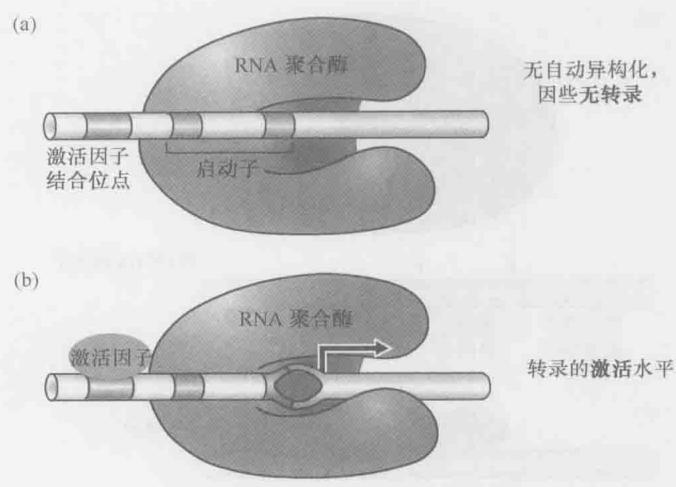  
图 18-2 变构激活 RNA 聚合酶。（a）RNA 聚合酶结合稳定的封闭复合体中的启动子；（b）激活因子和聚合酶相互作用触发转变成为开放复合体及高水平转录。该图仅以图解的形式展示复合物的开关情况，详细解释请参照第 13 章图 13-3。

刺激这类启动子的激活因子通过触发 RNA 聚合酶或 DNA 的构象改变起作用；也就是说，它们与稳定的封闭复合体相互作用诱导发生构象改变，引起封闭到开放复合体的转变（图 18-2b）。这一机制就是变构（allostery）的一个例证。

在第 6 章我们遇到过的变构是一种常见的控制蛋白质活性的机制。在本章，我们会讨论两个转录激活因子变构调节的例子。例如 glnA 启动子，激活因子（NtrC）与在启动子上结合的封闭复合体中的 RNA 聚合酶相互作用，刺激其转变为开放复合体。另一个例子（merT 启动子）中，激活因子（MerR）却是通过诱导启动子 DNA 的构象改变达成同一效果的。而在另外一类启动子中，在启动子脱离这一步限制了转录激活（图 12-3）。这类启动子的例子是 malT 基因的表达。在缺乏激活因子的时候，起始会失败，只有当存在激活因子的时候，才可以有效地进入延伸阶段。

同样地，抑制因子也有很多方式行使功能，而不是仅仅阻止 RNA 聚合酶的结合。例如，有些抑制因子可以在启动子处和聚合酶发生相互作用，从而抑制向开放复合体的转化或者启动子脱离。我们会在后面看到这样的例子（如 Gal 抑制因子）。

## 远程激活和 DNA 环化

到目前为止，我们已经默许地假定了 DNA 结合蛋白彼此相互作用结合到邻近的位点（如图 18-1 和图 18-2 中所示 RNA 聚合酶和激活因子），事实也常常如此。但是有些相互作用的蛋白的结合位点在 DNA 上相距较远。在这种情况下，为了使蛋白质相互作用，结合位点之间的 DNA 就会形成环，让蛋白质结合位点彼此靠近（图 18-3）。

在细菌中我们就遇到这种蛋白质的互作方式的例子。我们将认为抑制因子间的相互作用可以形成长达3kb的DNA环。在下一章（真核基因调控）的内容中，我们还将遇到更多更生动的“远程激活”的例子。

  
图 18-3 DNA 结合蛋白的相互作用。(a) 蛋白质协同结合相邻位点；(b) 蛋白质协同结合独立位点。

远距离 DNA 位点的靠近是 DNA 链环化的方式之一。细菌中就有这样的例子，即蛋白质在激活因子结合位点和启动子之间结合，使 DNA 弯曲向有利的方向来协助激活因子和聚合酶相互作用（图 18-4）。同时，也存在 DNA 弯曲向不利的方向使蛋白抑制环形成和激活。在其他过程中也有这种“构架型”的蛋白质协助蛋白质相互作用（如位点特异性重组，第 12 章）。

  
图 18-4 DNA-弯曲蛋白能够协助 DNA-结合蛋白间的相互作用。弯曲 DNA 的蛋白质结合到激活因子结合位点和启动子之间的位点。这使得两个位点在空间上更接近，从而协助 DNA-结合激活因子和聚合酶的相互作用。

## 协同结合和变构在基因调控中有多种作用

我们已经指出简单的协同结合可以介导基因激活：激活因子自发地与 DNA 和聚合酶相互作用，从而募集 RNA 聚合酶到启动子上。另一方面，我们也描述了蛋白质变构作用介导激活转录的情形：激活因子与结合到启动子上的聚合酶，通过诱导酶或启动子发生构象变化，刺激转录起始。在基因调控中，协同结合和变构还有其他作用。

例如,经常有成组的调控因子相互地结合到 DNA 上,即两个或多个激活因子和(或)抑制因子彼此相互作用并与 DNA 相互作用,从而彼此协助结合到它们共同调控的基因附近。我们将看到,这种相互作用仅由外界环境的小小变化就可以灵敏地使一个基因从完全不表达转而完全表达。激活因子的协同结合还可以参与整合信号,也就是说,某些基因只有当存在多种信号(从而也就有多种调控蛋白)时才被激活。稍后我们将在本章介绍一个特别显著、目前人们知之甚详的例子——λ噬菌体中协同作用参与的基因调控。我们也将在本章后续内容和框 18-3 中详细讨论协同结合的基本机制及其影响。

变构不仅是一种基因激活的机制，它同时还常常是特异信号控制其调控因子的方式。迄今已知细菌调控因子通常采取两种构象：一种构象可以结合 DNA，另一种则不能。信号分子结合调控蛋白并将它固定在某一特定构象，从而决定该调控蛋白是否能够激活转录。我们已经在第 6 章看到过一个这样的例子（图 6-19），当时我们还较为详细地讨论了变构的基本机制。本章和下一章我们将看到几个信号通过变构控制其调控因子的例子。

## 抗终止作用及其延续：基因调控并不局限于转录起始调控

正如本章开始部分所述，大多数基因调控发生在转录起始阶段。在真核细胞和细菌中皆是如此。但是，这两类生物的调控绝不局限在这一步骤。本章中我们会看到几个细菌中基因调控的例子，其中包括了转录延伸和终止水平中的调控。细菌中基因调节的其他例子请参考第15章（我们对核糖体蛋白编码基因翻译的调控进行讨论）和第20章（我们会谈到包括RNA调控在内的几个例子，如衰减作用、核糖开关和小RNA）。这些关于RNA的例子，一部分涉及转录的调控，另一部分涉及翻译的调控。

## 转录起始的调控：原核生物的实例

大致了解了转录调控的基本原理之后，我们来看几个展示基本原理是如何起作用的实例。首先，我们来看大肠杆菌（E. coli）中参与乳糖代谢的基因。在这里我们将看到激活因子和抑制因子是如何根据两种不同的信号调控表达的。同时我们也将描述揭示这些调控因子作用机制的实验方法。

## 激活因子和抑制因子共同控制 lac 基因

3 个 lac 基因——lacZ、lacY 和 lacA 在 E.coli 基因组中相邻排列合称 lac 操纵子（lac operon）（图 18-5）。lac 启动子位于 lacZ 的 5' 端，指导 3 个基因共同转录为一条 mRNA [因其包含多个基因而被称为多顺反子信使（polycistronic message）]。这一 mRNA 翻译产生 3 种蛋白质产物。lacZ 基因编码 β-半乳糖苷酶，该酶可将乳糖切割成半乳糖和葡萄糖，后两种糖均可用作细胞的能量。lacY 基因编码乳糖透过酶，该蛋白质插入细胞膜可以将乳糖转运到细胞内。lacA 基因编码硫代半乳糖苷转乙酰酶，它可以消除同时被 lacY 转入的硫代半乳糖苷对细胞造成的毒性。

这些基因只有在乳糖存在，同时葡萄糖（优先选用的能量）缺乏时才会高水平地表达。两种调控蛋白参与基因调控：一种是激活因子，称为 CAP；另一种是抑制因子，称为 Lac 抑制因子（Lac repressor）。Lac 抑制因子由 lacI 基因编码，这一基因位于其他 lac 基因的附近，但其转录（结构性地表达）却是由其自身的启动子起始的。CAP 即为代谢激活因子蛋白（catabolic activator protein），这一激活因子也被称为 CRP（cAMP 受体蛋白，cAMP receptor protein）。编码 CAP 的基因位于细菌染色体的其他位点，不与 lac 基因连锁。CAP 和 Lac 抑制因子都是 DNA 结合蛋白，两者分别结合在 DNA 启动子上或其附近的特异位点上（图 18-5）。

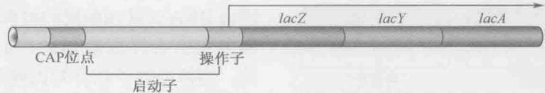  
图 18-5 lac 操纵子。3 个基因（lacZ、lacY 和 lacZ）以一条 mRNA 从启动子（如箭头所示）转录。CAP 位点和操纵子（Lac 抑制因子结合位点）各约 20bp。操纵子位于启动子 RNA 聚合酶结合区内，CAP 位点位于启动子上游（详见图 18-8 这些位点的相关排列及正文中关于这些位点的结合蛋白的描述），附近还有两个额外的弱 lac 操纵子（图 18-12），本图简化掉了，我们目前还不需要考虑它们。

每一个调控蛋白分别响应一种环境信号并将其传递给 lac 基因。因此，CAP 介导葡萄糖信号，而 Lac 抑制因子介导乳糖信号。这一调控系统以如下方式作用（图 18-6）。Lac 抑制因子只在乳糖缺乏的时候才结合 DNA 从而抑制转录。在乳糖存在时，抑制因子没有活性，基因是去抑制（表达）的。CAP 只在没有葡萄糖的时候才结合 DNA 从而激活 lac 基因。因此，这样两种调控蛋白联合作用保证基因在乳糖存在，同时在缺少葡萄糖的环境中以显著的水平表达。

  
图 18-6 lac 基因的表达。乳糖和葡萄糖的有无控制着 lac 基因表达的水平。高水平表达要有乳糖存在（也就是没有有功能的 Lac 抑制因子），同时缺少首选的能量葡萄糖（因此也就有激活因子 CAP）。当 Lac 抑制因子结合到操纵子上，不管有活性的 CAP 是否存在，它都排斥聚合酶。CAP 和 Lac 抑制因子都是单体。但实际上，CAP 以二聚体结合 DNA，Lac 抑制因子以四聚体结合（图 18-12）。CAP 募集聚合酶到 lac 启动子，在这里，它自动地异构化为开放复合体（最底行所示的状态）。

## CAP 和 Lac 抑制因子对 RNA 聚合酶结合 lac 启动子的作用是相反的

我们已经看到，Lac 抑制因子结合的位点被称为 lac 操纵子（lac operator）。这一双重对称的 21bp 序列由 Lac 抑制因子的两个亚基识别，每一个结合一个“半位点”（图

  
图 18-7 lac 操纵子对称的半位点。

18-7)。本章后面的“CAP 和 Lac 抑制因子结合 DNA 时使用相同的结构模体(motif)”部分我们会详细地描述它们是如何结合的。当抑制因子结合到操纵子上时，它是怎样抑制转录的呢？

lac 操纵子与启动子有重叠区, 所以当抑制因子结合到操纵子上时, 就阻止了

RNA 聚合酶在启动子上的结合和 RNA 合成的起始（图 18-8）。在第 7 章中我们已经讨论了 DNA 足迹法和凝胶迁移率分析可以确认蛋白质结合位点并对它们的位置映射。

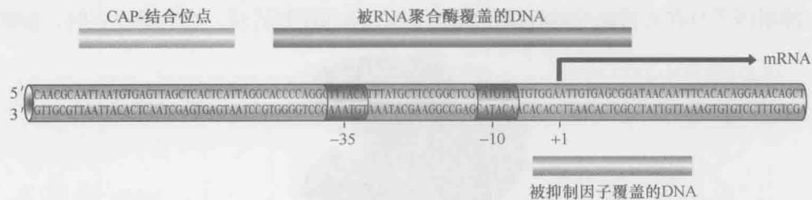  
图 18-8 lac 操纵子的控制区域。图中所示为 lac 操纵子控制区域的核苷酸序列和组成。上面和下面的横杠表示 RNA 聚合酶和调控蛋白覆盖的 DNA。注意 Lac 阻抑物覆盖的区域大于最小操纵子结合位点序列，而 RNA 聚合酶覆盖的区域大于启动子的组成序列。

我们看到，在没有 CAP 的时候，即使没有有活性的抑制因子存在，RNA 聚合酶与 lac 启动子也只有很微弱的结合。这是因为 lac 启动子的 -35 区的序列缺少一个上游元件（见图 13-5，框 13-1 和图 18-8）而不适合与 RNA 聚合酶结合。这是激活因子控制启动子的典型特征。

CAP 以二聚体的形式结合到长度类似于 lac 操纵子但有着不同序列的位点上。该位点位于转录起始位点上游大约 60bp 处（图 18-8）。当 CAP 结合到这一位点时，它就会与聚合酶相互作用，将其募集到启动子处并协助其与启动子结合（图 18-6）。这一协同结合稳定了聚合酶与启动子的结合。下面我们详细地看一下 CAP 介导的转录激活。

## CAP 具有独立的激活表面和 DNA 结合表面

各种实验都支持 CAP 通过募集 RNA 聚合酶激活 lac 基因这一观点。分离到的 CAP 的突变体结合 DNA 但并不激活转录。被称之为正控制（positive control, PC）突变体的存在表明：要激活转录，激活因子不仅仅要结合在启动子附近的 DNA 上。因此，例如转录激活也不是由激活因子改变局部 DNA 的结构引起的。正控制突变体的氨基酸替换识别了 CAP 接触聚合酶的区域，称之为激活区（activating region）。

当 CAP 激活 lac 基因时，其激活区接触的是 RNA 聚合酶的哪一部分呢？聚合酶的突变形态揭示了这一位点，这种突变体聚合酶可以正常地转录多种基因，但是不能在 lac 基因处被 CAP 激活。这些突变体在 RNA 聚合酶的 $\alpha$ 亚基（ $\alpha$ subunit）的 C 端结构域（C-terminal domain，CTD）发生了氨基酸替换。我们在第 13 章已知，这一结构域由一个易弯曲的衔接体连接到 $\alpha$ 的 N 端结构域（NTD）。 $\alpha$ NTD 嵌于酶内部，而 $\alpha$ CTD 却延伸出来与启动子的上游元件结合（当这一元件存在时）（图 13-7）。

lac 启动子没有上游元件， $\alpha$ CTD 就结合在 CAP 和附近的 DNA 上（图 18-9）。包括了 CAP、 $\alpha$ CTD 及一段包含 CAP 位点和附近上游元件的 DNA 寡核苷酸的复合体的晶体结构证明了本结构（图 18-10 及结构教程 18-1）。在框 18-1 中，我们将描述激活因子旁路实验，该实验显示 lac 启动子的激活只需要聚合酶的募集。

  
图 18-9 lac 启动子被 CAP 激活。RNA 聚合酶在 CAP 的协助下结合到 lac 启动子。CAP 由 α 亚基的 CTD 识别。当与 CAP 相互作用时，αCTD 也在靠近 CAP 位点处与 DNA 接触。在第 13 章，我们在说明激活因子和其聚合酶上的目标位点或聚合酶与启动子区域的接触时，也使用了 RNA 聚合酶作为代表。

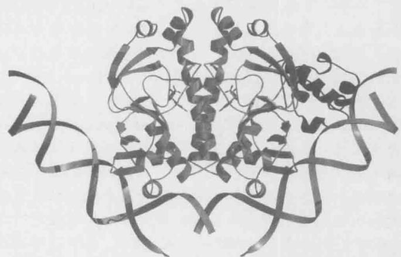  
图 18-10 CAP-αCTD-DNA 复合物的结构。所示的 CAP 以二聚体结合到其位点上。而且，在本例中，RNA 聚合酶的 αCTD 结合到一段 DNA 上，与 CAP 相互作用。每个蛋白质相互作用的位点包含用遗传学方法确认的残基。在本图中，CAP 以绿色表示，αCTD 以紫色表示。图中所示每一个 CAP 还结合了一分子的 ATP。（Benoff B. et al. 2002. Science 297: 1562.）图像用 MolScript 和 Raster 3D 软件制作。

在了解了 CAP 怎样激活 lac 操纵子的转录, 以及 Lac 抑制因子怎样拮抗这一作用之

后，我们再进一步看一下这些调控蛋白是如何识别其 DNA 结合位点的。

## 框 18-1 激活因子旁路实验

如果激活因子只有将聚合酶募集到基因上方起作用，那么将聚合酶带到基因上的其他途径也可以同样起作用。对 lac 基因来说确是如此，如以下实验所示（框 18-1 图 1）。

  
框 18-1 图 1 双激活因子旁路实验。(a) 与蛋白质 Y 相互作用的蛋白质 X 替代 αCTD。蛋白质 Y 与 DNA 结合结构域融合，被这个结构域识别的位点处于邻近 lac 基因的位置。(b) αCTD 被 CAP 的 DNA 结合区域所替代。

在一个实验中，用另一蛋白质-蛋白质相互作用取代CAP和聚合酶的相互作用。该实验用两个已知会相互作用的蛋白质，一个与DNA结合结构域联合，另一个取代聚合酶α亚基的C端结构域（αCTD）。只要启动子附近有合适的结合位点，被修饰过的聚合酶就能被拼凑起来的“激活因子”激活。在另一个实验中，聚合酶αCTD被DNA结合结构域取代（如CAP的DNA结合结构域）。在无任何激活因子时，只要附近有合适的DNA结合位点，这一修饰过的聚合酶就能有效地起始从lac开始的转录。第三个实验更简单：聚合酶能在体外无任何激活因子时高水平地转录lac基因，但要求聚合酶是高浓度的。这样我们看到，人工募集或提供高浓度的聚合酶都可以使lac基因以激活水平表达。这些实验与激活因子仅协助聚合酶结合启动子是一致的。关于为何仅仅提高蛋白质（如RNA聚合酶）的浓度就可以协助它结合到DNA上的位点（在这里是启动子）的解释见框18-4。其中讨论的结果出人意料。激活因子通过诱导聚合酶发生特异的变构来激活转录。

## CAP 和 Lac 抑制因子以相同的结构模体结合 DNA

细菌的许多激活因子和抑制因子包括 CAP 和 Lac 抑制因子结合 DNA 的结构基础已经通过 X 射线晶体学确定。细菌调控蛋白的 DNA 识别机制大多是相似的，仅在细节上有所不同，正如我们下面将要描述的。

一般情况下，蛋白质以同源二聚体的形式结合到反向重复（或近似重复）序列的位点上。每一个单体结合到一个“半位点”，二聚体的对称轴位于结合位点的对称轴之上（就如我们在 Lac 抑制因子中所见到的，图 18-7）。蛋白质靠一种保守的二级结构螺旋-转折-螺旋（helix-turn-helix，图 18-11）识别特异的 DNA 序列。这一结构域由两个 $\alpha$ 螺旋组成，其中一个是识别螺旋（recognition helix）进入 DNA 的主凹槽（大沟）。在第 6 章我们就讨论过， $\alpha$ 螺旋的大小正好适合进入 DNA 主凹槽，利于其外表面的氨基酸残基与碱基对边缘的化学基团相互作用。我们也看到的每一种碱基有着特有的氢受体和氢供体结构模式（图 6-14）。因此，蛋白质可以用这样的方式来区别不同 DNA 序列而不需要 DNA 双链解链。图 6-13 展示的是识别螺旋与其 DNA 结合位点发生相互作用的例子。

图 18-11 具有螺旋-转折-螺旋结构域的蛋白质结合 DNA。蛋白质就像实际情况中那样以二聚体结合，两个亚基用带有阴影的球表示。标示出了每个单体的螺旋-转折-螺旋模体。“识别螺旋”标以 R。  
  
DNA 结合位点

螺旋-转折-螺旋结构域的第二个螺旋坐落的位置横跨 DNA 大沟与 DNA 主链相联系的地方,以保证识别螺旋出现在正确的位置,同时也增加整个蛋白质-DNA 相互作用的结合能。

这里描述的情况不仅与 CAP（图 18-10）和 Lac 抑制因子的情况本质上符合，而且细菌中许多调控因子也是如此，包括 $\lambda$ 噬菌体抑制因子（图 6-13）、 $\lambda$ Cro 蛋白（后面会讲到）及人字形噬菌体（噬菌体 434）。尽管如此，它们在细节上会有些不同，如下面的例子所示：

\- Lac 抑制因子以四聚体而不是二聚体结合。但是，每一个操纵子只与这 4 个亚基中的 2 个接触。所以，这种寡聚方式的不同并不会改变 DNA 识别的机制。四聚体中的另外两个单体可以再结合两个操纵子，这两个操纵子一个位于初级操纵子下游 400bp 处，一个位于初级操纵子上游 90bp 处。这时，位于中间的 DNA 就处于环化状态，利于反应的进行（图 18-12）。

\- 有时，在螺旋-转折-螺旋结构域之外的其他蛋白质区域也会与 DNA 相互作用。例如， $\lambda$ 抑制因子就以其 N 端与 DNA 接触。这些蛋白质区域环绕 DNA 在螺旋的背面与小沟相互作用。

\- 许多情况下,蛋白质的结合不会改变 DNA 的结构。但是,有时我们也会在蛋白质-DNA 复合物中看到各种弯曲。例如,CAP 半包围着 DNA 并诱导 DNA 产生巨大的弯曲。这是由螺旋-转折-螺旋结构域外的蛋白质区域与启动子之外的序列相互作用引起的。有时，结合也会导致操纵子 DNA 扭曲。

  
图 18-12 Lac 抑制因子以四聚体结合到两个操纵子上。图示的环是在 Lac 抑制因子结合的初级操纵子和上游的辅助操纵子之间，也可与下游操纵子选择性的形成类似的环。初级操纵子（与启动子相对的那个）是在讨论 lac 基因表达时所指的操纵子。在本图中，每一个抑制因子都以两个球表示，而不是一个椭圆（如前面图中所用的）以强调其寡聚结构。

原核生物的抑制因子并不都使用螺旋-转折-螺旋的方式结合。其他的结合方式也见诸报道。P22噬菌体[一种与 $\lambda$ 噬菌体相近但感染沙门氏菌（Salmonella）的噬菌体]中的Arc抑制因子就是一个明显的例子。Arc抑制因子以二聚体结合一个反向重复序列操纵子，但其却不是以 $\alpha$ 螺旋结构而是以两个反平行 $\beta$ 链插入大沟识别结合位点的。

## Lac 抑制因子和 CAP 的活性由其信号变构控制

当乳糖进入细胞后，它就被转变为别乳糖，正是别乳糖（而不是乳糖自身）控制Lac抑制因子（图18-13）。与此相矛盾的是，乳糖向别乳糖的转变是由β-半乳糖苷酶催化的，该酶自身也是由lac基因中的一个编码的，这怎么可能呢？

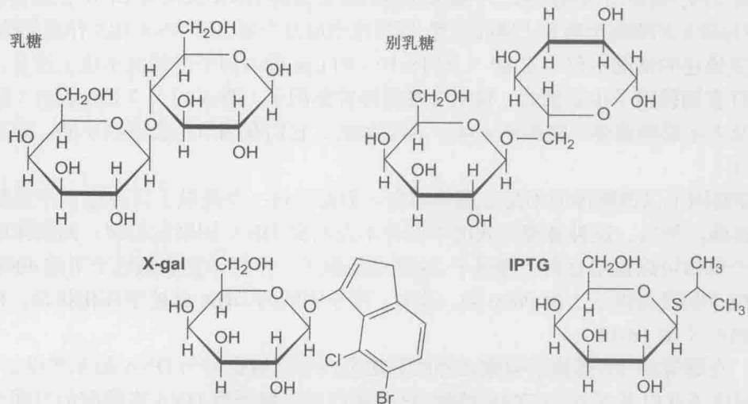  
图 18-13 乳糖操纵子的诱导物是别乳糖。乳糖被转化为别乳糖，而它又是 lac 基因的直接诱导物——直接与 Lac 抑制因子结合引起构象改变，阻止其与 DNA 结合（图 6-20）。其他的合成分子也可以作为诱导剂，尤其是经常使用的异丙基- $\beta$ -D-硫代半乳糖苷（IPTG）。其他的分子可以作为底物，但不是诱导剂。最有名的是 X-gal，它在 $\beta$ -半乳糖苷酶的催化下会产生蓝色产物，因此其作为 $\beta$ -半乳糖苷酶的显色底物被广泛使用。

答案就是 lac 基因表达的渗漏性: 在它们被阻抑时, 也会偶尔被转录, 这是因为 RNA 聚合酶偶尔会取代 Lac 抑制因子成功地结合到启动子上。这种渗漏保证了细胞中在没有乳糖的时候也会有低水平的 β-半乳糖苷酶, 从而可以催化乳糖转化为别乳糖。

别乳糖结合 Lac 抑制因子引起其蛋白质形状（构象）的改变。在没有别乳糖时，抑制因子以可以结合 DNA（从而关闭 lac 基因）的形式出现，而一旦别乳糖改变了抑制因子的形状，蛋白质就不可以再结合 DNA，lac 基因就不再被抑制。在第 6 章中我们描述过 Lac 抑制因子（图 6-19）这一变构的结构基础。需要强调的重要一点是，别乳糖结合 Lac 抑制因子的非 DNA 结合结构域。

CAP 活性的调节方式与此相似(图 18-14)。葡萄糖降低细胞内的一种小分子——cAMP 的浓度，这一分子是 CAP 的变构因子：只有当 CAP 与 cAMP 形成复合物时，CAP 蛋白才会形成结合 DNA 的构象（这也解释了 CAP 的另一个名字，CRP）。因此，只有当葡萄糖水平低（而 cAMP 水平高）时，CAP 才会结合 DNA，激活 lac 基因。CAP 蛋白结合 cAMP 的部分与蛋白质结合 DNA 的部分是分开的。

  
图 18-14 CAP 别构调节的机制。CAP 有三种晶体结构：CAP 单体、CAP 与 cAMP 结合物，以及 CAP-cAMP-DNA 复合物。我们可以很明显地看出 cAMP 是如何与 CAP 的 cAMP 结合位点（CBD）结合从而产生蛋白质构象的改变，最终导致 CBD 发生重排使其更加容易被识别。这是因为在 cAMP 与 CBD 结合的同时有两个氢键残留在蛋白质的螺旋区，使得这个区域形成一个螺旋（图中蓝色部分）。橙色标记的是 DNA 能够识别螺旋形 CBD 的区域。（经允许引自 Popovych N. et al. 2009.Proc. Natl. Acad. Sci. 106:6927-6932, Fig.7, p.6931,）

E.coli 的 lac 操纵子是早期法国生物学家 Francois Jacob 和 Jacques Monod 用来阐述基因调控的两个系统之一。在框 18-2 中，我们就这一方面的早期研究和这些观点何以会产生如此大的影响做了说明。

## 框 18-2 Jacob、Monod 及其基因调控的观点

某一基因的表达可以由另一基因的产物控制，即存在调控基因，其产物唯一的功能就是调控其他基因的表达。这一观点是分子生物学早期的远见卓识之一，它是由一群在巴黎工作的科学家，特别是 Francois Jacob 和 Jacques Monod 于 20 世纪 50 年代至 60 年代早期提出的。他们当时试图解释两种看起来不相关的现象：生长于乳糖的 E.coli 中 β-半乳糖苷酶的出现和细菌病毒（噬菌体）λ 在感染时的表现。他们工作的顶点是 1961 年操纵子模型的发现，以及 1965 年与他们的同事 Andre Lwoff 共同分享了诺贝尔生理学或医学奖。

我们今天难以理解他们取得的成就的伟大之处，是因为我们对他们的观点如此熟悉，而且其模型的测试方法又是如此直接。为了理解这一点，就要考虑到他们开始其经典实验的时候已经知道些什么：只有在培养基中供给乳糖时，E.coli 中才会出现 $\beta$ -半乳糖苷酶活性。当时尚不清楚该酶的出现需要打开一个基因的表达。实际上，早期的解释是细胞包含一个通用酶，这个酶根据环境的需要会具有各种属性。因此，当乳糖出现时，通用酶就会利用乳糖作为模板，获得合适的形态代谢乳糖。

Jacob、Monod 和他们的同事用遗传学方法解析了这个问题。我们不再详细讨论他们的实验，而是做一个简单的概述，以一窥其独创性。

首先，他们分离到了不管乳糖存在与否都合成β-半乳糖苷酶的E.coli突变体，即在这样的突变体中，这种酶是组成性（constitutively）表达的。这些突变体分为两种：第一种，其编码Lac抑制因子的基因是失活的；第二种，操纵子位点是缺陷型的。这两种突变体可以由正反实验来区别，我们将在下面描述。

Jacob 和 Monod 构建了一个部分二倍体。这样的部分二倍体是向自身染色体上带有突变 lac 基因的细胞内引入了（在质粒 F' 上）野生型细胞带有的 lac 基因（即 Lac 抑制因子基因、lacI、lac 操纵子基因，以及它们的调控组分）的染色体片段。这种转化导致细胞中出现了两个 lac 基因拷贝，使验证野生型拷贝能否与某一特定的突变拷贝互补成为可能。当染色体基因由于 lacI 基因（编码抑制因子）的突变而组成型表达时，质粒上的野生型拷贝可以恢复抑制（和可诱导性）。例如，β-半乳糖苷酶恢复只在乳糖存在时合成（框 18-2 图 1）。这是因为由质粒上的 lacI 基因合成的抑制因子可以扩散到染色体上，即它可以反式作用。

  
框 18-2 图 1 部分二倍体细胞显示有功能的抑制因子顺式工作。在没有乳糖时，lac 基因不表达，所以在这些细胞中没有明显水平的 β-半乳糖苷酶的表达。

当造成染色体基因组成型表达的突变是在 lac 操纵子上时, 就不能被野生型基因反式互补了 (框 18-2 图 2)。操纵子只能顺式作用, 即它只作用于与它在同一 DNA 分子上连锁的基因。

这些实验连同其他实验的结果使 Jacob 和 Monod 提出基因在基因开始处称为启动子的特异位点开始表达，这种表达受抑制因子的调控，抑制因子通过位于启动子旁的操纵子位点起作用。

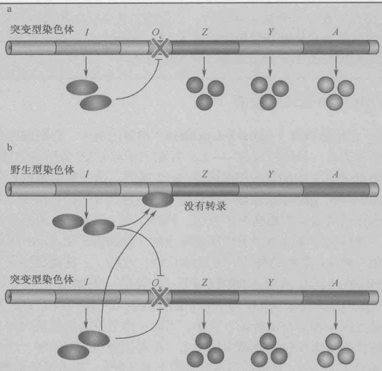  
框 18-2 图 2 部分二倍体细胞显示操纵子只以顺式方式表达。(a) 含有突变型操纵子的单倍体细胞 (Oc)。(b) 部分二倍体细胞含有正常的操纵子 (O) 和突变型操纵子 (Oc)。Lac 基因 (Z、Y 和 A) 附着在突变型操纵子上持续的组成型表达，即使在同一细胞中另一染色体上有野生型操纵子也是如此。所以，操纵子只以顺式工作。

但是这些关于 lac 系统的实验不是单独进行的；Jacob 和 Monod 还同时用 $\lambda$ 噬菌体（本章我们还将详细讨论这一系统）做了类似的实验。 $\lambda$ 噬菌体可通过两种生活周期增殖。选择哪种增殖方式依赖于表达了哪种相关的基因。这两位法国科学家发现，和 lac 基因一样，在 $\lambda$ 噬菌体系统中也可以分离到控制基因表达的缺陷型突变体，明确了这些突变也是通过顺式操纵子位点作用的反式作用抑制因子。这两个调控系统（尽管是不同生物）的相似性使 Jacob 和 Monod 相信他们发现了基因调控的基本机制，而他们的模型适用于整个自然界。正如我们看到的，尽管他们的描述尚不完整[最值得注意的是，他们的方案中没有包括激活因子（如CAP）]，但他们提出的关于反式调控蛋白识别顺式调控位点的模型主导了后来的基因调控的研究。

  
框 18-2 图 3 这幅图显示 Lac 操纵子及其调控，是由 Francois Jacob 在 2002 年手绘的。（由 Jan Witkowski 赠送）

组合控制：CAP 也控制其他基因

lac 基因是一个信号整合（signal integration）很好的例子：它们的表达受两种信号的控制，每种信号通过一种调控蛋白——Lac 抑制因子和 CAP 分别将信号传递给基因。

下面我们来看 E.coli 中的另一组基因——gal 基因。这些基因编码参与半乳糖代谢的酶。与 lac 基因一样，gal 基因也是只在其作为其底物的糖（这种情况下是半乳糖）存在而没有其优先选用的能源葡萄糖时才表达。同样，与 lac 类似，两种信号也是通过两种调控因子——激活因子和抑制因子传递给基因的。抑制因子由 galR 编码，介导诱导物半乳糖的作用；而 gal 基因的激活因子还是 CAP。这样，一种调控因子（CAP）与两种不同的抑制因子共同作用于不同的基因，这就是一例组合控制（combinatorial control）。实际上，CAP 在 E.coli 中与一系列的调控因子一起作用于 100 多种基因。

组合控制是基因调控的突出特征。这样，当同一信号控制多组基因时，它一般会以同一调控蛋白将信号传递给每组基因中的一个。在调控每一个基因时，这一调控因子也只传递给几个信号中的一个。其他信号多数情况下是不同的，则由另外的调控因子介导。越是复杂的有机体，特别是真核生物中，信号整合的情况就越多。我们以后将看到更复杂也更精细的关于组合控制的例子（第19章）。

## 选择性的 $\sigma$ 因子指导 RNA 聚合酶选择性地结合启动子

回顾第 13 章，RNA 聚合酶由 $\sigma$ 亚基识别启动子序列（图 13-6）。带有 $\sigma^{70}$ 亚基的 RNA 聚合酶可以识别我们讨论过的 lac 启动子和 E.coli 的许多其他启动子。但是 E.coli 还编码其他 $\sigma$ 亚基，在特定情况下可以替换 $\sigma^{70}$ ，指导聚合酶选择性地结合启动子。

这些选择因子中有一种热激 $\sigma$ 因子—— $\sigma^{32}$ 。当 E.coli 受到热激时，细胞中这种新 $\sigma$ 因子的量就会升高，它会取代 RNA 聚合酶上的 $\sigma^{70}$ ，指导酶转录那些产物会保护细胞免于受热激影响的基因。两种机制可以升高 $\sigma^{32}$ 的水平：首先是刺激翻译，即热激后其 mRNA 以比热激前更高的效率翻译；其次是蛋白质瞬间稳定。另一例选择性 $\sigma$ 因子—— $\sigma^{54}$ 将在下一部分讨论。 $\sigma^{54}$ 与细胞中小部分的 RNA 聚合酶分子结合指导酶结合到产物参与氮代谢的基因上。

有时候，一系列的选择性 $\sigma$ 因子指导基因表达的某一特定过程。在细菌枯草杆菌（Bacillus subtilis）中发现了两个这样的例子。其中最为精细的部分——该生物孢子形成的控制我们将在第 21 章和第 22 章讨论，其他的部分我们在此简单描述。

噬菌体 SPO1 感染 B. subtilis，并在其中生长、裂解以产生后代噬菌体。这一过程要求噬菌体以严格控制的顺序表达其基因。这一控制就是给聚合酶加上一系列的选择性 $\sigma$ 因子。因此，一旦感染了噬菌体，细菌 RNA 聚合酶（带有 B. subtilis 的 $\sigma^{70}$ ）就识别被称为“早期”的噬菌体启动子，指导转录编码感染早期所需蛋白质的基因。其中就有一个基因（称为基因28）编码一个选择性 $\sigma$ 。它取代了细菌的 $\sigma$ 因子指导聚合酶结合到噬菌体基因组的第二套启动子上，这些启动子与被称为“中期”的启动子相耦联。而这些当中又包括一个编码 $\sigma$ 因子的基因，该 $\sigma$ 因子又会指导转录噬菌体“晚期”基因（图18-15）。

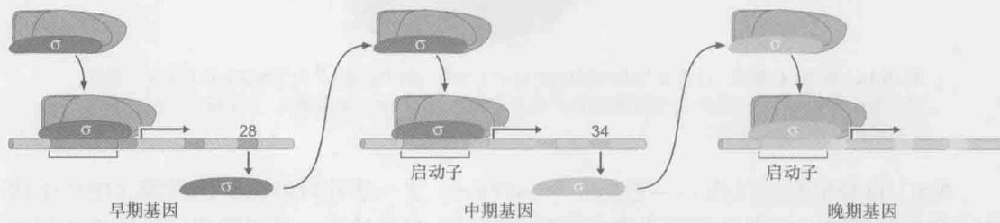  
图 18-15 选择性的 $\sigma$ 因子控制细菌病毒基因的有序表达。细菌噬菌体 SPO1 依次使用 3 个 $\sigma$ 因子调控其基因组的表达，这保证了病毒基因以所需的顺序表达。（经允许引自：Alberts B. et al. 2002. Molecular biology of the cell, 4th edition, p.415, Fig.7-63. Copyright ©2002. Reproduced by permission of Routledge/Taylor & Francis Books, Inc.）

## NtrC 和 MerR：以变构而非募集发挥作用的转录激活因子

大多数激活因子都是通过募集起作用的，但是也有例外，NtrC 和 MerR 就是通过变构机制起作用的两例。我们已讲到过变构机制。通过募集起作用的激活因子只是将 RNA 聚合酶的活性形式带到启动子上。而通过变构机制起作用的激活因子作用时，聚合酶最初就结合在启动子上，并形成了无活性的复合物，激活因子通过引起复合物的变构变化激活转录。

NtrC 控制参与氮代谢的基因的表达。RNA 聚合酶预先结合在 glnA 基因上，形成稳定的封闭复合体。激活因子 NtrC 诱导酶产生构象改变，促使封闭复合体向开放复合体的转变。MerR 控制汞抗性相关基因的表达，也作用于一个无活性的 RNA 聚合酶启动子复合物。然而，对于 MerR 来讲，激活因子的变构效应是施加在 DNA 而非聚合酶上。现在我们会对这两个系统进行具体描述。

## NtrC 具有 ATPase 活性且其作用位点距基因较远

与 CAP 相同，NtrC 也具有独立的激活结构域和 DNA 结合结构域，并且也只在特异信号存在时才会结合 DNA。对 NtrC 来说，这一信号就是低水平的氮。在这一条件下，NtrC 会被激酶 NtrB 磷酸化，并因此而经历构象变化，这一变化使激活因子暴露出其 DNA 结合结构域。一旦具有了活性，NtrC 就会结合位于启动子上游 150bp 处的 4 个位点（在 glnA 基因上）。每一个位点都结合一个 NtrC 二聚体，这些二聚体通过蛋白质-蛋白质相互作用以高度协同的方式结合到 4 个位点上。

转录 glnA 基因的 RNA 聚合酶的组成包括 $\sigma^{54}$ 亚基。在没有 NtrC 时，这一聚合酶就结合到 glnA 启动子上，形成稳定的封闭复合物。一旦 NtrC（结合到其上游位点）具有了活性，就与 $\sigma^{54}$ 直接作用。为利于这一相互作用，要求激活因子结合位点和启动子之间的 DNA 形成一个环（图 18-16）。如果 NtrC 移动到上游更远的地方（如 1\~2kb），激活因子仍能起作用。

  
图 18-16 由 NtrC 激活。包含 $\sigma^{54}$ 的全酶识别的启动子序列不同于包含 $\sigma^{70}$ 的全酶识别的启动子。虽然图中没有特别标示，但 NtrC 是与聚合酶的 $\sigma^{54}$ 亚基接触的。NtrC 以二聚体表示，但实际上，它在 DNA 上形成更为有序的复合物。

NtrC 自身也有酶活性——它是一个 ATPase，这一活性可以为其诱导聚合酶产生构象变化提供能量。构象变化促进聚合酶起始转录。具体地说，是刺激稳定无活性的封闭复合体向有活性开放的复合体转化。

NtrC 控制的基因中，有些还具有另一种蛋白质，称为 IHF 的结合位点，位于 NtrC 结合位点和启动子之间。IHF 一结合 DNA，就使 DNA 弯曲。当 IHF 结合在正确的位点，DNA 也因而正确弯曲时，就能促进 NtrC 的激活作用。这可以解释为，IHF 通过弯曲 DNA 使激活因子更靠近启动子，协助激活因子与结合到启动子的聚合酶相互作用（图 18-4，欲详细了解 IHF 如何弯曲 DNA，见图 12-11）。

## MerR 通过扭曲 DNA 激活转录

当 MerR 结合到单一 DNA 结合位点，且有汞存在时，就激活 merT 基因。如图 18-17 所示，MerR 结合到位于启动子（该基因由包含 $\sigma^{70}$ 的聚合酶转录）的 -10 和 -35 序列之间的一段序列上。MerR 结合 DNA 螺旋上 RNA 聚合酶结合点的背面。所以聚合酶可以（也确实是）与 MerR 同时结合到启动子上。

  
图 18-17 由 MerR 激活。merT 启动子的 -10 和 -35 元件位于螺旋的反面。（a）在无汞时，MerR 结合并稳定了无活性形式的启动子。（b）在有汞存在时，MerR 扭曲了 DNA 从而使启动子元件正确排列。

merT 启动子不同于一般的启动子，其-10 与-35 元件之间的距离是 19bp 而非 $\sigma^{70}$ 启动子中常见的 15\~17bp（第 13 章，框 13-1）。这样将导致这两个被 $\sigma$ 识别的序列元件既不能适当地间隔，也不能平行排列，这两者绕螺旋面彼此相向。而且，MerR 以这种构象在 DNA 上的结合（无 $Hg^{2+}$ 时）锁定了启动子，导致聚合酶虽能结合，但却无法起始

转录，因此这种情况下无本底转录。

但是当 MerR 结合了 $Hg^{2+}$ 时，蛋白质就会发生构象变化，引起启动子中心的 DNA 扭曲。这一结构上的弯曲使 -10 和 -35 区采取类似强启动子 $\sigma^{70}$ 的分布。在这种新构型中，RNA 聚合酶可以有效地起始转录。启动子 DNA 的“活性”和“非活性”状态的结构已经确定（以另一个同种方式调控的启动子），如图 18-18 所示。

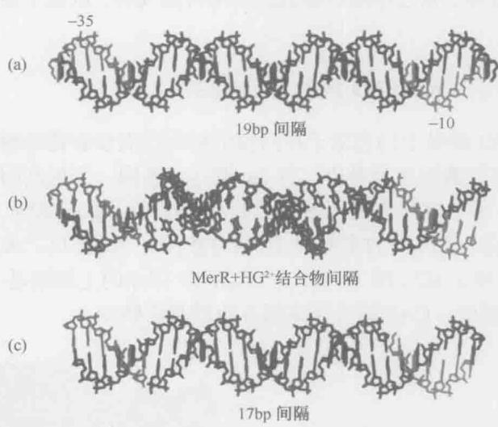  
图 18-18 像 merT 样的启动子的结构。(a) 有 19bp 间隔的启动子。(b) 当在带有活性激活因子的复合物中时启动子有 19bp 的间隔。(c) 有 17bp 间隔的启动子。(a)、(b) 部分所示的启动子来源于 Bacillus subtilis 的 bmR 基因，它由调控因子 BmrR 控制。BmrR 与 TPP 药物形成复合物就可以作为激活因子-35 (TTGACT) 和 -10 (TACAGT) 元件的一条链，分别以粉红色和绿色分别表示。(经允许引自，Zheleznova Heldwein E. E. and Brennan R.G. 2001. Nature409: 378; Fig.3b, c, d. Copyright © 2001 Nature Publishing Group.)

需要着重指出的一点是，在本例中，激活因子不是以与 RNA 聚合酶相互作用，而是以改变预先结合的聚合酶附近的 DNA 的构象激活转录的。因此，不像前面的例子，MerR 是没有 DNA 结合区与激活区之分的，其 DNA 结合过程是与其激活过程紧密连接的。

## 某些抑制因子在启动子上滞留而非排斥 RNA 聚合酶

Lac 抑制因子以最简单的方式作用：通过结合与启动子有重叠区的位点，阻碍了 RNA 聚合酶的结合。许多抑制因子也是以同样方式作用的。在 MerR 的实例中，我们看到了一种新的抑制形式：蛋白质使启动子保持一种不利于转录起始的构象。抑制因子还有其他的作用方式，现在我们就来讨论其中的一种。

有些抑制因子的结合位点不与启动子有重叠区。这些启动子不阻碍聚合酶的结合而是结合到启动子旁的位点，与结合在启动子上的聚合酶相互作用，抑制转录起始。我们前面提到的 E.coli 的 Gal 抑制因子就是一个这样的例子。Gal 抑制因子控制编码参与半乳糖代谢的酶的基因。在没有半乳糖的时候，抑制因子保持基因不表达。在这种情况下，抑制因子与聚合酶相互作用，抑制封闭复合物到开放复合物的转变。

另一个例子来自在细菌 B.subtilis 的噬菌体（ $\varphi29$ ）的 $P_{4}$ 蛋白。这一调控因子结合到一个弱化的启动子 $P_{A3}$ 的附近，与聚合酶相互作用作为一个激活因子，它与 $\alpha$ CTD 相互作用，与 CAP 相同。但这个激活因子还结合另一个称为 $P_{A2c}$ 强启动子。与在弱启动子上一样，该调控蛋白也与聚合酶接触，但在这里却是导致抑制。在前一种情况下额外的结合能协助募集聚合酶，因此激活基因；而在后一种情况下，由聚合酶和启动子之间的强相互作用加上激活因子相互作用所提供的总结合能太强，以至于聚合酶无法从启动子上脱离。

## AraC 和抗激活作用对 araBAD 操纵子的控制

E.coli 的 araBAD 操纵子的启动子在阿拉伯糖存在而没有葡萄糖时被激活，指导编码阿拉伯糖代谢需要的酶的基因表达。与 lac 和 gal 基因一个抑制因子和一个激活因子一起作用的情况不一样，这里有两个激活因子一起作用：AraC 和 CAP。当存在阿拉伯糖时，AraC 与其结合，采取允许其结合 DNA 的构象，AraC 以二聚体结合到紧邻的两个半位点——araI1 和 araI2（图 18-19a）。在这两个位点的上游就是一个 CAP 位点（图中未标示）：无葡萄糖时，CAP 结合到这里并协助激活转录。

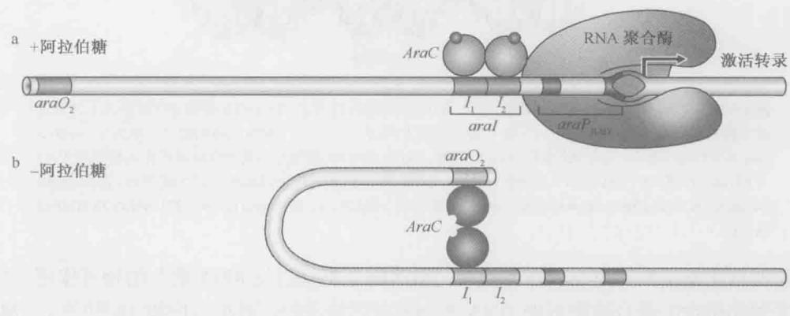  
图 18-19 araBAD 操纵子的控制。(a) 阿拉伯糖结合到 AraC，改变了激活因子的形状，使它以二聚体结合到 $araI_{1}$ 和 $araI_{2}$ 上。这将使一个 AraC 单体置于启动子附近，它可以从此处激活转录。(b) 在无阿拉伯糖时，AraC 二聚体采取一种不同的构象，结合到 $araO_{2}$ 和 $araI_{1}$ 。在这一位置， $araI_{2}$ 位点上没有单体，因此蛋白质不能激活 araBAD 启动子。这一启动子也被 CAP 控制（图中没有标示）。

没有阿拉伯糖时，araBAD 基因不表达。这是因为，AraC 在不结合阿拉伯糖时，会采取不同的构象以不同的方式结合 DNA：一个单体仍结合 $araI_{1}$ 位点，但另一个单体则结合远处一个叫 $araO_{2}$ 的半位点，如图 18-19b 所示。因为这两个半位点相距 194bp，所以当 AraC 以这种方式结合上去时，两个位点之间的 DNA 就会形成环。同时，这样结合， $araI_{2}$ 上没有 AraC 结合，而启动子 araBAD 又是从这一位置被介导激活，所以这样的构型不会激活启动子。

阿拉伯糖诱导 araBAD 启动子的数量级是非常大的，因此，该启动子经常被用作表达载体（expression vector）。表达载体是由 DNA 构成的，其基因与强启动子融合就可在表达载体中有效合成某一蛋白质（第 7 章）。在这种情况下，以某一基因与 araBAD融合就可以使这一基因的表达由阿拉伯糖来控制：该基因可以一直处于关闭状态，除非想要其表达；如果想要其产物，只需加入阿拉伯糖诱导即可。这样，即使其产物对细菌细胞具有毒性，也会进行表达。

现在我们将开始讨论一些更为复杂的转录调控网络,看看这些反复出现的简单机制是怎样进行的。我们将会重点通过噬菌体的例子来了解不同层次的调控组合是如何产生正反馈和负反馈回路，从而建立和维持能够引发完全不同生物反应的基因表达交替模式的。群体感应是生物过程中简单的反馈回路的一个很好例子（详见框18-3）。细菌的群体感应系统参与了多种生物学功能的调节，而最重要的是它是与细菌的致病机理有关。

## 框 18-3 通过细胞间通讯的沉默通路阻断毒性

在微生物学研究的早期，细菌被认为是无社会性的生物，每个个体独立生活，很少与其他个体互动。但是，现在我们已经知道很多细菌能够产生、释放、感应一些化学信号。这种普遍存在的细胞间通讯模式被称为群体感应，它使细菌通过感应到细胞内细菌密度增加从而开启基因同步模式。某些基因的表达只有当有大量细胞存在时才能体现出其优势，如生物荧光、毒力因子、抗生素、生物膜的形成，以及摄入DNA的能力等。当在其宿主鱿鱼体内菌群密度达到一定阈值的时候，发光细菌费氏弧菌（Vibrio fischeri）能够产生发光的荧光素酶。而当费氏弧菌在一个单细胞里单独存在的时候，产生荧光素酶对它几乎没有好处。同样的，人类病原菌绿脓杆菌只有在细菌浓度累积到较高的感染阶段，才能够产生和分泌毒力因子，如绿脓菌素、氰化物、脂肪酶。在这一章中我们已经讨论过细菌是如何对环境的信号做出反应控制基因开关的。在这里我们将关注细菌对自身产生的化学物质（自体诱导物）如何反应，以及与其他细菌进行信息交流的分子机制。相信理解这些机制能够有助于发现通过化学方法介导细胞间通讯的沉默通路，从而治疗细菌感染的新策略。

我们将关注一种广泛存在的信号分子——酰基高丝氨酸内酯（AHL），其能够被调控蛋白的 LuxR 家族识别。AHL 是简单的有机分子，由高丝氨酸内酯环附着到一个 4\~18 个碳的酰基链组成。不同种类的细菌产生的 AHL 具有不同长度的尾巴，每个种类的细菌只对它本身产生的信号分子有反应。信号的多样性有效地保证了细菌的群体感应的特异性。AHL 是一种膜渗透性分子，当与 LuxR 结合的时候，AHL 能够渗入到细胞中。LuxR 是一种激活蛋白，当和配体 AHL 形成络合物的时候，它只能开启转录。因此，就像活化剂 CAP，取决于它的配体 cAMP，当与合适的 AHL 结合后，LuxR 就会与目标基因的启动子区域结合。因为信号分子是从细胞外进入到细胞内，所以 LuxR 介导的群体感应是一个极其简单的信号转导系统，配体直接与转录调控因子相互作用。从这个意义上说，LuxR 类似于某些真核生物的调控蛋白，如糖皮质激素受体，通过直接与一种膜渗透配体（一种甾醇）结合，激活它的同源调控蛋白（在糖皮质激素受体的例子中，允许其从细胞质迁移到细胞核内）。有趣的是，在一些情况下，AHL 的作用机制更为复杂，它与细胞质膜上的受体结合后引起细胞质内转录调控蛋白的磷酸化作用和激活，这与真核系统的另一种通路——STAT 通路相类似，在下一章我们将会提到（图 19-24）。

与 AHL 结合后，LuxR 与染色体上的目标基因的启动子区域结合（荧光霉素基因、毒力因子基因，以及其他来自于细菌的群体感应的基因）。luxI 基因就是目标基因中的一个，它是 AHL 的合成酶基因。这具有重要的意义，也正是如此，它才能建立我们所说的正反馈调节回路。luxI 基因是受 LuxR 控制的，AHL 与 LuxR 结合激活了 luxI 基因的表达并提高了 AHL 的产量。多余的 AHL 分子扩散到其他的细胞中。这导致 LuxR 进一步被激活，反过来又促进了更多 AHL 的合成，这样细胞外 AHL 的浓度就更高。只有在细胞中细菌数量达到阈值的时候，这种正反馈调节回路才会被启动；当低于阈值的时候，细胞外 AHL 的浓度太低并不能开启正反馈调节回路。因此，LuxR 控制的基因只有在细菌数量达到“特定数量”引发正反馈调节回路的时候才能被表达。

这个理论已经应用于研制阻断病原菌毒力基因的群体感应拮抗剂。例如，在青紫色素杆菌中，它的 LuxR 型的转录因子是一种自诱导剂——一个激活的 6 碳长链的 N-己酰高丝氨酸内酯。该因子的亚基是由一个配体结合域和一个 DNA 结合域组成的二聚体。X 射线晶体学研究已表明 N-己酰高丝氨酸内酯可以和与它同源的 LuxR 因子形成复合物，两个并行亚基的 DNA 结合域能够分别与 DNA 结合（框 18-3 图 1）。但是，氯化内酯拮抗剂（结构如图所示）却能够有效地抑制青紫色素杆菌的 LuxR。氯化内酯与 LuxR 结合的时候，一个亚基的配体结合域与另一个亚基的 DNA 结合域联系在一起，使得转录因子形成交错的十字构象。在这种非活跃的构象中，二聚体不能与 DNA 结合，因此不能激活转录。在青紫色素杆菌感染秀丽新小杆线虫的试验中，氯化内酯确实能够保护线虫不受群体感应介导的感染。这表明转录因子的结构和功能对了解细菌的致病机理发挥着重要作用，可被应用于潜在治疗的小分子物质拮抗剂的研制。

  
框 18-3 图 1 一种群体感应拮抗剂通过稳定 LuxR 的非活性构象发挥作用(经允许引自 Contents of Mol. Cell, Vol. 42 [2011], article on pp. 199–209.)

## λ噬菌体：调控的层次

λ 噬菌体是一种感染 E.coli 的病毒。它一旦感染细菌，就会以两种方式繁殖：裂解（lytically）或溶原生长（lysogenically），如图 18-20 所示。裂解生长需要噬菌体 DNA 的复制和新的外壳蛋白的合成。这些组分共同形成新的噬菌体颗粒，通过宿主细胞的裂解释放出来。溶原现象——一种选择性繁殖途径，包括噬菌体 DNA 整合进入细菌染色体并像细菌基因组的正常组分那样在每次细胞分裂的时候主动复制。

  
图 18-20 λ 溶原体的生长和诱导。一旦感染，λ 就可以进行裂解或溶原过程。溶原体可以稳定的增殖许多代，它也可以被诱导。诱导之后，裂解基因以正确的顺序表达，导致新的噬菌体颗粒的产生。

溶原性细菌在正常情况下非常稳定，但其体内处于静止的噬菌体[原噬菌体（prophage）]在细胞DNA遭受破坏时就会有效地转向裂解生长（因此会威胁到宿主细胞的继续生存）。这种从溶原性生长到裂解生长的转变称为溶原性诱导（lysogenic induction）。

对发育途径的选择依赖于细胞对两种选择性的基因表达程序的选择。溶原状态的表达程序可以维持许多代，但是一旦诱导，就会有效地转向裂解程序。

## 基因表达控制裂解和溶原性生长的选择性模式

λ噬菌体有50kb的基因组和大约50个基因，其中的大多数编码外壳蛋白参与DNA复制的蛋白质、重组蛋白和裂解蛋白（图18-21）。这些基因的产物对于在裂解周期中形成新的噬菌体颗粒非常重要，但在此我们关心的是那些调控蛋白及其作用的位置。因此，我们可以集中于这些基因中的几个。我们先来考虑基因组中一个很小的区域，如图18-22所示。

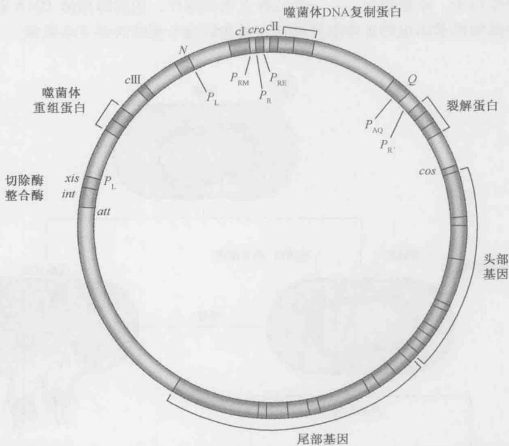  
图 18-21 噬菌体 $\lambda$ 环形图。 $\lambda$ 基因组在噬菌体头部是线形的，然而一旦感染，就会在 cos 位点环化。当整合进细菌染色体时，它又会线形化，末端在 att 位点（见第 12 章，图 12-10 关于整合的描述）。

  
图 18-22 λ 噬菌体左侧和右侧的启动子控制区域。

图中描述的区域包括2个基因（cI和cro）和3个启动子（ $P_{R}$ 、 $P_{L}$ 和 $P_{RM}$ ）。所有其他的噬菌体基因（除去一个小基因）都在该区之外直接从 $P_{R}$ 和 $P_{L}$ （分别表示右向和左向启动子）转录，或从其他启动子起始转录，这些启动子的活性由从 $P_{R}$ 和 $P_{L}$ 开始转录的基因的产物控制。 $P_{RM}$ （promoter for repressor maintenance）只转录cI基因。 $P_{R}$ 和 $P_{L}$ 是强组成型启动子，即它们有效结合RNA聚合酶，并不需激活因子的协助来指导转录。相反， $P_{RM}$ 是一个弱启动子，且只在上游结合激活因子后才会有效指导转录。在这方面， $P_{RM}$ 类似于lac启动子。

图 18-23 中所示的基因表达有两种顺序：一种出现在裂解生长周期，另一种出现在溶原生长周期。当 $P_{R}$ 和 $P_{L}$ 持续开放而 $P_{RM}$ 关闭时，就发生裂解生长。相反，溶原生长则是 $P_{R}$ 和 $P_{L}$ 关闭而 $P_{RM}$ 打开的结果。这些启动子是如何控制的呢？

## 调控蛋白及其结合位点

cI 基因编码 $\lambda$ 抑制因子。 $\lambda$ 抑制因子是一种包含由柔性衔接区连接的两个结构域的蛋白质（图 18-24）。N 端结构域包括 DNA 结合区（一个螺旋-转折-螺旋结构域，与我们以前所见的相同）。与 DNA 结合蛋白一样， $\lambda$ 抑制因子也是结合 DNA 变为二聚体形式；二聚化时，两个单体的 C 端结构域接触。一个二聚体识别一段 17bp 的 DNA 序列，每一个单体识别一个半位点，这也与我们在 lac 系统所见是相同的（我们已经在图 6-13 中详细地看到过 $\lambda$ 抑制因子对 DNA 的识别）。

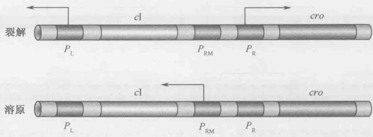  
图 18-23 裂解和溶原生长中 $\lambda$ 控制区域的转录。箭头分别指示在裂解和溶原生长决定期哪一个启动子是有活性的。箭头也指示了从每一个启动子开始转录的方向。

尽管其名为“抑制因子”，但 $\lambda$ 抑制因子既可以激活也可以抑制转录。当作为抑制因子起作用时，它与 Lac 抑制因子以相同的作用方式结合到与启动子有重叠区的位点排斥 RNA 聚合酶。作为一个激活因子时， $\lambda$ 抑制因子就类似 CAP，通过募集起作用。 $\lambda$ 抑制因子的激活区位于蛋白质的 N 端结构域，它在聚合酶上的靶标是 $\sigma$ 亚基上的一个区域，该区邻近于 $\sigma$ 的启动子-35 识别区域（4 区，第 13 章，图 13-6）。

图 18-24 λ 抑制因子。图中示 λ 抑制因子的一个单体，表示了参与该蛋白质不同活性的各种表面。N 表示氨端结构域，C 表示碳端结构域，“四聚化”表示两个二聚体协同结合到相邻的 DNA 位点时，相互作用的区域。（经允许引自：Ptashne M. and Gann A. 2002. Genes & signals, p.36, Fig.1\~17. © Cold Spring Harbor Laboratory press.）

Cro（意为抑制因子和其他基因的控制，control of repressor and other thing）只抑制转录，类似于 Lac 抑制因子。它是一个单结构域蛋白，并且也是以二聚体形式，利用螺旋-转折-螺旋模体结合到 17bp 的 DNA 序列。

$\lambda$ 抑制因子和 Cro 可以结合 6 个操纵子中的任意一个。每个蛋白质以不同的亲和力识别这些位点。3 个位点位于左控制区，3 个位于右控制区。我们将重点讨论 $\lambda$ 抑制因子和 Cro 在右侧区位点的结合，如图 18-25 所示。左侧区位点的结合模式与右侧区类似。

位于右侧操纵子的3个位点称为 $O_{\mathrm{R1}}$ 、 $O_{\mathrm{R2}}$ 和 $O_{\mathrm{R3}}$ ；这些位点的序列相似，但是并不完全相同，并且每一个位点（如果与其他位点分离开来并分别检测的话）都可以结合一个抑制因子或者Cro二聚体。但是其相互作用的亲和力是不一样的。抑制因子结合 $\mathrm{O}_{\mathrm{R1}}$ 是它结合 $\mathrm{O}_{\mathrm{R2}}$ 的亲和力的10倍。换句话说，结合 $\mathrm{O}_{\mathrm{R2}}$ 所需的抑制因子的量是结合 $\mathrm{O}_{\mathrm{R1}}$ 的10倍或者说浓度是结合 $\mathrm{O}_{\mathrm{R1}}$ 的10倍， $\mathrm{O}_{\mathrm{R3}}$ 结合抑制因子的亲和力与 $\mathrm{O}_{\mathrm{R2}}$ 的相同。Cro则相反，其与 $\mathrm{O}_{\mathrm{R3}}$ 结合的亲和力最强，而结合 $\mathrm{O}_{\mathrm{R1}}$ 和 $\mathrm{O}_{\mathrm{R2}}$ 则需10倍浓度。这些亲和力差异的意义在下文很快就会明了。

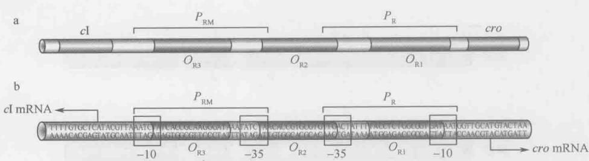  
图 18-25 O $_{R}$ 中的启动子和操纵子位点的相关位置。注意 $O_{R2}$ 和 $P_{R}$ 的-35 区有 3bp 的重叠，与 $P_{RM}$ 有 2bp 的重叠。这一点不同就足以使 $P_{R}$ 被结合到 $O_{R2}$ 上的抑制因子抑制，同时 $P_{RM}$ 被激活。（经允许引自：Ptashne M. 1992. A genetic switch: Phage and higher organisms, 2nd edition. Copyright ©1992. Blackwell Science Ltd. Used with permission.）

## $\lambda$ 抑制因子与操纵子位点协同结合

λ 抑制因子协同结合 DNA。这对其功能是至关重要的，结合的发生如下所述。考虑

  
图 18-26 λ 抑制因子协同结合 DNA。λ 抑制因子单体相互作用形成二聚体，二聚体相互作用形成四聚体，这些相互作用保证了抑制因子结合 DNA 是协同的。在 $O_{R}$ 和 $O_{L}$ 上的四聚体的相互作用增强了这种协同结合。（见下文及图 18-28）

抑制因子在 $O_{R}$ 位点结合。 $\lambda$ 抑制因子的 C 端结构域不仅提供二聚化时的接触，还介导二聚体间的相互作用（接触点即是图 18-24 所示的“四聚化”补丁区），这样，两个抑制因子二聚体就可以协同结合到 DNA 上邻近的位点。

例如， $O_{R1}$ 上结合的抑制因子通过协同结合协助抑制因子结合到低亲和力位点 $O_{R2}$ 。这样抑制因子就可以自动结合两个位点，并且在浓度只够单独结合 $O_{R1}$ 时就可以做到（图 18-26）（回顾所学内容，在无协同性时，结合 $O_{R2}$ 需要的抑制因子浓度要高 10 倍）。 $O_{R3}$ 不被结合：抑制因子协同结合 $O_{R1}$ 和 $O_{R2}$ ，但却不能自动地与第三个二聚体在这一邻近位点结合。

我们前面已经讨论过协同结合的观点并看了

一个例子：CAP 激活 lac 基因。在例子中，协同结合是抑制因子自动结合到同一 DNA 分子上的位点时相互接触的直接结果。

框 18-4 详细讨论了协同结合的原因和影响。调控蛋白的协同结合是为了保证基因的控制信号水平小的变化也可以使基因的表达水平有很大改变。下面讨论的 $\lambda$ 溶原性诱导就提供了一个很好的控制灵敏性方面的例子。有些系统中，激活因子间的协同结合也是信号整合的基础（见第 19 章 $\beta$ -干扰素的讨论）。

框 18-4 浓度、亲和力和协同结合

我们所提及“强”和“弱”结合位点的意义是什么呢？当我们说，两个分子彼此识别或相互作用（如蛋白质和DNA上的位点）是指它们彼此存在某种亲和力。它们是否能在某一特定时间结合在一起取决于两个方面：（1）亲和力有多高，如它们相互作用有多紧密；

## (2) 分子的浓度。

如我们在第 3 章强调的，支撑生物系统调控的分子间相互作用是可逆的：当两个可以相互作用的分子相遇时，它们就黏附在一起，一段时间以后又会分开。亲和力越高，两个分子黏附得越紧密，一般来说，它们在一起的时间也就越长。浓度越高，它们在第一时间彼此相遇的概率就越高。因此，高亲和力和高浓度的效应是近似的：一般两种情况都导致两个分子结合在一起的时间延长。

## 协同性的视觉展示

协同性表现为亲和力的提高。抑制因子对 $O_{R1}$ 的亲和力比对 $O_{R2}$ 要高。但是一旦抑制因子结合了 $O_{R1}$ ，结合 $O_{R2}$ 的抑制因子就会结合得更加紧密，因为它不仅与 $O_{R2}$ 作用，还与结合在 $O_{R1}$ 上的抑制因子相互作用，这两个相互作用各自的亲和力并不很强，但二者联合时则大大提高了第二个抑制因子的亲和力。我们在第 3 章时看到，结合能和平衡之间是指数关系（表 3-1）。因此，即使仅将结合能提高 2 倍，亲和力也能大规模提高。

另一个描绘协同性如何工作的方式是将其认定为抑制因子浓度的局部升高。将协同结合在 $O_{R1}$ 和 $O_{R2}$ 的抑制因子放在一起。尽管 $O_{R2}$ 上的抑制因子会周期性地释放 DNA，但它却会保留在结合于 $O_{R1}$ 的抑制因子上，因而与 $O_{R2}$ 保持靠近。这将有效地提高位点附近的抑制因子的浓度，保证抑制因子频繁地重新结合上去。

假设无协同性而只是提高细胞内抑制因子的浓度，那么当抑制因子从 $O_{R2}$ 上脱落后，它不会被结合在 $O_{R1}$ 上的抑制因子存留在附近，而是通常在结合 $O_{R2}$ 之前就游离开。但是在抑制因子有较高的浓度时，另一抑制因子分子有可能位于 $O_{R2}$ 附近并结合上去。因此，即使每一个抑制因子二聚体只在 $O_{R2}$ 上呆一段较短时间，也能通过将它保持在附近或者提高置换的可能次数，而在特定时间内提高结合的概率。

还有一种考虑协同结合的方法，即考虑熵的影响。当蛋白质从溶液中的自由状态转变为束缚在 DNA 结合位点上时，系统的熵会降低。而位于 $O_{R2}$ 附近的抑制因子受到 $O_{R1}$ 上抑制因子的相互作用，与自由状态下相比已被束缚。束缚的抑制因子比自由抑制因子结合 DNA 的熵值小。

这样，我们看到了三种描绘协同性的方式。我们还应该考虑协同结合的结果，协同结合在生物学中是很有用的。例如，协同性不仅能使一个弱结合位点在蛋白质浓度低于其自身亲和力时被其饱和，还能改变描述位点结合蛋白的饱和度随蛋白质浓度改变的曲线的坡度。为了理解这一点，我们以一个协同结合到两个弱位点A和B的蛋白质为例。这两个位点从原本完全无结合蛋白到几乎完全饱和所需的蛋白质浓度的变化范围比单位点时窄很多（框18-4图1）。实际上， $\lambda$ 系统中的协同性比想像的要大，因为在细胞中发现有大量的单体形式的自由抑制因子（如未结合DNA的抑制因子），因此，实质上，结合的时候是4个单体而不是2个稳定的二聚体协同结合，这增加了在DNA上形成复合物时的协调性，也就增加了曲线的坡度。但是为什么协同性会使结合曲线坡度更大呢？

我们已经看到结合位点是如何在抑制因子浓度低于亲和力要求时被饱和的。但是，为什么当抑制因子浓度降低时，结合也会降低得这么快呢？让我们考虑任一系统的各组分间的相互作用：当降低组分的浓度时，任意两个组分的相互作用发生的概率将减小。

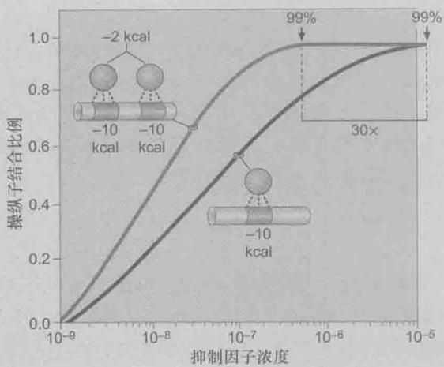  
框 18-4 图 1 协同性结合反应。黑色线表示蛋白质与一个弱位点的结合曲线，红线表示同一反应中的相同蛋白质可以协同结合到两个相连位点上（相互作用仅需 2kcal/mol 的额外结合能量）。X 轴表示蛋白质浓度的指数级别，y 轴表示位点的占有率。如图所示，协同结合在 30 倍的蛋白质浓度下位点占有率为 99%。（经允许引自 Ptashne, M. 2004. A genetic switch: Phage lambda revisited. ©Cold Spring Harbor Laboratory Press.）

如果该系统要求几个不同组分间的多重相互作用，那么在低浓度很少会发生相互作用。而蛋白质的4个单体结合到2个位点上时，就需要几个（实际是7个）相互作用；当它们每一个的浓度降低时，个别组分相遇的概率就大大降低了。

## 协同性和 DNA 结合特异性

最后，协同结合还有一个重要的意义是，它赋予DNA结合特异性。CAP激活lac启动子表明了这一点。CAP特异的将RNA聚合酶带到带有CAP位点的启动子上（与其他亲和力相当但无CAP位点的启动子不同）。同样地， $\lambda$ 抑制因子在 $O_{R1}$ 处指导另一抑制因子分子结合到它邻近的弱位点，而不是细胞中其他具有相同亲和力的地方。实际上，协同性对于保证蛋白质以足够的特异性结合从而使生命正常活动是至关重要的。

为了阐明这一点，我们来考虑一个蛋白质结合 DNA 位点的情况。这一蛋白质对于其正确位点具有高亲和力。但细胞内的 DNA 却表现出大量潜在的与该蛋白质结合的位点（但不正确）。因此，重要的是，该蛋白质不仅要对其正确的位点有绝对的亲和力，而且要有相对于所有其他非正确位点的有竞争力的亲和力。请注意，那些非正确位点（代表着除正确位点外的所有 DNA）的浓度比正确位点的浓度要高得多。所以，即使非正确位点的亲和力低于正确位点，前者的较高浓度也会保证蛋白质在试图结合正确位点的时候经常随机结合这些非正确位点。

这就需要一种策略来提高对正确位点的亲和力却不至于提高对非正确位点的亲和力。增加蛋白质和DNA位点间的接触（如合成更大的蛋白质）不一定有用，因为这同时也增强了蛋白质与非正确位点的结合。一旦蛋白质对非正确位点的亲和力太高，那么它基本上就无法找到正确位点；随机结合非正确位点占去了它太长的时间。这样，动力学问题取代了特异性问题，而这同样不利于特异性结合。

协同性解决了这一问题，蛋白质通过协同结合到两个邻近的位点，大大提高了它对这两个位点的亲和力，却不增强对其他位点的亲和力。协同性不会增强对非正确位点亲和力的原因是，2个蛋白质分子同时结合（允许协同性稳定这种结合）2个靠近的非正确位点的机会极小。只有当蛋白质分子找到正确位点时，它们才会保持足够长的结合时间，给予第二个蛋白质出现的机会。

## 协同性和变构效应

尽管本章中我们用协同性一词来指协同结合这种特定机制，但这个词还被用在其他环境中代表不同的机制。一般来说，协同性描述这样一种情形：两个配体结合第三个分子，两个配体中一个配体结合后会协助另一个的结合。所以，对我们在这里考虑的 DNA 结合蛋白来说，协同性是由简单的黏附相互作用介导的，而在别的情形下，则可能是由变构事件介导的，氧分子结合血红素可能是最好的例子。

血红素是同源四聚体，每一个亚基结合1分子的 $O_{2}$ 。这种结合是协同的：当第一个 $O_{2}$ 结合后，它引起构象改变，修饰了第二个结合位点，使其采取高亲和力构象。所以，在这一个例子中，没有配体间的直接相互作用，而是引起变构转变，一个配体增强了对第二个配体的亲和力。

## 抑制因子和 Cro 以不同模式结合控制裂解和溶原生长

抑制因子和 Cro 是如何控制与不同的 $\lambda$ 生长方式耦联的不同基因的表达模式的呢？如图 18-27 所示，对裂解生长来说，单个 Cro 二聚体结合 $O_{R3}$ ，这一位点与 $P_{RM}$ 重叠，因此，Cro 抑制了该启动子（由于这一启动子是弱启动子，所以在无激活因子时只以低水平作用，图 18-27）。因为抑制因子和 Cro 都不与 $O_{R1}$ 和 $O_{R2}$ 结合，所以 $P_{R}$ 结合 RNA聚合酶并指导裂解基因的转录； $P_{L}$ 作用方式与此相同。请回顾前文所述， $P_{R}$ 和 $P_{L}$ 都是无需激活因子的强启动子。

  
图 18-27 λ 抑制因子和 Cro 的活性。抑制因子结合到 $O_{R1}$ 和 $O_{R2}$ 上关闭了从 $P_{R}$ 开始的转录。结合到 $O_{R2}$ 的抑制因子 $P_{RM}$ 上的 RNA 聚合酶接触，激活了 cI（抑制因子）基因的表达。 $O_{R3}$ 在 $P_{RM}$ 内，结合在那里的 Cro 抑制了 cI 的转录。（经允许引自：Ptashne M. and Gann A. 2002. Genes & signals, p.30, Fig1-13. ©ColdSpring Harbor Laboratory Press.）

在溶原周期， $P_{RM}$ 开放，而 $P_{R}$ 和 $P_{L}$ 关闭。抑制因子协同结合到 $O_{R1}$ 和 $O_{R2}$ 阻碍 RNA 聚合酶结合 $P_{R}$ ，抑制从该启动子开始的转录（图 18-27）。但抑制因子的结合激活了从 $P_{RM}$ 开始的转录。

我们暂时回到噬菌体如何选择可变的途径这一问题上来。首先我们要考虑诱导在细胞受到胁迫时，上面所述的溶原状态是如何转入裂解状态的。

## 溶原性诱导需要 $\lambda$ 抑制因子的蛋白水解切割

E.coli 感受到 DNA 损害并做出反应。它通过激活 RecA 蛋白的功能做到这一点。该酶参与重组（如其名称所反映的；第 11 章），但它也有另一功能，即刺激某一蛋白质的自动水解切割。最先发现的这一活性的底物是一种细菌抑制因子蛋白 LexA，它抑制编码 DNA 修复的酶。有活性的 RecA 刺激 LexA 的自我切割，解除对基因的抑制，这被称为 SOS 反应（第 10 章）。

如果细胞是溶原体，原噬菌体就倾向于在胁迫环境下逃离细胞。最终， $\lambda$ 抑制因子变得类似于 LexA，这使得 $\lambda$ 抑制因子也在 RecA 的作用下进行自身切割。切割反应除去了抑制因子的 C 端结构域，因此二聚化和协同性马上不复存在。因为这两项功能对于抑制因子结合 $O_{R1}$ 和 $O_{R2}$ （以在溶原性细胞中所见的浓度）是至关重要的，失去协同性使抑制因子在这些位点（包括 $O_{L1}$ 和 $O_{L2}$ ）上解耦联；失去抑制从而促进了从 $P_{R}$ 和 $P_{L}$ 开始的转录，导致了裂解生长。 $\mathrm{P}_{\mathrm{R}}$ 的转录很快地产生了 Cro，其随后结合 $\mathrm{O}_{\mathrm{R3}}$ 和阻遏进一步合成从 $\mathrm{P}_{\mathrm{RM}}$ 开始的抑制因子。这一反应确保了诱导的选择是不可逆的。

为了有效诱导，溶原性细胞中的抑制因子水平必须严密调控。如果水平降得太低，在正常情况下，溶原性细胞也有可能自发诱导；如果水平升得太高，诱导就会失去作用。后者的原因在于，必须有更多的抑制因子失活（经由 RecA），以使其浓度降到足够低而释放 $O_{R1}$ 和 $O_{R2}$ 。我们已经看到了抑制因子是如何保证其水平不致降得太低的：它激活其自身的表达，这是一例正自我调控（positive autoregulation）。但是它是如何保证其水平不致升得太高的呢？抑制因子也对自身进行负自我调控。

负自我调控（negative autoregulation）有如下作用：如图18-27所示， $P_{RM}$ 被抑制因子（在 $O_{R2}$ 处）激活合成更多的抑制因子。但如果浓度过高时，抑制因子也会结合 $O_{R3}$ 和抑制 $P_{RM}$ （以类似于裂解生长中Cro结合 $O_{R3}$ 和抑制 $P_{RM}$ 的方式）。这样阻止了新的抑制因子的合成，直到其浓度降到释放 $O_{R3}$ 的水平。

另外，有趣的一点是，“诱导”一词被用来描述 $\lambda$ 中由溶原性向裂解生长的转变，同时也用来描述lac基因在乳糖存在时的打开。这一通用的用词方法源自于这样一个事实，即这两个现象是同时由Jacob和Monod（框18-2）研究的。这一用法的确名实相符：乳糖诱导Lac抑制因子的构象改变，从而解除了对lac基因的抑制。同样，

<!-- END OFFICIAL API PART part_007 -->

<!-- BEGIN OFFICIAL API PART part_008 -->

$\lambda$ 的诱导信号也是通过造成 $\lambda$ 抑制因子的结构变化（此种情况下是蛋白质水解切割）而起作用的。

## 抑制因子的负自我调控需远程相互作用和大的 DNA 环

我们已经讨论过抑制因子二聚体在邻近的操纵子，如 $O_{R1}$ 和 $O_{R2}$ 上的协同结合。在溶原性细菌的原噬菌体中还有另一种协同结合。这种协同结合对于正确的负自我调控至关重要。 $O_{R1}$ 和 $O_{R2}$ 上结合的抑制因子二聚体与协同结合到 $O_{L1}$ 和 $O_{L2}$ 上的抑制因子二聚体相互作用，形成一个抑制因子八聚体，其中的每一个二聚体都独立地结合操纵子。

为利于 $O_{R}$ 和 $O_{L}$ 之间的抑制因子的相互作用，这些操纵子区之间的 DNA——约 3.5kb，包括 cI 基因本身，必须形成一个环（图 18-28）。当环形成时， $O_{R3}$ 和 $O_{L3}$ 靠近，允许另外两个二聚体抑制因子协同结合到这两个位点。这一协同性意味着与非协同情况下相比较， $O_{R3}$ 结合抑制因子时所需的抑制因子浓度更低——实际上，只需比结合 $O_{R1}$ 和 $O_{R2}$ 高一点就可以了。因此，抑制因子浓度是被严密控制的——很小的下降就会被其基因表达的升高所抵消，升高时，则导致基因关闭。这样就解释了为什么溶原性细菌是如此稳定而同时诱导又是非常有效的。

  
图 18-28 $O_{R}$ 和 $O_{L}$ 上抑制因子的相互作用。抑制因子相互作用在 $O_{R}$ 和 $O_{L}$ ，如图所示。这些相互作用稳定结合，这样，相互作用增强了对 $P_{R}$ 和 $P_{L}$ 的抑制，允许抑制因子在低浓度时结合 $O_{R3}$ 。如文中所述，结合 OL3 和 OR3 的抑制因子以浅色阴影显示，来说明它们仅在抑制因子浓度上升到一定水平的时候才会结合。（经允许引自：Ptashne M. and Gann A. 2002. Genes & signals, p.35, Fig.1-16. ©Cold Spring Harbor Laboratory Press.）

λ抑制因子的 C 端结构域的结构揭示了二聚体形成的基础，如早期的遗传学研究所解释的。它同时也揭示了两个二聚体是如何相互作用形成四聚体的（如抑制因子协同结合 $O_{R1}$ 和 $O_{R2}$ 时）。而且，这一结构还揭示了八聚体形成的基础——显示这是抑制因子寡聚体的最高形式（图 18-29）。

在框 18-5 里， $\lambda$ 转换的演化，我们会讨论控制回路是如何调控溶原性和裂解生长，以及可能涉及诱导的过程。特别指出的是，我们会讨论抑制因子和 Cro 之间是如何相互作用，它们的结合位点，和启动子如何通过一个小步骤使它们从更早的简陋系统转变到现在复杂的形式中。

  
图 18-29 λ 抑制因子的 C 端结构域的互作。图的上部展示的是 2 个 λ 抑制因子的 C 端结构域的二聚体示意图。这里表示的是 λ 抑制因子结构域表面形成的被称为 B 和 R 的沟，它们首先介导 2 个二聚体形成四聚体，然后 2 个四聚体又形成八聚体（当抑制因子共同结合到 4 个位点 $O_{R1}$ ， $O_{R2}$ ， $O_{L1}$ 和 $O_{L2}$ 时可以发现这种形式）。一旦形成八聚体，就没有剩余的空间让新的二聚体进入复合体，所以八聚体是所能形成的最高形式。（经允许，略有修改，引自 Bell. 2000，Cell 101: 801-811，图 4a, b 和 5a-c ©Elsevier）  
框18-5 $\lambda$ 转换的演化

我们重点讨论了复杂的 $\lambda$ 噬菌体各种过程决定的机理：如何选择裂解或溶原发育，如何有效地从稳定的原噬菌体状态转换为裂解状态的复制病毒。形成这一特定系统所面临的许多困难已经被讨论了，如协同结合、自我正/负调控、用抑制因子达到平衡的效果等。强调这些特性间的相互作用，在我们所看到的噬菌体中是如何相互依赖的，会使我们产生这样的问题：如何从早期原始的版本只通过很简单的步骤就形成这样的系统？对所有的生物系统来说，这都是个重要的问题，在此我们仅仅介绍的是 $\lambda$ 。

框 18-5 图 1 显示了一个分步骤的模型，该模型揭示 $\lambda$ 从原始的版本进行转换都涉及了什么。每一个步骤只是在系统原来的基础上添加了一个简单的内容，就可使系统工作得更好。

在最近的几年中，通过所设计的一系列实验回答了相关的问题。这些研究旨在回答演化过程如何用相对简单的步骤完成了 $\lambda$ 的转换。所以，每一个明显的特征都被突变敲掉，使噬菌体的行为发生缺陷，例如，突变的噬菌体可能会是溶原的效率变低或形成的溶原不稳定，或者太稳定，使侵染变得太容易或困难。

后来又找到了一些其他的突变可以分别抵消原来的缺陷。这些实验揭示了这个系统复杂性并非不能减少，实际上任何“重要的”特征都可被另外性状的改变所抵消，或至少部分抵消。例如，向噬菌体的 c I 基因引入 pc 突变就会去掉正向自我调控功能。一个 pc 突变就可敲除激活子的激活功能，就像先前对 CAP 的讨论一样。所以，在这种情况下，突变的噬菌体仍然会制造抑制因子，它们仍然能结合 DNA 并能抑制转录，但不能从 $P_{RM}$ 激活更多抑制因子的转录。这种突变噬菌体能形成溶原，但它们很不稳定，因为抑制因子的水平很低。引入其他的变化加强启动子 $P_{RM}$ 的强度能够很大程度上抵消，使裂解更稳定，更像野生型噬菌体 $\lambda$ 所产生的那样。强化的 $P_{RM}$ 能驱使更多没有被现存抑制因子激活的抑制因子的表达。似乎具有抑制因子自我正调控功能的野生型噬菌体有某种优势（这就解释了为什么所有已知的λ类的噬菌体都有此特征），但是，这对系统的正常工作不是很重要。所以，人们可以看到当前的系统在演化过程中的步骤。

  
框18-5图1 推测的 $\lambda$ 转换的演化阶段。(阶段1)初始的 $\lambda$ 基因组有两个启动子,一个负责裂解基因 $(P_{\mathrm{R}})$ ,一个负责抑制基因 $(P_{\mathrm{RM}})$ 。一个与 $P_{\mathrm{R}}$ 基因重叠的 $\lambda$ 抑制的结合位点,当与此位点结合的时候,抑制因子关闭裂解基因,但自身的合成并不受调控。(阶段2)单一的抑制结合位点移动到离 $P_{\mathrm{RM}}$ 较近的位置(即现在 $O_{\mathrm{R}2}$ 的位置),这样就使结合的抑制因子在 $P_{\mathrm{RM}}$ 处与聚合酶相接触,从而刺激启动子抑制 $P_{\mathrm{R}}$ 。(阶段3)第二个抑制因子结合位点被引入(在 $O_{\mathrm{R}1}$ 的位置)。除此之外,还引入了一个新的蛋白质-蛋白质相互作用表面,使抑制因子二聚体协同结合到这些相邻的位点。这些特征增加了系统的协同性,提高了转换的效率。(阶段4)第三个抑制因子结合位点 $(O_{\mathrm{R}3})$ 被引入了。当此位点被结合时,抑制因子负调控自己的合成,使其浓度低于关键的水平,从而保证有效的转换机制。(经允许节选自Ptashne M. and Gann A. 1988.Curr.Biol.8：R812-822. ©Elsevier)

还有一个例子，即抑制因子的协同结合，虽然也有优点，但对噬菌体的基本生长来说也不是完全需要。所以，引入一个干扰抑制因子二聚体结合的突变，就可以显著地弱化协同结合。带有这样的突变抑制因子基因的噬菌体不能形成裂解。但加入其他的修饰加强 $P_{RM}$ 及其他加强 $O_{R2}$ 结合位点，所产生的噬菌体就可以形成裂解，虽然比野生型 $\lambda$ 的效率低一些。

在进一步的实验中，对 $\lambda$ 的转换进行拆分和重新组装实验可以验证它们是如何发挥作用的以及它们是如何产生的。最近进行的有意思的实验，用细菌的抑制因子蛋白质替代抑制因子基因，如 Tet 抑制因子，用同一噬菌体中 cro 基因被 lac I，也就是编码 Lac 抑制因子的基因替换，除此之外，将噬菌体中操纵子位点进行修饰，使得两个细菌抑制因子也能模仿野生型 $\lambda$ 中抑制因子与 Cro 的方式结合。

从这些不同片段组合起来的噬菌体也能获得野生噬菌体 $\lambda$ 的部分表型。因为在修饰的噬菌体中两个抑制因子的结合可由两个小分子（Lac 和 Tet 诱导因子）精细的调控实现，可以通过进一步的微小操作调查 $\lambda$ 噬菌体系统是如何工作甚至如何起源的。

总而言之，通过这些不同的实验体系可以得到两点结论。第一， $\lambda$ 转换涉及一系列的步骤，每一步在原有基础上增加一个调控的水平，使原来虽然工作但效果略差的步骤得到改善。对任何一个系统来讲，这就是期望的自然选择结果。第二，要实现特定的目标都有变通的路线。理解这些方案最终呈现的细节比理解如何实现这些方案更困难，因为最终的方案只是众多可行方案中的一条路线。

## $\lambda c \mathrm{II}$ ，另一种控制感染新宿主后溶原性或裂解生长选择的激活因子

我们已看到 $\lambda$ 抑制因子和Cro是如何控制溶原性和裂解生长，以及二者如何在受到诱导时从一种形式转变为另一种生长形式的。现在我们来看一下感染早期发生的事件，这些事件决定着噬菌体首先选择哪条途径。对这一选择起着关键作用的是另外两个 $\lambda$ 基因—— $c\mathrm{II}$ 和 $c\mathrm{III}$ 。我们只需将 $\lambda$ 的调控区稍加扩展即可看到 $c\mathrm{II}$ 和 $c\mathrm{III}$ 的位置： $c\mathrm{II}$ 位于 $c\mathrm{I}$ 的右侧，从 $P_{\mathrm{R}}$ 开始转录； $c\mathrm{III}$ 位于 $c\mathrm{I}$ 的左侧，从 $P_{\mathrm{L}}$ 开始转录（图18-30）。

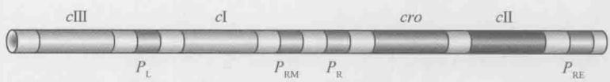  
图 18-30 与裂解/溶原相关的基因和启动子。N 基因没有在此列出，因为 N 基因在 $P_{L}$ 和 cⅢ基因之间。（参见图 18-21）

如 $\lambda$ 抑制因子一样，CⅡ也是一个转录激活因子。它结合到启动子 $P_{RE}$ （意为 repressor establishment）上游的位点，刺激从该启动子开始的 cⅠ（抑制因子）基因的转录。因此，该抑制因子基因可以从不同的两个启动子（ $P_{RE}$ 和 $P_{RM}$ ）开始转录。

$P_{RE}$ 是一个弱启动子，因为它有一个不完全的-35序列。CⅡ蛋白在背对DNA螺旋的一面结合到与-35区有重叠的位点；通过与聚合酶直接作用，CⅡ协助聚合酶结合到启动子上。

只有 $P_{RE}$ 产生出足够的抑制因子，这一抑制因子才可以结合到 $O_{R1}$ 和 $O_{R2}$ 指导其自身从 $P_{RM}$ 开始的合成。这样，我们看到抑制因子合成是从一个启动子转录来确立（由一个激活因子激活），接着由另一个启动子维持（通过抑制因子自身控制——正自我调控）。

现在,我们可以总结一下 CⅡ是如何指挥 $\lambda$ 在裂解和溶原发育途径中做出选择的(图18-31)。一经感染，从 $P_{R}$ 和 $P_{L}$ 两个组成型启动子开始的转录就会立即起始。 $P_{R}$ 指导合成 Cro 和 CⅡ。Cro 的表达使噬菌体进入裂解发育：一旦 Cro 达到一定的水平，它就会结合 $O_{R3}$ 封闭 $P_{RM}$ 。另一方面，CⅡ的表达则通过指导抑制因子基因的转录（图18-31）使噬菌体进入溶原性生长。为了成功地形成溶原性细胞，抑制因子必须在 Cro 抑制启动子之前结合 $O_{R1}$ 和 $O_{R2}$ 并激活 $P_{RM}$ 。

CⅡ决定的 cⅠ基因的转录效率，即抑制因子产生的速率，是决定 $\lambda$ 如何发展的关键步骤。那么，在特定的感染中，什么决定了 CⅡ工作的效率呢？

## 侵染特定细菌的噬菌体颗粒的数目影响侵染走向裂解或溶原

感染复数（或称 moi）是度量有多少噬菌体颗粒侵染一个群体中的特定细菌的单位。如果平均每个细胞的噬菌体颗粒数目是 1 个或几个，侵染很可能以裂解结束。如果噬菌体颗粒的数目是 2 个或多个，则很可能形成溶原。当每个细胞中的噬菌体颗粒数目减少时，形成裂解的可能性就变大，当数目不断增加时，形成溶原的可能性增加。

  
图 18-31 溶源性的建立。当建立了溶源性时，c I 基因从 $P_{RE}$ 开始转录，当维持住这一状态时，c I 基因从 $P_{RM}$ 开始转录。结合在 $O_{R1}$ 和 $O_{R2}$ 上的抑制因子不但激活了维持模式的表达，而且关闭了建立模式的表达。注意 $P_{R}$ 不但控制了裂解基因的表达，它还控制了 c II 的表达，因此它对于溶源和裂解生长都是重要的。类似地，尽管图中没有表示出来， $P_{L}$ 控制了许多裂解基因，也同时控制了协助建立溶原性的 c III 基因（见正文）。（经允许引自：Ptashne M. and Gann A. 2002. Genes & signals, p.31, Fig.1-14. ©Cold Spring Harbor Laboratory Press.）

这是有道理的。进入细胞的噬菌体基因组越多，并开始从 $P_{R}$ 和 $P_{L}$ 起始转录，制备的 CⅡ和 CⅢ就越多，至少有一个噬菌体基因组建立抑制因子的合成并整合到细菌基因组中的概率就越大。只要有一个侵染的噬菌体做到了这一点，其他的就相应的被阻止发生裂解。

人们可以推测为什么 $\lambda$ 要如此表现，例如，为什么当有很多噬菌体但只有很少细菌时它宁可发生溶原。如果只有很少的细菌细胞，供下一轮的侵染可用的寄主细胞受到限制，所以噬菌体保持休眠而不是冒一轮裂解后没有寄主细胞的风险是有好处的。细菌细胞生长的状态也影响侵染的结果，正如下文的描述。

## E.coli 的生长条件控制 CⅡ的稳定性并因而控制裂解/溶原的选择

当噬菌体感染的是一群健康的、生长快速的细菌细胞时，它倾向于通过裂解繁殖，将后代释放到富含宿主细胞的环境中。而当条件对细菌生长不利时，噬菌体就更有可能形成溶原细胞并保持原有状态：附近只有很少的宿主细胞可以被后代噬菌体感染，这些不同的生长条件以如下方式影响 CⅡ。

CⅡ在 E.coli 中是一个非常不稳定的蛋白质，它被一个特异的蛋白酶 FtsH（HflB）降解，这个酶由 hfl 基因编码。因此，CⅡ指导合成抑制因子的速度就由它被 FtsH 降解的速度来决定。缺少 hfl 基因的细胞（也就是缺少 FtsH）几乎总是在被 λ 感染时形成溶原细胞：在无蛋白酶时，CⅡ是稳定的，它能指导合成足够的抑制因子。FtsH 自身的活性由细菌细胞的生长条件调控，尽管我们不知道这是如何实现的，但我们至少知道如下内容：当生长良好时，FtsH 活性高，CⅡ被有效破坏，抑制因子不能合成，噬菌体倾向于裂解生长；在恶劣条件下则相反，FtsH 活性低，CⅡ降解慢，抑制因子积累，噬菌体倾向于溶原生长。CⅡ的水平也被噬菌体蛋白 CⅢ调节。CⅢ稳定 CⅡ，这可能是因为它可以作为 FtsH 的替代性（因此是竞争性）底物。

就像框 18-6（鉴别与裂解/溶原相关基因的遗传途径）所描述的过程，精心设计的遗传筛选获得了这些 cⅠ、cⅡ和 cⅢ基因。

第二个 CⅡ蛋白依赖的启动子 $P_{I}$ ，有一类似 $P_{RE}$ 的序列，位于噬菌体基因 int（图 18-21）之前。这一基因编码一种整合酶可催化位点特异性重组，使 λDNA 整合入细菌染色体形成原噬菌体（第 12 章）。第三个 CⅡ依赖的启动子 $P_{AQ}$ ，位于基因 Q 的中间，其作用是延滞裂解发育从而促进溶原发育。这是因为 $P_{AQ}$ RNA 可以作为翻译信使结合到 Q 信使促进其降解。Q 是另一个调控因子，它促进晚期裂解生长，我们将在以下部分介绍。

## 框 18-6 遗传学方法确定参与裂解/溶原选择的基因

通过筛选分别只能有效地进行裂解或溶原生长的λ突变体确定了参与裂解/溶原选择的基因。为了理解是如何发现这些突变体的，我们要考虑噬菌体是如何在实验室中生长的（见附录1）。细菌细胞可以在琼脂培养板上长成一个汇合在一起的、不透明的菌落。长在菌落上的裂解噬菌体产生透明斑或洞（图A-3）。每个斑一般是由一个噬菌体感染细菌细胞形成的。这次感染产生的后代噬菌体感染周围细胞，如此这般，杀死（裂解）最初受到感染的细胞附近的细菌细胞并在不透明的菌落中造成一个透明的无细胞区。

λ噬菌体也形成噬菌斑，但这些斑是模糊的（或雾状的），即斑的内部比未受感染的菌落更透明一些，但只在边上未受感染。其原因在于，λ不像纯粹的裂解噬菌体，它们只杀死一部分的感染细胞，其他的作为溶原体存活下来。溶原体对于接下来的感染有抗性，因此可以不被噬菌斑中的大量噬菌体颗粒伤害而生长。这种“免疫力”的原因很简单：在溶原体中，整合的噬菌体DNA（原噬菌体）不断从 $P_{RM}$ 合成抑制因子。任何进入细胞的λ基因组都立即被抑制因子结合，没有机会进行裂解生长。

在一次经典的研究中，分离了形成透明斑的 $\lambda$ 突变体。这些突变噬菌体不能形成溶原体但仍能进行裂解生长。 $\lambda$ 透明突变体确认了3个噬菌体基因，称为 $c\mathrm{I}$ 、 $c$ II、 $c$ III（意为clear I、II、III）。其他研究分离出所谓的恶性（vir）突变体。在这些突变体中确认了 $\lambda$ 抑制因子结合的操纵子位点，并且是鉴于这样的噬菌体可以溶原体生长这一事实而分离得到。通过与lac系统比较，发现 $c\mathrm{I}$ 突变体类似于Lac抑制因子（lacI）突变体，vir突变体与lac操纵子（lacO）突变体相同（框18-2）。另一不同的实验中还发现了又一启发性的突变，这是一个宿主基因的突变。突变被称为hfl，意为高频溶原（high frequency lysogeny）。当被野生型的 $\lambda$ 感染时，这一突变系几乎总是形成溶原体，很少允许噬菌体裂解生长。这一细菌株系缺少降解 $\lambda C$ II蛋白的蛋白酶（见正文）。

## λ发育中的转录抗终止作用

前面我们已经介绍了在转录起始后的步骤中运作转录调控的例子。首先，我们将看一种正转录调控的类型，叫做抗终止作用（antitermination）。

在无 $\lambda N$ 蛋白和 Q 蛋白时，由这两个调控因子控制的转录也可以很好地起始。但是，除非调控因子修饰 RNA 聚合酶，否则在启动子下游几百到 1000 核苷酸处转录就会终止， $\lambda N$ 和 Q 蛋白因此被称为抗终止因子。

N 蛋白调控早期基因表达，它作用于三个终止子：一个在基因 N 本身的左侧，一个在基因 cro 右侧，还有一个在基因 P 和 Q 之间（图 18-21 和图 18-32）。Q 蛋白有一个靶标，是一个位于晚期启动子 $P_{R}$ 200 核苷酸下游的终止子，位于 Q 和 S 基因之间（图 18-21 和图 18-32）。 $\lambda$ 晚期基因操纵子，自 $P_{R}$ 开始转录，在原核转录单位中算的是很大的，大约 26kb，RNA 聚合酶要走完全程需要 10min。

我们对抗终止因子的作用机制的了解是不彻底的。如其他调控因子一样，N 和 Q 也只作用于带有特定序列的基因。N 蛋白阻止在 $\lambda$ 早期操纵子的终止，但不作用于其他细菌和噬菌体操纵子。没有在抗终止蛋白作用的位点发现抗终止蛋白识别的特异序列，但在终止子之前确实发生了抗终止作用。N 蛋白所需的位点叫做 nut（意为 N 利用），位于 $P_{L}$ 和 $P_{R}$ 下游 60\~200 核苷酸处（图 18-32）。但是 N 不在 DNA 内结合这些序列，而是结合从包含有 nut 序列的 DNA 转录出来的 RNA。因此，RNA 聚合酶一通过 nut 位点，N 即结合到 RNA 上，并于那里装载到 RNA 聚合酶上。在这种状态下，聚合酶就能够抵抗 N 和 cro 基因以外的终止子。 $\lambda N$ 与细菌基因 nusA、nusB、nusE 和 nusG 的产物一起作用。NusA 蛋白是一个重要的细胞转录因子；NusE 是核糖体小亚基蛋白 S10，但它在 N 蛋白功能中的作用还是未知的；NusB 蛋白在细胞中的功能也不清楚。这些蛋白质与 N 蛋白在 nut 位点形成一个复合体，但是如果 N 蛋白浓度高，也可以在没有这些蛋白质的时候起作用，表明 N 蛋白自身具有促进抗终止作用。

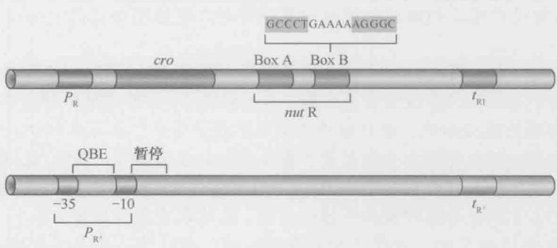  
图 18-32 λ 转录抗终止子 N 和 Q 的识别位点和激活位点。上一行显示早期的右向启动子 $P_{R}$ 及其起始终止子 $t_{R1}$ 。nut 位点分为两个区，称为 BoxA（7bp）和 BoxB，由一个 8bp 的间隔区域分开。BoxB 的序列对称并在转录为 RNA 后形成一个茎-环结构。RNA 样的 nutR 序列如上面所示。下面一行显示启动子 $P_{R'}$ ，其序列为 Q 蛋白功能所必需，此外还有 Q 蛋白作用的终止子。

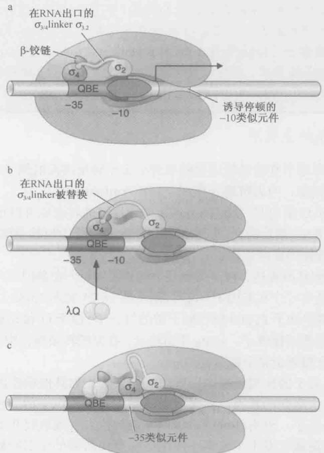  
图 18-33 在早期延伸过程中， $\lambda Q$ 是如何与 RNA 聚合酶相互配合的。 $\lambda P_{R}$ 相关事件的发生顺序。(a) 在起始的复合物中，聚合酶与 $\lambda P_{R}\sigma_{3/4}$ linker ( $\sigma_{3,2}$ ) 结合组装后存在于 RNA 出口中。(b) 停顿的复合物。新生的转录本（未展示）替换了出口通道中的 $\sigma_{3/4}$ linker，这个事件发生在与 $\lambda Q$ 结合之前。(c) $\lambda Q$ 表现为与停顿的延伸因子结合。细节描述详见正文。(Ann Hochschild 提供)

不像 N 蛋白， $\lambda Q$ 蛋白识别位于晚期启动子 $P_{R'}-10$ 和 -35 区之间的 DNA 序列（QBE）（图 18-32）。在无 Q 时，聚合酶结合并起始转录，但在行进仅 16 或 17 核苷酸后暂停；接着它会继续直到终止于下游大约 200bp 的终止子 $(pt_{R'})$ 。如果存在 Q，聚合酶一离开启动子，Q 就会结合 QBE，并转到在附近暂停的聚合酶。聚合酶载有了 Q 就能通过 $t_{R'}$ 继续转录。

最近，聚合酶的 $\sigma$ 因子与Q功能的相关得到了证实（参见图18-33）。首先，聚合酶在 $P_{\mathrm{R}}$ 处刚刚起始就停顿下来是因为它遇到了与启动子-10元件相似的一段序列。 $\sigma$ 因子的第二区域通常识别这一序列，如图13-8所描述的那样与非模板链的碱基对结合。在停顿区也发生相同的事情，使聚合酶暂时停止。与此同时，新生的转录物穿过酶的RNA通道使 $\sigma$ 和酶的核心交界处发生重排，暴露原来被掩盖的部分 $\sigma$ 因子的区域4（如第13章的描述）。 $\sigma$ 的这个表面然后与Q结合。

现在仍然不清楚为什么聚合酶与 Q 形成的新的复合体不能越过下游的终止子。但有一点是清楚的，就是 $\sigma$ 从开始就可以调控下游基因，并且 $\sigma$ 的区域 4 自始至终都可以是调控子的靶点。

## 逆向调控：RNA 合成和稳定性控制相互影响并决定基因表达

CⅡ蛋白激活启动子 $P_{I}$ ，指导int基因的表达，同时激活启动子 $P_{RE}$ 指导合成抑制因子（图18-21）。Int蛋白是一个在形成溶原性细胞时将噬菌体基因组整合到宿主细胞中的酶（第12章）。因此，一旦感染，有利于CⅡ蛋白活性的条件就造成抑制因子和整合酶的猛增。

但是 int 基因可以从 $P_{L}$ 或 $P_{I}$ 转录，所以或许有人会想到整合酶也可以在无 CⅡ蛋白的时候合成。这种情况是不会发生的，原因在于由 $P_{L}$ 起始的 int 信使 RNA 被细胞的核酸酶降解了，而在 $P_{I}$ 起始的 mRNA 是稳定的，可以被翻译为整合酶蛋白质。这是因为两种信使的 3' 端有着不同的结构。

在 $P_{I}$ 起始，并在 int 基因末端之后 300 核苷酸处的终止子停止的 RNA，具有典型的茎-环结构，其后是 6 个尿嘧啶（图 18-34；第 13 章图 13-13）。相反，当 RNA 的合成从 $P_{L}$ 起始，同时 RNA 聚合酶被 N 蛋白修饰，此时通过终止子。这一更长的 mRNA 可以形成一个茎，作为核酸酶的底物。因为这一负责负调控的位点位于它所影响的基因的下游，同时降解是沿着基因逆向进行的，所以这一过程被称为逆向调控（retroregulation）。

逆向调控的生物学功能是不言而喻的。当 CⅡ活性低而有利于裂解发育时，是不需要整合酶的。因此，其 mRNA 被破坏掉。但当 CⅡ活性高而有利于溶原发育时，int 基因表达促进受抑制的噬菌体 DNA 重组进入细菌染色体。

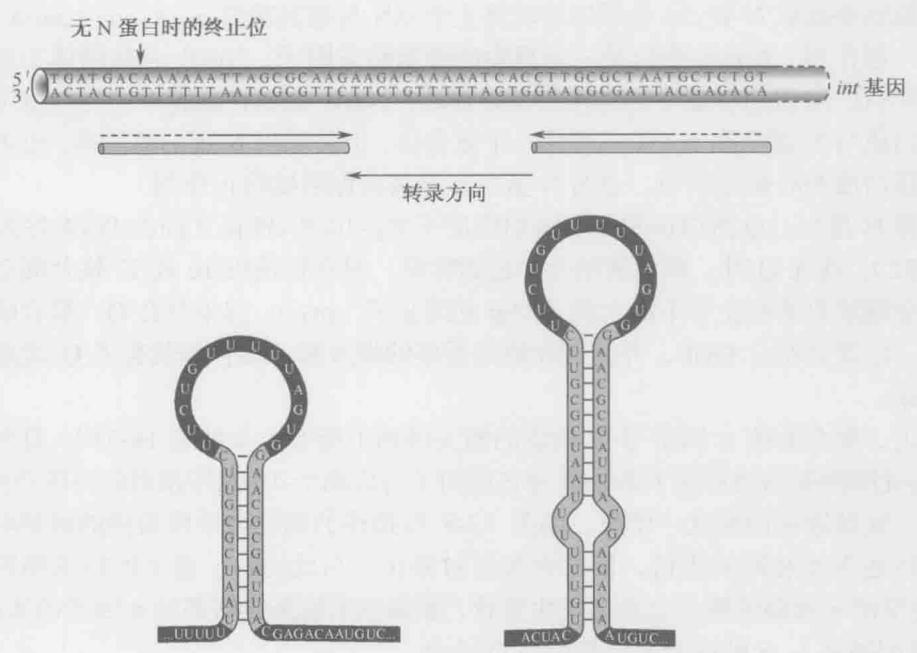  
图 18-34 int 表达的逆向调控的 DNA 位点和转录 RNA 的功能结构。上部所示为 DNA 序列，下面的圆柱体显示 RNA 中形成发夹对称的序列。左侧的结构显示从 $P_{1}$ 转录出的 RNA 形成的终止子，未被 N 蛋白拮抗终止，这一结构可以抵抗核酸酶的降解。右侧的结构显示在 N 蛋白抗终止因子影响下从 $P_{L}$ 转录出的 RNA 形成的延伸环，这一结构显示 RNA 酶Ⅲ切割和核酸酶降解的靶位。

这一调控机制还有另一层次的意义。当原噬菌体被诱导时，它需要合成整合酶（和另一个酶，称为剪切酶（excisionase），见第12章）通过重组催化噬菌体DNA从细菌DNA中重新独立出来。不管CⅡ活性高不高，它都要做到这一点。因此，在这些条件下，不管N蛋白的活性如何，噬菌体必须从 $P_{L}$ 合成稳定的整合酶mRNA。这是如何实现的呢？

当噬菌体基因组在溶原型细胞建立期间整合到细菌染色体时，发生重组的噬菌体黏附位点位于 int 基因和编码 mRNA 开始降解的延伸茎的序列之间（图 18-21）。因此，在整合形式下，引起降解的位点在 int 基因末端被删除，从 $P_{L}$ 转录出来的 int mRNA 是稳定的。

## 小结

一般的基因根据对其产物的需要开启和关闭。这一调控主要发生在转录起始水平。例如，在 E.coli 中，编码代谢乳糖的酶的基因只有在培养基中有乳糖时才高水平地转录。而且，当有葡萄糖（一种更好的能源）时，即使存在乳糖，其代谢基因也不表达。

信号（如出现某种糖）由调控蛋白传递给基因。调控蛋白包括两种类型：激活因子，即开启基因的正调控蛋白；抑制因子，即关闭基因的负调控蛋白。一般说来，这些调控蛋白都是 DNA 结合蛋白，它们识别其控制基因上或附近的特异位点。

在最简单（也是最常见）的情况下，激活因子作用于弱启动子。这些启动子在无任何调控因子存在时，RNA 聚合酶结合上去（并因此启动转录）的效率比较低。激活因子以其一面结合到 DNA，另一面结合到聚合酶并将其募集到启动子部位。这一过程是一个协同结合的例子，足以刺激转录。

抑制因子通过结合到启动子重叠区从而阻碍 RNA 聚合酶的结合，可以抑制转录。抑制因子也可以其他方式作用：例如，结合启动子旁的位点，通过与结合到启动子上的聚合酶相互作用抑制转录。

E.coli 的 lac 基因被激活因子和抑制因子以前面描述过的简单方式控制。在无葡萄糖时，CAP 结合 lac 启动子附近的 DNA，通过募集 RNA 聚合酶到启动子，激活这些基因的表达。Lac 抑制因子结合与启动子有重叠区的位点，在无乳糖时关闭基因表达。

RNA 聚合酶被募集到不同基因上的另一种方式是利用 $\sigma$ 因子。不同的 $\sigma$ 因子可以替代主要的 $\sigma$ 因子（E.coli 中是 $\sigma^{70}$ ）并将聚合酶引导到启动子不同的序列上。例如， $\sigma^{32}$ 指导对热激反应的基因的转录， $\sigma^{54}$ 指导参与氮代谢酶基因的转录。噬菌体 SPO1 利用一系列的选择性 $\sigma$ 控制其基因在感染期间的有序表达。

在细菌中还有其他种类的转录激活的例子。在有些启动子上，RNA 聚合酶独立、有效地结合，并形成稳定的、无活性的封闭复合体。这一封闭复合体不会自动地转变为开放复合体并起始转录。在这样的启动子上，激活因子必须刺激从封闭复合体到开放复体的转变。

刺激此类启动子的激活因子通过变构起作用：它们与稳定的封闭复合体相互作用，诱导构象变化，导致转变为开放复合体。在本章，我们看到了两个激活因子通过变构激活转录的例子。其中一例，激活因子（NtrC）与RNA聚合酶（带有 $\sigma^{54}$ ）结合到glnA启动子的稳定封闭复合体上，刺激转变为开放复合体。在另一例中，激活因子（MerR）诱导merT启动子中的DNA构象改变。

在我们讨论过的所有情况中，调控蛋白本身都被信号通过变构控制，即调控因子的形状在信号存在时改变。一种状态下它可以结合 DNA；另一种状态下则不能。因此，如 Lac 抑制因子就被配体别乳糖（从乳糖而来的产物）控制。当别乳糖结合了抑制因子，它就诱导蛋白产生形状变化，使之处于不能结合 DNA 的状态。

基因表达也可在转录起始后的步骤中调控，如可在转录延伸水平调控。在此，我们讨论了三种情况： $\lambda$ 噬菌体N蛋白和Q蛋白的抗终止作用。 $\lambda$ N蛋白和Q蛋白装载到RNA聚合酶上在噬菌体基因组某启动子起始转录。RNA聚合酶以这种方式被修饰之后就可以通过某些转录终止位点，否则这些转录终止位点会阻止对其下游基因的表达。

在本章的结论部分我们详细讨论了噬菌体 $\lambda$ 是如何在两种选择性的繁殖方式之间进行选择的。在这一系统中遇到的基因调控的方式也在其他系统中作用，包括我们将在以下章节中看到的。例如，动物发育控制中，协同结合就被用于严格地控制开关效应，以及建立和维持基因表达的不同途径。我们也考虑了诸如在 $\lambda$ 中所发现的更基础、更早期生物的基因网络的复杂性。

## 参考文献

## 书籍

Echols H. 2001. Operators and promoters: The study of molecular biology and its creators. University of California Press, Berkeley, CA.

Müller-Hill B. 1996. The lac operon. de Gruyter, Berlin.

Ptashne M. 2005. A genetic switch: Phage lambda revisited, 3rd ed. Cold Spring Harbor Laboratory Press, Cold Spring Harbor, New York.

Ptashne M. and Gann A. 2002. Genes & signals. Cold Spring Harbor Laboratory Press, Cold Spring Harbor, New York.

## 激活与抑制

Dodd I.B., Shearwin K.E., and Egan J.B. 2005. Revisited gene regulation in bacteriophage λ. Curr. Opin. Genet. Dev. Biol. 15: 145–152.

Dove S.L., Darst S.E., and Hochschild A. 2003. Region 4 of σ as a target for transcription regulation. Mol. Microbiol. 48: 863–874.

Gann A. 2010. Jacob and Monod: From operons to EvoDevo. Curr. Biol. 20: R718–R723.

Gottesmann M. and Wesiberg R. 2004. Little lambda, who made thee? Microbiol. Mol. Biol. Rev. 68: 796–813.

Hochschild A. and Dove S.L. 1998. Protein–protein contacts that activate and repress prokaryotic transcription. Cell 92: 597–600.

Huffman J.L. and Brennan R.G. 2002. Prokaryotic transcription regulators: More than just the helix-turn-helix motif. Curr. Opin. Struct. Biol. 12: 98–106.

Jacob F. and Monod J. 1961. Genetic regulatory mechanisms in the synthesis of proteins. J. Mol. Biol. 3: 318–356.

Lawson C.L., Swigon D., Murakami K.S., Darst S.A., Berman H.M., and Ebright R.H. 2004. Catabolite activator protein: DNA binding and transcription activation. Curr. Opin. Struct. Biol. 14: 10–20,

Little J. W. 2010. Evolution of complex gene regulatory circuits by addition of refinements. Curr. Biol. 20: R724–R734.

Magasanik B. 2000. Global regulation of gene expression. Proc. Natl. Acad. Sci. 97: 14044–14045.

Murray N.E. and Gann A. 2007. What has phage lambda ever done for us? Curr. Biol. 17: R305–R312.

Ng W. L. and Bassler B.L. 2009. Bacterial quorum-sensing network architectures. Annu. Rev. Genet. 43: 197–222.

Oppenheim A.B., Oren Kobiler O., Stavans J., Court D.L., and Adhya S. 2005. Switches in bacteriophage lambda development. Ann. Rev. Genet. 39: 409–429.

Payankaulam S, Li L.M., and Arnosti D.N. 2010. Transcriptional repression: Conserved and evolved features. Curr. Biol. 20: R764–R771.

Ptashne M. 2006. Lambda's switch: Lesson from a module swap. Curr. Biol. 16: R459–R462.

Rappas M., Bose D., and Zhang X. 2007. Bacterial enhancer-binding proteins: Unlocking σ54-dependent gene transcription. Curr. Opin. Struct. Biol. 17: 110–116.

Rojo F. 2001. Mechanisms of transcriptional repression. Curr. Opin. Microbiol. 4: 145–151.

Roy S., Garges S., and Adhya S. 1998. Activation and repression of transcription by differential contact: Two sides of a coin. J. Biol. Chem. 273: 14059–14062.

Schleif R. 2003. AraC protein: A love-hate relationship. Bioessays 25:274–282.

Summers A.O. 2009. Damage control: Regulating defenses against toxic metals and metalloids. Curr. Opin. Microbiol. 12: 138–144.

## DNA 结合、协同性及变构效应

Hochschild A. 2002. The switch: cI closes the gap in autoregulation. Curr. Biol. 12: R87–R89.

Lewis M. 2005. The lac repressor. Crit. Rev. Biol. 328: 521–548.

Luscombe N.M., Austin S.E., Berman H.M., and Thornton J.M. 2000. An overview of the structures of protein–DNA complexes. Genome Biol. 1: REVIEWS001.

Monod J. 1966. From enzymatic adaptation to allosteric transitions. Science 154: 475–483.

Vilar J.M.G. and Saiz L. 2005. DNA looping in gene regulation: From the assembly of macromolecular complexes to the control of transcriptional noise. Curr. Opin. Genet. Dev. Biol. 15:136–144.

## 抗终止

Gottesman M. 1999. Bacteriophage λ: The untold story. J. Mol. Biol. 293:177–180.

Roberts J.W., Yarnell W., Bartlett E., Guo J., Marr M., Ko D.C., Sun H., and Roberts C.W. 1998. Antitermination by bacteriophage $\lambda$ Q protein. Cold Spring Harb. Symp. Quant. Biol. 63: 319–325.

Roberts J.W., Shankar S., and Filter J. J. 2008. RNA polymerase elongation factors. Annu. Rev. Microbiol. 62: 211–233.

Santangelo T.J. and Artsimovitch I. 2011. Termination and antitermination: RNA polymerase runs a stop sign. Nat. Rev. Microbiol. 9: 319–329.

## 习题

## 偶数习题的答案请参见附录2。

习题 1 解释为什么大部分基因表达的调控水平发生在转录起始。

习题 2 从本章中举出 3 个变构调节的例子。

习题 3 E.coli 的乳糖操纵子失去抑制效应需要 β-半乳糖苷酶（lacZ 编码）。

A. 解释 lac 操纵子失去抑制效应时 $\beta$ -半乳糖苷酶的作用。

B. 在缺少葡萄糖时 lac 操纵子处于抑制状态，猜测 $\beta$ -半乳糖苷酶在 lac 操纵子的抑制调节中的必要功能。

习题 4 在遗传筛选中,研究人员分离出 araBAD 操纵子组成型表达基因的 E.coli 突变株。
A. 描述对于 araBAD 操纵子而言组成型表达的意义。

B. 列举一个可以使 araBAD 基因组成型表达的突变（命名编码一个特殊蛋白质的 DNA 或基因的区域）。

习题 5 在实验室中，你想要纯化一个对 E.coli 有毒性的蛋白质。你的导师会建议你将这个蛋白的基因克隆到有 araBAD 启动子的表达载体中。为什么在 E.coli 中使用 araBAD 启动子表达你的目标基因是理想的方案？

习题 6 在以下的突变株和条件下，预测 lacZ 基因的表达情况（不表达，本底水平表达或者激活水平表达）。

A. lac 操纵子的操作子有一个突变的 E.coli 突变株，此突变阻止抑制因子的结合  
a. 有葡萄糖，无乳糖  
b. 有葡萄糖和乳糖  
c. 无葡萄糖，无乳糖  
d. 无葡萄糖，有乳糖

B. 在 lac 操纵子（针对 lacZ、lacY 和 lacA 基因）的启动子上有一个突变的 E.coli 突变株，此突变阻止 RNA 聚合酶的结合
a. 有葡萄糖，无乳糖
b. 有葡萄糖和乳糖
c. 无葡萄糖，无乳糖
d. 无葡萄糖，有乳糖

习题 7 列举原核细胞中转录抑制的三个机制及每个机制下的一个蛋白质的例子。

习题8 你正在研究MerR的同源蛋白ZntR，该蛋白可以与 $\mathrm{Zn(II)}$ 结合来调节zntA的转录，zntA基因编码的蛋白质可以辅助 $\mathrm{Zn(II)}$ 解毒。你打算提出两个什么问题来设计你的实验，从而支持或者反驳ZntR利用和MerR类似的机制来激活zntA的转录呢？

习题 9 已知 $\lambda$ 抑制因子的四聚体结构域的失去功能的突变体，并利用图 18-24，预测 $\lambda$ 抑制因子上该突变的特殊功能。

习题10

A. 解释为什么在溶原的 E.coli 细胞中可以利用 $\lambda$ 噬菌体来紧密调控 $\lambda$ 抑制因子的水平。
B. 描述 $\lambda$ 噬菌体调控的负自我调节机制。

习题 11 参照框 18-4 图 1，对于以下 DNA 结合的蛋白质，你认为%DNA 范围与蛋白质浓度之间的趋势使像蓝线还是红线？解释原因。

A. NtrC 和 glnA 基因上游的调控 DNA。

B. 当 RNA 聚合酶存在时的 CAP 和 Lac 操纵子上游的 DNA。

C. $\lambda$ 抑制因子的氨基结构域（除去羧基结构域）和 $\lambda$ 抑制因子的操控位点。

习题 12 你在原核细胞中发现了一个由抑制因子调控的新的操纵子,假设该抑制因子结合在操纵子位点上,在与细胞中常见的抑制是相似的条件下,设计一个体外实验来确认抑制因子与 DNA 结合区域。

习题13 描述原核细胞中选择性的 $\sigma$ 因子在转录调控中起了什么样的作用。

习题 14 研究人员研究 $\lambda$ 抑制因子与正确的操纵子相结合的 3 个结合位点所产生的数据，请见下表。在实验中，他们在不同抑制因子浓度下利用包含所有三个结合位点的 DNA 进行了 DNase I 保护实验（印迹实验）。从该实验中，他们计算了占据一半 DNA 特异结合位点的抑制因子二聚体的相对浓度（值见下表）。

<table><tr><td rowspan="2">DNA</td><td colspan="3">每个位点的抑制因子的相对浓度</td></tr><tr><td> $O_{R3}$ </td><td> $O_{R2}$ </td><td> $O_{R1}$ </td></tr><tr><td>野生型</td><td>25</td><td>2</td><td>1</td></tr><tr><td>突变体X</td><td>5</td><td>5</td><td>-</td></tr><tr><td>突变体Y</td><td>25</td><td>-</td><td>2</td></tr></table>

A. 基于野生型 DNA 的数据和第 18 章的信息，解释为什么尽管 $O_{R1}$ 对 $\lambda$ 抑制因子的亲和力比 $O_{R2}$ 高 10 倍，但是 $O_{R1}$ 和 $O_{R2}$ 的相对浓度却几乎相同。

B. 基于野生型 DNA 的数据和第 18 章的信息，解释为什么与 $O_{R3}$ 结合的抑制因子的相对浓度要比 $O_{R1}$ 和 $O_{R1}$ 高很多。

C. 基于突变型 DNAX 和 Y，判断每种类型的突变体中包含突变的结合位点（ $O_{R1}$ 、 $O_{R2}$ 或 $O_{R3}$ ），解释你的选择。

D. 根据你从本章所学到的知识, 解释为什么在 $\lambda$ 抑制因子结合 DNA 的机制中, 相对于

野生型 DNA 而言，突变体 X 中与 $O_{R3}$ 结合所需要的抑制因子的相对浓度下降到 5。数据来源于 Johnson et al. （1979. Proc. Natl. Acad. Sci. 76: 5061–5065）。

习题 15 E.coli 中一个新的操纵子的调控包含两个操作子使一个启动子及三个结构基因形成的“三明治”。RNA 聚合酶从启动子开始转录结构基因，一个特异的抑制因子阻止该启动子的转录。存在相关信号的情况下，抑制因子与 DNA 结合中断，抑制受到减缓。

为了研究抑制的机制，研究人员构建了一个包含启动子和由 lac 操纵子位点替代原操纵子的报告基因。野生型 lac 抑制因子可以抑制在细胞中该构造的表达。研究者利用报告基因和与操纵子结合位点相结合的野生型 Lac 抑制因子（或其突变体）共同构建二聚体，而非四聚体化。在电镜中他们观测的分数数据见下表。

<table><tr><td rowspan="2">蛋白质</td><td colspan="4">观察到的 DNA-蛋白质复合体</td></tr><tr><td>自由 DNA</td><td>单一结合</td><td>串联结合</td><td>环状</td></tr><tr><td>野生型 Lac 抑制因子</td><td>53</td><td>29</td><td>3</td><td>15</td></tr><tr><td>突变型乳糖 Lac 抑制因子</td><td>42</td><td>44</td><td>14</td><td>0</td></tr></table>

除此之外,研究表明尽管 Lac 抑制因子突变体不能抑制体内构建的报告基因的表达,它可以抑制内源性 Lac 操纵子。

根据表中的数据，提出一个模型并解释该数据如何支持你的模型。你还想知道这些新的抑制蛋白的什么信息以支持你的模型？

数据来源于 Mandal et al. (1990. Genes Dev.4: 410–418)。

(逢莎莎

潘庆飞

曾筱凡 侯桂雪 校）
