## 第22章 系统生物学

将会讨论系统生物学这一新兴学科，它是由传统实验分子生物学和计算分析相结合而产生的。

分子生物学的成功，主要在于它能够抓住那些简单的系统，以便能够研究其内在的详细机制。但是，同一些目标远大、有全局视野的研究策略相比，这些传统的研究方法开始褪去光环，这些新的策略采用定量及高通量的测量方法，通过模型构建、结构重组和理论方法的有机结合，替代传统的方法来研究更高级、更复杂的生物过程。这种交叉学科研究的特性，恰恰定义了一个新的学科——系统生物学。系统生物学综合了数学、工程学、物理、计算机科学，以及分子与细胞生物学等学科，以定量、可预测的方式来描述那些控制生命如何工作的相互作用环路的自然特性。系统生物学可以面对生物系统的许多不同层面，如信号传输、信号转导、细胞分裂和细胞骨架动力学等。作为基因的分子生物学教材，我们主要集中在从基因调控回路角度来阐明系统生物学。我们希望藉此方法能够阐明那些靠传统的单成分分离研究所不能理解的基因调控原理。

系统生物学与另外一个新的学科——合成生物学（synthetic biology）紧密相关。就像系统生物学一样，合成生物学试图证明生物各环路的设计原理。然而，合成生物学是通过创造模拟的人工网络，模拟基因调控回路的一些自然特性，从而来证明原理。此方法使得我们能够检测调控系统是如何工作的。与自然界中存在的相对较为复杂的调控回路相比，这些人工网络相对简单，可以更精确地进行定量研究。

系统生物学所关注的不仅是基因调控的逻辑关系，而且还包括对演化内涵的解释。在第19章我们已经谈到，高等动物演化的主要驱动力来自于调控基因表达网络，而不是基因本身。例如，所有的动物都具有相类似的基因群，但它们表达的时空却不尽相同（有时候会截然相反）。换句话说，在演化过程中，调控网络是相对动态的，而受该网络调控的基因则是相对静态的。

本节中，我们着重于从自然和人工构建的基因调控回路角度简要地介绍系统生物学与合成生物学。我们集中讨论遗传回路（genetic circuit）的设计原理和基因调控回路的可变图式，而不过多地涉及该领域的数学细节。系统生物学是一门新生的学科，但是我们也要看到，该学科中的一些原理是从经典基因调控研究中衍生而来的，特别是我们在第18章所讨论的那些。但是，本章中我们将引入一些正式的语言，这些语言能把简单的例子拓展成一系列不同的生物调控系统。

## 调控回路

调控回路（regulatory circuits）可以通过一个含有节（node）与端（edge）的简单网络来描述。节代表基因，用点来表示；端表示一个基因受另外一个基因产物调控，用线表示（图22-1a）。端可以通过引入方向来标明是否基因A调控基因B，或者相反。端还可以加标志来表示该调控是正调控还是负调控。因此，一条从基因A指向基因B，末端为“⊥”结尾的线表示基因A的产物是基因B的负调控因子（图22-1b）；反之亦然，一条从基因A指向基因B的箭端线表示的是基因A的产物正调控基因B的表达（图22-1c）。

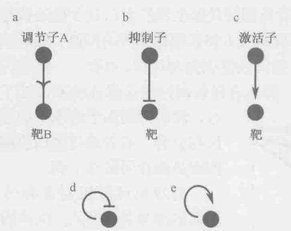  
图 22-1 包含节与端的简单网络回路。(a) 一个简单的开  
关；（b）负调控标志；（c）正调控标志；（d）自身负调控；（e）自身正调控。

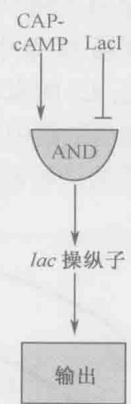  
图 22-2 与门。乳糖操纵子受与门的调控。在该调控回路中，信号的输出需要 CAP-cAMP 的出现和 LacI 的取消。

我们现在从一个最简单的双节点例子开始，即基因 A 的产物调控基因 B 的表达（图 22-1a）。通过应答某个信号，基因 A 编码的调控蛋白触发基因 B 的表达。该调控蛋白质也可能是一个抑制因子。在这种情况下，转录过程通过一个诱发子触发启动，该诱发子能够灭活抑制因子（图 22-1b）。或者，该调控蛋白质还可以是一个激活因子，它能够应答信号分子，触发基因 B 的转录（图 22-1c）。

乳糖操纵子是受两个调控蛋白调节的（图 18-6 中已经描述），是一个两种调控类型相互交织的例子：诱发子的存在触发转录起始，这一过程是通过灭活 Lac 抑制因子，提高 cAMP 浓度，促进 CAP（分解代谢物活化蛋白质）激活因子结合到 DNA 上面而触发的。因此，乳糖操纵子不是一个简单的开关，它的表达同时需要抑制因子的消失和 CAP 结合到其 cAMP 配体上面。电子工程有一专业用语——“与门”（AND gate）逻辑关系，表示两个输入条件同时出现才能产生输出。在此例子中，这两个条件是抑制的取消和激活。与门可用图 22-2 的标志来描述。

## 自身调控

通常，调控基因除了调控其他靶基因的转录外，还能调控自身的转录，这种调控方式被称为自身调控（autoregulation），同样有正和负两种情况，每种情况都有自身的特性（图 22-1d，e）。

自身负调控：降噪和降时

我们先来考虑自身负调控，此时是一个编码抑制因子的基因受其基因产物的负调控。一个经典的自身负调控的例子就是第18章中我们讨论的 $\lambda$ 噬菌体的 $c\mathrm{I}$ 基因（需提示的是， $c\mathrm{I}$ 同样也是一个自身正调控的例子，对此我们会在下文讨论）。因此，CI抑制因子结合到操纵子 $\mathrm{O}_{\mathrm{R3}}$ 位点从而抑制自身的表达（第18章，图18-27）。

自身负调控的生物学意义是什么呢？为什么在演化过程中它反复地被选择呢？其中一种解释已经在第18章中进行了说明：自身负调控是保证调控蛋白处于稳定状态的动态平衡机制。因此，CI的水平下调到足够低来解除cⅠ和其他靶基因的抑制，然后该基因转录的恢复将会提高细胞内抑制因子的水平，最终恢复该抑制过程。相反，一旦基因的表达过大且抑制因子的产物超过了所需要的量，那么自身负调控便会保证该基因处于沉默状

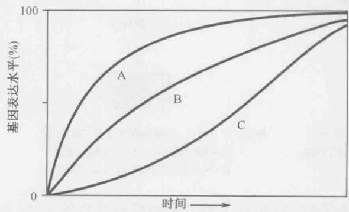  
图 22-3 诱发子的动力学。简单开关（B）、自身负调控开关（A）和自身正调控开关（C）应答于一个诱导信号的不同动力学反应。

态，然后抑制因子的水平通过细胞生长与分裂，或者通过蛋白质酶降解，抑或是两者而最终下调。

自身负调控机制还有另外一个不太显而易见的优点: 快速的反应时间。从尽可能快速且不会产生多余的抑制因子的两个相对的角度考虑, 如果使用一个强启动子, 将能够保证产物的快速产生, 但也会导致对稳定状态来讲过量的积累; 从另一个角度考虑, 如果使用一个相对较弱的启动

  
a  
图 22-4 内源与外源噪声。在大肠杆菌细胞中，一个基因有两个拷贝，其中一个拷贝融合了一个红色荧光蛋白报道基因，而另一拷贝融合了一个绿色荧光蛋白报道基因。（a）假设这两个基因在细胞内表达随着时间和个体各异（内源噪声）的预测结果。（b）假设这两个基因的表达由于外源信号的作用而同步化的预测结果。（c）荧光图片揭示内源噪声，除了黄色细胞之外，还有红色和绿色的细胞。（经允许引自 Elowitz M.B. et al. 2002. Science 297: 1184-1186.）

子，也可以获得合适水平的抑制，但这需要较长的一段时间。自身负调控可以同时满足两种需求：一个相对较强的启动子可以保证调控蛋白质的快速积累，而转录的自我抑制则能够保证在该抑制因子达到一定的合适水平后自我关闭。数学模型和实验结果都确认了自身负调控比简单调控在实现同样的一种蛋白质积累水平上具有更快速的反应（图22-3）。

## 喧噪的基因表达

在讨论自身负调控过程中，基因表达噪声（noise）这一概念极为重要。直到最近，人们还是认为一个基因在同源的细胞群中的表达水平，在一个细胞中与另一个细胞中相比是相对稳定的。然而，我们现在意识到，基因表达水平在同一个细胞群的不同单个细胞中存在着本质上的差异，甚至在同一个细胞中，同一基因的两个拷贝本的表达也不相同。因此，我们在这里把“噪声”（noise）一词定义为是在基本相同的条件下基因表达的差异。噪声的存在表示随机因素影响着单个基因的表达水平。随机性（stochasticity）暗示着一个过程可以通过随机的尺度来划分为几个方面。正如我们所要看到的，一些调控基序是用来排除噪声的，而另外一些基序是用来放大它们的。

基因表达过程中的噪声来自于两大方面：内源性和外源性。这两种因素共同导致基因在一个群体中表达的不同。内源性噪声（intrinsic noise）所指的是一个细胞内单个基因表达水平的不同是由于基因表达体中随机事件所引起的。一个经典的例子就是证明拥有两个同样拷贝基因的大肠杆菌内源性噪声的过程。该基因中一个拷贝连接一个能够编码红色荧光蛋白的报道基因，另一个拷贝与编码绿色荧光蛋白的报道基因连接。在没有内源性噪声作用的情况下，红色和绿色荧光蛋白的表达量应该是相同的，因此细菌应该显示黄色。相反，所观察到的结果是，许多细胞呈明显红色，还有一些明显为绿色（图22-4a）。因此，每个基因在不同细胞内部表达并非一致，而是在一些细胞中一个拷贝的

b

时间

表达（如带有绿色荧光蛋白的拷贝）较另外一个拷贝高（如带有红色荧光蛋白的拷贝），而在另外一些细胞中，则恰恰相反。

外源性噪声（extrinsic noise）指的是在一个几乎同源的细胞群中基因表达的差异，或者是在同一个细胞不同时间基因表达的改变。该噪声可能是由于每个细胞环境的微小的不均一性，或者是细胞在执行转录或者蛋白质合成的过程中容量的波动性所引起。一个外源性噪声的例子如图22-4b所示，两个基因的表达随时间变化。在这种情况下，两个基因的表达水平在单个细胞中呈现同步性：上升一段时期后便下调。这意味着单个细胞在承载一些或者全部基因的表达综合能力上是随时间发生波动的。从图22-4c显微荧光结果可以观察到，由于内源噪声的作用，其中一些细胞是黄色的（意味着两种荧光蛋白都表达），而另外一些细胞呈红色或者绿色（意味着只有一种特定的荧光蛋白表达）。

重新回到一开始讨论的自身负调控，我们可以看到，为了应对噪声，该调控基序允许细胞补偿自调控基因的表达水平的变化。因此，调控 $\lambda$ 噬菌体 CI 合成的自身负调控回路可以被认为是非常稳定的。稳定性（robustness）所指的是一个调控回路的输出对于一些特定参数是不敏感的。因此，CI 自控回路在克服 c I 基因表达过程中的噪声、获取稳定抑制因子水平的能力方面是很稳定的。同时我们也应看到，其他一些调控基序也具有帮助细胞应对不同来源的随机因素影响的能力，例如触发基因表达的信号的波动。

随机性并非大肠杆菌所特有。实际上，该特征广泛存在于有生命的个体中。例如，克隆猫的毛色，是通过将体细胞核移植到已经去除核物质的卵母细胞而得到的克隆猫，与正常的核供体猫相比并不相同。由于克隆猫和核供体猫在遗传背景上是相同的，所以人们期望这些猫应该具有相同的毛色。但这并不意味着控制毛色的一系列遗传事件的前后关联不是完全的，而是存在一些随机过程，如同另外一个例子——同卵双胞胎的指纹不同。

## 自身正调控延迟基因表达

自身正调控过程发生在一个激活因子蛋白质激活自身编码基因转录的时候（图22-1e）。同样的， $\lambda$ 噬菌体 $c$ I基因的表达就是一个典型而复杂的例子：在细胞内CI浓度较低时，CI抑制因子偏爱于占据驱动 $c$ I转录启动子（ $P_{\mathrm{RM}}$ ）上游的两个操纵子 $O_{\mathrm{R1}}$ 和 $O_{\mathrm{R2}}$ 的位置（图18-26）。位于 $O_{\mathrm{R2}}$ 位置的CI蛋白质与RNA聚合酶相互作用而激活转录过程，以合成更多的CI蛋白。当然，我们也可以看到，当CI达到一定的高水平后，该蛋白质还可以通过占据 $O_{\mathrm{R3}}$ 位置来抑制其转录过程。因此， $c$ I基因表达的调控是通过正和负自身调控机制来实现的。

现在让我们来介绍一个仅靠自身正调控的激活因子蛋白质的例子（见图 22-1e）。基因产物的稳定性积累发生在如下两种平衡状态下：蛋白质合成与降解速率达到平衡（该过程应该是不稳定的），或者与细胞生长或分裂产生的稀释达到平衡时。因此，稳定性状态（steady state）是指基因产物随时间的变化很小的一种状态。这里的关键是，自身正调控的基因从开启到实现稳定状态所需的时间，比自身负调控的基因或者完全无反馈的基因所需要的时间要长（图 22-3）。更确切地说，与其他调控形式相比，自身正调控需要更长的时间才能达到基因产物最大积累量的 50%。这是因为随时间增加的生产速度，首先依赖于激活因子本身的积累。

自身正调控在一些缓慢发生的生物过程中非常有用，如发育过程就得益于与形态发生相关蛋白质的缓慢积累。又如，在枯草杆菌古孢子（或者原生孢子）发育过程中，控制晚期孢子形成的主要调控蛋白质（可变RNA多聚酶 $\sigma$ 因子—— $\sigma^{\mathrm{G}}$ 和 $\sigma^{\mathrm{K}}$ ）能够刺激它们本身的结构基因，以及与形态形成相关蛋白质编码基因的转录。因此， $\sigma$ 因子和受它所调控的基因产物可以缓慢积累，因为 $\sigma^{\mathrm{G}}$ 和 $\sigma^{\mathrm{K}}$ 的产生依赖于它们自身的合成。

自身正调控还有另外一个优点，即它是极端类型的调控，被称为双稳开关的基础，对此我们将在下文阐述。

## 双稳性

到现在为止，我们所介绍的调控回路都是可逆的，当打开某基因或者某些基因的信号被移除，该调控回路会重新返回关闭状态。然而，在一些例子中，当基因表达开关被启动后，该基因会锁定在启动状态持续较长的一段时间。这就是著名的双稳开关（bistable switch）。

## 一些调控回路可锁定在不同的稳定状态

控制枯草杆菌是否变成遗传感受态的回路就是一个被深入研究的双稳开关的例子。感受态（competence）是一种特殊的状态，处于该状态的细菌停止了增殖，但具有从其生长的环境中吸收裸露 DNA 分子并通过遗传重组将同源序列整合到基因组上的能力。感受态的主调控因子是 DNA 结合蛋白 ComK，该调控因子能够调控包括其自身在内的 100 多个基因（图 22-5）。维持此开关处于稳定状态的原因是多个 ComK 分子相互协作结合到 comK 基因启动子上。如我们在第 18 章框 18-4 中所观察到的 $\lambda$ 抑制因子（它本身就代表着一个典型的双稳事例，这点我们将在下文讨论）的例子，该类协作使得开关的输出呈现非线性分布，即与激活因子的浓度呈一定的函数关系。换句话说，输出的多少对 ComK 水平的变化非常敏感（反之则是不敏感）。

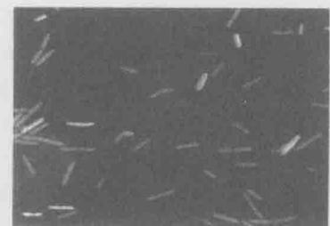  
图 22-5 双稳性。(a) 双稳性是由自身正调控开关控制的，调控蛋白 ComK 除了调控靶基因的表达外，还调控 comK 基因的表达。ComK 分子协同结合于启动子上产生一个非线性反应，使得其表达对 ComK 的微小的、随机的变化非常敏感，所以这个开关时刻保持在“开”与“关”的刀棱上。(b) 经典双稳性的例子：在该例中，枯草芽孢杆菌细胞（红色）通过表达一个受竞争性调控蛋白 ComK 激活的启动子控制着报道基因的开（绿色）或关。此报道基因编码一个绿色荧光蛋白。(b 图经允许引自 Dubnau D. and Losick R. 2006. Mol. Microbiol. 61: 564-572. ©Blackwell Science.)

细胞能否开启 comK 的表达，是由 ComK 蛋白降解稳定性水平上的调控网络所控制的。但是，最终决定 ComK 激活的因素是随机的。也就是说，在 ComK 不降解的情况下，群体中仅有一些细胞是处于感受态的。这可以通过一种带有荧光报道基因（绿色荧光蛋白基因）的细胞清晰地观察到，荧光报道基因指示的是 ComK 决定的基因活性。图 22-5 显示的是细胞被分为两个亚群：一个亚群中 comK 基因是开启的，而在另外一个亚群中 comK 基因是关闭的。这是因为正反馈环处于刀刃状态，ComK 的浓度介于不足以打开 comK 基因的表达，但刚好可以触发自身正调控环开启 ComK 蛋白所调控基因的表达之间（参考框 22-1 “双稳性与滞后作用”）。由于 comK 基因表达过程中的噪声所导致的细胞间 ComK 蛋白水平的变化，使得此激活因子在一些细胞中达到了阈值浓度，而其他细胞中没有。这一自身正调控的例子说明基因表达中的噪声信号如何能促使细胞进入不同的状态。

## 框22-1 双稳性与滞后作用

下面的实验证明 ComK 开关的双稳性基础是自身正调控。该实验使用一个经过修饰的 comK 基因的拷贝，调控该拷贝基因的启动子的活性能够响应诱导子上调或下调（框 22-1 图 1a）。在仅携带有修饰基因的细胞中，并没有观察到双稳性，ComK 决定的基因表达水平的提高同诱导子水平的提高基本对应，无论是在怎样的诱导子浓度中，其表达呈现出均一的表达模式（框 22-1 图 1b）。然而，在携带有修饰基因和正常自身调控基因的细胞中，增高诱导子的水平导致细胞分为两种不同的类型，一种细胞呈现低 ComK 活性，另一种呈现高 ComK 活性（框 22-1 图 1c）。换句话说，由修饰基因所编码的 ComK 产物开启了自调控基因“泵”，使越来越多的细胞由于 ComK 的提高而处于开的状态。

严格来说，双稳性一词的使用需要一个具有滞后作用（hysteresis）特性的开关。滞后作用指的是一种记忆状态，当一个开关由于某种条件打开后，即使撤去或逆转该条件，开关也不会即时关闭。例如，铁镁矿物材料，当这些物质在磁场中被磁化后，即使把磁场撤离，矿石还会保持磁性特征。现在我们回到原来的例子中——携带野生型和修饰型 ComK 基因的可响应诱导子的细胞。正如我们所看到的，添加越来越多的诱导子，将导致 ComK 水平不断提高，直至超出其阈值，导致自身正调控处于开的状态。我们来看另外一种情况，即降低诱导子的水平，将使修饰型基因合成的 ComK 越来越少。我们还观察到，当诱导子的水平降低时，甚至当诱导子的水平低于开启 ComK 开关的浓度时，ComK 还是处于开的状态。也就是说，诱导开的因素都撤去后，ComK 仍然记得自己处于开的状态。

调控 $\lambda$ 噬菌体溶原或裂解状态的开关也具有滞后作用。当原噬菌体受到DNA破坏试剂裂解细胞的诱导时，噬菌体能够反转进入裂解周期。也就是说，哪怕是当DNA破坏试剂撤去之后，该噬菌体也不再进入溶原状态（恢复合成CI抑制因子）。作为一个相反的例子，由于乳糖的存在，乳糖操纵子开启，一旦培养液中没有乳糖诱导子，乳糖操纵子则立即关闭。

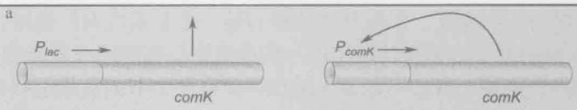

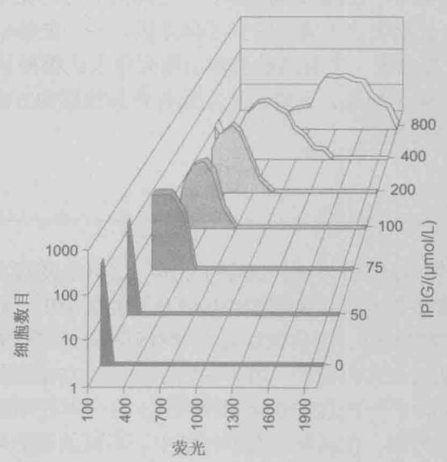

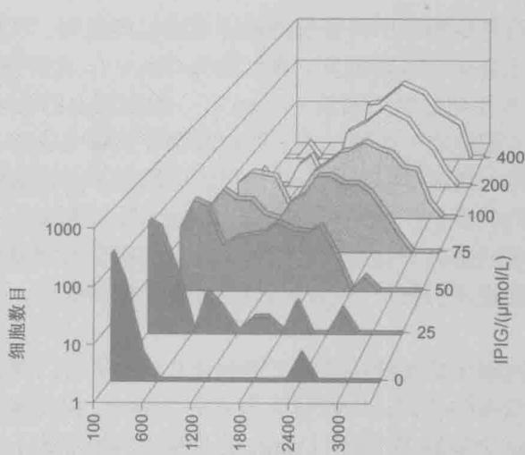  
框 22-1 图 1 ComK 开关的双稳性。(a) 实验表明正自身调控能够引起双稳性。示意图所示的是一个修饰的 comK 基因，该基因的启动子由一个受 IPTG 诱导的启动子所替代（就是 lac 操纵子）。(b) 当细胞中只有修饰的 comK 基因时，comK 会在可被 IPTG 诱导的启动子控制下发生梯度应答反应。(c) 当细胞携带有完整的正自身调控和一个乳糖诱导 comK 拷贝基因时呈现双峰分布。注意：a 和 b 中细胞携带有一个 comK 启动子驱动的绿色荧光蛋白基因。(b、c 图经允许引自 Maamar H. and Dubnau D. 2005. Mol. Microbiol. 56: 615-624, Fig.4E,J. ©Blackwell Science.)

自身正调控不是双稳性的唯一基础。一个具有两种变化状态的开关还可以通过相互抑制的途径来实现，即两种抑制因子能够负调控对方的转录。如上所述， $\lambda$ 噬菌体提供了一个经典的双稳性开关的例子，但该开关依赖的是一个双重负调控回路，而不是自身正调控；CI与Cro抑制因子的相互拮抗作用与病毒溶原与裂解状态紧密相关（第18章）。用系统生物学的语言来说，我们可以说 $\lambda$ 噬菌体具有一个双向负端链接的双节点开关。

尽管许多双稳开关都是在细菌中发现的，但是这并不意味着双稳性仅局限于微生物。例如，在胚胎发育过程中，线虫 C.elegans 产生两侧平行的味觉神经，分别称之为左侧 ASE 和右侧 ASE，分别表达不同的味觉受体基因。一个能够稳定处于一种或另一种状态的双向负反馈环，控制着一个普通的前体细胞究竟表达哪种受体。在这种状态下，开关的摆向并非随机的。确切地说，上游信号支配着开关的摆动方向，而双向负反馈环能够使其按预设的状态锁住开关。

## 双向开关持续变化

正如我们已经看到的，双稳开关是呈双峰分布的，这可以使其在不同稳定状态的持续时间得到延长。在遗传感受态和λ噬菌体的基因开关的例子中，双稳性的基础是自我强化（self-reinforcing）调控回路，这种调控往往伴有调控蛋白同DNA的结合。有些呈双峰分布的调控回路被认为是兴奋型的，因为它们不会维持在稳定状态。与双稳系统类似，兴奋型调控系统也包含了一种自我强化调控回路，这一调控回路针对小的扰动可以导致显著的模式化应答。然而，在这种兴奋型系统中，不同状态的开关是瞬变的，很容易发生反转。

神经元的动作电位是生物学中兴奋型调控体系的经典范例。当胞外的阳离子浓度比胞内的略高时，神经元会呈现静息电位（典型的为-70mV），此时细胞质带有净负电荷。如果静息电位逐渐升高并超过某个阈值（-55mV），细胞膜上的电压门控离子通道就会打开，允许钠离子流入细胞中。这种正离子的内流会导致膜电位进一步升高，从而引发更多的、尚未打开的离子通道变得开放，并使更多的钠离子流入细胞中。这种通道开放的级联反应使得细胞内的正电压达到一个峰值。高电压反过来又会引起钠离子通道的关闭。神经元细胞内过多的钠离子会被泵出细胞，使得细胞膜回到最初的静息状态。所以说，膜电势的一个小的扰动引发了一系列明显的、程序化的反应，又使其迅速恢复到最初的静息状态。

同样的，那些不能够使其所维持的状态得到延长，或者可以调动一系列的生物事件使得回路发生反转的自我强化调控回路被认为是易兴奋的。由此看来，前文讨论过的遗传感受态体系可以被认为是易兴奋的。ComK 的自身正调控形成了一个双稳开关，该开关可以使得 ComK 的高水平状态得到延长。然而，ComK 这种自我强化合成的累加是一个负反馈环，最终会导致激活蛋白的水解。这种负反馈回路使得感受态细胞可以跳出非生长的感受态，回到有生长力的繁殖状态。与此形成对比的是， $\lambda$ 噬菌体可以把溶源状态维持几代，因此认为双稳系统才是最合理的。

感受态是个低概率事件。在感受态诱导条件下，只有一小部分细胞进入可以吸收外源 DNA 的非生长状态。关于兴奋性，更具有说服力的例子是一种处于活跃生长期的菌株，这种菌株同感受态例子中的菌株非常像。处于稳定生长期的枯草芽孢杆菌拥有两种状态：个体游离细胞和链式固着细胞。重要的是，这两种细胞类型会以一定的频率进行随机的、反复的转换，这种转化可以发生在数十代细胞中。为什么枯草芽孢杆菌会产生一个由两种类型截然不同的细胞组成的群体？一种假说认为，因为不知道当前的有利环境会持续多长时间，细菌在演化过程中学会了孤注一掷。固着的链式细胞可以被看成是定居者——它们附着在当前有利的微环境的表面对其加以利用，而游离的细胞则可以被看成是抢劫者——它们到处游走寻找新的有利的生长环境。

细胞是如何在游离状态和链式状态之间转换的呢？这种转换的核心是两种被称为SinR和SlrR的调节蛋白（图22-6a）。就像我们在第18章讨论过的 $\lambda$ 噬菌体中的CI/Cro转换，SinR和SlrR蛋白也是双负回路（double-negative loop）的一部分。然而不同的是，在 $\lambda$ 噬菌体中两种调节蛋白都是都是彼此编码基因的阻遏物，而在这里，SinR是SlrR编码基因的阻遏物，但SlrR是SinR的一种抑制剂，它可以从SlrR-SinR复合物中诱捕这种阻遏物，在该复合物中，SlrR的基因无法被抑制。因此，双负回路的“左臂”在基因转录水平发挥作用，“右臂”则在蛋白质间的相互作用水平上发挥作用。这种转换存在两种自我强化状态：一种是 $\mathrm{SlrR}^{\mathrm{LOW}}$ 状态，这种状态下SlrR被SinR所抑制；另一种是 $\mathrm{SlrR}^{\mathrm{HIGH}}$ 状态，这种状态下SlrR发生去阻遏，SinR被SlrR维持在非激活状态。处于 $\mathrm{SlrR}^{\mathrm{LOW}}$ 状态的细胞表达运动型基因，使得细胞彼此分离并因此处于游离状态；而处于 $\mathrm{SlrR}^{\mathrm{HIGH}}$ 状态的细胞中的运行型基因和细胞分离基因的表达被抑制，因此形成固着的链式细胞。处于 $\mathrm{SlrR}^{\mathrm{HIGH}}$ 状态的细胞还表达产生胞外基质的基因，使得链的粘连性更好。

这种转换可以在微流体设备中进行实时观察，在这种设备中，细胞会被嵌入到长的通道中，通道的宽度同细菌的大小相同。细胞中含有一些报告基因，运行型基因对应绿色的荧光，基质基因对应红色的荧光，后者是链式状态的细胞所特有的。图 22-6b 所示的波动曲线图展示的是单通道的一系列延时的显微图像，时间间隔为5min。一个位于通道底部的运动性基因（绿色）产生了可以表达链式基因（红色）的后代。随后，一个位于底部附近处于链式状态的细胞转换回可以表达运动型基因（绿色）的游离状态。大量延时实验的数据表明：细胞可以将一种状态维持几代，并且可以在两种状态之间进行随机地转换。

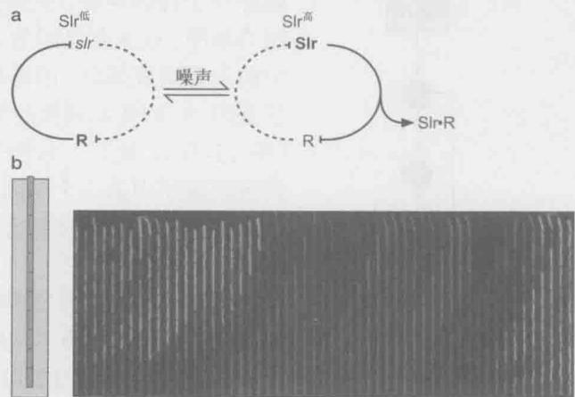  
图 22-6 一种可以控制细胞状态转换的兴奋性回路。(a) 表示的是调控运动型和链式的双负回路。为简便起见，SlrR 和 SinR 在图中分别被缩写为 Slr 和 R。在 SlrR $^{LOW}$ 状态，SinR 会抑制 SlrR 编码基因（回路的左臂），使 SlrR 保持在较低的水平。在 SlrR $^{HIGH}$ 状态，SlrR 处于高表达水平（粗体表示），它把抑制自己编码基因的 SinR 隔绝在复合体中。(b) 表示的是一个微流体通道，该通道的底部是关闭的，顶部是开放的，如左边小图所示。随着细胞的生长和分裂，细胞从顶端退出通道。右侧的波动曲线图展示的是一系列延时实验的显微照片，拍摄的时间间隔为 5min。一个位于左侧底部的运动型细胞（绿色）转换到了链式状态（红色），它的后代也保持这种链式状态。最终，一个位于底部的链式细胞转换回运动型状态（绿色），它的后代也保持这种运动型状态。（面板 b 由 T. Norman 提供。）

## 前馈环

系统生物学领域中一个重要的贡献是，它从无数种理论上存在的、简单的调控回路中，发现只有一小部分能够在自然界中发生。显然，一些特定的环路拥有自然选择所偏爱的有利特征。

前馈环是一种有优势特征的三节点网络结构

c  
d  

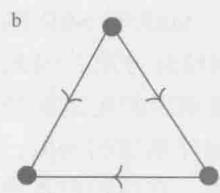

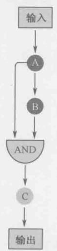

  
图 22-7 网络环路模型。(a)“三节点”网络环路，在该环路中每一个节点代表一个基因，这些基因通过三边相连。(b)前馈环，自然界中最为常见的网络环路。(c)协调型前馈环，在该环路中，直接和间接的边都是靶基因的正调控信号。(d)非协调型前馈环，在该环路中，直接作用边是正信号而间接作用边为负信号。

一个典型的例子便是由三节点组成的环路（图 22-7a）。一共有 13 种可能的方法用箭头连接含有 3 个节点的网络环路。这些环路可以通过箭头的方向，箭头是否连接两个或三个节点，以及成对的节是否被一个或者两个箭头连接起来等相互区分。在这 13 种环路中，一个非常显著的环路是前馈环（feed-forward loop，图 22-7b），该环路普遍存在于自然界中。在这里，我们将其称为网络基序，这主要是因为该环路是遗传回路中的主要组成部分。前馈环基序包括转录因子基因 A 和受其调控的另一个转录因子 B（图 22-7b）。同时，这两个转录因子又同时调控该基序中第三个基因 C。注意，图 22-7b 中只是简单说明调控的方向（如节 A 调控节 B）而非符号。

如果符号（正或负调控）也加入方向端的话，那么就有8种不同的前馈环可以被区分开来。同样，自然选择还是偏爱其中两个，因此这两个比其他环路更常见。其中一个偏爱的前馈环基序（也被称为协调基序）是所有直接和间接的通路都是指向靶基因，代表着输出的方向，同时还具有相同的符号（例如，A和B都是激活因子）（图22-7c）。

而另外一个偏爱的前馈环基序(也被称

为非协调基序）是靶基因受到 A 通路直接正调控、B 通路间接负调控（图 22-7b）。在这两种基序中，靶基因的表达是受到逻辑与门的调控；也就是说，C 基因的转录在前一种环路中需要 A 与 B，而在后一种环路中需要 A 而非 B。

既然这两种基序在所有的前馈环，以及所有可能的三节点网络环路中最受偏爱，那么它们理所当然应该具有演化选择过程中最为基本的有利特性。的确如此，计算机模型与实验结果同时表明该基序具有使得它们在调控回路中更加有用的特征。例如，协调型前馈环具有要求持续的输入信号来维持靶基因 C 转录的特性（图 22-7c）。也就是说，这类型的前馈环是一个持续型检测子，它只对长时间维持的或者是稳定的信号发生应答。

  
图 22-8 一系列前馈环组成的环路调控孢子形成过程。图中名字所表示的是调控蛋白或信号蛋白。为了简洁，自身正调控回路因子 $\sigma^{G}$ 和 $\sigma^{K}$ 没有在图中画出。（经允许引自 Wang S.T. et al. 2006. J. Mol. Biol. 358: 16-37, Fig.5. ©Elsevier）

该特性源自以下的事实：靶基因的表达既依赖于第一激活因子 A，又依赖于第二激活因子 B 的有效积累。因此，输入信号必须持续足够长以满足第二激活因子 B 达到激活靶基因 C 表达的阈值。换句话说，通过加入一个对输入信号反应的推迟，协调型前馈环帮助细胞分辨持续型真实信号及随机的扰动（噪声）。

非协调性前馈环具有它本身的优势特性（图 22-7d）。它是一个脉冲发生器，导致基因表达在开启与关闭间切换。因此，激活因子 A 打开靶基因 C 的表达，但当激活因子 B 聚集到一定浓度后便将基因 C 的表达关闭。所以，当基因表达要求在一定的时间范围内时，此非协调型前馈环便发挥了作用。

## 发育过程中的前馈环

前面那些剖析阐明了基因调控复杂通路中的简单设计原理。在一些例子中，协调与非协调前馈环的组合导致产生各种各样的基因活动模式。其中一个引人注目的例子是孢子形成过程，该过程就是由上述一系列协调与非协调前馈环所形成的调控回路（图22-8）。协调环保证环路的输入信号稳定，确保发育发生在正确的时间和地点。同样的，非协调环用来在形态建成过程中连续地产生基因表达脉冲。

此外，另外一个典型例子是果蝇胚胎背腹形成调控机制。我们在第21章中已经讨论过，母源调控蛋白Dorsal启动这一过程，该蛋白质在胚胎中呈现宽范围的浓度分布。当Dorsal浓度处于中高或高时，它便直接作用于靶基因twist，激活该基因的表达。Twist也是一个调控蛋白，它与Dorsal协调作用，调控一系列基因的表达，例如snail。因此，该调控基序是一个明确的协调型前馈环例子。然而，除此之外，snail编码一个转录抑制因子，许多Dorsal和Twist调节的靶基因受它的抑制。因此，这类靶基因是受非协调型前馈环所调控的。所以说，在细菌孢子形成过程中，由dorsal、twist、snail，以及下游基因所构成的环路是由协调和非协调型前馈环组成的。在果蝇胚胎发育过程中，背腹形态形成过程受前馈环的调控。因此，在中胚层，由于Dorsal（及Twist）及Snail的表达水平较高，所以由Snail介导的靶基因的抑制被关闭，而在外胚层神经元；由于Dorsal和Snail的水平较低，所以由Snail介导的靶基因的抑制是打开的。

## 振荡回路

对基因表达的调控我们一般考虑打开、关闭或者是调控表达水平。但是，在生物体内还广泛存在着另外一种基因调控模式——节律性，即大部分基因的表达都是在一个规则的时间间隔内呈现周期性上调和下调。定量地阐明调控节律性行为的调控回路是对系统生物学的一个重要挑战。

## 有些调控回路产生节律性的基因表达模式

一个相对简单的节律性调控回路的例子是新月柄杆菌（Caulobacter crescentus）的细胞周期（图 22-9）。在此例中，中枢调控因子（CtrA 和 GcrA）的水平以周期性模式交替升高和下降。它们的交替出现驱动其他基因在细胞周期过程中呈现节律性表达模式。

  
图 22-9 调控因子 CtrA 和 GcrA 在柄杆菌属细胞周期的过程中的波动表达。(经允许引自 Holtzendorff J. et al. 2004. Science 304: 983-987, Fig.3B, C. ©AAAS)

生物钟是一个众所周知的节律性行为的例子，在生物钟的调控下，大量基因在日夜交替周期的不同时间呈现节律性表达。在果蝇和哺乳动物中，其昼夜节律部分地受到负前馈环的调控，其中激活因子是 Clock 和 Cycle，抑制因子是 Per(Period)。Clock 和 Cycle 蛋白结合到 per 基因调控区域，激活该基因的转录。当 Per 蛋白在细胞中累积到一定的水平后，它能够反作用于 Clock 和 Cycle，从而关闭自身合成。一旦 per 基因的转录被关闭后，由于蛋白酶降解造成的不稳定性，Per 蛋白将慢慢从细胞中被清除。这将导致抑制因子恢复到一个次级阈值的水平，即 Per 蛋白没有足够高的浓度来抑制 Clock 和 Cycle 的活性。由此，per 基因的表达重新打开。per 基因表达的开/关周期有助于确定基因活性的 24h 循环过程。Per 蛋白的合成与降解的时间是关键的依赖因素。Per 蛋白稳定性的改变能够改变节律的频率，甚至产生不正常的以 22h 或 26h 为周期的循环，而不是正常的 24h。然而，关于生物钟为什么稳定地保持 24h 周期的机理还未被完全理解，毫无疑问，仍有一些确切存在但尚待阐明的机制。

有趣的是，自身负调控还涉及另外一个与周期基因表达毫不相关的例子——脊椎动物胚胎中的体节形成过程。体节是胚层细胞的浓缩块，它们将形成重复肌肉节和脊椎动物的脊柱（图22-10a）。体节从头到尾的形成模式依赖于调控基因her1和her7有节律的活性的开启与关闭，至少在斑马鱼中是如此。这些基因在此后的体细胞中保持周期性表达，直到这些细胞准备分化形成物理性体节为止。随着每一批新细胞的成熟，其节律性终止，从而导致一些细胞停留在周期的峰顶，另外一些停留在峰谷，并在空间顺序上体

b

a

现了体节的形成。紧随新体节形成的是下一组将来形成体节的细胞重复相同的步骤，包括新一轮的基因表达的开启和关闭，并最终形成新体节。

her1 和 her7 在斑马鱼中节律性表达的开启和关闭已经应用于数学建模和计算机模拟。Her1 与 Her7 蛋白被认为结合到 her1 和 her7 基因的调控区域从而关闭转录过程。但是该抑制过程仅仅维持短暂时间——由于蛋白酶的降解，一旦 Her1 与 Her7 蛋白降到一个关键的阈值水平后，转录过程重新被恢复并开始一轮新的循环，即蛋白质合成开始-抑制状态恢复等。抑制基因产物的节律水平调控其他基因的表达，从而确定出新体节的形成模式。在斑马鱼中，每 30min 形成一个新的体节。解释体节形成的周期长度的一个关键点是 her1 和 her7 基因启动转录同自身抑制因子积聚到有效浓度以抑制自身合成过程的时间间隔（图 22-10b）。

Her1 与 Her7 自身调控环完美地阐述了体节基因如何在单个的细胞中呈现开/关表达的循环模式，但是这些基因是如何在即将形成体节的一个细胞及其相邻的细胞中保持同步化的周期性表达呢？同步化是通过细胞与细胞间的信号通路来完成的。Her1 与 Her7 除了抑制其自身外，它们还抑制一个细胞膜编码蛋白 Delta 的基因的表达。Delta 结合到与其相邻细胞的细胞受体蛋白 Notch，并激活 Notch 信号系统，进而激活编码 Her1 与 Her7 蛋白所需基因的表达。当开/关循环中 Her 蛋白水平较高时（即 her 基因表达较低），产生比较少的 Delta 配基（图 22-10b）。这将导致与其相邻的细胞中 Notch 信号系统的活性与 her 基因的表达都比较低。相反的，当 Her1 同 Her2 蛋白水平较低时（即 her 基因表达较高），细胞中 Delta 含量便升高，从而激活相邻细胞 her 基因的表达。对于每一种情况，信号从相邻细胞通过 Notch 与其内的 Her1 和 Her7 蛋白相互协作，从而保持细胞与其相邻细胞节律之间的同步性。因此，细胞内自身调控与细胞间信号传递共同使得体节构成细胞呈现节律性行为。

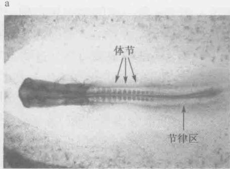

  
图 22-10 体节基因在脊椎动物发育过程中的表达。(a) 图中所示为鸡胚胎发育过程中的体节。箭头所示的是体节，节律区是节律基因表达的区域，新的体节将在此产生（图片由 JulianLewis 提供）。（b）图中所示为斑马鱼体节基因节律表达的产生和同步模型。节律基因的表达受负反馈环的调控，其中涉及自身抑制因子 Her1 和 Her7。不同细胞间节律的同步化是通过 Delta/Notch 信号通路来完成的。Her1/Her7 抑制 Delta 配基的生成。相反的，Notch 信号刺激 Her 蛋白的表达。（摘自 Julian Lewis 提供的图片。）

## 用人工合成的环路模拟自然的调控网络

理解主导调控回路设计原理的一个辅助方法是建立一些相对简单的环路，并使这些环路能够模拟自然系统的一些特性，这就是合成生物学领域的目标。环路设计的一个典型的成功例子是抑制振荡器，该实验加强了我们对节律性的讨论。抑制振荡器是一个在大肠杆菌中生成的三节点网络环路，该环路由三个相互连接的调控蛋白组成一个环形的模式，三个端的连接符号都为负号。此抑制因子由三种细菌抑制蛋白 $\lambda \mathrm{CI}$ 、LacI和TetR编码基因所组成，CI蛋白抑制LacI编码基因，LacI进而抑制TetR编码基因，而TetR反过来抑制CI，从而形成整个网络环路。人们可能会推测，此类三节点环路可能会导致这三个基因的转录都处于一个低水平的稳定态。但恰恰相反，此抑制振荡器呈现出一个强烈的转录节律模式，其周期大约为 $2\mathrm{h}$ 。理论上讲，基因表达过程中噪声导致这三种抑制蛋白水平产生波动，这将阻止系统达到稳定态，取而代之的是一个节律表达模式。但是此抑制振荡器与上述的自然系统相比，其节律行为的稳定性依然相差甚远，这说明了一个事实，人工合成的环路在模拟自然界中的复杂（尚未被充分阐明的）环路时还有许多不足之处。

通过合成还产生了许多其他网络环路，这些环路呈现出各种各样的行为模式。其中一个例子是人工回路文库，该文库由许多转录因子和启动子通过不同的组合所构成。该回路文库中的回路能对不同的输入信号组合产生不同的应答。另外一个例子是来自“发射子”与“应答子”菌株，这类菌株能够在琼脂板上产生基因表达的条纹模式。发射菌株生长在培养板的中央，它能够产生信号分子，并从培养板的中央向四周扩散形成一个浓度梯度。两种不同的应答菌株分散长在同一个培养板上，这两种应答菌株对发射菌产生的信号分子浓度的高低应答不同，可通过产生可辨别的发光报道蛋白来区分。因此，一种应答菌株在距离发射菌较近处产生一个有色光环，而另外一种应答菌株在距离发射菌较远处产生另外一个有色光环。

## 小结

系统生物学是一门新生学科，该学科综合定量、高通量测量、建模、重组和理论知识，最终阐明生物机体内不同层次的内在机制。当涉及调控回路时，系统生物学试图揭示那些把每个元件都提取出来的方法不可能知道的基因控制的原理。合成生物学也试图阐明设计的原理，为了实现这一目标，所采用的途径是创造人工调控网络模拟天然回路的特征。

转录环路是由节点和端边构成的，节点表示的是基因，端边表示一个基因被另一个基因所调控。一个简单的双节点调控基序所表示的含义是一个基因调控另一个基因的表达，调控可以是正的，也可以是负的。另外一个简单的基序是自身调控，也就是基因调控自身的表达。自身负调控指的是一个基因的产物抑制该基因本身的表达，它具有抵御噪声的特性，所谓噪声是指几乎均一的条件下基因表达的波动性。而自身正调控可使基因表达缓慢增加达到一个稳定水平的特性。自身正调控的一个极端的例子是双稳开关环路，其中一个基因的表达保持在开或关的位置相当长的一段时间。

在调控网络环路中，另外一个常见的基序是前馈环。前馈环是一个三节点基序，它所表示的是调控（基因 A）能够控制靶基因和第二个调控基因（基因 B）的表达。而第二个调控基因 B 也调控靶基因的表达。因此在前馈环基序中，基因 A 能够直接调控或者通过基因 B 间接调控靶基因的表达。靶基因的表达可以说是受到一种“与门”的调控，有两种情形：第一种是两个激活转录因子同时存在，另外一种情形是激活因子的存在和抑制因子的消失。

在自然界中，一些调控回路能够使一些基因的表达产生节律性循环，如细胞周期、发育和昼夜节律。该环路的设计原理是：其中一个调控蛋白的出现能够导致其自身的消失和另外一个调控蛋白的出现。第二个调控蛋白的出现又反过来抑制其自身的表达和促进第一个调控蛋白的表达，从而构成一个连续的基因表达开/关循环。人工合成的网络已经成功将三个抑制因子通过随机的方法连接成一个圆形的调控回路，可以模拟出基因表达的循环模式，但还达不到自然存在的节律控制子的稳定性。

系统生物学的方法能够对复杂的细胞过程中的每个部分进行系统性的鉴定。这样就促进了生物学家分析数据方式的典型转变。生物学家不再问这个过程是怎样进行的，取而代之的是为什么是以这种特殊的方式组织在一起的。展望未来，也许有一天，系统生物学与合成生物学的结合可以创造出可以进行自体繁殖的人工细胞。如果这样，那么我们可以对人工细胞的特性进行量身打造，如能够有效地代谢污染物、废物的循环利用、将光能转化为燃料，或者是对抗人类疾病。

## 参考文献

## 书籍

Alon U. 2006. An introduction to systems biology: Design principles of biological circuits. Chapman & Hall/CRC, Boca Raton, Florida.

## 系统生物学

Alon U. 2007. Network motifs: Theory and experimental approaches. Nat. Rev. Genet. 8: 450–461.

Bintu L., Buchler N.E., Garcia H.G., Gerland U., Hwa T., Kondev J., and Phillips R. 2005. Transcriptional regulation by the numbers: Models. Curr. Opin. Genet. Dev. 15: 116–124.

Bintu L., Buchler N.E., Garcia H.G., Gerland U., Hwa T., Kondev J., Kuhlman T., and Phillips R. 2005. Transcriptional regulation by the numbers: Applications. Curr. Opin. Genet. Dev. 15: 125–135.

Crosson S., McAdams H., and Shapiro L. 2004. A genetic oscillator and the regulation of cell cycle progression in Caulobacter crescentus. Cell Cycle 3: 1252–1254.

Dubnau D. and Losick R. 2006. Bistability in bacteria. Mol. Microbiol. 61:564–572.

Endy D. 2005. Foundations for engineering biology. Nature 438: 449–453.

McAdams H.H., Srinivasan B., and Arkin A.P. 2004. The evolution of genetic regulatory systems in bacteria. Nat. Rev. Genet. 5: 169–178.

McGrath P.T., Viollier P., and McAdams H.H. 2004. Setting the pace: Mechanisms tying Caulobacter cell-cycle progression to macroscopic cellular events. Curr. Opin, Microbiol. 7: 192–197.

Raser J.M. and O'Shea E.K. 2005. Noise in gene expression: Origins, consequences, and control. Science 309: 2010–2013.

Sprinzak D. and Elowitz M.B. 2005. Reconstruction of genetic circuits. Nature 438: 443–448.

Vilar J.M., Guet C.C., and Leibler S. 2003. Modeling network dynamics: The lac operon, a case study. J. Cell Biol. 161: 471–476.

## 习题

偶数习题的答案请参见附录2。

习题 1 在调控网络中，节点和边线是什么？怎样描绘节点和边线？

习题 2 解释在调控中，“与门”是什么意思。

习题 3 描述图 22-3 所展示的负的自动调控[基因表达水平（%）与时间]。解释为什么负调节在演化过程中被选择。

习题 4 描述噪声和随机性的关系。

习题 5 思考这样的实验：在 E.coli 中相同基因的两个拷贝，一个拷贝的报告基因为绿色荧光蛋白，另一个的则为红色荧光蛋白。举出在该系统中的内在和外在噪声的一个例子。

习题 6 解释为什么认为负自我调控的调控网络是稳定的。

习题 7 在图 22-3 中，当输出达到稳定状态时，正自我调控曲线代表的是哪一部分？解释当基因表达处于正自我调控时是如何达到稳定状态的。

习题8 ComK与comK启动子结合的什么特性使该调控网络称为双稳态开关？

习题 9 什么类型的调控网络控制枯草杆菌感受态该菌在感受态可以持续多久？

习题 10 考虑一个光激活的基因，在有持续的光的存在下，该基因打开并很快关闭。你猜测调控该基因的是哪种类型的前馈环路？解释为什么。

习题11 什么是昼夜节律？它是怎样调控的？

习题 12 利用线和节点,命名并画一个调控图使其代表一个如果很快打开并维持稳定量的调控蛋白的表达。

习题 13 利用线和节点画一个代表合成的压缩振荡子的调控图。命名节点上的基因病描述该压缩振荡子的表达模式。

习题 14 ara 操纵子控制若干基因包括 araC 的表达。在阿拉伯糖和 DNA 结合蛋白 AraC 存在下，基因的表达被打开，AraC 蛋白参与正自我调控。

如下面所示，研究人员构造了一个包含一系列人工启动子的回路（每个都包含一个 AraC 结合位点和一个乳糖操纵子）。阿拉伯糖和 AraC 的存在促进了下有基因的转录，lacI 编码 LacI 抑制因子，LacI 结合在 lac 操纵子上来关闭转录（即

  
AraC 结合位点  
lac 操纵子

## 第6篇 附录

本篇概要

\- 附录1 模式生物

\- 附录2 答案

# 冷泉港实验室档案馆中的照片

Robert Horvitz，1990年研讨会主导。Horvitz（左）1970年在剑桥大学的Sydney Brenner实验室读博士期间开始研究秀丽隐杆线蠕虫，随后一直在MIT自己的实验室继续模式生物的研究。2002年，因为在蠕虫研究中的工作和Horvitz（定义基因调控“程序性死亡”）以及另一个博士后John Sulston共享诺贝尔生理学和医学奖。这张照片显示的是Horvitz和他实验室的另外两名成员，Elizabeth Sawin（现在是气候系主任）和Asa Abeliovich（哥伦比亚大学的神经生物学家）。

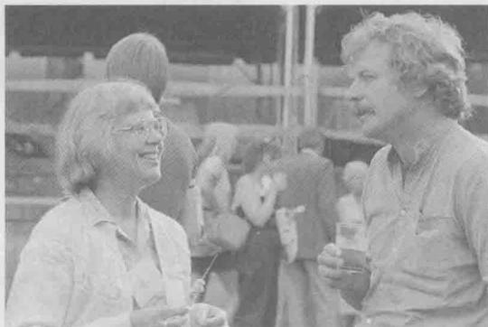  
Mary Lyon 和 Rudolf Jaenisch，1985 年分子生物学发展研讨会。Lyon 和 Jaenisch 的工作都是研究小鼠，Lyon 发现了哺乳动物 X 染色体失活的现象以及雌性哺乳动物细胞中有剂量补偿的机制（第 20 章）。Jaenisch 在建立转基因小鼠和治疗性克隆技术都有较大影响力。

Michael Ashburner，1970年遗传物质转录组研讨会。Ashburner在模式生物果蝇的研究中长期占领先地位，研究涉及果蝇基因组结构和功能的许多方面。他与Craig Venter的测序公司Celera Genomics合作对果蝇基因组测序。根据这些工作的经验他写了一本叫做Won for all的小书。照片中的他在亲吻Barbara Hamkalo的手。Hamkalo当时在哈佛大学读博士后，现在是加州大学Irvine分校的分子生物学教授，对异染色体的结构感兴趣（第8章）。

Dale Kaiser, 1985 年分子生物学发展研讨会。在 $\lambda$ 噬菌体早期研究中 Kaiser 贡献良多（第 18 章）。这项工作的一方面影响是使他认识到 DNA 分子与互补的单链末端可以容易地结合在一起，是发展重组 DNA 技术的一项重要发现。

Barbara McClintock 和 Harriet Creighton，1956 年遗传物质的结构与功能研讨会。McClintock，玉米遗传学家，曾出现在第 3 篇初始部分的一张照片中。Creighton 与 McClintock 在学生时期，一起发表了一篇关于染色体在减数分裂中遗传交换的重要论文。1929 年 Creighton 毕业后，有近 30 年的时间在韦尔斯利学院教授植物学。

## 附录1

## 模式生物

分子生物学中有一个著名的说法：基础问题可以在最简单和最容易获得的系统中得以回答。因此，长期以来，分子生物学家把精力集中在少数几种所谓的模式生物上。其中，重要的模式生物，依复杂程度增高为序有：大肠杆菌（Escherichia coli）和它的噬菌体——T噬菌体和λ噬菌体，酿酒酵母（Saccharomyces cerevisiae），拟南芥（Arabidopsis thaliana），秀丽新小杆线虫（Caenorhabditis elegans），黑腹果蝇（Drosophila melanogaster）和小鼠（Mus musculus）。

模式生物的共同点是什么呢？它们的一个重要特征是可使用强大的传统遗传学和分子遗传学分析工具，使从遗传学角度操研究和操作这些生物成为可能；第二共同点是每种模式生物都吸引了许多研究者。这意味着同一种生物的研究者之间通过共享观点、实验方法、实验

工具和生物品系，促进研究的快速发展。

例如，从20世纪40年代开始，以M. Delruck、S. Luria和A. D. Hershey为首的一群科学家，夏季会在纽约冷泉港实验室（Cold Spring Harbor Laboratory）研究大肠杆菌T噬菌体的增殖。这个小组称为噬菌体小组（Phage Group），在确立分子生物学领域时发挥了重要作用。小组成员中许多是物理学家，他们被噬菌体的研究所吸引，不仅仅是因为噬菌体结构相对简单，而是通过每次研究大量噬菌体的实验，产生了定量的、有显著统计学意义的结果。到20世纪50年代后期，冷泉港实验室开设了噬菌体的年度课程，越来越多的研究者来学习这个新系统。这是一个典型的实例，表明集中研究相同的模式生物，肯定比分散研究多种不同的生物进展更快。

选择哪一种模式生物取决于要回答什么问题。例如，研究分子生物学的基本问题，用简单的单细胞生物或病毒通常更方便些。这些生物可以快速、大量地生长，一般可把遗传学和生物化学的研究方法结合起来；而其他问题，如有关发育的问题，则只能用更复杂的模式生物来解决。

众所周知，T噬菌体（如大家最熟悉的成员，特别是T4）是一个解决基因和信息传递本质的理想系统；同时，因为有高效的适合遗传分析的交配系统，酵母则成为揭示真核细胞本质的首选系统。从真菌到高等细胞蛋白和一般调控机制两方面具有的演化保守性意味着在酵母中的发现在人类中也有可能是适用的。此外，研究线虫和果蝇的遗传系统，可以用来解决那些在较低等的生物中不能有效解决的问题，如发育和行为；最后还有一种模式生物小鼠，尽管它不如线虫和果蝇容易研究，但因为是哺乳动物，所以是了解人类生物学和人类疾病的最好的模式系统。

本章将描述一些最常用的实验生物，并逐一解释它们作为模式系统的主要特性和优点；另外还将介绍研究每种生物的实验系统以及每种模式生物已经涉及的分子生物学问题，但不会对所有在分子生物学上有重要影响的模式生物进行详细解释。

## 噬菌体

噬菌体（广义而言包括其他病毒，）呈现了一个研究遗传基本过程的最简单的系统。基因组一般很小，只在侵入宿主细胞（对噬菌体而言，就是细菌）后才复制，所编码的基因才表达。在感染过程中基因组也会发生重组。

由于这个系统相对简单，所以噬菌体在分子生物学的早期研究中被广泛利用——事实上，噬菌体对分子生物学的发展至关重要。即便是现在，在研究 DNA 复制、基因表达和重组的基本机制时，它们仍然是一个可以利用的系统。另外，在重组 DNA 技术中（第 7 章），它们也是非常重要的载体，并且经常用来检测各种化合物引起突变的能力。

噬菌体通常由一个（DNA 或 RNA，前者更为常见）被一层蛋白质亚基包裹起来的基因组而组成。蛋白质亚基形成一个头部结构，基因组就被包在里面。有些蛋白质亚基形成尾部结构，尾部使噬菌体附着于细菌宿主细胞外面，噬菌体的基因组通过尾部注入到细胞里。其独特性在于：每一种噬菌体只附着于一种特定的细胞表面分子（通常是一个蛋白质），只有带有某种“受体”的细胞才会被这种特定的噬菌体所感染。

噬菌体因复制的类型不同分两种基本类型——裂解型(lytic)和温和型(temperate)。前者如T噬菌体，只进行裂解生长。如图A-1所示，当噬菌体感染一个细菌细胞，它的DNA得以复制，其基因组产生许多拷贝（多达几百个拷贝），并且编码表达新的外壳蛋白。这些过程高度协调，以保证新的噬菌体颗粒在被宿主细胞裂解释放它们之前构建起来。子代噬菌体又可以去感染其他宿主细胞。

温和型噬菌体（如 $\lambda$ 噬菌体）也可以以裂解的方式复制，但它们还有另外一种复制途径，即溶原（lysogeny）（图A-2）。处于溶原状态时，噬菌体基因组不是自己复制，而是整合到细菌的基因组里，并且外壳蛋白基因不表达。这种整合的抑制状态的噬菌体被称为原噬菌体（prophage）。原噬菌体作为细菌染色体的一部分在细胞分裂时被动复制，因此两个子细胞都是溶原性细菌。溶原状态可以如此保持几代，但同时也可以在任何时候转为裂解生长。这种从溶原到裂解途径的转变，叫做诱导（induction），涉及原噬菌体DNA从细菌基因组剪切出来、复制，以及用于制造外壳蛋白和调节裂解生长的基因的活化（图18-20）。

图 A-1 噬菌体的裂解生长周期。噬菌体颗粒附着在合适的细菌宿主细胞（带有合适的受体）的外表面，并注入其基因组，通常是一段 DNA 分子。噬菌体 DNA 在细菌中复制，基因表达产生许多新的噬菌体。一旦子代噬菌体装配为成熟的颗粒，细菌细胞就会裂解，子代噬菌体释放，感染其他的宿主细胞。

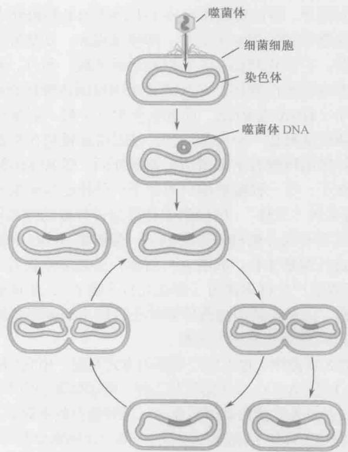

图 A-2 噬菌体的溶原周期。最初的感染步骤和裂解周期的情况一样（图 A-1）。但 DNA 一旦进入细胞，就整合到细菌染色体上，作为细菌染色体的一部分而被动复制。而且，编码外壳蛋白的基因处于关闭状态。整合的噬菌体叫原噬菌体。溶原性细菌可以稳定地保持若干代，在合适的环境下，也可以有效地转到裂解周期。详见第 18 章。

## 噬菌体生长的检测

要想使噬菌体成为有用的实验系统，就需要建立噬菌体扩增和定量的方法。扩增可以产生高滴度噬菌体材料——用于进行实验或提取 DNA。一般情况下，噬菌体可以在液体培养基里合适的细菌宿主上生长扩增。例如，一烧瓶生长旺盛的细菌细胞可以用于培养噬菌体。生长一段合适的时间后，细胞裂解，留下透明的、含有噬菌体颗粒的液体悬浮液。

噬菌斑检测（图 A-3）可用来定量溶液中噬菌体颗粒数目。它的步骤是：混合噬菌体和细菌细胞，噬菌体吸附于细菌细胞上并将 DNA 注入；然后稀释噬菌体和细菌混合物，把稀释液加入到含有更多（没有被感染）的细菌细胞的“液态琼脂”里，倒在培养皿中固态琼脂培养基上。液态琼脂形成一层果冻状的薄层，里面混有许多细菌，其中细菌有些是被感染的，但大多数没有感染噬菌体。然后将平板培养几个小时，使细菌生长和噬菌体感染得以进行。

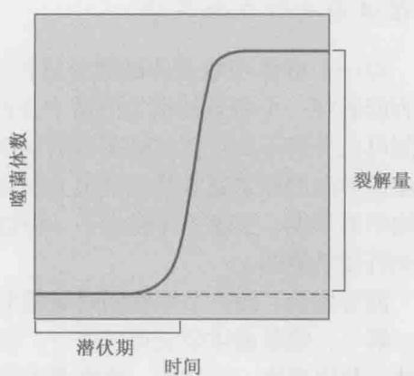  
图 A-3 噬菌体感染细菌菌苔形成噬菌斑。图示为裂解型 T 噬菌体产生的噬菌斑。（经许可，影印自 Stent G. S. 1963. Molecular biology of bacterial viruses, Fig. 1. © W. H. Freeman.）  
图 A-4 单步生长曲线。如文中所描述，单步生长曲线显示一个噬菌体进行一轮裂解生长所用的时间，以及每个被感染细胞产生的子代噬菌体数目。它们分别被称为潜伏期和裂解量。

在接下来的培养过程中，上层琼脂里的每一个被感染的细胞（来自最初的混合体）将会裂解。粘稠的琼脂使子代噬菌体得以扩散但不会太远，所以它们只感染生长在其周围的细菌细胞。随后，这些细胞裂解释放更多的子代会再次感染相邻的细胞，如此循环往复。多轮感染的结果是形成噬菌斑（plaque）。在高密度生长的、未被感染的细菌细胞组成的、不透明的菌苔背景下，噬菌斑呈透明的圆斑。这是因为未被感染的细菌细胞在上层琼脂里生长成为高密度群体，而那些位于每个最初感染的细菌周边的细菌细胞被杀死，留下一个透明的斑块。知道了一块特定平板的噬菌斑数目，以及在铺平板之前最初的噬菌体的稀释程度，计算噬菌体在原液中的数目就轻而易举了。

## 单步式生长曲线

这个经典的实验揭示了一个典型裂解型噬菌体的生命周期，为检验生命周期的后续实验作好了准备。这个过程的基本特征是对一群细菌同步感染并避免子代的再次感染。这样就可以跟踪单轮感染的过程（图 A-4）。

噬菌体和细菌细胞混合 10min，这段时间足以使噬菌体吸附到细菌细胞上，但对进一步感染来说则太短。把这个混合物稀释（用新鲜的培养液）10000 倍。这个稀释度保证只有那些最初就结合噬菌体的细胞才能形成感染群体，同时，保证产生的子代噬菌体不会感染宿主细胞。

随后将稀释的感染细胞群进行培养使感染过程继续下去。每隔一段时间，从混合物中取出样品，用噬菌斑检测法计数噬菌体的数目。起初，噬菌体数目很少（仅仅由在稀释前初始感染时未能感染细胞的噬菌体组成）。

时间充足的情况下，被感染的细胞裂解释放子代，就会检测到噬菌体数目的急剧增加（对 T4 噬菌体来说这个过程需要 30min）。从感染到释放子代噬菌体的时间间隔叫做潜伏期（latent period），释放的噬菌体数目叫做裂解量（burst size）。

## 噬菌体杂交和互补实验

对一个群体中噬菌体的数目进行计数可以使研究者估计一个特定的噬菌体衍生物是否能够在一个特定的宿主细菌中生长情况（以及生长效率，如裂解量）。而且，平板检测可以分辨不同种类的噬菌体衍生物，因为它们产生的噬菌斑形态不同。宿主范围和噬菌斑形态的差别通常是在其他方面都相同的噬菌体在遗传上有所不同的结果。在分子生物学的早期，上述差异提供了一种遗传标记，使研究者们能够探询遗传信息是如何编码和行使功能的。

混合感染，即一个细胞同时被两个噬菌体颗粒感染，使遗传分析从两个方面成为可能。第一，使噬菌体杂交得以进行。如果同种噬菌体的两个不同的突变体（带有同源染色体）共同感染一个细胞，重组即遗传交换就可以在基因组之间进行。遗传交换的频率可以用来在基因组上排序基因。重组频率高表明突变的位置相对较远，而重组率低则表明突变的位置较近。只要有筛选或选择这种小概率事件的方法，实验中使用大量噬菌体确保混合转染可以可以发生，（两个位置非常相近的突变之间的重组）。第二，共感染还能把突变归类于不同的功能互补组，也就是说，人们可以确定两个或多个突变是发生在同一个基因上还是在不同的基因上。这样，两个不同的噬菌体突变体共同感染一个细胞，如果一个噬菌体可以提供另一个噬菌体所缺乏的功能，那么两个突变即位于不同的基因上（互补组）。另一方面，如果两个突变噬菌体不相互互补，那么就可以作为两个突变定位于同一个基因的证据。

## 转导和重组 DNA

噬菌体杂交和互补实验可以用来进行噬菌体本身的遗传学实验，此类相同的载体和技术也可以用于其他系统的遗传学研究。起初，仅仅是观察到一些噬菌体感染过程中意外获得的细菌基因（如我们在下面描述的）。然而，随着20世纪70年代DNA重组技术的出现，这些研究延伸到各种生物体的DNA中。

在感染过程中，噬菌体可能意外地（和错误地）获得一段细菌的 DNA。通常，噬菌体获得一段宿主细菌 DNA 途径通常是在原噬菌体溶原诱导过程中从细菌染色体剪切出来的。该过程涉及位点特异的重组事件（第 12 章），只要发生一点点位置错误，就会有噬菌体 DNA 丢失和细菌 DNA 的插入。只要这个交换没有丢掉噬菌体基因组中增殖所需的那部分，形成的重组噬菌体仍继续生长，并可以把重组的细菌 DNA 从一个宿主转移到另一个宿主，这个过程被称为特异性转导（specialized transduction）。包含在特异性转导噬菌体中的细菌 DNA 也同样可以进行像噬菌体一样的遗传分析。

因为 $\lambda$ 噬菌体具有促进特异性转导的能力，所以它很自然地被选为一种原始的克隆载体（第 7 章）。去除特定限制性内切核酸酶的多余位点，仅在对裂解生长无关紧要的区域留下一个（插入型载体）或两个（置换型载体）位点，就可以使 $\lambda$ 噬菌体能够接受任意来源体外 DNA 的插入。这样进行 DNA 的扩增和分析会比在原来的生物体内容易得多。去除 $\lambda$ 噬菌体中限制性内切核酸酶位点是反复选择对某种限制性系统具有越来越高效率的菌株而实现的。用这种方法增加对限制性内切核酸酶的抗性，然后在体外对丢失和保留的位点定位，鉴定出所需的噬菌体衍生物。

各种不同的 $\lambda$ 载体先后被开发出来，其差别在于使用的限制位点及如何鉴定重组噬菌体。下面介绍一种选择系统的作用机制：在一个 $\lambda$ 的衍生物中，编码阻抑物的 c I 基因里（第 18 章）留下唯一的某种限制性切点。在亲代载体中，这个基因是完整的，噬菌体可以根据自己的选择形成溶原性细菌，于是噬菌体形成的是浑浊的噬菌斑。然而，当一段 DNA 插入在这个位点，形成的重组噬菌体其 c I 基因被打断，不能形成溶原性细菌，就会形成透明的噬菌斑。

噬菌斑形态的改变使从非重组噬菌体中辨别重组子非常简便，进一步讲，如果使用的细菌菌株是 hfl 菌株（框 16-5），这个途径就是选择（而不是筛选）。对于该菌株，任何溶原性噬菌体总是溶原的，只有重组的噬菌体会形成噬菌斑。

## 细菌

细菌，如大肠杆菌和芽孢杆菌，因为它们是相对简单的细胞，所以适合用于实验系统的研究，并且可以相对容易地培养和操作。细菌是单细胞生物，所有 DNA、RNA 和蛋白质合成的机器都包含在同一细胞器中（细菌没有细胞核）。

细菌通常只有一条染色体——比高等生物的基因组小得多。此外，细菌的生命周期很短（有些甚至只有20分钟），从单个细胞可以很容易获得一个遗传上同源的细胞群体（克隆）。最后，细菌遗传学研究很方便，一方面，它们是单倍体（意味着即使是隐性突变，也能够很容易地表现出突变的表型）；另一方面，细菌之间可以方便地进行遗传物质的交换。

分子生物学起源于细菌和噬菌体模式系统的实验。至1943年Luria和Delrück进行著名的波动分析实验以前，细菌（细菌学）研究还停留在传统遗传学领域之外。利用统计学的方法，Luria和Delrück证明了细菌可以发生某种变化，使其对某一特定噬菌体的感染具抗性。更重要的是，他们证明了这种变化是自发产生的，而不是对噬菌体的应答（适应）。所以，像其他生物一样，细菌也可以遗传性状（例如对噬菌体的敏感性或抗性），并且偶尔这种遗传性可以自发产生变化（突变）而成为另一种遗传状态。Luria 和 Delrück 的实验表明，同其他生物一样，细菌表现出的特性是由遗传因素决定的。因为它们结构简单，细菌是阐明遗传物质本质和孟德尔（Gregor Mendel）性状决定因子（基因）的理想实验系统。

  
时间  
图 A-5 细菌生长曲线。如文中所描述，细菌（如大肠杆菌）在不过度密集并且在氧气充足的丰富培养基里繁殖时生长速度很快。这个生长期叫指数生长期。因为细胞以指数级复制，所以一旦细胞的数目变得太高，培养物变浓，生长就变慢，进入所谓的稳定期。取出处于稳定期的细胞，在新鲜培养基中将它们稀释，经过一个迟滞期后，细胞将再次进入指数生长期。图示为不同时期细胞数目增长的速度。

## 细菌生长检测

细菌可以在液体或固体（琼脂）培养基中生长。细菌细胞的大小（大约长 $2 \mu m$ ）足以

使它散射光线，因此通过检测液体培养基中光密度的增加就可以监控细菌的生长情况。以恒定世代分裂生长活跃的细菌，以指数级繁殖，此时它们被称为处于生长的指数期（exponential phase of growth），当细菌数量增长到一定程度后，生长速度减缓，细菌生长进入稳定期（stationary phase）（图 A-5）。

细菌的数目可以通过液体培养基稀释，然后铺在培养皿中的固体（琼脂）培养基上进行测定。在相对较短的时间内，单个细胞就能长成由上百万个细胞组成的微型菌落，只要知道平板上的菌落数和培养基的稀释倍数就可以计算出原始培养基中的细菌浓度。

## 细菌通过性结合、噬菌体介导转导和 DNA 介导转化来交换 DNA

作为分子生物学的模式系统，细菌的主要优势是具备易于进行遗传交换的系统。遗传交换使定位突变、构建含多种突变的菌株、构建用来辨别显性突变和隐性突变及进行顺反式分析的部分双倍体的菌株成为可能。

大部分细菌含有自主复制的 DNA 元件，称为质粒（plasmid）（图 A-6）。有些质粒，如大肠杆菌的育性质粒（称为 F 因子，F-factor）具备把它们自身从一个细胞转移到另一个细胞的能力。含有 F 因子的细胞（ $F^{+}$ ）可以把质粒转移到 $F^{-}$ 细胞里。F 因子介导的接合是一个复制的过程。因些 $F^{+}$ 细胞转移一个 F 因子的拷贝，自身还有一个拷贝，这样接合的结果就是产生 2 个 $F^{+}$ 细胞。有时，F 因子整合到染色体中，就会引起宿主染色体通过接合向 $F^{-}$ 细胞转移。含有整合 F 因子的菌株叫做 Hfr 菌株（高频重组菌株，Hfr strain），这种菌株对进行遗传交换研究非常有用。

在某一具体的事件中，决定宿主染色体转移的精确位置取决于两个条件。第一，不同的 Hfr 菌株中 F 质粒整合在宿主染色体的位置不同。宿主染色体到受体细胞的转移是沿着线性发生的，从接近染色体整合有 F 质粒的那端开始。所以，质粒整合的位置决定了首先被转移的染色体位置。第二，在交配中断之前完成整个染色体的转移是少见的。因而，远离转移起始点的基因转移频率低，在一个特定的交配中，位置较远的基因可能从来不会被转移。需要注意的是，如果一个完整拷贝的整合 F 因子发生转移的话，转移将最后发生。

  
图 A-6 带有 F 质粒的三种细胞形式。F⁺细胞带有一个单拷贝的 F 质粒，F 质粒就像一个微小的染色体独立进行复制。在 Hfr 菌株中，F 质粒整合在细菌染色体里作为染色体的一部分而复制。在 F⁺菌株里，已经整合到宿主染色体中的 F 质粒重新游离出来，同时携带一小段相邻的宿主 DNA。所有三种细胞类型都可以转移到一个 F⁻受体细胞。如果供体细胞是 F⁺菌株，它仅复制和转移 F 质粒；如果是 F⁺菌株，它复制和转移 F 质粒及一小段宿主 DNA；如果是 Hfr 菌株，根据整合的位置和交配的时间不同，它复制和转移不同大小和位置的宿主染色体。一旦进入受体，来自宿主的染色体 DNA 就可以与受体细胞的基因组重组，从而产生了遗传交换。  
图 A-7 噬菌体介导的普遍性转导。如文中所述，在有些噬菌体感染时，宿主染色体被打成片段，有些DNA片段可以取代复制的噬菌体DNA被包装在噬菌体颗粒里。与噬菌体基因组类似，宿主DNA被转移到另一个细胞中。一旦进入新的宿主，DNA就可以与染色体重组，促进遗传物质交换。

第三种也是非常重要的，F 因子形式是 F' 质粒，F' 是含有一小段染色体 DNA 的育性质粒，这段 DNA 会与质粒一起从一个细胞向另一个细胞高频率转移。例如，历史上重要的 F'-lac，是一个带有乳糖操纵子的 F 因子。F' 因子可以产生含有部分双倍体的菌株，这个菌株的特定染色体区域有两份拷贝。这正是 Francois Jacob 和 Jacques Monod 用来制备进行顺反分析的部分双倍体菌株的方法，这些菌株中突变是发生在乳糖操纵子抑制基因，以及与抑制物结合的启动子位点上（见框 18-3）。

F 因子只能与其他大肠杆菌菌株接合，然而，有些其他的接合性质粒没有选择性，可以将 DNA 转移到多种不相关的菌株中，甚至转移到酵母里。这些没有选择性的接合性质粒提供了一个将 DNA（包括通过重组 DNA 技术得到的 DNA），引入到自身没有遗传交换系统的细菌菌株的简便办法。

遗传交换的另一个强有力的工具是噬菌体介导的转导（图 A-7），普遍性转导（generalized transduction）是由那些在病毒成熟时偶然包裹一段染色体 DNA 而非病毒

DNA 的噬菌体所介导的。当这样的噬菌体颗粒感染下一个细胞时，从以前宿主那里获得的染色体 DNA 片段将取代感染性病毒 DNA。注入的染色体 DNA 可以和被感染的宿主细胞的染色体重组，导致遗传信息从一个细胞到另一个细胞的永久性转移。这种转导称为普遍性转导，是因为宿主染色体 DNA 的任何片段都可以从一个细胞转移到另一个细胞。根据病毒的大小，有些普遍性转导噬菌体只能转导几千个碱基的染色体 DNA，而有些则可以转导大于 100kb 的 DNA。

正如已经提到过的，另一种噬菌体介导的转导叫做特异性转导（specialized transduction）。这个过程涉及溶原性噬菌体，如某段噬菌体 DNA 被一段染色体 DNA 所取代的 $\lambda$ 噬菌体。一旦感染细菌，特异性转导噬菌体就可以将这段细菌 DNA 转移到新的细菌细胞中。

最后，我们来看 DNA 介导的转化，对此第 7 章已有所描述。某些重要的实验细菌（如芽孢杆菌，而非大肠杆菌）有天然的遗传交换系统，使它们可以通过重组吸收并整合线状裸露 DNA（释放或获得的）到它们自己的染色体里。通常这些细胞必须处于“遗传感受态”，才能从环境中吸收和整合 DNA。遗传感受态特别重要，可以先用重组 DNA 技术来克隆的染色体 DNA 片段，然后使它被感受态细胞摄取并整合到受体细胞的染色体中。

## 细菌质粒可以用作克隆载体

正如我们所知，细菌通常含有环状的质粒 DNA，它们可以自主复制，这样的质粒可以方便地作为细菌 DNA 和外源 DNA 的载体。实际上，最初的（成功的）克隆重组 DNA 的实验就使用了一个大肠杆菌的质粒（pSC101），它仅含有一个 EcoR I 限制位点，DNA 可以插入这个位点而不影响质粒复制的能力（第 7 章）。

## 转座子可用来产生插入突变和基因与操纵子的融合

在第 12 章中讨论过，转座子（transposon）不仅凭其自身的能力而成为一个重要的遗传元件，而且在细菌分子遗传操作中也非常有用。例如，以低序列特异性（即高度随机性）整合在染色体上的转座子，如 Tn5 和 Mu，可以用来产生全基因组水平的插入突变体文库（图 A-8）。

这种突变与传统的化学诱变产生的突变相比有两个重要的优势，一是转座子插入到基因中（当想要的时候）很可能导致基因的完全失活（功能丧失的突变），不像诱变剂只能产生简单的碱基改变；第二个优势是，插入 DNA 不但可使基因失活，而且让分离和克隆相应基因方便易行。更简单的办法是，用合适的 DNA 引物，通过分析有转座子插入的染色体 DNA 序列而确定失活基因。

转座子在全基因组水平上还可用于产生基因和操纵子的融合。经过改造，构建了带有报道基因的转座子，如没有启动子的 lacZ（如 Tn5lac）转座子。当这种转座子（以合适的方向）插入到染色体里，报道基因的转录就会受到被打断的靶基因的控制。这样的融合称为操纵子或转录融合（图 A-9）。

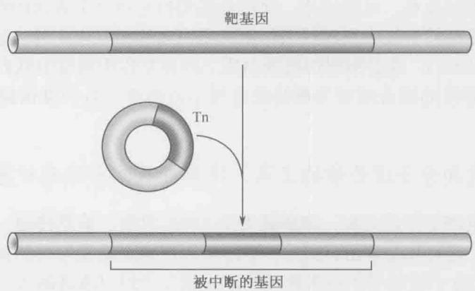

图 A-8 转座子产生的插入突变。转座子被质粒携带进入细胞，随后从载体上转移到宿主染色体上。因为细菌染色体中的编码区域（基因）高度密集，所以转座子插入基因的频率很高。转座子中携带的标记（如抗生素抗性）可以使带有转座子的细胞被分离。知道转座子两端的序列及它所插入的基因组的序列，就可以很方便地鉴定转座子所处的位置。  
  
图 A-9 转座子产生的 lacZ 融合。将前图介绍的转座子诱变法稍加修改，就可以将报道基因（如 lacZ）插入到基因组的任何区域。这样只要通过检测菌株中 lacZ 的表达水平就可以评估目标基因（被转座子 -lacZ 融合插入的基因）的表达。

另外，用于产生融合的转座子已制备出来了，它们含有既无启动子又无翻译起始序列的报道基因。在这些转座子中，报道基因需要在于靶基因的转录控制下并且置于在能够被正确翻译的靶基因可读框内才能表达。同时在转录和翻译水平上参与目标基因的报道基因融合称为基因融合。

## 重组 DNA 技术、全基因组测序和转录谱绘制加强了细菌的分子生物学研究

重组 DNA 技术的出现，如 DNA 克隆、全基因组序列，以及在全基因组水平研究基因转录的方法不但使高等细胞的分子生物学研究产生了革命性的突破。特别是在与传统的细菌遗传学紧密结合时，也对细菌等模式生物的研究产生了重要影响。例如，重组 DNA 技术使制备用于基因融合的转座子衍生物变得容易；又如，结合遗传感受态与重组方法可以产生精确的突变和基因融合，大大增加分子遗传操作的种类和数目。包含细菌中所有基因微阵列（microarray）的利用使在全基因组水平上研究基因表达成为可能。

结合前面描述的各种技术，可以快速、简便地阐明特定条件下表达的所有基因的功能。已经在酵母和其他真核系统中发挥巨大作用的蛋白质间相互作用的快速鉴定方法（如双杂交分析，见框 19-1），也是阐明细菌蛋白质之间相互作用网络的强有力工具。全基因组序列和没有选择性的接合质粒为那些没有复杂遗传学工具的细菌提供了进行分子遗传学操作的机会。

## 有了更好的传统和分子遗传学的工具，简单细胞的生化分析就会更加有效

从最初分子生物学的建立起，细菌就处于 DNA 复制、信息传递、基因调节机制等各种研究的中心。这有几个理由：第一，细菌可以在确定的和均一的生理条件下大量培养；第二，传统和分子遗传学的技术使纯化或大量生产经过改造的蛋白质复合物成为可能，从而可以获得大量的单个蛋白质；第三，也是非常重要的，就像在本书中反复提到过的，细菌的 DNA 复制、基因转录、蛋白质合成等机制比高等细胞简单得多（所包含的成分少得多）。所以，阐明细菌基本机制的研究进展迅速，只需要分离少数的蛋白质，其机制一般比高等细胞更简明。

## 细胞学分析同样适用于细菌

尽管细菌形态简单，没有膜包裹的细胞内分区（如细胞核和线粒体），但细菌并不是像几十年来人们认为的那样，只是简单的酶包被体。实际上，正如我们现在已经知道的，蛋白质和蛋白质复合物在细胞中都有特定的位置，连细菌中的染色体都是高度有序的。尽管细菌的型体小，但同样适用于细胞学研究，如通过免疫荧光显微镜（immunofluorescence microscopy）用特定抗体定位固定细胞内的蛋白质，用荧光显微镜（fluorescence microscopy）与绿色荧光蛋白（greenfluorescent protein）可以定位活体细胞中的蛋白质，还有用荧光原位杂交（FISH）可以定位细胞内染色体区域和质粒。这些方法的应用对我们深刻地理解本书所讨论的若干分子过程很有帮助。例如，我们现在知道，细菌细胞的复制机器是相对固定的并且定位在细胞中心（第9章）。这个发现告诉我们在复制过程中，DNA模板线状地通过一个相对固定的复制“工厂”，而不是传统观点认为的DNA聚合酶像火车在铁轨上那样沿着模板行进。又如，应用细胞学方法使我们清楚了（同样与传统的观点相反）复制过程中染色体新复制的两个起始区域朝细胞的两极移动。细胞学方法是细菌分子生物学研究的重要手段之一。

## 关于基因的基本知识绝大部分来自噬菌体和细菌

分子生物学起源主要归功于用细菌和噬菌体等模式系统进行的实验。如同我们在第2章所看到的，对于肺炎球菌的开创性研究使人们发现遗传物质是DNA。此后，就像我们在本书中所看到的，大肠杆菌及其噬菌体的实验一直在引导学科的发展。例如，Hershey和Martha Chase的实验使人们相信噬菌体的遗传物质是DNA；Matthew Meselson和Franklin W. Stahl的实验证明在大肠杆菌中DNA进行半保留复制；Francis H. Crick和Sydney Brenner的噬菌体交配实验（第16章）揭示了遗传密码由三联体密码子构成；而 Charles Yanofsky 用大肠杆菌进行的出色的遗传研究证明了遗传的共线性；也不能忘记 Jacob 和 Monod 的工作（见框 18-2），是他们发现了基因调控的基本机制；此外还有无数其他例子。在这些例子里，通过研究这些最简单的系统，生命的基本过程得以揭示。

一个重要的例子来自 Seymour Benzer 的出色工作，他详细研究了 T4 噬菌体中的一个叫 rII 的遗传位点。野生型 T4 可以在大肠杆菌 B 或 K 菌株里生长，但 rII 突变体仅在 B 菌株中生长。这样就有可能检测到发生频率小于 0.01% 的野生型噬菌体（比如说来自两个不同 rII 突变体之间的重组）。也就是说，当把 T4 噬菌体铺在 K 菌株形成的菌苔上时，可以在 10000 个 rII 突变噬菌体中检测到一个野生型，因为只有这种频率极低的重组子才能形成噬菌斑。

利用 rII 突变体这一难以置信的特性，Benzer 在成对的 rII 突变体之间进行了重组实验，并因此能够以高分辨率（接近或达到核苷酸碱基对的分辨率）绘制这些突变的顺序。他还设计了一个“互补”实验（如前述）表明 rII 位点是由两个相邻的基因组成的。Benzer 引入了顺反子（cistron）这一术语来描述基因（基于顺和反这两个词）。此外，值得一提的是，正是这个工作使 Crick 和 Brenner 能够利用这一位点开展遗传密码的研究。

## 合成通路和调节噪声

近年来，大肠杆菌和一些其他的细菌已经成为研究基因表达新方向的模型。其中尤为重要的是，通过对遗传背景相同的个体的基因表达进行观测，发现了遗传通路调节中的噪声。这种变化和其生物学效应使得人们对基因网络中噪声的优势及其问题有了更好的理解。这些研究得益于报告基因技术和成像技术的进步，但最主要的原因还是细菌在规模和生命周期上的诸多优势（见第22章中枯草芽孢杆菌的例子）。

基于细菌体系的合成生物学技术也得到了很大的进步。很多新的基因调节通路已经被建立，它们为研究调节网络提供了新的方法，也为具有特定功能的新型菌株的设计提供了可能——如细胞消化可以降解水面浮油的菌株。最近有报道称，细菌整个的基因组都可以通过多个合成的片段进行人工构建，而且一旦构建完成，该基因组可以自己发挥作用来维持细胞的生存。

## 酿酒酵母

单细胞真核生物作为模式实验系统有许多优势。比起其他真核生物，它们的基因组较小（见第8章），基因数目也比较少。与大肠杆菌相似，它们可以在实验室里快速繁殖（理想条件下，每次细胞分裂需要大约90min），从单个细胞繁殖成克隆群体。尽管酵母细胞比较简单，但它们具备所有真核生物细胞的主要特征，如含有一个独立的细胞核、多条线性染色体（染色质）、细胞质包含了全部的细胞器（如线粒体）和细胞骨架结构（如肌动蛋白纤维）。

研究得最清楚的单细胞真核生物是酿酒酵母 S. cerevisiae，因为可以用作发酵剂，所以通常称为酿酒酵母。100 多年来人们对酿酒酵母进行了大量的研究。19 世纪 60 年代，在实验中，Louis Pasteur 鉴定出这种酵母是发酵的催化剂（在此之前，糖被认为是自发地分解成乙醇和二氧化碳）。这些研究最终导致了第一个酶的发现及生物化学作为实验体系的建立。20 世纪 30 年代，开始了酿酒酵母的遗传学研究，由此鉴定了许多酵母基因。所以，像大肠杆菌一样，酿酒酵母使研究者能用遗传和生化的方法来解决生物学基本问题。

## 单倍体和双倍体细胞的存在促进了酿酒酵母的遗传分析

酿酒酵母细胞既可以以单倍体状态（每条染色体有一个拷贝）又可以以双倍体状态（每条染色体有两个拷贝）生长（图 A-10）。单倍体和双倍体之间的转换通过交配（单倍体到双倍体）和孢子形成（双倍体到单倍体）来实现。有两种单倍体细胞类型，分别为 a 型和 $\alpha$ 型。在一起生长时，这些细胞因交配而形成 $a/\alpha$ 双倍体细胞。在营养物匮乏的情况下， $a/\alpha$ 双倍体发生减数分裂（见第 8 章），产生一个称为子囊的结构，每个子囊含有 4 个单倍体孢子（两个 a-孢子和两个 $\alpha$ -孢子）。但当生长条件改善时，这些孢子可以出芽并以单倍体细胞的形式生长或交配而重新形成 $a/\alpha$ 双倍体。

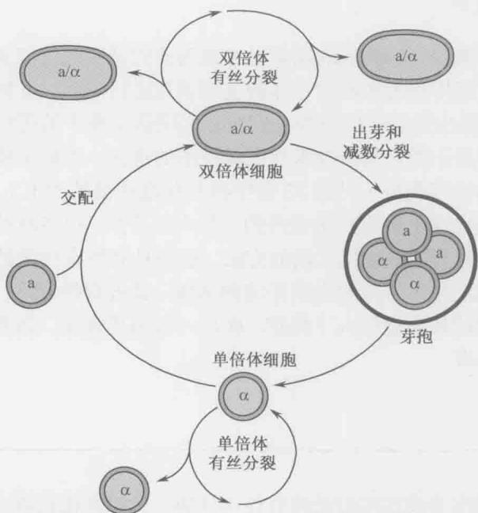  
图 A-10 酿酒酵母 S. cerevisiae 的生活周期。如本章及其他章节所描述的，酿酒酵母以 3 种形式存在：两种类型单倍体细胞——a 和 $\alpha$ ，以及两者交配的双倍体产物。图示这些不同种类细胞的复制、交配和芽孢形成。

在实验室中，可以对这些类型的细胞进行各种遗传分析。简单地将两个待测试的分别携带一个突变的单倍体菌株进行交配，就可以进行遗传互补实验。如果两个突变是互补的，相对于突变表型，双倍体就是一个野生型。如果要测试单个基因的功能，可以在只有一个拷贝的单倍体细胞里诱发突变。例如，想知道一个特定的基因是否是细胞生长所必需的，可以在单倍体里敲除这个基因。单倍体细胞只能承受非必需基因敲除。

## 在酵母中容易产生精确的突变

精确和快速地改变单个基因的技术使酿酒酵母的遗传分析研究水平得到了进一步提高。末端与基因组的任何一个特定区域同源的线性DNA引入酿酒酵母细胞中，就会观察到频率非常高的同源重组，导致相应染色体序列被转化所用的DNA片段取代（图A-11）。利用这一特性可以对基因组做精确的改变。这种方法可以用来精确地删除整个基因的编码区、改变一个可读框中的特定密码子，甚至改变启动子中的一个特定碱基对。这种在基因组中进行精确改变的技术使研究特定基因或其调节序列的功能等具体问题变得比较容易。

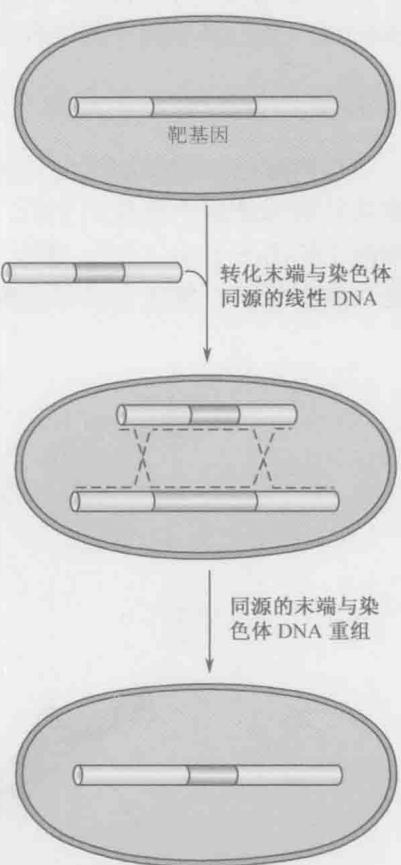

## 酿酒酵母有一个已知特性的小基因组

由于酿酒酵母遗传研究的历史很长，基因组又相对较小，所以它成了进行全基因组测序的第一个真核（非病毒）生物。这一“里程碑”式的事件于1996年完成。序列分析（ $1.3 \times 16^{6} bp$ ）发现了大约6000个基因，首次揭示了指导真核生物形成所需的遗传复杂性。

酿酒酵母完整基因组序列的获得使酵母的

同源区域间的 DNA 取代了目的基因

图 A-11 酵母中的重组转化。如文中所述，酵母基因组的所有区域都可以容易地被目标序列所取代。要插入的 DNA 片段的两端序列要与被取代的染色体区域的侧翼序列同源。当供体片段被导入细胞后，在这个生物中的高水平同源重组保证了与染色体的高频率重组，导致了上图所示的遗传交换。插入的 DNA 可能与原来的 DNA 只有一个碱基对的不同，也许是另一个极端，即长度和序列上非常不同，由此可以完成非常精细的遗传修饰。

研究可以在“全基因组”水平上进行。例如，包含来自所有近6000个酿酒酵母基因序列的DNA微阵列已广泛用于不同生理条件下基因表达模式的研究。实际上，目前已经对200多种不同条件下酿酒酵母细胞的基因表达水平进行了检测，包括不同的碳源（如葡萄糖对半乳糖）、细胞类型和培养温度。这些发现不仅对检测单个基因的表达非常有用，而且使我们能将基因按照对不同培养条件的应答分为各种协同作用的基因群。

其他全基因组资源还包括一个 6000 个菌株的文库，每一菌株中只删除了一个基因。其中的 5000 多株在单倍体状态时也能够存活，表明大多数酵母基因是非必需的。这个酵母菌株库使检测酿酒酵母基因组的每个基因在特定过程中作用的遗传筛选得以进行。

微阵列的使用还使利用染色质免疫沉淀技术（ChIP，chromatin immunoprecipitation techniques）进行转录因子的结合位点的全基因组作图得以开展（见第7章）。

## 酿酒酵母细胞生长时形态改变

当酿酒酵母细胞周期性生长时，形态上的特征会发生变化（图 A-12）。当一个新细胞从它的母细胞中释放出来后，子细胞稍呈椭圆形；随着细胞周期的延续，酿酒酵母细胞上长出一个小“芽”，这个“芽”最终会成为一个独立的细胞。一直长到与其母细胞大致相当时，芽就会从母细胞中释放出来，两个细胞开始新的一轮繁殖过程。

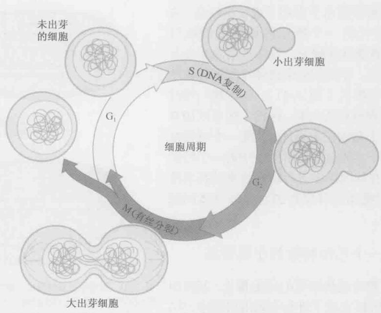  
图 A-12 酵母的减数分裂细胞周期。酿酒酵母通过出芽进行分裂。图示一个子代芽经历减数分裂周期的发育，该过程在正文中也有描述。

对酿酒酵母细胞形状进行简单的显微观察，就可以获得许多细胞内事件的信息。没有芽的细胞还没有开始复制它的基因组，这是因为在野生型酿酒酵母细胞中，新芽的出现和 DNA 复制的启动是紧密关联的。同样地，正在生长的、有着大芽的细胞几乎总是处在染色体分离的过程中。

应用强有力的遗传学、生物化学和基因组学工具研究酵母，使其成为科学家们在分析基本的分子和细胞生物学问题时喜爱采用的真核生物。研究酿酒酵母为我们了解真核生物的转录和基因调控、DNA复制、重组、翻译、剪接等做出了重要贡献。酿酒酵母的遗传学研究已经发现了所有这些事件中涉及的蛋白质。也许最为重要的是，在酿酒酵母中发现的那些对基本生命活动重要的蛋白质和基因在包括人类在内的其他真核生物中几乎总是保守的。因此，从这个简单真核模式生物中归纳的信息几乎总是与复杂生物的相同事件相关。

## 拟南芥

起源于农业和药用植物的植物学在所有生命科学中是研究历史最悠久的。通经过孟德尔的工作，植物学奠定了遗传学的基础；通过达尔文、Barbara McClintock、William Bateson和其他人的工作，植物学也奠定了为细胞遗传学、发育学、生理学和演化科学的基础。植物科学继续在基础领域如RNA干扰方面有着重要的进展，和过去一样，继续对经济和环境发挥着重要影响。在过去的几十年中，一种不起眼的、类似芥末的杂草——拟南芥，渐渐成为与果蝇、秀丽新小杆线虫和小鼠媲美的模式生物。比动物模式生物更重要的是，拟南芥揭示了植物生物学，尤其是被子植物（开花的种子植物）的大多数关键问题。就像在20世纪玉米带来植物遗传学的革命一样，拟南芥注定要为植物基因组学和植物生物学的大多数问题做出贡献。

## 拟南芥具有单倍体和双倍体交替的快速生命周期

像酵母一样，所有植物的生命周期具有单倍体和双倍体两种生命周期阶段，两个时期分别根据它们的产物来命名——双倍体时期（与酵母类似）发生减数分裂并产生孢子，因此被称为“孢子形成体”（带有孢子的植物）。单倍体的孢子发芽产生单倍体期，在这个时期分化出两种性别的配子，所以单倍体期也称为雄配子体期或雌配子体期。在受精过程中，配子融合产生双倍体的合子。单倍体和双倍体期的相对长度随植物而异——苔藓植物大部分时期属配子体期，而拟南芥和其他高等植物大部分时间是孢子形成体，蕨类植物则介于两者之间。在开花植物中，配子体期非常短，只有2或3次有丝分裂，生殖细胞存在于成体植物长出的花中，而不像动物中那样隐藏的胚胎中。大多数植物（如拟南芥）是雌雄同体的，从分化的花中或发生雌雄减数分裂的花器官中产生两种性别的单倍体配子体（图A-13）。

种子植物，如拟南芥，在受精后经历另一个时期——胚胎发生和休眠，从而产生以此命名的种子。同哺乳动物一样，胚胎由完成分化的胚胎外组织提供营养。但是与动物不同的是，这些胚胎外组织（称为胚乳“含在种子中”）是独立受精产物，它们的受精发生在第二个单倍体精子和雌性双倍体“中央”细胞，双倍体“中央”细胞则是由两个单倍体姐妹卵细胞融合而成。三倍体核快速分裂，随后又分裂形成很多细胞，并且快速积累淀粉和蛋白质，为胚胎提供重要的营养。由于胚胎发育时胚乳的营养被胚胎攫取，在许多植物中（如拟南芥）其生命是短暂的，但在其他植物中胚乳可以提供种子发芽所需的营养，而在小麦和玉米等主要谷物中则可以提供淀粉。

## 拟南芥容易转化，适于反向遗传学研究

在土壤细菌根瘤农杆菌及其亲缘较近的土壤细菌感染下，植物诱发肿瘤性生长（冠瘿，galls），其原因在于细菌的 Ti（tumor-inducing）质粒携带着激素生物合成基因，该基因转移到了宿主植物的染色体 DNA 上。肿瘤诱发（tumor-inducing）基因位于质粒的转移 DNA（T-DNA）部分，两侧边界序列是转移所需的正向重复序列。用感兴趣的基因取代肿瘤引发基因，就可以转化植物。拟南芥的转化只需简单地在植物上喷上或将植物浸泡在含有促进感染的表面活性剂的高浓度农杆菌培养液中。瞬时感染几乎在侵染的同时就可以发生，可用于瞬时表达研究，但稳定转化一般发生在数天或数周后，可以通过在受精前感染雌性配子。在 T-DNA 中加上选择性标记基因（抗不同的除草剂），并在含有除草剂的培养基上或土壤中发芽种子，就可以选择转化的植物。

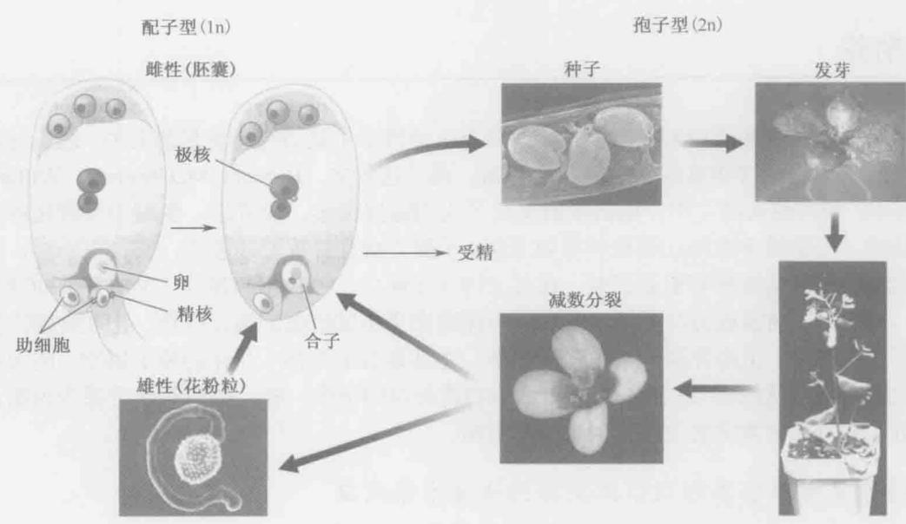  
图 A-13 拟南芥的生命周期。（Rob Martienssen 惠赠）

拟南芥的转化效率很高，可以用来大量制备突变体。随机把几十万个 T-DNA 插入到植物中，然后对插入位点进行扩增和测序，已经收集到了很多基因组中带有插入基因的植物。这些插入突变可以用于精确的“反向”遗传学研究，就像酵母利用删除所进行的相同。进一步讲，在 T-DNA 中加上报道基因或增强子，这些插入可用来报告所插入基因的表达，或在通常不表达的细胞中激活基因的表达。通过在 T-DNA 中加上转座因子，就可能不需要额外转化就产生大量转座子跳跃，产生衍生的同位基因、回复突变等位基因及嵌合体。由于水稻和玉米的转化要困难得多，在这些植物中转座子一直是进行“反向”遗传学的主要工具。

## 拟南芥基因组小易于操作

拟南芥的基因组只含有 105Mb 的常染色体 DNA，约 15Mb 已测序的异染色质，另外 15\~25Mb 的卫星重复序列和 rDNA，总共约 140Mb。大多数测序的异染色质位于 5 个着丝粒的两边，虽然异染色质的较小区域突起（knob）在染色体臂上。常染色体和大部分异染色质的测序使我们知道 29000 个拟南芥基因中 99% 的序列。许多其他植物基因组的测序揭示了真双子叶植物中发生了几轮基因组加倍（多倍体，polyploidy），真双子叶植物是被子植物演化树中的一个主要分支，其中包含拟南芥。最近的基因组加倍仅仅发生在几百万年之前，所以约25%的拟南芥基因保留了一个功能同源基因，导致相当多的基因冗余，以致影响了反向遗传策略的应用。另一方面，也许部分是因为基因冗余，在拟南芥中正向遗传学一直非常有效，可以使用高剂量的诱变剂[例如甲基磺酸乙酯（EMS）、乙酰基亚硝基脲（ENS）或放射线]而不会杀死植物，相对数目较少的经诱变剂处理过的种子就可以使突变达到饱和。种子可以直接进行诱变处理，隐性突变可以简单地通过让种子发芽后自变获得。

有了基因组序列和具有多态性的拟南芥品系后，对正向遗传学发现的突变进行定位克隆变得异常便捷。EMS 突变甚至可用于反向遗传学策略，称为覆瓦（targeting induced local lesions in genomes, tilling），即筛选诱变剂处理过的植物的 DNA 来获得感兴趣的基因的点突变。随着高通量的测序方法的出现，这种策略甚至更具实操作性，并且可以全方位回复每个基因的等位变异。基因组序列的测定使许多其他基因组学技术成为可能，如覆瓦（tilling）微阵列、高通量蛋白质定位及蛋白质组学技术等。

通过小 RNA（19\~30 个核苷酸）进行 RNA 干扰是一种重要的基因调控机制，无论是内源还是外源，这一机制就是最先在植物中发现的（见第 19 章）。在拟南芥中，至少三类小 RNA——microRNA（miRNA）、反式短的干扰 RNA（tasiRNA）、与重复序列相关的 siRNA，它们在大小和生物起源方面各不同，但都可以通过与目标序列配对并催化由内切核酸酶活性行使的“切割”、转录停止、染色质及 DNA 修饰等来调控基因。这些小 RNA 来源于单链“发夹”结构前体或双链 RNA，后者是依赖 RNA 的 RNA 聚合酶的产物。在拟南芥中采用 RNA 干扰的基因组方法包括：VIGS（virally induced gene silencing，病毒诱导的基因沉默）、共抑制、发夹沉默和人工 miRNA 等。

## 表观遗传学

表观遗传差异通常定义为可以通过染色体遗传，但不涉及核苷酸序列改变的“突变”。相对于通常的突变，这些“表观突变”的可逆频率要高得多，并且与DNA及相关蛋白质（尤其是组蛋白）的化学修饰有关。几十年来，植物一直处于表观遗传学研究的前沿，拟南芥也不例外。像哺乳动物基因组，但与酵母、线虫和果蝇的基因组不同，植物基因组内有胞嘧啶甲基化的高度修饰，这些修饰与组蛋白修饰同时对基因表达和基因组中发现的重复序列的表达具有表观遗传后果。这些修饰由各种各样的因子介导，包括RNA干扰依赖RNA的DNA甲基化现象，以及首次在植物中发现的RNA依赖的组蛋白修饰，后者也在裂殖酵母和其他生物中发生。

当一个基因的沉默在雄性和雌性生殖细胞系中不同时，印记（通常）导致母本遗传的等位基因进行表达。被印记的基因表达在胚胎外的胚乳组织中普遍存在，使人想起在哺乳动物胎盘中的印记。在这些研究得很透彻的例子中，被印记的基因的去甲基化发生在中央细胞，导致胚乳中母本等位基因的表达。

表观遗传作用经常受环境的影响，在一个极端的例子中，植物在春天开花记忆的是冬天的寒冷。这种记忆是由寒冷来诱导、靠细胞的无性繁殖来保持。减数分裂抹去了这个记忆，导致类似于大家习惯的冬小麦的开花习性。在拟南芥中，这个过程（春化）是由 RNA 加工及组蛋白修饰来调控的，并且涉及多梳复合体，该复合体也参与动物的细胞记忆。

## 植物对环境的反应

与动物不同，植物扎根在一处，便不能逃避环境的侵害，具有一些通常在动物中没有的特性，例如对啃食的耐受性。植物的天然免疫系统，最早在分子水平上被描述为“基因对基因”反应，涉及许多在动物中保守的基因，但它们是高度多样化的，可以识别病毒、细菌、线虫、昆虫，甚至其他植物。除了这些“生物的”压力外，植物必须经受住“非生物的”压力并对其做出反应，这些压力包括光强度变化、昼夜更替、养分、盐和水的改变等。许多环境因素对发育会有深远的影响，如通过诱导或延迟开花使之更适合种子产生。

光在植物生物学中起核心作用，进行光合作用的叶绿体来源于古老的共生原核生物，负责固定生物圈中大多数有机碳。由于在遗传和基因组操作方面的方便性，甚至在光合作用研究领域，拟南芥也正在取代传统的生理学模式生物，如烟草和菠菜。

## 发育和形态建成

同植物生物学的其他领域相比，植物发育对作物驯化和育种的影响最大，所以对人类历史的影响也最大。其中由古代农民及富有经验的育种家等进行的选择是巨大的创新，他们改进了花序结构、种子落粒性、叶片形状等。与现代农民视为草的祖先物种相比，花椰菜、谷物和甘蓝与它们只有几个基因的差异。由于开花植物是最近演化的群体，许多负责开花的基因是用拟南芥作为模式生物被发现的。

一般而言，植物和动物是从一个共同的单细胞祖先分支演化而来，所以多细胞发育是在各自的界中独立演化的。因此我们看到通用的基本原则，如转录因子和信号转导层次结构（多肽、激素和受体）的核心地位，在每个界中都是公认的，而特异的分子就很少保守。有些机制非常相似，如细胞周期和 MAP（mitogen-activated protein）激酶级联途径，但大多数是明显不同的。例如，在两类谱系中同源异型和异时特征都是由转录因子和 miRNA 保证的，但涉及的分子不同，在植物中大多是 MADS（MCM 1, agamous, deficiens, and serum response）转录因子，在动物中是 Hox 基因。在两个界中细胞间交流都涉及激素，但这只能说是类似（植物和动物都使用类固醇也许是个例外）。事实上，植物中的高度关联的超细胞维管系统允许大分子在细胞间通过，如 mRNA、小 RNA 和转录因子，而这个现象在动物中很少见到。

那么，共同的发育机制可能在单细胞或寡细胞祖先中发挥功能，并且可能被指派去独立地执行相似的功能。也许在祖先的单细胞真核生物保守的表观遗传机制，如多梳蛋白系统，在基因组的组织、基因组防御、染色体生物学和细胞分化方面执行功能，而不是多细胞转录记忆。拟南芥在发现植物界内部以及植物界与动物界间保守性方面扮演着重要角色。

## 秀丽新小杆线虫

在分子遗传学领域做出杰出贡献后，Brenner 又确定了一种适合于研究发育重要问题和行为的分子基础的小型多细胞动物。他吸取了噬菌体和细菌的分子遗传学研究的成功经验，希望尽可能采用最简单的、既具有分化的细胞类型又符合类似微生物遗传学的生物。1965 年，他选定用秀丽新小杆线虫（C. elegans），因为它具有许多合适的特性。例如，快速的世代时间使遗传筛查易于进行；雌雄同体的自身繁殖可以产生几百个“自身后代”，因而适于大量产生子代生物体；有性繁殖使遗传品系可以通过交配来构建；少量透明细胞的存在使发育过程能被直接追踪。

Brenner 设定了两个雄心勃勃的初始目标，这对最终实现将秀丽新小杆线虫用作模式生物至关重要。目标之一是绘制所有细胞的完整物理图谱，用重建系列切片电镜图的方法（1986年由John White完成）；目标之二则是绘制全部动物的细胞谱系（1983年由John Sulston完成）。这揭示出成熟线虫细胞在发育过程如何出现，以及后代细胞与其他个体之间如何联系。7年后Brenner分离到了300多个含有形态和行为突变的突变体，建立了这个新的模式生物的遗传学。这些突变体分为100多个互补组，定位于6个连锁群。将近30年以后，全世界有400家实验室在研究秀丽新小杆线虫。由于秀丽新小杆线虫简单而容易用于实验，它是目前研究得最透彻的多细胞动物之一。

## 秀丽新小杆线虫的短生活周期

秀丽新小杆线虫在培养皿里培养，只以细菌为食。它们在一定的温度范围内生长良好，如在25℃比在15℃生长速度快一倍。在25℃时，受精的胚胎在12小时内完成发育，孵化成独立存活，具有复杂行为能力的个体。第一个幼虫期（L1）分成4个发育时期（L1\~L4），在40小时内成为一个性成熟的成虫（图A-14）。

雌雄同体的成虫大约4天内就可以产生多达300个自身后代，或与罕见的雄性线虫交配，产生多达1000条杂交后代。成虫存活大约15天。在有生长压力的条件下（少食、高温、高密度），L1期可以进入另一个发育期，形成一个所谓的持续幼虫（dauer幼虫）。持续幼虫对环境压力有抵抗能力，能存活几个月的时间等待环境条件的改善。通过研究那些不能进入或不适当地进入持续幼虫期的突变体，发现了特异性神经元中表达的感知环境条件的基因、调控身体生长的基因，以及控制寿命的基因。激活控制寿命的基因可以极大地延长寿命，这些基因的同源基因被认为与哺乳动物寿命的延长紧密相关。

## 秀丽新小杆线虫由数量相对较少、已深入研究的细胞谱系组成

秀丽新小杆线虫身体构造简单（图 A-15）。雌雄同体成虫的重要器官是性腺，其中含有正在增殖和分化的生殖细胞（精子和卵子）、受精室（受精囊），以及暂时储存幼小胚胎的子宫。胚胎经过阴门从子宫排到体外，阴门是一个由 22 个表皮细胞组成的结构。突变破坏形成的阴门虽不影响胚胎的产生，但却使排卵无法进行。结果，胚胎在子宫内发育并孵化。孵化了的线虫随后吞食它们的母亲，并被限制在它的皮肤里（角质层），形成一个“线虫袋”。这很容易识别和分离几百个没有阴门的突变体，从中发现了许多控制阴门细胞的产生、特化和分化的基因，同时表明这种简化的“器官”需要10\~100个基因构建，其中包括高度保守的受体酪氨酸激酶信号通路，该通路控制细胞增殖。

图 A-14 秀丽新小杆线虫的生活周期。图示为生活周期，如文中所述，从第一期幼虫到成虫的发育以小时计。L1 幼虫进入的另一个发育期（成为持续幼虫）也在此显示。  
  
图 A-15 线虫的身体平面图。（a）显示的是一个成虫两性体线虫的纵切剖面图。各种器官在图（b）中标示，并在文中有所描述。[a，经许可影印自 Sulston J. E. 和 Horvitz H. R. 1977. Dev. Biol. 56: 110-156. © Elsevier.]

在哺乳动物中，这些基因的许多同源基因是致癌基因和肿瘤抑制基因，当它们发生改变时就会导致癌症。在秀丽新小杆线虫，使这个途径失活的突变体不会产生阴门细胞，所以阴门不能发育，而激活这个途径的突变体则导致阴门前体细胞的过度增殖，产生具有多个阴门的表型。因为线虫是透明的，阴门仅仅来源于22个细胞，所以可从细胞水平的分辨率描述突变体的缺陷，从而将突变的类型与某一特定细胞的改变联系起来。此外，特定基因产物的细胞自治功能和非自治功能可以被区分。

## 细胞凋亡通路是在秀丽新小杆线虫中发现的

尽管细胞凋亡过程已经在很多发育过程中被确定（如趾的形成和蝌蚪尾巴的消失），但细胞凋亡是一个“程序化”的、遗传调控的过程论断的确认得益于在线虫遗传和实验上的研究。细胞谱系的早期分析注意到在每一个动物中成组细胞的死亡都是相同的，暗示细胞死亡是受遗传控制的。第一个分离到的细胞死亡缺陷型（ced）突变体是那些在相邻细胞吞噬死亡细胞残体方面有缺陷的突变体。因而，在突变体内，死亡细胞残体会存留多个小时。利用这些ced突变体，H.Robert Horvitz和他的同事分离了更多的不能产生保留细胞残体的ced突变体。这些突变体被证明是在启动细胞死亡程序方面有缺陷。除了一个特例外，ced突变体的分析表明，所有发育中的程序化细胞死亡是自主的，也就是说是细胞自杀。在雄性中，有个叫做连接细胞的细胞被相邻细胞杀死。ced基因的鉴定为确认哺乳动物的同类蛋白质提供了方法，这类蛋白质在所有的动物中基本上驱动同样的生化反应来控制细胞死亡，事实上，在秀丽新小杆线虫里表达人类的ced同源基因可以替代突变的ced基因。细胞凋亡在发育和疾病过程中与细胞增殖同等重要，并且是许多控制癌症和神经退行性疾病治疗方法的焦点。

## RNA 干扰（RNAi）是在秀丽新小杆线虫中发现的

1998年，公布了一项惊人的发现：双链RNA（dsRNA）引入秀丽新小杆线虫后，抑制了其与同源的基因表达（关于基因沉默的全面论述，见第20章）。虽然这个现象也在其他模式生物中被发现，但线虫在遗传和发育实验上的易处理性（例如突变体的产生不能沉默）确保了它在阐明基因沉默理论中的领先地位。这个意外的发现以及接下来的RNA干扰（RNAi）分析具有三个方面的重要意义。第一，RNAi看来是普遍存在的，因为几乎所有的动物、真菌或植物细胞中dsRNA的引入都会导致同源mRNA的定向降解。实际上，我们对RNAi的了解很多来自于植物研究（第20章）。第二，对这个神秘过程的实验研究揭示了它的分子机制（见图20-10）。RNAi的第三个重要方面是该技术在控制多种生物体的基因表达中的广泛应用。RNAi提供了一种鉴定特定生命过程相关基因的“系统策略”，当然这种鉴定也可以通过传统遗传学来完成。因此，干扰RNA文库可以对应一个生物体内所有的基因，通过将特定的表型和文库中特定的RNA相关联，人们便可以追踪到出现这一表型的基因。这种方法甚至可以用于那些不符合传统遗传学的生物体的研究。这些研究与另一个RNA介导的基因调节过程相交叉，那个过程涉及微小的内源小RNA，已有研究显示这些内源小RNA在植物和动物中调节基因表达、在纤毛虫里协调基因组重排并在酵母里调节染色质结构。最初的两个小RNA是在秀丽新小杆线虫中进行遗传筛选时发现的。一小部分线虫小RNA在两翼昆虫和哺乳动物中是保守的，它们的功能正在被逐步揭示。最近的研究表明人类基因组可能含有大约1000个小RNA基因。

## 黑腹果蝇

果蝇作为模式生物用于遗传和发育生物学研究已近百年。1908年托马斯·亨特·摩尔根（Thomas Hunt Morgan）和他在哥伦比亚大学（Columbia University）的研究助手把腐烂的水果放在舍莫宏大厅（Schermerhorn Hall）的实验室窗台上。目的是搜寻一种小的、快速繁殖的动物，并能够在实验室里培养来研究数量性状的遗传，如眼睛的颜色。在捕获的各种动物中，果蝇最符合要求。成虫在两周内就可以产生大量子代，果蝇培养用的是回收的牛奶瓶和一种廉价的酵母和琼脂混合物。

## 果蝇的生活周期很短

果蝇生活周期的突出特征是有一个快速的胚胎形成期，然后是3个幼虫生长期及变形期（图A-16）。胚胎形成在受精后的24h内完成，最终孵化出第一龄幼虫。如同我们在第21章中所讨论的，果蝇胚胎发育早期的核分裂是所有动物中最快的。一个第一龄幼虫生长24h，然后蜕皮成一个更大的第二龄幼虫。这个过程重复以产生一个第三龄幼虫，它进食并生长2\~3天。

  
图 A-16 果蝇生活周期。图示为文中描述果蝇发育的各个时期。

幼虫发育中的一个关键过程是器官芽的生长，它是由胚胎中期表皮内陷形成的（图A-17）。每套肢体都有一对器官芽（如一套前腿器官芽和一套翅膀器官芽），还有眼睛、触角、口器和生殖器的器官芽等。起初器官芽很小，在胚胎中仅由不到100个细胞组成，但在成熟的幼虫中却含有成千上万个细胞。翅膀器官芽的发育已经成为重要模式系统，例如Hedgehog和Dpp（TGF-β）等分泌信号分子的梯度是如何控制复杂的身体结构形成过程的。器官芽在变形（或化蛹）过程中分化成各自相应的成虫结构。

  
图 A-17 果蝇的器官芽。右图所示为幼虫中各个器官芽的位置。左图为它们在成虫中形成的肢翼和器官。这些器官芽起初在胚胎里只是很小的细胞群，但在成熟的幼虫里有成千上万个细胞。这些器官芽在化蛹的过程中发育成它们相应的成虫中的结构。

## 第一个基因组图谱在果蝇中产生

1910年，摩尔根实验室发现了一个自发突变的雄蝇，它的眼睛是白色的而不是正常品系中的亮红色。由这个果蝇启动了一系列深入的遗传学研究，产生了两项重要发现：一是基因位于染色体上；二是每个基因是由两个等位基因组成的，这两个基因在减数分裂过程中独立分配（见孟德尔第一定律；第1章）。其他突变的发现证实了位于不同染色体上的基因独立地分离（孟德尔第二定律），而那些连锁在同一条染色体上的基因则不同。

哥伦比亚大学的学生 Alfred. H. Sturtevant（摩尔根实验室的成员）设计了一个简单的数学运算方法，可以根据重组频率绘制连锁基因之间的距离。这个简单有效的方法产生了巨大的影响，从根本上改变了遗传学，第一次物理的定位了基因并能在染色体上排序。到了20世纪30年代，遗传图谱已经非常密集，确定了控制成虫多种物理特性的多个基因的相对位置，如翅膀大小和形状，以及眼睛颜色和形状等。

另一位曾在摩尔根果蝇实验室接受培训的科学家 Hermann. J. Muller，第一次提出了环境因素，如导致染色体重排和遗传突变的离子辐射。日常进行的大规模“遗传筛选”是通过喂食成年雄蝇一种诱变剂如 EMS（ethylmethane sulfone），然后将之与正常雌蝇交配。 $F_{1}$ 代是杂合的，含有一条正常的染色体和一条随机突变的染色体。各种各样的方法被用来研究这些突变，如后所述。

除了强大的生育能力（一个雌性可以产生几千个卵）和快速的生活周期外，果蝇还有几个非常有用的特征，使其长期在实验研究中扮演着重要角色。它只有4条染色体：2条大的常染色体，即染色体2和3；1条较小的X染色体（它决定性别）；1条非常小的染色体4。Muller的同事Calvin B. Bridges发现在果蝇幼虫里某些组织中能够进行多次内部复制而并不发生有丝分裂。在唾液腺中，这个过程产生了极其巨大的，由大约1000个拷贝的染色单体组成的染色体。Bridges 利用这些多线染色体（polytene chromosome）来绘制果蝇基因组的物理图谱（这是在所有生物中第一个绘出的）（图 A-18）。

  
图 A-18 遗传图谱、多线染色体和缺失图谱（deficiency mapping）。在某些果蝇组织中，没有伴随有丝分裂的核内复制导致放大的染色体，最明显的是唾液腺体，在那里可以产生巨大的由 1000 个染色单体组成的染色体。这是第一次有可能把某些性状的基因出现与染色体的特定物理片段联系起来。例如，果蝇白眼表型与 X 染色体 3C 区域缺失相关。（经许可引自 Hartwell L. et al. 2004. Genetics: From genes to genomes, $2^{\text{nd}}$ ed., p.816, Fig.D-4. © McGraw-Hill.）。

Bridges 在 4 条染色体上总共发现了大约 5000 条 “条带”，并将许多条带和经典重组图谱遗传位点的位置建立了相关性。例如，隐性的 white 突变基因杂合的雌性果蝇表现出正常的红眼。然而，含有 white 突变的相似雌蝇若同时在另一条 X 染色体上移走了 3C2-3C3 多线条带则表现为白眼。这是因为已不存在该基因正常的显性拷贝。这类分析

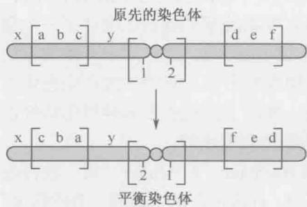

图 A-19 平衡染色体。当与原先的亲本染色体（上图）比较时，平衡染色体（下图）有一系列倒位。本图中，绘出的染色体有两个臂。平衡染色体的左臂有一个内倒位，基因 a、b、c 的顺序与原来相反。同样地，平衡染色体右臂也有一个倒位，颠倒了基因 d、e 和 f 的顺序。另外，以着丝粒为中心可能有一个倒位，此处颠倒了基因 1 和 2 的顺序。与原来的染色体相比，平衡染色体的基因顺序有明显不同。这样，含有一个正常拷贝和一个平衡染色体拷贝的杂合体中染色体之间的重组就被抑制了。

使我们得出结论：白眼基因位于 X 染色体的多线条带 3C2 和条带 3C3 之间。

其他各种遗传方法的建立，确立了果蝇作为动物遗传研究首要模式生物的地位。例如，平衡染色体（balancer chromosome），它含有一系列相对于原始染色体的倒位（图A-19）。严格地说，这种平衡染色体在减数分裂过程中不与原始的染色体进行重组，就可能永久保留含有隐性致死突变的果蝇群落。我们在第21章讨论过的even-skipped（eve）基因的一个无功能突变，这个突变纯合体的胚胎会死亡，不能产生幼虫和成蝇。eve位点被定位在染色体2（在多线条带46C）上。这个无功能突变可以在杂合群体中保留，杂合子含有一条有eve无功能等位基因的“正常”染色体和一条含有该基因正常拷贝的平衡染色体。既然eve的无功能等位基因是完全隐性，这些果蝇是可以存活的，然而，在成体后代中只观察到杂合子的存在。含有两个平衡染色体拷贝的胚胎不能存活，因为某些倒位破坏了生存必需基因而产生隐性致死基因。另外，含有两个拷贝正常染色体的胚胎也不能存活，因为它们对 eve 的无功能突变是纯合的。

## 遗传嵌合体使分析成蝇中的致死基因得以进行

嵌合体（mosaics）是在一个总体上“正常”的遗传背景下含有小部分突变组织的动物。该生物中大多数的组织是正常的，一小部分的不正常不会致死。例如，通过X射线照射发育中的幼虫，诱导有丝分裂重组可以产生小块的engrailed/engrailed纯合突变组织。当突变部分出现在发育中的翅膀后面的区域，那么果蝇就表现出非正常的翅膀，在正常的后部结构区产生重复的前部结构。遗传嵌合体分析提供了Engrailed是将果蝇的附器和节片细分成前后两部分所必需的第一个证据。

最令人惊奇的遗传嵌合体是雌雄嵌合体（图A-20），这些果蝇是严格意义上的半雄半雌果蝇。果蝇的性别是由X染色体的数目决定的，有两条X染色体的个体是雌性，只有一条X染色体的是雄性（与小鼠和人类不同，Y染色体在果蝇中不决定性别，Y只在产生精子中需要）。在极为罕见的情况下，随着精子和卵子前核的融合，新受精的XX胚胎里两条X染色体中的一条会在第一次有丝分裂时丢失。

这种 X 染色体的不稳定性仅出现在第一次分裂时，在随后的分裂中，含有两条 X 染色体的细胞核产生两条 X 染色体的子核，而只有一条 X 染色体的核产生的子代含有一条 X。如同我们在第 21 章所讨论的，这些细胞核经历快速分裂而细胞膜不分裂，然后迁移到卵的外围。这

  
图 A-20 雌雄嵌合体。雌雄嵌合体是一令人惊奇的遗传嵌合体的形式。（a）蓝色的 X 染色体携带隐性（白眼）突变，而红色的 X 染色体有该基因的正常的显性拷贝。如文中所述，突变是一个 XX（雌性）果蝇的一条 X 染色体在第一次有丝分裂时丢失的结果。（b）在形成的突变体中，果蝇的一半是雌性，另一半是雄性。

个迁移是连贯的，含有一条 X 染色体的核和含有两条 X 染色体的核很少或不发生混合。因而，一半的胚胎是雄性的，一半是雌性的，尽管分开雄性和雌性组织的“分界线”是随机的。它的确切位置取决于在第一次分裂后两个子细胞核的方向。这条分界线有时把成蝇切成左半部是雌性的，右半部是雄性的。假设一条 X 染色体含有隐性的白眼基因，如果野生型 X 染色体在第一次分裂时丢失，那么果蝇的右半部，即雄性部分为白眼（雄性半部只有突变的 X 染色体），而左半部（雌性一边）为红眼（记住雌性半部有两条 X 染色体，携带显性的、野生型的等位基因）。

## 酵母 FLP 重组酶能够有效遗传嵌合体

经典遗传分析没有预料到的是，果蝇有若干个对分子研究和全基因组分析有利的特性，主要是果蝇的基因组相对较小，只有大约150Mb，蛋白质编码基因还不到14000个，这只是构成小鼠和人类基因组的DNA总量的5%。果蝇进入当今时代后，人们改进了一些旧的遗传操作技术，建立若干全新的实验方法，如制备携带重组DNA的稳定转基因株技术。

就像我们以前所讨论的，遗传嵌合体是在体细胞里通过有丝分裂重组而产生的。起初，X射线被用来诱导重组，虽然这个方法效率较低，只能产生小范围的突变组织。最近，酵母FLP重组酶的使用使有丝分裂重组的频率得到了很大的提高（图A-21）。FLP识别一个简单的序列基序——FRT，然后催化DNA重排（见第12章）。通过P因子（P-element），FRT序列插入到4条染色体中每条染色体的着丝粒附近（见下文讨论）；随后就产生了杂合体的果蝇，一条染色体上含有Z基因的一个无功能等位基因，而其同源染色体上带有这个基因的野生型拷贝，两条染色体都含有FRT序列。因为在果蝇里没有内源FLP重组酶，所以这些果蝇是稳定存活的。然而，在含有热诱导hsp70启动子控制下的酵母FLP蛋白质编码序列的果蝇转基因株里，还有可能引入重组酶。一旦进行热激处理，FLP就在所有细胞内合成。FLP结合到两个含有Z基因的同源的FRT基序上，并催化有丝分裂重组（图A-21）。这个方法非常有效。事实上，短时间的热激处理通常可以产生足够的FLP重组酶而在一个成蝇的不同区域产生大范围的 $z^{-}/z^{-}$ 组织，通过P转座已经把FRT插入果蝇基因组各处。现在用FLP重组酶在目的基因两边的FRT位点之间重排就能制造几乎任何基因的缺失。

  
图 A-21 FLP-FRT。来源于酵母的定点重组系统（在第 12 章中有描述）的使用促进了果蝇中高水平的有丝分裂重组。重组的控制是通过在需要的时候在果蝇中表达重组酶而实现的。

## 制备携带外源 DNA 的转基因果蝇简便易行

P 因子是可转座的 DNA 片段，能引起一种杂种劣势（hybrid dysgenesis）的遗传学现象（图 A-22）。让我们来考虑果蝇雌性 “M” 株和雄性 “P” 株（同一种，不同属）交配的结果，其 $F_{1}$ 子代常常不育。原因是 P 株含有多拷贝的 P 因子转座子，在来源于 M 卵的胚胎中移动，这些卵缺少抑制 P 因子移动的抑制蛋白。P 因子的切除和插入仅限于极细胞，即配子（在雄性中是精子，雌性中是卵子）的前体中。有时，P因子插入到这些生殖细胞发育的必需基因里，就会导致交配后产生的成蝇的不育。

正常的后代 正常的后代 正常的后代  

b 非劣势杂交

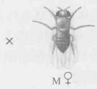

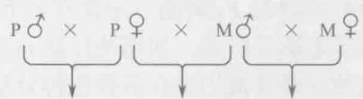

c劣势杂交

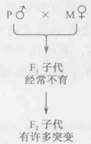  
图 A-22 杂种劣势。P 因子转座子位于 P 型株中，因为阻抑物的表达，使转座子保持沉默。当 P 株与缺乏阻抑物的 M 型株交配，转座子在极细胞中移动，常常整合到生殖细胞形成所需的基因里。这就解释了这种交配后代的高频率不育。

用 P 因子作为载体可以将重组 DNA 引入到正常的果蝇株里（图 A-23）。全长 P 因子转座子有 3kb，它的两端含有反向重复序列，这对切除和插入是必需的。居间的 DNA 编码一个转座的阻抑物和一个促进移动的转座酶。在 P 株卵内发育的阻抑物得到表达，结果来自 P 株（含有 P 因子）雌性的胚胎中 P 因子不能移动，只有在那些缺乏 P 因子的雌性 M 株所产的卵形成的胚胎中才能够移动。

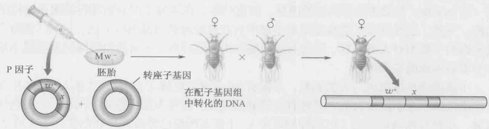  
图 A-23 P 因子转化。P 因子可以用作果蝇胚胎转化的载体。所以，如同在文中所讨论的，目的序列可以插入到经过修饰的 P 因子中。这个重组分子的一个拷贝将稳定地整合到一条果蝇染色体的某一位置中。

重组 DNA 被插到编码阻抑物和转座酶基因缺乏的 P 因子中，然后 DNA 被注入早期细胞（形成）前胚胎的后部（如同我们在第 21 章中所见，这是含有极粒的区域），同时将转座酶和重组 P 因子载体一并注入。当分裂的核进入后部，它们获得极粒、重组 P 因子 DNA 及转座酶；极细胞从极质里出芽并脱落，重组 P 因子在极细胞里随机插入到某个位置上。不同的极细胞含有不同的插入 P 因子。重组 P 因子 DNA 和转座酶的量是经过精心试验的，所以，一个特定的极细胞平均只能有一个 P 因子的整合。胚胎发育到成体，然后与合适的试验株交配。

重组 P 因子含有一个 “标记” 基因，如 white $^{+}$ 和用来注射的受体株是 white $^{-}$ 突变。测验株也是 white $^{-}$ ，所以所有红眼的 F $_{2}$ 果蝇一定含有一个拷贝的重组 P 因子。这种 P 因子转化的方法被经常用来鉴定调控序列，如那些控制 eve 条带 2 表达的序列（我们在第 21 章讨论过）。此外，这种策略还被用来在各种遗传背景下检验蛋白质编码基因。

总之，果蝇提供了所有复杂的、经典的分子遗传学的技术可以操作的模式系统，就像我们前面提到过的微生物。唯一明显的缺陷是缺乏与重组 DNA 精确同源重组的操作方法，如基因缺失。然而，这种方法是最近发展起来的，现在正在改进以便于日常使用。有意思的是，我们将会看到，在更复杂的小鼠生物系统模型中这样的操作是容易进行的。不过，因为果蝇具有丰富的遗传工具，而且几十年来对它的研究使我们积累了大量的背景知识，因此果蝇依然是研究发育和行为的首要模式系统之一。

## 小鼠

如果以秀丽新小杆线虫和果蝇为标准，小鼠的生活周期显得缓慢并且操作困难。胚胎发育或妊娠需要3周，新生的小鼠还要过3\~6周才能达到青春期。因此，小鼠的正常生活周期大约是8\~9周，比果蝇的长5倍多。然而，由于它在演化树上的位置，鼠类享有一个特殊的待遇：它是哺乳动物，因此和人类有亲缘关系。当然，黑猩猩和其他更高级的灵长类与人类之间有更近的亲缘关系，不过它们不能满足各种能用小鼠进行的实验。

于是，小鼠的研究使我们能够将低等生物如线虫和果蝇研究中发现的基本原理与人类疾病联系起来。例如，果蝇的 patched 基因编码了 Hedgehog 受体的重要组成元件（第 21 章）。果蝇中缺乏野生 patched 基因活性的突变体，其胚胎会表现出各种特定的身体结构缺陷，小鼠中的同源基因在发育中也是重要的。然而出乎意料的是，在鼠和人类中的一些 patched 突变体会导致各种癌症，如皮肤癌，在果蝇中的分析却没能揭示这样的功能。另外，已经开发了能在正常的小鼠中有效地敲除特定基因的方法，这种“敲除”技术影响了我们对人类发育、行为和疾病基本机制的理解。下面我们将简短地回顾小鼠作为实验系统的显著特征。

小鼠的染色体组成与人类相似：小鼠有19条常染色体（人类有22条），还有X和Y性染色体。在小鼠和人类之间有着大量的同线性：在与人类染色体“同源”的染色体区域，小鼠有相同的基因（以同样的顺序）。小鼠基因组已经被测序和组装。如在第21章中所讨论的，小鼠与人类的基因组几乎有相同的基因组成：两者都含有约

25000 个基因，其中 85% 以上的基因是一一对应的；小鼠与人类基因组的差别大多数（尽管不是全部）源于两个谱系中的某些基因家族选择性重复的不同。比较基因组分析证实了我们已知的，即小鼠是研究人类发育和疾病的优良模型。

## 鼠的胚胎发育依赖干细胞

小鼠的卵很小,难以操作。与人类的卵一样,它们的直径只有100μm,这使像在斑马鱼和青蛙中进行的那种嫁接移植技术难以在小鼠中实施,但把重组DNA引入小鼠生殖细胞系从而产生转基因株的显微注射法已经建立,下文将会对此进行讨论。另外,即使在发育的较早时期,也可能获得足够的小鼠胚胎,进行原位杂交及特定基因表达模式的直观检测。这种直观检测方法适用于正常的胚胎和在特定的遗传位点发生缺陷的突变体。

图 A-24 显示小鼠胚胎发生的概况。早期小鼠胚胎的初始分裂非常缓慢，仅以平均每 12\~24h 一次的频率发生。在 16 细胞期可以观察到第一个明显的多样化细胞类型，这时的胚胎叫桑椹胚（morula）（图 A-24，第 6 幅）。外周细胞形成的组织与胚胎形成无关，但能发育成胎盘，内部细胞则产生内细胞团（ICM）。在 64 细胞期，只有 13 个 ICM 细胞，这些细胞形成成鼠的所有组织。ICM 是胚胎干细胞的主要来源，可以在培养基里培养，并且，一旦加入合适的生长因子，就可被诱导形成各种类型的成体细胞。人类干细胞已经成为社会争论的重要话题，干细胞提供了一个可更新的组织来源，以替代很多变性疾病，如糖尿病和阿尔茨海默症中的缺陷细胞。

在 64 细胞期（受精后 3\~4 天），小鼠胚胎此时称为胚泡（blastocyst），最终准备着床。胚泡和子宫壁的相互作用导致了胎盘的形成，胎盘是除了原始产蛋的鸭嘴兽之外所有哺乳动物都具有的特征。胎盘形成后，胚胎进入原肠期，由此，

  
图 A-24 小鼠胚胎形成及发展

ICM 形成所有三个胚层：内胚层、中胚层和外胚层。之后不久，具有脑、脊髓和内部器官（如心脏和肝脏）的胎儿就形成了。

小鼠原肠胚形成的第一期中 ICM 分成了两个细胞层：里面的下胚层和外面的上胚层，它们分别形成内胚层和外胚层。一个叫原条（primitive streak）的凹槽沿着上胚层的纵向形成，迁移到凹槽里的细胞形成了里面的中胚层。原条的前端称为节（node），它是各种被用来形成胚胎贯穿前后的中轴信号分子的来源，这些信号分子包括两个分泌型的 TGF- $\beta$ 信号传导的抑制物——Chordin 和 Noggin。缺失这两个基因的双突变小鼠胚胎发育成没有头部结构的胎儿，如无前脑和鼻子。

## 把外源 DNA 引入小鼠胚胎

显微注射法在转基因小鼠中表达重组 DNA 已经有效应用。DNA 被注射进卵细胞原核，胚胎被移置入一个雌鼠的输卵管，使其着床并发育。注射的 DNA 随机地整合到基因组中（图 A-25）。整合的效率相当高，并通常发生在发育的早期，往往是在单细胞胚胎期。结果是融合基因插入大多数或所有的胚胎细胞，形成包括成鼠的体细胞组织和生殖系的 ICM 细胞。用这种简单的显微注射方法产生的转基因小鼠大约 50% 表现出生殖系转化（germline transformation），也就是说，它们的后代也含有外源重组 DNA。

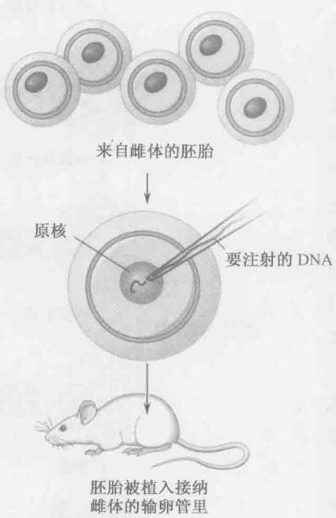  
图 A-25 通过显微注射 DNA 到卵原核内制备转基因小鼠。从刚刚交配的雌鼠中取出单细胞胚胎。重组 DNA 被注射到细胞核里，然后，胚胎被植入一个假孕母鼠的输卵管内。几天后，胚胎着床，并最终形成含有重组 DNA 的整合拷贝的胎儿。

  
图 A-26 转基因小鼠胚胎的原位表达模式。这是由部分 Hoxb-2 基因的调节区域与 lacZ 报道基因连接在一起获得的转基因小鼠。从转基因雌鼠取出胚胎，并染色以显示 β-半乳糖苷酶（LacZ）活性的位置。10.5d 的胚胎后脑区域有两个主要的染色条带。图中胚胎头朝上尾向下。（来源：Nonchevet al. 1996. Proc. Natl. Acad. Sci. 93: 9339-9345, Fig.1c.）

举例来说，将 Hoxb-2 基因的增强子和 lacZ 报道基因连接形成融合基因。从携带这个报道基因的转基因株中获得胚胎和胎儿，并染色以观察 lacZ 的表达模式。在此例中，观察到显色区在后脑中（图 A-26），转基因小鼠已经被用来研究好多个调节序列，包括那些调节 $\beta$ -珠蛋白基因和 HoxD 基因的序列。这两个复杂的位点都含有远程调控元件（分别是 LCR 和 GCR），它们能协调相距几十万碱基的不同基因的表达（第 19 章）。

## 同源重组为单个基因的选择性去除提供了机会

小鼠转基因的一个强有力的方法是中断或“敲除”单个遗传位点的能力，这使用于人类疾病研究的小鼠模型制备成为可能。例如，p53基因编码一个调节蛋白，该蛋白激活DNA修复所需基因的表达，已经发现它与许多人类癌症有关。p53功能丧失时，由于DNA突变的快速积累，癌细胞侵染性更高。已经建立了一个小鼠株，除了p53基因被敲除外，其余完全正常。这些小鼠非常容易患癌症而早亡，因而有望用于检测潜在的供人类使用的药物和抗癌剂。尽管果蝇中也有p53基因，也分离了突变体，但它并不能像小鼠模型那样用于药物发现。

基因打断实验是用胚胎干细胞（ES）来做的（图 A-27），这些细胞是通过培养小鼠胚泡而获得，ICM 细胞只增殖但不分化。重组 DNA 就是创建一个靶基因的突变体（干细胞也可由少量转录因子重新逆转录的体细胞产生，见第 21 章框 21-1）。例如，在基因的起始端附近删除一小段区域，而改变一个特定目标基因的蛋白质编码区，从编码的蛋白质中删除必需氨基酸的密码子，并在剩余的编码序列中产生移码。经过改变的靶基因和耐药基因（如具有对新霉素抗性的 NEO 基因）相连接，只有那些含有转基因的 ES 细胞可以在含有抗生素的培养基里生长。NEO 基因被置于经过改变的靶基因的下游，但位于与染色体同源的区段侧翼区域上游，这样转基因片段和染色体的双重重组将导致靶基因被突变基因和抗药基因所取代（或者用另一种办法，NEO 基因可以插入目标基因）。

然而，也存在高发性的非同源重组，即发生在同源的体内基因之外的不正确重组。为了富集同源重组，重组载体还包含了一个标记基因——胸苷激酶基因（TK），可以使用药物丙氧鸟苷进行负筛选，丙氧鸟苷在激酶作用下将转化为一个有毒的化合物。在载体上，胸苷激酶基因位于与染色体同源的区域之外。因此，通过同源重组使突变基因整合到染色体的转化子会失去胸苷激酶基因，但通过非同源重组整合入染色体的转化子含有胸苷激酶的完整载体，于是就会被筛除掉。

通过上述过程可以获得重组 ES 细胞，其中，一份目标基因与突变的等位基因相对应。收集这些重组 ES 细胞并注射到正常胚泡的 ICM 里。杂种胚胎植入宿主鼠的输卵管，并让它们发育到相应时期。有些源于杂种胚胎的成体拥有转化了的生殖系，于是产生含有突变目标基因的单倍体配子。最初用作转化的和同源重组检测的 ES 细胞产生体细胞组织和生殖系。一旦获得了具有转化生殖细胞的小鼠，就将其与同胞小鼠进行交配，以获得纯合突变体。有时，由于这些突变体是致死的，必须在胚胎时就对它们进行分析。而其他非致死基因，突变体胚胎能发育成生长完全的小鼠，然后用各种技术去检测。

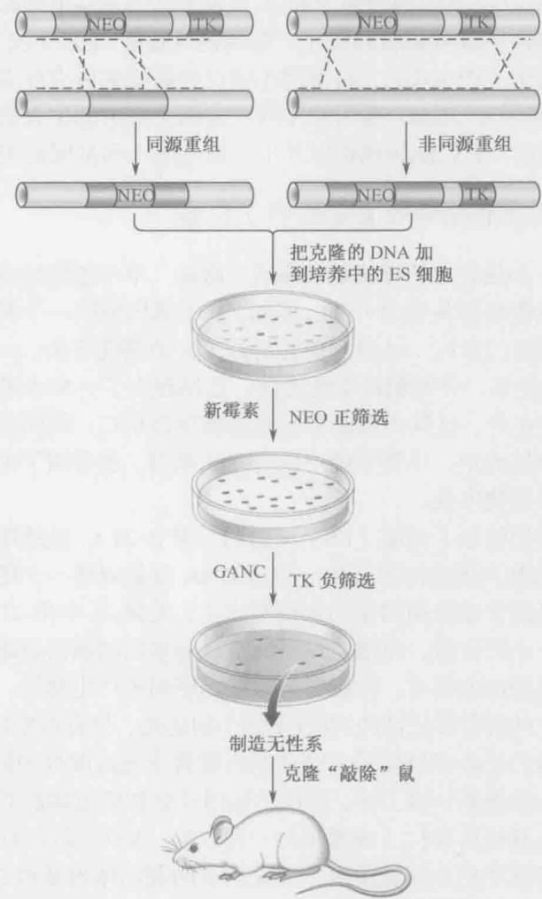  
图 A-27 通过同源重组进行基因敲除。本图概括了制备任意基因缺失的细胞株的方法。目标基因（以绿色显示）内发生的同源重组导致了 NEO 基因的插入并破坏了那个基因。非同源重组或随机重组可以导致含有 NEO 基因的中断基因和胸苷激酶（TK）的基因的插入。携带这两个转基因片段的克隆在新霉素中都能存活，但同时携带 TK 的克隆随后在丙氧鸟苷（gancyclovir，GANC）中经过反选择。于是，只有含有携带 NEO 基因和靶基因的转基因片段的克隆才能存活。一旦产生突变细胞就可以被克隆并培养成敲除该基因的小鼠（图 A-25）。

## 小鼠中存在 epi 遗传

小鼠胚胎研究发现了一个奇怪的非孟德尔遗传现象，或者表观遗传现象，这个现象称为亲本印记（parental imprinting）（图 A-28）。其基本的概念是某些基因的两个等位基因中只有一个是有活性的，这是因为另一个拷贝在发育中的精子细胞或卵子细胞里被选择性地失活了。举个 lgf2 基因的例子，它编码一个类似胰岛素的生长因子，在发育胎儿的肠和肝脏中表达。只有从父本那里继承下来的 lgf2 等位基因在胚胎里活跃地表达；另一个拷贝，尽管在序列上完全正常，却是没有活性的。lgf2 基因的母本和父本拷贝在

<!-- END OFFICIAL API PART part_009 -->

<!-- BEGIN OFFICIAL API PART part_010 -->

活性上的这种差别源自于一个与之关联的抑制 lgf2 表达的沉默子 DNA 的甲基化。在精子发育过程中，DNA 是甲基化的，所以 lgf2 基因能够在发育的胚胎中活化，甲基化抑制了沉默子；相反，在发育中的卵母细胞里这个沉默子 DNA 不被甲基化。于是，从母本继承来的 lgf2 等位基因是沉默的。也就是说，对未来在胚胎中的表达，这个基因的父本拷贝做了“印记”，在这里，也就是被甲基化了。这个例子在第 19 章里有详尽的讨论。

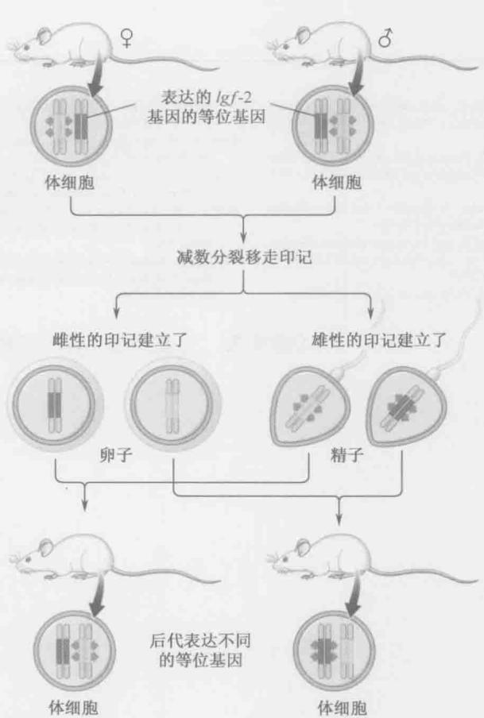  
图 A-28 小鼠中的印记。小鼠中特定基因的一个等位基因的永久沉默。如文中所略述和在第 19 章中所详细描述的，印记保证了小鼠的 lgf2 基因在每个细胞中只有一个拷贝是表达的。被表达的总是那个源于父本染色体的拷贝。

在鼠和人类中大约有 30 个被印记的基因。其中许多控制发育中胎儿的生长，包括上述例子中的 lgf2。有人提出印记是为了保护母亲免遭她的胎儿对其伤害而演化来的。lgf2 蛋白促进胎儿的生长。母亲试图通过失活该基因的母本拷贝来限制这种生长。

在本书中我们已经讨论了每一个生物必须怎样保持和复制它的 DNA 来生存、适应和繁殖。在大多数生物中，实现这些基本的生物学目标的总体战略是相似的，因此可以用简单的生物来进行研究相当成功。然而很清楚，在高级的生物中发现的更复杂的过程，如分化和发育,需要更复杂的系统来调节基因表达,这些只有用更复杂的生物才能实现。我们已经看到很多强有力的实验技术可以成功地被用来操作小鼠,并探索各种复杂的生物学问题。小鼠已经成为一个优秀的研究发育、遗传和生化过程的模式系统,而这些过程很可能发生在演化程度更高的哺乳动物中。小鼠基因组序列的公布及其注释更加强调了小鼠作为模式生物在进一步探索和解决人类发育和疾病研究中的重要性。

## 参考文献

Burke D., Dawson D., and Stearns T. 2000. Methods in yeast genetics. Cold Spring Harbor Laboratory Press, Cold Spring Harbor, New York.

Hartwell L.H., Hood L., Goldberg M.L., Reynolds A.E., Silver L.S., and Veres R.C. 2004. Genetics: From genes to genomes, 2nd ed. McGraw-Hill, New York.

Miller J.H. 1972. Experiments in molecular genetics. Cold Spring Harbor Laboratory Press, Cold Spring Harbor, New York.

Nagy A., Gertsenstein M., Vintersten K., and Behringer R. 2003. Manipulating the mouse embryo, 3rd ed. Cold Spring Harbor Laboratory Press, Cold Spring Harbor, New York.

Sambrook J. and Russell D.W. 2001. Molecular cloning: A laboratory

manual, 3rd ed. Cold Spring Harbor Laboratory Press, Cold Spring Harbor, New York.

Snustad D.P. and Simmons M.J. 2002. Principles of genetics, 3rd ed. John Wiley and Sons, New York.

Stent G.S. and Calendar R. 1978. Molecular genetics: An introductory narrative. W.H. Freeman and Co., San Francisco.

Sullivan W., Ashburner M., and Hawley R.S. 2000. Drosophila protocols. Cold Spring Harbor Laboratory Press, Cold Spring Harbor, New York.

Wolpert L., Beddington R., Lawrence P., Meyerowitz E., Smith J., and Jessell T.M. 2002. Principles of development, 2nd ed. Oxford University Press, Oxford.

(潘庆飞 夏志译 王晓玲 黄妙珍 校)

# 附录2 答案

## 第1章

问题 2 错误。A 基因可能有两个以上的等位基因，其中一个可以确定所有等位基因之间的关系（例如，通过遗传杂交和绘制图谱或是测序的方式）。

问题 4 错误。就金鱼草来说，一些等位基因是不完全显性。当纯合的红色金鱼草和白色金鱼草杂交时，产生的 $F_{1}$ 代是中间型。A 基因可能有一个以上的等位基因，每个等位基因相对于另外的等位基因之间的关系是确定的。

问题6

A. 所有黄色种子的豌豆。对于种子颜色基因来说，所有植株都应该是杂合的（Yy）。如果黄色是显性，那么只有黄色种子的表型可以被观察到。

B. 3 个黄色种子：1 个绿色种子。

C. 1YY:2Yy:1yy.

D. 2 杂合（Yy）: 2 纯合（YY 和 yy）或简化为 1:1。

问题8

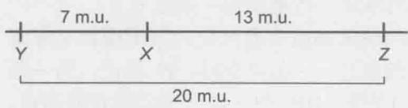

问题 10 从这些信息可以看出，L 和 M 是连锁的，并且在一条染色体上相距 5 m.u。重组率为 50% 表明相离甚远的无论是位于同一条染色体上或不同染色体上的基因是不连锁的。所以 N 基因与 L 和 M 的距离都大于 50 m.u.，或与它们不在同一条染色体上。

问题 12 一个突变是由 DNA 序列的改变造成的，并且可以遗传下来。久而久之，低突变率使生物在它们的环境中适应这种改变，突变提高了生物体在新的环境中生存下来的能力，并将遗传给下一代。

问题 14 就观察到的重组后代来说，15 必须是最小值，因为双交叉是最不可能的事件。

从所给的信息可以得出，pk 在 y 和 tri 之间，因此 15 代表 y 和 pk、pk 和 tri 之间的总观察交叉。

计算重组率（或 m.u.），具体到两个基因之间的交叉，你可以通过后代总数来划分观察到的重组子。对于观察到的重组子，你需要增加双交叉的值，因为单一的交叉确实发生在那些后代当中。

$y$ 和 $pk$ 之间的距离 $= ((X + 15) / 1000) \times 100 = 23.0\%$ 或 $23.0\mathrm{m.u}$ .

X=215=重组后代总数的期望观察值，表示 y 和 pk 之间的一次交叉。

$pk$ 和 $tri$ 之间的距离= $((X+15)/1000) \times 100 = 18.4\%$ 或 $18.4\mathrm{m.u}$ .

X=169=重组后代总数的期望观察值，表示 pk 和 tri 之间的一次交叉。

## 第2章

问题 2 DNA 骨架由糖-磷酸基团组成，因此用 ${}^{32}$ P 来标记。某些氨基酸含有硫（如半胱氨酸和甲硫氨酸），所以蛋白质用 ${}^{35}$ S 来标记。反向标记是不可能的，因为 DNA 中不含硫，氨基酸中不含磷。

问题 4 DNA 碱基有胞嘧啶 C、胸腺嘧啶 T、腺嘌呤 A 和鸟嘌呤 G。含氮碱基含有一个嘧啶（C、T）或嘌呤（A、G）的环状结构。核苷包含一个与糖（RNA 中的核糖，DNA 中的脱氧核糖）结合的含氮碱基。核苷酸包含一个与核糖或脱氧核糖结合的含氮碱基，而核糖与 1\~3 个磷酸基团（单磷酸、双磷酸或三磷酸）相结合。

## 问题6

A. 按照分散复制模型，一轮之后所有 DNA 都将一半含有 ${}^{15}N$ ，一半含有 ${}^{14}N$ 。因此在氯化铯溶液梯度超速离心后，结果条带将落在中间带。

B. 按照保留复制模型，一轮之后将有一半的双链 DNA 分子含有 ${}^{15}N$ ，另一半含有 ${}^{14}N$ 。在氯化铯溶液梯度超速离心后，则结果条带将落在一条重带和一条轻带上。

C. 保留复制模型可以消除一轮的细菌复制, 但两轮复制就需要区分分散模型和半保留模型。按照保留模型复制一轮, 可以产生两条重链, 一条完全用 $^{15}\mathrm{N}$ 标记, 另一条完全用 $^{14}\mathrm{N}$ 标记。经过离心, 显示两条离散的条带 (HH 和 LL), 而实际观察不到。但经过分散模型或半保留复制模型的一轮复制之后, 将产生一个单一的条带梯度。根据半保留复制模型, 第二轮复制将产生两条离散的条带 (LL 和 HL), 这个在实际当中可以观察到。而这样的分布模型将可以进一步预测中间型条带, 每条链是含有轻链 (大多数是) 和一些重链的混合链。因此, 第二轮复制证实了半保留复制模型。

问题 8 RNA（而非 DNA）存在于细胞质中，细胞质是蛋白质合成的场所。RNA 的化学结构类似于 DNA（核糖代替脱氧核糖，尿嘧啶代替胸腺嘧啶）。RNA 由 DNA 模板链合成。

问题 10 多核糖体描述了在同一时间内转运相同 mRNA 的一组核糖体。借助多核糖体，特定蛋白的翻译增强，达到蛋白质某种水平的时间缩短。这使得一个 mRNA 作为模板可以同时进行蛋白质的多个拷贝。这是很有用的，因为 mRNA 不可能在高水平或是有个较短的半衰期（短暂的）。

问题12

DNA 聚合酶用于细胞核中 DNA 的复制或 DNA 合成。RNA 聚合酶用于将细胞核中的 DNA 转录为 mRNA。核糖体主要是在细胞质中将 RNA 翻译为蛋白质。mRNA 是转录的产物，蛋白质合成（翻译）的模板。tRNA 在翻译过程中充当转接器阅读模板并转运合适的氨基酸。rRNA 充当核糖体的结构成分和翻译过程中肽键形成的催化组分。

## 问题14

A. DNA 酶的水平不到一半，蛋白质合成将受到抑制，太多的 DNA 酶也不会增加效果。

B. 虽然 DNA 不是蛋白质合成的直接模板，但在中心法则中这两个过程通过 mRNA 连贯起来。在 DNA 酶的存在下，DNA 遭到破坏。没有 DNA，RNA 聚合酶就没有模板制造出新的 mRNA。mRNA 是蛋白质合成的模板，mRNA 的寿命是短暂的，所以 mRNA 整体水平的降低直接是由于 DNA 酶的加入导致的。在 DNA 酶存在的情况下，某些 mRNA 必须用来检测蛋白质合成的水平。

## 第3章

问题 2 错误。酶降低了反应的活化能。（ $\Delta G$ 也一样）

问题 4 错误。在 $25^{\circ}C$ ， $K_{eq}$ 变化 10 倍，相应的 $\Delta G$ 变化约 1.4 倍。

问题6

A. DNA 碱基之间的氢键。

B. 共价键（肽键）。

问题 8 极性分子有偶极矩，而非极性分子没有偶极矩。范德华相互作用可以包括极性和非极性分子。

问题 10 $K_{eq}=([A]\times[B])/[AB]=([A]\times2\ \text{mmol/L})/(0.5\ \text{mmol/L})=8.0\times10^{5}\ \text{mmol/L},$ $[A]=2.0\times10^{5}\ \text{mmol/L}$

问题 12 是的。 $ATP + H_{2}O \Leftrightarrow ADP + P_{i}\Delta G = -7 kcal/mol$ （表 3-5）.

耦合 ATP 水解的反应，得出一个负的 $\Delta G$ 值。

总反应：谷氨酸 $+NH_{3}+ATP\Leftrightarrow$ 谷氨酰胺 $+ADP+P_{i}\Delta G=-3.6\ kcal/mol.$

问题 14

A. 色氨酸的侧链不包括氢键供体或受体。

B. 谷氨酸的侧链包括能够参与氢键形成的羧酸。

C. 虽然数量少，但有这样一个趋势：在蛋白质-DNA 复合物中精氨酸与鸟嘌呤形成氢键。

## 第4章

问题2

A. 10 碱基/螺旋×4 螺旋=\~40 碱基（4 个螺旋）。

在溶液中：10.5 碱基/螺旋×4 螺旋=42 碱基（4 个螺旋）。

长度 = 3.4 nm/螺旋 × 4 螺旋 = 13.6 nm。

B. 11 碱基/螺旋×4 螺旋=\~44 碱基（4个螺旋）。

问题 4 G : C vs. C : G 大沟

化学基团模式对于 G:C 碱基大沟是 AADH，而对于 C:G 碱基大沟是 HDAA。两组碱基的小沟模式是一样的，都是 ADA。
A，氢键受体；D，氢键供体；H，非极性氢；M，甲基基团。
A : T vs. G : C 两组

化学基团模式对于 A：T 碱基大沟是 ADAM，而对于 G：C 碱基大沟是 AADH。对于 A：T 碱基的小沟模式是 AHA，而对于 G：C 碱基的小沟模式是 ADA。

A : T vs. T : A 大沟

化学基团模式对于 A：T 碱基大沟是 ADAM，而对于 T：A 碱基大沟是 MADA。两组碱基的小沟模式是一样的，都是 AHA。

问题6

Ai. 磷酸二酯键。(DNA 酶 I 的轻度处理将通过切割 DNA 糖-磷酸骨架来刻痕 DNA)

Aii. DNA 最初是超螺旋的。经过 DNA 酶 I 处理过之后，DNA 不再是一个共价闭合的环状 DNA 并且会变松。

B. DNA 连接酶处理会再密封 DNA 刻痕，可以使共价闭合环状 DNA(cccDNA)再次形成。LK $^{0}$ 的值不为整数（10000/10.5）。LK 是一个整数，不等于 LK $^{0}$ 。因此，一定有一些少量的超螺旋。

问题8 NAZXE

衍射图线是垂直于字母线条的。

## 第5章

问题 2 确定遗传物质是 DNA 还是 RNA 的最直接的方法是寻找序列中的尿嘧啶。如果存在，那么病毒以 RNA 作为遗传物质；如果不存在，则遗传物质是 DNA。为了确定遗传物质是单链还是双链，需要检测每个碱基的百分比。如果 G 的百分比等于 C，A 的百分比等于 T，那么此分子是双链的 DNA。对于双链 RNA 来说，G% 等于 C%，A% 等于 U%。如果百分比结果不显示这两种模式中的任何一种，则遗传物质可能是单链的。

问题 4 尿嘧啶不同于胸腺嘧啶，胸腺嘧啶的第五碳原子上面缺少了一个甲基基团。尿嘧啶和胸腺嘧啶都和腺嘌呤配对。在 DNA 中，通常发生胞嘧啶的自发脱氨而生成尿嘧啶。如果发生复制并且尿嘧啶仍然存在，那么 DNA 中就会发生突变（C：G 变为 T：A）。如果在 DNA 中很自然地发现尿嘧啶，那么在 DNA 修复蛋白质时尿嘧啶将不会被认为是错误的，并且将要发生突变。

问题 6 二级结构：茎（stem），发夹结构（茎和环）和内部环。非经典碱基对：G：U 和 U:U。

问题 8 一个真正核糖酶的 RNA 具有一个特异底物、一个辅助因子结合位点、一个催化活性位点和不止一次的促进反应，每个活性位点类似于划归为酶的蛋白质。

问题 10 锤头必须分成两个独立的部分。其中一部分能够完成催化作用，而 RNA 的另一部分是底物。因为底物不附属于锤头的催化部分，所以底物可以释放使得新的分子能够结合。现在锤头是一个真正的核糖酶，能完成许多回合的反应。

问题12

A. 腺苷。

B. 核苷类似物像其他核苷一样，不经过 RNA 单链的水解。一个甲基基团添加到核糖的 2'-羟基上，核糖存在于腺苷中。当甲基基团存在，氧在高 pH 环境中可以不再成为去质子化，并攻击易断的存在于 RNA 链 3'端核糖位置的磷酸盐。

## 问题14

A. RNA 是催化剂或核糖酶。蛋白质部分和 RNA 部分单独不能使底物分开(反应 2 和 3)，但是反应进行必须要有蛋白质和 RNA 的存在。

因为底物（反应6）是在RNA部分和亚精胺（非特异性肽）的存在下被分开，RNA一定是作为了一种催化剂。没有RNA部分（反应5），蛋白质部分和亚精胺不能完成催化。蛋白质部分和亚精胺帮助RNA完成催化。

B. 带正电的亚精胺可以屏蔽反应过程中带负电的 RNA 催化剂和带负电的 RNA 底物之间的斥力。

## 第6章

问题 2 相反电荷之间形成离子键。一个酸性氨基酸（天冬氨酸或谷氨酸）的侧链和一个碱性氨基酸（赖氨酸、精氨酸或组氨酸）之间可以形成一个离子键。

问题 4 在肽键形成的过程中，氨基酸的羧基和另外一个氨基酸的氨基通过消除水分子形成共价键。由于两个分子失水形成一个键，所以这个反应叫做缩合反应或脱水反应（特指失去水分子）。

问题 6 四级结构。单体肌红蛋白不具有四级结构，四聚体的血红蛋白具有四级结构，这对生理功能是至关重要的。这两种蛋白质是球状的，其折叠亚基主要是 $\alpha$ 螺旋，其二级结构和三级结构是相似的。一级结构决定二级和三级结构，因此，肌红蛋白和血红蛋白的一级结构可能是相似的。请注意，即使是非常不同的一级结构的多肽链可以具有相似的二级和三级结构（例如，植物的血红素和人的血红蛋白），但如果序列的相似性在整个域中延伸，相关序列的蛋白质区域则总是具有相同的折叠结构。

问题8

A. 断裂，非共价键。

B. 断裂，非共价键。

C. 不断裂，共价键。

D. 不断裂，共价键。一条 B 链是二级结构的一个单元，B 三明治结构是蛋白质三级结构的一个例子（一种特殊的折叠域）。

E. 不断裂，非共价键。

问题 10 两个组氨酸和两个半胱氨酸对于 $Zn^{2+}$ 的配位是很关键的，依次地，Zn 离子对于很小的锌指结构域也是个重要的稳定因素。以丙氨酸代替这四个残基中的任何一个将消除锌离子结合并动摇域，导致其失去功能。

问题 12 酶的催化反应通过降低所需要的能量以形成过渡态，从而降低反应物和产物之间的的能量势垒。酶在很多情况下出现，因为它们的活性位点与反应物的过渡态构象而非基态构象互补——就是说，在酶和底物的过渡态形式之间具有有利的非共价相互作用。

问题14

A. RRMS（例如，一类 RNA 结合域的序列基序特征）是折叠成域的 80-90 个氨基酸残基的序列，可以识别特定的 RNA。[请注意，术语 “RRM” 常被误用为指定的 “域”，见表 6-2 术语表：“基序”（motif）和 “结构域”（domain）的正确用法]
B. 这些数据显示，氨基末端的 RRM 和前三个重复足以完全互补。RRM 加一个重复或是 7 个重复加羧基末端区域都不足以使野生型在 $37^{\circ}$ C 生长。

C. 结果与互补实验一致，但也表明，在体外实验中，重复 3 次都不足以充分活化。此外，RRM 形式被截断，但在活体内 7 次重复和羧基末端区域完好无损，在体外没有活性，但是在体内恢复部分生长。这些差异表明一些功能的冗余，或者在 Tif3 域中，亦或在翻译起始复合物的其他部分。

## 第7章

问题 2

A. 对于可以识别 6bp 序列的限制性内切酶来说，在给定的基因组中找到序列的频率是 $1/4^{6}$ 或 1/4096 bp。

B. 是的。虽然 XhoI 和 SalI 的识别序列不同，但黏性末端可以彼此配对，因为这两条单链区是彼此互补的。

问题 4 当进行 Southern 杂交时,用 DNA 探针来检测特定的 DNA 序列。当进行 Northern 杂交时,用 DNA 探针来检测特定的 mRNA 序列。当进行 Southern 杂交时,用限制性内切核酸酶来消化基因组 DNA,通过凝胶电泳分离 DNA 片段,DNA 会转移到带正电的膜上,并检测带有 DNA 探针的 DNA 片段。对 Northern 杂交除了不用消化 mRNA 之外,可以进行类似的一系列步骤。在 Northern 杂交中,可以检测某一种 mRNA 的量,并且可以与在不同实验条件下的另外的样本作比较。

问题 6 基因组文库包含整套的 DNA 片段，是由限制性内切核酸酶消化全基因组而产生的 DNA 片段。cDNA 文库，只包含基因组 DNA 的表达序列，在细胞中由所有的 mRNA 反转录产生。在每种情况下，DNA 目的片段结合到质粒载体中。人类基因组包含相当大比例的非编码 DNA 序列，包括用于编码拼接出 mRNA 的内含子序列。cDNA 文库可用于研究和表达这些编码基因的序列。

问题 8 离子交换色谱法基于电荷来分离蛋白质。凝胶过滤色谱法基于分子大小分离蛋白质。亲和色谱法是基于与特定的分子、蛋白质或耦合到磁珠的核酸的相互作用来分离蛋白质。

## 问题10

A. 只有 DNA 链的一端被标记, 才能产生消化结合 DNA 片段的核酸酶, 凝胶电泳之后, 一条可见片段梯度从单一的标记端延伸开来。两端都标记的链的消化将使模式复杂化, 使印记模糊。而且, 如果蛋白质结合不对称, 则模式甚至会变得更复杂。

B. 为了确定已知的特定区域是否结合蛋白质，使用这些序列的特定引物来扩增序列并将结果与必要的参照做比较。另一种选择是使用覆瓦式（tiling）DNA 微阵列来确定许多不同的序列。

问题12

A. Western 印迹法在幼虫期和成虫期泳道中检测了蛋白 Z 泳道。Northern 印迹法表明在苍蝇幼虫期基因 Z 有两次转录，而在成虫期只有一次转录。一个可能的假设是，在免疫印迹实验中使用的抗体不能识别由快速迁移转录而翻译的蛋白质形式，因为由于 RNA 的可变剪接可能会缺失羧基端结构域的编码区域。

B. 对于给定的假设，在免疫印迹实验中你可以使用蛋白 Z 的另外一种新抗体。这种抗体可以是整个蛋白质的多克隆，也可以是蛋白质的中央或氨基端区域的单克隆。如果用使用新抗体，你看到免疫印迹实验中幼虫泳道的第二个条带，那么该数据将支持 A 部分提出的假说。

## 第8章

问题 2 染色体 DNA 位于原核细胞中的类核。对于真核细胞，染色体 DNA 位于细胞核中。细胞核不同于类核，它是与膜结合的，通常占细胞体积的一小部分。

问题 4 基因间序列可能起因于转座事件。它们可能编码 miRNA，作为转录的调控序列，或可能只是非功能性的，如假基因。

问题 6 内聚力使姐妹染色单体在 S 期和有丝分裂的早期阶段结合在一起。在有丝分裂后期（第三期），内聚力消除，以便微管连接到着丝粒，并分开着丝粒使一对姐妹染色体分开形成子细胞。

问题 8 所有细胞（体细胞和生殖细胞）的生长和分裂都经过有丝分裂，只有生殖细胞产生卵子和精子的过程经过减数分裂。

问题 10 氢键主要来自于小沟附近的组蛋白和磷酸二酯骨架之间，另外就是小沟碱基之间。

这些相互作用没有序列特异性。整个基因组 DNA 包裹着组蛋白。与 DNA 小沟有相互作用的蛋白质不太可能以一种特异性方式来相互作用。相反，与 DNA 大沟的相互作用通常会使序列特异性相互作用（见第 4 章）。

问题 12 溴区结构域识别乙酰化。染色体域、TUDOR 域、PHD 结构域识别甲基化（SANT 域识别未修饰的组蛋白尾巴）。

问题14

A. 组蛋白脱乙酰氨基酶结合 DNA 核小体（泳道 1、2、3 和 4，与泳道 5 比较）。假设组蛋白脱乙酰氨基酶是单体，两个脱乙酰氨基酶能够在同一时间结合 DNA 核小体（在泳道 2、3 和 4 都有两条较高的迁移条带）。组蛋白脱乙酰氨基酶似乎在识别组蛋白 H3 的赖氨酸 36 上的甲基化核小体，要优于未甲基化的核小体（见泳道 1 和 2，

3 和 4）。

B. 基于此数据，组蛋白脱乙酰氨基酶可能包含一个染色质域而与甲基化了的组蛋白 H3 相互作用。

## 第9章

问题 2 DNA 合成的基本机制是开始于依赖氢键,引入的核苷酸与 DNA 模板相互作用。一个正确的碱基形成后,3'-OH 引物会启动引入的核苷酸 a-磷酸的一个亲核攻击。焦磷酸被释放,并通过焦磷酸酶水解成两分子磷酸酶。至此引入的核苷酸与模板完成碱基配对,与引物链共价相连。

问题4

A. 脱氧鸟苷。

B. 没有三磷酸基团，无环鸟苷不能并入到不断增长的 DNA 链。激酶使底物磷酸化，还会添加无环鸟苷缺失的磷酸基团。

问题 6 某些 DNA 聚合酶只用在像 DNA 修复这样的特殊过程中。他们往往不是非常连续，也不执行细胞中的大部分 DNA 合成。因此，对这些 DNA 酶来说，校对不是那么重要，校对将插入少量与领先或滞后链的 DNA 聚合酶有关的核苷酸。

问题8

A. 两个都是。复制将在两个方向进行。

B. 底部。底部链作为右边的领先链模板。RNA 引物的 3'端退火并延伸，通过 DNA 聚合酶，能够持续不断地复制到模板的末端。

C. 底部。DNA 合成期间，DNA 连接酶需要在滞后链的冈崎片段之间产生磷酸二酯键。对于滞后链，底链充当模板，因为 DNA 合成必须是不连续的。

问题10

A. 大肠杆菌细胞每分裂一次只复制一次，但当大肠杆菌快速分裂时，在前一轮复制完成之前就开始下一轮的复制。在这些条件下，细胞分裂时间可以低至 20min。

B. 环形大肠杆菌不像线性染色体那样有末端。在这些条件下，大肠杆菌并没有因缺乏端粒酶而在每轮复制之后出现染色体长度缩短的问题，因为其复制机制可以完全复制环形基因组。

问题 12 每个 DNA 聚合酶的 3' 外切核酸酶活性提供 DNA 合成过程中 DNA 聚合酶去除错误核苷酸的能力。DNA 聚合酶 I 具有附加的 5' 外切核酸酶活性以去除 DNA 聚合酶前面的核苷酸。具体而言，此功能有助于 DNA 聚合酶去除 DNA 滞后链上的 RNA 引物。

问题14

A. $\alpha$ -磷酸通过 3'-OH 亲核攻击成为新合成的 DNA 链的一部分。 $\beta$ -或 $\gamma$ -磷酸变成焦磷酸，

焦磷酸后来水解并从未结合到增长的 DNA 链上。

B. 凝胶电泳通过大小来分离分子。标记 ${}^{32}$ P 的 dNTP 要比新合成的 DNA 少得多，并且迁移速度要比任何长链 DNA 快得多。

C. 阴性对照的一个例子是在缺乏 DNA 聚合酶的情况下进行相同的 DNA 合成实验。如何没有新的 DNA 合成，引物:模板交界处将不被标记。如果你正确地筛选包含引物的反应——在带正电荷的膜上模板交界处和标记 ${}^{32}$ P 的 dNTP，你会发现放射性不会粘到过滤器。你可以比较包含 DNA 聚会酶的同样的反应体系。如果你担心标记 ${}^{32}$ P 的 dNTP 结合 DNA 聚合酶的任何可能的影响，你可以在过滤之前进行处理蛋白酶的反应。

## 第10章

问题 2 胞嘧啶脱氨基产生尿嘧啶。在碱基切除修复过程中的一个特定的糖基化酶可以识别出尿嘧啶，因为它不属于 DNA 组成。如果尿嘧啶仍存在，下一轮复制之后将发生一个突变。5'-甲基胞嘧啶脱氨产生胸腺嘧啶，而且在 DNA 修复过程中不被认作一个错误。在下一轮复制时，5'-甲基胞嘧啶脱氨产生的胸腺嘧啶与腺嘌呤配对并成为一个转换突变。因此，细胞去除尿嘧啶来阻止突变，但并不去除脱氨产生的胸腺嘧啶。

问题4

<table><tr><td>正确顺序</td><td>MMR</td><td>BER</td><td>NER(核酸切除修复)</td></tr><tr><td>识别</td><td>MutS(MutH决定链)</td><td>DNA糖基化酶</td><td>UvrA</td></tr><tr><td>切除</td><td>MutH(被MutL激活)以及Exo VII,RecJ或Exo I</td><td>DNA糖基化酶AP内切核酸酶和外切酶</td><td>UvrC and UvrD(受助于UvrB引发的泡状物)</td></tr><tr><td>DNA合成</td><td>DNA聚合酶III</td><td>DNA聚合酶I</td><td>DNA聚合酶I</td></tr><tr><td>连接</td><td>DNA连接酶</td><td>DNA连接酶</td><td>DNA连接酶</td></tr></table>

问题 6 如果没有一个正常运作的 Dam 甲基化酶，父链在复制过程中将不会被甲基化。没有经过甲基化，MutH 没有办法区分父链和新合成的链。MutH 将以某个频率切割错误链。父链的错配修复将导致自发突变（未被外源诱导）的增加。

问题 8 类似于胸腺嘧啶二聚体,两个鸟嘌呤之间的交叉链扭曲了 DNA 螺旋。这使 NER 蛋白识别扭曲而切除延伸的 DNA,包括铂化合物诱导的交叉链。碱基切除修复只切除一个核苷酸。此外,特定的 DNA 糖基化酶必须识别出 DNA 损伤。没有糖基化酶识别铂化合物诱导的交叉链。

问题 10 非同源末端连接（NHEJ）以引入突变为代价修复双链断裂（DSB）。非同源末端连接（NHEJ）酶处理 DSB 的自由端。通过该处理，两条链结合在一起之前 DNA 序列是丢失或增加的。

问题 12

<table><tr><td>突变通路</td><td>DNA 损害</td><td>存活率</td><td>突变发生</td></tr><tr><td>NER</td><td>增加</td><td>降低</td><td>增加</td></tr><tr><td>转化合成</td><td>保持不变</td><td>降低</td><td>减少</td></tr></table>

相对于野生型，对于 NER 突变体来说，DNA 损伤量增加是因为胸腺嘧啶二聚体没有被有效地修复。通过跨损伤合成的 DNA 损伤耐受并不能修复损伤，所以即使耐受缺失确实导致更多的细胞死亡，DNA 损伤的水平也保持不变。这也是真正的 NER 的损失。NER 突变体细胞中的 DNA 损伤越多，就有越多的突变发生。如果跨损伤合成通路被破坏，将较少发生突变，因为跨损伤合成聚合酶通常有助于发生突变。

问题14

A. 介质必须缺乏组氨酸的选择。只有在 HisG 基因中的原点突变的特定位置的另一个点突变可以导致颠换。此突变一定会改变序列回到基因的野生型序列，使得细胞在缺乏组氨酸的情况下生长。
B. 细胞中的自由基能够破坏 DNA，这样会造成颠换的突变发生。其他通常的过程，像复制错误，碱基的水解攻击作用也会改变 DNA。
C. 化学物 A. 有更多的回复体表明由化学物 A 诱导（与生存有关）的突变频率比对照组（没有加化学物）的更高。
D. 化学物 C. 有较少的回复体表明相对于对照组（没有加化学物），由化学物 C 诱导（与生存有关）的突变频率更低。

## 第11章

问题 2 由于少部分序列变异而等位基因彼此不同。基因序列的大部分仍是相同的，所以等位基因是同源的。

问题 4 第三步显示 5'端涌入。这是个问题，因为 DNA 聚合酶需要引物模板结合点的 3'-OH 来延伸。为了纠正此问题，第三步应该显示一个 3'端的入侵和适当的蓝色链的碱基修复。

问题 6 RecBCD 包含 DNA 解旋酶及核酸酶活性。特别是，RecB 起到 $3'\rightarrow5'$ DNA 解旋酶和核酸酶的作用，RecD 起 $5'\rightarrow3'$ DNA 解旋酶的作用，RecC 则帮助提高 RecB 和 RecD 的效率。RecC 通过识别并结合 $3'$ 端的 $\chi$ 位点来终止核酸酶活性。RecBCD 在侵入 DNA 双链来产生单链 DNA 时起到了关键作用。

问题 8 DNA 底物可以通过如下的凝胶迁移改变检测（EMSA）得以分析。蛋白 RuvA 与末端标记了的 DNA 底物孵育后的产物用非变性胶来分离，在该胶上应该看到两条带：迁移快的那条带仅仅是 DNA 底物，而迁移慢的带则是与 RuvA 结合在一起的 DNA。在连接点处的一条 DNA（末端 $5^{\prime-32}P$ 标记）可以作为该实验的阴性对照，因为 RucA 不能和单链结合，因而只能看到迁移快的那条带。

问题 10 Spo11 介导 DNA 双链的断裂，它的酪氨酸可以通过断裂磷酸二酯键来切开 DNA。Spo11 通过介导断裂的 DNA 形成共价高能来贮存磷酸二酯键断裂所释放的能量。

问题 12 与 DSB 修复同源重组相同，SDSA 在重组位点的 DSB 处开始，从 5'→3' 切除，在 3' 处断裂作为 DNA 合成的引物。SDSA 与 DSB 修复同源重组的区别在于不能切除 Holliday 叉。随着链的断裂，在 SDSA 中形成完整的复制叉。在 SDSA 中未断裂的 3' 端被移除，新合成的 DNA 被取代，第二次的 DNA 合成完成后导致了基因的转换。

## 问题14

A. 第二行表明蛋白 X 切除 Holliday 交叉——如 DNA 底物。由于只标记了一条 DNA 链，因而在放射自显影时值能看到一条链。因为全长 DNA 底物是 60nt 而切除后的产物为 31nt，所以切除通常发生在链中心的位置，与“交叉点”大约 90°。第 3 行则表明如所预料的，RecA 并不切除 DNA 底物。

B. 蛋白质 X 的功能与 RuvC 类似。在 E.coli 中，RuvC 以类似与蛋白 X 的方式切除 Holliday 叉。

## 第12章

问题 2 重组酶可以储存蛋白-DNA 共价中间物的磷酸二酯键断裂所产生的能量。而一旦有裂解链进攻蛋白质-DNA 共价键，重组酶则可以将断裂的 DNA 链修复。

问题 4 每种重组酶都可以形成共价的重组酶-DNA 中间体，利用 2 个螺旋的 4 条 DNA 链，催化可逆反应，并都包括可以识别并结合 DNA 的 4 个特异位点的 4 个亚基。而每种重组酶在催化这些反应的时候都不需要额外的能量。

第一步,丝氨酸重组酶将 DNA 的 4 条链断裂。酪氨酸重组酶则首先仅仅将 2 条 DNA 链断裂并重新拼接,然后再断裂和拼接另外两条 DNA。第一次断裂拼接可以产生在丝氨酸重组酶机制下不会生成的 Holliday 叉。丝氨酸重组酶机制包括蛋白质-DNA 二聚体的 $180^{\circ}$ 旋转,而酪氨酸重组酶则不具有该 DNA 旋转机制。

问题 6 λInt 在整合和切除重组中起作用，λInt 是一种可以催化 att 位点重组的酪氨酸重组酶。λInt 也可以在 Xis 和 IHF 的帮助下催化切除。

问题 8 DNA 转座子在整个周期中都结合在 DNA 上，而逆转录转座子则只在增殖时瞬间结合在 RNA 上。

问题 10 转座子的插入如 Tn5 插入宿主基因组中一般不是序列特异性的。在剪切粘贴机制中，Tn5几乎是随机的插入目标宿主的基因组中。依据插入位点的不同，该过程有可能会破坏基因的翻译区或者对于基因表达很重要的上游DNA元件。科学家可以筛选出特殊表型的细胞，由于转座子序列是已知的，从而可以鉴定被破坏的基因。而在通过化学诱变来进行的筛选中则很难发现突变的位点。

问题 12 在剪切-粘贴机制中，转座子可以从原来的基因位点上切除，并通过 DNA 链转移机制来袭击并嵌入 DNA 的另一个位点。在复制机制中，转座酶可以破坏转座子每边的一条链，破坏后的链可以袭击并与基因组上其他的目标 DNA 位点结合形成双链分支结构。复制结束后所产生的支状中间体是包含有两个转座子的环状结构。

## 问题14

A. 该母亲的 Sst I 消化并没有显示出 5.5 kb 片段相应的条带，而是包含了一条 3.2kb 的片段相应的条带。只有包含外显子 14 的片段是不同的，而其他的片段的大小则是相同的。

B. 给患者的 Kpn I 消化并没有显示出 7.3kb 片段相应的条带而是包含了 5.3kb 和 4.3kb 的片段相应的条带。只有包含外显子 14 的片段是不同的，而其他的片段的大小则是相同的。

C. 由于在该患者和母亲的消化物中只有包含外显子14的片段是不同的，所以转座子很可能插入了外显子14中。在Sst I消化下，该患者有一条比目前的3.2kb片段更长的2.3kb的片段。而在Kpn I消化下，该患者则有两条比母亲的7.3kb片段更短的片段，但是这两个较短片段的总和是9.6kb。这些结果可以用转座子（转座子14）嵌入来解释，而转座子DNA本身包括Kpn I识别位点。

## 第13章

问题 2 RNA 聚合酶最初与启动子序列结合，一旦结合后将会引起启动子-RNA 聚合酶复合体结构的改变从而起始转录。为了阻止或者增强某个基因的转录，最直接的方式就是通过启动子来抑制或者增强转录起始。

问题 4 DNA 指纹图谱是最好的选择。如果 RNA 聚合酶与启动子结合，那么 DNA 印迹则会显现这些位置。凝胶迁移实验（EMSA）也可以检测与 DNA 结合的蛋白质，你可以通过 EMSA 看出 RNA 聚合酶与启动子结合在一起，但是你不会知道该结合中心是 -35 还是 -10。ChIP 也可以，但是在只考虑特殊的 DNA 序列时 DNA 指纹图谱更加适合。

问题 6 实验结果支持摇头模型。这些实验表明 RNA 聚合酶保持与启动子的结合，而 DNA 在最初的转录阶段则是展开的，并被吸入 RNA 聚合酶中。

问题 8 加粗的核苷酸是可以相互配对形成终止发夹的区域。如果这些核苷酸中的一个发生了突变，该碱基配对则被破坏，从而阻止了发夹的形成，使末端被破坏。为了测试这个模型，你可以按照描述的那样，通过突变一个核苷酸来破坏末端，通过使茎叶结构的另一条臂上的核苷酸突变可以重新建立与起始突变的配对。双重的突变可以恢复末端。

问题 10 PolⅡ的 CTD 尾部丝氨酸残基的磷酸化是启动子脱离和有效延长所必需的。除此之外，不同模式的磷酸化可以使尾部招募 RNA 加工所需的因子，因此，对于尾部磷酸化的调节可以保证这些事件的协调有序。

问题 12 Poly-A 聚合酶不需要 DNA 模板，可以将 200 个氨基酸加到 mRNA 的 3' 端。而 RNA 聚合酶则需要 DNA 模板并将 4 种 NTP 整合到 RNA 上。

## 问题14

A. 输入反应包括细胞中的所有 DNA（染色质）。在输入时 DNA 的所有区域都需要呈现出相同的水平，PCR 扩增利用任何引物开始。

B. PCR 反应中突出的条带利用编码 poly-A 信号的 3' 序列作为 DNA 扩增的特异引物（第三行反应，上面的带）。这表明 Rat1 需要位于基因 ADH1 的区域。

C. 在鱼雷模型中，Rat1（从 $5'\rightarrow3'$ 方向）降解由 poly-A 位点下游转录得到的 RNA，这最终从 DNA 上取代 RNA 聚合酶。该实验的结果与模型一致表明 Rat1 与转录机制的关系主要位于基因的 3' 端，如该模型所预测的，如果在多聚腺苷酸化后立即分别参与转录则位于该区域。

## 第14章

问题 2 5'和 3'剪切位点以内含子得名。5'剪切位点坐落在内含子的 5'端与上游外显子的 3'端相接。3'剪切位点则位于内含子的 3'端与外显子的 5'端相接。分支点 A 则位于内含子上，也是剪接反应所必需的。多聚嘧啶序列则沿着该分支点。

问题 4 在体内，Prp22 迅速将剪切的 mRNA 从剪接体上移除并将该剪接体分解。套索 RNA 也可以迅速降解。

问题 6 U1 snRNP 与 U1 snRNA 序列 5'-ACUUAC-3' 完全互补的序列 5'-GUAAGU-3' 相结合。突变会导致 U1 与 5' 剪接体的结合力降低但是由于还有其他 5 个碱基对的存在，该结合力并不会完全被破坏。U6 snRNA（相关序列 5'-ACAGAG-3'）可以与 5'-GUAAGU-3' 序列形成 3 个碱基对，可以与 5'-GUAUGU-3' 序列形成 4 个碱基对，这些可以增强 U6 snRNP 与 5' 剪接位点的结合。

问题 8 最终的产物为在两个外显子之间保持的一个内含子。在翻译时，这个 RNA 将编码无义氨基酸或者引入过早终止密码子。在 mRNA 中引入的额外的序列也可以引起插入序列下游的可读框的移动，而这些变化大部分对蛋白质的破坏是无可避免的。

问题 10 无义介导的衰减通路可以降解含有过早终止密码子的mRNA，这可以使细胞具有保证某类基因进行可变剪接的机制。因此，对于一个特定的基因，两个可选择的外显子，只有其中一个可以包含在最终的剪接mRNA中，这是因为尽管每个可变外显子都包括合适信息的可读框，两个外显子如果同时存在与成熟mRNA中则会导致过早终止密码子的形成。

## 问题12

A. 剪接体必需内含子。在核提取物存在时，你可以看到带和剪接产物的条带，在没有核提取物时，你只能看到前体 mRNA。

B. 二类内含子。剪接在核提取物存在与否时都会发生，因而该反应是自我剪接。该产物与剪接体必需反应的迁移率是一致的，因而它一定是二类内含子。

C. 一类内含子。剪接在核提取物存在与否时都会发生，因而该反应还是自我剪接。该产物的迁移率比反应 A 和 B 的都快，因为它一定是线性的，而这是一类内含子的特征。

## 第15章

问题 2 tRNA 耦联到 3' 端的同源氨基酸上。氨基酸与 5'-CCA-3' 的 3'-OH 或 2'-OH 形成高能量的酰基键。所有的 tRNA 都以该序列结尾。

问题 4 Ser-tRNA $^{Thr}$ → tRNA $^{Thr}$ +Ser

问题 6 丙氨酰-tRNA 合成酶具有可以水解 Gly-tRNA $^{Ala}$ 的编辑口袋。丙氨酸的侧链（甲基）比甘氨酸上的氢原子稍大些，因而丙氨酰-tRNA 合成酶的活性位点可以容纳甘氨酸并可利用甘氨酸来误导 tRNA $^{Ala}$ 。丙氨酰-tRNA 合成酶具有适合（并移除）甘氨酸而不是丙氨酸耦联的 tRNA $^{Ala}$ 。

问题 8 最简单的实验是用蛋白酶处理核糖体，看该核糖体是否还可以继续合成新的蛋白质。经过该实验可以发现，即使大多数的蛋白质已经被移除，依旧可以生成肽键。结构研究进一步表明，RNA 可以催化肽键的形成，因为在 18Å 活性位点上不存在氨基酸。

问题 10 每个复合体的结构是非常类似的。EF-G 蛋白的一部分采取了与 EF-Tu-GTP-tRNA 复合体中的 tRNA 类似的形状。这有助于解释为何两者都结合在核糖体的 A 位点。

问题 12 抗生素通过结合核糖体或 EF-Tu 或 EF-G 上的特殊位点来抑制翻译过程中的某一步骤。翻译过程的一步受到抑制会导致所有步骤的停止，而翻译是细胞生存所必需的。在原核细胞翻译的核糖体蛋白和 rRNA 与真核细胞中不同。因此，抗生素可以特异的结合原核的核糖体的某个成分而不与真核细胞的结合。

## 问题14

A. 苏氨酸的结构在大小上与缬氨酸的类似，因而适合 ValRS 的活性位点。该苏氨酸有一个羟基而缬氨酸则只有一个甲基。

B. 大部分的 Thr-tRNA $^{Val}$ 是在 K270A 和 D279A 突变体（在 270 位由赖氨酸变成丙氨酸，在 279 位由天冬氨酸变成丙氨酸）存在时产生的。该信息表明在编辑时存在潜在的问题。

C. 每一轮的错误插入及编辑消耗一分子的 ATP，因为 tRNA 上的氨基酸被水解，而新的氨基酸必需腺苷酰化及转移。如果 ValRS 突变体没有编辑，那么 Thr-tRNA $^{Val}$ 的含量将会升高，而 ATP 的消耗则会降低。这时我们可以由 K270A 和 D279A ValRS 突变体看出来。

## 第16章

问题 2 最常见的突变是碱基对 A:T 突变为 G:C 或者 G:C 突变为 A:T。如果 DNA 在编码密码子中间的核苷酸时出现了碱基对突变，赖氨酸则会替代精氨酸，反之亦然。这两个氨基酸都是带正电的。蛋白质中的氨基酸取代相对于其他改变而言更加的保守，从而保证了细胞不容易因此改变蛋白质的结构或功能。

问题4  
否A.UGC  
是B.CGA  
否C.UGA  
是D.CGU  
否E.GCG

问题 6 利用重复的二核苷酸序列 GU。5'-GUGUGUGUGUGUGU...-3'编码交替的缬氨酸（5'-GUG-3'）或者半胱氨酸（5'-UGU-3'）多肽。

问题 8 编码链与 mRNA 的序列相同，除了在 mRNA 中是 U 取代 T。

利用第一个框（从 5'端的第一个核苷酸开始）， $NH_{2}$ -苏氨酸-缬氨酸-丝氨酸-丙氨酸-精氨酸-COOH。

利用第二个框（从 5'端的第二个核苷酸开始）， $NH_{2}$ -脯氨酸-苯丙氨酸-精氨酸-亮氨酸-COOH。

利用第三个框（从 5'端的第三个核苷酸开始）， $NH_{2}$ -精氨酸-苯丙氨酸-甘氨酸-(终

止）-COOH。由于该序列位于基因的中间区域，因为不太可能采用该读码框。

## 问题10

A. 插入两个碱基对-移码突变。该移码突变导致下游密码子编码不同的氨基酸序列。

B. 在已经改变的序列 1 中插入 2 个碱基对，在插入碱基对前立即删掉序列 1 中一对碱基（仍旧发生移码）改变了一步的读码框，该移码突变会导致下游密码子编码不同的氨基酸序列。

C. 在已经改变的序列 1 中插入 2 个碱基对，在插入前立即删掉序列 1 中的两个碱基对——消除移码。因而这是基因内抑制突变（基因本身）使氨基酸序列恢复到野生型，尽管 DNA 序列已经与野生型的不同了。

问题 12 普遍性指的是在所有物种间遗传密码子的保守性。大部分情况下，各物种使用相同的遗传密码子。也存在标准遗传密码子的突变型即少量的特殊密码子或者氨基酸。哺乳动物的线粒体、白色念珠菌和支原体使用特殊的遗传密码子。

## 问题14

A. 抑制突变是基因间的无义抑制——基因间是因为突变发生在不同的基因而不是某个感兴趣的基因上。

B. 如果一个常用的 tRNA $^{Leu}$ 携带了一个抑制突变,那么该细胞中的许多基因在编码需要该特异 tRNA 的亮氨酸时会出现问题。

C. 终止密码子 5'-UAG-3' 可以被反密码子 5'-CUA-3' 识别。5'-UAG-3' 与亮氨酸密码子 5'-UUG-3' 只有一个核苷酸的不同，因而突变的反密码子的序列是 5'-CUA-3'，而野生型反密码子的序列是 5'-CAA-3'。

D. 在大肠杆菌的基因组中，5'-UAG-3'很少作为终止密码子，因此，在大肠杆菌中，在一个蛋白质中插入一个氨基酸而不是终止翻译并不会给其他蛋白质带来太多的问题，而在细胞中则可能会导致死亡或者生长缓慢。在抑制突变时通过在每个

5'-UAG-3'密码子中插入一个氨基酸的方式大部分会影响目的突变蛋白的翻译。有关更多信息，请参考 Thorbjarnardottir et al.（1985. J.Bacteriol，161:219-222）。

## 第17章

问题 2 尽管生殖支原体的基因组很小，但是它们确实具有细胞结构，可以进行细胞分裂且不像病毒那样依赖于宿主。相似的，共生体 Hodgkins cicadicola 则依赖于宿主细胞生存，并不认为是活着的。

问题 4 最突出的例子是在核糖体大亚基上的 RNA 成分可以催化肽键的形成。其他的例子也是可能的，因为在蛋白质合成初期反应是需要 RNA 的，在 RNA 假说中认为 RNA 领先于蛋白质先出现的理论似乎是合理的。在 RNA 世界中核糖体中的有催化性质的 RNA 可能是分子化石。

## 问题6

I. RNA 聚合酶

II. 反转录酶

III. DNA 聚合酶

IV. RNA 复制酶，一种核糖酶。（注意一些依赖于 RNA 的 RNA 聚合酶是存在的）

问题 8 当一些 RNA 复制酶被膜束缚时，低效率复制酶复制出突变的复制酶的机率升高。这时随着原细胞的分裂，两个或者更多的突变复制酶将有可能被分到一个原细胞中。久而久之，携带有高效率突变的复制酶的原细胞的增殖会超过低效率的原细胞。

问题 10 科学家确实利用原始地球上可能存在的有机分子作为原材料来产生嘧啶。试图在生命起源的环境中利用磷酸、核糖及碱基来生成核苷酸的实验并没有成功，因而科学家并不支持该假说。

问题 12 RNA 复制核酸酶必需可以不只一次的催化磷酸二酯键的形成。该复制核酸酶的催化也需要自由的核苷酸。复制核酸酶序列及其互补链也必需作为模板。该复制酶的复制产生互补序列。该互补序列的复制产生了另一个拷贝的 RNA 复制酶。

## 问题14

A. 在反应 1 和 3 中的核酸酶可以比反应 2 中合成更长的 RNA。

B. 在反应 2 中模板序列的改变会产生危害性的影响。模板和核酸酶的序列的改变可以恢复核酸酶的催化能力至野生型的水平。核酸酶序列 5'-UCAUUG-3'与模板序列 5'-CAAUGA-3'互补。在反应 3 中，核酸酶和模板序列的改变恢复了序列之间的互补性。在合成过程中核酸酶与模板 RNA 的碱基是互补配对的。

## 第18章

问题 2 异乳糖与 Lac 阻遏因子的 DNA 结合域之外的区域结合。一旦结合后，异乳糖将引起 Lac 阻遏因子的形状改变而释放 DNA 从而终止阻遏效应。类似的，异乳糖效应蛋白的存在则可以调节 araBAD 和 gal 操纵子。在葡萄糖水平低时，cAMP 可以与 CAP 结合而引起 CAP 形状的改变，从而使 CAP 与 DNA 结合而激活。通过变构效应，NtrC 和 MerR 分别激活了 glnA 和 merT 基因的转录。其他的答案也有可能。

## 问题4

A. 组成型表达意味着 araBAD 操纵子上的基因在阿拉伯糖存在与否时都可以表达。也就是失去了调控，基因被表达。

B. 编码 AraC 基因的一个突变可以导致 araBAD 操纵子的组成型表达。该突变必需阻止在阿拉伯糖缺失时 AraC 引起的 DNA 环的形成。 $araO_{2}$ 位点突变的消除也可以导致组成型表达。

有关更多信息，请参考 Englesberg et al.（1965.J.Bacteriol.90:946-957）

## 问题6

Aa. 基础型表达。在葡萄糖存在的情况下，CAP 并不结合。突变阻止了 lac 阻遏因子的结合，因而 lacZ 呈现基础水平的表达。

Ab. 基础型表达。在葡萄糖存在的情况下，CAP 并不结合。在该突变形式下，无论乳糖存在与否，阻遏因子都不结合，因而使 lacZ 呈现基础水平的表达（适用于 a\~d）。

Ac. 激活型表达。在葡萄糖缺乏时，CAP 是结合的。该突变形式下，无论乳糖存在与否，阻遏因子都不结合，因而使 lacZ 呈现激活型水平的表达。

Ad. 激活型表达。在葡萄糖缺乏时，CAP 是结合的。该突变形式下，无论乳糖存在与否，阻遏因子都不结合，因而使 lacZ 呈现激活型水平的表达。

Ba. 不表达。由于启动子的一个突变阻止了 RNA 聚合酶的结合，因而即使阻遏因子没有结合在操纵子上且 CAP 与操纵子结合，lacZ 基因也永远不表达。

问题8 ZntR与 $\mathrm{Zn}$ （Ⅲ）结合吗？启动子-10和-35区的间隔是连续的吗？ZntR与zntA的启动子区结合吗？ $\mathrm{Zn(III)}$ 的加入会导致ZntR以不同的模式与启动子结合吗？ $\mathrm{Zn(III)}$ 的加入会引起ZntR-DNA复合体的变形吗？其他的答案只要合理也可以。为了获得更多信息，可查看Outten et al.（1999，J.Biol.Chem.274:37517-37524）

## 问题10

A. 如果阻遏因子的水平降得太低，细胞将在噬菌体未准备好释放时就启动溶菌周期。而如果阻遏因子的水平上升的太高，感应可能就没有效率，因为可能更多的阻遏因子在阻遏因子空出 $O_{R1}$ 和 $O_{R2}$ 及诱导裂解生长 1 前需要失活。

B. 当 $\lambda$ 阻遏因子的浓度过高时， $\lambda$ 阻遏因子通过结合 $O_{R3}$ 来阻止自身的转录。这抑制了 RNA 聚合酶与 $P_{RM}$ 的结合。

问题 12 为了找到阻遏因子结合的特殊区域，你需要展开 DNA 印迹实验（见第 7 章）。如果诱导因子的存在终止了表达，那么在实验反应中不应该包括诱导因子，因而诱导因子的存在可以作为对照组。如果启动子是已知的，要确保包括该区域。只将 DNA 的一个末端进行放射性标记。在该实验中，将 DNA 与阻遏因子共同孵育，然后用 DNase I 进行短暂的处理，将产物在非变性胶上分离来查找在 DNase I 处理时与阻遏因子结合的区域。可以将在第一次孵育时将诱导因子与阻因子都加入来作为一个潜在的阴性对照。另一个阴性对照是首先将 DNA 与 DNase I 孵育，然后与阻遏因子孵育。除了 DNase I 外，你也可以尝试用特殊的化学物质来切除未受保护的 DNA。

问题14

A. 在协同效应中 $\lambda$ 阻遏因子与 $O_{R1}$ 的结合有助于阻遏因子与 $O_{R2}$ 的结合。由于 $O_{R2}$ 的亲和性比较低，该协同效应有助于阻遏因子以较低的浓度与 $O_{R2}$ 结合。

B. 在第 18 章中， $\lambda$ 阻遏因子在低浓度时与 $O_{R1}$ 和 $O_{R2}$ 协同结合。当这两个位点协同结合时，阻遏因子不能与 $O_{R3}$ 协同结合。如果 $\lambda$ 阻遏因子的浓度足够高，则可以与 $O_{R3}$ 结合。

C. 突变体 X 是在 $O_{R1}$ 上有一个突变的 DNA。根据表中的数据得知，研究人员并没有检测到 $O_{R1}$ 与突变体 X 结合。该突变可能会导致阻遏因子失去与该序列结合的能力。突变体 Y 是在 $O_{R2}$ 上有一个突变的 DNA。根据表中的数据得知，研究人员并没有检测到 $O_{R1}$ 与突变体 X 结合。该突变可能会导致阻遏因子失去与该序列结合的能力。

D. $\lambda$ 阻遏因子与 DNA 协同结合。在 $O_{R1}$ 存在时， $\lambda$ 阻遏因子可以与 $O_{R2}$ 和 $O_{R3}$ 协同结合，这降低了其与 $O_{R3}$ 结合的相对浓度。

## 第19章

问题 2 原核细胞和真核细胞都包含基因编码序列 DNA 上游的启动子序列。原核和真核细胞还包含有调控因子如阻遏因子或诱导因子相结合的 DNA 区。诱导因子和/或阻遏因子通常控制原核基因，而真核基因的调控因子可能会更加的复杂精细。在真核细胞中可能存在更多的调控因子，调控因子可能存在于启动子的上游或者下游，而调控因子可以包含多个诱导因子和（或）阻遏因子的结合位点。在多细胞机体中，多种调控因子统称为增强子，而绝缘子和边界因子也可能存在。真核基因相对于原核基因而言，其调控因子可能会位于离基因较远的区域。

问题 4 基因组 DNA 缠绕在核小体上。转录的启动包括将基因组上特定区域的核小体重塑或者移除，该过程需要额外的蛋白质的参与。像 PCR 中的 DNA 模板不包括核小体。

问题6

A. 正确的顺序：d, c, a, e, b。回顾第7章中图7-35的顺序。

B. 研究人员必须猜到或者知道蛋白 X 与 DNA 结合，并提出蛋白 X 究竟是与基因 Y 还是基因 Y 的启动子区结合的疑问。研究人员也可以检测特定浓度下蛋白 X 与 DNA 的相互作用（例如，在 DNA 损伤时，在特殊的糖存在时）。

问题8

A. 甲基化、乙酰化和磷酸化。

B. 组蛋白尾部残基的修饰经常与特定基因的特殊表达有关。因而，乙酰化通常发生在转录活跃的基因上。其他修饰（如甲基化）可能与基因表达的激活或者抑制有关。因此，组蛋白尾部不同残基的甲基化会有不同的效果，任何特定的修饰环境（例如，也存在其他修饰）也可以在表达水平上影响特定的修饰的发生。

问题 10 细胞因子——信号。细胞因子受体——受体。JAK——转播分子。

STAT——转播分子。特定基因的转录表达——输出。

## 问题12

A. 在该 EMSA 检测中蛋白 A 确实与 DNA 结合，尤其是 DNA 片段。泳道 4 显示了蛋白 A 与包含有可以与蛋白 A 结合的 DNA 位点的 DNA 片段之间的反应。迁移慢的条带代表了与蛋白 A 结合的 DNA 片段。未结合的 DNA 则处于胶的底部，如泳道 1。

B. 蛋白 A 和 B 与 DNA 片段结合。根据泳道 2 和 5 的数据，蛋白 B 并不能单独与 DNA 片段结合（泳道 2）。当蛋白 A 与 DNA 结合时蛋白 B 才可能与蛋白 A 结合。在泳道 5 中迁移最慢的条带是蛋白 A，蛋白 B 和 DNA 片段的复合体。接下来的条带代表了与 DNA 片段结合的蛋白 A。迁移最快的条带代表了未结合的 DNA。

C. 蛋白 B 并不能单独与 DNA 片段结合，只有在蛋白 A 结合该 DNA 片段时才可以。蛋白 A 和 B 可以作为诱导复合体来招募特定基因上游的转录机制或者蛋白 B 可以单独作为诱导因子，但是需要蛋白 A 将其带到 DNA 上或者与蛋白 A 协同结合 DNA。

## 第20章

问题 2 低转录。核糖体在低色氨酸存在时可以不停地读取和转录编码 trp 操纵子的前导肽的 mRNA 序列。在没有两个 trp 密码子的情况下，核糖体可以很容易地转录前导肽。而 3:4 弱化子的形成则可以阻止 trp 操纵子的转录。

问题 4 在原核细胞和古生菌基因组中成簇的、有规律间隔的短回文重复序列(CRISPR)可以保护集体免受病毒的侵袭。间隔序列可以被加入该序列中以增强机体对该病毒的抵抗能力。

问题 6 编码 pro-mRNA 的基因在转录后可以形成二级结构（茎环结构），然后 Drosha 可以将 pri-mRNA 的下侧的茎从上侧的茎上分开，经过这样加工后的 pre-miRNA 再经过 Dicer 的进一步加工来得到成熟的 miRNA。siRNA 则起源于两个互补 RNA 的碱基配对时形成的双链 RNA。经过 Dicer 加工后，它们看起来与加工后的 miRNA 相似，可以以相同的方式来抑制基因的表达。

问题 8 错误。Pre-miRNA 序列也存在与内含子，外显子或者转录子的非编码区。

问题 10 长链 dsRNA 转染哺乳细胞的效率是非常低的。而且，当 dsRNA 进入细胞时，哺乳细胞可以非特异性的停止翻译，因为 dsRNA 触发了与病毒入侵相同的反应。为了解决这个问题，研究人员利用可以被 Dicer 加工折叠成茎环结构的短的发夹 RNA 基因（shRNA）来表达转录子。

问题 12 Xist 招募蛋白质使 X 染色体重塑染色质，如甲基化酶，脱乙酰酶及浓缩基因组的酶。

## 第21章

问题 2 分化的细胞具有转化为 iPS 细胞的能力表明每种细胞类型都有相同的遗传特性，iPS 细胞也可以成为任意的分化的细胞类型。这个概念具有很大的医学应用潜力。

问题4

A. 细胞或细胞群合成并释放形态发生素或者信号分子。  
B. 释放的形态发生素的分布建立起细胞间的浓度梯度。  
C. 形态发生素与其他细胞的表面的受体结合。当源细胞与受体细胞之间的距离增大时，形态发生素的占有率下降。  
D. 通过一条信号通路，激活的受体会导致控制许多基因表达的转录因子的表达量升高。

问题 6 枯草杆菌利用细胞与细胞间的联系来使前孢子影响母细胞的基因表达。前孢子中的 $\sigma^{F}$ 激活 Spo IIR 的表达。Spo IIR 的局部分泌可以促进邻近母细胞的 pro- $\sigma^{E}$ 剪切为 $\sigma^{E}$ 。

问题 8 研究人员构建了 oskar mRNA 的 3'UTR 被 bicoid mRNA 所替代的 mRNA。他们发现 oskar mRNA 坐落在前极而一般的 biocoid mRNA 则不是。这足以导致在错误位点形成前极。

问题 10 你可以将条带#2 增强子融合在 E.coli 的 lacZ 基因上。如果 LacZ 在相同位置上的表达是可见的，那么条带#2 增强子对于条带#2 的表达是足够的。你可以将 lacZ 基因整合到外源的 eve 基因位点上，并可以删掉 eve 基因的 5'调控区域的条带#2 增强子来检测其是否是必需的。如果是必需的，那么条带#2 在条带#2 增强子缺失时是不能观察到的，条带#2 增强子对于条带#2 的表达是必需且充足的。

问题 12 协同结合允许胚胎中前段区域和后段区域的蛋白浓度的显著改变。

问题 14 工具基因在许多生物体中是保守的，这对于所有动物的演化是非常重要的。

## 第22章

问题 2 调控通路遵循 “与门” 的原则，即它要求；两个输入条件要满足输出要求而不是单纯的开关功能。

问题 4 随机性意味着系统受到一些随机的影响。在基因表达调控上的随机性是指在几近相同的条件下的基因表达中产生的噪声或多样性。

问题 6 负面的自我调节可以使得调节通路的输出对引起噪声的参数不敏感从而来维持

稳态。

问题 8 ComK 与 comK 启动子结合。正面的自我调控是对 ComK 蛋白水平的轻微改变有高的灵敏性，因而当达到临界值时输出并不是线性的。该开关被称为介于开和关状态之间的“刀棱”。

问题 10 由于基因表达的脉冲或输出，因而基因的调控处于不连贯的前馈回路之下。输入光导致直接激活输出的诱导因子的产生。诱导因子也引起了组织输出的抑制因子的产生。基因的表达在诱导因子起作用之后而阻遏因子起作用之前的短暂时间内发生。

问题12

负自我调节

问题14

A. 在阿拉伯糖存在时，AraC 将会与 AraC 结合位点结合，并启动 araC、lacI 及 YFP 基因的转录，从而得到这些蛋白。

B. LacI 也是在阿拉伯糖存在时产生的，因而它可以与所有的 lac 操纵子结合来关闭这三个基因的转录，因而 YFP 不会产生更多的了。

C. LacI 关闭其自身的合成，其最终的水平随着细胞分裂和/或降解的逐步稀释而降低至需要抑制的阈值以下。在阿拉伯糖和小量 AraC 存在时，将会产生更多的 AraC 来重新开启 YFP 的生成。

D. 在最初加入阿拉伯糖后 YFP 信号将会持续更长时间, 因为 IPTG 阻止了 LacI 的结合, 在系统关闭 YFP 的表达前需要更多的 LacI 或者更长的时间。

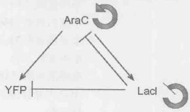

## 索引

## A

AADH, 87
Abd-B 基因, 803
ADA, 88
ADAM, 87
A-DNA, 88
AHA, 88
Alu 序列, 431
Ames 测试, 331
Antennapedia 复合体, 802
APOBEC1, 522
AP 核酸内切酶, 522
Argonaute 蛋白, 752
Argonaute 蛋白家族, 745
AT-AC 剪接体, 503
ATP, 116
ATP 水解, 468
attL, 403
attR, 403
att 位点, 402
A 复合体, 494
A 位点, 547
吖啶, 336
阿拉伯糖, 660
阿昔洛韦, 274
安芬森实验, 137
安芬森重折叠实验, 138
氨基, 60
氨基苯甲酸盐合成酶, 736
氨基酸, 22
氨基酸残基, 126
氨基酸酰基合成酶, 72
氨腈, 621, 622
氨肽酶, 552
氨酰-tRNA 合成酶, 540
氨酰-tRNA, 540, 545

## B

B-DNA, 88
Beckwith-Weidemann 综合征, 725
Bithorax 复合体, 802

BLAST 搜索, 176
B 复合体, 494
八聚体, 229
靶 DNA, 413
靶蛋白的起始（N 端）或末端（C 端），180
靶位点引导反转录, 420
靶位点重复, 411
白假丝酵母, 712
白色念珠菌, 488
摆动理论, 599
半胱氨酰-tRNA $^{Cys}$ , 541
半甲基化, 304
半索动物门, 810
孢子形成体, 853
胞苷脱氨酶, 521
胞浆复合体, 753
胞嘧啶, 26
胞内蛋白激酶, 581
胞外域, 133
胞质分裂, 219
保守性位点特异性重组, 391, 392
报道基因, 688
背部, 773
本底水平, 642
苯丙氨酸, 530
苯基丙氨酸, 469
苯异硫氰酸酯, 182
吡嗪酰胺, 588
吡嗪酰胺酶, 588
闭合式复合体, 450, 482
臂, 402
边界元件, 466
边界元件, 688
编码表皮生长因子, 519
变构, 644
变构调节, 134
变构模型, 480
变性, 133, 138
变性剂, 138

变异-比对, 114  
表达, 653, 660  
表达平台, 738  
表达序列标签, 174  
表达载体, 159  
表观遗传, 755  
表观遗传调控, 726  
表观遗传学, 731  
表现型, 7  
表型, 7  
别构调节, 146  
别乳糖, 652  
丙氨酸, 530  
丙氨酰 tRNA $^{Cys}$ , 541  
丙炔腈, 621  
柄环结构, 111  
病毒, 24  
玻璃海鞘, 488  
补丁产物, 360  
不分离, 376  
布鲁姆综合征, 381

## C

cAMP 受体蛋白, 647
CAP, 647, 649
CAP-αCTD-DNA 复合物, 649
Cap 细胞, 791
CCA 添加, 534
cDNA, 161
cDNA 文库, 161
Chargaff 定律, 27
Chi 位点, 364, 366
Chi 序列, 366
Cre 蛋白, 402
CRISPR, 741, 758
CRISPR-cas 系统, 758
CRP, 647
crRNA, 743
CtBP, 780
CTD 尾, 700
C 端结构域, 649, 665
C 端域, 469
C 复合体, 494
操纵基因, 146
操纵子, 578

插入序列, 425
查耳酮合成酶, 755
拆分, 357
缠绕, 95
缠绕数, 96
长链非编码 RNA, 762
长末端重复序列, 410
常染色质, 233
常染色质, 719
超螺旋, 96
超螺旋密度, 231
超螺旋密度, 97
超嗜热菌强烈炽热球菌, 744
沉降速率, 543
沉默复合物, 720
沉默盒, 382
沉默子, 466
成簇的规律间隔的短回文重复序列, 741
成对规则, 796
成对规则基因, 783
成熟 RISC, 752
成形素, 774, 781
程序性重排, 403
持续幼虫, 857
初级结构, 133
初级转录物, 748, 749
串联质谱法, 183
串联质谱分析, 185
锤头结构, 625
纯合, 7
次黄嘌呤, 535
次黄嘌呤核苷酸, 599
次要剪接位点, 506
粗糙脉孢霉, 488
粗糙脉孢霉, 740
促进染色体转录, 475
促旋酶, 230
催化中心, 134
脆性 X 智力低下, 759
脆性 X 智力低下蛋白, 759
错配修复, 336
错配修复系统, 326
错义突变, 606

## D

Dam 甲基化酶, 327  
dauer 幼虫, 857  
DDE 基序, 418  
Delta, 780, 781  
Delta-Notch 信号转导, 781  
DGCR8, 749  
Dicer 酶, 745, 750  
Distal-less, 806  
Dmc1, 378  
DNA 单链交换, 413  
DNA 动力蛋白机器, 407  
DNA, 34  
DNA 复制, 31  
DNA 合成精确度, 273  
DNA 甲基化酶, 719  
DNA 结合调节蛋白, 466  
DNA 解旋酶, 279  
DNA 聚合酶 III, 284  
DNA 聚合酶, 264  
DNA 聚合酶 I, 28  
DNA 聚合酶III全酶, 284  
DNA 克隆, 158  
DNA 连接酶, 159  
DNA 模板, 28  
DNA 糖基化酶, 522  
DNA 拓扑异构体, 102  
DNA 文库, 159  
DNA 足迹法, 189  
Dorsal 蛋白, 786  
double-sex (dsx) 基因, 513  
Dpn, 514  
Drosha, 749  
DsrA, 735  
D 环, 535  
搭载 RNA, 745  
达尔文演化, 619  
大 T 抗原, 505  
大肠杆菌, 646  
大沟, 80, 87  
大亚基, 543  
代谢激活因子蛋白, 647  
单倍体, 202, 204  
单倍体特异基因, 711  
单层照明显微镜, 783

单价联会, 216, 219  
单聚体, 538  
单链 DNA 结合蛋白, 281  
单链 DNA, 188  
单链结合蛋白, 455  
单顺反子, 553, 592  
单顺反子 mRNA, 532  
单套染色体, 202  
单细胞红藻, 488  
蛋白, 133  
蛋白寡聚体, 132  
蛋白激酶, 308  
蛋白聚合酶, 625  
蛋白酶, 24  
蛋白质, 22  
蛋白质-DNA 复合体, 402  
蛋白质的初级结构, 130  
蛋白质的二级结构, 130  
蛋白质的三级结构, 130  
蛋白质复合体, 387  
倒位促进因子, 405  
等位基因, 356  
等足目, 806  
低密度脂蛋白, 519  
底板, 781  
底物, 563  
底物辅助催化, 563  
颠换, 325  
点突变, 325  
电荷, 56  
电泳迁移改变检测, 188  
调节基因, 781  
调节拷贝数, 425  
调节序列, 466  
调控 RNA, 735  
调控回路, 817  
调控序列, 208  
调控因子结合位点, 687  
调控因子序列, 687  
叠层石, 620  
叠连群, 169, 170  
顶部, 773  
定点诱变, 163  
定位, 242

定向演化, 624  
动夹装载器, 288  
动粒, 211, 214  
毒力因子, 661  
毒粒蛋白, 489  
独立分离定律, 8  
独立分配定律, 9  
端, 817  
端粒, 211, 213  
端粒酶, 213  
短的上游可读框, 554  
短发夹 RNA, 762  
断裂性, 335  
多倍体, 204  
多功能干细胞, 770  
多核苷酸链, 79  
多核苷酸磷酸化酶, 602  
多聚 Phe, 602  
多聚核苷酸, 40  
多聚核糖核酸, 613  
多聚核糖体, 38  
多聚核糖体谱, 585  
多聚嘧啶区, 490  
多聚嘧啶区结合, 513  
多聚腺苷酸, 410  
多聚腺苷酸化, 476, 477  
多聚腺苷酸序列, 412  
多梳, 723  
多顺反子, 592  
多顺反子 mRNA, 532  
多顺反子信使, 646  
多肽, 131  
多肽链, 126  
多线染色体, 862  
多元自动化基因组改造, 612

Edman 降解法, 182
EF-G-GDP 构象, 566
EF-Tu-GTP, 588
eIF2α 激酶, 585
ELL 家族, 474
even-skipped, 796
eve 基因, 796
excise 切除, 403

## E

E位点,548  
恶性,676  
二倍体,204  
二级结构,133  
二价联会,216  
二价轴,225  
二聚肽,605  
二聚体,227  
二磷酸核苷,602  
二硫键,128  
二氢叶酸还原酶,486

## F

Fis蛋白,405  
FOXP1,516  
FtsK,406  
F因子,844  
发夹沉默,855  
发夹结构,557  
翻译,35  
翻译耦合,533  
翻译起始因子,552  
反促旋酶,230  
反卷积法,183  
反密码子,37  
反密码子环,535  
反式,91  
反式剪切,502  
反式因子,734  
反式作用sRNA,739  
反式作用调控RNA,736  
反双胸基因,802  
反相层析,185  
反向平行,82  
反向重复,393  
反义RNA,425  
反转录,161  
反转录酶,209  
反转录整合酶,418  
泛素化途径,349  
范德华半径,58  
范德华力,53,56,57  
纺锤体极体,213  
放射自显影图像,156  
放线菌酮,585

非病毒反转录转座子, 410  
非常规, 536  
非极性分子, 57  
非极性氢, 87  
非交叉重组, 380  
非交换产物, 360, 383  
非耐受细胞, 522  
非同源末端连接, 342, 343  
非协调基序, 827  
非转移链, 414  
非自主转座子, 411  
非组蛋白, 202  
分节基因, 783  
分裂前期, 216  
分泌信号分子的扩散, 812  
分泌信号分子扩散传导, 77  
分支点, 490  
分支点结合蛋白, 494  
分支点序列, 490  
分支移位, 356  
分子, 53  
分子伴侣, 134  
分子模拟物, 457  
封闭复合体, 642  
抚育细胞, 789  
辅酶 A, 623  
辅酶焦磷酸硫胺素, 739  
辅助蛋白, 593  
负超螺旋, 230  
负电性, 57  
负调控蛋白, 641  
负载, 592  
负载 tRNA, 739  
负载的, 536  
负自我调控, 670  
复合物, 743  
复合转座子, 425  
复制叉, 276  
复制起始位点, 211  
复制器, 295  
复制体, 295  
复制性转座, 416  
复制子, 295  
腹部组织, 773

覆瓦, 855, 879
覆瓦式 DNA 芯片, 191
覆瓦式芯片, 175

## G

GAL1 基因, 696, 715
Gcn4 蛋白, 584
GCR, 704
Gli 活化剂, 782
Gli 活化因子, 786
Gli 结合位点, 782
Gln-tRNA $^{Gln}$ , 538
Groucho, 780
GTP 交换因子, 567
GTP 酶, 552
甘油醛, 621
感染复数, 675
感受态, 821
感受性核糖开关, 739
冈比亚按蚊, 488
冈崎片段, 277
高能键, 52, 65, 68
高能酰基键, 567
高频溶原, 676
高频重组菌株, 844
铬功能域, 242
铬结构域, 249
供体, 490
共价闭和环状 DNA, 231
共价闭环, 95
共价键, 52
共抑制, 755
共有序列, 452
构巢曲霉, 488
构象, 127
构筑蛋白, 401
孤独症谱系障碍, 725
谷胱甘肽过氧化物酶, 541
固定化金属亲和层析, 186
固体培养基, 162
固有终止子, 464
寡聚核苷酸, 162
光合作用, 68
光激活作用, 336, 337
光交联位点, 612

光吸收值, 92
果蝇, 470
过渡态, 145

## H

H19 基因, 724
H2A·H2B, 475
H2A, 475
H2B, 475
H3, 475
H4, 475
Hairless, 780
Half-pint 蛋白, 512
HDAA, 87
HIV, 522
hixL, 403
hixR, 403
Holliday 联结体, 398
Holliday 联结体, 356
HoxD 基因, 704
HO 基因, 707
HO 内切核酸酶, 382
HSP70 基因, 700, 701
海藻, 488
合胞体, 782
合成基因组, 620
合成期, 213
合成生物学, 816
合成型操纵子衰减, 736
合成依赖性链退火, 383
合子核, 783
核磁共振, 114
核苷, 80
核苷三磷酸, 456
核苷酸, 80
核苷酸切除修复, 336, 337
核苷酸三联体, 371
核骨架, 237
核孔复合体, 525
核酶, 118, 119
核内小 RNA, 492
核素掺入法, 266
核酸酶, 177
核酸酶保护足迹法, 189
核糖核蛋白, 512
核糖核苷三磷酸, 265

核糖核苷酸, 446  
核糖核酸蛋白基序, 144  
核糖核酸酶, 137  
核糖开关, 117  
核糖体, 531, 542  
核糖体 RNA, 37  
核糖体结合位点, 532  
核糖体结合位点区域, 739  
核糖体循环, 543, 572  
核糖体循环因子, 572  
核小体, 202, 231  
核小体核心颗粒, 223, 225  
核小体修饰, 728  
核小体修饰因子, 731  
核小体重塑复合体, 240, 242  
核心 DNA, 222  
核心蛋白复合体 1, 723  
核心酶, 448, 482  
核心启动子, 466  
核心组蛋白, 224  
盒式外显子, 506  
黑腹果蝇, 488  
红鳍东方鲀, 488  
后部, 773, 789  
后极, 789  
后期, 216  
后期Ⅱ, 221  
后随链, 277, 320  
互补结构, 61  
互补双螺旋理论, 26  
互不相容, 506  
互卷, 96  
花斑化, 720  
花斑位置效应, 721  
滑动, 240  
滑动 DNA 夹, 286  
滑动夹装载器, 569  
化学保护足迹法, 189  
化学干扰足迹法, 189  
化学键, 52  
环丁烷, 333  
环和远程的三维相互作用, 114  
环形, 96  
黄孢原毛平革菌, 488

黄色霉素, 575
黄素单核苷酸, 739
黄素腺嘌呤双核苷酸, 623
回文, 140
回文结构, 304
混合感染, 842
混合血统白血病, 700
活化分子, 71
活化能, 66
活性位点, 134, 145

## I

IF1, 552
IF2, 552
IF3, 552
Ig 结构域, 507
int 基因, 680

## J

J区,433  
肌动蛋白,772  
肌动蛋白丝,776  
肌钙蛋白T,504  
肌球蛋白,772  
基团活化,71  
基团转移,71  
基序,133  
基因,7  
基因沉默,688  
基因簇,802  
基因间序列,207  
基因间抑制,607  
基因密度,207  
基因内抑制,607  
基因敲除,354  
基因微阵列,847  
基因型,7  
基因转变,360,381  
基因组编辑,177  
基因组范围的重复序列,210  
基因组文库,161  
基因组中的“暗物质”,176  
基于引物延伸的选择性 $2^{\prime}$ -羟基激活区,649  
激活态,66

激活因子, 471
级联, 743
极粒, 783, 789
极细胞, 865
极性, 279
极性氨基酸, 126
极性分子, 57
急性淋巴细胞白血病, 700
急性髓系白血病, 474
棘皮动物门, 810
脊髓肌肉萎缩症, 517
脊髓性肌萎缩, 518
脊索动物门, 810
剂量补偿, 763
加工后的假基因, 432
加帽, 476
家族性孤立性生长激素缺乏Ⅱ型, 517
甲基, 36
甲基鸟嘌呤, 535
甲硫氨酸, 605
甲酸盐脱氢酶, 541
甲酰化酶, 551
假矮海链藻, 488
假结, 111
假尿嘧啶, 535
间期, 215
减数分裂, 219
减数分裂Ⅱ期, 221
减数分裂细胞周期, 219
减数分裂重组, 376
剪接, 476
剪接体, 492, 526
剪接替换, 502
剪切酶, 680
剪切修复系统, 336
剪切-粘贴转座, 412
简并性, 174
碱基, 36
碱基错配, 386
碱基翻出, 85
碱基类似物, 335
碱基切除修复, 336, 337
碱性 HLH 蛋白, 694
碱性拉链, 694

鉴别者碱基, 539  
鉴别子, 454  
键对, 536  
键角, 53  
交换, 354  
交换产物, 360, 383  
交换区, 393  
交联, 11  
交配型基因座, 382  
交配型转换, 775  
焦磷酸, 537  
焦磷酸化编辑, 461  
焦磷酸酶, 73  
酵母交配型, 385  
接合组装基因组改造, 612  
节, 817  
节律性行为, 830  
拮抗剂, 661  
结构, 133  
结构域, 133  
结合部, 111  
结核杆菌, 588  
姐妹染色单体, 213  
姐妹染色单体的附着, 213  
姐妹染色单体分离, 214  
姐妹染色体, 211  
解开, 99  
解离酶, 406  
解离子, 423  
解码中心, 543, 574, 592  
解旋酶, 278, 312  
静息状态, 824  
巨核酸酶, 177  
巨核细胞, 204  
聚丙烯酰胺凝胶, 152  
聚合酶, 28  
聚合酶I, 448  
聚合酶II, 448  
聚合酶III, 448  
聚合酶的切换, 285  
聚合酶链反应, 163  
绝缘子, 466  
绝缘子序列, 724  
菌落杂交, 162

## K

kappa 基因座, 433
Kozak 序列, 534
卡路里, 54
卡那霉素, 116
开放式复合体, 450, 456
抗体, 432
抗原结合位点, 433
抗终止, 646
抗终止作用, 677
考马斯亮蓝, 181
拷贝 DNA, 209
可变环, 535
可变剪接, 487, 527
可变剪切, 502
可读框, 531
空间位阻, 506
空载 tRNA, 739
空载的, 537
枯草杆菌, 739

## L

Lac 抑制因子, 647
LEF-1 增强子, 694
LINE, 431
lncRNA, 762
luxI 基因, 661
L 型, 619
L-型氨基酸, 622
L-型分子, 622
垃圾 DNA, 210
蓝氏贾第虫, 488
酪氨酸, 313
酪氨酸重组酶, 394, 402
雷帕霉素, 581
类病毒, 119
类核, 204
离子键, 56, 60
离子交换层析, 185
利福平, 588
连环数, 95, 96
连接 DNA, 222
连接分子, 371
连接者, 470

连接组蛋白,224  
连锁基因,10  
联会,11  
联会复合体,391,412  
链交换蛋白,357,367  
链接,99  
链入侵,356  
链退火,387  
链终止核苷酸,165  
亮氨酸,530  
裂解,662  
裂解蛋白,663  
裂解量,842  
裂解型,839  
裂解性生长,402  
裂素激活蛋白激酶,716  
裂殖酵母,746,753  
磷酸二酯键,52,80  
磷酸核糖基邻氨基苯甲合成酶,736  
磷酸核糖基邻氨基苯甲酯  
磷酸化核苷,72  
磷酸盐,622  
磷酰基团,491  
鳞状细胞癌,518  
六邻体,489  
绿领鞭藻,488  
绿色荧光蛋白,848  
卵巢生态位,791  
卵黄胞,783  
卵裂球,783  
逻辑关系,818  
螺线管模型,235  
螺线管状,96  
螺旋-环-螺旋蛋白,694  
螺旋伸展,114  
螺旋-转角-螺旋,141  
螺旋-转折-螺旋,651

## M

MADA, 87
mariner 因子, 429
merT 基因, 658
Met-tRNA 转甲酰酶, 550
Miller-Urey 实验, 621

miR-17-92, 759  
miRNA, 210  
MN, 781  
mRNA定位, 771, 812  
mRNA衰减, 589  
mRNA转运, 524  
M期, 213  
脉冲标记, 41  
脉冲场, 153  
慢性淋巴细胞白血病, 759  
酶, 145  
酶的功能, 67  
孟德尔定律, 6  
密码子, 37, 40  
嘧啶, 81  
嘧啶环, 622  
免疫沉淀, 180  
免疫沉淀反应, 190  
免疫亲和层析, 180  
免疫球蛋白, 507  
免疫区域, 426  
免疫印迹, 181  
免疫荧光显微镜, 848  
灭活, 763  
冥古宙, 620  
模板酶, 39  
末端复制问题, 313  
末端终止介导的衰减, 591  
末期, 216  
默奇森陨石, 622  
母细胞, 778  
拇指域, 270  
募集, 643

## N

NANOG, 516
Nanog, 769
Nanos 蛋白, 582
Nanos 反应元件, 792
Nkx2.2, 781
Northern 印迹杂交, 157
nut, 677
N 端结构域, 649, 665
N-己酰高丝氨酸内酯, 661
N-甲基-N₁-硝基-N-亚硝基胍, 333
N-甲酰甲硫氨酸, 550

N-甲酰甲硫氨酸, 605  
内部核糖体进入位点, 554  
内含子, 119  
内含子在后模型, 519  
内含子在先模型, 518  
内环, 111  
内葡聚酶基因, 809  
内切核酸酶, 275  
内切酶, 373  
内细胞团, 769  
内源性噪声, 819  
耐受细胞, 522  
囊泡, 629  
逆向调控, 679  
逆转录酶, 274  
逆转突变, 607  
黏粒, 213  
酿酒酵母, 488  
酿酒酵母, 689, 712  
鸟嘌呤, 26  
鸟枪法测序, 170  
尿嘧啶, 109  
凝胶电泳, 102  
凝胶电泳, 152, 153  
凝胶基质, 152  
凝聚蛋白, 216  
凝血因子, 116  
扭转, 95  
扭转数, 96

## 0

OCT4, 516
Oct4, 769
Olig2, 781
Oskar 蛋白, 582
偶极矩, 57
耦联, 670

## P

Pasha, 749  
Pax6, 781  
PHD 指纹, 249  
Pho-RC（抑制复合物）, 723  
piRNA, 758  
Pol II 的转录因子, 467  
poly-A 结合蛋白, 557

poly-A尾,592  
poly-Arg,605  
poly-A尾结构,534  
poly-A信号,477  
poly-Glu,605  
poly-His,605  
poly-Ile,605  
poly-Lys,605  
poly-Ser,605  
P位点,547  
盘基网柄菌,488  
旁路途径,380  
胚泡,867  
胚胎干细胞,516  
培养基,31  
配对末端测序,170  
配体,146  
嘌呤,81  
嘌呤霉素,574  
平衡棒,801  
平衡常数,54,55  
平衡浓度,55  
平衡染色体,862  
普遍性转导,845

## Q

启动子, 450, 483  
启动子最近元件, 466  
起始, 450  
起始 tRNA, 550  
起始密码子, 531, 593  
起始位点识别复合体, 301  
起始转录复合体, 450  
起始子, 296  
前 mRNA, 487  
前孢子, 778  
前导链, 277, 320  
前导序列, 736  
前极, 789  
前间区序列, 743  
前馈环, 826  
前馈环基序, 826  
前起始复合体, 467  
前区, 773  
潜伏期, 842  
嵌合体, 863

嵌入剂, 335
羟脯氨酸, 612
羟基, 34
羟基脯氨酸, 541
羟乙醛, 621, 622
切割刺激因子, 477
切割和聚腺苷酸化特异性因子, 477
亲本印记, 870
亲和层析, 180
亲水的, 129
亲同种抗原识别, 507
氢键, 26
氢键供体, 87
氢键受体, 87
氰钴胺素, 116
琼脂糖凝胶, 152
巯基, 128
去嘌呤化, 332
全能的, 783
缺口蛋白, 812
缺口基因, 783
缺失突变, 609

## R

Rad51, 378  
RAG1, 434  
RAG2, 434  
RAG基因, 810  
Ramachandran图, 127  
RecA蛋白, 367  
RecA蛋白丝, 369  
RecBCD酶, 363  
RecBCD途径, 363  
Rett综合征, 725  
Rho非依赖型, 462  
Rho依赖型, 462  
RNA5'端加帽, 476  
RNA编辑, 527  
RNA聚合酶I, 484  
RNA, 34  
RNAi), 744  
RNase P, 118  
RNA变异体, 504  
RNA干扰, 734  
RNA加工, 483、  
RNA剪接, 119

RNA 剪接, 207
RNA 聚合酶, 39
RNA 聚合酶的全酶, 452
RNA 酶 H, 278
RNA 前体, 175
RNA 识别基序, 144
RNA 世界, 623
RNA 依赖 RNA 聚合酶, 747
RNA 诱导的沉默复合物, 745
RprA, 735
RpsA, 588
RS 结构域, 512
R 环定位方法, 489
染色单体, 213
染色体, 202
染色体构象捕获试验, 192
染色体凝聚, 215
染色质, 202
染色质免疫沉淀, 190
染色质免疫沉淀反应, 696
染色质免疫沉淀技术, 852
染色质免疫沉淀芯片, 696
染色质免疫共沉淀测序技术, 696
染色质修饰酶, 466
染色质域, 754
热力学第一定律, 54
人, 488
人工 miRNA, 855
人类免疫缺陷型病毒, 701
人类遗传性疾病——镰状红细胞贫血, 606
溶菌酶, 609
溶原, 839
溶原生长, 662, 664
溶原体, 670
溶原现象, 663
溶原性细菌噬菌体, 428
溶原性诱导, 663
溶原周期, 670
溶原状态, 402
熔点, 92
融合蛋白, 158
乳酸酵母, 712
入位, 561
朊病毒蛋白, 116

<table><tr><td>S</td><td>神经母细胞,780</td></tr><tr><td>SANT结构域,249</td><td>神经外胚层,780</td></tr><tr><td>Schnurri,791</td><td>神经元,780</td></tr><tr><td>SD序列,532</td><td>渗透性,629</td></tr><tr><td>SELEX,115</td><td>生物膜,661</td></tr><tr><td>Set1-COMPASS,700</td><td>生物荧光,661</td></tr><tr><td>SHAPE,115</td><td>生物钟,829</td></tr><tr><td>Shh,781</td><td>生殖器支原体,619</td></tr><tr><td>SINE,431</td><td>生殖系干细胞,791</td></tr><tr><td>Slicer,755</td><td>生殖系转化,868</td></tr><tr><td>SMC蛋白,238</td><td>生殖细胞,783</td></tr><tr><td>SOS反应,348</td><td>十二烷基硫酸钠,181</td></tr><tr><td>Southern印迹杂交技术,156</td><td>识别螺旋,141</td></tr><tr><td>Sox2,769</td><td>适配RNA,592</td></tr><tr><td>Spätzle,786</td><td>适配体,738</td></tr><tr><td>Spt16,475</td><td>适配子,116</td></tr><tr><td>SsrA RNA,587</td><td>适配子假设,35</td></tr><tr><td>SsrA结合蛋白,588</td><td>释放因子,569</td></tr><tr><td>SSRP1,475</td><td>噬菌斑,676</td></tr><tr><td>STAT,715</td><td>噬菌斑检测,841</td></tr><tr><td>STAT通路,661</td><td>噬菌体,25</td></tr><tr><td>Svedberg,543</td><td>噬菌体,839,891</td></tr><tr><td>S期,213</td><td>噬菌体小组,838</td></tr><tr><td>鳃足目,806</td><td>手性中心,125</td></tr><tr><td>三氨基酸,571</td><td>手指域,270</td></tr><tr><td>三叉交汇点,491</td><td>受体,490</td></tr><tr><td>三级结构,113</td><td>受体臂,535</td></tr><tr><td>三联snRNP,494</td><td>疏水表面,87</td></tr><tr><td>三联密码子,597</td><td>疏水的,129</td></tr><tr><td>三联体,40</td><td>疏水基团,36</td></tr><tr><td>三裂体引导序列,489</td><td>疏水键,56,63</td></tr><tr><td>三磷酸核苷酸,567</td><td>鼠约氏疟原虫,488</td></tr><tr><td>三胸复合体,803</td><td>衰减作用,739</td></tr><tr><td>三元复合物,554,584</td><td>双负回路,825</td></tr><tr><td>三重复合物,556</td><td>双链DNA,188</td></tr><tr><td>桑椹胚,867</td><td>双链断裂,238</td></tr><tr><td>色氨酸,530</td><td>双链断裂修复,337,342</td></tr><tr><td>色氨酸合成酶α,736</td><td>双链断裂修复途径,360,363</td></tr><tr><td>色氨酸合成酶β,736</td><td>双螺旋,25</td></tr><tr><td>色素沉着综合征,381</td><td>双螺旋结构,26</td></tr><tr><td>色素性视网膜炎,517</td><td>双氢尿嘧啶,535</td></tr><tr><td>沙门氏菌,403</td><td>双稳开关,821</td></tr><tr><td>山羊支原体,611</td><td>双稳性,821</td></tr><tr><td>熵,55</td><td>双小核草履虫,488</td></tr><tr><td>熵催化,563</td><td></td></tr><tr><td>上游激活物序列,466</td><td></td></tr><tr><td>深度测序,811</td><td></td></tr></table>

双杂交实验,690  
水稻,488  
水解编辑,461  
水解酶,71  
水解作用,68  
水泡弧,301  
顺式,91  
硕大利什曼原虫,488  
丝氨酸重组酶,393  
四级结构,132,133  
四聚体,227  
四聚体形态,395  
四通管接头结构,399  
松弛态,96  
粟酒裂殖酵母,488  
随机性,819  
梭链孢酸,575  
羧基,60  
羧基端,545  
羧基末端域,700  
锁钥结构关系,61

## T

T4噬菌体, 37  
TAF, 467, 470  
TATA元件, 466, 481  
TBP, 467  
TBP关联因子, 467  
Tc因子, 429  
Tc1 / mariner因子, 429  
TFIIB, 470  
TFIIB识别元件（TFIIBRE）、TATA元件（466  
TFIIB识别元件, 466  
TFIIE, 471  
TFIIF, 470  
TFIIH, 471  
tmRNA, 587  
Trithorax蛋白, 700  
tRNA, 536, 537 $\mathsf{tRNA}^{\mathsf{Met}}$ , 550 $\mathsf{tRNA}^{\mathsf{Val}}$ , 550  
tRNA负载, 538  
tRNA结合位点, 547  
Tsix, 764  
TUDOR结构域, 249twist基因,787  
t环,319  
T淋巴细胞,701  
T细胞受体,432  
太古宙,620  
肽出口通道,574  
肽基转移酶,120  
肽基转移酶中心,543  
肽基转移中心,574  
肽键,126  
肽酰-tRNA,545  
肽酰转移酶,563  
肽酰转移酶反应,546  
肽酰转移酶中心,592  
肽转移酶,558  
探针,155  
羰基,53  
羰基双键,66  
唐氏综合征细胞黏附分子,507  
糖基,137  
糖基化,133,137  
糖基化酶,338  
糖体蛋白S1,588  
逃离,450  
特定表位,180  
特异性转导,843,846  
梯度亲和模型,782  
体外选择,193  
铁离子调控蛋白,583  
铁离子调控元件,583  
停泊位点,508,510  
通路,715  
通用转录因子,466  
同工tRNA,538  
同线性,810  
同向重复,393  
同型结构域,692  
同义RNA,755  
同义密码子,597  
同源,135  
同源调节域,699  
同源建模,133,139  
同源结构域,133  
同源染色体,204,219

同源染色体联会, 379  
同源异型基因, 771, 801  
同源重组, 354, 355, 375  
同族 tRNA, 538  
酮式构型, 82  
凸起, 111, 114  
突变, 16  
突变 tRNA 基因, 607  
突变发生, 348  
突变基因, 10  
突变体, 676  
图距单位, 14  
兔脑原虫, 488  
脱氨基作用, 521, 522  
脱氨酶, 522  
脱氧核糖, 34  
脱氧核糖核苷三磷酸, 265  
脱氧核糖核苷酸, 446  
脱氧核糖核酸, 22  
妥布霉素, 116  
拓扑, 133  
拓扑结构, 135  
拓扑异构酶 II, 238  
拓扑异构酶, 230

## U

U2 辅助因子, 493
UP 元件, 454

## V

V(D)J重组,344
V2,781
V3,781
VIGS,855

## W

Watson-Crick 配对, 371
外切核酸酶, 275
外显子, 175
外显子 / 内含子剪接减弱子, 511
外显子 / 内含子剪接增强子, 511
外显子的剪接增强子, 501
外显子确认, 496
外显子重组, 518
外源性噪声, 820
烷化反应, 333

微RNA,210  
微管,211,213  
微管蛋白,772  
微管组织中心,213  
微加工复合物,749  
微球菌核酸酶,223  
微卫星DNA,210  
维持甲基化酶,728  
尾巴,224  
位点控制区域,704  
位置信息,773  
温和型,839  
文库,158  
稳定期,844  
稳定区,433  
稳定性,820  
稳定性状态,820  
沃纳综合征,381  
无义介导降解,506  
无义密码子,42  
无义突变,606  
无终止密码子介导的衰减,589  
戊糖,622  
戊糖-氨基恶唑,622

## X

Xis, 403  
Xist, 764  
X射线晶体学, 114  
烯醇式构型, 82  
硒代半胱氨酸, 541  
蟋蟀麻痹病毒, 555  
系统生物学, 816  
系统性配体演化实验, 624  
系统演化树, 347  
细胞表面受体, 715  
细胞程序性死亡, 555  
细胞的有丝分裂, 213  
细胞凋亡, 555  
细胞凋亡, 759  
细胞分裂, 816  
细胞骨架, 776  
细胞骨架动力学, 816  
细胞核, 204  
细胞囊胚层, 783

细胞死亡缺陷型, 859  
细胞外的浓度梯度, 774  
细胞-细胞接触, 771, 772, 812  
细胞质, 40  
细胞周期, 213  
细胞周期检查点, 219  
细菌, 25  
细菌费氏弧菌, 661  
细菌枯草杆菌, 656  
细菌人工染色体, 172  
下游启动子元件, 466  
纤维蛋白, 489  
纤维素, 809  
酰基高丝氨酸内酯, 661  
显性, 7  
线虫, 488  
限制性内切核酸酶, 153  
腺病毒, 488  
腺苷甲硫氨酸, 739  
腺苷酸化, 537  
腺苷脱氨酶, 522  
腺苷酰基化, 537  
腺嘌呤, 26  
相缠螺旋, 96  
镶嵌体, 763  
向导 RNA, 745, 752  
小 RNA, 734  
小 t 抗原, 505  
小分子干扰 RNA, 745  
小干扰 RNA, 448  
小沟, 80, 87  
小核内核糖蛋白, 492  
小鼠, 488  
小亚基, 543  
校正外切核酸酶, 275  
协同, 706  
协同结合, 281  
协同结合 DNA, 643  
缬氨酸, 530  
锌簇, 693  
锌指, 142  
锌指蛋白, 693  
锌指核酸酶, 177  
新霉素, 116

新型隐球菌, 488  
新月柄杆菌, 828  
信号传输, 816  
信号分子, 773, 774  
信号整合, 656  
信号转导, 816  
信号转导通路, 715  
信号转导途径, 772  
信使 RNA, 37  
信使 RNA, 530, 531  
星, 325  
胸腺嘧啶, 26  
胸腺嘧啶二聚体, 333  
秀丽新小杆线虫, 488  
溴功能域, 242  
溴化乙锭, 104  
溴结构域, 249  
溴区结构域, 720  
溴乙锭, 336  
序列, 133  
序列覆盖度, 167  
序列互补, 83  
选择性试剂, 182  
选择子序列, 508

## Y

Y 家族, 347
Y 形转换, 301
压力应答 σ 因子, 735
亚氨基, 53
亚磷酸酰胺, 162
亚型, 487
亚性疟原, 488
烟酰胺腺嘌呤, 623
延伸, 450, 483
延伸能力, 270
延伸因子, 473
演化, 527
阳性克隆, 690
氧代鸟嘌呤, 333
移码突变, 606, 607
移损 DNA 合成, 336
移损合成, 345
移损聚合酶, 337

移位, 240
遗传感受态, 159
遗传回路, 817
遗传交换, 376
遗传连锁, 811
遗传图谱, 12
乙胺丁醇, 588
乙基亚硝基, 190
异二聚体, 692
异构化作用, 456
异构状态, 82
异亮氨酸, 530
异亮氨酰-tRNA 合成酶, 540
异染色质, 233
异涡动物门, 810
异缬胺酸, 622
异型双聚体, 475
异烟肼, 588
异源双链螺旋 DNA, 356
抑癌基因, 759
抑制复合体, 713
抑制基因, 607
抑制突变, 607
抑制因子, 641, 646, 665, 680
抑制子, 734
易位, 550, 564
易位相关区域, 574
因子结合中心, 560, 568, 574
阴道滴虫, 488
音猬因子, 781
引导 RNA, 523
引物酶, 277
引物-模板接头, 320
隐孢子虫, 488
隐性, 7
印记, 724
印记控制区, 724
印记缺损, 725
荧光结构, 612
荧光素酶, 661
荧光显微镜, 848
有机分子, 620
有丝分裂纺锤体, 213
右手双螺旋, 79

诱变剂, 331
诱导, 839, 882, 883, 891, 892, 893, 895
诱导多能干细胞, 516
诱导物, 146
鱼雷模型, 479
育性质粒, 844
原黄素, 336
原生细胞, 618
原噬菌体, 663
原丝, 776
原条, 868
原子价, 53
阅读者, 470
允许旋转自由度, 53

## Z

Z-DNA, 88, 91  
杂合, 7  
杂交, 155  
杂种劣势, 864, 865  
早期地球化学环境, 621  
噪声, 819  
增强体, 708  
增强子, 177  
增色效应, 92  
折叠, 133, 135  
折叠分子伴侣, 139  
蔗糖梯度离心, 585  
振荡回路, 828  
整合酶, 411  
整合宿主因子, 402  
正电性, 57  
正调控蛋白, 641  
正控制, 648  
正转录延伸因子, 700  
正自我调控, 670  
支架, 170  
支原体, 619  
指数富集配体系统演化技术, 1  
指数期, 844  
质粒, 158  
质子穿梭机制, 563  
致癌基因, 759  
滞后作用, 822  
中间丝, 776

中介蛋白, 695, 706  
中介蛋白复合体, 466  
中囊胚转变, 783  
中期 I, 219  
中期 II, 221  
中枢调控因子, 828  
中枢神经系统, 800  
中心法则, 35  
中心粒, 213  
中央核心片段, 402  
终止, 450, 484  
终止密码子, 531  
终止突变, 606  
肿瘤诱发, 853  
重复序列, 741  
重组蛋白, 663  
重组工厂, 379  
重组酶, 391  
重组酶识别序列, 393  
重组体, 8  
重组位点, 392  
重组修复, 337  
周质, 782  
主要剪接位点, 506  
主要晚期启动子, 489  
注释, 173  
柱层析法, 178  
转化, 159  
转化子, 159  
转换, 325  
转基因, 354  
转录, 35  
转录沉默, 703, 718  
转录沉默, 746  
转录环路, 831  
转录激活因子类似效应  
转录耦联修复, 341  
转录起始, 483  
转录组, 174  
转铁蛋白, 582  
转移, 240  
转移酶, 71  
转运 RNA, 531, 592  
转酯反应, 491

转座, 210
转座酶, 411, 418
转座目标免疫, 428
转座目标免疫性, 425
转座体, 412
转座因子, 210
转座重组, 391
转座子, 324
转座子的避风港, 425
着色性干皮病, 341
着丝粒, 211
自剪接, 496
自剪接内含子, 496
自身调控, 818
自身负调控, 818
自体诱导物, 661
自我避免, 507
自我剪接, 527
自我强化, 824
自由能, 55
自主复制序列, 298
自主转座子, 411
阻遏蛋白, 775
阻遏物, 140
组成型表达, 642
组成性, 653
组蛋白, 202
组蛋白伴侣, 254
组蛋白甲基转移酶, 720
组蛋白密码, 721
组蛋白脱乙酰酶, 713, 720
组蛋白修饰, 700
组蛋白乙酰基转移酶, 250
组蛋白乙酰转移酶, 698
组蛋白折叠域, 224
组合控制, 656
组装抑制蛋白, 776
最后共同祖先, 620
左手双螺旋, 79
作用, 706

β-球蛋白, 517

5 甲基-尿嘧啶, 109

“C” 区, 433

5-溴尿嘧啶, 335

“Watson-Crick”配对规则,83

6-酮基基团, 599

“反义” RNA, 175

70S 起始复合体, 552

“蜷缩”（scrunching）模型，459

80S 起始复合体, 558

“蠕虫移动”（inchworming）模型, 459

α-环素, 177

“瞬时漂移”（transient excursion）模型，458

$\alpha$ 肌钙蛋白T,506

“跳跃”基因, 391

α交配型, 776

“与门”，818

α螺旋, 130, 131

I类释放因子,569

α亚基, 649

2'-脱氧核糖, 80

α右螺旋, 127

2', 3'-双脱氧鸟嘌呤三磷酸, 165

β-半乳糖苷酶, 652, 653

2-氨基唑, 622

$\beta$ 干扰素基因, 710

Ⅱ类释放因子, 569

β三明治, 134

3' -5' 磷酸二酯键, 25

β折叠, 128, 130, 131

3' 端非翻译区, 772

β-珠蛋白亚基, 606

3' 剪接位点, 490

$\lambda$ Cro蛋白,651

30nm 纤丝, 235

$\lambda$ 噬菌体, 402

30S 亚基, 543

λ噬菌体抑制因子, 651

43S 前起始复合物, 557

$\lambda$ 整合酶蛋白, 402

48S 前起始复合物, 557

σ, 735

5' 剪接位点, 490

$\sigma^{70}$ ,452

5' 帽子, 533

$\sigma^{\mathrm{E}},735$

50S 亚基, 543

$\sigma^{E}$ 自身负调控环, 735

5 甲基, 109

$\sigma^{\mathrm{F}},778$

ΨU 环, 535

$\tau$ 亚基与解旋酶，293

## 内容简介

本书是基因组学的综合型教科书，阐述了基因组的起源、体系、理念与基本概念，特别介绍了真正意义的基因组的第一次实践——国际人类基因组计划及其核心技术——测序的发明与发展，基因组学在认知生命及育种、医学等方面的广泛应用。

本书适合于已学习完遗传学课程的本科生，以及非基因组学专业的生命科学、生物技术相关学科的研究生参考阅读。

## 编辑推荐

本书由DNA双螺旋结构的发现者之一James D. Watson及其他几位著名学者在第六版的基础上修订完成。除了反映分子生物学领域的最新进展之外，还涉及其他诸多方面的内容。书中内容权威、新颖、详尽，堪称分子生物学和基因组学领域的经典之作。在为广大的生物学爱好者及研究人员提供了分子生物学的知识框架和实验途径的同时，强调了基因科学对于全部生物学研究的重要意义。

## 原书彩图下载

## www.sciencep.com

<!-- END OFFICIAL API PART part_010 -->
