<!-- BEGIN OFFICIAL API PART part_001 -->

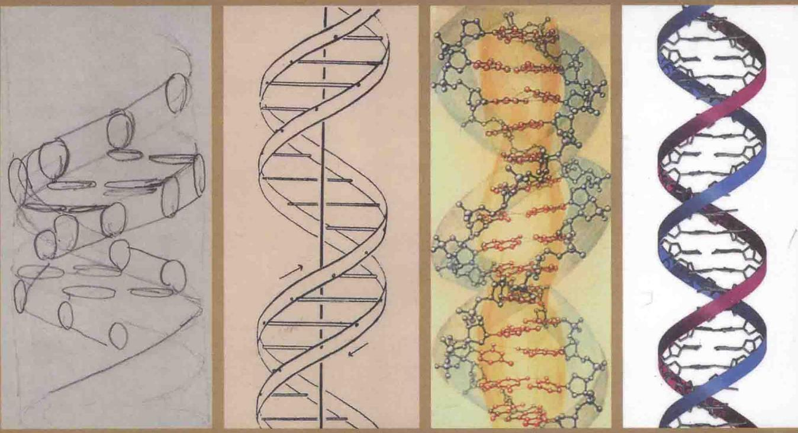

基因的分子生物学（第七版）

Molecular Biology of the Gene (Seventh Edition)

编辑推荐

[美] J.D. 沃森 T.A. 贝克 S.P. 贝尔
编著
A. 甘恩 M. 莱文 R.M. 洛斯克

杨焕明 主译

PEARSON

# 基因的分子生物学

(第七版)

# Molecular Biology of the Gene (Seventh Edition)

J. D. 沃森 T. A. 贝克

〔美〕S.P.贝尔 A.甘恩 编著

M. 莱文 R.M. 洛斯克

杨焕明 主译

科学出版社

北京

## 内容简介

本书是基因组学的综合型教科书，阐述了基因组的起源、体系、理念与基本概念，特别介绍了真正意义的基因组的第一次实践——国际人类基因组计划及其核心技术——测序的发明与发展，基因组学在认知生命及育种、医学等方面的广泛应用。

本书适合于已学习完遗传学课程的本科生，以及非基因组学专业的生命科学、生物技术相关学科的研究生参考阅读。

Authorized translation from the English language edition: entitled MOLE CULAR BIOLOGY OF THE GENE, 7E, by WATSON, JAMES D.; BAKER, TANIA A.; BELL, STEPHEN P.; GANN, ALEXANDER; LEVINE, MICHAEL; LOSICK, RICHARD, published by Pearson Education, Inc., Copyright © 2014

All rights reserved. No part of this book may be reproduced or transmitted in any form or by any means, electronic or mechanical, including photocopying, recording or by any information storage retrieval system, without permission from Pearson Education, Inc.

CHINESE SIMPLIFIED language edition published by PEARSON EDUCATION ASIA LTD., and CHINA SCIENCE PUBLISHING & MEDIA LTD. (SCIENCE PRESS) Copyright © 2015

本版本仅售于中国大陆地区（不包含台湾、香港与澳门地区）。

图书在版编目(CIP)数据

基因的分子生物学：第7版/(美)沃森(Watson, J. D.)等编著，杨焕明等译. —北京：科学出版社, 2015.3

(生命科学名著)

书名原文: Molecular biology of the gene, seventh edition

ISBN 978-7-03-042532-4

I. ①基… II. ①沃… ②杨… III. ①基因-分子生物学 IV. ①Q343.1 ②Q75

中国版本图书馆 CIP 数据核字(2014)第 268479 号

责任编辑：夏梁 刘晶 / 责任校对：夏梁

责任印制：赵博 / 封面设计：美光制版

科学出版社出版

北京东黄城根北街16号

邮政编码: 100717

http://www.sciencep.com

新科印刷有限公司 印刷

科学出版社发行

各地新华书店经销

2015年3月第一版 开本:787×1092 1/16

2015年3月第一次印刷 印张:59 1/4

字数: 1355000

定价: 238 元

(如有印装质量问题, 我社负责调换)

## 译校人员名单

主 译 杨焕明

译者（按贡献大小排序）

杨焕明 夏 志 潘庆飞 侯桂雪 胡学达 逄莎莎

校者（按贡献大小排序）

刘韧 王晓玲 曾筱凡 刘国振 张睿 傅书锦

周景辉 韩丽娟

## 译者序

本书第七版的再版问世，适逢 DNA 双螺旋模型发表 60 周年。我们的不少读者一定已经注意到，这一次全球庆祝的主题，正如《细胞》杂志的一篇文章所说的：“1953：基因变成了信息”。

第六版发行的五年以来，DNA 序列分析技术的突破和成本的降低，对基因组学以及整个生命科学都已产生了多方面的重大影响，支持了“生命是数据的”这一理念，反映了“数据时代”的基本特征。

“数据时代”的特征之一是“从取样到全部”。对于基因的研究不再是仅仅限于少数几种“模式”生物，也不是仅仅研究我们熟悉的几个“示范”基因，而是生命科学史上第一次“合纵连横”。“纵”即为物种、基因组、“三大网络（代谢途径、信号通路和基因调控）”与基因演化的纵向比较；“横”则指生物圈中“生命之树”上的越来越多的生物体的跨界、跨种的横向分析，譬如动物体内META基因组和动植物细胞内的病毒等。这一研究理念、研究规模与研究方式的转变在本版中有了较全面的反映，也许可以看成是本书再版修订的第一个明显之处。

本书再版修订的第二个明显之处，是与全书内容的实质性修订相适应的大幅度结构调整。如新增的第一部分为历史，其主要内容来自第六版的第一与第二章，也许作者的用意是分出新与旧，突出历史感。第二部分冠以“大分子的结构及其研究”的新标题，不仅把第六版中合为一章的DNA与RNA分章叙述，而且特别突出了近几年RNA研究的重要发现并强调了非编码RNA对于基因调控的重要性。这一部分还增加了新的一章“蛋白质结构（第6章）”，把原独立的第五部分“方法学”并为其中的一章。第三部分仍题为“基因组的维持”，由于挪走了原先的DNA和RNA的结构而更加突出了基因组这一遗传物质自然存在单位的完整性和重要性。第四部分和第五部分“基因组的表达”和“调控”仍基本维持原状，但也作了不少修改。“生命的起源与演化（第17章）”则完全新写，特别是与新近的合成生物学联系起来，令人有耳目一新之感。

本书新版结构的大幅调整，对于学习这一学科并掌握它的要义，明显更为科学、更有逻辑，也更加合理，而其实际效果则有待读者阅后再议。

本书再版修订的第三个明显之处，是在每章之尾新添加了四、五十个习题。而令人费解的是，只有一半（偶数）习题给出答案，作为“附录”的第二部分。

在本书第七版中译本的编译过程中，我们又发现了中文前一版的诸多错误，再一次诚恳地向广大读者道歉。我们感谢很多读者，特别是以本书作为考研参考书的同学所指出的错误。借此谨向他们致以衷心的感谢，并真诚希望有更多的读者能指出本书译本的错误。

翻译也是“遗憾之作”。要做到“信、达、雅”，有时真让我们在头疼不已之时而生力不从心之感。以书中的“Maintenance of Genome”为例，我们审之又审，慎之又慎，最后将之翻译成“基因组的维持”，显然不甚满意，特登榜求助，以在下次再版之时更有长进，不负这一巨作诸位作者的重托和厚望。

黄妙珍、梁晶晶、李雅乔、高志博、金鑫、朱家楼在本书译校过程中做了大量工作，在此致以诚挚谢意。

2015年2月5日

杨焕明

## 前言

《基因的分子生物学》第七版的面世，恰逢DNA结构发表60周年。新版以特别设计的封面以庆祝1953年的这一重要发现。双链碱基特异性配对的双螺旋结构已经成为科学的标志。19世纪末，显微镜的图案或许称得上是科学的标志；20世纪中期，这一地位被电子轨道象征的原子模型所代替；而到20世纪末，最终还是让位于双螺旋。

今天我们所理解的分子生物学领域，源于 DNA 结构的发现及其随即开始的结构研究。Watson 与 Crick 发表的双螺旋结构文章是以一个如今人人皆知的句子结尾的：“我们没有忽略，我们所推测的特异性配对提出了遗传物质的一个可能的复制机制”。这个结构提示了 DNA 如何复制的，开启了分子水平基因如何代代相传这一奥秘的探索之路。此外，DNA 分子的碱基序列蕴藏的“遗传密码”也豁然开朗，遗传学的第二个巨大奥秘——基因如何编码性状——的攻坚也拉开了序幕。

在仅仅 12 年后的 1965 年，《基因的分子生物学》第一版问世。当时，DNA 复制的方式已被验证，遗传密码已被全部破解，基因表达和调控的机制已经大体清楚。分子生物学领域的第一本教科书瓜熟蒂落，且第一次被列入该方向本科生的课程。

自第一版问世以来的 48 年间，由于技术的进步，如 DNA 测序技术（今年也是人类基因组计划完成的 10 周年纪念），使我们对于这些进程机制的理解大大加深。新一版的《基因的分子生物学》在第一版所建立的核心知识框架的基础上，增加了有关机制的、生物的和进化的新知识。

## 新版新貌

新版的改动很大，更新很多，包括组织架构的变化、全新章节的增加及已有的章节中新主题的增加。

\- 第2篇中的大分子的结构及研究 在这新的部分中，三种主要的大分子分列成章。DNA一章仍基本保留前一版本的内容，但原先仅为结尾一小部分的RNA结构被扩展为一个完整的新章节。全新的蛋白质结构一章由Stephen Harrison（哈佛大学）编写。

\- 技术一章从前一版的末尾移至第2篇 修订并前移的这一章介绍了本书中提到的重要技术。除了各类分子生物学基础技术，本章增加了许多分子生物学家通常采用的基因组学新技术。某些章节特别关联的技术在章节内用方框标记。

\- 关于早期生命演化的新一章 本章介绍了分子生物学及生化技术，特别是这些技术是如何让我们有可能去思考生命可能是怎样出现的，以至于如何在试管里重建生命的前景（合成生物学）。该章还介绍了非常早期的生命演化的分子过程。

\- 有关基因调控的第5篇增加了很多这方面的新内容 在这一版中，我们引入了重要的新主题，包括细菌种群的群体感应（quorum sensing）、细菌 CRISPR 防御系统、动物体内的 piRNA、Polycomb 的功能，以及对更高等的真核生物中基因调控的所谓“表观遗传”机制的讨论。在动物发育时的很多基因的“暂停聚合酶”调节、核小体定位时的关键性参与、基因激活过程中的启动子重塑也是这一版的新主题。

\- 章尾的习题 这一版第一次设立简短的问答题和数据分析题。偶数编号的习题答案在本书最后的附录2中。

\- 反映近期新的研究进展的新实验和实验方法 这些新的方法和应用能够拓宽研究的视野。例如如何用实验方法拓展遗传密码以产生新的蛋白质的描述，如何合成一个基因组来鉴定生命所需要的最少元件，如何以新的全基因组分析来探讨核小体的定位、如何以实验方法来研究细菌的双向开关、如何设计针对致病群体感受通路的新颖抗菌药物。

## 新版附录

## MasteringBiology 网站 <www.masteringbiology.com>

这是一个在线作业、辅导和评估系统，提供自学教程和个性化指导，关注课程目标，适应每个学生的进度。这个系统可以帮助指导老师采用可定制的、容易分配的自动分级评估方式来激励学生进行课外学习，充分利用课程时间，以及帮助提前备课。MasteringBiology 包括每章后面的习题，18 个 3D 结构教程、阅读测验、动画、视频，以及各种各样的活动。eText 也能通过它提供完整的教科书，具有强大的互动和定制功能。

Instructor Resource DVD (978-0-321-88342-1/0-321-88342-X)

免费赠送。这张双平台的 DVD 以高像素（150dpi）的 JPEG 和 PPT（PowerPoint）的格式文件，提供本书中所有的图片和表格。PPT 文件包括用于“课堂互动系统（Classroom Response Systems）的习题。这张 DVD 中还包含 MasteringBiology 所有章节后面的所有关键思考题的答案。

Transparency Acetates (978-0-321-88341-4/0-321-88341-1)

免费提供书中配套的近 90 幅四色插图。

## 冷泉港实验室照片

同前面所有版本一样，本版的每一篇都以一组照片开始，其中一些是本版新增的。这些照片都选自冷泉港实验室档案馆，并且都是在冷泉港拍摄的，大部分是自1933年以来几乎每年夏天都在那里举行的专题讨论会的照片。每一张照片的说明都标明了这些人物及拍摄的时间。更多的历史性镜头可以浏览冷泉港实验室档案馆的网站（http://archives.cshl.edu/）。

## 致谢

本版的部分内容采用了作者之一（理查德·洛斯克，Richard Losick）在哈佛大学教授的分子生物学基本教程。作者要感谢过去几年中为该教程做出贡献的史蒂夫·哈里森（Steve Harrison）和Jim Wang。对于史蒂夫·哈里森，我们要特别感谢他特地撰写新版本中蛋白质结构这一全新的章节并配置了插图。在这份工作上没有谁能比他更得心应手。他的贡献使本书增色不少，也让我们受益匪浅。

我们还要特别感谢克雷格·亨特（Craig Hunter）此前撰写的附录1中有关线虫的部分，以及罗伯特·马丁森（Rob Martienssen）撰写的有关拟南芥的部分。

本书的部分手稿曾呈送很多同事审阅，他们宝贵的意见价值非凡。我们特别感谢KatsuraAsano, Stephen Blacklow, Jamie Cate, Amy Caudy, Irene Chen, Victoria D'Souza, Richard Ebright, Mike Eisen, Chris Fromme, Brenton Graveley, Chris Hammell, SteveHahn, Oliver Hobert, Ann Hochschild, Jim Hu, David Jerulzalmi, Leemor Joshua-Tor, Sandy Johnson, Andrew Knoll, Adrian Krainer, Julian Lewis, Sue Lovett, Karolin Luger, Kristen Lynch, Rob Martienssen, Bill McGinnis, MattMichael, LilyMirels, NipamPatel, Mark Ptashne, Danny Reinberg, Dimitar Sasselov, David Shechner, Sarah T. Stewart-Mukhopadhyay, Bruce Stillman 及 Jack Szostak。

我们还要感谢所有本书插图的提供者和创意、制作者：Sean Carroll, Seth Darst, Paul Fransz, Brenton Graveley, Ann Hochschild, Julian Lewis, Bill McGinnis, Phoebe Rice, Dan Rokhsar, Nori Satoh, Matt Scott, Ali Shilatifard, Peter Sorger, Tom Steitz, Andrzej Stasiak, Dan Voytas 及 Steve West。

新版增加了由 Mary Ellen Wiltrout 提供的每章后面的习题。十分感谢她对本书的改进所作出的努力，以及她对 “DNA 修复” 一章修订的帮助。

我们还要特别感谢 Leemor Joshua-Tor 以她的高超技术和超常耐心绘制了书中绝大部分出色的结构插图。

我们同时也要感谢本书的软件提供者 $^{①}$ ：Per Kraulis，Robert Esnouf，Ethan Merrit，Barry Honig 和 Warren Delano。我们还得到了蛋白质数据库（Protein Data Bank，www.rcsb.org/pdb/）的协助，在插图的说明里我们特别标注了每一个结构的解析者。

我们的美术工作仍是由 Dragonfly 传媒公司的一群天才艺术家在 Craig Durant 的领导下完成的。Denise Weiss 和 Mike Albano 制作了本书精彩的封面。我们感谢 Clare Bunce 和冷泉港实验室档案馆所提供的篇首照片，以及为找到这些照片所付出的努力。

我们感谢培生（Pearson）集团的 Josh Frost 管理本书的相关工作，并随时为我们出谋划策。感谢 Jan Argentine 在本书的编写和出版过程中的耐心指导。我们衷心地感谢 Kaaren Janssen 又一次成为我们强有力的支持者，对本书进行编辑和组织，鼓励和理解我们，保持着他无尽的幽默感陪我们渡过最艰难的时刻。感谢 Inez Sialiano 对初稿的整理和校正，以及 Carol Brown 继续高效地处理权限相关事务。在出版过程中，Kathleen Bubbeo 和 Susan Schaefer 表现出的极大耐心让我们感激不尽。我们也十分感谢 Denise Weiss，她不仅负责整个过程，还亲自做了很多版面设计的工作使本书锦上添花。感谢 John Inglis 一直以来对本书进程的监督。

最后，我们第三次感谢我们的家人和朋友，感谢他们给予的有力支持。

<table><tr><td>J.D.沃森</td></tr><tr><td>T.A.贝克</td></tr><tr><td>S.P.贝尔</td></tr><tr><td>A.甘恩</td></tr><tr><td>M.莱文</td></tr><tr><td>R.M.洛斯克</td></tr></table>

## 作者简介

JAMES D. WATSON 1968\~1993年任冷泉港实验室主任(Director)，1994\~2003年任董事长（President），现为教务长（Chancellor）。他在芝加哥大学接受大学教育，1950年获印第安纳大学博士学位。1950\~1953年间在丹麦哥本哈根及英国剑桥从事博士后研究。在剑桥期间，他开始了与Crick的合作，由于这一合作才有了1953年阐明的DNA双螺旋结构（也正是因为这个发现，Watson, Francis Crick和Maurice Wilkins在1962年获诺贝尔奖）。1953年下半年，Watson在加利福尼亚理工学院工作，1955\~1976年在哈佛大学从事教学以及RNA和蛋白质合成的研究工作。1989\~1992年担任美国国立卫生研究院（NIH）国家基因组研究中心的首任主任。Watson博士是《基因的分子生物学》一书第一版、第二版、第三版的作者，第四版和第五版的合著者。前六版分别于1965年、1970年、1976年、1978年、2003年和2007年出版。Watson还参与了其他两本教科书《细胞的分子生物学》和《DNA重组》的写作，而且是1968年的回忆录《双螺旋》的作者，这本书2012年被美国国会图书馆列为塑造美国的88本书之一。

TANIA A. BAKER 现为麻省理工学院（MIT）的怀黑德（White head）生物学教授及霍华德休斯医学研究所（Howard Hughes Medical Institute）的研究员。她在威斯康星大学（Madison）获生化学士学位，1988年在斯坦福大学获生化博士学位。研究生期间在 Arthur Kornberg 教授的实验室工作，研究方向为 DNA 复制的起始机制。在 NIH 从事博士后研究期间，她在 Kiyoshi Mizuuchi 博士的实验室进行 DNA 转座的调控机制研究。她目前的研究是探讨遗传重组的机制和调控、酶催化的蛋白质去折叠和依赖 ATP 的蛋白质降解。Baker 教授曾荣获美国微生物学会颁发的 2001 年 Eli Lilly 科技奖及 MIT 理学院的 2000 年大学生教学奖。2004 年当选为美国艺术科学院（American Academy of Arts and Sciences）院士，2007 年当选为美国国家科学院（National Academy of Sciences）院士；与 Arthur Kornberg 合著《DNA 复制》一书第二版。

STEPHEN P. BELL 现为麻省理工学院（MIT）的生物学教授及霍华德休斯医学研究所的研究员。在西北大学获得生物化学系、分子生物学系、细胞生物学系和跨学科（Integrated Science Program）学士学位。1991年获加利福利亚大学伯克利分校（UC Berkeley）的生物化学博士学位。研究生期间在Robert Tjian博士的实验室研究真核基因的转录。在冷泉港Bruce Stillman博士的实验室从事博士后研究，主要研究真核DNA复制的起始。目前专注研究真核染色体复制的调控机制。Bell教授于2001年获ASBMB-Schering Plough科学成就奖，1998年获MIT的大学生教学奖（Everett Moore

Baker Memorial Award），2006年获MIT理学院的教育奖，2009年获美国国家科学院分子生物学奖。

ALEXANDER GANN 现为 Lita Annenberg Hazen 院长及冷泉港实验室 Watson 生物科学学院的教授。他还是冷泉港实验室出版社的资深编辑。他在伦敦大学学院（UCL）获微生物学学士学位，1989 年获爱丁堡大学分子生物学博士学位。研究生期间在 Noreen Murray 实验室研究限制性酶的 DNA 识别。博士后期间在哈佛大学 Mark Ptashne 实验室研究转录调控，后在 UCL 的 Ludwig 肿瘤研究所 Jeremy Brockes 实验室研究蝾螈肢体再生。1996\~1999 年任英国 Lancaster 大学讲师，随后来到冷泉港实验室。与 Mark Ptashne 合著《基因与信号》一书（2002 年），与 Jan Witkowski 合著《双螺旋的注解和说明》一书（2012 年）。

MICHAEL LEVINE 现为 UC Berkeley 分子及细胞生物学教授，整合基因组中心的副主任。于 UC Berkeley 遗传学系获学士学位，1981 年获耶鲁大学分子生物物理及生物化学系的博士学位，其导师为 Alan Garen。1982\~1984 年期间，在 Waler Gehring 及 Gerry Rubin 的实验室从事博士后研究，主要研究果蝇发育的分子遗传学。Levine 教授的研究组目前的研究兴趣集中在果蝇及海鞘胚胎原肠胚形成有关的基因网络。他目前是 UC Berkeley 的 F. Williams 遗传学及发育学基金会主席。1996 年被授予美国国家科学院颁发的分子生物学 Monsanto 奖，1996 年和 1998 年分别当选为美国艺术科学院和国家科学院院士。

RICHARD M. LOSICK 现为 Maria Moors Cabot 生物学教授、哈佛学院教授、哈佛大学艺术及理学院的霍华德休斯医学研究所教授。他在普林斯顿大学化学系获学士学位，在 MIT 获生物化学博士学位。刚读完研究生，他便成为哈佛教师学会的年轻教师（Junior Fellow），开始研究 RNA 聚合酶及细菌基因转录的调控。Losick 教授曾任哈佛大学细胞及发育生物学系和分子及细胞生物学系的主任，曾获 Camille & Henry Dreyfuss 教师学者奖。Losick 教授是美国国家科学院和美国艺术科学院院士、美国科学进步促进会（AAAS）成员、美国微生物学院（American Academy of Microbiology）成员、美国哲学学会（American Philosophical Society）成员、Phi Beta Kappa 学会访问学者，于 2007 年获美国国家科学院 Selman A. Waksman 微生物学奖，于 2009 年获加拿大 Gairdner 奖，于 2012 年获哥伦比亚大学 Louisa Gross Horwitz 生物学或生物化学奖，同年获哈佛大学 Fannie Cox 奖。

## 审校人员

我们还要感谢为此书的顺利出版提供了诸多有建设性的意见和建议的下述人员。

## 章节审校人员

Ann Aguanno, Marymount Manhattan College
David P. Aiello, Austin College
Charles F. Austerberry, Creighton University
David G. Bear, University of New Mexico Health Sciences Center
Margaret E. Beard, College of the Holy Cross
Gail S. Begley, Northeastern University
Sanford Bernstein, San Diego State University
Michael Blaber, Florida State University
Nicole Bournias, California State University, San Bernardino
John Boyle, Mississippi State University
Suzanne Bradshaw, University of Cincinnati
John G. Burr, University of Texas at Dallas
Michael A. Campbell, Pennsylvania State University, Erie, The Behrend College
Aaron Cassill, University of Texas at San Antonio
Shirley Coomber, King's College, University of London
Anne Cordon, University of Toronto
Sumana Datta, Texas A&M University
Jeff DeJong, University of Texas at Dallas
Jurgen Denecke, University of Leeds
Susan M. DiBartolomeis, Millersville University
Santosh R. D'Mello, University of Texas at Dallas
Robert J. Duronio, University of North Carolina, Chapel Hill
Steven W. Edwards, University of Liverpool
David Frick, University of Wisconsin
Allen Gathman, Southeast Missouri State University
Anthony D.M. Glass, University of British Columbia
Elliott S. Goldstein, Arizona State University
Ann Grens, Indiana University, South Bend
Gregory B. Hecht, Rowan University
Robert B. Helling, University of Michigan
David C. Higgs, University of Wisconsin, Parkside
Mark Kainz, Colgate University
Gregory M. Kelly, University of Western Ontario
Ann Kleinschmidt, Allegheny College
Dan Krane, Wright State University
Mark Levinthal, Purdue University
Gary J. Lindquester, Rhodes College
James Lodolce, Loyola University Chicago
Curtis Loer, University of San Diego

Virginia McDonough, Hope College
Michael J. McPherson, University of Leeds
Victoria Meller, Tufts University
William L. Miller, North Carolina State University
Dragana Miskovic, University of Waterloo
David Mullin, Tulane University
Jeffrey D. Newman, Lycoming College
James B. Olesen, Ball State University
Anthony J. Otsuka, Illinois State University
Karen Palter, Temple University
James G. Patton, Vanderbilt University
Ian R. Phillips, Queen Mary, University of London
Steve Picksley, University of Bradford
Debra Pires, University of California, Los Angeles
Todd P. Primm, University of Texas at El Paso
Phillip E. Ryals, The University of West Florida
Eva Sapi, University of New Haven
Jon B. Scales, Midwestern State University
Michael Schultze, University of York
Venkat Sharma, University of West Florida
Erica L. Shelley, University of Toronto at Mississauga
Elizabeth A. Shephard, University College, London
Margaret E. Stevens, Ripon College
Akif Uzman, University of Houston, Downtown
Quinn Vega, Montclair State University
Jeffrey M. Voight, Albany College of Pharmacy
Lori L. Wallrath, University of Iowa
Robert Wiggers, Stephen F. Austin State University
Bruce C. Wightman, Muhlenberg College
Bob Zimmermann, University of Massachusetts

## 课程测试人员

Charles F. Austerberry, Creighton University  
Christine E. Bezotté, Elmira College  
Astrid Helfant, Hamilton College  
Gerald Joyce, The Scripps Research Institute  
Jocelyn Krebs, University of Alaska, Anchorage  
Cran Lucas, Louisiana State University in Shreveport  
Anthony J. Otsuka, Illinois State University  
Charles Polson, Florida Institute of Technology  
Ming-Che Shih, University of Iowa

## 简目

第1篇 历史 1
第1章 孟德尔学派的世界观 5
第2章 核酸承载遗传信息 22

第2篇 大分子的结构和研究 47
第3章 弱化学键和强化学键的重要性 52
第4章 DNA 的结构 79
第5章 RNA 的结构和多功能性 109
第6章 蛋白质的结构 125
第7章 分子生物学技术 151

第3篇 基因组的维持 197
第8章 基因组结构、染色体和核小体 202
第9章 DNA 的复制 261
第10章 DNA 的突变和修复 324
第11章 分子水平上的同源重组 354
第12章 位点特异性重组和 DNA 转座 391

第4篇 基因组的表达 441
第13章 转录机制 446
第14章 RNA 剪接 486
第15章 翻译 530
第16章 遗传密码 597
第17章 生命起源及早期进化 618

第5篇 调控 635
第18章 原核生物的转录调控 641
第19章 真核生物的转录调控 686
第20章 调控 RNA 734
第21章 发育和进化的基因调控 769
第22章 系统生物学 816

第6篇 附录 835
附录1 模式生物 838
附录2 答案 873

索引

# 内容详注

## 第1篇 历史 1

## 第1章 孟德尔学派的世界观 5

框1-1 孟德尔定律 6

独立分离定律 7

有些等位基因既非显性也非隐性 8

独立分配定律 8

遗传的染色体理论 10

染色体定位 12

突变引起遗传变异 16早期关于基因是什么以及如何发挥作用的推测16

基因连锁和交换 10

对基因-蛋白质之间关系的初步探索 17

小结 18

参考文献 18

框1-2 基因串联在染色体上 10

习题 19

## 第 2 章 核酸承载遗传作息 22

Avery 的惊人发现: DNA 能够携带遗传特性 23
病毒基因也是核酸 24

双螺旋 25

框2-1 Chargaff定律 27

合成 DNA 的聚合酶的发现 27

支持 DNA 复制过程中双链分开的实验证据 30

DNA 中的遗传信息是由 4 种核苷酸形成的序列所承载的 32

中心法则 35
Crick 的适配子假设 35
转运 RNA 的发现 36
核糖体的矛盾问题：缺乏特异性 37
信使 RNA（mRNA）的发现 37
以 DNA 为模板酶促 RNA 的合成 39
遗传密码的破译 40

框 2-2 基因控制蛋白质中氨基酸顺序的证据
32

DNA不是直接决定所合成的蛋白质的模板 33确定蛋白质合成的方向 41
起始和终止信号也由 DNA 编码 42

RNA与DNA具有非常相似的化学性质 34

基因组学时代 42

小结 43

参考文献 44

习题 44

## 第2篇 大分子的结构和研究 47

## 第3章 弱化学键和强化学键的重要性 52

生物体系中的弱化学键 56

化学键的量子机制解释 54

弱化学键具有 1\~7 kcal/mol 的能量 56

化学键的形成涉及能量形式的变化 54

生理温度下弱化学键不断形成和断裂 56

化学键形成与断裂的平衡 54

极性与非极性分子的区别 56

自由能的概念 55

范德华力 57

Keq与 $\Delta G$ 呈指数关系 55

氢键 59

共价键是很强的 56

某些离子键也是氢键 60弱相互作用需要互补的分子表面 61  
水分子形成氢键 61  
水溶液中分子间的弱化学键 62  
倾向于形成氢键的有机分子是水溶性的 62  
框3-1 分子外形的唯一性和选择性结合的概念 62  
疏水“键”稳定大分子 63 $\Delta G$ 具有的 $2\sim 5\mathrm{kcal / mol}$ 的优势 64  
弱化学键使酶与底物结合 64  
大多数蛋白质-DNA、蛋白质-蛋白质相互作用由弱化学键介导 65

高能键 65

供能分子是热不稳定的 65

酶在生物反应中降低反应的活化能 67生物分子中的自由能 67
具有高负值 $\Delta G$ 的高能键水解作用 68

生物合成反应中的高能键 69
肽键的自发水解 69
负值 $\Delta G$ 与正值 $\Delta G$ 的耦联 70

基团转移反应中前体的活化 70
基团转移中 ATP 的多变性 71
与 AMP 连接使氨基酸活化 71
核酸前体被 $^{①}$ \~ $^{②}$ 活化 72
核酸合成过程中释放的 $^{③}$ \~ $^{④}$ 能量值 73 $^{⑤}$ \~ $^{⑥}$ 分裂是大多数生物合成反应的特征 73
小结 75
参考文献 76
习题 76

## 第4章 DNA的结构 79

DNA 的结构 79

每个碱基都有它偏好的异构体 81

双螺旋的两条链通过碱基反向平行配对连接在一起 82

双螺旋的两条链序列互补 83

双螺旋由于碱基配对和碱基堆积获得稳定性83

氢键对碱基配对特异性的重要作用 84

碱基会从双螺旋中翻转出来 85

DNA 通常是右手双螺旋 85

框4-1 云母实验表明溶液中双螺旋DNA每一螺周含有10.5个碱基对86

双螺旋有大沟和小沟 86

大沟中有丰富的化学信息 87

双螺旋以多重构象存在 88

框 4-2 如何通过 X 射线胶片中的斑点揭示 DNA 结构 89
DNA 有时可形成左手螺旋 91
DNA 双链可以分开（变性）和复性 91
一些 DNA 为环状分子 94

DNA 拓扑学 94

连环数是共价闭环 DNA 的固有拓扑特性 95
连环数由扭转数和缠绕数共同决定 95

Lko 是生理条件下完全松弛态 cccDNA 的连环数 96

细胞中 DNA 呈负超螺旋 97

真核细胞中核小体引入了负超螺旋 98

拓扑异构酶可使超螺旋 DNA 解旋 98

原核生物中存在引导 DNA 超螺旋形成的特殊拓扑异构酶 99

拓扑异构酶也可以解链和松弛 DNA 分子 99

拓扑异构酶通过蛋白质-DNA 的共价连接裂解 DNA 链或使它们重新连接 100

拓扑异构酶构成“酶桥”让 DNA 片段往来穿梭 101

DNA 拓扑异构体可被电泳分离 102

框4-3 DNA环的拓扑学特性证明了DNA每螺周含有10.5个碱基对的螺旋周期性 103

溴化乙锭离子可使 DNA 解旋 104

小结 104  
参考文献 106  
问题 106

## 第 5 章 RNA 的结构和功能多样性 109

RNA 含有核糖和尿嘧啶，通常是单链 109

RNA链自身折叠形成局部双螺旋，类似A-DNA 110

RNA可折叠成复杂的三级结构 113框5-1 RNA开关通过小鼠白血病病毒控制蛋

白质合成 113

结合化学探针的核酸替代物可以预测 RNA 结构 114

定向进化选择了可以结合小分子的RNA 115框5-2通过定向进化创造类似于GFP的RNA

116

一些RNA可以是酶类 118

中心 120

小结 120

锤头状核酶通过形成 2', 3'-环磷酸剪切 RNA 119

参考文献 121

位于核糖体中心的核酶也可以作用于碳原子

习题 121

## 第6章 蛋白质的结构 125

## 基本概念 125

氨基酸 125

肽键 126

多肽链 127

框 6-1 拉马钱德兰图：主链扭角 $\phi$ 和 $\psi$ 的可允许组合 127

具有特殊构象性质的三个氨基酸 128

## 水的重要性 129

蛋白质结构的四个层次 130

蛋白质的结构域 133

多肽链特异的折叠成一个或多个结构域 133

框6-2 术语表 133

蛋白质结构研究的基础知识 134

蛋白质结构域的类型 134

接头和铰链 136

框 6-3 以抗体分子来阐释蛋白质结构域 136

翻译后修饰 137

从氨基酸序列到三维结构 137
蛋白质折叠 137

框 6-4 蛋白质的三维结构取决于其氨基酸序列（安芬森实验） 137
根据氨基酸序列预测蛋白质结构 139

蛋白质的构象变化 139  
作为特异分子识别物的蛋白质 140  
识别DNA序列的蛋白质 140  
蛋白质之间的相互作用 144  
识别RNA的蛋白质 144

作为催化剂的蛋白质：酶 145

蛋白质活性的调节 146

小结 147

参考文献 148

习题 148

## 第 7 章 分子生物学技术 151

## 核酸：基本方法 152

凝胶电泳能根据分子大小分离 DNA 和 RNA 152

限制性内切核酸酶在特定位点切割 DNA 分子 153

DNA 杂交能用来鉴定特定的 DNA 分子 155

杂交探针能鉴定经电泳分离的 DNA 和 RNA 156

特定 DNA 区段的分离 158

DNA 克隆 158

转化可将载体 DNA 导入宿主生物中 159

用克隆法制备 DNA 分子文库 159

杂交法可以用来鉴定 DNA 文库中的某一特定克隆 162

化学合成特定的 DNA 序列 162

聚合酶链反应通过体外 DNA 的反复复制而扩增 DNA 163

相互叠连的 DNA 片段可以揭示核苷酸序列 164

框 7-1 法医学与聚合酶链反应 165

用鸟枪法对细菌基因组进行测序 167

框 7-2 用自动测序仪进行高通量测序 168鸟枪法使大基因组序列的部分组装成为可能
169

末端配对法使大基因组支架的组装成为可能170

向 1000 美元测定人类基因组迈进 172

## 基因组学 173

生物信息学技术用于全基因组中蛋白质编码基因的鉴定 173

用全基因组覆瓦式芯片分析转录组 174

专门的比对工具可用来鉴定 DNA 调控序列 175

基因组编辑可用于精确改变复杂基因组 177

## 蛋白质 178

从细胞抽提物中纯化特定蛋白质 178  
蛋白质纯化需要特定的方法 178  
制备含有活性蛋白质的细胞抽提物 178  
柱层析法可以将蛋白质分离 178  
用聚丙烯酰胺凝胶分离蛋白质 180  
抗体被用于可视化电泳来分离蛋白质 181  
蛋白质分子可以被直接测序 182

## 蛋白质组学 183

液相色谱和质谱法结合从复杂提取物中鉴定

单个蛋白质 183

通过蛋白质组学比较鉴定细胞间的差异 185

质谱技术也可以检测蛋白质的修饰情况 186

蛋白质-蛋白质相互作用可以产生蛋白质功能相关的信息 186

核酸-蛋白质相互作用 187

蛋白质的结合改变 DNA 的电泳迁移速率 187

蛋白质的结合可以保护 DNA 不被核酸酶降解

或化学修饰 189

染色质免疫共沉淀检测细胞中和 DNA 结合的蛋白质 190

染色体构象捕获试验用于分析远程相互作用
192

可用体外选择鉴定蛋白质的 DNA 或 RNA 结合位点 193

参考文献 194

习题 194

## 第3篇 基因组的维持 197

## 第 8 章 基因组结构、染色质和核小体 202

基因组序列和染色体多样性 203

染色体可以是环状或线性的 203

每个细胞都有特定的染色体数目 204

基因组的大小与生物体的复杂度相关 205

E.coli 的基因组几乎全部由基因构成 206

复杂度高的生物基因密度低 207

基因仅占真核染色体 DNA 的一小部分 207

人的基因间隔区序列主要由重复 DNA 构成 210

染色体的复制和分离 211

真核染色体在细胞分裂过程中需要着丝粒、端粒和复制起始位点 211

真核染色体的复制和分离发生在细胞周期的分裂期 213

真核细胞分裂时染色体的结构发生变化 215

SMC 蛋白介导姐妹染色单体的黏附和染色体的凝聚 216

有丝分裂维持亲本染色体的数目 216

细胞周期的间期为下一个细胞周期作准备，同时检查上一个阶段是否正确完成 219

减数分裂减少了亲本染色体的数目 219

在显微镜下可观察到不同时期的染色体结构221

核小体 222

核小体是染色体的结构单位 222

框 8-1 微球菌核酸酶和核小体 DNA 223

组蛋白是带正电荷的小分子蛋白质 224

核小体的原子结构 225

核小体中 DNA 的组蛋白结合区 225

许多不依赖于 DNA 序列的接触介导核心组蛋白与 DNA 间的相互作用 228

组蛋白的 N 端尾可稳定盘绕在八聚体上的

DNA 229

缠绕组蛋白核心的 DNA 呈负超螺旋特性 230

框 8-2 核小体和超螺旋密度 231

染色质的高级结构 233

异染色质和常染色质 233

组蛋白H1与核小体之间的连接DNA结合 234

核小体束能形成更复杂的结构：30nm 的纤丝 235

组蛋白 N 端尾巴对于 30nm 纤丝的形成是必需的 236

DNA 的进一步凝聚与核小体 DNA 的大环有关
237

组蛋白的变构体影响核小体功能 238

染色质结构的调控 239

DNA 与组蛋白八聚体的相互作用是一动态的过程 239

核小体重塑复合体有助于核小体的移动 240

某些核小体处于特定的位置：核小体的定位242

框8-3 细胞中核小体定位的实验 244

组蛋白 N 端的尾巴经常被修饰 246

核小体重塑和修饰复合物的蛋白结构域识别  
经修饰的组蛋白 249

特定的酶负责组蛋白的修饰 251

核小体的修饰和重塑共同增加 DNA 的易接近性 251

核小体的组装 253

DNA 复制后核小体组装即开始 253

核小体的组装需要组蛋白“伴侣” 253

小结 257

参考文献 259

习题 259

## 第9章 DNA的复制 261

DNA 合成的化学基础 262

DNA 合成需要脱氧核苷三磷酸和引物-模板接头 262

DNA 通过引物 3' 端的延伸进行合成 263

焦磷酸水解是 DNA 合成的驱动力 263

DNA 聚合酶的作用机制 264

DNA 聚合酶用一个活性位点催化 DNA 的合成 264

框 9-1 核素掺入法用来测定核酸和蛋白质合成 266

DNA 聚合酶像手一样握住引物：模板接头 267

DNA 聚合酶是一种延伸酶 270

外切核酸酶校正新合成出的 DNA 273

框 9-2 抗癌、抗病毒试剂靶向 DNA 复制 273
复制叉 276

复制叉上 DNA 的两条链同时合成 276

DNA 新链的起始需要一条 RNA 引物 277

完成 DNA 复制必须除去 RNA 引物 278

DNA 解旋酶在复制叉之前解开双螺旋 279

DNA 解螺旋酶牵拉单链 DNA 通过蛋白质中心的孔 280

复制前单链结合蛋白使单链 DNA 稳定 281

拓扑异构酶除去 DNA 解螺旋时在复制叉上产生的超螺旋 281

复制叉酶扩大了 DNA 聚合酶底物的范围 283

DNA 聚合酶的特化 283

细胞中 DNA 聚合酶为行使不同的功能而被特化 283

滑动夹极大地增加了 DNA 聚合酶的延伸能力 286

滑动夹通过滑动夹装载器打开并安置在 DNA 上 288

框 9-3 ATP 控制蛋白的功能：滑动夹的装载 288

复制叉上的DNA合成 291

复制叉蛋白之间的相互作用形成 E.coli 的复制体 294

DNA 复制的起始 295

特定的基因组 DNA 序列指导 DNA 复制的起始 295

复制起始的复制子模型 296

复制器序列包括起始子结合位点和容易解旋的 DNA 297

框9-4 复制起始位点和复制器的鉴别 298

结合和解旋：起始子蛋白对复制起始位点的选择和激活 301

蛋白质-蛋白质和蛋白质-DNA 相互作用指导起始过程 302

真核染色体每一个细胞周期精确地复制一次
302

框 9-5 E.coli DNA 复制受 DnaA-ATP 水平及 SeqA 的调控 304

装载解旋酶是真核细胞中复制起始的第一步
307

对解旋酶装载和激活的调控使每个细胞周期中仅有一轮复制发生 309

真核和原核生物 DNA 复制起始的相似性
312

结束复制 312

子代 DNA 分子的分离需要拓扑异构酶Ⅱ 312 后随链的合成不能复制线性染色体的最末端 313

端粒酶是一种新型的 DNA 聚合酶，它不需要外源模板 315

端粒酶通过延伸染色体 3' 端解决了末端复制问题 315

框 9-6 老化，癌症和端粒假说 317

端粒结合蛋白调节端粒酶活性和端粒长度
317

在所有染色体末端具有相同长度的强有力的方法 319

端粒结合蛋白保护染色体末端 319

小结 320

参考文献 321

习题 322

## 第 10 章 DNA 的突变和修复 324

复制错误及其修复 325

有些复制错误能逃脱校正读码 326

突变的本质 325

框 10-1 三联核苷酸重复的扩增导致疾病

错配修复能将逃脱校正读码的错误去除 326

DNA损伤 331

DNA 的自发损伤：水解和脱氨基作用 331

医学联系 331

框 10-2 Ames 测试 331

DNA 损伤：烷化反应、氧化反应和辐射 333

框 10-3 DNA 损伤的定量和及其对细胞生存和诱变的影响 334

突变还可由碱基类似物和嵌入剂引起 335

DNA 损伤的修复 336

DNA损伤的直接逆转 337

碱基切除修复酶通过碱基弹出机制除去受损
碱基 337

核苷酸切除修复酶在损伤两侧切割受损的 DNA 339

类遗传性疾病的关系 341

重组修复通过从未受损 DNA 中找回序列信息来修复 DNA 断裂 342

医学联系 341

框 10-4 核苷酸切除修复和跨损伤合成与人

DNA 中的 DSB 可以通过直接与断裂末端相连而修复 342

医学联系 343

框 10-5 非同源末端连接 343

移损 DNA 合成使复制越过 DNA 损伤继续进行 345

高级概念 347

框 10-6 Y 家族 DNA 聚合酶 347

小结 350

参考文献 350

习题 351

## 第 11 章 分子水平上的同源重组 354

DNA 断裂频发并启动同源重组 355

同源重组的模式 356

链入侵是同源重组的关键早期步骤 357

Holliday 联结体拆分是完成遗传物质交换的重要一步 358

双链断裂修复模型描绘了许多重组事件 360

框11-1如何拆分有两个Holliday联结体的重组中间体362

同源重组中的蛋白质机器 363

RecBCD 解旋酶/核酸酶加工用于重组的 DNA 分子断裂 363

Chi 位点控制 RecBCD 366

RecA 蛋白在单链 DNA 上组装并促进链入侵 367

在 RecA 蛋白丝里建立新的配对 DNA 369

所有的生物都有 RecA 同源物 372

真核细胞的同源重组 375同源重组保证减数分裂中染色体的分离 375  
减数分裂中程序化生成的 DNA 双链断裂 376

真核细胞的同源重组具有额外的功能 375

RuvAB 复合体特异性地识别 Holliday 联结体并促进分支移位 372

RuvC 剪切位于 Holliday 联结体的特定 DNA 链从而结束重组 373

MRX 蛋白作用于被切开的 DNA 末端, 以组装类 RecA 的链交换蛋白 377

Dmc1 是专一在减数分裂重组中行使功能的类 RecA 蛋白 378

多种蛋白质共同促进减数分裂重组 379

框 11-2 肿瘤抑制基因 BRCA2 的产物和 Rad51 蛋白相互作用并调控基因组的稳定性 379

框 11-3 早衰和癌变相关蛋白会促进 Holliday 联结体处理的旁路途径 380

特定位点的双链 DNA 断裂引发交配型转换 382

交配型转换是一种基因转变事件，与交换无关383

同源重组机制的遗传结果 385

重组时的 DNA 修复基因转变的起因之一 384
小结 387

参考文献 388

习题 388

## 第 12 章 位点特异性重组和 DNA 转座 391

保守性位点特异性重组（CSSR） 392

发生在靶 DNA 上特定 DNA 序列的位点特异性重组 392

位点特异性重组酶通过一个蛋白质-DNA 的共价中间体对 DNA 进行切割并重新连接 393丝氨酸重组酶诱导 DNA 双链断裂及链交换，促成重组 395

丝氨酸重组酶-DNA 复合体的结构揭示了它通过亚基旋转以完成链交换 396

酪氨酸重组酶每次断裂和结合一对 DNA 单链

397

酪氨酸重组酶与 DNA 结合的结构揭示了 DNA 交换的机制 399

框 12-1 位点特异性重组在遗传工程中的应用 399

位点特异性重组的生物学作用 401

$\lambda$ 整合酶催化病毒基因组在宿主细胞染色体上的整合和切除 402

$\lambda$ 细菌噬菌体的切除需要一个新的折叠 DNA 的蛋白质 403

Hin 重组酶颠倒一段 DNA 片段，使得特定基因开始表达 403

Hin 重组过程需要一个 DNA 增强子 405

重组酶将多聚环状 DNA 分子转换成单体 406

框 12-2 Xer 重组酶催化细菌染色体和很多细菌质粒的单体化 406

还有其他一些机制能够指导特定 DNA 片段的重组 409

## 转座 409

一些遗传因子通过转座被移位到染色体的新位置上 409

三类基本的转座因子 410

DNA 转座子上带有一个转座酶基因，两端是重组位点 411

转座子包括自主转座子和非自主转座子 411

类病毒反转录转座子和反转录病毒带有末端重复序列及两个对重组很重要的基因 411

413

像基因的聚腺苷酸反转录转座子 412

DNA 转座的剪切-粘贴机制 412

剪切-粘贴转座中的中间体由缺口修复来完成

DNA 转座中断裂非转移链的多种机制 414

DNA的复制性转座 416

类病毒反转录转座子和反转录病毒通过一个RNA中间体实现移位 418

DNA 转座酶和反转录整合酶同属于一个蛋白超家族 418

聚腺苷酸(poly-A)反转录转座子通过一种“反向剪切”机制进行移位 420

转座子及其调控的实例 423

框 12-3 玉米转座因子及转座子的发现 423

IS4 家族的紧密型转座因子通过多种机制实现对拷贝数的控制 424

Tn10 的转座伴随着细胞 DNA 的复制 425

框12-4 转座的靶免疫机制 426

Mu 噬菌体是一种异常活跃的转座子 428

Mu 噬菌体通过靶位点免疫来避免其转座到自身 DNA 上 428

Tc1/mariner 因子是真核细胞中极其成功的 DNA 转座因子 429

酵母 Ty 因子转座到基因组的安全港 430

LINE 因子能够推动自身转座，还能转座细胞 RNA 431

V(D) J 重组 432

V(D)J重组中的早期活动是通过一种类似于转座子切除的机制实现的 434

小结 436

参考文献 437

习题 437

## 第4篇 基因组的表达 441

## 第 13 章 转录机制 446

RNA 聚合酶和转录周期 447

RNA 聚合酶具有不同形式,但有许多共同特性 447

由 RNA 聚合酶进行的转录是由一系列步骤完成的 450

转录起始包括三个定义明确的步骤 450

细菌的转录周期 452细菌的转录周期 452
细菌的启动子在强度和序列上是多样的，但是具有某些明确的特征 452

框13-1 共有序列 453

$\sigma$ 因子介导聚合酶与启动子的结合 454

向开放式复合体的转变过程涉及 RNA 聚合酶

和启动子DNA的结构变化 456

转录由 RNA 聚合酶起始，不需要引物 457

转录起始阶段,RNA 聚合酶保持位置不变并将下游 DNA 拉向自己 458

启动子逃离涉及聚合酶-启动子相互作用及聚合酶核心- $\sigma$ 相互作用的破坏 459

框 13-2 单亚基 RNA 聚合酶 460

延伸聚合酶是一个边合成边校对 RNA 的向前行进的机器 461

RNA 聚合酶可能变得停滞不前，需要挪走

462

转录由 RNA 序列内部信号终止 462

## 真核生物的转录 466

RNA 聚合酶Ⅱ的核心启动子由 4 个不同序列的元件组合而成 466

RNA 聚合酶Ⅱ在启动子上和通用转录因子形成前起始复合体 467

启动子逃离需要聚合酶“尾巴”的磷酸化467

TBP 用一个插入双螺旋小沟的 $\beta$ 折叠来结合并扭曲 DNA 469

其他通用转录因子在起始中也有特殊作用
470

体内的转录起始需要其他蛋白质参与，包括中介蛋白复合体 471

中介蛋白包含很多亚基，其中有些亚基从酵母到人类是保守的 472

一组新的因子激发 Pol II 延伸和 RNA 校对 (proofreading) 473

延伸 RNA 聚合酶在行进过程中必须应对组蛋白的空间阻碍 475

延伸聚合酶与各种 RNA 加工所需要的一组新的蛋白质因子相互作用 476

转录终止与高活性的 RNase 对 RNA 的破坏紧密关联 479

由 RNA 聚合酶 I 和 RNA 聚合酶III 催化的转录 480

RNA 聚合酶Ⅰ和 RNA 聚合酶Ⅲ识别不同的启动子，但仍需 TBP 480

Pol I 只用于转录 rRNA 基因 480

Pol Ⅲ启动子位于转录起始位点的下游 481
小结 481

参考文献 483

习题 484

## 第 14 章 RNA 剪接 486

框 14-1 腺病毒和 RNA 剪接的发现 488

## RNA 剪接的化学基础 490

RNA 序列决定剪接位点 490

当内含子两边的外显子连接时，内含子是以套索（lariat）结构被除去的 491

剪接体 492

RNA 剪接是由一个叫做剪接体的大复合体执行的 492

## 剪接过程 494

剪接体内的组装、重排与催化反应：剪接过程494

剪接体的组装是动态的和多样的，而它的解离过程确保剪接在细胞中是单向的 496

自剪接内含子的存在表明 RNA 可以催化 RNA 剪接 496

I类自剪接内含子释放出线形内含子，而不是一个套索结构 497

框 14-2 I 类自剪接内含子转化为核酶 497
剪接体怎样可靠地确定剪接位点？500

## 剪接替换 502

不同 RNA 分子的外显子可通过反式剪接融合 502

少数内含子是由涉及另一组 snRNP 的剪接体

来剪接的 503

## 可变剪接 504

通过可变剪接，一个基因可以得到多个产物504

确保互不相容性剪接的几种机制 506

关于果蝇的 Dscam 基因的特例: 大范围的互不相容性剪接 507

Dscam 外显子 6 的互不相容性剪接不符合任何一种标准机制，只能用一种新的策略来解释 508

框14-3 停泊位点和选择子序列的鉴定 510

可变剪接受激活因子和抑制因子调控 511

可变剪接的调控决定了果蝇的性别 513

可变剪接的转换在细胞多能性中占据核心位置 515

框 14-4 Pre-mRNA 剪接错误导致人类疾病 517

矫正剪接缺陷是治疗疾病的一种途径 518

外显子重组（exon shuffling） 518

外显子通过重组的方式产生编码新蛋白质的基因 518

RNA 编辑（RNA editing） 520
RNA 编辑是改变 mRNA 序列的另一种方法 520
框 14-5 脱氨酶和 HIV 522
引导 RNA 指导尿嘧啶的插入和删减 523

mRNA 转运 524
一旦完成加工, mRNA 会包装好并从细胞核输出到细胞质用于翻译 524

小结 525

参考文献 527

习题 528

## 第 15 章 翻 译 530

## 信使 RNA 531

多肽链是由可读框规定的 531

原核细胞 mRNA 具有核糖体结合位点，可以募集翻译机器 532

真核细胞 mRNA 在 5' 和 3' 端被修饰，以促进翻译 533

## 转运RNA 534

tRNA 是密码子和氨基酸之间的转配器 534

框 15-1 CCA 添加（CCA-adding）酶：无模板合成 RNA 534

tRNA 都有三叶草型的二级结构 535

tRNA 具有 L 形的三维结构 536

## 连接氨基酸到 tRNA 上 536

氨基酸通过高能酰基连接到 tRNA 3' 端的腺苷酸上使 tRNA 负载 536

氨酰 tRNA 合成酶分两步使 tRNA 负载 536

每种氨酰—tRNA 合成酶连接一个氨基酸到一个或多个 tRNA 上 538

tRNA 合成酶识别同族 tRNA（cognate tRNA）的独特结构 538

氨酰—tRNA 的形成是非常精确的 540

某些氨酰—tRNA 合成酶利用编辑口袋来高精度地负载 tRNA 540

核糖体不能辨别 tRNA 的负载是否正确 540
框 15-2 硒代半胱氨酸 541

## 核糖体 542

核糖体是由一个大亚基和一个小亚基组成的543

大、小亚基在翻译的每次循环过程中都经历结合与分离 543

新的氨基酸连接在延伸肽链的碳末端 545

肽键是通过将正在延伸的多肽链从一个 tRNA 转移到另一个 tRNA 而形成的 545

核糖体 RNA 是核糖体中的结构和催化决定因子 547

核糖体有三个 tRNA 结合位点 547

核糖体的通道可以使 mRNA 和延伸多肽链进出核糖体 548

## 翻译的起始 550

原核细胞的 mRNA 最初是通过与 rRNA 的碱基配对而募集到小亚基上的 550

负载着修饰甲硫氨酸的特定 tRNA 直接结合到原核细胞的小亚基上 550

三种起始因子指导包含 mRNA 和起始 tRNA 的起始复合物的装配 552

真核细胞的 mRNA 通过 5'帽子吸引核糖体 553

框 15-3 uORF 和 IRES: 证明规则的特例 554

翻译起始因子使真核 mRNA 保持环状 557

起始密码子是从 mRNA 的 5' 端向下游“扫描”发现的 558

## 翻译延伸 558

氨酰—tRNA 由延伸因子 EF-Tu 送达 A 位点 560

核糖体利用多种选择机制排斥错误配对的氨基酰 tRNA 560

核糖体是一种核酶 561

肽键形成启动大亚基中的易位反应 564

EF-G 通过稳定中间体的方法推动易位 564

EF-Tu-GDP 和 EF-G-GDP 在参加新一轮延伸之前必须将 GDP 换成 GTP 567

形成肽键的一个循环要消耗两个 GTP 分子和一个 ATP 分子 567

框 15-4 GTP 结合蛋白、构象转变及翻译过程精确有序 568

## 翻译终止 569

释放因子在终止密码子的作用下终止翻译
569

I 类释放因子的一小段区域识别终止密码子并催化多肽链的释放 569

GDP / GTP 交换和 GTP 水解调控Ⅱ类释放因子的功能 571

核糖体回收因子模仿 tRNA 572

框 15-5 抗生素通过阻遏翻译的某些特定步骤抑制细胞分裂 574

## 翻译的调控 575

蛋白质或 RNA 在核糖体结合位点附近结合下调细菌翻译的起始 576

原核翻译调控：核糖体蛋白是其自身合成的翻译抑制因子 577

真核翻译总体调节因子以 mRNA 识别及起始

tRNA 核糖体结合所需的关键因子为靶标 580

通过对 mRNA 特异的 4E-BP 进行的翻译空间调控 581

一个铁离子调控的 RNA 结合蛋白控制转铁蛋白（Ferritin）的翻译 582

酵母转录激活因子 Gen4 的翻译受到上游短

ORF及三元复合物丰度的调控 583

框 15-6 核糖体和多聚核糖体谱 585

依赖翻译的 mRNA 和蛋白质的稳定性调节 587

SsrA RNA 补救翻译缺陷 mRNA 的核糖体 587

框 15-7 在治疗肺结核中靶向 SsrA 肽段的一

线药物 588

真核细胞降解不完整的或终止密码子提前的
mRNA 589

小结 592

参考文献 594

习题 595

## 第 16 章 遗传密码 597

遗传密码具有简并性 597
认识密码子组成的规律 598
反密码子的摆动配对 599
三个密码子指导链的终止 600
遗传密码是如何破译的？ 601
通过人工合成的 mRNA 激发氨基酸的掺入 601
Poly-U 编码多聚 Phe 602
混合多聚核苷酸使其他密码子的组成得以确定 603
tRNA 和特定的三联密码子结合 603
重复共聚物确定密码子 604
遗传密码遵循的三条规律 605

改变遗传密码的三种点突变 606
遗传学证实遗传密码是以3个碱基为阅读单位的 606

抑制突变可以存在于相同或不同的基因中 607
基因间抑制涉及突变 tRNA 607
无义突变抑制也能识别正常的终止信号 608
证实遗传密码的正确性 609

遗传密码几乎通用 610  
框 16-1 遗传密码的拓展 612  
小结 613  
参考文献 614  
习题 614

## 第 17 章 生命起源和早期进化 618

地球上的生命是何时出现的？619 生命起源于地球上吗？630  
生命起源以前的有机化学基础是什么？620 小结 631  
生命是从RNA世界进化而来的吗？623 参考文献 631  
自我复制的核酶可以由定向进化得到吗？624 习题 631  
达尔文进化论需要自我复制的原生细胞吗？627

## 第5篇 调控 635

## 第 18 章 原核生物的转录调控 641

转录调控的原理 641  
基因表达由调控蛋白控制 641  
大多数的活化子和抑制子在转录起始水平发挥作用 642  
很多启动子通过协助RNA聚合酶结合DNA的活化子和阻碍两者结合的抑制子进行调控 642  
某些活化子和抑制子通过变构和调控RNA聚合酶对结合后的转录步骤起作用 643  
远程激活和DNA环化 644  
协同结合和变构在基因调控中有多种作用 645  
抗终止作用及其延续：基因调控并不局限于转录起始调控 646

转录起始的调控：原核生物的实例 646  
激活化子和抑制子共同控制 lac 基因 646  
CAP 和 Lac 抑制子对 RNA 聚合酶结合 lac 启动子的作用是相反的 648  
CAP 具有独立的激活表面和 DNA 结合表面 648  
重点实验 650  
框 18-1 活化子旁路实验 650  
CAP 和 Lac 抑制子以相同的结构模体结合 DNA 650  
Lac 抑制子和 CAP 的活性由其信号变构控制 652  
重点实验 653  
框 18-2 Jacob、Monod 及其基因调控的观点 653

组合控制：CAP 也控制其他基因 656

协同性和变构效应 669

选择性的 $\sigma$ 因子指导 RNA 聚合酶选择性地结合启动子 656

NtrC 和 MerR：以变构而非募集发挥作用的转录活化子 657

抑制子和 Cro 以不同模式结合控制裂解和溶原生长 669

NtrC 具有 ATPase 活性且其作用位点距基因较远 657

MerR 通过扭曲 DNA 激活转录 658

某些抑制子在启动子上滞留而非排斥 RNA 聚合酶 659

AraC 和抗激活作用对 araBAD 操纵子的控制
660
医学联系：661

框 18-3 通过细胞间通讯的沉默通路阻断毒性 661

医学联系 661

溶原性诱导需要 $\lambda$ 抑制子的蛋白水解切割
670

基因表达的选择性模式控制裂解和溶原性生长 663

$\lambda$ 噬菌体：调控的层次 662抑制子的负自我调控需远程相互作用和大的DNA环 671

$\lambda$ 抑制子与操纵子位点协同结合 666  
先进概念 666

调控蛋白及其结合位点 664

框 18-4 浓度、亲和力和协同结合 666

重点实验 672

框18-5 $\lambda$ 转换的进化 672

λcⅡ，一种控制溶原或裂解、生长或感染新宿主的活化子 674

侵染特定细菌的噬菌体颗粒的数目影响侵染
走向溶菌或溶原 675

E.coli 的生长条件控制 CⅡ的稳定性并因而控制裂解/溶原的选择 676

重点实验 676

框 18-6 遗传学方法确定参与裂解/溶原选择的基因 676

$\lambda$ 发育中的转录抗终止作用 677

逆向调控:RNA 合成和稳定性控制相互影响并决定基因表达 679

小结 680

协同性的视觉展示 667

参考文献 682

协同性和 DNA 结合特异性 668

习题 682

## 第 19 章 真核生物的转录调控 686

从酵母到哺乳动物转录调控的保守机制 688

活化子的 DNA 结合与激活功能的分离 688
技术 690

框19-1 双杂交实验 690

真核细胞调控蛋白使用一系列 DNA 结合域，但 DNA 识别的原理与细菌的相同 691

激活域结构不确定性 694

## 通过真核生物活化子募集结合基因的蛋白复合物 695

医学联系 700

激活化子募集转录机器到基因上 695

技术 697

框 19-2 染色质免疫沉淀芯片（ChIP-Chip）和染色质免疫共沉淀测序技术（ChIP-Seq）是鉴别增强子的最佳方法 697

激活化子也募集核小体修饰物来帮助转录装置结合到启动子上或起始转录 698

在某些启动子上活化子募集另一个因子来进行有效的起始和延伸 700

框 19-3 组蛋白修饰，转录延伸和白血病 700
远距作用：环与绝缘子 702

某些基因群的正确调控需要位点控制区域704

信号整合与组合控制 705

活化子联合作用促进信号整合 705

信号整合：HO 基因受两个调控子的控制，一个募集核小体修饰物，另一个募集中介蛋白 707

信号整合：活化子协同作用，共同与人类β干扰素基因结合 708

组合控制是真核细胞的复杂性与多样性的核心所在 710

酵母（S. cerevisiae）交配型基因的组合控制 711

重点实验 711

## 转录抑制子 713

框 19-4 调控回路的可进化能力 712信号转导与转录调控子的控制 714信号通常通过信号转导通路传达至转录调控子 714

信号通过多种方式控制真核细胞转录调控子717

组蛋白与 DNA 修饰导致的基因 “沉默” 718

在酵母中，沉默由组蛋白的脱乙酰化作用和甲基化作用介导 719

果蝇中 HP1 识别甲基化的组蛋白和凝聚染色质 720

框19-5存在组蛋白密码吗？ 721

Polycomb 通过调控组蛋白甲基化介导基因抑

制 723

在哺乳动物细胞中 DNA 甲基化与沉默状态的基因有关 723

医学联系 725

框 19-6 转录抑制与人类疾病 725

基因的表观遗传调控 726
基因表达的某些状态跨越细胞分裂得以继承，
即使起始信号不再存在 727

小结 729

参考文献 730

习题 731

## 第 20 章 调控 RNAs 734

细菌中RNA介导的调控 734高级概念 736

框 20-1 受衰减作用调控的氨基酸生物合成操纵子 736

基因转录物中的核糖开关——通过改变二级结构调控基因表达 738

RNA 是原核生物和古细菌中的防御物质 740

CRISPR是感染和抗性获得的记录 741

间隔序列来源于感染的病毒 743

CRISPR 首先转录为长的转录体，然后逐步被加工成小的 RNA, 抵御入侵的 DNA 和 RNA 743

调节 RNA 广泛存在于真核生物中 744

小 RNA 来源广泛，通过三条途径指导基因沉默 745

miRNA 分子的合成与功能 747

miRNA 的特征性结构——自身和靶基因识别
747

活性 miRNA 是由两步核解过程产生的 749

Dicer 是 miRNA 生成的第二个 RNA 切割酶，也是唯一个 siRNA 生成必需酶 750

小 RNA 沉默基因表达 751前导 RNA 链整合进 RISC, 形成能沉默基因表达的成熟复合体 751

小RNA可以通过指导染色质修饰而沉默基因的转录 753

经典实验 755

框20-2miRNA和RNAi的历史 755

RNAi 是一种抵御病毒和转座子的防护机制
758

框 20-3 microRNAs 与人类疾病 759

癌症 759

脆性 X 智力低下 760

RNAi 已成为基因表达操作的有力工具 761

长链非编码RNA与X染色体失活 762

长链非编码 RNA 在基因调控中起着多方面的作用，包括顺式和反式对转录的影响 762

X染色体失活产生镶嵌个体 763

Xist 是雌性哺乳动物中灭活一条 X 染色体的长链非编码 RNA 764

小结 765

参考文献 766

习题 767

## 第 21 章 发育和进化的基因调控 769

因调控 769

框 21-1 多功能干细胞 iPS 的形成 770

信使 RNA 通过细胞骨架内极性在卵细胞和胚胎中定位 771

细胞-细胞接触和细胞分泌的信号分子都会激发相邻细胞基因表达的变化 772

分泌信号分子梯度可以引导细胞遵循位置性的不同发育途径 773

三种确定差异基因表达策略的例证 775
定位的 Ash1 阻遏蛋白通过沉默 HO 基因控制酵母交配类型 775
框 21-2 细胞骨架：非对称和生长 776
定位的 mRNA 启动海鞘胚胎肌肉的分化 778
细胞-细胞接触激活芽孢形成菌—枯草芽孢杆

菌差异基因表达 778

昆虫中枢神经的 Notch 信号转导控制皮肤神经调节转换 780

短程转录抑制子允许在复杂的 eve 调节区域中不同的增强子独立作用 800

同源异型基因：一类重要的发育调节因子 801

Sonic hedgehog 成形素浓度梯度控制脊椎动物不同神经元的形成 781

果蝇胚胎发育的分子生物学 782同源异型基因表达的变化导致节肢动物的多样性 802

果蝇胚胎发育概述 782 框 21-8 果蝇同源异型基因由特殊染色体簇构成 803

框 21-3 果蝇胚胎发育概况 783

浓度梯度的调节控制果蝇脊腹成形 785哺乳动物 Hox 基因复合体控制前后轴类型 803

框21-4 活化子的协同作用 788

未受精卵前后极的定位 mRNA 启动分节 789 框 21-5 干细胞 791

Hox 基因表达类型的改变生成脊椎动物形态的多样性 803

Hox 基因表达模式的保持 805

Bicoid 和 Nanos 调节 hunchback 基因 792

微小 RNA 调节 Hox 基因活性 805

框 21-6 浓度梯度阈值 793

Ubx 表达的改变引起甲壳动物肢的改变 805

多个增强子确保 hunchback 的精确调控 794

昆虫是如何失去腹肢的 806

Hunchback 抑制子浓度梯度建立了 gap 基因表达的不同限度 794

飞行肢的修饰可能来自调节 DNA 序列的进化 807

Hunchback 和间隔蛋白产生了基因表达的分节条 796

基因组进化及人类起源 808

许多的动物间有非常相近的基因群 809

框 21-7 动物发育和进化中的顺式调控序列 796

许多动物中都含有不规则基因 809

进化中的同线性 810

模块化组织的控制基因的多效性 797

阻遏蛋白位点的改变导致基因表达的显著变化 797

用深度测序（deep sequencing）探索人类的起源 811

间隔抑制子浓度梯度引起基因表达的条带化 799

小结 812

参考文献 813

习题 814

## 第 22 章 系统生物学 816

调控回路 817

自身调控 818

自身负调控：降噪和降时 818
喧噪的基因表达 819
自身正调控延迟基因表达 820前馈环是一种有优势特征的三节点网络结构
826
发育过程中的前馈环 828

双稳性 821  
一些调控回路可锁定在不同的稳定状态 821  
框22-1 双稳性与滞后作用 822  
双向开关持续变化 824

振荡回路 828  
有些调控回路产生节律性的基因表达模式  
828

用人工合成的环路模拟自然的调控网络 830
小结 831

前馈环 826

参考文献 832

习题 832

## 第6篇 附录 835

附录1 模式生物 838

噬菌体 839
噬菌体生长的检测 840
单步式生长曲线 841噬菌体杂交和互补实验 842
转导和重组 DNA 842

细菌 843

细菌生长的检测 844细菌通过性结合、噬菌体介导的转导和 DNA 介导的转化交换 DNA 844

细菌质粒可以用作克隆载体 846

转座子可用来产生插入突变和基因与操纵子的融合 846

重组 DNA 技术、全基因组测序和转录谱绘制
加强了细菌的分子生物学研究 847

有了更好的传统和分子遗传学的工具，简单细胞的生化分析就会更加有效 848

细胞学分析同样适用于细菌 848

关于基因的基本知识绝大部分来自噬菌体和细菌 848

合成通路和调节噪声 849

## 酿酒酵母 849

单倍体和双倍体细胞的存在促进了酿酒酵母的遗传分析 850

在酵母中容易产生精确的突变 851

酿酒酵母有一个研究透彻的小基因组 851

酿酒酵母细胞在生长时改变形态 852

## 拟南芥 853

拟南芥具有单倍体和双倍体交替的快速生命周期 853

拟南芥容易转化适于，反向遗传学研究 853

拟南芥基因组小便于操作 854

表观遗传学 855

植物对环境的反应 856

发育和形态建成 856

## 秀丽新小杆线虫 857

秀丽新小杆线虫的生活周期 857秀丽新小杆线虫由数量相对较少、已深入研究的细胞谱系组成 857

细胞凋亡途径是在秀丽新小杆线虫中发现的
第 18 章 890
859
第 19 章 892

RNA 干扰（RNAi）是在秀丽新小杆线虫中发现的 859 第 20 章 893 第 21 章 894

## 黑腹果蝇 860

果蝇的生活周期很短 860

第一个基因图谱在果蝇中产生 861

遗传嵌合体使分析成蝇中的致死基因得以进行 863

酵母FLP重组酶能够有效产生遗传嵌合体 864

制备携带外源 DNA 的转基因果蝇简便易行 864

## 小鼠 866

鼠的胚胎发育依赖干细胞 867

把外源 DNA 引入小鼠胚胎并不复杂 868

同源重组为单个基因的选择性去除提供了机会 869

小鼠中存在epi遗传 870

## 参考文献 872

附录2 答案 873

第1章 873

第2章 874

第3章 875

第4章 876

第5章 877

第6章 878

第7章 879

第8章 880

第9章 881

第10章 882

第11章 883

第12章 884

第13章 885

第14章 886

第15章 887

第16章 888

第17章 889

第22章 894

## 索引

框 15-4 GTP 结合蛋白、构象转变及翻译过程
精确有序 574

框 9-5 E.coli DNA 复制受 DnaA-ATP 水平及 SeqA 的调控 304

框 10-3 DNA 损伤的定量和及其对细胞生存和诱变的影响 334

框 12-2 Xer 重组酶催化细菌染色体和很多细菌质粒的单体化 405

# 注释框内容

## 前沿概念

框1-1 孟德尔定律 6

框3-1 分子外形的唯一性和选择性结合的概念62

框 6-1 拉马钱德兰图：主链扭角 $\phi$ 和 $\psi$ 的可允许组合 127

框 11-1 如何拆分有两个 Holliday 联结体的重组中间体 361

框 20-1 受衰减作用调控的氨基酸生物合成操纵子 733

框 21-2 细胞骨架：非对称和生长 773

框 21-3 果蝇胚胎发育概况 780

框21-6 浓度梯度阈值 790

框1-2 基因串联在染色体上 10

框 2-2 基因控制蛋白质中氨基酸顺序的证据
32

框20-2 miRNA和RNAi的历史 752

框 21-4 活化子的协同作用 785

框 21-7 动物发育和进化中的顺式调控序列 793

框22-1 双稳性与滞后作用 819

## 医学关联

框 5-1 RNA 开关通过小鼠白血病病毒控制蛋白质合成 113

框 9-2 抗癌、抗病毒试剂靶向 DNA 复制 273

框 9-6 老化，癌症和端粒假说 317

框 10-1 三联核苷酸重复的扩增导致疾病
326

框10-2 Ames测试 331

框 10-4 核苷酸切除修复和跨损伤合成与人类遗传性疾病的关系 341

框10-5 非同源末端连接 343

框 11-2 肿瘤抑制基因 BRCA2 的产物和 Rad51 蛋白相互作用并调控基因组的稳定性 378

框 11-3 早衰和癌变相关蛋白会促进 Holliday 联结体处理的旁路途径 379

框 12-1 位点特异性重组在遗传工程中的应用 398

框 14-4 Pre-mRNA 剪接错误导致人类疾病
517
框 14-5 脱氨酶和 HIV 522

框15-5 抗生素通过阻遏翻译的某些特定步

骤抑制细胞分裂 582

框 15-7 在治疗肺结核中靶向 SsrA 肽段的一线药物 598

框 18-3 通过细胞间通讯的沉默通路阻断毒性 659

框 19-3 组蛋白修饰，转录延伸和白血病 697

框 19-6 转录抑制与人类疾病 722

框 20-3 microRNAs 与人类疾病 756

框 21-1 多功能干细胞 iPS 的形成 767

框5-2 通过定向进化创造类似于GFP的RNA 116

框 7-1 法医学与聚合酶链反应 165

框 9-1 核素掺入法用来测定核酸和蛋白质合成 266

框13-1 共有序列 453

框 15-6 核糖体和多聚核糖体谱 594

框19-1 双杂交实验 687

框 19-2 染色质免疫沉淀芯片（ChIP-Chip）和染色质免疫共沉淀测序技术（ChIP-Seq）是鉴别增强子的最佳方法 694

(李雅乔 译 杨焕明 校)

## 第1篇 历史

## 本篇概要

\- 第1章 孟德尔学派的世界观

\- 第2章 核酸承载遗传信息

与本书其他章节不同，组成第1篇的两个章节所包含的内容与以前的版本相比基本上没有太大的变动。我们仍然保留这些章节，因为这一部分内容同过去一样特别重要。具体来说，第1章和第2章主要对遗传学及其分子基础的形成做一历史性的回顾，介绍关键的思路和实验。

第 1 章着重介绍遗传学历史上的奠基性事件，我们将详细讨论从发现遗传学基本规律的著名孟德尔豌豆实验，到 Garrod 的 “一个基因一个酶” 假说。第 2 章介绍了其后分子生物学的革命性事件，这一革命始于 Avery 发现 DNA 是遗传物质，继而 Watson 和 Crick 提出 DNA 双螺旋模型，以及破译遗传密码以及 “中心法则”（DNA 通过生成 RNA 而生成蛋白质）。这一章的结尾讨论了许多生物体在全基因组测序方面的最新进展，以及测序对现代生物学的影响。

## 冷泉港实验室档案馆中的照片

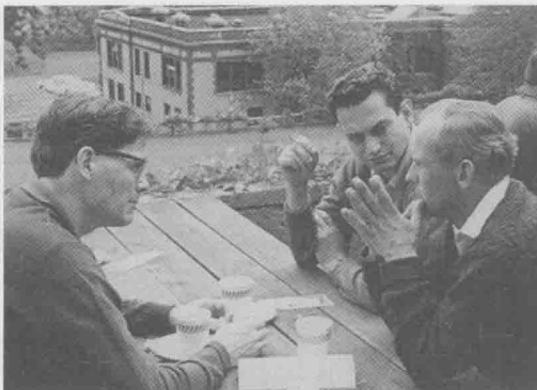

Vernon Ingram、Marshall W. Nirenberg 和 Matthias Staehelin，1963 年大分子合成与结构学术会议。Ingram 证明了基因控制蛋白质的序列，引起镰刀状细胞贫血症的突变使血红蛋白的一个氨基酸发生了变化（第 2 章）；Nirenberg 是破译遗传密码的主要完成者，在体外用人工 RNA 模板引导了蛋白质合成（第 2 章和第 16 章），因为这一成就，1968 年他与其他人分享了诺贝尔生理学或医学奖；Staehelin 则从事小分子 RNA——tRNA 的研究，tRNA 负责将遗传密码翻译成蛋白质所包含的氨基酸序列（第 2 章和第 16 章）。

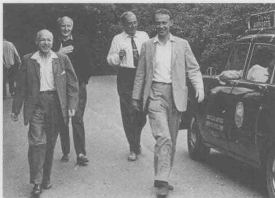

Melvin Calvin、Francis Crick、George Gamow 和 James Watson，1963 年的大分子合成与结构学术会议。因为在植物 $CO_{2}$ 同化方面的工作，Calvin 获得了 1961 年的诺贝尔化学奖；Crick 和 Watson 因为提出了 DNA 的结构模型，分享了 1962 年的诺贝尔生理学或医学奖（第 2 章和第 6 章）；Gamow，一个被遗传密码吸引的物理学家（第 2 章和第 4 章），成立了由志同道合的科学家组成的非正式组织——RNA 领带俱乐部（照片中他就系着一条由他本人设计的该俱乐部的标志领带）。

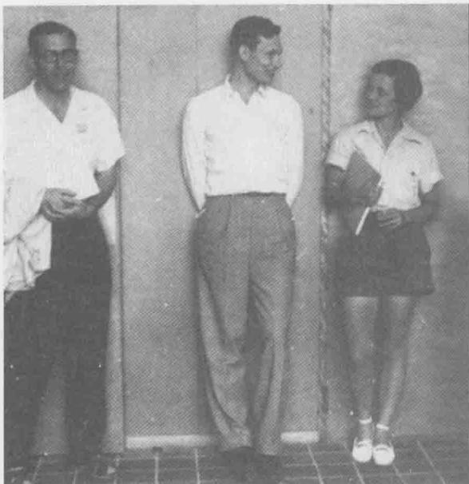  
Raymond Appleyard、George Bowen 和 Martha Chase，1953 年病毒学学术会议。这张照片中的 Appleyard 和 Bowen 都是噬菌体遗传学家。此外，照片中还有 Chase，她在 1952 年与 Alfred Hershey 合作，通过一个简单的实验使人们相信遗传物质是 DNA （第 2 章）。

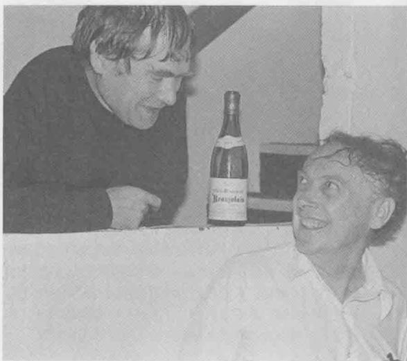  
Sydney Brenner 和 James Watson, 1975 年突触讨论会 (Symposium on The Synapse)。图中和 Watson 在一起的 Brenner，为 mRNA 和遗传密码本质的发现（第 2 章和第 16 章）做出了贡献；为发育生物学研究所建立的秀丽新小杆线虫（C. elegans）模式系统使他与其他人分享了 2002 年诺贝尔奖（附录 1）。

  
Max Perutz, 1971 年三维水平上蛋白质的结构与功能学术会议。Perutz 与 JohnKendrew 分享了 1962 年的诺贝尔化学奖。经过长达 25 年的努力，他们终于用 X 射线结晶法（crystallography）分别解析了血红素和肌红蛋白的原子结构（第 6 章）。

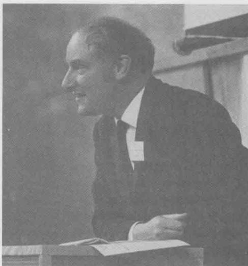  
Francis Crick，1963年大分子合成与结构讨论会（Symposium on Synthesis and Structure of Macromolecules）。他在解决DNA结构方面做出贡献，并且在分子生物学初始阶段也起了决定性作用。他的适应体假说（发表在RNATie Club通报），预测在RNA遗传密码翻译成蛋白质的氨基酸序列过程中存在着一种分子。后来正好找到了tRNA(第15章)。

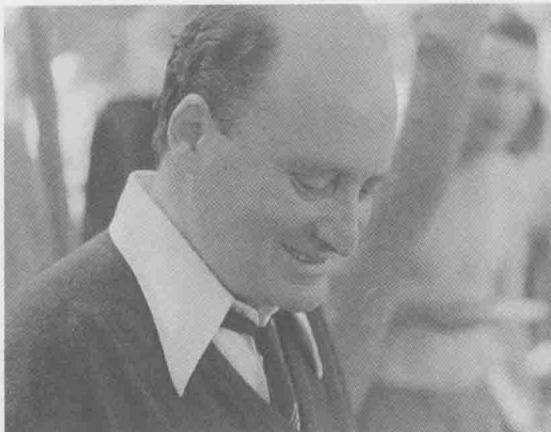  
Seymour Benzer，1975年突触研讨会。Benzer用噬菌体进行遗传学实验，提出了突变的最小单位的概念，后来发现单个核苷酸即是突变的最小单位（第1章和附录1）。通过功能互补实验还对基因进行了实验定义，他称之为顺反子。后来他的工作主要是用果蝇作模式生物研究行为学。

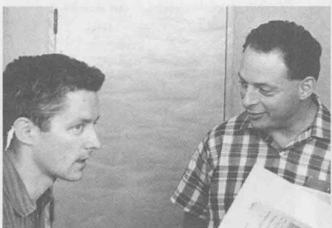  
Charles Yanofsky, 1966 年遗传密码学术研讨会。Yanofsky（右）与 Sydney Brenner 共同证明基因的共线性，即连续的核苷酸编码蛋白质产物中的连续氨基酸（第 2 章）。随后，他通过详细分析大肠杆菌色氨酸操纵子，发现了第一个通过 RNA 结构进行转录调控的例子（第 20 章）。照片中正在与 Yanofsky 交谈的人是 Michael Chamberlin，后者研究 RNA 聚合酶引起的转录起始。

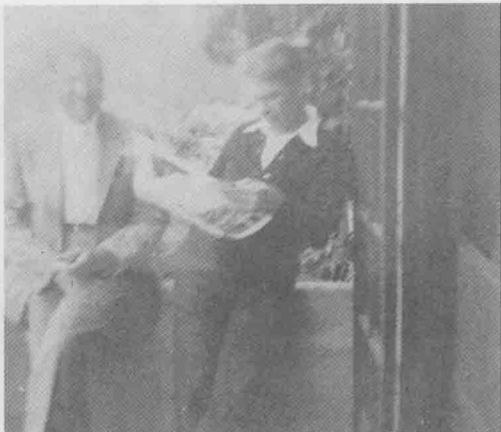  
Calvin Bridges, 1934 年生长相关问题学术会议。Bridges（照片中读报者）是著名的摩尔根“果蝇小组”成员，他们开创性地发展了用果蝇（Drosophila）作为遗传模式生物的工作（第 1 章和附录 1）；和他在一起的是 John T Buckholtz 博士——一位植物遗传学家，曾经是冷泉港实验室的夏季访问学者，1941 年成为美国植物学会会长。


Edwin Chargaff, 1947 年核酸及核蛋白学术研讨会。杰出的核酸生物化学家 Chargaff 提出了著名的比率——DNA 样本中腺嘌呤与胸腺嘧啶的数量一致，而胞嘧啶与鸟嘌呤的数量一致，并随后在 Watson 和 Crick 的 DNA 双螺旋结构中得到了解释。可能是因为没有提出碱基配对这一概念让他感到挫败，他后来成为分子生物学尖刻的批判者，并将这个领域称为“本质上是未获许可的生物化学实践”。

## 第1章

# 孟德尔学派的世界观

本章概要

孟德尔的发现

遗传的染色体理论

基因连锁和交换

染色体定位

突变引起遗传变异

早期关于基因是什么以及如何发挥作用的推测

对基因-蛋白质之间关系的初步探索

人类在所有的生物中是独一无二的，这很容易理解。人类已经独自建立了复杂的语言系统，能够进行有意义的、复杂的思维和情感交流，并且建立了伟大的文明进而改变了这个世界，这对其他的生命形式是不可思议的。所以，我们总是想当然地认为人类与其他物种相比，肯定有某种特殊性。这种观点在许多宗教形式中都有清晰的体现，通过这些宗教我们试图解释生命的起源以及我们存在的理由，进而尝试创造一种可操作的、用来规范我们生活的条律。在一个多世纪以前，人们很自然地认为，就像每个人的生命有特定的起始和终结时间一样，整个人类及其他所有生命形式应该也是在一个特定时刻被创造出来的。

150 年以前，当达尔文（Charles

Darwin）和华莱士（Alfred R. Wallace）基于适者生存的观点提出了演化理论时，这种“创世论”的观点才第一次受到了真正的质疑。他们认为，各种形式的生命不是恒定不变的，而是持续地产生一些略有不同的动植物，其中的一些因为适应环境而存活下来，并且产生更多的后代。在演化论提出的时代，他们还不知道这些持续发生的变异的起因，但是他们确实正确地意识到，如果这些变化要想成为演化的基础，由此所获得的新特征一定要在后代中保持下去。

最初，达尔文受到了猛烈的抨击，主要是来自那些不愿意相信人类与丑陋的猿类可能有共同祖先的人们，哪怕这些祖先是生活在一千万年以前。也有一些反对者是生物学家，他们认为达尔文的证据不能令人信服。其中一位是著名的自然学家Jean L. Agassiz，当时在哈佛大学花了多年的时间写文章反对达尔文和他的伙伴赫胥黎（Thomas L. Huxley），赫胥黎是当时最有影响的演化论的推行者。到19世纪末期，科学上的争论已经基本结束了。如今动植物的地理分布及其在化石记录中的选择性出现（selective occurrence）只能有一种解释，那就是连续演化的生物来自共同的祖先。今天，演化论已经被普遍接受，当然除了极少数原教旨主义者（fundamentalist），他们拒绝的理由不是基于理智，而是来自宗教的教义。

根据达尔文的理论，我们可以立即推论，40亿年以前存在于地球上的生命是一种简单的形式，也许就像我们今天所知的最简单的生命形式——细菌，存在这样小的细菌也告诉我们生命状态的实质是在很小的生物中建立的。演化理论还认为生命的基本原理适用于所有的生命形式。

## 孟德尔的发现

孟德尔（Gregor Mendel）的实验研究是不同豌豆品系间进行育种实验（遗传杂交）的结果，这些豌豆品系间具有不同的、界定明确的特征，如种子的形状（圆滑或皱缩）、颜色（黄色或绿色）、豆荚的形状（饱满或皱缩）及茎秆的长度（高秆或矮秆）等。他集中研究了界定明确的特征间的差异，这一点非常重要。以前许多育种家曾尝试研究整体性状的遗传，如植株总重，但是没能发现任何亲本和子代间性状传递的简单的规律（框1-1）。

## 框1-1 孟德尔定律

具有从一代细胞向下一代细胞传递可遗传的性状的能力，是生命细胞最重要的特征。人类早已注意到遗传的存在，他们观察到许多性状，如眼睛或头发的颜色，可以由父母传递给孩子。但是，直到20世纪的前几年，遗传的物理学基础并不清楚，遗传的染色体理论就是在那个富于创造性的时期建立的。

1860 年，人们已经知道遗传物质可以通过精子和卵子传递。1868 年 Ernst Haeckel 注意到精子主要由核物质组成，所以推测核是负责遗传的。此后，大约又花了 20 年的时间才确定了染色体是活性因子，因为有丝分裂、减数分裂和受精等细节是首先需要研究清楚的。当这些工作都完成后，可以看出，不像其他的细胞组分，染色体在子代细胞中是完全等量均分的。而且，很容易理解形成单倍体的减数分裂过程使精子和卵子染色体数目减小，这对保证后代染色体数目的恒定来说是必需的。但是这些事实仅仅提示染色体可能携带遗传物质。

随着遗传基本规律的发现，在世纪交替之际获得了证据。1865年，孟德尔在他送给位于Brno的自然科学学会的文章“植物杂交实验”中首次提出相关的概念。在他所展示的数据中，孟德尔详细地描述了豌豆性状的传递模式（我们将在下文详细介绍）、他关于遗传原理的结论、以及与有争议的演化论的关系等。尽管孟德尔早期做过一些努力，试图引起当时主流生物学家的兴趣，但并没有得到科学界的认可，他的观点完全被忽视了。1900年，孟德尔去世后16年，三位独立工作于不同系统的植物育种家验证了被遗忘的、具有重要意义的孟德尔的工作。Hugo De Vries、Karl Correns和Erich Tschermak从事的是与孟德尔相关的工作，在不知道孟德尔工作的情况下分别获得了相似的结论。

## 独立分离定律

当证实了所用的亲本形状是可以真实遗传的，也就是说它们会产生完全相同的后代之后，孟德尔做了一系列只有单一性状不同（如种子形状和颜色）的豌豆亲本（P）间的杂交。所有的子代（ $F_{1}$ 即第一子代）只具有一个亲本的性状。例如，在黄色和绿色豌豆杂交的组合中，所有的子代都是黄色种子。在 $F_{1}$ 代表现的性状称为显性（dominant），而在 $F_{1}$ 代不表现的性状称为隐性（recessive）。

当孟德尔将 $F_{1}$ 进行遗传杂交时，其实验结果的意义就很清楚了。这些杂交组合的结果是：大约 25% 的 $F_{2}$ 代个体重新呈现隐性性状，而呈现显性性状个体大约占 75%。他所研究的 7 个性状中，每一个性状在 $F_{2}$ 中的显隐性个体之比都是 3:1。当这些实验进行到第三代 $(F_{3})$ 时，所有表现隐性性状的豌豆呈现真实遗传（bred true）（即产生的后代仍表现隐性性状）。而那些表现显性性状的豌豆会产生两种后代，其中 1/3 呈真实遗传（只产生显性性状后代），其余的 2/3 同样产生混合的、显隐性比率为 3:1 的后代群体。

孟德尔正确地将他的实验结果解释如下（图 1-1）：各种性状是由成对的因子[现在我们称为基因（gene）]控制的，其中一个因子来自雄性亲本，另一个来自雌性亲本。例如，纯系的圆豌豆有两个拷贝［或者称为等位基因（allele）］的圆粒基因（RR），而纯

系的皱豌豆有两个拷贝的皱粒（rr）等位基因。每一个圆粒品系的配子带有一个圆粒基因（R），皱粒品系的配子带有一个皱粒基因（r）。在亲本RR和rr的杂交中，受精后产生带有两种等位基因（Rr）的 $F_{1}$ 植株，其种子表现为圆粒，因为R对r是显性的。我们把一个个体的外观或物理性状称之为表现型或表型（phenotype），而其遗传组成称为基因型（genotype），表型相同的个体可能具有不同的基因型。所以，为了了解一个生物的基因型，经常有必要进行几个世代的杂交。纯合（homozygous）一词表述的是基因对中分别来自母本和父本的基因是相同的（如RR或rr）。相应地，杂合（heterozygous）一词表述的是基因对中来自母本和父本的基因是不同的（如Rr）。

可以用一个或几个字母来表示一个基因。显性等位基因可以用大写字母（R）或加上标（r+）或者单独的加号（+）表示。在本书中，我们用第一种方式即大写字母表示显性等位基因，用小写字母表示隐性等位基因。

需要注意的是，配子中只有该生物所具有

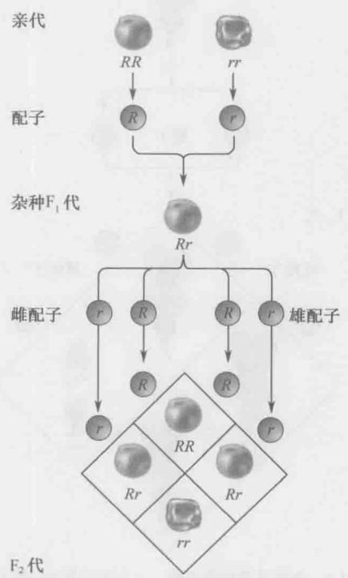  
图 1-1 孟德尔第一定律（独立分离律）如何解释 $F_{2}$ 代的显隐性的比率为 3:1。R 代表显性等位基因，r 代表隐性等位基因，圆形种子代表显性表型，皱缩的种子代表隐性表型。

的两个拷贝的基因中的一个（一个等位基因，要么 R，要么 r，但不会同时有两个），生物所产生的两种类型的配子数目是相同的。所以，在豌豆 F1 代产生的配子中含有 R 或 r 的概率各占 50%，配子中带有何种等位基因完全是随机的。当我们考察数目有限的 F2 代个体时，我们并不期望绝对的 3:1 比率，这个比率有时稍微高一些，有时稍微低一些。但当我们观察的样品越来越多时，得到的显隐性状的个体数之比就越来越接近 3:1。

F2代重新出现隐性性状，表明隐性等位基因在F1代（Rr）既没有改变也没有丢

  
图 1-2 金鱼草花色的遗传。一个亲本是纯合的红色花（AA），另外一个亲本是纯合的白色花（aa），它们没有显隐性关系，杂合的 $F_{1}$ 代花是粉红色的。 $F_{2}$ 代红色、粉色和白色花的比率为 1:2:1。

失，而显性和隐性基因都是独立传递的，并且在性细胞形成过程中能够独立分离。这个独立分离定律（principle of independent segregation）通常被称为孟德尔第一定律。

## 有些等位基因既非显性也非隐性

在孟德尔所报道的杂交中，基因对的一个成员对另一个成员是完全显性。但在自然界中并不总是如此。有时，杂合体的表型居于两种纯合体的表型之间。例如，纯系的红色金鱼草（Antirrhinum）和白色金鱼草杂交产生的 $F_{1}$ 代是居间的粉红色。如果将 $F_{1}$ 代自交，产生的 $F_{2}$ 代个体中，红色、粉色和白色的比率为1∶2∶1（图1-2）。所以，在这种情况下，可以通过表型将杂合体与纯合体分开。我们也可以看到，孟德尔定律并不取决于是否基因对中的一个基因对另一个基因呈显性。

## 独立分配定律

孟德尔将他的育种实验扩大到有多个不同性状的豌豆品系之间。就像上文一样，他从两个豌豆品系开始，自交时它们都是真实遗传的。一个品系具有圆形的黄色种子，另一个是皱缩的绿色种子，因为圆形黄色对皱缩绿色是显性的，所有的 $F_{1}$ 代种子都是圆形黄色的。将 $F_{1}$ 代自交，检查所产生的 $F_{2}$ 代种子的外观（表型），除两种原来的表型外（圆形黄色、皱缩绿色），又出现了两种新的表型[重组体（recombinant）]——皱缩黄色和圆形绿色。

孟德尔发现，假设基因是存在的，并且每一对基因在性细胞形成过程中都可以独立地传递到配子中，他就可以解释这些结果。这种解释如图1-3所示，每一个配子只包含基因对中的一个等位基因。所以， $F_{1}$ 代（RrYy）产生的配子将是RY、Ry、rY、ry，但不会是Rr、Yy、YY或RR。并且在这个例子中，出现4种可能的配子的概率都是相同的，来自同一亲本的基因并没有同时出现的倾向。结果是， $F_{2}$ 代的表型呈现9个圆形黄色、3个圆形绿色、3个皱缩黄色和1个皱缩绿色，就像图1-3的下部的Punnet方块所展示的（这种排列方式是由英国数学家Punnet介绍的，所以以他的名字命名）。这一独立分配定律（principle of independent）通常被称为孟德尔第二定律。

  
图 1-3 孟德尔第二定律（独立分配定律）是如何发挥作用的。在这个例子中，黄色（Y）和绿色（y）种子的遗传与圆形（R）和皱缩（r）种子的遗传是连在一起的。R 和 Y 等位基因对 r 和 y 呈显性。亲本和子代的基因型用相应的字母组合表示，4 种不同的表型用相应的背景色来区分。

## 遗传的染色体理论

孟德尔的发现一开始不被接受的主要原因是缺乏减数分裂和有丝分裂期间染色体行为的证据。但是，在1900年重新发现孟德尔定律时，人们已经有了这方面的知识，并且在1903年被美国生物学家Walter S. Sutton引用。在他的经典文章“遗传过程中的染色体”一文中，Sutton强调了二倍体由两组形态上相似的染色体组成的重要性，在减数分裂过程中，每一个配子都获得一对同源染色体中的一条。他假设基因是染色体上的一部分，并用上述发现来解释孟德尔的实验结果。他推测黄色和绿色种子的基因是在某一对特定染色体上，而圆形和皱缩基因则是在另一对不同的染色体上。这一假说立即就解释了实验中所观察到的 $9:3:3:1$ 的分离比。虽然Sutton的文章并没有证明遗传的染色体理论，但它的意义还是非常重大，因为他第一次将遗传学（育种实验的研究）和细胞学（细胞结构的研究）这两个独立学科的实验结果整合在了一起。

## 基因连锁和交换

孟德尔的独立分配定律是基于一个事实，即位于不同染色体上的基因在减数分裂过程中独立行动。然而，经常发现两个基因非独立分配，因为它们位于同一染色体上[连锁基因（linked gene），见框1-2]。随着越来越多的突变基因用于育种分析，发现了许多不符合随机分配的事例。通过深入研究这些事例，证明连锁群的数目与单倍体染色体的数目是相同的。例如，果蝇有4个连锁的基因群，在其单倍体细胞中有4个形态上可区分的染色体。

## 框1-2 基因串联在染色体上

最初所有的育种实验采用的都是自然发生的遗传变异。例如，孟德尔使用过从种子经销商处得来的种子，而经销商肯定是从农民手中收购的。同一基因存在不同的形式（等位基因）就产生了一个问题，即它们是如何产生的？一个直接的假说就是基因可以变为（突变为）新基因[突变基因（mutant gene）]。从1908年开始，伟大的美国生物学家Morgan和他的年轻合作者们——遗传学家Calvin B. Bridges、Hermann J. Muller及Alfred H. Sturtevant对这一假说第一次进行了认真的实验验证。他们以小小的果蝇（Drosophila melanogaster，黑腹果蝇）为实验材料，发现了第一个雄性白眼果蝇突变体，而不是正常的红眼。白眼突变是在红眼果蝇的培养瓶中自发产生的突变体。实际上，自然界中存在的几乎所有果蝇都是红眼的，控制红眼的基因就称为野生型基因（wild-type gene），导致白眼的基因称为突变基因（等位基因）。

白眼突变基因马上被用来进行育种实验（框1-2图1），实验结果令人兴奋，因为等位基因的表现与X染色体完全平行（也就是说，与性连锁）。这一发现意味着这个基因可能与控制性别的基因都位于X染色体上。这一假说很快就由更多的新突变基因的交配实验得到了验证，当时新发现的基因中多数也是性连锁的。

亲代

(b)

亲代

  
框1-2图1果蝇中的性连锁基因的遗传。位于性染色体上的基因会分别在雄性和雌性后代表现，因为如果只有一条X染色体，该染色体上的隐性基因总是会表现。图示两个交配实验，都涉及位于X染色体上的隐性基因[w代表白眼（white eye）]。（a）雄性亲本是白眼果蝇（wY），雌性是同源的红眼个体（WW）；（b）雄性为红眼（WY），雌性为白眼（ww）。此处字母Y不是代表等位基因，而是雄性果蝇中对应于X染色体的Y染色体。Y染色体上没有对应于X染色体上的w或W的基因。

然而，连锁实际上不可能是完全的。在减数分裂过程中，同一染色体上的两个基因保持同步的概率，从略低于100%到接近50%。这一数值的变化表明存在着一个同源染色体间基因交换的机制，这个机制称为交联（crossing over）。比利时细胞学家F.A.Janssens首先描述了其细胞学基础。在减数分裂开始时，通过一个联会（synapsis）过程，同源染色体沿着与长轴平行的方式形成染色体对。在这个阶段，每一个染色体都复制一次，形成两个染色单体。所以，联会将4个染色单体聚在一起（四连体，tetrad），互相缠绕。Janssens推测可能因为缠绕中的张力原因，两个染色单体有时会在相应的位置发生断裂。这样就有可能产生4个断裂末端，它们可能交叉相连，这样每一个染色单体的一部分就可能与另一个染色单体的一部分相连（图1-4）。通过这种方式，含有一部分同源染色体片段的重组的染色单体就形成了。20年以后，Janssens假说，即在联会过程中染色体间有物理上的物质交换，才正式得到了证明。1931年，在康奈尔大学工作的Barbara McClintock和Harriet B. Creighton以玉米（Zea mays）为实验材料，通过一流的细胞学实验证明了染色体的断裂和重组（图1-5）。

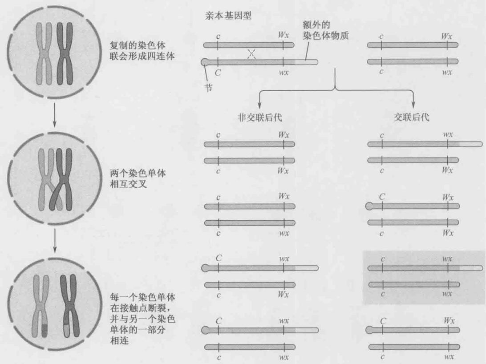  
图 1-4 Janssens 的交联假说。  
图 1-5 同源染色体间物理交换的示意图。在大多数生物中，同源的染色体对具有相同的形状。然而，有时它们也不完全相同，图中所示一条染色体带有额外的一段遗传物质，以及一段致密的、可以反复形成节状结构的区域。McClintock 和 Creighton 就发现了这样一对染色体，并用它们证明在配对的染色体间涉及实际的物理交联。在图示的实验中，同源的 c、wx 后代肯定是在 C 和 wx 基因座间发生交联后产生的。当用细胞学方法检测 c，wx 后代时，可以看到具有节状结构的染色体，表明无节的 Wx 区域是被有节的 wx 区域物理上替代了。图中彩色框代表的是纯合的 c、wx 子代染色体。

## 染色体定位

摩尔根和他的学生们并没有等待交联发生的细胞学证据就着手探索 Janssens 假说的含义。他们推测染色体上紧密相邻的基因（紧密连锁）比相距较远的基因更有可能同时分配，同时意识到这是一种确定染色体上的基因相对位置，进而绘制遗传图谱（geneticmap）的方法，这种方法是很直观的。让我们来看同一个染色体上3个基因分离的情形，这些基因的排列状况可以用3次交配来确定，每次交配只调查其中的两个基因（双因子交配）。AB和ab之间的交配会产生4种类型的后代：两种亲本基因型（AB和ab）、两种重组基因型（Ab和aB）。AC和ac之间的交配同样会产生两种亲本基因型和两种重组基因型Ac和aC，而BC和bc之间的交配将产生亲本基因型和Bc、bC重组基因型。每一个交配都将产生一个特定的亲本基因型和重组基因型后代的比率。例如，第1组交配产生 $30\%$ 的重组子，第2组产生 $10\%$ ，第3组 $25\%$ 。这些数据告诉我们，基因 $\pmb{a}$ 和c的距离较 $\pmb{a}$ 和b、b和c的距离近，而 $\pmb{a}$ 和b之间与b和c之间的遗传距离更为接近，最符合这些数据的基因排列顺序是 $a - c - b$ （图1-6）。

  
图 1-6 根据三个双因子交配实验推测 3 个基因的顺序。

通常会用三因子交配实验来准确无误地验证双因子交配实验所确定的基因顺序的正确性。当前述例子中的3个基因通过 $ABC \times abc$ 的交配进行时，会出现6种重组基因型（图1-7），它们可分为3组，个体数目最少的一组来自双交换。通过寻找频率最低的那一组，往往立即就可以确认（或否定）一种推测的排列方式。图1-7的结果马上就可以确认双因子交配实验所暗示的顺序，事实上只有a-c-b顺序才是合理的，即最少的重组子是AcB和aCb。

  
图 1-7 用三因子交配确定基因的顺序。发生频率最低的交联重组一定来自双交换，图中所列的不同百分比是从无限多的样品中获得的理论值。当只有一定数目的后代时，其准确值的确定需要考虑随机的统计。

存在多个交联事件的事实意味着最远的两个标记 $a$ 和 $b(ab)$ 发生重组的数目通常少于 $a$ 和 $c(ac)$ 以及 $c$ 和 $b(cb)$ 之间重组概率的和。为了得到更精确的最远标记的距离，我们来计算 $ac \times cb$ 重组的概率，即在 $c$ 和 $b$ 间发生一次交换、在 $a$ 和 $c$ 间也发生一次交换，或者是反过来 $(cb \times ac)$ 。将这个概率从总的概率中减去，就会得到更准确的重组的概率。如下的简单公式

$$
a b = a c + c b - 2 (a c) (c b)
$$

适合于一个交联的发生不影响其他交联发生频率的所有情形。但遗憾的是，精确的定位经常受干扰现象（interference）的影响，它会提高或降低相关交换的概率。

利用上述推理，由摩尔根领导的哥伦比亚大学研究小组在1915年之前确定了超过85个果蝇突变基因的位置（表1-1）。每个基因被放在4个连锁群或者说染色体的一个特定位点。最重要的是，每一条染色体上的所有基因都排成一条线，基因的排列是严格线性而没有分支的。图1-8是果蝇的一条染色体的遗传图谱，图上基因间的距离是用图距单位（map unit）表示的，图距单位是与基因间的重组频率相关的。如果两个基因间的重组频率是 $5\%$ ，那么基因间的距离就是5个图距单位。因为在相距很远的基因间发生双交换的概率很高，图距单位的计算就不准确，除非所有紧密相邻的基因间都进行了重组实验。

表 1-1 1915 年报道的 85 个果蝇突变体基因

<table><tr><td>名称</td><td>所影响的位置</td><td>名称</td><td>所影响的位置</td></tr><tr><td colspan="4">第1组</td></tr><tr><td>Abnormal</td><td>腹部</td><td>Lethal, 13</td><td>身体,死亡</td></tr><tr><td>Bar</td><td>眼睛</td><td>Minature</td><td>翅膀</td></tr><tr><td>Bifid</td><td>脉络</td><td>Notch</td><td>脉络</td></tr><tr><td>Bow</td><td>翅膀</td><td>Reduplicated</td><td>眼睛颜色</td></tr><tr><td>Cherry</td><td>眼睛颜色</td><td>Ruby</td><td>腿</td></tr><tr><td>Chrome</td><td>身体颜色</td><td>Rudimentary</td><td>翅膀</td></tr><tr><td>Cleft</td><td>脉络</td><td>Sable</td><td>身体颜色</td></tr><tr><td>Club</td><td>翅膀</td><td>Shifted</td><td>脉络</td></tr><tr><td>Depressed</td><td>翅膀</td><td>Short</td><td>翅膀</td></tr><tr><td>Dotted</td><td>胸部</td><td>Skee</td><td>翅膀</td></tr><tr><td>Eosin</td><td>眼睛颜色</td><td>Spoon</td><td>翅膀</td></tr><tr><td>Facet</td><td>小眼</td><td>Spot</td><td>身体颜色</td></tr><tr><td>Forked</td><td>脊骨</td><td>Tan</td><td>触角</td></tr><tr><td>Furrowed</td><td>眼睛</td><td>Truncate</td><td>翅膀</td></tr><tr><td>Fused</td><td>脉络</td><td>Vermilion</td><td>眼睛颜色</td></tr><tr><td>Green</td><td>身体颜色</td><td>White</td><td>眼睛颜色</td></tr><tr><td>Jaunty</td><td>翅膀</td><td>Yellow</td><td>身体颜色</td></tr><tr><td>Lemon</td><td>身体颜色</td><td></td><td></td></tr><tr><td colspan="4">第2组</td></tr><tr><td>Antlered</td><td>翅膀</td><td>Jaunty</td><td>翅膀</td></tr><tr><td>Apterous</td><td>翅膀</td><td>Limited</td><td>腹部条纹</td></tr><tr><td>Arc</td><td>翅膀</td><td>Little crossover</td><td>2号染色体</td></tr><tr><td>Balloon</td><td>脉络</td><td>Morula</td><td>小眼</td></tr><tr><td>Black</td><td>身体颜色</td><td>Olive</td><td>身体颜色</td></tr><tr><td>Blistered</td><td>翅膀</td><td>Plexus</td><td>脉络</td></tr><tr><td>Comma</td><td>胸部标记</td><td>Purple</td><td>眼睛颜色</td></tr><tr><td>Confluent</td><td>脉络</td><td>Speck</td><td>胸部标记</td></tr><tr><td>Cream II</td><td>眼睛颜色</td><td>Strap</td><td>翅膀</td></tr><tr><td>Curved</td><td>翅膀</td><td>Streak</td><td>体型</td></tr><tr><td>Dachs</td><td>腿</td><td>Trefoil</td><td>体型</td></tr><tr><td>Extra vein</td><td>脉络</td><td>Truncate</td><td>翅膀</td></tr><tr><td>Fringed</td><td>翅膀</td><td>Vestigial</td><td>翅膀</td></tr><tr><td colspan="4">第3组</td></tr><tr><td>Band</td><td>体型</td><td>Pink</td><td>眼睛颜色</td></tr><tr><td>Beaded</td><td>翅膀</td><td>Rough</td><td>眼睛</td></tr><tr><td>Cream III</td><td>眼睛颜色</td><td>Safranin</td><td>眼睛颜色</td></tr><tr><td>Deformed</td><td>眼睛</td><td>Sepia</td><td>眼睛颜色</td></tr><tr><td>Dwarf</td><td>身体大小</td><td>Sooty</td><td>身体颜色</td></tr><tr><td>Ebony</td><td>身体颜色</td><td>Spineless</td><td>脊骨</td></tr><tr><td>Giant</td><td>身体大小</td><td>Spread</td><td>翅膀</td></tr><tr><td>Kidney</td><td>眼睛</td><td>Trident</td><td>体型</td></tr><tr><td>Low crossing over</td><td>3号染色体</td><td>Truncate</td><td>翅膀</td></tr><tr><td>Maroon</td><td>眼睛颜色</td><td>Whitehead</td><td>体型</td></tr><tr><td>Peach</td><td>眼睛颜色</td><td>White ocelli</td><td>单眼</td></tr><tr><td colspan="4">第4组</td></tr><tr><td>Bent</td><td>翅膀</td><td>Eyeless</td><td>眼睛</td></tr></table>

突变发生于 4 个连锁群中，因为细胞学研究中观察到的染色体数目为 4，表明基因是位于染色体上。注意不同基因的突变会对一个性状（如身体的颜色）有不同的影响。

  
图 1-8 果蝇 2 号染色体的遗传图。

即使两个基因处在很长的染色体的两端，因为有多次交联事件发生，它们至少有50%的概率共同分离。如果它们中间发生了奇数次的交联，两个基因就会分开；如果发生的交换次数为偶数，它们就不会分开。所以，在果蝇遗传研究的早期，经常不能确定两个基因是位于不同的染色体上还是位于一条长染色体的两端。只有定位了很多的基因后，才能令人信服地证明连锁群的数目与细胞学上可分的染色体数目相等。1915年，摩尔根与他的学生Alfred H. Sturtevant、Hermann J. Muller和Calvin B. Bridges出版了权威性的著作《孟德尔遗传的机制》（The Mechanism of Mendelian Heredity），在这本书中，他们首次宣布了遗传的染色体基础的普遍性。现在我们将这一概念与演化论和细胞理论一起作为理解生命本质的最重要成就。

## 突变引起遗传变异

现在我们有可能理解生物界中那些可遗传的变化是演化理论的基石。正常情况下，染色体复制过程中基因是忠实复制的。然而在极少数情况下，基因中还是会发生一些变化[突变（mutation）]，形成不同的等位基因，其中大部分（当然不是全部）的功能不如野生型的等位基因。显然，这样的事情应该很少发生，否则，在每一个细胞周期中都有很多基因发生突变，那么产生的后代就不再像它们的亲本。实际上，存在少量而有限度的突变是有很多好处的，它是产生变异体的稳定来源，是动植物适应不断变化的物理和生物环境所需要的。

然而，出乎意料的是，这些孟德尔学派遗传学家们的实验结果并没有被传统的生物学家所接受，研究不同生命形式的演化关系的权威人士也不接受。人们的疑问是，摩尔根和他的学生们所研究的这些遗传变异是否足以产生演化上明显不同的结构，如翅膀和眼睛。相反，这些生物学家相信，肯定还有更强有力的“大突变”存在，它们才是产生演化飞跃的原因。

然而疑问慢慢地消失了，这在很大程度上应该归功于数学遗传学家 Sewall Whigh、Ronald A. Fisher 和 John Burden Sanderson Haldane 等的工作。他们的工作表明，考虑到地球漫长的岁月，果蝇中发现的相对较低的突变率，以及温和的选择优势，应该足够积累起新的有利的性状。到 20 世纪 30 年代，生物学家开始重新评价他们关于物种起源的知识，并开始理解数学遗传学家们的工作。在这些新达尔文主义者中，有生物学家 Julian Huxley（他是达尔文的早期支持者 Thomas Huxley 的孙子）、遗传学家 Theodosius Dobzhansky、古生物学家 George Gaylord Simpson 和鸟类学家 Ernst Mayr 等。在 20 世纪 40 年代，上述四位都从自己的专业角度证明孟德尔学派和达尔文学派实际上是相互印证的。

## 早期关于基因是什么以及如何发挥作用的推测

几乎就在重新发现孟德尔定律的同时，遗传学家就开始推测基因的化学结构以及它们如何发挥功能。因为无从得知遗传物质的化学特性，所以一直没有真正的进展。

即使当时已经知道染色体中存在核酸和蛋白质也帮助不大，因为对它们的结构均一无所知。最有价值的推测是基于这样的事实，即基因肯定可以自我复制，至少在某种意义上应该如此。当一条染色体变为两个拷贝时，它们的结构肯定会得到准确的复制。这一事实立即引出了一个非常重要的化学问题，那就是一个复杂的分子是如何精确地被复制并产生与原件无异的复制件。

一些物理学家也开始对基因感兴趣,当量子力学在20世纪20年代后期横空出世时,一种观点出现了:为了了解基因,必须首先了解最先进的理论物理的奥妙。然而,这种想法从来没有真正执行,因为很明显,即使最好的物理学家或理论化学家也不会去关心结构尚待阐明的物质。只有一个事实也许会让他们有所思考,那就是1927年Muller和L. J. Stadler独立发现的X射线可以诱发突变。因为X射线轰击大基因的概率比轰击小基因的概率要高,所以可以根据某一射线剂量下照射某一特定基因诱发突变的频率大致估计基因的大小。即便如此还需要种种特定的假设,事实上没有任何人,包括Muller和Stadler本人在内,真正地重视这种可能性。

## 对基因-蛋白质之间关系的初步探索

检查某个基因的改变会影响细胞中哪一个蛋白质，是发现基因和蛋白质相互关系的最有成效的早期方法。最初这些研究相当困难，因为没有人知道器官中（如眼睛或翅膀）蛋白质的任何信息，不久人们就意识到研究简单的、具有代谢功能的基因应该比研究影响整体结构的基因更容易，在早期一个有效的例子来自影响某种氨基酸代谢的遗传病研究。人类会发生影响苯丙氨酸代谢能力的自发突变，当一个带有纯合的突变性状的个体吃了含苯丙氨酸的食物时，由于不能将苯丙氨酸转化为酪氨酸，就会造成苯基喹啉酸（phenylpyruvic acid）在血液中累积至毒性水平，这些疾病称为“先天代谢错误”。早在1909年，英国医生Archibald E. Garrod就认为其野生型基因是负责某种特定酶的表达，在纯合的突变体中，这种酶是先天缺乏的。

20 世纪 30 年代，Garrod 提出的关于基因与蛋白质相互关系的假说通过下列工作得到了进一步拓展：Haldane 和 Rose Scott-Moncrieff 在英格兰进行的关于花色素的工作，美国的 Wright 在豚鼠的毛发色素方面的工作，德国的 A. Kuhn、Boris Ephrussi 和 George W. Beadle 起初在法国、后来在加州（美国）进行的关于昆虫眼睛色素的研究。在所有的研究中，实验证据都表明特定的基因影响色素形成的特定步骤，基因的缺失会造成颜色的改变，例如，果蝇眼睛的颜色由红色变为琥珀色。然而，由于缺乏相关酶的结构的基本知识，所以不可能进一步分析基因与酶之间的关系，并且当时也不能确认大部分基因是控制蛋白质合成的（当时人们对所有的酶都是蛋白质这一观点也有怀疑），也不清楚是否所有的蛋白质都是受基因控制的。

早在 1936 年，孟德尔学派的遗传学家就清楚地意识到，如果仍沿用那些阐明孟德尔遗传学基本特征的方法进行实验，难以有效地获得关于基因是如何发挥作用的信息。相反，取而代之的应该是寻找更适合化学分析的生物学对象。他们认识到当时具备的关于核酸和蛋白质的化学知识完全不足以进行基础的生物化学研究，即使对最合适的生物系统也不行。但幸运的是，化学知识的局限性并没有阻止他们学习如何使用化学结构简单的霉类、细菌和病毒进行遗传实验。就像我们将要看到的，就在遗传学家们需要的时候，必要的化学知识也产生了。

## 小结

遗传是由染色体控制的，染色体是细胞内基因的载体。遗传因子在1865年首先由孟德尔发现并描述，但是其重要意义到20世纪初才被认可。每一个基因都可能存在不同的形式，称为等位基因。孟德尔认为决定一个遗传性状的遗传因子（也就是现在众所周知的基因）是由亲本提供给每个后代的。这种行为的物理基础是在减数分裂过程中同源染色体的分配：一对同源染色体中的一条（随机选择）将分配给一个单倍体细胞，当两个基因位于同一染色体上时，它们倾向于共同遗传（连锁）。决定不同性状的基因经常是相互独立遗传的，因为它们位于不同的染色体上。在任何情形下，连锁极少是完全的，因为在减数分裂过程中同源染色体结合在一起，并且经常在相同处断裂后重新交叉连接（交联），交联可以将来自父本染色体的基因转移到来自母本染色体的基因中。

来自同一基因的不同等位基因源自其自身的可遗传变异（突变）。正常情况下，基因非常稳定，并且在染色体复制过程中是忠实拷贝的；突变只是偶尔发生，一般会产生有害的后果。然而突变扮演着正面的角色，有利的稀有突变的积累是演化理论所依赖的遗传多样性的基础。

多年来，基因的结构及其控制细胞特征的化学途径是神秘的。随着大量的自发突变体的研究，人们越来越清楚，“一个基因控制一个性状”是不存在的，所有复杂性状都受控于多个基因。最合理的观点是由 Garrod 在 1909 年提出的“基因控制酶的合成”。然而，孟德尔学派遗传学家的工具，如植物玉米、动物小鼠甚至果蝇等生物材料都不适合用于基因与蛋白质之间的深入的化学研究。为了进行这类分析，用更简单的生物进行实验是必不可少的。

## 参考文献

Ayala F.J. and Kiger J.A., Jr. 1984. Modern genetics, 2nd ed. Benjamin Cummings, Menlo Park, California.

Beadle G.W. and Ephrussi B. 1937. Development of eye color in Drosophila: Diffusible substances and their inter-relations. Genetics 22:76–86.

Carlson E.A. 1966. The gene: A critical history. Saunders, Philadelphia.
———. 1981. Genes, radiation, and society: The life and work of HJ. Muller. Cornell University Press, Ithaca, New York.

Caspari E. 1948. Cytoplasmic inheritance. Adv Genet 2: 1–66.

Corrons C. 1937. Nicht Mendelnde vererbung (od F. von Wettstein). Borntraeger, Berlin.

Dobzhansky T. 1941. Genetics and the origin of species, 2nd ed. Columbia University Press, New York.

Fisher R.A. 1930. The genetical theory of natural selection. Clarendon Press, Oxford.

Garrod A.E. 1908. Inborn errors of metabolism. Lancet 2; 1–7, 73–79, 142–148, 214–220.

Haldane J.B.S. 1932. The courses of evolution. Harper & Row, New York.

Huxley J. 1943. Evolution: The modern synthesis. Harper & Row, New York.

Leo D.F. 1947. Actions of radiations on living cells. Macmillan, New York.

Mayr E. 1942. Systematics and the origin of species. Columbia University Press, New York.

——. 1982. The growth of biological thought: Diversity, evolution, and inheritance. Harvard University Press, Cambridge, Massachusetts.

McClintock B. 1951. Chromosome organization and gene expression. Cold Spring Harbor Symp. Quant. Biol. 16: 13–57.

——. 1984. The significance of responses of genome to challenge.

Science 226: 792–800.

McClintock B. and Creighton H.B. 1931. A correlation of cytological and genetical crossing over in Zea mays. Proc. Natl. Acad. Sci. 17:492–497.

Moore J. 1972a. Heredity and development, 2nd ed. Oxford University Press, Oxford.

——. 1972b. Readings in heredity and development. Oxford University Press, Oxford.

Morgan T.H. 1910. Sex-linked inheritance in Drosophila. Science 32:120–122.

Morgan T.H., Sturtevant A.H., Muller H.J., and Bridges C.B. 1915. The mechanism of Mendelian heredity. Holt, Rinehart & Winston, New York.

Muller H.J. 1927. Artificial transmutation of the gene. Science 46: 84–87.

Olby R.C. 1966. Origins of Mendelism. Constable and Company Ltd., London.

Peters J.A. 1959. Classic papers in genetics. Prentice-Hall, Englewood Cliffs, New Jersey.

Rhoades M.M. 1945. Plastid mutations. Cold Spring Harbor Symp. Quant. Biol. 11: 202–207.

Sager R. 1972. Cytoplasmic genes and organelles. Academic Press, New York.

Scott-Moncrieff R. 1936. A biochemical survey of some Mendelian factors for flower color. J. Genetics 32: 117–170.

Simpson G.G. 1944. Tempo and mode in evolution. Columbia University Press, New York.

Sonneborn T.M. 1950. The cytoplasm in heredity. Heredity 4: 11–36.

Stadler L.J. 1928. Mutations in barley induced by X-rays and radium. Science 110: 543–548.

Sturtevant A.II. 1913. The linear arrangement of six sex-linked factors in Drosophila as shown by mode of association. J. Exp. Zool. 14:39–45.

Sturtevant A.II, and Beadle G.W. 1962. An introduction to genetics. Dover, New York.

Sutton W.S. 1903. The chromosome in heredity. Biol. Bull. 4: 231–251.

Wilson E.B. 1925. The cell in development and heredity, 3rd ed. Macmillan, New York.

Wright S. 1931. Evolution in Mendelian populations. Genetics 16:97–159.

——. 1941. The physiology of the gene. Physiol. Rev. 21: 487–527.

## 习题

## 偶数习题的答案请参见附录2

习题1 当你比较某个基因的两个等位基因X时，你怎么定义这两个基因为不同的等位基因？

习题 2 判断对错并阐述你的理由：一个基因只能拥有两个等位基因。

习题 3 判断对错并阐述你的理由：一个性状往往仅由一个基因决定。

习题 4 判断对错并阐述你的理由：对于某个特定的基因，它的等位基因不是显性就是隐性的。

习题 5 鉴定你在热带雨林中所发现的一个新的青蛙品种的皮肤颜色的显/隐性关系。假设在该物种内，是由常染色体上的基因控制皮肤颜色。并且你发现的该种青蛙均为亮蓝色或黄色。亮蓝色雌蛙和亮蓝色雄蛙产生的后代均为亮蓝色。黄色雌蛙和黄色雄蛙产生的后代既有亮蓝色又有黄色。请鉴定每种性状（亮蓝色皮肤及黄色皮肤）的显隐性关系并阐述你的理由。另写出上述两组亲代的基因型，用字母 B 代表控制皮肤颜色的基因。

## 习题6

A. 如同孟德尔做的一样，当把纯合的产生黄色种子和纯合的产生绿色种子的豌豆杂交时，你认为 $F_{1}$ 代的豌豆会出现什么表型？假设黄色种子相对于绿色种子是显性性状。
B. 把 $F_{1}$ 代豌豆进行自交，请给出 $F_{2}$ 代不同表型的比例。

C. 请给出 $F_{2}$ 代不同基因型的比例。

D. 请给出 $F_{2}$ 代杂合子与纯合子的比例。

习题 7 孟德尔研究了豌豆的 7 个独立性状，幸运的是，其中控制 6 个性状的基因位于不同的染色体上，控制两个性状的基因位于同一染色体上且相距较远。如果孟德尔在当初的研究中选择了由连锁基因决定的两个性状，那么孟德尔的哪条定律（第一定律还是第二定律）会受到影响？请阐述你的理由。

习题8 对位于果蝇同一条染色体上的三个基因（X、Y及Z）进行定位。每个基因都有一个显性和一个隐性等位基因。进行三组不同的双因子交配实验（1：XY和xy，2：YZ和yz，3：XZ和xz）。假设所有的杂交实验都是在二倍体果蝇之间进行，并且上述基因的等位基因都是纯合的。最后观察到第1组中有 $7\%$ 的重组，第2组中有 $20\%$ 的重组，第3组中有 $13\%$ 的重组。请画一幅示意图表示上述基因的位置，并用图距单位（m.u.）标明彼此之间的距离。

习题 9 你想用三因子交配实验来证实问题 8 中推断的基因位置（将 XYZ/xyz 和 xyz/xyz 进行杂交），结果中最罕见的重组型为 xyz 和 Xyz。该结果是否证实了你在问题 8 中的推断并阐述理由。

习题 10 你再次对果蝇的三个基因（L、M 及 N）进行定位。每个基因都有一个显性和一个隐性等位基因。进行三组不同的双因子交配实验（1：LM 和 lm，2：MN 和 mn，3：LN 和 ln）。假设所有的杂交实验都是在二倍体果蝇之间进行，并且上述基因的等位基因都是纯合的。最后观察到第 1 组中有 5% 的重组，第 2 组中有 50% 的重组，第 3 组中有 50% 的重组。基于上述结果，请对基因之间的顺序和距离进行推断。

习题 11 基于问题 10 中的结果，用基因 O 来进行新的交配实验。最后观察到 MO 和 mo 的交配后代中有 30% 的重组，LO 和 lo 中有 35% 的重组，NO 和 no 中有 25% 的重组。假设所有的杂交实验都是在二倍体果蝇之间进行，并且上述基因的等位基因都是纯合的。根据问题 10 和问题 11 中的信息，请画一幅示意图表示上述基因的位置，并用图距单位（m.u.）标明彼此之间的距离。

习题 12 给出突变的定义。细胞有许多机制来防止突变的出现，请解释非常低的突变率为何对于阻止生物体突变是有益的。

习题 13 请阐述染色体与染色单体之间的区别。

习题 14 定位铜绿蝇（Lucilia cuprina）6 号染色体的位置并和发表的遗传图作比较。在最近的一次交配实验中，针对三个突变 tri、pk 和 y 进行研究，它们分别显示变厚的静脉窦、粉色身体及黄色眼睛表型。将纯合突变雄蝇与杂合突变雌蝇（tri pk y/+++）进行杂交，记录子代的数量。在已发表的遗传图中，y 和 pk 之间的遗传距离为 23.0 m.u.，pk 和 tri 之间的遗传距离为 18.4 m.u.，y 和 tri 之间的遗传距离为 41.4 m.u。基于已发表的遗传图谱和下面所列条件，计算出进行单交换和双交换的子代期望值。记住观察值是有

刘韧 杨焕明 校）

## 第2章

## 核酸承载遗传作息

## 本章概要

本章概要
Avery 的惊人发现: DNA 能够携带遗传特性
双螺旋
DNA 中的遗传信息是由 4 种核苷酸单元形成的序列所承载的
中心法则
确定蛋白质合成的方向
基因组学时代

早在化学家们注意到存在承载遗传信息的特殊分子之前，遗传学家们就已着手探寻这种分子了。20世纪30年代，遗传学家就开始推测什么样的分子可能具有基因所需要的稳定性，同时又能长久地、偶然地发生突变，这是演化的基础。直到40年代中期，似乎还没有直接的方式可以探求基因的化学本质。人们早就知道染色体含有一种特殊的分子——脱氧核糖核酸（DNA），但是没有办法证明这种分子携带遗传信息，相反，却认为DNA仅仅是一种分子支架，支撑某种尚未发现的、专门携带遗传信息的蛋白质。当时认为基因是由氨基酸组成的，因为氨基酸看起来是唯一具有足够复杂

度并能够携带遗传信息的生物分子。

因此，探索基因在细胞中的作用，进而了解基因的本质就颇有意义了。在20世纪40年代早期，以George W. Beadle和Edward Tatum为先锋对脉孢菌（Neurospora）的研究中，发现越来越多的证据支持30年前Garrod提出的假说，即基因的任务就是控制特定酶的合成（一个基因一个酶假说）。当时已经知道所有已知的酶都是蛋白质，关键的问题是基因参与蛋白质合成的方式。从种种推测开始，最简单的假说就是基因中的遗传信息决定蛋白质多肽链中20种不同氨基酸的顺序。

验证这一假说，凭直觉几乎没有什么用，即使对最好的生物化学家也如此，因为用酶作为工具检测添加到多肽链中的氨基酸的顺序是不合逻辑的。如果那样的话就应该需要同蛋白质所含氨基酸数目相同的排序酶，才能合成蛋白质。但是，当时所有已知的酶自身也都是蛋白质（现在我们知道RNA在个别情况下也可以发挥酶的功能），那么（如果按上述逻辑），就需要另外的排序酶来合成排序酶。这显然是一个自相矛盾的怪圈，除非我们假定有一种异乎寻常的、互相衔接的合成，其中某个特定的蛋白质具有许多不同的酶的特性。在这样的假设前提下，我们才有可能看到（将是非常困难的）一个可以行使功能的细胞。然而，大部分蛋白质不可能执行多种功能。事实上，现在所有的知识指向相反的方向，即一种蛋白质一种功能。

## Avery 的惊人发现：DNA 能够携带遗传特性

肺炎致病菌的研究出人意料地显示，DNA 有可能是主要的遗传分子。1928 年，英国微生物学家 Frederick Griffith 观察到开创性的结果：当非致病肺炎链球菌菌株与热灭活的同种致病菌混合后，成为致病的细菌。这种从非致病菌向致病菌的转化（transformation）表明了遗传的改变，这一现象通过新成为致病菌的后代菌株转化其他的非致病细菌可以重复出来。这就产生了一种推测，即当病原细胞被热灭活时，其遗传组分并没有被破坏。而且，一旦这些遗传组分从热灭活的细胞中释放出来，还能穿过活的受体细胞的细胞壁并与受体的遗传组分进行重组（图 2-1）。随后的研究验证了对这一遗传现象的解释。致病性显示了荚膜基因的功能，该基因编码一个含糖的、与荚膜合成相关的关键酶，在大多数致病肺炎菌上都有这种荚膜。当 S（smooth，平滑的）型荚膜等位基因存在时，致病性必需的荚膜就会在细胞的外围形成（形成荚膜的同时也会使细菌所形成的菌落呈现平滑的外观）；当 R（rough，粗糙的）型等位基因存在时，没有荚膜形成，相应的细胞是非致病的，这些细胞形成的菌落的边缘是粗糙的。

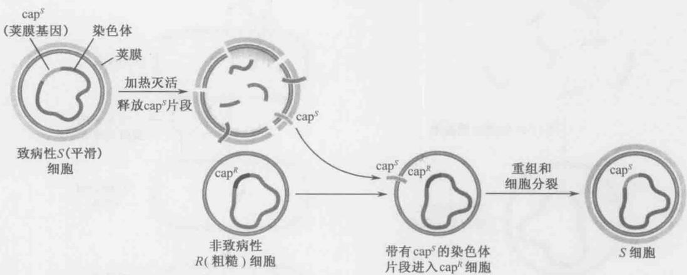  
图 2-1 通过遗传背景不同的热灭活菌株，转化另一种细菌（肺炎双球菌）的遗传特性。本图表明 R 型菌株接受来自热灭活的 S 型菌株的包含荚膜基因的染色体片段。由于大多数 R 型细胞接受的是别的染色体片段，因此特定基因的转化率通常低于 1%。

在 Griffith 观察到上述现象的最初几年内，又发现灭活后的细菌抽提物也可以诱发遗传转化，他们立即展开了确定这种转化因子化学本质的工作。当时，大部分生化学家仍然相信基因应该是蛋白质。所以，历经十几年的研究，美国微生物学家 Oswald T. Avery 与他在纽约洛克菲勒研究所的同事 Colin M. MacLeod 和 Maclyn McCarty 在 1944 年宣布了他们的重要发现，即有活性的遗传物质是 DNA（图 2-2），所有人都大吃一惊。支持他们结论的关键实验是：所获得的高度纯化的活性组分的转化活性可以被来自胰腺的脱氧核糖核酸酶所破坏。该酶是刚刚纯化的，可以特异性地把 DNA 分子降解成核苷酸，但是对蛋白质或 RNA 的完整性没有任何影响。添加胰腺的核糖核酸酶（可以降解 RNA）或各种蛋白酶（破坏蛋白质）对转化活性都没有影响。

  
图 2-2 分离纯化转化因子。(来源: Stahl F.W. 1964. The mechanics of inheritance, Fig. 2.3. © Pearson Education, Inc.)

## 病毒基因也是核酸

对病毒及被病毒感染的细胞进行化学性质研究为上述理论提供了更重要的支持证据。到

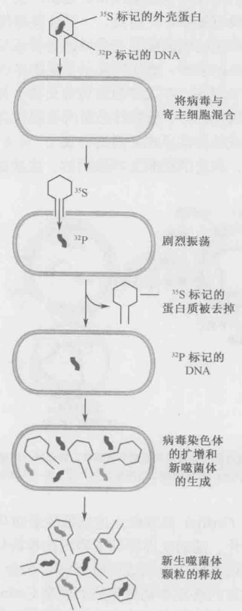  
图 2-3 图示只有 T2 噬菌体的 DNA 组分携带遗传信息，蛋白质外壳只具有保护作用。

1950年，已经可以获得若干足够纯度的病毒，并能够检测病毒中含有什么类型的分子。这项工作得到一个非常重要的且具有广泛意义的结论，即所有的病毒都含有核酸。当时已经越来越意识到病毒是含有遗传物质的，所以立即就提出了一个问题：是不是核酸就是病毒基因的载体呢？为了回答这一问题，1952年Alfred D. Hershey和Martha Chase在纽约长岛的冷泉港实验室完成了一项实验，用同位素研究细菌病毒T2［噬菌体（bacteriophage，phage）］的增殖，这种噬菌体由DNA核心区，以及由多种不同的蛋白质分子集合形成的、起保护作用的外壳组成。他们将蛋白质外壳用放射性同位素 $^{35}\mathrm{S}$ 标记，核心区DNA用放射性同位素 $^{32}\mathrm{P}$ 标记。然后用标记的病毒跟踪蛋白质和核酸在噬菌体增殖过程中的走向，主要是检测亲本病毒标记的哪种原子进入宿主细胞并出现在后代噬菌体中。

这些实验获得的结果清楚无误地表明，在后代噬菌体中能够检测到大量的亲本噬菌体的核酸，而没有任何亲本蛋白质（图 2-3）。此外，实验还证明几乎没有亲本蛋白质进入细菌，而只能吸附在细菌细胞外，当 DNA 进入细菌细胞后这些蛋白质就没有任何功能了。这一点由以下实验巧妙地证明：在 DNA 进入细胞后剧烈振荡侵染的细菌，结果吸附在细菌上的外壳蛋白脱落但并不影响细菌形成新的噬菌体颗粒。

利用某些病毒，现在可以进行更令人信服的实验。例如，从小鼠多瘤病毒纯化的DNA可以进入小鼠细胞，启动病毒繁殖的周期并产生数以千计新的多瘤病毒颗粒。所以，病毒蛋白质的基本功能就是在细胞间移动过程中保护其遗传成分——核酸。

## 双螺旋

用 X 射线分析蛋白质结构的同时，少衍射图谱。1938 年 William Astbury 用 Ola Hammarsten 和 Torbjorn Caspersson 提供的 DNA 样品拍摄到了第一张衍射图谱。但直到 20 世纪 50 年代初期，Maurice Wilkins 和 Rosalind Franklin 才获得了高质量的 X 射线衍射照片（图 2-4）。从这些照片来看，DNA 的结构应该是螺旋形的，而且不止一条多核苷酸链，不是 2 条就是 3 条。与此同时，将 DNA 分子连接起来的共价键也清楚了。1952 年，一群在 Alexander Todd 实验室工作的有机化学家证明：将 DNA 的核苷酸结合在一起的是 3'-5' 磷酸二酯键（图 2-5）。

出于对 Linus Pauling 的 $\alpha$ 螺旋蛋白基序

  
图 2-4 用来阐明 DNA 结构的关键 X 射线照片。这张照片由 Rosalind Franklin 于 1952～1953 年冬天在伦敦 King 学院拍摄，它证明了 DNA 是螺旋形结构的猜想。照片中心的十字形的 X 射线反射图形表明了螺旋的形式（X 射线照片上暗的部位）；位于顶端和底部的很深的黑色区域表明相距 3.4 Å 的嘌呤和嘧啶碱基是规则的相邻叠加的，并垂直于螺旋轴。（来源：Franklin R. E. and Gosling R.G. 1953. Nature171: 740-741，经许可）。

  
图 2-5 DNA 多聚核苷酸的一部分，图示连接核苷酸的 3'-5' 的磷酸二酯键的连接方式。磷酸基团将一个核苷酸的 3' 碳原子与另一个核苷酸的 5' 碳原子相连。

(motif)（第6章）的兴趣，William Cochran、Francis H. Crick和Vladimir Vand在1951年建立了一种很好的关于螺旋分子的衍射理论，使探索可能的DNA结构更为简单。1953年，克里克（Francis H. Crick）和沃森（James D. Watson）提出了正确的互补双螺旋理论（见第4章），当时他们是在Max Perutz和John Kendrew的实验室工作。正确答案的获得主要依赖于发现了与Wilkins和Franklin的X射线衍射数据相符合并且从立体化学角度来讲最可能的构象。

在双螺旋中，两条反向的 DNA 链由碱基对之间的氢键（一种非共价的化学弱键，见第 3 章）结合在一起（图 2-6）。这种碱基配对是高度特异的：腺嘌呤只与胸腺嘧啶配对，而鸟嘌呤只与胞嘧啶配对。在双螺旋 DNA 分子中，A 残基的数目一定与 T 残基的数目相等，同样地，G 的数目一定与 C 的数目相等（见框 2-1）。结果是，双螺旋的两条链的碱基序列有互补的关系，其中任何一条 DNA 链的序列都严格地决定了其对应链的序列。

双螺旋结构的发现对许多遗传学家分析数据的方式带来了意义深远的革命。基因不

## 框 2-1 Chargaff 定律

生化学家 Erwin Chargaff 用纸层析技术分析 DNA 的核苷酸组成。1949 年，他提出的数据表明不但 4 种不同的核苷酸的含量不同，而且 4 种核苷酸的比率在不同的物种中也不一样（框 2-1 表 1）。这些发现意味着一种可能性，即 DNA 分子中核苷酸的精确排列承载着其遗传特性。

Chargaff 实验同时也表明，4 种碱基的相对比率不是随机的。所有 DNA 样品中，A 残基数目与 T 残基数目相等，而 G 残基数目等于 C 残基数目。另外，不论 DNA 的来源如何，嘌呤与嘧啶的比值都大体上等于（嘌呤 = 嘧啶）。在知道 DNA 的三维结构之前是难以理解 A = T 和 G = C 的关系（Chargaff 定律）的重要意义的。

框2-1 表1奠定Chargaff定律的数据

<table><tr><td>来源</td><td>A:G</td><td>T:C</td><td>A:T</td><td>G:C</td><td>嘌呤:嘧啶</td></tr><tr><td>牛</td><td>1.29</td><td>1.43</td><td>1.04</td><td>1.00</td><td>1.1</td></tr><tr><td>人</td><td>1.56</td><td>1.75</td><td>1.00</td><td>1.00</td><td>1.0</td></tr><tr><td>母鸡</td><td>1.45</td><td>1.29</td><td>1.06</td><td>0.91</td><td>0.99</td></tr><tr><td>鲱鱼</td><td>1.43</td><td>1.43</td><td>1.02</td><td>1.02</td><td>1.02</td></tr><tr><td>小麦</td><td>1.22</td><td>1.18</td><td>1.00</td><td>0.97</td><td>0.99</td></tr><tr><td>酵母</td><td>1.67</td><td>1.92</td><td>1.03</td><td>1.20</td><td>1.0</td></tr><tr><td>嗜血流感菌</td><td>1.74</td><td>1.54</td><td>1.07</td><td>0.91</td><td>1.0</td></tr><tr><td>大肠杆菌K2菌株</td><td>1.05</td><td>0.95</td><td>1.09</td><td>0.99</td><td>1.0</td></tr><tr><td>禽类结核杆菌</td><td>0.4</td><td>0.4</td><td>1.09</td><td>1.08</td><td>1.1</td></tr><tr><td>沙雷氏菌</td><td>0.7</td><td>0.7</td><td>0.95</td><td>0.86</td><td>0.9</td></tr><tr><td>杆菌</td><td>0.7</td><td>0.6</td><td>1.12</td><td>0.89</td><td>1.0</td></tr></table>

来源：After Chargaff E. et al. 1949. J. Biol. Chem. 177: 405.

再是一种神秘的东西，它的活动不再只能用遗传实验来研究。相反，它已经变成了一个化学家可以客观面对的、真实的分子物体，就像其他的小分子（如丙酮酸盐和 ATP）。然而，最令人振奋的还不仅仅是破解了结构，还有来自结构的内涵。在知道答案之前，人们一直在担心该答案难以揭示基因的复制和功能；值得庆幸的是，这一答案非常令人振奋。两条互补的、相互缠绕的链本身就意味着一条链能够为另一条链的合成提供一个特定的表面（模板）（图 2-6）。如果这一假说成立，那么困扰遗传学家们多年的关于基因复制的基本问题，就从理论上得到了解决。

## 合成 DNA 的聚合酶的发现

为严格地证明一条 DNA 链是指导其互补的 DNA 链合成的模板，还需要在试管中（离体）建立 DNA 合成系统，而实际上，出乎分子遗传学家们的预料，在很短的时间内建立了这一体系。当时，分子遗传学家与生物化学家的工作相距很远，后者擅长酶纯化方面的工作。利用生化技术破解 DNA 复制之谜的领军人物是美国生化学家 Arthur Kornberg，他在 1956 年用无细胞的细菌抽提物证明了 DNA 的合成。在随后的几年中，

  
图 2-6 DNA 的复制。新合成的链用橙色表示。

Kornberg 进一步证明了催化 DNA 前体元件的连接需要一种特定的聚合酶。Kornberg 的研究揭示了组成 DNA 的核苷酸元件是富含能量的前体物质（dATP、dGTP、dCTP 和 dTTP，图 2-7）。进一步的实验鉴定了一种单链的多肽——DNA 聚合酶 I（DNA Pol I），它能够催化新的 DNA 链合成。DNA 聚合酶 I 将核苷酸前体用 3'-5'磷酸二酯键连接起来（图 2-8）。这种反应需要 DNA 存在，其作用是将 4 种核苷酸按顺序排列成最终的多聚核苷酸产物。

DNA 聚合酶 I 依赖 DNA 模板来决定所合成的 DNA 的顺序。这一点首先由以下实验证明：用含不同数量的 A:T 和 G:C 碱基对的 DNA 分子作模板，进行酶促合成。在所有的实验中，酶促合成的产物都与模板 DNA 的碱基比率相同（表 2-1）。在无细胞体系的合成中，没有形成蛋白质或其他任何形式的分子，完全排除了其他非 DNA 的组分作为遗传特性的中间载体的可能性。所以，毫无疑问，DNA 就是合成自身的直接模板。

核苷：

嘧啶碱：

脱氧鸟苷-5'-磷酸  
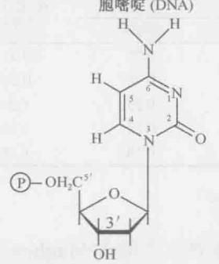


糖：

核苷酸：脱氧胞苷-5'-磷酸

核苷：

嘌呤碱：


糖：

核苷酸：

图 2-7 DNA 的核苷酸。图中显示的是 4 种核苷酸的不同结构。  
  
图 2-8 由 DNA 聚合酶 | 催化的 DNA 链的酶促合成反应。图示将核苷酸添加到不断增长的 DNA 链上去的反应是由 DNA 聚合酶催化的。尽管 DNA 聚合酶本身就能催化细胞中的 DNA 合成，释放的焦磷酸是由焦磷酸酶转化为二磷酸的，更加有利于核苷酸添加的正向反应。

表 2-1 酶促合成的 DNA 产物及 DNA 模板中的碱基组成比较

<table><tr><td rowspan="2">DNA模板来源</td><td colspan="4">酶促合成产物的碱基组成</td><td rowspan="2">A+T/G+C 产物中</td><td rowspan="2">A+T/G+C 模板中</td></tr><tr><td>腺嘌呤</td><td>胸腺嘧啶</td><td>鸟嘌呤</td><td>胞嘧啶</td></tr><tr><td>球菌(细菌)</td><td>0.15</td><td>0.15</td><td>0.35</td><td>0.35</td><td>0.41</td><td>0.39</td></tr><tr><td>产气杆菌(细菌)</td><td>0.22</td><td>0.22</td><td>0.28</td><td>0.28</td><td>0.80</td><td>0.82</td></tr><tr><td>大肠杆菌</td><td>0.25</td><td>0.25</td><td>0.25</td><td>0.25</td><td>1.00</td><td>0.97</td></tr><tr><td>牛胸腺</td><td>0.29</td><td>0.28</td><td>0.21</td><td>0.22</td><td>1.32</td><td>1.35</td></tr><tr><td>噬菌体T2</td><td>0.32</td><td>0.32</td><td>0.18</td><td>0.18</td><td>1.78</td><td>1.84</td></tr></table>

## 支持 DNA 复制过程中双链分开的实验证据

1958年，在Kornberg研究的同时，当时在加州理工学院的Matthew Meselson和Frank W. Stahl进行了一个非常聪明的实验：他们将子代DNA分子分离，证明了双螺旋的两条链在DNA复制过程中一直是分开的（图2-9）。实验的成功部分归因于用 $^{15}$ N重同位素作为标签来区分亲代和子代 DNA 链。生长在含重同位素 ${}^{15}$ N 的培养基中的细菌的 DNA 比在正常的 ${}^{14}$ N 培养基中的细菌的 DNA 密度要大一些。另外，实验的成功还部分归因于用重盐（如氯化铯）进行密度梯度离心分离轻、重 DNA 实验技术的建立。当施加高离心力时，在离心管底部的溶液密度会变得更高（旋转时，它们是离旋转轴最远的位置）。如果选择的初始溶液密度合适，DNA 分子就会移动到离心管的中部，停留在与盐溶液的密度相同的区域。此时，同两条链都完全是 ${}^{14}$ N 前体的“轻-轻 DNA”（LL DNA）相比，两条链都完全是 ${}^{15}$ N 的“重-重 DNA”（HH DNA）会在较高密度区形成一条带（离离心管底部更近）。当把含有重 DNA 的细菌转移到普通培养基（含 ${}^{14}$ N）上培养时，用来进行 DNA 合成的核苷酸前体是轻的，所以转移后新合成的 DNA 同转移前的 DNA 是可以区分的。

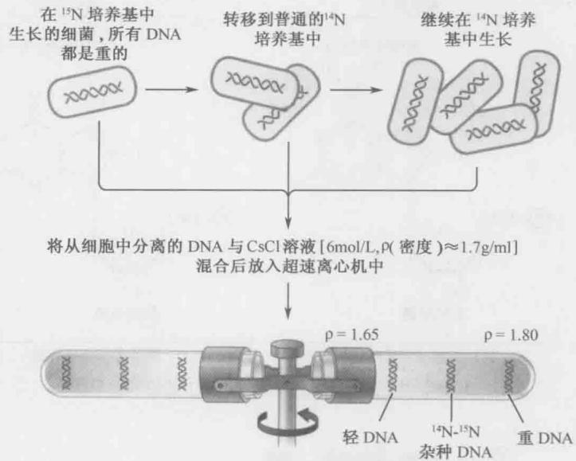

溶液在140 000 g超速离心大约48h  
  
图 2-9 用氯化铯密度梯度证明 DNA 复制过程中互补链的解开。

如果 DNA 的复制涉及解链过程，从普通培养基上生长不同时间后的 DNA 分子的密度就可以推测出来。生长一代以后，所有的 DNA 分子应该含有一条重链和一条轻链，也就是居中的杂种密度（“重-轻 DNA”，HL DNA）。这正是 Meselson 和 Stahl 所观察到的现象。同样地，生长两代以后，一半的 DNA 分子是轻的，另一半是杂种，与解链的预测完全符合。一定要注意，DNA 在从细菌里纯化出来时，会被断裂成小片段。这就保证了大多数 DNA 不是被完全复制，要么不被复制。如果细菌基因组保持完整，很可能会有很多部分复制的中间密度的分子（既不是 HH、HL，也不是 LL）存在。

由此 Meselson 和 Stahl 的实验证明了 DNA 复制（replication）是半保留的过程，在复制过程中双螺旋中的一条链保持不变（也就是“保留”），两条亲本链分别分配到两个子代分子中（半保留复制中的“半”）。这些实验排除了当时的另外两种模型：保留和分散复制模型（图 2-10）。保留模型认为，亲本的两条链不分开，而新形成的两条链则形成全新的 DNA 分子。按照这一模型，细胞生长一代后就应该有轻 DNA 形成。在当时许多人都特别倾向的分散复制模型中，DNA 链首先被打成碎片，片段的长度可能只有 10 个碱基对，利用这些片段合成同样短的 DNA 片段，然后这些短片段再连接起来形成完整的 DNA 链。按照这个复杂的模型，DNA 链将是由新老 DNA 共同组成的（即非保留的），只能在多代生长之后才会有轻 DNA 出现。

  
图 2-10 3 种可能的 DNA 复制机制。了解了 DNA 结构之后，提出了几种解释 DNA 复制的模型，本图介绍了 3 种。由 Meselson 和 Stahl 提出的实验与其他模型不同，清楚地证明了 DNA 是半保留复制的。

## DNA 中的遗传信息是由 4 种核苷酸形成的序列所承载

双螺旋的发现终止了 DNA 是否是主要遗传物质的争论。在用实验证明 DNA 的复制涉及解链之前，分子遗传学家就将研究重点转向了解 DNA 中的遗传信息是如何决定蛋白质的氨基酸顺序的（见框 2-2）。因为所有的 DNA 链都能够形成双螺旋，其遗传特性的核心肯定是隐含在由 4 种核苷酸单元形成的线性顺序中。所以，作为携带遗传信息的实体，当时人们就认识到 DNA 分子应该是由 4 个字母（A、G、C 和 T）构成的很长的单词（在后面的章节中我们还将看到，现在更应该说 DNA 是很长的句子）。即使只有 4 个字母，可能的 DNA 排列的数目（ $4^{N}$ ，其中 N 是序列中字母的个数）对于最小的 DNA 分子来说也非常庞大，实际上可能存在的遗传信息是无限的。现在我们知道一个典型的细菌的基因由大约 1000 个碱基对组成，这样大小的一段 DNA 可能产生的基因数目是 $4^{1000}$ ，这个数目比所有生物中已知的基因数目都大几个数量级。

## 框2-2 基因控制蛋白质中氨基酸顺序的证据

基因（DNA）控制氨基酸顺序的第一个实验证据来自对镰刀状细胞贫血症遗传病的患者的血红蛋白的研究。如果一个人的两条同源染色体都带有β珠蛋白基因（编码组成血红蛋白的两条肽链中的一个）的S型等位基因，就会导致严重的贫血症，其典型特征是患者的红细胞呈镰刀形。如果β珠蛋白基因的一个等位基因是S型，贫血症状就相对较轻，红细胞也接近正常的形状。红细胞中血红蛋白的类型似乎与遗传特征相符合。在SS的情况下，血红蛋白不正常，特征是其溶解性不同；而在+S（一个等位基因是野生型——译者注）的情形下，一半血红蛋白是正常的，另一半是镰刀形。

野生型血红蛋白分子是由两种多肽链组成的，即 $\alpha$ 链和 $\beta$ 链（框2-2图1）。每一条肽链的分子质量大约是 $16100\mathrm{Da}$ 。每一个血红蛋白分子中有两条 $\alpha$ 链和两条 $\beta$ 链，总的分子质量大约为 $64400\mathrm{Da}$ 。 $\alpha$ 链和 $\beta$ 链是由不同的基因控制的，所以一个突变只能影响一条链—— $\alpha$ 链或者 $\beta$ 链，但不会同时影响二者。1957年，剑桥大学的Vernon M. Ingram证明了镰刀状血红蛋白与正常血红蛋白的区别在于 $\beta$ 链的一个氨基酸的改变：第6个氨基酸位置，由正常的谷氨酸变成了缬氨酸。除此之外，正常和突变血红蛋白的所有氨基酸序列都相同，因为这种氨基酸顺序的改变只在带有S型的 $\beta$ 珠蛋白基因的患者中才会出现。一个最简单的假设是S等位基因决定了 $\beta$ 珠蛋白基因的突变。随后对其他类型贫血症 $\beta$ 珠蛋白氨基酸序列的分析完全支持这种解释；序列分析表明，每一种特定的贫血症都有多肽链特定位置上一个氨基酸的改变（框2-2图2）。

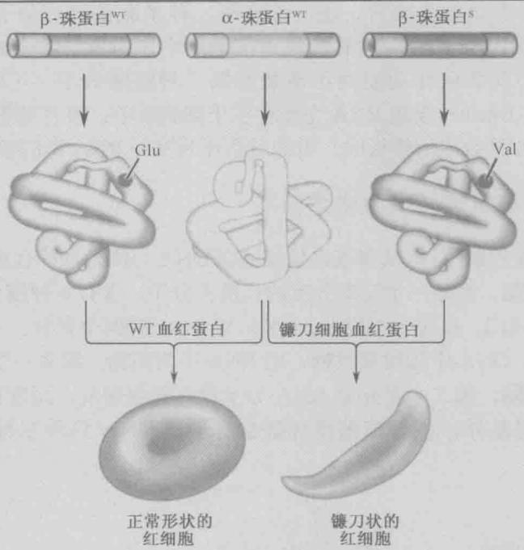  
框 2-2 图 1 野生型和镰状细胞血红蛋白的形成(血红蛋白结构的来源: 图自 Irving Gels。版权为 Howard Hughes Medical Institute 所有, 未经许可不得复制)。

<table><tr><td colspan="10">α链</td></tr><tr><td colspan="2">位置</td><td>1</td><td>2</td><td>16</td><td>30</td><td>57</td><td>58</td><td>68</td><td>141</td></tr><tr><td colspan="2">氨基酸</td><td>Val</td><td>Leu</td><td>Lys</td><td>Glu</td><td>Gly</td><td>His</td><td>Asp</td><td>Arg</td></tr><tr><td rowspan="5">血红蛋白的突变体</td><td>Hb I</td><td></td><td></td><td>Asp</td><td></td><td></td><td></td><td></td><td></td></tr><tr><td>Hb GHonolulu</td><td></td><td></td><td></td><td>Glu</td><td></td><td></td><td></td><td></td></tr><tr><td>HbNorfolk</td><td></td><td></td><td></td><td></td><td>Asp</td><td></td><td></td><td></td></tr><tr><td>Hb MBoston</td><td></td><td></td><td></td><td></td><td></td><td>Tyr</td><td></td><td></td></tr><tr><td>Hb GPhiladelphia</td><td></td><td></td><td></td><td></td><td></td><td></td><td>Lys-</td><td></td></tr></table>

<table><tr><td colspan="12">β链</td></tr><tr><td colspan="2">位置</td><td>1</td><td>2</td><td>3</td><td>6</td><td>7</td><td>26</td><td>63</td><td>67</td><td>125</td><td>150</td></tr><tr><td colspan="2">氨基酸</td><td>Val</td><td>His</td><td>Leu</td><td>Glu</td><td>Glu</td><td>Glu</td><td>His</td><td>Val</td><td>Glu</td><td>His</td></tr><tr><td rowspan="8">血红蛋白的突变体</td><td>Hb S</td><td></td><td></td><td></td><td>Val</td><td></td><td></td><td></td><td></td><td></td><td></td></tr><tr><td>Hb C</td><td></td><td></td><td></td><td>Lys $^{+}$ </td><td></td><td></td><td></td><td></td><td></td><td></td></tr><tr><td>Hb GSan José</td><td></td><td></td><td></td><td></td><td>Gly</td><td></td><td></td><td></td><td></td><td></td></tr><tr><td>Hb E</td><td></td><td></td><td></td><td></td><td></td><td>Lys $^{+}$ </td><td></td><td></td><td></td><td></td></tr><tr><td>Hb M Saskatoon</td><td></td><td></td><td></td><td></td><td></td><td></td><td>Tyr</td><td></td><td></td><td></td></tr><tr><td>HbZürich</td><td></td><td></td><td></td><td></td><td></td><td></td><td>Arg $^{+}$ </td><td></td><td></td><td></td></tr><tr><td>Hb MMilwaukee-1</td><td></td><td></td><td></td><td></td><td></td><td></td><td></td><td>Glu $^{-}$ </td><td></td><td></td></tr><tr><td>Hb Dβ Punjab</td><td></td><td></td><td></td><td></td><td></td><td></td><td></td><td></td><td>Glu</td><td></td></tr></table>

框 2-2 图 2 一些已经确认的人类血红蛋白突变体的氨基酸替换。

## DNA 不是直接决定所合成的蛋白质的模板

虽然 DNA 一定携带着决定氨基酸顺序的信息，但很明显双螺旋本身不可能是蛋白质合成的模板。实验表明在没有 DNA 存在的场所仍可以进行蛋白质的合成，所以排除了 DNA 起直接作用的可能。在所有的真核生物细胞中蛋白质的合成发生在细胞质中，而核膜将染色体 DNA 与细胞质分开。

因此，至少对真核细胞而言，还应该有第二种承载信息的分子存在，由它负责从 DNA 上获得特定遗传信息，然后转移到细胞质中作为蛋白质合成的模板。从一开始，人们的注意力就集中在功能尚不清楚的第二种核酸分子——RNA 上。Torbjorn Caspersson 和 Jean Brachet 发现 RNA 主要存在于细胞质中；很容易想象，当一条 DNA 链不用于互补 DNA 链合成的模板时，可能就会作为互补 RNA 链的模板。

## RNA 与 DNA 具有非常相似的化学性质

通过了解 RNA 的结构, 可以知道它是如何以 DNA 为模板准确合成的。RNA 与 DNA 的化学性质非常相似, 也是一个没有分支的长链大分子, 含有 4 种核苷酸, 以 3'-5'磷酸二酯键相连 (图 2-11)。在化学组成上, RNA 与 DNA 有两个差异: 一个是糖组分的微小差异 (图 2-12): DNA 中为脱氧核糖, 而 RNA 中为核糖, 除多一个 OH (羟基) 外, 核糖与脱氧核糖相同; 第二个差异是 RNA 分子没有胸腺嘧啶, 而含有结构相似的尿嘧啶。尽管存在这些差异, 多聚核糖核苷酸也有形成 DNA 那种互补双螺旋的能力。

  
图 2-11 一段多聚核糖核苷酸（RNA）链。红色部分表示与 DNA 的区别。

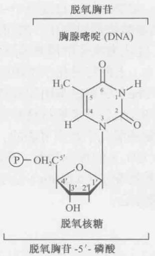

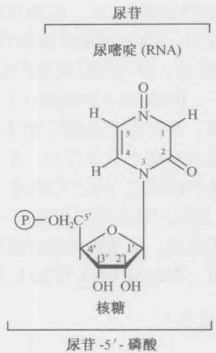  
图 2-12 RNA 与 DNA 核苷酸之间的区别。左图为 DNA 的核苷酸，旁边为 RNA 的核苷酸。所有 RNA 的核苷酸含有核糖（而 DNA 中为脱氧核糖），核糖的 C2 位有一个羟基（用红色表示）。此外，在碱基组成上，RNA 中为尿嘧啶，而 DNA 为胸腺嘧啶，尿嘧啶在嘧啶环的 5 位上有氢原子（用红色表示），而胸腺嘧啶在该位置是甲基。其余 3 个碱基相同。

额外的羟基以及尿嘧啶中缺少胸腺嘧啶中才有的甲基都不影响 RNA 通过碱基配对形成双螺旋结构的能力。然而，与 DNA 不同，在细胞中 RNA 主要以单链分子存在。如果有双链 RNA 螺旋形成，大多数也是由同一单链 RNA 分子的两个部分形成的。

## 中心法则

到 1953 年秋，人们已经普遍接受了如下的假说，那就是染色体 DNA 是 RNA 分子的模板，RNA 分子合成后转移到细胞质中，在那里决定蛋白质中氨基酸的顺序。1956 年，Crick 将遗传信息的传递途径称为中心法则（central dogma）。

$$
\text { 复制 } \quad \mathrm{DNA} \xrightarrow {\text { 转录 }} \mathrm{RNA} \xrightarrow {\text { 翻译 }} \text { 蛋白质 }
$$

其中，箭头表示遗传信息的传递方向。环绕 DNA 的箭头代表 DNA 是自我复制的模板。DNA 与 RNA 之间的箭头表示 RNA 的合成（转录，transcription）是以 DNA 为模板的。相应地，蛋白质的合成（翻译，translation）是以 RNA 为模板的。更为重要的是，最后两个箭头表示的过程，只能单方向存在，也就是说，不能由蛋白质模板合成 RNA，也难以想像由 RNA 模板合成 DNA。蛋白质不能作为 RNA 的模板已经经受了时间的验证，然而，正如我们将在第 11 章中要提到的，有时 RNA 链确实可以作为互补的 DNA 的模板。这种与正常信息流的方向相反的事例，与大量的以 DNA 为模板合成的 RNA 分子相比，是非常少见的。所以，大约 50 年前提出的中心法则在今天看来仍然是基本正确的。

## Crick 的适配子假设

最初，人们简单地认为用于合成蛋白质的 RNA 模板，可以折叠并在其表面形成适合于 20 种不同氨基酸的空腔。这些空腔应该有一定的形状，只适合于一种氨基酸，在蛋白质合成过程中，RNA 就是以这种方式决定氨基酸排列的顺序。然而到了 1955 年，Crick 对这种传统的、想当然的观点产生了怀疑，他认为该模型预测的结果不可能出现。这是因为：第一，RNA 的 4 种碱基（A、U、G、C）上的特异化学基团应该主要与水溶性基团相互作用，而许多氨基酸（如 Leu、Val、Phe）的侧链基团却强烈地倾向于与非水溶性基团（疏水基团）发生作用；第二，即使 RNA 分子能够折叠并形成疏水表面，但是让 RNA 分子精确区分化学结构非常相似的氨基酸几乎是不可能的，例如，Gly 和 Ala、Val 和 Ile 之间，其差别仅仅在于一个甲基（CH₃）的存在与否。所以 Crick 提出，在整合成蛋白质之前，氨基酸先结合在某种特异的适配子（adaptor）分子上，而适配子具有独特的表面，可以与 RNA 模板上的碱基特异结合。

## 转运RNA的发现

探索蛋白质是如何合成的，需要建立无细胞体系，加入RNA分子，该体系能够以氨基酸前体合成蛋白质。1953年，Paul C. Zamecnik及其同事最早成功地建立了这种体系。他们的成功主要得益于最新的放射性标记氨基酸技术，这种技术可以用来跟踪新合成的、微量的蛋白质，另外还有高效便捷的、用来分离各种细胞组分的制备型超速离心技术。在这之前人们就认为核糖体是细胞内合成蛋白质的场所，核糖体是所有细胞的细胞质中含RNA的小颗粒，它与蛋白质的合成有密切的关系（图2-13）。

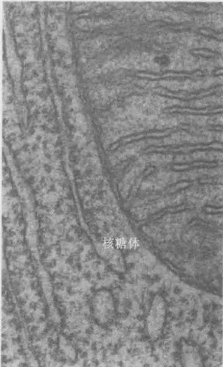  
图 2-13 附着在内质网上的核糖体的电子显微照片。胰腺细胞的电子显微照片（105000×）。图的右上部分为线粒体，左下部分为附着在内质网上的大量的核糖体（电子密度高的小圆点），有的核糖体游离存在于细胞质中，有的附着在内质网膜上（K.R. Porter 惠赠）。

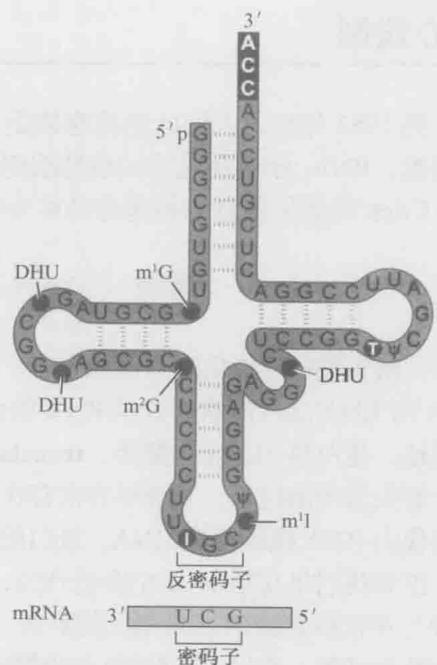  
图 2-14 由 Robert W. Holley 及其助手鉴定的酵母丙氨酸 tRNA 的结构。这个 tRNA 的反密码子识别 mRNA 上的丙氨酸。在 tRNA 结构中存在着修饰核苷： $\psi = 假尿嘧啶核苷；T = 胸腺嘧啶核糖核苷；DHU = 5, 6-二氢尿嘧啶核苷；I = 次黄嘌呤核苷；m^{1}G = 1-甲基鸟嘧啶核苷；m^{1}I = 1-甲基次黄嘌呤核苷；m^{2}G = N，N-甲基鸟嘧啶核苷。$

几年后，Zamecnik 与 Mahlon B. Hoagland 合作研究获得了重要的发现：在被整合进蛋白质之前，氨基酸首先结合到我们现在所称的转运 RNA（transfer RNA，tRNA）分子上。转运 RNA 大约占细胞总 RNA 的 10%（图 2-14）。

除 Crick 之外，这一实验结果出乎所有人的预料。Crick 已经预测到所谓的适配子（adaptor）可能是 RNA 短链，因为它们的碱基应该能够与蛋白质合成的模板 RNA 上的相应碱基配对并“阅读”这些碱基。以后我们会讨论更多的细节（第 15 章），实际上 Zamecnik 和 Hoagland 所提出的转运 RNA 分子就是 Crick 提出的适配子分子。每一个 tRNA 分子都有一段连续的碱基序列（反密码子），在蛋白质合成过程中与 RNA 模板上的一组连续碱基序列（密码子）特异结合。

## 核糖体的矛盾问题：缺乏特异性

细胞总 RNA 的 85% 存在于核糖体中，因为在蛋白质合成旺盛的细胞中（如胰脏、肝脏细胞和快速增殖的细菌），核糖体的绝对数量急剧增加，所以最初人们认为核糖体 RNA（ribosome RNA，rRNA）是决定氨基酸顺序的模板。当详细研究了大肠杆菌的核糖体之后，发现若干难以解释的现象：第一，所有大肠杆菌核糖体甚至其他所有生物的核糖体，都由两个大小不等的亚基组成，每个亚基都包含 RNA，在周围离子浓度影响下，两个亚基可以可逆地聚合或分开。第二，小亚基中所有 rRNA 的长度大致相同（大肠杆菌约 1500 个碱基），大亚基中的 rRNA 长度也基本相同（约 3000 个碱基）。第三，在所有已知的细菌、植物和动物中，大小亚基的 rRNA 碱基组成基本相同（有较高的 G 和 C），虽然它们各自 DNA 的 AT/GC 比值有很大变化。如果说 rRNA 是由大量不同基因组成的、不同 RNA 模板的集合体，那么上述现象都不应该出现，所以大小亚基都不像是模板 RNA。

## 信使 RNA（mRNA）的发现

T4噬菌体侵染的细胞提供了一个寻找真正模板的理想体系。受T4侵染后，大肠杆菌细胞停止合成自己的RNA，只能合成T4 DNA转录的RNA。令人吃惊的是，T4 RNA不仅与T4 DNA的碱基组成很相似，而且它不能与核糖体蛋白结合。正常情况下，核糖体蛋白与rRNA结合形成核糖体。相反，T4 RNA首先与已存在的核糖体结合，然后移动穿过核糖体表面，使其碱基进入适当位点，在这里与相应的tRNA-氨基酸前体结合进行蛋白质合成（图2-15）。这种情况下，T4 RNA就决定了氨基酸的顺序，它就是长期寻找的蛋白质合成的RNA模板。由于它将DNA信息带到了进行蛋白质合成的核糖体位点，故称为信使RNA（message RNA，mRNA）。首次观察到T4 RNA与大肠杆菌核糖体结合是在1960年春，很快在未侵染的大肠杆菌细胞中获得了其他信使RNA的证据，因此，完全排除了rRNA作为模板的可能。实际上，核糖体中的rRNA组分，与大约50种与之结合的核糖体蛋白一起，是蛋白质合成的工厂。细胞将tRNA-氨基酸前体引导到某个位置，在那里它们读取mRNA模板提供的信息（详见第15章）。

细胞中，mRNA 仅占总 RNA 的百分之几。为编码细胞里的不同蛋白质，mRNA 的长度和核苷酸组成变化很大，所以，不难理解为什么 mRNA 在最初未被研究者们重视。

在给定的时间内，只有很小的一段 mRNA 结合在核糖体上，所以一个 mRNA 分子可以被多个核糖体同时读取。绝大多数核糖体都是多聚核糖体（polyribosome）（翻译相同 mRNA 的一组核糖体）的一部分，多聚核糖体可能会包含 50 多个成员（图 2-16）。


图 2-15 转录和翻译。以 DNA 的一条链为模板，按照碱基互补原则合成 mRNA。密码子每 3 个一组，与 tRNA 分子上反密码子区域的 3 个核苷互补。碱基配对形成后，tRNA 分子另一端携带的氨基酸添加到正在生长的蛋白质链上。  
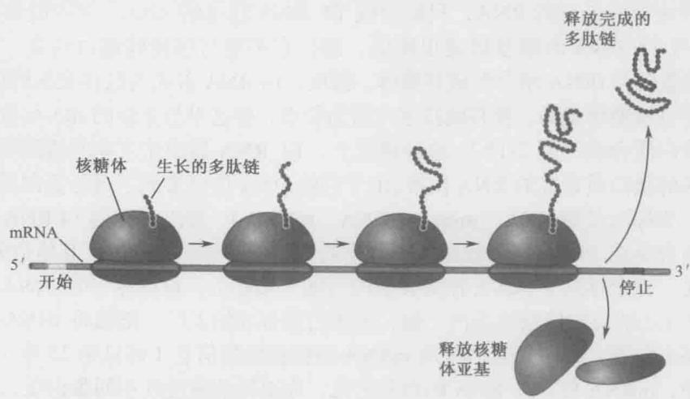  
图 2-16 多聚核糖体示意图。每个核糖体附着在 mRNA 5'端的信号起始处，并沿着 mRNA 分子合成多肽。一条 mRNA 链上可能同时结合数个核糖体，整个装置称为多聚核糖体。

## 以 DNA 为模板酶促 RNA 的合成

随着信使 RNA 的发现，第一个能以 DNA 为模板转录 RNA 的酶很快就分别在生化学家 Jerard Hurwitz 和 Sam B. Weiss 的实验室分离出来了。这种称为 RNA 聚合酶（RNA polymerase）的酶必须在有 DNA 的情况下工作，并以其为模板，利用 ATP、GTP、CTP 和 UTP 核苷酸为前体，合成单链 RNA（图 2-17）。在细菌中，同一种酶分别以相应的染色体 DNA 为模板合成 RNA。生成的 RNA 碱基组成随加入不同 AT/GC 比值的 DNA 模板而变化，这就是 DNA 负责排列核糖核苷酸前体的直接证据。在所有的酶促合成中，RNA 的 AU/GC 比值与 DNA 的 AT/GC 比值大体相同（表 2-2）。

  
图 2-17 RNA 聚合酶催化的以 DNA 为模板的 RNA 的合成。

表 2-2 酶促合成 RNA 与其双螺旋 DNA 模板碱基组成的比较

<table><tr><td rowspan="2">DNA 模板来源</td><td colspan="4">RNA 碱基组成</td><td rowspan="2">A+U/G+C 观察</td><td rowspan="2">A+T/G+C DNA 中</td></tr><tr><td>腺嘌呤</td><td>尿嘧啶</td><td>鸟嘌呤</td><td>胞嘧啶</td></tr><tr><td>T2</td><td>0.31</td><td>0.34</td><td>0.18</td><td>0.17</td><td>1.86</td><td>1.84</td></tr><tr><td>小牛胸腺</td><td>0.31</td><td>0.29</td><td>0.19</td><td>0.21</td><td>1.50</td><td>1.35</td></tr><tr><td>大肠杆菌</td><td>0.24</td><td>0.24</td><td>0.26</td><td>0.26</td><td>0.92</td><td>0.97</td></tr><tr><td>Micrococcus lysodeikticus (一种细菌)</td><td>0.17</td><td>0.16</td><td>0.33</td><td>0.34</td><td>0.49</td><td>0.39</td></tr></table>

在转录过程中，两条 DNA 链中只能有一条作为 RNA 合成的模板。这是有道理的，因为两条 DNA 链虽然序列互补，但携带的遗传信息并不相同，会编码完全不同的多肽。RNA 的合成总是沿固定方向进行，由 5' 端的核苷酸开始，到 3' 端的核苷酸结束（图 2-17）。

到此为止，已经有充分的证据证明了该推测，RNA 确实是从含 DNA 的核中移动到含核糖体的细胞质中。将细胞短暂地暴露在放射性标记的前体中，然后加入过量的未标记氨基酸（“脉冲标记”实验），在此窗口期内合成的 mRNA 就会被标记。这项研究表明 mRNA 是在细胞核中合成的。在一小时内，可以观察到大部分 RNA 离开了细胞核进入细胞质（图 2-18）。

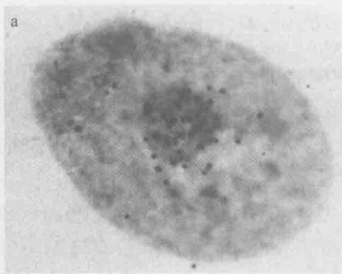

  
图2-18 RNA在核中合成后转移到细胞质中的证明。(上)在放射性标记的胞嘧啶培养基中培养 $15\mathrm{min}$ 后细胞（四膜虫）的放射自显影照片。细胞薄切片照片中深度曝光的是银乳胶颗粒，每个黑点代表掺入到RNA中的 ${}^{3}\mathrm{H}$ 发射电子的轨迹，几乎所有新形成的RNA都在细胞核中。（下）相同的细胞在放射性标记的胞嘧啶中培养 $12\mathrm{min}$ ，然后转移到非放射性标记的胞嘧啶中培养 $88\mathrm{min}$ 后的放射自显影照片。发现在 $12\mathrm{min}$ 内掺入RNA中的所有的标记，都离开细胞核进入到细胞质中。（D.M.Prescott，University of Colorado Medical School；reproduced from Prescott D.M. 1964.Progr.Nucleic Acid Res Mol Biol.3：35Elsevier经许可）

## 遗传密码的破译

已知存在20种氨基酸，但仅有4种碱基，所以肯定是由几个核苷酸以某种组合的方式来确定一个特定氨基酸。如果是两个核苷酸一组，最多只能定义16个 $(4\times 4)$ 氨基酸。从1954年开始，人们就在认真考虑遗传密码应该是什么，尤其是三联体（3个核苷酸一组）会如何行使功能，即使三联体显然能提供多于需要的排列组合 $(4\times 4\times 4)$ （如果每个氨基酸只能由一个三联体编码）。此时提出了共线性假设，这是非常重要的。共线性的意思是沿DNA链排列的核苷酸组合编码沿多肽链上排列的氨基酸。事实上，Charles Yanofsky和Sydney Brenner在20世纪60年代初期就已经通过对细菌蛋白质的突变分析观察到这种共线性的存在。另外，还有Brenner和Crick在1961年的遗传分析也同样重要，他们首次证明了3个核苷酸的组合确定一个氨基酸。

但是哪 3 个碱基的特定组合(密码子)确定哪一种氨基酸，只能通过生化分析。

突破性的进展来自于 Marshall Nirenberg 和 Heinrich Mattaei 的工作。1961 年他们观察到，将体外合成的多聚核苷酸 poly U（UUUUU…）加入能合成蛋白质的无细胞体系中，产生的是只含苯丙氨酸的多肽。所以，UUU 这一组核苷酸肯定编码的是苯丙氨酸。利用复杂度逐渐升高的多聚核苷酸作为信使 RNA，很快就鉴定了越来越多的密码子。在破译密码子的过程中，尤为重要的是利用了像 AGUAGU 这样的多聚核苷酸，这是由有机化学家 Har Gobind Khorana 合成的。这些特定的多聚核苷酸在破译更复杂的密码子中是至关重要的。1966 年，密码子全部破译，可能的 64 个密码子中有 61 个编码相应的氨基酸，大多数氨基酸都由一个以上的核苷酸三联体编码（表 2-3）。

表 2-3 遗传密码

<table><tr><td></td><td colspan="2">U</td><td colspan="2">C</td><td colspan="2">A</td><td colspan="2">G</td><td></td></tr><tr><td rowspan="4">U</td><td colspan="2">UUU Phe</td><td colspan="2">UCU Ser</td><td colspan="2">UAU Tyr</td><td colspan="2">UGU Cys</td><td></td></tr><tr><td colspan="2">UUC Leu</td><td colspan="2">UCC</td><td colspan="2">UAC 终止子</td><td colspan="2">UGC 终止子</td><td></td></tr><tr><td colspan="2">UUA Leu</td><td colspan="2">UCA</td><td colspan="2">UAA 终止子</td><td colspan="2">UGA Trp</td><td></td></tr><tr><td colspan="2">UUG Leu</td><td colspan="2">UCG</td><td colspan="2">UAG 终止子</td><td>UGG</td><td>Trp</td><td></td></tr><tr><td rowspan="4">C</td><td colspan="2">CUU Leu</td><td colspan="2">CCU Pro</td><td colspan="2">CAU His</td><td colspan="2">CGU Arg</td><td rowspan="4"></td></tr><tr><td colspan="2">CUU Leu</td><td colspan="2">CCC</td><td colspan="2">CAC</td><td>CGC</td><td></td></tr><tr><td colspan="2">CUA</td><td colspan="2">CCA</td><td colspan="2">CAA Gln</td><td>CGA</td><td></td></tr><tr><td colspan="2">CUG</td><td colspan="2">CCG</td><td colspan="2">CAG</td><td>CGG</td><td></td></tr><tr><td rowspan="4">A</td><td colspan="2">AUU Ile</td><td colspan="2">ACU Thr</td><td colspan="2">AAU Asn</td><td colspan="2">AGU Ser</td><td></td></tr><tr><td colspan="2">AUC Met</td><td colspan="2">ACC</td><td colspan="2">AAC Lys</td><td colspan="2">AGC Arg</td><td></td></tr><tr><td colspan="2">AUA Met</td><td colspan="2">ACA</td><td colspan="2">AAA Lys</td><td colspan="2">AGA Arg</td><td rowspan="2"></td></tr><tr><td colspan="2">AUG Met</td><td colspan="2">ACG</td><td colspan="2">AAG</td><td>AGG</td><td></td></tr><tr><td rowspan="4">G</td><td colspan="2">GUU Val</td><td colspan="2">GCU Ala</td><td colspan="2">GAU Asp</td><td colspan="2">GGU Gly</td><td rowspan="4"></td></tr><tr><td colspan="2">GUC Val</td><td colspan="2">GCC</td><td colspan="2">GAC Glu</td><td>GGC</td><td></td></tr><tr><td colspan="2">GUA Val</td><td colspan="2">GCA</td><td colspan="2">GAA Glu</td><td>GGA</td><td></td></tr><tr><td colspan="2">GUG Val</td><td colspan="2">GCG</td><td colspan="2">GAG Glu</td><td>GGG</td><td></td></tr></table>

## 确定蛋白质合成的方向

确定了遗传密码的性质之后，下一个问题就是多聚核苷酸链如何指导多肽的合成。正如我们在本章已经看到、在第9章还要进行详细讨论的，多聚核苷酸链（DNA和RNA）由 $5'\rightarrow3'$ 方向合成。但是多肽链的延伸是如何进行的呢？是从氨基端到羧基端，还是相反呢？

利用与确定氨基酸密码相似的无细胞体系蛋白质合成系统回答了上述问题。研究者加入β珠蛋白mRNA而不是合成的mRNA，来指导蛋白质的合成。在蛋白质合成开始几分钟后，利用放射性标记的氨基酸处理无细胞体系几秒钟（低于合成珠蛋白链需要的时间），然后立即终止蛋白质合成。这种快速的放射性标记方式称为脉冲标记（pulse-labeling）。利用凝胶电泳技术将在标记期间合成的完整的珠蛋白与未完全合成的珠蛋白分离（第7章），分析所有的在完成合成时都存在放射性标记的蛋白质，用胰蛋白酶处理全长的多肽，使蛋白质在特异位点断裂，产生一系列长度不同的多肽片段，最后，测量掺入每个片段中的放射性强度（图2-19）。

注意珠蛋白是在脉冲标记的不同阶段合成的，最后合成的肽链含有最多的放射性标记的前体（图2-19a）。相反，含放射性标记最弱的肽链来自最早合成的β珠蛋白。研究者观察到来自珠蛋白的氨基端区域的肽链的放射性最低，而羧基端区域的标记最强


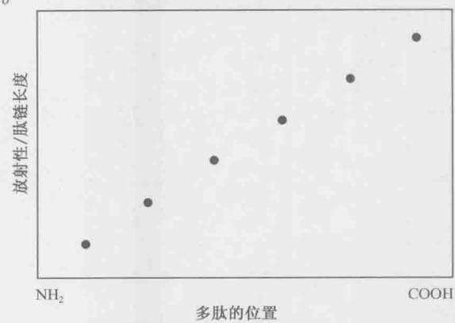  
图 2-19 掺入到延伸的多肽链的放射性标记。（a）脉冲标记后合成的多肽链中的放射性分布（表示为蓝色）。β 珠蛋白的胰蛋白酶切割位置以红色箭头表示。（b）掺入的放射性标记强度经多肽长度归一化后在整条链中的相对位置图。

(图 2-19b)。所以我们得出如下结论: 蛋白质的合成方向是从氨基端到羧基端, 换句话说, 在蛋白质合成过程中, 新的氨基酸是加到新生多肽链的羧基末端上。

## 起始和终止信号也由 DNA 编码

开始人们推测 mRNA 的翻译是从一端开始，读完整个 mRNA 信息之后结束。但实际上翻译的起始和终止都在 mRNA 的内部位置上，所以翻译的起始和终止信号肯定存在 DNA（及其 mRNA 产物）上。首先阐明的是终止信号，3 个密码子（UAA、UAG 和 UGA），即已知的无义密码子（nonsense codon），不编码任何。翻译的起始信号的编码方式较 G 既编码起始的甲硫氨酸，也编密码子前面有富含嘌呤核苷酸的核生物中，AUG 相对于 mRNA 始点。

一个氨基酸，作为翻译的终止信号（有时称为终止密码子）。翻译的起始信号的编码方式较复杂，所有多肽链均以甲硫氨酸开始，但是三联密码子AUG既编码起始的甲硫氨酸，也编码内部的甲硫氨酸。原核生物中，在编码多肽起始的AUG密码子前面有富含嘌呤核苷酸的区域，其作用是使mRNA结合到核糖体上（第15章）。在真核生物中，AUG相对于mRNA起始点的位置有关键作用，第一个AUG总是作为翻译的起始点。

## 基因组学时代

随着中心法则的阐明，到20世纪60年代中期，人们对蕴含在核苷酸序列内的遗传蓝图决定表型这一问题有了清晰认识，这意味着从DNA序列中可能揭示出对生物及其演化本质的深刻认识。近年来由于快速、自动化DNA测序方法的出现，几百种有机体的全基因组序列测定工作已经完成，甚至单个拷贝就达30亿碱基对的人类基因组序列及其包含的不少于20000个基因也已经阐明。序列的比较分析对于多种生物的基因组测序非常重要。通过对不同生物相似基因编码的氨基酸序列进行预测和比较，人们可以鉴别出重要的蛋白质区域。例如，在许多不同的生物中，负责核苷酸结合或直接催化核苷酸添加的DNA聚合酶的氨基酸序列是非常保守的。所以，鉴定在细菌而非真核细胞中对DNA聚合酶功能至关重要的氨基酸，只能通过细菌的基因组序列预测其

氨基酸序列。

比较不同的基因组也能了解不编码蛋白质的 DNA 序列。对鉴定控制基因表达、DNA 复制、染色体分离和重组的序列来说，进行基因组序列的比较会有很大帮助。因为这些调控序列更倾向于以较快的速度发生变化，这样的比较往往是在亲缘关系较近的物种中（如不同的细菌之间或人与其他灵长类之间）进行。对亲缘关系较近的物种进行比较具有重要的价值，这就促进了研究比较透彻的模式生物的基因组测序（如果蝇、酵母和多种灵长类动物）。

对同一生物不同个体的基因组进行比较，对鉴别疾病相关的突变具有潜在的价值。例如，为了鉴别疾病相关基因，最近建立了可以快速地对许多不同个体基因组片段进行比较的方法。最后，我们可以期待这一天的到来：通过基因组序列分析能够揭示人类复杂行为的起源，如语言的获得、动物身躯演化的多样性的机制等。

以下章节将为读者理解 DNA 如何作为模板、决定生物学复杂性打下坚实的基础。第 2 篇的章节会回顾与本书主题相关的、基本的化学知识和生物化学结构。第 2 篇的最后一章会介绍多种实验室常见技术，这些技术已广泛应用于生物结构和诸多问题的研究。第 3 篇是基因组的维持，前几个章节会叙述遗传物质的结构及其忠实复制，后面的几个章节会讲述遗传变异的产生和基因组损伤部分的修复过程。第 4 篇是基因组的表达，将描述 DNA 中的遗传指令是如何转变为蛋白质的；第 5 篇讲述产生机体复杂性（如胚胎发生）和物种多样性（如演化）的不同基因表达策略。第 5 篇的最后一章是系统生物学，讲述了一些跨学科的研究方法，以便对更为复杂的生物组织水平进行研究。最后的附录描述了几种常见的模式生物，它们是非常重要的实验系统，用于揭示不同物种间的一般生物模式。

## 小结

发现 DNA 是遗传物质可以追溯到 Griffith 的实验, 他的研究表明细菌的无毒菌株能被加热致死的有毒菌株中的物质遗传转化。随后 Avery、McCarty 和 MacLeod 证实此转化物质是 DNA。Hershey 和 Chase 用放射物质标记的噬菌体进行实验, 进一步证实 DNA 是遗传物质。在 Chargaff 定律及 Franklin 和 Wilkins 的 X 射线衍射研究的基础上, Watson 和 Crick 提出了 DNA 的双螺旋结构。在这个模型中, 两条多聚核苷酸链相互缠绕形成规则的双螺旋, 双螺旋的两条链通过碱基对之间的氢键连接。腺嘌呤总是与胸腺嘧啶配对, 鸟嘌呤总是与胞嘧啶配对。碱基对的存在说明两条链的序列不同但互补。这种互补的双链结构意味着一种复制机制, 即一条链可以作为模板合成其互补链。支持这一假说的证据, 一是 Meselson 和 Stahl 观察到的每一次 DNA 复制过程中双螺旋的两条链相互分离, 二是 Kornberg 发现了使用单链 DNA 作为模板合成其互补链的酶。

就像我们看到的，按照中心法则，遗传信息从 DNA 流向 RNA 再到蛋白质，这一传递过程分两步完成。首先 DNA 转录为 RNA 中间物（mRNA），然后再翻译成蛋白质，mRNA 的翻译需要有叫做 tRNA 的 RNA 适配子。遗传密码的关键特征是每一个三联密码被 tRNA 识别，tRNA 可以携带相应的氨基酸。在 64 个（4 × 4 × 4）可能的密码子中，

61 个用于编码构成各种蛋白质的 20 种氨基酸，另外 3 个用于提供终止信号。对遗传密码的认识使我们能从 DNA 序列预测蛋白质序列。快速 DNA 测序方法的出现使我们进入了新的基因组时代，很多生物有机体包括人类的全基因组序列正在完成序列比较，为鉴别基因组中的关键区域提供了有效方法，我们所指的关键区域不仅指编码重要的蛋白质元件，还有那些控制基因表达和基因组复制的调控区域。

## 参考文献

Brenner S., Jacob F., and Meselson M. 1961. An unstable intermediate carrying information from genes to ribosomes for protein synthesis. Nature 190: 576–581.

Brenner S., Stretton A.O.W., and Kaplan S. 1965. Genetic code: The nonsense triplets for chain termination and their suppression. Nature 206: 994–998.

Cairns J., Stent G.S., and Watson J.D., eds 1966. Phage and the origins of molecular biology. Cold Spring Harbor Laboratory, Cold Spring Harbor, New York.

Chargaff E. 1951. Structure and function of nucleic acids as cell constituents. Fed Proc 10: 654–659.

Cold Spring Harbor Symposia on Quantitative Biology. 1966. Vol. 31: The genetic code. Cold Spring Harbor Laboratory, Cold Spring Harbor, New York.

Crick F.H.C. 1955. On degenerate template and the adaptor hypothesis. A note for the RNA Tic Club, unpublished. Mentioned in Crick's 1957 discussion, pp. 25–26, in The structure of nucleic acids and their role in protein synthesis. Biochem Soc Symp no. 14, Cambridge University Press, Cambridge, England.

——. 1958. On protein synthesis. Symp. Soc. Exp. Biol. 12: 548–555.

——. 1963. The recent excitement in the coding problem. Prog Nucleic Acid Res. 1: 164–217.

——. 1988. What mad pursuit: A personal view of scientific discovery. Basic Books, New York.

Crick F.H.C. and Watson J.D. 1954. The complementary structure of deoxyribonucleic acid. Proc. Roy. Soc. A 223: 80–96.

Echols H. and Gross C.A., eds 2001. Operators and promoters: The story of molecular biology and its creators. University of California Press, Berkeley, California.

Franklin R.E. and Gosling R.G. 1953. Molecular configuration in sodium thymonuclease. Nature 171: 740–741.

Hershey A.D. and Chase M. 1952. Independent function of viral protein and nucleic acid on growth of bacteriophage. J. Gen. Physiol. 36: 39–56.

Hoagland M.B., Stephenson M.L., Scott J.F., Hecht L.I., and Zamecnik P.C. 1958. A soluble ribonucleic acid intermediate in protein synthesis. J. Biol. Chem. 231: 241–257.

Holley R.W., Apgar J., Everett G.A., Madison J.T., Marquisso M., Merrill S.H., Penswick J.R., and Zamir A. 1965. Structure of a ribonucleic acid. Science 147: 1462–1465.

Ingram V.M. 1957. Gene mutations in human hemoglobin: The chemical difference between normal and sickle cell hemoglobin. Nature 180:326–328.

Jacob F. and Monod J. 1961. Genetic regulatory mechanisms in the synthesis of proteins. J. Mol. Biol. 3: 318–356.

Judson H.F. 1996. The eighth day of creation, expanded edition. Cold Spring Harbor Laboratory Press. Cold Spring Harbor. New York.

Kornberg A. 1960. Biological synthesis of deoxyribonucleic acid. Science 131: 1503–1508.

Kornberg A. and Baker T.A. 1992. DNA replication. W.H. Freeman, New York.

McCarty M. 1985. The transforming principle: Discovering that genes are made of DNA. Norton, New York.

Meselson M. and Stahl F.W. 1958. The replication of DNA in Escherichia coli. Proc. Natl. Acad. Sci. 44: 671–682.

Nirenberg M.W. and Matthaei J.II. 1961. The dependence of cell-free protein synthesis in E. coli upon naturally occurring or synthetic polyribonucleotides. Proc. Natl. Acad. Sci. 47: 1588–1602.

Olby R. 1975. The path to the double helix. University of Washington Press, Seattle.

Portugal F.H. and Cohen J.S. 1980. A century of DNA: A history of the discovery of the structure and function of the genetic substance. MIT Press, Cambridge, Massachusetts.

Sarabhai A.S., Stretton A.O.W., Brenner S., and Bolte A. 1964. Colincarity of the gene with the polypeptide chain. Nature 201: 13–17.

Stent G.S. and Calendar R. 1978. Molecular genetics: An introductory narrative, 2nd ed. Freeman, San Francisco.

Volkin E. and Astrachan L. 1956. Phosphorus incorporation in E. coli ribonucleic acid after infection with bacteriophage T2. Virology 2:146–161.

Watson J.D. 1963. Involvement of RNA in synthesis of proteins. Science 140: 17–26.

——. 1968. The double helix, Athenecum, New York.

——. 1980. The double helix: A Norton critical edition (ed. G.S. Stent). Norton, New York.

——, 2000. A passion for DNA: Genes, genomes and society. Cold Spring Harbor Laboratory Press, Cold Spring Harbor, New York.

——. 2002. Genes, girls, and Gamow: After the double helix. Knopf, New York.

Watson J.D. and Crick F.H.C. 1953a. Genetical implications of the structure of deoxyribonucleic acid. Nature 171: 964–967.

——. 1953b. Molecular structure of nucleic acids; a structure for deoxyribose nucleic acid. Nature 171: 737–738.

Wilkins M.I.F., Stokes A.R., and Wilson I.R. 1953. Molecular structure of deoxypentose nucleic acid. Nature 171: 738–740.

Yanofsky C., Carlton B.C., Guest J.R., Helinski D.R., and Henning U. 1964. On the colinearity of gene structure and protein structure. Proc. Natl. Acad. Sci. 51: 266–272.

## 习题

偶数习题的答案请参见附录2

习题 1 Avery、MacLeod 及 McCarty 推断 DNA 携带有遗传信息, 能够将非致病性 R(粗糙)肺炎链球菌转化为致病性 S(平滑)肺炎链球菌。请阐述分别用脱氧核糖核酸酶、核糖核酸酶以及蛋白水解酶处理活性纯化组分背后的实验逻辑。

习题 2 请阐述在 1952 年进行的 Hershey-Chase 实验中（图 2-3），蛋白质外壳用 ${}^{35}$ S 标记而核心区 DNA 用 ${}^{32}$ P 标记的原因。对调这两种标记是否可行（核心区 DNA 用 ${}^{35}$ S 标记而蛋白质外壳用 ${}^{32}$ P 标记）？

习题3

A. 考虑框 2-1 中 Chargaff 的数据，请阐述如何借助人的数据排除双链 DNA 中胸腺嘧啶与胞嘧啶配对的可能性。

B. 如果 Chargaff 仅仅收集了大肠杆菌 K2 菌株的数据，你还能很确定地排除双链 DNA 中胸腺嘧啶与胞嘧啶配对的可能性吗？请阐述理由。

习题 4 请描述碱基、核苷以及核苷酸之间的结构差异（适用于所有碱基）。

习题 5 请回顾表 2-1 中的数据, 并阐述来自产气杆菌的实验数据如何支持 DNA 聚合酶利用一条模板来合成特定序列 DNA 的假说。

习题6

A. 假设细菌基因组复制时采用的是分散复制模型，使用 Meselson 和 Stahl 当初相同的实验装置（详见图 2-9、图 2-10），请预测进行一轮复制后观察到的条带分布情况（重链、轻链及杂合链）。

B. 假设细菌基因组复制时采用的是保留复制模型，观察到的情况又会是怎样呢？

C. 在 Meselson 和 Stahl 的实验中, 需要进行多少轮的复制才能有效区分三种复制模型(分散、保留及半保留)。

习题 7 请回顾框 2-2 中的数据, 并阐述 Vernon Ingram 如何利用 S 型等位基因与镰刀状细胞贫血症来为基因编码蛋白质这一理论提供证据。

习题 8 请描述几个 RNA 的常规特征来证明 RNA 是从 DNA 到蛋白质氨基酸序列的遗传信息载体。

习题 9 请列出 rRNA 不决定蛋白质合成中氨基酸序列的理由。

习题 10 请阐述形成多聚核糖体后如何有利于蛋白质表达。

习题 11 利用表 2-3 中给出的遗传密码，请写出利用无细胞的翻译系统并以 AGUAGU 为模板生成的氨基酸名字。

习题 12 请写出中心法则的具体步骤，并列出每一步在细胞中发生的位置。对于每一个箭头，请写出其代表的过程名称和完成该步所需酶或复合体的名字。请描述 mRNA、tRNA 及 rRNA 在哪一步发挥作用并简述其发挥的作用。

## 习题13

A. 回顾图 2-19 所描述的实验和数据。就实验步骤来讲，请解释为什么在所有分离的全长肽段中每肽段长度的放射性强度都不一样。

B. 如果没有用胰蛋白酶进行处理，图中呈现的数据会有什么变化？

C. 如果蛋白质的合成方向是从羧基端到氨基端，图中呈现的数据又会有什么变化？并请阐述你的理由。

习题 14 Tissières 和 Hopkins 研究了 DNA 和蛋白合成之间的关系。在一项实验中，他们测量了在存在脱氧核糖核酸酶（DNase）的情况下，掺入到蛋白质中的标记氨基酸含量。他们将大肠杆菌粗提物与不同浓度的 DNase 孵育 10min，之后加入蛋白质合成反应所需的成分，包括 ${}^{14}$ C 标记的丙氨酸。掺入的放射性强度用 cpm（放射性/分钟）表示，详见下表。

<table><tr><td>DNase (μg/ml)</td><td>0</td><td>1</td><td>5</td><td>10</td><td>20</td><td>50</td></tr><tr><td>cpm</td><td>813</td><td>334</td><td>372</td><td>364</td><td>386</td><td>426</td></tr><tr><td>% 抑制</td><td></td><td>59</td><td>54</td><td>55</td><td>53</td><td>48</td></tr></table>

A. DNase 的加入对蛋白合成有什么影响?

B. 根据你了解到的中心法则相关知识，请解释为什么加入 DNase 后对氨基酸合成有影响。

数据来自 Tissières 和 Hopkins（1961. Proc. Natl. Acad. Sci. 47: 2015–2023）。

习题 15 Audrey Stevens 测量了掺入到 RNA 中的 ${}^{32}$ P-ADP 及 ${}^{32}$ P-ATP 的含量。他将不同的核苷酸混合物加到大肠杆菌提取物（以促进 RNA 合成）中，每个反应加入的成分列于下表。掺入到 RNA 中的放射性强度用 cpm（放射性/分钟）表示。

<table><tr><td>加入反应体系的化合物</td><td>掺入的放射性强度(cpm)</td></tr><tr><td>ATP</td><td>790</td></tr><tr><td>ATP, UTP, CTP, GTP</td><td>3920</td></tr><tr><td>ADP</td><td>690</td></tr><tr><td>ADP, UDP, CDP, GDP</td><td>1800</td></tr></table>

A. 基于这章的知识以及给出的数据，你认为大肠杆菌的提取物含有哪种酶？
B. 相比其他的反应，第二个反应拥有最大的 cpm 值，请问为什么？
数据来自 Stevens（1960. Biochem. Biophys. Res. Commun. 3: 92–96）。

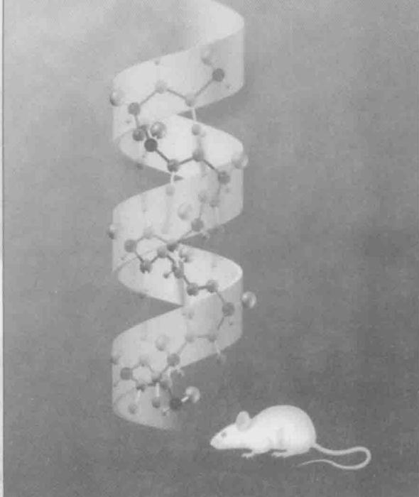

## 第2篇 大分子的结构和 研究

本篇概要

\- 第3章 弱化学键和强化学键的重要性

\- 第4章 DNA的结构

\- 第5章 RNA的结构和多功能性

\- 第6章 蛋白质的结构

\- 第7章 分子生物学技术

第 2 篇主要致力于大分子结构方面的研究，包括构成这些结构的化学基础，以及研究这些结构的方法。

第 3 章讲述了一些基本化学知识,主要包括化学键的种类(弱化学键和强化学键)和化学键在生物学中的作用。我们的讨论从弱的相互作用开始，如氢键、范德华力和疏水键。这些化学键介导了大分子之间的大部分相互作用，如蛋白质与蛋白质之间的相互作用、蛋白质与 DNA 之间的相互作用等。这些弱的化学键对细胞内大部分生理过程的激活及调节至关重要，例如，酶通过弱的相互作用同其底物结合，转录调节因子通过同样的化学键同 DNA 上的特定位点结合调控基因表达。

单独的弱相互作用实际上非常微弱，因此在形成之后很快就会分开。相互作用的这种可逆性具有非常重要的生物学意义。在细胞内，分子之间的相互作用必须是动态的（可逆的），否则整个系统就会停滞。同时，一些相互作用至少在短期内是稳定的。为了适应这种表面上相互冲突的需求，多种弱相互作用需要结合在一起。

然后我们讨论了强化学键，它们把组成每个大分子的成分联系在一起。因此，按特定顺序排列的氨基酸通过强化学键连接在一起组成了蛋白质，碱基通过类似的方式组成了 DNA（组成氨基酸和碱基的原子也是通过强化学键连接在一起的）。

第 4 章详细地从原子水平讲述了 DNA 的结构，包括从碱基和骨架的化学组成到碱基配对作用及其他维持双链的作用。因此，我们可以了解弱化学键和强化学键在赋予分子相应特性从而定义其功能方面的重要性。DNA 的拓扑结构往往是受到一定约束的，第 4 章结合可改变拓扑结构的酶对这种约束的生物学意义进行了讨论。

第 5 章对 RNA 的结构进行了探索。尽管同 DNA 的结构相似，但 RNA 拥有自己与众不同的结构特点和性质，包括催化多个胞内生理过程的非凡能力，这一能力我们会在后面的章节进行介绍。RNA 这种既含有编码信息（像 DNA）又具有酶活性的特性使它在生命的早期演化中扮演了重要角色，我们会在第 17 章详细讨论。

在第 6 章，我们将会看到强化学键和弱化学键是如何一起决定蛋白质不同三维结构（同时含有特定的功能）的。因此，就像介导大分子间的相互作用一样，弱化学键也可以介导如特定蛋白质不相邻氨基酸之间的相互作用。通过这些相互作用，它们决定了氨基酸的初级结构如何折叠形成三维结构。

在第 6 章中, 我们还讨论了蛋白质之间, 以及蛋白质同 DNA 或 RNA 之间是如何发生相互作用的。蛋白质同核酸之间的相互作用是大多数生理过程或调控的关键, 因此我们会在本书中反复进行讨论。我们还会讨论如何调节特定蛋白质的功能。一种方法是通过改变蛋白质的形状，该机制称为变构调节。特定的蛋白质处于某种构象时，会呈现出一种特定的酶活性，或者可以结合特定的目标分子。但是处于另一种构象时，可能就会失去这种能力。这种形状上的变化可以通过结合另一个蛋白质或者小分子（如糖）而触发。在其他事例中，变构效应可被共价修饰所诱导，例如，结合一个或多个磷酸基团可以触发蛋白质形状的改变。蛋白质还可以被另外一种方式所控制：同目标分子发生相互作用。通过这种方式，特定的蛋白质可以被募集在一起与不同的蛋白质发生相互作用以回应不同的信号。

第 2 篇的最后一章是第 7 章，该章节主要对分子生物学的基础技术进行了描述。这些技术广泛应用于核酸和蛋白质研究。另外一些针对特定问题的特殊技术和方法会在单独的章节进行介绍。第 7 章收集的这些技术和方法都是分子生物学研究中的核心技术与方法，应用十分广泛。

## 冷泉港实验室资料库中的照片

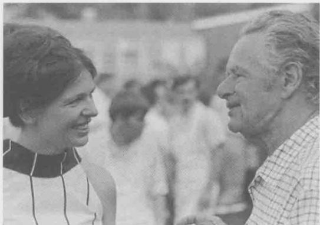  
Joan Steitz 和 Fritz Lipmann，1969 年的蛋白质合成机制学术会议。Steitz 的研究集中在 RNA 分子的结构和功能，尤其是与 RNA 剪接有关的工作（第 14 章），她也是本书第四版的作者之一；Lipmann 证明了 ATP 中的高能磷酸基团是驱动许多生物反应的能量来源（第 3 章）。因为这一工作，他与 Hans Krebs 分享了 1953 年的诺贝尔生理学或医学奖。

  
Stephen Harrison 和 Don Wiley，1999 年免疫系统中信号和基因表达研讨会。多年以来这两位结构生物学家共用哈佛的同一间实验室，研究方向相互独立，偶尔重叠。他们都对病毒性感染很有兴趣。Harrison 的研究团队最先确定一个完好无损的病毒粒子的原子结构；Wiley 因在流感血凝素和 MHC 复合物的研究而闻名。Harrison 为本书这一版撰写了关于蛋白质结构的新章节。在他与 Mark Ptashne 的合作中确定了第一个序列特异的蛋白质-DNA 复合物的结构。

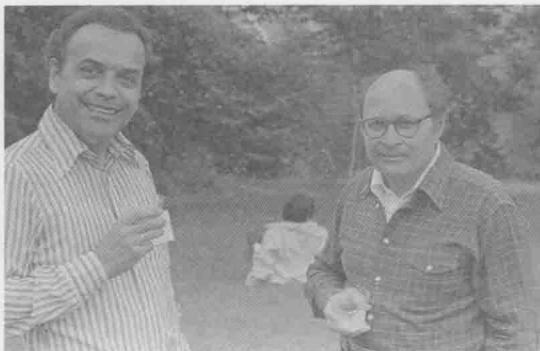  
Werner Arber 和 Daniel Nathans, 1978 年 DNA 复制和重组研讨会。由于发现了限制性内切核酸酶及其在 DNA 分子分析中的应用（第 7 章），他们与 Hamilton Smith 一起荣获了 1978 年的诺贝尔生理学或医学奖。这一重大发现对 20 世纪 70 年代早期重组 DNA 技术的建立起了关键作用。

  
Kary Mullis, 1986 年人类分子生物学研讨会。Mullis（右）发明了聚合酶链反应(Polymerase Chain Reaction, PCR)——分子生物学核心技术之一（第 7 章），因此他获得了 1993 年的诺贝尔化学奖。与他合照的 Maxine Singer（中）是一位以编写了许多遗传学方面书籍（经常与 Paul Berg 合著）而闻名的作家和管理者，于 1992 年获得了美国国家科学勋章。图中左侧的是 Georgii Georgiev——俄罗斯发育生物期刊的创始编辑。

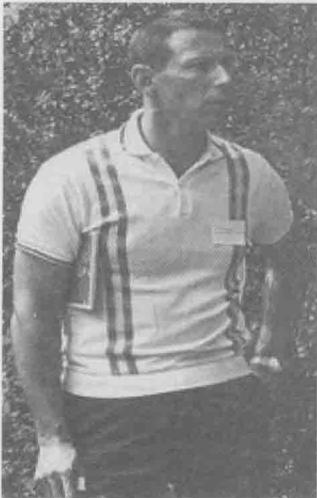  
Paul Berg, 1963 年大分子的合成和结构讨论会。Berg 是体外构建重组 DNA 分子的先驱者，是 1980 年诺贝尔化学奖获得者之一。

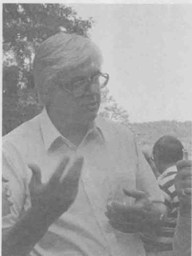  
Hamilton O. Smith, 1984 年 DNA 水平重组讨论会。Smith 因为发现限制性核酸内切酶 II 并揭示其特性（第 7 章），与 Werner Arber 和 Daniel Nathans 共同获得 1978 年的诺贝尔生理学或医学奖。随后，他与 Craig Venter 合作，并参与了从第一个微生物基因组（流感嗜血杆菌）测序到创建合成基因组（第 17 章）的一系列课题。

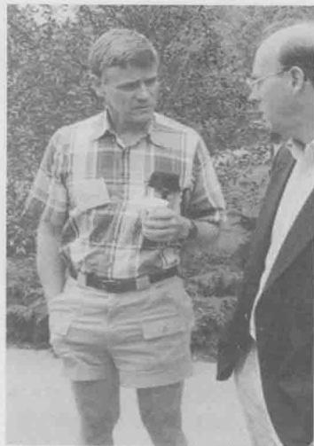  
Leroy Hood 和 J.Craig Venter, 1990 年基因组作图和测序会议。Hood 发明了自动测序技术，并在 20 世纪 80 年代中期制造了第一台仪器。Venter 最早使用并改进了这种自动测序仪，得益最大。依靠对原始数据的拼接，这种仪器可实现鸟枪法测序策略，由此极大地加快了全基因组的测序工作，其中包括人类基因组测序（第 7 章）。


Albert Keston, Sidney Udenfriend 和 Frederick Sanger, 1949 年氨基酸和蛋白质研讨会。Keston 发明了检测葡萄糖的试纸，Udenfriend 进行了抗疟疾药物的筛选和实验。Sanger 是唯一两次获得诺贝尔化学奖的人。他第一次获奖是在 1958 年，当时他发明了一种测定蛋白质氨基酸序列的方法；22 年后他第二次获得了诺贝尔化学奖，这一次获奖是因为他发明了 DNA 测序方法，现在人们进行 DNA 测序所使用的几乎都是这种方法，包括用来进行全基因组测序的自动测序仪所使用的测序方法（第 7 章）。“蛋白质具有特定序列”的发现不仅是显著的技术成就，而且首次揭示了蛋白质可能也有特定的结构。


Francis S. Collins 和 Maynard V. Olson，1992 年基因组作图和测序会议。Collins 是最早的“基因狩猎者”之一，他在 1989 年就发现了广为关注的囊性纤维化基因。1993 年，他接替 James Watson 成为国家人类基因组研究中心（National Center for Human Genome Research, National Human Genome Research Institute 的前身）的主任，后任国家人类基因组研究所主任至今。在这幅照片上，他正站在关于酵母人工染色体（Yeast Artificial Chromosomes, YAC）的展板前听 Olson 的介绍，几年前 Olson 发明了这种 YAC 载体，使克隆的片段长度增加了 10 倍（第 7 章）。

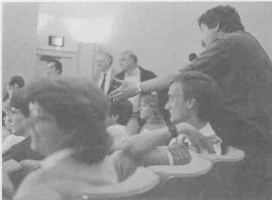

Eric S. Lander(发言人)1986年人类分子生物学大会。Lander后来成为公众资助的人类基因组计划（Human Genome Project）的领军人物，他也是2001年发表的基因组序列文章的第一作者（第7章）。就像在前面关于Gilbert和Botstein的照片一样，Lander正在1986年的辩论中就是否有必要进行人类基因组测序发表他的观点。在他旁边是David Page，看上去若有所思，他的工作主要围绕Y染色体的结构、功能和演化，而前排的Nancy Hopkins（一名发育生物学家，也是本书第四版的作者之一）和后排的James Watson则听得津津有味。

  
Walter Gilbert 和 David Botstein，1986 年人类分子生物学研讨会。Gilbert 发明了化学法 DNA 测序。图中他正在与 Botstein 进行人类基因组是否切实可行的历史性争论。在对噬菌体多年研究的基础上，Botstein 对使用酵母 S. cerevisiae 作为分子生物学研究的模式真核生物的工作做出了重大贡献；他也是基因组学领域发展早期的一个关键人物（第 7 章和附录 1）。

## 第3章

## 弱化学键和强化学键的重要性

本章概要
化学键的特征
自由能的概念
生物体系中的弱化学键
高能键
供能分子是热不稳定的
酶在生物反应中降低反应的活化能
生物分子中的自由能
生物合成反应中的高能键
基团转移反应中前体的活化

本书重点描述的,也是大多数分子生物学家所关注的,是蛋白质和核酸。它们分别由氨基酸和核苷酸构成,并且两者都是由于共价键的参与而组成了多肽(蛋白质)和多聚核苷酸(核糖核酸)。共价键是一种强的、稳定的化学键,在生物体系中一般不会自发断裂。但是,弱一些的化学键也同样存在,实际上,它们对生物体是至关重要的,这部分是由于它们能够在细胞内生理环境下形成或断裂。弱化学键介导了酶与其底物的相互作用,更重要的一点是,弱化学键介导了大分子之间的相互作用(将在后面几章中讨论)。例如,蛋白质与DNA或RNA、一种蛋白质与另一种蛋白质之间的相互作用。然而,同等重要的是,弱化学键介导了同一大分子不同部位之间的相互作用,并由此决定了这些分子的形状及其生物学功能。因此,尽管蛋白质是由许多共价连接的氨基酸组

成的线性单链，但是其形状和功能是由它所形成的稳定的三维结构决定。即使是在蛋白质一级序列中不相邻的两个氨基酸之间也存在弱相互作用，这些各自独立的弱相互作用的总和最终决定了蛋白质的形状。同样，正是这些弱的非共价键使 DNA 的两条链聚合在一起形成双螺旋结构。

本章第一部分将要讨论化学键的本质和自由能的概念，即化学键形成过程中所释放（或改变）的能量。然后我们重点讨论对所有生物大分子发挥正确功能起着至关重要作用的弱化学键的本质。我们将着重介绍弱化学键何以拥有其特性。在本章的最后部分，我们会讨论高能键、肽键及磷酸二酯键的热动力学。

## 化学键的特征

化学键（chemical bond）是一种将原子联系在一起的吸引力。有限数量原子的集合体称为分子（molecule）。起初，人们认为在分子中只有共价键将原子联系在一起；现在，我们已经知道弱吸引力在许多大分子的联系中起重要作用。例如，一些弱化学键的联合作用将血红素的4条多肽链联系起来。即使弱相互作用相当弱，当其单独存在时并不能有效连接两个原子，习惯上还是被称为化学键。

化学键有几个共同特征，一个显而易见的特征就是强度。在生理温度下，强化学键几乎从不断裂，这就是为什么共价键连接的原子总是属于同一个分子；弱化学键则比较容易断裂，单个存在时只能短暂维持。只有当众多弱化学键组成有序的集合时，它们才能存在较长时间。化学键的强度与它的键长有关，所以由强化学键连接的两个原子之间的距离通常比由弱化学键连接的两个原子之间的距离短。例如，构成氢分子（H:H）的两个共价连接氢原子相距0.74Å，而由范德华力连接的两个同样的氢原子则相距1.2Å。

另一个重要的特征是原子能形成的最大键数。一个原子能够形成的共价键的数目称为原子价（valence）。例如，氧的原子价为2，即它不能形成两个以上的共价键。而对于范德华力，由于其限制因素纯粹是空间效应，因此有更大可变性，可能成键的数目仅由同时能够接触到的相邻原子的数目决定。氢键的形成有更严格的限制，一个共价连接的氢原子通常只能参与一个氢键的形成，而氧原子在少数情况下可以形成两个以上的氢键。

由同一个原子起始的两个化学键之间的角度称为键角（bond angle）。两个特定共价键之间的键角总是一致的。例如，一个碳原子拥有4个共价键，它们构成正四面体（键角= $109^{\circ}$ ）；相反，弱化学键的键角具有更大的可变性。

化学键的允许旋转自由度（freedom of rotation）也是各不相同。单个共价键允许连接的原子自由旋转（图3-1），而二键和三键就有着严格限制。具有部分双键特性的共价键，如肽键，也有着严格限制。因此，肽键连接起来的羰基（C=O）和亚氨基（N=C）基团必须处在同一平面（图3-2）。另一方面，更弱的离子键对连接的原子的相对方向没有限制。

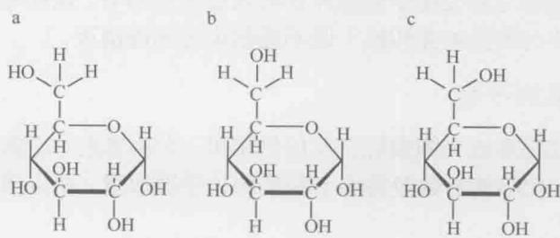  
图 3-1 葡萄糖中 C5-C6 键的旋转。这个碳-碳键是一个单键，所以 a、b、c 所列 3 种结构都可能存在。

  
图 3-2 肽键的平面结构。上图是某延伸多肽链的片段。由于肽键的双键特性（中间部分），旋转是不允许的，所有灰色区域的原子必须处于同一平面。然而，围绕其余两个共价键的旋转是可能的，这导致了多肽的不同结构。（来源：Pauling L. 1960. The nature of the chemical bond and the structure of molecules and crystals: An introduction to modern structure chemistry, 3rd edition, p. 495 Copyright ©1960 Cornell University.）

## 化学键的量子机制解释

构成化学键的力，不论强弱，其本质对化学家来说始终是个谜，直到20世纪20年代，原子的量子理论（量子机制）建立，关于化学键形成的众多的经验主义法则才第一次有了坚实的理论基础。人们认识到所有的化学键，不论强弱，均基于电荷力。量子机制将共价键解释为共用电子，也为弱化学键的形成提供了解释。

## 化学键的形成涉及能量形式的变化

两个原子之间化学键的自发形成过程总是包括未成键原子部分内能的释放和向另一能态的转变。键越强，成键过程中释放的能量越多。原子 A 和 B 的成键过程可描述为：

$$
\mathrm{A} + \mathrm{B} \rightarrow \mathrm{AB} + \text { 能量 } \quad [ \text { 方程   3 - 1 } ]
$$

在这里，AB 代表成键集合体，A 与 B 的反应速率直接与两者的碰撞概率成正比。卡

路里（calorie）经常用来作为衡量能量的单位，1 cal 是 1 g 水的温度从 14.5℃ 提高到 15.5℃ 所需的能量。由于 1 mol 化学键的打断通常会释放上千卡的能量，因此化学反应中大部分的能量变化用千卡每摩尔表示（kcal/mol）。

然而，由化学键连接的原子不会永久结合在一起，因为存在打断化学键的力。到目前为止，其中最重要的一种来自热能。高速运动的分子或原子之间的碰撞能够打断化学键，在碰撞过程中，一个运动分子碰到两个连接着的原子，失去部分动能，同时会将它们分开。分子运动越快（温度越高），在碰撞过程中打断化学键的可能性越大。因此，提高分子所处的温度，其化学键的稳定性就下降。化学键的打断一般表示如下：

$$
\mathrm{AB} + \text { 能量 } \rightarrow \mathrm{A} + \mathrm{B}\tag{[方程 3-2]}
$$

打断化学键所需的能量与形成化学键时释放的能量正好相等。这种等量遵循热力学第一定律，即能量（除非与质量相互转换）既不能创生也不能消灭。

## 化学键形成与断裂的平衡

每一个化学键都是形成与断裂综合反应的结果。当两者在一个密闭体系中达到平衡时，单位时间产生的化学键的数量将等于断裂的化学键数量。所以成键原子的比率可以用下面的方程描述：

$$
K _ {\mathrm{eq}} = \operatorname{conc} ^ {\mathrm{AB}} / \left(\operatorname{conc} ^ {\mathrm{A}} \times \operatorname{conc} ^ {\mathrm{B}}\right)\tag{[方程 3-3]}
$$

式中， $K_{eq}$ 表示平衡常数（equilibrium constant），conc $^{A}$ 、conc $^{B}$ 和 conc $^{AB}$ 分别表示 A、B 和

AB 的含量百分比，以 mol/L 为单位。不管我们以 A 和 B 起始，还是以分子 AB 或分子 AB 和 A、B 的混合物起始，达到平衡时，A、B 和 AB 的比率都会达到由 $K_{eq}$ 给出的浓度。

## 自由能的概念

在成键原子的比率趋向平衡浓度（equilibrium concentration）的过程中，能量的形式在不断变化。从生物学的角度来说，表示这种能量变化最有效的方法就是通过物理化学家的自由能（free energy）的概念来描述。这一概念用G表示，以纪念19世纪伟大的物理学家吉布斯（Josiah Gibbs）。本书不会给出严格的自由能的定义，也不会给出自由能与其他能量形式的区别之处。因此，读者必须阅读有关热力学第二定律的化学类参考书。在此我们只能说，自由能是一种能够做功的能量。

热力学第二定律告诉我们，在自发的反应中自由能总是下降的（ $\Delta G$ 是负值）。然而，当反应达到平衡时，自由能将不再变化（ $\Delta G=0$ ）。密闭体系的平衡态是自由能最低的状态。

在反应趋近平衡态的过程中失去的自由能，或者转化为热，或者使熵值增加。在此，我们不会试图定义熵，只能说熵是衡量混乱度的标准：混乱度越高，熵值越大。熵的存在意味着许多自发的化学反应（伴随有自由能的净下降）并不需要提供激发热能。例如，当氯化钠（NaCl）溶于水时，体系吸热而不是放热。虽然如此，自由能仍然净下降，因为钠离子和氯离子从固体溶入水的过程增加了体系的混乱度。

## $K_{\mathrm{eq}}$ 与 $\Delta G$ 呈指数关系

很明显，化学键越强，相应地伴随其释放的自由能（ $\Delta G$ ）越多，以成键状态存在的原子的比率越大。这一常识以物理化学方程定量表示如下：

$$
\varDelta G = - R T (\ln K _ {\mathrm{eq}}) \text {或} K _ {\mathrm{eq}} = \mathrm{e} ^ {- \varDelta G / \mathrm{RT}}\tag{[方程 3-4]}
$$

式中，R 是气体常数，T 是绝对温度，ln 是以 e 为底数的对数（以 $K_{eq}$ 为幂）， $K_{eq}$ 是平衡常数，e = 2.718。

将 R 值（1.987 cal/deg·mol）和 T（当温度为 $25^{\circ}$ C 时等于 298）代入公式中发现，如果所有的反应物以摩尔浓度表示，低至 2 kcal/mol 的 $\Delta G$ 能够使一个成键反应进行完全（表 3-1）。

表 3-1 ${25}^{ \circ  }\mathrm{C}$ 时平衡常数与 ${\Delta G}$ 的关系

<table><tr><td>平衡常数( $K_{eq}$ )</td><td>自由能 $\Delta G$ (kcal/mol)</td></tr><tr><td>0.001</td><td>4.089</td></tr><tr><td>0.01</td><td>2.726</td></tr><tr><td>0.1</td><td>1.363</td></tr><tr><td>1.0</td><td>0</td></tr><tr><td>10.0</td><td>-1.363</td></tr><tr><td>100.0</td><td>-2.726</td></tr><tr><td>1000.0</td><td>-4.089</td></tr></table>

## 共价键是很强的

伴随自由原子，如氢或氧，共价键形成的 $\Delta G$ 以符号表示是极大的负值，通常有-50\~-110 kcal/mol。方程3-4告诉我们，成键反应的 $K_{\mathrm{eq}}$ 会相当大，所以保持未成键状态的氢原子或氧原子的比率将会极低。如果我们有 $1\mathrm{mol / L}$ 的反应原子，且 $\Delta G$ 为-100 kcal/mol，当反应达到平衡时每 $10^{40}$ 个原子中仅会有一个保持未成键状态。

## 生物体系中的弱化学键

范德华力、疏水键、氢键和离子键是生物体系中几种重要的弱化学键。我们将发现，有时氢键和离子键之间的区别并不那么严格。

## 弱化学键具有 1\~7 kcal/mol 的能量

范德华力是最弱的化学键，它的能量（1～2 kcal/mol）仅仅比热运动的动能稍大。氢键和离子键的能量为3～7 kcal/mol。

在溶液体系中，几乎所有分子都与其邻近原子建立一些弱化学键。任何分子都有形成范德华力的能力，而氢键或离子键只能在带有净电荷（离子）或电荷分布不均匀的分子之间形成。某些分子拥有形成多种弱化学键的能力。然而考虑到能量因素，我们知道分子总是更倾向于形成较强的化学键。

## 生理温度下弱化学键不断形成和断裂

最强的弱化学键的能量仅是 $25^{\circ}$ C 时（热）运动的平均动能（0.6 kcal/mol）的 10 倍左右。由于热运动的动能具有明显的扩散性，在生理温度下具有许多这样的分子，它们拥有足够的动能来打断最强的弱化学键。

极性与非极性分子的区别

  
图 3-3 水分子的结构。

所有形式的弱相互作用都是基于电荷间的吸引力。电荷间的分离可能是永久的，也可能是暂时的，这取决于对象原子。例如，氧分子（O：O）的两个氧原子间具有对称的电荷分布，所以两个原子都不带电荷；相反，水分子（H：O：H）的成键电子不是平衡共享的，因此具有不对称的电荷分布（图3-3）。这些成键电子与氧原子更牢固地结合，导致氧原子携带一定的负电荷，而两个氢原子携带相等的正电荷，正电荷的中心在负电荷中心的另一侧。分离的正负电荷的合力被称为电荷偶极矩（dipole moment）。电子的非平均共用反映了成键原子对电子的不同吸引力。具有获取电子倾向的原子称为负电性（electronegative）原子；具有失去电子倾向的原子称为正电性（electropositive）原子。

具有偶极矩的分子（如 $H_{2}O$ ）被称为极性分子（polar molecule）；没有有效偶极矩的分子被称为非极性分子（nonpolar molecule）。例如，在甲烷（ $CH_{4}$ ）中碳原子和氢原子对它们共用的电子对具有相似的吸引力，所以任何一方都不带明显电荷。

一个分子的电荷分布能够被其周围存在的其他分子所影响，当后者是极性分子时影响尤其明显。这种影响能够使非极性分子具有轻微的极性特性。如果后者没有极性，它的存在通过电荷分布波动仍然能够改变非极性分子。但是，这种削弱的影响所产生的电荷分离要远远弱于极性分子，导致极低的反应能量和弱化学键的自发生成。

## 范德华力

范德华力（van der Waals bonding）来源于两个相距足够近的原子之间的非特异吸引力。它产生的基础不是存在永久的电荷分离，而是分子靠近所引起的电荷轻微波动。范德华力作用于所有类型的分子，不论是极性分子还是非极性分子。由于键能与键长的6次方成反比，因此，范德华力受相互作用的分子之间的距离的影响极大（图3-4）。

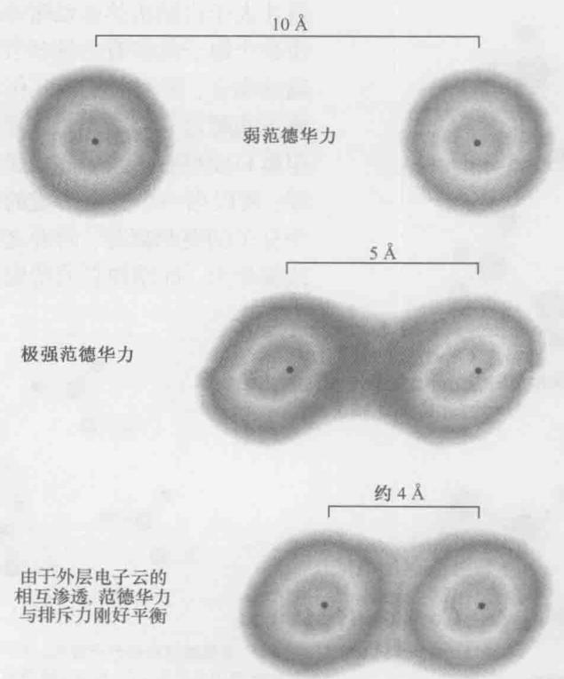  
图 3-4 范德华力随距离变化的改变。本图中所示原子为稀有惰性气体氩原子。（来源：Adapted from Pauling L. 1953, General chemistry, 2nd. edition, p. 322. Copyright 1953 by W. H. Freeman. Used with permission.）

当原子间距离更短时，更强的范德华排斥力同样存在，这种排斥源于所涉及原子的外电子层的重叠。对每种原子，范德华吸引力和排斥力会在某一特定距离达到平衡，这个距离即所谓的范德华半径（van der Waals radius）（表3-2和图3-5）。随着原子大小的增加，相距距离为范德华半径的两个原子间的范德华力的能量增大。对普通原子，其能量大约为1 kcal/mol，仅比室温下的分子平均热能（0.6kcal/mol）略大。

表 3-2 生物分子中原子的范德华半径

<table><tr><td>原子</td><td>范德华半径/Å</td></tr><tr><td>H</td><td>1.2</td></tr><tr><td>N</td><td>1.6</td></tr><tr><td>O</td><td>1.4</td></tr><tr><td>P</td><td>1.9</td></tr><tr><td>S</td><td>1.85</td></tr><tr><td>CH3基团</td><td>2.0</td></tr><tr><td>芳香族分子的半厚度</td><td>1.7</td></tr></table>

这意味着在生理温度下，只有在某个分子与另一分子的几个原子之间成键时，范德华力才是有效的成键力。只有这时，反应的能量才大于由随机热运动带来的分离趋势。为了使数个原子能够有效地相互作用，分子必须精确地吻合，因为两个相互作用的原子之间的距离不能超过它们的范德华半径太多（图3-6）。距离只要稍有扩大，键的强度就会迅速趋向于零。所以当一个分子形成的凹穴正好配合另一个分子的突起部分，两者之间就能形成最强的范德华力，抗原和它的特定抗体就是一个最好的例子（图 3-7）。在这种情况下，键能有时能够达到 20～30 kcal/mol，因此，抗原-抗体复合物极少分离。范德华力不是极性分子的主要成键模式，因为这些分子通过形成其他形式的化学键能够处在更低的能态（失去更多自由能）。

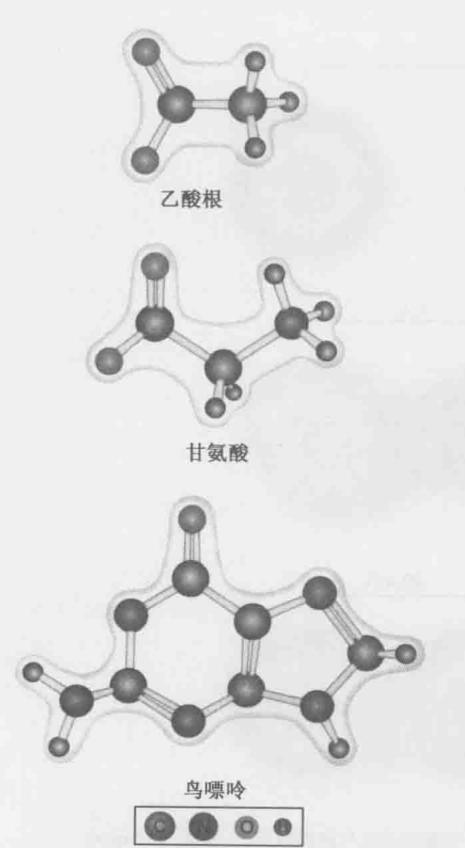  
图 3-5 几种保持范德华半径的分子。原子分别以紫色、蓝色和橙色表示。

  
图 3-6 甘氨酸结晶的分子排列。分子的空间结构是由其组成原子的范德华半径决定的，N-HO 键例外，氢键的存在使它缩短了。（来源：Adapted, with permission, from Pauling L. 1960. The nature of the chemical bond and the structure of molecules and crystals: An introduction to modern structure chemistry, 3rd ed., p. 262. ©1960 Cornell University.）

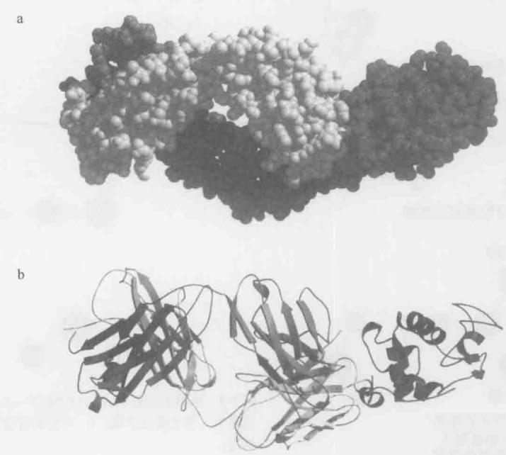  
图 3-7 抗原-抗体反应。所示结构为 Fab D1.3 和溶菌酶（紫色）所形成的复合物，a 为空间实体模型，b 为片段折叠模型。（Fischmann T. O., Bentley G. A., Bhat T. N., Boulot G., Mariuzza R. A., Phillips S. E., Tello D., and Polijak R. J. 1991 J. Biol. Chem 266: 12915.）

## 氢键

氢键（hydrogen bond）形成于一个带部分正电的共价键供体氢原子和一个带部分负电的共价键受体原子之间（图 3-8）。例如，氨基 $\left(-NH_{2}\right)$ 的氢原子被带负电的酮基 $(-C=O)$ 的氧原子吸引。有时，形成氢键的原子属于某个带一个单位电荷的基团（如 $NH_{3}^{+}$ 或 $COO^{-}$ ）；有时，供体氢原子和负电性受体原子都带不足一个单位电荷。

与氧原子（O-H）或氮原子（N-H）共价连接的氢原子形成了生物学上最重要的氢键。而且，氧原子和氮原子也是常见的负电性受体原子。表3-3列出了一些最重要的氢键。如果不考虑环境中的水分子，氢键键能介于3\~7 kcal/mol，受体原子与供体原子间的电荷差越大，键越强。氢键虽然弱于共价键，却明显强于范德华力。因此，氢键将使两个原子间的距离小于范德华半径，但不会小于由共价键连接的两个原子间的距离。

与范德华力不同的是，氢键有高度的方向性。在最强的氢键中，氢原子明显朝向受体原子（图 3-9）。如果氢原子的偏向超过 $30^{\circ}$ ，键能就比较低。由于氢键的形成需要分子中存在互补的供体氢原子和受体基团，所以氢键比范德华力更具特异性。


表 3-3 生物学中重要氢键的大约键长

<table><tr><td>键</td><td>氢键近似长(Å)</td></tr><tr><td>O—H·····O</td><td>2.70±0.10</td></tr><tr><td>O—H·····O-</td><td>2.63±0.10</td></tr><tr><td>O—H·····N</td><td>2.88±0.13</td></tr><tr><td>N—H·····O</td><td>3.04±0.13</td></tr><tr><td>N+—H·····O</td><td>2.93±0.10</td></tr><tr><td>N—H·····N</td><td>3.10±0.13</td></tr></table>

  
图 3-9 氢键的方向性。a. 共价键 O—H 的矢量直接指向受体氧原子，形成强化学键。b. 矢量没有指向氧原子，形成弱化学键。

## 某些离子键也是氢键

许多有机分子由于带有一个或多个净正电荷或负电荷而具有了离子特性。例如，带负电的单核苷酸含有带负电的磷酸基团，而所有氨基酸（脯氨酸除外）都带有负电性的羧基（COO $^{-}$ ）和正电性的氨基（NH $_{3}^{+}$ ），各带一个单位电荷。这些带电基团的电荷通常被附近带相反电荷的基团中和。带相反电荷的基团间的静电力称为离子键（ionic bond）。

图 3-8 生物分子中的氢键举例。

在水溶液中，离子键的平均键能一般约为 5 kcal/mol。

在一般情况下，无机阳离子（如 $Na^{+}$ 、 $K^{+}$ 或 $Mg^{2+}$ ）或阴离子（如 $Cl^{-}$ 或 $SO_{4}^{2-}$ ）可以中和离子化的有机分子的电荷。在水溶液中，阳离子和阴离子中和电荷后并不占据特定位置，这是因为无机离子通常带有水化层，因而并不与带电基团直接接触。所以在水溶液中，围绕无机阳离子或阴离子的静电力并不是决定有机分子外形的重要因素。

另一方面，带相反电荷的基团所形成的氢键将具有高度的方向性。例如， $\mathrm{COO}^{-}$ 和 $\mathrm{NH}_3^+$ 经常形成氢键。由于这种键要强于由带不到一个单位电荷的基团所形成的化学键，它们的键长也会相应的短些。而带一个单位电荷的基团也可以和带不到一个单位电荷的基团形成强的氢键。例如，氨基（ $\mathrm{NH}_2$ ）的氢原子能与羧基（ $\mathrm{COO}^{-}$ ）的氧原子形成强化学键。

## 弱相互作用需要互补的分子表面

只有当相互作用的表面非常邻近时，弱化学键才能起作用。而只有当分子表面具有互补结构（complementary structure）时，也就是说一个分子表面的突起部分（或正电）与另一个分子表面的凹穴（或负电）相称时，这种邻近才有可能实现，即相互作用分子必须具有锁钥结构关系（lock-and-key relationship）。在细胞中，这一要求通常意味着一些分子不能和同类型的另一分子结合，因为这些分子不具有分子内相互作用所必需的对称性。例如，一些极性分子拥有供体氢原子却缺乏适合的受体原子，而另一些分子虽然能够接受氢键却没有氢原子来供给。此外，细胞中存在着许多这样的分子，由于拥有必要的对称性，它们能够形成强分子内相互作用，水分子就是这样一个重要的例子。

## 水分子形成氢键

生理条件下，水分子几乎从不离子化形成 $H^{+}$ 和 $OH^{-}$ 。取而代之的是，它们以极性 H-O-H 分子的形式存在，其中的氢原子和氧原子都形成了强氢键。每个水分子的氧原子能够结合其他分子的两个氢原子，而每个氢原子可以结合一个邻近氧原子。这些氢键构成正四面体结构（图 3-10），因而当水分子处于液态或固态时，每个水分子总有 4 个最近的邻居（nearest neighbors），正四面体的每一个方向一个。处于冰的形态的水分子与邻近水分子的结合将会非常牢固，邻近水分子的数目也是固定的。如果温度大于冰点（0℃），热运动的能量就能打断氢键，允许水分子不断变更其最邻近的水分子。然而，即使是液态水，大多数水分子在任一瞬间内还是由4个强氢键连接着。

  
图 3-10 水分子所形成的晶格。水分子间形成氢键所获得的能量促使其形成正四面体结构。氧原子以大圆表示，氢原子以小圆表示。尽管分子的温度决定了排列的严格性，如图所示的结构不但在冰中，在水中也还是占优势。（引用自 Pauling L. 1960. The nature of the chemical bond and the structure of molecules and crystals: An introduction to modern structure chemistry, 3rd edition, p. 262. Copyright © 1960 Cornell University. Used by permission of the publisher.）

## 水溶液中分子间的弱化学键

弱化学键的平均能量尽管低于共价键，却毫无疑问地大于热能，因而能够确保大部分水溶液中的分子与其他分子形成次要化学键。方程3-4经修正适合于液体中高浓度分子的情况下，可以给出分子的成键比率。由此我们可以知道，在生理温度下低至2\~3 kcal/mol的反应能都足以使大多数分子形成最大量的强次要化学键。

溶剂分子在特定瞬间内会显著地影响溶质分子的特定结构，这不仅因为分子都具有特定外形，而且还因为不同的分子能够形成不同的次要化学键。所以，一个分子将会不停运动，直到它与一个能与之形成最强化学键的分子靠近。

毫无疑问，溶液是非静态的。由于热运动的扰乱，溶液的特定结构不断从一个状态变化到另一具有同等内能的状态。在生物体系中同等重要的一个事实是，新陈代谢持续地将一个分子转变为另一个分子，因此自动地改变了所形成的次要化学键。细胞的溶液态结构不但被热运动不停扰动，而且受其溶质分子在新陈代谢过程中变化的影响。

## 倾向于形成氢键的有机分子是水溶性的

每个原子基团的氢键能量是远大于其范德华力的，所以与范德华力相比，分子更容易形成氢键。例如，如果我们试图在水中溶解不能形成氢键的化合物，如苯，水分子和苯分子会迅速分开，水分子间形成氢键而苯分子间以范德华力聚集。因此在水中溶解非氢键有机分子是不可能的。

另一方面，那些含有大量能够形成氢键的基团（如 O 或 OH）的极性分子（如葡萄糖和丙酮酸）能够溶解于水[即它们是亲水的（hydrophilic），而不是疏水的（hydrophobic）]。当这类基团对水分子晶格的插入打断水-水氢键时，立即形成了极性有机分子和水分子间氢键。然而在能量上，这种变化的排列一般不如水分子之间的排列稳定，因此即使是极性最大的分子一般也有一定的溶解度（框 3-1）。

## 框3-1 分子外形的唯一性和选择性结合的概念

即使大多数细胞内的分子是由少数化学基团（如 $OH$ 、 $NH_{2}$ 和 $CH_{3}$ ）构成，但分子对其邻近分子的选择仍然有着很大的特异性。这是由于每个分子都有其唯一的成键性质。一个非常明显的证明来自于立体异构物的特异性。例如，蛋白质总是由 L-氨基酸构成，而不是其镜像 D-氨基酸（框 3-1 图 1）。尽管 L-氨基酸和 D-氨基酸具有完全相同的共价键，它们和不对称分子的结合特性却十分不同。因此，大部分酶对 L-氨基酸特异。如果一种特异性的酶能够和 L-氨基酸结合，那么它就不能结合 D-氨基酸。

细胞内大多数分子仅能与少数其他分子形成有效的弱化学键，部分原因是生物系统中的大多数分子存在于溶液环境中。细胞中化学键的形成不仅依赖于两个分子是否连接紧密，而且依赖于此化学键是否比与溶剂水分子可能形成的其他化学键有利。

  
框 3-1 图 1 丙氨酸的两种立体异构体。(来源: Adapted from Pauling L.1960. The nature of the chemical bond and the structure of molecules and crystals : An introduction to modern structure chemistry, 3rd edition, p.465. Copyright 1960 © Cornell University.

因此，几乎所有细胞需要的分子，不管是通过食物还是生物合成获取，在水中都或多或少是不溶的。通过热运动，这些分子偶尔与其他分子发生碰撞，直到它们与互补的分子表面结合，释放水分子以参与水相反应。

## 疏水“键”稳定大分子

水分子排斥非极性分子的强烈趋势经常被为疏水键（hydrophobic bonding）。一些化学家喜欢称水溶液中所有非极性分子间的化学键为疏水键（图 3-11）。从某种意义来说这种叫法是错误的，因为它试图强调的现象是不存在化学键（非极性分子间易于形成的化学键基于范德华吸引力）。另一方面，疏水键这一叫法又很有用，因为它强调了这样一个事实，即非极性分子会试图排列在一起以避免与水分子接触。不论是对蛋白质分子之间和蛋白质与其他分子的复合物的稳定性，还是对蛋白质在细胞膜上的分布，疏水作用都非常重要，它可能占据了蛋白质折叠时总自由能的一半。

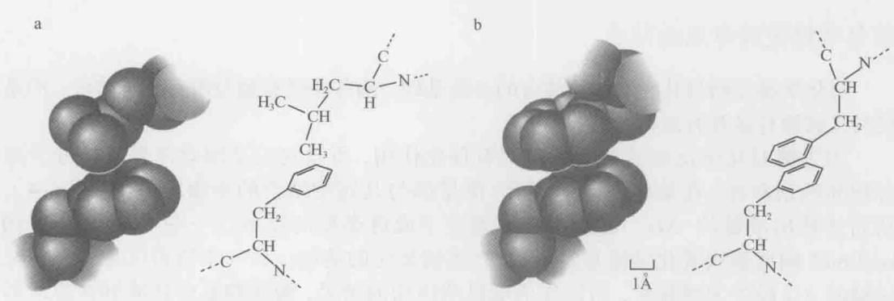  
图 3-11 氨基酸非极性侧链间的范德华力（疏水性）。氢原子没有单独标出，为了图示的清晰，范德华半径缩小了 20%，填充图旁的结构式表示原子的排列情况。a. 苯丙氨酸-亮氨酸键；b. 苯丙氨酸-苯丙氨酸键。（来源：Adapted from Scheraga H.A., The proteins, 2nd edition, p. 527. Copyright © Harold Scheraga. Used with permission.）

例如，考虑丙氨酸和甘氨酸在水溶液中与一个拥有同丙氨酸互补表面的分子成键时释放能量的差异——丙氨酸有一个甲基，而甘氨酸却没有。当丙氨酸与这个分子成键时，甲基周围的范德华力释放出1 kcal/mol的能量，而甘氨酸成键时却不会。从方程3-4我们可以知道，单独的、如此小的能量差异对丙氨酸和甘氨酸的成键不会有太大影响。然而，此计算并没有考虑这样一个事实，即水对丙氨酸的排斥度远大于甘氨酸。丙氨酸中存在的 $CH_{3}$ 比甘氨酸中的氢原子更严重地扰乱了水分子的晶格。目前，由疏水性侧链扰乱水分子晶格而必须引入的修正因子还难以预测。但很可能，水倾向于排斥丙氨酸，并将它推向第三分子，这是通过比水排斥甘氨酸的力大2\~3 kcal/mol的疏水作用完成的。

由此我们得出了一个重要结论，即使最为相近的分子与第三分子成键时的能量差别（当相似分子间的差别为一个非极性基团），在细胞内溶液中比在非水溶液环境中也至少大2\~3 kcal/mol。有时，能量差异可达3\~4 kcal/mol，这是因为涉及的分子通常含有能形成氢键的极性基团。

## $\Delta G$ 具有的 2\~5 kcal/mol 的优势

我们知道，一个次要化学键的能量（2～5 kcal/mol）能够确保一个分子与另一分子的特定基团优先成键。而且，这种能量差不多会大到在细胞中形成严格的晶格排列；也就是说，细胞内不会结晶，但是如果次要化学键的能量大上数倍，结晶就会发生。大能量差意味着次要化学键极少断裂，断裂会导致与细胞生存不相容的低溶质扩散率。

## 弱化学键使酶与底物结合

弱化学键是酶与其底物初始结合的必需基础。酶并非任意地与所有分子结合，而是仅与其底物有显著的亲和性。

因为酶对化学反应的两个方向都有催化作用，所以它们必须对两套反应分子都有特异的亲和性。在某些情况下，可以测量酶与其底物结合的平衡常数（方程3-4），从而计算出成键的 $\Delta G$ 。由此可以得到关于成键类型的提示。一些 $\Delta G$ 在 $5\sim 10$ kcal/mol间的强次要化学键是特异性酶-底物反应的基础。另一个值得注意的是，化学键的 $\Delta G$ 极少大到异常，所以作为随机热运动的结果，酶底物复合物能够快速地形成和分解。这解释了为什么酶能够快速地行使其功能，有时甚至快至 $10^{6}$ 次/秒。如果酶与其底物，或者更重要的是与其产物，以更强的化学键结合，它们的反应速度就会慢得多。

大多数蛋白质-DNA、蛋白质-蛋白质相互作用由弱化学键介导

正如我们在本书中将要看到的，蛋白质与 DNA 的相互作用、蛋白质与蛋白质的相互作用构成了细胞生命活动的核心，这些生命活动包括如何识别信号并做出反应、基因的表达、DNA 的复制、修复和重组等，当然还包括对这一系列过程的调控。同样地，这些相互作用是通过在本章中所描述的这类弱化学键来实现的。尽管单个化学键的能量很低，但是任意两个相互作用分子间的许多这类化学键的共同作用保证了反应的亲和性及特异性。

在第 6 章，我们将要具体讨论蛋白质是如何构建的、它们怎样形成特定的结构，以及它们如何与 DNA 或蛋白质结合。

## 高能键

我们现在来关注一下生物系统中的高能共价键。目前我们已经从热动力学角度讨论过弱键的形成。每次讨论弱键的时候都会面对这样的问题：弱键的形成是否涉及自由能的获得或丢失？只有当 $\Delta G$ 为负值的时候，热动力学平衡才会有利于反应的进行。这一方法对共价键同样有效。生物酶经常参与共价键的形成或断裂的事实并不意味着不再需要 $\Delta G$ 为负。

然而，从表面上分析，细胞中很多重要共价键的形成同热动力学定律是相悖的，尤其是那些把小分子聚合在一起形成大的聚合分子的键。这些键的形成一般会涉及自由能的增加。最初，这一事实说明细胞具有一种独特的能力可以在违反热动力学定律的条件下正常工作，这一特性实际上是真正的“生命的奥秘”。

不过现在，人们已经很清楚，这些生物合成过程并不违反热动力学定律，而是基于同最初假设不同的反应。例如，核酸并不是由核苷磷酸盐缩合而成；糖原也不是直接由葡萄糖残基形成；蛋白质也不是由氨基酸单元形成的。取而代之的是，单分子前体利用ATP中的能量首先转化成高能量的“激活”前体。接下来，我们会通过研究蛋白质中的肽键和核酸中的磷酸二酯键的热动力学阐明这些观点。然而，我们首先需要简要地了解一下共价键的一般热动力学特性。

## 供能分子是热不稳定的

不同分子所拥有的自由能变化范围很大，这是因为共价键并不总是具有相同的能量。举例来说，氢氧原子间的共价键比氢氢原子间的或氧氧原子间的共价键明显要强，消耗 O—O 或 H—H 来形成 O—H 将会释放能量。因此，能量观点告诉我们，充分浓缩的氧气和氢气的混合物将会转化为水。

一个分子以弱共价键连接时将会比以强共价键连接时具有更多的自由能。初看起来这个观点好像很矛盾，因为这意味着键越强，释放的能量越少。但是当我们了解到一个形成强化学键的原子在此过程中已经失去大量自由能的时候，就自然能得出以上结论。因此，那些含有弱共价键而成为热不稳定的分子是最好的食物分子（供能分子）。

例如，葡萄糖就是一个理想的食物分子，因为当它被氧化为 $CO_{2}$ 和 $H_{2}O$ 时，自由能显著降低。另一方面， $CO_{2}$ 的碳氧原子间有着强共价双键，即羰基双键（carbonyl bond），不是动物的食物分子。在缺乏能量供体 ATP 时，即使有特定酶的帮助， $CO_{2}$ 也不能自发转化为更复杂的有机分子。 $CO_{2}$ 能被植物作为主要碳源是因为光量子提供的能量在磷酸化的过程中导致了 ATP 的生成。

在生理温度下如果没有催化作用，将分子转化为其他含较低自由能分子的化学反应几乎没有速度。这是因为，即使是弱共价键，相对来说也很强，在细胞中极少被热运动打断。为了在缺少催化作用的条件下打断共价键，我们必须提供将成键原子分开的能量。当原子被分开后，它们可以与新的对象结合形成更强的化学键，在结合过程中，释放的能量等于打断旧化学键而消耗的能量与新旧键间的能量差之和（图 3-12）。

  
图 3-12 化学反应的活化能： $(A-B)+(C-D)\rightarrow(A-D)+(C-B)$ 。这个反应伴随有自由能的下降。

在分子转化过程中必须提供的打断旧化学键的能量称为活化能（activation energy）。活化能通常小于化学键的初始能，因为分子重排一般不会产生完全自由的原子，取而代之的，两个反应分子间的碰撞是必需的，随之形成暂时的分子复合物形式，称为激活态（activated state）。在激活态，两个分子的紧密邻近使各自的化学键更加不稳定，所以打断此时的化学键就比打断自由分子的化学键所需的能量少。

细胞内大多数共价键的化学反应表示如下：

$$
(A - B) + (C - D) \rightarrow (A - D) + (C - B)\tag{[方程 3-5]}
$$

这一反应的质量方程为：

$$
K _ {\mathrm{eq}} = \left(\operatorname{conc} ^ {\mathrm{A-D}} \times \operatorname{conc} ^ {\mathrm{C-B}}\right) / \left(\operatorname{conc} ^ {\mathrm{A-B}} \times \operatorname{conc} ^ {\mathrm{C-D}}\right)\tag{[方程 3-6]}
$$

式中， $conc^{A-B}$ 、 $conc^{C-D}$ 等指的是以 mol/L 表示的反应物的浓度。同样地，在这里方程 3-7 将 $K_{eq}$ 与 $\Delta G$ 联系起来（表 3-4）。

$$
\Delta G = - R T \mathrm{ln} K _ {\mathrm{eq}} \text {或} K _ {\mathrm{eq}} = \mathrm{e} ^ {- \Delta G / R T}\tag{[方程 3-7]}
$$

由于反应的能量通常为 20～30 kcal/mol，生理温度下激活态几乎不存在。高的活化能是阻止细胞内共价键自发重排的壁垒。这一壁垒的重要性非同寻常，没有它们，生命将不可能出现。因为所有的原子都将处于最低能量状态，这将导致无法为后续反应储存所需的能量。但是如果没有选择性地降低某些反应的活化能的方法，生命同样不可能出现。如果想让细胞在遭受诸如电离或紫外辐射等外力造成的损害后仍能有足够快的生长

速度，这种壁垒尤其是必需的。

表 3-4 $K_{\mathrm{eq}}$ 与 $\Delta G$ 的关系 $\Delta G = -RT (\ln K_{\mathrm{eq}})$

<table><tr><td>平衡常数  $K_{eq}$ </td><td>自由能 $\Delta G/(kcal/mol)$ </td><td>平衡常数  $K_{eq}$ </td><td>自由能 $\Delta G/(kcal/mol)$ </td></tr><tr><td> $10^{-6}$ </td><td>8.2</td><td> $10^{-1}$ </td><td>1.4</td></tr><tr><td> $10^{-5}$ </td><td>6.8</td><td> $10^{3}$ </td><td>0.0</td></tr><tr><td> $10^{-4}$ </td><td>5.1</td><td> $10^{2}$ </td><td>-1.4</td></tr><tr><td> $10^{-3}$ </td><td>4.1</td><td> $10^{2}$ </td><td>-2.7</td></tr><tr><td> $10^{-2}$ </td><td>2.7</td><td> $10^{3}$ </td><td>-4.1</td></tr></table>

## 酶在生物反应中降低反应的活化能

生命绝对需要酶。酶的功能（function of enzymes）就是通过将分子重排的活化能降低到热运动能够提供的范围，从而加速细胞生存所必需的化学反应速率（rate）（图3-13）。当特定的酶存在时，阻止具有最低自由能的反应物快速反应的壁垒将会消失。酶不会改变反应的平衡，它们仅仅加快了反应的速度。因此，如果热力学平衡对某个分子的形成不利，酶的存在并不能提高该分子的产率。

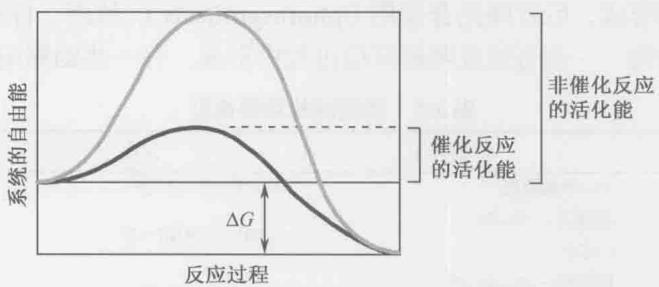  
图 3-13 酶（彩色曲线）降低活化能并加快反应速度。注意，因为平衡状态没有改变，所以 $\Delta G$ 保持相同。

由于酶必须催化每个细胞分子的重排，对不同分子自由能的认知并不能自然而然地告诉我们一个能量上允许的反应是否真实存在。必须考虑反应速度。只有当细胞具有适合的酶时，反应才会有意义。

## 生物分子中的自由能

热力学告诉我们，所有的生化路径都必须具有自由能降低的特征。降解反应路径就是一个明显的例子，在反应中伴随着热的放出，热力学不稳定的食物分子被转变为更稳定的化合物，如 $CO_{2}$ 和 $H_{2}O$ 。所有的降解反应路径都有两个主要目的：①为更大的有机分子的形成提供必需的、作为原料的小有机分子片段；②将原始食物分子的大部分自由能以可利用的形式保存起来。通过耦联降解反应路径的几个步骤与储存自由能的高能分子（如 ATP）的形成，就能达到第二个目的。

食物分子的所有自由能并不是完全转化为高能分子的自由能。如果实际情况是这样，降解反应路径将不再具有自由能降低的特性，而且将不再存在有利于食物分子裂解的驱动力。相反，我们发现所有降解反应路径都会伴随着食物分子中至少一半的自由能转化为热或熵。例如，据估计，细胞中葡萄糖的自由能大约40%被用来产生新的高能化合物，其余部分消散为热或熵。

## 具有高负值 $\Delta G$ 的高能键水解作用

拥有一到数个化学键的高能分子，其化学键可被水裂解，这种作用称为水解作用（hydrolysis），水解作用伴随有大量自由能的释放（5 kcal/mol）。这种水解时产生极大负值 $\Delta G$ 的特殊的化学键称为高能键（high-energy bond）。不过这种叫法有误导作用，因为不是这些化学键的能量高，而是水解时释放的自由能高。然而，高能键的叫法已被普遍接受，为了方便我们还是要继续这种用法并以符号“\~”表示高能键。

一个普通高能键的水解能量（约 7 kcal/mol）要比一个葡萄糖分子一步完全降解所释放的能量（688kcal/mol）小得多。葡萄糖的一步降解是不能产生高能键的。毫无疑问，这正是生物体中葡萄糖降解需要那么多步的原因。所以，降解过程中每一步所释放的能量与高能键水解的自由能大小对应。

最重要的高能化合物是 ATP。它由无机磷酸盐 $^{①}$ 和 ADP 所构成，利用降解反应或太阳光获得的能量形成，后者即光合作用（photosynthesis）。然而，自然界还存在许多其他重要的高能化合物。一些直接在降解反应过程中形成，另一些则利用 ATP 的自由能形成。表 3-5 列举了数种最重要类型的高能键，每一种都含有磷或硫原子。ATP 的高能磷酸键来自于磷酸基团单元，但是，焦磷酸键（ $\text{P} \sim \text{P}$ ）并非唯一一种高能磷酸键，磷酸基团与羧基氧原子的结合会产生一个高能酰键。现在我们已经清楚，在能量新陈代谢中，含有硫原子的高能键发挥着与含磷高能键几乎同等重要的作用。含有高能硫键的最重要的分子是乙酰 CoA，它是脂肪酸生物合成的主要能量来源。

表 3-5 高能键的重要类型

<table><tr><td>种类</td><td>示例分子</td><td>反应</td><td>反应的 $\Delta G$ (kcal/mol)</td></tr><tr><td>焦磷酸</td><td> $\textcircled{P} \sim \textcircled{P}$ 焦磷酸</td><td> $\textcircled{P} \sim \textcircled{P} \rightleftharpoons \textcircled{P} + \textcircled{P}$ </td><td> $\Delta G = -6$ </td></tr><tr><td>二磷酸腺苷</td><td>腺嘌呤— $\textcircled{P} \sim \textcircled{P}$ (ADP)</td><td> $ADP \rightleftharpoons AMP+ \textcircled{P}$ </td><td> $\Delta G = -6$ </td></tr><tr><td>三磷酸腺苷</td><td>腺嘌呤— $\textcircled{P} \sim \textcircled{P} \sim \textcircled{P}$ (ATP)</td><td> $ATP \rightleftharpoons ADP+ \textcircled{P}$ </td><td> $\Delta G = -7$ </td></tr><tr><td>烯醇式磷酸</td><td>[IMAGE]</td><td> $PEP \rightleftharpoons$ 丙酮酸+ $\textcircled{P}$ </td><td> $\Delta G = -12$ </td></tr><tr><td>氨</td><td>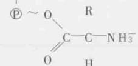</td><td> $AM \textcircled{P} \sim AA \rightleftharpoons AMP+AA$ </td><td> $\Delta G = -7$ </td></tr><tr><td>磷酸化胍盐</td><td>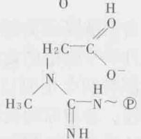</td><td>肌氨酸~ $\textcircled{P} \rightleftharpoons$ 肌氨酸+ $\textcircled{P}$ </td><td> $\Delta G = -8$ </td></tr><tr><td>硫酯</td><td>磷酸肌氨酸 $H_3C-C\overset{\text{O}}{\underset{\text{S-CoA}}{\ce{C}}}$ 乙酰-CoA</td><td>乙酰-CoA $\rightleftharpoons$ CoA-SH+乙酸根</td><td> $\Delta G = -8$ </td></tr></table>

高能键较大的 $\Delta G$ 分布范围（表 3-5）意味着“高能”键的叫法有些专横。一般的判断标准是该键的水解是否伴随有另一重要的生物合成反应。例如，伴随 6-磷酸葡萄糖的水解所产生的负 $\Delta G$ 是 3\~4 kcal/mol，但这个 $\Delta G$ 并不足以促使肽键的合成，因此这种磷脂键并不属于高能键。

## 生物合成反应中的高能键

由较小的分子组装形成大分子的过程通常需要输入自由能。如果不伴随着自由能的净下降，生物合成反应路径（如降解反应路径）将不会发生。这意味着许多生物合成反应路径需要外在的自由能来源，而高能化合物就是这些自由能来源。生物合成中许多化学键的形成与高能键的断裂相耦联，因而自由能的净变化是负值。所以细胞内高能键的寿命通常极短，它们几乎刚在降解反应中形成就被酶催化分解，以产生驱动另一反应进行的能量。

生物合成反应路径中并非每一步都需要高能键的断裂，经常仅仅是其中的一步或两步需要。有时这是因为即使缺少额外高能键， $\Delta G$ 还是有利于生物合成反应的方向。另一种情况是 $\Delta G$ 等于零或者甚至可能略微显正值，然而，与高能键水解作用耦联的 $\Delta G$ 相比，这种微小的正 $\Delta G$ 是微不足道的。正如我们在图3-14看到的，一个反应路径的所有自由能变化的总和才有意义。如果某一特定生物合成反应步骤的后继步骤的 $K_{\mathrm{eq}}$ 是 $100:1$ ，有利于生物合成反应的正方向，那么就不必再考虑它的 $K_{\mathrm{eq}}$ 略微（80：20）有利于降解反应。

同样地，降解反应路径中也并非每一步都产生高能键。例如，在葡萄糖漫长的酵解

产生 ATP。而且，许多降解反应路径中的一步或多步需要高能键的断裂。葡萄糖的酵解又是一个这样的例子，每产生 4 分子 ATP，它必须消耗 2 分子 ATP。当然，所有的产能降解反应过程都会产生比消耗的能量多的能量。

## 肽键的自发水解

由两个氨基酸生成一个二肽和一个水分子需要 1\~4 kcal/mol 的 $\Delta G$ ,

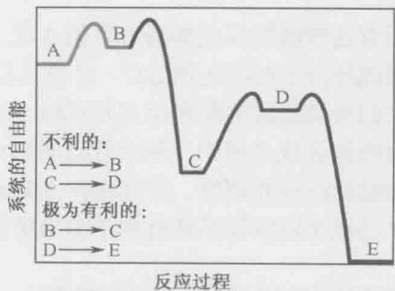  
图 3-14 一个多步新陈代谢路径的自由能变化，A→B→C→D→E。其中两步（A→B 和 C→D）不利于 A→E 的反应方向，因为它们具有微正的 $\Delta G$ 。然而由于步骤 B→C 和 D→E 所提供的极大的负 $\Delta G$ ，它们已经没有意义了。所以，整个反应有利于 A→E 方向。

这依赖于参加反应的氨基酸类型。这种正值的 $\Delta G$ 告诉我们，多肽链不可能由自由氨基酸生成。更进一步，我们必须考虑这样一个事实，即细胞内水分子的浓度比其他任何分子高得多（一般情况下要高出 100 倍），所有水分子参与的反应的平衡都强烈地倾向于消耗水分子的反应方向。这可以由平衡常数的定义中简单看出。例如，生成二肽的反应：

$$
\mathrm{氨基酸(A)+氨基酸(B)} \rightarrow \mathrm{二肽(A-B)+H} _ {2} \mathrm{O}\tag{[方程 3-8]}
$$

具有以下平衡常数：

$$
K _ {\mathrm{eq}} = \left(\operatorname{conc} ^ {\mathrm{A} - \mathrm{B}} \times \operatorname{conc} ^ {\mathrm{H2O}}\right) / \left(\operatorname{conc} ^ {\mathrm{A}} \times \operatorname{conc} ^ {\mathrm{B}}\right)\tag{[方程 3-9]}
$$

在这里浓度都是以 mol/L 为单位。所以，对于一个给定的 $K_{eq}$ （方程 $\Delta G = -RT \ln K_{eq}$ 将其与 $\Delta G$ 联系在一起），大得多的水分子浓度意味着相对小的二肽浓度，而且相对浓度非常重要。实际上，简单的计算表明即使非水解反应的 $\Delta G$ 为 -3 kcal/mol，水解反应仍可能自发进行。

所以，在理论上蛋白质是不稳定的，如果给以足够长的时间，蛋白质将会自发降解为自由氨基酸。但从另一方面而言，如果缺乏特定的酶，这种自发反应的速度太低并不能对细胞的新陈代谢产生轻微的影响。也就是说，蛋白质一旦形成，除非被特定的酶催化降解，否则都将保持稳定状态。

负值 $\Delta G$ 与正值 $\Delta G$ 的耦联

在能够相互结合形成蛋白质之前，氨基酸必须接受自由能。人们发现 ATP 作为能量供体的基本作用之后，就明白了这一过程是如何实现的。ATP 含有 3 个与腺嘌呤分子（腺嘌呤-O- $^{①}$ \~ $^{②}$ \~ $^{③}$ ）相连的磷酸基团，当一个或两个末端～P 基团被水解断裂时，自由能会显著下降。

$$
\text { 腺嘌呤 } - \mathrm{O} - \textcircled {\mathrm{P}} \sim \textcircled {\mathrm{P}} \sim \textcircled {\mathrm{P}} + \mathrm{H} _ {2} \mathrm{O} \rightarrow \text { 腺嘌呤 } - \mathrm{O} - \textcircled {\mathrm{P}} \sim \textcircled {\mathrm{P}} + \textcircled {\mathrm{P}}\tag{[方程 3-10]}
$$

$$
(\Delta G = - 7 \mathrm{kcal/mol})
$$

$$
\text { 腺嘌呤 } - \mathrm{O} - \textcircled {P} \sim \textcircled {P} \sim \textcircled {P} + \mathrm{H} _ {2} \mathrm{O} \rightarrow \text { 腺嘌呤 } - \mathrm{O} - \textcircled {P} + \textcircled {P} \sim \textcircled {P}\tag{[方程 3-11]}
$$

$$
(\Delta G = - 8 \mathrm{kcal/mol})
$$

$$
\text {腺嘌呤- O - P } \sim \textcircled {P} + \mathrm{H} _ {2} \mathrm{O} \rightarrow \text {腺嘌呤- O - P} + \textcircled {P}\tag{[方程 3-12]}
$$

$$
(\Delta G = - 6 \mathrm{kcal/mol})
$$

所有这些断裂反应都具有负值 $\Delta G$ ，其绝对值（数字大小不考虑符号）要大于单体分子形成高分子时的正值 $\Delta G$ 。自身具有正值 $\Delta G$ 的生物合成反应之所以能够进行，是因为它们与高能键的断裂反应相耦联，而后者伴随着具有绝对值更大的负值 $\Delta G$ 。所以，在蛋白质的合成过程中，每个肽键的形成（ $\Delta G = +0.5 \, kcal/mol$ ）都与 ATP 断裂为 AMP 和磷酸盐的反应相耦联，后者具有 -8 kcal/mol 的 $\Delta G$ （方程 4-7）。这导致净 -7.5 kcal/mol 的 $\Delta G$ 已经足以保证平衡有利于蛋白质的合成而非断裂。

## 基团转移反应中前体的活化

当 ATP 被水解为 ADP 和磷酸盐的时候，大部分自由能转变为热。由于热能不能被

<!-- END OFFICIAL API PART part_001 -->


<!-- BEGIN OFFICIAL API PART part_002 -->

利用形成共价键，所以两个分别具有正值 $\Delta G$ 和负值 $\Delta G$ 的完全分离的反应不能形成耦联反应。相反，耦联反应是由两个或多个连续反应构成的。这些反应通常是基团转移（group-transfer）反应：在此类反应中，分子交换其功能基团（不包括氧化还原反应）。催化这类反应的酶被称为转移酶（transferase）。请看下面的反应：

$$
(\mathrm{A} - \mathrm{X}) + (\mathrm{B} - \mathrm{Y}) \rightarrow (\mathrm{A} - \mathrm{B}) + (\mathrm{X} - \mathrm{Y})\tag{[方程 3-13]}
$$

在这个例子中，X 基团与 B 相交换。转移基团反应被严格定义为不包括水分子参与的反应。当有水分子参与时，

$$
(\mathrm{A} - \mathrm{B}) + (\mathrm{H} - \mathrm{OH}) \rightarrow (\mathrm{A} - \mathrm{OH}) + (\mathrm{B} - \mathrm{H})\tag{[方程3-14]}
$$

这时反应就被称为水解反应，而参与的酶被称为水解酶（hydrolase）。

在此，令我们感兴趣的基团转移反应是那些与高能键连接的基团。当这类高能基团被转移至适当的受体分子时，它们将与受体分子以高能键连接。因此，基团转移反应允许高能键从一个分子向另一个分子的转移。例如，方程3-15和方程3-16展示了ATP的能量是如何转移以形成GTP的，后者是RNA合成的前体之一：

$$
\text { 腺嘌呤 } - Ⓟ \sim Ⓟ \sim Ⓟ + \text { 鸟嘌呤 } - Ⓟ \rightarrow \text { 腺嘌呤 } - Ⓟ \sim Ⓟ + \text { 鸟嘌呤 } - Ⓟ \sim Ⓟ [ \text { 方程   3 - 15 } ]
$$

$$
\text {腺嘌呤- } Ⓟ \sim Ⓟ \sim Ⓟ + \text {鸟嘌呤- } Ⓟ \sim Ⓟ \rightarrow \text {腺嘌呤- } Ⓟ \sim Ⓟ + \text {鸟嘌呤- } Ⓟ \sim Ⓟ \sim Ⓟ\tag{[方程 3-16]}
$$

GTP 的高能 $^{①}$ \~ $^{②}$ 基团使其可以自发与其他分子连接。GTP 是所谓活化分子（activated molecule）的一个例子；类似地，转移高能基团的过程被称为基团活化（group activation）。

## 基团转移中 ATP 的多变性

在对作为能量供体的分子的能量所进行的调控中，ATP 的合成起着关键作用。不论是在氧化反应中还是光合磷酸化反应中，能量用来将 ADP 和磷酸盐合成 ATP：

$$
\text { 腺嘌呤 } - Ⓟ \sim Ⓟ + Ⓟ + \text { 能量 } \rightarrow \text { 腺嘌呤 } - Ⓟ \sim Ⓟ \sim Ⓟ\tag{[方程 3-17]}
$$

由于 ATP 是生物体中高能基团的首先接受者，因此它必然是一系列反应的起始点。在这些反应中，高能基团被转移到低能量分子以使其获得自发反应的潜能。ATP 的中心作用源于这样一个事实，即它含有两个高能键，每一个的断裂释放不同的基团。这可以由图 3-15 看出，图中展示了由 ATP 产生的 3 种重要的基团： $^{①} \sim ^{②}$ ，焦磷酸基团；\~ AMP，单磷酸腺苷基团；\~ $^{③}$ ，磷酸基团。值得注意的是，只有当这些高能基团转移到适当的受体分子上时，它们才显示出高能特性。例如，\~ $^{④}$ 基团转移到 COO $^{-}$ 基团会产生高能 COO \~ $^{⑤}$ 磷酰基团，但是同样的基团转移到糖羟基（-C-OH）（正如 6-磷酸葡萄糖形成过程中发生的），却只能产生低能量化学键（水解中产生的 ΔG 降低小于 5 kcal/mol）。

## 与 AMP 连接使氨基酸活化

正如方程 3-18 所示，当 ATP 中的 AMP 基团转移到氨基酸的 COO $^{-}$ 基团上时，氨基酸就被活化了：

  
图 3-15 ATP 参与的重要基团转移反应。

$$
\begin{array}{c} \mathrm{H} \quad \mathrm{R} \\ \mathrm{H} - \mathrm{N} ^ {+} - \mathrm{C} - \mathrm{C} \\ \mathrm{H} \quad \mathrm{H} \end{array} + \text {腺苷一} \mathbb {P} \sim \mathbb {P} \sim \mathbb {P} \longrightarrow \begin{array}{c} \mathrm{H} \quad \mathrm{R} \\ \mathrm{H} - \mathrm{N} ^ {+} - \mathrm{C} - \mathrm{C} \\ \mathrm{H} \quad \mathrm{H} \end{array} + \mathbb {P} \sim \mathbb {P}\tag{[方程 3-18]}
$$

（方程中 R 表示氨基酸的特定侧链）催化这一类型反应的酶称为氨基酸酰基合成酶（aminoacyl synthetases）。从热力学意义上讲，氨基酸（AA）一旦被活化，就能够用来合成蛋白质。虽然如此，AA～AMP 复合物并不是蛋白质的直接前体。相反，由于某种原因（我们将在第 15 章讨论），必须发生第二次转移基团反应，将羰基活化的氨基酸转移到一个 tRNA 分子的末端：

$$
\mathrm{AA} \sim \mathrm{AMP} + \mathrm{tRNA} \rightarrow \mathrm{AA} \sim \mathrm{tRNA} + \mathrm{AMP}\tag{[方程 3-19]}
$$

通过 AA \~ tRNA 分子的缩合，延伸中的多肽链末端形成了新的肽键：

$$
\mathrm{AA} \sim \mathrm{tRNA} + \text { 延   伸   中   的   多   肽   链   (n   个   氨   基   酸) } \rightarrow \mathrm{tRNA} + \text { 延   伸   中   的   多   肽   链   (n   +   1   个   氨   基   酸) }\tag{[方程 3-20]}
$$

所以，如同所有其他耦联反应一样，这一“耦联反应”的最终步骤必须是移去活化基团及高能键转变为具有低水解自由能的化学键。这是驱动蛋白质合成反应方向的负值 $\Delta G$ 的来源。

## 核酸前体被①～②活化

不论是 DNA 还是 RNA，所有类型的核酸都是由单核苷酸单体[也称为磷酸化核苷（nucleoside phosphates）]所组成。然而，单核苷酸在热力学上比氨基酸更难聚合。这是因为将其连接起来的磷酸二酯键在水解过程中释放相当多的自由能（-6 kcal/mol）。这意味着核酸将以极低的速度自发水解为单核苷酸。所以，相对于蛋白质的生物合成，活化前体在核酸的生物合成中更重要。

DNA 和 RNA 的直接前体都是 5'-三磷酸核苷。对于 DNA，这些前体是 dATP、dGTP、dCTP 和 dTTP（d 指的是脱氧）；对于 RNA，前体是 ATP、GTP、CTP 和 UTP。因此，ATP 不仅仅作为转基因反应中高能基团的主要来源，而且其自身就是 RNA 的直接前体。所有其他 3 种 RNA 前体都由类似于方程 3-15 和方程 3-16 所描述的转基因反应生成。脱氧三磷酸核苷由几乎相同的途径形成：在脱氧单核苷酸合成后，它们通过从 ATP 转移基团转变为三磷酸形式。

$$
\text {脱氧核苷-} Ⓟ + \mathrm{ATP} \rightarrow \text {脱氧核苷-} Ⓟ \sim Ⓟ + \mathrm{ADP}\tag{[方程 3-21]}
$$

$$
\text { 脱氧核苷 } - Ⓟ \sim Ⓟ + \mathrm{ATP} \rightarrow \text { 脱氧核苷 } - Ⓟ \sim Ⓟ \sim Ⓟ + \mathrm{ADP}\tag{[方程 3-22]}
$$

然后这些三磷酸核苷就能通过磷酸二酯键连接在一起形成多聚核苷酸，在这一转移基团反应中，一个焦磷酸键被打断，释放一个焦磷酸基团：

$$
\text {脱氧核苷-} Ⓟ \sim Ⓟ \sim Ⓟ + \text {延伸的多聚核苷酸链(n个核苷酸)}
$$

$$
\rightarrow \textcircled {P} \sim \textcircled {P} + \text {   延伸的多聚核苷酸链   } (n + 1 \text {   个核苷酸   })\tag{[方程 3-23]}
$$

与形成肽键的反应不同,这一反应不具有负值 $\Delta G$ 。实际上, $\Delta G$ 略微偏正(大约0.5 kcal/mol)。这种情况立即引出一个问题,多聚核苷酸显然在不断形成,它必需的自由能来源是什么?

核酸合成过程中释放的①～②能量值

多聚核苷酸形成过程中所需的自由能来自高能焦磷酸基团的分裂，后者与高能磷酸二酯键同时形成。所有的细胞都具有一种有效的酶——焦磷酸酶，这种酶会将刚刚形成的焦磷酸分子打断：

$$
ⓟ \sim Ⓟ \rightarrow 2 Ⓟ \quad (\Delta G = - 7 \mathrm{kcal/mol})\tag{[方程 3-24]}
$$

大的负值 $\Delta G$ 意味着反应是不可逆的。也就是说，一旦①～②断裂就不可能再次形成。

与焦磷酸基团的分裂[方程 3-21]相耦联的单磷酸核苷基团的聚合[方程 3-24]具有一个平衡常数，它由两个反应总的 $\Delta G$ 决定： $(0.5\ \text{kcal/mol}) + (-7\ \text{kcal/mol})$ 。最终的数值 $(\Delta G = -6.5\ \text{kcal/mol})$ 告诉我们，核酸几乎从不断裂生成其三磷酸核苷前体。

在这里我们看到了一个有力的实例，正是伴随一系列反应的总的自由能变化决定了其中某一反应是否能发生。具有微小正值 $\Delta G$ 的反应自身是不会自发发生的，但它们经常是重要的新陈代谢路径的一部分，其后继反应具有大的负值 $\Delta G$ 。不论何时我们都应该记住，一个单独反应（或甚至是一个单独路径）从不孤立存在；相反，通过代谢产物的加入和移去，反应的平衡在不断改变。

## ⑤ \~ ⑥ 分裂是大多数生物合成反应的特征

核酸的合成并非唯一一个由 $^{①}$ \~ $^{②}$ 的释放和分裂决定其方向的反应。实际上，所有的生物合成反应都具有一步或多步释放焦磷酸基团反应。以氨基酸与AMP结合活化为例，从其自身来说，高能键从 ATP 转移到 AA～AMP 复合物的过程具有微小的正值 $\Delta G$ 。然而，正是 ATP 末端焦磷酸基团的释放和分裂提供了驱动反应所需的负值 $\Delta G$ 。

当我们考虑这样一个问题，即为什么细胞试图由三磷酸核苷合成核酸而不是单磷酸核苷（图 3-16），焦磷酸基团分裂的巨大作用就很清楚了。磷酸，而不是焦磷酸，形成了磷酸二酯键的骨架。然而，在有大量磷酸盐存在的情况下磷酸二酯键并不稳定，这是因为它们形成时没有释放大量自由能。所以，生物合成反应可被轻易逆转；如果磷酸盐大量累积，根据质量反应定律，反应将开始向核酸分解的方向移动。而且对细胞来说，磷酸盐一形成就将其移除是不可行的（从而阻止逆向反应），因为所有细胞都需要一定浓度的内部磷酸盐维持生长。相反，产生焦磷酸然后迅速将其打断为两分子磷酸盐的一系列反应，消除了磷酸盐的产生和核酸的生物合成间的联系，从而阻止了逆转生物合成反应的可能性（图 3-16）。这样的结果是，细胞内很难积累足够的磷酸盐以驱动逆反应方向（或断裂方向）的两个反应。由此我们可以清楚地知道，运用三磷酸核苷作为核酸的前体并非随机选择的结果。

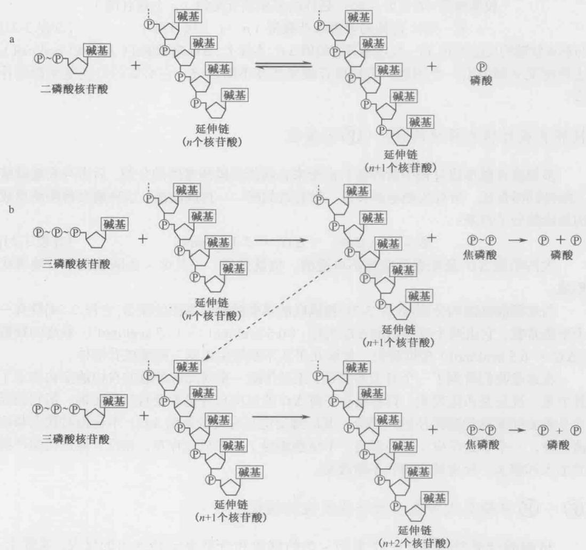  
图 3-16 核酸生物合成的两种可能途径。(a) 运用二磷酸核苷合成核酸；(b) 运用三磷酸核苷合成核酸。

类似的讨论将告诉我们，为什么在所有细胞内都是由 ATP 作为高能基团的关键供体，而不是 ADP。起初这种 ATP 偏爱在生化学家看来是绝对的，但是现在我们发现，许多运用 ADP 作为能量供体的反应同样存在，且保持较好的反应方向。

## 小结

细胞中许多重要的化学过程并不包含共价键的形成和断裂。大多数分子的细胞定位依赖于弱（或者说次要）的吸引力或排斥力；而且，弱化学键在决定许多分子（尤其是大分子）外形上起着重要作用。最重要的几种弱化学键是氢键、范德华力、疏水作用和离子键。即使这类键相对较弱，它们还是足够强，以保证正确的分子（或原子团）相互作用。例如，酶分子表面的外形唯一适合于与其底物分子的结合。

不论是弱化学键还是强共价键，所有化学键的形成都遵循热力学定律。如果反应的结果是释放自由能（负 $\Delta G$ ），化学键就能形成。为了打断化学键，必须给予相同大小的自由能。由于在原子间形成共价键会导致很大的负 $\Delta G$ ，共价连接的原子几乎不会自发分开。相反地，伴随弱化学键形成的 $\Delta G$ 仅仅是生理温度下分子平均热运动能量的数倍。在活细胞中单个弱化学键频繁地形成和断裂。

具有极性（带电）基团的分子拥有与非极性分子（其中的电荷平均分布）完全不同的相互作用方式。极性分子能够形成氢键，而非极性分子仅能形成范德华力。最重要的极性分子是水分子，每个水分子可与其他水分子形成4个氢键。极性分子大多是水溶性的（程度不同），而非极性分子不能溶于水，这是因为它们不能与水分子形成氢键。

任何一个特定分子具有其唯一的分子外形，这严格限制了它能与之形成强次要化学键的分子的数量。强次要相互作用不但需要两个分子作用表面间的互补关系（锁钥关系），还需要许多原子的参与。尽管只由1\~2个次要化学键连接的分子经常发生解离，但是这些弱化学键的总和能够使分子形成稳定的聚集体。DNA双螺旋结构从不自发解离的事实说明，在这样的聚集体里，极端稳定是可能的。

粗略看来，许多分子的生物合成好像违背了热力学定律，即自发反应必须伴随有自由能的下降（ $\Delta G$ 是负值）。例如，从氨基酸形成蛋白质就具有正的 $\Delta G$ 。当我们认识到生物合成反应并非如起初想像的那样进行时，问题自然就解决了。例如，蛋白质并非由自由氨基酸直接形成，而是首先被酶催化转化为高能活化分子的前体，在特定酶的催化下聚合形成所需的生物合成产物。

所以，许多生物合成过程是“耦联”反应的结果，第一个反应为第二个反应提供自发进行所需的能量。细胞内最主要的能量来源是ATP，它或者是在降解反应（如发酵或呼吸）过程中，或者是在光合作用过程中，由ADP和无机磷酸盐形成的。ATP具有数个高能键，在水解时产生数值很大的负 $\Delta G$ 。与高能键相连的基团称为高能基团。通过基团转移反应，高能基团能被转移到其他分子上，从而形成新的高能化合物。这些衍生的高能分子是许多生物合成步骤的直接前体。

结合 AMP 基团后，氨基酸被活化形成 AA \~ AMP 分子，其中 AMP 来自于 ATP。AA \~ AMP 分子中的高能键的能量类似于 ATP 中高能键的能量。虽然如此，基团转移反应还是由于高能 $^{①}$ \~ $^{②}$ 分子的存在才能进行完全。高能 $^{③}$ \~ $^{④}$ 分子在 AA \~ AMP 分子的形成过程中产生，随后被焦磷酸酶打断生成低能量基团。所以，逆反应 $^{⑤}$ \~ $^{⑥}$ + AA \~ AMP → ATP + AA 不能存在。

几乎所有的生物合成反应起始于 $^{①}$ \~ $^{②}$ 的释放。 $^{③}$ \~ $^{④}$ 一旦形成，立即就被酶催化打断为两个磷酸盐分子，从而消除了逆向生物合成反应的可能性。 $^{⑤}$ \~ $^{⑥}$ 分裂的巨大作用为细胞的主要能量供体是 ATP（而非 ADP）提供了一个解释。ADP 不能转移高能基团并同时产生 $^{⑦}$ \~ $^{⑧}$ 基团作为副产物。

## 参考文献

## Weak Chemical Interactions

Branden C. and Tooze J. 1999. Introduction to protein structure, 2nd ed. Garland Publishing, New York.

Creighton T.E. 1992. Proteins: Structure and molecular properties, 2nd ed. W.H. Freeman, New York.
———. 1983. Proteins, W.H. Freeman, San Francisco.

Donohue J. 1968. Selected topics in hydrogen bonding. In Structural chemistry and molecular biology (ed. A. Rich and N. Davidson), pp. 443–465. W.H. Freeman, San Francisco.

Fersht A. 1999. Structure and mechanism in protein science: A guide to enzyme catalysis and protein folding. W.H. Freeman, New York.

Gray H.B. 1964. Electrons and chemical bonding. Benjamin Cummings, Menlo Park, California.

Klotz I.M. 1967. Energy changes in biochemical reactions. Academic Press, New York.

Kyte J. 1995. Mechanism in protein chemistry. Garland Publishing, New York.

——. 1995. Structure in protein chemistry. Garland Publishing, New York.

Lehninger A.L. 1971. Bioenergetics, 3rd ed. Benjamin Cummings, Menlo Park, California.

Lesk A. 2000. Introduction to protein architecture: The structural biology of proteins. Oxford University Press, New York.

Marsh R.E. 1968. Some comments on hydrogen bonding in purine and pyrimidine bases. In Structural chemistry and molecular biology (eds. A. Rich and N. Davidson), pp. 485–489, W.H. Freeman, San Francisco.

Morowitz H.J. 1970. Entropy for biologists. Academic Press, New York.

Pauling L. 1960. The nature of the chemical bond, 3rd ed. Cornell University Press, Ithaca, New York.

Tinoco I., Sauer K., Wang J.C., Puglisi J.D., and Wang J.Z. 2001. Physical chemistry: Principles and applications in life sciences, 4th ed. Prentice Hall College Division, Upper Saddle River, New Jersey.

## Strong Chemical Bonds

Berg J., Tymoczko J.L., and Stryer L. 2006. Biochemistry, 6th ed. W.H. Freeman, New York.

Kornberg A. 1962. On the metabolic significance of phosphorolytic and pyrophosphorolytic reactions. In Horizons in biochemistry (eds. M. Kasha and B. Pullman), pp. 251–264. Academic Press, New York.

Krebs H.A. and Kornberg H.L. 1957. A survey of the energy transformation in living material. Ergeb. Physiol. Biol. Chem. Exp. Pharmakol. 49: 212.

Nelson D.L. and Cox M.M. 2000. Lehninger principles of biochemistry, 3rd ed. Worth Publishing, New York.

Nicholls D.G. and Ferguson S.J. 2002. Bioenergetics 3. Academic Press, San Diego.

Purich D.L., ed. 2002. Enzyme kinetics and mechanism, Part F: Detection and characterization of enzyme reaction intermediates. Methods in Enzymology, Vol. 354. Academic Press, San Diego.

Silverman R.B. 2002. The organic chemistry of enzyme-catalyzed reactions. Academic Press, San Diego.

Tinoco I., Sauer K., Wang J.C., Puglisi J.D., and Wang J.Z. 2001. Physical chemistry: Principles and applications in life sciences, 4th ed. Prentice Hall College Division, Upper Saddle River, New Jersey.

Voet D., Voet J.G., and Pratt C. 2002, Fundamentals of biochemistry. John Wiley & Sons, New York.

## 习题

## 偶数习题的答案请参见附录2

习题 1 两个大分子之间可以存在什么类型的键?

习题 2 （判断对错，如果是错的，请改正错误）酶降低了反应所需的 $\Delta G$ 。

习题 3 （判断对错，如果是错的，请改正错误）离子键和氢键均强于范德华力。

习题 4 （判断对错，如果是错的，请改正错误）在 $25^{\circ}$ C 条件下， $K_{eq}$ 10 倍变化相当于 $\Delta G$ 10 倍变化。

习题 5 回顾表 3-5，请阐述何种重大细胞反应参与了三磷酸腺苷分解成一磷酸腺苷和焦磷酸以及焦磷酸分解成两个磷酸盐的反应，并解释为什么这些过程中反应产生的 $\Delta G$ 特别大。

习题6 对于下列反应起主要作用的键是？

A. 双链 DNA 中一条 DNA 链与另外一条 DNA 发生作用；

B. 两个氨基酸形成的二肽。

习题 7 请描述水分子在凝固点和 $25^{\circ}$ C 时的结构，以及水分子之间起主要作用的键的名称。

习题 8 请用偶极矩的概念来定义极性分子和非极性分子。极性和非极性分子之间会产生范德华力吗？

习题 9 假设 PEP 水解成丙酮酸和磷酸的 $\Delta G$ 为 -12 kcal/mol，计算 $25^{\circ}C$ 时的 $K_{eq}$ 值。

习题 10 有方程: AB + 能量 $\Leftrightarrow$ A + B, 计算平衡时 A 的浓度, 假设 $K_{eq} = 8.0 \times 10^{5} \, mmol/L$ , [B] = 2 mmol/L, [AB] = 0.5 mmol/L。

习题 11 一个含氮碱基的结构如下所示。如果只考虑该结构本身（不考虑是 DNA 或 RNA），图中有多少可能的氢键受体以及氢键供体？


习题 12 glutamate + NH₃ ⇔ glutamine + H₂O, ΔG = +3.4 kcal/mol，将以上反应和 ATP 水解反应偶联是否会促进谷氨酰胺生成？请阐述理由并写出整个反应。

习题 13 请阐述为什么是三磷酸腺苷而不是二磷酸腺苷被用于 DNA 合成反应。

习题 14 研究人员调查了 100 多个蛋白质-DNA 复合体中蛋白质与 DNA 的相互作用。

下表列出了一系列的数据：碱基和氨基酸之间的单个氢键分布。

<table><tr><td rowspan="2">氨基酸</td><td colspan="4">DNA碱基</td></tr><tr><td>胸腺嘧啶</td><td>胞嘧啶</td><td>腺嘌呤</td><td>鸟嘌呤</td></tr><tr><td>精氨酸</td><td>5</td><td>4</td><td>7</td><td>26</td></tr><tr><td>谷氨酸</td><td>—</td><td>11</td><td>—</td><td>1</td></tr><tr><td>酪氨酸</td><td>—</td><td>—</td><td>—</td><td>—</td></tr></table>

A. 请阐述为什么研究人员没有在色氨酸和四种碱基之间发现氢键。

B. 请阐述为什么研究人员在精氨酸和四种碱基之间均发现了氢键。

C. 精氨酸是否有优先结合一种氨基酸的倾向？

数据来自Luscombe等（2001.Nucleic Acids Res.29：2860-2874）。

## 第4章

本章概要
DNA 结构
DNA 拓扑学

## DNA 的结构

人们在发现 DNA 是携带了染色体所有遗传信息的主要遗传分子后, 立即将注意力集中在 DNA 的结构上。人们希望通过了解 DNA 结构, 能够揭示染色体如何分开并形成两个相同的拷贝, 以及这一过程中 DNA 携带的遗传信息如何进行复制。从 20 世纪 40 年代末到

50年代初，几个美国和欧洲的研究小组既协作又竞争地开展研究，以期了解DNA链是如何通过共价键连接在一起，由此形成的DNA分子是如何在三维空间中排列。不足为奇，刚开始人们担心DNA的结构非常复杂甚至可能很古怪，不同基因中的DNA结构是完全不同的。因此，当DNA的双螺旋结构被发现时，人们大大松了一口气。DNA的这一基本结构告诉我们，所有基因的三维结构都大致相同，区别仅在于DNA互补双链中4种核苷酸的数量和排列顺序的不同。

双螺旋结构的发现距今已有60年，关于遗传物质的这一阐述仍然未受到质疑，不需要做改动以适应新的发现。然而，人们也逐渐认识到DNA的结构并不完全和刚开始设想的完全一致。例如，一些小病毒的染色体DNA是单链而不是双链分子。而且，受局部DNA序列的影响，不同的碱基对的精确方向有着细微的差别。一些序列甚至能使DNA卷曲成左手双螺旋，与最初阐述的DNA基本结构——右手双螺旋正好相反。虽然有些DNA分子是线性的，但也有一些是环状的。DNA双螺旋经常围绕DNA结合蛋白进一步盘绕卷曲成超螺旋结构，这样造成了更大的复杂性。显然，DNA和RNA的结构比开始所设想的更加丰富多样，更加复杂。实际上，不存在一种适用于DNA和RNA的通用结构。本章将要讨论，多核苷酸链由于其独特的物理、化学、拓扑学特性，在一般结构的基础上能发生很多变化。

## DNA 的结构

DNA 由多核苷酸链构成

通常 DNA 最重要的结构特征是两条多核苷酸链（polynucleotide chain）以双螺旋的

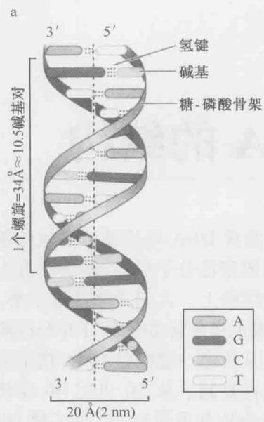

  
图 4-1 DNA 的双螺旋结构。(a) DNA 双螺旋的结构示意图。螺旋的每一圈（34Å 或 3.4nm）大约有 10.5 个碱基对。(b) 双螺旋的空间结构实体模型。糖和磷酸基团构成了每条链的骨架，以黄色、灰色和红色圈表示。本图显示了 DNA 分子的螺旋情况，碱基朝向内部，但可以通过大、小沟而被接近。

形式互相缠绕（图 4-1）。图 4-1a 为双螺旋结构的示意图，由于 DNA 双链互补，如果将它倒置 $180^{\circ}$ （如将这本书上下颠倒），双螺旋看起来仍跟原来是一样的，这是由双链的互补性造成的。图 4-1b 是双螺旋的分子结构空间实体模型，体现了 DNA 分子的组成成分及在螺旋结构中的相对位置。双螺旋两条单链的骨架是由糖和磷酸基团交替构成的；碱基朝向骨架的内侧，通过大沟和小沟可以接近碱基。

让我们首先来考察 DNA 最基本的组成成分——核苷酸的特点。一个磷酸基团和戊糖相连形成 2'-脱氧核糖（2'-deoxyribose），一个碱基连接于 2'-脱氧核糖即构成了核苷酸（nucleotide）。磷酸基团和戊糖的结构如图 4-2 所示。之所以叫做 2'-脱氧核糖，是因为戊糖的第二位碳原子没有羟基（而是两个氢）。请注意核糖上原子的位置在右上角都标以“”以区别于碱基上原子的位置（详见下述讨论）。

我们可以想像，碱基通过与戊糖 1'位碳原子上的羟基结合脱去一个水分子形成糖苷键（图 4-2），从而与 2'-脱氧核糖结合。戊糖和碱基相结合形成核苷（nucleoside）。同样地，我们可以想像磷酸基与 2'-脱氧核糖 5'位碳原子上的羟基结合脱水形成 5'磷酸单酯。核苷加一个（或一个以上）磷酸形成核苷酸（nucleotide）。因此，碱基通过糖苷键与糖相连，而糖又通过磷酸酯键与磷酸相连，这样就形成了核苷酸（表 4-1）。

核苷酸依次以磷酸二酯键相连形成多核苷酸链，即一个核苷酸 2'-脱氧核糖上的 3'-羟基与另一个核苷酸上 5'-羟基的

磷酸基相连（图 4-3）。在磷酸二酯键（phosphodiester linkage）中，两个核苷酸间的磷酰基的一个糖通过 3'-羟基酯化，另一个糖通过 5'-羟基酯化。多核苷酸链以磷酸二酯键为基础构成了规则的、不断重复的糖磷酸骨架，这是 DNA 结构的一个特点。与此相反，多核苷酸链中碱基的排列顺序却是无规律的，碱基排列顺序的不规则性加上其长度是 DNA 储存大量信息的基础。

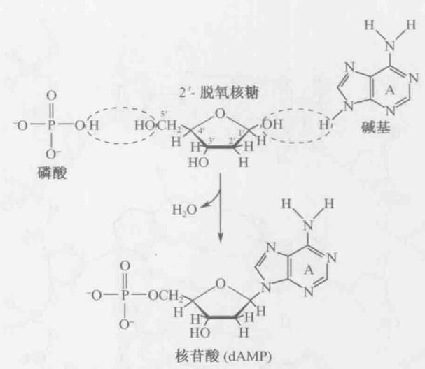  
图 4-2 脱水形成核苷酸。在 $2'$ -脱氧核糖的 C 原子的数目以红色表示。

表 4-1 腺嘌呤与相关复合物

<table><tr><td></td><td>碱基腺嘌呤</td><td>核苷2&#x27;-脱氧腺苷</td><td>核苷酸2&#x27;-脱氧腺苷-5&#x27;磷酸</td></tr><tr><td>结构</td><td>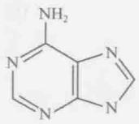</td><td>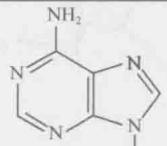</td><td>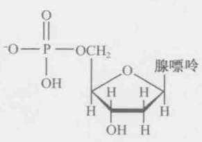</td></tr><tr><td>相对分子质量</td><td>185.1</td><td>251.2</td><td>331.2</td></tr></table>

磷酸二酯键赋予了 DNA 链的固有极性，这种极性由核苷酸的不对称性和它们结合的方式所决定。DNA 链的一端是游离的 5'-磷酸基或 5'-羟基，另一端是游离的 3'-磷酸基或 3'-羟基。习惯上，DNA 序列由 5' 端（在左边）向 3' 端书写，一般 5' 端是磷酸基而 3' 端是羟基。

## 每个碱基都有它偏好的异构体

构成 DNA 的碱基可以分为两类：嘌呤（purine）和嘧啶（pyrimidine）。嘌呤为腺嘌呤（adenine）和鸟嘌呤（guanine）；嘧啶为胞嘧啶（cytosine）和胸腺嘧啶（thymine）。图 4-4 显示了嘌呤的双环结构，腺嘌呤和鸟嘌呤具有这种相同的基本结构，但附着的基因不同；同样，图 4-4 也显示出了胞嘧啶和胸腺嘧啶的单环结构的差异。图 4-4 还用数字标注了嘌呤和嘧啶环上的位置，碱基在嘧啶的 N1 位置上通过糖苷键与脱氧核糖相连，而在嘌呤的 N9 位置上通过糖苷键与脱氧核糖相连。

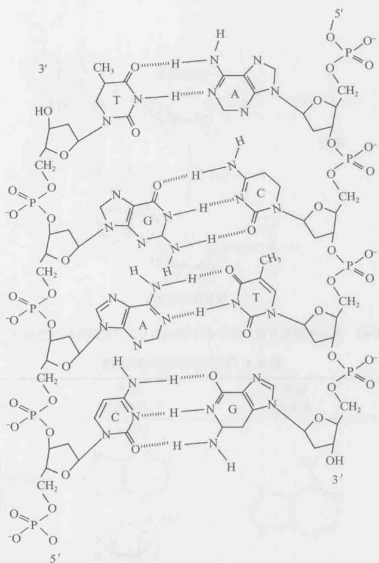  
图 4-3 多核苷酸链的详细结构。本图表示嘌呤（蓝色）和嘧啶（黄色）之间的碱基配对作用，  
以及骨架间的磷酸二酯键。(来源: Dickerson R. E.1983. Scientific American249: 94, 绘图: Irving  
Geis. 由 Irving Geis Collection/Howard Hughes Medical Institution 提供，未经许可不得复制）

每个碱基都存在两个可选的异构状态（tautomeric state），它们互相保持平衡。这种平衡极大地倾向于图4-4所示的常规结构，它们是碱基配对的主要结构。嘌呤和嘧啶环上的氮原子大多以氨基形式存在而很少以亚氨基构型出现；同样，鸟嘌呤和胸腺嘧啶上的氧原子通常以酮式构型存在而很少以烯醇式构型出现。例如，图4-5显示了胞嘧啶的亚氨基异构体，图4-5b为鸟嘌呤的烯醇式异构体。正如我们看到的，异构体是导致DNA合成时出错的普遍原因。

## 双螺旋的两条链通过碱基反向平行配对连接在一起

两条多核苷酸链上的碱基靠较弱的、非共价键结合使其互相缠绕形成双螺旋，如图 4-1 所示。一条链上的腺嘌呤总是和另一条上的胸腺嘧啶配对，而鸟嘌呤总是和胞嘧啶配对。两条链有相同的几何螺旋结构，但连接它们的碱基配对使得它们有相反的极性，即一条链上 5'端的碱基和另一条链上 3'端的碱基配对，叫做反向平行，这是腺嘌呤和胸腺嘧啶、鸟嘌呤和胞嘧啶互相配对的立体化学结果。

## 双螺旋的两条链序列互补

腺嘌呤和胸腺嘧啶配对、鸟嘌呤和胞嘧啶配对的结果是使两条相互缠绕的链上的碱基序列呈互补关系并赋予 DNA 自我编码的特性。举个例子，如果一条链上的序列是 5'-ATGTC-3'，那么另一条链则必然是互补的序列 3'-TACAG-5'。

“Watson-Crick”配对规则的严格性源自于腺嘌呤和胸腺嘧啶、鸟嘌呤和胞嘧啶的分子结构及氢键的互补性（图4-6）。腺嘌呤和胸腺嘧啶配对，腺嘌呤C6上环外的氨基基团与胸腺嘧啶C4上的羰基可以形成一个氢键；同样，腺嘌呤的N1和胸腺嘧啶的N3也形成一个氢键。鸟嘌呤和胞嘧啶也是如此，所以在一碱基对中既有氢键也有分子结构的互补。GC碱基对有3个氢键，因为鸟嘌呤C2上环化的氨基基团和胞嘧啶C2上的羰基形成氢键，同样鸟嘌呤的N1和胞嘧啶的N3，鸟嘌呤C6的羰基和胞嘧啶N4上环化的氨基也可形成氢键。Watson-Crick碱基配对需要碱基处于它们优势的异构状态。

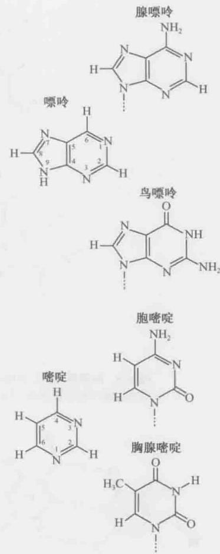

双螺旋一个重要的特点是两个碱基对正好有相同的几何结构, 无论是 A:T 碱基对或是 G:C 碱基对都不会影响两个糖之间的排列, 因为这两个碱基对的糖附着点间的距离是相同的。T:A 碱基对或 C:

图 4-4 嘌呤和嘧啶。虚线表示碱基和核糖结合的位点。为简便起见，除非特殊说明，氢原子不在后面图示的核糖和碱基中表示出来。

G 碱基对也不会影响糖的排列。换句话说，两个糖之间有一个大致的二乘对称轴关系，不需要扭曲 DNA 的总体结构，这 4 种碱基对就能安置于内；而且双螺旋的两条糖磷酸骨架上的碱基彼此间可以整齐地堆积。因此，DNA 中的碱基对顺序不规整，但总体结构相对规整。这与蛋白质（见第六章）中的氨基酸顺序不规整造成其结构的巨大差异正好形成对比。

## 双螺旋由于碱基配对和碱基堆积获得稳定性

互补碱基之间由氢键连接是双螺旋的一个基本特征，有助于双螺旋的热动力学稳定性和碱基配对的特异性。乍一看，由于以下几个原因，氢键看似对 DNA 的稳定性影响不大。水溶液中的有机分子含有满足所有氢键形成的特性，因为许多水分子可快速地与它结合或解离。结果，每当一个碱基对形成时在配对碱基之间产生一个氢键，就有一个碱基与水分子之间的氢键断裂，而这一氢键在碱基对还没形成前就存在了。因此，氢键对维持双螺旋稳定性所起的净作用似乎不是很大。然而，当多核苷酸链分离时，水分子在碱基上排成一排；当双螺旋中两条链合在一起时，水分子被碱基替代。这样造成了无序，增加了熵值，使双螺旋得以稳定。氢键并不是稳定双螺旋的唯一因素。

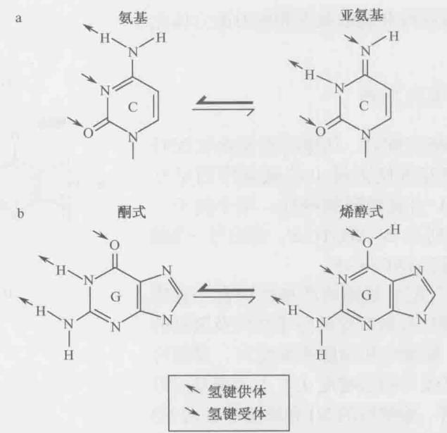  
图 4-5 碱基异构体。氨基↔亚氨基和酮式↔烯醇式的互变异构现象。（a）胞嘧啶通常为氨基式很少有亚氨基式。（b）鸟嘌呤通常为酮式，很少有烯醇式。


  
图 4-6 A:T 和 G:C 碱基配对。图示碱基之间的氢键。

第二个重要的作用力来自于碱基间的堆积力。碱基是扁平、相对难溶于水的分子，它们以大致垂直于双螺旋轴的方向互相上下堆积。双螺旋堆积时碱基之间电子云的相互作用（ $\pi-\pi$ ）对双螺旋的稳定有重要作用。堆积的碱基可以通过瞬时的、诱导性的电子云偶极彼此吸引，这一现象被称为范德华作用。碱基堆积因为疏水效应同样有助于双螺旋的稳定

性。简单来讲，与“油脂性”的或疏水的碱基表面相比，水分子更倾向于在彼此间相互作用。相对缺少堆积力的单链 DNA，这些疏水面由于碱基堆积被埋藏在双螺旋内侧，减少了碱基表面暴露于水分子的可能，从而降低了双螺旋结构的自由能。

## 氢键对碱基配对特异性的重要作用

正如我们所见，氢键对 DNA 的稳定性贡献不大，但是对碱基配对的特异性非常重要。如果我们尝试着使腺嘌呤和胞嘧啶配对，一个氢键受体（腺嘌呤的 N1）对着另一个氢键受体（胞嘧啶的 N3），而两个受体之间无法再容纳一个水分子，也就无法形成氢键（图4-7）。同样，两个氢键供体——腺嘌呤 C6 和胞嘧啶 C4 上的氨基基团也彼此相对。所以，A:C 碱基配对是不稳定的，因为受体和供体基团上的水分子必然会被除去，而碱基对间无法形成氢键。

碱基会从双螺旋中翻转出来

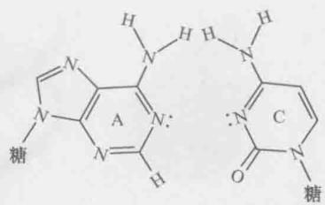  
图 4-7 A: C 的不相配。本图显示 A 和 C 之间不能形成正确的氢键。因此它们间的碱基配对是不稳定的。

到目前为止我们已经知道,双螺旋的力学特征有助于使一条多核苷酸链上的一个

  
图 4-8 碱基翻出。图中的 DNA 结构由甲基化酶的结构中分离得到，显示了胞嘧啶残基的翻出，以及给邻近碱基对造成的轻微变形。（Klimasauskas S., Kumar S., Roberts R. J., and Cheng X. 1994. Cell. 76: 357，图像由 BobScript、MolScript 及 Raster 3D 软件制作。）

碱基与另一条链上的互补碱基配对。然而，有时单个碱基会从双螺旋中突出出来，这种值得注意的现象叫做碱基翻出（base flipping），如图4-8所示。正如我们将在第10章中看到的，碱基从双螺旋中翻出能使碱基处于酶的催化部位，一些酶就是通过和这些螺旋构型外的碱基相互作用而使碱基甲基化或除去受损碱基的。而且，人们相信与同源重组和DNA修复相关的酶能将碱基一个接一个地翻转出来，借此扫描DNA搜寻同源区域或损伤区域。因为一次只翻转一个碱基，这个过程并不需要很多能量。显然，DNA比人们所设想的更有弹性。

## DNA 通常是右手双螺旋

用物理学中的手性法则进行分析，我们可以看到双螺旋中两条多核苷酸链都是右手螺旋。试想一下，举起你的右手，如图4-9所示的DNA分子，拇指朝上并沿

着螺旋的长轴，其余手指随着沟的方向摆放。沿拇指所指的方向追踪双螺旋的一条链，你将注意到螺旋的方向和你的手指所指的方向相同。若用左手，则无法得到上述发现。

DNA 的螺旋状结构导致了它是有周期性的。两个相邻碱基对间的夹角大约是 $36^{\circ}$ 。通过分析 DNA 的 X 射线晶体衍射图发现，完成一个螺旋（ $360^{\circ}$ ）需 10 个碱基对的堆积（图 4-1 a），也就是说，每一个螺周通常是 10 个碱基对。进一步的讨论见框 4-1，云母实验表明溶液中双螺旋 DNA 每一螺周含有 10.5 个碱基对。


  
图 4-9 左手和右手螺旋。双螺旋的两条链以右手螺旋的方式互相缠绕。  
框4-1 云母实验表明溶液中双螺旋DNA每一螺周含有10.5个碱基对

每一螺周含有10个碱基对，这个数值会因为条件的不同而有所变动。20世纪70年代进行的经典实验表明吸附在某一表面上的DNA每一螺周不只含有10个碱基对。小片段DNA可以吸附在云母表面上，而且5'端磷酸基的存在使得DNA在云母上呈一定的方向性。随后吸附在云母上的DNA用DNase I（一种脱氧核糖核酸酶）消化。这种酶可以裂解DNA磷酸糖骨架上的磷酸二酯键。但由于这种酶的体积大，空间位阻使它无法作用于DNA的侧面或底面，仅仅可以切断距离云母最远的DNA表面上的磷酸二酯键（将DNA看成是平躺于平面上的圆柱体）。因此经过切割后得到的片段的长度应该可以反映出DNA的周期性，即每一螺周碱基对的数目。

吸附在云母上的DNA经过DNase I切割后得到的片段可以通过聚丙烯酰胺凝胶电泳进行分离（框4-1图1，以及第7章关于电泳的说明）。聚丙烯酰胺凝胶是一种类似于果冻的基质。因为DNA带负电，所以它在胶体中向电场的正极泳动。由于胶体的阻碍作用，

  
框4-1 图1 云母实验

使得片段的泳动速度与片段的大小成反比，即片段越大泳动速度越慢。电泳分离后，从电泳结果中我们发现片段平均大小为10、11、21、31和32等，即以10.5个碱基对逐倍递增的DNA片段成簇存在。10.5就是每一螺周的碱基对的数目，这与其他方法推测出的溶液中DNA每一螺周的碱基对数目相近（见下文“双螺旋以多重构象存在”）。利用DNase探测DNA结构的这种方法现已应用到分析DNA与蛋白质的相互作用上（第7章）。

## 双螺旋有大沟和小沟

DNA 分子两条链所形成的双螺旋结构使 DNA 分子延伸成长长的多聚体。其上有两条大小不一的沟。为什么会有一条小沟、一条大沟？这是由碱基对的空间几何结构决定的。碱基对上凸起的两个糖（糖苷键间的夹角）之间的角度大约为 $120^{\circ}$ （指窄角，广角则为 $240^{\circ}$ ）（图 4-1b 和图 4-6）。结果，当越来越多的碱基对上下堆积起来时，其一侧糖间的窄角就形成了小沟（minor groove），而另一侧的广角就形成了大沟（major groove）。（如果糖和糖之间呈直线相对，也就是 $180^{\circ}$ 的角度，那么所形成的两个沟大小相同，不存在小沟和大沟之分）。大沟中有丰富的化学信息

每个碱基对的边缘都暴露于大沟、小沟中，从而产生了氢键供体和受体，以及识别碱基对的范德华力表面的模式（图4-10）。在大沟中的A：T碱基对边缘，化学基团以如下顺序排列：氢键受体（腺嘌呤N7）、氢键供体（腺嘌呤C6上的环外氨基）、氢键受体（胸腺嘧啶C4上的羰基）和大的疏水表面（胸腺嘧啶C5上的甲基）。同样，在大沟中G：C碱基对的边缘展示了下列基团：氢键受体（鸟嘌呤N7）、氢键受体（鸟嘌呤C6上的羰基）、氢键供体（胞嘧啶C4上的环外氨基）和小的非极性氢（胞嘧啶C5上的氢）。

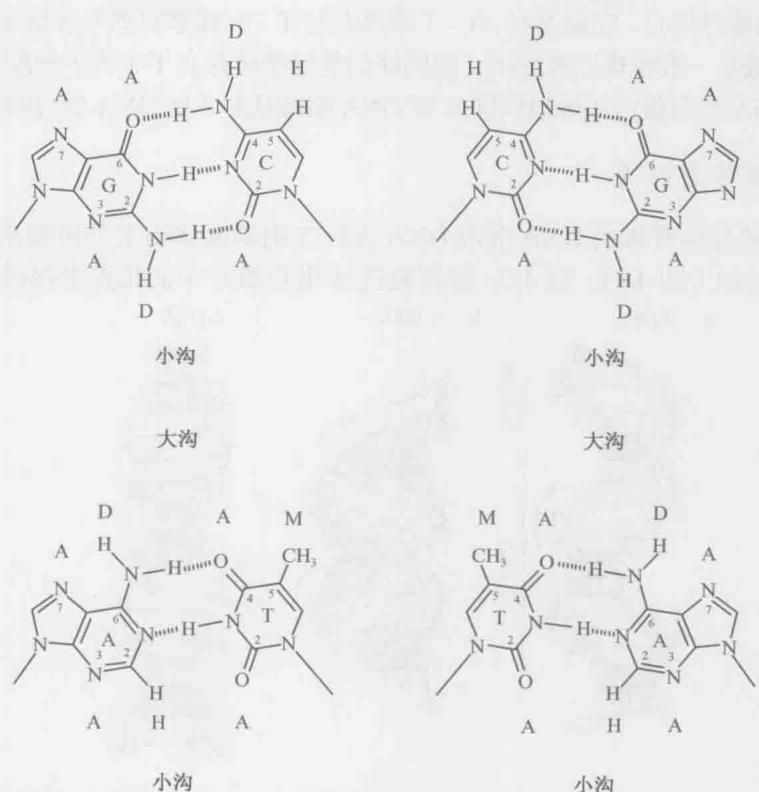  
图 4-10 碱基对边缘的化学基团暴露于大沟、小沟中。红色字母分别为氢键受体（A）、氢键供体（D）、非极性氢（H）和甲基基团（M）。

因此，所形成的氢键和暴露于大沟中的整体形状的特有模式可以将 A:T 碱基对与 G:C 碱基对区别开来，并可区分 A:T 碱基对与 T:A 碱基对、G:C 碱基对与 C:G 碱基对。我们可以把这些特征看成代码，其中 A 代表氢键受体，D 代表氢键供体，M 代表甲基，H 代表非极性氢。以这种代码方式，在大沟中 ADAM 代表一个 A:T 碱基对；AADH 代表一个 G:C 碱基对；MADA 代表一个 T:A 碱基对；HDAA 代表一个 C:G 碱基对。在所有情况下，大沟中化学基团的这种代码都可以具体说明不同碱基对的特性。

这些模式是非常重要的，使得蛋白质无需解开继而破坏双螺旋就可准确地识别 DNA 序列。事实上，正如我们将要看到的，一个首要的解码机制就是通过氨基酸侧链进入大沟、识别特定 DNA 并与其结合（详见第 6 章）。

小沟中化学信息较少，而且现有的信息对于区分各碱基对也没多大用处。由于体积小，它不太能容纳氨基酸侧链。在小沟中，A：T 碱基对与 T：A 碱基对、G：C 碱基对与 C：G 碱基对看起来极其相似。A：T 碱基对有氢键受体（腺嘌呤 N3）、非极性氢（腺嘌呤 C2 上的氢）和氢键受体（胸腺嘧啶 C2 上的羰基），它的代码即为 AHA，但若从反向读取，其代码是相同的。从侧链伸入小沟的蛋白质的氢键形成特性角度看，A：T 碱基对与 T：A 碱基对没什么不同。同样，G：C 碱基对有氢键受体（鸟嘌呤 N3）、氢键供体（鸟嘌呤 C2 上的环外氨基）和氢键受体（胞嘧啶 C2 上的酮基），它的代码为 ADA。所以，从氢键形成角度看，C：G 碱基对与 G：C 碱基也没有什么不同。小沟中，A：T 碱基对与 G：C 碱基对容易区分，但 G：C 碱基对与 C：G 碱基对、A：T 碱基对与 T：A 碱基对则不容易区分（图 4-10）。虽然小沟中的碱基一般较难以被分辨，但同样的氢键受体存在于小沟中的配对碱基，因此同样可以使 DNA 结合蛋白正确地识别 B 型 DNA 的碱基对（如 DNA 聚合酶，见第九章）。

## 双螺旋以多重构象存在

早期对高浓度细纤维的 DNA 溶液 DNA 进行 X 射线晶体衍射分析提出了两种结构：A-DNA 和 B-DNA（图 4-11；框 4-2：如何通过 X 射线胶片中的斑点来揭示 DNA 结构）。

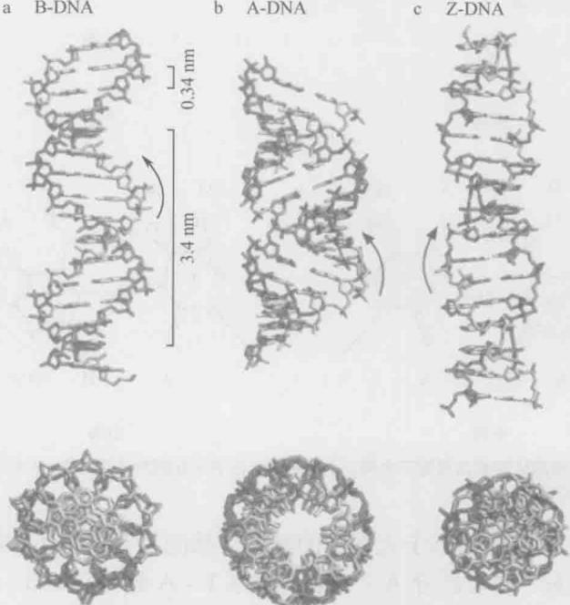  
图 4-11 B-DNA、A-DNA 和 Z-DNA 的模型。所有结构中每条链的糖-磷酸骨架在外侧（一个用紫色表示，一个用绿色表示），碱基在内侧（用银色表示）。上面的为侧面图，下面的为横切图。（a）B-DNA 是细胞中的通常构型，其特征为每螺周 10 个碱基对（螺距 3.4nm），即邻近碱基对堆积距离为 0.34nm，并且可以看到大沟和小沟。（b）A-DNA 更为紧凑，每螺周 11 个碱基对，且碱基对与螺旋纵轴间的夹角比较大。此外，A-DNA 是中空的（见横切图），RNA 双链和 RNA-DNA 杂交双链采取这种构型。（c）Z-DNA 是左手螺旋，呈 “Z” 字形。（来源：C. Kielkopfand P. B. Dervan 惠赠）

在较高湿度下观察到的 B-DNA 最接近生理条件下 DNA 的一般结构：每螺周 10 个碱基对，宽的大沟和窄的小沟。在较低湿度条件下观察到的 A-DNA 每圈 11 个碱基对。与 B-DNA 相比，大沟窄且深，小沟宽且浅。细胞中绝大部分 DNA 以 B 型构象存在，但在某些 DNA-蛋白质复合体中 DNA 也可以 A 型构象存在，而且 A-DNA 与以双螺旋形式存在的 RNA 分子的结构相似。

## 框 4-2 如何通过 X 射线胶片中的斑点揭示 DNA 结构

在分子生物学的历史上最经典的图像之一，就是由 Rosalind Franklin 拍摄的一张著名的照片：一个定向的 DNA 分子纤维的 X 射线衍射模式图。这张由她拍摄的照片之所以具有如此重大的历史意义，是因为该照片为 B 型 DNA 的沃森-克里克模型（Waston-Crick model）提供了关键的证据。而且，Francis Crick 作为一位推动了螺旋分子衍射理论发展的科学家，从胶片上的斑点的模式推断出 DNA 的两条链是相互缠绕的。乍一看，她的图像与双螺旋并没有多大关系。那么，这些斑点的神秘模式

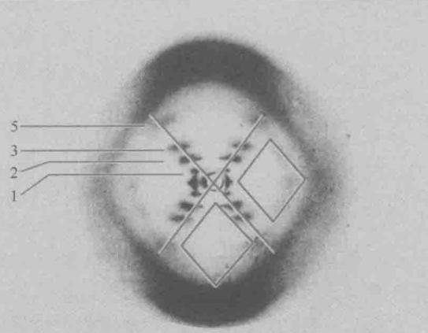  
框 4-2 图 1 Rosalind Franklin 的 DNA 的 X 射线衍射成像揭示出 Maltese 十字视标 (Maltese cross)。(经 Franklin R.E. and Gosling R.G. 1953, Nature 171:740\~741, Macmillan 许可修改)

## 是如何揭示出作为遗传物质的 DNA 的原子结构呢？

从图中我们可以看到，Franklin的图像由一个中心Maltese十字视标（Maltese cross）构成（在框4-2图1中用红色表示），该视标又由宽点（该宽点的宽度反映出DNA分子纤维的无序状态）组成。斑点沿着水平“层次”（layer）线（见数字标注）被均匀隔开。请注意，从十字视标的中心往上或往下计数时，不能发现第四层次线上的斑点。同时还要注意，Maltese十字视标以及图像顶部和底部极暗的区域产生出一系列菱形区域（见用蓝色表示的两个例子）。经过对波的衍射本性的一些思考，从定性的角度上，我们现在可以这样解释，这个表面上晦涩难懂的斑点模式其实与双螺旋结构是相对应的。

X射线衍射的原理是当波通过一个周期性阵列时，如果波长与该阵列的重复单位近似的话，波之间会发生干涉（interference）（这就是为什么X射线会被用来揭示原子结构，因为它的波长很短，仅为0.15nm）。如果波的振动一致，波之间会相互加强（结构性干涉），但如果一系列波的波谷与另一系列波的波峰相遇，波之间则相互抵消（破坏性干涉）。因此，一束束通过含有水平线的阵列的波会产生一行垂直于该水平线的斑点（框4-2图2）。可以想象，如果水平线倾斜的话，会产生一行倾斜的斑点（该行斑点仍然垂直于倾斜的线）。还可以进一步想象，对于如图所示的两套以“Z”字形连接的倾斜线来说，如果波通过它们，则会产生由两行倾斜的斑点组成的十字形。

  
框 4-2 图 2 穿过平行线时光波衍射的模式

现在让我们回到 DNA 上来。想象一下，双螺旋中一条链的骨架投影到一个平面上来，不严格地说，这会产生一系列相互连接的 zig 和 zag（或更恰当一点，正弦曲线）。如果我们想像 zig 为产生一套倾斜线，zag 产生另一套倾斜线，那么穿过 zig 和 zag 的波将会产生如以上例子所示的两行相互交叉的斑点。这就构成了 Franklin 照片中 Maltese 十字视标的基础，因此该十字揭示出了 DNA 的螺旋结构。基于 X 射线的波长，同时测量层次线间隔开的距离，进一步揭示出螺旋的周期为 3.4nm。当然，DNA 并非只包含一个螺旋骨架，而是包含双螺旋骨架，这一点也通过 Franklin 的照片得以揭示。DNA 双螺旋之间有 3/8 的螺旋重复单元对位不准，结果证明双螺旋之间的这种抵消产生了一

个额外的破坏性干涉，而将第四层次线抹除。因此，丢失的第四层次线表明 DNA 具有双螺旋结构，并告诉我们双螺旋之间是如何相对排列的。

最后，DNA骨架并非我们想象中的那样是一条平滑线。相反，从原子水平来讲，它是颗粒性的，由糖磷酸单元构成。这种颗粒性导致了额外的强度，尤其是十字视标中心的北面和南面，产生出一种四菱形的模式。在比这分辨率更高的照片中，从十字视标中心往北面和南面可以清楚地数出10条层次线。这种衍射模式的特点告诉我们，双螺旋的周期（3.4nm）为原子周期的10倍，对应于以0.34nm为间隔的10个重复单元。因为每一个糖磷酸单元具有一个碱基，因此B型DNA每一螺旋周期（即每一个螺旋转角）由10个碱基对组成。

因此，对于波的衍射的初步理解使如下工作成为可能：通过 X 射线胶片上的斑点的简单模式推导出 DNA 结构的主要特点。

B-DNA 是一种理想结构，与细胞中的 DNA 略有不同，体现在两个方面：第一，溶液中的 DNA 分子比 B-DNA 分子螺旋程度更高，平均每螺周有 10.5 个碱基对；第二，B 型构象是均一的结构，然而实际的 DNA 没有如此规则，甚至从精细结构看，它的各个碱基对之间都有所不同，这是将不同序列 DNA 的晶体结构进行比较得出的结论。例如，每个碱基对的两个碱基并不是一直处于同一平面，甚至能呈现“螺旋桨扭转”，两个碱基平面沿着碱基对的长轴相对于彼此向相反方向旋转，赋予碱基对类似螺旋桨的特征（图 4-12）。此外，每个碱基对精确的螺旋桨扭角并不恒定，结果局部的大沟、小沟的宽度会发生变化。因此，DNA 分子永远不会是完全规则的双螺旋。相反，DNA 的准确构象取决于双螺旋每一位置上碱基对的种类（A：T、T：A、G：C 或者 C：G）及其相邻碱基对的存在。但是就许多研究而言，B 型构象仍然是与细胞中 DNA 结构最接近的。

  
图 4-12 右手螺旋中嘌呤和嘧啶碱基对之间的螺旋桨扭转。（a）常规 Watson 和 Crick 配对中 3 个连续 A:T 碱基对的序列结构。（b）螺旋桨扭转引发碱基相对于其长轴的旋转。（据 Aggaarwalet al., 1988. Science. 242: 899-907, Fig.5b. ©AAAS.）

## DNA 有时可形成左手螺旋

包含交替的嘌呤和嘧啶残基的 DNA 除可形成右手螺旋外，还可形成左手螺旋。为了弄清左手螺旋是如何形成的，我们需要仔细考察将碱基连到 2'-脱氧核糖 1'位置的糖苷键。这个键可以以顺式（syn）或反式（anti）存在（图 4-13）。右手螺旋 DNA 的糖苷键只以反式构象存在，而左手螺旋中基本重复单位通常是嘌呤嘧啶二核苷酸。糖苷键在嘌呤位置以顺式构象存在，在嘧啶位置以反式构象存在。正是嘌呤处的顺式构象造成了左手螺旋。由于嘌呤处变为顺式构象，使得左手螺旋 DNA 的骨架上顺式反式构象交替出现，呈现“Z”字形走向（因此命名为 Z-DNA；图 4-11），可与右手螺旋区分开。影响反式向顺式转变的旋转也使核糖基团在折叠过程中发生了变化。如图 4-13 所示，C3' 和 C2' 可以转换位置。只有在高阳离子浓度下（如 Na⁺），中和了带负电的磷酸基团，溶液中的交替嘌呤嘧啶残基才会呈现左手螺旋构象。在低盐浓度情况下，它们会形成典型的右手螺旋构象。Z-DNA 的生理意义还不清楚，左手螺旋在细胞 DNA 中可能只占很小一部分。A-DNA、B-DNA 和 Z-DNA 的更多细节列于表 4-2。

## DNA 双链可以分开（变性）和复性

因为双螺旋的两条链依靠较弱的力（非共价键）结合在一起，故我们预计它们分开也很容易。确实，双螺旋的结构解析之时，就表明 DNA 以这种方式进行复制。当 DNA 溶液温度高于生理温度（接近 $100^{\circ}$ C）或者 pH 较高时，互补的两条链就可分开，这个过程称为变性（denaturation）。然而，DNA 双链完全分开的变性过程是可逆的，当变性 DNA 的热溶液缓慢降温，DNA 的互补链又可重新聚合，形成规则的双螺旋（图 4-14）。由于变性的 DNA 分子具有复性的能力，因此来源不同的两条 DNA 链通过缓慢降温也可形成人工杂交 DNA 分子，同样，互补的 DNA 和 RNA 链也可形成杂交分子。在第 20 章里，两条单链核酸形成杂交分子的能力被称为杂交（hybridization）。这是分子生物学中几项不可缺少的技术的基础，如 Southern 印迹杂交和 DNA 芯片分析（第 7 章）。

表 4-2 从 X 射线单晶体衍射分析得出的 A 型、B 型和 Z 型 DNA 结构特性的比较

<table><tr><td rowspan="2"></td><td colspan="3">螺旋类型</td></tr><tr><td>A</td><td>B</td><td>Z</td></tr><tr><td>外形</td><td>短粗</td><td>长而薄</td><td>细长</td></tr><tr><td>每碱基上升</td><td>2.3Å</td><td>3.32 Å</td><td>3.8 Å</td></tr><tr><td>螺旋直径</td><td>25.5 Å</td><td>23.7 Å</td><td>18.4 Å</td></tr><tr><td>螺旋方向</td><td>右手</td><td>右手</td><td>左手</td></tr><tr><td>每螺旋单位碱基数</td><td>1</td><td>1</td><td>2</td></tr><tr><td>每螺周碱基数</td><td>~11</td><td>~10</td><td>12</td></tr><tr><td>碱基夹角</td><td>33.6°</td><td>35.9°</td><td>每2bP为-60°</td></tr><tr><td>螺距</td><td>24.6Å</td><td>33.2Å</td><td>45.6Å</td></tr><tr><td>碱基倾角</td><td>+19°</td><td>-1.2°</td><td>-9°</td></tr><tr><td>碱基平均螺旋桨扭角</td><td>+18°</td><td>+16°</td><td>约0°</td></tr><tr><td>螺旋轴位置</td><td>大沟</td><td>穿过碱基对</td><td>小沟</td></tr><tr><td>大沟</td><td>极狭、很深</td><td>宽、中等深度</td><td>平坦</td></tr><tr><td>小沟</td><td>很宽、浅</td><td>狭、中等深度</td><td>极狭、很深</td></tr><tr><td>糖苷键构象</td><td>反式</td><td>反式</td><td>C反式、G顺式</td></tr></table>

来源：据：Dickerson R. et al. 1982. CSHSQB47: 14. Copyright © 1982 Cold Spring Harbor Laboratory Press. 许可修改。


图 4-13 B-DNA 中鸟嘌呤的反式构象和 Z-DNA 中鸟嘌呤的顺式构象。右手螺旋的 B-DNA 中，连接脱氧核糖和碱基的糖苷键（用红色表示）只以反式构象存在；左手螺旋的 Z-DNA 中，糖苷键沿箭头方向旋转，在嘌呤处形成顺式构象（这里为鸟嘌呤）；而嘧啶处依然保持规则的反式构象，没有发生旋转。（来源：Wang A. J. H. et al. 1982. CSHSQB 47: 41. Copyright © 1982 Cold Spring Harbor Laboratory Press.）

20 世纪 50 年代通过在一系列条件下研究 DNA 变性的经典实验对双螺旋的特性有了深刻的认识。这些实验依靠测量通过 DNA 溶液的紫外线吸光率实现对 DNA 变性的监控。DNA 在 260nm 处有最大吸收值，碱基是造成吸收的主要因素。由于双螺旋 DNA 的光吸收比单链 DNA 少 40%，当 DNA 溶液温度升高到接近水的沸点时，光吸收值（absorbance）在 260 nm 处明显增加，这种现象称为增色效应（hyperchromicity）；而减色效应则是因为双螺旋 DNA 中的碱基堆积降低了对紫外线的吸收能力。

如果我们将 DNA 的光吸收对温度绘制函数曲线，不难看出光吸收的急剧增加发生在相对较窄的一个范围内。吸光度增加到最大值一半时的温度叫做 DNA 的熔点(melting point)，用 Tm 表示（图 4-15）。DNA 像冰一样溶化，经历了从高度有序的双螺旋结构向无规则单链结构的转变。在 DNA 熔点处光吸收的急剧增加说明 DNA 互补双链的变性、复性是一个高度协同的、类似于拉拉链一样的过程。例如，复性最可能以缓慢的成核反应发生，首先一条链上的一小部分碱基在互补链上找到与它们互补的那部分碱基并与之配对（图 4-14），然后两条链的其余部分就会在成核位置像拉拉链那样迅速形成双螺旋（图 4-14）。

  
图 4-14 退火和杂交。两个基本相同的双链 DNA 分子的混合物：一个是正常的野生型 DNA，另一个是缺少一小段核苷酸的突变体 DNA（缺少核苷酸的区域用红色标为 a）。加热混合物使 DNA 变性。变性 DNA 在低于熔解温度的条件下培育时可以复性，产生两种类型的复性分子：一是完全复性分子，分别由互补的两条野生型链或两条突变型链构成双螺旋；二是杂交分子，由一条野生型链和一条突变型链构成，并形成一段短的不配对的环（区域 a）。

Tm 值是 DNA 的特征常数，很大程度上取决于 DNA 中 G+C 的百分含量和溶液的离子强度。DNA 中 G+C 的百分含量越高（即 A+T 的百分含量越低），DNA 的 Tm 值越高（图 4-16）。DNA 溶液的盐浓度越高，DNA 的 Tm 值也越高。这是为什么呢？与 A:T 碱基对相比，G:C 碱基对对 DNA 的稳定性具有更重要的作用。首先，G:C 碱基对之间有 3 个氢键，而 A:T 碱基对之间只有 2 个氢键；更为重要的是，G:C 碱基对与相邻碱基对之间的堆积力比 A:T 碱基对与其相邻碱基对之间的堆积力更大。离子强度的效应则反映出双螺旋的另一基本特性。两条 DNA 链的骨架包含了带负电的磷酸基团。如果这些负电荷没有被中和，双链之间这种静电斥力将驱使两条链分开。在高离子强度下，负电荷可以被阳离子所中和，促进了双螺旋结构的稳定；相反，在低离子强度下，未被中和的负电荷将会降低双螺旋的稳定性。

  
图 4-15 DNA 变性曲线。

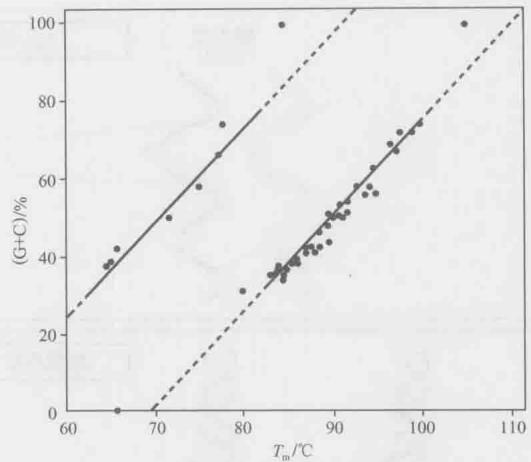  
图 4-16 DNA 的变性取决于 G+C 含量和盐浓度。G+C 的百分含量越高，DNA 的变性温度（Tm）越高。不同来源的 DNA 分别溶解在低盐浓度（红线表示）和高盐浓度（绿线表示）的溶液中，pH 7.0。各点代表 DNA 的变性温度，以 G+C 的百分含量为纵坐标作图。（来源：Marmur J. and Doty P. 1962 Journal of Molecular Biology 5: 120. ©Elsevier）

## 一些 DNA 为环状分子

早期研究认为所有的 DNA 分子都是线形的，具有两个游离末端。确实，每个真核细胞的染色体都有一个极长的独立的 DNA 分子，但是现在我们知道某些 DNA 是环状的。例如，小猴 DNA 病毒 SV40 染色体就是环状双螺旋 DNA 分子，长约 5000bp，并且大多数细菌染色体也是环状的。E. coli 的环状染色体长约 5000kb。此外，许多细菌都有染色体外自主复制的遗传因子——质粒（plasmid），通常为环状 DNA 分子。

有趣的是，一些 DNA 分子有时为线形，有时为环状。最著名的例子是 $\lambda$ 噬菌体，它是一种寄生在 E. coli 中的 DNA 病毒。在病毒粒子中 $\lambda$ 噬菌体的基因组是线形双链分子。但当 $\lambda$ 噬菌体感染 E. coli 细胞时， $\lambda$ 噬菌体的基因组被注入 E. coli 细胞，DNA 分子随之发生环化。这是由于 $\lambda$ 噬菌体的双链 DNA 末端具有互补的单链凸出部分，即“黏性末端”，可通过碱基配对连接而成为环状。

## DNA 拓扑学

DNA 是一种柔性结构，它的精确的分子参数与两个因素相关：①周围的离子环境；②和它形成 DNA-蛋白质复合体的 DNA 结合蛋白的性质。因为线性 DNA 分子的末端是游离的，所以它们可以自由旋转以适应双螺旋两条链彼此缠绕次数的变化。但是如果

DNA 分子的两个末端共价连接形成环状分子,并且两条链的糖-磷酸骨架没有间断,DNA 分子的两条链彼此缠绕的次数就不能改变。这样的共价闭环 DNA（covalently closed circular DNA, cccDNA）的拓扑结构是受限的。甚至由于长度极长,染色质结构,以及与其他细胞成分的相互作用等原因,真核细胞染色体的线形 DNA 分子的拓扑结构也是受限的(第 8 章)。尽管有这些限制,DNA 仍然在细胞中参与了许多动力学过程。例如,双螺旋的相互缠绕的两条链必须迅速分开以完成 DNA 复制并转录为 RNA。因此,理解 DNA 拓扑学,以及细胞如何在 DNA 复制、转录及其他的染色体活动中适应并利用拓扑结构的限制,在分子生物学中具有极其重要的意义。

## 连环数是共价闭环 DNA 的固有拓扑特性

考虑一下共价闭环 DNA 的拓扑特性。因为多核苷酸链中无断裂，所以不破坏共价键就不能使 cccDNA 的两条链彼此分离。如果想使环状 DNA 的两条链分开而又不永久破坏糖-磷酸骨架上的任何共价键，我们必须使一条链反复穿过另一条链（有一种酶能完成这个过程）。连环数（linking number）是指要使两条链完全分开时一条链必须穿过另一条链的次数（图 4-17）。不论 DNA 分子如何扭曲，连环数是共价闭环 DNA 的固有拓扑特性，而且一定是整数。

  
图 4-17 共价闭环 DNA（cccDNA）的拓扑结构。图示为 DNA 松弛态（a）到负超螺旋结构（b）的转变，超螺旋结构的张力可通过环状 DNA 形成超螺旋（b）或碱基对氢键的局部断裂（c）以消除。（据 Dr. M. Gellert 许可修改。）（来源：Modified from Kornberg A. and Baker T. A. 1992 DNA replication，11-21，p.32. ©W. H. Freeman.）

## 连环数由扭转数和缠绕数共同决定

连环数是扭转（twist）和缠绕（writhe）这两个几何数的总和。先来看扭转数，扭转数仅仅是一条链旋绕另一条链的螺旋数，即一条链完全缠绕另一条链的次数。设想一个cccDNA分子平躺在一个平面上，在这个平面构象中，连环数就等于扭转数。确实，扭转数可以由统计两条链彼此缠绕的次数而加以确认（图 4-17 a）。右手螺旋的螺旋交叉数（扭转数）被定义为正数，因此 DNA 的连环数是正值。

但是 cccDNA 通常不是处在一个平面上，而是扭转的，以至于在三维空间里双螺旋的长轴经常重复地自我交叉（图 4-17 b），这称为缠绕数。为使这种外力造成的扭曲更加形象化，可以想像一下过度扭曲的电话线。

缠绕可能有两种形式：一种形式称互卷（interwound）或相缠螺旋（plectonemic writhe），如图4-17b和图4-18a描述的，长轴本身自我交叉；另一种形式为环形（toroid）或螺线管状（spiral），像通常DNA缠绕蛋白质时一样，其长轴以螺线管形式绕成圆柱状（图4-18b）。缠绕数（Wr）是cccDNA中相缠螺旋形式缠绕数和（或）螺线管形式缠绕数的总和。例如图4-17b所示分子的缠绕数为4。

  
图 4-18 超螺旋 DNA 的两种缠绕方式。本图显示相同长度的 cccDNA 以互卷（a）和环形（b）缠绕。（a）互卷或被称为相缠螺旋，通过扭转双螺旋 DNA 穿过自身形成分枝状的分子结构。（b）环形或被称为螺线管状，在本例中用圆柱形线圈展示。（修改并得到许可 Kornberg A. and Baker T.A. 1992.DNA replication，11-22,p.33.W.H.Freeman.）

相缠螺旋形式和螺线管形式是 cccDNA 拓扑等价的几何特性，容易发生相互转化，扭转和缠绕也是可以相互转化的。一个 cccDNA 分子容易发生扭转变形，在不破坏任何共价键的条件下，部分扭转转变为缠绕或者部分缠绕转变为扭转。唯一不变的是扭转数（Tw）和缠绕数（Wr）的总和必须与连环数（Lk）相等，用等式表示如下：

$$
L k = T w + W r
$$

## $Lk^{0}$ 是生理条件下完全松弛态 cccDNA 的连环数

设想 cccDNA 未形成超螺旋（supercoiling），即松弛态（relaxed），则它的扭转数就与生理条件下 DNA 溶液中的 B-DNA 相同（每螺周约 10.5 个碱基对）。生理条件下 cccDNA 的连环数（Lk）表示为 $Lk^{0}$ 。这样一个分子的 $Lk^{0}$ 就是碱基对数除以 10.5 所得的值。假如一个 cccDNA 长度为 10 500bp，则 $Lk = +1000$ （由于 DNA 是右手螺旋，此值为正数）。为了说明这一点，我们不妨做个实验，将长度为 10 500bp 的 cccDNA 的一条链拉展为平面环状，则另一条链与这条链交叉 1000 次。

如果 cccDNA 不处于松弛态, 我们如何消除它的超螺旋呢? 一个方法是用 DNase I 温和处理 DNA, 目的是平均每个 DNA 分子打断一个磷酸二酯键（或一小部分键）。一旦 DNA 以这种方式产生 “缺口” 就不再受拓扑抑制, 它的链可以自由旋转, 使缠绕消失（图 4-19）。如果缺口被修复, 产生的 cccDNA 分子呈松弛态, Lk 平均值与 $Lk^{0}$ 相等（由于修复缺口时旋转程度波动, 所产生的 cccDNA 的 Lk 有的略大于 $Lk^{0}$ , 有的略小于 $Lk^{0}$ 。因此这种解旋的方法将会产生一系列限定在很窄范围内的 cccDNA, 其 Lk 平均值与 $Lk^{0}$ 相等）。

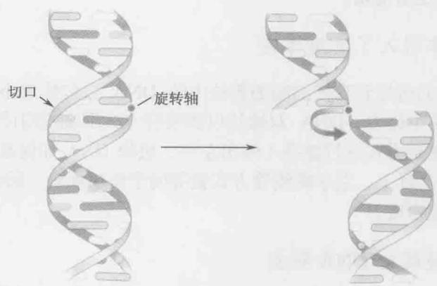  
图 4-19 DNase | 作用可使 DNA 解旋。

## 细胞中 DNA 呈负超螺旋

用 Lk 与 $Lk^{0}$ 的差值表示超螺旋的程度，称为连环差（linking difference）：

$$
\Delta L k = L k - L k ^ {o}
$$

如果 cccDNA 的 $\Delta Lk$ 绝对值不是零，DNA 就会因为过度扭曲产生超螺旋。 $Lk < Lk^{0}$ ，即 $\Delta Lk < 0$ ，DNA 产生“负超螺旋”； $Lk > Lk^{0}$ ，即 $\Delta Lk > 0$ ，DNA 产生“正超螺旋”。举例来说，图 4-17 a 所示分子为松弛态， $Lk^{0} = 36$ ；图 4-17 b 所示分子为负超螺旋，Lk = 32，后者与前者相差 4，所以 $\Delta Lk = -4$ 。

因为 $\Delta Lk$ 与 $Lk^{o}$ 取决于 DNA 分子的长度，采用一个超螺旋的标准测量方式会更方便。这就是超螺旋密度（superhelical density），用 $\sigma$ 表示，定义如下：

$$
\sigma = \Delta L k / L k ^ {0}
$$

从细菌和真核细胞中提取的环状 DNA 分子通常是负超螺旋， $\sigma$ 值约为-0.06。图 4-20 所示电子显微照片将噬菌体 DNA 松弛态结构与超螺旋结构进行了比较。

超螺旋的生物学意义是什么呢？负超螺旋含有自由能，可以为打开双链提供能量，使 DNA 复制和转录这样的解离双链的过程得以顺利完成。因为 $Lk = Tw + Wr$ ，负超螺旋可以让双螺旋扭转数减少（比较图 4-17 a 和图 4-17 b），负超螺旋区域因而有局部解旋倾向。因此，与松弛态 DNA 相比，负超螺旋 DNA 更易于解链。

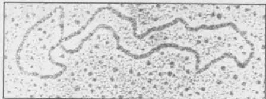

  
图 4-20 超螺旋 DNA 的电子显微照片。上方电镜照片显示松驰型（非超螺旋）。噬菌体 PM2 的 DNA 分子，下方为超螺旋状态。（电镜照片由 Wang J. 惠赠，1982. Sci Am, 247: 97）

唯一含有正超螺旋 DNA 的生物体是某些生活在极端高温环境（如温泉）中的嗜热微生物。在这种情况下，我们认为正超螺旋提供能量，阻止 DNA 在高温中发生变性。正超螺旋多转几圈（DNA 过度扭曲），则嗜热微生物 DNA 双链打开就比一般生物呈负超螺旋的 DNA 需要更多能量。

## 真核细胞中核小体引入了负超螺旋

在第 8 章中我们将提到真核细胞细胞核中的 DNA 被包装成小颗粒，称为核小体（nucleosome）。在核小体中，DNA 双螺旋以螺线管方式围绕蛋白质核心缠绕两圈。重要的是，它以左手螺旋方式进行盘绕（伸出左手，想像 DNA 如何盘绕在核小体上，见第 8 章，图 8-18）。实际上，左手螺线管方式就等同于负超螺旋。因此，DNA 包装成核小体引入了负超螺旋密度。

## 拓扑异构酶可使超螺旋 DNA 解旋

连环数是 DNA 的固有特性, 受制于 DNA 的拓扑结构, 只有破坏糖-磷酸骨架才能使它发生改变。拓扑异构酶（topoisomerase）可以催化 DNA 产生瞬时单链或双链的断裂而改变连环数。

拓扑异构酶有两种基本类型。拓扑异构酶Ⅱ通过两步改变DNA连环数。它们在DNA上产生一瞬时的双链缺口，并在缺口闭合以前使一小段未被切割的双螺旋DNA穿过这一缺口，图4-21是此反应的大概过程示意。拓扑异构酶Ⅱ依靠ATP水解提供的能量来催化这一反应。相反，拓扑异构酶I一步就可以改变DNA的连环数，其作用是使DNA暂时产生单链切口，让未被切割的另一条单链在切口闭合之前穿过这一切口（图4-22）。与拓扑异构酶Ⅱ相比，拓扑异构酶I不需要ATP。下面将阐述拓扑异构酶如何以受控的、协调的方式松弛DNA及促进其他相关反应。

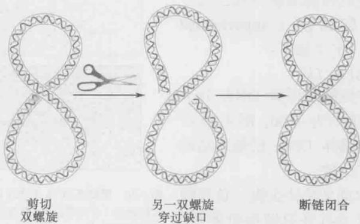  
图 4-21 DNA 在拓扑异构酶Ⅱ的作用下改变连环数的过程。拓扑异构酶Ⅱ结合于 DNA，产生双链断裂，未断裂的 DNA 穿过缺口后，再将断链闭合。

  
图 4-22 拓扑异构酶Ⅰ的作用机制。拓扑异构酶切开 DNA 双链中的一条，没有被切的互补链通过缺口穿过来，然后连上缺口，该过程使连环数加 1。

## 原核生物中存在引导 DNA 超螺旋形成的特殊拓扑异构酶

原核和真核生物都存在可以从 DNA 中去除超螺旋的拓扑异构酶Ⅰ和Ⅱ。另外，原核生物还拥有一种特殊的拓扑异构酶Ⅱ，通称为促旋酶，它引入而不是去除负超螺旋。DNA 促旋酶使原核生物染色体产生负超螺旋。这种负超螺旋促进 DNA 双螺旋的解旋，而这种解旋又会激发包括启动 DNA 转录和复制在内的许多反应。

## 拓扑异构酶也可以解链和松弛 DNA 分子

拓扑异构酶不仅能松弛双螺旋 DNA，而且能促进一些与维持细胞内 DNA 的适当结构有关的重要反应的发生。这些酶利用松弛双螺旋 DNA 相同的瞬时 DNA 断裂以及链通过机制来实现这些反应。

拓扑异构酶既能链接（catenate）也能解开（decatenate）环状 DNA 分子。环状 DNA 分子如果像一条链的两个环一样连接在一起，就称为相互“链接”（图 4-23a）。在拓扑异构酶的两种活性中，解开环状 DNA 的能力显然更富有生物学意义。如同我们将在第 9 章看到的，一轮 DNA 复制完成后通常产生链接在一起的 DNA 分子（参见第 9 章，图 9-36）。解开这些 DNA，使它们在细胞分离时分配至两个子细胞，拓扑异构酶在此过程中起了关键作用。两个共价闭合的环状 DNA 分子的解开要求一个 DNA 分子的两条链穿过另一个 DNA 分子的双链缺口。这些反应有赖于拓扑异构酶Ⅱ。由于解链的必要性，拓扑异构酶Ⅱ是细胞必需的蛋白质。然而，如果两个相互链接的 DNA 分子中至少有一个携带缺口，那么拓扑异构酶Ⅰ也可以解开这两个分子（图 4-23b）。

虽然在考虑拓扑问题的时候，我们关注的总是环状 DNA 分子，真核生物的长线性染色体也存在拓扑结构。例如，在每一轮 DNA 复制中，两条双链的子 DNA 分子通常缠绕在一起（图 4-23c）。这些相互缠绕的位点就像链接在一起的 DNA 分子之间的连接一样，阻碍了姐妹染色体在有丝分裂过程中的分离。因此，通常由拓扑异构酶Ⅱ催化的

DNA 解缠绕，也是 DNA 的成功复制和真核细胞的分裂所必需的。

有时，一个 DNA 分子会出现打结的现象（图 4-23d）。例如，第 12 章中我们将详细讨论的一些位点特异性重组反应会引起 DNA 的打结现象。在此，拓扑异构酶Ⅱ也可以解开这种双链 DNA 中的结。如果 DNA 分子中含有缺口，那么拓扑异构酶 I 也可以完成解链工作。


b I型拓扑异构酶  


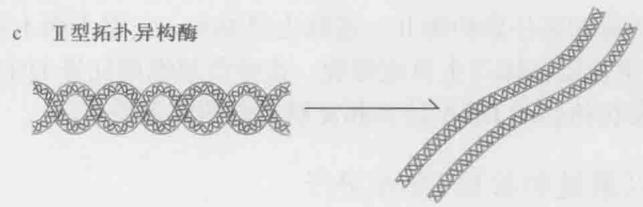

  
图 4-23 拓扑异构酶对 DNA 的解环、解旋和解结作用。（a）拓扑异构酶Ⅱ能够在共价闭合环状 DNA 分子上产生一个双链缺口并使另一个 DNA 分子穿过缺口形成套在一起的双环链接或解链。  
（b）拓扑异构酶I只有在DNA分子有缺口或断点的情况下才能使DNA分子链接或解链，因为这种酶一次只能切断一条DNA链。(c)真核生物染色体复制过程中所产生的相互缠绕的线性DNA长链能够被拓扑异构酶解开。（d）DNA的结能够被拓扑异构酶解开。

## 拓扑异构酶通过蛋白质-DNA 的共价连接裂解 DNA 链或使它们重新连接

拓扑异构酶为了发挥功能,必须能够切断一条或两条 DNA 链,然后再将切断的 DNA 链重新连接起来。通过共价中间物的机制,拓扑异构酶可以不依赖任何其他蛋白质或高能辅助因子(如 ATP;见下文)。当拓扑异构酶活性部位的酪氨酸残基攻击靶 DNA 骨架上的磷酸二酯键时,可使 DNA 断裂产生一缺口(图 4-24),而拓扑异构酶则通过磷酸酪氨酸连接与其中一个断端共价相连。DNA 的另一端带有一个游离的羟基,可在下文中看到这个末端如何被酶紧紧地抓住。

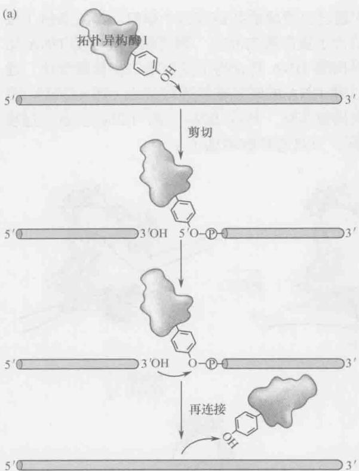  
(b)

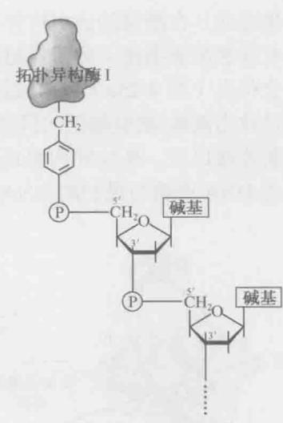  
图 4-24 拓扑异构酶通过酪氨酸-DNA 共价中间体切开 DNA。(a) 断开和重连接反应。为简便起见，这里仅显示单条 DNA 链，图 4-25 可见更真实的图片。拓扑异构酶Ⅱ使用同样的机制，但需要两个酶的亚基，每个亚基打开一条 DNA 链。拓扑异构酶有时打开 DNA 5'端，有时打开 3'端。(b) 磷酸酪氨酸共价中间体的详细结构。

这种磷酸-酪氨酸连接保存了被裂解的磷酸二酯键的能量。因此，只要逆转原来的反应，DNA 就可以被重新闭合：来自 DNA 断端的游离羟基攻击磷酸-酪氨酸键，最终重新形成磷酸二酯键。这个反应重新连接 DNA 链，释放拓扑异构酶，拓扑异构酶可以接着催化另一轮反应。虽然像上面所说的，拓扑异构酶Ⅱ需要 ATP 水解释放的能量，这些能量主要用于拓扑异构酶-DNA 复合物的分子构象的改变，而并非使 DNA 链断裂或重新连接。

## 拓扑异构酶构成“酶桥”让 DNA 片段往来穿梭

在 DNA 断裂和重新连接的过程中，拓扑异构酶促使 DNA 的另一条片段穿过断点。因此，拓扑异构酶功能的行使要求 DNA 断裂、DNA 链穿过和 DNA 重新连接都以高度协调的方式进行。从几个不同拓扑异构酶的结构可以看出这些反应是怎么发生的。这里我们将解释拓扑异构酶 I 松弛 DNA 的一个模型。

起始解链循环时，拓扑异构酶与 DNA 片段形成紧密的复合物，复合物中双链变性（图 4-25a）。高度的负超螺旋 DNA 链倾向于熔解变性（如前面所述），使这种 DNA 成为松弛反应的良好底物。一条 DNA 链结合于酶的裂隙中，这使它靠近酪氨酸活性部位这条链断裂，产生 DNA-酪氨酸中间产物（图 4-25b）。这一步反应成功的关键在于新断裂的 DNA 的另一末端也被拓扑异构酶紧密结合。断裂后，拓扑异构酶经过一次大的构象变化，在断裂的链中打开一个缺口，并通过自身成桥状连接这个缺口。第二条链（没有断裂的那条链）此时穿过那个缺口，结合于蛋白质内部的“圆环状”孔中的DNA结合位点（图4-25c）。链穿过以后，拓扑异构酶-DNA复合物中发生第二次构象变化，通过攻击磷酸-酪氨酸键的羟基（如前所述）使DNA的断端重新连接起来（图4-25d）。重新连接以后，拓扑异构酶必须再经过一次构象变化，释放DNA（图4-25e）。这一过程的DNA产物与最初的DNA分子基本相同，只是连环数增加了一个。

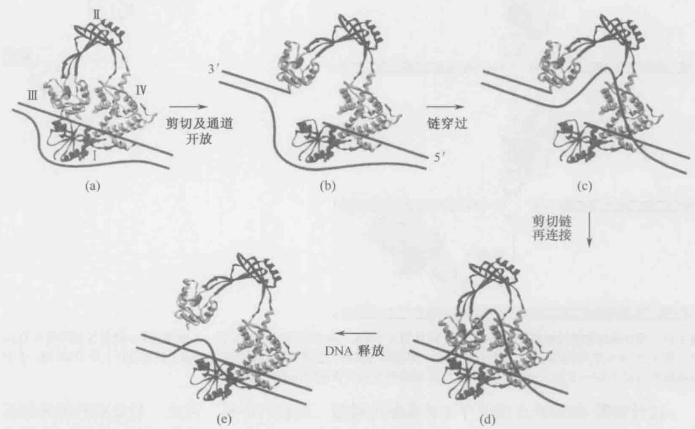  
图 4-25 拓扑异构酶Ⅰ催化反应模型。图示为质粒 DNA 负超螺旋一系列的解旋过程。DNA 两条链如黑灰线所示（不按比例），蛋白质的四个结构域按区域标记。结构域Ⅰ用红色，Ⅱ用蓝色，Ⅲ用绿色，Ⅳ用橙色标记。（来源：Champoux J.2001.DNA topoisomerases.Annual Review of Biochemistry.70:369-413. ©Annual Reviews.）

上述反应机制中拓扑异构酶在链穿行过程中起到了“蛋白桥”的作用，这种机制也适用于拓扑异构酶Ⅱ。然而拓扑异构酶Ⅱ是二聚体（某些情况下是四聚体）。拓扑异构酶Ⅱ作用机制的基本特点是DNA双链的断裂需要拓扑异构酶两个亚基及其活性位点中的酪氨酸残基的参与。

## DNA 拓扑异构体可被电泳分离

长度相同而连环数不同的共价闭环 DNA 分子叫做 DNA 拓扑异构体（DNA topoisomer）。虽然拓扑异构体的分子质量相同，它们也可以通过琼脂糖凝胶电泳 [见第 7 章的凝胶电泳（gel electrophoresis）的解释] 彼此分开。拓扑异构体分离的基础是扭曲越大，cccDNA 的形状就越致密。在此，可以再次试想电话线的超螺旋如何使它变得更致密。DNA 越致密就越容易在凝胶基质中迁移（图 4-26）。因此，一个完全松弛的 cccDNA 的迁移要比这一环状 DNA 链的高度超螺旋的拓扑结构体慢得多。图 4-27 显示的是 DNA 拓扑结构体被凝胶电泳分离成一系列条带。相邻条带的 DNA 分子连环数相差一个。显然，电泳迁移率与 DNA 的拓扑结构密切相关（框 4-3）。

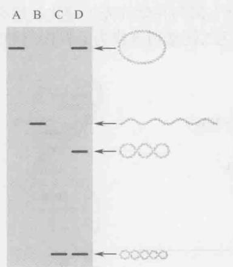  
图 4-26 DNA 拓扑异构产物的电泳分离图。A: 松弛或有缺口的环状 DNA; B: 线性 DNA; C: 高度超螺旋的 cccDNA; D: 拓扑异构体梯度标记。

  
图 4-27 用凝胶电泳分离超螺旋和松弛的 DNA。用凝胶电泳分离超螺旋和松弛的 DNA。电泳的速度按超螺旋圈数的增加而增加。（来源：J. C. Wang 惠赠）

## 框4-3 DNA环的拓扑学特性证明了DNA每螺周含有10.5个碱基对的螺旋周期性

由于 DNA 的不同拓扑结构体能通过电泳分离，人们根据这一发现设计了一个简单的实验来证明溶液中 DNA 每周螺旋含有 10.5 个碱基对。假设用拓扑异构酶 I 将大小分别为 3990 bp、3995 bp 和 4011 bp 的三种 cccDNA 完全解旋。琼脂糖凝胶电泳时，3990 bp 和 4011 bp 的 cccDNA 迁移率基本相同。由于热波动，拓扑异构酶处理后产生了一系列拓扑异构体，但是为了方便起见，我们只考虑含量最丰富的拓扑异构体（相对于最松弛态 cccDNA），3990 bp 和 4011 bp DNA 的含量最丰富的拓扑异构体的迁移率难以区分，因为它们之间 21 个碱基对的不同相对整个 DNA 环来说是可以忽略的。然而，虽然 3995 bp 的 DNA 环只比 3990 bp 的 DNA 环多了 5 个碱基，但其含量最丰富的拓扑异构体却比另外两种环迁移得稍快一些。那么，我们怎样解释这种现象呢？3990 bp 和 4011 bp 的 DNA 环处于最松弛的状态时，连环数正好等于 $Lk^{\circ}$ ，对于 3990 bp 的 DNA 来说（大小按 10.5 个碱基对分开） $Lk^{\circ}$ 等于 380，而对于 4011 bp 的 DNA 来说 $Lk^{\circ}$ 等于 382。因为 $Lk$ 等于 $Lk^{\circ}$ ，这两者的连环数的差值（ $\Delta Lk = Lk - Lk^{\circ}$ ）都为 0，DNA 不存在扭曲。由于连环数必须是整数，而 3995 bp 的 DNA 环在最松弛的状态下可以有连环数为 380 或 381 的两种拓扑异构体。然而，3995 bp 的 DNA 环的 $Lk^{\circ}$ 是 380.5。这样，即使在它最松弛的状态下，3995 bp 的共价闭合环状 DNA 也必须有半个单位的扭曲（连环数差值为 0.5），因此它比 3990 bp 和 4011 bp 的 DNA 环迁移得快。换句话说，为了解释长度相差 21 个碱基对（螺旋的两圈）的两个 DNA 环迁移率相同，而长度相差只有 5 个碱基对（大约一半螺旋）的两个 DNA 环迁移率却不同，我们得出了“溶液中的 DNA 每周螺旋含有 10.5 个碱基”的结论。

## 溴化乙锭离子可使 DNA 解旋

溴化乙锭（Ethidium）是一种既大又平而且多环的阳离子，它的平面形状使其能滑入或嵌入到堆积的 DNA 碱基对平面之间（图 4-28）。因为在紫外光下溴化乙锭会发荧光，而且嵌入 DNA 后荧光强度显著增强，因此，溴化乙锭常用来作为染料检测 DNA。

  
图 4-28 溴化乙锭掺入 DNA。溴化乙锭的插入增加了相邻碱基对之间的空间距离，扭曲了磷酸核糖骨架，降低了螺旋程度。

当溴化乙锭嵌入两个碱基对之间时，引起 DNA 解旋 $26^{\circ}$ ，使得通常的碱基对之间的夹角由 $36^{\circ}$ 变为 $10^{\circ}$ ，换句话说，溴化乙锭降低了 DNA 的扭曲程度。想象一下，若 DNA 分子每个碱基对中都嵌有一个溴化乙锭离子，那么每周螺旋不再是 10 个碱基对而是 36 个碱基对。当溴化乙锭结合的是线性或缺口环状 DNA 分子时，溴化乙锭只引起螺旋倾斜度的增加。但是当溴化乙锭结合于共价闭合环状 DNA 时结果会怎么样呢？cccDNA 连环数并没有增加（并没有共价键断裂或形成），但是每分子溴化乙锭嵌入则使每圈的扭曲度降低 $26^{\circ}$ 。考虑到 $Lk = Tw + Wr$ ，Tw 的减少必须由 Wr 的增加来补偿。如果最初环状 DNA 为负超螺旋（细胞中分离出的环状 DNA 大多如此），加入溴化乙锭将增加 Wr，也就是说，溴化乙锭的加入可松弛 DNA。如果加入足量的溴化乙锭，负超螺旋将变为 0；若加入更多的溴化乙锭 Wr 将大于 0，此时 DNA 将变为正超螺旋。

因为溴化乙锭的结合增加了共价闭合环状（cccDNA）的 Wr，从而使 DNA 在凝胶电泳中的迁移率发生了很大变化。在非饱和的溴化乙锭存在的情况下，负超螺旋环状 DNA 更为松弛并且迁移缓慢，而松弛的 cccDNA 则变为正超螺旋，迁移的速度加快。

## 小结

DNA 通常形成右手双螺旋。两条多聚脱氧核糖核苷酸链构成双螺旋。每一条链又是由交替的磷酸和脱氧核糖以磷酸二酯键依次连接形成的多聚体。每个脱氧核糖都会伸出一个碱基，碱基有4种：属于嘌呤类的腺嘌呤和鸟嘌呤，属于嘧啶类的胸腺嘧啶和胞嘧啶。脱氧核糖-磷酸骨架是规则的，而碱基的顺序则是不规则的，使其承载了DNA的信息。每一链都有 $5^{\prime}\rightarrow 3^{\prime}$ 的方向性，两条链按照反向平行的方式对应，即两条链的方向相反。

碱基配对和碱基堆积力使得两条多核苷酸链结合在一起。碱基的配对由氢键介导，会导致水分子的释放，进而使得熵值增加。碱基堆积力则通过两种方式增加双螺旋的稳定性：碱基间电子云的相互作用（范德华力）和碱基疏水表面的内埋（疏水效应）。

介导碱基配对的氢键是特异的：一条链上的腺嘌呤总是和另一条链上的胸腺嘧啶配对，而鸟嘌呤则通常和胞嘧啶配对。这种碱基之间的严格配对表明构成 DNA 碱基的嘌呤和嘧啶的氢原子位置是固定的。腺嘌呤和胞嘧啶以氨基而不是亚氨基异构体形式存在，而鸟嘌呤和胸腺嘧啶则以酮式而不是烯醇式形式存在。两条链间的碱基互补赋予了 DNA 自我编码的特性。

DNA 双螺旋两条链的分开（变性）需要高温、极端的 pH 或者其他某些变性剂来破坏氢键。当 DNA 缓慢地恢复到正常的细胞环境，变性的双链会特异恢复到有生物活性的双螺旋结构（复性或退火）。

DNA 在溶液状态下周期性螺旋缠绕，每旋转一周有大约 10.5 个碱基。碱基对相互之间的堆积形成了带有两条沟的双螺旋。由于糖环在双螺旋外侧与碱基之间形成 $120^{\circ}$ 的夹角，使两条沟的大小不同。每个碱基对的边缘暴露在沟内，形成富含氢键供体和受体及范德华表面的区域，可用于识别碱基对。大沟（major groove）包含的化学信息比小沟（minor groove）更多，而且对核酸序列专一性结合蛋白的识别作用更为重要。

几乎所有细胞内的 DNA 都是非常长的分子, 每条特定的染色体就是一个 DNA 分子。真核细胞容纳如此超长的 DNA 采用的方法是利用蛋白颗粒把 DNA 分段包装成核小体。大多数 DNA 分子以线形存在, 但也有的是环状的, 如原核细胞和某些病毒的染色体。

DNA 分子同样具有柔性。如果其拓扑结构不受限，它可以自由旋转从而改变两条链相互缠绕的次数。但是当它以闭合共价环状结构存在或者以染色质存在时，DNA 的拓扑结构就会受到限制。连环数是闭合环状 DNA 的固有拓扑学特性，它是指如果需要把两条环状的链完全解开，一条链需要绕过另一条链的次数。连环数是两个可以相互转换的几何特性参数的总和：扭转数，表示两条链相互缠绕的次数；缠绕数，表示 DNA 在长轴上自身交叉的数目。DNA 每个螺旋 10.5 个碱基并且螺旋没有扭曲，此时 DNA 在生理条件下处于松弛状态。如果连环数减少，DNA 受到扭转压力时候的状态称为负超螺旋。细胞中的 DNA 一般有 6% 以负超螺旋存在。

真核细胞中以左手方向缠绕核小体的 DNA 引入了负超螺旋；而原核生物由于没有组蛋白，所以负超螺旋的产生是由促旋酶来完成的。促旋酶是拓扑异构酶Ⅱ家族中的一种，拓扑异构酶Ⅱ在 DNA 双链上产生瞬间的断裂，然后使双链的一个区域穿过缺口，通过这两步可改变 DNA 的连环数。拓扑异构酶Ⅱ中的一些成员能够起到松弛超螺旋 DNA 的作用，相反，DNA 促旋酶能够产生负超螺旋。拓扑异构酶Ⅰ也能起到松弛超螺旋 DNA 的作用，但是它的作用方式是使一条链穿过另一条链瞬间产生的缺口。

## 参考文献

## 书籍

Bloomfield V.A., Crothers D.M., Tinoco I. Jr., and Heast J.E. 2000. Nucleic acids: Structures, properties, and functions. University Science Books, Sausalito, California.

Watson J.D., ed. 1982. Structures of DNA. Cold Spring Harbor Symposium on Quantitative Biology, Vol. 47. Cold Spring Harbor Laboratory Press, Cold Spring Harbor, New York.

## DNA 结构

Chambers D.A., ed. 1995. DNA: The double-helix—Perspective and prospective at forty years. Ann. N.Y. Acad. Sci. 758: 1–472.

Dickerson R.E. 1983. The DNA helix and how it is read. Sci. Am. 249:94–111.

Franklin R.E. and Gosling R.G. 1953. Molecular configuration in sodium thymonucleate. Nature 171: 740–741.

Roberts R.J. 1995. On base flipping. Cell 82: 9–12.

Watson J.D. and Crick F.H.C. 1953a. Molecular structure of nucleic acids: A structure for deoxyribonucleic acids. Nature 171: 737–738.

——. 1953b. Genetical implications of the structure of deoxyribonucleic acids. Nature 171: 964–967.

Wilkins M.H.F., Stokes A.R., and Wilson H.R. 1953. Molecular structure of deoxypentose nucleic acids. Nature 171: 738–740.

## DNA 拓扑学

Dröge P. and Cozzarelli N.R. 1992. Topological structure of DNA knots and catenanes. Methods Enzymol. 212: 120–130.

Wang J.C. 2002. Cellular roles of DNA topoisomerases: A molecular perspective. Nat. Rev. Mol. Cell Biol. 3: 430–440.

## 习题

## 偶数习题的答案请参见附录2

习题1 请解释以下描述双链DNA或构成DNA的双链特征的形容词。  
A.有极性的  
B.反向平行的  
C.互补的

习题2

A. 请计算 B-DNA 四个螺周大概的碱基对数目（基于早期 X 射线衍射结构数据）；请计算 B-DNA 四个螺周大概的碱基对数目（基于溶液中 DNA 结构数据）；请计算 B-DNA 四个螺周的纵轴长度。
B. 请计算 A-DNA 四个螺周大概的碱基对数目（基于早期 X 射线衍射结构数据）

习题3 判断对错，如果是错的，请改正错误。  
A. 拥有更多G：C碱基对的DNA序列相比拥有更多A：T碱基对的熔点（ $T_{\mathrm{m}}$ ）更高，因为G：C碱基对之间有三个氢键，而A：T碱基对之间只有两个氢键。  
B. 熵值和碱基间的堆积力是稳定双链DNA的主要因素。  
C. 碱基间的堆积力决定了DNA中碱基配对的特异性。

习题 4 对于每个碱基对，判断两对碱基之间可否由小沟、大沟、二者均可或二者均不能加以区分。
G : C vs C : G \_\_\_\_

A : T vs G : C \_\_\_\_

A : T vs T : A \_\_\_\_

习题 5 核酸结构类似物的化学结构和 DNA 中四种主要的核苷相比差别非常小。DNA 合成实验中的两种核酸类似物的结构如下所示：

A. 在下面横线上写出模仿的核苷名字。

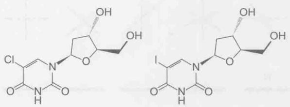

B. 在图上圈出不同于四种核苷的化学基团。

习题6

A. 你从大肠杆菌中分离出一种超螺旋的 10 000 bp 长的质粒。假设这个质粒是共价闭环 DNA（cccDNA），将该质粒用 DNase I 进行处理，每个 DNA 分子平均会产生一个缺口。

i. 写出 DNase I 破坏的键的名字

ii. 处理之后该质粒的拓扑结构会发生什么变化？

B. 之后使 DNase I 失活, 加入 DNA 连接酶和 ATP, 这时会产生一条新的 cccDNA (DNA 连接酶可以补平缺口并且反应需要 ATP)。简单描述生成的 cccDNA 的拓扑结构并从 Lk 和 $Lk^{0}$ 两个方面阐述你的理由。

习题 7 你从大肠杆菌中分离出长 10 500 bp 的质粒（超螺旋，cccDNA）。该质粒含有限制性核酸内切酶 EcoR I 的一个特异性识别位点。限制性核酸内切酶识别一条特异性序列，并且可以对该序列的双链进行切割（第 21 章）。将该 cccDNA 在含有如下所列的成分的四种反应体系中进行短暂反应，温度为 37℃。将反应物进行琼脂糖凝胶检测并用溴化乙锭和紫外光进行观察。反应体系包括了必需的缓冲溶液和 ATP。琼脂糖凝胶结果如下图所示，请指出下面每个泳道各自都代表了哪个反应的产物。

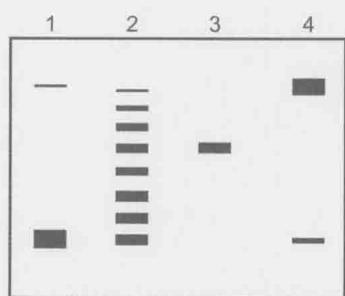

i. 单独的缓冲溶液  
ii. DNase I （短暂处理）  
iii. 拓扑异构酶 I  
iv. EcoR I

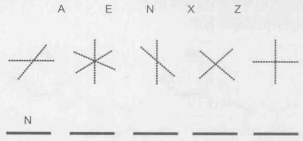

习题8 利用你的X射线衍射知识，将下面的字母和它对应的衍射模式相对应。假设衍射模式是基于该字母的重复结果，考虑简单化，只展示了单个字母的结果（提示：将每个字母分解成单条线并想象他们产生的衍射模式，然后，再将结果组合到一起得到最终的衍射模式图。范例已给出）。

A E N X Z

N

(潘庆飞 夏志 译 刘韧 胡学达 校)

## RNA 的结构和功能多样性

## 本章概要

RNA 含有核糖和尿嘧啶，通常是单链
RNA 链自身折叠形成局部双螺旋，类似于
A-DNA

RNA可折叠成复杂的三级结构

结合有化学探针的核苷酸替代物可以预测RNA结构

定向演化会选择结合小分子的RNA一些RNA可以是酶类

乍看起来，RNA 同 DNA 非常相似。当然，它的化学组成同 DNA 有一些细微差别：主链上的氢原子被羟基基团所替代；四种碱基有一种没有甲基基团。实际上，很多年以来，RNA 的作用都被认为是辅助 DNA 进行信息传递。虽然一些病毒的基因组是由 RNA 组成的，但总体来讲，DNA 才是遗传信息的仓库。与该看法不同的是，RNA 在很大程度上被看成是把遗传信息由 DNA 转移给核糖体的传送器，是遗传信息的解码器，同时还是核糖体的结构成分。而现在，我们已经意识到 RNA 在结构上远比 DNA 复杂，在功能上也比我们之前所认识的更丰富。

虽然 RNA 主要以单链分子的形式存在，但是通过链内碱基配对，呈现

出很多双螺旋的特征，并能折叠成大量不同的三级结构。这些 RNA 结构有诸多令人惊奇之处，如非经典碱基对、碱基和骨架的相互作用、结点状构型。最值得一提的是，一些 RNA 分子是酶类，催化从核酸到蛋白质的信息传递中的核心反应，具有重要的演化意义。

## RNA 含有核糖和尿嘧啶，通常是单链

现在我们来看 RNA 和 DNA 的三个不同之处（图 5-1）。第一，RNA 骨架含有核糖，而不是 2'-脱氧核糖，也就是说在核糖的 C 2' 的位置上带有一个羟基。第二，在 RNA 中尿嘧啶（uracil）取代了胸腺嘧啶，尿嘧啶有着和胸腺嘧啶相同的单环结构，但是缺乏 5 甲基（5 methyl）基团。胸腺嘧啶实际上是 5 甲基-尿嘧啶（5 methyl-uracil）。另外，同胸腺嘧啶一样，尿嘧啶也同腺嘌呤配对（图 5-2）。考虑到二者的相似性，演化为什么会选择含有额外甲基基团的胸腺嘧啶作为 DNA 组成碱基呢？在第 10 章中我们会讲到，胞嘧啶可以通过自发的脱氨基作用形成尿嘧啶，后者会被修复系统识别为非 DNA 组成成分，进而恢复成胞嘧啶。如果遗传物质 DNA 中含有尿嘧啶，胞嘧啶脱氨基形成的尿嘧啶就无法被维持基因组稳定的监测系统检测到。

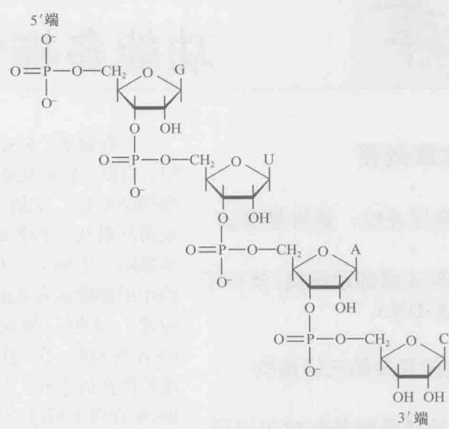  
图 5-1 RNA 的结构特点。本图显示了 RNA 骨架的结构，由磷酸和核糖交替排列组成。RNA 结构中有别于 DNA 的部分以红色表示。

  
图 5-2 尿嘧啶同腺嘌呤配对。注意尿嘧啶区别于胸腺嘧啶的 5'位置在配对中并没有涉及到。

第三，RNA 通常是单链的多聚核苷酸。除了某些病毒以外，如流感病毒和获得性免疫缺陷综合征病毒，RNA 并不是遗传物质，它不需要以自己为模板进行复制。从功能上讲，RNA 的功能之一是作为从基因到蛋白质合成的媒介，如信使 RNA（mRNA）；RNA 的另一功能是作为 mRNA 上密码子与氨基酸的接头，如转运 RNA（tRNA）；RNA 作为核糖体

的组成部分，也发挥着结构性功能。另外，RNA 还是一种调节分子，通过和某些 mRNA 互补序列的结合而对其翻译过程进行调控（见第 20 章）。最后，还有一些 RNA（包括组成核糖体的一种结构 RNA）是在细胞中催化一些重要反应的酶。综上所述，RNA 只是拷贝了双链 DNA 中的一条链，这条链的互补链则不存在。RNA 也可以形成很长的双螺旋，但这种情况在自然界中很少见。

## RNA 链自身折叠形成局部双螺旋，类似 A-DNA

尽管 RNA 是单链分子，它仍然具有大量的双螺旋结构的特征（图 5-3）。这是因为

RNA 链频繁发生自身折叠，从而在互补序列间形成碱基配对区。如果两段互补序列彼此非常接近，RNA 可以采用多种柄环结构（stem-loop structure）中的一种，其中的非互补 RNA 从双螺旋区域的末端凸出来（图 5-3）。RNA 双螺旋的伸展部分也可以呈现为内环（internal loops，柄任意一侧的未配对核苷酸）、凸起（bulges，

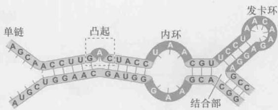  
图 5-3 RNA 的双螺旋特点。在含有互补序列的 RNA 分子中，中间的非互补部分可以环状凸出出来，形成图示结构中的一种：凸起、内环或发卡环。

凸出部分某侧的未配对核苷酸），或结合部（junctions）（图5-3）。

某些情况下，环的特殊性质能增强柄环结构的稳定性。例如，具有UUCG“四碱基环”的柄环结构，由于环中特殊的碱基堆积作用而非常稳定（图5-4）。碱基配对也可以发生在不相邻的序列中，形成称为假结（pseudoknot）的复杂结构（图5-5）。RNA的碱基配对区可以是规则的双螺旋，或者是不连续的，例如，含有不互补的、凸出于双螺旋之外的核苷酸。

  
C(UUCG)G 四碱基环

图 5-4 四碱基环。碱基堆积作用使四碱基环结构更加稳定。紫色的核糖之间的灰色环代表 RNA 骨架的磷酸部分。水平线代表碱基堆积作用。  
  
图 5-5 假结。不相邻的互补序列之间碱基配对形成假结结构。

RNA 具有额外的非 Watson-Crick 配对的碱基，如 G：U 碱基对，这个特征使 RNA 更易于形成双螺旋结构。G：U 碱基对之间有两个氢键：尿嘧啶 N3 和鸟嘌呤 C6 上羰基之间的氢键，以及尿嘧啶 C2 上羧基和鸟嘌呤 N1 之间的氢键（图 5-6）。非 Watson-Crick 配对在所有的 RNA 中均存在（GA 和 GU 配对在核糖体 RNA 中最为丰富）。由于 RNA 链中不仅存在两种常规 Watson-Crick 碱基对，而且有 G：U 碱基对，因此，RNA 链自我配对的能力得到增强，常常出现局部区域碱基配对，但不是 DNA 那种长的、规则的螺旋形式。

  
图 5-6 G：U 碱基对。图中所示为鸟嘌呤与尿嘧啶配对形成的氢键。

RNA 骨架上 2'-OH 的存在阻止 RNA 形成 B 型螺旋。其实双螺旋 RNA 更类似于 A-DNA 的结构。它的小沟宽且浅，从而易于接近，但是小沟里几乎没有序列特异性信息；而大沟狭且深，与它相互作用的蛋白质的氨基酸侧链难

以接近它。所以，从精细原子结构上看，RNA 的双螺旋与 DNA 的双螺旋十分不同，使 RNA 不适合与蛋白质进行序列特异性的相互作用。然而，有很多例子表明蛋白质可与 RNA 发生序列特异性结合，这往往依赖于对发夹环、凸起和扭曲的识别，而这些结构是由非常规碱基配对引起的。这样的例子包括：同各自 tRNA 结合的 tRNA 合成酶；臭名昭著的植物蛋白——蓖麻毒蛋白，它可以切割真核生物核糖体大亚基中大 RNA “八叠球菌/蓖麻毒蛋白” 环中的重要的糖苷键；人体的 U1A 蛋白，它可以同 mRNA 中 U 形的、U1A 多聚腺苷酸化抑制元件结合阻断 poly（A）聚合酶，从而限制 poly（A）尾巴的长度。

有时，RNA 的二级结构在无蛋白质介入的情况下也可以发挥重要的生物学功能。有一个来自细菌致病机理的例子很能说明这一点。病原体细菌表达可使动物染病的毒性基因。一般而言，毒性基因不会在宿主外表达，这种表达会被受感染的动物中的刺激所诱导。温度便是刺激之一，动物体内的温度比外界高。病原体是如何检测到温度增加的？热传感器又是如何激活毒性基因的？对于靠食物传播的病原体单核细胞增多性李斯特氏菌（Listeria monocytogenes），其致病原理已经比较清楚了。L. monocytogenes 会导致免疫缺陷个体和孕妇染上重疾。它的毒性基因被转录因子 PrfA 激活，该因子的合成反过来又由其 mRNA 上游区域的转录水平所控制，该区域含有核糖体结合位点（图 5-7）。

  
图 5-7 毒性基因表达的热传感器。L. monocytogenes 中的 prfA 调节基因在翻译水平上由温度依赖性的核糖体结合位点（ribosome-binding site，RBS）开关所控制。蓝色的椭圆代表核糖体亚基。（经允许，引用自 Elsevier，from Johannson J. et al. 2002. Cell 110: 551–561, Fig. 7.）

我们在第 15 章会看到，核糖体结合位点是一段在蛋白质合成起始阶段被核糖体所识别的序列。该上游区域发生自身折叠形成对温度敏感的二级 RNA 结构，该结构可以掩盖核糖体结合位点，导致核糖体在 $30^{\circ}$ C 的时候无法结合上去。而在 $37^{\circ}$ C 时，该结构消失，允许翻译机器同核糖体结合位点结合并产生 PrfA。通过把该上游区域同绿色荧光蛋白编码基因融合，发现二级结构对于这种热调节是必要而充分的（见框 5-2）。当把该融合基因移植到大肠杆菌中后，该基因会在 $37^{\circ}$ C 引发荧光，而不是 $30^{\circ}$ C。

## RNA 可折叠成复杂的三级结构

由于 RNA 没有形成长的规则螺旋的限制，因此可形成大量的三级结构。因为 RNA

骨架上未配对的区域可以不受限制地自由旋转，所以 RNA 常常折叠成包括不规则碱基配对的复杂三级结构。如 tRNA 中的三碱基对及碱基与骨架的相互作用（如图 5-8 中的 U:A:U 三碱基）。蛋白质可以协助 RNA 大分子三级结构的形成，如核糖体中发现的蛋白质。蛋白质可以中和磷酸骨架的负电荷，从而消除由于静电斥力造成的结构不稳定。

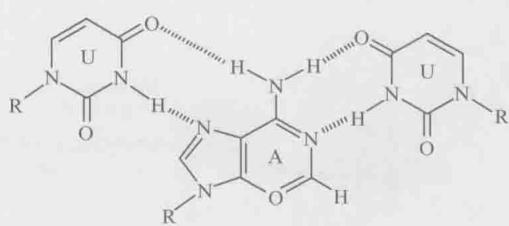  
U:A:U 三碱基对  
图 5-8 U: A: U 三碱基对。图中所示为非常规三碱基配对形成的氢键。

RNA 所形成的三级结构并不是绝对静

止的。同样的 RNA 分子可能会以一种或多种可选择的构象存在。这种不同构象之间的转换具有十分重要的生物学意义，如核糖开关（riboswitch，见下文和第 20 章）和小鼠白血病病毒编码 mRNA（见框 5-1）。

## 框 5-1 RNA 开关通过小鼠白血病病毒控制蛋白质合成

小鼠白血病病毒（MLV）是一种RNA病毒，可以导致小鼠及其他脊椎动物患上癌症。同人类免疫缺陷病毒一样，它也是一种逆转录病毒，通过DNA中间体完成复制。RNA基因组通过反转录酶复制出DNA。RNA基因组，也是mRNA，编码一种称为Gag的病毒结构蛋白和由该蛋白组成的多聚蛋白以及称为Pol的逆转录酶。Gag编码基因紧邻于Pol编码基因的上游。Gag或者自己单独生成，或者延长翻译下游的Pol基因以融合蛋白Gag-Pol的方式产生。当Gag单独生成的时候，核糖体在终止密码子处终止翻译（见第15章），该终止密码子位于Gag编码基因的末端。当以融合蛋白的方式产生的时候，核糖体越过终止密码子继续翻译，得到Gag-Pol融合蛋白。因为结构蛋白比酶的需求要大，所以病毒保持这两种产物的比例处于一个合理的范围就十分重要。病毒通过把核糖体通读的比例限制在5%\~10%来实现这一点。

这种设计拥有很多优势。它排除了对额外启动子元件的需求（基因组已经非常紧凑），并把病毒酶的产出同结构成分的合成连接起来，允许其在病毒繁殖的时候并入到病毒中。

MLV是如何控制其mRNA的翻译通读的呢？Victoria D'Souza和Steven Goff及其同事通过核磁共振确定了MLV mRNA中Gag终止密码子下游序列的三维结构，进而解决了这个问题（Houck-Loomis et al. 2011）。他们发现下游序列有一个假结，假结没有固定的结构，而是处在两种构象的动态平衡之中。一种构象限制翻译，抑制Gag的生成，称为非激活构象；另一种构象允许通读产生Gag-Pol融合蛋白，称为激活构象（见框5-1图1）。

为了保证只有有限的 mRNA 可以跳过终止密码子通读，假结作为一种质子传感器发挥作用。在生理 pH 下，蛋白质的浓度使得只有 5%\~10% 的假结可以感受到质子并折叠成活化的构象。为达到这一目的，该分子通过腺嘌呤 N1 位的氮原子（一般不会发生质子化）获得一个质子并在分子中形成一个三碱基结构，进而变成激活构象。

  
框 5-1 图 1 两种假结构象的平衡控制着终止密码子处的翻译。翻译 MLV RNA 的核糖体遇到了位于 Gag 可读框下游的终止密码子（UAG）。当假结处于非激活构象（上图）时，翻译在终止密码子处终止，合成的是 Gag 蛋白。而当假结处于激活构象时（下图），核糖体可以跳过终止密码子进行通读，合成的是 Gag-Pol 融合蛋白。两种构象的平衡决定了 Gag 和 Gag-Pol 两种蛋白的比例。未质子化和质子化的腺嘌呤分别用红色和绿色表示。（图片由 V. D. Souza 惠赠）

## 结合化学探针的核酸替代物可以预测 RNA 结构

正如我们已经知道的，RNA 分子可以呈现出多种多样的结构，包括螺旋伸展、凸起、环和远程的三维相互作用。这些结构是如何被发现的呢？传统的研究方法包括核磁共振（nuclear magnetic resonance, NMR）、X 射线晶体学（X-ray crystallography），但通过这些方法解决结构问题很困难，而且核磁共振不能用于大的 RNA 分子。另外的方法是使用化学物质对 RNA 分子的二级结构进行探测（这些化学物质可以同未配对的碱基发生反应），并辅以相关的算法（从已知的堆积能量和氢键相互作用情况进行结构预测）。这种化学的方法往往并不可靠。“变异-比对”（mutate-and-map）策略是一项引人注目的创新，它可以对 RNA 结构进行高可信度的预测。

变异-比对是一种双向的过程,可以把变异的和化学的修饰方法组合到一起。首先,要制备核苷酸取代基的文库,在 RNA 序列中每个核苷酸都被其互补碱基所取代。其次,通过称为 SHAPE (selective 2'-hydroxyl acylation analyzed by primer extension, 基于引物延伸的选择性 2'-羟基酰化分析) 的过程对每一个变异 RNA 进行化学修饰。在 SHAPE 中,RNA 用化学试剂进行处理,如 N-甲基靛红酸酐(N-methylisatoic anhydride),这些化学试剂可以使未配对核苷酸上的 2'-羟基优先酰化。未配对核苷酸的位置可以通过引物延伸来确定,在该策略中,DNA 引物通过逆转录酶进行延伸(见第 12 章)。逆转录酶遇到化学修饰的时候就会停止延伸,因此通过延伸产物的大小便可以确定化学修饰的位点。

图 5-9 展示的是对核糖开关这类 RNA 进行变异-比对分析的结果（我们在第 20 章会看到，核糖开关是指那些可以同特定的小分子结合的 RNA）。横轴表示的是 RNA 上的位置（从 5' 到 3'），纵轴表示的是每个变异 RNA 的核苷酸取代基突变（顶部表示 5' 末端的变异，底部表示 3' 末端的变异）。小方框鉴定的是同酰化试剂反应的核苷酸，因此认为是未配对的。显著的对角线对应的是变异位点上未配对的核苷酸。也就是说，对角线上的每一个酰化位点都会有相应的变异位点相匹配。对角线外的方框表示那些未配对的核苷酸，

不同核苷酸上的突变直接导致这些核苷酸变成未配对状态。这些方框常用来表示由于互补碱基对中核苷酸替代导致的未配对核苷酸。然而，在一些例子中，变异看起来可以颠覆整个螺旋，导致邻近的几个核苷酸变成未配对状态。在最后一步，会使用RNA结构模型算法分析数据，比如RNA structure算法。该算法不仅可以用来预测螺旋，而且可以用来对仅有少量相邻核苷酸的远程相互作用进行预测。结果，变异-比对模型使得二级及三级结构预测成为可能。对结构已知的RNA（如图5-9所示的核糖开关）使用变异-比对策略，证明这种方法是可靠的。

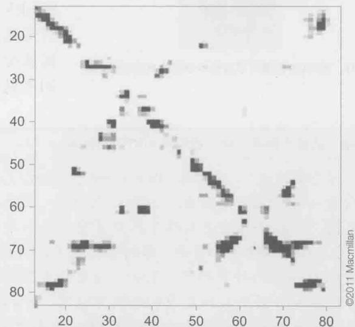  
图 5-9 预测 RNA 二级及三级结构的双向策略。本图展示的是某核酶的变异-比对数据，横轴表示酰化位点沿 RNA 分布的情况，纵轴表示变异位点的信息。酰化位点由灰色和黑色表示（灰度表示修饰的程度）。基于统计分析算法，只有最显著的数据被展示出来。（经允许，引用自 Kladwang W. et al. 2011. Nat. Chem. 3: 954-962, Fig. 2A, p. 956. MacMillan.)

## 定向演化选择了可以结合小分子的 RNA

研究人员利用 RNA 潜在的结构复杂性通过定向选择获得了一些新的、自然界中不存在的 RNA 分子，它们拥有特定的令人满意的性质，这一过程称为 SELEX（systematicevolution of ligands by exponential enrichment, 指数富集配体系统演化技术)。通过随机方式合成 RNA 分子, 可以获得含有巨大序列多样性的寡核苷酸混合物。例如, 对于长度为 20 的寡核糖核苷酸混合物, 因为每个位点有 4 种核苷酸的可能性, 这样整个混合物的复杂度就是 $4^{20}$ 种序列, 或者 $10^{12}$ 种! 对于这种寡核糖核苷酸混合物, RNA 分子可以通过生物化学的方法被选择 (如通过亲和层析, affinity chromatography), 选出

  
图 5-10 SELEX 富集可以结合小分子的 RNA 的过程。

那些具有特定性质的 RNA，如对特定的小分子或蛋白质有亲和性。这些 RNA 称为适配子（aptamer）。通过 PCR（第 7 章）连续扩增以及通过诱变聚合酶获得序列多样性并进行多轮选择可以富集适配子，使其同小分子和蛋白配体的亲和性逐渐增加（图 5-10）。RNA 适配子识别的配体的有很多，如 ATP、卡那霉素（kanamycin）、妥布霉素（tobramycin）、新霉素（neomycin）、氰钴胺素（cyanocobalamine）、朊病毒蛋白和凝血因子 X11a。一个基于连续 SELEX 的策略创造了另一个典型的例子——对荧光基团具有高亲和性的 RNA 分子，RNA 同该荧光基团的作用方式与绿色荧光蛋白相同（见框 5-2）。

## 框5-2 通过定向演化获得类似于GFP的RNA

绿色荧光蛋白（green fluorescent protein，GFP）是广泛应用于分子生物学研究的蛋白之一，被激发光激发后产生绿色荧光。绿色荧光蛋白可以自发产生共价结合的荧光基团，这种蛋白质是从维多利亚多管发光水母（Aequorea victoria）中发现的。许多物种，从细菌到鱼类和小鼠，都拥有表达功能性GFP的能力，使研究人员可以通过GFP进行各种各样的科学研究。例如，该蛋白可用作活细胞中基因表达的报告基因，甚至可以使其融合蛋白在细胞中的位置可视化。正如我们已经看到的，RNA丰富的多样性、其折叠成复杂的三级结构的能力及SELEX技术的发明，获得具有某些特定用途的定制化的适配子已经成为可能。SELEX技术最近有一个非常引人注目的应用，它获得了可以同小分子荧光基团结合的RNA适配子，这些适配子可以创造拟态的GFP。这一工作由Jeremy Paige及其同事完成（见Paige et al. 2011. Science 333: 642-646）。这些RNA-荧光基团复合物具有与GFP相同的颜色和亮度，但拥有更多有用的特征，我们下面会讲到。

GFP 中自发形成的荧光基团是 4-羟基苯亚甲基咪唑啉酮（4-hydroxybenzolidene imidazolinone），可以通过同 GFP 的一部分发生特异性接触而发出荧光，这种特异性接触通过抑制分子内运动实现，该运动可以阻止自由荧光团发出荧光。在刚开始的时候，Paige 等使用一种 GFP 天然荧光基团的衍生物（3,5-二甲氧基-4-羟基苯亚甲基咪唑啉酮），该衍生物同样需要抑制分子内运动来发出荧光。10个SELEX循环后获得了结合在3,5-二甲氧基-4-羟基苯亚甲基咪唑啉酮（固定于琼脂糖）上的RNA分子。Spinach是其中之一，当它同自由的荧光基团结合的时候可以产生浅绿色荧光。使用其他的荧光基团，同时增加SELEX的循环数，作者获得了从蓝色到红色的多种RNA-荧光基团复合物（框5-2图1）。为了证明这些适配子的实用性，Paige等把Spinach编码序列同5S RNA编码基因的3'端进行了融合。5S RNA是核糖体大亚基的非编码成分，由RNA聚合酶Ⅲ合成（见第15章）。通过构建5S-Spinash融合基因，作者对核糖体RNA由细胞核进入细胞溶质的移动实现可视化。

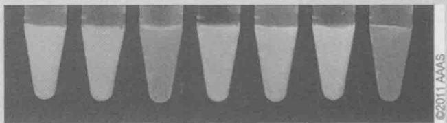  
框 5-2 图 1 呈现多种不同颜色的 RNA-荧光基团复合物。（经授权，复制自 Paige JS.et al.2011.Science 333:642-646, Fig.2D.AAAS.）

最近，Spinach 被进一步改造成为细胞代谢的传感器。这一工作是通过把 Spinach 同特定的适配子连接在一起实现的，这种特定的适配子可以同代谢物结合，如 S-腺苷蛋氨酸（SAM）或 ATP（框 5-2 图 2）。生成的传感器 RNA 由 Spinach 和代谢物结合结构域构成，除非其结构通过结合代谢物变得稳定，否则它无法结合荧光基团。这种传感器 RNA 曾用来对大肠杆菌活细胞中的 SAM 进行示踪。首先使含有传感器的细胞缺少甲硫氨酸（甲硫氨酸是 SAM 生物合成的前体），然后用荧光基团处理，接着向生长培养基中加入甲硫氨酸，这会对细胞荧光产生一个显著的刺激。这一类传感器或许可以为在活细胞中实时监控代谢物水平的变化提供一种有效的方法。

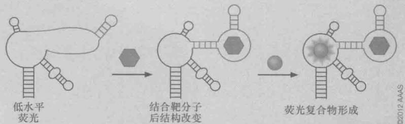  
框 5-2 图 2 使用 SELEX 技术获得代谢传感器。代谢传感器包括荧光基团结合结构域（绿）和代谢产物结合结构域（紫）。当 RNA 同时结合荧光基团和代谢产物时就形成稳定的荧光复合物。（经授权，复制自 Paige JS.et al. 2012.Science 335:1194, Fig.1A.AAAS.）

这个例子强调了 RNA 非凡的多功能性。自然界在自然选择中通过这种多功能性创造了核糖开关、核酶、tRNA 分子和调节 RNA（我们会在第 15 章和第 20 章讲到）。现在，分子生物学家也正在通过这种多功能性创造更多种类的 RNA 分子，以便更好地服务于全人类。

实际上，就像我们在第 20 章看到的那样，大自然已经做到这一点了。细菌中的代谢操纵子有时会受到调控 RNA 元件的控制，比如核糖开关（riboswitch），它可以同小分子配体结合并对基因转录和翻译进行控制。核糖开关识别的代谢分子包括：赖氨酸、鸟嘌呤、辅助因子辅酶 B12 和下面我们会讨论的代谢物葡萄糖-6-磷酸。

## 一些 RNA 可以是酶类

许多年来普遍认为酶只能是蛋白质，酶必须能结合底物，启动化学反应，释放产物，并可以重复使用。蛋白质很适合作为酶分子，它由20种氨基酸组成，可折叠形成具有底物、小分子辅助因子的结合位点和催化位点的复杂三级结构。现在我们知道很容易形成三级结构的RNA也是一种生物催化剂。RNA酶被称为核酶（ribozyme），具有酶的许多典型特征：催化位点、底物结合位点和辅助因子（如金属离子）结合位点。

RNase P 是最早发现的核酶之一，它是一种内切核糖核酸酶，参与从大的 RNA 前体生成 tRNA 的过程。RNase P 可以特异地剪切 RNA 前体 5'端的前导片段，进而形成成熟的、有功能的 tRNA，该过程如图 5-11 所示。RNase P 由 RNA 和蛋白质共同组成，起催化作用的只是 RNA。蛋白质组分中和了 RNA 上的负电荷，使 RNase P 可与带负电的底物有效结合，从而促进了反应的进行。如果有小的、带正电的离子（如多肽亚精胺）中和了负电荷，即使没有蛋白质组分，RNA 组分也可以催化 tRNA 前体的剪切。

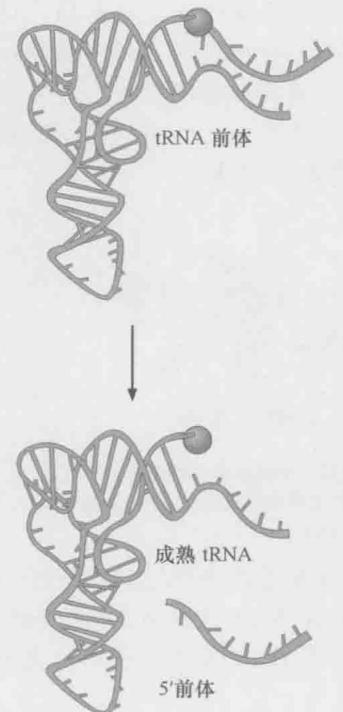  
图 5-11 RNase P 对 RNA 前体 5' 端的片段进行切割，进而形成 tRNA 分子。

  
图 5-12 RNase P 的结构。此图展示的是细菌中 RNase P 全酶的晶体结构：紫色表示的是 RNA 亚基，蓝色表示的是蛋白亚基，黄色表示的是 tRNA。催化中心的金属离子用红色球体表示。（该结构由 Protein Data Base [PDB: 3Q1R] 中的信息组装而成，参考文献为 Reiter N.J. et al. 2010. Nature 468: 784-789.）

正如我们下面要看到的，tRNA 可以折叠成 L 状的三级结构，tRNA 的 5'端和 3'端位于该三级结构的同一侧。RNase P 的晶体结构揭示：磷酸二酯链的切割位点位于 RNase P 中 RNA 组分的催化中心内，而蛋白质组分则和前导片段发生相互作用（图 5-12）。

GlmS 是一种蛋白质类的生物酶，在其 mRNA 的 5'非翻译区发现的一种结构说明 RNA 可以同时扮演核酶和核糖开关两种角色。GlmS 可以催化代谢物葡糖胺-6-磷酸的合成。该 RNA 是一种核酶，可以降解编码 GlmS 合成的 mRNA，但其活性依赖于葡糖胺-6-磷酸。因此，该 RNA 也是一种核糖开关。所以，当葡糖胺-6-磷酸处于高水平时，编码 GlmS 的 mRNA 就会被降解掉，从而减少葡糖胺-6-磷酸的合成。

其他的核酶发挥反式的酯化作用，参与去除一些核酸分子的内部序列，如 mRNA 前体、tRNA 前体和 rRNA 前体间插序列即内含子（intron）的切除过程，这被称为 RNA

## 剪接（RNA splicing）（第14章）。

## 锤头状核酶通过形成 2', 3'-环磷酸剪切 RNA

让我们再关注一下一种特殊核酶的结构及功能，即所谓的锤头状核酶（hammerhead）。它是一种序列特异性的核糖核酸酶，从被称为类病毒(viroid)的植物感染性RNA病毒中得到，类病毒的繁殖依赖自我剪切。当类病毒复制时，在连续的RNA链上产生多个拷贝。单个类病毒由剪切而产生，而这种剪切反应由结合处周围的RNA序列催化完成。这样自我剪切的序列由于其二级结构类似锤头而被称为锤头结构，而每个锤头结构由3个配对的柄构成（Ⅰ、Ⅱ、Ⅲ），包围着起催化作用的不互补的核苷酸中心（图5-13）。这种剪切反应发生在第17位的胞嘧啶上。锤头结构的三级结构显示催化中心位于三个柄的结合部附近（图5-13）。

为了弄清锤头结构如何起作用，必须首先了解在碱性环境下

  
图 5-13 锤头状核酶的结构。左上方的图表示的是“锤头”的二级结构，三个柄都用颜色高亮显示了。点线表示的是 Watson-Crick 碱基对之间的相互作用。橙色部分和箭头表示的是 C17 处易断裂的键。（来源：经 McKay D.B. and Wedekind J.E. 同意，1999，The RNA World, 2nd ed. [ed.Gesteland R.F. et al.], p.267, Fig. 1A. ©Cold Spring Harbor Laboratory Press.）右图表示的是锤头状核酶的 3D 结构，中间的红色部分表示催化中心的镁离子。这张结构图展示了柄 I（右上方）、柄 II（中间左侧）和茎环 III（底部），它们同左上方示意图中的着色相同。镁离子是否参与催化目前还不确定（橙色箭头所示）。裂解的位置在第 17 位的胞嘧啶上。（图片由 V.D'Souza 参照 Protein Data Base[PDB:20EU]用 PyMOL 制作，具体描述见 Martick M. et al 2008. Chem Biol. 15: 332-342

RNA 如何水解。如果 pH 很高，RNA 骨架上核糖的 2'-羟基会处于去质子化状态，这样使带有负电的氧可以进攻位于同一核糖的 3' 易断开的磷，从而打断 RNA 链，产生 2', 3'-环磷酸酯及一个自由的 5' 羟基。RNA 链上的每一个核糖都能通过这个反应水解，这样整个完整的分子能够酶解成核苷酸分子。（想一想为什么 DNA 不像 RNA 那样易于被碱水解？）许多蛋白质类的核糖核酸酶也是通过 2', 3'-环磷酸酯的形成来裂解 RNA 底物的。在正常细胞环境的 pH 时，这些蛋白质酶类通过结合在其活性位点上的金属离子来活化 RNA 的 2'-羟基。锤头状核酶同样是通过 2', 3'-环磷酸酯的形成来裂解 RNA 底物。3D 结构提示镁离子距催化中心很近，但是确切的剪切反应机制和金属离子的作用还未阐明。

因为锤头状核酶通常的作用方式是自身剪切，它们不能算是真正的催化剂。每个催化剂分子通常一次只催化一个反应，这样转换数为一。但是可以通过遗传工程手段把整个分子分开成两部分，一部分是核酶，包含了催化核心；另一部分是底物，包含了剪切位点。底物同核酶的柄Ⅰ和柄Ⅲ结合。剪切完成之后底物被释放，代替它的是一个没有被剪切的新底物，因此可以进行重复的剪切。

位于核糖体中心的核酶也可以作用于碳原子中心

目前我们所涉及到的核酶都作用于磷原子中心。但在第 15 章我们会看到，核糖体中有一种 RNA 成分，我们习惯上认为它只扮演结构上的角色，现在我们知道它是一种肽基转移酶（peptidyl transferase），在蛋白质合成过程中负责肽键的形成。在这个例子中，核酶在催化反应时作用于碳原子中心而不是磷原子中心。除此之外，正如我们在第 17 章讨论的，在活细胞中几个最为重要的酶催化反应之一就是由 RNA 分子来完成的，这一发现已经被采纳用于支持“当前以蛋白质为基础的生命起源于更早的 RNA 世界”这一假说。

## 小结

RNA 与 DNA 相比有以下不同：它的骨架构成是核糖而不是 2'-脱氧核糖；尿嘧啶代替了胸腺嘧啶的位置；它通常以多聚核苷酸单链形式存在，没有互补链。由于是单链，RNA 在自身互补区域可以折叠形成局部双螺旋。与 DNA 相比，RNA 的碱基配对更宽。除了 A：U 配对和 C：G 配对，U 和 G 也可以配对。这一特性使 RNA 能够形成不符合 Watson-Crick 碱基配对原则的碱基对，从而增大了 RNA 形成局部双螺旋的能力。由于没有形成长的、规则的双螺旋的限制，碱基和核糖磷酸骨架之间的非常规相互作用使 RNA 能形成复杂的三级结构。

有些 RNA 同时也是一种酶——它们能够催化细胞内和离体的化学反应，这些 RNA 酶被称为核酶。大多数核酶作用于磷原子中心，如核糖核酸酶 RNase P。RNase P 由蛋白质和 RNA 构成，但是，只有它的 RNA 部分起催化作用。锤头状核酶是具有催化自身断裂作用的 RNA，通过产生 2'，3'-环磷酸酯来切开 RNA 骨架。肽基转移酶是另一类核酶，作用于碳原子中心。肽基转移酶催化肽键的形成，是组成核糖体的 RNA 组分之一。

## 参考文献

## 书籍

Bloomfield V.A., Crothers D.M., Tinoco I., Jr., and Heast J.E. 2000. Nucleic acids: Structures, properties, and functions. University Science Books, Sausalito, California.

Gesteland R.F., Cech T.R., and Atkins J.F., eds. 2006, The RNA world, 3rd ed. Cold Spring Harbor Laboratory Press, Cold Spring Harbor, New York.

## RNA 结构

Darnell J.E. Jr. 1985. RNA. Sci Am. 253: 68–78.

Doudna J.A. and Cech T.R. 2002. The chemical repertoire of natural ribozymes. Nature 418: 222–228.

Doudna J.A. and Lorsch J.R. 2005. Ribozyme catalysis: Not different, just worse. Nat. Struct Mol Biol. 15: 394–402.

Houck-Loomis B., Durney M.A., Salguero C., Shankar N., Nagle J.M., Goff S.P., and D'Souza V.M. 2011. An equilibrium-dependent retroviral mRNA switch regulates translational recoding. Nature. 480:561–564.

Nelson J.A. and Uhlenbeck O.C. 2006. When to believe what you see. Mol Cell. 23: 447–450.

Kladwang W., VanLang C.C., Cordero P., and Das R. 2011. A two-dimensional mutate-and-map strategy for non-coding RNA structure. Nat. Chem. 3: 954–962.

## 习题

偶数习题的答案请参见附录2

习题1

A. 请画出脱氧鸟苷的结构示意图, 圈出并且标出和脱氧胞苷形成 DNA 碱基对的氢键中的供体和受体。

B. 请画出鸟苷的结构示意图, 圈出并且标出和鸟苷形成 RNA 碱基对的氢键中的供体和受体。

习题 2 研究人员发现了一种新的病毒并且确定了碱基组成以及每种碱基的比例。你想通过遗传物质对该病毒进行分类。记住病毒的遗传物质可以是单链 DNA 或 RNA，亦或是双链 DNA 或 RNA。仅考虑序列信息，应该用什么方法来区分遗传物质是 RNA 还是 DNA，另外应该用什么方法来区分遗传物质是单链还是双链的。

习题 3 请阐述为什么 DNA 的螺旋结构不同于双链 RNA 的螺旋结构以及结构上的不同如何影响蛋白质与螺旋 RNA 之间的相互作用。

习题 4 请列出尿嘧啶存在于 RNA 而不是 DNA 的生物学理由。

习题 5 某段 RNA 的结构如下所示，请画出该 RNA 可能会形成的发夹结构，用虚线表示碱基对。

5'-AGGACCCUUCGGGGUUCU-3'

习题 6 酵母丙氨酸 tRNA 结构如下图所示（引自第 2 章图 2-14）。指出该 tRNA 中存在

的二级结构类型和非常规碱基对。


习题 7 研究人员希望赋予所挑选的细菌抗生素耐药性，因此他们决定通过 SELEX 系统来筛选一条特异性地和目标抗生素相结合的 RNA（适配子），并且在挑选的细菌中表达该适配子，从而获得抗生素耐药性。

A. 结合你了解的 RNA 知识，请阐述 RNA 适配子要和抗生素特异性地集合的话需要具备什么特点；

B. 如果不用 SELEX 系统的话，可以从细菌基因组编码的 RNA 库中挑选结合抗生素的 RNA。请列出 SELEX 系统相对于该方法的两条优势。

习题 8 请描述酶和核酶之间的共性。

习题 9 某些 RNA 是植物的病原体或类病毒，而某些类病毒可以进行催化反应。你现在拥有某特定物种分离出的 RNA 类病毒序列，请阐述该类病毒作为锤头型核酶进行催化反应的特征。

习题 10 科学家计划对进行自我剪切的锤头状核酶加以改造，以作为潜在的治疗手段。如要对其他的 RNA 分子进行靶向剪切，请问应该如何对锤头状核酶的结构进行改造，并请阐述改造后的锤头状核酶可以真正发挥核酶作用的理由。

习题 11 一些核酶, 比如像丁型肝炎病毒中发现的和 glmS mRNA 中发现的核酶/核糖开关, 可以折叠成网状双假结。请阐述核酶和核糖开关形成假结的优势。

习题 12 下图所示的是一个核苷类似物的结构。

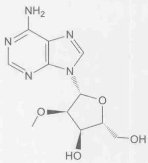

A. 请写出模仿的核苷名字。

B. 假设某条 RNA 链携带有这种核苷类似物（通过磷酸二酯键相连）。在高 PH 的环境下，在该核苷类似物的位置会发生水解吗？请阐述你的理由。

习题 13 DNA 作为遗传物质发挥作用，请列出 RNA 的三种细胞学作用。

习题 14 你发现一种由蛋白质亚基和 RNA 亚基构成的复合物能够对 RNA 底物进行剪切。你想要弄清楚哪一部分发挥了催化作用，为此，你进行了一项体外剪切实验，实验在包含低浓度 $Mg^{2+}$ 的合适缓冲液条件下进行。下表展示了 7 个独立反应的结果。“+”代表包含的反应成分，亚精胺是一种正电荷肽，对该反应无特异性。

<table><tr><td>蛋白质亚基</td><td>-</td><td>+</td><td>-</td><td>+</td><td>+</td><td>-</td><td>+</td></tr><tr><td>RNA 亚基</td><td>-</td><td>-</td><td>+</td><td>+</td><td>-</td><td>+</td><td>+</td></tr><tr><td>亚精胺</td><td>-</td><td>-</td><td>-</td><td>-</td><td>+</td><td>+</td><td>+</td></tr><tr><td>切割率</td><td>0</td><td>0</td><td>0</td><td>90</td><td>0</td><td>50</td><td>90</td></tr></table>

A. 在反应中，是蛋白质亚基还是 RNA 亚基发挥了催化作用？并请阐述你的理由。
B. 推测亚精胺在最后两个反应中的作用。

习题 15 噬菌体 Qβ 的基因组由大约 4000nt 长的单链 RNA 构成。在大肠杆菌宿主内，噬菌体基因组的复制需要 RNA 依赖的 RNA 聚合酶，该聚合酶由噬菌体和细菌蛋白组成。有趣的是，该复制酶结合到 RNA 基因组的中心部位，必须复制 RNA 模板 3' 端来产生一条 5' 到 3' 方向的新链。研究人员猜想 Qβ 基因组上有假结存在，从而使得复制酶能够与 RNA 3' 端相结合。为了证实这个猜想，他们利用野生型复制酶和在对假结形成有关键作用区域发生突变的 Qβ RNA 为模板，在体外测定了复制效率，最后，他们在与 3' 发夹结构互补的 RNA 的中心部分确定了一段 8nt 长的区域。

野生型、突变型序列以及复制数据如下所示：

野生型 5'-UAAAGCAG-3'
GUUUCGUC
A. 突变型 A 5'-UAAACGAG-3'
GUUUCGUC
B. 突变型 5'-UAAAGCAG-3'
GUUUGCUC
C. 突变型 5'-UAAACGAG-3'
GUUUGCUC

体外复制效率（相对于野生型）：
野生型：100%
A. 突变型：1.6%
B. 突变型：0.6%
C. 突变型：42%
A. 请阐述为什么 A 突变型的复制效率这么低？
B. 请阐述为什么 C 突变型的复制效率只有野生型的一半？
C. 你认为结果是支持还是不支持关于假结的存在会影响复制的猜想？

数据源自 Klovins 和 van Duin （1999. J. Mol. Biol. 294: 875–884.）

(潘庆飞 夏志译 刘韧 胡学达 校)

## 第6章

本章概要
·
基本概念
·
水的重要性
·
蛋白质结构的4个层次
·
蛋白质的结构域
·
从氨基酸序列到三维结构
·
蛋白质的构象变化
·
作为特异分子识别物的蛋白质
·
作为催化剂的蛋白质：酶
·
蛋白质活性的调控

# 蛋白质的结构

蛋白质是多聚物，也就是说它们是由许多共价连接的、多拷贝的小构件组成的。这些构件就是有规律地存在于生命体的蛋白质之中、由遗传密码子决定的20种α-氨基酸。蛋白质中一些已存在的氨基酸还有可能会被修饰，因而从细胞或组织中分离到的蛋白质的氨基酸的实实在在的变异可能会更加多样。

## 基本概念

## 氨基酸

氨基酸的 $\alpha$ -碳（ $C_{\alpha}$ ）有 4 个取代基团（图 6-1）。除了最简单的氨基酸——甘氨酸之外，其他氨基酸的这 4 个取代基团都不相同。这些取代基团中的 3 个，即氨基，羧基和氢原子则存在于所有天然发生的氨基酸中。第四个取代基团通常简称为 R，有时也称为 “R 基”，是唯一区分不同氨基

酸的取代基团。在下一部分就会明白为什么 R 基又被称为“侧链”。由于除了甘氨酸外，其他氨基酸的这 4 个取代基都不相同，所以 $C_{\alpha}$ 是手性中心（chiral center）。一般的蛋白质中的氨基酸在该手性中心都是 L-构型，而 D-氨基酸则存在于其他种类的分子中（包括微生物中的类似蛋白质的小多肽）。

R 基团的性质决定了氨基酸的特性。该基团的极性与其在水中的溶解性有关，这是一个重要的特性，而其大小则是另一个重要的特性。按照以下规则对 20 种常见的、组成氨基酸的 R 基团进行分类是非常有用的：（1）中性（不带电荷），非极性；（2）中性，极性；以及（3）带电荷的（图 6-2）。正如我们将在后面所看到的，对于非极性氨基酸而言，由于这些侧链紧凑地包埋在蛋白质的内侧，所以侧链的大小（体积）非常重要，因而甘氨酸和丙氨酸的功能与苯丙氨酸和色氨酸的功能相差很大。这里还要注意的是，尽管色氨酸主要是非极性的，但是由于它有一个氢键结合基团，因而具有一定程度的极性。而在图6-2上，虽然酪氨酸由于其OH基团而被划分为极性氨基酸，但是其极性远不如丝氨酸。简而言之，各个分类之间的界限并不如术语所表达的那么明确。带电荷的R基团是指中性pH条件下带负电荷（天冬氨酸和谷氨酸）或正电荷（赖氨酸、精氨酸和组氨酸）。组氨酸的pKa约为6.5，因而即使在中性pH条件下，组氨酸也会丢失大部分的电荷。这一特性对于很多酶的催化位点非常重要。

  
图 6-1 氨基酸的结构图。

  
图 6-2 蛋白质中的 20 种自然氨基酸，以及常用的氨基酸的 3 字母和单字母的缩写。

## 肽键

肽键（peptide bond）指蛋白质中氨基酸之间的共价键。肽键是失去一分子的水而缩合形成（图 6-3a），是一个特殊的酰胺键。每个氨基酸可以形成两个这样的键，因而一系列这样的键就可以形成一个线性的（也就是不分支的）多肽链（polypeptide chain）。由于在每个肽键形成时都会脱去一分子的水，因而这个链的组成成分又被称为氨基酸残基（amino acid residues），当上下文中有“氨基酸”时，有时候就直接称为“残基”。肽键有两个键的部分性质；羧基和氨基几乎共面而几乎总是呈反式构型（图 6-4）。

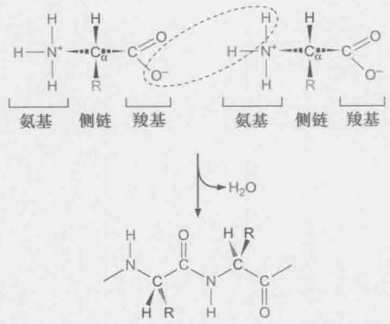  
图 6-3 肽键的形成。

  
图 6-4 主链扭角 $\phi$ 和 $\psi_{0}$ 。（a）扭角 $\phi$ ，该图展示肽主链的旋转点。（b）扭角 $\phi$ 与 N-C $_{\alpha}$ 键的轴旋转一致；这里的构象与 $\phi=180^{\circ}$ 一致。（c）扭角 $\psi$ 与 C $_{\alpha}$ -C 键的旋转一致；这里展现的构象是 $\psi=0^{\circ}$ 。（授权引用于 Kuriyan J. et al. 2012. The molecules of life. ©Garland Science/Taylor & Francis LLC; Branden C. and Tooze J. 1999. An introduction to protein structure, p.8, Fig.1.6. ©Garland Science/Taylor & Francis LLC.)

## 多肽链

构象（conformation）一词描述的是化学键和原子在三维空间中的排列，因而我们谈及一个多肽链的构象，或者更简单的，它的“折叠结构”或者折叠。如果我们沿着多肽链共价连接的序列看，那么每个氨基酸残基有3个键——一个连接NH基团与 $C_{\alpha}$ ，一个将 $C_{\alpha}$ 与羧基相连，最后一个则是连接肽链中下一个残基的肽键。前两个键是可以相对自由旋转的单键（图6-4）。但是肽键则由于具有部分双键的性质，因而仅有很少的旋转自由度。因此，多肽链构象是由每个残基的前两个主链的扭转力，加上每个侧链的单键的扭转力决定的。通常将主链的两个扭转力命名为 $\varphi$ 和 $\psi$ 。这两个角的许多组合会导致原子碰撞，因而限制一个多肽链的构象自由度只能是特定范围的某个角度（见框6-1）。

## 框 6-1 Ramachandran 图：主链扭角 $\phi$ 和 $\psi$ 的可允许组合

G. N. Ramachandran 及其同事（1963）研究了扭角 $\phi$ 和 $\psi$ 的所有可能的组合（见图 6-4），判定了哪些组合可以避免原子碰撞（“允许的”），以及哪些组合会导致碰撞（“禁止的”）。这里显示的“允许”和“禁止”的组合的二维图现在以“Ramachandran 图”著称（框 6-1 图 1）。常规二级结构的主链构象具有 $\phi$ 和 $\psi$ 所表明的： $\alpha$ 右螺旋；

β折叠；多脯氨酸螺旋（优先采用连续展开的脯氨酸的三重螺旋结构）； $3_{10}$ 螺旋（每个转角有3.3个残基，与每个转角有3.6个的残基的α螺旋密切相关）；α左螺旋Lα（只发生在甘氨酸，因为它没有侧链）。

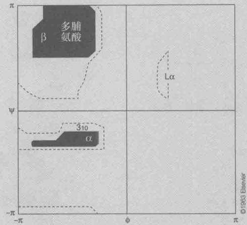  
框 6-1 图 1 Ramachandran 图 “允许的” 区域为蓝色部分。(授权修改自 Ramachandran G.N., et al. 1963. Stereochemistry of polypeptidechain configurations. J.Mol.Biol.7: 95-99.)

## 具有特殊构象性质的三个氨基酸

甘氨酸、脯氨酸及半胱氨酸具有特殊的性质。因为它们的 R 基团只有一个质子，甘氨酸是非手性的，相对于其他氨基酸而言有更多的构象自由度。相反，脯氨酸侧链的 $C_{\alpha}$ 与 N 有一个共价键（严格意义上讲，脯氨酸是一个亚氨基酸），因而其相对于许多其他氨基酸而言有更少的自由度。此外，由于 NH 基团缺乏疏水势能而限制参与形成二级结构（见“蛋白质结构的四个层次”部分）。

半胱氨酸的侧链有一个巯基（—SH），在生理状态下易发生氧化还原反应。正确定位在折叠蛋白中的两个半胱氨酸可以通过两个—SH基团氧化成S—S而形成一个二硫键（disulfide bond，图6-5）（形成的这对依靠S—S共价连接的氨基酸有时又可称为胱氨酸）。位于细胞表面，以及分泌到细胞外间隙的蛋白质暴露在易形成二硫键的氧化还原电位的环境中，因而大部分这样的蛋白质具有二硫键，没有未氧化的半胱氨酸。活细胞保持一个更加还原的内在环境，细胞内蛋白质则很少含有二硫键。

  
图 6-5 二硫键的形成。(授权采用自 KuriyanJ. et al. 2012. The molecules of life. ©Garland Science/ Taylor & Francis LLC.)

二硫键通过添加共价键来增强折叠蛋白的稳定性，这些二硫键对于稳定小的分泌蛋白，如许多激素都非常重要，在相对于细胞内蛋白而言更不易控制的细胞外环境中，二硫键对于增强膜蛋白的细胞胞外域也非常重要。

## 水的重要性

生命系统的所有分子现象都依赖于含水环境。极性与非极性氨基酸侧链的重要区别在于其在水溶剂中的性质。连接在多肽主链的侧链上的天冬氨酸和苯丙氨酸，类似于乙酸与甲苯：乙酸易溶于水，甲苯则不溶。所以含天冬氨酸的侧链是亲水的（hydrophilic），而甲苯侧链则是疏水的（hydrophobic）。即使是亲水侧链也有疏水部分（如赖氨酸侧链的3个亚甲基基团）。

水是含有多个氢键的液体（图 6-6）。每个水分子可以贡献及接受两个氢键。溶质与周围水的氢键结合的影响决定了它的亲疏水性。疏水分子扰动氢键网络；而亲水分子则参与氢键的形成。因此，疏水分子更倾向于保持彼此接近（不溶性）而非散在于溶剂之中（可溶性）。许多氨基酸侧链的疏水特性使它们更易成簇而远离水，而其他亲水氨基酸侧链则易溶于水。一个实实在在的蛋白质的氨基酸序列由于演化而使多肽链趋于折叠，包埋起疏水残基而暴露亲水残基。但是许多一般大小的多肽，其可能的氨基酸序列使之并不能以此种方式折叠，它们或是随机地波动而将链在溶剂中展开（有时称为随机卷曲，random coils）；或者一条多肽链的疏水基团与另一条链上的疏水基团聚集成簇。


图 6-6 水：冰的氢键结构。在冰中，每个水分子贡献两个氢键（来自它的两个质子，淡紫色）给相邻氧原子（红色）的孤对电子，并接受自身氧原子的孤对电子上的两个氢键。氢键用红色虚线显示。当冰融化时，氢键网络动摇并瞬间瓦解，但是单个水分子间的氢键保持与它们相邻分子的四个氢键（平均）的大部分。因此，液态水的结构类似于这里展现的冰晶的波动和扭曲。

## 蛋白质结构的四个层次

从四个不同的组织层次来分析和描述蛋白质的结构非常有用（图 6-7）。第一个层次是蛋白质的初级结构（primary structure），就是指多肽链的氨基酸残基序列。正如我们所知，遗传密码直接决定了蛋白质的初级结构，因而初级结构是一维（1D）的决定化学键的字符串；其余三个层次则依赖于蛋白质的三维（3D）性质。

  
图 6-7 蛋白质结构的层次，以血红蛋白为例。“初级结构”指的是多肽链的氨基酸序列。血红蛋白亚基的一段初级结构用单字母密码来表示。“二级结构”指的是具有重复的骨架氢键的常规局部结构。这里显示的是血红蛋白亚基的一段α螺旋。“三级结构”指的是整条多肽链的折叠结构（即一个多结构域蛋白的单个结构域）。图示血红蛋白四个亚基中的一个。虚线为左边所示的初级和二级结构相对应的一段α螺旋。“四级结构”指的是一个更大的复合蛋白中多个蛋白亚基的排列。血红蛋白是两个“α链”和两个“β链”组合成的四聚体。但是可以从图中看到，这两类链具有相似的四级结构（修改自Irving Geis的描述，版权为Howard Hughes Medical Institute所有）。

蛋白质的二级结构（secondary structure）指的是多肽链的局部构象——一小段氨基酸残基的三维构造。天然状态下的蛋白质有两种常见的二级结构，因为这两种局部构象使L-氨基酸链特别稳定（框6-1）。其中之一称为α螺旋（α helix，图6-8a）。多肽骨架沿着螺旋中轴呈右螺旋，因而每个氨基酸残基的主链羰基与多肽链C端方向的第4个残基的主链氨基形成氢键。另一个常见的构象是β折叠（β strand，图6-8b）。β折叠是一种伸展的构象，其侧链交替伸向骨架的一侧，而氨基和羰基基团也交替伸向两侧。骨架并未完全伸展，因而其链也轻微地或曲或褶。在折叠的蛋白质中，β折叠通过主链氢键形成片层结构。无论平行的还是反向平行的疏水结合方式都是可能的，有时又分别称为平行或反向平行的β折叠片层结构。在实实在在的蛋白质中，经常可以发现各种混合的片层结构，多肽链并不是严格地交替方向或者严格保持单一方向。

蛋白质的三级结构（tertiary structure）通常指在多肽链适应不同生理条件的紧凑的三维折叠结构。多肽区段的主要结构是 $\alpha$ 螺旋或 $\beta$ 折叠；而其余则是不规则构象（例如，在二级结构元件间存在的有利于这些元件各自紧密包装的扭转或成环）。在随后的章节中我们将描述并列举可能的三级结构。通常，多肽链的二级和三级结构的稳定性是相互依赖的。

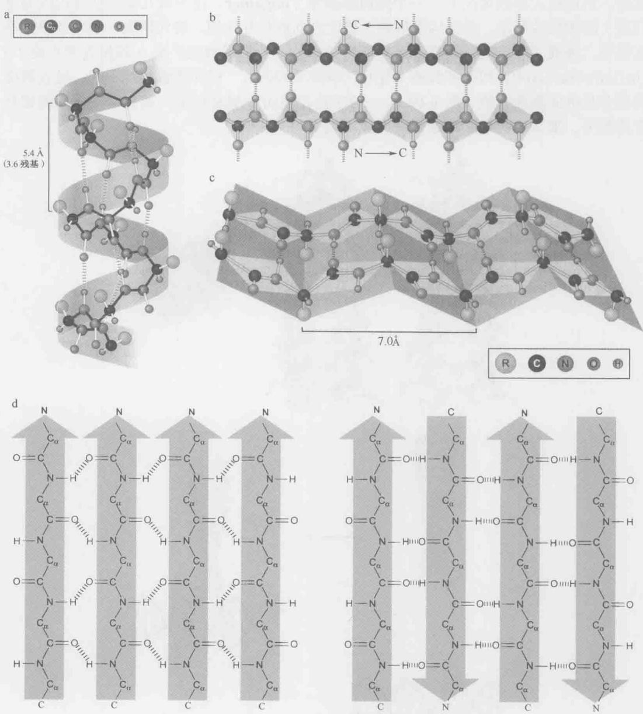  
图 6-8 蛋白质的二级结构。(a) α 螺旋。氢键用红色虚线表示。(b) β 折叠。氢键用红色虚线表示。上面为 β 折叠的俯视；下面为 β 折叠的侧视。(c) 平行的 β 折叠，是与多肽链从氨基到羧基的方向相同的氢键结合方式。(d) 反平行的 β 折叠，是与多肽链方向相反的氢键结合方式。(图 a 据 Irving Geis 修改，图 b 和 c 为 Ivring Geis 所绘，版权归 Howard Hughes Medical Institute 所有，未经许可不可复制。图 d 经许可引自 Branden C. and Tooze J. 1999. Introduction to protein structure, 2nd ed., p. 19, Fig 2.6a and p. 18, Fig 2.5b. © Garland Science/Taylor & Francis LLC.)

很多蛋白质不止一条多肽链：四级结构（quaternary structure）指的是各条折叠的多肽链之间相互作用的方式。我们可以将其分为：一定数目的单一类型的多肽链[据上下文，一般称为一个“亚单位”或者“启动子”（promoter）]；一定数目的多于一种类型、相互不同的亚单位。较为简单的蛋白质亚基间相互作用的方式并不影响单个多肽的折叠。然而在大多数情况下，一个蛋白寡聚体（oligomer，由少数几条多肽链组成的蛋白质）的四级甚至是二级结构都依赖于彼此之间的相互作用。换句话说，单个亚单位不仅需要二级或三级结构，同样也需要四级结构。一个常用的例子是 $\alpha$ 螺旋卷曲盘旋（ $\alpha$ -helical coiled-coil)：两条多肽链（有时三条甚至四条），相同或者相互不同，呈 $\alpha$ 螺旋构型并且彼此渐渐缠绕（图6-9a）。一般单链并不如 $\alpha$ 螺旋稳定，如果单聚体间的相互作用消失，那么这些螺旋将解开而形成不规则的多肽链。

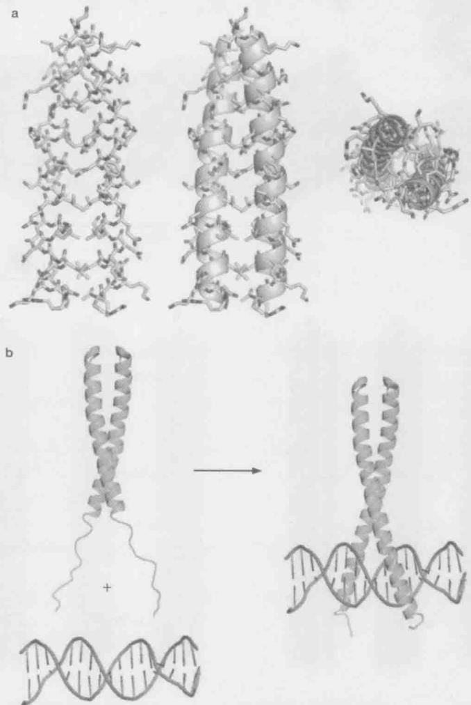  
图 6-9 酵母转录因子 GCN4。（a）GNC4 卷曲盘旋结构的三面观。（左）条杠表示化学键，结点区表示原子，灰色表示碳原子，红色表示氧原子，蓝色表示氮原子。这两条相同的多肽链的羧基端在最上面。呈梯形的疏水侧链（大部为灰色）位于两个螺旋肽链的接触面。（中）多肽链骨架为理想的带状，侧链以条杠表示。可以看到这两条多肽链相互渐渐缠绕。（右）俯视图，标示同中图。（b）GCN4 与 DNA 复合物的结构，是“基本区域”（basic region，从氨基端到卷曲盘旋的区段）从无序到有序的转换，通过结合在 DNA 的大沟而形成 α 螺旋。以 PyMOL 制图（Schrödinger，LLC）。

## 蛋白质的结构域

## 多肽链折叠成一个或多个典型的结构域

多肽链折叠后产生“内侧”和“外侧”，因而分别形成包埋的（buried）和暴露的（exposed）氨基酸侧链。如果该多肽链很短，就不能形成包埋足够疏水基团的构象来稳定折叠结构。如果一条链太长，折叠过程过于复杂而很可能出错。由于这些因素的限制，大部分稳定的折叠构象需要50\~300个氨基酸残基。更长的多肽链一般会形成不连续的、称为结构域（domain）的模块（见框6-2，术语表）。如前所述，每个结构域通常有50\~300个氨基酸残基。这样的蛋白质的每个结构域与更小的、单一结构域的蛋白质结构类似（图6-10a）。

## 框6-2 术语表

```txt
初级结构（primary structure）：多肽链的氨基酸序列。
二级结构(secondary structure)：主链上氢键饱和的多肽链的常规结构元件。蛋白质中常见的二级结构是α螺旋，平行的和反平行的β折叠 (sheet)。
三级结构（tertiary structure）：多肽链折叠的三维构象。
四级结构（quaternary structure）：寡聚蛋白质或多聚蛋白质组装成的多亚基结构。
结构域(domain)：具有折叠结构的多肽链的一部分，其稳定性不依赖于蛋白质的其余部分。
基序（序列）(motif, sequence)：具有特定性状的一小段氨基酸序列，通常适合与另一蛋白质的某一特异的结构域相互作用（在此强调一下：“结构域”这个术语有时被错误地用于这样的序列基序）。
基序（结构）(motif, structural)：结构域的亚结构，存在于很多不同的蛋白质之中，通常具有某些典型的特性不同的氨基酸序列（如，在DNA识别结构域中的螺旋-转角-螺旋基序）。
拓扑（或者折叠）(topology or fold)：大部分蛋白质的结构域可以用图形来表示，据其二级结构元件的三维联系而分别组装起来。Jane Richardson 引入了“带状图(ribbon diagrams)”，如本章中的许多图，可以方便地观察结构域的折叠（见图6-10的说明）。并不是所有的折叠都可以在天然的蛋白质中找到（如打结折叠），而且有些折叠更为常见。
同源结构域（或蛋白）(homologous domains or proteins)：来源于同一祖先的结构域（或蛋白质）。它们必须有相同的折叠，常常（但并不总是）有相似的氨基酸序列。
同源建模（homology modeling）：基于同源结构域的结构来构建该结构域的模型。
胞外域（ectodomain）：单度（single-pass）跨膜蛋白在细胞膜外的部分。
糖基化（glycosylation）：在蛋白质的侧链上加上一个或多个糖（糖基）的链，有时是分枝链。该糖基可以是N-连接的（连接在天冬氨酸的侧链酰胺上），或者是O-连接的（连接在丝氨酸或苏氨酸的羟基侧链上）。
变性（denaturation）：通过高温或者溶剂（如尿素、盐酸胍、或者强去垢剂（变性剂）使一个蛋白或蛋白的结构域的折叠解开。
```

分子伴侣（chaperone）：一种可以提高另一蛋白质天然折叠几率的蛋白质，通常通过阻止多肽的凝聚，或者解析折叠错误的蛋白质而使其重新正确折叠。

活性位点（或催化中心）（active site or catalytic site）：酶的可以与底物结合的位置，通常与催化反应的过渡状态的构象相似。

变构调节（allosteric regulation）：通过结合在不同于底物的位点上的配基（ligand）来调节其亲和性及酶促反应的速率。变构调节的机制通常包括四级结构的改变，这意味着亚单位之间的重定向或重定位。

在折叠的多肽链的两个或更多的结构域中，每一个都有连续的氨基酸残基。然而，大多数情况下，至少有一个结构域由两个或多个非连续的元件折叠而成，而介于链中间的部分则形成不同的结构域（图 6-10b）。这个中间结构域像是内嵌在侧翼折叠而成的结构域中。

## 蛋白质结构研究的基础知识

据实验得出的大量结构域相关的结构信息，我们可以得出以下结论。

首先，实际上大部分的疏水侧链被包埋，而大部分的极性侧链则外露。其次，如果一个可以贡献或接受氢键的功能基团（functional group）被包埋，那么大部分情况下，它都具有氢键结合配体。这个性质的原因很容易理解，当极性基团暴露在结构域的表面时，它可以和水形成一个类似的氢键（既可以作为供体又可以作为受体）。如果在折叠的构象中没有形成氢键，那么在多肽链折叠而该基团的水被夺去时，它就应该已经无法对维持有利构象做出贡献。连疏水氨基酸残基在它们的主链上也有了两个氢键结合基团——NH 和 CO。这些氢键在折叠结构中也是必需的，尤其在形成二级结构时非常重要。α 螺旋和 β 折叠都满足它们内部主链上所有残基氢键的形成。

主链上氢键的形成可能是常规的二级结构普遍存在的一个重要原因，即使是在紧凑折叠的蛋白质结构域中也是如此。因而根据蛋白质的二级结构来划分结构域很有用。总体来说，即使是相对短的多肽链实际上也有很多的折叠构象，这些折叠构象只有有限的部分是我们已知的3D蛋白结构。它们不仅有大部分氨基酸残基构成α螺旋和β折叠（而非很难形成主链氢键的不规则的环），还有相对简单的3D折叠模式。例如，CD4的Ig结构域（图6-10a）由2个β折叠构成，即β三明治（βsandwich），一个折叠中有4或5条链而另一个折叠有4条链。尽管多肽链有多种方式从8条或9条链中的一条过渡到另一条，但是明显的趋势是其中的一条链会在形成折叠片时通过尖锐的转角将两条相邻的链连接起来，或者穿过结构域的顶端或底部到另一个折叠片。所有已知结构域的结构中一个非常重要的特性是链并不形成结，这意味着，如果拉该链的一端时，整个结构都会打开成一条笔直的线。

## 蛋白质结构域的类型

蛋白质结构域的分类可以简单的总结描述。常用的分类层次体系是基于 CATH 数据库的，先将蛋白质按照主要的二级结构（大部分是 $\alpha$ 螺旋、大部分是 $\beta$ 折叠、两种的混合，第四种则是一些具有小的二级结构的小结构域）进行分类。分类层次体系中最重要的层次是折叠 [fold，也称为拓扑结构（topology）] 和同源（homology）。折叠类型不仅涉及二级结构，而且涉及肽链如何从一个螺旋或折叠到另一个。图 6-11 阐明了这点。一组同源蛋白质指的是一组序列非常相似而假设它们具有共同的演化起源的蛋白质。这里还有一个问题，那就是一个特定的折叠类型的所有结构域是否具有共同起源——对于非常复杂的结构域来说，一个共同的起源可能看起来更合理。

  
图 6-10 蛋白质的结构域。多肽链以“带状”展示。该图示源于 Jane Richardson，用于展现一个结构域的折叠构象的二级结构元件：α螺旋为卷曲的带，β折叠为指向羧基末端的微曲的箭头。介于二级结构元件间的环像“蠕虫（worms）”一样。（a）发现于某些T细胞和巨噬细胞表面的CD4蛋白的四个结构域中的两个。每一个结构域都是带有免疫球蛋白折叠的β“三明治”（见框6-3）；每个结构域的β折叠按照它们在多肽链中的顺序指定相应的字母。每个结构域有一个二硫键，图中以黄色的棒状来表示硫原子之间的键。（b）两种酶：磷酸丙糖异构酶（左侧，triose phosphate isomerase，TIM）和丙酮酸激酶（右侧，pyruvate kinase，PK）。图示为二聚体TIM的单体。TIM亚基是称为“TIM桶（barrel）”的结构域的原型——一个由位于内部的8条链和外部的螺旋交替构成的短的圆筒结构。这两个视图分别沿着桶轴（上面）和侧面（下面）。颜色由氨基末端的深蓝色逐渐变为羧基端的绿色。PK折叠成三个结构域。中心结构域是TIM桶（侧面观）。“彩虹”颜色从氨基末端的深蓝色逐渐变为羧基端的红色。折叠顶部的浅蓝色结构域沿着TIM桶的链3的残基折叠。底部的橘红色区结构域包括羧基末端的残基到最后一个TIM-桶螺旋。TIM和PK的对比显示出在一个蛋白质中单独的亚基结构域在另一个蛋白质中却能够与其他结构域结合。而且一个或者更多的那种结构域可以沿着一条多肽链折叠“插入”到主体结构域的二级结构元件之间。图片由PyMOL制作（Schrödinger，LLC）。

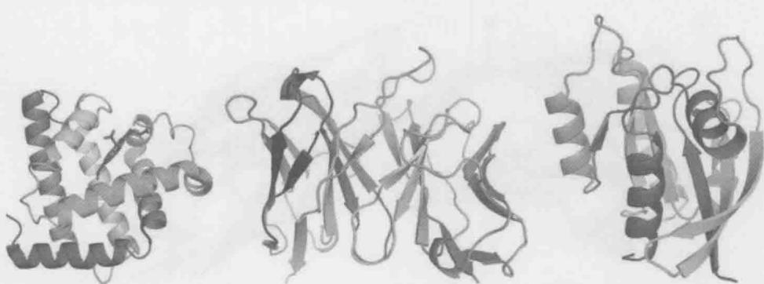  
图 6-11 三个主要折叠类型示例。（左）全是 $\alpha$ 螺旋的蛋白质（肌红蛋白）。（中）有两个 $\beta$ 折叠结构域的二聚体（免疫球蛋白的可变区见框 6-3）。（右） $\alpha$ 螺旋和 $\beta$ 折叠的混合类型（小 GTP 酶，Ras）。每个结构域的颜色从氨基末端到羧基末端由深蓝色变为红色。图由 PyMOL 制作（Schrödinger，LLC）。

## 接头和铰链

折叠蛋白质的两个结构域之间的链可能非常的短，从而使两个结构域之间的表面紧实而又有刚性，也可能非常长从而它们之间的表面具有很大的弹性。有些蛋白质有相当长的弹性接头，由于它们在细胞中的功能需要其两端的结构域能在长且可变的距离内相互作用。长接头的氨基酸序列一般缺少较大的疏水基团，因为它们可舒展而灵活的构象离不开水，此外它们还有其他简单的特性。

我们将通过对一个抗体分子（免疫球蛋白）的阐释来概括前面讨论过的结构域和蛋白质结构的四个层次，见框 6-3 以抗体分子结构为例阐述蛋白质结构域。

## 框 6-3 以抗体分子结构为例阐释蛋白质结构域

循环的抗体是免疫球蛋白（IgG）分子，其包括两条相同的重链和两条相同的轻链。轻链包括一个可变结构域（ $\mathrm{V_L}$ ）和一个恒定结构域（ $\mathrm{C_L}$ ）；重链则包括一个可变结构域（ $\mathrm{V_H}$ ）和三个恒定结构域（ $\mathrm{C_H1}$ ， $\mathrm{C_H2}$ 和 $\mathrm{C_H3}$ ）。因此一共有12个独立的结构域。 $\mathrm{V_H}$ 和 $\mathrm{V_L}$ 是“可变的”，因为它们由一个巨大的基因组合库来编码，而且在免疫反应中，选定的基因会发生体细胞突变。可变结构域决定了与抗原结合的特异性。 $\mathrm{C_H1-3}$ 和 $\mathrm{C_L}$ 结构域是“恒定的”，因为在产生抗体的细胞的成熟过程中，这些结构域中只有很少一部分和许多可变结构域中的一个连接在一起，而且它们不易发生体细胞突变。组配成的异四聚体中的结构域对如框6-3中的图1所示： $\mathrm{V_H}$ 和 $\mathrm{V_L}$ 以及 $\mathrm{C_H1}$ 和 $\mathrm{C_L}$ 形成Fab片段（“抗原结合区”）；一个重链的 $\mathrm{C_H2}$ 和 $\mathrm{C_H3}$ 分别与另一个重链的 $\mathrm{C_H2}$ 和 $\mathrm{C_H3}$ 形成Fc片段。受控制的蛋白水解攻击有选择的切开铰链，释放出各一半的Fab和Fc。每一个结构域有一个相似的“Ig-结构域”折叠，见图6-11中均为β折叠结构域的例子。介于可变和恒定结构域之间的短链（“肘”）的弹性有限。每个重链的 $\mathrm{C_H2}$ 和 $\mathrm{C_H3}$ 之间的长链（铰链）则有较大的弹性，因而允许每个Fab顶端的抗原结合位点（称为“互补决定区”）根据抗原上识别位点的相对位置来进行定位。

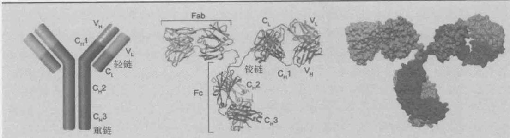  
框 6-3 图 1 IgG 的三个不同示例。图中左侧的 “Y” 字形展示了 IgG 的四条链之间的关系。中间的 “带状” 图展示了 IgG 的二级结构。而右侧的表面成像图则展示的是折叠蛋白的侧链有效地包裹填充在蛋白质内侧的疏水区域。该图由 PyMOL（Schrödinger，LLC）和 UCSF Chimera 制作。

## 翻译后修饰

在核糖体上合成多肽链之后，氨基酸的侧链会发生各种修饰来调节蛋白质的结构和功能。最重要的修饰之一是糖基化——在天冬氨酸、丝氨酸或苏氨酸的侧链上添加一个或多个糖（“糖基”glycans）。这种修饰通常发生在真核细胞的内质网上，因而是细胞表面蛋白和分泌蛋白的胞外结构域的普遍特性。带有糖基的蛋白质称为糖蛋白。将糖基转移到天冬氨酸侧链上的酶识别一个很短的基序，即 Asn-X-Ser/Thr，其中 X 代表任意氨基酸残基。

丝氨酸、苏氨酸、酪氨酸或组氨酸侧链上的磷酸化是另一种常见的修饰，对于细胞内的调节至关重要。前三种氨基酸残基上的磷酸化大部分发生在真核细胞中，而最后一种氨基酸的磷酸化则在原核生物中更普遍。

## 从氨基酸序列到三维结构

## 蛋白质折叠

蛋白质空间结构的折叠与稳定性取决于其结构域的氨基酸序列，这一概括是分子生物学中心法则的重要部分，因为它意味着可翻译基因的核苷酸序列不仅决定了该基因所编码蛋白质的氨基酸序列，还决定了其三维结构和功能。有人做过一个解折叠蛋白的重折叠的实验[见框6-4，蛋白质的三维结构取决于其氨基酸序列（安芬森实验）]，这个经典的实验首先提出了这样的观点。该实验还显示了多肽链可以在不添加任何细胞机械装置的条件下正确折叠。

## 框 6-4 蛋白质的三维结构取决于其氨基酸序列（安芬森实验）

在 20 世纪 60 年代早期, Christian Anfinsen 及其同事完成了一系列的经典实验, 揭示了蛋白质的氨基酸序列足以决定其正确地折叠结构, 而且这一过程不需要任何外部 “机械装置”。这一结论对于理解基因的核苷酸序列所编码信息如何最终决定蛋白质功能尤为重要。

核糖核酸酶 A（ribonuclease A）是一种可以切断 RNA 磷酸二酯键的酶，当其折叠为天然构象时具有催化活性。当其在变性剂（如浓度为 2\~5 mol/L 的尿素或者盐酸胍）作用下发生解折叠时丧失催化活性。由 124 个氨基酸残基组成的核糖核酸酶 A 含有 8 个半胱氨酸，它们可以形成 4 个二硫键（见框 6-4 图 1）。这些二硫化物可以被诸如 β-巯基乙醇这样的还原剂还原成硫氢基。安芬森及其同事发现：如果先让核糖核酸酶 A 在 β-巯基乙醇作用下解折叠，再通过透析除去变性剂和还原剂，核糖核酸酶 A 的酶活性可以恢复到很高的水平。假设只有一个正确折叠的酶才能催化磷酸二酯键的水解，核糖核酸酶 A 的活性恢复实验显示多肽链含有所有指示蛋白质折叠的信息。安芬森等曾做过这样一个实验：首先除去 β-巯基乙醇使允许二硫键重新形成，然后通过透析除去变性剂，最后对酶活性进行检测。实验结果是他们没有检测到酶活性。8 个半胱氨酸有 105 种不同的配对方式，在变性剂作用下，半胱氨酸可能会发生随机配对形成二硫键，结果主要形成一些杂乱的二硫键，而非自然构象中的那种独一无二的配对方式。因此，解折叠核糖核酸酶 A 在氧化条件下同时进行重折叠时，只能恢复不到 1% 的活性。这一预期与实际观察到的数据吻合，从而巩固了这一重要结论：只有在自然的、非共价接触的条件下，每个半胱氨酸才可以找到自己合适的配对对象。

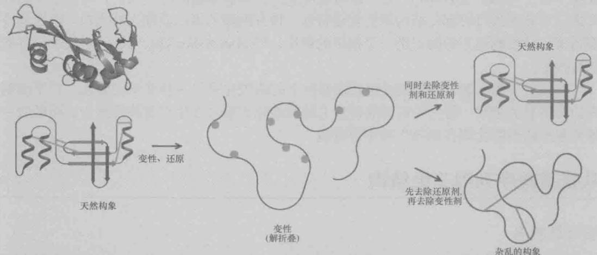  
框 6-4 图 1 安芬森实验。左上方的条带图展示了核糖核酸酶 A 的三级结构（黄色部分代表二硫键）。右下方是核糖核酸酶的示意图，展示了各种二级结构元件和四个二硫键的位置。在变性剂和还原剂的同时作用下，核糖核酸酶 A 解折叠成多肽链。同时去除还原剂和变性剂和依次去除还原剂和变性剂会导致两种不同的结果，如图右侧所示。在示意图中，绿色的线表示二硫键，绿色的圆表示半胱氨酸。

安芬森重折叠实验（Anfinsen refolding experiment）依赖于若干个关键点。首先，从细胞或组织中纯化的蛋白质可以在溶剂中解折叠成无规则卷曲。这种解折叠常称为变性（denaturation），一般通过将蛋白质暴露在高浓度的变性剂（denaturants）（如尿素或者盐酸胍）中进行。如果该蛋白质是酶，它将会失去催化活性。如果该蛋白质具有特定的结合特性（如，识别DNA上的位点），它将失去这种特异性。这其实是因为蛋白质的几乎所有的功能都依赖于它们的折叠结构。在框6-4中，安芬森和其同事所用的蛋白质在解折叠时还需要还原其四个二硫键。第二，小心地除去非变性剂可以使蛋白质重新折叠。由于许多原因，这个过程通常并不那么高效。细胞有一种称为折叠分子伴侣(foldingchaperone）的酶可以将错误折叠的蛋白质解折叠并允许它“试着”再折叠一次。一些分子伴侣可以螯合解折叠的蛋白，防止该蛋白在细胞中与其他蛋白聚合，但是它们并不能保证其底物蛋白正确的折叠。第三，在安芬森的实验中，通过测定酶的活性来检测核酸酶是否正确折叠。这意味着，活性的恢复是判断重新折叠的酶恢复其自然（native）构象（也就是功能构象）而聚集的重要指针。

从安芬森实验中得出的另一个结论是，一个蛋白质的自然结构是其多肽链的氨基酸序列所能采用的最稳定的构象。从物理化学的角度看，蛋白质的自然构象是其所有可能构象中的具有最低的自由能的那种构象。

## 根据氨基酸序列预测蛋白质结构

一般而言，如果氨基酸序列决定了蛋白质折叠后的结构，那么应该可以设计出一种从氨基酸序列预测出蛋白质折叠后结构的计算方法。但在实际操作中，这一计算方法的研究进展令人气馁。下面的介绍会说明这是为什么。首先，我们或许可以想象计算机可以计算多肽链的每一种可能构象的稳定性（自由能）并找出具有最小自由能的构象。事实上，决定蛋白质稳定性的各种原子间的作用力，比如氢键、疏水作用等，确实是可以计算的。然而，我们以一个含有100个氨基酸残基的小蛋白为例，假设每个氨基酸残基仅含有三种构型（如螺旋、条带和其他任意一种），那么这个蛋白可能的构象就有大约 $3^{100}$ 或 $10^{47}$ 种，这是一个天文数字，这种策略是不可行的。其次，我们或许可以通过一些动力学计算试着模拟蛋白质折叠的过程。基于先进的计算资源，这一策略对于一些小蛋白的分析是有效的，在某些研究中可以得出不错的近似值，但对于全面了解各方面的功能尚且不足。这一策略不太可能在近期成为一种根据氨基酸序列预测复杂蛋白质结构的可行的方法。另外，如果我们已经知道了相似的、同源的蛋白的结构，我们或许可以把该结构作为初次的近似值，通过计算改变一些氨基酸残基，最终匹配到我们想要研究的新蛋白上。这类计算被称为同源建模（homology modeling），目前已经相对可行了。很明显，这一策略的可靠性主要取决于这两个蛋白的相似度和对预测准确度的期望。

## 蛋白质的构象变化

在特定的条件下，蛋白质会以最低自由能的构象（折叠或者不折叠）存在。然而，如果蛋白质所处的环境发生了变化，这种最稳定的构象也会发生改变。我们已经见过这样的例子了——添加和除去高浓度的尿素可以导致核糖核酸酶的解折叠和重折叠。更加温和的环境变化也能引起蛋白质构象和功能的改变。例如，葡萄糖是己糖激酶的底物，在葡萄糖存在的条件下，只有一个结构域的己糖激酶会关闭开口，把葡萄糖包住（图6-12）。与底物的有利结合把动态平衡的稳定点由最开放状态改成最封闭状态，使得这种封闭的构象比开放的更为稳定。

  
图 6-12 己糖激酶结构域的关闭。己糖激酶可以在葡萄糖上添加一个磷酸基团使之磷酸化，它的两个“耳垂”（lobe）在结合底物（葡萄糖）时候会彼此靠近（红色箭头所示）形成封闭结构。左图展示的是未结合葡萄糖的己糖激酶，右图展示的是结合葡萄糖后的己糖激酶（位于酶的催化“裂口”的红色物质即葡萄糖）。多肽链由彩虹的颜色表示，由蓝色（氨基末端）到红色（羧基末端）。注意，折叠的多肽链在两个“耳垂”之间横穿了两次。图片由 PyMOL 制作（Schrödinger, LLC）。

两个蛋白质之间的相互作用会导致其中一个或者这两个蛋白都发生构象变化。有时候，相互作用的蛋白在单独存在时，其相互作用区域的结构是松散的（无序而灵活），直到遇到可与其发生相互作用的蛋白为止。换句话说，这种蛋白只有在其靶标存在的条件下才可以折叠成稳定的构象，而这种靶标可以是DNA、RNA或者其他的蛋白质。酵母的转录因子GCN4含有二聚的卷曲螺旋，其中的α螺旋只有在相互关联的时候才会稳定。当GCN4同DNA结合的时候，该蛋白的部分片段会在DNA的大沟（major groove）内形成一个α螺旋，但当GCN4未结合DNA的时候，该部分片段处于松散状态（图6-9b）。

## 作为特异分子识别物的蛋白质

## 识别 DNA 序列的蛋白质

基因表达的调控依赖于蛋白质对具有特定核苷酸序列的 DNA 片段的识别。接下来我们会通过几个例子来阐明蛋白质结构和相互作用的部分原理。

1. GCN4 前面我们已经提到过 GCN4，阐明了一个蛋白质的折叠如何依赖于同其他蛋白（GCN4 卷曲螺旋二聚体的另一条链）或靶分子（DNA 位点）的相互作用。只有在 GCN4 和 DNA 的接触位点的序列正确时，GCG4 才会紧密结合 DNA。因为 $\alpha$ 螺旋可以与 DNA 的大沟非常紧密地结合，所以 $\alpha$ 螺旋的侧链也需要同 DNA 表面互补，包括侧链的形状、极性、以及氢键供体和受体的性质。这些 $\alpha$ 螺旋还含有一些精氨酸和赖氨酸残基，它们可以通过同磷酸基团形成盐桥把自己锚定在 DNA 骨架上，从而使 $\alpha$ 螺旋同大沟的结合更为紧密。

2. $\lambda$ 噬菌体的阻遏物 $\lambda$ 噬菌体的阻遏物（repressor）在噬菌体基因组上有6个结合位点，这些位点的序列相互关联，但也有些许不同。每个位点的具体序列决定了该位点同阻遏物的亲和力（图6-13a）。阻遏物蛋白是一个对称的二聚体，而结合位点也是近似的对称（回文，palindromic）序列。阻遏物蛋白的每个亚基都含有两个折叠的结构域：氨基末端的DNA结合结构域和羧基末端的二聚化结构域。

OR1 5' T A C C C T C T G G G C G G G T G A T A 5'
OR2 T A A C A C C G G T G C G G T G T T G
A T T G T G G C A C G C A C A A C
OR3 T A T C A C C G G C A A G G G A T A
A T A G T G G C G T T C C C T A T
OL1 T A T C A C C G G C A G T G G T A
A T A G T G G C G G T C A C C A T
OL2 C A A C A C C G G C A G A G A T A
G T T G T G G C C G T C T C T A T
OL3 T A T C A C C G G C A G A T G G T T
A T A G T G G C G T C T A C C A A

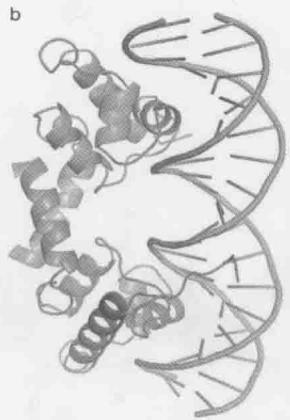

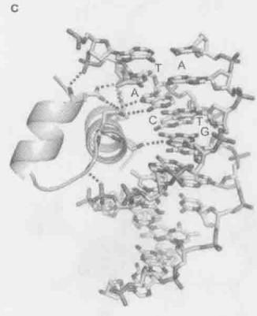  
图 6-13 λ 噬菌体的阻遏物识别 DNA。（a）λ 噬菌体基因组中同阻遏物相结合的 6 个 DNA 位点的核苷酸序列 [“操纵基因”（operators）]。每个位点都近似于一种“回文结构”——从任意一个末端的 5′到 3′方向读出的碱基序列基本相同（会有少许偏差）。顶部序列（OR1）右侧的“半个位点”和底部序列（OL3）左侧的“半个位点”是所有“半个位点”的序列中最一致的。因为序列的长度为奇数（17bp），所以序列中间的那个碱基对在整个回文结构中是个例外。（b）λ 阻遏物的 DNA 结合结构域（氨基端）与操纵基因结合。该结构域的每一个亚基都是由 5 个 α 螺旋形成的簇，其中两个（亚基上端的浅蓝色部分）形成一个螺旋-转角-螺旋：第一个 α 螺旋在大沟的两端架起了一座桥，而第二个 α 螺旋位于大沟中，几乎与大沟的主要方向平行。（c）螺旋-转角-螺旋中的氨基酸残基同 DNA（包括主链和碱基）之间的极性互作（氢键和盐桥）。只有当碱基对与其对面的蛋白基团相匹配时，该蛋白才能紧密地嵌入到大沟中。图片由 PyMOL 制作（Schrödinger，LLC）。

$\lambda$ 阻遏物的DNA结合结构域是由5个 $\alpha$ 螺旋组成的压缩的束（bundle）（图6-13b）。不像GCN4，这个结构域在结合DNA的时候不会发生任何明显的结构变化。5个 $\alpha$ 螺旋中的两个（第二个和第三个）会形成一个结构性基序（motif），这种基序被称为螺旋-转角-螺旋（helix-turn-helix），在很多其他的DNA结合蛋白中也比较常见，尤其是那些来自原核生物的蛋白。该基序同DNA双螺旋的结合方式允许第二个 $\alpha$ 螺旋嵌入到DNA的大沟中并把几个侧链呈递给暴露的碱基对的边缘（图6-13c），这种 $\alpha$ 螺旋有时被称为识别螺旋（recognition helix）。每个碱基对的主基团边缘都呈现出一种氢键供体和受体基团的典型模式，A：T和T：A碱基对还呈现出一种胸腺嘧啶甲基基团的疏水表面（图6-14）。 $\lambda$ -阻遏物识别螺旋侧链的氢键及非极性关联的性质与那些可以被识别的碱基序列相互匹配。蛋白质与DNA的核糖-磷酸主链的相互接触使得识别螺旋的侧链可以找到正确的位置并以正确的方向结合，以保证二者的互补性。

蛋白质侧链和 DNA 碱基之间的互补性与 DNA 碱基对两个碱基之间的互补性不同，这种差异具有重要意义。每个 DNA 碱基都有一个特定的互补碱基，因此碱基之间的氢键键合与正常双螺旋的几何学是一致的。相比之下，蛋白质对特定碱基甚至是一段特定的碱基序列的识别则有多种方式。此外，正如阻遏物结合位点的不同序列所表现的那样，同一种蛋白质结构可以通过微调与略微改变后的碱基序列之间产生互补性，但这往往会损失部分亲和力。因此，蛋白质对 DNA 的识别并没有 “密码”，而是有一些重复出现的模式，比如插入到 DNA 大沟中的 $\alpha$ 螺旋所呈现出的蛋白质侧链。

  
图 6-14 大沟和小沟中 DNA 碱基对的性质。图上显示了四种碱基对，并对位于大沟和小沟且能进行特定关联的基团作了标记：a 表示氢键受体；d 表示氢键供体；m 表示甲基基团（范德华接触）。氢键由点线表示。在大沟中，这四种 DNA 碱基对都呈现出不同的模式：T：A，m-a-d-a；A：T，a-d-a-m；C：G，d-a-a；G：C，a-a-d，其中 T：A 和 C：G 两种碱基对展示了氨基酸侧链互补性的两种特例，这两种碱基对识别的模式（1976 年由 Seeman、Rosenberg 和 Rich 提出）确实以一定的频率发生，但大多数特定的 DNA 识别都涉及更为复杂的关联。在小沟中，T：A 和 A：T 碱基对呈现出相同的关联模式 a-a；类似的，C：G 和 G：C 碱基对呈现出相同的关联模式 a-d-a。因此，序列特异性的 DNA 识别经常包括与大沟的关联。

λ 噬菌体的阻遏物阐明了一个蛋白质识别特定 DNA 序列的普遍特征：这些蛋白质拥有相对较小的 DNA 结合结构域，该结构域经常与一个或几个其他的结构域连接在一起，这些结构域有不同的功能，如寡聚化或与其他蛋白质相互作用。

3. 锌指蛋白 许多真核生物中最丰富的 DNA 识别结构域是一种被称为锌指（zinc finger）的小模块（图 6-15a 所示）。这些结构域一般以串联的形式出现，彼此之间由短的接头片段连接起来。这些接头片段非常灵活，当蛋白质与 DNA 结合时，它们会变得有序。每个锌指约包含 30 个氨基酸残基，它们勉强可以形成一个疏水核心，中心的锌离子是必需的，用来把折叠的结构域固定到一起。 $Zn^{2+}$ 由两个半胱氨酸和两个组氨酸进行配位。因为胞内蛋白不存在二硫键，对于很小的结构域而言， $Zn^{2+}$ 配位可以起到相同的稳定结构的作用。当锌指与 DNA 结合时，短的 $\alpha$ 螺旋会嵌入到大沟中，串联排列的锌指逐次与碱基序列发生关联——每个锌指约 3bp，彼此之间存在一定的重合（图 6-15b）。碱基对的关联存在很强的规律性：螺旋上的 1, 2, 3 和 6 位的残基最可能与一个或多个碱基对发生关联（图 6-15a）。基于这种规律性及串联的锌指嵌入到 DNA 大沟的方式，我们可以设计使一些蛋白可以识别相对长的碱基对序列。此外，一些独立模块的文库已经可以用来设计特定的蛋白质，来识别长度为 12\~18bp 的 DNA 序列。


  
图 6-15 锌指基序。(a) Cys2His2 锌指基序和 Zif268 锌指序列。顶端显示的是锌指 2 的带状图，包括两个半胱氨酸侧链（黄色）和两个组氨酸侧链（红色），它们决定了 $Zn^{2+}$ （银色球体）的坐标。关键残基的侧链与 DNA 大沟中的碱基发生关联（数字表示这些关联相对于识别螺旋起点的位置）。条带图下方是 Zif268 的三种锌指的氨基酸序列的比对结果，粗体表示保守的半胱氨酸和组氨酸。底部显示的是锌指蛋白的二级结构元件。(b) 左侧是 Zif268-DNA 的复合物，展示了结合在 DNA 大沟中的 Zif268 的三个锌指。锌指被 3bp 的区间隔开；DNA（蓝色）；锌指 1（红色），锌指 2（黄色），锌指 3（紫色）；固定后的锌离子（银色球体）。右侧展示的是 Zif268 结合位点的 DNA 序列，通过颜色标注说明它们同每个锌指的关联关系。（该图经授权，引自 Pabo C.O. et al. 2001. Annu. Rev. Biochem. 70: 313–340, Fig. 6-15a is Fig. 1 on p. 315; Fig. 6-15b is Fig. 2 on p. 316. ©Annual Reviews）。

4. 淋巴细胞增强因子-1(LEF-1) 与 DNA 大沟中的碱基对关联并非产生序列特异性的唯一方法。碱基序列并不能特异地决定小沟中氢键关联的模式，因为在这方面 A:T 和 T:A 看起来是一样的，G:C 和 C:G 也看起来是一样的（图 6-14），但碱基序列仍然会影响 DNA 双螺旋弯曲或扭转的倾向性，即采用的构象相对于理想的 Watson-Crick 双螺旋模型产生偏差。对这种受碱基序列影响的敏感性有时被称为“间接读出”（indirect readout），以便与直接的极性或非极性碱基对关联所产生的序列特异性相区分。淋巴细胞增强因子-1（Lymphocyte Enhancer Factor-1，LEF-1）与几个其他的因子共同调节 T 细胞的基因表达，该因子是一个三螺旋束，可以嵌入到弯曲 DNA 中大幅扩大的小沟中（图 6-16）。大多数迎面嵌入到小沟中的氨基酸侧链是非极性的，其中一个会插入到两个相邻的碱基对之间，从而稳定 DNA 轴线上几乎 $90^{\circ}$ 的弯曲。该弯曲可以使 LEF-1 的上下游蛋白更为紧凑，因而 LEF-1 被称为“构筑蛋白”（architectural protein），因为它的部分功能是增强 DNA 结合转录因子之间的关联。

蛋白质-蛋白质界面（interface）

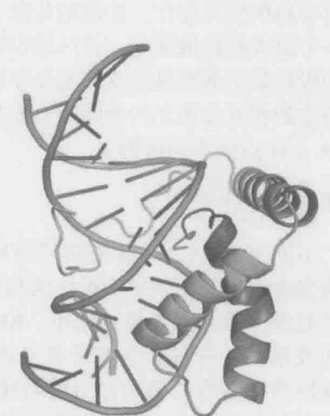  
图 6-16 LEF-1 蛋白与 DNA 结合。图片由 PyMOL 制作（Schrödinger，LLC）。

相比于蛋白质与 DNA 之间的界面，蛋白质与蛋白质界面有更为精细的互补性。原因在于，后者往往含有很大的疏水表面，而前者则含有很大的极性表面。在 DNA-蛋白质界面上，水可以在氢键基团之间的缝隙中起到桥梁的作用，因为它既是供体也是受体。但对于一个蛋白界面的非极性表面之间的缝隙，要么形成一个空穴，要么被水隔离开，这两种都非常不利。正如我们已经知道的，转录因子如 $\lambda$ 阻遏物的序列可以适当地与靶 DNA 目标序列结合，彼此都相对于一致性序列略有偏差。然而对于大多数的蛋白质界面而言却不是这样的。对于一些转录因子，结构同源性亚基确实会进行可替代的配对以增加组合的多样性。在这些例子中，相关的互补性表面是保守的，它们可能是由蛋白质演化过程中某时间点的基因重复造成的。

特定的蛋白识别可以依赖于两个亚基的预折叠的、相匹配的表面之间的关联，如血红蛋白四聚体的形成（图6-7），也可以依赖于两个多肽链的共折叠，如GCN4的二聚化（图6-9a），还可以依赖于松散片段与伴侣蛋白的识别表面的对接（图6-17）。在最后一种相互作用中，这种片段在复合物中采用了一种确定的结构，也就是说，它的正确折叠构象只有在目标表面存在时才会稳定。有时候，结合还依赖于翻译后修饰，如磷酸化或乙酰化，这导致相互作用可以被其他细胞进程的信号打开和关闭。多肽链中与伴侣蛋白对接的片段往往含有一个可识别的氨基酸序列基元。这类关联性在调节转录的蛋白复合物的组装过程中尤为常见，可能是因为这种关联性在长期的安排中允许更丰富的变异存在。松散的片段、与该片段结合的结构域、或者两者一起会被嵌入到一个更大的松散区域，该区域由相对的极性和低复杂度的氨基酸组成（如拥有由相同的极性氨基酸残基组成的重复序列）。这种低复杂度区域提供了大范围的灵活性，因此特定的相互作用之间的间隙会发生改变，而且同样的组装可以适应不同的环境（如DNA上位点的不同阵列）。

## 识别 RNA 的蛋白质

不同于 DNA，RNA 有多样的局部结构，三级层面的相互作用使定义明确的三维结构变得稳定，就像 tRNA 中的那样。因此，蛋白质与 RNA 之间的相互作用在某方面类似蛋白质之间的相互作用。RNA 的形状和相互作用基团（如磷酸基团、2'-羟基基团或碱基）在其表面的分布方式是决定其特异性的重要因素。当 tRNA 与向其 5' 末端转移氨基酸的酶相结合的时候，两者的预折叠结构会关联在一起，其中一个或者二者都几乎不会形成固定的结构，直到复合物形成为止。

RNA 识别基序（the RNA-recognition motif，RRM），也称为核糖核酸蛋白基序 [the ribonuclear protein (RNP) motif]，是一段可以特异性识别 RNA 结构域的序列。RRM序列包括 80～90 个氨基酸，折叠成四股反向平行的 β 折叠片和两个紧挨着的 α 螺旋。这种排列使该结构域形成了一个典型的有裂缝的 αβ 拓扑结构。这种常见的结构域的例子曾在与 U1 小核 RNA（snRNA）相互作用的 U1A 蛋白中发现，这两种成分都可以对 RNA 转录本进行剪接（第 14 章）。U1A:U1snRNA 复合物的结构如图 6-18 所示，U1A 的 RNA 结合表面的形状是该 RNA 特有的。

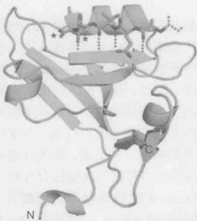  
图 6-17 肽段的识别。PDZ 结构域对羧基端片段的特异性识别。PDZ 结构域是一个由重复序列组成的模块，该模块可以与膜蛋白的羧基末端、游离在细胞质中的“尾巴”相关联。最主要的关联发生在口袋中（星号表示羧基基团和羧基末端缬氨酸的非极性侧链），是通过添加几个位于缬氨酸之前的配体残基到该结构域的反向平行的β折叠片实现的（黑色的点线表示β折叠片的氢键）。图片由PyMOL制作（Schrödinger, LLC）。

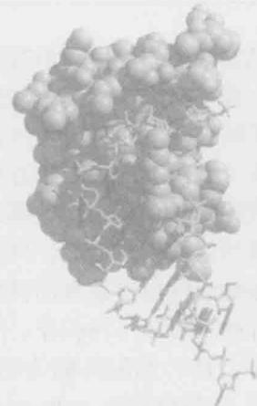  
图 6-18 剪接体蛋白：RNA 复合物的结构：U1A 与 U1 snRNA 上的发夹Ⅱ相结合。剪接体蛋白由灰色表示；U1 snRNA 由绿色表示。(Oubridge C. et al. 1994. Nature 372:432.)图片由 MolScript, BobScript 和 Raster 3D 软件制作。

## 作为催化剂的蛋白质：酶

在细胞内，蛋白质最重要的功能之一就是催化生物化学反应。从能量生成过程中营养成分的转化到 DNA 和 RNA 合成过程中核苷酸的聚合，几乎细胞内所有的生理进程都需要酶的催化（如提高这些进程的速率），因为这些反应的自发反应速率非常慢，无法维持正常的细胞活动和生存。在生命系统中，大多数的催化剂是蛋白质（酶），RNA 也可以催化一些非常古老的反应（核酶）。

化学反应的壁垒在于反应物高能量状态的形成，也被称为过渡态（transition state）。过渡态会形成一种介于起始反应物和产物之间的结构中间体，所以起始反应物需要发生一些扭曲来达到这种过渡态。通过降低实现这种扭曲所需要的能量，化学反应速率可以得到剧烈的提升。大多数的酶可以通过活性位点（active site）达到这样的目的。酶的活性位点经常是一个口袋或者凹槽，它们与过渡态的反应物在形状和相互作用的特性（如氢键和非极性关联）上都是互补的。当反应物与活性位点关联到一起时会形成一种有利的接触，这种接触可以在一定程度上补偿反应物在这一过程中所发生的形变。酶的结构在演化过程中对活性位点的塑造的精确性为这一过程赋予了显著的特异性。例如，催化脱氧核糖核苷酸聚合形成 DNA 的聚合酶往往无法催化核糖核苷酸聚合形成 RNA，因为核糖的 2'-羟基会与该聚合酶活性位点的原子发生冲突。

## 蛋白质活性的调控

我们已经知道，蛋白质与其他分子之间的相互作用，既包括诸如酶作用的底物这样的小分子，也包括蛋白质及核酸这样的大分子，会诱导其构象会发生改变。那些以一种特定的方式结合蛋白质（或任何其他靶标）的分子被称为配体（ligand）。配体可以通过稳定蛋白质（如酶）的特定状态来调节它的活性。例如，如果配体与酶的结合使得活性位点被屏蔽的构象变得稳定，那么该配体就关闭了这种酶的活性。这种抑制性配体的结合位点无需与活性位点重叠，只要配体结合降低了某种构象的自由能，在这种构象下反应物无法接触活性位点或者活性位点不再有正确的构象。相反地，配体在远程位点的结合可能会有助于形成一种构象，在这种构象下活性位点可以与底物结合并且与过渡态的反应物互补，此时的配体称为活化剂（activator）。上述调节称为别构调节（allosteric regulation）或别构效应（allostery），因为配体的结构不同于（希腊语 allo-表示异常）任何反应物的结构。

乳糖阻遏物是转录水平上别构调节的经典范例(图 6-19)。β-半乳糖苷酶可以催化 β-半乳糖苷（如乳酸）的水解，而乳糖阻遏物可以抑制细菌中 β-半乳糖苷酶编码基因的表达。乳糖阻遏物是一个二聚物，拥有两种不同的构象——一种是结合特定的 DNA 位点 [称为操纵基因（operator）] 时的构象，另一种是结合抑制性代谢产物 [称为诱导物(inducer)]时的构象。因为与操纵基因结合的阻遏物可以阻断RNA聚合酶合成β-半乳糖酶mRNA，而高浓度的诱导物会诱导形成不利于结合DNA的构象，所以，尽管其结合位点与阻遏物的DNA接触表面有一定的距离，诱导物仍然可以改变DNA的亲和力从而影响基因的调节。对于拥有多个配体和多个结合位点的情况，更为复杂的变构调节是完全可能的。像乳糖阻遏物的二聚体构象的相互转换那样，变构调节经常涉及四级结构的改变。


  
图 6-19 乳糖阻遏物与 DNA 结合的别构调节。(a) 二聚体的乳糖阻遏物与 DNA 结合的构象。图片顶端有一段短的 DNA 片段，代表特异性结合位点（“操纵基因”）。氨基末端的 DNA 结合结构域拥有螺旋-转角-螺旋识别基序，可以同大沟中的碱基对发生相互作用。在蛋白的两个结构域之间有一个位点，可以容纳与乳糖相关的分子，该位点在此处展示的 DNA 结合构象中是空的。两个相同的阻遏物亚基分别呈红色和青色。(b) 诱导物分子（任何半乳糖苷，如外层所示，位于阻遏物外面欲与其结合的分子，以及每个阻遏物内部已结合在特定位点的分子）的结合使得阻遏物中两个结构域相对于彼此发生移动，因此，DNA 结合结构域同该蛋白体之间的铰链片段变得混乱无序，两个结构域本身的结合也变得松散，无法再与操纵基因位点进行紧密结合。(c) DNA 结合构象和诱导物诱导构象的叠加图，展示阻遏物的结构域是如何相对于彼此移动的。DNA 结合亚基的着色同 a 图，诱导的阻遏物二聚体用深蓝色表示。图片由 PyMOL 制作（Schrödinger，LLC）。

## 小结

蛋白质是由肽键连接的线性的氨基酸链（“多肽链”）。遗传密码指定了20种L-氨基酸，其中含有非极性（疏水的）侧链的有9种；含有极性侧链的有6种，在中性pH环境中不带有任何电荷；含有酸性侧链的有2种，在中性pH环境中带负电荷；含有碱性侧链的有3种，在中性pH环境中一般带正电荷，组氨酸是个例外。肽键有部分双键的特点， $\mathrm{N - C_{\alpha}}$ 键和 $\mathrm{C_{\alpha} - (C = O)}$ 键的转角决定了多肽链骨架的三维构象。三种氨基酸的构象具有特别的性质：甘氨酸是非手性的，其构象的自由度比其他任何氨基酸的都大；脯氨酸（严格来讲是一种亚氨基酸）在侧链和氨基之间有一个共价键，这限制了其构象的自由度；半胱氨酸的侧链上含有巯基基团，可以同另一个半胱氨酸发生氧化形成二硫键，使一条折叠的多肽链或两条邻近的多肽链发生交联。细胞内的还原性环境限制二硫键的形成，避免细胞器和细胞外的环境被氧化。

传统上，人们从四个层次描述蛋白质的结构：初级结构（即多肽链的氨基酸序列，由遗传密码直接决定）、二级结构（即局部的、重复的骨架构象，由主链上的氢键维持稳定，主要包括α螺旋和β折叠）、三级结构（即多肽链折叠后形成的三维构象）和四级结构（在多亚基组装过程中由折叠的多肽链缔合而成的构象）。在三级结构层次，多肽链可以折叠成一个或多个独立的结构域，即使彼此分离，它们仍然可以进行相似的折叠。结构域的空间结构往往取决于组成它的二级结构元件（螺旋和折叠）在三维维度上包装的方式。有些多肽链可以形成多个结构域，不同结构域之间的连接序列或长而灵活，或短而僵硬。水相环境和自然氨基酸的多样性对于折叠结构域以及生成四级结构过程中折叠结构域之间的界面的构象的稳定性都非常重要。因不溶于水而紧密排列的非极性侧链簇、折叠结构域的疏水核心及任意隐蔽的氢键基团（丢掉与水之间的氢键），都必须要有一个由蛋白质衍生而来的伴侣。二级结构元件满足了后一个需求（主链上的氨基及羧基基团），因此在结构域描述和分类中显得很重要。

一个多肽链能否折叠和如何折叠，取决于该多肽链的氨基酸序列。这一性质使得遗传密码不仅决定蛋白质的初级结构，还决定其他层次的结构，从而支配蛋白质的功能。正确折叠的结构域中（以及细胞外结构域中的共价二硫键）存在各种各样的非共价相互作用，这些相互作用可以使总体自由能达到最小值（此时的构象最为稳定），因此，多肽链可以自发地形成其自然构象。蛋白质所处环境的变化，包括一个或多个氨基酸侧链的翻译后修饰或配体的结合，都可能改变这种自由能最小值的位置，从而诱导该蛋白质发生构象上的变化。氨基酸侧链在折叠蛋白表面，有时甚至是未折叠多肽链的某个片段中的排列方式，同样可以决定其对蛋白质、核酸或其他小分子配体的识别方式。因此，蛋白质在细胞内和细胞间特定的分子识别中扮演重要角色，它同时还是化学反应的特异性催化剂（酶）。

## 参考文献

## 书籍

Branden C. and Tooze J. 1999. Introduction to protein structure, 2nd ed. Garland Publishing, New York.

Kuriyan J., Konforti B., and Wemmer D. 2012. The molecules of life. Garland Publishing, New York.

Pauling L. 1960. The nature of the chemical bond, 3rd ed. Cornell University Press, Ithaca, New York.

Petsko G.A. and Ringe D. 2003. Protein structure and function (primers in biology). New Science Press, Waltham, Massachusetts.

Williamson M. 2012. How proteins work. Garland Publishing, New York.

## 习题

## 在四个层次上描述蛋白质结构

Richardson J.S. 1981. The anatomy and taxonomy of protein structure. Adv. Protein Chem. 34: 167–339.

## 从氨基酸序列到三维结构

Anfinsen C.B. 1973. Principles that govern the folding of protein chains. Science 181: 223–230.

## 偶数习题的答案请参见附录2

习题 1 能在分泌蛋白的两个半胱氨酸之间形成的共价键是什么键？该键为何通常不在细胞内蛋白中形成？该键的相互作用与其他氨基酸侧链之间的相互作用有什么不同之处？

习题 2 请举出一个在中性 pH 下两个氨基酸侧链通过离子键相互作用的例子。关于离子键的综述参见第 3 章。

习题 3 DNA 中的一个突变能引起对应编码蛋白质的氨基酸置换。当突变蛋白中原来的氨基酸被有相似化学特性的氨基酸所置换时，该置换行为被描述为保守的。根据图 6-2，找出 4 个属于发生保守置换的氨基酸对。

习题 4 肽键的形成就是缩合反应的一个例子。请解释这个说法的意思，以及为何说肽键的形成同时也是一个脱水反应。

习题5 描述说明 $\beta$ 折叠与 $\beta$ 三明治有何不同。

习题 6 两种氧结合蛋白——血红蛋白与肌红蛋白的不同在于血红蛋白以四聚体的形式在血红细胞中发挥作用，而肌红蛋白以单体形式在肌肉细胞中发挥作用。球状结构的肌红蛋白和每个单体血红蛋白都包含8个α螺旋片段。请问这两个蛋白质差异最大的是一级、二级、三级还是四级结构？请解释。

习题 7 请判断下列各个氨基酸分别更倾向于暴露或包埋在一个稳定的蛋白质结构域：苯丙氨酸、精氨酸、谷氨酰胺、甲硫氨酸，并说明你的判断依据。

习题8 当用变性剂脲处理一个蛋白质时，下列的相互作用力或键中哪些将因脲的处理而被破坏：A.离子键B.氢键C.二硫键D.肽键E.范德华力

习题 9 根据你在第 4 章学到的 DNA 结构的相关知识, 解释为何转录激活因子 Gcn4 与 DNA 的相互作用在 DNA 的大沟而不是小沟。请描述精氨酸和赖氨酸在 Gcn4 与 DNA 相互作用中的重要性。

习题 10 请预测在 Cys2His2 锌指结构中将一个或多个保守的半胱氨酸或组氨酸替换为丙氨酸将产生什么效应，并解释。

习题 11 请描述 LEF-1 与 DNA 的相互作用的特别之处。

习题12 酶如何提高一个反应的速率？

习题13 如果一个配体的结构与一个酶的底物相近，并且紧密地与酶的活性位点结合，从而将正常的底物排除在外。这样的“竞争性抑制剂”和变构抑制剂之间有何区别？

习题 14 一个名为 Tif3 或 eIRF4B 的翻译起始因子，在酵母细胞中其多肽链上按以下顺序拥有以下几种原件：一个包含有 RNA 识别基序（RRM）的氨基端结构域，一个富含碱性与酸性氨基酸残基的 7 次重复序列的主要片段，以及羟基端区域的一个不与任何已知基序或结构域同源的区域。

A. 请描述 RRM 的意义。

根据该蛋白质的模体设计以下一系列的实验来分析其不同部分的功能。TIF3基因敲除的细胞无法在 $37^{\circ}\mathrm{C}$ 生长，但能在 $30^{\circ}\mathrm{C}$ 正常生长。通过引入一个编码部分该蛋白的基因的实验，可以使得细胞重新获得野生型的，在 $37^{\circ}\mathrm{C}$ 条件下正常生长的能力。实验结果如下表，++，+和-分别代表生长或互补的程度。

<table><tr><td>Tif3 蛋白</td><td>在 37°C 生长</td></tr><tr><td>全长</td><td>++</td></tr><tr><td>RRM+前三个重复</td><td>++</td></tr><tr><td>RRM+第一个重复</td><td>-</td></tr><tr><td>所有 7 个重复+C 端片段</td><td>+</td></tr></table>

B. 根据这些数据，蛋白质的哪个区域是野生型在 $37^{\circ}$ C 条件下生长所需要的？

进一步利用缺失 TIF3 基因菌株的提取物设计了一个体外翻译相关实验。通过向提取物中加入纯化的 Tif3 蛋白或该蛋白的其中一种截断产物来起始反应。实验结果如下表，百分数代表与加入了全长 Tif3 蛋白的反应翻译活性相比的比值。

<table><tr><td>Tif3 protein</td><td>翻译活性(%)</td></tr><tr><td>全长</td><td>100</td></tr><tr><td>RRM+前三个重复</td><td>43</td></tr><tr><td>RRM+第一个重复</td><td>0</td></tr><tr><td>所有7个重复+C端片段</td><td>0</td></tr></table>

C. 这个实验结果与第二部分关于补充作用的结果如何相比较？这些实验是否改变了你从遗传学实验得到的结论。

数据来自 Niederberger et al. （1998.RNA 4：1259-1267）

(潘庆飞 夏志 译 张睿 胡学达 校)

本章概要
·
核酸：基本方法
·
基因组学
·
蛋白质
·
蛋白质组学
·
核酸-蛋白相互作用

## 分子生物学技术

我们所看到的活细胞是一个十分复杂的实体，能产生成千上万种大分子，并含有一个从几百万到几十亿碱基对的基因组。理解细胞的遗传过程是如何进行的需要多种多样具挑战性的实验方法，这包括在附录1中将要讨论的合适的模式生物的使用，而模式生物的使用使遗传分析手段得以开展，也包括本章我们要讨论的从细胞混合物中分离单个大分子的方法，以及将基因组分割成可处理的片段以便于操作和特定DNA序列的分析。在过去的几十年里，

上述实验方法的成功建立是分子生物学发展的主要推动力之一，也是分子生物学所取得的重要成就。

近来，应用分子生物学方法进行细胞中全部 DNA、RNA 和蛋白质的大规模分析并测定完整基因组的核苷酸序列已经成为可能。这些基因组和蛋白质组研究方法，加上迅速增加的、已测得的基因组序列，使不同生物基因组的大规模比对以及在一个特定的细胞类型中鉴定所有的磷酸化蛋白质成为可能。

本章我们将简要介绍一些现代分子生物学方法,这些方法让生物学家有可能调查单个蛋白质的功能,以及开展大规模的基因组和蛋白质组分析。我们将会看到,这些分子生物学方法的建立依赖并来源于对生物大分子特性的理解。例如,对 DNA、RNA 碱基互补特征的了解促进了杂交技术的建立,并使全基因组水平的鉴定基因的表达成为可能;对 DNA 聚合酶、限制性内切酶和 DNA 连接酶的深入研究催生了 DNA 克隆技术和聚合酶链反应 (PCR),这些技术使科学家们可以分离任一 DNA 片段,甚至能从已灭绝的生命体中分离 DNA 片段。

本章分为五个部分：DNA 和 RNA 分析方法；大规模基因组 DNA 分析；蛋白质的分析；大规模的蛋白质分析；最后是核酸-蛋白质相互作用的分析等帮助我们了解各种独立成分是如何聚集、如何相互作用从而构成有活性的细胞的。

## 核酸：基本方法

## 凝胶电泳能根据分子大小分离 DNA 和 RNA

我们先讨论用凝胶电泳（gel electrophoresis）技术分离 DNA 和 RNA 分子。在外加电场的作用下，线性 DNA 分子在一种称为凝胶基质（gel matrix）的果冻样惰性多孔物质中，能按大小分开。由于 DNA 带负电荷，在图示的外加电场作用下，它们在凝胶中向正极迁移（图 7-1）。DNA 分子是柔性的，占据一定的有效体积。凝胶基质中的网孔能按照 DNA 的体积对它们进行分筛。由于大分子的有效体积比小分子大，较难通过凝胶孔隙，在凝胶中迁移得就比小分子慢。这就意味着，凝胶“跑”一定时间后，不同大小的分子由于在凝胶中迁移距离的不同而被分开。

  
图 7-1 凝胶电泳分离 DNA。图中所示为一块胶的侧切面。图中左侧是 DNA 混合物的上样孔，上样孔在左侧胶的顶部，也是电场的阴极端，带负电荷的 DNA 片段从胶的阴极向阳极移动。如图所示，DNA 片段的迁移距离和其大小呈负相关。（经许可，仿自 Micklos D.A. and Freyer G.A. 2003. DNA science: A first course, 2nd ed., p. 114. ©Cold Spring Harbor Laboratory Press.）

电泳完成后，用荧光染料如溴化乙锭（ethidium bromide）对凝胶进行染色，可以显示出 DNA 分子的位置。荧光染料能和 DNA 分子结合，嵌入到堆积的碱基中（参见第 4 章，图 4-28）。染色后的 DNA 分子呈现为“带”，每一条带反映了一群特定大小的 DNA 分子的存在。

通常使用的凝胶基质有两种：聚丙烯酰胺凝胶（polyacrylamide）和琼脂糖凝胶（agarose）。聚丙烯酰胺分辨力高，但能区分DNA的大小范围窄。聚丙烯酰胺凝胶电泳能区分只相差一个碱基对的DNA片段，但仅限于分离几百碱基对（低于1000）大小的DNA片段。琼脂糖凝胶分辨力不如聚丙烯酰胺凝胶，但能区分几十至几百kb（千碱基对）大小的DNA片段。

极长的 DNA 片段即使在琼脂糖凝胶中也不能穿过其网孔。它们在凝胶基质中蛇行，一端在前，另一端在后。因而，超过一定大小（30～50kb）的 DNA 分子迁移程度相似而难以区分。但是，如果采用电流方向相互垂直的脉冲式电场，这些极长的 DNA 片段就能区分开来。这种技术就是脉冲场（pulsed-field）凝胶电泳（图 7-2）。每次电场方向改变的时候，在凝胶中蛇行的 DNA 分子就随之调整其泳动方向。DNA 片段越大，其调整泳动方向所需的时间就越长。脉冲场凝胶电泳可以用来测定整套细菌染色体和低等真核生物如真菌染色体的大小，即长达数个 Mb 的 DNA 分子。

电泳不仅能根据 DNA 的分子质量来分离它们，还可按照它们的形状和拓扑学特性对它们进行分离（见第 4 章）。松弛型的或带缺口的环状 DNA 分子比相同质量

  
图 7-2 脉冲场凝胶电泳。本图是凝胶的俯视图，凝胶顶部有一系列样品孔。A、B 代表两套电极，如文中所述，它们交替开关。A 组电极通电时，DNA 向凝胶的右下角泳动，即 A 组电极的阳性末端。当 A 组电极断电而 B 组电极通电时，DNA 向凝胶的左下角泳动。图中箭头标示了电泳进行时 DNA 的迁移路径。（经许可，仿自 Sambrook J. and Russell D. W. 2001. Molecular Cloning: Alaboratory manual, 3rd ed., Fig. 5-7. Cold Spring Harbor Laboratory Press.）

的线性分子迁移得慢。再者，如我们所看过的，超螺旋 DNA 由于致密而有效体积小，电泳时比相同质量的超螺旋程度较轻或松弛型环状 DNA 分子迁移速度要快。

电泳也能用来分离 RNA。线性双链 DNA 分子二级结构均一，它们电泳时的迁移率和其分子质量大小成比例。和 DNA 相似，RNA 也带均一的负电荷。但是 RNA 分子通常是单链的，并含有大量二级和三级结构（第 5 章），这些都会影响它们的电泳迁移率。为了避免产生这个问题，RNA 分子可以先用乙二醛等试剂处理，这些试剂能与 RNA 分子反应而防止碱基对的形成（乙二醛能和碱基中的氨基基团形成加成化合物，从而防止了碱基配对）。乙醛酸化的 RNA 分子不能形成二级或三级结构，因此其迁移率和分子质量是大致成比例的。后文中我们还可以看到，电泳也可以相似的方式将蛋白质按大小分开。

## 限制性内切核酸酶在特定位点切割 DNA 分子

大多数天然 DNA 分子因太大而不便于在实验室中操作或分析。如染色体是含有上千个基因的、超过 1 亿碱基对的超长单个 DNA 分子（第 8 章）。如果我们要研究 DNA 上的单个基因和位点，必须先将细胞中大的 DNA 分子分解成可操作的片段。这可以用限制性内切核酸酶（restriction endonuclease）来完成。限制性内切核酸酶是一类识别特定 DNA 序列并在特定位点切割 DNA 的核酸水解酶。

分子生物学中使用的限制性内切核酸酶通常识别 4～8bp 的短的靶序列，一般为反向重复（回文）序列，并在其中的特定位置切割。以常用的限制性内切核酸酶 EcoR I 为例，因为这种限制性内切核酸酶是在特定的大肠杆菌（Escherichia coli）菌株中被发现的，并且又是 E. coli 中所发现的第一个限制性内切核酸酶，人们就将它命名为 EcoR I。

EcoR I 识别并切割 5'-GAATTC-3'（由于 DNA 的两条链是互补的，我们只需说明其中一条链及其方向就可以清楚地描述识别序列）。

这一6碱基序列（和任一其他6碱基序列一样）估计平均每4kb出现一次（这是因为4种碱基可以出现在DNA序列上的任一位置，于是任一特定6碱基序列出现的概率为 $1 / 4^{6}$ ）。因此以一个含有6个拷贝的GAATTC序列的线性DNA分子为例：EcoRI能将其切割成7个片段，这些片段的大小反映了这个DNA分子中这类酶切位点的分布情况。假设将经EcoRI酶切的DNA在凝胶中进行电泳，这7个片段会按它们大小的不同而被分开（图7-3）。因此，在图中所示的实验中，EcoRI已将DNA切割成特定片段，每一片段都对应于DNA分子上的特定区域。

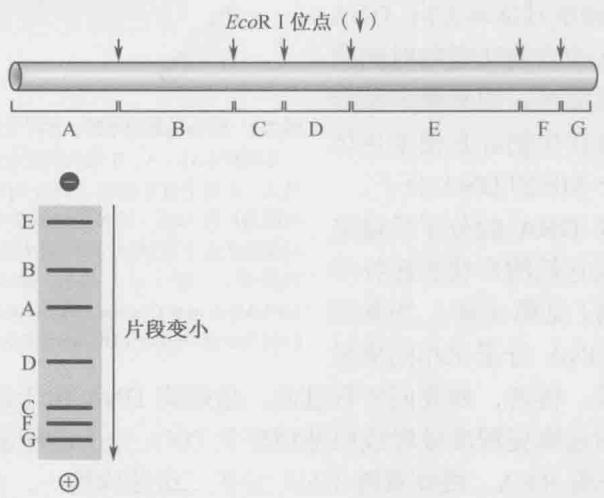  
图 7-3 限制性内切核酸酶 EcoRI 消化某一 DNA 片段。上部所示为一个 DNA 分子和其中 EcoRI 的酶切位点。DNA 分子用 EcoRI 消化后，在琼脂糖凝胶中电泳，可观察到图中所示的带型。

如果将同一 DNA 分子用另一种限制酶切割，如 Hind Ⅲ（它也识别 6 个碱基的靶序列，不过它的识别序列为 5'-AAGCTT-3'），这个 DNA 分子就会在另外一些位点上被切割而产生其他大小不同的片段。因此，使用多个限制酶可以将 DNA 分子的不同区域分开，也能用来鉴定特定的 DNA 分子。一个特定的 DNA 分子用一组不同的限制酶消化时，能产生一系列特征性的片段。

其他的限制酶，如 Sau3A I [发现于金黄色葡萄球菌（Staphylococcus aureus）中] 识别 4 碱基序列（5'-GATC-3'），因此能更密集地切割 DNA，大约每 250bp 切割一次。另外一个极端的例子是 Not I，它识别 8 碱基序列（5'-GCGGCCGC-3'），平均每 65kb 才切割一次（表 7-1）。需要注意的是，有些限制性内切核酸酶是对甲基化敏感的，也就是说，限制性内切核酸酶识别位点中特定碱基的甲基化，会抑制其在该位点的酶切作用。

表 7-1 一些限制性内切核酸酶和它们的识别序列。

<table><tr><td>酶</td><td>序列</td><td>切割频率 $^a$ </td></tr><tr><td>Sau3A1</td><td>5&#x27;-GATC-3&#x27;</td><td>0.25 kb</td></tr><tr><td>EcoR I</td><td>5&#x27;-GAATTC-3&#x27;</td><td>4 kb</td></tr><tr><td>Not I</td><td>5&#x27;-GCGGCCGC-3&#x27;</td><td>65 kb</td></tr></table>

a. 频率=1/4n，n指的是识别序列中碱基对的数目。

限制性内切核酸酶的不同不仅在于识别序列和长度，而且它们所产生 DNA 末端的性质也不相同。一些酶如 Hpa I 产生的是平末端，其他酶如 EcoR I、Hind III 和 Pst I 产生的是交错末端（图 7-4）。例如，EcoR I 切割两条链的交错位置上的 G 和 A 之间的共价键（磷酸二酯键）。这两个切割位点之间的 4 个碱基对间的氢键容易断裂，而在 5' 末端多出 4 个核苷酸（图 7-5），注意这些末端彼此互补。因为这些末端之间或与用同一种酶切割的其他 DNA 分子之间能通过碱基配对而退火，我们通常将它们称为“黏性末端”。这一特性在我们讨论 DNA 克隆时很有用。

  
图 7-4 不同限制酶的识别序列和切割位点。如图所示，不同限制性内切核酸酶不仅识别不同的靶位点，而且也在这些位点中的不同位置做切割。因此能产生平末端或 5'、3' 突出的末端。

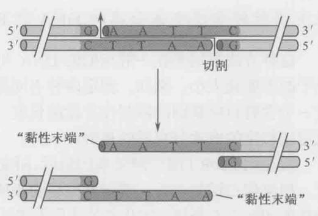  
图 7-5 一个 EcoRI 位点的切割。EcoRI 在两条链的识别位点内切割，从而产生 5'末端的凸出。因为这些末端与用同一种酶切割的其他 DNA 分子之间能通过碱基配对互补而黏合，我们通常将它们称为“黏性末端”。

## DNA 杂交能用来鉴定特定的 DNA 分子

如同我们在第 4 章所述，变性 DNA 重新退火（互补链间重新形成碱基对）的能力使来源不同但具有一定同源性的变性 DNA 在适宜的离子强度和温度下混合时形成杂交双链。两个不同来源的互补单链多聚核苷酸之间的碱基配对过程叫做杂交（hybridization）。

许多技术依赖于两个序列互补的 DNA 分子之间杂交的特异性。例如，这一特性是鉴定复杂核酸混合物中特定序列的基础。此处其中一个分子被定义为特定序列的探针（probe）——它既可以是纯化后获得的片段，也可以是化学合成的 DNA 分子。这个探针用来在核酸混合物中寻找含有与其互补序列的分子。探针 DNA 必须先被标记，这样它一旦发现靶序列后，就可以轻易将其定位。被探针标记的混合物通常可在凝胶上按大小进行分离，或者分布在一个文库的不同菌落中（见下文）。

标记 DNA 有两种基本方法。第一种方法是在一个完整的 DNA 分子末端加上一个标签。例如，多聚核苷酸激酶会将 ATP 的 $\gamma$ -磷酸基团加到 DNA 的 5'-OH 末端。如果这个磷酸基团具有放射性，磷酸基团的转移能使受体 DNA 分子被标记上放射性。

掺入标记法（另一种机制）通常是利用一个被标记的前体物进行 PCR，或者通过把随机的、短的六聚核苷酸杂交到 DNA 上以使 DNA 聚合酶能延伸它们。被标记的前体物通常是用荧光染料或放射性物质修饰的核苷酸。通常荧光染料只需和作为 DNA 合成前体的 4 种核苷酸中的任一碱基结合即可（对大多数用途而言，25% 的标记一般就可以满足需要）。

用适宜波长的紫外线照射 DNA 样品，检测应答射出的较长波长的光，可以探测到用荧光前体物标记的 DNA。放射性标记的前体物通常是在某一种核苷酸的 $\alpha-$ 磷酸基团中掺入 ${}^{32}P$ 或 ${}^{35}S$ 。这个磷酸基团在 DNA 产物中被保留（第 9 章）。有放射性的 DNA 样品可使 X 射线片曝光，或通过识别 ${}^{32}P$ 或 ${}^{35}S$ 发射的 $\beta$ 粒子的光电倍增管探测。

杂交技术以多种方式用于特定 DNA 或 RNA 片段的鉴定。下述是两种最常见的方式。

## 杂交探针能鉴定电泳分离的 DNA 和 RNA

这种方法常用来在一群相似的 DNA 和 RNA 分子中测定某一特定的 DNA 或 RNA 分子的丰度或大小。例如，测定两种不同类型细胞中某一特定 mRNA 表达丰度，或测定一个含有目标基因的限制性片段的长度。相关结果的获得一般都要经由印迹过程，才能定位特定的电泳分离后的核酸。

假设用 EcoRI 酶切酵母基因组后,研究人员想知道含有目的基因的限制性片段的长度。用溴化乙锭染色后,酵母基因组切割所产生的上千个 DNA 片段在凝胶上形成连续分布的 4kb 左右条带,如此多的片段无法区分成相互分散的带型。Southern 印迹杂交技术（Southern blot hybridization,因其发明者 Edward Southern 而得名）就可以在连续分布的条带中鉴定出含有目的基因的限制性片段。

在这一过程中，切割后的 DNA 先经凝胶电泳分离，然后在碱性溶液中浸泡使双链 DNA 片段变性。进而将这些片段转移并黏附到带正电荷的膜上，形成胶的“印迹”。在转移过程中，DNA 片段在膜上的位置与它们在凝胶电泳中迁移的位置相对应。目的 DNA 被转移到膜上后，带电荷的膜与非特异性的 DNA 片段混合物共同孵育以封闭膜上多余的结合位点。因为非特异的 DNA 混合物是随机地分布在膜上，如果选择合适，其中不会有目标序列（如采用与探针无关的其他生物的基因组 DNA），所以不会干扰下一步骤中对目标序列的检测。

然后结合在膜上的 DNA 片段与探针 DNA 一起进行孵育，探针 DNA 含有和目标基因互补的一段序列。因膜上所有非特异结合位点已被无关的 DNA 占据，探针 DNA 只能与膜上的互补 DNA 杂交才能结合到膜上。这个过程所需的离子浓度及温度与核酸变性、复性的条件比较接近。在这样的条件下，探针 DNA 只与互补序列紧密结合。探针的摩尔数通常远远超过固定于膜上的靶片段，这有利于探针与靶 DNA 的杂交，而非变性 DNA 的重新退火。另外，变性 DNA 被固定在滤膜上也不利于重新退火。印迹上探针杂交的位置可以用对标记 DNA 发出的光或电子敏感的胶片或其他介质检测到。如用放射性标记的 DNA 探针，可用 X 射线片曝光，显影后获得的放射自显影图像（autoradiogram）就会和滤膜上的杂交分子位置是对应的（图 7-6）。


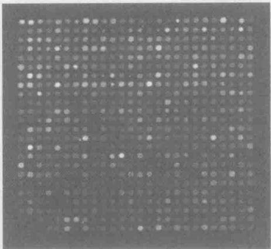  
图 7-6 Southern 印迹。DNA 分子经限制性内切核酸酶消化产生的片段在琼脂糖凝胶中电泳。染色后，可以看到一系列条带。将电泳条带转移至滤膜，用只和 DNA 分子的一个特定序列同源的 DNA 片段作探针进行杂交，能看见单一条带，其位置对应于含有此序列的片段在凝胶上的位置。  
图 7-7 微阵列格子图比较线虫肌肉组织和神经组织的表达谱。晶格中的每一个圆点都包含一条来自线虫特定基因编码区的短的 DNA 片段。从肌肉组织和神经组织中提取 RNA 后用荧光染料分别标记（红色和绿色）。因此，红色的点表示该基因在肌肉组织中表达，绿色的点表示该基因在神经组织中表达。黄色的点表示该基因在两种组织中都表达。显然，两种样品表达的基因集合是不同的。（由斯坦福大学的 Stuart Kim 惠赠）

在一组 RNA 中鉴定某一特定 mRNA 的步骤与此相似，被称做 Northern 印迹杂交（Northern blot hybridization，以示与 Southern 印迹相区分）。由于 mRNA 比较短（一般都小于 5kb），它们无需再用任何酶消化（实际上 RNA 特异性的内切酶数量也很少）。其他步骤都与 Southern 印迹相似。分离的 mRNA 被转移至带正电荷的膜上，和放射性标记的探针反应（此时是 RNA 和互补的 DNA 链配对形成杂交体）。

Northern 印迹杂交更适用于测定一个样品中特定 mRNA 的含量，而不是其大小。特定 mRNA 的含量能反映编码它的基因的表达水平。举例来说，当一种细胞被诱导剂处理后，可以用 Northern 印迹杂交检测与未经诱导的细胞相比某一 mRNA 水平的改变。再举一例，Northern 印迹杂交也可以用来比较同一生物不同组织间特定转录物的相对含量（也就是目的基因的表达水平）。在这些分析中由于使用了过量的 DNA 探针，杂交产物的量与原始样品中的 mRNA 量是相关的，从而可以相对比较 mRNA 的表达量。

Southern 和 Northern 印迹杂交的原理也是基因芯片分析的基础，对此我们将在本章的基因组部分进行讨论。完整序列信息的获得使“反向杂交”实验成为可能。一张芯片需要将几百至几千个已知的 DNA 序列固定到固相支撑表面上，这些固相支撑通常是用玻璃或者塑料（图 7-7）。其中每个序列对应待研究生物的不同基因。请注意在描述芯片分析的过程中，所使用的术语与 Southern 或 Northern 分析中是相反的。在芯片分析中，固定的、未被标记的序列被称为“探针”，因为它们是已知的 DNA 序列。而“靶标”则是从细胞或组织中的全部 RNA 生成的 cDNA 经过扩增和标记形成的。当靶标序列与芯片上排列好的 DNA 探针杂交时，芯片中每个 DNA 探针信号的强弱反映了目的基因的表达水平。

## 特定 DNA 区段的分离

为了对基因及其功能进行分子水平的分析，需要从较大的 DNA 分子或其选择性扩增产物中分离特定的 DNA 区段。分离大量的纯的特定 DNA 分子有助于分析这个 DNA 分子所编码的信息。这段 DNA 还可以被测序，或可以被克隆、表达以研究其蛋白质产物。

具有纯化大量特定 DNA 分子的能力才能用其他方式对其进行操作。例如，我们能通过制备重组 DNA 分子来改变某一特定基因的表达（如将其编码序列和其他异源的启动子融合）。或者也可以把纯化的 DNA 序列进行重组以编码所谓的融合蛋白（fusion protein），即由来自于不同蛋白质组成的杂合蛋白。DNA 克隆和 PCR 扩增技术已成为研究基因表达调控、基因组稳定性和蛋白质功能等问题的基本手段。

## DNA 克隆

构建重组 DNA 分子并在细胞中维持这些分子，称为 DNA 克隆（DNA cloning）。这个过程通常涉及一个载体（vector），它要提供维持克隆的 DNA 在宿主细胞中扩增所需的信息。重组 DNA 的关键是在特定序列处切割 DNA 的限制性内切酶，以及能连接切割后的 DNA 的其他酶类。通过构建能在宿主中扩增的重组 DNA 分子，可以将某一特定的 DNA 片段从其他 DNA 中分离出来并大量扩增。

在本节的后续部分，我们将介绍 DNA 分子的切割、重组和扩增。然后还要讨论如何制备大量杂合分子的集合，即文库（library）。在一个文库中使用的是一种通用载体，分别携带着不同的插入片段。除了文库的制备方法外，我们还将描述如何从文库中鉴定和分离特定的 DNA 区段。

当 DNA 用限制性内切酶切割成片段后，通常需要插入到某一载体中进行扩增。也就是说，为了能在宿主中复制，DNA 片段必须插入到第二个 DNA 分子（载体）中。最常用于扩增 DNA 的宿主是大肠杆菌（E. coli）。载体 DNA 通常要具备 3 个特性。

1. 含有一个复制起点，使其能独立于宿主染色体进行复制（注意：有些酵母载体还需要有一个着丝粒）。

2. 含有筛选标记，使带有载体（和所插入的 DNA）的细胞容易被鉴别出来。

3. 含有一个或多个限制性内切酶的单一酶切位点，从而可以使 DNA 片段插入到载体的特定位点，而且不影响上面提到的两个特征。

常见的载体都是比较小（约为 3kb）的环状 DNA 分子，它们被称为质粒（plasmid）。这些质粒最先来源于一些细菌和单细胞真核生物中天然存在的染色体外的环状 DNA 分子（附录 1）。在许多情况下（尽管酵母中不是），质粒 DNA 常常携带抗生素抗性基因。因此，天然质粒已经具备了载体的两个特性：能在宿主中独立扩增；携带筛选标记。这些质粒的另一个优点是它们在一个细胞中存在多拷贝，因此能从细胞中分离到的更大量的质粒 DNA。天然质粒所能负载的 DNA 的长度是有限的，通常为 1～10kb。对于大片段的克隆和增殖，后面将要讨论的基因组分析和 DNA 测序中常常会用到，人们已经构建了多种人工载体, 如细菌人工染色体(BAC)和酵母人工染色体(YAC), 它们可以容纳 120\~150kb 以上长度的 DNA。

将 DNA 片段插入到载体中一般来讲是比较简单的过程（图 7-8）。假设一个质粒载体含有唯一的 EcoRI 识别位点。用 EcoRI 将质粒切成线性。由于 EcoRI 能产生互补的 5' 突出末端，这些黏性末端能退火形成带有两个缺刻的环（参考图 7-5）。DNA 连接酶（DNA ligase）和 ATP 可以封闭缺刻重新形成共价闭合环状 DNA。靶 DNA 也要用限制性内切酶酶切，本例中是 EcoRI，切割后形成插入 DNA。这些插入 DNA 在适合于黏性末端复性的条件下与过量的用 EcoRI 切割制备的载体 DNA 混合，并加入 DNA 连接酶以连接这两个 DNA 的互补末端。加入与质粒 DNA 相比过量的插入 DNA 可确保大部分载体会和插入 DNA 连接（图 7-8）。

有些载体不仅可分离、纯化特定的 DNA，还能驱动插入 DNA 中基因的表达。这些载体称为表达载体（expression vector），在它们的插入位点附近含有从宿主细胞中得到的转录启动子。如果一个基因的编码区（不含启动子）置于插入位点的合适位置，插入基因就能由宿主细胞转录成 mRNA 并翻译成蛋白质。人们通常使用表达载体来表达异源基因或突变基因以检测其功能。表达载体也能用来大量生产某一种蛋白质以供纯化之用。而且，还可以通过改变表达载体中的启动子来方便地对插入片段的表达实行调控。例如，在培养基中加入一种简单的化合物（如一种糖或氨基酸）（见第 18 章中关于原核生物转录调控的讨论）。如果基因产物是有毒性的，控制基因表达的能力就显得尤为重要了。

## 转化可将载体 DNA 导入宿主生物中

将带有插入 DNA 的载体转化导入宿主细胞中可以进行扩增。如我们在第 2 章所讨论的，转化（transformation）就是宿主生物从环境中摄取 DNA 的过程。有一些细菌（不包括大肠杆菌）能自然发生转化过程，被称为遗传感受态（genetic competence）细菌。在大肠杆菌（E. coli）中转化不能自然发生，不过用钙离子处理后，E. coli 也可具备摄取 DNA 的能力。细菌摄取 DNA 的确切机制尚未知晓，可能是因为钙离子能遮蔽 DNA 上的负电荷，从而使 DNA 能穿过细胞膜。因此经钙离子处理后的细胞是可用于转化的感受态细胞。摄取质粒 DNA 的细胞被称为转化子（transformants），转化子可以用抗生素来进行筛选，由于质粒带有某些抗生素有抗性基因，携带质粒的转化子也因而获得了这种抗生素抗性，能在抗生素中生长，不含质粒的细胞则不能生长。

通常来讲转化是一个相对低效的过程。只有一小部分用 DNA 处理后的细胞能摄取质粒。正因为转化的效率低，有必要用抗生素筛选转化子。转化的低效率能保证在绝大多数情况下，每个细胞只摄取一个 DNA 分子。这个特性使每个转化细胞及其后代只携带单个 DNA 分子。所以，转化能有效地将一个 DNA 分子从转化混合物中纯化出来并进行扩增。

## 用克隆法制备 DNA 分子文库

DNA 文库(DNA library)就是一群由相同载体携带着不同 DNA 插入片段的集合(图 7-9)。

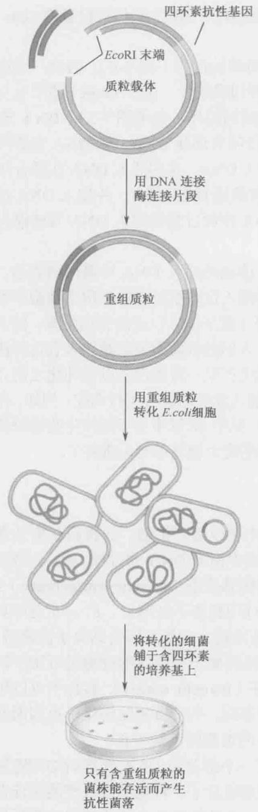  
图 7-8 用质粒载体进行克隆。一个用 EcoR I 酶切得到的 DNA 片段被插入到用同一种酶切所得的线性质粒载体。连接后，将重组质粒转化细菌（见正文）。由于质粒有抗生素抗性基因，带有质粒的细胞能在含有抗生素的培养基上生长从而被选择出来。（经许可，仿自 Micklos D.A. and Freyer G.A. 2003.DNA Science: A first course, 2 $^{nd}$ ed., p. 129©Cold Spring Harbor Laboratory Press.）

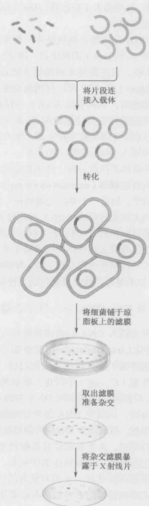  
图 7-9 DNA 文库的构建和筛选。为了构建文库，将同一种限制性内切酶消化所得的基因组 DNA 和载体 DNA 以及连接酶一起进行孵化,然后将最终的杂合载体（每个携带基因组 DNA 的不同片段的细胞，用一种不同的颜色表示）文库导入 E. coli，接着将细胞铺于琼脂培养基上的滤膜上。菌落长成后，从平板上移走滤膜，进行必要的处理以用于杂交：裂解细胞，使 DNA 变性，再用标记探针孵化滤膜。目标克隆通过放射自显影图像进行鉴定。

为了构建 DNA 文库,选择一种能产生适宜大小的插入片段的限制性内切酶对靶 DNA(如人类基因组 DNA)进行消化。插入片段的大小可以在 100bp 至大于 1Mb 之间（极大的插入片段通常由 DNA 不完全酶切造成）。将酶切所得的 DNA 与经同一种限制性内切酶酶切的相应载体混合，用 DNA 连接酶连接，这样就能产生大量携带不同插入片段的载体。

不同来源的插入 DNA 能产生不同种类的文库。最简单的文库是基因组文库（genomic library），它采用全基因组 DNA 经单一限制性内切酶切割所产生的片段制备而成。这种文库在为基因组测序准备 DNA 时最为有用；另一方面，如果要克隆编码某一特定基因的 DNA 片段，只有在所研究的生物中非编码 DNA 相对较少时，才适合采用基因组文库。对于基因组较为复杂的生物来说，由于许多 DNA 插入片段内没有编码序列，这种文库就不太适合了。

为了在文库中富集编码序列，人们通常使用 cDNA 文库（cDNA library）。其制备过程如图 7-10 所示。在这里，起始 DNA 不再是基因组 DNA，而是由 mRNA 转换来的 DNA。这个由 mRNA 转换成 DNA 的过程叫做反转录（reverse transcription），它由一种以 RNA 为模板来合成 DNA（见第 12 章）的特殊的 DNA 聚合酶（反转录酶）催化。用反转录酶处理后，mRNA 能转变成双链 DNA，即 cDNA（copy DNA）。此后的步骤与构建基因组文库一样。cDNA 产物和载体经相同限制性内切酶酶切而将所获得的片段连入载体中。

为了从一个文库中分离单个插入片段,人们将整个文库转化进受体细胞(通常是E. coli)中。通常每个转化细胞只含有一个由载体和相应插入片段组成的重组DNA分子。因此,传代后的每个转化细胞就含有文库中某一克隆的多个拷贝。携带任一目的序列克隆的细胞所生成的菌落可以被鉴定,目的序列可以被

  
图 7-10 cDNA 文库的构建。RNA 依赖的 DNA 聚合酶——反转录酶将 RNA 反转录成 DNA（cDNA）。第一步（第一条链合成），polyT 和 mRNA 的 polyA 尾杂交（cDNA 文库一般都是从真核细胞制备的，其 mRNA 的 3'端都有一个 Poly A 的尾巴；见第 19 章），起到引物的作用。反转录酶延伸 dT 引物，以 mRNA 为模板形成完整的 DNA 拷贝，成为由 mRNA 和它的互补链组成的双链。RNA 用碱（NaOH）处理除去，留下的单链 DNA 就可以作为第二步（第二条链合成）的模板。用随机六核苷酸作引物，和 DNA 模板链的不同序列杂交。然后用 DNA 聚合酶延伸引物而生成双链 DNA，这样就可以克隆进入质粒载体（图 7-8），以制备 cDNA 文库。

分离。有很多方法可以用来鉴定克隆，如下面我们要描述的用 DNA 或 RNA 探针杂交来鉴定含有特定插入 DNA 的细胞。

## 杂交法可以用来鉴定 DNA 文库中的特定克隆

克隆基因的通常做法就是在一个文库的所有克隆中鉴定出目的基因片段。通过使用和目的基因部分序列互补的 DNA 探针可以做到这一点。这样一个探针可以用来鉴定含有目的基因区段的细胞菌落，以下对此进行描述。

用标记的 DNA 探针筛查文库的过程叫做菌落杂交（colony hybridization）。一个典型的 cDNA 文库含有数以千计不同的插入片段，每个插入片段都与通用载体相连接（见上）。将文库转化合适的菌株后，将细胞铺板于含固体培养基（通常为琼脂，见附录 1）的培养皿上。每个细胞都将长成一个独立的菌落，菌落中的每个细胞含有文库中的同一种载体和插入片段（通常每个培养皿上能生长几百个菌落）。

为了检测到少量的 DNA，还是采用 Southern、Northern 印迹中所用的带正电荷的滤膜。在此情形下，将滤膜覆盖在平板菌落的上方，滤膜上就黏附了每个菌落的细胞（包括细胞中的 DNA）印迹（请注意每个菌落还有一些细胞留在平板上）。因此，滤膜上就带有每个 DNA 克隆的一部分，DNA 在滤膜上的位置与其菌落在平板上的位置相对应。由此可保证当用探针和滤膜反应鉴定出目标克隆后，可容易通过其对应的菌落位置鉴定出相应的菌落，含有插入 DNA 的质粒就可以从细胞中纯化出来。

用探针筛选滤膜的步骤如下：先处理滤膜，使膜上的细胞裂解，其中的 DNA 被释放出来并在原位与滤膜结合；再将滤膜与标记的探针孵育，孵育条件和 Southern、Northern 印迹实验中一样。

如前所述及附录1将讨论的，人们对噬菌体（如 $\lambda$ 噬菌体）进行了一些改造以作载体之用，以噬菌体作载体制备的文库其筛选方法和质粒文库基本相同。不同的只是要筛选的是噬菌体在菌苔上生长所形成的噬菌斑，而不是菌落（见附录1）。

## 化学合成特定的 DNA 序列

  
质子化的亚磷酸酰胺化合物  
图 7-11 质子化的亚磷酸酰胺化合物。如图所示，5'-OH 被所添加的二甲氧基三苯甲基保护集团封闭。

很多人认为,寡聚核苷酸(oligonucleotides),即短的、可定制的单链 DNA (ssDNA),合成技术的建立标志着分子生物学时代的到来。最常见的化学合成是在 DNA 自动合成仪的固相支持物上进行的。添加核苷酸的前体物是一种化学保护分子,叫做亚磷酸酰胺(phosphoamidine)(图 7-11)。与 DNA 聚合酶催化的链延伸方向相反(见第 9 章),化学法合成中 DNA 链的延长是在 5'端添加核苷酸实现的。

用化学法合成 10～100 个碱基的 DNA 分子是高效而准确的。现在 DNA 合成的常规步骤是：研究人员只需将碱基序列输入到操纵 DNA 合成仪的计算机中，设定合成程序，就可以得到任何想要的序列。但随着合成分子的长度增长，由于合成过程每一循环中都可能发生错误，所得终产物就不那么均一了。因此，要大量、准确地合成大于 100 个核苷酸的 DNA 以用于分子分析仍然是比较困难的。

然而，易于合成的短的单链 DNA 分子仍然可满足很多用途。例如，含有克隆 DNA 某一区段的错配位点的定制的寡聚核苷酸可用来产生该 DNA 的定向突变。这种方法叫做定点诱变（site-directed mutagenesis），其步骤如下：寡聚核苷酸与克隆片段杂交后，以克隆 DNA 为模板指导新的 DNA 的合成，这样就产生了带有错配位点的双链分子；然后将两条链分开，进一步扩增含有所需错配位点的那条链。

人工设计的寡聚核苷酸也能通过这种方式将限制性内切酶识别位点引入到克隆的DNA中，用来制备各种重组DNA，如二个基因编码序列的融合体，或一个基因的编码序列与另一个基因的启动子的融合体。再或者，改变基因中编码特定氨基酸的序列引入一个突变，然后比较突变体与野生型蛋白质的特性，研究人员就可以检测特定氨基酸在蛋白质中的功能。

定制合成寡核苷酸对 PCR 来说至关重要(下面将对 PCR 进行描述), 同时也是 DNA 测序策略中不可或缺的成分, 对此将要在后续章节中描述。因此, 在涉及新的基因分子构建、特定 DNA 检测、DNA 扩增以及 DNA 测序等实验时, 都要设计并合成一条含有所需序列的短的寡聚核苷酸。

## 聚合酶链反应是通过体外的重复复制而扩增 DNA

聚合酶链反应（PCR）是一种革命性的扩增特定 DNA 片段的方法，它与在宿主细胞中的克隆和繁殖不同，完全是体外的生化反应。PCR 采用 DNA 聚合酶，以单链 DNA 为模板，以脱氧核糖核苷酸为底物合成 DNA。如第 9 章将涉及的，当人工设计的寡聚核苷酸与更长的 DNA 模板发生退火时，DNA 聚合酶将核苷酸加到人工设计的寡聚核苷酸的 3' 端。因此，如果一条合成的寡聚核苷酸与和它互补的单链模板退火，DNA 聚合酶就能以它为引物，从 5'→3' 延伸而产生双链 DNA。

那么，这种 DNA 聚合酶和反应是如何扩增特定的 DNA 序列的呢？先合成两条单链寡聚核苷酸。一条寡聚核苷酸与待扩增 DNA 的一条链的 5' 端互补，另一条则与互补链的 5' 端互补（图 7-12）。然后将待扩增的 DNA 变性，寡聚核苷酸和它们的靶序列退火。此时在反应中加入 DNA 聚合酶和脱氧核糖核苷酸底物，DNA 聚合酶使两条引物延伸。这个反应能在目标区域内产生双链 DNA。因此经过 PCR 反应的第一个循环，产生了初始 DNA 片段的两个双链拷贝。

接着，用相同的引物 DNA 进行又一轮变性和合成（注意，只有两条引物之间的序列是被准确扩增的）。这样就生成了 4 个拷贝的目标片段。如此重复进行变性和引物指导的 DNA 合成能使两个引物之间的区域呈几何级数（2、4、8、16、32、64 …）扩增。因此，原来含量极低的一个 DNA 片段经过扩增就能够产生大量的双链 DNA（见图 7-12，


图 7-12 聚合酶链反应。在 PCR 的第一步，将 DNA 模板加热变性，用对应于要扩增的 DNA 序列边界的寡聚核苷酸引物（深橘红色和暗绿色）与 DNA 模板退火。用 DNA 聚合酶（淡橘红色）在二个引物处分别延伸、复制单链模板（淡橙色和淡绿色）。下一步，再次使 DNA 变性，和引物退火并用作新一轮 DNA 合成的模板。请注意在第二个循环中，引物既能引发原始模板依赖的 DNA 合成，也能引发新合成的 DNA 依赖的合成。当 DNA 聚合酶延伸到来自上一轮 DNA（或来自于绿色标记模板的橘红色引物）合成产生的新模板（橘红色标记）退火的引物（绿色标记）时，它沿着模板链前进直至其末端（下图中聚合酶还没到模板的末端）。于是，欲扩增的 DNA 序列在第二轮循环中就被准确合成了。此后，进一步循环变性、引物退火和 DNA 合成（未标出）就能产生处于两个引物之间的 DNA 片段。反应每进行一轮，DNA 的量就呈几何级数增长一次。

框 7-1 法医学与聚合酶链反应）。实际上，在经过 20～30 个 PCR 循环后，因淹没在数以百万计的其他序列中而无法被检测的特定 DNA 序列（如整个人类基因组中的某条序列），可以很容易地表现为 DNA 凝胶电泳条带而被检测到。

## 相互叠连的 DNA 片段可以揭示核苷酸序列

接下来我们将讨论如何测定核苷酸序列。先来看 DNA 测序的 “经典” 方法，该方法可以确定单个基因的核苷酸序列。然后将讨论这种方法是如何实现自动化以对整个基因组进行测序的。最后，我们再讨论实现个体化基因组测序的 “下一代” 测序方法。

现在已经可以对整个基因组的完整核苷酸序列进行测定，实际上已经完成了不同复杂程度的生物（从细菌到人类）的基因组序列测定。这使得我们能够快速、准确地发现任一特定序列（将在本章后面的内容中讨论到）。

传统 DNA 测序的基本原理是按大小分离几组部分叠连的 DNA 分子。这些 DNA 分子 5'端相同，但 3'端终止在不同的位置。每组 DNA 分子的 3'端是一种特定的碱基。比如第一组 DNA 分子都以 G 结束，第二组是 C，第三组是 A，最后一组是 T。一组特定的 DNA 分子（以 G 组为例），它们的长度因其 3'端的 G 在序列中的位置不同而不同。因此，这组 DNA 片段能告诉你产生它们的 DNA 分子中何处有 G。我们将在后面讲述如何产生这些片段（也展示于图 7-15 中）。

## 框7-1 法医学与聚合酶链反应

设想你在一个法医学实验室里，手里有一个来自嫌疑犯的 DNA 样本。你想确定涉嫌者的 DNA 是否与犯罪现场所发现的 DNA 有相同的多态性。多态性就是生物群体中在染色体共同的同源区域，如在一个基因中，存在的不同的 DNA 序列（等位基因）。多态性可以简单到只是不同生物染色体某一位点的单个碱基差异，或者是简单重复序列（如 CA，见第 9 章）的长度差异。我们要做的是扩增多态性位点周边（包括位点本身）的 DNA，这样可以对得到的 DNA 测序（后文将讨论），测定它是否与犯罪现场样品中的序列相吻合。扩增所得的 DNA 的核苷酸序列（还可检测是否有其他的多态性）能帮助确定两个 DNA 样品是否吻合。为了与传统指纹识别技术方法相类比，这种鉴定 DNA 序列的方法被称为 DNA 素描或 DNA 指纹识别。DNA 素描自 1985 年首次运用（美国联邦调查局自 1988 年开始使用这一技术）以来，已被广泛运用于对犯罪现场证据的分析，用来证明犯罪嫌疑人有罪或者是清白（参见，如 The Innocence Project; WWW.innocenceproject.org）。

最初的 DNA 测序自动化的基础中，最常用的程序是基于链终止核苷酸（chain-terminating nucleotide）和体外 DNA 合成的方法。在链终止法中，寡聚核苷酸引物固定了 DNA 合成的起始位置后，DNA 聚合酶根据 DNA 模板复制出若干拷贝分子。DNA 聚合酶以 2'-脱氧核苷三磷酸为底物，从 3' 合成延伸 DNA（链终止法依据的原理是我们第 9 章讨论的酶促 DNA 合成）。链终止法采用特殊的、经修饰的底物，即 2', 3'-双脱氧核苷酸（ddNTP），它们的糖环上没有 2' 和 3'-OH（图 7-13）。DNA 聚合酶能在延伸中的多聚核苷酸链的 3' 端掺入一个 2', 3'-双脱氧核苷酸分子，但它一旦掺入后，3'-OH 的缺乏阻止了核苷酸进一步的延伸而使链延伸反应终止（图 7-14）。

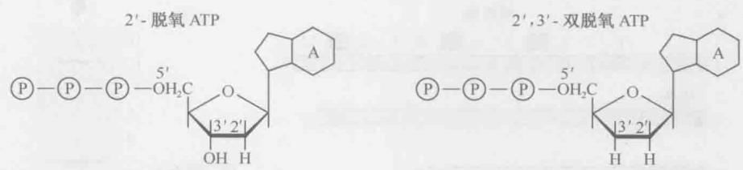  
图 7-13 DNA 测序中使用的双脱氧核苷酸。左图是 2'-脱氧 ATP，它能加入到延伸中的 DNA 链中，另一个核苷酸还能直接加在它的后面。右图是 2'，3'-双脱氧 ATP，一旦它加入到延伸中的 DNA 链中，就会阻止其他核苷酸加入到这条链中。

现在设想在核苷酸底物混合物中掺入修饰底物 2′, 3′-双脱氧鸟嘌呤三磷酸（ddGTP），ddGTP 和 2′-脱氧 GTP 的比值为 1:100。这就使 DNA 的合成在每次 DNA 聚合酶遇到模板链上的 C 时以 1:100 的频率终止（图 7-15 a）。由于所有的 DNA 链都是从同一点开始延伸的，链终止性核苷酸能产生一组部分重叠的多聚核苷酸片段，所有片段 5′端相同但长度不同，因此它们的 3′端不同。这些片段的长度指示了模板链中 C 的位置。如果用放射性标记的引物或用荧光添加剂作标签的引物标记这些片段的 5′端，或用荧光标记的 ddGTP 的衍生物标记它们的 3′端，那么用聚丙烯酰胺凝胶电泳分离时，这组部分重叠的片段就能产生一系列条带，每个条带代表了模板链上的一个 C （图 7-15b）。如果我们用 ddCTP、ddATP 和 ddTTP 以相似的方式阻止 DNA 的合成，就可以分别得到 4 组部分重叠的 DNA 片段，它们加在一起就能提供 DNA 的全部核苷酸序列。为了读出这个序列，每种反应所产生的片段都在聚丙烯酰胺凝胶上进行分离（图 7-16）。

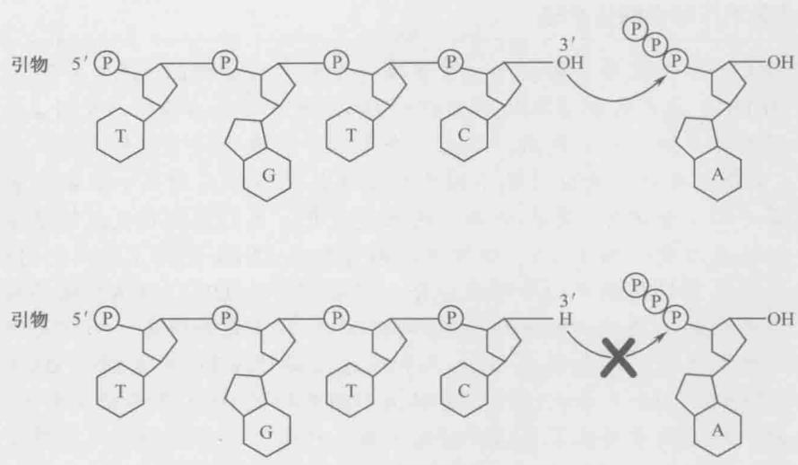  
图 7-14 双脱氧核苷酸引发的链终止。上图所示是一条 3'端延伸的 DNA 链，一个腺苷酸正加入到先前已经存在的胞嘧啶上。如文中所述，双脱氧胞嘧啶掺入到延伸中的 DNA 链时（下图所示）会阻止其他核苷酸的加入。

下面我们可以看到，这一理论上容易的方法，最开始是为了测定短的、已定义的DNA片段的序列而研制的。这一方法经历了一系列技术改进，才使全基因组测序成为可能（框7-2，自动化测序仪用于高通量测序）。

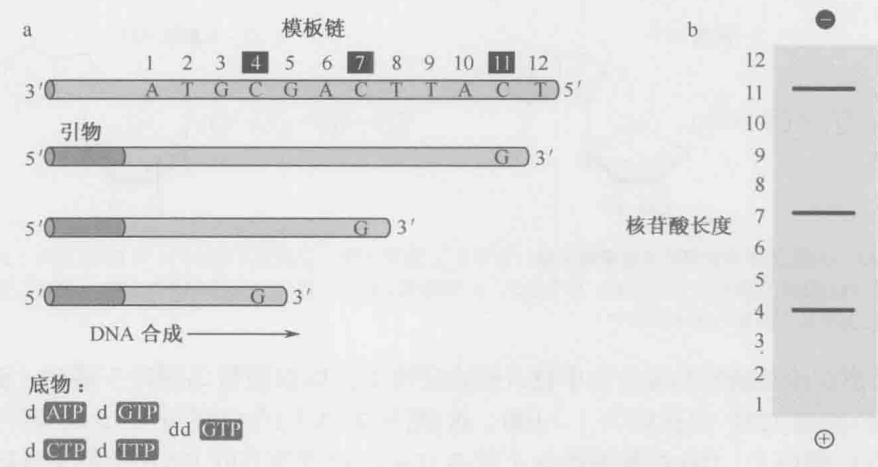  
图 7-15 基于链终止法的 DNA 测序。如文中所述，在双脱氧核苷酸存在的情况下，将合成不同长度的 DNA 链。所产生的 DNA 链的长度依赖于 DNA 模板序列以及反应中掺入了何种双脱氧核苷酸。（a，上部）DNA 模板的序列。在这个反应中，所有的碱基都以脱氧核苷酸的方式存在，但是鸟嘌呤还有双脱氧的形式。因此，当 DNA 链延伸至模板中的胞嘧啶时，一些分子中掺入了 ddGTP，而不是 dGTP。在这种情形下，DNA 链就停止延伸。（b）显示用聚丙烯酰胺凝胶分离得到的片段。凝胶上这些片段的长度反映了待测序的模板 DNA 中胞嘧啶的位置。

## 用鸟枪法对细菌基因组进行测序

流感嗜血杆菌（H. influenzae）是第一个完成全基因组测序及组装的、独立生存的生物体。由于它的基因组小而致密，仅由1.8Mb的DNA组成（小于千分之一的人类基因组），首先选择它进行测序是合理的。H. influenzae的基因组被随机剪切成很多随机片段，平均长度为1kb。这些基因组DNA片段接着被重组克隆到质粒DNA载体，形成一个文库。从单个重组DNA菌落中制备DNA，用前面所讨论的双脱氧法在自动测序仪上分别测序。这个方法称为“鸟枪法”测序。人们随机挑选重组DNA菌落，对其处理后进行测序。为了保证基因组中的每个核苷酸都能在最后的基因组组装中出现，进行了30 000\~40 000个不同的重组克隆的测序，产生了总共约20Mb的原始基因组序列（通常一个反应产生600bp的序列，600bp×33 000不同的克隆=共约20Mb DNA序列）。这就叫做10×序列覆盖度（10×sequence coverage）。理论上说，基因组中的每个核苷酸都被测了10次。

这个方法可能看起来很繁琐，但与最初的设想相比，它既快速，花费也少。早期的测序策略要求对细菌染色体物理图上的每一个特定的限制性DNA片段进行系统测序。这个步骤的不足之处是大多数已知的限制片段比单个反应所能检测的DNA序列要大。因此，为了得到基因组任一特定区域的完整序列，需要进行多次的内切酶消化、作图和测序。这些额外的克隆和限制性内切酶作图步骤

  
图 7-16 DNA 测序胶。如图所示，由双脱氧核苷酸链终止反应决定的 DNA 链的长度用聚丙烯酰胺凝胶进行分离测定，具体的 ddNTP 在胶的顶部标示。从下往上读胶可以获得 $5' \rightarrow 3'$ 的序列。

比随机 DNA 片段的重复自动测序耗时要多得多。换句话说，用计算机组装随机 DNA 序列要比对涵盖细菌染色体的所有限制酶酶切片段进行克隆和测序要快得多。

将大约 30 000 条随机基因组 DNA 片段的序列信息输入到计算机中，使用不同的程

## 框 7-2 用自动测序仪进行高通量测序

提出人类基因组测序，当时看起来是一件令人生畏、遥不可及的事。毕竟整个人类基因组含有 $3 \times 10^{9} \mathrm{bp}$ ，数目惊人，而早期的测序方法连测定DNA短片段都相当不容易。在20世纪80年代甚至90年代初期，一个研究人员即使全力以赴，在一两天内也只能产生几百碱基对的序列，也许是500bp。几项技术上的创新大大提高了测序的速度和可靠性。

如前所述，链终止法能产生4组部分重叠的DNA分子，这些DNA分子之间大小仅相差一个核苷酸。起初，人们采用大的聚丙烯酰胺凝胶电泳分离这些部分重叠的DNA分子（图7-16）。然而，近年来，这些笨重的凝胶已被短分离柱所取代，这些短柱能在2\~3h内分离部分重叠的DNA。短柱可重复利用，与要替代的繁琐的聚丙烯酰胺凝胶相似，也能分离700\~800bp的DNA片段。

DNA 测序的主要技术进展源于荧光标记的链终止核苷酸（fluorescent chain-terminating nucleotide）的使用。理论上说，可以用一种“颜色”独立标记一组部分重叠的 DNA 分子。每组部分重叠的 DNA 分子的颜色由它们的最后一个核苷酸决定。例如，模板 DNA 中第 50 位的 T 残基结尾的 DNA 分子可以被标为红色；第 51 位的 G 残基结尾的 DNA 分子可标为黑色；因此，每个部分重叠的 DNA 分子都有唯一的大小和颜色。当它们在测序胶上按大小分离时，荧光检测器能识别出每个部分重叠的 DNA 分子的颜色（框 7-2 图 1）。这样，在不到 3 h 的时间里，一个柱子能产生 600～800 bp 的序列。

现在的自动测序仪，如 Sequenator，已经拥有 384 道独立的分离柱。从理论上说，384 道柱的测序仪能在数小时内产生 200 kb 以上的原始 DNA 序列。按一天运行 9 h 计算，每台机器一天能跑 3 次，产生 500 kb 以上的序列信息。这样 100 台 384 道的测序仪在两个月内就能产生 $3 \times 10^{9}$ bp 的序列，相当于一个人类基因组。目前美国、英国共有 5 个主要测序中心，每个测序中心都有许多台自动测序仪。这 5 个测序中心每年总共能产生 $60 \times 10^{9}$ bp 的原始 DNA 序列。也就是每年能完成 20 个人类基因组的测序。然而，这种通量与我们稍后提到的下一代测序仪相比，还仅仅是小儿科：新的自动测序仪一个反应几小时内便可产生与一个完整人类基因组同等规模的数据。

  
框 7-2 图 1. DNA 序列峰图。如正文所述，这一测序反应使用了末端荧光标记的双脱氧核苷酸，反应产物用毛细管电泳分离，序列中 A、T、C、G 分别以绿色、红色、黑色和蓝色表示。

序对相互重叠的 DNA 序列进行组装。这个过程的基本思想与填字谜的组装相似。其中已知的单词对未知的相邻重叠单词提供线索。根据序列间的相互匹配就可以把随机 DNA 片段组装在一起。短的 DNA 序列的组装最终能生成一个连续的组装体，

也叫叠连群（见图 7-18）。

## 鸟枪法使大基因组序列的部分组装成为可能

从前面的讨论中我们知道 600bp 的短 DNA 片段的测序极其快速、高效。实际上，自动测序仪的效率远远超过了我们组装和注释原始 DNA 序列的能力。换句话说，复杂基因组，如人类基因组的全基因组测序的限速步骤是数据的分析，而不是数据的生产本身。随着测序方法变得更加快速有效，这一问题变得愈加严重。现在运用自动测序仪一次反应即可产生数 10 亿碱基对（gigabase pair，Gb）的 DNA 序列信息（参见下文“向 1000 美元测定人类基因组迈进”部分）。现在我们需要思考如何改进测定 H. influenzae 的全基因组序列所用的鸟枪法，以便用于更大、更复杂的动物基因组的测序。

人类染色体平均长度为 150Mb。因此，一个测序反应所产生的 600bp 的 DNA 序列只是一个典型的人类染色体的 0.0004%。所以，为了测定染色体的全部序列，我们有必要得到大量 DNA 短片段的测序结果（图 7-17）。为了实现这一目标，需要从人类基因组的 23 条染色体中逐条提取 DNA，加压通过细针头将它打碎成小片段。由单个染色体获得的小片段集群随后被分成池（pool）。通常要建立 2\~3 个不同大小片段的池，如 1kb、5kb 或 100kb 长的片段池。按照前面所述的方法，这些片段被随机克隆到细菌质粒中而制成文库。

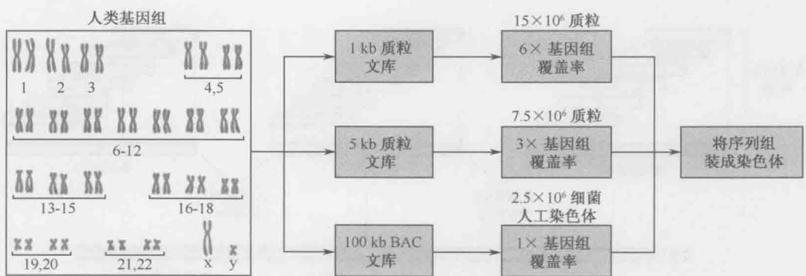  
图 7-17 全基因组文库的构建和测序策略。基因组 DNA 短片段的经鸟枪法测序后，构建叠连群。如文中所述，叠连群的延伸可以利用 5kb 和 100kb 等大的插入片段的末端测序来完成。（来源：Hartwell L. et al.2003. Genetics: From genes to genomes, 2nd edition, Fig.10-13 Copyright©2003 McGraw-Hill Companies, Inc. 经过许可。）

可以从细菌质粒中很快分离含有人类基因组随机序列的重组 DNA，然后用自动测序仪在短时间内完成测序。为了保证一条染色体中的每个序列都得到测定，平均需要处理 200 万个随机 DNA 片段。按每个片段 600bp 长计算，产生的是 10 亿（1Gb）以上碱基对的序列数据，几乎是一个典型的染色体中 DNA 含量的 10 倍。就像前面细菌染色体测序中所讨论的，如果测序量达到染色体中序列的 10 倍，就可以有把握地认为每个染色体区段都得到了覆盖。

制备 “鸟枪法” 重组文库和进行大量冗余的随机 DNA 测序看起来很不经济。然而，100 台 384 道自动测序仪几个星期内就能完成一条人类染色体 10 倍覆盖度的测序。这比先分离染色体内的已知区域，再对一组前后重叠的 DNA 片段进行测序的方法快得多。因此，人类基因组测序的技术关键是自动鸟枪法测序（shotgun sequencing）并进而结合使用计算机组装不同的片段。自动测序仪和计算机的联合实现了强强联手，最终使人类基因组测序得以提前数年完成。

为了将鸟枪法所得的随机 DNA 短序列组装成叠连群（contig），即大的重叠序列，人们开发了先进的计算机程序。含有相同序列的短序列被认为相互重叠，按重叠序列将片段连接可以形成更大的叠连群（图 7-18）。这些叠连群的大小依所得到的序列的数量而定——所得到的序列越多，叠连群就越大，其间所遗留的空隙就越少。

单个叠连群通常由 50 000～200 000bp 组成，仍然远比典型的人类染色体要短得多。然而这些叠连群在分析基因密度高的基因组中十分有用。例如，果蝇基因组平均每 10kb 有一个基因，因此一个典型的叠连群就包含了好几个连锁基因。遗憾的是，更为复杂的基因组中基因密度通常要比这低得多（见第 8 章）。人类基因组中平均每 100kb 有一个基因，因此一个典型叠连群通常不足以包含一个完整基因，更不用说一系列连锁基因了。接下来我们讨论如何将相对较短的叠连群组装成 1～2Mb 长的支架（scaffold）。

  
图 7-18 通过测定大的 DNA 片段的末端序列连接叠连群。例如，一个随机的 100 kb 的基因组 DNA 片段的末端可能含有和叠连群 1 匹配的序列，而另一个末端含有和叠连群 2 匹配的序列。就可以将这两个叠连群放在同一个支架上。（经许可，仿自 Griffiths A.J.F. et al., 2002. Modern Genetics, $2^{nd}$ ed. Fig.9-29b W.H. Freeman.）

## 末端配对法使大基因组支架的组装成为可能

重复 DNA 的存在是产生更大叠连群的 “瓶颈”（见第 8 章）。一条染色体或一个基因组的随机 DNA 片段中，由于含有同一个 DNA 重复序列，尽管互不连锁，看起来也仿佛相互重叠，这使组装过程变得复杂。配对末端测序（paired-end sequencing）可以克服这种困难。这种技术简单易行，十分有效（见图 7-19）。

<!-- END OFFICIAL API PART part_002 -->


<!-- BEGIN OFFICIAL API PART part_003 -->

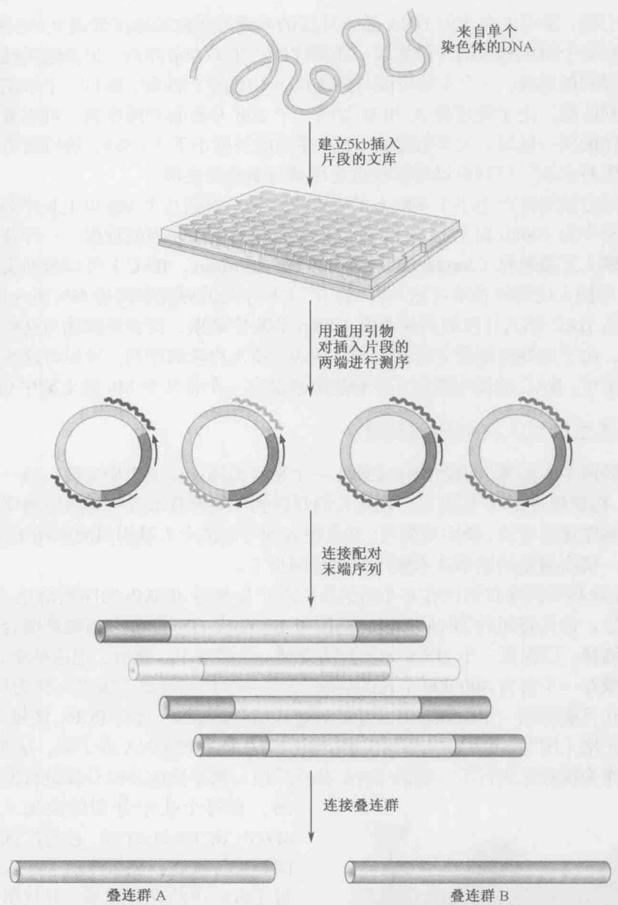  
图 7-19 一个包含长度为 5kb 的随机基因组 DNA 插入片段的 “鸟枪法测序” 文库。平板上每个孔含有一个不同的插入片段。在每个基因组 DNA 片段的两个末端，长度为 600bp 的序列被测定（着色部分）。这些配对末端序列被用来连接不同的叠连群。在本例中，一个 5kb 长度的蓝色基因组 DNA 片段与叠连群 A 和叠连群 B 都匹配。

除了制备由 DNA 短片段组成的鸟枪 DNA 文库，还要制备由 3～100kb 长的基因组 DNA 大片段组成的重组文库。以一个来自人类染色体的 DNA 样本为例，一部分样本用来制备 1kb 片段，另一部分则用来制备 5kb 片段。最终构建了两个文库，一个插入片段小，另一个插入片段大（图 7-17）。

通用引物，即可以在大的 DNA 插入片段的两端与质粒的连接处退火的引物。（用通用引物）对每个随机插入的片段末端一次测序能产生 600bp 序列。记录随机插入片段的每个末端序列的来源。一个末端可能与叠连群 A 内的序列匹配，而另一个末端与叠连群 B 内的序列匹配。由于叠连群 A 和 B 与同一个 5kb 片段有共同序列，可以推断它们来自于染色体的同一区域。大多数重复 DNA 序列的长度小于 2～3kb，所以来自 5kb 插入片段的“配对末端”序列足以跨越被重复区域打断的叠连群。

前述的方法通常产生小于 500kb 的叠连群。为了得到几个 Mb 以上长序列的数据，有必要从至少为 100kb 以上的 DNA 片段中获取配对末端序列的数据。一种特殊的克隆载体，细菌人工染色体（bacterial artificial chromosome，BAC）可以帮助实现这一目标。BAC 中插入的片段长度可达几百 kb。产生长序列的原理和前述 5kb 插入片段一样。使用引物从 BAC 插入片段的两端获取 600bp 的测序结果，接着寻找能与这些序列匹配的叠连群，由于这些叠连群含有来自同一 BAC 插入片段的序列，可以将这些叠连群置于同一支架中。BAC 的使用能使多个叠连群组装在一个含几个 Mb 的支架中（图 7-18）。

## 向 1000 美元测定人类基因组迈进

最早的两个人类基因组的测序工作（一个来自美国国立卫生研究院，另一个来自私人企业），耗费超过了3亿美元。现在人们开始利用纳米技术进行基因组测序工作，目的是要让测序速度更快，操作更简便，并且便宜到可以使个人基因组测序用于临床诊断。现在，第一代高通量的纳米技术测序仪已经问世了。

454 生命科学测序仪可以在 4 小时的反应中产生将近 400Mb 的序列信息。它的基本原理很巧妙：首先将短的 DNA 片段（基因组 DNA 或 cDNA 等）与微珠混合。混合物需要充分稀释，以保证一个 DNA 分子只结合到一个微珠上。然后，把这些结合了 DNA 的微珠分散在一个含有 400 000 个孔的硅板上（每一个孔都是皮升级别）。因为尺寸极小，所以每个孔只能容纳一个微珠。然后直接对微珠结合的 DNA 进行 PCR，使每一个 DNA 分子得到扩增（图 7-20）。每一个孔扩增后就会产生均一的 DNA 分子群，这些 DNA 分子群可以作为模板来进行下一轮的 DNA 合成反应。测序反应是以分步进行的方式操作

  
图 7-20 454 测序装置的微孔示意图。每一个孔含有一个微珠，微珠带有扩增的 DNA 序列。连续的多轮测序反应通过焦磷酸的释放和光信号来检测。进一步的方法描述详见正文。（经许可影印自 Margulies M. et al. 2005.Nature. 437: 376-380, Fig.1a©Macmillan.）

的，在每个孔中分别依次加入 dATP、dGTP、dCTP 和 dTTP，在每次加入试剂之间要进行洗脱。脱氧核糖的加入依赖于模板 DNA 中的互补碱基，并且引起焦磷酸的脱离。焦磷酸的释放激发酶促反应产生光信号脉冲，该光信号可被连接在计算上的微处理器检测到。发光脉冲可以标示出每一轮合成反应中每一个微孔内掺入了什么样的核苷酸，这样就可以获得所有 400 000 微孔中所包含的 DNA 序列。核苷酸持续加入直到一个 DNA 片段中有 200～250 个碱基被确定。

利用 454 测序技术，已经完成了本书第一作者的基因组序列测定（因为某些原因，这家公司似乎对其他作者的基因组兴趣不大）。按照每一轮反应 100Mb 来算，完成 Watson 的基因组 1 倍覆盖度只需要 30 个反应（一台机器用 2\~3 周时间）。根据现在的状态计算，完成一个人的全基因组测序需花费大约 1\~3 万美元，仅仅是第一个人类基因组测序花费的一小部分，但这些序列数据并不能保证一个新基因组的组装，而只能与美国国立卫生研究院已完成的人类基因组序列作为模板进行比较。454 测序仪所读到的所有 200\~250bp 的序列都要通过与基因组完成图的比对进行鉴定，直到 Watson 的基因组中每一个基因的多态性被鉴定出来。所以，测定一个人的基因组的含义已经发生了变化。在已经有了一个完成的全基因组序列的基础上，只要获得大量的短序列，就可以获得一个个体唯一的遗传构成综合图谱。

下一代的测序仪正在接近1000美元测定一个基因组的目标。Illumina公司已经生产出一种测序仪，该测序仪每个反应可以产生数以亿计的长度为200bp左右读长的数据。它的基本原理和前面描述的454测序仪很相似。不同的是，在它的测序反应中单个DNA分子是结合在玻片上的。一定循环次数的PCR反应使每个DNA分子扩增大约1000个拷贝。随后进行DNA合成反应，并通过焦磷酸的释放来实现检测。Illumina测序仪在一个反应中一般可以产生几十亿个碱基对的序列信息。各种各样的“下一代”高通量测序方法正在开发中，包括等离子半导体测序，该技术可检测在DNA合成过程中核苷酸结合时所释放的氢离子。

## 基因组学

在全基因组测序之前，要进行大尺度的 DNA 序列的比较是很困难的事情。人们最多只能对少数物种的少数基因序列进行研究。随着功能强大的全自动测序仪的问世，现在已经能够获得整个基因组的组织与遗传组分的完整信息。事实上，截止到本书撰写之时，超过 200 个物种的基因组序列已经被测定并完成组装。因此，现在我们可以对各种微生物、植物和动物之间的完整遗传组分进行比较分析。在本章中，我们将阐述基因组注释的一些基本方法，即采用实验和计算的方法从复杂的整个基因组中鉴定每个基因（包括内含子外显子结构，见第 14 章）和相关的调控序列。

生物信息学用于在全基因组中鉴定蛋白质编码基因

基因组序列由成万上亿个 A、C、T、G 按一定顺序排列而成，它们组成了有机体的各条染色体。如果不对基因组进行“注释”，其巨大冗长的序列不能提供任何有价值的信息。如下文所描述的，注释（annotation）是指系统鉴定每一段基因组 DNA 中所包含的蛋白质编码序列和非编码序列，后者是指那些调控 RNA，如 miRNA（见第 20 章）。对于每一个转录单元，都要确定其内含子与外显子的准确结构，如果所研究的基因组与模式生物（如酵母和果蝇）接近，就有可能确定基因组中大部分基因潜在的或已知的功能。只有获得了这些信息，才有可能把一个基因组的全部编码基因进行分类，并与其他

物种的基因组进行比较。

细菌和简单的真核生物的基因组注释相对直接，只需要识别可读框（open reading frame，ORF）即可。尽管并非所有的 ORF 都是真正的蛋白质编码基因，尤其是那些小 ORF。相对而言，可读框的识别较为容易，最具挑战性的还是如何确定基因的功能。

对于具有复杂的内含子外显子结构的动物基因组来说，这一挑战还要大得多。正因为如此，需要多种生物信息学分析工具来鉴定基因，并从复杂的基因组中识别其遗传组分。许多计算机程序已经被开发出来，根据各种序列参数，这些程序可以鉴定潜在的蛋白质编码基因（图7-21），包括依据两侧的5'和3'剪切位点来确定ORF。如在第14章中所讨论的，剪接供体和受体的序列既短又具有简并性（degenerate），但如果我们结合其他信息，如表达序列标签（expressed sequence tag，EST）数据的话（后面还要讨论），还是能够识别内含子与外显子的边界的。尽管如此，依靠计算机的方法并不能做到完全准确。大约有3/4的基因能够通过这种方法被预测，还有很多会被遗漏，即使在所识别的预测基因中，一些短的外显子，尤其是非编码外显子常常被错误地鉴定出来。

  
图 7-21 果蝇 vnd 位点的结构。图示为 X 染色体上一段长约 25kb、含有 vnd 基因的区域。vnd 基因转录物含有三个外显子和两个内含子。其中 5'（左）和 3'（右）端空白框表示非编码序列，它们不参与最终蛋白质的编码。FlyBase 是一个专门用做果蝇基因组分析的标准数据库。

## 用全基因组覆瓦式芯片分析转录组

在完成一个生物的全基因序列组装后，可以用来全面分析特定细胞或组织中全部蛋白质编码基因或者非编码序列（如内含子与miRNA基因）的转录。生物全基因组中为RNA合成提供模板的部分被称为转录组（transcriptome）。为了鉴定基因组中的这一特定部分，可将人工合成的、长50个核苷酸的单链DNA片段（寡核苷酸）点到玻璃或硅片上。每100～150bp的基因组序列设计一个这样的寡核苷酸片段，按基因组顺序依次排列，即是“覆瓦式芯片”。全基因组的覆瓦式芯片技术发展非常迅速。现在，该技术已经发展到可以在 $1cm^{2}$ 大的玻璃或者硅片上制备覆盖全基因组的完整的芯片。例如，100万个50mer的寡核苷酸可以点到同一张芯片上，可覆盖果蝇的整个基因组。我们在下面将讨论到，芯片上每个点（即每一段寡核苷酸序列）只能通过显微镜上的微型感应器才能检测其杂交信号（后文将详细讨论）。

为了获得转录组信息，将覆瓦式芯片与荧光标记的 RNA（或 cDNA）探针进行杂交（图 7-22）。这些探针可以来自特定类型的细胞，如海鞘幼虫尾部肌肉细胞或在特殊培养基里生长的酵母细胞。最终显示的结果是得到一系列杂交信号，对应于整个基因组中所有预

测的蛋白质编码序列（图 7-23）。另一种分析转录组表达谱的策略是对从培养细胞和分离组织中提取到的 cDNA 进行高通量测序。

全基因组覆瓦式芯片即时地提供了各个转录单元中的内含子与外显子结构的信息。因为内含子转录物并不是稳定的。虽然这些实验一般使用的都是总RNA（total RNA），但是由于外显子序列较内含子序列稳定，后者在初级转录物中更容易迅速地降解（见第14章）。经过标记和与覆瓦式芯片杂交，外显子序列显示的信号要比内含子序列的信号强得多。

  
图 7-22 全基因组覆瓦式芯片。图片表示的是用荧光标记探针杂交过的覆瓦芯片的一部分。芯片上均匀分布着大量的 DNA 探针，覆盖着目标区域。

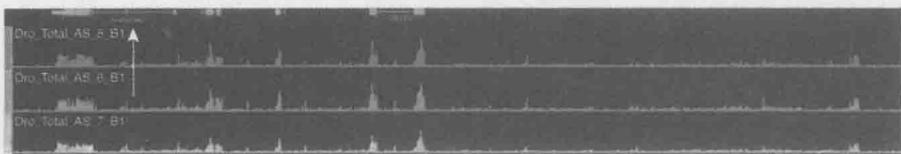  
图 7-23 全基因组覆瓦式芯片揭示基因中外显子-内含子结构。果蝇 3 号染色体上一个长 50kb 的区段，含 4 个基因。图上部所示为各个转录本的外显子和内含子的结构。白色箭头所指为一很大的内含子区，可能含有一个小外显子（micro-exon）。总 RNA 取自不同发育阶段的胚胎（红色，最幼嫩；绿色，老些；蓝色，更老些），与全基因组覆瓦式芯片杂交。此芯片由基因组序列上每 35bp 设计一个的 25bp 的寡核苷酸组成。杂交信号的强和弱对应于外显子和内含子。三种颜色呈现相似的信号强度表示在不同的胚胎发育时期该基因的表达的水平接近。（经许可引自 Manaketal.2006. Nat. Genet.38：1151-1158，Fig.5. Macmillan.）

全基因组覆瓦式芯片的另外一个优点是能用于检测非编码基因，如 miRNA 基因。miRNA 是由一些大片段的 RNA 前体（pri-RNA）加工而来。其转录单元长度为 1～10kb（见第 20 章）。通过与覆瓦式芯片杂交可以很容易地把 pri-RNA 检测出来。在某些情况下，miRNA 基因也含有内含子，只有在内含子被剪切后，该基因才能生成成熟的 miRNA。此外还有一些其他的非编码转录物也可被检测，其中包括蛋白质编码基因的内含子中的“反义”RNA（antisense RNA）。这些 RNA 可能在调控蛋白质编码基因的表达和功能方面发挥作用。

用覆瓦式芯片得到了一些令人震惊的结果：在一个典型的基因组中，大约有1/3的序列是转录的，尽管只有其中一小部分是蛋白质编码序列（人类的蛋白质编码序列只占基因组的5%）。这说明大多数转录物来自基因组中大量的内含子DNA序列。许多基因在离基因编码序列很远处（1Mb或更远）有5'端的非编码外显子。这些序列，有时候能相隔100万个碱基。在某些情况下，这些内含子区域能够产生miRNA和一些其他类型的非编码RNA。3'端非翻译区的延伸是非编码转录的另一来源。

## 专门的比对工具可用来鉴定 DNA 调控序列

基因组技术在鉴别基因和分析转录单元的结构方面十分有效。基因鉴定后，生物信息学方法能够预测该基因编码蛋白质的可能功能和结构，例如，是否含有已知的结构域（domain）或基序（motif），或者是否与已知蛋白质具有相似的特性。在这些方法中，基本局部比对搜索工具（Basic Local Alignment Search Tool，BLAST）提供了对蛋白质或者核苷酸序列搜索、比较和比对的一种强大的方法。通过 BLAST 搜索，一段外显子序列可以被快速地同庞大的蛋白质编码数据库进行比对。如果能与一个已知功能的蛋白质编码序列比对上，如 DNA 结合蛋白质、复制因子或细胞膜受体等，就可以了解该基因的可能活性和蛋白质产物。此外，简单的 BLAST 搜索还能识别产生 miRNA 的非编码转录物（见第 20 章）。

第 19 章我们将了解到，在基因编码序列之外还存在着许多 DNA 调控序列，这些序列调控着相关基因在机体内何时何处表达或关闭，对于这些序列的识别和分析更具挑战性。的确如此，有人将这些序列称为基因组中的“暗物质”（dark matter）。如今，只有全基因组学的方法能够鉴定这一类重要的 DNA 序列信息。

BLAST 搜索是为识别蛋白质编码序列而建立的，稍作改动也可用于鉴定脊椎动物的部分调控序列。细胞特异性增强子含有一个或多个序列特异性 DNA 结合蛋白质的位点簇（见第 19 章）。在某些情况下，这些短 DNA 序列位点簇可以通过比对被鉴定。计算机程序 VISTA 能以 10～20bp 的窗口对不同基因组进行比对，因此可以鉴定长度仅有 50～75bp 的不完全保守的非编码序列（图 7-24）。河豚鱼和小鼠具有 1 万个相似的非编码短序列，据信其中很多对应于组织特异性增强子。然而，这两种动物，尤其是小鼠，很可能有 10 万个增强子。由此而知，这些简单的序列比对方法并不能完全识别数量庞大的调控序列。

  
图 7-24 不同物种中 SoxB2 基因的比较。淡紫色的信号对应的是 SoxB2 转录单元 3' 非翻译区的保守序列。粉红色的信号表示的是该基因下游的保守序列。虚线组成的矩形框表示的是调节神经系统中基因表达的增强子序列。（经授权，引用自 Royo J.L. et al. 2011. Proc. Natl. Acad. Sci. 108: 14186-14191, Fig. 1A, p. 14187）

组织特异性增强子还可以通过扫描基因组中的已知调控蛋白质的潜在结合位点来鉴定。例如，编码细胞黏附分子 $\alpha$ -环素（ $\alpha$ -catenin）的基因在许多不同的组织中都有表达，但在心脏前体细胞（心肌细胞）中的表达尤高。因此，就有可能通过对 $\alpha$ -环素基因的两侧和内含子序列的比对分析，寻找已知心脏调控蛋白质（如 MEF2C、GATA-4 和 E47/HAND）的结合位点，从而鉴定可能存在的心脏特异性增强子（图 7-25）。每一个调控蛋白都能识别一些长 6～10 bp 的 DNA 基序。这些结合位点可以用位权矩阵（position-weighted matrix, PWM）来描述，能够用不同的计算机和实验的方法，如 SELEX 来决定（详见本章后文）。应用 PWM 搜索 $\alpha$ -环素基因的位点，就鉴定到一个 MEF2C、GATA-4 和 E47/HAND 的结合位点簇。用实验方法也验证了这些结合位点簇位于基因的 5' 外侧，真正具有增强子的功能。

  
图 7-25 心脏特异性增强子的 in silico 鉴定。小鼠、大鼠和人类基因组 α 环素蛋白质基因 5'侧翼区域的一段长约 140bp 的序列具有很高的保守性。该保守序列含有三个关键的心脏分化调控蛋白质（E47/HAND、MEF2C 和 GATA）结合位点。在小鼠中已证明该序列是一个真正的心脏特异性增强子。理论上说，该序列可以通过 VISTA 比对（第 20 章，见图 20-4）或者心脏调控蛋白质聚类分析而被鉴定。（经许可，复制自 Vanpoucke G.，et al. 2004. Nucleic Acids Res. 32：4155-4165，图 1 局部）

## 基因组编辑可精确改变复杂基因组

之前介绍的基因组组装和注释方法，都是描述性的。它们能提供详细的全基因组图谱，但没有提供分子生物学家所渴望的功能信息。然而，最近发展起来的方法——基因组编辑——可对完整基因组中特定的 DNA 片段进行删除和修饰。该方法包括在特定的 DNA 序列处诱导双链断裂（double strand break, DSB），这会刺激同源重组依据外加的、经过修饰的 DNA 对断点进行修复。在断点修复过程中，想要的变化可以被特异地引入，从而对基因组序列进行修饰。目标切割可以通过定制化的核酸酶，一般是锌指核酸酶和“巨核酸酶”实现，它们可以切割基因组中特定的目标位点。然而，一种新型的核酸酶——转录激活因子类似效应核酸酶（transcriptional activator-like effector nuclease, TALEN）——展现出了更高的效率。TALEN 是新兴的、可作为不同模式生物及人类干细胞的目标基因组编辑工具。

## 蛋白质

## 从细胞抽提物中纯化特定蛋白质

特定蛋白质的纯化对于研究它们的功能来说是至关重要的。尽管有时候也能在复杂混合物中研究一个蛋白质的功能，但这些研究可能导致结果难以解释。例如，如果你在天然蛋白质混合物（如细胞裂解物）中研究某一特定 DNA 聚合酶的活性，其他 DNA 聚合酶和辅助蛋白可能会对观察结果有干扰。基于这个原因，蛋白质的纯化对研究它们的功能来说是至关重要的。

每个蛋白质都有其独特的特性，所以每个蛋白质的纯化方法都有或多或少的区别。这一点与 DNA 的纯化不同，所有的 DNA 有相同的螺旋状结构，只是它们的序列有所区别。蛋白质的纯化往往利用其独特的特性，包括大小、电荷、形状等，甚至常常基于功能。

## 蛋白质纯化需要特定的方法

纯化一种蛋白质，需要有该蛋白质特异的分析方法。DNA 的纯化几乎总是用同一种方法，即与它的互补序列杂交。我们将在“免疫印迹”一章中了解到，抗体可通过相同的方式检测蛋白质。在很多情况下，使用一种更直接的检测蛋白质功能的方法更为方便。例如，对于某一特定的 DNA 结合蛋白质来说，可以通过检测它与相应 DNA 的相互作用对它进行分析（如在本章末尾“核酸蛋白相互作用”部分描述的 EMSA 检测）。同样，在分析 DNA 或 RNA 聚合酶时，可以在粗提物中添加相应的模板和放射性标记的核苷酸前体物质（标记方法与前述 DNA 的标记类似）。这种类型的分析称为掺入检测（incorporation assay）。如我们在第 9 章框 9-1 所讨论的，掺入检测在监测许多酶的纯化及功能分析中十分有用，包括催化合成大分子聚合物，如 DNA、RNA 或蛋白质聚合酶等。

## 制备含有活性蛋白质的细胞抽提物

几乎所有蛋白质纯化的起始物质都是细胞抽提物。不像 DNA 能抵抗温度的变化，蛋白质一旦从细胞中释放，轻微的温度波动就能使它们变性。由于这个原因，大多数抽提物的制备和蛋白质的纯化都是在 $4^{\circ}$ C 下进行的。细胞抽提物可以用很多不同的方法来制备。可以用去污剂、机械剪切力、低渗盐离子处理（使细胞吸收水分而胀破）或压力的迅速改变来裂解细胞。这些方法总的目标都是弱化和裂解细胞膜，使蛋白质得以释放。有时，在应用剪切力（通常使用咖啡研磨器或搅拌器，就像厨房中使用的那种）之前，要先在极低温度下将细胞冷冻。

## 柱层析法可以将蛋白质分离

最常用的蛋白质纯化方法是柱层析法（column chromatography）。在这种方法中，蛋白质流经充填着适当修饰的聚丙烯酰胺或琼脂糖凝胶小珠子的玻璃柱而分离。用层析柱分离蛋白质有很多方式，每种分离技术根据的是蛋白质的不同特性。这里我们描述3种基本方法，前两种方法分别根据蛋白质的电荷或大小对它们进行分离。图7-26对这些方法做了概括。

  
图 7-26 离子交换层析和凝胶过滤层析。如文中所述，这两种常用的层析法分别根据蛋白质的电荷或大小对它们进行分离。在这些方法中，玻璃管中充填了珠子，蛋白质混合物就流经这一基质。珠子的特性是蛋白质分离的基础。（a）离子交换柱层析。本例中，离子交换层析柱的珠子带负电荷，因此带正电荷的蛋白质能与它们结合而滞留于柱子上，而带负电荷的蛋白质流出柱子，提高珠子周围缓冲液的盐浓度，通过盐离子与蛋白质竞争珠子上的负电荷而将与珠子结合的蛋白质洗脱；（b）凝胶过滤柱层析。凝胶过滤珠子含有液相空隙，由于小蛋白质能进入这些孔隙而延缓了流经柱子的过程，大蛋白质不能进入珠子而直接流出柱子。

离子交换层析 这种技术根据蛋白质的表面离子电荷的不同，采用经带正电荷或负电荷化学基团修饰的珠子对蛋白质进行分离。在低盐缓冲液中，和珠子相互作用较弱的蛋白质（例如，微带正电荷的蛋白质与带负电荷的珠子的结合）能被洗脱。如果蛋白质和珠子相互作用较强，洗脱时就需要更高的盐离子浓度。不管在哪种情况下，盐离子都能封闭带电区域而使蛋白质从珠子上洗脱下来。由于每个蛋白质表面具有不同的电荷量，它们将在对应的特定盐离子浓度下依次从层析柱上洗脱下来。逐渐增加洗脱缓冲液中的盐离子浓度，可以将带有相似电荷的蛋白质分离成不同组分。

凝胶过滤层析 这种技术根据蛋白质的大小和形状来分离它们。这种层析中所用的珠子没有带电荷基团，但是含有不同大小的孔径（与聚丙烯酰胺或琼脂糖凝胶中使 DNA 分子通过的微孔相似）。小蛋白质能进入所有孔径，流经柱子的距离长，洗脱时间也长（换句话说它们需要走更远的路程）；大蛋白质流经柱子的距离短，洗脱速度快。

在不同的盐离子浓度或洗脱时间下收集每种柱子的层析组分，并分析其中的目的蛋白质。收集活性最高的组分，然后做进一步的纯化。

将蛋白质混合物通过多种不同的层析柱，它们的纯度将逐渐提高。虽然采用一种层析柱重复分离含有目的蛋白（由该蛋白质的特异分析法测定）的组分很少能完全纯化那种蛋白质，但是一系列的层析步骤可以获得含有多个分子而极少含有其他蛋白质分子的特定蛋白质组分。例如，尽管有很多蛋白质能被高盐离子溶液从带正电荷的柱子中洗脱下来（这些蛋白质带有高负电荷），或从凝胶过滤柱中缓慢洗脱（这些蛋白质分子相对较小），但同时满足这两种要求的蛋白质就为数不多了。

亲和层析 该方法能使蛋白质纯化更加快速。人们通常根据某一蛋白质的特性来更加快速地纯化这种蛋白质。例如，如果知道某一蛋白质通过和 ATP 结合而起作用，就可以使用含有 ATP 结合珠子的层析柱。由于只有与 ATP 结合的蛋白质能与层析柱结合，大多数蛋白质不能结合 ATP 而直接流出柱子。通过逐步提高 ATP 溶液的浓度，ATP 结合蛋白可进一步依据其与 ATP 亲和力的大小而被分离（所需 ATP 浓度越高，亲和力越大）。这种纯化方法就叫做亲和层析（affinity chromatography）。层析柱上也可以结合其他试剂来快速纯化各种蛋白质。例如，用结合特定 DNA 序列的层析柱来纯化 DNA 结合蛋白质，或采用能与目的蛋白相互作用的特定蛋白质制备的层析柱来纯化目的蛋白。因此在开始纯化之前，有必要考虑靶蛋白的已知信息并尽量利用这些信息。

免疫亲和层析（immunoaffinity chromatography）是最常见的一种蛋白质亲和层析方法。在这一方法中，珠子上结合了一种靶蛋白的特异性抗体。理想的抗体只与靶蛋白相互结合，其他蛋白质都流出柱子。结合于层析柱的蛋白质可以用盐、pH梯度溶液或在某种情况下用温和的去污剂洗脱下来。这一方法的主要困难在于抗体经常与靶蛋白结合如此紧密以致于只有将蛋白质变性才能将它洗脱下来。由于蛋白质变性通常是不可逆的，以这种方式得到的蛋白质可能没有活性，因此不是很有用。

为了便于蛋白质的纯化，可以对它们做一些修饰。通常包括在靶蛋白的起始（N端）或末端（C端）添加氨基酸短序列，这些添加序列或“标签”可以用前文描述的分子克隆方法产生。肽段标签能赋予修饰蛋白质一些已知特性，从而有利于它们的纯化。例如，在蛋白质的起始端或末端添加6个组氨酸能使它们与带有 $Ni^{2+}$ 离子的层析柱紧密结合，这一特性在一般蛋白质中并不常见。另外，在蛋白质上可以添加特定表位（epitope，可被抗体识别的7\~10个氨基酸序列），使用免疫亲和层析通过识别表位的特异性抗体可以纯化被修饰蛋白质。重要的是，这些抗体和表位的选择要使它们在一种条件下能高亲和性（如 $Ca^{2+}$ 存在的情况下）地与层析柱结合，而在另一种条件下（如没有 $Ca^{2+}$ ）则容易被洗脱。这样就避免了采用会导致蛋白质变性的洗脱条件。

免疫亲和层析还能用来从粗提物中快速沉淀某一特定蛋白质（以及任一与它紧密结合的蛋白质）。在这种情况下，通过将抗体结合于柱层析中使用的珠子而得到沉淀。由于这些珠子比较大，它们快速地与抗体以及结合于抗体的其他蛋白质沉到试管底部。这个过程叫做免疫沉淀（immunoprecipitation），用于从粗提物中快速纯化蛋白质或蛋白质复合物。虽然免疫沉淀所得到的蛋白质还不完全纯，但这个方法能测定哪些蛋白质或其他分子（如 DNA，见本章后面的染色质免疫沉淀）与靶蛋白结合在一起。

## 用聚丙烯酰胺凝胶分离蛋白质

蛋白质既没有均一的负电荷，也没有均一的二级结构。它们由20种不同的氨基酸

组成，有的氨基酸不带电荷，有的带正电荷，还有的带负电荷（第6章，图6-2）。如我们在第6章中所讨论的，蛋白质有大量的二级、三级结构，通常以多价复合物的形式存在（四级结构）。然而，如果用强离子去污剂十二烷基硫酸钠（sodium dodecylsulphate, SDS）和还原剂（如巯基乙醇）处理蛋白质，蛋白质的二级、三级和四级结构通常能被消

  
图 7-27 SDS 凝胶电泳。图示表明一个含有三种不同大小蛋白质的混合物（通常需分析的是更复杂的蛋白质混合物），加入 SDS（用红色标记）和 β-巯基乙醇变性后，每一个蛋白质都带有均一的负电荷，从而可以按分子质量大小对蛋白质进行电泳分离。

除。蛋白质一旦被 SDS 包被，就表现为一个无结构的多聚物。SDS 离子包被蛋白质的多肽链，使它携带均一的负电荷。巯基乙醇还原二硫键，破坏半胱氨酸残基间形成的分子内或分子间二硫键。在这些情况下，蛋白质的电泳迁移率取决于其多肽链的长度，电泳就可以像分离 DNA 和 RNA 混合物一样来分离蛋白质混合物（图 7-27）。电泳后，可以利用与蛋白质非特异结合的染色剂，如考马斯亮蓝（Coomassie Brilliant Blue）使蛋白质显色。如果不用 SDS 处理，电泳分离蛋白质不是根据蛋白质的分子质量，而是净电荷和等电点等特性（见后续讨论）。

## 抗体使电泳分离的蛋白质可视化

蛋白质虽然和 DNA、RNA 很不相同，但一种分离蛋白质的方法——免疫印迹（immunoblotting）的原理却和 Southern、Northern 印迹杂交相似，它能在数千种蛋白质中检测并分离某种蛋白质（图 7-28）。事实上，免疫印迹也因为仿效之前的名称而称为 Western 印迹。在免疫印迹中，通过电泳分开的蛋白质被转移到非特异性结合的滤膜上。就像 Southern 印迹一样，蛋白质被转移到膜上，蛋白质在膜上的位置与它在凝胶上的位置一样。就像我们讨论过的其他印迹方法一样，一旦蛋白质结合到膜上，所有的非特异性的结合位点需要通过使用与待检测蛋白质不相关的蛋白质溶液进行封闭（通常选择奶粉来封闭，因为它含有很多白蛋白）。接着把滤膜与特异性识别目标蛋白质的抗体进行孵育，抗体只能和滤膜上的目的蛋白质结合。最后，抗体中人为加入的显色酶（或者加入能够与一抗结合的二抗）使膜结合的抗体显影。Southern、Northern 和免疫印迹的一个共同特点是利用选择性试剂（selective reagent）使复杂混合物中的特定分子可视化。

滤纸  
  
图 7-28 免疫印迹。蛋白质经电泳分离后，把凝胶上的蛋白质相应地转移到滤纸上（同样靠电场作用）。封闭非特异结合位点，在滤纸上加入针对目标蛋白质的抗体。抗体结合的位置通过加入与底物作用产生荧光的酶来检测。

## 蛋白质分子可以被直接测序

蛋白质也可以被测序，即肽链中的氨基酸线性排列顺序可以被直接测定，尽管这种测序要比 DNA 测序复杂得多。两种常见的蛋白质测序法为自动氨基酸测序仪的 Edman 降解法和串联质谱法。测序对于鉴定蛋白质是十分有用的。而且，由于我们已得到大量完整或近乎完整的基因组序列，只要测得哪怕一小段蛋白质的序列，就可以通过寻找匹配的蛋白质编码序列来鉴定其编码基因。

Edman 降解法（Edman degradation） Edman 降解是化学反应，反应中多肽链的 N 端逐个释放氨基酸残基（图 7-29）。这种方法的关键点是一种称为苯异硫氰酸酯（phenylisothiocyanate，PITC）的化学试剂能特异地修饰肽链的 N 端氨基酸的游离 α-氨基基团。用酸处理后，这一被修饰的末端氨基酸能从多肽中切离，在这个过程中要控制反应条件不使其他氨基酸受破坏。通过分析高效液相色谱（HPLC）的洗脱峰可以鉴定末端氨基酸衍生物的性质（每种氨基酸都有一个特征性的滞留时间）。每一次肽链裂解都能产生一个带有游离 α-氨基基团的正常 N 端。因此，Edman 降解可以重复很多个循环，从而揭示蛋白质 N 端区段的序列。实际应用中，蛋白质的鉴定通常要进行 8～15 轮 Edman 降解。这些数量的循环通常足以特异性地鉴定一种蛋白质。

  
图 7-29 用 Edman 降解法进行蛋白质测序。N 端残基可以被标记，并在不水解肽链的其余氨基酸的前提下切去这个被标记的残基。因此，每一轮反应能鉴定多肽序列中的一个残基，而这个残基是紧邻上一个残基的。

自动 Edman 降解的 N 端测序已被广泛使用。然而，如果蛋白质的 N 端已被化学修饰（如被甲酰化或乙酰化），测序就比较困难。这种化学修饰所导致的封闭可能在体内发生，也可能在蛋白质分离过程中产生。当蛋白质的 N 端被封闭时，通常用蛋白水解酶消化，暴露出蛋白质的内部序列再进行测序。

串联质谱法 串联质谱法（tandem mass spectrometry，MS/MS）也能用来进行蛋白质的测序，而且是当今最常用的方法。它能非常准确地测定微量样品的质量。其基本原理是物质在（真空）仪器中的行进与它的荷质比密切相关。对于小的生物大分子如肽段和小蛋白质来说，所测得的分子质量能精确到一个道尔顿。

用MS/MS进行蛋白质测序前，通常要用特异性蛋白水解酶，如胰蛋白酶，将目的蛋白消化成小肽段（一般小于20个氨基酸）。质谱分析时，肽段混合物中的各个肽段由于荷质比不同，能相互区分开来。将如此分离到的单个肽段打碎成其组成肽段，对这些组成肽段进行测序（图7-30）。运用反卷积法（deconvolution）分析这些序列数据能清楚地反映原始肽段的序列。和Edman降解一样，只要得到某种蛋白质的约15个氨基酸长的肽段序列，就能通过比较实测氨基酸序列和经DNA序列预测到的氨基酸序列而鉴定这种蛋白质。与Edman降解法不同的是，串联质谱经常会鉴定到来自同一蛋白质的多个肽段。

MS/MS 使蛋白质测序和鉴定有了革命性的突破。它的特点是只需使用极其微量的样品，并能对复杂混合物中的各种蛋白质同时进行分析。

## 蛋白质组学

在全基因组水平测定全部基因的表达为细胞活性状态提供了一个定格照（snapshot）：但是这种方式还不足以检测其他重要的修饰调控状态。实际上，基因的转录水平所能提供的信息只能大致地反映编码蛋白质表达水平。如果 mRNA 寿命很短或者很少被翻译，那么即便是高度表达的 mRNA 也只能产生少量的蛋白质。另外，很多蛋白质是通过翻译后修饰的方式显著地影响自身的活性，转录谱所提供的数据则根本不具备反映这种调节状态的功能。

全基因组序列的获得及高通量的蛋白质分离、鉴定方法的研究引入了蛋白质组学领域。蛋白质组学的研究目标是鉴别特定条件下细胞或组织产生的所有蛋白质（也就是蛋白质组），包括全套蛋白质的相对丰度、修饰，以及与之相互作用的蛋白质。鉴于芯片技术已经使全基因组水平研究转录谱或 DNA 含量成为可能，蛋白质组学的研究方法则着眼于获得细胞内的所有蛋白质及其修饰（如磷酸化位点）的定格照。

液相色谱和质谱法结合从复杂提取物中鉴定单个蛋白质

联合使用液相色谱和质谱（在本章前面的段落中已作过介绍）对鉴定复杂体系（如细胞粗提物）中的所有蛋白质是一种有效的方法。理想情况下，可直接使用质谱技术分析出细胞提取物中的所有蛋白质，但实际上却很难做到，这是由于提取物中数目巨大的蛋白质产生的肽段超出可解析的能力。所以研究人员开发了有效的方法，在进行质谱分析之前，先通过两类液相色谱将肽段分离（LC-MS，图7-31）。在这一过程中，首先用序列特异性的蛋白酶对细胞粗提物进行消化（如胰蛋白酶，可在精氨酸或赖氨酸残基后切开）生成多肽链，再使用离子交换层析（肽段与带电柱料发生离子相互作用分离）和反相层析（肽段与柱料的疏水相互作用分离）将所得到的多肽进行分离。这一步骤使复杂的初始混合物简化为组分简单、容易区分和测序的二级混合物。接着对这些二级混合物进行串联质谱分析（MS/MS，前文已作讨论）鉴定多肽群中尽可能多的肽段。最后，在获得所研究生物完整基因组序列和质谱分析得到的多肽序列的情况下，用生物信息学手段将每个多肽与基因组中蛋白质编码序列（基因）关联起来。


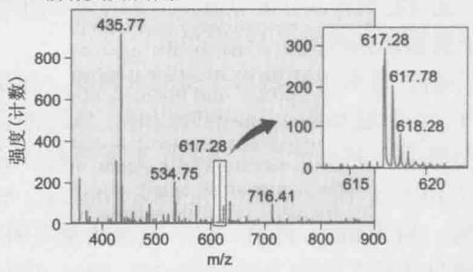

c 用于MS/MS序列确定的共同的多肽片段  


d 用预测和观察的谱峰产生一个用于鉴别的置信度  


  
图 7-30 液相色谱和 MS/MS 联用分析蛋白质混合物的组分。(a)肽段混合物用液相色谱分离后接质谱装置。(b)不同组分肽段从层析柱上洗脱,质谱仪对肽段进行分离,根据荷质比(m/z)将结果展示。选择相关肽段(相邻近的峰之间的不同是由于肽段上不同的原子同位素造成的)进行片段化并对所得的肽链片段用二级质谱进行分析。(c)片段化后产生的不同的断点的图示。可能产生的小片段多肽包括 b 肽(氨基末端片段)、y 肽(羧基末端片段)、 $a_{2}$ 肽(最短的氨基末端片段)。(d)将观察到的图谱与所有可能的理论图谱(根据来自生物的蛋白质序列)进行比对,由产生这些蛋白质的生物所编码的蛋白质的氨基酸序列生成理论图谱。一般来说,只有很少的一部分肽段可以精确鉴定。例如,异亮氨酸和亮氨酸的分子质量相同。然而,只要有 3 或 4 个准确鉴定的肽段,就足以进行蛋白质的鉴定。

在实际操作中，这种方法只能检测复杂体系中某个亚体系的蛋白质，如从细胞中分离得到的蛋白质。常规分析一般能检测到大约1000个不同的蛋白质。然而，更多的组分分离方法以及质谱仪灵敏度的提高，会进一步提高蛋白质组分析的完整性。对鉴别细胞中蛋白质的有无来说，LC-MS分析非常有效，但目前用此方法确定蛋白质的相对丰度还是比较困难的。为了解决这个问题，人们正在研发定量技术并已经有所应用。

## 通过蛋白质组学比较鉴定细胞间的差异

虽然鉴定出细胞中的全部蛋白质具有深远的意义，但在多数情况下，了解两个不同类型细胞、或者同一类型细胞在不同生长条件下的蛋白质表达差异，更有实际价值。通过确定特定生理状态下的蛋白质组，就能够找到蛋白质表达水平的差异，进而确定那些可能造成细胞差异的蛋白质，为进一步的研究提供有价值的候选蛋白质。

  
图 7-31 液相色谱分离后进行质谱分析来分离蛋白质。这种方法的步骤如图所示，并在文中有详细记述。

下面以对不同癌细胞的分析为例，说明比较蛋白质组学的价值。人们经常发现，虽然不同患者有同一种癌症的生理特征，但对同一种化疗药物却表现出不同的反应。通过比较不同肿瘤样本在蛋白质组水平的差异，发现表型相似的细胞表达的蛋白质存在很大差异。这些差异蛋白质在肿瘤分型中可以作为有价值的标记物。更重要的是，这些标记物还可以为患者筛选有效的化学治疗方法提供依据。

## 质谱也可以检测蛋白质的修饰状态

鉴于蛋白质的修饰可以广泛影响其功能，研究人员也发展了多种鉴别细胞中蛋白质修饰的手段。特异的修饰通常会改变蛋白质的活性或稳定性，如蛋白质的磷酸化经常被用于调控其活性。磷酸化会引起蛋白质构象的变化，进而影响功能（如许多蛋白激酶只有在磷酸化状态下才具有生物学活性）。或者，增加磷酸基团也会使蛋白质产生新的结合位点，导致新的蛋白复合体的形成。其他的蛋白质修饰还包括甲基化、乙酰化和泛素化等。泛素化是在蛋白质的赖氨酸残基上通过类肽键连接一个包含76个氨基酸残基的泛素。一个蛋白质被多个泛素所修饰，将触发蛋白质的降解。

每一种修饰都会使蛋白质的分子质量发生不同的变化。这种变化可以用质谱检测，并已经发展出检测细胞中只带有某种特定修饰的蛋白质组的方法。例如，细胞内所有的磷酸化蛋白质称为“磷酸化蛋白质组”。已经建立了一些鉴定蛋白质亚群的方法，它们一般采用能和发生特定修饰的蛋白质相结合的亲和树脂。例如，含有固定化三价铁离子（ $\mathrm{Fe}^{3+}$ ）的树脂[也称固定化金属亲和层析（IMAC）]可以特异性结合磷酸化肽段，细胞粗提物中的肽段混合物可以与它共同孵育，使磷酸化肽段富集。得到的肽段就可以借助LC-MS方法进行蛋白质磷酸化和磷酸化位点的分析。所获得的信息对了解修饰蛋白质的激酶和制备不能被修饰的激酶突变体以检测修饰的重要性是非常重要的。

## 蛋白质-蛋白质相互作用可以产生蛋白质功能相关的信息

蛋白质组学也包括细胞中蛋白质的相互作用，即所称的互作组（interactome）。一个细胞中完整的互作组应该反映细胞中所有的蛋白质相互作用。在整个互作组中，一般认为主要是蛋白质之间的关联在起作用。通过关联性进行推断（guilt by association），可以了解蛋白质在哪些细胞过程中起作用。同一个蛋白复合体中的蛋白质几乎总是在同一种细胞过程中出现。

酵母双杂交实验是一种鉴定蛋白质相互作用的方法之一（见第19章框19-1），这项技术把感兴趣的蛋白质作为“诱饵”，而在待检测的蛋白质库中可能存在被捕捉的“猎物”。另一种方法是，用亲和树脂或免疫共沉淀对目的蛋白及相关蛋白质进行快速纯化。可以通过LS-MS方法在得到的蛋白质混合物中鉴定相关蛋白质。对一个细胞的所有蛋白质重复进行这样的鉴定，就会得到这个细胞中蛋白质之间的互作图。

第二种方法已经在酿酒酵母中得到了应用。通过亲和层析已经纯化了 6000 多个酵母蛋白质（每一个蛋白质对应的基因都进行了遗传改造，或者将一个标签融合在 C 端，该标签可以和两种亲和树脂结合），用质谱鉴定与标签蛋白质共同纯化的结合蛋白质。

通过对这些数据的分析，鉴定了数百个酵母蛋白复合体，虽然这些复合体有许多是已知的，但也有一些是新发现的。因为获得了大量已知的蛋白质复合体（如 RNA 聚合酶Ⅱ）可以看出这种方法的有效性（图 7-32）。

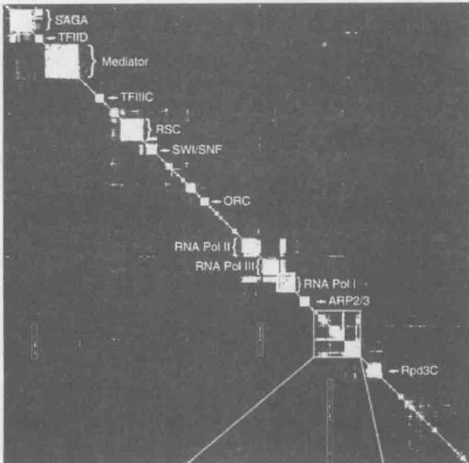  
图 7-32 酿酒酵母的物理互作图。图中所示为利用亲和纯化/质谱鉴定酿酒酵母中所有蛋白质后得到的分析结果。全图由一系列的框图构成，这些框图标出了能和给定蛋白质共沉淀的蛋白质。如果一个蛋白质可以和所标记蛋白质共沉淀，用黄色框标记；如果不能发生共沉淀，就用黑色框标记。此图中，同一个蛋白复合体中的蛋白质会在纵轴和横轴上表现出成簇聚类现象；因此复合体都出现在对角线上。在这幅图中，只有部分蛋白质复合体（很多复合体在本书的其他部分已做讨论）被展示出来。（经许可影印自 Collins S. R. et al., 2007. Mol. Cell. Protem.6: 439-450, Fig.3b©American Society for Biochemistry and Molecular Biology.）

## 核酸-蛋白质相互作用

下面我们把关注的重点放到核酸和蛋白质相互作用的各种研究方法上。它们之间的相互作用对决定本书所描述的许多事件的特异性和精确性来说都是至关重要的。在转录、重组、DNA复制、DNA修复、mRNA剪切或翻译中，介导这些事件的蛋白质必须识别核酸结构或者序列，才能确保生命活动在细胞的特定时空发生。

基于核酸-蛋白质相互作用的重要性，研究人员开发了多种有效的、用于体内和体外检测相互作用的的方法。在接下来的部分，我们将介绍几种方法，并探讨它们的优势和不足。

## 蛋白质与 DNA 的结合会改变其电泳迁移率

正如电泳迁移率可以确定 DNA、RNA 或蛋白质的相对大小，它也可以用于检测蛋白质-DNA 之间的相互作用。如果一个 DNA 分子结合了蛋白质，同未结合蛋白质的 DNA

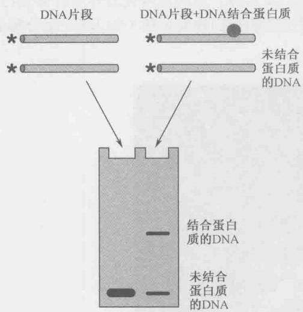  
图 7-33 电泳迁移分析。迁移分析的基本原理见示意图。蛋白质与放射性标记的 DNA 探针混合，DNA 探针具有该蛋白质的结合位点。聚丙烯酰胺凝胶电泳分离混合物，再通过放射自显影显色。没有结合蛋白质的 DNA 在凝胶上呈现一条带，与 DNA 片段的大小对应（左边泳道）。混合物中，由于只有一部分 DNA 分子（不是所有的都与蛋白质结合）结合蛋白质，所以右边泳道出现两条带，一条对应未结合蛋白质的分子，另一条对应与蛋白质结合的分子。

相比，DNA-蛋白质复合体在凝胶中的迁移速率变慢。这就是检测 DNA 结合特性的理论基础。一般的实验流程为：对含有结合位点的短的双链 DNA（dsDNA）片段进行放射性标记，这样就可以通过聚丙烯酰胺凝胶电泳和放射自显影检测到微量的样品。也可以使用荧光标记，但是需注意荧光染料的位置不能干扰 DNA 结合（参见第 9 章框 9-1 图 1b）。接下来，标记的 DNA 探针与待测蛋白质混合，使用非变性凝胶电泳分离。如果 DNA 探针和蛋白质发生结合，则蛋白质-DNA 复合体的迁移速度就比较慢，标记 DNA 在凝胶上的位置会发生变化（图 7-33）。这就是电泳迁移改变检测（electrophoretic mobility-shift assay，EMSA），或者简称为条带或凝胶迁移检测。我们虽然只介绍了用 EMSA 检测蛋白质和双链 DNA 的相互作用，EMSA 也可以用于检测蛋白质与

## 单链 DNA（ssDNA）或者 RNA 的结合。

EMSA 也可以检测多个蛋白质和同一个 DNA 的结合。这些相互作用可能都是序列特异的 DNA 结合所依赖的。或者是，在一个 DNA 序列特异的结合发生后，另一个蛋白质同第一个 DNA 结合蛋白质结合。不管在什么情况下，只要有新的蛋白质结合上去，DNA 的凝胶迁移率都会进一步降低。EMSA 是一种有力的工具，它可以鉴定一系列蛋白质是如何独立地与同一个 DNA 相互作用的。蛋白质分子质量不同，影响 DNA 迁移率的效果也不同（蛋白质分子质量越大，迁移速率越慢），所以不同蛋白质结合同一种 DNA 分子也是可以区分的。如果不同的蛋白质的结合产生了相同的迁移，我们可以采用另外的方法确定到底是哪一个蛋白质发生了结合。当某蛋白质与 DNA 结合时，加入该蛋白质特异的抗体可引起更加明显的迁移作用。因此，通过加入可能与 DNA 结合的蛋白质抗体，可鉴定该蛋白质是否存在于 DNA-蛋白复合体中。

EMSA 的缺点在于无法确定 DNA 片段中与蛋白质特定结合的具体序列。有两种办法可以解决这个问题。第一种方法是在结合探针 DNA 之前，用一些短的双链 DNA 寡聚物与蛋白质共同孵育，如果寡聚物中存在待测蛋白质的结合位点，那么孵育后，蛋白质就不会与探针 DNA 结合。另一种方法是定点突变探针 DNA 序列，从而推测出它对蛋白质结合的影响。这些方法可以在蛋白质结合位点未知的情况下进行，在多数情况下，预实验或探针中 DNA 序列的保守性分析有助于简化要分析的待测序列。

蛋白质的结合可以保护 DNA 不被核酸酶降解或化学修饰

如何更加快捷地确定 DNA 序列中的蛋白质结合位点？已经有一系列的手段可用来确定结合位点，以及确定蛋白质相关联的化学修饰位点（甲基化、氨基化或者磷酸化）。这些方法的基本原理如下：如果在 DNA 分子一条单链的末端标记同位素分子，那么单链上从任何位置断开，都会使被标记片段分子质量发生不同程度的减小。通过高分辨率变性聚丙烯酰胺凝胶电泳（与 DNA 测序分析的胶类似）检测标记单链 DNA 片段可确定这些片段的大小。因为如下将叙述的理由，这种方法被称作 DNA 足迹法（DNA footprinting）。

核酸酶保护足迹法（nuclease protection footprinting）是最常用的方法。将蛋白质与末端标记的 DNA 共同孵育后，产物直接与 DNA 酶反应（常用 DNase I，它可以切割双链 DNA 中的一条链）。由于结合蛋白质的保护，DNA 序列上部分酶切位点不能被切开（图 7-34），所得的“足迹”显现的就是一些特定大小的 DNA 条带的缺失，对应的是蛋白质结合的区域。与此相关的化学保护足迹法（chemical protection footprinting）则是基于结合的蛋白质可以保护结合位点处的碱基，使之不受碱基特异的化学试剂的影响，这些试剂（在进一步反应后）能导致核酸骨架的

  
图 7-34 核酸酶保护足迹法。“\*”号表示放射性标记的 DNA 片段末端，箭头表示 DNase 酶切位点，红圈表示 Lac 抑制因子结合在操纵子上。左侧，DNase 随机切割 DNA 后，通过电泳按大小分离。右侧，DNA 分子先结合抑制因子，再用 DNase 处理。“足迹”标记在右侧，这些条带对应的是 DNase 降解后游离的 DNA，而非结合了抑制因子的 DNA。在后一种情况下，DNA 上的切割位点在操纵子序列中，被抑制因子所覆盖，使 DNase 不能发挥作用。

断裂。在两种方法中，重要的是要保持核酸酶切割位点或者化学修饰位点数目应为每个DNA探针一个。这是因为只有那些距离标记DNA末端最近的酶切位点可以被凝胶电泳和标记DNA检测到。

改变足迹法实验的前两步的顺序，就成为第三种方法——化学干扰足迹法（chemical interference footprinting）。这种方法可以确定什么样的 DNA 结构对蛋白质结合是必要的。在与蛋白质孵育之前，先对 DNA 分子进行一次化学改造。改造后的 DNA 分子与 DNA 结合蛋白质孵育，然后分离 DNA-蛋白质复合体。从总 DNA 中将结合了蛋白质的

DNA 片段分离最常用的方法是 EMSA。在 EMSA 凝胶中检测标记 DNA，很容易区分迁移发生变化（结合）和没有发生变化（未结合）的 DNA。如果某一个位点的修饰不能阻止蛋白质的结合，那么从复合体中分离得到的 DNA 就带有那样的修饰。反之，如果修饰阻止了蛋白质识别 DNA，在蛋白质结合样品中就不会找到在那个位点被修饰的 DNA。就像化学保护分析方法一样，也可以用试剂切开 DNA 的化学修饰位点来确定化学修饰位点。

化学修饰试剂可以非常特异地标示 DNA 的某一特性。例如，化学试剂乙基亚硝基尿（ethylnitrosourea，ENU）可以特异地修饰 DNA 骨架上的磷酸基团。有些其他试剂可以修饰 DNA 大沟或小沟上特定的碱基。通过使用不同化学试剂，可以精确了解蛋白质与 DNA 核糖磷酸骨架上特定碱基或者磷酸基的相互作用。

足迹法是一种快速鉴定 DNA 序列中蛋白质结合位点的有效方法；但是，该方法在分析中依赖于蛋白质与 DNA 的强力结合。一般来说，为确保 DNA 足迹法的有效性，必须有超过 90% 的 DNA 探针与蛋白质结合。之所以需要高水平的结合，是因为足迹法检测的是信号缺失（因为 DNA 的酶切保护和修饰作用），而不是检测新条带的产生。这与 EMSA 是不同的，EMSA 的是高灵敏度，在 EMSA 分析中，蛋白质与标记 DNA 的结合会在凝胶中出现新的条带，如果没有结合，则没有新条带的出现。

## 染色质免疫沉淀检测细胞中和 DNA 结合的蛋白质

虽然体外蛋白质-DNA 相互作用分析可以提供许多重要信息，但确定蛋白质与特定 DNA 是否在活细胞中存在特定关联是更有意义的。对于特定的 DNA 结合蛋白，在整个基因组中会有许多潜在的结合位点。尽管如此，在很多情况下只有少数位点能与蛋白质结合。有时是因为与其他蛋白质的结合抑制了这个蛋白质与潜在 DNA 结合位点的关联。也有时稳定的结合还需要相邻蛋白质的帮助。不管在什么情况下，知道细胞中一个蛋白质（如转录调控因子；见第 19 章）是否与一个特定的 DNA 位点（如特定启动子区域）发生结合，都会为在这个位点发生调控事件（如转录激活）提供有力证据。

染色质免疫沉淀，即 ChIP，就是一种检测细胞中蛋白质-DNA 相互作用的手段。其过程大致如下：向活细胞中加入甲醛，使 DNA 与结合蛋白及其与之紧密结合的其他蛋白质发生交联，裂解细胞，用超声法将 DNA 断裂成 200～300bp 长的片段。用针对目标蛋白质（如转录调控因子）的特异抗体进行免疫沉淀反应（immunoprecipitation，IP），可从细胞裂解物中将与蛋白质结合的特定 DNA 片段分离出来。完成免疫沉淀以后，再解开 DNA 和蛋白质之间的交联，就可以对 IP 下来的 DNA 序列进行分析（图 7-35）。

ChIP 技术的关键环节在于确定特定 DNA 区域是否与蛋白质结合而出现在沉淀产物中。回答这个问题，可以通过以下两种方法之一。第一种方法是设计与结合区域匹配的引物进行 PCR 反应，以检验特定区域 DNA（如启动子）是否与目的蛋白质相结合。如果在交联过程中蛋白质与 DNA 相互结合，那么序列就会出现在沉淀中，可以通过 PCR 反应扩增检测。这种方法需要两个重要的对照。第一，设计针对其他 DNA 区域的 PCR 引物（该区域已知或者预计不能和目的蛋白质结合）。在这个对照反应中，应该不会出现 DNA 的扩增（图 7-35）。第二，进行沉淀之前，取少量总 DNA，用检测引物和对照引物对未分离的 DNA 样品扩增。如果两种引物具有相同的扩增效率，二个 PCR 的扩增效率也应该相同。

与DNA片段交联的蛋白质  
  
图 7-35 染色质免疫沉淀（ChIP）。

这个对照就保证了当用两组不同引物对 ChIP 处理后的 DNA 扩增时, 其差异是由于模板丰度的不同造成的, 而不是 PCR 反应的效率造成的。

第二种鉴定细胞内 DNA 与特定蛋白质结合的方法是覆瓦式 DNA 芯片技术。在这种方法中，将与蛋白质交联后的 DNA 及总 DNA 分离出来，分别用两种不同的荧光染料标记（此处我们分别将其称为红色和绿色）。然后把这两种 DNA 混合，与芯片杂交。那些杂交后出现较高红：绿比值的区域可以确定为蛋白质的结合区域，而低比值的区域就不是结合区域。这种方法对检测结合位点未知的序列尤其有效，而且能对全基因组同时进行检测。因为该方法对 DNA 样品的分析采用的是基于覆瓦式 DNA 芯片的 ChIP 技术，所以这种方法通常称为 ChIP-Chip。

虽然 ChIP-Chip 技术非常有效并被广泛应用，但还是应该对其在检测方面的局限性有所了解。首先，与 EMSA 相似，ChIP 的分辨率是有限的。ChIP 并不能确切了解与蛋白质相互作用的特定 DNA 片段，而只能是结合位点所在的 200～300bp 的序列。因此，ChIP 可以检测到调控蛋白在某个特定基因而不是其他基因的上游区域发生结合，但不能显示出在基因上游的具体什么位置与蛋白质结合。和 EMSA 一样，定点突变对确认蛋白质是否特异地结合于某一位点是必要的。其次，只有获得目标蛋白质的抗体，才可以用 ChIP 进行分析。进一步讲，只有当蛋白质与 DNA（或者与其他蛋白质共同作用于这个基因）发生交联后，蛋白质表位（抗体识别的特定蛋白质区域）仍然是暴露的，才能使用 ChIP 检测。更进一步讲，如果一个蛋白质在某一个环境或生理条件下不能被检测到，而在其他环境下能检测到，一种直接的解释就是该蛋白质只有在某种环境下才会与特定 DNA 区域结合。但实际上也可以有另外的解释，那就是这个蛋白质始终与 DNA 序列结合，但有其他蛋白质会掩盖其表位，而这个其他蛋白质只有在特定条件下才会存在。

全基因组技术正在迅速发展，上面所描述的 ChIP 技术也有了很多新的变化。例如，在一项称为 ChIP-Seq 的技术中，把从交联、碎裂后的染色质中得到的免疫沉淀 DNA 直接进行 DNA 测序，然后把 DNA 序列比对到相应的基因组上。如果某个基因组位点的序列被反复鉴定到，就支持该位点可以同蛋白质结合。ChIP-Seq 同 ChIP-ChIP 方法类似，但有时候会更简单，因为它不需要制作覆瓦式全基因组芯片。唯一要知道的是所研究生物或细胞的基因组序列以便对 DNA 结合位点进行定位。在第 19 章，我们会结合在增强子鉴定中的应用对该方法做更为详细的讨论。

## 染色体构象捕获检测用于分析远程相互作用

染色体可以折叠成多种三维形式，这些结构会影响基因组稳定性（第10章）、染色体分离（第8章）和基因调节及活性（第19章）。目前已经知道远距离相互作用可以发生在稀疏排列的基因和其对应的调节元件之间，其中涉及的距离可以达到几个Mb。在第21章将详细描述的一个例子中，在哺乳动物胚胎的四肢发育过程中，调控Sonic hedgehog基因表达的增强子同该基因的转录起始位点相距大概1Mb的距离。该基因的表达依赖于远端增强子跨过较长的距离同Sonic hedgehog基因的启动子发生环绕。染色体构象捕获试验（Chromosome Conformation Capture, 3C）可以用来检测这些相互作用。该方法在图7-36中进行了阐述，内容如下：首先用福尔马林处理完整的细胞，使蛋白质与DNA、蛋白质与其他互作蛋白质与基因组区域发生交联。然后通过限制性内切酶的消化或通过物理方法（如超声法）使染色质断裂成小片段。接着在有利于相关DNA片段发生分子内连接的条件下对产生的DNA进行连接反应。此时，解开交联并纯化连接产物。或者，在连接反应后用特定的抗体对连接混合物进行免疫沉淀，该抗体可以识别感兴趣的蛋白，就像我们在前面部分所描述的那样。

4C 和 5C 是 3C 技术的衍生方法，它们可以检测同基因组中某锚定位点发生的所有的染色体相互作用。有一个很著名的例子，即调节 HoxD 基因的“增强子群岛”的研究，HoxD 基因簇参与组织生长模式，尤其是四肢的发育。这些基因的转录由离该基因簇大约几百 kb 距离的调节序列激活，其激活方式是波动式的。第一波表达发生在肢体发育早期，有一系列增强子控制，而另一组基因的表达发生在晚一波的转录中，这些转录是随着肢体形成而发生的，由另外系列的增强子控制。通过 3C 相关技术，研究人员确定了若干增强子，它们分布在 800kb 的区间中，同 Hoxd13 的启动子发生相互作用。

可用体外选择鉴定蛋白质的DNA或RNA结合位点

随着越来越多 DNA 结合蛋白被鉴定和了解，确定与特定序列 DNA 结合的基序（如 helix-turn-helix 基序，见第 6 章）也相对容易了。尽管有了很多发现，对这些结合蛋白结构域的了解还存在着很多不足，根据氨基酸序列还不足以确定与什么序列的 DNA 结合。而获得这些信息对确定可能的调控区以做进一步的分析是非常重要的。

如何鉴别与特定蛋白质结合的 DNA 序列呢？体外选择（in vitro selection），或称 SELEX（Systematic Evolution of Ligands by Exponential Enrichment，指数富集配体的系统演化），是目前一种有效的手段。该方法利用蛋白质序列特异性，在不同的寡聚核苷酸文库中筛查，然后分析富集的 DNA，就能确定与蛋白质紧密结合的 DNA 序列。

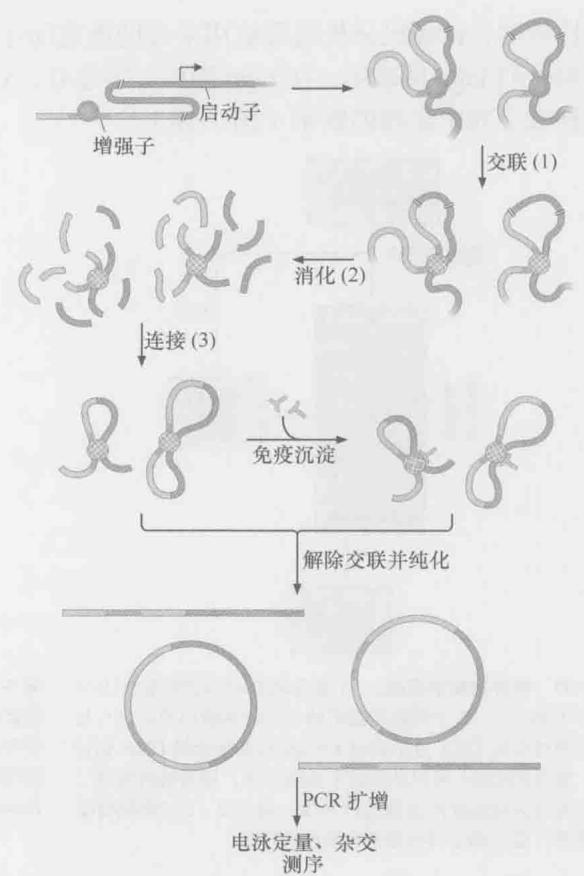  
图 7-36 染色体构象捕获示意图。3C 试验包括三个基本步骤：①相互作用的染色体片段通过福尔马林发生交联；②DNA 被消化；③交联的 DNA 片段被连接起来，连接产物被扩增并用于后续分析。

SELEX 的第一步是利用 DNA

化学合成技术（本章第一部分已介绍）合成一个巨大的单链 DNA 文库。重要的是，这些单链 DNA 中部的 10～12 个碱基是随机的（合成这些位点时加入所有 4 种核苷酸前体的混合物）。随机区域的两侧是特定的 DNA 序列，文库合成后，用短的、与特定区 3' 端匹配的引物进行延伸，将随机单链 DNA 文库变成双链 DNA 文库。

用与我们曾讨论过的类似方法，就可以富集那些与蛋白质结合的寡聚核苷酸。蛋白质与寡聚核苷酸共同孵育后，用 EMSA 法分离。在电泳位置发生迁移的复合体中，富集着与蛋白质紧密结合的 DNA。或者，如果有待测蛋白质的抗体，可以使用与 ChIP 类似的免疫沉淀从未结合 DNA 中分离出蛋白质和结合的 DNA。不管采取什么样的富集机制，用 PCR 就可以扩增结合的 DNA（用与寡核苷酸特定末端区域配对的寡聚核苷酸链）。因为从文库中只能获得很少量的蛋白质结合核苷酸，所以扩增是必需的。重复结合、富集和扩增的步骤，可以显著富集与待测蛋白质紧密结合的核酸序列（图 7-37）。通常，3～5 轮的循环就可找到与蛋白质结合最紧密的 DNA 序列。

测定富集的 DNA 序列，可以确定蛋白质结合 DNA 的序列特异性。一般来说，随机区域的 DNA 序列只有一部分是保守的，因为大多数 DNA 结合蛋白识别不多于 6 或 7个核苷酸，计算机分析通常被用来帮助确定保守区域的序列。最后，碱基序列保守性可以用序列 logo 图表示，在 logo 图中，字母 G、A、C 或 T 的大小表示碱基在富集的寡聚核苷酸序列中出现的频率（图 7-38）。

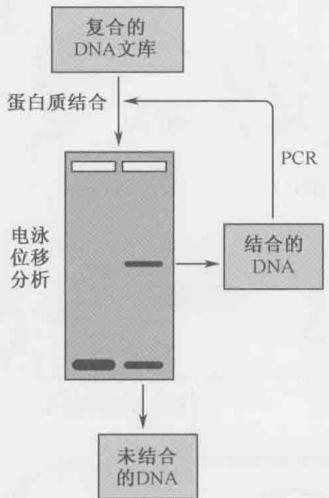  
图 7-37 体外选择示意图。一个复合的 DNA 文库（库中 DNA 分子中部 10～12 个碱基是随机的）与待测蛋白质结合。与蛋白质结合的 DNA 分子通过 EMSA 与未结合的 DNA 相分离。结合的 DNA 可以从凝胶中洗脱下来，用与随机区域二侧的保守区域匹配的引物进行 PCR。经过 3～5 轮的结合富集循环，最后确定具有最高亲和度的序列。

  
图 7-38 SELEX 序列 logo 图。体外筛选用于分离与翻译抑制蛋白 RB69RegA 结合的 RNA。图示为所得序列的 logo 图。字母高度与每个碱基在该位点出现的频率成正比，出现频率最高的碱基在最上面。（经允许影印自 Dean T. R. et al.2005.Virology366:26-36, Fig.4a. Elsevier.）

## 参考文献

## 书籍

Green M. and Sambrook J. 2012. Molecular cloning: A laboratory manual, 4th ed. Cold Spring Harbor Laboratory Press, Cold Spring Harbor, New York.

Griffiths A.J.F., Gelbart W.M., Lewontin R.C., and Miller J.H. 2002. Modern genetic analysis, 2nd ed. W.H. Freeman, New York.

Hartwell L., Hood L., Goldberg M.L., Reynolds A.E., Silver L.M., and Veres R.C. 2003. Genetics: From genes to genomes, 2nd ed. McGraw-Hill, New York.

Snustad D.P. and Simmons M.J. 2002. Principles of genetics, 3rd ed. Wiley, New York.

## 基因组分析

Frazer K.A., Pachter L., Poliakov A., Rubin E.M., and Dubchak I. 2004. VISTA: Computational tools for comparative genomics. Nucleic Acids Res. 32: W273–W279.

Human Genome. 2001. Nature 409: 813–960.

Human Genome. 2001. Science 291: 1145–1434.

International Human Genome Sequencing Consortium. 2004. Finishing the euchromatic sequence of the human genome. Nature 431:931–945.

Mouse Genome. 2002. Nature 420: 509–590.

Osoegawa K., Mammoser A.G., Wu C., Frengen E., Zeng C., Catanese J.J., and de Jong P.J. 2001. A bacterial artificial chromosome library for sequencing the complete human genome. Genome Res. 11: 483–496. The Human Genome at Ten. 2011. Nature 464: 649–671.

## 蛋白质组分析

Yates J.R. III, Gilchrist A., Howell K.E., and Bergeron J.J. 2005. Proteomics of organelles and large cellular structures. Nat. Rev. Mol. Cell. Biol. 6:702–714.

## 习题

偶数习题的答案请参见附录2

习题 1 在外加电场的作用下, DNA 是如何在电泳凝胶中迁移的? 请解释你的选择并说

明电泳后如何才能让 DNA 可以被观察到。

习题 2 限制性内切酶 XhoI 识别序列为 5'-CTCGAG-3'，并且分别在每条链 C 和 T 之间切开。

A. 这段序列在基因组中出现的计算概率是多少?

B. 限制性内切酶 SalI 识别序列为 5'-GTCGAC-3'，并分别在每条链的 G 和 T 之间切开。你觉得 XhoI 和 SalI 的黏性末端能黏合到一起么，请解释你的选择。

习题 3 简要描述两种标记 DNA 探针的方法。

习题 4 比较 Southern 印迹和 Northern 印迹的异同。

习题 5 质粒克隆载体经过特殊设计有多个适用于克隆和表达的特性。请用一两句话描述下列各个原件的作用：复制起点、限制酶识别位点、选择标记和启动子。

习题 6 请解释基因组 DNA 文库与 cDNA 文库有何不同之处。cDNA 文库相比之下有何优势？

习题 7 下列是一个 PCR 反应步骤的时间与温度的例子。你可以参照图 7-12 来回答下列问题。

$$
\begin{array}{l l l l l l} {9 4 ^ {\circ} \mathrm{C}   \Rightarrow} & {\left[ \begin{array}{l l l l l l} {9 4 ^ {\circ} \mathrm{C}   \Rightarrow} & {5 5 ^ {\circ} \mathrm{C}   \Rightarrow} & {7 2 ^ {\circ} \mathrm{C}   \Rightarrow} & {7 2 ^ {\circ} \mathrm{C}   \Rightarrow} & {4 ^ {\circ} \mathrm{C}} \\ {1 0   \text {分}} & {3 0   \text {秒}} & {3 0   \text {秒}} & {1   \text {分}   3 0   \text {秒}} & {1 0   \text {分}} & {\infty} \end{array} \right]} \end{array}
$$

(25 x 个循环)

A. 为何第一个步骤是以 $94^{\circ}$ C 起始？

B. 在循环中当温度转为 $55^{\circ}$ C 的过程中反应发生什么变化?

C. 在循环中温度在 $72^{\circ}$ C 时有什么事件发生？

习题 8 请描述下列分离蛋白技术的原理：离子交换、凝胶过滤和亲和柱层析法。

习题 9 请解释在聚丙烯酰胺凝胶电泳的蛋白样品中加入 SDS 的目的。

习题 10 三个用于检测蛋白质和 DNA 的相互作用的实验为: 电泳迁移率改变(EMSA), DNA 足迹和染色质免疫共沉淀(ChIP)。

A. 在 DNA 足迹法中，为何只对一条 DNA 单链进行末端标记才能保证实验的正常进行。

B. 在染色质免疫沉淀实验（ChIP）的免疫沉淀步骤之后，如何鉴定仍结合在感兴趣的蛋白上的 DNA 序列。

习题 11 你想对 PCR 产物进行双脱氧法测序。加入适量的 ${}^{32}$ P 标记引物、DNA 聚合酶、DNA 模板（即 PCR 产物）、缓冲液、dNTP 混合物，以及在 4 个反应管中分别加入小量的四个 ddNTPs 中的一种。在 PCR 仪上完成这些反应，将各个反应体系产物分别加入不同的聚丙烯酰胺凝胶泳道，通过电泳分离反应产物。如下图所示，泳道根据加入的 ddNTP 的不同进行标记。
A. 请写出对应的 DNA 序列，并标记上 5' 与 3' 末端。
B. 假设你意外地加入了 10 倍量的 ddGTP 到第四

泳道的反应中，那么第4泳道的带型将会是如何？


C. 假如在反应中只使用了包含 dATP, dTTP, dCTP 和 dGTP 的核苷酸混合物，请在第 5 泳道中画出预期看到的结果。

D. 假如在反应中只使用了包含 ddATP, dTTP, dCTP 和 dGTP 的核苷酸混合物，请在第 6 泳道上画出预期的结果。

习题 12 你希望了解黑腹果蝇在发育过程中基因表达的特征。你分离了胚胎和成体果蝇的 mRNA，在 Northern 印迹实验中采用靶基因 Z（一个发育必需的基因）的标记 DNA 探针，实验结果如下：

奇怪的是，你分离了胚胎和成体果蝇的蛋白 Z 并进行 Western 印迹，用了识别蛋白质羧基端的抗体，实验结果如下。你很惊奇地发现在胚胎和成体样品中都存在同一条相同分子质量的条带。

A. 请提出一个假设来解释此结果。

B. 请提出对 Western 印迹实验策略的改变从而使你对假设进行检验(假设你可以获得任何必要的试剂)。

  
与蛋白Z的cDNA的中心片段探针杂交

  
与抗蛋白Z羧基端抗体杂交

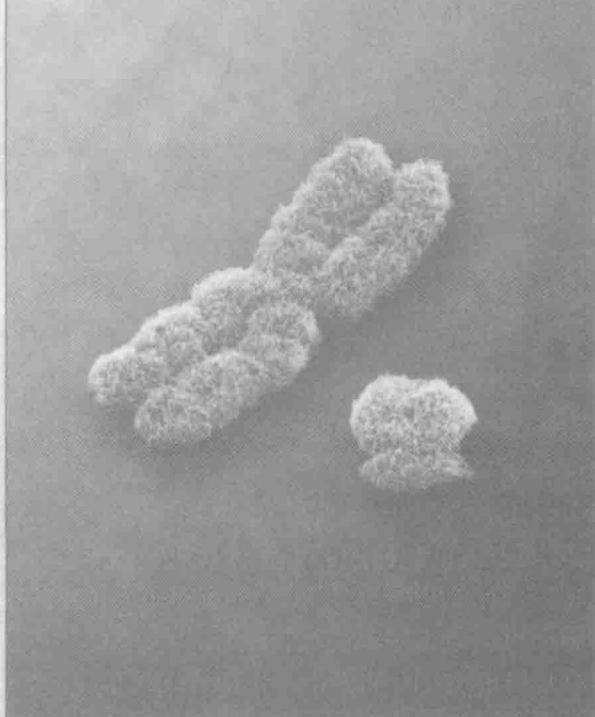

## 第3篇基因组的维持

## 本篇概要

\- 第8章 基因组结构、染色质和核小体

\- 第9章 DNA的复制

\- 第10章 DNA的突变和修复

\- 第11章 分子水平上的同源重组

\- 第12章 位点特异性重组和DNA转產

第 3 篇将介绍 DNA 的结构和从一代细胞到下一代细胞的复制、遗传和变异过程。在第 8～12 章中，我们将仔细分析 DNA 和与它关系密切的 RNA，着重探讨以下问题：

\- 组成真核生物染色体的、比细胞大小要长很多的 DNA 分子怎样被包装在细胞核里？

\- DNA 分子在细胞周期中如何进行精确而完整的复制？如何达到复制的高保真性？

\- DNA 分子如何避免来自于自身和环境的损伤？受损后怎样进行修复？

\- 重组和转座过程中染色体间 DNA 片段的交换如何进行？又有什么样的生物学意义？

在回答这些问题的过程中，我们将注意到 DNA 分子既受到保守作用的影响——使其在代代相传的过程中保持不变；同时又受到相反作用的影响，使遗传物质发生重要变化，推动生物的多样性和演化。

第 8 章描述组成染色体的巨大 DNA 分子在不同生物体中如何呈现不同的组织形式和大小。巨大的染色体 DNA 不是裸露的，它通过和一些特殊的蛋白质一起包装形成称为染色质的结构。这一包装过程可以使细胞容纳下很长的 DNA 分子，不仅染色体的长度变短，而且改变了 DNA 的可接近性和行为。染色质经修饰后，可以使 DNA 变得更易于或难以接近。DNA 的这些变化可以确保它在正确的时间和位置进行复制、重组和转录。第 8 章还介绍了染色质的组蛋白和非组蛋白组分、染色质结构、以及调节染色体 DNA 可接近性的各种酶。

从 DNA 的结构可以推测出遗传物质复制的可能机制。第 9 章详细描述了 DNA 的复制机制，以及保证 DNA 双链同时复制所需的多种酶和复杂的分子机器。我们还讨论了 DNA 复制过程如何启动，细胞如何精密调控 DNA 的复制来维持合适数目的染色体。

DNA 的复制并不是万无一失的，每一轮复制出错后若不纠正，都会导致子代 DNA 分子发生突变。而且，DNA 分子是脆弱的，会发生自发损伤，或受到化学物质或辐射的损伤。如果想要避免遗传物质的恶性突变的快速积累，就需要检测并修复这些损伤。第 10 章介绍了 DNA 损伤的检测和修复机制。从细菌到人类，各种生物体都依赖于相似的、高度保守的 DNA 损伤的检测和修复机制来保证 DNA 的完整性，DNA 损伤的检测和修复系统失常将导致可怕的后果，如癌症。

第 3 篇的最后两章介绍了 DNA 代谢的另一方面。与确保遗传物质的变化降低到最小限度的保守的复制和修复过程相比，这些过程会引起 DNA 序列的重排。第 11 章介绍了同源重组——同源染色体通过断裂、重新连接以互换相应的 DNA 片段的过程。作为 DNA 损伤的主要修复机制，同源重组丰富了遗传多样性，并使缺失或受损的序列得到替换。本章还详细介绍了同源重组途径的两种模式，同时也介绍了一系列分子“机器”——它们在 DNA 分子间搜寻同源序列，生成并消除两种同源重组模式中的中间产物。

最后，第 12 章介绍了两种特殊的重组——位点特异性重组和转座，这些过程会导致许多生物体包括人类基因组中的某些序列的大量积累。我们还将在本章讨论这些遗传物质交换的分子机制及其产生的生物学影响。

## 冷泉港实验室档案馆中的照片


Reiji Okazaki, 1968 年微生物 DNA 复制研讨会。Okazaki 此时刚刚揭示了在 DNA 复制时其中一条新生链是如何先以小片段的方式开始合成，然后再连接起来的。“Okazaki 片段”解释了只能以一个方向合成的酶为什么却能同时生成两条极性相反的链（第 9 章）。

  
Paul Modrich, 1993 年 DNA 和染色体研讨会。Modrich 是 DNA 修复领域的先驱，他揭示了错配修复的大部分机制（第 10 章）。

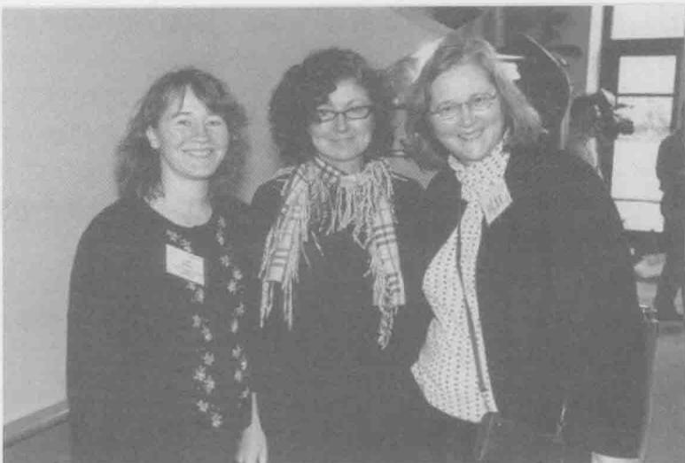  
Carol Greider、Titia de Lange 和 Elizabeth Blackburn，2001 年端粒会议。Blackbum 发现了在染色体末端的端粒重复序列特征。后来，作为 Blackburn 实验室的研究生，Greider 发现了端粒酶。这个酶可以维持端粒（第 9 章）。在她们中间的是 de Lange，她的工作主要集中于细胞中结合并保护端粒的蛋白质。Blackburn 与 Greider 和 Jack Szostak 共同分享了 2009 年的诺贝尔生理学或医学奖。

  
Arthur Kornberg, 1978 年 DNA 复制和重组研讨会。Kornberg 对 DNA 复制（第 9 章）研究有突出贡献。他纯化出第一个可以合成 DNA 的酶，这是一种来源于大肠杆菌的 DNA 聚合酶。他用实验证明新的 DNA 合成需要 DNA 模板，从而证实了沃森和克里克提出的 DNA 复制模型。由于上述的工作，Kornberg 与 Severo Ochoa 分享了 1959 年的诺贝尔生理学或医学奖。

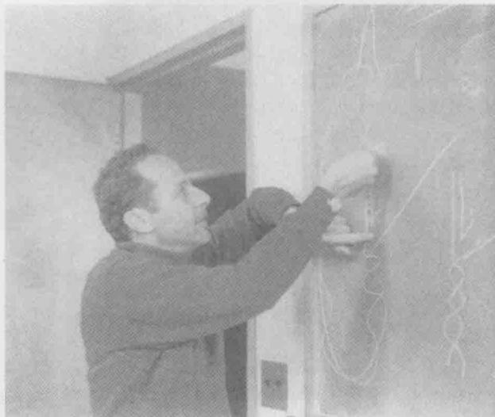

Matthew Meselson, 1968 年微生物 DNA 复制研讨会。Meselson 和 Stahl 一起用实验证明了 DNA 的半保留复制（见下页照片和第 2 章）。Meselsen 在数个领域都作出了重要贡献，包括纯化第一个限制性核酸内切酶，该研究于照片拍摄这年发表。他在防止化学与生物武器方面的工作广为人知。


Barbara McClintock 和 Robin Holliday，1984 年的 DNA 水平重组学术讨论会。McClintock 提出转座子的存在以解释她在 20 世纪 40 年代开展的玉米遗传学的研究结果（第 12 章）。这一成果直到 30 年后的 1983 年才被肯定并荣获诺贝尔生理学或医学奖。Holliday 则提出了以他名字命名的同源重组的基本模型（第 11 章）。


Franklin Stahl 和 Max Delbrück，1958 年的遗传物质交换：机制与结果研讨会。Stahl 与 Meselson（见上页照片）一起证明了 DNA 的半保守复制。这一实验曾被称为“最漂亮的生物学实验”（第 2 章）。Stahl 随后为我们理解同源重组作出了很大贡献（第 11 章）。Delbrück 是“噬菌体小组”（一班在冷泉港实验室度夏的科学家，将噬菌体发展成生物学的第一个模式系统）的最有影响的创始人之一（附录 1）。

# 第8章 基因组结构、染色质和核小体

本章概要
基因组序列和染色体多样性
染色体的复制和分离

核小体
染色质的高级结构
染色质结构的调控
核小体的组装

我们在第 4 章中单独介绍了 DNA 的结构。然而，在细胞中 DNA 是和蛋白质结合存在的，每条 DNA 及其结合的蛋白质构成了一条染色体（chromosome）。在原核生物、真核生物甚至病毒中，DNA 都是以这种结构存在。DNA 包装为染色体具有几个重要的功能：第一，染色体是 DNA 的紧密结构，更适合存在于细胞中。第二，这种包装可以保护 DNA 免于损伤。完全裸露的 DNA 分子在细胞中是相当不稳定的。相反，染色体 DNA 是非常稳定的。第三，只有包装成染色体的 DNA 才能在每次细胞分裂时有效地将 DNA 传递给两个子代细胞。第四，染色体将每个 DNA 分子全面地组织起来。该组

织可以通过调节 DNA 的可接近性来调控细胞内所有 DNA 参与的事件。

真核细胞染色体分子质量的一半为蛋白质。在真核细胞中，DNA 的一段特定区域及与之结合的蛋白质称为染色质(chromatin)，这些结合蛋白大部分是小的碱性蛋白质，即组蛋白(histone)；其他丰度较低的核染色体结合蛋白，通常称为非组蛋白(non-histone protein)。这些蛋白质包含大量的 DNA 结合蛋白，可以调控细胞 DNA 的转录、复制、修复和重组。这些内容将在随后的五章中逐一详细讨论。

染色质中的蛋白质有另一重要的功能：压缩 DNA，下面的计算可以清晰地看出该功能的重要性。人的细胞中单套染色体（单倍体）（haploid set）含有 $3 \times 10^{9}$ 碱基对，我们在第 4 章里学到，每个碱基对的厚度为 3.4Å，如果将单倍体 DNA 拉直并首尾相接，DNA 的长度将约为 $10^{10}$ Å，即 1 m。对于一个二倍体细胞（人的细胞是典型的二倍体细胞）来说，DNA 的长度加倍为 2 m。由于一个典型的人的细胞核的直径仅为 10～15μm，显而易见，DNA 必须被压缩多个数量级才能适应那么小的空间。这是怎样做到的呢？

在人的细胞（和其他所有的真核细胞）中，DNA 的压缩主要是通过 DNA 有规律地结合组蛋白，形成核小体（nucleosome）来实现。形成结构紧密的核小体是第一步，压缩后的 DNA 线性长度只有原先的万分之一。当然，DNA 的压缩也会造成损失。DNA 与组蛋白及其他包装蛋白的结合限制了 DNA 的可接近性，可接近性的降低会干扰介导 DNA 复制、修复、重组的蛋白质与 DNA 的相互作用，尤其是对转录相关的蛋白质影响最显著。真核细胞利用染色质的抑制特性来调控基因表达及其他与 DNA 有关的生命活动。个别核小体的结构变化可以使染色体特定区域的 DNA 与其他蛋白质相互作用。核小体的改变由修饰和重塑核小体的酶所介导，这是个动态的、区域性的过程，可以使酶和调控蛋白在不同的时间结合到染色体的不同区域。因此，了解核小体的结构及其与 DNA 相关的调控是解释真核细胞中涉及 DNA 的多数调控过程的关键。

尽管原核细胞的基因组都较小，但是对其 DNA 进行压缩仍是必要的。E.coli 必须把它的大约 1mm 的 DNA 包装到长度仅有 1μm 的细胞中。目前尚不清楚原核 DNA 是如何进行压缩的。例如，细菌没有组蛋白和核小体，却有其他小的碱性蛋白质，这些蛋白质可能会有相似的功能。本章我们将集中介绍真核细胞的染色体和染色质。首先，我们将讨论不同生物染色体的 DNA 序列特征，尤其集中在蛋白质编码内容的变化上；随后，将讨论保证细胞分裂时染色体能精确传递的机制；最后，我们将介绍真核染色质及其基本功能单元——核小体的结构和调控。

## 基因组序列和染色体多样性

在我们详细介绍染色体结构之前，有必要先了解构成染色体骨架的 DNA 分子的结构。近来对几千个生物基因组的测序提供了丰富的信息，使我们了解染色体 DNA 的构成及其特性是如何随着生物体复杂性的增加而变化的。

## 染色体可以是环状或线性的

传统的观点认为原核细胞有一条环状的染色体，真核细胞有多条线性染色体（表8-1）。随着对越来越多的原核生物的研究，这个观点受到了挑战。尽管大多数研究过的原核生物（如E.coli和B.subtilis）确实只有单一的环状染色体，然而现已发现大量的原核生物含有多条染色体，或线性染色体，或二者皆有。相反，所有的真核细胞都含有多条线性染色体。真核生物染色体的数目因物种而不同，通常为2\~50条，但在极少的情况下染色体数目能达到数千条[例如原生生物四膜虫（Tetrahymena）的大核，表8-1]。

表 8-1 不同生物体染色体组成的变化

<table><tr><td>物种</td><td>染色体数目</td><td>染色体拷贝数</td><td>染色体形式</td><td>基因组大小/Mb</td></tr><tr><td colspan="5">原核生物</td></tr><tr><td>生殖道支原体</td><td>1</td><td>1</td><td>环状</td><td>0.58</td></tr><tr><td>大肠杆菌 K-12</td><td>1</td><td>1</td><td>环状</td><td>4.6</td></tr><tr><td>根瘤农杆菌</td><td>4</td><td>1</td><td>3 条环状,1 条线性</td><td>5.67</td></tr><tr><td>苜蓿中华根瘤菌</td><td>3</td><td>1</td><td>环状</td><td>6.7</td></tr><tr><td colspan="5">真核生物</td></tr><tr><td>酿酒酵母(芽殖酵母)</td><td>16</td><td>1或2</td><td>线性</td><td>12.1</td></tr><tr><td>粟酒裂殖酵母(裂殖酵母)</td><td>3</td><td>1或2</td><td>线性</td><td>12.5</td></tr><tr><td>秀丽线虫(线虫)</td><td>6</td><td>2</td><td>线性</td><td>97</td></tr><tr><td>拟南芥(草本植物)</td><td>5</td><td>2</td><td>线性</td><td>125</td></tr><tr><td>黑腹果蝇(果蝇)</td><td>4</td><td>2</td><td>线性</td><td>180</td></tr><tr><td>四膜虫(原生生物)</td><td>小核5,大核225</td><td>小核2,大核10~10000</td><td>线性</td><td>125</td></tr><tr><td>红鳍东方鲀(鱼类)</td><td>22</td><td>2</td><td>线性</td><td>393</td></tr><tr><td>小鼠(啮齿类)</td><td>19+X,Y</td><td>2</td><td>线性</td><td>2600</td></tr><tr><td>人</td><td>22+X,Y</td><td>2</td><td>线性</td><td>3200</td></tr></table>

环状和线性染色体都有各自的问题，必须克服这些问题才能保证基因组的维持和复制。环状染色体复制后需要拓扑异构酶来将其分离到子代细胞中，没有这些酶，复制后两个子代染色体仍然会互锁或连接在一起（见第4章，图4-23），相反，线性真核染色体的DNA末端必须保护起来以避免酶对DNA末端的降解，这造成了DNA复制过程中的一系列不同的困难，我们将在第9章中进行讨论。

## 每个细胞都有特定的染色体数目

典型的原核细胞的染色体仅有一个完整拷贝，包装在一个称为类核（nucleoid）的结构中（图 8-1b）。然而，当原核细胞迅速分裂时，正在复制过程中的那部分染色体会存在2个有时甚至是4个拷贝。原核细胞还经常携带一个或多个小的、独立的环状DNA，称为质粒（plasmid）。与大的染色体DNA不同，质粒通常不是细菌生长所必需的，而是携带着赋予细菌良好特性的基因，如抗生素抗性基因。此外，质粒有别于染色体DNA的另一特征是每个细胞中可以有多个完整拷贝存在。

大多数真核细胞是二倍体（diploid），也就是说，细胞中每条染色体有两个拷贝（图8-1c）。同一个染色体的两个拷贝叫做同源染色体（homolog），分别来自父本和母本。但是，一个真核生物中的所有细胞并非都是二倍体，某些细胞是单倍体或多倍体。单倍体（haploid）细胞每条染色体只有一个拷贝，并且参与有性生殖（例如，精子和卵子都是单倍体细胞）。多倍体（polyploid）细胞中每条染色体都超过两个拷贝。事实上，许多生物体维持它们大多数的成熟细胞在多倍体状态。在极端情况下，每条染色体的拷贝数可能有数百甚至数千。这种全基因组扩增的方式可以使一个细胞产生大量的RNA和随后的蛋白质产物。例如，巨核细胞（megakaryocyte）是一种特化的多倍体细胞（每条染色体大约有28个拷贝），能产生数千个人体血液所必需的、没有染色体的血小板（每毫升血液中大约有200 000个血小板）。通过多倍体形式，巨核细胞维持高水平的新陈代谢，以生产大量的血小板。由于这么多条染色体的分离是非常困难的事，因此多倍体细胞几乎总是处于停止分裂的状态。无论染色体数目的多少，真核染色体总是包含在由膜包围的称为细胞核（nucleus）的细胞器中（图8-1c）。


  
图 8-1 典型的原核细胞与真核细胞的比较。(a). 一个典型的真核细胞的直径约为 10\~100μm，原核细胞约为 1μm。(b). 原核染色体 DNA 位于类核内，占据细胞内大部分的空间。与真核细胞的细胞核不同，类核没有膜将它和细胞的其他组分分开，质粒 DNA 用红色表示。(c). 真核染色体位于由膜所包围的细胞核中。由细胞核中存在的染色体的拷贝数可区分单倍体和二倍体细胞。（来源：Brown T. A. 2002 Genomes, 2nd edition, p. 32. Fig2.1. © BIOS Scientific Publishers. 经 Taylor & Francis 许可.）

## 基因组的大小与生物体的复杂度相关

基因组的大小（单倍染色体中 DNA 的长度）在不同的生物中有相当大的变化（表 8-2）。由于生物的复杂度越高，所需的基因也就越多（比较细菌、单细胞真核生物和多细胞真核生物时可以看到这个规律，见第 21 章）。因此基因组的大小与生物体的复杂度相关也就不足为奇。但通常原核细胞的基因组不足 10Mb。尽管一些较复杂的原生生物可能有大于 200Mb 的基因组，通常单细胞真核生物的基因组都小于 50Mb，而多细胞生物的基因组更大，甚至可超过 100 000Mb。

尽管生物体的复杂度与基因组的大小之间大致呈正相关，但并不精确。许多复杂度相近的生物体的基因组大小却显著不同：果蝇的基因组大约是蝗虫的基因组的1/25，而小麦的基因组是水稻基因组的40倍（表8-2）。这些例子中，基因的数目而不是基因组的大小，与生物的复杂性更密切相关。当我们比较不同生物的相对基因密度时，可以清楚地看到这一点。

表 8-2 不同生物体基因组中基因密度的比较

<table><tr><td>物种</td><td>基因组大小/Mb</td><td>大致的基因数目</td><td>基因密度/(个/Mb)</td></tr><tr><td>原核生物(细菌)</td><td></td><td></td><td></td></tr><tr><td>生殖器支原体</td><td>0.58</td><td>500</td><td>860</td></tr><tr><td>肺炎链球菌</td><td>2.2</td><td>2300</td><td>1060</td></tr><tr><td>大肠杆菌 K-12</td><td>4.6</td><td>4400</td><td>950</td></tr><tr><td>根瘤农杆菌</td><td>5.7</td><td>5400</td><td>960</td></tr><tr><td>苜蓿中华根瘤菌</td><td>6.7</td><td>6200</td><td>930</td></tr><tr><td>真核生物(动物)</td><td></td><td></td><td></td></tr><tr><td>真菌</td><td></td><td></td><td></td></tr><tr><td>酿酒酵母</td><td>12</td><td>5800</td><td>480</td></tr><tr><td>粟酒裂殖酵母</td><td>12</td><td>4900</td><td>410</td></tr><tr><td>原生生物</td><td></td><td></td><td></td></tr><tr><td>四膜虫</td><td>125</td><td>27000</td><td>220</td></tr><tr><td>无脊椎动物</td><td></td><td></td><td></td></tr><tr><td>秀丽线虫</td><td>103</td><td>20000</td><td>190</td></tr><tr><td>果蝇</td><td>180</td><td>14700</td><td>82</td></tr><tr><td>紫海胆</td><td>160</td><td>16000</td><td>100</td></tr><tr><td>东亚飞蝗</td><td>5000</td><td>未定</td><td>未定</td></tr><tr><td>脊椎动物</td><td></td><td></td><td></td></tr><tr><td>河豚</td><td>393</td><td>22000</td><td>56</td></tr><tr><td>人类</td><td>3200</td><td>20000</td><td>6.25</td></tr><tr><td>小鼠</td><td>2600</td><td>22000</td><td>8.5</td></tr><tr><td>植物</td><td></td><td></td><td></td></tr><tr><td>拟南芥</td><td>120</td><td>26500</td><td>200</td></tr><tr><td>水稻</td><td>430</td><td>~45000</td><td>~100</td></tr><tr><td>玉米</td><td>2200</td><td>&gt;45000</td><td>&gt;20</td></tr><tr><td>小麦</td><td>16000</td><td>未定</td><td>未定</td></tr><tr><td>郁金香</td><td>~120000</td><td>未定</td><td>未定</td></tr></table>

## E.coli 的基因组几乎全部由基因构成

E.coli 的单一染色体上的绝大多数 DNA 都编码蛋白质或结构 RNA（图 8-2）。而大部分非编码序列都参与调控基因的转录（第 18 章）。由于一个转录起始位点通常可以控制几个基因的表达，因而这些区域在基因组中维持在最小的比例。E.coli 基因组中的一个关键元件并不是基因的一部分，也不是一段调控基因表达的序列，而是 E.coli 复制起始区。这个短的染色体区段指导着整个复制机器的组装（将在第 9 章讨论）。复制起始区虽然有重要的功能，但它非常小，仅为 E.coli 4.6 Mb 基因组中的几百个碱基对。

  
图 8-2 不同生物染色体基因密度的比较。图中展示了 4 种生物中一个具有代表性的 65 kb 的 DNA 区段。编码 RNA 聚合酶（真核生物编码 RNA 聚合酶 II）大亚基的区域用红色表示，编码其他基因的区域用绿色表示，内含子 DNA 用紫色表示，重复 DNA 用黄色表示，独特的基因间 DNA 用灰色表示。注意随着生物复杂度的增加，在相同长度的 DNA（65 kb DNA 区域）中编码基因的数目是如何变化的

## 复杂度高的生物基因密度低

如何解释具有相似复杂度的生物体却有明显不同的基因组大小（如果蝇和蝗虫）？这种不同主要与基因的密度有关。基因密度的简单衡量方法是每 Mb 基因组 DNA 上基因的平均数目。如果一个 50Mb 基因组的生物有 5000 个基因，那么这个生物体的基因密度为 100 个基因/Mb。当比较不同生物体的基因密度时，可以清楚地看到不同生物体利用 DNA 来编码基因的效率不同。生物体的复杂度与基因的密度之间存在大致负相关的关系；生物体复杂度越低，其基因密度越高。例如，目前所发现的基因密度最高的生物体是病毒。在某些情况下病毒利用 DNA 的两条链来编码相互重叠的基因。尽管在细菌中重叠基因极少见，但细菌的基因密度非常恒定地接近 1000 个基因/Mb。

与原核生物相比，真核生物的基因密度较低且更多变（表8-2）。在真核生物中仍然存在一个普遍的趋势，即基因密度随生物体复杂度的增加而降低。简单的单细胞真核生物酿酒酵母（S. cerevisiae）的基因密度（约500个基因/Mb）与原核生物非常接近。相反，人的基因密度估计是原核生物的1/50。图8-2比较了在所有生物中相对保守的RNA聚合酶的大亚基基因的DNA序列，尽管所编码蛋白的分子质量相似，但是不同的生物间基因大小存在极大的差异。较人基因组更大的生物可能有着更小的基因密度。是什么原因导致基因密度的降低呢？

## 基因仅占真核染色体 DNA 的一小部分

两种因素会导致真核细胞中基因密度的降低：基因大小和基因间序列（intergenic sequence）的增加。复杂度高的生物，基因大的主要原因并不是蛋白质大，或需要更长的 DNA 来编码相同的蛋白质，而是因为在真核生物中编码蛋白质的基因区域通常是不连续的。这些分散的非蛋白质编码区段称为内含子（intron）。内含子转录后可通过 RNA 剪接（RNA splicing）的过程从 RNA 中删除（图 8-3），我们将在第 14 章详细讨论 RNA 剪接。内含子的存在极大地增加了编码一个基因所需的 DNA 的长度（表 8-3）。例如，人的一个基因的平均转录长度大约为 27kb（不要与基因密度相混淆），而平均编码蛋白质的区段仅为 1.3 kb。一个简单的计算可看出，人的编码蛋白质的基因中平均仅有 5% 的序列直接参与了编码相应的蛋白质，而其他的 95% 都由内含子构成。简单的真核生物的内含子较少，这与它们较高的基因密度相一致。例如，在酿酒酵母中，仅有 3.5% 的基因有内含子，而且没有一个内含子大于 1kb（表 8-3）。

  
图 8-3 RNA 剪接的示意图。外显子 1 上方的箭头表示前体 mRNA 转录启动的位置。此初级转录物经过剪接加工去除非编码的内含子，生成 mRNA。

表 8-3 不同基因组中内含子和重复序列的比例

<table><tr><td>物种</td><td>基因密度(个/Mb)</td><td>基因中平均的内含子数目</td><td>重复序列的比例</td></tr><tr><td>原核生物(细菌)</td><td></td><td></td><td></td></tr><tr><td>大肠杆菌 K-12</td><td>950</td><td>0</td><td>&lt; 1</td></tr><tr><td>真核生物(动物)</td><td></td><td></td><td></td></tr><tr><td>真菌</td><td></td><td></td><td></td></tr><tr><td>酿酒酵母</td><td>480</td><td>0.04</td><td>3.4</td></tr><tr><td>无脊椎动物</td><td></td><td></td><td></td></tr><tr><td>秀丽线虫</td><td>190</td><td>5</td><td>6.3</td></tr><tr><td>果蝇</td><td>82</td><td>3</td><td>12</td></tr><tr><td>脊椎动物</td><td></td><td></td><td></td></tr><tr><td>河豚</td><td>56</td><td>5</td><td>2.7</td></tr><tr><td>人</td><td>6.25</td><td>6</td><td>46</td></tr><tr><td>植物</td><td></td><td></td><td></td></tr><tr><td>拟南芥</td><td>220</td><td>3</td><td>未定</td></tr><tr><td>水稻</td><td>~100</td><td>未定</td><td>42</td></tr></table>

在更复杂的生物中，基因间序列数目的大量增加是导致基因密度降低的另一原因。基因间隔区是基因组上与蛋白质和结构 RNA 的表达无关的那部分 DNA。人的基因组中有超过 60% 的部分由基因间序列组成，这其中绝大多数的功能未知（图 8-4）。基因间隔区 DNA 分为两类：单一的和重复的。大约 1/4 的基因间隔区 DNA 是单一的，导致单一基因间 DNA 序列增加的原因之一是指导和调控转录的 DNA 序列的增加，也称为调控序列（regulatory sequence）。随着生物体复杂度的提高，编码更多的基因，调控基因表

  
图 8-4 人类基因组的组织及其组分。人类基因组由许多不同类型的 DNA 序列构成，绝大多数 DNA 序列不编码蛋白质。此图显示了各种类型序列的分布和数量。（来源：Brown T. A. 2002. Genomes, 2nd edition, p.23, box1.4.© BIOS Scientific Publishers. 经 Taylor & Francis 许可.）

达的调控序列也变得更加复杂，其序列大小也不断增加。人类基因组基因间 DNA 的单一区段包含了许多显而易见的、已丧失功能的残留区段，如无功能的突变基因、基因碎片和假基因。突变基因和基因碎片是由于简单的随机突变或在 DNA 重组过程中的错误所造成的。假基因则是因反转录酶（reverse transcriptase）的作用而形成的（图 8-5 和第 12 章）。这种酶可将 RNA 复制为双链 DNA（称为拷贝 DNA、copy DNA 或 cDNA），通常只在某些特定类型的病毒中表达，参与病毒的繁殖。但是，当细胞被这类病毒感染后，作为其副效应，细胞中

  
图 8-5 反转录 mRNA 的整合导致假基因的产生。当细胞中存在反转录酶时，mRNA 分子能被拷贝成双链 DNA。在极少数情况下，这些 DNA 分子能整合入基因组形成假基因。由于在新转录的 RNA 中内含子会被迅速地删除，所以假基因共同的特征就是缺少内含子。这可以将其与原基因区分开来。另外，因为启动子序列不是 mRNA 的一部分，所以假基因缺少相应的、指导其转录的启动子序列。

的 mRNA 会被拷贝成 DNA，而这些 DNA 片段可以一个较低的频率重新整合到基因组中。然而，由于这些 DNA 缺少指导其表达的正确序列（这些序列一般不存在于基因的 RNA 产物中，见第 13 章），因此它们是不能表达的。

最后，尽管我们对真核细胞单一基因间区域的功能还不清楚，但可以确定的是，它在真核细胞中是有功能的，如最新发现的微RNA，一般称为miRNA。这些结构性的小RNA通过改变mRNA的稳定性或者mRNA的翻译能力来调节其他基因的表达（参见微RNA的基因调控，第20章）。由于这些序列在最近才被发现，所以还没有包括在表8-2中。然而，在人类细胞中据估计有500多个miRNA。相似地，已经鉴定了数以千计的长链基因间非编码RNA（lincRNA）。尽管不编码任何相应长度的蛋白质，但是最近研究表明，这些lincRNA以尚不清楚的方式正向或者负向调控基因表达。多数单一性基因间区域的另一功能还可能与复制的起始相关，尽管在多数真核生物中还没有被证明。

## 人的基因间隔区序列主要由重复 DNA 构成

几乎一半的人类基因组由在基因组中重复多次的 DNA 序列组成。重复 DNA 一般有两种：微卫星 DNA 和基因组范围的重复序列（genome-wide repeat）。微卫星 DNA（microsatellite DNA）由非常短的（小于 13 bp）串联重复序列构成。最常见的微卫星序列是二核苷酸重复序列（如 CACACACACACACACA）。这种重复来自于 DNA 的正确复制的困难，几乎占了人类基因组 3% 的序列。

基因组范围的重复序列（genome-wide repeats）要比微卫星大得多，每个重复单元的长度都大于100bp，甚至大于1kb。这些序列要么作为单一拷贝散布在基因组中，要么紧密相连成簇存在。尽管这些重复有许多种类，但是它们有着共同的特点，即都是转座因子（transposable element）。

转座因子是指能从基因组的一个位置转移到另一个位置的序列，这个过程称为转座(transposition)。在转座过程中，转座元件经常在保留原拷贝的情况下，转移到基因组中新的位置上。因此，这些序列可在基因组中加倍并累积。在人的细胞中，转座因子的移动极少发生。然而，在漫长的生命演化过程中，这些转座因子非常成功地繁衍了自己，已大约占人基因组的 $45\%$ 。在第12章中我们将讨论转座因子在基因组中移动的机制，以及如何控制它们的移动以防止它们整合到基因中。

虽然我们是以人类基因组为背景讨论基因间序列的特征，然而在其他生物体中也发现了许多相同的特征。例如，通过对基因组非常大的几种植物（如玉米）的部分已知序列的比较，可以看到在这些基因组中转座因子可能占有更大的比例。甚至在像 E.coli 和酿酒酵母这样基因组结构致密的生物中，也发现有转座因子和微卫星重复的存在（图 8-2）。不同之处只是这些序列在简单生物体中占据基因组不那么成功，可能是由低效率的复制和（或）高效率的删除（被修复机制删除或是发生复制的生物体被删除）综合影响的结果。

尽管现在倾向于认为重复 DNA 是垃圾 DNA（junk DNA），但是这些序列可以稳定地维持成百上千代，表明基因间 DNA 对宿主生物体有积极的意义（或者选择优势）。

## 染色体的复制和分离

真核染色体在细胞分裂过程中需要着丝粒、端粒和复制起始位点

在真核染色体上有几个重要的 DNA 元件，它们不是基因，也不参与基因表达的调控（图 8-6）。这些元件包括指导染色体 DNA 复制起始的复制起始位点（origins of replication）、引导染色体进入子代细胞的着丝粒（centromere），以及负责保护和复制线性染色体末端的端粒（telomere）。它们对于细胞分裂过程中染色体的正确复制和分离是至关重要的。现在我们对每个元件逐一加以讨论。

  
图 8-6 着丝粒、复制起始位点和端粒是真核染色体的稳定所必需的。每条真核染色体包括两个端粒、一个着丝粒和多个复制起始位点。端粒位于每条染色体的两端。与端粒不同，每条染色体上只有一个着丝粒，且没有固定的位置。有些着丝粒靠近染色体中部，有些靠近端粒。复制起始位点分布于整条染色体上（在酿酒酵母中大约每 30 kb 有一个复制起始位点）。

复制起始位点（origins of replication）是 DNA 复制机器组装和复制起始的位点。复制起始位点间隔约 30\~40kb，分布在每条真核染色体上。原核染色体也需要复制起始位点。与真核染色体不同，原核染色体通常只有一个复制起始位点。一般来说，复制起始位点位于非编码区。复制起始位点的 DNA 序列将在第 9 章详细讨论。

着丝粒（centromere）是 DNA 复制后染色体准确分离所必需的。复制后的染色体的两个拷贝叫姐妹染色体（sister chromosomes），它们必须分离为单拷贝，分别进入两个子细胞。与复制起始位点相似，着丝粒指导一个精细的蛋白质复合体的形成，此结构也称为动粒（kinetochore）。动粒的作用机制是与着丝粒 DNA 和蛋白质纤维（微管）相互作用，拉动姐妹染色体相互远离并进入两个子细胞。与每条真核染色体上有多个复制起始位点不同，每条染色体上仅有一个着丝粒（图 8-7a）。若着丝粒缺失，复制后的染色体会随机分离，导致子细胞的染色体的缺失或加倍（图 8-7b）。如果一条染色体上存在一个以上拷贝的着丝粒，同样是灾难性的。动粒会附着在将染色体拉向相反方向的微管上，导致染色体的断裂（图 8-7c）。着丝粒的大小变化很大。在酿酒酵母中，着丝粒为不到 200bp 的单一序列；而大多数真核生物的着丝粒大于 40kb，并且主要由重复 DNA 序列组成（图 8-8）。

## a 一个着丝粒

  
每个细胞一个染色体


图 8-7 多于或少于一个着丝粒导致染色体的丢失或断裂。（a）. 正常的染色体有一个着丝粒。染色体复制后，每个拷贝的端粒指导一个动粒的形成。这两个动粒结合到有丝分裂纺锤体的两极，并在细胞分裂之前向细胞相反的两边牵拉。（b）. 缺少着丝粒的染色体会很快从细胞中丢失。着丝粒缺失时染色体不能与纺锤体结合，只能随机地分配到两个子代细胞中。这经常导致一个子代细胞得到同一染色体的两个拷贝，而另一子代细胞丢失了这条染色体。（c）. 有两个或更多个着丝粒的染色体在分离时经常发生断裂。如果一个染色体有多个着丝粒，它能同时与纺锤体的两极结合。当分离起始时，有丝分裂纺锤体的两极的反向作用力经常会使同时结合在两极上的染色体断裂。  


图 8-8 着丝粒的大小和组成在不同生物体间变化很大。酿酒酵母的着丝粒很小且由非重复序列组成。而其他的生物体，如果蝇和裂殖酵母的着丝粒非常大，而且主要由重复序列组成。裂殖酵母着丝粒仅中间的 4～7 kb 是非重复序列，绝大多数果蝇和人的着丝粒由重复 DNA 组成。  


  
240 kb 到几 Mb

端粒（telomere）位于线性染色体的两端。与复制起始位点和着丝粒类似，端粒结合有许多蛋白质，在这种情况下，这些蛋白质执行着两个重要的功能。首先，端粒蛋白质可以将细胞中染色体的天然末端与染色体断裂和其他DNA的断裂区分开来。一般来说，DNA的末端是经常发生重组和DNA降解的位点。结合在端粒上的蛋白质能避免重组和DNA降解的发生。其次，端粒作为一种特殊的复制起始位点，可以使细胞复制染色体的末端。在第9章里将详细讨论标准的DNA复制机器不能完整地复制线性染色体的末端的原因。端粒通过一种特殊的DNA聚合酶——端粒酶（telomerase）来完成线性染色体末端的复制。

与染色体的大多数部分不同，端粒的相当一部分以单链的形式存在（图 8-9）。大多数端粒具简单的重复序列，重复序列因物种而异。典型的重复序列由一段短的、富含TG的序列组成。例如，人的端粒具有5'-T TAGGG-3'的重复序列。我们将在第9章中讲到，端粒中的重复序列是由于它们特殊的复制方式所造成的。

  
图 8-9 典型的端粒结构。框中显示了一个重复序列单元（取自人的细胞）。注意  
染色体 3'端的单链 DNA 区域可长达数百个碱基。

## 真核染色体的复制和分离发生在细胞周期的分裂期

在细胞分裂过程中，染色体必须复制并分离到子细胞中去。在细菌细胞中这些过程是同时发生的。也就是说，在 DNA 复制的同时，产生的两个拷贝会向细胞相反的两边分离。尽管已经清楚在细菌中这些过程受到严格的调控，但调控的机制还不清楚。相反，真核细胞染色体的复制和分离发生在细胞分裂过程的不同时期，下面我们将加以讨论。

细胞完成一轮分裂的过程称为细胞周期（cell cycle）。大多数真核细胞的分裂会使子细胞维持与母细胞一致的染色体数目，这种分裂类型称为细胞的有丝分裂（mitotic cell division）。

有丝分裂的细胞周期可以分为四期： $G_{1}$ 、S、 $G_{2}$ 和 M（图 8-10）。涉及染色体增殖的关键过程发生在细胞周期的特定阶段。DNA 合成发生在细胞周期的合成期或 S 期（synthesis 或 S phase），导致每条染色体的复制（图 8-11）。复制后配对的每条染色体叫做一条染色单体（chromatid），配对的两条染色单体称为姐妹染色单体（sister chromatid）。复制后的姐妹染色单体通过一个叫做黏粒（cohesin）的分子聚在一起，这一过程称为姐妹染色单体的附着（sister chromatid cohesion），这种状态一直维持到染色体的相互分离。

染色体分离发生在细胞周期的有丝分裂期或 M 期（mitosis，M phase）。下面将讲述有丝分裂的全过程，但先讨论这个过程中的 3 个关键步骤（图 8-12）。首先，每对姐妹染色单体与一个叫做有丝分裂纺锤体（mitotic spindle）的结构结合。纺锤体由长的蛋白质纤维——微管（microtubule）组成。微管与两个微管组织中心（microtubule organizing center）中的一个相连。[微管组织中心在动物细胞中称为中心粒（centrosome），在酵母和其他真菌中称为纺锤体极体（spindle pole body）]。微管组织中心位于细胞的两侧，形成“极”，微管向着两极拉动染色单体。染色单体的配对由组装在每个着丝粒处的动粒（kinetochore）所介导（图8-6）。其次，由于黏粒的水解，染色单体间黏附力消失。在黏附力消失之前，它可以抵抗有丝分裂纺锤体的拉力。当黏附力消失之后，有丝分裂的第三个重要过程才能发生：姐妹染色单体分离（sister chromatid separation）。由于缺少了染色单体黏附力的抗衡，染色单体被迅速地拉向有丝分裂纺锤体相反的两极。因此，姐妹染色单体间的黏附力与有丝分裂纺锤体相反两极对姐妹染色单体动粒的黏附力是相互对立的作用，只有精细地协调二者才能使染色体正确地进行分离。


图 8-10 真核有丝分裂细胞周期。真核细胞周期有 4 个阶段。染色体复制发生在 S 期，染色体分离发生在 M 期。 $G_{1}$ 和 $G_{2}$ 间期允许细胞为细胞周期的后续过程做准备。例如，许多真核细胞利用细胞周期的 $G_{1}$ 期合成完成细胞分裂所需的足量的营养成分。  
  
图 8-11 S 期的事件。在 S 期有两个主要的染色体事件发生。每条染色体完整地进行 DNA 复制拷贝，复制发生后不久，环状的黏粒分子将复制后的两拷贝 DNA 缚在一起，导致姐妹染色单体的附着。每个蓝色或红色的“管”代表一个单链 DNA 分子。

  
图 8-12 分裂期（M 期）的事件。三个重要的事件发生在有丝分裂期。首先，连接姐妹染色单体对的两个动粒分别黏附到有丝分裂纺锤体的相反两极。一旦全部的动粒都结合到两极上，通过破坏黏粒环使姐妹染色单体间的黏附力消失。最后，当黏附力消失后，姐妹染色体分离到有丝分裂纺锤体相反的两极。

## 真核细胞分裂时染色体的结构发生变化

在一轮细胞分裂中，染色体的结构发生多次变化；然而，染色体主要以两种状态存在（图 8-13）。当细胞的染色体分离时，染色体处于最压缩的状态。形成这种压缩状态的过程称为染色体凝聚（chromosome condensation）。在这种压缩状态下，染色体间完全相互独立，大大方便了分离过程的进行。

在 $G_{1}$ 、S 和 $G_{2}$ 期 [统称为间期（interphase）]，染色体不分离时，其压缩程度大大降低。事实上，在细胞周期的这些阶段，染色体可能是高度缠绕的，与有丝分裂过程中染色体的有组织排布相比，此时的染色体更像一盘意大利面条。然而，在这些阶段中染色体的结构也会发生改变。DNA 复制要求与染色体结合的蛋白质几乎全部解离和重装。DNA 复制完成后，姐妹染色单体的黏附立即形成，使新复制的两条染色单体相互连接。在细胞周期中，单个基因转录的开关或者上调下调伴随着染色体相关位置上结构的改变。因此，染色体是一个不断变化的结构，它更像是一个细胞器，而不只是一条简单的 DNA 链。

  
图 8-13 染色质结构的变化。M 期的染色体达到最大程度的压缩，而在细胞周期的其他阶段（有丝分裂的 $G_{1}$ 、S 和 $G_{2}$ ）染色体处于解聚状态。这些解聚的时期统称为间期。

## SMC 蛋白介导姐妹染色单体的黏附和染色体的凝聚

介导姐妹染色单体黏附和染色体凝聚的关键蛋白是相互关联的。染色体结构维持（SMC）蛋白是一类延伸蛋白（extended protein），它们通过长的螺旋卷曲结构域相互作用形成固定的配对（见第6章，图6-9）。SMC蛋白与非SMC蛋白一起形成多蛋白复合体，将两个DNA螺旋连接在一起。如前所讨论的，一种含有SMC蛋白的复合体叫做黏粒（cohesin），DNA复制后，黏粒将两个子代DNA（姐妹染色单体）连接起来，这种连接是姐妹染色体黏附的基础。黏粒的结构被认为是一个由两个SMC蛋白和两个非SMC蛋白组成的大环。尽管姐妹染色体单体黏附的确切机制尚不清楚，已经建立了一个很好的模型，表明姐妹染色单体黏附的机制是两条姐妹染色单体穿过黏粒蛋白环的中心（图8-14）。在这个模型中，黏粒的非SMC亚基发生蛋白水解会导致黏粒的开环，姐妹染色单体凝聚消失，子染色体向细胞相反的两极迁移。

伴随染色体分离所发生的染色体凝聚同样需要一个相关的含有 SMC 蛋白的复合体——凝聚蛋白（condensin）。尽管我们对这种复合体的结构和功能知之甚少，但它具有许多与黏粒复合体相同的特点，因此猜测它也是一个环状复合体。如果是这样，它可能是利用环状的特点引起染色体的凝聚。例如，凝聚蛋白能将同一染色体的不同区域连接在一起，大大减少染色体的线性长度（图 8-14）。

## 有丝分裂维持亲本染色体的数目

我们现在讲述有丝分裂的全过程。有丝分裂分为几个时期（图 8-15）。在分裂前期（prophase），凝聚蛋白和拓扑异构酶Ⅱ（帮助解开染色体）使染色体凝聚成高度紧密的结构以准备进行分离。在前期结束时，核膜裂解，细胞进入分裂中期（metaphase）。

在分段中期，有丝分裂纺锤体形成，姐妹染色体的动粒与微管结合。只有当一对姐妹染色单体的两个动粒分别与从相对的微管组织中心发出的微管结合后，正确的染色单体连接才告完成。这种连接类型叫做二价联会（bivalent attachment，图8-15），会导致微管对染色单体对施加拉张力，向相反的方向牵拉姐妹染色单体。从同一微管组织中心发出的微管与两个染色单体或者其中之一的结合，叫做单价联会（monovalent attachment）。这种结合不能产生拉张力，最终导致染色体的丢失。如果二价联会不能随后形成，单价联会能让染色体的两个拷贝拉到一个子细胞中去。姐妹染色单体的黏附力抵消了二价联会产生的拉张力，从而使所有染色体排列在细胞的中部，位于两个微管组织中心之间（这个位置被称为中期板，亦称赤道板）。值得一提的是，只有在所有的姐妹染色单体都进行二价联会后，染色体才会开始分离。

黏粒分子因蛋白质水解的破坏，导致姐妹染色单体间黏附的消失，从而触发染色体的分离。这一过程发生在细胞分裂的后期（anaphase）。在后期，姐妹染色单体分离并移动到细胞的两侧。一旦两个姐妹染色单体不再黏附在一起，它们便不能抵抗纺锤体微管向外的拉力。二价联会保证了每对姐妹染色单体的两个成员被拉向相反的两极，使每个子代细胞都得到每个复制的染色体的一个拷贝。

有丝分裂的最后阶段称为末期（telophase）。在末期，包围每套分离的染色体的核膜

  
图 8-14 推测的黏粒和凝聚蛋白模型。黏粒和凝聚蛋白是环状蛋白复合体，包括两个 SMC 蛋白，是细胞核骨架的组成部分，对连接远距离的或不同区域的 DNA 有重要作用。推测含有环状结构的这些蛋白质允许 DNA 的两个区段柔韧且牢固地连接。在图示中，SMC 蛋白用绿色（黏粒）或者蓝色（凝聚蛋白）表示。（来源：Haering C. H. et al. 2002. Mol. Cell 9: 773-778, F8, page785, ©Elsevier.）

图 8-15 有丝分裂。在有丝分裂之前，染色体以解聚状态存在，此时为间期。前期，染色体凝聚，准备分离，在大多数真核细胞中，包围着染色体的核膜发生裂解；在中期，每个姐妹染色单体对结合到有丝分裂纺锤体的两极；进入后期，姐妹染色单体间黏附力消失，导致姐妹染色单体的分离；末期，染色体凝聚状态消失，包围着两群分离后的染色体的核膜重新形成；细胞质分裂是细胞周期的最后阶段，包围着两个核的细胞膜收缩，并最终分裂成两个子细胞。所有的 DNA 分子都是双链的。


重新形成。此时，两个细胞所共有的细胞质发生物理分离，细胞分裂完成。这个过程称为胞质分裂（cytokinesis）。

细胞周期的间期为下一个细胞周期作准备，同时检查上一个阶段是否正确完成

真核细胞周期中余下的两个阶段是间期。 $G_{1}$ 期发生于 DNA 合成之前， $G_{2}$ 期位于 S 期和 M 期之间。细胞周期的间期有两个作用：一是为下一个细胞周期阶段做好时间上的准备，二是检查上一个细胞周期阶段是否正确完成。例如，在进入 S 期以前，大多数细胞必须达到一定的大小和蛋白质合成水平，以满足完成下一轮 DNA 合成所需的足够的蛋白质和营养成分。如果在细胞周期的前一阶段存在问题，细胞周期检查点（cell cycle checkpoint）则停止细胞周期并给细胞提供时间以完成这一步。例如，含有损伤 DNA 的细胞将细胞周期阻止在 DNA 合成之前的 $G_{1}$ 期或者有丝分裂之前的 $G_{2}$ 期，以防止产生损伤的染色体的事件发生。在细胞周期继续进行之前，这种延迟为损伤的修复提供了时间。

## 减数分裂减少了亲本染色体的数目

真核细胞分裂的另一种类型——减数分裂，专门产生子代细胞，和母细胞相比，它仅含有半数的染色体。这是由 DNA 复制之后的两轮染色体分离完成的。与有丝分裂细胞周期相似，减数分裂细胞周期（meiotic cell cycle）包括 $G_{1}$ 期、S 期和一个延长的 $G_{2}$ 期（图 8-16）。在减数分裂的 S 期，每条染色体复制。与有丝分裂 S 期相同，姐妹染色单体仍然结合在一起。进入减数分裂的细胞必须是二倍体，因此 DNA 复制前每条染色体有两个拷贝，分别来自父母。DNA 复制之后，这些相关的姐妹染色单体对，称为同源染色体（homologs），互相配对并发生重组。同源染色体间的重组在两个同源染色体间构建了一个物理连接，这种连接是染色体分离时连接两个相关的姐妹染色单体对所必需的。我们将在第 11 章详细讨论减数分裂过程中的重组。

减数分裂与有丝分裂细胞周期的最大不同发生在染色体分离阶段。有丝分裂仅有一轮染色体分离，而减数分裂中的染色体经过两轮分离，称为减数分裂Ⅰ期和Ⅱ期。与有丝分裂相同，每一轮染色体分离都包括前期、中期和后期。减数分裂Ⅰ的中期也叫做中期Ⅰ（meiosisⅠ），此时同源染色体与微管纺锤体相反的两极结合。这一结合由动粒介导。由于每个姐妹染色单体对的两个动粒都结合到微管纺锤体的同一极，这个相互作用被称为单价联会（monovalent attachment）（与有丝分裂的二价联会相反，有丝分裂中每个姐妹染色单体对的两个动粒是结合到纺锤体相反的两极上的）。如同在有丝分裂中一样，配对的同源染色体最初能抵抗纺锤体所施加的将它们拉开的拉张力。在减数分裂Ⅰ期时，此过程是通过同源染色体间的物理连接或者重组所诱发的染色体交换所介导。沿姐妹染色单体臂上的黏附力也可提供这种抵抗力。当这种黏附力在后期Ⅰ消失后，同源染色体相互释放并分离到细胞相反的两极。重要的是，姐妹染色单体的着丝粒附近间的黏附力仍然存在，使姐妹染色单体仍保持配对状态。

图 8-16 减数分裂。减数分裂与有丝分裂相似，也能分成不连续的阶段。DNA 复制后，同源姐妹染色单体相互配对，形成 4 条相关的染色体。为简便起见，仅用一个染色体描述分离过程，蓝色和黄色拷贝代表分别来自父母。在配对过程中，来自不同姐妹染色质的染色单体发生重组，在同源染色体间形成一种称为交叉的连接。中期 I 期间，每个姐妹染色单体对的两个动粒与减数分裂纺锤体的一极结合。同源的姐妹染色单体的动粒与相反的两极结合形成的拉张力，被同源染色体间的连接力所抵抗。作用于染色体臂的姐妹染色单体黏附力的消失驱动细胞进入后期 I。失去染色体臂黏附使同源染色体相互分离。姐妹染色单体通过着丝粒附近的黏附力仍然结合在一起。减数分裂 II 期与有丝分裂非常相似。在减数中期 II，两个减数分裂纺锤体形成。与有丝分裂中期相同，每个姐妹染色单体对的动粒与减数分裂纺锤体的相反两极结合。在后期 II，姐妹染色单体间残余的黏附力消失，姐妹染色单体相互分离。分离后的 4 套染色体包装到细胞核内并分离成 4 个细胞，形成 4 个孢子或配子。所有的 DNA 分子以双链形式存在。（来源：Murray A. and Hunt T.1993. The cell cycle: An introduction, Fig.10.2 Copyright © 1993 by Oxford University Press, Inc. 经 Oxford University Press, Inc. 许可）


减数分裂的第二轮分离，即减数分裂Ⅱ期（meiosis Ⅱ），与有丝分裂非常相似，主要的不同是这轮分离之前没有 DNA 的复制。相反，纺锤体已形成且与两个新分离的姐妹染色单体对相连。与有丝分裂相同，中期Ⅱ（metaphase Ⅱ）时的纺锤丝以二价联会方式结合到姐妹染色单体对的两个动粒上。在减数分裂后期 I 仍维持在着丝粒附近的黏附力是抵抗纺锤体拉力的关键因素。当这种黏附力消除后，后期Ⅱ（anaphase Ⅱ）开始。此时的细胞中有 4 套染色体，每套只包含每条染色体的一个拷贝。每套染色体外周形成一个细胞核，然后胞质分离，形成 4 个单倍体细胞。这些细胞可通过交配形成新的二倍体细胞。

## 在显微镜下可观察到不同时期的染色体结构

长期以来，显微镜用来观察染色体的结构和功能。事实上，在明确染色体是细胞中遗传信息的载体之前，对细胞分裂过程中染色体的运动和变化就有了较深入的研究。用简单的光学显微镜就可以容易地观察到凝聚状态下的有丝分裂或减数分裂染色体。凝聚染色体的显微镜分析还常被用于鉴定人类细胞的染色体构成，以检测是否存在如染色体缺失等染色体异常，或者某一个染色体的拷贝过少或过多的个体。

处于非有丝分裂期（即间期）的染色体 DNA 凝聚程度较低（图 8-17a）。在电子显微镜下可以观察到两种状态的染色质：直径 30nm 的纤丝和直径为 10nm 的纤丝（图 8-17b）。30nm 的纤丝是染色质较紧密的结构，通常折叠成大环从蛋白核或骨架中伸出；相反，10nm 的纤丝是染色质较松散的形式，通常组装成一串串有规则的“念珠”，而这些珠子就是核小体，该蛋白质-DNA 复合物在染色体结构和功能方面的调控中有重要作用。我们首先着重讲述核小体的特点，包括核小体是怎样形成的，然后描述依赖于核小体的结构是怎样对核 DNA 的易接近性进行控制的。

  
图 8-17 电子显微镜下观察到的染色质结构。（a）. M 期和间期 DNA 的电子显微照片显示了染色质的结构变化。（b）. 间期细胞中不同形式的染色质的电子显微照片显示了 30 nm 和 10 nm 的染色质纤丝（念珠状）。（来源：a. Alberts B. et al. 2002. Molecular biology of the cell, 4th edition., Figs. 4-21 和 4-23, Garland Science/Taylor & Francis LLC@V.Foe.)

## 核小体

## 核小体是染色体的结构单位

在真核细胞中大多数 DNA 被包装成核小体。核小体由 8 个组蛋白所形成的核心组成，DNA 缠绕在组蛋白核心上。每个核小体之间的 DNA（“念珠”上的“线”，图 8-17b）叫做连接 DNA（linker DNA）。DNA 通过包装进核小体，被压缩了大约 6 倍，但这远不及在真核细胞中观察到的压缩 1000～10 000 倍的 DNA。然而，这种 DNA 的初始包装对于后续各个层次上的 DNA 压缩是至关重要的。

与核小体结合最紧密的 DNA 叫做核心 DNA（core DNA），它像线缠绕线轴一样盘绕组蛋白八聚体约 1.65 圈（图 8-18）。通过核酸酶处理能确定每个核小体上 DNA 的长度（框 8-1）。在所有的真核细胞中，长度约 147bp 的核心 DNA 是核小体一个不变的特征。相反，核小体之间的连接 DNA 的长度是可变的。这个距离一般是 20\~60bp，并且每个真核生物有各自特征性的连接 DNA 的平均长度（表 8-4）。连接 DNA 平均长度的不同可能是因为不同生物由核小体 DNA 形成的更复杂结构的特点不同，而不仅仅是核小体自身的不同（参见染色体高级结构部分）。


  
图 8-18 DNA 包装成核小体。(a) 核小体包装和组织的示意图。(b) 一个核小体的晶体结构显示了 DNA 盘绕在组蛋白核上。H2A、H2B、H3 和 H4 分别用红色、黄色、紫色和绿色表示。注意在随后的图中，不同的组蛋白都用相同的颜色表示。(Luger K. et al. 1997. Nature 389:251-260.) 镜像图用 MolScript 和 Raster3D 制作。

在任何细胞中都会有数段 DNA 没有被包装到核小体中。这些 DNA 区段一般参与基因的表达、复制或者重组。这些位点尽管未与核小体结合，但通常与参与调控这些过程的非组蛋白结合。我们将在随后的第 19 章讨论从 DNA 上去除核小体并维持此 DNA 区域在无核小体状态下的机制。

## 框 8-1 微球菌核酸酶和核小体 DNA

通过利用无序列特异性的微球菌核酸酶（micrococcal nuclease，MNase）处理染色体，人们第一次得到了纯化的核小体。这个酶剪切DNA的能力主要由DNA的易接近性控制。微球菌核酸酶能迅速地剪切无蛋白质保护的DNA序列而对结合有蛋白质的DNA序列的剪切效率很差。利用这种酶有控制地处理染色体，可得到具核酸酶抗性的、与组蛋白结合的DNA分子。这些DNA分子的长度为160\~220bp，且与各两个拷贝的H2A、H2B、H3和H4结合。一般来说，这些颗粒包括与核小体紧密结合的DNA和一单位的连接DNA。进一步的微球菌核酸酶处理会使全部的连接DNA降解，剩下的最小的核小体仅包括147bp的DNA，被称为核小体核心颗粒（nucleosome core particle）。

利用一个简单的实验可以测量缠绕每个核小体的 DNA 的平均长度（框 8-1 图 1）。用微球菌核酸酶温和地处理染色质，这将在部分的连接 DNA 中仅仅打开一个切点。核酸酶处理之后，从全部的蛋白质（包括组蛋白）中提取 DNA 并进行凝胶电泳分离。电泳得到一组具长度梯度的片段，其长度为核小体到核小体的平均距离的整倍数。这是由于微球菌核酸

  
框 8-1 图 1 微球菌核酸酶对核小体 DNA 的逐步消化。
(R.D. Kornberg 惠赠)

酶对染色质的部分消化所造成的。因此，有许多核小体未被消化分离，使得其 DNA 片段等于结合于这些核小体上的全部 DNA 的长度。进一步的消化将切开全部的连接 DNA，形成核小体核心颗粒，这时仅得到一条约 147bp 的片段。

表 8-4 各种生物体中连接 DNA 的平均长度

<table><tr><td>物种</td><td>核小体重复长度/bp</td><td>连接 DNA 的平均长度/bp</td></tr><tr><td>酵母</td><td>160~165</td><td>13~18</td></tr><tr><td>海胆(精子)</td><td>~260</td><td>~110</td></tr><tr><td>果蝇</td><td>~180</td><td>~33</td></tr><tr><td>人类</td><td>185~200</td><td>38~53</td></tr></table>

## 组蛋白是带正电荷的小分子蛋白质

组蛋白是目前所知与真核 DNA 相关的丰度最高的蛋白质。真核细胞一般包括 5 种组蛋白：H1、H2A、H2B、H3 和 H4。组蛋白 H2A、H2B、H3 和 H4 是核心组蛋白（core histone），各两个拷贝的这几种组蛋白形成核小体的蛋白核，核小体 DNA 盘绕其上。组蛋白 H1 不是核小体核心颗粒的一部分，相反，它与连接 DNA 结合，被称为连接组蛋白（linker histone）。4 种核心组蛋白在细胞中以同等的数量存在，而 H1 仅有其他组蛋白丰度的一半。这与每个核小体（含每个核心组蛋白的两个拷贝）与 H1 一一对应的发现相符。

组蛋白与带负电荷的 DNA 分子紧密结合。与此一致的是，组蛋白中带正电荷的氨基酸的含量很高（表 8-5）。各种组蛋白中有超过 20% 的氨基酸残基是赖氨酸或精氨酸。核心组蛋白是相对较小的蛋白质，分子质量一般为 11\~15 kDa，组蛋白 H1 稍大，分子质量约为 21 kDa。

表 8-5 组蛋白的一般特征

<table><tr><td>组蛋白类型</td><td>组蛋白</td><td>分子质量/Da</td><td>赖氨酸及精氨酸的百分含量/%</td></tr><tr><td rowspan="4">核心组蛋白</td><td>H2A</td><td>14 000</td><td>20</td></tr><tr><td>H2B</td><td>13 900</td><td>22</td></tr><tr><td>H3</td><td>15 400</td><td>23</td></tr><tr><td>H4</td><td>11 400</td><td>24</td></tr><tr><td>连接组蛋白</td><td>H1</td><td>20 800</td><td>32</td></tr></table>

核小体的蛋白核是一个圆盘状的结构，只有当 DNA 存在时才组装成一种有序的结构。没有 DNA 时，核心组蛋白在溶液中形成中间组装体。在每种核心组蛋白中都存在一个保守区域，称为组蛋白折叠域（histone-fold domain），调节这些组蛋白中间体的组装（图 8-19）。组蛋白折叠域由 3 个 $\alpha$ 螺旋组成，螺旋之间被两个短的无规则环隔开。组蛋白折叠域调节头尾相连的、专一配对的组蛋白异源二聚体的形成。组蛋白 H3 和 H4 首先形成异源二聚体，然后两个二聚体形成一个四聚体，含有两个分子的 H3 和 H4。相反，H2A 和 H2B 在溶液中形成异源二聚体而不是四聚体。

一个核小体的组装涉及这些结构单位与DNA有序地结合(图8-20)。首先，H3·H4四聚体与DNA结合；然后两个H2·H2B二聚体结合到H3·H4-DNA复合体，形成最后的核小体。我们将在本章的后面部分讨论组装过程是在什么时候、如何在细胞中完成的。

每个核心组蛋白有一个 N 端延伸，称为尾巴（tail），它没有一个确定的结构，是完整的核小体中易接近的部分。用胰蛋白酶（能专一性地从蛋白质上去除带正电荷的氨基酸）处理核小体能检测到这种易接近性。用胰蛋白酶处理核小体能迅速地去除组蛋白易接近的 N 端尾巴，但不能切断紧密包装的组蛋白折叠区（图 8-21）。因为蛋白酶消化后 DNA 仍然与核小体紧密结合，所以暴露的 N 端尾巴对于 DNA 与组蛋白八聚体的结合不是必需的。然而，尾巴上有许多高度修饰的位点，可以改变这些核小体的功能。这些修饰包括丝氨酸、赖氨酸和精氨酸残基上的磷酸化、乙酰化和甲基化。我们将在讨论核小体功能之后，再讨论组蛋白尾修饰的作用。现在，我们讨论核小体的详细结构。

  
图 8-19 核心组蛋白具有共同的折叠结构。(a). 图中 4 种组蛋白显示为线性分子。形成 α 螺旋的组蛋白折叠域以圆柱表示，注意每个组蛋白都有结构上特异的相邻区域，其中包括其他的 α 螺旋区。(b). 两个组蛋白（H2A 和 H2B）的螺旋区结合形成一个二聚体。H3 和 H4 也用相似的方式形成 H3₂·H4₂ 四聚体。(Alberts B. et al. 2002. Molecular biology of the cell, 4th edition, p.209, Fig. 4-26. © Garland Science Taylor & Francis. LLC.)

## 核小体的原子结构

核小体核心颗粒（图 8-18b，147bp 的 DNA 加上一个完整的组蛋白八聚体）高分辨率的三维结构为我们揭示了核小体是如何行使功能的。核小体对 DNA 的高度亲和性、DNA 结合到核小体上时发生的扭曲和 DNA 序列的非特异性这些现象，都可用此组蛋白与 DNA 相互作用的结构来解释。这个结构也凸显了 N 端尾巴的功能和位置。最后，此 DNA 与组蛋白八聚体相互作用的结构揭示了核小体的动态特征和核小体组装的过程。在接下来的几部分中我们将讨论核小体的每一个特性。

## 核小体中 DNA 的组蛋白结合区

尽管核小体不是完全对称的，但是有大致的二重轴对称，叫做二价轴(dyad axis)。如果将圆盘状的组蛋白八聚体的表面视作时钟，将147bp的DNA的中点定在12点钟的位置（图8-22），就可以看到这种对称性，而DNA的末端靠近于11点和1点钟的位置。从12点到6点通过圆盘的中心画一条线，定义为二价轴。绕着这个轴将核小体旋转 $180^{\circ}$ ，可以看到一个和旋转前几乎相同的外观。

图 8-20 核小体的组装。 $H_{32}\cdot H_{42}$ 四聚体的形成启动核小体的组装，四聚体然后与双链 DNA 结合。结合到 DNA 上的 $H_{32}\cdot H_{42}$ 四聚体再与两个拷贝的 H2A·H2B 二聚体结合，完成核小体的组装。（来源：Alberts B. et al. 2002. Mo lecular biology of the cell, 4th edition, p.210, Fig.4-27. Garland Science/Taylor & Francis LLC@J.Waterborg.）  


H3·H4 四聚体和 H2A·H2B 二聚体分别与核小体中特定的 DNA 区段相互作用（图 8-23）。H3·H4 四聚体的组蛋白折叠区与 147bp DNA 中间的 60bp 相互作用。H3 的 N 端区域最接近组蛋白折叠区，形成第 4 个 α 螺旋，与结合的 DNA 两个末端的 13bp 片段相互作用（这个区域与前述的无结构的 H3 的 N 端尾是有区别的）。如果我们将核小体绘成上述的时钟，H3·H4 四聚体构成组蛋白八聚体的上半部分。重要的是，组蛋白 H3·H4 四聚体在核小体中占据着关键的位置，分别与 DNA 的中部和两端结合（图 8-23a 中标为青绿色的 DNA）。两个 H2A·H2B 二聚体分别与结合着 H3 和 H4 的中间 60bp、两侧大约各 30bp 的 DNA 结合。我们再次用时钟作比喻，与 H2A·H2B 二聚体结合的 DNA 定位于核小体圆盘的大约 5 点到 9 点钟的位置。两个 H2A·H2B 二聚体构成组蛋白八聚体的底端部分，从 DNA 的末端穿过圆盘（图 8-23b 中标为橙色的 DNA）。

  
图 8-21 核心组蛋白的 N 端尾易受到蛋白酶的作用。用有限的可以在碱性氨基酸之后切开的蛋白酶（如胰蛋白酶）处理核小体，能专一地去除 N 端尾巴而保留完整的组蛋白核。

  
图 8-22 核小体有一个大致的二重轴对称。(a). 三维结构。(b). 核小体 “钟面” 示意图。从 3 个方向显示核小体的结构。每个方向都是绕（b）图中所示的 12 点到 6 点的轴线旋转 90° 所得。(a. Luger K., et al. 1997. Nature 389:251-260.) 镜像图用 BobScript、MolScript 和 Raster3D 制作。

  
图 8-23 组蛋白和核小体 DNA 的相互作用。(a). H3·H4 与 DNA 的中部和末端结合（用青绿色表示）。(b). H2A·H2B 二聚体与核小体一侧 DNA 的 30bp 结合。与 H2A·H2B 二聚体结合的 DNA 用橙色表示。(Luger K., et al. 1997. Nature389: 251-260.) 镜像图用 Bob Script、MolScript 和 Raster3D 制作。

H3·H4 四聚体与 DNA 之间广泛的相互作用有助于解释核小体的有序组装（图 8-24）。H3·H4 四聚体与 DNA 的中部和末端结合，造成 DNA 高度弯曲和固定，使得 DNA 与 H2A·H2B 二聚体的结合相对容易。与此相反，DNA 与 H2A·H2B 二聚体相对较短的结合长度，不足以造成 DNA 与 H3·H4 四聚体的结合。

## 许多不依赖于 DNA 序列的接触介导核心组蛋白与 DNA 间的相互作用

  
图 8-24 缺少 H2A 和 H2B 的核小体。在这个图中，组蛋白 H2A 和 H2B 被人为地从核小体中去除。这个结构可能与核小体组装过程中的 DNA·H3₂·H4₂ 四聚体中间物类似（图 8-20）。（Luger K., et al.1997. Nature 389: 251-260.）镜像图用 BobScript、MolScript 和 Raster3D 制作。

对组蛋白和核小体 DNA 相互作用的进一步观察揭示出核小体内的 DNA 结合和弯曲的结构基础。每次 DNA 的小沟面对组蛋白八聚体时可发现一个接触位点，共发现了 14 个不同的位点（图 8-25）。DNA 与核小体之间的这种联系是通过组蛋白和 DNA 间大量的氢键（约 40 个）所介导的。这些氢键大多位于蛋白质和 DNA 小沟附近磷酸二酯骨架上的氧原子之间，只有 7 个氢键位于蛋白质侧链和 DNA 小沟的碱基之间，所有这些氢键都在 DNA 的小沟里。

这些氢键中的大多数（一个典型的识别特异序列的 DNA 结合蛋白质仅有 20 个氢键与 DNA 作用）提供使 DNA 弯曲的驱动力。高度碱性的组蛋白通过屏蔽具抵抗 DNA 弯曲作用的磷酸基团的负电荷而将

  
图 8-25 组蛋白与 DNA 的接触位点。为了清楚起见,图中只显示了 DNA 与一个 H3·H4 二聚体的相互作用。参与组蛋白与 DNA 相互作用的部分亚基用红色表示。注意这些区域聚集在 DNA 的小沟处。(Luger.1997. Nature 389: 251-260.) 镜像图用 BobScript、MolScript 和 Raster3D 制作。

DNA 弯曲。只有 DNA 弯曲使弯曲区内部的磷酸基团变为不适宜的邻近状态。组蛋白的高碱性特点还有助于两个相邻 DNA 螺旋紧密毗邻，这种毗邻对于 DNA 在组蛋白八聚体上多次缠绕是必要的。

组蛋白与 DNA 间的所有接触位点都与 DNA 的小沟或磷酸骨架相关。这个发现与组蛋白八聚体和 DNA 结合的非序列特异性的事实相一致。无论是 DNA 的小沟还是磷酸骨架，都不富含具碱基特异性的信息。而且，在与 DNA 小沟中的碱基所形成的 7 个氢键中，都不含有可区分 G:C 和 A:T 碱基对的元素（第 4 章，图 4-10）。

## 组蛋白的 N 端尾可稳定盘绕在八聚体上的 DNA

核小体的结构也能使我们对组蛋白 N 端尾巴的情况有所了解。4 个 H2B 和 H3 的尾巴从两个 DNA 螺旋间伸出。它们伸出的路径由两个相邻的小沟形成，在两个 DNA 螺旋之间形成了一个仅容一条多肽链的缝隙（图 8-26a）。值得注意的是，绕着组蛋白八聚体圆盘所伸出的 H2B 和 H3 尾巴之间的距离大致相等（H3 尾巴在大约 1 点和 11 点处伸出，H2B 尾巴在大约 4 点和 8 点处伸出）。H4 和 H2A 氨基端尾巴不是从两个 DNA 螺旋之间伸出，而是从 DNA 螺旋的“上面”或“下面”伸出来的（图 8-26a）。H4 尾巴位于核小体表面的 3 点和 9 点处，H2A 尾巴位于 5 点和 7 点处（图 8-26b）。从 DNA 螺旋之间或两侧伸出的组蛋白尾巴，其作用类似于一个螺丝上的凹槽，指导 DNA 以左手方式盘绕于组蛋白八聚体的圆盘上。正如我们在第 4 章中所讨论的一样，DNA 以左手方式缠绕使 DNA 形成负的超螺旋。当有 DNA 穿过时，组蛋白尾巴上最接近组蛋白圆盘的部分（不会被蛋白酶降解），也可在组蛋白和 DNA 之间形成许多氢键。

  
图 8-26 组蛋白尾巴从核小体核心的特定位置伸出。(a). 这个侧面图展示了从两个 DNA 螺旋间伸出的 H2B 和 H3 尾巴, 相反, H4 和 H2A 尾巴从两个 DNA 螺旋的上面或下面伸出。(Luger K. et al. 1997. Nature 389: 251-260.) 示意图用 GRASP 绘制。(b). 图中所示为组蛋白尾巴相对于 DNA 进出的位置, 组蛋白尾巴可在 DNA 的很多相应位置上伸出。(Davey C. A. et al. 2002. J. Mol. Biol. 319: 1097-1113.) 镜像图用 BobScript、MolScript 和 Raster3D 制作。

## 缠绕组蛋白核心的 DNA 呈负超螺旋特性

往共价闭环 DNA 模板上每加一个核小体，就能使相应 DNA 的连环数（linking number）改变约-1.2。由于 DNA 维持松弛状态主要依赖拓扑异构酶（topoisomerases），所以如果将核小体和 DNA 分离，被包装成核小体的 DNA 将形成负超螺旋。因此核小体可以被看成是维持或者稳定负超螺旋的结构。细胞为什么要保持这样一个负超螺旋的储库呢？已有很多例子说明该储库对细胞内 DNA 进行解链具有重要的促进作用，如 DNA 复制的起始、转录和重组。更重要的是，DNA 的负超螺旋有利于 DNA 的解旋（见第 4 章，图 4-17）。因此，核小体移除不仅增加了 DNA 的可接近性，还有利于附近 DNA 序列的解旋（框 8-2）。

如果核小体在真核生物细胞中具有储存负超螺旋的功能，那么是什么在原核生物中起相应作用呢？答案是多数原核生物的整个基因组都保持在负超螺旋状态。这种作用是由一种称为促旋酶（gyrase）的特殊的拓扑异构酶，通过减少连环数来增加负超螺旋的方法来实现的。例如，在 E.coli 细胞中，促旋酶的作用结果是使整个基因组具有大约平均 -0.07 的超螺旋密度。把负超螺旋导入松弛 DNA 是一种需能反应，因此，促旋酶只有在 ATP 存在的情况下才能把负超螺旋导入 DNA 中。在缺少 ATP 的情况下，促旋酶仅能使 DNA 松弛（如减少正超螺旋 DNA 的连环数）。

并不是所有的细菌都需要将它们的 DNA 保持在负超螺旋状态。适宜在极高温度条件下（>80℃）生长的细菌必须消耗额外的能量防止 DNA 由于热变性而解旋。这些生物有一种不同的拓扑异构酶，称为反促旋酶（reverse gyrase）。在 ATP 存在的情况下，反促旋酶可以增加松弛 DNA 的连环数。热变性通常会导致基因组的很多区域被解旋，反促旋酶通过维持基因组的正超螺旋结构逆转热变性的效果。

## 框 8-2 核小体和超螺旋密度

为什么核小体能改变自己含有 DNA 的拓扑结构呢？正如第 4 章所述，两种扭曲方式对 DNA 超螺旋的形成具有重要作用：环螺旋型的和缠绕型的（也称绞螺旋型的）。DNA 是以环螺旋方式缠绕到组蛋白八聚体上的。左手螺旋或右手螺旋决定了引入的超螺旋是正超螺旋还是负超螺旋（即相关 DNA 连环数的增加或减少等）。对环螺旋型扭曲而言，左手螺旋引入负超螺旋（对缠绕型扭曲而言则相反，右手螺旋引入负超螺旋）。因此，缠绕核小体 DNA 的左手螺旋环型扭曲减少了相关 DNA 的连环数。基于这个原因，核小体倾向于整合负超螺旋密度的 DNA，要用 DNA 组装核小体并且引入正超螺旋是很困难的。

很多用共价闭和环状 DNA（cccDNA）来组装的核小体需要拓扑异构酶来适应与组蛋白结合的 DNA 的连环数的变化（见框 8-2 图 1）。如果缺少拓扑异构酶，cccDNA 组装成一个核小体时，需要非结合的 DNA（非核小体相关 DNA）来适应连环数的等量的增加（注意，在缺少拓扑异构酶的情况下，cccDNA 的总连环数是确定的）。因此，非结合 DNA 将会积累增加的连环数，增大正超螺旋的密度。非结合 DNA 的正超螺旋数越多，就越难组装到核小体里去。

拓扑异构酶的加入能极大地促进核小体与 cccDNA 的结合。核小体组装时如果存在拓扑异构酶，它并不能作用于与核小体结合的 DNA，而是使非核小体结合 DNA 松驰，通过减少这些区域的连环数来降低正超螺旋的密度。拓扑异构酶通过维持非结合 DNA 的松驰状态，来促进组蛋白和 DNA 的结合以及更多的核小体的形成。值得一提的是，在质粒中的总体效应是随着核小体的不断被组装，连环数不断下降。

由拓扑异构酶引起的连环数减少，能够作为核小体组装过程的实验分析指标。该分析基于凝胶电泳能将松弛和超螺旋 cccDNA 区分开来（见图 4-27）的原理。第一步是在拓扑异构酶存在的条件下以 cccDNA 组装核小体。在适当的时间点往组装反应中加入强去污剂（如 SDS），使拓扑异构酶失活并将组蛋白从 DNA 上去除。得到的 DNA 通过凝胶电泳分离并鉴定其超螺旋特性。因为在组蛋白从 DNA 上去除的同时，拓扑异构酶也失活，保留了组装成核小体的 DNA 的连环数。一般来说，拓扑异构酶能把组装到每个核小体上的 cccDNA 减少 1.2 个连环数。因此，组装到核小体上的 cccDNA 越多，形成的负超螺旋数也越多（框 8-2 图 1c，d）。超螺旋的电泳迁移率较快，这在凝胶电泳中很容易被观察到（框 8-2 图 2）。

由于核小体 DNA 在组蛋白上缠绕 1.65 圈，环状共价闭合的质粒形成单个核小体的时候就会导致 -1.65 圈的扭曲，所以会造成等量的连环数变化。就像上面所说的，当测量每个核小体对应的连环数时，得到的结果为 -1.2，小于这个数。这种偏差称为“核小体连环数悖论”，而解决这一难题的关键是揭示核小体高溶解作用的晶体结构是在什么时候被溶解的。对组蛋白核心相关的 DNA 进行深入分析表明：相对于裸 DNA 而言，每圈螺旋的碱基数减少了（从 10.5bp/圈降至 10.2 bp/圈）。每个螺旋的碱基数减少导致那段 DNA 的连环数增加。考虑到第 4 章中 cccDNA（10 500 bp）这个例子，常规的 B 型 DNA 为 10.5 bp/圈，在质粒中就有 +1000 连环数（10 500/10.5）。相反，以每螺旋 10.2 bp 计，同样的 DNA 连环数就约为 +1029 的（10500/10.2）。因此，通过减少

框8-2图1共价闭环DNA（cccDNA）组装核小体需要拓扑异构酶。（a）在缺少拓扑异构酶的情况下，非结合DNA上的正超螺旋的积累抑制了核小体和cccDNA的组装。（b）拓扑异构酶存在的情况下，核小体装配并没有增加。示拓扑异构酶是如何通过减少连环数使非结合DNA松弛的。（c）拓扑异构酶存在的情况下，增加核小体装配。（d）同时去除组蛋白和灭活拓扑异构酶（如通过加入强去污剂）表明连环数的减少与核小体DNA相关。


  
框 8-2 图 2 核小体组装实验检测相应连环数减少的实例。在拓扑异构酶存在的情况下，核小体以 cccDNA 进行组装。在组装开始（0min）或者核小体组装反应的各个时间点加入去污剂，并且通过非变性琼脂糖凝胶电泳分离及溴化乙锭染色。尽管琼脂糖凝胶电泳并不能区分 cccDNA 是正超螺旋还是负超螺旋，但是 DNA 嵌入剂（intercalator）能增加连环数从而改变凝胶中的 DNA 状态（一种更加松弛的状态），根据这一点能够用来显示 cccDNA 的负超螺旋（没有显示，经 ItoT.et al.1997.Cell 90:145-155.Fig.2c ©Elsevier 许可使用。）

每圈螺旋的碱基数与组蛋白八聚体的结合，就会使核小体结合 DNA 的连环数略微增加。这种改变使每个核小体上连环数的变化由 -1.65 降到 -1.2。这一差异（大约每个核小体变化 +0.4）可以由每圈上碱基数的数量和核小体 DNA 的长度的改变计算得到。

这些问题与真核生物线性染色体是否有关？短的线性片段与超螺旋无关，因为DNA末端可以通过旋转来适应连环数的改变。但对于非常大的真核生物细胞的线性染色体就不适用了。首先，这些染色体太大，不能通过快速旋转来消除DNA超螺旋变化。更重要的是，染色体不是简单的线性DNA链，每条染色体DNA都被折叠到一个由大环组成的更加紧密的结构中，这些大环与被称为核骨架的蛋白质结构拴在一起。这些附属装置将环与环在拓扑学上分开，同时也阻止了染色体DNA的自由旋转。

## 染色质的高级结构

## 异染色质和常染色质

自早期利用光学显微镜的观察开始，科学家就发现染色体的结构是不一致的。对染色体的早期研究将染色体区域分为两个部分：异染色质（heterochromatin）和常染色质（euchromatin）。异染色质能被多种染料染成深色，具有更为紧密的形态；而常染色质则具有相反的特征即染色浅而具有相对伸展的结构。随着分子生物学对基因和基因表达的深入了解，发现染色体的异染色质区域的基因表达量非常有限，而常染色质区域的基因表达量较高。这一发现提示染色体的这两种不同染色质的结构与基因表达的总体水平有关联。

尽管异染色质区域显示基因表达很少，但这并不意味这些区域不重要。正如我们在讨论基因表达时将学到的，关闭一个基因与启动一个基因可以说同等重要。另外，异染色质与包括端粒和着丝粒在内的特定染色体区域相关，这两个染色体关键组分的功能非常重要。

经过若干年的研究，研究人员已对异染色质和常染色质结构有了分子水平上更加完整的理解。现在已清楚，这两种染色质中的 DNA 都被组装进核小体中。异染色质结构和常染色质结构的不同在于，位于这两个不同染色体区域的核小体是如何被（或不被）组装进更大的组件之中。现在很清楚，异染色质区由组装进高级结构的核小体 DNA 组成，并因此形成了基因表达的障碍。相反，常染色质区的核小体的组装程度要低得多。在下面的章节中，我们将讨论核小体是如何被组装进高级结构的。

## 组蛋白 H1 与核小体之间的连接 DNA 结合

一旦核小体形成，DNA 包装的下一步就是与组蛋白 H1 结合。与核心组蛋白相似，H1 是一种小的、带正电荷的蛋白质（表 8-5）。H1 与核小体之间的连接 DNA 的相互作用，进一步加强了核小体与 DNA 间的紧密结合，增加了对核小体 DNA 的保护。这可以从对微球菌核酸酶消化的抵抗力增强检测到。因此，除了核心组蛋白保护 147bp 的 DNA 之外，组蛋白 H1 与核小体的结合保护了额外的 20bp DNA 免于微球菌核酸酶的消化。

组蛋白 H1 具有不同寻常的特点，可与 DNA 双螺旋的两个不同的区域结合。通常，这两个区域是与核小体结合的同一 DNA 分子的一部分（图 8-27）。相对于核小体而言，H1 的结合位点是不对称的。H1 的一个结合区是核小体一端的连接 DNA，另一结合位点在与核小体结合的 147 bp DNA 的中间（在二价轴上仅有的 DNA 双螺旋）。因此，上

  
H1 结合

图 8-27 组蛋白 H1 结合两个 DNA 螺旋。就组蛋白 H1 与核小体的相互作用而言，组蛋白 H1 分别与核小体一端的连接 DNA 及与核小体结合的 DNA 中部的 DNA 螺旋结合（即核心组蛋白八聚体结合的 147bpDNA 的中间）。

述免于核酸酶消化的、额外的 DNA 仅是核小体一侧的连接 DNA。H1 的结合使 DNA 的两个区域紧密靠近，增加了在组蛋白八聚体上紧密盘绕的 DNA 的长度。

H1 的结合使 DNA 进出核小体的角度更为固定。通过电子显微镜可以观察到（图 8-28），这种效果使核小体 DNA 呈现出独特的锯齿形外观。DNA 进出的角度视条件（包括盐浓度、pH 和其他蛋白质的存在）变化很大。如果我们假设这些角度相对于二价轴是约 $20^{\circ}$ ，这将导致核小体交替存在于组蛋白 H1 结合的连接 DNA 中心区的两侧（图 8-29）。


  
图 8-28 H1 的结合导致核小体 DNA 的进一步凝聚。这两幅照片是在电子显微镜下显示的组蛋白 H1 存在（a）或缺失（b）时的核小体 DNA。注意在组蛋白 H1 存在时，核小体 DNA 的凝聚更紧密且结构更固定。（来源：Thoma F. et al. 1979. J. Cell Biology 83: 403-427, Figs. 4&6. © RockefellerUniversityPress.）

  
图 8-29 组蛋白 H1 使 DNA 更紧密地盘绕于核小体。这两幅图是组蛋白 H1 存在或缺失条件下 DNA 盘绕核小体情况的比较。组蛋白 H1 能与每个核小体作用，结合于连接 DNA 和核小体结合 DNA 中部的 DNA 螺旋。

## 核小体束能形成更复杂的结构：30nm 纤丝

组蛋白 H1 的结合稳定了染色质的高级结构。在试管中，当盐浓度增加时，组蛋白 H1 的加入导致核小体 DNA 形成一条 30nm 纤丝（30nm fiber）。这个结构也能在体内观察到，代表了 DNA 凝聚的下一层次。更重要的是，DNA 整合到这种纤丝内使其不易被许多依赖 DNA 的酶（如 RNA 聚合酶）接近。

关于 30nm 纤丝的结构，目前有两种模型。在螺线管模型（solenoid model）中，核小体 DNA 形成一个超螺旋，每圈大约包含 6 个核小体（图 8-30a）。电镜和 X 射线衍射研究都支持这个结构。研究表明，30nm 纤丝有一个大约 11nm 的螺旋斜度。这也是核小体圆盘的大约直径，表明 30nm 纤丝是由核小体圆盘堆叠成螺旋状所构成（图 8-30a）。在这个模型中，组蛋白八聚体圆盘的平面间相互连接，而核小体的 DNA 表面形成超螺旋外部易接近的表面。连接 DNA 被埋藏在超螺旋的中心，但从不穿过纤丝轴。而且，当 DNA 从一个核小体移到另一核小体时，连接 DNA 环绕着中心轴。

30nm 纤丝的另一模型是锯齿模型（图 8-30b）。这个模型的基础是结合 H1 后的核小体呈锯齿状。在这种模型下，30nm 纤丝是这些锯齿形核小体束的压缩结构。新近以 4 个核小体 DNA 单一分子的 X 射线衍射和对弹簧状的单一 30 nm 纤丝的分析支持这个模型。与螺线管模型不同，锯齿状的构象要求连接 DNA 以相对笔直的方式穿过纤丝的中心轴（图 8-30b）。因此，较长的连接 DNA 有利于这种构象的形成。因为连接 DNA 的平均长度在不同物种间有变化（表 8-4），所以 30nm 纤丝的结构并不总是相同，根据局部的连接 DNA 长度，30nm 纤丝的两种形式都可以在细胞中找到。

  
图 8-30 30nm 染色质纤丝的两种模型。在 a、b 两组中，左边为纤丝的侧面，右边为沿纤丝的中心轴的下观图。（a）.螺线管模型。注意连接 DNA 不穿过超螺旋的中心轴且进出核小体的位点和侧面相对不易靠近。（b）.锯齿模型。在这种模型中，连接 DNA 经常穿过纤丝的中心轴，侧面甚至进出位点更易靠近。（来源：Pollard T.and Earnshaw W.2002.Cell Biology,1st edition, p.202, Fig.13-6. ©Elsevier）

## 组蛋白 N 端尾巴对于 30nm 纤丝的形成是必需的

缺少 N 端尾巴的核心组蛋白不能形成 30nm 纤丝。这个尾巴最可能的作用是通过它与相邻核小体的相互作用稳定 30nm 纤丝。核小体的三维晶体结构支持这种模型。

  
图 8-31 组蛋白 N 端尾巴稳定 30nm 纤丝的推测模型。在这个模型中，30nm 纤丝用锯齿模型表示。几种不同的核心组蛋白与尾巴的相互作用是可能的。这里描绘了每个交替的组蛋白间的相互作用，但这种相互作用也能在相邻的或更远的组蛋白间发生。

核小体三维结构显示，在晶格中，H2A、H3和H4的N端尾巴各自与相邻的核小体相互作用（图8-31）。最近的研究表明，组蛋白H4带正电荷的N端与组蛋白H2A带负电荷的折叠区相互作用，对于 $30\mathrm{nm}$ 纤丝的形成特别重要。与H4尾巴相互作用的H2A残基在许多真核生物中是保守的，但这些残基不参与DNA的结合或组蛋白八聚体的形成，一种可能性是H2A的这些区域是保守地介导核小体相互之间与H4尾巴的作用。我们将在下面看到，在细胞中组蛋白尾巴经常是修饰的靶标，这些修饰可能影响 $30\mathrm{nm}$ 纤丝和其他核小体高级结构的形成能力。

  
图 8-32 染色质的高级结构。(a). 一个透射电子显微照片显示染色质从染色体的中心结构处伸出。电子密集的区域是核骨架，在真核细胞中它负责将大量的染色体 DNA 组织起来。(b). 一个真核染色体的结构模型，显示大多数 DNA 包装进 30nm 纤丝的大环且其根部结合于核骨架上。而有活性的 DNA 位点（如转录或 DNA 复制位点）以 10nm 纤丝甚至裸露 DNA 的形式存在。（来源：a. Courtesy of J. R. Paulson and U.K. Laemmli.）

## DNA 的进一步凝聚与核小体 DNA 的大环有关

DNA 包装为核小体和 30nm 纤丝共同导致 DNA 的线性长度压缩了大约 40 倍。但这种 1\~2 m 长的 DNA 仍然不能适合大约 $10^{-5}$ m 直径的细胞核。为了使 DNA 压缩更紧，必须对 30nm 纤丝进行进一步折叠。尽管尚不清楚这种折叠的确切结构，但是一个流行的模型推测 30nm 纤丝形成 40\~90 kb 的环，在其根部通过蛋白质结构的核骨架（nuclear scaffold）连接起来（图 8-32）。虽然核骨架的真实结构仍是个谜，但已经研究出一些方法来鉴定作为这个结构一部分的那些蛋白质。

目前已发现有两类蛋白质参与核骨架的形成。一类是拓扑异构酶Ⅱ（TopoⅡ），它大量存在于核骨架的制备物和纯化的有丝分裂染色体中。用能够导致DNA在TopoⅡ的DNA结合位点发生断裂的药物处理细胞，得到长约50kb的DNA片段。这与用有限的核酸酶消化染色体所得到的片段长度相似，表明TopoⅡ可能是参与形成这种根部相连的环状DNA的机制的一部分。此外，每个环的根部的TopoⅡ可以保证这些环在拓扑学上的相互分离。

SMC 蛋白也是核骨架中含量丰富的组成成分。正如我们先前所讨论的（见“染色体复制和分离部分”），SMC 蛋白是染色体复制后进行凝聚和维持姐妹染色体联会机制的关键组成成分。这些蛋白质通过与核骨架的结合，为其与染色体 DNA 的相互作用提供了内在的基础，从而增强它们的功能。

## 组蛋白的变构体影响核小体功能

核心组蛋白是最保守的真核蛋白质之一。因此，由这些蛋白质形成的核小体在全部真核生物中是非常相似的。但是，在真核细胞中发现了很多组蛋白变构体，能替代四种标准组蛋白中的一种，形成替代型核小体。这类核小体可能用来划分染色体的特定区域，或者赋予核小体特定的功能。例如，H2A.X是H2A的一种变构体，广泛分布于真核细胞的核小体中，当染色体DNA发生断裂的时候（称为双链断裂），邻近断点的H2A.X会被磷酸化。这种被磷酸化后的H2A.X可以被DNA修复酶特异地识别，并将修复酶定位到DNA损伤位点。

另一个组蛋白变构体 CENP-A，与含有着丝粒 DNA 的核小体结合。在这个染色体区域，CENP-A 替代了核小体中的组蛋白 H3 亚基。这些核小体整合进动粒，介导染色体与有丝分裂纺锤体的黏附（图 8-12）。与 H3 相比，CENP-A 含有较长的 N 端尾巴，但含有相似的组蛋白折叠结构域，所以 CENP-A 的加入不大可能改变核小体的核心结构。然而，CENP-A 延长的尾巴可能给动粒的其他蛋白质组分提供新的结合位点（图 8-33）。按照这种假说，CENP-A 的丢失可能干扰动粒组分与着丝粒 DNA 的相互作用。

  
图 8-33 组蛋白变构体掺入引起的染色质改变。CENP-A 替代组蛋白 H3 可能为一个或多个动粒的组分提供了结合位点。

## 染色质结构的调控

## DNA 与组蛋白八聚体的相互作用是动态过程

正如我们将在第 19 章详细讲述的，DNA 包装进核小体对基因组的表达有重要影响。在许多情况下，能够靠近特定 DNA 区域所需的关键步骤是将核小体去除，或者使其与 DNA 的结合不那么紧密。为适应这种需要，组蛋白八聚体与 DNA 的结合应该是动态的。此外，有一些因子能与核小体相互作用，增加或降低这种动态结合。这些特征共同保证了核小体的位置以及与 DNA 相互作用的改变，以适应 DNA 易接近性经常变化的需要。

类似于所有非共价键介导的相互作用，任何特定的 DNA 区段与组蛋白八聚体的结合都不是永久的，任何 DNA 区段都将短暂地从与八聚体的紧密相互作用中释放出来。这种释放类似于 DNA 双螺旋的暂时解链（与我们在第 4 章中讨论的一致）。由于许多 DNA 结合蛋白更易结合没有组蛋白的 DNA，因此 DNA 与组蛋白核心结构结合的动态特点十分重要。只有从组蛋白八聚体上释放出来，或者结合到连接 DNA 上，即 DNA 上没有核小体的区段，这些蛋白质才能识别 DNA 上的结合位点。

DNA 从核小体上间歇性地、自发性地释放，其结果是蛋白质与其 DNA 结合位点接近的概率为 1/50\~1/100 000，概率的大小取决于结合位点在核小体中的位置，越处于中心的结合位点越不易接近。因此，在与核小体紧密结合的 147bp DNA 上的 73 位点附近的结合位点是最不易接近的位点，而在核小体 DNA 两端（1 或 147 位点）的结合位点最易于接近。这些发现表明 DNA 暴露的机制归因于 DNA 从核小体上解绕，而不是简单地从组蛋白八聚体表面伸出（图 8-34）。值得注意的是，这些研究都是在试管里用分离纯化的核小体来进行的，与细胞中 DNA 从核小体上解绕可能有所不同，因为在细胞中，长长的 DNA 要组装到很多相邻的核小体（被称为核小体集束）里去。与 H1 的结合及核小体组装成 30nm 的纤丝，都将改变这些事件的发生概率。然而，核小体的动态结构表明，X 射线晶体学揭示的核小体结构只是短暂性的，而不是大部分时间里的其他构型。

  
图 8-34 接近与核小体结合的 DNA 的模型。对具序列特异性的 DNA 结合蛋白与核小体结合能力的研究表明，DNA 从核小体上的解绕对于 DNA 的易接近性起决定作用。因此，最靠近核小体进出位点处的 DNA 结合位点是最易接近的，而最靠近结合 DNA 中部的位点是最不易被接近的。

## 核小体重塑复合体有助于核小体的移动

除了核小体所呈现的内在动态性之外，组蛋白和 DNA 相互作用的稳定性还受到蛋白质大复合体、称为核小体重塑复合体（nucleosome-remodeling complex）的影响。这些多蛋白复合体有助于以 ATP 水解为能量的核小体-DNA 的相互作用或核小体位置的改变。被这些酶催化的核小体改变，有三种基本的类型（图 8-35）。所有核小体重塑复合体都能催化 DNA 沿着组蛋白八聚体表面的“滑动”（sliding）。另一种类型的核小体重塑复合体能够催化第二种更为极端的变化，使组蛋白八聚体进入溶液或从一个 DNA 螺旋向另一个螺旋“转移”（transfer）。最后，某些酶可以促进核小体中的二聚体 H2A/H2B 转换成其他形式的二聚体（如 H2A.X/H2B 在双链断裂处转换为 H2A/H2B）。

  
图 8-35 核小体重塑催化核小体的移动。（上）核小体沿 DNA 分子滑动，暴露出 DNA 结合蛋白的结合位点。（中）核小体重塑复合体也可以从 DNA 中解离出核小体，从而产生更大的无核小体区，（下）一组核小体重塑复合体可以同时催化未经修饰的和变化的 $H_{2}A/H_{2}B$ 二聚体的交换。

最近的研究已经揭示核小体重塑复合体是如何将DNA在组蛋白八聚体上移动的（图8-36）。每一个这样的多亚基酶都有一个ATP水解亚基，当从核糖体重塑复合体中解离后，可以在双链DNA上定向移动（也称为移位）。目前的结构表明核小体重塑复合体可以与组蛋白八聚体，以及与核小体DNA相邻的DNA移位酶亚基结合。通过将移位酶固定在组蛋白八聚体的特定位置上，核小体重塑复合体的ATP水解，其最终结果是将组蛋白八聚体表面的DNA移开。从转移位点的核小体表面释放的DNA的转移可以产生DNA环。这个环可以在组蛋白八聚体的表面传送直到其到达核小体DNA的另一端。尽管该环可以向任意方向移动，但是核小体重塑复合体与核小体DNA之间的其他作用力阻止了该DNA环向近端DNA连接器的移动（该移动不会改变核小体的位置）。重要的是，这种方法并不要求组蛋白八聚体与核小体DNA之间的作用瞬间消失。相反，在组蛋白八聚体表面的DNA的这种“尺蠖样”（inchworm-like）运动允许在整个重塑过程中组蛋白-DNA之间主要相互作用保持不变。重要的是要记住，DNA 序列与组蛋白八聚体的相互作用的亲和性是基本等同的。这样，可以把 DNA 分子沿着组蛋白八聚体的滑动看成是不同的能量等同状态与组蛋白八聚体的结合，核小体重塑复合物使 DNA 更为容易地接近这些不同的状态。

  
图 8-36 核小体重塑复合体催化的核小体 DNA 滑动模型。(a) 据这一模型，核小体重塑复合体的 ATP 水解亚基结合到距中心二价轴两个螺周的核小体 DNA 上（如核小体的 147 bp 中的 52 位）。核小体重塑复合物的其他亚基都与组蛋白紧密结合。图示 DNA 和组蛋白从二价轴到最邻近的、未结合 DNA 的每一个接触点（每两螺周一个接触点，14 螺周中有 7 个接触点）。(b) ATP 依赖的 DNA 移位活性，使核小体重塑复合体首先将 DNA 从最近邻的连接区拉入核小体。ATP 水解亚基和连接 DNA 之间的 5 个接触点被打断（被打断的接触点为黑色，完整的接触点为白色）。(c) 被打断的接触点在移位的 DNA 重新形成(1\~5 位)，留下 DNA 环紧靠 ATP 水解亚基（6 位）。(d) 为去除 DNA 环，这个模型提出其他序列像“波”（wave）一样沿着组蛋白的表面移动，每一次打断 1 或 2 个接触点（先是 6，然后是 7），直到所有接触点都以它们之间适量的 DNA 重新形成。此时，与组蛋白结合的 DNA 不再过量，核小体已经在 DNA 上就位。(e) DNA 环移动到末梢时，核小体也在 DNA 上移位。(经许可修改自 Saha A. et al. 2006. Nat. Rev. Mol. Cell Biol. 7: 437-447, Fig. 4 a. ©Macmillan.)

在任一细胞中都有多种类型的核小体重塑复合体（表8-6）。它们至少有2个亚基，最多有10个亚基。正如前文所描述的（见图8-36），这些复合体中的每一种都含有一个推进DNA移动的ATP水解亚基。尽管在不同的复合体中ATP水解亚基是相似的，但是与每一个复合物结合的其他亚基可以调节其功能。例如，这些复合体包含能将其定位于特定染色体位置上的亚基。在一些情况下，这种定位由重塑复合体亚基和DNA结合的转录因子间的相互作用所介导。在其他情况下，结合到经特异修饰的组蛋白N端尾巴也可以介导定位[通过铬功能域(chromodomain)或溴功能域(bromodomain)，将在下面讲到]。

表 8-6 ATP 依赖性核小体重塑复合体

<table><tr><td>类型</td><td>亚基数目</td><td>组蛋白结合域</td><td>滑动</td><td>转移</td></tr><tr><td>SWI/SNF</td><td>8~14</td><td>溴功能域</td><td>有</td><td>有</td></tr><tr><td>ISWI</td><td>2~4</td><td>溴功能域,SANT域,PHD指纹</td><td>有</td><td>无</td></tr><tr><td>CHD</td><td>1~10</td><td>铬功能域,PHD指纹,SANT域</td><td>有</td><td>有</td></tr><tr><td>INO80</td><td>10~16</td><td>溴功能域</td><td>有</td><td>未定</td></tr></table>

## 某些核小体处于特定的位置：核小体的定位

由于核小体与 DNA 的相互作用是动态的，并且没有序列特异性，所以大多数核小体的位置是不固定的。但在有些情况，对核小体的位置，或称为核小体的定位（positioning），进行限制是有利的。通常，核小体的定位允许调节蛋白的 DNA 结合位点处于易接近的连接 DNA 区。在多数情况下，这些没有核小体结合的 DNA 区段要足够大，以使多个调节蛋白的结合位置易于被接近。例如，活跃的转录因子的上游起始位点通常是无核小体的部位。

核小体定位可由 DNA 结合蛋白或特定的 DNA 序列指导。在细胞中，最常见的方式是核小体与 DNA 结合蛋白间的竞争。正如许多蛋白质不能与核小体内的 DNA 结合一样，当蛋白质与 DNA 结合后，就阻止了核心组蛋白与这段 DNA 随后的结合。如果两个 DNA 结合蛋白与 DNA 结合的位点间的距离小于 DNA 组装成一个核小体所需的最小长度（约 150bp），那么这两个蛋白质之间的 DNA 将不与核小体结合（图 8-37a）。邻近 DNA 与其他蛋白质的结合能进一步增加不与核小体结合的区域的长度。除了这种依赖于蛋白质的核小体定位的抑制机制外，一些 DNA 结合蛋白与相邻的核小体紧密作用，导致核小体立即在与这些蛋白质相邻的位置优先组装（图 8-37b）。

核小体定位的另一种方式涉及特定的 DNA 序列，这些序列对核小体有高度的亲和性。由于结合在核小体上的 DNA 是弯曲的，所以核小体优先在 DNA 易弯曲的区域形成。富含 A:T 的 DNA 有向小沟弯曲的潜在倾向。因此，富含 A:T 的 DNA 有利于组装，其小沟面对组蛋白八聚体。富含 G:C 的 DNA 则有相反的倾向，因此，当小沟背

  
图 8-37 两个依赖于 DNA 结合蛋白的核小体定位模型。（a）许多 DNA 结合蛋白与 DNA 的结合和同一 DNA 与组蛋白八聚体的结合是不兼容的。因为核小体的形成需要多于 147bp 的 DNA，如果两个与 DNA 结合的结合因子间的距离小于 147bp，那么二者之间的 DNA 不能组装进核小体。（b）一些 DNA 结合蛋白具有与核小体结合的能力。这些蛋白质一旦与 DNA 结合，将立即有助于核小体与相邻蛋白质 DNA 结合位点的结合。

离组蛋白八聚体时有利于组装（图8-38）。每个核小体都试图使富含A:T和富含G:C序列的这种排列方式最大化，最近对酵母(S.cerevisiae)核小体定位的研究揭示，高达50%的核小体严格定位可归因于这些核小体的组蛋白核心对其所包含的DNA序列的优先结合。值得注意的是，虽然这些序列可被优先结合，但却不是核小体组装所必需的，而通过其他蛋白质的作用，包括染色质重塑和转录因子结合，还可将核小体从这些它们偏

  
图 8-38 核小体倾向于与弯曲的 DNA 结合。特定的 DNA 序列能定位核小体。由于 DNA 在与核小体结合的过程中会剧烈弯曲，所以具有内在弯曲倾向的 DNA 序列可定位核小体。A：T 碱基对有向小沟弯曲的内在倾向，G：C 碱基对则有相反的倾向。富含 A：T 和 G：C 的序列之间以约 5 bp 为周期变化的交替序列是核小体优先的结合位点。（来源：Alberts B. et al. 2002. Molecular biology of the cell, 4th edition, Fig.4-28. ©Garland Science / Taylor & Francis LLC.）

好的位置移除。

核小体定位的这些机制会影响基因组中核小体的结构。尽管如此，大多数核小体并没有严格的定位。严格定位的核小体经常在指导转录起始的位点，这将在真核转录的章节（第13章和第19章）中讨论。我们已经讨论了定位主要是作为保证调控DNA序列的可接近性的一种手段，一个定位的核小体仅需通过定位在与某一特定位点有重叠的位置上，即可阻止此位点被接近。因此，定位的核小体对于其附近DNA序列的可接近性具有正、负双重效应。框8-3描述了确定核小体定位的一种方法。

## 框8-3 细胞中核小体定位的实验

核小体与相邻的重要调控序列间定位的重要性促进了在细胞中追踪核小体定位方法的发展。这其中的许多方法都是利用核小体具有保护 DNA 免受微球菌核酸酶消化的能力。正如框 8-1 所描述的，微球菌核酸酶易于切断核小体间的 DNA，而不是与核小体紧密结合的 DNA。利用这个性质可以在一个细胞群体中定位与结合位置相同的核小体（框 8-3 图 1）。

为了精确地定位核小体的位置，分离细胞染色质并用适量微球菌核酸酶处理使之轻微断裂是非常重要的。通常是温和地裂解细胞，得到完整的细胞核，然后再用几种不同浓度的微球菌核酸酶短暂地处理细胞核（一般1min），微球菌核酸酶很小，能迅速地进入细胞核。利用不同浓度微球菌核酸酶处理的目的是使核酸酶在每个细胞中对目的区域仅切割一次。一旦DNA被消化，将细胞核裂解，从DNA上去除全部的蛋白质。切割的位点（更重要的是未切割的位点）留下了蛋白质结合DNA的记录。

为了鉴定特定区域的切割位点，有必要对所有的切割片段创建一个确定的末端位点并研究 DNA 杂交的专一性。为了创建固定的末端位点，可以利用一种酶切位点在目的区域附近的限制性内切核酸酶处理从样品中纯化的 DNA。根据 DNA 的大小在琼脂糖凝胶电泳上分离后，将 DNA 变性并转移到硝酸纤维素膜上，然后用特定序列的标记 DNA 探针与之杂交（称为 Southern 印迹，第 7 章有详细描述）。在这种情况下，DNA 探针需仔细地选择，以使其与目的位点处限制位点的紧邻序列杂交。经杂交和洗脱后，DNA 探针将显示出微球菌核酸酶处理目的区域后所产生片段的长度。

片段的长度是如何揭示定位的核小体的位置呢？与定位的核小体结合的 DNA 将不被抗微球菌核酸酶消化，而是产生约 160\~200bp 的、没有被切断的 DNA 区域，在 Southern 印迹中显示为 DNA 条带梯度中有一个大的间隙。经常能发现有定位的核小体束存在，表现为一个相似的、周期性的 160\~200bp 片段循环，代表了切割和保护的位点。

最近发展了一个相关的方法用于鉴定整个基因组中的核小体位置。该方法首先通过甲醛处理细胞，使其组蛋白和DNA交联在一起（框8-3图2a）。然后将细胞裂解，分离出染色质并利用微球菌核酸酶处理直到DNA的大部分是单核小体大小(约147bp)。

  
框 8-3 图 1 细胞中核小体定位的分析。此图描述了在细胞中确定核小体定位的实验步骤。细节参阅正文。

在反向交联后，DNA 通过凝胶电泳分离，产生的 147bp 的 DNA 片段纯化后进行末端配对深度测序。深度测序的方法不仅检测每个 DNA 片段的末端，而且会追溯哪些末端是来自于相同的 DNA 片段。因此，末端配对测序既揭示了基因组位置又揭示了测序 DNA 片段的长度。核小体尺寸的 DNA 片段测序揭示了核小体的位置。这些位置可以定位在每个染色体上。核小体的定位由许多来源于相同 147bp 区域的 DNA 片段决定（框 8-3 图 2b）。利用这种方法，整个基因组上的核小体都可以实现定位。


  
框 8-3 图 2 核小体定位的全基因组分析。(a) 细胞利用甲醛交联后, 分离出染色质并用微球菌核酸酶处理完全, 从而产生主要的核小体颗粒。反向交联后, 147bp DNA 的主带通过凝胶电泳进行分离及末端配对测序。(b) 插图展现在随机及特点位点的核小体连接 DNA 的染色体映射。

## 组蛋白 N 端的尾巴经常被修饰

当组蛋白从细胞中分离出来，其 N 端尾巴通常被许多种小分子修饰（图 8-39）。尾巴中的赖氨酸经常被单一的乙酰基或甲基基团修饰，而精氨酸则会被一个、两个或者三个甲基基团修饰（图 8-40）。同样，丝氨酸和苏氨酸（以及一个酪氨酸）主要受磷酸化修饰。尽管并不常见，在组氨酸上还存在其他较大的修饰基团，包括 ADP-核糖和小蛋白（如泛素及小泛素相关修饰物）。

  
图 8-39 组蛋白 N 端尾巴的修饰改变了染色质的功能。图中显示了每个组蛋白上已知的修饰位点。为简单起见，仅表示乙酰化、甲基化、磷酸化和泛素化。大多数修饰发生在组蛋白的尾巴区域，但偶尔也发生在组蛋白折叠内部（如组蛋白 H3 的 79 位赖氨酸的甲基化）。(来源: Alberts B. et al. 2002. Molecular biology of the cell, 4th edition, Fig. 4-35. ©Garland Science/Taylor & Francis LLC 和 Jenuwein and Allis. C. D. 2001. Science 293: 1074-1080, Figs. 2 and 3. ©AAAS, 经许可)

重要的是，组蛋白的特殊修饰与不同的细胞事件相关联。例如，在组蛋白H4氨基端第8和第16位氨酸位点上发生的乙酰化与基因表达的起始位置相关，而发生在第5和第12位赖氨酸位点上的乙酰化就不具有这种意义，但却是新合成的H4的分子标志，意味着相应H4分子将与DNA被整合进新的核小体中。相似地，组蛋白尾巴的甲基化也可具有不同的生物学意义，组蛋白H3第4、36或79位点上的赖氨酸甲基化与基因表达相关，而第9或第27位点上的赖氨酸甲基化则与转录抑制相关。由于组氨酸修饰较易发生在染色质的特殊功能区（如转录起始位点），所以提出了组蛋白尾端修饰组成生物密码，可以被细胞内特定蛋白读写删除的假设。关于该假设的全面讨论见框19-5。

  
图 8-40 组蛋白末端修饰的结构。图中标注了小分子组蛋白修饰的分子结构和相关的修饰酶的类型 [组蛋白乙酰转移酶（HAT）；组蛋白脱酰酶（HDAc）；组蛋白甲基转移酶（HMT）；组蛋白去甲基酶（HDM）]。只列出了被作用的氨基酸。至今仍未发现甲基化的精氨酸组蛋白去甲基酶，提示该标记只能通过组蛋白脱离 DNA 链的方式来去除。（授权引用自 Lohse B. et al. 2011. Bioorg. Med. Chem. 19: 3625-3636, Fig.1. ©Elsevier.）

组蛋白的修饰是如何改变核小体功能的呢？一个显而易见的改变是乙酰化和磷酸化减少了组蛋白尾巴的正电荷（图8-41）。正电荷的减少降低了组蛋白尾巴对带负电荷的 DNA 骨架的亲和性。更加重要的是，组蛋白尾巴的修饰影响了组蛋白束形成更为抑制状态的高级染色质结构的能力。如前所述，组蛋白 N 端尾巴对于 30nm 纤丝的形成是必需的，而对组蛋白尾巴的修饰可调节这个功能。例如，乙酰化的组蛋白与基因组的表达区结合，H4 的 N 端尾巴的乙酰化影响了核小体整合进抑制状态的 30nm 纤丝的能力。如前所述，带正电荷的 H4 N 端尾巴和带负电荷的 H2A 组蛋白折叠区表面的相互作用是形成 30nm 纤丝的关键。乙酰化改变了 H4 尾巴的电荷状态，从而干扰了这一过程。

  
图 8-41 组蛋白尾巴修饰的影响。(a). 核小体与 DNA 结合的影响。未修饰的和甲基化的组蛋白尾巴被认为与核小体 DNA 的结合比乙酰化的组蛋白尾巴更紧密。(b). 组蛋白尾巴的修饰为修饰染色质的酶提供了结合位点。

## 核小体重塑和修饰复合物的蛋白结构域识别经修饰的组蛋白

经修饰的组蛋白尾巴能聚集特异性蛋白到染色质上（图 8-41b）。溴结构域（bromodomains）、铬结构域（chromodomains），TUDOR 结构域和 PHD 指纹（plant homodomain）能识别修饰形式的组蛋白尾巴。含溴结构域的蛋白质能与乙酰化的组蛋白尾巴相互作用，而含有铬结构域-TUDOR 结构域和 PHD 指纹的蛋白质能与甲基化的组蛋白相互作用。另一个称为 SANT 结构域的蛋白结构域的特点正好相反，那些含 SANT 结构域的蛋白质优先与未经修饰的组蛋白尾巴相互作用。这些蛋白结构域很好地解释了组蛋白修饰的重要性，很多情况下含这些结构域的蛋白质特异性地识别众多组蛋白修饰中的一种修饰形式。例如，HP1 蛋白含有一个铬结构域，它只能与 9 位赖氨酸甲基化了的 H3 组蛋白结合，而不与任何其他甲基化的组蛋白结合。有趣的是，还有很多蛋白质也含有这样的一个结构域，说明这些蛋白质是特化了的，专门识别多种修饰的组蛋白。例如，一些蛋白质含有 PHD 指纹，特异性识别组蛋白 H3 的 4 位甲基化赖氨酸并紧靠溴结构域，而这溴结构域能识别乙酰化的赖氨酸。

这些能识别经修饰的组蛋白的结构域是如何改变相关核小体的功能的？一个重要的方式是经修饰的组蛋白能将很多酶聚集起来，进一步修饰邻近的核小体。例如，很多修饰组蛋白尾巴的酶（称为组蛋白乙酰基转移酶，histone acetyltransferase）含有溴结构域，这些溴结构域能识别它们产生的同样的组蛋白修饰（表8-7），在这种情况下，溴结构域能进一步修饰已经乙酰化的区域，有助于乙酰化组蛋白的维持和继续（见下面的讨论）。

表 8-7 组蛋白修饰酶

<table><tr><td colspan="5">组蛋白乙酰转移酶复合体</td></tr><tr><td>类型</td><td>亚基数目</td><td>催化亚基</td><td>组蛋白结合域</td><td>靶组蛋白</td></tr><tr><td>SAGA</td><td>15</td><td>Gcn5</td><td>铬功能域、溴功能域</td><td>H3和H2B</td></tr><tr><td>PCAF</td><td>11</td><td>PCAF</td><td>溴功能域</td><td>H3和H4</td></tr><tr><td>NuA3</td><td>3</td><td>Sas3</td><td>PHD指纹</td><td>H3</td></tr><tr><td>NuA4</td><td>6</td><td>Esal</td><td>铬功能域、SANT域、PHD指纹</td><td>H4和H2A</td></tr><tr><td>P300/CBP</td><td>1</td><td>P300/CBP</td><td>溴功能域、PHD</td><td>H2A、H2B、H3和H4</td></tr><tr><td colspan="5">组蛋白去乙酰化酶复合体</td></tr><tr><td>类型</td><td>亚基数目</td><td>催化亚基</td><td colspan="2">同源调节域/修饰域</td></tr><tr><td>NuRD</td><td>9</td><td>HDAC1/HDAC2</td><td colspan="2">溴功能域、PHD指纹</td></tr><tr><td>SIR2复合物</td><td>3</td><td>Sir2</td><td colspan="2">无</td></tr><tr><td>Rpd3大亚基</td><td>12</td><td>Rpd3</td><td colspan="2">PHD指纹</td></tr><tr><td>Rpd3小亚基</td><td>5</td><td>RpD3</td><td colspan="2">溴功能域、PHD指纹</td></tr><tr><td colspan="5">组蛋白甲基转移酶</td></tr><tr><td>名称</td><td colspan="2">组蛋白结合域</td><td colspan="2">靶组蛋白</td></tr><tr><td>SET1</td><td colspan="2">无</td><td colspan="2">H3(赖氨酸4)</td></tr><tr><td>SUV39/CLR4</td><td colspan="2">溴功能域</td><td colspan="2">H3(赖氨酸9)</td></tr><tr><td>SET2</td><td colspan="2">无</td><td colspan="2">H3(赖氨酸36)</td></tr><tr><td>DOT1</td><td colspan="2">无</td><td colspan="2">H3(赖氨酸79)</td></tr><tr><td>PRMT</td><td colspan="2">无</td><td colspan="2">H3(精氨酸3)</td></tr><tr><td>SET9/SUV4-20</td><td colspan="2">无</td><td colspan="2">H4(赖氨酸20)</td></tr><tr><td colspan="5">组蛋白去甲基化酶</td></tr><tr><td>名称</td><td colspan="2">组蛋白结合域</td><td colspan="2">靶甲基化组蛋白</td></tr><tr><td>LSD1</td><td colspan="2">PHD指纹、SANT域</td><td colspan="2">H3(赖氨酸4)</td></tr><tr><td>JHDM1</td><td colspan="2">PHD指纹</td><td colspan="2">H3(赖氨酸36)</td></tr><tr><td>JHDM3</td><td colspan="2">PHD指纹,TUDOR域</td><td colspan="2">H3(赖氨酸9,36)</td></tr></table>

经修饰的组蛋白也能聚集作用于染色质的其他蛋白质。很多核小体重塑复合物的一个或几个亚基都有这些识别修饰后组蛋白的结构域（见表8-6），使修饰后的组蛋白能够聚集这些酶。很多与转录调控有关的蛋白质也含有这些结构域。例如，TF11D转录机器的关键组分就含有一个溴结构域，这个结构域将转录机器引导到核小体乙酰化位置上。这是组蛋白乙酰化的另一个途径，这一乙酰化能增加相关DNA的转录活性。能识别组蛋白甲基化位置的铬结构域可以与转录被抑制的基因结合，这个铬结构域在好多蛋白质中都已发现。这些蛋白质对于异染色质的形成非常重要，包括HP1蛋白和“多梳”蛋白（polycomb）（分别见第19章和第21章）。

## 特定的酶负责组蛋白的修饰

我们刚才已经讲述了组蛋白的修饰是动态的，且是由特定的酶催化的（图 8-40）。组蛋白乙酰转移酶（HAT）催化乙酰基团添加到组蛋白上，而组蛋白去乙酰化酶（HDAc）可去除这种修饰。相似地，组蛋白甲基转移酶（HMT）将甲基加到组蛋白上，组蛋白去甲基酶（HDM）则将甲基去除。许多不同的组蛋白乙酰转移酶和去乙酰化酶已经被鉴定，可通过它们对不同的组蛋白或是同一组蛋白不同赖氨酸的识别能力来进行区分。组蛋白甲基转移酶和去甲基化酶有更好的特异性，通常可以精确识别组蛋白上众多赖氨酸或精氨酶中的某一个（表 8-7）。由于不同的修饰对核小体的功能有不同的影响，因此不同的组蛋白乙酰转移酶或甲基转移酶对核小体的修饰（或相对应酶的去修饰）会对染色质的结构和 DNA 的很多功能进行调控。

与核小体重塑复合体一样，这些修饰酶是大的多聚蛋白复合体的一部分。其他的亚基在引导这些酶到特定的 DNA 区域上起着重要作用。与核小体重塑复合体相似，这些复合体可以和与 DNA 结合的转录因子，或直接与修饰的核小体发生相互作用。引导这些酶到特定的 DNA 区域是沿着染色质能够观察到特定的组蛋白修饰模式的原因，并且是调控真核染色体中基因表达水平的主要机制（见第 19 章）。

## 核小体的修饰和重塑共同增强 DNA 的易接近性

N 端尾巴的修饰和核小体重塑的共同作用能显著地改变 DNA 的易接近性。正如我们将在第 13 章和第 19 章中所见，参与这些修饰的蛋白质复合体经常集合到转录活性位点上。尽管它们发挥作用的顺序不总是相同，但累积起来的效果使 DNA 的易接近性在特定的部位产生显著的改变。N 端尾巴的修饰能减少核小体束形成抑制性结构，产生能集合包括核小体重塑因子在内的其他蛋白质的位点。随后的核小体重塑能进一步增强核小体 DNA 的易接近性，允许 DNA 结合蛋白接近它们的结合位点，与适当的 DNA 结合蛋白或 DNA 序列相结合，这些改变能导致 DNA 特定位点处的核小体的定位或释放（图 8-42）。

  
图 8-42 染色质重塑复合体和组蛋白修饰酶共同改变染色质的结构。序列特异性的 DNA 结合蛋白通常引导这些酶到染色体的特定区域。在这个图中，DNA 结合蛋白（蓝色）首先引导一个组蛋白乙酰转移酶来修饰邻近的核小体，使局部的 30 nm 染色质纤丝转变为较易接近的 10 mm 纤丝，增强 DNA 的易接近性。这导致了第二个 DNA 结合蛋白（橙色）的结合，它又导入了一个核小体重塑复合物，核小体重塑复合物的定位有助于邻近核小体的滑动，暴露了第三个结合蛋白（绿色）的结合位置，如转录起始位点的 TATA 结合蛋白质的结合位点。尽管我们在这里描述的是先发生组蛋白乙酰化复合体结合，然后导入染小体重塑复合体的顺序，但两种顺序都可以观察到并具有相同的效果。事实上，不同的组蛋白修饰酶，也能形成更浓缩的、不易接近的染色质。

## 核小体的组装

## DNA 复制后核小体组装即开始

一条染色体的复制需要 DNA 的复制和子代 DNA 分子上相关蛋白质的重新组装。后一过程与 DNA 复制紧密相连，以确保新复制的 DNA 分子迅速组装进核小体。在第 9 章中我们将详细讨论 DNA 复制的机制。这里我们只讨论 DNA 复制后指导核小体组装的机制。

虽然 DNA 的复制要求核小体的部分解离，但是 DNA 在一系列有序的过程中很快被重新组装。如前所述，在 DNA 上核小体组装的第一步是结合一个 H3 和 H4 四聚体。一旦四聚体结合后，两个 H2A·H2B 二聚体结合形成最终的核小体。据推测，在高级染色质组装的过程中，H1 最后加入这个复合体。

为了复制一条染色体，子代染色体上的核小体至少半数是新合成的。是不是将全部的原有组蛋白丢失而仅用新合成的组蛋白来组装成核小体？如果不是这样，原有的组蛋白是如何在两个子代染色体间分配的？考虑到组蛋白的修饰会对染色质的易接近性有影响，因此原有组蛋白的命运就成为一个特别重要的问题。如果原有的组蛋白完全丢失，那么染色体的复制将删除对先前修饰的核小体的任何“记忆”。相反，如果原有的组蛋白保留在一条染色体上，那么这条染色体相对于另一拷贝的染色体将有一套不同的修饰。

在实验中采用不同的标记物标记原有的和新的组蛋白，发现原有的组蛋白存在于两条子代染色体中（图8-43）。然而，这种混合不是完全随机的。H3·H4四聚体和H2A·H2B二聚体或者全由新的组蛋白，或者全由旧的组蛋白所组成。因此，当复制叉经过时，核小体解离为亚组装部件。H3·H4四聚体似乎仍随机地与两个子代双螺旋之一结合，并不从DNA上释放而成为游离的组蛋白成分。相反，H2A·H2B二聚体被释放且进入局部的环境，参与新的核小体的组装。

在染色体复制过程中，原有组蛋白分布的遗传性为精确地按父本模式进行组蛋白修饰提供了一个机制。通过这个机制，无论原有的组蛋白在哪个子代染色体上，都倾向于重新结合到靠近它们在父代染色体上的位置上（图8-44）。这种修饰组蛋白定位的遗传性为每个子代染色体上相似的位置提供了数量有限的修饰。这些组蛋白修饰具有引导修饰酶的能力，可以在邻近的核小体上进行相似的修饰（见上面对组蛋白结合域的讨论）。这为在DNA复制发生后维持相似的修饰状态提供了一个简单的机制（图8-44）。这些机制可能对染色质状态的世代遗传具有重要作用。考虑到组蛋白修饰在基因表达调控（见第19章）以及其他一些DNA的相互作用中的重要性，保持这些修饰状态对维持细胞特性，以及细胞中DNA的复制与分离都是很关键的。

## 核小体的组装需要组蛋白“伴侣”

核小体的组装不是一个自发的过程。早期的研究发现简单的将纯化的组蛋白添加到DNA中，仅有很少的甚至没有核小体形成。相反，大多数组蛋白聚集形成没有活性的形式。为了正确组装核小体，有必要将盐浓度提高到非常高的水平（大于 1mol/L NaCl），然后再在数小时内缓慢降低浓度。尽管提高盐浓度有助于核小体组装的离体研究（如前面讨论的对核小体结构的研究），但在体内核小体的组装并不涉及盐浓度的升高。

  
图 8-43 DNA 复制后组蛋白的遗传。染色体复制时，与父本染色体结合的组蛋白具有不同的分配形式。组蛋白 H3·H4 四聚体随机地转移到两条子链中的任一条上，但不解离为游离状态的 H3·H4 四聚体。新合成的 H3·H4 四聚体在没有继承亲代四聚体的链上形成核小体的基础；相反，H2A 和 H2B 二聚体被释放进入游离的可溶环境，并与新合成的 H2A 和 H2B 竞争与 H3·H4 的结合。一般来说，这种分配类型的后果是新合成的 DNA 上的第二个 H3·H4 四聚体将来自亲代染色体。这些四聚体保留了全部父代核小体上的修饰；H2A 和 H2B 二聚体则更可能是新合成的。

在生理盐浓度下对核小体组装的研究鉴定出一些能指导组蛋白在 DNA 上组装的因子。这些因子是带负电荷的蛋白质，与 H3·H4 四聚体或 H2A·H2B 二聚体形成复合体（表 8-8），并护送它们到核小体组装的位置。由于这些因子可以避免组蛋白与 DNA 发生无效的相互作用，因此被称为组蛋白伴侣（histone chaperone）（图 8-45）。

组蛋白伴侣是如何指导在新的 DNA 合成位置进行核小体的组装呢？对组蛋白 H3·H4 四聚体伴侣 CAF-1 的研究揭示了一个可能的答案。由 CAF-1 指导的核小体的组装需要靶 DNA 正在复制，因此，正在复制的 DNA 以某种方式被标记，用于核小体的组装。有趣的是，当 DNA 复制完成后这种标记就逐渐消失。对依赖于 CAF-1 的组装的研究表明，这个标记是一种叫做 PCNA 的环状滑动夹蛋白。正如将在第 9 章详细讨论的一样，PCNA 形成一个环绕着 DNA 双螺旋的环，在 DNA 合成过程中将 DNA 聚合酶固定在 DNA 上。当聚合酶作用完成后，PCNA 从 DNA 聚合酶上释放，但仍与 DNA 相连。

  
图 8-44 亲代 H3·H4 四聚体的遗传有助于染色质状态的遗传。染色体复制后，父代 H3·H4 四聚体的分配导致子代染色体获得了与亲代相同的修饰。这些修饰具有导入相同修饰酶的能力，有助于将相同的修饰状态正确传递到两个子代染色体。为简便起见，图中显示在组蛋白核心区的乙酰化。事实上，这种修饰一般发生在组蛋白的 N 端尾。

表 8-8 组蛋白伴侣的特征

<table><tr><td>名称</td><td>亚基数目</td><td>结合组蛋白</td><td>与滑动夹是否相互作用</td></tr><tr><td>CAF-1</td><td>4</td><td>H3·H4</td><td>是</td></tr><tr><td>H1RA</td><td>4</td><td>H3·H4</td><td>否</td></tr><tr><td>RCAF</td><td>1</td><td>H3·H4</td><td>否</td></tr><tr><td>NAP-1</td><td>1</td><td>H2A·H2B</td><td>否</td></tr></table>

  
图 8-45 染色质组装因子有助于核小体的组装。复制叉经过后，染色质组装因子伴随游离的 H3·H4 四聚体（如 CAF-1）和 H2A·H2B 二聚体（NAP-1）到新复制 DNA 的位点。一旦到了新复制的 DNA 上，这些因子即将其结合的组蛋白转移给 DNA。CAF-1 因子通过与 DNA 滑动夹的相互作用被引导到新复制的 DNA 上。这些环状的辅助复制因子环绕 DNA，当复制叉移动时可从复制机器上释放。有关更为详细的 DNA 滑动夹及其在 DNA 复制中的功能将在第 9 章讲述。

在这种情况下，PCNA 能与其他蛋白质发生作用。CAF-1 与释放的 PCNA 结合，优先将 H3·H4 四聚体组装到与 PCNA 结合的 DNA 上。因此，通过与 DNA 复制机制上的一个成分结合，CAF-1 在新复制的 DNA 位点指导核小体组装。

## 小结

在细胞中，DNA 被组织成大的结构，称为染色体。尽管 DNA 是构成染色体的基础，但是每条染色体的一半是蛋白质。染色体可能是线性的或环状的，但每个细胞有特定数目和结构的染色体。我们现在已经知道了几千种生物体完整的基因组序列，这些序列显示每个生物染色体上的 DNA 以不同的效率来编码蛋白质。简单生物使用绝大多数的 DNA 编码蛋白质，较复杂的生物仅用一小部分 DNA 编码蛋白质或 RNA。调控序列复杂度的增加、内含子及其他调控 RNA 的出现都导致了复杂机体基因组的非编码区的扩大。

当细胞分裂时，细胞必须精确维持其染色体的组成。每个染色体必须含有细胞分裂时维持染色体的 DNA 元件。所有的染色体必须有一个或多个复制起始位点。在真核细胞中，着丝粒在染色体分离过程中起着至关重要的作用，而端粒保护线性染色体末端并进行复制。在细胞分裂过程中，真核细胞精细地将染色体的复制和分离过程分开。染色体的分离有两种方式。在有丝分裂过程中，一种高度特化的机制确保每个复制的染色体的一个拷贝传递到每个子代细胞中；在减数分裂过程中，额外的一轮染色体分离（没有 DNA 复制）减少了子代细胞中染色体的数目。

真核 DNA 及其相关蛋白质的结合成染色质。染色质的基本单位是核小体，由各两个拷贝的核心组蛋白（H2A、H2B、H3、H4）和大约 147bp 的 DNA 构成。这个蛋白质-DNA 复合物在细胞中有两个重要的功能：压缩 DNA 以适应细胞核的大小和限制 DNA 的易接近性。细胞广泛地利用后一种功能来调控许多 DNA 的功能，包括基因表达。

核小体的原子结构显示 DNA 盘绕在圆盘状的组蛋白核心外大约 1.7 圈。DNA 和组蛋白的相互作用非常广泛，但没有碱基特异性。这些相互作用的特点解释了 DNA 绕组蛋白八聚体的弯曲和几乎所有 DNA 序列最终组装进核小体的能力。这个结构也揭示了组蛋白 N 端尾巴的位置及其指导 DNA 进出核小体的路径。

一旦 DNA 组装成核小体，它有能力形成更复杂的结构来进一步压缩 DNA。第五种组蛋白 H1 有助于这个过程的完成。H1 通过与结合在核小体上的 DNA 结合，使得 DNA 更紧密地盘绕在八聚体上。一种更为压缩的染色质形式——30nm 纤丝，是由结合有 H1 的核小体束有序排列构成。这个结构比 DNA 仅仅形成核小体更具有抑制性。已有的证据表明，形成这种结构显著降低了 DNA 接近参与 DNA 转录的酶或蛋白质的可能性。

在核小体中 DNA 与组蛋白的结合是动态的，允许 DNA 结合蛋白间歇地靠近 DNA。核小体重塑复合物通过增加核小体的可移动性来增加核小体上 DNA 的易接近性。可观察到两种运动方式：组蛋白八聚体沿 DNA 的滑动；组蛋白八聚体从一个 DNA 完整地转移到另一个 DNA 分子。这些复合体定位于基因组的特定区域，以便于染色质易接近性的改变。某些核小体被限定在基因组的固定位置上，称为“定位”。核小体的定位由 DNA 结合蛋白或特殊的 DNA 序列指导。

组蛋白 N 端尾巴的修饰也可以改变染色质的易接近性。修饰的类型包括赖氨酸的乙酰化和甲基化及丝氨酸的磷酸化。N 端尾巴的乙酰化经常发生在基因表达的活跃区。这些修饰既改变了核小体自身的特性，也作为蛋白质的结合位点，由此影响染色质的易接近性。这些修饰也会召集具有相同修饰作用的酶，对相邻核小体进行相似的修饰，使染色体复制时被修饰的核小体/染色质的区域得以稳定地传递。

DNA 复制后，立即组装成核小体，未包装状态的 DNA 存在时间极短。这涉及特定的组蛋白伴侣，这些组蛋白伴侣护送 H3·H4 四聚体和 H2A·H2B 二聚体到达复制

Brown T.A. 2007. Genomes 3, 2nd ed. Garland Science, New York.
Morgan D.O. 2007. The cell cycle: Principles of control. New Science Press Ltd., London.

叉。在 DNA 的复制过程中，核小体暂时解离。组蛋白 H3·H4 四聚体和 H2A·H2B 二聚体被随机地分配到任一子代分子中。一般来说，每个新的 DNA 分子中有一半旧的和一半新的组蛋白。这样，两组染色体都承继了修饰的组蛋白，这些修饰的组蛋自然后作为“种子”，使邻近的组蛋白发生相似的修饰。

## 参考文献

## 书籍

Allis C.D., Jenuwein T., Reinberg D., and Caparros M.-L., eds. 2007. Epigenetics. Cold Spring Harbor Laboratory Press, Cold Spring Harbor, New York.

## 染色体

Bendich A.J. and Drlica K. 2000, Prokaryotic and eukaryotic chromosomes: What's the difference? Bioessays 22: 481–486.

Thanbichler M., Wang S.C., and Shapiro L. 2005. The bacterial nucleoid: A highly organized and dynamic structure. J. Cell Biochem. 96:506–521.

核小体

Clapier C.R. and Cairns B.R. 2009. The biology of chromatin remodeling

complexes. Annu. Rev. Biochem. 78: 273–304.

Gardner K.E., Allis C.D., and Strahl B.D. 2011, Operating on chromatin, a colorful language where context matters. J. Mol. Biol. 409:36–46.

Li G. and Reinberg D. 2011. Chromatin higher-order structures and gene regulation. Curr. Opin. Genet. Dev. 21; 175–186.

Luger K., Madev A.W., and Richmond R.K. 1997. Crystal structure of the nucleosome core particle at 2.8 Å resolution. Nature 389: 251–260.

Narliker G.J., Fan H.-Y., and Kingston R.E. 2002. Cooperation between complexes that regulate chromatin structure and transcription. Cell 108: 475–487.

Rando O. 2012. Combinatorial complexity in chromatin structure and function: Revisiting the histone code. Curr. Opin. Genet. Dev. 22:148–155.

Shahbazian M.D. and Grunstein M. 2007. Functions of site-specific histone acetylation and deacetylation. Annu. Rev. Biochem. 76:75–100.

Thiriet C. and Hayes J.J. 2005. Chromatin in need of a fix: Phosphorylation of H2AX connects chromatin to DNA repair. Mol. Cell 18:617–622.

## 习题

## 偶数习题的答案请参见附录2

习题 1 请列举至少三个大肠杆菌和人类细胞之间在染色体组成上的不同之处。

习题2 请说明染色质DNA分别处于真核细胞和原核细胞的哪个位置？

习题3 基因组的大小是否直接与物种的复杂度相关？请解释你的依据。

习题 4 基因间序列大约为人类基因组的 60%，这些基因间序列是从何而来的？它们的作用又有什么？

习题5 请解释为何真核细胞的每个染色体包含了多个复制起始位点，但却只有一个着丝粒？

习题 6 姐妹染色单体是如何聚合从而保证每个子代细胞只会得到每个染色体的一个拷贝？

习题 7 一个双倍体人类细胞，不同阶段每个细胞（或者即将成为子代细胞）内包含的

染色体拷贝数分别是多少？  
有丝分裂起始时  
有丝分裂结束时  
减数分裂I期结束时  
减数分裂II期结束时

习题8 在人类中，什么细胞进行有丝分裂，什么细胞进行减数分裂？

习题 9 请描述一个核小体的组成成分。

习题 10 请描述组蛋白和 DNA 之间的成键类型，并指出这些键在 DNA 的什么位置形成。这些相互作用是否具有序列特异性？请解释你的判断。

习题 11 请解释为何称将负超螺旋形式的 DNA 包装入核小体是细胞功能的一种进步。

习题 12 蛋白质的哪个(或哪些)结构域识别组蛋白的乙酰化氨基末端? 哪个(或哪些)蛋白结构域识别组蛋白的甲基化氨基末端?


习题 13 请回顾框 8-2 图 1 的内容, 根据以下图示, 预测下列不同形式的 DNA 在琼脂糖胶内的迁移位置。
A. 松弛的 cccDNA，如框 8-2 图 1a 所示。
B. 无拓扑异构酶组装的核小体（如框 8-2 图 1a 所示），并在电泳前用去垢剂处理。
C. 在最初反应中加入拓扑异构酶但防止进一步的核小体组装（如框 8-2 图 1b 所示），并在电泳前加入去垢剂处理。
D. 在 B 中加入拓扑异构酶，允许其如框 8-2 图 1c 所描述的进一步的核小体组装，并在电泳前加入去垢剂处理。

习题 14 为了研究核小体结合 DNA 和一个特异组蛋白去乙酰化酶之间可能的相互作用，你决定进行一个电泳迁移率变动分析（EMSA）。关于该技术细节请参考第 7 章。利用 ${}^{32}$ P 末端标记的、含有两个核小体定位位点的线性 DNA 模板，在孵育前将两个核小体组装到该 DNA 模板上，再将其分别与含和不含组蛋白去乙酰化酶进行孵育。在一些反应中你采用了未修饰的核小体，而另外的反应中则采用了 36 位赖氨酸甲基化的组蛋白 H3。


A. 基于以上数据，提出一个组蛋白去乙酰化酶和核小体结合 DNA 之间相互作用的模型。
B. 你认为是什么类型的蛋白质结构域允许组蛋白去乙酰化酶与核小体之间的相互作用。

摘自 Huh et al. （2012.EMBO J. 31：3564-3574）

(逄莎莎 胡学达 潘庆飞 译 刘韧 侯桂雪 杨焕明 校)

## 第9章

本章概要

DNA合成的化学基础

DNA聚合酶的作用机制

复制叉

DNA聚合酶的特化

复制叉上的DNA合成

DNA复制的起始

结合和解旋：起始子蛋白对复制起始位点的选择和激活

结束复制

## DNA 的复制

当 DNA 双螺旋被揭示的时候，最令生物学家振奋的是 DNA 多聚核苷酸互绕链上碱基之间的互补性。似乎很难想象这种互补性的结构会不被用作 DNA 复制的基础。事实上，正是 DNA 的结构所揭示出的自身互补性质，才最终使生物学家们接受了 Oswald T. Avery 的论断，即遗传信息的载体是 DNA，而不是某种形式的蛋白质（第 2 章）。

当讨论模板如何作用的时候，我们强调两个具有相同表面的基团不会相互吸引（第4章）；相反，具有相反形状或电荷基团之间的吸引则容易得多。因此，无需任何结构上的认识，也能猜测到像基因这样复杂的分子不可能直接被复制；相反，复制会涉及形成具有形状上互补的分子，并作为复制的模板。因此，在对蛋白质或核酸结构取得详尽的认识之前，一些遗传学

家曾怀疑 DNA 是否作为某一特定蛋白质的模板，而此蛋白质反过来也是相应 DNA 的模板。

但是自 DNA 自身互补的性质被揭示后，关于蛋白质模板可能参与 DNA 复制的观点很快就被否定了。人们很容易就推测到每个亲代 DNA 分子双链中的任一条链都可作为模板形成子代 DNA 分子的互补链。尽管这个假设一经提出就被认为是最合理可行的，但是仍需有实验的支持。令人高兴的是，在 DNA 双螺旋结构发现后的 5 年内，就有明确的证据显示 DNA 在复制过程中发生了互补链的分离（见第 2 章对 Meselson 和 Stahl 实验的讨论），而且有切实的酶学证据显示单独的 DNA 就可作为新 DNA 链合成的模板。

从某种意义上讲，这些结果使基因如何复制的问题得到了解答；但从另一种意义上讲，对 DNA 复制的研究才刚刚开始。DNA 是怎样开始复制的？缠绕的 DNA 是如何分开从而可以作为复制模版的？是什么调节复制的机制保证子细胞既不积累也不丢失染色体？对于这些及其他问题的研究表明，即使是最简单的 DNA 的复制，都是一个复杂的、多步骤的过程。此过程中所涉及的酶，比最初发现第一个 DNA 聚合酶后所预计的要多很多。真核细胞中大的线性染色体的复制则更为复杂。这些染色体的复制需要很多复制起始位点，以严格的时相方式合成完整的染色体，而且，复制的起始必须在精确的协调控制下，以确保所有序列都仅仅复制一次。此外，保守性的 DNA 复制不能完全复制染色体末端（端粒），细胞必须形成一套新的方式来保持这部分染色体的完整性。

本章将首先讲述 DNA 合成的化学基础及催化此反应的酶的功能，然后将讨论在一条完整的染色体上 DNA 的合成是如何在复制叉上起始的，我们将重点放在 DNA 复制的起始。在所有细胞中，DNA 的复制都受到严格的控制，而复制起始是高度受调控的步骤。我们将描述复制起始蛋白是如何在基因组上被称为复制起始位点的特定位点处解开 DNA 双螺旋，复制叉蛋白如何聚集到这些位点形成复制体。最后，我们将描述 DNA 复制的终止以及线性染色体末端复制的特殊问题。总之，研究揭示了多种蛋白共同协作形成一个复合物，多种酶参与这一严格的过程，以令人惊叹的速度、准确性和完整性精确执行了 DNA 复制这一过程。

## DNA 合成的化学基础

## DNA 合成需要脱氧核苷三磷酸和引物-模板接头

进行 DNA 的合成，必须具备两个关键的底物。首先，新的合成需要 4 种脱氧核苷三磷酸—dGTP、dCTP、dATP、dTTP（图 9-1a）。核苷三磷酸通过 2'-脱氧核糖上的 5'羟基连接 3 个磷酰基团。最内侧的磷酰基团（最靠近脱氧核糖的基团）称为 α-磷酸，而中间的和最外侧的基团分别称为 β-磷酸和 γ-磷酸。

DNA 合成第二个重要的底物是具有特定排列的单链 DNA 或双链 DNA（图 9-1b），称为引物-模板接头（primer-template junction）。恰如其名，引物-模板接头有两个重要的元件。模板（template）是指导所有互补脱氧核苷酸添加的单链 DNA，引物（primer）是与模板互补但比模板短的一小段序列。引物还必须有一个与模板单链区毗邻的、暴露的 3'-OH，当新核苷酸加入时，此 3'-OH 使链得以延伸。

  
图 9-1 DNA 合成所需的底物。(a) 2'-脱氧核糖核苷三磷酸的常规结构。α-、β-和γ-磷酸的位置被标示。(b) 引物-模板接头的常规结构。较短的引物与较长的 DNA 链完全退火，而且它必须有与模板单链 DNA 区毗邻的游离的 3'-OH；较长的 DNA 链有一个与引物退火的区域和一个毗邻的单链 DNA 区，此区作为 DNA 合成的模板。新 DNA 的合成使引物的 3' 端得到延伸。

一般而言,只有引物-模板接头的引物部分才是 DNA 合成的底物,这是因为在 DNA 合成过程中只有引物被化学修饰,模板仅提供选择哪种核苷酸进行添加的必要的信息。然而,对所有 DNA 合成而言,引物和模板都是不可缺少的。

DNA 通过引物 3' 端的延伸进行合成

DNA 合成要求新链通过引物 3'端的延伸而生长（图 9-2）。事实上，这是 RNA 和 DNA 合成共同的性质。 $S_{N}2$ 反应中形成磷酸二酯键，在此反应中，引物链 3'端的羟基基团攻击引入的核苷三磷酸的 $\alpha$ -磷酰基基团。切下的基团是焦磷酸，它是核苷酸底物释放 $\beta$ -和 $\gamma$ -磷酸所产生的。

  
图 9-2 DNA 合成的机制。DNA 合成由掺入 dNTP 的 α-磷酸的亲核攻击引发。这导致引入的引物 3' 端延伸一个核苷酸并释放一个焦磷酸分子。焦磷酸很快被焦磷酸酶水解成 2 个磷酸分子。

模板链指导 4 种核苷三磷酸的添加。与模板链碱基配对的核苷三磷酸非常容易被添加到引物链上。注意，双螺旋的两条链为反向平行的走向，这种结构意味着 DNA 合成的模板链有与 DNA 生长链相反的走向。

## 焦磷酸水解是 DNA 合成的驱动力

单个核苷酸添加到长度为 n 的多聚核苷酸生长链上可用下面的反应来表述：

$$
\mathrm{XTP} + (\mathrm{XMP}) _ {n} \rightarrow (\mathrm{XMP}) _ {n + 1} + \mathrm{P} \sim \mathrm{P}
$$

但是此反应的自由能非常小（ $\Delta G = -3.5 \, kcal/mol$ ），那么核苷酸多聚化形成 DNA 的驱动力是什么呢？额外的自由能由焦磷酸酯酶将焦磷酸快速水解成 2 个磷酸基团来提供。

$$
\mathrm{P} \sim \mathrm{P} \rightarrow 2 \mathrm{P} _ {i}
$$

核苷酸添加和焦磷酸水解的净结果是 2 个高能磷酸键的断裂。因此，DNA 合成是个耦联反应，其全反应为

$$
\mathrm{XTP} + (\mathrm{XMP}) _ {n} \rightarrow (\mathrm{XMP}) _ {n + 1} + 2 \mathrm{P} _ {i}
$$

这是一个极易发的反应，其 $\Delta G$ 为-7kcal/mol，相对应的平衡常数（Keq）约为 $10^{5}$ 。如此高的 Keq 意味着 DNA 合成反应是完全不可逆的。

## DNA 聚合酶的作用机制

## DNA 聚合酶用一个活性位点催化 DNA 的合成

DNA 合成由 DNA 聚合酶（DNA polymerase）催化。与大多数对一个反应只有一个活性位点的酶不同，DNA 聚合酶用一个活性位点来催化任意 4 种脱氧核苷三磷酸的添加。DNA 聚合酶通过 A:T 和 G:C 碱基对几乎相当的几何尺寸来达到其催化的灵活性（注意 DNA 螺旋的尺寸与 DNA 序列基本无关）。

DNA 聚合酶监测的是引入核苷酸形成 A:T 或 G:C 碱基对的能力，而不是进入活性位点的是何种核苷酸（图 9-3）。只有在形成正确的碱基对的情况下，引物的 3'-OH

a 正确的碱基对


b 不正确的碱基对

  
图 9-3 DNA 聚合酶催化核苷酸添加需要正确配对的碱基。(a) 引物 3'-OH 端对正确配对的 dNTP 进攻的示意图。(b) DNA 聚合酶对不正确碱基配对催化结果的示意图。如图所示，不正确的 A:A 碱基对使引入核苷酸的 α-磷酸错位。这种不正确的排列极大地降低了催化速率，导致 DNA 聚合酶优先添加正确配对的 dNTP。(来源：Brautigan C. A. and Steitz T. A. 1998. Curr. Opin. Structural Biology 8: 54-63, Fig 4d. ©Elsevier.)

和在最佳催化位置上的引入核苷三磷酸的 $\alpha$ -磷酸才能发生催化反应。不正确的碱基配对因为使底物处于不利于催化的排列，使得核苷酸的添加效率显著降低（图 9-3b）。这是一个动力学选择性的实例。其中，酶对几种可能的底物具有催化选择性，只有当正确的底物存在时，共价键形成的速率才显著增加。事实上，错误核苷酸掺入的速率是碱基配对正确时的掺入速率的 1/10 000。通常检测新 DNA 合成的方式描述如框 9-1。

DNA 聚合酶对核糖核苷三磷酸（rNTP）与脱氧核糖核苷三磷酸（dNTP）显示出令人惊异的分辨能力。虽然在细胞中 rNTP 比 dNTP 的浓度要高约 10 倍，但它们掺入的速率却是 dNTP 的 1/1000。这种分辨能力是通过将 rNTP 立体排斥在 DNA 聚合酶活性位点之外而达到的（图 9-4）。在 DNA 聚合酶中，核苷酸结合口袋非常小，不能容纳引入核苷酸上的 2'-OH。此空间被 2 个与糖环形成范德华接触的氨基酸占据。有趣的是，将这些氨基酸换成其他较小侧链的氨基酸（如将谷氨酸换成丙氨酸），则 DNA 聚合酶对 dNTP 和 rNTP 的分辨率显著降低。符合 DNA 聚合酶部分要求但不是所有要求的核苷酸能够阻止 DNA 聚合反应的延伸。这些核苷酸也代表了一类用于治疗癌症和病毒感染的药物（见框 9-2）。

  
图 9-4 空间位阻阻止 DNA 聚合酶催化反应使用 rNTP。（a）正确碱基配对的 dNTP 结合到 DNA 聚合酶上，在此条件下，引物的 3'-OH 与 dNTP 的 α-磷酸紧密靠近。（b）增加 2'-OH 引起对核苷酸结合口袋内氨基酸 [分辨器（discriminator）氨基酸] 的空间碰撞，导致 dNTP 的 α-磷酸错位，以及与引物 3'-OH 的定位偏差（misalignment），极大地降低了催化的速率。

## 框 9-1 核素掺入法用来测定核酸和蛋白质合成

DNA 聚合酶的活性如何测定？最简单的用于测定一种聚合物合成的方法是核素掺入法。在 DNA 聚合酶实例中，用这种方式来测定被标记的 dNTP 前体整合进 DNA 分子。典型的实例是用放射性原子标记 dNTP，这些放射性原子最终保留在 DNA 产物中（如用放射性同位素 ${}^{32}$ P 替换 $\alpha$ 位磷酸中的磷原子，框 9-1 图 1a）。或者，dTTP 甲基基团位置用荧光分子合成（框 9-1 图 1b）。甲基基团不包含在碱基配对中，DNA 聚合酶能够容易地适应这个位点比较大的成分。此外，这些修饰能够很容易地用拍照或敏感的光电倍增管探测电子或光子的情况。

  
框 9-1 图 1 标记的脱氧核苷三磷酸盐。(a) $\alpha[^{32}P]dATP$ . 核苷酸的 $\alpha$ 位的 P 被放射性同位素 ${}^{32}P$ 替代。注意，仅有 P 原子最终会成为合成后 DNA 的一部分。(b) 荧光标记的三磷酸胸苷。在这个标记的前体中，荧光复合物荧光素和胸腺嘧啶环的第五位相连，这个位置通常连接的是甲基。

核素掺入法需要两步（框9-1图2）。第一步，前体被整合进聚合物。在DNA聚合酶的实例中，聚合酶与引物：模板及标记的dNTP前体孵育适当时间。在大多数情况下，四种dNTP中的只有一种被标记，因为检测方法是很灵敏的。第二步，产生的聚合物必须和没有整合进的前体分离开。以DNA为例，这一步有两种方法完成。一种方法是，将DNA聚合酶反应物在高盐浓度下通过带正电荷的滤膜，带强负电荷的DNA主链能够结合在膜上，弱电荷的单个苷酸则不结合。此外，凝胶电泳能够通过分子大小区分DNA产物，游离核苷比DNA移动更快。同时，DNA产物的合成能够用标记的核苷酸整合进DNA聚合物中的数目来测定。

我们描述了以 DNA 聚合反应为背景的核酸掺入法，但是，这种方法也能够用来测定催化 RNA 和蛋白质合成的酶的活性。比如，标记的氨基酸能够用来分析它们整合进蛋白质的情况。

  
框 9-1 图 2 核素掺入法来测定 DNA 合成。如例所示，滤膜结合用来分离没有被结合的核苷酸和合成的 DNA 链。

## DNA 聚合酶像手一样握住引物-模板接头

关于 DNA 聚合酶如何催化 DNA 合成的分子解释，来自于对各种与引物-模板接头结合的 DNA 聚合酶的原子结构的研究。这些结构揭示了 DNA 底物位于一个大的、形似一只半握的右手的裂缝之中（图 9-5）。依据对手的类比，聚合酶的 3 个结构域被称为拇指、手指和手掌。

  
图 9-5 DNA 聚合酶的三维结构类似于一只右手。（a）图示 DNA 聚合酶与引物-模板接头结合。手指、拇指和手掌已被标出。新合成的 DNA 与手掌相连，DNA 催化位点位于手指和拇指之间的裂缝中。模板链的单链区强烈弯曲，不从拇指和手指之间穿过。（b）类似的 T7DNA 聚合酶与 DNA 结合的图示。DNA 用填充（space-filling）方式表示，蛋白质用条带（ribbon）方式显示。手指和拇指由 $\alpha$ 螺旋构成，手掌因为 DNA 的遮挡而看不见。引入的 dNTP 显示为红色（碱基和脱氧核糖）和黄色（三磷酸部分）。DNA 模板链显示为黑灰色，引物链显示为银灰色。（Doublie S., Tabor S., Long A.M., Richardson C.C., and Ellenberger T.1998. Nature 391:251-258.）镜像图用 BobScript、MolScript 和 Raster3D 制作。

手掌域由一个 $\beta$ 折叠片构层成，含有催化位点的基本元件，尤其是DNA聚合酶的这一区域结合2个二价金属离子（通常是 $\mathrm{Mg}^{2+}$ 或 $\mathrm{Zn}^{2+}$ ），可以改变正确碱基配对的dNTP和引物 $3^{\prime}$ -OH周围的化学环境（图9-6）。第一个金属离子降低 $3^{\prime}$ -OH对氢的亲和力，产生一个准备对引入dNTP上α-磷酸进行亲核攻击的 $3^{\prime}\mathrm{O}^{-}$ 。第二个金属离子与dNTP的β-和γ-磷酸负电荷协同作用，稳定由引物和引入核苷酸连接在一起时所产生的焦磷酸。

  
图 9-6 与 DNA 聚合酶结合的两个金属离子催化核苷酸的添加。（a）图示为 DNA 聚合酶的活性位点。两个金属离子（显示为绿色）通过与两个高度保守的天冬氨酸残基的相互作用被固定。金属离子 A 主要与 3'-OH 相作用，使得 O 和 H 之间的连接变弱。这产生一个亲核的 $3'O^{-}$ ；金属离子 B 与引入的 dNTP 的三磷酸相互作用，中和它的负电荷。催化后，焦磷酸产物通过与金属离子 B 类似的相互作用得到稳定（未显示）。（b）金属离子与 DNA 聚合酶、引物 3'-OH 端，以及引入核苷酸的相互作用的活性位点处的三维结构。金属离子显示为绿色，其他元件的颜色同图 9-5b。本处所示的聚合酶的视角，基本等同于将图 9-5b 中的图沿 DNA 螺旋的轴旋转约 $180^{\circ}$ 的图像。（Doublie S., Tabor S., Long A.M., Richardson C. C., and Ellenberger T. 1998. Nature 391: 251-258.）镜像图用 BobScript、MolScript 和 Raster3D 制作。

除了在催化中的作用外，手掌域还负责检查最新加入的核苷酸碱基配对的准确性。聚合酶的这一区域与新合成 DNA 小沟中的碱基对形成大量的氢键。这种接触虽无碱基特异性（见图 4-10），但是只有在新添加的核苷酸（不管它们是哪一种核苷酸）碱基配对正确的时候才形成。此区域中错误配对的 DNA 影响小沟的结合性，使催化活性显著降低。变慢的催化反应和对新合成 DNA 降低的亲和力共同使引物-模板从聚合酶活性位点上脱离下来，并结合到聚合酶上一个独立的、具校对功能的核酸酶的活性位点上，在那里错配 DNA 被切掉（稍后讨论）。

手指域和拇指域的作用是什么？手指域对催化也很重要。手指域中的几个残基可与引入的 dNTP 结合。更重要的是，一旦引入的 dNTP 与模板之间形成正确的碱基配对，手指域即发生移动，包围住 dNTP（图 9-7）。聚合酶“手”的这种闭合形式可以使引入的核苷酸与催化性的金属离子密切接触，从而促进催化反应。

手指域还与模板区结合，使模板的磷酸二酯键骨架在第一个和第二个碱基间产生约90°的回折，此弯曲仅使催化位点上引物后第一个模板碱基暴露。模板的这种构象避免了在下一个核苷酸添加时可能会造成的对配对的模板碱基选择的混淆（图9-8）。

与手指域及手掌域不同的是,拇指域与催化的关系不紧密,而是与最新合成的 DNA 相互作用（图 9-5）。这有两个目的：第一，维持引物及活性部位的正确位置；第二，帮助维持 DNA 聚合酶与其底物之间的紧密连接。这种连接有助于 DNA 聚合酶每次与引物-模板接头结合时添加许多 dNTP 的能力（稍后讨论）。

总之，DNA 聚合酶将核苷酸添加到 DNA 生长链是一系列有序的事件。引入的核苷酸碱基与模板提供的下一个碱基进行配对，这种作用使聚合酶的“手指”在碱基配对的 dNTP 周围闭合。聚合酶的这种构象将关键的催化性金属离子置于催化下一个磷酸二酯键形成的位置上。碱基配对的核苷酸与引物的结合使手指重新打开，并使引物-模板接头移动一个碱基，然后聚合酶准备进行下一次的添加。重要的是，这些事件的每一步都由引入 dNTP 与模板之间正确的碱基配对驱动。

## DNA 聚合酶是一种延伸酶

DNA 聚合酶的催化是快速的。DNA 聚合酶能在引物链上每秒添加 1000 个核苷酸。DNA 合成的速度主要取决于 DNA 聚合酶的延伸能力。延伸能力（processivity）是酶处理多聚体底物时的一种特性。对于 DNA 聚合酶，其延伸能力定义为每次酶与引物-模板接头结合时所添加核苷酸的平均数。每个 DNA 聚合酶都有其特征性的延伸能力，范围从每次结合时仅几个核苷酸到 50000 多个碱基（图 9-9）。

每次结合添加大量的核苷酸，使 DNA 合成的速率显著提高。聚合酶与引物-模板接头的初始结合是限速步骤。典型的 DNA 聚合酶反应中，DNA 聚合酶定位并结合到引物-模板接头的时间约为 1s，一旦结合后，核苷酸的添加非常迅速（在毫秒范围内）。因此，一个完全非延伸性的 DNA 聚合酶每秒添加约 1 个碱基对；相反，最快的 DNA 聚合酶通过保持与模板的结合进行多轮 dNTP 的添加，速度可达每秒添加 1000 个核苷酸。因此，高延伸性的聚合酶与一个完全非延伸性的酶相比，其 DNA 合成的整体速率可高出 1000 倍。

<!-- END OFFICIAL API PART part_003 -->


<!-- BEGIN OFFICIAL API PART part_004 -->

  
图 9-7 当形成正确碱基配对的时候，DNA 聚合酶 “抓住” 模板和引入的核苷酸。（a）图示为引入核苷酸与 DNA 模板正确碱基配对之后，DNA 聚合酶结构的变化。主要的变化是在手指域中，一个被称为 O 螺旋的螺旋旋转 $40^{\circ}$ 。在打开的构象中，此螺旋远离引入的核苷酸。当聚合酶为闭合构象时，此螺旋运动并与引入的 dNTP 形成几个重要的相互作用。酪氨酸与 dNTP 的碱基形成堆积作用，两个带电残基与三磷酸结合。这些相互作用共同使 dNTP 就位，并由与 DNA 聚合酶结合的两个金属离子介导完成催化。（b）与底物结合的 T7 DNA 聚合酶处于闭合构象时的结构。O 螺旋显示为紫色；蛋白质结构中的其他部分为清楚起见显示为透明；在 O 螺旋后面的关键的酪氨酸、赖氨酸和精氨酸显示为粉色；引入 dNTP 的碱基和脱氧核糖显示为红色；引物显示为银灰色；模板链显示为黑灰色；两个催化性金属离子显示为绿色；磷酸显示为黄色。（Doublie S., et al. 1998. Nature 391;251-258.）镜像图用 BobScript、MolScript 和 Raster 3D 制作。


图 9-8 模板 DNA 穿过 DNA 聚合酶的路径示意图。刚合成的 DNA 与 DNA 聚合酶的手掌域结合。在活性位点上，模板单链区的第一个碱基位于预计将合成为双链 DNA 的位置上。当沿着模板链向其 5'端行进时，磷酸二酯骨架突然 90°回折，使得第二个及随后所有的单链碱基都处于另一个位置上，此位置消除了与活性位点上结合的 dNTP 进行碱基配对的所有可能。  
  
图 9-9 DNA 聚合酶以延伸方式合成 DNA。此图表示延伸性 DNA 聚合酶和非延伸性 DNA 聚合酶之间的差别。两种 DNA 聚合酶都与引物-模板接头结合。当结合时，非延伸性酶在引物的 3' 端添加一个 dNTP，然后从新的引物-模板接头释放下来。相反，延伸性的 DNA 聚合酶与模板结合一次，就添加很多 dNTP。

DNA 聚合酶沿 DNA 模板滑行的能力有利于提高延伸能力。DNA 聚合酶一旦与引物-模板接头结合，立即以序列非特异的方式与 DNA 的大部分双链区域紧密作用。此相互作用包括磷酸骨架与拇指域之间的电子静电相互作用，以及 DNA 小沟与手掌域（如上所述）之间的相互作用。此相互作用无序列相关性，使得 DNA 即使在与聚合酶相结合后也能自如地移动。每次引物链上添加一个核苷酸，DNA 就与聚合酶部分脱离（与小沟之间的氢键断裂但与拇指域之间的静电相互作用仍保持）。然后 DNA

用同样的序列非特异性机制，迅速地在移动一个碱基对的位置上与聚合酶重新结合。下面我们将要继续讨论，DNA 聚合酶与完全包围 DNA 的 “滑动夹” 蛋白之间的相互作用，可进一步提高延伸能力。

## 外切核酸酶校正新合成出的 DNA


仅依靠碱基配对的几何学以及碱基间的互补，尚无法达到细胞内观测到的极高的 DNA 合成精确度（约每添加 $10^{10}$ 个碱基对产生一个错误）。影响 DNA 聚合酶精确度的主要因素是碱基偶然 $(1/10^{5})$ 地变换成“错误”的互变异构体（亚氨基或烯醇，见第 4 章，图 4-5）。碱基的这种变构体使不正确的碱基对可以位于催化中正确的位置（图 9-10）。如我们现在所述，校正过程可纠正这种错误。

  
图 9-10 鸟嘌呤的异构转换导致与胸腺嘧啶错配。(a)正常的酮式鸟嘌呤与胞嘧啶配对。(b)鸟嘌呤罕见的烯醇式异构体与胸腺嘧啶配对，而不与胞嘧啶配对。尽管仅列举了鸟嘌呤异构转换造成的错配，其实在每种碱基均存在并影响配对的特异性。

## 框 9-2 抗癌、抗病毒试剂靶向 DNA 复制

DNA 在细胞分裂时进行复制的过程成为了很多用来阻止恶性肿瘤生长的化学药物的靶标。这些药物靶向 DNA 复制的不同阶段。

一些常用的化学疗法实际靶向了核苷酸前体的生物合成，因此DNA聚合酶没有底物合成DNA。例如，药物5-氟尿嘧啶（5-FU）和6-巯基嘌呤（6-MP）是核苷酸前体的类似物，分别抑制嘧啶和嘌呤核苷酸的合成（框9-2图1a，b）。5-氟尿嘧啶（5-FU）是治疗结肠癌的主要药物，它也被用来治疗胃癌、胰腺癌、早期乳腺癌。6-巯基嘌呤（6-MP）基本用于治疗血癌患者。

其他的抗癌药物直接地靶向 DNA 的合成。阿糖胞苷（AraC）是脱氧胞苷酸类似物，转化成三磷酸核苷后整合进 DNA，替代了 dCTP（框 9-2 图 1c）。一旦整合进去，dCTP 脱氧核糖糖基和阿糖胞苷（AraC）的阿拉伯糖基之间的差异导致 DNA 3' 端位

置的不正确和末端延伸的终止。类似于 6-巯基嘌呤（6-MP），阿糖胞苷（AraC）主要用于治疗急性白血病。

第三类的药物破坏 DNA 来阻断 DNA 的复制。顺铂和亚硝基脲氮芥（BCNU）在鸟苷酸残基彼此相近时会引起链内和链间 DNA 链的交联（框 9-2 图 1d，e）。这种交联（尤其是链间的交联）干扰了 DNA 的延伸。顺铂是治疗睾丸癌的主要药物，亚硝基脲氮芥（BCNU）用于治疗脑瘤和白血病。相似地，喜树碱和依托泊苷对拓扑异构酶有抑制作用，进而阻断了这些蛋白质在 DNA 主链的断开后进行磷酸二酯结合的作用（见第 4 章，图 4-24）。当 DNA 聚合酶试图用某一 DNA 为模板进行复制时，这些抑制药物会在 DNA 模板上产生阻断 DNA 复制的断裂。

这些药物的靶细胞复制自身的 DNA 并快速分裂。尽管癌细胞快速分裂的特性使它们对这些药物敏感，但是体内其他的细胞也受到影响。毫无疑问，这些药物也对快速分裂的宿主细胞，如红细胞、白细胞、发质细胞有毒性。使用这些药物带来的副作用包括免疫力下降（因为白细胞的丢失）、贫血（由于红细胞的丢失）、腹泻（因为肠胃道受损）和脱发。

复制抑制剂也可被作抗病毒药物。第一个发现抗 HIV 感染的有效药物是 3-叠氮脱氧胸苷（AZT），一种脱氧胸苷的类似物，阻止特异的 DNA 聚合酶（称逆转录酶；见第 12 章）在 HIV 感染后复制 HIV 的 RNA 基因进而合成 DNA。最近一种鸟嘌呤核苷酸类似物叫做阿昔洛韦已经替代了 AZT 作为 HIV DNA 聚合酶的抑制剂。

  
框 9-2 图 1 靶向 DNA 复制的一些常见化疗药物的结构。(a) 5-氟尿嘧啶；(b) 6-巯基嘌呤；(c) 阿糖胞苷；(d) 顺铂；(e) 亚硝基脲氮芥；(f) 叠氮胸苷；(g) 阿昔洛韦

这个类似物是具有一个开放链的正常腺苷的核糖（框 9-2 图 1f, g）。然而，这个类似物能够被修饰成一个三磷酸根的形式，通过病毒的 DNA 聚合酶被整合进 DNA。一旦整合进去，由于缺乏核苷这些类似物起到链终止的作用，因而 3'-OH 需要更多的核苷酸添加。重要的一点是，细胞内的 DNA 聚合酶识别这些药物的能力很弱，因而同化疗药物相比副作用很小。

DNA 合成的校正通过核酸酶去除不正确配对的核苷酸来实现。最初这种类型的酶被认作是 DNA 聚合酶的同一类多肽，现在则认为是校正外切核酸酶（proofreading exonuclease）。这类酶可以从 DNA 的 3' 端，即从新 DNA 链的生长端开始降解 DNA [只能从 DNA 末端进行降解的酶叫做外切核酸酶（exonuclease），而能在 DNA 链中部切割的核酸酶叫做内切核酸酶（endonuclease）]。

最初，3'外切核酸酶作为 DNA 聚合酶同一多肽的一个部分并没引起什么关注。为什么 DNA 聚合酶需要把它刚刚合成出的 DNA 降解掉呢？当了解到外切核酸酶有很强的降解含错误碱基对 DNA 的倾向时，它的功能就变得清晰了。这样，当发生不正确核苷酸被添加到引物链这种罕见的情况时，校正外切核酸酶可将此核苷酸从引物链的 3'端除去。这个新加长 DNA 的“校正”给了 DNA 聚合酶第二次添加正确核苷酸的机会。

DNA 聚合酶向碱基错配的引物附近添加核苷酸的能力降低，从而加快了对错配核苷酸的去除。因为与手掌域相互作用弱，所以错配 DNA 改变了 3'-OH 和引入核苷酸的几何构象。添加了错配的 dNTP 使催化作用降低，几何构象的改变也降低了核苷酸的添加速度。所以，当发生错配碱基时，它既降低了新核苷酸添加的速度，也提高了校正外切核酸酶的活性。

在 DNA 合成时，无需 DNA 脱离聚合酶即可进行校正（图 9-11）。当错配碱基对存在于 DNA 聚合酶的活性位点时，引物-模板接头会不稳固，产生若干不成对的碱基对 DNA，DNA 聚合酶对错配碱基的亲和力降低，但核酸外切酶活性在单链的 3' 端增强了 10 倍，因而新合成的未配对的 3' 端由 DNA 聚合酶活性位点移到核酸外切酶活性位点，不正确的核苷酸被外切酶移除（其余的额外核苷酸也被移去）。当不正确碱基对被去除后，正确配对的引物-模板接头滑回 DNA 聚合酶的活性位点，DNA 合成继续进行。

本质上，校正外切核酸酶就像键盘上的“delete”（删除）键那样工作，它只能去除最近发生的错误。校正外切核酸酶的加入极大地增加了DNA合成的精确度。平均DNA聚合酶每添加 $10^{5}$ 个核苷酸，就会插入1个不正确的核苷酸。校正外切核酸酶将错配碱基的发生概率降低到每添加 $10^{7}$ 个核苷酸出现1次。此错误概率仍比通常在细胞中观察到的实际突变概率高很多（每添加 $10^{10}$ 个核苷酸出现1次错误）。这部分高出来的精确度是由第10章所述的复制后错配修复过程实现的。

  
(b) 切除错配的核苷酸


(c) 恢复DNA合成  


图 9-11 校正外切核酸酶将错配碱基从 DNA 的 3' 端除去。(a) 当聚合酶把不正确核苷酸掺入 DNA 后, DNA 合成的速度降低且引物 3' 端与 DNA 聚合酶活性位点的亲和力减弱。(b) 因为存在错配的 3' 端, 引物的最后 3\~4 个核苷酸成为单链, 与校正外切核酸酶活性位点的亲和力增加。与此活性位点结合后, 错配核苷酸 (及额外核苷酸) 即从引物上被除去。(c) 当错配核苷酸被除去后, 正确配对的引物-模板重新形成, DNA 聚合酶重新聚集 (新合成 DNA 以红色表示)。(来源: Baker T.A. and Bell S. P. 1998. Cell 92: 295-305, Fig. 1b. ©Elsevier.)

## 复制叉

## 复制叉上 DNA 的两条链同时合成

至此，我们已经在相对模拟的条件下讨论了 DNA 的合成，即在引物-模板接头处仅产生一条 DNA 新链。然而在细胞中，DNA 双链的两条链是同时进行复制的。这要求将双螺旋的两条链分开以形成两条 DNA 模板。刚分开的模板链与未复制的双链 DNA 之间的连接区称为复制叉（replication fork）（图 9-12），复制叉向着未复制的 DNA 双链区域连续运动，其身后留下指导两个子代 DNA 双链形成的两条单链 DNA 模板。

  
图 9-12 复制叉。新合成的 DNA 表示为红色，RNA 引物表示为绿色。为了方便说明，所示的冈崎片段人为地缩短了。在细胞中，冈崎片段为 100\~2000bp 不等。

DNA 反向平行的性质给在复制叉上两条暴露的模板同时进行复制制造了难题，因为 DNA 只能沿着 3' 端进行合成，所以两条暴露的模板中仅有一条能够随着复制叉的运动进行连续的复制。在此条模板链上，DNA 聚合酶简单地尾随着复制叉。此模板指导下新合成的 DNA 链称为前导链（leading strand）。

另一条单链 DNA 模板指导下的新 DNA 链合成更复杂，此模板指导 DNA 聚合酶在与复制叉相反的方向上运动。此模板指导的新 DNA 链称为后随链（lagging strand）。如图 9-12 所示，此条 DNA 链必须以不连续方式进行合成。

前导链 DNA 聚合酶在模板一解开后就能进行复制，后随链在其能够复制之前，必须等复制叉运动并暴露出足够长的模板后才能进行合成。当新的后随链模板暴露足够长度后，DNA 合成起始并持续至它抵达后随链 DNA 的上一个新合成片段的 5' 端为止。

在后随链上形成的新链 DNA 短片段称为冈崎片段（Okazaki fragment），其在细菌中的长度变化为 1000～2000 个核苷酸，在真核生物中为 100～400 个核苷酸。冈崎片段被合成出来后，相互之间很快共价连接成一条连续的完整的新 DNA 链（稍后讨论）。因此，冈崎片段是 DNA 复制中短暂的中间产物。

## DNA 新链的起始需要一条 RNA 引物

如上所述，所有 DNA 聚合酶均需要带有游离 3'-OH 的引物，它们不能够从头启动新 DNA 链的合成。DNA 新链的合成是如何开始的呢？为了完成这一步，细胞利用了 RNA 聚合酶具有而 DNA 聚合酶没有的能力：从头合成新 RNA 链。引物酶（primase）

是一种能在单链 DNA 模板上制造短 RNA 引物（5～10 个核苷酸长度）的特殊的 RNA 聚合酶。这些引物随后由 DNA 聚合酶进行延伸。虽然 DNA 聚合酶只能将脱氧核糖核苷酸添加到 DNA 中，但它们用与 DNA 模板退火的 RNA 引物或 DNA 引物都能启动合成。

虽然前导链和后随链都需要引物酶来起始 DNA 的合成，但是引物酶在这两种链上工作的频率却相差极大（图 9-12）。每条前导链只需要一条 RNA 引物；相反，后随链的不连续合成意味着每个冈崎片段都需要新引物。因为一个复制叉可复制数百万个碱基对，所以后随链的合成需要数百至数千冈崎片段及其相关的 RNA 引物。

与 mRNA、rRNA 和 tRNA 合成中涉及的 RNA 聚合酶不同（第 15 章），引物酶不需要用特异 DNA 序列来起始新 RNA 引物的合成，反而偏好用含有一个特殊三聚体的 ssRNA 模板来起始 RNA 的合成（在大肠杆菌的引物酶为 GTA）。有意思的是，在分析大肠杆菌基因组序列时发现，大肠杆菌引物酶的 GTA 目标序列在基因组分中

  
图 9-13 从新合成 DNA 上除去 RNA 引物。图示为 RNA 引物去除过程中，RNase H、5' 外切核酸酶、DNA 聚合酶以及 DNA 连接酶相继作用。RNA 引物除去前的 DNA 显示为灰色，RNA 引物显示为绿色，新合成的替代 RNA 引物的 DNA 显示为红色。

过量表达，将会是后随链 DNA 合成的模板。

当引物酶与处于 DNA 复制叉的 DNA 解旋酶（DNA helicase）结合时，其活性会明显增加。此蛋白质在 DNA 复制叉处解开 DNA 链，产生可以被引物酶作用的 ssDNA 模板，DNA 解旋酶将在下面详细介绍。ssDNA 模板与 DNA 解旋酶的结合确保了引物酶只在复制叉处具有活性。

## 完成 DNA 复制必须除去 RNA 引物

要完成 DNA 的复制，用于起始的 RNA 引物就必须被除去并用 DNA 取而代之（图 9-13）。对 RNA 引物的去除可以认为是 DNA 的修复，且此步骤与 DNA 的切除修复有许多相同的性质，后者在第 10 章中有详细阐述。

为了用 DNA 取代 RNA 引物，RNA 酶 H（RNase H）识别并除去各条 RNA 引物的大部分。此酶特异性地降解与 DNA 碱基配对的 RNA（此处，其名称中的“H”意指 RNA-DNA 杂交链中的杂交，

hybrid）。除了与 DNA 末端直接连接的核糖核苷酸外，RNase H 可除去其他所有的 RNA 引物。这是因为 RNase H 只能断裂两个核糖核苷酸之间的键。最后一个核糖核苷酸是由从 5' 端降解 RNA 或 DNA 的外切核酸酶除去的。

RNA 引物除去后在双链 DNA 中留下的切口，形成引物-模板接头，这是 DNA 聚合酶理想的底物（图 9-13）。DNA 聚合酶填补此切口直至每个核苷酸都碱基配对，生成一条完整的 DNA 分子（除了在磷酸二酯键骨架上被修复链的 3'-OH 和 5'磷酸基之间有一处断裂）。DNA 上的这个“切口”被称为 DNA 连接酶（DNA ligase）的酶修复。DNA 连接酶用一个高能协同因子，如 ATP，在毗邻的 5' 磷酸基和 3'-OH 之间形成一个磷酸二酯键。只有当所有的 RNA 引物都被替代且相关的切口均被修复后，DNA 的合成才告结束。

## DNA 解旋酶在复制叉之前解开双螺旋

一般而言，DNA 聚合酶解离双链 DNA 的两条碱基配对链的能力很差。因此，在复制叉上，由称为 DNA 解旋酶（DNA helicase）的另一组酶催化双链 DNA 两条链的分离。这些酶使用核苷三磷酸（一般为 ATP）水解的能量结合到单链 DNA 上，并沿着其定向移动，以去除任何退火到其所结合的单链 DNA 上的 DNA 链。在复制叉上作用的 DNA 解旋酶通常是环形的六聚体蛋白（图 9-14）。这些环形的蛋白质复合体环绕着单链-双链接头附近复制叉上的两条单链中的一条。

与 DNA 聚合酶一样，DNA 解旋酶也具有延伸性。在每次与底物结合后，就可解开 DNA 上的多个碱基对。在复制叉上发现的环形六聚体 DNA 解旋酶，因为环绕着 DNA 而显示有高度的延伸能力。因此，解旋酶从其 DNA 底物上释放下来需要打开六聚体蛋白环，这是非常罕见的。换句话说，解旋酶只有当它到达其环绕的 DNA 的末端时才解离下来。

当然，酶和 DNA 的这种排列方式为最初 DNA 解旋酶与 DNA 底物的结合制造了麻烦。在环状染色体中没有 DNA 末端被 DNA 解旋酶穿过，这个问题也更为明显。由于

解旋酶总是结合在线性染色体的外端,外端的复制也存在同样问题。因此,细胞中有特殊的机制来组装 DNA 解旋酶环绕 DNA（参见下文“复制的起始”）。这种 DNA 复制中所涉及的蛋白质与其 DNA 底物之间的拓扑学连接是提高延伸能力的常见机制。

每个 DNA 解旋酶在单链 DNA 上都沿着一定的方向运动。这是所有 DNA 解旋酶都具有的特性，称为极性(polarity)。DNA 解旋酶可以有 $5'\rightarrow3'$ 或 $3'\rightarrow5'$ 的极性，此方向始终是根据结合的（或被环形解旋酶环绕的）DNA 链而不是去除的

  
图 9-14 DNA 解旋酶分离双螺旋的两条链。当 ATP 加到与单链 DNA 结合的 DNA 解旋酶上时，解旋酶在单链 DNA 上以一定的极性运动。在图示中，DNA 解旋酶具有 $5'\rightarrow3'$ 极性。这个极性说明 DNA 解旋酶与复制叉上的后随链模板结合。

那一条链决定的。以在复制叉的后随链模板上作用的 DNA 解旋酶为例，其 $5'\rightarrow3'$ 的极性使 DNA 解旋酶朝复制叉双链区域行进（图 9-14）。与所有以定向方式沿 DNA 运动的酶一样，解旋酶沿单链 DNA 的运动也需要化学能量的提供。解旋酶的能量由 ATP 水解提供。

## DNA 解旋酶牵引单链 DNA 通过蛋白质中心孔

一个六聚体 DNA 解旋酶如何利用 ATP 水解释放的能量移动 DNA？一种病毒的六聚体解螺旋酶结合到单链 DNA 的原子结构提供了这个问题的突破点。在这种结构中，单链 DNA 被解旋酶的 6 个亚基所环绕（图 9-15），每个亚基有一个“发夹”蛋白环，结合 DNA 主干的磷酸基和它两个邻近的核糖组分。有意思的是，这些 DNA 结合的环是右手螺旋，沿着单链 DNA 每一个环结合到下一个磷酸基团。如图 9-15 所示，最顶端的“阶梯”结合到 5'端，最低层的结合到单链 DNA 的 3'端。

  
图 9-15 DNA 解旋酶的结构和机制。(a) 牛乳头瘤病毒 EI 六聚体解旋酶的整体结构。每个亚基显示出了不同的颜色，图示为从左侧看的中心通道的复合物。蛋白亚基显示丝带的结构，单链 DNA 用棒图显示。(b) DNA 结合发夹假定运动图示说明。我们仅展示了单链 DNA 在解旋酶的中心通道，六聚体蛋白环中的两个在转位过程中结合在此处。三个视图分别是紫色发卡环与磷酸和黑色的核苷酸相互作用，从顶端（ATP 结合）状态到中间状态（ADP 结合态），再到底部状态（无核苷酸相连）。注意，在 ATP 结合状态和 ADP+Pi 状态，ssDNA 中的黑色碱基和蓝色发卡是如何一起移动，并在无核苷酸状态释放出来。重新结合的 ATP 驱动 DNA 结合环返回顶部，结合新的磷酸基（蓝色环比紫色环在“无核苷酸相连”步骤中早一步形成，图的上部显示了紫色发卡环）。注意其他的四个 DNA 结合环经历着同样的过程（Enemark E. J. and Joshua-Tor L. 2006. Nature 442: 270-275. PDB Code:2 GXA）。图像用 MoScript、BobScript 和 Raster3D 处理。

这张原子结构图只是一个快照，但是，6个不同的亚基在DNA移位过程中处于不同的阶段。结合6个不同亚基同DNA、ATP/ADP的相互作用说明了蛋白质的发夹结构如何协同运动来牵引ssDNA通过解旋酶的中心孔。一个亚基首先结合到单链DNA结构的顶部（图9-15b），DNA结合环通过连续的构象移向底部，牵引DNA通过。重要的是，不同的构象结合着不同的核苷酸状态：顶部是 ATP 结合状态，中间是 ADP 结合状态，底部是无核苷酸结合状态。因此，每一个单一的亚基结合点、水解酶、游离的 ATP，都将经历从顶部到中间再到底部的构象。总之，可以把解旋酶想象为有 6 只手且 6 只手交互地拉一根绳子的样子。

除了沿 ssDNA 的移位，解旋酶必须置换互补链来使 DNA 解旋。六聚解旋酶的中心通道结构表明，链的置换是为了使 DNA 通过中心通道。中心通道最窄的部位直径是 13 Å，对单链 DNA 来说足够大，但是对直径为 20 Å 的双链 DNA 而言太小了。

## 复制前单链结合蛋白使单链 DNA 稳定

DNA 解旋酶经过之后，新产生的单链 DNA 必须保持碱基未配对的状态，直至被用作 DNA 合成的模板。为了使分开的链稳定，单链 DNA 结合蛋白（ssDNA-binding protein, SSB）迅速地结合其上。一个 SSB 的结合会促进另一个 SSB 与其紧邻的单链 DNA 结合（图 9-16）。

  
图 9-16 单链 DNA 结合蛋白（SSB）与 DNA 的结合。（a）图中显示有限的 SSB 与 9 条单链 DNA 分子中的 4 条结合。（b）当更多的 SSB 与 DNA 结合后，它优先结合到先前已有 SSB 分子结合的 DNA 附近。只有最初结合的单链 DNA 被 SSB 完全覆盖后，其他 DNA 分子才发生结合。注意，当单链 DNA 被 SSB 覆盖后，变成更为伸直的构象，以抑制分子间的碱基配对。

这一过程称为协同结合（cooperative binding），因为与紧邻的单链 DNA 区域结合的 SSB 分子相互之间也能够结合。这样大大稳定了 SSB 与单链 DNA 之间的相互作用，使得已有一个或多个 SSB 结合的位点比其他位点更易结合新的 SSB。

协同结合使单链 DNA 随着 DNA 解旋酶的释放而很快被 SSB 所覆盖（协同结合是许多 DNA 结合蛋白的一种特性，见第 18 章，框 18-4）。一旦被 SSB 覆盖，ssDNA 即处于伸直状态，有利于其作为模板进行 DNA 合成或 RNA 引物的合成。

SSB 以序列非特异性方式与 ssDNA 相互作用。SSB 主要通过与磷酸骨架的静电相互作用，以及与 DNA 碱基的相互堆积作用与 ssDNA 接触。与序列特异性的 DNA 结合蛋白不同，SSB 与 ssDNA 碱基之间几乎没有氢键的作用。

## 拓扑异构酶除去 DNA 解旋时在复制叉上产生的超螺旋

随着复制叉上 DNA 链的分离, 叉前的双链 DNA 变得更加正超螺旋化(图 9-17)。这种超螺旋的积累是 DNA 解旋酶消除了两链间碱基部分的结果。如果 DNA 链保持不断裂, 则不会减少 DNA 双链解旋的连环数（两条 DNA 互绕的次数）(第 4章）。因此，随着 DNA 解旋酶的行进，DNA 必须在越来越少的碱基对中维持同样数目的连环数。事实上，若复制叉前方的 DNA 保持松弛状态，每 10 个 DNA 碱基解旋时就要除去 1 个 DNA 连环。如果没有机制来消除这些累积的超螺旋，复制机器将在不断上升的压力面前陷于停顿。

  
图 9-17 拓扑异构酶在复制叉上的作用。当正超螺旋在复制叉前累积时，拓扑异构酶会将其迅速地除去。本图显示拓扑异构酶Ⅱ除去由复制叉所产生的正超螺旋，将未复制的双链 DNA 中的一部分通过位于未复制区域附近的双链断口可以消除正超螺旋。值得注意的是，这种变化将使连环数减少 2 个，因此每复制 20bp 会发生一次。虽然此处所示的是Ⅱ型拓扑异构酶的作用,但是Ⅰ型拓扑异构酶也能消除复制叉产生的正超螺旋。注意，正超螺旋在复制叉前端表现为右手螺旋（一个完整的环形相当于一个正螺旋）。一个 dsDNA 分子通过后完全转换为左手螺旋（一个完整的环形相当于一个负螺旋）。这说明了为何Ⅱ型拓扑异构酶改变的连环数为 2 个单位（DNA 拓扑和螺旋的更多信息请参见第 4 章和第 8 章，框 8-2）。

对于细菌的环形染色体，此问题非常明显，但真核生物染色体也有同样的问题。因为真核生物染色体不是闭合的环，原则上它们能通过沿着其长度方向的旋转来消除引入的超螺旋。然而事实并非如此，因为不可能每次当螺旋解开一圈时，就旋转长达几百万碱基对长度的 DNA。

由 DNA 解旋酶的作用所引入的超螺旋，可通过拓扑异构酶（topoisomerase）对在复制叉前未被复制的双链 DNA 的作用来消除（图 9-17）。这些酶是通过断裂一条或两条 DNA 链但不让其脱落，并且让同等数目的 DNA 链通过断口来完成的（如我们在第 4 章所述）。此作用消除了超螺旋的累积。通过这种方式，拓扑异构酶作为一个“转环”，快速地消除了 DNA 解旋所产生的超螺旋累积。

## 复制叉酶扩大了 DNA 聚合酶底物的范围

DNA 聚合酶本身只能使与单链 DNA 模板退火的 3'-OH 引物延长，引物酶、DNA 解旋酶及拓扑异构酶的加入极大地扩大了 DNA 聚合酶可能的底物范围。引物酶提供了在任何单链 DNA 上都能起始新的 DNA 链的能力。当然，引物酶也要求除去 RNA 引物来完成复制。类似地，DNA 解旋酶对链的解离，以及拓扑异构酶对正超螺旋的消除使 DNA 聚合酶能够复制双链 DNA。虽然不同生物中这些蛋白质的名称不同（表 9-1），但是，细菌、酵母和人等生物均使用这一套酶来完成染色体 DNA 的复制。

表 9-1 复制叉上工作的酶

<table><tr><td></td><td>大肠杆菌(E. coli)</td><td>酿酒酵母(S. cerevisiae)</td><td>人类</td></tr><tr><td>引物酶</td><td>DnaG</td><td>引物酶(PRI 1/PRI 2)</td><td>引物酶</td></tr><tr><td>DNA 解旋酶</td><td>DnaB</td><td>Mcm2-7 复合体</td><td>Mcm2-7 复合体</td></tr><tr><td>SSB</td><td>SSB</td><td>RPA</td><td>RPA</td></tr><tr><td>拓扑导构酶</td><td>旋转酶、拓扑异构酶I</td><td>拓扑异构酶I、II</td><td>拓扑异构酶I、II</td></tr></table>

值得注意的是，DNA 解旋酶和拓扑异构酶行使其功能时，均没有永久性地改变 DNA 的化学结构或合成任何新的 DNA 分子。DNA 解旋酶仅仅把将 DNA 双链维持在一起的氢键打开而没有断裂任何共价键。虽然拓扑异构酶断裂掉一个或多个 DNA 的共价键，但在 DNA 脱离之前每个断裂的键都被精确地修复了（见第 4 章，图 4-25）。这些酶的作用是使 DNA 分子的构象发生改变，而不是改变 DNA 的化学结构。重要的是，这些构象的变化对于作为细菌和真核生物染色体基础的大的双链 DNA 分子的复制是至关重要的。

在复制叉上工作的蛋白质与 DNA 密切作用，但采用的是序列非特异的方式。这些相互作用利用 DNA 与特定碱基对无关的特性：负电荷及磷酸骨架结构（如 DNA 聚合酶的拇指域）、小沟内残基的氢键（如 DNA 聚合酶的手掌域）、碱基之间的疏水堆积作用（如 SSB）。另外，很多蛋白质具有环绕（如 DNA 解旋酶）或包裹（如 DNA 聚合酶）DNA 的结构，以保持与 DNA 的结合。

## DNA 聚合酶的特化

## 细胞中 DNA 聚合酶为行使不同的功能而被特化

DNA 聚合酶在高效而精确地复制基因组过程中所处的核心地位要求细胞有多种特化的 DNA 聚合酶。例如，E. coli 中至少有 5 种 DNA 聚合酶，这些酶依据其酶学特性、亚基组成和丰度而划分（表 9-2）。DNA 聚合酶 III（DNA Pol III）是染色体复制中所涉及的最主要的酶。因为全长为 4.6 Mb 的 E.coli 由 2 个复制叉进行复制，DNA 聚合酶 III 必须有很强的延伸能力。与这些要求相一致的是，人们发现 DNA 聚合酶 III 常常作为更大的、具有高度延伸能力的复合体——DNA 聚合酶 III 全酶（DNA Pol III holoenzyme）的一部分。

表 9-2 DNA 聚合酶的活性和功能

<table><tr><td></td><td>亚基数目</td><td>功能</td></tr><tr><td colspan="3">原核生物(E. coli)</td></tr><tr><td>Pol I</td><td>1</td><td>RNA引物的去除、DNA修复</td></tr><tr><td>Pol II(Din A)</td><td>1</td><td>DNA修复</td></tr><tr><td>Pol III核心酶</td><td>3</td><td>染色体复制</td></tr><tr><td>Pol III全酶</td><td>9</td><td>染色体复制</td></tr><tr><td>Pol IV(Din B)</td><td>1</td><td>DNA修复、移损合成(translesion synthesis)(TLS)</td></tr><tr><td>Pol V(UmuC、UmuD2°C)</td><td>3</td><td>移损合成</td></tr><tr><td colspan="3">真核生物</td></tr><tr><td>Pol α</td><td>4</td><td>DNA复制过程中合成引物</td></tr><tr><td>Pol β</td><td>1</td><td>碱基切除修复</td></tr><tr><td>Pol γ</td><td>3</td><td>线粒体DNA复制及修复</td></tr><tr><td>Pol δ</td><td>2~3</td><td>后随链DNA复制、核苷酸和碱基切除修复</td></tr><tr><td>Pol ε</td><td>4</td><td>前导链DNA复制、核苷酸和碱基切除修复</td></tr><tr><td>Pol θ</td><td>1</td><td>DNA交联修复</td></tr><tr><td>Pol ξ</td><td>1</td><td>移损合成</td></tr><tr><td>Pol λ</td><td>1</td><td>减数分裂相关的DNA修复</td></tr><tr><td>Pol μ</td><td>1</td><td>体细胞超变</td></tr><tr><td>Pol κ</td><td>1</td><td>移损合成</td></tr><tr><td>Pol η</td><td>1</td><td>相对精确的移损合成通过顺-反环丁烷二联体</td></tr><tr><td>Pol i</td><td>1</td><td>移损合成、体细胞超变</td></tr><tr><td>Rev 1</td><td>1</td><td>移损合成</td></tr></table>

数据源自 Sutton M.D. and Walker G.C. 2001. Proc. Natl. Acad. Sci. 98:8342-8349 及其参考文献.

相反，DNA 聚合酶 I（DNA Pol I）专门用于除去起始 DNA 合成所需的 RNA 引物。为此，DNA 聚合酶 I 具有 5' 外切核酸酶的活性，能将 DNA 合成位点最上游的 RNA 或 DNA 迅速除去。与 DNA 聚合酶 III 不同，DNA 聚合酶 I 的延伸能力不强，每次结合仅能添加 20～100 个核苷酸。这些性质使其适用于 RNA 引物的去除和在所产生的单链 DNA 缺口中进行 DNA 的合成。DNA 聚合酶 I 的 5' 外切核酸酶可以除去 RNase H 所不能除去的 RNA-DNA 连接（图 9-13）。DNA 聚合酶 I 合成较短片段的能力使其适用于合成先前被 RNA 引物占据的短区域（<10 个核苷酸），在大量 DNA 降解及重新合成之前即解离下来。总之，DNA 聚合酶 I 完成其功能后仅在 DNA 链上留一个缺口。

因为 DNA 聚合酶 I 和 DNA 聚合酶 III 都与 DNA 复制有关, 所以这两种酶都必须有高度的精确性。因此, 这两种蛋白质都具有相关的校正外切核酸酶活性。E.oli 中的另外 3 种 DNA 聚合酶特别用于 DNA 的修复, 它们无校正活性, 这些酶将在第 10 章中予以讨论。

真核细胞中也有多种 DNA 聚合酶，通常有 15 种以上。其中，对于基因组的复制至关重要的有3种：DNA Pol δ、DNA Pol ε及DNA Pol α/引物酶。这些真核生物的DNA聚合酶由多个亚基构成（表9-2）。DNA Pol α/引物酶特别参与新DNA链的起始，这种四亚基蛋白复合体由二亚基的DNA Pol α和二亚基的引物酶组成。引物酶合成RNA引物后，所产生的RNA引物-模板接头立即与DNA Pol α结合以启动DNA的合成。

因为 DNA Pol α/引物酶的延伸能力相对较低，所以很快就被高延伸性的 DNA Pol δ 或 ε 取代。DNA Pol δ 或 ε 取代 DNA Pol α/引物酶的过程称为聚合酶的切换（polymerase switching）（图 9-18），这导致在真核细胞复制叉上有 3 种不同的 DNA 聚合酶在工作。DNA Pol δ 和 ε 在复制叉上特异性地复制不同的链，DNA Pol δ 合成前导链，DNA Pol ε 合成后随链。如同在细菌细胞中那样，真核细胞中其他的 DNA 聚合酶大多参与 DNA 的修复。

  
图 9-18 真核细胞 DNA 复制过程中 DNA 聚合酶的切换。本图显示了真核细胞中 DNA 聚合酶的作用顺序。为了图示方便，DNA 合成的长度比实际的短。通常 DNA Polα/引物酶的产物为 50\~100bp，由 Pol δ 或 ε 进一步延伸为 100\~10000 个核苷酸。虽然 DNA Pol δ 和 DNA Pol ε 都能替代 DNA Pol α/引物酶，但目前的研究表明 DNA Pol δ 位于前导链，DNA Pol ε 位于后随链。

## 滑动夹极大地增加了 DNA 聚合酶的延伸能力

复制叉上高度的延伸能力确保了染色体的快速复制。如我们所讨论的，DNA 聚合酶在复制叉上可以在不脱离模板的情况下合成成千上万的碱基对。尽管如此，在没有其他蛋白质存在的情况下，DNA 聚合酶在复制叉上仅能合成 20～100 个碱基对后即从模板上脱离下来。那么，是什么原因使这些酶在复制叉上的延伸能力如此显著地提高了呢？

DNA 聚合酶在复制叉上具有高延伸能力的关键原因在于它们与被称为滑动 DNA 夹（sliding DNA clamp）的蛋白质间的结合。这些蛋白质由多个相同的亚基构成，并组装成“油炸圈饼”的形状。夹子中央的孔洞大得足以环绕 DNA 双螺旋，并在 DNA 和蛋白质之间留下一个或两个水分子厚的空间（图 9-19a）。这些夹子沿着 DNA 滑动，并不与 DNA 分离，还紧密结合 DNA 聚合酶及引物-模板接头（图 9-19b）。聚合酶与滑动夹所形成的复合体在 DNA 合成时沿着 DNA 模板高效地移动。

  
图 9-19 滑动 DNA 夹的结构。(a) 与 DNA 结合的滑动 DNA 夹的三维结构。滑动夹中央的开孔约为 35 Å，DNA 螺旋的宽度约为 20 Å，这样提供了在滑动夹和 DNA 之间容纳一个或两个水分子厚度薄层的足够空间，使滑动夹沿 DNA 运动很容易。(Krishna T.S., et al. 1994. Cell 79:1233-1243. 图像用 Bob-Script、MolScript 和 Raster 3D 绘制。DNA 模型由 Leemor Joshua-Tor 制作)。(b) 滑动夹环绕着由与其结合的 DNA 聚合酶所产生的新复制的 DNA。当新合成的 DNA 从 DNA 聚合酶上出现时，滑动夹与最靠近新合成 DNA 的 DNA 聚合酶部分相互作用。

与滑动夹的结合是如何改变 DNA 聚合酶的延伸能力的呢？在无滑动夹的情况下，DNA 聚合酶平均每合成 20～100 个碱基对就从 DNA 模板上解离并散落开来。在有滑动夹的情况下，DNA 聚合酶的活性部位仍经常从 DNA 的 3'-OH 末端脱落，但是其与滑动夹的结合阻止了聚合酶从 DNA 上散开（图 9-20）。通过保持 DNA 聚合酶与 DNA 的紧密接触，滑动夹使 DNA 聚合酶能迅速地重新结合到同一引物-模板接头上，大大增加了 DNA 聚合酶的延伸能力。

  
图 9-20 滑动 DNA 夹增强了相结合的 DNA 聚合酶的延伸能力。(a) 滑动 DNA 夹环绕 DNA 同时结合 DNA 聚合酶。(b) 相对较低持续合成能力的 DNA 聚合酶会导致频繁地从引物:模板结合上脱落,但与聚合酶结合的滑动夹防止了聚合酶从 DNA 上散开。(c) DNA 聚合酶与滑动夹之间的结合确保 DNA 聚合酶能重新结合相同的引物:模板并继续 DNA 的合成。(d) DNA 聚合酶完成模板合成后,由于没有引物:模板再次结合而从滑动夹上释放。

当单链 DNA 模板完全复制后，DNA 聚合酶必须从双链 DNA 和滑动夹上释放，与新的引物-模板接头结合。此释放是通过依赖于环结合 DNA 的 DNA 聚合酶与滑动夹之间亲和力的变化实现的。与引物-模板接头结合的 DNA 聚合酶与夹子有很高的亲和力。但是，当 DNA 聚合酶到达单链 DNA 模板的末端时（如冈崎片段的末端），活性部位存在的双链 DNA 使 DNA 聚合酶构象发生变化，降低了其与滑动夹及 DNA 之间的亲和力（图 9-20）。因此，当聚合酶完成一段 DNA 复制后，它即从滑动夹释放，在新的引物-模板接头上开始工作。

释放 DNA 聚合酶后，滑动夹并不立即从复制的 DNA 上脱落下来。相反，其他必须在 DNA 新合成处作用的蛋白质通过与夹子蛋白相互作用而执行其功能。如第 8 章所述，真核细胞中组装染色质的酶通过与真核滑动 DNA 夹（称为 PCNA）之间的相互作用被募集到 DNA 的复制部位。类似地，冈崎片段修复所涉及的真核蛋白也与滑动夹蛋白作用。不论何种情况，这些蛋白质均通过与滑动夹之间的相互作用在最需要它们的时候聚集到新的 DNA 合成部位。

滑动夹蛋白是病毒、细菌、酵母及人类等生物 DNA 复制体系中的保守部件。与其功能保守性相一致的是，源自这些不同生物的滑动夹的结构也是保守的（图 9-21）。不论何种情况，夹子均为同样的六边形对称并有相同的直径。尽管其整体结构非常类似，但形成夹子的亚基数目却不相同。

  
图 9-21 不同生物中滑动 DNA 夹的三维结构。所有生物中都发现有滑动 DNA 夹，它们有相似的结构。（a）E. coli 的滑动 DNA 夹由 2 个拷贝的 β 蛋白构成。（Kong X.P., et al. 1992. Cell 69:425-437.）（b）T4 噬菌体滑动 DNA 夹是 gp45 蛋白的三聚体（Moarefi l., et al. 2000. I Mol. Biol. 296:1215-1223.）（c）真核滑动 DNA 夹是 PCNA 蛋白的三聚体。（Krishna T. S., et al. 1994. Cell 79:1233-1243.）镜像图用 BobScript、MolScript 和 Raster 3D 绘制。

## 滑动夹通过滑动夹装载器打开并安置在 DNA 上

滑动夹在溶液中是一个闭合的环，必须打开才能套在 DNA 双螺旋上。一类称为滑动夹装载器（sliding clamp loader）的特殊的蛋白复合体催化滑动夹的打开并将其安放在 DNA 上。这些酶通过结合 ATP 并将其水解而将滑动夹环置于 DNA 的引物-模板接头上（框 9-3）。滑动夹装载器还能将滑动夹在不使用的时候将其从 DNA 上移除，这一过程不需要 ATP。像 DNA 解旋酶和拓扑异构酶一样，这些酶改变其靶物（滑动夹）的构象，但并不改变其化学组成。

## 框 9-3 ATP 控制蛋白的功能：滑动夹的装载

滑动 DNA 夹装载器由 5 个亚基组成，是一类含有相关 ATP 结合和水解位点的蛋白质家族成员，称为 AAA $^{+}$ 蛋白。这种蛋白质组合成 AAA $^{+}$ 蛋白复合体，利用水解 ATP 的能量来改变目标蛋白或 DNA 的结构。滑动 DNA 夹装载器是由不同的 AAA $^{+}$ 蛋白组成的，而其他 AAA $^{+}$ 蛋白复合体一般是由一种 AAA $^{+}$ 蛋白的多个拷贝组成。尽管 AAA $^{+}$ 蛋白含有相关 ATP 结合和水解位点，但是它们行使不同的功能。除了装载成 DNA 滑动夹，AAA $^{+}$ 蛋白还解开 DNA，在 DNA 模板周围加载解旋酶（如 ORC 和 DnaC，在 DNA 复制起始的章节我们谈论过），蛋白质去折叠，拆分蛋白质复合物。实际上，因为它具有多种活性，我们称这些 AAA 蛋白为 ATPase。

ATP的结合及水解是如何与滑动夹的装载联系到一起的？起始步骤要求ATP结合到装载器，当与ATP结合时，夹子装载器与滑动夹结合并通过拆开一个亚基-亚基界面使滑动夹打开（框9-3图1）。打开的滑动夹通过夹子装载器上一个高亲和力的DNA结合位点被运送到DNA上。与滑动夹的结合相一致，DNA的结合需要装载器结合ATP。滑动夹在DNA合成合成位点一直存在，装载器的DNA结合位点特异性地识别引物-模板接头。打开的滑动夹环绕住引物-模板接头的双链DNA区域。

滑动夹装载的最后一步是由 ATP 水解所催化的。夹子装载器与引物-模板接头的结合激发了 ATP 的水解（通过夹子装载器进行）。因为夹子装载器只有在与 ATP 结合时（而不是 ADP）才能与滑动夹及 DNA 结合，水解使夹子装载器释放滑动夹并从 DNA 上脱离。滑动夹一旦从夹子装载器上释放，即自动闭合而套住 DNA。此过程的净结果是滑动夹安装到 DNA 聚合酶的作用位点——引物-模板接头上。ADP 和 Pi 的释放以及与新 ATP 分子的结合使夹子装载器能够启动新一轮的装载。

夹子装载器的功能解释了 ATP 结合和水解与分子事件耦联的几个特征。通常 ATP 与蛋白质的结合多发生在事件的组装阶段：因子与靶分子的结合。例如，夹子装载器有两个靶分子：滑动夹及引物-模板接头。夹子装载器与这两个靶分子的结合都需要 ATP。类似地，ATP 的结合也激发 DNA 解旋酶与单链 DNA 结合的能力。不论哪种情况，与 ATP 结合相耦联的事件均被视为循环中的一部分。对夹子装载器而言，打开滑动夹环需要的是 ATP 的结合而不是水解。对于 DNA 解旋酶来说，与单链 DNA 的结合很可能是 DNA 解旋的关键事件。在这些事例中，与 ATP 的结合稳定了酶的构象，利于酶以特定的构象与底物相互作用。

那 ATP 水解的作用是什么？ATP 的水解通常与事件中的解离阶段相关：释放结合在酶上的靶分子。ATP 所稳定的复合体一旦形成，就一定会解离。这可能是简单的分离，但是，更多情况下是将元件还原到其起始状态（如溶液中游离的滑动夹）。如果 ATP 所稳定的复合体结合得十分牢固，此过程将很缓慢。为了保证在正确的时间、地点以正确的速率发生解离，由 ATP 水解来起始解离。例如，ATP 水解使夹子装载器恢复到它既不与滑动夹也不与 DNA 结合的状态。这种初始状态的回复可能会发生在当酶仍与 ATP 水解产物（ADP 和 Pi）结合的时候，或是需要其分离的时候。

ATP 水解与反应耦联的最后一个重要的机制是 ATP 水解的引发。在所需要的复合体组装好之前，相关因子不水解 ATP 是十分关键的。一般而言，特定复合体的形成可引发 ATP 的水解。对于夹子装载器而言，此复合体是滑动夹、夹子装载器及引物-模板接头所形成的三体复合体。

因此，ATP 控制这些分子事件与酶对构象变化的时相控制最直接相关。酶通过在两种构象状态之间有序地变化和形成一种重要的中间物引发 ATP 水解以完成这种控制。相反，如果酶只是结合和释放 ATP（无水解），则反应将频繁回到起始状态而几乎不能完成任何工作。

框 9-3 图 1 ATP 控制滑动夹的装载。(a) 滑动夹装载器是五亚基的蛋白质复合体，其活性是由 ATP 的结合和水解控制的。在 E.coli 中夹子装载器称为 γ-复合体，在真核细胞中称为复制因子 C(RF-C)。(b) 为了催化滑动夹的打开，夹子装载器必须与 ATP 结合。(c) 夹子装载器一旦与 ATP 结合，即与夹子结合并在一个亚基-亚基界面处将环打开。(d) 形成的复合体可与 DNA 结合。DNA 的结合是由优先与引物-模板接头结合的夹子装载器介导的。与 DNA 的正确结合有两个结果：第一，打开后的滑动夹被定位，可使双链 DNA 处于夹子的孔洞之中；第二，DNA 的结合通过夹子装载器激发了 ATP 的水解。(e) 因为只有结合 ATP 的夹子装载器才能与夹子以及 DNA 结合，所以结合 ADP 的夹子装载器很快就从夹子及 DNA 上脱离下来，留下套在双链 DNA 引物-模板接头位置处的闭合的夹子。(来源：O'Donnell M. et al. 2001. Curr. Biol. 11: R935-R946, Fig. 5. ©Elsevier.)


是什么控制滑动夹何时从 DNA 上装载和移除呢？只要细胞中出现引物-模板接头，滑动夹的装载就可能发生。此 DNA 结构并非只在 DNA 复制时形成，在 DNA 修复事件中也有（第 10 章）。滑动夹只有当其不再被其他酶使用时才能从 DNA 上移除。滑动夹装载器和 DNA 聚合酶不能同时与滑动夹作用，因为它们在滑动夹的同一面上有重叠的结合位点。因此，与 DNA 聚合酶结合的滑动夹不会从 DNA 上移除。类似地，核小体组装因子、冈崎片段修复蛋白及其他 DNA 修复蛋白均与夹子装载器一样，与滑动夹的同一区域作用，因此，滑动夹只能在与其相作用的所有酶都完成工作后才能从 DNA 上移除。

## 复制叉上的 DNA 合成

在复制叉上前导链和后随链同时进行合成，这对在 DNA 合成期内限制细胞内单链 DNA 的数量有重要意义。当 DNA 的单链区断裂时，在染色体上会产生完全的断裂，这比双链 DNA 上的一条单链 DNA 断裂修复起来要困难得多。而且，修复这种类型的损伤经常会导致 DNA 的突变（第 10 章）。因此，限制 DNA 处于此状态的时间是十分重要的。为了协调 DNA 两条链的复制，在复制叉上有多种 DNA 聚合酶在行使功能。

E. coli 中，这些聚合酶的协同作用是通过连接成巨大的多蛋白复合体来实现，此复合体称为 DNA Pol Ⅲ全酶（图 9-22）。全酶是核心酶和对其有增强功能的其他元件组成的多蛋白复合体的总称。DNA Pol Ⅲ全酶含有3个拷贝的核心 DNA Pol Ⅲ和1个拷贝的五亚基滑动夹装载器。虽然在全酶中滑动夹装载器只有一个拷贝，但包括3个拷贝 $\tau$ 蛋白，每个 $\tau$ 蛋白结合一个 DNA Pol Ⅲ核心酶（图9-22）。

  
图 9-22 DNA Pol III全酶的组成。每个拷贝的 DNA Pol III全酶有 4 个酶：3 个拷贝的 DNA Pol III核心酶和 1 个拷贝的滑动夹装载器。滑动夹装载器含有 3 个拷贝的 τ 蛋白，每个 τ 蛋白均与一个 DNA Pol III核心酶相作用。对 τ 蛋白进行的氨基酸序列分析表明，此蛋白质的 DNA Pol III结合区域与夹子装载器所涉及的蛋白质之间有一段延伸的柔性接头。这个接头据认为可以使聚合酶以相对独立的方式运动，一个聚合酶复制前导链，而另两个聚合酶复制后随链。（来源：O'Donnell M. et al. 2001. Curr. Biol. 11:R935–R946, Fig. 6. ©Elsevier.）

当 DNA 同时在前导链和后随链模板上合成的时候，多个 DNA 聚合酶如何在复制叉处保持连接？一个解释此耦联效应的模型认为复制机器利用了 DNA 和 $\tau$ 蛋白的柔性（图 9-23）。当解旋酶在复制叉处解开 DNA 螺旋后，前导链模板暴露并立即与一个 DNAPol III 核心酶作用，合成一条连续的 DNA 互补链。相反，后随链模板并不是立即与 DNA 聚合酶作用，而是以单链 DNA 的形式伸出，并被 SSB 迅速结合。引物酶与 DNA 解旋酶相互作用从而被激活，在后随链模板上合成一条新的 RNA 引物。产生的 RNA：DNA 杂交体被滑动夹装载器识别为引物-模板接头，滑动夹在此处组装，第二个 DNA Pol III 启动后随链的合成。


  
图 9-23 E.coli 复制叉上用于协调两种 DNA 聚合酶复制的“长号模型”。(a) E. coli DNA 复制叉上的 DNA 解旋酶在后随链模板上沿着 5'→3'方向运动。DNA Pol III 全酶通过 τ 亚基与 DNA 解旋酶相互作用，τ 亚基也与 DNA Pol III 核心酶结合。一个 DNA Pol III 核心酶复制前导链，另两个 DNA Pol III 核心酶复制后随链。SSB 覆盖在 DNA 的单链区域（为了简便起见，后随链上的 SSB 只在 a 部分中显示）。(b) DNA 引物酶周期性地与 DNA 解旋酶结合并在后随链模板上合成新的 RNA 引物。(c) 新的 RNA 引物合成后，DNA 滑动夹装载器就在模板-引物接头处加载滑动夹。(d) 空闲的“第二个”后随链 DNA 聚合酶在模板-引物接头处快速识别 DNA 滑动夹，并合成新的冈崎片段。(e) 当“第一个”后随链 DNA 聚合酶到达冈崎链模板的末端后，从滑动夹释放出来。此时“第一个”后随链 DNA 聚合酶已经就位，准备识别后随链模板的下一个 RNA 引物/滑动夹。所以，本模型描述了两个后随链 DNA 聚合酶交替启动冈崎片段的合成。

当一个后随链上的 DNA 聚合酶合成冈崎片段后，解旋酶产生了更多的单链 DNA，而该模板上新的 RNA 引物也被合成。与前面的后随链的引物一样，新的 RNA 引物可以被滑动夹装载器识别。尽管传统上认为 DNA Pol 全酶仅有两个 DNA Pol Ⅲ核心酶，近期研究认为还存在第三个 DNA Pol Ⅲ。在前一个冈崎片段尚未完成合成时，一旦 DNA 滑动夹在 RNA 引物上加载后，第三种 DNA Pol Ⅲ就可启动新冈崎片段的合成。因此，第二个冈崎片段在合成前一个冈崎片段的聚合酶释放前就已经开始合成了。当每个冈崎片段合成结束后，聚合酶即从模板上释放（即一旦 DNA 聚合酶完成冈崎片段的合成后，立刻从滑动夹上解离）。此时第二个 DNA 聚合酶正在指导后随链的合成，因为 DNA 聚合酶从滑动夹上解离比 DNA 合成速度慢，于是在其缓慢的解离过程中后随链的合成得以继续。因为解离的 DNA Pol Ⅲ核心酶通过滑动夹装载器的 τ 亚基与解旋酶保持着联系，所以在加载滑动夹后该 DNA 聚合酶立即与 RNA 引物-模板接头在理想的位置结合。这个模型被称为“长号模型”，以比喻在后随链模板上 DNA 聚合酶和 DNA 解旋酶之间形成的单链 DNA 环状结构大小的变化。

真核细胞中 DNA 的复制也需要三种 DNA 聚合酶：DNA Pol α/引物酶、DNA Pol δ 及 DNA Pol ε（图 9-18）。DNA Pol α/引物酶启动新链合成，DNA Pol δ 和 DNA Pol ε 进行链的延伸。在 E.coli 中，一种 DNA 聚合酶（DNA Pol ε）合成前导链，两种 DNA 聚合酶（DNA Pol α/引物酶和 DNA Pol δ）合成后随链（尽管 DNA Pol α/引物酶和也可以合成前导链的引物，但是其功能在后随链更强）。已知许多其他蛋白质为真核细胞复制叉的一部分，这些蛋白质的作用目前了解甚少，它们很可能协调三种 DNA 聚合酶，并耦联聚合酶 DNA 解旋酶（Mcm2-7 复合物）的功能。与原核细胞所不同的是，真核细胞的滑动夹装载器——RF-C 不具有这样的功能。

## 复制叉蛋白之间的相互作用形成 E.coli 的复制体

DNA Pol III全酶组分之间的联系并不是发生在细菌复制叉各元件中唯一的相互作用。除了DNA Pol III全酶组分之间的相互作用以外，还有几个复制叉蛋白-蛋白间的相互作用加快了复制叉的进程。其中最重要的是DNA解旋酶（六聚体dnaB蛋白）（表9-1）与DNA Pol III全酶（图9-24）之间的相互作用。该作用由组成全酶的滑动夹装载器的 $\tau$ 亚基介导，将解旋酶和DNA Pol III全酶连接到一起。此作用使解旋酶运动的速度增加10倍，从而激发了解旋酶的活性。如果DNA解旋酶与DNA聚合酶分离，其速度将减慢（图9-24）。解旋酶活性与DNA Pol III耦联，防止了解旋酶从DNA Pol III全酶上“逃脱”，使得这两个关键的复制叉酶得以协调。

  
图 9-24 DNA 解旋酶与 DNA Pol III 全酶的结合加快 DNA 链的分离。滑动夹装载器的 τ-亚基在复制叉上与 DNA 解旋酶和 DNA 聚合酶都发生作用。(a) 当此相互作用发生后，DNA 解旋酶以与 DNA 聚合酶复制 DNA 大致相同的速度解开 DNA。(b) 如果 DNA 解旋酶没有与 DNA Pol III 全酶作用，则 DNA 解开的速度变为原来的 1/10。在此情况下，DNA 聚合酶的复制快于 DNA 解旋酶对未复制 DNA 链的拆分。这使 DNA Pol III 全酶能赶上 DNA 解旋酶并重新形成一个复制体。

第二个重要的蛋白质间相互作用发生在 DNA 解旋酶与引物酶之间。与 E.coli 复制叉中的多数蛋白质不同，引物酶与复制叉的结合并不紧密。相反，在约 1 秒一次的间隔中，引物酶与解旋酶及 SSB 覆盖的单链 DNA 结合并合成新的 RNA 引物。虽然 DNA 解旋酶与引物酶之间的作用相对较弱，但是其相互作用大大激发了引物酶的活性（提高约 1000 倍）。RNA 引物合成后，引物酶从 DNA 解旋酶上脱落并进入溶液中。

在 E.coli 中，引物酶与 DNA 解旋酶之间相对较弱的相互作用对于调节冈崎片段长度很重要。紧密的结合可导致后随链上的引物合成更频繁，这样冈崎片段就会较短。较弱的作用则产生较长的冈崎片段。

复制叉上发挥作用的全部蛋白质的总和称为复制体（replisome）。这些蛋白质在一起形成一个用于DNA合成的、调度有序的“工厂”，此“工厂”含有多个相互关联的机器。这些机器都可单独地行使重要的特殊功能。当它们在一起的时候，其活动通过相互之间的作用进行协调。这些相互作用在E. coli细胞中已所知甚详，但是对噬菌体和真核DNA复制机器的研究表明，这些生物中的DNA复制亦涉及类似的、多机器间的协调作用。事实上，在E. coli复制中涉及的蛋白质在其他生物中也有明确的同源蛋白。噬菌体、原核生物和真核生物DNA复制中执行类似功能的因子的名称见表9-1。

为了更好地体会复制 DNA 的酶令人惊叹的能力，设想一个 DNA 碱基有你的课本那么大。这种情况下双链 DNA 将有约 1m 的直径，E.coli 基因组将是一个约 500 英里（800 千米）周长的大环。更重要的是，复制体有联邦快递（UPS）的运货车那么大，它将以超过 375 英里/小时（600 千米/小时）的速度运动！对两个这样的机器来说，E.coli 基因组的复制历时 40 分钟、途经 250 英里（400 千米）路程，每个机器在它的航迹上留下两条 1 米粗的 DNA 线缆。令人叫绝的是，复制机器在路程当中平均仅产生一个错误。

## DNA 复制的起始

## 特定的基因组 DNA 序列指导 DNA 复制的起始

复制叉最初的形成需要 DNA 双链的分离提供单链 DNA 用于 DNA 解旋酶结合和 RNA 引物及新 DNA 的合成所必需的模板。虽然 DNA 链的分离（也称为 DNA 解旋）在染色体末端最容易进行，但是 DNA 的合成通常是在中间区域起始的。事实上，对于环状染色体来说，无染色体末端使内部 DNA 解旋对复制起始很重要。

DNA 解旋和复制起始发生的特殊位点称为复制起始位点（origin of replication），其数目依不同的生物而不同，每个染色体上可有少至一个、多至数千个的起始位点。

## 复制起始的复制子模型

1963 年，Francois Jacob、Sydney Brener 及 Jacques Cuzin 提出一个模型来解释细菌中复制起始事件。他们定义所有的 DNA 均从称为复制子（replicon）的特定起始位点开始复制。例如，因为 E.coli 中的单条染色体只有一个复制起始位点，所以整个染色体是一个复制子。相反，多个复制起始位点的存在将每个真核染色体分成多个复制子——每一个都有一个复制起始位点。

复制子模型提出了控制复制起始的两个元件：复制器和起始子（图9-25）。复制器（replicator）是指足够指导DNA复制起始的整套顺式作用的DNA序列。与之相对照的是，复制起始位点是在DNA上发生DNA解旋及DNA合成起始位点。尽管复制起始位点始终是复制器的一部分，但是有时（尤其是在真核细胞中）复制起始位点仅仅是指导复制起始（复制器）的DNA序列的一部分。如我们将在第13章所见到的，在转录启动子与转录起始位点之间也有同样的区别。

  
图 9-25 复制子模型。起始子与复制器的结合引发了复制的起始和相关 DNA 的复制。

复制子模型的第二个元件是起始子（initiator）蛋白。此蛋白质特异性地识别复制器中的一个DNA元件并激活复制的起始（图9-25）。起始子蛋白已经在多种生物中得到确认，包括细菌、病毒及真核细胞。虽然这些蛋白质结合到DNA上的方法各不相同，但是它们选择的位点都将成为复制起点。有趣的是，所有已知起始子蛋白均由ATP的结合和水解调节，并且有共同的核心AAA $^{+}$ ATP结合基序，该基序和DNA滑动夹装载器不同但相关联。

如下面我们所看到的，起始子蛋白是复制起始中唯一涉及的序列特异性 DNA 结合蛋白，复制起始所需的其他蛋白质均不与 DNA 特异性地结合，相反，这些蛋白质通过相互作用，以及对特殊 DNA 结构（如单链 DNA 或引物-模板接头）的亲和性而聚集到复制子上。进一步而言，对很多真核细胞，起始子蛋白并没有表现出序列特异性的结合活性。

## 复制器序列包括起始子结合位点和容易解旋的 DNA

复制器的 DNA 序列有两个共同的特性（图 9-26）。第一，它们含有起始子蛋白结合位点，此位点是组装复制起始机器的核心；第二，它们含有一段富含 AT 的 DNA，此段 DNA 容易解旋但并不自发进行。在复制器上，DNA 的解旋是由复制起始蛋白控制的，多数生物中这些蛋白质被严格调控。

  
图 9-26 复制器的结构。图示为组成三个研究得很透彻的复制器的 DNA 元件。起始子 DNA 结合位点表示为绿色，促进 DNA 解旋的元件表示为蓝色，DNA 合成的起始位点表示为红色。（a）oriC 由 5 个 “9mer” 的 DnaA 结合位点和 3 个 “13mer” 的重复元件构成，后者是 DNA 解旋的起始位点。（oriC 位点不在所示的序列之内）（b）真核病毒 SV40 的复制器由 4 个称为大 T 抗原的五聚体起始子蛋白结合位点（P）和 20bp 早期回文序列（EP）构成，后者是 DNA 解旋的部位。（c）在酵母复制器上常见 3 种元件。A 元件和 B1 元件与起始子 ORC 结合，B2 元件促进 DNA 的解旋酶的结合。

E.coli 染色体复制所需要的单个复制器被称为 “oriC”。有两个重复的基序对 oriC 功能至关重要（图 9-26a）。9mer 单位的基序是 E.coli 起始子 DnaA 的结合位点，其在 oriC 上重复 5 次。13mer 单位的基序重复 3 次，是起始时单链 DNA 形成的起始位点。

虽然很多真核生物病毒与单细胞真核酿酒酵母复制器的特殊序列不同，但其整体结构却很相似（图 9-26b,c）。定义复制起始位点的方法见框 9-4。

对多细胞真核生物的复制器了解还不多。相对于单细胞真核生物和细菌采用的、针对稳定繁殖的环形小 DNA 的遗传分析方法，对鉴别多细胞真核生物复制器的特征变得困难重重（框 9-4）。在少数几例得到鉴别的复制器中，发现它们比酿酒酵母和细菌染色体中的复制器大得多。与那些较小的复制器不同，在这些复制器中很难发现简单突变导致的功能丧失。而且特异的 DNA 序列在此并没有发挥重要作用。最近研究表明，局部核小体密度及相邻转录因子减少是重要的复制器决定因素。

## 框9-4 复制起始位点和复制器的鉴别

复制器序列通常用遗传学实验进行鉴别。例如，首个酵母复制器就是用 DNA 转化实验鉴别的（框 9-4 图 1）。在这些研究中，研究人员将基因组 DNA 片段随机地克隆到缺少复制器但含有一个宿主细胞中缺少的选择性标记的质粒中。对于转化后可在细胞中维持的质粒，克隆的 DNA 片段中一定含有一个酵母复制器。被鉴别的 DNA 片段称为自主复制序列（autonomously replicating sequence，ARS）。这些序列是在人工合成的环形质粒中作为复制器起作用，所以需要进一步的证据来证明这些序列在其原本的染色体位置处也是复制器。


框9-4图1 复制器的遗传学鉴别。用限制性内切酶切割含有选择性标记的质粒（小的环形DNA分子），使质粒中正常的复制器被切除，产生一个不含复制器的DNA片段。为了从特定物种中分离到复制器，使用同一种限制性内切酶切割来自此物种的DNA并将其连接到被切割的质粒中，重新生成环形的质粒，每个质粒中都含有一个来自受试物种的片段。此DNA然后转化到宿主中并用质粒上的选择性标记对重组的质粒进行筛选（如果标记为抗生素抗性，细胞将在有抗生素情况下生长）。生长的细胞中含有质粒及其选择性标记，表明质粒能够在细胞中复制，而且质粒一定含有复制器。从宿主细胞中分离质粒并对插入DNA进行测序，可鉴别含有复制器片段的序列。进一步对插入DNA进行诱变（如删除插入DNA的特殊区域）并重复上述实验，可对复制器进行精细的鉴定。

为了证实 ARS 在染色体中是作为复制器而起作用的，有必要发展在细胞中定位复制起始位点的方法。一个方法是利用在复制起始过程中形成的 DNA 复制中间体不寻常的结构。与完全复制的或完全未复制的 DNA 不同，正处于复制过程中的 DNA 不是线性的。例如，不含有复制起始位点的 DNA 片段（由限制性内切酶对 DNA 切割产生）在其复制的时候具有各种 “Y” 形的构象（框 9-4 图 2，蓝色的 DNA 片段）。类似地，含有复制起始位点的 DNA 片段复制起始后立即呈水泡形。最后，如果复制起始位点不对称地位于 DNA 片段内，则 DNA 开始呈水泡形然后转变成 Y 形（框 9-4 图 2，红色的 DNA 片段）。利用双向琼脂糖凝胶电泳可将这些特殊形状的 DNA 与大多数线性 DNA 区分开来（框 9-4 图 3）。


框 9-4 图 2 复制过程中的 DNA 的特殊结构。所示为限制性内切酶对复制过程中的 DNA 切割的结果。图示表示“复制泡”（由两个复制叉从复制起始位点上背道而驰所形成）的生长。对复制中间体进行切割，随后用 DNA 标记探针进行杂交来检测。如果使用红色的限制性内切酶，而且只检测到可与红色的 DNA 探针杂交的片段，则将产生左侧的模式。如果使用蓝色的限制性内切酶和蓝色的 DNA 探针来检测生成的 DNA 片段，则可观察到右侧的模式。注意左侧模式开始的时候有含“水泡”的 DNA 片段，最终变为“Y”形分子。右侧模式始终无“水泡”，但是有各种各样的“Y”形中间体。只有含有复制起始位点的 DNA 片段才能够产生左侧的模式。

  
框9-4图3复制起始位点的分子鉴别。（a）通过双向电泳分离DNA，可以将处于复制过程中的DNA与完全复制的或完全未复制的DNA分离开来。总DNA从分裂期细胞（即正在复制）中提取。DNA首先按照大小进行分离（使用低电压电泳和大孔径琼脂糖凝胶）。然后电场旋转 $90^{\circ}$ ，DNA再按照大小和形状进行分离（使用高电压和在小孔径琼脂糖凝胶）。用Southern印迹来检测插入的DNA。起点（绿色）、限制性内切酶切割位点（红色）、DNA探针（蓝色）的位置显示出3种不同的模式。（b）起始点位于DNA片段外的Southern杂交图，称为Y-弧，所有的复制中间体、物均呈Y字形。有3个等长臂的分子（2号）在第二向电泳中移动最慢。（c）起始点位于DNA片段中间，检测结果为水泡-弧。含最大复制泡的中间体在第二向电泳中迁移最慢（d）起始点位于中心区外侧的限制性片段图谱。中间体开始是水泡形，随后（复制叉通过限制性位点后）成为Y字形，水泡到Y-弧模式”被认为是对起始位点的最好显示。

为了鉴别在复制过程中的 DNA，首先用限制性内切酶消化正在分裂细胞的 DNA 并用双向琼脂糖凝胶电泳进行分离。在第一向中，DNA 按照大小进行分离，在第二向中，DNA 按照大小和形状进行分离。这是通过在每一向上使用不同的凝胶密度和电泳速率达到的。为了按照大小和形状进行分离，琼脂糖凝胶的孔径要小（高琼脂糖密度），而且电泳速度要快。相反，如果主要是按照大小进行分离，则琼脂糖凝胶的孔径要大一些（低琼脂糖密度）并且电泳的速度要慢一些。当电泳完成后，将 DNA 分子转移到硝酸纤维素膜上并用 Southern 印迹检测（第 7 章）。对限制性内切酶和 DNA 探针的选择能极大地影响分析的效果。通常，这个方法需要研究人员对复制起始位点可能的定位有充分认识。近来出现了利用 DNA 芯片鉴定起始位点的新方法，这种方法不需要任何对起始位点位置的经验认识。

双向电泳是如何鉴别含复制起始位点的 DNA 中间体的呢？DNA 迁移的特殊模式能为复制起始位点的鉴别提供明确的证据。在第一向中特殊的结构迁移最慢。例如，一个含有 3 个等长臂的 Y 形分子，在从特定 DNA 片段中得到的所有这样的分子中迁移最慢（框 9-4 图 3b），因此在 DNA 分子弧形顶端的是非线性分子。相反，带有两个非常短的复制臂和一个大的复制区域的 Y 形分子，其迁移与同一 DNA 片段的未复制版本非常相似。最后，由几乎已经完全复制的片段所产生的 Y 形分子在形状上与二倍于未复制片段大小的线形分子相似。因此，当一个 DNA 分子被单个复制叉复制时，它迁移的位置将与弧形中的未复制片段紧邻，并且最终到达二倍于未复制 DNA 大小的线性分子预计迁移到的位置。此形状被称为 Y-弧（Y-arc），代表的是正处于复制过程的分子。因为每一轮复制中所有的 DNA 分子都被复制，所以大部分的 DNA 片段都是这种类型的模式。

含有复制起始位点的分子形成水泡形的复制中间物，此中间物在第一向中迁移得甚至比Y形分子还慢。泡越大，迁移越异于线性DNA（框9-4图3c）。不幸的是，对泡形复制中间物的片段所产生的弧[称为水泡弧（bubble arc）]与Y形中间物产生的弧很难分辨（框9-4图3b,c）。如果起始位点不对称地位于DNA片段内，则此困难可得到解决。在这种情况下，中间物开始是水泡形，但是，当最靠近片段末端的复制又完成复制的时候，水泡形的中间物将变成Y形。这个所谓的水泡形到Y形转换（bubble-to-Y transition）造成弧的间断，很容易被检测到，可作为复制起始位点的明确标志（框9-4图3d）。因此，理想化的状态是选择在待检的复制起始位点两侧不对称的位置上进行切割的限制性内切酶。

## 结合和解旋：起始子蛋白对复制起始位点的选择和激活

起始子蛋白在复制起始过程中一般执行至少两种不同的功能。第一，这些蛋白质通过结合位点与复制器 DNA 结合；第二，起始子蛋白与复制起始过程中所需的其他因子相互作用，将其聚集到复制器。不是所有的起始子蛋白都行使第三种功能：扭曲或解旋其结合位点附近的 DNA 区域以利于打开双链 DNA。

以 E.coli 起始子蛋白 DnaA 为例，DnaA 包含两个 DNA 结合域，一个与 oriC 中双链区重复的 9mer 元件结合（图 9-26），当与 ATP（非 ADP）结合时，DnaA 还与 oriC 中重复的 13mer 元件所在区域的 DNA 相互作用。这些额外的相互作用涉及 DnaA 的单链 DNA 结合位点，使 13mer 元件区域内 20bp 的 DNA 链分离。有趣的是，一旦与 DnaA 结合，单链 DNA 将保持防止形成多于 3 个连续碱基对的构象。此解旋 DNA 给其他复制蛋白提供了单链 DNA 模板，用于起始复制中的 RNA 和 DNA 合成步骤（稍后讨论）。

在染色体一个位置上形成单链 DNA 不能满足 DNA 解旋酶和其他复制蛋白的组装，DnaA 还会在复制器所形成的单链 DNA 上聚集其他的包括 DNA 解旋酶在内的复制蛋白（见下节）。E.coli 复制的调控与 DnaA 活性的变化有关，对此将在框 9-5 中讨论。

真核细胞中，起始子是一个被称为起始位点识别复合体（origin recognition complex, ORC）的六蛋白复合体。ORC 的功能在酵母细胞中研究得最清楚。ORC 可识别酵母复制器上被称为 A 元件的保守序列，以及次保守的 B1 元件（图 9-26）。像 DnaA 那样，ORC 结合并水解 ATP。在起始位点上的序列特异性 DNA 结合需要结合 ATP，ORC 将真核细胞 DNA 解旋酶装载到复制器 DNA 的过程需要水解 ATP（稍后讨论）。与 DnaA 不同的是，与酵母复制器结合的 ORC 自身并不导致相邻 DNA 链的分离。但是，ORC 可直接或间接地将其他复制蛋白全部召集到复制器上（见下文）。

## 蛋白质-蛋白质和蛋白质-DNA 相互作用指导起始过程

起始子与复制器结合后，复制起始中剩下的步骤主要由蛋白质相互作用和序列非依赖性的蛋白质-DNA 相互作用来驱动。最终结果是组装出两个我们前面描述的复制叉机器。为了阐述形成这些蛋白质机器的事件，我们从了解最透彻的 E.coli 开始。

起始子（DnaA）结合到 oriC 并使 13merDNA 解旋后，单链 DNA 和 DnaA 共同召集双蛋白复合体：DNA 解旋酶(DnaB)及解旋酶装载器 DnaC（图 9-27 a-d）。重要的是，结合到解旋酶装载器后会将灭活 DNA 解旋酶，并阻止其在不适当的位点行驶功能。一旦在起始位点结合单链 DNA，解旋酶装载器就指导它结合的 DNA 解旋酶在单链 DNA 周围进行组装（单链 DNA 穿过 DnaB 解旋酶六聚体蛋白环中央）。尽管组装的机制还不清楚，但类似于套在引物-模板接头上的滑动 DNA 夹的组装，需要打开 DNA 解旋酶的六聚体环并且环绕在靶 ssDNA 上（框 9-3）。有趣的是，DnaC 和滑动夹装载器一样是利用 ATP 的 AAA $^{+}$ 蛋白。

解旋酶与上面所述的复制叉其他元件之间的相互作用指导复制机器其他部分的组装（图9-27e,f）。解旋酶将DNA引物酶召集到DNA的起始位点上，导致在起始位点的两条链上合成RNA引物。为了在前导链合成引物，此过程中解旋酶装载器被释放，导致解旋酶激活。DNA PolⅢ全酶通过与引物-模板接头及解旋酶的相互作用被引导到起始位点上。当全酶出现后，即在RNA引物上组装滑动夹，前导链聚合酶开始工作。在解旋酶的作用下，新的单链DNA不断暴露并与SSB结合，DNA引物酶合成第一条后随链引物。这些新的引物-模板接头被夹子装载器锁定，此夹子装载器将另外两个滑动夹安放到后随链上。这些夹子被第二个核心DNA PolⅢ识别，导致后随链合成的启动。随着第一个冈崎片段的延伸和更多的单链DNA后随链模板形成，新的RNA引物开始合成。滑动DNA夹组装形成后，第三个核心DNA PolⅢ启动第二个冈崎片段合成（图9-27g,h）。这时，两个复制叉已经组装完成，复制起始结束。

## 真核染色体每一个细胞周期精确地复制一次

如第 7 章所讨论的，真核细胞分裂所需过程发生在细胞周期的不同时期。染色体 DNA 复制仅发生在细胞周期的 S 期。在此期间，细胞中的所有 DNA 都必须精确地复制一次。染色体任何部分复制的不完整都可造成子染色体之间不适当的连接。互联染色体的分离会引起染色体的断裂或缺失（图 9-28）。即使极其有限的 DNA 的重复复制都将产生很难修复的损伤。频繁地修复这些损伤，将导致相关 DNA 的扩增，从而增加了相关基因的表达。重要调控基因的拷贝数即使增加一个或两个也会导致基因表达、细胞分裂或对环境信号应答的灾难性缺陷。所以，真核细胞每分裂一次，每条染色体中每个碱基对复制且只能复制一次，这是极其重要的。

图 9-27 E.coli DNA 复制起始的模型。图示为 E. coli 复制起始的主要事件。（a）多个 DnaA-ATP 蛋白结合到 oriC 内的 9mer 重复序列上。（b）DnaA-ATP 与这些序列的结合导致链在 13mer 重复处分离。这是由 DnaA-ATP 中的 ssDNA 结合域介导的，改变了相关 ssDNA 的结构，使其不能与配对的 ssDNA 链杂交。（c）DNA 解旋酶（DnaB）和 DNA 解旋酶装载器（DnaC）形成复合物与 DnaA 起始位点结合，该相互作用由解旋酶装载器的 ssDNA 结合域，及 DnaA 和解旋酶/解旋酶装载器之间的作用来介导。（d）DNA 解旋酶装载器催化 DNA 解旋酶蛋白环的打开和环在单链 DNA 起始位点位置上的套装。（e）每个 DNA 解旋酶募集一个引物酶，引物酶在各模板上合成 RNA 引物。RNA 引物导致解旋酶装载器从解旋酶上释放，激活解旋酶。DNA 解旋酶的运动还将所有剩下的、与复制器结合的 DnaA 除去。（f）新合成的引物和解旋酶被 DNA Pol III 全酶中的夹子装载器元件识别。滑动夹在每条 RNA 引物上组装，前导链的合成是由全酶的三个核心 DNA Pol III 中的一个启动的。（g）当各个 DNA 解旋酶运动约 1000bp 之后，在各自的后随链模板上合成第二条 RNA 引物并装载滑动夹。产生的引物-模板接头被全酶中的第二个 DNA Pol III 核心酶识别，导致后随链合成的启动。（h）现在各个复制叉上的前导链和后随链合成都已启动，如图 9-23 所示，第三个核心 DNA Pol III 参与后随链合成。每个复制叉将持续到模板的末端或遇到邻近复制起始位点产生的另一个复制叉为止。  


## 框 9-5 E.coli DNA 复制受 DnaA-ATP 水平及 SeqA 的调控

在所有生物中，为了保证染色体数目和细胞数量保持适当的平衡，对复制起始进行严格控制十分重要。虽然在真核细胞中对这种平衡的调控最为严格，E.coli也通过禁止新近启动的起点重新启动而防止染色体复制出现意外。有几种不同的机制涉及其中。

有一种方法可检测 DNA 复制前后甲基化状况的变化(框 9-5 图 1)。E.coli 细胞中，一种称为 Dam 甲基转移酶的酶将甲基基团加到每个 GATC 序列的 A 上（注意此序列是回文结构）。通常基因组在 GATC 序列上是完全甲基化的。这种情况在 GATC 序列复制之后就改变了。因为在新合成的 DNA 链中，A 残基尚未甲基化，所以这些刚刚被复制的位点只有一条链被甲基化（即半甲基化）。

新复制 oriC 的半甲基化状态可被 SeqA 蛋白检测到。SeqA 与 GATC 紧密结合，但这仅发生在 GTAC 序列半甲基化的时候。在 oriC 内部及相邻的位置有大量的 GTAC 序列。当复制起始后，SeqA 即结合在这些位点直到它们被 Dam 甲基化酶完全甲基化。

SeqA 的结合有两个结果。首先，它极大地降低了 GATC 结合部位的甲基化速率；其次，当与这些 oriC 邻近位点结合时，SeqA 阻止了 DnaA 与 oriC 的结合和结合所导致的新一轮复制。因此，oriC 附近 GATC 位点从甲基化到半甲基化的转化（此事件是复制从 oriC 起始的直接结果）导致 DnaA 结合受抑制，从而阻止了从两个新合成出的子拷贝 oriC 上进行快速的复制重启动。

其他针对 DnaA 的机制也可抑制在新合成出的子拷贝 oriC 上进行快速的重启。如上所述，只有与 ATP 结合的 DnaA 才能指导复制的起始；但在起始过程中，ATP 转化成 ADP。此外，复制起始后，装载的滑动夹募集 Hda 蛋白，导致 DnaA 水解 ATP。因此，经过一轮复制起始的过程后，DnaA 成为失活状态而无法被重新使用。将结合的 ADP 换成 ATP 是一个非常缓慢的过程，进一步阻滞了可促进复制作用的 DnaA-ATP 结合物的积累。oriC 附近序列的复制进程也减少了可与 oriC 结合的 DnaA 的数量。在 oriC 外有 300 多个 9mer 结合位点（DnaA 还在许多启动子上作为转录调节子），当它们被复制时，此数量加倍。DnaA 结合位点的增加使得可利用的 DnaA 数量降低。

这些机制共同作用，使 E.coli 在 oriC 的新拷贝上启动复制的能力快速、显著地降低。虽然这些机制防止了快速的重起始，但是此种抑制却并不需要一直持续到细胞分裂完成之时。事实上，为了使 E.coli 细胞用最大速度进行分裂，oriC 的子拷贝必须在上一轮复制完成之前就启动复制。这是因为 E.coli 细胞每 20min 分裂一次，但是 E.coli 基因组复制一次就需要 40min 以上。因此，在快速生长条件下，E.coli 细胞在上一轮复制完成之前就要重新启动一次，有时候是两次（框 9-5 图 2）。即使在这样快速的生长条件下，每轮细胞分裂中复制起始也不超过一次，因此，每一轮细胞分裂就只有一轮自 oriC 的复制起始。

框9-5图1SeqA与半甲基化的DNA结合抑制了新近复制的子代复制起始位点的重起始。（a）在DNA复制之前，E.coli基因组上所有的GATC序列都是两条链被甲基化的（“完全”甲基化）。图中甲基基团用红色的六边形表示。（b）DNA复制使这些位点变成半甲基化状态（只有一条DNA链被甲基化）。（c）半甲基化的GATC序列很快被SeqA结合。（d）结合的SeqA蛋白抑制这些序列被完全甲基化以及DnaA蛋白对oriC的结合。（为了简便起见，d、e、f部分只图示两条子分子中的一条。）（e）当SeqA偶尔从GATC位点上脱离时，序列即被DNA甲基转移酶完全甲基化，防止了SeqA的重新结合。（f）当GATC被完全甲基化之后，DnaA能结合到9mer序列并指导新一轮子代oriC复制器的复制。  


  
框 9-5 图 2 在快速生长的细胞中复制起始位点的重起始先于细胞分裂。为了使基因组在每一轮细胞分裂前完全复制，细菌细胞必须在细胞分裂完成之前在其单起始位点上经常进行 DNA 复制的起始。这意味着分离到子细胞中的染色体仍在进行活跃的复制。这与真核细胞不同，真核细胞中在所有的 DNA 复制完成之前不进行染色体的分离。

  
图 9-28 DNA 复制不完整所导致的染色体断裂。图示显示的是不完全复制后染色体分离的结果。每个图片上面显示的都是完整的染色体。底部显示的是染色体在 DNA 水平上的断裂细节。（染色体分离详见第 7 章。）随着染色体被拉开，未复制的 DNA 上承受张力，导致染色体断裂。

对真核生物染色体来说，由于每条染色体上都有很多个复制起始位点，所以 DNA 复制且只能复制一次的要求对其非常具有挑战性。通常每隔 30kb 就有一个起点，所以即便是一个小的真核染色体，也可能含有超过 10 个复制起点，人的染色体则含有成千上万个复制起点。必须激活足够多的起始位点，以保证每个 S 期中每条染色体都被完全复制。通常，完成复制并不需要把所有的起始位点都激活，但是如果激活得太少，基因组中将有部分区域没有被复制。虽然在某些细胞分裂轮次中，有些可能的起始位点并没有被用到，但是没有一个已复制的复制起始位点可以重启动。因此，一个起始位点不管是被激活而使其自身复制，还是被邻近起始位点产生的复制叉所复制，它都必须失活，直至下一轮细胞分裂开始为止（图 9-29）。如果这些前提条件没有达到，则一个细胞周期内带有起始位点的 DNA 将被复制两次，将会打破真核 DNA 复制的“复制且仅复制一次”的原则。

  
图 9-29 DNA 复制使复制器失活。图示为带有 5 个复制器的真核染色体。标识为 3 和 5 的复制器首先被激活，导致两对双向复制叉的形成。亲代复制叉的激活导致两个子代 DNA 分子上这两个复制器的拷贝都失活，直至下一个细胞周期（用红色 × 表示）。复制叉继续延伸使与 2 号和 4 号复制器交叠的 DNA 被复制。如果一个复制器在尚未被启动的时候被邻近起始位点过来的复制叉复制，则称其为被动复制。虽然这些复制器并未被启动，但是它们仍然因其 DNA 的复制作用而失活（稍后我们将讨论，这是因为装载于起始点的解旋酶被移动过来的复制叉移除了）。相反，复制器 1 在启动之前邻近的复制叉并未抵达，它就能正常启动。复制器出现的数目多于完成 DNA 复制所需的复制器的数目，这是一种保证每条染色体都能完成复制的冗余形式。

## 装载解旋酶是真核细胞中复制起始的第一步

真核细胞中复制起始需要的两个步骤发生在细胞周期的不同时期内（第8章）。在复制器上装载解旋酶发生于 $G_{1}$ 期（早于S期）。复制器或起始位点的激活，包括解旋酶活化和复制体组装，仅在细胞进入S期后才发生。

装载解旋酶和起始位点激活的分离与原核细胞中的情况不同，原核细胞中起始因子结合到复制器 DNA 直接启动了 DNA 的解旋、装载解旋酶及复制体的组装。如我们下面所看到的那样，在真核细胞中，解旋酶装载与解旋酶激活、复制体组装这两个事件的短暂分离保证了在每个细胞周期中每条染色体仅仅复制一次（细菌细胞对此问题的解

  
图 9-30 真核生物解旋酶的装载。真核生物 DNA 复制解旋酶的装载是一个有序的过程，由 ATP 结合的起始位点识别复合体（ORC）与复制器的结合引发。ORC 与复制器结合后，就募集 ATP 结合的 Cdc6 和两个拷贝的 Mcm2-7 解旋酶并结合到解旋酶装载蛋白 Cdt1 上。这些蛋白的组装触发 Cdc6 水解 ATP，导致了 Mcm2-7 头对头二聚体的装载，以致它们将起始点 DNA 双链起点包围起来，并使得 Cdc6 和 Cdt1 从起始点上被释放。ORC 水解 ATP 可以重置该过程（图示为从 Mcm2-7 上释放）。ATP 和 ADP 的交换允许新一轮解旋酶的加载。

决方法不同，见框9-5）。

真核细胞装载解旋酶需要4个独立的蛋白质在复制器中完成（图9-30）。解旋酶装载的第一个步骤是复制器被真核起始子ORC识别，结合ATP。当细胞进入细胞周期的 $\mathrm{G}_{1}$ 期时，ORC与起始点结合，募集两个解旋酶装载蛋白（Cdc6和Cdt1）和两个拷贝的Mcm2-7解旋酶。有趣的是，一些ORC亚基和Cdc6蛋白与DnaC和滑动夹装载器的亚基一样，都是AAA+家族成员。和滑动夹装载器一样，ATP与ORC和Cdc6的结合对于ORCDNA结合、稳定募集的解旋酶及解旋酶装载蛋白是必需的。Cdc6水解ATP导致了Mcm2-7头对头二聚体的装载，这一复合物将DNA双链起点包围起来。在该过程中，Cdt1和Cdc6从起始点上释放出来。ORCATP的水解可以重置该过程并允许新一轮Mcm2-7装载以启动ATP与ORC的结合。与Mcm2-7复合体包围dsDNA而不是ssDNA一致的是，真核解旋酶的装载并不能立刻导致起始位置DNA的解旋。相反，解旋酶在 $\mathrm{G}_{1}$ 期装载，但是只有细胞从 $\mathrm{G}_{1}$ 期进入到S期时，解旋酶才被激活使DNA解旋并起始复制。

装载的解旋酶被两种蛋白激酶——CDK(细胞周期依赖性激酶)和DDK(Dbf4依赖性激酶)激活（图9-31）。蛋白激酶（protein Kinase）是可将磷酸基团共价连

接到靶蛋白上的蛋白质（第13章）。这些激酶只有在细胞进入S期以后才能被激活。当其被激活后，DDK作用于已装载的解旋酶，而CDK则作用于其他两种复制酶。这些蛋白质的磷酸化导致Cdc45和GINS蛋白结合到Mcm2-7解旋酶（图9-31）。重要的是，Cdc45和GINS强烈地促进Mcm2-7ATPase和解旋酶的活性，并共同形成Mcm2-7DNA解旋酶活性形式——Cdc45-Mcm2-7-GINS(CMG)复合体。尽管解旋酶最初装载到dsDNA上形成头对头的二聚体，但是在复制叉上解旋酶被认为是环绕着ssDNA的单一Mcm2-7六聚体。因此，在活化阶段，DNA的一条链需要从每个解旋酶的中心通道解离出来，而两个Mcm2-7复合体的相互作用会破裂（图9-32）。三种真核DNA聚合酶以特定的顺序在起始位点组装。在DNA解旋前，DNA Polε与Cdc45和GINS同时结合在起点上。相反，DNA Pol δ 和 DNA Pol α/引物酶在募集到起始点之前都要求 DNA 解旋。此顺序保证了 3 种 DNA 聚合酶在起始位点的出现都先于首个 RNA 引物合成（由 DNA Pol α/引物酶进行）。

  
图 9-31 激活装载的解旋酶导致真核复制体的组装。当细胞进入细胞周期的 S 期时，两种蛋白激酶——CDK 和 DDK 被激活。DDK 使装载的 Mcm2-7 解旋酶磷酸化，而 CDK 使 Sld2 和 Sld3 磷酸化。磷酸化的 Sld2 和 Sld3 与 Dpb11 结合，这些蛋白质导致解旋酶激活蛋白 Cdc45 和 GINS 与解旋酶结合。Cdc45 和 GINS 与 Mcm2-7 解旋酶形成一种稳定的复合物（称为 Cdc45/Mcm2-7/GINS 或 CMG 复合体），并极大地促进了 Mcm2-7 解旋酶的活性。前导链 DNA 聚合酶（ε）被招募到此时的解旋酶上（DNA 解旋之前）。在 CMG 复合物形成后，Sld2、Sld3 和 Dpb11 从起始位点释放。DNA Pol α/引物酶和 DNA Pol δ（主要作用于后随链）只能在 DNA 解旋后被召募。将 DNA 聚合酶维持在复制叉上的蛋白质-蛋白质相互作用力仍然知之甚少。

在起始位点组装的蛋白质只有部分仍作为真核复制体的一部分继续起作用。CMG复合体和三种DNA聚合酶成为复制叉机器的部件。与E.coli DNA解旋酶装载器(DnaC)类似，其他因子（如Cdc6和Cdt1）只是参与复制叉蛋白的组装，在其作用结束之后被释放或被破坏（图9-31）。

## 对解旋酶装载和激活的调控使每个细胞周期中仅有一轮复制发生

真核细胞如何对数以百计甚至数以千计的复制起始位点进行活性控制，以使得在一个细胞周期中甚至没有一个位点被激活超过一次？答案在于在每个细胞周期中发生的两种复制状态之间的相互转换。在 $G_{1}$ 期，细胞处于解旋酶装载阶段，可以进行解旋酶的装载但是不能激活已组装好的解旋酶。而进入 S 期以及之后的 $G_{2}$ 和 M 期时，在 $G_{1}$ 期装载的解旋酶可以被激活，而新的解旋酶的装载则受到了严格的抑制（图 9-33）。重要的是，对于解旋酶装载和激活的条件并不适用于另一种解旋酶。尽管在不同机体中的精确的机制是各不相同，但是在所有活跃分裂的真核细胞中的调控机制是相同的。因此，在每个细胞周期中，对于解旋酶而言，仅有一次机会可以装载到起始点上（ $G_{1}$ 期），而装载的解旋酶也只有一次机会被激活（在S期、 $G_{2}$ 期和M期，尽管实际上，S期时所有装载好的解旋酶都被复制叉激活或破坏）。只有在细胞分离它们的复制染色体并分开后，它们才可以重新进入 $G_{1}$ 期并在起始点上装载新的解旋酶。

  
图 9-32 解旋酶激活改变解旋酶的相互作用。在解旋酶激活之前，装载的解旋酶以头对头的双六聚物形式包围双链 DNA（由 Mcm2-7 氨基末端相互作用介导）。解旋酶激活后，CMG 复合物的 Mcm2-7 蛋白质转向包围单链 DNA，两个 Mcm2-7 复合物之间的相互作用被打破。

  
图 9-33 在不同细胞周期真核解旋酶的装载和活化。在细胞周期的 $G_{1}$ 期，允许装载解旋酶，但是解旋酶的活化被抑制。而在剩余的细胞周期中（S 期， $G_{2}$ 期和 M 期），解旋酶的装载被抑制，而已装载的解旋酶能被激活（该过程只在 S 期发生，因为在 S 期后所有装载的 Mcm2-7 复合物将会从 DNA 上移除；见图 9-29）。

该调控是如何完成的？在出芽期的啤酒酵母中，该调控与 CDK 的功能有紧密的关系（图 9-34）。这些酶在调控复制时的功能是相互对立的。首先，如上面描述的，这些酶是激活装载的解旋酶从而起始 DNA 的复制。其次，CDK 的活性抑制了解旋酶的装载。当考虑到上述调控时，这些不同的角色允许一种酶来控制复制起始两种状态的相互转换。在 G₁ 期时 CDK 的水平很低，因而可以允许解旋酶的装载，但是阻止解旋酶的激活。进入 S 期伴随着 CDK 活性的迅速升高，从而激活装载好的解旋酶同时阻止新的解旋酶的装载。重要的是，在细胞周期的剩余时期（S 期、G₂ 期和 M 期），CDK 的水平依然是升高的。

  
图 9-34 在细胞周期中 CDK 活性调控复制。在啤酒酵母细胞中，CDK 水平严格调控着解旋酶的装载和活化。 $G_{1}$ 期，CDK 水平低，新的解旋酶复合体虽能形成但是却不能被激活（因为该活化行为需要 CDK 的参与）。在 S 期，活性水平提高的 CDK 引发 DNA 复制的起始并阻止任何在刚复制的 DNA 上的新解旋酶复合体形成。解旋酶被用于复制起始之后，不进入复制叉并从起始点解离。类似地，对与解旋酶相连的 DNA 的复制也引起复合体的解体（未显示）。因为 CDK 在有丝分裂结束之前一直保持高水平，所以在染色体完成分离之前不再形成任何新的解旋酶复合体。无新的解旋酶复合体形成，复制重新起始是不可能发生的。

装载好的解旋酶在复制叉完成 DNA 合成后，或它们所结合的 DNA 被复制之后被释放出来（通过在相邻起点上的复制叉，图 9-29）。这些暴露的复制器随后用于新解旋酶复合体的形成并迅速结合上 ORC。尽管这些位点上存在起始子，但 S 期、 $G_{2}$ 期和 M 期细胞中高活性水平的 CDK 阻止了 ORC、Cdc6 和 Cdt1 的功能。只有当细胞将其染色体分离且完成细胞分裂的时候，CDK 的活性才消失，新一轮的解旋酶装载才能够开始。

## 真核和原核生物 DNA 复制起始的相似性

现在我们已经描述了在真核细胞和原核细胞中的复制起始，很明显，在两种情况下复制起始有共同的特点。第一步是起始子蛋白对复制器的识别。起始子蛋白和一个或多个解旋酶装载蛋白共同将 DNA 解旋酶募集到复制器上。解旋酶（和真核细胞中起始位点上其他潜在的蛋白质）产生单链 DNA 区域，作为 RNA 引物合成的模板。当引物合成后，复制体的其他元件通过与形成的引物-模板接头相互作用进行组装。

尽管真核细胞和原核细胞中的复制起始相似，但是二者所涉及的调节机制是完全不同的。例如，与真核细胞不同，快速分裂的细菌细胞在一次细胞循环内多次起始复制。复制调节中最严谨的步骤在真核细胞和原核细胞中也是不同的。真核细胞对复制的调节集中在 MCM 解旋酶装载到 DNA 的起始位点上，而细菌细胞集中在 DnaA 起始蛋白与 DNA 的结合上（框 9-5）。

## 结束复制

DNA 复制的完成需要一系列特殊的事件。对于环形和线性染色体来说，这些事件是不同的。对于环形染色体，常规的复制叉机器能复制整个分子，但是产生的子代分子之间是相互拓扑连接的。相反，线性染色体最末端处的复制不能由我们目前所讨论的复制叉机器来完成。因此，含有线性染色体的生物发展出一套新的策略以克服这种末端复制的问题。

## 子代 DNA 分子的分离需要拓扑异构酶Ⅱ

环形染色体复制完成之后，产生的子代 DNA 分子如铰链般连接在一起（图 9-35；第 4 章，图 4-23）。铰链是描述两个相连的圆环（类似于链中的连环）的一般性术语。为了使这些染色体分离到子细胞中去，两个环形 DNA 分子必须相互脱离。此分离是由拓扑异构酶Ⅱ（type II topoisomerase）作用完成的。如我们在第 4 章所讨论的，这些酶具有断裂一条双链 DNA 分子并使第二条双链 DNA 分子通过此缺口的能力。这样，拓扑异构酶Ⅱ催化了两个子代 DNA 分子中的一个断裂并使另一个子代分子通过这个缺口。此反应使两个子代染色体解开铰环，并使它们分配到两个分离的细胞中。

虽然此活性对环形染色体的分离的重要性毋庸置疑，但是拓扑异构酶Ⅱ的活性对于大的线性分子分离也很重要。尽管线形分子复制之后本身并无拓扑学连接，但是体积巨大的真核生物染色体必须将DNA折叠成环并与蛋白质支架连接（第8章，图8-32b）。这种连接导致在两个子代染色体分离时会遇到很多与环形染色体分离同样的问题。如同

环形 DNA, 拓扑异构酶 II 也能使这些连接的 DNA 分离。

后随链的合成不能复制线性染色体的最末端

所有新的 DNA 合成启动都需要一条 RNA 引物，这使线性染色体末端的复制成为难题，这种情况被称为末端复制问题（end replication problem）（图 9-36）。对前导链模板复制来说不存在这种问题。在这种情况下，一条内部的 RNA 引物即可指导 DNA 链的起始并能延伸到其模板的 5' 末端。与此相反，后随链合成的完成需要多条引物，这意味着不能产生一条完整拷贝的模板。即使是在冈崎片段合成的最后一个 RNA 引物的末端与后随链模板上最末端的碱基对退火的情况下，当此 RNA 引物被去除以后，在染色体末端仍将有一小段未复制的单链 DNA（RNA 引物长度）。尽管截短发生在两条子代 DNA 中的一条，但是在下一轮复制完成后，两条子代 DNA 都会发生截短。这意味着每一轮 DNA 复

  
图 9-35 拓扑异构酶Ⅱ催化复制产物的解环。当一个环形 DNA 复制后，产生的子代 DNA 分子仍保持相互连接。DNA 拓扑异构酶Ⅱ能够有效地使 DNA 环分开（或解环）。

制都将出现两条子代 DNA 分子中的一条被截短的情况。很显然，这种情况将破坏遗传物质从一代向另一代的完整传递。尽管缓慢，但是最终染色体末端的基因将会丢失。

细胞解决末端复制问题有各种各样的方法。一种解决方法是用蛋白质代替 RNA 作为每个染色体末端最后一个冈崎片段的引物（图 9-37）。在这种情况下，“引物蛋白”与后随链模板结合并用一个氨基酸来提供 -OH（通常为酪氨酸），以代替正常情况下 RNA 引物提供的 3'-OH。通过与最后的后随链结合，引物蛋白与染色体的 3' 端形成共价连接。这种在末端连接复制蛋白质的情况，在某些具线性染色体的细菌（多数细菌是环形染色体）的染色体末端，以及在某些具线性染色体的细菌病毒和动物病毒的染色体末端都有发现。

多数真核细胞使用完全不同的方法来复制其染色体末端。如我们在第8章所述，真核生物染色体的末端称为端粒(telomere)，它们通常由首尾相接的、富含TG的DNA序列构成。例如，人端粒含有很多首尾相接的重复序列5'-TTAGGG-3'。虽然这种重复序列很多都是双链的，但是每条染色体的3'端都位于其5'端之外成为单链DNA。这种独特的结构可作为新的复制起始位点以弥补末端复制问题。此起始位点不与其他真核生物的起始蛋白相互作用，而是募集一个称为端粒酶（telomerase）的特殊DNA聚合酶。

  
图 9-36 末端复制问题。当后随链复制机器到达染色体末端时，有时引物酶没有足够的空间去合成新的 RNA 引物。这导致复制的不完整和后随链 DNA 产物上 3' 端形成一小段单链 DNA。当此 DNA 产物在下一轮被复制的时候，两个产物中的一个将变短，在上一轮复制中没有被复制的区域将丢失。

  
图 9-37 蛋白质引物是解决末端复制问题的一个办法。通过与 DNA 聚合酶和模板 3'端的结合，蛋白质提供具引物作用的羟基基团以起始 DNA 的合成。在所示的例子中，蛋白质如在很多病毒中所见到的那样成为 DNA 合成的引物。对于较长的 DNA 分子来说，此方法结合传统的起始位点处的复制方法来使染色体进行复制。

## 端粒酶是一种不需要外源模板的新型 DNA 聚合酶

端粒酶（telomerase）是一种特殊的酶，它既含有多蛋白亚基，也含有RNA成分（所以这是一个核糖核蛋白的例子，见第5章）。与其他所有DNA聚合酶相同的是，端粒酶用于延伸其DNA底物的3'端。但与大多数DNA聚合酶不同的是，端粒酶不需要外源性DNA模板来指导dNTP的添加，而是利用其RNA成分作为模板，将端粒序列添加到染色体末端的3'端。端粒酶利用其自身的RNA作为模板，特异性地延伸特定单链DNA序列的3'-OH。这一特殊机制的结果是，新合成的DNA为单链DNA。

端粒酶发挥特殊功能的关键所在是该酶的 RNA 组分，称为端粒酶 RNA 或 TER，在不同物种中，TER 大小从 150 到 1300 碱基不等。在所有生物中，此 RNA 序列含有 1.5 拷贝的完整端粒序列（对人而言，此序列是 5'-TAACCCTAA-3'），能与端粒 3' 端的单链 DNA 退火（图 9-38）。退火发生的方式是 RNA 模板的一部分保持单链，形成端粒酶发挥作用的引物-模板接头。端粒酶的一个蛋白质亚属于 DNA 聚合酶，这种 DNA 聚合酶使用 RNA 模板，称为反转录酶（此亚基称为端粒酶反转录酶或 TERT）。如我们将在第 12 章所看到的，这些酶将 RNA 反转录成 DNA，而不是较常规的 DNA 转录成 RNA。采用 RNA 模板，TERT 合成 DNA 至 TER 模板的末端，但是不能继续复制此 RNA 之外的序列。此时 RNA 模板与 DNA 产物解离，再次与端粒上的最后 4 个核苷酸退火，然后重复此过程。

端粒酶的特性在某种程度上来说具有其独特性，但与其他 DNA 聚合酶仍然非常类似。端粒酶含有 RNA 成分、不需要外源性模板，以及能够使用单纯的单链 DNA 底物的特点，使其与其他 DNA 聚合酶相区别。此外，端粒酶还具有将其 RNA 模板从 DNA 产物上去除的能力，以重复进行模板指导下的合成。通常，这意味着端粒酶有 RNA-DNA 解旋酶活性。另一方面，与其他所有的 DNA 聚合酶相同，端粒酶也需要模板来指导核苷酸的添加，只能延长 DNA 的 3' 端、使用同样的核苷酸前体、具有持续延伸能力、每次与 DNA 底物结合后可添加很多重复序列。框 9-6 讨论了端粒酶在调节细胞生长和细胞衰老过程中的作用。

## 端粒酶通过延伸染色体 3' 端解决了末端复制问题

当端粒酶作用于端粒的 3'端时，它仅能延伸染色体两条链中的一条。那么，5'端是怎样延伸的呢？此工作是由后随链 DNA 复制机器来完成的（图 9-39）。通过提供一个延伸的 3'端，端粒酶为后随链复制机器的作用提供了额外的模板。用端粒酶延伸的 3'端作为模板，RNA 引物进行合成和延伸，使细胞也能有效地增加染色体 5'端的长度。

即便是在后随链复制机器作用后，染色体末端仍有一小段单链 DNA 区域。事实上，3'端凸出尾巴的存在对端粒的末端保护功能可能很重要（如下所述）。然而，端粒酶和后随链复制机器的作用，能够保证端粒维持在足够的长度以保护染色体末端不会变得太短。由于端粒 DNA 的重复性及非蛋白编码特性，细胞可以耐受不同长度的端粒存在。

  
图 9-38 端粒酶进行的端粒复制。端粒酶用其 RNA 成分与端粒单链 DNA 区域的 3' 端退火。随后用其反转录酶活性合成 DNA 至 RNA 模板末端。然后端粒酶将 RNA 从 DNA 产物上移去并重新结合到端粒的末端，重复上述过程。

## 框 9-6 老化、癌症和端粒假说

所有的生物都终归面临死亡。无论是只能存活几天或几周的较小生物，还是能与人类一样存活许多年的生物都不能摆脱既定的死亡。正如所料，研究人员（和其他人）一直在研究这些限制，希望能理解（或许克服）它们，寻找传说中的“青春之泉”。

当研究人员研发出体外细胞生长的方法时，他们认为这些细胞可以永生化。这提示死亡是机体而不是细胞的问题。在 Leonard Hayflick 仔细研究培养细胞的分裂后，这种假设就站不住脚了。他们发现即使在独立培养中，细胞的分裂次数也是有限的。有趣的是，Hayflick 的研究发现细胞能够分裂的有限次数是该源头细胞的一种特性，现在被称为 “Hayflick 极限”。

Hayflick 的研究引出了关于细胞携带着一个内在的倒计时计时器来限制细胞分裂次数的想法。当这个钟到达零的时候，细胞将被阻止再次分裂。多年来这个时钟分子一直不为人知，然而，端粒的性质及其在 DNA 复制中的作用已了解得较为透彻，人们渐渐明确端粒很可能就是长久以来梦寐以求的分裂计数钟。与这个想法一致，从年轻人分离出来的端粒 DNA 比老年人长。这个观察提出了端粒 DNA 的长度限制了细胞分裂次数的假说。

虽然这个概念仍然是一个假说，但支持端粒与细胞老化相关的实验数据却在增加。例如，如果假说可行，正常细胞应该只有很少或者没有端粒酶活性，否则这些细胞就会简单地在端粒变短的时候延长它们的端粒。确实，很多正常细胞只有非常有限的端粒酶活性。相反的，细胞增殖能力增加，如干细胞和肿瘤来源细胞，都有较高的端粒酶活性。事实上，对肿瘤细胞的培养研究表明，它们可以无限增殖。第二个重要的支持该模型的实验表明，在正常细胞中表达端粒酶能有效地使细胞永生化。

肿瘤细胞中端粒酶活性升高这一发现提出了一个假设，认为端粒可作为抑制失去正常生长控制细胞的增殖能力的方法。如果真如此，那么就可以解释为什么多细胞生物不允许在所有的细胞中存在端粒酶活性。事实上，已有很多研究在努力寻求抑制端粒酶活性的抑制剂作为化疗药物。端粒酶活性在肿瘤细胞中的升高同时也提示，全面活化端粒酶活性很可能不是一种明智的、追求永生化的选择。

## 端粒结合蛋白调节端粒酶活性和端粒长度

端粒酶是一种结合于端粒双链区、能调节端粒长度的蛋白质，理论上，端粒酶可以无限制地延长端粒（图 9-40）。在酵母细胞中，结合在端粒上的蛋白质是端粒酶活性的弱抑制剂（图 9-41）。当端粒序列重复拷贝较少时，较少的蛋白质与端粒结合，端粒酶可以延长端粒的 3'羟基末端。随着端粒的逐渐增长，更多的端粒结合蛋白聚积并且抑制端粒酶

  
图 9-39 端粒酶对端粒 3' 端的延伸解决了末端复制问题。虽然端粒酶只能通过为后随链 DNA 合成提供新增的模板来直接延伸端粒的 3' 端，但染色体的两个末端都得到了延伸。

  
图 9-40 端粒结合蛋白。端粒结合蛋白调节端粒酶活性在酵母和人细胞中的图示。（a）酵母细胞。Rap1 直接和端粒双链重复 DNA 结合，而 Rif1 和 Rif2 通过与 Rap1 的结合间接地与端粒发生作用。这三种蛋白质均抑制端粒酶活性。Cdc13 和端粒单链重复 DNA 结合，在端粒酶的募集中起作用。（b）人细胞。TRF1 和 TRF2 直接结合到端粒双链重复 DNA 上。人细胞中 Rap1 的同源蛋白以及 TIN2、TPP1 和 POT1 都与 TRF1 和 TRF2 相互作用。这些蛋白质一起形成一个复合体，使端粒逃脱 DNA 修复酶的作用而保护端粒，此复合体被命名为 “Shelterin”。POT1 同样能直接和端粒单链重复 DNA 结合并抑制端粒酶活性。

  
图 9-41 端粒结合蛋白调节端粒的长度。端粒相对较短时，出现少量端粒结合蛋白并对端粒酶有较弱的抑制作用。在此情况下，端粒酶可以延长端粒的3'端。当这些区域由后随链DNA合成机器作用变成双链结构时，其他端粒结合蛋白可以与端粒相互作用。这些蛋白的结合增强了对端粒酶的抑制作用，阻止了端粒酶的进一步延伸。（经允许改编，源自Smogorzeska and de Lange T. 2004. Annu. Rec. Biochem. 73: 177-208. Fig. 3a. © Annual Reviews）

延长端粒的 3'羟基末端。这一简单的负反馈机制（长端粒抑制端粒酶）是维持端粒在所有染色体末端具有相同长度的强有力的方法。

结合蛋白识别单链形式的端粒同样能调节端粒酶活性。在酵母细胞中，Cdcl3蛋白与端粒的单链区结合，研究表明，该蛋白质募集端粒酶到端粒上，因此Cdcl3是端粒酶的正向激活因子。相反，结合到端粒单链DNA上的人体蛋白POT1，则是端粒酶活性的抑制因子，缺少该蛋白质的细胞，端粒DNA的长度大大增加。有趣的是，该蛋白质间接地和人细胞中端粒双链结合蛋白相互作用。研究已经表明端粒长度越长，募集越多的TOP1结合在端粒的单链DNA末端，抑制端粒酶活性。

## 端粒结合蛋白保护染色体末端

端粒结合蛋白除调节端粒酶功能之外，还对保护染色体末端至关重要。通常认为在细胞中，DNA末端的存在是DNA中双链断裂的标记，该断裂是DNA修复机器的靶位点（见第10章）。这种修复最常见的结果是启动基因组上DNA之间的重组（在二倍体细胞中，这种重组以断裂染色体的完整拷贝为靶位点）。但是这种重组只适于DNA随机断裂，如果端粒参与该重组事件将会产生严重后果。以修复双链DNA断裂的方式来修复端粒会导致染色体融合，最终导致染色体随机断裂。

是什么在保护端粒逃脱这种命运呢？简单来说，结合在端粒上的蛋白质将端粒同细胞中其他 DNA 末端区分开来。这些蛋白质的减少将导致端粒被误认为是正常的 DNA 断裂。一种简单有效的保护方法是用结合在其上的蛋白质包被端粒。对人类端粒结构的研究提供了另一种保护方法。电镜观察到从人类细胞中分离的端粒是环状结构而非线性结构（图 9-42a），后续分析显示该结构（称为 t 环）是由端粒的 3'单链 DNA 末端向端粒的双链 DNA 区域插入产生的（图 9-42b）。我们推测，形成 t 环后端粒末端被包裹起来，不能被识别为正常 DNA。有趣的是，纯化的 TRF2 能够指导纯化的端粒 DNA t 环结构的形成。

  
图 9-42 细胞中端粒环状结构的形成。(a) 人类细胞中分离到的端粒的电镜图。DNA 末端环包括端粒末端的单链 DNA，即文中提到的 t 环。图中右上角的 DNA 末端与染色体剩余部分结合。(经允许再版，源自 Griffith J. D. et al. 1999. Cell 97: 503-514. Fig. 3f © Elsevier) (b) t 环形成机制。首先端粒折叠使端粒末端的单链 DNA 接近端粒的双链 DNA 重复区。一旦单链 DNA 恰当定位，将插入双链 DNA 重复序列，代替双链 DNA 另一条链与互补链形成螺旋。该现象称为置换环，是同源重组中常见的中间体（见第 11 章）。端粒结合蛋白和其他细胞蛋白（如重组蛋白）共同作用促进该过程的发生。注意，若端粒变短，此折叠不易发生。

t 环结构与端粒长度的控制有关。正如环状结构可以保护端粒不被 DNA 修复酶修复一样，端粒酶不能识别环状端粒，因为其缺少明显的单链 3'末端。有人提出，端粒长度越短，就越难形成 t 环结构，因此细胞内出现更多的端粒 3'末端。

## 小结

DNA 的合成依赖于两种类型的底物：4 种脱氧核苷三磷酸（dATP、dTTP、dCTP、dGTP）；模板 DNA 的结构——引物-模板接头。模板 DNA 决定了掺入核苷酸的序列。引物作为脱氧核苷酸添加的底物，每个脱氧核苷酸都持续地添加到 3' 端的羟基上。

DNA 的合成被称为 DNA 聚合酶的酶所催化，此酶利用单一活性位点来添加 4 种 dNTP 前体。对 DNA 聚合酶的结构研究发现，其类似于一只在催化位点抓住 DNA 和即将添加的核苷酸的手。此结构对极精确的 DNA 合成反应具有重要意义。DNA 聚合酶具有延伸性，每次结合一个底物，都可添加很多核苷酸。校正性核酸外切酶通过类似于“删除键”那样的作用除去不正确添加的核苷酸，可进一步增强 DNA 合成的精确性。

在细胞中，DNA 模板的两条链在称为复制叉的结构上同时被复制。因为 DNA 的两条链是反向平行的，所以只有一条 DNA 模板链能以连续方式进行复制（称为前导链）。另一条 DNA 链（称为后随链）必须先合成一系列短的、称为冈崎片段的 DNA 片段。每条 DNA 链都用一条由引物酶所合成的 RNA 引物来起始。为完成复制，这些引物必须被除去。当 RNA 引物被 DNA 取代以后，所有单独引物合成的后随链 DNA 片段由连接酶连接在一起，形成一个连续的 DNA 链。

除 DNA 聚合酶以外，还有一系列的蛋白质帮助协调和促进 DNA 复制反应。这些额外的因子促进双链 DNA 模板的解旋（DNA 解旋酶）、稳定单链 DNA 模板（SSB），以及除去在复制叉前形成的超螺旋（拓扑异构酶）。DNA 聚合酶被特化用于 DNA 复制期间的不同事件。有些具有高延伸性，有些则仅有很低的延伸性。DNA 滑动夹增强了用于大片段 DNA 复制（如整条染色体）的 DNA 聚合酶的延伸能力。这些夹子蛋白与 DNA 拓扑连接，但是，当其与 DNA 聚合酶结合的时候能沿着刚合成出来的 DNA 滑行，有效地防止了结合的 DNA 聚合酶从引物-模板接头上脱落。称为滑动 DNA 夹装载器的特殊蛋白复合体，用 ATP 水解的能量将滑动夹安装到引物-模板接头附近的 DNA 上。

复制叉上蛋白质之间的相互作用在 DNA 合成中起着重要作用。在 E.coli 中，三个 DNA 聚合酶组合成称为 DNA Pol Ⅲ全酶的大复合体。DNA Pol Ⅲ全酶与 DNA 解旋酶的结合刺激了 DNA 解旋的速度。类似地，引物酶与 DNA 解旋酶的结合增加了其合成 RNA 引物的能力。这样，当整套复制蛋白都在复制叉上的时候，复制反应的效率最高。这套蛋白质所形成的复合体称为复制体。

DNA 合成的起始受复制器的特殊序列指导。复制起始的物理位点称为复制起始位点。复制器与起始子的蛋白质特异性地结合，起始子刺激并募集复制起始所需的其他蛋白质（如 DNA 解旋酶），在部分情况下使 DNA 解旋。随后，蛋白质-蛋白质或非特异性蛋白质-DNA 相互作用驱动 DNA 复制的起始。

真核细胞中 DNA 复制的起始被严格地调控，以确保每条染色体上的每个核苷酸在一轮细胞分裂中都只能被复制一次。这种严格的调控是通过在细胞周期中控制解旋酶的装载和激活来实现的。在细胞周期的 $G_{1}$ 期，解旋酶可装载但是不激活。在细胞周期的其他时期内（S 期、 $G_{2}$ 期和 M 期），装载的解旋酶被激活，启动 DNA 复制，但是不能装载新的解旋酶。因此，一个细胞周期中，每个复制器仅指导一轮复制起始，这保证了 DNA 只被精确地复制一次。

结束 DNA 复制需要特殊酶的活性。对于环形染色体来说，DNA 拓扑异构酶Ⅱ将拓扑连接的环状产物彼此分开；线性染色体也需要特殊的蛋白质来确保其复制的完整。在真核细胞中，一种称为端粒酶的特殊 DNA 聚合酶可使染色体末端（端粒）作为一个独特的复制起始位点。通过延长端粒的 3' 端，端粒酶消除了复制叉机器进行常规合成时所造成的染色体末端渐进性丢失的问题。结合于端粒 DNA 上的蛋白质调节端粒酶的活性，保护染色体末端不被降解和重组。

## 参考文献

## 书籍

DePamphilis M.L., Bell S., and Méchali M. 2012. DNA replication. Cold Spring Harbor Laboratory Press, Cold Spring Harbor, New York. In press.

## DNA 合成的化学基础

Brautigam C.A. and Steitz T.A. 1998. Structural and functional insights provided by crystal structures of DNA polymerases. Curr. Opin. Struct. Biol. 8: 54–63.

Jäger J. and Pata J.D. 1999. Getting a grip: Polymerases and their substrate complexes. Curr. Opin. Struct. Biol. 9: 21–28.

## DNA 聚合酶的作用机制

Doublie S. and Ellenberger T. 1998. The mechanism of action of T7 DNA polymerase. Curr. Opin. Struct. Biol. 8: 704–712.

Steitz T.A. 1998. A mechanism for all polymerases. Nature 391: 231–232.

——. 2006. Visualizing polynucleotide polymerase machines at work. EMBO J. 25: 3458–3468.

## 复制叉

Corn J.E. and Berger J.M. 2006. Regulation of bacterial priming and daughter strand synthesis through helicase–primase interactions. Nucleic Acids Res. 34: 4082–4088.

McHenry C.S. 2011. DNA replicases from a bacterial perspective. Ann. Rev. Biochem. 80: 403–436.

O'Donnell M. and Kuriyan J. 2006, Clamp loaders and replication initiation. Curr. Opin. Struct. Biol. 16: 405–415.

Vos S.M., Tretter E.M., Schmidt B.H., and Berger J.M. 2011. All tangled up: How cells direct, manage and exploit topoisomerase function. Nat. Rev. Mol. Cell Biol. 12: 827–841.

## DNA 聚合酶的特化

Lovett S.T. 2007. Polymerase switching in DNA replication. Mol. Cell. 27:523–526.

## DNA 复制的起始

Arias E.F. and Walter J.C. 2007. Strength in numbers: Preventing recomplication via multiple mechanisms in eukaryotic cells. Genes Dev. 21:497–518.

Duderstadt K.F. and Berger J.M. 2008. AAA ATPases in the initiation of DNA replication. Crit. Rev. Biochem. Mol. Biol. 43: 163–187.

Remus D. and Diffley J.F.X. 2009. Eukaryotic DNA replication control: Lock and load, then fire. Curr. Opin. Cell Biol. 21: 771–777.

Robinson N.P. and Bell S.D. 2005. Origins DNA replication in the three domains of life. FERS J. 272: 3757–3766.

## 结束复制

Blackburn E.II, and Collins K. 2011, Telomerase: An RNP enzyme synthesizes DNA. Cold Spring Harb. Perspect. Biol. 3; a003558. doi:10.1101/cshperspect.a003558.

Lingor B.R. and Price C.M. 2009. Conservation of telomere protein complexes: Shuffling through evolution. Crit. Rev. Biochem. Mol. Biol. 44: 434–446.

## 习题

偶数习题答案请参见附录2。

习题 1 请写出 DNA 合成的两个底物的名称,并解释为何各自都是 DNA 合成所必需的。

习题 2 请列出从引物结合模板与脱氧核苷三磷酸起始的 DNA 合成反应步骤。

习题 3 请解释为何 DNA 的合成反应同时伴随着焦磷酸盐的水解。

习题 4 抗病毒药物阿昔洛韦(分子结构图如下)被用于治疗双链 DNA 病毒如单纯疱疹病毒引起的感染。阿昔洛韦在 DNA 合成水平发挥作用。
A. 阿昔洛韦的功能是作为哪个脱氧核糖核苷的模拟物？
B. 阿昔洛韦必须被一个病毒编码的激酶改造后才能被组装到 DNA 中。请解释为何阿昔洛韦并入 DNA 合成过程装到 DNA 中。请解释为何阿昔洛韦并入 DNA 合成过程前要有激酶的激活作用。


习题 5 请解释为何 PCR（聚合酶链反应）过程中需要在缓冲液内加入氯化镁。

习题 6 请推测为何某些 DNA 聚合酶缺乏外切酶活性却并非 DNA 复制过程中引入错配的主要因素。

习题 7 下图为一个正在进行后随链合成的长链 DNA 模板。短横线代表了两个已经合成好的冈崎片段，请在图中的用字母代表的复制叉处（a


至 d），指出何处将是引发酶合成下一个 RNA 引物的位置，并解释你的选择。

习题 8 下图是真核细胞的一个复制起点。


A. 整个复制过程发生在虚线的哪一边：左，右或者两边？  
B. 在双划线的右边，哪一条模板链（上或下）与DNA聚合酶会是持续复制反应？  
C. 在双划线的左边，哪一条模板链（上或下）的完全复制过程更易被导致DNA连接酶部分功能活化的突变所影响？

习题 9 你想要设计一个实验，起始是一个滑动夹结合在 DNA 上，那么该 DNA 需要什么特性来建立滑动夹子和 DNA 之间的结合？还需要其他什么蛋白组分来确保该结合？

习题10

A. 请解释为何大肠杆菌的基因组的完全复制需要 $40 \mathrm{~min}$ , 但每个细胞的分裂只需要 $20 \mathrm{~min}$ 。  
B. 为何大肠杆菌细胞不需要端粒酶？

习题11

A. 请描述 DNA 解旋酶在复制叉中的作用。
B. 由于 DNA 解旋酶的活性，拓扑异构酶也同样是复制过程中所必需的。请解释拓扑异构酶是如何帮助 DNA 解旋酶更有效地工作。
C. 在 PCR 过程中你并不需要加入 DNA 解旋酶到反应中，请解释原因。

习题 12 在大肠杆菌中，DNA 聚合酶 I 拥有 5' 和 3' 外切酶活性，而 DNA 聚合酶 III 只有 3' 外切酶活性。请解释这两种聚合酶的外切酶活性差异背后的功能学意义。

习题 13 研究者已经将如先天角化不良症等疾病相关的突变定位到编码端粒酶 RNA 组分的 DNA 序列上。请描述端粒酶 RNA 组分的缺陷为何会与疾病相关。

习题 14 回顾框 9-1。利用 ${}^{32}$ P 标记的 dNTP（ ${}^{32}$ P 替代了 dNTP 中的 $\alpha$ 磷酸基）核素掺入实验来检测 DNA 合成。

A. 如果你使用的 dNTP 是标记在 $\beta$ 或 $\gamma$ 磷酸基，你在新合成的 DNA 上将检测不到任何放射活性，请解释原因。

B. 在掺入 ${}^{32}$ P 标记的 dNTP 后、检测 ${}^{32}$ P 的掺入量前还必须先将未掺入的标记 dNTP 与新合成的 DNA 链分离开。解释凝胶电泳作为一种手段是如何将未掺入的标记 dNTP 与新合成的 DNA 分开的。

C. 如框 8-1 图 2 所示的过滤结合过程, 请说出一个能确定过滤已经将未掺入的 ${}^{32}$ P 标记 dNTP 从 DNA 中分离的阴性对照。

# 第10章 DNA的突变和修复

## 本章概要

复制错误及其修复

DNA损伤

DNA损伤的修复

遗传物质保持代代持续传递依赖于把突变概率维持在低水平上。生殖细胞系中高突变率将摧毁物种，体细胞中高突变率将摧毁个体。活细胞需要成千上万个基因正确行使职能，每个基因都可能毁于发生在其蛋白质编码序列或者负责其表达或信使 RNA（mRNA）加工的旁侧序列等众多位点上的某个突变。

要使后代有很好的存活机会，DNA 序列必须在生殖细胞系中基本不变地进行传递。同样，如果生物成体中的体细胞中突变概率太高的话，这些细胞就不能执行其功能。例如，癌症是因为掌管细胞周期的基因受损，导致细胞无法按照可控方式进行生长和分裂而产生的。如果体细胞突变率高的话，癌症的发生率将是灾难性的和致命的。

同时，如果继承的遗传物质具有绝对的忠实性，将失去驱动演化所需的基因变异，那么新的物种，包括人类都不可能出现。因此，生命和生物多样性依赖于突变与突变修复之间的良好平衡。在本章中，我们将研究突变的原因，以及负责逆转或纠正遗传物质上的这些损伤从而使之最小化的系统。

DNA 复制的不准确性和遗传物质的化学损伤是突变的两个重要来源。来自互变异构化的复制错误我们已经在第 9 章介绍，它为 DNA 复制过程中碱基配对的精确性设定了一个上限。复制 DNA 的酶促机器试图通过校正读码的机制来应对不正确核苷酸的错误插入，但是仍有些错误逃过检测。而且，DNA 是个复杂而且脆弱的有机分子，其化学稳定性有限。它不仅要遭受自发的损伤，如碱基缺失，而且还遭受可使其骨架断裂并改变其碱基的化学结构的天然和非天然化合物以及的辐射的攻击。简言之，来自环境的对遗传物质的复制错误和损伤是不可避免的。第三个重要的突变源是被称为转座子（transposon）的 DNA 元件造成的一种插入。转座就其本身来说是一个重要的课题，我们将在第 12 章进行详细阐述。

复制错误和 DNA 损伤有两个后果：一是给 DNA 带来永久性的改变（突变），这可能改变基因的编码序列或者基因的调控序列；二是 DNA 的某些化学变化使得 DNA 不能再用作复制和转录的模板。通常突变效果只在发生了序列改变的细胞的后代显示，但是妨碍复制或者转录的损伤能立即在细胞功能和存活上起作用。

细胞受到的挑战是双重的。第一，它必须扫描基因组以检查合成中的错误及 DNA 的损伤；第二，它必须修复损伤，如果有可能的话，以一种恢复原始 DNA 序列的方式进行。本章我们将讨论复制过程中产生的错误、源于自发的 DNA 损伤，以及化学物质和辐射造成的损伤。每种情况下我们都要考虑遗传物质的改变如何被检测到以及它是如何被正确修复的。这些问题中我们将要进行讨论的如下：DNA 如何足够快速地进行修复以防止错误成为突变存在于遗传物质中？在修复复制错误的过程中细胞如何将母链与子链区分开来？当断裂或者严重的损伤致使原始序列不能再被读取的时候，细胞如何恢复正确的 DNA 序列？细胞如何应对阻碍复制的损伤？回答这些问题有赖于了解需要进行修复的错误或损伤的类型。

我们将从探讨复制过程中发生的错误开始,然后探讨在细胞修复复制错误以及DNA损伤的多种修复机制之前所自发产生的或来自外界的攻击造成的各种各样的损伤。最后,我们概述了在复制过程中让DNA损伤维系以阻止细胞凋亡并且使得DNA损伤后续被修复的通路。我们将看到使细胞能处理DNA各种各样损伤的多个交叠系统,从而了解生物在保持遗传物质忠实性方面所做的努力。

## 复制错误及其修复

突变的本质

突变几乎包括 DNA 序列上每一种可以想像得到的改变。最简单的突变是一种碱基变成另一种碱基，有两种类型：转换（transition），即嘧啶到嘧啶或嘌呤到嘌呤的替换，如 T 到 C 和 A 到 G；颠换(transversion)，

即嘧啶到嘌呤或嘌呤到嘧啶的替换，如 T 到 G 或 A、A 到 C 或 T（图 10-1）。另一种简单的突变是一个核苷酸或少量核苷酸的插入或缺失。改变单个核苷酸的突变被称为点突变（point mutation）。

其他类型的突变引起 DNA 的更大改变，如大范围的插入和缺失，以及染色体结构的整体重排。此种变化可能由转

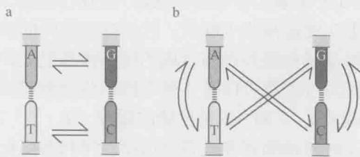  
图 10-1 碱基的替换。a. 转换。b. 颠换。

座子的插入或者细胞重组过程中的异常作用所导致——转座子通常将数千个核苷酸的外源 DNA 插入到基因的编码序列或者调控序列中（第 12 章），或由细胞重组过程中的异常活动所致。染色体上任一给定位点自发产生新突变的总体概率为每轮 DNA 复制 $10^{6} \sim 10^{11}$ ，其中染色体上有些位点是“热点”，此处的突变发生频率高而其他位点发生变化的概率相对较低。

有一种尤其易发突变的序列因为它对人类的遗传学和疾病的重要性而值得特别关注。这些突变易发序列是简单的2-、3-或4-核苷酸序列的重复，被称为DNA微卫星(DNAmicrosatellite）。一个为人熟知的例子涉及二核苷酸序列 CA 的重复。CA 重复片段在人类和其他真核细胞染色体上分布非常广泛。复制机器很难精确拷贝这种重复序列，常常发生“打滑”。打滑使得重复序列的拷贝数目增加或减少，结果在人群中染色体上特定位置处的 CA 重复片段长度常常为高度多态性。这种多态性为可遗传突变作图（如增大人类患某些疾病倾向的突变）提供了方便的物理标记（框 10-1，三联核苷酸重复的扩增导致疾病）。

## 框 10-1 三联核苷酸重复的扩增导致疾病

另一个为人熟知的错误易发序列的例子是某些基因中的三联核苷酸序列重复CGG和CAG。常发现人类中的这种三联核苷酸重复在一代传给下一代的时候发生扩增，使得所导致的疾病在患病个体的孩子和孙子上渐进性加重。三联体扩增导致的疾病例子有成人肌（强直性肌）营养不良、导致精神迟缓的脆性X综合征，以及引起神经蜕变的亨廷顿病。CAG是谷氨酰胺的密码子，它在亨廷顿蛋白编码序列中的扩增导致患有亨廷顿病的患者突变蛋白中含谷氨酰胺残基片段的长度加大。最近的研究表明，这个多聚谷氨酰胺片段干扰名为Sp1的转录因子中谷氨酰胺富含区与名为TFIID的转录机器元件的亚基“TAFII130”中对应的谷氨酰胺富含区之间正常的相互作用（见第13章）。此干扰削弱大脑神经元中的转录，包括神经递质受体基因的转录。其他基因中CAG扩增产生的相似的多聚谷氨酰胺片段可能也通过破坏转录因子与TAFII130之间的相互作用而作用。

## 有些复制错误能逃脱校正读码

如我们所知，复制机器凭借校正读码机制使精确度达到极高的水平，即复制子中的3'→5'外切酶元件可将错误掺入的核苷酸去除（如第9章所述）。校正读码将DNA复制的忠实度提高约100倍，然而校正读码的核酸外切酶并非绝对安全。有些错误插入的核苷酸逃脱检测并在新合成的链与模板链之间形成错误配对。模板链中4种核苷酸，每种的配对位置都可以有3种不同的核苷酸被错误插入（例如，在模板链上的T可能面对T、G或C），共有12种可能的错配（T：T、T：G、T：C等）。如果错误插入的核苷酸没有及时被检测到并被替换的话，序列的变化将永久性地存在于基因组中。在第二轮复制的时候，错误插入的核苷酸已经是模板链的一部分，将指导其互补性核苷酸插入到新合成的链中（图10-2）。此时不存在错配，取而代之的是在DNA序列中产生一个永久性的改变（突变）。

## 错配修复能将逃脱校正读码的错误去除

幸运的是，有一套用来检测错配并对之进行修复的机制。保证 DNA 复制忠实性的最后责任由错配修复系统（mismatch repair system）承担，它将 DNA 合成的精确性又提高了 2\~3 个数量级。错配修复系统面对两个挑战：第一，它必须扫描基因组寻找错误配对，因为错误配对是短暂的（它们在第二轮复制后被消除，此时它们产生突变），错配修复系统必须很快就发现错误配对并对之进行修复；第二，系统必须准确地纠正错误配对，即它必须在新合成的链中将错误插入的核苷酸换掉而不能把母链中正确的核苷酸换掉。

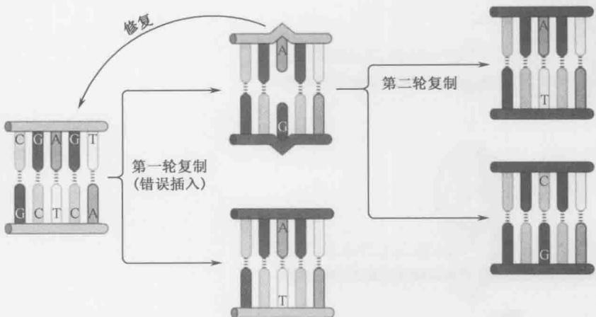  
图 10-2 突变可通过复制永久性地插入进去。在第一轮复制中错误插入一个碱基可引入一个突变；在第二轮复制中，突变就永久性地插入到 DNA 序列中了。

在大肠杆菌中，错配是由错配修复蛋白MutS的二聚体来检测的（图10-3）。MutS扫描DNA，从错配引起DNA骨架的扭曲变形上识别出它们。MutS包围含错误配对的DNA，诱导DNA产生一个明显的纽结和MutS自身构象上的变化（图10-4）。MutS特异性的关键在于含有错误配对的DNA比正确碱基配对的DNA更容易扭曲。MutS拥有错配修复所需要的ATP酶活性，但是它在修复中的具体作用还是未知的。MutS和含错误配对的DNA形成的复合体募集MutL——错配修复系统中的第二个蛋白质，MutL再激活MutH。MutH是一种酶，能在错配位点附近的一条链上产生一个切口或割口。切口形成后由一种特殊的DNA解旋酶(UvrD)和三个核酸外切酶中的一个发挥作用(见下文)。解旋酶从切口开始向错配位点方向解开DNA，核酸外切酶逐步地将解旋的单链消化掉，延伸到并越过错配核苷酸的位点。此作用产生一个单链缺口，此缺口被DNA聚合酶Ⅲ（PolⅢ）填补并由DNA连接酶接合。整体效果是将错误配对除去并用正确碱基配对的核苷酸取而代之。

但是 E.coli 错配修复系统如何知道两个错配核苷酸中的哪一个要被取代呢？如果修复是随机发生的话，那么有一半的概率错误将永久存在于 DNA 中。答案是，E.coli 通过我们就要提到的暂时半甲基化对母链进行了标记。

E.coli 的 Dam 甲基化酶（Dam methylase）使两条链上的 5'-GATC-3'序列中的 A 残基都甲基化。GATC 序列广泛分布于整个基因组中 [约每 256（4⁴）个碱基对发生一次]，所有这种位点都被 Dam 甲基化酶甲基化。当复制叉经过两条链的 GATC 都甲基化（全甲基化）的 DNA 时，产生的子代 DNA 双链就是半甲基化的（只有母链是甲基化的）。这样在几分钟的时间内，直到 Dam 甲基化酶赶上并将新合成的子链甲基化为止，子代 DNA 双链将只有一条担任模板的链被甲基化（图 10-5a）。这样，新合成的链即被标记（它没有甲基基团），从而被认出是要被修复的链。

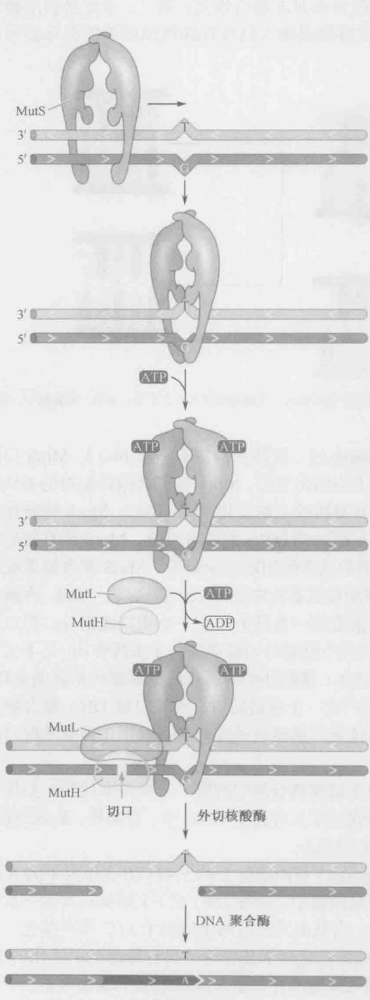  
错配被修复  
图 10-3 用以修复复制错误的差误配对修复途径。MutS 包围着含有纽结的错配 DNA（未标出，见图 10-4）。接下来，MutS 募集 MutL 和 MutH，并且由 MutS 的 ATP 酶活性催化 ATP 的水解。MutH 是一种内切核酸酶，能在 DNA 上接近错配的位置产生一个切口。紧接着，一个外切核酸酶消化切口链，向着错配方向移动。最后，产生的单链的缺口由 DNA 聚合酶填补并消除错配。（经允许改编自 Junop M. S. et al. 2001. Mol. Cell 7: 1-12, Fig. 6b. © Elsevier.）

  
图 10-4 MutS-DNA 复合体的晶体结构。注意 DNA 上位于结构底部的纽结和在酶的结构的顶部的 ATP，分别用黄色、绿色和红色表示。DNA 用一种空间填充的形式表示，红色代表骨架，灰色代表碱基。（Junop M. S. et al. 2002. Mol, Cell 7: 1-12.）镜像图用 BobScript、MolScript 和 Raster3D 绘制。

MutH 蛋白结合在这样的半甲基化位点处，但它的核酸内切酶活性通常是隐藏的。只有被位于附近错配处的 MutL 和 MulS 接触的时候（这可能是在几百个碱基对的距离内），MutH 才能像我们上面所说的那样被激活。这种相互作用如何能在数百 bp 的距离以外发生，还是未知的。但是最近有证据表明，MutS-MutL 复合体可以离开错配处并沿着 DNA 的外缘移动到半甲基化位点处的 MutH。MutH 被激活后，选择性地将未甲基化的链切开，这样在错误配对附近只有新合成的 DNA 被除去并被取代（图 10-5b）。因此甲基化是在复制发生错误的时候，使 E.coli 修复系统能够从母链上找回正确序列的“记忆”设备。

MutH 产生的切口与错误配对之间单链 DNA 的去除可以使用不同的核酸外切酶，这取决于 MutH 在错误插入的核苷酸 5' 还是 3' 一侧切割 DNA。如果在错配的 5' 侧切 DNA，则用核酸外切酶Ⅶ或 RecJ 沿 5'→3' 方向从 MutH 产生的切口开始经过错误插入的核苷酸来除去 DNA 片段。反之，如果切口在错配的 3' 侧，则由核酸外切酶 I 沿 3'→5' 方向除去 DNA 片段。如我们所看到的，错配碱基被除去之后，由 DNA 聚合酶Ⅲ来填补缺失的序列（图 10-6）。


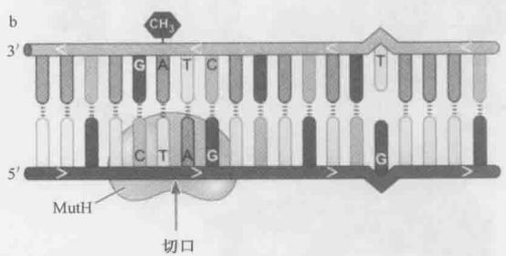  
图 10-5 Dam 在复制叉上的甲基化。（a）. 在 E.coli 中复制产生半甲基化的 DNA。（b）. MutH 在未甲基化的子链上进行切割。

  
图10-6 错配修复的方向性：核酸外切酶对错配 DNA 的去除。为了简化，与 DNA 结合的 MutH 表示成与错配处的 MutS 直接相连的形式。（a）未甲基化的 GATC 位于突变的5'侧；（b）未甲基化的 GATC 位于突变的3'侧。

真核细胞也能修复错误配对，它们使用MutS(MutS同源物称为MSH蛋白)和MutL（MutL同源物称为MLH和PMS）的同源物完成这一功能。事实上，真核生物有多种具有不同专一性的MutS样蛋白。例如，一种是专门用于简单错配的，而另一种用于识别DNA复制期间“打滑”产生的小的插入或缺失。错配修复在较高等生物上扮演极为重要的角色，最生动的证据是，发现结肠癌（遗传性非息肉性结直肠癌）的遗传倾向性是由于人的MutS同源物（尤其是MSH2同源物）和MutL同源物的基因突变。

即使真核生物细胞有错配修复系统，它们还缺少MutH及像E.coli那样用半甲基化标记母链的聪明策略（事实上，多数细菌都没有Dam甲基化酶，并且也不能用半甲基化来标记新合成的链）。那么错配修复系统是怎么知道两条链中哪一条需要校正的呢？如我们在第9章中看到的那样，后随链进行不连续合成产生冈崎片段，再通过DNA连接酶与先前合成的DNA相连接。在连接步骤之前，冈崎片段与先前合成的链之间隔着一个切口，这个切口可以看成是等同于E.coli中MutH在新合成链上产生的切口。事实上，真核细胞的提取物将修复含有切口的人工模板上的错配，并且是选择性地在携带切口的链上进行。最近的结果表明，MutS的人类同源物（MSH）与复制体上的滑动夹元件（PCNA，我们在第9章曾予以讨论）相互作用，因此可能被招募到后随链DNA不连续合成的部位上。与滑动夹的相互作用也可能将错配修复蛋白招募到前导链的3'（生长中）端。

## DNA损伤

DNA 的自发损伤：水解和脱氨基作用

突变不仅来源于复制的错误，还来源于 DNA 的损伤。如我们将看到的，有些 DNA 损伤来源于环境因素，如辐射和所谓的诱变剂（mutagen）——增加突变发生概率的化学试剂（框 10-2, Ames 测试）。但是 DNA 也因水的作用产生自发性损伤（这听起来很滑稽，因为双螺旋的正确结构有赖于水性的环境）。

## 框10-2 Ames测试

分析化学物质在动物体中所具有的潜在致癌作用既费时又费钱。但是，因为多数致癌剂都是致变剂，所以化学物质潜在的致癌作用可从其致变能力方面方便地进行评估。加利福尼亚大学伯克利分校（UC Berkeley）的 Bruce Ames 设计了一个简单的测试方法，根据化学物质在伤寒沙门氏菌（Salmonella typhimurium）中引起突变的能力来评价化学物质可能的致癌作用。Ames 测试采用的这个 S.typhimurium 菌株中负责组氨酸生物合成的操纵子发生了突变。例如，突变株操纵子的组氨酸生物合成基因之一可能含有一个错义或者移码突变。结果，突变株细胞在组氨酸缺乏的固体培养基上不能生长和形成菌落（框 10-2 图 1）。但是，如果用一个有致变性的化学物质处理突变株细胞（因而具有潜在的致癌性），在少量突变细胞中化合物将使原来的错义或者移码突变（取决于致变剂的性质）产生回复突变。此回复突变使细胞恢复了在组氨酸缺乏的固体培养基上生长和形成菌落的能力。诱变剂越强，菌落的数目就越多。有些致癌的化学物质开始的时候没有致变性，但是代谢外源物质的肝脏将其转变成了致变剂。为鉴别能够在肝脏中转化为突变剂的化学物质，Ames用肝中各种酶的混合物处理潜在的致变剂。Ames测试中发现有致变性的化学物质可进一步在动物身上再测试其潜在的致癌作用。

  
框10-2图1 Ames实验

最频繁和最重要类型的水解损伤是胞嘧啶碱基的脱氨基（图 10-7a）。在正常的生理条件下，胞嘧啶可自发进行脱氨基作用，从而产生非天然的（在 DNA 中）碱基尿嘧啶。尿嘧啶优先与腺嘌呤配对，因此，复制时在另一条链上导入腺嘌呤，而不是胞嘧啶指导下的鸟嘌呤。腺嘌呤和鸟嘌呤也易于自发脱氨基，脱氨基将腺嘌呤转变成次黄嘌呤，次黄嘌呤与胞嘧啶而不是与胸腺嘧啶形成氢键；鸟嘌呤转变成黄嘌呤，黄嘌呤虽然与胞嘧啶之间只有两个氢键，但是它仍与胞嘧啶配对。DNA 还通过 N-糖苷键的自发水解进行去嘌呤化（depurination），并在 DNA 中形成脱碱基（abasic）位点（没有碱基的即脱氧核糖）（图 10-7b）。

注意，与上面所讨论的复制错误不同，这些水解反应都导致 DNA 形成非天然的改变。无嘌呤位点当然是非天然的，而且每个脱氨基作用都产生一个非天然的碱基，因而这种改变可被下面所述的修复系统识别。这种情况还说明了为什么 DNA 有胸腺嘧啶而没有尿嘧啶。如果 DNA 天然含有尿嘧啶而不是胸腺嘧啶的话，那么胞嘧啶的脱氨基作用将产生一个天然碱基，这是修复系统很难识别的。

脱氨基作用产生一个天然存在碱基的危险，可用 5'-甲基胞嘧啶引起的问题来解释。脊椎动物 DNA 由于甲基转移酶的作用经常在胞嘧啶的位置上含有一个 5'-甲基胞嘧啶。

这个修饰后的碱基在转录沉默中起作用（第19章）。5'-甲基胞嘧啶脱氨基产生胸腺嘧啶（图10-7c），明显不能被识别为异常碱基，所以，在下一轮复制中就作为胞嘧啶到胸腺嘧啶(C→T)的转换而被固定。事实上，脊椎动物DNA中甲基化的胞嘧啶是自发突变的热点。

## DNA 损伤：烷化反应、氧化反应和辐射

DNA 易于受烷化反应、氧化反应和辐射的损伤。在烷化反应中，甲基或乙基基团被转移到碱基的反应位点及 DNA 骨架的磷酸基上。烷化化合物包括亚硝胺（nitrosamines）和非常强烈的实验室诱变剂 N-甲基-N₁-硝基-N-亚硝基胍（N-methyl-N₁-nitro-N-nitrosoguanidine）。鸟嘌呤 C6 原子上的氧是最容易发生烷基化的位点之一（图 10-8）。此甲基化的产物 O⁶-甲基鸟嘌呤（O⁶-methyl-guanine）常常与胸腺嘧啶错配，导致受损 DNA 复制的时候 G：C 碱基对变成 A：T 碱基对。

DNA 还易受到活性氧簇的攻击（如 $O_{2}^{-}$ 、 $H_{2}O_{2}$ 和 $OH\cdot$ ）。这些强烈的氧化剂由电离辐射和产生自由基的化学试剂产生。例如，鸟嘌呤氧化后产生 7,8-二羟基-8-氧代鸟嘌呤，简称氧代鸟嘌呤（oxoG）。氧代鸟嘌呤有强烈的致变性，

  
图 10-7 水解损伤引起的突变。(a). 胞嘧啶脱氨基产生鸟嘌呤。(b). 鸟嘌呤通过水解脱嘌呤化产生脱嘌呤的脱氧核糖。(c). 5-甲基胞嘧啶的脱氨基在 DNA 中产生天然碱基——胸腺嘧啶。

因为它既能与腺嘌呤也能与胞嘧啶碱基配对。如果在复制的时候与腺嘌呤碱基配对，则产生 G:C 到 T:A 的颠换，这是人类癌症中最普通的突变之一。因此，电离辐射和氧化剂的致癌效应可能部分是由于能把鸟嘌呤转换成氧代鸟嘌呤的自由基引起的。

另一种碱基损伤是紫外线造成的。260nm左右波长的辐射被碱基强烈吸收，其后果之一是在同一多核苷酸链相邻位置上的两个嘧啶之间发生光化学聚合。两个胸腺嘧啶的

  
图 10-8 鸟嘌呤的修饰。图示为鸟嘌呤上易于被化学处理，如烷化反应、氧化反应和辐射损伤的特殊部位。经这些修饰的产物常常为高度致变的。

聚合产物叫做胸腺嘧啶二聚体(thymine dimer)（图10-9），含有由毗邻胸腺嘧啶的C5和C6形成的环丁烷（cyclobutane）环。当胸腺嘧啶与胞嘧啶毗邻时，产生的聚合体是胸腺嘧啶胞嘧啶加合物，此处胸腺嘧啶通过其C6连接到胞嘧啶的C4上。这些聚合的碱基不能再进行碱基配对，从而导致复制过程中DNA聚合酶的终止。测量DNA损伤的量，如胸腺嘧啶二聚体，以及DNA损伤对细胞生存能力和基因组保真度维持产生的影响（见框10-3，DNA损伤的定量及其对细胞生存和诱变的影响）。

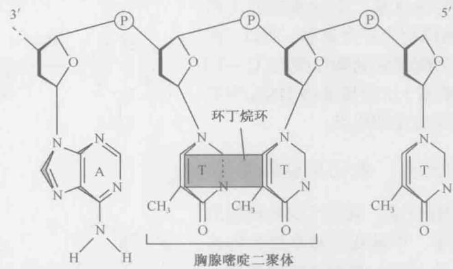  
图 10-9 胸腺嘧啶二聚体。紫外线引起毗邻胸腺嘧啶之间形成环丁烷环。

## 框 10-3 DNA 损伤的定量和其对细胞生存和诱变的影响

为了解 DNA 损伤修复以及变异发生，研究人员通过实验来测量 DNA 损伤及其对细胞的影响。如何测量 DNA 的损伤，最开始看来似乎是具有挑战性的。如何能够看到细胞内 DNA 的改变呢？科学家已经开发出许多技术来达到这一目的。在一个实验中，研究人员使用一种靶向特定类型 DNA 损伤的抗体，如胸腺嘧啶二聚体。他们在分离的基因组 DNA 样本中用类似使用抗体在免疫印迹分析中测量蛋白质的含量的方法来衡量胸腺嘧啶二聚体的水平（见第 7 章）。在另一个实验中，用彗星或单细胞凝胶电泳实验通过电泳中迁移模式的改变检测单链和双链损伤及其他类型的细胞内 DNA 损伤。受损的 DNA 显示荧光显微镜观察到的彗星样外观。新技术的持续发展为 DNA 损伤提供了更准确和更具体的检测方法。

如何测定 DNA 损伤对细胞生存能力的影响呢？对于单细胞生物如细菌和真菌，存活实验可以简单地将细胞接种于固态培养基上并通过对比处理和未处理的细胞形成的菌落数（克隆形成的单位）来比较。杀伤率或 DNA 损伤诱导剂和条件（致死曲线）之间的关系是通过一定范围内不同剂量的 DNA 损伤剂与存活细胞数画图得出。当处理的损伤类型需要一个特定的修复通路时，那么在该修复通路上有突变的则相对于野生型在同样的剂量上会表现出较低的存活率。一个不同的方法被用来测量 DNA 损伤剂对哺乳动物细胞存活率的影响。在该方法中，一种荧光染料（生-死标记）用于鉴定活细胞和死细胞。DNA 损伤剂处理后的细胞存活率就通过荧光显微镜下计算细胞被染色与否来获得。

DNA 损伤试剂或条件的定量研究除了细胞存活外，也涉及了突变发生率的检测。与 Ames 测试（见框 10-2）类似，突变发生率的检测实验可以通过在缺乏突变基因相关必须产物或下游产物的条件固体培养基上测定携带有特定突变的细胞的生存能力的逆转来完成。突变发生实验可能同样涉及正向突变（从野生型到突变型）一个特定基因并在允许突变细胞生长的选择培养基中培养。类似于存活实验，突变发生实验需要用不同剂量的 DNA 损伤剂处理细胞。突变发生率通过逆转的百分率或正向突变作为与细胞存活相关的功能剂量来计算。

最后，γ辐射和X射线（电离辐射）有很高的危险性，因为它们可使DNA双链断裂，这很难被修复。电离辐射能直接攻击（离子化）DNA骨架中的脱氧核糖。另外，辐射能通过产生活性氧簇间接攻击（如上所述），因为后者能与脱氧核糖亚基反应。因为细胞需要完整的染色体来复制其DNA，所以电离辐射用于在癌症治疗中治疗性地杀死快速增殖细胞。某些抗癌药物，如争光霉素（bleomycin）也能引起DNA的断裂。电离辐射和像争光霉素那样的试剂，因能导致DNA断裂，所以被认为具有断裂性（clastogenic）（源于希腊语klastos，其含义为“断裂的”）。

## 突变还可由碱基类似物和嵌入剂引起

突变还可由可替换正常碱基的化合物（碱基类似物，base analog）或能插入碱基间的化合物（嵌入剂，intercalating agent）导致复制错误而引起（图10-10）。碱基类似物在结构上与正常碱基类似，但是其不同之处使其对细胞又非常危险。因此，碱基类似物与正常碱基的相似程度足以使其被细胞摄取，转化成核苷三磷酸并在复制中被插入到DNA中。但是，因为这些碱基与正常碱基在结构上存在差异，使其配对不准确，导致复制过程中频繁发生错误。最有致变性的一个碱基类似物是5-溴尿嘧啶（5-bromouracil），为胸腺嘧啶的类似物。溴取代原子的存在使碱基可以通过烯醇互变异构体与鸟嘌呤错配（图10-10a）。如我们在第4章所见，酮互变异构体的倾向性远远大于烯醇互变异构体，但是胸腺嘧啶比5-溴尿嘧啶更是如此。

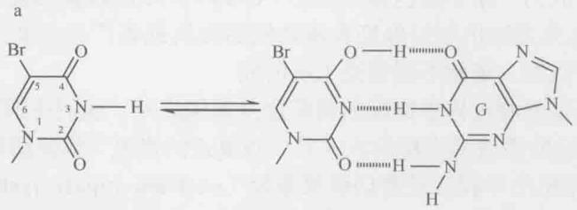

  
溴乙锭


  
图10-10 可引起 DNA 突变的碱基类似物和嵌入剂。(a). 胸腺嘧啶的碱基类似物, 5-溴尿嘧啶能与鸟嘌呤错配。(b). 嵌入剂。

如我们在第 4 章对溴乙锭所讨论的那样，嵌入剂是含有几个多元环的扁平分子，能与 DNA 中同样扁平的嘌呤或者嘧啶碱基结合，就如在双螺旋中的碱基相互结合或堆积那样。嵌入剂，如原黄素（proflavin）、吖啶（acridine）和溴乙锭（ethidium），能导致一个甚或几个碱基对的缺失或插入。当基因中发生这样的缺失或插入的时候，如第 16 章我们讨论遗传密码的时候将会看到的那样，会对其信使 RNA 的翻译产生深刻的影响，因为它们将编码序列移出了正确的可读框。

嵌入剂是怎样引起短的插入和缺失的呢？插入情况的一个可能性是，这些致变剂通过插入模板链碱基之间，导致 DNA 聚合酶在嵌入分子对侧插入一个额外的核苷酸（一个这种结构的嵌入大约能使两个碱基对之间的通常间距加倍）。相反，缺失的情况是由于嵌入分子的存在引起模板扭曲，这可能使聚合酶跳过一个核苷酸。

## DNA 损伤的修复

如我们所看到的那样，DNA 的损伤有两种后果。有些类型的损伤，如胸腺嘧啶二聚体或 DNA 骨架的切口和断裂，使得复制或者转录受阻。其他类型的损伤产生改变了的碱基，在复制上没有立即产生结构性后果，但是引起了错配，这可在复制之后导致 DNA 序列上永久性的改变。例如，通过脱氨基作用，胞嘧啶转化成尿嘧啶产生 U：G 错配，在一轮复制之后，成为一条子染色体上的 C：G 到 T：A 的转换突变。这些考虑解释了为什么细胞演化出完美的机制以保证在损伤阻碍复制或者产生突变之前就识别并修复损伤。缺少这样的机制，细胞不能耐受太长时间。

在这一部分，除了修复复制过程中错配的错配修复系统之外，我们还探讨 DNA 损伤修复系统（表 10-1）。这些系统最直接的方式是（指真正的修复）修复酶简单地将损伤逆转（撤销）。一个更精致的步骤涉及剪切修复系统（excision repair system），此处受损的核苷酸没有被修复，而是从 DNA 上被除去。在剪切修复系统中，另一条未受损的链作为模板，以便 DNA 聚合酶重新掺入正确的核苷酸。如我们将见到的，有两种剪切修复，一种仅仅将受损的核苷酸去除，另一种将包含损伤的一小段单链 DNA 去除。

表 10-1 DNA 损伤修复和耐受系统

<table><tr><td>类型</td><td>损伤</td><td>酶</td></tr><tr><td>错配修复</td><td>复制错误</td><td>E. coli中MutS、MutL、MutH人类中MSH、MLH和PMS</td></tr><tr><td>光激活作用</td><td>嘧啶二聚体</td><td>DNA光解酶</td></tr><tr><td>碱基切除修复</td><td>受损的碱基</td><td>DNA糖基化酶</td></tr><tr><td rowspan="2">核苷酸切除修复</td><td>嘧啶二聚体</td><td rowspan="2">E. coli中UvrA、UvrB、UvrC、和UvrD,人类中XPC、XPA、XPD、ERCCI-XPF以及XPG</td></tr><tr><td>碱基上的巨大加合物</td></tr><tr><td>双链断修复</td><td>双链断裂</td><td>E. coli中RecA和RecBCD</td></tr><tr><td>移损DNA合成</td><td>嘧啶二聚体、脱嘌呤位点或碱基上的巨大加合物</td><td>Y家族DNA聚合酶,如E. coli中的UmuC</td></tr></table>

但是，更精致的系统是重组修复（recombinational repair），当 DNA 两条链都受损（断裂）时采用这种修复。这种情况下，一条链不能作为另一条链修复的模板。因此，在重组修复 [也叫双链断裂修复（double-strand break repair）] 中，序列信息从染色体第二条未受损的拷贝上找回。最后，当 DNA 聚合酶的复制进程被受损碱基阻碍的时候，一个特殊的移损聚合酶（translesion polymerase）以一种不依靠模板和新合成 DNA 链之间碱基配对的方式经过受损位点进行拷贝。因为移损合成不可避免地具有很高的错误易发性（致变性），所以细胞在迫不得已的情况下才采用此机制。

## DNA 损伤的直接逆转

损伤简单逆转修复的一个例子是光激活作用（photoreactivation），光激活作用直接逆转紫外辐射造成的嘧啶二聚体结构。光激活反应中，DNA 光解酶从光线中捕获能量并将其用于断裂连接毗邻嘧啶的共价键（图 10-11）。换句话说，受损碱基被直接修复了。

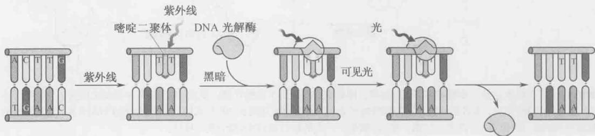  
图10-11 光激活作用。紫外线照射产生胸腺嘧啶二聚体。当被光照射时，DNA光解酶将二聚体形成的环打断，恢复成两个胸腺嘧啶残基。

直接逆转的另一个例子是甲基化碱基 $O^{6}$ -甲基鸟嘌呤上的甲基被去除（见上文）。在此例中，甲基转移酶把甲基基团转移到其自身的一个半胱氨酸残基上，从而使之从鸟嘌呤残基上除去（图 10-12）。对细胞来说这个代价很昂贵，因为甲基转移酶不具有催化性，一旦接受一个甲基基团就不可再次被使用。

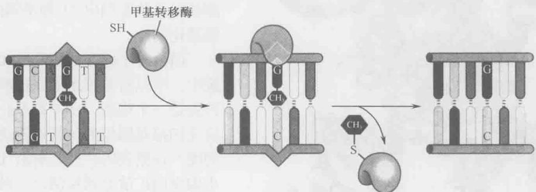  
图10-12 甲基基团的去除。甲基转移酶催化 $\mathrm{O}^{6}$ -甲基鸟嘌呤的甲基基团转移到该酶的一个半胱氨酸残基上，从而在 DNA 中恢复成正常的 $\mathrm{G}$ 。

## 碱基切除修复酶通过碱基弹出机制除去受损碱基

DNA 清除受损碱基最普遍的方法是通过修复系统将已变化的碱基除去并替换掉。两种主要的修复系统是碱基切除修复(base excision repair)和核苷酸切除修复(nucleotideexcision repair）。在碱基切除修复中，一种称为糖基化酶（glycosylase）的酶识别并通过水解糖苷键除去受损碱基（图10-13）。在随后的核酸内切步骤中，产生的脱碱基戊糖从DNA骨架上去除。核酸内切性切割还除去自发水解产生的脱嘌呤和脱嘧啶的戊糖。受损核苷酸从骨架上完全除去以后，一种修复DNA聚合酶和DNA连接酶用未受损的链作为模板重建了一条完整的链。

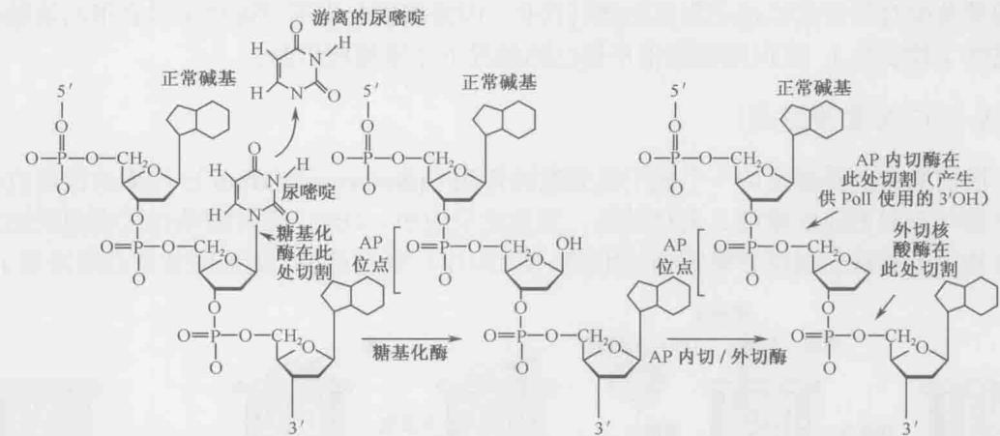  
图10-13 碱基切除途径：尿嘧啶糖基化酶反应。尿嘧啶糖基化酶水解糖苷键以使尿嘧啶从DNA骨架上脱离，并留下一个AP位点（脱嘌呤位点，或者在此情况下是脱嘧啶位点）。AP核酸内切酶在AP位点的5'位置上切断DNA骨架，留出3'-OH；核酸外切酶在AP位点的3'位置上切割，留出5'磷酸，产生的缺口被DNA聚合酶I填补。

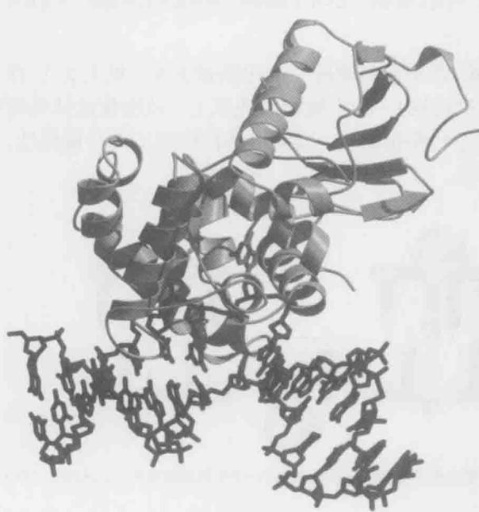  
图 10-14 DNA 糖基化酶复合体的结构。酶显示为灰色，DNA 显示为紫色。图中受损的碱基——氧代鸟嘌呤显示为红色，从螺旋中弹出，进入酶的催化中心。（Bruner S. D., et al. 2000. Nature 403: 859-866.）镜像图用 BobScript、MolScript 和 Raster 3D 制作。

DNA 糖基化酶为损伤特异性的，细胞中有多种具有不同特异性的 DNA 糖基化酶。因此，一种特殊的糖基化酶识别尿嘧啶（胞嘧啶脱氨基作用产生），另一种负责除去氧代鸟嘌呤（oxoG，鸟嘌呤氧化的结果）。在人细胞核中总共鉴别出 11 种不同的 DNA 糖基化酶。

因为每个碱基都埋藏在 DNA 螺旋中，所以将基因组中受损碱基清除出去是一个难题。DNA 糖基化酶是如何在扫描基因组的时候检测受损碱基的呢？证据表明，这些酶沿 DNA 的小沟纵向扩散直到检测出一种特定类型的损伤。但是，如果碱基包埋在 DNA 螺旋中，那么糖基化酶如何对其起作用呢？对此疑惑的解答源于 DNA 具有令人惊叹的柔韧性。对 X 射线晶体学的研究揭示了受损的碱基

是被弹出的，所以它突出于双螺旋之外，此处它正好位于糖基化酶的特异性口袋中（图10-14）。有趣的是，双螺旋仅需中等的结构扭曲就能使碱基弹出，所以碱基弹出的能量消耗不会太大（第4章图4-8）。然而，糖基化酶沿着DNA扩散的时候，不可能将每一个碱基都弹出来检查异常，这些酶进行受损碱基扫描的机制仍然不为人知。

如果受损碱基在 DNA 复制之前没有通过碱基切除而被除去会怎样呢？这是不是意味着将不可避免地产生突变？在倾向于和 A 发生错配的 oxoG 例子中存在一种防故障机制（图 10-15）。一种专门的糖基化酶可识别模板链上 oxoG 配对位置错误掺入 A 产生的 oxoG：A 碱基对。然而在这种情况下，糖基化酶会除去 A。因此，修复酶把与 oxoG 配对的 A 认作突变，并除去虽没有受损但是却不正确的碱基 A。

  
图10-15 oxoG：A修复。鸟嘌呤氧化产生oxoG。修饰后的碱基在DNA复制之前就能被DNA糖基化酶通过碱基切除途径进行修复。如果复制发生在oxoG被除去之前，致使A被错误插入，那么防错糖基化酶能除去A，使A被C替换掉。这给DNA糖基化酶除去修饰的碱基提供了第二次机会。

另一个防故障系统的例子是除去与 G 配对的 T 的糖基化酶。如我们所见，5-甲基胞嘧啶自发的脱氨基作用能形成 T：G 错配，这在脊椎动物的 DNA 中常常发生。因为 T 和 G 都是正常的碱基，细胞如何识别哪一个才是不正确的碱基呢？糖基化酶系统认为，T：G 错配中的 T 是 5-甲基胞嘧啶脱氨基作用产生的，并选择性地除去 T 使其被 C 取代。

## 核苷酸切除修复酶在损伤两侧切割受损的 DNA

与碱基切除修复不同，核苷酸切除修复酶不能区分各种不同的损伤，而是识别双螺旋形状上的扭曲，如胸腺嘧啶二聚体或碱基上存在大的化学加合物时产生的扭曲。这种扭曲引发一连串的事件，导致含有损伤的一小段单链片段（或小区）被去除。去除修复在 DNA 上产生的单链缺口由 DNA 聚合酶用未受损的链为模板进行填补，从而恢复原始的核苷酸序列。

E. coli 的核苷酸切除修复主要由 4 种蛋白质来完成：UvrA、UvrB、UvrC 和 UvrD（图 10-16）。UvrA 和 UvrB 组成的复合体扫描 DNA，其中 UvrA 负责检测螺旋中的扭曲，一旦遇到扭曲，UvrA 退出复合体。UvrB 使 DNA 变性，在损伤周围产生一个单链的凸起。然后，UvrB 募集 UvrC，UvrC 产生两个切口：一个位于损伤 5'侧的 8 个核苷酸处，另一个位于损伤 3'侧的 4 个或 5 个核苷酸处。切割产生长度为 12\~13 个残基的单链 DNA

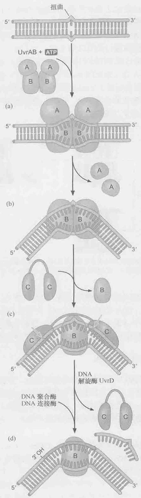

图 10-16 核苷酸切除修复途径。(a) 通过与 UvrB 形成二聚体的 UvrA, ATP 水解促进促进二聚体形成 UvrA 和 UvrB 扫描 DNA, 寻找扭曲。(b) UvrA 离开复合体, UvrB 在扭曲附近将 DNA 局部变性。(c) UvrC 与 UvrB 形成复合体, 在损伤的 5'侧和 3'侧产生切口。(d) DNA 解旋酶 UvrD 将单链片段从双螺旋上释放出来, DNA 聚合酶 I 和连接酶对缺口进行修复和填补。(a\~d 经允许取自 Zou Y. and Van Houten B. 1999, EMBO J. 18: 4898, Fig 7. © Macmillan.)

片段，此片段在 DNA 解旋酶 UvrD 的可作用范围之内。最后，DNA 聚合酶 I（Pol I）和 DNA 连接酶填补产生的缺口。

较高等细胞中核苷酸切除修复的原理与 E.coli 中的基本相同，但是对损伤的检测、切除和修复系统更为复杂，涉及 25 个或者更多的多肽。其中 XPC 负责检测螺旋中的扭曲，这在 E.coli 中是 UvrA 的职能。与在 E.coli 中一样，DNA 被变性打开并在损伤周围形成一个凸起。凸起的形成涉及 XPA 和 XPD 蛋白的解旋酶活性（E.coli 中 UvrB 的对应物），以及单链结合蛋白 RPA。凸起在损伤部位的 5' 端产生的切割位点供核酸酶 ERCC1-XPF 切割，在 3' 端产生的切割位点供核酸酶 XPG 切割（代表 UvrC 的功能）。在高等细胞中，产生的单链 DNA 片段为 24\~32 个核苷酸。与在细菌中一样，DNA 片段释放后产生的缺口被 DNA 聚合酶和连接酶填补。

如其名称所表明的那样，UVR蛋白是紫外线损伤修复所需要的。uvr基因突变株对紫外线敏感，缺少除去胸腺嘧啶-胸腺嘧啶二聚体和胸腺嘧啶-胞嘧啶加合物的能力。事实上，这些蛋白质广泛识别各种类型的巨大加合物并将之修复。核苷酸切除修复对人类也很重要。人类可患上一种名为着色性干皮病的遗传病，此病使患者对光线极度敏感并导致皮肤损伤，包括皮肤癌（见框10-4，核苷酸切除修复和跨损伤合成与人类遗传缺陷的联系）。

## 框 10-4 核苷酸切除修复和跨损伤合成与人类遗传性疾病的关系

人类可患一种遗传性疾病——着色性干皮病（XP），它是一种常染色体疾病，使得患者对阳光非常敏感，同时导致皮肤损伤，包括皮肤癌。已有7个基因被鉴定其突变能引起XP。这些基因的特定蛋白（如XPA、XPC、XPD、XPF和XPG等；见正文）处于人类的核苷酸切除修复途径（NER），突显了NER在紫外损伤中的重要性。除了NER相关的蛋白质，一种XP的突变型XP-V是由于DNA跨损伤修复聚合酶Polη（见后面关于跨损伤聚合酶的讨论）的缺陷引起的。编码该酶的基因有时称为XPV，携有XP-V的个体表现出较为缓和的XP症状。

在 XP 患者的细胞水平上发生了什么呢?由于 NER 缺陷的存在, 细胞 UV 诱导的 DNA 损伤修复能力, 如对胸腺嘧啶二聚体的修复受到限制, XP 患者暴露于阳光后, 细胞内 DNA 损伤的数量增加, 导致诱变的增加和细胞死亡。具有突变的 Pol η 的细胞在复制中无法修复胸腺嘧啶二聚体突变, 因此必须使用另一个旁路的跨损伤聚合酶, 以避免阻滞在复制期。因为 Pol η (但不包括其他跨损伤聚合酶) 校正了胸腺嘧啶二聚体的插入, 使用其他跨损伤聚合酶可能增加突变的频率。

核苷酸切除修复不仅能修复整个基因组中的损伤，而且当RNA聚合酶的转录过程被某个基因中发生的转录（模板）链的损伤所终止时，它还能拯救RNA聚合酶。此现象叫做转录耦联修复（transcription-coupled repair），包括将核苷酸切除修复蛋白募集到受阻的RNA聚合酶上（图10-17）。转录耦联修复的意义在于它将修复酶集中于正在活跃地被转录的DNA（基因）上。实际上，RNA聚合酶在细胞中起到另一种损伤检测蛋白的作用。真核细胞中转录耦联修复的核心是通用转录因子 TFIIH。如我们将在第 13 章所看到的那样，TFIIH 在转录起始过程中解开 DNA 模板的螺旋。TFIIH 的亚基包括上面讨论的 DNA 解螺旋蛋白 XPA 和 XPD。所以，TFIIH 负责两个独立的职能：在核苷酸切除修复过程（包括转录耦联修复）中，有解链功能的解旋酶将损伤周围的 DNA 解旋，以及在基因转录过程中帮助打开 DNA 模板。原核生物中也存在将修复和转录耦联在一起的系统。

## 重组修复通过从未受损 DNA 中找回序列信息来修复 DNA 断裂

切除修复用未受损的 DNA 链作为模板来替代另一条链上已受损的 DNA 片段。细胞如何修复 DNA 中双螺旋两条链都断裂的双链断裂呢？这是由双链断裂修复（DSB）途径 [double-strand break（DSB） repair pathway] 进行的。此途径从姐妹染色体中取回序列信息。因为 DSB 修复途径在常规的同源重组及 DSB 修复中具有核心作用，所以 DSB 修复途径本身就是一个重要的主题，我们将在第 11 章中对其进行详细探讨。

DNA 重组还帮助修复 DNA 复制中的错误。设想复制叉在 DNA 中遇到没有被核苷酸切除修复纠正的损伤（如胸腺嘧啶二聚体），DNA 聚合酶有时将会放弃尝试越过此损伤进行复制。DNA 聚合酶有时试图尝试跳过损伤进行复制。虽然模板链不能使用了，但是序列信息仍然能通过重组从复制叉的另一个子分子上取回（见第 11 章）。当重组修复完毕后，核苷酸切除系统又有一次修复胸腺嘧啶二聚体的机会。事实上，已经知道重组缺失的突变体对紫外线敏感。再考虑复制叉在 DNA 模板中遇到一个切口，复制叉越过切口将产生 DNA 断裂，这只能通过双链断裂修复途径进行修复。虽然一般我们认为重组是探讨序列新组合的演化策略，但它最初的功能可能是为了修复 DNA 的损伤。

## DNA 中的 DSB 可以通过直接与断裂末端相连而修复

在所有的 DNA 损伤中，DSB 是对细胞最有害的。如果不修复，DNA 的断裂将引起多种有害的后果，如阻断复制和引起染色体缺失，进而导致细胞死亡或肿瘤转化。细胞通常有多种重叠的途径来处理 DNA 损伤，那么细胞不仅仅依赖于 DSB 修复途径来处理 DSB 也就不足为奇了。正如我们所看到的和在第 11 章中将要讨论的，DSB 修复途径依赖于姐妹染色体的 DNA 序列信息来修复受损的 DNA 分子。这是一种有效的策略，因为姐妹染色体可以为绕过断裂位点而精确地恢复原先的序列提供一个模板。在酵母细胞中，DSB 修复是断裂修复的一种主要途径。但是，在细胞周期的早期，两个姐妹染色体由 DNA 复制产生之前又会发生什么呢？如果一个仍未复制的染色体发生了断裂，就没有姐妹染色体可以作为 DSB 修复途径的模板了。在这种情况下，另外一个称为非同源末端连接（nonhomologous end joining，NHEJ）的系统就可以发挥作用了。NHEJ 是酵母中的备用系统，但是在高等细胞中它是修复断裂的一个主要途径（框 10-5，非同源末端连接）。

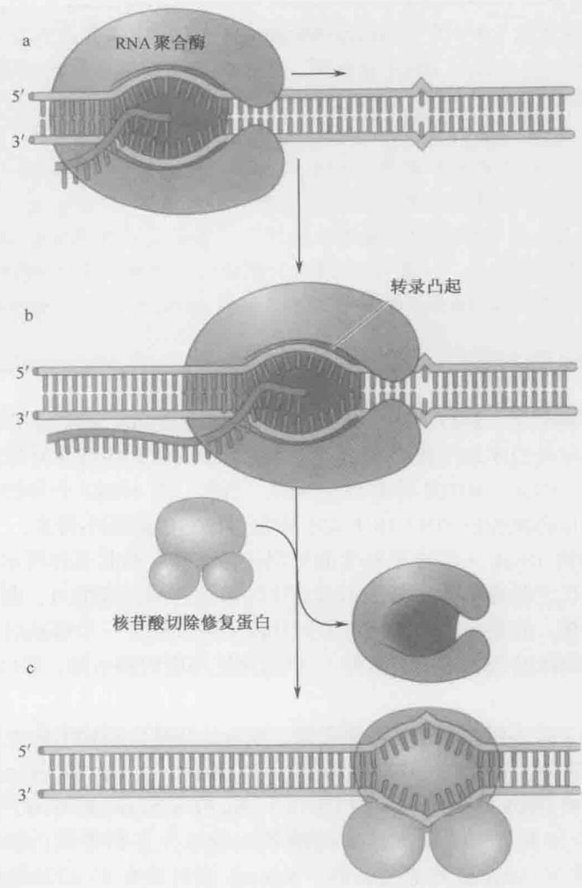  
图 10-17 转录耦联的 DNA 修复。(a). RNA 聚合酶在损伤上游正常地转录 DNA。(b). 当遇到 DNA 中的损伤时, RNA 聚合酶受阻, 转录停止。(c). RNA 聚合酶招募核苷酸切除修复蛋白到损伤部位上, 然后从 DNA 上回退或者解离, 以使修复蛋白能触及损伤。(经 Zou Y. and Van Houten B. 1999. EMBO J. 18: 4898, Fig 7. © Macmillan.)  
框10-5 非同源末端连接

NHEJ能够修复暴露于外源有害物而产生的DSB，如电离辐射及细胞内在的损伤（如DNA复制失败）。显然，NHEJ也存在于所有正常细胞内在的适应性免疫过程中。免疫系统产生大量多种多样的抗体分子，这些分子由所谓的轻链和重链组成。轻链和重链是在重组过程中产生的，包括大量储备着编码蛋白的DNA元件V和J（在抗体的重链中是D片段）等大片段的连接，从而形成多肽的不同区域。第12章我们将这个过程称为 V(D)J 重组 [V(D)J recombination]。V(D)J 重组的启动是通过在一个淋巴细胞特异的过程中引入 DNA 的断裂，这个过程还涉及 RAG1 和 RAG2 两个蛋白质。一旦断裂产生，NHEJ 途径（并不是淋巴细胞特异的）就会将两个末端连接。然而在这种情况下，蛋白编码片段的末端并不是与它们原先的部分连接。这些末端会与新的片段连接起来形成重链和轻链中的合成编码序列。NHEJ 也参与 V(D)J 重组的另一个例子——控制 T-细胞受体的免疫多肽的形成，将在第 12 章讨论。

强调 NHEJ 在人类生物学中的重要性是因为一些罕见的遗传综合征，它们的特征是对电离辐射和 DNA 损伤剂，以及由 V(D)J 重组缺陷导致的免疫缺陷高度敏感。可见患有这些综合征的患者在 NHEJ 途径的 Artemis、LigaseIV 或 Cermummos-XLF 基因中发生了突变。

我们可以解释的是，进行 NHEJ 保护并加工断裂的末端，同时将它们连接在一起的机制。由于断裂末端的序列信息丢失了，穿过断裂处的原先序列在异源末端连接过程中无法忠实地修复，因此，NHEJ 是有致变性的。当然，由 NHEJ 介导的 DNA 末端连接而导致的诱变要比将断裂的 DNA 留下而不修复对细胞的损伤小得多。

在 NHEJ 中将 DNA 末端连接起来的机制是什么呢？如其名称所示，NHEJ 不涉及同源重组。取而代之的是，通过断裂末端突出的单链之间错排配对，断裂 DNA 的两个末端直接相互连接。此错排配对是通过不同片段（可以短至一个碱基对）互补碱基之间的匹配完成的（偶然发现的微小同源件）。单链尾巴用核酸酶去除，缺口用 DNA 聚合酶填补。

已经鉴定出了很多调控 NHEJ 的蛋白质。至今，在哺乳动物细胞中已经发现了 7 个 NHEJ 途径的组分，它们的名字都比较难记：Ku70、Ku80、DNA-PKcs、Artemis、XRCC4、Cernunnos-XLF 和 DNA Ligase IV（图 10-18）。Ku70 和 Ku80 是 NHEJ 最基本的成分，它们能形成一个异源二聚体与 DNA 的断裂末端结合并招募蛋白激酶 DNA-PKc。DNA-PKc 接下来与 Artemis 形成复合体。Artemis 同时具有 5'→3' 外切核酸酶和潜在的内切核酸酶活性，可以被 DNA-PKc 的磷酸化作用激活。这些核酸水解活性对断裂末端进行加工并为连接作准备。连接是由 Ligase IV、XRCC4 和 Cernunnos-XLF 组成的复合物来执行的。

NHEJ 在真核生物中是普遍存在的，但是在细菌中很少发生。然而，有人在枯草芽孢杆菌（Bacillus subtilis）的孢子中发现了一个很有意思的特殊例子。枯草芽孢杆菌能在孢子生成和成熟孢子组装蛋白的时候产生类 Ku 蛋白和一种 DNA 连接酶。Ku 蛋白和 DNA 连接酶代表了一个简单的二蛋白 NHEJ 系统，在孢子萌芽时修复 DNA 断裂。缺少这些蛋白质的突变孢子对于干热（一种已知的引起 DNA 断裂的条件）非常敏感。在萌芽时期，加热突变的孢子并不能恢复生长，因为无法将热诱导的断裂重新连接。

萌芽时期的孢子主要依赖于 NHEJ 而不是 DSB 修复途径来修复断裂是有重要意义的。孢子只有一条染色体，因此，它们不能依赖于姐妹染色体作为修复突变的模板。有

趣的是，孢子的染色体紧密卷曲形成一个典型的圆环结构可以保持断裂的 DNA 末端之间紧密相邻。这种紧密相邻的结构可以使正确的末端重连变得容易，甚至是染色体发生多处断裂的情况。枯草芽孢杆菌的孢子及有关的细菌能在极端环境下比其他任何休眠的细胞更有效地生存。NHEJ 就是这种惊人技巧的基础。

## 移损 DNA 合成使复制越过 DNA 损伤继续进行

在迄今我们已经探讨的很多例子中，DNA损伤是通过切除然后用未受损的模板重新合成来完成修复的。但是，这种修复系统不能十分有效地运行，有时正在复制的DNA聚合酶仍会遇到没有被修复的损伤，如嘧啶二聚体或脱嘌呤位点。因为这样的损伤是DNA聚合酶前进的障碍，所以复制机器必须试图越过损伤来进行复制，或被迫终止复制。即使细胞不能修复损伤，也有防故障机制使复制机

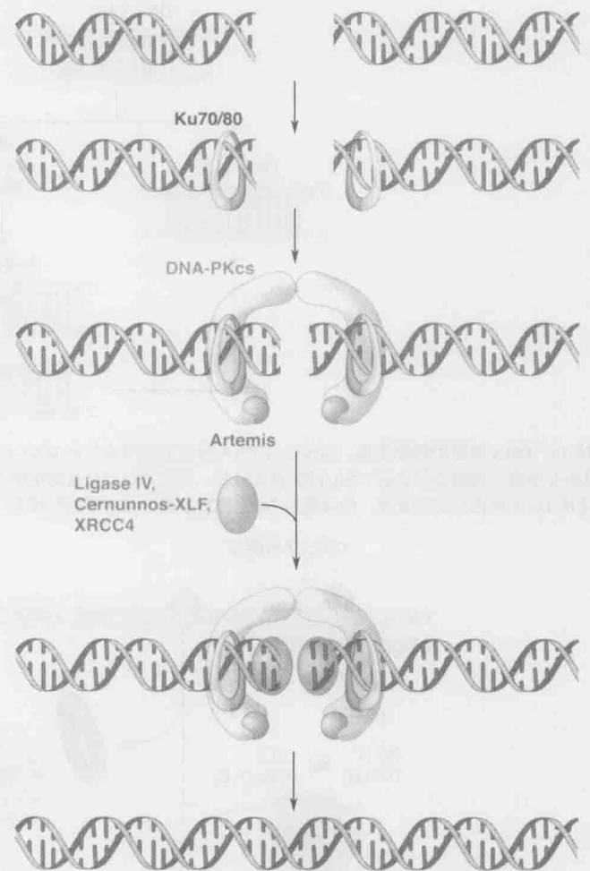  
图 10-18 哺乳动物的 NHEJ 途径。Ku70 和 Ku80 组成的异源二聚体与断裂 DNA 的末端结合并招募蛋白激酶 DNA PKc。DNAPKcs 紧接着招募拥有外切核酸酶和内切核酸酶活性的 Artemis 对断裂末端进行加工。最后，连接酶 IV、XRCC4 和 CernunosXLF 组成的复合物将两个断裂末端相连。（Sekiguchi J. M. and Ferguson D. O. 2006. Cell 124: 260-262. © Elsevier. 经许可重绘）

器绕过受损的部位，这种机制就叫做移损合成（translesion synthesis）。如我们将看到的那样，这个机制有高度的易错性，易引入突变，但是移损合成使细胞避免了染色体不完全复制的更坏命运。DNA损伤容限的一个关键特性使DNA损伤保持在基因组中。DNA修复路径可以随后修正损伤（图10-19）。

移损合成是被一类特化的 DNA 聚合酶催化的，此酶越过损伤部位直接合成 DNA（图 10-20）。在 E.coli 中，移损合成是由 UmuC 和 UmuD'蛋白的复合体 DNA PolV 或 DNA PolIV（DinB）承担的。DimB 和 UmuC 是 DNA 聚合酶的一个独特家族的一员，它在很多生物中都被发现，称为 DNA 聚合酶的 Y 家族（图 10-21 和框 10-6，DNA 聚合酶的 Y 家族）。人类有 5 种移损聚合酶，其中 4 种属于 Y 家族。

  
图10-19 DNA损伤的细胞防御。细胞通过DNA修复通路将损伤的DNA恢复到正常的状态。当基因正在被复制时如果出现DNA损伤，细胞必须启动DNA损伤耐受机制，从而避免产生复制中断或者导致致命的DNA链断裂。损伤合成虽然可以完成DNA损伤位点的复制，但是随后DNA修复通路必须对其进行修正，否则损伤就会一直存在于基因组中。

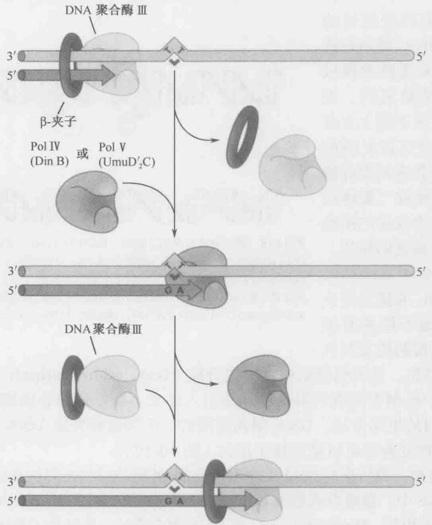  
图 10-20 移损 DNA 合成。复制时一旦在模板中遇到损伤，DNA 聚合酶 III 与其滑动夹一起从 DNA 上脱离下来并被移损 DNA 聚合酶取代。移损 DNA 聚合酶越过模板链（上者）上的胸腺嘧啶二聚体继续进行 DNA 的合成。然后移损聚合酶被 DNA 聚合酶 III 替换。（Woodgate R.1999. Genes Dev.13: 2191-2195, Fig.1. © Cold Spring Harbor Laboratory Press. 经许可重绘）

框 10-6 Y 家族 DNA 聚合酶

DNA 聚合酶按照它们氨基酸序列的彼此相似性而划分成若干家族，在图中用不同的颜色表示（框 10-6，图 1）。最近证实 UmuC 和其他几种移损 DNA 聚合酶是一个庞大而独特的 DNA 聚合酶家族的创始成员，该家族被称为 Y 家族，在三种生命领域——细菌、古细菌和真核生物中都有发现。DNA 聚合酶的 Y 家族成员特征性地在未受损 DNA 模板上进行低保真度 DNA 合成，但是它能够越过阻碍 DNA 合成酶其他家族成员进行复制的 DNA 损伤。框 10-6 图 1 显示移损 DNA 聚合酶的 Y 家族系统演化树。

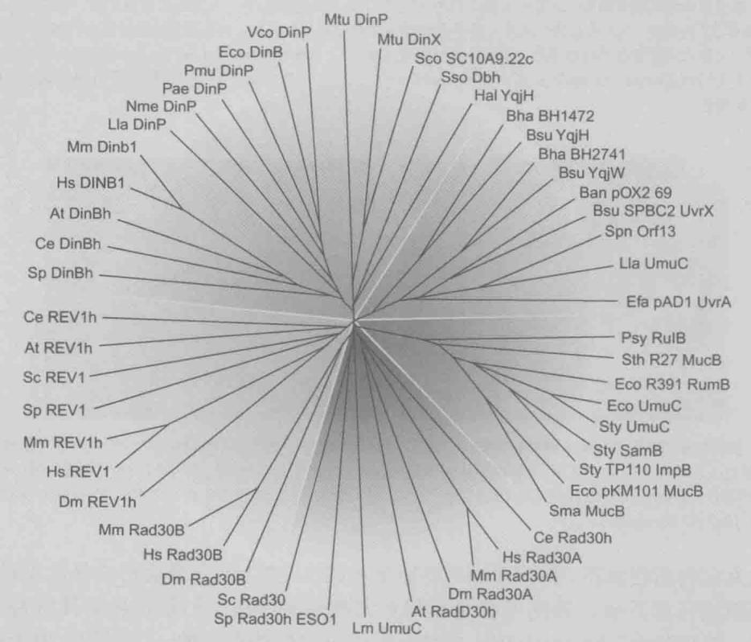  
框 10-6 图 1 Y 家族 DNA 聚合酶的系统演化树。(经允许引用自 OhmoriH. Et al. 2001. Mol. Cell 8: 7, Fig1. © Elsevier.)

这些聚合酶一个重要的性质就是，虽然它们是模板依赖性的，但是它们掺入核苷酸的方式不依赖于碱基配对。这解释了酶是如何越过模板链上的损伤合成 DNA 的。但是，因为酶没有从模板上“读取”序列信息，所以移损合成常有高易错性。试想在脱嘌呤或脱嘧啶例子中损伤位点并无碱基特异性的信息。移损聚合酶通过不按照碱基配对的方式插入核苷酸来越过损伤进行合成。虽然如此，插入的核苷酸并不是随机的——有些移损聚合酶插入特定的核苷酸。例如，人的一个 Y 家族移损聚合酶（DNA Polη）成员在嘧啶二聚体对应位置上正确插入两个 A 残基。结构研究显示，DNA Polη 的活性位点比另一种 DNA 移损聚合酶（DNA Polκ）更容易容纳一个胸腺嘧啶二聚体（图 10-22）。

©2010 Macmillan


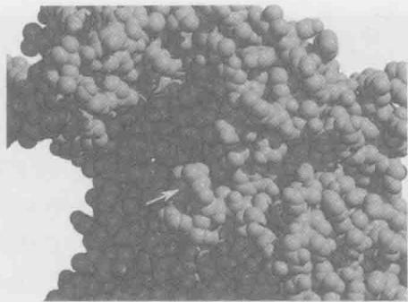  
图 10-21 移损聚合酶的晶体结构。此处显示的是两种不同的 DNA 聚合酶的结构。左侧是家族聚合酶（损伤旁路）的结构；右侧是噬菌体 T7 的典型 DNA 聚合酶。注意 Y-聚合酶结构中活性位点更加开阔，而在右侧缺失的蛋白区域关闭了通道（黄色箭头指示）。掺入的核苷酸用红色表示，模板核苷酸用蓝色表示。（Y polymerase, Ling H. et al. 2001. Cell 107: 91. PDB Code: 1JX4. T7 polymerase, Doublé S. et al. 1998. Nature 391: 251. PDB Code: 1T7P.）镜像图用 MolScript, BobScript 和 Raster 3D 制作。


Polk  
  
图 10-22 移损聚合酶支持某些特殊种类的损伤。（左图）一个胸腺嘧啶二聚体与 DNAPolη 的活性位点非常适合，因此允许在对应位置上正确插入两个 A 残基。（右图）叠加图像显示一个胸腺嘧啶二聚体与另一种 DNA 移损聚合酶 DNAPolk 的活性位点不适合，DNAPolk 更适合于其他 DNA 损伤的修复。（引用自 Silverstein T.D. et al. 2010. Nature 465: 1039–1043, Fig. 4b, p. 1042. ©Macmillan.）

因为它的高错误率，移损合成（类似于 NHEJ）被认为是最后可选择的求助系统。它能使细胞存活下来，否则可能对复制是灾难性的打击，但是付出的代价是高突变发生率。突变发生（mutagenesi）是基因组引进和保持突变的一个过程。由于这个原因，移损 DNA 聚合酶必须受到严格的调控。在正常条件下，E. coli 中没有移损合成酶，此酶只有在对 DNA 损伤应答的时候才被诱导合成。因此，编码移损聚合酶的基因作为 SOS 反应（SOS response）途径的一部分来表达。损伤导致转录阻抑物（LexA 阻抑物）被蛋白质水解性分解，此转录阻抑物控制 SOS 反应涉及的基因的表达，包括 DimB, UmuC 和 UmuD（UmuD'无活性的前体）。有趣的是，同一途径还负责 UmuD 到 UmuD' 的蛋白水解性转变。LexA 和 UmuD 的切割都是被称为 RecA 的蛋白质激发的，此蛋白质被 DNA 损伤产生的单链 DNA 激活。RecA 是双功能蛋白，它还参与 DNA 的重组，将在第 11 章讨论。

接下来我们讨论一下移损聚合酶是如何进入 DNA 损伤位点处受阻的复制机器的。在哺乳动物细胞中，移损聚合酶是通过对滑行夹的化学修饰来进入移损修复途径的。在第9章中我们已经看到，滑行夹（也就是真核生物的PCNA）将复制聚合酶锚定在DNA模板上。化学修饰是指将滑行夹与一个泛素化途径（ubiquitination）中的多肽（泛素）进行共价连接。在真核生物中，泛素化途径被广泛用于标记各种加工途径的蛋白质，如降解。最近发现越来越多的泛素化途径能够引发移损合成，并且成为由泛素肽等标签蛋白控制的细胞过程之一。一旦泛素化，滑行夹就会招募一个含有能够识别和结合泛素的结构域的移损聚合酶。移损聚合酶有时候会取代生长链3'端的复制聚合酶而越过损伤位点进行生长链的延伸（图10-23a）。因此，滑行夹的泛素化成为一个危机信号，可以招募移损聚合酶来拯救在DNA损伤位点处受阻的复制机器。除了聚合酶转换机制，也有数据证明移损合成也可以采用填空机制，即随着复制的进行，由于参与复制的DNA聚合酶在越过DNA损伤后重新启动或者开始新的冈崎片段合成时所产生的空隙（图10-23b）。

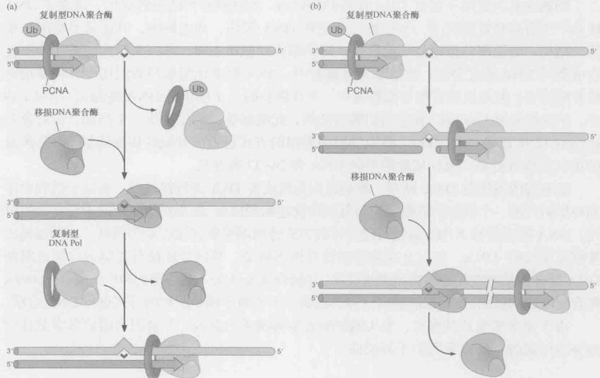  
图 10-23 移损合成的可选择模式。这两种模式解释了移损合成的机制。（a）在聚合酶转换模式中，当正在进行 DNA 复制的 DNA 聚合酶遇到 DNA 损伤的时候，便会停止合成 DNA 并被一种或多种移损聚合酶代替，DNA 聚合酶将会暂时离开损伤的部位，越过损伤部位以后，DNA 聚合酶又会重新代替移损聚合酶继续进行复制。（b）在填空模式中，当正在进行 DNA 复制的 DNA 聚合酶遇到 DNA 损伤的时候，DNA 合成并不会停止，DNA 聚合酶会跳过损伤的部位继续进行 DNA 合成，在损伤的部位留下一个缺口。随后，一个或多个移损聚合酶会进行合成来填补这个缺口。（改编自 Waters L. S. et al. 2009. Microbiol. Mol. Biol. Rev. 73: 134–154, Fig. 4, p.146.）

最后，移损合成还有几个令人着迷但是却仍然没有答案的问题。移损酶如何取代DNA复制复合体上正常的复制聚合酶？DNA合成越过损伤后，正常复制聚合酶怎样回来并取代在复制叉上的移损酶？移损聚合酶的延伸能力低，所以可能在复制通过损伤后不久它们就从模板上脱离下来。不管怎样，这个解释仍给我们留下了挑战，去解答正常加工酶如何重新进入复制机器中这一问题。

## 小结

只有当生物的 DNA 被忠实地复制，并保护免受可改变其编码特性的化学和物理损伤的时候，生物才能存活。复制精确度的限度和损伤修复的限度是由天然突变概率揭示的。因此，虽然单个碱基的错误概率可在 10 000 倍范围内变化，但是在正常情况下，一个普通的核苷酸被复制 $10^{9}$ 次，才有可能被错误改变约 1 次。复制精确性主要来自 DNA 聚合酶复制模板的方式。正确碱基选择最初是根据互补配对进行的。DNA 聚合酶校正读码的活性增加了精确度。最后，在错配修复中，新合成的 DNA 链被一种酶扫描，然后该酶启动含不正确配对碱基 DNA 的替换过程。尽管有这些安全措施，但是所有类型的错误还是都发生了：碱基替换、小片段和大片段的插入与缺失、DNA 序列的大规模重排。

细胞含有大量用于修复 DNA 损伤的酶储备，这些损伤可能是致命的，或改变 DNA 使其产生有破坏性的突变。有些酶直接逆转 DNA 损伤，如光解酶，其逆转了嘧啶二聚体的结构。更通用的策略是切除修复，即受损的片段被去除，并以未受损的链作为模板合成新的 DNA 将之替换。在碱基切除修复中，DNA 糖基化酶和核酸内切酶只将受损的核苷酸除去；但是在核苷酸切除修复中，含有损伤的一小段单链 DNA 被除去。在 E.coli 中，切除修复是 UvrABC 核酸内切酶启动的，此酶在受损部位产生一个凸起，切去含有损伤的 12 核苷酸 DNA 片段。高等细胞用类似的方式进行核苷酸的切除修复，但是涉及的蛋白质数目更多，而且切除的单链 DNA 为 24\~32 残基长。

最有害的损伤是 DNA 断裂。断裂是由重组或者 DSB 进行修复的，在这个过程中序列根据另外的一个同源的双螺旋进行复制而绕过断裂位点。如果在修复合成中没有模板可用，DNA 断裂会被 NHEJ 通过可能易错的方式将两端重新连接起来而修复。如果细胞需要修复受损的 DNA，移损合成使得细胞对损伤耐受。移损合成使得复制可以绕过阻断 DNA 聚合酶复制进程的损伤而继续进行。移损合成是受到一类特殊的和广泛存在的 DNA 聚合酶家族调控的。该家族能够以一种不准确且不依赖于碱基配对的方式进行 DNA 合成。

由于突变发生及其修复，永久地影响着生物继承的基因，并且因为癌症常常是体细胞突变引起的，所以令我们十分关注。

## 参考文献

## 书籍

Friedberg E.C., Walker G.C., Siede W., Wood R.D., Schultz R.A., and Ellenberger T. 2005. DNA repair and mutagenesis. ASM Press, Washington, DC.

Kornberg A. and Baker T.A. 1992. DNA replication, 2nd ed. W.H. Freeman, New York.

## 复制错误及修复

Kunkel T.A. and Erie D.A. 2005. DNA mismatch repair. Annu, Rev. Biochem. 76: 681–710.

## DNA 损伤的修复

Bridges B.A. 1999. DNA repair: Polymerases for passing lesions. Curr. Biol. 9; R475–R477.

Citterio E., Verneulen W., and Hoeijmakers J.H. 2000. Transcriptional healing. Cell 101: 447–450.

Daley J.M., Palmbos P.L., Wu D., and Wilson T.E. 2005. Nonhomologous end joining in yeast. Annu. Rev. Genet. 39: 431–451.

de Laat W.L., Jaspers N.G., and Hoeijmakers J.H. 1999. Molecular mechanism of excision nucleotide repair. Genes Dev. 13: 768–785.

Drapkin R., Reardon J.T., Ansari A., Huang J.C., Zawel L., Ahn K., Sancar A., and Reinberg D. 1994. Dual role of TFIIH in DNA

excision repair and in transcription by RNA polymerase II. Nature 368: 769–772.

Kleczkowska H.E., Marra G., Lettieri T., and Jiricny J. 2001. hMSH3 and hMSH6 interact with PCNA and colocalize with it to replication foci. Genes Dev. 15: 724–736.

Lehmann A.R., McGibbon D., and Orphanet M.S. 2011. Xeroderma pigmentosum, J Rare Dis 6: 70.

Sekiguchi J.M. and Ferguson D.O. 2006. DNA double-strand break repair: A relentless hunt uncovers new prey. Cell 124: 260–262.

Silverstein T.D., Johnson R.E., Jain R., Prakash L., Prakash S., and Aggarwal A.K. 2010. Structural basis for the suppression of skin cancers by DNA polymerase η. Nature 465: 1039–1043.

Verhoeven E.E., Wyman C., Moolenaar G.F., and Goosen N. 2002. The presence of two UvrB subunits in the UvrAB complex ensures damage detection in both DNA strands. EMBO J. 21: 4196–4205.

Waters L.S., Minesinger B.K., Wiltrout M.E., D'Souza S., Woodruff R.V., and Walker G.C. 2009. Eukaryotic translesion polymerases and their roles and regulation in DNA damage tolerance. Microbiol. Mol. Biol. Rev. 73; 134–154.

Webster M.P., Jukes R., Zamfir V.S., Kay C.W., Bagnéris C., and Barrett T. 2012. Crystal structure of the UvrB dimer: Insights into the nature and functioning of the UvrAB damage engagement and UvrB-DNA complexes. Nucleic Acids Res. doi: 10.1093/nar/gks633.

## 习题

## 偶数习题的答案请参见附录2

习题 1 如果在复制过程中 DNA 聚合酶错误地将一个 C 替换了 T，假设校对和错配修正没有校正这个错配，那么这个突变在下一轮的复制中将导致转换还是颠换？请解释你的选择。

习题 2 请解释为何 DNA 上一个 5-甲基胞嘧啶的脱氨基会比一个胞嘧啶的脱氨基更能导致一个自发性的热点突变？

习题 3 如下图的损伤碱基结构图，请圈出与 DNA 中正常碱基结构的不同之处。请写出导致产生该产物的修饰过程的名称以及你认为的能识别并修复这类 DNA 损伤的 DNA 修复通路。


习题 4 以下的术语描述了一个常见的 DNA 修复通路。请将各个步骤按正确的顺序排列。写出大肠杆菌中错配修复、碱基切除修复和核苷酸切除修复通路中的每一步需要的蛋白质名称。

连接，DNA 合成，识别，切除

## 习题5

A. 请计算在人类细胞的一轮复制过程中可能发生的错配数目。假设人类基因组的大小是32亿个碱基对。

B. 请计算在人类细胞的一轮复制过程中如果不存在错配修复的话可能发生的错配数目。

习题 6 假设在大肠杆菌中发生 dam（编码 Dam 甲基化酶的基因）的功能丧失性突变，请就自发突变可能观测到的表型改变进行预测。简要解释你的回答。

习题 7 请描述通过碱基切除的 3-甲基腺嘌呤修复与由甲基转移酶直接逆转的 $O^{6}$ -甲基鸟嘌呤修复相比可能的优点和缺点。

习题 8 DNA 暴露在化疗药物顺铂下能导致在两个邻近鸟嘌呤间形成 DNA 链间交联。请解释为何两个鸟嘌呤之间的链间交联相比碱基切除修复更适合核苷酸切除修复。

习题 9 请预测一个细胞的转录偶联核苷酸切除修复系统不能正常发挥其功能所会导致的直接后果。

习题 10 除了对 DNA 的损伤耐受外，列出可能导致潜在突变的修复通路。请描述该通路如何导致突变。

习题 11 请解释 DNA 修复与 DNA 损伤耐受之间的差异。

习题 12 假设一个功能缺失性突变发生在核苷酸切除修复和移损合成通路。请预测 DNA 损伤的水平、存活率，以及在 UV 照射后相比野生型的突变发生水平。在下表中，在空白处填入增高、下降或者保持不变。

<table><tr><td>突变途径</td><td>DNA 损伤</td><td>存活率</td><td>诱变</td></tr><tr><td>NER</td><td>——</td><td>——</td><td>——</td></tr><tr><td>移损合成</td><td>——</td><td>——</td><td>——</td></tr></table>

习题 13 你打算检测两株大肠杆菌对 DNA 损伤剂 MMS(甲磺酸甲酯)的敏感度, MMS 是一种能甲基化 DNA 特异碱基的烷化剂。将细胞用一系列剂量的 MMS 处理后（通过将细胞与 MMS 在液体培养基中培养不同时间长度），你将细胞种在固体培养基中进行存活计数（如下表）。请根据表格数据画出两株细菌的散点图（存活率与 MMS 处理剂量的比较）。哪一株细菌对 MMS 更敏感？（请注意在计算单克隆时，你可能需要进行连续稀释法培养，在本例中我们将忽略连续稀释法这个步骤）

<table><tr><td>菌株</td><td>未经MMS处理</td><td>MMS处理5 min</td><td>MMS处理10 min</td></tr><tr><td>菌株A</td><td>254</td><td>251</td><td>249</td></tr><tr><td>菌株B</td><td>325</td><td>253</td><td>189</td></tr></table>

习题 14 有许多报道声称在你日常生活中接触到的一些化学物是致突变剂。你对此很感兴趣，想要研究你常用的化学物是不是能致突变的。

为达到该目的，你选择了 Ames 试验来测试沙门氏菌的 HisG 基因点突变的逆转。你加入一种化学物到细菌的生长培养基中，并假设你在每个突变形成皿上都种了相同的细胞数，你同时计算了化学物处理过和未处理的细胞的存活率。在该实验的存活皿中培养基是非选择性培养基。该实验结果的汇总如下：

<table><tr><td>化合物</td><td>存活率</td><td>回复突变体极目(His+菌落/皿)</td></tr><tr><td>未添加化合物</td><td>100</td><td>28</td></tr><tr><td>化合物A</td><td>50</td><td>1400</td></tr><tr><td>化合物B</td><td>70</td><td>20</td></tr><tr><td>化合物C</td><td>100</td><td>7</td></tr></table>


A. 在 Ames 试验中选择性培养皿必须使用何种培养基？请详细解释为何该实验能导致突变的逆转。
B. 最开始你很惊讶地看到逆转发生在你没有加任何化合物的实验组中，但你意识到这是正常的。请给出一个特定的例子解释在没有加入诱变剂的情况下逆转是如何产生的。
C. 哪些化合物你可以鉴定为可能包含了抗诱变剂？请解释你的原因。

习题 15 你设计了一个第 9 章问题中的随访实验。回顾一下实验的设计：你新发现了两种真核细胞的 DNA 聚合酶并且想要了解更多关于它们的特性。一开始，你分别获得了纯化的 DNA 聚合酶蛋白并进行聚合酶持续合成能力的实验。你使用了结合到环状单链 DNA 模版（ssDNA）的 5'端 ${}^{32}$ P 标记的短片段引物，通过接下来的步骤去获得聚合酶 1（Pol #1）和聚合酶 2（Pol #2）各自的聚合酶持续合成能力的测定结果。


1. 在适宜的缓冲液体系中将带有引物的环形 ssDNA 与 Pol #1 或 Pol #2 在 37℃ 预孵育 5min;

2. 加入 dNTP 和过量的 ssDNA 以引发反应；

3. 在反应持续 10min 后，加入 SDS 终止反应，将样品在变性条件下进行聚丙烯酰胺凝胶电泳（能去掉游离的单核苷酸）。

进行下一步的实验，结果如下图。在该实验中，你分别将 DNA 聚合酶与配体蛋白（PCNA、RFC 和 RPA）和含有两个鸟嘌呤链间交联的 DNA 模板（由顺铂诱导）孵育。交联位点如星标所示（右下图）立即附着于引物的 3' 端。


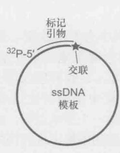

A. 请描述各个 DNA 聚合酶在模板存在顺铂诱导的链间交联情况下的持续合成能力。
B. 根据以上给出数据，请详细指出 DNA 聚合酶 #1 在细胞内可能扮演的角色。

# 第11章 分子水平上的同源重组

本章概要
DNA 断裂频发并启动同源重组
同源重组的模式
同源重组中的蛋白质机器
真核细胞的同源重组
交配型的转换
同源重组机制的遗传结果

所有的 DNA 都是重组 DNA。在同源染色体配对的减数分裂期第一次核分裂前，遗传信息的频繁交换最明显，使得染色体不断地被混合和重排。在配对阶段，染色体间发生遗传交换，这种现象通常被称为交换（crossing over），它是同源重组（homologous recombination）的结果之一，这种重组涉及染色体间 DNA 序列的物理交换。同一条染色体上的两个基因间发生交换的频率取决于它们之间的物理距离，相距越远越易发生交换。实际上，在以早期交换频率测量为基础构建的遗传图，通过揭示基因排列的固定及线性顺序规律，首次提供了染色体的结构信息。

但有时基因的顺序会发生改变。例如，一种被称为转座子（transposon）的可以移动的 DNA 片段会随机地出现在染色体的不同位置上并促进 DNA 的重排，从而改变染色体的结构。导致转座及其他一些基因组重排的重组机制不同于同源重组，我们将在第 12 章中详细讨论这些现象。

同源重组是细胞的一个基本过程，由专门合成、专门调控的酶所催化。除了造成遗传多态性外，重组还能用细胞中未损伤的同源染色体 DNA 链来修复因损伤而丢失的染色体序列。重组同时还提供一种机制，重启被停止或损伤的复制叉（“复制重启”）。此外，特殊类型的重组还能调控某些基因的表达。例如，通过交换染色体的特定部分，细胞可以把本来休眠的基因置于它们可以表达的区域。

除了解释遗传过程外，还阐明了重组的分子机制，该机制引领了基因操作方法的发展。例如，它已使在多种不同实验动物中产生“基因敲除”和“转基因”变异成为常规（见附录A）。这种依靠重组在整体生物的背景下去掉或引入基因，是确定基因功能非常有效的方法。

## DNA 断裂频发并启动同源重组

DNA 经常发生双链断裂（double-stranded break，DSB）。如果断裂未得到修复，对细胞的后果是灾难性的。例如，E. coli 染色体上一个双链断裂如果无能力修复，对细胞是致命的。对大多数细胞而言，用于修复双链断裂的主要机制就是同源重组（homologous recombination）。有些细胞也可通过被称为非同源末端连接（NHEJ）的较简单机制进行修复。这个过程已在第 10 章中描述过（见第 10 章，框 10-5）。

细菌中，同源重组的主要生物学作用是修复双链断裂。这些断裂的 DNA 末端由多种方式形成（见第 10 章）。离子辐射和其他损害因子有时直接破坏 DNA 双链的骨架。许多类型的 DNA 损害可以经由干扰复制叉的进程而间接造成双链断裂。例如，一条 DNA 链上未修复的缺口能使经过的复制叉在此停止（图 11-1）。与此类似，一个使 DNA 不能作为模板的 DNA 链上的损伤可以导致复制叉停止。这种停止的复制叉的继续又有好几种途径（如复制叉后退、核酸酶分解等，图 11-1），并形成 DNA 双链断裂的末端。这些 DNA 断端会引发该 DNA 与其同源 DNA 形成重组，进而修复这个断裂。

  
图 11-1 DNA 复制时模板上的损伤能导致双链断裂。模板链上单个缺口造成双链断裂易于理解（左图）。不过模板上的一个造成复制叉停止的损伤也能形成双链断裂（右图）。在这种情况下，两条新合成的链（标为红色）可形成碱基互补链，导致复制叉向后退。这种结构可通过多种方法进行进一步的处理。断端可引发重组。

同源重组除了能修复染色体 DNA 双链断裂外，还能促进细菌间的遗传物质交换。这种遗传物质交换发生在宿主细胞的染色体和经噬菌体转导或细胞接合而进入的 DNA 之间（见第 7 章）。在这些情况下，进入细胞的 DNA 为线性分子，提供能引发同源重组的关键 DNA 断端。

同源重组是真核细胞中修复 DNA 断裂和复制叉停止的关键步骤。染色体修复和复制重起是同源重组的主要功能，在高级生物的很多体细胞中是这样，在植物性生长的单细胞中也是这样。然而，在很多情况下，遗传交换和染色体稳定都需要同源重组。除此以外，同源重组还有其他作用，如下面将要提及的，重组是减数分裂时同源染色体配对的必要步骤。在这种情况下，当细胞进入减数分裂时，产生一种特殊的蛋白质，介导 DNA 产生双链断裂从而引发重组。所以，虽然双链断裂有多种起因，DNA 上出现双链断裂仍是同源重组事件早期的关键步骤。

## 同源重组的模式

早期用原子同位素掺入 DNA 的巧妙实验，使人们对同源重组过程在分子水平上有了基本认识。这一实验与 Matthew Meselson 和 Frank W. Stahl 用以显示 DNA 半保留复制模式的方法一样（见第 2 章）。在实验中，Meselson 和 Stahl 证明了 DNA 复制产物中包含一条新合成链和一条旧链。与之相反，同样的实验过程揭示了这一重组过程涉及 DNA 分子的直接断裂和再结合。如下所述，现在我们知道 DNA 分子断裂和再结合是同源重组的主要特点。不过，重组也常常涉及 DNA 链局部的破坏（destruction）和再合成。在这些早期实验后，研究者提出了各种解释遗传交换分子机制的模型，这些模型都包括以下几个关键步骤。

（1）两个同源 DNA 分子的联会。所谓同源，指的是两条 DNA 的序列中至少 100 个碱基对以上的序列完全相同或几乎完全相同。除了这种高度的相似性，DNA 分子可有小部分区域的序列不同，如：同一个基因携带有不同序列变异，称之为等位基因（allele）。

（2）引入 DNA 断裂。一旦断裂形成，断裂的末端可进一步产生单链 DNA 区域。

（3）链入侵。在两条重组 DNA 分子之间，形成碱基互补的短片段起始区。当来自于亲本分子的 DNA 分子单链区域与同源双链 DNA 分子互补链配对结合时，发生该配对过程，称为链入侵（strand invasion）。链入侵的结果是，产生了新的双链 DNA 区域；这种 DNA 经常带有一些错配的碱基，称为异源双链螺旋 DNA（heteroduplex DNA）。

（4）形成 Holliday 联结体。链入侵之后，两个 DNA 分子相互交叉的 DNA 链联系在一起，这个交叉的结构称为 Holliday 联结体（Holliday junction）。一个 Holliday 联结体可以通过配对碱基连续的解链和配对而沿着 DNA 移动。每次移动时，亲本 DNA 链上配对碱基断开，由相同的碱基配对形成重组中间体，该过程称为分支移位（branch migration）。

（5）Holliday 联结体的拆分。重新生成两个分开的双螺旋 DNA 从而完成遗传物质的交换过程称为拆分（resolution）。拆分的方式有两种：通过 Holliday 联结体的断裂或者通过“分解”过程。在第一种方式中，切开联结体中的 DNA 链可以重新形成两个分开的二聚体。我们会发现，在两个重组的 DNA 分子拆分时，哪两对 DNA 链在形成 Holliday 联结体时被切断，对于 DNA 交换程度有很大影响。在第二种方式中，拆分通过分解实现，这是一种收敛或瓦解的机制，我们会在下文详细描述。

## 链入侵是同源重组的关键早期步骤

将联会的两条同源双链染色体画成如图 11-2a 所示，对演示重源重组的各个步骤非常有用。尽管这些分子序列几乎完全相同，带有同一基因不同的等位基因（在图 11-2 中用符号 A/a、B/b、C/c 表示），对理解重组的结果是很有帮助的。

重组是通过在每条 DNA 分子上同样区域引入一个双链断裂而始发的（图 11-2b）。断裂位置附近的 DNA 链可以从互补链的位置上释放出来，使之可供“侵入”并最终与同源 DNA 双链互补配对（图 11-2c）。在损伤位点附近的链的加工处理过程详述如下。在同源重组链中，入侵是关键的一步，这种链入侵，以及后续的在两个同源双链之间的互补链的配对在这些分子间会形成一个稳定的配对。这个过程也会引发两个亲本 DNA 链的交换。下面我们将讲到，催化链入侵的酶称为链交换蛋白（strand-exchange protein），因为它们促进了这个关键反应。

链入侵形成的 Holliday 联结体可通过分支移位沿着 DNA 移动，这种移位提高了交换 DNA 的长度。如果两个 DNA 分子并不完全相同，如同一基因不同的等位基因间常有的少量序列上的差异，发生在这些区域的分支移位形成的 DNA 双螺旋将带有一个或若干个序列错配（图 11-2d 中的 B 和 b 等位基因及旁边的放大图）。修复异源双螺旋 DNA 的错配有重要的遗传结果，本章的结尾处将提及这一点。

## Holliday 联结体拆分是完成遗传物质交换的重要一步

完成重组要求 Holliday 联结体拆分，这个拆分过程是通过在交叉处切割 DNA 链；这个反应把两个重组的 DNA 分子分开来，完成遗传物质的交换。图 11-3 显示了两个同源 DNA 双螺旋通过一个 Holliday 联结体连接在一起。拆分有两种不同的形式，可以形成两种不同的 DNA 产物，下面我们将做进一步的阐释。

图 11-3 显示了两个相似的双链 DNA 分子之间的交换产生的分支 DNA 上两对剪切点的位置。为了使这些剪切点易于观察，将 Holliday 联结体旋转，形成一个没有交叉的、十字路口形状的结构。序列相同且极性相同的两条 DNA 链将被切断。剪切位点的两种方式在图 11-3 中分别被标为 1 和 2。

在这个例子中，标为1的剪切位点发生在两条DNA链中，这两条链完全是由两个亲本DNA分子分别组成的（如蓝色实线和灰色实线所示的链）。如果这些链现在被切割并共价的连接（第二个反应是由DNA连接酶催化的，后面会讨论），那么将产生的DNA分子的结构和序列如图的左下角所示。这些产物被视为剪接（splice）重组产物，因为两个原先的双螺旋被剪接到了一起，来自亲本的 DNA 分子的区域与杂交双螺旋共价连接到了一起。如下面所述的等位基因标签，产生的剪接产物导致了基因重排，这些基因位于重组位点的两侧。因此这种类型的重组又被称为交换产物（crossover product），因为在这种 DNA 分子中，交叉点位于 A 和 C 基因之间。

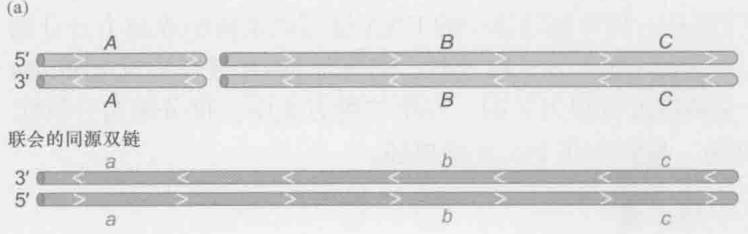

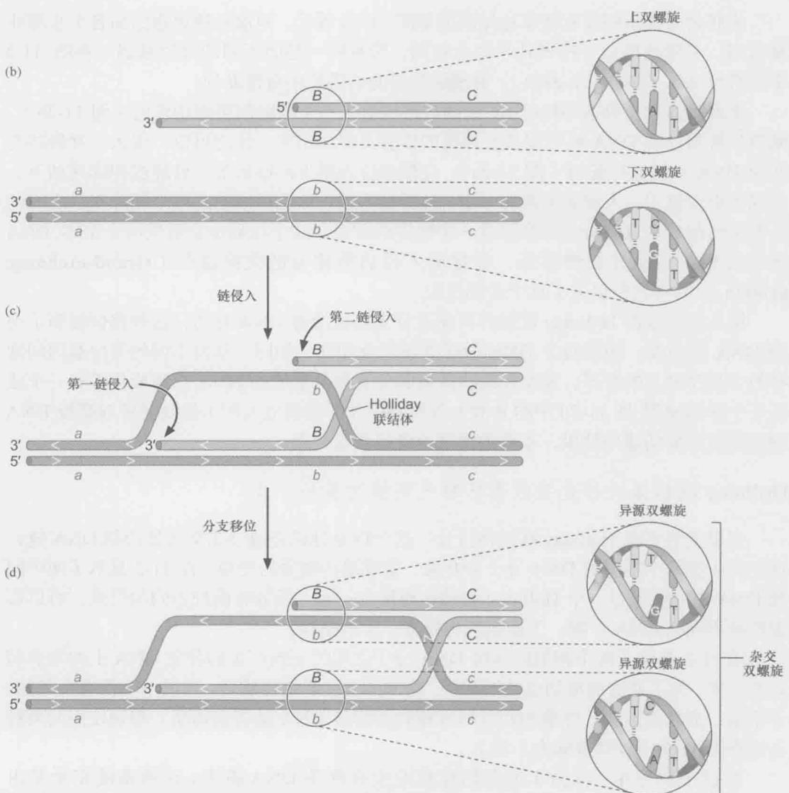  
图 11-2 Holliday 模型中的分支移位。在 DNA 单链上的小箭头标示 $5'\rightarrow3'$ 的方向。字母 A 和 a、B 和 b、C 和 c 分别代表了不同的等位基因。等位基因之间的序列差异不大。所以异源双链上同一基因座位、不同的等位基因之间就会形成错配（如 d 图右边的放大图所示）。

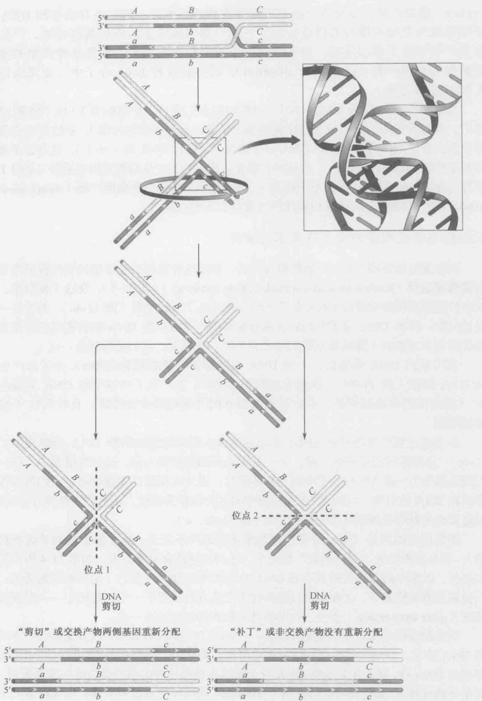  
图 11-3 Holliday 联结体剪切。拆分时有两对供剪切的位点。一对位点的剪切产生“剪切”或交换产物；另一对位点剪切将产生“补丁”或非交换产物。小插图显示一个 Holliday 联结体的结构。请注意，小插图中的 DNA 碱基完全配对。

与之相反，Holliday 联结体中另一对剪切位点（图 11-3 中图标为 2）位于两条 DNA 链中，并且含有两个亲本分子的序列区域（例如，蓝色和灰色片段）。在这些位点发生拆分和共价连接以后，产生的 DNA 分子包含一段杂合 DNA 链（补丁），这些分子被称为补丁产物（patch product）。在这些产物中，重组并未产生两侧基因的重排（见图 11-3 中等位基因 A/a 和 C/c 等位基因标签），这些分子又被称为非交换产物（noncross-over products）。影响拆分的位点和极性的因素将在下面讨论。

## 双链断裂修复模型描绘了许多重组事件

同源重组经常因 DNA 双链断裂而启动。描述这种遗传交换反应的常用模型是双链断裂修复途径（double-stranded break-repair pathway）（图 11-4）。在这个模型里，始发事件是两条同源双螺旋 DNA 分子中的一条发生了双链断裂（图 11-4a），而另外一条保持完整。两条 DNA 分子中的非对称始发断裂，导致双链 DNA 断裂模型的后期重组过程也是非对称的（即两条双螺旋的处理不同。在下文，我们将看到这一点）。

发生双链 DNA 断裂后，一种 DNA 裂解酶逐步降解断裂的 DNA 分子以产生单链 DNA 区段（图 11-4b）。该过程在断裂的 DNA 上产生了叫做单链 DNA 末端的、以 3' 端结尾的单链延伸体。有时双链断裂处的两条链都会被降解，有时只有 5' 端的链被降解。

由上述过程产生的单链 DNA 末端这时侵入到未断裂的同源 DNA 双螺旋中（图 11-4c）。这张图示意了单链入侵，下一张图表示的是双链入侵。这两种情况中，每一条入侵链都和另一条 DNA 分子中的互补链配对。因为入侵链以 3' 端结尾，它们可以作为合成新 DNA 的引物。以同源 DNA 双链中的互补链作为模板，从这些 3' 断端开始延长，以重新合成断裂处被破坏的 DNA 片段（图 11-4d, e）。

如果原先的两条 DNA 分子序列在断裂附近并不完全一样（如上述的单碱基对替换），那么在重组的“双链断裂”修复中，序列信息就有可能丢失。如图 11-4 所示的重组事件，以标示的双链为模板合成 DNA 的结果导致 DNA（灰色）的序列信息丢失。在双链断裂修复模式下，这种单向的遗传物质交流有时会留下一个遗传标记——引发基因转变（gene conversion）事件，在本章结尾处我们将重述这一点。

双链断裂模式所产生的重组中间体——两个 Holliday 联结体，以分支移位的方式沿着 DNA 移动，并最终被拆分而结束重组事件。同样地，依据拆分 Holliday 联结体时所剪切的 DNA 链，可以决定最终 DNA 分子重组点两侧序列的基因是否发生重新配对（也就是导致交换）。如何拆分包含有两个 Holliday 联结体的重组中间体，以及拆分的不同方法，见框 11-1 的说明。

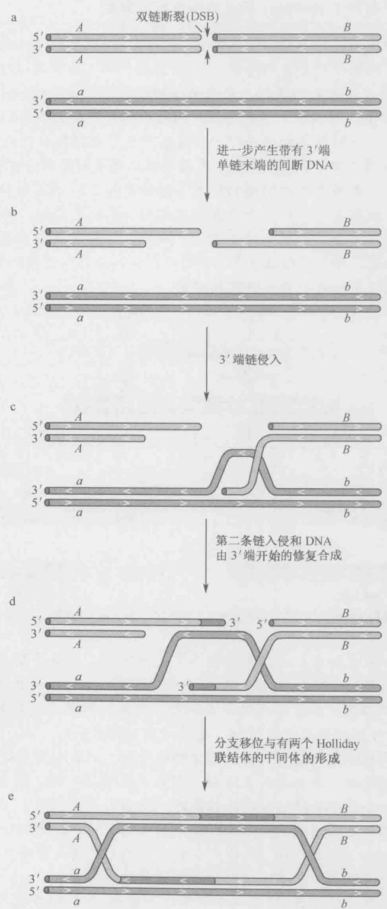  
图 11-4 同源重组的双链断裂修复模型。图示产生有两个 Holliday 联结体的重组中间体的过程。

(a)

## 框11-1 如何拆分有两个Holliday联结体的重组中间体

如何剪切重组中间体的 Holliday 联结体, 对终产物 DNA 分子的结构有很重大的影响。终产物重组点两侧序列是重新分配（剪接/交换产物）还是不进行重新配对（补丁/非交换产物）决定于拆分如何进行。因为经双链断裂修复模型途径所产生的中间体有两个 Holliday 联结体，所以难于预见哪种产物是由哪种可能的 Holliday 联结体剪切组合产生的。实际上，一种简单的方法可判定是否产生了交换或非交换产物。

下面以框11-1图1中分别标为x和y的两个联结体来解释拆分中间体的不同方式。对于每一个联结体，有两个可能的剪切位置（标为1和2）。决定拆分是否产生交换或非交换产物的简单规则如下：如果两个联结体在同一个位置剪切，如都在1或都在2，那么产生的是非交换产物。如图1中b所示，两个联结体都在2位置上剪切，产生了非交换产物。请注意，等位基因A/B和a/b仍然在亲代染色体上同一DNA分子。两个联结体同时在1位上剪切也会产生非交换产物。


  
框 11-1 图 1 双链分裂途径中间物的二种不同的拆分方式。亲代 DNA 分子连接，如图 10-4 所示。红色标示的 DNA 区域在重新合成。

与之相反，如果剪切发生在两个联结体不同的位置，就会产生交换产物。这种类型的拆分如框11-1图1c所示。x联结体在1位上剪切，y联结体在2位上剪切。请注意现在基因A和b相连，而基因a则和B相连。因此，两侧基因重新分配。如果x联结体在2位剪切，y联结体在1位剪切，也会产生交换产物。

为什么这条简单的规则是真实的？为理解这一点，比较本图中的联结体和图11-3中的单Holliday联结体。单联结体在1位上剪切产生剪接产物，在2位上剪切则产生补丁产物。当你结合两个联结体的剪切结果时，便会有如下结论：

两个联结体都在2位上剪切，产生补丁产物（补丁+补丁=补丁，非交换产物）；

两个联结体都在1位上剪切，同样产生补丁产物（剪接+剪接=补丁），因为第二次剪接型拆分正好“抵消”了第一次剪切所造成的基因重排；

若一个联结体在1位上剪切，另一个在2位上剪切，就会形成交换产物（剪接 + 补丁 = 剪接），因为在1位上剪切形成的基因重排在对最终产物中得以保留。

## 同源重组中的蛋白质机器

所有的生物都编码能催化 DNA 重组各个生化步骤的蛋白质。有些重组步骤中，同源蛋白质家族的成员在所有的生物中提供同样的功能。相比之下，另外一些重组步骤中，不同生物由不同种类的蛋白质催化，但都产生大体相同的结果。我们对重组机制最翔实的了解来自于对大肠杆菌及其噬菌体的研究。因此，我们首先着重描述主要通过双链断裂修复途径 [又称 RecBCD 途径（RecBCD pathway）] 促进大肠杆菌重组的蛋白质。真核细胞同源重组及其涉及的蛋白质将在下文介绍。

表 11-1 列出了在细菌和真核细胞（如芽殖酵母是最深入理解的真核细胞）中催化关键重组步骤的蛋白质。这些蛋白质活性是完成双链断裂修复路径关键步骤所必需的。除了这些负责重组的蛋白质外，DNA 聚合酶、单链 DNA 结合蛋白、拓扑异构酶、连接酶等也在遗传物质交换过程中起着关键作用。

表 11-1 原核和真核细胞中催化重组步骤的因子

<table><tr><td>重组步骤</td><td>大肠杆菌中的催化蛋白</td><td>真核细胞中的催化蛋白</td></tr><tr><td>同源 DNA 联会及链侵入</td><td>RecA 蛋白</td><td>Rad51, Dcm1(减数分裂期)</td></tr><tr><td>引入双链断裂</td><td>无</td><td>Spo11(减数分裂期, HO(交配模式转换)</td></tr><tr><td>作用于 DNA 断裂以产生用于侵入的单链</td><td>RecBCD(解旋酶/核酸酶)</td><td>MRX 蛋白(又称为 Rad50/58/60 核酸酶)</td></tr><tr><td>链交换蛋白组装</td><td>RecBCD 和 RecFOR</td><td>Rad52 和 Rad59</td></tr><tr><td>Holliday 联结体识别和分支移位</td><td>RuvAB 复合体</td><td>不详</td></tr><tr><td>拆分 Holliday 联结体</td><td>RuvC</td><td>Rad51c-XRCC3 复合体、WRN 和 BLM</td></tr></table>

请注意，尽管在 RecBCD 路径的重组中，两个重组 DNA 分子中至少要有一个双链断裂，但在表 11-1 中没有列出大肠杆菌中引入双链断裂的蛋白质。如前所述，迄今为止尚未发现细菌中有引入双链断裂功能的特殊蛋白质。实际上，DNA 损伤、DNA 修复中的“错误”（mis-steps）和复制叉停止等事件是染色体 DNA 产生双链断裂的主要来源。另外在遗传物质交换的反应中，如噬菌介导的转导（见附录 A），感染的 DNA 片段带有断裂的 DNA 末端。

下面将描述大肠杆菌的重组蛋白，及其如何在重组过程中通过双链断裂修复路径行使功能。我们将根据这些蛋白质在反应过程中出现的顺序加以讨论。首先讨论的是RecBCD酶如何作用于DNA的双链断裂点进而产生单链区；然后，阐述产生链交换作用的RecA蛋白的结构和作用机制，当RecA蛋白结合在DNA单链上后，能发现DNA上的序列同源区并在这些同源区域间形成新的碱基对；接下来，讨论促进分支移位的RuvA和RuvB蛋白；最后，介绍拆分Holliday联结体的酶RuvC。

## RecBCD 解旋酶/核酸酶加工用于重组的 DNA 分子断裂

具有单链延伸端或“尾巴”的 DNA 分子是引发同源序列间链交换的合适底物。RecBCD 酶(RecBCD enzyme)作用于断裂的 DNA 分子以产生单链 DNA 区域, RecBCD

  
图 11-5 RecBCD 处理 DNA 的步骤。注意 RecBCD 蛋白可以从任意一个或者两个破坏的末端进入该 DNA 分子。然而，Chi 位点仅从一个方向发挥作用。在展示的 DNA 分子中，Chi 位点被导向特定方向以便保证只有从右向左移动的 RecBCD 酶才可以被修饰。RecBCD 酶含有两个解旋酶：RecD（绿色）可以在 5' 端链（上游链）上迅速移动，RecB（紫色）可以在 3' 端链上缓慢移动（上游链）。因为这两个解旋酶移动的速度不同，RecB 在解旋过程中于下游链累积形成一个单链 DNA 环。当酶遇到 Chi 位点后，这个环就会“卷起来”，其 3' 端（现在同 Chi 接触）就可以参与 RecA 的装配。（经许可引用自 Spies et al. 2007. Cell 131: 694–705, Fig. 5, p. 701. ©Elsevier.）

也可协助链交换蛋白 RecA 结合到单链 DNA 末端。另外，RecBCD 所拥有的多种酶活性提供给细胞一种 “选择”，或是与进入细胞的 DNA 分子发生重组，或是降解它。

RecBCD 由 3 个亚基组成（recB 基因、recC 和 recD 基因的产物），并有 DNA 解旋酶和核酸酶活性。复合物依靠 ATP 水解提供的能量，结合在 DNA 双链断裂处并沿 DNA 移动。在该蛋白质的作用下，DNA 被解旋，同时伴有或不伴有破坏一条或两条 DNA 链。RecBCD 蛋白的活性受控于一段特殊的 Chi 位点（cross-over hotspot instigator）的 DNA 序列。Chi 位点由于能够提高同源重组的频率而被发现。

RecB 和 RecD 亚基都是 DNA 解旋酶, 利用 ATP 水解的能量解链 DNA 碱基对 (见第 9 章)。RecB 亚基不仅含有 $3'\rightarrow5'$ 解旋酶, 还含有一个多功能的核酸酶结构域, 后者可以在 DNA 上移动的同时对其进行消化。RecD 是一个 $5'\rightarrow3'$ 的解旋酶, 而 RecC 具有识别 Chi 位点的功能。究竟这种复杂的多功能机器的多个亚基是如何一起工作来实现其在 DNA 上的移动的? 当该复合物遇到 Chi 位点的时候又会发生什么?

多项研究（包括那些基于单分子技术的研究）已经表明

RecB 和 RecD 解旋酶可以像 “马达” 那样沿 DNA 中的两条相反的链独立移动，彼此的速度也不一样。同时，它们可以 “驱动” RecBCD 复合物沿着 DNA 分子以超过 1000bp/s的速度移动。DNA 中的 Chi 位点作为一种 “分子节流阀” 可以调节解旋酶的活性，进而调节 DNA 易位的速度。图 11-5 是一张原理图，从整体上描述了 RecBCD 处理一个含有单个 Chi 位点的 DNA 分子以激活该分子进行重组的过程。RecBCD 从 DSB 位点进入 DNA 并沿着 DNA 分子移动，同时使链发生解旋。但在开始的时候，复合物的两个马达以不同的速度移动——RecD 的速度比 RecB 的要快，因而会引导该复合物。随着 RecB 逐渐追上，由 3' 端凸起部分的单链 DNA 形成的环便出现在复合物的前面。

遇到 Chi 位点后，复合物停止数秒，然后以初始速率的一半继续。在停止过程中，三个事件发生进而改变了复合物的活性。第一，突出的单链环状 DNA 被 RecB 亚基拉或绕回来，RecB 成为主要的驱动区并主导着复合物；第二，一个可能的构象发生变化，导致 RecD 亚基解偶联；第三，RecBCD 的核酸酶活性发生变化。随着 RecBCD 移入 Chi 位点之外的远端序列，核酸酶不再依 3'→5' 方向剪切 DNA。此外，相反的 DNA 链比遇到 Chi 位点前更加频繁的拆分。这种变化的结果使一条双螺旋 DNA3' 单链延长到 3' 端的 Chi 位点。这种结构适于 RecA 蛋白的组装，并引发链交换（详情下述）。现在我们认为 RecBCD 遇到 Chi 位点后酶活性变化的分子机制与 DNA 通过 RecBCD 多亚基复合体的变化方式有关。

与 DNA 结合的 RecBCD 复合体结构使我们更加深入地了解这三个亚基的功能，以

及当遇到 Chi 位点后活性是如何变化的。如图 11-6 所示，这个蛋白质复合体是一个三角形，双螺旋 DNA 是从三角体的上部进入蛋白质的。在这里，DNA 遇到一个称为“栓”的结构，这个结构是由 RecC 亚基突出来的，它的作用是切割双螺旋并且引领各自的 DNA 链到两个酶的驱动区。RecC 亚基引领 3'链进入 RecB 驱动区并使 5'链进入 RecD 驱动区。在这种情况下，RecC 虽然本身不是一个解旋酶，但提高了整个复合体解旋的活性。酶中孔道的形成使得 3'DNA 尾巴恰好暴露于 RecB 亚基核酸酶活性位点处。因此在酶遇到 Chi 位点前这条链就被高效地降解了。DNA 的 5'尾部离开 RecD 驱动区后同样会暴露于 RecB 核酸酶的活性位点处，但是它的降解效率低于 3'端尾部，因为它必须与更易被降解的 3'尾部竞争。然而，一旦遇到一个 Chi 位点，这种情况就会发生变化。RecC 识别并紧紧结合此 DNA 位点，并且一

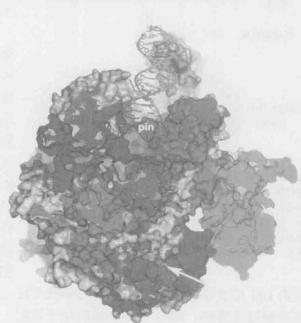  
图 11-6 RecBCD-DNA 复合物的结构。这里 RecB 标为蓝色，RecC 为红紫色，RecD 为绿色。通过复合物的“顶部”进入的结合 DNA 标为紫色，白色箭头指的是结合钙离子（红色）与 RecB 核酸酶活性位点。这个结构显示了 DNA 的剖面图。ReC 接触 DNA 双链并将其分开，将 3' 链引导到 RecB 的左面，5' 尾巴结合到 RecD 的右面。（Singleton M. R. et al. 2004. Nature 432: 7015, PDS Code: 1W36.）图像以 Py MOL (DeLano W. L. 2002 The Py MOL molecular graphics system. 绘制，DeLano Scientific, Palo Alto, California http://www.pymol.org)

旦 Chi 位点的 3'端被结合后，3'尾部就不能进入核酸酶，也就阻止了 3'端的降解。这样通过活性位点处竞争者的移除促进了 5'尾部的降解。

由 RecBCD 产生的单链 DNA 尾部必须被 RecA 蛋白所包被，这样才能发生重组。然而，细胞中含有一种单链结合蛋白（SSB）也可以结合到这种 DNA 上。为了保证是 RecA 而不是 SSB 结合到这些单链 DNA 尾部，RecBCD 直接与 RecA 结合以利于该蛋白质的组装。这种结合导致了 RecB 亚基的核酸酶结构域与 RecA 蛋白之间的蛋白质-蛋白质相互作用，并把 RecA 结合到了 DNA 的 3' 端尾巴上。

## Chi 位点控制 RecBCD

Chi 位点能够使重组发生率提高约 10 倍。这种提高在与 Chi 位点直接相邻的区域最为明显。虽然 Chi 位点附近 10kb 左右的区域都能观察到重组概率的提高，但这种趋势随着远离 Chi 位点而逐渐降低（图 11-7）。最初，人们对这种提高只发生在 Chi 位点的一侧感到迷惑，但现在已经清楚为何这样：双链断裂（RecBCD 切入点）和 Chi 位点间

  
图 11-7 Chi 位点的极性。本图显示了一个 Chi 位点能特异性提高 Chi 位点及其远处序列的重组频率。示例是一个经转导或接合进入细胞内的线性 DNA 和细菌 DNA 发生的交换事件。实际参与的 DNA 序列可能更长。例如，噬菌体转导经常传递约 80kb 的 DNA 片段。大肠杆菌染色体的长度约为 5Mb。

的 DNA 被酶切成小片段, 所以不能发生重组。相比之下, Chi 位点后的 DNA 序列遇到 RecBCD 后, 保留着待重组的单链形式, 并特异性地与 RecA 结合。

Chi 位点控制 RecBCD 核酸酶活性的能力使之可帮助细菌细胞免受通过噬菌体介导或接合的外源 DNA 的入侵。8 个核苷酸的 Chi 序列（CGTGGTGG）在大肠杆菌基因组中出现的概率极高。据预测，大肠杆菌基因组上每 65kb 才有一个、总共 80 个 Chi 位点；实际上，大肠杆菌染色体序列共有 1009 个 Chi 位点。由于 Chi 过多出现，大肠杆菌 DNA 进入大肠杆菌细胞时易被 RecBCD 加工，产生 3' 端单链 DNA，因此被激活以引发重组。相比之下，来自于另一株的 DNA（大肠

杆菌 Chi 位点未过多出现）没有过多的 Chi 位点。RecBCD 作用于此 DNA 后，将导致其被过度降解，而并非被激活后用于重组。

总而言之，RecBCD 的 DNA 降解活性有多种后果。这种降解功能对于处理 DNA 断端，使之与 RecA 组装及链入侵是必需的。在此情况下，RecBCD 促进重组。但是，RecBCD 通过降解 DNA 来激活重组，所以整个同源重组的过程中也必须有 DNA 合成以使被降解的 DNA 链再生。此外，RecBCD 的功能有时候仅仅是降解 DNA——正如降解缺少 Chi 位点的外源 DNA 一样。这时，RecBCD 可保护细胞免受引进外源序列（可能带有噬菌体或其他有害成分）可能造成的损害。

## RecA 蛋白在单链 DNA 上组装并促进链入侵

RecA 蛋白是参与同源重组的关键蛋白质，是 “链交换蛋白”（strand-exchange protein）酶家族的基本成员，这些蛋白质催化同源 DNA 分子的配对。配对过程涉及寻找两个分子间相配的序列以及在两个分子间产生供配对的区域。

RecA 蛋白促进 DNA 配对和链交换的活性可以通过使用简单的 DNA 底物进行体外实验来观察。图 11-8 列举了 DNA 配对和链交换的过程，以展示 RecA 的生化活性。这些 DNA 分子的重要特性是：①两条 DNA 分子序列互补；②至少其中一个分子上有使 RecA 能够组装的单链 DNA 区；③在互补区内存在一个 DNA 末端，使新形成的双螺旋中的 DNA 链相互缠绕。

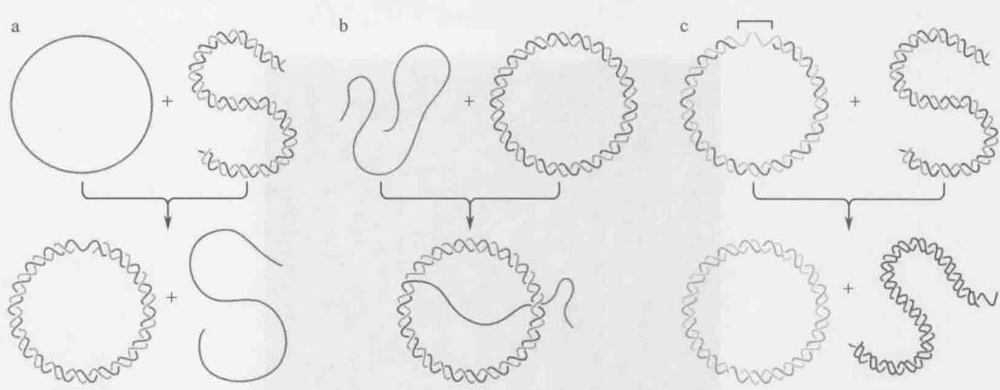  
图 11-8 RecA 链交换的底物。这里展示的是可能参与 DNA 配对和链交换的三种可能的结构组合。注意 a 和 c 上的括弧显示一条 DNA 链上的缺口的位置。

具有活性的 RecA 是一种蛋白质 DNA 纤丝（图 11-9）。与多数涉及分子生物学的、以小且离散的蛋白单位行使功能（如单体、双体、六聚体等）的蛋白质不同，RecA 蛋白丝非常大，且大小不一，通常包括约 100 个 RecA 亚基和 300 个核苷酸的 DNA。RecA 蛋白丝可以容纳 1 条、2 条、3 条甚至 4 条 DNA 链。下面将会看到，有 1 条或 3 条 DNA 的 RecA 蛋白丝在重组中间体中更为常见。

此丝状结构中的 DNA 与没有蛋白质结合的单链 DNA 或标准的 B-DNA 螺旋相比高度延伸，其平均相邻碱基间距为 5Å，而不是常见的 3.4Å（第 4 章）。所以，当 DNA 和 RecA 蛋白结合后，DNA 分子长度增长至原来的 1.5 倍（图 11-9a）。寻找同源 DNA 序列和 DNA 链交换就是在这种 RecA 蛋白丝内进行的。

RecA 蛋白的亚基互助地结合到 DNA 上形成蛋白丝。RecA 结合与组装到单链 DNA 上的速度远快于组装到双链 DNA 上的速度，从而解释了为什么需要单链 DNA 区段作为链交换的底物。蛋白丝通过加入 RecA 亚基沿 5'→3' 方向延长，这意味着以 3' 端结尾的 DNA 链更易被 RecA 蛋白包裹（图 11-10）。请注意，在重组的双链断裂修复模式中，正是这种构型的 DNA 分子参与了链入侵。

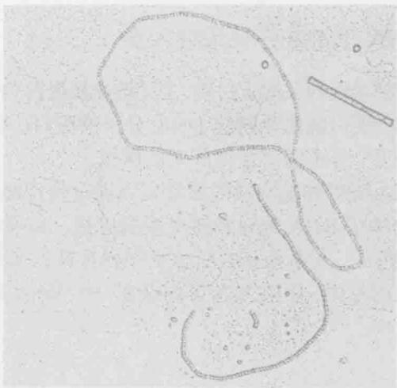

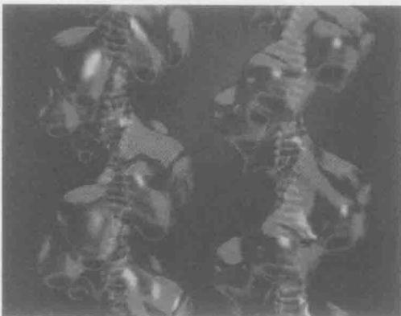

  
图 11-9 RecA 蛋白丝的 3 个视图。(a).电镜图下,全部或部分被 RecA 蛋白包裹的环状 DNA。图中有一个未被 RecA 蛋白包裹的 DNA 分子,可以看出结合 RecA 后,DNA 变长。(经授权。来源:Stasiak A. and Egelman E. H. 1988. Genetic Recombination. ed. R. Kucherlapati and G. Smith, pp. 265-307. Fig.3.©ASM press. 3.) (b). 综合多张电镜照片生成的蛋白丝的高分辨率照片。图中左侧是大肠杆菌的 RecA,右侧是酵母的链交换相关蛋白质 Rad51。(来源:Edward Egelman, University of Virginia.) (c). X 射线晶体衍射生成的高分辨率照片。图示从上往下看一周螺旋丝。单个亚基标上了颜色,红色亚基靠近观察者。(Story R. M. and Steitz T. A. 1992. Nature 355; 318.) 镜像图用 BobScript、MolScript 和 Raster3D 制作。

  
图 11-10 RecA 组装的方向性。请注意，新的 RecA 亚基在 DNA 3' 端结合到纤丝的速度远快于结合到其 5' 端的速度。因为此组装的方向性，3' 端延长的单链 DNA 分子更易于被 RecA 包裹；相比之下，5' 端延长的单链 DNA 分子难于成为蛋白丝组装的底物。

## 在 RecA 蛋白丝里建立新的配对 DNA

RecA 催化的链交换过程可以分成不同的反应阶段。首先，RecA 纤丝必须组装在其中一个参与的 DNA 分子上，组装发生在具有单链 DNA 区域（如单链 DNA 末端）的 DNA 分子上。这个 RecA-单链 DNA 复合体是参与寻找同源序列的活性形态。在这个过程中，RecA 必须 “寻找” 和蛋白质内的 DNA 和一新的 DNA 分子之间的碱基互补。分别同单链 DNA 和双链 DNA 结合的 RecA 的结构揭示了多样的 DNA 延伸方式，并暗示了链交换的机制（图 11-11）。

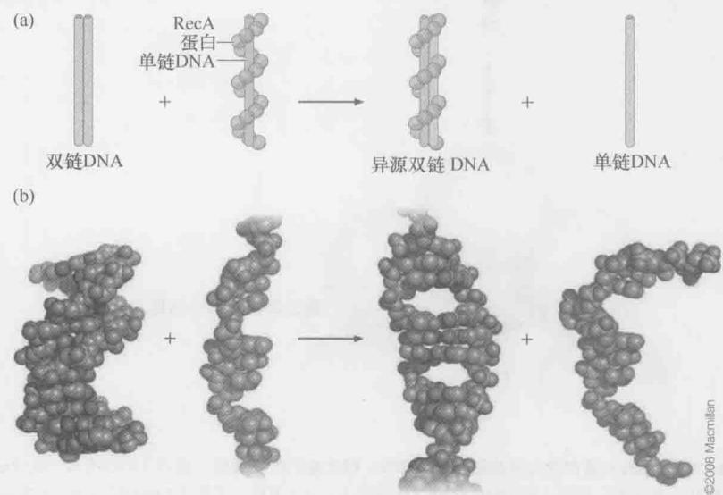  
图 11-11 RecA 促进的链交换反应的 DNA 视图。(a) 双链 DNA 同 RecA 突触前纤丝配对，后者由 RecA 和单链 DNA 组成，二者配对可以产生异源双链核酸分子 DNA-RecA 和单链 DNA。(b) 参与的 DNA 分子的结构：B 型 DNA；突触前纤丝内的单链 DNA；纤丝内的双链 DNA；随机卷曲的单链 DNA。(经授权，引用自 Kowalczykowski S.C. 2008. Nature 453: 463, Fig. 1, p. 465. ©Macmillan.)

RecA 可促进寻找同源序列，这是因为蛋白丝结构具有两个不同的 DNA 结合部位：主要位点（结合第一个 DNA 分子）与次要位点（图 11-12）。次要位点可被双链 DNA占据。与次要位点的结合具有迅速、微弱且短暂的特性，但更重要的是此结合与 DNA 序列无关。因此，RecA 蛋白丝可以结合并快速筛选很长的 DNA 以寻找序列同源区。

  
图 11-12 在 RecA 蛋白丝内寻找同源区和 DNA 链交换的两步模型。如图 11-9c 所示，此 RecA 蛋白丝从上往下看，新引入的 DNA 双链以蓝色表示。（a）图显示了单个 DNA 链与 RecA 蛋白结合的交叉部分。（b）次要位点的 DNA 被动来进行互补性测试。（c）链之间的碱基配对改变。（改自 Howard-Flanders et al. 1984. Nature 309: 215-220.）

RecA 蛋白丝如何检测同源序列的详细机制尚不清楚。结合在次要位点的 DNA 暂时被解链并和在主要位点的单链 DNA 做同源性比对。这种 “检验” 被认为是通过碱基互补配对作用进行的，虽然检验初期并不破坏位于次要位点双链 DNA 的整体碱基对结构。支持这种理论的实验显示起初的配对可能涉及双螺旋数个碱基的弹出（见第 9 章）。体

<!-- END OFFICIAL API PART part_004 -->


<!-- BEGIN OFFICIAL API PART part_005 -->

外实验显示，仅 15 个碱基的序列配对就可以为 RecA 蛋白丝发现同源区域的信号，从而启动链交换。

RecA 蛋白丝如何检测同源序列的详细机制尚不清楚，但是我们现在知道单链 DNA 和 ATP 是如何同 RecA 结合形成螺旋状“突触前”纤丝的，这主要是基于结构相关研究。纤丝中的单链 DNA 变得缠绕不足并伸展开，这一变化可能允许其同双链 DNA 进行更好的 Watson-Crick 配对，以便形成同源性更好的突触纤丝（同图 11-13 中显示的结构相比）。在突触前纤丝中，单链 DNA 同 RecA 中的 3 个核苷酸结合（3 个核苷酸/RecA，由化学计量学得出），这一数值针对的是 B 型 DNA 构象——回顾第 4 章中的知识：这种 DNA 结构的重复单元是 3 个核苷酸，称为“核苷酸三联体”（图 11-14）。在突触前纤丝中 B 型 DNA 的每个三核苷酸单元后面，有一个很大的“步幅”存在于下一个碱基前面，这些很大的“步幅”主要负责分支的螺旋（相比于裸露 DNA 而言）（图 11-13 和图 11-14）。

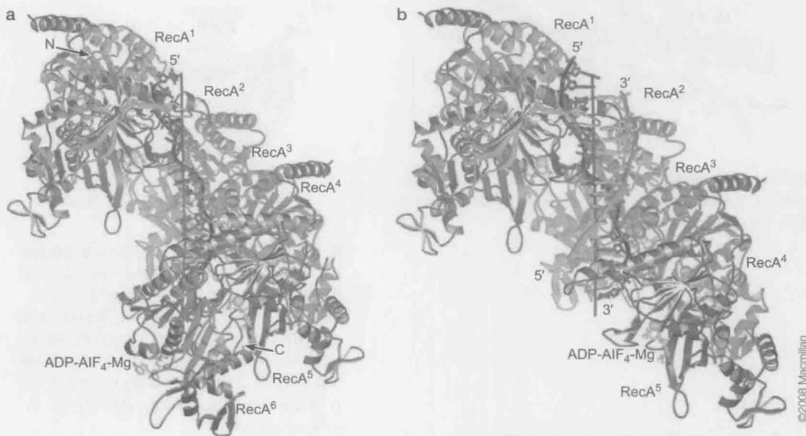  
图 11-13 RecA-单链 DNA 的结构和 RecA-双链 DNA 的结构。(a) 突触前核蛋白纤丝的结构。(b) 突触后核蛋白纤丝的结构。(经允许, 复制自 Chen et al. 2008. Nature 453: 489. Part a is Fig. 1A, p. 490; part b is Fig. 4A, p. 492. ©Macmillan.)

结合在次要位点的 DNA 暂时被解链并和在主要位点的单链 DNA 做同源性比对。这种 “检验” 被认为是通过碱基互补配对作用进行的，虽然检验初期并不破坏位于次要位点双链 DNA 的整体碱基对结构。体外实验显示，仅 15 个碱基的序列配对就可以做为 RecA 蛋白丝发现同源区域的信号，从而启动链交换。

当一个碱基互补的区域被定位后，RecA 促进这两个 DNA 分子借助其各自的 Watson-Crick 氢键形成一个稳定的复合体（图 11-15a）。重复单元是由堆积的碱基对形成的三联体，这与 B 型 DNA 非常相似（图 11-15b）。这个与 RecA 结合的三链结构被称为连接分子（joint molecule），通常含有数百个碱基对的杂合 DNA，实际的链交换就发生在连接分子内。在主要位点上的 DNA 链可与在次要位点上的双链 DNA 形成碱基配对，链交换需要断开链之间的一对碱基对，然后形成一组新的同样的互补碱基对。完成链交换的同时，也要求新配对的碱基链相互缠绕，形成正确的双螺旋。RecA倾向于结合到链交换后的DNA产物上，正是此结合能量实际驱动交换反应，进而形成新的DNA构型。

  
图 11-14 RecA 中单链 DNA 的特写。每个核苷酸三联体都由三个 RecA 单元结合。（经允许，改自 Chen et al. 2008. Nature 453: 489, Fig. 2, p. 491. ©Macmillan.）


  
图 11-15 纤丝中的 DNA 的结构不会发生剧烈变化。(a) 突触前的核苷酸三联体（灰色）是同突触后的碱基对三联体（黄色）叠加在一起的。Watson-Crick 氢键由虚线表示。(b) 突触后的碱基对三联体（黄色）同 B 型 DNA（蓝绿色）叠加在一起。Watson-Crick 氢键表示为虚线，洋红色的属于异源双链的，绿色的属于 B-DNA。(经许可，改自 Chen et al. 2008. Nature 453: 489, Fig. 5a, b, p. 491. © Macmillan.)

## 所有的生物都有 RecA 同源物

所有的生物都有 RecA 家族的链交换蛋白，研究得最详细的是真细菌的 RecA、古细菌的 RadA、真核生物的 Rad51 和 Dmc1，以及噬菌体 T4 的 UvsX 蛋白。这些蛋白质可形成与 RecA 类似（图 11-16）的蛋白丝，并以类似的方式行使相似的功能（虽然这些蛋白质的部分功能因它们特殊的细胞学角色和反应对象而发生了特化）。我们将在下面讲述 Rad51 和 Dmc1 在真核生物细胞重组中的功能。

## RuvAB 复合体特异性地识别 Holliday 联结体并促进分支移位

当重组的链入侵步骤完成后，两个重组的 DNA 分子被一个 DNA 分支连接起来，称为 Holliday 联结体（见上文所述）。分支点的移动需要两个同源 DNA 双螺旋交换碱基对，细胞编码的一些蛋白质可大幅提高分支移位速率。


  
图11-16 三类生物中类似 RecA 的蛋白质。图中显示(a)人类 Rad51;(b)大肠杆菌 RecA;(c) Archaeoglobus fulgidus RadA 蛋白质。Rad51 和 RecA 蛋白已在图11-8中出现过。请注意电镜图片中的局部放大图揭示的蛋白丝的类似螺旋结构。(来源：West S. C. et al. Nat. Rev. Mol. Cell Biol. 4: 435-445. ©Macmillan. 图像由 A. Stasiak, University of Lausanne, Switzerland. 提供)

RuvA 蛋白是一个特异性结合 Holliday 联结体的 DNA 结合蛋白, 它可识别 DNA 联结体的结构, 而不考虑相应的 DNA 特异性序列。RuvA 蛋白识别并结合到 Holliday 联结体上, 促使 RuvB 蛋白结合到这个位点上。RuvB 是一个六聚体 ATP 酶, 类似 DNA 复制过程中的六聚体解旋酶 (见第 9 章)。RuvBATP 酶提供能量, 以促进碱基对交换, 而移动 DNA 分支这种能量可以快速地在一个方向上移动 DNA 分支。一个 Holliday 联结体上的 RuvAB 复合体的结构模型 (图 11-17) 展示出一个四聚体 RuvA 蛋白和两个六聚体 RuvB 蛋白如何同时促进 DNA 链交换的过程。

## RuvC 剪切位于 Holliday 联结体的特定 DNA 链从而结束重组

结束重组需要拆分两条重组的 DNA 分子间的 Holliday 联结体（或多个联结体）。在细菌中，RuvC 是拆分 Holliday 联结体的主要核酸内切酶。正是因 RuvC 能剪切 RecA 在体外试验中形成的 DNA 联结体而被发现并得到纯化。遗传学证据显示它的功能与 RuvA 和 RuvB 相呼应。

RuvC 引起的拆分经识别 Holliday 联结体（可能以 RuvA 和 RuvB 的复合体形式存在）后，特异地两条同一方向的同源 DNA 链打开缺口。此剪切形成了 5'端磷酸基团末端和 3'-OH 末端，这些末端可以直接被 DNA 连接酶接上。依据哪一对 DNA 链被 RuvC 剪切，连接后的重组产物可以是剪接（交换）或是补丁（未交换）的类型。图 11-18 显示了 RuvC 的结构及其如何与 DNA 联结体相互作用的模式图。


图 11-17 高分辨率 RuvA 结构图和 RuvAB 复合体与 Holliday 联结体结合的模式图。(a). RuvA 四聚体的晶体结构显示该蛋白具有四重对称性。(Ariyoshi M., et al. 2000. Proc. Natl. Acad. Sci. 97: 8257-8262.) 镜像图使用 Bobscript、Molscript 和 Raster 3D 制作。(b). 有两个 RuvB 六聚体的晶体模式图。请注意, 一个 RuvA 四聚体是如何以四重对称的形态结合到联结体上的。两个 RuvB 六聚体结合在 RuvA 对称的两侧, 并起到驱动器的功能, 以驱使 DNA 通过联结体。RuvB 六聚体以截面图表示, 以显现穿过这些复合体的 DNA 链。(改自 Yamada K. et al. 2002. Mol. Cell 10: 671-681, Fig.4.)  
  
图 11-18 高分辨率的 RuvC 拆分酶结构图以及与 Holliday 联结体结合的 RuvC 二聚体的模式图。(a). RuvC 蛋白的晶体结构。(Ariyoshi M., et al. 1994. Cell 78: 1063-1072.) 图像使用 BobScript、MolScript 和 Raster3D 制作。(b). 一个 RuvC 二聚体结合到 Holliday 联结体上的模式图。请注意在该图中，一个 RuvC 二聚体是如何与 Holliday 联结体结合，并在两条相同的 DNA 链上引入对称的缺口。(已获许可，改自 Rafferty J. B. et al. 1996. Science 274: 416-421, Fig. 1b, © AAAS.)

尽管 RuvC 靠识别结构而非特定序列行使其功能，但 RuvC 剪切 DNA 还是有一定程度的序列特异性。剪切只发生在与 5'-A/T-T-T-G/C 符合的一致性序列的位点，在这段序列的第二个 T 后面剪切。DNA 中这些一致性序列较多，平均每 64 个核苷酸就会有一个。这种一定程度的序列特异性可保证在联结体拆分前至少有一些分支移位发生。没有这种序列选择性，Holliday 联结体可能刚产生就被 RuvC 剪切，从而限制了参与链交换的 DNA 区域。

## 真核细胞的同源重组

## 真核细胞的同源重组具有额外的功能

如前所述，在细菌中，修复 DNA 的双链断裂需要同源重组。重新启动损坏的复制叉，并允许染色体 DNA 与以噬菌体感染或接合的形式进入细胞的 DNA 发生重组。同样地，在真核细胞中，同源重组也是 DNA 修复和启动受损复制叉所需要的。这种对同源重组的需要可由具重组蛋白缺陷的细胞对 DNA 破坏剂（特别是破坏 DNA 链的试剂）非常敏感所证实。此外，具有干扰同源重组突变的动物较倾向于患某种特定类型的癌症。然而，在我们下面的讨论中可以看到，同源重组在真核生物中发挥着另外的重要作用。尤其是在减数分裂的过程中，同源重组显得更为重要。在减数分裂过程中，同源重组确

保染色体正确配对，从而保持基因组的完整性。这种重组可以使亲本染色体之间的基因发生重组，确保每套基因的多态性能够传给子代。

## 同源重组保证减数分裂中染色体的分离

正如第9章所述，减数分裂（meiosis）有两轮核分裂，减少正常双倍体细胞（2N）的DNA含量，成为配子的DNA含量（1N）。图11-19显示了在两轮分裂中染色体是怎样分配的。分离前，细胞中的每个染色体都有两个拷贝（同源染色体），分别得自父母双方。在S期，这些染色体进行复制从而获得了DNA四倍体（4N）（图11-20），复制的产物——姐妹染色单体聚在一起。这时，准备进行第一次核分裂，这些复制了的同源染色体必须进行配对，并且排列在细胞的中心。正是这种同源染色体的配对需要同源重组（图11-19）。这些事件皆需精细的时间安排。重组必须在第一次核分离前完成，从而使同源染色体正确地排列然后分开。在这个过程中，姐妹染色单体保持配对（图11-20，图8-16）。然后在第二次核分裂中，姐妹染色单体才分开。这种分裂产生4个配子，每一个都具有每条染色体的一个拷贝（如1N的DNA含量）。

  
图 11-19 减数分裂的 DNA 动态过程。为了易于理解，该图只显示一对同源染色体。红色和蓝色分别显示经过一轮 DNA 复制以后的两个同源染色体。同源重组是同源染色体配对以准备第一轮核分裂所必需的。这类重组也可以引起交换，如本图中所显示的 A 与 B 基因之间。

  
图 11-20 同源染色单体之间减数分裂重组。所示的每个结构均是被称为染色单体的已复制的双链 DNA 分子。配对的称为姐妹染色单体，发生在非姐妹染色单体对之间的重组是由 Dmc1 介导的（见图 11-19）。

如果没有重组，染色体通常无法在第一次减数分裂过程中正确地排列，从而极易引起染色体的丢失。染色体的不恰当分离被称为不分离（nondisjunction），会导致大量配子没有正确的染色体组成。具有过多或过少染色体数量的配子在受精后都不能正常发育，因而失败的同源重组往往表现为低生殖能力。这种在减数分裂过程中发生的同源重组被称为减数分裂重组（meiotic recombination）。

减数分裂重组也常常引起两个同源亲代染色体间基因的交换，这种遗传交换（如图 11-20 显示的那样）可以用细胞学方法观察到（图 11-21a，左侧图示）。一个重要的结果是亲本 DNA 分子上的等位基因在下一代发生了重新分配。

## 减数分裂中程序化生成的 DNA 双链断裂

细胞成功地完成减数分裂所需要的发育程序包括

启动很多一般生长过程中不需要的基因表达。其中的一个就是 SPO11，该基因编码一个蛋白质，可引入染色体 DNA 的双链断裂，进而启动减数分裂重组。

Spo11 蛋白可以在很多染色体位置上切断 DNA，它对序列没什么选择性，但却必须发生在减数分裂的一个特定时期。Spo11 参与的 DNA 切割正好发生在已复制的同源染色体开始进行配对的时候。Spo11 切割的位置尽管普遍，但这些切割位点并非随机地分布在 DNA 上。相反，它们多分布在核小体包装疏松的染色体区域，如控制基因转录的启动子区域（见第 8 章和第 19 章）。DNA 出现较高概率的双链断裂区域，也会发生高频率的重组。如此，常被 Spo11 切割的 DNA 位点，如 Chi 位点，也是重组的热点。

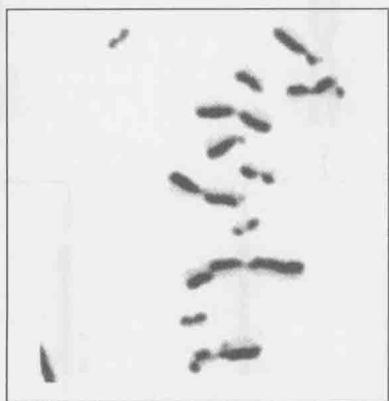

  
图 11-21 交换的细胞学图示。仓鼠组织培养细胞中直接观察到的染色单体相互交换。经过吉姆萨染色的染色体，DNA 双链中胸腺嘧啶均被溴脱氧尿苷替代并被染浅色，如果只有一条链被替代，则呈深色。经过两个世代生长于溴脱氧鸟苷中，经复制的新的染色单体仅有一条链被替代，而另一姐妹染色单体则双链均被替代。如此，姐妹染色单体就可以区分，交换则可以很容易地以浅深交替带而显现出来（左侧）。同样，如果用 DNA 破坏试剂处理正处于有丝分裂的细胞，也能看到相间的重组染色体（右侧）。（Sheldon Wolff and Jody Bodycote 惠赠）

DNA 断裂的机制如下：Spo11 蛋白中一个特异的酪氨酸侧链可攻击磷酸二酯键骨架，从而切断 DNA，并在蛋白质与受损的 DNA 链间生成共价复合物（图 11-22），Spo11 的两个亚基在两个 DNA 链的相差两个核苷酸处切开，形成一个交错的双链断裂。Spo11 与 DNA 拓扑异构酶及位点特异性重组酶具有同样的 DNA 剪切机制（见第 4 章和第 12 章）。实际上，蛋白质序列比较显示 Spo11 和这些酶都有一定的同源性。

Spo11 的切割涉及一个蛋白质-DNA 共价复合物，这导致了两个结果。第一，Spo11 切割处 5'端的 DNA 可共价连接该酶。正是这些与 Spo11 相连的 5'端 DNA 形成了单链 DNA 尾端的起始点，这种尾端可引起类似 RecA 的蛋白质的组装，并启动 DNA 链入侵（如下文所述）。第二，被切断的

  
图 11-22 Spo11 的切割机制。Spo11 蛋白中酪氨酸的—OH 基团对 DNA 进行攻击，生成一个蛋白质-DNA 共价连接。Spo11 的两个亚基是生成双链 DNA 断裂所必需的，一个亚基攻击其中一条 DNA 链。注意，由于这样的切割机制，DSB 能够通过切割反应的简单逆转而重接。

DNA 磷酸二酯键的能量储存在蛋白质-DNA 的连接中，这样 DNA 链能通过切割反应简单逆转（化学机制见图 12-5）而被重接。这种重接发生在细胞接到停止减数分裂的信息之后。

## MRX 蛋白作用于被切开的 DNA 末端，以组装类 RecA 的链交换蛋白

Spo11 催化的 DNA 双链断裂生成单链区域,该区域用于组装类 RecA 的链交换蛋白。如细菌中观察的 RecBCD 路径,这个处理过程产生了很长的 3' 端单链 DNA 片段（图 11-23）。在减数分裂重组中,MRX 酶复合物负责催化该 DNA 处理过程。MRX 酶复合物尽管与 RecBCD 不同源,但也是一个多亚基的 DNA 核酸酶。MRX 酶复合物由 Mre11、Rad50 和 Xrs2 三个亚基组成,并以三个亚基的首字母命名。

断裂处的 DNA 处理完全作用于 5' 端的 DNA 链上, 即与 Spo11 蛋白共价结合的 DNA 链（如前述）。3' 端的 DNA 链不被降解, 所以此 DNA 处理反应被称为 5'→3' 端切除。MRX 正是通过 5'→3' 的反应, 从而生成具 3' 端的单链 DNA, 通常可达 1kb 或更长。MRX 酶复合物还被认为能去除与 DNA 相连的 Spo11。

  
图 11-23 减数分裂重组途径概述。减数分裂过程中双链断裂的形成需要 Spo11 和 MRX 复合体的参与。观察指出，DSB 的形成和后续的链处理，通常是由多种蛋白质的协调作用的偶联而完成。MRX 蛋白负责切除断裂位点的 5'端 DNA，然后链交换蛋白 Dmc1 和 Rad51 组装到单链 DNA 尾上。以上两个蛋白质都参与了重组，但还不清楚它们如何共同作用。为便于理解，本图中显示它们正在形成独立的蛋白丝。（已获许可，改自 Lichten M. 2001. Curr Biol. 11：R253-R256，Fig. 2. ©Elsevier.）

## Dmc1 是专一在减数分裂重组中行使功能的类 RecA 蛋白

真核生物编码两种被充分阐明的、与细菌 RecA 蛋白同源的蛋白质——Rad51 和 Dmc1。这两种蛋白质都在减数分裂重组中发挥作用。尽管 Rad51 广泛地表达在进行细胞有丝分裂和减数分裂的细胞中，Dmc1 则仅在细胞进入减数分裂时被表达。

减数分裂中的链交换发生在两个特定类型的同源 DNA 之间。减数分裂重组发生在每个染色体都有 4 套完整的 DNA 双链分子拷贝，即两个同源染色体各复制生成了一对姐妹染色单体时（图 11-20）。尽管两个同源染色体具有些序列的微差异，携带不同的基因不同的等位基因，但这 4 套染色体中的大部分 DNA 序列都是相同的。有趣的是，依赖 Dmc1 的重组倾向发生于非姐妹同源染色单体之间，而不是姐妹染色单体之间（图 11-20）。尽管这种选择的机制目前还不知道，但有其清晰的生物学基础：减数分裂重组可通过促进同源染色体间的交联而有助于等待分裂的同源染色体联会（alignment）。

## 多种蛋白质共同促进减数分裂重组

如前所述，参与形成双链断裂、处理 DNA 生成 3'端尾巴的单链 DNA 和参与减数分裂重组过程中链交换等关键步骤的蛋白质已被发现并定性。遗传实验显示很多其他的蛋白质也参与了这一过程。此外，有很多蛋白质表现出与已知的重组酶间的作用，并且它们似乎是在一个很大且多组分的复合体中行使其功能的。这些大型蛋白质-DNA 复合体被称为“重组工厂”（recombination factory），该结构可在细胞中观察到。例如，图 11-24 显示在减数分裂中 Rad51 和 Dmc1 共定位在这些“工厂”里。

还有很多其他种类的蛋白质被证实与Rad51共同作用以促进重组和双链DNA断裂的修复。Rad52是另外一个与Rad51相互作用的必要重组蛋白。Rad52启动Rad51 DNA蛋白丝（Rad51的活性形态）的组装。Rad52通过对RPA（真核细胞中主要的单链DNA结合蛋白）的拮抗作用而启动Rad51蛋白丝的组装。因此，

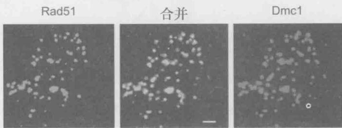  
图 11-24 在细胞减数分裂过程中，Rad51 和 Dmc1 蛋白共同定位于“重组工厂”。用荧光标记 Rad51（绿色）和 Dmc1（红色）抗体，以免疫染色法检测蛋白质。两种蛋白质在一起的时候，合并的影像呈黄色。（来源：经 Shinohara M. et al. 2000. Proc. Nat I. Acad. Sci. 97: 10814-10819, Fig. 1A, ©National Academy of Sciences 许可使用）

Rad52 与已知大肠杆菌的 RecBCD 蛋白有相似的活性，RecBCD 蛋白可帮助 RecA 结合在原本被 SSB 所结合的单链 DNA 上。Rad52 蛋白也能促进互补单链 DNA 分子的退火和碱基配对，这种活性在重组起始阶段的双链配对反应中也发挥着重要的作用。BRCA2 基因的产物也参与 Rad51 介导的双链断裂修复（见框 11-2 “肿瘤抑制基因 BRCA2 的产物和 Rad51 蛋白相互作用并调控基因组的稳定性”）。

## 框 11-2 肿瘤抑制基因 BRCA2 的产物和 Rad51 蛋白相互作用并调控基因组的稳定性

BRCA2基因对于维持基因组的稳定性具有重要的作用。在人类中，近一半的家族性乳腺癌都被认为是由于BRCA2基因的突变造成的。这种癌症的易感性至少部分来自BRCA2在Rad51介导的双链断裂修复中的直接作用。当细胞被培养在对DNA有损伤的化学试剂中时，可以很明显地观察到Rad51聚集体，首先被组装起来以激活DNA修复。BRCA2基因缺陷的细胞不能在细胞受损时在细胞核中组装起这些聚集体同时也不能进行相应的DNA修复。BRCA2蛋白和Rad51蛋白直接相互作用(见框11-2图1)，它们的相互作用可能对Rad51蛋白在细胞中正确定位以利于DNA修复及调节Rad51蛋白的活性非常重要。因此，与BRCA2基因突变相关的显著表现型说明，在真核生物包括在人类中，DNA双链断裂修复和Rad51依赖性的同源重组是至关重要的。


框11-2图1 Rad51蛋白和BRCA2蛋白重复基序相互作用复合体的结构。许多生化与结构研究表明，BRCA2上被称为BRC基序的、含有保守重复序列的特异区段是同Rad51蛋白作用的重要位点。其中的一个重复基序BRC4被证实与Rad51蛋白具有很高的亲和性。结构分析更精确地揭示了BRC4是如何与Rad51蛋白形成复合体的。在本图中，Rad51蛋白的 $\alpha$ 螺旋用紫色显示，β折叠用蓝色显示，BRC肽段的重复序列用绿色显示。每条序列都标注了氨基末端和羧基末端。（来源：经Pellegrini L. et al. 2002. Nature 420: 287-293, Fig. 1a. ©Macmillan. 许可使用）

通过与细菌的模拟比较，我们推测真核细胞也编码启动重组过程中分支移位和Holliday联结体拆分的蛋白质。事实上，具有启动这些功能的酶已经被发现了。例如，Rad51C（一种含有类Rad51蛋白的复合体）和另一种蛋白XRCC3已经被证实具有Holliday联结体拆分酶的活性。同样地，RecQ解旋酶家族的成员在DSB修复过程中的同源重组中发挥了重要的作用，而且可能还参与减数分裂。例如，在人体中，双Holliday联结体的处理方式之一就包含一种可以同拓扑异构酶合作的RecQ解旋酶。这种机制称为双连接体分离，可以阻止侧翼序列的互换。在人体发现的三种解旋酶（BLM、WRN和RTS/RECQ4）分别与布鲁姆综合征、沃纳综合征以及色素沉着综合症相关，它们会导致早衰和肿瘤生成的倾向（见框11-3，早衰和癌变相关蛋白会促进Holliday联结体处理的旁路途径）。

## 框 11-3 早衰和癌变相关蛋白会促进 Holliday 联结体处理的旁路途径

RecQ DNA 解旋酶从细菌到人类都非常保守，它们在同源重组的早期和晚期都扮演了非常重要的角色。这些解旋酶可以特异性地处理和编辑重组中间体，导致交联分子在双 Holliday 联结体中间体形成之前发生瓦解。结果是，解旋酶以交叉类事件为代价促进非交叉重组（框 11-3 图 1）。在人体中，严格的早衰和各类肿瘤都与编码这些解旋酶（WRN、BLM 和 RTS/RECQ4）的基因的功能缺失突变相关（见框 11-3 表 1）。

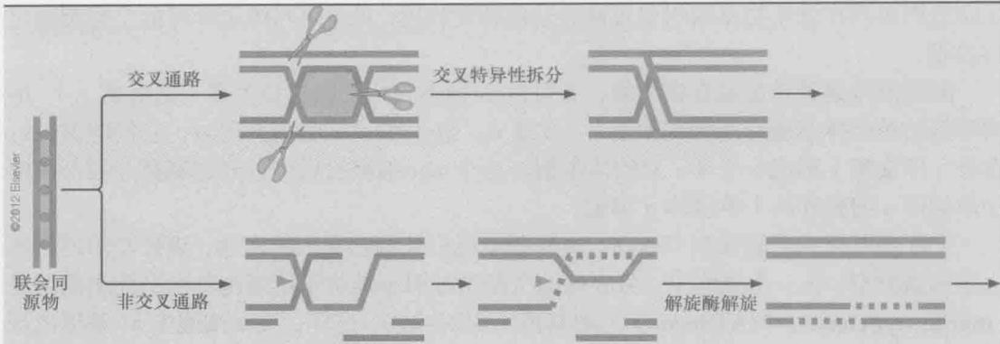  
框 11-3 图 1 重组的交叉和非交叉通路。在交叉通路中（上一条通路），Holliday 联接体的解离酶（用剪刀表示）在交联处完成组装并进行不对称切割，形成交叉产物。与之形成对比的是，在非交叉通路中（下一条通路），RecQ 家族的解旋酶（用绿色箭头表示）促进合成依赖性链的退火和拆分。这一机制表明这些解旋酶的活性把最初有链互换蛋白产生的交联分子拆分开。这一过程也可以使得 D 环沿着 DNA 分子滑动，且允许侵入链在交联分子瓦解前在 DNA 聚合酶作用下进行延伸。（经授权，引用自 Zakharyevich K. et al. 2012. Cell 149: 334-347, Fig. 7. ©Elsevier.有些许改动）

框 11-3 表 1 RecQ 相关病症的临床特点

<table><tr><td>综合征(基因)</td><td>主要临床特征</td><td>肿瘤倾向</td></tr><tr><td>布鲁姆综合征(BLM)</td><td colspan="2">矮小、突出的鼻子、窄脸颊、色素沉积、红肿、皮肤早发性同组织和种类呈正态分布静脉扩张、精神呆滞、II型糖尿病、免疫缺陷、肺病、生育能力差或丧失</td></tr><tr><td>沃纳综合征(WRN)</td><td colspan="2">双边白内障、嘶哑、皮肤改变、四肢纤瘦、过早花发/原始肉瘤和间质细胞瘤早发脱发、面部皱缩、身材矮小、骨质疏松、性腺机能减退、糖尿病、软组织钙化</td></tr><tr><td>色素沉着综合征(RECQ4)</td><td colspan="2">皮肤异色症、少年白内障、生长迟缓、骨骼发育不良、骨肉瘤早发头发稀疏、性腺机能减退</td></tr></table>

经授权，改自 Bernstein K.A. et al. 2010. Annu. Rev. Genet. 44: 393-417, Table 1, p. 395. © Annual Reviews.

正如我们所看到的，减数分裂重组可使同源染色体联会，并促进它们之间的遗传交换。这些重组反应通常导致亲本染色体间的交换。然而，依赖重组中间物的 Holliday 联结体的拆分结果，通过双链断裂修复途径的重组也能够产生非交换产物（见上文）。这些事件可为成功的减数分裂提供必需的染色体配对，但未在染色体遗传结构上留下可检测的变化。

然而，即便是非交换重组也会产生遗传后果，如导致基因转变（gene conversion）。基因转变发生在当一个基因的等位基因丢失并被其他等位基因所替代之时。关于基因转变是如何发生在有丝分裂生长期细胞和减数分裂细胞中的例子，将在下面介绍。

## 交配型的转换

除了促进 DNA 配对、DNA 修复和遗传交换外，同源重组还能够改变染色体特定位置的 DNA 序列。这种类型的重组有时是为了调控基因的表达。例如，经由转换不同交配型基因出现在该生物基因组中可被表达的特定位置，重组可对酿酒酵母的交配类型进行控制。

酿酒酵母是种单细胞真核生物，并可以3种不同的细胞类型生存（见附录A）。酿酒酵母的单倍体细胞有两种交配型——a或α。当a和α细胞相接近时，它们能够进行融合（即交配）形成一个a/α双倍体细胞。这个a/α细胞然后可以经过减数分裂形成两个单倍体a细胞和两个单倍体α细胞。

交配型基因编码转录调节蛋白。这些调节蛋白控制靶基因的表达，该靶基因的产物决定细胞类型。在一个细胞中，可表达的交配型基因正是位于该细胞基因交配型基因座（mating-typelocus，MAT locus）上的基因（图11-25）。这样，在a细胞中a1基因出现在MAT基因座上，而在α细胞中，α1和α2基因出现在MAT基因座上。在双倍体细胞中，此两种交配型控制基因都会表达。交配型基因所编码的调节蛋白，一起与其他3种细胞类型中发现的调节蛋白以多种协同方式作用，以保证在不同细胞类型中被正确表达（见第19章）。

如我们正在讨论的，细胞能够通过重组转换它们的交配型。各细胞除了 a 或 $\alpha$ 基因存在于 MAT 基因座上以外，另外还有一套 a 和 $\alpha$ 基因存在于基因组的其他位置（但并不表达）。这些额外的沉默拷贝所在的基因座称之为 HMR 和 HML（图 11-25）。

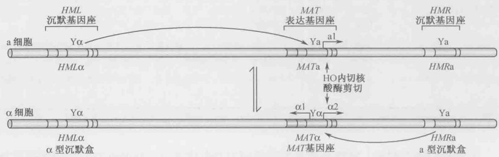  
图 11-25 遗传基因座编码交配型信息。尽管 3 号染色体带有 3 个交配型基因座，但是只有在 MAT 基因座上的基因可以表达。HML 编码一个沉默拷贝的 α 基因，而 HMR 编码一个沉默拷贝的 a 基因。如果重组发生在 MAT 和 HML 位置上，a 细胞就会转换成 α 细胞。如果重组发生在 MAT 和 HMR 位置上，α 细胞转换成 a 细胞。（经许可，改自 Haber J. E. 1998. Annu. Rev. Genet. 32: 561-599, Fig. 3. ©Annual Reviews）

所以，这些 HMR 和 HML 基因座被称为沉默盒（silent cassette）。它们的功能是提供一个遗传信息的“储藏室”，用来改变细胞交配型。这种转换需要通过同源重组使遗传信息从 HM 基因座转换到 MAT 基因座。

## 特定位点的双链 DNA 断裂引发交配型转换

交配型转换是由 MAT 基因座的双链断裂引发的，这个反应由特异的 DNA 切割酶——HO 内切核酸酶（HO endonuclease）来完成。HO 基因的表达被严格地控制，以确保转换在适当时候发生。这个调控机制将在第 19 章中进行介绍。HO 是一种序列特异性的内切核酸酶。酵母染色体上唯一携带 HO 识别序列的是交配型基因座。HO 在染色体上切割形成一个黏性的断裂，与 Spo11 切割相比，HO 只是水解 DNA，并不与 DNA 断裂处共价相连。

HO 引起的断裂，其 5'→3' 的 DNA 切除反应与减数分裂重组的机制一样。所以，切除依赖于 MRX 蛋白复合体，并对带 5' 端的 DNA 链具有特异性，而带 3' 端 DNA 链保持稳定而不被核酸酶消化。一旦生成长的 3' 单链 DNA 尾巴，它们就被 Rad51 和 Rad52 蛋白包裹（与其他帮助组装重组蛋白质-DNA 复合体的蛋白质一样）。这些被 Rad51 蛋白包裹的 DNA 链寻找同源染色体区域以启动链的入侵和遗传交换。

交配型的转换是单向性的，即序列信息（尽管并不是真正的 DNA 片段）从 HMR 和 HML “移动” 到 MAT 基因座，但是绝对不会从反方向进行。这样，在重组过程中，被切掉的 MAT 基因座总是接受者，而 HMR 和 HML 基因座在整个重组过程中是不变的。这种方向性源于 HO 内切核酸酶不能切割其在 HML 和 HMR 基因座上的识别序列，因为此区域的染色质结构使得酶无法接近这些位点。

由 Rad51 包裹位于 MAT 基因座的 3'单链 DNA 末端可 “选择” HMR 或 HML 基因座的 DNA 进行链入侵。如果 MAT 基因座的 DNA 序列是 a，则侵入会发生在有 $\alpha$ 序列的 “储备” 拷贝的 HMLR；反之，如果 MAT 带有 $\alpha$ 基因，则侵入会发生在储备有 a 序列的 HMR。重组之后，被选择的 HM 基因座的信息也出现在 MAT 基因座。这种遗传改变不是从 MAT 到 HR 基因座的信息相互交换。这种非交互的重组事件是基因转变的一个特例。

## 交配型转换是一种基因转变事件，与交换无关

尽管 DSB 修复途径可以解释交配型转换的重组机制，但是大量的证据显示，在链入侵步骤之后，此重组途径不同于 DSB 修复机制。其中一个提示是在交配型转换的过程中从未发现属于交换的重组产物。回顾在 DSB 修复途径中，产生两种 Holliday 联结体中间型的拆分产物——剪接（交换产物）和补丁（非交换产物）（图 11-3）。根据 DSB 修复模式，这两种产物发生的概率相似，但是，在交配型转换中从未观察到有交换产物存在。所以，无 Holliday 联结体中间体的重组模型更适于解释交配型转换。

为解释没有发生交换事件的基因转变的机制，提出了一种新的重组模型，称之为合成依赖性链退火（synthesis-dependent strand annealing，SDSA）。图11-26显示在这种机制下，如何发生交配型转换。如上所述，首先在重组位点引入DSB（图11-26a），经过5'到3'切除以及链侵入之后（图11-26b、c），侵入的3'端作为引物在Ya侧翼的同源区域启动新的DNA合成继续复制Ya序列（图11-26c、d）。值得注意的是，与DSB修复途径所不同的是，一个完整的复制叉在该处形成。

然而，相比于普通的 DNA 复制，新合成的链自模板上置换下来后会同第二个切除的 5' 端发生退火。一旦这样的退火发生，相应的长的 3' 端（图 11-26d 中底部的链）便会被核酸内切酶切割，新形成的 3' 端会引发、延伸进而复制 Ya 序列的第二条链（图 11-26e、f）。其结果是新的双链 DNA 片段被合成，再连接到最初被 HO 内切酶切断的 DNA 位点上，并被 MRX 切除。这个新的片段具有与模板相同的 DNA 序列（图 11-26 中的 HMRa）。

  
图 11-26 交配型转换的重组模型：依赖合成的链退火（synthesis-dependent strand annealing, SDSA）。图示位于 MAT 基因座基因转变的步骤（详见文字内容）。HMR 和 MAT 区域显示为绿色；编码 a 信息的 HMR 为深绿色，编码 $\alpha$ 信息的 MAT 呈橙绿色。当 SDSA 结束时，起初位于 MAT 区域的 $\alpha$ 信息被替换，即转变成为 HMR 区域的 a 信息。

所以，新合成的 DNA——其互补 DNA 分子信息的精确拷贝，替代了原有的 DNA 信息。这种机制更恰当地解释了不需要切除 Holliday 联结体的基因转变。通过这个模型，交配型重组时没有发现交换产物不再是一个谜。

## 同源重组机制的遗传结果

如在本章开头所讨论的，最初的同源重组机制模型在很大程度上是为了解释该过程的遗传结果。现在重组的基本步骤已被了解，我们有必要回顾一下同源重组的过程及其如何改变 DNA 分子而产生特异的遗传变化。

同源重组的一个重要特点是，无论是何种序列，只要有足够的相似区域，它就可以发生在任何两个 DNA 区域间。现在我们知道了原因所在，同源重组没有一个步骤需要特异 DNA 序列的识别。至于部分依赖序列的步骤（如经 Chi 位点转化的 RecBCD、被 RuvC 蛋白所剪切的 DNA），其偏好的序列则很常见。两个 DNA 分子间发生重组的关键步骤在于 RecA 家族的一个链交换蛋白能成功地将两条分子配对，而任何具有能形成正确碱基配对的正常 DNA 链都可以指导这个过程。

重组大致上独立于序列的事实导致一个推论，即任何两个基因间的重组频率和这些基因间的距离成正比。因为 DNA 区域可被平等地用来启动一个成功的重组事件，所以可观察到此正比性。同源重组的这个基本特性使我们能够用重组率来制作一个遗传图，以显示染色体上基因的顺序和距离。

当 DNA 的一个区域在形成重组时不具有这种 “平均” 概率时，将遗传图和物理图比较就会产生曲解（图 11-27）。重组概率高的区域称为 “热点”，而重组概率低的区域称为 “冷点”。因此，中间有热点的两个基因，在遗传图上要比在物理图上的同一区域相距更远。反之，中间有冷点的基因在遗传图上的距离比它们的物理图距离要更接近。我们已遇到两个能够从分子水平上解释染色体上存在冷点和热点的例子。靠近 Chi 位点和 Spo11 剪切位点的区域是热点，拥有高于平均的启动重组概率；而这类位点较少的区域则是冷点。

## 重组时的 DNA 修复是基因转变的起因之一

同源重组的另一个遗传结果是基因转变。我们曾在酵母交配型转换的重组特例中介绍了基因转变的概念。然而，基因转变也常发生在正常同源重组事件中，如引起细菌中的遗传交换和减数分裂中的染色体配对。

为了演示减数分裂重组中的基因转变，假设一个减数分裂期的细胞在其同源染色体上分别为等位基因 A 和 a。DNA 复制后，将产生 4 个该基因的拷贝，基因型是 AAaa。如果没有基因转变，将产生 2 个带有 A 等位基因的配子和 2 个带有 a 等位基因的配子。如果所产生的配子的基因型是 Aaaa（或者是 AAAA），则说明发生了一个将 A 置换成 a（或相反）的基因转变事件。这是怎么发生的呢？

在双链断裂修复过程中，基因转变以两种方式发生。首先，考虑如果 A 基因与双链断裂处很接近时将会发生什么。这时当 3' 单链 DNA 末端侵入同源双螺旋链并延伸，则可能会复制 a 信息，这个过程可以导致替换重组后染色体上的 A 信息（图 11-4d）。

基因转变的第二种机制涉及修复重组中间体所产生的碱基错配。假如链入侵或分支移位包括 A/a 基因，则可能会形成一段异源双链 DNA，在一条链上有 A 序列而另一条链上有 a 序列（图 11-28 和图 11-2d，插图）。带有碱基错配的 DNA 区域能被细胞错配修复酶识别和作用（我们在第10章讨论过），这些酶能特异地修复DNA上的碱基错配。当碱基错配酶发现碱基错配后，会在两条链中的一条上切除一小段DNA。然后，一个具修复作用的DNA聚合酶填补这个缺口，并产生正确的配对序列。当作用于重组中间体时，错配修复酶将随机选择被修复的一条链。因此，修复后产生的双链带有编码 $A$ 信息的序列还是编码 $a$ 信息的序列，取决于哪条链被修复酶修复，这就产生了基因转变。

  
图 11-27 酵母染色体一段典型区域的遗传图和物理图的比较。标记显示了不同基因的位置。注意遗传图上 Spo7 和 Cdc15 之间的区域，因为低交换频率，遗传图小于物理图；相反，Cdc15 和 FL01 之间的区域，因为高频率交换，遗传图大于物理图。（经许可，改自 Alberts B. et al. 2002. Molecular biology of the cell, 4th edition, p. 1138, Fig. 20-14. © Garland Science/Taylor & FrancisLLC.）


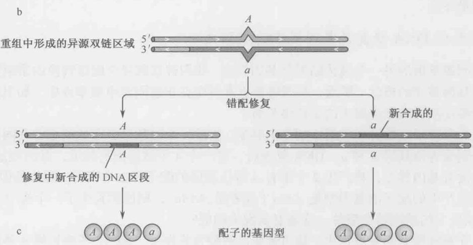  
图 11-28 错配修复重组中间体的异源双链 DNA 可以导致基因转变

## 小结

所有的生物都会发生同源重组，以允许遗传交换、染色体上基因重排、断裂 DNA 及停滞复制叉的修复。重组过程涉及 DNA 分子的断裂和重接。同源重组的双链断裂修复途径很好地描述了很多重组事件。依据此模型，启动交换需要两条同源 DNA 分子中的一条具有双链断裂。DNA 的断端被 DNA 降解酶作用，产生单链 DNA 片段。这些单链 DNA 片段参与其同源 DNA 的配对。一旦发生了配对，两条 DNA 分子就被称为 Holliday 联结体的分支结构所连接。在 Holliday 联结体处切断 DNA，以拆分联结体并结束重组。Holliday 联结体可被两种方式剪切：其中一种方法会产生交换产物，即两个亲本 DNA 分子被共价连接；另一种剪切联结体的方法不产生交换产物，而仅是形成一个重组 DNA 的“补丁”。

细胞编码催化所有同源重组步骤的酶。关键酶是链交换蛋白。其中，大肠杆菌的 RecA 是个先例；类 RecA 的蛋白质存在于所有的生命体中。类 RecA 的链交换蛋白促进两条 DNA 分子寻找同源序列和重组中间体的链交换。RecA 以一个大的 DNA——蛋白质复合体（RecA 蛋白丝）发挥功能。真核生物的细胞编码两个链交换蛋白，分别为 Rad51 和 Dmc1。其他重要的重组酶是产生 DNA 双链断裂并启动重组的 DNA 剪切酶。这些蛋白质（Spo11 和 HO）只在真核细胞中出现。作用于 DNA 断端而产生所需要的单链末端的核酸酶，分别是原核生物的 RecBCD 酶和真核生物中的 MRX 酶复合体。此外，还有促进移动（分支移位）和剪切（拆分）Holliday 联结体的其他酶。

减数分裂中，重组对第一次核分裂前同源染色体的正确配对是必不可少的。因此，重组被高度调控以保证发生在所有的染色体上。Spo11 DNA 切割酶和 Dmc1 链交换蛋白都在重组反应中起特异性的作用。同源重组有时也用来调控基因表达。酵母的交配型转换是这种调控的绝佳例证，同时也是一个基因转变的例子。已经有一个被称为依赖合成的链退火（SDSA）的新模型描述一些同源重组事件，该模型是在分析交配型转换机制的过程中产生的。这种机制可以产生基因转变型的遗传交换产物，但不会导致交换的发生。

## 参考文献

## 书籍

Brown T.A. 2007. Genomes, 3rd ed. Garland Science, New York.

Griffiths A.J.F., Miller J.H., Suzuki D.T., Lewontin R.C., and Gelbart W.M. 2000. An introduction to genetic analysis, 7th ed. W.H. Freeman, New York.

## 细菌的重组

Chen Z., Yang H., and Pavletich N.P. 2008. Mechanism of homologous recombination from the RecA-ssDNA/dsDNA structures. Nature 453: 489–494.

Court D.L., Sawitzke J.A., and Thomason L.C. 2002. Genetic engineering using homologous recombination. Annu. Rev. Genet. 36: 361–388.

Cox M.M. 2001. Recombinational DNA repair of damaged replication forks in Escherichia coli: Questions. Annu. Rev. Genet. 35: 53–82.

Kowalczykowski S.C., Dixon D.A., Eggleston A.K., Lauder S.D., and Rehrauer W.M. 1994. Biochemistry of homologous recombination in Escherichia coli. Microbiol. Rev. 58: 401–465.

Lusetti S.L. and Cox M.M. 2002. The bacterial RecA protein and the recombinatorial DNA repair of stalled replication forks. Annu. Rev. Biochem. 71: 71–100.

Smith G.R. 2001. Homologous recombination near and far from DNA breaks: Alternative roles and contrasting views. Annu. Rev. Genet. 35: 243–274.

## 真核细胞的重组

Bernstein K.A., Gangloff S., and Rothstein R. 2010. The RecQ DNA helicases in DNA repair. Annu. Rev. Genet. 44: 393–417.

Eichler E.E. and Sankoff D. 2003. Structural dynamics of eukaryotic chromosome evolution. Science 301: 793–797.

## 酵母交配型的转换

Keeney S, 2001. Mechanism and control of meiotic recombination initiation. Curr. Top. Dev. Biol. 52: 1–53.

Page S.L. and Hawley R.S. 2003. Chromosome choreography: The meiotic ballet. Science 301; 785–789.

Pâques F. and Haber J.E. 1999. Multiple pathways of recombination induced by double-strand breaks in Saccharomyces cerevisiae. Microbiol. Mol. Biol. Rev. 63; 349–404.

Pastink A., Eeken J.C., and Lohman P.H. 2001. Genomic integrity and the repair of double-strand DNA breaks. Mutat. Res. 480–481:37–50.

Prado F., Cortes-Ledesma F., Huertas P., and Aguilera A. 2003. Mitotic recombination in Saccharomyces cerevisiae. Curr. Genet. 42: 185–198.

Stracker T.H. and Petrini J.H.J. 2011. The MRE11 complex: Starting from the ends. Nat. Rev. 12: 90–103.

Symington L.S. 2002. Role of RAD52 epistasis group genes in homologous recombination and double-strand break repair. Microbiol. Mol. Biol. Rev. 66: 630–670.

van den Bosch M., Lohman P.H., and Pastink A. 2002. DNA double-strand break repair by homologous recombination. Biol. Chem. 383:873–892.

West S.C. 2003. Molecular views of recombination proteins and their control. Nat. Rev. Mol. Cell Biol. 4: 435–445.

Haber J.E. 2002. Switching of Saccharomyces cerevisiae mating-type genes. In Mobile DNA II (ed. N.L. Craig, et al.), pp. 927–952. ASM Press, Washington, D.C.

Haber J.E. 2012. Mating-type genes and MAT switching in Saccharomyces cerevisiae. Genetics 191; 33–64.

For answers to even-numbered questions, see Appendix 2: Answers.

## 习题

## 偶数习题的答案请参见附录2

习题 1 DNA 复制可以通过两种方式导致 DNA 模板发生双链断裂 (DSB)，请解释这两种方式。

习题 2 假设你现在有某特定基因的两个等位基因，请描述该 DNA 的哪些特征可以将二者区分开来？这两个等位基因是同源的吗？

习题 3 在双链断裂（DSB）形成过程中，相应的酶类会对双链 DNA 进行处理形成单链 DNA（图 11-4b 所示）。切割反应的方向（5'→3'或 3'→5'）对该过程会有影响吗？为什么？

习题 4 下图表示的是双链断裂修复同源重组的前三步，其中有一些错误，列出这些错误，并回答：这些错误错在哪里？应该如何纠正？

习题5 什么是“异源双链DNA”？

习题 6 请列举由 RecBCD 催化的不同的酶促活动，并描述每个活性在同源重组（通过双链断裂修复通路）各个步骤中的意义。

习题 7 请解释：为什么基于 RecA 的链互换不能发生在两个同源的、双链的、共价闭合的环状 DNA（cccDNA）之间，而可以发生在两个双链 DNA 分子之间（图 11-8c 所示）？

习题 8 以下图所示的为 Holliday 联接体（Holliday junction）DNA 反应底物（5'端已用 ${}^{32}$ P 进行末端标记），提出一种可被研究人员彩用的分析方案来确定 RuvA 蛋白同

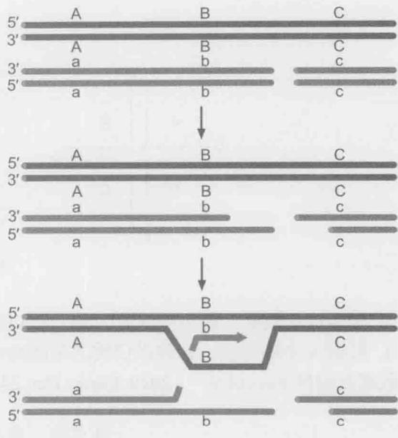

DNA 反应底物的结合。另外，提供一种 DNA 反应底物修饰方案并以此为阴性对照，阐

明 RuvA 结合的特异性方面（用 A、B、C 和 D 来标记用于组装底物的特别的单链 DNA 片段）。

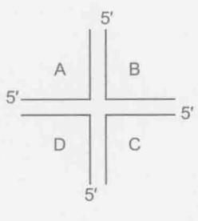

习题 9 请解释在原核生物中没有，但在真核生物中有的，同源重组的最重要的作用。

习题 10 在真核生物中, 细胞是如何产生减数分裂同源重组起始所需要的双链断裂（DSB）的? 请作简要描述。

习题 11 请对基因转换进行定义，并举例说明基因转换发生的机制？

习题 12 请比较接合型转换中使用的合成依赖单链退火和双链断裂修复同源重组的异同。

习题 13 请解释：为什么双链断裂修复同源重组可以发生在任意两个拥有同源性的 DNA 分子之间，而不是拥有特定序列的两个 DNA 分子之间？

习题 14 研究人员表示一种人类蛋白在 Holliday 联结体拆分发挥功能. 他们纯化了该蛋白并把它用在了一个以左下图所示的 DNA 为反应底物的实验中。左下图中的 A、B、C 和 D 表示 4 条 DNA 链，它们的长度都是 60nt，其中只有 A 链的 5'末端进行了 ${}^{32}$ P 标记。研究人员基于该反应底物设置了 3 种反应：（1）不含该蛋白；（2）含有纯化后的蛋白（蛋白质 X）；（3）含有 RecA（作为对照）。反应产物通过变性的聚丙烯酰胺凝胶电泳分离，每种产物各占一条泳道。放射自显影的胶图如右下图所示。

## 第12章 位点特异性重组和DNA转座

本章概要
- 保守性位点特异性重组（CSSR）
- 位点特异性重组的生物学作用
- 转座
- 转座子及其调控的实例
- V（D）J 重组

DNA 是一种非常稳定的分子。通过前面章节的学习，我们了解到：DNA 的复制、修复及同源重组过程都保持了很高的保真度，这些遗传过程确保了一个物种的基因组在传代过程中保持几乎完全一致。然而，重要的是，还有一些遗传过程造成了 DNA 序列的重排，从而导致了一个更具动态性的基因组结构，这些过程就是本章的主题。

很多重要的DNA重排都是由两类重要的遗传重组造成的——保守性位点特异性重组（conservative site-specific recombination, CSSR）和转座重组（一

般称作转座）（transpositional recombination）。CSSR 发生在两段特定的序列之间（图 12-1）。相反，转座则是发生在特定序列和非特定 DNA 位点之间。由这些重组活动促成的生物学过程包括：病毒感染过程中病毒基因组插入到宿主细胞 DNA、DNA 片段倒位改变基因结构，以及转座因子（transposable element）（又叫“跳跃”基因）从一个染色体位点移动到另一个位点。

这些 DNA 重排对染色体结构和功能有着深远的影响。对许多物种而言，转座是自发性突变的主要来源，人类基因组中几乎一半的序列都源于转座子（尽管目前大多数元件都不具活性）。而且，正如我们将看到的，病毒感染和脊椎动物免疫系统的发育都严重地依赖这些特殊的 DNA 重组。

保守性位点特异性重组和转座在机制上具有共同的关键特征。重组酶（recombinase）能够识别 DNA 分子上要发生重组的特定序列，它把这些特定序列集合在一起，形成一个蛋白质-DNA 的复合体，这个复合体把这些 DNA 位点衔接起来，形成联会复合体（synaptic complex）。在这种复合体中，重组酶催化 DNA 分子的断裂和重新连接，造成 DNA 片段的倒位或位移。一个重组酶通常可以完成所有步骤。这两种类型的重组都被精细地控制着，从而使在 DNA 中引入断裂和非预期的重组 DNA 片段对细胞带来的危害降到最低。但是，我们还将了解到，这两种重组类型在原理上还有一些关键的差异。

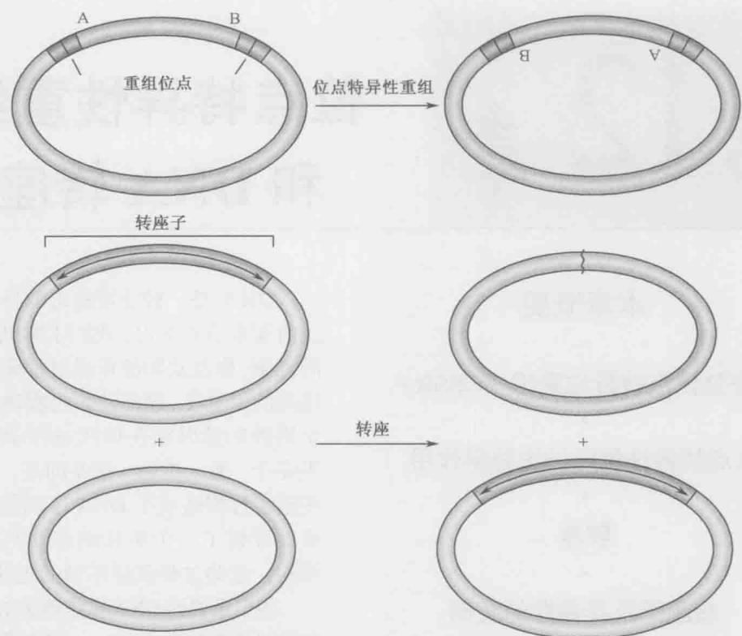  
图 12-1 两类遗传重组。上图显示的是位点特异性重组。红色和蓝色重组位点间重组的结果使包含 A 和 B 基因的 DNA 片段发生了颠倒。下图显示的是红色的转座子从灰色的 DNA 上切除并插入到另一个蓝色的 DNA 的不相关位点上。

下面先介绍比较简单的位点特异性重组，然后再对转座进行讨论。每个部分都是先介绍原理的基本特点，然后再提供几个具体的例子。

## 保守性位点特异性重组（CSSR）

发生在靶 DNA 上特定 DNA 序列的位点特异性重组

很多由一个特定 DNA 片段发生重排的反应都是由保守性位点特异性重组造成的。这些反应的一个关键特性是发生移动的 DNA 片段都带有短而特殊的序列元件，叫做重组位点（recombination site），在这里可发生 DNA 交换。这种重组类型的一个例子是 $\lambda$ 噬菌体基因组整合到细菌染色体上（图 12-2，附录 A）。

  
图 12-2 λ 噬菌体基因组整合到宿主细胞染色体。在两个 DNA 分子之间 DNA 的交换常特异性地发生在重组位点之间。在图中未按比例显示 λ 噬菌体和细胞染色体的相对长度。

λ噬菌体整合时,重组总是精确地发生在位于两个重组位点之间一段相同的序列上,这两个重组位点,一个在噬菌体 DNA 上,另一个在细菌 DNA 上。重组位点带有两类序列元件:重组酶特异结合的序列和发生 DNA 断裂及重新连接的序列。重组位点往往很短,大约只有 20bp,也可能会更长一些,并带有其他序列基序或蛋白质结合位点。关于更复杂的重组位点的例子,我们将在介绍具体的重组反应时进行说明。

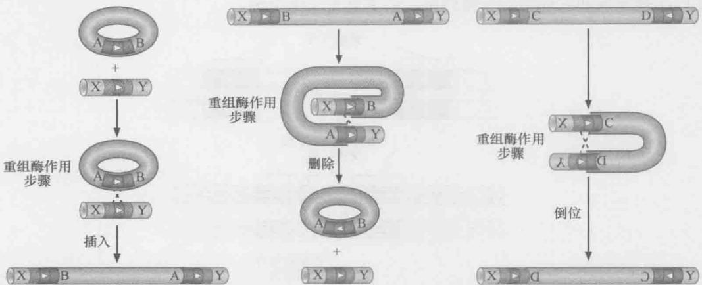  
图12-3 CSSR 重组的3种类型。在每个图例中，红色的 DNA 片段通过重组发生了移动或重排。A、B、C、D、X 和 Y 代表位于不同 DNA 片段的基因，深红色和蓝色区块代表重组酶识别序列，黑色箭头代表交换区，这些序列元件一起构成重组位点。

CSSR 能够产生 3 种不同类型的 DNA 重排（图 12-3）：①一个 DNA 片段在特定位点的插入（如 λ 噬菌体 DNA 整合到细菌染色体）；②DNA 片段的缺失；③DNA 片段的倒位。重组结果是造成 DNA 插入、缺失还是倒位，是由 DNA 分子或参与重组的其他分子上的重组酶识别位点的结构决定的。

要理解重组位点的结构如何决定 DNA 重排的类型，我们就必须对重组位点的序列元件进行更仔细的研究（图 12-4）。每个重组位点都是由一对对称排列的重组酶识别序列（recombinase recognition sequence）构成，这些识别序列中间所包围着一个短的不对称序列，称为交换区（crossover region），DNA 的断裂和重新连接就在这里发生。

由于交换区是不对称的，所以每个重组位点都带有特定的极性。单个 DNA 分子上的两个位点的方位排列或呈反向重复（inverted repeat）的关系，或呈同向重复（direct repeat）的关系。在一对反向位点间的重组将使这两个位点间的 DNA 片段发生倒位（图 12-3，右图）；相反，以同样的机制发生在两个同向重复位点间的重组将使这两个位点间的 DNA 片段发生缺失（图 12-3，中图）；最后，两个不同分子的重组位点相互靠近并交换 DNA 造成 DNA 片段的插入（图 12-3，左图）。在对重组酶进行一般性讨论后，将介绍这 3 种重排类型的几个实例。

位点特异性重组酶通过一个蛋白质-DNA的共价中间体对DNA进行切割并重新连接

保守性位点特异性重组酶共有两个家族——丝氨酸重组酶（serine recombinase）和酪氨酸重组酶（tyrosine recombinase）。这两个家族的基本原理都是在切割 DNA 时形成一个蛋白质-DNA 的共价中间体。对丝氨酸蛋白酶而言，该酶活性位点内丝氨酸残基的侧链对重组位点内的特定磷酸二酯键进行攻击（图 12-5），结果造成 DNA 分子一个单链断裂的同时，在丝氨酸和这个 DNA 断裂位点上的一个磷酸之间形成一个共价连接。同样地，对酪氨酸重组酶来说，则是其活性位点上酪氨酸的侧链攻击 DNA 并与之结合。表 12-1 按家族和生物功能分类列出了许多重要的重组酶。


图 12-4 CSSR 过程起作用的结构。一对对称的重组酶识别序列分列在发生重组的交换区两端。重组酶亚基结合到这些重组位点。注意交换区的序列不是回文形式，导致了重组位点内部的不对称。（图片经允许修改，源自：Craig N. et al. 2002. Mobile DNA II, p.4, Fig.1 2002 ©ASM Press.）  
  
图12-5 丝氨酸重组酶和酪氨酸重组酶的共价中间体机制。如图中所示，丝氨酸活性位点的一个羟基攻击磷酸基团，导致重组位点一条单链的断裂，然后断开的DNA上的羟基再攻击蛋白质-DNA中间的共价键，从而逆转了断裂反应，缝合DNA并释放蛋白质。重组酶的标记为Rec，以蓝色表示。

蛋白质-DNA 共价中间体保存了蛋白质和 DNA 之间的共价连接间断裂的磷酸二酯键的能量。这样，DNA 链可以通过逆转断裂过程被重新连接。在这个逆转过程中，来自断裂 DNA 的一个羟基攻击连接蛋白质和 DNA 的共价键，这一过程共价地缝合了 DNA 缺口，同时释放出游离的（不结合 DNA 的）重组酶（图 12-5）。

正是这种机制的特性赋予保守性位点特异性重组（CSSR）名称中“保守性”的意义：被称为“保守”是因为反应中被断开的每个DNA键都被重组酶重新连接起来，而DNA在被重组酶断开并重新连接的过程中不需要外部的能量，如ATP水解所释放的能量。这种裂解机制以及形成的共价中间体并不为重组酶所特有。DNA拓扑异构酶（见第4章）和Spo11也是这种机制，后者运用这种机制在减数分裂期间诱导DNA双链断裂引发同源重组（见第11章）。

表 12-1 重组酶的家族和功能

<table><tr><td>重组酶</td><td>功能</td></tr><tr><td colspan="2">丝氨酸重组酶家族</td></tr><tr><td>沙门氏菌 Hin 转化酶</td><td>通过识别 hix 位点使一个染色体区域倒位造成一个基因启动子翻转,表达两种截然不同的表面抗原</td></tr><tr><td>Tn3 转座子和 Yδ 解离酶</td><td>启动一个 DNA 的删除反应来解除复制性转座造成的 DNA 融合,重组位点为 res 位点</td></tr><tr><td colspan="2">酶氨酸重组酶家庭</td></tr><tr><td>λ 噬菌体整合酶</td><td>启动 λ 噬菌体基因组整合或离开大肠杆菌染色体特定序列上的整合及切除反应,重组位点为 res 位点</td></tr><tr><td>PI 噬菌体 Cre</td><td>通过噬菌体 DNA 上的识别位点( lox 位点)在浸染过程中启动噬菌体 DNA 的环化</td></tr><tr><td>大肠杆菌 XerC 和 XerD</td><td>启动一些 DNA 删除反应,将二聚体的环状 DNA 分子变成单体,同时识别质粒( cer )位点和细菌染色体(dif)位点</td></tr><tr><td>酵母 FLP</td><td>将酵母的 2μ质粒上一个区域倒位以产生一个叫做滚环复制的 DNA 扩增反应,重组位点为 frt 位点</td></tr></table>

## 丝氨酸重组酶诱导 DNA 双链断裂及链交换，促成重组

CSSR 总是发生在两个重组位点之间。如上所示，这些位点可以在同一个 DNA 分子上（如倒位或缺失），也可以在两个不同的分子上（如插入）。每个重组位点都是由双链 DNA 构成的。因此，在重组过程中，这4条 DNA 单链（每个双螺旋两条）必须先断开，再与另一个分子上的单链重新连接，以产生重排的 DNA。

丝氨酸重组酶在进行链交换前将 4 条单链全部切断（图 12-6）。重组酶蛋白中一个分子催化其中一个断裂反应，所以至少需要由 4 个亚基组成（即四聚体形态）重组酶。

亲本 DNA 双链分子的断裂产生 4 个双链 DNA 片段（根据它们所结合的蛋白质的不同分别标记为 R1、R2、R3 和 R4，如图 12-6 所示）。要使重组发生，上边 DNA 分子的 R2 片段必须结合到下边 DNA 分子的 R3 片段上。同样，上边 DNA 分子的 R1 片段必须结合到下边 DNA 分子的 R4 片段上。一旦这一 DNA 交换发生，每个断裂 DNA 链的 3'-OH 端就会攻击新配对片段上的重组酶-DNA 间的共价键。如上所述，这个反应释放了重组酶，而且共价地缝合了 DNA 链，产生了重排的 DNA 产物。

  
图 12-6 丝氨酸重组酶催化的重组反应。4 条 DNA 单链各自被重组酶蛋白一个亚基断裂于交换区，4 个亚基分别被标记为 R1、R2、R3 和 R4。一个双螺旋中的两条单链的断裂位点相差两个碱基，这两个碱基区域在重组产物中形成一个杂交二倍体。图中所示的重组位点与图 12-4 中的类似。

## 丝氨酸重组酶-DNA复合体的结构揭示了它通过亚基旋转以完成链交换

重组过程中丝氨酸重组酶-DNA复合体的结构很好地展示了DNA链的交换是如何自然协调的。这个复合体包括丝氨酸重组酶的4个亚基和2个断裂的双链DNA分子。每个重组酶亚基中的丝氨酸活性位点与每个重组DNA位点的5'磷酸基团之间形成的共价链接清晰可见。每个共价链接的末端依次产生一个带有游离的3'羟基的DNA末端参与链的交换。

这一复合体的最显著特征是在“上面”和“下面”的重组酶二聚体之间具有一个大而平的分界面（图12-7a）。这种结构大多是疏水且光滑的，基本不会阻滞复合体上下两部分结构围绕彼此进行旋转。而正负电荷配对的一些区域则特别在初始状态以及相互呈 $180^{\circ}$ 的旋转角度时稳定二聚体的结构。因此，对于此复合体的分析强有力地证实了重组的机制包括：①DNA断裂形成共价的酶-DNA中间体；②在蛋白-DNA复合体中二聚体旋转了

180°；③二聚体旋转后攻击解离酶-DNA复合体中的DNA3'羟基末端，使链重新连接形成新的重组构型。随着更多结构性和机制性实验的完成，这种引人注目的蛋白旋转现象将得到更深的了解（图12-7b）。

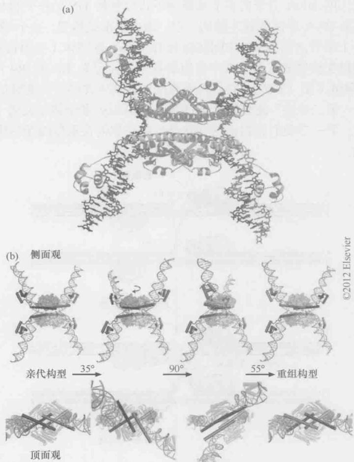  
图 12-7 丝氨酸重组酶的结构。（a）这个结构显示的大而平的四聚体界面是旋转的位点。重组酶四聚体由蓝绿色的亚基二聚体（顶端）和灰色的亚基二聚体（底端）组成。该四聚体中的每个亚基都分别位点特异性地结合在该结构中的4个“DNA臂”上（注意DNA之间的联系是通过DNA分子外侧的蛋白质亚基的α螺旋实现的）。尽管在这里只显示了两条链被切断，但是对于一个完整的重组反应，4个DNA链必须全部断裂（如图12-6）。(Li W. et al. 2005.. Science 309: 1210. PDB Code: 1ZR4.) 图形通过MolScript，BobScript和Raster3D制作。(b) 在较上面的展现的是四聚体界面旋转位点的侧面图，而在较下面的视图则是将侧面图旋转90°得到的俯视图，揭示了四聚体亚基对之间对齐的角度（用有颜色的柱表示）。在该图中展现了在DNA切除过程中丝氨酸重组酶四聚体的不同的旋转构象的结构。在左侧的起始的四聚体构象（亲代类型）是准备切除的构象：每个旋转的亚基对的α螺旋约呈50°角。第一次顺时针旋转约35°使亚基对的螺旋构象处于约85°交角。再旋转约90°则产生对齐的构象异构体，而最后再旋转约55度则完成了一轮的亚基交换并将重组构型中的DNA链排列成连接形式。（图片经允许修改，源自Johnson R.C. and McLean M.M. 2011. Structure 19: 751–753；Fig.2, p. 752. ©Elsevier.）

## 酪氨酸重组酶每次断裂和结合一对 DNA 单链

和丝氨酸重组酶不同，酪氨酸重组酶先完成两条 DNA 单链的断裂和重新连接，再对剩下的两条单链进行断裂和重新连接（图12-8）。考虑到是两个 DNA 分子与它们的重组位点配对，因此同样需要4个分子的重组酶，每个分子断裂一条 DNA 单链。重组开始时，结合到左侧重组酶结合位点的亚基（在图12-8a中标记为 R1 和 R3）分别断裂各自结合的 DNA 分子的上面的那条单链，这次断裂发生在交换区的第一个核苷酸处。然后，上边（灰色）的 DNA 分子的右上单链和下边红色的 DNA 分子的右上单链交换配对的伙伴。这两条 DNA 单链就被连接到一起，形成了重组构型。这个“第一单链”交换反应所产生的一个带分岔的 DNA 中间体称为 Holliday 联结体（见第11章，图12-8b）。

一旦第一单链交换完成，另外两个重组酶亚基（标记为 R2 和 R4）就会切割两个 DNA 分子的下单链（图 12-8c）。它们再交换配对的伙伴并经过与断裂反应逆转的过程连接起来。这个“第二单链”的交换反应打开了 Holliday 联结体（见第 11 章），得到重排的 DNA 产物。下一节我们将讨论这些化学反应是如何在重组酶蛋白质-DNA 复合体的作用下发生的。

  
图 12-8 酪氨酸重组酶催化的重组反应。第一步，由 R1 和 R3 亚基断裂 DNA（a）。如图所示，蛋白质与断裂的 DNA 通过 3' 端磷酸-酪氨酸键连接。断裂 DNA 5' 端的两个羟基各自攻击另一个 DNA 分子上蛋白质-DNA 的连接键后发生第一对单链的交换（b）。第二条单链的交换机制与上面相同，通过 R2、R4 亚基完成（c 和 d）。（来源：Craig N. et al. 2002. Mobile DNA II, color plate1, chapter 2. ©ASM Press.）

## 酪氨酸重组酶与 DNA 结合的结构揭示了 DNA 交换的机制

酪氨酸重组酶的位点特异性重组机制已经了解得很清楚了。这一蛋白质家族的一些成员的结构已经得到了很好的了解，并揭示出其在重组过程中的作用。一个完美的例子就是 Cre 重组酶结合到重组 DNA 两种不同构型上时的结构。下面介绍从这些结构得出的详细机制。Cre 是 P1 噬菌体编码的一种酶，其功能是在侵染过程中环化线性的噬菌体基因组。Cre 作用于 DNA 上的重组位点叫 lox，Cre-lox 是一个由酪氨酸重组酶家族催化重组反应的简单例子，整个重组仅需 Cre 蛋白和 lox 位点。Cre 也是在遗传工程中被广泛使用的一个工具（框 12-1 位点特异性重组在遗传工程中的应用）。

## 框 12-1 位点特异性重组在遗传工程中的应用

由于一些位点特异性重组系统非常简单，因而被广泛用作遗传实验的工具。Cre 重组酶和其“近亲”FLP 重组酶，都被用在真核生物基因删除的实验中（见附录 A 的例子）。

我们举一个假设的例子就能清楚地说明这种策略的益处。例如，一个研究人员对某个基因在肺癌发育过程中的作用感兴趣，希望用小鼠作为模型生物来研究这个过程（附录 A）。当该基因被破坏或“敲除”后（见图 A-27），小鼠在胚胎形成早期就都死了。很明显，这个基因在小鼠早期发育中是必需的。那么，该如何研究该基因在成年动物肺癌形成中的作用呢？

这时，位点特异性重组往往可为我们提供答案。通过传统的方法在感兴趣的基因两侧引入可被 Cre（或 FLP）识别的重组位点，在没有重组酶的情况下，这些位点对该基因的功能不造成任何影响。因此，可将编码 Cre 蛋白（或 FLP 蛋白）的基因引入该生物体内，并将其置于一个可严格调控的启动子的控制之下（第 19 章）。这样，小鼠先在无重组酶的情况下发育，出生之后，“开启” Cre 的表达，重组酶的出现就造成了该基因的丢失。通过这种方法，把 Cre 处理（将感兴趣的基因删除）后的小鼠的情况与该基因保持完整的“正常”小鼠进行比较，就可以探讨该基因在肺癌发育过程中的作用。这样，利用 Cre 形成的重组使得我们可以在不同的发育时期研究基因的潜在功能。

Cre-lox 结构表明，重组需要 4 个 Cre 亚基，每个亚基结合到底物 DNA 上的一个结合位点（图 12-9）。DNA 的构象通常是一个呈平面四方形的四通管接头结构（第 11 章关于 Holliday 联结体的讨论），每个“臂”上都结合了一个 Cre 亚基。尽管乍看起来这个结构的四边是对称的，但实际上不是这样。Cre 有两种不同的构象，构象 1 的一对亚基用绿色标记，构象 2 的另一对亚基用紫色标记（图 12-9b）。Cre 只有在其中一种构象（图中绿色标记的亚基）时才能够切断和重新连接 DNA。因此，每次只有一对亚基处于活性状态。随着反应的进行，活性构象在两对亚基间来回转换，而这种转换对于控制重组过程的进行和保证“每次作用一条单链”的交换机制是至关重要的。

  
图 12-9 Cre 重组酶的位点特异性重组机制。(a)一系列 Cre-DNA 中间体的结构，它反映了“每次作用一条单链”的交换机制。在每个分图中，只有两个绿色的亚基是活性构象。可以看出，当第一条单链断裂后亚基的颜色发生了交换，第二对 Cre 亚基变为重组的活性构象。（图片经允许修改，源自：Guo F. et al. 1997. Nature 389:41. ©Macmillan）(b)有 Cre 结合到 Holliday 联结中间体的晶体结构（对应于图 a 的第三张图）。注意绿色的两个亚基的构形与紫色的不同，因此复合体不是一个四重对称。留心观察可以发现，结构中相邻的两对 DNA 臂更加接近一些。（Gopaul D. N. et al. 1998. EMBO J. 17: 4175.）图形通过 BobScript、MolScript 和 Raster 3D 软件制作。

## 位点特异性重组的生物学作用

细胞和病毒利用保守性位点特异性重组来实现多种多样的生物学功能，某些功能将在下面进行讨论。很多噬菌体的感染就是使用这种重组机制将自己的 DNA 插入到

  
图 12-10 参与 $\lambda$ 噬菌体整合和切除的重组位点显示出的重要序列元件。C、C'、B 和 B' 是核心的 $\lambda$ Int 结合位点，其他的蛋白质结合位点位于 att P 上及 C 和 C' 位点两端。这些区域叫做“臂”，左边的叫 P 臂，右边的叫 P' 臂。标记为 $P_{2}$ 、 $P_{2}$ 和 $P_{1}'$ 的紫色小区块是臂上的 $\lambda$ Int 结合位点。H 是整合宿主因子（integration host factor，IHF）的结合位点，X 是 Xis 的结合位点，F 是 Fis 的结合位点，其他的构筑蛋白在这里不再作介绍。灰色区域是交换区。为了表示清楚，结合在核心位点上的 $\lambda$ Int 没有画出来。值得注意的是，在噬菌体整合或切除的过程中并非所有的蛋白结合位点都被占用。在重组反应之后，P 臂变成 attL 的一部分，而 P' 臂变成了 attR 的一部分。

宿主染色体中。还有些时候，位点特异性重组被用来改变基因的表达。例如，一个 DNA 片段的倒换可以决定两个基因中哪一个进行表达。位点特异性重组也被广泛地用于帮助环状 DNA 分子在复制、同源重组和细胞分裂过程中保持其结构完整性。

位点特异性重组系统之间的比较揭示出一些普遍的原理。所有反应的关键都是重组酶与 DNA 的结合，以及使两个重组位点聚合在一起。对于一些重组反应来说，这个结合过程很简单，仅需要重组酶和它的 DNA 识别序列，就像刚描述的 Cre 的情况一样。与此相反，另外一些重组反应则需要辅助蛋白。这些辅助蛋白包括一些所谓的构筑蛋白（architectural protein），它们结合到特定 DNA 序列上并使其弯曲，使之成为有利于重组过程进行的特异形状。构筑蛋白还可以控制重组反应发生的方向，例如，在阻止 DNA 切除这个反向反应的同时确保这个 DNA 片段的整合。显而易见，这种调节作用对于产生合乎逻辑的生物学结果是至关重要的。最后我们会了解到，通过其他蛋白质对重组酶的调节可以控制某种 DNA 重组发生的时间，并使其与其他细胞活动协调一致。

## $\lambda$ 整合酶催化病毒基因组在宿主细胞染色体上的整合和切除

当 $\lambda$ 噬菌体侵染宿主细菌时，一系列的调节活动导致其或者形成静止的溶原状态（lysogenic state），或者进行噬菌体的增殖，即进入裂解性生长（lytic growth）过程（第18章，附录 A）。溶原体的形成需要噬菌体 DNA 整合到宿主染色体上。同样地，要使噬菌体脱离溶原状态，开始复制并产生新的噬菌体颗粒，它就必须将自己的 DNA 从宿主染色体上切下来。对这一整合 / 切除过程的分析为我们提供了从分子水平上对位点特异性重组进行研究的切入口。

为实现整合， $\lambda$ 整合酶蛋白（ $\lambda$ Int）在两个特定位点之间催化重组的进行，这两个位点叫做 $att$ 位点，或者 RH 附着位点。 $attP$ 位点在噬菌体上（P 代表噬菌体）， $attB$ 位点在细菌染色体上（B 代表细菌，图12-2）。 $\lambda$ Int 是一个酪氨酸重组酶，所催化的单链交换机制遵循前面介绍的 Cre 蛋白的催化过程。然而，与 Cre 重组不同的是， $\lambda$ 整合需要辅助蛋白的帮助来组装所需的蛋白质-DNA 复合体。辅助蛋白控制着反应过程，确保在噬菌体生命周期的正确时间进行 DNA 的整合和切除。我们先介绍整合的过程，再了解切除是如何被启动的。

对 $\lambda$ 整合的调节中很重要的一点是 attP 和 attB 位点的高度不对称结构（图 12-10）。这两个位点都含有一个中央核心片段（约 30bp），这些核心重组位点都包含有两个 $\lambda$ Int 结合位点和一个发生单链交换的交换区（如前所述）。不同的是，attB 仅由这个中央核心区组成，而 attP 则长很多（240bp），它还携带有许多其他蛋白质的结合位点。

attP 核心区两端的 DNA 区域被称为“臂”，臂上有若干个蛋白质结合位点，包括 $\lambda$ Int 结合的其他位点（在图12-10中标记为 $P_{1}$ 、 $P_{2}$ 和 $P'$ ）。 $\lambda$ Int 是一个不寻常的蛋白质，因为它有两个结构域参与了序列特异性的 DNA 结合：一个结构域结合到臂上的重组酶识别位点；另一个结合到核心识别位点。另外，attP 臂上的位点还被几个构筑蛋白所结合，这些蛋白质的结合控制了重组进行的方向和效率。

整合过程要求 attB、attP、 $\lambda$ Int，以及一个叫做整合宿主因子（integration host factor，IHF）的构筑蛋白的参与。IHF 是一个序列依赖性的 DNA 结合蛋白，它能使 DNA 产生大角度（大于 160°）的弯曲（图 12-11）。attP 的臂上携带了 3 个 IHF 结合位点（在图 12-10 上被标记为 H $_{1}$ 、

  
图 12-11 使 DNA 弯曲以便将 DNA 结合位点聚合在一起的 IHF 作用模型。位于 attP 的 P' 臂上的 λ Int 和 IHF 结合位点如图所示。IHF 结合到 H' 位点后将 DNA 弯曲，使一个分子的 λ Int 同时与 P'₁ 和 C' 位点结合。DNA 上 H' 位点中的断裂表现为在 DNA 上出现一个缺口，被用于 IHF-DNA 复合体的结构分析。（图片经允许修改，源自：Rice P. et al. 1996. Cell 87: 1295-1303. Fig. 8. ©Elsevier.）

$H_{2}$ 和 $H^{\prime}$ ）。IHF 的作用是将 DNA 臂上的 $\lambda$ Int 位点（ $\lambda$ Int 与之结合较强）与中央核心区上的位点（ $\lambda$ Int 与之结合较弱）聚合在一起。因此，由 IHF 介导使 DNA 产生大角度弯曲，使 $\lambda$ Int 找到结合能力较弱的核心识别位点，从而催化重组的发生。

当重组完成后，环形的噬菌体基因组稳定地整合到宿主染色体上。因此，在噬菌体和宿主 DNA 的结合处产生了两个新的杂交位点。这些位点被称为 attL（左侧）和 attR（右侧）（图12-10）。这些位点都含有核心区域，但是臂区却被分开了（图12-10中 P 和 P' 区域的位置）。所以，在新的重排结构中，两个核心区域都没有能力运用产生整合复合体的机制来组装有活性的 $\lambda$ Int 重组酶复合体，因为对组装很关键的 DNA 位点根本不在正确的位置上。

## λ 细菌噬菌体的切除需要一个新的折叠 DNA 的蛋白质

λ 噬菌体是如何被切除的呢？一个由噬菌体编码的构筑蛋白对切除重组至关重要，这个蛋白质叫做 Xis（即 excise 切除），它结合到特定的 DNA 序列上并造成 DNA 的弯曲。这样看来，其功能与 IHF 类似。Xis 识别 attR 一个臂上的两个主要序列基序（也存在于 attP 臂上，图12-10中标记为 $X_{1}$ 和 $X_{2}$ ）。和这些序列结合后，DNA 产生一个大的弯曲（大于 $140^{\circ}$ ），通过聚合 Xis、 $\lambda$ Int 和 IHF 一起构成在 attR 上有活性的蛋白质-DNA 复合体来促进切除过程。这个复合体将富有成效地与聚集在 attL 上的蛋白质发生相互作用，然后发生重组。

除了促进切除过程（attL 和 attR 之间的重组）以外，Xis 结合到 DNA 上也抑制了整合过程（attP 和 attB 之间的重组），因为 Xis 和 attP 结合后的 DNA 结构与 $\lambda$ Int 和 IHF 正常结合到这些位点时的结构完全不同。Xis 是一个噬菌体编码蛋白，而且仅仅在噬菌体启动进入裂解性生长的情况下才开始表达。关于 Xis 表达的详细情况将在第18章中介绍。Xis 在切除过程中作为辅助因子起到刺激作用，在整合过程中起到抑制因子的作用，这种双重功能保证了在 Xis 存在的情况下噬菌体基因组能够从宿主染色体中被切除，并保持游离的状态。

## Hin 重组酶颠倒一段 DNA 片段，使得特定基因开始表达

沙门氏菌（Salmonella）的 Hin 重组酶通过将一个细菌染色体片段倒位，来控制两组基因中哪一组被表达。Hin 重组是一类重组反应的代表，这些重组在细菌中是相当普遍的，被称为程序性重排。它的功能通常是让一部分细菌能够对周围环境的突然变化获得“预适应”。在 Hin 倒位的情况中，重组能够帮助细菌躲避宿主免疫系统的攻击，我们即将对此进行说明。

倒位过程所控制的基因能编码两种不同形态的鞭毛蛋白（H1 和 H2），它们是鞭毛纤丝的蛋白质组分。鞭毛位于细菌表面，因而通常是免疫系统的识别目标（图 12-12）。通过用 Hin 重组实现在这两种形态间的切换，至少使细菌群体中的部分个体不被免疫系统识别出其表面的结构。

被 Hin 倒位的染色体区域大约长 1000bp，其两端是叫做 hixL（左侧）和 hixR（右侧）的特异性重组位点（图 12-13），这些序列彼此间方向相反。Hin 是一种丝氨酸重组酶，它催化倒位的发生，工作原理在前面介绍这个家族时已经讲过了。在可倒位的片段上带有编码 Hin 的基因，同时作为一个启动子，当可倒位片段处于某种方向时，它将启动位于可倒位片段外、与 hixR 位点直接相邻的一些基因的表达。当可倒位片段处于“开”的方向时，这些相邻的基因将得到表达；但当它翻转成“关”的方向时，由于缺乏有功能的启动子，这些基因无法被转录。

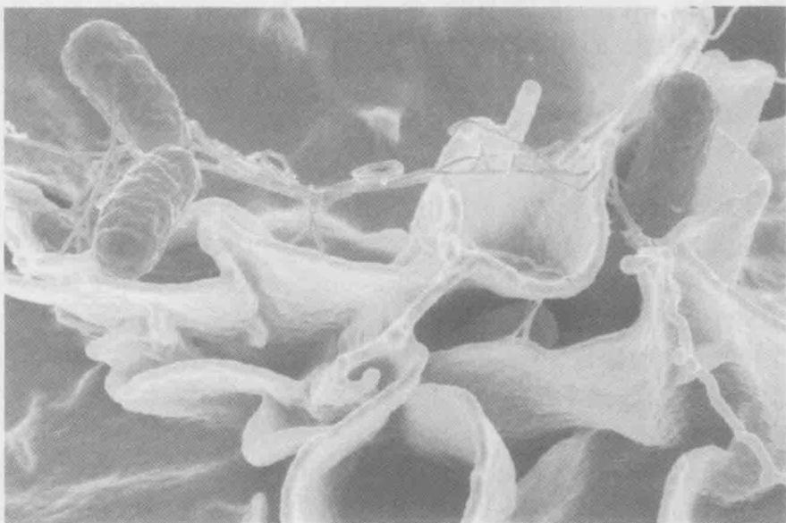  
图12-12 带有鞭毛的细菌（沙门氏菌）显微照片。这张彩色的增强型电子扫描显微图片显示了鼠伤寒沙门氏菌（红色）正在侵入培养的人体细胞。细菌上发丝状的突起就是鞭毛。（来源：RockyMountain Laboratories，NIAID，NIH.）

  
图 12-13 沙门氏菌 Hin 重组酶催化的 DNA 倒位。Hix 位点间 DNA 片段的倒位翻转了一个启动子（P）的位置，造成了两种不同形式的鞭毛蛋白基因表达。

被这个“翻跟头”的启动子所控制的两个基因是 $fljB$ 和 $fljA$ 。 $fljB$ 编码 H2鞭毛蛋白， $fljA$ 则编码针对 H1鞭毛蛋白基因的转录抑制因子。H1鞭毛蛋白基因位于较远的一个位点。这样，当在“开”的方向时，H2鞭毛蛋白和 H1的抑制因子被表达，这些细胞的表面毫无例外都是 H2 型鞭毛；而当处于“关”的方向时，H2 和 H1 的抑制因子都不表达，细胞表面只有 H1 型的鞭毛。

## Hin 重组过程需要一个 DNA 增强子

Hin 重组过程除了需要 hix 位点外，还需要一段序列。这段短短的序列（约60bp）是一个增强子，它能将重组率提高1000倍左右。像增强子促进转录的作用（第19章）一样，这段序列即使在离重组位点很远的情况下也能行使其功能。增强子要起作用还需要细菌的 Fis 蛋白 [作为倒位促进因子（factor for inversion stimulation，Fis）被发现而得名]。像 IHF 一样，Fis 也是一个位点特异性的 DNA 弯曲蛋白。另外，它与 Hin 蛋白发生接触，这对重组过程很重要。

增强子-Fis 蛋白的复合体激活了重组的催化步骤。Hin 可以在没有 Fis-增强子复合体存在的情况下与 hix 重组位点结合配对，形成联会复合体（图 12-14）。这与 $\lambda$ 整合中 IHF 的作用不同，后一过程中辅助蛋白 IHF 在重组酶-DNA 复合体的组装中是不可或缺的。Fis 激活 Hin 重组，需要 3 个 DNA 位点（hixL、hixR 和增强子）聚集在一起，而负 DNA 超螺旋（第 4 章）极大地促进这三联复合体的形成，它能够稳定远距离 DNA 位点的聚合。另一个细菌构筑蛋白 Hu 也能促进这个倒位体的组装。Hu 蛋白与 IHF 的结构同源，但与 IHF 不同的是，它与 DNA 的结合是非序列特异性的。

  
图12-14 Hin 催化过程中重组复合体的形成。Hin 蛋白能单独识别并与两个 hix 位点配对。当 Fis 蛋白存在时，就可以形成三联复合体，这个复合体叫做倒位体（invertasome），是促进重组的最活跃的复合体。（图片经允许修改，源自：Craig N. et al. 2002. Mobile DNA II, p. 246, Fig. 9. © ASM Press.）

是什么生物学基本原理控制着由Fis-增强子复合体催化的Hin倒位呢？那就是确保重组仅仅发生在同一个DNA分子的两个hix位点之间。这种选择性要确保的是避免可倒位片段在DNA分子间重排过程中频繁跳跃而破坏细菌染色体的完整性。

与 $\lambda$ 噬菌体的整合和切除不同，Hin 所催化的倒位没有严格的调控，反而是随机发生的，所以在一群细胞中总有一些细胞带有同一方向的可倒位片段，而另一些带相反方

向的可倒位片段。

## 重组酶将多聚环状 DNA 分子转换成单体

位点特异性重组对细胞中环状 DNA 分子的维护起到关键作用。如同原核和真核细胞中大多数质粒一样，大多数细菌的染色体也是环状的，一些病毒基因组也是环状的。环状 DNA 分子固有的一个问题是，在同源重组过程中它们有时会形成二聚体甚至多聚体，而位点特异性重组可被用来将这些 DNA 多聚体恢复到单体形态。

当两个相同的环状分子间发生 DNA 交换时会发生什么情况呢？在一个细菌染色体两个拷贝间发生的这一过程如图 12-15 所示（见第 11 章，关于同源重组的讨论）。一个单独的同源重组会产生一个大的环状染色体，所有基因都有两份拷贝，即一个二聚的染色体。在细胞分裂时，这种二聚体会造成很大麻烦，因为只有一个 DNA 分子，而不是两个，要分给两个姐妹子细胞。

由于这种多聚体的问题，许多环形 DNA 分子上都带有位点特异性重组酶的识别位点。这些酶称为解离酶（resolvase），因为它们能将二聚体（和多聚体）“解离”为单体。显然，对这些蛋白质来说，它们的关键功能是特异性地催化解离（一种 DNA 的删除反应）而不是相反的过程（将单体变为多聚体），否则只能使多聚体问题变得更糟！我们将会看到，一种特殊机制在增强重组反应中起到了方向选择的作用（框 12-2，Xer 重组酶催化细菌染色体和很多细菌质粒的单体化）。

## 框 12-2 Xer 重组酶催化细菌染色体和很多细菌质粒的单体化

Xer 是酪氨酸重组酶家族的一个成员, 它促进重组的机制与前面讲过的 Cre 蛋白很相似。Xer 是一个异源四聚体, 包含两个 XerC 蛋白亚基和两个 XerD 蛋白亚基。XerC 和 XerD 都是酪氨酸重组酶, 但识别不同的 DNA 序列, 所以 Xer 催化的重组位点必须要包含这两种识别序列。该位点在细菌染色体上叫做 dif 位点。交换区的一端是 XerC 的识别序列, 另一端是 XerD 的识别序列 (框 12-2 图 1)。染色体上只有一个 dif 位点, 它位于 DNA 复制终止区内 (第 9 章)。当染色体形成二聚体时, 该二聚体便有两个 dif 位点 (图 12-15)。

那么细胞如何确保在 dif 位点上由 Xer 介导的重组过程会将二聚体染色体转换为单体, 而不是促成相反的过程呢? 这个定向的调节是通过 Xer 重组酶和一个叫 FtsK 的细胞分裂蛋白之间的相互作用实现的。这个调节的过程是: 当 FtsK 蛋白不与 XerCD 复合体的 dif 位点发生相互作用时, 重组复合体仅具有两个 XerC 亚基活性的构象, 因而, XerC 将催化一对 DNA 单链的交换, 形成 Holliday 联结中间体 (见上文关于酪氨酸重组酶基本原理的讨论)。由于 XerD 一直没有被激活, 重组无法完成, 与 XerC 断裂反应相逆的过程反而常常发生, 结果是又重新产生了最初的 DNA 结构 (框 12-2 图 1)。

相反，当 FtsK 蛋白存在并与 XerCD 复合体发生相互作用时，复合体的构象发生改变，XerD 蛋白被激活。这时，XerD 催化第一对单链的重组，产生 Holliday 联结中间体；这一反应完成后，XerC 催化第二对单链的交换反应，产生重组后的 DNA 产物（框 12-2 图 1）。

  
框12-2 图1 Xer 介导 dif 位点重组的途径。没有 FtsK 存在时（不依赖于 FtsK 途径，左图），仅 XerC 激活并推动单链交换形成 Holliday 联结中间体，这时（由于 XerD 没有激活）重组无法完成，XerC 的反应也常常发生逆转。当有 FtsK 存在时（依赖 FtsK 途径，右图），XerD 被激活并催化形成 Holliday 联结中间体，XerC 催化第二对单链的交换后完成重组，生成染色体单体。（图片经允许修改，源自：Aussel L. et al. 2002. Cell 108: 195-205, Fig. 6. © Elsevier.）

FtsK 是一个沿 DNA 移动的 ATP 酶，是一个功能类似于 RuvB 蛋白的 “DNA 动力蛋白机器”（DNA-pumping protein machine）。RuvB 蛋白在同源重组过程中促进 DNA 的分支移位（在第 11 章讨论过）。FtsK 还是一个膜结合蛋白，它被定位于细胞中发生细胞分裂的地方，其作用是在细胞分裂前将 DNA 从细胞中央移开，使细胞可以在这一位置分裂。

FtsK 相对于分裂位点的位置很关键，它确保了当细胞中出现二聚染色体时 XerD 被特异性地激活。这种情况下，染色体在分裂细胞的中央被“卡住”，二聚染色体的一半被分到每个子细胞中。FtsK 也会与不对称排列于 dif 位点附近的特异极 DNA（叫作 KOPS）相互作用。结果，Ftsk 运送 dif 位点趋近隔膜并互相接近。这一运动从而促进了 dif 位点的配对并激活 XerD 重组。就这样，在细胞分裂周期中，位点特异性重组被调控发生在合适的时间和地点。

  
染色体单体  
图 12-15 环形 DNA 能形成多聚体。DNA 复制期间，两个子代 DNA 分子间的同源重组能产生一个染色体（或质粒）的二聚体。XerCD 重组酶催化的位点特异性重组将其变为细胞正常分裂所需的单倍体 DNA 分子。

还有其他一些机制能够指导特定 DNA 片段的重组

尽管我们的讨论仅限于保守性位点特异性重组，实际上还有一些在特定序列上实现类似生物学功能的其他重组事件，其中包括在第11章讲过的由于目标基因转换造成的酵母的交配型转换现象；在脊椎动物免疫系统中，编码关键蛋白质的基因片段在组装时发生的重排现象，即 V（D）J 重组，也是发生在特定的位点上。而后者的机制与转座很相似，所以在本章后半部分会对其作一些介绍。

## 转座

## 一些遗传因子通过转座被移位到染色体的新位置上

转座（transposition）是一种特殊的遗传重组，它是将特定的遗传因子从 DNA 上的一个地方移位到另一个地方。这些可以移动的遗传因子叫做转座因子（transposable element）或转座子（transposon）。移位的发生是通过转座因子两端的 DNA 序列和宿主细胞 DNA 的一段序列间发生重组实现的（图 12-16）。我们将看到，移位过程可能会、也可能不会伴随着遗传因子的复制，某些情况下，这种重组过程会涉及暂时性的 RNA 中间体。

  
图12-16 一个移动的遗传因子转座到宿主 DNA 的一个新位点。某些情况下，重组过程涉及转座子从 DNA 上的旧位置被切除（左边）；在另一些情况下，转座子的一个拷贝保留在原来的位置上，另一个拷贝则插入到 DNA 的新位点（右边）。

当转座因子移位时，转座因子通常对插入位点几乎没有序列选择性，所以，转座子可能会插入到基因内部，造成基因完全失活；也可能会插入到一个基因的调控序列中，造成该基因表达的改变。正是这种对基因功能和表达的影响使得转座子被发现（框12-3，玉米因子和转座子的发现）。所以，并不令人意外的是，转座因子是许多物种中新突变的主要来源，而它们也的确是产生导致人类遗传疾病的突变的一个重要原因。正是转座因子这种不加选择的DNA插入能力，使得它们在经过修饰后被用于生物实验中，诱导突变和作为运输DNA的载体。

所有生物的基因组上都有转座因子。基因组序列的比较分析揭示了两个惊人的发现：第一，转座相关序列可以占据物种基因组中的很大一部分，例如，人和玉米基因组的 $50\%$ 以上是由转座相关序列组成的（包括转座子片段和被突变导致失活的“死”因子片段），而这与基因组中仅有很小一部分序列（在人的基因组中小于 $2\%$ ）编码蛋白形成了鲜明的对比；第二，转座子的含量在不同的基因组中变化很大（图12-17），例如，与人和玉米不同，果蝇和酵母的基因组则富含基因而缺乏转座子。

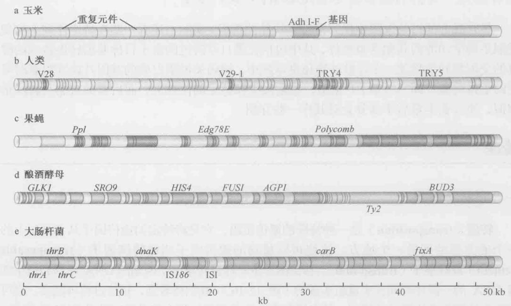

  
图12-17 基因组上转座子的发生和分布。重复序列大多数由转座子或转座子相关序列所组成（如被截短的因子），以绿色表示，基因以紫色表示。（a）玉米；（b）人；（c）果蝇；（d）芽殖酵母；（e）大肠杆菌。（来源：BrownT.A. 2002. Genomes, 2nd edition, p.34, Fig.2.2 and references therein. ©Taylor & Francis.)

转座因子有很多不同的类型,根据不同的结构和重组机制可将它们分为若干家族。下面我们介绍三种主要的转座子家族及它们的重组机制，然后介绍几个被详细研究过的转座因子。在具体介绍转座因子时，我们将着重说明转座如何被调控以平衡它们的存在、复制与对宿主基因造成潜在的干扰和错误调控。

转座的遗传重组机制并不仅限于实现转座子的移位功能。例如，很多病毒在感染时，也是使用了一种与转座几乎相同的途径将自己整合到宿主细胞的染色体上，所以病毒的整合反应在这里与转座一同讨论。同样地，在细胞中改变基因表达模式的一些DNA重排也采用了一种类似于转座的机制。V（D）J重组是一个被了解得很清楚的例子，它是脊椎动物免疫系统功能发育中一个必备的反应。V（D）J重组将在本章最后进行讨论。

## 三类基本的转座因子

根据转座子的结构及其转座机制，可将其分为以下三个家族：

1. DNA 转座子。

2. 类病毒反转录转座子，包括反转录病毒。这些因子又称为长末端重复序列（long terminal repeat, LTR）反转录转座子。

3. 多聚腺苷酸（poly-A）反转录转座子。这类因子又称为非病毒反转录转座子。

图 12-18 图解了这三类转座因子家族的基本遗传结构。DNA 转座子在整个重组周期中一直保持 DNA 的形态，它通过 DNA 链的断裂和重新连接实现移位。在这一点上，

它与保守性位点特异性重组因子移位的方式很相似。两种反转录转座子的移位都需要一个暂时性的 RNA 中间体的参与。

## DNA 转座子上带有一个转座酶基因，两端是重组位点

DNA 转座子上既携带了作为重组位点的 DNA 序列又携带了编码参与重组的蛋白质的基因（图12-18a）。转座因子两端的重组位点以反向重复序列分布，这些末端反向重复序列的长度从25bp 到几百 bp 不等。它们并不是严格意义上的重复序列，并且带有重组酶识别序列。催化转座的重组酶通常叫做转座酶（transposase）[有时也叫整合酶（integrase）]。

DNA 转座子带有编码自身转座酶的基因，也可能会携带一些其他基

a DNA 转座子


b 类病毒反转录转座子 / 反转录病毒  


c poly-A 反转录转座子

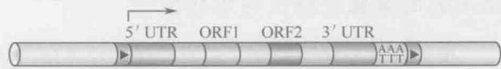  
图 12-18 三类转座因子的遗传结构。(a). DNA 转座子。其元件包括作为重组位点的终端反向重复序列（绿色含白色箭头）和一个编码转座酶的基因。(b). 类病毒反转录转座子及反转录病毒。包括两端的长末端重复序列（LTR）及其间编码整合酶及反转录酶（RT）的区域。(c). 聚腺苷酸反转录转座子。两端在 5' 和 3' UTR 序列内，以及编码两个酶的序列：RNA 结合酶（ORF1）和一个同时具有反转录酶和核酸内切酶功能的酶（ORF2）。

因，这些基因编码的蛋白质可能调节转座，也可能为转座因子或宿主细胞提供一些有益的功能。例如，很多细菌 DNA 转座子上携带的基因所编码的蛋白质能够提高细菌对一个或多个抗生素的抗性。因此，这种转座子的存在使得宿主细胞具有了对该抗生素的抗性。

紧邻转座子两端的 DNA 序列有一个短的重复序列片段（2\~20bp），这些片段呈正向重复，叫做靶位点重复（target site duplication），产生于重组过程中,我们将在下面对此进行讨论。

## 转座子包括自主转座子和非自主转座子

带有一对末端反向重复序列和一个转座酶基因的 DNA 转座子，本身具备了促成自身转座的所有条件，这类因子叫做自主转座子（autonomous transposon）。然而，在基因组上还有很多比较简单的可移位 DNA 片段，叫做非自主转座子（nonautonomous transposon），它们仅有末端反向重复序列，即转座所需的 cis-acting 序列。细胞中自主转座子表达的转座酶会识别这些末端反向重复序列，从而帮助非自主转座因子发生转座。但是在没有“帮助者”转座子（产生转座酶）存在时，非自主转座因子只能待在原处无法移动。

类病毒反转录转座子和反转录病毒带有末端重复序列及两个对重组很重要的基因

类病毒反转录转座子和反转录病毒也带有反向末端重复序列，它们是重组酶结合和作用的位点（图12-18b）。末端反向重复序列嵌入在较长的重复序列中，它们以正向重复形式排列在转座因子两端，叫做长末端重复序列（long terminal repeat）或LTR。类病毒反转录转座子编码两种移位所需的蛋白质——整合酶（转座酶）和反转录酶。

反转录酶（reverse transcriptase，RT）是一种特殊类型的 DNA 聚合酶，它能以 RNA 为模板合成 DNA。转座需要有这个酶，因为转座过程要求有一个 RNA 中间体的参与。由于这些因子将 RNA 转变成 DNA，与正常的中心法则（DNA 到 RNA）相反，所以称为“反式”因子。类病毒反转录转座子和反转录病毒的区别是：反转录病毒的基因组被组装到病毒颗粒内，离开宿主细胞再去感染新的细胞；而反转录转座子只能在一个细胞内移位到一个新的 DNA 位点，不能离开宿主细胞。与 DNA 转座子一样，这些因子两端也是短的靶位点重复序列，它们是在重组过程中产生的。

## 像基因的聚腺苷酸反转录转座子

聚腺苷酸反转录转座子没有其他转座子所带的末端反向重复序列，相反，它的两端含有完全不同的序列（图12-18c）。一端称为5'UTR，另一端是3'UTR，它带有一串叫做多聚腺苷酸序列（poly-A sequence）的A-T碱基对，这些因子两端也有短的靶位点重复序列。

反转录转座子带有两个基因——ORF1和 ORF2。ORF1编码一个 RNA 结合蛋白，ORF2编码的蛋白质同时具有反转录酶和核酸内切酶的作用。尽管这个蛋白质与其他转座子家族编码的转座酶和重组酶不同，但它在重组过程中也起着关键作用。与 DNA 转座子和类病毒转座子一样，聚腺苷酸反转录转座子也存在自主转座子和非自主转座子两种形式。此外，基因组序列分析表明，很多 5'UTR 序列不完整的断裂转座子失去了转座的能力。

## DNA 转座的剪切-粘贴机制

DNA 转座子、类病毒反转录转座子和反转录病毒都用一种类似的重组机制把它们的 DNA 插入到一个新的位点。我们首先来了解一下最简单的转座反应——DNA 转座子非复制性移位的机制。这个重组过程包括转座子从宿主 DNA 上初始位置的切除，以及将这个切下来的转座子整合到一个新的 DNA 位点，因此把这个机制叫做剪切-粘贴转座（cut-and-paste transposition）（图 12-19）。

开始重组时，转座酶结合到转座子两端的反向重复序列上。一旦转座酶识别了这些序列，它就将这两端聚集在一起形成一个稳定的蛋白质-DNA复合体，这个复合体被称为联会复合体（synaptic complex）或转座体（transpososome），它包含一个转座酶的多聚体（通常为2\~4个亚基）和两个DNA末端（见下文）。这个复合体的功能是确保转座子移位所需的DNA断裂和重新连接能够在转座因子两端同时发生，此外，还能在重组过程中保护DNA末端免受细胞中酶的作用。下一步是将转座子DNA从基因组的原始位置上切除。转座子上的转座酶亚基先断裂转座子每端的一条单链，断裂位置就在转座子DNA和它所插入的宿主序列间的连接处（该区域叫做flanking host DNA）。转座酶

切断 DNA 后，转座因子 DNA 末端带有游离的3'羟基基团。要完成断裂反应，每端的另一条 DNA 单链也需要被切断，而不同的转座子断裂这第两条单链的机制各不相同（这些单链的5'端位于转座子与宿主DNA连接处），这些机制将在下面进行描述。

转座子被切除后，被转座酶首先释放的转座子 DNA 的 3'端羟基攻击新插入位点的 DNA 磷酸二酯键，被攻击的 DNA 片段叫做靶 DNA(target DNA)。对大多数转座子而言，靶 DNA 本质上可以是任何序列。攻击的结果是将转座子 DNA 共价连接到靶 DNA 上，而在每个 DNA 连接反应中，靶 DNA 上会产生一个缺口（图 12-19）。DNA 连接反应是通过一步酯基转移作用实现的，它又被称为 DNA 单链交换（DNA strand transfer）（图 12-20）。RNA 剪接中就使用了类似的机制来连接核酸单链（第 14 章）。

转座体确保转座子两端的 DNA 一起攻击同一靶位点的两条链，这两条链上被攻击的位点通常相隔几个碱基（如比较常见的是相隔2个、5个和9个碱基），这个距离对每种转座子来说都是固定的，由此产生邻近转座子两端的靶位点短重复序列（将在下节说明）。一旦 DNA 单链转移完成，转座体的任务也就完成了，剩下的重组步骤由细胞内的 DNA 修复蛋白来完成。

剪切-粘贴转座中的中间体由缺口修复来完成

  
图 12-19 剪切-粘贴的转座机制。如图所示，一个转座子从灰色宿主 DNA 的一个靶位点转移到蓝色 DNA 上的新位点。注意，在 DNA 单链交换反应中靶 DNA 断裂位点的黏性末端使新的靶位点上生成短的重复序列（靶位点复制）。原插入位点的 DNA（灰色）由于转座子的切除留下了一个双链的断裂，这个断裂可以通过非同源末端连接或同源重组的方式被修复（见第 10 章和第 11 章）。注意：为简洁起见，图中的化学步骤未标示出结合蛋白质。

中间体结构使转座子 DNA 的3'端结合到靶 DNA 上。这个结构还带有靶 DNA 上的两个缺口，它们产生于 DNA 单链转移过程中。转座子 DNA 单链上的两个位点被转移到靶位点的两条单链上，这两条单链的断点相隔几个核苷酸，这导致在插入的转座子两端出现了短小的单链 DNA 缺口，这些缺口会被宿主细胞自身编码的 DNA 修复聚合酶填补。要说明的是，DNA 单链转移步骤中靶 DNA 断裂所产生的3'羟基端可以作为修复合成中的引物（图12-18）。填补缺口的结果是造成产生邻近转座子的靶位点的复制（见上文）。所以，靶位点重复序列的长度表明了 DNA 单链转移中靶 DNA 的两条单链上被攻击位点的距离。在缺口的修复完成后,还需要 DNA 连接酶来封闭 DNA 单链。

剪切-粘贴转座在它原来插入的 DNA 位点处也留下了一个断裂的双链，它必须被修复以维持宿主细胞基因组的完整。通过同源重组来修复双链 DNA 断裂在第11章中已讲过，而这些断裂有时也会直接重新连接起来。下面在对 Tcl / mariner 转座子家族的讨论中我们就会看到这种现象。

  
图12-20 DNA 单链转移的详细化学步骤。为简洁起见图仅示转座子和靶 DNA 的单链。

## DNA 转座中断裂非转移链的多种机制

如前所述，转座酶通过断裂转座因子的3'端和促进DNA单链的转移来催化剪切-粘贴转座过程。然而，通过这种机制移动的转座子也需要断开转座子与邻近宿主DNA连接处的5'端单链。这些单链叫非转移链（nontransferred strands），其5'端在DNA单链转移反应期间并不直接连到靶DNA上。不同的转座子催化第二条单链断裂反应的机制各不相同（图12-21），这里介绍2种方法。

用来断裂非转移单链是不同于转座酶的另一种酶（图12-21）。例如，细菌的 Tn7 转座子编码的一种特殊蛋白质（TnsA）就有这种作用（图12-21a）。TnsA 的结构与核酸内切酶很相似，它与 Tn7 自身编码的转座酶（TnsB 蛋白）组装在一起，共同作用将转座子从原来的靶位点上切除下来。

  
图12-21 非转移链断裂的三种机制。（a）通过一种非转座酶来切断。（b）转座酶催化一条单链攻击相对链形成发夹形的DNA中间体。在这种机制中是转移链攻击非转移链，然后这两个发夹形末端再被转座酶水解打开。（c）Hermes转座子使用的是通过形成发夹切割第二条单链的另一种机制。在这种机制中，先导链（非转移链）首先断裂，并且发夹结构在插入起始位点形成，而不是在转座子末端。

断裂非转移链的另一种方法由转座酶自身完成，它用一种 DNA 酯基转移机制，其过程与 DNA 单链转移相似。例如，在 Tn5 和 Tn10 转座子断裂非转移链时就产生一个 “DNA 发夹” 结构。为了形成发夹结构，转座酶用先断开的转座子 DNA 3' 端跨过 DNA 双螺旋直接攻击另一条单链的磷酸二酯键（图 12-21b），结果既断裂了被攻击的 DNA 单链，又将其与转座子 DNA 3' 端与缺口的一端共价连到一起。结果，两条 DNA 单链通过一个环形末端共价连接在一起，其结构让人联想到一个发夹。

然后发夹 DNA 的末端被转座酶断裂（打开），产生一个标准的双链 DNA 断裂，打开反应在转座子 DNA 两端进行。这一步骤一旦完成，DNA 因子的3'端就准备通过 DNA 单链转移反应连接到一个新的靶 DNA 上。

Hermes 转座子是 hAT 因子家族的一个成员，也通过 DNA 发夹中间体从旧的 DNA 插入位点上切除转座子，但是切割单链和酯基转移反应的顺序有所不同。这里 DNA 发夹在宿主细胞的 DNA 上形成，而不是在转座因子的末端形成（图 12-21c）。在本章的后面我们会看到，这种 DNA 切割和重新连接的方式与研究发现的 V（D）J 重组的早期步骤是十分相似的。这种机制的相似性成为一个假说的有力支持，该假说认为，V（D）J 重组是在脊椎动物演化过程中，由宿主机体捕获和“驯服”转座子形成的。

尽管在图12-21中未标示出来，转座子两端 DNA 的断裂也可以通过转座子两末端间的酯基转移反应完成。在这种情况下，一个断裂的3'-OH 端攻击转座因子上同一单链的另一端，产生的 DNA 中间体进一步反应得到被切除的转座子。IS 3 转座子家族就是利用这种机制。

为什么转座酶会用酯基转移作用作为断裂机制呢？这可能是一种经济的解决办法。转座酶具有以下基本功能：① 催化转座子 DNA3'端的位点特异性水解；② 用酯基转移作用将此末端变为非特异性位点。而当同样的反应作用于一个新的 DNA 位点时（例如：起始切割位点的相对链），就可以帮助转座酶将转座子切除，因此，这个机制就使转座子无需再编码一个酶来断裂非转移链。

## DNA 的复制性转座

一些 DNA 转座子使用的机制是复制性转座（replicative transposition），其转座因子在每个转座过程中都进行了复制。虽然转座反应的结果明显不同，但我们可以看出，其重组机制与剪切-粘贴转座非常相似（图 12-22）。

复制性转座的第一步是转座酶蛋白和转座子 DNA 两端装配成一个转座体。像在剪切-粘贴转座中看到的一样，形成转座体对协调转座子 DNA 两端的断裂和重新连接是非常重要的。

第二步是转座子末端 DNA 的断裂。这个反应是在转座体内由转座酶催化的。转座酶在转座子序列与邻近的宿主 DNA 连接处诱导产生一个缺口（图12-22），这个断裂使得转座子序列的两个3'-OH DNA 末端获得释放。与剪切-粘贴转座不同，这时转座子DNA 并不从原来的序列上被切除，这一点是这两种转座最大的不同。

然后，转座子 DNA 的3'-OH末端通过 DNA 单链的转移反应被连接到靶 DNA 位点上，这一机制与前面的剪切-粘贴转座相同。但是，这里产生的中间体是双交叉的 DNA 分子（图12-22）。在此中间体中，转座子的3'端被共价连接到新的靶位点，而5'端仍与原来的邻近 DNA 相连。

中间产物的两个 DNA 交叉形成一个复制叉结构（见第9章）。DNA 单链转移后，宿主细胞的 DNA 复制蛋白将组装到这些复制叉上。在一个已经充分研究的复制性转座例子中（Mu 噬菌体，下文将讲到），蛋白质特异性地组装到两个交叉中的一个上（图12-22，下图）。以断开的靶 DNA 3' 端为引物进行 DNA 合成，复制沿转座子序列进行直到第二个交叉处停止。此复制反应产生2个拷贝的转座子 DNA，复制产物两端是短小的正向排列靶位点重复序列。

复制性转座常常会造成染色体的倒位和丢失，这对宿主细胞有很大的危害性。这种趋势所导致的重排有时会对复制性转座造成不利的自然选择结果。或许这就是为什么很多转座因子演化出在插入到新位点前即将其从原位点完全切除的方法。转座子切除后就避免了对宿主基因组造成较大的干扰。下面我们将会讨论到，通过一个RNA中间体也可以避免转座造成的这种干扰性重排。

  
与两个拷贝的转座子共整合

图12-22 复制性转座的机制。转座体在转座子两端诱导形成单链缺口，露出3'-OH端。然后这些羟基攻击靶DNA，并通过DNA单链转移与之连接。注意，此时在转座子的每一端只有一条单链插入靶位点，形成了一个双交叉的DNA结构。细胞的复制成分组装到其中一个“交叉”（图中左边），将整个转座子序列进行复制。生成的产物叫做共和体，它有两个通过转座子两个拷贝连接起来的起始环形DNA分子。交叉中间体的单链DNA缺口产生了靶位点的复制，为了简洁起见，这些复制在图中没有明确标出。

## 类病毒反转录转座子和反转录病毒通过一个 RNA 中间体实现移位

类病毒反转录转座子和反转录病毒插入到宿主细胞基因组的新位点，所用的 DNA 断裂及 DNA 单链转移步骤与前面讲的 DNA 转座相同。不同的地方是，这些反转录因子的重组需要一个 RNA 中间体的参与。

转座周期开始于反转录转座子（或反转录病毒）DNA 序列在细胞内的 RNA 聚合酶的催化下转录得到 RNA。转录起始于 LTR（图 12-23）中的一个启动子序列，一直穿过整个因子得到转座因子的一个几乎全长的 RNA 拷贝，然后 RNA 反转录成一个双链 DNA 分子，这个 DNA 分子叫做 cDNA（复制的 DNA），它游离于宿主 DNA 序列之外。

这个 cDNA 能够被整合酶（与 DNA 因子的转座酶高度相关的一种蛋白质，下面将会看到）识别并被重组到一个新的靶 DNA 位点。整合酶结合到该 cDNA 的末端，然后从每条单链的3'端切下几个核苷酸，这个断裂反应与 DNA 转座子的 DNA 断裂步骤相同。当用于整合的直接前体 DNA 由 RNA 模板反转录生成后，它已经呈一个被切除的转座子形态。因此，对这些因子而言无需一种切断第二单链的机制。然后通过 DNA 单链转移反应，整合酶催化将断开的3'端插入到宿主细胞基因组的靶位点。上面讲过，这些靶位点本质上可以是任何 DNA 序列，DNA 单链转移后在靶位点产生的缺口由宿主细胞的 DNA 修复蛋白填补并完成重组。这个缺口修复反应造成靶位点的复制。

由于产生 RNA 中间体的转录过程起始于 LTR 的内部，所以 RNA 没有携带全长的 LTR 序列，转录起始位点到转座因子末端之间的序列丢失了。因此，在反转录过程中需要一种特殊的机制来产生全长的转录因子。在反转录过程中，有两个内部引物合成和两个单链转换反应。这些转换造成了 cDNA 末端序列的复制，这样 cDNA 序列就完整了，重构的 LTR 序列补偿了转录过程中丢失的区域。LTR 的这次重构对于重组酶识别 cDNA 和后续的重组过程是至关重要的。

## DNA 转座酶和反转录整合酶同属于一个蛋白超家族

由上可以看出，在 DNA 转座和类病毒反转录转座子及反转录病毒的 DNA 移位过程中，转座子 DNA（或 cDNA）3'端的断裂和单链转移反应都是共有的步骤。这一重组机制的保守性可由转座酶及整合酶蛋白的结构得到反映（图 12-24）。高分辨率结构揭示出许多不同的转座酶和整合酶上的催化结构域有着相同的三维结构。这个催化结构域包含了三个演化保守的酸性氨基酸——两个天冬氨酸（D）和一个谷氨酸（E）。所以，这类重组酶被归类为 DDE 基序（motif）的转座酶／整合酶蛋白。这些酸性氨基酸构成了部分的活性位点以及协调反应活性所需的二价金属离子（如 $Mg^{2+}$ 或 $Mn^{2+}$ ）（同 DNA 聚合酶，第 9 章）。这类蛋白质的一个显著特点是它们用这一个位点既催化 DNA 断裂又催化 DNA 单链转移，而不是用两个活性位点来分别催化这两个化学反应。

除了结构高度保守的催化结构域外，其他区域在这个蛋白质家族中是不保守的。这些非保守区域编码位点特异性的 DNA 结合域及参与蛋白质相互作用的区域，这是组装特异性针对各个重组因子的蛋白质-DNA 复合体时所必需的。这样，这些独特的区域确保了转座酶和整合酶只催化编码自己的转座因子或是与其高度相关因子的重组。

  
图 12-23 反转录病毒整合机制和类病毒反转录转座子的转座。上边图例表示已整合的前病毒。LTR 序列的详细图示见框 12-3。如图所示，病毒 RNA 的转录启动子位于左边的 LTR 中，该病毒 RNA 的 cDNA 合成过程详见框 12-3。整合酶催化的 DNA 剪切和单链转移步骤如此图所示。

  
图 12-24 转座酶和整合酶催化结构域的相似性。（a）从右至左依次为 Tn5 转座酶（Davies D. R. et al. 2000. Science 289: 77-85）、Mu 噬菌体转座酶（Rice P. and Mizuuchi K. 1995. Cell 82: 209-220）和 RSV 整合酶（Chook Y. M. et al. 1994. J. Mol. Biol. 240: 476-500）的保守核心结构域。它们相同的二级结构成分以相同的颜色表示。DDE 基序（motif）的活性位点残基以球棒模型表示。图形通过 BobScript、MolScript 和 Raster 3D 软件制作。（b）如 a 中所示的 3 个蛋白质的结构域的图解，N 端的域结合 DNA，图 a 的中间的结构域包含了催化区；C 端的结构域参与组装转座体所需的蛋白质-蛋白质相互作用，以及与调节转座的其他蛋白质发生相互作用。（来源：Rice P.A. and Baker T.A. 2001. Nat. Struct. Biol. 8: 302-307.）

转座酶和整合酶只有结合在 DNA 上形成联会复合体(或叫转座体)时才有活性(如前所述)。Tn5 转座酶结合到一对转座子末端 DNA 片段时的晶体结构让我们清楚地了解到这一点（图 12-25）。与这些 DNA 片段（即一个转座子的末端）的其中一个相结合的重组酶识别序列上的转座酶亚基，为转座子另一端的 DNA 断裂和 DNA 单链转移反应提供了催化结构域。正是由于这个亚基的结构，只有在两个亚基和一对 DNA 末端一起构成复合体时，转座酶才被放置到正确的重组位置。

## 聚腺苷酸（poly-A）反转录转座子通过一种“反向剪切”机制进行移位

聚腺苷酸反转录转座子，如人的 LINE 因子的移位需要一个 RNA 中间体，但其转座机制与类病毒转座因子有所不同，它的机制叫做靶位点引导反转录（target-site-primed reverse transcription）（图 12-26）。首先是细胞内 RNA 聚合酶对整合因子的转录（图 12-26a）。尽管启动子在 5'UTR 内，这时它能指导起始于转座因子序列的第一个核苷酸的 RNA 合成。

新合成的 RNA 被转运到细胞质中翻译成 ORF1 和 ORF2 两个蛋白质（见上面的讨论）。这些蛋白质与编码它们的 RNA 保持结合（图 12-26b）。转座因子以这种方式促进了自身的转座，而不为其他竞争因子贡献蛋白质。

这个蛋白质-RNA复合体重新进入核内并与细胞DNA结合(图12-26c)。已知ORF2蛋白同时具备核酸内切酶和反转录酶的活性，这个核酸内切酶通过在染色体DNA上产生一个缺口来启始整合反应（图12-26d）。富含胸腺嘧啶（T）的序列是优先被断裂的位点。在断裂位点出现的多个 T 使得 DNA 与 RNA 因子的多聚腺苷酸尾巴形成碱基配对，然后切口反应产生的 DNA 3'-OH 末端作为引物反转录 RNA 转座因子（图 12-26e）。另外，ORF2蛋白也催化这一 DNA 合成反应。后续的转座步骤尽管了解得还不太清楚，但是应包括 cDNA 第二单链的合成、插入位点 DNA 缺口的修复和 DNA 单链的接合。

  
图 12-25 Tn5 结合 DNA 底物后的共结晶体。复合体中包含一个转座酶的二聚体。在图 12-24 中催化结构域以彩色表示，绿色小球表示与蛋白质活性位点结合的二价金属离子。注意，当重组酶亚基的 DNA 结合域连接到转座子一端时，其重组催化结构域也贡献给转座子的另一端。DNA 用蓝色和粉色表示。（Davies D. R et al. 2000. Science 289: 77-85.）图形通过 BobScript、MolScript 和 Raster3D 软件制作，Leemor Joshua-Tor 完成了额外的 DNA 建模。

通过大规模基因组测序发现很多聚腺苷酸反转录转座子都被截断了，其中大部分都丢失了5'端的区域，而不具备编码因子的基因的完整拷贝或完整的启动子，因而这些被截断的转座因子失去了转座能力。

  
图12-26 聚腺苷酸反转录转座子的转座通过靶位点引导的反转录过程完成。图示概述了 LINE 因子的移动模型。(a) 细胞内的 RNA 聚合酶起始了一个整合的 LINE 因子的转录。(b) 转录得到的 mRNA 翻译后生成两个 ORF 产物，并结合到其 mRNA 的 3' 端。(c) 这个蛋白质-mRNA 复合体结合到富含胸腺嘧啶的靶 DNA 位点。(d) 复合体上的蛋白质启动了靶 DNA 的断裂，在 DNA 末端留下了 3'-OH，并形成 RNA：DNA 的杂合子。(e) 靶 DNA 的 3'-OH 端作为引物反转录 RNA 因子得到 cDNA（第一条单链的合成）。（f）最后的转座反应步骤包括：第二条 cDNA 单链的合成、DNA 的连接以及断点修复，最终生成了一个新插入的 LINE 因子。

## 转座子及其调控的实例

转座子成功地侵入和繁殖于所有生物体的基因组中。很明显，它们是非常健壮的生物实体。这些成功可以部分归功于转座过程的调控，正是这种调控使得转座子与宿主细胞之间建立了一种和谐的共存关系。这种共存关系对转座子来说是至关重要的，因为没有了宿主，转座子就无法存在。另一方面，就像刚才讲的，转座子也会在宿主细胞中造成严重破坏，导致插入突变，改变基因表达，形成大规模基因重排。这些干扰破坏在植物中尤其明显，正是这一点导致在玉米中发现了转座子（框12-3，玉米转座因子及转座子的发现）。

## 框12-3 玉米转座因子及转座子的发现

植物基因组中含有大量的转座子。而且转座因子改变基因表达的能力可逐渐通过植物颜色的变化被观察到（框 12-3 图 1 和图 2）。因此，在植物中首先发现转座子和许多它们的沉默特征就不奇怪了。

  
框 12-3 图 1 Tam3 转座引起金鱼草花出现彩色色斑的例子。白色斑块的大小与转座频率有关。（经许可后重新印刷，Chatterjee M. 和 Martin C. 1997. Plant J.11: 759-771；Fig.2a. ©Blackwell Publishing）。

20世纪40年代后期，Barbara McClintock 在玉米中发现了“控制因子”，实际上是转座因子断裂染色体的能力引起了 McClintock 的注意。她发现一些植株的染色体频繁断裂，并将造成这些染色体断裂的遗传因子命名为 Ds（dissociator；解离子）。令人惊奇的是，她观察到这些染色体断裂的“热点”位点在不同的植株上位置不同，甚至一个植株和它自己后代之间的位点都不同。这一现象首次揭示了遗传因子可以在染色体上移动，即“转座”。

Ds 实际上是一个非自主性的 DNA 转座子，它通过剪切-粘贴转座实现移动。McClintock 还发现 Ds 的移位需要 Ac（activator；激活子）因子存在于同一细胞，并提供转座酶蛋白。Ac 因子现在已确定属于一个叫 hAT 的 DNA 转座子大家族，其名称是苍蝇的 hobo 因子、玉米的 Ac 因子和金鱼草的 Tam 因子的首字母缩写。家蝇中的 Hermes 因子也属于这个家族并已用在机理分析中。

  
框 12-3 图 2 因转座形成彩斑的玉米棒（摄影 Barbara McClintock；图片源于 Cold Spring Harbor Laboratory Archives）。

下面我们简要介绍几个已经充分了解的转座子和转座子家族（更多转座子及其重要特性总结于表12-2中）。每一个小节对一个特定的因子进行简要介绍，并介绍一个关于该因子调控的例子，这种调控作用对该转座子来说非常重要。我们将会看到，有两种调控类型会反复出现：

表 12-2 转座因子的主要类型

<table><tr><td>类型</td><td>结构特点</td><td>移位机制</td><td>例子</td></tr><tr><td colspan="4">DNA介导的转座</td></tr><tr><td>细菌的复制性转座子</td><td>末端反向重复序列包围着中间的抗生素抗性基因和转座酶基因</td><td>每一次插入到一个新的靶位点都伴随着DNA因子的复制</td><td>Tn3、γδ、Mu噬菌体</td></tr><tr><td>细菌的剪切-粘贴转座子</td><td>末端反向重复序列包围着中间的抗生素抗性基因和转座酶基因</td><td>DNA因子从原位点被切除后,插入到一个新位点</td><td>Tn5、Tn10、Tn7、IS911、Tn917</td></tr><tr><td>真核细胞转座子</td><td>反向重复序列包围着带有内含子的编码区</td><td>DNA因子从原位点被切除后,插入到一个新位点</td><td>P因子(果蝇)、hAT家族因子、Tc1/Mariner因子</td></tr><tr><td colspan="4">RNA介导的转座</td></tr><tr><td>类病毒反转录转座子</td><td>250~600bp的正向末端重复序列(LTR)包围的反转录酶、整合酶和类反转录病毒的Gag蛋白的基因</td><td>RNA聚合酶II从左边LTR的启动子开始转录出RNA,然后再反转录并插入到靶位点</td><td>Ty因子(酵母)、Copia因子(果蝇)</td></tr><tr><td>聚腺苷酸反转录转座子</td><td>3&#x27;端富含A-T的序列和5&#x27;端UTR序列包围着编码RNA结合蛋白和反转录酶的基因</td><td>从其内部的启动子开始转录生成RNA;核酸内切酶切断DNA开启靶位点引导的反转录过程</td><td>F和G因子(果蝇)、LINE和SINE(哺乳动物)、Alu序列(人)</td></tr></table>

\- 细胞中转座子对自身拷贝数的控制。转座因子通过调节拷贝数（regulating copy number），限制自身给宿主细胞带来的有害影响。

\- 转座子对靶位点选择的控制。已经发现了两类常见的靶位点调控方式：其一，一些因子倾向于插入到对宿主细胞不造成危害的染色体区域，这些区域被称为转座子的避风港（safe havens）；在第二种调节类型中，一些转座子能特异性地避免插入到自身序列中，这种现象叫做转座目标免疫性（transposition target immunity）。

## IS4 家族的紧凑型转座因子通过多种机制实现对拷贝数的控制

细菌转座子 Tn10 是 IS4 家族中一个被充分研究的代表, 这个家族还包括 Tn5。Tn10 是一个 9kb 长的紧凑型转座因子, 它编码一个自身转座酶所需的基因和几个使其对四环素具有抗性的基因（图 12-27）。

Tn10 转座子采用剪切-粘贴机制（如前述），通过 DNA 发夹结构断裂非转移单链（图 12-18 和图 12-21）。Tn10 由 3 个功能模块组成，这个结构有一定的普遍性，具备这种结构的因子被称为复合转座子（composite transposon）。最外面的两个模块叫 IS10L（左边）和 IS10R（右边），实际上是微型转座子。“IS”代表的意思是插入序列（insertion

  
图 12-27 细菌转座子 Tn10 的遗传结构。图中所示为细菌转座子 Tn10 的各个功能因子。像很多细菌转座子一样，Tn 10 实际上在其两端携带了两个“微型转座子”，它们是 IS 10L（左）和 IS10R（右）。这两种类型的 IS 10 因子都能自行转座，也都在 Tn 10 之外的 DNA 中被单独发现。白色三角代表 IS 因子和 Tn 10 末端的反向重复序列。虽然 4 个拷贝在序列上并非完全相同，但它们都能被 Tn 10 的转座酶识别并用作重组位点。

sequence）。IS 10R 是编码转座酶的基因，转座酶能够识别 IS 10R、IS 10L 和 Tn10 的末端反向重复序列。IS 10L 的序列虽然与 IS10R 非常相似，但它不能编码具有功能的转座酶。所以，IS 10R 和 Tn10 是自主转座子，而 IS 10L 则是非自主转座子。如预期的一样，由于自身可移动，两种类型的 IS10 转座因子在基因组不与 Tn10 相连。

Tn10在某种指定细胞中通过限制转座发生的频率来限制其拷贝数。例如，它使用一种反义RNA（antisense RNA）的机制来限制转座酶基因的表达（图12-29）（第19章和第20章中关于反义RNA调节的讨论）。靠近IS10R末端的是两个启动子，它们通过宿主RNA聚合酶指导RNA合成。指导RNA向内合成的启动子（称为 $P_{\mathrm{IN}}$ ）负责转座酶基因的表达，而指导向外转录的启动子（称为 $P_{\mathrm{OUT}}$ ），如下所述，通过生成反义RNA来调节转座酶的表达。

通过这个机制，细胞内的 Tn10 拷贝数越多，反义 RNA 也就越多，反过来又限制了转座酶基因的表达（图 12-28，更多的细节参照图示），因而，这个细胞株中的转座频率就会很低。相反，如果细胞中仅有一个 Tn10 拷贝，反义 RNA 的水平就会很低，转座蛋白就会高效地合成，转座发生的频率就较高。


  
图12-28 Tn10 表达的反义调节。(a). 重叠的启动子区域如图所示，向左的启动子 $(P_{\mathrm{IN}})$ 启动转座酶基因的表达，向右的启动子 $(P_{\mathrm{OUT}})$ 开始于距 $P_{IN}$ 启动子左端36bp 处，它启动反义 RNA 的表达。这两个转录物的前36bp 是互补的。注意，在细胞中起始于 $P_{OUT}$ 的反义转录物的较起始于 $P_{IN}$ 的转录物的有较长的寿命。(b). 细胞中 Tn 10 的拷贝数多时，这两个 RNA 的配对就频繁发生，阻止了转座酶 mRNA 的翻译（因而最终减少了转座子的拷贝数）。(c). 当细胞中转座子拷贝数很低时，两种 RNA 转录本配对很少，转座酶 mRNA 能够高效翻译，细胞中转座子的拷贝数增加。

## 框12-4 转座的靶免疫机制

转座目标免疫机制的核心是 MuA 转座酶和 MuB ATP 酶间的相互作用。正是 MuA 和 MuB 的相互作用阻止了 MuB 结合到与 MuA 结合的 DNA 附近。这个相互作用对它们的影响是：

\- MuA 阻止了 MuB 结合到其附近的 DNA 位点。这一过程需要 ATP 的水解。

\- MuB 帮助 MuA 找到转座的靶位点。

要了解单个的蛋白质-蛋白质和蛋白质-DNA 相互作用如何一同产生目标免疫，我们来看看转座到两个候选 DNA 片段时的情况：一个代表任意的 DNA 片段，而另一个片段带有一个插入的 Mu 因子的拷贝（框 12-4 图 1）。我们把第一个片段叫做天然区域（naive region），把第二个片段叫做免疫区域。

  
框12-4 图1 MuA 和 MuB 在 DNA 上的相互作用导致了靶位点免疫的发生。MuA 结合位点位于转座子末端的末端反向重复序列中（深绿色表示），为了说明清楚，图中所示的 MuA 仅结合了两个重复区域中的一个。每当 MuB 水解 ATP 时，它就从 DNA 脱了下来（结合 ATP 的 MuB 以更深的绿色显示）。MuA 和 MuB 的相互作用能促进这个水解反应，尽管图中所示只有两个 MuB 分子与 MuA 作用。实际上，MuA 总是趋向于接触到所有的紧密连接在它的 DNA 结合位点上的 MuB 分子。一个单独的 MuA 结合的末端反向重复序列可以使 5\~15 kb 的 DNA 序列获得“免疫性”。

那么当 Mu 因子准备转座时这两个 DNA 区域时会发生什么呢？首先考虑天然区域，结合 ATP 形成复合体（MuB-ATP）的 MuB 蛋白以非特异性的方式结合到此 DNA 上，与此同时，MuA 转座酶在 Mu DNA 上组装转座体，然后转座体内的 MuA 蛋白与天然区域上的 MuB-DNA 复合体发生蛋白质-蛋白质相互作用。这种相互作用的结果是

MuB 将这个序列作为靶位点传递给 MuA。

与此相反，当 MuA 和 MuB 都结合到免疫区域的 DNA 上时，MuA 与免疫区域上 Mu 噬菌体基因组的特异性结合位点发生相互作用。MuB-ATP 的结合仍采用非特异性的方式。然而当 MuA 和 MuB 都结合到这一区域时，它们将发生相互作用，结果是 MuA 通过 MuB 刺激 ATP 水解，使得 MuB 与 DNA 分离，因此，MuB 就不能在免疫 DNA 片段上聚集。通过这个方法，Mu 转座蛋白用 ATP 中保存的能量来保护其基因组免于成为转座的目标。从这个机制中我们还可以预测出，只要 DNA 上有一个单独的 MuA 结合位点，就足以获得目标免疫性。

## Mu 噬菌体是一种异常活跃的转座子

和 $\lambda$ 噬菌体一样，Mu 噬菌体也是一种溶原性细菌噬菌体（见附录 A）。Mu 也是一种较大的 DNA 转座子，它侵染宿主细胞时通过转座将自己的 DNA 插入到宿主的基因组上，所用的方式与反转录病毒类似（如前述）。Mu 噬菌体在裂解性生长时也通过多轮的复制性转座扩增自身 DNA。在裂解周期中，Mu 噬菌体每小时能完成大约 100 轮的转座，它是目前已知的最高效的转座子。而且即使在静止溶原态，与传统的转座子（如 Tn10）相比，它的转座频率仍然是相当高的。它的名字 Mu 是突变子（mutator）的缩写，这源于其疯狂转座的能力，因为当细胞内插入一个拷贝的 Mu 噬菌体 DNA 后，噬菌体 DNA 插入细胞基因中而使细胞频繁地增加新的突变。

Mu 噬菌体基因组大小约为40kb，带有35个以上的基因，其中仅有两个基因编码的蛋白质专注地参与转座，它们是基因 A 和基因 B，分别编码 MuA 蛋白和 MuB 蛋白。MuA 是一个转座酶，属于前面讲过的 DDE 蛋白超家族的成员；MuB 蛋白是一个 ATP 酶，它促进 MuA 的活性，并控制对 DNA 靶位点的选择（图12-29）。这个过程将在下一节介绍。

## Mu 噬菌体通过靶位点免疫来避免其转座到自身 DNA 上

像许多转座子一样，Mu 噬菌体对靶位点也很少显示出偏好性。因此，“好”的靶点常常出现在 DNA 上，Mu 基因组自身的 DNA 也被频繁地选为靶位点。鉴于序列的选择如此随机，转座子插入到噬菌体自身 DNA 上后，很容易造成噬菌体基因的严重紊乱，那么 Mu 噬菌体是如何避免这一情况的呢？

由于 Mu 转座受到转座目标免疫（transposition target immunity）（框12-4，转座的靶免疫机制）作用的调控，使得这一问题得以解决。在转座时，这个作用致使 Mu 因子周围的 DNA 位点及包括转座子自身的 DNA 位点，不易成为转座的靶位点。

已经发现了很多不同的可转座因子都具有转座目标免疫性，而且可以远距离发生作用。例如，一个已经存在的 Mu 转座子可以对附近约 15kb 的范围实现 Mu 转座子对新插入的免疫。还有一些转座因子（如 Tn3 和 Tn7）的目标免疫范围超过了 100kb。目标免疫使得一个转座因子免于被自身或同类型因子的另一个拷贝插入。而且，这种对靶 DNA 选择的调节推动了转座因子移动到远离自身的新位置，这个特点或许有益于转座子整体

的生存和繁衍。

Tc1 / mariner 因子是真核细胞中极其成功的 DNA 转座因子

已经发现的 Tc1 / mariner 转座因子家族成员在非脊椎动物和脊椎动物中都普遍存在，这个家族的转座因子是真核细胞中最常见的 DNA 转座子。尽管这些因子有明显的相关性，但来自不同物种的成员有着不同的特性和命名。例如，来自线虫 C.elegans 的因子叫 Tc 因子，而从果蝇体内分离出的因子叫 mariner 因子。

Tc 1/mariner 因子是已知最简单的自主转座子之一。通常，它们的长度约为1.5\~2.5kb，仅包含一对反向末端重复序列（转座酶结合位点）和一个编码转座酶蛋白的基因，该转座酶属于DDE蛋白超家族（如前述）。与很多转座子不同的是，它的转座过程不需要辅助蛋白的参与，尽管在最后的重组步骤中需要细胞的DNA修复蛋白。或许如此简单的结构和机制正是它们在如此广泛的宿主物种中获得巨大成功的原因。

Tc1/mariner 因子的转移是通过剪切-粘贴的转座机制实现的（图12-19）。转座子 DNA 从原宿主 DNA 两端的切除是通过单链的成对断裂实现的，断裂位点间隔两个碱基。这些因子非常容易插入到有 5'TA 序列（很明显，这是常见的序列）的地方。

转座子被切除后在宿主染色体上留下的“空”位点怎么办呢？在 Tc1 / mariner 转座中，对一些曾经携带过转座子的位点分析表明，有时这些断开的 DNA 末端被修补（通过 DNA 的修复合成）后就直接连接起来（第10章，关于非同源末端连接的讨论）。这些修复反应会在原先

  
图 12-29 Mu 转座子前期步骤的概况。MuA 转座酶的 4 个亚基组装在 Mu DNA 的末端，MuB 与 ATP 结合然后结合任意的 DNA 序列。MuA 与 MuB 之间的蛋白质间相互作用使 MuA DNA-转座体复合体结合到新的 DNA 目标位点上。MuB 没有在最后一组图中展现出来，因为在 DNA 链转移后，不再需要 MuB，因而其可能离开了复合体。

的位点插入几个额外的碱基对，这些短小的插入 DNA 被称为 “脚印”（footprint），因为它们是转座子“途经” 这里后在基因组上留下的踪迹。

与很多转座子不同，Tc1 / mariner 因子的转座并未得到很好的调控。或许就是由于缺乏调控，在基因组序列上发现了很多“死”的转座子，即无法转座。例如，很多转座酶基因发生突变造成转座子失活。研究人员用活性因子和无活性因子上的很多序列人为构造了一个极度活跃的 Tc1 / mariner 因子，称为“睡美人”。与分离出的天然因子相比，它能以很高的频率发生转座。“睡美人”很有希望成为一个用于在真核物种细胞中诱发突变和插入 DNA 的有效工具。而且这个重构实验还说明，天然的 Tc1 / mariner 因子由于其转座酶蛋白没有发挥最佳作用而自然降低了转座的频率。

## 酵母 Ty 因子转座到基因组的安全港

Ty 因子（酵母中的转座子）是酵母中重要的转座子，属于类病毒反转录转座子。事实上，它们与反转录病毒的相似性已经超越了转座机制。Ty RNA 在细胞中被发现组装成类病毒的颗粒（图 12-30），所以这些因子好像是病毒一样，只是不能离开一个细胞去感染另一个细胞。已经有很多类型的 Ty 因子被充分研究。例如，酿酒酵母中有 Ty1、Ty3、Ty4 和 Ty5 因子（尽管 Ty5 在这类酵母中都是失活的）。每一类 Ty 因子都能催化自身的移位，但不能移动其他类的因子。

  
b

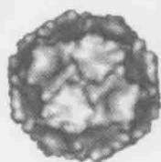  
T=3

  
T=4  
图12-30 酵母的 Ty 因子被组装到病毒颗粒中。(a). 过表达的 Ty1类病毒颗粒的酿酒酵母细胞的电子显微照片。颗粒呈卵形、电子密集的结构。(b). 低温电子显微扫描显示的 Ty1病毒颗粒的三维重构结构。Ty1 因子所携带的被切断的 Gag 蛋白与病毒颗粒的三聚体构成了钉状外壳。(经得许可后重新印刷, 源自: Craig N. et al. 2002. Mobile DNA II, © ASM Press. b, 同样源自 H. Saibil.)

Ty 因子偏向于整合到染色体上的特定区域（图 12-31）。例如，Ty1 因子几乎总是插入到被宿主 RNA 聚合酶Ⅲ（Pol III）转录的起始位点上游约 200 bp 的区域内（第 13章）。RNA 聚合酶Ⅲ特异性地转录 tRNA 基因，所以大多数 Ty1 因子就插入到这些基因附近。Ty3 因子的插入也和 RNA 聚合酶Ⅲ的启动子紧密相关。这一情况下，插入位点就精确定位在转录起始点位置（±2bp）。与此不同的是，Ty5 因子趋向于插入到基因组的静止区，也就是转录静止区域，Ty5 插入的静止区包括端粒和交配型基因座的静止拷贝（第 11 章）。在所有这些情形中，区域性靶位点的选择机制与一个特定的蛋白质-蛋白质复合体的形成有关。这个复合体由两个蛋白质组成，分别是与 cDNA 结合的复合体中的整合酶，以及与染色体位点结合的特定的宿主蛋白。例如，Ty5 整合酶就与 DNA 沉默蛋白 Sir4 构成了一个特殊的复合体（第 19 章）。

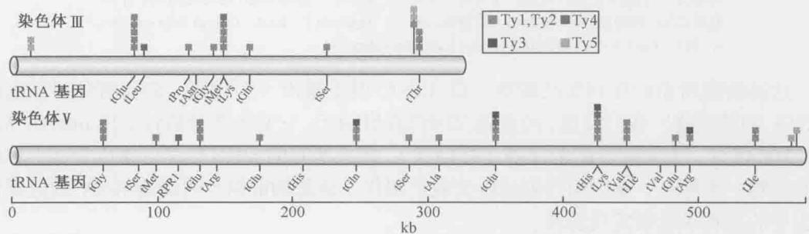  
图12-31 Ty因子的整合位点簇。每个彩色区块代表一个已知的转座插入位点。注意，Ty1、Ty2、Ty3和Ty4都是插入到由细胞RNA聚合酶Ⅲ转录的tRNA基因附近，插入发生在真实基因的上游，因而不对基因的表达产生干扰。Ty1和Ty2是紧密相关的转座因子，所以归为一类；Ty5被发现位于染色体末端和交配型基因座（第11章）附近的“沉默”（即低转录）区域。（来源：Dan Voaytas.）

为何 Ty 因子表现出这种靶位点的区域性偏好呢？有人提出，正是由于这种靶位点的选择性，使得大多数的插入远离基因组中直接与编码蛋白相关的重要区域，让转座子能保留在宿主细胞中。使用目标性转座方式对酵母这种小而富含基因的基因组有更加重要的意义。

## LINE 因子能够推动自身转座，还能转座细胞 RNA

自主性聚腺苷酸反转录转座子 LINE 在脊椎动物基因组中大量存在。事实上，人的基因组中约 20% 由 LINE 序列构成。这些因子起初是被当作重复序列家族发现的，它的名字来源于最初的定义：LINE 是“散布在核内的长因子”（long interspersed nuclear element）的缩写。L1 是人体内了解得最清楚的一个 LINE 因子。除了能推动自身的移位，LINE 还能提供一些蛋白质，用于反转录和整合其他相关的重复序列——一种被称为“散布在核内的短因子”（short interspersed nuclear element，SINE）的非自主性聚腺苷酸反转录转座子。基因组序列显示这类因子也是大量出现，通常大小为 100\~400bp。在人的基因组中普遍存在的 Alu 序列就是 SINE 的一个例子。LINE 和 SINE 因子典型结构的比较如图 12-32 所示。LINE 和 SINE 的序列看起来像是简单的基因，可事实上，如对转座很重要的 cis-acting 因子，它仅包含一个指导该因子转录成 RNA 的启动子和一个聚腺苷酸序列。前面讲过，这些腺苷酸残基与靶位点的 DNA 配对，帮助形成反转录所需的末端引物（图 12-23）。

  
图12-32 一个典型的 LINE 和 SINE 的遗传结构。注意在因子右端的聚腺苷酸序列的长度是可变的。这是一个聚腺苷酸反转座子的典型特征，这些因子两端的靶位点重复序列（蓝色箭头）的长度也是可变的。序列因子没有按比例显示。这两类因子都带有启动子序列，见图12-20 和图12-28。（图片经允许修改，源自：Bushman F. 2002. Lateral DNA transfer, p. 251, Fig.8.4. © Cold Spring Harbor Laboratory Press.）

这种转座所需的序列如此简单，给 LINE 因子提出一个问题：如何避免对细胞内 mRNA 的转座呢？我们知道，所有的基因都有启动子，它们大部分被转录成 mRNA 后，在3'端都带有一个聚腺苷酸的序列（第14章），那么所有的 mRNA 都可能成为吸引转座酶的底物。实际上，基因组序列已经为我们提供了清楚的证据表明细胞 RNA 通过靶位点引导的反转录机制实现转座。

细胞中很多基因在基因组上都有一些高度同源的其他拷贝，这些拷贝丢失了启动子和内含子（存在于基因中的序列，通过 RNA 剪切被从 mRNA 中去掉，见第14章），通常在5'端被截短。这些序列被称为加工后的假基因（processed pseudogene），通常不能被细胞表达。这些假基因两端一般是靶 DNA 的短重复序列，这个结构恰好就是 LINE 促进的细胞 mRNA 转座的预期结果。

尽管细胞 RNA 会发生转座，但这是一个罕见的现象。避免这一过程的基本机制是编码 LINE 因子的蛋白质在翻译时迅速地结合到自己的 RNA 上（图12-23）。这样，它们在催化反转录和整合时，对编码自己的 RNA 表现出了很强的偏好性。

## V(D)J 重组

我们看到转座涉及很多不同遗传因子的移动，然而细胞也在利用重组机制来实现对自身有帮助的功能。最好的例子就是 V（D）J 重组，它发生在脊椎动物免疫系统的细胞中。

脊椎动物免疫系统的工作是识别和防御生物体如病毒、细菌和病原细胞的入侵。脊椎动物用两类特殊的细胞（B 细胞和 T 细胞）专门识别这些入侵者。B 细胞制造循环于血液系统中的抗体（antibody）；而 T 细胞制造细胞表面结合的受体蛋白，称为 T 细胞受体（T cell receptor）。这两类蛋白质识别“外部”分子后便展开一系列旨在消灭入侵者的活动。为成功地完成它们的功能，抗体和 T 细胞受体必须能识别大量的多种分子。细胞用于产生多种多样的抗体和 T 细胞受体的基本机制所依靠的就是被称为 V(D) J 重组的一套特殊的 DNA 重排反应。

组成抗体和 T 细胞受体基因的基因片段是通过一系列的序列特异性重排装配而成的。要了解这个重组过程是如何产生所需的多样性，就需要了解一下抗体分子的结构（图12-33）；T细胞受体与抗体的分子结构相似。编码抗体分子的基因组区域如图12-34所示。抗体由两条轻链和两条重链构成，抗体蛋白与外源分子结合的部分叫抗原结合位点（antigen-binding site），这个结合区由抗体分子的 $V_{L}$ 和 $V_{H}$ 两个结构域构成，如图12-33所示。字母“V”表示这一段蛋白质序列是高度变化的。抗体分子的其他结构域叫做“C”区，即稳定区，它在不同的抗体分子之间没有太大变化。

  
图 12-33 一个抗体分子的结构。两条轻链用粉色显示，两条重链用蓝色表示。可变区和稳定区仅标记于抗体分子的左边。注意抗原结合区形成于 $V_{L}$ 和 $V_{H}$ 结构域之间的界面。（Harris L. J. et al. 1998. J. Mol. Biol. 275: 861-72.）图形通过 MolScript、BobScript 和 Raster 3D 软件制作。

如图12-34a 所示，编码抗体轻链（来自小鼠）的基因组区域叫做 kappa 基因座，这个区域有 300 个基因片段，可以编码不同版本的轻链 $V_{L}$ 蛋白区。另外有 4 个基因片段编码一个短的蛋白质区域，叫 J 区，其后是编码 $C_{L}$ 结构域的一个单独编码区。通过我们下面描述的机制，V（D）J 重组可将 V 区和 J 区的 DNA 任意配对融合。所以，单从这一基因组区域重组产生的抗体轻链就有 1200 种变化，然后通过 RNA 剪切将这些基因片段与 $C_{L}$ 编码区结合在一起（第 14 章）。

编码抗体重链的基因片段装配情况与此相似，不过它还有一个额外的基因单元，叫D（Diversity，多样性）片段（图12-34c），所以重链基因的情况更加复杂。例如，小鼠的一个特定重链基因座有100多种V区、12种D区和4种J区，组装这个基因的V(D)J重组就会产生4800多种不同的蛋白质序列。由于具有功能的抗体可由任意的重链和轻链配对而成，所以在轻链和重链基因位点进行的重组对抗体蛋白结构的影响具有放大效应。

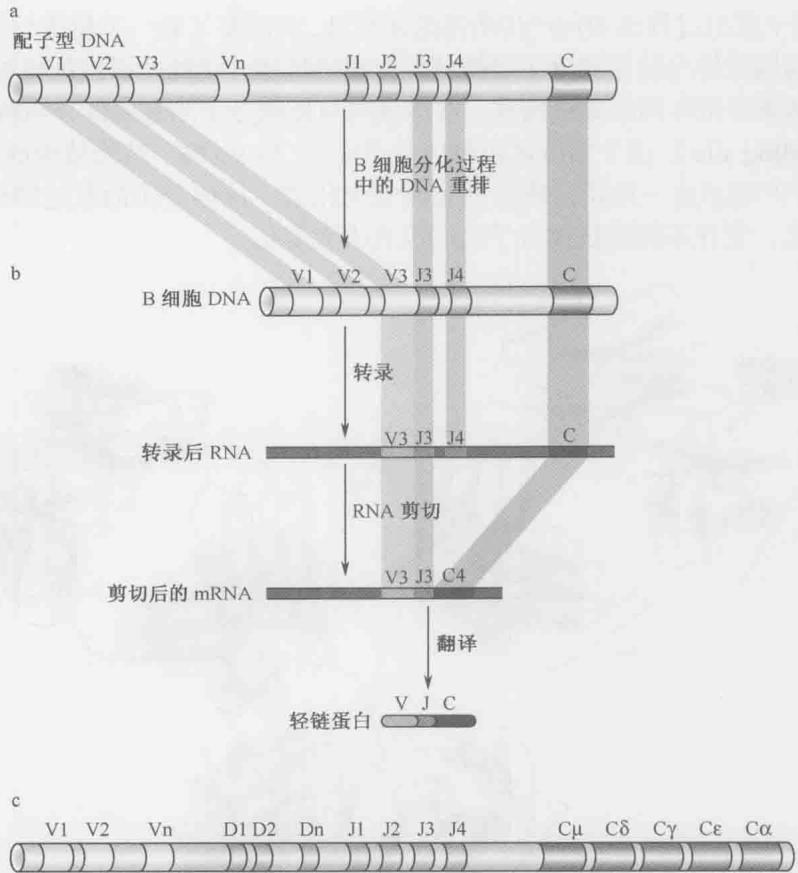  
图12-34 V(D)J 重组过程概述。上图所示为生成抗体蛋白轻链的步骤。a. 细胞中（配子型 DNA）未经 V(D)J 重组的部分轻链 DNA 的遗传结构。b. B 细胞发育过程中发生在两个特异性基因片段（V3 和 J3）间的重组。这是发生在不同 B 细胞前体中很多种重组事件中的一种，重组的基因座转录后通过 RNA 剪切（第14章）并列在一起形成连续的基因片段，该 mRNA 翻译产生轻链蛋白。c. 更加复杂的重链遗传区域的图例，它带有额外的“D”基因片段和多种类型的稳定区片段（Cμ、Cγ等）。(图片经允许修改，源自：Bushman F. 2002. Lateral DNA transfer, p.345, Fig.11.3. © Cold Spring Harbor Laboratory Press.)

## V(D) J 重组中的早期活动是通过一种类似于转座子切除的机制实现的

被 V（D）J 重组所装配的基因片段两端的序列叫做重组信号序列（recombination signal sequence）。这些信号序列都有两个高度保守的序列基序（motif），一个长 7bp（7mer），另一个长 9bp（9mer）（图 12-35），这些基序能被重组酶结合（如下所述）。重组信号序列分为两类，一类包含 7mer 和 9mer 的基序以及两者中间的 12bp 的序列；另一类包含两个基序以及两者中间的 23bp 的序列（图 12-35a）。重组总是发生在一对重组信号序列之间，其中一个有 12bp 的间隔区，另一个有 23bp 的间隔区。这些成对的信号序列以反向重复的结构排列在要被连起来的 DNA 片段两端（图 12-35b）。

负责识别和断裂重组信号序列的重组酶由两个蛋白质亚基组成，分别叫 RAG1 和 RAG2 [RAG 是重组激活基因（recombination activating gene）的缩写]。这些蛋白质的作用方式与转座酶相似（图 12-36），它们识别重组酶信号序列，然后将两位点配对构成一个蛋白质-DNA 联会复合体。

  
图 12-35 V(D)J 重组中重组信号序列的识别。(a). 两类重组信号序列（RSS）的近观图，12bp 的间隔序列由蓝色显示，23bp 的间隔序列由绿色表示，两类因子共有的 7mer 和 9mer 的序列因子由浅绿色显示，间隔区核苷酸序列并不重要，而其长度是至关重要的。(b). 编码抗体（Ig 基因）和 T 细胞受体蛋白（TCR 基因）的遗传区域中 RSS 重排的几个例子。(a. 图片经允许修改，源自：Bushman F. 2002. Lateral DNA transfer, p.345, Fig.11.3. © Cold Spring Harbor Laboratory Press.)

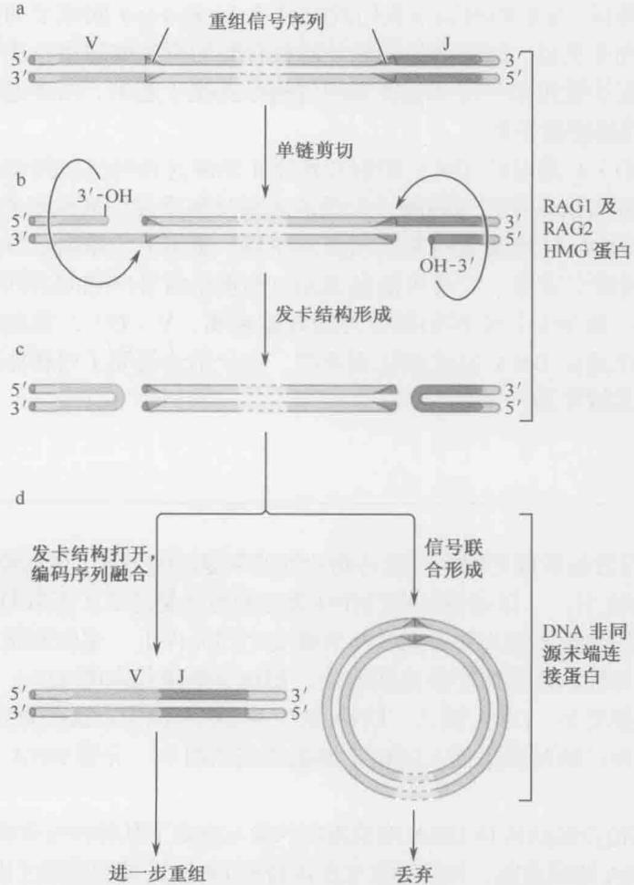  
图 12-36 V (D) J 重组途径：发生断裂的机制类似于转座子的切除机制。重组酶催化信号序列末端的单链断裂后产生了游离的 3'-OH，然后每个 3'-OH 开始攻击相对链形成一个发夹形的中间体（图 12-23b）。随后发卡结构水解并连接形成 V 和 J 区间的一个编码联合体，携带重组信号序列的两个末端也连成一个信号联合体，前者可以继续进行重组，后者则被丢弃。（图片经允许修改，源自：Bushman F. 2002. Lateral DNA transfer, p.348, Fig.11.6. ©Cold Spring Harbor Laboratory Press.）

然后，复合体内的 RAG1 蛋白诱导重组信号序列和将要被重排的基因片段之间每一个连接处的 DNA 单链的断裂（图 12-36a）。这样的位点断裂使得编码蛋白的片段具有了一个自由的 3'-OH 末端（图 12-36b）。然后，与以前看到的转座子切除反应，尤其在 Hermes 通路中那样（图 12-21），这个 3'-OH DNA 末端攻击 DNA 双螺旋的另一条单链。这个攻击导致了 DNA 的双链断裂和重新连接反应，并产生一个发卡形的 DNA 末端。具有 DNA 发夹末端的序列是蛋白质编码片段，而重组信号序列末端现在是正常的 DNA 双链断裂（图 12-36c）。用同样的机制，每个重组的 DNA 片段都形成一个 DNA 发卡结构。

一旦联会复合体上的两个 DNA 序列被切开，又被 RAG 重组酶变成发卡形状后，细胞内的 DNA 修复蛋白就会接管任务，并完成剩下的重组反应（图12-36d）。两个蛋白质编码片段上的 DNA 发卡末端必须被打开，而且这些末端还必须被连接到一起，细胞内的非同源末端连接蛋白（第10章）参与了这一反应。有趣的是，DNA 的连接通常伴随着若干核苷酸的增减，这里的增加与我们所说的 Tc1 / mariner 转座子切除时在原靶位点上留下“足迹”的现象类似。这些增加的额外的核苷酸为所生成的蛋白质分子序列增加了多样性。成对断裂的重组信号序列也在重组过程中连接了起来，结果通常产生了一个环形的 DNA 分子而被细胞丢弃。

初始化 V（D）J 重组的 DNA 断裂与转座子切除这两种机制间的相似性是非常明显的。事实上，重组信号序列与转座子末端的末端反向重复序列也很相似，而且 RAG1 蛋白具有一些同 DDE 转座酶蛋白家族相似的序列。事实上，基因组分析近期发现一个叫做 Transib 的转座子家族。它有可能是 RAG1 和重组信号序列的共同来源。这些现象和很多其他现象一起为我们提供的强有力的证据表明，V（D）J 重组这一高等动物免疫系统的关键特征是由 DNA 转座演化而来的。这个结论说明了可转座因子在细胞基因组演化过程中的关键作用。

## 小结

尽管 DNA 通常被看成是储存着遗传物质的非常稳定的分子, 它也经历着很多种的重排作用。两类遗传重组——保守性位点特异性重组和转座是造成大多数 DNA 重排的原因。

保守性位点特异性重组发生在 DNA 的特定序列元件上。重组酶蛋白识别这些序列元件，对其进行 DNA 单链切断和重新连接，使包含重组位点的 DNA 片段发生重排。有三种常见的重排类型：DNA 插入、DNA 缺失和 DNA 倒位。这些重排具有很多功能，如病毒感染时将自己的基因组插入到宿主细胞的基因组中、分解 DNA 多聚体，以及改变基因表达。

DNA 上重组位点的结构和 DNA 构筑蛋白的参与决定了某种特定重组反应的结果。构筑蛋白可使得 DNA 片段弯曲，并且对发生在该特定 DNA 区域的重组反应有很大的影响。

有两种保守性位点特异性重组酶家族，它们都是通过一个蛋白质-DNA共价中间体断裂DNA的。对于丝氨酸重组酶而言，这个共价连接是通过一个丝氨酸残基活性位点实现的；而对于酪氨酸重组酶而言，则是通过一个酪氨酸残基活性位点实现的。酪氨酸重组酶的结构揭示出了重组机制的细节。

转座是一类将可移动遗传因子移位到新位点的重组反应，该遗传因子叫转座子。主要有三类转座子：DNA 转座子、类病毒反转录转座子和聚腺苷酸反转录转座子。DNA 转座子在转座周期中始终为 DNA，它的移位机制有两个：切除后由转座子中间体参与的剪切-粘贴机制和复制机制。两类反转录转座子的移动则都要通过一个 RNA 中间体，它们的“反转录”元件的移位需要 RNA 依赖性的 DNA 聚合酶（又叫反转录酶）和一个重组酶蛋白。

所有物种的基因组中都有转座子，它们可能占据了全部 DNA 序列的一大部分，同时它们还是突变和基因组重排的一个主要原因。转座过程往往受到调控，以确保转座子不会对宿主细胞的基因组造成太大的干扰。通常可以观察到的两种调控机制是对转座子拷贝数的控制和对新插入位点的选择。

最后，一个类似转座的机制被用于其他类型的 DNA 重排反应。最显著的例子是 V（D）J 重组反应，它负责在脊椎动物免疫系统的发育中对基因片段进行装配。

## 参考文献

## 书籍

Bushman F. 2002. Lateral DNA transfer: Mechanisms and consequences. Cold Spring Harbor Laboratory Press, Cold Spring Harbor, New York.

Craig N.L., Craigie R., Gellert M., and Lambowitz A.M. eds. 2002. Mobile DNA II. American Society for Microbiology, Washington, D.C.

## 位点特异性重组

Chen Y. and Rice P.A. 2003. New insight into site-specific recombination from FLP recombinase-DNA structures. Annu. Rev. Biophys. Biomol. Struct. 32: 135–159.

Grindley N.D.F., Whiteson K.L., and Rice P.A. 2006. Mechanisms of site-specific recombination. Annu. Rev. Biochem. 75: 567–605.

Hallet B. and Sherratt D.J. 1997. Transposition and site-specific recombination: Adapting DNA cut-and-paste mechanisms to a variety of genetic rearrangements. FEMS Microbiol. Rev. 21: 157–178.

Matthews A.G. and Oettinger M.A. 2009. RAG: A recombinase diversified. Nat. Immunol. 10: 817–821.

Smith M.C. and Thorpe H.M. 2002. Diversity in the serine recombinases. Mol. Microbiol. 44: 299–307.

Yang W. 2010. Topoisomerases and site-specific recombinases: Similarities in structure and mechanism. Crit. Rev. Biochem. Mol. Biol. 45:520–534.

## 转座

Gueguen E., Rousseau P., Duval-Valentin G., and Chandler M. 2005. The

transpososome: Control of transposition at the level of catalysis. Trends Microbiol. 13: 543–549,

Haren L., Ton-Hoang B., and Chandler M. 1999. Integrating DNA: Transposases and viral integrases. Annu. Rev. Microbiol. 53: 245–281.

Plasterck R. 1995. The Tc1/mariner transposon family. Curr. Top. Microbiol. Immunol. 204: 125–143.

Prak E.T.L. and Kazazian H.H. Jr. 2000. Mobile elements in the human genome. Nat. Rev. Genet. 1: 134–144.

Rebollo R., Romanish M.T., and Mager D.L. 2012. Transposable elements: An abundant and natural source of regulatory sequences for host genes. Annu. Rev. Genet. (in press). doi: 10.1146/annurev-genet-110711-155621.

Rice P.A. and Baker T.A. 2001. Comparative architecture of transposase and integrative complexes. Nat. Struct. Biol. 8: 302–307.

Smit A.F.A. 1999, Interspersed repeats and other mementos of transposable elements in mammalian genomes. Curr. Opin. Genet. Dev. 9:657–663.

## V(D)J 重组

Fugmann S.D., Lee A.I., Schockett P.E., Villey I.J., and Schatz D.G. 2000. The RAG proteins and V(D)J recombination: Complexes, ends, and transposition. Annu. Rev. Immunol. 18: 495–527.

Gellert M. 2002. V(D)J recombination: RAG proteins, repair factors, and regulation. Annu. Rev. Biochem. 71: 101–132.

Oettinger M.A. 2004. Hairpins at split ends in DNA. Nature 432: 960–961.

## 习题

## 偶数习题的答案请参见附录2

习题1 给定一条线性的双链DNA，它包含两个分开的交叉区域，这些区域周围存在一些重组酶识别位点。如果重组的结果是删除或倒位，请描述重组位点的排列方式，并解释为什么这种排列方式决定了重组反应的结果。

习题 2 请解释为什么丝氨酸重组酶和酪氨酸重组酶的催化不需要外部的能量供应，比如 ATP 的水解。

习题 3 请解释位点特异性重组和转座的主要区别。

习题 4 请列举酪氨酸重组酶和丝氨酸重组酶在保守的位点特异性重组反应中的异同。

习题 5 请描述 Cre 重组酶在真核生物基因工程中的优势。

习题 6 λ 噬菌体在感染大肠杆菌的过程中，可以通过整合重组进入溶源态，或通过切出重组进入溶菌态。λ 整合酶是否在整合重组或切出重组，或者同时在两者中发挥作用？请给出答案并解释。

习题 7 请描述鼠伤寒沙门氏菌中 Hin 重组酶催化 DNA 倒位的生物相关性。

习题 8 请解释重组周期中可以区分转座子和逆转录转座子的主要特征。

习题 9 人类基因组可以包含 50% 以上的转座子相关序列，但却并未因此经历较多的、由转座子移动造成的遗传不稳定性，请给出你的解释。

习题 10 请解释为什么科学家使用像 Tn5 这样的转座子作为基因工程工具从细菌或酵母细胞中筛选具有给定表型的突变体。相比于化学诱变产生的变异，这种转座子为什么可以在遗传筛选中能提供一些实验上的优势？

习题 11 研究人员已经发现,用反转录酶抑制因子处理人类肿瘤细胞可以降低肿瘤细胞增殖的速度。请预测为什么反转录酶可以在人类细胞中表达。提出一种假设,解释为什么反转录酶的活性可以同肿瘤细胞关联起来。

习题 12 比较剪切-粘贴型转座和复制型转座的机制。

习题 13 请描述 V（D）J 重组在抗体多样化中的作用，并解释在 V（D）J 重组通路中非同源末端连接为什么是修复双链 DNA 断裂（发夹水解后编码片段的融合）的一种有利机制？

习题 14 因子Ⅷ的缺陷会造成 A 型血友病，这是一种血液类疾病。研究该疾病的研究人员已经对该病的某位患者和该患者的母亲（非血友病患者）的 DNA 进行了评估。他们对长度为 186kb 的因子Ⅷ的基因进行了分析，该基因包括 26 个外显子（见第 14 章）。研究人员使用 Kpn I 和 Sst I 两种限制性核酸内切酶对该基因组进行了酶解，然后又通过凝胶电泳对酶解产物进行了分离，最后他们使用放射性标记的 cDNA 探针对分离的 DNA 进行了探测，这些探针可以同含有因子Ⅷ基因的外显子 14\~26 的片段进行结合。这些片段的大小和相应的外显子如右侧的放射自显影图所示。研究人员的结论是：有一个转座子插入到了因子Ⅷ的一个外显子中。


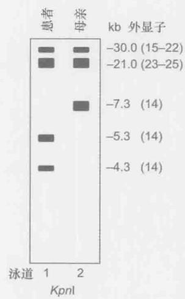

A. 请描述该患者和其母亲的 Sst I 酶解结果的不同之处。请尽量具体。
B. 请描述该患者和其母亲的 Kpn I 酶解结果的不同之处。请尽量具体。

C. 请提出一种假设来解释我们观察到的差异，这些差异包含了发生转座子插入的因子Ⅷ的外显子。

数据改编自 Kazazian Jr. et al. （1988. Nature 332: 164-166）。


## 第4篇基因组的表达

## 本篇概要

\- 第13章 转录机制

\- 第14章 RNA剪接

\- 第15章 翻译

\- 第16章 遗传密码

\- 第16章 生命起源和早期演化

第 4 篇主要介绍基因是如何表达的，或者说，以核苷酸线性序列的形式储存在多聚核苷酸链中的信息是如何转换成为多肽链中的氨基酸线性序列的。我们同样讨论了这些过程在早期生命中是如何起源的。

第 13\~16 章是按照将基因中的信息复制到 RNA，即信使 RNA（messenger RNA），再将信使 RNA 解码成为多肽链的信息流向编排的。核苷酸序列的信息由 DNA 传递到 RNA 的过程，即转录（transcription），是第 13 章的主题。

RNA 聚合酶局部解旋一小段 DNA，并以短暂分离的两条 DNA 链中的一条为模板，通过碱基配对逐渐合成互补的 RNA 链，这一化学反应的过程与 DNA 合成极其相似。尽管在所有细胞中合成 RNA 的基本酶非常相似，但真核生物转录机器的其他部分要比原核生物复杂得多。

在原核生物中，信使 RNA 一旦合成，便立即作为蛋白质合成的模板使信息流向下一个阶段。真核生物则不然,转录的 RNA 产物必须经过一系列的成熟事件才能成为信使 RNA。最引人注目的加工事件称为信使 RNA 剪接（mRNA splicing），第 14 章对此进行了描述。真核生物细胞的基因常常被一个（有时是多个）非蛋白质编码的片段（即内含子，intron）所打断。当这样的基因转录成 RNA 的时候，这些内含子必须去除，从而使蛋白质编码片段（即外显子，exon）能够彼此连接在一起，成为一条连续的蛋白质编码序列。第 14 章描述了负责高精度去除内含子的精密分子机器。

关于遗传信息翻译过程的细节将在第 15 章和第 16 章讨论。翻译是以核苷酸序列形式储存在信使 RNA 中的遗传信息指导氨基酸有序地掺入到蛋白质多肽链中的过程。第 15 章描述了参与翻译过程的 4 个主要组分：信使 RNA 的编码序列；转运器分子（即 tRNA）；将氨基酸装载到 tRNA 转运器上的氨酰-tRNA 合成酶；由 RNA 和蛋白质组成的核糖体，即蛋白质合成工厂。

第 16 章描述了阐明遗传密码（genetic code）的经典实验，同时列出了翻译这些密码的法则。核苷酸序列的信息是基于一种 3 个字母的密码，而蛋白质序列的信息则是基于 20 个不同的氨基酸。密码具有简并性，两个或更多密码子（在大多数情况下）编码同一种氨基酸。还存在特殊的密码子，指明翻译应在何处开始和在何处结束。

最后，在第 17 章中，我们将研讨生命是如何在它初始的位置起源的，原始的遗传编码、复制和表达机制，以及它们是如何演化成为我们看到的现代的生物世界的，正如第 3 篇和第 4 篇中讨论的那样。

# 冷泉港实验室档案馆中的照片


David Baltimore、Francois Jacob 和 Walter Gilbert, 1985 年发育分子生物学研讨会。Baltimore 和 Howard Temin 共同发现了以 RNA 为模板合成 DNA 的反转录酶（第 12 章）。Jacob 与 Jacques Monod 提出了基因表达如何被调节的基本模型（第 18 章），还提出了 DNA 复制如何被调节的一个模型（第 9 章）。Gilbert 为基因调节的 “Jacob-Monod 模型” 的某些方面提供了生物化学证明，他还发明了一种用于 DNA 测序的化学方法（第 7 章）。他们分别于 1975 年（生理学或医学）、1965 年（生理学或医学）和 1980 年（化学）获得了诺贝尔奖。

David Allis 和 Emily Bernstein，2004 年表观遗传学研讨会。Allis 第一个发现了修饰组氨酸的酶——Tetrahymena 的组氨酸乙酰转移酶（第 8 章）。自从这个酶被发现后，研究组氨酸修饰范围及其对基因表达的影响的全新领域成长了起来。图中 Allis 与他实验室的博士后 Bernstein 在一起，后者曾是 Greg Hannon 实验室的研究生，在那里她发现了参与 RNAi 的 Dicer 酶（第 20 章）。

  
Ada Yonath, 2001 年核糖体研讨会。受到熊的细胞中核糖体二维晶体结构的启发，Yonath 制造核糖体的晶体以解析它的三维结构。很多人相信核糖体的结构是可以解析的，这也是她研究工作的一个长久的目标。由于她在核糖体研究中的贡献，她和 Venki Ramakrishnan 及 Tom Steitz 一起获得了 2009 年的诺贝尔化学奖。


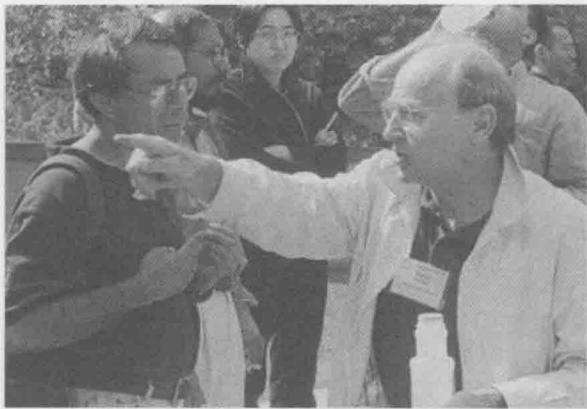  
Robert Roeder，1998年转录机制研讨会。Roeder发现了三个真核RNA聚合酶——Pol I、Ⅱ、Ⅲ，纯化了这些酶以及起始转录所需的其他因子（第13章）。左边那个带着质疑眼神的是Camilo Parada，当时是Roeder实验室的博士后。

  
Phillip Sharp, 1974 年肿瘤病毒研讨会。Sharp 和 Richard Roberts 共同获得了 1993 年的诺贝尔生理学或医学奖，因为他们发现很多真核细胞的基因是“割裂”的，也就是说，它们的编码区域是被分段非编码 DNA 打断的。这些非编码区域是通过“剪接”而从 RNA 拷贝中去除的（第 14 章）。图中为 Sharp 和夫人 Ann。

  
Roger D. Kornberg, 1977 年染色质研讨会。Kornberg 早期研究核小体结构（第 8 章），于 2006 年因 RNA 聚合酶 II 结构（第 13 章）的研究获得诺贝尔化学奖。他父亲是 Arthur Kornberg，本书前面（P196）有其相片。

  
Paul Zamecnik, 1969 年蛋白质合成机制研讨会。Zamecnik 发展了体外蛋白质合成系统，已证明该系统对理解遗传密码如何工作及细胞如何制造蛋白质是非常重要的（第 2 章和第 15 章）。他还和 Mahlon Hoagland 一起发现了 tRNA，它是蛋白质合成过程中的一个关键成分（第 15 章）。

  
Richard Roberts, 1977 年染色质研讨会。Roberts 的主要研究集中于限制性内切核酸酶的功能和多样性（第 7 章），他也是“割裂基因”的共同发现者之一，为此他与 Phillip Sharp 于 1993 年一起获得了诺贝尔生理学或医学奖。这里展示的和他在一起的科学家是（由左到右）：Yasha Gluzman，肿瘤病毒学家；Ahmad Bukhari，致力于研究噬菌体 Mu 转座（第 12 章）；James Darnell，他的工作集中在基因调节中的信号转导方面（第 19 章）。

  
Venki Ramakrishnan 和 Jack Szostak，2009 年演化生物学研讨会。由于核糖体晶体结构方面的研究工作，Ramakrishnan（左）与 Ada Yonath 及 Tom Steitz 分享了 2009 年诺贝尔化学奖，同时由于他在端粒上的研究工作，Szostak（中）与 Elizabeth Blackburn 以及 Carol Greider 分享了那一年的诺贝尔生理学或医学奖，这张照片来自于和 Alex Gann 一起的研讨会的野餐，他也是本书的作者之一。

## 第13章 转录机制

## 本章概要

RNA 聚合酶和转录周期

细菌的转录周期

真核生物的转录

由 RNA 聚合酶 I 和 III 催化的转录

在此之前,我们一直在考察基因组的维持,也就是说遗传物质是如何组织、保护和复制的。现在,我们将问题转到遗传物质如何表达,即 DNA 的一串碱基是如何指导 RNA 和蛋白质的合成的,后者可以行使细胞功能和定义细胞特性。在后面的几章里,我们将描述负责基因表达的基本过程:转录、RNA 加工及翻译。

转录在化学和酶学上与 DNA 的复制（第 9 章）非常相似。二者都通

过酶的作用合成一条与 DNA 模板互补的核酸链。当然，二者之间存在一些重要的差别，最主要的就是转录得到的新链是由核糖核苷酸（ribonucleotide）组成的，而不是脱氧核糖核苷酸（ribonucleotide）（第 5 章）。转录机制区别于复制的其他特征包括以下几点。

\- RNA 聚合酶（RNA polymerase，催化 RNA 合成的酶）不需要引物，它能够从头起始转录（但是正如我们将要讨论的，细胞内的转录必须在特定的序列上才能起始）。

\- RNA 产物不与模板 DNA 链的碱基保持互补状态。相反，RNA 聚合酶在每个核糖核苷酸添加处的几个核苷酸之后，便将正在延长的链从模板上置换下来（图 13-1）。这一置换对 RNA 行使功能非常关键（例如，最常见的产生蛋白质产物的翻译过程）。而且，由于这一释放紧随合成位点之后，多个 RNA 聚合酶分子可以一个紧接着另一个，在同一时间转录同一个基因。这样，一个细胞就可以在短时间内在一个基因（或其他 DNA 序列）上合成大量的转录产物。重要的是，当 RNA 产物紧跟在每个行进的 RNA 聚合酶后面从 DNA 模板上解离下来时，两条 DNA 链重新配对（图 13-1）。

\- 尽管转录是非常精确的（每添加1万个核苷酸发生1次错误），但还是不如复制更为精确（每1000万个核苷酸发生1次错误）。这一区别反映出尽管确实存在两种RNA合成的校正办法，转录过程还是缺乏广泛的校正机制。

  
图 13-1 DNA 转录成为 RNA。本图所示为在没有相关酶的作用下，DNA 双螺旋是如何解旋和 RNA 链是如何在模板上合成的。本图还显示了 RNA 转录产物是如何在合成点几个核苷酸后从 DNA 模板上解离下来的，以及 DNA 链如何重新配对。图中转录从左到右进行。

较转录而言，细胞更关注复制的精确性是有道理的。DNA 是储存遗传物质的分子，DNA 复制是遗传物质得以传递的过程。复制过程中发生的任何错误都会很容易引起灾难性后果——它将永远存在于这一个体的基因组中，并传递给它的后代。相反，转录仅仅产生一些暂时性的拷贝，而且通常从同一个转录区域会得到几个拷贝。因此，转录过程中发生一个错误，除了在许多暂时性的副本中产生一个有缺陷的副本外，几乎不会造成任何其他的损害。

除了上述机制的区别，DNA 复制和转录之间还存在一个重要的差异，体现在两者的不同目的。转录仅是有选择性地复制基因组的特定部分，并从任何特定的部分产生一个到几百个，或者甚至上千个拷贝。相反，复制必须将整个基因组全部拷贝，并且在每次细胞分裂时进行一次（并且只进行一次，见第 9 章）。转录区域的选择并不是随机的，每个转录区域通常包括一个或多个基因，而且在每个转录区域的首端和尾端都存在特定的 DNA 序列指导转录的起始和终止。

不仅基因组的不同部分的转录程度不同，而且转录哪一部分、转录范围有多大都是可以调控的。这样，在不同的细胞中，或者同一细胞的不同时段，可能转录不同组别的基因。例如，某个人的两个遗传特征相同的细胞在很多情况下会转录不同组别的基因，从而导致那两个细胞在特征和功能上的差异（如一个可以是肌肉细胞，而另一个是神经细胞）。或者，一些特定的细菌细胞会依其生长的培养基的不同而转录不同组别的基因。这些调控的问题将在第4篇予以解答。

## RNA 聚合酶和转录周期

## RNA 聚合酶具有不同形式，但有许多共同特性

从细菌到人类的所有细胞里，RNA 聚合酶在本质上都进行同一种反应。因此，来自这些不同物种的酶具有许多共同的特性就不足为奇了，尤其是那些直接参与催化 RNA 合成的部分。从细菌到哺乳动物，细胞的 RNA 聚合酶都是由多个亚基（subunit）构成的（虽然一些噬菌体和细胞器的确编码一些单亚基的酶来完成相同的任务，框 13-2）。表 13-1 列出了各种情况下亚基的数目和大小，以及不同的酶之间哪些亚基序列是保守的。

表 13-1 RNA 聚合酶的亚基

<table><tr><td colspan="2">原核生物</td><td colspan="3">真核生物</td></tr><tr><td>细菌核心酶</td><td>古细菌核心酶</td><td>RNA聚合酶I</td><td>RNA聚合酶II</td><td>RNA聚合酶III</td></tr><tr><td> $\beta'$ </td><td>A&#x27;/A&#x27;&#x27;</td><td>RPA1</td><td>RPB1</td><td>RPC1</td></tr><tr><td> $\beta$ </td><td>B</td><td>RPA2</td><td>RPB2</td><td>RPC2</td></tr><tr><td> $\alpha^I$ </td><td>D</td><td>RPC5</td><td>RPB3</td><td>RPC5</td></tr><tr><td> $\alpha^II$ </td><td>L</td><td>RPC9</td><td>RPB11</td><td>RPC9</td></tr><tr><td> $\omega$ </td><td>K</td><td>RPB6</td><td>RPB6</td><td>RPB6</td></tr><tr><td></td><td>[+6个其他亚基]</td><td>[+9个其他亚基]</td><td>[+7个其他亚基]</td><td>[+11个其他亚基]</td></tr></table>

每列的亚基按分子质量由大到小排序。(经允许, 引用自 Ebright R.H. 2000.J. Mol. Biol. 304: 687–698, Fig. 1, p. 688. ©Elsevier.)

由此表可见，细菌只有1种RNA聚合酶，而真核细胞中则有3种——RNA聚合酶I、Ⅱ和Ⅲ（RNA Pol I、Ⅱ和Ⅲ）。聚合酶Ⅱ（Pol II）是本章后半部分阐述真核转录时将要重点讲到的酶，它是这些酶中研究得最为深入的，也是负责转录大多数基因的酶——实际上是转录几乎所有蛋白质编码基因的酶。聚合酶I（Pol I）和聚合酶Ⅲ（Pol III）分别参与转录专门的RNA编码基因。具体来说，Pol I转录的是大核糖体RNA前体基因，而PolⅢ转录的是tRNA基因、一些小的核RNA基因和5S rRNA基因。在本章的末尾我们将再讨论这些酶。近年来，学界又发现了两种DNA依赖的RNA聚合酶，并将其命名为Pol IV和Pol V。这两种酶只在植物中存在，它们转录参与转录抑制的小干扰RNA（small interfering RNA，第20章）。它们与Pol II的亲缘关系较为密切，演化产生的时间不长。它们的一些蛋白亚单位与Pol II是一致的，由同样的基因编码；另一些序列上游区别的亚单位则是来自于近期复制的拷贝。

细菌 RNA 聚合酶的核心酶（core enzyme）可以独立合成 RNA，它是由 $\alpha$ 亚基（subunit）的两个拷贝和 $\beta$ 、 $\beta'$ 、 $\omega$ 亚基的各一个拷贝组成的。这个酶与真核生物的聚合酶密切相关（表 13-1）。具体来说，它的两个大亚基（ $\beta$ 和 $\beta'$ ）与 RNA 聚合酶Ⅱ的两个大亚基（RPB1 和 RPB2）同源。同时， $\alpha$ 亚基与 RPB3 和 RPB11 同源、 $\omega$ 亚基与 RPB6 同源。细菌 RNA 聚合酶的核心酶结构与酵母 RNA 聚合酶Ⅱ的核心酶相似，二者在图 13-2 中并列显示。后面我们将会描述一些能够阐明这些酶的工作原理的结构细节，这里我们只重点描述一些共同的特征。

细菌和酵母的核心酶有着共同的总体形态和组织形式；实际上，它们比亚基在序列上的相似度更为相似。二者内部靠近活性位点的部分尤为如此，而外周部分的相似性则差一些。这些相似点和相异点的分布是合理的：酶的内部参与在 DNA 模板上合成 RNA（所有生物体都一样）；然而，酶的许多外周部分参与到其他蛋白质的相互作用中，而这些在原核和真核细胞中是不同的。

总的来说，每一个酶的形状都像一只蟹爪。这让我们回想起第9章中描述的DNA聚合酶的“手”形结构（图9-5）。“蟹爪”的两个“钳子”主要是由各个酶的两个最大亚基构成（细菌的酶是 $\beta$ 和 $\beta^{\prime}$ 亚基，真核生物的酶是RPB1和RPB2亚基）。酶的活性位点是由这两个亚基的一些区域共同组成的，位于钳子基部，被称为“活性中心裂隙”（active center cleft）区域（图13-2）。活性位点的工作原理依据双金属离子催化添加核苷酸的机制，该机制在所有的聚合酶中均如此（第9章）。然而，RNA聚合酶的活性位点含有一个紧密结合的 $\mathrm{Mg}^{2+}$ ，第二个离子是在合成周期中由每个新的核苷酸带入的，与焦磷酸一起释放。

生物体中有多种通道允许 DNA、RNA 和核糖核酸进出这些酶的活性中心裂隙。我们会在后面谈到转录机制的部分再进行详细的讨论。


  
图 13-2 原核生物和真核生物 RNA 聚合酶晶体结构（crystal structure）的比较。（a）。栖热水生菌（T. aquaticus）RNA 聚合酶的核心酶结构。各个亚基以不同的颜色表示：β 亚基为蓝色，β' 亚基为紫色，两个 α 亚基分别为黄色和绿色，ω 亚基为红色，以红球表示的 Mg $^{2+}$ 在 a、b 中均注明了活性位点（来源：Seth Darst，洛克菲勒大学，私人通信）。（b）。酿酒酵母（S. cerevisiae）RNA 聚合酶Ⅱ的结构。各个亚基以不同的颜色表示，以表明与细菌中相应亚基的关系（表 13-1）。因此，RPB1 和 RPB2 分别为紫色和蓝色，RPB3 和 RPB11 分别为绿色和黄色，RPB6 为红色（来源：Cramer P., et al. 2001. Science. 292: 1863）。图像使用 MolScript、BobScript 和 Raster 3D 软件制作。

## 由 RNA 聚合酶进行的转录是由一系列步骤完成的

为转录一个基因，RNA 聚合酶要进行一系列定义明确的步骤，这些步骤分为三个阶段：起始（initiation）、延伸（elongation）和终止（termination）。在这里及图 13-3 中，我们总结了每个阶段的基本特征。

起始 启动子（promoter）是最初结合 RNA 聚合酶的 DNA 序列（与所需的转录起始因子一起结合）。启动子-聚合酶复合体一旦形成就发生结构改变，以利于起始过程继续进行。和复制的起始一样，DNA 在转录将要开始的部位解旋，碱基对分开，产生一个单链 DNA 的“转录泡”。与 DNA 复制相同，转录总是从 5' 端向 3' 端进行。也就是说，新的核糖核苷酸添加在延伸链的 3' 端。然而，与 DNA 复制不同的是，只有一条 DNA 链作为模板合成 RNA 链。因为 RNA 聚合酶以固定的方向与启动子结合，所以同一条链总是从特定启动子开始转录。

启动子的选择决定了哪一段 DNA 被转录，这也是对转录进行调控的主要步骤。

延伸 一旦 RNA 聚合酶已经合成了一小段 RNA（10 个碱基左右），转录便进入了延伸阶段。在延伸阶段，RNA 聚合酶除催化 RNA 的合成外，还执行着多项重要任务。它解开前方的 DNA，又使其后的 DNA 重新复性；在移动的同时，逐步解开正在延长的 RNA 链与模板的配对；而且还执行校正的功能。相反，在复制过程中，需要几个不同的酶来执行这些相似的功能。

终止 一旦 RNA 聚合酶转录了整个基因（或整组基因），它必须停下来并释放 RNA 产物（并从 DNA 上解离下来），这一步骤称为终止。在某些细胞中，存在着特定的、已研究清楚的终止序列；而在其他一些细胞中，是什么使聚合酶停止转录并从模板上分离还不十分清楚。

## 转录起始包括三个定义明确的步骤

转录周期（transcription cycle）的第一个阶段——起始——又可以分为一系列定义明确的步骤（图 13-3）。第一步是聚合酶与启动子初步结合形成所谓的闭合式复合体（closed complex），这时 DNA 还保持着双链状态，聚合酶结合在螺旋的一个面上。起始阶段的第二步，闭合式复合体经过转变而成为开放式复合体（open complex），DNA 双链在起始位点周围大约 13 bp 的距离内分开以形成转录泡。在起始阶段的下一步，启动子逃离，聚合酶进入转录起始阶段。

DNA 的展开使模板链得以释放。最前面的两个核糖核苷酸被带入活性位点，排列在模板链上并彼此结合。通过这种方式，后续的核糖核苷酸结合到正在延长的 RNA 链上。最初 10 个左右核糖核苷酸的合成是一个效率相当低的过程，在这一阶段，聚合酶经常释放出很短的转录物（每一个都短于 10 个左右的核苷酸），然后再重新开始合成。在这个阶段，聚合酶启动子复合体称为起始转录复合体（initial transcribing complex）。一旦某个聚合酶释放出超过 10 核苷酸的转录本，就可以说它逃离(escaped)了启动子。这时，它已经形成了一个包括酶、DNA 和 RNA 的稳定的三重复合体（stable ternary complex），完成了向延伸阶段的转变。

  
聚合酶终止，并释放 RNA

图 13-3 转录周期的几个阶段：起始、延伸和终止。图中显示了转录周期的常规步骤。所示特征为细菌和真核生物转录共同拥有的。起始、延伸和终止所需要的其他因子并未在这里显示，但将在后面的正文中进行描述。编码 RNA 链开端的 DNA 核苷酸称为转录起始位点，指定为“+1”位置。转录行进方向的序列称为起始位点的下游。类似地，起始位点前面的序列称为上游序列。当提到上游序列的某一特定位置时，将给予一个负值，下游序列则给予正值。

在本章的后续部分，我们将更为详细地对转录周期进行描述——首先是细菌，然后是真核系统。

## 细菌的转录周期

## 细菌的启动子在强度和序列上是多样的，但是具有某些明确的特征

原则上，细菌的核心 RNA 聚合酶能够在 DNA 分子上的任何一点开始转录，这点可以在体外用纯化的核心酶来验证。但在细胞内，聚合酶只在启动子处起始转录。一个称为 $\sigma$ 的起始因子的加盟，使得核心酶 $(\alpha_{2}\beta\beta'\omega)$ 转变为只在启动子处起始转录。该酶的这种形式称为 RNA 聚合酶的全酶（holoenzyme，图 13-4）。

  
图 13-4 栖热水生菌 RNA 聚合酶的全酶。灰色所示为核心酶（与图 13-2 的 a 图中所示的是同一个酶），紫色所示为 $\sigma^{70}$ 亚基（区域 2、3、4，见图 13-6）。右边为区域 2，顶部为区域 3，底部为区域 4。 $\sigma$ 区域 2 和 4 分别识别启动子的 -10 和 -35 区域，稍后将在正文中进行描述。（Murakami K. S., et al. 2002. Science. 296: 1280.）图像使用 MolScript、BobScript 和 Raster 3D 软件制作。

在大肠杆菌中，最常见的 $\sigma$ 因子称为 $\sigma^{70}$ （我们将在第 18 章和第 22 章中讨论其他可供选择的 $\sigma$ 因子及它们在转录调节中的作用）。含有 $\sigma^{70}$ 的聚合酶识别的启动子具有以下共同的特征性结构：两段 6 个核苷酸长的保守序列，被长度为 17\~19 个核苷酸的非特异序列（图 13-5a）所分隔。这两段保守序列的中心分别位于 RNA 合成起始位点上游约 10bp 和 35bp 处。因此，根据图 13-3 的计数方案（编码 RNA 链开端的 DNA 核苷酸被指定为 +1），这两段序列称为 -35 和 -10 区域（region）或元件（element）。

虽然绝大多数的 $\sigma^{70}$ 启动子包含可被识别的-35 和-10 区域，但序列并不一致。通过对许多不同启动子的比较，可以得到一个共有序列（consensus sequence，关于这些共有序列的来源详细可见框 13-1）。共有序列反映了首选的-35 和-10 区域，被最适宜的长度（17bp）所分隔。很少有启动子具有与其一模一样的序列，但多数与其仅有几个核苷酸的差别。

  
图 13-5 细菌启动子的特征。图中显示了细菌启动子元件的不同组合情况。每个元件对聚合酶的结合和功能所起的作用在正文中有详细描述。

## 框13-1 共有序列

被某个特定蛋白质识别的结合位点，其 DNA 序列不一定完全一致。类似地，使一个蛋白质具有某种特殊功能的氨基酸序列在不同的蛋白质中可能会有微小的差异。共有序列就是在上述的每种情况中，由不同样本在每一个位置上最常见的核苷酸（或氨基酸）所组成的序列版本。含有 $\sigma^{70}$ 因子的 RNA 聚合酶识别大肠杆菌启动子的共有序列如图所示（框 13-1 图 1）。这一共有序列是通过对 300 个已知具有 $\sigma^{70}$ 启动子功能的序列进行比较，并确定在 -35 和 -10 六核苷酸区域中每一个位置上最常见的碱基得到的。该核苷酸就被选为共有序列中该位置上的特定核苷酸；每一个位置上的特定核苷酸出现的相对频率及其他三种核苷酸的频率在图表中进行了描绘。注意，位于 -35 和 -10 区域之间的 17\~19 个核苷酸并不存在具有显著意义的共有序列。

在图例中，每一个单独的启动子序列都已确定，所以比较这些序列并没有什么价值。但是，让我们来考虑一个完全不同的例子：所涉及的 DNA 结合蛋白还没有确定的结合位点。但是，一条染色体的几个区域在其长度范围内的某个位置上含有结合位点。可以使用一种扫描所有这些染色体区域序列的计算机算法来寻找它们共有的潜在结合位点。

当结合位点未知时，找到 DNA 结合蛋白所识别的共有序列的第二种途径是，利用化学方法合成大批随机序列的短 DNA 片段。将目标蛋白与这些 DNA 分子混合在一起，就可以筛选到与目标蛋白结合的 DNA，并测定其序列。对这些序列的比较很容易显示出共有序列，因为每一个片段都非常短。这种方法（常被称为 SELEX）广泛地用于确定未知的 DNA 结合蛋白的结合位点。第 7 章中有对 SELEX 的详细描述。

  
框 13-1 图 1 启动子的共有序列和共有间距。（获得许可并重新绘图自 Alberts B. et al. 2002. Molecular biology of the cell, 4th ed., p. 308, Fig. 6.12. ©Garland Science/Taylor & Francis Books LLC.）

具有与共有序列更近似序列的启动子通常要比那些匹配较差的启动子“更强”。所谓启动子的强度（strength），是指一个启动子在一定时间内可以起始多少个转录物。这一度量标准受到以下因素的影响：启动子最初与聚合酶的结合程度、对异构化作用的支持效率，以及此后聚合酶逃离的难易程度。启动子强度与序列的相关性解释了为什么有许多不同种类的启动子：一些基因的表达水平远远超出其他基因，前者很可能具有与共有序列更为接近的序列。

在一些较强的启动子中，如指导核糖体 RNA（rRNA）基因表达的启动子，发现额外与 RNA 聚合酶结合的 DNA 元件，称为 UP 元件（UP-element，图 13-5b）。它通过提供额外的特异性相互作用而增强聚合酶与 DNA 的结合。

另一类型的 $\sigma^{70}$ 启动子缺乏-35 区域，而是有一个所谓的“延长的-10 区域”元件（图 13-5c）。与标准的-10 区域相比，这一元件在其上游末端有一个额外的短序列元件。聚合酶与这一额外序列元件之间的联系，补偿了-35 区域的缺失。大肠杆菌的 gal 基因（该基因产物指导乳糖的代谢；第 18 章）使用的就是这种启动子。

最后，在紧挨着-10元件的下游发现了一个新的结合RNA聚合酶的DNA元件。这个新元件称为鉴别子（discriminator，图13-5d）。鉴别子与聚合酶之间相互作用的强度影响酶与启动子复合体的稳定性。

## σ 因子介导聚合酶与启动子的结合

$\sigma^{70}$ 因子可以分为四个区域,称为 $\sigma$ 区域1\~ $\sigma$ 区域4(图13-6)。识别启动子-10和-35元件的区域分别是区域2和4。

区域 4 的两个螺旋形成一个常见的 DNA 结合基序（motif），称为螺旋-转角-螺旋（helix-turn-helix）。其中一个螺旋插入到-35 区域的大沟（major groove）中并与该区域的碱基相互作用；另一个则从大沟的顶部横向穿过，与 DNA 骨架接触。这一结构基序见于许多 DNA 结合蛋白，例如细菌细胞中几乎所有的转录激活因子与抑制因子（见第 18 章），我们在第 6 章进行了详细的讨论（图 6-13）。

  
图 13-6 σ 因子的区域。识别启动子特定区域的 σ 因子的那些区域以箭头指示。区域 2.3 负责 DNA 解旋。有关 σ 因子将 RNA 聚合酶核心酶募集到一个标准启动子上的示意图，见图 13-7。（经许可引用自 Young B.A. et al. 2002. Cell. 109: 417–420, Fig. 1. ©Elsevier.）

-10 区域也被一个 $\alpha$ 螺旋所识别，但其复杂的相互作用尚未彻底研究清楚。原因在于-35区域仅提供能量以确保聚合酶与启动子的结合，而-10区域在转录起始过程中有着更为精细的任务，因为它处在闭合式复合体向开放式复合体转变时DNA解旋起始元件中。因而，与-10区域相互作用的 $\sigma$ 因子区域不光与DNA结合，还参与其他的功能。与这一预想相一致，参与识别-10区域的 $\alpha$ 螺旋包含几个芳香族氨基酸，这些氨基酸可以和非模板链上的碱基相互作用，以维持解旋DNA的稳定。在第9章中，我们曾描述过DNA复制过程中单链结合蛋白（single-strand binding，SSB）存在类似的功能。

最近的对区域 2 的结构研究发现，它与一个单链状态的-10 元件结合，而且全部与开放复合体相接触，揭示了 $\sigma$ 因子和单链 DNA 分子间以适当的结合相互作用来推动解离过程的。非模板链上的两个碱基将插入到 $\sigma$ 因子的“口袋”结构中，这一过程中适当的分子间接触可以稳定处于解螺旋状态的启动子序列。

在某些物种中细胞的-10元件会延长一部分序列，这些序列将被 $\sigma$ 区域3中的一个 $\alpha$ 螺旋所识别，此螺旋与组成这一元件的两个特异性的碱基对接触。同时，鉴别子由 $\sigma$ 区域1、2识别。

与启动子内的其他元件不同，UP 元件并不被 $\sigma$ 因子所识别，而是被 $\alpha$ 亚基的羧基末端域一个被称为 $\alpha$ CTD 的结构域（图 13-7）识别。 $\alpha$ CTD 通过一个可变形的衔接物与 $\alpha$ 亚基的氨基端域（ $\alpha$ NTD）相连接。因而，虽然 $\alpha$ NTD 包埋在酶内部， $\alpha$ CTD 仍可以到达上游元件，即使该元件并不处于与 -35 区域直接相邻的位置，而是位于上游更远处。

$\sigma$ 亚基以这样一种方式定位在全酶结构内，实现对各种启动子元件的识别。所以，DNA结合区域朝向酶体外部而不是被包埋起来。而且，这些区域之间的间距与它们所识别的DNA元件之间的距离是一致的。当 $\sigma$ 因子结合在全酶里时， $\sigma$ 区域2和4分开大约 $75\AA$ ，这与一个典型的 $\sigma^{70}$ 启动子的-10和-35元件中心点之间的距离基本相同（图13-7）。区域2与区域4之间的这一相当大的蛋白结构域的间距是由 $\sigma$ 的区域3提供的，尤其是区域3.2也称为 $\sigma_{3/4}$ 连接区（图13-4和图13-6）。

  
图 13-7 σ 和 α 亚基将 RNA 聚合酶核心酶募集到启动子上。α 亚基的 C 端域（α CTD）识别 UP 元件（如果存在的话），而 σ 区域 2 和 4 分别识别 -10 和 -35 区域（图 13-6）。在本图中，RNA 聚合酶的示意形式与在先前的图中所显示的有相当大的差别。这种形式对于显示与 DNA 和调节蛋白的接触面是非常有用的，我们在第 18 章考察细菌的转录调节时还将会在某些图中使用它。

## 向开放式复合体的转变过程涉及 RNA 聚合酶和启动子 DNA 的结构变化

在闭合式复合体内 RNA 聚合酶与启动子 DNA 的结合使 DNA 仍处于双链状态。转录起始的下一个阶段要求聚合酶在开放式复合体中与启动子更紧密地结合在一起。从闭合式复合体到开放式复合体的转变过程涉及聚合酶的结构变化，以及 DNA 双链的打开，暴露出模板链和非模板链。相对于转录起始位点而言，这一解离事件发生在 -11 和 +2 之间的区域。

对于含 $\sigma^{70}$ 因子的细菌聚合酶，这一转变被称为异构化作用（isomerization）。它不需要从 ATP 水解获得能量，而是 DNA-酶复合体的构象自发地变成一种在能量上更具优势的形式。就像我们上面指出的那样，非模板链上的-10 元件的两个碱基（ $A_{11}$ 和 $T_{7}$ ）（图 13-8）处于自由状态，不再插入到 $\sigma$ 因子的“口袋”结构中，也就不再有如下功能的相互作用：通过将单链形式的-10 元件稳定下来，这些相互作用可以推动启动子去解离（图 13-8）。

异构化作用本质上是不可逆的，一旦异构化完成，通常转录将会随后起始（虽然在某些情况下还会再发生调控）。相反，闭合式复合体的形成则是易于逆转的——聚合酶可以转变为开放式复合体，从启动子上脱离。

为了描绘伴随异构化作用发生的结构变化，我们需要更为细致地了解全酶的结构。正如前面所描述的，在这个爪状酶的钳子之间有一条通道穿过（图 13-2）。由 $\beta$ 和 $\beta'$ 亚基的一些区域共同组成的活性位点，位于钳子基部的“活性中心裂隙”之内。

有 5 条通道通向酶的内部，如图 13-9 的开放式复合体的图片中所示。核苷三磷酸（NTP）摄取通道（没有在图中展示，请见图例说明）允许核糖核苷酸进入活性中心。RNA 出口通道允许正在延长的 RNA 链在延伸合成的同时离开此酶。其他的 3 个通道允许 DNA 进出此酶，如下所述。

下游 DNA（也就是聚合酶前方将被转录的 DNA）以双链的形式经下游 DNA 通道（在两个钳子之间）进入活性中心裂隙。在活性中心裂隙内，DNA 双链从 +3 位置开始分离。非模板链（NT）通过其特异性的通道离开活性中心裂隙并从聚合酶的表面经过，模板链（T）则沿着一条路线穿过活性中心裂隙，经它的特异性通道离开。聚合酶后面的上游 DNA 在 -11 位置处重新恢复双链状态。

  
图 13-8 通过 σ 区域 2 识别和解离 -10 元件。σ 区域 2 上具有两个口袋结构，其中各自结合非模板链的自由状态的 -10 碱基。这些能量上有优势的连接反应驱动了启动子的解离，这一反应过程不需要 ATP 的水解。（a）Taq RNA 聚合酶 σ₂ 区域的放大影像，以及结合闭合式复合体（蓝色）的双链 DNA 和部分开放式复合体（黄色）的单链 DNA。图中还展示了“口袋”结构中的两个碱基（A 和 T，用黄色表示）。红色箭头指示自由状态的碱基如何联系到闭合式复合体中相同的碱基（经许可图片复制自 Feklistov A. 和 Darst S.A. 2011. Cell 147: 1257, Fig. 6C, p. 1265. ©Elsevier.）（b）详细展示图 a 中区域 2 和非模板链的 -10 区域是如何结合的，特别是自由状态的碱基如何驱动 DNA 从这一区域解离（经许可并调整自 Liu X., Bushnell D.A., and Kornberg R.D. 2011. Cell 147: 1218, Fig. 1, p. 1219. ©Elsevier.）

从闭合式复合体向开放式复合体转变的异构化作用中，可以观察到聚合酶发生了两个显著的结构变化。第一，位于聚合酶前部的钳子牢固地钳压在下游DNA上。第二， $\sigma$ 的N端区域（区域1.1）位置有至关重要的移动。在未结合DNA时， $\sigma$ 区域1.1处于全酶的活性中心裂隙内部，阻断了开放式复合体中模板DNA链经过的路线。在开放式复合体中，区域1.1移动了大约 $50\AA$ 的距离，出现在酶的外部，使DNA可以进到裂隙中（图13-9）。 $\sigma$ 区域1.1处于高度的负电荷状态（恰似DNA）。因而，在全酶中，区域1.1起着DNA的分子模拟物（molecular mimic）的作用。活性中心裂隙的空间呈高度正电荷状态，既可以被区域1.1占据，也可以被DNA占据。

## 转录由 RNA 聚合酶起始，不需要引物

我们在第9章中谈到，DNA聚合酶并不重新合成新的DNA链，也就是说，它只能延伸一条已经存在的多聚核苷酸链。因此，复制总是需要引物链。引物通常是一段较短的RNA，与DNA模板链结合，形成一段较短的杂交双链区域；然后DNA聚合酶将核苷酸添加到引物的3'端。

  
图 13-9 进出开放式复合体的通道。本图显示了两条 DNA 链的相对位置（模板链为灰色，非模板链为橘红色）、 $\sigma$ 因子的 4 个区域、启动子的 -10 和 -35 区域，以及转录的起始位点（+1）。DNA 和 RNA 进出 RNA 聚合酶的通道也在图中显示。这里唯一没有显示的通道是核苷酸进入（NTP 摄入）通道，核苷酸由此通道进入活性位点裂隙，结合到增长中的 RNA 链中。如图所示，该通道从页面深处进入位于 DNA +1 附近的活性位点。DNA 链从蛋白质下面经过的部分以虚线表示。 $\sigma$ 区域 3/4 连接区，也称 $\sigma_{3,2}$ 是 $\sigma_{3,1}$ 和 $\sigma_{4}$ 之间的连接区域。（原图由 Richard Ebright 设计。）

RNA 聚合酶能够在一条 DNA 模板上起始新的 RNA 链，并不需要引物。这一功能要求起始的核糖核苷酸被带到活性位点，并稳定地保持在模板上，同时下一个核苷三磷酸以正确的几何形态呈递，使聚合这一化学过程得以完成。这是相当困难的，因为 RNA 聚合酶的转录物大多以腺嘌呤核苷酸（A）开始，这种核苷酸仅通过两个氢键与模板核苷酸（胸腺嘧啶核苷酸，T）结合，而胞嘧啶核苷酸（C）和鸟嘌呤核苷酸（G）之间有三个氢键。

因此，聚合酶必须与一条或者多条 DNA 模板链、起始核苷酸以及第二个核苷酸建立特异性的相互作用，严格控制其保持正确的方向，才可以开始对引入的核苷三磷酸进行化学反应。这种对聚合酶与起始核苷酸之间特异性相互作用的要求可能解释了为什么大多数转录物都以同一种核苷酸开始。目前学界大多认为， $\sigma$ 区的 3/4 链接处与模板链互作，可以保证在正确的构象和位置启动转录。与此一致的是，用含有缺少此部分的 $\sigma^{70}$ 的聚合酶进行的实验中，起始过程所需要的两个核苷酸中的一个或两个的浓度比平时要高得多。

## 转录起始阶段，RNA 聚合酶保持位置不变并将下游 DNA 拉向自己

如我们已经描述的，RNA 聚合酶首先合成并释放一些短于 10 核苷酸（无效合成）的小 RNA 转录物，然后进入转录起始阶段，包括逃离启动子、进入延长阶段，以及合成正确的转录物。很长时间我们都不明白在最初的无效转录循环中，酶的活性位点是如何沿着 DNA 模板移动的。迄今提出过三个通用模型（图 13-10）具体如下。

1. “瞬时漂移”（transient excursion）模型提出 RNA 聚合酶正向反向的瞬时迁移循


环。聚合酶被认为离开启动子沿着 DNA 模板移动一小段，合成一小段转录物，然后流产释放转录物，再回到其在启动子的原始位置。

2.“蠕虫移动”（inchworming）模型认为在聚合酶内有一个具伸缩性的元件，使得酶前方含有活性位点的部件向下游移动，合成一小段转录物，然后流产，再收缩回到其仍留在启动子上的酶主体。

3. “蜷缩”（scrunching）模型认为位于固定位置的、与启动子结合的、聚合酶下游的 DNA 被酶拉进来。于是在酶的内部堆积的 DNA 以单链“泡”的形式逗留。

现在普遍相信第三个模型

——蜷缩，反映了真实的情况。这个结论基于一系列的发现——包括单分子分析实验，这些实验可以测量在最初的转录阶段聚合酶不同部分相互之间及相对于图 13-10 最初转录的机制。在最初的转录起始阶段，RNA 聚合酶的活性中心相对于 DNA 模板向前移动，合成短的转录物并流产，然后重复这个循环直到逃离启动子。图中表示了说明该过程的三个模型。根据第一个模型——瞬时漂移（上图），聚合酶沿着 DNA 移动。在第二个模型——蠕虫移动（中图）中——酶的前部分沿着 DNA 移动，但由于酶内部有一个具伸缩性的区域，酶的后部分可以在启动子上保持固定。在第三个模型——蜷缩（下图）中，酶保持固定，把 DNA 拉过来。这些模型之间的不同点，以及支持蜷缩模型的证据在正文中有描述。（获得许可并重新绘图自 Kapanidis A.N. et al. 2006. Science 314: 1144–1147, Fig. 1a. ©AAAS.）

DNA 模板链的位置。结果显示，在最初的转录阶段，聚合酶在启动子上位置不变并解开下游 DNA 把其拉进来。只有蜷缩模型与这些结果吻合。

启动子逃离涉及聚合酶-启动子相互作用及聚合酶核心- $\sigma$ 相互作用的破坏

我们已经看到，在最初的转录阶段存在一个流产性起始过程，短的（9个核苷酸或更短）转录物合成并释放。只有合成一条达到阈值（10个核苷酸或更多）的转录物时，聚合酶才能逃离启动子并进入延伸阶段。一旦达到这个长度，转录物不能停留在与DNA配对的区域，必须开始像线一样穿入RNA出口通道（图13-9）。启动子逃离与打破聚合酶和启动子元件之间，以及聚合酶与作用于特定启动子的任何调控蛋白之间的所有相互作用有关（第18章）。

目前还不清楚 RNA 聚合酶为什么必须在成功逃离启动子之前经历流产性转录起始。但是 $\sigma$ 因子的一个区域作为分子模拟物参与其中，它是 3/4 连接区，模拟的是 RNA。此区域位于开放式复合体的 RNA 出口通道中间（图 13-9），为了使 RNA 链可以合成超过 10 个核苷酸， $\sigma$ 的这个区域必须从该位置被逐出，这个过程需要聚合酶尝试几次才能成功。

σ 区域 3/4 连接区的逐出可能说明了 σ 与延伸酶的结合比其与开放式复合体的结合更弱。事实上，它常常从延伸复合体上完全丢失。

一旦逃离，蜷缩过程将发生逆转。也就是说，在蜷缩时解离的 DNA 又重新复合，伴随着转录“泡”从 22\~24 个核苷酸萎缩成 12\~14 个核苷酸大小（图 13-3），这个过程提供了聚合酶在逃离时打破聚合酶启动子及核心酶 $\sigma$ 相互作用所需要的能量。因此，蜷缩是在转录起始中储存和转移能量的一种方法，能量在逃离时的释放可以使聚合酶与启动子分离并从核心酶驱逐 $\sigma$ 因子。

在框 13-2 “单亚基 RNA 聚合酶” 中，我们将看到，尽管缺乏 $\sigma$ 亚基，在从起始复合物向延伸复合物转变的过程中这些简单的 RNA 聚合酶是如何经历结构上类似的转移的。

## 框 13-2 单亚基 RNA 聚合酶

正文中讨论了在细菌和真核生物细胞中发现的多亚基RNA聚合酶。但是亦有单亚基RNA聚合酶，这些酶能够完成与那些在复杂的多细胞中的对应物一样的基本反应。许多噬菌体，如大肠杆菌噬菌体T7编码的这种聚合酶，在感染时用以转录其大多数基因。类似地，多数线粒体和叶绿体的基因也是由一些与此类单亚基噬菌体酶紧密相关的聚合酶转录的。演化造就了这些能够完成转录任务的相对简单的酶，正如我们在正文中强调过的，即使对大得多并且更为复杂的多亚基酶来说，转录也是一项令人印象深刻的成就。

T7聚合酶是研究得最为广泛的单亚基聚合酶。它的分子质量为100kDa，而细菌的核心酶为400kDa（不包括σ因子），其结构在框13-2图1中显示。总体上，它看起来与我们在第9章中描述过的DNA聚合酶的PolI家族相似。因而，T7的RNA聚合酶像是一只右手，具有手指、拇指和手掌，代表排布在中心裂隙周围的域，活性位点位于裂隙内。

虽然 T7 聚合酶在结构上与 RNA 聚合酶没有关联，反而更像 DNA 聚合酶，但它的确也具有与细胞的 RNA 聚合酶一样的特征。通过比较 T7 聚合酶和细菌聚合酶在与各自的模板组成的复合体中的结构，这些特征变得很明显。如我们在正文中所看到的，细菌的聚合酶具有各种各样的通道进出活性中心裂隙（图 13-8）。例如，一个通道允许核苷三磷酸进入活性中心，接触模板，并在模板的影响下聚合到增长中的 RNA 链上。另一个通道则为增长中的 RNA 链提供了离开聚合酶的出口。类似的通道也可以在噬菌体聚合酶的结构中见到。

将细菌和 T7 聚合酶的起始和延伸复合体进行比较后发现一个明显的差异，即在细菌和 T7 中，一种类似的功能转变是通过不同结构变化而实现的。我们在正文中曾特别指出，在细菌中从起始到延伸的转变包括了 $\sigma$ 因子一个区域的位置明显的移动。这一移动打开了 RNA 出口通道，因此使长度超过 10 个核苷酸的转录物得以生成。T7 聚合酶中没有 $\sigma$ 因子，但是在此单亚基酶体内的一个类似的结构变化介导了起始复合体向延伸复合体的转变，这一结构变化对于 RNA 出口通道的形成是必需的。

  
框 13-2 图 1 噬菌体 T7 的 RNA 聚合酶。(来自 Jeruzalmi D. and Steitz T.A. 1998. EMBO J. 17: 4101.) 图像使用 MolScript、BobScript 和 Raster 3D 等软件制作。

## 延伸聚合酶是一个边合成边校对 RNA 的向前行进的机器

DNA 通过延伸酶的方式与通过开放式复合体相似（图 13-9），双链 DNA 在两个钳子之间进入酶的前部。在催化裂隙的开口处，两条链分开并沿着不同的路径穿过酶，然后从各自的通道离开酶，并在延伸聚合酶（elongation polymerase）的后面重新形成双螺旋结构。核苷酸通过其固定的通道进入活性位点，并在模板 DNA 链的引导下添加到增长中的 RNA 链上。在任何一个特定时刻，增长中的 RNA 链中只有 8 个或 9 个核苷酸与 DNA 模板保持碱基互补状态；RNA 链的其余部分则剥落并从 RNA 出口通道离开。参见图 13-11 的延伸复合物示意图。

在延伸过程中，聚合酶在增长的 RNA 转录物上一次添加一个核苷酸。与转录起始时聚合酶采用蜷缩的方式将 DNA 拉入酶不一样（图 13-10），在延伸过程中聚合酶使用一步作用机制：单分子技术显示聚合酶就像一个分子马达一样向前推进，每前进一步的距离相当于任何一个正在加入 RNA 链的核苷酸的碱基对的长度。另外，“泡”的大小，即非双链 DNA 的长度，在延伸过程中保持不变：当一个核苷酸对在行进酶的前方分开，一个核苷酸对就在其后方形成。

除了合成转录本，RNA 聚合酶还执行着两项校对（proofreading）功能。第一个被称为焦磷酸化编辑（pyrophosphorolytic editing）。在此状态下，聚合酶利用它的活性位点，在一个简单的逆向反应中，通过重新加入 PPi 催化错误插入的核糖核苷酸的去除。然后聚合酶可以将另一个核糖核苷酸加入到增长中 RNA 链的相应位置上。需要注意的是，通过这种方式聚合酶既可以去除错误的碱基，也可以去除正确的碱基，但是它在不匹配的地方比在匹配的地方花的时间更长，所以常去除前者。在第二种称为水解编辑（hydrolytic editing）的校对机制中，聚合酶倒退一个或更多的核苷酸（图 13-11d）并切

开 RNA 产物，去除掉错误的序列。

水解编辑是由一些 Gre 因子激发的。Gre 因子不仅能够增强水解编辑的功能，而且同时也作为延伸刺激因子。也就是说，它们确保聚合酶能够有效地延伸并帮助克服转录在较难转录的序列处“停滞不前”。这些功能的组合类似于真核生物的转录因子 TFIIS 对其 RNA 聚合酶Ⅱ的作用（见本章后续的描述及图 13-22）。另一组蛋白质——Nus 蛋白，在延伸阶段加入聚合酶，并以目前还很不明确的方式促进延伸和终止的过程（第 18 章描述了一个调控延伸过程的例子）。其中一种细菌中的 Nus 蛋白——NusG，在古菌和真核生物中保守性同样很高（在真核生物中被称为 Spt5，见后面的讨论）。

## RNA 聚合酶可能变得停滞不前，需要挪走

在有些情况下，一个延伸着的 RNA 聚合酶可能变得停滞不前并结束转录。停滞不前的一个常见理由是一条损坏的 DNA 链。如果被转录的基因是必不可少的，停滞不前的后果可能是灾难性的：停滞不前的聚合酶不能制造有效的产物，并且对试图转录同一个基因的其他聚合酶造成障碍。

为了处理这种情况，细胞具有挪走停滞不前的聚合酶并且同时招募修复酶[具体而言是内切酶Uvr（A）BC的功能]。接下来的修复称为转录偶联的修复，我们在第10章讨论过。聚合酶的挪走及修复酶的招募都是由一个叫做TRCF的蛋白进行的。

TRCF 具有 ATPase 活性。它结合聚合酶上游的双链 DNA，并且利用 ATPase 传动器（motor）沿着 DNA 移动，直到遇到停止的 RNA 聚合酶。碰撞把聚合酶往前推，或是使它重新开始延伸，或更常见的是，使 RNA 聚合酶、模板 DNA、和 RNA 转录物的三重复合体解离。这样就结束了酶的转录，但为修复酶和其他 RNA 聚合酶开辟了道路。

## 转录由 RNA 序列内部信号终止

我们已经看到转录终止的一种途径。在延伸过程中，当 RNA 聚合酶停滞不前时，它可以通过置换因子 TRCF 的作用从 DNA 上除去（正如上面所描述的）。这种终止由损坏的 DNA 或其他计划外的障碍引起。但是在基因的末端，转录终止是一个正常且重要的功能。称为终止子（terminator）的序列引发延伸聚合酶从 DNA 上脱离并且释放出它已经合成的 RNA 链。在细菌中，终止子有两种类型：Rho 依赖型（Rho-dependent）和 Rho 非依赖型（Rho-independent）。第一种类型，顾名思义，需要一个称为 Rho 的蛋白质来诱发终止反应。第二种类型不需要其他因子的参与就导致终止。我们将依次讨论这两种类型的终止子。

Rho 依赖型终止有一些定义不太明确的 RNA 元件，被称为 rut 位点。就像下面将要讨论到的，它们需要 Rho 因子的参与才能发挥作用。Rho 是一个具有 6 个相同亚基的环状蛋白质，在单链 RNA 离开聚合酶时与之结合（图 13-12）。此蛋白质还具有 ATPase 活性：一旦与转录物结合，它就利用 ATP 水解产生的能量来诱发终止。终止的准确机制还不清楚，模型有如下几个：Rho 把聚合酶往相对于 DNA 和 RNA 的前方推，导致终止，与 TRCF 介导的终止方式（如前所述）类似；或 Rho 把 RNA 拉出聚合酶导致终止；

或者 Rho 诱发聚合酶的构象改变使酶终止。最近的大多数实验证据显示，最后一种方式至少在不同基因转录的终止中发挥了重要作用。构象改变引起延伸复合物终止后，参与因子的解离过程更慢。


  
图 13-11 RNA 聚合酶延伸复合体内部的模板和转录物。图示转录过程的不同阶段 RNA 聚合酶内 RNA 及 DNA 模板相对位置的示意图。(a)未移位的聚合酶（0）显示 RNA 链与模板 DNA 链 9 个碱基的配对。(b)前移的聚合酶（+1）显示聚合酶已经向前方移动了一个碱基的情况。(c)结合 NTP 的前移聚合酶显示如图 b 中相同的 DNA 和 RNA 位置，带着一个进入的 NTP。(d)回移的聚合酶（-1）显示当聚合酶如在水解编辑时回移一个碱基的情况。红色箭头指向聚合酶中一个固定的位置，所有图中都一样。为了清晰起见，这里显示的聚合酶与图 13-9 方向不同，RNA 出口通道在下方。(由 Richard Ebright 友情提供。)

最近的研究同时显示 Rho 可以通过转录循环来与 RNA 聚合酶结合。因此，Rho 并不是通过易位到一个初期的、包含 rut 序列的转录本来接触聚合酶的。它更倾向于在转录的早期与聚合酶结合，或者在之后的某个时间点结合到正在从延伸酶上释放的 RNA 转录的上。Rho 的易位可能会导致 RNA 环更为绷紧，而当它足够紧的时候，延伸的 RNA 酶将会终止。

Rho 是如何被引导到特定的 RNA 分子上的？首先，它结合的位点有某种特异性（所谓的 rut 位点，即 Rho 的利用）。这些位点最理想的组成成分是几段约 40 个核苷酸、不折叠为二级结构的序列（也就是说，它们主要保持着单链状态），还富含 C 残基。

特异性的第二个层次是 Rho 无法与任何正在被翻译的转录物（也就是与核糖体结合的转录物）

  
图 13-12 Rho 转录终止因子。图为 Rho 终止因子的晶体结构俯视图。它由一个 Rho 蛋白的六聚体组成，每一个单体以一种不同的颜色表示。6 个单体形成一个开放的环，这个环并不是平面的，第 6 个亚基要比第 1 个更深入页面所在的平面。两个亚基之间的缝隙为 12Å，螺旋倾斜度为 45 Å。据认为，Rho 所作用的 RNA 转录物（未显示）是沿着每个亚基的底部结合的，然后从环的中央穿过。（Skordalakes E. and Berger J.M. 2003. Cell 114: 135.）图像使用 MolScript、BobScript 和 Raster 3D 等软件制作。

结合。在细菌中，转录和翻译是紧密相连的——延伸中的 RNA 转录物还在合成时，一旦离开了聚合酶，翻译就在其上起始了。因而，Rho 只会终止那些转录已超出一个基因或操纵子（operon）的末端但仍在转录着的转录物。

Rho 非依赖型终止子也被称为固有终止子（intrinsic terminator），因为它们不需要其他因子就能够发挥作用。Rho 非依赖型终止子由两个序列元件组成：一段短的反向重复序列（约 20 个核苷酸），其后是一段约 8 个 A:T 碱基对的序列（图 13-13）。这些元件要转录后才会影响聚合酶，也就是说它们是以 RNA 而不是 DNA 起作用的。当聚合酶转录一段反向重复序列时，合成的 RNA 能够通过自身碱基配对形成一个茎环结构（stem-loop，常称为“发夹”，见第 5 章）。发夹的形成破坏了延伸复合体，从而引起终止。与 Rho 依赖型终止一样，其作用机制还不清楚。现行的模型与那些 Rho 依赖型的差不多，也就是说，发夹或是把聚合酶往相对于 DNA 和 RNA 的方向推，或是把转录物从聚合酶上硬扯下来，或是诱发聚合酶的构象改变而导致终止。

如我们之前所描述的，发夹结构只有在后面跟随着一段 A：U 碱基对时才能有效地发挥终止子的作用。这是因为在这种环境中，当发夹结构形成时，增长中的 RNA 链仅通过 A：U 碱基对固定在模板上的活性位点。由于 A：U 碱基对是所有碱基对中最弱的（甚至比 A：T 碱基对还要弱），所以更容易被含有茎环结构的转录聚合酶所打断，RNA 也因

而更容易脱离下来（图 13-14）。

  
图 13-13 一个 Rho 非依赖型终止子的序列。上部是终止子在 DNA 中的序列，中部显示 RNA 的序列，底部是终止子发夹的结构。所讨论的终止子来自于第 18 章中讨论的色氨酸衰减子（trp attenuator）。方框中显示的是分离到的破坏终止子序列的突变。（引自 Yanofsky C. 1981. Nature 289: 751–758.）

  
图 13-14 转录终止。图为 Rho 非依赖型终止子如何工作的模型。(a) RNA（图 13-11）中的发夹结构在该区域被聚合酶转录后立刻形成（聚合酶未在此显示）；(b) 该 RNA 结构在聚合酶转录 DNA 下游的 AT 富集区域时将其破坏；(c) 究竟发夹是如何破坏正在转录的聚合物还不太清楚（文中有不同的模型）。发夹结构，以及 RNA 中一段 U 与模板中 A 之间的弱相互作用协同显然使转录物的释放变得容易（引自 Platt T. 1984, Cell 24: 10-23.）

## 真核生物的转录

正如我们已经讨论过的，真核生物中的转录是由与原核生物中发现的 RNA 聚合酶密切相关的一类聚合酶完成的。这不会让人感到惊讶，原核生物与真核生物中转录过程本身是相同的。然而，每种情况中所用的“机器”存在差别。有一点我们已经看到了：真核生物一般有三个不同的聚合酶（Pol I、Pol II 和 Pol III，另外植物中还有 Pol IV 和 Pol V），而细菌只有一个。还有，细菌只需要一个额外的起始因子（σ），而真核生物中有效的和启动子特异的起始则需要几个起始因子。这些起始因子称为通用转录因子（general transcription factor，GTF）。

在体外，通用转录因子和 PolⅡ构成从一个 DNA 模板（不含组蛋白）上起始转录所需要的全部材料。然而正如我们在第 8 章中所见，在体内，真核细胞内的 DNA 模板是整合在核小体内的。在这种环境下，单靠通用转录因子就不足以结合启动子序列并启动有意义的表达，而是需要额外的因子参与，包括 DNA 结合调节蛋白（DNA-binding regulatory protein）、中介蛋白复合体（mediator complex）和染色质修饰酶（chromatin-modifying enzyme）。

我们将先讨论在体外 Pol Ⅱ和通用转录因子被招募到一个启动子上起始转录的基本机制，然后再讨论在体内启动转录所需的额外成分的作用。

## RNA 聚合酶Ⅱ的核心启动子由 4 个不同序列的元件组合而成

真核细胞的核心启动子（core promoter）是指在体外检测时，Pol II 机器精确地起始转录所需要的最少的一组序列元件。代表性的核心启动子的长度大约有 40\~60 个核苷酸，从转录起始位点向上游或下游延伸。图 13-15 显示了在 Pol II 核心启动子中发现的几个元件相对于转录起始位点的位置。它们分别是 TFIIB 识别元件（TFIIB recognition element, BRE）、TATA 元件（或被称为盒子）、起始子（initiator, Inr）和下游启动子元件（downstream promoter element，包括 DPE, DCE, 和 MTE）。通常，一个启动子只含有这些元件之中的几个。比如，启动子通常含有 TATA 元件或 DPE，而不是两者兼备。含 TATA 的启动子经常也会含有一个 DCE。Inr 是最常用的元件，与 TATA 和 DPE 都能共同存在。每一个元件的共有序列和与其结合的通用转录因子在图中也有显示，我们将在下面的部分对这些特征进行更为详细的描述。

在核心启动子之外（而且通常是在其上游）存在一些在体内进行有效转录所需的其他序列元件。这些元件共同组成调节序列（regulatory sequence），并可以划分为几类，反映出它们的位置、所讨论的生物体及它们的功能。这些元件包括：启动子最近元件（promoter proximal element）、上游激活物序列（upstream activator sequence，UAS）、增强子（enhancer），以及一系列称为沉默子（silencer）、边界元件（boundary element）和绝缘子（insulator）的抑制元件。所有这些DNA元件都可以与调控蛋白（激活因子或抑制因子）结合。调控蛋白可以帮助或阻碍从核心启动子开始的转录，我们将在第19章展开讨论。其中有些调控序列可以位于距它们所作用的核心启动子几万甚至几十万碱基之外。

  
图 13-15 Pol II 核心启动子。图中显示了不同 DNA 元件相对于转录起始位点（以 DNA 上方的箭头指示）的位置。正文中所描述的这些元件如下：BRE（TFIIB recognition element，TFⅡB识别元件）；TATA（TATA box，TATA 盒）；Inr（initiator element，起始子元件）；DPE（downstream promoter element，下游启动子元件）；DCE（downstream core element，下游核心元件）。另一个在正文中提及的元件——MTE（motif ten element，十基序元件）未在本图显示，它紧邻 DPE 的上游。图中还显示了每个元件的共有序列（元件的确定方法与细菌启动子元件相同，框 13-1），以及识别每一个元件的通用转录因子的名称。

## RNA 聚合酶Ⅱ在启动子上和通用转录因子形成前起始复合体

通用转录因子共同执行 $\sigma$ 因子在细菌转录中所执行的功能。其中有些因子与 $\sigma$ 的个别区域具有较弱的同源性，通用转录因子帮助聚合酶结合到启动子上并解开 DNA（类似于细菌转录中由闭合式复合体向开放式复合体的转变）。它们也帮助聚合酶从启动子上逃离并开始延伸阶段。一起结合在启动子上准备开始转录的一套完整的通用转录因子和聚合酶称为前起始复合体（pre-initiation complex）。

如上所述（及图 13-15），许多 Pol II 启动子包含一个所谓的 TATA 元件（大约在转录起始位点上游 30 个碱基对处）。这是前起始复合体开始形成的位置。TATA 元件是由叫做 TFIID 的通用转录因子所识别的[“TFII”的名称是指 Pol II 的转录因子（transcription factor for Pol II），单独的因子以 A、B 等加以区分]。像很多通用转录因子一样，TFIID 实际上是一个多亚基复合体。TFIID 中与 TATA 序列结合的成分称为 TBP（TATA binding protein）。此复合体中的其他亚基称为 TAF，即 TBP 关联因子（TBP-associated factor）。某些 TAF 识别其他启动子核心元件，如 Inr、DPE 和 DCE，即使最强的结合是在 TBP 和 TATA 之间，因此，TFIID 是启动子识别和建立前起始复合体必不可少的因子。

TBP 一旦结合到 DNA 上，就使 TATA 序列极大地扭曲变形（我们不久将对这一点进行更为详细的讨论）。形成的 TBP-DNA 复合体提供了一个平台，把其他通用转录因子和聚合酶本身募集到启动子上。在体外，这些蛋白质按照下列顺序在启动子处组装（图 13-16）：TFIIA、TFIIB、TFIIF 与聚合酶一起，然后是 TFIIE 和 TFIIH。包含这些成分的前起始复合体形成后，启动子就开始解旋。与细菌中的情形相反，真核细胞中的启动子解旋需要 ATP 的水解并由 TFIIH 介导，是该因子的类解旋酶活性刺激了启动子 DNA 的解开。

## 启动子逃离需要聚合酶“尾巴”的磷酸化

与细菌中的过程类似，在聚合酶从启动子逃离并进入延伸阶段之前，有一个流产性起始阶段。回忆一下上文提到的细菌中转录起始过程，在流产性起始过程中，聚合酶合成一连串短的转录物。在真核细胞启动子逃离的两个步骤是细菌中所没有的：一个是

ATP 水解（除了前面 DNA 解离所需要的 ATP 水解之外），另一个是聚合酶的磷酸化，对此我们即将进行描述。

  
图 13-16 由 RNA 聚合酶Ⅱ引发的转录起始。这里显示了按步骤进行的 Pol Ⅱ前起始复合体的组装过程，正文对此进行了详细描述。一旦在启动子处完成组装，添加 RNA 合成所需的核苷酸前体，以及聚合酶“尾巴”内部的丝氨酸残基发生磷酸化，Pol Ⅱ就会离开前起始复合体。此尾巴包含多个重复的七肽序列：Tyr-Ser-Pro-Thr-Ser-Pro-Ser（见图 13-21）。

Pol II 的大亚基有一个 C 端域 (carboxy-terminal domain, CTD), 称为“尾巴”(图 13-16)。CTD 包含一连串重复的七肽序列：Tyr-Ser-Pro-Thr-Ser-Pro-Ser。酵母 Pol II 的 CTD 中有 27 个这样的重复序列，秀丽新小杆线虫有 32 个，果蝇有 45 个，人类有 52 个。事实上，重复序列的数字看来与基因组的复杂性相关。每一个重复序列都包含特定的蛋白激酶的磷酸化位点，其中一个激酶就是 TFIIH 的一个亚基。

被募集到启动子上的 PolⅡ最初包含了一个尾巴，这些序列在很大程度上未被磷酸化。但是在延伸复合体内发现的 PolⅡ，则在其尾巴上出现了多个磷酰基基团（phosphoryl group）。这些磷酸盐的添加帮助聚合酶摆脱起始转录所用的大部分通用转录因子，并在逃离启动子时将它们丢下。

就像我们将要看到的，对 PolⅡ的 CTD 的磷酸化状态的调控也控制着后面的步骤——RNA 合成的延伸，甚至 RNA 的加工。实际上，除 TFIIH 外，已发现许多作用于 CTD 的其他蛋白激酶，并且还发现了一个去除由那些蛋白激酶加上的磷酸盐的磷酸酯酶。

## TBP 用一个插入双螺旋小沟的 $\beta$ 折叠来结合并扭曲 DNA

TBP 用一个广泛的 β 折叠（β sheet）区域识别 TATA 元件的小沟（minor groove，图 13-17），这是不常见的。典型的情况是，蛋白质用插入 DNA 大沟的 α 螺旋来识别 DNA，如我们在第 6 章中所见，本章前部分描述的 σ 因子也是如此。TBP 的非传统

识别机制的原因与该蛋白质扭曲局部 DNA 结构有关。但是这一识别模式引出了一个问题：特异性是如何实现的？

我们在第 6 章中已经看到，与 DNA 的大沟相比，小沟中能够区分碱基对的化学信息较少。相反，TBP 依赖 TATA 序列能够经受特殊结构扭曲的能力而对其进行选择，如下面即将要描述的。

当与 DNA 结合时，TBP 会使小沟扩展为一个近乎平面的构象；它还以大约 $80^{\circ}$ 的角度使 DNA 弯曲。TBP 与 DNA 的相互作用仅包括该蛋白质和小沟中碱基对边缘之间有限的一些氢键。相反，特异性主要由插入到识别序列两端的碱基对提供，具体是由能够驱使 DNA 发生强烈弯曲的两对苯基丙氨酸（phenylalanine）的侧链实现的。

  
图 13-17 TBP-DNA 复合体。TBP（紫色）与在许多 Pol II 基因的起始处 DNA 的 TATA 序列（灰色）构成复合体，这一相互作用的细节在正文中进行了描述。（引自 Nikolov D.B. et al. 1995. Nature 377:119.）图像使用 MolScript、BobScript 和 Raster 3D 等软件制作，图像两侧延伸的 DNA 模型由 Leemor Joshua-Tor 建立。

A: T 碱基对更为有利，因为它们易于扭曲而使小沟开始开放。 $\beta$ 折叠中的磷酸盐骨架和基本残基之间也存在着广泛的相互作用，从而增加了相互作用的总体结合能量。

## 其他通用转录因子在起始中也有特殊作用

我们并不完全知道所有其他通用转录因子的功能。正如我们已经指出的，这些因子

中的一些实际上是由两个或更多亚基组成的复合体（表 13-2）。下面我们来阐述几个结构和功能的特征。

TAF TBP 与大约 10 个 TAF 结合。两个 TAF 在启动子处结合 DNA 元件，如起始子元件（Inr）和下游启动子元件（DPE）（图 13-15）。几个 TAF 与组蛋白有结构同源性，尽管没有证据，已有人提出它们可能以相似的方式与 DNA 结合。例如，果蝇（Drosophila）的 TAF42 和 TAF62 已被表

表 13-2 RNA 聚合酶 II 的通用转录因子

<table><tr><td>通用转录因子</td><td>亚基数量</td></tr><tr><td>TBP</td><td>1</td></tr><tr><td>TFIIA</td><td>2</td></tr><tr><td>TFIIB</td><td>1</td></tr><tr><td>TFIE</td><td>2</td></tr><tr><td>TFIIF</td><td>3</td></tr><tr><td>TFIHH</td><td>10</td></tr><tr><td>TAFs</td><td>11</td></tr></table>

表中的亚基数量描述的是酵母细胞，但它们同包括人类在内的其他真核细胞也很相似。然而，也有些许的不同，比如人类的TFIIF只有两个亚基，而TFIIA则有三个。

明形成一个类似于 H3·H4 四聚体（第 8 章）的结构。这些类组蛋白 TAF 不仅在 TFIID 复合体中发现，而且与一些组蛋白修饰酶结合，如酵母的 SAGA 复合体（第 8 章和表 8-7）。

另一个 TAF 似乎调控 TBP 与 DNA 的结合。它利用一个与 TBP 的 DNA 结合表面结合的抑制性盖子来完成这一任务——这是另外一个分子模拟的例子。TBP 要与 TATA 结合，这个盖子就必须被移去。

TFIIB 此蛋白质为一条多肽单链，在 TBP 之后进入前起始复合体（图 13-16）。TFIIB-TBP-DNA 三元复合体的晶体结构显示出特殊的 TFIIB-TBP 和 TFIIB-DNA 联系（图 13-18），其中包括与 TATA 元件上游的大沟（至 BRE）（图 13-15）和下游的小沟之间的碱基特异性相互作用。TFIIB 与 TBP-TATA 复合体的非对称性结合造成了前起始复合体其余部分组装的非对称性，以及由此引起的单向转录。TFIIB 在前起始复合体中也与 Pol II 接触。所以，此蛋白质似乎是连接 TBP-TATA 与聚合酶之间的桥梁。结构研究显示，TFIIB 的部分区域以与细菌中 σ3/4 连接区相似的方式插入 Pol II 的 RNA 出口通道和活性中心裂隙。这些 TFIIB 的区域[被称为连接者（linker）和阅读者（reader）]协助了开放式复合体的形成，这一过程可能是通过在 RNA：DNA 杂合链形成之前稳定解离的 DNA 实现的。

TFIIF 这个双亚基（人类）因子与 PolⅡ结合，并与 PolⅡ（以及其他因子）一起被募集到启动子上。PolⅡ-TFIIF 起着稳定 DNA-TBP-TFIIB 复合体的作用，并且是 TFIIE 和 TFIIH 被募集到前起始复合体上的前提条件（图 13-6）。在酵母中，这个因子包括第三个功能未知的亚基（表 13-2）。

<!-- END OFFICIAL API PART part_005 -->


<!-- BEGIN OFFICIAL API PART part_006 -->

TFIIE 和 TFIIH TFIIE 与 TFIIF 相似，由两个亚基构成，它是下一个结合到前起始复合体上的，并参与 TFIIH 的募集和调控。TFIIH 控制着依赖 ATP 的、从前起始复合体向开放式复合体的转变。它也是通用转录因子中最大和最复杂的——它有 10 个亚基，而且分子质量与聚合酶本身相当。TFIIH 内有两个亚基具有 ATP 酶的功能；还有一个亚基是蛋白激酶，参与启动子的解旋和逃离，如上面所描述过的。与其他因子一起，ATP 酶亚基还参与核苷酸错误匹配的修复（第 10 章）。

TFIIH 是怎样介导启动子 DNA 序列解离的呢？从细菌的例子中我们可以看到，通过

  
图 13-18 TFIIB-TBP-启动子复合体。此结构显示了结合在 TATA 序列上的 TBP 蛋白，正如我们在前面的图中所看到的。这里通用转录因子 TFIIB（蓝绿色）已经加载到复合体上。这个三重复合体形成了一个平台，在前起始复合体组装过程中，其他通用转录因子和 Pol II 被募集到此平台上（引自 Nikolov D.B. et al. 1995. Nature 377: 119.）图像使用 MolScript、BobScript 和 Raster 3D 等软件制作，图像两侧延伸的 DNA 模型由 Leemor Joshua-Tor 建立。

DNA 非编码链上的碱基与 $\sigma$ 亚单位的口袋结构结合，-10 元件从启动子解离。这一过程不需要 ATP 的水解作用，仅仅是通过结合反应的结果倾向于解离的构象而推动的（图 13-8）。真核生物中的情况更为复杂。TFIIH 亚单位的作用类似于 ATP 驱动的双链 DNA 的易位因子。这一亚单位与自聚合酶开始的下游 DNA 结合（正如我们在图 13-16 中看到的），以右手螺旋的方式插入到聚合酶的裂缝中并与双链 DNA 相互作用。由于上游启动子 DNA 被 TFIID 和其他一些 GTF 固定住，TFIIH 这一反应推动了 DNA 的解螺旋。

## 体内的转录起始需要其他蛋白质参与，包括中介蛋白复合体

到现在为止，我们已经描述了在体外 Pol Ⅱ从一条裸露的 DNA 模板起始转录所需的条件。但是我们已经指出，细胞内高水平的、受调控的转录还需要额外的转录调控蛋白、中介蛋白复合体和核小体修饰酶（其自身常常是大的蛋白质复合体的组成部分）（图 13-19）。各个修饰复合体的特征列在第 8 章和表 8-7 中。

这些额外需求的原因之一是 DNA 模板在细胞内包装到染色质内，正如我们在第 8 章中讨论过的。这一条件使聚合酶及其相关因子与启动子的结合变得复杂。被称为激活因子（activator）的转录调控蛋白帮助聚合酶募集到启动子上，使其稳定地结合在那里。这一募集过程是通过 DNA 结合的激活因子、染色质修饰及重塑因子、转录机器组成部分之间的相互作用介导的。其中一个相互作用是与中介复合体（因此而得名）。中介蛋白通过一个表面与大聚合酶亚基的 CTD“尾巴”结合，而将其他表面用于与 DNA 结合的激活因子之间的相互作用。这解释了在细胞内成功地进行转录为什么需要中介蛋白。

  
图 13-19 在中介蛋白、核小体修饰因子和重塑因子及转录激活因子存在时前起始复合体的组装。除了图 13-16 中所示的通用转录因子之外，结合在基因附近位点的转录激活因子募集核小体修饰和重塑复合体、中介蛋白复合体共同帮助形成前起始复合体。

除了在转录激活中的这一核心作用外，中介蛋白中单个亚基的缺失常常导致一小部分基因失去表达，每个亚基对应不同子集的基因（它是由许多亚基构成的）。这很可能反映了一个事实，即不同激活因子被认为与不同中介蛋白亚基相互作用而将聚合酶带到不同的基因上。此外，中介蛋白还通过调控TFIIH内的CTD激酶来帮助转录起始。

  
酵母中介蛋白

  
人类中介蛋白  
图 13-20 酵母和人类中介蛋白的比较。大多数亚基在酵母和人类中都存在，不同的亚基以浅色阴影显示。（酵母中介蛋白图片调整自 Guglielmi B. et al. 2004. Nucleic Acids Res. 32: 5379-5391, Fig. 8B；人蛋白图片获得许可并调整自 Malik S. 和 Roeder R.G. 2005. Trends biochem. Sci. 30: 256-263, Fig. la. ©Elsevier.）

对核小体修饰因子和重塑因子的需求在不同的启动子上甚至同一启动子在不同的环境下都是不同的。无论何时何处，当需要时，这些复合体也是由 DNA 结合的激活因子或者调控 RNA 募集的。

我们将在第 19 章中讨论中介蛋白和修饰因子在激发转录中的作用。现在我们要考察中介蛋白的一些结构和功能上的特性。

中介蛋白包含很多亚基，其中有些亚基从酵母到人类是保守的

如图 13-20 所示, 酵母和人的中介蛋白各自包括 20 个以上的亚基, 其中 7 个在两种生物之间表现出显著的序列同源性(起初, 二者的名称是不同的, 这是由于鉴别它们的过程中所使用的实验方法不同。但最近确立了一个协定, 不同生物体中相当的亚基取一样的名字。图 13-20 也采用了这种命名)。这些亚基的功能几乎都没有鉴定。只有一个 (Srb4 / Med17) 几乎是在所有 Pol II 细胞内转录所必需的。低分辨率的结构比较提示两种中介蛋白具有相似的形状, 而且二者都非常大, 甚至比 RNA 聚合酶本身还要大。

酵母和人类的中介蛋白都是由一些模块组装而成的，每个模块是一组亚基（图13-20）。在体外，这些模块在某些条件下能够彼此分离。这一观测结果和分离手段的不同可以获得多种多样的人类中介蛋白组合（和大小）的事实，使人们认为存在各种形式的中介蛋白（尤其在多细胞动物中），每一种形式都包含一些中介蛋白亚基的子集，而且不同的形式参与调控不同子集的基因或者应答不同类别的调控因子（激活因子或抑制因子）。然而，亚基组成的变化也可能仅仅反映了分离方法的不同，是一种人为因素造成的。

最近完成的对中介蛋白上一个部分（酵母中介蛋白的头部模块）的晶体结构解析有助于我们了解中介蛋白整体的结构。这个模块包含了7个亚单位（Med17/Srb4、Med11、Med22/Srb6、Med6、Med8、Med18/Srb5、Med20/Srb2），形成了具有三个结构域的三维结构，通过与TFIIH和RNA聚合酶的CTD尾部并置的形式与转录复合物结合，并通过前两者的引入推动复合物的磷酸化反应。对丝氨酸残基的磷酸化是转录起始和启动子逃逸所需要的（接下来我们将讨论）。特别需要指出的是，通过TFIIH自身对丝氨酸5的磷酸化将导致中介蛋白在这一过程中从聚合酶上脱离。

## 一组新的因子激发 PolⅡ延伸和 RNA 校对（proofreading）

如前所述，一旦聚合酶逃离了启动子并起始了转录，便转入了延伸阶段。这一转变包括 PolⅡ酶从大部分起始因子的结合体中脱离，如通用转录因子和中介蛋白。另一组因子被募集在它们的位置上。其中的一些（如 TFIIS 和 SPT5）是所谓的延伸因子（elongation factor），也就是激发延伸的因子，其他的是 RNA 加工所需要的。参与 RNA 加工的酶像一些之前已经讨论过的起始因子一样，被募集到 PolⅡ大亚基的 C 端尾巴（CTD）上（图 13-21）。然而，在这一情况中，那些因子更倾向于 CTD 被磷酸化的形式。因而，CTD 的磷酸化导致了起始因子与延伸和 RNA 加工所需要的那些因子之间的交换。

从酵母 PolⅡ的晶体结构可以明显看出，聚合酶 CTD 的位置与新合成的 RNA 离开此酶的通道直接相邻（它能够从酶体延伸出大约 800Å，其长度很长，约 7 倍于酶的其他部分的长度）。这些特征使得它的尾巴可以与延伸和加工机器的几个组分结合并将它们运送到新生成的 RNA 处。

有多个蛋白质被确认可以激发由 PolⅡ介导的延伸。其中之一是激酶 P-TEFb，它是由转录激活因子募集到聚合酶上的。一旦与 PolⅡ结合，此蛋白质就将 CTD 重复序列中第二个单位的丝氨酸残基磷酸化，此磷酸化事件与延伸有关（图 13-21）。此外，P-TEFb 磷酸化，并因此激活另一个称为 SPT5 的蛋白质，它本身是一个延伸因子。最后，还有另一个延伸因子 TAT-SF1 被 P-TEFb 募集。因而，P-TEFb 以三种不同的方式激发延伸。

SPT5 是一种与我们在上文中谈到了细菌转录延伸因子 NusG 相似的蛋白质。事实上，这是在所有生物界的唯一普遍保守的转录因子——从细菌、古菌到真核生物均有存在。NusG/SPT5 蛋白在夹钳的顶端结合各自的 RNA 聚合酶，重叠的部分被区域 4（细菌内）和 TFⅡB（真核生物内）接触。这个重叠区域（可能相互排斥）的绑定显示出一种有趣的可能性；取代启动因子可能是这些延伸机制的一部分。这也表明，调节基因表达进而调节延伸速度是一种古老的机制。

  
图 13-21 RNA 加工酶是由聚合酶的 CTD 尾巴募集的。（a）参与 RNA 加工的各种因子由聚合酶的 CTD 尾巴募集。不同因子的募集取决于尾巴的磷酸化状态。这些因子随后在需要的时候转移到 RNA 上（见正文下节）。（b）第一行显示尾巴的示意图，以及一个拷贝的七肽重复序列。被磷酸化的丝氨酸残基的位置在第二、三行中标出。位置 5 处的丝氨酸残基的磷酸化见于启动子逃离后，并与加帽因子的募集相关。位置 2 处的丝氨酸残基的磷酸化见于延伸期间，并与剪接因子的募集相关。参与转录延伸和 RNA 加工的因子的募集是重叠的。因此，延伸因子 hSPT5 被募集到在 Ser-5 磷酸化的尾巴上。

正如我们将在第19章讨论的，在部分高等真核生物中，启动子招募前起始复合物有较高的效率，但是在起始转录后聚合酶仍然处于暂停的状态。这些启动子看上去，Nus5G/SPT5与相应的RNA聚合酶的“钳子”部位结合，这一部位覆盖了与细菌中的bys区域4或者真核生物中的TFIIB相互作用的序列。这种结合（而且被推断为是互斥的）使分子获得了一种有趣的可能性，即将起始因子重置使之成为延伸因子发挥功能的一部分。这一现象同样提示了对转录延伸速率的调控是一种调节基因表达的古老的机制。这些启动子可能与基因的快速表达或者参与某种高度协调的调控机制有关。同时，招录特定的激活因子（如PETFb激酶）可以将它们从静止状态中释放出来从而调控它们的表达（第19章）。

另一类延伸因子是所谓的 ELL 家族。它们也结合延伸中的聚合酶并抑制聚合酶的瞬时停顿；否则，这种暂停会发生在 DNA 的许多位点。第一个人类 ELL 蛋白最初是在急性髓系白血病(acute myeloid leukemia)中被发现的，作为一个经历置换的基因产物发挥功能(框 19-3)。

另一个不影响起始但激发延伸的因子是TFIIS。类似ELL此因子促进延伸的总体速度，在遭遇到减缓聚合酶进程的序列时，它可以通过限制其暂停时间而发挥功能。聚合酶并不是以一个固定的速度转录整个序列的，这是其特征之一。相反，它会周期性地暂停，有时在恢复转录前会暂停相当长的时间。在TFIIS存在时，聚合酶在任何一个特定位点上暂停的时间都会被缩短。

TFIIS 还有另外一个功能—参与由聚合酶进行的校对。我们在本章的开头已经谈到了聚合酶是如何能够低效地用酶的活性位点来进行核苷酸掺入的逆向反应而去除错误加入的碱基的。除此之外，TFIIS 能够激发聚合酶内固有的 RNA 酶活性（非活性位点的部分），允许通过局部有限的 RNA 降解这样一个不同的途径来去除错误加入的碱基。这一特征与细菌中的 Gre 因子激发的水解编辑相类似。图 13-22 显示了尽管结构与序列上无关，TFIIS 和 GreB 如何以相似的方式分别与酵母和细菌的聚合酶结合来激发同样的反应。

## 延伸 RNA 聚合酶在行进过程中必须应对组蛋白的空间阻碍

与转录起始一样，延伸也在组蛋白的存在下进行，因为 DNA 模板整合在核小体内。RNA 聚合酶如何通过这些潜在的障碍而转录？

比较裸露 DNA 和整合在染色质中的 DNA 的体外转录实验，我们可以观察到染色质在细胞内极大地阻碍转录过程。这个实验设置提供了在染色质存在的情况下确定促转录因子的分析方法。由此，在人类细胞提物中确定了一个称为促进染色体转录（facilitates chromatin transcription, FACT）因子。顾名思义，这个因子使染色质模板进行的转录更有效。FACT 是两个非常保守的蛋白的异型双聚体（heterodimer）——Spt16 和 SSRP1。前者的酵母同源基因在遗传学研究中已经被确定与染色质调制有关。FACT 在延伸中的作用是通过这个复合体与包括 TFIIS 在内的已知的延伸因子之间的遗传相互作用而建立的。

  
图 13-22 TFIIS 和 GreB 行为相似。剖面图显示暂停的 RNA 聚合酶Ⅱ与 TFIIS 复合体（左图）以及细菌 RNA 聚合酶与 GreB（右图）的主要特征。TFIIS（橙色）插入 RNA 聚合酶Ⅱ的核心，而 GreB（也是橙色）插入细菌 RNA 聚合酶的通道。在各自情况下，主要的催化镁离子指定为 Metal A（粉色），两个保守的酸性残基用绿色环表示。因此我们看到，虽然这两个蛋白质不同，它们的行为基本一致。虚线箭头表示撤离的 RNA 的假定位置（也参见图 13-11）。（来源：Conaway R.C. et al. 2003. Cell 114: 272–274, Fig. 1. ©Elsevier. 经许可并重新绘制。）

FACT 如何起作用？第 8 章曾提到核小体是八聚体，由 H2A、H2B、H3、H4 组蛋白和 DNA 组成（第 8 章和图 8-20）。这些组蛋白排成两个模块：H2A·H2B 二聚体和 H3·H4 四聚体。Spt16 结合前者，SSRP1 结合后者。令人惊奇的是，FACT 可以通过挪开一个 H2A·H2B 二聚体而拆除组蛋白，也可以通过放回 H2A·H2B 二聚体而重新组装组蛋白。

由此我们描绘出在延伸过程中 FACT 如何起的作用（图 13-23）。在转录中 RNA 聚合酶的前方，FACT 挪开一个 H2A·H2B 二聚体。这使得聚合酶通过那个核小体（在体外，已经显示了从模板上挪开一个 H2A·H2B 二聚体使转录能够进行）。FACT 还有组蛋白伴护活性，这使得它能够在行进的聚合酶后将 H2A·H2B 二聚体立即放回到组蛋白六聚体中。如此，FACT 使得聚合酶延伸，同时保持了转录中染色质的完整性。

  
图 13-23 FACT 协助通过核小体的延伸模型。如文中所述，FACT 显示为 Spt16 和 SSRP1 的异型二聚体，能够在转录的 RNA 聚合酶前方拆除核小体（步聚一）并在其后重装（步骤二）。具体地说，它挪开 H2A·H2B 二聚体。STP6 结合组蛋白 H3，相信能帮助核小体重装。（获得许可并重新绘图自 Reinberg D. and Sims R. 2006. J. Biol. Chem. 281: 23297–23301，Fig. 2b. ©American Society for Biochemistry and Molecular Biology.）

## 延伸聚合酶与各种 RNA 加工所需要的一组新的蛋白质因子相互作用

一旦被转录，真核细胞的 RNA 必须以各种方式进行加工，然后再从细胞核输出到可翻译的地方。这些加工事件包括：RNA 5'端加帽（capping）、剪接（splicing）和 RNA 3'端的多聚腺苷酸化（polyadenylation）。其中最复杂的是剪接——非编码的内含子从 RNA 中去除而产生成熟的 mRNA 的过程。这一过程和其他过程（如 RNA 编辑）的机制及调控是第 14 章的主题。我们在这里讨论另外两个过程——加帽以及转录物的多聚腺苷酸化。

引人注目的是，参与延伸的蛋白质和RNA加工所需要的蛋白质存在交叠。例如，上面提到过的一个延伸因子（SPT5）也帮助募集 $5^{\prime}$ 加帽酶到聚合酶的CTD尾巴[第5位上的丝氨酸磷酸化（图13-21b)]。hSPT5激活 $5^{\prime}$ 加帽酶的活性。又如，延伸因子TAT-SF1募集剪接机器的组分到带有Ser2磷酸化尾巴的聚合酶上（图13-21b）。因而转录的延伸、终止和RNA加工似乎是相互联系的，人们推测这是为了保证它们的正确配合。

第一个 RNA 加工事件是加帽，涉及在 RNA 的 5' 端添加一个修饰过的鸟嘌呤碱基。具体来讲，这是一个甲基化的鸟嘌呤，而且是以一种不常见的包括 3 个磷酸盐的 5'-5' 连接方式加入到 RNA 转录物中的（这一结构展示在图 13-24 的底部）。

5'帽子是由3个酶促反应步骤生成的，细节见图13-24及其说明。在第一个步骤中，一个磷酸盐基团从转录物的5'端去除。然后在第二个步骤中，GMP部分加上。在最后一步中，给此核苷酸添加上一个甲基。RNA从聚合酶的RNA出口通道一出现就被加帽了。这一分子事件发生在转录周期中起始和延伸间的转变阶段。加帽之后，尾部序列重复中的Ser5发生去磷酸化可能导致加帽机器的脱离，而进一步的磷酸化（这次是尾部重复中的Ser2）导致RNA剪接所需要的机器的募集（详见第14章及图13-21b）。

最后一个 RNA 加工事件——mRNA 3'端的多聚腺苷酸化，是与转录的终止密切相关的（图 13-25）。正如加帽和剪接一样，聚合酶的 CTD 尾巴也参与募集某些多聚腺苷酸化所必需的酶（图 13-21）。一旦聚合酶到达基因的末端，就会遇到一段特殊的序列，此序列在转录到 RNA 之后会引发多聚腺苷酸化酶向该 RNA 的转移，导致 4 个事件的发生：mRNA 的切割、多个腺嘌呤被添加到其 3'端、将与 RNA 聚合酶结合着的 RNA 按照由 5'到 3'核酸酶进行降解，以及随后由聚合酶进行的转录终止。下面详述这一系列事件。

在聚合酶接近基因的末端时，两个蛋白质复合体由聚合酶的 CTD 运载：切割和聚腺苷酸化特异性因子（cleavage and polyadenylation specificity factor, CPSF）；切割刺激因子（cleavage stimulation factor, CSTF）。有些序列一旦转录到 RNA 中就会引发这些因子向 RNA 的转移，这些序列被称为 poly-A 信号（poly-A signal），它们的作用方式在图 13-25 中显示。一旦 CPSF 和 CSTF 结合到 RNA 上，其他蛋白质也就被募集，先引起 RNA 的切割，然后是多聚腺苷酸化。

  
图 13-24 RNA 的 5' 帽子的结构和形成。第一步，RNA 5' 端的γ-磷酸盐由 RNA 三磷酸酯酶（triphosphatase）去除（一个转录物的起始核苷酸最初保留着其α-、β-和γ-磷酸盐）。下一步，鸟苷酸转移酶（guanylyl transferase）把 GMP 部分加到末端的β-磷酸盐上。这是一个两步过程：首先，酶-GMP 复合体通过 GTP 释放β-和γ-磷酸盐而产生。然后来自酶的 GMP 转移到 RNA5' 端的β-磷酸盐上。一旦形成了这一连接，新加上的鸟嘌呤和 mRNA 起初的 5' 端的嘌呤就由甲基转移酶加上甲基基团而得到进一步的修饰。所形成的 5' 帽子结构随后将核糖体募集到 mRNA 上以准备开始转录（第 15 章）。

  
图 13-25 多聚腺苷酸化和终止。此过程中的各个步骤在文中有描述。

多聚腺苷酸化是由 poly-A 聚合酶介导的，此酶在由切割所形成的 RNA 的 3'端添加大约 200 个腺嘌呤。它以 ATP 作为前体，并以与 RNA 聚合酶相同的化学机制添加核苷酸，但是这一过程并不需要模板，因而长腺苷酸尾巴见于 RNA 中，而非 DNA 中。目前还不清楚决定 poly-A 尾巴长度因素是什么，但是该过程涉及其他与 poly-A 序列特异结合的蛋白质，然后成熟的 mRNA 从细胞核中运出（在第 14 章中讨论）。值得注意的是，长腺苷酸尾巴是由 PolⅡ产生的转录物所特有的，此特征使得可以在实验中用亲和层析法分离蛋白质编码的 mRNA。

如上所述,我们了解了一旦基因被转录,成熟的 mRNA 是如何从聚合酶上释放的。不过是什么终止了聚合酶的转录呢?实际上,聚合酶并不在 RNA 被切割和多聚腺苷酸化时就立刻终止。相反,它继续沿着模板移动,产生第二个 RNA 分子。聚合酶在终止以及从模板上分离前,还可以继续转录几千个核苷酸。接下来将描述转录终止的模型。

转录终止与高活性的 RNase 对 RNA 的破坏紧密关联

多聚腺苷酸化与转录终止密切相关，虽然其机制还不十分清楚。最近，当降解即刻从聚合酶出现的第二个 RNA 的酶已经被确认，这个酶本身可能就引发终止。这被称为终止的“鱼雷模型”（torpedo model）（图 13-26a）。

  
图 13-26 转录终止的模型：鱼雷（torpedo）和变构（allosteric）。如正文中所述，有两个模型解释真核 RNAPol II 转录一个基因后是如何终止的。图中，在 DNA 上的 poly-A 位点就在紧邻基因的下游（浅绿色，转录本也用浅绿色表示，绿色虚线表示降解的转录物）。（a）在鱼雷模型中，poly-A 位点下游转录的 RNA 被 5'→3'RNase（鱼雷）攻击，该 RNase 由聚合酶本身带到这个转录物上。当这个核酸外切酶追上聚合酶时，它引发了从 DNA 模板上解离和转录的终止。（b）在变构模型中，聚合酶在转录基因时具有高活性，之后一旦过了 poly-A 位点，活性降低。这个改变可能由于修饰和构象改变。即使在变构模型，第二个 RNA 要被 RNase 降解，但不是终止的原因。在此情况下，RNA 降解没有在图中显示，以强调这两个模型不同的终止机制。（来源：Luo W. and Bentley D. 2004, Cell 119: 911–914, Fig. 1. ©Elsevier. 经许可并重新绘制）

第二个 RNA 的自由端没有被加帽, 因此可以与真正的转录物加以区别。这个新 RNA 被一种在酵母中称为 Rat1（人类中是 Xrn2）的 RNase 所识别，该酶被另一个与 RNA 聚合酶的 CTD 结合蛋白（Rtt103）运送到 RNA 的末端。Rat1 酶活性很高，从 5'→3' 方向迅速地降解 RNA，直到追上还在转录的、RNA 不断从中涌出的聚合酶。转录终止可能不需要 Rat1 和聚合酶之间有任何特异的相互作用，实际上是以与本章前面部分描述过的细菌中 Rho 依赖型终止类似的方式引发的，即高活性的 RNase 把聚合酶往前推，并且 / 或者将余下的新生 RNA 转录物从聚合酶中拉出来。除了 Rat1 之外，其他因子也可能是聚合酶在体外离开 DNA 链的过程所需要的。仅有 Rat1 不能完成这一功能，甚至直到转录本被降解的时候。

尽管转录终止的鱼雷模型的认可程度在目前占有优势，但有人还提出了另外一个模型称为“变构模型”（allosteric model）（图 13-26b）。根据这个模型，终止取决于延伸聚合酶的构象改变，构象改变降低了酶的活性，导致其后不久就自发终止。这个构象改变可能与多聚腺苷酸化相关联，可能的引发原因有聚合酶 CTD 尾巴的 3'加工酶转移到 RNA，随后结合到其他诱发构象改变的因子的 CTD 尾巴上等。

## 由 RNA 聚合酶 | 和 RNA 聚合酶 || 催化的转录

## RNA 聚合酶 I 和 RNA 聚合酶 III 识别不同的启动子，但仍需 TBP

我们已经提到，真核细胞中除 PolⅡ之外还有另外两个聚合酶——PolⅠ和PolⅢ。这些酶是与PolⅡ相关的，甚至共用几个亚基（表13-2），但是它们从不同的启动子起始转录并转录不同的基因。这些基因编码专门的RNA，而不是蛋白质，这一点我们已经在本章前面的部分讨论过。这些酶也各自使用自己独特的一组通用转录因子。然而，TBP是通用的，它不仅参与PolⅡ起始的转录，也参与PolⅠ和PolⅢ的转录。

与 PolⅡ一样，虽然 TBP 是唯一的在 Pol I 和 Pol III 中用到的 GTF，最近有越来越多的证据显示别的 GTF 同样存在于 PolⅡ中，事实上它们的结构和功能在其他分子系统中也是类似的。因此，举个例子，有一个与 TFIIE 类似的蛋白复合体，包含两个亚基，其中一个在 Pol I 中出现（A49/34.5），另一个在 PolⅡ中出现（C37/53）。TFIIE 样的亚基同样也在 Pol I 和 Pol III 被发现。除此之外，这两个分子系统中包含功能类似于 TFIIB 的因子：在 Pol I 中的 TAF1B 因子和在 Pol III 的 TFIIIB 上的 Brf1 亚基。

## Pol I 只用于转录 rRNA 基因

Pol I 只用于一个基因的表达, 那就是合成 rRNA 前体的基因。该基因在每个细胞中都有很多拷贝, 事实上它的表达水平远远高于其他任何基因, 这也许解释了为什么它有自己专用的聚合酶。

rRNA 基因的启动子包括两个部分：核心元件和上游控制元件（upstream control element，UCE），如图 13-27 所示。前者位于转录起始位点周围，后者在上游 100\~150bp 处（在人类中）。除了 Pol I 之外，起始还需要另外两个称为 SL1 和 UBF 的因子。SL1 由 TBP 和 3 个 Pol I 转录特异的 TAF 组成，这一复合体结合核心元件。SL1 只有在 UBF 存在时才与 DNA 结合，该因子结合 UCE，引入 SL1 并通过募集 Pol I 至核心启动子激发转录。

## Pol III 启动子位于转录起始位点的下游

Pol Ⅲ启动子有多种形式，而且绝大部分具有位于转录起始位点下游的不寻常特征（如在基因的编码区内）。一些 Pol Ⅲ启动子（如 tRNA 基因的启动子）包含两个区域，称为盒子 A 和盒子 B，二者被一个短的元件分隔开（图 13-28）；另一些包含盒子 A 和盒子 C（如 5S rRNA 基因）；还有一些包含与 Pol Ⅱ启动子相似的 TATA 元件。

  
图 13-27 Pol I 启动子区域。(a) Pol I 启动子结构；(b) Pol I 转录因子。这里显示的是人类的情况。酵母中参与帮助 Pol I 转录的一组蛋白质明显不同。

与 Pol Ⅱ和 Pol Ⅰ一样，Pol Ⅲ进行的转录除需要聚合酶之外，还需要转录因子。在这一情况中，这些因子称为 TFIIIB 和 TFIIIC（对于 tRNA 基因），5S rRNA 基因的转录还需要加上 TFIIIA。

图 13-28 显示了 tRNA 的启动子。这里，TFIIIC 复合体结合到启动子区域。这个复合体将 TFIIIB 募集到紧邻起始位点上游的 DNA 上，在那里它将 Pol III 募集到转录的起始位点上，然后此酶起始转录。推测当它转录时将 TFIIIC 从 DNA 模板上替换掉。与另两类聚合酶一样，Pol III 也使用 TBP，这一普遍存在的因子见于 TFIIIB 复合体中。


  
图 13-28 Pol III 核心启动子。这里显示的是一个酵母 tRNA 基因的启动子。导致转录起始的事件的次序在正文中有描述。对于其他 Pol III 基因（就像对于 5S rRNA 一样），TFIIIA、TFIIIB 和 TFIIIC 这样的蛋白因子是必需的，其中 TFIIIA 结合在盒 A 上。

## 小结

基因表达是 DNA 双螺旋中的信息转移到 RNA 和蛋白质中的过程, 蛋白质的活性则赋予了一个细胞形态和功能。转录是基因表达的第一步, 包括将 DNA 复制成 RNA。这

一过程是由 RNA 聚合酶催化的。

RNA 聚合酶从细菌到人是高度保守的。真核细胞至少有三个不同的聚合酶，细菌只有一个。真核细胞的三个常见的 RNA 聚合酶称为 RNAPol I、Ⅱ和Ⅲ。在本章中我们主要集中在 Pol Ⅱ上，因为它是转录细胞中绝大部分基因和全部蛋白质编码基因的酶。在植物中还存在另外两种 RNA 聚合酶——Pol IV 和 Pol V。

大肠杆菌的基本酶称为核心酶，含有各一个拷贝的 $\beta$ 、 $\beta'$ 、 $\omega$ 亚基和两个拷贝的 $\alpha$ 亚基。所有这些亚基在真核细胞的酶中都有同源物。细菌和酵母 Pol II 的结构也很相似，二者都组装成一个蟹爪的形状，在细菌的酶中蟹钳是由最大的亚基 $\beta$ 和 $\beta'$ 组成的。活性位点在钳子的基部，进出活性位点的途径是由 5 个通道提供的：一个允许双链 DNA 从酶前部的钳子之间进入；另外两个允许两条单链——模板和非模板链通过活性位点之后离开酶；另一个通道为 NTP 进入活性位点提供途径；在聚合位点后面一小段距离从 DNA 模板上剥离下来的 RNA 产物，则从第 5 个通道离开酶。

PolⅡ在一个很重要的方面与细菌的酶不同。前者在大亚基的C端末尾有一个所谓的“尾巴”，而细菌的酶是没有的。这个尾巴是由多个七肽序列重复组成的。

一个周期的转录要经过三个阶段，称为起始、延伸和终止。虽然 RNA 聚合酶能够独立地合成 RNA，但精确而有效的转录起始需要其他称为起始因子蛋白的参与。这些因子确保酶只从 DNA 上称为启动子的适当位置起始转录。在细菌中只有一个起始因子 $\sigma$ ，而在真核细胞中则有几个，合称通用转录因子。真核细胞的 DNA 是包裹在核小体内的，在细胞内的有效起始通常需要额外的蛋白质参与，包括中介蛋白复合体和核小体修饰酶。转录激活蛋白也是需要的（第 19 章）。

在起始过程中，RNA 聚合酶（和起始因子一起）在一个闭合式复合体中与启动子结合。在该状态下 DNA 仍保持着双链的形式，然后这一闭合式复合体经历异构化作用而变为开放式复合体。在该形式中，转录起始位点周围的 DNA 解开，从而破坏碱基对并形成一个单链 DNA“泡”。这一转变使得聚合酶等可以接近模板链，而模板链将决定新 RNA 链中碱基顺序的。起始的这一阶段之后是启动子逃离：一旦酶合成了一系列短 RNA（称为流产性起始），它会设法生成一段超过 10 个碱基的转录物。此时酶离开启动子而进入了延伸阶段。在这一阶段中，聚合酶沿着基因移动，同时执行几项功能：它打开 DNA 的下游序列并在活性位点的上游（后方）将其重新合上；它将核糖核苷酸添加到正在延长的转录物的 3' 端；它在聚合位点后方大约 8bp 或 9bp 的位置将新形成的 RNA 链从模板上剥离；它还校对转录物，查找（并替换）错误插入的核苷酸。

细菌和真核细胞中的转录按照大体相同的步骤进行。然而，两者也存在一些区别。例如，在细菌中，向开放式复合体转变的异构化作用是自发的，不需要 ATP 水解；在真核细胞中这一步骤则是需要 ATP 水解的。更为惊人的是，在真核细胞中启动子逃离是由 CTD 尾巴的磷酸化状态调控的。这样在前起始复合体中与启动子结合的 PolⅡ有一个未磷酸化的 CTD。CTD 被一个或多个激酶磷酸化，其中一个是通用转录因子之一（TFIIH）的一部分。

一旦被磷酸化, PolⅡ的 CTD 尾巴就将自己从与启动子上的其他蛋白质的结合状态中释放出来，使聚合酶进入延伸阶段。然后 CTD 与参与转录延伸和 RNA 加工的因子相结合。因而，当聚合酶从启动子移走并开始转录基因时，存在一个起始因子与延伸和加工因子的互换。延伸因子和参与加工的因子之间也存在相互作用，确保这些事件被正确地协调起来。细菌和真核之间的另一个不同点是后者必须在延伸阶段对付核小体。这要求另一个复合体可以在前方拆除核小体，在后方重装核小体使聚合酶向前。

在细菌和真核细胞中转录终止也是不同的。在细菌中有两种终止子——固有的Rho非依赖型和Rho依赖型。固有终止子包括两个RNA转录后才起作用的序列元件。一个元件是一段在RNA内形成一个茎-环结构的反向重复序列，它可以与一串U核苷酸（仅与模板链微弱结合）共同作用，引起转录物的释放。Rho依赖型终止子需要ATP酶Rho，它与正在延伸的转录本结合并沿着转录过程移动，直到遇上聚合酶引发转录的终止。在真核细胞中，转录终止是与3'聚腺苷酸化的RNA加工事件密切相关的。在这类生物中，转录终止则涉及另一个蛋白RNase，沿着一条新生的转录本行进，直到撞到聚合酶引发终止。

在本章中我们讨论了 RNA 转录物 5'端的加帽、3'端的聚腺苷酸化，以及后者与转录终止之间的联系。剪接将在下一章中进行描述。

## 参考文献

## 书籍

Cold Spring Harbor Symposia on Quantitative Biology. 1998. Volume 63: Mechanisms of transcription. Cold Spring Harbor Laboratory Press, Cold Spring Harbor, New York.

## RNA 聚合酶和转录起始

Brueckner F., Ortiz J., and Cramer P. 2009. A movie of the RNA polymerase nucleotide addition cycle. Curr. Opin. Struct. Biol. 19:294–299.

Campbell E.A., Westblade L.F., and Darst S.A. 2008. Regulation of bacterial RNA polymerase σ factor activity: A structural perspective. Curr. Opin. Microbiol. 11: 121–127.

Conaway R.C. and Conaway J.W. 2011. Origins and activity of the Mediator complex. Semin. Cell Dev. Biol. 22: 729–734.

Cramer P., Armache K.J., Baumli S., Benkert S., Brueckner F., Buchen C., Damsma G.E., Dengl S., Geiger S.R., Jasiak A.J., et al. 2008. Structure of eukaryotic RNA polymerases. Annu. Rev. Biophys. 37: 337–352.

Ebright R.H. 2000. RNA polymerase: Structural similarities between bacterial RNA polymerase and eukaryotic RNA polymerase II. J. Mol. Biol. 304: 687–698.

Hahn S. and Young E.T. 2011. Transcriptional regulation in Saccharomyces cerevisiae: Transcription factor regulation and function, mechanisms of initiation, and roles of activators and coactivators. Genetics 189: 705–736.

Kornberg R.D. and Young E.T. 2007. The molecular basis of eukaryotic transcription Proc. Natl. Acad. Sci. 104: 12955–12961.

Krishnamurthy S. and Hampsey M. 2009. Eukaryotic transcription initiation. Curr. Biol. 19: R153–R156.

Malik S. and Roeder R.G. 2005. Dynamic regulation of Pol II transcription by the mammalian Mediator complex. Trends Biochem. Sci. 30:256–263.

Roberts J.W. 2006. RNA polymerase, a scrunching machine. Science 314:1097–1098.

Saecker R.M., Record M.T. Jr, and Dehaseth P.L. 2011. Mechanism of bacterial transcription initiation: RNA polymerase promoter binding, isomerization to initiation-competent open complexes, and initiation of RNA synthesis. J. Mol. Biol. 412: 754–771.

Sekine S., Tagami S., and Yokoyama S. 2012. Structural basis of transcrip-

Sekine S., Tagami S., and Yokoyama S. 2012. Structural basis of transcription by bacterial and eukaryotic RNA polymerases. Curr. Opin. Struct. Biol. 22: 110–118.

## 启动子

Juven-Gershon T., Hsu J.Y., Theisen J.W., and Kadonaga J.T. 2008. The RNA polymerase II core promoter—The gateway to transcription. Curr. Opin. Cell Biol. 20: 253–259.

## 延伸和 RNA 加工

Herbert K.M., Greenleaf W.J., and Block S.M. 2008. Single-molecule studies of RNA polymerase: Motoring along. Annu. Rev. Biochem. 77:149–176.

Maniatis T. and Reed R. 2002. An extensive network of coupling among gene expression machines. Nature 416: 499–506.

Perales R. and Bentley D. 2009. "Cotranscriptionality": The transcription elongation complex as a nexus for nuclear transactions. Mol. Cell. 36:178–191.

Petesch S.J. and Lis J.T. 2012. Overcoming the nucleosome barrier during transcript elongation. Trends Genet. 28: 285–294.

Reinberg D. and Smith R.J. III 2006. de FACTo nucleosome dynamics. J. Biol. Chem. 281: 23297–23301.

Zhou Q., Li T., and Price D.H. 2012. RNA polymerase II elongation control. Annu. Rev. Biochem. 81: 119–143.

## 终止

Luo W. and Bartley D. 2004. A ribonucleolytic rat torpedoes RNA polymerase II. Cell 119: 911–914.

Peters J.M., Vangeloff A.D., and Landick R. 2011. Bacterial transcription terminators: The RNA 3'-end chronicles. J. Mol. Biol. 412: 793–813.

Richardson J.P. 2006. How Rho exerts its muscle as RNA. Mol. Cell 23:711–712.

Rosonina E., Kaneko S., and Manley J.L. 2006. Terminating the transcript: Breaking up is hard to do. Genes Dev. 20: 1050–1056.

## RNA 聚合酶 I 和 III

Schramm L. and Hernandez N. 2002. Recruitment of RNA polymerase III to its target promoters. Genes Dev. 16: 2593–2620.

Vannini A. and Cramer P. 2012. Conservation between the RNA polymerase I, II, and III transcription initiation machineries. Mol. Cell 45:439–446.

White R.J. 2008. RNA polymerases I and III, non-coding RNAs and cancer. Trends Genet. 24: 62.

## 习题

## 偶数习题的答案请参见附录2。

习题 1 除了胸腺嘧啶被尿嘧啶替代，RNA 转录产物同哪一条 DNA 链是完全相同的？请从下面的选项中选择一项或多项：模板链、非模板链、编码链、非编码链。请对你的选择做出解释。

习题 2 请解释为什么转录的调节经常涉及启动子和启动子相互作用蛋白。

习题 3 转录的起始发生在转录延伸阶段之前，包括三步。请描述这三步，尤其注意每一步中 RNA 聚合酶的主要特征。

习题 4 设想现在有一个含有-35 元件和-10 元件的细菌启动子，如果想展示 RNA 聚合酶确实是以转录起始位点上游-35 和-10 位点为中心的区域结合，什么样的分析或者试验是最好的？（回顾第 7 章可能有所帮助）

习题 5 有一种论断称 “-35 元件的序列总是 5'-TTGACA-3'”，请判断该论断的的对错并给出解释。

习题 6 在给定的三种细菌转录起始模型（transient excursion 模型、inchworming 模型和 scrunching 模型）中，哪一种模型代表的假设被大多数数据所支持？请描述这些实验的一般性结论。

习题 7 请描述原核生物中 RNA 聚合酶的两种校对功能。

习题8 假设现在有一段Rho非依赖型终止子序列5'-CCCAGCCCGCCUAAUGAGCGG GCUUUUUUUU-3'。为什么任意一个粗体所示核苷酸位置的点突变都可以导致转录的终止？你如何来检测你的结论？

习题 9 请解释为什么真核细胞中高水平的转录反应需要中介蛋白和核小体重塑因子，

而在体外则不然？

习题 10 在真核生物转录周期中，哪些步骤是因为 RNA 聚合酶Ⅱ大亚基的羧基末端发生磷酸化而激活甚至过度激活的？

习题 11 你想对 5'RNA 帽子形成过程中的 mRNA 5'端进行放射性同位素标记，在帽形成反应中，你想使用 $\alpha-$ 、 $\beta-$ 还是 $\gamma-^{32}P$ GTP？请解释为什么。

习题 12 Poly-A 聚合酶同 RNA 聚合酶在功能上有什么不同？

习题 13 对于真核生物的 mRNA 来说，帽子结构和 poly-A 尾巴的添加有什么作用？

习题 14 从事真核生物转录终止的鱼雷模型研究的科研人员想对 Rtt103 和 Rat1 在转录基因上的定位进行检测，为此，他们使用带有标签的 Rat1 蛋白进行了染色质免疫沉淀试验（ChIP，可参考第 7 章）。他们首先对从野生型细胞中提取到的染色质进行剪断处理，然后使用针对 Rat1 蛋白标签的特异性蛋白对 Rat1 蛋白进行免疫沉淀。之后他们又使用不同的引物组合对沉淀得到的 DNA 进行扩增，


这些引物仅特异性针对高转录活性的基因。我们以 ADH1 基因为例展示试验的结果。针对该基因，科研人员选择了三种特异性的引物：一种用于特异性扩增可读框（ORF）上游的 TATA 框序列，结果见泳道 1；一种用于特异性扩增可读框的 3' 端区域，结果见泳道 2；另一种用于特异性扩增 DNA 3' 端编码 poly-A 信号序列的 DNA 区域，结果见泳道 3。他们比较了免疫沉淀前后（分别如左右图所示）染色质样品的 PCR 反应结果。此外，研究人员还对 5 号染色体上的非转录区域进行了特异性扩增，两张电泳图中每条泳道底部的条带表示的就是该反应的结果。

A. 如左图所示，在免疫沉淀前样品的 PCR 结果中，所有条带的强度大致相等。请解释其中的原因。
B. 从以上的染色质免疫沉淀试验中我们能得出的主要结论是什么？
C. 其他高转录活性基因的 ChIP 数据同 ADH1 基因的类似，请解释这样的数据是如果支持 torpedo 模型的。

改编自 Kim et al. (2004. Nature 432: 517-522)。

# 第14章 RNA剪接

本章概要
RNA 剪接的化学基础
剪接体
剪接过程
剪接替换
可变剪接
外显子重组
RNA 编辑
mRNA 转运

一个基因的编码区实际上是一系列的三联体密码子，它们决定了多肽产物的氨基酸线性顺序。迄今为止，我们一直默认编码序列是连续的，即多肽链上一个氨基酸的密码子与下一个氨基酸的密码子是直接相邻的。对绝大多数细菌及其噬菌体而言的确如此。但真核基因却很少这样，其基因的编码区被非编码区有规律地间隔开了。

所以许多真核基因是嵌合的，由一段段编码区组成，它们被另外的一段段的非编码区隔开。编码区被称为外显子（exon），它们之间的非编码区被称为内含子（intron）。当 RNA 转录完成后，内含子需要被除去而外显子则被连接起来形成成熟的 mRNA。从技术上来说，术语“外显子”是指在成熟 RNA 中保留的任何序列片段，不管这些序列片段是否为编码序列。非编码的外显子包括：mRNA 的 5'端和 3'端的非翻译序列；剪接后稳定的非编码 RNA 全长序列如 X 染色体失

活调节因子 Xist（第 20 章）；有功能的 RNA 片段，如在第 20 章中提到的小分子 RNA （microRNA）。

图 14-1 显示了一个典型的真核基因，3 个内含子把基因编码区分成了 4 个外显子。基因的内含子数量相差悬殊，大多数含内含子的酵母基因（和少数人类基因）只有 1 个内含子，鸡 proα2 胶原蛋白（collagen）基因有 50 个内含子，而人 Titin 基因则有多达 363 个内含子。图 14-2 显示了一系列已测序物种中每个基因所含内含子的平均个数。从图中可以清楚地看到，从单细胞真核生物（如酵母），到稍高等的生物（如线虫和果蝇）直到人，内含子平均数持续增加。

外显子和内含子的大小也变化不定，事实上，内含子一般比它们所分隔的外显子要长得多。例如，典型外显子的长度在150nt左右，然而内含子却可长达800kb，尽管有些也很短。哺乳动物的二氢叶酸还原酶（dihydrofolate reductase）基因长达31kb以上，但只有6个分散的外显子，对应的mRNA长度为2kb，该基因编码区不足其全长的10%。

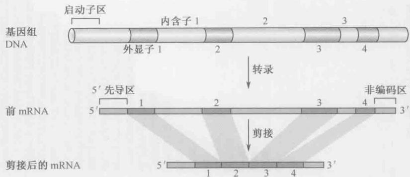  
图 14-1 典型的真核基因。图中所示的基因有 4 个外显子，被 3 个内含子分开。如中间一行所示，转录从启动子区开始，产生了包括全部外显子和内含子的 pre-mRNA。剪接过程除去了内含子，并将外显子连接起来，得到了成熟的 mRNA；成熟的 mRNA 经过进一步加工（多聚腺苷酸化，第 13 章），然后转运出细胞核，就可以翻译得到一个蛋白质产物。从技术上来说，5' 先导区和 3' 非编码区也是外显子，因为它们保留在成熟的 mRNA 中，此处用紫色表示它们是非编码的外显子状态。

与没有内含子的原核基因一样，真核“割裂”（split）基因也整个地转录为单一的一条RNA链。所以一个典型的真核基因，其初始转录产物不仅包括外显子，也包括内含子，这显示在图14-1的中间一行。因为内含子数量和长度都可以非常大，初始转录产物（即前mRNA，pre-mRNA）实际上可以很长。人的抗肌营养不良蛋白基因（dystrophin）是一个极端例子，要全部转录该基因，RNA聚合酶就得横跨2400kb的DNA序列（假设转录速度为 $40\mathrm{bp / s}$ ，不难看出，要获得该基因的一条转录体，就得花费漫长的 $17\mathrm{h!}$ ）。这就提出了一种可能性，即外显子冗余和它们的长度对于表达速率有显著的影响，我们将在第21章中关于发育过程的基因表达部分回顾这一现象并给予详细探讨。

正如我们之前所述，“割裂”基因的初始转录物在翻译成蛋白质之前，必须先除去其内含子。从 pre-mRNA 中除去内含子的过程称为 RNA 剪接（RNA splicing）。这个过程将 pre-mRNA 转化为成熟的 RNA，并且必须绝对准确，避免在外显子连接处缺少或增多哪怕是一个核苷酸。我们将在第 15、16 章中看到，mRNA 的三联体密码子是按蛋白质编码序列的第一个密码子所确定的固定可读框来翻译的。所以，如果剪接不够准确，如在两个外显子接合处少了或者多了一个核苷酸，必将导致外显子偏离正确的可读框，下游的密码子就会组合错误，从而把错误的氨基酸掺入到蛋白质中。

有些 pre-mRNA 存在不止一种剪接方式，从而产生不同的 mRNA。例如，可以保留不同组合的外显子，这称为可变剪接（alternative splicing）。通过这种方式，一个基因可以产生多个多肽产物。可变剪接的产物称为亚型（isoform）。据估计，人类基因组中的蛋白编码基因有 90% 或者以上发生可变剪接，从而产生多个蛋白质产物。

通过可变剪接，从某个基因得到不同产物的数量可以从两种到数百甚至数千种。例如，大鼠编码神经元细胞 $\mathrm{K}^+$ 通道的Slo基因，其编码产物可达500种之多；后面我们将会看到，有一个果蝇基因通过可变剪接可编码多达38000种产物。可变剪接经常作为一种调节机制，在不同的细胞中响应不同的分子信号，得到不同的剪接产物。

  
图 14-2 不同真核生物物种每个基因内含子的个数。图示为一些真核生物物种每个基因内含子的平均数。图中红色显示的是普通的模式生物（附录 1）：酿酒酵母（Saccharomyces cerevisiae）、黑腹果蝇（Drosophila melanogaster）、秀丽新小杆线虫（Caenorhabditis elegans）、拟南芥（Arabidopsis thaliana），和小鼠（Mus musculus）。图中显示的其他物种分别为冈比亚按蚊（Anopheles gambiae）、构巢曲霉（Aspergillus nidulans）、绿领鞭藻（Bigelowiella natans nucleomorph）、线虫（Canorhabditis briggsae）、白色念珠菌（Candida albicans）、莱茵衣藻（Chlamydomonas reinhardtii）、玻璃海鞘（Ciona intestinalis）、新型隐球菌（Cryptococcus neoformans）、隐孢子虫（Cryptosporidium parvum）、单细胞红藻（Cyanidioschyzon merolae）、盘基网柄菌（Dictyostelium discoideum）、兔脑原虫（Encephalitozoon cuniculi）、蓝氏贾第虫（Giardia lamblia）、海藻（Guillardiaetheta nucleomorph）、人（Homo sapiens）；硕大利什曼原虫（Leishmania major）、粗糙脉孢霉（Neurospora crassa）、水稻（Oryza sativa）、双小核草履虫（Parameciun aurelia）、黄孢原毛平革菌（phanerochaete chrysosporium）、亚性疟原（Plasmodium falciparum）、鼠约氏疟原虫（Plasmodium yoelii）、粟酒裂殖酵母（Schizosaccharomyces pombe）、红鳍东方鲀（Takifugu rubripes）、假矮海链藻（Thalassiosira pseudonana）和阴道滴虫（Trichomonas vaginalis）。（获得许可并重新绘图自 Roy S.W.and Gilbert W. 2006. Nat. Rev. Genet. 7: 212，Fig. 1. ©Macmillan.）

在本章中，我们不仅讨论 RNA 剪接的机制和调控，也探讨真核基因编码区被分隔的可能原因。我们还会介绍 RNA 编辑——另一种可以改变初始转录产物以得到不同编码产物的途径。

RNA 剪接是在研究哺乳动物腺病毒（adenovirus）基因表达的过程中发现的，详见框 14-1。

框14-1 腺病毒和RNA剪接的发现

对细菌及其噬菌体的研究使人们相信：从核苷酸序列角度来讲，mRNA 是其基因的精确复制物（第 16 章）。1977 年首次发现某些（我们现在知道，实际上是许多）真核 mRNA 是从比其长得多的初始转录产物通过拼接的方式剪接得到的，当时确实让人们大吃一惊。那么这个惊人的发现是如何获得的呢？

为了了解真核生物的基因转录，科学家把注意力集中在腺病毒——一种人DNA病毒上面。腺病毒最初是作为研究真核基因分子生物学的模型，正如T4和λ噬菌体是研究原核基因分子生物学的模型一样（见附录1）。腺病毒颗粒由其自身编码的几种不同蛋白质构成，这些蛋白质的mRNA得以纯化，人们希望通过这些mRNA的5'端可以分析出各个基因在基因组上的转录起始位置。然而尽管所编码的蛋白质各不相同，所有的mRNA却都拥有相同的5'端序列。我们现在知道，腺病毒颗粒的所有蛋白质的mRNA都来自同一个启动子，即主要晚期启动子（major late promoter）。从该启动子进行转录，会得到横跨许多蛋白质编码序列的长转录产物（框14-1图1），该转录产物经过可变剪接，就分别得到诸如六邻体（hexon）和各种纤维蛋白等的各种病毒颗粒成分的mRNA。所有mRNA拥有共同的5'端序列，由3段短的非编码序列编织而成，称为“三裂体引导序列”（tripartite leader），然后引导序列通过可变剪接分别与编码六邻体（hexon）、纤维蛋白（fiber）和其他毒粒蛋白（virion）的序列相连接，最终产生每一种晚期病毒mRNA。

  
框 14-1 图 1 人 2-型腺病毒基因组图。本图显示了病毒晚期 mRNA 的转录模式，包括初始转录产物（上端的深绿色长箭头），分别位于 16.6、19.6 和 26.6 作图单位处的三裂体引导序列（显示为绿色短线），以及编码各种病毒晚期的 mRNA 的 DNA 序列在基因组图谱上的位置（病毒晚期 mRNA 显示为深绿色短箭头）。

这些 mRNA 是由病毒基因组几个不同区域的 RNA 剪接而来的结论源于许多实验结果，其中之一是 R 环定位方法（R-loop mapping，框 14-1 图 2）。当 RNA 在适当条件下与包含一段相同序列的双链 DNA 一起培养时，RNA 与其互补序列杂交，使得另一条非互补 DNA 链形成一个环（框 14-1 图 2a）。然后使用观察核酸的方法进行染色，就可在电镜下看到 R 环，因为双链 DNA 或 DNA：RNA 比单链的核酸显得要粗。用腺病毒 mRNA 进行这种实验时，发现一段 DNA 上所形成的 R 环并非完全连续。相反，mRNA 的一端或两端会从 R 环伸出来成为单链尾巴（框 14-1 图 2b），具体情况视所用的病毒 DNA 片段而定。有时其中一个尾巴会与病毒基因组其他区域的 DNA 片段杂交（框 14-1 图 2c）。显然，这些 mRNA 是复合分子，由基因组上不连续区域的互补序列连接而成。这些以及其他种类的 DNA：RNA 杂交实验最终推导出框 14-1 图 1 所示的可变剪接模式。


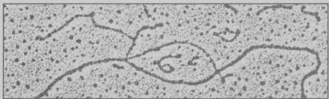

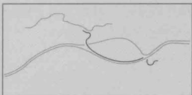  
框 14-1 图 2 2-型腺病毒晚期 mRNA 的 R 环定位。(a) 本示意图演示了 R 环结构的形成过程。用限制酶消化得到的一段双链 DNA 与 mRNA 混合，并在 80% 甲酰胺中加热到温度刚好超过 DNA 的变性温度。退火后 mRNA 与其互补 DNA 的杂交导致另一条 DNA 链的逐出。mRNA 的多聚 A 尾巴（不是 DNA 所编码的，见第 12 章）也会从杂交体的一端伸出来。(b) 六邻体 mRNA 与其位于 2-型腺病毒基因组的晚期区域的互补 DNA 序列培养后所观察到的 R 环的电子显微图谱及示意图。注意 mRNA 的 3'端和 5'端都伸了出来。图中 DNA 用黑色线条表示；RNA 用绿色线条表示。(获得许可并重新绘图自 Berget S.M. et al. 1977. Proc. Natl. Acad. Sci. 74: 3171–3175. ©National Academy of Sciences. (c) 纤维蛋白 mRNA 与腺病毒全基因组和用限制酶酶切的基因组的早期区域这两种 DNA 分子培养所观察到的 R 环电子显微图谱及示意图。(获得许可并重新绘图自 Chow L.T. et al. 1977. Cell 12: 1–8, p2. ©Elsevier.)

## RNA 剪接的化学基础

## RNA 序列决定剪接位点

我们现在考察剪接反应的分子机制。内含子和外显子如何相互区别？内含子是如何除去的？外显子怎样精确连接起来？内含子和外显子的边界是由pre-mRNA内的特殊核苷酸序列标明的，这些序列指明了剪接应该在何处进行。如图14-3所示，外显子和内含子边界，即内含子的5'端是由称为5'剪接位点（5'splice site）的序列标明的。在内含子3'端的内含子和外显子边界是由称为3'剪接位点（3'splice site）的序列标明的[5'和3'剪接位点有时被分别称作供体（donor）和受体（acceptor）位点，但这种命名方法现在已很少使用]。

图 14-3 还显示了剪接所必需的第三个序列，称为分支点（branchpoint site），或称分支点序列(branchpoint sequence)。分支点全部位于内含子之内，通常靠近 3' 端，后面为多聚嘧啶区（Py tract）。

  
图 14-3 内含子与外显子交界处的核苷酸序列。图中显示了 5' 和 3' 剪接位点的共有序列和分支点的保守腺苷酸。按照共有序列标识的惯例，如果某一位置有两个核苷酸出现概率相似，就把两者都标出来。本图显示的共有序列是人类的情况。下同（除非特别声明）。

以上几个位点各自的共有序列显示在图 14-3 中。最保守的序列是 5'剪接位点的 GU 和 3'剪接位点的 AG 及分支点的 A。这些高度保守的核苷酸都位于内含子中——这也许并不奇怪，因为外显子不同于内含子，它是要用来编码特定氨基酸的，其序列必然受到限制。

当内含子两边的外显子连接时，内含子是以套索（lariat）结构被除去的

让我们首先讨论剪接的化学基础。剪接是由连续两步转酯反应（transesterification）完成的，pre-mRNA中原来的一些磷酸二酯键断开，再形成一些新的磷酸二酯键（图14-4）。第一步转酯反应是由分支点保守腺苷酸的2'羟基引发的。它作为亲核基团，攻击5'剪接位点保守鸟苷酸的磷酰基团[该反应为双分子亲核取代（SN2）反应，通过5价磷中间体完成]。

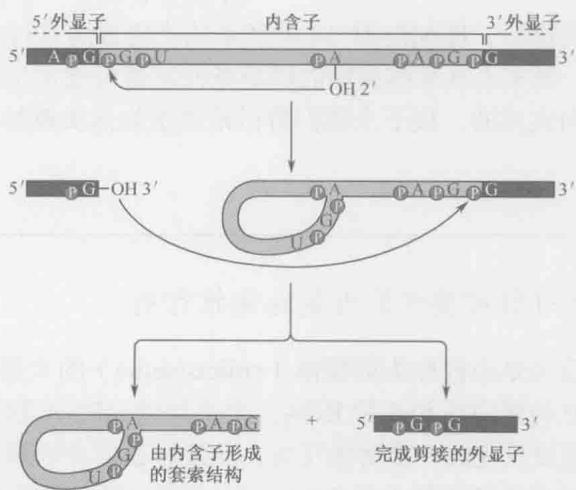  
图 14-4 剪接反应。本图显示了正文中描述的剪接反应的两个步骤。在第一步中 RNA 形成环状结构，图 14-5 中有详细描述。

第一步反应的结果是,外显子3'端的核糖与内含子5'端磷酸之间的磷酸二酯键断开,而游离出来的5'端与分支点保守腺苷酸连接。这样,除了5'-3'骨架磷酸二酯键连接,第三个磷酸二酯键从保守腺苷酸的3'羟基伸出来,产生一个三叉交汇点(threeway junction,保守腺苷酸因而叫做分支点)。图14-5示意了这种三联连接方式。

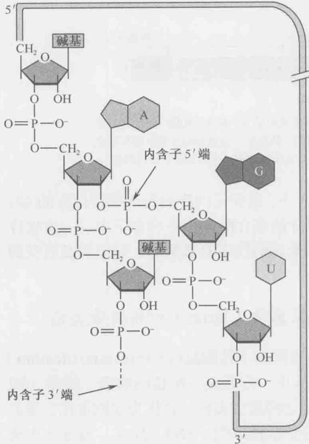  
图 14-5 剪接反应形成的三叉交汇结构。

请注意，在第一次转酯反应中，5'外显子是离去基团。在第二步转酯反应中，5'外显子（准确地说，是其新游离出来的3'羟基）反过来作为亲核基团，攻击3'剪接位点的磷酰基团（图14-4）。第二次转酯反应产生两个结果：首先也是最重要的，是把5'和3'外显子连接起来了，所以第二次转酯反应才是把两个编码区真正连接起来的剪接步骤。其次，使内含子作为离去基团释放。因为内含子的5'端已经在第一次转酯反应中与分支点腺苷酸连接，所以新释放出来的内含子形状像一个套索。

在以上两步转酯反应中，没有增加新的化学键——断开了两个磷酸二酯键，同时又形成了两个新的磷酸二酯键。由于只是移动化学键，这个化学过程不需要消耗能量。但是，正如我们所见，在剪接反应过程中消耗了大量 ATP。这些能量不是用于化学反应，而是用来正确组装和运行剪接机器。

剪接反应的另一个要点是其方向性：如

何保证剪接只沿正方向进行，即朝向图 14-4 所示的产物方向进行？原则上，反应可以沿着另一个方向进行，事实上在某些特殊的环境条件下是可能发生的。但在一般的细胞环境中，剪接都是单向完成的，接下来我们将讨论这是如何实现的。

## 剪接体

## RNA 剪接是由一个叫做剪接体的大复合体执行的

上面描述的转酯反应是由被称为剪接体（spliceosome）的大型分子“机器”介导的。这个复合体包含约150种蛋白质和5种RNA，大小与将mRNA翻译成蛋白质的核糖体差不多（第15章）。即使只完成一步剪接反应，剪接体也需要水解几个分子的ATP。令人惊奇的是，剪接体的多数功能是由其RNA而不是蛋白质组分执行的，这也与核糖体情况类似。因而，RNA分子识别内含子与外显子交界处的特异序列，很可能直接参与催化了剪接过程。

剪接体中的5种RNA（U1、U2、U4、U5和U6）统称为核内小RNA（small nuclear RNA，snRNA）。在大多数真核细胞中每种snRNA长 $100\sim 300\mathrm{nt}$ ，且与几种蛋白质形成复合物。这些RNA-蛋白质复合物称为小核内核糖蛋白（small nuclear ribonuclear protein，snRNP）。第6章中我们看到了U1 snRNA部分片段的晶体结构，该部分是U1snRNA 结合到 U1 snRNP 蛋白组成的部分（图 6-18）。

剪接体就是由这些 snRNP 形成的巨型复合体，但是在剪接反应的不同时期的具体成分不尽相同：不同的 snRNP 在不同时间进出剪接体，行使特殊的功能。剪接体中还有许多蛋白质不属于 snRNP，另外一些蛋白质只是与剪接体松散结合。

snRNP 在剪接中的功能有三个方面：识别 5'剪接位点和分支点；按需要把这两个位点集结到一起；催化（或协助催化）RNA 剪切和连接反应。要执行这些功能，所有 RNA-RNA、RNA-蛋白质、蛋白质-蛋白质相互作用都很重要。我们先考察某些 RNA-RNA 相互作用，这些相互作用发生于单个 snRNP 之内、不同的 snRNP 之间，以及 snRNP 与 pre-mRNA 之间。

例如，图 14-6a 显示 U1 snRNA 与 pre-mRNA 的 5'剪接位点之间通过互补碱基配对发生相互作用，在反应的后期，该位点又被 U6 snRNA 所识别；第二个例子见图 14-6b，分支点序列为 U2 snRNA 所识别；第三个例子见图 14-6c，显示 U2 snRNA 和 U6 snRNP 间的相互作用，该作用把 5'剪接位点和分支点拉拽到一起。我们在稍后就会看到，正是这些相互作用及其他类似的相互作用，加上由此所导致的重排，推动了剪接反应并保证其准确性。

  
图 14-6 剪接过程中形成的某些 RNA:RNA 杂合体。(a) 不同的 snRNP 在剪接反应的不同阶段可以识别 pre-mRNA 上的相同或交叠的序列，如 U1 和 U6 都识别 pre-mRNA 的 5' 剪接位点；(b) U2 snRNP 识别分支点序列。(c) U2 和 U6 snRNP 之间的 RNA:RNA 互补配对；(d) pre-mRNA 的同一序列在不同阶段，分别为蛋白质（非 snRNP 的成分）和 snRNP 所识别。以上每一种变化都伴随着剪接体组分的来去，以及能够使剪接反应正常进行的结构重排。本图所示序列来自酵母。

前面提到，某些非 snRNP 也参与了剪接反应。例如，U2AF（U2 辅助因子）识别多聚嘧啶区及 3'剪接位点，并在剪接反应的起始步骤中协助分支点结合蛋白(branchpoint-binding protein, BBP) 结合到分支点上。如图 14-6d 所示，BBP 随后被 U2 snRNP 取代。其他参与剪接反应的蛋白质还包括某些有助于在 mRNA 上装载 snRNP 的 RNA 退火因子及 DEAD 盒解旋酶（helicase）蛋白。后者利用其 ATPase 活性解离特定的 RNA-RNA 相互作用，以便形成替代配对方式，从而驱动贯穿于整个剪接过程的重排反应顺利进行。同时，将被剪接的 mRNA 从剪接体上移除并启动剪接体的解体也是必需的。

## 剪接过程

剪接体内的组装、重排与催化反应：剪接过程

剪接过程的详细步骤示于图 14-7。这里展示的是一个典型的通路，而对于一个具体的细胞而言，某些过程会有所改变，甚至部分路径发生逆转（我们将在后面的章节详细讨论）。但我们展示的这个通路反映了一系列非凡的分子事件，动态的剪接体通过这一过程推动剪接反应在细胞中发生。

首先,5'剪接位点被 U1 snRNP 识别(通过其 snRNA 与 pre-mRNA 之间的碱基配对,图 14-6)。U2AF 由两个亚单位组成,较大的一个亚基(65)与多聚嘧啶区结合,较小的一个亚基(35)与3'剪接位点结合。前一个亚基与 BBP(SF1) 相互作用,协助其结合到分支点上。以上形成的蛋白质和 RNA 结合体称为早期(E)复合体。

随后，在 U2AF 协助下，U2 snRNP 取代 BBP（SF1）结合到分支点，这样形成的结合物称为 A 复合体。U2 snRNA 与分支点的配对结合形成了一段双螺旋 RNA，由于分支点的腺苷酸不配对，所以被挤出来成为单碱基凸出（图 14-6b）。这样分支点腺苷酸是非配对的，可以与 5'剪接位点发生反应。

下一步是 A 复合体通过重排把 3 个剪接位点拉到一起。这个步骤是通过 U4、U6 及 U5 snRNP 分步加入复合体而完成的。这 3 个 snRNP 合称三联 snRNP(tri-snRNP)颗粒，其中 U4 和 U6 snRNP 通过其 RNA 组分的互补配对相结合，而 U5 snRNP 通过蛋白质-蛋白质相互作用松散结合。随着 tri-snRNP 颗粒的加入，A 复合体就转变成 B 复合体。

随后，U1 离开剪接体，其在 5'剪接位点的位置由 U6 取代。这要求 U1 snRNA 与 pre-mRNA 之间的碱基配对断开，以便 U6 RNA 与同一区域配对（实际上是与一段与之重叠的序列配对，如图 14-6a 所示）。

以上就是全部的组装过程。后续的重排启动了催化反应，过程如下：U4 离开剪接体，以便 U6 与 U2 通过 RNA-RNA 配对发生作用（图 14-6c）。重排后的剪接体叫 C 复合体，具有活性位点。也就是说，重排把相关组分（一般认为仅包含 U2 和 U6 snRNA）聚集到剪接体内，从而产生活性位点。这个重排也保证了 RNA 底物处于合适的位置便于反应进行。令人惊奇的是，不仅活性位点主要由 RNA 构成，而且仅在剪接体组装的这个时期才形成。这种策略大概有助于降低错误剪接的概率。把剪接活性位点形成与完成剪接体早期组装过程有机地联系起来，使得活性位点只存在于合理的剪接部位。

  
图 14-7 剪接体介导的剪接反应步骤。图中显示了剪接体的组装和作用，每一步的详细过程在正文中有叙述。在每一步骤中都有剪接体组分加入或离开。这种结构重排引起的变化是剪接反应进行所需要的。注意每个复合体的名字在右边显示。有证据表明，有些组分并非如图中所示的那一刻进入或离开，比方说它们可能还在那里但结合程度松散，而不是彻底离开。同样，也不能断定某些变化过程的顺序，尤其是涉及 U6 配对变化的两步：它先在 5' 剪接位点取代 U1，还是先取代 U4 与 U2 结合？尽管有以上这些不确定的方面，图上还是展示了剪接反应的不同阶段不同关键组分的参与及剪接体的一般动力学特性。

活性位点出现后，就把 pre-mRNA 的 5'剪接位点与分支点拉到了一起，加速了第一次转酯反应。5'和 3'剪接位点的第二次转酯反应由 U5 snRNP 协助，把两个外显子连接在一起。最后的步骤是释放出 mRNA 产物及 snRNP。起初 snRNP 仍然与内含子形成的套索结合在一起，随着后者的快速降解，snRNP 又进入下一轮循环。

剪接体的组装是动态的和多样的,而它的解离过程确保剪接在细胞中是单向的

有必要强调我们刚才讨论的这一分子路径——组装剪切体的各步骤的顺序，这是一个理想化的版本。在真实情况中，这一过程并不像上面描述的那样严格。首先，我们展示的围绕内含子切除的剪接体的组装过程，在真实细胞中，那些因子更有可能围绕外显子开始组装，这被称为外显子确认（exon definition），考虑到剪接增强子（splicing enhancer）参与的作用，学界近期对这一过程有更深入的研究。除此之外，分子事件的精确顺序会有一定程度的变动。举例来说，5'和3'剪切点的聚集可能早于也可能晚于snRNP三体的招募：细节依赖于RNA序列和任何可能的限速步骤。同时，剪切体组装的几个步骤是可逆的。

在上文中我们阐述了剪切的两个核心的反应原则上可以可逆地进行，但在一个具体的细胞中不会同时发生。由于第二个反应发生后剪切体快速解离开来，分子组装的过程的方向是固定的。去组装由一个我们提到过的 DEAD 盒解旋酶蛋白推动，它被称为 Prp22。这个蛋白质是剪切的第二步催化反应所需要的，也是将 mRNA 从剪切体剥离所需要的。造成后面这一功能缺失的突变也可以抑制剪切体的去组装，这种情况下可以观察到在纯化的剪接体中，剪切反应既可以正向进行也可以逆向进行。

剪切体和剪切机制的复杂程度高到让人觉得诧异。这是如何演化形成的？将外显子直接通过一步反应连接起来是不是更简单（而不是上面说的两步反应）？考虑到这个问题，我们转向一组特殊的内含子，与我们之前探讨的不同，它们可以将自己从pre-mRNA上剪切掉而不需要剪切体参与，这被称为自剪接内含子（self-splicing intron）。

## 自剪接内含子的存在表明 RNA 可以催化 RNA 剪接

细胞内已经发现的 RNA 剪接有三种方式（不包括 tRNA 加工过程，对此我们将在第 15 章中讨论），如表 14-1 所示。到目前为止我们只涉及细胞核内 pre-mRNA 剪接，它们在所有真核细胞都是由剪接体完成的。表 14-1 还显示了所谓的 I 类（group I）和 II 类（group II）自剪接内含子。自剪接的意思是前体 RNA 中的内含子自身折叠成一种特殊的构象，然后催化自身释放的化学过程（回忆一下第 5 章讨论的核酶的一般特性）。自剪接的实用定义是，在没有任何蛋白质或其他 RNA 分子存在的情况下，内含子可以在试管内将自身从 RNA 分子中剪接除去。自剪接内含子根据结构和作用机制分为两类。严格来说，自剪接内含子并不是酶（催化剂），因为它们只介导一轮 RNA 加工过程（框 14-2）。

表 14-1 RNA 剪接的 3 种类型

<table><tr><td>类型</td><td>丰度</td><td>机制</td><td>催化机器</td></tr><tr><td>细胞核 pre-mRNA</td><td>很常见,适用于大多数真核基因</td><td>两步转酯反应,分支点为 A</td><td>主要和次要剪接体</td></tr><tr><td>II类剪接内含子</td><td>罕见,来自某些细胞器的真核基因及原核基因</td><td>与 pre-mRNA 相同</td><td>内含子编码的核酶</td></tr><tr><td>I类剪接内含子</td><td>罕见,某些真核生物的细胞核 rRNA、细胞器基因,以及少量原核基因</td><td>两步转酯反应,分支点为 G</td><td>与II类自剪接内含子相同</td></tr></table>

对于Ⅱ类自剪接内含子，剪接的化学过程以及所产生的RNA中间产物，与细胞核内pre-mRNA相同。如图14-8所示，内含子通过分支点的腺苷酸攻击5'剪接位点（内含子5'端与其5'端外显子交界处）的磷酸二酯键。该反应得到如以前所示的带分支的套索结构，并在随后的第二步转酯反应中，新游离出来的外显子3'羟基攻击3'剪接位点，释放出套索状的内含子，并把5'和3'外显子连接起来。

## Ⅰ类自剪接内含子释放出线形内含子，而不是一个套索结构

I 类自剪接内含子剪接机制完全不同（图 14-8c）。它们使用游离的鸟苷或鸟苷酸，而不是分支点腺苷酸。RNA 分子结合该鸟苷或鸟苷酸，并将其 3'羟基呈递给 5'剪接位点，以前面提到的形成套索结构的同类转酯反应，把游离的鸟苷或鸟苷酸与内含子 5'端连接起来。第二步反应与以前讲述的完全相同：游离的外显子 3'端攻击 3'剪接位点。这个反应把两个外显子连接起来并释放出内含子，尽管在这里内含子是线形的而不再是套索状。

## 框 14-2 | 类自剪接内含子转化为核酶

一旦Ⅰ类自剪接内含子剪接下来，其活性部位仍然是完整的。那么是什么阻止了剪接反应逆向进行呢？一个因素是细胞内高浓度的鸟苷——这非常有利于正向反应。然而除此以外，内含子本身还通过进一步的反应有效地防止其参加逆反应。很凑巧，内含子的3'端正好是鸟苷酸，可以进入鸟苷结合口袋。同时，内含子5'端也可以结合内在指导序列。这样就会发生第三次转酯反应，使内含子环化。与3'端鸟苷酸形成的化学键是不稳定的，会自发进行水解。结果内含子重新线性化，但已被截短，从而排除了逆剪接的可能性。

如前文所述，Ⅰ类（及Ⅱ类）自剪接内含子并不是严格意义上的酶，因为其转化数只有1。但是它们很容易通过以下方式转化为核酶（框14-2图1）：上述重新线性化的内含子保留了活性部位。如果提供了游离的鸟苷或鸟苷酸，又有合适的底物正好包含与内在指导序列互补的序列，它将反复催化底物分子的切割。类似于通过将活性部位与底物分开把自剪接的斧头RNA改造成核酶（第5章），我们也可以把Ⅰ类自剪接内含子变成核酶。我们可以进一步通过改变内在指导序列来获得特定的核酶，切割我们希望的目的RNA分子。

  
框 14-2 图 1 | 类自剪接内含子可以转变成真正的核酶。

Ⅰ类自剪接内含子比Ⅱ类小，有一个保守的二级结构（RNA折叠见第5章）。该结构包括一个容纳鸟苷或鸟苷酸的结合口袋，只要这些鸟苷或鸟苷酸是以核糖的形式出现。除此之外，Ⅰ类自剪接内含子还含有一段“内在指导序列”，与5'剪接位点的序列配对，因而确定了鸟苷亲核攻击的精确位置（框14-2）。

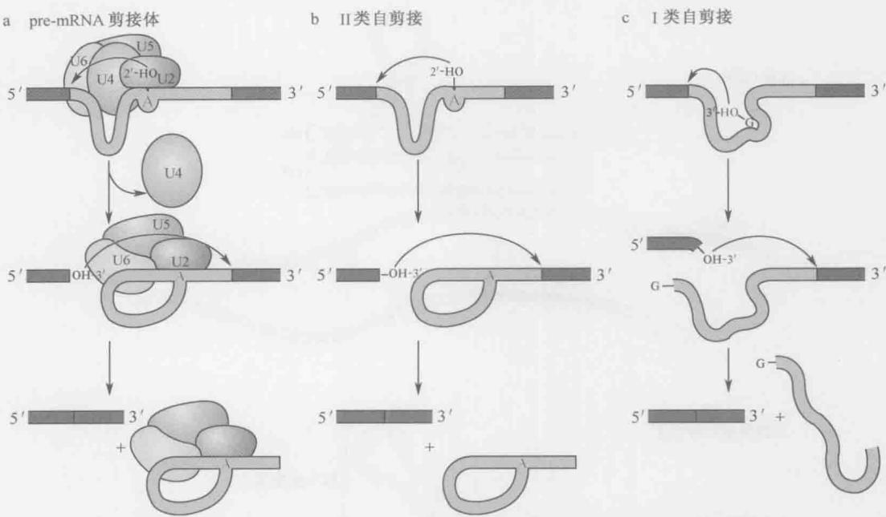  
图 14-8 | 类和Ⅱ类自剪接内含子。本图比较了Ⅰ类和Ⅱ类自剪接内含子完成的剪接反应与前述的剪接体介导的剪接反应。Ⅱ类自剪接的化学过程与剪接体介导的剪接反应过程基本相同，由内含子内高度活跃的腺苷酸启动剪接过程，并形成套索状产物。对于Ⅰ类自剪接内含子，其RNA通过折叠形成一个鸟苷结合口袋，从而结合一个游离的鸟苷用以启动剪接过程。虽然这类内含子在体外无需蛋白质协助就能够进行自身剪接，但在体内环境下，它们通常需要蛋白质组分来激活剪接反应。（获得许可并重新绘图自Cech T.R. 1986. Cell 44: 207–210, Fig. 1. ©Elsevier.）

典型的自剪接内含子长 400\~1000nt，与通过剪接体去除的内含子相反，其大部分序列对于剪接反应至关重要，因为自剪接内含子必须折叠成精确的立体结构才能完成相应的化学反应。另外在体内环境下，自剪接内含子与多种蛋白质形成复合物以协助保持正确的立体结构——部分是通过遮蔽 RNA 分子骨架实现的。折叠本身需要 RNA 骨架的某些部分与其他部分极接近，而相应骨架区磷酸根携带的净负电荷如果不进行遮蔽，势必相互排斥。在体外，提高盐浓度（即增加阳离子浓度）补偿了蛋白质的缺乏。这就是为什么剪接反应本身不需要蛋白质的原因。

自剪接及剪接体介导的剪接反应具有类似的化学过程反映了它们之间的演化关系。原始的类似Ⅱ类自剪接内含子有可能是现代 pre-mRNA 剪接的演化起始点。RNA 的催化功能保留下来了，但是不再需要内含子本身具有广泛的序列特异性，而由 snRNA 及其结合的反式蛋白质提供绝大多数功能。这样内含子只要保留最少的序列以保证剪接过程发生在正确的位置，从而允许数量更多，并且大小和序列也各不相同的内含子存在。

进行第一次转酯反应的催化部位，其结构在Ⅱ类自剪接内含子和 pre-mRNA / snRNP 复合体中高度相似（图 14-9）。这种现象进一步支持了下述更广义的假设（第 17 章）：在现代生物的演化早期，许多细胞内的催化功能是由 RNA 来执行的，后来才基本上被蛋白质所取代。但是对于剪接体和核糖体而言，这种活性还没有完全被蛋白质所取代。相反，残余的 RNA 催化机制仍然保留在剪接复合体的核心部分。

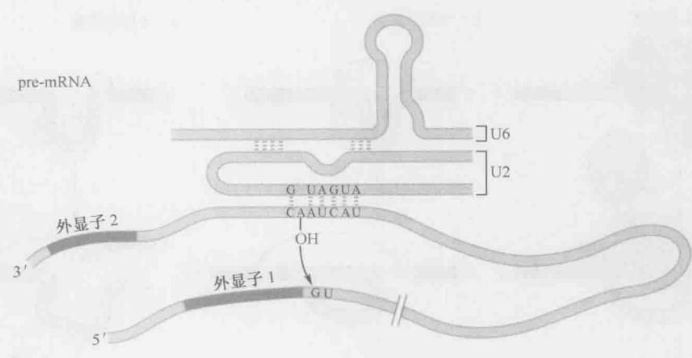

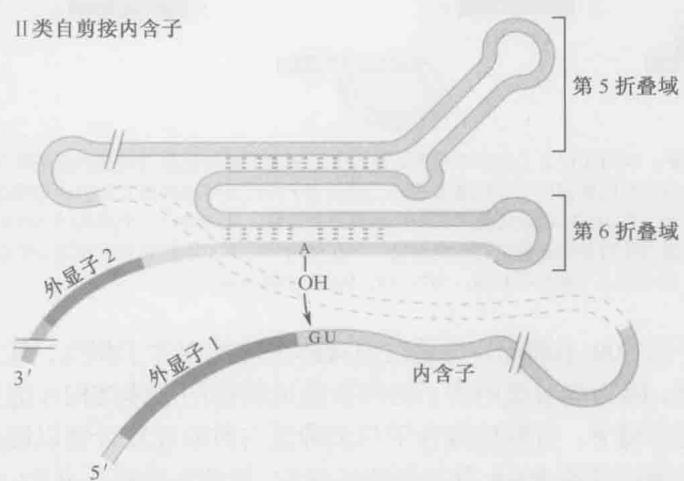  
图 14-9 Ⅱ类自剪接内含子及 pre-mRNA 剪接过程中 RNA 催化区域的折叠方式。本图没有描绘Ⅱ类自剪接内含子 RNA 的虚线区取代另外 4 个折叠域。通过 X 射线晶体学研究证明了这些区域令人惊讶的相似性。

## 剪接体怎样可靠地确定剪接位点？

我们已经知道了一种防止错误剪接的机制：在剪接体组装过程中，只有当 RNA 序列能够被多个组分同时识别，才能在该部位形成剪接活性位点。例如，5'剪接位点必须首先被 U1 snRNP 识别，然后再被 U6 snRNP 识别。两者同时出错的可能性很小，所以选择还是很严格的。虽然如此，pre-mRNA 剪接位点出错的问题仍然非常严重。

考虑以下情况：人类的基因平均有 8\~9 个外显子，可能存在 3 种不同的剪接方式。但是人类有一个基因拥有 363 个外显子，而果蝇的某个基因有 38000 种不同的剪接方式（下节将详述）。如果不借助其他外力，各种 snRNP 要从整条 RNA 分子上找到正确的 5' 和 3' 剪接位点，并将它们正确配对并结合到一起，那么，发生一些错误就在所难免。需要指出的是，外显子长度一般只有 150nt 左右，而内含子长度平均可达 3000nt（前面提到，有的内含子可长达 800 000nt）。因此必须从内含子的汪洋大海中捕捞外显子。

剪接位点的识别容易犯两种错误（图 14-10）：一是遗漏了剪接位点，例如，结合到某个 5'剪接位点的剪接体成分，跳过了正确的 3'剪接位点，与结合到下游另一个 3'剪接位点的剪接体成分相互作用。

  
图 14-10 剪接位点选择错误可能导致的后果。（a）遗漏一个外显子的后果。这种情况发生于：结合到某个 5' 剪接位点的剪接体成分，跳过正确的 3' 剪接位点，与结合到下游另一个 3' 位点的剪接体成分相互作用。（b）图示剪接体成分识别“假”的剪接位点（序列相似但不是合法的剪接位点）可能导致的后果。在所显示的例子中，假位点位于外显子内部，使得该外显子的近 5' 端被错误地当成内含子而剪接掉了。

二是与剪接位点邻近的错误位点被认为是剪接位点。这一点很容易理解，因为我们记得剪接位点的保守序列是相当宽松的。这样，某个5'剪接位点的剪接体成分就可能与结合在“假”3'剪接位点上的剪接体成分错误配对（图14-10b）。

能够增加剪接位点选择准确性的两种机制如下。其一，如第13章所述，在将某个基因转录为RNA时，RNA复制酶Ⅱ携带了多种具有RNA加工功能的蛋白质(图13-19)，其中包括参与剪接的蛋白质。当在新合成的RNA分子上遇到5'剪接位点时，那些蛋白质就从RNA复制酶Ⅱ的C端“尾巴”（剪接相关蛋白质搭乘在RNA复制酶Ⅱ的位置）转移到RNA分子上。剪接体成分一旦结合了5'剪接位点，就会做好准备与那些结合即将转录出来的、下一个3'剪接位点的剪接体成分相互作用。于是在更下游的任何竞争性3'剪接位点被转录出来之前，剪接体成分就已经识别出了正确的3'剪接位点。这种与转录同时进行的剪接体组装方式极大地减少了外显子遗漏的可能性。

(值得注意的是，虽然多数剪接体是在基因转录的同时完成组装的——具体到每个外显子则是按其被转录的顺序，但这并不意味着内含子本身也是按相同顺序剪接。与我们熟悉的许多生物过程，如转录、复制等相反，剪接并不涉及“轨道”机制。“轨道”机制指某种复合体在 RNA 的一端组装，并在它向另一端移动过程中发挥作用。)

其二，确保优先识别邻近外显子的剪接位点（因而更有可能是真正的剪接位点），以防止使用错误剪接位点。一种富含丝氨酸和精氨酸的蛋白质（即SR蛋白）结合外显子的剪接增强子（exonic splicing enhancer，ESE）。结合到这些位点的SR蛋白与剪接机器的组分相作用，将其引导到附近的剪接位点。这样剪接体就可以更有效地结合到正确的剪接位点，而不会结合到离外显子较远的错误位点。具体来说，SR蛋白将U2AF蛋白引导到3'剪接位点并将U1 snRNP引导到5'剪接位点（图14-11）。如前所述，这些因子界定了剪接位点，使其他剪接体成分能正确地装配起来（图14-7）。这种引导作用可通过 SR 蛋白和剪接体蛋白间的直接相互作用来实现。另外一种方式是最近提出来的即通过与剪接体组装和工作时形成的 RNA：RNA 杂合体发生相互作用及对后者的稳定来实现。

  
图 14-11 SR 蛋白将剪接体成分引导到 5' 和 3' 剪接位点。合法剪接位点由于邻近外显子，所以优先被剪接体所识别。所以 SR 蛋白结合到外显子的特定区域（外显子剪接增强子），以此为起点将 U2AF 和 U1 snRNP 分别引导到下游的 5' 剪接位点和上游的 3' 剪接位点。这样就在正确的位置上启动了剪接体的装配过程，也保证了剪接能按照前面所叙述的方式进行（获得许可并重新绘图自 Maniatis T. and Tasic B. 2002. Nature 418: 236–243. ©Macmillan.）

SR 蛋白是剪接所必需的。它们不仅保证了基本剪接的准确性和高效性（上面刚刚提到），而且调节可变剪接（马上就会讨论到）。它们种类繁多，有些由生理信号调控，另外一些则不受生理调控而具有活性（组成型）。有一些只在某些特定的细胞类型中表达，调节细胞类型特异性剪接。

## 剪接替换

在转向讨论可变剪切之前，我们在这里简单描述两种剪切体和剪切反应。在第一种

  
图 14-12 反式剪接。原本位于两个不同的 RNA 分子上的两个外显子，通过反式剪接可以连接进同一条 mRNA 中。反式剪接的化学过程与前述的标准剪接方式无异，剪接产物也完全一样。只是标准剪接中另一个产物是套索结构，而反式剪接中则是 Y 形分支结构。因为标准剪接是在一条 RNA 分子内形成环状结构，而反式剪接是把两条 RNA 分子连到一起。

情况中，我们将讨论两个不在同一条 mRNA 上的外显子如何融合地剪切到一起；第二种情况中，我们将讨论一种特殊的剪切机器，它可以同时去除一组内含子。

## 不同 RNA 分子的外显子可通过反式剪接融合

在上面对剪切的描述中，我们推定一个外显子的5'剪切位点和紧挨着的一个外显子的3'剪切位点作用。真实情况并不总是这样。在可变剪切（alternative splicing）中，某个外显子可能被细胞有选择地忽略掉，这就使两个不相邻外显子剪切到一起（我们后面会详细讨论）。有时甚至两个不同RNA分子能够通过剪切反应连在一起，这被称为反式剪切。虽然在大多数生物中发生的概率很低，反式剪切却经常出现在锥虫（Trypanosome）的mRNA上。在秀丽新小杆线虫（Caenorhabditis elegans）上，所有的mRNA都要经过反式剪切（以与5'前导序列结合），而其中一部分还要经过顺式剪切途径。

图 14-12 展示了基础的剪切反应是如何形成反式剪切的。除了 U1 因子，反式剪切使用了与顺式剪切一样的剪接体（至少在线虫中是这样）。我们现在看看剪接使用的剪接体有多大的差异。

## 少数内含子是由涉及另一组 snRNP 的剪接体来剪接的

高等真核生物（包括哺乳动物、植物等）采用我们前面所提到的主要剪接体来完成绝大部分 pre-mRNA 的剪接。但是在这些生物体内（与酵母不同），有些 pre-mRNA 是由另一种丰度较低的剪接体来剪接的。这种低丰度剪接体含有某些与前述的主要剪接体一样的组分，但还有另外一些单独的成分。低丰度剪接体中的 U11 和 U12 成分在剪接

反应中的作用与主要剪接体中的 U1 和 U2 类似，但识别的序列不同。U4 snRNA 和 U6 snRNP 在两类剪接体中都存在，虽然所使用的名称相同但实质上并不完全一样。而 U5 在主要剪接体和低丰度的、所谓次要剪接体中是完全一样的。

次要剪接体识别一类很少见的内含子，其共有序列不同于绝大多数 pre-mRNA 内含子的共有序列。需要强调的是，虽然这些内含子是罕见的，但是它们在基因组上的分布是广泛的——人类大约 800 个基因包含至少一个“少数内含子”。进一步的，最近发现低丰度 snRNP 在多种人类罕见疾病中发挥重要的作用。

这种次要剪接体又称为 AT-AC 剪接体, 因为最初发现其识别的罕见内含子的 5' 端是 AU, 3' 端是 AC (对应于 DNA 则为 AT 和 AC)。后来得知其剪接的多数内含子也具有 GT-AG 末端结构 (与主流内含子一样), 但在其他场合, 内含子的共有序列不同于主要剪接途径内含子的共有序列。

虽然识别的剪接位点和分支点序列不同,但是两种剪接体除去内含子的化学过程还是完全一样的(图 14-13)。与这种保守的化学过程相一致,snRNP 所识别的剪接位点序列差异对应 snRNA 互补序列的相应差异。所以,实际上保守的是剪接位点序列与 snRNA 碱基配对能力,并非任何一方的特定序列。

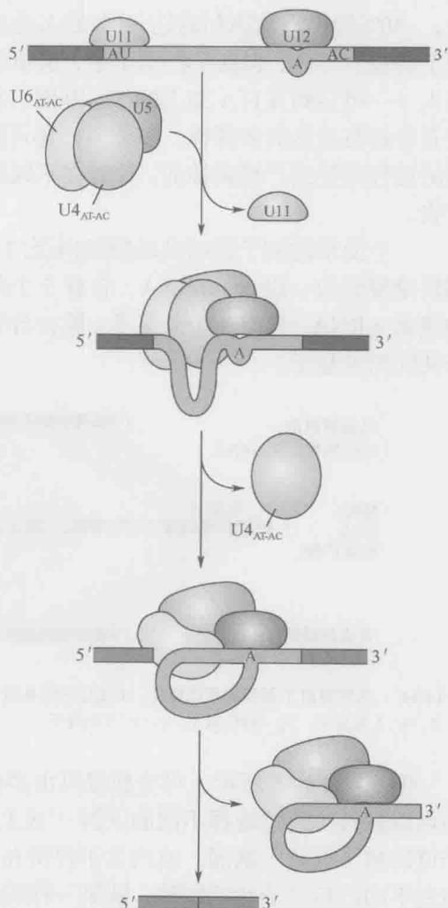  
图 14-13 AT-AC 型（次要）剪接体催化的剪接反应。这种次要剪接体作用于少数外显子（例如，在人类可能仅为 1/1000 的剪切位点），而这类外显子有特殊的剪接位点序列。尽管如此，剪切反应的化学过程是一样的，剪接体成分也有相同的，其余不同的成分也是密切相关的。

值得注意的是，AT-AC 内含子可能符合前面讨论的演化图。如前所述，有人主张Ⅱ类内含子代表了内含子的最原始形式。进而，AT-AC 内含子从Ⅱ类内含子演化，并最终产生主流的 pre-mRNA 内含子。

## 可变剪接

## 通过可变剪接，一个基因可以得到多个产物

如本章前言所述，许多高等真核生物编码的 RNA 可以通过可变剪接产生两条或多条不同的 mRNA，从而翻译出不同的蛋白质产物[或 RNA 变异体（isoform）]。研究显示，40% 的果蝇基因和高达 90% 的人类基因需要经过可变剪接。其中很多基因仅产生两个剪接变异体，但在某些例子中，从单个基因所能得到的剪接变异体的可能数目非常惊人——可达到几百（如人的 Slo 基因）甚至几千个（如果蝇的 Dscam 基因）。可变剪接有时具有表达的多样性，多个剪接体可能会随机产生。但是在更多的情况下，可变剪接的过程是受到严格调控的，针对在不同的条件下或者不同的细胞类型中生成特定蛋白产物。

一个简单的例子是哺乳动物肌肉蛋白 troponin T（肌钙蛋白 T）。图 14-14 显示该基因转录得到的一段 pre-mRNA，含有 5 个外显子。该 pre-mRNA 可以剪接成为两种不同的成熟 mRNA，各有 4 个外显子。除去各自各携带一个独特的外显子，两种 mRNA 有 3 个共同的外显子。

  
图 14-14 肌钙蛋白 T 基因的可变剪接。本图显示该基因含有 5 个外显子，可以剪接成为图示的两种不同形式，一种含有 1、2、4、5 外显子，另一种含有 1、2、3、5 外显子。

但如图 14-15 所示，可变剪接可由多种方式发生。除了选择不同的外显子，外显子还可以延长（通过选择不同的下游 5' 或上游 3' 的剪接位点）。在其他一些情况中，外显子可以被（有意）遗漏，或内含子保留在成熟的 mRNA 中。还有一些可变剪接是基因通过不同的启动子转录所致，结果一种转录产物中包含一个 5' 端外显子，而另一种产物中不含此外显子。同样，可变的多聚腺苷酸（poly-A）位点可以使 3' 端外显子被延伸，或者可变 3' 端外显子被某个特定基因的一些转录产物所利用。甚至还有可变反式剪接的例子（图 14-12）。

  
图 14-15 RNA 剪接的 5 种模式。上方表示一个有 3 个外显子的基因。中间是其转录得到的 pre-mRNA，然后通过 5 种不同的途径剪接。如果包括所有外显子，会得到含有 3 个外显子的 mRNA。如果遗漏第 2 外显子就会得到只有第 1 和第 3 外显子的 mRNA。如果第 1 外显子延伸，就会得到包括第 1 内含子的部分序列以及 3 个外显子的 mRNA。如果保留第 1 内含子，会得到包含第 1 内含子全部序列的 mRNA。而第 2 和 3 外显子用来进行可变剪接，就会产生两种 mRNA，分别包含第 1、2 外显子或 1、3 外显子。

另一个延伸外显子剪接的例子是猴SV40病毒的T抗原（图14-16）。T抗原基因编码两个蛋白质：大T抗原（T-ag）和小t抗原（t-ag）。这两个蛋白质来自于同一基因的pre-mRNA的不同可变剪接。如图14-16所示，T抗原基因有2个外显子，由于使用了不同的5'剪接位点就产生了不同的成熟mRNA。在编码大T抗原的mRNA中，外显子1直接与外显子2连接，除去了其间的内含子。反之，小t抗原的mRNA是通过使用其他的5'剪接位点而形成的。于是，它的mRNA还含有部分内含子序列（此即图14-15所示的外显子延伸的例子）。这个大的mRNA反而编码小蛋白质的原因是在该mRNA所保留的部分内含子序列中有一个终止密码子。

  
图 14-16 SV40T 抗原的可变剪接。本图显示 SV40 病毒 T 抗原 RNA 剪接过程。感染 SV40 的细胞中两种剪接方式都存在，两种抗原都产生。小 t 抗原由大的 mRNA 编码，该 mRNA 在第 2 外显子上游有一个符合可读框的终止密码子。5'SST 指产生大 T 抗原 mRNA 的 5'剪接位点；5'sst 指产生小 t 抗原 mRNA 的 5'剪接位点，3'SST 指共用的 3'剪接位点。

在感染 SV40 的细胞中，两种抗原都产生但功能不同。大 T 抗原诱导细胞转化和细胞周期重启，而小 t 抗原阻止细胞凋亡反应。两者的比例因剪接相关蛋白 SF2 / ASF 的表达水平而不同。当 SF2 / ASF 高表达时，驱使剪接体更多地使用最近的 5' 剪接位点，从而产生更多的小 t 抗原 mRNA。由于 SF2 / ASF 属于 SR 蛋白，可以设想当其含量丰富时会结合到第 2 外显子的剪接增强区，然后在那里指导组装剪接体。

通过全基因组范围实验研究，最常见的可变剪接形式就是完整的外显子全部包含或全部排除在成熟的 mRNA 中。这种外显子就是通常所说的盒式外显子（cassette exon）。人类约 10% 的盒式外显子基因是成对出现的，但只有一个保留在剪接过的 mRNA 中，就像我们在 α 肌钙蛋白 T（α-troponin T）的例子中所提到的那样（图 14-14）。在这些基因中，一定存在确保外显子以互不相容（mutually exclusive）的方式进行剪接的机制。

## 确保互不相容性剪接的几种机制

几种机制确保了可变外显子的选择互不相容，即当一个外显子被选择留在成熟的mRNA上，则另一个就不被选择（如同α肌钙蛋白T的例子一样，当外显子3被选择留下，则外显子4总是被剪切掉，反之亦然）。接下来我们讨论这几种机制，然后在下一节中讨论一个特例，它需要一种特殊的机制。

空间位阻 考察一个内含子隔开的两个可变外显子。如果内含子内的剪接位点太靠近，剪接因子就不能同时结合两个位点。因此，如图14-17的例子所示，U1 snRNP结合到两个可变外显子（外显子2和3）间的内含子的5'剪接位点，阻止了U2 snRNP结合到同一内含子的分支点（图14-17b）；或者，U2 snRNP结合到分支点阻止了U1 snRNP结合到5'剪接位点（图14-17c）。α肌钙蛋白的外显子3和4就是通过这种机制达到互不相容的。

这种重排可以起因于一个内含子内剪接位点的相对位置，或者由于内含子就是太小不能发挥作用。在果蝇中，任何小于59个核苷酸的外显子均属于这一类。

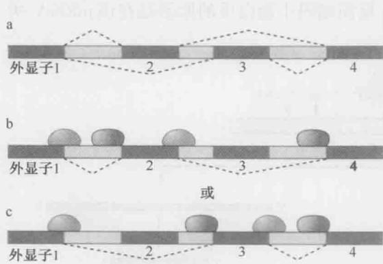  
图 14-17 互不相容性剪接：空间位阻。(a) 图示可变剪接的多种可能性。(b) U1 snRNP 结合到第二个内含子的 5' 剪接位点阻止了 U2 snRNP 结合到该内含子的分支点；U2 结合到第三个内含子导致外显子 3 被剪切掉。(c) U2 snRNP 结合到第二个内含子的分支点阻止了 U1 结合到该内含子的 5' 剪接位点。此时，U1 结合到第一个内含子的 5' 剪接位点导致外显子 2 被剪切掉。

主要剪接位点和次要剪接位点的联合 如前所述，除了主要剪接体外，还存在另一种形式的剪接体即所谓的次要剪接体，它识别不同于前者的剪接位点。这两种剪接体都不能去除含组合位点（即一种类型的5'剪接位点和另一种类型的3'剪接位点）的内含子。因此，通过合理地排列这些可变剪接体所识别的5'和3'剪接位点，达到可变外显子的互不相容，如图14-18a所示。人的JNK1基因就是如此。

无义介导降解（nonsense-mediated decay，NMD）与迫使剪接机器以互不相容的形式剪接不同，此机制确保只含一个或另外一个外显子（两个内含子不会同时出现或同时不出现）的 mRNA 能存活。

换句话说，尽管不能保证互不相容性剪接，但这种机制的结果和互不相容性剪接一样。无义介导降解基于的事实是，同时包含两个外显子产生的 mRNA 含有提前的终止密码子（图 14-18b）。这种 mRNA 会被 NMD 破坏，细节在第 15 章中讲述（图 15-50）。

## 关于果蝇的 Dscam 基因的特例: 大范围的互不相容性剪接

果蝇的 Dscam（唐氏综合征细胞黏附分子，Down syndrome cell adhesion molecule）基因能够编码 38,016 种不同的蛋白质。如图 14-19 所示，来自 Dscam 基因的每一种可能的 mRNA 都含有 24 个外显子，其中 20 个是相同的，另外 4 个外显子（外显子 4, 6, 9 和 17）在 pre-mRNA 上是以多种可变形式存在的。因此，外显子 4 有 12 种可变版本，外显子 6 有 48 种，外显

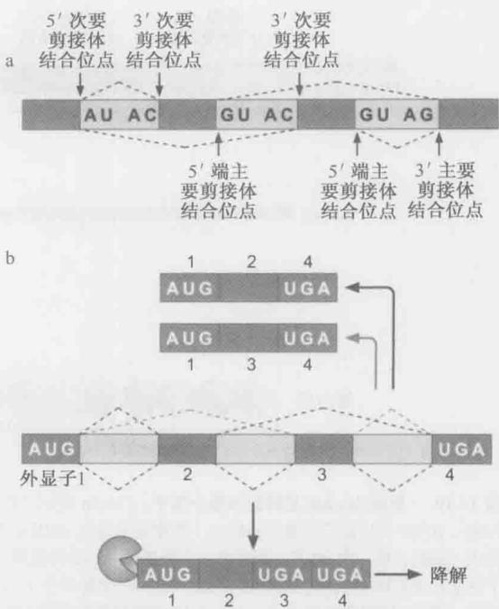  
图 14-18 互不相容性剪接。(a). 主要和次要剪接体识别的剪接位点。(b). 无义介导降解。

子 9 有 33 种，外显子 17 有 2 种。这些外显子可能的排列（ $12 \times 48 \times 33 \times 2$ ）产生大量可能形式的成熟 mRNA。

Dscam 基因编码的蛋白是细胞表面蛋白，属于免疫球蛋白（immunoglobulin，Ig）超家族成员。图 14-19 下部显示的是该蛋白质的一般结构。此蛋白分子含有一个跨膜区域（由外显子 17 编码，因此有两种可变形式）；各种亚型中都相同的纤维连接蛋白结构域；以及 Ig 结构域，其中三个 Ig 结构域的部分片段是由高度可变的外显子 4、6 和 9 所编码的。因此，不同亚型的可变性主要来自于 Ig 的这些结构域。

在果蝇中，Dscam蛋白执行两种完全不同的功能：既可以在大脑的神经网络模式中起作用，也可以作为天然免疫系统的一部分识别抗原。在执行神经功能时，Dscam蛋白介导特异的细胞与细胞间相互作用。任何特定亚型的蛋白质只能和同亚型相互作用，而不能和其他亚型相互作用。人们认为这种选择性确保一个特定的轴突能够区分其他轴突，从而决定是否表达与其相同或者不同的亚型。

这一选择性被认为可以使给定的神经突触获得区分自身和别的神经突触的能力，它们可以区分出哪个细胞是“自我”，哪个不是“自我”，也就是说是否来自于同样的神经元。在大脑发育神经网络形成的过程中，神经突触展示了“自我避免”（self-avoidance）的行为：从同一个神经元发出的突触彼此避免接触。体内实验显示，对DSCAM亚型在神经元表面的编码产物的亲同种抗原识别（homophilic recognition）机制可以实现自身细胞的识别。

在免疫系统中，就像脊椎动物体内的抗体一样，不同亚型识别不同的抗原。人们认为演化压力驱动的多样性来源于这种功能的选择。

  
图 14-19 果蝇 Dscam 基因的多重外显子。Dscam 基因（图的上部）长 61.2kb，经转录和剪接，产生一种或多种长度为 7.8kb，由 24 个外显子组成的 mRNA（图中显示这些 mRNA 的一般结构）。外显子 4、6、9 和 17 存在多种互不相容的选择方式。因此，每一个 mRNA 都包含一个外显子 4（12 种选择，用红色表示），一个外显子 6（48 种选择，用紫色表示），一个外显子 9（33 种选择，用绿色表示），以及一个外显子 17（2 种选择，用黄色表示）。外显子 4、6、9 编码三个 Ig 结构域的一部分，用相应颜色表示；外显子 17 编码跨膜结构域。如果用到这些外显子的所有可能组合，Dscam 基因能产生 38016 种不同的 mRNA 和蛋白。（获得许可并重新绘图自 Schmucker D. 2000. Cell 101：671，Fig. 8. ©Elsevier.）

## Dscam 外显子 6 的互不相容性剪接不符合任何一种标准机制，只能用一种新的策略来解释

如我们前面所看到的，外显子6是Dscam基因中4个可变剪接外显子中的1个，在这个例子中，外显子6有48种可供选择的版本。这种选择规模用前几种选择性剪接机制无法解释。例如，尽管空间位阻可以解释毗邻外显子不被剪接，但不能解释其他相距更远的外显子同样不被剪接。此外，在Dscam基因上所有的剪接位点都是主要剪接体位点，所以双剪接体机制不能解释。NMD同样无法解释外显子6的互不相容剪接：即使由于包括0个、2个或3个外显子而导致移码，一个含有4个外显子的mRNA与只有1个外显子的mRNA具有相同的读码框。含7个外显子的mRNA也是如此，依此类推。

那么细胞怎么保证在 mRNA 中只有一个外显子 6 的变异体呢？新机制依赖 pre-mRNA 中可变的 RNA：RNA 碱基对结构。每种可变结构确保仅有一个外显子 6 的变异体在任何时候都得到保护，不受普遍存在的剪接抑制所抑制。我们现在考察这种机制是怎么工作的，以及这种机制是如何通过果蝇 Dscam 基因和其他昆虫物种中相应基因的序列分析而发现的？

图 14-20 显示的是这种机制的基本模型。该模型有两类保守序列元件。第一个元件停泊位点（docking site）位于外显子 5 和第一个外显子 6 变异体（外显子 6.1）之间。在每个外显子 6 变异体前面都有一个拷贝的第二种元件——选择子序列（selector sequence，图 13-20 中以外显子 6.21 为例）。每一个选择子序列都是不同的，但如图 14-21 所示，它们都能与停泊位点配对。每个选择子序列结合停泊位点的区域有重叠，因此不同的选择子序列和停泊位点结合是互不相容的，即一次只有一个选择子能结合停泊位点。能结合到停泊位点的选择子序列使其相应的外显子6靠近外显子5，从而确保该外显子6的变异体被选择。

  
图 14-20 停泊位点：选择子序列。外显子 6.21 前的选择子序列与停泊位点的碱基配对。（由 Brenton Graveley 惠赠）

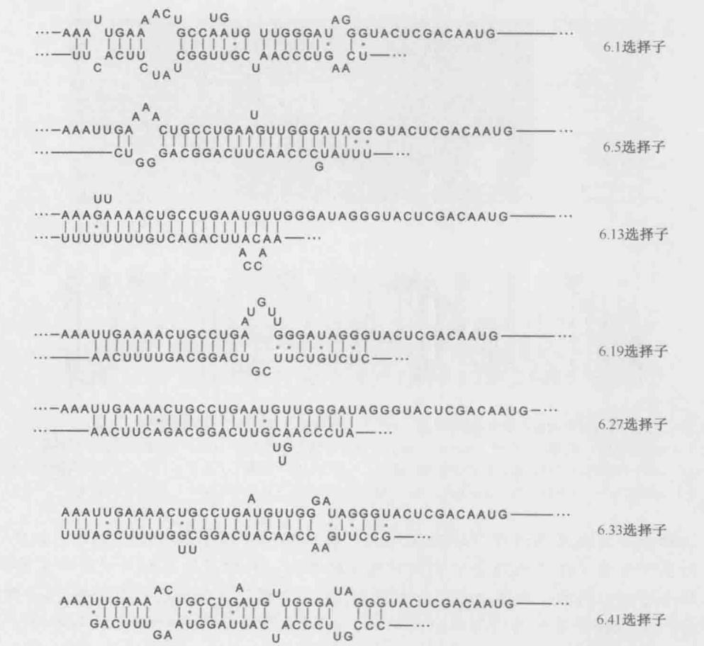  
图 14-21 6 个外显子 6 变异体的选择子序列，每个都与外显子 6 的停泊序列结合。每个选择子序列通过碱基配对与停泊序列的细微不同区域结合，但是这种与停泊位点的结合是互不相容的。（由 Brenton Graveley 惠赠）

除了使被选择的外显子6变异体靠近外显子5外，选择子序列和停泊位点的杂交结合也确保该外显子6变异体免于普遍抑制机制的作用，这种机制可以抑制外显子6产生其他可能的剪接变异体。Hrp36蛋白作为一种普遍剪接抑制因子通过覆盖其他外显子从而抑制其留在成熟mRNA上。这种由RNA杂交产生的局部抑制解除可能是RNA二级结构的直接结果；或者通过在RNA上形成一个结构，此结构可被移除抑制因子的蛋白质所识别；或者使被选择的外显子靠近外显子5内的激活因子，从而克服受到的抑制。

框 14-3 描述了一个生物信息学分析的实例，正是在这个例子中，人们通过序列比对发现并鉴定了停泊位点和选择子序列。

## 框 14-3 停泊位点和选择子序列的鉴定

停泊位点在黑腹果蝇中长66个核苷酸。在另外10种果蝇中，90%\~100%的停泊位点序列是保守的。即使比对包含其他非果蝇昆虫（如蚊子、家蚕、蜜蜂），停泊位点中间的24个核苷酸仍然是高度保守的！事实上，它是整个Dscam基因（超过60kb）中最保守的序列。停泊序列最初就是通过这种保守性鉴定出来的（框14-3图1）。

D. melanogaster
D. simulans
D. yakuba
D. erecta
D. ananassae
D. pseudoobscura
D. persimilis
D. mojavensis
D. virilis
D. grimshawi
A. gambiae
A. aegypti
B. mori
A. meliffera
T. castaneum

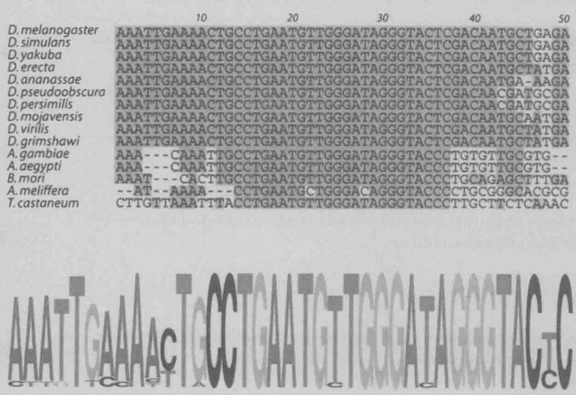

框 14-3 图 1 15 种昆虫的停泊位点核苷酸序列比对。包括：10 种果蝇；2 种蚊子，冈比亚疟蚊（Anopheles gambiae）和埃及伊蚊（Aedesaegypti）；鳞翅目的家蚕（Bomby xmori）；膜翅目的蜜蜂（Apismellifera）；鞘翅目的赤拟谷盗（Tribolium castaneum）。每个停泊位点上最常见的核苷酸用阴影显示，共有序列的示意图在下部显示。每个字母的高度代表该核苷酸在此位置上出现的频率。（-来源：Graveley B.R. 2005. Cell 123: 65–73, Fig. 2. ©Elsevier. 经许可重新绘制）

选择子序列也是通过序列比对发现的，虽然其保守性不如停泊位点高。选择子序列是外显子6变异体上游内含子中相对保守的序列。对比黑腹果蝇外显子6变异体48个选择子序列，揭示了与停泊序列互补的一个28个核苷酸的共有序列（框14-3图2）。当将每一个选择子序列与停泊位点比对时，发现每个选择子序列都可以与停泊位点配对，每个配对是唯一的，但相互重叠。实例见图14-21。

6.24 GTCATTGTCGAGAGCTCTT----TACATCCAATAC--TCAGGCAGT
6.47 GGCTTTTCCAGTACCCATTATCAGGTTAGTCCAACA--TCGGGCATATC---CAATTAGACAGAGG
6.22 CAGCTCAATCGTATCC----AATCCCAGCTT--TTAGG---TAAACACTTAAGATTTA
6.17 CAGCTGTCAGGACTT----G-TCCAGCAGC--TTAGGCAGTAAATCG
6.34 TTCAG---CCC----TTAGACCAACA--TCAGGC
6.10 GTGGGTTTCCC----TTTCCCAACATCATCAGACAGTTTT
6.4 GGTAACCC----A-ACCCAACAC--TTAGGC
6.6 GTCAGTCCCT----TCCCATG--TCAGGCA
6.38 GGCATTTCC----GGTGCCAGTTT--TTAGGTTATATACTAATTTTTTGGTT
6.33 G---CC----TTGAACCAACA--TCAGGCTTGGTTTCGATTTCCTTTTA
6.15 TGCCC----TCCACCAACAT--TCA
6.8 TCCT----AGGCCCAACAT--TCAAG
6.14 GTCGTTTCATTCT-ATCCCAGCAT--TCAGATAGTAGATTTT
6.35 TCCT----ATCCCATACTAT--TCCAATGTCCGCGATAGATT
6.9 TACTTTAAATTAAAATCCAACACATTCAGTCAGTGC----AATAAGGGA
6.1 TCA----AGTCCCAATCG--TT-GGCTATCTTCACTTCTTA
6.41 CTCAGGCGTTCCCCGTTGCCATCATT-AGGTAGTTTCAGCAAA---CAGGCTTCTAGGTT
6.3 CC----TATCCCAACTG--A-AGG---TGTC-CTTTCGA
6.31 TTGGGAATCAGTGTCAATAT--TCAGGCAGTTGTATGGAGTTGTTAGAGC
6.37 GGTAA---GCCCA---CATTCAGGCAGTT---AGTAA
6.29 GGTGATTCTGCTCAGN--CATTCAGGGAGTTTTA---AGTTATGGCT
6.32 TCTTTATGATTCCACAT--TCAGACAGTT
6.39 TGTTGATAAACCCAATT--TCAGTCAGTTTTCA
6.23 GAGTGCCCTGGTTGCCTTATTCATGTAGTTTT---CAT-----GGTCT
6.7 TATCCCTGACTTTCAC-ET-CGGCAGTTTACAAT----TGAGTTAGG
6.42 GCCTTGATCCCGTGTAATCAGGCAGTTTTCATAGAGATT
6.12 TGCTCAACTTCCAACATTGGGCAGATTTC
6.26 CCCCATCCATTTCCACTCAGGCAGTTTTC-ACTAGACTTCGGTT
6.2 ACCCAGACCA--AC-TTGCGCCAGTTTCCAAT----TGAGATTGCTCGC
6.16 CCCTGT--CCAACATTCAGGTATTTCTTAGCAT----GGC
6.19 CTCTGTCTT--CGTC-AGGCAGTTTCAAAGTTCCTTTAGCTGATAGGT
6.25 TGTCGAGTT--CCTT-GGGCAGTTTCAAT----CTCAG--CACGGGTT
6.20 CATTGCTGAGTACAGTCCAGGCAGGTTTTCATG-AGATTGGG
6.21 CATTGTTGAGTACAATCAGACGGGTTTCCATTTACATAGAATGTTTAGAAGC
6.5 TTTATGCCCAACT--TCAGGCAG--GTCTAGA
6.36 ACCCCGCACGCACATTTCAGTCAGTTTAT----TGTTTGCGTTTAGCT
6.13 AACACCAA--T--TCAGACTGTTTTTTTATTG
6.27 ATCCCAAGTTGGTTCAGGCAGA--C----TTCAAACTGA--CTT
6.28 ATCCCTACGCATTTAGGCAGTTTTCGGTTTACTTAG
6.44 ACCCAACACTATTCAACCAGTA--ATTAAAGCGAC
6.40 ACGGTG---T--TCA-ACTGGTTCTGTTAGGGTTCAAATAGA
6.43 TTTAGCATCAGGCAGTTTTC
6.30 CCAACATTCCGGGAGTTTCAAT
6.48 CCAACATTCCGGCAGCAAATAGCAT--TTCAAATAGGGATCTTA
6.45 GTTCAGGCAG----CTTAGAAGGC--T
6.18 TTCAGGCAGTTTT--CTTAAAAAAGA--TCTTCTTAAGCA
6.11 GGGCGGTATT CGAA----TTCAG--GAC
6.46 AGGTAGCCAATA-----AGTAGA---CTTA

  
框 14-3 图 2 黑腹果蝇选择子的共有序列。图上部显示的是 48 个选择子及其两侧序列的比对。中间部分出现频率最高的核苷酸用亮标显示。图下部显示的是利用比对产生的选择子序列的共有序列。（来源：Graveley B.R. 2005. Cell 123: 65–73, Fig. 4. ©Elsevier. 经许可重新绘制）

## 可变剪接受激活因子和抑制因子调控

剪接调控蛋白可以结合到称为外显子/内含子剪接增强子（ESE或ISE，exonic/intronicsplicing enhancer）或者外显子/内含子剪接减弱子（ESS或ISS，exonic/intronic splicing silencer，ISS）的特殊序列上。前者增强附近的剪接位点的剪接，后者正好相反。我们已经介绍过增强子及与其结合的SR蛋白（图14-11）。这些序列和蛋白质对将剪接体引导到各个外显子区域非常重要，即使没有可变剪接也如此。在刚刚提到的大T抗原可变剪接的例子中（图14-16），也是SR蛋白保证了可变剪接的进行。该蛋白质家族数量庞大种类多样，在调控可变剪接方面也有特殊作用，即在不同的条件下引导剪接体到不同的剪接位点发挥作用。所以在发育的某个阶段，或者在某种类型的细胞中，一种特定的 SR 蛋白的存在与否或者活性高低，就可以决定某一特定的剪接位点是否得到利用。图 14-22 是关于剪接调控的假设示例，激活因子结合到剪接增强子上，抑制因子结合到剪接减弱子上。

  
图 14-22 可变剪接的调控。（a）某些可变剪接的外显子总是在成熟 mRNA 出现，除非受到某种抑制蛋白的阻止；（b）另外一些则相反，只有某种激活因子发挥作用，才能包含在成熟的 mRNA 中。上面两种方式都可以用来进行剪接调控，使得某一特定的外显子出现在一种类型细胞的成熟 mRNA 中，而不会出现在另一种类型细胞的成熟 mRNA 中。

SR 蛋白利用某个结构域结合 RNA，如我们在第 6 章讨论的 RNA 识别基序（RNA recognition motif，RRM，图 6-18）。每个 SR 蛋白都含有另一个结构域，富含精氨酸和丝氨酸，称为 RS 结构域（RS domain）。该结构域位于肽链的 C 端，介导 SR 蛋白与剪接体蛋白的相互作用，把剪接体募集到附近的剪接位点。

有一类激活因子能在特殊的组织中增强某种特定的剪接方式，如果蝇的 Half-pint 蛋白。这个激活因子调控果蝇卵巢中一组 pre-mRNA 的可变剪接。它通过结合到那些 pre-mRNA 特定外显子的 3'剪接位点附近并募集 U2AF 因子来进行调控。

多数减弱子由不均一核糖核蛋白（heterogeneous nuclear ribonucleo-protein，hnRNP）家族的成员识别。这些蛋白质能结合 RNA 但没有 RS 结构域，所以无法募集剪接体。相反，它们可以阻断特定的剪接位点，使之丧失作用。我们在前面的 Dscam 例子中看到过类似的功能，Hrp36抑制了外显子6的变异体留在mRNA中。另一个例子是hnRNPA1，它可以识别并结合位于HIV tat pre-mRNA一个外显子内的减弱子并抑制该外显子最终出现在成熟的mRNA中。通过结合到该位点上，抑制因子阻断了激活因子SC35（一种SR蛋白）对附近增强子的结合。这种阻断不是直接的（两个结合位点并不重叠），而是促进了其他的hnRNPA1协同结合到邻近的序列上，并整个覆盖了增强子位点。即便如此，由于SF2/ASF对增强子的亲和力比SC35要大，另一个SR蛋白（SF2/ASF）仍然能够克服这种抑制作用，取代已经结合的抑制因子。在后面第18、19章关于转录调控的例子中，我们还会看到类似的协同和竞争结合的情况。

哺乳动物的另一个剪接抑制因子是 hnRNPI 蛋白。有时 hnRNPI 直接结合到多聚嘧啶区阻断剪接体的结合，所以也叫多聚嘧啶区结合（Py tract binding, PTB）蛋白。有时它结合到某个外显子两个外侧的序列上，使该外显子不能进入成熟的 mRNA。但是，hnRNPI 减弱子并非通过直接结合到剪接位点或者剪接增强位点与剪接体组分竞争，而是通过与剪接体发生互作，抑制它发挥功能。例如，当 U1 结合到 5'剪接位点以后，hnRNPI 与 U1 某一区域结合，导致 U1 不能与促进外显子配对的蛋白互作，从而阻止外显子配对。（图 14-23b）。

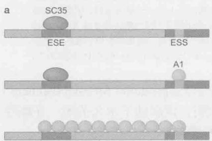

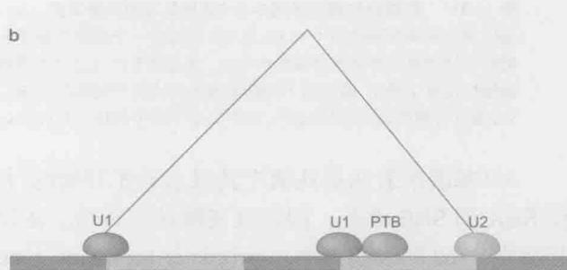  
图 14-23 两种沉默子的作用机制。(a) HIV tat 第三个外显子被 hnRNPA1 去除的机制。剪接反应的激活因子 SC35 结合在 ESE 上促进外显子的保留。A1 与外显子的 ESS 结合，从这里延伸直到被 ESE 封闭并跨过完整的 SC35 结合序列。(b) 通过 hnRNP1（PTB）蛋白去除外显子的机制。正如书中所述，PTB 结合到外显子内部，与 U1 的 5'剪接位点相互作用。这一作用抑制了 U1 与 3'剪接位点相互作用的能力，从而形成 U1 在成对外显子上游而 U2 在下游的局面。

## 可变剪接的调控决定了果蝇的性别

现在，我们来探讨一个可变剪接调控非常精细的例子——果蝇 double-sex（dsx）基因的剪接调控。一只特定果蝇的性别取决于其 mRNA 上两个可变剪接产物中哪一个被制造出来。

X 染色体和常染色体的比例决定果蝇的性别。X 染色体和常染色体的比例为 1（两条 X 染色体和两套常染色体）时果蝇为雌性，比例为 0.5 时为雄性。这个比例最初用 SisA 和 SisB 两个转录激活因子的转录调控水平来检测（第 18 章和第 19 章将详细讨论转录调控机制）。编码这两个转录激活因子的基因都在 X 染色体上，所以在早期胚胎发育中，准雌性果蝇产生的 SisA 和 SisB 转录激活因子的量是准雄性的两倍（图 14-24）。

这些转录激活因子结合到 Sex-lethal（Sxl）基因调控序列上游的位点。另一个结合并控制 Sxl 基因转录的调控因子叫做 Dpn(Deadpan)，该转录抑制因子是由常染色体（染色体 2）基因编码的。因此，转录激活因子和抑制因子在雌雄个体中的比例是不同的，这就造成了 Sxl 基因在雌性中被激活而在雄性中被抑制。

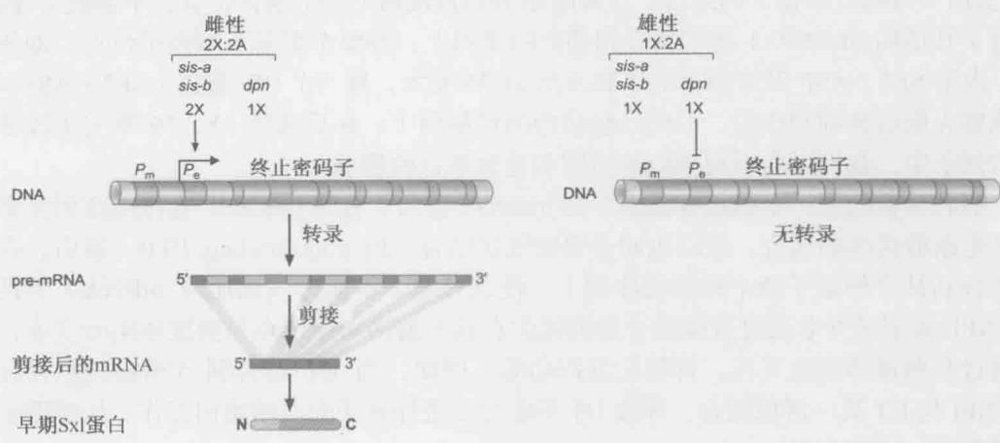  
图 14-24 在雄性和雌性果蝇中 Sxl 基因的早期转录调控。Sis A 和 Sis B 基因位于 X 染色体上，编码控制 Sxl 基因表达的转录激活因子。Dpn 是 Sxl 基因的一个转录抑制因子，由染色体 2 上的一个基因编码。尽管雄性和雌性表达等量的常染色体编码的 Dpn，但是雌性产生 2 倍于雄性的转录激活因子（因为雌性有 2 条 X 染色体，而雄性仅有 1 条）。激活因子和抑制因子的比例不同保证了 Sxl 基因在雌性中表达，而在雄性中不表达。然后 Sxl 蛋白自调控 Sxl 基因的表达，如正文及下图中所述。（引自：Estes P.A. et al. 1995. Mol. Cell. Biol. 15: 904–917.）

Sxl 基因的表达是从两个转录启动子开始的: $P_{e}$ 和 $P_{m} \circ P_{e}$ (promoter for establishment) 受 SisA 和 SisB 调控，因此仅在雌性中表达。在发育后期，该启动子永久关闭。在雌性胚胎中，Sxl 的表达由 $P_{m}$ (promoter for maintenance) 来维持。

无论是雌性还是雄性， $P_{m}$ 起始的转录都是组成型的，但是由此产生的 RNA 比 $P_{e}$ 起始转录得到的 RNA 多一个外显子（图 14-23）。如果此外显子留在成熟的 mRNA 中，则无法产生有活性的蛋白质，在雄性中即如此。但是在雌性中，通过剪接除去此外显子则可以持续地产生具有功能的 Sxl 蛋白。

如图 14-25 所示，正是在雌性中而不是在雄性中存在的（早期从 $P_{e}$ 转录的）Sxl 蛋白介导由 $P_{m}$ 转录的 mRNA 剪接，确保有抑制活性的外显子被剪切掉。Sxl 蛋白作为一个剪接抑制因子执行上述功能。

因此，功能性的 Sxl 蛋白可以持续地在雌性中产生。Sxl 蛋白调控其他 RNA 及自身 RNA 的剪接，其中之一是在雌、雄中均组成型表达的 tra 基因 RNA（图 14-25）。同样，在没有 Sxl 蛋白介导的剪接时，这个 RNA 不产生蛋白（雄性），而当 Sxl 蛋白存在时，RNA 经剪接后可以产生有功能的 Tra 蛋白（雌性）。

Tra 同样也是剪接调控因子。Sxl 是剪接抑制因子而 Tra 是剪接激活因子(图 14-25)。Tra 调控的底物之一是编码 Dsx 的基因转录得到的 RNA。此 RNA 有两种可变剪接产物，两者都编码调控蛋白但活性不同。在 Tra 存在的情况下，dsx RNA 经过剪接后产生的 Dsx 蛋白抑制雄性特异性基因的表达。在不存在 Tra 的情况下，dsx RNA 经过剪接后产生的 Dsx 蛋白抑制雌性特异性基因的表达。

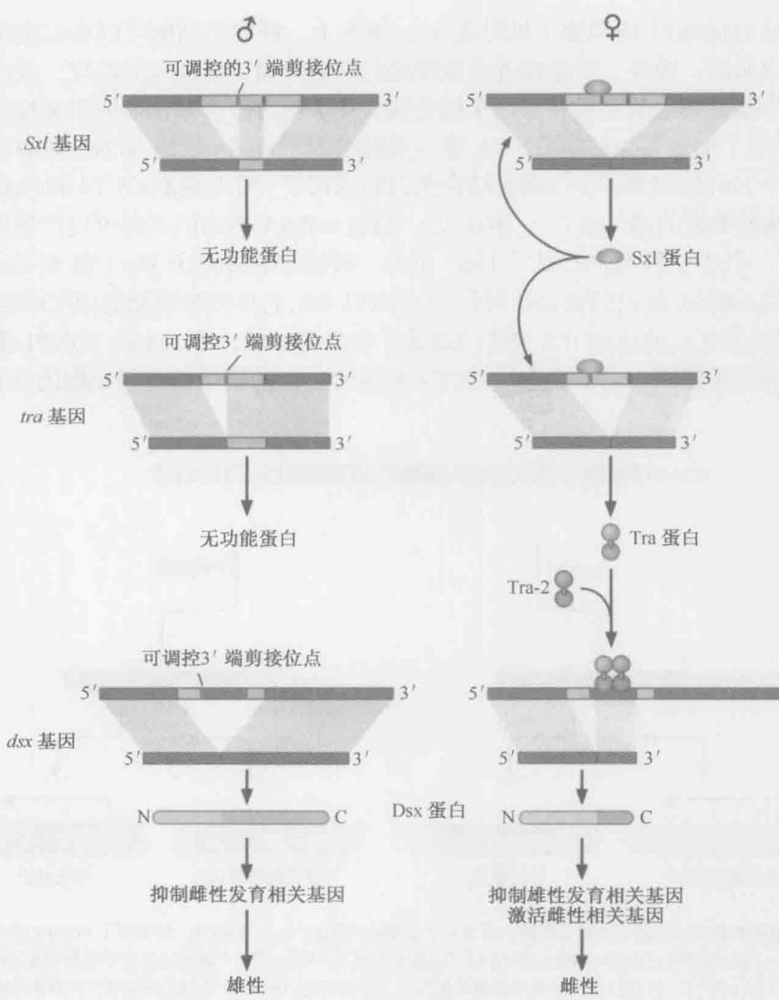  
图 14-25 一连串的可变剪接决定了果蝇的性别。如正文中所详述，Sxl 蛋白在雌性中表达（图右半部分），不在雄性中表达（图左半部分）。Sxl 蛋白的表达靠其自身调节其 mRNA 的剪接来维持。在雄性中没有这种调控，不产生有功能的 Sxl 蛋白。在雌性中 Sxl 蛋白还控制 tra 基因的剪接，产生有功能的 Tra 蛋白（雄性中无）。Tra 蛋白本身也是一个剪接调控因子，作用于 dsx 基因 pre-mRNA。dsx mRNA 在 Tra 蛋白的调控下剪接产生的 Dsx 蛋白（雌性），其 C 端有 30 个氨基酸，与其在没有 Tra 蛋白（雄性）调控下产生的蛋白质不同。在雌性中产生的 Dsx 蛋白激活雌性发育所需基因，抑制雄性发育所需基因。在雄性中产生的 Dsx 蛋白，其 C 端有 150 个氨基酸，抑制指导雌性发育的基因。Sxl 蛋白作为一个剪接抑制因子结合到 3' 端剪接位点的多聚嘧啶区（图 13-3）。相反，Tra 蛋白作为一个剪接增强子结合 dsx RNA 某个外显子的增强子序列（图 14-11）。

## 可变剪接的转换在细胞多能性中占据核心位置

实验利用胚胎干细胞诱导分化细胞，是哺乳动物的发育生物学研究中最吸引人的课题，同时这一领域的医学突破也获得了更多的关注。胚胎干细胞是在胚胎组织中发现的一种未分化的细胞，它可以分化成动物成体的各种组织和细胞类型，因此被认为是具有多能性（pluripotent）的细胞（见附录1）。事实上，胚胎干细胞可以在实验室中培养并定向分化成肌肉、神经、胰腺或者其他特定的细胞类型。最近人们发现，通过人工增强一些维持多能性相关的关键转录因子的生成，体细胞可以去分化形成多能性细胞（所谓的“诱导多能干细胞”，iPS，框21-1）。这一类转录因子包括OCT4和NANOG等。FOXP1是一种属于Forkhead家族的DNA结合蛋白转录因子，可以刺激OCT4和NANOG的生成（以及其他关键的调节蛋白）。事实上，通过mRNA剪切的不同可以产生两种FoxP1蛋白亚型，其中一种包含外显子18b，另外一种则包含外显子18a（图14-26）。由含外显子18b的mRNA编码的蛋白质被称为FOXP1-ES，它可以激活靶基因(OCT4、NANOG等)，引起去分化从而促进iPS细胞的形成。与之相反的，含18a的FOXP1蛋白本身则起到相反的分子作用，它不能激活OCT4和NANOG的转录而引起细胞的分化。

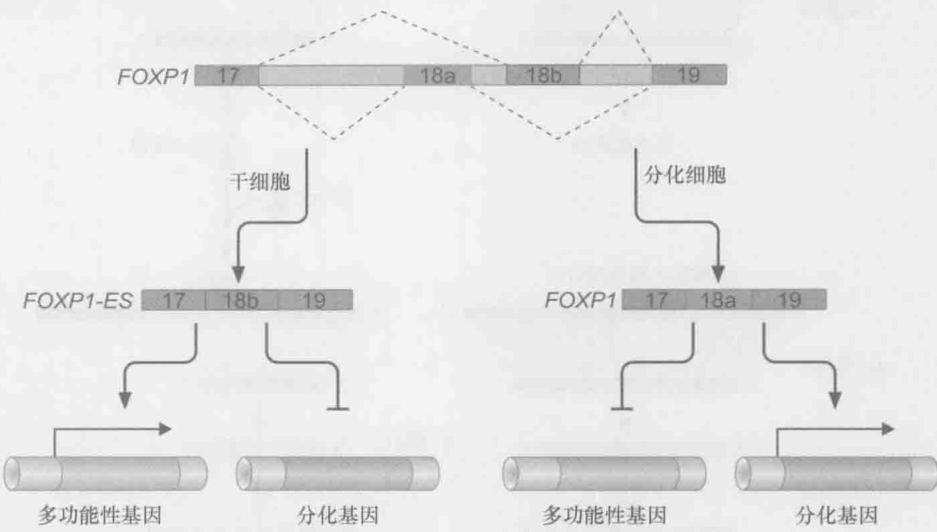  
图 14-26 与细胞多能性相关的可变剪接转换。通过一个已知的 Winged helix 结构域，转录因子 FOXP1 结合在 DNA 的特定位点上。DNA 位点的特异性识别可以被 mRNA 的可变剪切所改变。因此，当一个特定的外显子被保留在 mRNA 上（18a），得到的转录本可以识别这一序列位点。但是当剪切体保留了 18b 而不是 18a 时，得到的转录物（FOXP1-ES）结合在不同的 DNA 序列上，从而控制了另外一组基因的表达。

外显子 18a 到 18b 的可变剪接转换如何引起从干细胞驱动基因表达转向促细胞分化基因表达？FOXP1 通过一个已知的 Winged helix 结构域与 DNA 结合，由此识别特定的 DNA 序列。由外显子 18a 向 18b 的转换使编码蛋白上的 Winged helix 的 35 个氨基酸残基发生了替换。这一替换改变了 FOXP1 结合 DNA 序列的特异性。有实验发现，只要替换其中两个氨基酸残基，即将天冬酰胺和组氨酸替换成甘氨酸和苏氨酸，就可以使 FOXP1 和 FOXP1-ES 结合到 DNA 序列有所不同。

因此，FOXP1 mRNA 的可变剪切位于调控细胞多能性和分化的转录链条的一系列分子事件的顶层。回忆一下性别致死基因的可变剪切，同样位于决定果蝇性别的一个分子事件链条的起始位置。在性别致死的例子中，X 染色体和常染色体的比例指示了哪些剪切本在雌性或者雄性中生成。在 FOXP1 的例子中，这一分子事件决定了哪种 mRNA 编码的蛋白在胚胎干细胞中表达，或者在已分化的细胞中表达。总体来看，这些例子强调了可变剪切在果蝇和哺乳动物中具有广泛的基因调控的作用。

我们已经描述了真核系统剪接的各种方式，以及参与剪接的组分的多样性。任何一种参与剪接的组分失去功能都可能导致严重后果，如框 14-4 所述：pre-mRNA 剪接错误导致人类疾病。

## 框 14-4 Pre-mRNA 剪接错误导致人类疾病

如正文所述，绝大部分人类基因都含有内含子。事实上，绝大部分的人类基因中都含有多个内含子。因此，许多导致人类疾病的点突变其实是破坏 pre-mRNA 剪接的核苷酸替换。据估计，至少 15% 的导致人类疾病的点突变改变了剪接的识别序列。一个典型的例子就是 β-地中海贫血症（β-thalassemia）。这种人类遗传性疾病的特征就是血红蛋白的一个亚基 β-球蛋白（β-globin）的产生发生了障碍。其中一类 β-地中海贫血症是由于 β-球蛋白基因的第一个内含子中发生了一个点突变，序列从 TTGGT 变成了 TTAGT。这个点突变产生了一个 3' 端剪接位点（Py tract AG / G 见图 14-3）序列。结果患者的 β-球蛋白 pre-mRNA 的剪接主要发生在由突变产生的 3' 端剪接位点而非正常的剪接位点。

一种名叫家族性孤立性生长激素缺乏Ⅱ型（familial isolated growth hormone deficiencytype Ⅱ）的遗传病是由于生长激素pre-mRNA的剪接错误造成的，导致患者身材矮小。Frasier综合征（Frasier syndrome）是一种泌尿生殖系统疾病，是对肾脏和生殖腺的发育起重要作用的一个基因的pre-mRNA剪接发生错误引起的。另外两个例子是一种痴呆症，是编码细胞骨架蛋白（cytoskeleton）和一种囊肿性纤维化（cystic fibrosis）的mRNA剪接发生错误引起的。

还有其他疾病是由破坏剪接体本身的突变造成的，例如色素性视网膜炎（renti-nitis pigmentosa，RP）。该病的特征是视网膜进行性恶化直至失明。多个基因发生突变导致色素性视网膜炎，其中大部分基因具有视网膜特定的功能。但也有一些突变发生在编码剪接体组分的基因上。由于患者同时具有一份正常的基因拷贝和一份发生突变的基因拷贝，故其体内可以产生剪接蛋白，只是低于正常水平。

为什么一个剪接体组分低于正常水平所产生的影响只出现在一个特定的组织——视网膜呢？一种可能的解释基于这样一个事实，即视网膜上的感光色素视紫红质（photopigment rhodopsin）需要高水平的周转。因此，剪接机器必须满足产生大量视蛋白（opsin，视紫红质的蛋白成分）的需求，以替代被降解的视蛋白。因此，视网膜可能对剪接的稍微改变比其他组织更敏感，因为其他组织不需要产生大量的特定蛋白。

脊髓肌肉萎缩症（spinal muscular atrophy，SMA）是一种在儿童中最常见的遗传性致死疾病。其特征是脊髓神经元的进行性退化，该病是由于运动神经元存活（survival motor neuron，SMN）基因发生突变引起的。SMN是剪接机器中普遍存在的组分，其准确的功能不是很清楚。与色素性视网膜炎的例子一样，我们不知道为什么剪接缺损的影响主要呈现在运动神经元。

上面介绍的例子都是遗传性疾病，但是这种剪接损坏导致疾病的突变同样发生在体细胞中。例如，细胞周期调控因子p73基因的突变。P73蛋白因其mRNA的可变剪接存在多种形式。导致 p73 pre-mRNA 可变剪接错误的突变与一种名为鳞状细胞癌（squamous cell carcinoma）的癌症相关。导致很多其他 pre-mRNA 的剪接损坏或者可变剪接错误的体细胞突变很可能也是癌症病因之一。

通常人们认为医学是生物学最伟大的老师。当然，正如我们前面所见，这句格言恰好适用于 pre-mRNA 剪接领域，人类遗传疾病的研究对于探索剪接相关的序列及剪接机制提供了巨大的启示。事实上，pre-mRNA 剪接机器最基本的组分 snRNP 的发现正是基于一种自身免疫狼疮的研究（autoimmune disease lupus），这种疾病的患者能产生针对自身核蛋白颗粒的抗体。对人类遗传疾病的持续研究很可能会对 pre-mRNA 的成熟机制有更多启示。

## 矫正剪接缺陷是治疗疾病的一种途径

这里我们阐述其中一种疾病和它的解决方案，即脊髓性肌萎缩（spinal muscular atrophy，SMA）。正如之前描述的，SMA是由一个去除掉剪切机器的的突变造成的，这个突变发生在SMN1基因上。一般来讲，SMN1基因转录后会发生可变剪切，它的 $90\%$ 的成熟转录物都包含一个特定的外显子，即7号外显子，从而形成全长的蛋白质。人类有该家族的另一个基因SMN2，编码同样功能的蛋白。它在功能上可以取代SMN1，但是这个基因只有 $10\%$ 的转录本包含7号外显子。因此，我们可以推测SMN1的缺失可以导致SMN2的转录物中更多地包含7号外显子以补偿其功能。

一种反义寡核苷酸的方法可以调控 SMN2 的原始转录物是否保留 7 号外显子。如图中所示（框 14-4 图 1），寡核苷酸探针设计为与转录物的特定序列结合，使其不能结合到剪切抑制因子 hnRNP 上。在表达人类 SMN2 基因的生物工程小鼠中验证了这一策略的可行性，现在已经筹划开展相应的临床试验。

  
框 14-4 图 1 SMN2 剪接的模式。单链反义寡聚核苷酸被设计为可以结合 RNA 转录本的一个区域，这一区域在正常情况下雨剪接抑制因子 hnRNP 结合而将外显子 7 剪切下来。如果该寡聚核苷酸替代 hnRNP 结合上后将使外显子 7 保留在成熟的 mRNA 中，从而合成这一形式的 SMN 蛋白。(来源: Rigo F. et al. 2012. J. Cell Biol. 199:21-25, Fig. 2, p. 23. doi:10.1083/jcb.20127087. ©Rockefeller University Press. 经许可重新绘制。)

## 外显子重组（exon shuffling）

## 外显子通过重组的方式产生编码新蛋白质的基因

如我们所看到的，所有真核生物都含有内含子，然而这种结构元素在细菌中却极为罕见甚至于几乎不存在。这种情形有两种可能的解释。

第一种为内含子在先模型（intron early model），即内含子曾存在于所有生物，但在细菌中丢失了。假设细菌中确实原本就存在内含子，那么内含子为什么会在后来丢失呢？理由是这些基因密度高的生物（第8章和第12章）为了应对环境的压力，精简了基因组结构以提高染色体复制和细胞分裂的速度。（真核生物中，单细胞且生长较快的酵母的内含子数目比复杂的多细胞生物要少）。

另一种解释为，内含子在细菌中从来就不存在，而是演化过程中后来才出现的。按照这种所谓的内含子在后模型（intron late model），内含子可能通过类似转座子的机制（第12章），插入到原先没有内含子的基因之中。

不管孰是孰非，目前还不能明确解决这个问题，但是另一个问题也许更有意义：为

什么内含子在真核生物中得以保存下来,尤其是在多细胞真核生物中以那么广泛的形式存在?内含子存在的一个明显好处是可以满足在剪接过程中除去它的需求,使可变剪接成为可能,从而可以由一个基因得到多种蛋白质产物。但从更宏观的角度来看,有利于这些生物的另一个好处是:把编码区分成几个外显子使得通过外显子改组的方式产生新基因成为可能。有三个观察结果有力地证明了这个过程是真实存在的。

\- 第一,某个特定基因的外显子和内含子的交界处经常与该基因编码蛋白质的结构域（第6章）的边界相一致，即每个外显子似乎经常编码蛋白质的一个独立的折叠单位(也经常与一个独立的功能相一致)。以图14-27所示的DNA结合蛋白为例，与多数DNA结合蛋白一样，这个蛋白质有两个结构域——DNA识别区和二聚化区。如图所示，这两个结构域（D1和D2）分别由基因中不同的外显子（E1和E2）编码。

  
图 14-27 外显子编码蛋白质结构域。在本例中，蛋白质的 DNA 结合区由一个外显子编码，同一蛋白质的二聚体化结构域由另一个外显子编码。蛋白质结构域独立进行立体折叠，不依赖于它所存在的蛋白质的其余部分，而且通常执行单一的功能（如我们第 6 章所讨论的）。这样，外显子经常可以在蛋白质之间活跃地交换。

\- 第二，许多基因及其所编码的蛋白质明显是演化过程中部分地通过外显子复制和变异而产生的。由多个重复单位构成的蛋白质（如免疫球蛋白）很可能这样起源（第12章，图12-35）。每个外显子之间都存在内含子，使得重复更有可能。

\- 第三，有时在其他方面并不相关的基因中会发现相关的外显子，即有证据显示有些外显子确实在编码不同蛋白质的基因中被重复使用。以低密度脂蛋白（low-density lipoprotein，LDL）受体基因为例（图14-28），该基因的部分外显子在演化上明显与编码表皮生长因子（epidermal growthfactor，EGF）前体基因的外显子有关。同时它又有一些外显子明显与补体成分C9基因的外显子相关（图14-28）。有关外显子增加的更多例子在基因组全序列（如人类基因组）中非常明显。如图14-29所示，外显子以改组方式组合成不同基因，编码出的蛋白质由高度相关的结构域以各种方式组合而成，这方面的例子不胜枚举。

  
图 14-28 由其他基因的部件构成的基因。LDL 受体（血浆低密度脂蛋白受体）基因包含与 C9 补体基因密切相关的一串 6 个外显子，以及与 EGF（表皮生长因子）前体基因密切相关的 8 个外显子。因此，LDL 受体基因是由其他基因的外显子经过改组得到的；虽然这里没有列出，但同一批外显子也出现于其他基因中。在多数情况下，内含子在 EGF 前体基因和 LDL 受体基因中并非严格地处在同一对应位置上。在本图中，对应位置相同的内含子以虚线表示。


  
图 14-29 在某蛋白质家族的演化过程中结构域的累积、丢失和改组。本图示意了不同的相关蛋白质通过特定结构域的得失而演化产生的假设途径。给出了三个例子，都是关于染色质修饰酶（第7章），分别来自酵母（Y）、蠕虫（W）、昆虫（F）和人类（H）。每种蛋白质都以不同颜色和形状的一系列结构域来显示，每个蛋白质的上方标明了存在该形式结构域组合的物种。有些组合不止存在于一种生物体内，而且一种生物有时会存在类似结构域的多种相关组合。少数结构域是完全一样的：bromodomain（Br）、染色质结构域（Ch）、组蛋白甲基转移酶结构域（histone methyltransferase，HMT）、与染色质重组酶有关的ATP酶活性（SW12）和锌指结构域（Znf）。（来源：Lander., et al. 2001. Nature 409: p106. Fig. 42 ©Macmillan. 经许可重新绘制。）

如我们已经看到的，外显子一般很短（约150nt），而内含子长度不一，实际上可以很长（可达几百kb）。对高等真核生物的多数基因而言，这样的长度比例可以保证重组更多地出现于内含子而不是在外显子区，因而外显子更可能进行改组而不是被中断。剪接的机制——使用5'和3'剪接位点，保证了几乎所有重组基因都可以得到表达，因为不同基因的剪接位点很大程度上可以互换。另外，可变剪接可以在不改变原基因产物的基础上尝试新的外显子，也就是说，一开始新旧产物都可以产生。

## RNA 编辑（RNA editing）

## RNA 编辑是改变 mRNA 序列的另一种方法

与 RNA 剪接一样，RNA 编辑可以在 RNA 转录之后改变其序列，因而翻译出来的

蛋白质与根据基因序列所推导出来的不同，但比将 mRNA 进行重排的剪接更富戏剧性

——在 RNA 编辑时个别碱基会发生插入、删减或改变，导致 RNA 中的编码信息发生改变。介导 RNA 编辑的机制有两种：位点特异性脱氨基作用和引导 RNA 指导的尿嘧啶插入或删除，我们将依次进行讨论。

位点特异性脱氨基作用（deamination）的一种形式是，mRNA 中某个特异选择的胞嘧啶经过脱氨基变成了尿嘧啶。通常，对于一种给定的 mRNA，RNA 编辑只在特定的组织或细胞发生，而且受到调控。图 14-30 是哺乳动物载脂蛋白 B（apolipoprotein-B）基因。这个基因有几个外显子，其中一个外显子的特定 CAA 密码子是 RNA 编辑的靶标，该密码子的胞嘧啶被脱氨基。由胞苷脱氨酶（cytidine deaminase）完成的脱氨基反应使胞嘧啶变成了尿嘧啶（图 14-31）。在这个例子中，脱氨基反应具组织特异性——mRNA 在小肠细胞而不在肝脏细胞中编辑。

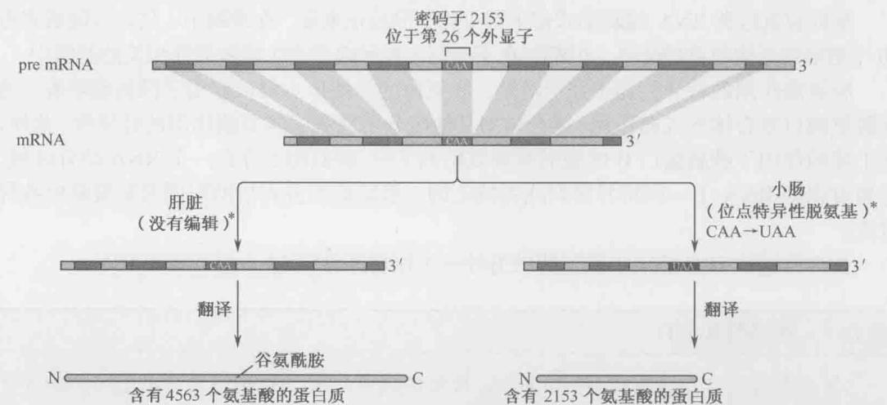

图 14-30 通过脱氨基方式进行 RNA 编辑。人载脂蛋白 RNA 以组织特异性的方式进行编辑，一个特定的胞嘧啶经过脱氨基变成了尿嘧啶。这个过程发生在小肠细胞的 RNA 中，而肝脏细胞中则没有。结果如正文所述，在小肠的 mRNA 中出现了一个终止密码子，所以翻译出的蛋白质分子比肝脏中的小。本图未按比例绘制：被编辑的是第 26 个外显子，填写在整个外显子中的密码子（CAA）实际只占该外显子的很小一部分。

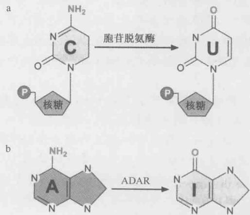  
图 14-31 胞嘧啶和腺嘌呤脱氨基产生尿嘧啶和次黄嘌呤。（a）畅核苷酸环上的氨基基团被胞啶脱氨酶移走。（b）在腺嘌呤脱氨中，同一基团由 ADAR 移走以产生次黄嘌呤。

CCA 密码子在肝脏中没有进行 RNA 编辑，翻译成谷氨酰胺；而在小肠中经过 RNA 编辑，变成了终止密码子 UAA。结果全长的蛋白质（大约 4500 个氨基酸）在肝脏产生，而截短的多肽（只有约 2100 个氨基酸）在小肠里制造（图 14-30）。这两种形式的载脂蛋白 B 都参与了脂肪代谢。肝脏中的大蛋白参与内源合成的胆固醇和甘油三酯的转运，小肠中的小蛋白参与运输饮食中的脂肪到各种组织中。

其他酶促脱氨的 RNA 编辑例子包括腺嘌呤的脱氨基作用。这个反应由作用于 RNA 的腺苷脱氨酶（adenosine deaminase acting on RNA，ADAR，人类有三种）催化产生次黄嘌呤。由于次黄嘌呤可以与胞嘧啶配对，所以这种编辑形式很容易改变 mRNA 编码的蛋白质序列。哺乳动物大脑中表达的一种离子通道蛋白是通过这种方式编辑的。对其 mRNA 的一个单一的编辑导致这种离子通道蛋白的一个氨基酸改变，从而改变了该通道 Ca2+ 的通透性。如果不发生这种编辑，大脑的发育就会严重受损。

酶促脱氨这类 RNA 编辑形式似乎很少见，但是很重要。在果蝇中，估计可能最多有 20 个胞嘧啶是脱氨基的靶点，但都存在于编码与神经递质产生或者活性相关的基因中。

脱氨酶作用的特异性还不完全清楚，脱氨酶的活性位点可以作用于任何胞嘧啶。通常脱氨酶以复合体形式起作用，复合体的其他组分可能影响脱氨酶作用的特异性。此外，在上述的作用于载脂蛋白 B 的胞嘧啶脱氨酶例子中，脱氨酶上存在一个 RNA 结合区域，它通过识别 RNA 上一段特异序列或者特定的二级结构的方式帮助识别需要脱氨的特异位点。

在细胞抵抗 HIV 感染中脱氨酶的另外一个作用详见框 14-5 脱氨酶和 HIV。

## 框 14-5 脱氨酶和 HIV

如正文所述，人载脂蛋白 BmRNA 的脱氨是由称为 APOBEC1（apolipoprotein-B editingenzyme, catalyticpolypeptide-like1）的酶进行的。APOBEC1 是 RNA 和 DNA 胞嘧啶脱氨酶家族中的一个成员。该家族的另一个成员 APOBEC3G（A3G）能有力地抑制一系列逆转录病毒，包括 HIV 的感染。

逆转录病毒颗粒如 HIV 携带 RNA 基因组。一旦感染，其 RNA 通过逆转录产生一个 cDNA 拷贝（第 12 章），A3G 酶攻击的正是逆转录过程中产生的这个负链 cDNA。A3G 酶催化 cDNA 上胞嘧啶脱氨基而成为尿嘧啶，导致病毒无法修复的突变程度，甚至突变的链被 DNA 糖基化酶和 AP 核酸内切酶（apurinic-apyrimidinicendonuclease）所破坏（第 10 章）。

为了减少这个影响，野生型 HIV 产生 Vif（viral infectivity factor）蛋白，介导 A3G 酶的降解，从而将 A3G 酶排除在病毒颗粒之外，使病毒在下一轮复制中免受 A3G 酶的伤害。在体内，Vif 对于病毒在所有其生物相关的宿主细胞中的生长都是必需的。Vif 缺陷型病毒可以在实验室使用的一些用于生长病毒的细胞系中生长，这些细胞被称为耐受细胞（permissive）。耐受细胞和非耐受细胞融合得到的异核体具有非耐受的特性。由此可见，非耐受细胞产生一种因子抑制病毒复制，这种因子就是脱氨酶 A3G，耐受细胞仅仅通过表达 A3G 蛋白即可转化为非耐受细胞。

## 引导 RNA 指导尿嘧啶的插入和删减

在锥虫线粒体中发现了另一种截然不同的RNA编辑形式。在这种情况中，RNA转录后，在pre-mRNA的特定位置插入多个尿嘧啶（有时也可能是删除几个尿嘧啶）。插入的数量可能非常大，最大时达到成熟mRNA核苷酸总数的一半左右。多个尿嘧啶的插入使得mRNA的密码子和可读框发生了改变，从而完全改变了mRNA的“含义”。以锥虫（trypanosome）cox II基因为例，在这个基因mRNA的特定位置上，3个位点的毗邻碱基间共插入4个尿嘧啶（其中一个位点2个，另外两个位点各1个）。这些插入改变了某些密码子，并使可读框向前移了一个碱基，而这种移码突变正是得到正确可读框所需要的（图14-32a）。

这些额外的碱基是如何插入的呢？如图 14-32 所示，尿嘧啶是由引导 RNA（guideRNA，gRNA）插入到 mRNA 中去的。gRNA 长 40\~80nt，是由不同于编码其靶 mRNA 的基因所编码的。每种 gRNA 都可以分为三个区：第一区位于 5'端，称为“锚”区，负责指引 gRNA 到达它所要编辑的 mRNA 的目标区域；第二区用来精确定位在被编辑的序列中尿嘧啶将插入的位置；第三区位于 3'端，是一段多聚尿嘧啶序列。下面仔细看一下 gRNA 是如何指导 RNA 编辑工作的。

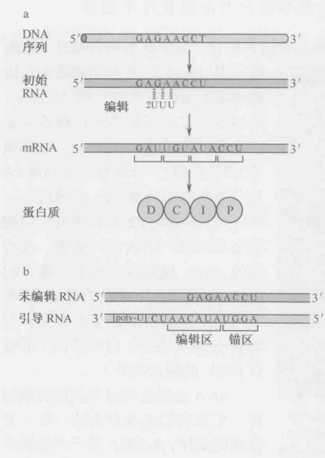

  
图 14-32 由 gRNA 介导的尿嘧啶插入法进行 RNA 编辑。锥虫 cox II 基因 RNA 的编辑。（a）示意 cox II 基因 pre-mRNA 上 4 个尿嘧啶核苷酸插入的位置，在 mRNA 上形成正确的可读框及编码信息；（b）gRNA 上决定尿嘧啶插入模式的序列，以及未编辑 mRNA 的序列；（c）编辑反应的过程。

gRNA 的“锚”区有一段序列，可以与 mRNA 上发生编辑区域的紧邻位置上（3'端）的一段序列形成碱基配对（图 14-32b）。随后编辑“指令”发出：gRNA 的一段序列与 mRNA 上的被编辑区互补配对，但有几个多余的腺嘌呤。这些腺嘌呤在 gRNA 上的位置与将要在 mRNA 上插入尿嘧啶的位置正好相反。gRNA 的 3'端是多聚尿嘧啶，该区域核苷酸的作用尚不清楚，但有人认为它可以把 gRNA 系于 mRNA 上编辑区上游（5'端）的富含嘌呤序列上。

如图 14-32c 所示，gRNA 与 mRNA 形成 RNA-RNA 双链，而在将要插入尿嘧啶的对应位置形成突出的单链环状结构。一种核酸内切酶识别并切开与环状结构相对的 mRNA，并经由由 3' 端尿苷酰转移酶（TUT 酶）催化，在 mRNA 上打开的缺口中加入尿嘧啶。

尿嘧啶插入后，某种 RNA 连接酶把两段 mRNA 连接起来，而 gRNA 的编辑区则沿 mRNA 从 $3'\rightarrow5'$ 方向继续发挥作用。一条 gRNA 可以负责在不同位置插入多个尿嘧啶（图 14-32）。另外，有时会有几种不同的 gRNA 在同一条 mRNA 的不同区域发挥作用。

## mRNA 转运

一旦完成加工，mRNA 会包装好并从细胞核输出到细胞质用于翻译

mRNA一旦全部加工完毕（加帽、剪接和多聚腺苷酸化）就会运出细胞核进入细胞

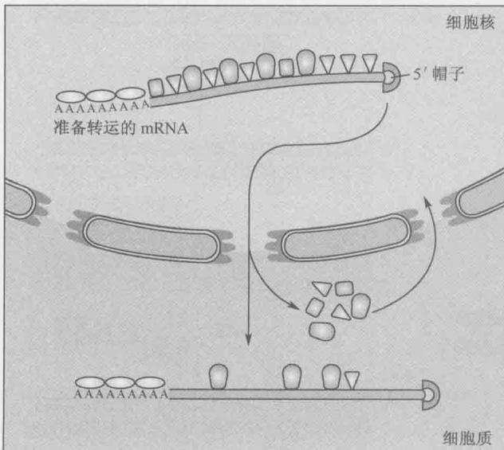  
图 14-33 mRNA 转运出细胞核。RNA 出细胞核是一个主动转运过程，只有某些合适的 RNA 才被挑选出来完成这一过程。为了被挑选转运，这类 RNA 必须结合一组正确的蛋白质。这些蛋白质会使之区别于其他必须留在细胞核内或必须降解的 RNA 种类。例如，识别外显子交界点的蛋白质表示 mRNA 已得到正确剪接，而结合内含子的蛋白质则确定了该种 RNA 应该留在核内。一旦进入细胞质，一些蛋白质卸下，另一些蛋白质装上，以备蛋白质翻译（第 15 章）。

质（图 14-33），并在细胞质中完成翻译得到蛋白质产物（第 15 章）。从细胞核进入细胞质的过程并非是一个被动的过程。事实上，它必须受到精细调控：完成加工的 mRNA 只占细胞核内全部 RNA 的很少一部分，许多其他 RNA 如果进入细胞质会对细胞产生致命的危害。这些其他 RNA 包括损伤或加工错误的 RNA，以及剪接下来的内含子等（由于内含子一般比外显子大得多，与成熟 mRNA 相比，内含子占了细胞核 RNA 的绝大部分）。

RNA 选择性转运是如何完成的呢？正像我们在本章及前一章一直强调的那样，从 RNA 分子开始转录的那一刻起，它就与多种蛋白质结合在一起：最初是参与加帽反应的蛋白质，然后是剪接因子，最后是

介导多聚腺苷酸化的蛋白质。其中一些蛋白质在加工过程的不同阶段被替换，而另外一些（如富集丝氨酸和精氨酸的SR蛋白，见图14-11）则不是；此外，还会有另外的蛋白质加入。结果是典型的成熟mRNA携带着一组蛋白质，正是它们决定了mRNA被转运的命运。而其他RNA不仅缺少转运所必需的特定标记性蛋白质组合，而且自身也携带另外一组蛋白质，这些蛋白质可以有效地阻止RNA转运。例如，剪接下来的内含子通常携带hnRNP（剪接抑制酶），它们决定了这些RNA要留在细胞核内并被降解。

成熟 mRNA 除了携带残留的 SR 蛋白，还携带另外一组专门结合外显子衔接位点的蛋白质（当然只见于完成剪接的 RNA）。mRNA 确实也含一些 hnRNP，但数量比典型地结合于内含子的 hnRNP 要少，而且组成也不一样。这就是说，一组蛋白质而不是任何单独一种蛋白质，决定了 RNA 是转运出细胞核还是留在细胞核内。

转运是通过核膜上的一种特殊结构完成的，这就是核孔复合体（nuclearpore complex）。分子质量小于50kDa的小分子可以自由地通过核孔；但是大分子和复合物，包括mRNA及其相关蛋白质，则需要通过主动转运（其余分子，如有些蛋白质，在细胞质中合成但却需要在细胞核内发挥作用，则沿相反的方向转运，即经过同样的核孔从细胞质进入细胞核）。

本书未涉及关于细胞核的跨膜转运机制。我们只需知道，与 RNA 相关的一些蛋白质携带了细胞核跨膜转运信号，转运受体识别出这些信号后指导 RNA 通过核孔离开细胞核。一旦进入细胞质，蛋白质组分就会解离下来，并被识别后重新运回细胞核；然后再与另外的 mRNA 结合，重复下一次循环（图 14-33）。

主动转运需要能量，由 GTP 水解提供，该反应由一种叫做 Ran 的 GTPase 催化。像其他 GTPase 一样，Ran 依据与 GTP 还是 GDP 结合而有两种不同的构象，由一种状态向另一种状态的转变驱动着进出细胞核的转运反应。

## 小结

在几乎所有的细菌和噬菌体基因中，可读框都是由不间断的一串密码子组成的。但是许多真核生物中，基因的编码区被一段段非编码序列割裂成一簇簇密码子。

这些割裂基因中的编码序列叫外显子（“表达序列”），而非编码区域叫内含子（“插入序列”）。某些非编码区也包含在成熟的 mRNA 中——mRNA 的 5' 和 3' 非翻译区，以及整个非编码 RNA 如 microRNA（第 20 章），因此这些区域也归为外显子。不同基因之间外显子和内含子的数量及大小变化很大。例如，在酵母中，只有很少一部分基因有内含子，而且即使有，内含子的长度短，数量也少（每个基因一个，偶尔两个）。在多细胞生物，如人类中有内含子的基因数目则大得多，每个基因的内含子数目也很多（最多可达 363 个）。外显子长度确实有所不同，但一般在 150nt 左右；而内含子正好相反，可以从 61bp 到 800kb 不等。

包含内含子的基因转录时，最初的 RNA 分子中是包括内含子序列的。然后这些内含子被除去，得到成熟的 mRNA。内含子被除去的过程叫做剪接。

多数含有内含子的基因只产生一种 mRNA 分子，即每种情况下所有内含子都从初始转录的 RNA 分子中除去，得到的成熟 mRNA 由全部外显子组成。但有时初始 RNA 转录产物可以用不同的形式进行剪接，就会从同一个基因得到许多不同的 mRNA 产物。例如，某些基因含有可供选择的外显子，其中只有一个会留在特定的 mRNA 中。在其他的情况中，一个特定的外显子可能从某些拷贝的 RNA 中去除（与内含子一起），从而从同一个基因产生不同版本的 mRNA。我们仔细考察了一个选择性剪接的极端例子—果蝇的 Dscam 基因。在这个例子中，其中一个外显子有 48 个变异体，并且都出现在 pre-mRNA 上，但只有一个出现在每个成熟的 mRNA 中。

内含子和外显子边界的序列可以帮助细胞识别内含子并将其切除。这些剪切序列几乎只在内含子中出现（在这里它们不必编码氨基酸）。这些序列根据它们相对于内含子末端的位置被称为3'和5'剪拉序列。将内含子从mRNA是去除同样需要序列元件，这被称为分支序列，靠近内含子的3'端。

除去内含子是通过两步转酯反应进行的。第一步是由分支点腺苷酸攻击5'剪接位点的鸟苷酸；第二步是游离的5'外显子攻击3'剪接位点。这些反应有两个后果：首先，也是最重要的，是把两个外显子融合到了一起；其次，内含子以带分支套索结构被释放。

对核小体的 pre-mRNA 进行剪接需要一个由多种蛋白质和 RNA 组成的大复合体，即剪接体。剪接体由 snRNP 组成，snRNP 共有 5 种：U1、U2、U4、U5 和 U6 snRNP，每种都由一条 RNA 分子（分别叫做 U1、U2、U4、U5 和 U6 snRNA）和许多蛋白质构成（彼此之间的蛋白质成分大多数不一样）。RNA 成分在识别和催化除去内含子方面起到了核心作用。剪接体组成是动态的，即在剪接反应的不同阶段，剪接体的组成不断改变，不同的组分进进出出，各自行使特定的功能。

剪切体是动态的，它的组装过程并不总是保持一致。这些复合体中的因子来来往往顺序不一，与理想化的剪接体组装路径有所区别甚至部分可逆。这可能是由于作用的不同环境和不同 RNA 的动力学差异造成的。在催化剪切反应之后，剪切体解离，这对于保证剪切过程的单向性和剪切过的 mRNA 的释放非常重要。

有少数内含子能以自剪接的方式把自身从 RNA 分子上除去。虽然算不上真正的酶促反应，但确实是内含子 RNA 介导了剪接的化学反应。自剪接内含子分为两类，其中第Ⅱ类的化学过程与剪接体所介导的相同。这些内含子可能代表了现代由剪接体执行剪接的内含子在演化上的起源，而两者通用的两步转酯反应的化学过程反映了这种演化上的相互关系（也许解释了为何内含子没有采取更直接的一步反应机制进行剪接的原因）。

剪接位点是由很短的、保守程度不高的序列来确定的。这就给剪接体提出了很大的挑战：如何识别正确的剪接位点并完成剪接？剪接体提高准确性的机制有多种。首先，剪接位点一旦转录出来，剪接体立即就会在相应位置上进行组装，避免了下游位点的竞争。其次，有其他一些蛋白质，如SR蛋白，可以结合在正确的位点附近并协助指引剪接体到达这些位点。这样真实位点与序列类似的假位点相比，肯定对剪接体具有更高的亲和力。

SR 蛋白种类繁多，每一种都是用一个结构域结合 RNA，另一个结构域则和剪接体的某些成分相作用。有些 SR 蛋白调控剪接，表现为某种 SR 蛋白只在一种类型的细胞中出现，从而在这种细胞中完成一种特定的剪接方式。另一些 SR 蛋白只在特定的生理信号下才有活性，所以某种特定的剪接方式仅对应于该生理信号。这样，SR 蛋白类似在后续章节中将会看到的转录激活因子。还与转录调控类似的是，剪接也有抑制因子，可以在某些条件下终止对特定内含子的剪接。我们详细考察了果蝇的性别决定的例子，一连串调控的可变剪接事件决定了果蝇是否发育成雄性或雌性。

与第 13 章讨论的其他修饰过程一起，剪接是 mRNA 通过核孔转运出细胞核之前所必须进行的。

一般而言，一个外显子编码一个独立的折叠或功能蛋白结构域。因此，一个外显子就可以很容易地与其他外显子组合起来发挥作用。它提示了通过演化比较容易将不同基因中已经存在的外显子重新组合以获得新的蛋白质。

RNA 编辑是允许 RNA 转录以后进行改变的另一种机制，以使翻译出来的蛋白质与原基因所编码的蛋白质不同。RNA 编辑的机制有两种：酶促碱基修饰和 mRNA 分子内多个尿嘧啶核苷酸的插入或删除。

## 参考文献

## 书籍

Atkins J.F., Gesteland R.F., and Cech T.R. 2011. RNA worlds: From life's origins to diversity in gene regulation. Cold Spring Harbor Laboratory Press, Cold Spring Harbor, New York.

## 剪接和剪接体的作用机制

Hoskins A.A. and Moore M.J. 2012. The spliceosome: A flexible, reversible macromolecular machine. Trends Biochem. Sci. 237: 179–188.

Newman A.J. and Nagai K. 2010. Structural studies of the spliceosome: Blind men and an elephant. Curr. Opin. Struct. Biol. 20: 82–89.

Rino J. and Carmo-Fonseca M. 2009. The spliceosome: A self-organized macromolecular machine in the nucleus? Trends Cell Biol. 19: 375–384.

Semlow D.R. and Staley J.P. 2012. Staying on message: Ensuring fidelity in pre-mRNA splicing. Trends Biochem. Sci. 37: 263–273.

Wachtel C. and Manley J.L. 2009. Splicing of mRNA precursors: The role of RNAs and proteins in catalysis. Mol. Biosyst. 5: 311–316.

Wahl M.C., Will C.L., and Lührmann R. 2009. The spliceosome: Design principles of a dynamic RNP machine. Cell 136: 701–718.

## 自我剪接

Lambowitz A.M. and Zimmerly S. 2011. Group II introns: Mobile ribozymes that invade DNA. Cold Spring Harb. Perspect. Biol. 3: a003616.

Michel F., Costa M., and Westhof E. 2009. The ribozyme core of group II introns: A structure in want of partners. Trends Biochem. Sci. 34:189–199.

Toor N., Keating K.S., and Pyle A.M. 2009. Structural insights into RNA splicing. Curr. Opin. Struct. Biol. 19: 260–266.

## 可变剪接及调控

Heyd F. and Lynch K.W. 2011. Degrade, move, regroup: Signaling control of splicing proteins. Trends Biochem. Sci. 36: 397–404.

Kalsotra A. and Cooper T.A. 2011. Functional consequences of developmentally regulated alternative splicing. Nat. Rev. Genet. 12: 715–729.

Li Q., Lee J.A., and Black D.L. 2007. Neuronal regulation of alternative pre-mRNA splicing. Nat. Rev. Neurosci. 8: 819–831.

Maniatis T. and Tasic B. 2002. Alternative pre-mRNA splicing and proteome expansion in metazoans. Nature 418: 236–243.

McManus C.J. and Graveley B.R. 2011. RNA structure and the mechanisms of alternative splicing. Curr. Opin. Genet. Dev. 21: 373–379.

Muñoz M.J., de la Mata M., and Kornblihtt A.R. 2010. The carboxy terminal domain of RNA polymerase II and alternative splicing. Trends Biochem. Sci. 35: 497–504.

Nilsen T.W. and Graveley B.R. 2010. Expansion of the eukaryotic proteome by alternative splicing. Nature 463: 457–463.

Pawlicki J.M. and Steitz J.A. 2010. Nuclear networking fashions pre-messenger RNA and primary microRNA transcripts for function. Trends Cell Biol. 20; 52–61.

## mRNA 转运

Dreyfuss G., Kim V.N., and Kataoka N. 2002. Messenger-RNA-binding proteins and the messages they carry. Nat. Rev. Mol. Cell Biol. 3:195–205.

Stewart M. 2010. Nuclear export of mRNA. Trends Biochem. Sci. 35:609–617.

## 演化

Irimia M., Penny D., and Roy S.W. 2007. Coevolution of genomic intron number and splice sites. Trends Genet. 23: 321–325.

Koonin E.V. 2009. Intron-dominated genomes of early ancestors of eukaryotes. J. Hered. 100: 618–623.

Roy S.W. and Gilbert W. 2006. The evolution of spliceosomal introns: Patterns, puzzles and progress. Nat. Rev. Genet. 7: 211–221.

## RNA 编辑

Aphasizhev R. and Aphasizheva I. 2011. Uridine insertion/deletion editing in trypanosomes: A playground for RNA-guided information transfer. Wiley Interdiscip. Rev RNA 2: 669–685.

Blanc V and Davidson N.O. 2010. APOBEC-1-mediated RNA editing. Wiley Interdiscip. Rev. Syst. Biol. Med. 2: 594–602.

Chiu Y.L. and Greene W.C. 2008. The APOBEC3 cytidine deaminases: An innate defensive network opposing exogenous retroviruses and endogenous retroelements. Annu. Rev. Immunol. 26: 317–353.

Nishikura K. 2010. Functions and regulation of RNA editing by ADAR

deaminases. Annu. Rev. Biochem. 79: 321–349.

Paro S., Li X., O'Connell M.A., and Keegan L.P. 2012. Regulation and functions of ADAR in Drosophila. Curr. Top. Microbiol. Immunol. 353: 221–236.

Rosenthal J.J. and Seeburg P.H. 2012, A-to-I RNA editing: Effects on proteins key to neural excitability. Neuron 74: 432–439.

Stuart K.D., Schnaufer A., Ernst N.L., and Panigrahi A.K. 2004. Complex management: RNA editing in trypanosomes. Trends Biochem. Sci. 30;97–105.

## 剪接与疾病

David G.J. and Manley J.L. 2010. Alternative pre-mRNA splicing regulation in cancer: Pathways and programs unhinged. Genes Dev. 24:2343–2364.

Kole R., Krainer A.R., and Altman S. 2012. RNA therapeutics: Beyond RNA interference and antisense oligonucleotides. Nat. Rev. Drug Discov. 11: 125–140.

Padgett R.A. 2012. New connections between splicing and human disease. Trends Genet. 28: 147–154.

## 习题

偶数习题的答案请参见附录2

习题 1 就每个基因所含内含子的平均数量而言，酿酒酵母的远低于人类的，请解释其原因。

习题2 5'-剪接位点和3'-剪接位点中的5'和3'标记是相对于内含子还是外显子来说的？除了这两种剪接位点，剪接反应还需要什么序列？这种序列位于哪里？

习题 3 整个剪接过程以未剪接的前体 RNA 为起始，在第一步剪接反应结束后会产生一些中间体，请对这些中间体进行描述。

习题 4 已知剪接过程中的两个关键反应可以从正反两个方向进行，那么在体内是什么阻止剪接反应反向进行？

习题 5 请解释小核糖核蛋白（snRNP）同前体 mRNA 剪接底物之间发生相互作用的基础。

习题 6 如果 5'剪接位点序列由 5'-GUAAGU-3'变为 5'-GUAUGU-3', 请预测这种序列改变对体外蛋白质-RNA 结合试验中 U1 和 U6 snRNP 结合的影响。

习题 7 请比较Ⅰ类内含子和Ⅱ类内含子自剪接的机制。

习题 8 如果剪接体识别了一种 “假” 的 3' 剪接位点，这一假位点位于内含子中，处在真 3' 剪接位点略为上游的位置。请描述这种剪接反应的产物并说明它是如何改变翻译后的蛋白质产物的。

习题 9 请解释空间位阻是如何导致相互排斥剪接的。

习题10 无义介导降解在决定最终的、用于翻译的可变剪接产物中是如何发挥作用的？

习题 11 细胞可以通过 mRNA 的脱氨基反应调控特定基因的细胞特异性表达, 而 DNA

的脱氨基反应则不行，请解释其原因。

习题 12 在一次生化实验中，你使用三种不同的底物进行体外的剪接反应，并对其产物进行了比较。每个反应的底物构造都是由一个单独的内含子和两个分布在其周围的外显子组成，并且所有构造的整体长度是相同的。然而在这三个反应中，一个反应的内含子是Ⅰ类内含子，另一个反应的内含子是Ⅱ类内含子，第三种反应的内含子被剪接体切除。每一种构造都进行了适当的标记以便可以通过凝胶电泳检测到。同时每种构造都使用了两种反应进行检测：一种是在有利于自剪接反应的条件下进行的，另一种所处条件相同且还添加了核提取物。请对下图所示的结果同三种内含子的类型进行匹配。注意：为了简单化，只有剪接反应的最终产物可以被看到，但此时内含子尚未降解。

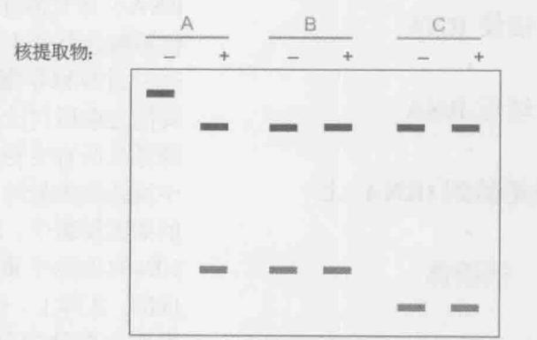

## 第15章

本章概要

信使RNA

转运RNA

连接氨基酸到 tRNA 上

核糖体

翻译的起始

翻译延伸

翻译终止

翻译的调控

依赖于翻译过程的 mRNA 和蛋白质的稳定性调节

## 翻 译

本章和下一章讨论的中心问题是，蕴藏在信使 RNA（mRNA, messenger RNA）核苷酸序列中的遗传信息是如何被解读并产生蛋白质氨基酸序列的。这一过程称作翻译（translation）。在我们之前所讨论过的所有生理过程中，翻译是所有生物体中最保守，也是细胞中最耗费能量的过程之一。在快速生长的细菌细胞中，最多可有80%的能量和50%的细胞干重是专门用于蛋白质合成的。实际上，仅一个蛋白质的合成就需要上百种蛋白质和 RNA 的配合工作。由于翻译过程的本质较为复杂，我们分两章对其进行讨论。本章描述解码 mRNA 的一系列过程。第16章描述遗传密码的本质和转运 RNA（tRNA）对遗传密码的识别。

在信息传递中，翻译远比 DNA 到 RNA 的转录过程复杂。与 DNA 模板和信使 RNA 的核苷酸互补性不同的是，氨基酸的侧链与 RNA 的嘧啶和嘌呤之间几乎没有什么特异的亲和力。例如，丙氨酸（alanine, Ala）、缬氨酸（valine,

Val）、亮氨酸（leucine，Leu）和异亮氨酸（isoleucine，Ile）构成的疏水侧链不能和核苷酸碱基中的氨基和酮基形成疏水键。同样地，很难想像每三个RNA碱基所形成的不同组合能够与芳香族氨基酸包括苯丙氨酸（phenylalanine，Phe）、酪氨酸（tyrosine，Tyr）和色氨酸（tryptophan，Trp）形成特异亲和的表面。因此，多肽链中特异而准确的氨基酸序列似乎不可能是由mRNA模板和氨基酸的直接相互作用导致的。

考虑到上述问题，在 1955 年 Francis H. Crick 提出，在形成多肽链之前，氨基酸必须结合一个能够直接识别并作用于信使 RNA 三核苷酸密码子的特殊的转配分子(adaptor)。Crick 猜测这一转配器分子可能是 RNA 分子, 因为这个分子需要通过 Watson-Crick 的碱基互补原则来识别遗传密码。仅仅两年之后, Paul C. Zamecnik 和 Mahlon B. Hoagland 就证明了, 在蛋白质形成之前, 氨基酸确实和一组 RNA 分子 (约占所有细胞 RNA 的 15%) 相结合。这些 RNA 称为转运 RNA (或 tRNA), 因为它们携带的氨基酸随后被转运到不断延伸的多肽链上。

将信使 RNA 的语言翻译成蛋白质语言的机器由 4 种基本的成分组成：信使 RNA (mRNA)、转运 RNA (tRNA)、氨酰-tRNA 合成酶（aminoacyl tRNA synthetase）和核糖体（ribosome）。通过合作，它们完成了一项非凡的任务：将一种由 4 种碱基书写的密码翻译成由 20 种氨基酸书写的密码。作为翻译的模板，mRNA 提供了必须由翻译机器来解读的信息。mRNA 的蛋白质编码区是由称为密码子（codon）的一系列有序的三核苷酸单位组成的，密码子的排列顺序将决定氨基酸的排列顺序。tRNA 提供了将要组合到多肽链的氨基酸和 mRNA 的密码子之间的物理界面。氨酰-tRNA 合成酶使氨基酸和能识别相应密码子的特异 tRNA 结合起来。翻译过程最后一个重要角色是核糖体，它是一个由 RNA 和蛋白质组成的分子质量为数百万道尔顿的庞大的细胞器。核糖体协调着 tRNA 对 mRNA 的正确识别，并催化处于合成状态中的多肽链和已结合到特定 tRNA 上的氨基酸形成肽键结构。

我们将首先讨论4个组分中每一组分的主要特征，然后描述这4种组分如何共同作用以完成翻译。最近对阐明翻译机器各组分的结构相关研究进展使得翻译过程成为激动人心的研究领域——一个充满着机械论思想的领域。我们将要提出以下的问题：mRNA中核苷酸序列信息的组织结构是怎样的？tRNA的结构是怎样的？氨酰—tRNA合成酶是如何识别并结合正确的氨基酸到各个tRNA上的？最后，核糖体是如何解码核苷酸序列信息和把氨基酸加入到延伸过程中的多肽链上的？

## 信使RNA

## 多肽链是由可读框决定的

翻译机器只解码每条 mRNA 的部分序列。如在第 2 章中所提到的及在第 16 章中将要详细讨论的，蛋白质合成的信息蕴藏在三联核苷酸密码子中，每个密码子决定一个氨基酸。每条 mRNA 的蛋白质编码区由连续的、不交叠的、称为可读框（open reading frame，一般简称为 ORF）的密码子串组成。每个 ORF 对应一个蛋白质，其起始和终止点都位于 mRNA 内部，即 ORF 的终止点不同于 mRNA 的终止点。

翻译始于可读框的 5'端起点，每次读取一个密码子直到 3'端终点。第一个和最后一个密码子分别称为起始密码子（start codon）和终止密码子（stop codon）。细菌中，起始密码子通常是 5'-AUG-3'，但是 5'-GUG-3'有时甚至 5'-UUG-3'也被使用。真核细胞总是使用 5'-AUG-3'作为起始密码子。起始密码子有两个重要的功能：第一，它决定插入到延伸过程中的多肽链的第一个氨基酸；第二，它确定了所有后续密码子的可读框。由于密码子是一个紧接一个排列（但不相互交叠），而且由三个核苷酸组成，因此每条mRNA 链可以用三种不同模式的可读框来翻译（图 15-1）。但是一旦翻译开始了，可读框的模式就确定了。这样，通过设定第一个密码子的位置，起始密码子决定了所有后续密码子的位置。

  
图 15-1 大肠杆菌 Trp（Escherichia coli trp）前导序列的三种可能的可读框。起始密码子以绿色表示，终止密码子以红色表示。每个可读框编码的氨基酸序列在每一密码子的下方以单个字母表示。

终止密码子有三个（5'-UAG-3'、5'-UGA-3'、5'-UAA-3'），它们决定可读框的终点并发出终止多肽合成的信号。我们现在可以全面地理解可读框这一术语的含义了。它是一段连续的密码子，以特定的框架（由第一个密码子决定）来“阅读”，该框架对翻译过程是“开放”的，因为它没有终止密码子（也就是说，翻译过程可持续到ORF的最后一个密码子）。

信使 RNA 包含至少一个可读框。每条 mRNA 的 ORF 数量在真核和原核细胞中是有区别的。真核细胞的 mRNA 几乎都只有一个 ORF。相反，原核细胞的 mRNA 经常含有两个或多个 ORF，因此可编码多个多肽链。含有多个 ORF 的信使 RNA 称为多顺反子 mRNA（polycistronic mRNA），而那些只编码一个 ORF 的信使 RNA 称为单顺反子 mRNA（monocistronic mRNA）。正如在第 13 章中所提到的，细菌中的多顺反子 mRNA 经常编码功能相关的蛋白质，如在氨基酸或核酸的生物合成过程中参与不同步骤的蛋白质。典型的原核和真核细胞的 mRNA 结构如图 15-2 所示。

## 原核细胞 mRNA 具有核糖体结合位点，可以募集翻译机器

要使翻译发生，mRNA 必须募集核糖体。为了促进其与核糖体结合，许多原核细胞的可读框在起始密码子的上游（5'端）含有一段短序列称为核糖体结合位点（ribosomebinding site, RBS）。这一元件也被称作 SD 序列（Shine-Dalgarno sequence），它是通过比较多个 mRNA 序列后所发现，并以发现它的科学家的名字所命名的。RBS 一般位于起始密码子 5'端 3\~9 个碱基内，并与核糖体 RNA 组分之一的 16S 核糖体 RNA（rRNA，图 15-2a）的 3'端的一段序列互补。RBS 与这一 RNA 发生碱基配对，使得核糖体排列在可读框的起始处。16S RNA 的这一区域的核心序列为 5'-CCUCCU-3'。无独有偶，原核细胞的 RBS 大多具有 5'-AGGAGG-3'序列。RBS 和起始密码子之间碱基的互补状况和空间距离对可读框翻译的活跃程度有很大的影响：互补度高并且距离适合的情况能提高翻译的水平；反之，互补度低和（或）距离不当则通常导致较低水平的翻译。

  
图 15-2 信使 RNA 的结构。(a) 一个多顺反子的原核细胞信使 RNA。核糖体结合位点以 RBS 表示。(b) 一个单顺反子的真核细胞信使 RNA。5' 帽子结构在 mRNA 的末端以球形表示。

某些原核细胞的 ORF 缺乏较强的 RBS 但仍有活跃的翻译。这些 ORF 不是 mRNA 的第一个 ORF，而位于多顺反子信使 RNA 中另一个 ORF 之后（不是所有的原核 mRNA 是多顺反子）。在这些情况下，下游可读框的起始密码子经常与上游可读框的 3' 端相交叠（大多数是 5'-AUGA-3' 序列，既有起始密码子，也有终止密码子）。这样，刚刚结束上游可读框翻译的核糖体正好处于恰当的位置，并从下游可读框的起始密码子开始翻译。这种结构安排绕开了用 RBS 募集核糖体的需要。这种交叠可读框之间的连锁翻译称为翻译耦合（translational coupling）。需要注意的是，在这种情况下，下游 ORF 的翻译的进行需要依赖于上游 ORF 的翻译。事实上，对于两个翻译耦合的基因，上游 ORF 中的终止突变也会阻止下游 ORF 的翻译。

## 真核细胞 mRNA 在 5' 和 3' 端被修饰，以促进翻译

与原核细胞不同，真核细胞的 mRNA 通过位于 5' 端的称为 5' 帽子（5' cap）的特殊化学修饰来募集核糖体（第 13 章和图 13-25b）。所谓 5' 帽子，是一个通过与众不同的 5'-5' 结合方式与 mRNA 的 5' 端结合的甲基化鸟嘌呤核苷酸。经过 3 个步骤进行合成（第 13 章和图 13-24），5' 帽子的鸟嘌呤核苷酸与 mRNA 的 5' 端通过 3 个磷酸基团结合。这样形成的 5' 帽子结构能够募集核糖体结合到 mRNA 上。一旦结合到 mRNA 上，核糖体沿着 5'→3' 的方向移动直至遇到 5'-AUG-3' 起始密码子，这一过程称为扫描（scanning）。

真核生物 mRNA 有另外两个特征能促进翻译过程。其一是在某些 mRNA 中，起始密码子的上游第三个碱基为嘌呤并且第一个下游碱基为鸟嘌呤的特殊序列（5'-G/

ANNAUGG-3')。这一序列首先由 Marilyn Kozak 发现，称为 Kozak 序列。虽然许多真核细胞缺乏 Kozak 序列，但它的存在确实能够提高翻译的效率。与原核细胞的情况相反，Kozak 序列被认为能够与起始 tRNA 发生相互作用，而不是与核糖体的 RNA 成分相互作用。另一个有利于翻译的特征是 3' 端的 poly-A 尾结构。如第 13 章所述，这一尾结构是由 poly-A 聚合酶合成的。尽管位于 mRNA 的 3' 端，poly-A 尾巴可通过增强关键翻译起始因子的募集作用来提高翻译的水平。更重要的是，除了在翻译中的作用以外，这些 5' 端和 3' 端的修饰也可以保护真核 mRNA 免受快速降解（我们将在“依赖翻译的 mRNA 和蛋白质的稳定性调节”部分进行讨论）。

## 转运RNA

## tRNA 是密码子和氨基酸之间的转配器

蛋白质合成的核心是将核苷酸序列的信息（以密码子的形式）“翻译”成氨基酸。这是由 tRNA 分子完成的，它担当密码子及其所决定的氨基酸之间的转配器。tRNA 分子有很多种，但每一种仅与一个特定的氨基酸结合并识别 mRNA 的一个或几个特定的密码子（大多数 tRNA 识别一个以上密码子，我们将在第 16 章讨论）。tRNA 分子的长度为 75\~95 个核苷酸。虽然各自的序列不同，但所有的 tRNA 都具有某些共同的特征。首先，所有的 tRNA 在 3'端均为 5'-CCA-3'序列（见框 15-1）。与该高度保守性相一致的是，该序列（和 tRNA 的）3'端是与其编码的氨基酸相结合的位点。

## 框 15-1 CCA 添加（CCA-adding）酶：无模板合成 RNA

如正文所述，5'-CCA-3' 端在所有 tRNA 中是保守的，并且在蛋白质合成中是必需的。但奇怪的是，当克隆那些编码 tRNA 的基因时，却发现许多并不编码 CCA 末端。反而这些基因比成熟的 tRNA 3' 端短 3 个核苷酸。事实上，许多编码细菌 tRNA 和几乎所有真核生物 tRNA 的基因都缺乏末端的这 3 个碱基。那么，这些 tRNA 是怎样获得其 CCA 末端的呢？答案来自一种称为 CCA-添加酶的特殊 RNA 合成酶。顾名思义，这种酶可以将 CCA 添加到末端原本缺乏这个序列的 tRNA 上。奇怪的是，这种酶没有对应的核酸组分；也就是说，CCA-添加酶在没有 RNA 或 DNA 模板的情况下将一段特定的序列添加到 tRNA 的末尾。

CCA 添加酶如何在没有模板的情况下加入一段特定的序列呢？对这些酶的一系列三维结构的研究开始揭示其答案。首先，像其他 RNA 合成酶和 DNA 合成酶一样，CCA 添加酶只有一个活性位点，采用类似的双金属离子催化机制（见第 9 章和图 9-6）。在这一活性位点内部，一个氨基酸和 tRNA 末尾核苷酸的一个磷酸基团与 A 和 C 碱基而不是 G 和 U 碱基形成氢键。可以通过观察每个碱基的氢键供体和受体的键型来理解这种特异性（见第 6 章和图 6-14）。A 和 C 的键型相似和重叠，而 G 和 U（或 T）则相反和互补。实际上，正是这种互补性担负着 DNA 双螺旋内的碱基配对的特异性。这种氢键键型解释了 CCA 添加酶对 A 和 C 的特异性。

添加 C 还是 A 的特异性是由加入碱基时酶活性位点的变化来控制的。与其他聚合酶不同，当额外的核苷加入时，tRNA 模板并不改变位置。相反，tRNA 模板紧紧地固定在其位置上，每个加入的核苷改变了酶活性位点的结构。改变的结果是，当缺失 CCA 的 tRNA 与酶结合时，酶活性位点对 C 具有特异性，而当加入了两个 C 之后，酶变得对 A 具有特异性。一旦 A 加入之后，活性位点不再对任何多余的碱基开放，而带有新加入的 CCA 末端的 tRNA 得以释放。

tRNA 另一个显著的特征就是在其一级结构中存在一些特殊的碱基。这些特殊的碱基是多核苷酸链的正常碱基在转录后受到酶的修饰作用形成的。例如，假尿嘧啶（ΨU）就是尿苷经异构化作用使尿嘧啶与核糖结合的位置从环 1 位的 N 转移到环 5 位的 C 而形成的（图 15-3）。同样地，双氢尿嘧啶（dihydrouridine，D）是尿苷经酶的作用使 5 位和 6 位之间的 C 双键减为单键而形成的。tRNA 中发现的另一些特殊碱基包括次黄嘌呤（hypoxanthine，H）、胸腺嘧啶（thymine，T）和甲基鸟嘌呤（methylguanine，Gm）。这些修饰碱基对 tRNA 的功能并非不可或缺，但缺少这些碱基的细胞生长变慢。这一现象暗示这些修饰碱基可能可以提高 tRNA 的功能。例如，如第 16 章将要提到的，次黄嘌呤在某些 tRNA 对密码子的识别过程中扮演重要的角色。

  
图 15-3 tRNA 中发现的一部分修饰核苷。图示为尿苷和 2 个尿苷相关的核苷。

## tRNA 具有共同的三叶草型的二级结构

在第 5 章中曾谈到，RNA 分子通常含有自我互补区域，能够通过碱基配对形成有限的双螺旋结构；而 RNA 的其他区域是没有互补结构的，所以是单链的。tRNA 分子表现为特异的，高度保守的单链和双链区域（二级结构），该结构可描绘成三叶草型（图 15-4）。tRNA 三叶草型结构的主要特征是具有 1 个受体臂、3 个茎环（分别为 $\Psi U$ 环、D 环和反密码子环）和 1 个可变环。对于这些特征结构的描述如下：

\- 受体臂（acceptor stem）由于具有结合氨基酸的位点而得名，由 tRNA 分子的 5' 和 3' 端的碱基配对而成。其 3' 端的 5'-CCA-3' 序列突出双链之外。

\- $\Psi$ U环（ $\Psi$ U loop）因特殊碱基 $\Psi$ U（假尿嘧啶）的存在而得名。这一修饰碱基经常发现位于 $5^{\prime}$ -T $\Psi$ UCG-3'序列中。

\- D环（D loop）因特殊碱基双氢尿嘧啶的存在而得名。

\- 反密码子环（anticodon loop），顾名思义，包含反密码子——一个三核苷酸序列，能够通过碱基配对方式识别 mRNA 的密码子。反密码子的两端由 5'端的尿嘧啶和 3'端的嘌呤界定。

\- 可变环（variable loop）位于反密码子环和 $\Psi U$ 环之间，长度为 $3\sim 21bp$ 不等，正如其名。

## tRNA 具有 L 形的三维结构

三叶草型结构揭示了 tRNA 含有自我互补的区域。那么，这一转配器分子实际的三维构象是如何的呢？X 射线晶体学揭示其为 L 形的三级结构，受体臂在一端，反密码子环在另一端，两者相距 70Å（图 15-5c）。要了解这一 L 形结构和三叶草型结构的关系，请考虑以下方面：在最终形成的 tRNA 三维构象中，受体臂和 ΨU 环茎之间将形成延伸的螺旋结构（图 15-5b）。同样地，反密码子茎和 D 环茎形成第二个延伸的螺旋。这两个延伸的螺旋垂直排列，D 环和 ΨU 环靠在一起。

  
图 15-4 tRNA 的三叶草状二级结构。在此 tRNA 示意图中，红色虚线表示 tRNA 不同部分之间的碱基配对。

  
图 15-5 tRNA 的三叶草结构和实际的三维结构之间的转换。(a) 三叶草示意图；(b) L 状结构示意图显示最终折叠的 tRNA 碱基配对的位置；(c) tRNA 的实际折叠结构的带状示意图。请注意虽然此图说明了实际的 tRNA 结构与三叶草结构的关系，但 tRNA 并不是通过先碱基配对再 L 状折叠来形成最后的结构的。

三种相互作用使这 L 状结构得以稳定。第一，因形成两个延伸的碱基配对区域而获得的类似 DNA 双链的碱基堆积作用。第二，三维结构中相互靠近的不同螺旋区域的碱基间的氢键，这些碱基间的相互作用通常是非常规（非 Watson-Crick）键对。第三，碱基和磷酸核糖骨架之间的相互作用。

## 氨基酸连接到 tRNA 上

## 氨基酸通过高能酰基连接到 tRNA 3'端的腺苷酸上使 tRNA 负载

连接了氨基酸的 tRNA 分子称为负载的（charged）tRNA，未连接氨基酸的 tRNA称为空载的（uncharged）tRNA。这一负载过程需要氨基酸的羧基与 tRNA 3'端受体臂突出的腺苷酸的 2'或 3'羟基（见下文的讨论）形成酰基。形成的酰基是一个高能键，因为它的水解导致自由能的产生较大变化。这对于蛋白质的合成是非常重要的——这一高能键水解所释放的能量帮助推动多肽链中氨基酸之间肽键的形成。

## 氨酰 tRNA 合成酶分两步使 tRNA 负载

所有的氨酰-tRNA 合成酶分两个酶促步骤使氨基酸连接到 tRNA 上（图 15-6）。第一步是腺苷酰基化（adenylylation），氨基酸和 ATP 反应而被腺苷酰基化，同时释放出焦磷酸。腺苷酰基化指的是 AMP 的转移，与腺苷酸化（adenylylation）相反，后者发生的是腺苷酸的转移。正如我们在多核苷酸的合成过程中看到的一样（第 9 章），腺苷酰基化反应的主要驱动能量来自于随后的焦磷酸酶对焦磷酸的水解。腺苷酰基化的结果是，通过氨基酸的羧基与 AMP 的磷酸基团形成的高能酯键，使氨基酸与腺苷酸连接。第二步是 tRNA 负载（tRNA charging），腺苷酰基化的氨基酸与氨酰 tRNA 合成酶保持紧密结合的状态下，与 tRNA 发生反应。这一反应导致氨基酸通过与 tRNA 上的 2' 或 3' 羟基作用，转移到 tRNA 的 3' 端，同时释放出 AMP。

  
图 15-6 氨酰-tRNA 负载的两个步骤。(a) 氨基酸的腺苷酰基化；(b) 腺苷酰基化的氨基酸转移至 tRNA 上。此图显示的为Ⅱ类 tRNA 合成酶的反应（该酶连接氨基酸到 3'-OH 上）。

tRNA 合成酶分两类（表 15-1）。Ⅰ类酶将氨基酸连接到 tRNA 的 2'羟基，并且通常是单聚体；Ⅱ类酶将氨基酸连接到 tRNA 3'羟基，并且通常是二聚体或四聚体。虽然氨基酸与 tRNA 之间最初的耦联方式不同，然而一旦从合成酶中释放出来，氨基酸能够很快地平衡其与 2'或 3'羟基的连接。

表 15-1 氨基酰 tRNA 合成酶的种类

<table><tr><td>II类</td><td>四级结构</td><td>I类</td><td>四级结构</td></tr><tr><td>Gly</td><td> $(\alpha_{2}\beta_{2})$ </td><td>Glu</td><td> $(\alpha)$ </td></tr><tr><td>Ala</td><td> $(\alpha_{4})$ </td><td>Gln</td><td> $(\alpha)$ </td></tr><tr><td>Pro</td><td> $(\alpha_{2})$ </td><td>Arg</td><td> $(\alpha)$ </td></tr><tr><td>Ser</td><td> $(\alpha_{2})$ </td><td>Cys</td><td> $(\alpha_{2})$ </td></tr><tr><td>Thr</td><td> $(\alpha_{2})$ </td><td>Met</td><td> $(\alpha_{2})$ </td></tr><tr><td>His</td><td> $(\alpha_{2})$ </td><td>Val</td><td> $(\alpha)$ </td></tr><tr><td>Asp</td><td> $(\alpha_{2})$ </td><td>Ile</td><td> $(\alpha)$ </td></tr><tr><td>Asn</td><td> $(\alpha_{2})$ </td><td>Leu</td><td> $(\alpha)$ </td></tr><tr><td>Lys</td><td> $(\alpha_{2})$ </td><td>Tyr</td><td> $(\alpha)$ </td></tr><tr><td>Phe</td><td> $(\alpha_{2}\beta_{2})$ </td><td>Trp</td><td> $(\alpha)$ </td></tr></table>

来源：Data from Delarue M. 1995. Current Opinion in Structural Biology 5: 48-55. Table 1. ©Elsevier.  
注：Ⅰ类酶一般是单体，而Ⅱ类酶是二聚体或四聚体，来自两个亚基的残基为单个tRNA提供结合位点。α和β指tRNA合成酶的亚基，下标指化学计量。

## 每种氨酰—tRNA 合成酶连接一种氨基酸到一个或多个 tRNA 上

20 种氨基酸都是通过专门的 tRNA 合成酶连接到正确的 tRNA 上的。由于大多数的氨基酸是由多于一种的密码子决定的（第 16 章），因此一种合成酶经常识别多于一种的 tRNA（称为同工 tRNA，iso-accepting tRNA）并使之负载氨基酸，但是多个同种 tRNA 合成酶需要负责一个特定氨基酸，并使所有合适的 tRNA 负载。因此，对一个氨基酸而言，有一种而且只有一种 tRNA 合成酶将其连接到所有合适的 tRNA 上。

大多数的生物具有20种不同的tRNA合成酶，但并不总是这样。例如，有些细菌缺乏使谷酰胺连接到 $\mathrm{tRNA}^{\mathrm{Gln}}$ 的合成酶。取而代之的，是由一种氨酰-tRNA合成酶负责将Glu连接到 $\mathrm{tRNA}^{\mathrm{Gln}}$ 和 $\mathrm{tRNA}^{\mathrm{Glu}}$ 上。然后第二种酶将一部分负载的 $\mathrm{tRNA}^{\mathrm{Gln}}$ 上的Glu氨基化形成Gln。即将 $\mathrm{Glu - tRNA}^{\mathrm{Gln}}$ 氨基化变成 $\mathrm{Gln - tRNA}^{\mathrm{Gln}}$ （前缀指氨基酸，上标指tRNA所识别的密码子）。第二种酶的存在使细菌不再需要谷酰胺tRNA合成酶。但是，一种氨酰-tRNA合成酶永远不能将多于一种的氨基酸连接到一种其相应的tRNA上。

## tRNA 合成酶识别位于同族 tRNA（cognate tRNA）上的独特结构特征

从前面的讨论中可以看出，氨酰-tRNA 合成酶面临两个重要的挑战：它们必须识别针对特定氨基酸的一组正确的 tRNA，而且它们必须使这些同工 tRNA 负载正确的氨基酸。这两个过程都必须高度精确地进行。

让我们首先探讨 tRNA 识别的特异性：tRNA 分子的什么特征使得合成酶能够将某种氨基酸的同工 tRNA 与其他 19 种氨基酸的 tRNA 区别开呢？来自遗传学、生物化学和 X 射线晶体学研究的证据表明决定这特异性的因素来自 tRNA 分子的两个相距较远的位点：受体臂和反密码子环（图 15-7）。受体臂是 tRNA 合成酶特异性识别的一个极其重要的决定因素。在某些情况下，改变受体臂的一个碱基[称为鉴别者碱基（discriminatorbase）]足以使特异性识别某个 tRNA 的合成酶变为另一种合成酶。虽然如此，反密码子环也经常对识别特异性有所贡献。例如，谷氨酰胺 tRNA 合成酶同受体臂和反密码子环都有广泛的接触，包括反密码子本身（图 15-8）。

  
图 15-7 tRNA 结构：供氨酰-tRNA 合成酶识别的必需元件。  
图 15-8 谷氨酰胺 tRNA 合成酶与 tRNA $^{Gln}$ 结合的晶体结构图。酶以灰色表示，tRNA $^{Gln}$ 以紫红色表示，黄色、红色和绿色的分子是谷氨酰-AMP。请注意这一分子和 tRNA $^{Gln}$ 的 3'端的距离，以及 tRNA 和合成酶作用的结合点。（Rath V.L. et al. 1998. Structure 6: 439–449.）图像使用 BobScript、MolScript 和 Raster 3D 软件制作。

你也许会认为反密码子总是被 tRNA 合成酶在识别过程中所利用，因为它是 tRNA 的最终决定特征——反密码子决定了 tRNA 负责加入到延伸多肽链上的氨基酸种类。但是，由于每个氨基酸通常由多于一个的密码子所编码，因此在很多情况下，反密码子不能被用作 tRNA 合成酶识别的标志。例如，Ser 可以由 6 种密码子编码，其中包括 5'-AGC-3' 和 5'-UCA-3' 这两个完全不同的密码子。这样，Ser 的 tRNA 需要具有不同的反密码子，而无法轻易地被单一的 tRNA 合成酶所识别。为此，Ser 的合成酶必须依靠反密码子以外的因素来识别其 tRNA 分子。

## 氨酰-tRNA 的形成是非常精确的

氨酰-tRNA合成酶在选择正确的氨基酸方面所面临的挑战也许比其在识别正确的tRNA分子上的挑战更为令人吃惊（图15-9）。这是因为氨基酸的体积较小，并且在某些情况下，它们非常相似。尽管挑战巨大，负载出错的概率却是非常小的，通常1000个tRNA分子中只有不到一个tRNA负载了错误的氨基酸。在某些情况下，如何实现这一高精确度是非常容易理解的。例如，Cys和Trp在体积、构形和化学组成上都有明显的差异。即便是结构相似的Tyr和Phe（图15-9a），由于Tyr tRNA合成酶与前者的羟基而非后者的羟基能形成较强的和能量上有利的氢键，使得其能够有效地鉴别而排斥Phe。


更大的挑战在 Ile 和 Val 之间, 它们仅有一个亚甲

图 15-9 相似的氨基酸，不同的特征。

基（methylene）基团的差异（图15-9b）。缬氨酰-tRNA合成酶可通过其催化口袋的空间位阻作用排斥Ile，因为Ile体积大于Val。相反，Val应该能轻易地滑入异亮氨酰-tRNA合成酶的催化口袋中。虽然这两种氨基酸都能结合在异亮氨酰-tRNA合成酶的氨基酸结合位点上，（异亮氨酰-tRNA合成酶）与Ile额外的亚甲基基团的作用能够产生额外的-2kcal/mol到-3 kcal/mol的自由能（第3章和表3-1）。如第3章所述，如果这两种氨基酸的浓度相同，即使相对微小的自由能差异也能使（异亮氨酰-tRNA合成酶）与Ile结合的可能性约100倍大于该酶与Val的结合。因此，Val大约有 $1\%$ 可能性可与异亮氨酰-tRNA合成酶结合。但这仍是一个不能接受的高错配率。我们已经说过，实际错配率是小于 $0.1\%$ 。这样高的保真度是如何实现的呢？

## 某些氨酰-tRNA 合成酶利用编辑口袋来高精度地负载 tRNA

提高氨酰-tRNA合成酶保真度的一个普遍机制是对负载反应的产物进行校对，正如第9章中讨论过的DNA聚合酶的校对作用一样。例如，除了催化口袋（负责腺苷酰基化），异亮氨酰-tRNA合成酶在催化口袋附近还有一个编辑口袋（酶上的深裂缝），用以对腺苷酰基化产物进行校对。AMP-Val（同样还有其他小氨基酸，如Ala等的腺苷酰基化物）能够进入这样的编辑口袋，在那里被水解成自由的Val和AMP而释放出来。相反，AMP-Ile因太大而无法进入编辑口袋，因而不能被水解。其结果为，异亮氨酰-tRNA合成酶能够对Val进行两次筛选：在最初的氨基酸结合和腺苷酰基化过程中（筛选效率约为100倍），以及随后的腺苷酰基化氨基酸的编辑过程中（同样筛选效率约为100倍），两者总共可进行大约10000倍的筛选（即错配率约为 $0.01\%$ ）。

## 核糖体不能辨别 tRNA 的负载是否正确

氨酰-tRNA 合成酶承担如此多的责任以保证正确的氨基酸与其相应的 tRNA 耦联的原因在于，核糖体不能辨别 tRNA 的负载是否正确。换句话说，核糖体只是 “盲目地” 接受任何表现出正确的密码子-反密码子相互作用的负载 tRNA，不管 tRNA 是否携带的是正确的氨基酸。

这个结论由两类实验支持：一类为遗传学的，另一类是生物化学的。遗传实验分离出一种反密码子上携带一个核苷酸替换的突变 tRNA。考虑 tRNA 合成酶经常不依赖于与反密码子的相互作用来识别相关的 tRNA 分子，这样，出一种反密码子上携带一个核苷酸替换的突变 tRNA。考与反密码子的相互作用来识别相关的 tRNA 分子，这样，有些 tRNA 可能在反密码子上存在突变但仍然可以负载通常的相关氨基酸。但是，作为反密码子突变的后果，突变的 tRNA 将会把氨基酸带到错误的密码子上。换句话说，核糖体和其他与核糖体联合作用的辅助蛋白（我们将简短地讨论）主要核对的是负载 tRNA 是否与 mRNA 具有正确的密码子-反密码子配对作用。但核糖体和这些蛋白质极少阻止错误负载的 tRNA 将错误的氨基酸加到多肽链上。

一个经典的生化实验很好地说明了核糖体只识别tRNA而非其携带的氨基酸这个观点。设想一个负载半胱氨酸的半胱氨酰-tRNA $^{Cys}$ （记住前缀指氨基酸，上标指tRNA的类型）。半胱氨酰-tRNA $^{Cys}$ 负载的Cys可通过化学方法转变为Ala，从而形成丙胺酰-tRNA $^{Cys}$ （图15-10）。当加入到不依赖于细胞的蛋白质合成体系中，丙氨酰tRNA $^{Cys}$ 将Ala带到指定Cys插入的密码子上。因此，翻译机器主要依靠氨酰-tRNA合成酶的高保真度来保证每个mRNA正确解码（框15-2）。

  
图 15-10 从 Cys-tRNA $^{Cys}$ 到 Ala-tRNA $^{Cys}$ 的化学还原过程。

## 框 15-2 硒代半胱氨酸

某些蛋白质，如谷胱甘肽过氧化物酶（glutathione peroxidase）和甲酸盐脱氢酶（formate dehydrogenase），含有一个独特的氨基酸，称作硒代半胱氨酸，它是酶的催化中心的一部分。硒代半胱氨酸在Cys的硫原子处是微量元素硒（框15-2图1）。有趣的是，硒代半胱氨酸不是通过翻译后进行化学修饰而整合到蛋白质的[其他某些独特的氨基酸是通过这一方法整合的，如在胶原质中发现的羟基脯氨酸（hydroxyproline）]。相反，硒代半胱氨酸是从半胱氨酰-tRNA合成酶负载的特殊tRNA上携带的Cys通过酶促反应而产生的。这一改变后的tRNA被用来把硒代半胱氨酸直接整合到正在合成中的谷胱甘肽过氧化物酶中去。一个专一的（类似于EF-Tu，见下文）翻译延伸因子把硒代半胱氨酰

-tRNA 送达核糖体的 UGA 密码子，该密码子通常被识别为终止子。要在 UGA 密码子处整合硒代半胱氨酸必须在 mRNA 的其他地方存在一个特殊的序列。因此，硒代半胱氨酸可以被认为是第 21 个氨基酸，它通过对细胞的标准翻译机器进行修饰而整合到蛋白质中。

  
框 15-2 图 1 半胱氨酸和硒化半胱氨酸的结构

## 核糖体

核糖体（ribosome）是指导蛋白质合成的大分子机器。与将核苷酸密码翻译成氨基酸密码所面临的更为复杂的挑战相一致，核糖体比合成 DNA 或 RNA 所需的最小的机器更大且结构更复杂。实际上，单一的多肽可以执行 DNA 或 RNA 的合成（虽然 DNA 的复制和转录往往由更大的多亚基复合物来介导）。相比之下，聚合氨基酸的机器则至少由 3 种 RNA 分子和多于 50 种的不同蛋白质组成，它们累计起来的分子质量大于 2.5 MDa。与 DNA 复制的速度相比较（每秒 200\~1000 个碱基），翻译只能以每秒 2\~20 个氨基酸的速度进行。

原核细胞中，转录和翻译的系统位于同一区域中。因此，核糖体能够在 mRNA 刚从 RNA 聚合酶中暴露出来时着手翻译。这样核糖体可以随着 RNA 聚合酶延伸转录体的同时进行翻译（图 15-11）。考虑到 RNA 的 5' 端首先合成，因此从 mRNA 5' 端开始进行翻译的核糖体可以在初始转录体刚刚在 RNA 聚合酶中暴露出来的时候就开始翻译。有趣的是，原核细胞中存在一些利用转录和翻译耦联现象进行基因表达调节的例子，我们将在第 18 章中对此进行讨论。

  
图 15-11 原核细胞的 RNA 聚合酶和多个核糖体作用于同一 mRNA。

虽然原核细胞中，（翻译的速度）相对于 DNA 合成的速度要慢，但核糖体仍可以赶上转录的速度。原核细胞典型的每秒 20 个氨基酸的翻译速度相当于每秒翻译 60 个 mRNA 上的核苷酸（即 20 个密码子）。这与 RNA 聚合酶每秒合成 50\~100 个核苷酸的速度相近。

与原核细胞的情况不同，真核细胞的翻译完全与转录分开。这些生理过程在细胞的不同区域里进行：转录发生在细胞核，而翻译发生在细胞质中。也许由于不与转录过程关联，真核细胞的翻译以每秒2\~4个氨基酸的较慢的速度进行。

## 核糖体是由一个大亚基和一个小亚基组成的

核糖体由 RNA 和蛋白质构成，其中蛋白质部分包括大亚基和小亚基两个部件。大亚基含有肽基转移酶中心（peptidyl transferase center），负责肽键的形成。小亚基含有解码中心（decoding center），负载氨基酸的 tRNA 在此阅读或“解码” mRNA 的密码子单元。

按照惯例，大、小亚基的命名是根据离心时的沉降速率而定的（图 15-12）。测量沉降速率的单位是 Svedberg（S；S 值越大，沉降速率越快，分子越大），这是以超速离心的发明者 Theodor Svedberg 的名字命名的。在细菌中，大亚基的沉降速率是 50 Svedberg，因此相应地称为 50S 亚基，而小亚基称为 30S 亚基。完整的原核细胞的核糖体称为 70S 核糖体。注意 70S 小于 50S 和 30S 相加的和！出现这一明显矛盾现象是由于沉降速率是由形状和大小共同决定的，因而不是绝对质量的精确计量。真核细胞的核糖体稍微大些，由 60S 和 40S 两个亚基组成，合在一起形成 80S 的核糖体。

大、小亚基都由一个或更多核糖体 RNA（rRNA）和许多核糖体蛋白质组成（图 15-13）。Svedberg 单位再次用以区分核糖体 RNA。因此，在细菌中，50S 亚基含有 5S rRNA 和 23S rRNA，而 30S 亚基只含有 16S rRNA。虽然每一亚基中核糖体蛋白质要远远多于核糖体 RNA，但是原核细胞核糖体中超过

  
图 15-12 通过超速离心沉淀从完整的核糖体中分离核糖体亚基。

2/3 的质量来自 RNA，因为核糖体蛋白质量比较小（细菌小亚基的核糖体蛋白质的平均分子质量约为 15kDa）。相反，16S 和 23S rRNA 质量比较大。我们试想，平均来说，一个核苷酸的分子质量是 330Da。因此，由 2900 个核苷酸组成的 23S rRNA 的分子质量即接近 1000kDa。

## 大、小亚基在每一循环周期的翻译过程中都经历结合与分离

蛋白质每合成一次，翻译机器就经历一系列特定的事件：核糖体的大、小亚基相互之间结合后与 mRNA 相结合，以翻译目标 mRNA，完成蛋白质合成后则相互分离。这种结合和分离相间的顺序称为核糖体循环（ribosome cycle，图 15-14）。简而言之，当 mRNA 和起始 tRNA 结合于游离的小亚基上，翻译过程就开始了。随后这个“小亚基-mRNA-起始 tRNA”复合体吸引大亚基结合，从而形成完整的、大小亚基间夹着 mRNA 的核糖体。下一步是蛋白质合成启动，始于 mRNA 5'端的起始密码子并向 mRNA 3'端移动。随着核糖体从一个密码子易位到另一个密码子，一个接一个的负载 tRNA 进入核糖体的解码和肽基转移酶中心。当移动的核糖体碰到终止密码子时，合成完成的多肽链就被释放出来，核糖体大、小亚基分离，各自离开 mRNA。这些分离的亚基就可以结合到新的 mRNA 分子上，重复蛋白质合成的循环。

虽然一个核糖体一次只能合成一条多肽，但每个 mRNA 分子却能同时被多个核糖体同时翻译（简便起见，我们假设 mRNA 是单顺反子的）。结合多个核糖体的 mRNA 称为多聚核糖体（polyribosome 或 polysome，图 15-15）。一个核糖体大约与 mRNA 上的 30 个核苷酸相接触，但核糖体的巨大体积只能允许 mRNA 上每 80 个核苷酸结合一个核糖体。即便这样，一个 1000bp 的小 ORF（编码约 35kDa 的蛋白质）可以结合多于 10 个核糖体，从而指导多个多肽链的同时合成。

  
图 15-13 原核细胞和真核细胞的核糖体组成。图中标明了不同亚基中的 rRNA 和蛋白质组分，还标明了各亚基中的 rRNA 长度和蛋白质数目。

多个核糖体作用于单一mRNA分子的能力解释了细胞中mRNA为什么相对较少(一般仅占总RNA的1%\~5%)。如果一个mRNA一次只能被一个核糖体翻译，那么一个典型细胞中只有约10%的核糖体能参加蛋白质的合成。但是多个核糖体和单个mRNA分子的结合方式确保在任何时候大多数的核糖体都能参与翻译。

## 新的氨基酸连接在延伸肽链的碳末端

由于多核苷酸链和多肽链都有内在的极性，因此我们关注于这些链的哪一端首先合成。从第9章和第13章中我们知道，DNA和RNA的合成都是将新的核糖三磷酸加到延伸多核苷酸链的3'端（通常以5'→3'方向合成）。


图 15-14 翻译的总体过程：核糖体循环。  
  
图 15-15 多聚核糖体。

那么多肽链的合成方向如何呢？这首次由 Howard Dintzis 所做的一个经典的实验所确定，该实验已在第 2 章有所描述。这一实验发现,每一个新的氨基酸必须加在延伸多肽链的羧基端（通常称为氨基端→羧基端方向合成）。如下一小节将要描述的，这样的合成方向是由蛋白质合成的化学特性直接决定的。

## 肽键是通过将正在延伸的多肽链从一个 tRNA 转移到另一个 tRNA 而形成的

核糖体能够催化单一的化学反应——肽键的形成。这一反应发生在延伸多肽链碳端的氨基酸残基和将要加入的氨基酸之间。多肽链和将要加入的氨基酸都结合在 tRNA 上，从而在肽键的合成过程中，不断增长的多肽链持续地结合在 tRNA 分子上。

每轮氨基酸加入的底物实际是两种负载的 tRNA：氨酰-tRNA 和肽酰-tRNA（peptidyl-tRNA）。如本章前面所讨论的（见氨基酸与 tRNA 结合的章节），氨酰-tRNA 结合在氨基酸 3'端的羧基上。肽酰-tRNA 也以同样的方式（3'端）结合在多肽链的碳末端上。氨酰-tRNA与氨基酸之间的键在下一个肽键的形成过程中是不断裂的。相反，当延伸多肽链在与负载氨酰-tRNA上的氨基酸结合而形成一个新的肽键时，肽酰-tRNA与多肽链之间的键发生断裂。

为了催化肽键的形成，这两个氨基酸的3'端被核糖体安排到相邻的位置。这一位置效应可以使氨酰-tRNA的氨基基团攻击肽酰-tRNA上多肽碳端的羧基基团，形成一个新的肽键（图15-16）。多肽合成的这一方式产生了两个后果。第一，这个肽键形成的原理要求蛋白质的氮端先于碳端合成；第二，多肽链从肽酰-tRNA转移到氨酰-tRNA上。因此，新肽键形成的反应称为肽酰转移酶反应（peptidyl transferase reaction）。

  
图 15-16 肽酰转移酶反应。

有趣的是，肽键的形成并没有伴随三磷酸核苷的水解。这是因为肽键的形成是由连接多肽链和 tRNA 的高能酰键的断裂来驱动的。请回忆一下，这一高能酰键是在 tRNA 负载氨基酸时由 tRNA 合成酶催化产生的。tRNA 负载氨基酸的反应伴有一个 ATP 分子的水解。因此肽键形成所需的能量来自于 tRNA 负载氨基酸时所水解的那一个 ATP 分子（图 15-6）。

## 核糖体 RNA 是核糖体中的结构和催化功能决定因子

虽然核糖体和它的基本功能早在 40 年以前就发现了，但近年来对原核细胞核糖体的高精度三维结构的确定大大加快了我们对这一分子机器工作机制的认识（图 15-17）。也许其中最重要的结果就是发现核糖体 RNA 并不单单是核糖体的结构成分，相反，它们还直接负责核糖体的关键功能。最明显的证据就是肽基转移酶中心几乎完全是由 RNA 组成的，这将在下面详细讨论。RNA 也在核糖体小亚基功能中扮演中心的角色。负载 tRNA 的反密码子环和 mRNA 的密码子都是与 16S rRNA 相作用，而不是与小亚基的核糖体蛋白相作用。

  
图 15-17 核糖体的两个视图。这两个图中，50S 亚基都位于 30S 亚基之上。右图中 50S 和 30S 亚基之间的空洞展现了 tRNA 结合的位点（图 15-19b）。50S 亚基的 RNA 部分以灰色表示而蛋白质以紫红色表示。30S 亚基的 RNA 部分以淡蓝色表示而蛋白质部分以深蓝色表示。（Yusupov M.M. et al. 2001. Science 292: 883–896.）图像使用 MolScript、BobScript 和 Raster 3D 软件制作。

进一步说明 RNA 在核糖体的结构和功能方面的重要性的证据是，大多数的核糖体蛋白位于核糖体的周边，而非其内部（图 15-17）。核糖体的核心功能结构域（肽基转移酶中心及解码中心）完全或者绝大部分由 RNA 组成。某些核糖体蛋白质的一部分确实也伸入到亚基的核心，但它们的作用似乎是通过屏蔽其磷酸戊糖骨架的负电荷来稳定紧密缠绕的 rRNA。实际上，现代的核糖体很可能是从完全由 RNA 组成的原始蛋白质合成机器演化而来的，而核糖体蛋白的加入是为了提升这种原始 RNA 机器的功能。

## 核糖体有三个 tRNA 结合位点

为了进行肽基转移酶反应，核糖体必须能够同时结合至少两个 tRNA。实际上，核糖体含有三个 tRNA 结合位点，分别为 A、P 和 E 位点（图 15-18 和图 15-19）。A 位点（A site）是氨酰-tRNA 的结合位点，P 位点（P site）是肽酰-tRNA 的结合位点，E 位点（E site）是延伸的多肽链转移到氨酰-tRNA 后被释放的 tRNA 的结合位点（E 指 exit，退出）。

  
图 15-18 核糖体有三个 tRNA 结合位点。核糖体示意图显示横跨两个亚基的三个 tRNA 结合位点（E、P 和 A）。

每一个 tRNA 结合位点都在核糖体的大、小亚基的交界面形成（图 15-19a 和 b）。因此，结合核糖体的 tRNA 能够横跨大亚基的肽基转移酶中心（图 15-19c）和小亚基的解码中心（图 15-19d）。耦联氨基酸或肽链的 tRNA 的 3' 端紧邻在大亚基的一方，结合核糖体的 tRNA 的反密码子环则紧接着小亚基的一方。

  
图 15-19 包含三个结合 tRNA 的核糖体三维结构示意图。E、P 和 A 位点的 tRNA 分别以黄色、红色和绿色表示。大、小亚基的 RNA 和蛋白质组分的颜色与图 15-17 相同。(a, b) 核糖体与 tRNA 结合于 E、P 和 A 位点的两种视角情况，请注意 a 和 b 图的核糖体与图 15-17 的核糖体的视角相对应。(c) 分离的 50S 亚基结合于 tRNA，图片显示在其整个核糖体中的状况（本图的角度是从小亚基向大亚基看），圆圈标记区域为肽酰转移酶中心。(d) 分离的 30S 亚基结合于 tRNA，图片显示其在整个核糖体中的状况，圆圈标记区域为解码中心。（Yusupov M.M. et al. 2001. Science 292: 883–896.）图像使用 MolScript、BobScript 和 Raster 3D 软件制作。

## 核糖体的通道可以使 mRNA 和延伸多肽链进出核糖体

解码中心和肽基转移酶中心都埋于完整的核糖体内。但是，翻译过程中，mRNA 必须穿过解码中心，新合成的多肽链也必须从肽基转移酶中心离开。这些聚合体（如mRNA）是如何进入和离开核糖体的呢？这个问题的答案就在核糖体的结构中，它揭示了进出核糖体的“通道”。

mRNA 通过小亚基的两个狭窄的通道进出解码中心。进入通道的宽度只足够让未配对的 RNA 通过。这个特征保证了 mRNA 以一种单链的形状进入解码中心，这是通过解除 mRNA 分子内可能已经形成的碱基配对相互作用而达到的。在进出通道之间有一个 tRNA 可进入的区域，彼此相邻的密码子能够在此分别与 A 位点的氨酰-tRNA 和 P 位点的肽酰-tRNA 结合。有趣的是，mRNA 的两个密码子之间存在明显的扭结（kink），这有利于维持正确的可读框（图 15-20）。这个扭结使 A 位点的密码子处于一个独特的位置，从而阻止随后进入的氨酰-tRNA 与其相邻的密码子相接触。

大亚基上的另一个通道提供了新合成的多肽链离开核糖体的途径（图 15-21）。与 mRNA 的通道一样，这个通道的大小限制了多肽链的折叠。在这种情况下，新合成的多肽链只能在通道内形成 $\alpha$ 螺旋，而其他的二级结构（如 $\beta$ 折叠）和三级结构作用只能在多肽链离开大亚基后形成。由于这一原因，新合成的多肽链最终的三维结构只能在其从核糖体释放后形成。


  
图 15-20 核糖体内 mRNA 与 A、P 位点的 tRNA 的相互作用。两图表示 mRNA 和 tRNA 在核糖体内的结构。为清晰起见，核糖体未表示。E、P 和 A 位点的 tRNA 分别以黄色、红色和绿色表示，mRNA 以蓝色表示。只有参与密码子-反密码子相互作用的碱基被表示出。mRNA 上明显的扭结清晰地把 A 位点和 P 位点的密码子区别开。在下图可看出 A 位点和 P 位点的 tRNA 的 3' 端之间非常接近。(Yusupov M.M. et al. 2001. Science 292:883–896.) 图像使用 MolScript、BobScript 和 Raster 3D 软件制作。

  
出口通道

图 15-21 多肽出口通道。此图中，50S 亚基切成一半以显示多肽出口通道。rRNA 以白色显示，而核糖体蛋白质以黄色显示。三个结合的 tRNA 显示为：E 位点（褐色）、P 位点（紫红色）、A 位点（绿色）。紧接 A 位点 tRNA 的红色和金色的 rRNA 部分是肽酰转移酶中心的组成部分。（由 T. Martin Schmeing 和 Thomas Steitz 提供；获得许可，并修改自 Schmeing T.M. et al. 2002. Nat. Struct. Biol. 9: 225–230. Macmillan.）

现在我们已经描述了翻译过程的4种主要组分，本章剩余的部分将集中描述翻译的每一个步骤。我们的描述将以翻译的3个步骤依次进行：多肽链合成的起始、多肽链的延伸和多肽链合成的终止。下面将要看到，原核生物和真核生物的蛋白质合成在策略上重要的相同点和不同点。我们将在下面的各个小节中讨论这两种细胞的翻译机制的本质。正如DNA和RNA合成一样，虽然核糖体是蛋白质合成的中心，但各种辅助因子在翻译的各个阶段也起着重要的作用，而且它们也是使蛋白质合成以迅速和正确的方式进行所必需的。

## 翻译的起始

翻译要成功地起始，必须发生三个步骤（图 15-22）。第一，核糖体必须被募集到 mRNA 上；第二，负载 tRNA 必须置于核糖体的 P 位点；第三，核糖体必须精确地定位在起始密码子上。其中第三条是关键的，因为这一步确定了 mRNA 翻译的可读框。即使核糖体定位只发生一个碱基的易位，也将导致一个完全不相关的多肽的合成（见上面和第 16 章有关信使 RNA 的讨论）。原核生物和真核生物 mRNA 结构的不同导致完成翻译起始方式的明显不同。我们先阐明原核细胞的起始情况，然后讨论与真核细胞的差异。

## 原核细胞的 mRNA 最初是通过与 rRNA 的碱基配对而募集到小亚基上的

核糖体的组装是由大、小亚基一个一个地装配到 mRNA 上完成的。首先，小亚基和 mRNA 结合。如在讨论 mRNA 结构时所述（图 15-2），在原核细胞中，小亚基和 mRNA 的结合是由（mRNA 的）RBS 和（小亚基的）16S RNA 之间的碱基配对作用介导的（图 15-23）。对理想定位的 RBS 来说，小亚基处于 mRNA 上的恰当位置，使大亚基加入复合体时，起始密码子正好处于 P 位点。大亚基是在起始过程即将结束的时候加入复合体的，恰好在第一个肽键形成之前。因此，翻译起始的许多关键事件发生在完整的核糖体形成之前。

## 负载着修饰甲硫氨酸的特定 tRNA 直接结合到原核细胞的小亚基上

在翻译的起始阶段，tRNA可以直接结合到P位点，而不需要先占用A位点。这一过程需要一个被称为起始tRNA（initiator tRNA）的特定tRNA，它与起始密码子（通常是AUG或GUG）碱基配对。当AUG和GUG在可读框内出现时具有不同的含义，它们分别被搬运Met的tRNA（ $\mathrm{tRNA}^{\mathrm{Met}}$ ）和Val的tRNA（ $\mathrm{tRNA}^{\mathrm{Val}}$ ）所识别和阅读（第16章）。即使起始tRNA上一开始负载的是Met，甲酰基团会通过利用一种独立的酶（Met-tRNA转甲酰酶）迅速地添加到氨基酸基团上。因此，起始tRNA上负载的既非Met亦非Val，它负载的是N-甲酰甲硫氨酸（N-formyl methionine，图15-24）。负载此氨基酸的起始tRNA称为fMet-tRNA $_i^{fMet}$ 。


图 15-22 翻译起始的总体过程。  
  
图 15-23 16S rRNA 作用于 RBS, 将 AUG 定位于 P 位点。本图为 RBS 和起始 AUG 之间具有合适距离的 mRNA。这一距离将 AUG 置于 P 位点。许多 mRNA 没有这一合适的距离，导致翻译效率的下降。甚至有一些 mRNA 完全缺失 RBS。

由于 N-甲酰甲硫氨酸是多肽链的第一个氨基酸,你也许认为所有原核生物的蛋白质在它们的氨基端都有甲酰基的结构。但事实并非如此，因为去甲酰化酶（deformylase）

能够在多肽链合成的进行过程中或合成过程之后将这个甲酰基从氨基端去除掉。实际上，许多原核细胞的蛋白质甚至不是以 Met 开始的；氨肽酶（aminopeptidase）通常在氨基端切除 Met 及另外一两个氨基酸。

三种起始因子指导包含 mRNA 和起始 tRNA 的起始复合物的装配

  
图 15-24 甲硫氨酸和 N-甲酰甲硫氨酸（methionine and N-formyl methionine）

原核细胞的翻译始于小亚基，由三种翻译起始因子（translation initiation factor, IF）——IF1、IF2 和 IF3 所催化。每一个因子催化起始过程的一个关键步骤：

\- IF1 防止 tRNA 结合到小亚基中将形成 A 位点的位置上。

\- IF2是GTP酶（结合和水解GTP的蛋白质），它与起始过程的3个主要成分（小亚基、IF1和负载起始tRNA，即fMet-tRNA $_i^{fMet}$ ）相互作用。通过与这些成分相互作用，IF2促使fMet-tRNA $_i^{fMet}$ 和小亚基的结合，并阻止其他负载tRNA与小亚基结合。

\- IF3 与小亚基结合并阻止其与大亚基重新结合。由于翻译起始需要游离的小亚基，因此 IF3 与小亚基的结合对于翻译的新一轮循环是十分重要的。IF3 在上一轮循环即将结束时开始与小亚基结合，并协助 70S 核糖体分解为大、小亚基。

每一个起始因子能够结合到小亚基中的三个 tRNA 结合位点中的其中一个或其附近。为防止负载 tRNA 结合到 A 位点，IF1 能够直接结合到小亚基中将形成 A 位点的位置上。IF2 结合 IF1 并横跨 A 位点和 P 位点以结合 fMet-tRNA $_{i}^{fMet}$ 。最后，IF3 占据了将成为 E 位点的小亚基上的位置。这样，在小亚基的三个潜在的 tRNA 结合位点中，只有 P 位点在起始因子存在的条件下能够结合 tRNA。

随着三个起始因子的加入, 小亚基已经准备好结合 mRNA 和起始 tRNA(图 15-25)。这两种 RNA 能以任何一种方向结合, 并且互相独立。如上面所讨论的, 小亚基结合 mRNA 需要 mRNA 的 RBS 和小亚基的 16S RNA 之间的碱基配对。而 fMet-tRNA $_{i}^{fMet}$ 结合小亚基过程的促进是通过与结合 GTP 的 IF2 相互作用, 并且 (一旦 mRNA 结合于小亚基上) 由反密码子和 mRNA 的起始密码子之间的碱基配对作用来实现的。类似地, fMet-tRNA $_{i}^{fMet}$ 和 mRNA 之间的碱基配对起到了定位起始密码子到 P 位点上的作用。

翻译起始过程的最后步骤涉及大亚基的聚合以形成70S起始复合体（70S initiation complex）。当起始密码子和 $\mathrm{fMet - tRNA_i^{fMet}}$ 的碱基配对后，小亚基的构象发生变化，导致IF3的释放。在IF3离开的情况下，大亚基可以自由地与小亚基及其负载的IF1、IF2、mRNA和 $\mathrm{fMet - tRNA_i^{fMet}}$ 结合。而且，IF2可以作为大亚基的初始对接位点，并且这种相互作用激活了IF2-GTP的GTP酶活性。因此，IF2-GDP与核糖体和起始tRNA的亲和力降低，导致IF2-GDP和IF1从核糖体释放出来。这样，翻译起始过程的最终产物是在mRNA的起始位点组装了一个完整的70S核糖体，其P位点有 $\mathrm{fMet - tRNA_i^{fMet}}$ ，而A位点是空的。这个核糖体-mRNA的复合体已准备好在A位点结合负载tRNA，开始多肽链的合成。

真核细胞的 mRNA 通过 5'帽子募集核糖体

真核细胞翻译的起始过程在很多方面与原核细胞相同。它们都使用起始密码子和专门的起始 tRNA，都在大亚基的加入之前利用起始因子形成结合 mRNA 的小亚基复合体。但是，真核细胞运用一个根本不同的方式来识别 mRNA 和起始密码子，这对真核细胞的翻译方式产生重要的影响。

在真核细胞中，小亚基在被募集到mRNA的5'端帽子结构之前，已经与起始tRNA结合。然后以 $5'\rightarrow3'$ 方向沿着mRNA“扫描”直到遇见第一个5'-AUG-3'（见前面章节中有关mRNA前导区Kozak序列的讨论），该密码子被识别为起始密码子。因此，在大多数情况下（框15-3），只有第一个AUG才能作为真核细胞翻译的起点。请注意，这一起始方式和大多数真核mRNA只编码一个多肽链（单顺反子，monocistronic）的事实相一致；对其内部起始密码子的识别通常是不必要的，也是不可能的。

正如我们在其他分子过程（如转录时对启动子的识别）中所看到的，真核细胞较之原核细胞需要更多的辅助蛋白来完成起始过程。整个起始过程可分为4步。第一，与在原核生物中不同，在真核细胞中起始tRNA与核糖体小亚基的结合总是先于其与mRNA的结合（图15-26a）。第二，由另一组不同的辅

  
图 15-25 对原核生物转录起始的总结。

助因子介导对 mRNA 的识别。第三，结合于起始 tRNA 的核糖体在 mRNA 上 “扫描” 以搜寻第一个 AUG 序列。第四，核糖体的大亚基在起始 tRNA 与起始密码子碱基配对之后被募集进来。现在，我们详述这些事件。

## 框15-3 uORF和IRES：能够证明翻译规则的特例

不是所有真核生物的多肽都是由最靠近5'端的AUG起始的可读框编码的。有时，第一个AUG处于不合适的上下游序列中而经常被跳过。有时，短的上游可读框（uORF，编码少于10个氨基酸长度的肽段）见于编码长肽的主要可读框的上游。但是在uORF的翻译结束之后，一部分40s的亚单位仍然保持结合在mRNA上（一般为50%）。较短的uORF便于其与翻译起始因子的相互作用（如eIF4G和eIF3），从而使40S亚单位牢固地结合在mRNA上而且能够在翻译终止后仍然保持该状态（框15-3图1）。保留的40S亚单位继续在mRNA上扫描下一个AUG，但是由于起始tRNA反密码子是识别AUG的必要条件，它对AUG的识别只能在结合一个新的三元复合物（TC；eIF2起始tRNA）的基础上进行（框15-3图1）。通常，这些uORF能够减少而不是完全去除下游长ORF的翻译。我们将在本章举例讨论关于uORF如何用于调控翻译过程。

  
框 15-3 图 1 uORF 调控下游 ORF 的翻译。在某些情况下，当一个核糖体翻译了一个 uORF 后，小亚基仍然留在 mRNA 上，并重新开始扫描搜寻下一个 AUG。只有当结合了一个新的起始 rRNA，它才能识别下一个 AUG。

在最靠近 5' 端的 AUG 的下游位点起始翻译的一个更极端的例子是内部核糖体进入位点（internal ribosome entry site，IRES）。IRES 是 RNA 序列，功能类似于原核生物的 RBS。它们募集小亚基结合于 mRNA 的一个内部位点并在缺少 5' 帽子的情况下起始翻译（框 15-3 图 2）。IRES 多编码于病毒 mRNA，因为它们通常缺乏 5' 帽子并需要最大限度地利用它们的基因组序列。通过使用 IRES，病毒 mRNA 可以编码多于一个的蛋白质，减少对每个蛋白质编码序列所需的转录调控序列。更重要的是，通过减少一个或多个起始因子的需求，IRES 可以在缺乏某种起始因子的情况下继续实现其功能。利用这独特的机制，某一小部分包含 IRES 的 mRNA 在缺少起始因子的细胞中仍能进行翻译。举例来说，在细胞凋亡（或被称为细胞程序性死亡）过程中新激活的蛋白酶降解 eIF4E，但是一小部分用于降解的蛋白质在这一过程中仍然可以被翻译，这是由于其 mRNA 的 5'UTR 上存在一个 IRES 序列，因此避开了对 eIF4E 分子的需求。

  
框 15-3 图 2 IRES 绕过翻译起始的常规要求。病毒的 mRNA 经常包含 IRES 序列，这些序列可以折叠成 RNA 结构来绕过翻译过程中所需要的一种或多种真核细胞的翻译因子。（a）脊髓灰质炎病毒（poliovirus）的 IRES 绕开了需要的 5'帽子的要求，直接与 eIF4G 结合。（b）蟋蟀麻痹病毒编码的一个 mRNA 含有一个精巧的 IRES，折叠后模仿 tRNA 直接结合到 40S 和 60S 核糖体亚基的 P 位点上。下游的 mRNA 进入到 A 位点并开始翻译以丙氨酸为首的肽链。

不同的 IRES 的工作机制不同。在病毒中，至少有一个 IRES 能够直接结合 eIF4G，它绕开了对 5'帽结合蛋白 eIF4E 的需求，然后募集 eIF4G 从而进行翻译（框 15-3 图 2a）。IRES 最极端的形式是蟋蟀麻痹病毒（cricket paralysis virus）的 mRNA。这个 mRNA 的 5'UTR 形成了一个复杂的结构，它可以模仿 tRNA 结合 mRNA 的形式，将自身置于 P 位点和 E 位点的杂合区域中，并且直接结合到 40S 亚单位的 P 位点上。通过这种方式，mRNA 的翻译不再需要起始因子和起始 tRNA（框 15-3 图 2b）。更重要的是，下游的 RNA 序列直接放在了解码中心的 A 位点上，使其直接以第一个密码子发挥作用。生物体中 IRES 的存在使翻译起始因子变得不必要，这提示我们在演化的早期所有的 mRNA 都有可能包含这样的 IRES，而翻译起始因子可能是之后才产生的，它带来的是翻译过程的更高效率与更具适用性。

  
图 15-26 真核细胞核糖体小亚基和起始 tRNA 装配到 mRNA 上。

真核生物核糖体完成了一个周期的翻译之后，就解体为游离的大、小亚基，此时四个起始因子——eIF1、eIF1A、eIF3和eIF5均结合于小亚基上。同时，eIF1,eIF1A和eIF5与原核生物起始因子的IF3和IF1因子功能相似，都能够阻止大亚基与小亚基的重新组合以及tRNA结合到A位点的过程。起始tRNA被三个亚基组成的GTP结合蛋白eIF2送至小亚基上。与IF2类似，eIF2以GTP结合的形式与起始tRNA结合。这种由起始tRNA和EIF2产生的复合体称为三重复合物(ternary complex,TC)。

对于真核生物来讲，起始 tRNA（与细菌的情况相同，起始过程之后所使用的 tRNA[Met]是有区别的）负载甲硫氨酸，而不是 N-甲酰甲硫氨酸，称为 $Met-tRNA_{i}^{Met}$ 。eIF2 将 $Met-tRNA_{i}^{Met}$ 放置在小亚基中将形成 P 位点的位置上，形成 43S 前起始复合物（43S preinitiation complex）。值得注意的是，eIF3 几乎和整个 40S 亚基大小一致，但它却主要结合在核糖体的小亚基上靠近 RNA 进出的位点处。然而，eIF3 与 43SPIC 的每一个成员，包括起始 tRNA，相互作用，从而促进 43SPIC 的组装过程。

在另外一系列反应中，mRNA为小亚基对其的识别做好准备。这一过程以“帽子”结合蛋白eIF4G识别5'端帽子为起始。然后，一系列附加的起始因子募集进来。eIF4G同时结合eIF4E和mRNA，而eIF4A结合eIF4G和mRNA（图15-26b）。eIF4G和eIF4E的这种联合尤为重要——细胞中翻译的整体水平由这个步骤中一个蛋白家族控制。这个能够与eIF4G相互竞争结合的蛋白，称为eIF4E结合蛋白（见本章后面部分的翻译调控）。这一复合体然后与eIF4B分子结合，该分子能够激活eIF4A的RNA解旋酶活性。解旋酶能够解开任何可能形成于mRNA末端的二级结构（如发夹结构）。解除二级结构是非常必要的，因为mRNA5'端必须消除二级结构才能与小亚基结合。最后，结合在消除了较高级结构的mRNA上的eIF4G因子与结合在小亚基上的起始因子（特别是eIF3）不断发生相互作用，直到将43S前起始复合物募集到mRNA上，形成48S前起始复合物（48S preinitiation complex）。

## 翻译起始因子使真核 mRNA 保持环状

Poly-A 尾巴的存在对于提高真核生物蛋白质翻译的效率有所贡献。除了与 mRNA 的 5' 端结

mRNA 的 5' 端结合, 起始因子也可以通过 poly-A 尾与 mRNA 的 3' 端紧密结合 (图 15-27)。这一相互作用主要通过 eIF4G 和 mRNA3' 末端的直接结合以及与包绕在 poly-A 尾的 poly-A 结合蛋白 (poly-A binding protein) 的结合作用实现的。这种作用使 5' 端和 3' 端之间的分子紧密相邻, 并且使 mRNA 维持一种环状的构象。与 polyA 尾结构能够提高

  
图 15-27 真核 mRNA 环化模型。环化被认为是由 eIF4G 和 poly-A 结合蛋白的相互作用介导的。

mRNA 翻译效率的情况相似，这些相互作用，包括 eIF4E 结合 mRNA 帽子和大亚基的募集过程，能够提高翻译起始过程中某些步骤的效率。更重要的是，eIF4G 与 mRNA 上的 polyA 结合蛋白之间的相互作用在多个翻译的周期都存在。除此以外，这种 mRNA 结构对于重新定位刚结束翻译的核糖体分子到 AUG 密码子的过程，即重新起始翻译过程有促进作用。

## 起始密码子是从 mRNA 的 5' 端向下游 “扫描” 发现的

一旦小亚基和它的结合因子在 mRNA 的 5'端组装好，它们就按照 5'→3'方向沿着 mRNA 移动。这一移动是依赖于 ATP 的，并通过与 eIF4A / B 结合的 RNA 解旋酶所驱动（图 15-28）。在移动过程中，小亚基扫描 mRNA 以寻找起始密码子。起始密码子的识别是通过起始 tRNA 的反密码子和起始密码子之间的碱基配对作用（这就是起始 tRNA 先与小亚基结合、后与 mRNA 结合之所以重要的原因）。正确的碱基配对改变了 48S 复合体的构象，导致了 eIF1 的释放和 eIF5 构象的改变。因此促使 eIF2 水解与之结合的 GTP。当 eIF2 处于 GDP 结合态时，就不再结合起始 tRNA，并且同 eIF5 一起从小亚基上释放出来。

eIF2 的离开使第二个受 GTP 调控的、被称为 eIF5B 的起始 tRNA 结合蛋白得以产生结合反应。当其结合到起始 tRNA，eIF5B·GTP 能够促使 60S 亚基正确结合于 40S 亚基。这种结合之所以成为可能，就是因为先前阻止这种结合过程的蛋白因子（eIF1 和 eIF5）已经被释放。和原核生物一样，大亚基的结合导致剩余的起始因子释放，这是通过促进 eIF5B 对 GTP 的水解而完成的。这些事件的结果是，Met-tRNA $_{i}^{Met}$ 被置于新的 80S 起始复合体（80S initiation complex）的 P 位点，核糖体为在 A 位点接受一个负载 tRNA 并开始第一个肽键的合成做好了准备。

尽管真核细胞中翻译的起始包含更多的辅助因子，但其中很多是细菌起始因子的类似物。IF1 和 eIF1A 在起始过程中都和 A 位点结合，从而阻止 tRNA 过早的结合。IF2 的功能介于 eIF2 和 eIF5B 之间：eIF2 介导起始 tRNA 的募集及检测与起始密码子 AUG 的配对情况，而 eIF5B 执行 IF2 在大亚基招募过程中的功能。就像 IF2，eIF2 和 eIF5B 都被它们所结合的核苷酸所调节。最终，IF3 和 eIF1 都同小亚基上的 P 位点结合，且都在起始 tRNA 与 AUG 进行碱基配对的过程中被释放。

## 翻译延伸

一旦核糖体和负载的起始 tRNA 组装于 P 位点上，多肽的合成就能够开始了。为了使每个氨基酸能正确加入，有三个关键过程是必需的（图 15-29）：首先，在 A 位点上的密码子指导下，正确的氨酰-tRNA 置于 A 位点上；第二，A 位点的氨酰-tRNA 与 P 位点的肽酰 tRNA 上的肽链形成肽键。如我们之前所见，这一肽转移酶(peptidyl transferase)反应导致延伸的多肽链从 P 位点的负载 tRNA 上转移到 A 位点的负载 tRNA 的氨基酸残基上；第三，在 A 位点形成的肽酰-tRNA 和相应的密码子必须易位（translocate）至 P 位点，以使核糖体为下一循环的密码子识别和肽键形成做好准备。同 mRNA 的起始位置必须精确一样，核糖体在 mRNA 上的移动也必须准确以保持正确解读遗传信息的可读框。两种被称为延伸因子（elongation factor）的辅助蛋白调控这些事件。这两种因子都利用 GTP 结合和水解产生的能量来提高核糖体作用的效率和准确性。

  
图 15-28 真核细胞翻译起始阶段，核糖体 48S PIC 对起始 AUG 的识别和大亚基的结合。

  
图 15-29 翻译延伸步骤的总结。

与翻译的起始不同，延伸的机制在原核细胞和真核细胞之中是高度保守的。我们将延伸的讨论仅限于原核细胞上，它已经被详细地了解了，但真核细胞的翻译延伸过程无论在涉及的因子和机制上都与原核细胞相似。

## 氨酰—tRNA 由延伸因子 EF-Tu 送达 A 位点

氨酰—tRNA 不能独自与核糖体结合。相反，它们是由延伸因子 EF-Tu “护送” 到核糖体上的（图 15-30）。一旦 tRNA 被氨基酰化，EF-Tu 就结合于 tRNA 的 3' 端，覆盖耦合的氨基酸。这个作用防止了氨酰-tRNA 参与肽键的形成，直到从 EF-Tu 中释放出来。

与起始因子 IF2 一样，延伸因子 EF-Tu 结合并水解 GTP，并且鸟嘌呤核苷酸结合的类型决定了 EF-Tu 的功能。只有当 EF-Tu 与 GTP 结合后，EF-Tu 才能结合氨酰——tRNA。而 EF-Tu 与 GDP 结合，或缺乏结合态核苷酸的时候，与氨酰-tRNA 没有什么亲和力。因此当 EF-Tu 水解结合的 GTP 时，其所结合的氨酰-tRNA 就被释放出来。结合氨酰-tRNA 的 EF-Tu 单独不能有效地水解 GTP。相反，EF-Tu GTP 水解酶活性是在与大亚基的一个结构域结合之后而得以激活的，该结构域与大亚基加入起始复合体时激活 IF2 GTP 水解酶的作用位置相同。这一结构域称为因子结合中心（factor binding center）。只有当 tRNA 置于 A 位点并且产生正确的密码子-反密码子配对后，EF-Tu 才能与因子结合中心相互作用。然后，EF-Tu 水解结合的 GTP，并从核糖体中释放出来（图 15-30）。正如下面将讨论的，EF-Tu 调控 GTP 的水解对翻译的特异性是非常重要的。

核糖体利用多种选择机制排斥错误配对的氨-酰 tRNA


  
图 15-30 EF-Tu “护送” 氨酰-tRNA 至核糖体的 A 位点。当负载 tRNA 最初与核糖体的 A 位点发生作用时，它们是与 EF-Tu-GTP 结合在一起的。当正确的密码子-反密码子相互作用发生时，EF-Tu 与因子结合中心发生反应，水解所结合的 GTP，并从 tRNA 和核糖体上脱离。当 EF-Tu 被释放之后，tRNA 将旋转进入核糖体的转肽酶中心。

翻译的错误率为 $10^{-3} \sim 10^{-4}$ 。这就是说，在合成的蛋白质中，每1000个氨基酸中只有不多于一个氨基酸是组装错误的。选择正确的氨酰-tRNA的根本原则在于负载tRNA和核糖体A位点的密码子之间的碱基配对。尽管如此，正确的密码子-反密码子配对和不正确的配对之间的能量差异尚不能完全解释这样高的准确率。在许多情况下，密码子-反密码子相互作用的三对核苷酸中只有一对是错配的，但核糖体很少允许这样的氨酰-tRNA继续翻译。至少有三种不同的机制促成了翻译的高准确率（图15-31）。这些机制都选择排斥密码子-反密码子配对错误的氨酰-tRNA。

其中一个有助于密码子识别准确性的机制涉及小亚基 A 位点内 16S RNA 的两个相邻的腺嘌呤残基。这两个腺嘌呤在 A 位点中反密码子和密码子的前两个碱基之间每个正确配对所形成的小沟中形成氢键(图 15-31a)。正如之前谈到的(第 6 章和图 6-10)，在 Watson-Crick 的 G：C 和 A：U 碱基配对所形成的小沟中，氢键的特性是非常相似的。因此，相邻的 16S RNA 的 A 残基不能辨别 G：C 或 A：U 配对，因而认为任何一对都是正确的。相反，非 Watson-Crick 碱基配对或错配所形成的小沟就不能被 16S RNA 的这两个腺嘌呤识别，导致对非正确 tRNA 的亲和力明显降低。这些作用的综合结果是，正确配对的 tRNA 从核糖体解离的速度要远低于非正确配对的 tRNA。

第二个有助于保证正确的反密码子-密码子配对的机制涉及 EF-Tu 的 GTP 酶的活性（图 15-31b）。如上所述，EF-Tu 从 tRNA 的释放需要 GTP 的水解，这一作用对正确的反密码子-密码子配对是非常敏感的。即使只有一个碱基的不配对也将改变 EF-Tu 的位置，降低其与因子结合中心的相互作用能力。这就导致了 EF-Tu 的 GTP 酶活性的急剧下降。这一机制是动力学选择性的一个范例，并且与 DNA 合成过程中保证正确的碱基配对的机制有关（见第 9 章）。在这两个过程中，正确的碱基配对的形成都明显地加快了一个重要的生化步骤的速度。对 DNA 聚合酶来说，这个步骤就是磷酸二酯键的形成。对蛋白质合成来说，这个步骤就是 EF-Tu 对 GTP 的水解。

第三个保证碱基配对正确性的机制是 EF-Tu 释放后的一个校正机制。当负载 tRNA 与 EF-Tu-GTP 的复合体进入 A 位点时，它的 3' 端远离肽键形成的位点。为了成功地进行肽转移酶反应，氨酰-tRNA 必须旋转进入到大亚基的肽转移酶中心，这一过程称为入位（accommodation，图 15-31c）。在入位过程中，氨酰-tRNA 的 3' 端移动了几乎 70Å。非正确配对的 tRNA 在入位过程中经常从核糖体上脱离下来。有假设认为氨酰-tRNA 的旋转为密码子-反密码子的相互作用带来了张力，而只有正确配对的反密码子才能承受这种张力。因此，错配的氨酰-tRNA 就更有可能在肽转移酶反应进行之前从核糖体上脱离下来。

总之，除了密码子-反密码子的相互作用，核糖体还利用小沟的作用和两种校正机制来保证正确的氨酰-tRNA结合在A位点上。这三种额外的选择机制阻止了那些不能形成正确的密码子-反密码子作用的氨酰-tRNA的留存。

## 核糖体是一种核酶

一旦正确的负载 tRNA 置于 A 位点并旋转进入肽转移酶中心，肽键的形成就开始了。这一反应由 RNA，尤其是大亚基的 23S rRNA 来催化。这种论点的早期证据来自于下面的实验：即使剥离了很多蛋白质的大亚基依然能够进行肽键的形成。对肽转移酶其实由

RNA 组成的这一事实的证明，来自于一个原核生物核糖体的高精度三维结构研究，它揭示没有氨基酸位于活性位点的 18Å 之内（图 15-32）。


  
图 15-31 保证 tRNA 和 mRNA 正确配对的三种机制。(a) 只有当密码子-反密码子正确配对时, 16S rRNA 的两个腺嘌呤残基与配对碱基对的小沟之间才能形成额外的氢键。(b) 正确的碱基配对使得结合氨酰-tRNA 的 EF-Tu 与因子结合中心相互作用, 诱发 GTP 的水解和 ET-Tu 的释放。(c) 只有碱基配对正确的氨酰-tRNA 在肽键形成过程中旋转进入正确位置时, 才能保持与核糖体的结合。这一旋转易位称为 tRNA 入位。

对 E.coli 核糖体与 mRNA 及 tRNA 整合复合物三维结构的解析已揭示出, 某个蛋白质（L27）的氨基末端确定能够完全进入到其活性部位。这一发现可能意味着这一蛋白

质在催化过程中起到某种作用。为了检测这种可能性，将L27蛋白氨基端9个处于活性中心附近的氨基酸进行缺失突变。生成的细胞所产生的核糖体具有降低的，但可被检测到的肽酰转移酶活性，这就清楚地说明L27蛋白的这一区域影响肽酰转移酶的活性。然而突变的核糖体依然以野生型核糖体蛋白合成水平的 $30\% \sim 50\%$ 来合成蛋白质，并且含有突变核糖体的细胞仍然可以生长分裂。与底物（氨酰-tRNA）在溶液中单独存在时相比，核糖体提高了 $10^{7}$ 倍的肽键形成速率。显然，即使L27不在活性位点上，核糖体依然保留了绝大部分的活性。因此，尽管这一蛋白质促进肽键形成，但它对于肽酰转移酶活性并

  
图 15-32 RNA 环绕着大亚基的肽转移酶中心。图中所示为细菌 50S 亚基的三维结构。RNA 为灰色，核糖体蛋白质为紫红色。紧邻肽酰转移酶中心的位于 A 位点和 P 位点的 tRNA 的 3'端分别以绿色和红色表示。（Yusupov M.M. et al. 2001. Science 292: 883–896.）图像使用 MolScript、BobScript 和 Raster 3D 软件制作。

不是必需的。像其他核糖体蛋白一样，L27最有可能的功能就是将一个或更多的RNA组分正确地摆放到活性位点。更为重要的是，因为这个蛋白质是唯一一个距离活性中心最近的、行使催化功能的蛋白质，所以核糖体的rRNA组分一定承担着催化肽键形成的主要功能。

23S rRNA 接下来是如何催化肽键形成的呢？准确的机制仍然需要研究，但某些答案已经清楚了。首先 23S rRNA 与处于 A 和 P 位点的 tRNA 的 CCA 末端之间碱基配对，有助于氨酰-tRNA 的 α 氨基基团攻击结合于肽酰-tRNA 的多肽羰基基团。这一作用也有可能稳定入位后的氨酰-tRNA。这类催化机制称为熵催化（entropic catalysis）。也就是说，酶通过将底物带到一起的方式来激发催化。

由于仅仅靠底物的紧密相邻并不足以产生高水平的催化作用，因此很可能 rRNA 的其他元件也参与了催化。实际上，去掉 23S rRNA 上一个高度保守残基（E.coli 23S rRNA 上的 A2451 位点）的 2'-OH 这样的一种变化使催化速率至少降低了 10 倍。近期的研究又发现了一个未曾料到的、在催化中很关键的 RNA 分子：P 位点 tRNA。去掉 P 位点 tRNA 的 3'端 A 残基的 2'-OH 导致催化速率降低了 $10^{6}$ 倍。这种称为“底物辅助催化”（substrate-assisted catalysis）的现象是一个尤为有趣的发现，因为这预示着氨酰-tRNA 本身就携带着关键的催化元件。这一发现意味着在核糖体演化之前，tRNA 可能已经为催化其自身蛋白质的合成提供关键元件了。

基于一系列相关考虑，人们提出，P位点tRNA的2'-OH可能充当“质子穿梭机制”(proton shuttle)的一部分(图15-33)。在这一模型中，2'-OH向肽酰-tRNA的3'-OH提供一个H，并从发起攻击的、连接于A位点tRNA的氨基酸的α-氨基基团得到一个质子。十分重要的是，这两个发现都强烈支持这样一种假设，即正是RNA而不是

蛋白质催化了肽键的形成。尽管如此，关于核糖体怎样催化肽键形成仍需要进一步研究。

## 肽键形成启动大亚基中的易位反应

一旦肽转移酶反应开始发生，P 位点的 tRNA 就被去乙酰基化（不再结合氨基酸），而多肽链则连接到 A 位点的 tRNA 上。要使肽链延伸的新一轮循环得以发生，P 位点的 tRNA 必须移至 E 位点，而 A 位点的 tRNA 必须移至 P 位点。同时，mRNA 也必须移动 3 个核苷酸，使下一个密码子暴露出来。这些移动是在核糖体内协调进行的，统称为易位 (translocation)。

易位的起始步骤是与肽转移酶的耦联反应（图 15-34）。一旦多肽链移至 A 位点的 tRNA 上，A 位点和 P 位点的 tRNA 就会开始占据到大亚基上的新位置上。A 位点 tRNA 的 3' 端与多肽结合，而结合到大亚基的 P 位点上。这时已脱氨基的 P 位点 tRNA 不再与多肽结合，而结合到大亚基的 E 位点上。与此相反，在这个时候，这些 tRNA 的反密码子仍然停留在小亚基的原始位置上并与 mRNA 配对。因此，大亚基的易位是先于小亚基的易位，而 tRNA 就处于 “杂合状态”。它们的 3' 端移入一个新的位置，但它们的反密码子末端仍位于未发生肽转移酶反应时的位置上（图 15-34b）。更重要的是，这种改变是在小亚基中以逆时针方向进行的，而且这与大亚基中的几个有着明显位置差别的 tRNA 之间所产生的相互作用有关。

EF-G 通过稳定中间体的方法推动易位

  
图 15-33 肽键形成中 P 位点 tRNA 2'-OH 的功能。肽酰-tRNA 最后一个 “A” 的 2'-OH 对于肽键形成十分关键。基于以上发现，有人提出 2'-OH 的氢组分可能参与一个 “质子穿梭机制”。在此模型中，随着肽酰-tRNA 与肽链之间的键断裂，3'氧原子从 2'-OH 夺取一个氢原子（以黄色表示），而 2'氧原子反过来从攻击羧基的氨基基团夺取一个氢原子（以绿色表示）。红色箭头显示肽键形成过程中可能的电子运行方向。

易位的的完成需要第二个延长因子，EF-G 的协助。EF-G 在与 GTP 相互作用后会初步地结合到核糖体上。在肽酰转移酶的作用下，EF-G-GTP 以旋转混合的状态结合并稳定在核糖体上（图 15-34c）。一旦 EF-G-GTP 结合，则会与大亚基上的因子结合中心发生作用从而激活 GTP 的水解。

  
图 15-34 EF-G 激活易位的过程需要 GTP 的水解。

GTP 的水解会改变 EF-G 的两个序列的构象（图 15-34d）。首先，EF-G-GDP 与核糖体间的相互作用被认为是用于“解锁”核糖体。结构学研究表明存在分离 A-、P-和 E 位点的“门”，而 EF-G-GDP 则可以通过打开这些门来解锁核糖体。其次，改变构象后的 EF-G-GDP 结合到解码中心的 A-位点，从而与 tRNA 竞争性的结合解码中心的 A 位点。由于核糖体被“解锁”了，原来的 A-位点 tRNA 可以移动到 P-位点，从而可以允许 EF-G-GDP 结合到 A 位点。因而，正如 EF-G-FTP 稳定了核糖体的杂合状态，改变后的 EF-G-GDP 构象在 tRNA 离开 A-位点后可以与解锁后的核糖体更加紧密的结合。像多米诺骨牌一样，A-位点 tRNA 移动到 P-位点会导致 P-位点的 tRNA 移动到 E-位点。tRNA 和 mRNA 之间的碱基配对导致 mRNA 移动 3bp。当出现具有 4 个核苷酸反密码子的稀有“移码”tRNA 时（因此可以补偿因特定移码突变时产生的错误），可以导致 mRNA 移动 4bp 而非 3bp，这表明 mRNA 移动的距离是由 tRNA 决定的。

易位的完成伴随着小亚基顺时针旋转回到原位。这导致核糖体的结构很大程度上降低了与 EF-G-GDP 的亲和力。EF-G 的释放导致核糖体回到 “紧闭” 状态，即 tRNA 和 mRNA 再一次紧密的结合在小亚基的解码中心上，A-，P- 和 E- 位点的门被关闭。同时，这些事件导致了 A- 位点的 tRNA 易位到 P- 位点，P- 位点的 tRNA 易位到 E- 位点，mRNA 准确移动 3bp（图 15-34e）。这样核糖体则准备好进行下一轮的添加氨基酸的状态。

EF-G-GDP是如何与解码中心的A位点高效的结合呢？EF-G和EF-Tu与tRNA结合的晶体学研究表明，EF-G-GDP与EF-Tu-GTP-tRNA有非常相似的结构（图15-35）。EF-Tu-GTP-tRNA也可以与解码中心的A位点结合。这种相似性中最值得注意的是，尽管EF-G由单个多肽组成，它的结构却像tRNA结合到一个蛋白质上一样。这是“分子拟态”的一个例子，即一个蛋白像tRNA一样的外观结构从而促使其可以结合到与tRNA相同的结合位点上。有趣的是，真核细胞中EF-G的类似物（如eEF-2）的结构学研究中发现两个构象完全不同的蛋白质（一个与抗生素 sordarin 结合）。如图 15-35 所示，一个构象与 EF-G 的结构相似，而第二个构象则是由相对于 GTP 结合区域的 tRNA 模拟区域的显著的移动造成的。在这样特有构象间的改变能力对于易位时 EF-G 的功能很重要。

  
图 15-35 延伸因子的结构比较。左图为 EF-Tu-GDPNP-Phe-tRNA，右图为 EF-G-GDP。GDPNP 为不能水解的 GTP 类似物，在形成各分子三维结构时用于在 GTP 结合的构象中锁定分子。请注意 EF-G 中以绿色标注的结构和与 EF-Tu 结合的 tRNA（也用绿色表示）的结构具有相似性。（左图：Nissen P. et al. 1995. Science 270: 1464–1472. 右图：al-Karadaghi S. et al. 1996. Structure 4: 555–565.）图像使用 MolScript、BobScript 和 Raster 3D 软件制作。

## EF-Tu-GDP 和 EF-G-GDP 在参加新一轮延伸之前必须将 GDP 换成 GTP

EF-Tu 和 EF-G 是具有催化功能的蛋白质，在每一轮 tRNA 结合核糖体、肽键形成和易位的过程中只能使用一次。GTP 水解后，这两个蛋白质必须释放其所结合的 GDP，并结合一个新的 GTP 分子。对 EF-G 来说，这是一个简单的过程，因为 GDP 与 EF-G 的亲和力要低于 GTP。因此 GTP 水解后，GDP 和磷酸释放出来，游离的 EF-G 很快与一个新的 GTP 分子相结合。而对 EF-Tu 而言，需要另一个蛋白质来完成 GDP 到 GTP 的交换。延伸因子 EF-Ts 是 EF-Tu 的 GTP 交换因子（GTP exchange factor）（图 15-36）。EF-Tu-GDP 从核糖体释放出来后，EF-Ts 与 EF-Tu 结合，促使 GDP 脱落。随后，GTP 结合 EF-Tu-EF-Ts 复合体，导致它分解为游离的 EF-Ts 和 EF-Tu-GTP。最后，EF-Tu-GTP 结合一个负载的 tRNA，重新形成 EF-Tu-GTP-氨酰-tRNA 复合体，再一次准备将新的负载 tRNA 送至核糖体。

## 形成肽键的一个循环要消耗两个 GTP 分子和一个 ATP 分子

我们以计算能量消耗来结束对延伸过程的讨论。有多少三磷酸核苷酸分子在每一轮的肽键形成中被消耗了呢(不算氨基酸生物合成的能量消耗和起始与结束阶

  
图 15-36 EF-Ts 促进 GDP 与 EF-Tu 的解离。结合于 EF-Tu 的 GDP 释放非常缓慢。EF-Ts 结合于 EF-Tu-GDP，引发 GDP 的快速解离。结合于 EF-Tu-EF-Ts 复合物中的 EF-Tu 上的 GTP 取代 ET-Ts 并释放 EF-Tu-GTP。EF-Tu-GTP 随后能够结合一个新的氨酰-tRNA 并运往核糖体。

段的消耗）？还记得一个 ATP 分子被氨酰-tRNA 合成酶消耗，形成了连接氨基酸和 tRNA 的高能酰基键。这一高能酰基键断裂（所释放的能量）驱动了产生肽键的肽转移酶反应。第二个三磷酸核苷酸（GTP）分子在 EF-Tu 将负载 tRNA 运送至核糖体的 A 位点和确保正确的密码子-反密码子的识别过程中被消耗。最后，第三个三磷酸核苷酸（GTP）在 EF-G 介导的易位过程中被消耗。这样，一个肽键的形成就消耗了细胞两个 GTP 分子和一个 ATP 分子，翻译延伸过程的每一步消耗一个三磷酸核苷酸。有趣的是，这三个分子中，只有一个（ATP）与肽键的形成有关，另外两个（GTP）分子的能量用于保证翻译的精确有序（框 15-4）。

  
框 15-4 图 1 比较结合 GDP 及结合 GTP 的 EF-Tu。（a）结合 GDP 的 EF-Tu；（b）结合 GTP 的 EF-Tu。GTP 结合域以松绿色显示。当结合 GTP 时，洋红色结构域的旋转，以及松绿色和蓝色结构域的改变导致强的 tRNA 结合位点的形成（图 15-35）。GTP 以棒形表示。（a，Polekhina G. et al. 1996. Structure 4：1141–1141；b，Kjeldgard M. et al. 1993. Structure 1：35–50。）图像使用 MolScript、BobScript 和 Raster 3D 软件制作。

## 框 15-4 GTP 结合蛋白、构象转变及翻译过程精确有序

在整个翻译过程中，GTP 被用来控制关键事件。与 ATP 在连接氨基酸到 tRNA 上所行使的功能不同，GTP 水解的能量不与化学修饰过程相关。相反，在翻译过程中，GTP 水解的能量被用来控制事件的次序和忠实性。这是如何完成的呢？

GTP 结合蛋白参与翻译的一个关键特征是它们的构象因结合哪种鸟苷酸(GDP 还是 GTP)而改变。这在框 15-4 图 1 的 EF-Tu 中可见，该图显示了结合 GTP 或 GDP 的 EF-Tu 的三维结构。当与 GTP 结合时，EF-Tu 经历一个重大的构象改变，导致其 tRNA 结合位点的形成。具体来说，取决于结合的核苷酸，EF-Tu 的一个结构域（在框 15-4 图 1 中以洋红色显示）相对于该蛋白质的其他结构域可以进行位置的迁移。结构域位置的这个改变和其他两个结构域的构象改变（以松绿色和深蓝色显示）导致 EF-Tu 上形成一个新的表面用来紧密结合负载 tRNA（可在图 15-35 中看到结合了一个 tRNA 的 EF-Tu）。这样，取决于结合的鸟苷酸形式，这些因子可以有不同的功能，或结合到不同的蛋白质或 RNA 上。例如，EF-Tu-GTP 可以结合到氨酰-tRNA 上，但 EF-Tu-GDP 不能。

在翻译中通过将 GTP 水解与关键事件的完成关联起来，可以牢牢掌控这些事件的次序。对 EF-Tu 来说，依赖 GTP 的 EF-Tu 与氨酰 tRNA 的结合保证了肽键的形成不会在正确的密码子-反密码子配对之前发生。正确碱基配对的形成激发了 GTP 水解。一旦与 GDP 结合，EF-Tu 就从氨酰-tRNA 上释放出来，使肽键的形成能随后发生。

每个 GTP 调节的辅助蛋白活化 GTP 水解的机制是一样的。在每种情况下，GTP 酶的活性是通过与称为因子结合中心（factor binding center）的大亚基的一个特定区域的相互作用而激活的。这个相互作用因缺乏足够的亲和力，因此不能在在分离状态下发生。相反，每个 GTP 控制的翻译因子必须与核糖体发生几个其他的重要相互作用来稳定与因子结合中心的精确关联，从而引发 GTP 酶的活性。实际上，如同我们从 EF-Tu 所看到的，这个相互作用对 EF-Tu、氨酰-tRNA、mRNA 和核糖体之间相互作用的确切性质非常敏感。因此，与因子结合中心的相互作用监控这些蛋白质和 RNA 与核糖体的所有其他的相互作用。只有当正确的密码子-反密码子配对形成，EF-Tu 中的 GTP 结合位点才能够有效地与因子结合中心作用，促使 GTP 水解和蛋白质构象相应改变。

翻译过程对 GTP 的利用与滑动夹装载器（sliding clamp loaders，第 9 章和框 9-3）对 ATP 的利用类似。ATP 的结合对于将滑动夹与一个起始复合物组装的过程是必需的，但 ATP 的水解和滑动夹的释放只有在夹子装载器与引物：模板结合处结合后才能发生。在翻译过程中，GTP 是核糖体（在某些情况中是其他的 RNA 和蛋白质）与 GTP 调控因子起始结合时所必需的，GTP 水解只在因子正确地与核糖体作用后才会发生。如同滑动夹的例子，GTP 水解一般导致翻译相关因子从核糖体上释放出来。

在翻译延伸过程的讨论中，我们并没有区分原核细胞和真核细胞。虽然真核细胞中与 EF-Tu（eEF1）和 EF-G（eEF2）相对应的因子的名称不同，但它们与原核细胞的对应因子的作用是非常相似的。

## 翻译终止

## 释放因子在终止密码子的作用下终止翻译

氨酰-tRNA 的结合、肽键的形成和易位的核糖体循环在三个终止密码子其中之一进入 A 位点时就终止了。最初是假定存在一种或几种可识别这些终止密码子的链终止 tRNA。但是事实并非如此。终止密码子其实是被称为释放因子（release factor，RF）的蛋白质识别的，这些因子激活多肽链从肽酰 tRNA 中释放的水解反应。

有两类释放因子：Ⅰ类释放因子识别终止密码子，并催化多肽链从P位点的tRNA中水解释放出来。原核细胞有两种Ⅰ类释放因子：RF1和RF2。RF1识别终止密码子UAG，RF2识别终止密码子UGA，两者皆可识别第三个终止密码子UAA。真核细胞只有一种能识别三个终止密码的Ⅰ类释放因子——eRF1。Ⅱ类释放因子在多肽链释放后刺激Ⅰ类因子从核糖体中解离开来。原核细胞和真核细胞都只有一种Ⅱ类因子，分别是RF3和eRF3。与EF-G、IF2和EF-Tu一样，Ⅱ类释放因子也是由GTP的结合与水解调节的。

## I 类释放因子的一小段区域识别终止密码子并催化多肽链的释放

释放因子是如何识别终止密码子的呢？由于释放因子完全是由蛋白质组成的，因此对密码子的识别必然通过蛋白质-RNA相互作用。将RF1和RF2（有不同的终止密码子特异性）的编码区序列交换的遗传学实验证明，释放因子的识别区域是串联的三个氨基酸。RF1和RF2之间这三个氨基酸的交换导致对终止密码子识别特异性的转换。因此这三个氨基酸序列称为肽反密码子，作用于并识别终止密码子。结合RF1的核糖体三维结构证实了RF1结合于核糖体的A位点（图15-37a）。在该结构中肽反密码子区就位于反密码子附近，但很可能还有其他蛋白区域也对密码子识别有所贡献（图 15-37b）。


  
图 15-37 RF1 结合核糖体三维结构。(a) 本图显示结合于核糖体 A 位点的 RF1。(b) 这一结构显示肽反密码子与反密码子非常接近。(c) 本图显示 RF1 与核糖体结合的结构中，GGQ 基序与 P 位点 tRNA 的 3' 端和肽酰转移酶中心十分接近。(获得许可并修改自 Petry et al. 2005. Cell 123: 1255–1266. Elsevier.)

<!-- END OFFICIAL API PART part_006 -->


<!-- BEGIN OFFICIAL API PART part_007 -->

I 类释放因子中促使多肽链释放的区域也被确认了。所有的 I 类因子共有一段保守的三氨基酸（GGQ）序列，这一序列对多肽链的释放是关键的。而且，结合 RF1 的核糖体结构也证明了 GGQ 位于肽转移酶中心的附近（图 15-38）。目前尚不清楚 GGQ 是直接参与了多肽链从肽酰 tRNA 中水解的过程，还是诱导了肽转移酶中心的某些变化，从而使得这一中心本身能催化水解。对肽酰转移酶中心（例如 A2541 或 A2602）靠近 CCA 末端的位置所发现的保守碱基的研究表明，其中几个残基是肽的水解所必需的。实际上，相比在肽键形成中的作用，这些碱基似乎在肽的释放中具有更重要的作用。关于这种差别的一个可能的解释就是，只有邻近的 RNA 残基可以摆放一个小的水分子用于水解，但核糖体上的许多位点上

  
图 15-38 RF1 与 tRNA 的结构比较。tRNA（以深红色表示），与 RF1（以灰色表示）占据同一位置。（获得许可并修改自 Petry et al. 2005. Cell 123:1255–1266, Fig. 3E. Elsevier.）

的残基能够帮助摆放较大的 tRNA 分子用于催化作用。

总之，基于这些研究提出了以下假设：Ⅰ类释放因子是在功能上模仿了 tRNA，它具有一个与终止密码子作用的肽反密码子，以及能进入肽转移酶中心的 GGQ 区域。RF1 与 tRNA 的结构对比揭示了这一蛋白怎样从功能上模拟了一个 tRNA（图 15-38）。正如 CCA 的 3' 端和反密码子环占据每个 tRNA 的最末端的情况一致，GGQ 和肽 “反密码子” 环也占据 RF1 的最末端。

## GDP / GTP 交换和 GTP 水解调控Ⅱ类释放因子的功能

一旦Ⅰ类释放因子启动了肽酰-tRNA的水解，它必须离开核糖体（图15-39）。这一步是由Ⅱ类释放因子RF3（或在真核细胞中eRF3）来实现的。RF3是一种GTP结合蛋白，但与其他参与翻译的GTP结合蛋白不同，这一因子与GDP的亲和力大于与GTP的亲和力。因此，游离的RF3主要是以与GDP结合的形式存在。RF3-GDP与核糖体结合取决于Ⅰ类释放因子存在与否。在Ⅰ类RF激发多肽释放后，核糖体和Ⅰ类释放因子的构象改变诱导RF3交换GDP而结合GTP。也就是说，这些因子扮演RF3的GTP交换因子，就像EF-Ts扮演EF-Tu的GTP交换因子那样。RF3与GTP的结合导致其与核糖体之间的高亲和力相互作用的形成，从而形成之前易位过程中产生的旋转杂合区域。这种变化能够使其结合在核糖体上并替换Ⅰ类分子。这一变化还使得RF3与大亚基的因子结合中心相结合。与参与翻译的其他GTP结合蛋白一样，这个作用引发GTP的水解。在（与核糖体结合的）Ⅰ类因子不存在的情况下，RF3-GDP与核糖体的亲和力较弱因而很快从核糖体中释放出来。

核糖体循环因子模仿 tRNA

在多肽链和释放因子离开核糖体后，核糖体仍然结合 mRNA，并留有两个脱氨基的 tRNA（在 P 位点和 E 位点）。为了参与新一轮的多肽合成，tRNA 和 mRNA 必须离开核糖体而核糖体也必须分解为大、小亚基。这几个事件统称为核糖体循环（ribosome recycling）。

在原核细胞中，一种称为核糖体循环因子（ribosome recycling factor，RRF）在多肽释放后与 EF-G 和 IF3 共同作用来推动核糖体循环（图 15-40）。RRF 与空位的 A 位点结合，并模仿 tRNA。RRF 也募集 EF-G-GTP 到核糖体上，在那些模仿延伸过程中 EF-G 功能的事件中，EF-G 引发结合在 P 位点和 E 位点的空载 tRNA 的释放。虽然这一释放过程的详细机制并不清楚，但一般认为 A 位点的 RRF 被 EF-G 所替代的方式就像延伸过程中 A 位点的 tRNA 被替代的方式一样。一旦 tRNA 从核糖体中脱离，EF-G-GDP 和 RRF 同 mRNA 一起也从核糖体中释放出来。IF3（起始因子）也可能参与了 mRNA 的释放，而且它对核糖体分解为大、小亚基是必需的。这些事件的最后结果是形成一个与 IF3（而非 tRNA 或 mRNA）结合的小亚基和一个游离的大亚基。这些游离的核糖体就可以参与新一轮的翻译。

这里需要重新强调 RRF 是 tRNA 模仿者的观点，事实上 RRF 的三维结构与 tRNA 相似。但是其与核糖体作用的方式同 tRNA（与核糖体）作用的方式是非常不同的。RRF 仅与处在 A 位点的大亚基部分紧密结合。我们可以对循环因子和 tRNA 作用的进行如下分析：如果核糖体循环因子完全模仿 A 位点的 tRNA，那么 P 位点的 tRNA 将被 EF-G 移至 E 位点。相反，EF-G 和循环因子将 P 位点的 tRNA 直接从 P 位点释放出来。很有可能，EF-G 和循环因子引起了核糖体结构的变化比一般易位过程所发生的要大得多，从而导致 mRNA 和 tRNA 同时释放出来。

与起始和延伸过程一样，翻译的终止也是由一系列有序的、相互依附的因子的结合和释放来介导的。翻译过程的这种有序的性质保证了每一步骤都是在前一步骤完成后才能发生。例如，EF-Tu 只有在 EF-G 完成易位后才能护送新的 tRNA 进入 A 位点。同样地，只有在 I 类释放因子识别了一个终止密码子后，RF3 才能结合核糖体。翻译的这一有序的方法也有缺陷：如果其中任意一步不能完成，那么整个过程就会停止。抗生素就是利用了这一致命的弱点，而以阻碍翻译过程作为目标而达到其效用（框 15-5）。

虽然在真核细胞中具有Ⅰ类和Ⅱ类释放因子，它们的结构和氨基酸序列没有什么相关性，而且只有Ⅰ类因子的功能类似。就像RF1和RF2一样，eRF1识别所有三种终止密码子，并将GGQ基序带入肽基转移酶中心导致多肽链的解离。与原核细胞RF3催化RF1/RF2解离不同，eRF3将eRF1传送至核糖体。eRF3·GTP与远离核糖体的eRF1结合，然后类似EF-Tu和负载的tRNA作用，将eRF1送至核糖体中（图15-41）。同样，和EF-Tu类似的，只要eRF1识别一个终止密码子，eRF3·GTP将结合到核糖体的因子结合中心从而激活GTP的水解反应。eRF3·GTP快速地从核糖体上解离，同时eRF1以类似tRNA的入位方式进入肽基转移酶中心。有趣的是，在真核细胞中没有发现任何一个核糖体循

  
图 15-39 通过两个释放因子催化多肽的释放。Ⅰ类释放因子（RF1）识别终止密码子，并激发多肽通过位于肽酰转移酶中心的 GGQ 基序释放。Ⅱ类释放因子（RF3）只在多肽释放后与核糖体结合，并推动Ⅰ类释放因子的解离。

  
图 15-40 RRF 和 EF-G 耦联并激发 tRNA 和 mRNA 从终止的核糖体中释放出来。

## 框15-5 抗生素通过阻遏翻译的某些特定步骤抑制细胞分裂

抗生素是一种与疾病搏斗的有力工具。在医学中最为广泛使用的抗生素能够杀死细菌，但对真核细胞没有或很少有作用，因而对患者是无毒性的。自从20世纪上半叶抗生素发现以来，已经使诸如肺结核、细菌性肺炎、梅毒和淋病等以前无法治疗的感染疾病变得可被治疗（尽管抗生素抗性细菌的出现成为有效治疗疾病的越来越大的障碍）。抗生素在细菌细胞里有不同的目标途径，但大约40%的已知抗生素是翻译机器的抑制因子（框15-5表1）。一般来讲，抗生素结合翻译机器的一个组分并抑制它的功能。因为不同的抗生素在不同的步骤中阻遏翻译，并且非常精确地进行（如，就在EF-Tu释放之前），这些药剂已经成为研究蛋白质合成机制的有力工具。这样，除了它们明显的医学用处外，抗生素已经在帮助我们理解翻译机器的工作原理上方面扮演了一个重要的角色。

框 15-5 表 1 抗生素：目标和后果

<table><tr><td>抗生素/毒素</td><td>目标细胞</td><td>分子目标</td><td>后果</td></tr><tr><td>四环素</td><td>原核细胞</td><td>30S亚基A位点</td><td>抑制氨基酰tRNA结合到A位点上</td></tr><tr><td>潮霉素</td><td>原核和真核细胞</td><td>30S亚基A位点附近</td><td>阻挠A位点tRNA到P位点的易位</td></tr><tr><td>巴龙霉素</td><td>原核细胞</td><td>靠近30S亚基A位点的密码子-反密码子相互作用位点</td><td>通过降低密码子与反密码子配对的敏感度在翻译过程中提高错误率</td></tr><tr><td>氯霉素</td><td>原核细胞</td><td>50S亚基的肽基转移酶中心</td><td>阻断A位点的氨酰-tRNA为进行肽基转移反应的正确定位</td></tr><tr><td>嘌呤霉素</td><td>原核和真核细胞</td><td>核糖体大亚基的肽基转移酶中心</td><td>链终止子;模仿A位点的氨酰-tRNA的3&#x27;端,作为新的多肽链的接受者</td></tr><tr><td>红霉素</td><td>原核细胞</td><td>50S亚基的肽出口通道</td><td>关闭成长中的多肽链从核糖体离开的出口阻遏翻译</td></tr><tr><td>梭链孢酸</td><td>原核细胞</td><td>EF-G</td><td>阻挠EF-G-GDP从核糖体中释放</td></tr><tr><td>硫链丝菌肽</td><td>原核细胞</td><td>50S亚基的因子结合中心</td><td>妨碍IF2和EF-G与因子结合中心的接合</td></tr><tr><td>黄色霉素</td><td></td><td>EF-Tu</td><td>阻挠与GTP水解关联的构象改变,从而防止EF-Tu的释放</td></tr><tr><td>蓖麻毒素和α-帚曲菌素(蛋白质毒素)</td><td>原核和真核细胞</td><td>在核糖体大亚基的因子结合中心化学修饰RNA</td><td>阻挠翻译因子GTP酶的活化</td></tr><tr><td>白喉毒素</td><td>真核细胞</td><td>化学修饰EF-Tu</td><td>抑制EF-Tu的功能</td></tr><tr><td>放线(菌)酮</td><td>真核细胞</td><td>60S亚基的肽基转移酶中心</td><td>抑制肽基转移酶活性</td></tr></table>

嘌呤霉素（puromycin）是一个经常用在翻译研究中的抗生素。它结合在处于A位点的大亚基区域。一旦结合，嘌呤霉素可以在肽基转移反应中取代氨酰-tRNA（框15-5图1）。因为嘌呤霉素相对于tRNA来说非常小，它结合到A位点不足以把多肽链保留在核糖体上。于是，转移到嘌呤霉素上的肽链以不完整的、结合嘌呤霉素的形式从核糖体上分离下来。换句话说，嘌呤霉素导致多肽合成未成熟时即终止了。其他抗生素以核糖体的其他特征作为目标，如肽出口通道、肽基转移中心、因子结合中心、解码中心和易位相关区域。（框15-5表1）

还有些抗生素是翻译因子的抑制因子。例如，黄色霉素（kirromycin）和梭链孢酸（fusidic acid）分别是延伸因子 EF-Tu 和 EF-G 的抑制因子（框 15-5 表 1）。在两种情况中，抗生素都与结合 GTP 的翻译因子相互作用，阻止其通常在 GTP 水解后发生的构象改变。于是，黄色霉素使核糖体停留在与 EF-Tu·GDP 氨酰-tRNA 结合的步骤中。同样地，梭链孢酸使核糖体停留在与 EF-G·GDP 结合的形式。在两种情况中，翻译的下一步都因为延伸因子无法释放而被阻遏了。

  
框 15-5 图 1 嘌呤霉素通过在 A 位点模仿 tRNA 来终止翻译。嘌呤霉素结合在 A 位点上并参与肽键形成。一旦完成，嘌呤霉素和相连的多肽就从核糖体上释放出来。

环因子，eEF2（真核生物中的 EF-G）也没有参与到核糖体循环中。相反的，当前的模型反映激活 tRNA 的 P 位点的肽键水解之后，eRF1（与一个名为 Rli1 的 ATP 酶连接）也参与到核糖体循环中。这个反应中 eRF1 和 eRF3 由于与 Dom34 和 Hbs1 的相似性从而激活核糖体的解离（详见后面的讨论）。

## 翻译的调控

尽管大多数基因的表达都是在 mRNA 转录水平上受到调控的，但是目前越来越明确地证实很多基因在蛋白质合成的水平上也受到调节。翻译调控较之转录调控的优点之一是能够对外界刺激迅速产生反应。蛋白质合成水平的调控免去了改变 mRNA 转录水平所需的时间（而且在真核生物中还包括 mRNA 加工及运输到胞质的时间），因此使蛋白质水平的改变更加迅速。像其他类型的调控那样，翻译调控主要在起始步骤。总体来说，调控一个通路的早期步骤，与启动一个功能进程然后再停止它这种手段相比，显得更加有效。对翻译来说，起始水平的调控也能够减少产生那些改变了功能的不完整蛋白产物。

在本部分中，我们将首先描述细菌和真核细胞翻译调控所使用的一般机制。然后，我们介绍使用这种调控的一些具体实例。

  
图 15-41 真核细胞翻译终止和核糖体循环。

蛋白质或 RNA 在核糖体结合位点附近结合负调控细菌翻译的起始

细菌翻译起始调控因子的首要目标就是干扰 30S 亚基对 RBS 的识别。总体来说，这些抑制因子的作用机制就是与 RBS 附近的序列结合，从物理上阻断了 RBS 和 16S rRNA 的碱基配对（图 15-42a）。这些抑制因子通常是 RNA 结合蛋白，识别形成于 RBS 附近的 RNA 结构。尽管它们不直接与 RBS 结合，但结合蛋白足够大，从而在空间阻止 30S 亚基接近 RBS。实际上，这些抑制因子不直接与 RBS 结合有着重要意义，因为如果那样就会发生阻止细胞中大部分蛋白质翻译的风险。

  
图 15-42 通过抑制 30S 亚基的结合来调控细菌翻译起始。(a) 结合于 RBS 附近位点的蛋白质阻止 16S rRNA 接近 RBS。在这种情况下，mRNA 编码的蛋白质结合于自身 mRNA 的 RBS。(b) mRNA 分子内的碱基配对能够干扰与 16S rRNA 的碱基配对。在很多情况下，这种抑制由处于同一操纵子内的其他基因的翻译来调节。如果与 RBS 邻近区域碱基配对的 mRNA 区域处于某个 ORF 内，那么当这个 ORF 翻译时，起干扰作用的碱基配对发生断裂，使得下一个核糖体能够识别先前被掩盖的 RBS。

RNA 分子也可以利用相同的机制来充当翻译的抑制因子。这种调控经常发生在 mRNA 与自己的碱基配对，掩盖了一个或更多的 RBS（图 15-42b）。这种掩盖可以抑制相关 ORF 的翻译，直到这种相互作用被中断。在很多情况下，中断的发生是翻译操纵子中的另一个基因导致的后果。在这种情况下，与 RBS 邻近区域相互作用的 mRNA 区域存在于另一个 ORF 中，核糖体的通过阻断这种碱基配对，因此使得另一个核糖体可以识别未被掩盖的 RBS。

## 原核翻译调控：核糖体蛋白是其自身合成的翻译抑制因子

现在我们介绍一个细菌中调控翻译的例子，阐明细胞怎样利用这一系列机制控制核糖体蛋白基因的正确表达。协调核糖体蛋白的表达与 rRNA 的表达向细胞提出了一个有趣的调控问题。正如我们前面谈到的，每个核糖体都包含 50 多种截然不同的蛋白质，它们应该和与之结合的 rRNA 以相同速率合成。此外，细胞合成蛋白质的速率及其需要的核糖体数目与细胞的生长速率紧密相关。生长环境的改变会迅速导致所有核糖体组分合成速率的适当升高或降低，而这种协同调控是怎样完成的呢？

核糖体蛋白基因的协同调控通过组成若干操纵子（operon）而得以简化，每个操纵子包括最多11个核糖体蛋白基因（图15-43）。与其他操纵子一样，这些基因簇是在RNA合成水平进行调控的（第18章），然而，最重要的核糖体蛋白合成调控是在mRNA翻译水平进行的。一个简单的实验可以阐明这个结论。当把一个核糖体蛋白操纵子的额外拷贝体引进细胞时，其mRNA的数目相应增多，但核糖体蛋白的合成几乎没变。这样，细胞通过减少mRNA作为蛋白质合成模板的使用从而协调平衡多余的mRNA。

  
图 15-43 E.coli 核糖体蛋白操纵子。作为其他蛋白质的翻译抑制因子的蛋白质以红色阴影表示。启动子以紫色表示。每个 ORF 都按照编码的核糖体蛋白来标记（如 L14 是大核糖体蛋白 14）。（获得许可并重新绘图自 NomuraM. et al. 1984. Annu. Rev. Biochem. 53: 75–117. Annual Reviews.）

核糖体蛋白 mRNA 翻译的严格调控是其自我抑制的结果。对于每个核糖体蛋白操纵子来说，一个编码的核糖体蛋白（或两个编码的核糖体蛋白的复合体）将会结合到最接近 5' 基因的其中一个翻译起始序列附近操纵子的 mRNA。核糖体蛋白的结合在空间上抑制了核糖体小亚基与附近 RBS 的结合，因此也就抑制了翻译的起始。

理解核糖体蛋白的结合怎样阻止操纵子起始基因的翻译是十分容易的。但这种结合是怎样影响下游那些拥有其自身 RBS 的基因呢？这种“极性”效应可以通过多种机制发生。正如我们在本章前面部分所介绍的，当一个上游基因的终止密码子距离下游基因的起始密码子很近时，就可能发生翻译耦联。这种邻近性所产生的情况是下游基因的翻译需要上游基因的翻译才能得以完成。第二种机制则是利用 mRNA 折叠成一定的结构。核糖体蛋白操纵子 mRNA 通常折叠成这样的结构，即只有当 mRNA 的前端基因被翻译，才允许识别内部的 RBS。例如，假定 mRNA 第一个基因编码区的一个区域与第二个基因的 RBS 附近的一个位点发生碱基配对。在这种情况下，只有当抑制性的碱基配对因核糖体在第一个基因的编码区进行翻译的过程中受到阻遏之后，16S rRNA 才识别第二

个基因的 RBS（图 15-42b）。

核糖体蛋白的表达怎样与细胞中 rRNA 的数量相关联呢？在每种情况下，与 mRNA 结合的调控性核糖体蛋白同时也识别位于适当 rRNA 上的一个结合能力很强的位点（图 15-44）。若这一结合位点没有被占据，核糖体蛋白会首先结合这个位点。另一方面，若所有的 rRNA 结合位点都被占据了，那么调节蛋白就结合到第二个位点，即位于其自身 mRNA 上的较弱的结合位点。因此，只有当核糖体蛋白多于其目标 rRNA 时，它才与自身 mRNA 结合。这一简单的竞争性结合事件确保只有当调控性核糖体蛋白数量过剩时核糖体蛋白的合成才被抑制。

  
图 15-44 核糖体蛋白表达的调控。在这个例子中，我们介绍一个简单的双蛋白核糖体蛋白基因操纵子。（a）在没有结合的 rRNA 存在的情况下，这个操纵子表达的两个核糖体蛋白都与 rRNA 结合，并且协助核糖体的正确装配。在这种情况下，核糖体蛋白 2 不与邻近核糖体蛋白 1 上的 RBS 的较低亲和力结合位点结合。（b）在没有 rRNA 与核糖体蛋白结合时，核糖体蛋白 2 就结合于邻近的核糖体蛋白 1 的 RBS，从而阻断这一 ORF 的翻译。在没有翻译核糖体蛋白 1 存在时，与核糖体蛋白 2 RBS 邻近序列互补的序列就与之发生碱基配对，阻止 30S 亚基与此位点的结合。如正文所述，翻译耦联也可发挥抑制下游 ORF 翻译的作用。

不足为奇的是，在很多情况下，调控性核糖体蛋白的两个结合位点是彼此相关的。

(a) 16S核糖体RNA上的S8结合位点

  
(b) S8蛋白mRNA上的翻译起始区

  
图 15-45 核糖体蛋白 S8 与 16S rRNA 及其自身 mRNA 结合。此图为核糖体蛋白 S8（由 spc 操纵子编码；图 15-43）与核糖体中 16S rRNA 结合的区域与其自身 mRNA 的翻译起始位点的对比。（a）被 S8 蛋白结合的 16S rRNA 区域。（b）当没有游离的 16S rRNA 结合的时候，核糖体蛋白 S8 的翻译启动位点被占据。共有序列被标记为深绿色。虚线框中表示的是 16S rRNA 被 S8 蛋白保护的区域。S8 蛋白 mRNA 结合所需要的 AUG（红色的）和 RBS 结合位点（框中的）在图（b）中表示。（获得许可并重新绘图自 Cerretti D.P. et al. 1988. J. Mol. Biol. 204: 309–329. Elsevier.）

在核糖体蛋白 S8 的情况中，这两个位点具有相当大的相似性（图 15-45）。mRNA 上结合位点的序列清晰地揭示了 S8 蛋白抑制翻译的机制。mRNA 上的结合位点包括起始 AUG。因此，被过量的 S8 蛋白（在本例中）结合的 mRNA 不能结合核糖体而起始翻译。这两个结合位点的不同解释了为何与 rRNA 结合会比与 mRNA 结合更紧密。因此，只有满足了核糖体装配对 S8 蛋白的需求后翻译才被抑制。

这种翻译调控的策略并不局限于核糖体蛋白。其他 RNA 结合蛋白通过结合自身 mRNA 来调节其自身的表达，包括一些氨酰-tRNA 合成酶。此外也有一些例子，mRNA 根据细胞环境（如温度或代谢水平，详见第 20 章）折叠成不同的结构，或促进翻译，或抑制翻译。

真核翻译总体调节因子以 mRNA 识别及起始 tRNA 核糖体结合所需的关键因子为靶标

在营养物质不足或其他细胞应激情况下，对于真核细胞来说，从总体上降低翻译水平通常是十分必要的。在这些情况下，真核翻译起始的两个早期步骤成为抑制的靶标：mRNA 的识别，以及起始 tRNA 与 40S 亚基的结合。前面说过，在真核翻译起始中，这两个事件彼此独立地发生，但抑制任何一个步骤均会抑制新蛋白质的合成。在两种情况下，抑制机制都是由磷酸化控制的。

一个常见的抑制机制是由 eIF2 的磷酸化介导的。前面讲过，eIF2 结合于 GTP 过程是起始 tRNA 运输到真核核糖体 40S 亚基的 P 位点所必需的。很多使 eIF2 的 α 亚基磷酸化的蛋白激酶已经被鉴定出来。这一亚基的磷酸化抑制了 eIF2 的一个称为 eIF2B 的 GTP 交换因子的作用，从而导致 eIF2-GTP 水平的降低。与 EF-Ts 对 EF-Tu-GDP 的作用相似，eIF2B 激活 eIF2-GDP 以释放结合的 GDP 并与 GTP 结合。因为 eIF2 与 GTP 的结合是护送起始 tRNA 到 40S 亚基过程中所必需的，所以 eIF2-GTP 水平的降低限制了翻译的起始。已知的 eIF2α 激酶可被众多不同的胞内环境所激活，包括氨基酸缺乏（见下文）、病毒感染及温度升高。

另一种常见的总体翻译抑制机制以 5'帽结合蛋白 eIF4E 为靶标。前文提到，在与 5'帽结合之后，eIF4E 结合 eIF4G。eIF4G 中被 eIF4E 识别的短结构域在一个称为 eIF4E 结合蛋白（4E-BP）家族中也有发现。这些蛋白质与 eIF4G 竞争结合 eIF4E 并因此充当翻译的一般抑制因子（图 15-46）。与 eIF2 类似，4E-BP 也受磷酸化的调控。在其非磷酸化状态下，4E-BP 与 eIF4E 紧密结合，并抑制翻译的进行。相反，4E-BP 的磷酸化抑制其与 eIF4E 的结合（图 15-46）。

  
图 15-46 真核翻译起始总体上受到 eIF4E 结合蛋白（4E-BP）的调控。4E-BP 与 eIF4G 竞争结合帽结合蛋白 eIF4E。这阻断了 eIF4A 介导的 mRNA 5'端的解旋及依赖于 eIF4G 的 43S 前起始复合物的募集。4E-BP 与 eIF4E 的结合受磷酸化的调控。mTor 激酶磷酸化 4E-BPs 的 eIF4E 结合区，使其再也不能识别 eIF4E。这样，通过抑制 4E-BP 的作用，mTor 激酶上调细胞的翻译活性。

4E-BP 的磷酸化由一个称为 mTor 的关键的胞内蛋白激酶所介导。激活细胞分裂的生长因子、激素及其他因子会激活这种激酶，从而提高细胞的整体翻译水平。这些现象引起了一个假设，即翻译水平的调控与细胞的增殖是精确协调的。实际上，eIF4E 的过表达可以导致细胞的癌性转化，并且 mTor 的抑制因子（如雷帕霉素，rapamycin）是十分有效的化疗试剂。尽管我们是在翻译的总体调控范畴中介绍过这些调控机制，但这两种机制也都用于细胞中特定 mRNA 的翻译调控，这将在下面详细叙述。

## 通过对 mRNA 特异的 4E-BP 进行的翻译空间调控

除了翻译的总体调控，与 eIF4E 结合也用来调控特定 mRNA 的翻译。例如，黑腹

果蝇卵母细胞及发育胚胎的前后轴的正确建立，需要很多蛋白质正确定位在一个共有的大细胞质中（第21章对此事件有完整的描述）。在有些情况下，这些关键调控蛋白的空间限制性翻译在控制其定位方面发挥着主要作用。

Oskar 蛋白在受精之前确定位于卵母细胞的后部区域。尽管如此，Oskar mRNA 是由与母果蝇卵巢结合的滋养细胞合成的，并在受精前定位于卵母细胞的前部区域。随后，Oskar mRNA 被运输至卵母细胞的后部。细胞为了使 Oskar 蛋白的表达局限在卵母细胞后部，Oskar mRNA 从卵母细胞的前部转移到后部，保证这一过程中它不被翻译是十分必要的。

一个称为 Cup 的 4E-BP 的作用对特异性限制 Oskar mRNA 的翻译非常关键（图 15-47）。OskarmRNA

  
图 15-47 eIF4E 结合蛋白 Cup 特异性抑制 Oskar mRNA 的翻译。当 Oskar mRNA 从果蝇卵母细胞前部运输至后部的过程中，保证 Oskar mRNA 不被翻译是十分关键的。Oskar 翻译的抑制由两个蛋白介导。RNA 结合蛋白 Bruno 结合于多个位于 Oskar mRNA 3' 非翻译区的序列，它们称为 Bruno 应答元件（Bruno response elements，BREs）。随后 Bruno 募集 4E-BP Cup 到 mRNA。当定位于 mRNA 后，Cup 马上与 eIF4G 竞争结合 eIF4E，抑制这一 mRNA 的翻译。

在 3'非翻译区包含若干序列，并与一个叫做 Bruno 的蛋白质特异结合。而 Bruno 可与 Cup 结合，并募集这一 4E-BP 结合到 Oskar mRNA 上。当定位于 Oskar mRNA 后，Cup 竞争过 eIF4G 而结合到 eIF4E，因此抑制了 mRNA 的翻译。Cup 并不能像上述总体调控的 4E-BP 那样，具有足够多的数量而作用于所有的翻译。尽管如此，当定位于某一 mRNA 后，Cup 即成为一个非常有效的翻译抑制因子。这一机制并不局限于 Oskar 蛋白。果蝇中的 Nanos 蛋白也是通过将 Cup 募集于其 mRNA 来调控的。与此相似，一个叫做 CPEB 的 mRNA 结合蛋白将一种称为 Maskin 的 4E-BP 募集至许多在脊椎动物卵母细胞发育中翻译过程被抑制了的 mRNA 上。

## 由铁离子调控的 RNA 结合蛋白调控转铁蛋白（Ferritin）的翻译

人体内铁离子的水平需要审慎的调节。许多蛋白质利用铁离子作为辅助因子，包括血红蛋白和肌红蛋白等氧转运蛋白，以及诸多参与氧化磷酸化的蛋白质。与铁离子在氧气运输和能量生成中的重要作用相一致，人体中铁的缺乏（或称为贫血，anemia）会造成一种整体的虚弱感。而另一方面，过量的铁对细胞有毒害，并且可以导致肝损伤、心衰和糖尿病。

铁离子结合蛋白—转铁蛋白是人体中调节铁离子水平的主要调节因子。转铁蛋白以一种受控的方式储存并释放铁离子，从而保持体内铁含量的稳定。因此，转铁蛋白的水平必须迅速应答于体内游离铁的水平。细胞对胞内游离铁的水平变化需要作出迅速反应，因此转铁蛋白表达的调节发生在蛋白质合成水平。

转铁蛋白的翻译受到一些被称为铁离子调控蛋白（iron regulated protein，IRP）的铁离子结合蛋白的调控。这些蛋白质也是RNA结合蛋白，它们能够识别转铁蛋白mRNA的5'端形成的一个称为铁离子调控元件（iron regulatory element，IRE，图15-48）的特异发夹结构。重要的是，这些蛋白质识别IRE的能力受到细胞中铁离子水平的调控。在铁离子缺乏的细胞中，铁离子的浓度太低而不能与IRP结合。在缺乏结合的铁离子的情况下，这些蛋白质与IRE紧密结合，抑制eIF4A/B解开IRE发夹结构的能力。发夹结构的持续存在会在空间上阻碍43S复合体结合mRNA。与此相反，当细胞中的游离铁浓度升高时，IRP与铁离子形成结合态。而结合了铁离子后，IRP即失去其与IRE结合的能力并因此抑制翻译。

  
图 15-48 铁离子对转铁蛋白的翻译调控。转铁蛋白基因 5' 非翻译区包含一个称为铁离子调控元件（IRE）的茎环结构。当不与 $Fe^{2+}$ 结合时，铁离子调控蛋白（IRP）就紧密结合于这一位点。通过稳定 IRE 的茎环结构，IRP 阻止 eIF4A 从转铁蛋白 mRNA 末端清除这一结构。在这种情况下，43S 前起始复合体与 mRNA 的结合就不能发生，转铁蛋白基因也不被翻译。当铁离子水平升高并且需要转铁蛋白时，IRP 就与 $Fe^{2+}$ 结合，这就抑制了 IRP 与 IRE 的结合能力，也因此使转铁蛋白得以翻译。

## 酵母转录激活因子 Gcn4 的翻译受到上游短 ORF 及三元复合物丰度的调控

Gcn4 是一个酵母转录激活因子，调控多种指导氨基酸生物合成的酶基因的表达。尽管 Gcn4 是一个转录激活因子，但其对自身的调控却在翻译水平进行。当氨基酸水平低时，Gcn4 mRNA 得以翻译（所以生物合成的酶也得以表达）；但当氨基酸水平高时，Gcn4 mRNA 不被翻译。这样的调控是怎样做到的呢？

与典型的真核 mRNA 结构不同，编码 Gcn4 蛋白的 mRNA 在 Gcn4 编码序列上游有 4 个小的可读框（称为 uORF）。其中最上游的短 ORF（uORF1）可被从 mRNA 5'端扫描的核糖体高效识别。一旦核糖体翻译了 uORF1，这一 ORF 的独有特性使得 50% 的核糖体小亚基仍然结合于 RNA，并且重新开始扫描下游以寻找起始密码子 AUG（图 15-49 和框 15-3）。

究竟哪个下游 AUG 被正在进行扫描的小亚基所识别，这受到进行扫描的小亚基何时结合于带有一个起始 tRNA 的 eIF2 复合物的调控。前面讲过，在 P 位点没有起始 tRNA存在的情况下，40S 亚基就不能识别 mRNA 上的 AUG 序列。因此，在开启下游任何一个 ORF 的翻译之前，进行扫描的 40S 亚基必须结合 eIF2·Met-tRNA $_{i}^{Met}$ （下面称为 TC，即 ternary complex，三元复合物）。

当氨基酸含量足够时，TC 在核糖体翻译 uORF1 完成后不久就与正在进行扫描的核糖体重新结合（图 15-49a）。一旦与 TC 重新结合，核糖体小亚基就可以识别一个 AUG，在其他某个 uORF（2、3 或 4）上重新起始翻译。与 uORF1 的情形不同，在翻译完这些 uORF 之后，核糖体从 mRNA 上完全解离下来，而不能到达 Gcn4 的 ORF，从而不产生 Gcn4 蛋白。

  
图 15-49 应答于氨基酸缺乏的 Gcn4 翻译调控。如正文中详细介绍的，编码酵母转录激活因子 Gcn4 的 ORF 上游有 4 个短的 ORF，称为 uORF（此处只显示 uORF1 和 uORF4）。第一个上游 ORF 首先翻译，由于这一 ORF 的特殊性质，大约 50% 的 40S 亚基在翻译终止之后仍然结合于 mRNA 上，并继续扫描 Gcn4 mRNA。（a）当氨基酸含量丰富时，eIF2B 激活 eIF2 使其迅速将 GDP 转换成 GTP。这使得 eIF2-GTP-Met-tRNA $_{i}^{Met}$ 与 40S 亚基迅速结合并具备识别另外三个短小 ORF 其中之一的能力。这些 uORF 中任何一个翻译都将导致翻译的完全终止。（b）在氨基酸缺乏时，由 eIF2-α 激酶 Gcn2 介导的 eIF2 磷酸化降低 eIF2B 并激活 GTP 结合于 eIF2 的能力。eIF2-GTP 水平的降低导致 eIF2-GTP-Met-tRNA $_{i}^{Met}$ 与 40S 亚基的结合变慢。起始 tRNA 结合速率的降低增加了进行扫描的核糖体在能够识别 AUG 前通过其余 uORF 的可能性，因此对 Gcn4 的翻译有利。（获得许可并重新绘图自 Hinnebusch A.G. 1997. J. Biol. Cell 272: 21661–21664, Fig. 1. American Society for Biochemistry & Molecular Biology.）

在氨基酸缺乏的情况下，几个事件的综合效应降低了TC与40S亚基结合的速率。有限的氨基酸导致空载tRNA的增多，这反过来激活一个叫做Gcn2的eIF2α激酶。正如在eIF2α激酶介导的翻译总体调控中所介绍的，当Gcn2磷酸化eIF2之后，eIF2-GTP的数量将会减少，因为eIF2与GTP交换因子eIF2B的相互作用被阻遏了。由于eIF2只有在GTP存在的情况下才与Met-tRNA $_{i}^{Met}$ 结合，这导致胞内TC数量减少并降低TC结合40S亚基的速率（图15-49b）。结合速率的降低意味着40S亚基在缺乏发现AUG的能力的情况下，沿mRNA序列进行更远距离的扫描。如果核糖体在与TC重新结合之前扫描通过了uORF2\~4的AUG，那么这些ORF就不会被翻译。uORF2\~4的起始密码子与uORF1的起始密码子比较接近，而Gcn4 ORF的起始密码子AUG却处于下游较远的地方。这一额外的距离为TC在小亚基碰到Gcn4的ORF之前与之结合提供了更多的时间，从而增加了核糖体对其进行翻译的机会。实际上，删除位于uORF和Gcn4起始密码子之间的间隔RNA导致Gcn4蛋白表达的减少。因此，当有限的TC存在时，Gcn4得到翻译，并能够开启能在细胞中合成更多氨基酸的相关基因。框15-6描述了应用下一代测序技术来分析细胞内整体的翻译模式，即测量所有处于翻译阶段的mRNA。

## 框 15-6 核糖体和多聚核糖体谱

有很多种方法来检验细胞中基因表达的水平。大多数检验方法关注于基因表达的初始产物，即 RNA 的量。从另一个角度来看，mRNA 的量并不能直接代表它所编码的

蛋白在细胞中的数量。为了识别某个蛋白在细胞中是否真的被合成出来了，我们需要对 mRNA 的翻译进行量化研究。

早先对于 mRNA 转录程度的分析集中在 mRNA 和多聚核糖体的相关性上。在这些研究中，研究者加入一种药物——放线菌酮（cycloheximide）使翻译终止在氨基酸易位阶段。然后裂解处理的细胞，通过蔗糖梯度离心（sucrose gradient centrifugation）的方法分离细胞内容物（框 15-6 图 1）。由于核糖体的体积较大，结合于核糖体上的 mRNA 在离心过程中相对于游离状态的 mRNA 沉降速率会快很多。而且，由于 mRNA 是多聚核糖体的一部分，也会相对沉降得较快。在浓度梯度中测量总蛋白会发现，其根据 mRNA 结合核糖体数量的不同而形成的几个峰。检测这些峰的成分中 mRNA（例如利用 Northern bolt 或 RT-PCR），可以研究哪些 mRNA 处于翻译过程中。

  
蔗糖梯度片段

框 15-6 图 1 核糖体谱。mRNA 与结合在其上的不同数量的核糖体（被称为多聚核糖体）可以通过蔗糖密度梯度离心分离出来。从而使核糖体单体，核糖体亚基和游离的 mRNA 分开。mRNA 和多聚核糖体的结合是该 mRNA 活跃转录的证据。

最近，在新一代测序技术的基础上，这一检测可以拓展为在一个细胞群体中衡量全部 mRNA 的翻译情况。这一被称为核糖体谱的技术首先需要使用放线菌酮处理待测细胞并提取细胞内容物。由于延伸中的核糖体的解码中心可以在 RNA 酶 I 作用时保护 mRNA 包埋其中的 28 个碱基，这一特点因此可以被测序技术利用（框 15-6 图 2a）。因此，在蔗糖梯度离心之前，细胞提取物首先使用 RNA 酶 I 处理。离心后包含 80S 颗粒的组分（包含核糖体和被保护的 mRNA）被分离和变性，然后 28bp 的 RNA 通过胶纯化的方法分离出来，再被反转录成双链 DNA 用于深度测序。通过分析得到的 DNA 序列，研究者可以很容易地确定哪些 mRNA 序列在放线菌酮处理后正在活跃地翻译，也可以确认每个核糖体在 mRNA 上的定位。实际上这一方法有足够的准确性来识别哪个密码子处于核糖体的 A 位点和 P 位点。

这个技术在分析基因表达时越来越重要。通过比较两个细胞群体给定基因的测序读出序列的数量，研究者可以发现两群细胞中该基因蛋白质产出的差异（如在氨基酸供给充足或不足时的差异，如框15-6图2b）。除此之外，考虑到技术的准确性，这个方法还可以揭示翻译过程的特征。举例来说，核糖体谱技术可以用来分析大肠杆菌细胞中由于ORF中的RBS类似序列所导致的翻译暂停。


框 15-6 图 2 核糖体谱。(a) 用 RNase I 处理多聚核糖体, 然后用蔗糖密度梯度离心的方法将单一的核糖体 (80S 颗粒) 分离出来。这样的核糖体上只结合着 28 个 mRNA 的核苷酸, 它们被核糖体保护而没有降解。所得的 mRNA 片段通过胶纯化后反转录为 DNA, 然后用于深度 DNA 测序。得到的序列与该物种的基因组 DNA 序列比对, 得出与核糖体结合的区域 (代表了翻译的区域)。对于某个区域而言, 得到的序列越多, 它的翻译活性越高。(b) 酵母核糖体谱在 GCN4 基因上的示意图, 分为富含和匮乏氨基酸的生长状态。用柱状图展示了总数据量均一化后不同 mRNA 区域的翻译情况 (每百万碱基的读出序列, reads per million bases, rpM)。此图着重说明了在两种培养条件下 uORF 和 Gcn4 ORF 翻译程度的区别。

## 依赖翻译的 mRNA 和蛋白质的稳定性调节

mRNA 会以一定的频率出现突变和损伤。这样的缺陷 mRNA 可能由转录错误造成，也可能由其合成后的损伤造成。例如，由于 mRNA 是单链的，因此更易于断裂。这样的缺陷 mRNA 可能产生不完整和不正确的蛋白质，它们可能给细胞带来负面作用。某些情况下，如发生只改变一个氨基酸的点突变，是很难消除突变的 mRNA 或其蛋白质产物的。但在下面描述的其他情况下，翻译过程可以识别缺陷的 mRNA，并予以去除或将其蛋白质产物去除。

## SsrA RNA 补救正在翻译缺陷 mRNA 的核糖体

正常情况下，一个终止密码子对mRNA从核糖体中的脱离是必需的。那么，对于在可读框中缺失了终止密码子的mRNA上进行翻译的核糖体将被怎么处理呢？这样的mRNA可能由不完全的转录或核酸酶的作用而产生。这一类型的mRNA的翻译可以正常启动和延伸，直至达到mRNA的3'端。这时，核糖体不能再移动了。此处也没有与氨酰-tRNA或释放因子相结合的密码子。如果没有一定的机制使核糖体脱离这些缺陷mRNA，那么很多核糖体将永久地受困，不能参与多肽的合成。在原核细胞，这样的核糖体是由一种嵌合的RNA分子解救的，这种RNA分子部分是tRNA、部分是mRNA，称为tmRNA。

SsrA RNA 是一个由 457 个核苷酸

  
图 15-50 tmRNA SsrA 补救停滞于未成熟 mRNA 上而终止翻译的核糖体。SsrA 模仿 tRNA，但只能结合停滞于 mRNA 3' 端的核糖体。一旦结合，SsrA 的一部分序列可作为一个新的 “mRNA” 工作。

组成的 tmRNA，其 3' 端的区域与 tRNA $^{Ala}$ 非常相似（图 15-50）。这一相似性使得 SsrA RNA 可以负载 Ala 并结合 EF-Tu-GTP。当一个核糖体停滞于 mRNA 的 3' 端时，SsrA $^{Ala}$ -EF-Tu-GTP 结合于核糖体的 A 位点并参与肽转移酶反应，就如其他的 tRNA 一样。肽酰-SsrA RNA 的易位导致缺陷的 mRNA 从核糖体中释放出来。值得注意的是，SsrA RNA 的易位也导致这一 RNA 的一部分进入核糖体的 mRNA 结合隧道。SsrA RNA 的这一部分扮演了 mRNA 的角色，将不完全的 mRNA 的可读框延伸了 10 个密码子，并在其后紧跟着一个终止密码子。

SsrA RNA 结合的最终结果是，当缺陷 mRNA 从核糖体中释放出来时，不完整多肽的碳端融合了一个 10 个氨基酸的 “标签”，而核糖体重新进入翻译的循环过程中。有趣的是，这种 10 个氨基酸的 “标签” 被细胞的蛋白水解酶识别，蛋白水解酶很快地将这一标签以及它附着的多肽降解。这样，缺陷 mRNA 的多肽产物很快就被清除，从而防止了其对细胞可能带来的伤害。

SsrA RNA 为什么只能与停滞的核糖体结合呢？这是因为它的巨大体积（它比标准的 tRNA 大 4 倍以上），在正常的延伸过程中它不能结合于 A 位点。相反，当 mRNA 的 3' 端缺失时，A 位点就有更大的体积来容纳较大的 RNA（图 15-50）。因此，只有核糖体停滞于 mRNA 的 3' 端，才能为 SsrA RNA 提供潜在的结合位点（框 15-7）。最近有研究揭示了 SsrA 可以作为治疗肺结核的联合使用药物的靶点。

## 框15-7 在治疗肺结核中靶向SsrA肽段的一线药物

肺结核作为人类历史上一种危害极其严重的疾病，早在埃及木乃伊中就有疾病感染的证据。久咳、痰血和消瘦（因此过去被称为肺痨）是其主要病症。肺结核的病原体是结核杆菌（Mycobacterium tuberculosis）。据估计地球上1/3的人口感染结核杆菌，但在大多数人中该细菌保持在潜伏状态，个体则显示为健康状态。大约 $10\%$ 的受感染个体在其一生中发病，导致每年约800万人患肺结核并有约150万人死于这种疾病。携带HIV病毒的艾滋病患者和其他各种免疫缺陷个体患肺结核的风险显著升高。

一般肺结核的一线治疗使用 4 种药物：利福平（rifampicin）、异烟肼（isoniazid）、乙胺丁醇（ethambutol）和吡嗪酰胺（pyrazinamide）。其中 3 种药物的作用模式是非常清楚的。利福平是一种细菌 RNA 聚合酶的抑制剂（第 18 章），而异烟肼和乙胺丁醇则分别抑制结核杆菌细胞膜形成所需的不同蛋白质。吡嗪酰胺的作用机制在其被临床使用半个世纪后才得以揭示。吡嗪酰胺是一种前体药物，它在进入到细菌细胞之后由吡嗪酰胺酶（pyrazinamidase）的脱氨基作用转化为吡嗪羧酸后发挥作用（框 15-7 图 1）。最近，美国、中国和韩国的科学家发现 SsrA 是吡嗪羧酸的靶分子（见正文的描述和图 15-50）。

  
框 15-7 图 1 吡嗪酰胺向吡嗪羧酸的转变。

Shi 等在 2001 年使用亲和层析法研究结核杆菌蛋白与药物结合的过程中发现了吡嗪羧酸是如何工作的。其中一个相关的蛋白质是核糖体小亚基中最大的蛋白质——核糖体蛋白 S1，或被称为 RpsA。RpsA 在翻译中起到重要的作用，它将 mRNA 上游的 Shine-Dalgarno 序列带至核糖体并帮助翻译起始过程中将 mRNA 锚定在小亚基中。RpsA 与 SsrA 标记有关。SsrA RNA 被运送到停滞的核糖体上，这种核糖体处于包含有 SsrA 结合蛋白（SmpB）的复合体中，而该复合体同样包含了 RpsA（当然还有 EF-Tu-GTP）。Shi 等发现 RpsA 的突变型的细菌获得了对吡嗪酰胺的耐药性。他们同时发现吡嗪羧酸阻止 SsrA RNA 与野生型的 RpsA 的结合，但不能阻碍这个 RNA 与抗吡嗪羧酸的突变型 RpsA 的结合。最后而且最重要的一点是，通过体外蛋白合成试验合成一个需要 SsrA 功能下才能完成翻译的修饰化 mRNA，他们发现药物抑制了 SsrA 标签序列的生成。作为对照，吡嗪羧酸对于普通 mRNA 模板的蛋白质合成几乎没有影响，说明它对 RpsA 的正常功能没有抑制作用。

吡嗪酰胺的发现显示出在现代医学中化学生物学和分子生物学越来越紧密的结合在一起。新的、重要的药物有时来自于小分子库的扫描，而这些小分子能够拮抗一些调控疾病相关的重要的细胞过程的蛋白分子。相反的，过去仅清楚其治疗效果的药物可能会被发现其能够作用于细胞中不为人知的靶点。最后，了解了吡嗪酰胺通过结合RpsA所产生的临床效果提示我们，开发针对SsrA标签的新类型抗结核杆菌药物是可能的。

## 真核细胞降解不完整的或提前终止密码子的 mRNA

真核细胞的翻译与 mRNA 的衰减过程紧密相连（图 15-51）。这一连锁是由两种监控被翻译的 mRNA 的完整性的机制来实现的。例如，当一个 mRNA 分子含有提前的终止密码子时（称为无义密码子，见第 16 章），这一 mRNA 很快被降解，此过程称为无义密码子介导的 mRNA 衰减（nonsense mediated mRNA decay，图 15-51b）。在哺乳动物细胞中，对含有提前的终止密码子的 mRNA 的识别依赖于聚集在 mRNA 可读框内的蛋白复合体。这些外显子拼接复合体是剪接过程所产生的产物并聚合在 mRNA 上的，并正好坐落于每一外显子-外显子结合处的上游（第 14 章）。一般来讲，当第一个核糖体翻译某个 mRNA 时，这些复合体在 mRNA 进入核糖体的解码中心时被置换出来。但是，如果 mRNA 存在一个提前的终止密码子（源于基因的突变或转录与剪接过程中的错误），那么核糖体就在这些复合体被置换之前从 mRNA 上脱离出来。在这些情况下，外显子拼接复合体和 eRF3 将结合于提前终止的核糖体并募集一系列的蛋白。这些蛋白募集并且/或者激活多种酶对 mRNA 进行剪切，并去除 mRNA 5'端帽结构，或 3'端的 poly-A 尾结构。由于 mRNA 通常就是受 5'端帽结构保护来防止降解的，因而这些过程令未受保护的 5'或 3'端暴露出来，从而导致 mRNA 很快地被 5'→3'和 3'→5'核酸外切酶所降解。

另一种挽救正在翻译缺乏终止密码子的 mRNA 的核糖体的机制，称为无终止密码子介导的衰减（nonstop mediated decay，图 15-52a）。与原核细胞不同，真核细胞的mRNA 以多聚 A 尾结束。当缺失终止密码子的 mRNA 翻译时，核糖体就会翻译多聚 A 尾（因为没有终止密码子在多聚 A 尾之前终止翻译）。这就导致了蛋白质的末端添加了多个赖氨酸（AAA 是赖氨酸的密码子），并使核糖体停止在 mRNA 的 3'端。停止的核糖体与 eRF1 和 eRF3 (Dom34 和 Hbs1) 蛋白结合，从而促使核糖体的解离以及释放肽酰-tRNA 和 mRNA。第二类 eRF3 相关因子，Ski7 蛋白，能够募集 3'→5'核酸外切酶降解“无终止密码子”的 mRNA。另外，无终止密码子介导的衰减过程中，没有终止密码子的 mRNA 也可以被核酸内切酶切断。更重要的是，在羰基末端含有多聚赖氨酸的蛋白质是不稳定的，导致无终止密码子的 mRNA 表达的蛋白质被快速降解。这样，与原核细胞一样，由缺失终止密码子的 mRNA 翻译的蛋白质很快从细胞中去除。


(b) 无义密码子介导的mRNA衰减  
  
图 15-51 真核细胞中包含提前终止密码子的 mRNA 是降解的靶标。（a）核糖体在正常 mRNA 的翻译中移动移除了所有外显子拼接复合物（exon-junction complex）。（b）无义密码子介导的衰减。当翻译带有提前终止密码子的时候，核糖体不能移除一个或多个外显子拼接复合体，导致 Upf1、Upf2 和 Upf3 结合到核糖体。一旦与核糖体结合，这些蛋白质激活一种脱帽酶，能够将 mRNA 的 5' 帽去除，以及一种去腺苷酶，能够去除 mRNA 的 poly A 尾巴；没有 5' 帽而且去腺苷化的 mRNA 很快被内切 5'→3' 核酸酶（Xrn1）或者 3'→5' 外切核酸酶降解（exosome）。外切酶正常条件下不能降解具有 5' 帽子和 3' 多聚腺苷酸尾巴的 mRNA。

  
图 15-52 真核细胞中包含提前终止密码子的 mRNA 是降解的靶标。（a）无终止密码子介导的衰减。在缺乏终止密码子的条件下，mRNA 的多聚腺苷酸尾巴被翻译，导致了在肽链末端出现了多聚赖氨酸（AAA 可编码 Lys）。当到达模板链的 3'端尾巴时，停滞的核糖体被 Dom34 和 Hbs1 识别。Dom34 传送至核糖体之后，Hbs1 水解 GTP 并被释放。在与 Rli1 ATP 酶结合后，Dom34 将核糖体解离为两个亚基，之后它将募集内切核酸酶切割与核糖体结合的 mRNA 上游序列，生成的 mRNA 片段将被 5'→3' 内切酶和 3'→5' 外切酶消化掉。（b）末端终止介导的衰减。如同无终止密码子介导的衰减，末端终止介导的衰减由核糖体的停滞起始。这种停滞的情况是由 RNA 二级结构或者一连串的密码子缺乏相应的负载 tRNA（一般是罕见的密码子）所产生的。停滞的核糖体被 Dom34 和 Hbs1 所识别，之后与无终止密码子介导的衰减类似，核糖体释放、mRNA 被降解。

第三种监督 mRNA 翻译的机制与无终止密码子介导的衰减类似，它被称为末端终止介导的衰减（no-go decay，图 15-52b）。这种机制能够识别在一条 mRNA 上停滞的核糖体。这种情况会发生在一个 mRNA 的编码区上出现了稳定的二级结构的时候，或者一连串的密码子对应的 tRNA 在某个细胞中不够用的时候。虽然 mRNA 停滞的原因和无终止密码子介导的衰减很不一样，但它们造成的结果是非常相似的。Dom34 和 Hbs1 结合到停滞的核糖体上激活了大小亚单位的解离。此外也有研究观察到此过程中出现对 mRNA 的内切反应。对于无终止密码子介导的衰减和末端终止介导的衰减，是哪个核苷酸内切酶参与了反应尚不明确。

无义密码子介导，无终止密码子介导和末端终止介导的 mRNA 衰减都有一个引人注目的特性：都需要通过受损 mRNA 的翻译过程去检测出缺陷的 mRNA 并对其降解。在没有进行翻译过程的情况下，受损的 mRNA 并不被很快地降解，而且具有正常的稳定性。因此，虽然不是直接作用，真核细胞需要依赖翻译的机制来校正它们的 mRNA。

## 小结

蛋白质是依据信使 RNA（mRNA）的模板在翻译过程中合成的。翻译需要将核苷酸序列的信息解码为线性多肽链的氨基酸序列。蛋白质合成的机器由 4 个主要的部分组成：mRNA；适配 RNA，也称为转运 RNA，即 tRNA；将氨基酸连接于 tRNA 的氨酰-tRNA 合成酶；核糖体，它是蛋白质和 RNA 组成的多亚基复合体，催化肽键的形成。

mRNA 含有蛋白质的编码序列，以及翻译起始和终止的识别单元。编码序列称为可读框（ORF），由一系列称为密码子的、相连的三核苷酸单位组成。一个 ORF 确定一条多肽链。每个 ORF 都起始于一个起始密码子并结束于一个终止密码子。起始密码子在原核细胞中通常是 AUG 或 GUG，而在真核细胞总是 AUG。原核细胞中，起始密码子的前面有一段与核糖体的 16S RNA 互补的序列，它负责将核糖体排列在起始密码子上。在真核细胞，mRNA 的 5'端含有一个称为 5'帽子的特殊结构，它负责募集核糖体。真核的 mRNA 序列以一串 A 残基结束，称为 poly-A 尾，它能够提高翻译的效率。原核的 mRNA 经常含有两个或多个可读框，称为多顺反子。真核的 mRNA 一般只包含一个可读框，称为单顺反子。

tRNA 是 mRNA 的密码子和准备加入多肽链的氨基酸之间的物理界面。tRNA 是 L-型的分子，其一端（5'端）为反密码子环，3'端为凸出的 5'-CCA-3'序列。反密码子与密码子互补，通过碱基配对识别。其 5'-CCA-3'端是氨基酸的结合位点，氨基酸的加入是通过氨基酸的羰基和 2'或 3'端核糖的羟基形成的酰基来实现的。

氨酰-tRNA合成酶分两步将氨基酸结合于tRNA，这一过程称为负载。一个氨酰-tRNA合成酶负责某种氨基酸的所有相应的tRNA的负载。合成酶通过与L-型tRNA的两端作用来识别正确的tRNA。合成酶负责将正确的氨基酸连接到相关的tRNA上，而且这一过程具有很高的保真度。一些氨酰-tRNA合成酶通过校正机制来获得更高的准确率。

核糖体由大、小亚基组成，大亚基含有肽键形成的位点（肽酰转移酶中心），小亚基含有解码 mRNA 的位点（解码中心）。每一亚基由一种或多种 RNA 和多种蛋白质组成。RNA 不仅是亚基的主要结构组分，而且负责核糖体的主要功能。完整的核糖体含有三个横跨两个亚基的 tRNA 结合位点：A 位点是负载 tRNA 进入核糖体的位置，P 位点含有肽酰—tRNA，而 E 位点是脱氨基酸的 tRNA 离开核糖体的位置。

一个蛋白质的翻译包括大、小亚基的结合与分离的循环。在核糖体循环中，小、大亚基在可读框的起始位置结合起来，并在 ORF 翻译完成后分离为游离亚基。mRNA 的翻译始于 ORF 的 5'端，多肽链的合成以氨基末端向羧基末端的方向进行。

翻译有三个主要的步骤：起始、延伸和终止。原核细胞中，起始需要 mRNA 通过核糖体结合位点（RBS）与小亚基的 16S RNA 的作用来将核糖体吸引到 mRNA 上。这一作用由三个辅助蛋白（称为起始因子 IF1、IF2 和 IF3）协助，使两个亚基保持分离，并将一个特殊的起始 tRNA 募集至起始密码子。负载的起始 tRNA 的反密码子和起始密码子的配对引发了大亚基的募集结合、起始因子的释放及负载的起始 tRNA 进入 P 位点。这就是原核细胞的起始复合体，它为接受一个负载 tRNA 进入 A 位点并进行第一个肽键的形成做好了准备。

真核细胞的 mRNA 通过 5'帽子的识别和许多辅助因子的作用来募集小亚基。然后，一系列在功能上类似于原核起始因子的蛋白质被用来招募起始 tRNA 到小亚基上。然后，另一组在真核细胞中特有的因子能够识别 5'帽子并帮助 mRNA 结合到已经结合了起始因子的小亚基（43S 前起始复合物）上。然后小亚基沿着 mRNA 向下游扫描，直到遇见 AUG——起始密码子。与原核细胞一样，只有在起始密码子 AUG 被识别后，大亚基才能结合于 mRNA。

翻译延伸过程的第一步是将一个负载 tRNA 引入 A 位点。这在原核细胞是由 GTP 结合蛋白 EF-Tu 来催化的，在真核细胞则由它的等价物来催化。在氨酰基团进入肽酰转移酶中心之前，有许多机制保证了密码子和反密码子之间的正确配对。然后，通过将肽链从 P 位点的 tRNA 转移到 A 位点的氨酰-tRNA 来形成肽键。肽键的形成是由大亚基的肽转移酶中心的 RNA 及 P 位点 tRNA 的 2'-OH 催化的。这一核糖酶促使 A 位点的氨酰-tRNA 的氨基基团亲核攻击 P 位点上连接延伸着的多肽链的 tRNA 的羰基基团。最后，核糖体易位至下一个空的密码子上，这一过程由肽转移酶和延伸因子 EF-G（或真核细胞中的等价物）共同催化。易位的结果是 P 位点的脱氨基酸的 tRNA 移入 E 位点，并从 E 位点离开核糖体；A 位点的肽酰-tRNA 进入刚刚空出的 P 位点。mRNA 的下一个密码子移入空的 A 位点，并做好接受由 EF-Tu 携带的另一个负载 tRNA 的准备。

翻译终止于核糖体遇见一个终止密码子的时候,对终止密码子的识别是通过原核的两个Ⅰ类释放因子之一和真核的一个Ⅰ类释放因子进行的。释放因子促使肽酰-tRNA 的水解,导致完整的肽链释放出来。最后,在原核细胞中,一个Ⅱ类释放因子、一个核糖体循环因子和一个起始因子(原核生物中为 IF3)通过引起 mRNA 和脱氨基酸的 tRNA 的释放,以及核糖体解离为大、小亚基的过程完成翻译的终止过程。真核生物中的翻译终止需要 eRF3 将 eRF1 带至核糖体。核糖体循环的机制尚不完全清楚,但是很有可能 eRF1 扮演了 RRF 在原核细胞中的角色。此时核糖体循环终于完成,小亚基又准备开始新一轮的多肽合成。

很多基因的表达是在翻译起始的水平受调控的。在细菌细胞中，这种调控总体上通过抑制小亚基与RBS的结合来进行。这种抑制可由蛋白质或RNA结合到RBS附近的mRNA序列上来介导。真核生物翻译的总体水平由4E-BP蛋白及eIF2α激酶来调控，前者可结合 eIF4E，并且同 eIF4G 竞争与之结合的能力，后者抑制 eIF2 把 GDP 转化为 GTP 的能力。特殊的真核 mRNA 的翻译调控有时由小 uORF 介导，它能够限制核糖体小亚基接近下游的 ORF。通过对这些机制进行改变，可以适应并调控某些特殊的基因。

细菌和真核细胞都采用翻译来监控 mRNA 的完整性并去除突变的 mRNA 及其蛋白质产物。缺失终止密码子的 mRNA 将导致合成某些异常蛋白，其将会被胞内蛋白酶识别并降解。包含提前终止密码子的真核生物 mRNA、停滞的核糖体或者缺少终止密码子的 mRNA 会被识别出来，之后相关的 mRNA 将进入降解过程。

## 参考文献

## 书籍

Mathews M.B., Sonenberg N., and Hershey J.W.B. 2007. Translational control in biology and medicine. Cold Spring Harbor Laboratory Press, Cold Spring Harbor, New York.

## tRNA 及氨酰-tRNA 合成酶

Arnez J.G. and Moras D. 1997. Structural and functional considerations of the aminoacylation reaction. Trends Biochem. Sci. 2: 189–232.

Ling J., Reynolds N., and Ibba I. 2009. Aminoacyl-tRNA synthesis and translational quality control. Annu. Rev. Microbiol. 63: 61–78.

## 核糖体

Dunkle J.A., Wang L., Feldman M.B., Pulk A., Chen V.B., Kapral G.J., Noeske J., Richardson J.S., Blanchard S.C., and Cate J.H.D. 2011. Structures of the bacterial ribosome in classical and hybrid states of tRNA binding. Science 332: 981–984.

Frank J. and Gonzalez R.L. 2010. Structure and dynamics of a processive Brownian motor: The translating ribosome. Annu. Rev. Biochem. 79:381–412.

Koronstelev A., Trakhanov S., Laurberg M., and Noller H.F. 2006. Crystal structure of a 70S ribosome–tRNA complex reveals functional interactions and rearrangements. Cell 126: 1065–1077.

Moore P.B. and Steitz T.A. 2005. The ribosome revealed. Trends Biochem. Sci. 30: 281–283.

Poehlsgaard J. and Douthwaite S. 2005. The bacterial ribosome as a target for antibiotics. Nat. Rev. Microbiol. 3: 870–881.

Ramakrishnan V. 2002. Ribosome structure and the mechanism of translation. Cell 108: 557–572.

Rodnina M.V., Beringer M., and Wintermeyer W. 2006. How ribosomes make peptide bonds. Trends Biochem. Sci. 32: 20–26.

Selmer M., Dunham C.M., Murphy F.V., Weixlbaumer A., Petry S., Kelley A.C., Weir J.R., and Ramakrishnan V. 2006. Structure of the 70S ribosome complexed with mRNA and tRNA. Science 313: 1935–1942.

## 翻译

Balvay L., Soto Rifo R., Ricci E.P., Decimo D., and Ohlmann T. 2009. Structural and functional diversity of viral IRESes. Biochim. Biophys. Acta 1789: 542–557.

Broderson D.E. and Ramakrishnan V. 2003. Shapes can be seductive. Nat. Struct. Biol. 10: 78–80.

Dever T.E. and Green R. 2012. The elongation, termination, and recycling phases of translation in eukaryotes. Cold Spring Harb. Perspect. Biol.

4: a013706.

Hernández G. 2008. Was the initiation of translation in early eukaryotes IRES-driven? Trends Biochem. Sci. 33: 58–64.

Laursen B.S., Sorenson H.P., Mortenson K.K., and Sperling-Peterson H.U. 2005. Initiation of protein synthesis in bacteria. Microbiol. Mol. Biol. Rev. 60: 101–123.

Nilsson J. and Nissen P. 2005. Elongation factors on the ribosome. Curr. Opin. Struct. Biol. 15: 349–354.

Nissen P., Kjeldgaard M., and Nyborg J. 2000. Macromolecular mimicry. EMBO J. 19: 489–495.

Sonenberg N. and Hinnebusch A.G. 2009. Regulation of translation initiation in eukaryotes: Mechanisms and biological targets. Cell 136: 731–745.

Weinger J.S., Parnell K.M., Forner S., Green R., and Strobel S.A. 2004. Substrate-assisted catalysis of peptide bond formation by the ribosome. Nat. Struct. Mol. Biol. 11: 1101–1106.

## 翻译的调控

Gebauer F. and Hentze M.W. 2004. Molecular mechanisms of translational control. Nat. Rev. Mol. Cell Biol. 5: 827–835.

Ingolia N.T., Ghaemmaghami S., Newman J.R.S., and Weissman J.S. 2009. Genome-wide analysis in vivo of translation with nucleotide resolution using ribosome profiling. Science 324: 218–223.

Janssen B.D. and Hayes C.S. 2012. The tmRNA ribosome-rescue system. Adv. Protein Chem. Struct. Biol. 86: 151–191.

Richter J.D. and Sonenberg N. 2006. Regulation of cap-dependent translation by eIF4E inhibitory proteins. Nature 433: 477–480.

Shi W., Zhang X., Jiang X., Yuan H., Lee J.S., Barry C.E. 3rd, Wang H., Zhang W., and Zhang Y. 2011. Pyrazinamide inhibits transtranslation in Mycobacterium tuberculosis. Science 333: 1630–1632.

van Hoof A. and Wagner E.J. 2011. A brief survey of mRNA surveillance. Trends Biochem. Sci. 36: 585–592.

Gebauer F. and Hentze M.W. 2004. Molecular mechanisms of translational control. Nat. Rev. Mol. Cell Biol. 5: 827–835.

Ingolia N.T., Ghaemmaghami S., Newman J.R.S., and Weissman J.S. 2009. Genome-wide analysis in vivo of translation with nucleotide resolution using ribosome profiling. Science 324: 218–223.

Janssen B.D. and Hayes C.S. 2012. The tmRNA ribosome-rescue system. Adv. Protein Chem. Struct. Biol. 86: 151–191.

Richter J.D. and Sonenberg N. 2006. Regulation of cap-dependent translation by eIF4E inhibitory proteins. Nature 433: 477–480.

Shi W., Zhang X., Jiang X., Yuan H., Lee J.S., Barry C.E. 3rd, Wang H., Zhang W., and Zhang Y. 2011. Pyrazinamide inhibits trans-translation in Mycobacterium tuberculosis. Science 333: 1630–1632.

van Hoof A. and Wagner E.J. 2011. A brief survey of mRNA surveillance. Trends Biochem. Sci. 36: 585–592.

## 习题

偶数习题的答案请参见附录2

习题 1 请比较原核生物 mRNA 同真核生物 mRNA 的异同。

习题 2 请描述每个 tRNA 3'末端的 5'-CCA-3'序列的意义。

习题 3 请使用苏氨酸和苏氨酰-tRNA 合成酶分别写出 tRNA 负载过程的第一步和第二步的反应式，然后写出总反应式。

习题 4 请使用苏氨酰-tRNA 合成酶写出编辑 Ser-tRNA $^{Thr}$ 的反应式。

习题 5 请解释酪氨酰-tRNA 合成酶是如何区分酪氨酸和苯丙氨酸以避免错配的。

习题 6 你认为哪一种 tRNA 合成酶具有可以水解与甘氨酸发生错配的氨酰-tRNA 的编辑口袋（editing pocket）？请给出解释。

习题 7 mRNA 可以同时被多个核糖体进行翻译，请描述该现象对细胞的有利之处。

习题 8 请描述一个可以支持该论断的实验——催化肽键转移反应的是核糖体中的一种 rRNA，而不是核糖体中的蛋白质成分。

习题 9 请解释肽键形成的能量来自哪里。

习题 10 EF-G-GDP 和 EF-Tu-GTP-tRNA 是两种原核复合体，它们在翻译延伸过程中可以在不同的时间点与解码中心的 A 位点发生相互作用。请解释相关的结构学研究是如何揭示这种相互作用的。

习题 11 请计算，在起始完成后，一轮延伸所需要消耗的核苷三磷酸的数量，并描述核苷三磷酸是如何被利用的。

习题 12 请解释生物素抑制转录以及特异性靶向细菌细胞的一般机制。

习题 13 原核细胞可以通过两种机制来抑制翻译的起始，这是它们调节翻译的一种方式。请描述这两种机制。

习题 14 缬氨酰-tRNA 合成酶（ValRS）在一般情况下可以使缬氨酸发生腺苷酰化并将其转移到 $tRNA^{Val}$ 中。但有些时候，ValRS 可以把苏氨酸错误地装填到 $tRNA^{Val}$ 中。研究人员想判断一下 ValRS 编辑口袋中哪种氨基酸对于编辑错误装填的 Thr-tRNA $^{Val}$ 比较重要。

## A. 为什么 ValRS 会对苏氨酸进行错误装填，而不是其他的氨基酸？

为了研究编辑口袋中重要的氨基酸残基，研究人员对编辑口袋的不同位置进行了氨基酸替代，然后使用突变型 ValRS 和野生型 ValRS 进行了体外装载反应并对合成的 Thr-tRNA $^{Val}$ 的数量及消耗的 ATP 的数量进行了测量。突变型 ValRS 的标记是 F264A，表示第 264 位位点上是丙氨酸而不是苯丙氨酸。相应的数据如下图所示。


  
ValRS 突变体的酶活性。野生型，◆；D279A，●；K270A，▲；其他突变型用■、○、X 和 \* 表示。  
（数据引自 Fukunaga R. and Yokoyama S. 2005. J. Biol. Chem. 280:29937-29945, 图 5 B 和 C, 第 29943 页. © The American Society for Biochemistry and Molecular Biology. 已取得授权）

B. 根据左图的数据, 与野生型 ValRS 相比, 哪种或哪些突变编辑功能的缺失最为明显? 为什么?

C. 根据右图所示，相较于 K270A 的野生型 ValRS，野生型 ValRS 会消耗更多的 ATP，请解释这是为什么。

## 第16章 遗传密码

## 本章概要

遗传密码具有简并性

遗传密码遵循的三条规律

抑制突变可以存在于相同或不同的基因中

遗传密码几乎通用

中心法则最核心的内容是遗传信息从由4个字母组成的线性多核苷酸链传递给由20个氨基酸语言组成的多肽链。如前所述，将遗传信息传递给氨基酸序列的翻译过程发生在核糖体上，并且是由一种称为tRNA的特殊转配器分子所介导的。这些tRNA能够识别由3个连续的核苷酸组成的密码子。由于每个位置上的核苷酸只有4种可能，所以三联密码子排列的总数是 $64(4 \times 4 \times 4)$ ，远远超过了氨基酸的数目。

那么每一种氨基酸是由哪个三联密码子决定的呢？使用的规则又如何呢？在本章我们将要讨论遗传密码的本质、内在联系、遗传密码如何被“破译”（cracked），以及突变对mRNA编码能力的影响。

## 遗传密码具有简并性

表 16-1 罗列了 64 种密码子排列。三联密码子 5'端碱基列在表的左侧，中间的碱基排在顶上，而 3'端的碱基则位于右侧。遗传密码最突出的特征之一是 64 个密码子中的 61 个分别定义一个氨基酸，而其余的 3 种则是氨基酸链终止信号（见下面）。这意味着很多氨基酸是由超过 1 个以上的密码子定义的，这种现象称为密码子的简并性（degeneracy）。定义同一个氨基酸的几个密码子称为同义密码子（synonyms）。例如 UUU 和 UUC 是 Phe 的同义密码子，而 Ser 是由同义密码子 UCU、UCC、UCA、UGG、AGU 和 AGC 编码的。事实上，当密码子的第 1 和第 2 位核苷酸完全相同时，第 3 位核苷酸无论是胞嘧啶还是尿嘧啶，均编码相同的氨基酸，通常腺嘌呤和鸟嘌呤可以相似地进行互换。然而，并不是所有简并密码子的前两位核苷酸都是相同的。例如，Leu 既可以由 UUA 和 UUG 编码，也可以由 CUU、CUC、CUA 和 CUG 编码（图 16-1）。很多生物基因组 DNA 分子中 AT / CG 的比例有很大的变异，但它们的蛋白质分子中氨基酸的比例却没有相应的大变化，这一现象可以用密码子的简并性，特别是在密码子第 3 位单核苷酸上常见的胞嘧啶与尿嘧啶或者腺嘌呤与鸟嘌呤的互换性来解释（例如，某些细菌的基因组中 AT / GC 的比例差别极大，但亲源性又很高，编码有着高度相似的氨基酸序列的蛋白质）。

表 16-1 遗传密码  
第2个位置

<table><tr><td></td><td colspan="2">U</td><td colspan="2">C</td><td colspan="2">A</td><td colspan="2">G</td></tr><tr><td rowspan="4">U</td><td>UUU</td><td rowspan="2">Phe</td><td>UCU</td><td rowspan="4">Ser</td><td>UAU</td><td rowspan="2">Tyr</td><td>UGU</td><td rowspan="2">Cys</td></tr><tr><td>UUC</td><td>UCC</td><td>UAC</td><td>UGC</td></tr><tr><td>UUA</td><td rowspan="2">Leu</td><td>UCA</td><td>UAA</td><td>终止子</td><td>UGA</td><td>终止子</td></tr><tr><td>UUG</td><td>UCG</td><td>UAG</td><td>终止子</td><td>UGG</td><td>Trp</td></tr><tr><td rowspan="4">C</td><td>CUU</td><td rowspan="4">Leu</td><td>CCU</td><td rowspan="4">Pro</td><td>CAU</td><td rowspan="2">His</td><td>CGU</td><td rowspan="4">Arg</td></tr><tr><td>CUC</td><td>CCC</td><td>CAC</td><td>CGC</td></tr><tr><td>CUA</td><td>CCA</td><td>CAA</td><td rowspan="2">Gln</td><td>CGA</td></tr><tr><td>CUG</td><td>CCG</td><td>CAC</td><td>CGG</td></tr><tr><td rowspan="4">A</td><td>AUU</td><td rowspan="3">Ile</td><td>ACU</td><td rowspan="4">Thr</td><td>AAU</td><td rowspan="2">Asn</td><td>AGU</td><td rowspan="2">Ser</td></tr><tr><td>AUC</td><td>ACC</td><td>AAC</td><td>AGC</td></tr><tr><td>AUA</td><td>ACA</td><td>AAA</td><td rowspan="2">Lys</td><td>AGA</td><td rowspan="2">Arg</td></tr><tr><td> $AUG^†$ </td><td>Met</td><td>ACG</td><td>AAG</td><td>AGG</td></tr><tr><td rowspan="4">G</td><td>GUU</td><td rowspan="4">Val</td><td>GCU</td><td rowspan="4">Ala</td><td>GAU</td><td rowspan="2">Asp</td><td>GGU</td><td rowspan="4">Gly</td></tr><tr><td>GUC</td><td>GCC</td><td>GAC</td><td>GGC</td></tr><tr><td>GUA</td><td>GCA</td><td>GAA</td><td rowspan="2">Glu</td><td>GGA</td></tr><tr><td>GUG</td><td>GCG</td><td>GAG</td><td>GGG</td></tr></table>

\* 肽链“终止密码子”或者“无义密码子”。  
† 细菌还用来定义起始的甲基-Met-tRNA $^{fMet}$ 。

  
图 16-1 两个 tRNA $^{Leu}$ 分子的密码子-反密码子配对。标出了 tRNA 结构中关键的柄、环区域（第 14 章）。与 G（反密码子的 3'端）连接的红色六边形表示碱基 N1 位置的甲基化。注意密码子的方向为 3'→5'。

## 认识密码子组成的规律

考察密码子在遗传密码中的分布，可以得到遗传编码的演化趋向于将突变的有害效应减少到最小的规律。例如，密码子第1个位置上核苷酸的突变将使编码的氨基酸，即使不完全相同，也比较相似。另外，第2个位置的核苷酸为嘧啶的密码子所编码的氨基酸往往呈疏水性，而为嘌呤的密码子所编码的蛋白质往往是极性氨基酸（表16-1，第5章及图5-4）。由于转换（A:T→G:C或者G:C→A:T替换）是最常见的点突变类型，密码子第2个位置的核苷酸变化往往使一个氨基酸被另一个非常相似的氨基酸所取代。最后，如果密码子第3个位置上的核苷酸发生转换突变，也极少产生出不同的氨基酸。在半数情况下，即使在这个位置上发生颠换突变，也不会带来什么不同的后果。

遗传密码中另一个显而易见的规律是：当密码子的第1个和第2个位置均为G或C时，第3个位置上的核苷酸无论为A、T、C或G中的任何一个，均编码相同的氨基酸（如Pro、Ala、Arg或者Gly）。另一方面，当密码子的第1个和第2个位置均为A或U时，第3个位置的核苷酸对蛋白质的编码就会产生影响。因为G：U碱基对比A：U碱基对强，当密码子的第1个和第2个位置为结合力强的G：C碱基对时，密码子将能够耐受第3个位置上碱基的错配。因此，在第3个位置上使所有4种核苷酸定义相同的氨基酸可能已逐渐演化为一种安全机制，以便在阅读这种密码子时将错误减到最少。

## 反密码子的摆动配对

最初人们认为每一个密码子都有特异的 tRNA 反密码子。如果这种假说是正确的，生物体中应该有至少 61 种不同的 tRNA，可能还有另外 3 种对应于终止密码子。然而有证据表明，某种高度纯化的、已知序列的 tRNA 可以识别几种不同的密码子。也有研究发现反密码子除了 4 种常规的核苷酸之外，还有第 5 种核苷酸——次黄嘌呤核苷酸（Inosine，I）。和其他 tRNA 中的次要核苷酸一样，次黄嘌呤核苷酸是通过对完整 tRNA 链中的碱基进行酶修饰而得来的。次黄嘌呤源于腺嘌呤，即腺嘌呤分子上第 6 个碳原子脱去氨基，成为次黄嘌呤的 6-酮基基团（6-keto group）[实际上，次黄嘌呤是由核糖和次黄嘌呤碱基（hypoxanthine）组成的核苷酸，但现已常常用来指碱基，就如同我们这里所用的]。

1966 年，Francis Crick 提出了摆动理论（wobble concept）来解释所观察到的现象。摆动理论指出，反密码子 5' 端的碱基在空间上不如其他 2 个位置上的碱基那么受限制，

可以和密码子 3'端的几种碱基形成氢键。不是所有组合都行，配对局限于表 16-2 中的碱基。例如，位于摆动位置的 U 可以和 A 或 G 配对，I 可以和 U、C 或 A 配对（图 16-2）。摆动规则所允许的配对是那些核糖与核糖之间的距离与标准的 A：U 或 G：C 碱基对相似的配对。（除了 I：A 碱基对）

表 16-2 摆动理论的配对组合

<table><tr><td>反密码子中的碱基</td><td>密码子中的碱基</td></tr><tr><td>G</td><td>U或C</td></tr><tr><td>C</td><td>G</td></tr><tr><td>A</td><td>U</td></tr><tr><td>U</td><td>A或G</td></tr><tr><td>I</td><td>A、U或C</td></tr></table>

  
图 16-2 摆动碱基配对。注意所有摆动碱基的核糖与核糖之间的距离与 A:U 或 G:C 标准碱基对的距离相近。

嘌呤与嘌呤、嘧啶与嘧啶的配对分别使核糖与核糖之间的距离过长或者过短。

摆动规则不允许单个的 tRNA 分子识别 4 个不同的密码子。3 个密码子的识别只有当反密码子的第 1 个（5'）位置是 I 时才行。

自 1966 年以来所积累的几乎所有的实验证据均支持摆动理论。例如，摆动理论正确地预测到至少有 3 种 tRNA 存在，以识别 Ser 的 6 种密码子（UCU、UCC、UCA、UCG、AGU 和 AGC）。其他两个由 6 种密码子编码的氨基酸（Leu 和 Arg）也存在不同的 tRNA 以识别在第 1 或者第 2 个位置上有不同核苷酸的那些密码子。

在 tRNA 的三维结构中，3 个反密码子碱基（及其反密码子环中随之相连的 2 个碱基）基本上都指向同一个方向，它们精确的构象主要由碱基平面之间的堆叠作用所决定（图 16-3）。反密码子的第 1 个（5'）碱基位于碱基堆叠的末端，其运动也许比其他两个碱基相对自由些，所以在密码子的第 3 个（3'）碱基位置上摆动。相反，不仅反密码子的第 3 个（3'）碱基位于碱基堆叠的中间，而且相邻的碱基总是庞大的修饰嘌呤残基。因此，碱基运动的受限性可能解释了摆动为什么不出现在密码子的第 1 个（5'）位置上。

  
图 16-3 酵母 tRNA $^{Phe}$ 的结构。（a）基于 X 射线衍射数据得到的 L-型分子。（b）反义密码子环的放大图。反义密码子碱基（34\~36）显示为红色。反义密码子及在 3' 端的随后两个碱基（37 和 38）是部分堆叠的。可以看见反义密码子 5' 端的碱基比 3' 端完全堆叠的碱基更自由地摆动。（引自 Kim S.-H. et al. 1974. Proc. Natl. Acad. Sci. 71: 4970.）

## 三个密码子指导链的终止

如前所述，有三个密码子并不与任何氨基酸相对应，相反，它们表示链的终止。在第14章我们讨论到，这些链终止密码子UAA、UAG和UGA不是由特殊的tRNA来阅读，而是由称为释放因子（RF）的特殊蛋白质所阅读（细菌中为RF1和RF2，而在真核生物中为eRF1）。释放因子进入核糖体的A位点，激发位于P位点的肽酰-tRNA的水解，使新合成的蛋白质释放出来。

## 遗传密码是如何破译的？

建立氨基酸与三联密码子之间的对应关系是分子生物学史上最伟大的成就之一（历史回顾见第2章）。这些对应关系是如何建立的呢？到1960年，人们对mRNA如何参与蛋白质合成的总体轮廓已经有了基本了解。然而对是否能够很快地详细认识遗传密码本身并不乐观。人们相信要认识一个氨基酸的密码子，不但需要准确地知道基因的核苷酸序列，而且需要了解相应的蛋白质产物的氨基酸序列。当时，测定氨基酸序列尽管是一个十分繁琐的工作，但在实验室已经十分行之有效。而另一方面，当时通用的DNA测序方法还非常原始。幸运的是，这个明显的障碍并未阻止研究进程。1961年，即在mRNA发现后仅一年，采用人工合成mRNA技术和无细胞的蛋白质合成系统使遗传密码的破译成为可能（第2章）。

## 通过人工合成的 mRNA 激发氨基酸的掺入

生物化学家发现，从活跃地进行蛋白质合成的大肠杆菌细胞中得到的提取物能够促使放射性标记的氨基酸合成蛋白质。在这些提取物中，蛋白质合成在数分钟内进行得很快，然后逐渐停止。在这段时间中，由于提取物中存在的降解酶的作用，导致 mRNA 相应减少。然而，在已经停止蛋白质合成的提取物中加入新的 mRNA，能够使蛋白质合成立即恢复。

细胞提取物依赖外在加入的 mRNA 增加蛋白质的合成，为利用合成的多聚核糖核酸来解开遗传密码的性质提供了机会。这些合成的模板是利用多核苷酸磷酸化酶而产生的，该酶催化如下的反应：

$$
[ \mathrm{XMP} ] _ {n} + \mathrm{XDP} \rightleftharpoons [ \mathrm{XMP} ] _ {n + 1} + Ⓟ\tag{公式 16-1}
$$

式中，X 表示碱基； $[XMP]_{n}$ 表示有 n 个核苷酸的 RNA。

多核苷酸磷酸化酶的正常作用是分解 RNA，在生理条件下偏向于将 RNA 降解成二磷酸核苷。然而，在高浓度的二磷酸核苷存在下，多核苷酸磷酸化酶能够从 $3'\rightarrow5'$ 方向在核苷酸之间催化磷酸二酯键的形成，从而合成 RNA 分子（图 16-4）。多核苷酸磷酸化酶催化合成 RNA 并不需要 DNA 或者 RNA 模板，所合成的产物完全依赖于反应混合物中各种二磷酸核苷的比例。例如，当只有二磷酸腺苷存在时，合成的 RNA 只有腺苷酸，因而称为多聚腺苷酸（polyadenylic acid）或 poly-A。同样也可以合成 poly-U、poly-C、poly-G。加入两种或者更多种不同的二磷酸核苷，可以形成复合的共聚物，如 poly-AU、poly-AC、poly-CU 和 poly-AGCU。在所有这些混合共聚物中，碱基的序列基本上是随机的，最相邻的碱基频率完全是由反应物的相对浓度决定的。例如，在 A 是 U 的 2 倍的情况下，poly-AU 分子中的序列类似 UAAUAUAAAUAUAUAAAAUAUU……

  
图 16-4 多核苷酸磷酸化酶反应。本图显示由多核苷酸磷酸化酶催化的多聚腺苷酸合成或降解的可逆反应。

## Poly-U 编码多聚 Phe

在合适的离体条件下，几乎所有合成的多聚物会与核糖体连接并作为模板。幸运的是，早期的实验使用了高浓度的 $Mg^{2+}$ 。高浓度的 $Mg^{2+}$ 绕开了对起始因子和特殊的起始 fMet-tRNA 的需求，使 mRNA 在没有适当信号的情况下就能够开始多核苷酸链的合成。poly-U 是最先发现的具有 mRNA 活性的合成多聚核苷酸。它特异性地选择苯丙氨酰-tRNA 分子，因而形成的多肽链只含有 Phe（多聚 Phe）。因此我们知道编码 Phe 的密码子是由 3 个鸟苷酸——UUU 组成的（如第 2 章和第 7 章及下文所讨论的，一个密码子由 3 个单核苷酸组成的观点来源于遗传学实验）。通过使用 poly-A 和 poly-C 的类似实验，发现了

CCC 是 Pro 的密码子，AAA 是 Lys 的密码子。不幸的是，此类实验无法确定 GGG 定义何种氨基酸。poly-G 中的胞嘧啶残基相互之间形成牢固的氢键，形成多链的三螺旋结构，不能和核糖体结合。

## 混合多聚核苷酸使其他密码子的组成得以确定

poly-AC 分子可以含有 8 种不同的密码子：CCC、CCA、CAC、ACC、CAA、ACA、AAC 和 AAA，其比例随着共聚物的 A/C 比例不同而有差异。当 AC 共聚物连接到核糖体上，引起掺入的氨基酸有 Asp、Gly、His 和 Thr，加上先前确定的由 CCC 编码的 Pro 和由 AAA 编码的 Lys，这些氨基酸在多肽链中的比例取决于 A/C 的比例。例如，由于 A 含量大大高于 C 的 AC 共聚体促进 Asp 的掺入远远多于 His，所以我们得出结论，即 Asp 由两个 A 和一个 C 编码，而 His 由两个 C 和一个 A 编码（表 16-3）。采用其他共聚体的类似实验使另外几个密码子的组成得以确定。然而，此类实验并不能显示三联密码子中核苷酸的顺序。采用随机的共聚物无法了解编码组氨酸的两个 C 和一个 A 的排列顺序是 CCA、CAC 还是 ACC。

表 16-3 掺入到蛋白质的氨基酸

<table><tr><td rowspan="2">氨基酸</td><td rowspan="2">掺入氨基酸的观察值</td><td rowspan="2">推断的密码子组成</td><td colspan="4">三联体的计算频率</td><td rowspan="2">三联体的计算频率总和</td></tr><tr><td>3A</td><td>2A1C</td><td>1A2C*</td><td>3C</td></tr><tr><td colspan="8">Poly-AC (5:1)</td></tr><tr><td>Asp</td><td>24</td><td>2A1C</td><td></td><td>20</td><td></td><td></td><td>20</td></tr><tr><td>Glu</td><td>24</td><td>2A1C</td><td></td><td>20</td><td></td><td></td><td>20</td></tr><tr><td>His</td><td>6</td><td>1A2C</td><td></td><td></td><td>4.0</td><td></td><td>4</td></tr><tr><td>Lys</td><td>100</td><td>3A</td><td>100</td><td></td><td></td><td></td><td>100</td></tr><tr><td>Pro</td><td>7</td><td>1A2C,3C</td><td></td><td></td><td>4.0</td><td>0.8</td><td>4.8</td></tr><tr><td>Thr</td><td>26</td><td>2A1C,1A2C</td><td></td><td>20</td><td>4.0</td><td></td><td>24</td></tr><tr><td colspan="8">Poly-AC (1:5)</td></tr><tr><td>Asp</td><td>5</td><td>2A1C</td><td></td><td>3.3</td><td></td><td></td><td>3.3</td></tr><tr><td>Glu</td><td>5</td><td>2A1C</td><td></td><td>3.3</td><td></td><td></td><td>3.3</td></tr><tr><td>His</td><td>23</td><td>1A2C</td><td></td><td></td><td>16.7</td><td></td><td>16.7</td></tr><tr><td>Lys</td><td>1</td><td>3A</td><td>0.7</td><td></td><td></td><td></td><td>0.7</td></tr><tr><td>Pro</td><td>100</td><td>1A2C,3C</td><td></td><td></td><td>16.7</td><td>83.3</td><td>100</td></tr><tr><td>Thr</td><td>21</td><td>2A1C,1A2C</td><td></td><td>3.3</td><td>16.7</td><td></td><td>20</td></tr></table>

在无细胞提取物中随机加入A和C的共聚体后观察蛋白质中所掺入的氨基酸。掺入量是指单个氨基酸最大掺入量的百分比，然后用共聚物计算一个给定的密码子在多核苷酸产物中出现的频率。密码子的相对频率是指一个特定的核苷酸出现在密码子的指定位置的概率。例如，当A/C比是5：1时，AAA/AAC的比 $=5\times5\times5:5\times5\times5=125:25$ 。如果我们假定3A密码子的频率为100，则2A和1C密码子的频率为20。将氨基酸掺入的频率和给定的计算的密码子出现频率作相关分析，就能得到推定的密码子的组成。（\*原文为1A1C，译者注）

## tRNA 和特定的三联密码子结合

1964 年，人们研发出一种直接确定某些三联密码子中 3 个核苷酸顺序的方法。这种方法基于如下事实：即使缺乏蛋白质合成需要的所有因子，特定的氨酰-tRNA 分子仍然能够结合核糖体-mRNA 复合物。例如，当 poly-U 和核糖体混合时，只有苯丙氨酰-tRNA 会结合。相应地，poly-C 促进脯氨酰-tRNA 的结合。更为重要的是，这种特异的结合并不需要长片段 mRNA 分子的存在。事实上，三核苷酸和核糖体结合就足够了。三核苷酸 UUU 的加入导致苯丙氨酰-tRNA 的结合，如果加入 AAA，赖氨酰-tRNA 就特异地结合核糖体。这种三核苷酸效应的发现，为识别许多密码子内核苷酸的顺序提供了一种相对简便的方法。例如，三核苷酸 5'-GUU-3'促进缬氨酰-tRNA 的结合，5'-UGU-3'促进半胱氨酰-tRNA 的结合，5'-UUG-3'促进亮氨酰-tRNA 的结合（表 16-4）。尽管合成了所有 64 种可能的三联核苷酸，以确定每一个密码子的顺序，然而并非所有的密码子都是采用这种方法来确定的。一些三联核苷酸不如 UUU 或者 GUU 那样有效地结合核糖体，因而无法知道它们所编码的特定氨基酸。

表 16-4 氨酰 tRNA 分子与三联核苷酸-核糖体复合物的结合

<table><tr><td colspan="6">三联核苷酸</td><td>结合的氨酰-tRNA</td></tr><tr><td>5&#x27;-UUU-3&#x27;</td><td>UUC</td><td></td><td></td><td></td><td></td><td>Phe</td></tr><tr><td>UUA</td><td>UUG</td><td>CUU</td><td>CUC</td><td>CUA</td><td>CUG</td><td>Leu</td></tr><tr><td>AAU</td><td>AUC</td><td>AUA</td><td></td><td></td><td></td><td>Ile</td></tr><tr><td>AUG</td><td></td><td></td><td></td><td></td><td></td><td>Met</td></tr><tr><td>GUU</td><td>GUC</td><td>GUA</td><td>GUG</td><td> $UCU^a$ </td><td></td><td>Val</td></tr><tr><td>UCU</td><td>UCC</td><td>UCA</td><td>UCG</td><td></td><td></td><td>Ser</td></tr><tr><td>CCU</td><td>CCC</td><td>CCA</td><td>CCG</td><td></td><td></td><td>Pro</td></tr><tr><td>AAA</td><td>AAG</td><td></td><td></td><td></td><td></td><td>Lys</td></tr><tr><td>UGU</td><td>UGC</td><td></td><td></td><td></td><td></td><td>Cys</td></tr><tr><td>GAA</td><td>GAG</td><td></td><td></td><td></td><td></td><td>Glu</td></tr></table>

a 注意，这是采用此方法错误排列的密码子。

## 重复共聚物确定密码子

在三联核苷酸结合技术产生的同时，有机化学和酶技术已经用于已知重复序列的多聚核糖核酸的合成（图 16-5）。核糖体可以在这些常规共聚物链上的任意点开始合成蛋白质，但是它们将特异的氨基酸掺入到肽链中。例如，重复序列 CUCUCUCU…是一种常见多肽的信使，在此多肽中，Leu 和 Ser 交替出现。同样地，UGUGUG…指导含有 Cys 和 Val 多肽链的合成。ACACAC…指导含有 Thr 和 His 交替的多肽链的合成。由三联核苷酸序列 AAG(AAGAAGAAG)重复所组成的共聚物指导合成 3 种多肽：poly-Lys、poly-Arg 和 poly-Glu。poly-AUC 以同样的方式，作为 poly-Ile、poly-Ser 和 poly-His 的模板（表 16-5）。其他密码子的确定是从四联核苷酸重复序列获得的。

  
图 16-5 制备寡核苷酸。结合有机合成和 DNA 聚合酶 I 复制两种技术，可以生成含有简单重复序列的 DNA 双链。根据加入反应混合物中的三磷酸核苷的不同，RNA 聚合酶以某一条 DNA 链为模板，合成不同的长链多聚核苷酸。

表 16-5 使用由 2 个或者 3 个单核苷酸合成的重复共聚物进行密码子的确定

<table><tr><td>共聚物</td><td>识别的密码子</td><td>掺入的氨基酸或者合成的多肽</td><td>确定的密码子</td></tr><tr><td rowspan="2"> $(CU)_n$ </td><td rowspan="2">CUC|UCU|CUC...</td><td>Leu</td><td>5&#x27;-CUC-3&#x27;</td></tr><tr><td>Ser</td><td>UCU</td></tr><tr><td rowspan="2"> $(UG)_n$ </td><td rowspan="2">UGU|GUG|UGU...</td><td>Cys</td><td>UGU</td></tr><tr><td>Val</td><td>GUG</td></tr><tr><td rowspan="2"> $(AC)_n$ </td><td rowspan="2">ACA|CAC|ACA...</td><td>Thr</td><td>ACA</td></tr><tr><td>His</td><td>CAC</td></tr><tr><td rowspan="2"> $(AG)_n$ </td><td rowspan="2">AGA|GAG|AGA...</td><td>Arg</td><td>AGA</td></tr><tr><td>Glu</td><td>GAG</td></tr><tr><td rowspan="3"> $(AUC)_n$ </td><td>AUC|AUC|AUC...</td><td>Poly-Ile</td><td>AUC</td></tr><tr><td>UCA|UCA|UCA...</td><td>Poly-Ser</td><td>UCA</td></tr><tr><td>CAU|CAU|CAU...</td><td>Poly-His</td><td>CAU</td></tr></table>

所有这些实验结果加起来使得 64 种密码子中的 61 种所编码的氨基酸得到确定（表 16-1），其余 3 种是链终止密码子：UAG、UAA 和 UGA，它们不定义任何氨基酸（注意：如前面章节所讨论，位于大肠杆菌的翻译起始序列时，AUG 作为起始密码子对应的是 N-甲酰甲硫氨酸，而不是通常的甲硫氨酸。）

## 遗传密码遵循的三条规律

遗传密码遵循三条指导密码子在 mRNA 中的排列和使用的规律。第一条规律是密码子从 $5'\rightarrow3'$ 方向阅读。例如，二聚肽 $NH_{2}-Thr-Arg-COOH$ 的编码顺序可以写成： $5'-ACGCGA-3'$ （其中 $5'-ACG-3'$ 编码 Thr, $5'-CGA-3'$ 编码 Arg），或者写成 $3'-GCAAGC-5'$ ，即密码子按同样的顺序，但与原来的方向相反。然而，由于 mRNA 是从 $5'\rightarrow3'$ 的方向进行翻译的，因此只有前者才是正确的编码序列；如果后者从 $5'\rightarrow3'$ 方向进行翻译，则合成的肽链会是 $NH_{2}-Arg-Thr-COOH$ ，而不是 $NH_{2}-Thr-Arg-COOH$ 。

第二条规律是密码子不重叠，信息之间无缝隙。这意味着由相邻的三联体核苷酸所组成的密码子是连续的密码子。这样，三肽 $NH_{2}-Thr-Arg-Ser-COOH$ 的编码序列是由序列 5'-ACGCGAUCG-3' 中 3 个连续的、相互不重叠的三联密码子组成的。

最后一条规律是信息在固定的可读框上翻译，而可读框是由起始密码子设定的。第

14 章提到，翻译始于蛋白质编码序列 5'端的起始密码子。由于密码子是非重叠的并由 3 个连续的核苷酸组成，原则上一段核苷酸序列可以按照任何 3 个可读框进行翻译。起始密码子决定使用 3 个可能的可读框中的哪一个。例如，序列 5'...ACGA CGACGACGACGACGACG...3' 可以翻译成一连串的 Thr（5'-ACG-3')、一连串的 Arg（5'-CGA-3'）或者是一连串的 Asp（5'-GAC-3'），这些都取决于上游起始密码子的框架。

## 改变遗传密码的三种点突变

在研究了遗传密码的本质之后，重新回顾点突变如何引起基因编码序列改变的议题是必要的（参见第9章）。引起编码一种特异氨基酸的密码子成为编码另一种氨基酸的密码子的改变称为错义突变（missense mutation）。其结果是有错义突变的基因，其蛋白质中的一个氨基酸被另一种氨基酸取代，就如经典的例子，人类遗传性疾病——镰状红细胞贫血，其中血红蛋白的β-珠蛋白亚基的第6位Glu被Val取代。

另外一种具有更明显效应的改变是突变导致链终止密码子，称为无义突变（nonsense mutation）或者终止突变（stop mutation）。当遗传信息中出现无义突变时，由于过早的链终止，不完全的多肽链会从核糖体中释放出来。不完全肽链的大小取决于无义突变的位置。如果突变靠近基因起始端，所合成的多肽链非常短；如果突变靠近基因的末端，合成的肽链长度则几乎接近正常。如第14章所述，如果mRNA包含一个过早的终止密码子，就会在真核细胞中通过一个称为无义介导的mRNA衰减的过程而很快地降解。

第三种点突变是移码突变（frameshift mutation）。它是插入或者缺失一个或者几个碱基对，从而改变可读框。下面以应该读成一系列 Ala 的密码子框架中的串联重复序列 GCU 为例（为了清晰起见，密码子人为地用空格分开，当然，真正的 mRNA 是连续的）：

现在假定在遗传信息中插入 1 个 A，从而在插入位点产生 1 个 Ser 密码子（AGC）。引起的移码突变使插入位点下游的三联体读成 Cys：
Ala Ala Ser Cys Cys Cys Cys Cys
5'-GCU GCU AGC UGC UGC UGC UGC UGC-3'

因此插入或者缺失一个碱基，不但显著地改变突变位点的遗传信息编码能力，而且同样影响下游的遗传信息。同样地，插入或者缺失两个碱基，其效应将扩散至突变位置下游的所有序列，导致完全不同的可读框。

最后考虑一下在遗传信息相近的位置插入3个额外碱基的情形。显而易见，在3个插入碱基位置上和之间的遗传信息会有显著的改变。但由于密码子是以3个核苷酸为单位的，在3个插入碱基的下游，mRNA将保持正常的可读框而不发生改变。

$$
\begin{array}{c c c c c c c c} \text {Ala} & \text {Ala} & \text {Ser} & \text {Cys} & \text {Met} & \text {Leu} & \text {His} & \text {Ala} \\ 5 ^ {\prime} - \text {GCU} & \text {GCU} & \text {ACU} & \text {UGC} & \text {AUG} & \text {CUG} & \text {CAU} & \text {GCU-3 ^ {\prime}} \end{array}
$$

## 遗传学证实遗传密码是以3个碱基为阅读单位的

上述例子是 Francis Crick、Sydney Brenner 及其合作者用一个经典实验验证的逻辑，该实验用 T4 噬菌体建立了遗传密码以 3 个碱基为阅读单位的论点，并且该论点的建立纯粹基于遗传学推论（也就是说，没有生物化学和分子生物学的证据）。遗传杂交制造出含有 3 个单碱基对插入在单个基因的相邻位点的噬菌体突变体。当然，3 个碱基的插入搅乱了一小段密码子，但目标基因（称为 rⅡ）所编码的蛋白质能够忍受氨基酸序列的局部改变。这一发现表明，尽管存在 3 个变异，但基因的总体编码能力并未发生改变，这 3 个变异单独存在，或者两两存在，都会显著地改变基因信息的可读框（致使其蛋白质产物没有活性）。由于基因能够耐受 3 个碱基的插入，但不能耐受 1 个、2 个（或 4 个）碱基的插入，因此遗传密码子必须以 3 个碱基为单位进行阅读。参见第 2 章和第 22 章有关那些证明了遗传密码以 3 个碱基为单位进行阅读的历史人物的讨论，以及有关 T4 噬菌体作为模式系统在阐明遗传密码本质方面作用的描述。

## 抑制突变可以存在于相同或不同的基因中

通常，有害突变的效应可以被第二个遗传变化逆转。其中某些继发突变易于理解，如简单的逆转突变（reverse mutation）或者回复突变（back mutation），把改变了的核苷酸序列转变回原先的序列。比较难以理解的是突变发生在染色体的不同位置，通过在B位点产生其他遗传变化抑制发生在A位点的突变所带来的变化。这种抑制突变（suppressor mutation）主要有两种类型：一是基因内抑制（intragenic suppressor），即抑制突变和原来的突变位于同一个基因内，但在不同的位置上；二是抑制突变发生在另一个基因上，即基因间抑制（intergenic suppression）。抑制其他基因的突变的基因称为抑制基因（suppressor gene）。在此我们考虑的两种突变抑制作用均通过导致产生好的（或部分好的）蛋白质拷贝而起作用，原有的有害突变则使蛋白质失活。例如，如果第一个突变使参与Arg合成的一个酶产生没有活性的拷贝，那么抑制突变通过恢复合成该酶某些好的拷贝，从而使Arg能够合成。然而，基因内抑制突变与基因间抑制突变恢复正常蛋白合成的机制是完全不同的。

以错义突变为例来说明基因内抑制。错义突变的效应有时可以通过同一个基因内的另外一个错义突变而逆转。在这种情形下，最初酶活性的丢失是由于在编码的蛋白质序列中存在一个错误的氨基酸而引起蛋白质三维构象的改变。同一个基因中的第二个错义突变可以通过恢复蛋白质分子功能基团附近的构象来恢复蛋白质生物学活性。图 16-6 显示了基因内抑制的另一个例子，这时是移码突变。

## 基因间抑制涉及突变 tRNA

抑制基因并不是通过改变突变基因的核苷酸序列而发挥作用的。相反，它们改变mRNA模板的阅读方式。最著名的抑制突变例子之一是突变tRNA基因，它抑制蛋白质编码基因中无义突变产生的效应（但也有抑制错义突变，甚至移码突变的突变tRNA）。在大肠杆菌中，3个终止密码子都有抑制基因。它们通过把终止密码子阅读成一种特定氨基酸的信号而起作用。例如，有3个研究得清楚的抑制UAG密码子的基因，在无义突变位置一个抑制基因插入 Ser，另外一个插入 Glu，第 3 个插入 Tyr。在 3 个 UAG 抑制突变中，3 种氨基酸的每一种 tRNA 的反密码子都已经发生改变。例如，Tyr 抑制子源自 tRNA $^{Tyr}$ 基因内的一个突变，该突变使反密码子从 GUA（3'-AUG-5'）转变为 CUA（3'-AUC-5'），从而使其能够识别 UAG 密码子（图 16-7）。Ser 和 Glu 抑制 tRNA 也源自反密码子中的单个碱基突变。


  
图 16-6 移码突变的抑制。（a）核苷酸编码序列的一个缺失可以导致所合成的多肽链不完全并失去活性。（b）如图（a）所示的缺失效应可以被编码序列的第二个突变，即一个插入所纠正。插入的纠正效果表现为合成完整的肽链，但有两个氨基酸发生替代。根据序列中替代的不同，蛋白质可能具有部分或者全部活性。

带有无义抑制子的细胞含有突变改变了的 tRNA，这一研究发现带来了这样的问题：与这些 tRNA 相应的密码子如何能继续正确地阅读呢？对 Tyr UAG 抑制子来说，答案来自于有 3 个分别独立的基因编码 $tRNA^{Tyr}$ 。一个编码主要的 $tRNA^{Tyr}$ 类型，而另外两个重复的基因编码表达量比较少的类型。两个重复基因中的某个总是抑制突变位点。UGA 抑制就没有这种进退两难的情况，它是由一种突变形式的 $tRNA^{Trp}$ 介导的；抑制 $tRNA^{Trp}$ 仍然具有阅读 UGG（Trp）密码子的能力，同时也能识别 UGA 终止密码子。这可能是由于反密码子从 $tRNA^{Trp}$ 野生型的 CCA（3'-ACC-5'）转变为突变型的 UCA（3'-ACU-5'），根据前边所讨论到的摆动原理，密码子在 3'位置上的 A 或者 G 可以被反密码子 5'位置上的 U 识别。

## 无义突变抑制也能识别正常的终止信号

无义抑制行为可以看成是抑制 tRNA 和释放因子之间的竞争。当一个终止密码子进

入核糖体 A 位点，是读过去还是多肽链终止，取决于两者中哪一个优先到达该位置。UGA 密码子的抑制是有效的。在有抑制 tRNA 存在时，半数以上的链终止信号被读成特定的氨基酸密码子。大肠杆菌可以耐受 UAG 终止密码子的这种误读，因为 UAG 不常用作可读框末端的链终止密码子。相反，UAA 密码子抑制的平均频率通常在 1%\~5%，而且产生 UAA 抑制 tRNA 的突变细胞生长缓慢。这是可以预料的，因为 UAA 常常用作链终止密码子，所以被抑制 tRNA 识别会导致产生很多异常的长肽链。

## 证实遗传密码的正确性

如前所述,遗传密码是采用涉及无细胞蛋白质合成系统的生物化学方法破译的。但分子生物学家一般对仅仅基于体外实验的方法持怀疑态度。那么我们如何可以确定活细胞内的遗传密码是如表 16-1 所示的呢? 当然, 在目前大规模 DNA 测序的时代,从微生物到人类的不同生物的基因组中所有核苷酸序列

  
图 16-7 无义抑制。本图显示一个次要的 Tyr tRNA 如何抑制 mRNA 中的无义密码子。

已经探明,遗传密码子不但得到确证,而且在整个生物界是通用的或几乎通用的(见下文)。但是,1966年,在人们能够进行DNA测序之前很久,一个经典实验帮助确证了遗传密码。该实验是通过基因重组构建T4噬菌体的突变体,该突变体带有一对相互抑制的插入和缺失突变(和图16-6的实验相似)。研究的目的基因编码一种细胞壁降解酶——溶菌酶,之所以用它来进行实验,是因为该酶比较小、易于纯化,并且它的所有氨基酸序列是已知的。实验的策略是将溶菌酶双突变基因的氨基酸序列与野生型基因的氨基酸序列进行比较。

当突变的氨基酸序列（…NH₂-Thr Lys Val His His Leu Met Ala Ala Lys-COOH...）与野生型（…NH₂-Thr Lys Ser Pro Ser Leu Asn Ala Ala Lys-COOH...）比较时，发现其中有一串 5 个氨基酸不同（黑体所示）。这一观察结果表明插入和缺失突变已经搅乱了突变体信息中一小段密码子的排列。了解打乱的密码子对蛋白质氨基酸序列的影响为认识遗传密码本质增加了重要的约束条件。特别是，如果遗传密码如生物化学实验所揭示的那样，就可能鉴别出野生型序列 Ser Pro Ser Leu Asn 的一组密码子，在这组序列的一端插入、在另一端缺失，并经过恰如其分的排列，能够定义出突变氨基酸的序列。事实上，有办法这样做，就是要在基因编码序列的 5' 端构建一个核苷酸的缺失，3' 端构建一个核苷酸的插入：

$$
\mathrm{NH} _ {2} \text {-Lys} \quad \text {Ser} \quad \text {Pro} \quad \text {Ser} \quad \text {Leu} \quad \text {Asn} \quad \text {Ala - COOH}
$$

$$
5 ^ {\prime} - \text { AAA   AGU   CCA   UCA   CUU   AAU   GC-3 } ^ {\prime}
$$

$$
5 ^ {\prime} - \text { AAA   GUC   CAU   CAC   UUA   AUG   GC-3 } ^ {\prime}
$$

$$
\mathrm{NH} _ {2} \text {-Lys} \quad \text { Val } \quad \text { His } \quad \text { His } \quad \text { Leu } \quad \text { Met } \quad \text { Ala - COOH }
$$

你会发现，这种方案可以确证几种不同的密码子，而且证明在体内不止一种的同义密码子定义相同的氨基酸（如 5'-CAU-3' 和 5'-CAC-3' 均定义 His）。最后一点，也是非常重要的一点，即该研究方案证明了翻译过程是沿着 5'→3' 方向进行的（提示：当你在研究中从 3'→5' 排列每一个密码子，你能否按照从氨基端到羧基端的方向正确说明两个氨基酸的序列）。

## 遗传密码几乎通用

大规模基因组测序的结果已经广泛地证实了遗传密码子的通用性。密码子的通用性对于我们了解演化有着重大的影响，因为它使直接比较基因组序列已知的所有生物的蛋白质编码序列成为可能。在第21章，我们将要讨论到，已有强有力的计算机程序，可以从大量的生物种类中搜索和发现目标基因编码序列的相似性。遗传密码的通用性还帮助建立了遗传工程领域，使在代理宿主生物（surrogate host organism）中表达编码有用蛋白质产物的克隆基因成为可能，如在细菌中生产人类胰岛素（详见第21章）。

为了了解遗传密码的保守性，想一想如果遗传密码发生突变将会发生什么。例如，一个突变可能改变对应于 UCU 的那类 Ser tRNA 分子，使它转而识别 UCU 序列。这对只含有一个指导 $tRNA^{Ser}$ 合成的基因的单倍体细胞而言是致命的，因为 Ser 将不能插入到蛋白质序列中许多正常的位置上。即使有多于一个的 $tRNA^{Ser}$ 基因（如二倍体细胞），这种突变仍然是致命的，因为这将导致在细胞蛋白质中很多 Phe 被 Ser 同时取代。

从上述观点出发，对某些亚细胞器中的遗传密码和标准密码有些微差异的发现就显得完全出乎人们的意料了。这是在研究人线粒体基因组 DNA 全长 16569bp 时才意识到的。但之前在酵母、果蝇和高等植物线粒体中已经观察到该现象。已知编码蛋白质区域的序列揭示了在标准密码子和线粒体密码子之间存在以下的差异（表 16-6）：

\- UGA 编码 Trp，而非终止信号。因此线粒体 tRNA $^{Trp}$ 的反密码子既识别 UGG，也识别 UGA，似乎遵循传统的摆动规则。

\- 非起始的 Met 既可以由 AUG 编码，也可以由 AUA 编码。

\- 在哺乳动物的线粒体中，AGA 和 AGG 并不编码 Arg（在“通用”密码里 Arg 有 6 个密码子），而是指示链的终止。因此，在哺乳动物的线粒体密码中有 4 个终止密码子（UAA、UAG、AGA 和 AGG）。

\- 在果蝇的线粒体中，AGA 和 AGG 也不编码 Arg，而是编码 Ser。

表 16-6 哺乳动物线粒体的遗传密码\*  
第2个位置

<table><tr><td></td><td colspan="2">U</td><td colspan="2">C</td><td colspan="2">A</td><td colspan="2">G</td><td></td></tr><tr><td rowspan="4">U</td><td>UUU</td><td rowspan="2">Phe (GAA)†</td><td>UCU</td><td></td><td>UAU</td><td rowspan="2">Tyr (GUA)</td><td>UGU</td><td rowspan="2">Cys (GCA)</td><td>U</td></tr><tr><td>UUC</td><td>UCC</td><td rowspan="3">Ser (UGA)</td><td>UAC</td><td>UGC</td><td>C</td></tr><tr><td>UUA</td><td rowspan="2">Leu (UAA)</td><td>UCA</td><td>UAA</td><td>终止子</td><td>UGA</td><td rowspan="2">Trp (UCA)</td><td>A</td></tr><tr><td>UUG</td><td>UCG</td><td>UAG</td><td>终止子</td><td>UGG</td><td>G</td></tr><tr><td rowspan="4">C</td><td>CUU</td><td></td><td>CCU</td><td></td><td>CAU</td><td rowspan="2">His (GUG)</td><td>CGU</td><td></td><td>U</td></tr><tr><td>CUC</td><td rowspan="3">Leu (UAG)</td><td>CCC</td><td rowspan="3">Pro (UGG)</td><td>CAC</td><td>CGC</td><td rowspan="3">Arg (UCG)</td><td>C</td></tr><tr><td>CUA</td><td>CCA</td><td>CAA</td><td rowspan="2">Gln (UUG)</td><td>CGA</td><td>A</td></tr><tr><td>CUG</td><td>CCG</td><td>CAC</td><td>CGG</td><td>G</td></tr><tr><td rowspan="4">A</td><td>AUU</td><td rowspan="2">Ile (GAU)</td><td>ACU</td><td></td><td>AAU</td><td rowspan="2">Asn (GUU)</td><td>AGU</td><td rowspan="2">Ser (GUC)</td><td>U</td></tr><tr><td>AUC</td><td>ACC</td><td rowspan="3">Thr (UGU)</td><td>AAC</td><td>AGC</td><td>C</td></tr><tr><td>AUA</td><td rowspan="2">Met (GAU)‡</td><td>ACA</td><td>AAA</td><td rowspan="2">Lys (UUU)</td><td>AGA</td><td>终止子</td><td>A</td></tr><tr><td>AUG</td><td>ACG</td><td>AAG</td><td>AGG</td><td>终止子</td><td>G</td></tr><tr><td rowspan="4">G</td><td>GUU</td><td></td><td>GCU</td><td></td><td>GAU</td><td rowspan="2">Asp (GUC)</td><td>GGU</td><td></td><td>U</td></tr><tr><td>GUC</td><td rowspan="3">Val (UAC)</td><td>GCC</td><td rowspan="3">Ala (UGC)</td><td>GAC</td><td>GGC</td><td rowspan="3">Gly (GCC)</td><td>C</td></tr><tr><td>GUA</td><td>GCA</td><td>GAA</td><td rowspan="2">Glu (UUC)</td><td>GGA</td><td>A</td></tr><tr><td>GUG</td><td>GCG</td><td>GAG</td><td>GGG</td><td>G</td></tr></table>

\*线粒体遗传密码与“通用”遗传密码（表16-1）的区别用阴影表示。  
$\dagger$ 每一组密码子用阴影表示并有单一的 tRNA 来阅读，该 tRNA 的反密码子以 $5'\rightarrow3'$ 写在括号内。每 4-密码子组被 1 个 tRNA 阅读，该 tRNA 的反密码子的第一个（ $5'$ ）位置有一个 U。末端为 U/C 或者 A/G 的 2-密码子组在通过 tRNA 的 GU 摆动来阅读，反密码子第一位置分别是 G 或 U。反义密码子经常含有修饰碱基。  
$^{‡}$ 注意在反义密码子第一位置的 C 进行不寻常的配对。

也许并不奇怪，谈到解码线粒体信息的规则，线粒体 tRNA 同样不同寻常。哺乳动物线粒体中只有 22 个 tRNA，但根据摆动原则，至少需要 32 种 tRNA 分子来解码“通用”密码子。结果，当一个氨基酸有 4 种密码子（密码子第 1 和第 2 位的核苷酸相同）来定义时，只涉及单一的线粒体 tRNA（而在非线粒体系统，至少需要 2 种 tRNA 分子）。线粒体 tRNA 的反密码子 5'（摆动）位置上的核苷酸都是一个 U，它可以和密码子 3'位置上的 4 种核苷酸中的任何一种进行配对。如果密码子 3'位置上是由嘌呤碱基组成的密码子，与由嘧啶碱基组成的密码子编码不同的氨基酸，那么线粒体 tRNA 反密码子 5'第一核苷酸位置上是经过修饰的 U，它限制摆动，只与两个嘌呤配对。

通用密码子例外的情况不仅限于线粒体，也见于几个原核生物基因组和某些真核生物的核基因组。山羊支原体（Mycoplasma capricolum）用 UGA 编码 Trp，而非终止密码子。同样地，一些单细胞原生动物用 UAA 和 UAG 编码 Gln，而在“通用”密码子中，它们是终止密码子。最后，在“通用”密码中 Leu 的密码子 CUG，在假丝酵母（Candida）中变成了 Ser 的密码子。

我们方才讨论了某些特定细胞器和生物体中遗传密码的改变，但是，有些遗传密码的差异会增加编码氨基酸的种类，也就意味遗传密码的拓展（而不是改变）。在框 16-1 中我们将考察这些氨基酸在自然和人为条件下是如何生成的，以及如何通过一些精巧的工程学手段进入到蛋白质中。

## 框16-1 遗传密码的拓展

正如我们已经看到的，64个密码子中的61个指定了蛋白质中最常见的20种氨基酸。然而，一些蛋白质含有一些不常见的氨基酸，这些氨基酸并没有被这61个密码子所指定。例如，胶原蛋白含有羟脯氨酸，它是由脯氨酸加入多肽链后经羟基化形成的。还有一些蛋白质含有硒代半胱氨酸，它是在装载了丝氨酸的tRNA上形成的。丝氨酸通过酶催化同硒结合而转化成硒代半胱氨酸。装载了硒代半胱氨酸的特定的tRNA在特定的UGA密码子处进入核糖体，该UGA密码子的两侧含有特定的序列，可以被专一的转录延伸因子所识别。该转录延伸因子把装载有硒代半胱氨酸的tRNA引入A位点，在这里，含有金属的氨基酸被合并到正在延长的多肽链中。这些和其他一些关于修饰后氨基酸的例子都包括这样的机制：把改变后的氨基酸引入蛋白质而不违反遗传密码的通用性。但是，如果通过基因工程对指定非天然氨基酸的遗传密码进行扩展，又会怎样呢？我们是否可以通过这一方法在蛋白质的特定位点引入定制的氨基酸，并因此可以创造出新的蛋白质乃至具有特定用途的整个生物体呢？

两种研究的整合把这种可能性提高到现实的范畴。一个是，可以识别 UAG 的 tRNA 已经被创造出来，但它还不是所有大肠杆菌中的氨酰-tRNA 合成酶都可以作用的底物。但是，通过迭代演化的策略，一些同源的合成酶已经被合成成功，它们可以识别特定的 tRNA 并把特定的人工氨基酸装载上。通过这种方法，一系列的合成酶都可以被合成出来，它们可以识别一些同源 tRNA，这些 tRNA 可以带有一系列的具有特定用途的非天然氨基酸，如拥有重金属结合位点（促进 X 射线衍射研究），荧光结构（用于荧光显微镜），光交联位点，或者化学反应基团（框 16-1 图 1）。可以产生识别 UAG 密码子 tRNA 的大肠杆菌菌株及这种新型合成酶一起，可以从培养基中获得同源的非天然氨基酸并通过 mRNA 上的 UAG 密码子把这种氨基酸整合到蛋白质中。例如，如果我们想在目的蛋白的特定位置引入光交联位点，我们可以把 TAG 密码子引入该蛋白质的编码序列中，并在大肠杆菌中表达含有 TAG 的基因，这些基因通过基因工程可以把非天然氨基酸引入到 UAG 密码子处。

同时,另一种研究则创造了这样的大肠杆菌菌株,该菌株种所有314个TAG(UAG)终止密码子都被TAA（UAA）终止密码子所替代。这一特性的获得经历了两个阶段。第一阶段,通过一种被称为多元自动化基因组改造（multiplex automated genome engineering, MAGE）的方法,创造出32个菌株,其中TAG密码子的不同子集都被同义的终止密码子所替代。接下来,通过一种基于层次基因组接合的策略把所有314个密码子替代整合到一个菌株种,这一策略称为接合组装基因组改造（conjugative assembly genome engineering, CAGE）。这一策略保证了大肠杆菌中的TAG密码子可以同定制的氨基酸最大限度的接合。在将来,这样的策略还可以用于其他微生物,如酵母。卸掉了20种天然氨基酸的限制，经过改造的大肠杆菌和酵母将拥有指定第21种氨基酸的密码子，这或许可以使它们在实验室的可控条件下演化出比其未经修饰的祖先更多的有用特征。

  
框 16-1 图 1 经拓展的遗传密码子可以接合的非天然氨基酸。（引用自 http://schultz.scripps.edu/research.php, courtesy Peter Schultz.）

## 小结

从细菌到人类每一种生物都“通用”的遗传密码中，61种密码子编码特定的氨基酸；其余3种是终止密码子。密码子有高度的简并性，即几种密码子（同义）通常与一种氨基酸相对应。有时一个特定的tRNA可以特异地识别几种密码子，这种能力来自于反密码子5'端碱基的摆动。终止密码子UAA、UAG和UGA由特异的蛋白质识别，而非特异的tRNA分子。

遗传密码子遵守 3 个原则：密码子从 $5'\rightarrow3'$ 方向进行阅读；密码子相互不重叠并且信息没有缝隙；信息是在固定的可读框里翻译的，可读框由起始密码子设定。

遗传密码是通过在无细胞提取物中研究蛋白质合成而破译的。在原信使组分消耗殆尽的提取物中加入新的 mRNA 导致产生新的蛋白质，它们的氨基酸序列是由外加的 mRNA 所决定的。对合成的多聚核糖核酸 poly-U 可以特异地编码 poly-Phe 的发现是遗传密码破译的第一步（也许是最重要的一步）。用其他合成的均一的多聚核糖核酸（如 poly-C 等）或者混合的多聚核糖核酸（如 poly-AU 等），使不同氨基酸的密码子组成得以确定。密码子中核苷酸的准确排列的最终确定则源自随后对特异的三核苷酸-tRNA-核糖体相互作用的研究，以及使用了常见的共聚物作为信使。

改变密码的点突变包括错义突变,它使一个氨基酸的密码子变为另外一个氨基酸的密码子;无义突变可以使蛋白质的合成过早终止;移码突变则改变遗传信息的可读框。在一些情况下,错义突变、无义突变和移码突变的效应可以部分地被基因外抑制所逆转。例如,突变的 tRNA 可以将由于无义突变造成的终止密码子阅读成编码特定氨基酸的密码子。

在线粒体基因组及一些原核生物、单细胞原生动物的主要基因组中使用的遗传密码存在些许不同，如“通用密码”中的终止密码子 UGA，在线粒体、原核生物、原生动物基因组中编码 Trp。

## 参考文献

## 书籍

Celis J.E. and Smith J.D., eds. 1979. Nonsense mutations and tRNA suppressors. Academic Press, New York.

Clark B. and Petersen H., eds. 1984. Gene expression: The translational step and its control. Alfred Benzon Symposium, vol. 19. Copenhagen, Munksgaard.

Cold Spring Harbor Symposia on Quantitative Biology. 1966. Volume 31: The genetic code. Cold Spring Harbor Laboratory, Cold Spring Harbor, New York.

Söll D.G., Abelson J.N., and Schimmel P.R., eds. 1980. Transfer RNA: Biological aspects. Cold Spring Harbor Laboratory, Cold Spring Harbor, New York.

Ycas M. 1969. The biological code. Wiley (Interscience), New York.

## 遗传密码的特征

Crick F.H.C. 1966. Codon-anticodon pairing: The wobble hypothesis. J. Mol. Biol. 19: 548–555.

Kohli J. and Grosjean H. 1981. Usage of the three termination codons: Compilation and analysis of the known eukaryotic and prokaryotic translation termination sequences. Mol. Gen. Genet. 182:430–439.

Lagerkvist U. 1981. Unorthodox codon reading and the evolution of the genetic code. Cell 23: 305–306.

## 密码是如何被打断的

Crick F.H.C. 1963. The recent excitement in the coding problem. Prog. Nucleic Acid Res. 1: 164.

Khorana H.G. 1968. Polynucleotide synthesis and the genetic code. Harvey Lecture Series 1966–1967. Vol. 62. Academic Press, New York.

Nirenberg M. and Leder P. 1964. The effect of trinucleotides upon the binding of sRNA to ribosomes. Science 145: 1399–1407.

Speyer J.F., Lengyel P., Basilio C., Wahba A.J., Gardner R.S., and Ochoa S. 1963. Synthetic polynucleotides and the amino acid code. Cold Spring Harbor Symp. Quant. Biol. 28: 559–568.

## 遗传密码遵循的三条规律

Brenner S., Stretton A.O.W., and Kaplan S. 1965. Genetic code: The nonsense triplets for chain termination and their suppression. Nature 206: 994–998.

Crick F.H.C., Barnett L., Brenner S., and Watts-Tobin R.J. 1961. General nature of the genetic code for proteins. Nature 192: 1227–1232.

Garen A. 1968. Sense and nonsense in the genetic code. Science 160:149–159.

## 习题

Terzaghi E., Okada Y., Streisinger G., Emrich J., Inouye M., and Tsugita A. 1966. Change of a sequence of amino acids in phage T4 lysozyme by acridine-induced mutations. Proc. Natl. Acad. Sci. 56:500–507.

## 抑制

Buckingham R.H. and Kurland C.G. 1980. Interactions between UGA-suppressor tRNA'P and the ribosome: Mechanisms of tRNA selection. In Transfer R.N.A: Biological aspects (ed. D. Söll, et al.), pp. 421–426. Cold Spring Harbor Laboratory, Cold Spring Harbor, New York.

Ozeki H., Inokuchi H., Yamao F., Kodaira M., Sakano H., Ikemura T., and Shimura Y. 1980. Genetics of nonsense suppressor of tRNAs in Escherichia coli. In Transfer R.N.A: Biological aspects (ed. D. Söll, et al.), pp. 341–349. Cold Spring Harbor Laboratory, Cold Spring Harbor, New York.

Steege D.A. and Söll D.G. 1979. Suppression. In Biological regulation and development I (ed. R.F. Goldberger), pp. 433–486. Plenum, New York.

## 遗传密码的扩展

Isaacs F.J., Carr P.A., Wang H.H., Lajoie M.J., Sterling B., Kraal L., Tolonen A.C., Gianoulis T.A., Goodman D.B., Reppas N.B., et al. 2011. Precise manipulation of chromosomes in vivo enables genome-wide codon replacement. Science 333: 348–353.

Noren C.J., Anthony-Cahill S.J., Griffith M.C., and Schultz P.G. 1989. A general method for site-specific incorporation of unnatural amino acids into proteins. Science 192: 1227–1232.

## 偶数习题的答案请参见附录2。

习题 1 列举两种没有密码子简并性的氨基酸，并解释其原因。

习题 2 解释密码子 5'-AAG-3'编码赖氨酸和密码子 5'-AGG-3'编码精氨酸的细胞优势。

习题 3 对于 mRNA 密码子 5'-ACU-3', 该密码子编码哪个氨基酸？哪个 DNA 序列编码这该密码子？给出识别该密码子的 tRNA 的反密码子序列。

习题 4 按照 $5'\rightarrow3'$ 规则写出核苷酸序列，判断（是或者否）以下的每个 mRNA 密码子是否可以被 tRNA 反密码子 ICG 识别。

A. UGC B. CGA C. UGA D. CGU E. GCG

习题 5 由生化学家在之前的实验中利用 RNA 序列如 poly-U 来破译遗传密码子，在体外，核糖体翻译成多肽的关键条件是什么？

习题 6 你想检测密码子 5'-GUG-3' 是否编码缬氨酸, 那么你将使用什么样的重复二核苷酸 RNA 序列来获得密码子 5'-GUG-3' 编码缬氨酸的证据? 当核糖体翻译重复的二核苷酸序列时, 你期望在多肽序列中找到其他哪些氨基酸?

习题 7 DNA 序列 5'-ACCGTTCGGCTAGG-3'位于 E.coli 某基因的中间区域, 该序列是一条编码链。为了将该序列正确翻译为一条多肽, 你必须知道的关于密码子的三条规则是什么?

习题 8 DNA 序列 5'-ACCGTTCGGCTAGG-3'位于 E.coli 某基因的中间区域, 该序列是一条编码链, 请给出该序列编码的三种可能的多肽序列。

习题 9 下面展示的是编码某长度为 270AA 的蛋白质的最后几个氨基酸的野生型 DNA 序列。前三个加粗的碱基对表示读码框及编码区域。

$$
\begin{array}{l} 5 ^ {\prime} \dots G C T A A G T A T T G C T C A A G A T T A G G A T G A T A A A T A A C T G 3 ^ {\prime} \\ 3 ^ {\prime} \dots C G A T T C A T A A C G A G T T C T A A T C C T A C T A T T T A T T G A C C 5 ^ {\prime} \end{array}
$$

A. 该基因转录的模板链是哪一条？简要解释你的判断方法。

B. 单碱基的插入会引起该蛋白质的长度减少 7 个氨基酸。根据以上给出的序列，推断该插入发生在哪个位置？

C. 单碱基的改变会使该蛋白质的长度增加一个氨基酸。根据以上给出的序列，推断需要改变哪个碱基对以及将该碱基对改成什么可以增加一个氨基酸？

习题 10 基于下面所示的野生型序列，判断 A、B 和 C 三种改变的序列分别属于以下哪种类型：错义突变，无义突变，移码突变，反义突变，基因内抑制突变，或者基因间抑制突变。对于每一个改变的序列，可能有多于一个的答案。该 DNA 序列编码某长度为 270AA的蛋白质的最后几个氨基酸。前三个加粗的碱基对表示读码框及编码区域，插入的核苷酸用斜体字表示。

$$
5 ^ {\prime} \dots G C T A A G T A T T G C T C A A G A T T A G G A T C A G A A A T A A C T G G 3 ^ {\prime}
$$

$$
3 ^ {\prime} \dots C G A T T C A T A A C G A G T T C T A A T C C T A G T C T T T A T T G A C C 5 ^ {\prime}
$$

A. 改变的序列 1:

$$
5 ^ {\prime} \dots C G A T T C A T A A C G A G T T G G C T A A T C C T A C T A T T T A T T G A C C 3 ^ {\prime}
$$

$$
3 ^ {\prime} \dots C G A T T C A T A A C G A G T T G G C T A A T C C T A C T A T T T A T T G A C C 5 ^ {\prime}
$$

B. 改变的序列 2——在改变的序列 1 的基础上发生变化:

$$
5 ^ {\prime} \dots G C T A A G T A T T G C T C A C C G A T T A G G A T G A T A A A T A A C T G G 3 ^ {\prime}
$$

3'...CGATTCATAACGAGTGGCTAATCCTACTATTTATTGACC5'

C. 改变的序列 3——在改变的序列 1 的基础上发生变化:

5'...GCTAAGTATTGCTCCCGATTAGGATGATAAATAACTGG3'

3'...CGATTCATAACGAGGGCTAATCCTACTATTTATTGACC5'

习题 11 研究人员发现跨膜蛋白中的单一半胱氨酸转变为色氨酸时可引起视网膜退化。请写出编码该氨基酸替代的 mRNA 的相关序列、野生型 mRNA 的序列及突变的序列。该氨基酸替代是由于 DNA 的跳跃或易位引起的吗？

习题 12 请描述密码子的通用性，并解释为什么会存在例外。

习题 13 你想从白色念珠菌中克隆一个基因并在大肠杆菌中表达纯化,希望在大肠杆菌中表达的蛋白质与白色念珠菌中的该蛋白质的氨基酸序列非常一致。你怎样对你感兴趣的基因的 DNA 序列进行突变从而确保 5'-CUG-3'密码子编码丝氨酸而不是亮氨酸?

习题 14 假如你正从大肠杆菌中筛选某感兴趣的基因突变体的抑制突变。该突变为无义突变，使得你的基因所编码的蛋白质无法表达。该基因中的一个抑制突变编码不常见的 tRNA $^{Leu}$ 。

A. 题目中所描述的抑制突变是什么类型？

B. 为什么不常见的 tRNA $^{Leu}$ 比常用的 tRNA $^{Leu}$ 更可能携带抑制突变?

C. 如果有人告诉你，该抑制突变仅包含一个点突变，并且可以翻译终止密码子 5'-UAG-3'，请写出突变型 tRNA $^{Leu}$ 和野生型 tRNA $^{Leu}$ 的反密码子序列。
D. 为什么抑制 5'-UAG-3' 密码子比抑制其他终止密码子更有效？

夏志校）

## 第17章 生命的起源与早期演化

本章概要
- 地球上的生命是何时出现的？
- 生命起源以前的有机化学基础是什么？
- 生命是从RNA世界演化而来的吗？
- 自我复制的核酶可以由定向演化得到吗？
- 达尔文演化论需要自我复制的原生细胞吗？
- 生命起源于地球上吗？

细胞行为是通过大量分子机器间精致协调的工作实现的。除了少数例外，这些分子机器主要由蛋白质组成，共同执行着细胞一生中几乎所有的活动。这些活动很多已在本书进行了讨论，如基因组的复制和修复、基因表达调控、细胞分裂以及染色体分离。此外，新陈代谢，能量生成和光合作用也由蛋白质介导，这些蛋白质一般会与一些小分子辅助因子共同作用。简而言之，我们生活在一个“蛋白质世界”，即生命的基础来自于氨基酸聚合物的协同作用。如果确实如此，我们有理由询问这一切从何而来。实际上，没有什么问题比以蛋白质为基

础的生命如何起源于地球更深刻的了（假设它确实起源于这个星球的话）。我们不得不追问，通过什么样的化学过程和物理事件造就和演化出我们看到的这种基于蛋白质的生物圈。

生命起源的第一个问题就相当令人费解。如果 DNA 复制和遗传信息翻译成蛋白质是由蛋白质完成的，那么在蛋白质产生之前遗传物质又是怎样复制和表达的呢？假设以核酸为基础的遗传物质的确在“原始汤”（primordial soap）中出现，那么它如何指导它传代所需要的特定蛋白质的合成，特别是在所有蛋白还未出现之时？这种传代是否可能在原始的细胞（原生细胞，protocol）出现之前就发生了，即出现包裹复制元件的膜系统之前？同时这些原生细胞又是如何产生的？不仅逻辑观念上存在矛盾，客观的生物历史过程同样十分难于入手研究。我们不能回到过去来重新审视生命起源中的事件，留给我们的化石线索很少或根本没有。尽管困难重重，分子生物学仍然可以提出假设，关于生命是如何起源的并以“原则证明”（proof-of-concept）的方式在试管中创造一个生命。

我们应该如何确切地定义生命呢？生命之所以难以定义是因为它是一个过程而非一个物体。即使是学龄前的儿童也可以相当确定地区分生命体和非生命体。这里，为了便于说明本章的目的，我们采用最低限度的定义，因为它可以更好地适用于最简单的生命体：当下的生命来自于一个可以自我复制的系统并受到达尔文演化的作用。自我复制（self-replication）是指系统仅依赖于小分子和能量完成传代；达尔文演化（Darwinian evolution）是指受到突变和修饰的影响，系统允许经受选择变得复杂化和多样化，从而提高传代的效率。

当代的所有生命形式中，最简单的自由存在的生命体要数支原体（Mycoplasma）了。这些细菌缺少细胞壁，基因组很小，如生殖器支原体（Mycoplasma genitalium），基因组大小只有580kb，仅包含500个蛋白编码基因。尽管病毒比支原体更简单，但这些小的传染因子并不被认为是有生命的，因为它们不具有细胞结构，不能通过细胞分裂传代，并依赖其宿主细胞提供复制周期所需要的大多数小分子和能量。除此之外，某些昆虫的胞内共生体也比支原体的基因更小，如蝉的共生体Hodgkinia cicadicola，它的的基因组只有144kb。但是，不同于支原体的是，这些共生体只能生存在昆虫宿主细胞内，它们有必须依赖宿主才能完成新陈代谢和繁殖。

支原体组成非常简单，仅包括一套简单的细胞质膜和胞质分裂系统、包括染色体的复制和分离系统，蛋白质的合成与代谢系统，它代表了以蛋白质为基础生命所能达到的最小组成方式。（尽管很简单，支原体并不能体现最早期生命体的形式。相反，它们是由功能更复杂的细菌在演化过程中丢失了很多基因形成的。这些细菌具有细胞壁和更大的基因组。）有趣的是，甚至有可能在实验室中合成一种被称为L型（L-form）的无细胞壁的细菌，它类似于支原体但是缺少细胞分裂的功能。事实上，这些L型细菌可以通过一种自发的出泡方式分裂。因此，生命的最小组成方式其实可以不包含胞质分裂（cytokinesis）所需要的基因。

鉴于支原体细菌的基因组如此之小，人工合成蕈状支原体（Mycoplasma mycoides）的全部基因组是可行的，依靠这一人工基因组科学家进而可以创造一个活细胞。蕈状支原体内100万个碱基对的基因组可以通过化学合成产生，化学合成的1kb的单元进一步组装成全部基因组序列，并在酵母（作为代理宿主细胞）中完成传代（图17-1）。最后一步时，合成的蕈状支原体基因组DNA从酵母中提取并接种至另一种支原体的细胞质取代该细菌的基因组。这一过程创造了一种基因组全部由人工合成的自有存活的细菌（图17-2）。

本章将讨论在何种条件下简单封装的分子系统如何获得了自我复制的能力，以及如何通过达尔文演化使这些原始的系统成为现代生物的原始祖先。与本书中的其他主题不同的是，我们对生命起源的理解还大致停留在猜想阶段。所以我们采用提出一系列问题的方式展开本章的讨论。

## 地球上的生命是何时出现的？

假设现在的生物起源于地球上（而不是来自于宇宙中的某个角落），我们可以推定生命的起源不会早于水的出现。地球的形成源自亿万年的构造运动，其中月亮的形成源于一次剧烈碰撞形成的抛射体，这一发生在45亿年（4.5 gigaannum，Ga，1Ga= $10^{9}$ 年）前的碰撞奠定了地球表面的大致形状。撞击形成的冲击力之强足以融化地球的地幔层。

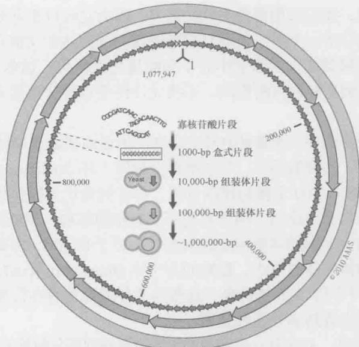  
图 17-1 合成基因组。图示化学合成蕈状支原体的完整基因组的策略。1000bp 的盒式片段（黄色箭头所示）分布组装起来，逐渐延长，形成完整的人造染色体，并使用酵母作为其宿主细胞（引自 Gibson D.G. et al. 2010. Science 329: 52–56. ©AAAS. 获得作者许可）。

  
图 17-2 合成的基因组形成的活细菌。以图 17-1 的方法合成的完整的人造染色体从酵母细胞中分离并替换另一种支原体的天然染色体。这里展示扫描电镜获得的蕈状支原体 JCVI-Syn1.0，均携带人工合成基因组。每个细菌的直径约为 500nm（图片来自于 Thomas Deerinck 和 Mark Ellisman，NCMIR，UCSD，以及 John Glass，JCVI。）。

直到地幔被足够冷却之前，液态水都不会出现在地面上。地球形成的地质时期约为3.8Ga，对应着现今发现的年龄最古老、保存完好的沉积岩，这个地址纪年称为冥古宙（Hadean）。之后的太古宙（Archaean）结束在大约2.5Ga，含氧的大气圈也在这一时期出现（图17-3）。锆的同位素分析显示海洋的出现不晚于4.4Ga，水圈由此在这一冥古宙的时期稳定下来（约为4.2Ga），这就界定了生命起源的早期界限。

生命是何时出现在水环境中的呢？早期生命的样式很难确认。然而，叠层石（stromatolite，一种分层的结构）中的微生物群落化石沉积物证据证明生命至少在3.5Ga的太古宙就出现了，关于生物碳和硫的同位素证据同样证明了这一点。尽管具体的时间不确定，但是显然生命在冥古宙或者太古宙早期就出现了。生

命起源的时间点可能不止一个，这又增加了问题的复杂性。除了现代生命的“最后共同祖先”（Last Universal Common Ancestor）之外，早期的生命可能有更多样的形式，并且“最后共同祖先”的出现既可能早于也可能晚于包括在化石证据中的其他生命形式。

## 生命起源以前的有机化学基础是什么？

生命的结构元件是有机分子（organic molecules）。如果生命自发地诞生于地球上，那么必然由有机分子的不同组合形成了现代生物的基本组分。在我们的蛋白质生命中，氨基酸、糖类、核苷酸和脂类都是由多步骤的酶促生物合成反应产生的。那么，这些生命的有机元件在生命诞生之前是如何产生的呢？

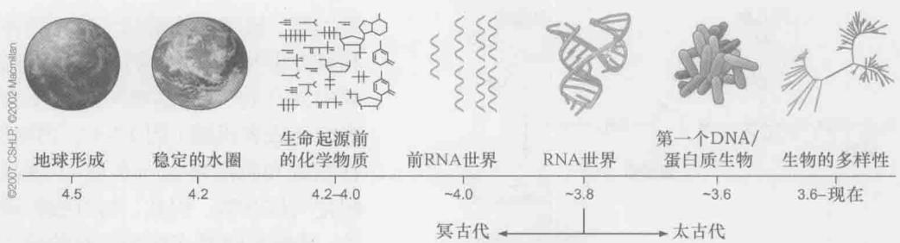  
图 17-3 早期地球和生命出现的地理时间表。展示了从冥古代至太古代地球形成的一系列事件，以及依据 RNA 世界假说的生命来源的相应事件。（经过许可调整自 Barton N.H. et al. 2007. Evolution, Fig. 4.4, p. 91. Cold Spring Harbor Laboratory Press. 和 Joyce G.F. 2002. Nature 418: 214–221. Macmillian.）

在分子生物学的历史上，1953年是个值得铭记的年份，这一年不仅James D. Watson和Francis H. Crick革命性地发现了DNA结构，Stanley Miller和Harold Urey也提出了早期地球环境。Miller和Urey在一个密封的烧瓶中注入水、甲烷、氨和氢气，并给予高度的电压（图17-4）。一周之后，他们发现相当比例的甲烷转化成了有机分子的混合物，包含了11种氨基酸的外消旋产物。Miller之后进行了一些类似的实验，对实验产物分析发现，当加入氢硫化物后，现今蛋白质中常见的20种氨基酸都可以这样的体系环境中合成。值得注意的是，另一群科学家在Miller实验半个多世纪后进行了同样的分析，并封存了烧瓶。由于当时学界认为早期地球的大气环境富含甲烷，Miller实验中加入了大量的甲烷，但是，现在学界更倾向于认为早期大气环境中甲烷的含量并不高（某些短暂的阶段除外），碳元素更多的以二氧化碳的形式存在。然而，用二氧化碳、氮气和水在早期地球环境模拟（电场、离子辐射和紫外线辐射等）实验中也可以生成有机分子。

尽管 Miller 和 Urey 形象的实验成功地模拟了早期地球化学环境（prebiotic chemistry），合成了生物分子，但在相似的条件下成功地合成多聚核苷酸的实验直到不久之前才告成功。一些合成核苷酸的早期的努力都失败了，当时研究者试图通过磷酸盐、核糖和碱基的作用实现。现在，合成核苷酸是通过一种包含 4 个有机分子的新途径，它们分别是氨腈（cyanamide）、丙炔腈（cyanoacetylene）、羟乙醛（glycolaldehyde）和甘油醛（glyceraldehyde）（图 17-5）。举例来讲，丙炔腈是甲烷和氮气在一定电场中反应的主要产物。其他主要被发现的分子包括羟乙醛、氨腈和磷酸盐（作为缓冲液和酸性催化剂），它们相互作用形成的中间产物2-氨基唑可进一步合成嘧啶环或者戊糖（图17-5）。丙炔腈、甘油醛和磷酸将进一步使2-氨基唑转化为核苷酸。因此，与直接将磷酸盐、核糖和碱基连接在一起的途径不同，这一新的策略使用一种既不是碱基也不是核糖的中间体合成核苷酸。


  
图 17-4 Miller-Urey 实验。实验显示水、甲烷、氨、氢气可以合成氨基酸。（a）当时的实验设备（感谢美国宇航局提供照片）。（b）设备的示意图及实验的步骤。反应在一个 5L 的玻璃瓶中进行，水被加热至 500℃，水蒸气和其他气体在钨电极产生的电场作用下相互撞击。水蒸气在冷凝器中冷却为液态，再被收集至 U 形管的管底，这些水中的分子将被鉴定化学成分。

  
图 17-5 从有机小分子合成嘧啶核苷酸。最近发现的从有机小分子合成嘧啶核苷酸的途径。羟乙醛和氰胺是反应的结构元件，它们的相互作用可以生成2-氨基唑（2-amino-oxazole），这一分子可以形成戊糖的一部分并进入嘧啶环中。在戊糖上加入甘油醛形成戊糖-氨基恶唑，进而与丙炔腈结合后形成嘧啶。将嘧啶与磷酸盐进行不同的重排和反应可以转化形成胞嘧啶和尿嘧啶。（获得许可引自 Sutherland J.D. 2010. Ribonucleotides. The origins of life (ed. Deamer D. 和 Szostak J.W.), pp. 109–121, Fig. 2, p. 114. ©Cold Spring Harbor Laboratory Press.）

一些研究显示核苷酸可以在黏土中形成寡聚核苷酸。黏土的显微分层结构可以吸收和富集核苷酸，促进它们之间的相互作用形成核糖核苷酸链（图 17-6）。总体来讲，这些近期研究成果成功地填补了我们理解生命起源的一个重要的空白。由此，之后的一个关于生命早期形式的非常引人注目的观点才能够自圆其说，即具有自我复制功能的 RNA 分子是地球生命的源头（我们将在后面的章节做详细阐述）。

最后，生命史前的有机分子并不一定仅仅从地球环境中的碳演化而来。考虑到月球形成的影响，有机分子也可能从由彗星和陨石带到地球。在一些球粒状陨石（它们在坠落地球的过程中没有完全融化）上曾发现了碳源的物质（碳质陨

石）。分析化学检测发现，这些碳质陨石上有大量的氨基酸外消旋产物（包括了L型和D型两种手性的分子），其中一些氨基酸是现代蛋白质中的常见氨基酸。默奇森陨石（Murchison meteorite）是一个大型的被广泛研究的碳质陨石，它于1969年坠落在澳大利亚的默奇森，表面富含有机分子（图17-7）。有趣的是，在默奇森陨石和其他一些碳质陨石上鉴定出的氨基酸（如异缬胺酸），它们的L-型分子的比例超过了D-型分子，甚至仅有L-型分子存在。人们可以相信，L-型氨基酸的同手性广泛存在是生命起源早期阶段的一个特征（可能是由于L型过多转换为D型而引起的）。在默奇森陨石上的另一个激动人心的发现是核苷酸的识别（包括尿嘧啶）。因此，由碳质陨石将氨基酸和核苷酸转运到地球上可能从化学上帮助了早期生物系统的大量繁衍。

  
图 17-7 默奇森陨石。该陨石收藏于华盛顿的国家自然历史博物馆(National Museum of Natural History)。已知的陨石总重 100kg。(http://en.wikipedia.org/wiki/File: Murchison\_crop.jpg.)

  
图 17-6 推测泥土在多聚核糖核苷酸合成中的作用。泥土中的矿物质通过结合和富集核苷酸分组推动磷酸二酯键的形成。泥土中的显微分层在生命起源和多核糖核苷酸形成中发挥相似的作用。（获得许可调整自 Ricardo A. and Szostak J.W. 2009. Sci. Am. 301: 54–61. ©Andrew Swift MS CM1.）

## 生命是从 RNA 世界演化而来的吗？

正如我们在第 5 章所学到的，RNA 在结构和功能上具有广泛的多样性，它甚至可以作为一种酶。RNA 酶（核酶，ribozyme）的发现为本章开始时提出的矛盾提供了一种解决的思路。如果 RNA 既可以作为信息的载体又具有自我复制的能力，那么在理论上，生命就无需以蛋白质的形式开始。从这种观点来看，突变和自然选择将最终使生命系统有能力依照核酸序列的信息合成肽键。这种理论，即现代的蛋白质基础的生命体来自早期的 RNA 和其他小分子基础的生命体，被称为 “RNA 世界” 假说（RNA World hypothesis）：蛋白质世界来自于原生的 RNA 世界（图 17-3）。

如果这一理论是真实的话，有什么证据表明早期生命的基础是 RNA 呢？很多分子生物学的证据支持 RNA 世界是存在过的，包括自我剪接的内含子、核酶、核糖开关（riboswitch，见第 20 章），以及具有核苷酸成分的酶辅因子，如辅酶 A（coenzyme A）、黄素腺嘌呤双核苷酸（flavin adenine dinucleotide）和烟酰胺腺嘌呤（nicotinamide adenine dinucleotide）。除此之外，核糖核苷酸可以通过生物合成作用变成脱氧核糖核苷酸也符合 RNA 先于 DNA 的理论。虽然这些证据都是间接的，我们也有一个典型而显著的早期生命的遗迹：催化肽键形成是由核糖体中的 RNA 成分完成的。

正如在第 5 章指出并在第 15 章详细讨论的，核糖体的核心是核酶（ribozyme），是核糖体大亚基中的一个大分子 RNA（在细菌中达到 23S），它可以催化形成肽键，把 tRNA 带入核糖体的氨基酸共价结合到正在形成的肽链上。第 15 章呈现的核糖体结构显示这一催化反应完全由 RNA 成分而不是由蛋白质成分完成的，所有核糖体蛋白上的氨基酸侧链没有参与到催化中心的结构中。与其他作用于磷中心的自然出现的核酶不同，核糖体中的核酶作用在碳中心完成肽键的合成反应（图 17-8）。因此，蛋白质世界最基本的化学反应是通过 RNA 分子催化完成的。人们有理由相信核糖体中的核酶是更早期生命的分子化石，更多的大分子合成在当时都是由 RNA 执行的。

  
图 17-8 肽基转移酶作用于碳原子形成肽键。由复核的 tRNA 携带进入核糖体的氨基酸与延伸中的肽链形成肽键，具体的亲质子反应发生氨基酸的氨基和肽链末端羧基的碳中心上。整个反应由核糖体大亚基上的大分子 RNA 组分催化完成（见第 15 章）。

就像诗可以违反普通语法一样,RNA 也让我们丢掉了许多生物学规则。如果说 DNA 是刻板的、始终如一的,那么 RNA 就是随性的和富于创造的。RNA 是个不守规矩的家伙,它把储存遗传信息的地位让给了 DNA,由此获得了更广泛的功能。它是建筑大师,可以形成复杂的三维结构,它在蛋白质学会如何成为酶之前就能够执行催化反应。简而言之,生命很有可能起源于 RNA 世界。

## 自我复制的核酶可以由定向演化得到吗？

虽然现在已经不可能回到生命史前去验证 RNA 聚合酶核酶在原生生物中存在的假说，但我们可以通过定向演化（directed evolution）在实验室中创造出具有自我复制功能的核酶。这种 RNA 聚合酶核酶在原理上可以阐明生命始于一种非蛋白的复制。我们习惯上将 RNA 视为一种单链线性分子，但是具有自我复制功能的核酶的 RNA 呈双链结构，可以通过与模板 RNA 的互补配对合成核糖核苷酸。迄今为止，人们还不能获得具有完全复制自身能力的 RNA 聚合酶核酶。然而，有能力通过模板依赖的方式完成核糖核苷酸聚合反应的 RNA 聚合酶核酶已经可以在实验室产生。

正如我们在第5章中论述的，通过几轮突变、分化和选择生成一种具有特定功能的RNA家族是可能的，即它们可以合成任意的RNA序列（参见定向演化的论述和图5-8）。这种策略被称为指数扩增的系统性配体演化实验（systematic evolution of ligands by exponential enrichment, SELEX），它利用了随机生成的RNA之间巨大的序列多样性。就RNA聚合酶核酶而言，定向演化需要两个步骤（图17-9）。第一步，具有催化连接作用的核酶受到选择，它可以将一个RNA的3'羟基和另一个RNA的5'三磷酸基团连接起来，这一连接过程需要一个与以上两个RNA都互补配对的模板来将其在空间上拉近。磷酸二酯键（phosphodiester）的化学合成过程与单个核苷酸的三磷酸基团连接RNA分子3'羟基的过程相似，所以上述的连接策略在第一步中使用，通过一段互补的RNA模板序列将两个 RNA 分子彼此退火黏合在一起，再进行共价连接则更为容易。在第二步中，这样的连接酶核酶会被引入到反应中，经过数轮循环以增加序列的多样性，这时我们将选择可以使核苷酸接触到其 3' 端的 RNA 分子。3' 端的延伸使核酶增长，我们将利用这一点来选择所需的分子，即依赖 RNA 模板加入额外的核苷酸。经过后续多轮的选择后，我们将获得具有更强的聚合效力的酶；同时应用多样的模板，可以为最终产生的核酶在引入与这些模板互补的非原始序列，从而提升酶促活性。

  
图 17-9 比较 RNA 连接和 RNA 核苷酸聚合。在连接反应中，一个 RNA 分子的 3'-OH 和另一个 RNA 分子的 5'端通过磷酸二酯键的形成和焦磷酸酯（pyrophosphate）的释放完成连接反应。聚合反应的化学过程与之类似，但将 RNA 分子的 3'-OH 与某个核苷酸结合而不是与另一个 RNA 分子结合。

应用这一策略最多可以产出约 200 个核苷酸长的 RNA 聚合酶核酶，这种酶能够在 RNA 链的 3'端以模板依赖的方式准确地延伸 20 个碱基，从而能够形成 RNA 螺旋结构的两次缠绕。而在最近，新的实验策略可以让 RNA 聚合酶核酶生成长达 95 个核苷酸的 RNA（尽管合成效率较低）。在新的研究成果中，RNA 聚合酶核酶可以使退火到独立 RNA 模板上的引物进行延伸反应。令人惊讶的是，核酶可以通过其“锤头结构”（hammer head）来保证对于模板复制的完整性（我们将在第 5 章做详细讨论），从而使 RNA 产物获得酶的活性。这种核酶自身生成的具有“锤头结构”的核酶有能力准确地剪切 RNA 形成功能所需的亚单位。

这些 RNA 聚合酶核酶是什么样子的？是怎样工作的呢？这些我们还不能确切地知道，但是现存的分子可以给我们线索，一种 120 个核苷酸的连接酶核酶与定向演化过程起点的聚合酶核酶在结构上具有相似之处。核酶的三级结构包含了三个螺旋状的结构域，它们在空间上形成一个类似三脚架的样式，其中催化中心在图中标记为黄色（图 17-10）。通过化学修饰和替换特定的碱基可以鉴定出哪些序列对于催化起到至关重要的作用。分子生物学的证据显示在活性位点的胞嘧啶作用很大，该碱基上的外环氨基在磷酸二酯键合成的过程中可以稳定焦磷酸上的负电荷[详见第 9 章关于蛋白聚合酶（proteinaceous polymerases）合成磷酸二酯键的论述]。

即使学界已经取得了这些成果,我们距离得到一个能够合成自身序列的核酶仍有很长的路要走。我们需要的核酶要有能力制造并分离出一个新的完整的自身分子。这给我们带来了另一个概念上的矛盾:一个单一的 RNA 分子看上去不可能既作为复制自身时的模板,又可以在复制过程中发挥聚合酶的作用。事实上,原生的聚合酶核酶是可以产生中间分子作为模板来完成复制的。在复制过程中,核酶和它的模板中间分子会通过互补配对形成临时的 RNA-RNA 双链结构,其中一个发挥复制酶作用,另一个作为合成新酶的模板(图

17-11）。下一轮的循环反应通过互补配对的复制过程产生新的复制酶，而合成新的复制酶也意味着合成新的互补模板；反过来，这些模板分子可以用来合成更多的复制酶。

  
图 17-10 RNA 连接酶核酶结构。三脚架样的晶体结构上包含三个结构域，分别标记为蓝色、粉色和紫色，其中紫色结构域上含有催化中心（黄色）和连接位点（红色）。（获得许可调整自 Shechner D.M. et al. 2009. Science 326: 1271–1275, Fig. 1C. AAAS；由 D.M. Shechner 惠赠。）

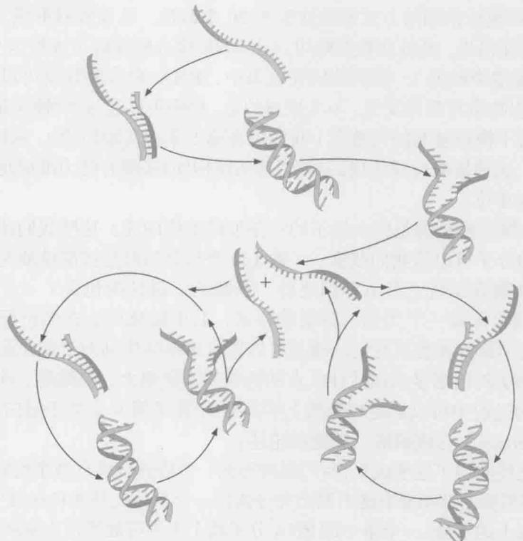  
图 17-11 原生的复制酶核酶通过与自身的互补配对完成复制。由于复制酶（初始的复制酶标记为绿色）的产物与其自身配对，新合成的 RNA 链并不是复制酶（标记为紫色），而是它的配体，它反过来可以作为合成新的复制酶的模板。因此，原生的复制酶核酶很可能产出双链的产物，解链后形成有活性的复制酶。描述复制循环的整个图中，复制酶链都被标记为绿色，同时它的互补链都被标记为紫色（获得许可调整自 Ricardo A. and Szostak J.W. 2009. Sci. Am. 301: 54–61. AAAS.）

虽然我们仍然不能获得一个完整的复制自身的 RNA 聚合酶核酶，但是我们可以看到通过 RNA 连接反应进行完整的自我复制的核酶。这种自我复制系统含有连接酶核酶，它可以将两个部分序列与其互补配对的 RNA 分子连接在一起（图 17-12）。在这个系统中，将一个连接酶核酶定义为 E（浅绿色表示），它催化了与之配对的两个 RNA 分子（A 和 B），使之以模板介导的方式共价结合在一起，生成了互补的 RNA，定义为 E'（图中部用深绿色表示），它自身也是连接酶核酶，另外两个 RNA 分子可以与其配对（A'和 B'，图底部）。下一轮循环将产生新的分子 E（图中部用浅绿色标记）。

因此，复制包括了两个相互连接的循环：一个如图中上半部分展示的由 E 催化，通过 A 和 B 生成 E'；另一个如下半部分展示的由 E' 催化，通过 A' 和 B' 生成 E。需要注意的是，E 和 E' 催化了多轮的连接反应使得 E 和 E' 得到扩增，这一反应体系中包含了 4 个 RNA 分子亚单位：两个 A、B 与

  
图 17-12 自主的、具有复制能力的核酶。连接酶核酶 E 将两个 RNA 分子（A 和 B）连接在一起，每个分子都有部分序列与 E 配对，形成了互补配对的核酶 E。（获得许可调整自 Lincoln T.A. and Joyce G.F. 2009. Science 323: 1229–1232. Fig. 1A, p. 7. AAAS.）

E 配对；两个 A'、B' 与 E' 配对。有趣的是，多种连接酶核酶在反应中会相互竞争，因为它们的底物分子是有限的，这呈现了一种遗传选择的初级形态。综上所述，尽管以 RNA 作为底物而不是以核苷酸作为底物，核酶可以实现完全的自我复制。

## 达尔文演化论需要自我复制的原生细胞吗？

仍有一个矛盾需要我们思考！即使 RNA 世界假说可以解决遗传复制的问题，我们还是不得不怀疑这一系统能否受到达尔文演化的选择。考虑一下，在聚集有大量的复制酶核酶的“原始热汤”中，的存在以及某个核酶上的一个突变可以使它获得比同类更高的复制活性。正如之前讨论指出的，如果每一个复制酶必须拷贝自另一个复制酶，那么在“原始热汤”中，优化的复制酶必须与未优化复制酶共处，这样它的传代也可能由未优化的酶作用完成（两个优化的复制酶在空间上足够近以至于可以复制彼此的概率在一个随机的空间中小到可以忽略。图 17-13）。所以在这种条件下，一个优化的突变型复制酶没有足够的机会发挥自身扩增效率更高的优势。这种推论使我们得出以下看法：早期的生命不仅需要复制酶核酶，而且，正如我们在这里解释的，还需要原生细胞把核酶彼此隔离开来。

  
图 17-13 复制酶核酶的改良突变体在原始热汤中没有选择优势。复制酶的分子群体包含在没有隔室的原始热汤中，这里面既有一般性的复制核酶（绿色所示）又有一些提高了复制效率的突变体（红色所示）。经过一轮复制之后，每一个核酶都随机地拷贝了自身。优化了复制效率的核酶没有体现出富集的效应是由于：未优化的复制酶和优化的复制酶一样获得了拷贝；复制过程后，无论突变与否它们都被极大地稀释在环境中了。

由细胞膜包裹着复制酶的原生细胞，可以通过吸收脂类完成生长和分裂。与原始热汤中含有的数量巨大且几乎完全相同的复制酶不同，少量的复制酶被分组进入到原生细胞中，使得无数组复制酶之间相互隔离（图17-14）。现在想象一下在其中一个原生细胞中随机产生了复制酶的突变体。因为每个原生细胞中只包含少量的复制酶，提高了复制效率的突变型复制酶比它们的同类能够产出更多的拷贝，这就导致更多的突变型复制酶存在于一个隔室中（为了使问题简化，我们在这一模型中不考虑复制过程的一些复杂环节，如需要一些互补配对的中间分子）。现在，一个原生细胞分裂时，它的一个子代细胞将很有可能（per chance）同时“继承”两个拷贝的突变型复制酶，这样，这两个突变的酶就可以彼此作用。之后，在子代细胞中，增加复制效率的突变型复制酶获得自身拷贝的速度更快，从而使携带它的原生细胞的增殖比它的同类也更快速。

  
图 17-14 分室化促进达尔文自然选择的作用。将复制酶装载到原生细胞的结果。一个原生细胞可以在一定概率的基础上继承两个或者更多优化的复制酶分子（图中红色标记）。之后，包含优化的复制酶分子的原生细胞占总数的比例将有所上升。由此，快速的分子复制将推动原生细胞的生长和分裂，使携带优化的复制酶的原生细胞受到选择。与此同时，有些原生细胞只随机地获得 1 个或 0 个复制酶，它们将在传代过程中被淘汰，如图中大×所示。（感谢 Jack W. Szostak）

通过渗透性（osmotic）机制，突变型的复制酶核酶可以为携带它的原生细胞带来生长优势。复制酶核酶通过核苷酸的聚合作用完成复制，这些核苷酸可以透过细胞膜进入到原生细胞中。这种核酶驱动的作用可以加成单个核苷酸到不能扩散的 RNA 分子上，从而在理论上可以增加原生细胞的渗透压（考虑到水分子进出脂质层的扩散速率是恒定的）。水分子的流入会增加脂质膜的张力，导致原生细胞从环境中吞入更多的脂类分子，这一过程反过来又会降低原生细胞的稳定性，最终使其一分为二。因此，包含有优化的突变型复制酶的原生细胞获得了生长和分裂的优势，同时也使得优化的核酶在整体系统中的比例得到提升。换句话说，利用细胞膜的分室化作用，复制酶核酶受到了自然选择的正向作用。

值得注意的是, 实验室条件可以比较容易地模拟出具有特定组分的细胞样隔室是如何促进早期生命发生的。像脂肪酸这样结构简单的脂类分子（以及其他的两亲性分子）是现代细胞胞膜上最主要的组成单位，它们能够在水环境中自发地形成小的、拓扑结构的囊泡（vesicle，图 17-15）。为了达到更低的自由能，在疏水效应的作用下，囊泡表面的脂类分子的尾部倾向于聚集在一个方向，从而形成膜状结构。这一薄膜会自发地折叠

包裹成两层的囊状结构，从而使其疏水的表面与水分子接触面积最小。而且，随着脂肪酸分子插入到膜中，囊泡的体积可以不断增长，这会降低囊泡的稳定性，并会使其在轻微的扰动下随机分裂成为两个或者多个囊泡（图17-16）。因此，与多聚核苷酸需要黏土中的矿物质催化合成不同的是，装载着多聚核糖核苷酸的细胞样小室是通过脂肪酸的自我组装作用自发形成的。最后，与渗透压驱动的生长和分裂相关，由脂肪酸等简单的脂类分子构成表面的原生细胞可以容纳较多的核苷酸分子。细胞倾向于让核苷酸分子通过渗透作用进入细胞。这一渗透入膜的过程是可行的，因为相对于磷脂质而言，脂肪酸分子的排序并不严格，它允许类似核苷酸这样的小分子通过（图17-15）。因此，包含复制酶的原生细胞由脂肪酸基础的膜包裹而成，它对核苷酸的摄取可以通过渗透作用完成。

最后，我们拥有了一个原生细胞所需要的所有材料；同时，这样的细胞符合原始生命定义：依靠小分子进行自我繁殖（核苷酸和脂质分子）并接受自然选择的作用（图17-17）。RNA世界假说告诉我们，原生细胞具有RNA基因组，可以合成RNA聚合酶核酶，并以囊泡状的原始细胞形态繁殖。通过捕获聚合反应中的核苷酸底物而引起的渗透压将推动原生细胞的生长并使其自发地分裂为子代细胞。此外，由于复制酶核酶被成组地分割至不同小室中，罕见的突变体有机会复制自身，从而获得了达尔文演化的选择优势。

  
图 17-15 脂肪酸自发形成双层囊泡。脂肪酸是一种结构简单的脂类，具有羧酸酯的头部和极性侧链，可以自发形成囊泡。由于羧酸酯头部基团易于被中和，脂肪酸倾向于形成双层的膜，核苷酸这样的小分子可以渗透出入。（重新绘图，原始版本来自 Budin I. and Szostak J.W. 2010. Annu. Rev. Biophys. 39: 245–263, Fig. 4. ©Annual Reviews, Inc.）

  
图 17-16 脂质囊泡的生长和分裂。

  
图 17-17 假设的原始细胞，结合了自我复制的核酶和同样能自我复制的囊泡。

适时地，核酶演化出催化代谢反应的技能（事实上这也可能先于核酸聚合酶能力的出现），并最终获得了催化肽键合成的能力（作为肽基转移酶传衍至今），从而开启了当下的蛋白质世界。必须承认，从复制酶核酶演化至核糖体的过程尚不清楚，我们只能知道其中涉及的步骤相当复杂，它包括：转运 RNA（tRNA）的出现和演化，肽链合成能力的过渡（从早期的非编码形式到后期以信使 RNA 为指导的编码形式），整合了 RNA 和蛋白质组分的核糖体大小亚基的出现，以及最终长肽链（可以进一步折叠三维结构）合成能力的出现。

## 生命起源于地球上吗？

上面的论述很大程度上来源于推测。我们现在还不能确切了解生命起源于哪里、是怎样产生的；同时，在试管中合成生命的道路也很漫长。关于 RNA 的两个孪生概念对于理解生命的起源十分重要，即 RNA 既是遗传物质也是复制酶。分室化使得达尔文演化赋予了原生细胞一些重要优势，这有助于我们理解生命的起源。然而，一些研究者提出了非基于 RNA 的化学演化过程，他们认为生命来源于代谢的演化过程而不是遗传的演化过程。事实上，一些科学家认为生命发生于地球上是一种狭隘的观念。Francis Crick 就持有这种怀疑（虽然他的观点是在科学界发现 RNA 聚合酶核酶之前提出的），Crick 和其他一些人提出生命的种子可能来源于其他星球，由陨石带到地球上来。当然，即使生命的种子来自地球以外的理论是真实的（尽管不大可能），我们仍需要回答生命在地球上如何开始的，以及在哪里开始的，这就回到了本章一开始的主题。

## 小结

生命起源的时间大约在 4.5Ga（即地球上出现液态水之时）与 3.5Ga（生命的痕迹已经可以从同位素和化石证据中体现）之间。最简单的生命形式是具有复制功能的系统并受到达尔文演化的作用。某些 RNA 催化酶类（核酶）的发现促成了 RNA 世界的假说，即以蛋白质为基础的生命起源于一种更早期的 RNA 生命形式，这里 RNA 既作为遗传信息载体又发挥 RNA 聚合酶核酶的作用完成自我复制。经过一段时间之后，自我复制的 RNA 分子演化出合成蛋白质的能力，进而形成当下的蛋白质世界。当今在核糖体内催化肽键形成的肽基转移酶核酶，可能是 RNA 世界的分子遗迹。

作为一种原理证明的 RNA 世界假说, 研究者力图创造一种有自我复制能力的核酶, 但到目前为止, 我们所能做到的 RNA 聚合能力最强的核酶仅能通过模板依赖的方式最长合成 95 个碱基。同时, 我们还没有发现具有复制酶活性的核酶, 即可以复制其自身的 RNA 酶类。

一个具有自我复制能力同时又能参与到达尔文演化中的系统，需要细胞状的隔室结构来完成生长和分裂。这类原生细胞可能起源于由脂肪酸和两亲分子组成的脂类囊泡，它们可以通过脂肪酸的聚合得以生长，亦可通过脂肪酸的分离重组完成细胞分裂。因此，最早期的生命形式可能是囊泡状的隔室形态，里面包装着具有复制酶活性的核酶，这类酶类还可以通过突变和自然选择演化，从而使原生细胞的繁衍更有效率。

## 参考文献

Deamer D. and Szostak J.W. eds. 2010. The origins of life. Cold Spring Harbor Laboratory Press, Cold Spring Harbor, New York.

Johnston W.K., Unrau P.J., Lawrence M.S., Glasner M.E., and Bartel D.P. 2001. RNA-catalyzed RNA polymerization: Accurate and general. Science 292: 1319–1325.

Lincoln T.A. and Joyce G.F. 2009. Self-sustained replication of an RNA enzyme. Science 323: 1229–1232.

Mansy S.S. and Szostak J.W. 2009. Reconstructing the emergence of cellular life through the synthesis of model protocells. Cold Spring Harb. Symp. Quant. Biol. 74: 47–54.

Powner M.W., Gerland B, and Sutherland J.D. 2009. Synthesis of activated pyrimidine ribonucleotides in prebiotically plausible conditions. Nature 459: 239–242.

Ricardo A. and Szostak J.W. 2009. Origin of life on earth. Sci. Am. 301:54–61.

Shechner D.M., Grant R.A., Bagby S.C., Koldobskaya Y., Piccirilli J.A., and Bartel D.P. 2009. Crystal structure of the catalytic core of an RNA-polymerase ribozyme. Science 326: 1271–1275.

Wochner A., Attwater J., Coulson A., and Holliger P. 2011. Ribozyme-catalyzed transcription of an active ribozyme. Science 332: 209–212.

Zaher H.S. and Unrau P.J. 2007. Selection of an improved RNA polymerase ribozyme with superior extension and fidelity. RNA 13: 1017–1026.

Zhu T.F., Schrum J.P., and Szostak J.W. 2010. The origins of cellular life. Cold Spring Harb. Perspect. Biol. 2: a002212.

## 习题

## 偶数习题的答案请参见附录2。

习题 1 请说出在生命起源中定义生命的两个关键性质。

习题 2 请解释为什么认为像支原体这样的细菌与病毒或者共生体 Hodgkinia cicadicola 不一样?

习题 3 想一下米勒和尤里实验，该实验结果对于研究生命的起源有何重要的影响？这些结果的不足是什么？

习题 4 举一个特例来说明目前具有催化能力的 RNA 对于细胞的重要性。这个例子是如何支持生命起源的 RNA 世界假说的？

习题 5 最受支持的假说是生命起源于 RNA。列举以蛋白质为中心的假说不被支持的原因。列举 DNA 为中心的假说不被支持的原因。

习题 6 对于每个功能，写出执行该功能的酶或者核酸酶的名称。

i. 以 DNA 为模板转录 RNA

ii. 以 RNA 为模板合成互补的 DNA 链

iii. 以 DNA 为模板复制 DNA

iv. 以 RNA 为模板复制 RNA

习题 7 列举通过指数富集配体演化技术（SELEX）来选择具有连接酶活性的核酶所必需的关键步骤。假设你将完成多轮选择并希望提高每轮中的混合物的多样性。你加入一个包含序列标签的 RNA 分子到潜在的核酶混合液中。如果该核酶将该标签连接到自己的 5' 端，则该连接的核酶可以从混合液中纯化出来。

习题 8 解释原生细胞中划分区室是如何使突变的 RNA 复制酶相对于其他 RNA 复制酶而言更加高效的？

习题9 描述一个实验室中的原生细胞模型的膜，这个原生细胞是如何生长和分裂的？

习题 10 科学家认为在原始地球上，多核苷酸是来源于磷酸、核酸和碱基的反应还是有机物间反应所产生的中间产物的反应？请对你的答案进行解释。

习题 11 解释基于蛋白质的磷酸二酯键与基于核酶的磷酸二酯键的形成机制中焦磷酸盐是如何固定的。

习题 12 列出核酶自我复制所需的反应成分及核酶的功能。

习题 13 描述 RNA 连接酶和 RNA 聚合酶之间的差异。

习题 14 你在利用引物延伸实验研究 RNA 聚合酶的性质。相比于其他核酶而言，这种特殊的核酶有更强的活性。这两种核酶之间的不同在于增强型的核酶在 5' 端有一个额外的结构域。引物延伸的每个反应，都包含了核酶、与RNA模板结合的5'端放射标记的RNA引物以及及rNTP，它们都位于合适的缓冲液中。在反应2中，你改变了RNA模板的序列。在反应3中改变了RNA模板的序列，并使该序列包括了核糖酶的新的结构域。通过变性聚丙烯酰胺电泳的方式将产物分离，并在放射照相仪上看到条带（见下面）。


A. 根据数据，描述这三个反应中核酶复制酶活性的相对差异。  
B. 猜测为什么泳道3中的产物和泳道1中的产物有相同的迁移图式。

数据引用于 Wochner et al. （2011.Science 332: 209–212）。

习题 15 研究人员将脂肪酸囊泡的渗透性作为原生细胞的模型进行了研究。

A. 请解释为什么在 RNA 中心假说中膜的渗透性很重要。

B. 在一个实验中，研究人员将核酸密封在脂肪酸囊泡中，他们测量从脂肪酸囊泡中出来的核酸的比例而不是进入脂肪酸囊泡的核酸的比例，他们发现，在 24h 内，脂肪酸囊泡中的 AMP、ADP 及 ATP 并没有发生明显的变化。在 $Mg^{2+}$ 存在的条件下，他们发现脂肪酸囊泡中的 AMP、ADP 缓慢的流出，但是 ATP 没有改变。试想为什么在 $Mg^{2+}$ 存在的情况下 AMP 及 ADP 可以穿过膜。ATP 在 $Mg^{2+}$ 存在下不能穿过膜对于原生细胞的渗透性又能说明什么？

数据引用于 Mansy et al. （2008. Nature454：122-125）。


## 第5篇 调控

本篇概要

\- 第18章 原核生物的转录调控

\- 第19章 真核生物的转录调控

\- 第20章调控RNA

\- 第21章 发育与演化的基因调控

\- 第22章 系统生物学

在第 4 篇，我们讲述了 DNA 编码的遗传信息是如何表达的，包括从 DNA 序列转录为 RNA 和以 RNA 为模板翻译为蛋白质。

但是并非所有细胞的全部基因总是在不断地表达。实际上，生命很大程度上依赖于细胞在不同时间、不同空间以不同的组合表达不同的基因。甚至一种低等的细菌在任何特定时间里也只表达某些基因，例如此机制可以保证只合成特定的酶以代谢特定的营养物，却不会同时合成其他营养物代谢所需的酶。多细胞有机体的发育为这种所谓的“差异基因表达”提供了典型的例子。基本上，一个人的所有细胞包含相同的基因，但是在形成某种类型的细胞时表达的一套基因与形成另一类型的细胞时所表达的基因是不同的。因此，肌肉细胞中表达的一套基因（至少是部分的）与神经元或者皮肤细胞等所表达的基因是不同的。总的来说，这些不同出现在转录水平上——最常见于转录起始上。

在接下来的章节中，我们主要看一下基因是如何被调控的。在18章，我们会从细菌的基因调控说起，而这也正是基本的调控原理。因此，我们举几个简单的例子来展示转录调控的不同机制。这些例子中包括lac操纵子是一组编码代谢乳糖所需的蛋白质的基因，并只在培养基中有乳糖时才表达。接着我们看一下其他例子：其他类似lac基因的调控以及其他展现相当不同的转录调控机制。在这一章的最后，我们会描述 $\lambda$ 噬菌体在感染细菌细胞时如何通过转录调控不同的基因来加强病毒选择发育途径的能力。

在第 19 章中，我们将讨论从酵母到高等真核生物转录调控的基本机制。我们会将转录激活和抑制的机制与细菌的进行比较，看哪些机制是保守的，哪些机制是新增的——最值得指出的是我们在第 8 章中讨论的核小体的定位、重构和修饰的影响。我们也会讨论表观基因调控的意义和机制。

迄今为止，我们所讨论的调控是由蛋白质调控因子所驱使的——激活因子和抑制因子，以及它们所募集到基因上的蛋白质。在第20章，我们将会了解调控RNA。在这里我们将描述原核和真核生物中的RNA分子是如何激活或者更常见地抑制基因的表达的。这包括早就广为人知的机制（long-understood mechanisms），如色氨酸操纵子的衰减；也包括最近才揭示的机制，如在较高等真核生物中的RNA干扰及microRNA的作用。

在第 21 章，我们将从发育生物学和演化的角度讨论基因调控。我们会讲述在一组基因相同的细胞（如发育中的胚胎）中基因如何调控以赋予细胞种类特异性（分化）和类型形成（形态发生）。我们也会讨论亲缘关系很近的生物的多样性，以及其中许多生物的形态和行为差异不是由于基因的变化造成的，而是由于每种生物中的基因在发育过程中表达的位置及时间的不同导致的。全基因组测序中最显著的发现是大部分的动物（例如）有近乎相同的基因，如小鼠，人，更甚是苍蝇。该发现又一次强调了基因调控的主要作用（大部分是转录调控）是决定每个基因组的产物。

在本书的最后一个章节我们将探讨发育中基因的调控网络——系统生物学。该领域仍然不是很清晰，貌似涵盖了一系列不同的领域，但是在下文中我们着重关注基因调控网络。因此我们展示了关于新方式下如何调控基因网络的命名及基本概念。分子生物学的新一代研究人员（许多具有计算机或者物理背景）正在利用他们自己的表述，即按照信息流向逻辑而不是分子机制来描述这些网络。

冷泉港实验室档案馆中的照片  
  
Mark Ptashne 和 Joseph Goldstein，1988 年分子生物学和信号转导讨论会。受到 Jacob 和 Monod 关于基因表达调控的早期观点启发，Ptashne 描述了这些机制在 $\lambda$ 噬菌体、酵母的分子水平上是如何起作用的（第 18 章和第 19 章）。Goldstein 和其长期的合作伙伴 Michael Brown 发现了控制参与胆固醇代谢的基因表达的信号转导路径（第 19 章），他们因此获得 1985 年的诺贝尔生理学或医学奖。

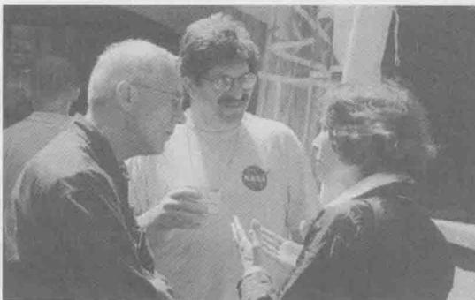  
Scott Emmons、Gary Ruvkun 和 Barbara Meyer，2004 年表观遗传学讨论会。在研究蠕虫的发育遗传学过程中，Victor Ambros 和 Ruvkun 鉴定了第一个 miRNA 和它的靶基因（第 20 章）。美国国家航空航天局（NASA）的 T 恤暗示了 Ruvkun 其他方面的兴趣——在火星上寻找生命。Emmons 在从基因表达的神经生物学的各个水平研究蠕虫的行为，当时作为研究生的 Meyer 对阐明 $\lambda$ 噬菌体遗传转换（第 18 章）有重要贡献，目前研究蠕虫的性别决定和剂量补偿（第 20 章）。

  
John Gurdon 和 Ann McLaren，1985 年发育分子生物学座谈会。格登在 1962 年首次进行了动物克隆实验，他将一个成年青蛙细胞的核转入一个无核的卵子中从而构建了一个功能齐全的蝌蚪（第 21 章）。因为此工作，他和山中申弥共享了 2012 年的诺贝尔生理学或医学奖。McLaren 是哺乳动物遗传学和生殖生物学方面的专家，她的其他研究为后来体外繁殖的发展提供了坚实的基础。她在生殖生物学上的专业性也使她关注政策问题，包括作为英国影响力巨大的沃尔诺克委员中的一员。

  
I.H.Herskowitz 夫人与儿子 Ira 和 Joel 在一起,1947 年核酸和核蛋白讨论会。Ira Herskowitz 首创了用酿酒酵母 (Saccharomyces.cerevisiae) 作为分子生物学研究的模式生物（第 18 章和第 19 章），像他早期研究 λ 噬菌体一样，他对酵母中基因调控的观点也做出了主要贡献。其父亲 Irwin，后来是一本遗传学教科书的作者，参加了当年讨论会。

  
Christiane Nüsslein Volhard, 1996 年冷泉港实验室斑马鱼的发育和遗传学会议。由 Nusslein Vol hard 和她的同事 Eric Wieschaus 在果蝇中进行的突变筛选确认了果蝇（可能也是所有动物）的早期胚胎发育中的许多关键基因（第 21 章），两人也因此与 Edward Lewis 共享了 1995 年的诺贝尔生理学或医学奖。

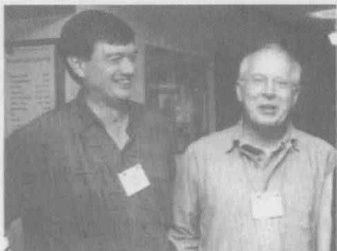  
Richard Jorgensen 和 David Baulcombe, 2006 年调控 RNA 讨论会。Jorgensen 发现牵牛花色素基因的过表达会产生白色花而不是深紫色花（第 20 章）。当时并不清楚产生这种现象是由于 RNAi 的影响。后来由 Baulcombe 鉴定出小干扰 RNA ——该过程的重要中介物。（第 20 章）。

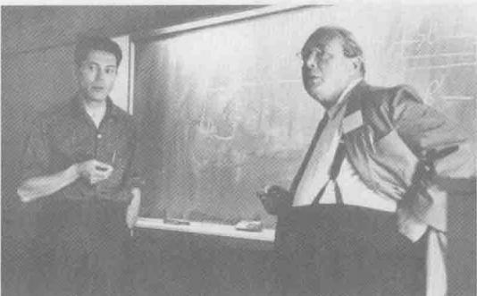  
Jacques Monod 和 Leo Szilard，1961 年冷泉港实验室。Monod 与 Francois Jacob 一起阐明了基因表达调控的操纵子模型（第 18 章），他们与同事 André Lwoff 因这一成就获得了 1963 年的诺贝尔生理学或医学奖。Leo Szilard 是战时核物理学家，在参加了 1947 年冷泉港的抗菌素课程后转向了分子生物学领域。他和 Aaron Novick 在芝加哥主持一个实验室（经允许引自：Courtesy of Esther Bubley）

  
Jeffrey Roberts 和 Ann Burgess，1970 年遗传物质转录讨论会。Roberts 的研究集中在细菌和噬菌体中基因表达的调控，特别是 $\lambda$ 噬菌体中的抗终止（第 18 章）。Burgess 是一名生物学教育者，参与了全国性的科学教育改进活动。Roberts 是本书第四版的作者之一，而本版作者之一 Tania Baker （TB）是 Burgess 的亲戚。

  
山中申弥，1994年原位杂交和免疫细胞化学的CSHL课程上。山中申弥（左起第3个）作为学生参与此课程，图为其与导师和其他学生的合影。山中申弥与JohnGurdon因创造了iPS细胞而获得了2012年诺贝尔生理学或医学奖。他揭示了仅需要诱导4种DNA结合转录因子就足以将不同分化的细胞转化为未分化、多功能状态。第21章描述了该杰出实验。

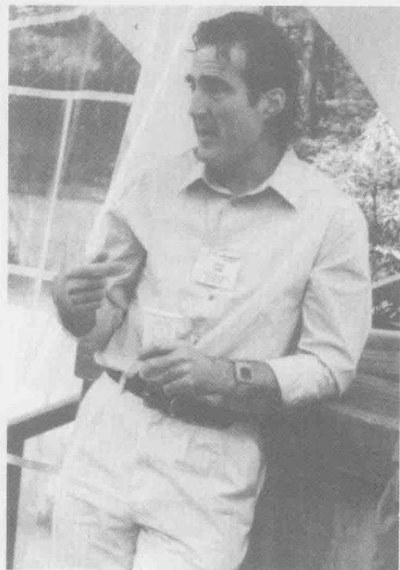  
Craig Mello, 2004 年表观遗传学讨论会。与 Andrew Fire 一起，Mello 发现只需要将 dsRNA 导入细胞，与该 RNA 同源的基因可以被沉默。正是这项被他们称为 RNA 干扰的发现，开拓了整个 RNAi 领域（第 20 章）。他们分享了 2006 年诺贝尔生理学或医学奖。

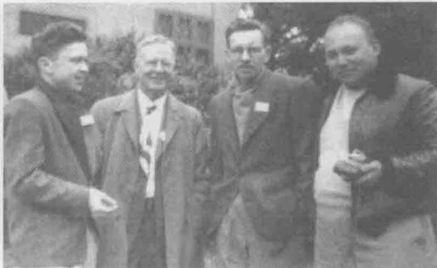

Edward Lewis、Carl Lindegren、Alfred Hershey 和 Joshua Lederberg，1951 年基因和突变讨论会。Lewis 以果蝇为模型（第 21 章）倡导了发育的遗传学分析，并因此与 Eric F.Wieschaus 和 Christinae Nüsslein-Volhard 分享了 1995 年的诺贝尔医学奖。Lindegren 是酵母遗传学（附录 1）的开创者。Hershey 带领包括 Max Dedlbr ü k 和 Salvador E. Luria 的研究小组在分子生物学的早期应用噬菌体作为模型系统（附录 1），他们三人共同获得 1969 年的诺贝尔生理学或医学奖。Lederberg 则发现了 DNA 在细菌间可以通过被称为接合的交配过程传递（附录 1），他也因此与 George Beadle 和 Edward Tatum 分享了 1958 年的诺贝尔生理学或医学奖。

# 第18章 原核生物的转录调控

## 本章概要

转录调控的原理

转录起始的调控：原核生物的实例

$\lambda$ 噬菌体：调控的层次

在第 13 章我们了解了 DNA 是怎样通过 RNA 聚合酶转录成 RNA 的，同时我们还描述了构成启动子的序列元件——一位于基因起点用于结合转录酶和起始转录的区域。细菌中最常见的 RNA 聚合酶（带有 $\sigma^{70}$ ）识别的启动子由“-10”、“-35”和“上游”这 3 种元件组成。我们已知某一特定启动子的活性强度取决于其

具备哪个元件及其在多大程度上达到最佳匹配。在缺乏调控因子的情况下，这些元件决定了聚合酶与启动子的结合效率，以及结合后有多迅速地激发转录的起始。

本章我们将看一下表达调控的机制，即对基因产物需求的变化提升或降低表达的机制。基因的表达可在多个阶段受到调控。最为常见的是在转录的起始阶段，本章的大量篇幅将集中在细菌的相应调控步骤上。我们将从调控的一般机制、原则开始，接着看几个研究得较为透彻的例子，这几个例子将展示基本的调控机制是怎样以不同的组合方式来控制基因在特定的生物背景中的表达。我们也会论及转录后运作的基因调控机制，特别是转录延伸及终止的过程中的调控。其他原核生物的转录调控例子——通过 RNA 来作用的——将会在第 20 章中讨论。其中一个在翻译水平进行调控的原核基因的例子已经在第 15 章讨论了。

## 转录调控的原理

## 基因表达由调控蛋白控制

正如我们在这一部分的序言中所描述的，基因常常由胞外信号控制；对细菌而言，主要是指由培养基中存在的分子信号控制。这些信号由调控蛋白传送给基因。调控蛋白可分为两类：正调控蛋白或激活因子（activator，又译激活物），负调控蛋白或抑制因子（repressor，又称阻遏物）。通常这些调控蛋白都是DNA结合蛋白，它们识别受其控制的基因上的或基因附近的特异位点。激活因子增强受调控基因的转录，抑制因子降低或消除相应基因的转录。

这些调控蛋白因子是如何作用的呢？我们来回想一下第13章中描述的转录起始步骤（图13-3）。首先，RNA聚合酶在封闭复合体（closed complex）（其中的DNA双链仍在一起）中结合到启动子上。接着，聚合酶启动子复合体转变为开放复合体，此时这其中转录起始位点的DNA是解链的，同时聚合酶定位以便起始转录。接下来是启动子脱离（promoter escape），这时聚合酶离开启动子开始转录。激活因子在哪一步激活、抑制因子在哪一步抑制，这要看具体的启动子和调控蛋白而定。接下来，我们将看到两种类型的调控。

## 大多数的激活因子和抑制因子在转录起始水平发挥作用

尽管基因表达调控基本上贯穿于基因产物生成的整个过程中，但是最常见的基因调控是在转录的起始阶段，本章将对此进行重点阐述。有两个原因可以解释：第一，转录起始阶段是进行调控的最积极有效的阶段，也就是说，在最开始决定这个基因是否被表达能够避免能量和资源的浪费。例如，部分的 mRNA 将不会被使用（翻译）。第二，在最开始的时候进行调控更容易做好。在单倍体基因组中每个基因只有一个单拷贝，所以在一个单链 DNA 分子上也只有一个启动子调控特定基因的表达。相反，为了调控即将翻译的基因，每个 mRNA 分子都必须发挥作用。

那么为什么不是全部的调控都集中在转录的起始阶段呢？在后面的阶段进行调控具有两个优势。第一，它允许接受更多的信号输入：如果对一个基因的调控不仅仅发生在最开始的阶段，那么就会有更多的信号来调控它的表达，或者是同样的信号可以更加有效。第二，在后面的阶段调控可以减少反应的时间。因此，再想一下转录调控的例子（图 15-44），如果一个信号解除了对这一步的抑制，基因编码的蛋白质产物就能够马上收到这个信号，反应时间的明显减少可能在某些情况下是非常有利的。但是，正如我们已经说过的，最常见的基因调控是在转录的起始阶段，我们现在认为主要是激活因子和抑制因子在转录的起始阶段进行调控。

## 很多启动子通过协助 RNA 聚合酶结合 DNA 的激活因子和阻碍两者结合的抑制因子进行调控

大多数的启动子，在没有调控蛋白时，只是微弱地与 RNA 聚合酶结合。这是因为该启动子缺少一种或多种上文论及的启动子元件，或这些启动子元件不完整。当聚合酶偶然结合了启动子时，它会自动地转变为开放复合体从而启动转录。这导致基因的组成型表达（constitutive expression），或称为本底水平（basal level）表达。在这一情况中，RNA 聚合酶的结合是限速步骤（图 18-1a）。

抑制因子要控制从这一种启动子的起始表达，只需结合到与聚合酶结合区相重叠的位点上。这种情况下，抑制因子阻碍聚合酶结合到启动子上从而阻止转录（图 18-1b）。当然，抑制也可以其他方式实现，这一点也很重要。DNA 上抑制因子结合的位点称为操纵子（operator）。

激活因子通过协助聚合酶结合到启动子上来激活从该启动子开始的转录。通常是通过如下步骤实现的：激活因子以其一个表面结合到启动子附近的某一 DNA 位点；同时，以另一表面与 RNA 聚合酶相互作用，将聚合酶带到启动子（图 18-1c）。这一机制常被称为募集（recruitment），这是一个蛋白质协同结合 DNA（cooperative binding of protein to DNA）的例子（具体内容我们会在下文详细讨论，尤其是框 18-4）。激活因子和聚合酶的相互作用及激活因子与 DNA 的相互作用只起“黏合”作用：酶是有活性的，而激活因子只是将酶带到启动子附近。一旦聚合酶结合到启动子，它就自动地使封闭复合体异构化为开放复合体并起始转录。

  
图 18-1 通过募集 RNA 聚合酶激活转录。(a) 在激活因子和抑制因子都不存在的时候, RNA 聚合酶偶尔会自动结合启动子并起始低水平(本底水平)的转录。(b) 抑制因子结合了操纵子序列阻碍了 RNA 聚合酶的结合从而抑制了转录。(c) 激活因子募集 RNA 聚合酶产生了高水平的转录。RNA 聚合酶募集后形成封闭复合体, 接着, 封闭复合体自动异构化为开放复合体并起始转录。如果抑制因子和激活因子都存在并具有功能, 一般来说, 抑制因子活性会优于激活因子(这种情况在本图中未展示)。

大肠杆菌（Escherichia Coli）的 lac 基因就是由激活因子和抑制因子以这种简单的方式调控转录的。本章我们还将详细讲述这一基因的转录调控。

某些激活因子和抑制因子通过变构和调控RNA聚合酶对结合后的转录步骤起作用

并非所有的启动子都用同样的调控方式。因此，我们需要从其他类型的启动子来考虑。在这种情况下，RNA聚合酶不需协助就有效地结合在DNA上并形成稳定的封闭复合体。但是这一封闭复合体却不会自动转变成开放复合体（图18-2a）。在这一启动子上，激活因子必须刺激闭合复合体转变为开放复合体，因此这一转变就是限速步骤。

  
图 18-2 变构激活 RNA 聚合酶。（a）RNA 聚合酶结合稳定的封闭复合体中的启动子；（b）激活因子和聚合酶相互作用触发转变成为开放复合体及高水平转录。该图仅以图解的形式展示复合物的开关情况，详细解释请参照第 13 章图 13-3。

刺激这类启动子的激活因子通过触发 RNA 聚合酶或 DNA 的构象改变起作用；也就是说，它们与稳定的封闭复合体相互作用诱导发生构象改变，引起封闭到开放复合体的转变（图 18-2b）。这一机制就是变构（allostery）的一个例证。

在第 6 章我们遇到过的变构是一种常见的控制蛋白质活性的机制。在本章，我们会讨论两个转录激活因子变构调节的例子。例如 glnA 启动子，激活因子（NtrC）与在启动子上结合的封闭复合体中的 RNA 聚合酶相互作用，刺激其转变为开放复合体。另一个例子（merT 启动子）中，激活因子（MerR）却是通过诱导启动子 DNA 的构象改变达成同一效果的。而在另外一类启动子中，在启动子脱离这一步限制了转录激活（图 12-3）。这类启动子的例子是 malT 基因的表达。在缺乏激活因子的时候，起始会失败，只有当存在激活因子的时候，才可以有效地进入延伸阶段。

同样地，抑制因子也有很多方式行使功能，而不是仅仅阻止 RNA 聚合酶的结合。例如，有些抑制因子可以在启动子处和聚合酶发生相互作用，从而抑制向开放复合体的转化或者启动子脱离。我们会在后面看到这样的例子（如 Gal 抑制因子）。

## 远程激活和 DNA 环化

到目前为止，我们已经默许地假定了 DNA 结合蛋白彼此相互作用结合到邻近的位点（如图 18-1 和图 18-2 中所示 RNA 聚合酶和激活因子），事实也常常如此。但是有些相互作用的蛋白的结合位点在 DNA 上相距较远。在这种情况下，为了使蛋白质相互作用，结合位点之间的 DNA 就会形成环，让蛋白质结合位点彼此靠近（图 18-3）。

在细菌中我们就遇到这种蛋白质的互作方式的例子。我们将认为抑制因子间的相互作用可以形成长达3kb的DNA环。在下一章（真核基因调控）的内容中，我们还将遇到更多更生动的“远程激活”的例子。

  
图 18-3 DNA 结合蛋白的相互作用。(a) 蛋白质协同结合相邻位点；(b) 蛋白质协同结合独立位点。

远距离 DNA 位点的靠近是 DNA 链环化的方式之一。细菌中就有这样的例子，即蛋白质在激活因子结合位点和启动子之间结合，使 DNA 弯曲向有利的方向来协助激活因子和聚合酶相互作用（图 18-4）。同时，也存在 DNA 弯曲向不利的方向使蛋白抑制环形成和激活。在其他过程中也有这种“构架型”的蛋白质协助蛋白质相互作用（如位点特异性重组，第 12 章）。

  
图 18-4 DNA-弯曲蛋白能够协助 DNA-结合蛋白间的相互作用。弯曲 DNA 的蛋白质结合到激活因子结合位点和启动子之间的位点。这使得两个位点在空间上更接近，从而协助 DNA-结合激活因子和聚合酶的相互作用。

## 协同结合和变构在基因调控中有多种作用

我们已经指出简单的协同结合可以介导基因激活：激活因子自发地与 DNA 和聚合酶相互作用，从而募集 RNA 聚合酶到启动子上。另一方面，我们也描述了蛋白质变构作用介导激活转录的情形：激活因子与结合到启动子上的聚合酶，通过诱导酶或启动子发生构象变化，刺激转录起始。在基因调控中，协同结合和变构还有其他作用。

例如,经常有成组的调控因子相互地结合到 DNA 上,即两个或多个激活因子和(或)抑制因子彼此相互作用并与 DNA 相互作用,从而彼此协助结合到它们共同调控的基因附近。我们将看到,这种相互作用仅由外界环境的小小变化就可以灵敏地使一个基因从完全不表达转而完全表达。激活因子的协同结合还可以参与整合信号,也就是说,某些基因只有当存在多种信号(从而也就有多种调控蛋白)时才被激活。稍后我们将在本章介绍一个特别显著、目前人们知之甚详的例子——λ噬菌体中协同作用参与的基因调控。我们也将在本章后续内容和框 18-3 中详细讨论协同结合的基本机制及其影响。

变构不仅是一种基因激活的机制，它同时还常常是特异信号控制其调控因子的方式。迄今已知细菌调控因子通常采取两种构象：一种构象可以结合 DNA，另一种则不能。信号分子结合调控蛋白并将它固定在某一特定构象，从而决定该调控蛋白是否能够激活转录。我们已经在第 6 章看到过一个这样的例子（图 6-19），当时我们还较为详细地讨论了变构的基本机制。本章和下一章我们将看到几个信号通过变构控制其调控因子的例子。

## 抗终止作用及其延续：基因调控并不局限于转录起始调控

正如本章开始部分所述，大多数基因调控发生在转录起始阶段。在真核细胞和细菌中皆是如此。但是，这两类生物的调控绝不局限在这一步骤。本章中我们会看到几个细菌中基因调控的例子，其中包括了转录延伸和终止水平中的调控。细菌中基因调节的其他例子请参考第15章（我们对核糖体蛋白编码基因翻译的调控进行讨论）和第20章（我们会谈到包括RNA调控在内的几个例子，如衰减作用、核糖开关和小RNA）。这些关于RNA的例子，一部分涉及转录的调控，另一部分涉及翻译的调控。

## 转录起始的调控：原核生物的实例

大致了解了转录调控的基本原理之后，我们来看几个展示基本原理是如何起作用的实例。首先，我们来看大肠杆菌（E. coli）中参与乳糖代谢的基因。在这里我们将看到激活因子和抑制因子是如何根据两种不同的信号调控表达的。同时我们也将描述揭示这些调控因子作用机制的实验方法。

## 激活因子和抑制因子共同控制 lac 基因

3 个 lac 基因——lacZ、lacY 和 lacA 在 E.coli 基因组中相邻排列合称 lac 操纵子（lac operon）（图 18-5）。lac 启动子位于 lacZ 的 5' 端，指导 3 个基因共同转录为一条 mRNA [因其包含多个基因而被称为多顺反子信使（polycistronic message）]。这一 mRNA 翻译产生 3 种蛋白质产物。lacZ 基因编码 β-半乳糖苷酶，该酶可将乳糖切割成半乳糖和葡萄糖，后两种糖均可用作细胞的能量。lacY 基因编码乳糖透过酶，该蛋白质插入细胞膜可以将乳糖转运到细胞内。lacA 基因编码硫代半乳糖苷转乙酰酶，它可以消除同时被 lacY 转入的硫代半乳糖苷对细胞造成的毒性。

这些基因只有在乳糖存在，同时葡萄糖（优先选用的能量）缺乏时才会高水平地表达。两种调控蛋白参与基因调控：一种是激活因子，称为 CAP；另一种是抑制因子，称为 Lac 抑制因子（Lac repressor）。Lac 抑制因子由 lacI 基因编码，这一基因位于其他 lac 基因的附近，但其转录（结构性地表达）却是由其自身的启动子起始的。CAP 即为代谢激活因子蛋白（catabolic activator protein），这一激活因子也被称为 CRP（cAMP 受体蛋白，cAMP receptor protein）。编码 CAP 的基因位于细菌染色体的其他位点，不与 lac 基因连锁。CAP 和 Lac 抑制因子都是 DNA 结合蛋白，两者分别结合在 DNA 启动子上或其附近的特异位点上（图 18-5）。

  
图 18-5 lac 操纵子。3 个基因（lacZ、lacY 和 lacZ）以一条 mRNA 从启动子（如箭头所示）转录。CAP 位点和操纵子（Lac 抑制因子结合位点）各约 20bp。操纵子位于启动子 RNA 聚合酶结合区内，CAP 位点位于启动子上游（详见图 18-8 这些位点的相关排列及正文中关于这些位点的结合蛋白的描述），附近还有两个额外的弱 lac 操纵子（图 18-12），本图简化掉了，我们目前还不需要考虑它们。

每一个调控蛋白分别响应一种环境信号并将其传递给 lac 基因。因此，CAP 介导葡萄糖信号，而 Lac 抑制因子介导乳糖信号。这一调控系统以如下方式作用（图 18-6）。Lac 抑制因子只在乳糖缺乏的时候才结合 DNA 从而抑制转录。在乳糖存在时，抑制因子没有活性，基因是去抑制（表达）的。CAP 只在没有葡萄糖的时候才结合 DNA 从而激活 lac 基因。因此，这样两种调控蛋白联合作用保证基因在乳糖存在，同时在缺少葡萄糖的环境中以显著的水平表达。

  
图 18-6 lac 基因的表达。乳糖和葡萄糖的有无控制着 lac 基因表达的水平。高水平表达要有乳糖存在（也就是没有有功能的 Lac 抑制因子），同时缺少首选的能量葡萄糖（因此也就有激活因子 CAP）。当 Lac 抑制因子结合到操纵子上，不管有活性的 CAP 是否存在，它都排斥聚合酶。CAP 和 Lac 抑制因子都是单体。但实际上，CAP 以二聚体结合 DNA，Lac 抑制因子以四聚体结合（图 18-12）。CAP 募集聚合酶到 lac 启动子，在这里，它自动地异构化为开放复合体（最底行所示的状态）。

## CAP 和 Lac 抑制因子对 RNA 聚合酶结合 lac 启动子的作用是相反的

我们已经看到，Lac 抑制因子结合的位点被称为 lac 操纵子（lac operator）。这一双重对称的 21bp 序列由 Lac 抑制因子的两个亚基识别，每一个结合一个“半位点”（图

  
图 18-7 lac 操纵子对称的半位点。

18-7)。本章后面的“CAP 和 Lac 抑制因子结合 DNA 时使用相同的结构模体(motif)”部分我们会详细地描述它们是如何结合的。当抑制因子结合到操纵子上时，它是怎样抑制转录的呢？

lac 操纵子与启动子有重叠区, 所以当抑制因子结合到操纵子上时, 就阻止了

RNA 聚合酶在启动子上的结合和 RNA 合成的起始（图 18-8）。在第 7 章中我们已经讨论了 DNA 足迹法和凝胶迁移率分析可以确认蛋白质结合位点并对它们的位置映射。

  
图 18-8 lac 操纵子的控制区域。图中所示为 lac 操纵子控制区域的核苷酸序列和组成。上面和下面的横杠表示 RNA 聚合酶和调控蛋白覆盖的 DNA。注意 Lac 阻抑物覆盖的区域大于最小操纵子结合位点序列，而 RNA 聚合酶覆盖的区域大于启动子的组成序列。

我们看到，在没有 CAP 的时候，即使没有有活性的抑制因子存在，RNA 聚合酶与 lac 启动子也只有很微弱的结合。这是因为 lac 启动子的 -35 区的序列缺少一个上游元件（见图 13-5，框 13-1 和图 18-8）而不适合与 RNA 聚合酶结合。这是激活因子控制启动子的典型特征。

CAP 以二聚体的形式结合到长度类似于 lac 操纵子但有着不同序列的位点上。该位点位于转录起始位点上游大约 60bp 处（图 18-8）。当 CAP 结合到这一位点时，它就会与聚合酶相互作用，将其募集到启动子处并协助其与启动子结合（图 18-6）。这一协同结合稳定了聚合酶与启动子的结合。下面我们详细地看一下 CAP 介导的转录激活。

## CAP 具有独立的激活表面和 DNA 结合表面

各种实验都支持 CAP 通过募集 RNA 聚合酶激活 lac 基因这一观点。分离到的 CAP 的突变体结合 DNA 但并不激活转录。被称之为正控制（positive control, PC）突变体的存在表明：要激活转录，激活因子不仅仅要结合在启动子附近的 DNA 上。因此，例如转录激活也不是由激活因子改变局部 DNA 的结构引起的。正控制突变体的氨基酸替换识别了 CAP 接触聚合酶的区域，称之为激活区（activating region）。

当 CAP 激活 lac 基因时，其激活区接触的是 RNA 聚合酶的哪一部分呢？聚合酶的突变形态揭示了这一位点，这种突变体聚合酶可以正常地转录多种基因，但是不能在 lac 基因处被 CAP 激活。这些突变体在 RNA 聚合酶的 $\alpha$ 亚基（ $\alpha$ subunit）的 C 端结构域（C-terminal domain，CTD）发生了氨基酸替换。我们在第 13 章已知，这一结构域由一个易弯曲的衔接体连接到 $\alpha$ 的 N 端结构域（NTD）。 $\alpha$ NTD 嵌于酶内部，而 $\alpha$ CTD 却延伸出来与启动子的上游元件结合（当这一元件存在时）（图 13-7）。

lac 启动子没有上游元件， $\alpha$ CTD 就结合在 CAP 和附近的 DNA 上（图 18-9）。包括了 CAP、 $\alpha$ CTD 及一段包含 CAP 位点和附近上游元件的 DNA 寡核苷酸的复合体的晶体结构证明了本结构（图 18-10 及结构教程 18-1）。在框 18-1 中，我们将描述激活因子旁路实验，该实验显示 lac 启动子的激活只需要聚合酶的募集。

  
图 18-9 lac 启动子被 CAP 激活。RNA 聚合酶在 CAP 的协助下结合到 lac 启动子。CAP 由 α 亚基的 CTD 识别。当与 CAP 相互作用时，αCTD 也在靠近 CAP 位点处与 DNA 接触。在第 13 章，我们在说明激活因子和其聚合酶上的目标位点或聚合酶与启动子区域的接触时，也使用了 RNA 聚合酶作为代表。

  
图 18-10 CAP-αCTD-DNA 复合物的结构。所示的 CAP 以二聚体结合到其位点上。而且，在本例中，RNA 聚合酶的 αCTD 结合到一段 DNA 上，与 CAP 相互作用。每个蛋白质相互作用的位点包含用遗传学方法确认的残基。在本图中，CAP 以绿色表示，αCTD 以紫色表示。图中所示每一个 CAP 还结合了一分子的 ATP。（Benoff B. et al. 2002. Science 297: 1562.）图像用 MolScript 和 Raster 3D 软件制作。

在了解了 CAP 怎样激活 lac 操纵子的转录, 以及 Lac 抑制因子怎样拮抗这一作用之

后，我们再进一步看一下这些调控蛋白是如何识别其 DNA 结合位点的。

## 框 18-1 激活因子旁路实验

如果激活因子只有将聚合酶募集到基因上方起作用，那么将聚合酶带到基因上的其他途径也可以同样起作用。对 lac 基因来说确是如此，如以下实验所示（框 18-1 图 1）。


  
框 18-1 图 1 双激活因子旁路实验。(a) 与蛋白质 Y 相互作用的蛋白质 X 替代 αCTD。蛋白质 Y 与 DNA 结合结构域融合，被这个结构域识别的位点处于邻近 lac 基因的位置。(b) αCTD 被 CAP 的 DNA 结合区域所替代。

在一个实验中，用另一蛋白质-蛋白质相互作用取代CAP和聚合酶的相互作用。该实验用两个已知会相互作用的蛋白质，一个与DNA结合结构域联合，另一个取代聚合酶α亚基的C端结构域（αCTD）。只要启动子附近有合适的结合位点，被修饰过的聚合酶就能被拼凑起来的“激活因子”激活。在另一个实验中，聚合酶αCTD被DNA结合结构域取代（如CAP的DNA结合结构域）。在无任何激活因子时，只要附近有合适的DNA结合位点，这一修饰过的聚合酶就能有效地起始从lac开始的转录。第三个实验更简单：聚合酶能在体外无任何激活因子时高水平地转录lac基因，但要求聚合酶是高浓度的。这样我们看到，人工募集或提供高浓度的聚合酶都可以使lac基因以激活水平表达。这些实验与激活因子仅协助聚合酶结合启动子是一致的。关于为何仅仅提高蛋白质（如RNA聚合酶）的浓度就可以协助它结合到DNA上的位点（在这里是启动子）的解释见框18-4。其中讨论的结果出人意料。激活因子通过诱导聚合酶发生特异的变构来激活转录。

## CAP 和 Lac 抑制因子以相同的结构模体结合 DNA

细菌的许多激活因子和抑制因子包括 CAP 和 Lac 抑制因子结合 DNA 的结构基础已经通过 X 射线晶体学确定。细菌调控蛋白的 DNA 识别机制大多是相似的，仅在细节上有所不同，正如我们下面将要描述的。

一般情况下，蛋白质以同源二聚体的形式结合到反向重复（或近似重复）序列的位点上。每一个单体结合到一个“半位点”，二聚体的对称轴位于结合位点的对称轴之上（就如我们在 Lac 抑制因子中所见到的，图 18-7）。蛋白质靠一种保守的二级结构螺旋-转折-螺旋（helix-turn-helix，图 18-11）识别特异的 DNA 序列。这一结构域由两个 $\alpha$ 螺旋组成，其中一个是识别螺旋（recognition helix）进入 DNA 的主凹槽（大沟）。在第 6 章我们就讨论过， $\alpha$ 螺旋的大小正好适合进入 DNA 主凹槽，利于其外表面的氨基酸残基与碱基对边缘的化学基团相互作用。我们也看到的每一种碱基有着特有的氢受体和氢供体结构模式（图 6-14）。因此，蛋白质可以用这样的方式来区别不同 DNA 序列而不需要 DNA 双链解链。图 6-13 展示的是识别螺旋与其 DNA 结合位点发生相互作用的例子。

图 18-11 具有螺旋-转折-螺旋结构域的蛋白质结合 DNA。蛋白质就像实际情况中那样以二聚体结合，两个亚基用带有阴影的球表示。标示出了每个单体的螺旋-转折-螺旋模体。“识别螺旋”标以 R。  
  
DNA 结合位点

螺旋-转折-螺旋结构域的第二个螺旋坐落的位置横跨 DNA 大沟与 DNA 主链相联系的地方,以保证识别螺旋出现在正确的位置,同时也增加整个蛋白质-DNA 相互作用的结合能。

这里描述的情况不仅与 CAP（图 18-10）和 Lac 抑制因子的情况本质上符合，而且细菌中许多调控因子也是如此，包括 $\lambda$ 噬菌体抑制因子（图 6-13）、 $\lambda$ Cro 蛋白（后面会讲到）及人字形噬菌体（噬菌体 434）。尽管如此，它们在细节上会有些不同，如下面的例子所示：

\- Lac 抑制因子以四聚体而不是二聚体结合。但是，每一个操纵子只与这 4 个亚基中的 2 个接触。所以，这种寡聚方式的不同并不会改变 DNA 识别的机制。四聚体中的另外两个单体可以再结合两个操纵子，这两个操纵子一个位于初级操纵子下游 400bp 处，一个位于初级操纵子上游 90bp 处。这时，位于中间的 DNA 就处于环化状态，利于反应的进行（图 18-12）。

\- 有时，在螺旋-转折-螺旋结构域之外的其他蛋白质区域也会与 DNA 相互作用。例如， $\lambda$ 抑制因子就以其 N 端与 DNA 接触。这些蛋白质区域环绕 DNA 在螺旋的背面与小沟相互作用。

\- 许多情况下,蛋白质的结合不会改变 DNA 的结构。但是,有时我们也会在蛋白质-DNA 复合物中看到各种弯曲。例如,CAP 半包围着 DNA 并诱导 DNA 产生巨大的弯曲。这是由螺旋-转折-螺旋结构域外的蛋白质区域与启动子之外的序列相互作用引起的。有时，结合也会导致操纵子 DNA 扭曲。

  
图 18-12 Lac 抑制因子以四聚体结合到两个操纵子上。图示的环是在 Lac 抑制因子结合的初级操纵子和上游的辅助操纵子之间，也可与下游操纵子选择性的形成类似的环。初级操纵子（与启动子相对的那个）是在讨论 lac 基因表达时所指的操纵子。在本图中，每一个抑制因子都以两个球表示，而不是一个椭圆（如前面图中所用的）以强调其寡聚结构。

原核生物的抑制因子并不都使用螺旋-转折-螺旋的方式结合。其他的结合方式也见诸报道。P22噬菌体[一种与 $\lambda$ 噬菌体相近但感染沙门氏菌（Salmonella）的噬菌体]中的Arc抑制因子就是一个明显的例子。Arc抑制因子以二聚体结合一个反向重复序列操纵子，但其却不是以 $\alpha$ 螺旋结构而是以两个反平行 $\beta$ 链插入大沟识别结合位点的。

## Lac 抑制因子和 CAP 的活性由其信号变构控制

当乳糖进入细胞后，它就被转变为别乳糖，正是别乳糖（而不是乳糖自身）控制Lac抑制因子（图18-13）。与此相矛盾的是，乳糖向别乳糖的转变是由β-半乳糖苷酶催化的，该酶自身也是由lac基因中的一个编码的，这怎么可能呢？

  
图 18-13 乳糖操纵子的诱导物是别乳糖。乳糖被转化为别乳糖，而它又是 lac 基因的直接诱导物——直接与 Lac 抑制因子结合引起构象改变，阻止其与 DNA 结合（图 6-20）。其他的合成分子也可以作为诱导剂，尤其是经常使用的异丙基- $\beta$ -D-硫代半乳糖苷（IPTG）。其他的分子可以作为底物，但不是诱导剂。最有名的是 X-gal，它在 $\beta$ -半乳糖苷酶的催化下会产生蓝色产物，因此其作为 $\beta$ -半乳糖苷酶的显色底物被广泛使用。

答案就是 lac 基因表达的渗漏性: 在它们被阻抑时, 也会偶尔被转录, 这是因为 RNA 聚合酶偶尔会取代 Lac 抑制因子成功地结合到启动子上。这种渗漏保证了细胞中在没有乳糖的时候也会有低水平的 β-半乳糖苷酶, 从而可以催化乳糖转化为别乳糖。

别乳糖结合 Lac 抑制因子引起其蛋白质形状（构象）的改变。在没有别乳糖时，抑制因子以可以结合 DNA（从而关闭 lac 基因）的形式出现，而一旦别乳糖改变了抑制因子的形状，蛋白质就不可以再结合 DNA，lac 基因就不再被抑制。在第 6 章中我们描述过 Lac 抑制因子（图 6-19）这一变构的结构基础。需要强调的重要一点是，别乳糖结合 Lac 抑制因子的非 DNA 结合结构域。

CAP 活性的调节方式与此相似(图 18-14)。葡萄糖降低细胞内的一种小分子——cAMP 的浓度，这一分子是 CAP 的变构因子：只有当 CAP 与 cAMP 形成复合物时，CAP 蛋白才会形成结合 DNA 的构象（这也解释了 CAP 的另一个名字，CRP）。因此，只有当葡萄糖水平低（而 cAMP 水平高）时，CAP 才会结合 DNA，激活 lac 基因。CAP 蛋白结合 cAMP 的部分与蛋白质结合 DNA 的部分是分开的。

  
图 18-14 CAP 别构调节的机制。CAP 有三种晶体结构：CAP 单体、CAP 与 cAMP 结合物，以及 CAP-cAMP-DNA 复合物。我们可以很明显地看出 cAMP 是如何与 CAP 的 cAMP 结合位点（CBD）结合从而产生蛋白质构象的改变，最终导致 CBD 发生重排使其更加容易被识别。这是因为在 cAMP 与 CBD 结合的同时有两个氢键残留在蛋白质的螺旋区，使得这个区域形成一个螺旋（图中蓝色部分）。橙色标记的是 DNA 能够识别螺旋形 CBD 的区域。（经允许引自 Popovych N. et al. 2009.Proc. Natl. Acad. Sci. 106:6927-6932, Fig.7, p.6931,）

E.coli 的 lac 操纵子是早期法国生物学家 Francois Jacob 和 Jacques Monod 用来阐述基因调控的两个系统之一。在框 18-2 中，我们就这一方面的早期研究和这些观点何以会产生如此大的影响做了说明。

## 框 18-2 Jacob、Monod 及其基因调控的观点

某一基因的表达可以由另一基因的产物控制，即存在调控基因，其产物唯一的功能就是调控其他基因的表达。这一观点是分子生物学早期的远见卓识之一，它是由一群在巴黎工作的科学家，特别是 Francois Jacob 和 Jacques Monod 于 20 世纪 50 年代至 60 年代早期提出的。他们当时试图解释两种看起来不相关的现象：生长于乳糖的 E.coli 中 β-半乳糖苷酶的出现和细菌病毒（噬菌体）λ 在感染时的表现。他们工作的顶点是 1961 年操纵子模型的发现，以及 1965 年与他们的同事 Andre Lwoff 共同分享了诺贝尔生理学或医学奖。

我们今天难以理解他们取得的成就的伟大之处，是因为我们对他们的观点如此熟悉，而且其模型的测试方法又是如此直接。为了理解这一点，就要考虑到他们开始其经典实验的时候已经知道些什么：只有在培养基中供给乳糖时，E.coli 中才会出现 $\beta$ -半乳糖苷酶活性。当时尚不清楚该酶的出现需要打开一个基因的表达。实际上，早期的解释是细胞包含一个通用酶，这个酶根据环境的需要会具有各种属性。因此，当乳糖出现时，通用酶就会利用乳糖作为模板，获得合适的形态代谢乳糖。

Jacob、Monod 和他们的同事用遗传学方法解析了这个问题。我们不再详细讨论他们的实验，而是做一个简单的概述，以一窥其独创性。

首先，他们分离到了不管乳糖存在与否都合成β-半乳糖苷酶的E.coli突变体，即在这样的突变体中，这种酶是组成性（constitutively）表达的。这些突变体分为两种：第一种，其编码Lac抑制因子的基因是失活的；第二种，操纵子位点是缺陷型的。这两种突变体可以由正反实验来区别，我们将在下面描述。

Jacob 和 Monod 构建了一个部分二倍体。这样的部分二倍体是向自身染色体上带有突变 lac 基因的细胞内引入了（在质粒 F' 上）野生型细胞带有的 lac 基因（即 Lac 抑制因子基因、lacI、lac 操纵子基因，以及它们的调控组分）的染色体片段。这种转化导致细胞中出现了两个 lac 基因拷贝，使验证野生型拷贝能否与某一特定的突变拷贝互补成为可能。当染色体基因由于 lacI 基因（编码抑制因子）的突变而组成型表达时，质粒上的野生型拷贝可以恢复抑制（和可诱导性）。例如，β-半乳糖苷酶恢复只在乳糖存在时合成（框 18-2 图 1）。这是因为由质粒上的 lacI 基因合成的抑制因子可以扩散到染色体上，即它可以反式作用。

  
框 18-2 图 1 部分二倍体细胞显示有功能的抑制因子顺式工作。在没有乳糖时，lac 基因不表达，所以在这些细胞中没有明显水平的 β-半乳糖苷酶的表达。

当造成染色体基因组成型表达的突变是在 lac 操纵子上时, 就不能被野生型基因反式互补了 (框 18-2 图 2)。操纵子只能顺式作用, 即它只作用于与它在同一 DNA 分子上连锁的基因。

这些实验连同其他实验的结果使 Jacob 和 Monod 提出基因在基因开始处称为启动子的特异位点开始表达，这种表达受抑制因子的调控，抑制因子通过位于启动子旁的操纵子位点起作用。

  
框 18-2 图 2 部分二倍体细胞显示操纵子只以顺式方式表达。(a) 含有突变型操纵子的单倍体细胞 (Oc)。(b) 部分二倍体细胞含有正常的操纵子 (O) 和突变型操纵子 (Oc)。Lac 基因 (Z、Y 和 A) 附着在突变型操纵子上持续的组成型表达，即使在同一细胞中另一染色体上有野生型操纵子也是如此。所以，操纵子只以顺式工作。

但是这些关于 lac 系统的实验不是单独进行的；Jacob 和 Monod 还同时用 $\lambda$ 噬菌体（本章我们还将详细讨论这一系统）做了类似的实验。 $\lambda$ 噬菌体可通过两种生活周期增殖。选择哪种增殖方式依赖于表达了哪种相关的基因。这两位法国科学家发现，和 lac 基因一样，在 $\lambda$ 噬菌体系统中也可以分离到控制基因表达的缺陷型突变体，明确了这些突变也是通过顺式操纵子位点作用的反式作用抑制因子。这两个调控系统（尽管是不同生物）的相似性使 Jacob 和 Monod 相信他们发现了基因调控的基本机制，而他们的模型适用于整个自然界。正如我们看到的，尽管他们的描述尚不完整[最值得注意的是，他们的方案中没有包括激活因子（如CAP）]，但他们提出的关于反式调控蛋白识别顺式调控位点的模型主导了后来的基因调控的研究。

  
框 18-2 图 3 这幅图显示 Lac 操纵子及其调控，是由 Francois Jacob 在 2002 年手绘的。（由 Jan Witkowski 赠送）

组合控制：CAP 也控制其他基因

lac 基因是一个信号整合（signal integration）很好的例子：它们的表达受两种信号的控制，每种信号通过一种调控蛋白——Lac 抑制因子和 CAP 分别将信号传递给基因。

下面我们来看 E.coli 中的另一组基因——gal 基因。这些基因编码参与半乳糖代谢的酶。与 lac 基因一样，gal 基因也是只在其作为其底物的糖（这种情况下是半乳糖）存在而没有其优先选用的能源葡萄糖时才表达。同样，与 lac 类似，两种信号也是通过两种调控因子——激活因子和抑制因子传递给基因的。抑制因子由 galR 编码，介导诱导物半乳糖的作用；而 gal 基因的激活因子还是 CAP。这样，一种调控因子（CAP）与两种不同的抑制因子共同作用于不同的基因，这就是一例组合控制（combinatorial control）。实际上，CAP 在 E.coli 中与一系列的调控因子一起作用于 100 多种基因。

组合控制是基因调控的突出特征。这样，当同一信号控制多组基因时，它一般会以同一调控蛋白将信号传递给每组基因中的一个。在调控每一个基因时，这一调控因子也只传递给几个信号中的一个。其他信号多数情况下是不同的，则由另外的调控因子介导。越是复杂的有机体，特别是真核生物中，信号整合的情况就越多。我们以后将看到更复杂也更精细的关于组合控制的例子（第19章）。

## 选择性的 $\sigma$ 因子指导 RNA 聚合酶选择性地结合启动子

回顾第 13 章，RNA 聚合酶由 $\sigma$ 亚基识别启动子序列（图 13-6）。带有 $\sigma^{70}$ 亚基的 RNA 聚合酶可以识别我们讨论过的 lac 启动子和 E.coli 的许多其他启动子。但是 E.coli 还编码其他 $\sigma$ 亚基，在特定情况下可以替换 $\sigma^{70}$ ，指导聚合酶选择性地结合启动子。

这些选择因子中有一种热激 $\sigma$ 因子—— $\sigma^{32}$ 。当 E.coli 受到热激时，细胞中这种新 $\sigma$ 因子的量就会升高，它会取代 RNA 聚合酶上的 $\sigma^{70}$ ，指导酶转录那些产物会保护细胞免于受热激影响的基因。两种机制可以升高 $\sigma^{32}$ 的水平：首先是刺激翻译，即热激后其 mRNA 以比热激前更高的效率翻译；其次是蛋白质瞬间稳定。另一例选择性 $\sigma$ 因子—— $\sigma^{54}$ 将在下一部分讨论。 $\sigma^{54}$ 与细胞中小部分的 RNA 聚合酶分子结合指导酶结合到产物参与氮代谢的基因上。

有时候，一系列的选择性 $\sigma$ 因子指导基因表达的某一特定过程。在细菌枯草杆菌（Bacillus subtilis）中发现了两个这样的例子。其中最为精细的部分——该生物孢子形成的控制我们将在第 21 章和第 22 章讨论，其他的部分我们在此简单描述。

噬菌体 SPO1 感染 B. subtilis，并在其中生长、裂解以产生后代噬菌体。这一过程要求噬菌体以严格控制的顺序表达其基因。这一控制就是给聚合酶加上一系列的选择性 $\sigma$ 因子。因此，一旦感染了噬菌体，细菌 RNA 聚合酶（带有 B. subtilis 的 $\sigma^{70}$ ）就识别被称为“早期”的噬菌体启动子，指导转录编码感染早期所需蛋白质的基因。其中就有一个基因（称为基因28）编码一个选择性 $\sigma$ 。它取代了细菌的 $\sigma$ 因子指导聚合酶结合到噬菌体基因组的第二套启动子上，这些启动子与被称为“中期”的启动子相耦联。而这些当中又包括一个编码 $\sigma$ 因子的基因，该 $\sigma$ 因子又会指导转录噬菌体“晚期”基因（图18-15）。

  
图 18-15 选择性的 $\sigma$ 因子控制细菌病毒基因的有序表达。细菌噬菌体 SPO1 依次使用 3 个 $\sigma$ 因子调控其基因组的表达，这保证了病毒基因以所需的顺序表达。（经允许引自：Alberts B. et al. 2002. Molecular biology of the cell, 4th edition, p.415, Fig.7-63. Copyright ©2002. Reproduced by permission of Routledge/Taylor & Francis Books, Inc.）

## NtrC 和 MerR：以变构而非募集发挥作用的转录激活因子

大多数激活因子都是通过募集起作用的，但是也有例外，NtrC 和 MerR 就是通过变构机制起作用的两例。我们已讲到过变构机制。通过募集起作用的激活因子只是将 RNA 聚合酶的活性形式带到启动子上。而通过变构机制起作用的激活因子作用时，聚合酶最初就结合在启动子上，并形成了无活性的复合物，激活因子通过引起复合物的变构变化激活转录。

NtrC 控制参与氮代谢的基因的表达。RNA 聚合酶预先结合在 glnA 基因上，形成稳定的封闭复合体。激活因子 NtrC 诱导酶产生构象改变，促使封闭复合体向开放复合体的转变。MerR 控制汞抗性相关基因的表达，也作用于一个无活性的 RNA 聚合酶启动子复合物。然而，对于 MerR 来讲，激活因子的变构效应是施加在 DNA 而非聚合酶上。现在我们会对这两个系统进行具体描述。

## NtrC 具有 ATPase 活性且其作用位点距基因较远

与 CAP 相同，NtrC 也具有独立的激活结构域和 DNA 结合结构域，并且也只在特异信号存在时才会结合 DNA。对 NtrC 来说，这一信号就是低水平的氮。在这一条件下，NtrC 会被激酶 NtrB 磷酸化，并因此而经历构象变化，这一变化使激活因子暴露出其 DNA 结合结构域。一旦具有了活性，NtrC 就会结合位于启动子上游 150bp 处的 4 个位点（在 glnA 基因上）。每一个位点都结合一个 NtrC 二聚体，这些二聚体通过蛋白质-蛋白质相互作用以高度协同的方式结合到 4 个位点上。

转录 glnA 基因的 RNA 聚合酶的组成包括 $\sigma^{54}$ 亚基。在没有 NtrC 时，这一聚合酶就结合到 glnA 启动子上，形成稳定的封闭复合物。一旦 NtrC（结合到其上游位点）具有了活性，就与 $\sigma^{54}$ 直接作用。为利于这一相互作用，要求激活因子结合位点和启动子之间的 DNA 形成一个环（图 18-16）。如果 NtrC 移动到上游更远的地方（如 1\~2kb），激活因子仍能起作用。

  
图 18-16 由 NtrC 激活。包含 $\sigma^{54}$ 的全酶识别的启动子序列不同于包含 $\sigma^{70}$ 的全酶识别的启动子。虽然图中没有特别标示，但 NtrC 是与聚合酶的 $\sigma^{54}$ 亚基接触的。NtrC 以二聚体表示，但实际上，它在 DNA 上形成更为有序的复合物。

NtrC 自身也有酶活性——它是一个 ATPase，这一活性可以为其诱导聚合酶产生构象变化提供能量。构象变化促进聚合酶起始转录。具体地说，是刺激稳定无活性的封闭复合体向有活性开放的复合体转化。

NtrC 控制的基因中，有些还具有另一种蛋白质，称为 IHF 的结合位点，位于 NtrC 结合位点和启动子之间。IHF 一结合 DNA，就使 DNA 弯曲。当 IHF 结合在正确的位点，DNA 也因而正确弯曲时，就能促进 NtrC 的激活作用。这可以解释为，IHF 通过弯曲 DNA 使激活因子更靠近启动子，协助激活因子与结合到启动子的聚合酶相互作用（图 18-4，欲详细了解 IHF 如何弯曲 DNA，见图 12-11）。

## MerR 通过扭曲 DNA 激活转录

当 MerR 结合到单一 DNA 结合位点，且有汞存在时，就激活 merT 基因。如图 18-17 所示，MerR 结合到位于启动子（该基因由包含 $\sigma^{70}$ 的聚合酶转录）的 -10 和 -35 序列之间的一段序列上。MerR 结合 DNA 螺旋上 RNA 聚合酶结合点的背面。所以聚合酶可以（也确实是）与 MerR 同时结合到启动子上。

  
图 18-17 由 MerR 激活。merT 启动子的 -10 和 -35 元件位于螺旋的反面。（a）在无汞时，MerR 结合并稳定了无活性形式的启动子。（b）在有汞存在时，MerR 扭曲了 DNA 从而使启动子元件正确排列。

merT 启动子不同于一般的启动子，其-10 与-35 元件之间的距离是 19bp 而非 $\sigma^{70}$ 启动子中常见的 15\~17bp（第 13 章，框 13-1）。这样将导致这两个被 $\sigma$ 识别的序列元件既不能适当地间隔，也不能平行排列，这两者绕螺旋面彼此相向。而且，MerR 以这种构象在 DNA 上的结合（无 $Hg^{2+}$ 时）锁定了启动子，导致聚合酶虽能结合，但却无法起始

转录，因此这种情况下无本底转录。

但是当 MerR 结合了 $Hg^{2+}$ 时，蛋白质就会发生构象变化，引起启动子中心的 DNA 扭曲。这一结构上的弯曲使 -10 和 -35 区采取类似强启动子 $\sigma^{70}$ 的分布。在这种新构型中，RNA 聚合酶可以有效地起始转录。启动子 DNA 的“活性”和“非活性”状态的结构已经确定（以另一个同种方式调控的启动子），如图 18-18 所示。

  
图 18-18 像 merT 样的启动子的结构。(a) 有 19bp 间隔的启动子。(b) 当在带有活性激活因子的复合物中时启动子有 19bp 的间隔。(c) 有 17bp 间隔的启动子。(a)、(b) 部分所示的启动子来源于 Bacillus subtilis 的 bmR 基因，它由调控因子 BmrR 控制。BmrR 与 TPP 药物形成复合物就可以作为激活因子-35 (TTGACT) 和 -10 (TACAGT) 元件的一条链，分别以粉红色和绿色分别表示。(经允许引自，Zheleznova Heldwein E. E. and Brennan R.G. 2001. Nature409: 378; Fig.3b, c, d. Copyright © 2001 Nature Publishing Group.)

需要着重指出的一点是，在本例中，激活因子不是以与 RNA 聚合酶相互作用，而是以改变预先结合的聚合酶附近的 DNA 的构象激活转录的。因此，不像前面的例子，MerR 是没有 DNA 结合区与激活区之分的，其 DNA 结合过程是与其激活过程紧密连接的。

## 某些抑制因子在启动子上滞留而非排斥 RNA 聚合酶

Lac 抑制因子以最简单的方式作用：通过结合与启动子有重叠区的位点，阻碍了 RNA 聚合酶的结合。许多抑制因子也是以同样方式作用的。在 MerR 的实例中，我们看到了一种新的抑制形式：蛋白质使启动子保持一种不利于转录起始的构象。抑制因子还有其他的作用方式，现在我们就来讨论其中的一种。

有些抑制因子的结合位点不与启动子有重叠区。这些启动子不阻碍聚合酶的结合而是结合到启动子旁的位点，与结合在启动子上的聚合酶相互作用，抑制转录起始。我们前面提到的 E.coli 的 Gal 抑制因子就是一个这样的例子。Gal 抑制因子控制编码参与半乳糖代谢的酶的基因。在没有半乳糖的时候，抑制因子保持基因不表达。在这种情况下，抑制因子与聚合酶相互作用，抑制封闭复合物到开放复合物的转变。

另一个例子来自在细菌 B.subtilis 的噬菌体（ $\varphi29$ ）的 $P_{4}$ 蛋白。这一调控因子结合到一个弱化的启动子 $P_{A3}$ 的附近，与聚合酶相互作用作为一个激活因子，它与 $\alpha$ CTD 相互作用，与 CAP 相同。但这个激活因子还结合另一个称为 $P_{A2c}$ 强启动子。与在弱启动子上一样，该调控蛋白也与聚合酶接触，但在这里却是导致抑制。在前一种情况下额外的结合能协助募集聚合酶，因此激活基因；而在后一种情况下，由聚合酶和启动子之间的强相互作用加上激活因子相互作用所提供的总结合能太强，以至于聚合酶无法从启动子上脱离。

## AraC 和抗激活作用对 araBAD 操纵子的控制

E.coli 的 araBAD 操纵子的启动子在阿拉伯糖存在而没有葡萄糖时被激活，指导编码阿拉伯糖代谢需要的酶的基因表达。与 lac 和 gal 基因一个抑制因子和一个激活因子一起作用的情况不一样，这里有两个激活因子一起作用：AraC 和 CAP。当存在阿拉伯糖时，AraC 与其结合，采取允许其结合 DNA 的构象，AraC 以二聚体结合到紧邻的两个半位点——araI1 和 araI2（图 18-19a）。在这两个位点的上游就是一个 CAP 位点（图中未标示）：无葡萄糖时，CAP 结合到这里并协助激活转录。

  
图 18-19 araBAD 操纵子的控制。(a) 阿拉伯糖结合到 AraC，改变了激活因子的形状，使它以二聚体结合到 $araI_{1}$ 和 $araI_{2}$ 上。这将使一个 AraC 单体置于启动子附近，它可以从此处激活转录。(b) 在无阿拉伯糖时，AraC 二聚体采取一种不同的构象，结合到 $araO_{2}$ 和 $araI_{1}$ 。在这一位置， $araI_{2}$ 位点上没有单体，因此蛋白质不能激活 araBAD 启动子。这一启动子也被 CAP 控制（图中没有标示）。

没有阿拉伯糖时，araBAD 基因不表达。这是因为，AraC 在不结合阿拉伯糖时，会采取不同的构象以不同的方式结合 DNA：一个单体仍结合 $araI_{1}$ 位点，但另一个单体则结合远处一个叫 $araO_{2}$ 的半位点，如图 18-19b 所示。因为这两个半位点相距 194bp，所以当 AraC 以这种方式结合上去时，两个位点之间的 DNA 就会形成环。同时，这样结合， $araI_{2}$ 上没有 AraC 结合，而启动子 araBAD 又是从这一位置被介导激活，所以这样的构型不会激活启动子。

阿拉伯糖诱导 araBAD 启动子的数量级是非常大的，因此，该启动子经常被用作表达载体（expression vector）。表达载体是由 DNA 构成的，其基因与强启动子融合就可在表达载体中有效合成某一蛋白质（第 7 章）。在这种情况下，以某一基因与 araBAD融合就可以使这一基因的表达由阿拉伯糖来控制：该基因可以一直处于关闭状态，除非想要其表达；如果想要其产物，只需加入阿拉伯糖诱导即可。这样，即使其产物对细菌细胞具有毒性，也会进行表达。

现在我们将开始讨论一些更为复杂的转录调控网络,看看这些反复出现的简单机制是怎样进行的。我们将会重点通过噬菌体的例子来了解不同层次的调控组合是如何产生正反馈和负反馈回路，从而建立和维持能够引发完全不同生物反应的基因表达交替模式的。群体感应是生物过程中简单的反馈回路的一个很好例子（详见框18-3）。细菌的群体感应系统参与了多种生物学功能的调节，而最重要的是它是与细菌的致病机理有关。

## 框 18-3 通过细胞间通讯的沉默通路阻断毒性

在微生物学研究的早期，细菌被认为是无社会性的生物，每个个体独立生活，很少与其他个体互动。但是，现在我们已经知道很多细菌能够产生、释放、感应一些化学信号。这种普遍存在的细胞间通讯模式被称为群体感应，它使细菌通过感应到细胞内细菌密度增加从而开启基因同步模式。某些基因的表达只有当有大量细胞存在时才能体现出其优势，如生物荧光、毒力因子、抗生素、生物膜的形成，以及摄入DNA的能力等。当在其宿主鱿鱼体内菌群密度达到一定阈值的时候，发光细菌费氏弧菌（Vibrio fischeri）能够产生发光的荧光素酶。而当费氏弧菌在一个单细胞里单独存在的时候，产生荧光素酶对它几乎没有好处。同样的，人类病原菌绿脓杆菌只有在细菌浓度累积到较高的感染阶段，才能够产生和分泌毒力因子，如绿脓菌素、氰化物、脂肪酶。在这一章中我们已经讨论过细菌是如何对环境的信号做出反应控制基因开关的。在这里我们将关注细菌对自身产生的化学物质（自体诱导物）如何反应，以及与其他细菌进行信息交流的分子机制。相信理解这些机制能够有助于发现通过化学方法介导细胞间通讯的沉默通路，从而治疗细菌感染的新策略。

我们将关注一种广泛存在的信号分子——酰基高丝氨酸内酯（AHL），其能够被调控蛋白的 LuxR 家族识别。AHL 是简单的有机分子，由高丝氨酸内酯环附着到一个 4\~18 个碳的酰基链组成。不同种类的细菌产生的 AHL 具有不同长度的尾巴，每个种类的细菌只对它本身产生的信号分子有反应。信号的多样性有效地保证了细菌的群体感应的特异性。AHL 是一种膜渗透性分子，当与 LuxR 结合的时候，AHL 能够渗入到细胞中。LuxR 是一种激活蛋白，当和配体 AHL 形成络合物的时候，它只能开启转录。因此，就像活化剂 CAP，取决于它的配体 cAMP，当与合适的 AHL 结合后，LuxR 就会与目标基因的启动子区域结合。因为信号分子是从细胞外进入到细胞内，所以 LuxR 介导的群体感应是一个极其简单的信号转导系统，配体直接与转录调控因子相互作用。从这个意义上说，LuxR 类似于某些真核生物的调控蛋白，如糖皮质激素受体，通过直接与一种膜渗透配体（一种甾醇）结合，激活它的同源调控蛋白（在糖皮质激素受体的例子中，允许其从细胞质迁移到细胞核内）。有趣的是，在一些情况下，AHL 的作用机制更为复杂，它与细胞质膜上的受体结合后引起细胞质内转录调控蛋白的磷酸化作用和激活，这与真核系统的另一种通路——STAT 通路相类似，在下一章我们将会提到（图 19-24）。

与 AHL 结合后，LuxR 与染色体上的目标基因的启动子区域结合（荧光霉素基因、毒力因子基因，以及其他来自于细菌的群体感应的基因）。luxI 基因就是目标基因中的一个，它是 AHL 的合成酶基因。这具有重要的意义，也正是如此，它才能建立我们所说的正反馈调节回路。luxI 基因是受 LuxR 控制的，AHL 与 LuxR 结合激活了 luxI 基因的表达并提高了 AHL 的产量。多余的 AHL 分子扩散到其他的细胞中。这导致 LuxR 进一步被激活，反过来又促进了更多 AHL 的合成，这样细胞外 AHL 的浓度就更高。只有在细胞中细菌数量达到阈值的时候，这种正反馈调节回路才会被启动；当低于阈值的时候，细胞外 AHL 的浓度太低并不能开启正反馈调节回路。因此，LuxR 控制的基因只有在细菌数量达到“特定数量”引发正反馈调节回路的时候才能被表达。

这个理论已经应用于研制阻断病原菌毒力基因的群体感应拮抗剂。例如，在青紫色素杆菌中，它的 LuxR 型的转录因子是一种自诱导剂——一个激活的 6 碳长链的 N-己酰高丝氨酸内酯。该因子的亚基是由一个配体结合域和一个 DNA 结合域组成的二聚体。X 射线晶体学研究已表明 N-己酰高丝氨酸内酯可以和与它同源的 LuxR 因子形成复合物，两个并行亚基的 DNA 结合域能够分别与 DNA 结合（框 18-3 图 1）。但是，氯化内酯拮抗剂（结构如图所示）却能够有效地抑制青紫色素杆菌的 LuxR。氯化内酯与 LuxR 结合的时候，一个亚基的配体结合域与另一个亚基的 DNA 结合域联系在一起，使得转录因子形成交错的十字构象。在这种非活跃的构象中，二聚体不能与 DNA 结合，因此不能激活转录。在青紫色素杆菌感染秀丽新小杆线虫的试验中，氯化内酯确实能够保护线虫不受群体感应介导的感染。这表明转录因子的结构和功能对了解细菌的致病机理发挥着重要作用，可被应用于潜在治疗的小分子物质拮抗剂的研制。

  
框 18-3 图 1 一种群体感应拮抗剂通过稳定 LuxR 的非活性构象发挥作用(经允许引自 Contents of Mol. Cell, Vol. 42 [2011], article on pp. 199–209.)

## λ噬菌体：调控的层次

λ 噬菌体是一种感染 E.coli 的病毒。它一旦感染细菌，就会以两种方式繁殖：裂解（lytically）或溶原生长（lysogenically），如图 18-20 所示。裂解生长需要噬菌体 DNA 的复制和新的外壳蛋白的合成。这些组分共同形成新的噬菌体颗粒，通过宿主细胞的裂解释放出来。溶原现象——一种选择性繁殖途径，包括噬菌体 DNA 整合进入细菌染色体并像细菌基因组的正常组分那样在每次细胞分裂的时候主动复制。

  
图 18-20 λ 溶原体的生长和诱导。一旦感染，λ 就可以进行裂解或溶原过程。溶原体可以稳定的增殖许多代，它也可以被诱导。诱导之后，裂解基因以正确的顺序表达，导致新的噬菌体颗粒的产生。

溶原性细菌在正常情况下非常稳定，但其体内处于静止的噬菌体[原噬菌体（prophage）]在细胞DNA遭受破坏时就会有效地转向裂解生长（因此会威胁到宿主细胞的继续生存）。这种从溶原性生长到裂解生长的转变称为溶原性诱导（lysogenic induction）。

对发育途径的选择依赖于细胞对两种选择性的基因表达程序的选择。溶原状态的表达程序可以维持许多代，但是一旦诱导，就会有效地转向裂解程序。

## 基因表达控制裂解和溶原性生长的选择性模式

λ噬菌体有50kb的基因组和大约50个基因，其中的大多数编码外壳蛋白参与DNA复制的蛋白质、重组蛋白和裂解蛋白（图18-21）。这些基因的产物对于在裂解周期中形成新的噬菌体颗粒非常重要，但在此我们关心的是那些调控蛋白及其作用的位置。因此，我们可以集中于这些基因中的几个。我们先来考虑基因组中一个很小的区域，如图18-22所示。

  
图 18-21 噬菌体 $\lambda$ 环形图。 $\lambda$ 基因组在噬菌体头部是线形的，然而一旦感染，就会在 cos 位点环化。当整合进细菌染色体时，它又会线形化，末端在 att 位点（见第 12 章，图 12-10 关于整合的描述）。

  
图 18-22 λ 噬菌体左侧和右侧的启动子控制区域。

图中描述的区域包括2个基因（cI和cro）和3个启动子（ $P_{R}$ 、 $P_{L}$ 和 $P_{RM}$ ）。所有其他的噬菌体基因（除去一个小基因）都在该区之外直接从 $P_{R}$ 和 $P_{L}$ （分别表示右向和左向启动子）转录，或从其他启动子起始转录，这些启动子的活性由从 $P_{R}$ 和 $P_{L}$ 开始转录的基因的产物控制。 $P_{RM}$ （promoter for repressor maintenance）只转录cI基因。 $P_{R}$ 和 $P_{L}$ 是强组成型启动子，即它们有效结合RNA聚合酶，并不需激活因子的协助来指导转录。相反， $P_{RM}$ 是一个弱启动子，且只在上游结合激活因子后才会有效指导转录。在这方面， $P_{RM}$ 类似于lac启动子。

图 18-23 中所示的基因表达有两种顺序：一种出现在裂解生长周期，另一种出现在溶原生长周期。当 $P_{R}$ 和 $P_{L}$ 持续开放而 $P_{RM}$ 关闭时，就发生裂解生长。相反，溶原生长则是 $P_{R}$ 和 $P_{L}$ 关闭而 $P_{RM}$ 打开的结果。这些启动子是如何控制的呢？

## 调控蛋白及其结合位点

cI 基因编码 $\lambda$ 抑制因子。 $\lambda$ 抑制因子是一种包含由柔性衔接区连接的两个结构域的蛋白质（图 18-24）。N 端结构域包括 DNA 结合区（一个螺旋-转折-螺旋结构域，与我们以前所见的相同）。与 DNA 结合蛋白一样， $\lambda$ 抑制因子也是结合 DNA 变为二聚体形式；二聚化时，两个单体的 C 端结构域接触。一个二聚体识别一段 17bp 的 DNA 序列，每一个单体识别一个半位点，这也与我们在 lac 系统所见是相同的（我们已经在图 6-13 中详细地看到过 $\lambda$ 抑制因子对 DNA 的识别）。

  
图 18-23 裂解和溶原生长中 $\lambda$ 控制区域的转录。箭头分别指示在裂解和溶原生长决定期哪一个启动子是有活性的。箭头也指示了从每一个启动子开始转录的方向。


尽管其名为“抑制因子”，但 $\lambda$ 抑制因子既可以激活也可以抑制转录。当作为抑制因子起作用时，它与 Lac 抑制因子以相同的作用方式结合到与启动子有重叠区的位点排斥 RNA 聚合酶。作为一个激活因子时， $\lambda$ 抑制因子就类似 CAP，通过募集起作用。 $\lambda$ 抑制因子的激活区位于蛋白质的 N 端结构域，它在聚合酶上的靶标是 $\sigma$ 亚基上的一个区域，该区邻近于 $\sigma$ 的启动子-35 识别区域（4 区，第 13 章，图 13-6）。

图 18-24 λ 抑制因子。图中示 λ 抑制因子的一个单体，表示了参与该蛋白质不同活性的各种表面。N 表示氨端结构域，C 表示碳端结构域，“四聚化”表示两个二聚体协同结合到相邻的 DNA 位点时，相互作用的区域。（经允许引自：Ptashne M. and Gann A. 2002. Genes & signals, p.36, Fig.1\~17. © Cold Spring Harbor Laboratory press.）

Cro（意为抑制因子和其他基因的控制，control of repressor and other thing）只抑制转录，类似于 Lac 抑制因子。它是一个单结构域蛋白，并且也是以二聚体形式，利用螺旋-转折-螺旋模体结合到 17bp 的 DNA 序列。

$\lambda$ 抑制因子和 Cro 可以结合 6 个操纵子中的任意一个。每个蛋白质以不同的亲和力识别这些位点。3 个位点位于左控制区，3 个位于右控制区。我们将重点讨论 $\lambda$ 抑制因子和 Cro 在右侧区位点的结合，如图 18-25 所示。左侧区位点的结合模式与右侧区类似。

位于右侧操纵子的3个位点称为 $O_{\mathrm{R1}}$ 、 $O_{\mathrm{R2}}$ 和 $O_{\mathrm{R3}}$ ；这些位点的序列相似，但是并不完全相同，并且每一个位点（如果与其他位点分离开来并分别检测的话）都可以结合一个抑制因子或者Cro二聚体。但是其相互作用的亲和力是不一样的。抑制因子结合 $\mathrm{O}_{\mathrm{R1}}$ 是它结合 $\mathrm{O}_{\mathrm{R2}}$ 的亲和力的10倍。换句话说，结合 $\mathrm{O}_{\mathrm{R2}}$ 所需的抑制因子的量是结合 $\mathrm{O}_{\mathrm{R1}}$ 的10倍或者说浓度是结合 $\mathrm{O}_{\mathrm{R1}}$ 的10倍， $\mathrm{O}_{\mathrm{R3}}$ 结合抑制因子的亲和力与 $\mathrm{O}_{\mathrm{R2}}$ 的相同。Cro则相反，其与 $\mathrm{O}_{\mathrm{R3}}$ 结合的亲和力最强，而结合 $\mathrm{O}_{\mathrm{R1}}$ 和 $\mathrm{O}_{\mathrm{R2}}$ 则需10倍浓度。这些亲和力差异的意义在下文很快就会明了。

  
图 18-25 O $_{R}$ 中的启动子和操纵子位点的相关位置。注意 $O_{R2}$ 和 $P_{R}$ 的-35 区有 3bp 的重叠，与 $P_{RM}$ 有 2bp 的重叠。这一点不同就足以使 $P_{R}$ 被结合到 $O_{R2}$ 上的抑制因子抑制，同时 $P_{RM}$ 被激活。（经允许引自：Ptashne M. 1992. A genetic switch: Phage and higher organisms, 2nd edition. Copyright ©1992. Blackwell Science Ltd. Used with permission.）

## $\lambda$ 抑制因子与操纵子位点协同结合

λ 抑制因子协同结合 DNA。这对其功能是至关重要的，结合的发生如下所述。考虑

  
图 18-26 λ 抑制因子协同结合 DNA。λ 抑制因子单体相互作用形成二聚体，二聚体相互作用形成四聚体，这些相互作用保证了抑制因子结合 DNA 是协同的。在 $O_{R}$ 和 $O_{L}$ 上的四聚体的相互作用增强了这种协同结合。（见下文及图 18-28）

抑制因子在 $O_{R}$ 位点结合。 $\lambda$ 抑制因子的 C 端结构域不仅提供二聚化时的接触，还介导二聚体间的相互作用（接触点即是图 18-24 所示的“四聚化”补丁区），这样，两个抑制因子二聚体就可以协同结合到 DNA 上邻近的位点。

例如， $O_{R1}$ 上结合的抑制因子通过协同结合协助抑制因子结合到低亲和力位点 $O_{R2}$ 。这样抑制因子就可以自动结合两个位点，并且在浓度只够单独结合 $O_{R1}$ 时就可以做到（图 18-26）（回顾所学内容，在无协同性时，结合 $O_{R2}$ 需要的抑制因子浓度要高 10 倍）。 $O_{R3}$ 不被结合：抑制因子协同结合 $O_{R1}$ 和 $O_{R2}$ ，但却不能自动地与第三个二聚体在这一邻近位点结合。

我们前面已经讨论过协同结合的观点并看了

一个例子：CAP 激活 lac 基因。在例子中，协同结合是抑制因子自动结合到同一 DNA 分子上的位点时相互接触的直接结果。

框 18-4 详细讨论了协同结合的原因和影响。调控蛋白的协同结合是为了保证基因的控制信号水平小的变化也可以使基因的表达水平有很大改变。下面讨论的 $\lambda$ 溶原性诱导就提供了一个很好的控制灵敏性方面的例子。有些系统中，激活因子间的协同结合也是信号整合的基础（见第 19 章 $\beta$ -干扰素的讨论）。

框 18-4 浓度、亲和力和协同结合

我们所提及“强”和“弱”结合位点的意义是什么呢？当我们说，两个分子彼此识别或相互作用（如蛋白质和DNA上的位点）是指它们彼此存在某种亲和力。它们是否能在某一特定时间结合在一起取决于两个方面：（1）亲和力有多高，如它们相互作用有多紧密；

## (2) 分子的浓度。

如我们在第 3 章强调的，支撑生物系统调控的分子间相互作用是可逆的：当两个可以相互作用的分子相遇时，它们就黏附在一起，一段时间以后又会分开。亲和力越高，两个分子黏附得越紧密，一般来说，它们在一起的时间也就越长。浓度越高，它们在第一时间彼此相遇的概率就越高。因此，高亲和力和高浓度的效应是近似的：一般两种情况都导致两个分子结合在一起的时间延长。

## 协同性的视觉展示

协同性表现为亲和力的提高。抑制因子对 $O_{R1}$ 的亲和力比对 $O_{R2}$ 要高。但是一旦抑制因子结合了 $O_{R1}$ ，结合 $O_{R2}$ 的抑制因子就会结合得更加紧密，因为它不仅与 $O_{R2}$ 作用，还与结合在 $O_{R1}$ 上的抑制因子相互作用，这两个相互作用各自的亲和力并不很强，但二者联合时则大大提高了第二个抑制因子的亲和力。我们在第 3 章时看到，结合能和平衡之间是指数关系（表 3-1）。因此，即使仅将结合能提高 2 倍，亲和力也能大规模提高。

另一个描绘协同性如何工作的方式是将其认定为抑制因子浓度的局部升高。将协同结合在 $O_{R1}$ 和 $O_{R2}$ 的抑制因子放在一起。尽管 $O_{R2}$ 上的抑制因子会周期性地释放 DNA，但它却会保留在结合于 $O_{R1}$ 的抑制因子上，因而与 $O_{R2}$ 保持靠近。这将有效地提高位点附近的抑制因子的浓度，保证抑制因子频繁地重新结合上去。

假设无协同性而只是提高细胞内抑制因子的浓度，那么当抑制因子从 $O_{R2}$ 上脱落后，它不会被结合在 $O_{R1}$ 上的抑制因子存留在附近，而是通常在结合 $O_{R2}$ 之前就游离开。但是在抑制因子有较高的浓度时，另一抑制因子分子有可能位于 $O_{R2}$ 附近并结合上去。因此，即使每一个抑制因子二聚体只在 $O_{R2}$ 上呆一段较短时间，也能通过将它保持在附近或者提高置换的可能次数，而在特定时间内提高结合的概率。

还有一种考虑协同结合的方法，即考虑熵的影响。当蛋白质从溶液中的自由状态转变为束缚在 DNA 结合位点上时，系统的熵会降低。而位于 $O_{R2}$ 附近的抑制因子受到 $O_{R1}$ 上抑制因子的相互作用，与自由状态下相比已被束缚。束缚的抑制因子比自由抑制因子结合 DNA 的熵值小。

这样，我们看到了三种描绘协同性的方式。我们还应该考虑协同结合的结果，协同结合在生物学中是很有用的。例如，协同性不仅能使一个弱结合位点在蛋白质浓度低于其自身亲和力时被其饱和，还能改变描述位点结合蛋白的饱和度随蛋白质浓度改变的曲线的坡度。为了理解这一点，我们以一个协同结合到两个弱位点A和B的蛋白质为例。这两个位点从原本完全无结合蛋白到几乎完全饱和所需的蛋白质浓度的变化范围比单位点时窄很多（框18-4图1）。实际上， $\lambda$ 系统中的协同性比想像的要大，因为在细胞中发现有大量的单体形式的自由抑制因子（如未结合DNA的抑制因子），因此，实质上，结合的时候是4个单体而不是2个稳定的二聚体协同结合，这增加了在DNA上形成复合物时的协调性，也就增加了曲线的坡度。但是为什么协同性会使结合曲线坡度更大呢？

我们已经看到结合位点是如何在抑制因子浓度低于亲和力要求时被饱和的。但是，为什么当抑制因子浓度降低时，结合也会降低得这么快呢？让我们考虑任一系统的各组分间的相互作用：当降低组分的浓度时，任意两个组分的相互作用发生的概率将减小。

  
框 18-4 图 1 协同性结合反应。黑色线表示蛋白质与一个弱位点的结合曲线，红线表示同一反应中的相同蛋白质可以协同结合到两个相连位点上（相互作用仅需 2kcal/mol 的额外结合能量）。X 轴表示蛋白质浓度的指数级别，y 轴表示位点的占有率。如图所示，协同结合在 30 倍的蛋白质浓度下位点占有率为 99%。（经允许引自 Ptashne, M. 2004. A genetic switch: Phage lambda revisited. ©Cold Spring Harbor Laboratory Press.）

如果该系统要求几个不同组分间的多重相互作用，那么在低浓度很少会发生相互作用。而蛋白质的4个单体结合到2个位点上时，就需要几个（实际是7个）相互作用；当它们每一个的浓度降低时，个别组分相遇的概率就大大降低了。

## 协同性和 DNA 结合特异性

最后，协同结合还有一个重要的意义是，它赋予DNA结合特异性。CAP激活lac启动子表明了这一点。CAP特异的将RNA聚合酶带到带有CAP位点的启动子上（与其他亲和力相当但无CAP位点的启动子不同）。同样地， $\lambda$ 抑制因子在 $O_{R1}$ 处指导另一抑制因子分子结合到它邻近的弱位点，而不是细胞中其他具有相同亲和力的地方。实际上，协同性对于保证蛋白质以足够的特异性结合从而使生命正常活动是至关重要的。

为了阐明这一点，我们来考虑一个蛋白质结合 DNA 位点的情况。这一蛋白质对于其正确位点具有高亲和力。但细胞内的 DNA 却表现出大量潜在的与该蛋白质结合的位点（但不正确）。因此，重要的是，该蛋白质不仅要对其正确的位点有绝对的亲和力，而且要有相对于所有其他非正确位点的有竞争力的亲和力。请注意，那些非正确位点（代表着除正确位点外的所有 DNA）的浓度比正确位点的浓度要高得多。所以，即使非正确位点的亲和力低于正确位点，前者的较高浓度也会保证蛋白质在试图结合正确位点的时候经常随机结合这些非正确位点。

这就需要一种策略来提高对正确位点的亲和力却不至于提高对非正确位点的亲和力。增加蛋白质和DNA位点间的接触（如合成更大的蛋白质）不一定有用，因为这同时也增强了蛋白质与非正确位点的结合。一旦蛋白质对非正确位点的亲和力太高，那么它基本上就无法找到正确位点；随机结合非正确位点占去了它太长的时间。这样，动力学问题取代了特异性问题，而这同样不利于特异性结合。

协同性解决了这一问题，蛋白质通过协同结合到两个邻近的位点，大大提高了它对这两个位点的亲和力，却不增强对其他位点的亲和力。协同性不会增强对非正确位点亲和力的原因是，2个蛋白质分子同时结合（允许协同性稳定这种结合）2个靠近的非正确位点的机会极小。只有当蛋白质分子找到正确位点时，它们才会保持足够长的结合时间，给予第二个蛋白质出现的机会。

## 协同性和变构效应

尽管本章中我们用协同性一词来指协同结合这种特定机制，但这个词还被用在其他环境中代表不同的机制。一般来说，协同性描述这样一种情形：两个配体结合第三个分子，两个配体中一个配体结合后会协助另一个的结合。所以，对我们在这里考虑的 DNA 结合蛋白来说，协同性是由简单的黏附相互作用介导的，而在别的情形下，则可能是由变构事件介导的，氧分子结合血红素可能是最好的例子。

血红素是同源四聚体，每一个亚基结合1分子的 $O_{2}$ 。这种结合是协同的：当第一个 $O_{2}$ 结合后，它引起构象改变，修饰了第二个结合位点，使其采取高亲和力构象。所以，在这一个例子中，没有配体间的直接相互作用，而是引起变构转变，一个配体增强了对第二个配体的亲和力。

## 抑制因子和 Cro 以不同模式结合控制裂解和溶原生长

抑制因子和 Cro 是如何控制与不同的 $\lambda$ 生长方式耦联的不同基因的表达模式的呢？如图 18-27 所示，对裂解生长来说，单个 Cro 二聚体结合 $O_{R3}$ ，这一位点与 $P_{RM}$ 重叠，因此，Cro 抑制了该启动子（由于这一启动子是弱启动子，所以在无激活因子时只以低水平作用，图 18-27）。因为抑制因子和 Cro 都不与 $O_{R1}$ 和 $O_{R2}$ 结合，所以 $P_{R}$ 结合 RNA聚合酶并指导裂解基因的转录； $P_{L}$ 作用方式与此相同。请回顾前文所述， $P_{R}$ 和 $P_{L}$ 都是无需激活因子的强启动子。

  
图 18-27 λ 抑制因子和 Cro 的活性。抑制因子结合到 $O_{R1}$ 和 $O_{R2}$ 上关闭了从 $P_{R}$ 开始的转录。结合到 $O_{R2}$ 的抑制因子 $P_{RM}$ 上的 RNA 聚合酶接触，激活了 cI（抑制因子）基因的表达。 $O_{R3}$ 在 $P_{RM}$ 内，结合在那里的 Cro 抑制了 cI 的转录。（经允许引自：Ptashne M. and Gann A. 2002. Genes & signals, p.30, Fig1-13. ©ColdSpring Harbor Laboratory Press.）

在溶原周期， $P_{RM}$ 开放，而 $P_{R}$ 和 $P_{L}$ 关闭。抑制因子协同结合到 $O_{R1}$ 和 $O_{R2}$ 阻碍 RNA 聚合酶结合 $P_{R}$ ，抑制从该启动子开始的转录（图 18-27）。但抑制因子的结合激活了从 $P_{RM}$ 开始的转录。

我们暂时回到噬菌体如何选择可变的途径这一问题上来。首先我们要考虑诱导在细胞受到胁迫时，上面所述的溶原状态是如何转入裂解状态的。

## 溶原性诱导需要 $\lambda$ 抑制因子的蛋白水解切割

E.coli 感受到 DNA 损害并做出反应。它通过激活 RecA 蛋白的功能做到这一点。该酶参与重组（如其名称所反映的；第 11 章），但它也有另一功能，即刺激某一蛋白质的自动水解切割。最先发现的这一活性的底物是一种细菌抑制因子蛋白 LexA，它抑制编码 DNA 修复的酶。有活性的 RecA 刺激 LexA 的自我切割，解除对基因的抑制，这被称为 SOS 反应（第 10 章）。

如果细胞是溶原体，原噬菌体就倾向于在胁迫环境下逃离细胞。最终， $\lambda$ 抑制因子变得类似于 LexA，这使得 $\lambda$ 抑制因子也在 RecA 的作用下进行自身切割。切割反应除去了抑制因子的 C 端结构域，因此二聚化和协同性马上不复存在。因为这两项功能对于抑制因子结合 $O_{R1}$ 和 $O_{R2}$ （以在溶原性细胞中所见的浓度）是至关重要的，失去协同性使抑制因子在这些位点（包括 $O_{L1}$ 和 $O_{L2}$ ）上解耦联；失去抑制从而促进了从 $P_{R}$ 和 $P_{L}$ 开始的转录，导致了裂解生长。 $\mathrm{P}_{\mathrm{R}}$ 的转录很快地产生了 Cro，其随后结合 $\mathrm{O}_{\mathrm{R3}}$ 和阻遏进一步合成从 $\mathrm{P}_{\mathrm{RM}}$ 开始的抑制因子。这一反应确保了诱导的选择是不可逆的。

为了有效诱导，溶原性细胞中的抑制因子水平必须严密调控。如果水平降得太低，在正常情况下，溶原性细胞也有可能自发诱导；如果水平升得太高，诱导就会失去作用。后者的原因在于，必须有更多的抑制因子失活（经由 RecA），以使其浓度降到足够低而释放 $O_{R1}$ 和 $O_{R2}$ 。我们已经看到了抑制因子是如何保证其水平不致降得太低的：它激活其自身的表达，这是一例正自我调控（positive autoregulation）。但是它是如何保证其水平不致升得太高的呢？抑制因子也对自身进行负自我调控。

负自我调控（negative autoregulation）有如下作用：如图18-27所示， $P_{RM}$ 被抑制因子（在 $O_{R2}$ 处）激活合成更多的抑制因子。但如果浓度过高时，抑制因子也会结合 $O_{R3}$ 和抑制 $P_{RM}$ （以类似于裂解生长中Cro结合 $O_{R3}$ 和抑制 $P_{RM}$ 的方式）。这样阻止了新的抑制因子的合成，直到其浓度降到释放 $O_{R3}$ 的水平。

另外，有趣的一点是，“诱导”一词被用来描述 $\lambda$ 中由溶原性向裂解生长的转变，同时也用来描述lac基因在乳糖存在时的打开。这一通用的用词方法源自于这样一个事实，即这两个现象是同时由Jacob和Monod（框18-2）研究的。这一用法的确名实相符：乳糖诱导Lac抑制因子的构象改变，从而解除了对lac基因的抑制。同样，

<!-- END OFFICIAL API PART part_007 -->


<!-- BEGIN OFFICIAL API PART part_008 -->

$\lambda$ 的诱导信号也是通过造成 $\lambda$ 抑制因子的结构变化（此种情况下是蛋白质水解切割）而起作用的。

## 抑制因子的负自我调控需远程相互作用和大的 DNA 环

我们已经讨论过抑制因子二聚体在邻近的操纵子，如 $O_{R1}$ 和 $O_{R2}$ 上的协同结合。在溶原性细菌的原噬菌体中还有另一种协同结合。这种协同结合对于正确的负自我调控至关重要。 $O_{R1}$ 和 $O_{R2}$ 上结合的抑制因子二聚体与协同结合到 $O_{L1}$ 和 $O_{L2}$ 上的抑制因子二聚体相互作用，形成一个抑制因子八聚体，其中的每一个二聚体都独立地结合操纵子。

为利于 $O_{R}$ 和 $O_{L}$ 之间的抑制因子的相互作用，这些操纵子区之间的 DNA——约 3.5kb，包括 cI 基因本身，必须形成一个环（图 18-28）。当环形成时， $O_{R3}$ 和 $O_{L3}$ 靠近，允许另外两个二聚体抑制因子协同结合到这两个位点。这一协同性意味着与非协同情况下相比较， $O_{R3}$ 结合抑制因子时所需的抑制因子浓度更低——实际上，只需比结合 $O_{R1}$ 和 $O_{R2}$ 高一点就可以了。因此，抑制因子浓度是被严密控制的——很小的下降就会被其基因表达的升高所抵消，升高时，则导致基因关闭。这样就解释了为什么溶原性细菌是如此稳定而同时诱导又是非常有效的。

  
图 18-28 $O_{R}$ 和 $O_{L}$ 上抑制因子的相互作用。抑制因子相互作用在 $O_{R}$ 和 $O_{L}$ ，如图所示。这些相互作用稳定结合，这样，相互作用增强了对 $P_{R}$ 和 $P_{L}$ 的抑制，允许抑制因子在低浓度时结合 $O_{R3}$ 。如文中所述，结合 OL3 和 OR3 的抑制因子以浅色阴影显示，来说明它们仅在抑制因子浓度上升到一定水平的时候才会结合。（经允许引自：Ptashne M. and Gann A. 2002. Genes & signals, p.35, Fig.1-16. ©Cold Spring Harbor Laboratory Press.）

λ抑制因子的 C 端结构域的结构揭示了二聚体形成的基础，如早期的遗传学研究所解释的。它同时也揭示了两个二聚体是如何相互作用形成四聚体的（如抑制因子协同结合 $O_{R1}$ 和 $O_{R2}$ 时）。而且，这一结构还揭示了八聚体形成的基础——显示这是抑制因子寡聚体的最高形式（图 18-29）。

在框 18-5 里， $\lambda$ 转换的演化，我们会讨论控制回路是如何调控溶原性和裂解生长，以及可能涉及诱导的过程。特别指出的是，我们会讨论抑制因子和 Cro 之间是如何相互作用，它们的结合位点，和启动子如何通过一个小步骤使它们从更早的简陋系统转变到现在复杂的形式中。

  
图 18-29 λ 抑制因子的 C 端结构域的互作。图的上部展示的是 2 个 λ 抑制因子的 C 端结构域的二聚体示意图。这里表示的是 λ 抑制因子结构域表面形成的被称为 B 和 R 的沟，它们首先介导 2 个二聚体形成四聚体，然后 2 个四聚体又形成八聚体（当抑制因子共同结合到 4 个位点 $O_{R1}$ ， $O_{R2}$ ， $O_{L1}$ 和 $O_{L2}$ 时可以发现这种形式）。一旦形成八聚体，就没有剩余的空间让新的二聚体进入复合体，所以八聚体是所能形成的最高形式。（经允许，略有修改，引自 Bell. 2000，Cell 101: 801-811，图 4a, b 和 5a-c ©Elsevier）  
框18-5 $\lambda$ 转换的演化

我们重点讨论了复杂的 $\lambda$ 噬菌体各种过程决定的机理：如何选择裂解或溶原发育，如何有效地从稳定的原噬菌体状态转换为裂解状态的复制病毒。形成这一特定系统所面临的许多困难已经被讨论了，如协同结合、自我正/负调控、用抑制因子达到平衡的效果等。强调这些特性间的相互作用，在我们所看到的噬菌体中是如何相互依赖的，会使我们产生这样的问题：如何从早期原始的版本只通过很简单的步骤就形成这样的系统？对所有的生物系统来说，这都是个重要的问题，在此我们仅仅介绍的是 $\lambda$ 。

框 18-5 图 1 显示了一个分步骤的模型，该模型揭示 $\lambda$ 从原始的版本进行转换都涉及了什么。每一个步骤只是在系统原来的基础上添加了一个简单的内容，就可使系统工作得更好。

在最近的几年中，通过所设计的一系列实验回答了相关的问题。这些研究旨在回答演化过程如何用相对简单的步骤完成了 $\lambda$ 的转换。所以，每一个明显的特征都被突变敲掉，使噬菌体的行为发生缺陷，例如，突变的噬菌体可能会是溶原的效率变低或形成的溶原不稳定，或者太稳定，使侵染变得太容易或困难。

后来又找到了一些其他的突变可以分别抵消原来的缺陷。这些实验揭示了这个系统复杂性并非不能减少，实际上任何“重要的”特征都可被另外性状的改变所抵消，或至少部分抵消。例如，向噬菌体的 c I 基因引入 pc 突变就会去掉正向自我调控功能。一个 pc 突变就可敲除激活子的激活功能，就像先前对 CAP 的讨论一样。所以，在这种情况下，突变的噬菌体仍然会制造抑制因子，它们仍然能结合 DNA 并能抑制转录，但不能从 $P_{RM}$ 激活更多抑制因子的转录。这种突变噬菌体能形成溶原，但它们很不稳定，因为抑制因子的水平很低。引入其他的变化加强启动子 $P_{RM}$ 的强度能够很大程度上抵消，使裂解更稳定，更像野生型噬菌体 $\lambda$ 所产生的那样。强化的 $P_{RM}$ 能驱使更多没有被现存抑制因子激活的抑制因子的表达。似乎具有抑制因子自我正调控功能的野生型噬菌体有某种优势（这就解释了为什么所有已知的λ类的噬菌体都有此特征），但是，这对系统的正常工作不是很重要。所以，人们可以看到当前的系统在演化过程中的步骤。

  
框18-5图1 推测的 $\lambda$ 转换的演化阶段。(阶段1)初始的 $\lambda$ 基因组有两个启动子,一个负责裂解基因 $(P_{\mathrm{R}})$ ,一个负责抑制基因 $(P_{\mathrm{RM}})$ 。一个与 $P_{\mathrm{R}}$ 基因重叠的 $\lambda$ 抑制的结合位点,当与此位点结合的时候,抑制因子关闭裂解基因,但自身的合成并不受调控。(阶段2)单一的抑制结合位点移动到离 $P_{\mathrm{RM}}$ 较近的位置(即现在 $O_{\mathrm{R}2}$ 的位置),这样就使结合的抑制因子在 $P_{\mathrm{RM}}$ 处与聚合酶相接触,从而刺激启动子抑制 $P_{\mathrm{R}}$ 。(阶段3)第二个抑制因子结合位点被引入(在 $O_{\mathrm{R}1}$ 的位置)。除此之外,还引入了一个新的蛋白质-蛋白质相互作用表面,使抑制因子二聚体协同结合到这些相邻的位点。这些特征增加了系统的协同性,提高了转换的效率。(阶段4)第三个抑制因子结合位点 $(O_{\mathrm{R}3})$ 被引入了。当此位点被结合时,抑制因子负调控自己的合成,使其浓度低于关键的水平,从而保证有效的转换机制。(经允许节选自Ptashne M. and Gann A. 1988.Curr.Biol.8：R812-822. ©Elsevier)

还有一个例子，即抑制因子的协同结合，虽然也有优点，但对噬菌体的基本生长来说也不是完全需要。所以，引入一个干扰抑制因子二聚体结合的突变，就可以显著地弱化协同结合。带有这样的突变抑制因子基因的噬菌体不能形成裂解。但加入其他的修饰加强 $P_{RM}$ 及其他加强 $O_{R2}$ 结合位点，所产生的噬菌体就可以形成裂解，虽然比野生型 $\lambda$ 的效率低一些。

在进一步的实验中，对 $\lambda$ 的转换进行拆分和重新组装实验可以验证它们是如何发挥作用的以及它们是如何产生的。最近进行的有意思的实验，用细菌的抑制因子蛋白质替代抑制因子基因，如 Tet 抑制因子，用同一噬菌体中 cro 基因被 lac I，也就是编码 Lac 抑制因子的基因替换，除此之外，将噬菌体中操纵子位点进行修饰，使得两个细菌抑制因子也能模仿野生型 $\lambda$ 中抑制因子与 Cro 的方式结合。

从这些不同片段组合起来的噬菌体也能获得野生噬菌体 $\lambda$ 的部分表型。因为在修饰的噬菌体中两个抑制因子的结合可由两个小分子（Lac 和 Tet 诱导因子）精细的调控实现，可以通过进一步的微小操作调查 $\lambda$ 噬菌体系统是如何工作甚至如何起源的。

总而言之，通过这些不同的实验体系可以得到两点结论。第一， $\lambda$ 转换涉及一系列的步骤，每一步在原有基础上增加一个调控的水平，使原来虽然工作但效果略差的步骤得到改善。对任何一个系统来讲，这就是期望的自然选择结果。第二，要实现特定的目标都有变通的路线。理解这些方案最终呈现的细节比理解如何实现这些方案更困难，因为最终的方案只是众多可行方案中的一条路线。

## $\lambda c \mathrm{II}$ ，另一种控制感染新宿主后溶原性或裂解生长选择的激活因子

我们已看到 $\lambda$ 抑制因子和Cro是如何控制溶原性和裂解生长，以及二者如何在受到诱导时从一种形式转变为另一种生长形式的。现在我们来看一下感染早期发生的事件，这些事件决定着噬菌体首先选择哪条途径。对这一选择起着关键作用的是另外两个 $\lambda$ 基因—— $c\mathrm{II}$ 和 $c\mathrm{III}$ 。我们只需将 $\lambda$ 的调控区稍加扩展即可看到 $c\mathrm{II}$ 和 $c\mathrm{III}$ 的位置： $c\mathrm{II}$ 位于 $c\mathrm{I}$ 的右侧，从 $P_{\mathrm{R}}$ 开始转录； $c\mathrm{III}$ 位于 $c\mathrm{I}$ 的左侧，从 $P_{\mathrm{L}}$ 开始转录（图18-30）。

  
图 18-30 与裂解/溶原相关的基因和启动子。N 基因没有在此列出，因为 N 基因在 $P_{L}$ 和 cⅢ基因之间。（参见图 18-21）

如 $\lambda$ 抑制因子一样，CⅡ也是一个转录激活因子。它结合到启动子 $P_{RE}$ （意为 repressor establishment）上游的位点，刺激从该启动子开始的 cⅠ（抑制因子）基因的转录。因此，该抑制因子基因可以从不同的两个启动子（ $P_{RE}$ 和 $P_{RM}$ ）开始转录。

$P_{RE}$ 是一个弱启动子，因为它有一个不完全的-35序列。CⅡ蛋白在背对DNA螺旋的一面结合到与-35区有重叠的位点；通过与聚合酶直接作用，CⅡ协助聚合酶结合到启动子上。

只有 $P_{RE}$ 产生出足够的抑制因子，这一抑制因子才可以结合到 $O_{R1}$ 和 $O_{R2}$ 指导其自身从 $P_{RM}$ 开始的合成。这样，我们看到抑制因子合成是从一个启动子转录来确立（由一个激活因子激活），接着由另一个启动子维持（通过抑制因子自身控制——正自我调控）。

现在,我们可以总结一下 CⅡ是如何指挥 $\lambda$ 在裂解和溶原发育途径中做出选择的(图18-31)。一经感染，从 $P_{R}$ 和 $P_{L}$ 两个组成型启动子开始的转录就会立即起始。 $P_{R}$ 指导合成 Cro 和 CⅡ。Cro 的表达使噬菌体进入裂解发育：一旦 Cro 达到一定的水平，它就会结合 $O_{R3}$ 封闭 $P_{RM}$ 。另一方面，CⅡ的表达则通过指导抑制因子基因的转录（图18-31）使噬菌体进入溶原性生长。为了成功地形成溶原性细胞，抑制因子必须在 Cro 抑制启动子之前结合 $O_{R1}$ 和 $O_{R2}$ 并激活 $P_{RM}$ 。

CⅡ决定的 cⅠ基因的转录效率，即抑制因子产生的速率，是决定 $\lambda$ 如何发展的关键步骤。那么，在特定的感染中，什么决定了 CⅡ工作的效率呢？

## 侵染特定细菌的噬菌体颗粒的数目影响侵染走向裂解或溶原

感染复数（或称 moi）是度量有多少噬菌体颗粒侵染一个群体中的特定细菌的单位。如果平均每个细胞的噬菌体颗粒数目是 1 个或几个，侵染很可能以裂解结束。如果噬菌体颗粒的数目是 2 个或多个，则很可能形成溶原。当每个细胞中的噬菌体颗粒数目减少时，形成裂解的可能性就变大，当数目不断增加时，形成溶原的可能性增加。

  
图 18-31 溶源性的建立。当建立了溶源性时，c I 基因从 $P_{RE}$ 开始转录，当维持住这一状态时，c I 基因从 $P_{RM}$ 开始转录。结合在 $O_{R1}$ 和 $O_{R2}$ 上的抑制因子不但激活了维持模式的表达，而且关闭了建立模式的表达。注意 $P_{R}$ 不但控制了裂解基因的表达，它还控制了 c II 的表达，因此它对于溶源和裂解生长都是重要的。类似地，尽管图中没有表示出来， $P_{L}$ 控制了许多裂解基因，也同时控制了协助建立溶原性的 c III 基因（见正文）。（经允许引自：Ptashne M. and Gann A. 2002. Genes & signals, p.31, Fig.1-14. ©Cold Spring Harbor Laboratory Press.）

这是有道理的。进入细胞的噬菌体基因组越多，并开始从 $P_{R}$ 和 $P_{L}$ 起始转录，制备的 CⅡ和 CⅢ就越多，至少有一个噬菌体基因组建立抑制因子的合成并整合到细菌基因组中的概率就越大。只要有一个侵染的噬菌体做到了这一点，其他的就相应的被阻止发生裂解。

人们可以推测为什么 $\lambda$ 要如此表现，例如，为什么当有很多噬菌体但只有很少细菌时它宁可发生溶原。如果只有很少的细菌细胞，供下一轮的侵染可用的寄主细胞受到限制，所以噬菌体保持休眠而不是冒一轮裂解后没有寄主细胞的风险是有好处的。细菌细胞生长的状态也影响侵染的结果，正如下文的描述。

## E.coli 的生长条件控制 CⅡ的稳定性并因而控制裂解/溶原的选择

当噬菌体感染的是一群健康的、生长快速的细菌细胞时，它倾向于通过裂解繁殖，将后代释放到富含宿主细胞的环境中。而当条件对细菌生长不利时，噬菌体就更有可能形成溶原细胞并保持原有状态：附近只有很少的宿主细胞可以被后代噬菌体感染，这些不同的生长条件以如下方式影响 CⅡ。

CⅡ在 E.coli 中是一个非常不稳定的蛋白质，它被一个特异的蛋白酶 FtsH（HflB）降解，这个酶由 hfl 基因编码。因此，CⅡ指导合成抑制因子的速度就由它被 FtsH 降解的速度来决定。缺少 hfl 基因的细胞（也就是缺少 FtsH）几乎总是在被 λ 感染时形成溶原细胞：在无蛋白酶时，CⅡ是稳定的，它能指导合成足够的抑制因子。FtsH 自身的活性由细菌细胞的生长条件调控，尽管我们不知道这是如何实现的，但我们至少知道如下内容：当生长良好时，FtsH 活性高，CⅡ被有效破坏，抑制因子不能合成，噬菌体倾向于裂解生长；在恶劣条件下则相反，FtsH 活性低，CⅡ降解慢，抑制因子积累，噬菌体倾向于溶原生长。CⅡ的水平也被噬菌体蛋白 CⅢ调节。CⅢ稳定 CⅡ，这可能是因为它可以作为 FtsH 的替代性（因此是竞争性）底物。

就像框 18-6（鉴别与裂解/溶原相关基因的遗传途径）所描述的过程，精心设计的遗传筛选获得了这些 cⅠ、cⅡ和 cⅢ基因。

第二个 CⅡ蛋白依赖的启动子 $P_{I}$ ，有一类似 $P_{RE}$ 的序列，位于噬菌体基因 int（图 18-21）之前。这一基因编码一种整合酶可催化位点特异性重组，使 λDNA 整合入细菌染色体形成原噬菌体（第 12 章）。第三个 CⅡ依赖的启动子 $P_{AQ}$ ，位于基因 Q 的中间，其作用是延滞裂解发育从而促进溶原发育。这是因为 $P_{AQ}$ RNA 可以作为翻译信使结合到 Q 信使促进其降解。Q 是另一个调控因子，它促进晚期裂解生长，我们将在以下部分介绍。

## 框 18-6 遗传学方法确定参与裂解/溶原选择的基因

通过筛选分别只能有效地进行裂解或溶原生长的λ突变体确定了参与裂解/溶原选择的基因。为了理解是如何发现这些突变体的，我们要考虑噬菌体是如何在实验室中生长的（见附录1）。细菌细胞可以在琼脂培养板上长成一个汇合在一起的、不透明的菌落。长在菌落上的裂解噬菌体产生透明斑或洞（图A-3）。每个斑一般是由一个噬菌体感染细菌细胞形成的。这次感染产生的后代噬菌体感染周围细胞，如此这般，杀死（裂解）最初受到感染的细胞附近的细菌细胞并在不透明的菌落中造成一个透明的无细胞区。

λ噬菌体也形成噬菌斑，但这些斑是模糊的（或雾状的），即斑的内部比未受感染的菌落更透明一些，但只在边上未受感染。其原因在于，λ不像纯粹的裂解噬菌体，它们只杀死一部分的感染细胞，其他的作为溶原体存活下来。溶原体对于接下来的感染有抗性，因此可以不被噬菌斑中的大量噬菌体颗粒伤害而生长。这种“免疫力”的原因很简单：在溶原体中，整合的噬菌体DNA（原噬菌体）不断从 $P_{RM}$ 合成抑制因子。任何进入细胞的λ基因组都立即被抑制因子结合，没有机会进行裂解生长。

在一次经典的研究中，分离了形成透明斑的 $\lambda$ 突变体。这些突变噬菌体不能形成溶原体但仍能进行裂解生长。 $\lambda$ 透明突变体确认了3个噬菌体基因，称为 $c\mathrm{I}$ 、 $c$ II、 $c$ III（意为clear I、II、III）。其他研究分离出所谓的恶性（vir）突变体。在这些突变体中确认了 $\lambda$ 抑制因子结合的操纵子位点，并且是鉴于这样的噬菌体可以溶原体生长这一事实而分离得到。通过与lac系统比较，发现 $c\mathrm{I}$ 突变体类似于Lac抑制因子（lacI）突变体，vir突变体与lac操纵子（lacO）突变体相同（框18-2）。另一不同的实验中还发现了又一启发性的突变，这是一个宿主基因的突变。突变被称为hfl，意为高频溶原（high frequency lysogeny）。当被野生型的 $\lambda$ 感染时，这一突变系几乎总是形成溶原体，很少允许噬菌体裂解生长。这一细菌株系缺少降解 $\lambda C$ II蛋白的蛋白酶（见正文）。

## λ发育中的转录抗终止作用

前面我们已经介绍了在转录起始后的步骤中运作转录调控的例子。首先，我们将看一种正转录调控的类型，叫做抗终止作用（antitermination）。

在无 $\lambda N$ 蛋白和 Q 蛋白时，由这两个调控因子控制的转录也可以很好地起始。但是，除非调控因子修饰 RNA 聚合酶，否则在启动子下游几百到 1000 核苷酸处转录就会终止， $\lambda N$ 和 Q 蛋白因此被称为抗终止因子。

N 蛋白调控早期基因表达，它作用于三个终止子：一个在基因 N 本身的左侧，一个在基因 cro 右侧，还有一个在基因 P 和 Q 之间（图 18-21 和图 18-32）。Q 蛋白有一个靶标，是一个位于晚期启动子 $P_{R}$ 200 核苷酸下游的终止子，位于 Q 和 S 基因之间（图 18-21 和图 18-32）。 $\lambda$ 晚期基因操纵子，自 $P_{R}$ 开始转录，在原核转录单位中算的是很大的，大约 26kb，RNA 聚合酶要走完全程需要 10min。

我们对抗终止因子的作用机制的了解是不彻底的。如其他调控因子一样，N 和 Q 也只作用于带有特定序列的基因。N 蛋白阻止在 $\lambda$ 早期操纵子的终止，但不作用于其他细菌和噬菌体操纵子。没有在抗终止蛋白作用的位点发现抗终止蛋白识别的特异序列，但在终止子之前确实发生了抗终止作用。N 蛋白所需的位点叫做 nut（意为 N 利用），位于 $P_{L}$ 和 $P_{R}$ 下游 60\~200 核苷酸处（图 18-32）。但是 N 不在 DNA 内结合这些序列，而是结合从包含有 nut 序列的 DNA 转录出来的 RNA。因此，RNA 聚合酶一通过 nut 位点，N 即结合到 RNA 上，并于那里装载到 RNA 聚合酶上。在这种状态下，聚合酶就能够抵抗 N 和 cro 基因以外的终止子。 $\lambda N$ 与细菌基因 nusA、nusB、nusE 和 nusG 的产物一起作用。NusA 蛋白是一个重要的细胞转录因子；NusE 是核糖体小亚基蛋白 S10，但它在 N 蛋白功能中的作用还是未知的；NusB 蛋白在细胞中的功能也不清楚。这些蛋白质与 N 蛋白在 nut 位点形成一个复合体，但是如果 N 蛋白浓度高，也可以在没有这些蛋白质的时候起作用，表明 N 蛋白自身具有促进抗终止作用。

  
图 18-32 λ 转录抗终止子 N 和 Q 的识别位点和激活位点。上一行显示早期的右向启动子 $P_{R}$ 及其起始终止子 $t_{R1}$ 。nut 位点分为两个区，称为 BoxA（7bp）和 BoxB，由一个 8bp 的间隔区域分开。BoxB 的序列对称并在转录为 RNA 后形成一个茎-环结构。RNA 样的 nutR 序列如上面所示。下面一行显示启动子 $P_{R'}$ ，其序列为 Q 蛋白功能所必需，此外还有 Q 蛋白作用的终止子。

  
图 18-33 在早期延伸过程中， $\lambda Q$ 是如何与 RNA 聚合酶相互配合的。 $\lambda P_{R}$ 相关事件的发生顺序。(a) 在起始的复合物中，聚合酶与 $\lambda P_{R}\sigma_{3/4}$ linker ( $\sigma_{3,2}$ ) 结合组装后存在于 RNA 出口中。(b) 停顿的复合物。新生的转录本（未展示）替换了出口通道中的 $\sigma_{3/4}$ linker，这个事件发生在与 $\lambda Q$ 结合之前。(c) $\lambda Q$ 表现为与停顿的延伸因子结合。细节描述详见正文。(Ann Hochschild 提供)

不像 N 蛋白， $\lambda Q$ 蛋白识别位于晚期启动子 $P_{R'}-10$ 和 -35 区之间的 DNA 序列（QBE）（图 18-32）。在无 Q 时，聚合酶结合并起始转录，但在行进仅 16 或 17 核苷酸后暂停；接着它会继续直到终止于下游大约 200bp 的终止子 $(pt_{R'})$ 。如果存在 Q，聚合酶一离开启动子，Q 就会结合 QBE，并转到在附近暂停的聚合酶。聚合酶载有了 Q 就能通过 $t_{R'}$ 继续转录。

最近，聚合酶的 $\sigma$ 因子与Q功能的相关得到了证实（参见图18-33）。首先，聚合酶在 $P_{\mathrm{R}}$ 处刚刚起始就停顿下来是因为它遇到了与启动子-10元件相似的一段序列。 $\sigma$ 因子的第二区域通常识别这一序列，如图13-8所描述的那样与非模板链的碱基对结合。在停顿区也发生相同的事情，使聚合酶暂时停止。与此同时，新生的转录物穿过酶的RNA通道使 $\sigma$ 和酶的核心交界处发生重排，暴露原来被掩盖的部分 $\sigma$ 因子的区域4（如第13章的描述）。 $\sigma$ 的这个表面然后与Q结合。

现在仍然不清楚为什么聚合酶与 Q 形成的新的复合体不能越过下游的终止子。但有一点是清楚的，就是 $\sigma$ 从开始就可以调控下游基因，并且 $\sigma$ 的区域 4 自始至终都可以是调控子的靶点。

## 逆向调控：RNA 合成和稳定性控制相互影响并决定基因表达

CⅡ蛋白激活启动子 $P_{I}$ ，指导int基因的表达，同时激活启动子 $P_{RE}$ 指导合成抑制因子（图18-21）。Int蛋白是一个在形成溶原性细胞时将噬菌体基因组整合到宿主细胞中的酶（第12章）。因此，一旦感染，有利于CⅡ蛋白活性的条件就造成抑制因子和整合酶的猛增。

但是 int 基因可以从 $P_{L}$ 或 $P_{I}$ 转录，所以或许有人会想到整合酶也可以在无 CⅡ蛋白的时候合成。这种情况是不会发生的，原因在于由 $P_{L}$ 起始的 int 信使 RNA 被细胞的核酸酶降解了，而在 $P_{I}$ 起始的 mRNA 是稳定的，可以被翻译为整合酶蛋白质。这是因为两种信使的 3' 端有着不同的结构。

在 $P_{I}$ 起始，并在 int 基因末端之后 300 核苷酸处的终止子停止的 RNA，具有典型的茎-环结构，其后是 6 个尿嘧啶（图 18-34；第 13 章图 13-13）。相反，当 RNA 的合成从 $P_{L}$ 起始，同时 RNA 聚合酶被 N 蛋白修饰，此时通过终止子。这一更长的 mRNA 可以形成一个茎，作为核酸酶的底物。因为这一负责负调控的位点位于它所影响的基因的下游，同时降解是沿着基因逆向进行的，所以这一过程被称为逆向调控（retroregulation）。

逆向调控的生物学功能是不言而喻的。当 CⅡ活性低而有利于裂解发育时，是不需要整合酶的。因此，其 mRNA 被破坏掉。但当 CⅡ活性高而有利于溶原发育时，int 基因表达促进受抑制的噬菌体 DNA 重组进入细菌染色体。

  
图 18-34 int 表达的逆向调控的 DNA 位点和转录 RNA 的功能结构。上部所示为 DNA 序列，下面的圆柱体显示 RNA 中形成发夹对称的序列。左侧的结构显示从 $P_{1}$ 转录出的 RNA 形成的终止子，未被 N 蛋白拮抗终止，这一结构可以抵抗核酸酶的降解。右侧的结构显示在 N 蛋白抗终止因子影响下从 $P_{L}$ 转录出的 RNA 形成的延伸环，这一结构显示 RNA 酶Ⅲ切割和核酸酶降解的靶位。

这一调控机制还有另一层次的意义。当原噬菌体被诱导时，它需要合成整合酶（和另一个酶，称为剪切酶（excisionase），见第12章）通过重组催化噬菌体DNA从细菌DNA中重新独立出来。不管CⅡ活性高不高，它都要做到这一点。因此，在这些条件下，不管N蛋白的活性如何，噬菌体必须从 $P_{L}$ 合成稳定的整合酶mRNA。这是如何实现的呢？

当噬菌体基因组在溶原型细胞建立期间整合到细菌染色体时，发生重组的噬菌体黏附位点位于 int 基因和编码 mRNA 开始降解的延伸茎的序列之间（图 18-21）。因此，在整合形式下，引起降解的位点在 int 基因末端被删除，从 $P_{L}$ 转录出来的 int mRNA 是稳定的。

## 小结

一般的基因根据对其产物的需要开启和关闭。这一调控主要发生在转录起始水平。例如，在 E.coli 中，编码代谢乳糖的酶的基因只有在培养基中有乳糖时才高水平地转录。而且，当有葡萄糖（一种更好的能源）时，即使存在乳糖，其代谢基因也不表达。

信号（如出现某种糖）由调控蛋白传递给基因。调控蛋白包括两种类型：激活因子，即开启基因的正调控蛋白；抑制因子，即关闭基因的负调控蛋白。一般说来，这些调控蛋白都是 DNA 结合蛋白，它们识别其控制基因上或附近的特异位点。

在最简单（也是最常见）的情况下，激活因子作用于弱启动子。这些启动子在无任何调控因子存在时，RNA 聚合酶结合上去（并因此启动转录）的效率比较低。激活因子以其一面结合到 DNA，另一面结合到聚合酶并将其募集到启动子部位。这一过程是一个协同结合的例子，足以刺激转录。

抑制因子通过结合到启动子重叠区从而阻碍 RNA 聚合酶的结合，可以抑制转录。抑制因子也可以其他方式作用：例如，结合启动子旁的位点，通过与结合到启动子上的聚合酶相互作用抑制转录。

E.coli 的 lac 基因被激活因子和抑制因子以前面描述过的简单方式控制。在无葡萄糖时，CAP 结合 lac 启动子附近的 DNA，通过募集 RNA 聚合酶到启动子，激活这些基因的表达。Lac 抑制因子结合与启动子有重叠区的位点，在无乳糖时关闭基因表达。

RNA 聚合酶被募集到不同基因上的另一种方式是利用 $\sigma$ 因子。不同的 $\sigma$ 因子可以替代主要的 $\sigma$ 因子（E.coli 中是 $\sigma^{70}$ ）并将聚合酶引导到启动子不同的序列上。例如， $\sigma^{32}$ 指导对热激反应的基因的转录， $\sigma^{54}$ 指导参与氮代谢酶基因的转录。噬菌体 SPO1 利用一系列的选择性 $\sigma$ 控制其基因在感染期间的有序表达。

在细菌中还有其他种类的转录激活的例子。在有些启动子上，RNA 聚合酶独立、有效地结合，并形成稳定的、无活性的封闭复合体。这一封闭复合体不会自动地转变为开放复合体并起始转录。在这样的启动子上，激活因子必须刺激从封闭复合体到开放复体的转变。

刺激此类启动子的激活因子通过变构起作用：它们与稳定的封闭复合体相互作用，诱导构象变化，导致转变为开放复合体。在本章，我们看到了两个激活因子通过变构激活转录的例子。其中一例，激活因子（NtrC）与RNA聚合酶（带有 $\sigma^{54}$ ）结合到glnA启动子的稳定封闭复合体上，刺激转变为开放复合体。在另一例中，激活因子（MerR）诱导merT启动子中的DNA构象改变。

在我们讨论过的所有情况中，调控蛋白本身都被信号通过变构控制，即调控因子的形状在信号存在时改变。一种状态下它可以结合 DNA；另一种状态下则不能。因此，如 Lac 抑制因子就被配体别乳糖（从乳糖而来的产物）控制。当别乳糖结合了抑制因子，它就诱导蛋白产生形状变化，使之处于不能结合 DNA 的状态。

基因表达也可在转录起始后的步骤中调控，如可在转录延伸水平调控。在此，我们讨论了三种情况： $\lambda$ 噬菌体N蛋白和Q蛋白的抗终止作用。 $\lambda$ N蛋白和Q蛋白装载到RNA聚合酶上在噬菌体基因组某启动子起始转录。RNA聚合酶以这种方式被修饰之后就可以通过某些转录终止位点，否则这些转录终止位点会阻止对其下游基因的表达。

在本章的结论部分我们详细讨论了噬菌体 $\lambda$ 是如何在两种选择性的繁殖方式之间进行选择的。在这一系统中遇到的基因调控的方式也在其他系统中作用，包括我们将在以下章节中看到的。例如，动物发育控制中，协同结合就被用于严格地控制开关效应，以及建立和维持基因表达的不同途径。我们也考虑了诸如在 $\lambda$ 中所发现的更基础、更早期生物的基因网络的复杂性。

## 参考文献

## 书籍

Echols H. 2001. Operators and promoters: The study of molecular biology and its creators. University of California Press, Berkeley, CA.

Müller-Hill B. 1996. The lac operon. de Gruyter, Berlin.

Ptashne M. 2005. A genetic switch: Phage lambda revisited, 3rd ed. Cold Spring Harbor Laboratory Press, Cold Spring Harbor, New York.

Ptashne M. and Gann A. 2002. Genes & signals. Cold Spring Harbor Laboratory Press, Cold Spring Harbor, New York.

## 激活与抑制

Dodd I.B., Shearwin K.E., and Egan J.B. 2005. Revisited gene regulation in bacteriophage λ. Curr. Opin. Genet. Dev. Biol. 15: 145–152.

Dove S.L., Darst S.E., and Hochschild A. 2003. Region 4 of σ as a target for transcription regulation. Mol. Microbiol. 48: 863–874.

Gann A. 2010. Jacob and Monod: From operons to EvoDevo. Curr. Biol. 20: R718–R723.

Gottesmann M. and Wesiberg R. 2004. Little lambda, who made thee? Microbiol. Mol. Biol. Rev. 68: 796–813.

Hochschild A. and Dove S.L. 1998. Protein–protein contacts that activate and repress prokaryotic transcription. Cell 92: 597–600.

Huffman J.L. and Brennan R.G. 2002. Prokaryotic transcription regulators: More than just the helix-turn-helix motif. Curr. Opin. Struct. Biol. 12: 98–106.

Jacob F. and Monod J. 1961. Genetic regulatory mechanisms in the synthesis of proteins. J. Mol. Biol. 3: 318–356.

Lawson C.L., Swigon D., Murakami K.S., Darst S.A., Berman H.M., and Ebright R.H. 2004. Catabolite activator protein: DNA binding and transcription activation. Curr. Opin. Struct. Biol. 14: 10–20,

Little J. W. 2010. Evolution of complex gene regulatory circuits by addition of refinements. Curr. Biol. 20: R724–R734.

Magasanik B. 2000. Global regulation of gene expression. Proc. Natl. Acad. Sci. 97: 14044–14045.

Murray N.E. and Gann A. 2007. What has phage lambda ever done for us? Curr. Biol. 17: R305–R312.

Ng W. L. and Bassler B.L. 2009. Bacterial quorum-sensing network architectures. Annu. Rev. Genet. 43: 197–222.

Oppenheim A.B., Oren Kobiler O., Stavans J., Court D.L., and Adhya S. 2005. Switches in bacteriophage lambda development. Ann. Rev. Genet. 39: 409–429.

Payankaulam S, Li L.M., and Arnosti D.N. 2010. Transcriptional repression: Conserved and evolved features. Curr. Biol. 20: R764–R771.

Ptashne M. 2006. Lambda's switch: Lesson from a module swap. Curr. Biol. 16: R459–R462.

Rappas M., Bose D., and Zhang X. 2007. Bacterial enhancer-binding proteins: Unlocking σ54-dependent gene transcription. Curr. Opin. Struct. Biol. 17: 110–116.

Rojo F. 2001. Mechanisms of transcriptional repression. Curr. Opin. Microbiol. 4: 145–151.

Roy S., Garges S., and Adhya S. 1998. Activation and repression of transcription by differential contact: Two sides of a coin. J. Biol. Chem. 273: 14059–14062.

Schleif R. 2003. AraC protein: A love-hate relationship. Bioessays 25:274–282.

Summers A.O. 2009. Damage control: Regulating defenses against toxic metals and metalloids. Curr. Opin. Microbiol. 12: 138–144.

## DNA 结合、协同性及变构效应

Hochschild A. 2002. The switch: cI closes the gap in autoregulation. Curr. Biol. 12: R87–R89.

Lewis M. 2005. The lac repressor. Crit. Rev. Biol. 328: 521–548.

Luscombe N.M., Austin S.E., Berman H.M., and Thornton J.M. 2000. An overview of the structures of protein–DNA complexes. Genome Biol. 1: REVIEWS001.

Monod J. 1966. From enzymatic adaptation to allosteric transitions. Science 154: 475–483.

Vilar J.M.G. and Saiz L. 2005. DNA looping in gene regulation: From the assembly of macromolecular complexes to the control of transcriptional noise. Curr. Opin. Genet. Dev. Biol. 15:136–144.

## 抗终止

Gottesman M. 1999. Bacteriophage λ: The untold story. J. Mol. Biol. 293:177–180.

Roberts J.W., Yarnell W., Bartlett E., Guo J., Marr M., Ko D.C., Sun H., and Roberts C.W. 1998. Antitermination by bacteriophage $\lambda$ Q protein. Cold Spring Harb. Symp. Quant. Biol. 63: 319–325.

Roberts J.W., Shankar S., and Filter J. J. 2008. RNA polymerase elongation factors. Annu. Rev. Microbiol. 62: 211–233.

Santangelo T.J. and Artsimovitch I. 2011. Termination and antitermination: RNA polymerase runs a stop sign. Nat. Rev. Microbiol. 9: 319–329.

## 习题

## 偶数习题的答案请参见附录2。

习题 1 解释为什么大部分基因表达的调控水平发生在转录起始。

习题 2 从本章中举出 3 个变构调节的例子。

习题 3 E.coli 的乳糖操纵子失去抑制效应需要 β-半乳糖苷酶（lacZ 编码）。

A. 解释 lac 操纵子失去抑制效应时 $\beta$ -半乳糖苷酶的作用。

B. 在缺少葡萄糖时 lac 操纵子处于抑制状态，猜测 $\beta$ -半乳糖苷酶在 lac 操纵子的抑制调节中的必要功能。

习题 4 在遗传筛选中,研究人员分离出 araBAD 操纵子组成型表达基因的 E.coli 突变株。
A. 描述对于 araBAD 操纵子而言组成型表达的意义。

B. 列举一个可以使 araBAD 基因组成型表达的突变（命名编码一个特殊蛋白质的 DNA 或基因的区域）。

习题 5 在实验室中，你想要纯化一个对 E.coli 有毒性的蛋白质。你的导师会建议你将这个蛋白的基因克隆到有 araBAD 启动子的表达载体中。为什么在 E.coli 中使用 araBAD 启动子表达你的目标基因是理想的方案？

习题 6 在以下的突变株和条件下，预测 lacZ 基因的表达情况（不表达，本底水平表达或者激活水平表达）。

A. lac 操纵子的操作子有一个突变的 E.coli 突变株，此突变阻止抑制因子的结合  
a. 有葡萄糖，无乳糖  
b. 有葡萄糖和乳糖  
c. 无葡萄糖，无乳糖  
d. 无葡萄糖，有乳糖

B. 在 lac 操纵子（针对 lacZ、lacY 和 lacA 基因）的启动子上有一个突变的 E.coli 突变株，此突变阻止 RNA 聚合酶的结合
a. 有葡萄糖，无乳糖
b. 有葡萄糖和乳糖
c. 无葡萄糖，无乳糖
d. 无葡萄糖，有乳糖

习题 7 列举原核细胞中转录抑制的三个机制及每个机制下的一个蛋白质的例子。

习题8 你正在研究MerR的同源蛋白ZntR，该蛋白可以与 $\mathrm{Zn(II)}$ 结合来调节zntA的转录，zntA基因编码的蛋白质可以辅助 $\mathrm{Zn(II)}$ 解毒。你打算提出两个什么问题来设计你的实验，从而支持或者反驳ZntR利用和MerR类似的机制来激活zntA的转录呢？

习题 9 已知 $\lambda$ 抑制因子的四聚体结构域的失去功能的突变体，并利用图 18-24，预测 $\lambda$ 抑制因子上该突变的特殊功能。

习题10

A. 解释为什么在溶原的 E.coli 细胞中可以利用 $\lambda$ 噬菌体来紧密调控 $\lambda$ 抑制因子的水平。
B. 描述 $\lambda$ 噬菌体调控的负自我调节机制。

习题 11 参照框 18-4 图 1，对于以下 DNA 结合的蛋白质，你认为%DNA 范围与蛋白质浓度之间的趋势使像蓝线还是红线？解释原因。

A. NtrC 和 glnA 基因上游的调控 DNA。

B. 当 RNA 聚合酶存在时的 CAP 和 Lac 操纵子上游的 DNA。

C. $\lambda$ 抑制因子的氨基结构域（除去羧基结构域）和 $\lambda$ 抑制因子的操控位点。

习题 12 你在原核细胞中发现了一个由抑制因子调控的新的操纵子,假设该抑制因子结合在操纵子位点上,在与细胞中常见的抑制是相似的条件下,设计一个体外实验来确认抑制因子与 DNA 结合区域。

习题13 描述原核细胞中选择性的 $\sigma$ 因子在转录调控中起了什么样的作用。

习题 14 研究人员研究 $\lambda$ 抑制因子与正确的操纵子相结合的 3 个结合位点所产生的数据，请见下表。在实验中，他们在不同抑制因子浓度下利用包含所有三个结合位点的 DNA 进行了 DNase I 保护实验（印迹实验）。从该实验中，他们计算了占据一半 DNA 特异结合位点的抑制因子二聚体的相对浓度（值见下表）。

<table><tr><td rowspan="2">DNA</td><td colspan="3">每个位点的抑制因子的相对浓度</td></tr><tr><td> $O_{R3}$ </td><td> $O_{R2}$ </td><td> $O_{R1}$ </td></tr><tr><td>野生型</td><td>25</td><td>2</td><td>1</td></tr><tr><td>突变体X</td><td>5</td><td>5</td><td>-</td></tr><tr><td>突变体Y</td><td>25</td><td>-</td><td>2</td></tr></table>

A. 基于野生型 DNA 的数据和第 18 章的信息，解释为什么尽管 $O_{R1}$ 对 $\lambda$ 抑制因子的亲和力比 $O_{R2}$ 高 10 倍，但是 $O_{R1}$ 和 $O_{R2}$ 的相对浓度却几乎相同。

B. 基于野生型 DNA 的数据和第 18 章的信息，解释为什么与 $O_{R3}$ 结合的抑制因子的相对浓度要比 $O_{R1}$ 和 $O_{R1}$ 高很多。

C. 基于突变型 DNAX 和 Y，判断每种类型的突变体中包含突变的结合位点（ $O_{R1}$ 、 $O_{R2}$ 或 $O_{R3}$ ），解释你的选择。

D. 根据你从本章所学到的知识, 解释为什么在 $\lambda$ 抑制因子结合 DNA 的机制中, 相对于

野生型 DNA 而言，突变体 X 中与 $O_{R3}$ 结合所需要的抑制因子的相对浓度下降到 5。数据来源于 Johnson et al. （1979. Proc. Natl. Acad. Sci. 76: 5061–5065）。

习题 15 E.coli 中一个新的操纵子的调控包含两个操作子使一个启动子及三个结构基因形成的“三明治”。RNA 聚合酶从启动子开始转录结构基因，一个特异的抑制因子阻止该启动子的转录。存在相关信号的情况下，抑制因子与 DNA 结合中断，抑制受到减缓。

为了研究抑制的机制，研究人员构建了一个包含启动子和由 lac 操纵子位点替代原操纵子的报告基因。野生型 lac 抑制因子可以抑制在细胞中该构造的表达。研究者利用报告基因和与操纵子结合位点相结合的野生型 Lac 抑制因子（或其突变体）共同构建二聚体，而非四聚体化。在电镜中他们观测的分数数据见下表。

<table><tr><td rowspan="2">蛋白质</td><td colspan="4">观察到的 DNA-蛋白质复合体</td></tr><tr><td>自由 DNA</td><td>单一结合</td><td>串联结合</td><td>环状</td></tr><tr><td>野生型 Lac 抑制因子</td><td>53</td><td>29</td><td>3</td><td>15</td></tr><tr><td>突变型乳糖 Lac 抑制因子</td><td>42</td><td>44</td><td>14</td><td>0</td></tr></table>

除此之外,研究表明尽管 Lac 抑制因子突变体不能抑制体内构建的报告基因的表达,它可以抑制内源性 Lac 操纵子。

根据表中的数据，提出一个模型并解释该数据如何支持你的模型。你还想知道这些新的抑制蛋白的什么信息以支持你的模型？

数据来源于 Mandal et al. (1990. Genes Dev.4: 410–418)。

(逢莎莎

潘庆飞

曾筱凡 侯桂雪 校）

# 第19章 真核生物的转录调控

本章概要

从酵母到哺乳动物转录调控的的保守机制

通过真核生物激活因子募集结合基因的蛋白复合物

信号整合与组合控制

转录抑制因子

信号转导与转录调控因子的控制
组蛋白与 DNA 修饰导致的基因“沉默”
基因的表观遗传调控

我们讲述过的在细菌中基因表达调节的方式在真核细胞中都能见到,此外,真核细胞还具有一些细菌中所不具备的基因表达调节方式。在这些方式中,最显著的应为剪接（splicing）。如我们在第14章所见,很多情况中一个特定的转录物可以通过不同的剪接方式产生多种剪接产物,而且这也是可调控的。

同细菌一样，调控步骤最常见于转录起始阶段。涉及生物体内被调控的转录过程中的许多原理确实同样适用于真核生物的转录调控。这些原理在原核生物基因调控一章（第18章）的开始部分已有叙述，并且在该章的末尾已经总结。我们热切地希望那些先前（或最近）没有阅读过这些内容的读者，在继续本章学习之前能够先

阅读这些章节。

我们也已注意到，真核生物比细菌拥有更加精细的转录系统（第13章）。这在RNA聚合酶Ⅱ系统（用于转录蛋白编码基因和大部分调控因子RNA基因）中尤为如此。尽管复杂度增加，转录还受激活因子（activator）和抑制因子（repressor）的调节（它们是一类DNA结合蛋白，能够在特定基因上对适当信号做出反应，从而促进或阻止转录的起始）。然而，真核细胞和基因的额外特征使得这些调控蛋白的作用变得复杂。我们将通过总结这些额外特征中最重要的两个特征来开始本章的学习。

核小体及其修饰物 正如我们在第 8 章所提到的，真核生物的基因组包裹在组蛋白中形成核小体。因此，转录调控是在一种反应底物部分被包裹的情况下进行的。这一情形使得在没有转录调控蛋白存在的情况下，许多基因的表达量减少。真核细胞也包含了许多能对组蛋白进行重排或化学修饰的酶，这种修饰改变核小体，使转录装置及 DNA 结合蛋白易于结合底物并进行转录。因此，核小体引出了一个在细菌中没有遇到的问题，但对核小体的修饰也为调控提供了新的机会。转录因子和 RNA 聚合酶可以协同调控 DNA 发生相互作用，这一能力往往需要特定位置的核糖体的位移。

更多的调控因子和更密集的调控序列 真核细胞与原核细胞间更进一步的区别是控制特定基因的调控蛋白数目上的差异，这一点从基因调控蛋白结合位点的数目和排列上可以看出(图 19-1)。在细菌中，单个调控因子与小段序列结合；而在真核细胞中，与细菌相比，这种结合位点数目更为庞大，位置更加远离转录起始点。我们把基因上转录系统结合的区域称为启动子（promoter），单一结合区域称为调控因子结合位点（regulator binding site），一个基因上包含所有调控因子结合位点的 DNA 片段称为调控因子序列（regulatory sequence）。

调控序列的扩展，即一个特定基因调控因子结合位点数目的增加，在果蝇、哺乳动物等多细胞生物中尤其显著。这反映了在这些生物中更加广泛的信号整合，即特定基因的调控需要更多信号的趋势。我们在细菌中见过信号整合的例子（第18章），但这些例子仅是特定的两个不同的调控蛋白通过整合两个信号来控制一个基因（如葡萄糖和乳糖对lac基因的调节）。但并不是所有的真核生物有广泛的信号整合：酵母的信号整合比多细胞生物少（在这方面它们与细菌其实没有多大的差别），而且，它们基因上的调控序列也比多细胞的真核生物要少（图19-1）。不像更高等的真核细胞，酵母细胞缺乏“远距离作用”的能力。酵母的调控序列一般与其启动子的距离不会超过几百个碱基对。

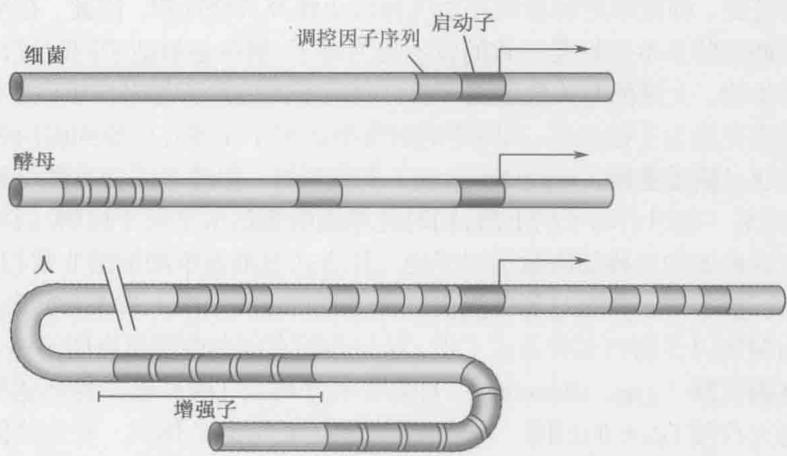  
图 19-1 细菌、酵母和人类基因组的调控因子元件。图例说明了调控因子序列复杂性的增加，从受单个抑制因子调控的简单细菌基因，到受多个激活因子和抑制因子调控的人类基因。每个例子都标出了启动子，这是转录起始的位点。它在细菌中位置确定，而在真核细胞中，转录起始位点位于转录复合物结合位点的下游（第 13 章）。在人类的调控因子序列中存在一类调控结合位点，称为增强子，如图所示。

在多细胞生物中，调控序列可以延伸至距启动子数千个核苷酸处（上游或下游均可），并可由数十个调控因子结合位点组成。通常这样一组结合位点被称为增强子（enhancer），一个增强子结合的调控因子将负责在一个合适时空状态激活基因表达。不同的增强子与不同组的调控因子结合，控制同一基因在不同时空的表达，以应答不同的信号。

拥有更广泛的调控因子序列意味着某些调控因子结合位点将远离它们所控制的基因，有时能达到 100kb 或更远。实际上，哺乳动物刺猬基因中一个关键的增强子离转录起始位点有 1Mb 的距离。在这么远的距离上，调控因子是如何作用的呢？在细菌中我们看到距离几个 kb 的 DNA 结合蛋白能进行通信：如 $\lambda$ 噬菌体中， $O_{R}$ 位点和 $O_{L}$ 位点上的抑制因子能相互作用；又如 NtrC 能从 1kb 或更远处激活 glnA 基因。在这些“远距作用”的例子中，居中的 DNA 回路为蛋白质之间的相互作用提供了方便。即使在某些情况下蛋白质作用的距离很远并且形成回路的原因尚不清楚，但同样的机制也可以解释真核细胞中存在的许多远距离调控的情况，虽然不能针对所有可能的情况。在一些案例中，这种紧接着启动子上游的“被束缚”的序列可以招募远处的增强子。

远距的激活产生了另外一个问题。当结合于一增强子时，也许有几个基因都在此激活因子的作用范围之内，但一个特定的增强子通常只调节一个基因。已在增强子和启动子之间找到了其他的调控因子序列，称为绝缘子（insulator）或边界元件（boundary element）。绝缘子阻止结合于增强子的激活因子对启动子的激活。尽管目前对这些元件的了解尚不深入，但它们确保了激活因子的工作不会产生混乱。

## 从酵母到哺乳动物转录调控的保守机制

本章我们将考虑从单细胞的酵母到哺乳动物的基因调控。所有这些生物都具有真核生物两个典型的特征，即精细的转录调控系统和核小体及其修饰物。因此，在所有的真核生物中很多基因调控的基本属性是一致的就不足为奇了。酵母是最适于同时进行遗传学和生物化学研究的生物，大量的有关激活因子或抑制因子的信息正是来自于该生物。另外，对于将其结论普适化最为关键的是，当特定的酵母激活因子在哺乳动物细胞内表达时能够激活转录。这是通过报道基因（reporter gene）来检测的。报道基因含有酵母激活因子结合位点，它插入到某一基因启动子的上游，同时此基因的表达水平易于检测（后面还将讨论）。

我们将看到典型的真核细胞激活因子的工作方式与最简单的细菌非常相似：DNA 结合区域和激活区域分开，并通过募集蛋白复合物到特定的基因上来激活转录过程。相反，真核细胞中的抑制因子能以多种方式工作，这与我们在细菌中所见有所不同。这些新的抑制机制包括基因沉默（gene silencing），即募集核小体及 DNA 修饰物到基因组的区域来保持基因甚至大片段 DNA 的封闭。当然也有“短距离”抑制的例子，在这些例子中，序列特异性的抑制因子通过抑制那些同增强子内邻近位点结合的激活因子而发挥作用。

尽管有许多共同的特征，但并不是在所有真核生物中基因调控的所有细节都是一致的。更重要的是，我们曾提到过，与多细胞生物相比，一个特定酵母基因的调控因子序列要短一些。所以我们必须研究更高级的生物，来了解基因调控的基本机制是如何扩展以适应更为复杂的信号整合和组合式控制的。本章将把讨论局限于蛋白质（及其修饰）介导的转录调控，下一章将讨论RNA分子介导的基因表达调控。

## 激活因子的 DNA 结合与激活功能的分离

在细菌中考察一个特定的激活因子，如 CAP，我们发现它的 DNA 结合与激活功能是分离的。我们这样描述这个遗传示例：正向控制（pc）的突变能正常地与 DNA 结合，但不能激活基因。真核细胞激活因子的 DNA 结合区域与激活区域也是分离的。事实上，本例中，蛋白质的两个表面通常位于分离的两个域。


我们以最常研究的真核激活因子 Gal4 为例（图 19-2）。该蛋白质能激活酿酒酵母（Saccharomy cescerevisiae）半乳糖基因的转录。与细菌中的半乳糖基因类似，这些基因编码半乳糖代谢所必需的酶。其中一个基因名为 GAL1。Gal4 能与 GAL1 上游 275bp 处的 4 个位点结合（图 19-3）。结合后，的转录，使转录效率提高 1000 倍。

图 19-2 Gal4 与 DNA 上位点的结合。酵母激活因子 Gal4 以二聚体的形式与 DNA 上一段 17bp 的位点结合。该蛋白质的 DNA 结合区域与激活区域（激活域）是分离的。

游 275bp 处的 4 个位点结合（图 19-3）。结合后，如果存在半乳糖，Gal4 将激活 GAL1 的转录，使转录效率提高 1000 倍。

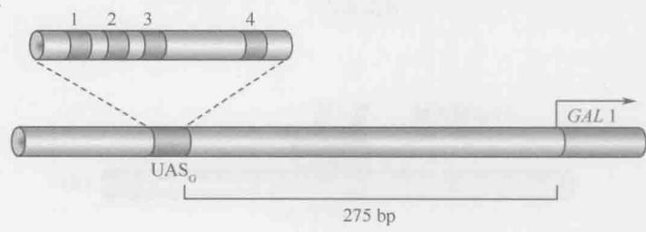  
图 19-3 酵母 GAL1 基因的调控因子序列。GAL 的上游激活序列（ $UAS_{G}$ ）包括 4 个位点，如图 19-2 所示，每一位点与一个 Gal4 二聚体结合。尽管没有显示，在 $UAS_{G}$ 和 GAL1 基因之间还存在着另一位点 Mig1，该位点能与抑制因子结合，我们将在本章后部分进一步提到它。（图 19-23）

两个补充实验揭示了 Gal4 的 DNA 结合域与激活域的分离。在其中一个实验中，表达 GAL4 基因的片段（编码这个激活因子 N 端的 1/3），得到的蛋白质能与 DNA 正常结合，但是不能激活转录过程。这样的蛋白质包含 DNA 结合域，但是缺乏激活域，因此形式上相当于细菌激活因子的 pc 突变（图 19-4a）。

另一个实验构建了一个杂合的基因，该基因将编码 Gal4 蛋白 C 端 2/3 的序列，同细菌抑制因子蛋白 LexA 的 DNA 结合域融合。产生的蛋白质在酵母中同一个报道质粒一起表达，该质粒 GAL1 启动子的上游具有 LexA 结合位点。融合蛋白能激活该报道子的转录（图 19-4b）。实验表明，激活不单单是通过与 DNA 结合来介导的，如同我们在细菌中遇到的机制一样，即通过 MerR 的激活发挥作用（第 18 章，图 18-17）。相反，DNA 结合域的作用仅仅是将激活域与启动子联系在一起，就如同我们在细菌中遇到的最常见的机制一样。

很多其他真核细胞激活因子也以相似的实验进行检测，无论材料是来自酵母、果蝇，还是哺乳动物，都得到了同样的事实：DNA结合域与激活域是分开的。在某些例子中，它们甚至位于不同的多肽片段，一条多肽具有DNA结合域，另一条多肽则具有激活域，两条多肽在DNA上形成复合物。一个例子是疱疹病毒的激活因子VP16，在感染该病毒的细胞中发现该蛋白质能与DNA结合蛋白Oct1相互作用。另一个例子是果蝇的激活因子 Notch，我们将在第 21 章中对此做介绍。真核细胞激活因子的 DNA 结合域与激活域分离的特点是一个检测蛋白质间相互作用的实验能够广泛运用的基础（框 19-1，双杂交实验）。

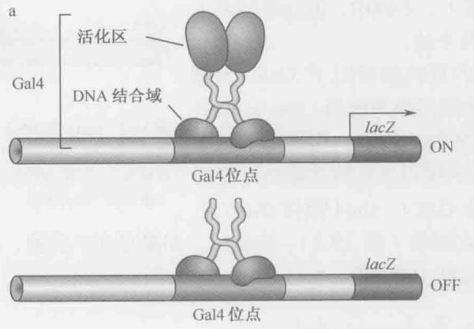

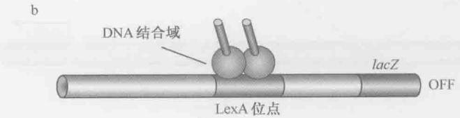

  
图 19-4 域交换实验。(a) 没有激活域, Gal4 的 DNA 结合域仍能结合 DNA, 但不能进行转录激活。另一实验中 (没有显示) 没有 DNA 结合域, 激活域也不能进行转录激活。(b) 将细菌蛋白 LexA 的 DNA 结合域与 Gal4 的激活域黏合, 创造一个杂合蛋白, 能在酵母中激活基因的转录, 只要该基因带有 LexA 蛋白的结合位点。基因的表达通过报道质粒检测, 这种质粒中, GAL1 启动子同大肠杆菌 lacZ 基因融合, 其产物 (β-半乳糖) 在酵母中能够很容易地被检测。GAL1 启动子响应各种激活因子结构导致的基因表达水平, 因而能够容易地被检测。本章中, 许多实验使用相似的报道质粒。

## 框19-1 双杂交实验

本实验用于鉴定蛋白质间的相互作用。在框19-1图1的示例中，激活报道基因的前提是蛋白A同蛋白B发生作用（即使这些蛋白质本身不在转录激活中起作用）。如正文中讨论的一样，本实验的发现表明，DNA结合域与激活域可位于不同的蛋白质上，只要这些蛋白质之间相互作用，使激活域与DNA相联系，激活附近的基因。实际上，本实验通过以下步骤来进行。编码蛋白A的基因同编码Gal4的DNA结合域的片段融合，另一蛋白B的编码基因同编码激活域的片段融合。当在酵母中单独表达，任何一种融合蛋白都不能激活具有Gal4结合位点的报道基因（如图1最开始两行显示）。当两种融合蛋白在酵母中同时表达，蛋白A和B之间相互作用产生完整的激活因子，使报道基因表达（如图1最后一行显示）。这个简单的实验被广泛运用于从文库中筛选候选蛋白，以找到与某种已知的起始蛋白相互作用的蛋白质。图中蛋白A可看成是起始蛋白（“诱饵”），蛋白B（“猎物”）即代表库中众多供候选者之一（见第7章关于文库构建的描述）。酵母细胞转染了一个融合了DNA结合域的编码结构蛋白A，和融合了激活域的编码众多未知蛋白质文库。被转染的酵母细胞如果其蛋白A和蛋白B能相互作用，将激活报道基因。这样的一种细胞形成一个克隆，这个克隆能够通过置于有合适指示剂的培养基中来鉴定。典型的报道基因是lacZ，阳性克隆（表达报道基因的细胞群）将在有适当指示剂的培养皿上呈现蓝色。

  
框19-1图1 双杂交技术工作原理。本技术中使用的报道基因典型的是lacZ或其他产生易于检测的基因。

真核细胞调控蛋白使用一系列 DNA 结合域, 但 DNA 识别的原理与细菌的相同

上述实验表明，以细菌的 DNA 结合域代替真核生物激活因子的 DNA 结合域，同样能够行使功能，揭示 DNA 结合蛋白识别它们的结合位点的途径在不同的生物体内没有本质上的差异。

从前一章节中（以及第6章）我们知道大多数细菌的调控蛋白是以二聚体的形式与双螺旋对称的DNA目标序列结合，每个单体将一段 $\alpha$ 螺旋嵌入DNA大沟中，覆盖该位点一半以上的区域，紧靠着碱基对的边缘部分。结合过程通常不需要蛋白质和DNA结构变化。大多数细菌调控蛋白采用螺旋-转折-螺旋域。如我们所见，这种域由两个被一段短的转折隔开的 $\alpha$ 螺旋组成。一个螺旋（识别螺旋）同 DNA 大沟相契合，并识别特殊的碱基对。另一个螺旋同 DNA 骨干相联系，为识别螺旋正确定位，并增强结合力（第 6 章，图 6-13 和图 6-14）。如在第 21 章所讨论的那样（以及本章后面部分），编码螺旋-转角-螺旋 DNA 结合蛋白的同源框对于动物的发育是非常重要的。

尽管有细节上的差异，但大多数真核细胞采用同样的 DNA 识别原理。因此蛋白质经常以二聚体形式与 DNA 结合，并以 $\alpha$ 螺旋嵌入大沟来识别特定的 DNA 序列。特定的真核调控蛋白的识别螺旋非常类似于螺旋-转折-螺旋域；其他真核调控蛋白识别螺旋的域结构相当不同。我们在原核细胞中没有见到过的变化包括几个在真核细胞中见到的调控蛋白以异二聚体（heterodimer）的形式与 DNA 结合，在某些例子中，甚至是以单体的形式与 DNA 结合（尽管经常要在其他蛋白质的协同下起作用）。异二聚体增加了可使用的 DNA 结合特异性的范围：每个单体有不同的 DNA 结合特异性，异二聚体识别的位点不同于同型二聚体。下面是对真核生物中几种 DNA 结合域的简单观察。

同型结构域蛋白质 同型结构域（homeodomain）是一种典型的螺旋-转折-螺旋DNA结合域，其识别DNA的途径与细菌蛋白基本上是一致的（图19-5）。不同蛋白质中同型结构域的结构非常相似：不仅识别螺旋相似，周边的把螺旋呈递给DNA的蛋白质结构也相似。相反，在前面的章节中可以看出，螺旋-转折-螺旋域的细节结构在很大范围内变化。在所有真核细胞中都发现了同型结构域蛋白。如同在其他更高级的真核细胞中一样，果蝇中首先发现的这类蛋白质控制了许多基本的发育程序，我们将在第21章来讨论它们的功能。在酵母中也发现了同型结构域蛋白，我们下面讨论的交配型控制基因就编码同型结构域蛋白。实际上，图19-5显示了一种同型结构域蛋白的结构。很多同型结构域蛋白是以异二聚体的形式与DNA结合的。

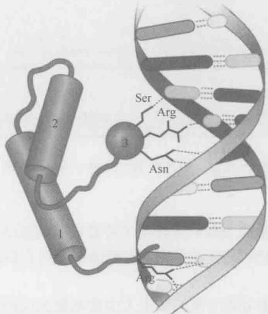  
图 19-5 同型结构域识别 DNA。同型结构域由三段 $\alpha$ 螺旋组成，其中的两段（图中为螺旋 2 和螺旋 3）螺旋形成类似螺旋-转折-螺旋的模式（例如，将此图同图 6-13 相比较）。如此，螺旋 3 为识别螺旋，在图中它嵌入 DNA 大沟。沿着该螺旋外边缘的氨基酸残基同碱基对之间一一对应。在图中所示的例子中，酵母 $\alpha_{2}$ 转录抑制因子的螺旋 1 中伸出的一臂，同小沟中的碱基特异结合。（经允许引自：Wolberger C. et al. 1991. Cell 67: 517-528. © Elsevier）

含锌 DNA 结合域 各种不同的形式的 DNA 结合域包含锌原子。这包括典型的锌指蛋白（zinc finger protein）（在第 6 章已经进行了讨论和描述）和在酵母激活因子 Gal4 中发现的相关的锌簇（zinc cluster）域。在这些例子中，锌原子同半胱氨酸残基和组氨酸残基相互作用，起到保持 DNA 结合域结构完整的作用（图 19-6）。DNA 同样被嵌入大沟中的 α 螺旋所识别（图 6-15b）。有些蛋白质拥有两个或多个末端相连的锌指结构域。每个锌指都以 α 螺旋嵌入大沟中，每增加一个锌指就延伸识别 DNA 序列的长度，以增强结合的亲和力。

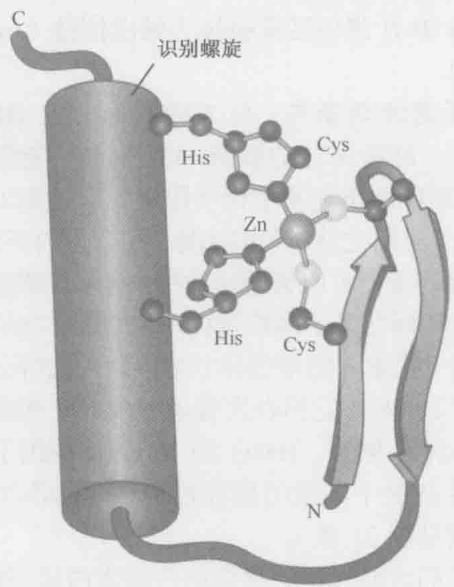  
图 19-6 锌指结构域。结构左边 $\alpha$ 螺旋为识别螺旋，通过右边的 $\beta$ 折叠伸向 DNA。如图所示，锌原子同 $\alpha$ 螺旋中两个组氨酸残基，以及 $\beta$ 折叠中两个半胱氨酸残基协同作用。这种排列有利于结构的稳定，是 DNA 结合所必需的。（引自：Lee M.S. et al. 1989. Science 254: 635-637.）

  
图 19-7 亮氨酸拉链结合 DNA。来自各自单体的两个巨大的 $\alpha$ 螺旋，在它们长链上不同的部分形成二聚体和 DNA 结合域。因此，如图所示，两个螺旋的顶部相互作用，形成盘绕状结构将两个单体结合在一起，往下，螺旋之间分离得足够开，以包含 DNA，并在 DNA 螺旋相对的位置嵌入大沟。另外， $\alpha$ 螺旋上氨基酸侧链与大沟中碱基对边缘之间的联系提供了特异性。这个例子是在酵母转录激活激活因子 GCN 4 中发现的（图 6-9）。（经允许引自：Ellenberger T.G. et al. 1992. Cell 71: 1223. ©Elsevier.）

还有另一类使用锌的 DNA 结合域。在这些例子中，锌原子同 4 个半胱氨酸残基协同作用，稳定地形成一个类似于螺旋-转折-螺旋的非常不同 DNA 识别域。其中一个例子是在哺乳动物调控蛋白葡萄糖肾上腺皮质类脂醇受体中发现的，该蛋白质的作用是对某种激素信号做出反应，调节基因表达。

亮氨酸拉链结构域 该结构域是在单一的结构单元内同时包含二聚结构和与 DNA 结合的表面。如图 19-7 所示，两个长的 $\alpha$ 螺旋形成一个钳形结构，将 DNA 夹于其中，每个 $\alpha$ 螺旋嵌入大沟的一半转折部分。二聚化是由同样两个 $\alpha$ 螺旋内另一个区域介导的：在这个区域内，它们形成一个短的盘绕状结构，在这个结构中两条 $\alpha$ 螺旋通过适当间隔的亮氨酸残基（或其他疏水性氨基酸残基）之间的疏水相互作用结合到一起。我们已在第6章中讨论过这种蛋白质间相互作用的细节（图6-9）。有亮氨酸拉链结构的蛋白质经常形成异二聚体，也形成同型二聚体。最后要提到的一类，即螺旋-环-螺旋蛋白（HLH蛋白）也是一样的。

螺旋-环-螺旋蛋白如同在亮氨酸拉链结构的例子中提到的一样，每个单体中延伸的α螺旋区域嵌入DNA的大沟中。如图19-8所示，二聚体的表面由两个螺旋区域构成，一个是参与DNA识别的那个螺旋的一部分，另一个是一个较短的α螺旋。这两个螺旋被一个非刚性的环分离（因而得名），这个环容许两段螺旋靠近。由于与DNA结合的α螺旋区域内包含碱性氨基酸残基，亮氨酸拉链和HLH蛋白经常被称为碱性拉链（basic zipper）和碱性HLH蛋白（basic HLH protein）。

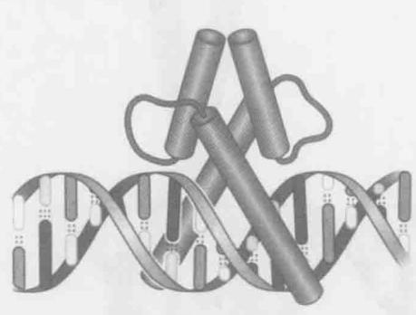  
图 19-8 螺旋-环-螺旋模体。在这个例子中，我们再次看见一个长的 $\alpha$ 螺旋，参与 DNA 识别，并同一个短的 $\alpha$ 螺旋一起参与二聚体形成。（经允许引自：Ma P.C. et al. 1994. Cell 77: 451, Fig.2A. ©Elsevier.）

高速泳动蛋白 高速泳动蛋白（HMG protein）高度保守的肽链 AT hooks 能够与 DNA 螺旋的小沟发生相互作用，这是很少见的。这与我们之前讨论的 DNA 结合蛋白不同，高速泳动蛋白可以显著地改变 DNA 双螺旋的构象，从而促进了高阶蛋白-DNA 复合物的形成，如干扰素 $\beta$ 的增强体（在本章后面将会介绍，图 19-18）。它们在发育过程中也发挥着重要的作用。例如，HMG 的 Sox2 调控因子在多能性胚胎干细胞的培养过程中是必不可少的（请见第 21 章）。

我们之前讨论的另外的两种蛋白质,通过DNA的小沟识别DNA靶点,并使得非刚性的

DNA 序列具有特异性, 如 LEF-1 增强子结合蛋白(图 6-16)和转录因子 Tbp(图 13-17)。

## 激活域结构不确定性

同 DNA 结合域相反，激活域一直没有一个明确的结构。在转录装置中，当与靶体之间相互作用时，它们呈螺旋结构，但可确信的是，这种结构是受 DNA 结合诱导的。我们将看到，缺乏明确的结构与激活域具有黏性表面，能同几种蛋白质的表面相互作用这个概念是相一致的。

不同于以结构来作为描述特征，激活域是按基本的氨基酸成分来归类的。例如，Gal4的激活域被称为“酸性”激活域，反映出该区域酸性氨基酸占优势。突变实验凸显出了这些酸性残基的重要性，这些突变增强了激活因子的效力：这样的突变总是增加整个激活域的酸性（负电荷）。但是除此以外，激活域还同样包含重要的疏水残基。很多其他激活因子也具有同Gal4类似的酸性激活域。尽管在序列上看不到相似性，但是它们都保留了酸性的特征模式和疏水残基。

可以确信的是，激活域由许多重复的具有弱的激活能力的小单元组成，每个单元都是一段短的氨基酸序列。这样的小单元越多，激活域的激活能力也就越强。再次，这同激活域缺乏一个整体上的结构，只是简单地作为一种无差别的黏性表面在起作用这个概念是一致的（为了理解这个推断，请想像用一个精确的、稳定的三维结构来代替折叠的激活域，类似于 DNA 结合域。在这样的环境下，不能指望 DNA 结合域的片段保留整个域的部分结合 DNA 的活性，完整的域结构是任何重要活性所必需的。但是，如果每个激活域都是简单的通用黏性表面，很容易想像它是由小的、弱的单元组成）。

最近一系列的核磁共振（NMR）结构研究检测了一个酵母启动子Gcn4的酸性活性区域与它的一个靶向蛋白Gal11（一个中介因子的亚基，见第13章）在自然状态下的相互作用。活性区域形成一个螺旋结构结合在靶标的缺口上。但是这个结构是动态的，并且能形成多个不同的构型和朝向，因为在所有已发现的案例中，活性区域的残基和靶标原件之间只有单独的疏水相互作用。这种“模糊的复合体”也许可用于解释为何在转录激活时活性区域看似能够与数种不同的靶标蛋白相互作用，这将在下个部分进行讨论。

还有一些其他类型的激活域，包括：谷氨酰胺丰富的激活域，如在哺乳动物激活因子SP1中发现的；脯氨酸丰富的激活域，曾在哺乳动物另一个激活因子CTF1中发现。这些功能域同样缺乏明确的结构。普遍来说，酸性激活域是常见的，并在所有检测过的真核生物中起作用，其他的激活域则很弱，也不是很常见。

## 通过真核生物激活因子募集结合基因的蛋白复合物

我们发现在细菌中通常是激活因子的一个表面与 DNA 结合, 另一个表面与 RNA 聚合酶相互作用, 将酶募集至基因, 从而激活基因的转录 (第 18 章, 图 18-1)。真核生物的激活因子也以这种方式来工作的, 但是也有少数情况是激活因子与 RNA 聚合酶之间直接相互作用。相反, 激活因子间接募集聚合酶, 或在聚合酶结合后募集其他因子。激活因子与转录装置上聚合酶以外的其他部分相互作用, 通过募集这些部分也就募集了聚合酶。另外, 激活因子能募集核小体修饰成分来改变基因附近染色质的性质, 帮助起始转录。最后, 激活因子可以募集聚合酶进行转录起始或延伸所需要的因子。所有这些功能中, 激活因子只是将蛋白质募集到启动子上。在细菌中, RNA 聚合酶是唯一需要被募集的蛋白质; 而在真核生物中则不同。在真核生物中, 一个激活因子能以三种方式起作用: 募集核小体修饰成分和改造体来 “开启” 启动子, 募集一般转录因子复合物 (如中介蛋白), 以及募集刺激 PolII 起始和延伸的蛋白复合物 (如 pTEFb/SEC 复合物)。我们首先来考虑转录装置的募集。

## 激活因子募集转录装置到基因上

如第 13 章所提到的，除了 RNA 聚合酶，真核转录装置还包括很多其他蛋白质。这些蛋白质中的许多都形成复合体，如中介蛋白（mediator）和 TFⅡD 复合物（TFⅡD complex）（第 13 章，表 13-2 和图 13-20）。激活因子与一个或多个复合体相互作用，将它们募集到基因上（图 19-9）。其他没有被激活因子直接募集的成分，则同那些已被募集的成分结合，协同作用。

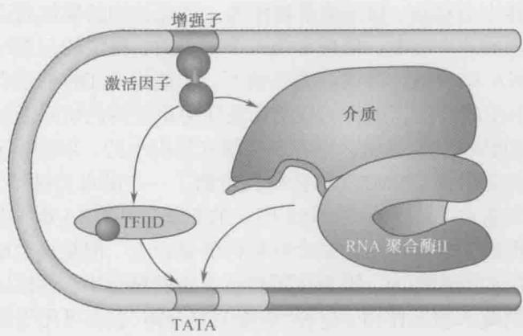  
图 19-9 在真核细胞中通过募集转录装置来激活转录起始。图中，一个单一激活因子募集两个可能的目标复合物：中介蛋白（通过其募集到了 RNA 聚合酶Ⅱ）和通用转录因子 TFⅡD。其他通用转录因子作为中介蛋白，RNA 聚合酶Ⅱ或 IFⅡD 复合物的一个部分被募集，或单独被激活因子直接募集，或在被募集的组分存在时与之随机结合，这些在图中没有显示出来。事实上，募集通常被多个结合在基因上游的激活因子所介导。

转录装置中的许多蛋白质能在体外同激活域结合。例如，一个典型的酸性激活域能够与中介蛋白的组分和TFIID的亚基相互作用。

募集可以通过染色质免疫沉淀反应（chromatin immunoprecipitation，ChIP）这种技术来观察（详见第7章的描述）。该技术能揭示细胞内特定蛋白与DNA确定区域结合的时间。这种精细的方法叫染色质免疫沉淀芯片（ChIP-Chip）和现在最常用的染色质免疫共沉淀测序技术（ChIP-Seq），都会在框19-2介绍。大多数基因（从现在来看虽然

  
图 19-10 通过中介蛋白与 DNA 的直接联系来激活转录。这是一个第 18 章框 18-1 所描述的激活因子旁路实验的例子。在缺乏通用激活因子 Gal4 的条件下，GAL1 基因被一个融合蛋白所激活，该蛋白由 LexA 的 DNA 结合域与中介蛋白复合物的一个组分融合而成（Gal11/Med15，第 13 章，图 13-20）。激活依靠 LexA 的 DNA 结合位点嵌入基因的上游。其他转录起始所必需的组分（TFⅡD 等）假设同中介蛋白及 RNA 聚合酶Ⅱ结合在一起。

不是全部）的转录装置只在基因激活时才出现在启动子上，即装置不是预先装配好的，证实了激活因子的作用是募集它。

在细菌中我们发现，通过募集来激活的基因（如 lac 基因）能通过一种激活因子旁路实验来激活（第 18 章，框 18-1）。在这样一个实验中，当 RNA 聚合酶不经过正常的激活因子-聚合酶相互作用而募集至启动子时，也能观察到激活现象。在酵母中也有相似的实验，即 GAL1 基因（正常的应被 Gal4 激活）同样能被一种融合蛋白很好地激活，该蛋白质由细菌蛋白 LexA 的 DNA 结合域与中介蛋白复合物的一个组分直接融合而成（图 19-10）。

值得注意的是，这些实验没有排除这样一种可能性，即至少某些激活因子不仅募集转录装置的部分组分，也诱导它们的变构。

这样的改变也许能提高转录起始的效率。不过，将转录装置募集至基因是特异性的基础，即哪个基因被激活取决于哪个募集到转录装置。另外，激活因子旁路实验的成功暗示了在起始过程中变构事件的发生并不需要激活因子做任何除了将蛋白质募集到基因上之外的事。

## 框 19-2 染色质免疫沉淀芯片(ChIP-Chip)和染色质免疫共沉淀测序技术(ChIP-Seq)是鉴别增强子的最佳方法

在第7章里我们讲述了染色质免疫共沉淀技术（ChIP）。这种方法能够帮助实验人员发现在细胞基因组中哪些特定DNA序列与目的蛋白结合，或者其他能够与之相互作用的蛋白质。在染色质免疫共沉淀的过程中，细胞、组织、器官甚至整个胚胎经过甲醛处理后，使DNA结合蛋白与相关的DNA序列或其他蛋白质交联。交联的染色质会被分割成\~200bp的小片段。DNA结合蛋白抗体被用来分离与蛋白质结合的DNA片段。在传统的染色质免疫共沉淀技术中，交联是可以逆转的，被沉淀的DNA作为模板，与目的基因的引物进行PCR扩增反应。因此，扩增序列是否存在揭示了与经过甲醛处理过的染色质（细胞中的DNA序列）结合的目的蛋白是否被分离出来。

ChIP-Chip 和 ChIP-Seq 是在 ChIP 基础上发展起来的两种方法，具有更加强大的功能。它们不仅能够检测到蛋白质是否与之前的特异性识别位点结合，还能够检测到基因组中与其结合的每个位点，即使这些位点的序列和位置也许之前是并不知道的。

在 ChIP-Chip 的过程中，交联逆转后，所有的免疫沉淀 DNA 片段与通用的非特异引物进行 PCR 扩增反应。之后非常关键的一步是，具有荧光标记的 DNA 分子与覆盖所有位点的细胞中的全基因组芯片进行杂交，这样就可以检测到之前的 DNA 片段与目的蛋白结合的位点图。

ChIP-Chip 已经应用于在全基因组范围内鉴定目的调控蛋白，如用于特定转录因子 Nanog、Sox2 和 Oct4 的鉴定。这些调控蛋白在一定程度上与人类胚胎干细胞的特性有关，如细胞的自我更新和特定的不同类型细胞的产生。它们也足够在成熟的分化细胞表达时诱导细胞产生类似干细胞的特性，因此被称为诱导多功能干细胞（iPS cell）（详见表 21-1）。

Nanog、Sox2 和 Oct4 的抗体已经广泛用于体内实验中鉴定干细胞中的蛋白结合位点（框 19-2 图 1）。目前已经发现可能有 100 多种靶标增强子受这三种蛋白质共同调节。其中的一些增强子与具有重要发育调控功能的基因有关，如与果蝇的同源转化基因有关的 Hoxb1（见第 21 章）。

这个技术的最新版是染色质免疫共沉淀测序技术（ChIP-Seq），它的功能更强大，操作也更简便。通过去交联将DNA片段从与之相结合的蛋白质上释放出来，便可以直接通过第二代测序技术的方法进行检测（见第7章）。这样，就可以很容易获得准确的DNA序列信息和足够的每个靶序列。

这种方法的另一个衍生应用是在染色体构象捕获(3C)中(我们在第7章中讲过)。该方法用于发现结合增强子的调控蛋白与特定启动子上的转录装置的相互作用——以物理形式上的两个DNA相靠近来解释其相互作用时的环状空间构象。

3C 基本过程正如前面所述，但是，与增强子结合的蛋白质不仅能够与 DNA 发生交联，也能够与可以与其相互作用的其他蛋白质发生交联。如果其他蛋白质再与另外的 DNA 位点结合（如启动子），那么在原目的蛋白抗体的作用下，这些 DNA 位点将会被沉淀。在去交联化作用之前，由于各种结合蛋白的 DNA 片段都靠近在一起，因此可以通过连接反应，将这些 DNA 片段的末端连接起来。通过对这个特异性杂交分子进行检测便可以知道这些 DNA 片段在基因组中的位置（如特定的增强子或已知的启动子）。

  
框 19-2 图 1 ChIP-Chip 鉴定受干细胞调控的增强子。人类全基因组嵌合芯片与 DNA 片段杂交，Nanog（绿色）、Sox2（红色）和 Oct4（蓝色）。这三种蛋白都结合到了与 Hoxb1 基因相关的 5'端序列。（经允许引自 Boyer L.A. et al. 2005. Cell 122:947–956, Fig. 2b. ©Elsevier.）

## 激活因子也募集核小体修饰物来帮助转录装置结合到启动子上或起始转录

除了直接募集转录装置，募集核小体修饰物也有助于激活染色质（chromatin）内那些难以接触到的基因。如同第8章讨论的，核小体修饰物有两种形式：一种是增加组蛋白末尾的化学基团，如增加乙酰基团的组蛋白乙酰转移酶（histoneacetyl transferase, HAT）；另一种则替换（或“重塑”）核小体，如依赖ATP活性的SWI/SNF。这些修饰物是如何帮助基因激活的呢？有两个基本的模型解释了核小体的改变如何帮助转录装置与启动子结合（图19-11）。

首先, 重塑模型和某些修饰能够暴露 DNA 核小体内部的那些无法接近的结合位点。例如, 通过移除或者增加核小体的灵活性, 重塑可以释放调控蛋白和转录装置的结合位点。相似地, 组蛋白末端增加乙酰基团, 改变了组蛋白末端与邻近核小体的相互作用。这种改变常被说成松弛了染色质的结构, 将这些位点释放 (更完整描述参见第 8 章)。

但是增加乙酰基团也以另一种方式协助转录装置（或其他蛋白）的结合：在核小体上为具有所谓同源调节域（bromodomain）的蛋白质提供特殊的结合位点（第8章，图8-41）。TFIID复合物的一个组分就具有同源调节域，与没有乙酰化的核小体相比，更易于与乙酰化的核小体结合。因此，若某个基因的启动子具有乙酰化的核小体，与那些没有乙酰化核小体的基因相比，将可能具有对转录装置更高的亲和力。其他的蛋白质含有染色质结构域（chromodomainl），可以识别甲基化的核小体，我们在稍后会看到这样的例子。

  
图 19-11 通过激活因子指导改变染色质局部结构。在启动子上游边缘处所示的核小体内部的 DNA 上具有结合位点，由于不能接近染色质内部，激活因子无法与这些位点结合。右图中，激活因子募集某种核小体重塑分子来改变启动子附近的核小体结构，使之变得可接近并且能同转录装置相结合。左图中，激活因子在募集组蛋白乙酰转移酶，该酶通过在组蛋白末端（如图中蓝色小旗所示）残基上添加乙酰基团来轻微改变核小体紧凑的结构，并为携带合适识别域的蛋白质创造结合位点（同源调节域）（第 8 章，图 8-41 和图 8-42）。所有这些都介导了转录装置与启动子结合。

转录装置的哪一部分、哪种核小体修饰物是某个特定基因转录所必需的呢？哪个组分是被特定基因上特定激活因子直接募集的呢？在大多数情况中，这些问题的答案是未知的，但是转录装置的某些组分在某些基因更严格需求的，而其他基因就没那么严格，这同样适合于核小体修饰物。在许多事例中，这些差异并不是绝对的。因而，所有基因都绝对地需要RNA聚合酶，但是一个特定的基因也许依赖于转录装置另一个特别的组分，或者是某个核小体修饰物，或者什么都不需要；在某些例子中，也许只部分需要转录装置的一个组分（即缺少这个组分，激活效果会降低，但不会消除）。另外，一个特定基因激活的所需条件将随环境条件（如细胞周期的阶段）而变化，例如，当组蛋白乙酰基转移酶不存在时，Gal4通常有效地激活GAL1基因。但是，有丝分裂时，当染色质更紧密时（第8章），激活效果将降低，除非基因募集了乙酰基转移酶。

在酵母中，最近的实验提供了在特异基因上特定的激活因子与其目标之间相互作用的良好证据。正如我们前面注意到的，酸性激活剂 Gcn4 可以同 Gal11（Med15）发生相互作用，它还可以同 TFⅡD 的 TAF12 亚基，以及转录相关的其他复合物发生相互作用，这些复合物包括可以重塑核小体的 SWI/SNF。Gal4 看起来至少可以与 3 个组分接触：中介蛋白、TFⅡD 和 SAGA（Spt-Ada-Gcn5-乙酰基转移酶）。其中最后一个组分含有乙酰化活性（第 8 章，表 8-7），似乎也能与转录装置相互作用。事实上，与 TFⅡD 类似，SAGA 含有 TAFs(TBF 联合因子)(第 13 章), 在某些启动子中用以取代 TFⅡD。Gal4 也可以募集 SWI/SNF。像 Gal4 这样的酸性激活因子作用于有着不同需求的基因（例如，有些需要 TFⅡD 和中介蛋白，有些需要 SAGA 和中介蛋白）的能力可以用其可与多个靶标相互作用的能力来解释。

我们注意到,一个 DNA 结合域与中介蛋白的一个亚基的融合蛋白足以激活转录(图 19-10)。尽管在这样的激活因子旁路实验中激活达到了正常的水平,但是它更慢,即需要花更长的时间才能使表达达到 Gal4 很快就能达到的水平。在激活因子旁路实验中比较缓慢地达到激活的水平,可能是因为在这种情况中需要转录装置的其他组分独立地抵达,而不是像 Gal4 那样直接被募集。

## 在某些启动子上激活因子募集另一个因子来进行有效的起始和延伸

真核细胞中精细的转录装置含有很多用于起始的蛋白质。它也含有一些帮助延伸的蛋白质（第13章）。在某些基因中，启动子下游的序列导致聚合酶在起始后不久就暂停或停滞。这些基因中，某些延伸因子的存在与否极大地影响了基因表达的水平。

其中一个例子就是果蝇的 HSP70 基因。这个基因由热激激活，是由两个激活因子共同作用来控制的。GAGA 结合因子被认为将足够的转录装置募集到基因来进行转录起始。但是，如果缺乏第二个激活因子 HSF，起始的聚合酶在启动子下游约 25bp 处停滞。应答热激，HSF 结合到启动子的特异位点，募集一个激酶 P-TEF（positive transcription elongation factor，正转录延伸因子）到停滞的聚合酶上。该激酶磷酸化 RNA 聚合酶大亚基的羧基末端域（CTD 尾）（被称为 CTD 尾，见第 13 章），释放停滞的聚合酶，使转录继续进行。近期研究表明 P-TEFb 是更大的复合体 SEC（超级延长复合体）的一部分，P-TEFb 的释放会使附近启动子上的聚合酶 II 暂停。有趣的是，一些 SEC 亚基与由染色体易位引起的儿童白血病有关（框 19-3）。

## 框 19-3 组蛋白修饰，转录延伸和白血病

白血病是由于血液中白细胞或粒性白细胞异常增殖导致的一种血癌。儿童白血病更为常见，15岁以下儿童的发病率为1/2000。其中最为常见是急性淋巴细胞白血病（ALL），或急性淋巴细胞白血病。大概3/4被诊断为ALL的婴儿是混合血统白血病（MLL），MLL是由于染色体重排导致MLL融合蛋白产生的。它与果蝇的Trithorax蛋白有关，Trithorax蛋白是酵母中一种组蛋白修饰复合物Set1的亚单位，在酵母中称为Set1-COMPASS。这些复合物能够在赖氨酸-4处使组蛋白H3（H3K4三甲基化，或H3K4m3）发生甲基化从而激活启动子。在果蝇中，Trithorax H3K4甲基化复合物可以阻碍多梳抑制因子复合物对H3K27的三甲基化作用。因此，MLL、Set1和Trithorax复合物对基因表达而言是正调控因子，为基因启动子区域的激活提供正调控的染色质标记物H3K4me3。

值得注意的是，多数的 MLL 融合蛋白所引起的急性淋巴细胞白血病是由于 MLL 和一个或另一个超长延伸复合物（SEC）亚基融合产生的，涉及聚合酶 II 的延伸。最常见的 MLL 融合蛋白是 MLL-AFF1，还有 MLL-ENL 和 SEC 的其他亚单位。因此看起来在不同的儿童白血病中似乎存在着一个共同的分子机制，即两种主要的转录调控因子复合物 MLL（或 Set1，Trithorax）和 SEC 的融合（见框 19-3 图 1）。

已有研究表明，这两种复合物融合在一起能够导致白细胞中“失控”基因的表达。MLL 复合物能够通过启动子区域的 H3K4me3 标记某个基因使其最终表达。这种修饰作用通常会导致与 RNA 聚合酶 Pol II 的结合或终止，但并不足以激活基因的表达。然而，MLL 融合蛋白能够马上激活基因的表达，这是因为 SEC 被募集到这些基因上并触发了 Pol II 在启动子上的暂停。

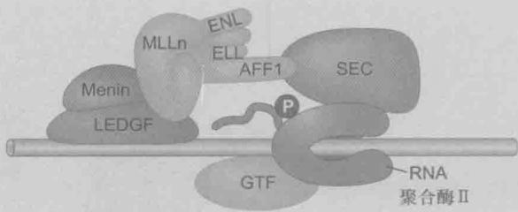  
框 19-3 图 1 两种主要转录调节复合物的功能融合：MLL 嵌合体。MLL 与 SEC 的各种蛋白融合。如图所示，MLL 可以同 SEC 中的任意蛋白发生联系或融合。Menin 是一种可以致瘤的辅助因子，它把 MLL 和 LEDGF( lens epithelium-derived growth factor, 晶状体来源的上皮生长因子)“捆在一起”，LEDGF 是一种转录共激活因子。同聚合酶Ⅱ结合的 GTF，表示的是通用转录因子（general transcription factor），如中间复合物的亚基。（图片由 Ali Shilatifard 提供）

我们在第 13 章看到，在所有基因转录的早期，在 Ser5 中 7 个重复序列的 CTD 尾的磷酸化是一个重要的步骤，激酶 IF II H 可以进行这个磷酸化。是否大多数基因中都需要 P-TEFb 还不清楚。P-TEFb 包含在磷酸化的 CTD7 个重复序列的 Ser2 中，这个修饰是与启动子序列上有活性的聚合酶 II 的释放一起发生的。像 Gal4 这样的强酸性激活因子能够募集 P-TEFb/SEC 及转录装置的其他部分。可能只有在特定的一些基因中，不同的调控因子在装置的募集中是像 HSP70 基因中看到的那样分开的，这使得基因转录增加了一次额外的控制。有关聚合酶的暂停及释放的概况见图 19-12。

P-TEFb（和 SEC）控制的启动子转录导致 AIDS 的人类免疫缺陷型病毒（HIV）的基因。可以再次看到，聚合酶在激活因子 SP1 控制下从那个启动子起始转录，但不久后就停滞了。在这个例子中，P-TEFb 被一个 RNA 结合蛋白而非 DNA 结合蛋白带到了停滞的聚合酶，那个蛋白质称为 TAT。TAT 识别 HIVRNA 起始附近的一段特异序列，该序列位于由停滞的聚合酶已经转录出来的部分。TAT 的另一个结构域与 P-TEFb 相互作用，并将其募集到停滞的聚合酶。该聚合酶释放的结果是病毒基因组的转录，以及宿主细胞的感染，通常是 T 淋巴细胞。

现在人们认为聚合酶的暂停现象是更常见的，特别是在发育分化阶段。最近在人胚胎干细胞和果蝇早期胚胎的研究揭示，所有编码蛋白质的基因中大约有1/3在分化过程中，其激活前都包含了聚合酶II的暂停阶段。这些基因可能需要依赖于SEC的募集来特异决定它们的基因表达。

聚合酶Ⅱ的暂停很可能也是为了将抑制核小体从启动子域上除去，使启动子做好准备，随时在上游调控因子序列的调控下迅速激活。酵母通常缺乏聚合酶Ⅱ暂停，但却使用了另一个策略来产生一个准备好的或“开放的”启动子。换句话说，许多酵母的启动子包括了富含 AT 的序列，从而降低了核小体的形成。或许聚合酶 II 的暂停和高 AT 的启动子序列都为了完成同一个目的：保持启动子相对少的核小体并时刻准备被快速诱导。如前面已经详细讨论过的，Gal4 在酵母中通过与 Gal1 基因的 UASg 位点的结合来激活 Gal1 基因（见图 19-3）。其实还有第二个蛋白质（RSC）的结合位点在这个调节区域内（图 19-13）。RSC 的作用是确定并特异解开一个在 UASg 上的核小体。这个动作有两个效果：通过特异地将 DNA 从核小体上释放，确保了 Gal4 的结合位点是对 Gal4 的结合开放的；而且其通过快速改变周围的核小体从而维持周围一系列核小体的位置，确保了核小体处于准确的位置。其中一个位点定位在转录起始位点，如前面讲的，Gal4 募集的 SWI/Snf 将有效地去除这个核小体（图 19-11），从而允许其他的转录复合物因子募集到启动子上起始转录（图 19-13）。

  
图 19-12 聚合酶 II 的暂停和释放。在 TFIIH 将聚合酶 II“尾巴”上的 Ser5 磷酸化后（见图 13-21），聚合酶起始转录，但在某些启动子上（见正文），其会暂停在此直到通过募集（由一个激活因子）P-TEFb 激酶（在 SEC 复合物中被发现，见说明）将 Ser2 磷酸化。复合体 NELF 与其他因子共同作为分水岭，介导了该暂停的释放过程。（经允许改编自 Levine M. 2011. Cell 145:502–511，Fig. 3. ©Elsevier）

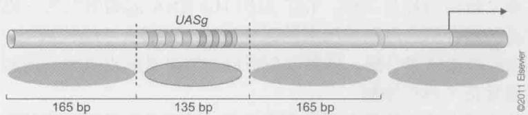  
图 19-13 RSC 复合物协助 Gal4 在面对核小体时有效激活。如图 19-3 所示，Gal4 结合到 Gal1 基因上 UASg 的 4 个位点。另外一个蛋白质 RSC，同样结合到如图标出的 UASg 内（紫色）。RSC 保持一个特定的核小体处于松散状态，从而使得 Gal4 的结合位点可用，其还定向了周围的核小体。这些虽抑制了本底表达，但却能被由 Gal4 募集来的 SWI/Snf 激活后高效地去除。核小体的位置及其包含的 DNA 长度已在图中以绿色和蓝色椭圆形标出。（经允许改编自 Wang X. et al. 2011. Trends Genet.27:487–492，Fig. 1. ©Elsevier）

## 远距作用：环与绝缘子

很多真核细胞激活因子是远距作用的，尤其在高等的真核生物中。因此，在一个哺乳动物的细胞内，增强子也许能在它们所控制基因的上游（或下游）数十个甚至上百个kb的地方找到。我们发现在细菌中，结合在分离位点上的蛋白质仍然能通过DNA环的调节而相互作用。但是在这些例子中，我们只考虑相距数百碱基对的蛋白质结合位点，在这样的条件下，结合在DNA上的蛋白质相互之间足够的靠近，它们之间在DNA上相互作用的机会比那些分离的蛋白质要高得多。一旦它们的结合位点之间的分离距离超过几个kb，这种优势将不复存在。

生物体存在着帮助远距离结合的蛋白质之间交流的机制。在细菌中，有一种途径可以做到这点，“建筑”蛋白 IHF（integration host factor）与 DNA 上的位点结合，并使之弯曲。在某些受 NtrC 控制的基因中，能在激活因子结合位点和启动子之间发现 IHF 位点。通过弯曲 DNA，IHF 帮助与 DNA 结合的激活因子到达启动子上的 RNA 聚合酶（第 12 章，图 12-11）。

多种模式被提出，以解释为什么在高等真核生物细胞中，结合在增强子和启动子之间的蛋白质能有助于激活作用。在果蝇中，cut基因被100kb以外的一个增强子所激活。一种名为Chip的蛋白质（与同名的技术没有关系！）有助于增强子和基因之间的交流。因此，Chip蛋白的编码基因突变影响激活的效率。Chip蛋白是如何工作的，目前还是未知的，其中一个模型是该蛋白质同增强子和启动子间DNA上多个位点结合，通过多个Chip蛋白之间的相互作用，在中间的DNA上形成多个小环，这样的累积效果将使启动子和增强子接近。在同源染色体配对过程中发挥作用的粘连蛋白也在增强子-启动子环中发挥作用(第8章，图8-14)。粘连蛋白同中介蛋白相互结合，在全基因组的ChIP-seq实验中，粘连蛋白经常与那些同增强子和启动子结合的蛋白结合在一起。

在真核生物中还有其他几类模型，如我们所见，DNA 包在核小体中，被多个碱基对分开的位点也许在细胞中实际分开的距离并没有想像中那么远。而且在染色质某些位置也形成特殊结构，使增强子和启动子靠近。增强子在 30 多年前就已经发现了，但长距离增强子-启动子相互作用的基础至今仍是基因调控的核心秘密。

如果一个增强子能激活 400kb 外的特定基因，那么，是什么阻止它激活那些启动子在这个距离内的其他基因呢？总体来说，因为在特定的脊椎动物基因组中每 100-200kb 有一个基因，增强子就必须去“选择”其中的两个或者更多的基因。一种名为绝缘子（insulator）的特殊元件控制了激活因子的行动。当置于增强子和启动子之间时，绝缘子将抑制增强子对基因的激活作用。如图 19-14 所示，绝缘子并不抑制位于启动子下游的另一个增强子对同一基因的激活作用；同样，它也不抑制最初的激活因子对另一个基因的作用。因而，与绝缘子结合的蛋白质既不积极地抑制启动子的活性，也不抑制激活因子的激活作用，它们只是阻碍着两者之间的联系。绝缘子经常同大的、称为 CTCF 的锌指蛋白结合。现在人们认为，CTCF 也可以结合粘连蛋白形成复合物，该复合物会同最近的启动子形成染色体环，因此阻断远端的增强子同该绝缘子形成类似的环。

在另一个实验中观察到绝缘子能抑制染色质修饰的展开。如我们所知，局部染色质的修饰状态能影响基因是否表达。如下所示，染色质上组蛋白修饰抑制的传播是转录沉默（transcriptional silencing）现象的核心。沉默是一种特殊的抑制形式，能沿着染色质展开，关闭多个基因的表达无需特殊的抑制因子与基因结合。绝缘子元件能够阻断沉默的展开，所以绝缘子能使基因免于不加选择的激活作用和抑制作用。

这种情形对某些实验操作可以产生一些后果。由于与一种密度特别高的染色质（异染色质）结合，随机插入哺乳动物基因组的基因经常处于沉默状态，但是若在该基因的上、下游放上绝缘子，该基因将不呈现沉默状态。

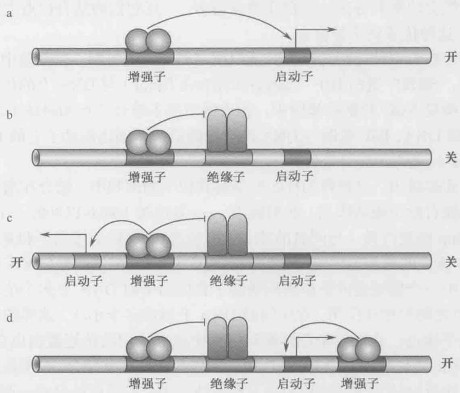  
图 19-14 绝缘子阻止增强子的活性。（a）与增强子结合的激活因子对启动子的激活作用。（b）一个绝缘子置于增强子和启动子之间。当适当的蛋白质与绝缘子结合后，尽管激活因子与增强子结合，增强子对启动子的激活作用仍将被阻断。（c）、（d）无论是在增强子上的激活因子还是启动子，都不会因为绝缘子的活动而失去活性。在（c）中，激活因子能够激活附近的另一个启动子，在（d）中，起始的启动子能被下游的另一个增强子所激活。

## 某些基因群的正确调控需要位点控制区域

人类珠蛋白基因在成人体内红细胞中和发育阶段那些形成红细胞的各种细胞中表达。人类有5种不同的珠蛋白基因（图19-15a）。尽管这些基因聚集在一起，但它们并不全同时表达。相反，不同的基因在不同的发育阶段表达，首先表达的是ε基因(在胎儿中)，接着是γ基因，出生后再后面则是δ基因和β基因。它们的表达是如何调节的呢？

每个基因都有自己的一套调节位点，这些位点对于基因在发育阶段的特定时间和特定组织中的表达是必需的（例如在不同时期的血细胞）。这样，β珠蛋白基因（在成年骨髓中表达）有两个增强子，启动子的上、下游各有一个。只有在成年人的骨髓中，正确的调控因子才会全部起作用，并达到合适的浓度，与这些增强子结合。但是以正确的次序打开这些珠蛋白基因，还需要更多的东西。

在珠蛋白基因簇上游 30\~50kb 处发现存在一组名为位点控制区域（locus control region，LCR）的调控因子元件。类似的情况也见于小鼠的 HoxD 基因群。这些基因参与四肢的发育和斑纹化，在胚胎中以精确的方式表达（第 21 章）。HoxD 基因受一个类似于 LCR 的称为 GCR（global control region）的元件控制，工作机制类似于 LCR。

b 小鼠β珠蛋白位点  


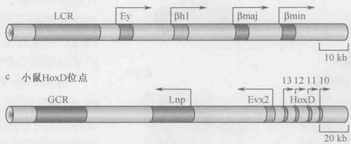  
图 19-15 LCR 的调节。（a）人类珠蛋白基因及 LCR，后者确保了这些基因的有序表达。 $\alpha$ 珠蛋白基因没有在图中显示，该基因的表达贯穿发育的始终，在不同的发育阶段，该基因的产物依次与图中所示的珠蛋白基因产物结合，形成不同形式血红蛋白。（b）小鼠的珠蛋白基因，同样受 LCR 的调节。（c）小鼠的 HoxD 基因簇，受一种名为 GCR 的元件的调节，该元件类似于 LCR，有强化基因簇有序表达的功能。

LCR 由多个序列元件组成。其中某些具有增强子的特征，即在实验中将这些序列置于一个报道基因的上游，它们可以激活那个基因。LCR 其他部分的行为更像绝缘子元件，还有一些部分看上去则具有启动子的特征。元件多样性导致多个 LCR 作用机制模型的产生。一个模型提出整个转录装置被募集到 LCR，从那里转录整个位点，随着装置的前行打开染色质，释放每个基因前面的局部控制元件。这些单个的启动子随后将产生每个基因所需求的高水平表达。

最近的实验使用新的技术，可以使激活过程中 LCR 和启动子在细胞中的定位可视（例如染色体定位捕捉，框 19-2）。已经对许多受 LCR 或类似 LCR 元件控制的基因进行了该项实验。所有的结果都显示，当一个启动子被激活时，结合于上游调控序列的调控蛋白就会被发现位于该启动子的附近。这个结果与如下想法一致，即结合在 LCR 的蛋白质与结合在启动子上的其他蛋白质相互作用，居间的 DNA 形成环状突起以使这种相互作用得以进行。

LCR 的激活与丰富的染色质修饰相关联。它是如何与激活挂起钩来的还不清楚。它可能帮助 “打开” LCR 周围或启动子周围的染色质。它也可能以帮助环形成的方式来改变两者之间的染色质。

## 信号整合与组合控制

## 激活因子协同作用促进信号整合

我们在细菌中看到过基因调控中信号整合的例子。例如，只有在乳糖存在并且葡萄糖缺乏的情况下，大肠杆菌的 lac 基因才能有效地表达。这两个信号是通过不同的调控

  
图 19-16 激活因子协同与 DNA 结合。图中展示了 4 种方式：蛋白质与 DNA 位点的结合促进另一蛋白质与邻近位点的结合。（a）两个蛋白质通过直接的相互作用来协作与 DNA 结合。我们在第 18 章的 $\lambda$ 抑制因子中能看到这种方式，在很多真核细胞调控因子中也有这种方式。（b）两个蛋白质与共有的第三个蛋白质作用来实现类似的作用。（c）、（d）蛋白质与核小体内 DNA 位点的结合促进另一蛋白质结合的间接方式。（c）第一个蛋白质募集核小体重塑分子来使第二个蛋白质的结合位点暴露。（d）第一个蛋白质与它的位点结合，这个 DNA 位点恰巧在核小体外。结合后稍微展开了的核小体 DNA，暴露第二个蛋白质的结合位点。所有这些机制都能解释为什么一个调控蛋白能促进其他调控蛋白的结合，或者更进一步，一个激活因子如何促进转录装置与启动子结合。

因子传给基因的，一个是激活因子，另一个是抑制因子。在多细胞生物中，信号整合应用得更加广泛。在某些例子中，需要多个信号来打开基因。但如同在细菌中一样，每个信号是通过独立的调控因子传达给基因的。因此，在很多基因中，多个激活因子必须联合作用来打开基因。

当多个激活因子联合作用时, 它们是协同(synergistically)作用, 即两个激活因子联合作用的效果要好于(通常是非常明显的)每个激活因子单独作用的效果之和。协同有三个来源: 多个激活因子各募集转录装置的同一组分; 多个激活因子各募集转录装置的不同组分; 多个激活因子相互之间帮助与所调控基因上游的位点相结合。在给出具体的事例之前, 我们简述这三种策略如下。更多的转录协同例子见第21章, 框21-4。

通过与不同的部位接触, 两个激活因子能募集同一复合体, 如中介蛋白。组合的结合能对募集有指数效果(第3章, 表3-1)。在那些激活因子募集不同复合物（若没有帮助, 两者都不能有效地与DNA结合）的例子中, 协同效应更易于被描述。

当一个激活因子与 DNA 的结合依赖于另一个激活因子与 DNA 的结合时, 激活因子能相互帮助与 DNA 结合, 协同同样也来自于此。协作 (cooperativity) 可以是我们在细菌中遇到的那种, 即当与 DNA

位点结合后，两个激活因子由此相互接触（第18章，如图18-26所示的λ抑制因子的情形）。但是这也能以其他方式起作用：一个激活因子募集某些物质来促进第二个激活因子与DNA结合。图19-16阐明了激活因子之间通过相互帮助与DNA结合的各种方式。这包括“经典的”协作结合，一个激活因子募集修饰物来帮助另一个激活因子结合DNA，一个激活因子与核小体DNA结合使另一个激活因子的结合位点暴露出来。

协同对于激活因子的信号整合至关重要。有一个基因，它的产物只有当两个信号都接收到时才需要，每个信号是通过单独的激活因子传达给基因。只有当两个激活因子都存在时，基因才能有效地表达，而任何一个激活因子的单独作用将不能影响基因的表达。因此，该模版充当多信号选择作用的基体。

信号整合：HO 基因受两个调控因子的控制，一个募集核小体修饰物，另一个募集中介蛋白

不同于通过分裂产生两个同样的子代细胞，酿酒酵母的分裂方式为出芽分裂，即所谓的母细胞通过出芽产生一个子代细胞。在此我们将集中讨论 HO 基因的表达（我们不需要关注这个基因的功能，这已在第 12 章中阐述）。HO 基因仅在母细胞内表达，并且只出现在细胞周期特定点（ $G_{1}/S$ 转换期）。这两个条件是通过两个激活因子（SWI5 和 SBF）传达给基因的。SWI5 在远离基因处有多个结合位点，最近的一个离启动子也有 1kb 以上（图 19-17）。SBF 也有多个结合位点，但它们都离启动子很近。为什么基因的表达要依赖于这两个激活因子呢？

  
图 19-17 对 HO 基因的控制。在染色质中，SWI5 能独立地与它的位点结合，而 SBF 不能。SWI5 募集重塑分子和组蛋白乙酰基转移酶改变核小体，暴露 SBF 的位点，使得 SBF 在启动子附近结合，从而激活基因。由于抑制因子 Ash1 的存在，SWI5 仅在母细胞中有活性。Ash1 是在子细胞中产生并与 HO 启动子结合从而抑制 SWI5 的活性。在本图中，为了简便起见，没有画出核小体。（经允许引自 Ptashne M. and Gann A. 2002. Genes & Signals, p.95, Fig.2-18. ©ColdSpring Harbor Laboratory Press.）

SBF（仅在细胞周期 $G_{1}/S$ 转换期具有活性）在染色质中的排列使之不能独立地与位点结合。SWI5（仅在母细胞内有活性）能独立地与位点结合，但是在那样一个距离上（大于 1kb）不能激活 HO 基因（记住在酵母中，激活因子不能远距离起作用）。然而，SWI5 能够募集核小体修饰物（一种组蛋白乙酰基转移酶后面跟着重塑酶 SWI/SNF）。其在核小体上的作用将暴露 SBF 位点。这样，若两个激活因子都存在，并且都具有活性，SWI5 的行为使 SBF 能与位点结合。接着，通过直接与中介蛋白结合，SBF 能募集转录装置并激活基因的表达。

## 信号整合：激活因子协同作用，共同与人类β干扰素基因结合

病毒感染能够激活细胞内人类 $\beta$ 干扰素基因。感染触发了3个激活因子：NFkB、IRF和Jun/ATF。在人类 $\beta$ 干扰素基因启动子上游约1kb处有一个增强子，3个激活因子将协同地一个挨着一个与该增强子结合。这些激活因子以协同作用结合在增强子上形成的结构被称为增强体（enhanceosome）（图19-18）。激活因子随后募集一个所谓的共激活因子——一个称为CBP（CREB-binding protein）的蛋白质或其近亲p300。这个蛋白具有组蛋白修饰活性，能够募集核小体重塑活性（如SWI/SNF）及转录装置本身。

  
图 19-18 人类 $\beta$ 干扰素增强体。3 个激活因子的协同结合，与结构蛋白 HMGA1 一起激活 $\beta$ 干扰素基因。

除了上述的激活因子，另一个蛋白质 HMGA1 结合增强子。这个蛋白质结合在 DNA 反面的小沟里，并帮助增强体的组装，尽管它可能不是最终结构的一部分。事实上，一旦所有的激活因子都结合上去，它看上去无法保留在上面——很简单，DNA 上太拥挤了。图 19-18 显示人们认为的增强体组装方式，图 19-19a 显示结合在增强子 DNA 上的所有激活因子的 DNA 结合域的晶体结构。如图 19-18 所示，增强子 DNA 是弯曲的，但一旦激活因子结合了，它就变直了；HMGA1 撑直了 DNA，因而帮助最终结构的形成。

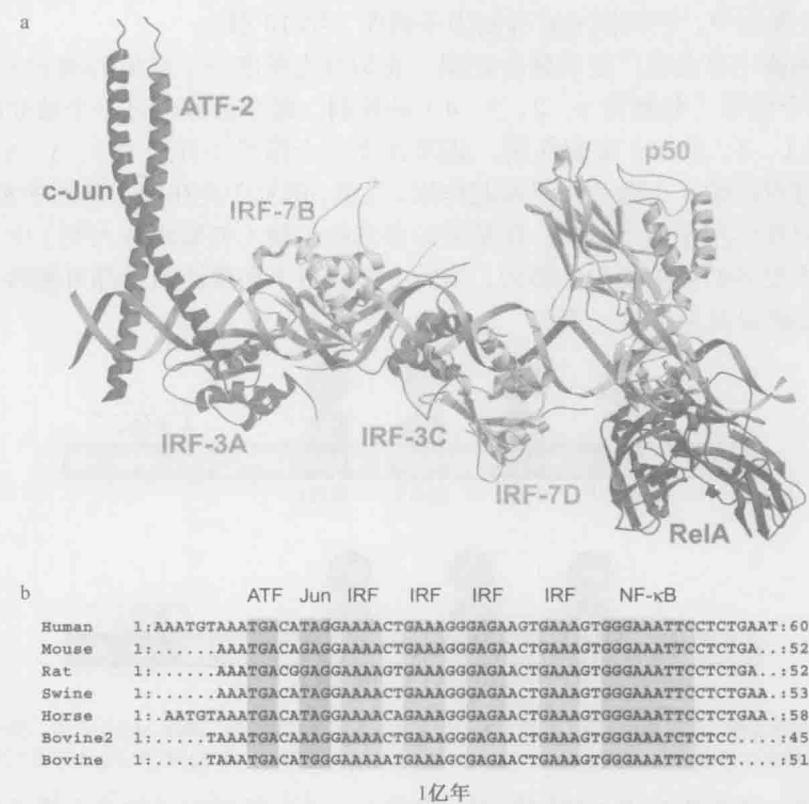  
图 19-19 增强体结构及序列。（a）增强体的晶体结构，揭示结合在增强子 DNA 上的激活因子的 DNA 结合域。（来源：a，Panne D. et al. 2007. Cell 129: 1111. PDBCodes: 2061, 206G.）（图像是多结构的合并，由 Leemor Joshua-Tor 组装成模型。图像用 MolScript，Bobscript 和 Raster 3D 制作。）（b）分离了 1 亿年的物种间 β 干扰素增强子 DNA 序列的保守性。还显示了增强子中每个激活因子识别的序列。

这个结构的一个显著特征是，增强子上几乎每一个 DNA 碱基对都参与激活因子的结合，这就是为什么认为在最终结构里没有 HMGA1 的空间。这种对增强子中序列信息的彻底使用也可能解释了为什么这个增强子在跨越像人、小鼠、马这样不同的物种中如此高度地保守；事实上，它甚至比基因的编码序列要保守得多（图 19-19b）。

如我们已经注意到的，激活因子结合（及增强体形成）以一种高度协同的方式进行，确保所有3个激活因子都必须在场出现。下面是调控因子可能协同结合的3种方法：①它们之间的蛋白质-蛋白质相互作用；②一个蛋白质结合引发的DNA改变帮助另一个蛋白质的结合；③所有的激活因子同时与共激活因子CBP相互作用。所有3种方法可能在这个例子中都使用到，尽管要知道激活因子之间的蛋白蛋白相互作用的程度是非常困难的。在这个结构中看不出多少直接相互作用的证据，不过，多数情况下在结构中只显示激活因子的 DNA 结合域。

## 组合控制是真核细胞的复杂性与多样性的核心所在

在细菌中，我们遇到过简单的组合控制（combinatorial control）。例如，CAP 能通过与不同调控因子的协作来调节多个基因。在 lac 基因中，CAP 同 Lac 抑制因子共同作用；而在 gal 基因中，它又同 Gal 抑制因子协作（第 18 章）。

在真核细胞中存在着广泛的联合控制。我们首先考虑一个常见的例子（图 19-20），基因 A 受 4 个信号（分别为 1、2、3、4）的控制，每个信号通过一个独立的激活因子（即激活因子 1、2、3、4）来起作用。基因 B 受 3 个信号（分别为 3、5、6）的控制，这些信号通过对应的 3 个激活因子来起作用。注意，信号 3 是在两个基因中都有的信号，激活因子 3 同样作用于两个基因。在复杂的多细胞生物（如果蝇和人类）中，联合控制涉及比上例中更多的调控蛋白和基因，当然，抑制因子和激活因子都可能参与。调控蛋白何以能够如此杂乱地混在一起？

  
图 19-20 组合控制。这里展示了两个基因，每一个都受到多重信号的控制，基因 A(a) 是 4 种，基因 B(b) 是 3 种。每种信号都是通过一种调控蛋白与基因交流。蛋白 3 与不同的、另外的调节子组合作用于两个基因。

如上所述，多个激活因子协同作用。事实上，单个激活因子的多个拷贝也能协同作用，表明特定的激活因子可以和多个靶体作用(就像我们之前看到的)。这一点可以解释为什么不同的调节因子可以以如此多的组合起作用；每一个调节因子都可以利用一系列的靶体，而在一起作用的组合方式并无限制。

以上提到的信号整合的例子——酵母 HO 基因和人 $\beta$ 干扰素基因，所涉及的激活因子作为组合控制的例子都调控其他基因的表达。因而，在酵母的例子里，SWI5 涉及多个其他基因的调控。哺乳动物中，NF- $\kappa$ B 不仅调控 $\beta$ 干扰素，而且调控许多其他基因的表达，包括 B 细胞免疫球蛋白 $\kappa$ 轻链。Jun/ATF 同样与其他调控因子作用，调控其他基因的表达。前面讲过某些 DNA 结合蛋白以异二聚体形式与不同的伙伴结合，提供了另外一个层次的组合控制。

## 酿酒酵母 (S. cerevisiae) 交配型基因的组合控制

酿酒酵母细胞以三种形式存在：两种不同的单倍体交配型 a 和 $\alpha$ ，以及当交配型 a 和 $\alpha$ 细胞交配、融合形成的二倍体。两种交配型细胞不同，因为它们表达两套不同的基因：a 特异基因和 $\alpha$ 特异基因。如下面简述的，它们受到激活因子和抑制因子的不同组合的调控。

a 细胞和 $\alpha$ 细胞分别编码细胞类型特异的调控因子：a 细胞生产调控蛋白 a1，而 $\alpha$ 细胞生产蛋白 $\alpha_{1}$ 和 $\alpha_{2}$ 。第四种调控蛋白叫做 Mcm1，也涉及调控交配型特异的基因（以及许多其他基因），它同时存在于这两种细胞中。那么，这些调控因子是如何在一起发挥作用从而确保在 a 细胞中 a 特异基因是打开的，而 $\alpha$ 特异基因是关闭的；反之，在 $\alpha$ 细胞也是如此。在二倍体细胞中这两套基因都保持关闭？

调控因子在 a 特异基因和 $\alpha$ 特异基因启动子上的排列示于图 19-21。

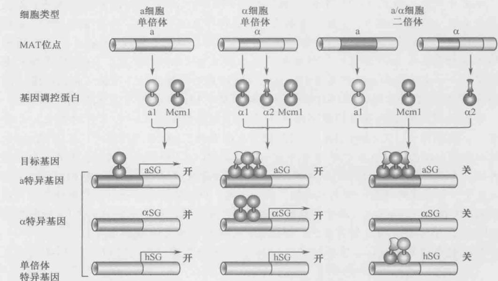  
图 19-21 酵母细胞类型特异基因的控制。如在正文中详细讲述的，酵母细胞的 3 种形式 [单倍体交配型 a 细胞和 α 细胞以及 a/α 细胞（二倍体）] 是由它们所表达的特定的基因来确定的。1 种通用的调控因子（Mcm1）和 3 种细胞类型特异的调控因子（a1、α1、α2）共同调控 3 类靶基因。MAT 位点是基因组中的一个区域，它编码交配类型调控因子（第 12 章）。

\- a 细胞中， $\alpha$ 特异基因是关闭的，因为没有激活因子在那里结合；a 特异基因是打开的，因为 Mcml 在那里结合并激活这些基因。

\- 在 $\alpha$ 细胞中， $\alpha$ 特异基因是打开的，因为 Mcml 在启动子上游结合并激活它们。在这些基因中，Mcm1 结合在弱结合位点，而且只能与蛋白 $\alpha 1$ 单体协作发挥作用。这确保了 Mcml 只在 $\alpha$ 细胞中激活这些基因。 $\alpha$ 细胞中 a 细胞特异基因由于 $\alpha 2$ 抑制因子的存在而保持关闭。这个抑制因子以二聚体形式结合并且与 Mcml 在这些基因中协作发挥作用。 $\alpha 2$ 抑制因子的两种特性保证了 a 细胞特异基因不在这里表达：它覆盖了 Mcml 的激活区使这个蛋白质无法激活；它同时还有效地抑制这些基因。 $\alpha 2$ 抑制因子的作用机制我们将会在下一节讲到。

\- 在二倍体细胞中，a 特异基因和 $\alpha$ 特异基因都关闭。其形成如下：a 特异基因结合 Mcml 和 $\alpha 2$ ，与其在 $\alpha$ 细胞中一样，使得这些基因保持关闭。 $\alpha$ 特异基因保持关闭，是因为如同在 a 细胞中一样没有激活因子的结合。

\- 两种单倍体细胞 (a 和 $\alpha$ ) 都表达另外一类基因, 叫做单倍体特异基因 (haploid-specificgene）。这些基因在二倍体细胞中被 $\alpha 2$ 关闭，后者在基因的上游与 $\alpha 1$ 形成异二聚体与其结合。只有在二倍体中才同时存在这两种调控因子。

现在，其他酵母的交配型基因调控的分子细节也已经知道了。在框 19-4 中，调控回路的可演化能力，我们比较了 a 和 $\alpha$ 特异性基因在酿酒酵母（S. cerevisiae）和白色假丝酵母中（Candida albicans）是如何调控的。这个比较揭示了基因调控回路可以如何演化，在后面的章节中我们还会回到这个主题。

## 框19-4 调控回路的可演化能力

如文中所述（及图19-21所示），酿酒酵母的不同交配型以细胞类型特异的方式表达某些基因。在α细胞中，α特异基因表达，a特异基因不表达；而在a细胞中，a特异基因表达，α特异基因不表达。另一类基因——单倍体特异基因（hsgs）——在两种单倍体a细胞和α细胞都表达，但是却不在二倍体a/α细胞中表达。Hsgs的产物需要进行交配——a细胞和α细胞会进行，然后a/α细胞（交配产物）不会。我们知道这些程序如何被MAT位点编码的调控因子与泛调控因子Mcm1共同作用来控制的细节。

最近的研究为说明基因调控网络是怎样演化形成的提供了一个很好的例子。三种酵母——酿酒酵母（S. cerevisiae）、乳酸酵母（K. lactis），和白假丝酵母（C. albicans），白假丝酵母和酿酒酵母在3百万\~9亿年前有着共同的祖先。如果根据它们表达的蛋白质的差异化，这两种酵母比鱼和哺乳动物更加分化。酿酒酵母被用于啤酒和面包的制作及实验室试验中，白假丝酵母是一种人类病原。尽管如此，正如酿酒酵母一样，白假丝酵母有两种不同的交配型——a和α，两种交配型细胞不同，因为它们表达不同的基因（a细胞中有a特异基因，α细胞中有α特异基因，a细胞和α细胞中都有的hsgs基因）。

两种酵母在抑制 a/α 二倍体细胞中 hsgs 表达方面有着相同的机理（表 19-4 图 1）。

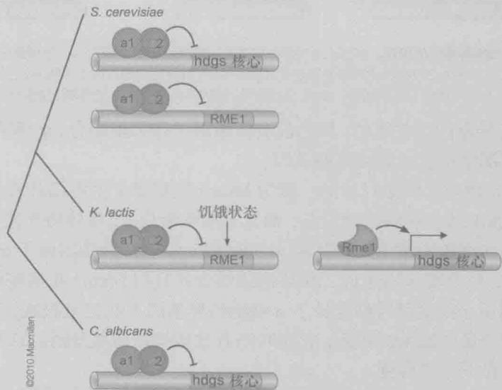  
表 19-4 图 1 三种酵母中核心基因 hsgs 调控演化的简化模型。在三种酵母中，a1/a2 抑制 hsgs 的表达，但是在 a 细胞和 α 细胞中它是开放的，在单独的 a/α 细胞中它是关闭的。在酿酒酵母和白假丝酵母中它的抑制作用是直接的，而在乳酸酵母中它的抑制作用是间接的（通过 Rme1）。在乳酸酵母中调控回路的演化导致了一种新的交配行为，只有当处于饥饿状态时才能进行交配。（引自 Booth L. et al. 2010.Nature468:959–965. Fig. 4. ©Macmillan.）

二倍体细胞含有 a1 和 $\alpha2$ 同源调控蛋白。这些蛋白质能够与 hsgs 的调控区域结合形成一个不稳定的异质二聚体，从而抑制其表达。在酿酒酵母中，a1/ $\alpha2$ 这异质二聚体也可以抑制 RME1 的表达，这个基因能够在饥饿期抑制二倍体细胞进入减数分裂期。

对第三种酵母乳酸酵母的交配型分析揭示了 hsgs 转录调控的另一个层次，插入 RME1 到调控网络中（框 19-4 图 1）。在乳酸酵母中，RME1 是 a 细胞和 $\alpha$ 细胞中 hsgs 的重要激活剂。在二倍体细胞中，和在酿酒酵母和白假丝酵母中一样，a1/ $\alpha$ 2 异质二聚体能够抑制 hsgs 的表达。但是在酿酒酵母和白假丝酵母中它的抑制作用是直接的，而在乳酸酵母中它的抑制作用是间接的，a1/ $\alpha$ 2 通过抑制 RME1 的表达从而消除 hsgs 的激活。

插入调控因子的调控回路演化允许新的信号加入到已有的通路中。把 RME1 插入到 hsgs 的抑制调控回路中，增加了可以通过营养条件决定交配的细胞类型的新的控制层次。这些研究还表明在一个系统发生中对多个物种的研究可以更加全面地了解基因调控回路是怎样演化的。

## 转录抑制因子

在细菌中我们见到许多抑制因子，通过对与启动子重叠位点的结合从而阻断 RNA 聚合酶的结合。但我们还见到了其他的方式：它们结合在启动子邻近区域，与结合在那里的聚合酶相互作用从而抑制它的转录起始。它们还可以干扰激活因子的功能。

除去第一种方式（讽刺地说，在细菌中最常见），在真核生物中我们可以见到以上所有其他形式。我们还可以见到另外一种抑制形式，也许是真核生物中最常见的形式。它的作用方式如下：同激活因子一样，抑制因子可以募集核小体修饰酶，但在这里，这个酶的作用与激活因子募集的相反，它们使染色质更紧凑或者去除能够被转录装置识别的基团。例如，组蛋白脱乙酰酶（histone deacetylase）通过从组蛋白尾部去除乙酰基来抑制转录。我们知道乙酰基的存在促进转录，矛盾的是，组蛋白脱乙酰化酶Rpd3也能够募集激活基因，从而确保转录的精确性。为了避免使用转录单位中“隐藏”的激活因子，在PolⅡ延伸之后，核小体被脱乙酰化。

其他的酶在组蛋白的尾部加上甲基，这个反应常常抑制转录，尽管在某些情况下，它与活跃转录的基因关联（第8章）。组蛋白（和DNA）修饰也成为叫做沉默的转录抑制的基础，在本章的后面还会详细讲到。

这些各种类型的抑制示于图 19-22。这里我们只对一个例子详细讲述，即一个叫做 Mig1 的抑制因子。与 Gal4 一样，它控制酵母 GAL 基因的表达。

图 19-23 展示了我们前面见到的 GAL 基因（图 19-3）。但是这里在 Gal4 和启动子之间多了一个位点，这就是在葡萄糖存在的条件下 Mig1 结合并关闭 GAL 基因的位点。这样，同 E.coli 一样，酵母细胞只有在首选的能量源葡萄糖不存在时才生产代谢半乳糖所需要的酶。那么，Mig1 又是怎样关闭 GAL 基因的呢？

Mig1 募集一个 “抑制复合体”，其中包含 Tup1 蛋白。这个抑制复合体被其他许多抑制转录的酵母 DNA 结合蛋白所募集，这包括前述的控制交配型基因的 $\alpha2$ 蛋白。Tup1

RNA聚合酶II

在哺乳动物细胞也有对应物。有两种假说来解释 Tup1 的抑制作用：首先，Tup1 募集组蛋白脱乙酰酶，后者使邻近的核小体脱乙酰化；第二，Tup1 在启动子部位与转录装置直接作用抑制转录起始。


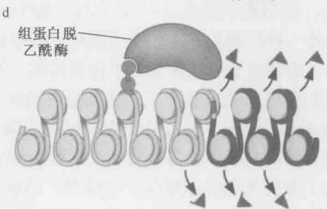

图 19-22 真核生物抑制因子的作用方式。真核生物的转录可以受到多种方式的抑制，这包括图中展示的 4 种机制。（a）通过与激活因子结合重叠位点的结合，抑制因子抑制激活因子对基因的结合，因而阻断基因的激活。这个模式的变换方式包括：抑制因子可以是同一激活因子的衍生部分，后者缺少激活区；在另一种模式中，以二聚体形式与 DNA 结合的激活因子可以受到其保留了聚合区但缺乏 DNA 结合区的衍生物的抑制，这种衍生物与激活因子形成无活性的异二聚体。（b）抑制因子与激活因子旁边的位点结合，并与激活因子相互作用，位阻它的激活区。（c）抑制因子与基因上游的位点结合，通过与转录装置的特殊方式作用，抑制转录起始。（d）通过募集组蛋白修饰酶改变核小体，从而抑制转录（如此例的脱乙酰化，某些情况下也发生甲基化，甚至对启动子的重塑）。

## 信号转导与转录调控因子的控制

信号通常通过信号转导通路传达至转录调控因子

我们已经知道，某一个特定基因的表达与否通常取决于其环境中的各种信号。这些信号以多种形式存在。例如，在细菌中，这些信号可以是小分子物质，如糖类。但是这些信号也可能是蛋白质类物质，由一个细胞释放，而被另一个细胞接受。这在多细胞生物的发育过程中尤为常见（见第21章）。

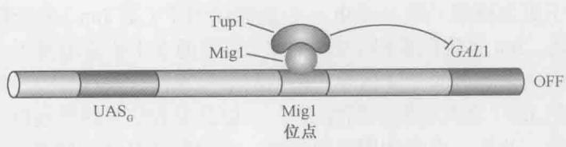  
图 19-23 酵母 GAL1 基因的抑制。在葡萄糖存在时，Mig1 结合到 UGSG 和 GAL1 启动子之间的一个位点。通过募集 Tup1 抑制复合体，Mig1 抑制 GAL1 基因的表达。很可能是对局部核小体的去乙酰化产生了转录抑制（Tup1 募集脱乙酰酶），也可能是直接接触和抑制转录装置。在本图未展示的一个实验中，如果 Tup1 与一个 DNA 结合域融合，而此结合域的位点又位于基因的上游，该基因的表达就会被抑制。

细胞检测到信号及信号效应传达到基因的方式有多种。在细菌中，信号通过诱导调控因子的变构改变来控制调控因子的活性。这种效应通常是直接的：小分子信号（如糖类）进入细胞，直接与转录调控因子结合。但我们知道一个信号效应是非直接的例子（激活因子 NtrC 的控制）。在这个例子中，信号（低氨水平）诱导一种激酶，该激酶磷酸化 NtrC。此类间接信号作用所代表的是信号转导通路（signal transduction pathway）。

信号一词指起始配体自身，如糖或蛋白质。这正如我们先前所定义的，信号一词也起源于“信息”，因为信号随着识别配体，传递给调控因子，后者直接调控基因，即信号沿着信号转导通路传递。对于简单的细菌来说，“信号”和“信息”没有差别。但是，一旦涉及信号转导通路，这两者就不同了。在真核细胞中，我们将看到（特别是第21章）大多数信号是沿着信号转导通路将信息传递至基因的，这些信号转导通路有时是非常精密的。在此部分，首先介绍几个真核细胞中信号沿着信号转导通路进行传递的实例。然后，我们更加全面地了解从上述信号转导通路来的信号是怎样控制转录调控因子自身的。

在信号转导通路中，起始配体通常由特异的细胞表面受体（cell surface receptor）检测到：配体与受体细胞外的某个区域结合，这种结合的信息被转递至该受体的细胞内区域。从此处开始，信号被传递到相应的转录调控因子，通常是通过一系列的激酶级联反应。配体与受体的细胞外区域结合是怎样通讯到细胞内区域的？这可以通过受体的变构改变来实现，即配体的结合可以改变细胞内区域的构型（及活性）。此外，配体也可以简单地使两条或多条的受体链聚集，使这些受体的细胞内区域间通过交互作用而互相激活。

图 19-24 所示的是信号转导通路的两个例子。首先是一个相对简单的案例——STAT（signal transdancer and activator of transcription）通路（图 19-24a）。在这个例子中，激酶与受体的细胞内区域结合。当受体被其配体（细胞因子）激活，就会导致两条受体链聚集，引发每条链中的激酶激活来使对应受体细胞内区域的一段特殊序列磷酸化。此磷酸化位点随后被一个特殊的 STAT 蛋白识别。而 STAT 蛋白一旦与上述磷酸化位点结合后，其自身也被磷酸化。STAT 蛋白磷酸化后，STAT 蛋白二聚化，向细胞核中转移，并与 DNA 结合。

另外一个例子更为精细（图 19-24b）：控制激活因子（如 Jun）的分裂素激活蛋白激酶（MAPK）通路。Jun 是我们前面（图 19-18）提到的 β 干扰素增强子上作用的激活因子。在这个例子中，被激活的受体诱导一系列的信号事件，最后导致一种 MAPK 激活，后者进一步磷酸化 Jun（及其他转录调控因子）。信息沿着信号转导通路传递，最普遍的方式是通过磷酸化。此外，也会使用蛋白酶解、去磷酸化及其他修饰作用。


图 19-24 哺乳动物细胞的两条信号转导通路。这里显示的是 STAT 和 Ras 通路。(a) 图中显示的是一种细胞因子与其受体结合，从而使两条受体链靠近。每条受体链的胞内区都有一种称为 JAK 的激酶与之附着。两条受体链的汇聚（可能伴随由细胞因子结合所引发的构象改变）导致两条受体链的磷酸化，这种磷酸化是由 JAK 激酶所催化的（JAK 激酶也相互磷酸化，激发其激酶活性）。受体链的磷酸化位点随后被细胞质中的叫做 STAT 的蛋白质识别。每个 STAT 分子含有一个所谓的 SH2 域，这些结构域见于参与信号转导的很多蛋白质中。这些 SH2 域识别在某些序列环境中的磷酸化 Tyr 残基，而这正是该信号转导通路特异性的基础。也就是说，被募集到某一特定受体上的特殊的 STAT 将决定随后被激活的基因。一旦被募集到受体上，该 STAT 自身也被 JAK 激酶磷酸化。这种效应允许两个 STAT 蛋白形成一个二聚体（每个 STAT 上的 SH2 域识别对应 STAT 分子上的磷酸化位点）。二聚体随后转移至细胞核内，在该处，它与 DNA 上特异的位点结合（不同的 STAT 有不同的位点），并且激活邻近基因的转录。(b) 引导下游 MAPK 通路的 Ras 通路。某一生长因子（如表皮生长因子）与其受体结合，使受体链汇聚，正如 STAT 的例子，随后彼此磷酸化。这种作用募集一种衔接蛋白质，叫做 Grb2，该蛋白质有一个 SH2 域，可以识别激活的受体中的磷酸化的 Tyr 残基。Grb2 的另一端与 SOS 结合，后者是一种鸟嘌呤核苷酸交换因子（Ras GEF）。SOS 随后又结合 Ras 蛋白，后者附着在细胞膜内侧。Ras 蛋白是一种小 GTP 酶，后者在与 GTP 结合时采取一种构象，而与 GDP 结合时又是另一种构象；与 SOS 的相互作用引发 GTP 代替 GDP 与 Ras 结合，Ras 因而发生构象改变。在这种新的构象下，Ras 激活所谓 MAPK 级联的最高一级的激酶。该通路中的第一个激酶叫做 MAPK 激酶激酶（MAPKKK）(Raf)；一旦被 Ras 激活后，Raf 磷酸化下一级激酶（一种 MAPK 激酶 MAPKK，叫做 Mek）的丝氨酸和苏氨酸残基。这种作用激活了 Mek，后者进而磷酸化 MAPK（Erk）。该 MAPK 随后磷酸化一系列底物，包括转录激活因子（如 Jun），调控多种特异基因的转录，包括 β 干扰素（图 19-18）。

## 信号通过多种方式控制真核细胞转录调控因子

信号被直接或间接通讯到一个转录调控因子后，如何调控这个调控因子的活性呢？在细菌中，控制转录调控因子的变构改变通常可以影响该转录调控因子与 DNA 结合的能力。这在信号配体自身直接作用于转录调控因子的情况，以及信号配体经信号转导通路传递到转录调控因子的情况中都是如此。因此，乳糖抑制因子只有在缺乏别乳糖时才能与 DNA 结合，NtrC 的磷酸化引发变构改变，控制激活因子与 DNA 结合。

在真核生物中，通常转录调控因子并不在 DNA 结合水平被调控（虽然也有例外），而是通过下述两种基本方式之一被调控。

激活区的暴露 可以通过与 DNA 结合的激活因子的构象改变，使先前被掩蔽的激活区暴露出来；或者通过释放掩蔽蛋白达到此目的。在这之前该掩蔽蛋白结合并隐蔽激活区域。上述两种情况所必需的构象改变可以通过直接与配体结合，或者通过配体依赖的磷酸化来引发。

Gal4 由一个掩蔽蛋白所控制。在缺乏半乳糖时，Gal4 与其 GAL1 基因上游的结合位点结合，但是并不激活该基因，因为另外一个蛋白质 Gal80 与 Gal4 结合，闭塞了后者的激活区。半乳糖触发 Gal80 的释放及基因的激活（图 19-25）。

  
图 19-25 酵母激活因子 Gal4 是由 Gal80 蛋白调节的。Gal4 仅在半乳糖存在时才具有活性，即使在半乳糖缺乏时，也发现 Gal4 与其位于 GAL1 基因上游的结合位点结合。但是在这种情况下，它并不能激活该基因，因为此时激活区域与另外一个叫做 Gal80 的蛋白质结合。在半乳糖存在时，Gal3 蛋白与 Gal80 结合并使之发生构象改变，Gal4 激活区域因而暴露。本图显示，在半乳糖存在时，Gal80 与 Gal4 解离。实际上可能是位置的改变以及结合力的减弱，而并非完全脱离。如图显示，Mig1 没有与其位点结合，因为不存在葡萄糖（图 19-23）。

在许多情况下，掩蔽蛋白不仅阻断激活区，其自身作为（或者募集）脱乙酰酶，所以可以主动抑制基因。一个例子是哺乳动物激活因子 E2F，E2F 与其目标基因的上游位点结合，无论是否再激活该基因。另外一个蛋白质——抑制因子 Rb（retinoblastoma protein，成视网膜细胞瘤蛋白）通过与 E2F 结合而控制 E2F 的活性。这种结合阻断了激活，并且募集了一种脱乙酰酶来抑制目标基因。Rb 磷酸化导致其从 E2F 上释放，因此也就导致了目标基因的激活。E2F 控制某些基因的表达，而这些基因是哺乳动物细胞经历细胞周期的 S 期所必需的（第 9 章）。因此，Rb 的磷酸化控制着这些细胞的增殖。影响这条通路的突变通常都与不受控制的细胞增殖和癌症相关。

运输出入细胞核 当处于非激活状态时，许多激活因子和抑制因子都被限制在细胞质中。具有信号功能的配体使这些激活因子和抑制因子转移到细胞核内，它们在细胞核内起作用。这一过程可以有许多不同的机制。因此，调控因子可以通过以下方式被限制在细胞质中：与抑制性蛋白相互作用，或者与细胞膜相互作用，或者以某种构象存在，在此种构象中其向细胞核内运输所必需的信号被掩盖了。

对信号的应答所导致的释放和向细胞核内运输可以通过抑制因子或连接区域的蛋白质水解及异构效应来介导。在第21章，当我们考虑果蝇胚胎的背腹轴形成时，我们会看到这样的例子。在该例子中，Cactus是抑制蛋白，在细胞质中与转录调控因子Dorsal结合。在对某一特异信号应答时，Cactus被磷酸化后降解，Dorsal得以进入细胞核行使其功能（第21章，图21-12）。如上文所述，β干扰素的一种调节因子NF-κB被激活的机制也是如此。NF-κB与抑制因子IκB结合以无活性的状态存在于细胞质中，NF-κB与Dorsal有关，而IκB与Cactus有关。

## 组蛋白与 DNA 修饰导致的基因“沉默”

到目前为止，我们已经讨论了激活因子和抑制因子对基因的调控，它们与基因邻近区域结合，开启或关闭该基因。这种效应是局部的，并且调控蛋白的活动通常由特异的细胞外信号控制。现在我们转向讨论转录沉默（transcriptional silencing）的机制。沉默在本文中（在第20章，该词被用于完全不同的情形）指的是一种位置效应。基因因为它所处的位置而沉默，而不对环境中某一特异信号的应答反应。另外，沉默效应在大段的DNA序列上可以“扩散”，关闭多个基因，即使是那些离起始事件距离较远的基因。尽管有这些差异，了解沉默效应并不需要全新的理论，而仅仅是我们在本章所遇到的理论的延伸。

最常见的沉默形式与被称为异染色质（heterochromatin）的一种致密形式的染色质有关。异染色质的命名源于其在光学显微镜下的外观（图19-26），它代表了染色体上高度致密的区域（即使在分裂间期）（第8章）。异染色质通常与染色体的某些特殊区域相关，特别是端粒（在染色体末端发现的结构）和着丝粒。正如在第8章所学到的，端粒和着丝粒通常由重复序列组成，偶尔会有少量的蛋白质编码基因。如果用实验的方法将一个基因转移至该区域，那么该基因通常被关闭。实际上，还有其他区域的染色体也处于异染色质状态，并且这种区域中已发现有基因的存在，如酵母中沉默的交配型基因座。在哺乳动物细胞中，估计约有50%的基因组以异染色质的某种形式存在。但是，在果蝇基因组的异染色质区域也有一些必需基因，其中包括Rolled促细胞分裂原激活蛋白激酶。这些基因在异染色质区域通常处于正常的活动状态，而当其转移到常染色体区域时就会表现出不稳定。然而在大多数情况下，是位于常染色质区域基因转移到异染色质区域时表现出减弱或不稳定的活性（花斑化）（随后我们会进行详细讨论）。

我们已经知道，染色质的密度可以被那些在化学上修饰组蛋白尾部的酶所改变或者改变核小体的位置。这种修饰影响 DNA 的易接近性，并由此影响复制、重组以及转录等过程。正如我们已经叙述过的，转录过程的激活和抑制通常涉及核小体的修饰，以至于改变基因对转录装置和其他调控蛋白的易接近性。我们也曾经遇到过某些蛋白质可以识别被修饰过的核小体，并且可以特异性地与之结合。异染色质的沉默可以被理解为上述原理和机制的一种延伸。

转录也可以通过 DNA 甲基化而被沉默。DNA 甲基化是由 DNA 甲基化酶(DNA methylase)所催化的。这种形式的沉默在酵母中尚未发现，但在哺乳动物细胞中却很普遍。DNA 序列的甲基化能抑制蛋白质结合，包括转录装置，因而阻断基因的表达。但是甲基化也可以通过其他途径抑制表达：有些序列只有在被甲基化后才能被特异的抑制因子识别，这种识别随后关闭邻近的基因，通常通过募集组蛋白修饰酶来实现。

  
图 19-26 DAPI 染色显示了拟南芥基因组中的异染色质区域。DAPI 能够使 DNA 着色，通过较强的荧光可以看到核染色质更加密集地凝集在异染色质区域。染色较弱的地方是常染色质区域。（该图由 Paul Fransz 提供）

## 在酵母中，沉默由组蛋白的脱乙酰化作用和甲基化作用介导

在酿酒酵母中，端粒、沉默的交配型基因座及 rDNA 基因都是 “沉默” 的区域。我们以端粒为例进行讨论。

现已发现，每条染色体末端1\~5kb部分均是折叠、致密的结构，如图19-27所示。来自染色体其他位点的基因转移到该区后，通常都变成沉默状态，特别是当它们在原先的位点就只有微弱表达。相比其余部分的基因组[称为常染色质（euchromatin），这部分基因表达更容易]，端粒部分的染色质乙酰化程度要轻一些。

  
图 19-27 酵母端粒中的沉默效应。Rap1 募集 Sir 复合体至端粒。Sir2 是该复合体的一种成分，使邻近的核小体脱乙酰化。未被乙酰化的尾部随后与 Sir3 及 Sir4 结合，募集更多的 Sir 复合体，从而允许其中的 Sir2 作用于更远处的核小体，循环往复。这就解释了由脱乙酰化造成的沉默效应的扩散。（经允许引自 Grunstein M. et al. 1998. Cell 93: 325-328. ©Elsevier.）

我们已经分离到沉默效应被消除的突变体，即处于端粒部位的基因以更高的水平表达。这些研究显示了3个编码沉默调控蛋白的基因，即SIR2、SIR3和SIR4（SIR代表silent information regulator）。这3个基因所编码的蛋白质形成一个复合物，与沉默状态的染色质结合，其中Sir2是一种组蛋白脱乙酰酶。

沉默复合物由识别端粒重复序列的 DNA 结合蛋白募集到端粒。在沉默的交配型基因中，募集也是由一个特异的 DNA 结合蛋白起始的。上述两种情况中，Sir 的募集激发了组蛋白尾的局部脱乙酰化。脱乙酰化的组蛋白随后被沉默复合物直接识别，因此局部脱乙酰化以自我永续的方式沿着染色质轻易地扩散开，产生了一个扩展的异染色质区域。

与 Tup1 的抑制（其机制仍未明了）不同，沉默明显是由组蛋白尾的脱乙酰化造成的。Sir2 的丢失完全缓和了沉默，而且组蛋白尾的乙酰化具有类似的效应。整个异染色质结构依赖于 DNA 结合蛋白（Rap1）的持续存在来维持完整性。因此，尽管因 Sir 识别脱乙酰组蛋白而引发脱乙酰化的加剧和扩散，DNA 结合蛋白继续扮演重要的角色。另外，是 DNA 结合蛋白赋予了整个过程的特异性，即决定了沉默复合物在哪里形成。在某些沉默例子里，RNA 分子，而不是蛋白质，提供了这个重要的特异性。在第 20 章中，我们将讨论这样一个例子，另一种酵母（粟酒裂殖酵母 Schizosaccharomyces pombe）的 RNAi 装置是该生物体交配型基因座和着丝粒沉默所必需的。

沉默区域的扩散是如何被节制的？即它是如何被限制到合适的区域的而不在基因组中扩散得太远？前面我们提到绝缘子元件能够阻碍组蛋白修饰的扩散（图 19-12）。另外，其他种类的组蛋白修饰阻碍 Sir2 蛋白的结合，于是终止了扩散。相信组蛋白 H3 尾的甲基化起了这个作用。

组蛋白甲基转移酶把甲基基团加到组蛋白尾上。如我们在第8章看到的，这些酶将甲基基团加到组蛋白H3和H4尾上特异的赖氨酸残基上。组蛋白甲基转移酶最近在酿酒酵母中有所描述，被认为帮助某些基因的抑制，如刚看到的，阻碍Sir2介导的沉默在其他区域的扩散。但是组蛋白甲基化酶在更高等的真核生物和粟酒裂残酵母中被研究得更详细。在这些生物体中，沉默通常与含有既脱乙酰又甲基化的组蛋白的染色质相关联。于是在这些生物体中，在H3尾Lys-9（H3K9）的甲基化是与沉默的异染色质相关的一种修饰（表8-7）。相反，其他位点的甲基化（如在同一尾上的Lys-4）与表达的提高相关。

## 果蝇中 HP1 识别甲基化的组蛋白和凝聚染色质

如同组蛋白乙酰化的残基被含有溴区结构域（bromodomain）的蛋白质所识别，甲基化的残基结合含溴区结构域的蛋白质（第8章，图8-41）。一个这样的蛋白质就是果蝇蛋白HP1，它是该生物体中沉默异染色质的一个组分（在其他生物体中具有同源的相似功能）。

HP1蛋白与含有甲基化的组蛋白H3的经修饰的染色质相互作用。这个特定的修饰是由Su（Var）3-9[一个所谓花斑化（variegation）的抑制物]编码的一个酶产生的。花斑化在某些情况中当一个基因被转移到一个异染色质区域时可见。那个基因不是在所有细胞所有时间都沉默着，而是在沉默和表达状态间明显地随机切换，在某些细胞中“开启”，而在其他细胞中“关闭”。花斑化在所谓的white基因尤其明显，该基因负责成蝇眼睛正常的红色色素化。这些基因被称为 white（白色）是因为突变表型是白眼（见附录1）。当插入到异染色质，white 基因的表达变成“花斑化”，产生的眼睛带有花白的红色（图19-28）。Su（Var）3-9基因的突变抑制了这种花斑化，产生的眼睛有着更统一的红色斑；在那么多细胞里，white 基因的表达不再沉默了。Su（Var）3-9蛋白是一个组蛋白H3Lys-9（H3K9）甲基转移酶。目前还不明白的整个机制，Su(Var)3-9蛋白被募集到异染色质上并在其组蛋白H3尾上加上甲基基团。这个修饰对HP1蛋白的结合是必不可少的，HP1蛋白随后参与异染色质的凝聚过程。Su（Var）3-9被认为还可以由序列特异的DNA结合蛋白募集到特异的常染色质，因而导致由HP1介导的基因特异的组蛋白甲基化和转录抑制（详见框19-5）。

  
图 19-28 花斑位置效应。如文中所述，果蝇的白眼基因能够产生野生型的红眼（右侧）。当野生型的红眼基因发生突变时，果蝇是白眼（因此被命名为白眼基因）。当野生型的红眼基因位于异染色体附近时，果蝇的复眼呈现红白嵌合的花斑（左侧）。（经允许引自 Lippman Z. and Martienssen R. 2004. Nature 431: 364–370, Fig. 1a. ©Macmillan.）

## 框19-5 存在组蛋白密码吗？

有人提出存在组蛋白密码（histonecode）。根据这个概念，在一个特定基因组蛋白尾上的不同模式的修饰可以被“阅读”，表明不同的意思（第8章，图8-39）。其中的“含义”来自于每个募集不同组蛋白的特定修饰模式；特定的组合形式取决于这些蛋白所携带的识别结构域的数量、类型和组成。

我们已经遇到过在组蛋白上识别特异的乙酰化和甲基化“标记”的蛋白质（如TFⅡD和HP1）。还存在H3和H4尾上磷酸化丝氨酸残基的蛋白质，以及结合这些修饰的蛋白质。因而在组蛋白尾的几个位置上进行多种修饰是可能的（第8章，图8-39）。另外，许多携带修饰识别结构域的蛋白质本身就是酶，它们进一步修饰组蛋白。我们开始看到，识别和维持修饰模式的过程在理论上是如何实现的。

观察一个简单的例子——组蛋白 H3 尾的 Lys-9（第 8 章，图 8-39）。这个残基的不同修饰状态可以被解读成不同的意思。于是，这个残基的乙酰化与活跃转录的基因相关。这个残基被各种携带溴区结构域的组蛋白乙酰化酶所识别，刺激邻近核小体的乙酰化。当 Lys-9 没有被修饰时，它与沉默的区域相关（如我们前面在酿酒酵母中所见）。非乙酰化的组蛋白通常募集脱乙酰酶，加强和维持脱乙酰化状态（如我们在酿酒酵母沉默区域的扩散中所见）。最后，在某些生物体中同一个赖氨酸可以被甲基化：在那种情况下，修饰的残基与建立和维持异染色质状态的蛋白质（如 HP1）结合。

但是修饰的组合会有其独特的含义吗？再次拿果蝇HP1蛋白来作为一个组蛋白的修饰如何明显地影响邻近第二个组蛋白的修饰的例子来说明（框19-5图1）。在细胞分裂中期，HP1蛋白暂时离开有丝分裂染色体，即使它们保留了基本的“标记”——组蛋白H3甲基化的Lys-9（H3K9）。失去HP1的结合与旁边H3Ser-10的磷酸化相关。这个磷酯化由一个细胞周期激酶AuroraB介导。该酶只有在细胞周期的M期变得有活性，因此导致HP1从分裂中期染色体的异染色质上脱离。

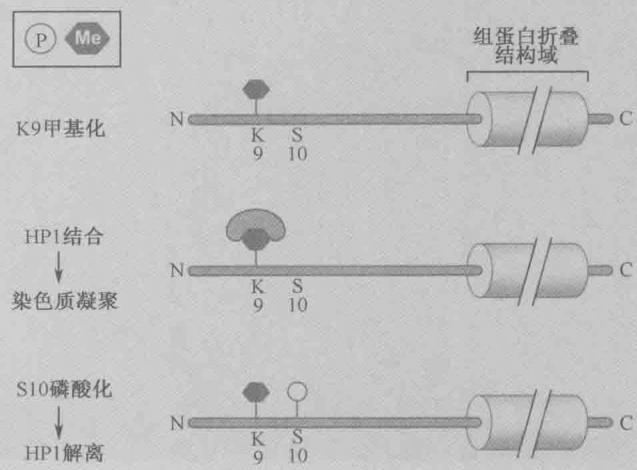  
框 19-5 图 1 一个染色质修饰对另一个染色质修饰的影响。图示在组蛋白 H3 尾部上的修饰。Lys-9（K9）的甲基化募集了 HP1，后者随后作用于染色质的凝聚。邻近丝氨酸残基（S10）的磷酸化从甲基化 Lys-9 移开 HP1，而没有移走甲基基团。

HP1 被 AuroraB 激酶解离，看上去是将有丝分裂纺锤体搭上着丝粒及随后在胞质分裂中姐妹染色单体的分离所必需的。当这个过程完成后，由于 AuroraB 激酶活性的消失，Ser-10 的磷酸化就消失了，HP1 重新与染色体相互作用维持异染色质。与这个模型相一致，删除 AuroraB 激酶的突变导致异常的分离。

尽管看到这些现象，存在特异密码，即在一个特定基因座上复杂的组蛋白修饰产生一个高度特异的信息，仍然存在很大的争议。在一个基因上看到的许多修饰可能仅仅是一个基因在被激活或被抑制的过程的一部分，而不是作为起始信号。即它们是基因正在“开启”或“关闭”的结果，而不是原因。实际上，最近的一个研究提出一个普通品系的果蝇可以在没有 H3K4 甲基化的情况下繁殖。当一个特定基因被表达时，位点特异性 DNA 结合蛋白（或在某些情况下小 RNA 分子，如我们将在第 20 章中所见）继续是决定异性的最强大的提供者。但是，某些组蛋白修饰常常于基因活性的特殊状态有关。例如，H3K27 甲基化常见于抑癌基因中，而 H3K4 的甲基化则常见于活跃的（或者“蓄势”）基因上。

## 多梳通过也调控组蛋白甲基化介导基因抑制

多梳（Pc）是动物细胞中一种重要的抑制因子，能够调控组蛋白甲基化引起染色体浓缩。Pc 抑制因子主要存在于两种蛋白复合体——核心蛋白复合体 1 和核心蛋白复合体 2（PRC1 和 PRC2）中。PRC2 与序列特异的 DNA 结合蛋白结合形成 Pho-RC（抑制复合物），Pho-RC 能够与多梳效应元素相互作用（图 19-29）。PRC2 含有组蛋白甲基转移酶（Zeste 增强子），能够使组蛋白 H3 尾部的赖氨酸-27（K27）发生三甲基化。甲基化作用导致了 PRC1 的结合，因此既引起核染色质的压缩，或导致核小体处于或者接近于转录起始点的位置。多梳引起的抑制反应曾经被认为类似于 HP1，因为组蛋白甲基化和染色体浓缩的大范围延伸。然而现在的证据表明多梳效应元素通常位于接近激活因子的位置。尽管如此，H3K9 的三甲基化作用仍然与 HP1 介导的基因沉默有关，而 H3K27 三甲基化则与多梳介导的基因沉默有关。

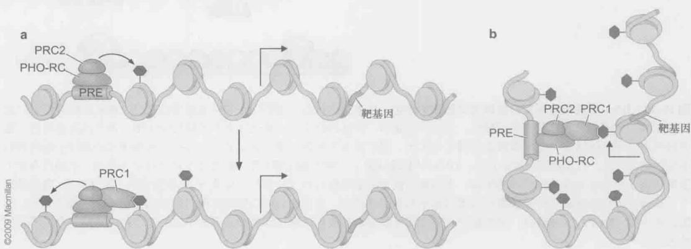  
图 19-29 组蛋白 H3K27 三甲基化在多梳群功能中的潜在作用。(a) 组蛋白 H3K27 三甲基化对多梳抑制复合物 1 (PRC1) 识别靶向目标的潜在作用（见正文）。(b) 组蛋白 H3K27me3 在染色质环化中的潜在作用。PRC1 位于 PRE 的前面，与 H3K27me3 发生相互作用使基因处于稳定状态，形成的 DNA 环使 Polycomb 群复合物和转录区域并行，PRC2 可以进一步延伸 H3K27 甲基化压缩部分核体，妨碍 RNA 聚合酶的结合。(经允许引自 Simon J.A. and Kingston R. 2009.Nat. Rev. Mol. Cell Biol.10:697–709, Fig. 3.©Macmillan)

我们已经看到单一种类的修饰如何参与到基因调控中。但是当多种类型的修饰在同一个基因上发生会怎样呢？它们的效应如何相互作用？有人提出复杂模式的修饰按“组蛋白密码”来操作。各种组蛋白修饰间的相互作用和组蛋白密码的概念在框19-5中描述。

## 在哺乳动物细胞中 DNA 甲基化与沉默状态的基因有关

有些哺乳动物基因由于其邻近 DNA 序列的甲基化而处于沉默状态（我们现在谈论 DNA 甲基化，而非组蛋白甲基化）。事实上，哺乳动物基因组上大段的区域正是通过这种方式被标记的，并且 DNA 甲基化通常出现在异染色质区域。这是因为甲基化的序列常被 DNA 结合蛋白（如 MeCP2）识别。DNA 结合蛋白可以募集组蛋白脱乙酰酶和组蛋白甲基化酶，而这两种酶可以修饰邻近的染色质。因此，DNA 甲基化可以标记随后异染色质形成的位点（图 19-30）。

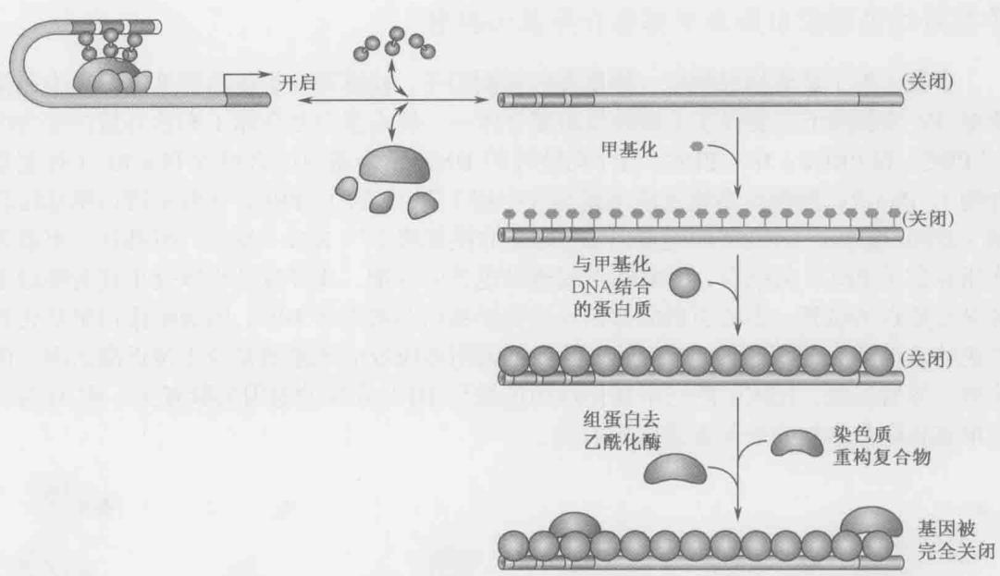  
图 19-30 DNA 甲基化与组蛋白修饰关闭基因的表达。在未修饰状态，激活因子和转录装置存在时，哺乳动物基因可以很容易在表达状态和非表达状态之间转换，如首行所显示。在这种状态下，表达从来不是被完全关闭，而是具有渗透性。通常这并不是最好的状态，有时基因必须被完全关闭，偶尔被永久性地关闭。这是通过 DNA 的甲基化和局部核小体的修饰来实现的。因此，当某基因不被表达时，DNA 甲基转移酶（一种甲基化酶）可以接近并甲基化启动子序列、基因自身和上游激活因子结合位点序列内部的胞嘧啶。甲基基团被加到胞嘧啶环的 5'位置上，生成 5'-甲基胞嘧啶（第 4 章）。有的情况下，这种修饰自身能破坏转录装置以及激活因子与基因的结合。但是它也可以增强其他可以识别含甲基胞嘧啶的 DNA 的蛋白质（如 MeCP2）的结合。这些蛋白质进而又可以募集某些可以重塑和修饰局部核小体的复合物，从而完全关闭基因的表达。

DNA 甲基化在一种被称为印记（imprinting）的现象中处于核心地位。在一个二倍体细胞中，多数基因有两份拷贝：其中一条染色体上的一份拷贝来自父方，另外一条对应染色体上的拷贝来自母方。在多数情况中，两个等位基因表达水平具有可比性。这并不奇怪：它们携带同样的调控因子序列，而且处于同样的调控因子中；它们在两条非常相似的染色体中也位于相应的区域。但在少数情况下，只有其中一份拷贝的基因表达，而另一份拷贝处于沉默状态。

两个研究的比较透彻的例子是人 H19 基因和胰岛素类似生长因子 2（Igf2）基因（图 19-31）。这两个基因位于人类第 11 号染色体上相互邻近的位置。在某一特定的细胞中，一份拷贝的 H19 基因（位于母方来源的染色体上）表达，而另一份拷贝的基因（位于来自父方的染色体上）则被关闭。Igf2 基因则正好相反，来自父方的拷贝开启，而来自母方的拷贝则关闭。

有两个调控序列对于上述两个基因差异性的表达起关键作用：一个增强子序列（位于 H19 基因的下游）和一个绝缘子序列 [称为印记控制区 ICR，（imprinting control region），位于 H19 和 Igf2 基因中间]。理论上，该增强子（当与激活因子结合后）可以激活其中任何一个基因。但是它为什么仅仅激活母本染色体上的 H19 基因和父本染色体上的 Igf2 基因呢？答案在于 ICR 及其甲基化状态。增强子不能激活母本染色体上的 Igf2基因，是因为在该染色体上 ICR 与一种叫做 CTCF 的蛋白质结合，CTCF 阻断激活因子在增强子序列处激活 Igf2 基因。反之，在父本染色体上，ICR 元件和 H19 启动子均被甲基化。在这种状态下，转录装置不能与 H19 启动子结合，而且 CTCF 不能与 ICR 结合。结果，增强子此时可以激活 Igf2 基因。在父本染色体上，通过 MeCP2 与甲基化的 ICR 结合，H19 基因被进一步抑制。同前，这种作用可以募集脱乙酰化酶，而后者又抑制了 H19 启动子。

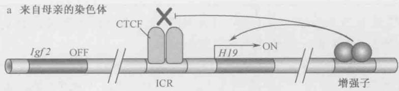

b 来自父亲的染色体  
  
图 19-31 印记。这里显示的是由印记所控制的两个基因——哺乳动物 Igf2 基因和 H19 基因。如文中所述，在某一个特定的细胞中，只有母本染色体上的 H19 基因表达，而 Igf2 只从父本染色体上的基因表达。绝缘子元件的甲基化状态决定了 ICR 结合蛋白（CTCF）是否可以结合，进而阻断 H19 基因被下游的增强子所激活。

框 19-6 “转录抑制与人类疾病”描述了抑制丧失导致人类疾病的两个例子。一个涉及 MeCP2，另一个涉及印记缺损。

## 框 19-6 转录抑制与人类疾病

有几个人类疾病由特异基因的去抑制而引起。这里，我们讨论两种情况，每一种都由一个基因的抑制丧失而引起，基因抑制的机制在文中有描述：第一个是 Rett 综合征，由抑制蛋白 MeCP2 的缺失而引起。第二个是 Beckwith-Weidemann 综合征，由在 Igf2 基因的 ICR 上缺失了 CTCF 结合位点而引起。

Rett 综合征（RTT）是一种严重的孤独症谱系障碍（autism spectrum disorder），每 10000 个女孩中有一个得病。该疾病有如下特征：儿童早期丧失语言和运动技巧、头小畸型、癫痫、反常性重复行为（如重复手写）和中度的换气过度。它是零星的智力迟钝的常见原因。RTT 由 X 染色体连锁的编码抑制蛋白 MeCP2 的基因上的一个突变引起。我们先前在文中已经遇到过这个转录调控因子。它识别甲基化的 DNA，并通过募集组蛋白脱乙酰酶使邻近基因的转录沉默（图 19-31）。携带一个中断了的 MeCP2 基因的小鼠具有与 RTT 患者类似的症状。在小鼠中它是受限的，MeCP2 的缺失只局限在脑部。

因为 MeCP2 基因发现于 X 染色体，有一个缺陷拷贝的女孩（RTT 患者）是一个嵌合体。在那些携带该基因突变拷贝（同位基因）的 X 染色体失活的细胞里，野生型 MeCP2 被制造了。但在那些野生型拷贝（同位基因）的基因位于失活的 X 染色体上的细胞里，就没有 MeCP2 被制造出来了。在（单一）X 染色体上携带突变基因的男孩在所有细胞里都缺乏 MeCP2，通常在一到两年内死于呼吸衰竭。

RTT 被认为是一种神经发育疾病，而非神经退化疾病，因为患者（及基因敲除小鼠）显现异常的神经元形态，而不是神经死亡。即便如此，MeCP2 缺乏被认为可能在发育的某个特殊点上是重要的，此后即使重塑它的功能也无法逆转这个表型。但是最近构建了一个小鼠，其 MeCP2 的表达能够被操纵，使得该小鼠在没有 MeCP2 表达的情况下长到成年，早于该调控因子表达被开启。引人注目的是，在成年制造 MeCP2 足以逆转早期发育过程中缺乏所带来的效应。这个令人兴奋的发现使在人类中进行治疗干预变得更可行，即使仍然很困难。

MeCP2 与 RTT 症状之间的联系还没有被完全明白。如我们已经看到的，MeCP2 是基因表达的一个抑制因子，它的目标基因之一编码脑源性神经营养因子（brain-derived neurotrophic factor, BDNF）。这个蛋白质是一个生长因子，在脑部发育及与学习和记忆相关联的突触改变中扮演角色。最近发现神经活性导致 MeCP2 的磷酸化，该修饰导致抑制因子从 DNA 上解离，大概使得它的目标基因得以表达。中断这些活性（如 BDNF 不适当地表达）作为对至少某些 RTT 的认知症状的解释具有明显的吸引力。

对 MeCP2 和 BDNF 间的联系及这些蛋白质与疾病之间的联系的研究正在进行，对由 MeCP2 调控的其他可能的相关基因的研究也在进行。从认知障碍到异常步态的一系列广泛症状提示，许多基因的表达异常可能是疾病的完全发作所必需的。

Beckwith-Wiedemann 综合征（BWS）是一个发育病症，在每 15000 人中有一人得病。该疾病有如下特征：生长过度（有这个疾病的儿童早产且大于正常胎儿）、对各种儿童癌症（包括肾母细胞瘤）易感性增加。其症状还与在染色体 11p15.5 上的印记基因的中断表达有关联，其中包括在文中讨论过的胰岛素类似生长因子 2 基因（lgf2）（图 19-31）。

如我们已经描述过的，lgf2基因通常只由一个等位基因（父本）表达，因为另一个被印记了。同时，H19基因只从母本等位基因表达。许多BWS的病例与lgf2的双等位基因表达及H19基因的不表达相关联，这是两个染色体ICR都被甲基化的结果。IGF2是一个婴儿的生长因子，H19相信是一个参与肿瘤抑制的调控RNA（第20章），因此该病的表型（生长过度和肿瘤敏感）可以理解。

与 RTT 一样, BWS 的症状在适当操纵的小鼠里被模拟: 过表达 lgf2 产生的结果是, 小鼠普遍生长过度, 并且出现特异肿瘤。

## 基因的表观遗传调控

基因表达的模式有时必须得到继承。在发育中一个细胞释放的信号导致邻近细胞开启特异的基因。这些基因也许不得不在这些细胞的许多代内都保持开启，即使诱导它们开启的信号只瞬间存在。在同时缺乏突变和起始信号的情况下，基因表达模式的继承称为表观遗传调控（epigenetic regulation）。

与之相反的是我们已经讨论过的某些基因调控例子。如果一个基因由一个激活因子控制，而且那个激活因子是在一个特定的信号存在时才有活性，那么，只要信号还存在，基因就会保持开启。事实上，在正常的条件，E.coli 的 lac 基因只在有乳糖存在而葡萄糖缺乏的时候才表达。同样的，酵母的 GAL 基因只在葡萄糖缺乏而半乳糖存在时才表达，人类 $\beta$ 干扰素只在细胞被病毒感染刺激时才制造。

## 基因表达的某些状态通过细胞分裂得以继承，即使起始信号不再存在

我们已经遇到过基因调控可以被表观遗传继承的例子。讨论了一个 $\lambda$ 噬菌体溶源体的维持（第 18 章）。在溶源体中，噬菌体在细菌宿主细胞内处于休眠状态。这个状态与基因表达的一个特异模式相关，尤其是与 $\lambda$ 抑制因子蛋白的持续表达相关（第 18 章，图 18-27）。

溶源性基因表达是在一个感染细胞中应答贫瘠的生长条件下建立起来的。然而，一旦建立，溶源性状态就稳定地维持，尽管生长条件有所改善：将溶源菌转移到富含营养的生长培养基并不会导致诱导作用。事实上，诱导基本上从不发生，直到接收到一个合适的诱导信号（如 UV 照射）。

溶源性状态通过细胞分裂得以维持便是表观遗传调控的一个例子。这个表观遗传控制源自于一个抑制因子合成的两步策略。第一步，抑制因子合成通过激活因子CⅡ（其对生长条件敏感）对抑制因子（CⅠ）基因的激活而建立。第二步，抑制因子合成通过自我调控得以维持：抑制因子激活自身基因的表达（第18章，图18-31）。通过这条途径，当溶源性细胞分裂时，每个子细胞继承了一个拷贝的处于休眠状态的噬菌体基因组和一些抑制因子蛋白。这些抑制因子足以在每个细胞中从噬菌体基因组上刺激进一步的抑制因子合成（图19-32）。在多细胞生物体的发育过程中，许多基因调控就是用这种方式工作的。我们将在第21章看到一些例子。

  
图 19-32 溶源性状态维持的表观遗传控制。

生物体的发育过程中，许多基因调控就是用这种方式工作的。我们将在第 21 章看到一些例子。

另一个著名的表观遗传调控的机制源于 DNA 甲基化，在对印记的描述中我们见过这样一个例子：DNA 甲基化轻易通过细胞分裂继承下来，如图 19-33 所示。如此，某些特定的 DNA 甲基化酶可以低频地甲基化先前未修饰的 DNA，但所谓的维持甲基化酶（maintenance methylases）极其有效地修饰半甲基化的 DNA（即完全甲基化的 DNA 经复制后提供的那个底物）。在哺乳动物细胞中，DNA 甲基化可能是沉默的基因组区域的主要标记（第 20 章）。DNA 复制后，在两个子细胞中的半甲基化位点被重新甲基化。它们随后可以被抑制因子 MeCP2 所识别，然后后者募集组蛋白脱乙酰酶和甲基化酶，重新建立沉默（图 19-30）。

  
图 19-33 DNA 甲基化模式可以通过细胞分裂得以维持。如图 19-26 所示，参与脊椎动物基因表达的 DNA 可以被甲基化，进而该基因的表达被关闭。这种初始的甲基化由原位（de novo）甲基化酶执行。为了使某个处于关闭状态的基因永远关闭，甲基化状态必须通过细胞分裂得以遗传。此图显示了这是如何实现的。图中显示的 DNA 序列含有两个胞嘧啶，分别位于两条 DNA 链上，其中一个胞嘧啶已被甲基化，另一个则没有。这种模式在细胞分裂中得以维持，因为一旦 DNA 被复制，一种维持性的甲基化酶识别半甲基化的 DNA，随后向其中的未被甲基化的胞嘧啶上加上甲基基团。完全未被甲基化的序列则不能被该酶识别，仍然保持非甲基化状态。所以，两个子 DNA 双螺旋链的甲基化模式最终与母链相同。（经允许引自 Alberts B. et al. 2002. Molecular biology of the cell, 4th edition, p431, Fig7-81. © Garland Science/Taylor & Francis LLC.）

核小体修饰在理论上可以为表观遗传的继承提供基础，尽管还没有发现这样的例子。考虑被一段甲基化的组蛋白关闭的一个基因。当染色体的那个区域在细胞分裂过程中被复制，来自父本 DNA 分子的甲基化组蛋白最后在两个子代双链体间均匀分布（第 8 章，图 8-43），于是每个子代分子携带一些甲基化的和一些非甲基化的核小体。甲基化的核小体可以募集带有染色质结构域的蛋白质，包括组蛋白甲基化酶本身，它随后可以甲基化邻近的非修饰的核小体。这样，使用同样策略以达到扩散，染色质修饰的状态得以跨越几代而维持下来。尽管这是一个吸引人的模型，但是还要看看在缺乏 DNA 甲基化、DNA 结合蛋白或调控 RNA 时是如何工作的（第 20 章）（例如，当决定哪些细胞招募修饰酶的信号不存在的时候）。

## 小结

如果不考虑生物体中那些可以被调控的附加步骤，那么就如同在细菌中一样，转录起始步骤是真核生物基因表达中最频繁被调控的步骤。也和在细菌中一样，典型的转录起始步骤是通过蛋白质来调控的，这些蛋白质结合在特定的、靠近基因的DNA序列上，并能够使基因开启（激活因子）或者关闭（抑制因子）。尽管真核生物基因存在原核生物中没有的在构造和转录上的复杂度，但这些调控机制的保守性还是被保留下来了。

真核细胞中的 DNA 被组蛋白缠绕而形成了核小体。因此，转录装置和调控蛋白所结合的 DNA 序列在许多时候都被遮蔽了。修饰组蛋白的酶，通过增加（或移除）小的化学基团，在以下两个方面改变了组蛋白：它们改变了核小体被包裹的紧密度（因此也改变了核小体中的 DNA 的可接近性）；它们形成（或消除）了其他参与基因转录的蛋白质的结合位点。其他酶“重塑”了核小体：它们利用从 ATP 水解中得到的能量来移动周围的核小体，影响哪些序列被暴露出来。在一个“开放”或者没有核小体的情况下，没有活性但结合状态的聚合酶 II（暂停或者“静止”Pol II）有可能传递到启动子域，从而当适合的信号出现时促进快速地和有效地诱导的基因表达。

与对应的细菌相比较，多细胞真核生物的基因受控于更多的调控蛋白，一些蛋白质结合的位置与基因相距甚远。这反映出在多细胞生物中更多数量的生理信号参与了控制一个特有基因。

RNA 聚合酶在细菌和真核生物中非常保守（第 13 章）。但是真核生物的酶类含有更多的亚基，而且在特定的真核生物启动子上除了聚合酶还结合有大约 50 个或更多的蛋白质。这些蛋白质中有很多是以大的蛋白复合体形式结合到启动子上的。

在真核生物中，就如我们在细菌中所看到的一样，激活因子主要通过募集来工作。在这些生物体中，激活因子并不直接地或单独地募集聚合酶。它们募集其他启动某一特定基因的转录需要的蛋白复合体。RNA 聚合酶本身就是伴随着其他的这类复合体而被带入的。激活因子也能够募集组蛋白修饰酶，而这些修饰产生的影响可以帮助转录装置结合到启动子上或起始有效的转录。

激活因子能够和转录装置或核糖体修饰子的众多组分中的一个或更多个组分相互作用。例如，Gal4 根据需要募集中介蛋白、SAGA、Swi/Snf 和 TFⅡD 到启动子上。其他例子中，有效起始或延伸所需的因子可能在聚合酶结合后还需要它们也可以由激活因子来募集。这解释了它们如何在大量、多种结合方式下如此轻易地运作，也说明了它们在我们所知的信号整合及组合控制上的广泛运用，特别是在多细胞生物体中。

一些激活因子从距离基因很远的位置发挥作用，这需要在它们的结合位点和启动子间的 DNA 形成环状突起。在一些情况中，环是如何跨越非常远的距离而形成仍不清晰，但是可能涉及激活因子结合位点和启动子间的染色质的结构改变，使得那两个元件靠近并由凝聚力稳定环结构。被称为绝缘子的 DNA 序列结合在蛋白质上，该蛋白质干扰限制了远距离增强子上的激活因子与其启动子间的相互作用。这些绝缘子可以通过抑制那些使环化更容易的机制（如改变染色质结构）来发挥作用。绝缘子确保了激活因子只对正确的基因产生效应。

真核抑制因子通过各种途径工作。然而，细菌中可见的最简单和最普通的机制是抑制因子结合到与启动子重叠的位点上，从而阻碍 RNA 聚合酶的结合，此机制并不常见于真核生物。在一些情况下，抑制因子与靠近激活因子的增强子结合来阻碍这些激活因子介导增强子与启动子环化。最普通的是，真核抑制因子通过募集可降低转录水平的组蛋白修饰物的途径来工作。举个例子，组蛋白乙酰基转移酶通常都与激活关联，而组蛋白脱乙酰酶——作为一种能够去除乙酰基团的酶，在这里产生抑制基因的效应。

在某些时候，核小体中一大段 DNA 部分能够通过适当的核小体修饰而被保留在相对惰性的状态，最显著的修饰就是去乙酰作用和甲基化。用这种方法，一组基因将能够保持在“沉默”状态而不需要在每个独立的基因上都有专有的抑制因子。

在某些真核生物体中，如哺乳动物，沉默基因也和甲基化的 DNA 相关联。甲基化的序列可以阻碍转录装置与激活因子的结合，或特异地结合一类抑制因子，后者募集组蛋白修饰酶来抑制邻近的基因。DNA 甲基化在细胞分裂过程中可以保持（在既没有突变也没有起始该模式的信号存在的情况下），也就保持了被那些甲基化控制的基因表达模式。

如果一个基因的表达在细胞分裂过程中的某些阶段被保持，就被称为表观遗传地继承。有各种机制使之实现。DNA 甲基化会影响基因表达，且容易继承，如我们已经看到的。通过使用组蛋白修饰的表观遗传继承通常作为一种可能性被讨论，但它们在没有 DNA 结合蛋白、调控蛋白或 DNA 甲基化参与的情况下发挥这个作用的程度仍然不清楚。

## 参考文献

## 书籍

Allis C.D., Jenuwein T., Reinberg D., and Caparros M.-L. eds. 2007. Epigenetics. Cold Spring Harbor Laboratory Press, Cold Spring Harbor, New York.

Carey M., Smale S.T., and Pederson C.L. 2008. Transcriptional regulation in eukaryotes: Concepts, strategies, and techniques. Cold Spring Harbor Laboratory Press, Cold Spring Harbor, New York.

Ptashne M. and Gann A. 2002. Genes and signals. Cold Spring Harbor Laboratory Press, Cold Spring Harbor, New York.

## DNA 识别

Garvie C.W. and Wolberger C. 2001, Recognition of specific DNA sequences. Mol. Cell. 8: 937–946.

Harrison S.C. 1991. A structural taxonomy of DNA-binding domains. Nature 353: 715–719.

## 激活

Bjorklund S. and Gustafsson C.M. 2005. The yeast Mediator complex and its regulation. Trends Biochem. Sci. 30: 240–244.

Fuda N.J., Ardehali M.B., and Lis J.T. 2009. Defining mechanisms that reg-

ulate RNA polymerase II transcription in vivo. Nature 461: 186–192. Jones K.A. and Kadonaga J.T. 2000. Exploring the transcription-chromatin interface. Genes Dev. 14: 1992–1996.

Kim Y.J. and Lis J.T. 2005. Interactions between subunits of Drosophila Mediator and activator proteins. Trends Biochem. Sci. 30:245–249.

Kornberg R.D. 2005. Mediator and the mechanism of transcriptional activation. Trends Biochem. Sci. 30: 235–239.

Levine M. 2011. Paused RNA polymerase II as a developmental checkpoint. Cell 145: 502–511.

Luo Z., Lin C., and Shilatifard A. 2012. The super elongation complex (SEC) family in transcriptional control, Nat. Rev. Mol. Cell Biol. 13:543–547.

Malik S, and Roeder R.G. 2005. Dynamic regulation of Pol II transcription by the mammalian Mediator complex. Trends Biochem. Sci. 30: 256–263.

Ptashne M. 2005. Regulation of transcription: From lambda to eukaryotes. Trends Biochem. Sci. 30: 275–279.

## 抑制

Liu Z. and Karmarkar V. 2008. Groucho/Tup1 family co-repressors in plant development. Trends Plant Sci. 13: 137–144.

Simon J.A. and Kingston R.E. 2009. Mechanisms of Polycomb gene silencing: Knowns and unknowns. Nat. Rev. Mol. Cell Biol. 10; 697–708.

Smith R.L. and Johnson A.D. 2000. Turning genes off by Ssn6-Tup1: A conserved system of transcriptional repression in eukaryotes. Trends Biochem. Sci. 25: 325–330.

## 核小体修饰因子及转录调控

Hargreaves D.C. and Crabtree G.R. 2011. ATP-dependent chromatin remodeling: Genetics, genomics and mechanisms. Cell Res. 21:396–420.

Henikoff S. and Shilatifard A. 2011. Histone modification: Cause or cog? Trends Genet. 27: 389–396.

Jenuwein T. and Allis C.D. 2001. Translating the histone code. Science 293: 1074–1080.

Narlikar G.J., Fan H.Y., and Kingston R.E. 2002. Cooperation between complexes that regulate chromatin structure and transcription. Cell 108: 475–487.

Rando O.J. and Winston F, 2012. Chromatin and transcription in yeast. Genetics 190: 351–387.

Shahbazian M.D. and Grunstein M. 2007. Functions of site-specific histone acetylation and deacetylation. Annu. Rev. Biochem. 76:75–100.

Wang X., Bai L., Bryant G.O., and Ptashne M. 2011. Nucleosomes and the accessibility problem. Trends Genet. 27: 487–492.

## 沉默、印记及表观遗传学

Gartenberg M.R. 2000. The Sir proteins of Saccharomyces cerevisiae: Mediators of transcriptional silencing and much more. Curr. Opin. Microbiol. 3: 132–137.

Goldberg A.D., Allis C.D., and Bernstein E. 2007. Epigenetics: A landscape takes shape. Cell 128: 635–638.

Gottschling D.E. 2004. Summary: Epigenetics—From phenomenon to field. Cold Spring Harb. Symp. Quant. Biol. 69: 507–519.

Klose R.J. and Bird A.P. 2005. Genomic DNA methylation: The mark and its mediators. Trends Biochem. Sci. 31: 89–97.

Ptashne M. 2007. On the use of the word "epigenetic" Curr. Biol. 17: R233–R236.

Wood A.J. and Oakey R.J. 2006. Genomic imprinting in mammals: Emerging themes and established theories. PloS Genet. 2: 1677–1685.

增强子、组合控制与协同

Arnosti D.N. and Kulkarin M.M. 2005. Transcriptional enhancers: Intelligent enhanceosomes or flexible billboards? J. Cell Biol. 94: 890–898.

Li H. and Johnson A.D. 2010. Evolution of transcription networks—Lessons from yeasts. Curr. Biol. 20: R746–R753.

Merika M. and Thanos D. 2001. Enhanceosomes. Curr. Opin. Genet. Dev. 11: 205–208.

Rokas A. 2006. Evolution: Different paths to the same end. Nature 443:401–402.

## 大范围互作信号及信号转导

Buecker C. and Wysocka J. 2012. Enhancers as information integration hubs in development: Lessons from genomics. Trends Genet. 28:276–284.

Dean A. 2006. On a chromosome far, far away: LCRs and gene expression. Trends Genet. 22: 38–45.

Dorsett D. and Ström L. 2012. The ancient and evolving roles of cohesin in gene expression and DNA repair. Curr. Biol. 22: R240–R250.

Gaszner M. and Felsenfeld G. 2006. Insulators: Exploiting transcriptional and epigenetic mechanisms. Nat. Rev. Genet. 7: 703–713.

Li Q., Barkess G., and Qian H. 2006. Chromatin looping and the probability of transcription. Trends Genet. 22: 197–202.

## 信号及信号转导

Bromberg J.F. 2001. Activation of STAT proteins and growth control. Bioessays 23: 161–169.

Brown M.S., Ye J., Rawson R.B., and Goldstein J.L. 2000. Regulated intramembrane proteolysis: A control mechanism conserved from bacteria to humans, Cell 100: 391–398.

Pawson T. and Nash P. 2000. Protein–protein interactions define specificity in signal transduction. Genes Dev. 14: 1027–1047.

## 抑制与疾病

Gabellini D., Green M.R., and Tupler R. 2004. When enough is enough: Genetic diseases associated with transcriptional derepression. Curr. Opin. Genet. Dev. 14: 301–307.

Kriaucianis S. and Bird A. 2003. DNA methylation and Rett syndrome. Hum. Mol. Genet. 12: R221–R227.

Miller G. 2007. Medicine. Rett symptoms reversed in mice. Science 315:749.

## 习题

## 偶数习题的答案请参见附录2。

习题 1 常见的基因表达调控的类型发生在转录水平，请列出真核细胞中基因调控的其他类型。在这些调控类型中，有没有相对于原核细胞而言，是真核细胞所特有的？

习题 2 比较和对比细菌细胞与真核细胞中转录调控所包含的 DNA 序列元件。

习题 3 解释为什么 E.coli 中的 lacZ 于酿酒酵母中常作为报道基因，而 E.coli 却不是。

习题 4 在 DNA 模板（如 PCR 产物），通用的转录因子及 RNA 聚合酶Ⅱ存在的情况下可以启动体外转录。解释为什么只有通用转录因子和 RNA 聚合酶Ⅱ存在时，不能以基因组 DNA 作为模板启动转录。

习题 5 回顾框 19-1 中的双杂交实验的原理。如果要观察到报道基因的激活，引诱物与受控物的相互作用必须发生在细胞的哪里？根据这个要求提出酵母双杂交实验的一个潜在的缺点。你认为还有哪些缺点？

习题6

A. 在下面有一个顺序打乱的染色质免疫共沉淀的步骤, 通过列出每一步的字母来对 ChIP 步骤进行排序。

a. 免疫沉淀 DNA-蛋白质复合体。

b.PCR 扩增 DNA。

c. 加入某个蛋白特异的抗体。

d. 将蛋白质与 DNA 片段交联。

e.移去蛋白质。

B. 一个研究人员选择了针对蛋白质 X 的抗体和基因 Y 所特有区域的 PCR 引物来进行染色质免疫共沉淀反应（ChIP assay）。举出一个研究人员所提出的导致这种选择的问题实例。

习题 7 回忆在啤酒酵母交配类型特异基因表达调控时所使用的组合调控。描述在单倍体 MATα 细胞中 Mcm1 是如何抑制和激活目标基因的转录的。

习题8

A. 请列举在第 19 章中讨论的影响基因表达的组蛋白共价修饰的类型。

B. 解释为什么一个特定的修饰并不总是与唯一的激活或抑制相关。

习题9

A. 描述在哺乳细胞中 DNA 甲基化在基因表达中的作用。

B. 哺乳细胞中 DNA 甲基化的作用与 E.coli 中的 DNA 甲基化有什么不同?

习题 10 在信号转导通路中的参与者主要分为以下类型: 信号、受体、传递分子及输出。将图 19-22 中的 STAT 通路的每个组分划分为信号、受体、传递分子及输出。每个术语可以多次使用。

习题 11 推测为什么印记导致了非孟德尔遗传定律(分离模式特征并不与孟德尔模式一致)。回顾孟德尔遗传定律请看第 1 章。

习题 12 你打算研究在哺乳细胞的转录调控中有潜在作用的 3 个蛋白质——蛋白 A, 蛋白 B, 蛋白 C。你进行了电泳迁移率实验（EMSA），数据见下面。该技术可以参看第 7 章。所有的反应都含有结合缓冲液和 λ DNA 片段，该片段含有蛋白 A 的 DNA 结合位点，是哺乳动物基因的上游序列。加入的已纯化蛋白显示在胶上。

\- - - + + + 蛋白A
- + - - + - 蛋白B
- - + - - + 蛋白C，泳道


A. 在该数据中，蛋白 A 和 DNA 结合吗？阐述你的答案。
B. 解释泳道 5 的结果，在阐述中也要利用泳道 2 的结果。
C. 提出一个蛋白 B 如何激活转录的模型。

习题 13 你想做一个基因改造的线虫 C. elegans。xyz 基因在每一个胚胎细胞中表达。你将 xyz 基因的启动子（Pxyz，300bp）融合到编码绿色荧光蛋白（GFP）的基因（900bp）上。将该融合基因（见下图）转入线虫中，该融合基因随机的插入到基因组中然后稳定的遗传给后代。

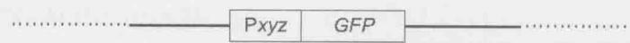

尽管 xyz 在每一个胚胎细胞中表达，但是导入融合基因的后代并没有表达 GFP。你的转导技术没有问题，并且实际上你确认它已经整合到了线虫的基因组中。

A. 你在两个方向对融合的基因及两侧进行了扩增及双方向的测序。你的融合基因的一侧是 5000bp 的随机序列，而另一侧则是 200 个 “TAAGGC” 的重复序列。基于这些结果，猜测你的融合基因为什么没有表达。

你决定重新向另一个成年线虫中导入相同的融合基因，使其整合到基因组的其他地方。你非常高兴该线虫的所有胚胎细胞都表达了 GFP（通过荧光显微镜观察）。

B. 你想要研究 XYZ 蛋白的亚细胞定位。A 部分建议的融合基因的修饰有利于你研究 XYZ 蛋白在细胞中的定位，解释原因。

## 第20章 调控RNA

## 本章概要

细菌中 RNA 介导的调控
• 调节 RNA 在真核生物中广泛存在
• miRNA 分子的合成与功能
• 小 RNA 的沉默基因表达
• 长链非编码 RNA 与 X 染色体失活

前两章中，我们讨论了原核生物和真核生物的转录调控。我们知道这一调控是通过调控蛋白，尤其是序列特异性 DNA 结合蛋白来进行的。这些 DNA 结合蛋白能够激活或抑制其邻近基因的转录。大约 50 年前，Francois Jacob 和 Jacques Monod 提出了他们的抑制子模型（框 18-2），由此开始了基因调控详细机制的研究。在当时，他们不能确定反式因子（transfactor），即抑制子（repressor），究竟是蛋白质还是 RNA。他们所研究的，还有很多其他研究者所研究的这

些调控因子都是蛋白质。这些蛋白质通过结合 DNA 操纵子（operator）起作用。但在原文中，他们相信这些调控因子很可能是就 RNA 分子——他们的确更倾向于这种可能性。

随着越来越多的蛋白质调控因子在原核和真核生物中被发现，RNA 分子可能是调控因子这一观点几乎被遗忘了。但在近几年，RNA 调控子的研究获得了新突破。特别是在真核生物中发现，在转录水平甚至是在翻译水平上 RNA 分子发挥了调控作用。这一新研究领域始于如下两项发现：最先报道于 20 世纪 90 年代初发现的小 RNA（microRNA）和 90 年代末发现的 RNA 干扰（RNA interference）现象。在描述这种新的调控形式是如何作用以及能给研究者带来何种应用价值之前，我们先来讨论一下最先在细菌中发现的 RNA 介导的基因调控。

## 细菌中 RNA 介导的调控

小 RNA 存在于原核生物之中在多年前就是一个不争的事实。这些小 RNA 中，一部分参与质粒的复制调控过程，另一部分则与基因表达调控相关（参见第 12 章中有关 Tn10 的讨论）。对于后者，它们有些能够参与转录调控过程，如 E.coli 的 6S RNA。通过结合到 RNA 聚合酶的 $\sigma^{70}$ 亚基上，6S RNA 能够下调大多数 $\sigma^{70}$ 启动子控制的转录。6S RNA 在静止期可以积累很高的浓度（营养物质耗尽时，细菌进入一个特殊的生长阶段，此时细胞停止分裂）。静止期还产生另一种不同的 $\sigma$ 因子—— $\sigma$ 。 $\sigma^{S}$ 因子与 $\sigma^{70}$ 竞争跟核心聚合酶的结合，并引导聚合酶到达特定的启动子，促进许多压力应答性基因的表达，使细菌能在静止期存活。通过下调 $\sigma^{70}$ 启动子的转录，6S RNA 可促进 $\sigma^{S}$ 启动子的表达。

近年来，研究的焦点转移到另一组细菌的小 RNA 分子上。这些小 RNA 分子能够调节 mRNA 的翻译和降解。由于它们与真核生物中调控基因表达的 RNA（包括小分子干扰 RNA 和 microRNA，我们将会在本章第二部分讨论）相似，人们对这种小 RNA 研究的兴趣进一步高涨。

与真核生物的调控 RNA 不同，细菌中的调控 RNA（称为 sRNA）通过反式作用控制目标基因的表达，而且它们比前者（长 21\~30 核苷酸）要大得多（长 80\~110 核苷酸）。此外，sRNA 是由小基因直接编码形成的最终产物，而不是像真核生物 RNA 调控子那样，是通过大分子双链 RNA 的前体加工而形成的。很多这些基因已通过生物信息学被鉴定，在 E.coli 中约有 100 个，其中十几个 sRNA 的特性已经被阐述。大多数 sRNA 与靶 mRNA 的互补序列碱基配对而引导其降解，进而抑制翻译，但在一些特殊例子中反而能刺激翻译。

在大多数情况下，细菌 Hfq 蛋白辅助 sRNA 与靶 mRNA 结合。这些 RNA 伴侣是不可或缺的。由于 sRNA 和靶 mRNA 之间的互补序列很短且很不完全，因此它们之间的相互作用较弱。Hfq 有助于碱基配对，在 sRNA 与靶 mRNA 配对之前，Hfq 先与 sRNA 结合，从而提高了这些调控因子的稳定性。

大肠杆菌中研究得较为深入的 sRNA 是长 81 个核苷酸的 RybB RNA。因为配对形成的异源双链核酸分子能被核酸酶 RNase E 识别并当成底物,该 RybB 能够与数个靶 mRNA 结合而引发其降解。与 RybB 作用的靶 mRNA，大多数是编码储铁蛋白的。在特定环境中细胞需要游离铁离子，而高浓度的铁离子则是有毒的。RybB 通过调控储铁蛋白的水平，在细胞中起到调节铁离子浓度的作用。调控 RybB 表达到启动子会被一种特异的 $\sigma$ 因子（称为 $\sigma^{E}$ ）识别。 $\sigma^{E}$ 同 $\sigma^{S}$ 一样也是一种压力应答 $\sigma$ 因子。编码 $\sigma^{E}$ 的基因表达受 RybB 自身调控，所以这种 sRNA 是 $\sigma^{E}$ 自身负调控环（autonegative regulatory loop）的组成部分。

如上所述，静止期 $\sigma$ 因子 $\sigma^{S}$ 由 E.coli 的 rpoS 基因所编码。rpoS mRNA 翻译过程受两种 sRNA 调节：DsrA 和 RprA。翻译激活是通过另外一种 RNA 碱基配对的开关机制来完成的：小 RNA 通过与 mRNA 的一个区域结合来抑制翻译，否则该区域将会与核糖体结合位点配对而促进翻译。rpoS 基因也受其他小 RNA 的负作用，如 OxyS（图 20-1 显示这两种机制）。

细菌中另外一些调控 RNA 类似 “反义” RNA：他们是被基因编码链的反义链编码的，通过同源碱基互补配对从而起到抑制这个基因的 mRNA 表达的作用。这样往往容易导致有毒基因编码产物的产生，以及一些噬菌体调节基因（如 $\lambda$ ）（见第 18 章）。这些 RNA 通常被认为是顺式调控，因为它们只能作用于产生它的那个基因（与我们上面讨论的反式调控 RNA 相反）。

  
图 20-1 sRNA 对翻译的激活与抑制。RBS 代表核糖体结合位置。如果由于与另一个 RNA 分子（如 b 所示），或者与同一个 RNA 分子的另一个区域（如 a 所示）的碱基配对而被封闭，翻译就被抑制。（引自 Gottesman S. et al. 2006. Cold Spring Harbor Symp. Quant. Biol. 71: 1-11, Fig.1. ©Cold Spring Harbor Laboratory Press，经许可使用、修改）

我们将在本章的后半部分回过来讨论那些反式作用调控 RNA（trans-acting regulatory RNA）。在那里我们会对它们在真核生物基因表达调节方面的作用进行讨论。但在进入该主题之前，我们先剖析细菌中基因调控的另外一些例子。这种调控是由另外一种顺式（cis）的 RNA 碱基配对介导的。这种顺式调控是指 RNA 调控元件调控的那些自身含有 mRNA 的基因表达。此类调控的典型例子是那些调控代谢型操纵子（metabolic operon）和合成型操纵子衰减（attenuation in biosynthetic operon）的“核糖开关”（riboswitch）。E.coli 的 trp 基因便是后一机制的经典例子，RNA 介导的调控也是在该例子中首次被发现的（框 20-1 中将详细描述该例子）。

## 框 20-1 受衰减作用调控的氨基酸生物合成操纵子

在 E.coli 中，5 个相邻的色氨酸基因（trp）编码与色氨酸合成有关的酶。只有当色氨酸有限时，这些基因才高效表达（框 20-1 图 1）。这些基因受抑制子（repressor）调控，就像乳糖基因（lac）一样。尽管在这种情况下，解除抑制是配基（色氨酸）缺乏导致的。

  
框 20-1 图 1 Trp 操纵子。E.coli 的色氨酸操纵子，图示前导 RNA（见正文）与编码 Trp 酶的结构基因之间的关系。基因产物为氨基苯甲酸盐合成酶（anthranilate synthetase，trpE 的产物）、磷酸核糖基邻氨基苯甲酸转移酶（phosphoribosyl anthranilate ransferase，trpD 的产物）、磷酸核糖基邻氨基苯甲酸异构酶吲哚甘油磷酸合成酶（phosphoribosyl anthranilate isomearase-indole glycerol phosphatesynthetase，trpC 的产物）、色氨酸合成酶 β（tryptophan synthetase，trpB 的产物）和色氨酸合成酶 α（tryptophan synthetase，trpA 的产物）。

然而，即使 RNA 聚合酶启动了色氨酸 mRNA 分子的转录，它也并不总是能产生完整的转录物。就像核糖开关一样，产生完整转录物，最终要受衰减作用的控制。在这个例子中，大多数转录在未成熟前就终止，甚至在没转录完第一个色氨酸基因（trpE）之前就停止。但是，如果细胞中色氨酸水平很低的话，衰减作用会被克服；

当色氨酸有限时，聚合酶不会终止转录，相反，会转录出所有5个trp基因。就像核糖开关一样，衰减作用是否发生，依赖于RNA形成不同的替换二级结构的能力。然而在这个例子中，前导RNA选择形成两种不同的替换二级结构中的哪一种，并不受直接结合到前导RNA上的配基控制。相反，这种选择依赖于细菌中转录与翻译之间的偶联(coupling)。

Trp 操纵子 mRNA 的 5'端序列含有一个长 161 核苷酸的前导序列，这一序列位于 trpE 第一个密码子的上游（框 20-1 图 2）。在这段前导序列之后，trpE 之前是一个转录终止子，RNA 中有一个特征性的环状的“发夹”（hairpin）结构（由框 20-1 图 2 中的区域 3 和 4 序列而来），之后是 8 个 U 残基（图 13-13）。转录通常在这个终止子之后停止（并且我们可以设想，应该总是在此停止），产生一个长 139 个核苷酸的前导 RNA。这是色氨酸水平高的时候产生的 RNA 产物。

  
框 20-1 图 2 trp 操纵子前导 RNA。trp 操纵子前导 RNA 的核苷酸序列特征。

当细胞中色氨酸浓度低时，前导序列的三个结构特点使RNA聚合酶能够越过终止子。第一，前导RNA区域1和2之间形成的第二个“发夹”结构（除了终止子发夹之外）（框20-1图2）。第二，区域2也与区域3互补，因此在区域2和3之间又可以形成一个发夹结构，当这一发夹结构形成时，阻止了终止子发夹结构（区域3和4之间）的形成。第三，前导RNA含有一个编码14个氨基酸的短“先导”肽的可读框，这一可读框之前是一个强的核糖体结合位置（框20-1图2）。

编码先导肽的序列有一个显著的特点：两个色氨酸密码子排成一行。当色氨酸缺乏时，可利用的负载色氨酸 tRNA（charged trp tRNA）很少，核糖体移动到两个色氨酸密码子时它就会停顿下来。在这种情况下，色氨酸密码子周围的 RNA 位于核糖体里，并且不能形成发夹环。框 20-1 图 3 显示了这一结果。

一个核糖体停在色氨酸密码子上（图 3b）覆盖住了区域 1，剩下区域 2 可以自由框 20-1 图 3 trp 衰减子处的转录终止。图中显示了待用色氨酸如何在 trp 操纵子的衰减子处控制转录终止。蓝框显示的是先导肽的编码区。(a) 色氨酸含量高的情况：序列 3 可以与序列 4 配对以形成转录终止发夹。(b) 色氨酸含量低的情况：核糖体在相邻的色氨酸密码子处停顿，使序列 2 能与序列 3 自由配对，因此阻止了序列 4 终止发夹的形成。(c) 无蛋白质合成：如果没有核糖体于 AUG 处开始翻译前导肽，序列 1 和序列 2 的配对形成发夹，阻止了 2-3 发夹的形成，并允许序列 3-4 发夹的形成。Trp 酶不表达。

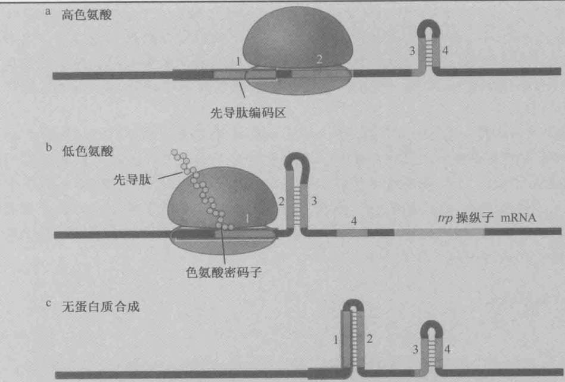

和区域 3 配对，因此，终止子发夹（由区域 3 和区域 4 形成）不能形成，转录不会被衰减。但是，如果有充足的色氨酸（也有足够的负载 Trp tRNA）使核糖体继续通过色氨酸密码子，那么核糖体会阻碍序列 2，此时含有区域 3 和 4 的 RNA 就会形成。因此，终止子形成，转录衰减，trp 基因不能被转录。

Trp 操纵子受抑制作用和衰减作用的控制, 提供两步反应来应答更加严酷的色氨酸缺乏。但是单独的衰减作用即可提供精巧的调节: 其他的氨基酸操纵子如 leu 和 his 完全依赖衰减作用来调节。在亮氨酸操纵子中, 前导肽含有 4 个相邻的亮氨酸密码子, 而在组氨酸操纵子中前导肽有一排 7 个组氨酸密码子。

## 基因转录物中的核糖开关——通过改变二级结构调控基因表达

核糖开关是通过对小分子的浓度改变进行应答来调控基因表达的。这些调控元件特异地存在于它们所调控的基因5'非翻译区，可以在转录或翻译水平调控基因的表达。我们将会在下面讨论到，该调控是通过改变RNA的二级结构来完成的。

一个核糖开关都是由两部分组成的：适配体（aptamer）和表达平台（expression platform）（图 20-2）。适配体与小分子配基（ligand）结合，从而引起其构象改变，进而导致与其相邻的表达平台的二级结构也产生了变化。这种构象的变化通过终止基因转录或是抑制翻译的启动，改变了相关基因的表达。这两种机制在图 20-3 所示的例子中

已有详细说明，我们现在对此进行描述。

毋庸置疑，核糖开关特异地存在于它所识别的代谢配基合成相关基因的上游。例如，在枯草杆菌（Bacillus subtilis）中，很多与甲硫氨酸代谢有关的基因都具有一个长200个核苷酸的非翻译前导RNA序列。这些RNA起到SAM（腺苷甲硫氨酸）感受性核糖开关

  
图 20-2 核糖开关 RNA 的结构。如正文所描写的，适配体与控制代谢物结合，导致相连的表达平台的结构改变。已知的适配体大小在 70\~200 个核苷酸之间不等；表达平台的大小和特征也不同。

(S-adenosylmethionine-sensing riboswitch) 的作用。RNA 聚合酶在启动子上启动转录，并从这段前导序列中开始，然后进入下游基因的编码序列。前导序列被转录成 RNA 后，它通过内部碱基配对的不同替换方式形成不同的结构（图 20-3a）。其中一种结构就是形成柄环转录终止子（见第 13 章）。SAM（核糖开关的配体）与适配体结合，稳定包括转录终止子在内的二级结构（图 20-3a 下部所示）。在这种情况下，聚合酶在有机会转录下游基因的蛋白质编码序列之前，转录过程就被终止。这种转录调控的方式称为衰减作用（attenuation）。在另一情况即另一基因下，SAM 感受性核糖开关可以通过调控翻译过程起作用。如图 20-3b 所示，在该情况下，SAM 结合到适配子而稳定其替换二级结构，这一二级结构包含非转录终止子的柄环结构，也包括一个核糖体结合位点区域（RBS, ribosome-bindingsite, 图 20-3 中标以 4 的区域）。由 SAM 引起的这一构象改变，隔离了 RBS 并且阻止了核糖体使翻译不能进行（见第 15 章）。因此，这种方式的翻译抑制实质上与前文描述的反式作用 sRNA（trans-acting sRNA）作用机制相同（图 20-1）。图 20-4 显示了由 SAM 与核糖开关结合所引起的 RNA 二级结构改变的细节。

很多核糖开关已经确认，从目前全基因组测序的结果表明，有可能在细菌中发现了数百种或数千种核糖开关，其中典型的是能够对一系列不同的代谢物发生应答，包括赖氨酸和其他氨基酸、维生素 $B_{12}$ 、辅酶焦磷酸硫胺素（coenzyme thiamine pyrophosphate，TPP）、黄素单核苷酸（flavin mononucleotide，FMN）和鸟嘌呤（图20-5）。

另一种核糖开关对空载 tRNA（uncharged tRNA）发生应答，而不是那些小分子配体。因此一些基因，尤其是氨酰-tRNA 合成酶基因（第 15 章），由长为 200\~300 核苷酸的非翻译前导 RNA 通过衰减机制来调控。该前导 RNA 序列能够直接地、特异性地与合成酶的同类空载 tRNA 结合，而不能与负载 tRNA（charged tRNA）结合。负载 tRNA 不能同 RNA 二级结构所提供的结合域（binding pocket）相适应。通过与空载 tRNA 结合，前导 RNA 保持抗终止结构（antitermination structure），从而使得其邻近的合成酶基因的转录得以继续。该调控的特异性是通过 tRNA 和前导 RNA 之间的“密码子-反密码子”相互作用形成的。由于空载 tRNA（不是负载 tRNA）可以与前导 RNA 结合，所以只有当细胞内同类氨基酸供应不足且空载 tRNA 的水平升高时，转录通读过程才

会被激活。

核糖开关虽然在细菌中最为多见，但也已在其他生物，包括古菌、真菌和植物中被发现。在一些高等生物例子中，核糖开关甚至还参与替换剪接的调控（第14章）。例如，最近报道在真菌粗糙脉孢霉（Neurospora crassa）中鉴定了三种TPP适配体，其中两种适配体通过调节RNA剪接而抑制基因表达，而第三种却起激活作用。

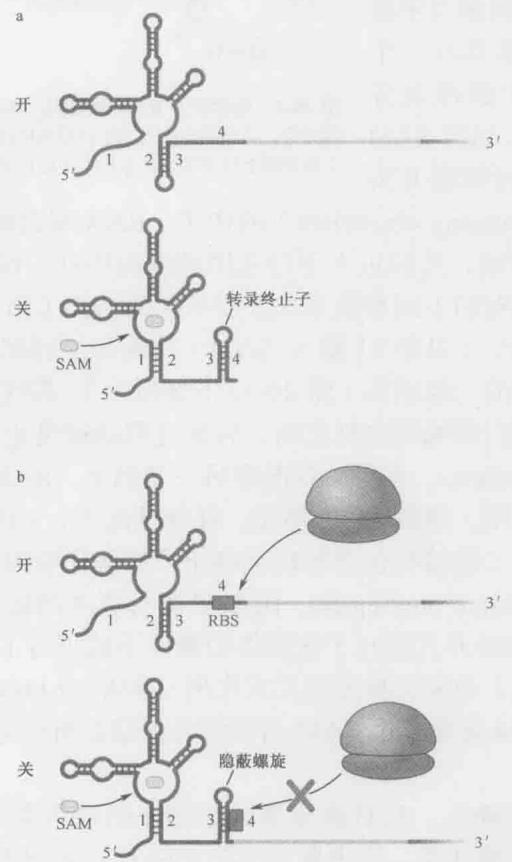  
图 20-3 核糖开关调控转录终止或翻译起始。图示 SAM 感受性核糖开关的两个例子：（a）转录终止的调控，（b）翻译起始的调控。数字 1-4 表示 RNA 编码区上游不同的序列元件区域（以黄色表示）。没有 SAM 时，区域 2 和 3 形成柄环；存在 SAM 时，区域 3 和 4 也同区域 1 和 2 一样都形成柄环。如图所示，转录或者翻译的调控都是这种二级结构改变的结果。（a）区域 3 和 4 形成的柄环产生了一个转录终止子，它使得 RNA 聚合酶在转录这一区域之后，进入下游编码区域之前立即终止转录。在这一例子中，mRNA 的柄环后面是一串 U，这是转录终止子的另一个特征（图 13-13）。（b）图示区域 3 和 4 形成的柄环通过封闭核糖体结合位点而阻止了翻译的起始。

## RNA 是原核生物和古细菌中的防御物质

在继续了解真核生物中调控 RNA 的调控作用之前，我们需要先来了解细菌中的另一个系统。尽管严格来说这并不是一个基因调控的例子，而是一个防御病毒和其他外来入侵的防御系统。但是这种作用机制却与真核生物中 RNA 干扰（RNAi）系统惊人地一致。

  
图 20-4 SAM 感受性核糖开关二级结构的改变。这里显示了区域 1-4（图 20-3）的详尽序列并用颜色标出。显示了有无 SAM 结合两种情况下，两个不同的二级结构的碱基配对。（据 Winkler W.C. et al. 2003. Nat. Struct. Biol. 10: 701-707, Fig.5b. © Macmillan 修改。）

## CRISPR 是感染和抗性获得的记录

几年前，科学家发现在一些细菌基因组里存在着一类具有典型的独特延伸结构的序列。由于当时并不太清楚这些序列的功能，所以这种与众不同的序列排列方式导致了其相当繁琐的命名——成簇的规律间隔的短回文重复序列（CRISPR）。CRISPR 的序列结构如图 20-6 所示，长度约 30bp 高度保守的重复序列（repeated sequences）簇被长度相似但是高度分化的单一间隔序列交错连接，末端通常是一条长度约 500bp、富含腺嘌呤核胸腺嘧啶的前导序列。

事实上，这些成簇的序列结构在基因组中并不少见。在几乎所有的古生菌和一半的细菌基因组中都发现有 CRISPR 存在。在很多情况下，一个基因组中只有一个簇，但是更为常见的是有 20 个以上或者更多——在绿弯菌属的一个案例中发现了 400 个。那么它们是如何产生的？它们的作用又是什么？

发现 CRISPR 起源的第一个线索来源于一次纯粹的生物信息学发现，科学家吃惊地发现 CRISPR 中大量的间隔序列与已知的噬菌体或质粒的序列是完全一致的。据此推断出这些间隔序列很可能与机体抵御外来核酸进入细胞内的特异性防御机制有关。

随后，科学家进行了实验验证，利用特定的噬菌体感染耐药性细菌细胞，发现耐药性细菌细胞中产生了来自噬菌体的合并间隔序列。同样地，通过增加和去除相关的间隔


图 20-5 核糖开关对各种代谢物的应答。这里显示了 7 种核糖开关的二级结构及它们应答的代谢物。（经许可，引自 Mandal M. et al. 2003. Cell 113: 557-586, Fig.7A. ©Elsevier.）  
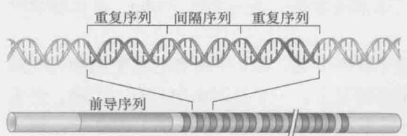  
图 20-6 CRISPR 基因组的结构。顶部展示的是保守的重复序列与多样间隔区序列。底部是这些序列的排列（数目变化很大）；在该图中也展示了邻近的前导序列。（经允许引自 Karginov F.V. and Hannon G.J. 2010. Mol. Cell37:7–19, Fig.1 A,B,p.8. ©Elsevier.）

序列可以控制噬菌体获得或失去敏感度。此外，利用特定的噬菌体感染细菌，随着从噬菌体中获得了越来越多的间隔序列，细菌的敏感性也越来越差。这也表明当病毒基因组的这个区域发生突变的时候，病毒便可以重新获得感染耐药细胞的能力。

另有研究发现一套保守的蛋白质编码基因与 CRISPR 系统有着密切的联

系。其中只有高度保守的 cas1 和 cas2 存在于所有的 CRISPR 系统中，被称为 CRISPR 相关基因。而其他的 cas 基因和更多的非保守基因较少存在。这些基因编码的蛋白质与

CRISPR 系统的多种功能有关，后面我们会深入讨论。图 20-7 的例子向我们展示了其复杂性。

  
图 20-7 cas 基因在三个基因组 CRISPR 上的结构。在三个研究较透彻的 CRISPR 基因座上展示了 cas 基因多样的数目、方向及类型。cas 基因的核心用红色标注，图 20-6 中展现的重复及间隔序列位于该图的右手端。（经允许改画自 Karginov F.V. and Hannon G.J. 2010. Mol. Cell37:7–19, Fig. 1C, p. 8. ©Elsevier.）

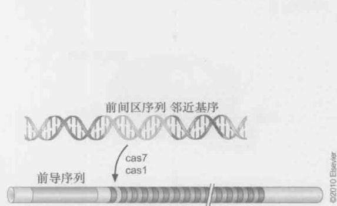  
图 20-8 间隔序列获取的机制。每个新的间隔序列都紧挨着前导序列插入，因而该排列是获取事件发生的时间记录。噬菌体基因组中注定成为间隔子的序列又被称为前区间序列，如正文中所描述的，它坐落于紧邻 PAM 序列的地方。（经允许引自 Karginov F.V. and Hannon G.J. 2010. Mol. Cell37: 7–19, Fig. 2B, p. 10. ©Elsevier.）

## 间隔序列来源于感染的病毒

正如我们前面强调的，当细胞获得了某特定噬菌体的间隔序列再次被感染时，其敏感度会降低。基本过程如图 20-8 所示。病毒中的序列将成为新的间隔序列，称为前间区序列（proto-spacer），常见于前间区序列邻近基序（PAM）的附近。当一个新的间隔序列加入到 CRISPR 系统中时，它将会被合并到最近端靠近前导序列的位置。

在这个过程中需要一些 cas 基因编码的蛋白质参与。因此，抗病毒防御机制并不会因为这些基因的缺失而受损，但是却会令细胞无法获得对新病毒的抵抗力。cas1、cas2 和 cas4 的基因产物就属于这一类。Cas1 是一个假定的整合酶，而 Cas2 是一个核糖核酸酶。其他的 Cas 蛋白则与之相反，Cas6 与 CRISPR 簇的表达与加工相关，Cas3 则在干扰病毒感染中起作用。

CRISPR 首先作为长的 RNA 被转录，然后逐步被加工成小的 RNA，抵御入侵的 DNA 和 RNA

科学家对 CRISPR 在大肠杆菌（E.coli）中的表达情况进行了广泛的研究。在位于前导序列区域启动子的调控下，CRISPR 首先转录为长的转录体，也就是 crRNA 前体。在大肠杆菌（E.coli）中，发现 8 个与 CRISPR 相关的 cas 基因，其中 5 个在表达过程中会形成级联（Cascade）复合物。这种复合物中包含一个亚单位，其功能是将 crRNA 前体切割加工成小的 crRNA，每个 crRNA 都是一个重复序列和间隔序列的长度。随后，这些小 RNA 继续与 Cascade 复合物结合，从而指导基因组抵御外来 DNA 的侵入（图 20-9a）。

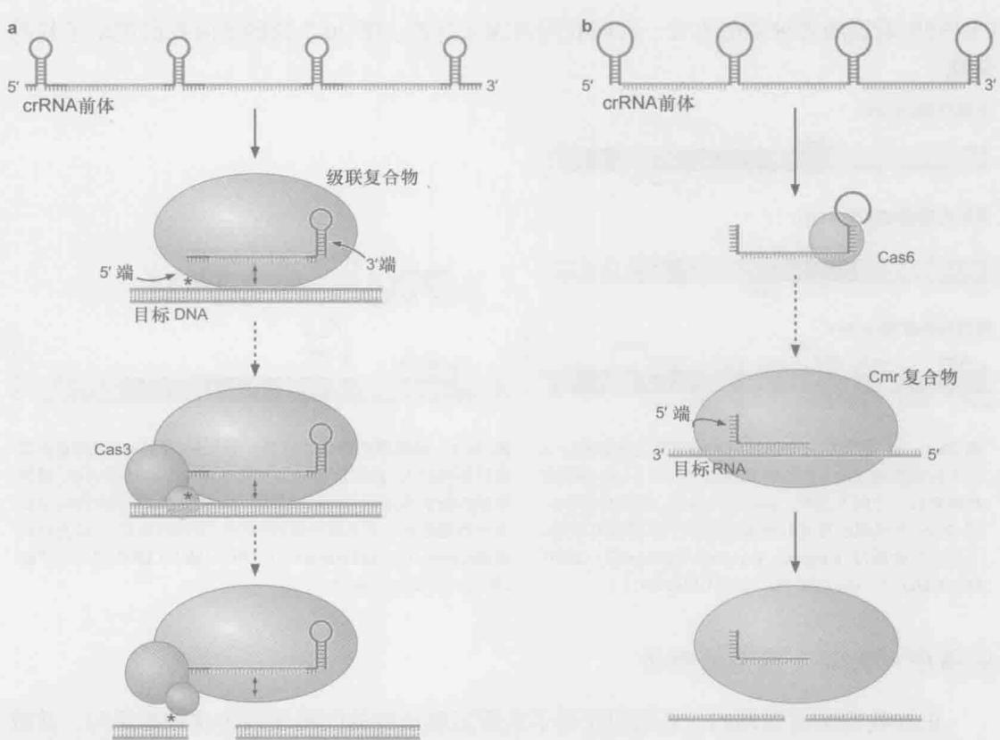  
图 20-9 大肠杆菌和超嗜热菌强烈炽热球菌的 CRISPR 位点的抗病毒机制。大肠杆菌系统（a）作用于外来的 DNA，而超嗜热菌强烈炽热球菌（b）则作用于外来的 RNA。尽管这两种机制在许多方式上相近，但是其加工机制及最终的操作如文中所表明的那样是显著不同的。在（a）中，crRNA 前体被级联复合体的 CasE 亚基加工处理（CasE 基因由图 20-7 中的 cse3 基因编码），然后 crRNA 和级联在 Cas3 的帮助下瞄准并切割目标 DNA，其机制尚不清楚。在（b）中，Cas6（见图 20-7）加工 crRNA 前体，而该过程发生在不同于级联的复合体中，其靶向为病毒 RNA，该机制与真核生物中的 RNAi 极其相似。（源于 Jore M.M. et al. 2012. Cold Spring Harb. Perspect. Biol.4:a003657. ©Cold Spring Harbor Laboratory Press.）

每个 crRNA 分子一般包含 5' 端为 8 个核苷酸的重复序列，紧跟着是完整的间隔区或者下一段重复序列。crRNA 分子中的重复序列的两端分别被称为 5' 端和 3' 端，是 crRNA 分子中的保守部分，由此认为与级联复合物中的亚单位结合的正是这个区域。

在超嗜热菌强烈炽热球菌（Pyrococcus furiosus）中，在另一种结构相似的酶的作用下，crRNA前体被切割加工成小的crRNA，然后选择性地与由多种CAS蛋白构成的蛋白质复合物相结合。结合的时候，会先从crRNA的5'端和3'端开始结合，但是随后3'端会被修剪掉。crRNA蛋白质的复合物将会直接对抗外来的RNA。

图 20-9 向大家展示了大肠杆菌（E.coli）和超嗜热菌强烈炽热球菌（Pyrococcus furiosus）系统的作用机制。后面我们将会了解这些类似于真核生物中 RNA 干涉（RNAi）的系统是如何运行的，尽管它们的具体细节完全不同。

## 调节 RNA 在真核生物中广泛存在

的机制等不同的特点进行区分。现在，人们认为高等真核生物 30%\~70% 的基因在某种程度上都是由 RNA 调控的，从发育（在线虫和拟南芥中已经得到证实，详情请见附录 1）到细胞内稳态，以及防御病毒入侵和转座子。此外，其中的一种调控形式（RNA 干扰）已经成为一种操纵多种生物基因表达的强大实验工具。

本节中我们将首先开始观察各种小 RNA 调控，在本章的最后再回到长 RNA。

几种不同类型的小 RNA 都是通过同源性使基因抑制——沉默或者表达。根据不同的起源和背景，这些 RNA 通过抑制 mRNA 的翻译，破坏 mRNA，甚至启动子的转录沉默指导 mRNA 的表达。正如我们后面所讲的，这些小 RNA 通常是在某种特殊的酶的作用下从不同起源的双链 RNA（dsRNA）中产生的。

## 小 RNA 来源广泛，通过三条途径指导基因沉默

在详细描述沉默基因的小 RNA 来源和功能之前，我们首先概述这一类型基因沉默的发生机制（图 20-10）。

小 RNA 是以来源命名的。源于活体的双链 RNA 前体的或人工制备的小 RNA 被称为小分子干扰 RNA（small interfering RNA，siRNA）。另一类调控 RNA 是微 RNA（microRNA，miRNA），它是由细胞内基因编码的 RNA 前体衍生而来的。这些 miRNA 在细胞中具有特定的调控功能。第三类是与 piwi 蛋白作用的小调控 RNA（piwi-interaction RNA，piRNA），主要在生殖细胞中表达，与 miRNA 的特性有所不同。

siRNA 和 miRNA 都是由长 RNA 分子经 Dicer 酶消化而来的。Dicer 酶是一种 RNase Ⅲ类酶。它能识别并消化长双链 RNA 或者 miRNA 前体形成的柄环结构（见下文）。siRNA 和 miRNA 产物一般长度为 21\~23 个核苷酸，其产生过程见图 20-10 中的第一步。piRNA 的长度为 24\~33 个核苷酸，它的产生似乎与双链 RNA 前体无关，piRNA 在基因组中主要分为成群的基因簇，其中的长片段的小分子 RNA 只能来源于单链。这个过程并不需要 Dicer（RNase Ⅲ家族中对双链 RNA 具有特异性的酶）。

这些小 RNA 通过三种途径来抑制同源靶基因的表达：第一种是触发靶基因编码的 mRNA 的降解；第二种是抑制 mRNA 的翻译；第三种是对靶基因所在染色质进行修饰而沉默其转录。显而易见，在所有的例子中，无论采用哪种途径，都需要很多相似的“机器”。这个“机器”包括 RNA 诱导的沉默复合物（RNA-induced silencing complex，RISC）。除了小 RNA 之外，一个 RISC 还含有包括 Argonaute 蛋白家族的一个成员在内的许多蛋白质。

这些小 RNA 都需要经过变性而形成一条向导 RNA（guide RNA）和一条搭载 RNA（passenger RNA）。向导 RNA 使 RISC 具有特异性，而搭载 RNA 通常被丢弃。所生成的复合物（即成熟的 RISC）被引导到含有与向导 RNA 序列互补的靶 RNA 上，靶 RNA 被降解，或其翻译被抑制。通常，降解或抑制依赖于向导 RNA 与靶 RNA 的配对程度：假如序列高度配对，靶 RNA 将被降解；如果配对不完全（如一些碱基对间有错配），翻译被抑制更为常见。在靶 RNA 被降解的情况中，Argonaute 的催化亚基负责开始剪切 mRNA。因此，Argonaute 经常被称做“切片机”（slicer），mRNA 的剪切又称“切片”（slicing）。

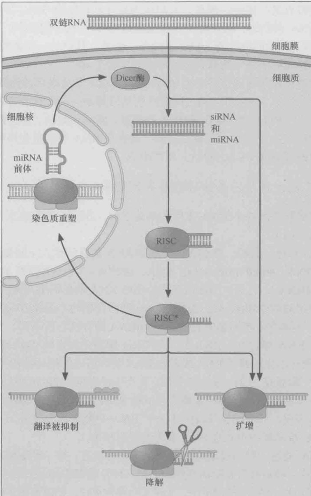  
图 20-10 siRNA 和 miRNA 的生成及其作用方式。Dicer 酶加工双链 RNA 成 siRNA 和 miRNA 前体，后者会进一步形成 miRNA。另一个仅参与 miRNA 前体加工的酶（Drosha）在此没有显示，而将在后面描述。siRNA 和 miRNA 以三种方式指导一个称为 RNA 介导的沉默复合物（RNA-induced silencing complex，RISC）来抑制基因：攻击并降解与该 siRNA 同源的 mRNA；干扰这些 mRNA 的翻译；引导染色质修饰酶到达启动子来指导那些 mRNA 的表达（图 20-18）。通过结合 RNA 依赖性的 RNA 聚合酶，siRNA 可以生成更多的双链 RNA，它们可以作为 Dicer 的底物生成更多的 siRNA。图 20-11 更详细地展示了这一过程。（引自 Hannon G.J. 2002. Nature 418: 244-251, Fig.5. © Macmillan. 经许可修改）

RISC 也可以被引导到细胞核中。它通过调动染色质修饰蛋白，汇集在与向导 RNA 互补的靶基因启动子上（图 20-10 左侧所示）。该修饰能够导致转录沉默（第 19 章）。例如，要沉默裂殖酵母（Schizosaccharomyces pombe）的着丝粒区域的转录，就需要 RNAi“机器”，我们会在后面讨论。

miRNA 和 siRNA 的产生有着很大不同，miRNA 像是传统的反式作用调节因子，它们都是由同一个基因编码但是却作用于不同的基因（像细菌系统里的 sRNA）。相比之下，siRNA 是由它所作用的转录区域产生的（像细菌里的反义 RNA），因而被称为是顺式作用。

RNAi 沉默的另外一个值得注意的特点是极其高效。因此，只需要很少量的 dsDNA 就足以引发靶基因表达几乎彻底关闭。RNA 依赖 RNA 聚合酶（RNA-dependent RNA polymerase, RdRP）是提高 RNAi 效率的重要因子。很多情况下，如裂殖酵母着丝粒的沉默，RdRP 还是 RNAi 所必需的另一个酶。被原先的 siRNA 聚集到 mRNA 上后，RdRP 通过合成双链 RNA 来放大抑制信号（图 20-10 所示，详细内容见图 20-11）。这一反馈过程能够产生大量的 siRNA。尽管在哺乳动物细胞中 RdRP 的存在目前还不肯定，但是 RNAi 高效性仍然可能来自于切割的催化性，即每个 RISC 可以切割好多个 mRNA。

因此，虽然在本章的第一部分我们已看到许多关于小分子RNA如何通过反式作

  
图 20-11 RdRP 作用下 siRNA 自身扩增。如图 20-10 右侧所示，siRNA 自身扩增后，产生更多的双链 RNA，在 Dicer 酶的作用下又产生更多的 siRNA。这是由于 siRNA-RISC 复合物可以结合 RdRP(RNA 依赖的 RNA 聚合酶)，siRNA 可以作为引物将目标 RNA 转换成双链 RNA，然后在 Dicer 酶的作用下也切割成 siRNA。RdRP 被发现存在于植物、蠕虫和裂殖酵母（酿酒酵母中没有 RNAi 的机制）中，所以在裂殖酵母中这种扩增具有非常重要的作用。

用调控细菌基因表达的例子，但是与真核生物中这些 RNA 的产生和作用的机制完全不同。

## miRNA 分子的合成与功能

## miRNA 的特征性结构——自身和靶基因识别

如前所述，miRNA 是由基因组中较长的转录物片段编码的。它们这种特征性结构，有助于识别它们，并预测可能受它们调节的靶基因。

典型的功能性 miRNA 长 21 或 22 个核苷酸，其长度变化范围为 19\~25 个核苷酸。这种小 RNA 是由一个携带有发夹形的二级结构的长 RNA 转录物（称为初级 miRNA，pri-miRNA），经过两步剪切反应而产生的。第一步剪切反应是释放柄环，称为 miRNA 前体（pre-miRNA）；第二步由 miRNA 前体产生成熟的 miRNA。最先被鉴别并功能明确的 miRNA 是 let-7，let-7 调控线虫 C.elegans 从幼虫到成虫转变的发育过程（附录 1）。图 20-12 显示的是 let-7 的 pre-miRNA 和一些其他的天然存在的 miRNA 结构。

  
图 20-12 加工为成熟的 miRNA 之前一些 pre-miRNA 的结构。miRNA 序列标为红色。在一些例子中，柄环的两个“臂”都能产生有功能的 miRNA。在这些例子中，第二个 miRNA 用蓝色显示——例如，miR-1（红色）和 miR1 $^{*}$ （蓝色、miR-34（红色）和 miR $^{*}$ （蓝色）。显示的 miRNA 均来自于线虫。Lin-4 和 let-7 是用遗传学方法鉴定的；而那些 miR 是以生物信息学方法发现的。（自 Lim L.P. et al. 2003. Genes dev. 17: 991, Fig.6. ©Cold Spring Harbor Laboratory Press, 经许可改绘）

原先认为可能是 pre-miRNA 柄环结构中的一条“臂”调控 miRNA。然而，从最近大量的例子中发现，这种结构的两条“臂”都产生功能性 miRNA，每一条都有它自己的一组靶基因（图 20-12 中用红色和蓝色分别标出两种 miRNA）。现在看来，这种现象是很普遍的。Pre-miRNA 可由被转录物的任何一个区域所编码，即它们可能存在于转录物的编码区、前导区或者内含子中（图 20-13）。

由于 miRNA 的初级转录物（primary transcript of miRNA，pri-miRNA）具有特征性的二级结构，有可能通过计算 RNA 序列二级结构的折叠方式而进行预测。此外，在很多例子中，受调控的靶基因也同样可以被预测，因为沉默的发生依靠的是靶 RNA 和成熟 miRNA 之间的序列互补。miRNA 和靶 RNA 的碱基配对是通过“种子残基”（seed residue）的相互作用启动的。这些“种子残基”通常是指 22 个核苷酸 miRNA 中的第 2个到第 9 个核苷酸之间的序列。该序列与靶基因高度互补，所以这也是识别可能的靶基因最有效的区域。当然，要确认 miRNA 的存在，需要在细胞中被实际检测出来（如以 Northern 印迹），其存在能够影响靶 mRNA 的表达。

  
图 20-13 RNA 的内含子和外显子都可以为 miRNA 编码。内含子序列标以亮绿色，起始和终止密码子分别标以黄绿色和粉色。

初级转录物经过两步切割反应产生 miRNA，需要两种不同的 RNase 酶来催化。一种是 Dicer，我们已经介绍过，几乎所有 RNAi 都离不开它。另外一种是 miRNA 加工所特需的，这就是 Drosha。这两种酶的一个共同特点是它们对 RNA 的识别和切割基于底物的结构而不是特定的序列。下面现在着重讨论这些酶的功能。

## 活性 miRNA 是由两步核解过程产生的

第一步由 Drosha 酶完成，它是 RNase Ⅲ 酶家族的成员。Drosha 两次切割，将 RNA 的柄环区（pre-miRNA）从 RNA 初级转录物（pri-miRNA）上切下来。该酶与另一种必需的特异性蛋白亚基（在一些生物体中称为 Pasha，在另一些中则叫 DGCR8）一起形成微加工复合物（microprosessor complex）。由 Drosha 产生的 pre-miRNA 通常长 65\~70 个核苷酸。Drosha 存在于细胞核中，而 Drosha 催化的切割过程也常在细胞的这一区域进行。

Pri-miRNA 中的碱基配对的柄部通常长约 33 个核苷酸（双链 RNA 的 3 周螺旋），而且只含少量错配（图 20-14）。环部位于柄的“项”上（“顶环”），大小可变（相对较大，通常 10 个核苷酸左右）。对于加工反应来说，该环部的序列并非十分重要，重要的是，对于 Drosha 催化的加工反应来说，单链 RNA（ssRNA，没有显著的二级机构）一定要在柄环的 5' 和 3' 两侧。在很大程度上，ssRNA-dsRNA 的连接(junction)决定了 Drosha 切割的特异性。

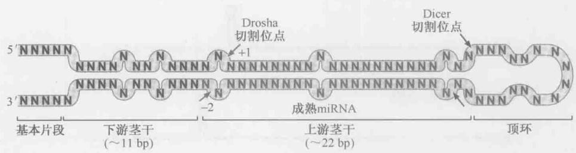  
图 20-14 pri-RNA 结构概观，图示 Dicer 和 Drosha 切割位点。红色标记的区域将被加工成成熟的 miRNA。注意基本片段必须为单链，以便 Drosha 复合物正确识别。

  
图 20-15 微加工复合物对 pri-RNA 的识别与切割。切割产生的三个片段分别标记为 F1、F2（miRNA 前体）和 F3。

柄部可以被分为两个功能片段：一个约 11bp 的柄下部区和一个大约 22bp 的柄上部区（图 20-15）。Drosha 从位于初级 miRNA 的柄下部和上部之间的 ssRNA-dsRNA 连接区上切割下 11bp。因此这两次切割产生了长约 65 个核苷酸的 pre-miRNA，由 22bp 双链 RNA（2 周螺旋）和“顶环”组成。RNase III 家族的酶特异性识别双链 RNA 并将其切割，双链 RNA 产物的 3' 端带有一个 2 核苷酸的“接头”（overhang）。这个 3' 接头对于下一步 Dicer 酶对 RNA 分子的识别是很重要的。

## Dicer 是生成 miRNA 的第二个 RNA 切割酶，也是唯一一个生成 siRNA 必需酶

Drosha 释放的 pre-miRNA 被输送到细胞质中，并在此接受由 Dicer 执行的第二步切割反应。像 Drosha 一样，Dicer 不是利用序列特异性，而是利用测量机制来选择切割位点。Dicer 的高分辨率结构向我们展示了这一切割过程可能是如何发生的。

Dicer 由三个结构域 (module) 构成: 两个 RNase III 结构域和一个与双链 RNA 结合的结构域 PAZ。PAZ 源自三个蛋白质名: Piwi、Argonaute 和 Zwille。

图 20-16a 为 Dicer 蛋白组织的模式图，并显示它是如何与双链 RNA 分子相互作用的。图 20-16b（右半部分）显示 Dicer 的结构以及与底物 RNA 作用的模型。该蛋白质的整体结构像一个短柄斧（hatchet）。PAZ 结构域在手柄的底部，形成了双链 RNA 底物 3'端的结合处（binding pocket）。连接结构域（linker domain）形成了斧头的柄部，并含有一个带正电荷的 RNA 分子结合表面（binding surface）。顶部的“刀刃”区域包含了两个 RNase 结构域，为排列对称的二聚体。每一个 RNase 结构域带有一个活性位点，分别负责切割底物 RNA 两条链中的一条。因此，Dicer 可作用于任何双链 RNA，不管序列如何，并从底物 RNA 的一端切下生成一个长 22 个核苷酸的 mRNA 分子。PAZ 结构域像“标尺”那样（ruler-like），锚定在底物 RNA 的离 3' 端长约 22 个核苷酸左右的酶活性位点处（图 20-16）。实际上，在不同生物中发现的 PAZ 结构域的大小与 Dicer 产物的大小有关。

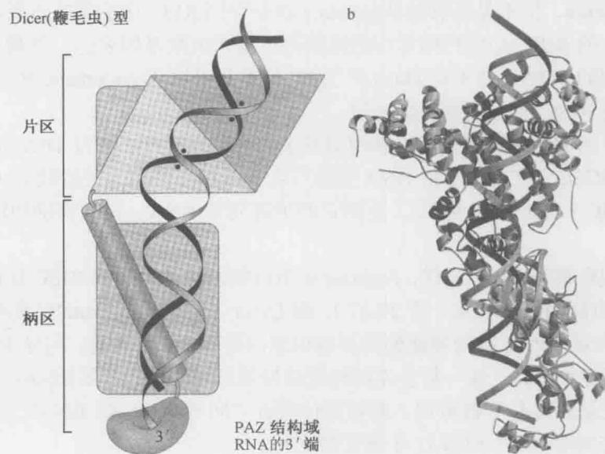  
图 20-16 Dicer 的结构与组织。(a) 图示 Dicer 的组织。(b) Dicer 结合双链 RNA 的结构模式图，示其长度是如何被测定的。蛋白质示以灰色，红色箭头示核酸酶活性位点（相当于 a 中黑点表示的部分），RNA 用绿色显示。这一结构仅显示了 RNase III 和 PAZ 结构域。Dicer 酶也含有 ATP 酶和其他结构域。(b, MacRaeI.J. et al. 2006. Science 311: 195-198. PDBCode: 2FFL；注意这是 RNA 的模式图，不是晶体结构）图像以 MolScript、CobScript 和 Raster3D 制备。

正如我们所看到的，只有 miRNA 是由长的发夹状前体生成的。相比之下 siRNA 通路的前体 RNA 是一个更长的双链 RNA。由于初始物质的不同，siRNA 不需要 Drosha 酶，但是仍然需要 Dicer 酶裂解，以便于生成 21\~22 个核苷酸的 RNA 进入 RISC 中。在植物中，miRNA 甚至可以由 Dicer 酶直接生成，但是还不清楚它们是怎样跳过 Drosha 酶的。

## 小 RNA 沉默基因表达

我们已经了解了双链 RNA 或者 miRNA 前体是怎样形成小分子 RNA 的，下面我们将来了解这些小分子 RNA 是如何介导靶基因表达沉默的。

## 前导 RNA 链整合进 RISC 形成能沉默基因表达的成熟复合体

Dicer 酶作用产生的短 RNA 将决定作用于哪种靶 RNA。激活的调控 miRNA 是指以单链形式整合到 RISC 上，在这一阶段称为向导 RNA（guide RNA）。在这个复合物中，向导 RNA 聚集 RISC 到靶 RNA 上。人们还在争论的是：在复杂的真核生物的巨大基因组中，22 个核苷酸左右的长度是否足够，以满足通过 RNA-RNA 碱基配对来准确无误地识别靶基因。

RISC 的中心组分是一个 Argonaute 蛋白。Argonaute 蛋白在很多情况下都是 RNA 剪切酶。对基因沉默机制理解得最为透彻的是以 RISC 介导的靶 mRNA 剪切（或“切片”）。然而，很多生物中都含有 Argonaute 蛋白家族的多个成员。例如，在人体中就含有 8 种不同的 Argonaute，但不是所有的 Argonaute 在整合到 RISC 中后都有沉默活性。含有其他 Argonaute 的 RISC 必须利用非切割依赖的机制来沉默基因表达，如翻译抑制。我们在前面接触到的 piRNA 并不是 Dicer 产生的，但是却可以与 Argonaute 相关的称为 PIWI 的蛋白质及类 RISC 复合体结合在一起。

下面将介绍活性 RISC 的产生和切割发生的过程。首先，通过 Dicer 产生的短双链 RNA 整合进 RISC，在这里双链 RNA 变性产生一条指导链和一条搭载链（会被丢弃）。所生成的 RISC（称为成熟 RISC）连同它的单链向导 RNA，具有识别和切割靶 mRNA 的活性。

正如我们观察到 Dicer 那样，Argonaute 蛋白的结构是为了解 RISC 如何识别和剪切靶 mRNA 的机制提供了框架（图 20-17）。跟 Dicer 一样，Argonaute 也含有 PAZ 结构域和 RNase 结构域。PAZ 结构域能够特异地识别向导 RNA 的 3' 端。向导 RNA 通过碱基配对结合到靶 RNA 上，这一复合体的构造恰好使得靶 RNA 落在 RNase 结构域的活性位置上，使靶基因链易于被剪切。剪切部位靠近 “向导 RNA-靶 RNA” 二聚体的中央，在向导 RNA 5' 端第 10 个和第 11 个核苷酸之间。


  
图 20-17 Argonaute 蛋白的结构，显示 RNA 结合区和 RNaseH 样核酸酶结构域。（a）Argonaute 蛋白的晶体结构。结构域如 b 中着色部分所示，蓝色区域显示蛋白质的氨基端，绿色为中间的结构域。（b）Argonaute 结构域的模式图。箭头所指的 RNase 的活性位点，位于小 RNA 和 miRNA 配对区域中部的切割部位。（a, Song J.J. et al. 2004. Science 305: 1434-1437, Fig.4C. PDBCode: lu04. 图像以 MolScript、CobScript and Raster3D 绘制。b，自 Song J.J. et al. 2004. Science 305: 1434-1437, Fig.4C. ©AAAS，经允许改绘）

如前所述，在某些情况下，成熟的 RISC 不是剪切 mRNA 而是抑制它的翻译。实际

上，这才被认为是 miRNA 发挥作用最常见的方式。

这种翻译抑制的原理还在研究，而且对于这些生物事件发生的顺序还有很大的争论。因此，尽管翻译确实被抑制了，但 mRNA 也同时衰减了。很难证明二者的因果关系：如果 mRNA 衰减了，翻译当然会被抑制；同样地，当 mRNA 的翻译受到抑制时（被任一机制），细胞会有破坏该 mRNA 的倾向。无论哪种方式，同上面我们所讨论的由 siRNA 引发的活化剪切机制都不同。

翻译起始是一个涉及很多因素的复杂过程（见第15章），也会受到很多干扰。不管翻译抑制的机理如何，在某些情况下，翻译抑制似乎是由于miRNA导致了（所谓的）胞浆复合体（P-body）中mRNA的降解。

## 小 RNA 可以通过指导染色质修饰使基因的转录沉默

我们现在已经看到，miRNA 和 siRNA 是怎样通过抑制靶 mRNA 的翻译或导致它们降解而沉默基因的。调控 RNA 也可以在转录水平上活动，通过指导启动子的组蛋白修饰而关闭靶基因的表达。这一机制在裂殖酵母（Spombe）着丝粒沉默现象中得到了深入的研究。

我们在第 19 章中已提到，位于酵母基因组某些区域的基因常常被特异性沉默。在那一章里，我们详细讲述在酿酒酵母中邻近端粒的基因是被沉默的。酿酒酵母和裂殖酵母的配型基因座也是被沉默的。在裂殖酵母中，着丝粒是基因组中另一个被沉默的区域。在这两种生物体中，基因沉默均涉及组蛋白的修饰。但是，与不需要 RNAi 参与的酿酒酵母中发生的沉默不同，裂殖酵母着丝粒的沉默则需要 RNAi 通路。

裂殖酵母的着丝粒序列组织相比酿酒酵母更像高等真核生物（如果蝇和人类）的着丝粒序列组织（图8-8）。它们的着丝粒都有一个独特序列的中心区域和含有一系列常见重复序列的两侧区域。我们将要看到，这些重复序列对异染色质的形成和功能，以及与此区域有关的转录沉默都是很重要的。异染色质中的组蛋白含有抑制标记（repressing marker）——低水平的乙酰化、组蛋白H3尾巴上第9位赖氨酸（H3K9）的甲基化。

裂殖酵母在 RNAi 通路中的主要组分 Dicer 和 Argonaute 都只有一个基因。高等生物具有多个 Dicer 和 Argonaute 基因，这些基因的功能有些冗余，使得 RNAi 通路的遗传操作更加困难。此外，与果蝇和线虫中不同，RNAi 通路的缺乏对裂殖酵母并不是致命的，尽管会通过干扰染色体分离等方式使细胞生长缓慢。然而令人吃惊的发现是，失去 RNAi 通路中的任一组件会使 H3K9 组蛋白不能甲基化，从而导致着丝粒的基因沉默也不能进行，特别是因为一种转录水平的沉默。在此之前，RNAi 被认为仅在转录后起作用。

认识转录水平沉默的关键似乎在于认识着丝粒本身的重复,这些重复序列是由 RNA 聚合酶 II 从两条链转录而来,产生的互补转录物杂交形成双链 RNA,这是由 RdRP 酶扩增的过程（见图 20-11）。这种双链 RNA 在 RNAi 机制的作用下生成 siRNA,并在某种程度上（尚不知道如何起作用）指导“含 Argonaute 的 RISC 类聚合体”（称为 RNA 诱导的转录沉默 RITS 聚合体）结合到着丝粒上。在理论上，siRNA 可以通过直接与 DNA 模板的序列特异性配对来识别着丝粒 DNA。但另外一个模型更有可能,即 siRNA 在 RNA 聚合酶 II 作用下,将 RITS 聚集到拴在着丝粒上的转录物上。RITS 的聚集导致着丝粒转录物的沉默,而这又是组蛋白修饰装置沿着着丝粒扩展所需要的（图 20-18）。这样,那些转录物被 RNAi “靶定”（targeted）时，转录物本身就使沉默效应扩展开来。

  
图 20-18 RITS 聚集和着丝粒沉默的一个模型。图的上部显示的是在裂殖酵母的着丝粒重复序列周围的核小体。这些重复序列是由 RNA 聚合酶 II 从两条链上转录的，生成的双链 RNA 成为 Dicer 的底物。生成的 siRNA 被装载到含 Argonaute 的聚合体 RITS 上。如图的中部所示，含有 siRNA 的 RITS 聚合体被聚集到 Pol II 拴住的转录物上，这些转录物是由着丝粒的重复序列通过 siRNA 和转录物的互补持续转录生成的。这个复合体随后聚集核小体修饰因子（Clr4 和 Swi6），这一修饰是通过标上 H3K9 沉默标记来实现的。RITS 的另一个亚基 Chpl 含有一个染色质域（chromodomain）（第 8 章，图 8-41），通过与甲基化的核小体结合而有可能稳定 RITS 的结合。尽管未在图中显示，由 Argonaute（在 RITS 中）介导的转录物“切片”（slicing）生成的是 RdRP 的底物 RNA，合成一条互补链后，进一步生成 Dicer 的底物。这一过程是核小体修饰的扩展必不可少的，这个区域就这样被沉默。（Martienssen R. and Moazed. D. 2007. Epigenetics (ed. Allis et al)，p.157，Fig.4. ©Cold Spring Harbor Laboratory Press，经许可重绘）。

如上文所提到的，裂殖酵母基因组中配型基因座上的基因也是在转录水平上被沉默的，同时这种沉默现象同样存在于 RNAi 缺陷型突变株中。在这种情况下，一般认为 RNAi 能照样起作用，但只是在沉默的起始阶段起作用。沉默一旦建立，在维持阶段就不需要 RNAi 了。另外，如同在酿酒酵母中一样（第 19 章），基于蛋白质的机制将维持基因抑制的状态。在其他生物中（如果蝇、植物），RNAi 也被认为在异染色质沉默中也起到一定作用。如下文所述，沉默不需要的转座子转录物也是 RNA 介导的。

一系列很好的实验和结果使我们了解到真核生物中的小调控 RNA。最初始于 20 世纪 80 年代末期，科学家试图过表达矮牵牛的色素基因，使得它们变成更深的紫色，结果却使花变成了白色，这是一个看起来令人费解的实验结果。后来又惊奇地发现蠕虫的调节基因产物是 miRNA，随后的实验表明将双链 RNA 引入到蠕虫中能够使互补基因沉默（详见框 20-2）。

## 框 20-2 miRNA 和 RNAi 的历史

1989年，在美国加州奥克兰（Oakland）Advanced Genetic Sciences 生物技术公司工作的 Richard Jorgensen，试图培养出比现有品系花色更深的紫色矮牵牛花。这一策略看似直截了当，他打算将一个强启动子控制的色素基因（编码查耳酮合成酶，chalsone synthetase）的额外拷贝导入植株之中。这些植株将合成更多的查耳酮合成酶，从而使花的紫色加深。他真正得到的植株却是浅淡不一的矮牵牛花，其中很多紫白相间，有的甚至全为白色（框20-2图1）。

  
框 20-2 图 1 矮牵牛花。色素基因查耳酮合成酶过量表达效应的一个例子，正常情况下则是单一紫色的矮牵牛花。（Arizona 大学的 Richard A. Jorgensen 惠赠）

失望之余，这一结果还是令人费解的。在试图理解这一结果的过程中，Jorgensen发现了这一现象——共抑制（cosupression）的许多特点（转入的基因和机体内源的基因表达都被抑制了）。转基因的表达水平超高，查耳酮合成酶的水平越低；无论是因为转基因有很多拷贝，还是因为转基因的启动子很强，这种情况都存在。研究还观察到一些植株色彩斑驳（色素形成的杂色模式），并且可在同一植株的不同花朵上出现。这种模式有时是可以遗传的，但在其他情况下明显是随机可变的。这些观察结果使Jorgensen和其他研究人员（尤其是同样正在研究这一现象的Marjori Matzke）想到这是一种表观遗传（epigenetic）现象。

其他的研究者试图使植物获得抗病毒侵染的特性。一种途径是在植株中过量表达一种常见的病毒复制因子显性失活（dominant-negative）的衍生物，这种蛋白质被认为可用来阻断任何使用共同的复制机器的侵染病毒的复制。尽管这种源自病毒的显性失活的病毒产物阻断了这个马铃薯病毒的复制，令人惊奇的是，对这种病毒的作用的特异性被严格地限制，而且还证明这一过程甚至并不需要蛋白质本身，仅仅RNA就够了。

同时，其他的研究者使用反义 RNA（antisense RNA）在线虫中敲除了 par-1 基因的表达。他们本想证明这个基因与特定的发育性状相关。离体合成的反义 RNA 注入正在发育中的线虫，所诱导的性状符合原先的预期即 par-1 没有表达。但是，同义 RNA（sense RNA）居然也显示了同样的效应。在这个实验中，同义 RNA 仅是作为一个阴性对照，它并未被考虑到会对基因表达起任何作用。与 par-1 基因无关的 RNA 不起任何作用。

对实验中依赖RNA的基因表达的解释使Andrew Fire和Craig Mello赢得了2006年诺贝尔生理学或医学奖。他们证明事实上既不是正义RNA也不是反义RNA，而是这两种的混合产物双链RNA沉默了基因。后来发现，以反义和正义RNA制备的RNA被少量的互补链相互污染，所产生的双链分子使基因沉默。特意制备的双链RNA显示能非常有效地抑制靶基因的表达。至此，RNAi的现象被发现并在1998年发表。

几个实验室的工作很快加深了对这一机制的了解。首先，双链RNA被发现可以引起从果蝇细胞中提取的同源mRNA的降解，这一实验鉴定了RISC。指导RISC结合到靶基因上的siRNA于1999年在植物中被鉴定并被报道。2001年找到了生成siRNA的核酸酶Dicer。这一通路中的最后一种重要组成——Slicer是在2005年被鉴定的；Argonaute的晶体结构揭示这个蛋白质是一种RNase。

除了为生成 siRNA 所需要外，Dicer 还是发育过程中 miRNA 起作用所需要的。1993 年，Victor Ambros 和 Gary Ruvkun 分别描述了第一个 miRNA 和它的靶基因。在那个时候，这一发现被认为是既巧妙又古怪的。Lin-4 基因编码的小 RNA 作用于靶基因 lin-14，通过 miRNA 和靶基因 3'-UTR 区之间的互补序列起作用（框 20-2 图 2）。随后，另外一些 miRNA 在线虫中被发现，一些与动物和植物中相似的基因同源，说明这种调控机制可能更普遍地存在。关于基因调控的小 RNA 世界的画面也逐渐浮现出来，一些小 RNA 来自外源，另外一些是发育过程中基因调控程序的内部装置。这个领域的发展非常迅速，从这些现象被发现和解释，到摘取诺贝尔奖的桂冠，再到写入教科书的章节，仅用了 15 年时间。这种快速进程应归咎于应用多种方法（遗传学、生物化学、结构研究和生物信息学）对多个物种（酵母、植物和线虫）的研究。

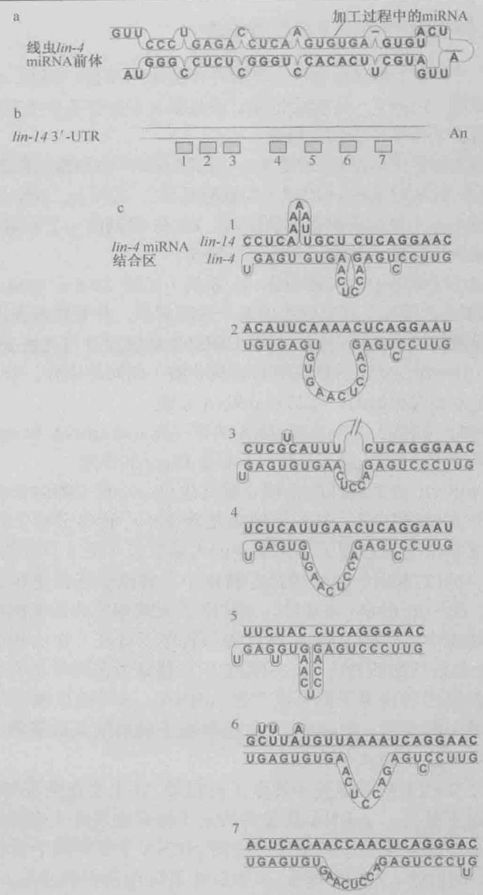

框20-2图2结合到靶基因lin-14的3'-UTR区内的microRNA lin-4。(a)被Dicer剪切前的lin-4 miRNA前体,miRNA的序列标以蓝色。(b)lin-4的3'-UTR中的7个序列。(c)其可与lin-14 mRNA在不同程度上进行碱基配对。更加有趣的是lin-4/lin-14调控的生物学意义。在第21章我们了解到一些基因表达是如何对发育进行调控的例子,其中包括Hox基因,它能够调控生物正常形体的形成,使四肢和其他的部位应该在体轴的哪个位置形成而不会出现在错误的位置,比如在一条腿上不能长出一个头来。但是事实上,一些突变体中也有可能缺少某种Hox基因,最经典的例子是果蝇的触角足突变,会使原本应该长出触角的头上长出腿。Lin-14蛋白是一种能够在时间上调控生物正常发育的因子。如果发生突变会引起特定的组织或细胞与正常的不同步(如提前或推后),但是并不能引起空间上(位置)的变化,被称为异时性基因。但是,正如前面所讲的,Lin-14蛋白的表达还是受microRNA lin-4调控的。

(来源 Ha 1. 1996. Genes Dev. 10:3041-3050, Fig. 1. ©Cold Spring Harbor Laboratory Press.)

## RNAi 是一种抵御病毒和转座子的防护机制

RNAi 机制广泛存在于真核生物中，尽管并不是无所不在，例如，我们发现酿酒酵母中就不存在该机制。但是有一点确信的是，该机制至少是存在于所有真核生物的最近共祖中，而在随后的某些家系中发生缺失。

但是 RNAi 的生物学作用是什么? 是 RNAi 机制需要产生和使用调控子 miRNA，但一些机体只有 RNAi 机制而没有 miRNA（如裂殖酵母）。实际上，miRNA 的逐步形成是利用了 RNAi 机制，而不是该机制存在的原因。RNAi 机制的一个原始功能（并且现在仍然具有的）是保护机体免于转座子和病毒的攻击。

我们在之前描述过细菌中的 CRISPR-cas 系统（见图 20-9）。在该系统中，外源的 DNA 序列（噬菌体或者质粒）在基因组的某个区域累积，并紧接着表达小 RNA 分子，从而破坏再次入侵细胞的同源核苷酸。尽管 CRISPR 系统没有与真核 RNAi 机制（而不是利用小的 RNA 引导蛋白质复合体破坏目标核苷酸）相同的成分，但是这两个系统在许多功能和逻辑上是非常相似的，尤其是 piRNA 系统。

如我们所看到的，piRNA 是小调控 RNA 的第三类（继 siRNA 和 miRNA 之后），它们来源于基因组中长的、单链 piRNA 簇，不需要 Dicer 的作用。

像 CRISPR, piRNA 似乎瞄准的是核苷酸寄生虫——而 CRISPR 的主要靶标是感染的噬菌体，对于动物基因组，其主要威胁是转座子。转座子对于所有的真核生物都是必需的，在某些情况下占据了基因组中的大量位点（第 8 章和第 12 章）例如，在人类中，我们 45% 的基因组序列曾经是转座子。转座子通常使转录沉默而折叠为异染色质。但是，在一些 RNAi 突变种，与转座子沉默相关的组氨酸修饰丢失。除此之外，在植物和蠕虫中，一些 siRNA 被认为与转座子有关。在这些机体中的一些情况下，RNAi 丧失会重新激活转座子，引起它们的跳跃及高频率的自发突变。然而，并不是所有被重新激活的转座子都可以产生 siRNA。这可能反映了与上述裂殖酵母中的交配型沉默类似的情形：RNAi 对于某些转座子的沉默是必需的，但是这种沉默是自我维持，不再需要 siRNA 的存在。

piRNA 似乎主要是保护细胞免于转座子的侵袭，并主要在生殖细胞系中存在（对该细胞的保护是最重要的）。piRNA 簇包括转座子的零散组件（也就是所谓的“转座子墓地”），因而来源于这些区域转录所产生的 piRNA 常常靶向于活性转座子的转录本，从而抑制它们的活性。如我们所见，CRISPR 系统包括积极获取入侵的外源 DNA 样本并利用这些 DNA 引导 CRISPR 阵列产生针对这些相同序列的小的 RNA 来防止其再次侵袭细胞。但是，piRNA 系统没有这个特性，在 piRNA 簇结尾处的 DNA 序列大概是通过将自身移动到该区域来到达的，因而在转座子区域会被富集（图 20-19）。

在植物中，RNAi 对于控制转座子及病毒侵袭是必要的。RNAi 在保护植物免于病毒的侵袭中非常常见。实际上，在深入了解 RNAi 机制之前，RNAi 的作用就已经清晰了。当植物上的叶片被病毒侵袭时，可以使病毒复制沉默的因子会在整个植物体内扩散。该因子并不保护最初被侵染的叶片，但是它可以阻止感染的扩散。而在 Argonaute 或者 Dicer 基因突变的植物中，感染会扩散，病毒的复制会更加迅速。保护的信号包括来源于病毒基因组本身产生的 siRNA，而病毒则通常会携带保护病毒免于宿主 RNAi 破坏的基因作为回应。例如马铃薯 Y 病毒的 HcPro，其作用是降低 siRNA 的产量或减弱 siRNA 的稳定性。其他病毒产物影响防御机制中的其他过程，包括 siRNA 的系统扩散。


  
图 20-19 细菌 CRISPR（a）和动物 piRNA（b）防御系统的比较。尽管很多特性是类似的，但分子成分不同。除此之外，如文中所描述的，CRISPR 的活性源于侵袭的噬菌体的新的间隔序列（见图 20-8），转座子序列被动地进入 piRNA 簇中，填充着 piRNA 系统。（引自 Karginov F.V. and Hannon G.J. 2010.Mol. Cell37:7–19, Fig. 5, p. 16. ©Elsevier.）

miRNA 与人类疾病之间的关系见框 20-3 “microRNA 与人类疾病”。

## 框 20-3 microRNA 与人类疾病

## 癌症

在癌症中许多 miRNA 水平的下降很常见。这种下降被认为揭示了这些 miRNA 通常具有抑制肿瘤的作用。除去这一常见趋势，其他一些特殊的 miRNA 在某些癌症中表达上调。同癌症相关的编码蛋白基因相类似，这些 miRNA 被称为抑癌基因（如果失去它们将促发癌症）或致癌基因（如果它们的表达升高将导致癌症）。它们的靶基因常与细胞周期活动（细胞增殖）和细胞凋亡相关。

在人体被确认的几百个miRNA中，一半以上的miRNA所处的基因组区域在癌症发生时常被破坏。因此，在许多癌症中，根据染色体重排性质的不同，这些miRNA的基因要么缺失要么扩增。因此，举例来说，小RNA miR-15和miR-16通过下调BCL2基因，诱导细胞凋亡（框20-3图1）。在西方国家，最常见的成人白血病是慢性淋巴细胞白血病（chronic lymphocytic leukemia, CLL），这是一种与13号染色体上的一个区域（13q14）缺失相关的疾病。小RNA miR-15和miR-16基因位于基因组的这个区域，也只有这两个基因确实位于与CLL相关的最小缺失内。因此，当这些基因缺失后，凋亡被下调，肿瘤可以更易发生并发展。

  
框 20-3 图 1 miRNA 作为致癌基因的抑制因子。(a) 据这一模型，一个在正常情况下下调致癌基因的 miRNA 具有肿瘤抑制基因的功能。例如，通过突变或缺失而使 miRNA 失去功能就有可能导致靶致癌基因的异常表达，从而使肿瘤形成。(b) 在这里，miRNA 的扩增或过量表达可以通过刺激增殖、促进血管生成和侵袭而使肿瘤形成，这种 miRNA 可以下调肿瘤抑制因子或其他在分化中起作用的重要基因。(Garzon R. et al. 2006. Trends. Mol. Med. 12: 580-587, Fig.2. ©Elsevier. 经许可重绘)。

在 13 号染色体的另一个区域（13q31）发现了一个致癌的 miRNA——miR-17-92。与正常组织相比，这个基因的表达在多种癌症（包括肺癌）中显著升高，特别是在最具侵袭性的癌症中（如小细胞肺癌）。此外，在转基因小鼠中这一 miRNA 的过量表达也会导致肿瘤发生。在 miR-17-92 的许多预测的靶基因中，有两个肿瘤抑制基因——PTEN 和 RB2。一个肯定的靶基因是细胞周期活动因子 E2F1。框 20-3 图 1 所示这两个和其他一些癌症中 miRNA 的实例。

## 脆性X智力低下

RISC 复合物的生化分析鉴定了很多相关蛋白质。其中一种是脆性 X 智力低下蛋白 (fragile X mental retardation protein, FMRP)。这种蛋白质(FMRI) 的编码基因与 X 染色体连锁，它的突变是造成最常见可遗传智力低下的原因。FMRP 是一个和基因调控有关的 RNA 结合蛋白。因基因表达受干扰，FMRP 缺陷的患者智力低下，还有很多其他方面的发育缺陷。

果蝇有一个 FMRP 的同源基因。在这种基因缺陷的果蝇中，常会观察到连接神经元和肌肉间的突触异常。果蝇的一种 Argonaute 蛋白被发现与 FMRP 协同作用，另外一些有关 Argonaute 的研究表明 FMRP 与 RNAi 机器中的这一组分结合。在人类细胞中也有相似的发现，显示这种脆性 X 症状与 miRNA 的成熟及功能之间存在有趣的联系。

## RNAi 已成为基因表达操作的有力工具

RNAi 是研究者在试图操控基因表达的过程中观察发现的（框 20-2）。在植物的共抑制（cosuppression）和线虫的反义 RNA 的研究中，对出现的未知现象的探索导致了 RNAi 的发现，因此，一旦清楚地解释了 RNAi 机制就一点也不奇怪了，RNAi 迅速被开发成操控基因表达的工具。在线虫中使用 RNAi 已是常规策略。已有编码双链 RNA 的文库，可用来研究线虫基因组中的任一靶基因。这些文库可以被用来筛选任一特定基因的表达被抑制后的线虫（图 20-20 显示了这一过程）。线虫以细菌为食，在实验室中用 E.coli 喂养线虫。实验显示，最快捷的整合进线虫基因组的途径就是通过它的胃：任何所需要的双链 RNA 都可以在喂养线虫的 E.coli 中表达，并可为线虫细胞中待启动的 RNAi 提供足够的底物，关闭与原有双链 RNA 同源的基因。

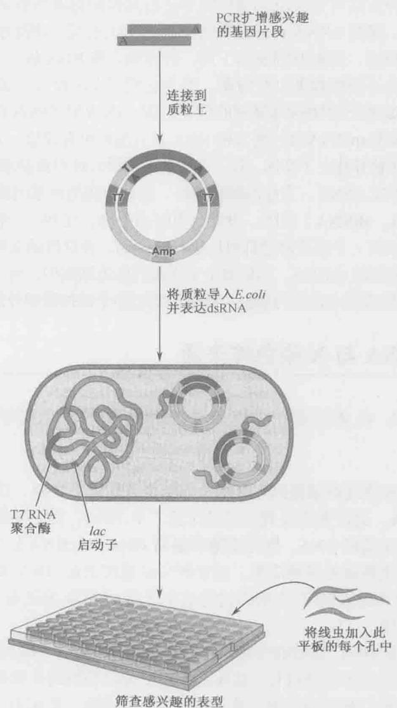  
图 20-20 线虫的 RNA 干扰（RNA interference）可通过喂养表达双链 RNA 的细菌来诱导。本图开始的几个步骤所需要的分子操作的细节请参见第 7 章。质粒的双链 RNA 表达受启动子的控制，识别这一启动子的不是 E.coli 的 RNA 聚合酶，而是噬菌体 T7 中的一个单亚基的 RNA 聚合酶。在细胞中人工表达这个聚合酶的基因是由乳糖启动子（lac）控制的（第 18 章）。因此，双链 RNA 的形成可运用 lac 启动子诱导物进行控制。

显而易见，这种方法对在哺乳动物细胞中进行基因筛选非常有帮助，而这是传统的遗传筛选做不到的。现在 siRNA 已经能够在试管中人工合成，并能导入哺乳动物的培养细胞中引发 RNAi 反应，使靶基因表达下调，但转染（将 RNA 转入细胞）的效率很低。较长的双链 RNA 分子使用起来也有问题，因为它们引发的反应会关闭细胞中所有的翻译。这个反应机制起源于封闭病毒复制的演化过程，因为很多病毒有 RNA 基因组。

研究者发现，模拟 miRNA 要比将双链 RNA 转入细胞更有成效。为此，短基因以合成的寡核苷酸克隆进质粒并建立了文库。每一个短基因被设计成可折叠成茎环结构的转录物。它们被 Dicer 加工形成 siRNA，直接沉默靶基因。这种合成的短基因被称为“短发夹 RNA”（short hairpin RNA, shRNA）基因。设计恰当的 shRNA，任何一个靶基因都可以研究；使用合适的文库，任何一个遗传筛选都可以进行。例如，在这样的文库中，每个质粒都编码一个作用于不同基因的 shRNA，然后整个文库都转染进细胞中，每个细胞都接受了一个不同 shRNA。通过筛选特定表型的细胞，就可以鉴定那个被抑制即导致该表型的靶基因。

## 长链非编码 RNA 与 X 染色体失活

长链非编码 RNA 在基因调控中起着多方面的作用，包括顺式和反式对转录的影响

近年来，科学家通过高通量测序技术（如第7章所述）发现，在动植物细胞中存在大量的非编码RNA。到目前为止我们已经讨论了小RNA，但是还有一类长度超过200个核苷酸的蛋白质非编码RNA，称为长链非编码RNA（lncRNA）。它们具有调节转录、转录后加工和蛋白质翻译等多种作用。近来研究最透彻的是RNA Xist在调节哺乳动物体X染色体失活中发挥的作用。在我们讨论这个之前，我们认为还有一些其他的lncRNA在发育过程中起作用。

关于 lncRNA 是如何广泛存在于细胞中有很多争论。如刚才提到的，大多数 lncRNA 是通过高通量测序的方法检测到的，这种方法甚至可以检测到非常稀有类型。因此对于这种缺乏直接性实验而得出的生物学意义必须要非常谨慎。然而有一些特定的 lncRNA（Xist 除外）已经清楚地表明具有特定的调控功能，以下是我们考虑到的。

HOTAIR 是在人类 HoxC 簇基因中的一种 lncRNA, 但是它能够通过募集多梳蛋白抑制性复合物 2（PRC2，详见第 19 章）到位于另一个染色体上的 HoxD 基因位点，从而反式调节该基因的表达水平。PRC2 向组蛋白 H3 的 27 位赖氨酸残基加入三甲基基团修饰，该修饰标记（H3K27me3）常常与基因的表达抑制相关（见图 19-29）。HOTAIR 同时也会募集第二个复合物，该复合体能去除与基因活化特异相关的组蛋白修饰。这两个蛋白复合物与 HOTAIR RNA 分子的不同区域结合并推测通过第三个特异区域来靶向 HoxD 某特定位点。除与发育分化相关外，HOTAIR 也被发现在某些肿瘤中高表达。敲除 HOTAIR 的 PRC2 结合区域将同时破坏其在发育分化和肿瘤中的调节作用。虽然这提示了 HOTAIR 扮演的重要生物学角色，但是有趣的是其在小鼠中的保守度很差，而且敲除后也没有观测到任何表型改变。这很可能提示其在哺乳动物中的演化速度非常快。

其他的一些 lncRNA 并非通过反式，而是通过顺式来进行调节。常见的例子有 Xist。而与该印记过程相关的还包括其他类型的 RNA，关于印记的内容将会在第 19 章（见图 19-31）中进行讨论。其中涉及的 Igf2/H19 位点同样包含了一个转录单元能制造 lncRNA AIR。AIR 为自我印记，并且只在亲本等位基因中表达。其表达需要抑制其所在的亲本染色体上的几个被印记的基因。而且，其 RNA 有时也会与染色体相关，通过募集三甲基化的组蛋白 H3K3，导致这些被靶向的启动子对应的转录活动被抑制。

## X 染色体失活产生镶嵌个体

现在我们详细地讨论一下被称为 Xist 的 lncRNA 及 X 染色体失活的过程。雌性哺乳动物有两条 X 染色体，而雄性则有一条 X 和一条 Y 染色体。虽然这是性别决定的基础并使雌雄有别，但这依然带来了麻烦：假如不加检测，雌性 X 染色体编码基因的水平将是雄性的两倍。这一不平衡的表达将有可能破坏代谢和细胞过程。为了避免这一问题，需要一种剂量补偿（dosage compensation）的机制。在哺乳动物中，雌性通过灭活（inactivating）其中一条染色体基因的表达来达到这一目的，那条染色体上的基因因而差不多没有一个能够表达。在胎生哺乳动物发育过程中，灭活发生于 32 到 64 细胞期。这个时候，在每一细胞中，究竟哪条 X 染色体灭活，母源的或是父源的，其选择显然是随机的。每个细胞一旦选择了灭活的 X 染色体，这个细胞产生出来的所有后代都将维持相同的拷贝。

各个细胞中 X 染色体灭活的随机性导致的后果是雌性都是镶嵌体（mosaic）。一些细胞中表达父本的 X 染色体，而另外一些细胞则表达母本的 X 染色体。通常来说，这

是无关要紧的,尽管这可能影响 X-连锁疾病综合征的严重程度。这一程度依赖于表达或沉默突变基因的细胞的比例。一个广为人知的例子是玳瑁猫（calico cat）（图 20-21）。猫的 X 染色体上的一个基因影响毛色是橙色的或是黑色的。一个等位基因决定毛色为橙色，而另外一个等位基因决定毛色为黑色。杂合子的猫显示不同的橙黑斑块毛色，说明该处的细胞那一条 X 染色体被灭活。这一现象也解释了为什么所有的 calico 猫都是雌性的。白色皮毛则决定于一个常染色体的基因。

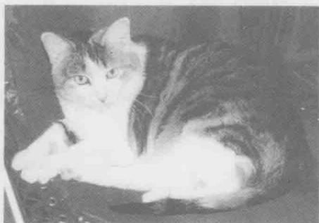  
图 20-21 X 染色体灭活的实例观察——玳瑁猫。如文中所述，橙黑斑块的毛色间接显示了 X 染色体的灭活。（VG 惠赠.）

## Xist 是雌性哺乳动物中灭活一条 X 染色体的长链非编码 RNA

X染色体是如何灭活的？灭活又是如何在发育过程中遗传下去的？启动灭活的RNA分子称为Xist。Xist是由一个对X染色体灭活至关重要的位点——X染色体灭活中心（X-inactivation center，Xic）编码的。Xist包被在表达该基因的X染色体，如图20-22a中的原位杂交所示。到底是什么原因致使包被发生，为什么包被仅限于一条X染色体，即为什么仅以顺式（cis）起作用？然而，已知灭活的关键是Xist的作用，而且不需要Xic之外的别的X染色体序列。当Xist异位表达于一个常染色体位点的时候（如一个非性染色体），Xist能够在不同的程度上沉默这条染色体上的基因，也就是“灭活”表达它的那条常染色体。

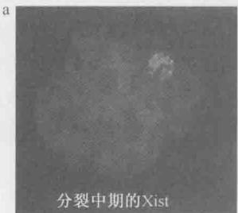

  
图 20-22 X 染色体灭活的实例观察：分子标记。（a）中期细胞的原位杂交显示灭活的 X 染色体上 Xist RNA 的定位。（b）染色体染色以显示组蛋白 H4 乙酰化。箭头所指为灭活的 X 染色体，其乙酰化修饰水平要比其他染色体低得多。（经许可复制自 Brockdorff N. and Turner B.M. 2007. Epigenetics [ed. Allis et al.], p.327. ©Cold Spring Harbor Laboratory Press）

Xist RNA 本身并不能引发沉默，但它聚集了其他修饰和浓缩染色质的因子（PRC2 等），这些因子也可能使 DNA 甲基化（第 19 章中其他基因沉默的例子）。然后，一种罕见的组蛋白变体 MacroH2A 积累，这通常与沉默染色质密切相关。正是这些修饰引发了沉默并保证了沉默的遗传。这些修饰一旦确立，Xist 本身就不再需要了。图 20-22b 显示灭活的 X 染色体组不同的蛋白质修饰。在这里，与基因组其他部分相比，这条灭活的 X 染色体的乙酰化程度要低很多。我们在前几章（第 8 章和第 19 章）中看到，去乙酰化的组蛋白与基因组中不转录的区域相关。

细胞是如何选择将哪个 X 染色体灭活呢？这一答案现在还不清楚。但另一个调控 RNA 可能是关键。这个 RNA 也是由 Xic 位点编码的，但它在另一条 DNA 链上并与 Xist 基因重叠。它被称为 Tsix（将 Xist 反过来拼写），起负调控 Xist 的作用（图 20-23）。事实上，如果某一条 X 染色体上的 Tsix 发生了突变，这条染色体将被选为灭活的染色体。因此，Xist 和 Tsix 生成和稳定的平衡将在每一个细胞中导致这样或那样的结果。

  
图 20-23 Tsix 对抗 Xist 的表达和作用。Tsix（图中浅蓝色所示）是由 Xist（图中深蓝色所示）的反义 RNA 表达的，Tsix 比 Xist 长。重叠区域如图中深蓝色所示。Xite 和 DxPas34（Dx）都是控制基因表达的调控因子。开始的时候，Xist 和 Tsix 都由各自的 X 染色体表达，随后失活的染色体会使 Xist 的表达增加，然而活性染色体却会使 Xist 的表达降低。Tsix 是如何调控 Xist 水平的仍然不是很清楚，但是如果将 Tsix 从染色体中删除，其拷贝也能够失活。

与哺乳动物一样，剂量补偿在所有动物中都是必需的，例如线虫和果蝇。但在不同的情况下，补偿的机制是不同的。例如，在果蝇中，剂量补偿是通过增强雄性的X染色体连锁定基因的表达（而不是降低雌性的表达）来实现的。但是在这里，非编码的调控RNA也参与了这一机制。在这个过程中，RNA（称为roX1和roX2）参与将染色质修饰结合体聚集到雄性X染色体上的基因而帮助激活转录。

## 小结

尽管早在 1961 年便已提出 RNA 分子有可能是基因调控因子，但直到近几年，RNA 作为调控因子的普遍存在和重要作用才被阐明。在这之前，只有 E.coli 的色氨酸操纵子（trp operon）的衰减作用这一个罕见的例子。在那个例子中，已知 mRNA 的 5' 区 RNA 序列调控下游基因的表达，这个 RNA 区域中另一种方式的分子内碱基配对形成的另一种不同的二级结构，对基因产生不同的影响。一种构象中，在进入下游基因的编码区之前转录就被终止；而在另一种构象中，转录能够继续，基因能够表达。

核糖开关调控基因的机制与此相似：基因的 5'-UTR 结构的不同决定这些基因是否转录（或者在一些情况下，决定翻译是否启动）。在核糖开关的作用下，选择哪一种二级结构取决于它与控制那个基因的 RNA 配体的直接结合。

E.coli 中编码以反式作用调控基因的小 RNA（称为 sRNA）。这些 sRNA 是由小基因编码的，与 mRNA 的互补序列形成碱基配对。这种情形要么抑制这些靶 mRNA 的翻译，导致它们的降解，要么在某些情况下促进它们的翻译。细菌小 RNA 的作用在很多方面与真核细胞中调控基因的小 RNA 相似，尽管真核生物生成调控 RNA 的机制和它们对靶基因产生影响的机制与细菌的很不一样。

与真核生物中最接近的是细菌中的规律成簇的间隔短回文重复（CRISPR）系统。成簇的特异重复 DNA 序列（每个簇不同）产生了一种特殊的小 RNA 指导蛋白质合成，从而破坏感染的噬菌体和质粒，事实上还包括进入细胞的其他的外源性 DNA。这种能够识别“非我”的能力来源于 CRISPR 区域积累了之前感染时噬菌体基因组的片段，这些片段决定了靶向 RNA 的序列。

在真核生物中与 CRISPR 最类似的是 piRNA 簇。这些区域包含有转座子片段（有时称为“转座子坟墓”）。小的 piRNA 产生于基因组中沉默同源转座子区域，尤其是在生殖细胞中，确保它们保持失活状态。siRNA 和 miRNA 是真核生物中发现的另外两种调控小 RNA。与 piRNA 不同，siRNA 和 miRNA 是在 Dicer 酶的作用下产生于双链 RNA 区域。siRNA 是由内源的或外源的双链 RNA 直接生成的。miRNA 由基因组编码，首先被 Drosha 酶识别加工后，再被 Dicer 酶剪切产生。这两种调控 RNA 通常经 Dicer 酶加工后的长度为 19\~25nt。Drosha 酶和 Dicer 酶有 RNase 酶功能域，根据底物的大小和结构进行剪切，并不是根据序列。

siRNA 和 mRNA 一旦形成，其功能在本质上是相同的。它们被整合进称为 RISC 的机器中，其中一条 RNA 链被选作“向导 RNA”，指导成熟的 RISC 与靶 RNA 互补的向导 RNA 结合。一旦结合，RISC 要么沉默 RNA（通过催化含有 RNase 相关结构域的底物 Argonaute），要么抑制 mRNA 的翻译。选择哪种方式的沉默基本上取决于向导 RNA

Baulcombe D. 2005. RNA silencing. Trends Biochem. Sci. 30: 290–293.
Czech B. and Hannon G. J. 2011. Small RNA sorting: Matchmaking for Argonautes. Nat. Rev. Genet. 12: 19–31.

和靶 RNA 的碱基配对的程度——配对越好，越有可能引发沉默。向导 RNA 也可以指导 RISC 的相关组蛋白修饰复合体与启动子区相结合，通过修饰启动子而在转录水平上沉默基因。即使在这些情况下，与启动子相结合也很有可能是通过向导 RNA 与 mRNA 的碱基配对达到的，但在这个例子中，RNA 仍然形成，因此与这个基因上的 RNA 聚合酶 II 有关。

miRNA 是由生物体内的基因编码的，在发育过程中它们起基因调控的作用，这在线虫和植物中已有研究得很好的例子。miRNA 也与癌症相关，有些 miRNA 被归类为抑癌基因，有的被归类为致癌基因。形成 siRNA 的双链 RNA 来源不一，它们既可能来自侵染的病毒，也可能来自重复区域的转录（着丝粒或转座子），或是有意导入到细胞中的（在希望下调特定基因表达的实验中）。RNAi 的使用已成为常规工具，在传统遗传学不起作用的系统中特别有意义。

动物和植物细胞中也有长片段调控 RNA（200nt 或者更长）。它们在发育过程中发挥着一定的作用。在 HOTAIR 和 AIR 的例子中，尽管并不了解它们详尽的作用机制，但是它们似乎能够与蛋白复合物结合改变所调控基因附近的核染色质。一些长片段调控 RNA 属于顺式调节，其他的是反式调节。反式调节的最好的例子是 Xist，它能够引起哺乳动物 X 染色体的失活。雌性动物有两条 X 染色体，而雄性动物只有一条 X 染色体（和一条 Y 染色体）。为了保证两种性别产生大致相同数量的 X 染色体基因产物，这种不等的染色体数量必须由剂量补偿的机制来纠正。哺乳动物通过在雌性中灭活其中一条 X 染色体而实现剂量补偿。X 染色体编码的一种 RNA 分子（Xist）调控这一过程。

## 参考文献

## 书籍

Stillman B. and Stewart D., eds. 2006. Regulatory RNAs. Cold Spring Harbor Symposia on Quantitative Biology, Vol. 71. Cold Spring Harbor Laboratory Press, Cold Spring Harbor, New York.

## 细菌小RNA

Gottesman S. and Storz G. 2011. Bacterial small RNA regulators: Versatile roles and rapidly evolving variations. Cold Spring Harb. Perspect. Biol. 3: a003798.

Storz G., Vogel J., and Wassarman K.M. 2011. Regulation by small RNAs in bacteria: Expanding frontiers. Mol. Cell 43: 880–891.

Waters L.S. and Storz G. 2009. Regulatory RNAs in bacteria. Cell 136:615–628.

## 核糖开关和衰减作用

Bastet L., Dubé A., Massé E., and Lafontaine D. A. 2011. New insights into riboswitch regulation mechanisms. Mol. Microbiol. 80: 1148–1154.

Breaker R. R. 2011. Prospects for riboswitch discovery and analysis. Mol. Cell 43: 867–879.

Gollnick P., Babitzke P., Antson A., and Yanofsky C. 2005. Complexity in regulation of tryptophan biosynthesis in Bacillus subtilis. Annu. Rev. Genet. 39: 47–68.

Winkler W.C. 2005. Riboswitches and the role of noncoding RNAs in bacterial metabolic control. Curr. Opin. Chem. Biol. 9: 594–602.

Winkler W.C. and Breaker R.R. 2005. Regulation of bacterial gene expression by riboswitches. Annu. Rev. Microbiol. 59: 487–517.

Yanofsy C. 2000. Transcription attenuation: Once viewed as a novel regulatory strategy. J. Bacteriol. 182: 1–8.

## CRISPR

Bhaya D., Davison M., and Barrangou R. 2011. CRISPR-Cas systems in bacteria and archaea: Versatile small RNAs for adaptive defense and regulation. Annu. Rev. Genet. 45: 273–297.

Karginov F.V. and Hannon G.J. 2010. The CRISPR system: Small RNA-guided defense in bacteria and archaea. Mol. Cell 37: 7–19.

Jore M.M., Brouns S.J.J., and van der Oost J. 2012. RNA in defense: CRISPRs protect prokaryotes against mobile genetic elements. Cold Spring Harb. Perspect. Biol. 4: a003657.

Wiedenheft B., Sternberg S.H., and Doudna J.A. 2012. RNA-guided genetic silencing systems in bacteria and archaea. Nature 482: 331–338.

## RNAi 的机制

Farazi T.A., Juranek S.A., and Tuschl T. 2008. The growing catalog of

small RNAs and their association with distinct Argonaute/Piwi family members. Development 135: 1201–1214.

Joshua-Tor L. and Hannon G.J. 2011. Ancestral roles of small RNAs: An Ago-centric perspective. Cold Spring Harb. Perspect. Biol. 3: a003772.

Liu Q. and Paroo Z. 2010. Biochemical principles of small RNA pathways. Annu. Rev. Biochem. 79: 295–319.

Molnar A., Melnyk C., and Baulcombe D. C. 2011. Silencing signals in plants: A long journey for small RNAs. Genome Biol. 12: 215.

Peters L. and Meister G. 2007. Argonaute proteins: Mediators of RNA silencing. Mol. Cell 26: 611–623.

Tolia N.H. and Joshua-Tor L. 2007. Slicer and the Argonautes. Nat. Chem Biol. 3: 36–43.

Volpe T. and Martienssen R. A. 2011. RNA interference and heterochromatin assembly. Cold Spring Harb. Perspect. Biol. 3: a003731.

Zaratiegui M., Irvine D.V., and Martienssen R.A. 2007. Noncoding RNAs and gene silencing. Cell 128: 763–776.

## siRNA、miRNA 以及 piRNA

Ambros V, 2011. MicroRNAs and developmental timing. Curr. Opin. Genet. Dev. 21: 511–517.

Banisch T.U., Goudarzi M., and Raz E. 2012. Small RNAs in germ cell development. Curr. Top. Dev. Biol. 99: 79–113.

Bushati N. and Cohen S.M. 2007. microRNA functions. Annu. Rev. Cell Dev. Biol. 23: 175–205.

Ebert M.S. and Sharp P.A. 2012. Roles for microRNAs in conferring robustness to biological processes. Cell 149: 515–524.

Esteller M. 2011. Non-coding RNAs in human disease. Nat. Rev. Genet. 12: 861–874.

Fabian M.R. and Sonenberg N. 2012. The mechanics of miRNA-mediated

gene silencing: A look under the hood of miRISC. Nat. Struct. Mol. Biol. 19: 586–593.

Malone C.D. and Hannon G.J. 2009. Small RNAs as guardians of the genome. Cell 136: 656–668.

Ruvkun G. 2008. The perfect storm of tiny RNAs. Nat. Med. 14: 1041–1045.

## 长非编码 RNA

Alexander M.K. and Panning B. 2005. Counting chromosomes: Not as easy as 1, 2, 3. Curr. Biol. 15: R834–R836.

Augui S., Nora E.P., and Heard E. 2011. Regulation of X-chromosome inactivation by the X-inactivation centre. Nat. Rev. Genet. 12: 429–442.

Brockdorff N. 2011. Chromosome silencing mechanisms in X-chromosome inactivation: Unknown unknowns. Development 138: 5057–5065.

Deng X. and Meller V.K. 2006. Non-coding RNA in fly dosage compensation. Trends Biochem. Sci. 31: 526–532.

## 习题

Lee J.T. 2011. Gracefully ageing at 50, X-chromosome inactivation becomes a paradigm for RNA and chromatin control. Nat. Rev. Mol. Cell Biol. 12: 815–826.

Ng K., Pullirsch D., Leeb M., and Wutz A. 2006. Xist and the order of silencing. EMBO Rep. 8: 34–39.

Pauler F.M., Koerner M.V., and Barlow D.P. 2007. Silencing by imprinted noncoding RNAs: Is transcription the answer? Trends Genet. 23:284–292.

Ponting C.P., Oliver P.L., and Reik W. 2009. Evolution and functions of long noncoding RNAs. Cell 136: 629–641.

Rinn J.L. and Chang H.Y. 2012. Genome regulation by long noncoding RNAs. Annu. Rev. Biochem. 81: 145–166.

课程和问题参见《基础生物学》（Mastering Biology）

## 偶数习题的答案请参见附录2。

习题 1 以细菌为例，试述在顺式和反式中调控 RNA 的作用。

习题 2 预测在 E.coli 细胞中，低水平的色氨酸存在下，trp 操纵基因的转录水平（低或高）。

习题 3 请描述细菌基因如何通过核糖开关来对代谢物如 S-腺苷甲硫氨酸（S-adenosylmethionine，SAM）做出反应。

习题4 除了基因表达的调控，在原核及古生菌中发现的调控RNA还有什么作用？

习题 5 大致描述一下真核生物中的小 RNA（siRNA，miRNA 及 piRNA）沉默表达的三种机制。

习题 6 miRNA 的起源及产生与 siRNA 有何不同?

习题 7 列出 miRNA 产生及如何使基因沉默的步骤，并标明每一步所涉及的酶。

习题8 判断正误：前体miRNA仅存在于内含子中，解释原因。

# 第21章 发育和演化的基因调控

## 本章概要

三种指导发育中的细胞表达特定基因组合的策略

三种确定基因差异表达策略的例证

果蝇胚胎发育的分子生物学

同源异型基因：一类重要的发育调节因子
基因组演化和人类起源

动物的发育依赖于恒定基因组的差异化表达,从而在胚胎发育过程中产生多种多样的细胞类型。一个典型的动物基因组大概有2万多个基因。无论是简单的生物的线虫,还是在动物演化的最高点的人类,都是如此。

基因的差异化表达可以被定义为胚胎中无数细胞群中蛋白质的合成(或者是非编码基因中 RNA 的合成)。差异化表达常常取决于转录的特异性。因此，球蛋白基因在发育的红细胞中选择性地表达，而在其他组织中却不会。这是因为球蛋白基因只有在红细胞中才被转录。但是，也有转录后再差异化表

达基因的例子。例如，在果蝇胚胎的早期发育中，分节基因的 mRNA 可以全部被转录，但是只有在前面的头部和胸部才能被继续翻译成功能蛋白，在后面的腹部则没有功能蛋白产生。

那么我们如何知道一个恒定基因组的差异化表达是动物发育的关键呢？古往今来所有的研究都表明不同的细胞类型都有着相同的基因组。第一个确凿的证据是20世纪60年代和70年代爪蟾蜍的克隆。这种研究在成年青蛙中用消化道细胞的细胞核取代卵核。消化道细胞核能够继续维持胚胎的发育，形成蝌蚪，最后变形为成年青蛙。这个青蛙可以被认为是提供消化道细胞的青蛙的“克隆”，因为他们的基因型是一致的。后来90年代和21世纪初的研究将其克隆技术扩展到羊上（多莉），现在从理论上来说，克隆大多数动物都是有可能的。

证明在动物不同组织中基因是相同的最著名的研究是将任何类型的细胞转化成为多功能干细胞iPS。在大多数哺乳动物胚胎中，包括胎儿，有一团细胞叫内细胞团（ICM），能够形成成年的所有组织和器官。内细胞团细胞被认为是具有多能性（pluripotent）的，因为它们能够产生很多不同的细胞类型。内细胞团细胞的形成依赖于三种特异的转录因子的作用——Oct4、Sox2和Nanog。在一个已经分化的细胞（如成纤维细胞）中强制表达这三种因子，就可以诱导其变成拥有内细胞团细胞特性的多功能干细胞（见框21-1“多功能干细胞的形成”)。实际上，多功能干细胞 iPS 可以被用于代替胚胎中的内细胞团，发育为成年鼠的全部组织。

## 框 21-1 多功能干细胞（iPS cell）的形成

哺乳动物的内细胞团细胞经过多种多样途径的分化，形成成年动物的所有组织和器官。在21世纪初，当干细胞在生物医学研究中掀起一番热潮的时候，内细胞团细胞的分离被认为是将干细胞运用于再生治疗的限速步骤。例如，胰岛素依赖性糖尿病患者中缺乏β细胞，这种胰腺中产生的分泌细胞能够对饭后的血糖升高做出应答，分泌胰岛素。人们希望有朝一日能够在实验室中利用干细胞培养β细胞来取代体内的β细胞。然而，从胎儿中分离内细胞团细胞面临技术和伦理的巨大的挑战，直到2006年由Takahashi和Yamanaka主导的一系列卓越的实验消除了这种变得白热化、政治化的论战。Yamanaka是一名博士后，确定了一种在内细胞团细胞中选择性表达的基因。他在这个基因中插入lacZ基因，把它作为一个识别小鼠成纤维细胞向干细胞[这些转变后的细胞被称为诱导多功能干细胞，induced pluripotent stem（iPS）cell]转化的分子标记。这个标记基因不会在成纤维细胞中表达，只有在细胞转化成诱导多功能干细胞的时候才被激活。多个研究小组已经在培养的内细胞团干细胞中鉴定出30种不同的转录因子，Takahashi和Yamanaka在成纤维细胞中表达这些不同的转录因子，诱导了lacZ标记基因的表达。随后他们将转录因子合并成不同组合共同表达，发现Oct4、Sox2和Nanog三种因子能够特别有效地将成纤维细胞重编程为多功能干细胞。这些改造后的细胞拥有真正的内细胞团细胞的全部或大多数的特性。这种多功能干细胞可以被诱导生成任何类型的细胞，如心肌细胞。在更加深入的实验中，Yamanaka和他的同事将iPS细胞注入胚胎中，获得了成年小鼠。框21-1图1的结果显示，与多功能干细胞相关的性状传递到了子代种系中。

不同的成熟组织能够转化成多功能干细胞，转而被诱导形成任意组织的能力，是遗传物质均等的明证。这些研究也显示了“置换医学”的可能性，即患者的皮肤成纤维细胞可以被用来生成多功能干细胞，随后引导其生成致病的缺失的组织，如为帕金森病患者重新生成多巴胺神经元或者为糖尿病患者生成β细胞。因为发现了分化的动物细胞能够重编程为任何组织，Gurdon和Yamanaka于2012年获得了诺贝尔生理学或医学奖。

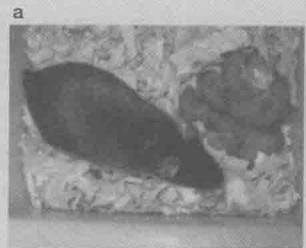

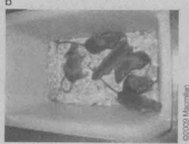  
框 21-1 图 1 多功能干细胞的发育潜力。(a) 来源于一个黑色的老鼠的重编程的多功能干细胞，被注射到一个白色的母老鼠的囊胚中，产生了一个黑色的雄性成年老鼠。旁边是它与一只白色的雌性老鼠繁殖的后代。(b) 对照组的新生老鼠已经长大成棕色的幼年老鼠，显示出传统的黑色雄性老鼠和白色雌性老鼠杂交的结果。(来源：Zhao X.Y. et al. 2009.Nature 461:86. ©Macmillan.a and b are Fig. 2f and 2g, respectively.)

<!-- END OFFICIAL API PART part_008 -->


<!-- BEGIN OFFICIAL API PART part_009 -->

在本章中,我们将讨论在动物发育过程中实现基因差异表达的机制。本章的前半部分,我们将讲述在发育过程中细胞是如何进行相互交流,以确保正常发育所需要的每一组基因的表达。随后我们会讲述有关这方面细胞策略的例子。在本章的下一个部分,我们将讲述这些策略是怎样与第19章的转录调控机制结合,共同控制整个有机体的发育(以果蝇为例)。在本章的最后一个部分,我们会讨论在演化过程中基因调控的改变是如何引起动物形态多样性的。我们会讲述一类特别重要的发育控制基因——同源异型基因。

## 三种指导细胞在发育过程中表达不同的基因组合的不同的策略

我们已经看到基因表达是如何受到细胞从环境接收的信号的调节的。例如，乳糖在大肠杆菌中活化乳糖操纵子，病毒感染在哺乳动物中激活β-干扰素的表达。本章将集中描述使遗传背景相同的细胞表达不同的基因进而分化为不同的细胞类型的策略。三种主要策略是：mRNA定位（mRNA localization）、细胞-细胞接触（cell-to-cell contact）及分泌信号分子扩散传导（signaling through the diffusion of a secreted signaling molecule）（图21-1）。每种策略简述如下。

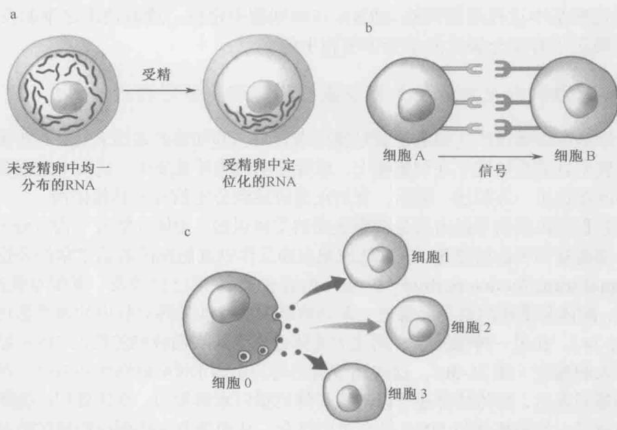  
图 21-1 发育过程中启动差异基因活性的三种策略。(a) 在某些动物中, 卵细胞的部分母系 RNA 在受精前后定位化。在这个例子中, 特定的 RNA (绿线所示) 定位于卵细胞的植物极 (底部)。(b) 细胞 A 必须与细胞 B 相互作用并激活细胞 B 表面的受体。这是因为细胞 A 的配体“系”在了细胞膜上。(c) 在这个细胞长距离传导的例子中细胞 0 分泌信号分子并扩散至胞外基质。不同的细胞 (1、2、3) 接收这些信号并最终导致基因活性的改变。

信使 RNA 通过细胞骨架内极性在卵细胞和胚胎中定位。

一种使两个相同遗传背景的细胞具有不同特性的策略是在细胞分裂过程中不等量地分配关键的调节分子，使子细胞得到不同量的调节分子从而经历不同的发育过程。通常这种非对称分布的分子是 mRNA。这些 mRNA 为 RNA 结合蛋白和信号转导分子编码，更为常见的是编码转录活化子和抑制子。尽管这些蛋白质产物的功能多种多样，但 mRNA 的定位具有共同机制。通常，它们沿着细胞骨架元件、肌动蛋白或微管蛋白运输。在这种方式中，mRNA 分布的非对称性来自于这些元件内在的非对称性。

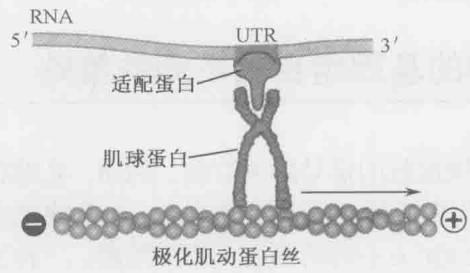  
图 21-2 适配蛋白与 mRNA 3'-端非翻译区（3'-UTR）的特定序列结合。适配蛋白还与肌球蛋白结合，后者沿着肌动蛋白丝定向由负端向延伸中的正端移动。

肌动蛋白和微管蛋白具有内在的极性，表现为正端的定向生长（图 21-2）。mRNA 可经由结合其 3' 端非翻译区（3'-untranslated trailer, 3'-UTR）的特定序列的适配蛋白（adapter protein）从细胞的一端转运到另一端。适配蛋白包含两个结构域，其一结合 mRNA 的 3'-UTR，另一个结合细胞骨架的特定组分，如肌球蛋白。依据适配蛋白的不同，mRNA-衔接蛋白复合物或在肌动蛋白上蠕动，或随肌球蛋白生长而移动。以下我们

将会看到这些基本过程是如何使 mRNA 在卵细胞中定位，或者使决定细胞发育命运的决定子限定于有丝分裂后的单个子细胞中的。

## 细胞-细胞接触和分泌信号分子都会激发相邻细胞基因表达的变化

一个细胞可以通过产生细胞外信号蛋白来影响相邻细胞的基因表达，这些蛋白质在第一个细胞中合成后被置于在细胞膜上，或者分泌到胞外基质中。这两个过程具有共同特点，因此在这里一并叙述。随后，我们还会讲述到分泌信号的其他作用。

两种过程发出的信号经由接受细胞表面的受体识别。受体在结合了信号分子后，启动接受者细胞基因表达的变化。这种从细胞表面受体到细胞核的通信常常涉及信号转导途径（signal transduction pathway）。这一内容在第19章已经涉及，其要点概述如下。

有时，配体和受体的结合会触发一系列酶级联反应并最终对核内的调节蛋白进行修饰（图 21-3a）。在另一种情况下，活化的受体造成细胞表面或细胞质的 DNA 结合蛋白释放并进入细胞核（图 21-3b）。这些调节蛋白与特定的 DNA 识别序列结合，然后活化或者抑制基因表达，配体结合还可以造成受体的蛋白水解剪切。受体剪切后胞质部分从细胞膜释放进入细胞核并与 DNA 结合蛋白结合，从而调节这些蛋白质相关的基因转录（图 21-3c）。例如，这些被转运的蛋白质可以将转录抑制子转变为转录活化子，这样，此前被抑制的基因就被激活了，我们将在本章给出相应的例证。

在细胞表面的信号分子只控制那些与其有直接的、物理接触的细胞的基因表达。我们将这类过程归为细胞-细胞接触。反之，分泌于胞外基质的信号分子可以通过长距离发挥作用，有些通过1\~2个细胞半径的距离，还有一些则可以与50个或更多个细胞相互作用。长距离信号分子有时对位置效应有作用，这将在下一节讲到。

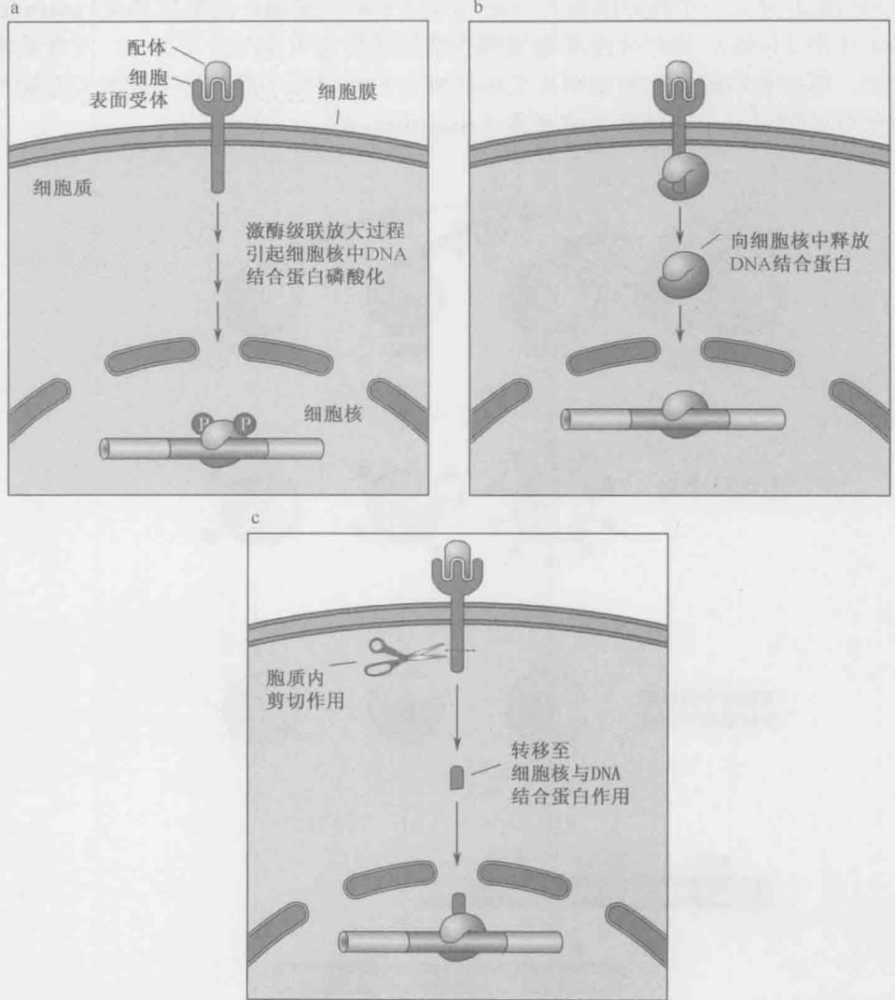  
图 21-3 信号传导的不同机制。配体（或称信号分子）与细胞表面受体结合。（a）活化的受体诱发潜伏的细胞激酶并最终造成细胞核内 DNA 结合蛋白的磷酸化。磷酸化造成调节蛋白活化或者抑制特定基因的转录。（b）活化的受体使细胞质中休眠的 DNA 结合蛋白得到释放并进入细胞核，在细胞核内调节蛋白活化或者抑制特定基因的转录。（c）活化的受体受到细胞质中蛋白水解酶的剪切，使受体 C 端部分进入细胞核与特定的调节蛋白反应。产生的蛋白质复合体活化特定基因的转录。

## 分泌信号分子梯度可以引导细胞遵循位置特异性的发育途径

细胞在胚胎中的位置对其发育分化的影响的重要性是发育生物学的主题之一。定位在果蝇胚胎前部［也就是前区（anterior region）］的细胞将形成成体果蝇的头部（如触角或脑），但不会长成后部（posterior）结构（如腹部或性器）。青蛙胚胎的顶部或背部（dorsal）表面会发育成蝌蚪或成年蛙的脊柱，但不会变成腹部组织（ventral），如胃。这些例子表明细胞的归宿受到它们在发育胚胎位置的限定，这种位置对发育带来的影响叫做位置信息（positional information）。

建立位置信息的最常见的方式涉及第 19 章所述策略的简单延伸，即对分泌信号分子的运用(图 21-4)。一小部分细胞的分泌信号分子形成细胞外的浓度梯度(extracellular gradient)(图 21-4a)。接近分泌细胞的那些细胞接受高浓度的分泌蛋白，发育成特定的细胞类型。那些相距较远的细胞则接受较低浓度的信号分子而经历不同的发育途径，控制位置信号的信号分子亦被称为成形素(morphogen)。

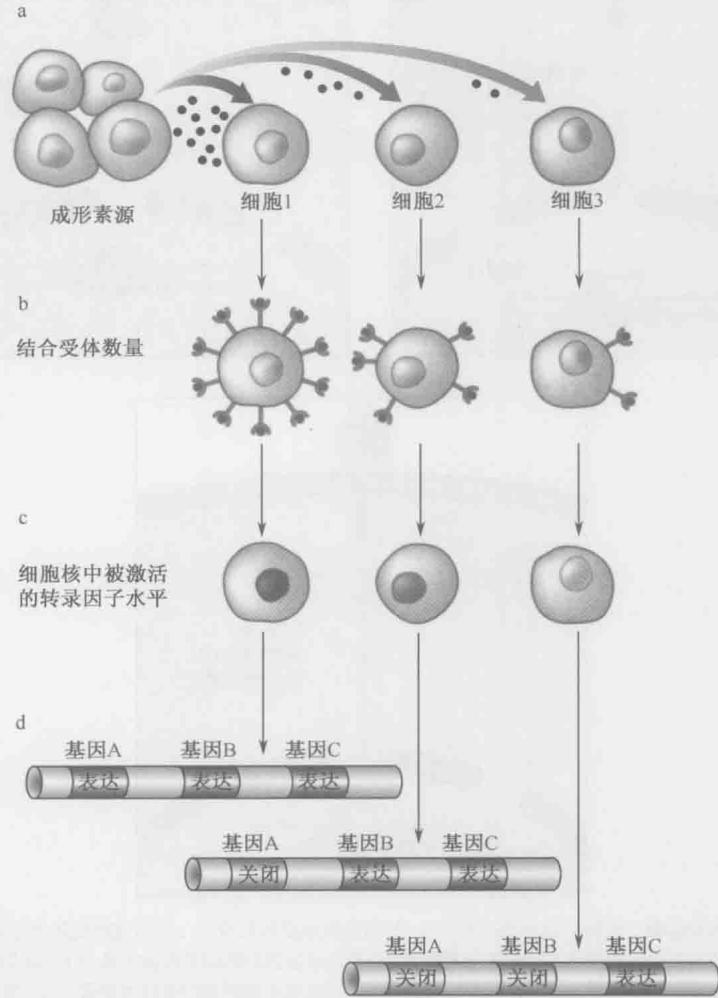  
图 21-4 一群细胞产生信号分子或成形素扩散至胞外基质。（a）细胞 1、2、3 由于离信号源的距离不同而接受不同程度的浓度信号分子。（b）细胞 1、2、3 拥有程度不同的活化的细胞表面受体。（c）3 种细胞含有一至多种含量不同的调节蛋白。简而言之，活化的细胞表面受体数量与进入细胞核的调节因子的量呈线性关系。（d）不同浓度的调节因子导致不同组的基因的表达。细胞 1 接受最高浓度调节因子，表达基因 A、B、C。细胞 2 接受中等浓度调节因子，表达基因 B、C，但不表达基因 A，因为这个浓度还不足以活化基因 A。最后，细胞 3 接受最低浓度的调节因子，只表达基因 C，而基因 A、B 的表达则需要更高浓度的调节因子。

位置接近成形素的细胞接受高浓度的信号分子,因而结合其表面的受体有着最高的活性;而远离信号源的细胞接受低浓度的信号分子,只有部分细胞表面的受体得到活化。假设有3个排成一列的细胞接近成型素的分泌原,第一个细胞有1000个受体得到活化,第二个细胞有500个受体活化,最后一个只有200个(图21-4b)。受体被占据数量的不同

直接导致相应细胞的基因差异表达。

如上所述，信号分子与细胞表面受体的结合以不同方式引发细胞核内特定的活化转录因子浓度的增加。每种受体控制特定的转录调节因子，进而控制特定基因的表达。成形素活化的细胞表面受体的数量决定了调节蛋白在核内出现的数量。最接近成形素原的细胞(有1000个活化的受体)将拥有高浓度的核转录活化因子（图21-4c）；相反，远离信号源的细胞只有中等或低浓度的转录活化因子。因而，细胞表面活化受体的数量与核内转录调节因子的量呈相关关系。那么，在不同细胞中，转录调节因子浓度的改变是如何调节不同的基因表达水平的呢？

在第 18 章中，我们学到了 $\lambda$ 抑制子水平的少量变化确定了受感染的细菌细胞是被溶解或者被溶源化。同样，成形素浓度的少量变化与伴随着的核内转录调节因子的变化确定了细胞的性质。具有高浓度特定转录调节因子的细胞可以表达多种在具有中浓度或者低浓度调节因子的细胞中失活的基因（图 21-4d）。由调节蛋白的浓度确定基因表达的差异调节是发育生物学中最重。

差异调节是发育生物学中最重要的、贯穿始终的机制。为此，本章将提供多个例子。

## 三种基因差异化表达的策略的例证

定位的 Ash1 阻遏蛋白通过沉默 HO 基因控制酵母交配类型

在叙述动物胚胎 mRNA 分布情况之前，先来看一种相对简单的单细胞真核生物——酵母的情形。酵母可以以出芽的方式以单倍体形式生长（图 21-5）。复制后的染色体分布于两个非对称的细胞中——较大的祖细胞/母细胞和小一点的芽/子细胞（图 21-5a）。这些细胞可以以两种交配型——a 型和 $\alpha$ 型存在，详见第 11 章和第 19 章。

母细胞和子细胞会表现出不同的交配型，这种差异来自于交配型转换(mating type switching)过程。母细胞在出芽后能转

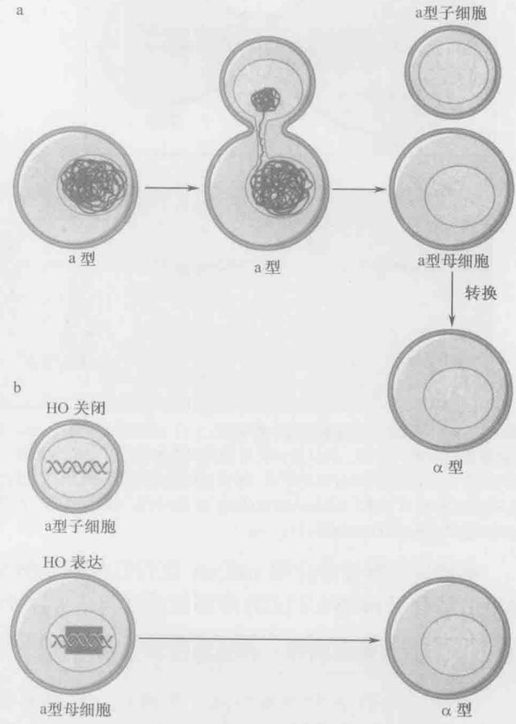  
图 21-5 单倍体酵母细胞交配型 a 经过出芽产生母细胞和较小的子细胞。（a）起始时，两个细胞都是交配型 a，但有时母细胞可以转换为 $\alpha$ 型。（b）子细胞由于 Ash1 转录抑制子的定位阻止了 HO 基因的表达而不能进行转换。母细胞则不然，由于缺少 Ash1 而可以表达 HO 基因。

换交配型，例如，a 细胞产生 a 子细胞，但随之就转换为 $\alpha$ 交配型（图 21-5b）。

转换过程由 HO 基因产物控制。从第 11 章我们得知，HO 蛋白是一种序列特异性内切酶。HO 蛋白通过断裂两个交配型沉默序列组件之一的双链来引发交配型位点的基因转换。在第 19 章我们也得知了 HO 蛋白是如何在母细胞中活化的。在子细胞中抑制子 Ash1 的选择性表达导致 HO 基因的不表达（图 21-6），这也是子细胞不能进行交配型转换的原因所在。ash1 基因在出芽前的母细胞中转录，但其编码 RNA 会通过以下过程定位于子细胞中。在出芽过程中，ash1 mRNA 附着在微管的生长端。多种蛋白质起到适配器的作用，同时结合 ash1 mRNA 的 3'-UTR 和微管。微管从母细胞的细胞核向出芽部位延伸，由此方式将 ash1 mRNA 转运至子细胞。在定位到子细胞后，ash1 mRNA 被翻译为抑制子蛋白，该蛋白质与 HO 基因结合并抑制其转录。HO 基因在子细胞的沉默阻止了子细胞交配型的转换。

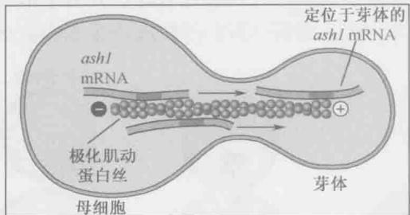

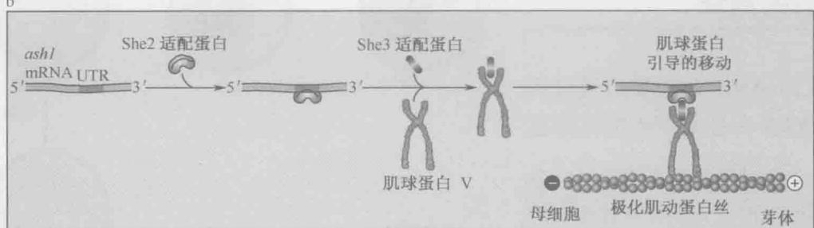  
图 21-6 ash1 mRNA 在出芽过程中的定位。(a) 在出芽过程中, ash1 基因于母细胞中转录。其编码 mRNA 通过带极性的肌动蛋白丝滑入芽体, 并从蛋白质丝的负端随着生长中的正端延伸。(b) ash1 mRNA 的转运依赖 She2 和 She3 适配蛋白对含 3'-UTR 的特殊序列的结合。这些适配蛋白结合肌球蛋白, 后者携带着 ash1 mRNA 在肌动蛋白上一起移动。(引自 Alberts B. et al. 2002. Molecular biology of the cell, 4th edition, p.971, f.16-84, part a. Reproduced by permission of Routledge/Taylor & FrancisBooks, Inc.)

本章后半部分会介绍 mRNA 定位在果蝇胚胎发育过程中的作用。同样，这种定位也是由结合于 mRNA 3'UTR 序列的适配蛋白来介导的（框 21-2）。

## 框 21-2 细胞骨架回顾：非对称性和生长性

细胞骨架由3种细丝构成：中间丝、肌动蛋白丝和微管。肌动蛋白丝和微管用于各种细胞（包括芽孢酵母和果蝇）的特异mRNA的定位。肌动蛋白丝由肌动蛋白聚合体构成。肌动蛋白聚合体由两条平行螺旋构成，螺旋每周为 $37\mathrm{nm}$ 。聚合体中的肌动蛋白单体同向排列，使肌动蛋白丝具有极性。正端较负端生长更快，因而待定位的mRNA沿生长中的正端移动（框21-2图1）。

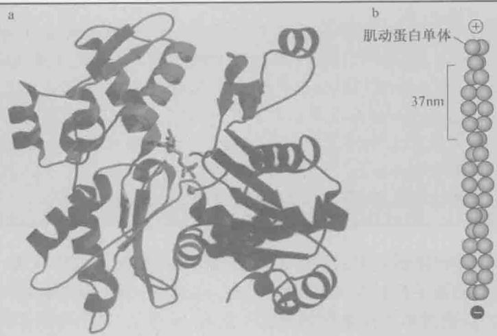  
框 21-2 图 1 肌动蛋白单体和肌动蛋白丝的结构。肌动蛋白单体的晶体结构。（a）肌动蛋白单体 4 个结构域以四种颜色代表，ATP 在中间（红色和黄色），肌动蛋白单体的负端在顶部，正端在底部。（Otterbein L.R., Graceffa P., and Dominguez R. 2001, Science 293: 708-711.）图像用 MolScript、BobScript 及 Raster 3D 软件制作。（b）肌动蛋白单体组装成单个螺旋构成肌动蛋白丝。

微管由 $\alpha$ 亚单位和 $\beta$ 亚单位构成的异二聚体微管蛋白的聚合物组成。微管蛋白异二聚体形成延展的、非对称的原丝（protofilament）。每个微管蛋白异二聚体在原丝中同向排列，13 条不同的原丝在一起平行排列形成柱状的微管。与肌动蛋白丝相似，微管也具有极性，其正端延展迅速而负端相对稳定（框 21-2 图 2）。

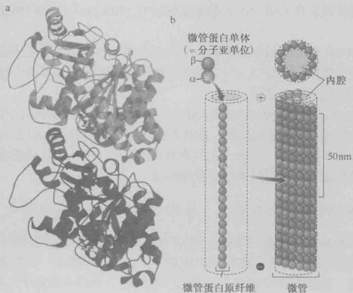  
框21-2图2 微管蛋白单体和微管蛋白丝。（a）微管蛋白单体的晶体结构展示了 $\alpha$ 亚单位（青色）和β亚单位（紫色）。两种亚单位中的GTP显现为红色。（Lowe J., Li H., Downing K.H., and Nogales E. 2001, J. Mol. Biol. 313: 1045-1057.) 图像用MolScript、BobScript及Raster 3D软件制作。（b）微管蛋白的原纤维是由单体按照同一方向排列组成。

肌动蛋白和微管蛋白都具有酶活性，肌动蛋白催化 ATP 水解为 ADP，微管蛋白催化 GTP 水解为 GDP。这些酶活性启动了肌动蛋白丝和微管的动态生长或称“单车现象”。通常，负端的肌动蛋白或者微管蛋白亚单位介导 ATP 或 GTP 水解并因此变得不稳定而掉下来。相反，正端新添加的的亚单位并不水解 ATP 或 GTP，因此相对稳定。

肌动蛋白丝和微管在正端的定向生长依赖于与细胞骨架结合的各种蛋白质。其中一种叫做组装抑制蛋白（profilin），它与肌动蛋白单体结合抑制其在肌动蛋白丝正端的结合。其他蛋白质被证明具有促进微管蛋白原丝在正端生长的作用。

从酵母的交配型转换研究中发现的第二条规律也在果蝇发育中发现：广泛分布的激活子与局部存在的抑制子相互作用，在每个独立的细胞中建立起精确的表达模式。在酵母中，SWI5蛋白负责激活HO基因的表达（见第19章）。这个激活子在出芽时的母细胞和子细胞中都存在，但其激活HO的能力仅限于母细胞中，因为在子细胞中有抑制子Ash1的存在。换句话说，尽管有SWI5基因的存在，但Ash1使子细胞的HO基因处于关闭状态。

## 定位的 mRNA 启动海鞘胚胎肌肉的分化

定位后的 mRNA 能在相同遗传背景的细胞中建立差异的基因表达。正如酵母子细胞的命运受制于 ash1 基因的遗传一样，发育的胚胎中的细胞可通过遗传的被定位的 mRNA 而被引导至特定的发育途径。

我们以海鞘肌肉发育为例，在早期海鞘胚胎中，Macho-1 是编码细胞形成尾部肌肉的主要决定子。

Macho-1 mRNA 在未受精卵的细胞质中均匀分布，但在受精后就迅速被限制在卵的植物端（底端）细胞质中（图 21-7）。最终，在胚胎八细胞期只有两个细胞遗传了这个 mRNA，这些细胞最终形成尾肌。

Macho-1 mRNA 编码一种 DNA 结合蛋白——锌指蛋白，这种蛋白在活化肌肉特异基因，如原肌球蛋白的转录中起作用。这些基因只在肌肉中表达，因为 Macho-1 只在肌肉细胞中产生。在本章的第二部分，我们将看到定位的 mRNA 合成的调节蛋白如何活化或者抑制基因表达，控制不同类型细胞的形成。

## 细胞-细胞接触激活芽孢形成菌——枯草芽孢杆菌差异基因表达

第二种建立差异基因表达的策略是细胞-细胞接触。我们以较为简单的枯草芽孢杆菌为例，在恶劣条件下，枯草芽孢杆菌形成孢子，这个过程的第一步是在孢子前体孢囊的一端生成隔膜，通过隔膜形成两个不同大小的细胞，小的叫前孢子（forespore），并最终形成孢子；大的叫母细胞，协助孢子的形成（图21-8）。如下所见，前孢子影响紧邻的母细胞的基因表达。

前孢子拥有活化的特殊的 $\sigma$ 因子—— $\sigma^{\mathrm{F}}$ ，它在母细胞不具有活性。在第18章中，我们看到 $\sigma$ 因子是如何与RNA聚合酶结合并选择特定的表达靶启动子的。 $\sigma^{\mathrm{F}}$ 激活spo

$I/R$ 基因，后者编码一种分泌编码蛋白 Spo $I/R$ 。Spo $I/R$ 分泌到母细胞和前孢子的膜间隙，在那里使母细胞的 $\sigma^{E}$ 原水解。 $\sigma^{E}$ 原是 $\sigma^{E}$ 的非活性前体， $\sigma^{E}$ 原含有 N 端的抑制域，抑制 $\sigma^{E}$ 的活性并使其挂在母细胞膜上（图 21-8）。Spo $I/R$ 引发 N 端多肽的水解，释放出成熟和活化的 $\sigma^{E}$ 。 $\sigma^{E}$ 在母细胞激活一系列与前孢子不同的基因的表达。在这里，Spo $I/R$ 作为信号分子在前孢子和母细胞的界面起作用，通过加工后的活化的 $\sigma^{E}$ 引发紧邻的母细胞的差异基因表达。SpoⅡR诱发作用只能靠细胞-细胞接触，因为所产生的少量SpoⅡR不足以触发其他细胞释放 $\sigma^{\mathrm{E}}$ 。

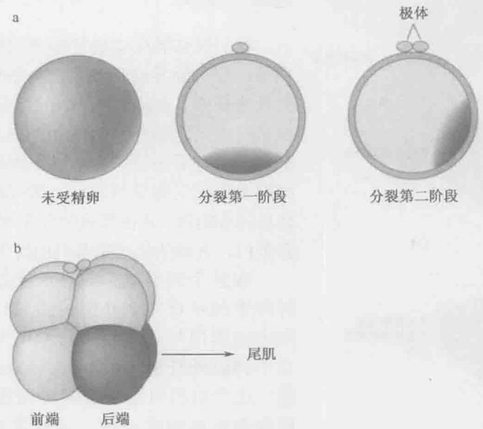

图 21-7 Macho-1 mRNA 在受精卵的定位。(a) Macho-1 在未受精卵的细胞质中均匀分布。受精后卵细胞经过非对称分裂形成极体（顶端）。此时，Macho-1 mRNA 局限于底部。很快，在单细胞胚胎分裂前 Macho-1 mRNA 重新定位。这个过程发生在卵细胞的第二次非对称减数分裂期间(b)。Macho-1 mRNA 分布在单细胞胚胎的一角，此角最终变成 B4.1 卵母细胞（blastomere）。这些细胞将分化成尾肌。（经允许引自 Nishida H. and Sawada K. 2001. Macho-1 encodes a localized mRNA in ascidian eggs. Nature 409: 725, Fig.1c\~e only. Copyright©2001 Nature Publishing Group.）  
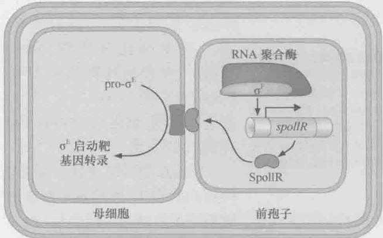  
图 21-8 枯草芽孢杆菌母细胞和前孢子的非对称基因活性依赖于不同类型 σ 因子的活化。spo IIR 基因经前孢子的 σ $^{F}$ 活化，其编码的 Spo IIR 蛋白与母细胞（左）和前孢子（右）之间的隔膜结合。Spo IIR 启动母细胞非活性的 σ $^{E}$ (σ $^{E}$ 原) 的水解使其活化。活化的 σ $^{E}$ 募集 RNA 聚合酶，激活母细胞特定的基因。（引自 Losick R. and Straiger P. 1996. Ann. Rev. Genet. 30: 209, Fig.3a, © Annual Reviews.）

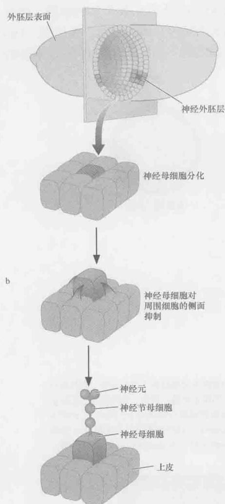  
图 21-9 神经外胚层形成两种主要细胞：神经元和皮细胞（或上皮）。（a）早期神经外胚层能够形成两类细胞中的任意一种。然而，一旦细胞开始形成神经元或者神经母细胞（neuroblast）（网格中间的黑色细胞），它抑制所有与它直接接触的细胞。（b）这种抑制造成大部分这些细胞保留在胚胎的表面形成皮细胞。相反，发育中的神经元移入胚胎腔形成神经元。

昆虫中枢神经的Notch信号转导控制皮肤神经调节转换

我们现在转向动物胚胎中的细胞细胞接触的例子，令人惊异的是，它们与枯草芽孢杆菌的过程极为相似。在之前的例子中，Spo IIR 引起 $\sigma^{E}$ 原水解活化，活化的后者引导 RNA 聚合酶与特定基因的启动子序列结合。在下面的例子中，一种细胞表面的受体受到剪切，其细胞质内的结构域转移到细胞核，并在那里结合序列特异的 DNA 结合蛋白，进而活化选定基因的转录。

在这个例子里，需要先对昆虫胚胎中的腹神经索的发育做个介绍（图21-9）。昆虫腹神经索的作用与人类脊椎的作用大致相近，它来自于神经外胚层（neurogenic ectoderm）的细胞。这个组织可细分为两种细胞：一种留在胚胎表面形成腹部外皮（或称表皮），另一种移入胚胎形成腹神经索的神经元（图21-9a）。这两种细胞群体间的信号传递强化了对皮肤或者神经元形成的决定。发育中的神经元在其表面拥有叫做Delta的信号分子，它与皮肤细胞表面的受体Notch结合（图21-9b）。Delta对Notch的活化使得皮肤细胞不能发育为神经元。这个活化过程使Notch的胞内结构域Notch $^{IC}$ 从细胞膜释放进入细胞核，在那里结合DNA结合蛋白Su(H)。产生的Su(H)-Notch $^{IC}$ 复合体活化编码转录抑制子的基因，进而阻断神经元的发育。

Notch 信号转导并不仅仅只是诱导 Su（H）活性蛋白的表达，而是具有启动调节 5F00 关的功能。

没有信号转导时，Su（H）可以与多个辅阻遏蛋白结合，包括Hairless、CtBP和Groucho（图21-10）。Su（H）与这些蛋白质的任何一个结合都可以抑制Notch的靶基因。Notch $^{IC}$ 进入细胞核后取代了与Su（H）结合的抑制因子，使Su（H）转变为激活因子，Su（H）转而活化之前受它抑制的基因。

Delta-Notch 信号转导依赖于细胞-细胞接触。提供 Delta 的细胞（神经元前体）必须与含有 Notch 的细胞（上皮）直接接触以便活化 Notch 信号转导，抑制神经元分化。下一节我们将给出分泌信号分子如何影响远端细胞基因表达的例子。

## Sonic hedgehog 成形素浓度梯度控制脊椎动物不同神经元的形成

我们现在转向长程信号分子成形素，它将位置信息传递给发育的器官。在这个例子中，我们将继续讨论神经分化，但这次涉及脊椎动物的神经管。在所有脊椎动物胚胎中存在一个阶段：位于未来背部（背外胚层）的细胞会以协同的方式进入胚胎内部形成成体脊椎的前体——神经管。

最靠近神经管腹部的细胞形成特殊的结构——底板（floorplate）。底板是细胞分泌因子：音猬因子 Sonic hedgehog（Shh）的表达位点，它是一种梯度型成形素。

Shh 从底板分泌并在神经管腹侧的一半区域形成细胞外浓度梯度。神经管内的神经元根据它们接受的 Shh 的量分化为不同的细胞类型。这取决于它们相对于底板的位置；离底板近的接受高浓度的 Shh，远一些的则接受较低浓度的 Shh。细胞外 Shh 的浓度梯度导致三种神经管细胞发生特异化：V3、MN 和 V2。这些细胞逐渐远离底板并差异表达三种调节基因，分别是 Nkx2.2、Olig2 和 Pax6（图 21-11a）。

开始的时候，Pax6 在整个神经管中表达（时间 $t_{0}$ ，图 21-11b）。靠近底板的细胞

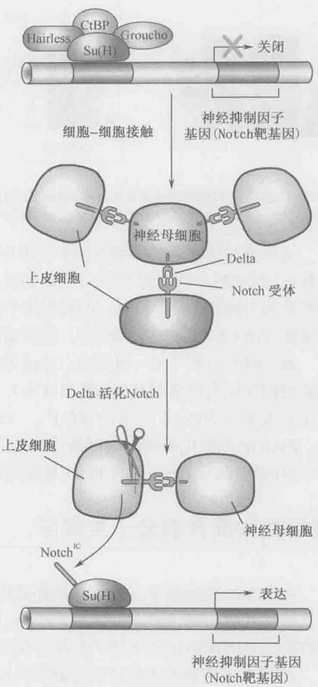  
图 21-10 Notch-Su（H）调节开关。发育的神经元（神经元前体细胞）并没有神经抑制子的基因表达。这些基因被 DNA 结合蛋白 Su(H) 及相关抑制子蛋白（Hairless、CtBP、Groucho）关闭。神经前体细胞表达一种膜结合 Delta 信号分子。Delta 与相邻细胞的 Notch 受体结合，Delta-Notch 相互作用造成该细胞的 Notch 受体的活化，进一步分化变成上皮。活化的 Notch 受体经细胞蛋白水解酶剪切，其胞内部分释放进入细胞核。这部分的 Notch 受体使 Su（H）调节蛋白起到活化子而不是抑制子的作用。因此，神经抑制子基因在上皮细胞活化，使其不能发育成神经元。

接受最高浓度音猬因子，也获得了最高活性的音猬因子转录效应物Gli。在初级阶段 $t_1$ ，Gli活化剂的初始浓度足以介导Olig2的表达（图21-11b）。随后，持续的音猬因子诱导使腹侧神经管中Gli的水平升高，从而导致Nkx2.2的激活（时间 $t_2$ ，图21-11b）。交叉抑制的相互作用维持着Nkx2.2、Olig2和Pax6相继表达，因此导致V3、MN和V2神经元的特异化。

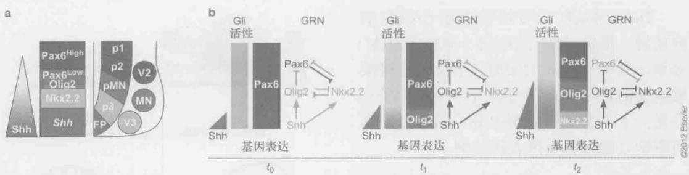  
图 21-11 细胞外的音猬因子浓度导致三种神经元发生特异化。(a) 音猬因子在神经管中形成浓度梯度。(b) 由音猬因子介导的发育模式。(来源: Balaskas N. et al. 2012. Cell 148:273–284; part a is Fig. 1A, p. 274; part b is Fig. 7A, p. 281. ©Elsevier.)

从简单的梯度亲和模型的例子中可以推测，Nkx2.2 和 Olig2 基因的调节 DNA 可能含有不同亲和力的 Gli 结合位点。比如说，Olig2 在 Nkx2.2 之前被激活可能是因为它含有高亲和力的 Gli 结合位点，能被低水平的 Gli 活化剂所占据。相反，Nkx2.2 可能是被低亲和力的 Gli 结合位点调控的，需要更高水平和持续的音猬因子及 Gli 活化剂。

最近研究表明了另一种观点: Olig2 和 Nkx2.2 的差异表达是基于神经管的不同类型, 由基因相互作用网络调控的(图 21-11b)。一旦 Olig2 在腹侧区域被激活, 就会抑制 Pax6, 从而生成介导 Nkx2.2 生成的“窗口”。Pax6 是 Nkx2.2 的有力抑制因子, 而不是 Olig2 的。Pax6 的差异化抑制作用可能是导致 Olig2 和 Nkx2.2 相继表达的重要机制, 也许是由于 Nkx2.2 调节 DNA 含有 Pax6 阻遏蛋白结合位点而 Olig2 调节因子没有这样的位点。

## 果蝇胚胎发育的分子生物学

在本章的其余部分，我们集中描述果蝇的胚胎发育。果蝇在这个方面的分子细节较之于任何其他动物胚胎来讲更易于理解。本章前面讨论的细胞通信的各种机制及前面章节讲到的基因调节在这个例子里都会涉及。

mRNA 定位和细胞信号途径都用来产生位置信息，形成调节蛋白的梯度浓度；这个浓度梯度造成前后（头尾）和脊体（背腹）体轴的形成。这些调节蛋白（活化子或者抑制子）控制那些产生胚胎不同确定区域的基因表达。常见的现象是对复杂调节 DNA（尤其是复杂的增强子）的利用，组合控制基因表达的清晰的开关效应。

## 果蝇胚胎发育概述

果蝇生命起始与人类相似——成体雄性对雌性授精。一个精子进入一个成熟卵子，单倍体精子和卵子的核融合形成二倍体的受精卵核。这个细胞核会在受精卵的中心进行一系列几乎同步的分裂。由于没有细胞膜来分隔细胞核，胚胎就变成了所谓的合胞体（syncitium），即单个细胞多个核。下一个阶段的分裂中，核开始向卵的皮质（或称周质）移动。到达皮质后，核又完成了3次分裂，约6000个核最终形成围绕卵黄的单细胞层。在受精2\~3h后，经过1h的时间在核与核之间形成了细胞膜。

快速的核分裂发生在果蝇胚胎发育的前2h，这能够阻止重要的结构基因的过早表达。

以短期的原肠胚形成基因（sog）为例，sog 基因能够编码 BMP 信号的抑制剂，BMP 在受精后 2.5\~3h 对背部外胚层的形成具有重要的作用，sog 转录单元的长度为 20kb，RNA 聚合酶 II 的延伸速度非常慢，每秒 20bp，所以 sog 的整个转录过程大概需要 20min。前 11 轮核分裂以 6\~8min/次的频率发生，因此在分裂间期 RNA 聚合酶 II 并没有时间完成 sog 基因的转录。在有丝分裂期，RNA 聚合酶 II 会从染色质模板上被释放出来，在后续的分裂周期中重新启动转录。因此，在胚胎发育的前 2 个小时没有完整的 sog mRNA 被合成。在这个例子中，sog 转录单位的大小有助于确保 sog 产物在需要的时候（受精后 2.5h）才被合成。在果蝇中还有其他关于基因大小/长内含子与基因表达时机的例子。例如同源异型基因 Ubx，长度大于 80kb，与共表达的分节基因（含有短内含子）相比，它的表达推迟了 1 个小时以上。

在形成细胞膜之前，核是全能的（totipotent），或称作未定型的：它们并没有走向特定发育途径，仍然能够产生任何细胞类型。一旦细胞化，核只有不可逆地“做出决定”，分化进入果蝇的特定组织。框21-3叙述了这个过程，本章随后部分将叙述确立这种细胞决定过程的分子机制。

## 框 21-3 果蝇胚胎发育概况

精卵单倍体核融合后，二倍体的合子核在中心卵黄区经历一系列10轮近乎同步的快速分裂。从核中心粒发散的大型微管阵列将核从中心拉向卵的周质（框21-3图1）。在8次分裂后，有256个合子核开始向周质移动，移动过程中又有两次分裂（框21-3图1，核分裂第9轮）。大多数，但不是所有的约1000个核进入卵的皮层区（框21-3图1，核分裂第10轮）。其余细胞（卵黄胞，vitellophage）留在中央区域，在发育中作用不明。

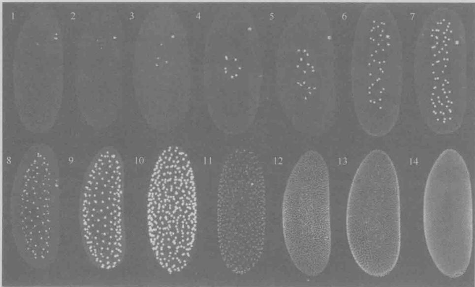  
框 21-3 图 1 果蝇胚胎发生。果蝇胚胎以未来的头部朝上排列。数字代表核分裂的数字。胚胎内的细胞核染成白色。例如，在第一阶段只有精子卵子原核融合后的单个的受精卵；第二阶段包含合子核的第一次分裂；在第 10 阶段时已有约 500 个核在皮层单层排列（胚胎的外层）；在第 14 轮时已有 6000 多个核单层紧密地列在皮层，细胞化发生在这个阶段。（来源：Courtesy of W. Baker and G. Shubiger.）

在受精后 90min 时，大部分到达皮层的核先获得转录 PolⅡ基因的能力。像许多其他有机体如非洲爪蟾，似乎有一个“中囊胚转变”阶段：早期的卵裂球（blastomere）（或者分裂中的合子核）在快速有丝分裂时表现出转录沉默效应。相关机制并不明确，似乎 DNA 在进行高速复制时很难同时维持转录。这些以及其他观察结果推断在复制和转录所需的大分子复合物之间存在竞争关系。

核到达皮层后又进行了3轮分裂（受精后共有13轮分裂），产生了6000个柱形的核围绕着卵黄的紧密包裹结构（框21-3图1，核分裂第14轮）。从细节上讲，此时胚胎仍是合胞体，但使用细胞骨架蛋白抗体对早期胚胎组织的免疫组化染色表明每个核周围呈现密实的网状结构。受精2\~3h后的1h内，胚胎经历了重要的的细胞化过程，相邻的核之间形成了细胞膜（框21-3图1，核分裂第14轮）。受精后3h，胚胎转化为细胞囊胚层（cellular blastoderm），与大部分形如“细胞组成的空心球”的其他胚胎的囊胚一致。。

最近研发的单层照明显微镜（SPIM）方法已经被用于观察果蝇胚胎发育的详尽影像。网址如下：http://www.nature.com/nmeth/journal/vaop/ncurrent/extref/nmeth.2062-sv1.mov.

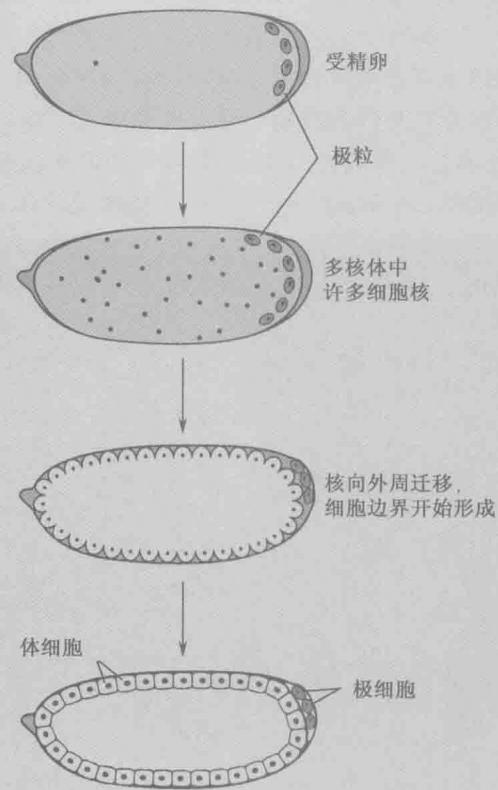  
框 21-3 图 2 生殖细胞的发育。极粒分布在未受精卵的后部，这里包含生殖细胞决定因素和 Nanos mRNA，后者对腹节的发育有重要作用。核（中间的点）向外周移动，进入后部的核分隔为极粒形成极细胞，进而形成生殖细胞，其余细胞（体细胞）形成成体果蝇的所有其他组织。[引自 Schneiderman H.A. 1976. Insect development. In Symposia of the Royal Entomological Society of London 8: 3-34. (ed.P.A. Lawrence). Copyright©1976. Reprinted by permission of Blackwell Science.]

在核进入卵的皮层时，它们是全能的，可以形成成体的任何细胞类型，但它们的位置这时决定了它们的命运。移到皮层后部的30多个核接触到被定位的蛋白决定子，如Oskar，它编码细胞核形成生殖细胞（框21-3图2）。在在这些位于极质中的决定子中有叫做极粒（polar granules）的核酸蛋白复合体位于后部的核与极粒在从胚胎的主体出芽，产生的极细胞依据胚胎的性别分化为精子或卵子。以显微注射的方式将极质注射到其他地方（如胚胎中部或前部），会分化出额外的极细胞。

没有进入极质的皮层细胞核将形成体细胞组织。同样，这些细胞是全能的，可以形成任何细胞类型。在一个极短的时间内，不超过1h，每个核就确立了特异的分化途径。这个特化过程发生在细胞化阶段，尽管还没有证据证明核之间细胞膜的形成与决定细胞命运有重要关系。在完成细胞形成前，不同的核已表现出不同的基因转录类型。受精后3h，细胞已经得到了固定的位置标志，那些胚胎前部的细胞形成成体果蝇的头部结构，而后部的细胞则形成腹部结构。

由 Eric Wieschaus 和 Christiane Nüsslein-Volhard 进行的系统遗传实验涉及对上千个死胚胎的检验，鉴定了 30 多个控制果蝇胚胎分化的分节基因（segmentation gene）。在胚胎发生的中间点，腹皮（上皮）分泌含有细毛或小齿的表皮（cuticle），胚胎的每一体节包含特定种类的表皮。以对死胚体节形成的破坏为标准可将这些分节基因分为 3 类。“缺口”基因的突变造成数个紧邻的分节的缺失（框 21-3 图 3），例如，缺口基因 knirps 的突变造成腹节 2-7 的缺失（正常有 8 节）；结成对规则基因（pair-rule）突变造成腹节每隔一节的体节缺失。

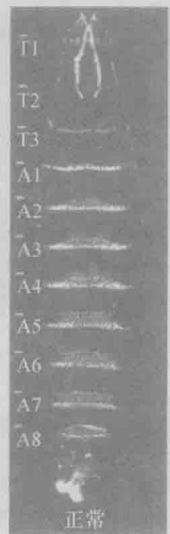

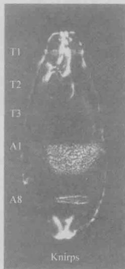  
框 21-3 图 3 正常和突变腹节的暗视野图像。(a) 正常胚胎体节小齿的类型在不同的体节有些许不同(标为 T1-A8 图像); (b) Knirps 突变体(缺口基因 knirps 突变)缺失第 2\~7 腹节。(引自 Nusslein-Volhard C. And Wieschaus E. 1980. Mutations affecting segment number and polarity in Drosophila. Nature 287; 795-801. Images courtesy of Eric Wieschaus, Princeton University.)

## 浓度梯度的调节控制果蝇脊腹成形

早期果蝇胚胎脊腹成形受到调节蛋白 Dorsal 的控制, 此蛋白质最初均匀分布于未受精卵的细胞质。在完成受精、合子核到达卵皮质后，位于胞质腹部和侧部的 Dorsal 蛋白进入细胞核中，而位于顶部的 Dorsal 蛋白则留在细胞质中。（图 21-12）。Dorsal 蛋白浓度梯度的形成在原理上与脊神经管中 Gli 活化因子浓度梯度的形成相似。（图 21-11）。

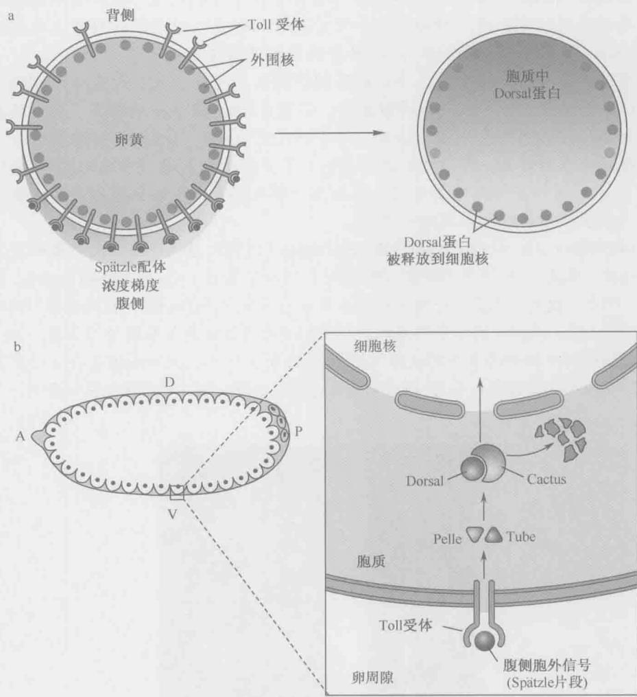  
图 21-12 Spatzle-Toll 和 Dorsal 浓度梯度。(a) 圆圈代表早期果蝇胚胎的剖面。Toll 受体均匀分布在前细胞胚胎的细胞膜上。Spätzle 信号分子存在浓度梯度，最靠近腹部处最高，其结果是腹部的活化的 Toll 受体要多于侧部和脊部。Toll 信号转导的浓度梯度形成了 Dorsal 在核内的浓度梯度。(b) 胚胎的侧视图：左侧为前端，上部为背面；右图为 Toll 信号转导的级联反应的细节。Toll 受体的活化导致细胞质中 Pelle 激酶的活化。Pelle 直接或者间接使 Cactus 蛋白磷酸化，后者未磷酸化时结合并抑制 Dorsal 蛋白。Cactus 的磷酸化导致它的降解，Dorsal 就被释放并进入细胞核。

Dorsal 蛋白核运输的调节由信号分子 Spätzle 控制。这个信号在未受精卵细胞膜和外卵壳（outer eggshell）之间的胞外基质内存在一个腹侧到背侧的浓度梯度。受精后，Spätzle 与细胞膜表面 Toll 受体结合。根据 Spätzle 浓度和受体在合胞体胚胎给定区域占位程度的不同，Toll 受体的活化程度也不同。由于 Spätzle 浓度在腹区最高，腹区的 Toll 受体活化程度也最高，侧面区域的活化程度依次减低。Toll 信号转导造成细胞质中的

Cactus 抑制因子的降解，进而 Dorsal 释放并从细胞质进入细胞核。这导致在早期胚胎的腹侧形成了对应的 Dorsal 在细胞核的浓度梯度。处于胚胎腹侧的核保持高 Dorsal 蛋白水平，而侧面区域的 Dorsal 蛋白水平较低。

某些 Dorsal 靶基因的活化需要高水平的 Dorsal 蛋白的作用，另一些只需要中等或低浓度。通过这种形式，受精后 2h 后，Dorsal 的浓度梯度就设定了横跨细胞化胚胎脊腹轴 3 个基因表达的阈值。这个阈值启动了 3 种各具特点的组织的分化：中胚层、腹神经外胚层和脊神经外胚层（图 21-13）。每个组织继续在成体果蝇形成特定的细胞，中胚层形成飞行肌和内脏，类似于人类肝脏的脂肪体；腹神经外胚层和脊神经外胚层形成腹神经索的各种细胞。

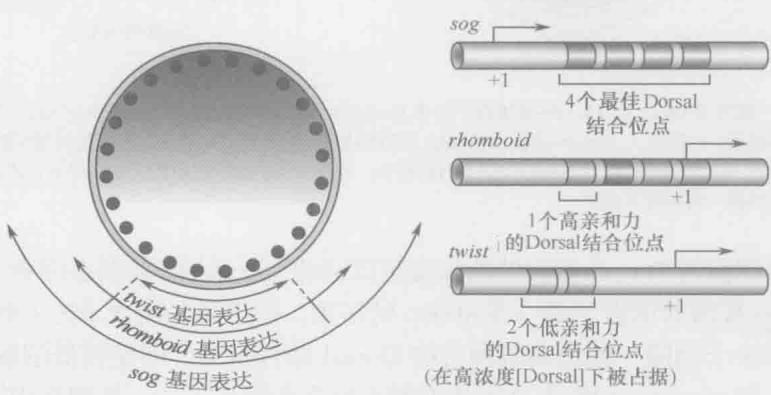  
图 21-13 3 种阈值和 3 种调节 DNA。twist 基因 5'端 DNA 含有两个低亲和力的 Dorsal 结合位点，二者只在最高浓度 Dorsal 条件下被结合。其结果是，twist 的表达局限在腹部的核内。Rhomboid 5'端的增强子包含多个 Dorsal 结合位点，其中只有一个是最佳高亲和力 Dorsal 识别序列。低和高亲和力位点的混合存在允许了高和中等浓度的 Dorsal 蛋白激活 rhomboid 基因在腹侧部位的表达。最后，sog 基因内在增强子包含 4 个等距离的最佳 Dorsal 结合位点。这样，高、中、低浓度的 Dorsal 蛋白都可以活化 sog 基因在腹面和侧面部位的表达。

我们现在考虑 3 个不同的受到高、中、低浓度 Dorsal 基因活化的基因：twist、rhomboid、sog。最高的 Dorsal 梯度浓度（细胞核中有最高浓度的 Dorsal 蛋白）活化最靠近腹部的 18 个细胞的 twist 基因（图 21-13）。胚胎侧部具有中和低含量的 Dorsal 蛋白，twist 基因不会被活化。因为 twist 基因的 5'端调节 DNA 包含两个低亲和力的 Dorsal 结合位点（图 21-13），需要高浓度的 Dorsal 蛋白来有效占据这些位点，侧部的 Dorsal 蛋白的浓度不足以进行有效的结合和激活 twist 基因的转录。

rhomboid 基因由腹神经外胚层的中等浓度的 Dorsal 蛋白活化。在 rhomboid 基因转录起始点上游 1.5kb 处有一段 300bp 的增强子（图 21-14a）。此增强子包含多个 Dorsal 结合位点，多为与 twist 基因相同的 5'端的低亲和力调节区，此外至少有一个理想的高亲和力的位点能够与位于侧部的中等浓度的 Dorsal 蛋白结合。理论上，rhomboid 增强子可以同被中胚层高浓度的和腹神经外胚层中等浓度的 Dorsal 蛋白激活，但是在中胚层，它被转录抑制子 Snail 关闭。Snail 抑制子只在中胚层表达而不在神经外胚层表达。300bp 的 rhomboid 增强子同时包含 Snail 抑制子和 Dorsal 活化子的结合位点，这种广泛分布的

Dorsal 活化子和局部分布的 Snail 抑制子的相互作用限制了 rhomboid 基因在腹神经外胚层表达。在出芽酵母子细胞中，我们已经看到局部的 Ash1 抑制子如何阻断子细胞 SWI5 活化子的作用，后面我们还会看到这种原理大量运用在果蝇发育的其他方面。

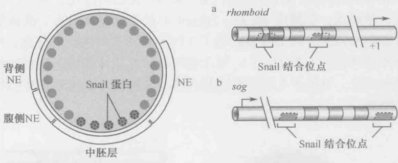  
图 21-14 调节 DNA。(a) rhomboid 增强子包含 Dorsal 及 Snail 抑制子结合位点。由于 Snail 蛋白只存在于腹部区域（中胚层），rhomboid 在中胚层处于关闭状态，其表达仅见于腹部区域的神经外胚层。(b) 内含子区的 sog 增强子也包含 Snail 抑制子结合位点。这样，sog 基因在中胚层是关闭的，表达只见于侧面一片的腹、背神经外胚层。

早期胚胎侧面的 Dorsal 蛋白的低浓度足以活化 sog 基因，使其在腹背部神经外胚层均能表达。sog 基因的增强子是一段 400bp 的序列，位于第一内含子内（图 21-14b）。这个增强子含有 4 个间隔一致的高亲和力的 Dorsal 结合位点，即使极低浓度的 Dorsal 蛋白也能结合。与 rhomboid 相同，Snail 抑制子的存在阻止了 sog 基因在中胚层的表达，尽管那里 Dorsal 蛋白浓度最高。因此，不同阈值的 Dorsal 浓度梯度对基因表达的差异调控还要依赖于 Snail 抑制子和 Dorsal 结合位点亲和力的综合效应。

Dorsal 结合位点的占位取决于位点结合的亲和力，同时还依赖于 Dorsal 和其他增强子调节蛋白的相互作用。以上例子中，300bp 的 rhomboid 增强子得到腹神经外胚层中等浓度 Dorsal 蛋白的激活。这个增强子主要包含低亲和力的 Dorsal 结合位点。由于与另一个活化子 Twist 的相互作用，中等浓度的 Dorsal 就足以结合这些低亲和力的位点。Dorsal 和 Twist 结合在 rhomboid 增强子的邻近位置，这两个蛋白质不仅在结合增强子时相互促进，一旦结合后还可以协同促进转录（框 21-4）。

## 框21-4 活化子的协同作用

细菌的调节蛋白 lac 和 $\lambda$ 阻遏物能高亲和力地结合形成二聚体。在酵母中，Gal4 活化因子高亲和力地结合形成二聚体诱导 Gal1 和其他半乳糖代谢相关基因的表达（请见第 19 章）。然而在动物细胞中却缺少类似的“专用”转录因子。大多数因子以单体的形式与低亲和力的 DNA 单体结合。因此，与细菌和酵母相比，动物的基因调控在本质上是一种组合调控。多种蛋白质结合到多个位点从而完成基因表达的激活或抑制。

这种组合理论在动物的发育过程中普遍存在。通常，活化剂 A 和 B 相互协同将基因的表达控制在范围内，但 A 和 B 都不能单独完成这项任务。在动物的发育中有很多例子可以证明活化剂的协同作用，我们将通过海鞘胚胎心脏中胚层的例子来了解相关的原理。

a

©2009 Elevay

MesP 是海鞘和脊椎动物心脏中胚层发育关键的调控基因。它选择性地在 110 细胞胚胎的 B7.5 卵裂球被激活（表 21-4 图 1 中箭头所示）。正是这些细胞引起成年海鞘心脏的跳动。Tbx6b/c 和 Lhx3 是激活 MesP 的两个转录因子。Tbx6b/c 在发育中的尾部肌肉和 B7.5 卵裂球中表达（表 21-4 图 1a 中箭头所示）。Lhx3 在假定的肠道和 B7.5 卵裂球中表达（表 21-4 图 1b 中箭头所示）。只有在 B7.5 卵裂球中有 Tbx6b/c 和 Lhx3 共同表达，在这些细胞里它们协同激活 MesP（表 21-4 图 1c）。因为只有一种转录因子并不能激活基因的表达，因此肠道和尾部肌肉中的 MesP 基因不能被激活。

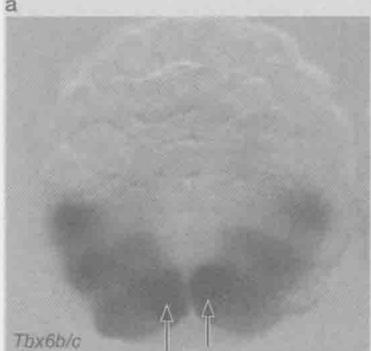

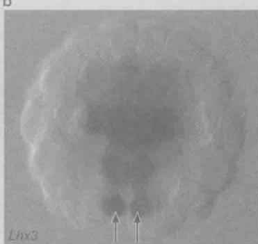

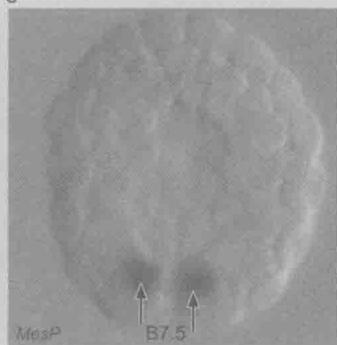  
表 21-4 图 1 MesP 是在两个转录因子的协同作用下激活的。蓝色标记是细胞中蛋白的表达。(a) Tbx6b/c 的表达。(b) Lhx3 的表达。(c) MesP 的表达。(Courtesy of Lionel Christiaen. Reproduced, with permission, from Christiaen L. et al. 2009. Dev. Biol. 328:552. Parts a, b, and c are from Fig. 3A, 3B, p. 556 and Fig. 6C, p. 558. © Elsevier.)

## 未受精卵前后极的 mRNA 定位启动分节

受精时，果蝇卵包含两种定位的 mRNA，一种为 bicoid mRNA，分布在前极；另一种为 oskar mRNA，分布在后极（图 21-15a）。oskar mRNA 编码一种 RNA 结合蛋白，负责极粒（polar granule）的组装。极粒是一种以多种蛋白质和 RNA 组成的大的高分子复合物，极粒控制来自于早期胚胎后部区域组织的发育，包括腹部和极细胞，后者是生殖细胞的前体（图 21-15b）。

oskar mRNA 由雌性果蝇在卵巢内合成。它先由叫做抚育细胞（nurse cell）的“辅助”细胞存储在未成熟卵（或卵母细胞）的前端。卵母细胞和抚育细胞都是由卵巢中的特定干细胞形成的（框 21-5）。然而，随着卵母细胞的增大形成成熟卵，oskar mRNA 由前端转移到了后端。这个定位过程依赖于其 3'-UTR 特殊序列（图 21-16）。我们已经见到了 ash1 基因 3'-UTR 是如何与微管生长端反应来介导它在芽孢酵母子细胞中的分布的。一个非常相似的过程控制着果蝇卵母细胞 oskar mRNA 的分布。

果蝇卵母细胞具有高度极性，其细胞核分布在前端；生长的微管从核伸展到胞质的后端。oskar mRNA 与结合与微管生长的正端的适配体蛋白相互作用，从前端细胞核的位置转运至后部的细胞质。受精后，得到定位 oskar mRNA（和极粒）的细胞形成极细胞。

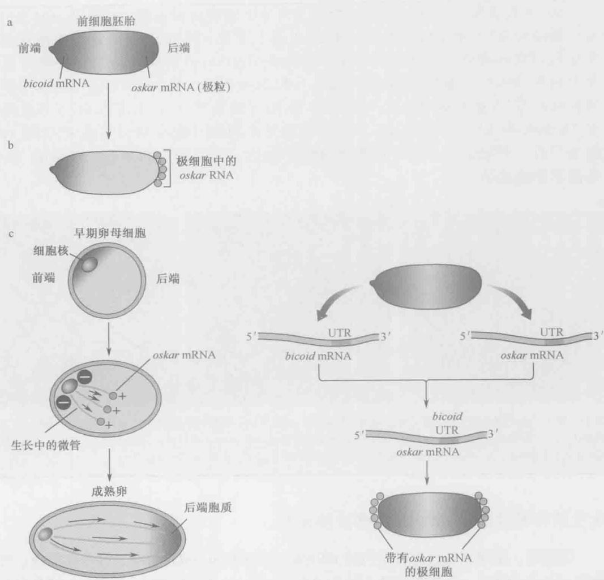  
图 21-15 母系 mRNA 在果蝇卵和胚胎的定位。
（a）果蝇未受精卵包含两种定位的 mRNA，bicoid 在前端，oskar 在后端。（b）Oskar 蛋白帮助协调在后端胞质的极粒的组装，细胞核在进入后端后以出芽的方式将胚胎后端转化为极细胞。
（c）在果蝇卵形成时，极性微管从卵母细胞的核延展向后端的细胞质，oskar mRNA 与适配体蛋白结合进而与微管反应将其转运入后部胞质。这里的“-”和“+”符号标明微管的生长方向。  
图 21-16 oskar mRNA 和 bicoid mRNA 包含不同的 3'-UTR 序列。bicoid mRNA 的 3'-UTR 序列导致它在前端的分布，而 oskar mRNA 的 3'-UTR 序列导致它在后端的分布。改造后的 oskar mRNA 包含 bicoid mRNA 的 3'-UTR，将像正常 bicoid mRNA 一样定位于前端。oskar mRNA 这种错位造成在前端形成极细胞。此外，错位的极粒还会抑制头部组织分化需要的基因的表达，因而，应该形成头部组织的细胞转化成了生殖细胞，定位于后部胞质的正常的 oskar mRNA 也会促使后端形成极细胞。

bicoid mRNA 在非受精卵前端的定位也依赖于其 3'-UTR 的特殊序列。oskar mRNA 和 bicoid mRNA 的 3'-UTR 的序列并不相同，因而它们分别与不同的适配体蛋白反应，定位于卵的不同部位。3'-UTR 在 mRNA 定位中的重要性在以下实验中得到阐明：如果 oskar mRNA 的 3'-UTR 被 bicoid mRNA 的取代，那么杂合的 oskar mRNA 就会留在前端（与 bicoid mRNA 正常行为一样）。这种错误定位足以诱导早期卵细胞在异常的位置形成极细胞（图 21-16）。此外，错位的极粒还会抑制头部组织分化需要的基因的表达。因而，应该形成头部组织的细胞转化成了生殖细胞。

## 框21-5 干细胞

在果蝇中,卵细胞或者卵母细胞起源于一种叫做生殖系干细胞(germline stem cell, GSC)的干细胞前体。关于果蝇中GSC如何转变成卵巢内的卵母细胞已经有了相当了解,而且这种转变机制的许多方面对果蝇和人类的干细胞来说都是共同的。干细胞的增殖只有通过直接接触被统称为“卵巢生态位”(niche)的特定种类的细胞群,这类细胞可以产生一种信号触发增殖的过程。当干细胞从niche分离后,增殖停止,细胞开始分化为特定细胞。在果蝇的例子中,GSC从卵巢生态位中解离下来后,它们发育成未分化的卵母细胞,这是一个受信号介导的阻遏调节过程。这一过程的分子机制已经了解得很清楚,其工作流程如下所述。

位于果蝇卵巢内的生态位细胞，也叫 Cap 细胞，分泌一种可扩散的 Dpp 信号分子。GSC 上的 Dpp 受体被激活后，引起了一种叫做 bam 的重要的调控基因的沉默：当 bam 的转录被阻断后，GSC 开始增殖。bam 表达的沉默依赖于 Cap 细胞与 GSC 的直接接触，类似于昆虫神经系统里 Notch 信号传递的激活过程。随着 GSC 的增殖，一些子细胞开始从 Cap 细胞上分离下来，从而不再是 Dpp 信号分子的靶目标。在没有信号的情况下，bam 转录被激活，细胞停止增殖，转而分化成为卵母细胞（框 21-5 图 1）。

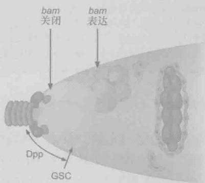

框21-5图1卵母细胞发育中bam的表达。该示意图描绘了bam mRNA和蛋白质的表达方式及其分布。Cap细胞（用紫色表示）分泌Dpp，激活其生殖层干细胞（黄色表示GSC）上的受体，从而引发信号传递过程，最终抑制了bam的表达。随着GSG从Cap细胞上解离，Dpp信号传递中断，bam mRNA的表达导致了bam蛋白在细胞质中的高表达。在Bam蛋白存在时，分离的子细胞发育成卵母细胞前体（绿色）并进一步分成8细胞囊胞(深绿色)。（经许可改编自Chen D.和Mckearin D.M.Development 130:1159-1170，Fig.1. ©Company of Biologists,）

干细胞的增殖及卵母细胞的分化之间的选择取决于 bam 表达这一开关机制。现在已经知道，这种调控是由 bam 5'调控区域的一个沉默元件介导的，即 GRCGNC（N）GTCTG 序列（框 21-5 图 2）。Dpp 信号起始了两个 Smad 调控蛋白——Mad 和 Medea 的核转运。这些蛋白质结合到沉默元件的两个半位点，接着募集一个转录阻遏蛋白，即 ZF6-6，也称 Schnurri，阻止 bam 的转录。但这个转录阻遏蛋白及随后发生的抑制 bam 转录仅仅在 GSC 与 Cap 细胞保持接触的情况下才会发生，结果使得这些细胞得以分化并产生更多的干细胞。相反地，当 GSC 子细胞从 Cap 细胞上解离下来，bam 的转录被激活，这是因为导致基因沉默信号通路被打断了。在这些细胞内，Dpp 受体处于失活状态（因为信号传递被阻断），所以不会结合到5'沉默元件上或者加上Schnurri受体。在这种条件下，bam得到了表达，子细胞不再增殖而是分化成卵母细胞。对卵巢生态位和干细胞之间的直接接触的要求，以及所导致的信号介导的阻遏过程可能是保证干细胞持续分化的共通机制。

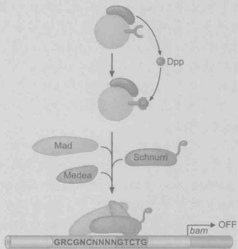  
框 21-5 图 2 Dpp 途径可有效地抑制关键的发育基因。由 Gap 细胞分泌的 Dpp 与 Dpp 受体的结合发出了信号，促进 Mad（黄色）和 Medea（蓝色）转运到核中。受到抑制的靶基因（此处以 Bam 为例）含有顺式作用沉默元件（SE），它们与 Mad、Madea 结合，共同招募 Schnurri（用粉色表示），从而有效地阻止转录。（经允许引自 Pyrowolakis G. et al. 2004 Dev. Cell 7：299-240，图 7 Elsevier 版权所有）

## Bicoid 和 Nanos 调节 hunchback 基因

Bicoid调控蛋白的合成早于细胞化的完成。因此，在前极被合成的Bicoid蛋白扩散形成与早期胚胎等长的浓度梯度。与。高、中浓度的Bicoid均足以激活hunchback，而hunchback对胚胎的精细分区起至关重要的作用（图21-17）。hunchback基因实际上是由两个启动子控制转录的：一个由Bicoid浓度梯度激活，另一个在卵母细胞的发育过程中控制基因的表达。后者，也就是“母系”启动子使得hunchback mRNA的合成均匀地分布在未受精的卵子细胞质内。这种母性的转录子的翻译在后区被一个叫做Nanos的RNA结合蛋白所阻止（图21-17）。Nanos蛋白只在后区被发现，因为其mRNA的3'-UTR和极性颗粒之间的相互作用，所以选择性地存在于这个区域。

Nanos 蛋白质结合特异的 RNA 序列，即 NRE（Nanos 反应元件），NRE 位于母性 hunchback mRNAs 的 3'-UTR 区，这种结合导致了 hunchback mRNA poly-A 尾的缩短。Poly-A 尾的缩短反过来破坏 RNA 的稳定并抑制其表达（第 15 章）。因此，我们可以看到 Bicoid 浓度梯度在胚前半期激活了 hunchback 启动子，而 Nanos 却在后期抑制了母性 hunchback mRNA 的翻译（图 21-17）。这种 hunchback 表达的双重调控产生了一个 hunchback 蛋白浓度的急剧升降，其中胚胎的前半期浓度最高，而在后半期急剧地下降。在框 21-6 中将进一步讨论浓度梯度及对发育的影响。

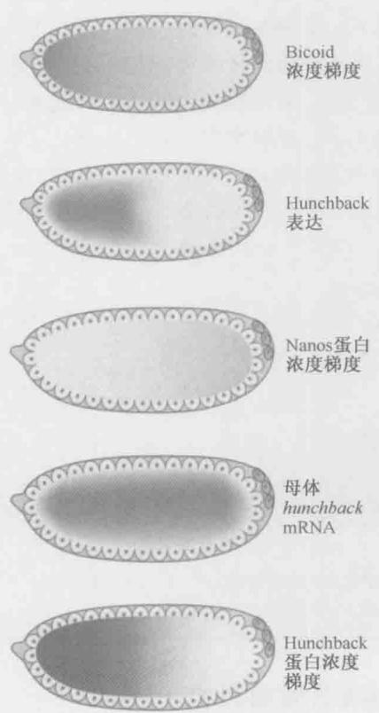  
图 21-17 Hunchback 蛋白的浓度梯度及 Nanos 对翻译的抑制。由于高、中浓度的 Bicoid 梯度能够激活 hunchback，广泛地存在于前后期的 Bicoid 蛋白浓度梯度使 hunchback 基因的表达产生了一个明显的阈值。Nanos mRNA 与极性颗粒联系在一起，翻译后在后区扩散并形成了一个浓度梯度。母性 hunchback mRNA 遍布于早期的胚胎中，但其翻译却被结合在 hunchback 3'-UTR 特异序列的 Nanos 蛋白捕获。因此，Nanos 蛋白的浓度梯度导致了前区相应的 hunchback 浓度梯度。

## 框21-6 浓度梯度阈值

我们已经遇到了数个由于调节浓度梯度产生不同的基因表达模式的例子。音猬因子和它的转录效应物Gli使得脊椎动物胚胎神经索发育中的Nkx2.2、Olig2和Pax6基因具有不同的表达模式（图21-11）。Dorsal蛋白浓度梯度导致果蝇胚胎腹面中胚层、侧面（神经源）外胚层和背侧外胚层也有着不同的基因表达方式（图21-12）。著名的Bicoid浓度梯度产生了前-后轴胚胎细胞中的“缺口”基因表达模式（框21-3图3）。

直到最近，人们普遍认为 Gli、Dorsal 和 Bicoid 结合位点的亲和力决定了基因表达在空间上的限制。实际上，我们已经讨论了 Dorsal 浓度梯度的作用机制。但是也有证据表明不同结合位点的亲和力可能并不足以解释 Gli 和 Bicoid 浓度梯度产生的不同的基因表达模式。例如，最近发现在高浓度的 Bicoid 下激活的靶基因的结合位点的亲和力却与低浓度下的结合位点的亲和力相似。一个简单的结合位点亲和力模型发现，基因在较高浓度下被激活，其位点亲和力较低；而当基因在较低浓度下被激活的时候，其位点亲和力却较高。

事实上，看起来不同的 Bicoid 浓度梯度阈值取决于相反的抑制剂（包括 Runt 抑制剂）的浓度梯度（框21-6图1）。目标基因RT1、RT2、RT3从低浓度的Bicoid依次被激活。RT1、RT2的Bicoid结合位点有着相似的亲和力，限制它们表达的是Runt的差异表达。RT3被高浓度的Runt所抑制，而RT1、RT2则是被低浓度的Runt抑制。目前并不确定这些目标基因含有相似的Runt结合位点。也许它们不同的反应取决于不同数量的位点：RT1含有比RT2和RT3更多的Runt抑制剂位点。正如上面所讨论的，脊椎动物神经管中Gli活化剂浓度可能也依赖于转录抑制剂的作用，产生音猬因子的浓度梯度（图21-11）。

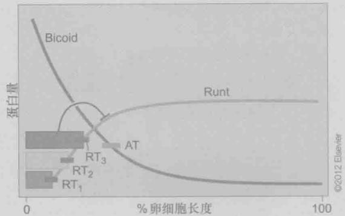  
表 21-6 图 1 活化剂和抑制剂浓度梯度的联合作用。详情请见正文部分。(引自 Roth S. and Lynch J. 2012.Cell149:511, Fig. 1, p. 512. ©Elsevier.

## 多个增强子确保 hunchback 的精确调控

很多模式基因是受“冗余的”或多个增强子调控的。以 hunchback 基因受 Bicoid 浓度梯度的激活为例，高浓度和中等浓度能够激活 hunchback 基因在胚胎前半部分的表达（图 21-17），激活其表达的两个增强子具有相似的 Bicoid 结合位点序列及相似的调控作用（图 21-18）。为什么是两个而不是一个呢？因为两个增强子可以产生更加剧烈、更加精确的基因激活模式，而且两个增强子可以确保在大量胚胎处于环境变化（如温度改变）中时，仍然能稳定激活基因。。在一些情况下，多个具有相同作用的增强子能够防止这类变化影响正常的发育。例如，有一种调控基因叫 shavenbaby，它对晚期胚胎背侧面细小感觉毛的发育非常重要。shavenbaby 基因受分布在转录起点上游的 40kb 区域里的 5 个独立的增强子调控。在最佳温度的情况下去除单个的增强子并不会引起感觉毛形态的显著缺陷。但是在不利条件下，如 30℃ 的高温或 15℃ 的低温，去除一个增强子将会导致感觉毛的减少或畸形。

## Hunchback 抑制子浓度梯度建立了 gap 基因表达的不同限度

Hunchback 作为转录抑制子建立了所谓“缺口”基因，如 krüppel、knirps、giant 的不同表达的阈值（框 21-3 中已有讨论）。我们会看到 Hunchback 还与这些缺口基因编码的蛋白一起作用产生基因表达的分节条，即将胚胎分成重复的连续体节过程的第一步。

Hunchback 蛋白沿未来的胸部向腹部形成一个急剧升降的浓度梯度，高浓度的 Hunchback 蛋白抑制 krüppel 基因的表达，中浓度或低浓度时则抑制 knirps 和 giant 基因的表达（图 21-19a）。

a  
b  
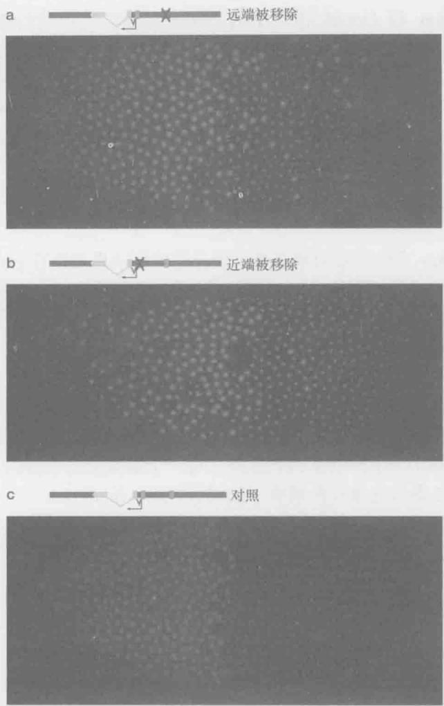  
图 21-18 Hunchback 是由两个作用类似的增强子共同调控的。(a) 早期 Hunchback 转录的激活发生于一个只有近端增强子完好无损的转基因。末端变暗的增强子（图中的 X 所示）通过突变被灭活。注意基因表达并没有局限在胚胎的前半部分（左半部分）。(b) 对照组显示了当近端增强子失活末端增强子完好无损时的激活作用。基因只在前部区域零星表达。(c) 当所有的增强子都完好无损时的激活作用。(Courtesy of Mike Levine; described in Perry M.W. et al. 2011. Proc. Natl. Acad. Sci. 108:13570–13575, Fig.2A–C, p. 13572.)

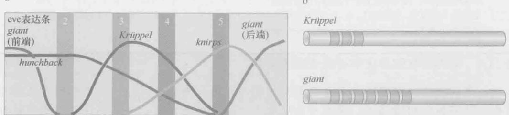  
图 21-19 Hunchback 生成连续的间隔的基因表达类型。（a）前后部位 Hunchback 抑制子形成的浓度梯度建立了 krüppel、knirps、giant 基因表达的不同的界限。高浓度抑制 krüppel 而低浓度抑制 giant。（b）krüppel 和 giant 的 5'端调节 DNA 含有不同数目的 Hunchback 抑制子结合位点，krüppel 有 3 个位点而 giant 有 7 个位点。giant 增强子中增加的 Hunchback 抑制子结合位点对应于它受低浓度 Hunchback 抑制的效应。（来源：a. Redraw from Gilbert S.E. 1997. Developmental biology, 5th edition, p.565, Fig.14-23 ©, Sinauer.）

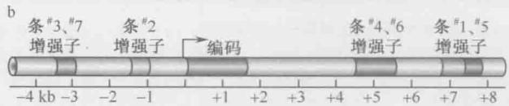

我们见过 Bicoid 和 Dorsal 活化子的不同亲和力产生不同的基因表达的阈值。Hunchback 抑制子的作用方式颇为不同，Hunchback 抑制子位点的数目成为了区别 krüppel、knirps、giant 基因表达形式的主要决定因素（图 21-19b）。Krüppel 增强子只有 3 个 Hunchback 结合位点，受到高浓度的 Hunchback 抑制；相反，giant 增强子有 7 个 Hunchback 结合位点，受到低浓度的 Hunchback 抑制。其中的作用机制还未被揭示，或许抑制的不同阈值产生于单个 Hunchback 抑制域的叠加效应。

## Hunchback 和缺口蛋白产生了基因表达的分节条

从 bicoid 和 oskar 定位开始的调节级联反应的最终结果是称作 even-skipped（或简称 eve）的“成对规则”基因的表达。eve 基因以形成 7 条间隔的/成对规则的表达条纹的方式在胚胎表达（图 21-20）。每个 eve 条包含 4 个细胞，同时条间隔也有 4 个细胞，但不表达 eve，这些条预示着未来体节形成的位置。

Eve 蛋白的编码序列并不长，小于 2kb，而其两边的调节区却有 12kb，其中 4kb 在 5'端转录起始点上游，8kb 在 eve 基因 3'端外围（图 21-20）。5'端调节区启动第 2、3、7 条的表达，而 3'端调节第 1、4、5、6 条的表达。这 12kb 的区间包含 5 个增强子，其结果是形成早期胚胎的 7 个不同的基因表达条。每一个增强子只控制第 1\~2 个条的表达，这里会介绍调控第 2 条表达条纹的增强子的调节机制（框 21-7）。

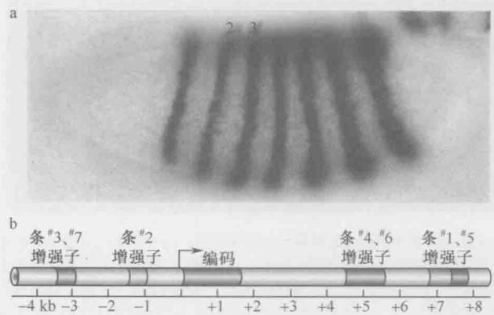  
图 21-20 发育胚胎中 eve 基因的表达。(a) 早期胚胎 eve 基因表达类型。(b) eve 位点包含 12kb 的调节 DNA 序列，其 5' 端包含 2 个增强子，控制第 2、3、7 条的表达，每个增强子的长度为 500bp。3' 端包含 3 个增强子，控制第 1、4、5、6 条的表达。这 5 个增强子形成了早期胚胎的 8 个不同的 eve 基因表达条。(来源：a. Image courtesy of Michael Levine.)

## 框 21-7 动物发育和演化中的顺式调控序列

顺式调控序列以模块方式存在于动物基因组内。通常来说，一个复杂的表达模式中各组分有独立的增强子。考虑一个发育中的老鼠胚胎内某一个基因在不同的组织和器官中如肝脏、胰腺和脑垂体中表达的的情况，我们希望的是这个基因带有用于不同部位表达的不同的增强子。我们已经知道eve 基因座中包括 5 个独立的增强子，位于 5' 和 3' 侧翼区（图 21-20）。每一个增强子决定着早期果蝇胚胎 7 个 eve 表达条中一种或两种的表达。正如我们下面将讨论的，这种模块化组织形式有利于通过顺式调控序列的演化形成多样化的形态。

## 模块化组织的控制基因的多效性

在演化过程中，基因表达的方式是如何改变的呢？越来越多的证据表明，关键性的激活因子结合位点处核苷酸的改变可以消除基因在特定组织或细胞演化中的表达。这里举个棘鱼腹鳍的例子。在自然界中，有无腹鳍的棘鱼变异体。当它们与有腹鳍的个体配对时，有可能确定造成腹鳍减少的主要基因位点。该位点位于Pitxl基因的5'侧翼区域。Pitxl是一个发育调控基因，在小鼠几个不同的组织，包括胸腺，嗅窝和后肢的发育中是必不可少的。在棘鱼中，在腹鳍（后肢）增强子的关键性的激活因子结合位点处的点突变似乎导致了腹鳍的减少（框21-7图1）。这些突变打断了腹鳍发育中的基因表达，但它们不干预在胸腺、嗅窝和其他组织中调控Pitxl基因的增强子的活性，在这些部位中，Pitxl基因呈表达状态。

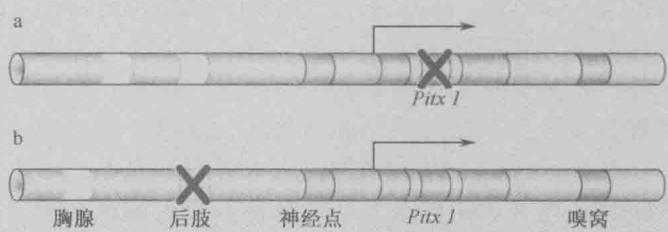  
框 21-7 图 1 发育调控基因 Pitx1。（a）此图显示了 Pitx1 基因以及 5'上游序列的结构。这里显示的是在基因编码区（第二个外显子）发生的（使实验室老鼠）致死的无义突变。（b）在野生型棘鱼中，5'上游序列中的一个关键的调控突变导致了腹鳍的缩小。

顺式调控区域模块中的特定改变也决定着不同种的果蝇的着色方式的演化。传统的黄色位点（y）对着色至关重要，简单的基因突变就可造成果蝇有着黄色的身体却缺乏黑色素的沉积。。就像我们介绍的，Y基因在刚毛、翅膀、腹部的表达会由不同的增强子调控。

成年黑腹果蝇（尤其是雄性）的后腹节含有大量色素沉着。这种沉着是由y腹部增强子Hox蛋白Abd-B的直接激活造成的。缺乏腹节的果蝇，如kikkawai，在关键的Abd-B激活子位点有一个点突变，由此导致了腹部y的表达缺失及所观察到的色素缺失现象。

在翅膀中，有一个调控 y 表达的单独的增强子。在一些种类的果蝇中，这个增强子导致的成年雄性翅膀中含有一个特别的翅膀四分之一处的色素沉着点（框21-7图2）。这个点是求偶仪式的一个关键组成部分。而不含这个色素点的果蝇翅膀的增强子中含有点突变，从而导致 y 基因的活性的部分丧失，但并不影响 y 基因在其他组织，如刚毛、腹部表皮的活性。

## 阻遏蛋白位点的改变导致基因表达的显著变化

在不连续的增强子模块中，关键激活位点的丧失可以解释 Pitxl 局部表达的缺失及 y 基因的失活。新的基因表达模式的产生还可以由阻遏元件的丢失所引起。

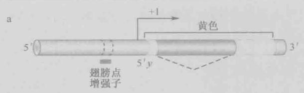

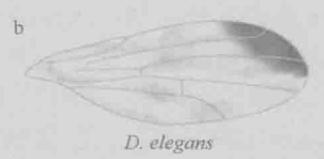

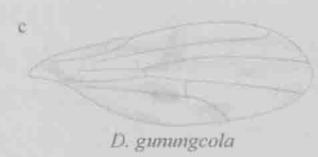  
框 21-7 图 2 果蝇的黄色基因位点 y。（a）此图显示了黄色基因位点的结构以及上游调控序列（增强子序列）。（b）一种成年雄性果蝇翅膀上的正常的色素沉着点（求偶点）。（c）缺失色素沉着的一类果蝇的翅膀，该物种在 5 增强子位置有突变。

在果蝇早期胚胎中，绝大多数或全部有活性的增强子都有阻遏蛋白结合位点，它们负责限定基因表达边界。例如，evestripe-2 增强子带有 Giantt 和 Kruppel 阻遏蛋白的结合位点，导致前部/后部基因表达的显著区别（图 21-21）。这些位点的突变使正常的表达模式发生突出的扩展：形成了一个宽范围的表达，而不是局部条纹状的表达。

人类中的乳糖酶基因是一个阻遏元件参与演化的范例。在大部分灵长类动物中，在母乳喂养期的婴儿小肠中的 LCT 基因高表达。但是，这个基因会在青春期后关闭。成年人中乳糖酶基因的持续表达是不常见的。牧区人群乳糖酶基因的持续表达与他们断奶后长期食用牛奶有关。某些特定的人群中具有较高的 LCT 基因表达是因为在位于乳糖酶基因 LCT 基因 5' 端的 MCM6 基因内含子中有核苷酸的替换（框 21-7 图 3）。

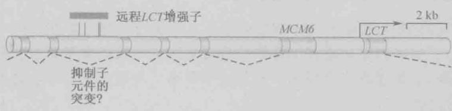  
框 21-7 图 3 乳糖酶基因的结构及其 5'上游调控区。

这些核苷酸的替换有可能破坏阻遏元件，使之无法与沉默子蛋白正常结合，从而使无法抑制青少年和成人的小肠中乳糖酶基因的表达。这种起关键顺式作用元件的缺失与棘鱼Pitx1基因的后肢/腹鳍增强子失活或果蝇y基因的腹部/翅膀增强子的失活类似。但是，在乳糖酶基因的例子中，因为阻遏元件的缺失使得乳糖酶活性得到了暂时的持续，是一种新的基因表达方式。

第二表达条增强子有 500bp，分布在转录起始点上游 1kb 的位置，它包含 4 种调节蛋白——Bicoid、Hunchback、Giant 和 Krüppel 的结合位点（图 21-21）。我们已知 Hunchback 在调节间隔基因表达时起到抑制子的作用；而对第二表达条增强子的调节则起到活化子的作用。至于 Hunchback 如何既是活化子又是抑制子，我们以后还会讲到。原理上，Bicoid和 Hunchback 存在于胚胎的前半部分，可以活化所在位置的第二表达条的增强子，Giant 和 Krüppel 作为抑制子界定了第二表达条的类型即前后体的分界（图 21-21）。

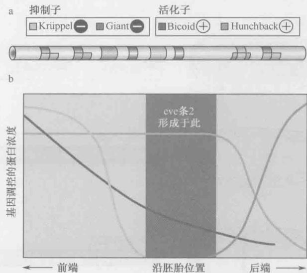  
图 21-21 eve 第二表达条的表达调节。(a) 500bp 的增强子包含总共 12 个结合位点，对应于 Bicoid、Hunchback、Krüppel 和 Giant 蛋白。这些调节蛋白在果蝇早期胚胎中的分布的总结见 (b)。高浓度的 Bicoid 和 Hunchback 可见于 eve 第二表达条的细胞中，而其界面则由 Giant 和 Krüppel 来界定。(Giant 在前、后部位表达，这里只展示了前半部分；后半部分的类型未展示，它是由 Hunchback 调节的。(引自 Alberts B. et al. 2002. Molecular biology of the cell, 4th edi, a.p.409, Fig.7-55, b. p.410, Fig.7-56. ©2002.)

## 缺口抑制子浓度梯度引起基因表达的条带化

eve 第 2 表达条的形成是广泛分布的活化子（Bicoid 和 Hunchback）和局部分布的抑制子（Giant 和 Krüppel）相互作用的结果，同样的机制也适用于其他 eve 增强子的调节。例如，在早期胚胎中 eve 第 3 表达条的增强子受到普遍存在的的转录活化因子的活化。表达条的边界由局部定位的缺口抑制子界定：前界由 Hunchback 确定而后界由 Knirps 确定（图 21-22）。

eve 第 4 表达条增强子也受到 Hunchback 和 Knirps 的抑制，事实上，这些抑制子的不同浓度在每个表达条调控中均发挥着作用。低浓度的 Hunchback 不足以抑制 eve 第 3 表达条增强子但足以抑制 eve 第 4 表达条增强子（图 21-22）。Hunchback 抑制子浓度梯度对两种增强子的差异调节产生了第 3 和第 4 表达条基因表达类型的特有的前界。Knirps 蛋白在前细胞胚胎中的分布也存在浓度梯度，与第 3 表达条增强子相比需要更高的浓度来抑制第 4 表达条增强子，这种差别造成了第 3 和第 4 表达条基因表达类型的不同的后界。

我们已经见到了 Hunchback 抑制子浓度梯度产生的 Krüppel、Knirps、Giant 不同类型的基因表达，这种差异调节可能与 Krüppel、Knirps、Giant 增强子上 Hunchback 结合位点逐渐增加有关，类似的原理也适用于 Hunchback 和 Knirps 浓度梯度对第 3 和第 4 表达条增强子的差异调节。eve 第 3 表达条增强子包含相对较少的 Hunchback 结合位点和相对较多的 Knirps 结合位点。eve 第 4 表达条增强子包含相对较多的 Hunchback 结合位点、相对较少的 Knirps 结合位点（图 21-22）。类似的原理可能操纵着剩余的表达条增强子来调控 eve 基因表达形式（其他成对规则基因也是如此）。

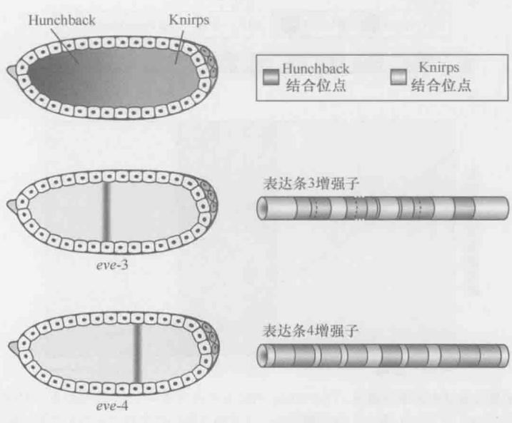  
图 21-22 Hunchback 和 Knirps 反向浓度梯度对第 3 和第 4 表达条增强子的差异调节。这两个表达条存在于胚胎的不同区域：eve 第 3 表达条增强子分别受到高浓度的 Hunchback 和低浓度的 Knirps 抑制。相反，eve 第 4 表达条增强子分别受到低浓度的 Hunchback 和高浓度的 Knirps 抑制。eve 第 3 表达条增强子只有少数的 Hunchback 结合位点，其结果是，需要高浓度的 Hunchback 使其受到抑制。eve 第 3 表达条增强子包含多个 Knirps 结合位点，因而，低浓度的 Knirps 就可使其受到抑制。eve 第 4 表达条增强子具有相反的抑制子结构，它包含大量的 Hunchback 结合位点，因此，低浓度的 Hunchback 就可抑制第 4 表达条的基因表达。第 4 表达条增强子仅有少数的 Knirps 结合位点，只有高浓度的 Knirps 才能使其受到抑制。需要注意的是，第 3 表达条增强子指导两个表达条的基因表达——第 3 条和第 7 条；第 4 表达条增强子指导第 4 条和第 6 条的基因表达。

## 短程转录抑制子允许在复杂的 eve 调节区域中不同的增强子独立作用

我们已经见到eve基因表达在早期胚胎受到5种不同的增强子的调节。事实上，在更成熟的胚胎的心脏和中枢神经系统（CNS）中还有更多的控制eve基因表达的增强子。这类复杂的调节并不仅仅见于eve基因，有些遗传位点会包含更多的增强子，分布于更远的距离。例如，一些基因受到多达10个或更多不同的增强子的调节，它们散布在100kb的区间（我们之后会讲到）。因此，与重要发育过程相关的基因常常受到多个增强子的调节。那么，这些增强子是如何相互独立作用来产生叠加性的基因表达呢？在eve基因的例子中，5个不同的增强子生成了7个不同的表达条。

短程转录抑制是保证增强子自主性的机制之一——多个增强子的独立作用产生基因表达的叠加效应，即抑制子与一个增强子的结合并不干扰活化子与同一个基因调节区域的另一个增强子的结合。例如，我们已经见到过 Krüppel 抑制子与第 2 表达条增强子结合，它建立了第 2 表达条的后界。Krüppel 抑制子仅在 500bp 的第 2 表达条增强子附近起作用，它并不抑制核心启动子也不抑制第 3 表达条增强子的活化子，二者与第二表达条增强子的 Krüppel 结合位点的距离超过 1kb（图 21-23）。假设 Krüppel 能够通过长距离起作用，那它就会干扰 eve 第 3 表达条的基因表达，因为在胚胎 eve 表达条 3 增强子被激活的区域内具有高浓度的 Krüppel。

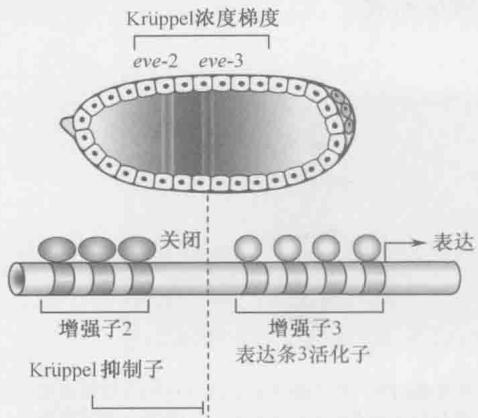

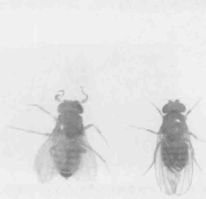  
图 21-23 短程抑制和增强子自主。由于短程转录抑制，eve 基因调节区域不同的增强子独立发挥作用，结合于一个增强子的抑制子并不干扰邻近增强子的活化子。例如，Krüppel 抑制子结合于第 2 表达条增强子使胚胎中间区域第 2 表达条关闭。eve 第 3 表达条增强子在这些区域表达，它并不受 Krüppel 的抑制，因为它没有 Krüppel 的特定的识别序列。此外，Krüppel 第 2 表达条增强子的结合并不干扰第 3 表达条增强子的活化子，因为它们相距甚远。Krüppel 必须在上游活化子的 100bp 距离之内结合来阻断它激活转录的能力，第 2 表达条和第 3 表达条被 1.5kb 的间隔序列分开。  
图 21-24 Antp 的显性突变引起触角同源异型转化为足。右边的果蝇为正常的。注意头前部的初始的触角。左边的果蝇是 Antp 的显性突变杂合子（AntpD/+）。它可以完全成活，形态基本正常，只是在触角处伸出一对足来。（Matthew Scott 惠赠）

## 同源异型基因：一类重要的发育调节因子

果蝇发育的遗传分析导致了一类重要的调节基因即同源异型基因的发现，它们造成不同体节的形态多样化。某些同源异型基因控制头节的口器和触角的发育，另一些则控制胸节的翅膀和平衡棒（halter）的形成。Antp 和 Ubx 为两个研究最为透彻的同源异型基因，它们分别抑制触角和翅膀的发育。

Antp 控制胸节中部体节（中胸节）的发育。中胸节生成一对足，其形态与前足和后足不同。Antp 编码一种通常在发育中的胚胎的中胸节表达的同源异型蛋白。该基因不会在发育中的头部组织表达。然而，染色体倒位造成 Antp 的蛋白编码区受到 “外源” 的头部组织（包括触角）的调节基因的控制（图 21-24）。当 Antp 在头部组织错误表达时，个体形态发生显著改变，长触角的位置长出了足。

Ubx 编码一种控制第三胸节后胸节发育的同源异型蛋白。Ubx 特异性的抑制那些第二胸节即中胸节发育所需基因的表达。事实上，Antp 是受到其调节的基因之一：Ubx 抑制 Antp 在后胸节的表达，将它的表达限制在在发育中的胚胎中胸节。缺失 Ubx 抑制子的突变体表现出 Antp 的异常表达。此时 Antp 不仅在其正常发育中的中胸节表达，还会在发育中的后胸节异常表达。这种异常表达造成后胸节转化成重复的中胸节。

成年果蝇的中胸节拥有一对足和一对翅（图 21-25），后胸节拥有一对足和一对平衡棒。平衡棒明显小于翅，是在飞行时的平衡结构。Ubx 突变体表现出惊人的表型；突变体拥有四只发育完全的翅，其中两只由平衡棒转化而成。

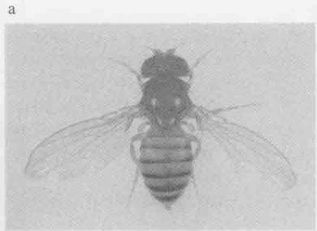

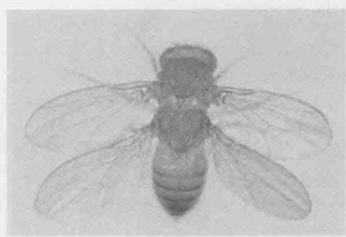  
图 21-25 Ubx 的突变将后胸节转化为两个中胸节。（a）正常果蝇拥有一对主翅和后边小一些的一对平衡棒。（b）图示突变体为 Ubx 基因弱突变纯合子。后胸节转化为重复的中胸节而不是原先的一对翅和一对平衡棒。（E.B. Lewis 惠赠）

Ubx 在后胸节不同组织的表达依赖于一些包含超过 80kb 基因组 DNA 的调节序列。一种叫 Cbx（反双胸基因 Contrabithorax）的突变扰乱了 Ubx 调节序列的功能但不改变该基因的蛋白质编码序列。Cbx 突变除维持 Ubx 在其正常的后胸节的表达外，还导致 Ubx 在中胸节的异常表达（图 21-26）。这种情况下 Ubx 抑制 Antp 及其他在中胸节发育中必要的基因的表达。其结果是，中胸节转化成为复制正常的后胸节。其表现型也非常不同：翅变成了平衡棒，使得 Cbx 突变体看起来更像是无翅的蚂蚁。

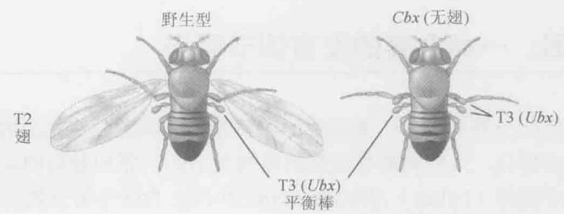  
图 21-26 Ubx 在中胸节的异常表达导致翅的丢失。Cbx 突变扰乱了 Ubx 基因的调节区域，造成它在中胸节的异常表达，导致其转化为后胸节。

## 同源异型基因表达的变化导致节肢动物的多样性

新生的演化发育研究处于原本互不相干的研究领域——演化生物学和发育生物学的前沿。推动演化发育研究的动力来自于对果蝇、线虫和其他模式生物的发育的遗传分析所发现的形成演化多样性的关键基因。同源异型基因是这些基因的极好的代表。

果蝇基因组拥有总共 8 个同源异型基因，形成 2 个基因簇（或称复合体）——Antennapedia 复合体和 Bithorax 复合体（框 21-8 “果蝇同源异型基因由特殊染色体簇构成”。典型的无脊椎动物基因组包含8-10个同源异型基因，通常分布在一个复合体内。脊椎动物复制了祖先Hox复合体，包含4个簇。单个同源异型基因表达和功能的改变是节肢动物肢和脊椎动物中轴骨骼变化的原因。我们后续会介绍Ubx的活化是如何造成昆虫和其他节肢动物演化的改变的。

## 框21-8 果蝇同源异型基因由特殊染色体簇构成

Antp 和 Ubx 仅代表了果蝇基因组 8 个同源异型基因中的 2 个。果蝇的 8 个同源异型基因分布在 2 个簇（或称基因复合体）中。其中 5 个分布在 Antennapedia 复合体中，另 3 个分布在 Bithorax 复合体中（框 21-8 图 1）。不要将复合体与其中的单个基因混淆。例如，Antennapedia 复合体以该复合体第一个被鉴定的基因 Antennapedia（Antp）基因命名。该复合体还有其他 4 个基因：labial（lab）、proboscipedia（pb）、Deformed（Dfd）、Sex combs reduced（Scr）。同样，Bithorax 复合体以 Ultrabithorax（Ubx）基因命名，此复合体还有另外 2 个基因：abdominal-A（abd-A）和 Abdominal-B（Abd-B）。另一种昆虫-面象虫仅有一个同源异型基因复合体，该复合体中含有果蝇的 Antennapedia 复合体和 Bithorax 复合体中的所有八个同源基因。双复合体可能来源于祖先单复合体的染色体重排。

同源异型基因在发育中的胚胎的前后轴向上存在着染色体排列上和基因表达上同样的线性关系（框21-8图1）。例如，分布在Antennapedia的复合体的3'末端的lab基因表达在果蝇发育期胚胎最前端的头部。相反，分布在Bithorax复合体的5'端的Abd-B基因就在最后端后端表达（框21-8图1）。这种共线性的意义还不明确，但是一定十分重要，因为它在所有的节肢动物（包括面象虫），以及现已研究的脊椎动物包括小鼠和人类中都是保守的。

## 哺乳动物 Hox 基因复合体控制前后轴类型

小鼠拥有38个Hox基因，分布在4个基因簇里（Hoxa、Hoxb、Hoxc和Hoxd）。每个簇或复合体拥有9\~10个Hox基因，对应于形成果蝇Antennapedia复合体和Bithorax复合体的单个的昆虫同源异型基因簇（框21-8图2）。例如，Hoxa-1和Hoxb-1与果蝇的lab基因关联性最强，而Hoxa-9和Hoxb-9与位于复合体另一端的果蝇的Abd-B非常相似。

除去这种小鼠和果蝇的 Hox 基因的顺序的同源性以外，每个小鼠 Hox 基因还表现出了果蝇中的同样类型的共线性。例如，每个复合体的 3' 的 Hox 基因如 Hoxa-1 和 Hoxb-1 在发育胚胎的最前端区域表达（未来的后脑）。相反，复合体 5' 端的 Hox 基因如 Hoxa-9 和 Hoxb-9 则在胚胎的后部区域表达（发育中脊椎的胸节和腰节）。Hoxd 复合体表现出了沿着发育中的肢体的前后轴的顺序表达的特点。相应的特点并没有在昆虫中出现，说明随着脊椎动物演化，Hoxd 基因获得了新的调节 DNA。事实上，在第 19 章已经讲到，一个特化的全面调节区域（GCR）会协调肢体发育中的各个 Hoxd 基因的表达。

## Hox 基因表达类型的改变生成脊椎动物形态的多样性

哺乳动物 Hox 基因突变造成中轴骨骼（包括脊髓和脊椎中不同的椎骨）的破坏。这引起了类似于前面讲过的果蝇的 Antp 和 Ubx 突变造成的形态的变化。

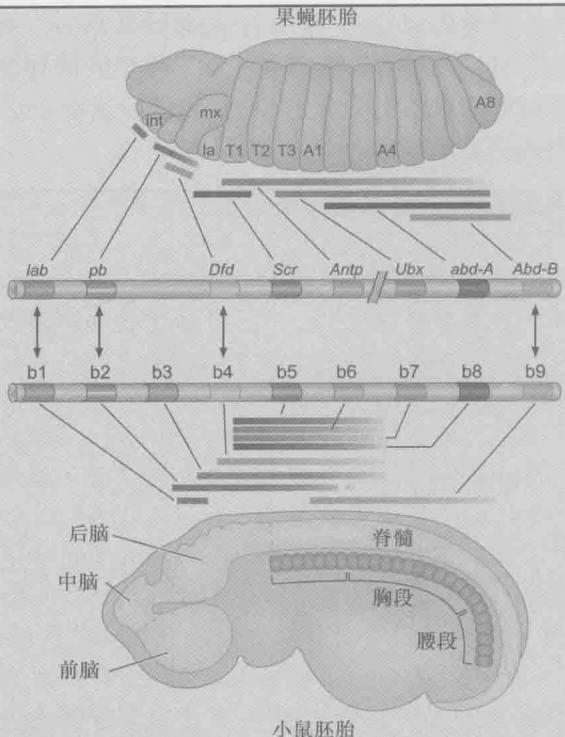

框 21-8 图 1 果蝇和小鼠的结构和表达。图里比较了果蝇和小鼠 Hox 基因的共线性序列和表达。（经允许，引自 McGinnis W. and Krumlauf R. 1992. Cell 68: 283-302, Fig.2. 版权所有 Elsevier）  
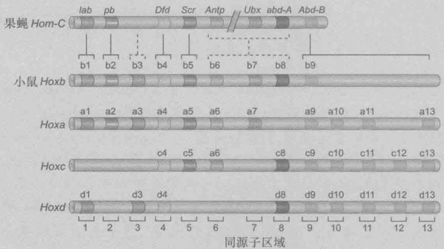  
框 21-8 图 2 果蝇和小鼠同源异型基因结构和表达的保守。（经允许，引自 Gillbert S.E.2000. Developmental Biology, 6th ed., Fig.11-36a. ©Sinauer）

小鼠的 Hoxc-8 基因与果蝇的 Bithorax 复合体的 abd-A 基因最为相像。它通常在脊柱的胸腔和腰部交界处——最初的“尾”处表达（abd-A 在果蝇胚胎的前腹部表达）。第一个腰椎通常没有肋骨。纯合的 Hoxc-8 基因敲除突变体胚胎表现出显著的突变表现型。第一个腰椎发育出额外、的发育不全的肋骨。这种发育的异常现象有时被称为“同源异型”转化：即一种正常结构长在了错误的位置。在这个例子中，通常位于后胸位置的椎骨发育在了腰椎区域的前位。

## Hox 基因表达模式的保持

Hox 基因的定位表达机制是在果蝇和小鼠胚胎早期，由序列特异的转录激活抑制因子共同作用来建立的。其中一些调控蛋白会受到细胞信号途径（如 FGF 和 Wnt 信号途径）的调控。在果蝇中，许多负责 eve 基因的局部表达条的缺口抑制子也控制着起始阶段 Hox 基因的表达。即使是 Gap 抑制子丢失后，这些表达模式在整个生命周期中都将被保持很久。

让我们来看一个例子——果蝇中的 Abd-B 基因，该基因特异的在后腹部表达，包括第 5-8 腹节。在果蝇胚胎发育的早期的头、胸和前腹中，Abd-B 的表达最初被 Hb、Kr 和 Kni Gap 抑制子抑制。这是形成 eve 局部条纹化表达的同样一批抑制子（图 21-19，图 21-20）。这些抑制子限制了 Abd-B 在腹节前部的表达。

Abd-B 基因及大部分其他 Hox 基因表达的维持依赖于一个大的蛋白复合体——多性梳基因抑制复合体（PRC）。在那些未能活化 Abd-B 基因的早期胚胎细胞（头、胸和腹的前体）中，PRC 与 Abd-B 基因的调节序列结合。在所有这些细胞中，PRC 造成组蛋白 H3 的 27 位赖氨酸甲基化，此甲基化与 Abd-B 转录单位的抑制有关。相反的，一个普遍存在的活化子复合体——三胸复合体（TRC）会在表达 Abd-B 基因的早期胚胎（如腹节后部）细胞中与 Abd-B 基因的调节序列结合。TRC 的结合造成组蛋白 H3 的 4 位赖氨酸甲基化，这与 Abd-B 基因的转录活化相关联。

因此，取决于最初的基因表达情况，PRC 和 TRC 在早期胚胎维持 Hox 基因的开和关的状态。如果 Hox 基因在特定的细胞被抑制，PRC 结合并保持其所有的子代细胞该基因的关闭。相对应的，如果 Hox 基因在特定的细胞被活化，TRC 结合并保持其所有的子代细胞该基因的稳定表达，PRC 起到了调节记忆 Hox 基因表达类型的作用。

## 微小 RNA 调节 Hox 基因活性

许多 Hox 基因复合体包含微小 RNA 基因（microRNA 或 miR）。比如，果蝇 ANT-C 含有 miR-10，BX-C 含有 miR-iab4。这些被编码的微小 RNA 抑制或减弱不同的 Hox 蛋白的合成，如 iab4 miRNA 抑制腹部 Ubx 蛋白合成。脊椎动物 Hox 基因复合体也含有 miR 基因，包括 miR-10。miR-196 基因分布在多个脊椎动物 Hox 基因复合体的 5' 端，其编码的 miRNA 据认为抑制小鼠胚胎后部的 Hoxb8 蛋白质的合成。关于 miRNA 如何阻止或减弱蛋白质合成，参见第 20 章。

## Ubx 表达的改变引起甲壳动物肢的改变

甲壳动物包括大部分游泳的节肢动物。它们部分生活在海洋中，部分生活在淡水中。它们提供了我们餐桌上的美食，如虾、蟹、龙虾。一类相当普遍用于研究的甲壳动物叫做卤虫，又叫海猴。它的胚胎停止发育形成的坚硬的孢子可从宠物店买到。其孢子加入海水后迅速恢复发育。

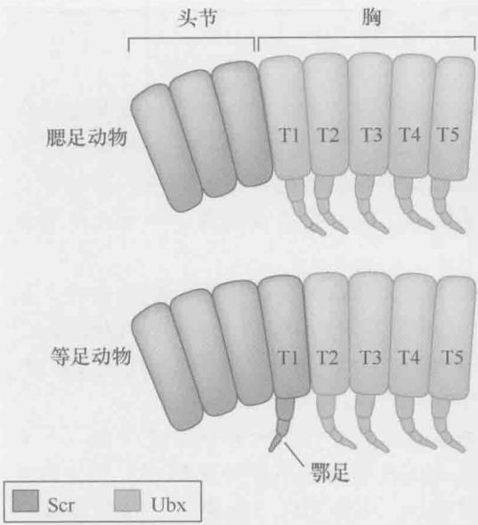  
图 21-27 两组不同甲壳动物的形态变化。在腮足动物，Scr 基因表达局限在头部有助于摄食附肢的发育，而 Ubx 在胸节的表达则控制游泳肢的发育。在等足动物，Scr 基因的表达同时可在头部和第一胸节（T1）检测到，其结果是，T1 的游泳肢转化成了摄食附肢（螯肢）。Scr 的向后扩展是 T1 胸节失去 Ubx 的表达的结果，而 Ubx 通常会抑制 Scr 的表达。（引自 Levine M. 2002. Nature415:848–849，Fig. 2. ©Macmillan.）

这些虾的头部拥有摄食的附肢。靠近头部的胸节——胸节1（T1），包含游泳附肢，它们看起来与后面的其他胸节相像（胸节T2\~T11）。卤虫属于甲壳动物鳃足目。另一甲壳动物目叫做等足目，其第2\~8胸节为与鳃足目相似的游泳肢（图21-27）。但其第一胸节的附肢发生了改变。它们比其他的附肢小，其功能是摄食。这种经过修饰的附肢称为颚足，看起来像是头上形成的附肢（没有在图上显示出）。

腮足动物和等足动物的 Ubx 基因表达形式稍有不同。这些不同与等足动物第一胸节的游泳肢的修饰有关。也许，腮足动物和等足动物的共同祖先拥有像卤虫那样的胸肢（其本身也是腮足动物的一员）——其胸节都包含游泳肢。在腮足动物和等足动物的分化中，Ubx 的调节序列在等足动物发生改变。结果导致在第一胸节的 Ubx 基因表达被消除，Ubx 基因表达只局限在 T2\~T8 胸节。Ubx 表达的转变使得颚足替代了 T1 的游泳

肢。甲壳动物胸节的 Ubx 表达的缺失与摄食附肢的发育存在紧密的关联性。例如，龙虾胚胎的头两个胸节缺乏 Ubx 基因表达具有两对颚足。清道夫虾的头三个胸节缺乏 Ubx 基因表达具有三对颚足。

## 昆虫是如何失去腹肢的

所有昆虫有 6 条腿，3 个胸节上每节有 1 对，这在 100 多万种昆虫中无一例外。相反，其他节肢动物如甲壳动物则拥有数目不等的肢。有些甲壳动物在每节胸节和腹节上都有肢。这种演化上的形态变化——昆虫腹肢的失去并非是像等足动物的颚足那样因为形态决定基因表达的改变。事实上，昆虫腹肢的失去是因为 Ubx 调节蛋白的功能的改变。

在昆虫中，Ubx 和 abd-A 抑制一个关键的肢节发育必需的叫做 Distal-less（Dll）的基因的表达。在发育的果蝇胚胎中，Ubx 在后胸和前腹节大量表达；abd-A 的表达延展到更靠后的腹节部位。Ubx 和 abd-A 共同使得 Dll 在头 7 个腹节保持关闭状态。尽管 Ubx 也在后胸节表达，它并不干扰 Dll 在那里的表达。因为当 Dll 基因活化后，Ubx 才在 T3 发育中的附肢表达。其结果是，Ubx 并不干扰 T3 中附肢的发育。

在甲壳动物如上述的腹足动物卤虫中，所有11个胸节都有大量的Ubx和abd-A的表达。Dll的表达促进了游泳肢的发育。为什么Ubx抑制Dll在昆虫腹节的表达而抑制甲壳动物中的表达呢？答案是Ubx蛋白在昆虫和甲壳动物之间已经发生了变异。下述实验能够证明这一点。

Ubx 基因在转基因果蝇胚胎预期的胸节处的错误表达抑制了 Dll 的表达进而抑制了肢的发育（图 21-28）。相反，甲壳动物 Ubx 基因在转基因果蝇胚胎预期的胸节处的错误表达并不影响 Dll 的表达和肢的形成。这些观察表明果蝇的 Ubx 蛋白和甲壳动物的 Ubx 蛋白在功能上的差异。果蝇 Ubx 蛋白抑制 Dll 基因表达而甲壳动物 Ubx 蛋白则不会。

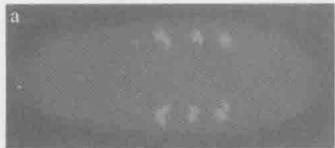

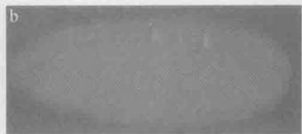

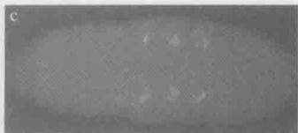  
图 21-28 Ubx 蛋白功能的演化改变。(a) Dll 增强子 (Dll304) 通常在果蝇胚胎的 3 对 “点” 部位被活化。这些部位形成成年果蝇的 3 对腿。(b) 果蝇 Ubx 蛋白 (DmUbxHA) 的错误表达强烈抑制了来自 Dll 增强子的表达。(c) 相反，卤虫 Ubx 蛋白的错误表达 (AfUbxHA) 只造成对 Dll 增强子轻微的抑制。

那么 Ubx 蛋白的这些功能差异的基础是什么呢？（它们只有 32% 的氨基酸总体水平上的相似性，但是它们的同源异型域却几乎完全相同——59/60 匹配）原因是甲壳动物的这个蛋白拥有一个屏蔽掉了其抑制活性的 29 个氨基酸的短模体（motif）。当这个模体被剔除后，该蛋白抑制 Dll 表达的能力与果蝇的相同（图 21-29）。

甲壳动物和果蝇的 Ubx 蛋白含有多个抑制区域。在第 19 章已经讨论过，很可能这些区域能够与一个或多个转录抑制复合体发生反应。甲壳动物 Ubx 蛋白中的“抗抑制肽”可能干扰了

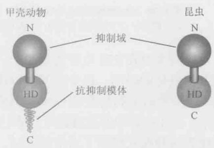  
图 21-29 甲壳动物和昆虫 Ubx 蛋白的比较。(左)甲壳动物的 Ubx 蛋白。羧基末端的抗抑制肽封闭了氨基端抑制区域的活性。(右)昆虫的 Ubx。突变失去了羧基末端的抗抑制肽。

抑制区域募集这些转录抑制复合体的能力。当这个肽接到果蝇蛋白上，这个杂合蛋白像甲壳动物的 Ubx 蛋白一样不再抑制 Dll 的表达。

## 飞行肢的修饰可能来自调节 DNA 序列的演化

Ubx 在我们对于节肢动物形态变化的讨论中具有重要地位。Ubx 基因表达的变化与甲壳动物的游泳肢转化成颚足有关。此外，Ubx 蛋白中抗抑制肽的确实也能解释昆虫腹肢的退化。在这一节，我们将展示 Ubx 靶基因的调节序列改变造成果蝇和蝴蝶翅形态变化的证据。

在果蝇中，Ubx 在发育中的平衡棒中表达，其作用是抑制翅的形成。大约 5\~10 个基因被 Ubx 抑制。这些基因都在发育的翅中表达，编码与翅的生长和形态决定至关重要的蛋白（图 21-30）。在 Ubx 突变体中这些基因在平衡棒中不再被抑制，导致平衡棒发育成了第二对翅。

果蝇是双翅目动物，它们都拥有一双翅和一对平衡棒。有可能 Ubx 在所有的双翅目中起到了抑制翅发育的作用。蝴蝶属于昆虫纲的不同的目——鳞翅目。所有这个目（包括蛾子）拥有两对翅而不是一对翅和一对平衡棒。这些双翅目和鳞翅目昆虫翅形态的差异的基础是什么呢？

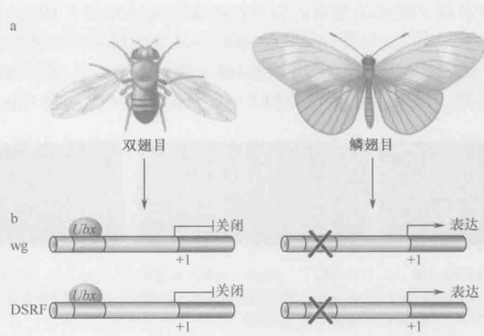  
图 21-30 Ubx 靶基因调节 DNA 的变化。(a) Ubx 抑制子在双翅目动物的平衡棒和鳞翅目动物的后翅中表达（橙色）。(b) 在双翅目动物，不同的靶基因拥有 Ubx 抑制子位点，而在鳞翅目则失去了这些位点。

这两个目在 250 万年前分化于一个共同祖先。大约是在人类和非哺乳类如青蛙向不同方向演化的时间。这个时间足以通过之前讨论的三种表达策略去改变 Ubx 基因的功能。最简单的机制是改变 Ubx 基因表达类型，使其他在鳞翅目昆虫的后翅前体细胞中不表达。这样发育中的后翅就可以表达所有被 Ubx 抑制的基因。等足动物游泳肢向颚足的转化为这种模式提供了清晰的例证。然而，果蝇和蝴蝶的 Ubx 基因表达类型并无明显改变；Ubx 仍在整个蝴蝶后翅的发育中大量表达。

这为我们留下了两种可能性。第一，在果蝇和蝴蝶里 Ubx 蛋白功能不同。第二就是 5\~10 种受 Ubx 抑制的每个基因的调节 DNA 发生了改变，它们不再受到 Ubx 的抑制（图 21-30）。较之改变 5-10 种不同的 Ubx 靶基因的调节序列，改变 Ubx 的抑制活性更为简单。

令人惊异的是相对不大可能的解释（多个 Ubx 靶基因调节序列的改变）成为了不同翅形态变化的合理解释。Ubx 蛋白在果蝇和蝴蝶中行使了相同的功能。例如，在蝴蝶 Ubx 后翅部分细胞的缺失导致它们转化为前翅结构（图 21-30a 前翅和后翅的差别）。这个观察表明蝴蝶 Ubx 蛋白起到了抑制前翅发育的抑制子的作用。虽然还没有被证明，但是非常可能的是，翅类型基因的调节 DNA 失去了 Ubx 结合位点（图 21-30b）。因而，它们在发育的后翅中不再受到 Ubx 的抑制。

## 基因组演化及人类起源

下面我们将讨论比较基因组分析的一个例子，主要是动物基因组比较的结果。对穴居人、黑猩猩和人的基因组比较为人类的起源研究提供了一些惊人的证据。

## 许多的动物间有非常相近的基因群

目前，大约有 100 种不同动物的基因组被完全测序并完成拼接，但是其中大部分序列都局限于少数的以人类为中心的动物类型，以及主要的模式动物类，如果蝇（Drosophila melanogaster）及线虫（Caenorhabditis elegans）。因此，为了研究人类基因组特点，许多灵长类动物基因组（如黑猩猩、猕猴等）都已进行了完全测序。果蝇的12个亚种已经测序完毕，并用来研究其不同种属的多样性。现在，仅有1/3的动物门中至少有一个代表动物被测序并完成组装。

迄今为止，基于比较基因组序列分析的发现中，最让人吃惊的是在数量庞大的动物种群分支中，从海葵到人类都拥有一些相似的保守基因。无脊椎动物，如海葵、蠕虫及昆虫，都含有大约15000个蛋白质编码基因。脊椎动物含有的蛋白质编码基因的数量稍微多一些，大约有25000个。但是，那些多出来的基因并不是在脊椎动物中特有的全新基因，而是来源于那些存在于无脊椎动物基因组中的“老基因”的复制。例如，在无脊椎动物中，纤维细胞生长因子（FGF）基因仅有少量拷贝；而在典型的脊椎动物基因组中，该基因含有超过20个不同的拷贝。

原生单细胞真核生物 Monosiga 的基因组测序拼接后的序列为我们了解导致生物差异化的基因种类提供了很多信息。该生物是最接近现代动物种类的物种。但是，它缺乏许多与动物发育相关的编码基因，包括信号分子编码基因如 Wingless、转化生长因子 $\beta$ （TGF- $\beta$ ）即 Dpp、Hedgehog 及 Notch。此外，它还缺乏在动物胚胎发育过程中操纵不同基因活性的关键调控基因，如 Hox 基因及 Hox 簇。因此，从这种简单的真核生物到现代生物的演化过程中，需要大量的在 10 亿年前的远古深海生物中没有的新型基因的出现。

## 许多动物中都含有不规则基因

尽管所有动物都含有被称为“工具箱”的所有动物生长发育过程中必需的保守基因群，，每一种动物的基因组还含有自己独特的（有时令人惊异的）基因。例如，海鞘这种动物含有编码纤维素合酶的基因（图21-31）。在植物中，这种酶应用于编码树木的主要组成部分——纤维素。事实上，纤维素在动物中完全是不存在的。那么，该基因对于

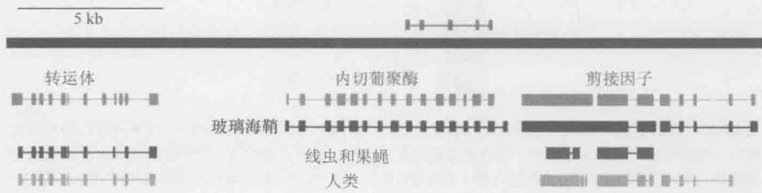

图 21-31 玻璃海鞘（Ciona）基因组中的一个植物基因同其他动物序列的比对。图示为 Ciona 基因组中长 20kb 的区域。该区域含有一个内葡聚酶基因。该基因编码一个与纤维素降解和合成相关的关键酶。纤维素是植物细胞壁的主要组成成分。图中红色矩形条表示拟南芥 kerrigan-1 基因。通过基因搜索软件，在 Ciona 基因中一共找到 15 个可能的外显子，如图中绿色所示。实际上，在该基因的 5'端还存在一个外显子（黑色框），而计算机软件却未能将其找到。与此类似，计算机还预测到一个编码 RNA 剪接因子的侧翼基因，并在预测到其大片段编码序列中存在着一个内含子。而事实上，cDNA 序列说明该小内含子并不存在。在 5'最外端的外显子，预测结果同实际结果也不完全一致。在线虫、果蝇和人类之间，其侧翼基因是保守的，而内葡聚酶基因唯一存在于 Ciona 中。Ciona 含有一个纤维性外鞘。需要提醒的是，在所有不同动物的基因组中，其侧翼基因的外显子内含子结构并不完全相同。（经允许引自 Dehal et al. 2002. Science 298:2157-2167, fig.8. ©AAAS.）

海鞘有什么作用呢？成年海鞘是不动的，它们在潮池中下过滤海水。海鞘具有一层富有弹力的保护性外鞘。这种外鞘的主要组成部分是动物纤维素——一种同植物纤维素相类似的物质。但是，通过海鞘基因组测序拼装的初步分析，我们无法得知它们是拥有自己的纤维素合成系统，还是借由别的生物来生产这种外鞘。因为的确是有一些生物借由简单的共生体来完成罕见的功能。例如，在白蚁和一种吃木头的蟑螂的后肠中就含有共生的细菌来帮助它们消化木屑。

对于海胆基因组的研究带来了另外一个惊喜：它含有两个在人类和其他脊椎动物中免疫球蛋白基因重排所必需的基因——RAG1 和 RAG2（见第 12 章）。脊椎动物的一个重要特点是能够对感染及外界伤害作出适应性免疫反应。这种免疫反应包括产生抗体用于高精度、高特异性地识别及结合外来抗原。无脊椎动物也有其先天的免疫系统，但是它们却不能产生适应性免疫反应。通过对海胆基因组的初步分析，人们推测现代脊椎动物的祖先可能获得了一种含有 RAG1 和 RGA2 基因的病毒或转座子。但是通过对海胆基因的分析表明，这种猜想是错误的。相反，RAG 基因获得自一种更远古的动物——后口动物的祖先。后口动物分化为现代的棘皮动物（如海胆）和脊索动物（如脊椎动物）（图 21-32）。似乎是在演化的过程中，这个假设祖先的部分后代逐渐失去了 RAG 基因，如海鞘。

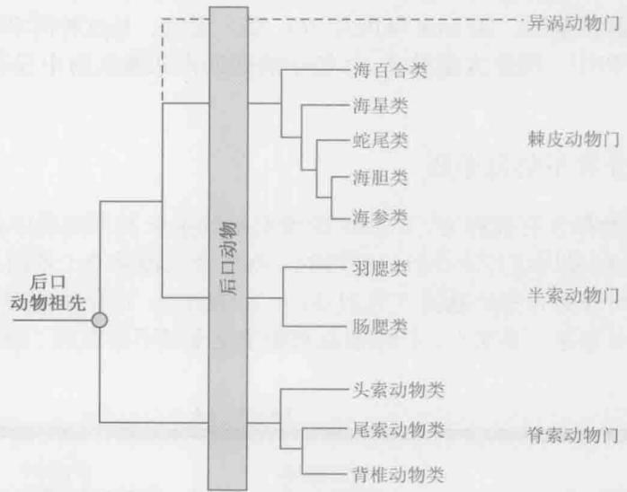  
图 21-32 后口动物演化史。后口动物一共有 4 个门：异涡动物门、棘皮动物门、半索动物门和脊索动物门。棘皮动物门一共有 5 个种，而脊索动物门有 3 个种。值得注意的是，与脊椎动物最为接近的是尾索动物。其中海鞘就是尾索动物的一种（参考框 19-3）（经允许引自 Gerhat J. 2006. J. Cell Physiol. 209: 677-685. ©Wiley-Liss, Inc.）

## 演化中的同线性

比较基因组分析所发现的最令人震撼的结果是高度的同线性（synteny）。同线性是指遗传连锁在不同物种间的保守性。在小鼠与人类之间具有广泛的同线性。在许多情况下，同线性甚至能够延伸至河豚鱼。在4亿多年前，河豚鱼与许多哺乳动物属于共同的祖先。更为甚者，一些连系被发现于人类与某些简单的无脊椎动物间。海葵便是其中典型的例子。7亿年前，海葵与人类属于共同的祖先。那时正是寒武纪大爆发，大量现代动物种类形成期之前（图21-33）。

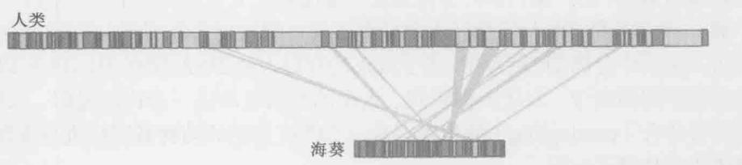  
图 21-33 海葵与人类遗传连锁的保守性。上图显示的是人类 10 号染色体 q24 上 10Mb 的区域。图中线条所表示的是在该区域中的 11 个基因与海葵染色体中 1Mb 对应区域的比对结果。这 11 个基因都位于两个物种的染色体中，所不同的是，在 7 亿年的演化过程中，这 11 个基因在人类和海葵基因组中的排列顺序发生了变化。

对原核生物来讲，遗传连锁至关重要，连锁的基因往往受一个共同的操纵子所调控（参考第18章）。但在后生动物中，此类连锁几乎遗失殆尽。尽管线虫被发现保留了部分操纵子。这也就是说，相邻的基因比不相邻的基因不一定有更紧密的共表达（如在血液细胞中）。早期比较基因组分析似乎已经确定，遗传连锁对基因的调控并没有多大的影响。例如，在哺乳动物基因组之间（如小鼠与人类）或是无脊椎动物基因组之间（如线虫与果蝇），相关基因之间的排列并没有明显的线性关系。然而，越来越多的证据表明，线虫同果蝇基因组是高度“派生的”。也就是说，它们的基因组在演化过程中经历了特殊的重排列和改变。这种现象在其他物种基因组中并不多见。该观点的提出源自对一种简单的海葵种类——星状海葵Nematostella的基因组分析。

作为一种远古动物，海葵出现在寒武纪化石前期，比节肢动物（如三叶虫）和环节动物出现得还早。尽管海葵结构简单且年代久远，但是该物种仍然携带有一些在果蝇和线虫中早已经丢失的基因。更加不可思议的是，在星状海葵基因组中，大约有一半的遗传连锁与人类基因组上极为相似，虽然这些基因在排列顺序上不尽相同（图21-33）。拿人类10染色体的q24区来说，在4Mb区域中一共包含有11个基因，其中有actin基因和SLK基因。SLK是一个细胞分裂所需的激酶编码基因。在较小的星状海葵基因组中，它不仅包含有这11个基因，而且这些基因在1Mb区域中也是连锁的。这种局部同线性的保守性揭示出一种可能性，即连锁可能影响基因在某些我们还无法解释的细节层面的功能。通过更多的动物基因组测序，尤其是那些具有远古生物特性的物种，像海绵和变形虫，将有望重建古动物的染色体组型，也即现在所有我们看到的当代多细胞动物种类祖先的确切染色体组型和遗传连锁结构。

## 用深度测序（deep sequencing）探索人类的起源

随着快速、廉价的大规模 DNA 测序技术的发展，那些在一年前几乎难以想象的实验今天已经成为可能。最近的一个例子便是穴居人基因组分析。

现代人类大约出现在 10 万年之前，在 50 万年前与穴居人具有共同的祖先。有证据表明，穴居人在 30 万年前消失之前，曾同现代人类共同生活在一定的区域范围内。有一种观点认为，这两个群体曾发生了交配，才导致现代人类基因组中携带有一些“穴居人基因”。为了证明这种可能性，科学家拟对穴居人的基因组进行完整的测序。

从保存完整的穴居人化石中，人们已经提取出其 DNA 样本。但是，这些样本受到了细菌和真菌 DNA 的严重污染。尽管如此，通过成千上万的短小 DNA 序列“读本”（参考第 7 章），从污染的 DNA 混合样本中分离了真正的穴居人基因组。实际上，在保存完整的穴居人化石中分离的 DNA 中，属于真正的穴居人的 DNA 仅有 2%\~3% 可以和猩猩、人类的参照序列相吻合。穴居人同猩猩、人类的基因组的进一步比较说明，穴居人同人类间确实有并合（comingling）的发生。对一个已经灭绝的动物基因组进行重新“复活”，这种想法实在是很了不起。

## 小结

发育中的胚胎细胞借助表达不同组的基因，遵循了不同的发育途径。大部分差异基因表达在转录起始水平上受到调节，这包括三个策略：mRNA 定位、细胞-细胞接触、分泌信号分子的扩散。

mRNA 的定位是通过其特定的 3'-UTR 序列与微管的生长端的结合来实现的。这个机制被用于将 ash1 mRNA 定位于出芽酵母的子细胞，它还被用于将 oskar mRNA 定位于果蝇未受精卵的后端细胞质。

在细胞细胞接触中，与细胞膜结合的信号分子通过活化相邻细胞信号途径改变基因表达，在一种情况下，休眠的转录活化子（或者共活化子）蛋白从细胞表面释放进入细胞核。还有一些情况是存在于核内的静止的转录因子（或者转录抑制子）已经受到修饰后激活基因表达。细胞细胞接触方式被枯草芽孢杆菌用来建立母细胞和前孢子不同的基因表达程序。非常类似的机制用于在昆虫 CNS 发育时阻止表皮细胞形成神经元。

分泌的细胞信号分子的细胞外浓度梯度能够在复杂组织或器官的发育中建立多种细胞类型。这些浓度梯度产生了活化的转录因子的细胞内浓度梯度，它再进一步以依赖浓度梯度的形式控制基因表达。细胞外 Sonic Hedgehog 浓度梯度在脊椎动物神经管的腹部一半形成 Gli 活化子的浓度梯度。不同浓度的 Gli 调节不同种类的靶基因，生成不同的神经细胞类型。同样，早期果蝇胚胎的 Dorsal 浓度梯度引起横跨背腹轴的不同的基因表达类型，这种基因表达的差异调节依赖于确定的增强子对 Dorsal 结合的亲和力。

果蝇胚胎的分节依赖于 mRNA 定位和调节因子的共同作用。bicoid 和 oskar mRNA 分别定位在前、后极导致形成横跨前后轴的广泛的 Hunchback 浓度梯度。这个浓度梯度依次在未来的胸部和腹部建立了 Krüppel、Knirps、Giant 的浓度梯度。这 4 种蛋白质总称为缺口蛋白，它们起到转录抑制子的作用，建立成对出现的局部表达条。单个表达条受到成对基因，如 eve 的调节区域的增强子的调节。每个增强子同时包含多个活化子以及缺口抑制子的结合位点，广泛存在的活化子如 Bicoid 与局部的缺口抑制子相互作用建立了每个成对表达条的前后边界。不同的增强子独立发挥作用形成复合的、7 个表达条的成对的基因表达。这种增强子的自主调节来自于短程转录抑制，一个缺口抑制子对增强子的结合并不干扰同一基因相邻表达条增强子的活性。

同源异型基因编码形成相互不同的体节的调节蛋白。两个深入研究的同源异型基因Antp和Ubx在果蝇分别控制第二和第三胸节的发育。Ubx在发育中的翅中错误表达产生无翅果蝇，而在头部的错误表达则导致触角转化成了腿。

仅仅单从数量和多样性上讲，节肢动物是最成功的动物门类。对于节肢动物多样性的分子基础的了解远胜于任何其他动物类群。例如，Ubx 基因的表达类型的变化与不同种种甲壳动物的游泳肢向颚足的转化相关。Ubx 蛋白的功能改变能够解释其对昆虫腹肢的抑制。最后一点，Ubx 靶增强子的变化能够解释双翅目动物的平衡棒和蝴蝶的后翅的不同形态。

不同动物群体的的全基因组组装揭示了核心“基因工具箱”的显著的保守性。大多数动物基因组中存在一组相似的基因，大多数差异来自于“老”基因的复制和分化，而不是新基因的产生。在不同的动物群体中不仅仅大多数基因是保守的，还有基因连锁（或者共线性）存在。人类基因组中有多达一半的基因也同样存在于高度分化的动物基因组中，如海葵。全基因组组装还可以用来研究人类的起源。黑猩猩和尼安特人的基因组比较结果显示“灭绝”的尼安特人对现代人有着非常重要的影响。

## 参考文献

## 书籍

Carroll S.B., Grenier J.K., and Weatherbee S.D. 2005. From DNA to diversity: Molecular genetics and the evolution of animal design, 2nd ed. Blackwell, Malden, Massachusetts.

Gilbert S.F. 2010. Developmental biology, 9th ed. Sinauer Associates, Sunderland, Massachusetts.

Wolpert L. and Tickle C. 2010. Principles of development, 4th ed. Oxford University Press, New York.

## mRNA 定位

Macdonald P.M. 2011. mRNA localization: Assembly of transport complexes and their incorporation into particles. Curr. Opin. Genet. Dev. 21: 407–413.

Martin K.C. and Ephrussi A. 2009. mRNA localization: Gene expression in the spatial dimension. Cell 136: 719–730.

Medioni C., Mowry K., and Besse F. 2012. Principes and roles of mRNA localization in animal development. Development 139: 3263–3276.

## 细胞-细胞接触

Barad O., Hornstein E., and Barkai N. 2011. Robust selection of sensory organ precursors by the Notch-Delta pathway. Curr. Opin. Cell Biol. 23: 663–667.

Schweisguth F. 2004. Notch signaling activity. Curr. Biol. 14: R129–R138.

Shapiro L., McAdams H.H., and Losick R. 2002. Generating and exploiting polarity in bacteria. Science 298: 1942–1946.

## 形态梯度

Ashe H.I. and Briscoe J. 2006. The interpretation of morphogen gradients. Development 133: 385–394.

Rogers K.W. and Schier A.F. 2011. Morphogen gradients: From generation to interpretation. Annu. Rev. Cell Dev. Biol. 27: 377–407.

Roth S. and Lynch J. 2012. Does the Bicoid gradient matter? Cell 149:511–512.

## 发育的增强子

Arnosti D.N. and Kulkarni M.M. 2005. Transcriptional enhancers: Intelligent enhanceosomes or flexible billboards? J. Cell Biochem. 94:890–898.

Jaeger J. and Reinitz J. 2006. On the dynamic nature of positional information. BioEssays 28: 1102–1111,

Levine M. 2010. Transcriptional enhancers in animal development and evolution. Curr. Biol. 20: R754–R763.

## 分节

Lemons D. and McGinnis W. 2006. Genomic evolution of Hox gene clusters. Science 313: 1918–1922.

Lewis E.B. 1978. A gene complex controlling segmentation in Drosophila. Nature 276: 565–570.

Tschopp P. and Duboule D. 2011. A genetic approach to the transcriptional regulation of Hox gene clusters. Ann. Rev. Genet. 45: 145–166.

## 习题

偶数习题的答案请参见附录2。

习题1 定义基因表达差异。

习题 2 解释功能类似于多能性细胞内细胞团（ICM）细胞的诱导多能干细胞（iPS）的意义。

习题 3 描述在发育过程中建立差异基因表达的三个策略。

习题 4 列出浓度依赖性成形素诱导基因差异表达的一般步骤。

习题 5 酿酒酵母在交配类型转换的调控中所采取的是哪种差异基因表达的策略？列出该策略相关的 mRNA 或蛋白质。

习题6 枯草杆菌采取的是哪种差异基因表达的策略使前孢子影响母细胞的基因表达？列出该策略相关的mRNA或蛋白质。

习题 7 Dorsal 蛋白控制了果蝇胚胎早期背腹分化。阐述 Dorsal 蛋白 5'调控 DNA 结合位点的数目及类型是如何与基因表达的阈值联系的？

习题 8 描述一个实验来展示, 在果蝇卵母细胞中 bicoid 和 oskar mRNA 的 3'-UTR 对于 mRNA 正确定位是必需的。

习题 9 解释 Bicoid 和 Nanos 是如何在胚胎中形成 Hunchback 蛋白浓度梯度以保证胚胎正确分节。

习题 10 参照 eve 1-7 表达条纹，设计一个报告基因实验来说明在 eve 基因的 5'调控区的条纹#2 的增强子对于条纹#2 的正确表达是必须的。

习题 11 参照图 21-20 中 eve 条纹的野生型表达，如果在 eve 基因的 5'调控区的条纹#3 和#7 的增强子被删除，预测胚胎中 eve 条纹的模式。

习题 12 参考图 21-21，推测为什么从胚胎的前段到后段，Bicoid 和 Giant 的浓度急剧下降而非逐渐下降。

习题 13 解释为何果蝇的腿可以替代触角表达。

习题14 为什么许多信号蛋白被认为是工具包基因？

习题 15 Bicoid mRNA 是母源性的，定位在果蝇早期胚胎中的前段。Bicoid 蛋白是浓度依赖型的 hunchback 基因的转录激活子。

下图中是野生型 hunchback 启动子控制报告基因表达的胚胎。加深的区域表示报告基因表达。根据这些趋势来回答下面的问题。

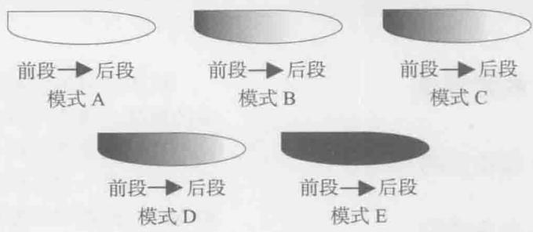

A. 如果母亲没有表达 bicoid mRNA，那么胚胎是以上哪个模式？解释原因。

B. 果蝇是二倍体，这导致报告基因的表达类似于模式 C。如果母亲只有一个拷贝的 bicoid 基因，推测该模式会改变吗？如果不变，解释为什么。如果改变，解释并在以上的选项中选择最可能的模式。

C. Hunchback 启动子包含高亲和力和低亲和力的 Bicoid 蛋白结合位点。如果母亲有两个拷贝的 bicoid 基因，Hunchback 启动子发生了突变，仅包含低亲和力的 Bicoid 蛋白结合位点，推测表达模式是怎样的？解释你的选择。

<table><tr><td>本章概要</td><td rowspan="6">技术的进步已经改变了分子生物学的性质。现在可以对一个复杂的细胞过程中的每个元件(如每个基因和每个蛋白质)进行检测,如从幼稚干细胞向心肌细胞的分化过程。在大规模 DNA 测序技术和蛋白质组学方法出现之前,分子生物学家试图从整体中的某一个子集发现总体规律,这些子集在研究过程往往被认为是关键的调节因素。能够对一个过程中的每一个元件进行鉴定和区分的能力为深入研究提供了新的线索:这个设计的潜在原理是什么?在这一章,我们</td></tr><tr><td>调控回路</td></tr><tr><td>自身调控</td></tr><tr><td>双稳性</td></tr><tr><td>前馈环</td></tr><tr><td>振荡回路</td></tr></table>

## 第22章 系统生物学

将会讨论系统生物学这一新兴学科，它是由传统实验分子生物学和计算分析相结合而产生的。

分子生物学的成功，主要在于它能够抓住那些简单的系统，以便能够研究其内在的详细机制。但是，同一些目标远大、有全局视野的研究策略相比，这些传统的研究方法开始褪去光环，这些新的策略采用定量及高通量的测量方法，通过模型构建、结构重组和理论方法的有机结合，替代传统的方法来研究更高级、更复杂的生物过程。这种交叉学科研究的特性，恰恰定义了一个新的学科——系统生物学。系统生物学综合了数学、工程学、物理、计算机科学，以及分子与细胞生物学等学科，以定量、可预测的方式来描述那些控制生命如何工作的相互作用环路的自然特性。系统生物学可以面对生物系统的许多不同层面，如信号传输、信号转导、细胞分裂和细胞骨架动力学等。作为基因的分子生物学教材，我们主要集中在从基因调控回路角度来阐明系统生物学。我们希望藉此方法能够阐明那些靠传统的单成分分离研究所不能理解的基因调控原理。

系统生物学与另外一个新的学科——合成生物学（synthetic biology）紧密相关。就像系统生物学一样，合成生物学试图证明生物各环路的设计原理。然而，合成生物学是通过创造模拟的人工网络，模拟基因调控回路的一些自然特性，从而来证明原理。此方法使得我们能够检测调控系统是如何工作的。与自然界中存在的相对较为复杂的调控回路相比，这些人工网络相对简单，可以更精确地进行定量研究。

系统生物学所关注的不仅是基因调控的逻辑关系，而且还包括对演化内涵的解释。在第19章我们已经谈到，高等动物演化的主要驱动力来自于调控基因表达网络，而不是基因本身。例如，所有的动物都具有相类似的基因群，但它们表达的时空却不尽相同（有时候会截然相反）。换句话说，在演化过程中，调控网络是相对动态的，而受该网络调控的基因则是相对静态的。

本节中，我们着重于从自然和人工构建的基因调控回路角度简要地介绍系统生物学与合成生物学。我们集中讨论遗传回路（genetic circuit）的设计原理和基因调控回路的可变图式，而不过多地涉及该领域的数学细节。系统生物学是一门新生的学科，但是我们也要看到，该学科中的一些原理是从经典基因调控研究中衍生而来的，特别是我们在第18章所讨论的那些。但是，本章中我们将引入一些正式的语言，这些语言能把简单的例子拓展成一系列不同的生物调控系统。

## 调控回路

调控回路（regulatory circuits）可以通过一个含有节（node）与端（edge）的简单网络来描述。节代表基因，用点来表示；端表示一个基因受另外一个基因产物调控，用线表示（图22-1a）。端可以通过引入方向来标明是否基因A调控基因B，或者相反。端还可以加标志来表示该调控是正调控还是负调控。因此，一条从基因A指向基因B，末端为“⊥”结尾的线表示基因A的产物是基因B的负调控因子（图22-1b）；反之亦然，一条从基因A指向基因B的箭端线表示的是基因A的产物正调控基因B的表达（图22-1c）。

  
图 22-1 包含节与端的简单网络回路。(a) 一个简单的开  
关；（b）负调控标志；（c）正调控标志；（d）自身负调控；（e）自身正调控。

  
图 22-2 与门。乳糖操纵子受与门的调控。在该调控回路中，信号的输出需要 CAP-cAMP 的出现和 LacI 的取消。

我们现在从一个最简单的双节点例子开始，即基因 A 的产物调控基因 B 的表达（图 22-1a）。通过应答某个信号，基因 A 编码的调控蛋白触发基因 B 的表达。该调控蛋白质也可能是一个抑制因子。在这种情况下，转录过程通过一个诱发子触发启动，该诱发子能够灭活抑制因子（图 22-1b）。或者，该调控蛋白质还可以是一个激活因子，它能够应答信号分子，触发基因 B 的转录（图 22-1c）。

乳糖操纵子是受两个调控蛋白调节的（图 18-6 中已经描述），是一个两种调控类型相互交织的例子：诱发子的存在触发转录起始，这一过程是通过灭活 Lac 抑制因子，提高 cAMP 浓度，促进 CAP（分解代谢物活化蛋白质）激活因子结合到 DNA 上面而触发的。因此，乳糖操纵子不是一个简单的开关，它的表达同时需要抑制因子的消失和 CAP 结合到其 cAMP 配体上面。电子工程有一专业用语——“与门”（AND gate）逻辑关系，表示两个输入条件同时出现才能产生输出。在此例子中，这两个条件是抑制的取消和激活。与门可用图 22-2 的标志来描述。

## 自身调控

通常，调控基因除了调控其他靶基因的转录外，还能调控自身的转录，这种调控方式被称为自身调控（autoregulation），同样有正和负两种情况，每种情况都有自身的特性（图 22-1d，e）。

自身负调控：降噪和降时

我们先来考虑自身负调控，此时是一个编码抑制因子的基因受其基因产物的负调控。一个经典的自身负调控的例子就是第18章中我们讨论的 $\lambda$ 噬菌体的 $c\mathrm{I}$ 基因（需提示的是， $c\mathrm{I}$ 同样也是一个自身正调控的例子，对此我们会在下文讨论）。因此，CI抑制因子结合到操纵子 $\mathrm{O}_{\mathrm{R3}}$ 位点从而抑制自身的表达（第18章，图18-27）。

自身负调控的生物学意义是什么呢？为什么在演化过程中它反复地被选择呢？其中一种解释已经在第18章中进行了说明：自身负调控是保证调控蛋白处于稳定状态的动态平衡机制。因此，CI的水平下调到足够低来解除cⅠ和其他靶基因的抑制，然后该基因转录的恢复将会提高细胞内抑制因子的水平，最终恢复该抑制过程。相反，一旦基因的表达过大且抑制因子的产物超过了所需要的量，那么自身负调控便会保证该基因处于沉默状

  
图 22-3 诱发子的动力学。简单开关（B）、自身负调控开关（A）和自身正调控开关（C）应答于一个诱导信号的不同动力学反应。

态，然后抑制因子的水平通过细胞生长与分裂，或者通过蛋白质酶降解，抑或是两者而最终下调。

自身负调控机制还有另外一个不太显而易见的优点: 快速的反应时间。从尽可能快速且不会产生多余的抑制因子的两个相对的角度考虑, 如果使用一个强启动子, 将能够保证产物的快速产生, 但也会导致对稳定状态来讲过量的积累; 从另一个角度考虑, 如果使用一个相对较弱的启动

  
a  
图 22-4 内源与外源噪声。在大肠杆菌细胞中，一个基因有两个拷贝，其中一个拷贝融合了一个红色荧光蛋白报道基因，而另一拷贝融合了一个绿色荧光蛋白报道基因。（a）假设这两个基因在细胞内表达随着时间和个体各异（内源噪声）的预测结果。（b）假设这两个基因的表达由于外源信号的作用而同步化的预测结果。（c）荧光图片揭示内源噪声，除了黄色细胞之外，还有红色和绿色的细胞。（经允许引自 Elowitz M.B. et al. 2002. Science 297: 1184-1186.）

子，也可以获得合适水平的抑制，但这需要较长的一段时间。自身负调控可以同时满足两种需求：一个相对较强的启动子可以保证调控蛋白质的快速积累，而转录的自我抑制则能够保证在该抑制因子达到一定的合适水平后自我关闭。数学模型和实验结果都确认了自身负调控比简单调控在实现同样的一种蛋白质积累水平上具有更快速的反应（图22-3）。

## 喧噪的基因表达

在讨论自身负调控过程中，基因表达噪声（noise）这一概念极为重要。直到最近，人们还是认为一个基因在同源的细胞群中的表达水平，在一个细胞中与另一个细胞中相比是相对稳定的。然而，我们现在意识到，基因表达水平在同一个细胞群的不同单个细胞中存在着本质上的差异，甚至在同一个细胞中，同一基因的两个拷贝本的表达也不相同。因此，我们在这里把“噪声”（noise）一词定义为是在基本相同的条件下基因表达的差异。噪声的存在表示随机因素影响着单个基因的表达水平。随机性（stochasticity）暗示着一个过程可以通过随机的尺度来划分为几个方面。正如我们所要看到的，一些调控基序是用来排除噪声的，而另外一些基序是用来放大它们的。

基因表达过程中的噪声来自于两大方面：内源性和外源性。这两种因素共同导致基因在一个群体中表达的不同。内源性噪声（intrinsic noise）所指的是一个细胞内单个基因表达水平的不同是由于基因表达体中随机事件所引起的。一个经典的例子就是证明拥有两个同样拷贝基因的大肠杆菌内源性噪声的过程。该基因中一个拷贝连接一个能够编码红色荧光蛋白的报道基因，另一个拷贝与编码绿色荧光蛋白的报道基因连接。在没有内源性噪声作用的情况下，红色和绿色荧光蛋白的表达量应该是相同的，因此细菌应该显示黄色。相反，所观察到的结果是，许多细胞呈明显红色，还有一些明显为绿色（图22-4a）。因此，每个基因在不同细胞内部表达并非一致，而是在一些细胞中一个拷贝的

b

时间

表达（如带有绿色荧光蛋白的拷贝）较另外一个拷贝高（如带有红色荧光蛋白的拷贝），而在另外一些细胞中，则恰恰相反。

外源性噪声（extrinsic noise）指的是在一个几乎同源的细胞群中基因表达的差异，或者是在同一个细胞不同时间基因表达的改变。该噪声可能是由于每个细胞环境的微小的不均一性，或者是细胞在执行转录或者蛋白质合成的过程中容量的波动性所引起。一个外源性噪声的例子如图22-4b所示，两个基因的表达随时间变化。在这种情况下，两个基因的表达水平在单个细胞中呈现同步性：上升一段时期后便下调。这意味着单个细胞在承载一些或者全部基因的表达综合能力上是随时间发生波动的。从图22-4c显微荧光结果可以观察到，由于内源噪声的作用，其中一些细胞是黄色的（意味着两种荧光蛋白都表达），而另外一些细胞呈红色或者绿色（意味着只有一种特定的荧光蛋白表达）。

重新回到一开始讨论的自身负调控，我们可以看到，为了应对噪声，该调控基序允许细胞补偿自调控基因的表达水平的变化。因此，调控 $\lambda$ 噬菌体 CI 合成的自身负调控回路可以被认为是非常稳定的。稳定性（robustness）所指的是一个调控回路的输出对于一些特定参数是不敏感的。因此，CI 自控回路在克服 c I 基因表达过程中的噪声、获取稳定抑制因子水平的能力方面是很稳定的。同时我们也应看到，其他一些调控基序也具有帮助细胞应对不同来源的随机因素影响的能力，例如触发基因表达的信号的波动。

随机性并非大肠杆菌所特有。实际上，该特征广泛存在于有生命的个体中。例如，克隆猫的毛色，是通过将体细胞核移植到已经去除核物质的卵母细胞而得到的克隆猫，与正常的核供体猫相比并不相同。由于克隆猫和核供体猫在遗传背景上是相同的，所以人们期望这些猫应该具有相同的毛色。但这并不意味着控制毛色的一系列遗传事件的前后关联不是完全的，而是存在一些随机过程，如同另外一个例子——同卵双胞胎的指纹不同。

## 自身正调控延迟基因表达

自身正调控过程发生在一个激活因子蛋白质激活自身编码基因转录的时候（图22-1e）。同样的， $\lambda$ 噬菌体 $c$ I基因的表达就是一个典型而复杂的例子：在细胞内CI浓度较低时，CI抑制因子偏爱于占据驱动 $c$ I转录启动子（ $P_{\mathrm{RM}}$ ）上游的两个操纵子 $O_{\mathrm{R1}}$ 和 $O_{\mathrm{R2}}$ 的位置（图18-26）。位于 $O_{\mathrm{R2}}$ 位置的CI蛋白质与RNA聚合酶相互作用而激活转录过程，以合成更多的CI蛋白。当然，我们也可以看到，当CI达到一定的高水平后，该蛋白质还可以通过占据 $O_{\mathrm{R3}}$ 位置来抑制其转录过程。因此， $c$ I基因表达的调控是通过正和负自身调控机制来实现的。

现在让我们来介绍一个仅靠自身正调控的激活因子蛋白质的例子（见图 22-1e）。基因产物的稳定性积累发生在如下两种平衡状态下：蛋白质合成与降解速率达到平衡（该过程应该是不稳定的），或者与细胞生长或分裂产生的稀释达到平衡时。因此，稳定性状态（steady state）是指基因产物随时间的变化很小的一种状态。这里的关键是，自身正调控的基因从开启到实现稳定状态所需的时间，比自身负调控的基因或者完全无反馈的基因所需要的时间要长（图 22-3）。更确切地说，与其他调控形式相比，自身正调控需要更长的时间才能达到基因产物最大积累量的 50%。这是因为随时间增加的生产速度，首先依赖于激活因子本身的积累。

自身正调控在一些缓慢发生的生物过程中非常有用，如发育过程就得益于与形态发生相关蛋白质的缓慢积累。又如，在枯草杆菌古孢子（或者原生孢子）发育过程中，控制晚期孢子形成的主要调控蛋白质（可变RNA多聚酶 $\sigma$ 因子—— $\sigma^{\mathrm{G}}$ 和 $\sigma^{\mathrm{K}}$ ）能够刺激它们本身的结构基因，以及与形态形成相关蛋白质编码基因的转录。因此， $\sigma$ 因子和受它所调控的基因产物可以缓慢积累，因为 $\sigma^{\mathrm{G}}$ 和 $\sigma^{\mathrm{K}}$ 的产生依赖于它们自身的合成。

自身正调控还有另外一个优点，即它是极端类型的调控，被称为双稳开关的基础，对此我们将在下文阐述。

## 双稳性

到现在为止，我们所介绍的调控回路都是可逆的，当打开某基因或者某些基因的信号被移除，该调控回路会重新返回关闭状态。然而，在一些例子中，当基因表达开关被启动后，该基因会锁定在启动状态持续较长的一段时间。这就是著名的双稳开关（bistable switch）。

## 一些调控回路可锁定在不同的稳定状态

控制枯草杆菌是否变成遗传感受态的回路就是一个被深入研究的双稳开关的例子。感受态（competence）是一种特殊的状态，处于该状态的细菌停止了增殖，但具有从其生长的环境中吸收裸露 DNA 分子并通过遗传重组将同源序列整合到基因组上的能力。感受态的主调控因子是 DNA 结合蛋白 ComK，该调控因子能够调控包括其自身在内的 100 多个基因（图 22-5）。维持此开关处于稳定状态的原因是多个 ComK 分子相互协作结合到 comK 基因启动子上。如我们在第 18 章框 18-4 中所观察到的 $\lambda$ 抑制因子（它本身就代表着一个典型的双稳事例，这点我们将在下文讨论）的例子，该类协作使得开关的输出呈现非线性分布，即与激活因子的浓度呈一定的函数关系。换句话说，输出的多少对 ComK 水平的变化非常敏感（反之则是不敏感）。


  
图 22-5 双稳性。(a) 双稳性是由自身正调控开关控制的，调控蛋白 ComK 除了调控靶基因的表达外，还调控 comK 基因的表达。ComK 分子协同结合于启动子上产生一个非线性反应，使得其表达对 ComK 的微小的、随机的变化非常敏感，所以这个开关时刻保持在“开”与“关”的刀棱上。(b) 经典双稳性的例子：在该例中，枯草芽孢杆菌细胞（红色）通过表达一个受竞争性调控蛋白 ComK 激活的启动子控制着报道基因的开（绿色）或关。此报道基因编码一个绿色荧光蛋白。(b 图经允许引自 Dubnau D. and Losick R. 2006. Mol. Microbiol. 61: 564-572. ©Blackwell Science.)

细胞能否开启 comK 的表达，是由 ComK 蛋白降解稳定性水平上的调控网络所控制的。但是，最终决定 ComK 激活的因素是随机的。也就是说，在 ComK 不降解的情况下，群体中仅有一些细胞是处于感受态的。这可以通过一种带有荧光报道基因（绿色荧光蛋白基因）的细胞清晰地观察到，荧光报道基因指示的是 ComK 决定的基因活性。图 22-5 显示的是细胞被分为两个亚群：一个亚群中 comK 基因是开启的，而在另外一个亚群中 comK 基因是关闭的。这是因为正反馈环处于刀刃状态，ComK 的浓度介于不足以打开 comK 基因的表达，但刚好可以触发自身正调控环开启 ComK 蛋白所调控基因的表达之间（参考框 22-1 “双稳性与滞后作用”）。由于 comK 基因表达过程中的噪声所导致的细胞间 ComK 蛋白水平的变化，使得此激活因子在一些细胞中达到了阈值浓度，而其他细胞中没有。这一自身正调控的例子说明基因表达中的噪声信号如何能促使细胞进入不同的状态。

## 框22-1 双稳性与滞后作用

下面的实验证明 ComK 开关的双稳性基础是自身正调控。该实验使用一个经过修饰的 comK 基因的拷贝，调控该拷贝基因的启动子的活性能够响应诱导子上调或下调（框 22-1 图 1a）。在仅携带有修饰基因的细胞中，并没有观察到双稳性，ComK 决定的基因表达水平的提高同诱导子水平的提高基本对应，无论是在怎样的诱导子浓度中，其表达呈现出均一的表达模式（框 22-1 图 1b）。然而，在携带有修饰基因和正常自身调控基因的细胞中，增高诱导子的水平导致细胞分为两种不同的类型，一种细胞呈现低 ComK 活性，另一种呈现高 ComK 活性（框 22-1 图 1c）。换句话说，由修饰基因所编码的 ComK 产物开启了自调控基因“泵”，使越来越多的细胞由于 ComK 的提高而处于开的状态。

严格来说，双稳性一词的使用需要一个具有滞后作用（hysteresis）特性的开关。滞后作用指的是一种记忆状态，当一个开关由于某种条件打开后，即使撤去或逆转该条件，开关也不会即时关闭。例如，铁镁矿物材料，当这些物质在磁场中被磁化后，即使把磁场撤离，矿石还会保持磁性特征。现在我们回到原来的例子中——携带野生型和修饰型 ComK 基因的可响应诱导子的细胞。正如我们所看到的，添加越来越多的诱导子，将导致 ComK 水平不断提高，直至超出其阈值，导致自身正调控处于开的状态。我们来看另外一种情况，即降低诱导子的水平，将使修饰型基因合成的 ComK 越来越少。我们还观察到，当诱导子的水平降低时，甚至当诱导子的水平低于开启 ComK 开关的浓度时，ComK 还是处于开的状态。也就是说，诱导开的因素都撤去后，ComK 仍然记得自己处于开的状态。

调控 $\lambda$ 噬菌体溶原或裂解状态的开关也具有滞后作用。当原噬菌体受到DNA破坏试剂裂解细胞的诱导时，噬菌体能够反转进入裂解周期。也就是说，哪怕是当DNA破坏试剂撤去之后，该噬菌体也不再进入溶原状态（恢复合成CI抑制因子）。作为一个相反的例子，由于乳糖的存在，乳糖操纵子开启，一旦培养液中没有乳糖诱导子，乳糖操纵子则立即关闭。


  
框 22-1 图 1 ComK 开关的双稳性。(a) 实验表明正自身调控能够引起双稳性。示意图所示的是一个修饰的 comK 基因，该基因的启动子由一个受 IPTG 诱导的启动子所替代（就是 lac 操纵子）。(b) 当细胞中只有修饰的 comK 基因时，comK 会在可被 IPTG 诱导的启动子控制下发生梯度应答反应。(c) 当细胞携带有完整的正自身调控和一个乳糖诱导 comK 拷贝基因时呈现双峰分布。注意：a 和 b 中细胞携带有一个 comK 启动子驱动的绿色荧光蛋白基因。(b、c 图经允许引自 Maamar H. and Dubnau D. 2005. Mol. Microbiol. 56: 615-624, Fig.4E,J. ©Blackwell Science.)

自身正调控不是双稳性的唯一基础。一个具有两种变化状态的开关还可以通过相互抑制的途径来实现，即两种抑制因子能够负调控对方的转录。如上所述， $\lambda$ 噬菌体提供了一个经典的双稳性开关的例子，但该开关依赖的是一个双重负调控回路，而不是自身正调控；CI与Cro抑制因子的相互拮抗作用与病毒溶原与裂解状态紧密相关（第18章）。用系统生物学的语言来说，我们可以说 $\lambda$ 噬菌体具有一个双向负端链接的双节点开关。

尽管许多双稳开关都是在细菌中发现的，但是这并不意味着双稳性仅局限于微生物。例如，在胚胎发育过程中，线虫 C.elegans 产生两侧平行的味觉神经，分别称之为左侧 ASE 和右侧 ASE，分别表达不同的味觉受体基因。一个能够稳定处于一种或另一种状态的双向负反馈环，控制着一个普通的前体细胞究竟表达哪种受体。在这种状态下，开关的摆向并非随机的。确切地说，上游信号支配着开关的摆动方向，而双向负反馈环能够使其按预设的状态锁住开关。

## 双向开关持续变化

正如我们已经看到的，双稳开关是呈双峰分布的，这可以使其在不同稳定状态的持续时间得到延长。在遗传感受态和λ噬菌体的基因开关的例子中，双稳性的基础是自我强化（self-reinforcing）调控回路，这种调控往往伴有调控蛋白同DNA的结合。有些呈双峰分布的调控回路被认为是兴奋型的，因为它们不会维持在稳定状态。与双稳系统类似，兴奋型调控系统也包含了一种自我强化调控回路，这一调控回路针对小的扰动可以导致显著的模式化应答。然而，在这种兴奋型系统中，不同状态的开关是瞬变的，很容易发生反转。

神经元的动作电位是生物学中兴奋型调控体系的经典范例。当胞外的阳离子浓度比胞内的略高时，神经元会呈现静息电位（典型的为-70mV），此时细胞质带有净负电荷。如果静息电位逐渐升高并超过某个阈值（-55mV），细胞膜上的电压门控离子通道就会打开，允许钠离子流入细胞中。这种正离子的内流会导致膜电位进一步升高，从而引发更多的、尚未打开的离子通道变得开放，并使更多的钠离子流入细胞中。这种通道开放的级联反应使得细胞内的正电压达到一个峰值。高电压反过来又会引起钠离子通道的关闭。神经元细胞内过多的钠离子会被泵出细胞，使得细胞膜回到最初的静息状态。所以说，膜电势的一个小的扰动引发了一系列明显的、程序化的反应，又使其迅速恢复到最初的静息状态。

同样的，那些不能够使其所维持的状态得到延长，或者可以调动一系列的生物事件使得回路发生反转的自我强化调控回路被认为是易兴奋的。由此看来，前文讨论过的遗传感受态体系可以被认为是易兴奋的。ComK 的自身正调控形成了一个双稳开关，该开关可以使得 ComK 的高水平状态得到延长。然而，ComK 这种自我强化合成的累加是一个负反馈环，最终会导致激活蛋白的水解。这种负反馈回路使得感受态细胞可以跳出非生长的感受态，回到有生长力的繁殖状态。与此形成对比的是， $\lambda$ 噬菌体可以把溶源状态维持几代，因此认为双稳系统才是最合理的。

感受态是个低概率事件。在感受态诱导条件下，只有一小部分细胞进入可以吸收外源 DNA 的非生长状态。关于兴奋性，更具有说服力的例子是一种处于活跃生长期的菌株，这种菌株同感受态例子中的菌株非常像。处于稳定生长期的枯草芽孢杆菌拥有两种状态：个体游离细胞和链式固着细胞。重要的是，这两种细胞类型会以一定的频率进行随机的、反复的转换，这种转化可以发生在数十代细胞中。为什么枯草芽孢杆菌会产生一个由两种类型截然不同的细胞组成的群体？一种假说认为，因为不知道当前的有利环境会持续多长时间，细菌在演化过程中学会了孤注一掷。固着的链式细胞可以被看成是定居者——它们附着在当前有利的微环境的表面对其加以利用，而游离的细胞则可以被看成是抢劫者——它们到处游走寻找新的有利的生长环境。

细胞是如何在游离状态和链式状态之间转换的呢？这种转换的核心是两种被称为SinR和SlrR的调节蛋白（图22-6a）。就像我们在第18章讨论过的 $\lambda$ 噬菌体中的CI/Cro转换，SinR和SlrR蛋白也是双负回路（double-negative loop）的一部分。然而不同的是，在 $\lambda$ 噬菌体中两种调节蛋白都是都是彼此编码基因的阻遏物，而在这里，SinR是SlrR编码基因的阻遏物，但SlrR是SinR的一种抑制剂，它可以从SlrR-SinR复合物中诱捕这种阻遏物，在该复合物中，SlrR的基因无法被抑制。因此，双负回路的“左臂”在基因转录水平发挥作用，“右臂”则在蛋白质间的相互作用水平上发挥作用。这种转换存在两种自我强化状态：一种是 $\mathrm{SlrR}^{\mathrm{LOW}}$ 状态，这种状态下SlrR被SinR所抑制；另一种是 $\mathrm{SlrR}^{\mathrm{HIGH}}$ 状态，这种状态下SlrR发生去阻遏，SinR被SlrR维持在非激活状态。处于 $\mathrm{SlrR}^{\mathrm{LOW}}$ 状态的细胞表达运动型基因，使得细胞彼此分离并因此处于游离状态；而处于 $\mathrm{SlrR}^{\mathrm{HIGH}}$ 状态的细胞中的运行型基因和细胞分离基因的表达被抑制，因此形成固着的链式细胞。处于 $\mathrm{SlrR}^{\mathrm{HIGH}}$ 状态的细胞还表达产生胞外基质的基因，使得链的粘连性更好。

这种转换可以在微流体设备中进行实时观察，在这种设备中，细胞会被嵌入到长的通道中，通道的宽度同细菌的大小相同。细胞中含有一些报告基因，运行型基因对应绿色的荧光，基质基因对应红色的荧光，后者是链式状态的细胞所特有的。图 22-6b 所示的波动曲线图展示的是单通道的一系列延时的显微图像，时间间隔为5min。一个位于通道底部的运动性基因（绿色）产生了可以表达链式基因（红色）的后代。随后，一个位于底部附近处于链式状态的细胞转换回可以表达运动型基因（绿色）的游离状态。大量延时实验的数据表明：细胞可以将一种状态维持几代，并且可以在两种状态之间进行随机地转换。

  
图 22-6 一种可以控制细胞状态转换的兴奋性回路。(a) 表示的是调控运动型和链式的双负回路。为简便起见，SlrR 和 SinR 在图中分别被缩写为 Slr 和 R。在 SlrR $^{LOW}$ 状态，SinR 会抑制 SlrR 编码基因（回路的左臂），使 SlrR 保持在较低的水平。在 SlrR $^{HIGH}$ 状态，SlrR 处于高表达水平（粗体表示），它把抑制自己编码基因的 SinR 隔绝在复合体中。(b) 表示的是一个微流体通道，该通道的底部是关闭的，顶部是开放的，如左边小图所示。随着细胞的生长和分裂，细胞从顶端退出通道。右侧的波动曲线图展示的是一系列延时实验的显微照片，拍摄的时间间隔为 5min。一个位于左侧底部的运动型细胞（绿色）转换到了链式状态（红色），它的后代也保持这种链式状态。最终，一个位于底部的链式细胞转换回运动型状态（绿色），它的后代也保持这种运动型状态。（面板 b 由 T. Norman 提供。）

## 前馈环

系统生物学领域中一个重要的贡献是，它从无数种理论上存在的、简单的调控回路中，发现只有一小部分能够在自然界中发生。显然，一些特定的环路拥有自然选择所偏爱的有利特征。

前馈环是一种有优势特征的三节点网络结构

c  
d  


  
图 22-7 网络环路模型。(a)“三节点”网络环路，在该环路中每一个节点代表一个基因，这些基因通过三边相连。(b)前馈环，自然界中最为常见的网络环路。(c)协调型前馈环，在该环路中，直接和间接的边都是靶基因的正调控信号。(d)非协调型前馈环，在该环路中，直接作用边是正信号而间接作用边为负信号。

一个典型的例子便是由三节点组成的环路（图 22-7a）。一共有 13 种可能的方法用箭头连接含有 3 个节点的网络环路。这些环路可以通过箭头的方向，箭头是否连接两个或三个节点，以及成对的节是否被一个或者两个箭头连接起来等相互区分。在这 13 种环路中，一个非常显著的环路是前馈环（feed-forward loop，图 22-7b），该环路普遍存在于自然界中。在这里，我们将其称为网络基序，这主要是因为该环路是遗传回路中的主要组成部分。前馈环基序包括转录因子基因 A 和受其调控的另一个转录因子 B（图 22-7b）。同时，这两个转录因子又同时调控该基序中第三个基因 C。注意，图 22-7b 中只是简单说明调控的方向（如节 A 调控节 B）而非符号。

如果符号（正或负调控）也加入方向端的话，那么就有8种不同的前馈环可以被区分开来。同样，自然选择还是偏爱其中两个，因此这两个比其他环路更常见。其中一个偏爱的前馈环基序（也被称为协调基序）是所有直接和间接的通路都是指向靶基因，代表着输出的方向，同时还具有相同的符号（例如，A和B都是激活因子）（图22-7c）。

而另外一个偏爱的前馈环基序(也被称

为非协调基序）是靶基因受到 A 通路直接正调控、B 通路间接负调控（图 22-7b）。在这两种基序中，靶基因的表达是受到逻辑与门的调控；也就是说，C 基因的转录在前一种环路中需要 A 与 B，而在后一种环路中需要 A 而非 B。

既然这两种基序在所有的前馈环，以及所有可能的三节点网络环路中最受偏爱，那么它们理所当然应该具有演化选择过程中最为基本的有利特性。的确如此，计算机模型与实验结果同时表明该基序具有使得它们在调控回路中更加有用的特征。例如，协调型前馈环具有要求持续的输入信号来维持靶基因 C 转录的特性（图 22-7c）。也就是说，这类型的前馈环是一个持续型检测子，它只对长时间维持的或者是稳定的信号发生应答。

  
图 22-8 一系列前馈环组成的环路调控孢子形成过程。图中名字所表示的是调控蛋白或信号蛋白。为了简洁，自身正调控回路因子 $\sigma^{G}$ 和 $\sigma^{K}$ 没有在图中画出。（经允许引自 Wang S.T. et al. 2006. J. Mol. Biol. 358: 16-37, Fig.5. ©Elsevier）

该特性源自以下的事实：靶基因的表达既依赖于第一激活因子 A，又依赖于第二激活因子 B 的有效积累。因此，输入信号必须持续足够长以满足第二激活因子 B 达到激活靶基因 C 表达的阈值。换句话说，通过加入一个对输入信号反应的推迟，协调型前馈环帮助细胞分辨持续型真实信号及随机的扰动（噪声）。

非协调性前馈环具有它本身的优势特性（图 22-7d）。它是一个脉冲发生器，导致基因表达在开启与关闭间切换。因此，激活因子 A 打开靶基因 C 的表达，但当激活因子 B 聚集到一定浓度后便将基因 C 的表达关闭。所以，当基因表达要求在一定的时间范围内时，此非协调型前馈环便发挥了作用。

## 发育过程中的前馈环

前面那些剖析阐明了基因调控复杂通路中的简单设计原理。在一些例子中，协调与非协调前馈环的组合导致产生各种各样的基因活动模式。其中一个引人注目的例子是孢子形成过程，该过程就是由上述一系列协调与非协调前馈环所形成的调控回路（图22-8）。协调环保证环路的输入信号稳定，确保发育发生在正确的时间和地点。同样的，非协调环用来在形态建成过程中连续地产生基因表达脉冲。

此外，另外一个典型例子是果蝇胚胎背腹形成调控机制。我们在第21章中已经讨论过，母源调控蛋白Dorsal启动这一过程，该蛋白质在胚胎中呈现宽范围的浓度分布。当Dorsal浓度处于中高或高时，它便直接作用于靶基因twist，激活该基因的表达。Twist也是一个调控蛋白，它与Dorsal协调作用，调控一系列基因的表达，例如snail。因此，该调控基序是一个明确的协调型前馈环例子。然而，除此之外，snail编码一个转录抑制因子，许多Dorsal和Twist调节的靶基因受它的抑制。因此，这类靶基因是受非协调型前馈环所调控的。所以说，在细菌孢子形成过程中，由dorsal、twist、snail，以及下游基因所构成的环路是由协调和非协调型前馈环组成的。在果蝇胚胎发育过程中，背腹形态形成过程受前馈环的调控。因此，在中胚层，由于Dorsal（及Twist）及Snail的表达水平较高，所以由Snail介导的靶基因的抑制被关闭，而在外胚层神经元；由于Dorsal和Snail的水平较低，所以由Snail介导的靶基因的抑制是打开的。

## 振荡回路

对基因表达的调控我们一般考虑打开、关闭或者是调控表达水平。但是，在生物体内还广泛存在着另外一种基因调控模式——节律性，即大部分基因的表达都是在一个规则的时间间隔内呈现周期性上调和下调。定量地阐明调控节律性行为的调控回路是对系统生物学的一个重要挑战。

## 有些调控回路产生节律性的基因表达模式

一个相对简单的节律性调控回路的例子是新月柄杆菌（Caulobacter crescentus）的细胞周期（图 22-9）。在此例中，中枢调控因子（CtrA 和 GcrA）的水平以周期性模式交替升高和下降。它们的交替出现驱动其他基因在细胞周期过程中呈现节律性表达模式。

  
图 22-9 调控因子 CtrA 和 GcrA 在柄杆菌属细胞周期的过程中的波动表达。(经允许引自 Holtzendorff J. et al. 2004. Science 304: 983-987, Fig.3B, C. ©AAAS)

生物钟是一个众所周知的节律性行为的例子，在生物钟的调控下，大量基因在日夜交替周期的不同时间呈现节律性表达。在果蝇和哺乳动物中，其昼夜节律部分地受到负前馈环的调控，其中激活因子是 Clock 和 Cycle，抑制因子是 Per(Period)。Clock 和 Cycle 蛋白结合到 per 基因调控区域，激活该基因的转录。当 Per 蛋白在细胞中累积到一定的水平后，它能够反作用于 Clock 和 Cycle，从而关闭自身合成。一旦 per 基因的转录被关闭后，由于蛋白酶降解造成的不稳定性，Per 蛋白将慢慢从细胞中被清除。这将导致抑制因子恢复到一个次级阈值的水平，即 Per 蛋白没有足够高的浓度来抑制 Clock 和 Cycle 的活性。由此，per 基因的表达重新打开。per 基因表达的开/关周期有助于确定基因活性的 24h 循环过程。Per 蛋白的合成与降解的时间是关键的依赖因素。Per 蛋白稳定性的改变能够改变节律的频率，甚至产生不正常的以 22h 或 26h 为周期的循环，而不是正常的 24h。然而，关于生物钟为什么稳定地保持 24h 周期的机理还未被完全理解，毫无疑问，仍有一些确切存在但尚待阐明的机制。

有趣的是，自身负调控还涉及另外一个与周期基因表达毫不相关的例子——脊椎动物胚胎中的体节形成过程。体节是胚层细胞的浓缩块，它们将形成重复肌肉节和脊椎动物的脊柱（图22-10a）。体节从头到尾的形成模式依赖于调控基因her1和her7有节律的活性的开启与关闭，至少在斑马鱼中是如此。这些基因在此后的体细胞中保持周期性表达，直到这些细胞准备分化形成物理性体节为止。随着每一批新细胞的成熟，其节律性终止，从而导致一些细胞停留在周期的峰顶，另外一些停留在峰谷，并在空间顺序上体

b

a

现了体节的形成。紧随新体节形成的是下一组将来形成体节的细胞重复相同的步骤，包括新一轮的基因表达的开启和关闭，并最终形成新体节。

her1 和 her7 在斑马鱼中节律性表达的开启和关闭已经应用于数学建模和计算机模拟。Her1 与 Her7 蛋白被认为结合到 her1 和 her7 基因的调控区域从而关闭转录过程。但是该抑制过程仅仅维持短暂时间——由于蛋白酶的降解，一旦 Her1 与 Her7 蛋白降到一个关键的阈值水平后，转录过程重新被恢复并开始一轮新的循环，即蛋白质合成开始-抑制状态恢复等。抑制基因产物的节律水平调控其他基因的表达，从而确定出新体节的形成模式。在斑马鱼中，每 30min 形成一个新的体节。解释体节形成的周期长度的一个关键点是 her1 和 her7 基因启动转录同自身抑制因子积聚到有效浓度以抑制自身合成过程的时间间隔（图 22-10b）。

Her1 与 Her7 自身调控环完美地阐述了体节基因如何在单个的细胞中呈现开/关表达的循环模式，但是这些基因是如何在即将形成体节的一个细胞及其相邻的细胞中保持同步化的周期性表达呢？同步化是通过细胞与细胞间的信号通路来完成的。Her1 与 Her7 除了抑制其自身外，它们还抑制一个细胞膜编码蛋白 Delta 的基因的表达。Delta 结合到与其相邻细胞的细胞受体蛋白 Notch，并激活 Notch 信号系统，进而激活编码 Her1 与 Her7 蛋白所需基因的表达。当开/关循环中 Her 蛋白水平较高时（即 her 基因表达较低），产生比较少的 Delta 配基（图 22-10b）。这将导致与其相邻的细胞中 Notch 信号系统的活性与 her 基因的表达都比较低。相反的，当 Her1 同 Her2 蛋白水平较低时（即 her 基因表达较高），细胞中 Delta 含量便升高，从而激活相邻细胞 her 基因的表达。对于每一种情况，信号从相邻细胞通过 Notch 与其内的 Her1 和 Her7 蛋白相互协作，从而保持细胞与其相邻细胞节律之间的同步性。因此，细胞内自身调控与细胞间信号传递共同使得体节构成细胞呈现节律性行为。


  
图 22-10 体节基因在脊椎动物发育过程中的表达。(a) 图中所示为鸡胚胎发育过程中的体节。箭头所示的是体节，节律区是节律基因表达的区域，新的体节将在此产生（图片由 JulianLewis 提供）。（b）图中所示为斑马鱼体节基因节律表达的产生和同步模型。节律基因的表达受负反馈环的调控，其中涉及自身抑制因子 Her1 和 Her7。不同细胞间节律的同步化是通过 Delta/Notch 信号通路来完成的。Her1/Her7 抑制 Delta 配基的生成。相反的，Notch 信号刺激 Her 蛋白的表达。（摘自 Julian Lewis 提供的图片。）

## 用人工合成的环路模拟自然的调控网络

理解主导调控回路设计原理的一个辅助方法是建立一些相对简单的环路，并使这些环路能够模拟自然系统的一些特性，这就是合成生物学领域的目标。环路设计的一个典型的成功例子是抑制振荡器，该实验加强了我们对节律性的讨论。抑制振荡器是一个在大肠杆菌中生成的三节点网络环路，该环路由三个相互连接的调控蛋白组成一个环形的模式，三个端的连接符号都为负号。此抑制因子由三种细菌抑制蛋白 $\lambda \mathrm{CI}$ 、LacI和TetR编码基因所组成，CI蛋白抑制LacI编码基因，LacI进而抑制TetR编码基因，而TetR反过来抑制CI，从而形成整个网络环路。人们可能会推测，此类三节点环路可能会导致这三个基因的转录都处于一个低水平的稳定态。但恰恰相反，此抑制振荡器呈现出一个强烈的转录节律模式，其周期大约为 $2\mathrm{h}$ 。理论上讲，基因表达过程中噪声导致这三种抑制蛋白水平产生波动，这将阻止系统达到稳定态，取而代之的是一个节律表达模式。但是此抑制振荡器与上述的自然系统相比，其节律行为的稳定性依然相差甚远，这说明了一个事实，人工合成的环路在模拟自然界中的复杂（尚未被充分阐明的）环路时还有许多不足之处。

通过合成还产生了许多其他网络环路，这些环路呈现出各种各样的行为模式。其中一个例子是人工回路文库，该文库由许多转录因子和启动子通过不同的组合所构成。该回路文库中的回路能对不同的输入信号组合产生不同的应答。另外一个例子是来自“发射子”与“应答子”菌株，这类菌株能够在琼脂板上产生基因表达的条纹模式。发射菌株生长在培养板的中央，它能够产生信号分子，并从培养板的中央向四周扩散形成一个浓度梯度。两种不同的应答菌株分散长在同一个培养板上，这两种应答菌株对发射菌产生的信号分子浓度的高低应答不同，可通过产生可辨别的发光报道蛋白来区分。因此，一种应答菌株在距离发射菌较近处产生一个有色光环，而另外一种应答菌株在距离发射菌较远处产生另外一个有色光环。

## 小结

系统生物学是一门新生学科，该学科综合定量、高通量测量、建模、重组和理论知识，最终阐明生物机体内不同层次的内在机制。当涉及调控回路时，系统生物学试图揭示那些把每个元件都提取出来的方法不可能知道的基因控制的原理。合成生物学也试图阐明设计的原理，为了实现这一目标，所采用的途径是创造人工调控网络模拟天然回路的特征。

转录环路是由节点和端边构成的，节点表示的是基因，端边表示一个基因被另一个基因所调控。一个简单的双节点调控基序所表示的含义是一个基因调控另一个基因的表达，调控可以是正的，也可以是负的。另外一个简单的基序是自身调控，也就是基因调控自身的表达。自身负调控指的是一个基因的产物抑制该基因本身的表达，它具有抵御噪声的特性，所谓噪声是指几乎均一的条件下基因表达的波动性。而自身正调控可使基因表达缓慢增加达到一个稳定水平的特性。自身正调控的一个极端的例子是双稳开关环路，其中一个基因的表达保持在开或关的位置相当长的一段时间。

在调控网络环路中，另外一个常见的基序是前馈环。前馈环是一个三节点基序，它所表示的是调控（基因 A）能够控制靶基因和第二个调控基因（基因 B）的表达。而第二个调控基因 B 也调控靶基因的表达。因此在前馈环基序中，基因 A 能够直接调控或者通过基因 B 间接调控靶基因的表达。靶基因的表达可以说是受到一种“与门”的调控，有两种情形：第一种是两个激活转录因子同时存在，另外一种情形是激活因子的存在和抑制因子的消失。

在自然界中，一些调控回路能够使一些基因的表达产生节律性循环，如细胞周期、发育和昼夜节律。该环路的设计原理是：其中一个调控蛋白的出现能够导致其自身的消失和另外一个调控蛋白的出现。第二个调控蛋白的出现又反过来抑制其自身的表达和促进第一个调控蛋白的表达，从而构成一个连续的基因表达开/关循环。人工合成的网络已经成功将三个抑制因子通过随机的方法连接成一个圆形的调控回路，可以模拟出基因表达的循环模式，但还达不到自然存在的节律控制子的稳定性。

系统生物学的方法能够对复杂的细胞过程中的每个部分进行系统性的鉴定。这样就促进了生物学家分析数据方式的典型转变。生物学家不再问这个过程是怎样进行的，取而代之的是为什么是以这种特殊的方式组织在一起的。展望未来，也许有一天，系统生物学与合成生物学的结合可以创造出可以进行自体繁殖的人工细胞。如果这样，那么我们可以对人工细胞的特性进行量身打造，如能够有效地代谢污染物、废物的循环利用、将光能转化为燃料，或者是对抗人类疾病。

## 参考文献

## 书籍

Alon U. 2006. An introduction to systems biology: Design principles of biological circuits. Chapman & Hall/CRC, Boca Raton, Florida.

## 系统生物学

Alon U. 2007. Network motifs: Theory and experimental approaches. Nat. Rev. Genet. 8: 450–461.

Bintu L., Buchler N.E., Garcia H.G., Gerland U., Hwa T., Kondev J., and Phillips R. 2005. Transcriptional regulation by the numbers: Models. Curr. Opin. Genet. Dev. 15: 116–124.

Bintu L., Buchler N.E., Garcia H.G., Gerland U., Hwa T., Kondev J., Kuhlman T., and Phillips R. 2005. Transcriptional regulation by the numbers: Applications. Curr. Opin. Genet. Dev. 15: 125–135.

Crosson S., McAdams H., and Shapiro L. 2004. A genetic oscillator and the regulation of cell cycle progression in Caulobacter crescentus. Cell Cycle 3: 1252–1254.

Dubnau D. and Losick R. 2006. Bistability in bacteria. Mol. Microbiol. 61:564–572.

Endy D. 2005. Foundations for engineering biology. Nature 438: 449–453.

McAdams H.H., Srinivasan B., and Arkin A.P. 2004. The evolution of genetic regulatory systems in bacteria. Nat. Rev. Genet. 5: 169–178.

McGrath P.T., Viollier P., and McAdams H.H. 2004. Setting the pace: Mechanisms tying Caulobacter cell-cycle progression to macroscopic cellular events. Curr. Opin, Microbiol. 7: 192–197.

Raser J.M. and O'Shea E.K. 2005. Noise in gene expression: Origins, consequences, and control. Science 309: 2010–2013.

Sprinzak D. and Elowitz M.B. 2005. Reconstruction of genetic circuits. Nature 438: 443–448.

Vilar J.M., Guet C.C., and Leibler S. 2003. Modeling network dynamics: The lac operon, a case study. J. Cell Biol. 161: 471–476.

## 习题

偶数习题的答案请参见附录2。

习题 1 在调控网络中，节点和边线是什么？怎样描绘节点和边线？

习题 2 解释在调控中，“与门”是什么意思。

习题 3 描述图 22-3 所展示的负的自动调控[基因表达水平（%）与时间]。解释为什么负调节在演化过程中被选择。

习题 4 描述噪声和随机性的关系。

习题 5 思考这样的实验：在 E.coli 中相同基因的两个拷贝，一个拷贝的报告基因为绿色荧光蛋白，另一个的则为红色荧光蛋白。举出在该系统中的内在和外在噪声的一个例子。

习题 6 解释为什么认为负自我调控的调控网络是稳定的。

习题 7 在图 22-3 中，当输出达到稳定状态时，正自我调控曲线代表的是哪一部分？解释当基因表达处于正自我调控时是如何达到稳定状态的。

习题8 ComK与comK启动子结合的什么特性使该调控网络称为双稳态开关？

习题 9 什么类型的调控网络控制枯草杆菌感受态该菌在感受态可以持续多久？

习题 10 考虑一个光激活的基因，在有持续的光的存在下，该基因打开并很快关闭。你猜测调控该基因的是哪种类型的前馈环路？解释为什么。

习题11 什么是昼夜节律？它是怎样调控的？

习题 12 利用线和节点,命名并画一个调控图使其代表一个如果很快打开并维持稳定量的调控蛋白的表达。

习题 13 利用线和节点画一个代表合成的压缩振荡子的调控图。命名节点上的基因病描述该压缩振荡子的表达模式。

习题 14 ara 操纵子控制若干基因包括 araC 的表达。在阿拉伯糖和 DNA 结合蛋白 AraC 存在下，基因的表达被打开，AraC 蛋白参与正自我调控。

如下面所示，研究人员构造了一个包含一系列人工启动子的回路（每个都包含一个 AraC 结合位点和一个乳糖操纵子）。阿拉伯糖和 AraC 的存在促进了下有基因的转录，lacI 编码 LacI 抑制因子，LacI 结合在 lac 操纵子上来关闭转录（即

  
AraC 结合位点  
lac 操纵子


## 第6篇 附录

本篇概要

\- 附录1 模式生物

\- 附录2 答案

# 冷泉港实验室档案馆中的照片


Robert Horvitz，1990年研讨会主导。Horvitz（左）1970年在剑桥大学的Sydney Brenner实验室读博士期间开始研究秀丽隐杆线蠕虫，随后一直在MIT自己的实验室继续模式生物的研究。2002年，因为在蠕虫研究中的工作和Horvitz（定义基因调控“程序性死亡”）以及另一个博士后John Sulston共享诺贝尔生理学和医学奖。这张照片显示的是Horvitz和他实验室的另外两名成员，Elizabeth Sawin（现在是气候系主任）和Asa Abeliovich（哥伦比亚大学的神经生物学家）。

  
Mary Lyon 和 Rudolf Jaenisch，1985 年分子生物学发展研讨会。Lyon 和 Jaenisch 的工作都是研究小鼠，Lyon 发现了哺乳动物 X 染色体失活的现象以及雌性哺乳动物细胞中有剂量补偿的机制（第 20 章）。Jaenisch 在建立转基因小鼠和治疗性克隆技术都有较大影响力。


Michael Ashburner，1970年遗传物质转录组研讨会。Ashburner在模式生物果蝇的研究中长期占领先地位，研究涉及果蝇基因组结构和功能的许多方面。他与Craig Venter的测序公司Celera Genomics合作对果蝇基因组测序。根据这些工作的经验他写了一本叫做Won for all的小书。照片中的他在亲吻Barbara Hamkalo的手。Hamkalo当时在哈佛大学读博士后，现在是加州大学Irvine分校的分子生物学教授，对异染色体的结构感兴趣（第8章）。


Dale Kaiser, 1985 年分子生物学发展研讨会。在 $\lambda$ 噬菌体早期研究中 Kaiser 贡献良多（第 18 章）。这项工作的一方面影响是使他认识到 DNA 分子与互补的单链末端可以容易地结合在一起，是发展重组 DNA 技术的一项重要发现。


Barbara McClintock 和 Harriet Creighton，1956 年遗传物质的结构与功能研讨会。McClintock，玉米遗传学家，曾出现在第 3 篇初始部分的一张照片中。Creighton 与 McClintock 在学生时期，一起发表了一篇关于染色体在减数分裂中遗传交换的重要论文。1929 年 Creighton 毕业后，有近 30 年的时间在韦尔斯利学院教授植物学。

## 附录1

## 模式生物

分子生物学中有一个著名的说法：基础问题可以在最简单和最容易获得的系统中得以回答。因此，长期以来，分子生物学家把精力集中在少数几种所谓的模式生物上。其中，重要的模式生物，依复杂程度增高为序有：大肠杆菌（Escherichia coli）和它的噬菌体——T噬菌体和λ噬菌体，酿酒酵母（Saccharomyces cerevisiae），拟南芥（Arabidopsis thaliana），秀丽新小杆线虫（Caenorhabditis elegans），黑腹果蝇（Drosophila melanogaster）和小鼠（Mus musculus）。

模式生物的共同点是什么呢？它们的一个重要特征是可使用强大的传统遗传学和分子遗传学分析工具，使从遗传学角度操研究和操作这些生物成为可能；第二共同点是每种模式生物都吸引了许多研究者。这意味着同一种生物的研究者之间通过共享观点、实验方法、实验

工具和生物品系，促进研究的快速发展。

例如，从20世纪40年代开始，以M. Delruck、S. Luria和A. D. Hershey为首的一群科学家，夏季会在纽约冷泉港实验室（Cold Spring Harbor Laboratory）研究大肠杆菌T噬菌体的增殖。这个小组称为噬菌体小组（Phage Group），在确立分子生物学领域时发挥了重要作用。小组成员中许多是物理学家，他们被噬菌体的研究所吸引，不仅仅是因为噬菌体结构相对简单，而是通过每次研究大量噬菌体的实验，产生了定量的、有显著统计学意义的结果。到20世纪50年代后期，冷泉港实验室开设了噬菌体的年度课程，越来越多的研究者来学习这个新系统。这是一个典型的实例，表明集中研究相同的模式生物，肯定比分散研究多种不同的生物进展更快。

选择哪一种模式生物取决于要回答什么问题。例如，研究分子生物学的基本问题，用简单的单细胞生物或病毒通常更方便些。这些生物可以快速、大量地生长，一般可把遗传学和生物化学的研究方法结合起来；而其他问题，如有关发育的问题，则只能用更复杂的模式生物来解决。

众所周知，T噬菌体（如大家最熟悉的成员，特别是T4）是一个解决基因和信息传递本质的理想系统；同时，因为有高效的适合遗传分析的交配系统，酵母则成为揭示真核细胞本质的首选系统。从真菌到高等细胞蛋白和一般调控机制两方面具有的演化保守性意味着在酵母中的发现在人类中也有可能是适用的。此外，研究线虫和果蝇的遗传系统，可以用来解决那些在较低等的生物中不能有效解决的问题，如发育和行为；最后还有一种模式生物小鼠，尽管它不如线虫和果蝇容易研究，但因为是哺乳动物，所以是了解人类生物学和人类疾病的最好的模式系统。

本章将描述一些最常用的实验生物，并逐一解释它们作为模式系统的主要特性和优点；另外还将介绍研究每种生物的实验系统以及每种模式生物已经涉及的分子生物学问题，但不会对所有在分子生物学上有重要影响的模式生物进行详细解释。

## 噬菌体

噬菌体（广义而言包括其他病毒，）呈现了一个研究遗传基本过程的最简单的系统。基因组一般很小，只在侵入宿主细胞（对噬菌体而言，就是细菌）后才复制，所编码的基因才表达。在感染过程中基因组也会发生重组。

由于这个系统相对简单，所以噬菌体在分子生物学的早期研究中被广泛利用——事实上，噬菌体对分子生物学的发展至关重要。即便是现在，在研究 DNA 复制、基因表达和重组的基本机制时，它们仍然是一个可以利用的系统。另外，在重组 DNA 技术中（第 7 章），它们也是非常重要的载体，并且经常用来检测各种化合物引起突变的能力。

噬菌体通常由一个（DNA 或 RNA，前者更为常见）被一层蛋白质亚基包裹起来的基因组而组成。蛋白质亚基形成一个头部结构，基因组就被包在里面。有些蛋白质亚基形成尾部结构，尾部使噬菌体附着于细菌宿主细胞外面，噬菌体的基因组通过尾部注入到细胞里。其独特性在于：每一种噬菌体只附着于一种特定的细胞表面分子（通常是一个蛋白质），只有带有某种“受体”的细胞才会被这种特定的噬菌体所感染。

噬菌体因复制的类型不同分两种基本类型——裂解型(lytic)和温和型(temperate)。前者如T噬菌体，只进行裂解生长。如图A-1所示，当噬菌体感染一个细菌细胞，它的DNA得以复制，其基因组产生许多拷贝（多达几百个拷贝），并且编码表达新的外壳蛋白。这些过程高度协调，以保证新的噬菌体颗粒在被宿主细胞裂解释放它们之前构建起来。子代噬菌体又可以去感染其他宿主细胞。

温和型噬菌体（如 $\lambda$ 噬菌体）也可以以裂解的方式复制，但它们还有另外一种复制途径，即溶原（lysogeny）（图A-2）。处于溶原状态时，噬菌体基因组不是自己复制，而是整合到细菌的基因组里，并且外壳蛋白基因不表达。这种整合的抑制状态的噬菌体被称为原噬菌体（prophage）。原噬菌体作为细菌染色体的一部分在细胞分裂时被动复制，因此两个子细胞都是溶原性细菌。溶原状态可以如此保持几代，但同时也可以在任何时候转为裂解生长。这种从溶原到裂解途径的转变，叫做诱导（induction），涉及原噬菌体DNA从细菌基因组剪切出来、复制，以及用于制造外壳蛋白和调节裂解生长的基因的活化（图18-20）。


图 A-1 噬菌体的裂解生长周期。噬菌体颗粒附着在合适的细菌宿主细胞（带有合适的受体）的外表面，并注入其基因组，通常是一段 DNA 分子。噬菌体 DNA 在细菌中复制，基因表达产生许多新的噬菌体。一旦子代噬菌体装配为成熟的颗粒，细菌细胞就会裂解，子代噬菌体释放，感染其他的宿主细胞。


图 A-2 噬菌体的溶原周期。最初的感染步骤和裂解周期的情况一样（图 A-1）。但 DNA 一旦进入细胞，就整合到细菌染色体上，作为细菌染色体的一部分而被动复制。而且，编码外壳蛋白的基因处于关闭状态。整合的噬菌体叫原噬菌体。溶原性细菌可以稳定地保持若干代，在合适的环境下，也可以有效地转到裂解周期。详见第 18 章。

## 噬菌体生长的检测

要想使噬菌体成为有用的实验系统，就需要建立噬菌体扩增和定量的方法。扩增可以产生高滴度噬菌体材料——用于进行实验或提取 DNA。一般情况下，噬菌体可以在液体培养基里合适的细菌宿主上生长扩增。例如，一烧瓶生长旺盛的细菌细胞可以用于培养噬菌体。生长一段合适的时间后，细胞裂解，留下透明的、含有噬菌体颗粒的液体悬浮液。

噬菌斑检测（图 A-3）可用来定量溶液中噬菌体颗粒数目。它的步骤是：混合噬菌体和细菌细胞，噬菌体吸附于细菌细胞上并将 DNA 注入；然后稀释噬菌体和细菌混合物，把稀释液加入到含有更多（没有被感染）的细菌细胞的“液态琼脂”里，倒在培养皿中固态琼脂培养基上。液态琼脂形成一层果冻状的薄层，里面混有许多细菌，其中细菌有些是被感染的，但大多数没有感染噬菌体。然后将平板培养几个小时，使细菌生长和噬菌体感染得以进行。


  
图 A-3 噬菌体感染细菌菌苔形成噬菌斑。图示为裂解型 T 噬菌体产生的噬菌斑。（经许可，影印自 Stent G. S. 1963. Molecular biology of bacterial viruses, Fig. 1. © W. H. Freeman.）  
图 A-4 单步生长曲线。如文中所描述，单步生长曲线显示一个噬菌体进行一轮裂解生长所用的时间，以及每个被感染细胞产生的子代噬菌体数目。它们分别被称为潜伏期和裂解量。

在接下来的培养过程中，上层琼脂里的每一个被感染的细胞（来自最初的混合体）将会裂解。粘稠的琼脂使子代噬菌体得以扩散但不会太远，所以它们只感染生长在其周围的细菌细胞。随后，这些细胞裂解释放更多的子代会再次感染相邻的细胞，如此循环往复。多轮感染的结果是形成噬菌斑（plaque）。在高密度生长的、未被感染的细菌细胞组成的、不透明的菌苔背景下，噬菌斑呈透明的圆斑。这是因为未被感染的细菌细胞在上层琼脂里生长成为高密度群体，而那些位于每个最初感染的细菌周边的细菌细胞被杀死，留下一个透明的斑块。知道了一块特定平板的噬菌斑数目，以及在铺平板之前最初的噬菌体的稀释程度，计算噬菌体在原液中的数目就轻而易举了。

## 单步式生长曲线

这个经典的实验揭示了一个典型裂解型噬菌体的生命周期，为检验生命周期的后续实验作好了准备。这个过程的基本特征是对一群细菌同步感染并避免子代的再次感染。这样就可以跟踪单轮感染的过程（图 A-4）。

噬菌体和细菌细胞混合 10min，这段时间足以使噬菌体吸附到细菌细胞上，但对进一步感染来说则太短。把这个混合物稀释（用新鲜的培养液）10000 倍。这个稀释度保证只有那些最初就结合噬菌体的细胞才能形成感染群体，同时，保证产生的子代噬菌体不会感染宿主细胞。

随后将稀释的感染细胞群进行培养使感染过程继续下去。每隔一段时间，从混合物中取出样品，用噬菌斑检测法计数噬菌体的数目。起初，噬菌体数目很少（仅仅由在稀释前初始感染时未能感染细胞的噬菌体组成）。

时间充足的情况下，被感染的细胞裂解释放子代，就会检测到噬菌体数目的急剧增加（对 T4 噬菌体来说这个过程需要 30min）。从感染到释放子代噬菌体的时间间隔叫做潜伏期（latent period），释放的噬菌体数目叫做裂解量（burst size）。

## 噬菌体杂交和互补实验

对一个群体中噬菌体的数目进行计数可以使研究者估计一个特定的噬菌体衍生物是否能够在一个特定的宿主细菌中生长情况（以及生长效率，如裂解量）。而且，平板检测可以分辨不同种类的噬菌体衍生物，因为它们产生的噬菌斑形态不同。宿主范围和噬菌斑形态的差别通常是在其他方面都相同的噬菌体在遗传上有所不同的结果。在分子生物学的早期，上述差异提供了一种遗传标记，使研究者们能够探询遗传信息是如何编码和行使功能的。

混合感染，即一个细胞同时被两个噬菌体颗粒感染，使遗传分析从两个方面成为可能。第一，使噬菌体杂交得以进行。如果同种噬菌体的两个不同的突变体（带有同源染色体）共同感染一个细胞，重组即遗传交换就可以在基因组之间进行。遗传交换的频率可以用来在基因组上排序基因。重组频率高表明突变的位置相对较远，而重组率低则表明突变的位置较近。只要有筛选或选择这种小概率事件的方法，实验中使用大量噬菌体确保混合转染可以可以发生，（两个位置非常相近的突变之间的重组）。第二，共感染还能把突变归类于不同的功能互补组，也就是说，人们可以确定两个或多个突变是发生在同一个基因上还是在不同的基因上。这样，两个不同的噬菌体突变体共同感染一个细胞，如果一个噬菌体可以提供另一个噬菌体所缺乏的功能，那么两个突变即位于不同的基因上（互补组）。另一方面，如果两个突变噬菌体不相互互补，那么就可以作为两个突变定位于同一个基因的证据。

## 转导和重组 DNA

噬菌体杂交和互补实验可以用来进行噬菌体本身的遗传学实验，此类相同的载体和技术也可以用于其他系统的遗传学研究。起初，仅仅是观察到一些噬菌体感染过程中意外获得的细菌基因（如我们在下面描述的）。然而，随着20世纪70年代DNA重组技术的出现，这些研究延伸到各种生物体的DNA中。

在感染过程中，噬菌体可能意外地（和错误地）获得一段细菌的 DNA。通常，噬菌体获得一段宿主细菌 DNA 途径通常是在原噬菌体溶原诱导过程中从细菌染色体剪切出来的。该过程涉及位点特异的重组事件（第 12 章），只要发生一点点位置错误，就会有噬菌体 DNA 丢失和细菌 DNA 的插入。只要这个交换没有丢掉噬菌体基因组中增殖所需的那部分，形成的重组噬菌体仍继续生长，并可以把重组的细菌 DNA 从一个宿主转移到另一个宿主，这个过程被称为特异性转导（specialized transduction）。包含在特异性转导噬菌体中的细菌 DNA 也同样可以进行像噬菌体一样的遗传分析。

因为 $\lambda$ 噬菌体具有促进特异性转导的能力，所以它很自然地被选为一种原始的克隆载体（第 7 章）。去除特定限制性内切核酸酶的多余位点，仅在对裂解生长无关紧要的区域留下一个（插入型载体）或两个（置换型载体）位点，就可以使 $\lambda$ 噬菌体能够接受任意来源体外 DNA 的插入。这样进行 DNA 的扩增和分析会比在原来的生物体内容易得多。去除 $\lambda$ 噬菌体中限制性内切核酸酶位点是反复选择对某种限制性系统具有越来越高效率的菌株而实现的。用这种方法增加对限制性内切核酸酶的抗性，然后在体外对丢失和保留的位点定位，鉴定出所需的噬菌体衍生物。

各种不同的 $\lambda$ 载体先后被开发出来，其差别在于使用的限制位点及如何鉴定重组噬菌体。下面介绍一种选择系统的作用机制：在一个 $\lambda$ 的衍生物中，编码阻抑物的 c I 基因里（第 18 章）留下唯一的某种限制性切点。在亲代载体中，这个基因是完整的，噬菌体可以根据自己的选择形成溶原性细菌，于是噬菌体形成的是浑浊的噬菌斑。然而，当一段 DNA 插入在这个位点，形成的重组噬菌体其 c I 基因被打断，不能形成溶原性细菌，就会形成透明的噬菌斑。

噬菌斑形态的改变使从非重组噬菌体中辨别重组子非常简便，进一步讲，如果使用的细菌菌株是 hfl 菌株（框 16-5），这个途径就是选择（而不是筛选）。对于该菌株，任何溶原性噬菌体总是溶原的，只有重组的噬菌体会形成噬菌斑。

## 细菌

细菌，如大肠杆菌和芽孢杆菌，因为它们是相对简单的细胞，所以适合用于实验系统的研究，并且可以相对容易地培养和操作。细菌是单细胞生物，所有 DNA、RNA 和蛋白质合成的机器都包含在同一细胞器中（细菌没有细胞核）。

细菌通常只有一条染色体——比高等生物的基因组小得多。此外，细菌的生命周期很短（有些甚至只有20分钟），从单个细胞可以很容易获得一个遗传上同源的细胞群体（克隆）。最后，细菌遗传学研究很方便，一方面，它们是单倍体（意味着即使是隐性突变，也能够很容易地表现出突变的表型）；另一方面，细菌之间可以方便地进行遗传物质的交换。

分子生物学起源于细菌和噬菌体模式系统的实验。至1943年Luria和Delrück进行著名的波动分析实验以前，细菌（细菌学）研究还停留在传统遗传学领域之外。利用统计学的方法，Luria和Delrück证明了细菌可以发生某种变化，使其对某一特定噬菌体的感染具抗性。更重要的是，他们证明了这种变化是自发产生的，而不是对噬菌体的应答（适应）。所以，像其他生物一样，细菌也可以遗传性状（例如对噬菌体的敏感性或抗性），并且偶尔这种遗传性可以自发产生变化（突变）而成为另一种遗传状态。Luria 和 Delrück 的实验表明，同其他生物一样，细菌表现出的特性是由遗传因素决定的。因为它们结构简单，细菌是阐明遗传物质本质和孟德尔（Gregor Mendel）性状决定因子（基因）的理想实验系统。

  
时间  
图 A-5 细菌生长曲线。如文中所描述，细菌（如大肠杆菌）在不过度密集并且在氧气充足的丰富培养基里繁殖时生长速度很快。这个生长期叫指数生长期。因为细胞以指数级复制，所以一旦细胞的数目变得太高，培养物变浓，生长就变慢，进入所谓的稳定期。取出处于稳定期的细胞，在新鲜培养基中将它们稀释，经过一个迟滞期后，细胞将再次进入指数生长期。图示为不同时期细胞数目增长的速度。

## 细菌生长检测

细菌可以在液体或固体（琼脂）培养基中生长。细菌细胞的大小（大约长 $2 \mu m$ ）足以

使它散射光线，因此通过检测液体培养基中光密度的增加就可以监控细菌的生长情况。以恒定世代分裂生长活跃的细菌，以指数级繁殖，此时它们被称为处于生长的指数期（exponential phase of growth），当细菌数量增长到一定程度后，生长速度减缓，细菌生长进入稳定期（stationary phase）（图 A-5）。

细菌的数目可以通过液体培养基稀释，然后铺在培养皿中的固体（琼脂）培养基上进行测定。在相对较短的时间内，单个细胞就能长成由上百万个细胞组成的微型菌落，只要知道平板上的菌落数和培养基的稀释倍数就可以计算出原始培养基中的细菌浓度。

## 细菌通过性结合、噬菌体介导转导和 DNA 介导转化来交换 DNA

作为分子生物学的模式系统，细菌的主要优势是具备易于进行遗传交换的系统。遗传交换使定位突变、构建含多种突变的菌株、构建用来辨别显性突变和隐性突变及进行顺反式分析的部分双倍体的菌株成为可能。

大部分细菌含有自主复制的 DNA 元件，称为质粒（plasmid）（图 A-6）。有些质粒，如大肠杆菌的育性质粒（称为 F 因子，F-factor）具备把它们自身从一个细胞转移到另一个细胞的能力。含有 F 因子的细胞（ $F^{+}$ ）可以把质粒转移到 $F^{-}$ 细胞里。F 因子介导的接合是一个复制的过程。因些 $F^{+}$ 细胞转移一个 F 因子的拷贝，自身还有一个拷贝，这样接合的结果就是产生 2 个 $F^{+}$ 细胞。有时，F 因子整合到染色体中，就会引起宿主染色体通过接合向 $F^{-}$ 细胞转移。含有整合 F 因子的菌株叫做 Hfr 菌株（高频重组菌株，Hfr strain），这种菌株对进行遗传交换研究非常有用。

在某一具体的事件中，决定宿主染色体转移的精确位置取决于两个条件。第一，不同的 Hfr 菌株中 F 质粒整合在宿主染色体的位置不同。宿主染色体到受体细胞的转移是沿着线性发生的，从接近染色体整合有 F 质粒的那端开始。所以，质粒整合的位置决定了首先被转移的染色体位置。第二，在交配中断之前完成整个染色体的转移是少见的。因而，远离转移起始点的基因转移频率低，在一个特定的交配中，位置较远的基因可能从来不会被转移。需要注意的是，如果一个完整拷贝的整合 F 因子发生转移的话，转移将最后发生。


  
图 A-6 带有 F 质粒的三种细胞形式。F⁺细胞带有一个单拷贝的 F 质粒，F 质粒就像一个微小的染色体独立进行复制。在 Hfr 菌株中，F 质粒整合在细菌染色体里作为染色体的一部分而复制。在 F⁺菌株里，已经整合到宿主染色体中的 F 质粒重新游离出来，同时携带一小段相邻的宿主 DNA。所有三种细胞类型都可以转移到一个 F⁻受体细胞。如果供体细胞是 F⁺菌株，它仅复制和转移 F 质粒；如果是 F⁺菌株，它复制和转移 F 质粒及一小段宿主 DNA；如果是 Hfr 菌株，根据整合的位置和交配的时间不同，它复制和转移不同大小和位置的宿主染色体。一旦进入受体，来自宿主的染色体 DNA 就可以与受体细胞的基因组重组，从而产生了遗传交换。  
图 A-7 噬菌体介导的普遍性转导。如文中所述，在有些噬菌体感染时，宿主染色体被打成片段，有些DNA片段可以取代复制的噬菌体DNA被包装在噬菌体颗粒里。与噬菌体基因组类似，宿主DNA被转移到另一个细胞中。一旦进入新的宿主，DNA就可以与染色体重组，促进遗传物质交换。

第三种也是非常重要的，F 因子形式是 F' 质粒，F' 是含有一小段染色体 DNA 的育性质粒，这段 DNA 会与质粒一起从一个细胞向另一个细胞高频率转移。例如，历史上重要的 F'-lac，是一个带有乳糖操纵子的 F 因子。F' 因子可以产生含有部分双倍体的菌株，这个菌株的特定染色体区域有两份拷贝。这正是 Francois Jacob 和 Jacques Monod 用来制备进行顺反分析的部分双倍体菌株的方法，这些菌株中突变是发生在乳糖操纵子抑制基因，以及与抑制物结合的启动子位点上（见框 18-3）。

F 因子只能与其他大肠杆菌菌株接合，然而，有些其他的接合性质粒没有选择性，可以将 DNA 转移到多种不相关的菌株中，甚至转移到酵母里。这些没有选择性的接合性质粒提供了一个将 DNA（包括通过重组 DNA 技术得到的 DNA），引入到自身没有遗传交换系统的细菌菌株的简便办法。

遗传交换的另一个强有力的工具是噬菌体介导的转导（图 A-7），普遍性转导（generalized transduction）是由那些在病毒成熟时偶然包裹一段染色体 DNA 而非病毒

DNA 的噬菌体所介导的。当这样的噬菌体颗粒感染下一个细胞时，从以前宿主那里获得的染色体 DNA 片段将取代感染性病毒 DNA。注入的染色体 DNA 可以和被感染的宿主细胞的染色体重组，导致遗传信息从一个细胞到另一个细胞的永久性转移。这种转导称为普遍性转导，是因为宿主染色体 DNA 的任何片段都可以从一个细胞转移到另一个细胞。根据病毒的大小，有些普遍性转导噬菌体只能转导几千个碱基的染色体 DNA，而有些则可以转导大于 100kb 的 DNA。

正如已经提到过的，另一种噬菌体介导的转导叫做特异性转导（specialized transduction）。这个过程涉及溶原性噬菌体，如某段噬菌体 DNA 被一段染色体 DNA 所取代的 $\lambda$ 噬菌体。一旦感染细菌，特异性转导噬菌体就可以将这段细菌 DNA 转移到新的细菌细胞中。

最后，我们来看 DNA 介导的转化，对此第 7 章已有所描述。某些重要的实验细菌（如芽孢杆菌，而非大肠杆菌）有天然的遗传交换系统，使它们可以通过重组吸收并整合线状裸露 DNA（释放或获得的）到它们自己的染色体里。通常这些细胞必须处于“遗传感受态”，才能从环境中吸收和整合 DNA。遗传感受态特别重要，可以先用重组 DNA 技术来克隆的染色体 DNA 片段，然后使它被感受态细胞摄取并整合到受体细胞的染色体中。

## 细菌质粒可以用作克隆载体

正如我们所知，细菌通常含有环状的质粒 DNA，它们可以自主复制，这样的质粒可以方便地作为细菌 DNA 和外源 DNA 的载体。实际上，最初的（成功的）克隆重组 DNA 的实验就使用了一个大肠杆菌的质粒（pSC101），它仅含有一个 EcoR I 限制位点，DNA 可以插入这个位点而不影响质粒复制的能力（第 7 章）。

## 转座子可用来产生插入突变和基因与操纵子的融合

在第 12 章中讨论过，转座子（transposon）不仅凭其自身的能力而成为一个重要的遗传元件，而且在细菌分子遗传操作中也非常有用。例如，以低序列特异性（即高度随机性）整合在染色体上的转座子，如 Tn5 和 Mu，可以用来产生全基因组水平的插入突变体文库（图 A-8）。

这种突变与传统的化学诱变产生的突变相比有两个重要的优势，一是转座子插入到基因中（当想要的时候）很可能导致基因的完全失活（功能丧失的突变），不像诱变剂只能产生简单的碱基改变；第二个优势是，插入 DNA 不但可使基因失活，而且让分离和克隆相应基因方便易行。更简单的办法是，用合适的 DNA 引物，通过分析有转座子插入的染色体 DNA 序列而确定失活基因。

转座子在全基因组水平上还可用于产生基因和操纵子的融合。经过改造，构建了带有报道基因的转座子，如没有启动子的 lacZ（如 Tn5lac）转座子。当这种转座子（以合适的方向）插入到染色体里，报道基因的转录就会受到被打断的靶基因的控制。这样的融合称为操纵子或转录融合（图 A-9）。


图 A-8 转座子产生的插入突变。转座子被质粒携带进入细胞，随后从载体上转移到宿主染色体上。因为细菌染色体中的编码区域（基因）高度密集，所以转座子插入基因的频率很高。转座子中携带的标记（如抗生素抗性）可以使带有转座子的细胞被分离。知道转座子两端的序列及它所插入的基因组的序列，就可以很方便地鉴定转座子所处的位置。  
  
图 A-9 转座子产生的 lacZ 融合。将前图介绍的转座子诱变法稍加修改，就可以将报道基因（如 lacZ）插入到基因组的任何区域。这样只要通过检测菌株中 lacZ 的表达水平就可以评估目标基因（被转座子 -lacZ 融合插入的基因）的表达。

另外，用于产生融合的转座子已制备出来了，它们含有既无启动子又无翻译起始序列的报道基因。在这些转座子中，报道基因需要在于靶基因的转录控制下并且置于在能够被正确翻译的靶基因可读框内才能表达。同时在转录和翻译水平上参与目标基因的报道基因融合称为基因融合。

## 重组 DNA 技术、全基因组测序和转录谱绘制加强了细菌的分子生物学研究

重组 DNA 技术的出现，如 DNA 克隆、全基因组序列，以及在全基因组水平研究基因转录的方法不但使高等细胞的分子生物学研究产生了革命性的突破。特别是在与传统的细菌遗传学紧密结合时，也对细菌等模式生物的研究产生了重要影响。例如，重组 DNA 技术使制备用于基因融合的转座子衍生物变得容易；又如，结合遗传感受态与重组方法可以产生精确的突变和基因融合，大大增加分子遗传操作的种类和数目。包含细菌中所有基因微阵列（microarray）的利用使在全基因组水平上研究基因表达成为可能。

结合前面描述的各种技术，可以快速、简便地阐明特定条件下表达的所有基因的功能。已经在酵母和其他真核系统中发挥巨大作用的蛋白质间相互作用的快速鉴定方法（如双杂交分析，见框 19-1），也是阐明细菌蛋白质之间相互作用网络的强有力工具。全基因组序列和没有选择性的接合质粒为那些没有复杂遗传学工具的细菌提供了进行分子遗传学操作的机会。

## 有了更好的传统和分子遗传学的工具，简单细胞的生化分析就会更加有效

从最初分子生物学的建立起，细菌就处于 DNA 复制、信息传递、基因调节机制等各种研究的中心。这有几个理由：第一，细菌可以在确定的和均一的生理条件下大量培养；第二，传统和分子遗传学的技术使纯化或大量生产经过改造的蛋白质复合物成为可能，从而可以获得大量的单个蛋白质；第三，也是非常重要的，就像在本书中反复提到过的，细菌的 DNA 复制、基因转录、蛋白质合成等机制比高等细胞简单得多（所包含的成分少得多）。所以，阐明细菌基本机制的研究进展迅速，只需要分离少数的蛋白质，其机制一般比高等细胞更简明。

## 细胞学分析同样适用于细菌

尽管细菌形态简单，没有膜包裹的细胞内分区（如细胞核和线粒体），但细菌并不是像几十年来人们认为的那样，只是简单的酶包被体。实际上，正如我们现在已经知道的，蛋白质和蛋白质复合物在细胞中都有特定的位置，连细菌中的染色体都是高度有序的。尽管细菌的型体小，但同样适用于细胞学研究，如通过免疫荧光显微镜（immunofluorescence microscopy）用特定抗体定位固定细胞内的蛋白质，用荧光显微镜（fluorescence microscopy）与绿色荧光蛋白（greenfluorescent protein）可以定位活体细胞中的蛋白质，还有用荧光原位杂交（FISH）可以定位细胞内染色体区域和质粒。这些方法的应用对我们深刻地理解本书所讨论的若干分子过程很有帮助。例如，我们现在知道，细菌细胞的复制机器是相对固定的并且定位在细胞中心（第9章）。这个发现告诉我们在复制过程中，DNA模板线状地通过一个相对固定的复制“工厂”，而不是传统观点认为的DNA聚合酶像火车在铁轨上那样沿着模板行进。又如，应用细胞学方法使我们清楚了（同样与传统的观点相反）复制过程中染色体新复制的两个起始区域朝细胞的两极移动。细胞学方法是细菌分子生物学研究的重要手段之一。

## 关于基因的基本知识绝大部分来自噬菌体和细菌

分子生物学起源主要归功于用细菌和噬菌体等模式系统进行的实验。如同我们在第2章所看到的，对于肺炎球菌的开创性研究使人们发现遗传物质是DNA。此后，就像我们在本书中所看到的，大肠杆菌及其噬菌体的实验一直在引导学科的发展。例如，Hershey和Martha Chase的实验使人们相信噬菌体的遗传物质是DNA；Matthew Meselson和Franklin W. Stahl的实验证明在大肠杆菌中DNA进行半保留复制；Francis H. Crick和Sydney Brenner的噬菌体交配实验（第16章）揭示了遗传密码由三联体密码子构成；而 Charles Yanofsky 用大肠杆菌进行的出色的遗传研究证明了遗传的共线性；也不能忘记 Jacob 和 Monod 的工作（见框 18-2），是他们发现了基因调控的基本机制；此外还有无数其他例子。在这些例子里，通过研究这些最简单的系统，生命的基本过程得以揭示。

一个重要的例子来自 Seymour Benzer 的出色工作，他详细研究了 T4 噬菌体中的一个叫 rII 的遗传位点。野生型 T4 可以在大肠杆菌 B 或 K 菌株里生长，但 rII 突变体仅在 B 菌株中生长。这样就有可能检测到发生频率小于 0.01% 的野生型噬菌体（比如说来自两个不同 rII 突变体之间的重组）。也就是说，当把 T4 噬菌体铺在 K 菌株形成的菌苔上时，可以在 10000 个 rII 突变噬菌体中检测到一个野生型，因为只有这种频率极低的重组子才能形成噬菌斑。

利用 rII 突变体这一难以置信的特性，Benzer 在成对的 rII 突变体之间进行了重组实验，并因此能够以高分辨率（接近或达到核苷酸碱基对的分辨率）绘制这些突变的顺序。他还设计了一个“互补”实验（如前述）表明 rII 位点是由两个相邻的基因组成的。Benzer 引入了顺反子（cistron）这一术语来描述基因（基于顺和反这两个词）。此外，值得一提的是，正是这个工作使 Crick 和 Brenner 能够利用这一位点开展遗传密码的研究。

## 合成通路和调节噪声

近年来，大肠杆菌和一些其他的细菌已经成为研究基因表达新方向的模型。其中尤为重要的是，通过对遗传背景相同的个体的基因表达进行观测，发现了遗传通路调节中的噪声。这种变化和其生物学效应使得人们对基因网络中噪声的优势及其问题有了更好的理解。这些研究得益于报告基因技术和成像技术的进步，但最主要的原因还是细菌在规模和生命周期上的诸多优势（见第22章中枯草芽孢杆菌的例子）。

基于细菌体系的合成生物学技术也得到了很大的进步。很多新的基因调节通路已经被建立，它们为研究调节网络提供了新的方法，也为具有特定功能的新型菌株的设计提供了可能——如细胞消化可以降解水面浮油的菌株。最近有报道称，细菌整个的基因组都可以通过多个合成的片段进行人工构建，而且一旦构建完成，该基因组可以自己发挥作用来维持细胞的生存。

## 酿酒酵母

单细胞真核生物作为模式实验系统有许多优势。比起其他真核生物，它们的基因组较小（见第8章），基因数目也比较少。与大肠杆菌相似，它们可以在实验室里快速繁殖（理想条件下，每次细胞分裂需要大约90min），从单个细胞繁殖成克隆群体。尽管酵母细胞比较简单，但它们具备所有真核生物细胞的主要特征，如含有一个独立的细胞核、多条线性染色体（染色质）、细胞质包含了全部的细胞器（如线粒体）和细胞骨架结构（如肌动蛋白纤维）。

研究得最清楚的单细胞真核生物是酿酒酵母 S. cerevisiae，因为可以用作发酵剂，所以通常称为酿酒酵母。100 多年来人们对酿酒酵母进行了大量的研究。19 世纪 60 年代，在实验中，Louis Pasteur 鉴定出这种酵母是发酵的催化剂（在此之前，糖被认为是自发地分解成乙醇和二氧化碳）。这些研究最终导致了第一个酶的发现及生物化学作为实验体系的建立。20 世纪 30 年代，开始了酿酒酵母的遗传学研究，由此鉴定了许多酵母基因。所以，像大肠杆菌一样，酿酒酵母使研究者能用遗传和生化的方法来解决生物学基本问题。

## 单倍体和双倍体细胞的存在促进了酿酒酵母的遗传分析

酿酒酵母细胞既可以以单倍体状态（每条染色体有一个拷贝）又可以以双倍体状态（每条染色体有两个拷贝）生长（图 A-10）。单倍体和双倍体之间的转换通过交配（单倍体到双倍体）和孢子形成（双倍体到单倍体）来实现。有两种单倍体细胞类型，分别为 a 型和 $\alpha$ 型。在一起生长时，这些细胞因交配而形成 $a/\alpha$ 双倍体细胞。在营养物匮乏的情况下， $a/\alpha$ 双倍体发生减数分裂（见第 8 章），产生一个称为子囊的结构，每个子囊含有 4 个单倍体孢子（两个 a-孢子和两个 $\alpha$ -孢子）。但当生长条件改善时，这些孢子可以出芽并以单倍体细胞的形式生长或交配而重新形成 $a/\alpha$ 双倍体。

  
图 A-10 酿酒酵母 S. cerevisiae 的生活周期。如本章及其他章节所描述的，酿酒酵母以 3 种形式存在：两种类型单倍体细胞——a 和 $\alpha$ ，以及两者交配的双倍体产物。图示这些不同种类细胞的复制、交配和芽孢形成。

在实验室中，可以对这些类型的细胞进行各种遗传分析。简单地将两个待测试的分别携带一个突变的单倍体菌株进行交配，就可以进行遗传互补实验。如果两个突变是互补的，相对于突变表型，双倍体就是一个野生型。如果要测试单个基因的功能，可以在只有一个拷贝的单倍体细胞里诱发突变。例如，想知道一个特定的基因是否是细胞生长所必需的，可以在单倍体里敲除这个基因。单倍体细胞只能承受非必需基因敲除。

## 在酵母中容易产生精确的突变

精确和快速地改变单个基因的技术使酿酒酵母的遗传分析研究水平得到了进一步提高。末端与基因组的任何一个特定区域同源的线性DNA引入酿酒酵母细胞中，就会观察到频率非常高的同源重组，导致相应染色体序列被转化所用的DNA片段取代（图A-11）。利用这一特性可以对基因组做精确的改变。这种方法可以用来精确地删除整个基因的编码区、改变一个可读框中的特定密码子，甚至改变启动子中的一个特定碱基对。这种在基因组中进行精确改变的技术使研究特定基因或其调节序列的功能等具体问题变得比较容易。


## 酿酒酵母有一个已知特性的小基因组

由于酿酒酵母遗传研究的历史很长，基因组又相对较小，所以它成了进行全基因组测序的第一个真核（非病毒）生物。这一“里程碑”式的事件于1996年完成。序列分析（ $1.3 \times 16^{6} bp$ ）发现了大约6000个基因，首次揭示了指导真核生物形成所需的遗传复杂性。

酿酒酵母完整基因组序列的获得使酵母的

同源区域间的 DNA 取代了目的基因

图 A-11 酵母中的重组转化。如文中所述，酵母基因组的所有区域都可以容易地被目标序列所取代。要插入的 DNA 片段的两端序列要与被取代的染色体区域的侧翼序列同源。当供体片段被导入细胞后，在这个生物中的高水平同源重组保证了与染色体的高频率重组，导致了上图所示的遗传交换。插入的 DNA 可能与原来的 DNA 只有一个碱基对的不同，也许是另一个极端，即长度和序列上非常不同，由此可以完成非常精细的遗传修饰。

研究可以在“全基因组”水平上进行。例如，包含来自所有近6000个酿酒酵母基因序列的DNA微阵列已广泛用于不同生理条件下基因表达模式的研究。实际上，目前已经对200多种不同条件下酿酒酵母细胞的基因表达水平进行了检测，包括不同的碳源（如葡萄糖对半乳糖）、细胞类型和培养温度。这些发现不仅对检测单个基因的表达非常有用，而且使我们能将基因按照对不同培养条件的应答分为各种协同作用的基因群。

其他全基因组资源还包括一个 6000 个菌株的文库，每一菌株中只删除了一个基因。其中的 5000 多株在单倍体状态时也能够存活，表明大多数酵母基因是非必需的。这个酵母菌株库使检测酿酒酵母基因组的每个基因在特定过程中作用的遗传筛选得以进行。

微阵列的使用还使利用染色质免疫沉淀技术（ChIP，chromatin immunoprecipitation techniques）进行转录因子的结合位点的全基因组作图得以开展（见第7章）。

## 酿酒酵母细胞生长时形态改变

当酿酒酵母细胞周期性生长时，形态上的特征会发生变化（图 A-12）。当一个新细胞从它的母细胞中释放出来后，子细胞稍呈椭圆形；随着细胞周期的延续，酿酒酵母细胞上长出一个小“芽”，这个“芽”最终会成为一个独立的细胞。一直长到与其母细胞大致相当时，芽就会从母细胞中释放出来，两个细胞开始新的一轮繁殖过程。

  
图 A-12 酵母的减数分裂细胞周期。酿酒酵母通过出芽进行分裂。图示一个子代芽经历减数分裂周期的发育，该过程在正文中也有描述。

对酿酒酵母细胞形状进行简单的显微观察，就可以获得许多细胞内事件的信息。没有芽的细胞还没有开始复制它的基因组，这是因为在野生型酿酒酵母细胞中，新芽的出现和 DNA 复制的启动是紧密关联的。同样地，正在生长的、有着大芽的细胞几乎总是处在染色体分离的过程中。

应用强有力的遗传学、生物化学和基因组学工具研究酵母，使其成为科学家们在分析基本的分子和细胞生物学问题时喜爱采用的真核生物。研究酿酒酵母为我们了解真核生物的转录和基因调控、DNA复制、重组、翻译、剪接等做出了重要贡献。酿酒酵母的遗传学研究已经发现了所有这些事件中涉及的蛋白质。也许最为重要的是，在酿酒酵母中发现的那些对基本生命活动重要的蛋白质和基因在包括人类在内的其他真核生物中几乎总是保守的。因此，从这个简单真核模式生物中归纳的信息几乎总是与复杂生物的相同事件相关。

## 拟南芥

起源于农业和药用植物的植物学在所有生命科学中是研究历史最悠久的。通经过孟德尔的工作，植物学奠定了遗传学的基础；通过达尔文、Barbara McClintock、William Bateson和其他人的工作，植物学也奠定了为细胞遗传学、发育学、生理学和演化科学的基础。植物科学继续在基础领域如RNA干扰方面有着重要的进展，和过去一样，继续对经济和环境发挥着重要影响。在过去的几十年中，一种不起眼的、类似芥末的杂草——拟南芥，渐渐成为与果蝇、秀丽新小杆线虫和小鼠媲美的模式生物。比动物模式生物更重要的是，拟南芥揭示了植物生物学，尤其是被子植物（开花的种子植物）的大多数关键问题。就像在20世纪玉米带来植物遗传学的革命一样，拟南芥注定要为植物基因组学和植物生物学的大多数问题做出贡献。

## 拟南芥具有单倍体和双倍体交替的快速生命周期

像酵母一样，所有植物的生命周期具有单倍体和双倍体两种生命周期阶段，两个时期分别根据它们的产物来命名——双倍体时期（与酵母类似）发生减数分裂并产生孢子，因此被称为“孢子形成体”（带有孢子的植物）。单倍体的孢子发芽产生单倍体期，在这个时期分化出两种性别的配子，所以单倍体期也称为雄配子体期或雌配子体期。在受精过程中，配子融合产生双倍体的合子。单倍体和双倍体期的相对长度随植物而异——苔藓植物大部分时期属配子体期，而拟南芥和其他高等植物大部分时间是孢子形成体，蕨类植物则介于两者之间。在开花植物中，配子体期非常短，只有2或3次有丝分裂，生殖细胞存在于成体植物长出的花中，而不像动物中那样隐藏的胚胎中。大多数植物（如拟南芥）是雌雄同体的，从分化的花中或发生雌雄减数分裂的花器官中产生两种性别的单倍体配子体（图A-13）。

种子植物，如拟南芥，在受精后经历另一个时期——胚胎发生和休眠，从而产生以此命名的种子。同哺乳动物一样，胚胎由完成分化的胚胎外组织提供营养。但是与动物不同的是，这些胚胎外组织（称为胚乳“含在种子中”）是独立受精产物，它们的受精发生在第二个单倍体精子和雌性双倍体“中央”细胞，双倍体“中央”细胞则是由两个单倍体姐妹卵细胞融合而成。三倍体核快速分裂，随后又分裂形成很多细胞，并且快速积累淀粉和蛋白质，为胚胎提供重要的营养。由于胚胎发育时胚乳的营养被胚胎攫取，在许多植物中（如拟南芥）其生命是短暂的，但在其他植物中胚乳可以提供种子发芽所需的营养，而在小麦和玉米等主要谷物中则可以提供淀粉。

## 拟南芥容易转化，适于反向遗传学研究

在土壤细菌根瘤农杆菌及其亲缘较近的土壤细菌感染下，植物诱发肿瘤性生长（冠瘿，galls），其原因在于细菌的 Ti（tumor-inducing）质粒携带着激素生物合成基因，该基因转移到了宿主植物的染色体 DNA 上。肿瘤诱发（tumor-inducing）基因位于质粒的转移 DNA（T-DNA）部分，两侧边界序列是转移所需的正向重复序列。用感兴趣的基因取代肿瘤引发基因，就可以转化植物。拟南芥的转化只需简单地在植物上喷上或将植物浸泡在含有促进感染的表面活性剂的高浓度农杆菌培养液中。瞬时感染几乎在侵染的同时就可以发生，可用于瞬时表达研究，但稳定转化一般发生在数天或数周后，可以通过在受精前感染雌性配子。在 T-DNA 中加上选择性标记基因（抗不同的除草剂），并在含有除草剂的培养基上或土壤中发芽种子，就可以选择转化的植物。

  
图 A-13 拟南芥的生命周期。（Rob Martienssen 惠赠）

拟南芥的转化效率很高，可以用来大量制备突变体。随机把几十万个 T-DNA 插入到植物中，然后对插入位点进行扩增和测序，已经收集到了很多基因组中带有插入基因的植物。这些插入突变可以用于精确的“反向”遗传学研究，就像酵母利用删除所进行的相同。进一步讲，在 T-DNA 中加上报道基因或增强子，这些插入可用来报告所插入基因的表达，或在通常不表达的细胞中激活基因的表达。通过在 T-DNA 中加上转座因子，就可能不需要额外转化就产生大量转座子跳跃，产生衍生的同位基因、回复突变等位基因及嵌合体。由于水稻和玉米的转化要困难得多，在这些植物中转座子一直是进行“反向”遗传学的主要工具。

## 拟南芥基因组小易于操作

拟南芥的基因组只含有 105Mb 的常染色体 DNA，约 15Mb 已测序的异染色质，另外 15\~25Mb 的卫星重复序列和 rDNA，总共约 140Mb。大多数测序的异染色质位于 5 个着丝粒的两边，虽然异染色质的较小区域突起（knob）在染色体臂上。常染色体和大部分异染色质的测序使我们知道 29000 个拟南芥基因中 99% 的序列。许多其他植物基因组的测序揭示了真双子叶植物中发生了几轮基因组加倍（多倍体，polyploidy），真双子叶植物是被子植物演化树中的一个主要分支，其中包含拟南芥。最近的基因组加倍仅仅发生在几百万年之前，所以约25%的拟南芥基因保留了一个功能同源基因，导致相当多的基因冗余，以致影响了反向遗传策略的应用。另一方面，也许部分是因为基因冗余，在拟南芥中正向遗传学一直非常有效，可以使用高剂量的诱变剂[例如甲基磺酸乙酯（EMS）、乙酰基亚硝基脲（ENS）或放射线]而不会杀死植物，相对数目较少的经诱变剂处理过的种子就可以使突变达到饱和。种子可以直接进行诱变处理，隐性突变可以简单地通过让种子发芽后自变获得。

有了基因组序列和具有多态性的拟南芥品系后，对正向遗传学发现的突变进行定位克隆变得异常便捷。EMS 突变甚至可用于反向遗传学策略，称为覆瓦（targeting induced local lesions in genomes, tilling），即筛选诱变剂处理过的植物的 DNA 来获得感兴趣的基因的点突变。随着高通量的测序方法的出现，这种策略甚至更具实操作性，并且可以全方位回复每个基因的等位变异。基因组序列的测定使许多其他基因组学技术成为可能，如覆瓦（tilling）微阵列、高通量蛋白质定位及蛋白质组学技术等。

通过小 RNA（19\~30 个核苷酸）进行 RNA 干扰是一种重要的基因调控机制，无论是内源还是外源，这一机制就是最先在植物中发现的（见第 19 章）。在拟南芥中，至少三类小 RNA——microRNA（miRNA）、反式短的干扰 RNA（tasiRNA）、与重复序列相关的 siRNA，它们在大小和生物起源方面各不同，但都可以通过与目标序列配对并催化由内切核酸酶活性行使的“切割”、转录停止、染色质及 DNA 修饰等来调控基因。这些小 RNA 来源于单链“发夹”结构前体或双链 RNA，后者是依赖 RNA 的 RNA 聚合酶的产物。在拟南芥中采用 RNA 干扰的基因组方法包括：VIGS（virally induced gene silencing，病毒诱导的基因沉默）、共抑制、发夹沉默和人工 miRNA 等。

## 表观遗传学

表观遗传差异通常定义为可以通过染色体遗传，但不涉及核苷酸序列改变的“突变”。相对于通常的突变，这些“表观突变”的可逆频率要高得多，并且与DNA及相关蛋白质（尤其是组蛋白）的化学修饰有关。几十年来，植物一直处于表观遗传学研究的前沿，拟南芥也不例外。像哺乳动物基因组，但与酵母、线虫和果蝇的基因组不同，植物基因组内有胞嘧啶甲基化的高度修饰，这些修饰与组蛋白修饰同时对基因表达和基因组中发现的重复序列的表达具有表观遗传后果。这些修饰由各种各样的因子介导，包括RNA干扰依赖RNA的DNA甲基化现象，以及首次在植物中发现的RNA依赖的组蛋白修饰，后者也在裂殖酵母和其他生物中发生。

当一个基因的沉默在雄性和雌性生殖细胞系中不同时，印记（通常）导致母本遗传的等位基因进行表达。被印记的基因表达在胚胎外的胚乳组织中普遍存在，使人想起在哺乳动物胎盘中的印记。在这些研究得很透彻的例子中，被印记的基因的去甲基化发生在中央细胞，导致胚乳中母本等位基因的表达。

表观遗传作用经常受环境的影响，在一个极端的例子中，植物在春天开花记忆的是冬天的寒冷。这种记忆是由寒冷来诱导、靠细胞的无性繁殖来保持。减数分裂抹去了这个记忆，导致类似于大家习惯的冬小麦的开花习性。在拟南芥中，这个过程（春化）是由 RNA 加工及组蛋白修饰来调控的，并且涉及多梳复合体，该复合体也参与动物的细胞记忆。

## 植物对环境的反应

与动物不同，植物扎根在一处，便不能逃避环境的侵害，具有一些通常在动物中没有的特性，例如对啃食的耐受性。植物的天然免疫系统，最早在分子水平上被描述为“基因对基因”反应，涉及许多在动物中保守的基因，但它们是高度多样化的，可以识别病毒、细菌、线虫、昆虫，甚至其他植物。除了这些“生物的”压力外，植物必须经受住“非生物的”压力并对其做出反应，这些压力包括光强度变化、昼夜更替、养分、盐和水的改变等。许多环境因素对发育会有深远的影响，如通过诱导或延迟开花使之更适合种子产生。

光在植物生物学中起核心作用，进行光合作用的叶绿体来源于古老的共生原核生物，负责固定生物圈中大多数有机碳。由于在遗传和基因组操作方面的方便性，甚至在光合作用研究领域，拟南芥也正在取代传统的生理学模式生物，如烟草和菠菜。

## 发育和形态建成

同植物生物学的其他领域相比，植物发育对作物驯化和育种的影响最大，所以对人类历史的影响也最大。其中由古代农民及富有经验的育种家等进行的选择是巨大的创新，他们改进了花序结构、种子落粒性、叶片形状等。与现代农民视为草的祖先物种相比，花椰菜、谷物和甘蓝与它们只有几个基因的差异。由于开花植物是最近演化的群体，许多负责开花的基因是用拟南芥作为模式生物被发现的。

一般而言，植物和动物是从一个共同的单细胞祖先分支演化而来，所以多细胞发育是在各自的界中独立演化的。因此我们看到通用的基本原则，如转录因子和信号转导层次结构（多肽、激素和受体）的核心地位，在每个界中都是公认的，而特异的分子就很少保守。有些机制非常相似，如细胞周期和 MAP（mitogen-activated protein）激酶级联途径，但大多数是明显不同的。例如，在两类谱系中同源异型和异时特征都是由转录因子和 miRNA 保证的，但涉及的分子不同，在植物中大多是 MADS（MCM 1, agamous, deficiens, and serum response）转录因子，在动物中是 Hox 基因。在两个界中细胞间交流都涉及激素，但这只能说是类似（植物和动物都使用类固醇也许是个例外）。事实上，植物中的高度关联的超细胞维管系统允许大分子在细胞间通过，如 mRNA、小 RNA 和转录因子，而这个现象在动物中很少见到。

那么，共同的发育机制可能在单细胞或寡细胞祖先中发挥功能，并且可能被指派去独立地执行相似的功能。也许在祖先的单细胞真核生物保守的表观遗传机制，如多梳蛋白系统，在基因组的组织、基因组防御、染色体生物学和细胞分化方面执行功能，而不是多细胞转录记忆。拟南芥在发现植物界内部以及植物界与动物界间保守性方面扮演着重要角色。

## 秀丽新小杆线虫

在分子遗传学领域做出杰出贡献后，Brenner 又确定了一种适合于研究发育重要问题和行为的分子基础的小型多细胞动物。他吸取了噬菌体和细菌的分子遗传学研究的成功经验，希望尽可能采用最简单的、既具有分化的细胞类型又符合类似微生物遗传学的生物。1965 年，他选定用秀丽新小杆线虫（C. elegans），因为它具有许多合适的特性。例如，快速的世代时间使遗传筛查易于进行；雌雄同体的自身繁殖可以产生几百个“自身后代”，因而适于大量产生子代生物体；有性繁殖使遗传品系可以通过交配来构建；少量透明细胞的存在使发育过程能被直接追踪。

Brenner 设定了两个雄心勃勃的初始目标，这对最终实现将秀丽新小杆线虫用作模式生物至关重要。目标之一是绘制所有细胞的完整物理图谱，用重建系列切片电镜图的方法（1986年由John White完成）；目标之二则是绘制全部动物的细胞谱系（1983年由John Sulston完成）。这揭示出成熟线虫细胞在发育过程如何出现，以及后代细胞与其他个体之间如何联系。7年后Brenner分离到了300多个含有形态和行为突变的突变体，建立了这个新的模式生物的遗传学。这些突变体分为100多个互补组，定位于6个连锁群。将近30年以后，全世界有400家实验室在研究秀丽新小杆线虫。由于秀丽新小杆线虫简单而容易用于实验，它是目前研究得最透彻的多细胞动物之一。

## 秀丽新小杆线虫的短生活周期

秀丽新小杆线虫在培养皿里培养，只以细菌为食。它们在一定的温度范围内生长良好，如在25℃比在15℃生长速度快一倍。在25℃时，受精的胚胎在12小时内完成发育，孵化成独立存活，具有复杂行为能力的个体。第一个幼虫期（L1）分成4个发育时期（L1\~L4），在40小时内成为一个性成熟的成虫（图A-14）。

雌雄同体的成虫大约4天内就可以产生多达300个自身后代，或与罕见的雄性线虫交配，产生多达1000条杂交后代。成虫存活大约15天。在有生长压力的条件下（少食、高温、高密度），L1期可以进入另一个发育期，形成一个所谓的持续幼虫（dauer幼虫）。持续幼虫对环境压力有抵抗能力，能存活几个月的时间等待环境条件的改善。通过研究那些不能进入或不适当地进入持续幼虫期的突变体，发现了特异性神经元中表达的感知环境条件的基因、调控身体生长的基因，以及控制寿命的基因。激活控制寿命的基因可以极大地延长寿命，这些基因的同源基因被认为与哺乳动物寿命的延长紧密相关。

## 秀丽新小杆线虫由数量相对较少、已深入研究的细胞谱系组成

秀丽新小杆线虫身体构造简单（图 A-15）。雌雄同体成虫的重要器官是性腺，其中含有正在增殖和分化的生殖细胞（精子和卵子）、受精室（受精囊），以及暂时储存幼小胚胎的子宫。胚胎经过阴门从子宫排到体外，阴门是一个由 22 个表皮细胞组成的结构。突变破坏形成的阴门虽不影响胚胎的产生，但却使排卵无法进行。结果，胚胎在子宫内发育并孵化。孵化了的线虫随后吞食它们的母亲，并被限制在它的皮肤里（角质层），形成一个“线虫袋”。这很容易识别和分离几百个没有阴门的突变体，从中发现了许多控制阴门细胞的产生、特化和分化的基因，同时表明这种简化的“器官”需要10\~100个基因构建，其中包括高度保守的受体酪氨酸激酶信号通路，该通路控制细胞增殖。


图 A-14 秀丽新小杆线虫的生活周期。图示为生活周期，如文中所述，从第一期幼虫到成虫的发育以小时计。L1 幼虫进入的另一个发育期（成为持续幼虫）也在此显示。  
  
图 A-15 线虫的身体平面图。（a）显示的是一个成虫两性体线虫的纵切剖面图。各种器官在图（b）中标示，并在文中有所描述。[a，经许可影印自 Sulston J. E. 和 Horvitz H. R. 1977. Dev. Biol. 56: 110-156. © Elsevier.]

在哺乳动物中，这些基因的许多同源基因是致癌基因和肿瘤抑制基因，当它们发生改变时就会导致癌症。在秀丽新小杆线虫，使这个途径失活的突变体不会产生阴门细胞，所以阴门不能发育，而激活这个途径的突变体则导致阴门前体细胞的过度增殖，产生具有多个阴门的表型。因为线虫是透明的，阴门仅仅来源于22个细胞，所以可从细胞水平的分辨率描述突变体的缺陷，从而将突变的类型与某一特定细胞的改变联系起来。此外，特定基因产物的细胞自治功能和非自治功能可以被区分。

## 细胞凋亡通路是在秀丽新小杆线虫中发现的

尽管细胞凋亡过程已经在很多发育过程中被确定（如趾的形成和蝌蚪尾巴的消失），但细胞凋亡是一个“程序化”的、遗传调控的过程论断的确认得益于在线虫遗传和实验上的研究。细胞谱系的早期分析注意到在每一个动物中成组细胞的死亡都是相同的，暗示细胞死亡是受遗传控制的。第一个分离到的细胞死亡缺陷型（ced）突变体是那些在相邻细胞吞噬死亡细胞残体方面有缺陷的突变体。因而，在突变体内，死亡细胞残体会存留多个小时。利用这些ced突变体，H.Robert Horvitz和他的同事分离了更多的不能产生保留细胞残体的ced突变体。这些突变体被证明是在启动细胞死亡程序方面有缺陷。除了一个特例外，ced突变体的分析表明，所有发育中的程序化细胞死亡是自主的，也就是说是细胞自杀。在雄性中，有个叫做连接细胞的细胞被相邻细胞杀死。ced基因的鉴定为确认哺乳动物的同类蛋白质提供了方法，这类蛋白质在所有的动物中基本上驱动同样的生化反应来控制细胞死亡，事实上，在秀丽新小杆线虫里表达人类的ced同源基因可以替代突变的ced基因。细胞凋亡在发育和疾病过程中与细胞增殖同等重要，并且是许多控制癌症和神经退行性疾病治疗方法的焦点。

## RNA 干扰（RNAi）是在秀丽新小杆线虫中发现的

1998年，公布了一项惊人的发现：双链RNA（dsRNA）引入秀丽新小杆线虫后，抑制了其与同源的基因表达（关于基因沉默的全面论述，见第20章）。虽然这个现象也在其他模式生物中被发现，但线虫在遗传和发育实验上的易处理性（例如突变体的产生不能沉默）确保了它在阐明基因沉默理论中的领先地位。这个意外的发现以及接下来的RNA干扰（RNAi）分析具有三个方面的重要意义。第一，RNAi看来是普遍存在的，因为几乎所有的动物、真菌或植物细胞中dsRNA的引入都会导致同源mRNA的定向降解。实际上，我们对RNAi的了解很多来自于植物研究（第20章）。第二，对这个神秘过程的实验研究揭示了它的分子机制（见图20-10）。RNAi的第三个重要方面是该技术在控制多种生物体的基因表达中的广泛应用。RNAi提供了一种鉴定特定生命过程相关基因的“系统策略”，当然这种鉴定也可以通过传统遗传学来完成。因此，干扰RNA文库可以对应一个生物体内所有的基因，通过将特定的表型和文库中特定的RNA相关联，人们便可以追踪到出现这一表型的基因。这种方法甚至可以用于那些不符合传统遗传学的生物体的研究。这些研究与另一个RNA介导的基因调节过程相交叉，那个过程涉及微小的内源小RNA，已有研究显示这些内源小RNA在植物和动物中调节基因表达、在纤毛虫里协调基因组重排并在酵母里调节染色质结构。最初的两个小RNA是在秀丽新小杆线虫中进行遗传筛选时发现的。一小部分线虫小RNA在两翼昆虫和哺乳动物中是保守的，它们的功能正在被逐步揭示。最近的研究表明人类基因组可能含有大约1000个小RNA基因。

## 黑腹果蝇

果蝇作为模式生物用于遗传和发育生物学研究已近百年。1908年托马斯·亨特·摩尔根（Thomas Hunt Morgan）和他在哥伦比亚大学（Columbia University）的研究助手把腐烂的水果放在舍莫宏大厅（Schermerhorn Hall）的实验室窗台上。目的是搜寻一种小的、快速繁殖的动物，并能够在实验室里培养来研究数量性状的遗传，如眼睛的颜色。在捕获的各种动物中，果蝇最符合要求。成虫在两周内就可以产生大量子代，果蝇培养用的是回收的牛奶瓶和一种廉价的酵母和琼脂混合物。

## 果蝇的生活周期很短

果蝇生活周期的突出特征是有一个快速的胚胎形成期，然后是3个幼虫生长期及变形期（图A-16）。胚胎形成在受精后的24h内完成，最终孵化出第一龄幼虫。如同我们在第21章中所讨论的，果蝇胚胎发育早期的核分裂是所有动物中最快的。一个第一龄幼虫生长24h，然后蜕皮成一个更大的第二龄幼虫。这个过程重复以产生一个第三龄幼虫，它进食并生长2\~3天。

  
图 A-16 果蝇生活周期。图示为文中描述果蝇发育的各个时期。

幼虫发育中的一个关键过程是器官芽的生长，它是由胚胎中期表皮内陷形成的（图A-17）。每套肢体都有一对器官芽（如一套前腿器官芽和一套翅膀器官芽），还有眼睛、触角、口器和生殖器的器官芽等。起初器官芽很小，在胚胎中仅由不到100个细胞组成，但在成熟的幼虫中却含有成千上万个细胞。翅膀器官芽的发育已经成为重要模式系统，例如Hedgehog和Dpp（TGF-β）等分泌信号分子的梯度是如何控制复杂的身体结构形成过程的。器官芽在变形（或化蛹）过程中分化成各自相应的成虫结构。

  
图 A-17 果蝇的器官芽。右图所示为幼虫中各个器官芽的位置。左图为它们在成虫中形成的肢翼和器官。这些器官芽起初在胚胎里只是很小的细胞群，但在成熟的幼虫里有成千上万个细胞。这些器官芽在化蛹的过程中发育成它们相应的成虫中的结构。

## 第一个基因组图谱在果蝇中产生

1910年，摩尔根实验室发现了一个自发突变的雄蝇，它的眼睛是白色的而不是正常品系中的亮红色。由这个果蝇启动了一系列深入的遗传学研究，产生了两项重要发现：一是基因位于染色体上；二是每个基因是由两个等位基因组成的，这两个基因在减数分裂过程中独立分配（见孟德尔第一定律；第1章）。其他突变的发现证实了位于不同染色体上的基因独立地分离（孟德尔第二定律），而那些连锁在同一条染色体上的基因则不同。

哥伦比亚大学的学生 Alfred. H. Sturtevant（摩尔根实验室的成员）设计了一个简单的数学运算方法，可以根据重组频率绘制连锁基因之间的距离。这个简单有效的方法产生了巨大的影响，从根本上改变了遗传学，第一次物理的定位了基因并能在染色体上排序。到了20世纪30年代，遗传图谱已经非常密集，确定了控制成虫多种物理特性的多个基因的相对位置，如翅膀大小和形状，以及眼睛颜色和形状等。

另一位曾在摩尔根果蝇实验室接受培训的科学家 Hermann. J. Muller，第一次提出了环境因素，如导致染色体重排和遗传突变的离子辐射。日常进行的大规模“遗传筛选”是通过喂食成年雄蝇一种诱变剂如 EMS（ethylmethane sulfone），然后将之与正常雌蝇交配。 $F_{1}$ 代是杂合的，含有一条正常的染色体和一条随机突变的染色体。各种各样的方法被用来研究这些突变，如后所述。

除了强大的生育能力（一个雌性可以产生几千个卵）和快速的生活周期外，果蝇还有几个非常有用的特征，使其长期在实验研究中扮演着重要角色。它只有4条染色体：2条大的常染色体，即染色体2和3；1条较小的X染色体（它决定性别）；1条非常小的染色体4。Muller的同事Calvin B. Bridges发现在果蝇幼虫里某些组织中能够进行多次内部复制而并不发生有丝分裂。在唾液腺中，这个过程产生了极其巨大的，由大约1000个拷贝的染色单体组成的染色体。Bridges 利用这些多线染色体（polytene chromosome）来绘制果蝇基因组的物理图谱（这是在所有生物中第一个绘出的）（图 A-18）。

  
图 A-18 遗传图谱、多线染色体和缺失图谱（deficiency mapping）。在某些果蝇组织中，没有伴随有丝分裂的核内复制导致放大的染色体，最明显的是唾液腺体，在那里可以产生巨大的由 1000 个染色单体组成的染色体。这是第一次有可能把某些性状的基因出现与染色体的特定物理片段联系起来。例如，果蝇白眼表型与 X 染色体 3C 区域缺失相关。（经许可引自 Hartwell L. et al. 2004. Genetics: From genes to genomes, $2^{\text{nd}}$ ed., p.816, Fig.D-4. © McGraw-Hill.）。

Bridges 在 4 条染色体上总共发现了大约 5000 条 “条带”，并将许多条带和经典重组图谱遗传位点的位置建立了相关性。例如，隐性的 white 突变基因杂合的雌性果蝇表现出正常的红眼。然而，含有 white 突变的相似雌蝇若同时在另一条 X 染色体上移走了 3C2-3C3 多线条带则表现为白眼。这是因为已不存在该基因正常的显性拷贝。这类分析


图 A-19 平衡染色体。当与原先的亲本染色体（上图）比较时，平衡染色体（下图）有一系列倒位。本图中，绘出的染色体有两个臂。平衡染色体的左臂有一个内倒位，基因 a、b、c 的顺序与原来相反。同样地，平衡染色体右臂也有一个倒位，颠倒了基因 d、e 和 f 的顺序。另外，以着丝粒为中心可能有一个倒位，此处颠倒了基因 1 和 2 的顺序。与原来的染色体相比，平衡染色体的基因顺序有明显不同。这样，含有一个正常拷贝和一个平衡染色体拷贝的杂合体中染色体之间的重组就被抑制了。

使我们得出结论：白眼基因位于 X 染色体的多线条带 3C2 和条带 3C3 之间。

其他各种遗传方法的建立，确立了果蝇作为动物遗传研究首要模式生物的地位。例如，平衡染色体（balancer chromosome），它含有一系列相对于原始染色体的倒位（图A-19）。严格地说，这种平衡染色体在减数分裂过程中不与原始的染色体进行重组，就可能永久保留含有隐性致死突变的果蝇群落。我们在第21章讨论过的even-skipped（eve）基因的一个无功能突变，这个突变纯合体的胚胎会死亡，不能产生幼虫和成蝇。eve位点被定位在染色体2（在多线条带46C）上。这个无功能突变可以在杂合群体中保留，杂合子含有一条有eve无功能等位基因的“正常”染色体和一条含有该基因正常拷贝的平衡染色体。既然eve的无功能等位基因是完全隐性，这些果蝇是可以存活的，然而，在成体后代中只观察到杂合子的存在。含有两个平衡染色体拷贝的胚胎不能存活，因为某些倒位破坏了生存必需基因而产生隐性致死基因。另外，含有两个拷贝正常染色体的胚胎也不能存活，因为它们对 eve 的无功能突变是纯合的。

## 遗传嵌合体使分析成蝇中的致死基因得以进行

嵌合体（mosaics）是在一个总体上“正常”的遗传背景下含有小部分突变组织的动物。该生物中大多数的组织是正常的，一小部分的不正常不会致死。例如，通过X射线照射发育中的幼虫，诱导有丝分裂重组可以产生小块的engrailed/engrailed纯合突变组织。当突变部分出现在发育中的翅膀后面的区域，那么果蝇就表现出非正常的翅膀，在正常的后部结构区产生重复的前部结构。遗传嵌合体分析提供了Engrailed是将果蝇的附器和节片细分成前后两部分所必需的第一个证据。

最令人惊奇的遗传嵌合体是雌雄嵌合体（图A-20），这些果蝇是严格意义上的半雄半雌果蝇。果蝇的性别是由X染色体的数目决定的，有两条X染色体的个体是雌性，只有一条X染色体的是雄性（与小鼠和人类不同，Y染色体在果蝇中不决定性别，Y只在产生精子中需要）。在极为罕见的情况下，随着精子和卵子前核的融合，新受精的XX胚胎里两条X染色体中的一条会在第一次有丝分裂时丢失。

这种 X 染色体的不稳定性仅出现在第一次分裂时，在随后的分裂中，含有两条 X 染色体的细胞核产生两条 X 染色体的子核，而只有一条 X 染色体的核产生的子代含有一条 X。如同我们在第 21 章所讨论的，这些细胞核经历快速分裂而细胞膜不分裂，然后迁移到卵的外围。这

  
图 A-20 雌雄嵌合体。雌雄嵌合体是一令人惊奇的遗传嵌合体的形式。（a）蓝色的 X 染色体携带隐性（白眼）突变，而红色的 X 染色体有该基因的正常的显性拷贝。如文中所述，突变是一个 XX（雌性）果蝇的一条 X 染色体在第一次有丝分裂时丢失的结果。（b）在形成的突变体中，果蝇的一半是雌性，另一半是雄性。

个迁移是连贯的，含有一条 X 染色体的核和含有两条 X 染色体的核很少或不发生混合。因而，一半的胚胎是雄性的，一半是雌性的，尽管分开雄性和雌性组织的“分界线”是随机的。它的确切位置取决于在第一次分裂后两个子细胞核的方向。这条分界线有时把成蝇切成左半部是雌性的，右半部是雄性的。假设一条 X 染色体含有隐性的白眼基因，如果野生型 X 染色体在第一次分裂时丢失，那么果蝇的右半部，即雄性部分为白眼（雄性半部只有突变的 X 染色体），而左半部（雌性一边）为红眼（记住雌性半部有两条 X 染色体，携带显性的、野生型的等位基因）。

## 酵母 FLP 重组酶能够有效遗传嵌合体

经典遗传分析没有预料到的是，果蝇有若干个对分子研究和全基因组分析有利的特性，主要是果蝇的基因组相对较小，只有大约150Mb，蛋白质编码基因还不到14000个，这只是构成小鼠和人类基因组的DNA总量的5%。果蝇进入当今时代后，人们改进了一些旧的遗传操作技术，建立若干全新的实验方法，如制备携带重组DNA的稳定转基因株技术。

就像我们以前所讨论的，遗传嵌合体是在体细胞里通过有丝分裂重组而产生的。起初，X射线被用来诱导重组，虽然这个方法效率较低，只能产生小范围的突变组织。最近，酵母FLP重组酶的使用使有丝分裂重组的频率得到了很大的提高（图A-21）。FLP识别一个简单的序列基序——FRT，然后催化DNA重排（见第12章）。通过P因子（P-element），FRT序列插入到4条染色体中每条染色体的着丝粒附近（见下文讨论）；随后就产生了杂合体的果蝇，一条染色体上含有Z基因的一个无功能等位基因，而其同源染色体上带有这个基因的野生型拷贝，两条染色体都含有FRT序列。因为在果蝇里没有内源FLP重组酶，所以这些果蝇是稳定存活的。然而，在含有热诱导hsp70启动子控制下的酵母FLP蛋白质编码序列的果蝇转基因株里，还有可能引入重组酶。一旦进行热激处理，FLP就在所有细胞内合成。FLP结合到两个含有Z基因的同源的FRT基序上，并催化有丝分裂重组（图A-21）。这个方法非常有效。事实上，短时间的热激处理通常可以产生足够的FLP重组酶而在一个成蝇的不同区域产生大范围的 $z^{-}/z^{-}$ 组织，通过P转座已经把FRT插入果蝇基因组各处。现在用FLP重组酶在目的基因两边的FRT位点之间重排就能制造几乎任何基因的缺失。

  
图 A-21 FLP-FRT。来源于酵母的定点重组系统（在第 12 章中有描述）的使用促进了果蝇中高水平的有丝分裂重组。重组的控制是通过在需要的时候在果蝇中表达重组酶而实现的。

## 制备携带外源 DNA 的转基因果蝇简便易行

P 因子是可转座的 DNA 片段，能引起一种杂种劣势（hybrid dysgenesis）的遗传学现象（图 A-22）。让我们来考虑果蝇雌性 “M” 株和雄性 “P” 株（同一种，不同属）交配的结果，其 $F_{1}$ 子代常常不育。原因是 P 株含有多拷贝的 P 因子转座子，在来源于 M 卵的胚胎中移动，这些卵缺少抑制 P 因子移动的抑制蛋白。P 因子的切除和插入仅限于极细胞，即配子（在雄性中是精子，雌性中是卵子）的前体中。有时，P因子插入到这些生殖细胞发育的必需基因里，就会导致交配后产生的成蝇的不育。

正常的后代 正常的后代 正常的后代  


b 非劣势杂交


c劣势杂交

  
图 A-22 杂种劣势。P 因子转座子位于 P 型株中，因为阻抑物的表达，使转座子保持沉默。当 P 株与缺乏阻抑物的 M 型株交配，转座子在极细胞中移动，常常整合到生殖细胞形成所需的基因里。这就解释了这种交配后代的高频率不育。

用 P 因子作为载体可以将重组 DNA 引入到正常的果蝇株里（图 A-23）。全长 P 因子转座子有 3kb，它的两端含有反向重复序列，这对切除和插入是必需的。居间的 DNA 编码一个转座的阻抑物和一个促进移动的转座酶。在 P 株卵内发育的阻抑物得到表达，结果来自 P 株（含有 P 因子）雌性的胚胎中 P 因子不能移动，只有在那些缺乏 P 因子的雌性 M 株所产的卵形成的胚胎中才能够移动。

  
图 A-23 P 因子转化。P 因子可以用作果蝇胚胎转化的载体。所以，如同在文中所讨论的，目的序列可以插入到经过修饰的 P 因子中。这个重组分子的一个拷贝将稳定地整合到一条果蝇染色体的某一位置中。

重组 DNA 被插到编码阻抑物和转座酶基因缺乏的 P 因子中，然后 DNA 被注入早期细胞（形成）前胚胎的后部（如同我们在第 21 章中所见，这是含有极粒的区域），同时将转座酶和重组 P 因子载体一并注入。当分裂的核进入后部，它们获得极粒、重组 P 因子 DNA 及转座酶；极细胞从极质里出芽并脱落，重组 P 因子在极细胞里随机插入到某个位置上。不同的极细胞含有不同的插入 P 因子。重组 P 因子 DNA 和转座酶的量是经过精心试验的，所以，一个特定的极细胞平均只能有一个 P 因子的整合。胚胎发育到成体，然后与合适的试验株交配。

重组 P 因子含有一个 “标记” 基因，如 white $^{+}$ 和用来注射的受体株是 white $^{-}$ 突变。测验株也是 white $^{-}$ ，所以所有红眼的 F $_{2}$ 果蝇一定含有一个拷贝的重组 P 因子。这种 P 因子转化的方法被经常用来鉴定调控序列，如那些控制 eve 条带 2 表达的序列（我们在第 21 章讨论过）。此外，这种策略还被用来在各种遗传背景下检验蛋白质编码基因。

总之，果蝇提供了所有复杂的、经典的分子遗传学的技术可以操作的模式系统，就像我们前面提到过的微生物。唯一明显的缺陷是缺乏与重组 DNA 精确同源重组的操作方法，如基因缺失。然而，这种方法是最近发展起来的，现在正在改进以便于日常使用。有意思的是，我们将会看到，在更复杂的小鼠生物系统模型中这样的操作是容易进行的。不过，因为果蝇具有丰富的遗传工具，而且几十年来对它的研究使我们积累了大量的背景知识，因此果蝇依然是研究发育和行为的首要模式系统之一。

## 小鼠

如果以秀丽新小杆线虫和果蝇为标准，小鼠的生活周期显得缓慢并且操作困难。胚胎发育或妊娠需要3周，新生的小鼠还要过3\~6周才能达到青春期。因此，小鼠的正常生活周期大约是8\~9周，比果蝇的长5倍多。然而，由于它在演化树上的位置，鼠类享有一个特殊的待遇：它是哺乳动物，因此和人类有亲缘关系。当然，黑猩猩和其他更高级的灵长类与人类之间有更近的亲缘关系，不过它们不能满足各种能用小鼠进行的实验。

于是，小鼠的研究使我们能够将低等生物如线虫和果蝇研究中发现的基本原理与人类疾病联系起来。例如，果蝇的 patched 基因编码了 Hedgehog 受体的重要组成元件（第 21 章）。果蝇中缺乏野生 patched 基因活性的突变体，其胚胎会表现出各种特定的身体结构缺陷，小鼠中的同源基因在发育中也是重要的。然而出乎意料的是，在鼠和人类中的一些 patched 突变体会导致各种癌症，如皮肤癌，在果蝇中的分析却没能揭示这样的功能。另外，已经开发了能在正常的小鼠中有效地敲除特定基因的方法，这种“敲除”技术影响了我们对人类发育、行为和疾病基本机制的理解。下面我们将简短地回顾小鼠作为实验系统的显著特征。

小鼠的染色体组成与人类相似：小鼠有19条常染色体（人类有22条），还有X和Y性染色体。在小鼠和人类之间有着大量的同线性：在与人类染色体“同源”的染色体区域，小鼠有相同的基因（以同样的顺序）。小鼠基因组已经被测序和组装。如在第21章中所讨论的，小鼠与人类的基因组几乎有相同的基因组成：两者都含有约

25000 个基因，其中 85% 以上的基因是一一对应的；小鼠与人类基因组的差别大多数（尽管不是全部）源于两个谱系中的某些基因家族选择性重复的不同。比较基因组分析证实了我们已知的，即小鼠是研究人类发育和疾病的优良模型。

## 鼠的胚胎发育依赖干细胞

小鼠的卵很小,难以操作。与人类的卵一样,它们的直径只有100μm,这使像在斑马鱼和青蛙中进行的那种嫁接移植技术难以在小鼠中实施,但把重组DNA引入小鼠生殖细胞系从而产生转基因株的显微注射法已经建立,下文将会对此进行讨论。另外,即使在发育的较早时期,也可能获得足够的小鼠胚胎,进行原位杂交及特定基因表达模式的直观检测。这种直观检测方法适用于正常的胚胎和在特定的遗传位点发生缺陷的突变体。

图 A-24 显示小鼠胚胎发生的概况。早期小鼠胚胎的初始分裂非常缓慢，仅以平均每 12\~24h 一次的频率发生。在 16 细胞期可以观察到第一个明显的多样化细胞类型，这时的胚胎叫桑椹胚（morula）（图 A-24，第 6 幅）。外周细胞形成的组织与胚胎形成无关，但能发育成胎盘，内部细胞则产生内细胞团（ICM）。在 64 细胞期，只有 13 个 ICM 细胞，这些细胞形成成鼠的所有组织。ICM 是胚胎干细胞的主要来源，可以在培养基里培养，并且，一旦加入合适的生长因子，就可被诱导形成各种类型的成体细胞。人类干细胞已经成为社会争论的重要话题，干细胞提供了一个可更新的组织来源，以替代很多变性疾病，如糖尿病和阿尔茨海默症中的缺陷细胞。

在 64 细胞期（受精后 3\~4 天），小鼠胚胎此时称为胚泡（blastocyst），最终准备着床。胚泡和子宫壁的相互作用导致了胎盘的形成，胎盘是除了原始产蛋的鸭嘴兽之外所有哺乳动物都具有的特征。胎盘形成后，胚胎进入原肠期，由此，

  
图 A-24 小鼠胚胎形成及发展

ICM 形成所有三个胚层：内胚层、中胚层和外胚层。之后不久，具有脑、脊髓和内部器官（如心脏和肝脏）的胎儿就形成了。

小鼠原肠胚形成的第一期中 ICM 分成了两个细胞层：里面的下胚层和外面的上胚层，它们分别形成内胚层和外胚层。一个叫原条（primitive streak）的凹槽沿着上胚层的纵向形成，迁移到凹槽里的细胞形成了里面的中胚层。原条的前端称为节（node），它是各种被用来形成胚胎贯穿前后的中轴信号分子的来源，这些信号分子包括两个分泌型的 TGF- $\beta$ 信号传导的抑制物——Chordin 和 Noggin。缺失这两个基因的双突变小鼠胚胎发育成没有头部结构的胎儿，如无前脑和鼻子。

## 把外源 DNA 引入小鼠胚胎

显微注射法在转基因小鼠中表达重组 DNA 已经有效应用。DNA 被注射进卵细胞原核，胚胎被移置入一个雌鼠的输卵管，使其着床并发育。注射的 DNA 随机地整合到基因组中（图 A-25）。整合的效率相当高，并通常发生在发育的早期，往往是在单细胞胚胎期。结果是融合基因插入大多数或所有的胚胎细胞，形成包括成鼠的体细胞组织和生殖系的 ICM 细胞。用这种简单的显微注射方法产生的转基因小鼠大约 50% 表现出生殖系转化（germline transformation），也就是说，它们的后代也含有外源重组 DNA。

  
图 A-25 通过显微注射 DNA 到卵原核内制备转基因小鼠。从刚刚交配的雌鼠中取出单细胞胚胎。重组 DNA 被注射到细胞核里，然后，胚胎被植入一个假孕母鼠的输卵管内。几天后，胚胎着床，并最终形成含有重组 DNA 的整合拷贝的胎儿。

  
图 A-26 转基因小鼠胚胎的原位表达模式。这是由部分 Hoxb-2 基因的调节区域与 lacZ 报道基因连接在一起获得的转基因小鼠。从转基因雌鼠取出胚胎，并染色以显示 β-半乳糖苷酶（LacZ）活性的位置。10.5d 的胚胎后脑区域有两个主要的染色条带。图中胚胎头朝上尾向下。（来源：Nonchevet al. 1996. Proc. Natl. Acad. Sci. 93: 9339-9345, Fig.1c.）

举例来说，将 Hoxb-2 基因的增强子和 lacZ 报道基因连接形成融合基因。从携带这个报道基因的转基因株中获得胚胎和胎儿，并染色以观察 lacZ 的表达模式。在此例中，观察到显色区在后脑中（图 A-26），转基因小鼠已经被用来研究好多个调节序列，包括那些调节 $\beta$ -珠蛋白基因和 HoxD 基因的序列。这两个复杂的位点都含有远程调控元件（分别是 LCR 和 GCR），它们能协调相距几十万碱基的不同基因的表达（第 19 章）。

## 同源重组为单个基因的选择性去除提供了机会

小鼠转基因的一个强有力的方法是中断或“敲除”单个遗传位点的能力，这使用于人类疾病研究的小鼠模型制备成为可能。例如，p53基因编码一个调节蛋白，该蛋白激活DNA修复所需基因的表达，已经发现它与许多人类癌症有关。p53功能丧失时，由于DNA突变的快速积累，癌细胞侵染性更高。已经建立了一个小鼠株，除了p53基因被敲除外，其余完全正常。这些小鼠非常容易患癌症而早亡，因而有望用于检测潜在的供人类使用的药物和抗癌剂。尽管果蝇中也有p53基因，也分离了突变体，但它并不能像小鼠模型那样用于药物发现。

基因打断实验是用胚胎干细胞（ES）来做的（图 A-27），这些细胞是通过培养小鼠胚泡而获得，ICM 细胞只增殖但不分化。重组 DNA 就是创建一个靶基因的突变体（干细胞也可由少量转录因子重新逆转录的体细胞产生，见第 21 章框 21-1）。例如，在基因的起始端附近删除一小段区域，而改变一个特定目标基因的蛋白质编码区，从编码的蛋白质中删除必需氨基酸的密码子，并在剩余的编码序列中产生移码。经过改变的靶基因和耐药基因（如具有对新霉素抗性的 NEO 基因）相连接，只有那些含有转基因的 ES 细胞可以在含有抗生素的培养基里生长。NEO 基因被置于经过改变的靶基因的下游，但位于与染色体同源的区段侧翼区域上游，这样转基因片段和染色体的双重重组将导致靶基因被突变基因和抗药基因所取代（或者用另一种办法，NEO 基因可以插入目标基因）。

然而，也存在高发性的非同源重组，即发生在同源的体内基因之外的不正确重组。为了富集同源重组，重组载体还包含了一个标记基因——胸苷激酶基因（TK），可以使用药物丙氧鸟苷进行负筛选，丙氧鸟苷在激酶作用下将转化为一个有毒的化合物。在载体上，胸苷激酶基因位于与染色体同源的区域之外。因此，通过同源重组使突变基因整合到染色体的转化子会失去胸苷激酶基因，但通过非同源重组整合入染色体的转化子含有胸苷激酶的完整载体，于是就会被筛除掉。

通过上述过程可以获得重组 ES 细胞，其中，一份目标基因与突变的等位基因相对应。收集这些重组 ES 细胞并注射到正常胚泡的 ICM 里。杂种胚胎植入宿主鼠的输卵管，并让它们发育到相应时期。有些源于杂种胚胎的成体拥有转化了的生殖系，于是产生含有突变目标基因的单倍体配子。最初用作转化的和同源重组检测的 ES 细胞产生体细胞组织和生殖系。一旦获得了具有转化生殖细胞的小鼠，就将其与同胞小鼠进行交配，以获得纯合突变体。有时，由于这些突变体是致死的，必须在胚胎时就对它们进行分析。而其他非致死基因，突变体胚胎能发育成生长完全的小鼠，然后用各种技术去检测。

  
图 A-27 通过同源重组进行基因敲除。本图概括了制备任意基因缺失的细胞株的方法。目标基因（以绿色显示）内发生的同源重组导致了 NEO 基因的插入并破坏了那个基因。非同源重组或随机重组可以导致含有 NEO 基因的中断基因和胸苷激酶（TK）的基因的插入。携带这两个转基因片段的克隆在新霉素中都能存活，但同时携带 TK 的克隆随后在丙氧鸟苷（gancyclovir，GANC）中经过反选择。于是，只有含有携带 NEO 基因和靶基因的转基因片段的克隆才能存活。一旦产生突变细胞就可以被克隆并培养成敲除该基因的小鼠（图 A-25）。

## 小鼠中存在 epi 遗传

小鼠胚胎研究发现了一个奇怪的非孟德尔遗传现象，或者表观遗传现象，这个现象称为亲本印记（parental imprinting）（图 A-28）。其基本的概念是某些基因的两个等位基因中只有一个是有活性的，这是因为另一个拷贝在发育中的精子细胞或卵子细胞里被选择性地失活了。举个 lgf2 基因的例子，它编码一个类似胰岛素的生长因子，在发育胎儿的肠和肝脏中表达。只有从父本那里继承下来的 lgf2 等位基因在胚胎里活跃地表达；另一个拷贝，尽管在序列上完全正常，却是没有活性的。lgf2 基因的母本和父本拷贝在

<!-- END OFFICIAL API PART part_009 -->


<!-- BEGIN OFFICIAL API PART part_010 -->

活性上的这种差别源自于一个与之关联的抑制 lgf2 表达的沉默子 DNA 的甲基化。在精子发育过程中，DNA 是甲基化的，所以 lgf2 基因能够在发育的胚胎中活化，甲基化抑制了沉默子；相反，在发育中的卵母细胞里这个沉默子 DNA 不被甲基化。于是，从母本继承来的 lgf2 等位基因是沉默的。也就是说，对未来在胚胎中的表达，这个基因的父本拷贝做了“印记”，在这里，也就是被甲基化了。这个例子在第 19 章里有详尽的讨论。

  
图 A-28 小鼠中的印记。小鼠中特定基因的一个等位基因的永久沉默。如文中所略述和在第 19 章中所详细描述的，印记保证了小鼠的 lgf2 基因在每个细胞中只有一个拷贝是表达的。被表达的总是那个源于父本染色体的拷贝。

在鼠和人类中大约有 30 个被印记的基因。其中许多控制发育中胎儿的生长，包括上述例子中的 lgf2。有人提出印记是为了保护母亲免遭她的胎儿对其伤害而演化来的。lgf2 蛋白促进胎儿的生长。母亲试图通过失活该基因的母本拷贝来限制这种生长。

在本书中我们已经讨论了每一个生物必须怎样保持和复制它的 DNA 来生存、适应和繁殖。在大多数生物中，实现这些基本的生物学目标的总体战略是相似的，因此可以用简单的生物来进行研究相当成功。然而很清楚，在高级的生物中发现的更复杂的过程，如分化和发育,需要更复杂的系统来调节基因表达,这些只有用更复杂的生物才能实现。我们已经看到很多强有力的实验技术可以成功地被用来操作小鼠,并探索各种复杂的生物学问题。小鼠已经成为一个优秀的研究发育、遗传和生化过程的模式系统,而这些过程很可能发生在演化程度更高的哺乳动物中。小鼠基因组序列的公布及其注释更加强调了小鼠作为模式生物在进一步探索和解决人类发育和疾病研究中的重要性。

## 参考文献

Burke D., Dawson D., and Stearns T. 2000. Methods in yeast genetics. Cold Spring Harbor Laboratory Press, Cold Spring Harbor, New York.

Hartwell L.H., Hood L., Goldberg M.L., Reynolds A.E., Silver L.S., and Veres R.C. 2004. Genetics: From genes to genomes, 2nd ed. McGraw-Hill, New York.

Miller J.H. 1972. Experiments in molecular genetics. Cold Spring Harbor Laboratory Press, Cold Spring Harbor, New York.

Nagy A., Gertsenstein M., Vintersten K., and Behringer R. 2003. Manipulating the mouse embryo, 3rd ed. Cold Spring Harbor Laboratory Press, Cold Spring Harbor, New York.

Sambrook J. and Russell D.W. 2001. Molecular cloning: A laboratory

manual, 3rd ed. Cold Spring Harbor Laboratory Press, Cold Spring Harbor, New York.

Snustad D.P. and Simmons M.J. 2002. Principles of genetics, 3rd ed. John Wiley and Sons, New York.

Stent G.S. and Calendar R. 1978. Molecular genetics: An introductory narrative. W.H. Freeman and Co., San Francisco.

Sullivan W., Ashburner M., and Hawley R.S. 2000. Drosophila protocols. Cold Spring Harbor Laboratory Press, Cold Spring Harbor, New York.

Wolpert L., Beddington R., Lawrence P., Meyerowitz E., Smith J., and Jessell T.M. 2002. Principles of development, 2nd ed. Oxford University Press, Oxford.

(潘庆飞 夏志译 王晓玲 黄妙珍 校)

# 附录2 答案

## 第1章

问题 2 错误。A 基因可能有两个以上的等位基因，其中一个可以确定所有等位基因之间的关系（例如，通过遗传杂交和绘制图谱或是测序的方式）。

问题 4 错误。就金鱼草来说，一些等位基因是不完全显性。当纯合的红色金鱼草和白色金鱼草杂交时，产生的 $F_{1}$ 代是中间型。A 基因可能有一个以上的等位基因，每个等位基因相对于另外的等位基因之间的关系是确定的。

问题6

A. 所有黄色种子的豌豆。对于种子颜色基因来说，所有植株都应该是杂合的（Yy）。如果黄色是显性，那么只有黄色种子的表型可以被观察到。

B. 3 个黄色种子：1 个绿色种子。

C. 1YY:2Yy:1yy.

D. 2 杂合（Yy）: 2 纯合（YY 和 yy）或简化为 1:1。

问题8


问题 10 从这些信息可以看出，L 和 M 是连锁的，并且在一条染色体上相距 5 m.u。重组率为 50% 表明相离甚远的无论是位于同一条染色体上或不同染色体上的基因是不连锁的。所以 N 基因与 L 和 M 的距离都大于 50 m.u.，或与它们不在同一条染色体上。

问题 12 一个突变是由 DNA 序列的改变造成的，并且可以遗传下来。久而久之，低突变率使生物在它们的环境中适应这种改变，突变提高了生物体在新的环境中生存下来的能力，并将遗传给下一代。

问题 14 就观察到的重组后代来说，15 必须是最小值，因为双交叉是最不可能的事件。

从所给的信息可以得出，pk 在 y 和 tri 之间，因此 15 代表 y 和 pk、pk 和 tri 之间的总观察交叉。

计算重组率（或 m.u.），具体到两个基因之间的交叉，你可以通过后代总数来划分观察到的重组子。对于观察到的重组子，你需要增加双交叉的值，因为单一的交叉确实发生在那些后代当中。

$y$ 和 $pk$ 之间的距离 $= ((X + 15) / 1000) \times 100 = 23.0\%$ 或 $23.0\mathrm{m.u}$ .

X=215=重组后代总数的期望观察值，表示 y 和 pk 之间的一次交叉。

$pk$ 和 $tri$ 之间的距离= $((X+15)/1000) \times 100 = 18.4\%$ 或 $18.4\mathrm{m.u}$ .

X=169=重组后代总数的期望观察值，表示 pk 和 tri 之间的一次交叉。

## 第2章

问题 2 DNA 骨架由糖-磷酸基团组成，因此用 ${}^{32}$ P 来标记。某些氨基酸含有硫（如半胱氨酸和甲硫氨酸），所以蛋白质用 ${}^{35}$ S 来标记。反向标记是不可能的，因为 DNA 中不含硫，氨基酸中不含磷。

问题 4 DNA 碱基有胞嘧啶 C、胸腺嘧啶 T、腺嘌呤 A 和鸟嘌呤 G。含氮碱基含有一个嘧啶（C、T）或嘌呤（A、G）的环状结构。核苷包含一个与糖（RNA 中的核糖，DNA 中的脱氧核糖）结合的含氮碱基。核苷酸包含一个与核糖或脱氧核糖结合的含氮碱基，而核糖与 1\~3 个磷酸基团（单磷酸、双磷酸或三磷酸）相结合。

## 问题6

A. 按照分散复制模型，一轮之后所有 DNA 都将一半含有 ${}^{15}N$ ，一半含有 ${}^{14}N$ 。因此在氯化铯溶液梯度超速离心后，结果条带将落在中间带。

B. 按照保留复制模型，一轮之后将有一半的双链 DNA 分子含有 ${}^{15}N$ ，另一半含有 ${}^{14}N$ 。在氯化铯溶液梯度超速离心后，则结果条带将落在一条重带和一条轻带上。

C. 保留复制模型可以消除一轮的细菌复制, 但两轮复制就需要区分分散模型和半保留模型。按照保留模型复制一轮, 可以产生两条重链, 一条完全用 $^{15}\mathrm{N}$ 标记, 另一条完全用 $^{14}\mathrm{N}$ 标记。经过离心, 显示两条离散的条带 (HH 和 LL), 而实际观察不到。但经过分散模型或半保留复制模型的一轮复制之后, 将产生一个单一的条带梯度。根据半保留复制模型, 第二轮复制将产生两条离散的条带 (LL 和 HL), 这个在实际当中可以观察到。而这样的分布模型将可以进一步预测中间型条带, 每条链是含有轻链 (大多数是) 和一些重链的混合链。因此, 第二轮复制证实了半保留复制模型。

问题 8 RNA（而非 DNA）存在于细胞质中，细胞质是蛋白质合成的场所。RNA 的化学结构类似于 DNA（核糖代替脱氧核糖，尿嘧啶代替胸腺嘧啶）。RNA 由 DNA 模板链合成。

问题 10 多核糖体描述了在同一时间内转运相同 mRNA 的一组核糖体。借助多核糖体，特定蛋白的翻译增强，达到蛋白质某种水平的时间缩短。这使得一个 mRNA 作为模板可以同时进行蛋白质的多个拷贝。这是很有用的，因为 mRNA 不可能在高水平或是有个较短的半衰期（短暂的）。

问题12


DNA 聚合酶用于细胞核中 DNA 的复制或 DNA 合成。RNA 聚合酶用于将细胞核中的 DNA 转录为 mRNA。核糖体主要是在细胞质中将 RNA 翻译为蛋白质。mRNA 是转录的产物，蛋白质合成（翻译）的模板。tRNA 在翻译过程中充当转接器阅读模板并转运合适的氨基酸。rRNA 充当核糖体的结构成分和翻译过程中肽键形成的催化组分。

## 问题14

A. DNA 酶的水平不到一半，蛋白质合成将受到抑制，太多的 DNA 酶也不会增加效果。

B. 虽然 DNA 不是蛋白质合成的直接模板，但在中心法则中这两个过程通过 mRNA 连贯起来。在 DNA 酶的存在下，DNA 遭到破坏。没有 DNA，RNA 聚合酶就没有模板制造出新的 mRNA。mRNA 是蛋白质合成的模板，mRNA 的寿命是短暂的，所以 mRNA 整体水平的降低直接是由于 DNA 酶的加入导致的。在 DNA 酶存在的情况下，某些 mRNA 必须用来检测蛋白质合成的水平。

## 第3章

问题 2 错误。酶降低了反应的活化能。（ $\Delta G$ 也一样）

问题 4 错误。在 $25^{\circ}C$ ， $K_{eq}$ 变化 10 倍，相应的 $\Delta G$ 变化约 1.4 倍。

问题6

A. DNA 碱基之间的氢键。

B. 共价键（肽键）。

问题 8 极性分子有偶极矩，而非极性分子没有偶极矩。范德华相互作用可以包括极性和非极性分子。

问题 10 $K_{eq}=([A]\times[B])/[AB]=([A]\times2\ \text{mmol/L})/(0.5\ \text{mmol/L})=8.0\times10^{5}\ \text{mmol/L},$ $[A]=2.0\times10^{5}\ \text{mmol/L}$

问题 12 是的。 $ATP + H_{2}O \Leftrightarrow ADP + P_{i}\Delta G = -7 kcal/mol$ （表 3-5）.

耦合 ATP 水解的反应，得出一个负的 $\Delta G$ 值。

总反应：谷氨酸 $+NH_{3}+ATP\Leftrightarrow$ 谷氨酰胺 $+ADP+P_{i}\Delta G=-3.6\ kcal/mol.$

问题 14

A. 色氨酸的侧链不包括氢键供体或受体。

B. 谷氨酸的侧链包括能够参与氢键形成的羧酸。

C. 虽然数量少，但有这样一个趋势：在蛋白质-DNA 复合物中精氨酸与鸟嘌呤形成氢键。

## 第4章

问题2

A. 10 碱基/螺旋×4 螺旋=\~40 碱基（4 个螺旋）。

在溶液中：10.5 碱基/螺旋×4 螺旋=42 碱基（4 个螺旋）。

长度 = 3.4 nm/螺旋 × 4 螺旋 = 13.6 nm。

B. 11 碱基/螺旋×4 螺旋=\~44 碱基（4个螺旋）。

问题 4 G : C vs. C : G 大沟

化学基团模式对于 G:C 碱基大沟是 AADH，而对于 C:G 碱基大沟是 HDAA。两组碱基的小沟模式是一样的，都是 ADA。
A，氢键受体；D，氢键供体；H，非极性氢；M，甲基基团。
A : T vs. G : C 两组

化学基团模式对于 A：T 碱基大沟是 ADAM，而对于 G：C 碱基大沟是 AADH。对于 A：T 碱基的小沟模式是 AHA，而对于 G：C 碱基的小沟模式是 ADA。

A : T vs. T : A 大沟

化学基团模式对于 A：T 碱基大沟是 ADAM，而对于 T：A 碱基大沟是 MADA。两组碱基的小沟模式是一样的，都是 AHA。

问题6

Ai. 磷酸二酯键。(DNA 酶 I 的轻度处理将通过切割 DNA 糖-磷酸骨架来刻痕 DNA)

Aii. DNA 最初是超螺旋的。经过 DNA 酶 I 处理过之后，DNA 不再是一个共价闭合的环状 DNA 并且会变松。

B. DNA 连接酶处理会再密封 DNA 刻痕，可以使共价闭合环状 DNA(cccDNA)再次形成。LK $^{0}$ 的值不为整数（10000/10.5）。LK 是一个整数，不等于 LK $^{0}$ 。因此，一定有一些少量的超螺旋。

问题8 NAZXE

衍射图线是垂直于字母线条的。

## 第5章

问题 2 确定遗传物质是 DNA 还是 RNA 的最直接的方法是寻找序列中的尿嘧啶。如果存在，那么病毒以 RNA 作为遗传物质；如果不存在，则遗传物质是 DNA。为了确定遗传物质是单链还是双链，需要检测每个碱基的百分比。如果 G 的百分比等于 C，A 的百分比等于 T，那么此分子是双链的 DNA。对于双链 RNA 来说，G% 等于 C%，A% 等于 U%。如果百分比结果不显示这两种模式中的任何一种，则遗传物质可能是单链的。

问题 4 尿嘧啶不同于胸腺嘧啶，胸腺嘧啶的第五碳原子上面缺少了一个甲基基团。尿嘧啶和胸腺嘧啶都和腺嘌呤配对。在 DNA 中，通常发生胞嘧啶的自发脱氨而生成尿嘧啶。如果发生复制并且尿嘧啶仍然存在，那么 DNA 中就会发生突变（C：G 变为 T：A）。如果在 DNA 中很自然地发现尿嘧啶，那么在 DNA 修复蛋白质时尿嘧啶将不会被认为是错误的，并且将要发生突变。

问题 6 二级结构：茎（stem），发夹结构（茎和环）和内部环。非经典碱基对：G：U 和 U:U。

问题 8 一个真正核糖酶的 RNA 具有一个特异底物、一个辅助因子结合位点、一个催化活性位点和不止一次的促进反应，每个活性位点类似于划归为酶的蛋白质。

问题 10 锤头必须分成两个独立的部分。其中一部分能够完成催化作用，而 RNA 的另一部分是底物。因为底物不附属于锤头的催化部分，所以底物可以释放使得新的分子能够结合。现在锤头是一个真正的核糖酶，能完成许多回合的反应。

问题12

A. 腺苷。

B. 核苷类似物像其他核苷一样，不经过 RNA 单链的水解。一个甲基基团添加到核糖的 2'-羟基上，核糖存在于腺苷中。当甲基基团存在，氧在高 pH 环境中可以不再成为去质子化，并攻击易断的存在于 RNA 链 3'端核糖位置的磷酸盐。

## 问题14

A. RNA 是催化剂或核糖酶。蛋白质部分和 RNA 部分单独不能使底物分开(反应 2 和 3)，但是反应进行必须要有蛋白质和 RNA 的存在。

因为底物（反应6）是在RNA部分和亚精胺（非特异性肽）的存在下被分开，RNA一定是作为了一种催化剂。没有RNA部分（反应5），蛋白质部分和亚精胺不能完成催化。蛋白质部分和亚精胺帮助RNA完成催化。

B. 带正电的亚精胺可以屏蔽反应过程中带负电的 RNA 催化剂和带负电的 RNA 底物之间的斥力。

## 第6章

问题 2 相反电荷之间形成离子键。一个酸性氨基酸（天冬氨酸或谷氨酸）的侧链和一个碱性氨基酸（赖氨酸、精氨酸或组氨酸）之间可以形成一个离子键。

问题 4 在肽键形成的过程中，氨基酸的羧基和另外一个氨基酸的氨基通过消除水分子形成共价键。由于两个分子失水形成一个键，所以这个反应叫做缩合反应或脱水反应（特指失去水分子）。

问题 6 四级结构。单体肌红蛋白不具有四级结构，四聚体的血红蛋白具有四级结构，这对生理功能是至关重要的。这两种蛋白质是球状的，其折叠亚基主要是 $\alpha$ 螺旋，其二级结构和三级结构是相似的。一级结构决定二级和三级结构，因此，肌红蛋白和血红蛋白的一级结构可能是相似的。请注意，即使是非常不同的一级结构的多肽链可以具有相似的二级和三级结构（例如，植物的血红素和人的血红蛋白），但如果序列的相似性在整个域中延伸，相关序列的蛋白质区域则总是具有相同的折叠结构。

问题8

A. 断裂，非共价键。

B. 断裂，非共价键。

C. 不断裂，共价键。

D. 不断裂，共价键。一条 B 链是二级结构的一个单元，B 三明治结构是蛋白质三级结构的一个例子（一种特殊的折叠域）。

E. 不断裂，非共价键。

问题 10 两个组氨酸和两个半胱氨酸对于 $Zn^{2+}$ 的配位是很关键的，依次地，Zn 离子对于很小的锌指结构域也是个重要的稳定因素。以丙氨酸代替这四个残基中的任何一个将消除锌离子结合并动摇域，导致其失去功能。

问题 12 酶的催化反应通过降低所需要的能量以形成过渡态，从而降低反应物和产物之间的的能量势垒。酶在很多情况下出现，因为它们的活性位点与反应物的过渡态构象而非基态构象互补——就是说，在酶和底物的过渡态形式之间具有有利的非共价相互作用。

问题14

A. RRMS（例如，一类 RNA 结合域的序列基序特征）是折叠成域的 80-90 个氨基酸残基的序列，可以识别特定的 RNA。[请注意，术语 “RRM” 常被误用为指定的 “域”，见表 6-2 术语表：“基序”（motif）和 “结构域”（domain）的正确用法]
B. 这些数据显示，氨基末端的 RRM 和前三个重复足以完全互补。RRM 加一个重复或是 7 个重复加羧基末端区域都不足以使野生型在 $37^{\circ}$ C 生长。

C. 结果与互补实验一致，但也表明，在体外实验中，重复 3 次都不足以充分活化。此外，RRM 形式被截断，但在活体内 7 次重复和羧基末端区域完好无损，在体外没有活性，但是在体内恢复部分生长。这些差异表明一些功能的冗余，或者在 Tif3 域中，亦或在翻译起始复合物的其他部分。

## 第7章

问题 2

A. 对于可以识别 6bp 序列的限制性内切酶来说，在给定的基因组中找到序列的频率是 $1/4^{6}$ 或 1/4096 bp。

B. 是的。虽然 XhoI 和 SalI 的识别序列不同，但黏性末端可以彼此配对，因为这两条单链区是彼此互补的。

问题 4 当进行 Southern 杂交时,用 DNA 探针来检测特定的 DNA 序列。当进行 Northern 杂交时,用 DNA 探针来检测特定的 mRNA 序列。当进行 Southern 杂交时,用限制性内切核酸酶来消化基因组 DNA,通过凝胶电泳分离 DNA 片段,DNA 会转移到带正电的膜上,并检测带有 DNA 探针的 DNA 片段。对 Northern 杂交除了不用消化 mRNA 之外,可以进行类似的一系列步骤。在 Northern 杂交中,可以检测某一种 mRNA 的量,并且可以与在不同实验条件下的另外的样本作比较。

问题 6 基因组文库包含整套的 DNA 片段，是由限制性内切核酸酶消化全基因组而产生的 DNA 片段。cDNA 文库，只包含基因组 DNA 的表达序列，在细胞中由所有的 mRNA 反转录产生。在每种情况下，DNA 目的片段结合到质粒载体中。人类基因组包含相当大比例的非编码 DNA 序列，包括用于编码拼接出 mRNA 的内含子序列。cDNA 文库可用于研究和表达这些编码基因的序列。

问题 8 离子交换色谱法基于电荷来分离蛋白质。凝胶过滤色谱法基于分子大小分离蛋白质。亲和色谱法是基于与特定的分子、蛋白质或耦合到磁珠的核酸的相互作用来分离蛋白质。

## 问题10

A. 只有 DNA 链的一端被标记, 才能产生消化结合 DNA 片段的核酸酶, 凝胶电泳之后, 一条可见片段梯度从单一的标记端延伸开来。两端都标记的链的消化将使模式复杂化, 使印记模糊。而且, 如果蛋白质结合不对称, 则模式甚至会变得更复杂。

B. 为了确定已知的特定区域是否结合蛋白质，使用这些序列的特定引物来扩增序列并将结果与必要的参照做比较。另一种选择是使用覆瓦式（tiling）DNA 微阵列来确定许多不同的序列。

问题12

A. Western 印迹法在幼虫期和成虫期泳道中检测了蛋白 Z 泳道。Northern 印迹法表明在苍蝇幼虫期基因 Z 有两次转录，而在成虫期只有一次转录。一个可能的假设是，在免疫印迹实验中使用的抗体不能识别由快速迁移转录而翻译的蛋白质形式，因为由于 RNA 的可变剪接可能会缺失羧基端结构域的编码区域。

B. 对于给定的假设，在免疫印迹实验中你可以使用蛋白 Z 的另外一种新抗体。这种抗体可以是整个蛋白质的多克隆，也可以是蛋白质的中央或氨基端区域的单克隆。如果用使用新抗体，你看到免疫印迹实验中幼虫泳道的第二个条带，那么该数据将支持 A 部分提出的假说。

## 第8章

问题 2 染色体 DNA 位于原核细胞中的类核。对于真核细胞，染色体 DNA 位于细胞核中。细胞核不同于类核，它是与膜结合的，通常占细胞体积的一小部分。

问题 4 基因间序列可能起因于转座事件。它们可能编码 miRNA，作为转录的调控序列，或可能只是非功能性的，如假基因。

问题 6 内聚力使姐妹染色单体在 S 期和有丝分裂的早期阶段结合在一起。在有丝分裂后期（第三期），内聚力消除，以便微管连接到着丝粒，并分开着丝粒使一对姐妹染色体分开形成子细胞。

问题 8 所有细胞（体细胞和生殖细胞）的生长和分裂都经过有丝分裂，只有生殖细胞产生卵子和精子的过程经过减数分裂。

问题 10 氢键主要来自于小沟附近的组蛋白和磷酸二酯骨架之间，另外就是小沟碱基之间。

这些相互作用没有序列特异性。整个基因组 DNA 包裹着组蛋白。与 DNA 小沟有相互作用的蛋白质不太可能以一种特异性方式来相互作用。相反，与 DNA 大沟的相互作用通常会使序列特异性相互作用（见第 4 章）。

问题 12 溴区结构域识别乙酰化。染色体域、TUDOR 域、PHD 结构域识别甲基化（SANT 域识别未修饰的组蛋白尾巴）。

问题14

A. 组蛋白脱乙酰氨基酶结合 DNA 核小体（泳道 1、2、3 和 4，与泳道 5 比较）。假设组蛋白脱乙酰氨基酶是单体，两个脱乙酰氨基酶能够在同一时间结合 DNA 核小体（在泳道 2、3 和 4 都有两条较高的迁移条带）。组蛋白脱乙酰氨基酶似乎在识别组蛋白 H3 的赖氨酸 36 上的甲基化核小体，要优于未甲基化的核小体（见泳道 1 和 2，

3 和 4）。

B. 基于此数据，组蛋白脱乙酰氨基酶可能包含一个染色质域而与甲基化了的组蛋白 H3 相互作用。

## 第9章

问题 2 DNA 合成的基本机制是开始于依赖氢键,引入的核苷酸与 DNA 模板相互作用。一个正确的碱基形成后,3'-OH 引物会启动引入的核苷酸 a-磷酸的一个亲核攻击。焦磷酸被释放,并通过焦磷酸酶水解成两分子磷酸酶。至此引入的核苷酸与模板完成碱基配对,与引物链共价相连。

问题4

A. 脱氧鸟苷。

B. 没有三磷酸基团，无环鸟苷不能并入到不断增长的 DNA 链。激酶使底物磷酸化，还会添加无环鸟苷缺失的磷酸基团。

问题 6 某些 DNA 聚合酶只用在像 DNA 修复这样的特殊过程中。他们往往不是非常连续，也不执行细胞中的大部分 DNA 合成。因此，对这些 DNA 酶来说，校对不是那么重要，校对将插入少量与领先或滞后链的 DNA 聚合酶有关的核苷酸。

问题8

A. 两个都是。复制将在两个方向进行。

B. 底部。底部链作为右边的领先链模板。RNA 引物的 3'端退火并延伸，通过 DNA 聚合酶，能够持续不断地复制到模板的末端。

C. 底部。DNA 合成期间，DNA 连接酶需要在滞后链的冈崎片段之间产生磷酸二酯键。对于滞后链，底链充当模板，因为 DNA 合成必须是不连续的。

问题10

A. 大肠杆菌细胞每分裂一次只复制一次，但当大肠杆菌快速分裂时，在前一轮复制完成之前就开始下一轮的复制。在这些条件下，细胞分裂时间可以低至 20min。

B. 环形大肠杆菌不像线性染色体那样有末端。在这些条件下，大肠杆菌并没有因缺乏端粒酶而在每轮复制之后出现染色体长度缩短的问题，因为其复制机制可以完全复制环形基因组。

问题 12 每个 DNA 聚合酶的 3' 外切核酸酶活性提供 DNA 合成过程中 DNA 聚合酶去除错误核苷酸的能力。DNA 聚合酶 I 具有附加的 5' 外切核酸酶活性以去除 DNA 聚合酶前面的核苷酸。具体而言，此功能有助于 DNA 聚合酶去除 DNA 滞后链上的 RNA 引物。

问题14

A. $\alpha$ -磷酸通过 3'-OH 亲核攻击成为新合成的 DNA 链的一部分。 $\beta$ -或 $\gamma$ -磷酸变成焦磷酸，

焦磷酸后来水解并从未结合到增长的 DNA 链上。

B. 凝胶电泳通过大小来分离分子。标记 ${}^{32}$ P 的 dNTP 要比新合成的 DNA 少得多，并且迁移速度要比任何长链 DNA 快得多。

C. 阴性对照的一个例子是在缺乏 DNA 聚合酶的情况下进行相同的 DNA 合成实验。如何没有新的 DNA 合成，引物:模板交界处将不被标记。如果你正确地筛选包含引物的反应——在带正电荷的膜上模板交界处和标记 ${}^{32}$ P 的 dNTP，你会发现放射性不会粘到过滤器。你可以比较包含 DNA 聚会酶的同样的反应体系。如果你担心标记 ${}^{32}$ P 的 dNTP 结合 DNA 聚合酶的任何可能的影响，你可以在过滤之前进行处理蛋白酶的反应。

## 第10章

问题 2 胞嘧啶脱氨基产生尿嘧啶。在碱基切除修复过程中的一个特定的糖基化酶可以识别出尿嘧啶，因为它不属于 DNA 组成。如果尿嘧啶仍存在，下一轮复制之后将发生一个突变。5'-甲基胞嘧啶脱氨产生胸腺嘧啶，而且在 DNA 修复过程中不被认作一个错误。在下一轮复制时，5'-甲基胞嘧啶脱氨产生的胸腺嘧啶与腺嘌呤配对并成为一个转换突变。因此，细胞去除尿嘧啶来阻止突变，但并不去除脱氨产生的胸腺嘧啶。

问题4

<table><tr><td>正确顺序</td><td>MMR</td><td>BER</td><td>NER(核酸切除修复)</td></tr><tr><td>识别</td><td>MutS(MutH决定链)</td><td>DNA糖基化酶</td><td>UvrA</td></tr><tr><td>切除</td><td>MutH(被MutL激活)以及Exo VII,RecJ或Exo I</td><td>DNA糖基化酶AP内切核酸酶和外切酶</td><td>UvrC and UvrD(受助于UvrB引发的泡状物)</td></tr><tr><td>DNA合成</td><td>DNA聚合酶III</td><td>DNA聚合酶I</td><td>DNA聚合酶I</td></tr><tr><td>连接</td><td>DNA连接酶</td><td>DNA连接酶</td><td>DNA连接酶</td></tr></table>

问题 6 如果没有一个正常运作的 Dam 甲基化酶，父链在复制过程中将不会被甲基化。没有经过甲基化，MutH 没有办法区分父链和新合成的链。MutH 将以某个频率切割错误链。父链的错配修复将导致自发突变（未被外源诱导）的增加。

问题 8 类似于胸腺嘧啶二聚体,两个鸟嘌呤之间的交叉链扭曲了 DNA 螺旋。这使 NER 蛋白识别扭曲而切除延伸的 DNA,包括铂化合物诱导的交叉链。碱基切除修复只切除一个核苷酸。此外,特定的 DNA 糖基化酶必须识别出 DNA 损伤。没有糖基化酶识别铂化合物诱导的交叉链。

问题 10 非同源末端连接（NHEJ）以引入突变为代价修复双链断裂（DSB）。非同源末端连接（NHEJ）酶处理 DSB 的自由端。通过该处理，两条链结合在一起之前 DNA 序列是丢失或增加的。

问题 12

<table><tr><td>突变通路</td><td>DNA 损害</td><td>存活率</td><td>突变发生</td></tr><tr><td>NER</td><td>增加</td><td>降低</td><td>增加</td></tr><tr><td>转化合成</td><td>保持不变</td><td>降低</td><td>减少</td></tr></table>

相对于野生型，对于 NER 突变体来说，DNA 损伤量增加是因为胸腺嘧啶二聚体没有被有效地修复。通过跨损伤合成的 DNA 损伤耐受并不能修复损伤，所以即使耐受缺失确实导致更多的细胞死亡，DNA 损伤的水平也保持不变。这也是真正的 NER 的损失。NER 突变体细胞中的 DNA 损伤越多，就有越多的突变发生。如果跨损伤合成通路被破坏，将较少发生突变，因为跨损伤合成聚合酶通常有助于发生突变。

问题14

A. 介质必须缺乏组氨酸的选择。只有在 HisG 基因中的原点突变的特定位置的另一个点突变可以导致颠换。此突变一定会改变序列回到基因的野生型序列，使得细胞在缺乏组氨酸的情况下生长。
B. 细胞中的自由基能够破坏 DNA，这样会造成颠换的突变发生。其他通常的过程，像复制错误，碱基的水解攻击作用也会改变 DNA。
C. 化学物 A. 有更多的回复体表明由化学物 A 诱导（与生存有关）的突变频率比对照组（没有加化学物）的更高。
D. 化学物 C. 有较少的回复体表明相对于对照组（没有加化学物），由化学物 C 诱导（与生存有关）的突变频率更低。

## 第11章

问题 2 由于少部分序列变异而等位基因彼此不同。基因序列的大部分仍是相同的，所以等位基因是同源的。

问题 4 第三步显示 5'端涌入。这是个问题，因为 DNA 聚合酶需要引物模板结合点的 3'-OH 来延伸。为了纠正此问题，第三步应该显示一个 3'端的入侵和适当的蓝色链的碱基修复。

问题 6 RecBCD 包含 DNA 解旋酶及核酸酶活性。特别是，RecB 起到 $3'\rightarrow5'$ DNA 解旋酶和核酸酶的作用，RecD 起 $5'\rightarrow3'$ DNA 解旋酶的作用，RecC 则帮助提高 RecB 和 RecD 的效率。RecC 通过识别并结合 $3'$ 端的 $\chi$ 位点来终止核酸酶活性。RecBCD 在侵入 DNA 双链来产生单链 DNA 时起到了关键作用。

问题 8 DNA 底物可以通过如下的凝胶迁移改变检测（EMSA）得以分析。蛋白 RuvA 与末端标记了的 DNA 底物孵育后的产物用非变性胶来分离，在该胶上应该看到两条带：迁移快的那条带仅仅是 DNA 底物，而迁移慢的带则是与 RuvA 结合在一起的 DNA。在连接点处的一条 DNA（末端 $5^{\prime-32}P$ 标记）可以作为该实验的阴性对照，因为 RucA 不能和单链结合，因而只能看到迁移快的那条带。

问题 10 Spo11 介导 DNA 双链的断裂，它的酪氨酸可以通过断裂磷酸二酯键来切开 DNA。Spo11 通过介导断裂的 DNA 形成共价高能来贮存磷酸二酯键断裂所释放的能量。

问题 12 与 DSB 修复同源重组相同，SDSA 在重组位点的 DSB 处开始，从 5'→3' 切除，在 3' 处断裂作为 DNA 合成的引物。SDSA 与 DSB 修复同源重组的区别在于不能切除 Holliday 叉。随着链的断裂，在 SDSA 中形成完整的复制叉。在 SDSA 中未断裂的 3' 端被移除，新合成的 DNA 被取代，第二次的 DNA 合成完成后导致了基因的转换。

## 问题14

A. 第二行表明蛋白 X 切除 Holliday 交叉——如 DNA 底物。由于只标记了一条 DNA 链，因而在放射自显影时值能看到一条链。因为全长 DNA 底物是 60nt 而切除后的产物为 31nt，所以切除通常发生在链中心的位置，与“交叉点”大约 90°。第 3 行则表明如所预料的，RecA 并不切除 DNA 底物。

B. 蛋白质 X 的功能与 RuvC 类似。在 E.coli 中，RuvC 以类似与蛋白 X 的方式切除 Holliday 叉。

## 第12章

问题 2 重组酶可以储存蛋白-DNA 共价中间物的磷酸二酯键断裂所产生的能量。而一旦有裂解链进攻蛋白质-DNA 共价键，重组酶则可以将断裂的 DNA 链修复。

问题 4 每种重组酶都可以形成共价的重组酶-DNA 中间体，利用 2 个螺旋的 4 条 DNA 链，催化可逆反应，并都包括可以识别并结合 DNA 的 4 个特异位点的 4 个亚基。而每种重组酶在催化这些反应的时候都不需要额外的能量。

第一步,丝氨酸重组酶将 DNA 的 4 条链断裂。酪氨酸重组酶则首先仅仅将 2 条 DNA 链断裂并重新拼接,然后再断裂和拼接另外两条 DNA。第一次断裂拼接可以产生在丝氨酸重组酶机制下不会生成的 Holliday 叉。丝氨酸重组酶机制包括蛋白质-DNA 二聚体的 $180^{\circ}$ 旋转,而酪氨酸重组酶则不具有该 DNA 旋转机制。

问题 6 λInt 在整合和切除重组中起作用，λInt 是一种可以催化 att 位点重组的酪氨酸重组酶。λInt 也可以在 Xis 和 IHF 的帮助下催化切除。

问题 8 DNA 转座子在整个周期中都结合在 DNA 上，而逆转录转座子则只在增殖时瞬间结合在 RNA 上。

问题 10 转座子的插入如 Tn5 插入宿主基因组中一般不是序列特异性的。在剪切粘贴机制中，Tn5几乎是随机的插入目标宿主的基因组中。依据插入位点的不同，该过程有可能会破坏基因的翻译区或者对于基因表达很重要的上游DNA元件。科学家可以筛选出特殊表型的细胞，由于转座子序列是已知的，从而可以鉴定被破坏的基因。而在通过化学诱变来进行的筛选中则很难发现突变的位点。

问题 12 在剪切-粘贴机制中，转座子可以从原来的基因位点上切除，并通过 DNA 链转移机制来袭击并嵌入 DNA 的另一个位点。在复制机制中，转座酶可以破坏转座子每边的一条链，破坏后的链可以袭击并与基因组上其他的目标 DNA 位点结合形成双链分支结构。复制结束后所产生的支状中间体是包含有两个转座子的环状结构。

## 问题14

A. 该母亲的 Sst I 消化并没有显示出 5.5 kb 片段相应的条带，而是包含了一条 3.2kb 的片段相应的条带。只有包含外显子 14 的片段是不同的，而其他的片段的大小则是相同的。

B. 给患者的 Kpn I 消化并没有显示出 7.3kb 片段相应的条带而是包含了 5.3kb 和 4.3kb 的片段相应的条带。只有包含外显子 14 的片段是不同的，而其他的片段的大小则是相同的。

C. 由于在该患者和母亲的消化物中只有包含外显子14的片段是不同的，所以转座子很可能插入了外显子14中。在Sst I消化下，该患者有一条比目前的3.2kb片段更长的2.3kb的片段。而在Kpn I消化下，该患者则有两条比母亲的7.3kb片段更短的片段，但是这两个较短片段的总和是9.6kb。这些结果可以用转座子（转座子14）嵌入来解释，而转座子DNA本身包括Kpn I识别位点。

## 第13章

问题 2 RNA 聚合酶最初与启动子序列结合，一旦结合后将会引起启动子-RNA 聚合酶复合体结构的改变从而起始转录。为了阻止或者增强某个基因的转录，最直接的方式就是通过启动子来抑制或者增强转录起始。

问题 4 DNA 指纹图谱是最好的选择。如果 RNA 聚合酶与启动子结合，那么 DNA 印迹则会显现这些位置。凝胶迁移实验（EMSA）也可以检测与 DNA 结合的蛋白质，你可以通过 EMSA 看出 RNA 聚合酶与启动子结合在一起，但是你不会知道该结合中心是 -35 还是 -10。ChIP 也可以，但是在只考虑特殊的 DNA 序列时 DNA 指纹图谱更加适合。

问题 6 实验结果支持摇头模型。这些实验表明 RNA 聚合酶保持与启动子的结合，而 DNA 在最初的转录阶段则是展开的，并被吸入 RNA 聚合酶中。

问题 8 加粗的核苷酸是可以相互配对形成终止发夹的区域。如果这些核苷酸中的一个发生了突变，该碱基配对则被破坏，从而阻止了发夹的形成，使末端被破坏。为了测试这个模型，你可以按照描述的那样，通过突变一个核苷酸来破坏末端，通过使茎叶结构的另一条臂上的核苷酸突变可以重新建立与起始突变的配对。双重的突变可以恢复末端。

问题 10 PolⅡ的 CTD 尾部丝氨酸残基的磷酸化是启动子脱离和有效延长所必需的。除此之外，不同模式的磷酸化可以使尾部招募 RNA 加工所需的因子，因此，对于尾部磷酸化的调节可以保证这些事件的协调有序。

问题 12 Poly-A 聚合酶不需要 DNA 模板，可以将 200 个氨基酸加到 mRNA 的 3' 端。而 RNA 聚合酶则需要 DNA 模板并将 4 种 NTP 整合到 RNA 上。

## 问题14

A. 输入反应包括细胞中的所有 DNA（染色质）。在输入时 DNA 的所有区域都需要呈现出相同的水平，PCR 扩增利用任何引物开始。

B. PCR 反应中突出的条带利用编码 poly-A 信号的 3' 序列作为 DNA 扩增的特异引物（第三行反应，上面的带）。这表明 Rat1 需要位于基因 ADH1 的区域。

C. 在鱼雷模型中，Rat1（从 $5'\rightarrow3'$ 方向）降解由 poly-A 位点下游转录得到的 RNA，这最终从 DNA 上取代 RNA 聚合酶。该实验的结果与模型一致表明 Rat1 与转录机制的关系主要位于基因的 3' 端，如该模型所预测的，如果在多聚腺苷酸化后立即分别参与转录则位于该区域。

## 第14章

问题 2 5'和 3'剪切位点以内含子得名。5'剪切位点坐落在内含子的 5'端与上游外显子的 3'端相接。3'剪切位点则位于内含子的 3'端与外显子的 5'端相接。分支点 A 则位于内含子上，也是剪接反应所必需的。多聚嘧啶序列则沿着该分支点。

问题 4 在体内，Prp22 迅速将剪切的 mRNA 从剪接体上移除并将该剪接体分解。套索 RNA 也可以迅速降解。

问题 6 U1 snRNP 与 U1 snRNA 序列 5'-ACUUAC-3' 完全互补的序列 5'-GUAAGU-3' 相结合。突变会导致 U1 与 5' 剪接体的结合力降低但是由于还有其他 5 个碱基对的存在，该结合力并不会完全被破坏。U6 snRNA（相关序列 5'-ACAGAG-3'）可以与 5'-GUAAGU-3' 序列形成 3 个碱基对，可以与 5'-GUAUGU-3' 序列形成 4 个碱基对，这些可以增强 U6 snRNP 与 5' 剪接位点的结合。

问题 8 最终的产物为在两个外显子之间保持的一个内含子。在翻译时，这个 RNA 将编码无义氨基酸或者引入过早终止密码子。在 mRNA 中引入的额外的序列也可以引起插入序列下游的可读框的移动，而这些变化大部分对蛋白质的破坏是无可避免的。

问题 10 无义介导的衰减通路可以降解含有过早终止密码子的mRNA，这可以使细胞具有保证某类基因进行可变剪接的机制。因此，对于一个特定的基因，两个可选择的外显子，只有其中一个可以包含在最终的剪接mRNA中，这是因为尽管每个可变外显子都包括合适信息的可读框，两个外显子如果同时存在与成熟mRNA中则会导致过早终止密码子的形成。

## 问题12

A. 剪接体必需内含子。在核提取物存在时，你可以看到带和剪接产物的条带，在没有核提取物时，你只能看到前体 mRNA。

B. 二类内含子。剪接在核提取物存在与否时都会发生，因而该反应是自我剪接。该产物与剪接体必需反应的迁移率是一致的，因而它一定是二类内含子。

C. 一类内含子。剪接在核提取物存在与否时都会发生，因而该反应还是自我剪接。该产物的迁移率比反应 A 和 B 的都快，因为它一定是线性的，而这是一类内含子的特征。

## 第15章

问题 2 tRNA 耦联到 3' 端的同源氨基酸上。氨基酸与 5'-CCA-3' 的 3'-OH 或 2'-OH 形成高能量的酰基键。所有的 tRNA 都以该序列结尾。

问题 4 Ser-tRNA $^{Thr}$ → tRNA $^{Thr}$ +Ser

问题 6 丙氨酰-tRNA 合成酶具有可以水解 Gly-tRNA $^{Ala}$ 的编辑口袋。丙氨酸的侧链（甲基）比甘氨酸上的氢原子稍大些，因而丙氨酰-tRNA 合成酶的活性位点可以容纳甘氨酸并可利用甘氨酸来误导 tRNA $^{Ala}$ 。丙氨酰-tRNA 合成酶具有适合（并移除）甘氨酸而不是丙氨酸耦联的 tRNA $^{Ala}$ 。

问题 8 最简单的实验是用蛋白酶处理核糖体，看该核糖体是否还可以继续合成新的蛋白质。经过该实验可以发现，即使大多数的蛋白质已经被移除，依旧可以生成肽键。结构研究进一步表明，RNA 可以催化肽键的形成，因为在 18Å 活性位点上不存在氨基酸。

问题 10 每个复合体的结构是非常类似的。EF-G 蛋白的一部分采取了与 EF-Tu-GTP-tRNA 复合体中的 tRNA 类似的形状。这有助于解释为何两者都结合在核糖体的 A 位点。

问题 12 抗生素通过结合核糖体或 EF-Tu 或 EF-G 上的特殊位点来抑制翻译过程中的某一步骤。翻译过程的一步受到抑制会导致所有步骤的停止，而翻译是细胞生存所必需的。在原核细胞翻译的核糖体蛋白和 rRNA 与真核细胞中不同。因此，抗生素可以特异的结合原核的核糖体的某个成分而不与真核细胞的结合。

## 问题14

A. 苏氨酸的结构在大小上与缬氨酸的类似，因而适合 ValRS 的活性位点。该苏氨酸有一个羟基而缬氨酸则只有一个甲基。


B. 大部分的 Thr-tRNA $^{Val}$ 是在 K270A 和 D279A 突变体（在 270 位由赖氨酸变成丙氨酸，在 279 位由天冬氨酸变成丙氨酸）存在时产生的。该信息表明在编辑时存在潜在的问题。

C. 每一轮的错误插入及编辑消耗一分子的 ATP，因为 tRNA 上的氨基酸被水解，而新的氨基酸必需腺苷酰化及转移。如果 ValRS 突变体没有编辑，那么 Thr-tRNA $^{Val}$ 的含量将会升高，而 ATP 的消耗则会降低。这时我们可以由 K270A 和 D279A ValRS 突变体看出来。

## 第16章

问题 2 最常见的突变是碱基对 A:T 突变为 G:C 或者 G:C 突变为 A:T。如果 DNA 在编码密码子中间的核苷酸时出现了碱基对突变，赖氨酸则会替代精氨酸，反之亦然。这两个氨基酸都是带正电的。蛋白质中的氨基酸取代相对于其他改变而言更加的保守，从而保证了细胞不容易因此改变蛋白质的结构或功能。

问题4  
否A.UGC  
是B.CGA  
否C.UGA  
是D.CGU  
否E.GCG

问题 6 利用重复的二核苷酸序列 GU。5'-GUGUGUGUGUGUGU...-3'编码交替的缬氨酸（5'-GUG-3'）或者半胱氨酸（5'-UGU-3'）多肽。

问题 8 编码链与 mRNA 的序列相同，除了在 mRNA 中是 U 取代 T。

利用第一个框（从 5'端的第一个核苷酸开始）， $NH_{2}$ -苏氨酸-缬氨酸-丝氨酸-丙氨酸-精氨酸-COOH。

利用第二个框（从 5'端的第二个核苷酸开始）， $NH_{2}$ -脯氨酸-苯丙氨酸-精氨酸-亮氨酸-COOH。

利用第三个框（从 5'端的第三个核苷酸开始）， $NH_{2}$ -精氨酸-苯丙氨酸-甘氨酸-(终

止）-COOH。由于该序列位于基因的中间区域，因为不太可能采用该读码框。

## 问题10

A. 插入两个碱基对-移码突变。该移码突变导致下游密码子编码不同的氨基酸序列。

B. 在已经改变的序列 1 中插入 2 个碱基对，在插入碱基对前立即删掉序列 1 中一对碱基（仍旧发生移码）改变了一步的读码框，该移码突变会导致下游密码子编码不同的氨基酸序列。

C. 在已经改变的序列 1 中插入 2 个碱基对，在插入前立即删掉序列 1 中的两个碱基对——消除移码。因而这是基因内抑制突变（基因本身）使氨基酸序列恢复到野生型，尽管 DNA 序列已经与野生型的不同了。

问题 12 普遍性指的是在所有物种间遗传密码子的保守性。大部分情况下，各物种使用相同的遗传密码子。也存在标准遗传密码子的突变型即少量的特殊密码子或者氨基酸。哺乳动物的线粒体、白色念珠菌和支原体使用特殊的遗传密码子。

## 问题14

A. 抑制突变是基因间的无义抑制——基因间是因为突变发生在不同的基因而不是某个感兴趣的基因上。

B. 如果一个常用的 tRNA $^{Leu}$ 携带了一个抑制突变,那么该细胞中的许多基因在编码需要该特异 tRNA 的亮氨酸时会出现问题。

C. 终止密码子 5'-UAG-3' 可以被反密码子 5'-CUA-3' 识别。5'-UAG-3' 与亮氨酸密码子 5'-UUG-3' 只有一个核苷酸的不同，因而突变的反密码子的序列是 5'-CUA-3'，而野生型反密码子的序列是 5'-CAA-3'。

D. 在大肠杆菌的基因组中，5'-UAG-3'很少作为终止密码子，因此，在大肠杆菌中，在一个蛋白质中插入一个氨基酸而不是终止翻译并不会给其他蛋白质带来太多的问题，而在细胞中则可能会导致死亡或者生长缓慢。在抑制突变时通过在每个

5'-UAG-3'密码子中插入一个氨基酸的方式大部分会影响目的突变蛋白的翻译。有关更多信息，请参考 Thorbjarnardottir et al.（1985. J.Bacteriol，161:219-222）。

## 第17章

问题 2 尽管生殖支原体的基因组很小，但是它们确实具有细胞结构，可以进行细胞分裂且不像病毒那样依赖于宿主。相似的，共生体 Hodgkins cicadicola 则依赖于宿主细胞生存，并不认为是活着的。

问题 4 最突出的例子是在核糖体大亚基上的 RNA 成分可以催化肽键的形成。其他的例子也是可能的，因为在蛋白质合成初期反应是需要 RNA 的，在 RNA 假说中认为 RNA 领先于蛋白质先出现的理论似乎是合理的。在 RNA 世界中核糖体中的有催化性质的 RNA 可能是分子化石。

## 问题6

I. RNA 聚合酶

II. 反转录酶

III. DNA 聚合酶

IV. RNA 复制酶，一种核糖酶。（注意一些依赖于 RNA 的 RNA 聚合酶是存在的）

问题 8 当一些 RNA 复制酶被膜束缚时，低效率复制酶复制出突变的复制酶的机率升高。这时随着原细胞的分裂，两个或者更多的突变复制酶将有可能被分到一个原细胞中。久而久之，携带有高效率突变的复制酶的原细胞的增殖会超过低效率的原细胞。

问题 10 科学家确实利用原始地球上可能存在的有机分子作为原材料来产生嘧啶。试图在生命起源的环境中利用磷酸、核糖及碱基来生成核苷酸的实验并没有成功，因而科学家并不支持该假说。

问题 12 RNA 复制核酸酶必需可以不只一次的催化磷酸二酯键的形成。该复制核酸酶的催化也需要自由的核苷酸。复制核酸酶序列及其互补链也必需作为模板。该复制酶的复制产生互补序列。该互补序列的复制产生了另一个拷贝的 RNA 复制酶。

## 问题14

A. 在反应 1 和 3 中的核酸酶可以比反应 2 中合成更长的 RNA。

B. 在反应 2 中模板序列的改变会产生危害性的影响。模板和核酸酶的序列的改变可以恢复核酸酶的催化能力至野生型的水平。核酸酶序列 5'-UCAUUG-3'与模板序列 5'-CAAUGA-3'互补。在反应 3 中，核酸酶和模板序列的改变恢复了序列之间的互补性。在合成过程中核酸酶与模板 RNA 的碱基是互补配对的。

## 第18章

问题 2 异乳糖与 Lac 阻遏因子的 DNA 结合域之外的区域结合。一旦结合后，异乳糖将引起 Lac 阻遏因子的形状改变而释放 DNA 从而终止阻遏效应。类似的，异乳糖效应蛋白的存在则可以调节 araBAD 和 gal 操纵子。在葡萄糖水平低时，cAMP 可以与 CAP 结合而引起 CAP 形状的改变，从而使 CAP 与 DNA 结合而激活。通过变构效应，NtrC 和 MerR 分别激活了 glnA 和 merT 基因的转录。其他的答案也有可能。

## 问题4

A. 组成型表达意味着 araBAD 操纵子上的基因在阿拉伯糖存在与否时都可以表达。也就是失去了调控，基因被表达。

B. 编码 AraC 基因的一个突变可以导致 araBAD 操纵子的组成型表达。该突变必需阻止在阿拉伯糖缺失时 AraC 引起的 DNA 环的形成。 $araO_{2}$ 位点突变的消除也可以导致组成型表达。

有关更多信息，请参考 Englesberg et al.（1965.J.Bacteriol.90:946-957）

## 问题6

Aa. 基础型表达。在葡萄糖存在的情况下，CAP 并不结合。突变阻止了 lac 阻遏因子的结合，因而 lacZ 呈现基础水平的表达。

Ab. 基础型表达。在葡萄糖存在的情况下，CAP 并不结合。在该突变形式下，无论乳糖存在与否，阻遏因子都不结合，因而使 lacZ 呈现基础水平的表达（适用于 a\~d）。

Ac. 激活型表达。在葡萄糖缺乏时，CAP 是结合的。该突变形式下，无论乳糖存在与否，阻遏因子都不结合，因而使 lacZ 呈现激活型水平的表达。

Ad. 激活型表达。在葡萄糖缺乏时，CAP 是结合的。该突变形式下，无论乳糖存在与否，阻遏因子都不结合，因而使 lacZ 呈现激活型水平的表达。

Ba. 不表达。由于启动子的一个突变阻止了 RNA 聚合酶的结合，因而即使阻遏因子没有结合在操纵子上且 CAP 与操纵子结合，lacZ 基因也永远不表达。

问题8 ZntR与 $\mathrm{Zn}$ （Ⅲ）结合吗？启动子-10和-35区的间隔是连续的吗？ZntR与zntA的启动子区结合吗？ $\mathrm{Zn(III)}$ 的加入会导致ZntR以不同的模式与启动子结合吗？ $\mathrm{Zn(III)}$ 的加入会引起ZntR-DNA复合体的变形吗？其他的答案只要合理也可以。为了获得更多信息，可查看Outten et al.（1999，J.Biol.Chem.274:37517-37524）

## 问题10

A. 如果阻遏因子的水平降得太低，细胞将在噬菌体未准备好释放时就启动溶菌周期。而如果阻遏因子的水平上升的太高，感应可能就没有效率，因为可能更多的阻遏因子在阻遏因子空出 $O_{R1}$ 和 $O_{R2}$ 及诱导裂解生长 1 前需要失活。

B. 当 $\lambda$ 阻遏因子的浓度过高时， $\lambda$ 阻遏因子通过结合 $O_{R3}$ 来阻止自身的转录。这抑制了 RNA 聚合酶与 $P_{RM}$ 的结合。

问题 12 为了找到阻遏因子结合的特殊区域，你需要展开 DNA 印迹实验（见第 7 章）。如果诱导因子的存在终止了表达，那么在实验反应中不应该包括诱导因子，因而诱导因子的存在可以作为对照组。如果启动子是已知的，要确保包括该区域。只将 DNA 的一个末端进行放射性标记。在该实验中，将 DNA 与阻遏因子共同孵育，然后用 DNase I 进行短暂的处理，将产物在非变性胶上分离来查找在 DNase I 处理时与阻遏因子结合的区域。可以将在第一次孵育时将诱导因子与阻因子都加入来作为一个潜在的阴性对照。另一个阴性对照是首先将 DNA 与 DNase I 孵育，然后与阻遏因子孵育。除了 DNase I 外，你也可以尝试用特殊的化学物质来切除未受保护的 DNA。

问题14

A. 在协同效应中 $\lambda$ 阻遏因子与 $O_{R1}$ 的结合有助于阻遏因子与 $O_{R2}$ 的结合。由于 $O_{R2}$ 的亲和性比较低，该协同效应有助于阻遏因子以较低的浓度与 $O_{R2}$ 结合。

B. 在第 18 章中， $\lambda$ 阻遏因子在低浓度时与 $O_{R1}$ 和 $O_{R2}$ 协同结合。当这两个位点协同结合时，阻遏因子不能与 $O_{R3}$ 协同结合。如果 $\lambda$ 阻遏因子的浓度足够高，则可以与 $O_{R3}$ 结合。

C. 突变体 X 是在 $O_{R1}$ 上有一个突变的 DNA。根据表中的数据得知，研究人员并没有检测到 $O_{R1}$ 与突变体 X 结合。该突变可能会导致阻遏因子失去与该序列结合的能力。突变体 Y 是在 $O_{R2}$ 上有一个突变的 DNA。根据表中的数据得知，研究人员并没有检测到 $O_{R1}$ 与突变体 X 结合。该突变可能会导致阻遏因子失去与该序列结合的能力。

D. $\lambda$ 阻遏因子与 DNA 协同结合。在 $O_{R1}$ 存在时， $\lambda$ 阻遏因子可以与 $O_{R2}$ 和 $O_{R3}$ 协同结合，这降低了其与 $O_{R3}$ 结合的相对浓度。

## 第19章

问题 2 原核细胞和真核细胞都包含基因编码序列 DNA 上游的启动子序列。原核和真核细胞还包含有调控因子如阻遏因子或诱导因子相结合的 DNA 区。诱导因子和/或阻遏因子通常控制原核基因，而真核基因的调控因子可能会更加的复杂精细。在真核细胞中可能存在更多的调控因子，调控因子可能存在于启动子的上游或者下游，而调控因子可以包含多个诱导因子和（或）阻遏因子的结合位点。在多细胞机体中，多种调控因子统称为增强子，而绝缘子和边界因子也可能存在。真核基因相对于原核基因而言，其调控因子可能会位于离基因较远的区域。

问题 4 基因组 DNA 缠绕在核小体上。转录的启动包括将基因组上特定区域的核小体重塑或者移除，该过程需要额外的蛋白质的参与。像 PCR 中的 DNA 模板不包括核小体。

问题6

A. 正确的顺序：d, c, a, e, b。回顾第7章中图7-35的顺序。

B. 研究人员必须猜到或者知道蛋白 X 与 DNA 结合，并提出蛋白 X 究竟是与基因 Y 还是基因 Y 的启动子区结合的疑问。研究人员也可以检测特定浓度下蛋白 X 与 DNA 的相互作用（例如，在 DNA 损伤时，在特殊的糖存在时）。

问题8

A. 甲基化、乙酰化和磷酸化。

B. 组蛋白尾部残基的修饰经常与特定基因的特殊表达有关。因而，乙酰化通常发生在转录活跃的基因上。其他修饰（如甲基化）可能与基因表达的激活或者抑制有关。因此，组蛋白尾部不同残基的甲基化会有不同的效果，任何特定的修饰环境（例如，也存在其他修饰）也可以在表达水平上影响特定的修饰的发生。

问题 10 细胞因子——信号。细胞因子受体——受体。JAK——转播分子。

STAT——转播分子。特定基因的转录表达——输出。

## 问题12

A. 在该 EMSA 检测中蛋白 A 确实与 DNA 结合，尤其是 DNA 片段。泳道 4 显示了蛋白 A 与包含有可以与蛋白 A 结合的 DNA 位点的 DNA 片段之间的反应。迁移慢的条带代表了与蛋白 A 结合的 DNA 片段。未结合的 DNA 则处于胶的底部，如泳道 1。

B. 蛋白 A 和 B 与 DNA 片段结合。根据泳道 2 和 5 的数据，蛋白 B 并不能单独与 DNA 片段结合（泳道 2）。当蛋白 A 与 DNA 结合时蛋白 B 才可能与蛋白 A 结合。在泳道 5 中迁移最慢的条带是蛋白 A，蛋白 B 和 DNA 片段的复合体。接下来的条带代表了与 DNA 片段结合的蛋白 A。迁移最快的条带代表了未结合的 DNA。

C. 蛋白 B 并不能单独与 DNA 片段结合，只有在蛋白 A 结合该 DNA 片段时才可以。蛋白 A 和 B 可以作为诱导复合体来招募特定基因上游的转录机制或者蛋白 B 可以单独作为诱导因子，但是需要蛋白 A 将其带到 DNA 上或者与蛋白 A 协同结合 DNA。

## 第20章

问题 2 低转录。核糖体在低色氨酸存在时可以不停地读取和转录编码 trp 操纵子的前导肽的 mRNA 序列。在没有两个 trp 密码子的情况下，核糖体可以很容易地转录前导肽。而 3:4 弱化子的形成则可以阻止 trp 操纵子的转录。

问题 4 在原核细胞和古生菌基因组中成簇的、有规律间隔的短回文重复序列(CRISPR)可以保护集体免受病毒的侵袭。间隔序列可以被加入该序列中以增强机体对该病毒的抵抗能力。

问题 6 编码 pro-mRNA 的基因在转录后可以形成二级结构（茎环结构），然后 Drosha 可以将 pri-mRNA 的下侧的茎从上侧的茎上分开，经过这样加工后的 pre-miRNA 再经过 Dicer 的进一步加工来得到成熟的 miRNA。siRNA 则起源于两个互补 RNA 的碱基配对时形成的双链 RNA。经过 Dicer 加工后，它们看起来与加工后的 miRNA 相似，可以以相同的方式来抑制基因的表达。

问题 8 错误。Pre-miRNA 序列也存在与内含子，外显子或者转录子的非编码区。

问题 10 长链 dsRNA 转染哺乳细胞的效率是非常低的。而且，当 dsRNA 进入细胞时，哺乳细胞可以非特异性的停止翻译，因为 dsRNA 触发了与病毒入侵相同的反应。为了解决这个问题，研究人员利用可以被 Dicer 加工折叠成茎环结构的短的发夹 RNA 基因（shRNA）来表达转录子。

问题 12 Xist 招募蛋白质使 X 染色体重塑染色质，如甲基化酶，脱乙酰酶及浓缩基因组的酶。

## 第21章

问题 2 分化的细胞具有转化为 iPS 细胞的能力表明每种细胞类型都有相同的遗传特性，iPS 细胞也可以成为任意的分化的细胞类型。这个概念具有很大的医学应用潜力。

问题4

A. 细胞或细胞群合成并释放形态发生素或者信号分子。  
B. 释放的形态发生素的分布建立起细胞间的浓度梯度。  
C. 形态发生素与其他细胞的表面的受体结合。当源细胞与受体细胞之间的距离增大时，形态发生素的占有率下降。  
D. 通过一条信号通路，激活的受体会导致控制许多基因表达的转录因子的表达量升高。

问题 6 枯草杆菌利用细胞与细胞间的联系来使前孢子影响母细胞的基因表达。前孢子中的 $\sigma^{F}$ 激活 Spo IIR 的表达。Spo IIR 的局部分泌可以促进邻近母细胞的 pro- $\sigma^{E}$ 剪切为 $\sigma^{E}$ 。

问题 8 研究人员构建了 oskar mRNA 的 3'UTR 被 bicoid mRNA 所替代的 mRNA。他们发现 oskar mRNA 坐落在前极而一般的 biocoid mRNA 则不是。这足以导致在错误位点形成前极。

问题 10 你可以将条带#2 增强子融合在 E.coli 的 lacZ 基因上。如果 LacZ 在相同位置上的表达是可见的，那么条带#2 增强子对于条带#2 的表达是足够的。你可以将 lacZ 基因整合到外源的 eve 基因位点上，并可以删掉 eve 基因的 5'调控区域的条带#2 增强子来检测其是否是必需的。如果是必需的，那么条带#2 在条带#2 增强子缺失时是不能观察到的，条带#2 增强子对于条带#2 的表达是必需且充足的。

问题 12 协同结合允许胚胎中前段区域和后段区域的蛋白浓度的显著改变。

问题 14 工具基因在许多生物体中是保守的，这对于所有动物的演化是非常重要的。

## 第22章

问题 2 调控通路遵循 “与门” 的原则，即它要求；两个输入条件要满足输出要求而不是单纯的开关功能。

问题 4 随机性意味着系统受到一些随机的影响。在基因表达调控上的随机性是指在几近相同的条件下的基因表达中产生的噪声或多样性。

问题 6 负面的自我调节可以使得调节通路的输出对引起噪声的参数不敏感从而来维持

稳态。

问题 8 ComK 与 comK 启动子结合。正面的自我调控是对 ComK 蛋白水平的轻微改变有高的灵敏性，因而当达到临界值时输出并不是线性的。该开关被称为介于开和关状态之间的“刀棱”。

问题 10 由于基因表达的脉冲或输出，因而基因的调控处于不连贯的前馈回路之下。输入光导致直接激活输出的诱导因子的产生。诱导因子也引起了组织输出的抑制因子的产生。基因的表达在诱导因子起作用之后而阻遏因子起作用之前的短暂时间内发生。

问题12


负自我调节

问题14

A. 在阿拉伯糖存在时，AraC 将会与 AraC 结合位点结合，并启动 araC、lacI 及 YFP 基因的转录，从而得到这些蛋白。

B. LacI 也是在阿拉伯糖存在时产生的，因而它可以与所有的 lac 操纵子结合来关闭这三个基因的转录，因而 YFP 不会产生更多的了。

C. LacI 关闭其自身的合成，其最终的水平随着细胞分裂和/或降解的逐步稀释而降低至需要抑制的阈值以下。在阿拉伯糖和小量 AraC 存在时，将会产生更多的 AraC 来重新开启 YFP 的生成。

D. 在最初加入阿拉伯糖后 YFP 信号将会持续更长时间, 因为 IPTG 阻止了 LacI 的结合, 在系统关闭 YFP 的表达前需要更多的 LacI 或者更长的时间。


## 索引

## A

AADH, 87
Abd-B 基因, 803
ADA, 88
ADAM, 87
A-DNA, 88
AHA, 88
Alu 序列, 431
Ames 测试, 331
Antennapedia 复合体, 802
APOBEC1, 522
AP 核酸内切酶, 522
Argonaute 蛋白, 752
Argonaute 蛋白家族, 745
AT-AC 剪接体, 503
ATP, 116
ATP 水解, 468
attL, 403
attR, 403
att 位点, 402
A 复合体, 494
A 位点, 547
吖啶, 336
阿拉伯糖, 660
阿昔洛韦, 274
安芬森实验, 137
安芬森重折叠实验, 138
氨基, 60
氨基苯甲酸盐合成酶, 736
氨基酸, 22
氨基酸残基, 126
氨基酸酰基合成酶, 72
氨腈, 621, 622
氨肽酶, 552
氨酰-tRNA 合成酶, 540
氨酰-tRNA, 540, 545

## B

B-DNA, 88
Beckwith-Weidemann 综合征, 725
Bithorax 复合体, 802

BLAST 搜索, 176
B 复合体, 494
八聚体, 229
靶 DNA, 413
靶蛋白的起始（N 端）或末端（C 端），180
靶位点引导反转录, 420
靶位点重复, 411
白假丝酵母, 712
白色念珠菌, 488
摆动理论, 599
半胱氨酰-tRNA $^{Cys}$ , 541
半甲基化, 304
半索动物门, 810
孢子形成体, 853
胞苷脱氨酶, 521
胞浆复合体, 753
胞嘧啶, 26
胞内蛋白激酶, 581
胞外域, 133
胞质分裂, 219
保守性位点特异性重组, 391, 392
报道基因, 688
背部, 773
本底水平, 642
苯丙氨酸, 530
苯基丙氨酸, 469
苯异硫氰酸酯, 182
吡嗪酰胺, 588
吡嗪酰胺酶, 588
闭合式复合体, 450, 482
臂, 402
边界元件, 466
边界元件, 688
编码表皮生长因子, 519
变构, 644
变构调节, 134
变构模型, 480
变性, 133, 138
变性剂, 138

变异-比对, 114  
表达, 653, 660  
表达平台, 738  
表达序列标签, 174  
表达载体, 159  
表观遗传, 755  
表观遗传调控, 726  
表观遗传学, 731  
表现型, 7  
表型, 7  
别构调节, 146  
别乳糖, 652  
丙氨酸, 530  
丙氨酰 tRNA $^{Cys}$ , 541  
丙炔腈, 621  
柄环结构, 111  
病毒, 24  
玻璃海鞘, 488  
补丁产物, 360  
不分离, 376  
布鲁姆综合征, 381

## C

cAMP 受体蛋白, 647
CAP, 647, 649
CAP-αCTD-DNA 复合物, 649
Cap 细胞, 791
CCA 添加, 534
cDNA, 161
cDNA 文库, 161
Chargaff 定律, 27
Chi 位点, 364, 366
Chi 序列, 366
Cre 蛋白, 402
CRISPR, 741, 758
CRISPR-cas 系统, 758
CRP, 647
crRNA, 743
CtBP, 780
CTD 尾, 700
C 端结构域, 649, 665
C 端域, 469
C 复合体, 494
操纵基因, 146
操纵子, 578

插入序列, 425
查耳酮合成酶, 755
拆分, 357
缠绕, 95
缠绕数, 96
长链非编码 RNA, 762
长末端重复序列, 410
常染色质, 233
常染色质, 719
超螺旋, 96
超螺旋密度, 231
超螺旋密度, 97
超嗜热菌强烈炽热球菌, 744
沉降速率, 543
沉默复合物, 720
沉默盒, 382
沉默子, 466
成簇的规律间隔的短回文重复序列, 741
成对规则, 796
成对规则基因, 783
成熟 RISC, 752
成形素, 774, 781
程序性重排, 403
持续幼虫, 857
初级结构, 133
初级转录物, 748, 749
串联质谱法, 183
串联质谱分析, 185
锤头结构, 625
纯合, 7
次黄嘌呤, 535
次黄嘌呤核苷酸, 599
次要剪接位点, 506
粗糙脉孢霉, 488
粗糙脉孢霉, 740
促进染色体转录, 475
促旋酶, 230
催化中心, 134
脆性 X 智力低下, 759
脆性 X 智力低下蛋白, 759
错配修复, 336
错配修复系统, 326
错义突变, 606

## D

Dam 甲基化酶, 327  
dauer 幼虫, 857  
DDE 基序, 418  
Delta, 780, 781  
Delta-Notch 信号转导, 781  
DGCR8, 749  
Dicer 酶, 745, 750  
Distal-less, 806  
Dmc1, 378  
DNA 单链交换, 413  
DNA 动力蛋白机器, 407  
DNA, 34  
DNA 复制, 31  
DNA 合成精确度, 273  
DNA 甲基化酶, 719  
DNA 结合调节蛋白, 466  
DNA 解旋酶, 279  
DNA 聚合酶 III, 284  
DNA 聚合酶, 264  
DNA 聚合酶 I, 28  
DNA 聚合酶III全酶, 284  
DNA 克隆, 158  
DNA 连接酶, 159  
DNA 模板, 28  
DNA 糖基化酶, 522  
DNA 拓扑异构体, 102  
DNA 文库, 159  
DNA 足迹法, 189  
Dorsal 蛋白, 786  
double-sex (dsx) 基因, 513  
Dpn, 514  
Drosha, 749  
DsrA, 735  
D 环, 535  
搭载 RNA, 745  
达尔文演化, 619  
大 T 抗原, 505  
大肠杆菌, 646  
大沟, 80, 87  
大亚基, 543  
代谢激活因子蛋白, 647  
单倍体, 202, 204  
单倍体特异基因, 711  
单层照明显微镜, 783

单价联会, 216, 219  
单聚体, 538  
单链 DNA 结合蛋白, 281  
单链 DNA, 188  
单链结合蛋白, 455  
单顺反子, 553, 592  
单顺反子 mRNA, 532  
单套染色体, 202  
单细胞红藻, 488  
蛋白, 133  
蛋白寡聚体, 132  
蛋白激酶, 308  
蛋白聚合酶, 625  
蛋白酶, 24  
蛋白质, 22  
蛋白质-DNA 复合体, 402  
蛋白质的初级结构, 130  
蛋白质的二级结构, 130  
蛋白质的三级结构, 130  
蛋白质复合体, 387  
倒位促进因子, 405  
等位基因, 356  
等足目, 806  
低密度脂蛋白, 519  
底板, 781  
底物, 563  
底物辅助催化, 563  
颠换, 325  
点突变, 325  
电荷, 56  
电泳迁移改变检测, 188  
调节基因, 781  
调节拷贝数, 425  
调节序列, 466  
调控 RNA, 735  
调控回路, 817  
调控序列, 208  
调控因子结合位点, 687  
调控因子序列, 687  
叠层石, 620  
叠连群, 169, 170  
顶部, 773  
定点诱变, 163  
定位, 242

定向演化, 624  
动夹装载器, 288  
动粒, 211, 214  
毒力因子, 661  
毒粒蛋白, 489  
独立分离定律, 8  
独立分配定律, 9  
端, 817  
端粒, 211, 213  
端粒酶, 213  
短的上游可读框, 554  
短发夹 RNA, 762  
断裂性, 335  
多倍体, 204  
多功能干细胞, 770  
多核苷酸链, 79  
多核苷酸磷酸化酶, 602  
多聚 Phe, 602  
多聚核苷酸, 40  
多聚核糖核酸, 613  
多聚核糖体, 38  
多聚核糖体谱, 585  
多聚嘧啶区, 490  
多聚嘧啶区结合, 513  
多聚腺苷酸, 410  
多聚腺苷酸化, 476, 477  
多聚腺苷酸序列, 412  
多梳, 723  
多顺反子, 592  
多顺反子 mRNA, 532  
多顺反子信使, 646  
多肽, 131  
多肽链, 126  
多线染色体, 862  
多元自动化基因组改造, 612

Edman 降解法, 182
EF-G-GDP 构象, 566
EF-Tu-GTP, 588
eIF2α 激酶, 585
ELL 家族, 474
even-skipped, 796
eve 基因, 796
excise 切除, 403

## E

E位点,548  
恶性,676  
二倍体,204  
二级结构,133  
二价联会,216  
二价轴,225  
二聚肽,605  
二聚体,227  
二磷酸核苷,602  
二硫键,128  
二氢叶酸还原酶,486

## F

Fis蛋白,405  
FOXP1,516  
FtsK,406  
F因子,844  
发夹沉默,855  
发夹结构,557  
翻译,35  
翻译耦合,533  
翻译起始因子,552  
反促旋酶,230  
反卷积法,183  
反密码子,37  
反密码子环,535  
反式,91  
反式剪切,502  
反式因子,734  
反式作用sRNA,739  
反式作用调控RNA,736  
反双胸基因,802  
反相层析,185  
反向平行,82  
反向重复,393  
反义RNA,425  
反转录,161  
反转录酶,209  
反转录整合酶,418  
泛素化途径,349  
范德华半径,58  
范德华力,53,56,57  
纺锤体极体,213  
放射自显影图像,156  
放线菌酮,585

非病毒反转录转座子, 410  
非常规, 536  
非极性分子, 57  
非极性氢, 87  
非交叉重组, 380  
非交换产物, 360, 383  
非耐受细胞, 522  
非同源末端连接, 342, 343  
非协调基序, 827  
非转移链, 414  
非自主转座子, 411  
非组蛋白, 202  
分节基因, 783  
分裂前期, 216  
分泌信号分子的扩散, 812  
分泌信号分子扩散传导, 77  
分支点, 490  
分支点结合蛋白, 494  
分支点序列, 490  
分支移位, 356  
分子, 53  
分子伴侣, 134  
分子模拟物, 457  
封闭复合体, 642  
抚育细胞, 789  
辅酶 A, 623  
辅酶焦磷酸硫胺素, 739  
辅助蛋白, 593  
负超螺旋, 230  
负电性, 57  
负调控蛋白, 641  
负载, 592  
负载 tRNA, 739  
负载的, 536  
负自我调控, 670  
复合物, 743  
复合转座子, 425  
复制叉, 276  
复制起始位点, 211  
复制器, 295  
复制体, 295  
复制性转座, 416  
复制子, 295  
腹部组织, 773

覆瓦, 855, 879
覆瓦式 DNA 芯片, 191
覆瓦式芯片, 175

## G

GAL1 基因, 696, 715
Gcn4 蛋白, 584
GCR, 704
Gli 活化剂, 782
Gli 活化因子, 786
Gli 结合位点, 782
Gln-tRNA $^{Gln}$ , 538
Groucho, 780
GTP 交换因子, 567
GTP 酶, 552
甘油醛, 621
感染复数, 675
感受态, 821
感受性核糖开关, 739
冈比亚按蚊, 488
冈崎片段, 277
高能键, 52, 65, 68
高能酰基键, 567
高频溶原, 676
高频重组菌株, 844
铬功能域, 242
铬结构域, 249
供体, 490
共价闭和环状 DNA, 231
共价闭环, 95
共价键, 52
共抑制, 755
共有序列, 452
构巢曲霉, 488
构象, 127
构筑蛋白, 401
孤独症谱系障碍, 725
谷胱甘肽过氧化物酶, 541
固定化金属亲和层析, 186
固体培养基, 162
固有终止子, 464
寡聚核苷酸, 162
光合作用, 68
光激活作用, 336, 337
光交联位点, 612

光吸收值, 92
果蝇, 470
过渡态, 145

## H

H19 基因, 724
H2A·H2B, 475
H2A, 475
H2B, 475
H3, 475
H4, 475
Hairless, 780
Half-pint 蛋白, 512
HDAA, 87
HIV, 522
hixL, 403
hixR, 403
Holliday 联结体, 398
Holliday 联结体, 356
HoxD 基因, 704
HO 基因, 707
HO 内切核酸酶, 382
HSP70 基因, 700, 701
海藻, 488
合胞体, 782
合成基因组, 620
合成期, 213
合成生物学, 816
合成型操纵子衰减, 736
合成依赖性链退火, 383
合子核, 783
核磁共振, 114
核苷, 80
核苷三磷酸, 456
核苷酸, 80
核苷酸切除修复, 336, 337
核苷酸三联体, 371
核骨架, 237
核孔复合体, 525
核酶, 118, 119
核内小 RNA, 492
核素掺入法, 266
核酸酶, 177
核酸酶保护足迹法, 189
核糖核蛋白, 512
核糖核苷三磷酸, 265

核糖核苷酸, 446  
核糖核酸蛋白基序, 144  
核糖核酸酶, 137  
核糖开关, 117  
核糖体, 531, 542  
核糖体 RNA, 37  
核糖体结合位点, 532  
核糖体结合位点区域, 739  
核糖体循环, 543, 572  
核糖体循环因子, 572  
核小体, 202, 231  
核小体核心颗粒, 223, 225  
核小体修饰, 728  
核小体修饰因子, 731  
核小体重塑复合体, 240, 242  
核心 DNA, 222  
核心蛋白复合体 1, 723  
核心酶, 448, 482  
核心启动子, 466  
核心组蛋白, 224  
盒式外显子, 506  
黑腹果蝇, 488  
红鳍东方鲀, 488  
后部, 773, 789  
后极, 789  
后期, 216  
后期Ⅱ, 221  
后随链, 277, 320  
互补结构, 61  
互补双螺旋理论, 26  
互不相容, 506  
互卷, 96  
花斑化, 720  
花斑位置效应, 721  
滑动, 240  
滑动 DNA 夹, 286  
滑动夹装载器, 569  
化学保护足迹法, 189  
化学干扰足迹法, 189  
化学键, 52  
环丁烷, 333  
环和远程的三维相互作用, 114  
环形, 96  
黄孢原毛平革菌, 488

黄色霉素, 575
黄素单核苷酸, 739
黄素腺嘌呤双核苷酸, 623
回文, 140
回文结构, 304
混合感染, 842
混合血统白血病, 700
活化分子, 71
活化能, 66
活性位点, 134, 145

## I

IF1, 552
IF2, 552
IF3, 552
Ig 结构域, 507
int 基因, 680

## J

J区,433  
肌动蛋白,772  
肌动蛋白丝,776  
肌钙蛋白T,504  
肌球蛋白,772  
基团活化,71  
基团转移,71  
基序,133  
基因,7  
基因沉默,688  
基因簇,802  
基因间序列,207  
基因间抑制,607  
基因密度,207  
基因内抑制,607  
基因敲除,354  
基因微阵列,847  
基因型,7  
基因转变,360,381  
基因组编辑,177  
基因组范围的重复序列,210  
基因组文库,161  
基因组中的“暗物质”,176  
基于引物延伸的选择性 $2^{\prime}$ -羟基激活区,649  
激活态,66

激活因子, 471
级联, 743
极粒, 783, 789
极细胞, 865
极性, 279
极性氨基酸, 126
极性分子, 57
急性淋巴细胞白血病, 700
急性髓系白血病, 474
棘皮动物门, 810
脊髓肌肉萎缩症, 517
脊髓性肌萎缩, 518
脊索动物门, 810
剂量补偿, 763
加工后的假基因, 432
加帽, 476
家族性孤立性生长激素缺乏Ⅱ型, 517
甲基, 36
甲基鸟嘌呤, 535
甲硫氨酸, 605
甲酸盐脱氢酶, 541
甲酰化酶, 551
假矮海链藻, 488
假结, 111
假尿嘧啶, 535
间期, 215
减数分裂, 219
减数分裂Ⅱ期, 221
减数分裂细胞周期, 219
减数分裂重组, 376
剪接, 476
剪接体, 492, 526
剪接替换, 502
剪切酶, 680
剪切修复系统, 336
剪切-粘贴转座, 412
简并性, 174
碱基, 36
碱基错配, 386
碱基翻出, 85
碱基类似物, 335
碱基切除修复, 336, 337
碱性 HLH 蛋白, 694
碱性拉链, 694

鉴别者碱基, 539  
鉴别子, 454  
键对, 536  
键角, 53  
交换, 354  
交换产物, 360, 383  
交换区, 393  
交联, 11  
交配型基因座, 382  
交配型转换, 775  
焦磷酸, 537  
焦磷酸化编辑, 461  
焦磷酸酶, 73  
酵母交配型, 385  
接合组装基因组改造, 612  
节, 817  
节律性行为, 830  
拮抗剂, 661  
结构, 133  
结构域, 133  
结合部, 111  
结核杆菌, 588  
姐妹染色单体, 213  
姐妹染色单体的附着, 213  
姐妹染色单体分离, 214  
姐妹染色体, 211  
解开, 99  
解离酶, 406  
解离子, 423  
解码中心, 543, 574, 592  
解旋酶, 278, 312  
静息状态, 824  
巨核酸酶, 177  
巨核细胞, 204  
聚丙烯酰胺凝胶, 152  
聚合酶, 28  
聚合酶I, 448  
聚合酶II, 448  
聚合酶III, 448  
聚合酶的切换, 285  
聚合酶链反应, 163  
绝缘子, 466  
绝缘子序列, 724  
菌落杂交, 162

## K

kappa 基因座, 433
Kozak 序列, 534
卡路里, 54
卡那霉素, 116
开放式复合体, 450, 456
抗体, 432
抗原结合位点, 433
抗终止, 646
抗终止作用, 677
考马斯亮蓝, 181
拷贝 DNA, 209
可变环, 535
可变剪接, 487, 527
可变剪切, 502
可读框, 531
空间位阻, 506
空载 tRNA, 739
空载的, 537
枯草杆菌, 739

## L

Lac 抑制因子, 647
LEF-1 增强子, 694
LINE, 431
lncRNA, 762
luxI 基因, 661
L 型, 619
L-型氨基酸, 622
L-型分子, 622
垃圾 DNA, 210
蓝氏贾第虫, 488
酪氨酸, 313
酪氨酸重组酶, 394, 402
雷帕霉素, 581
类病毒, 119
类核, 204
离子键, 56, 60
离子交换层析, 185
利福平, 588
连环数, 95, 96
连接 DNA, 222
连接分子, 371
连接者, 470

连接组蛋白,224  
连锁基因,10  
联会,11  
联会复合体,391,412  
链交换蛋白,357,367  
链接,99  
链入侵,356  
链退火,387  
链终止核苷酸,165  
亮氨酸,530  
裂解,662  
裂解蛋白,663  
裂解量,842  
裂解型,839  
裂解性生长,402  
裂素激活蛋白激酶,716  
裂殖酵母,746,753  
磷酸二酯键,52,80  
磷酸核糖基邻氨基苯甲合成酶,736  
磷酸核糖基邻氨基苯甲酯  
磷酸化核苷,72  
磷酸盐,622  
磷酰基团,491  
鳞状细胞癌,518  
六邻体,489  
绿领鞭藻,488  
绿色荧光蛋白,848  
卵巢生态位,791  
卵黄胞,783  
卵裂球,783  
逻辑关系,818  
螺线管模型,235  
螺线管状,96  
螺旋-环-螺旋蛋白,694  
螺旋伸展,114  
螺旋-转角-螺旋,141  
螺旋-转折-螺旋,651

## M

MADA, 87
mariner 因子, 429
merT 基因, 658
Met-tRNA 转甲酰酶, 550
Miller-Urey 实验, 621

miR-17-92, 759  
miRNA, 210  
MN, 781  
mRNA定位, 771, 812  
mRNA衰减, 589  
mRNA转运, 524  
M期, 213  
脉冲标记, 41  
脉冲场, 153  
慢性淋巴细胞白血病, 759  
酶, 145  
酶的功能, 67  
孟德尔定律, 6  
密码子, 37, 40  
嘧啶, 81  
嘧啶环, 622  
免疫沉淀, 180  
免疫沉淀反应, 190  
免疫亲和层析, 180  
免疫球蛋白, 507  
免疫区域, 426  
免疫印迹, 181  
免疫荧光显微镜, 848  
灭活, 763  
冥古宙, 620  
模板酶, 39  
末端复制问题, 313  
末端终止介导的衰减, 591  
末期, 216  
默奇森陨石, 622  
母细胞, 778  
拇指域, 270  
募集, 643

## N

NANOG, 516
Nanog, 769
Nanos 蛋白, 582
Nanos 反应元件, 792
Nkx2.2, 781
Northern 印迹杂交, 157
nut, 677
N 端结构域, 649, 665
N-己酰高丝氨酸内酯, 661
N-甲基-N₁-硝基-N-亚硝基胍, 333
N-甲酰甲硫氨酸, 550

N-甲酰甲硫氨酸, 605  
内部核糖体进入位点, 554  
内含子, 119  
内含子在后模型, 519  
内含子在先模型, 518  
内环, 111  
内葡聚酶基因, 809  
内切核酸酶, 275  
内切酶, 373  
内细胞团, 769  
内源性噪声, 819  
耐受细胞, 522  
囊泡, 629  
逆向调控, 679  
逆转录酶, 274  
逆转突变, 607  
黏粒, 213  
酿酒酵母, 488  
酿酒酵母, 689, 712  
鸟嘌呤, 26  
鸟枪法测序, 170  
尿嘧啶, 109  
凝胶电泳, 102  
凝胶电泳, 152, 153  
凝胶基质, 152  
凝聚蛋白, 216  
凝血因子, 116  
扭转, 95  
扭转数, 96

## 0

OCT4, 516
Oct4, 769
Olig2, 781
Oskar 蛋白, 582
偶极矩, 57
耦联, 670

## P

Pasha, 749  
Pax6, 781  
PHD 指纹, 249  
Pho-RC（抑制复合物）, 723  
piRNA, 758  
Pol II 的转录因子, 467  
poly-A 结合蛋白, 557

poly-A尾,592  
poly-Arg,605  
poly-A尾结构,534  
poly-A信号,477  
poly-Glu,605  
poly-His,605  
poly-Ile,605  
poly-Lys,605  
poly-Ser,605  
P位点,547  
盘基网柄菌,488  
旁路途径,380  
胚泡,867  
胚胎干细胞,516  
培养基,31  
配对末端测序,170  
配体,146  
嘌呤,81  
嘌呤霉素,574  
平衡棒,801  
平衡常数,54,55  
平衡浓度,55  
平衡染色体,862  
普遍性转导,845

## Q

启动子, 450, 483  
启动子最近元件, 466  
起始, 450  
起始 tRNA, 550  
起始密码子, 531, 593  
起始位点识别复合体, 301  
起始转录复合体, 450  
起始子, 296  
前 mRNA, 487  
前孢子, 778  
前导链, 277, 320  
前导序列, 736  
前极, 789  
前间区序列, 743  
前馈环, 826  
前馈环基序, 826  
前起始复合体, 467  
前区, 773  
潜伏期, 842  
嵌合体, 863

嵌入剂, 335
羟脯氨酸, 612
羟基, 34
羟基脯氨酸, 541
羟乙醛, 621, 622
切割刺激因子, 477
切割和聚腺苷酸化特异性因子, 477
亲本印记, 870
亲和层析, 180
亲水的, 129
亲同种抗原识别, 507
氢键, 26
氢键供体, 87
氢键受体, 87
氰钴胺素, 116
琼脂糖凝胶, 152
巯基, 128
去嘌呤化, 332
全能的, 783
缺口蛋白, 812
缺口基因, 783
缺失突变, 609

## R

Rad51, 378  
RAG1, 434  
RAG2, 434  
RAG基因, 810  
Ramachandran图, 127  
RecA蛋白, 367  
RecA蛋白丝, 369  
RecBCD酶, 363  
RecBCD途径, 363  
Rett综合征, 725  
Rho非依赖型, 462  
Rho依赖型, 462  
RNA5'端加帽, 476  
RNA编辑, 527  
RNA聚合酶I, 484  
RNA, 34  
RNAi), 744  
RNase P, 118  
RNA变异体, 504  
RNA干扰, 734  
RNA加工, 483、  
RNA剪接, 119

RNA 剪接, 207
RNA 聚合酶, 39
RNA 聚合酶的全酶, 452
RNA 酶 H, 278
RNA 前体, 175
RNA 识别基序, 144
RNA 世界, 623
RNA 依赖 RNA 聚合酶, 747
RNA 诱导的沉默复合物, 745
RprA, 735
RpsA, 588
RS 结构域, 512
R 环定位方法, 489
染色单体, 213
染色体, 202
染色体构象捕获试验, 192
染色体凝聚, 215
染色质, 202
染色质免疫沉淀, 190
染色质免疫沉淀反应, 696
染色质免疫沉淀技术, 852
染色质免疫沉淀芯片, 696
染色质免疫共沉淀测序技术, 696
染色质修饰酶, 466
染色质域, 754
热力学第一定律, 54
人, 488
人工 miRNA, 855
人类免疫缺陷型病毒, 701
人类遗传性疾病——镰状红细胞贫血, 606
溶菌酶, 609
溶原, 839
溶原生长, 662, 664
溶原体, 670
溶原现象, 663
溶原性细菌噬菌体, 428
溶原性诱导, 663
溶原周期, 670
溶原状态, 402
熔点, 92
融合蛋白, 158
乳酸酵母, 712
入位, 561
朊病毒蛋白, 116

<table><tr><td>S</td><td>神经母细胞,780</td></tr><tr><td>SANT结构域,249</td><td>神经外胚层,780</td></tr><tr><td>Schnurri,791</td><td>神经元,780</td></tr><tr><td>SD序列,532</td><td>渗透性,629</td></tr><tr><td>SELEX,115</td><td>生物膜,661</td></tr><tr><td>Set1-COMPASS,700</td><td>生物荧光,661</td></tr><tr><td>SHAPE,115</td><td>生物钟,829</td></tr><tr><td>Shh,781</td><td>生殖器支原体,619</td></tr><tr><td>SINE,431</td><td>生殖系干细胞,791</td></tr><tr><td>Slicer,755</td><td>生殖系转化,868</td></tr><tr><td>SMC蛋白,238</td><td>生殖细胞,783</td></tr><tr><td>SOS反应,348</td><td>十二烷基硫酸钠,181</td></tr><tr><td>Southern印迹杂交技术,156</td><td>识别螺旋,141</td></tr><tr><td>Sox2,769</td><td>适配RNA,592</td></tr><tr><td>Spätzle,786</td><td>适配体,738</td></tr><tr><td>Spt16,475</td><td>适配子,116</td></tr><tr><td>SsrA RNA,587</td><td>适配子假设,35</td></tr><tr><td>SsrA结合蛋白,588</td><td>释放因子,569</td></tr><tr><td>SSRP1,475</td><td>噬菌斑,676</td></tr><tr><td>STAT,715</td><td>噬菌斑检测,841</td></tr><tr><td>STAT通路,661</td><td>噬菌体,25</td></tr><tr><td>Svedberg,543</td><td>噬菌体,839,891</td></tr><tr><td>S期,213</td><td>噬菌体小组,838</td></tr><tr><td>鳃足目,806</td><td>手性中心,125</td></tr><tr><td>三氨基酸,571</td><td>手指域,270</td></tr><tr><td>三叉交汇点,491</td><td>受体,490</td></tr><tr><td>三级结构,113</td><td>受体臂,535</td></tr><tr><td>三联snRNP,494</td><td>疏水表面,87</td></tr><tr><td>三联密码子,597</td><td>疏水的,129</td></tr><tr><td>三联体,40</td><td>疏水基团,36</td></tr><tr><td>三裂体引导序列,489</td><td>疏水键,56,63</td></tr><tr><td>三磷酸核苷酸,567</td><td>鼠约氏疟原虫,488</td></tr><tr><td>三胸复合体,803</td><td>衰减作用,739</td></tr><tr><td>三元复合物,554,584</td><td>双负回路,825</td></tr><tr><td>三重复合物,556</td><td>双链DNA,188</td></tr><tr><td>桑椹胚,867</td><td>双链断裂,238</td></tr><tr><td>色氨酸,530</td><td>双链断裂修复,337,342</td></tr><tr><td>色氨酸合成酶α,736</td><td>双链断裂修复途径,360,363</td></tr><tr><td>色氨酸合成酶β,736</td><td>双螺旋,25</td></tr><tr><td>色素沉着综合征,381</td><td>双螺旋结构,26</td></tr><tr><td>色素性视网膜炎,517</td><td>双氢尿嘧啶,535</td></tr><tr><td>沙门氏菌,403</td><td>双稳开关,821</td></tr><tr><td>山羊支原体,611</td><td>双稳性,821</td></tr><tr><td>熵,55</td><td>双小核草履虫,488</td></tr><tr><td>熵催化,563</td><td></td></tr><tr><td>上游激活物序列,466</td><td></td></tr><tr><td>深度测序,811</td><td></td></tr></table>

双杂交实验,690  
水稻,488  
水解编辑,461  
水解酶,71  
水解作用,68  
水泡弧,301  
顺式,91  
硕大利什曼原虫,488  
丝氨酸重组酶,393  
四级结构,132,133  
四聚体,227  
四聚体形态,395  
四通管接头结构,399  
松弛态,96  
粟酒裂殖酵母,488  
随机性,819  
梭链孢酸,575  
羧基,60  
羧基端,545  
羧基末端域,700  
锁钥结构关系,61

## T

T4噬菌体, 37  
TAF, 467, 470  
TATA元件, 466, 481  
TBP, 467  
TBP关联因子, 467  
Tc因子, 429  
Tc1 / mariner因子, 429  
TFIIB, 470  
TFIIB识别元件（TFIIBRE）、TATA元件（466  
TFIIB识别元件, 466  
TFIIE, 471  
TFIIF, 470  
TFIIH, 471  
tmRNA, 587  
Trithorax蛋白, 700  
tRNA, 536, 537 $\mathsf{tRNA}^{\mathsf{Met}}$ , 550 $\mathsf{tRNA}^{\mathsf{Val}}$ , 550  
tRNA负载, 538  
tRNA结合位点, 547  
Tsix, 764  
TUDOR结构域, 249twist基因,787  
t环,319  
T淋巴细胞,701  
T细胞受体,432  
太古宙,620  
肽出口通道,574  
肽基转移酶,120  
肽基转移酶中心,543  
肽基转移中心,574  
肽键,126  
肽酰-tRNA,545  
肽酰转移酶,563  
肽酰转移酶反应,546  
肽酰转移酶中心,592  
肽转移酶,558  
探针,155  
羰基,53  
羰基双键,66  
唐氏综合征细胞黏附分子,507  
糖基,137  
糖基化,133,137  
糖基化酶,338  
糖体蛋白S1,588  
逃离,450  
特定表位,180  
特异性转导,843,846  
梯度亲和模型,782  
体外选择,193  
铁离子调控蛋白,583  
铁离子调控元件,583  
停泊位点,508,510  
通路,715  
通用转录因子,466  
同工tRNA,538  
同线性,810  
同向重复,393  
同型结构域,692  
同义RNA,755  
同义密码子,597  
同源,135  
同源调节域,699  
同源建模,133,139  
同源结构域,133  
同源染色体,204,219

同源染色体联会, 379  
同源异型基因, 771, 801  
同源重组, 354, 355, 375  
同族 tRNA, 538  
酮式构型, 82  
凸起, 111, 114  
突变, 16  
突变 tRNA 基因, 607  
突变发生, 348  
突变基因, 10  
突变体, 676  
图距单位, 14  
兔脑原虫, 488  
脱氨基作用, 521, 522  
脱氨酶, 522  
脱氧核糖, 34  
脱氧核糖核苷三磷酸, 265  
脱氧核糖核苷酸, 446  
脱氧核糖核酸, 22  
妥布霉素, 116  
拓扑, 133  
拓扑结构, 135  
拓扑异构酶 II, 238  
拓扑异构酶, 230

## U

U2 辅助因子, 493
UP 元件, 454

## V

V(D)J重组,344
V2,781
V3,781
VIGS,855

## W

Watson-Crick 配对, 371
外切核酸酶, 275
外显子, 175
外显子 / 内含子剪接减弱子, 511
外显子 / 内含子剪接增强子, 511
外显子的剪接增强子, 501
外显子确认, 496
外显子重组, 518
外源性噪声, 820
烷化反应, 333

微RNA,210  
微管,211,213  
微管蛋白,772  
微管组织中心,213  
微加工复合物,749  
微球菌核酸酶,223  
微卫星DNA,210  
维持甲基化酶,728  
尾巴,224  
位点控制区域,704  
位置信息,773  
温和型,839  
文库,158  
稳定期,844  
稳定区,433  
稳定性,820  
稳定性状态,820  
沃纳综合征,381  
无义介导降解,506  
无义密码子,42  
无义突变,606  
无终止密码子介导的衰减,589  
戊糖,622  
戊糖-氨基恶唑,622

## X

Xis, 403  
Xist, 764  
X射线晶体学, 114  
烯醇式构型, 82  
硒代半胱氨酸, 541  
蟋蟀麻痹病毒, 555  
系统生物学, 816  
系统性配体演化实验, 624  
系统演化树, 347  
细胞表面受体, 715  
细胞程序性死亡, 555  
细胞的有丝分裂, 213  
细胞凋亡, 555  
细胞凋亡, 759  
细胞分裂, 816  
细胞骨架, 776  
细胞骨架动力学, 816  
细胞核, 204  
细胞囊胚层, 783

细胞死亡缺陷型, 859  
细胞外的浓度梯度, 774  
细胞-细胞接触, 771, 772, 812  
细胞质, 40  
细胞周期, 213  
细胞周期检查点, 219  
细菌, 25  
细菌费氏弧菌, 661  
细菌枯草杆菌, 656  
细菌人工染色体, 172  
下游启动子元件, 466  
纤维蛋白, 489  
纤维素, 809  
酰基高丝氨酸内酯, 661  
显性, 7  
线虫, 488  
限制性内切核酸酶, 153  
腺病毒, 488  
腺苷甲硫氨酸, 739  
腺苷酸化, 537  
腺苷脱氨酶, 522  
腺苷酰基化, 537  
腺嘌呤, 26  
相缠螺旋, 96  
镶嵌体, 763  
向导 RNA, 745, 752  
小 RNA, 734  
小 t 抗原, 505  
小分子干扰 RNA, 745  
小干扰 RNA, 448  
小沟, 80, 87  
小核内核糖蛋白, 492  
小鼠, 488  
小亚基, 543  
校正外切核酸酶, 275  
协同, 706  
协同结合, 281  
协同结合 DNA, 643  
缬氨酸, 530  
锌簇, 693  
锌指, 142  
锌指蛋白, 693  
锌指核酸酶, 177  
新霉素, 116

新型隐球菌, 488  
新月柄杆菌, 828  
信号传输, 816  
信号分子, 773, 774  
信号整合, 656  
信号转导, 816  
信号转导通路, 715  
信号转导途径, 772  
信使 RNA, 37  
信使 RNA, 530, 531  
星, 325  
胸腺嘧啶, 26  
胸腺嘧啶二聚体, 333  
秀丽新小杆线虫, 488  
溴功能域, 242  
溴化乙锭, 104  
溴结构域, 249  
溴区结构域, 720  
溴乙锭, 336  
序列, 133  
序列覆盖度, 167  
序列互补, 83  
选择性试剂, 182  
选择子序列, 508

## Y

Y 家族, 347
Y 形转换, 301
压力应答 σ 因子, 735
亚氨基, 53
亚磷酸酰胺, 162
亚型, 487
亚性疟原, 488
烟酰胺腺嘌呤, 623
延伸, 450, 483
延伸能力, 270
延伸因子, 473
演化, 527
阳性克隆, 690
氧代鸟嘌呤, 333
移码突变, 606, 607
移损 DNA 合成, 336
移损合成, 345
移损聚合酶, 337

移位, 240
遗传感受态, 159
遗传回路, 817
遗传交换, 376
遗传连锁, 811
遗传图谱, 12
乙胺丁醇, 588
乙基亚硝基, 190
异二聚体, 692
异构化作用, 456
异构状态, 82
异亮氨酸, 530
异亮氨酰-tRNA 合成酶, 540
异染色质, 233
异涡动物门, 810
异缬胺酸, 622
异型双聚体, 475
异烟肼, 588
异源双链螺旋 DNA, 356
抑癌基因, 759
抑制复合体, 713
抑制基因, 607
抑制突变, 607
抑制因子, 641, 646, 665, 680
抑制子, 734
易位, 550, 564
易位相关区域, 574
因子结合中心, 560, 568, 574
阴道滴虫, 488
音猬因子, 781
引导 RNA, 523
引物酶, 277
引物-模板接头, 320
隐孢子虫, 488
隐性, 7
印记, 724
印记控制区, 724
印记缺损, 725
荧光结构, 612
荧光素酶, 661
荧光显微镜, 848
有机分子, 620
有丝分裂纺锤体, 213
右手双螺旋, 79

诱变剂, 331
诱导, 839, 882, 883, 891, 892, 893, 895
诱导多能干细胞, 516
诱导物, 146
鱼雷模型, 479
育性质粒, 844
原黄素, 336
原生细胞, 618
原噬菌体, 663
原丝, 776
原条, 868
原子价, 53
阅读者, 470
允许旋转自由度, 53

## Z

Z-DNA, 88, 91  
杂合, 7  
杂交, 155  
杂种劣势, 864, 865  
早期地球化学环境, 621  
噪声, 819  
增强体, 708  
增强子, 177  
增色效应, 92  
折叠, 133, 135  
折叠分子伴侣, 139  
蔗糖梯度离心, 585  
振荡回路, 828  
整合酶, 411  
整合宿主因子, 402  
正电性, 57  
正调控蛋白, 641  
正控制, 648  
正转录延伸因子, 700  
正自我调控, 670  
支架, 170  
支原体, 619  
指数富集配体系统演化技术, 1  
指数期, 844  
质粒, 158  
质子穿梭机制, 563  
致癌基因, 759  
滞后作用, 822  
中间丝, 776

中介蛋白, 695, 706  
中介蛋白复合体, 466  
中囊胚转变, 783  
中期 I, 219  
中期 II, 221  
中枢调控因子, 828  
中枢神经系统, 800  
中心法则, 35  
中心粒, 213  
中央核心片段, 402  
终止, 450, 484  
终止密码子, 531  
终止突变, 606  
肿瘤诱发, 853  
重复序列, 741  
重组蛋白, 663  
重组工厂, 379  
重组酶, 391  
重组酶识别序列, 393  
重组体, 8  
重组位点, 392  
重组修复, 337  
周质, 782  
主要剪接位点, 506  
主要晚期启动子, 489  
注释, 173  
柱层析法, 178  
转化, 159  
转化子, 159  
转换, 325  
转基因, 354  
转录, 35  
转录沉默, 703, 718  
转录沉默, 746  
转录环路, 831  
转录激活因子类似效应  
转录耦联修复, 341  
转录起始, 483  
转录组, 174  
转铁蛋白, 582  
转移, 240  
转移酶, 71  
转运 RNA, 531, 592  
转酯反应, 491

转座, 210
转座酶, 411, 418
转座目标免疫, 428
转座目标免疫性, 425
转座体, 412
转座因子, 210
转座重组, 391
转座子, 324
转座子的避风港, 425
着色性干皮病, 341
着丝粒, 211
自剪接, 496
自剪接内含子, 496
自身调控, 818
自身负调控, 818
自体诱导物, 661
自我避免, 507
自我剪接, 527
自我强化, 824
自由能, 55
自主复制序列, 298
自主转座子, 411
阻遏蛋白, 775
阻遏物, 140
组成型表达, 642
组成性, 653
组蛋白, 202
组蛋白伴侣, 254
组蛋白甲基转移酶, 720
组蛋白密码, 721
组蛋白脱乙酰酶, 713, 720
组蛋白修饰, 700
组蛋白乙酰基转移酶, 250
组蛋白乙酰转移酶, 698
组蛋白折叠域, 224
组合控制, 656
组装抑制蛋白, 776
最后共同祖先, 620
左手双螺旋, 79
作用, 706

β-球蛋白, 517

5 甲基-尿嘧啶, 109

“C” 区, 433

5-溴尿嘧啶, 335

“Watson-Crick”配对规则,83

6-酮基基团, 599

“反义” RNA, 175

70S 起始复合体, 552

“蜷缩”（scrunching）模型，459

80S 起始复合体, 558

“蠕虫移动”（inchworming）模型, 459

α-环素, 177

“瞬时漂移”（transient excursion）模型，458

$\alpha$ 肌钙蛋白T,506

“跳跃”基因, 391

α交配型, 776

“与门”，818

α螺旋, 130, 131

I类释放因子,569

α亚基, 649

2'-脱氧核糖, 80

α右螺旋, 127

2', 3'-双脱氧鸟嘌呤三磷酸, 165

β-半乳糖苷酶, 652, 653

2-氨基唑, 622

$\beta$ 干扰素基因, 710

Ⅱ类释放因子, 569

β三明治, 134

3' -5' 磷酸二酯键, 25

β折叠, 128, 130, 131

3' 端非翻译区, 772

β-珠蛋白亚基, 606

3' 剪接位点, 490

$\lambda$ Cro蛋白,651

30nm 纤丝, 235

$\lambda$ 噬菌体, 402

30S 亚基, 543

λ噬菌体抑制因子, 651

43S 前起始复合物, 557

$\lambda$ 整合酶蛋白, 402

48S 前起始复合物, 557

σ, 735

5' 剪接位点, 490

$\sigma^{70}$ ,452

5' 帽子, 533

$\sigma^{\mathrm{E}},735$

50S 亚基, 543

$\sigma^{E}$ 自身负调控环, 735

5 甲基, 109

$\sigma^{\mathrm{F}},778$

ΨU 环, 535

$\tau$ 亚基与解旋酶，293

## 内容简介

本书是基因组学的综合型教科书，阐述了基因组的起源、体系、理念与基本概念，特别介绍了真正意义的基因组的第一次实践——国际人类基因组计划及其核心技术——测序的发明与发展，基因组学在认知生命及育种、医学等方面的广泛应用。

本书适合于已学习完遗传学课程的本科生，以及非基因组学专业的生命科学、生物技术相关学科的研究生参考阅读。

## 编辑推荐

本书由DNA双螺旋结构的发现者之一James D. Watson及其他几位著名学者在第六版的基础上修订完成。除了反映分子生物学领域的最新进展之外，还涉及其他诸多方面的内容。书中内容权威、新颖、详尽，堪称分子生物学和基因组学领域的经典之作。在为广大的生物学爱好者及研究人员提供了分子生物学的知识框架和实验途径的同时，强调了基因科学对于全部生物学研究的重要意义。


## 原书彩图下载


## www.sciencep.com


<!-- END OFFICIAL API PART part_010 -->
