外实验显示，仅 15 个碱基的序列配对就可以为 RecA 蛋白丝发现同源区域的信号，从而启动链交换。

RecA 蛋白丝如何检测同源序列的详细机制尚不清楚，但是我们现在知道单链 DNA 和 ATP 是如何同 RecA 结合形成螺旋状“突触前”纤丝的，这主要是基于结构相关研究。纤丝中的单链 DNA 变得缠绕不足并伸展开，这一变化可能允许其同双链 DNA 进行更好的 Watson-Crick 配对，以便形成同源性更好的突触纤丝（同图 11-13 中显示的结构相比）。在突触前纤丝中，单链 DNA 同 RecA 中的 3 个核苷酸结合（3 个核苷酸/RecA，由化学计量学得出），这一数值针对的是 B 型 DNA 构象——回顾第 4 章中的知识：这种 DNA 结构的重复单元是 3 个核苷酸，称为“核苷酸三联体”（图 11-14）。在突触前纤丝中 B 型 DNA 的每个三核苷酸单元后面，有一个很大的“步幅”存在于下一个碱基前面，这些很大的“步幅”主要负责分支的螺旋（相比于裸露 DNA 而言）（图 11-13 和图 11-14）。

  
图 11-13 RecA-单链 DNA 的结构和 RecA-双链 DNA 的结构。(a) 突触前核蛋白纤丝的结构。(b) 突触后核蛋白纤丝的结构。(经允许, 复制自 Chen et al. 2008. Nature 453: 489. Part a is Fig. 1A, p. 490; part b is Fig. 4A, p. 492. ©Macmillan.)

结合在次要位点的 DNA 暂时被解链并和在主要位点的单链 DNA 做同源性比对。这种 “检验” 被认为是通过碱基互补配对作用进行的，虽然检验初期并不破坏位于次要位点双链 DNA 的整体碱基对结构。体外实验显示，仅 15 个碱基的序列配对就可以做为 RecA 蛋白丝发现同源区域的信号，从而启动链交换。

当一个碱基互补的区域被定位后，RecA 促进这两个 DNA 分子借助其各自的 Watson-Crick 氢键形成一个稳定的复合体（图 11-15a）。重复单元是由堆积的碱基对形成的三联体，这与 B 型 DNA 非常相似（图 11-15b）。这个与 RecA 结合的三链结构被称为连接分子（joint molecule），通常含有数百个碱基对的杂合 DNA，实际的链交换就发生在连接分子内。在主要位点上的 DNA 链可与在次要位点上的双链 DNA 形成碱基配对，链交换需要断开链之间的一对碱基对，然后形成一组新的同样的互补碱基对。完成链交换的同时，也要求新配对的碱基链相互缠绕，形成正确的双螺旋。RecA倾向于结合到链交换后的DNA产物上，正是此结合能量实际驱动交换反应，进而形成新的DNA构型。

  
图 11-14 RecA 中单链 DNA 的特写。每个核苷酸三联体都由三个 RecA 单元结合。（经允许，改自 Chen et al. 2008. Nature 453: 489, Fig. 2, p. 491. ©Macmillan.）

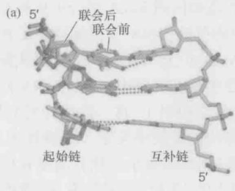

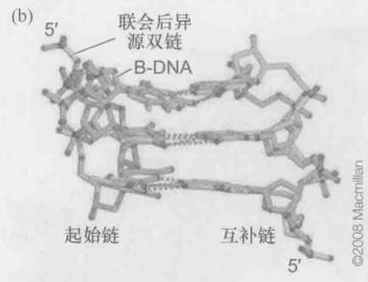  
图 11-15 纤丝中的 DNA 的结构不会发生剧烈变化。(a) 突触前的核苷酸三联体（灰色）是同突触后的碱基对三联体（黄色）叠加在一起的。Watson-Crick 氢键由虚线表示。(b) 突触后的碱基对三联体（黄色）同 B 型 DNA（蓝绿色）叠加在一起。Watson-Crick 氢键表示为虚线，洋红色的属于异源双链的，绿色的属于 B-DNA。(经许可，改自 Chen et al. 2008. Nature 453: 489, Fig. 5a, b, p. 491. © Macmillan.)

## 所有的生物都有 RecA 同源物

所有的生物都有 RecA 家族的链交换蛋白，研究得最详细的是真细菌的 RecA、古细菌的 RadA、真核生物的 Rad51 和 Dmc1，以及噬菌体 T4 的 UvsX 蛋白。这些蛋白质可形成与 RecA 类似（图 11-16）的蛋白丝，并以类似的方式行使相似的功能（虽然这些蛋白质的部分功能因它们特殊的细胞学角色和反应对象而发生了特化）。我们将在下面讲述 Rad51 和 Dmc1 在真核生物细胞重组中的功能。

## RuvAB 复合体特异性地识别 Holliday 联结体并促进分支移位

当重组的链入侵步骤完成后，两个重组的 DNA 分子被一个 DNA 分支连接起来，称为 Holliday 联结体（见上文所述）。分支点的移动需要两个同源 DNA 双螺旋交换碱基对，细胞编码的一些蛋白质可大幅提高分支移位速率。

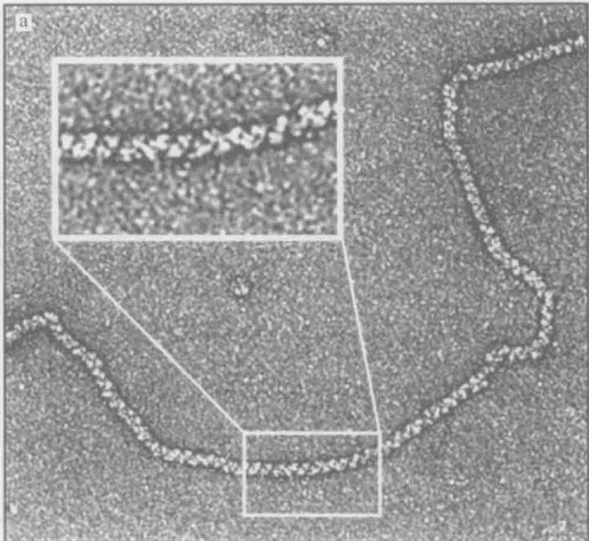

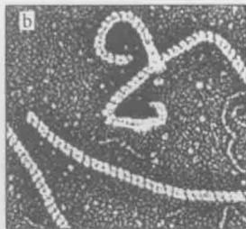

  
图11-16 三类生物中类似 RecA 的蛋白质。图中显示(a)人类 Rad51;(b)大肠杆菌 RecA;(c) Archaeoglobus fulgidus RadA 蛋白质。Rad51 和 RecA 蛋白已在图11-8中出现过。请注意电镜图片中的局部放大图揭示的蛋白丝的类似螺旋结构。(来源：West S. C. et al. Nat. Rev. Mol. Cell Biol. 4: 435-445. ©Macmillan. 图像由 A. Stasiak, University of Lausanne, Switzerland. 提供)

RuvA 蛋白是一个特异性结合 Holliday 联结体的 DNA 结合蛋白, 它可识别 DNA 联结体的结构, 而不考虑相应的 DNA 特异性序列。RuvA 蛋白识别并结合到 Holliday 联结体上, 促使 RuvB 蛋白结合到这个位点上。RuvB 是一个六聚体 ATP 酶, 类似 DNA 复制过程中的六聚体解旋酶 (见第 9 章)。RuvBATP 酶提供能量, 以促进碱基对交换, 而移动 DNA 分支这种能量可以快速地在一个方向上移动 DNA 分支。一个 Holliday 联结体上的 RuvAB 复合体的结构模型 (图 11-17) 展示出一个四聚体 RuvA 蛋白和两个六聚体 RuvB 蛋白如何同时促进 DNA 链交换的过程。

## RuvC 剪切位于 Holliday 联结体的特定 DNA 链从而结束重组

结束重组需要拆分两条重组的 DNA 分子间的 Holliday 联结体（或多个联结体）。在细菌中，RuvC 是拆分 Holliday 联结体的主要核酸内切酶。正是因 RuvC 能剪切 RecA 在体外试验中形成的 DNA 联结体而被发现并得到纯化。遗传学证据显示它的功能与 RuvA 和 RuvB 相呼应。

RuvC 引起的拆分经识别 Holliday 联结体（可能以 RuvA 和 RuvB 的复合体形式存在）后，特异地两条同一方向的同源 DNA 链打开缺口。此剪切形成了 5'端磷酸基团末端和 3'-OH 末端，这些末端可以直接被 DNA 连接酶接上。依据哪一对 DNA 链被 RuvC 剪切，连接后的重组产物可以是剪接（交换）或是补丁（未交换）的类型。图 11-18 显示了 RuvC 的结构及其如何与 DNA 联结体相互作用的模式图。

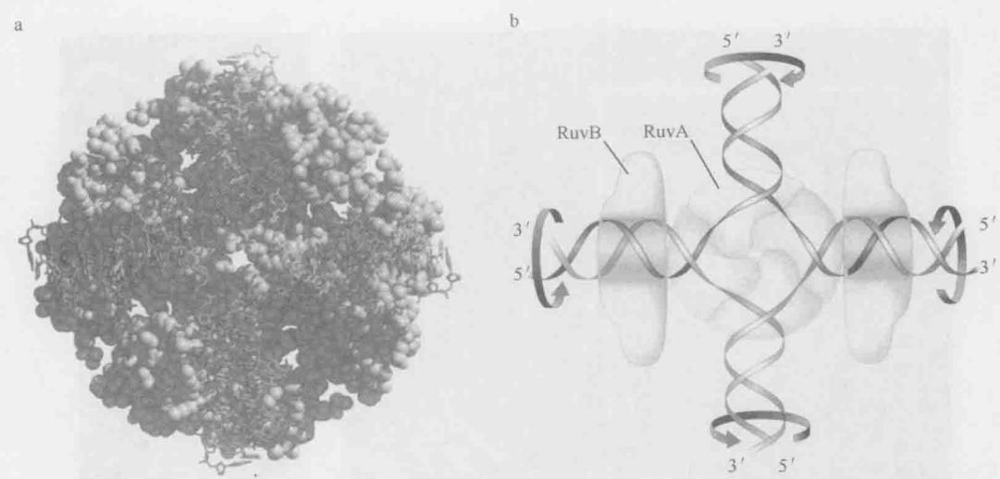

图 11-17 高分辨率 RuvA 结构图和 RuvAB 复合体与 Holliday 联结体结合的模式图。(a). RuvA 四聚体的晶体结构显示该蛋白具有四重对称性。(Ariyoshi M., et al. 2000. Proc. Natl. Acad. Sci. 97: 8257-8262.) 镜像图使用 Bobscript、Molscript 和 Raster 3D 制作。(b). 有两个 RuvB 六聚体的晶体模式图。请注意, 一个 RuvA 四聚体是如何以四重对称的形态结合到联结体上的。两个 RuvB 六聚体结合在 RuvA 对称的两侧, 并起到驱动器的功能, 以驱使 DNA 通过联结体。RuvB 六聚体以截面图表示, 以显现穿过这些复合体的 DNA 链。(改自 Yamada K. et al. 2002. Mol. Cell 10: 671-681, Fig.4.)  
  
图 11-18 高分辨率的 RuvC 拆分酶结构图以及与 Holliday 联结体结合的 RuvC 二聚体的模式图。(a). RuvC 蛋白的晶体结构。(Ariyoshi M., et al. 1994. Cell 78: 1063-1072.) 图像使用 BobScript、MolScript 和 Raster3D 制作。(b). 一个 RuvC 二聚体结合到 Holliday 联结体上的模式图。请注意在该图中，一个 RuvC 二聚体是如何与 Holliday 联结体结合，并在两条相同的 DNA 链上引入对称的缺口。(已获许可，改自 Rafferty J. B. et al. 1996. Science 274: 416-421, Fig. 1b, © AAAS.)

尽管 RuvC 靠识别结构而非特定序列行使其功能，但 RuvC 剪切 DNA 还是有一定程度的序列特异性。剪切只发生在与 5'-A/T-T-T-G/C 符合的一致性序列的位点，在这段序列的第二个 T 后面剪切。DNA 中这些一致性序列较多，平均每 64 个核苷酸就会有一个。这种一定程度的序列特异性可保证在联结体拆分前至少有一些分支移位发生。没有这种序列选择性，Holliday 联结体可能刚产生就被 RuvC 剪切，从而限制了参与链交换的 DNA 区域。

## 真核细胞的同源重组

## 真核细胞的同源重组具有额外的功能

如前所述，在细菌中，修复 DNA 的双链断裂需要同源重组。重新启动损坏的复制叉，并允许染色体 DNA 与以噬菌体感染或接合的形式进入细胞的 DNA 发生重组。同样地，在真核细胞中，同源重组也是 DNA 修复和启动受损复制叉所需要的。这种对同源重组的需要可由具重组蛋白缺陷的细胞对 DNA 破坏剂（特别是破坏 DNA 链的试剂）非常敏感所证实。此外，具有干扰同源重组突变的动物较倾向于患某种特定类型的癌症。然而，在我们下面的讨论中可以看到，同源重组在真核生物中发挥着另外的重要作用。尤其是在减数分裂的过程中，同源重组显得更为重要。在减数分裂过程中，同源重组确

保染色体正确配对，从而保持基因组的完整性。这种重组可以使亲本染色体之间的基因发生重组，确保每套基因的多态性能够传给子代。

## 同源重组保证减数分裂中染色体的分离

正如第9章所述，减数分裂（meiosis）有两轮核分裂，减少正常双倍体细胞（2N）的DNA含量，成为配子的DNA含量（1N）。图11-19显示了在两轮分裂中染色体是怎样分配的。分离前，细胞中的每个染色体都有两个拷贝（同源染色体），分别得自父母双方。在S期，这些染色体进行复制从而获得了DNA四倍体（4N）（图11-20），复制的产物——姐妹染色单体聚在一起。这时，准备进行第一次核分裂，这些复制了的同源染色体必须进行配对，并且排列在细胞的中心。正是这种同源染色体的配对需要同源重组（图11-19）。这些事件皆需精细的时间安排。重组必须在第一次核分离前完成，从而使同源染色体正确地排列然后分开。在这个过程中，姐妹染色单体保持配对（图11-20，图8-16）。然后在第二次核分裂中，姐妹染色单体才分开。这种分裂产生4个配子，每一个都具有每条染色体的一个拷贝（如1N的DNA含量）。

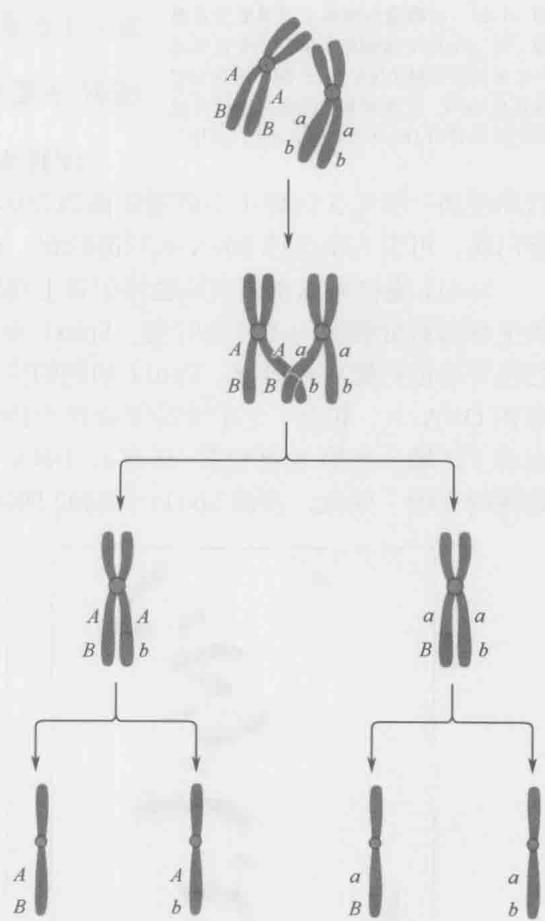  
图 11-19 减数分裂的 DNA 动态过程。为了易于理解，该图只显示一对同源染色体。红色和蓝色分别显示经过一轮 DNA 复制以后的两个同源染色体。同源重组是同源染色体配对以准备第一轮核分裂所必需的。这类重组也可以引起交换，如本图中所显示的 A 与 B 基因之间。

  
图 11-20 同源染色单体之间减数分裂重组。所示的每个结构均是被称为染色单体的已复制的双链 DNA 分子。配对的称为姐妹染色单体，发生在非姐妹染色单体对之间的重组是由 Dmc1 介导的（见图 11-19）。

如果没有重组，染色体通常无法在第一次减数分裂过程中正确地排列，从而极易引起染色体的丢失。染色体的不恰当分离被称为不分离（nondisjunction），会导致大量配子没有正确的染色体组成。具有过多或过少染色体数量的配子在受精后都不能正常发育，因而失败的同源重组往往表现为低生殖能力。这种在减数分裂过程中发生的同源重组被称为减数分裂重组（meiotic recombination）。

减数分裂重组也常常引起两个同源亲代染色体间基因的交换，这种遗传交换（如图 11-20 显示的那样）可以用细胞学方法观察到（图 11-21a，左侧图示）。一个重要的结果是亲本 DNA 分子上的等位基因在下一代发生了重新分配。

## 减数分裂中程序化生成的 DNA 双链断裂

细胞成功地完成减数分裂所需要的发育程序包括

启动很多一般生长过程中不需要的基因表达。其中的一个就是 SPO11，该基因编码一个蛋白质，可引入染色体 DNA 的双链断裂，进而启动减数分裂重组。

Spo11 蛋白可以在很多染色体位置上切断 DNA，它对序列没什么选择性，但却必须发生在减数分裂的一个特定时期。Spo11 参与的 DNA 切割正好发生在已复制的同源染色体开始进行配对的时候。Spo11 切割的位置尽管普遍，但这些切割位点并非随机地分布在 DNA 上。相反，它们多分布在核小体包装疏松的染色体区域，如控制基因转录的启动子区域（见第 8 章和第 19 章）。DNA 出现较高概率的双链断裂区域，也会发生高频率的重组。如此，常被 Spo11 切割的 DNA 位点，如 Chi 位点，也是重组的热点。

  
图 11-21 交换的细胞学图示。仓鼠组织培养细胞中直接观察到的染色单体相互交换。经过吉姆萨染色的染色体，DNA 双链中胸腺嘧啶均被溴脱氧尿苷替代并被染浅色，如果只有一条链被替代，则呈深色。经过两个世代生长于溴脱氧鸟苷中，经复制的新的染色单体仅有一条链被替代，而另一姐妹染色单体则双链均被替代。如此，姐妹染色单体就可以区分，交换则可以很容易地以浅深交替带而显现出来（左侧）。同样，如果用 DNA 破坏试剂处理正处于有丝分裂的细胞，也能看到相间的重组染色体（右侧）。（Sheldon Wolff and Jody Bodycote 惠赠）

DNA 断裂的机制如下：Spo11 蛋白中一个特异的酪氨酸侧链可攻击磷酸二酯键骨架，从而切断 DNA，并在蛋白质与受损的 DNA 链间生成共价复合物（图 11-22），Spo11 的两个亚基在两个 DNA 链的相差两个核苷酸处切开，形成一个交错的双链断裂。Spo11 与 DNA 拓扑异构酶及位点特异性重组酶具有同样的 DNA 剪切机制（见第 4 章和第 12 章）。实际上，蛋白质序列比较显示 Spo11 和这些酶都有一定的同源性。

Spo11 的切割涉及一个蛋白质-DNA 共价复合物，这导致了两个结果。第一，Spo11 切割处 5'端的 DNA 可共价连接该酶。正是这些与 Spo11 相连的 5'端 DNA 形成了单链 DNA 尾端的起始点，这种尾端可引起类似 RecA 的蛋白质的组装，并启动 DNA 链入侵（如下文所述）。第二，被切断的

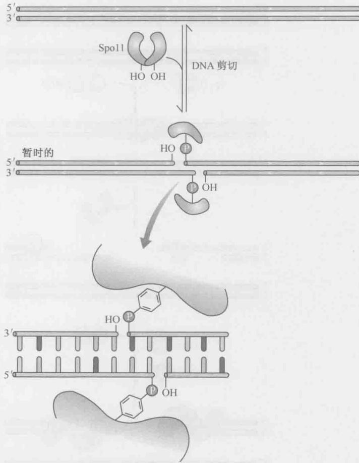  
图 11-22 Spo11 的切割机制。Spo11 蛋白中酪氨酸的—OH 基团对 DNA 进行攻击，生成一个蛋白质-DNA 共价连接。Spo11 的两个亚基是生成双链 DNA 断裂所必需的，一个亚基攻击其中一条 DNA 链。注意，由于这样的切割机制，DSB 能够通过切割反应的简单逆转而重接。

DNA 磷酸二酯键的能量储存在蛋白质-DNA 的连接中，这样 DNA 链能通过切割反应简单逆转（化学机制见图 12-5）而被重接。这种重接发生在细胞接到停止减数分裂的信息之后。

## MRX 蛋白作用于被切开的 DNA 末端，以组装类 RecA 的链交换蛋白

Spo11 催化的 DNA 双链断裂生成单链区域,该区域用于组装类 RecA 的链交换蛋白。如细菌中观察的 RecBCD 路径,这个处理过程产生了很长的 3' 端单链 DNA 片段（图 11-23）。在减数分裂重组中,MRX 酶复合物负责催化该 DNA 处理过程。MRX 酶复合物尽管与 RecBCD 不同源,但也是一个多亚基的 DNA 核酸酶。MRX 酶复合物由 Mre11、Rad50 和 Xrs2 三个亚基组成,并以三个亚基的首字母命名。

断裂处的 DNA 处理完全作用于 5' 端的 DNA 链上, 即与 Spo11 蛋白共价结合的 DNA 链（如前述）。3' 端的 DNA 链不被降解, 所以此 DNA 处理反应被称为 5'→3' 端切除。MRX 正是通过 5'→3' 的反应, 从而生成具 3' 端的单链 DNA, 通常可达 1kb 或更长。MRX 酶复合物还被认为能去除与 DNA 相连的 Spo11。

  
图 11-23 减数分裂重组途径概述。减数分裂过程中双链断裂的形成需要 Spo11 和 MRX 复合体的参与。观察指出，DSB 的形成和后续的链处理，通常是由多种蛋白质的协调作用的偶联而完成。MRX 蛋白负责切除断裂位点的 5'端 DNA，然后链交换蛋白 Dmc1 和 Rad51 组装到单链 DNA 尾上。以上两个蛋白质都参与了重组，但还不清楚它们如何共同作用。为便于理解，本图中显示它们正在形成独立的蛋白丝。（已获许可，改自 Lichten M. 2001. Curr Biol. 11：R253-R256，Fig. 2. ©Elsevier.）

## Dmc1 是专一在减数分裂重组中行使功能的类 RecA 蛋白

真核生物编码两种被充分阐明的、与细菌 RecA 蛋白同源的蛋白质——Rad51 和 Dmc1。这两种蛋白质都在减数分裂重组中发挥作用。尽管 Rad51 广泛地表达在进行细胞有丝分裂和减数分裂的细胞中，Dmc1 则仅在细胞进入减数分裂时被表达。

减数分裂中的链交换发生在两个特定类型的同源 DNA 之间。减数分裂重组发生在每个染色体都有 4 套完整的 DNA 双链分子拷贝，即两个同源染色体各复制生成了一对姐妹染色单体时（图 11-20）。尽管两个同源染色体具有些序列的微差异，携带不同的基因不同的等位基因，但这 4 套染色体中的大部分 DNA 序列都是相同的。有趣的是，依赖 Dmc1 的重组倾向发生于非姐妹同源染色单体之间，而不是姐妹染色单体之间（图 11-20）。尽管这种选择的机制目前还不知道，但有其清晰的生物学基础：减数分裂重组可通过促进同源染色体间的交联而有助于等待分裂的同源染色体联会（alignment）。

## 多种蛋白质共同促进减数分裂重组

如前所述，参与形成双链断裂、处理 DNA 生成 3'端尾巴的单链 DNA 和参与减数分裂重组过程中链交换等关键步骤的蛋白质已被发现并定性。遗传实验显示很多其他的蛋白质也参与了这一过程。此外，有很多蛋白质表现出与已知的重组酶间的作用，并且它们似乎是在一个很大且多组分的复合体中行使其功能的。这些大型蛋白质-DNA 复合体被称为“重组工厂”（recombination factory），该结构可在细胞中观察到。例如，图 11-24 显示在减数分裂中 Rad51 和 Dmc1 共定位在这些“工厂”里。

还有很多其他种类的蛋白质被证实与Rad51共同作用以促进重组和双链DNA断裂的修复。Rad52是另外一个与Rad51相互作用的必要重组蛋白。Rad52启动Rad51 DNA蛋白丝（Rad51的活性形态）的组装。Rad52通过对RPA（真核细胞中主要的单链DNA结合蛋白）的拮抗作用而启动Rad51蛋白丝的组装。因此，

  
图 11-24 在细胞减数分裂过程中，Rad51 和 Dmc1 蛋白共同定位于“重组工厂”。用荧光标记 Rad51（绿色）和 Dmc1（红色）抗体，以免疫染色法检测蛋白质。两种蛋白质在一起的时候，合并的影像呈黄色。（来源：经 Shinohara M. et al. 2000. Proc. Nat I. Acad. Sci. 97: 10814-10819, Fig. 1A, ©National Academy of Sciences 许可使用）

Rad52 与已知大肠杆菌的 RecBCD 蛋白有相似的活性，RecBCD 蛋白可帮助 RecA 结合在原本被 SSB 所结合的单链 DNA 上。Rad52 蛋白也能促进互补单链 DNA 分子的退火和碱基配对，这种活性在重组起始阶段的双链配对反应中也发挥着重要的作用。BRCA2 基因的产物也参与 Rad51 介导的双链断裂修复（见框 11-2 “肿瘤抑制基因 BRCA2 的产物和 Rad51 蛋白相互作用并调控基因组的稳定性”）。

## 框 11-2 肿瘤抑制基因 BRCA2 的产物和 Rad51 蛋白相互作用并调控基因组的稳定性

BRCA2基因对于维持基因组的稳定性具有重要的作用。在人类中，近一半的家族性乳腺癌都被认为是由于BRCA2基因的突变造成的。这种癌症的易感性至少部分来自BRCA2在Rad51介导的双链断裂修复中的直接作用。当细胞被培养在对DNA有损伤的化学试剂中时，可以很明显地观察到Rad51聚集体，首先被组装起来以激活DNA修复。BRCA2基因缺陷的细胞不能在细胞受损时在细胞核中组装起这些聚集体同时也不能进行相应的DNA修复。BRCA2蛋白和Rad51蛋白直接相互作用(见框11-2图1)，它们的相互作用可能对Rad51蛋白在细胞中正确定位以利于DNA修复及调节Rad51蛋白的活性非常重要。因此，与BRCA2基因突变相关的显著表现型说明，在真核生物包括在人类中，DNA双链断裂修复和Rad51依赖性的同源重组是至关重要的。

框11-2图1 Rad51蛋白和BRCA2蛋白重复基序相互作用复合体的结构。许多生化与结构研究表明，BRCA2上被称为BRC基序的、含有保守重复序列的特异区段是同Rad51蛋白作用的重要位点。其中的一个重复基序BRC4被证实与Rad51蛋白具有很高的亲和性。结构分析更精确地揭示了BRC4是如何与Rad51蛋白形成复合体的。在本图中，Rad51蛋白的 $\alpha$ 螺旋用紫色显示，β折叠用蓝色显示，BRC肽段的重复序列用绿色显示。每条序列都标注了氨基末端和羧基末端。（来源：经Pellegrini L. et al. 2002. Nature 420: 287-293, Fig. 1a. ©Macmillan. 许可使用）

通过与细菌的模拟比较，我们推测真核细胞也编码启动重组过程中分支移位和Holliday联结体拆分的蛋白质。事实上，具有启动这些功能的酶已经被发现了。例如，Rad51C（一种含有类Rad51蛋白的复合体）和另一种蛋白XRCC3已经被证实具有Holliday联结体拆分酶的活性。同样地，RecQ解旋酶家族的成员在DSB修复过程中的同源重组中发挥了重要的作用，而且可能还参与减数分裂。例如，在人体中，双Holliday联结体的处理方式之一就包含一种可以同拓扑异构酶合作的RecQ解旋酶。这种机制称为双连接体分离，可以阻止侧翼序列的互换。在人体发现的三种解旋酶（BLM、WRN和RTS/RECQ4）分别与布鲁姆综合征、沃纳综合征以及色素沉着综合症相关，它们会导致早衰和肿瘤生成的倾向（见框11-3，早衰和癌变相关蛋白会促进Holliday联结体处理的旁路途径）。

## 框 11-3 早衰和癌变相关蛋白会促进 Holliday 联结体处理的旁路途径

RecQ DNA 解旋酶从细菌到人类都非常保守，它们在同源重组的早期和晚期都扮演了非常重要的角色。这些解旋酶可以特异性地处理和编辑重组中间体，导致交联分子在双 Holliday 联结体中间体形成之前发生瓦解。结果是，解旋酶以交叉类事件为代价促进非交叉重组（框 11-3 图 1）。在人体中，严格的早衰和各类肿瘤都与编码这些解旋酶（WRN、BLM 和 RTS/RECQ4）的基因的功能缺失突变相关（见框 11-3 表 1）。

  
框 11-3 图 1 重组的交叉和非交叉通路。在交叉通路中（上一条通路），Holliday 联接体的解离酶（用剪刀表示）在交联处完成组装并进行不对称切割，形成交叉产物。与之形成对比的是，在非交叉通路中（下一条通路），RecQ 家族的解旋酶（用绿色箭头表示）促进合成依赖性链的退火和拆分。这一机制表明这些解旋酶的活性把最初有链互换蛋白产生的交联分子拆分开。这一过程也可以使得 D 环沿着 DNA 分子滑动，且允许侵入链在交联分子瓦解前在 DNA 聚合酶作用下进行延伸。（经授权，引用自 Zakharyevich K. et al. 2012. Cell 149: 334-347, Fig. 7. ©Elsevier.有些许改动）

框 11-3 表 1 RecQ 相关病症的临床特点

<table><tr><td>综合征(基因)</td><td>主要临床特征</td><td>肿瘤倾向</td></tr><tr><td>布鲁姆综合征(BLM)</td><td colspan="2">矮小、突出的鼻子、窄脸颊、色素沉积、红肿、皮肤早发性同组织和种类呈正态分布静脉扩张、精神呆滞、II型糖尿病、免疫缺陷、肺病、生育能力差或丧失</td></tr><tr><td>沃纳综合征(WRN)</td><td colspan="2">双边白内障、嘶哑、皮肤改变、四肢纤瘦、过早花发/原始肉瘤和间质细胞瘤早发脱发、面部皱缩、身材矮小、骨质疏松、性腺机能减退、糖尿病、软组织钙化</td></tr><tr><td>色素沉着综合征(RECQ4)</td><td colspan="2">皮肤异色症、少年白内障、生长迟缓、骨骼发育不良、骨肉瘤早发头发稀疏、性腺机能减退</td></tr></table>

经授权，改自 Bernstein K.A. et al. 2010. Annu. Rev. Genet. 44: 393-417, Table 1, p. 395. © Annual Reviews.

正如我们所看到的，减数分裂重组可使同源染色体联会，并促进它们之间的遗传交换。这些重组反应通常导致亲本染色体间的交换。然而，依赖重组中间物的 Holliday 联结体的拆分结果，通过双链断裂修复途径的重组也能够产生非交换产物（见上文）。这些事件可为成功的减数分裂提供必需的染色体配对，但未在染色体遗传结构上留下可检测的变化。

然而，即便是非交换重组也会产生遗传后果，如导致基因转变（gene conversion）。基因转变发生在当一个基因的等位基因丢失并被其他等位基因所替代之时。关于基因转变是如何发生在有丝分裂生长期细胞和减数分裂细胞中的例子，将在下面介绍。

## 交配型的转换

除了促进 DNA 配对、DNA 修复和遗传交换外，同源重组还能够改变染色体特定位置的 DNA 序列。这种类型的重组有时是为了调控基因的表达。例如，经由转换不同交配型基因出现在该生物基因组中可被表达的特定位置，重组可对酿酒酵母的交配类型进行控制。

酿酒酵母是种单细胞真核生物，并可以3种不同的细胞类型生存（见附录A）。酿酒酵母的单倍体细胞有两种交配型——a或α。当a和α细胞相接近时，它们能够进行融合（即交配）形成一个a/α双倍体细胞。这个a/α细胞然后可以经过减数分裂形成两个单倍体a细胞和两个单倍体α细胞。

交配型基因编码转录调节蛋白。这些调节蛋白控制靶基因的表达，该靶基因的产物决定细胞类型。在一个细胞中，可表达的交配型基因正是位于该细胞基因交配型基因座（mating-typelocus，MAT locus）上的基因（图11-25）。这样，在a细胞中a1基因出现在MAT基因座上，而在α细胞中，α1和α2基因出现在MAT基因座上。在双倍体细胞中，此两种交配型控制基因都会表达。交配型基因所编码的调节蛋白，一起与其他3种细胞类型中发现的调节蛋白以多种协同方式作用，以保证在不同细胞类型中被正确表达（见第19章）。

如我们正在讨论的，细胞能够通过重组转换它们的交配型。各细胞除了 a 或 $\alpha$ 基因存在于 MAT 基因座上以外，另外还有一套 a 和 $\alpha$ 基因存在于基因组的其他位置（但并不表达）。这些额外的沉默拷贝所在的基因座称之为 HMR 和 HML（图 11-25）。

  
图 11-25 遗传基因座编码交配型信息。尽管 3 号染色体带有 3 个交配型基因座，但是只有在 MAT 基因座上的基因可以表达。HML 编码一个沉默拷贝的 α 基因，而 HMR 编码一个沉默拷贝的 a 基因。如果重组发生在 MAT 和 HML 位置上，a 细胞就会转换成 α 细胞。如果重组发生在 MAT 和 HMR 位置上，α 细胞转换成 a 细胞。（经许可，改自 Haber J. E. 1998. Annu. Rev. Genet. 32: 561-599, Fig. 3. ©Annual Reviews）

所以，这些 HMR 和 HML 基因座被称为沉默盒（silent cassette）。它们的功能是提供一个遗传信息的“储藏室”，用来改变细胞交配型。这种转换需要通过同源重组使遗传信息从 HM 基因座转换到 MAT 基因座。

## 特定位点的双链 DNA 断裂引发交配型转换

交配型转换是由 MAT 基因座的双链断裂引发的，这个反应由特异的 DNA 切割酶——HO 内切核酸酶（HO endonuclease）来完成。HO 基因的表达被严格地控制，以确保转换在适当时候发生。这个调控机制将在第 19 章中进行介绍。HO 是一种序列特异性的内切核酸酶。酵母染色体上唯一携带 HO 识别序列的是交配型基因座。HO 在染色体上切割形成一个黏性的断裂，与 Spo11 切割相比，HO 只是水解 DNA，并不与 DNA 断裂处共价相连。

HO 引起的断裂，其 5'→3' 的 DNA 切除反应与减数分裂重组的机制一样。所以，切除依赖于 MRX 蛋白复合体，并对带 5' 端的 DNA 链具有特异性，而带 3' 端 DNA 链保持稳定而不被核酸酶消化。一旦生成长的 3' 单链 DNA 尾巴，它们就被 Rad51 和 Rad52 蛋白包裹（与其他帮助组装重组蛋白质-DNA 复合体的蛋白质一样）。这些被 Rad51 蛋白包裹的 DNA 链寻找同源染色体区域以启动链的入侵和遗传交换。

交配型的转换是单向性的，即序列信息（尽管并不是真正的 DNA 片段）从 HMR 和 HML “移动” 到 MAT 基因座，但是绝对不会从反方向进行。这样，在重组过程中，被切掉的 MAT 基因座总是接受者，而 HMR 和 HML 基因座在整个重组过程中是不变的。这种方向性源于 HO 内切核酸酶不能切割其在 HML 和 HMR 基因座上的识别序列，因为此区域的染色质结构使得酶无法接近这些位点。

由 Rad51 包裹位于 MAT 基因座的 3'单链 DNA 末端可 “选择” HMR 或 HML 基因座的 DNA 进行链入侵。如果 MAT 基因座的 DNA 序列是 a，则侵入会发生在有 $\alpha$ 序列的 “储备” 拷贝的 HMLR；反之，如果 MAT 带有 $\alpha$ 基因，则侵入会发生在储备有 a 序列的 HMR。重组之后，被选择的 HM 基因座的信息也出现在 MAT 基因座。这种遗传改变不是从 MAT 到 HR 基因座的信息相互交换。这种非交互的重组事件是基因转变的一个特例。

## 交配型转换是一种基因转变事件，与交换无关

尽管 DSB 修复途径可以解释交配型转换的重组机制，但是大量的证据显示，在链入侵步骤之后，此重组途径不同于 DSB 修复机制。其中一个提示是在交配型转换的过程中从未发现属于交换的重组产物。回顾在 DSB 修复途径中，产生两种 Holliday 联结体中间型的拆分产物——剪接（交换产物）和补丁（非交换产物）（图 11-3）。根据 DSB 修复模式，这两种产物发生的概率相似，但是，在交配型转换中从未观察到有交换产物存在。所以，无 Holliday 联结体中间体的重组模型更适于解释交配型转换。

为解释没有发生交换事件的基因转变的机制，提出了一种新的重组模型，称之为合成依赖性链退火（synthesis-dependent strand annealing，SDSA）。图11-26显示在这种机制下，如何发生交配型转换。如上所述，首先在重组位点引入DSB（图11-26a），经过5'到3'切除以及链侵入之后（图11-26b、c），侵入的3'端作为引物在Ya侧翼的同源区域启动新的DNA合成继续复制Ya序列（图11-26c、d）。值得注意的是，与DSB修复途径所不同的是，一个完整的复制叉在该处形成。

然而，相比于普通的 DNA 复制，新合成的链自模板上置换下来后会同第二个切除的 5' 端发生退火。一旦这样的退火发生，相应的长的 3' 端（图 11-26d 中底部的链）便会被核酸内切酶切割，新形成的 3' 端会引发、延伸进而复制 Ya 序列的第二条链（图 11-26e、f）。其结果是新的双链 DNA 片段被合成，再连接到最初被 HO 内切酶切断的 DNA 位点上，并被 MRX 切除。这个新的片段具有与模板相同的 DNA 序列（图 11-26 中的 HMRa）。

  
图 11-26 交配型转换的重组模型：依赖合成的链退火（synthesis-dependent strand annealing, SDSA）。图示位于 MAT 基因座基因转变的步骤（详见文字内容）。HMR 和 MAT 区域显示为绿色；编码 a 信息的 HMR 为深绿色，编码 $\alpha$ 信息的 MAT 呈橙绿色。当 SDSA 结束时，起初位于 MAT 区域的 $\alpha$ 信息被替换，即转变成为 HMR 区域的 a 信息。

所以，新合成的 DNA——其互补 DNA 分子信息的精确拷贝，替代了原有的 DNA 信息。这种机制更恰当地解释了不需要切除 Holliday 联结体的基因转变。通过这个模型，交配型重组时没有发现交换产物不再是一个谜。

## 同源重组机制的遗传结果

如在本章开头所讨论的，最初的同源重组机制模型在很大程度上是为了解释该过程的遗传结果。现在重组的基本步骤已被了解，我们有必要回顾一下同源重组的过程及其如何改变 DNA 分子而产生特异的遗传变化。

同源重组的一个重要特点是，无论是何种序列，只要有足够的相似区域，它就可以发生在任何两个 DNA 区域间。现在我们知道了原因所在，同源重组没有一个步骤需要特异 DNA 序列的识别。至于部分依赖序列的步骤（如经 Chi 位点转化的 RecBCD、被 RuvC 蛋白所剪切的 DNA），其偏好的序列则很常见。两个 DNA 分子间发生重组的关键步骤在于 RecA 家族的一个链交换蛋白能成功地将两条分子配对，而任何具有能形成正确碱基配对的正常 DNA 链都可以指导这个过程。

重组大致上独立于序列的事实导致一个推论，即任何两个基因间的重组频率和这些基因间的距离成正比。因为 DNA 区域可被平等地用来启动一个成功的重组事件，所以可观察到此正比性。同源重组的这个基本特性使我们能够用重组率来制作一个遗传图，以显示染色体上基因的顺序和距离。

当 DNA 的一个区域在形成重组时不具有这种 “平均” 概率时，将遗传图和物理图比较就会产生曲解（图 11-27）。重组概率高的区域称为 “热点”，而重组概率低的区域称为 “冷点”。因此，中间有热点的两个基因，在遗传图上要比在物理图上的同一区域相距更远。反之，中间有冷点的基因在遗传图上的距离比它们的物理图距离要更接近。我们已遇到两个能够从分子水平上解释染色体上存在冷点和热点的例子。靠近 Chi 位点和 Spo11 剪切位点的区域是热点，拥有高于平均的启动重组概率；而这类位点较少的区域则是冷点。

## 重组时的 DNA 修复是基因转变的起因之一

同源重组的另一个遗传结果是基因转变。我们曾在酵母交配型转换的重组特例中介绍了基因转变的概念。然而，基因转变也常发生在正常同源重组事件中，如引起细菌中的遗传交换和减数分裂中的染色体配对。

为了演示减数分裂重组中的基因转变，假设一个减数分裂期的细胞在其同源染色体上分别为等位基因 A 和 a。DNA 复制后，将产生 4 个该基因的拷贝，基因型是 AAaa。如果没有基因转变，将产生 2 个带有 A 等位基因的配子和 2 个带有 a 等位基因的配子。如果所产生的配子的基因型是 Aaaa（或者是 AAAA），则说明发生了一个将 A 置换成 a（或相反）的基因转变事件。这是怎么发生的呢？

在双链断裂修复过程中，基因转变以两种方式发生。首先，考虑如果 A 基因与双链断裂处很接近时将会发生什么。这时当 3' 单链 DNA 末端侵入同源双螺旋链并延伸，则可能会复制 a 信息，这个过程可以导致替换重组后染色体上的 A 信息（图 11-4d）。

基因转变的第二种机制涉及修复重组中间体所产生的碱基错配。假如链入侵或分支移位包括 A/a 基因，则可能会形成一段异源双链 DNA，在一条链上有 A 序列而另一条链上有 a 序列（图 11-28 和图 11-2d，插图）。带有碱基错配的 DNA 区域能被细胞错配修复酶识别和作用（我们在第10章讨论过），这些酶能特异地修复DNA上的碱基错配。当碱基错配酶发现碱基错配后，会在两条链中的一条上切除一小段DNA。然后，一个具修复作用的DNA聚合酶填补这个缺口，并产生正确的配对序列。当作用于重组中间体时，错配修复酶将随机选择被修复的一条链。因此，修复后产生的双链带有编码 $A$ 信息的序列还是编码 $a$ 信息的序列，取决于哪条链被修复酶修复，这就产生了基因转变。

  
图 11-27 酵母染色体一段典型区域的遗传图和物理图的比较。标记显示了不同基因的位置。注意遗传图上 Spo7 和 Cdc15 之间的区域，因为低交换频率，遗传图小于物理图；相反，Cdc15 和 FL01 之间的区域，因为高频率交换，遗传图大于物理图。（经许可，改自 Alberts B. et al. 2002. Molecular biology of the cell, 4th edition, p. 1138, Fig. 20-14. © Garland Science/Taylor & FrancisLLC.）

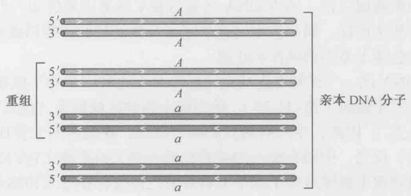

  
图 11-28 错配修复重组中间体的异源双链 DNA 可以导致基因转变

## 小结

所有的生物都会发生同源重组，以允许遗传交换、染色体上基因重排、断裂 DNA 及停滞复制叉的修复。重组过程涉及 DNA 分子的断裂和重接。同源重组的双链断裂修复途径很好地描述了很多重组事件。依据此模型，启动交换需要两条同源 DNA 分子中的一条具有双链断裂。DNA 的断端被 DNA 降解酶作用，产生单链 DNA 片段。这些单链 DNA 片段参与其同源 DNA 的配对。一旦发生了配对，两条 DNA 分子就被称为 Holliday 联结体的分支结构所连接。在 Holliday 联结体处切断 DNA，以拆分联结体并结束重组。Holliday 联结体可被两种方式剪切：其中一种方法会产生交换产物，即两个亲本 DNA 分子被共价连接；另一种剪切联结体的方法不产生交换产物，而仅是形成一个重组 DNA 的“补丁”。

细胞编码催化所有同源重组步骤的酶。关键酶是链交换蛋白。其中，大肠杆菌的 RecA 是个先例；类 RecA 的蛋白质存在于所有的生命体中。类 RecA 的链交换蛋白促进两条 DNA 分子寻找同源序列和重组中间体的链交换。RecA 以一个大的 DNA——蛋白质复合体（RecA 蛋白丝）发挥功能。真核生物的细胞编码两个链交换蛋白，分别为 Rad51 和 Dmc1。其他重要的重组酶是产生 DNA 双链断裂并启动重组的 DNA 剪切酶。这些蛋白质（Spo11 和 HO）只在真核细胞中出现。作用于 DNA 断端而产生所需要的单链末端的核酸酶，分别是原核生物的 RecBCD 酶和真核生物中的 MRX 酶复合体。此外，还有促进移动（分支移位）和剪切（拆分）Holliday 联结体的其他酶。

减数分裂中，重组对第一次核分裂前同源染色体的正确配对是必不可少的。因此，重组被高度调控以保证发生在所有的染色体上。Spo11 DNA 切割酶和 Dmc1 链交换蛋白都在重组反应中起特异性的作用。同源重组有时也用来调控基因表达。酵母的交配型转换是这种调控的绝佳例证，同时也是一个基因转变的例子。已经有一个被称为依赖合成的链退火（SDSA）的新模型描述一些同源重组事件，该模型是在分析交配型转换机制的过程中产生的。这种机制可以产生基因转变型的遗传交换产物，但不会导致交换的发生。

## 参考文献

## 书籍

Brown T.A. 2007. Genomes, 3rd ed. Garland Science, New York.

Griffiths A.J.F., Miller J.H., Suzuki D.T., Lewontin R.C., and Gelbart W.M. 2000. An introduction to genetic analysis, 7th ed. W.H. Freeman, New York.

## 细菌的重组

Chen Z., Yang H., and Pavletich N.P. 2008. Mechanism of homologous recombination from the RecA-ssDNA/dsDNA structures. Nature 453: 489–494.

Court D.L., Sawitzke J.A., and Thomason L.C. 2002. Genetic engineering using homologous recombination. Annu. Rev. Genet. 36: 361–388.

Cox M.M. 2001. Recombinational DNA repair of damaged replication forks in Escherichia coli: Questions. Annu. Rev. Genet. 35: 53–82.

Kowalczykowski S.C., Dixon D.A., Eggleston A.K., Lauder S.D., and Rehrauer W.M. 1994. Biochemistry of homologous recombination in Escherichia coli. Microbiol. Rev. 58: 401–465.

Lusetti S.L. and Cox M.M. 2002. The bacterial RecA protein and the recombinatorial DNA repair of stalled replication forks. Annu. Rev. Biochem. 71: 71–100.

Smith G.R. 2001. Homologous recombination near and far from DNA breaks: Alternative roles and contrasting views. Annu. Rev. Genet. 35: 243–274.

## 真核细胞的重组

Bernstein K.A., Gangloff S., and Rothstein R. 2010. The RecQ DNA helicases in DNA repair. Annu. Rev. Genet. 44: 393–417.

Eichler E.E. and Sankoff D. 2003. Structural dynamics of eukaryotic chromosome evolution. Science 301: 793–797.

## 酵母交配型的转换

Keeney S, 2001. Mechanism and control of meiotic recombination initiation. Curr. Top. Dev. Biol. 52: 1–53.

Page S.L. and Hawley R.S. 2003. Chromosome choreography: The meiotic ballet. Science 301; 785–789.

Pâques F. and Haber J.E. 1999. Multiple pathways of recombination induced by double-strand breaks in Saccharomyces cerevisiae. Microbiol. Mol. Biol. Rev. 63; 349–404.

Pastink A., Eeken J.C., and Lohman P.H. 2001. Genomic integrity and the repair of double-strand DNA breaks. Mutat. Res. 480–481:37–50.

Prado F., Cortes-Ledesma F., Huertas P., and Aguilera A. 2003. Mitotic recombination in Saccharomyces cerevisiae. Curr. Genet. 42: 185–198.

Stracker T.H. and Petrini J.H.J. 2011. The MRE11 complex: Starting from the ends. Nat. Rev. 12: 90–103.

Symington L.S. 2002. Role of RAD52 epistasis group genes in homologous recombination and double-strand break repair. Microbiol. Mol. Biol. Rev. 66: 630–670.

van den Bosch M., Lohman P.H., and Pastink A. 2002. DNA double-strand break repair by homologous recombination. Biol. Chem. 383:873–892.

West S.C. 2003. Molecular views of recombination proteins and their control. Nat. Rev. Mol. Cell Biol. 4: 435–445.

Haber J.E. 2002. Switching of Saccharomyces cerevisiae mating-type genes. In Mobile DNA II (ed. N.L. Craig, et al.), pp. 927–952. ASM Press, Washington, D.C.

Haber J.E. 2012. Mating-type genes and MAT switching in Saccharomyces cerevisiae. Genetics 191; 33–64.

For answers to even-numbered questions, see Appendix 2: Answers.

## 习题

## 偶数习题的答案请参见附录2

习题 1 DNA 复制可以通过两种方式导致 DNA 模板发生双链断裂 (DSB)，请解释这两种方式。

习题 2 假设你现在有某特定基因的两个等位基因，请描述该 DNA 的哪些特征可以将二者区分开来？这两个等位基因是同源的吗？

习题 3 在双链断裂（DSB）形成过程中，相应的酶类会对双链 DNA 进行处理形成单链 DNA（图 11-4b 所示）。切割反应的方向（5'→3'或 3'→5'）对该过程会有影响吗？为什么？

习题 4 下图表示的是双链断裂修复同源重组的前三步，其中有一些错误，列出这些错误，并回答：这些错误错在哪里？应该如何纠正？

习题5 什么是“异源双链DNA”？

习题 6 请列举由 RecBCD 催化的不同的酶促活动，并描述每个活性在同源重组（通过双链断裂修复通路）各个步骤中的意义。

习题 7 请解释：为什么基于 RecA 的链互换不能发生在两个同源的、双链的、共价闭合的环状 DNA（cccDNA）之间，而可以发生在两个双链 DNA 分子之间（图 11-8c 所示）？

习题 8 以下图所示的为 Holliday 联接体（Holliday junction）DNA 反应底物（5'端已用 ${}^{32}$ P 进行末端标记），提出一种可被研究人员彩用的分析方案来确定 RuvA 蛋白同

DNA 反应底物的结合。另外，提供一种 DNA 反应底物修饰方案并以此为阴性对照，阐

明 RuvA 结合的特异性方面（用 A、B、C 和 D 来标记用于组装底物的特别的单链 DNA 片段）。

习题 9 请解释在原核生物中没有，但在真核生物中有的，同源重组的最重要的作用。

习题 10 在真核生物中, 细胞是如何产生减数分裂同源重组起始所需要的双链断裂（DSB）的? 请作简要描述。

习题 11 请对基因转换进行定义，并举例说明基因转换发生的机制？

习题 12 请比较接合型转换中使用的合成依赖单链退火和双链断裂修复同源重组的异同。

习题 13 请解释：为什么双链断裂修复同源重组可以发生在任意两个拥有同源性的 DNA 分子之间，而不是拥有特定序列的两个 DNA 分子之间？

习题 14 研究人员表示一种人类蛋白在 Holliday 联结体拆分发挥功能. 他们纯化了该蛋白并把它用在了一个以左下图所示的 DNA 为反应底物的实验中。左下图中的 A、B、C 和 D 表示 4 条 DNA 链，它们的长度都是 60nt，其中只有 A 链的 5'末端进行了 ${}^{32}$ P 标记。研究人员基于该反应底物设置了 3 种反应：（1）不含该蛋白；（2）含有纯化后的蛋白（蛋白质 X）；（3）含有 RecA（作为对照）。反应产物通过变性的聚丙烯酰胺凝胶电泳分离，每种产物各占一条泳道。放射自显影的胶图如右下图所示。

## 第12章 位点特异性重组和DNA转座

本章概要
- 保守性位点特异性重组（CSSR）
- 位点特异性重组的生物学作用
- 转座
- 转座子及其调控的实例
- V（D）J 重组

DNA 是一种非常稳定的分子。通过前面章节的学习，我们了解到：DNA 的复制、修复及同源重组过程都保持了很高的保真度，这些遗传过程确保了一个物种的基因组在传代过程中保持几乎完全一致。然而，重要的是，还有一些遗传过程造成了 DNA 序列的重排，从而导致了一个更具动态性的基因组结构，这些过程就是本章的主题。

很多重要的DNA重排都是由两类重要的遗传重组造成的——保守性位点特异性重组（conservative site-specific recombination, CSSR）和转座重组（一

般称作转座）（transpositional recombination）。CSSR 发生在两段特定的序列之间（图 12-1）。相反，转座则是发生在特定序列和非特定 DNA 位点之间。由这些重组活动促成的生物学过程包括：病毒感染过程中病毒基因组插入到宿主细胞 DNA、DNA 片段倒位改变基因结构，以及转座因子（transposable element）（又叫“跳跃”基因）从一个染色体位点移动到另一个位点。

这些 DNA 重排对染色体结构和功能有着深远的影响。对许多物种而言，转座是自发性突变的主要来源，人类基因组中几乎一半的序列都源于转座子（尽管目前大多数元件都不具活性）。而且，正如我们将看到的，病毒感染和脊椎动物免疫系统的发育都严重地依赖这些特殊的 DNA 重组。

保守性位点特异性重组和转座在机制上具有共同的关键特征。重组酶（recombinase）能够识别 DNA 分子上要发生重组的特定序列，它把这些特定序列集合在一起，形成一个蛋白质-DNA 的复合体，这个复合体把这些 DNA 位点衔接起来，形成联会复合体（synaptic complex）。在这种复合体中，重组酶催化 DNA 分子的断裂和重新连接，造成 DNA 片段的倒位或位移。一个重组酶通常可以完成所有步骤。这两种类型的重组都被精细地控制着，从而使在 DNA 中引入断裂和非预期的重组 DNA 片段对细胞带来的危害降到最低。但是，我们还将了解到，这两种重组类型在原理上还有一些关键的差异。

  
图 12-1 两类遗传重组。上图显示的是位点特异性重组。红色和蓝色重组位点间重组的结果使包含 A 和 B 基因的 DNA 片段发生了颠倒。下图显示的是红色的转座子从灰色的 DNA 上切除并插入到另一个蓝色的 DNA 的不相关位点上。

下面先介绍比较简单的位点特异性重组，然后再对转座进行讨论。每个部分都是先介绍原理的基本特点，然后再提供几个具体的例子。

## 保守性位点特异性重组（CSSR）

发生在靶 DNA 上特定 DNA 序列的位点特异性重组

很多由一个特定 DNA 片段发生重排的反应都是由保守性位点特异性重组造成的。这些反应的一个关键特性是发生移动的 DNA 片段都带有短而特殊的序列元件，叫做重组位点（recombination site），在这里可发生 DNA 交换。这种重组类型的一个例子是 $\lambda$ 噬菌体基因组整合到细菌染色体上（图 12-2，附录 A）。

  
图 12-2 λ 噬菌体基因组整合到宿主细胞染色体。在两个 DNA 分子之间 DNA 的交换常特异性地发生在重组位点之间。在图中未按比例显示 λ 噬菌体和细胞染色体的相对长度。

λ噬菌体整合时,重组总是精确地发生在位于两个重组位点之间一段相同的序列上,这两个重组位点,一个在噬菌体 DNA 上,另一个在细菌 DNA 上。重组位点带有两类序列元件:重组酶特异结合的序列和发生 DNA 断裂及重新连接的序列。重组位点往往很短,大约只有 20bp,也可能会更长一些,并带有其他序列基序或蛋白质结合位点。关于更复杂的重组位点的例子,我们将在介绍具体的重组反应时进行说明。

  
图12-3 CSSR 重组的3种类型。在每个图例中，红色的 DNA 片段通过重组发生了移动或重排。A、B、C、D、X 和 Y 代表位于不同 DNA 片段的基因，深红色和蓝色区块代表重组酶识别序列，黑色箭头代表交换区，这些序列元件一起构成重组位点。

CSSR 能够产生 3 种不同类型的 DNA 重排（图 12-3）：①一个 DNA 片段在特定位点的插入（如 λ 噬菌体 DNA 整合到细菌染色体）；②DNA 片段的缺失；③DNA 片段的倒位。重组结果是造成 DNA 插入、缺失还是倒位，是由 DNA 分子或参与重组的其他分子上的重组酶识别位点的结构决定的。

要理解重组位点的结构如何决定 DNA 重排的类型，我们就必须对重组位点的序列元件进行更仔细的研究（图 12-4）。每个重组位点都是由一对对称排列的重组酶识别序列（recombinase recognition sequence）构成，这些识别序列中间所包围着一个短的不对称序列，称为交换区（crossover region），DNA 的断裂和重新连接就在这里发生。

由于交换区是不对称的，所以每个重组位点都带有特定的极性。单个 DNA 分子上的两个位点的方位排列或呈反向重复（inverted repeat）的关系，或呈同向重复（direct repeat）的关系。在一对反向位点间的重组将使这两个位点间的 DNA 片段发生倒位（图 12-3，右图）；相反，以同样的机制发生在两个同向重复位点间的重组将使这两个位点间的 DNA 片段发生缺失（图 12-3，中图）；最后，两个不同分子的重组位点相互靠近并交换 DNA 造成 DNA 片段的插入（图 12-3，左图）。在对重组酶进行一般性讨论后，将介绍这 3 种重排类型的几个实例。

位点特异性重组酶通过一个蛋白质-DNA的共价中间体对DNA进行切割并重新连接

保守性位点特异性重组酶共有两个家族——丝氨酸重组酶（serine recombinase）和酪氨酸重组酶（tyrosine recombinase）。这两个家族的基本原理都是在切割 DNA 时形成一个蛋白质-DNA 的共价中间体。对丝氨酸蛋白酶而言，该酶活性位点内丝氨酸残基的侧链对重组位点内的特定磷酸二酯键进行攻击（图 12-5），结果造成 DNA 分子一个单链断裂的同时，在丝氨酸和这个 DNA 断裂位点上的一个磷酸之间形成一个共价连接。同样地，对酪氨酸重组酶来说，则是其活性位点上酪氨酸的侧链攻击 DNA 并与之结合。表 12-1 按家族和生物功能分类列出了许多重要的重组酶。

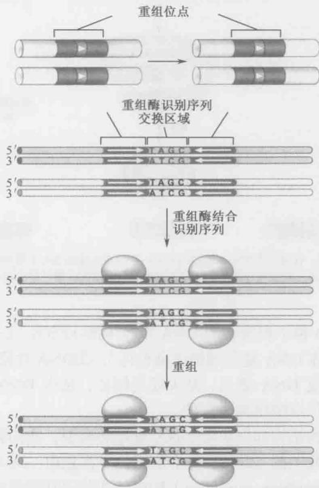

图 12-4 CSSR 过程起作用的结构。一对对称的重组酶识别序列分列在发生重组的交换区两端。重组酶亚基结合到这些重组位点。注意交换区的序列不是回文形式，导致了重组位点内部的不对称。（图片经允许修改，源自：Craig N. et al. 2002. Mobile DNA II, p.4, Fig.1 2002 ©ASM Press.）  
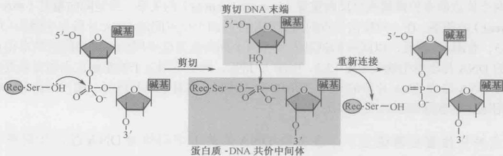  
图12-5 丝氨酸重组酶和酪氨酸重组酶的共价中间体机制。如图中所示，丝氨酸活性位点的一个羟基攻击磷酸基团，导致重组位点一条单链的断裂，然后断开的DNA上的羟基再攻击蛋白质-DNA中间的共价键，从而逆转了断裂反应，缝合DNA并释放蛋白质。重组酶的标记为Rec，以蓝色表示。

蛋白质-DNA 共价中间体保存了蛋白质和 DNA 之间的共价连接间断裂的磷酸二酯键的能量。这样，DNA 链可以通过逆转断裂过程被重新连接。在这个逆转过程中，来自断裂 DNA 的一个羟基攻击连接蛋白质和 DNA 的共价键，这一过程共价地缝合了 DNA 缺口，同时释放出游离的（不结合 DNA 的）重组酶（图 12-5）。

正是这种机制的特性赋予保守性位点特异性重组（CSSR）名称中“保守性”的意义：被称为“保守”是因为反应中被断开的每个DNA键都被重组酶重新连接起来，而DNA在被重组酶断开并重新连接的过程中不需要外部的能量，如ATP水解所释放的能量。这种裂解机制以及形成的共价中间体并不为重组酶所特有。DNA拓扑异构酶（见第4章）和Spo11也是这种机制，后者运用这种机制在减数分裂期间诱导DNA双链断裂引发同源重组（见第11章）。

表 12-1 重组酶的家族和功能

<table><tr><td>重组酶</td><td>功能</td></tr><tr><td colspan="2">丝氨酸重组酶家族</td></tr><tr><td>沙门氏菌 Hin 转化酶</td><td>通过识别 hix 位点使一个染色体区域倒位造成一个基因启动子翻转,表达两种截然不同的表面抗原</td></tr><tr><td>Tn3 转座子和 Yδ 解离酶</td><td>启动一个 DNA 的删除反应来解除复制性转座造成的 DNA 融合,重组位点为 res 位点</td></tr><tr><td colspan="2">酶氨酸重组酶家庭</td></tr><tr><td>λ 噬菌体整合酶</td><td>启动 λ 噬菌体基因组整合或离开大肠杆菌染色体特定序列上的整合及切除反应,重组位点为 res 位点</td></tr><tr><td>PI 噬菌体 Cre</td><td>通过噬菌体 DNA 上的识别位点( lox 位点)在浸染过程中启动噬菌体 DNA 的环化</td></tr><tr><td>大肠杆菌 XerC 和 XerD</td><td>启动一些 DNA 删除反应,将二聚体的环状 DNA 分子变成单体,同时识别质粒( cer )位点和细菌染色体(dif)位点</td></tr><tr><td>酵母 FLP</td><td>将酵母的 2μ质粒上一个区域倒位以产生一个叫做滚环复制的 DNA 扩增反应,重组位点为 frt 位点</td></tr></table>

## 丝氨酸重组酶诱导 DNA 双链断裂及链交换，促成重组

CSSR 总是发生在两个重组位点之间。如上所示，这些位点可以在同一个 DNA 分子上（如倒位或缺失），也可以在两个不同的分子上（如插入）。每个重组位点都是由双链 DNA 构成的。因此，在重组过程中，这4条 DNA 单链（每个双螺旋两条）必须先断开，再与另一个分子上的单链重新连接，以产生重排的 DNA。

丝氨酸重组酶在进行链交换前将 4 条单链全部切断（图 12-6）。重组酶蛋白中一个分子催化其中一个断裂反应，所以至少需要由 4 个亚基组成（即四聚体形态）重组酶。

亲本 DNA 双链分子的断裂产生 4 个双链 DNA 片段（根据它们所结合的蛋白质的不同分别标记为 R1、R2、R3 和 R4，如图 12-6 所示）。要使重组发生，上边 DNA 分子的 R2 片段必须结合到下边 DNA 分子的 R3 片段上。同样，上边 DNA 分子的 R1 片段必须结合到下边 DNA 分子的 R4 片段上。一旦这一 DNA 交换发生，每个断裂 DNA 链的 3'-OH 端就会攻击新配对片段上的重组酶-DNA 间的共价键。如上所述，这个反应释放了重组酶，而且共价地缝合了 DNA 链，产生了重排的 DNA 产物。

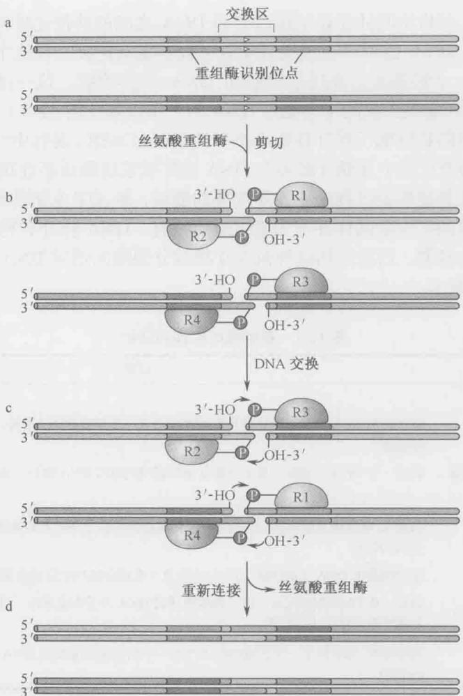  
图 12-6 丝氨酸重组酶催化的重组反应。4 条 DNA 单链各自被重组酶蛋白一个亚基断裂于交换区，4 个亚基分别被标记为 R1、R2、R3 和 R4。一个双螺旋中的两条单链的断裂位点相差两个碱基，这两个碱基区域在重组产物中形成一个杂交二倍体。图中所示的重组位点与图 12-4 中的类似。

## 丝氨酸重组酶-DNA复合体的结构揭示了它通过亚基旋转以完成链交换

重组过程中丝氨酸重组酶-DNA复合体的结构很好地展示了DNA链的交换是如何自然协调的。这个复合体包括丝氨酸重组酶的4个亚基和2个断裂的双链DNA分子。每个重组酶亚基中的丝氨酸活性位点与每个重组DNA位点的5'磷酸基团之间形成的共价链接清晰可见。每个共价链接的末端依次产生一个带有游离的3'羟基的DNA末端参与链的交换。

这一复合体的最显著特征是在“上面”和“下面”的重组酶二聚体之间具有一个大而平的分界面（图12-7a）。这种结构大多是疏水且光滑的，基本不会阻滞复合体上下两部分结构围绕彼此进行旋转。而正负电荷配对的一些区域则特别在初始状态以及相互呈 $180^{\circ}$ 的旋转角度时稳定二聚体的结构。因此，对于此复合体的分析强有力地证实了重组的机制包括：①DNA断裂形成共价的酶-DNA中间体；②在蛋白-DNA复合体中二聚体旋转了

180°；③二聚体旋转后攻击解离酶-DNA复合体中的DNA3'羟基末端，使链重新连接形成新的重组构型。随着更多结构性和机制性实验的完成，这种引人注目的蛋白旋转现象将得到更深的了解（图12-7b）。

  
图 12-7 丝氨酸重组酶的结构。（a）这个结构显示的大而平的四聚体界面是旋转的位点。重组酶四聚体由蓝绿色的亚基二聚体（顶端）和灰色的亚基二聚体（底端）组成。该四聚体中的每个亚基都分别位点特异性地结合在该结构中的4个“DNA臂”上（注意DNA之间的联系是通过DNA分子外侧的蛋白质亚基的α螺旋实现的）。尽管在这里只显示了两条链被切断，但是对于一个完整的重组反应，4个DNA链必须全部断裂（如图12-6）。(Li W. et al. 2005.. Science 309: 1210. PDB Code: 1ZR4.) 图形通过MolScript，BobScript和Raster3D制作。(b) 在较上面的展现的是四聚体界面旋转位点的侧面图，而在较下面的视图则是将侧面图旋转90°得到的俯视图，揭示了四聚体亚基对之间对齐的角度（用有颜色的柱表示）。在该图中展现了在DNA切除过程中丝氨酸重组酶四聚体的不同的旋转构象的结构。在左侧的起始的四聚体构象（亲代类型）是准备切除的构象：每个旋转的亚基对的α螺旋约呈50°角。第一次顺时针旋转约35°使亚基对的螺旋构象处于约85°交角。再旋转约90°则产生对齐的构象异构体，而最后再旋转约55度则完成了一轮的亚基交换并将重组构型中的DNA链排列成连接形式。（图片经允许修改，源自Johnson R.C. and McLean M.M. 2011. Structure 19: 751–753；Fig.2, p. 752. ©Elsevier.）

## 酪氨酸重组酶每次断裂和结合一对 DNA 单链

和丝氨酸重组酶不同，酪氨酸重组酶先完成两条 DNA 单链的断裂和重新连接，再对剩下的两条单链进行断裂和重新连接（图12-8）。考虑到是两个 DNA 分子与它们的重组位点配对，因此同样需要4个分子的重组酶，每个分子断裂一条 DNA 单链。重组开始时，结合到左侧重组酶结合位点的亚基（在图12-8a中标记为 R1 和 R3）分别断裂各自结合的 DNA 分子的上面的那条单链，这次断裂发生在交换区的第一个核苷酸处。然后，上边（灰色）的 DNA 分子的右上单链和下边红色的 DNA 分子的右上单链交换配对的伙伴。这两条 DNA 单链就被连接到一起，形成了重组构型。这个“第一单链”交换反应所产生的一个带分岔的 DNA 中间体称为 Holliday 联结体（见第11章，图12-8b）。

一旦第一单链交换完成，另外两个重组酶亚基（标记为 R2 和 R4）就会切割两个 DNA 分子的下单链（图 12-8c）。它们再交换配对的伙伴并经过与断裂反应逆转的过程连接起来。这个“第二单链”的交换反应打开了 Holliday 联结体（见第 11 章），得到重排的 DNA 产物。下一节我们将讨论这些化学反应是如何在重组酶蛋白质-DNA 复合体的作用下发生的。

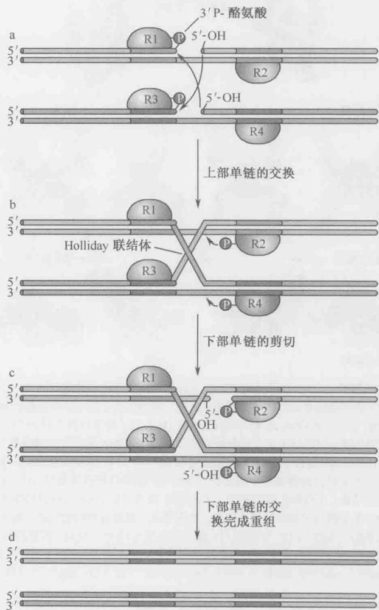  
图 12-8 酪氨酸重组酶催化的重组反应。第一步，由 R1 和 R3 亚基断裂 DNA（a）。如图所示，蛋白质与断裂的 DNA 通过 3' 端磷酸-酪氨酸键连接。断裂 DNA 5' 端的两个羟基各自攻击另一个 DNA 分子上蛋白质-DNA 的连接键后发生第一对单链的交换（b）。第二条单链的交换机制与上面相同，通过 R2、R4 亚基完成（c 和 d）。（来源：Craig N. et al. 2002. Mobile DNA II, color plate1, chapter 2. ©ASM Press.）

## 酪氨酸重组酶与 DNA 结合的结构揭示了 DNA 交换的机制

酪氨酸重组酶的位点特异性重组机制已经了解得很清楚了。这一蛋白质家族的一些成员的结构已经得到了很好的了解，并揭示出其在重组过程中的作用。一个完美的例子就是 Cre 重组酶结合到重组 DNA 两种不同构型上时的结构。下面介绍从这些结构得出的详细机制。Cre 是 P1 噬菌体编码的一种酶，其功能是在侵染过程中环化线性的噬菌体基因组。Cre 作用于 DNA 上的重组位点叫 lox，Cre-lox 是一个由酪氨酸重组酶家族催化重组反应的简单例子，整个重组仅需 Cre 蛋白和 lox 位点。Cre 也是在遗传工程中被广泛使用的一个工具（框 12-1 位点特异性重组在遗传工程中的应用）。

## 框 12-1 位点特异性重组在遗传工程中的应用

由于一些位点特异性重组系统非常简单，因而被广泛用作遗传实验的工具。Cre 重组酶和其“近亲”FLP 重组酶，都被用在真核生物基因删除的实验中（见附录 A 的例子）。

我们举一个假设的例子就能清楚地说明这种策略的益处。例如，一个研究人员对某个基因在肺癌发育过程中的作用感兴趣，希望用小鼠作为模型生物来研究这个过程（附录 A）。当该基因被破坏或“敲除”后（见图 A-27），小鼠在胚胎形成早期就都死了。很明显，这个基因在小鼠早期发育中是必需的。那么，该如何研究该基因在成年动物肺癌形成中的作用呢？

这时，位点特异性重组往往可为我们提供答案。通过传统的方法在感兴趣的基因两侧引入可被 Cre（或 FLP）识别的重组位点，在没有重组酶的情况下，这些位点对该基因的功能不造成任何影响。因此，可将编码 Cre 蛋白（或 FLP 蛋白）的基因引入该生物体内，并将其置于一个可严格调控的启动子的控制之下（第 19 章）。这样，小鼠先在无重组酶的情况下发育，出生之后，“开启” Cre 的表达，重组酶的出现就造成了该基因的丢失。通过这种方法，把 Cre 处理（将感兴趣的基因删除）后的小鼠的情况与该基因保持完整的“正常”小鼠进行比较，就可以探讨该基因在肺癌发育过程中的作用。这样，利用 Cre 形成的重组使得我们可以在不同的发育时期研究基因的潜在功能。

Cre-lox 结构表明，重组需要 4 个 Cre 亚基，每个亚基结合到底物 DNA 上的一个结合位点（图 12-9）。DNA 的构象通常是一个呈平面四方形的四通管接头结构（第 11 章关于 Holliday 联结体的讨论），每个“臂”上都结合了一个 Cre 亚基。尽管乍看起来这个结构的四边是对称的，但实际上不是这样。Cre 有两种不同的构象，构象 1 的一对亚基用绿色标记，构象 2 的另一对亚基用紫色标记（图 12-9b）。Cre 只有在其中一种构象（图中绿色标记的亚基）时才能够切断和重新连接 DNA。因此，每次只有一对亚基处于活性状态。随着反应的进行，活性构象在两对亚基间来回转换，而这种转换对于控制重组过程的进行和保证“每次作用一条单链”的交换机制是至关重要的。

  
图 12-9 Cre 重组酶的位点特异性重组机制。(a)一系列 Cre-DNA 中间体的结构，它反映了“每次作用一条单链”的交换机制。在每个分图中，只有两个绿色的亚基是活性构象。可以看出，当第一条单链断裂后亚基的颜色发生了交换，第二对 Cre 亚基变为重组的活性构象。（图片经允许修改，源自：Guo F. et al. 1997. Nature 389:41. ©Macmillan）(b)有 Cre 结合到 Holliday 联结中间体的晶体结构（对应于图 a 的第三张图）。注意绿色的两个亚基的构形与紫色的不同，因此复合体不是一个四重对称。留心观察可以发现，结构中相邻的两对 DNA 臂更加接近一些。（Gopaul D. N. et al. 1998. EMBO J. 17: 4175.）图形通过 BobScript、MolScript 和 Raster 3D 软件制作。

## 位点特异性重组的生物学作用

细胞和病毒利用保守性位点特异性重组来实现多种多样的生物学功能，某些功能将在下面进行讨论。很多噬菌体的感染就是使用这种重组机制将自己的 DNA 插入到

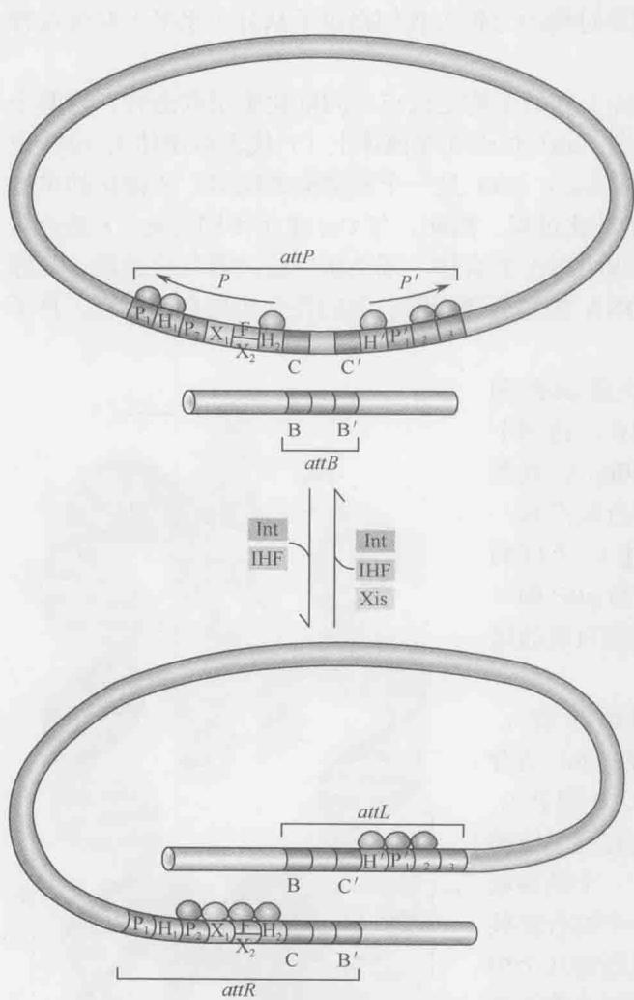  
图 12-10 参与 $\lambda$ 噬菌体整合和切除的重组位点显示出的重要序列元件。C、C'、B 和 B' 是核心的 $\lambda$ Int 结合位点，其他的蛋白质结合位点位于 att P 上及 C 和 C' 位点两端。这些区域叫做“臂”，左边的叫 P 臂，右边的叫 P' 臂。标记为 $P_{2}$ 、 $P_{2}$ 和 $P_{1}'$ 的紫色小区块是臂上的 $\lambda$ Int 结合位点。H 是整合宿主因子（integration host factor，IHF）的结合位点，X 是 Xis 的结合位点，F 是 Fis 的结合位点，其他的构筑蛋白在这里不再作介绍。灰色区域是交换区。为了表示清楚，结合在核心位点上的 $\lambda$ Int 没有画出来。值得注意的是，在噬菌体整合或切除的过程中并非所有的蛋白结合位点都被占用。在重组反应之后，P 臂变成 attL 的一部分，而 P' 臂变成了 attR 的一部分。

宿主染色体中。还有些时候，位点特异性重组被用来改变基因的表达。例如，一个 DNA 片段的倒换可以决定两个基因中哪一个进行表达。位点特异性重组也被广泛地用于帮助环状 DNA 分子在复制、同源重组和细胞分裂过程中保持其结构完整性。

位点特异性重组系统之间的比较揭示出一些普遍的原理。所有反应的关键都是重组酶与 DNA 的结合，以及使两个重组位点聚合在一起。对于一些重组反应来说，这个结合过程很简单，仅需要重组酶和它的 DNA 识别序列，就像刚描述的 Cre 的情况一样。与此相反，另外一些重组反应则需要辅助蛋白。这些辅助蛋白包括一些所谓的构筑蛋白（architectural protein），它们结合到特定 DNA 序列上并使其弯曲，使之成为有利于重组过程进行的特异形状。构筑蛋白还可以控制重组反应发生的方向，例如，在阻止 DNA 切除这个反向反应的同时确保这个 DNA 片段的整合。显而易见，这种调节作用对于产生合乎逻辑的生物学结果是至关重要的。最后我们会了解到，通过其他蛋白质对重组酶的调节可以控制某种 DNA 重组发生的时间，并使其与其他细胞活动协调一致。

## $\lambda$ 整合酶催化病毒基因组在宿主细胞染色体上的整合和切除

当 $\lambda$ 噬菌体侵染宿主细菌时，一系列的调节活动导致其或者形成静止的溶原状态（lysogenic state），或者进行噬菌体的增殖，即进入裂解性生长（lytic growth）过程（第18章，附录 A）。溶原体的形成需要噬菌体 DNA 整合到宿主染色体上。同样地，要使噬菌体脱离溶原状态，开始复制并产生新的噬菌体颗粒，它就必须将自己的 DNA 从宿主染色体上切下来。对这一整合 / 切除过程的分析为我们提供了从分子水平上对位点特异性重组进行研究的切入口。

为实现整合， $\lambda$ 整合酶蛋白（ $\lambda$ Int）在两个特定位点之间催化重组的进行，这两个位点叫做 $att$ 位点，或者 RH 附着位点。 $attP$ 位点在噬菌体上（P 代表噬菌体）， $attB$ 位点在细菌染色体上（B 代表细菌，图12-2）。 $\lambda$ Int 是一个酪氨酸重组酶，所催化的单链交换机制遵循前面介绍的 Cre 蛋白的催化过程。然而，与 Cre 重组不同的是， $\lambda$ 整合需要辅助蛋白的帮助来组装所需的蛋白质-DNA 复合体。辅助蛋白控制着反应过程，确保在噬菌体生命周期的正确时间进行 DNA 的整合和切除。我们先介绍整合的过程，再了解切除是如何被启动的。

对 $\lambda$ 整合的调节中很重要的一点是 attP 和 attB 位点的高度不对称结构（图 12-10）。这两个位点都含有一个中央核心片段（约 30bp），这些核心重组位点都包含有两个 $\lambda$ Int 结合位点和一个发生单链交换的交换区（如前所述）。不同的是，attB 仅由这个中央核心区组成，而 attP 则长很多（240bp），它还携带有许多其他蛋白质的结合位点。

attP 核心区两端的 DNA 区域被称为“臂”，臂上有若干个蛋白质结合位点，包括 $\lambda$ Int 结合的其他位点（在图12-10中标记为 $P_{1}$ 、 $P_{2}$ 和 $P'$ ）。 $\lambda$ Int 是一个不寻常的蛋白质，因为它有两个结构域参与了序列特异性的 DNA 结合：一个结构域结合到臂上的重组酶识别位点；另一个结合到核心识别位点。另外，attP 臂上的位点还被几个构筑蛋白所结合，这些蛋白质的结合控制了重组进行的方向和效率。

整合过程要求 attB、attP、 $\lambda$ Int，以及一个叫做整合宿主因子（integration host factor，IHF）的构筑蛋白的参与。IHF 是一个序列依赖性的 DNA 结合蛋白，它能使 DNA 产生大角度（大于 160°）的弯曲（图 12-11）。attP 的臂上携带了 3 个 IHF 结合位点（在图 12-10 上被标记为 H $_{1}$ 、

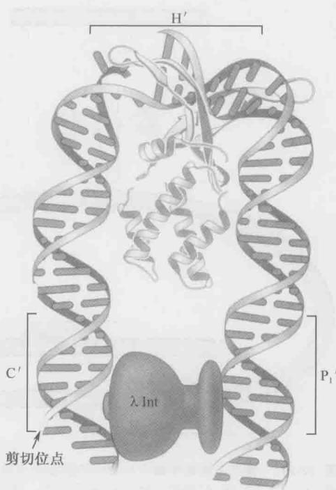  
图 12-11 使 DNA 弯曲以便将 DNA 结合位点聚合在一起的 IHF 作用模型。位于 attP 的 P' 臂上的 λ Int 和 IHF 结合位点如图所示。IHF 结合到 H' 位点后将 DNA 弯曲，使一个分子的 λ Int 同时与 P'₁ 和 C' 位点结合。DNA 上 H' 位点中的断裂表现为在 DNA 上出现一个缺口，被用于 IHF-DNA 复合体的结构分析。（图片经允许修改，源自：Rice P. et al. 1996. Cell 87: 1295-1303. Fig. 8. ©Elsevier.）

$H_{2}$ 和 $H^{\prime}$ ）。IHF 的作用是将 DNA 臂上的 $\lambda$ Int 位点（ $\lambda$ Int 与之结合较强）与中央核心区上的位点（ $\lambda$ Int 与之结合较弱）聚合在一起。因此，由 IHF 介导使 DNA 产生大角度弯曲，使 $\lambda$ Int 找到结合能力较弱的核心识别位点，从而催化重组的发生。

当重组完成后，环形的噬菌体基因组稳定地整合到宿主染色体上。因此，在噬菌体和宿主 DNA 的结合处产生了两个新的杂交位点。这些位点被称为 attL（左侧）和 attR（右侧）（图12-10）。这些位点都含有核心区域，但是臂区却被分开了（图12-10中 P 和 P' 区域的位置）。所以，在新的重排结构中，两个核心区域都没有能力运用产生整合复合体的机制来组装有活性的 $\lambda$ Int 重组酶复合体，因为对组装很关键的 DNA 位点根本不在正确的位置上。

## λ 细菌噬菌体的切除需要一个新的折叠 DNA 的蛋白质

λ 噬菌体是如何被切除的呢？一个由噬菌体编码的构筑蛋白对切除重组至关重要，这个蛋白质叫做 Xis（即 excise 切除），它结合到特定的 DNA 序列上并造成 DNA 的弯曲。这样看来，其功能与 IHF 类似。Xis 识别 attR 一个臂上的两个主要序列基序（也存在于 attP 臂上，图12-10中标记为 $X_{1}$ 和 $X_{2}$ ）。和这些序列结合后，DNA 产生一个大的弯曲（大于 $140^{\circ}$ ），通过聚合 Xis、 $\lambda$ Int 和 IHF 一起构成在 attR 上有活性的蛋白质-DNA 复合体来促进切除过程。这个复合体将富有成效地与聚集在 attL 上的蛋白质发生相互作用，然后发生重组。

除了促进切除过程（attL 和 attR 之间的重组）以外，Xis 结合到 DNA 上也抑制了整合过程（attP 和 attB 之间的重组），因为 Xis 和 attP 结合后的 DNA 结构与 $\lambda$ Int 和 IHF 正常结合到这些位点时的结构完全不同。Xis 是一个噬菌体编码蛋白，而且仅仅在噬菌体启动进入裂解性生长的情况下才开始表达。关于 Xis 表达的详细情况将在第18章中介绍。Xis 在切除过程中作为辅助因子起到刺激作用，在整合过程中起到抑制因子的作用，这种双重功能保证了在 Xis 存在的情况下噬菌体基因组能够从宿主染色体中被切除，并保持游离的状态。

## Hin 重组酶颠倒一段 DNA 片段，使得特定基因开始表达

沙门氏菌（Salmonella）的 Hin 重组酶通过将一个细菌染色体片段倒位，来控制两组基因中哪一组被表达。Hin 重组是一类重组反应的代表，这些重组在细菌中是相当普遍的，被称为程序性重排。它的功能通常是让一部分细菌能够对周围环境的突然变化获得“预适应”。在 Hin 倒位的情况中，重组能够帮助细菌躲避宿主免疫系统的攻击，我们即将对此进行说明。

倒位过程所控制的基因能编码两种不同形态的鞭毛蛋白（H1 和 H2），它们是鞭毛纤丝的蛋白质组分。鞭毛位于细菌表面，因而通常是免疫系统的识别目标（图 12-12）。通过用 Hin 重组实现在这两种形态间的切换，至少使细菌群体中的部分个体不被免疫系统识别出其表面的结构。

被 Hin 倒位的染色体区域大约长 1000bp，其两端是叫做 hixL（左侧）和 hixR（右侧）的特异性重组位点（图 12-13），这些序列彼此间方向相反。Hin 是一种丝氨酸重组酶，它催化倒位的发生，工作原理在前面介绍这个家族时已经讲过了。在可倒位的片段上带有编码 Hin 的基因，同时作为一个启动子，当可倒位片段处于某种方向时，它将启动位于可倒位片段外、与 hixR 位点直接相邻的一些基因的表达。当可倒位片段处于“开”的方向时，这些相邻的基因将得到表达；但当它翻转成“关”的方向时，由于缺乏有功能的启动子，这些基因无法被转录。

  
图12-12 带有鞭毛的细菌（沙门氏菌）显微照片。这张彩色的增强型电子扫描显微图片显示了鼠伤寒沙门氏菌（红色）正在侵入培养的人体细胞。细菌上发丝状的突起就是鞭毛。（来源：RockyMountain Laboratories，NIAID，NIH.）

  
图 12-13 沙门氏菌 Hin 重组酶催化的 DNA 倒位。Hix 位点间 DNA 片段的倒位翻转了一个启动子（P）的位置，造成了两种不同形式的鞭毛蛋白基因表达。

被这个“翻跟头”的启动子所控制的两个基因是 $fljB$ 和 $fljA$ 。 $fljB$ 编码 H2鞭毛蛋白， $fljA$ 则编码针对 H1鞭毛蛋白基因的转录抑制因子。H1鞭毛蛋白基因位于较远的一个位点。这样，当在“开”的方向时，H2鞭毛蛋白和 H1的抑制因子被表达，这些细胞的表面毫无例外都是 H2 型鞭毛；而当处于“关”的方向时，H2 和 H1 的抑制因子都不表达，细胞表面只有 H1 型的鞭毛。

## Hin 重组过程需要一个 DNA 增强子

Hin 重组过程除了需要 hix 位点外，还需要一段序列。这段短短的序列（约60bp）是一个增强子，它能将重组率提高1000倍左右。像增强子促进转录的作用（第19章）一样，这段序列即使在离重组位点很远的情况下也能行使其功能。增强子要起作用还需要细菌的 Fis 蛋白 [作为倒位促进因子（factor for inversion stimulation，Fis）被发现而得名]。像 IHF 一样，Fis 也是一个位点特异性的 DNA 弯曲蛋白。另外，它与 Hin 蛋白发生接触，这对重组过程很重要。

增强子-Fis 蛋白的复合体激活了重组的催化步骤。Hin 可以在没有 Fis-增强子复合体存在的情况下与 hix 重组位点结合配对，形成联会复合体（图 12-14）。这与 $\lambda$ 整合中 IHF 的作用不同，后一过程中辅助蛋白 IHF 在重组酶-DNA 复合体的组装中是不可或缺的。Fis 激活 Hin 重组，需要 3 个 DNA 位点（hixL、hixR 和增强子）聚集在一起，而负 DNA 超螺旋（第 4 章）极大地促进这三联复合体的形成，它能够稳定远距离 DNA 位点的聚合。另一个细菌构筑蛋白 Hu 也能促进这个倒位体的组装。Hu 蛋白与 IHF 的结构同源，但与 IHF 不同的是，它与 DNA 的结合是非序列特异性的。

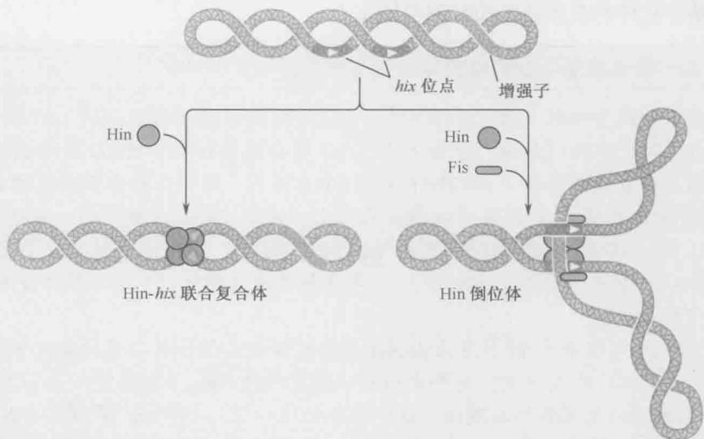  
图12-14 Hin 催化过程中重组复合体的形成。Hin 蛋白能单独识别并与两个 hix 位点配对。当 Fis 蛋白存在时，就可以形成三联复合体，这个复合体叫做倒位体（invertasome），是促进重组的最活跃的复合体。（图片经允许修改，源自：Craig N. et al. 2002. Mobile DNA II, p. 246, Fig. 9. © ASM Press.）

是什么生物学基本原理控制着由Fis-增强子复合体催化的Hin倒位呢？那就是确保重组仅仅发生在同一个DNA分子的两个hix位点之间。这种选择性要确保的是避免可倒位片段在DNA分子间重排过程中频繁跳跃而破坏细菌染色体的完整性。

与 $\lambda$ 噬菌体的整合和切除不同，Hin 所催化的倒位没有严格的调控，反而是随机发生的，所以在一群细胞中总有一些细胞带有同一方向的可倒位片段，而另一些带相反方

向的可倒位片段。

## 重组酶将多聚环状 DNA 分子转换成单体

位点特异性重组对细胞中环状 DNA 分子的维护起到关键作用。如同原核和真核细胞中大多数质粒一样，大多数细菌的染色体也是环状的，一些病毒基因组也是环状的。环状 DNA 分子固有的一个问题是，在同源重组过程中它们有时会形成二聚体甚至多聚体，而位点特异性重组可被用来将这些 DNA 多聚体恢复到单体形态。

当两个相同的环状分子间发生 DNA 交换时会发生什么情况呢？在一个细菌染色体两个拷贝间发生的这一过程如图 12-15 所示（见第 11 章，关于同源重组的讨论）。一个单独的同源重组会产生一个大的环状染色体，所有基因都有两份拷贝，即一个二聚的染色体。在细胞分裂时，这种二聚体会造成很大麻烦，因为只有一个 DNA 分子，而不是两个，要分给两个姐妹子细胞。

由于这种多聚体的问题，许多环形 DNA 分子上都带有位点特异性重组酶的识别位点。这些酶称为解离酶（resolvase），因为它们能将二聚体（和多聚体）“解离”为单体。显然，对这些蛋白质来说，它们的关键功能是特异性地催化解离（一种 DNA 的删除反应）而不是相反的过程（将单体变为多聚体），否则只能使多聚体问题变得更糟！我们将会看到，一种特殊机制在增强重组反应中起到了方向选择的作用（框 12-2，Xer 重组酶催化细菌染色体和很多细菌质粒的单体化）。

## 框 12-2 Xer 重组酶催化细菌染色体和很多细菌质粒的单体化

Xer 是酪氨酸重组酶家族的一个成员, 它促进重组的机制与前面讲过的 Cre 蛋白很相似。Xer 是一个异源四聚体, 包含两个 XerC 蛋白亚基和两个 XerD 蛋白亚基。XerC 和 XerD 都是酪氨酸重组酶, 但识别不同的 DNA 序列, 所以 Xer 催化的重组位点必须要包含这两种识别序列。该位点在细菌染色体上叫做 dif 位点。交换区的一端是 XerC 的识别序列, 另一端是 XerD 的识别序列 (框 12-2 图 1)。染色体上只有一个 dif 位点, 它位于 DNA 复制终止区内 (第 9 章)。当染色体形成二聚体时, 该二聚体便有两个 dif 位点 (图 12-15)。

那么细胞如何确保在 dif 位点上由 Xer 介导的重组过程会将二聚体染色体转换为单体, 而不是促成相反的过程呢? 这个定向的调节是通过 Xer 重组酶和一个叫 FtsK 的细胞分裂蛋白之间的相互作用实现的。这个调节的过程是: 当 FtsK 蛋白不与 XerCD 复合体的 dif 位点发生相互作用时, 重组复合体仅具有两个 XerC 亚基活性的构象, 因而, XerC 将催化一对 DNA 单链的交换, 形成 Holliday 联结中间体 (见上文关于酪氨酸重组酶基本原理的讨论)。由于 XerD 一直没有被激活, 重组无法完成, 与 XerC 断裂反应相逆的过程反而常常发生, 结果是又重新产生了最初的 DNA 结构 (框 12-2 图 1)。

相反，当 FtsK 蛋白存在并与 XerCD 复合体发生相互作用时，复合体的构象发生改变，XerD 蛋白被激活。这时，XerD 催化第一对单链的重组，产生 Holliday 联结中间体；这一反应完成后，XerC 催化第二对单链的交换反应，产生重组后的 DNA 产物（框 12-2 图 1）。

  
框12-2 图1 Xer 介导 dif 位点重组的途径。没有 FtsK 存在时（不依赖于 FtsK 途径，左图），仅 XerC 激活并推动单链交换形成 Holliday 联结中间体，这时（由于 XerD 没有激活）重组无法完成，XerC 的反应也常常发生逆转。当有 FtsK 存在时（依赖 FtsK 途径，右图），XerD 被激活并催化形成 Holliday 联结中间体，XerC 催化第二对单链的交换后完成重组，生成染色体单体。（图片经允许修改，源自：Aussel L. et al. 2002. Cell 108: 195-205, Fig. 6. © Elsevier.）

FtsK 是一个沿 DNA 移动的 ATP 酶，是一个功能类似于 RuvB 蛋白的 “DNA 动力蛋白机器”（DNA-pumping protein machine）。RuvB 蛋白在同源重组过程中促进 DNA 的分支移位（在第 11 章讨论过）。FtsK 还是一个膜结合蛋白，它被定位于细胞中发生细胞分裂的地方，其作用是在细胞分裂前将 DNA 从细胞中央移开，使细胞可以在这一位置分裂。

FtsK 相对于分裂位点的位置很关键，它确保了当细胞中出现二聚染色体时 XerD 被特异性地激活。这种情况下，染色体在分裂细胞的中央被“卡住”，二聚染色体的一半被分到每个子细胞中。FtsK 也会与不对称排列于 dif 位点附近的特异极 DNA（叫作 KOPS）相互作用。结果，Ftsk 运送 dif 位点趋近隔膜并互相接近。这一运动从而促进了 dif 位点的配对并激活 XerD 重组。就这样，在细胞分裂周期中，位点特异性重组被调控发生在合适的时间和地点。

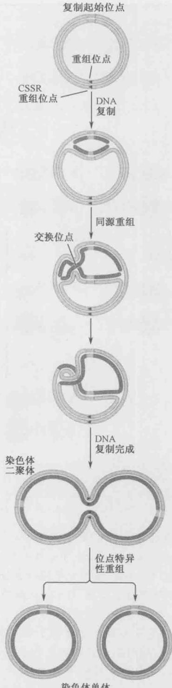  
染色体单体  
图 12-15 环形 DNA 能形成多聚体。DNA 复制期间，两个子代 DNA 分子间的同源重组能产生一个染色体（或质粒）的二聚体。XerCD 重组酶催化的位点特异性重组将其变为细胞正常分裂所需的单倍体 DNA 分子。

还有其他一些机制能够指导特定 DNA 片段的重组

尽管我们的讨论仅限于保守性位点特异性重组，实际上还有一些在特定序列上实现类似生物学功能的其他重组事件，其中包括在第11章讲过的由于目标基因转换造成的酵母的交配型转换现象；在脊椎动物免疫系统中，编码关键蛋白质的基因片段在组装时发生的重排现象，即 V（D）J 重组，也是发生在特定的位点上。而后者的机制与转座很相似，所以在本章后半部分会对其作一些介绍。

## 转座

## 一些遗传因子通过转座被移位到染色体的新位置上

转座（transposition）是一种特殊的遗传重组，它是将特定的遗传因子从 DNA 上的一个地方移位到另一个地方。这些可以移动的遗传因子叫做转座因子（transposable element）或转座子（transposon）。移位的发生是通过转座因子两端的 DNA 序列和宿主细胞 DNA 的一段序列间发生重组实现的（图 12-16）。我们将看到，移位过程可能会、也可能不会伴随着遗传因子的复制，某些情况下，这种重组过程会涉及暂时性的 RNA 中间体。

  
图12-16 一个移动的遗传因子转座到宿主 DNA 的一个新位点。某些情况下，重组过程涉及转座子从 DNA 上的旧位置被切除（左边）；在另一些情况下，转座子的一个拷贝保留在原来的位置上，另一个拷贝则插入到 DNA 的新位点（右边）。

当转座因子移位时，转座因子通常对插入位点几乎没有序列选择性，所以，转座子可能会插入到基因内部，造成基因完全失活；也可能会插入到一个基因的调控序列中，造成该基因表达的改变。正是这种对基因功能和表达的影响使得转座子被发现（框12-3，玉米因子和转座子的发现）。所以，并不令人意外的是，转座因子是许多物种中新突变的主要来源，而它们也的确是产生导致人类遗传疾病的突变的一个重要原因。正是转座因子这种不加选择的DNA插入能力，使得它们在经过修饰后被用于生物实验中，诱导突变和作为运输DNA的载体。

所有生物的基因组上都有转座因子。基因组序列的比较分析揭示了两个惊人的发现：第一，转座相关序列可以占据物种基因组中的很大一部分，例如，人和玉米基因组的 $50\%$ 以上是由转座相关序列组成的（包括转座子片段和被突变导致失活的“死”因子片段），而这与基因组中仅有很小一部分序列（在人的基因组中小于 $2\%$ ）编码蛋白形成了鲜明的对比；第二，转座子的含量在不同的基因组中变化很大（图12-17），例如，与人和玉米不同，果蝇和酵母的基因组则富含基因而缺乏转座子。

  
图12-17 基因组上转座子的发生和分布。重复序列大多数由转座子或转座子相关序列所组成（如被截短的因子），以绿色表示，基因以紫色表示。（a）玉米；（b）人；（c）果蝇；（d）芽殖酵母；（e）大肠杆菌。（来源：BrownT.A. 2002. Genomes, 2nd edition, p.34, Fig.2.2 and references therein. ©Taylor & Francis.)

转座因子有很多不同的类型,根据不同的结构和重组机制可将它们分为若干家族。下面我们介绍三种主要的转座子家族及它们的重组机制，然后介绍几个被详细研究过的转座因子。在具体介绍转座因子时，我们将着重说明转座如何被调控以平衡它们的存在、复制与对宿主基因造成潜在的干扰和错误调控。

转座的遗传重组机制并不仅限于实现转座子的移位功能。例如，很多病毒在感染时，也是使用了一种与转座几乎相同的途径将自己整合到宿主细胞的染色体上，所以病毒的整合反应在这里与转座一同讨论。同样地，在细胞中改变基因表达模式的一些DNA重排也采用了一种类似于转座的机制。V（D）J重组是一个被了解得很清楚的例子，它是脊椎动物免疫系统功能发育中一个必备的反应。V（D）J重组将在本章最后进行讨论。

## 三类基本的转座因子

根据转座子的结构及其转座机制，可将其分为以下三个家族：

1. DNA 转座子。

2. 类病毒反转录转座子，包括反转录病毒。这些因子又称为长末端重复序列（long terminal repeat, LTR）反转录转座子。

3. 多聚腺苷酸（poly-A）反转录转座子。这类因子又称为非病毒反转录转座子。

图 12-18 图解了这三类转座因子家族的基本遗传结构。DNA 转座子在整个重组周期中一直保持 DNA 的形态，它通过 DNA 链的断裂和重新连接实现移位。在这一点上，

它与保守性位点特异性重组因子移位的方式很相似。两种反转录转座子的移位都需要一个暂时性的 RNA 中间体的参与。

## DNA 转座子上带有一个转座酶基因，两端是重组位点

DNA 转座子上既携带了作为重组位点的 DNA 序列又携带了编码参与重组的蛋白质的基因（图12-18a）。转座因子两端的重组位点以反向重复序列分布，这些末端反向重复序列的长度从25bp 到几百 bp 不等。它们并不是严格意义上的重复序列，并且带有重组酶识别序列。催化转座的重组酶通常叫做转座酶（transposase）[有时也叫整合酶（integrase）]。

DNA 转座子带有编码自身转座酶的基因，也可能会携带一些其他基

a DNA 转座子

b 类病毒反转录转座子 / 反转录病毒  
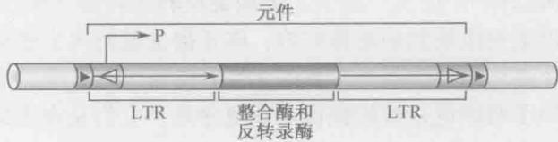

c poly-A 反转录转座子

  
图 12-18 三类转座因子的遗传结构。(a). DNA 转座子。其元件包括作为重组位点的终端反向重复序列（绿色含白色箭头）和一个编码转座酶的基因。(b). 类病毒反转录转座子及反转录病毒。包括两端的长末端重复序列（LTR）及其间编码整合酶及反转录酶（RT）的区域。(c). 聚腺苷酸反转录转座子。两端在 5' 和 3' UTR 序列内，以及编码两个酶的序列：RNA 结合酶（ORF1）和一个同时具有反转录酶和核酸内切酶功能的酶（ORF2）。

因，这些基因编码的蛋白质可能调节转座，也可能为转座因子或宿主细胞提供一些有益的功能。例如，很多细菌 DNA 转座子上携带的基因所编码的蛋白质能够提高细菌对一个或多个抗生素的抗性。因此，这种转座子的存在使得宿主细胞具有了对该抗生素的抗性。

紧邻转座子两端的 DNA 序列有一个短的重复序列片段（2\~20bp），这些片段呈正向重复，叫做靶位点重复（target site duplication），产生于重组过程中,我们将在下面对此进行讨论。

## 转座子包括自主转座子和非自主转座子

带有一对末端反向重复序列和一个转座酶基因的 DNA 转座子，本身具备了促成自身转座的所有条件，这类因子叫做自主转座子（autonomous transposon）。然而，在基因组上还有很多比较简单的可移位 DNA 片段，叫做非自主转座子（nonautonomous transposon），它们仅有末端反向重复序列，即转座所需的 cis-acting 序列。细胞中自主转座子表达的转座酶会识别这些末端反向重复序列，从而帮助非自主转座因子发生转座。但是在没有“帮助者”转座子（产生转座酶）存在时，非自主转座因子只能待在原处无法移动。

类病毒反转录转座子和反转录病毒带有末端重复序列及两个对重组很重要的基因

类病毒反转录转座子和反转录病毒也带有反向末端重复序列，它们是重组酶结合和作用的位点（图12-18b）。末端反向重复序列嵌入在较长的重复序列中，它们以正向重复形式排列在转座因子两端，叫做长末端重复序列（long terminal repeat）或LTR。类病毒反转录转座子编码两种移位所需的蛋白质——整合酶（转座酶）和反转录酶。

反转录酶（reverse transcriptase，RT）是一种特殊类型的 DNA 聚合酶，它能以 RNA 为模板合成 DNA。转座需要有这个酶，因为转座过程要求有一个 RNA 中间体的参与。由于这些因子将 RNA 转变成 DNA，与正常的中心法则（DNA 到 RNA）相反，所以称为“反式”因子。类病毒反转录转座子和反转录病毒的区别是：反转录病毒的基因组被组装到病毒颗粒内，离开宿主细胞再去感染新的细胞；而反转录转座子只能在一个细胞内移位到一个新的 DNA 位点，不能离开宿主细胞。与 DNA 转座子一样，这些因子两端也是短的靶位点重复序列，它们是在重组过程中产生的。

## 像基因的聚腺苷酸反转录转座子

聚腺苷酸反转录转座子没有其他转座子所带的末端反向重复序列，相反，它的两端含有完全不同的序列（图12-18c）。一端称为5'UTR，另一端是3'UTR，它带有一串叫做多聚腺苷酸序列（poly-A sequence）的A-T碱基对，这些因子两端也有短的靶位点重复序列。

反转录转座子带有两个基因——ORF1和 ORF2。ORF1编码一个 RNA 结合蛋白，ORF2编码的蛋白质同时具有反转录酶和核酸内切酶的作用。尽管这个蛋白质与其他转座子家族编码的转座酶和重组酶不同，但它在重组过程中也起着关键作用。与 DNA 转座子和类病毒转座子一样，聚腺苷酸反转录转座子也存在自主转座子和非自主转座子两种形式。此外，基因组序列分析表明，很多 5'UTR 序列不完整的断裂转座子失去了转座的能力。

## DNA 转座的剪切-粘贴机制

DNA 转座子、类病毒反转录转座子和反转录病毒都用一种类似的重组机制把它们的 DNA 插入到一个新的位点。我们首先来了解一下最简单的转座反应——DNA 转座子非复制性移位的机制。这个重组过程包括转座子从宿主 DNA 上初始位置的切除，以及将这个切下来的转座子整合到一个新的 DNA 位点，因此把这个机制叫做剪切-粘贴转座（cut-and-paste transposition）（图 12-19）。

开始重组时，转座酶结合到转座子两端的反向重复序列上。一旦转座酶识别了这些序列，它就将这两端聚集在一起形成一个稳定的蛋白质-DNA复合体，这个复合体被称为联会复合体（synaptic complex）或转座体（transpososome），它包含一个转座酶的多聚体（通常为2\~4个亚基）和两个DNA末端（见下文）。这个复合体的功能是确保转座子移位所需的DNA断裂和重新连接能够在转座因子两端同时发生，此外，还能在重组过程中保护DNA末端免受细胞中酶的作用。下一步是将转座子DNA从基因组的原始位置上切除。转座子上的转座酶亚基先断裂转座子每端的一条单链，断裂位置就在转座子DNA和它所插入的宿主序列间的连接处（该区域叫做flanking host DNA）。转座酶

切断 DNA 后，转座因子 DNA 末端带有游离的3'羟基基团。要完成断裂反应，每端的另一条 DNA 单链也需要被切断，而不同的转座子断裂这第两条单链的机制各不相同（这些单链的5'端位于转座子与宿主DNA连接处），这些机制将在下面进行描述。

转座子被切除后，被转座酶首先释放的转座子 DNA 的 3'端羟基攻击新插入位点的 DNA 磷酸二酯键，被攻击的 DNA 片段叫做靶 DNA(target DNA)。对大多数转座子而言，靶 DNA 本质上可以是任何序列。攻击的结果是将转座子 DNA 共价连接到靶 DNA 上，而在每个 DNA 连接反应中，靶 DNA 上会产生一个缺口（图 12-19）。DNA 连接反应是通过一步酯基转移作用实现的，它又被称为 DNA 单链交换（DNA strand transfer）（图 12-20）。RNA 剪接中就使用了类似的机制来连接核酸单链（第 14 章）。

转座体确保转座子两端的 DNA 一起攻击同一靶位点的两条链，这两条链上被攻击的位点通常相隔几个碱基（如比较常见的是相隔2个、5个和9个碱基），这个距离对每种转座子来说都是固定的，由此产生邻近转座子两端的靶位点短重复序列（将在下节说明）。一旦 DNA 单链转移完成，转座体的任务也就完成了，剩下的重组步骤由细胞内的 DNA 修复蛋白来完成。

剪切-粘贴转座中的中间体由缺口修复来完成

  
图 12-19 剪切-粘贴的转座机制。如图所示，一个转座子从灰色宿主 DNA 的一个靶位点转移到蓝色 DNA 上的新位点。注意，在 DNA 单链交换反应中靶 DNA 断裂位点的黏性末端使新的靶位点上生成短的重复序列（靶位点复制）。原插入位点的 DNA（灰色）由于转座子的切除留下了一个双链的断裂，这个断裂可以通过非同源末端连接或同源重组的方式被修复（见第 10 章和第 11 章）。注意：为简洁起见，图中的化学步骤未标示出结合蛋白质。

中间体结构使转座子 DNA 的3'端结合到靶 DNA 上。这个结构还带有靶 DNA 上的两个缺口，它们产生于 DNA 单链转移过程中。转座子 DNA 单链上的两个位点被转移到靶位点的两条单链上，这两条单链的断点相隔几个核苷酸，这导致在插入的转座子两端出现了短小的单链 DNA 缺口，这些缺口会被宿主细胞自身编码的 DNA 修复聚合酶填补。要说明的是，DNA 单链转移步骤中靶 DNA 断裂所产生的3'羟基端可以作为修复合成中的引物（图12-18）。填补缺口的结果是造成产生邻近转座子的靶位点的复制（见上文）。所以，靶位点重复序列的长度表明了 DNA 单链转移中靶 DNA 的两条单链上被攻击位点的距离。在缺口的修复完成后,还需要 DNA 连接酶来封闭 DNA 单链。

剪切-粘贴转座在它原来插入的 DNA 位点处也留下了一个断裂的双链，它必须被修复以维持宿主细胞基因组的完整。通过同源重组来修复双链 DNA 断裂在第11章中已讲过，而这些断裂有时也会直接重新连接起来。下面在对 Tcl / mariner 转座子家族的讨论中我们就会看到这种现象。

  
图12-20 DNA 单链转移的详细化学步骤。为简洁起见图仅示转座子和靶 DNA 的单链。

## DNA 转座中断裂非转移链的多种机制

如前所述，转座酶通过断裂转座因子的3'端和促进DNA单链的转移来催化剪切-粘贴转座过程。然而，通过这种机制移动的转座子也需要断开转座子与邻近宿主DNA连接处的5'端单链。这些单链叫非转移链（nontransferred strands），其5'端在DNA单链转移反应期间并不直接连到靶DNA上。不同的转座子催化第二条单链断裂反应的机制各不相同（图12-21），这里介绍2种方法。

用来断裂非转移单链是不同于转座酶的另一种酶（图12-21）。例如，细菌的 Tn7 转座子编码的一种特殊蛋白质（TnsA）就有这种作用（图12-21a）。TnsA 的结构与核酸内切酶很相似，它与 Tn7 自身编码的转座酶（TnsB 蛋白）组装在一起，共同作用将转座子从原来的靶位点上切除下来。

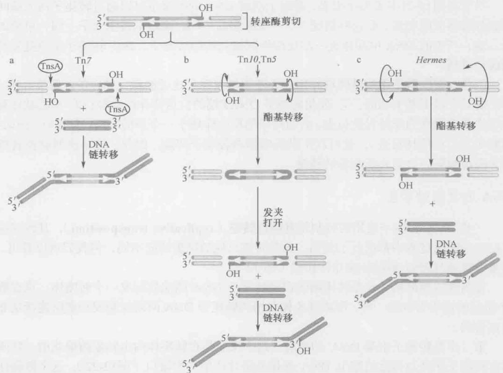  
图12-21 非转移链断裂的三种机制。（a）通过一种非转座酶来切断。（b）转座酶催化一条单链攻击相对链形成发夹形的DNA中间体。在这种机制中是转移链攻击非转移链，然后这两个发夹形末端再被转座酶水解打开。（c）Hermes转座子使用的是通过形成发夹切割第二条单链的另一种机制。在这种机制中，先导链（非转移链）首先断裂，并且发夹结构在插入起始位点形成，而不是在转座子末端。

断裂非转移链的另一种方法由转座酶自身完成，它用一种 DNA 酯基转移机制，其过程与 DNA 单链转移相似。例如，在 Tn5 和 Tn10 转座子断裂非转移链时就产生一个 “DNA 发夹” 结构。为了形成发夹结构，转座酶用先断开的转座子 DNA 3' 端跨过 DNA 双螺旋直接攻击另一条单链的磷酸二酯键（图 12-21b），结果既断裂了被攻击的 DNA 单链，又将其与转座子 DNA 3' 端与缺口的一端共价连到一起。结果，两条 DNA 单链通过一个环形末端共价连接在一起，其结构让人联想到一个发夹。

然后发夹 DNA 的末端被转座酶断裂（打开），产生一个标准的双链 DNA 断裂，打开反应在转座子 DNA 两端进行。这一步骤一旦完成，DNA 因子的3'端就准备通过 DNA 单链转移反应连接到一个新的靶 DNA 上。

Hermes 转座子是 hAT 因子家族的一个成员，也通过 DNA 发夹中间体从旧的 DNA 插入位点上切除转座子，但是切割单链和酯基转移反应的顺序有所不同。这里 DNA 发夹在宿主细胞的 DNA 上形成，而不是在转座因子的末端形成（图 12-21c）。在本章的后面我们会看到，这种 DNA 切割和重新连接的方式与研究发现的 V（D）J 重组的早期步骤是十分相似的。这种机制的相似性成为一个假说的有力支持，该假说认为，V（D）J 重组是在脊椎动物演化过程中，由宿主机体捕获和“驯服”转座子形成的。

尽管在图12-21中未标示出来，转座子两端 DNA 的断裂也可以通过转座子两末端间的酯基转移反应完成。在这种情况下，一个断裂的3'-OH 端攻击转座因子上同一单链的另一端，产生的 DNA 中间体进一步反应得到被切除的转座子。IS 3 转座子家族就是利用这种机制。

为什么转座酶会用酯基转移作用作为断裂机制呢？这可能是一种经济的解决办法。转座酶具有以下基本功能：① 催化转座子 DNA3'端的位点特异性水解；② 用酯基转移作用将此末端变为非特异性位点。而当同样的反应作用于一个新的 DNA 位点时（例如：起始切割位点的相对链），就可以帮助转座酶将转座子切除，因此，这个机制就使转座子无需再编码一个酶来断裂非转移链。

## DNA 的复制性转座

一些 DNA 转座子使用的机制是复制性转座（replicative transposition），其转座因子在每个转座过程中都进行了复制。虽然转座反应的结果明显不同，但我们可以看出，其重组机制与剪切-粘贴转座非常相似（图 12-22）。

复制性转座的第一步是转座酶蛋白和转座子 DNA 两端装配成一个转座体。像在剪切-粘贴转座中看到的一样，形成转座体对协调转座子 DNA 两端的断裂和重新连接是非常重要的。

第二步是转座子末端 DNA 的断裂。这个反应是在转座体内由转座酶催化的。转座酶在转座子序列与邻近的宿主 DNA 连接处诱导产生一个缺口（图12-22），这个断裂使得转座子序列的两个3'-OH DNA 末端获得释放。与剪切-粘贴转座不同，这时转座子DNA 并不从原来的序列上被切除，这一点是这两种转座最大的不同。

然后，转座子 DNA 的3'-OH末端通过 DNA 单链的转移反应被连接到靶 DNA 位点上，这一机制与前面的剪切-粘贴转座相同。但是，这里产生的中间体是双交叉的 DNA 分子（图12-22）。在此中间体中，转座子的3'端被共价连接到新的靶位点，而5'端仍与原来的邻近 DNA 相连。

中间产物的两个 DNA 交叉形成一个复制叉结构（见第9章）。DNA 单链转移后，宿主细胞的 DNA 复制蛋白将组装到这些复制叉上。在一个已经充分研究的复制性转座例子中（Mu 噬菌体，下文将讲到），蛋白质特异性地组装到两个交叉中的一个上（图12-22，下图）。以断开的靶 DNA 3' 端为引物进行 DNA 合成，复制沿转座子序列进行直到第二个交叉处停止。此复制反应产生2个拷贝的转座子 DNA，复制产物两端是短小的正向排列靶位点重复序列。

复制性转座常常会造成染色体的倒位和丢失，这对宿主细胞有很大的危害性。这种趋势所导致的重排有时会对复制性转座造成不利的自然选择结果。或许这就是为什么很多转座因子演化出在插入到新位点前即将其从原位点完全切除的方法。转座子切除后就避免了对宿主基因组造成较大的干扰。下面我们将会讨论到，通过一个RNA中间体也可以避免转座造成的这种干扰性重排。

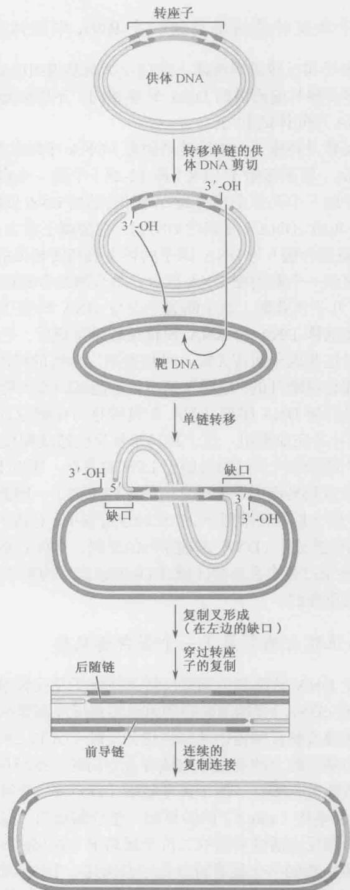  
与两个拷贝的转座子共整合

图12-22 复制性转座的机制。转座体在转座子两端诱导形成单链缺口，露出3'-OH端。然后这些羟基攻击靶DNA，并通过DNA单链转移与之连接。注意，此时在转座子的每一端只有一条单链插入靶位点，形成了一个双交叉的DNA结构。细胞的复制成分组装到其中一个“交叉”（图中左边），将整个转座子序列进行复制。生成的产物叫做共和体，它有两个通过转座子两个拷贝连接起来的起始环形DNA分子。交叉中间体的单链DNA缺口产生了靶位点的复制，为了简洁起见，这些复制在图中没有明确标出。

## 类病毒反转录转座子和反转录病毒通过一个 RNA 中间体实现移位

类病毒反转录转座子和反转录病毒插入到宿主细胞基因组的新位点，所用的 DNA 断裂及 DNA 单链转移步骤与前面讲的 DNA 转座相同。不同的地方是，这些反转录因子的重组需要一个 RNA 中间体的参与。

转座周期开始于反转录转座子（或反转录病毒）DNA 序列在细胞内的 RNA 聚合酶的催化下转录得到 RNA。转录起始于 LTR（图 12-23）中的一个启动子序列，一直穿过整个因子得到转座因子的一个几乎全长的 RNA 拷贝，然后 RNA 反转录成一个双链 DNA 分子，这个 DNA 分子叫做 cDNA（复制的 DNA），它游离于宿主 DNA 序列之外。

这个 cDNA 能够被整合酶（与 DNA 因子的转座酶高度相关的一种蛋白质，下面将会看到）识别并被重组到一个新的靶 DNA 位点。整合酶结合到该 cDNA 的末端，然后从每条单链的3'端切下几个核苷酸，这个断裂反应与 DNA 转座子的 DNA 断裂步骤相同。当用于整合的直接前体 DNA 由 RNA 模板反转录生成后，它已经呈一个被切除的转座子形态。因此，对这些因子而言无需一种切断第二单链的机制。然后通过 DNA 单链转移反应，整合酶催化将断开的3'端插入到宿主细胞基因组的靶位点。上面讲过，这些靶位点本质上可以是任何 DNA 序列，DNA 单链转移后在靶位点产生的缺口由宿主细胞的 DNA 修复蛋白填补并完成重组。这个缺口修复反应造成靶位点的复制。

由于产生 RNA 中间体的转录过程起始于 LTR 的内部，所以 RNA 没有携带全长的 LTR 序列，转录起始位点到转座因子末端之间的序列丢失了。因此，在反转录过程中需要一种特殊的机制来产生全长的转录因子。在反转录过程中，有两个内部引物合成和两个单链转换反应。这些转换造成了 cDNA 末端序列的复制，这样 cDNA 序列就完整了，重构的 LTR 序列补偿了转录过程中丢失的区域。LTR 的这次重构对于重组酶识别 cDNA 和后续的重组过程是至关重要的。

## DNA 转座酶和反转录整合酶同属于一个蛋白超家族

由上可以看出，在 DNA 转座和类病毒反转录转座子及反转录病毒的 DNA 移位过程中，转座子 DNA（或 cDNA）3'端的断裂和单链转移反应都是共有的步骤。这一重组机制的保守性可由转座酶及整合酶蛋白的结构得到反映（图 12-24）。高分辨率结构揭示出许多不同的转座酶和整合酶上的催化结构域有着相同的三维结构。这个催化结构域包含了三个演化保守的酸性氨基酸——两个天冬氨酸（D）和一个谷氨酸（E）。所以，这类重组酶被归类为 DDE 基序（motif）的转座酶／整合酶蛋白。这些酸性氨基酸构成了部分的活性位点以及协调反应活性所需的二价金属离子（如 $Mg^{2+}$ 或 $Mn^{2+}$ ）（同 DNA 聚合酶，第 9 章）。这类蛋白质的一个显著特点是它们用这一个位点既催化 DNA 断裂又催化 DNA 单链转移，而不是用两个活性位点来分别催化这两个化学反应。

除了结构高度保守的催化结构域外，其他区域在这个蛋白质家族中是不保守的。这些非保守区域编码位点特异性的 DNA 结合域及参与蛋白质相互作用的区域，这是组装特异性针对各个重组因子的蛋白质-DNA 复合体时所必需的。这样，这些独特的区域确保了转座酶和整合酶只催化编码自己的转座因子或是与其高度相关因子的重组。

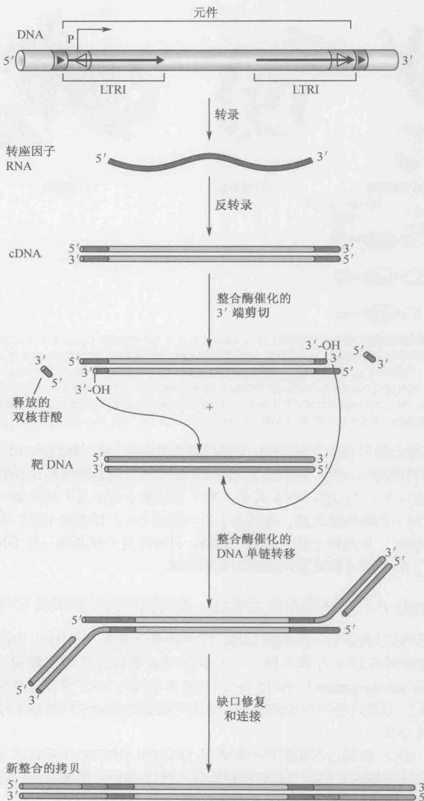  
图 12-23 反转录病毒整合机制和类病毒反转录转座子的转座。上边图例表示已整合的前病毒。LTR 序列的详细图示见框 12-3。如图所示，病毒 RNA 的转录启动子位于左边的 LTR 中，该病毒 RNA 的 cDNA 合成过程详见框 12-3。整合酶催化的 DNA 剪切和单链转移步骤如此图所示。

  
图 12-24 转座酶和整合酶催化结构域的相似性。（a）从右至左依次为 Tn5 转座酶（Davies D. R. et al. 2000. Science 289: 77-85）、Mu 噬菌体转座酶（Rice P. and Mizuuchi K. 1995. Cell 82: 209-220）和 RSV 整合酶（Chook Y. M. et al. 1994. J. Mol. Biol. 240: 476-500）的保守核心结构域。它们相同的二级结构成分以相同的颜色表示。DDE 基序（motif）的活性位点残基以球棒模型表示。图形通过 BobScript、MolScript 和 Raster 3D 软件制作。（b）如 a 中所示的 3 个蛋白质的结构域的图解，N 端的域结合 DNA，图 a 的中间的结构域包含了催化区；C 端的结构域参与组装转座体所需的蛋白质-蛋白质相互作用，以及与调节转座的其他蛋白质发生相互作用。（来源：Rice P.A. and Baker T.A. 2001. Nat. Struct. Biol. 8: 302-307.）

转座酶和整合酶只有结合在 DNA 上形成联会复合体(或叫转座体)时才有活性(如前所述)。Tn5 转座酶结合到一对转座子末端 DNA 片段时的晶体结构让我们清楚地了解到这一点（图 12-25）。与这些 DNA 片段（即一个转座子的末端）的其中一个相结合的重组酶识别序列上的转座酶亚基，为转座子另一端的 DNA 断裂和 DNA 单链转移反应提供了催化结构域。正是由于这个亚基的结构，只有在两个亚基和一对 DNA 末端一起构成复合体时，转座酶才被放置到正确的重组位置。

## 聚腺苷酸（poly-A）反转录转座子通过一种“反向剪切”机制进行移位

聚腺苷酸反转录转座子，如人的 LINE 因子的移位需要一个 RNA 中间体，但其转座机制与类病毒转座因子有所不同，它的机制叫做靶位点引导反转录（target-site-primed reverse transcription）（图 12-26）。首先是细胞内 RNA 聚合酶对整合因子的转录（图 12-26a）。尽管启动子在 5'UTR 内，这时它能指导起始于转座因子序列的第一个核苷酸的 RNA 合成。

新合成的 RNA 被转运到细胞质中翻译成 ORF1 和 ORF2 两个蛋白质（见上面的讨论）。这些蛋白质与编码它们的 RNA 保持结合（图 12-26b）。转座因子以这种方式促进了自身的转座，而不为其他竞争因子贡献蛋白质。

这个蛋白质-RNA复合体重新进入核内并与细胞DNA结合(图12-26c)。已知ORF2蛋白同时具备核酸内切酶和反转录酶的活性，这个核酸内切酶通过在染色体DNA上产生一个缺口来启始整合反应（图12-26d）。富含胸腺嘧啶（T）的序列是优先被断裂的位点。在断裂位点出现的多个 T 使得 DNA 与 RNA 因子的多聚腺苷酸尾巴形成碱基配对，然后切口反应产生的 DNA 3'-OH 末端作为引物反转录 RNA 转座因子（图 12-26e）。另外，ORF2蛋白也催化这一 DNA 合成反应。后续的转座步骤尽管了解得还不太清楚，但是应包括 cDNA 第二单链的合成、插入位点 DNA 缺口的修复和 DNA 单链的接合。

  
图 12-25 Tn5 结合 DNA 底物后的共结晶体。复合体中包含一个转座酶的二聚体。在图 12-24 中催化结构域以彩色表示，绿色小球表示与蛋白质活性位点结合的二价金属离子。注意，当重组酶亚基的 DNA 结合域连接到转座子一端时，其重组催化结构域也贡献给转座子的另一端。DNA 用蓝色和粉色表示。（Davies D. R et al. 2000. Science 289: 77-85.）图形通过 BobScript、MolScript 和 Raster3D 软件制作，Leemor Joshua-Tor 完成了额外的 DNA 建模。

通过大规模基因组测序发现很多聚腺苷酸反转录转座子都被截断了，其中大部分都丢失了5'端的区域，而不具备编码因子的基因的完整拷贝或完整的启动子，因而这些被截断的转座因子失去了转座能力。

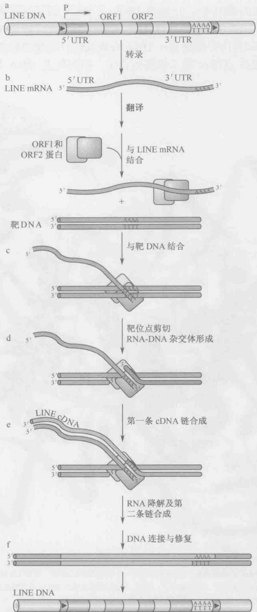  
图12-26 聚腺苷酸反转录转座子的转座通过靶位点引导的反转录过程完成。图示概述了 LINE 因子的移动模型。(a) 细胞内的 RNA 聚合酶起始了一个整合的 LINE 因子的转录。(b) 转录得到的 mRNA 翻译后生成两个 ORF 产物，并结合到其 mRNA 的 3' 端。(c) 这个蛋白质-mRNA 复合体结合到富含胸腺嘧啶的靶 DNA 位点。(d) 复合体上的蛋白质启动了靶 DNA 的断裂，在 DNA 末端留下了 3'-OH，并形成 RNA：DNA 的杂合子。(e) 靶 DNA 的 3'-OH 端作为引物反转录 RNA 因子得到 cDNA（第一条单链的合成）。（f）最后的转座反应步骤包括：第二条 cDNA 单链的合成、DNA 的连接以及断点修复，最终生成了一个新插入的 LINE 因子。

## 转座子及其调控的实例

转座子成功地侵入和繁殖于所有生物体的基因组中。很明显，它们是非常健壮的生物实体。这些成功可以部分归功于转座过程的调控，正是这种调控使得转座子与宿主细胞之间建立了一种和谐的共存关系。这种共存关系对转座子来说是至关重要的，因为没有了宿主，转座子就无法存在。另一方面，就像刚才讲的，转座子也会在宿主细胞中造成严重破坏，导致插入突变，改变基因表达，形成大规模基因重排。这些干扰破坏在植物中尤其明显，正是这一点导致在玉米中发现了转座子（框12-3，玉米转座因子及转座子的发现）。

## 框12-3 玉米转座因子及转座子的发现

植物基因组中含有大量的转座子。而且转座因子改变基因表达的能力可逐渐通过植物颜色的变化被观察到（框 12-3 图 1 和图 2）。因此，在植物中首先发现转座子和许多它们的沉默特征就不奇怪了。

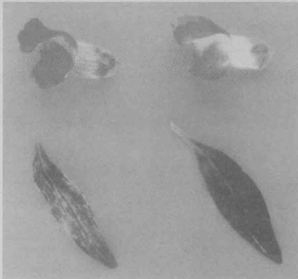  
框 12-3 图 1 Tam3 转座引起金鱼草花出现彩色色斑的例子。白色斑块的大小与转座频率有关。（经许可后重新印刷，Chatterjee M. 和 Martin C. 1997. Plant J.11: 759-771；Fig.2a. ©Blackwell Publishing）。

20世纪40年代后期，Barbara McClintock 在玉米中发现了“控制因子”，实际上是转座因子断裂染色体的能力引起了 McClintock 的注意。她发现一些植株的染色体频繁断裂，并将造成这些染色体断裂的遗传因子命名为 Ds（dissociator；解离子）。令人惊奇的是，她观察到这些染色体断裂的“热点”位点在不同的植株上位置不同，甚至一个植株和它自己后代之间的位点都不同。这一现象首次揭示了遗传因子可以在染色体上移动，即“转座”。

Ds 实际上是一个非自主性的 DNA 转座子，它通过剪切-粘贴转座实现移动。McClintock 还发现 Ds 的移位需要 Ac（activator；激活子）因子存在于同一细胞，并提供转座酶蛋白。Ac 因子现在已确定属于一个叫 hAT 的 DNA 转座子大家族，其名称是苍蝇的 hobo 因子、玉米的 Ac 因子和金鱼草的 Tam 因子的首字母缩写。家蝇中的 Hermes 因子也属于这个家族并已用在机理分析中。

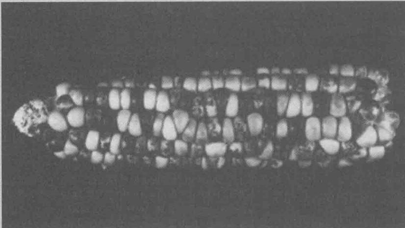  
框 12-3 图 2 因转座形成彩斑的玉米棒（摄影 Barbara McClintock；图片源于 Cold Spring Harbor Laboratory Archives）。

下面我们简要介绍几个已经充分了解的转座子和转座子家族（更多转座子及其重要特性总结于表12-2中）。每一个小节对一个特定的因子进行简要介绍，并介绍一个关于该因子调控的例子，这种调控作用对该转座子来说非常重要。我们将会看到，有两种调控类型会反复出现：

表 12-2 转座因子的主要类型

<table><tr><td>类型</td><td>结构特点</td><td>移位机制</td><td>例子</td></tr><tr><td colspan="4">DNA介导的转座</td></tr><tr><td>细菌的复制性转座子</td><td>末端反向重复序列包围着中间的抗生素抗性基因和转座酶基因</td><td>每一次插入到一个新的靶位点都伴随着DNA因子的复制</td><td>Tn3、γδ、Mu噬菌体</td></tr><tr><td>细菌的剪切-粘贴转座子</td><td>末端反向重复序列包围着中间的抗生素抗性基因和转座酶基因</td><td>DNA因子从原位点被切除后,插入到一个新位点</td><td>Tn5、Tn10、Tn7、IS911、Tn917</td></tr><tr><td>真核细胞转座子</td><td>反向重复序列包围着带有内含子的编码区</td><td>DNA因子从原位点被切除后,插入到一个新位点</td><td>P因子(果蝇)、hAT家族因子、Tc1/Mariner因子</td></tr><tr><td colspan="4">RNA介导的转座</td></tr><tr><td>类病毒反转录转座子</td><td>250~600bp的正向末端重复序列(LTR)包围的反转录酶、整合酶和类反转录病毒的Gag蛋白的基因</td><td>RNA聚合酶II从左边LTR的启动子开始转录出RNA,然后再反转录并插入到靶位点</td><td>Ty因子(酵母)、Copia因子(果蝇)</td></tr><tr><td>聚腺苷酸反转录转座子</td><td>3&#x27;端富含A-T的序列和5&#x27;端UTR序列包围着编码RNA结合蛋白和反转录酶的基因</td><td>从其内部的启动子开始转录生成RNA;核酸内切酶切断DNA开启靶位点引导的反转录过程</td><td>F和G因子(果蝇)、LINE和SINE(哺乳动物)、Alu序列(人)</td></tr></table>

\- 细胞中转座子对自身拷贝数的控制。转座因子通过调节拷贝数（regulating copy number），限制自身给宿主细胞带来的有害影响。

\- 转座子对靶位点选择的控制。已经发现了两类常见的靶位点调控方式：其一，一些因子倾向于插入到对宿主细胞不造成危害的染色体区域，这些区域被称为转座子的避风港（safe havens）；在第二种调节类型中，一些转座子能特异性地避免插入到自身序列中，这种现象叫做转座目标免疫性（transposition target immunity）。

## IS4 家族的紧凑型转座因子通过多种机制实现对拷贝数的控制

细菌转座子 Tn10 是 IS4 家族中一个被充分研究的代表, 这个家族还包括 Tn5。Tn10 是一个 9kb 长的紧凑型转座因子, 它编码一个自身转座酶所需的基因和几个使其对四环素具有抗性的基因（图 12-27）。

Tn10 转座子采用剪切-粘贴机制（如前述），通过 DNA 发夹结构断裂非转移单链（图 12-18 和图 12-21）。Tn10 由 3 个功能模块组成，这个结构有一定的普遍性，具备这种结构的因子被称为复合转座子（composite transposon）。最外面的两个模块叫 IS10L（左边）和 IS10R（右边），实际上是微型转座子。“IS”代表的意思是插入序列（insertion

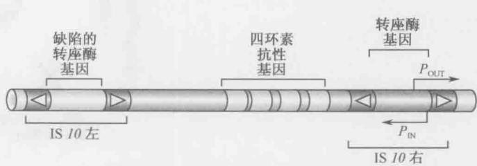  
图 12-27 细菌转座子 Tn10 的遗传结构。图中所示为细菌转座子 Tn10 的各个功能因子。像很多细菌转座子一样，Tn 10 实际上在其两端携带了两个“微型转座子”，它们是 IS 10L（左）和 IS10R（右）。这两种类型的 IS 10 因子都能自行转座，也都在 Tn 10 之外的 DNA 中被单独发现。白色三角代表 IS 因子和 Tn 10 末端的反向重复序列。虽然 4 个拷贝在序列上并非完全相同，但它们都能被 Tn 10 的转座酶识别并用作重组位点。

sequence）。IS 10R 是编码转座酶的基因，转座酶能够识别 IS 10R、IS 10L 和 Tn10 的末端反向重复序列。IS 10L 的序列虽然与 IS10R 非常相似，但它不能编码具有功能的转座酶。所以，IS 10R 和 Tn10 是自主转座子，而 IS 10L 则是非自主转座子。如预期的一样，由于自身可移动，两种类型的 IS10 转座因子在基因组不与 Tn10 相连。

Tn10在某种指定细胞中通过限制转座发生的频率来限制其拷贝数。例如，它使用一种反义RNA（antisense RNA）的机制来限制转座酶基因的表达（图12-29）（第19章和第20章中关于反义RNA调节的讨论）。靠近IS10R末端的是两个启动子，它们通过宿主RNA聚合酶指导RNA合成。指导RNA向内合成的启动子（称为 $P_{\mathrm{IN}}$ ）负责转座酶基因的表达，而指导向外转录的启动子（称为 $P_{\mathrm{OUT}}$ ），如下所述，通过生成反义RNA来调节转座酶的表达。

通过这个机制，细胞内的 Tn10 拷贝数越多，反义 RNA 也就越多，反过来又限制了转座酶基因的表达（图 12-28，更多的细节参照图示），因而，这个细胞株中的转座频率就会很低。相反，如果细胞中仅有一个 Tn10 拷贝，反义 RNA 的水平就会很低，转座蛋白就会高效地合成，转座发生的频率就较高。

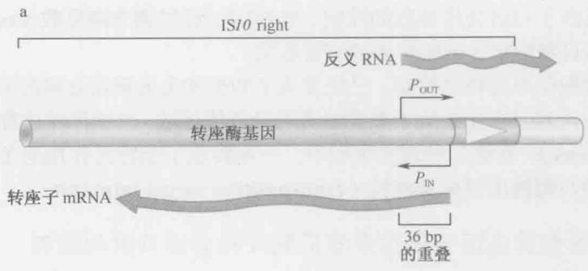

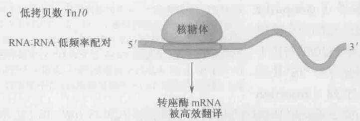  
图12-28 Tn10 表达的反义调节。(a). 重叠的启动子区域如图所示，向左的启动子 $(P_{\mathrm{IN}})$ 启动转座酶基因的表达，向右的启动子 $(P_{\mathrm{OUT}})$ 开始于距 $P_{IN}$ 启动子左端36bp 处，它启动反义 RNA 的表达。这两个转录物的前36bp 是互补的。注意，在细胞中起始于 $P_{OUT}$ 的反义转录物的较起始于 $P_{IN}$ 的转录物的有较长的寿命。(b). 细胞中 Tn 10 的拷贝数多时，这两个 RNA 的配对就频繁发生，阻止了转座酶 mRNA 的翻译（因而最终减少了转座子的拷贝数）。(c). 当细胞中转座子拷贝数很低时，两种 RNA 转录本配对很少，转座酶 mRNA 能够高效翻译，细胞中转座子的拷贝数增加。

## 框12-4 转座的靶免疫机制

转座目标免疫机制的核心是 MuA 转座酶和 MuB ATP 酶间的相互作用。正是 MuA 和 MuB 的相互作用阻止了 MuB 结合到与 MuA 结合的 DNA 附近。这个相互作用对它们的影响是：

\- MuA 阻止了 MuB 结合到其附近的 DNA 位点。这一过程需要 ATP 的水解。

\- MuB 帮助 MuA 找到转座的靶位点。

要了解单个的蛋白质-蛋白质和蛋白质-DNA 相互作用如何一同产生目标免疫，我们来看看转座到两个候选 DNA 片段时的情况：一个代表任意的 DNA 片段，而另一个片段带有一个插入的 Mu 因子的拷贝（框 12-4 图 1）。我们把第一个片段叫做天然区域（naive region），把第二个片段叫做免疫区域。

  
框12-4 图1 MuA 和 MuB 在 DNA 上的相互作用导致了靶位点免疫的发生。MuA 结合位点位于转座子末端的末端反向重复序列中（深绿色表示），为了说明清楚，图中所示的 MuA 仅结合了两个重复区域中的一个。每当 MuB 水解 ATP 时，它就从 DNA 脱了下来（结合 ATP 的 MuB 以更深的绿色显示）。MuA 和 MuB 的相互作用能促进这个水解反应，尽管图中所示只有两个 MuB 分子与 MuA 作用。实际上，MuA 总是趋向于接触到所有的紧密连接在它的 DNA 结合位点上的 MuB 分子。一个单独的 MuA 结合的末端反向重复序列可以使 5\~15 kb 的 DNA 序列获得“免疫性”。

那么当 Mu 因子准备转座时这两个 DNA 区域时会发生什么呢？首先考虑天然区域，结合 ATP 形成复合体（MuB-ATP）的 MuB 蛋白以非特异性的方式结合到此 DNA 上，与此同时，MuA 转座酶在 Mu DNA 上组装转座体，然后转座体内的 MuA 蛋白与天然区域上的 MuB-DNA 复合体发生蛋白质-蛋白质相互作用。这种相互作用的结果是

MuB 将这个序列作为靶位点传递给 MuA。

与此相反，当 MuA 和 MuB 都结合到免疫区域的 DNA 上时，MuA 与免疫区域上 Mu 噬菌体基因组的特异性结合位点发生相互作用。MuB-ATP 的结合仍采用非特异性的方式。然而当 MuA 和 MuB 都结合到这一区域时，它们将发生相互作用，结果是 MuA 通过 MuB 刺激 ATP 水解，使得 MuB 与 DNA 分离，因此，MuB 就不能在免疫 DNA 片段上聚集。通过这个方法，Mu 转座蛋白用 ATP 中保存的能量来保护其基因组免于成为转座的目标。从这个机制中我们还可以预测出，只要 DNA 上有一个单独的 MuA 结合位点，就足以获得目标免疫性。

## Mu 噬菌体是一种异常活跃的转座子

和 $\lambda$ 噬菌体一样，Mu 噬菌体也是一种溶原性细菌噬菌体（见附录 A）。Mu 也是一种较大的 DNA 转座子，它侵染宿主细胞时通过转座将自己的 DNA 插入到宿主的基因组上，所用的方式与反转录病毒类似（如前述）。Mu 噬菌体在裂解性生长时也通过多轮的复制性转座扩增自身 DNA。在裂解周期中，Mu 噬菌体每小时能完成大约 100 轮的转座，它是目前已知的最高效的转座子。而且即使在静止溶原态，与传统的转座子（如 Tn10）相比，它的转座频率仍然是相当高的。它的名字 Mu 是突变子（mutator）的缩写，这源于其疯狂转座的能力，因为当细胞内插入一个拷贝的 Mu 噬菌体 DNA 后，噬菌体 DNA 插入细胞基因中而使细胞频繁地增加新的突变。

Mu 噬菌体基因组大小约为40kb，带有35个以上的基因，其中仅有两个基因编码的蛋白质专注地参与转座，它们是基因 A 和基因 B，分别编码 MuA 蛋白和 MuB 蛋白。MuA 是一个转座酶，属于前面讲过的 DDE 蛋白超家族的成员；MuB 蛋白是一个 ATP 酶，它促进 MuA 的活性，并控制对 DNA 靶位点的选择（图12-29）。这个过程将在下一节介绍。

## Mu 噬菌体通过靶位点免疫来避免其转座到自身 DNA 上

像许多转座子一样，Mu 噬菌体对靶位点也很少显示出偏好性。因此，“好”的靶点常常出现在 DNA 上，Mu 基因组自身的 DNA 也被频繁地选为靶位点。鉴于序列的选择如此随机，转座子插入到噬菌体自身 DNA 上后，很容易造成噬菌体基因的严重紊乱，那么 Mu 噬菌体是如何避免这一情况的呢？

由于 Mu 转座受到转座目标免疫（transposition target immunity）（框12-4，转座的靶免疫机制）作用的调控，使得这一问题得以解决。在转座时，这个作用致使 Mu 因子周围的 DNA 位点及包括转座子自身的 DNA 位点，不易成为转座的靶位点。

已经发现了很多不同的可转座因子都具有转座目标免疫性，而且可以远距离发生作用。例如，一个已经存在的 Mu 转座子可以对附近约 15kb 的范围实现 Mu 转座子对新插入的免疫。还有一些转座因子（如 Tn3 和 Tn7）的目标免疫范围超过了 100kb。目标免疫使得一个转座因子免于被自身或同类型因子的另一个拷贝插入。而且，这种对靶 DNA 选择的调节推动了转座因子移动到远离自身的新位置，这个特点或许有益于转座子整体

的生存和繁衍。

Tc1 / mariner 因子是真核细胞中极其成功的 DNA 转座因子

已经发现的 Tc1 / mariner 转座因子家族成员在非脊椎动物和脊椎动物中都普遍存在，这个家族的转座因子是真核细胞中最常见的 DNA 转座子。尽管这些因子有明显的相关性，但来自不同物种的成员有着不同的特性和命名。例如，来自线虫 C.elegans 的因子叫 Tc 因子，而从果蝇体内分离出的因子叫 mariner 因子。

Tc 1/mariner 因子是已知最简单的自主转座子之一。通常，它们的长度约为1.5\~2.5kb，仅包含一对反向末端重复序列（转座酶结合位点）和一个编码转座酶蛋白的基因，该转座酶属于DDE蛋白超家族（如前述）。与很多转座子不同的是，它的转座过程不需要辅助蛋白的参与，尽管在最后的重组步骤中需要细胞的DNA修复蛋白。或许如此简单的结构和机制正是它们在如此广泛的宿主物种中获得巨大成功的原因。

Tc1/mariner 因子的转移是通过剪切-粘贴的转座机制实现的（图12-19）。转座子 DNA 从原宿主 DNA 两端的切除是通过单链的成对断裂实现的，断裂位点间隔两个碱基。这些因子非常容易插入到有 5'TA 序列（很明显，这是常见的序列）的地方。

转座子被切除后在宿主染色体上留下的“空”位点怎么办呢？在 Tc1 / mariner 转座中，对一些曾经携带过转座子的位点分析表明，有时这些断开的 DNA 末端被修补（通过 DNA 的修复合成）后就直接连接起来（第10章，关于非同源末端连接的讨论）。这些修复反应会在原先

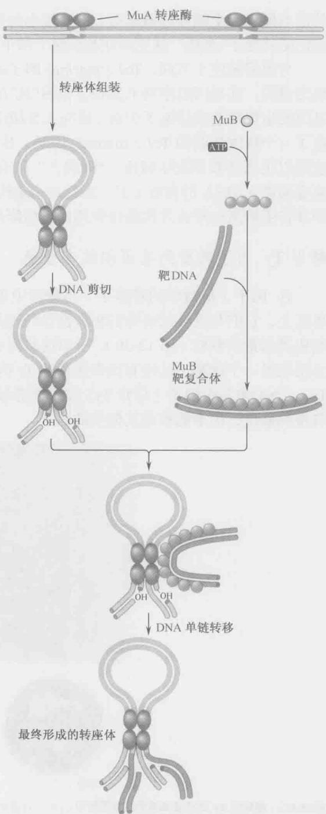  
图 12-29 Mu 转座子前期步骤的概况。MuA 转座酶的 4 个亚基组装在 Mu DNA 的末端，MuB 与 ATP 结合然后结合任意的 DNA 序列。MuA 与 MuB 之间的蛋白质间相互作用使 MuA DNA-转座体复合体结合到新的 DNA 目标位点上。MuB 没有在最后一组图中展现出来，因为在 DNA 链转移后，不再需要 MuB，因而其可能离开了复合体。

的位点插入几个额外的碱基对，这些短小的插入 DNA 被称为 “脚印”（footprint），因为它们是转座子“途经” 这里后在基因组上留下的踪迹。

与很多转座子不同，Tc1 / mariner 因子的转座并未得到很好的调控。或许就是由于缺乏调控，在基因组序列上发现了很多“死”的转座子，即无法转座。例如，很多转座酶基因发生突变造成转座子失活。研究人员用活性因子和无活性因子上的很多序列人为构造了一个极度活跃的 Tc1 / mariner 因子，称为“睡美人”。与分离出的天然因子相比，它能以很高的频率发生转座。“睡美人”很有希望成为一个用于在真核物种细胞中诱发突变和插入 DNA 的有效工具。而且这个重构实验还说明，天然的 Tc1 / mariner 因子由于其转座酶蛋白没有发挥最佳作用而自然降低了转座的频率。

## 酵母 Ty 因子转座到基因组的安全港

Ty 因子（酵母中的转座子）是酵母中重要的转座子，属于类病毒反转录转座子。事实上，它们与反转录病毒的相似性已经超越了转座机制。Ty RNA 在细胞中被发现组装成类病毒的颗粒（图 12-30），所以这些因子好像是病毒一样，只是不能离开一个细胞去感染另一个细胞。已经有很多类型的 Ty 因子被充分研究。例如，酿酒酵母中有 Ty1、Ty3、Ty4 和 Ty5 因子（尽管 Ty5 在这类酵母中都是失活的）。每一类 Ty 因子都能催化自身的移位，但不能移动其他类的因子。

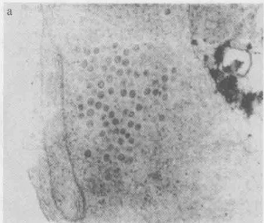  
b

  
T=3

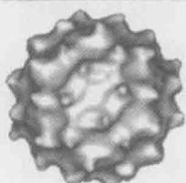  
T=4  
图12-30 酵母的 Ty 因子被组装到病毒颗粒中。(a). 过表达的 Ty1类病毒颗粒的酿酒酵母细胞的电子显微照片。颗粒呈卵形、电子密集的结构。(b). 低温电子显微扫描显示的 Ty1病毒颗粒的三维重构结构。Ty1 因子所携带的被切断的 Gag 蛋白与病毒颗粒的三聚体构成了钉状外壳。(经得许可后重新印刷, 源自: Craig N. et al. 2002. Mobile DNA II, © ASM Press. b, 同样源自 H. Saibil.)

Ty 因子偏向于整合到染色体上的特定区域（图 12-31）。例如，Ty1 因子几乎总是插入到被宿主 RNA 聚合酶Ⅲ（Pol III）转录的起始位点上游约 200 bp 的区域内（第 13章）。RNA 聚合酶Ⅲ特异性地转录 tRNA 基因，所以大多数 Ty1 因子就插入到这些基因附近。Ty3 因子的插入也和 RNA 聚合酶Ⅲ的启动子紧密相关。这一情况下，插入位点就精确定位在转录起始点位置（±2bp）。与此不同的是，Ty5 因子趋向于插入到基因组的静止区，也就是转录静止区域，Ty5 插入的静止区包括端粒和交配型基因座的静止拷贝（第 11 章）。在所有这些情形中，区域性靶位点的选择机制与一个特定的蛋白质-蛋白质复合体的形成有关。这个复合体由两个蛋白质组成，分别是与 cDNA 结合的复合体中的整合酶，以及与染色体位点结合的特定的宿主蛋白。例如，Ty5 整合酶就与 DNA 沉默蛋白 Sir4 构成了一个特殊的复合体（第 19 章）。

  
图12-31 Ty因子的整合位点簇。每个彩色区块代表一个已知的转座插入位点。注意，Ty1、Ty2、Ty3和Ty4都是插入到由细胞RNA聚合酶Ⅲ转录的tRNA基因附近，插入发生在真实基因的上游，因而不对基因的表达产生干扰。Ty1和Ty2是紧密相关的转座因子，所以归为一类；Ty5被发现位于染色体末端和交配型基因座（第11章）附近的“沉默”（即低转录）区域。（来源：Dan Voaytas.）

为何 Ty 因子表现出这种靶位点的区域性偏好呢？有人提出，正是由于这种靶位点的选择性，使得大多数的插入远离基因组中直接与编码蛋白相关的重要区域，让转座子能保留在宿主细胞中。使用目标性转座方式对酵母这种小而富含基因的基因组有更加重要的意义。

## LINE 因子能够推动自身转座，还能转座细胞 RNA

自主性聚腺苷酸反转录转座子 LINE 在脊椎动物基因组中大量存在。事实上，人的基因组中约 20% 由 LINE 序列构成。这些因子起初是被当作重复序列家族发现的，它的名字来源于最初的定义：LINE 是“散布在核内的长因子”（long interspersed nuclear element）的缩写。L1 是人体内了解得最清楚的一个 LINE 因子。除了能推动自身的移位，LINE 还能提供一些蛋白质，用于反转录和整合其他相关的重复序列——一种被称为“散布在核内的短因子”（short interspersed nuclear element，SINE）的非自主性聚腺苷酸反转录转座子。基因组序列显示这类因子也是大量出现，通常大小为 100\~400bp。在人的基因组中普遍存在的 Alu 序列就是 SINE 的一个例子。LINE 和 SINE 因子典型结构的比较如图 12-32 所示。LINE 和 SINE 的序列看起来像是简单的基因，可事实上，如对转座很重要的 cis-acting 因子，它仅包含一个指导该因子转录成 RNA 的启动子和一个聚腺苷酸序列。前面讲过，这些腺苷酸残基与靶位点的 DNA 配对，帮助形成反转录所需的末端引物（图 12-23）。

  
图12-32 一个典型的 LINE 和 SINE 的遗传结构。注意在因子右端的聚腺苷酸序列的长度是可变的。这是一个聚腺苷酸反转座子的典型特征，这些因子两端的靶位点重复序列（蓝色箭头）的长度也是可变的。序列因子没有按比例显示。这两类因子都带有启动子序列，见图12-20 和图12-28。（图片经允许修改，源自：Bushman F. 2002. Lateral DNA transfer, p. 251, Fig.8.4. © Cold Spring Harbor Laboratory Press.）

这种转座所需的序列如此简单，给 LINE 因子提出一个问题：如何避免对细胞内 mRNA 的转座呢？我们知道，所有的基因都有启动子，它们大部分被转录成 mRNA 后，在3'端都带有一个聚腺苷酸的序列（第14章），那么所有的 mRNA 都可能成为吸引转座酶的底物。实际上，基因组序列已经为我们提供了清楚的证据表明细胞 RNA 通过靶位点引导的反转录机制实现转座。

细胞中很多基因在基因组上都有一些高度同源的其他拷贝，这些拷贝丢失了启动子和内含子（存在于基因中的序列，通过 RNA 剪切被从 mRNA 中去掉，见第14章），通常在5'端被截短。这些序列被称为加工后的假基因（processed pseudogene），通常不能被细胞表达。这些假基因两端一般是靶 DNA 的短重复序列，这个结构恰好就是 LINE 促进的细胞 mRNA 转座的预期结果。

尽管细胞 RNA 会发生转座，但这是一个罕见的现象。避免这一过程的基本机制是编码 LINE 因子的蛋白质在翻译时迅速地结合到自己的 RNA 上（图12-23）。这样，它们在催化反转录和整合时，对编码自己的 RNA 表现出了很强的偏好性。

## V(D)J 重组

我们看到转座涉及很多不同遗传因子的移动，然而细胞也在利用重组机制来实现对自身有帮助的功能。最好的例子就是 V（D）J 重组，它发生在脊椎动物免疫系统的细胞中。

脊椎动物免疫系统的工作是识别和防御生物体如病毒、细菌和病原细胞的入侵。脊椎动物用两类特殊的细胞（B 细胞和 T 细胞）专门识别这些入侵者。B 细胞制造循环于血液系统中的抗体（antibody）；而 T 细胞制造细胞表面结合的受体蛋白，称为 T 细胞受体（T cell receptor）。这两类蛋白质识别“外部”分子后便展开一系列旨在消灭入侵者的活动。为成功地完成它们的功能，抗体和 T 细胞受体必须能识别大量的多种分子。细胞用于产生多种多样的抗体和 T 细胞受体的基本机制所依靠的就是被称为 V(D) J 重组的一套特殊的 DNA 重排反应。

组成抗体和 T 细胞受体基因的基因片段是通过一系列的序列特异性重排装配而成的。要了解这个重组过程是如何产生所需的多样性，就需要了解一下抗体分子的结构（图12-33）；T细胞受体与抗体的分子结构相似。编码抗体分子的基因组区域如图12-34所示。抗体由两条轻链和两条重链构成，抗体蛋白与外源分子结合的部分叫抗原结合位点（antigen-binding site），这个结合区由抗体分子的 $V_{L}$ 和 $V_{H}$ 两个结构域构成，如图12-33所示。字母“V”表示这一段蛋白质序列是高度变化的。抗体分子的其他结构域叫做“C”区，即稳定区，它在不同的抗体分子之间没有太大变化。

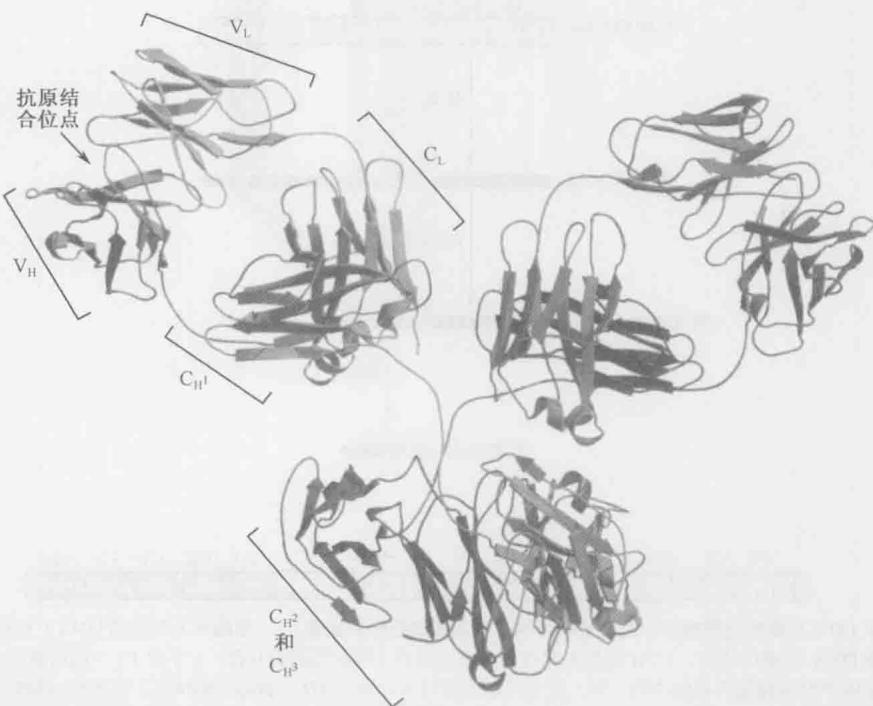  
图 12-33 一个抗体分子的结构。两条轻链用粉色显示，两条重链用蓝色表示。可变区和稳定区仅标记于抗体分子的左边。注意抗原结合区形成于 $V_{L}$ 和 $V_{H}$ 结构域之间的界面。（Harris L. J. et al. 1998. J. Mol. Biol. 275: 861-72.）图形通过 MolScript、BobScript 和 Raster 3D 软件制作。

如图12-34a 所示，编码抗体轻链（来自小鼠）的基因组区域叫做 kappa 基因座，这个区域有 300 个基因片段，可以编码不同版本的轻链 $V_{L}$ 蛋白区。另外有 4 个基因片段编码一个短的蛋白质区域，叫 J 区，其后是编码 $C_{L}$ 结构域的一个单独编码区。通过我们下面描述的机制，V（D）J 重组可将 V 区和 J 区的 DNA 任意配对融合。所以，单从这一基因组区域重组产生的抗体轻链就有 1200 种变化，然后通过 RNA 剪切将这些基因片段与 $C_{L}$ 编码区结合在一起（第 14 章）。

编码抗体重链的基因片段装配情况与此相似，不过它还有一个额外的基因单元，叫D（Diversity，多样性）片段（图12-34c），所以重链基因的情况更加复杂。例如，小鼠的一个特定重链基因座有100多种V区、12种D区和4种J区，组装这个基因的V(D)J重组就会产生4800多种不同的蛋白质序列。由于具有功能的抗体可由任意的重链和轻链配对而成，所以在轻链和重链基因位点进行的重组对抗体蛋白结构的影响具有放大效应。

  
图12-34 V(D)J 重组过程概述。上图所示为生成抗体蛋白轻链的步骤。a. 细胞中（配子型 DNA）未经 V(D)J 重组的部分轻链 DNA 的遗传结构。b. B 细胞发育过程中发生在两个特异性基因片段（V3 和 J3）间的重组。这是发生在不同 B 细胞前体中很多种重组事件中的一种，重组的基因座转录后通过 RNA 剪切（第14章）并列在一起形成连续的基因片段，该 mRNA 翻译产生轻链蛋白。c. 更加复杂的重链遗传区域的图例，它带有额外的“D”基因片段和多种类型的稳定区片段（Cμ、Cγ等）。(图片经允许修改，源自：Bushman F. 2002. Lateral DNA transfer, p.345, Fig.11.3. © Cold Spring Harbor Laboratory Press.)

## V(D) J 重组中的早期活动是通过一种类似于转座子切除的机制实现的

被 V（D）J 重组所装配的基因片段两端的序列叫做重组信号序列（recombination signal sequence）。这些信号序列都有两个高度保守的序列基序（motif），一个长 7bp（7mer），另一个长 9bp（9mer）（图 12-35），这些基序能被重组酶结合（如下所述）。重组信号序列分为两类，一类包含 7mer 和 9mer 的基序以及两者中间的 12bp 的序列；另一类包含两个基序以及两者中间的 23bp 的序列（图 12-35a）。重组总是发生在一对重组信号序列之间，其中一个有 12bp 的间隔区，另一个有 23bp 的间隔区。这些成对的信号序列以反向重复的结构排列在要被连起来的 DNA 片段两端（图 12-35b）。

负责识别和断裂重组信号序列的重组酶由两个蛋白质亚基组成，分别叫 RAG1 和 RAG2 [RAG 是重组激活基因（recombination activating gene）的缩写]。这些蛋白质的作用方式与转座酶相似（图 12-36），它们识别重组酶信号序列，然后将两位点配对构成一个蛋白质-DNA 联会复合体。

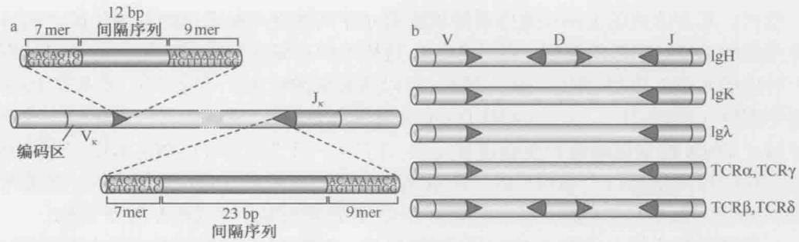  
图 12-35 V(D)J 重组中重组信号序列的识别。(a). 两类重组信号序列（RSS）的近观图，12bp 的间隔序列由蓝色显示，23bp 的间隔序列由绿色表示，两类因子共有的 7mer 和 9mer 的序列因子由浅绿色显示，间隔区核苷酸序列并不重要，而其长度是至关重要的。(b). 编码抗体（Ig 基因）和 T 细胞受体蛋白（TCR 基因）的遗传区域中 RSS 重排的几个例子。(a. 图片经允许修改，源自：Bushman F. 2002. Lateral DNA transfer, p.345, Fig.11.3. © Cold Spring Harbor Laboratory Press.)

  
图 12-36 V (D) J 重组途径：发生断裂的机制类似于转座子的切除机制。重组酶催化信号序列末端的单链断裂后产生了游离的 3'-OH，然后每个 3'-OH 开始攻击相对链形成一个发夹形的中间体（图 12-23b）。随后发卡结构水解并连接形成 V 和 J 区间的一个编码联合体，携带重组信号序列的两个末端也连成一个信号联合体，前者可以继续进行重组，后者则被丢弃。（图片经允许修改，源自：Bushman F. 2002. Lateral DNA transfer, p.348, Fig.11.6. ©Cold Spring Harbor Laboratory Press.）

然后，复合体内的 RAG1 蛋白诱导重组信号序列和将要被重排的基因片段之间每一个连接处的 DNA 单链的断裂（图 12-36a）。这样的位点断裂使得编码蛋白的片段具有了一个自由的 3'-OH 末端（图 12-36b）。然后，与以前看到的转座子切除反应，尤其在 Hermes 通路中那样（图 12-21），这个 3'-OH DNA 末端攻击 DNA 双螺旋的另一条单链。这个攻击导致了 DNA 的双链断裂和重新连接反应，并产生一个发卡形的 DNA 末端。具有 DNA 发夹末端的序列是蛋白质编码片段，而重组信号序列末端现在是正常的 DNA 双链断裂（图 12-36c）。用同样的机制，每个重组的 DNA 片段都形成一个 DNA 发卡结构。

一旦联会复合体上的两个 DNA 序列被切开，又被 RAG 重组酶变成发卡形状后，细胞内的 DNA 修复蛋白就会接管任务，并完成剩下的重组反应（图12-36d）。两个蛋白质编码片段上的 DNA 发卡末端必须被打开，而且这些末端还必须被连接到一起，细胞内的非同源末端连接蛋白（第10章）参与了这一反应。有趣的是，DNA 的连接通常伴随着若干核苷酸的增减，这里的增加与我们所说的 Tc1 / mariner 转座子切除时在原靶位点上留下“足迹”的现象类似。这些增加的额外的核苷酸为所生成的蛋白质分子序列增加了多样性。成对断裂的重组信号序列也在重组过程中连接了起来，结果通常产生了一个环形的 DNA 分子而被细胞丢弃。

初始化 V（D）J 重组的 DNA 断裂与转座子切除这两种机制间的相似性是非常明显的。事实上，重组信号序列与转座子末端的末端反向重复序列也很相似，而且 RAG1 蛋白具有一些同 DDE 转座酶蛋白家族相似的序列。事实上，基因组分析近期发现一个叫做 Transib 的转座子家族。它有可能是 RAG1 和重组信号序列的共同来源。这些现象和很多其他现象一起为我们提供的强有力的证据表明，V（D）J 重组这一高等动物免疫系统的关键特征是由 DNA 转座演化而来的。这个结论说明了可转座因子在细胞基因组演化过程中的关键作用。

## 小结

尽管 DNA 通常被看成是储存着遗传物质的非常稳定的分子, 它也经历着很多种的重排作用。两类遗传重组——保守性位点特异性重组和转座是造成大多数 DNA 重排的原因。

保守性位点特异性重组发生在 DNA 的特定序列元件上。重组酶蛋白识别这些序列元件，对其进行 DNA 单链切断和重新连接，使包含重组位点的 DNA 片段发生重排。有三种常见的重排类型：DNA 插入、DNA 缺失和 DNA 倒位。这些重排具有很多功能，如病毒感染时将自己的基因组插入到宿主细胞的基因组中、分解 DNA 多聚体，以及改变基因表达。

DNA 上重组位点的结构和 DNA 构筑蛋白的参与决定了某种特定重组反应的结果。构筑蛋白可使得 DNA 片段弯曲，并且对发生在该特定 DNA 区域的重组反应有很大的影响。

有两种保守性位点特异性重组酶家族，它们都是通过一个蛋白质-DNA共价中间体断裂DNA的。对于丝氨酸重组酶而言，这个共价连接是通过一个丝氨酸残基活性位点实现的；而对于酪氨酸重组酶而言，则是通过一个酪氨酸残基活性位点实现的。酪氨酸重组酶的结构揭示出了重组机制的细节。

转座是一类将可移动遗传因子移位到新位点的重组反应，该遗传因子叫转座子。主要有三类转座子：DNA 转座子、类病毒反转录转座子和聚腺苷酸反转录转座子。DNA 转座子在转座周期中始终为 DNA，它的移位机制有两个：切除后由转座子中间体参与的剪切-粘贴机制和复制机制。两类反转录转座子的移动则都要通过一个 RNA 中间体，它们的“反转录”元件的移位需要 RNA 依赖性的 DNA 聚合酶（又叫反转录酶）和一个重组酶蛋白。

所有物种的基因组中都有转座子，它们可能占据了全部 DNA 序列的一大部分，同时它们还是突变和基因组重排的一个主要原因。转座过程往往受到调控，以确保转座子不会对宿主细胞的基因组造成太大的干扰。通常可以观察到的两种调控机制是对转座子拷贝数的控制和对新插入位点的选择。

最后，一个类似转座的机制被用于其他类型的 DNA 重排反应。最显著的例子是 V（D）J 重组反应，它负责在脊椎动物免疫系统的发育中对基因片段进行装配。

## 参考文献

## 书籍

Bushman F. 2002. Lateral DNA transfer: Mechanisms and consequences. Cold Spring Harbor Laboratory Press, Cold Spring Harbor, New York.

Craig N.L., Craigie R., Gellert M., and Lambowitz A.M. eds. 2002. Mobile DNA II. American Society for Microbiology, Washington, D.C.

## 位点特异性重组

Chen Y. and Rice P.A. 2003. New insight into site-specific recombination from FLP recombinase-DNA structures. Annu. Rev. Biophys. Biomol. Struct. 32: 135–159.

Grindley N.D.F., Whiteson K.L., and Rice P.A. 2006. Mechanisms of site-specific recombination. Annu. Rev. Biochem. 75: 567–605.

Hallet B. and Sherratt D.J. 1997. Transposition and site-specific recombination: Adapting DNA cut-and-paste mechanisms to a variety of genetic rearrangements. FEMS Microbiol. Rev. 21: 157–178.

Matthews A.G. and Oettinger M.A. 2009. RAG: A recombinase diversified. Nat. Immunol. 10: 817–821.

Smith M.C. and Thorpe H.M. 2002. Diversity in the serine recombinases. Mol. Microbiol. 44: 299–307.

Yang W. 2010. Topoisomerases and site-specific recombinases: Similarities in structure and mechanism. Crit. Rev. Biochem. Mol. Biol. 45:520–534.

## 转座

Gueguen E., Rousseau P., Duval-Valentin G., and Chandler M. 2005. The

transpososome: Control of transposition at the level of catalysis. Trends Microbiol. 13: 543–549,

Haren L., Ton-Hoang B., and Chandler M. 1999. Integrating DNA: Transposases and viral integrases. Annu. Rev. Microbiol. 53: 245–281.

Plasterck R. 1995. The Tc1/mariner transposon family. Curr. Top. Microbiol. Immunol. 204: 125–143.

Prak E.T.L. and Kazazian H.H. Jr. 2000. Mobile elements in the human genome. Nat. Rev. Genet. 1: 134–144.

Rebollo R., Romanish M.T., and Mager D.L. 2012. Transposable elements: An abundant and natural source of regulatory sequences for host genes. Annu. Rev. Genet. (in press). doi: 10.1146/annurev-genet-110711-155621.

Rice P.A. and Baker T.A. 2001. Comparative architecture of transposase and integrative complexes. Nat. Struct. Biol. 8: 302–307.

Smit A.F.A. 1999, Interspersed repeats and other mementos of transposable elements in mammalian genomes. Curr. Opin. Genet. Dev. 9:657–663.

## V(D)J 重组

Fugmann S.D., Lee A.I., Schockett P.E., Villey I.J., and Schatz D.G. 2000. The RAG proteins and V(D)J recombination: Complexes, ends, and transposition. Annu. Rev. Immunol. 18: 495–527.

Gellert M. 2002. V(D)J recombination: RAG proteins, repair factors, and regulation. Annu. Rev. Biochem. 71: 101–132.

Oettinger M.A. 2004. Hairpins at split ends in DNA. Nature 432: 960–961.

## 习题

## 偶数习题的答案请参见附录2

习题1 给定一条线性的双链DNA，它包含两个分开的交叉区域，这些区域周围存在一些重组酶识别位点。如果重组的结果是删除或倒位，请描述重组位点的排列方式，并解释为什么这种排列方式决定了重组反应的结果。

习题 2 请解释为什么丝氨酸重组酶和酪氨酸重组酶的催化不需要外部的能量供应，比如 ATP 的水解。

习题 3 请解释位点特异性重组和转座的主要区别。

习题 4 请列举酪氨酸重组酶和丝氨酸重组酶在保守的位点特异性重组反应中的异同。

习题 5 请描述 Cre 重组酶在真核生物基因工程中的优势。

习题 6 λ 噬菌体在感染大肠杆菌的过程中，可以通过整合重组进入溶源态，或通过切出重组进入溶菌态。λ 整合酶是否在整合重组或切出重组，或者同时在两者中发挥作用？请给出答案并解释。

习题 7 请描述鼠伤寒沙门氏菌中 Hin 重组酶催化 DNA 倒位的生物相关性。

习题 8 请解释重组周期中可以区分转座子和逆转录转座子的主要特征。

习题 9 人类基因组可以包含 50% 以上的转座子相关序列，但却并未因此经历较多的、由转座子移动造成的遗传不稳定性，请给出你的解释。

习题 10 请解释为什么科学家使用像 Tn5 这样的转座子作为基因工程工具从细菌或酵母细胞中筛选具有给定表型的突变体。相比于化学诱变产生的变异，这种转座子为什么可以在遗传筛选中能提供一些实验上的优势？

习题 11 研究人员已经发现,用反转录酶抑制因子处理人类肿瘤细胞可以降低肿瘤细胞增殖的速度。请预测为什么反转录酶可以在人类细胞中表达。提出一种假设,解释为什么反转录酶的活性可以同肿瘤细胞关联起来。

习题 12 比较剪切-粘贴型转座和复制型转座的机制。

习题 13 请描述 V（D）J 重组在抗体多样化中的作用，并解释在 V（D）J 重组通路中非同源末端连接为什么是修复双链 DNA 断裂（发夹水解后编码片段的融合）的一种有利机制？

习题 14 因子Ⅷ的缺陷会造成 A 型血友病，这是一种血液类疾病。研究该疾病的研究人员已经对该病的某位患者和该患者的母亲（非血友病患者）的 DNA 进行了评估。他们对长度为 186kb 的因子Ⅷ的基因进行了分析，该基因包括 26 个外显子（见第 14 章）。研究人员使用 Kpn I 和 Sst I 两种限制性核酸内切酶对该基因组进行了酶解，然后又通过凝胶电泳对酶解产物进行了分离，最后他们使用放射性标记的 cDNA 探针对分离的 DNA 进行了探测，这些探针可以同含有因子Ⅷ基因的外显子 14\~26 的片段进行结合。这些片段的大小和相应的外显子如右侧的放射自显影图所示。研究人员的结论是：有一个转座子插入到了因子Ⅷ的一个外显子中。

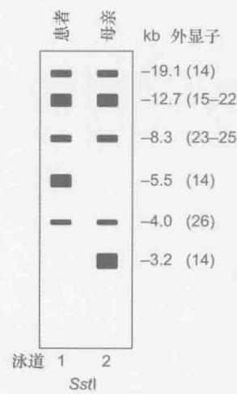

A. 请描述该患者和其母亲的 Sst I 酶解结果的不同之处。请尽量具体。
B. 请描述该患者和其母亲的 Kpn I 酶解结果的不同之处。请尽量具体。

C. 请提出一种假设来解释我们观察到的差异，这些差异包含了发生转座子插入的因子Ⅷ的外显子。

数据改编自 Kazazian Jr. et al. （1988. Nature 332: 164-166）。

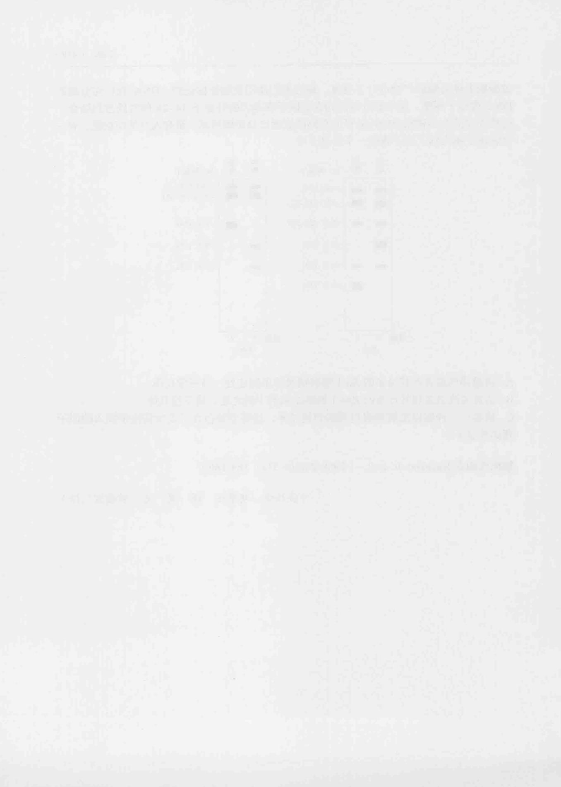

## 第4篇基因组的表达

## 本篇概要

\- 第13章 转录机制

\- 第14章 RNA剪接

\- 第15章 翻译

\- 第16章 遗传密码

\- 第16章 生命起源和早期演化

第 4 篇主要介绍基因是如何表达的，或者说，以核苷酸线性序列的形式储存在多聚核苷酸链中的信息是如何转换成为多肽链中的氨基酸线性序列的。我们同样讨论了这些过程在早期生命中是如何起源的。

第 13\~16 章是按照将基因中的信息复制到 RNA，即信使 RNA（messenger RNA），再将信使 RNA 解码成为多肽链的信息流向编排的。核苷酸序列的信息由 DNA 传递到 RNA 的过程，即转录（transcription），是第 13 章的主题。

RNA 聚合酶局部解旋一小段 DNA，并以短暂分离的两条 DNA 链中的一条为模板，通过碱基配对逐渐合成互补的 RNA 链，这一化学反应的过程与 DNA 合成极其相似。尽管在所有细胞中合成 RNA 的基本酶非常相似，但真核生物转录机器的其他部分要比原核生物复杂得多。

在原核生物中，信使 RNA 一旦合成，便立即作为蛋白质合成的模板使信息流向下一个阶段。真核生物则不然,转录的 RNA 产物必须经过一系列的成熟事件才能成为信使 RNA。最引人注目的加工事件称为信使 RNA 剪接（mRNA splicing），第 14 章对此进行了描述。真核生物细胞的基因常常被一个（有时是多个）非蛋白质编码的片段（即内含子，intron）所打断。当这样的基因转录成 RNA 的时候，这些内含子必须去除，从而使蛋白质编码片段（即外显子，exon）能够彼此连接在一起，成为一条连续的蛋白质编码序列。第 14 章描述了负责高精度去除内含子的精密分子机器。

关于遗传信息翻译过程的细节将在第 15 章和第 16 章讨论。翻译是以核苷酸序列形式储存在信使 RNA 中的遗传信息指导氨基酸有序地掺入到蛋白质多肽链中的过程。第 15 章描述了参与翻译过程的 4 个主要组分：信使 RNA 的编码序列；转运器分子（即 tRNA）；将氨基酸装载到 tRNA 转运器上的氨酰-tRNA 合成酶；由 RNA 和蛋白质组成的核糖体，即蛋白质合成工厂。

第 16 章描述了阐明遗传密码（genetic code）的经典实验，同时列出了翻译这些密码的法则。核苷酸序列的信息是基于一种 3 个字母的密码，而蛋白质序列的信息则是基于 20 个不同的氨基酸。密码具有简并性，两个或更多密码子（在大多数情况下）编码同一种氨基酸。还存在特殊的密码子，指明翻译应在何处开始和在何处结束。

最后，在第 17 章中，我们将研讨生命是如何在它初始的位置起源的，原始的遗传编码、复制和表达机制，以及它们是如何演化成为我们看到的现代的生物世界的，正如第 3 篇和第 4 篇中讨论的那样。

# 冷泉港实验室档案馆中的照片

David Baltimore、Francois Jacob 和 Walter Gilbert, 1985 年发育分子生物学研讨会。Baltimore 和 Howard Temin 共同发现了以 RNA 为模板合成 DNA 的反转录酶（第 12 章）。Jacob 与 Jacques Monod 提出了基因表达如何被调节的基本模型（第 18 章），还提出了 DNA 复制如何被调节的一个模型（第 9 章）。Gilbert 为基因调节的 “Jacob-Monod 模型” 的某些方面提供了生物化学证明，他还发明了一种用于 DNA 测序的化学方法（第 7 章）。他们分别于 1975 年（生理学或医学）、1965 年（生理学或医学）和 1980 年（化学）获得了诺贝尔奖。

David Allis 和 Emily Bernstein，2004 年表观遗传学研讨会。Allis 第一个发现了修饰组氨酸的酶——Tetrahymena 的组氨酸乙酰转移酶（第 8 章）。自从这个酶被发现后，研究组氨酸修饰范围及其对基因表达的影响的全新领域成长了起来。图中 Allis 与他实验室的博士后 Bernstein 在一起，后者曾是 Greg Hannon 实验室的研究生，在那里她发现了参与 RNAi 的 Dicer 酶（第 20 章）。

  
Ada Yonath, 2001 年核糖体研讨会。受到熊的细胞中核糖体二维晶体结构的启发，Yonath 制造核糖体的晶体以解析它的三维结构。很多人相信核糖体的结构是可以解析的，这也是她研究工作的一个长久的目标。由于她在核糖体研究中的贡献，她和 Venki Ramakrishnan 及 Tom Steitz 一起获得了 2009 年的诺贝尔化学奖。

  
Robert Roeder，1998年转录机制研讨会。Roeder发现了三个真核RNA聚合酶——Pol I、Ⅱ、Ⅲ，纯化了这些酶以及起始转录所需的其他因子（第13章）。左边那个带着质疑眼神的是Camilo Parada，当时是Roeder实验室的博士后。

  
Phillip Sharp, 1974 年肿瘤病毒研讨会。Sharp 和 Richard Roberts 共同获得了 1993 年的诺贝尔生理学或医学奖，因为他们发现很多真核细胞的基因是“割裂”的，也就是说，它们的编码区域是被分段非编码 DNA 打断的。这些非编码区域是通过“剪接”而从 RNA 拷贝中去除的（第 14 章）。图中为 Sharp 和夫人 Ann。

  
Roger D. Kornberg, 1977 年染色质研讨会。Kornberg 早期研究核小体结构（第 8 章），于 2006 年因 RNA 聚合酶 II 结构（第 13 章）的研究获得诺贝尔化学奖。他父亲是 Arthur Kornberg，本书前面（P196）有其相片。

  
Paul Zamecnik, 1969 年蛋白质合成机制研讨会。Zamecnik 发展了体外蛋白质合成系统，已证明该系统对理解遗传密码如何工作及细胞如何制造蛋白质是非常重要的（第 2 章和第 15 章）。他还和 Mahlon Hoagland 一起发现了 tRNA，它是蛋白质合成过程中的一个关键成分（第 15 章）。

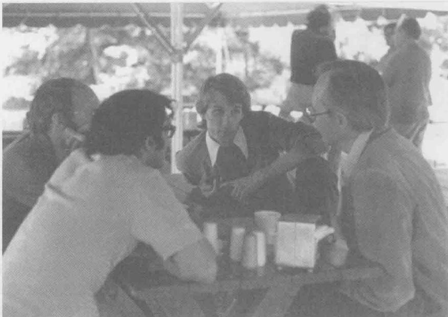  
Richard Roberts, 1977 年染色质研讨会。Roberts 的主要研究集中于限制性内切核酸酶的功能和多样性（第 7 章），他也是“割裂基因”的共同发现者之一，为此他与 Phillip Sharp 于 1993 年一起获得了诺贝尔生理学或医学奖。这里展示的和他在一起的科学家是（由左到右）：Yasha Gluzman，肿瘤病毒学家；Ahmad Bukhari，致力于研究噬菌体 Mu 转座（第 12 章）；James Darnell，他的工作集中在基因调节中的信号转导方面（第 19 章）。

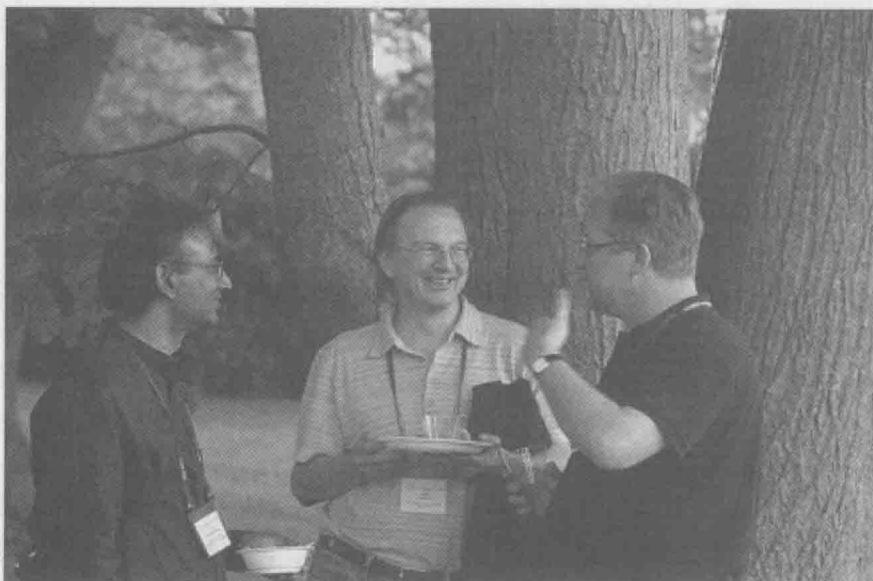  
Venki Ramakrishnan 和 Jack Szostak，2009 年演化生物学研讨会。由于核糖体晶体结构方面的研究工作，Ramakrishnan（左）与 Ada Yonath 及 Tom Steitz 分享了 2009 年诺贝尔化学奖，同时由于他在端粒上的研究工作，Szostak（中）与 Elizabeth Blackburn 以及 Carol Greider 分享了那一年的诺贝尔生理学或医学奖，这张照片来自于和 Alex Gann 一起的研讨会的野餐，他也是本书的作者之一。

## 第13章 转录机制

## 本章概要

RNA 聚合酶和转录周期

细菌的转录周期

真核生物的转录

由 RNA 聚合酶 I 和 III 催化的转录

在此之前,我们一直在考察基因组的维持,也就是说遗传物质是如何组织、保护和复制的。现在,我们将问题转到遗传物质如何表达,即 DNA 的一串碱基是如何指导 RNA 和蛋白质的合成的,后者可以行使细胞功能和定义细胞特性。在后面的几章里,我们将描述负责基因表达的基本过程:转录、RNA 加工及翻译。

转录在化学和酶学上与 DNA 的复制（第 9 章）非常相似。二者都通

过酶的作用合成一条与 DNA 模板互补的核酸链。当然，二者之间存在一些重要的差别，最主要的就是转录得到的新链是由核糖核苷酸（ribonucleotide）组成的，而不是脱氧核糖核苷酸（ribonucleotide）（第 5 章）。转录机制区别于复制的其他特征包括以下几点。

\- RNA 聚合酶（RNA polymerase，催化 RNA 合成的酶）不需要引物，它能够从头起始转录（但是正如我们将要讨论的，细胞内的转录必须在特定的序列上才能起始）。

\- RNA 产物不与模板 DNA 链的碱基保持互补状态。相反，RNA 聚合酶在每个核糖核苷酸添加处的几个核苷酸之后，便将正在延长的链从模板上置换下来（图 13-1）。这一置换对 RNA 行使功能非常关键（例如，最常见的产生蛋白质产物的翻译过程）。而且，由于这一释放紧随合成位点之后，多个 RNA 聚合酶分子可以一个紧接着另一个，在同一时间转录同一个基因。这样，一个细胞就可以在短时间内在一个基因（或其他 DNA 序列）上合成大量的转录产物。重要的是，当 RNA 产物紧跟在每个行进的 RNA 聚合酶后面从 DNA 模板上解离下来时，两条 DNA 链重新配对（图 13-1）。

\- 尽管转录是非常精确的（每添加1万个核苷酸发生1次错误），但还是不如复制更为精确（每1000万个核苷酸发生1次错误）。这一区别反映出尽管确实存在两种RNA合成的校正办法，转录过程还是缺乏广泛的校正机制。

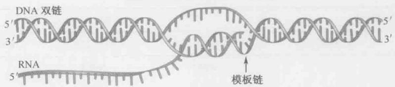  
图 13-1 DNA 转录成为 RNA。本图所示为在没有相关酶的作用下，DNA 双螺旋是如何解旋和 RNA 链是如何在模板上合成的。本图还显示了 RNA 转录产物是如何在合成点几个核苷酸后从 DNA 模板上解离下来的，以及 DNA 链如何重新配对。图中转录从左到右进行。

较转录而言，细胞更关注复制的精确性是有道理的。DNA 是储存遗传物质的分子，DNA 复制是遗传物质得以传递的过程。复制过程中发生的任何错误都会很容易引起灾难性后果——它将永远存在于这一个体的基因组中，并传递给它的后代。相反，转录仅仅产生一些暂时性的拷贝，而且通常从同一个转录区域会得到几个拷贝。因此，转录过程中发生一个错误，除了在许多暂时性的副本中产生一个有缺陷的副本外，几乎不会造成任何其他的损害。

除了上述机制的区别，DNA 复制和转录之间还存在一个重要的差异，体现在两者的不同目的。转录仅是有选择性地复制基因组的特定部分，并从任何特定的部分产生一个到几百个，或者甚至上千个拷贝。相反，复制必须将整个基因组全部拷贝，并且在每次细胞分裂时进行一次（并且只进行一次，见第 9 章）。转录区域的选择并不是随机的，每个转录区域通常包括一个或多个基因，而且在每个转录区域的首端和尾端都存在特定的 DNA 序列指导转录的起始和终止。

不仅基因组的不同部分的转录程度不同，而且转录哪一部分、转录范围有多大都是可以调控的。这样，在不同的细胞中，或者同一细胞的不同时段，可能转录不同组别的基因。例如，某个人的两个遗传特征相同的细胞在很多情况下会转录不同组别的基因，从而导致那两个细胞在特征和功能上的差异（如一个可以是肌肉细胞，而另一个是神经细胞）。或者，一些特定的细菌细胞会依其生长的培养基的不同而转录不同组别的基因。这些调控的问题将在第4篇予以解答。

## RNA 聚合酶和转录周期

## RNA 聚合酶具有不同形式，但有许多共同特性

从细菌到人类的所有细胞里，RNA 聚合酶在本质上都进行同一种反应。因此，来自这些不同物种的酶具有许多共同的特性就不足为奇了，尤其是那些直接参与催化 RNA 合成的部分。从细菌到哺乳动物，细胞的 RNA 聚合酶都是由多个亚基（subunit）构成的（虽然一些噬菌体和细胞器的确编码一些单亚基的酶来完成相同的任务，框 13-2）。表 13-1 列出了各种情况下亚基的数目和大小，以及不同的酶之间哪些亚基序列是保守的。

表 13-1 RNA 聚合酶的亚基

<table><tr><td colspan="2">原核生物</td><td colspan="3">真核生物</td></tr><tr><td>细菌核心酶</td><td>古细菌核心酶</td><td>RNA聚合酶I</td><td>RNA聚合酶II</td><td>RNA聚合酶III</td></tr><tr><td> $\beta'$ </td><td>A&#x27;/A&#x27;&#x27;</td><td>RPA1</td><td>RPB1</td><td>RPC1</td></tr><tr><td> $\beta$ </td><td>B</td><td>RPA2</td><td>RPB2</td><td>RPC2</td></tr><tr><td> $\alpha^I$ </td><td>D</td><td>RPC5</td><td>RPB3</td><td>RPC5</td></tr><tr><td> $\alpha^II$ </td><td>L</td><td>RPC9</td><td>RPB11</td><td>RPC9</td></tr><tr><td> $\omega$ </td><td>K</td><td>RPB6</td><td>RPB6</td><td>RPB6</td></tr><tr><td></td><td>[+6个其他亚基]</td><td>[+9个其他亚基]</td><td>[+7个其他亚基]</td><td>[+11个其他亚基]</td></tr></table>

每列的亚基按分子质量由大到小排序。(经允许, 引用自 Ebright R.H. 2000.J. Mol. Biol. 304: 687–698, Fig. 1, p. 688. ©Elsevier.)

由此表可见，细菌只有1种RNA聚合酶，而真核细胞中则有3种——RNA聚合酶I、Ⅱ和Ⅲ（RNA Pol I、Ⅱ和Ⅲ）。聚合酶Ⅱ（Pol II）是本章后半部分阐述真核转录时将要重点讲到的酶，它是这些酶中研究得最为深入的，也是负责转录大多数基因的酶——实际上是转录几乎所有蛋白质编码基因的酶。聚合酶I（Pol I）和聚合酶Ⅲ（Pol III）分别参与转录专门的RNA编码基因。具体来说，Pol I转录的是大核糖体RNA前体基因，而PolⅢ转录的是tRNA基因、一些小的核RNA基因和5S rRNA基因。在本章的末尾我们将再讨论这些酶。近年来，学界又发现了两种DNA依赖的RNA聚合酶，并将其命名为Pol IV和Pol V。这两种酶只在植物中存在，它们转录参与转录抑制的小干扰RNA（small interfering RNA，第20章）。它们与Pol II的亲缘关系较为密切，演化产生的时间不长。它们的一些蛋白亚单位与Pol II是一致的，由同样的基因编码；另一些序列上游区别的亚单位则是来自于近期复制的拷贝。

细菌 RNA 聚合酶的核心酶（core enzyme）可以独立合成 RNA，它是由 $\alpha$ 亚基（subunit）的两个拷贝和 $\beta$ 、 $\beta'$ 、 $\omega$ 亚基的各一个拷贝组成的。这个酶与真核生物的聚合酶密切相关（表 13-1）。具体来说，它的两个大亚基（ $\beta$ 和 $\beta'$ ）与 RNA 聚合酶Ⅱ的两个大亚基（RPB1 和 RPB2）同源。同时， $\alpha$ 亚基与 RPB3 和 RPB11 同源、 $\omega$ 亚基与 RPB6 同源。细菌 RNA 聚合酶的核心酶结构与酵母 RNA 聚合酶Ⅱ的核心酶相似，二者在图 13-2 中并列显示。后面我们将会描述一些能够阐明这些酶的工作原理的结构细节，这里我们只重点描述一些共同的特征。

细菌和酵母的核心酶有着共同的总体形态和组织形式；实际上，它们比亚基在序列上的相似度更为相似。二者内部靠近活性位点的部分尤为如此，而外周部分的相似性则差一些。这些相似点和相异点的分布是合理的：酶的内部参与在 DNA 模板上合成 RNA（所有生物体都一样）；然而，酶的许多外周部分参与到其他蛋白质的相互作用中，而这些在原核和真核细胞中是不同的。

总的来说，每一个酶的形状都像一只蟹爪。这让我们回想起第9章中描述的DNA聚合酶的“手”形结构（图9-5）。“蟹爪”的两个“钳子”主要是由各个酶的两个最大亚基构成（细菌的酶是 $\beta$ 和 $\beta^{\prime}$ 亚基，真核生物的酶是RPB1和RPB2亚基）。酶的活性位点是由这两个亚基的一些区域共同组成的，位于钳子基部，被称为“活性中心裂隙”（active center cleft）区域（图13-2）。活性位点的工作原理依据双金属离子催化添加核苷酸的机制，该机制在所有的聚合酶中均如此（第9章）。然而，RNA聚合酶的活性位点含有一个紧密结合的 $\mathrm{Mg}^{2+}$ ，第二个离子是在合成周期中由每个新的核苷酸带入的，与焦磷酸一起释放。

生物体中有多种通道允许 DNA、RNA 和核糖核酸进出这些酶的活性中心裂隙。我们会在后面谈到转录机制的部分再进行详细的讨论。

  
图 13-2 原核生物和真核生物 RNA 聚合酶晶体结构（crystal structure）的比较。（a）。栖热水生菌（T. aquaticus）RNA 聚合酶的核心酶结构。各个亚基以不同的颜色表示：β 亚基为蓝色，β' 亚基为紫色，两个 α 亚基分别为黄色和绿色，ω 亚基为红色，以红球表示的 Mg $^{2+}$ 在 a、b 中均注明了活性位点（来源：Seth Darst，洛克菲勒大学，私人通信）。（b）。酿酒酵母（S. cerevisiae）RNA 聚合酶Ⅱ的结构。各个亚基以不同的颜色表示，以表明与细菌中相应亚基的关系（表 13-1）。因此，RPB1 和 RPB2 分别为紫色和蓝色，RPB3 和 RPB11 分别为绿色和黄色，RPB6 为红色（来源：Cramer P., et al. 2001. Science. 292: 1863）。图像使用 MolScript、BobScript 和 Raster 3D 软件制作。

## 由 RNA 聚合酶进行的转录是由一系列步骤完成的

为转录一个基因，RNA 聚合酶要进行一系列定义明确的步骤，这些步骤分为三个阶段：起始（initiation）、延伸（elongation）和终止（termination）。在这里及图 13-3 中，我们总结了每个阶段的基本特征。

起始 启动子（promoter）是最初结合 RNA 聚合酶的 DNA 序列（与所需的转录起始因子一起结合）。启动子-聚合酶复合体一旦形成就发生结构改变，以利于起始过程继续进行。和复制的起始一样，DNA 在转录将要开始的部位解旋，碱基对分开，产生一个单链 DNA 的“转录泡”。与 DNA 复制相同，转录总是从 5' 端向 3' 端进行。也就是说，新的核糖核苷酸添加在延伸链的 3' 端。然而，与 DNA 复制不同的是，只有一条 DNA 链作为模板合成 RNA 链。因为 RNA 聚合酶以固定的方向与启动子结合，所以同一条链总是从特定启动子开始转录。

启动子的选择决定了哪一段 DNA 被转录，这也是对转录进行调控的主要步骤。

延伸 一旦 RNA 聚合酶已经合成了一小段 RNA（10 个碱基左右），转录便进入了延伸阶段。在延伸阶段，RNA 聚合酶除催化 RNA 的合成外，还执行着多项重要任务。它解开前方的 DNA，又使其后的 DNA 重新复性；在移动的同时，逐步解开正在延长的 RNA 链与模板的配对；而且还执行校正的功能。相反，在复制过程中，需要几个不同的酶来执行这些相似的功能。

终止 一旦 RNA 聚合酶转录了整个基因（或整组基因），它必须停下来并释放 RNA 产物（并从 DNA 上解离下来），这一步骤称为终止。在某些细胞中，存在着特定的、已研究清楚的终止序列；而在其他一些细胞中，是什么使聚合酶停止转录并从模板上分离还不十分清楚。

## 转录起始包括三个定义明确的步骤

转录周期（transcription cycle）的第一个阶段——起始——又可以分为一系列定义明确的步骤（图 13-3）。第一步是聚合酶与启动子初步结合形成所谓的闭合式复合体（closed complex），这时 DNA 还保持着双链状态，聚合酶结合在螺旋的一个面上。起始阶段的第二步，闭合式复合体经过转变而成为开放式复合体（open complex），DNA 双链在起始位点周围大约 13 bp 的距离内分开以形成转录泡。在起始阶段的下一步，启动子逃离，聚合酶进入转录起始阶段。

DNA 的展开使模板链得以释放。最前面的两个核糖核苷酸被带入活性位点，排列在模板链上并彼此结合。通过这种方式，后续的核糖核苷酸结合到正在延长的 RNA 链上。最初 10 个左右核糖核苷酸的合成是一个效率相当低的过程，在这一阶段，聚合酶经常释放出很短的转录物（每一个都短于 10 个左右的核苷酸），然后再重新开始合成。在这个阶段，聚合酶启动子复合体称为起始转录复合体（initial transcribing complex）。一旦某个聚合酶释放出超过 10 核苷酸的转录本，就可以说它逃离(escaped)了启动子。这时，它已经形成了一个包括酶、DNA 和 RNA 的稳定的三重复合体（stable ternary complex），完成了向延伸阶段的转变。

  
聚合酶终止，并释放 RNA

图 13-3 转录周期的几个阶段：起始、延伸和终止。图中显示了转录周期的常规步骤。所示特征为细菌和真核生物转录共同拥有的。起始、延伸和终止所需要的其他因子并未在这里显示，但将在后面的正文中进行描述。编码 RNA 链开端的 DNA 核苷酸称为转录起始位点，指定为“+1”位置。转录行进方向的序列称为起始位点的下游。类似地，起始位点前面的序列称为上游序列。当提到上游序列的某一特定位置时，将给予一个负值，下游序列则给予正值。

在本章的后续部分，我们将更为详细地对转录周期进行描述——首先是细菌，然后是真核系统。

## 细菌的转录周期

## 细菌的启动子在强度和序列上是多样的，但是具有某些明确的特征

原则上，细菌的核心 RNA 聚合酶能够在 DNA 分子上的任何一点开始转录，这点可以在体外用纯化的核心酶来验证。但在细胞内，聚合酶只在启动子处起始转录。一个称为 $\sigma$ 的起始因子的加盟，使得核心酶 $(\alpha_{2}\beta\beta'\omega)$ 转变为只在启动子处起始转录。该酶的这种形式称为 RNA 聚合酶的全酶（holoenzyme，图 13-4）。

  
图 13-4 栖热水生菌 RNA 聚合酶的全酶。灰色所示为核心酶（与图 13-2 的 a 图中所示的是同一个酶），紫色所示为 $\sigma^{70}$ 亚基（区域 2、3、4，见图 13-6）。右边为区域 2，顶部为区域 3，底部为区域 4。 $\sigma$ 区域 2 和 4 分别识别启动子的 -10 和 -35 区域，稍后将在正文中进行描述。（Murakami K. S., et al. 2002. Science. 296: 1280.）图像使用 MolScript、BobScript 和 Raster 3D 软件制作。

在大肠杆菌中，最常见的 $\sigma$ 因子称为 $\sigma^{70}$ （我们将在第 18 章和第 22 章中讨论其他可供选择的 $\sigma$ 因子及它们在转录调节中的作用）。含有 $\sigma^{70}$ 的聚合酶识别的启动子具有以下共同的特征性结构：两段 6 个核苷酸长的保守序列，被长度为 17\~19 个核苷酸的非特异序列（图 13-5a）所分隔。这两段保守序列的中心分别位于 RNA 合成起始位点上游约 10bp 和 35bp 处。因此，根据图 13-3 的计数方案（编码 RNA 链开端的 DNA 核苷酸被指定为 +1），这两段序列称为 -35 和 -10 区域（region）或元件（element）。

虽然绝大多数的 $\sigma^{70}$ 启动子包含可被识别的-35 和-10 区域，但序列并不一致。通过对许多不同启动子的比较，可以得到一个共有序列（consensus sequence，关于这些共有序列的来源详细可见框 13-1）。共有序列反映了首选的-35 和-10 区域，被最适宜的长度（17bp）所分隔。很少有启动子具有与其一模一样的序列，但多数与其仅有几个核苷酸的差别。

  
图 13-5 细菌启动子的特征。图中显示了细菌启动子元件的不同组合情况。每个元件对聚合酶的结合和功能所起的作用在正文中有详细描述。

## 框13-1 共有序列

被某个特定蛋白质识别的结合位点，其 DNA 序列不一定完全一致。类似地，使一个蛋白质具有某种特殊功能的氨基酸序列在不同的蛋白质中可能会有微小的差异。共有序列就是在上述的每种情况中，由不同样本在每一个位置上最常见的核苷酸（或氨基酸）所组成的序列版本。含有 $\sigma^{70}$ 因子的 RNA 聚合酶识别大肠杆菌启动子的共有序列如图所示（框 13-1 图 1）。这一共有序列是通过对 300 个已知具有 $\sigma^{70}$ 启动子功能的序列进行比较，并确定在 -35 和 -10 六核苷酸区域中每一个位置上最常见的碱基得到的。该核苷酸就被选为共有序列中该位置上的特定核苷酸；每一个位置上的特定核苷酸出现的相对频率及其他三种核苷酸的频率在图表中进行了描绘。注意，位于 -35 和 -10 区域之间的 17\~19 个核苷酸并不存在具有显著意义的共有序列。

在图例中，每一个单独的启动子序列都已确定，所以比较这些序列并没有什么价值。但是，让我们来考虑一个完全不同的例子：所涉及的 DNA 结合蛋白还没有确定的结合位点。但是，一条染色体的几个区域在其长度范围内的某个位置上含有结合位点。可以使用一种扫描所有这些染色体区域序列的计算机算法来寻找它们共有的潜在结合位点。

当结合位点未知时，找到 DNA 结合蛋白所识别的共有序列的第二种途径是，利用化学方法合成大批随机序列的短 DNA 片段。将目标蛋白与这些 DNA 分子混合在一起，就可以筛选到与目标蛋白结合的 DNA，并测定其序列。对这些序列的比较很容易显示出共有序列，因为每一个片段都非常短。这种方法（常被称为 SELEX）广泛地用于确定未知的 DNA 结合蛋白的结合位点。第 7 章中有对 SELEX 的详细描述。

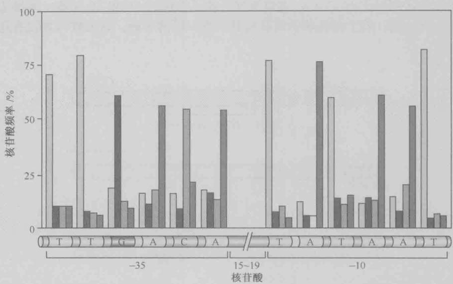  
框 13-1 图 1 启动子的共有序列和共有间距。（获得许可并重新绘图自 Alberts B. et al. 2002. Molecular biology of the cell, 4th ed., p. 308, Fig. 6.12. ©Garland Science/Taylor & Francis Books LLC.）

具有与共有序列更近似序列的启动子通常要比那些匹配较差的启动子“更强”。所谓启动子的强度（strength），是指一个启动子在一定时间内可以起始多少个转录物。这一度量标准受到以下因素的影响：启动子最初与聚合酶的结合程度、对异构化作用的支持效率，以及此后聚合酶逃离的难易程度。启动子强度与序列的相关性解释了为什么有许多不同种类的启动子：一些基因的表达水平远远超出其他基因，前者很可能具有与共有序列更为接近的序列。

在一些较强的启动子中，如指导核糖体 RNA（rRNA）基因表达的启动子，发现额外与 RNA 聚合酶结合的 DNA 元件，称为 UP 元件（UP-element，图 13-5b）。它通过提供额外的特异性相互作用而增强聚合酶与 DNA 的结合。

另一类型的 $\sigma^{70}$ 启动子缺乏-35 区域，而是有一个所谓的“延长的-10 区域”元件（图 13-5c）。与标准的-10 区域相比，这一元件在其上游末端有一个额外的短序列元件。聚合酶与这一额外序列元件之间的联系，补偿了-35 区域的缺失。大肠杆菌的 gal 基因（该基因产物指导乳糖的代谢；第 18 章）使用的就是这种启动子。

最后，在紧挨着-10元件的下游发现了一个新的结合RNA聚合酶的DNA元件。这个新元件称为鉴别子（discriminator，图13-5d）。鉴别子与聚合酶之间相互作用的强度影响酶与启动子复合体的稳定性。

## σ 因子介导聚合酶与启动子的结合

$\sigma^{70}$ 因子可以分为四个区域,称为 $\sigma$ 区域1\~ $\sigma$ 区域4(图13-6)。识别启动子-10和-35元件的区域分别是区域2和4。

区域 4 的两个螺旋形成一个常见的 DNA 结合基序（motif），称为螺旋-转角-螺旋（helix-turn-helix）。其中一个螺旋插入到-35 区域的大沟（major groove）中并与该区域的碱基相互作用；另一个则从大沟的顶部横向穿过，与 DNA 骨架接触。这一结构基序见于许多 DNA 结合蛋白，例如细菌细胞中几乎所有的转录激活因子与抑制因子（见第 18 章），我们在第 6 章进行了详细的讨论（图 6-13）。

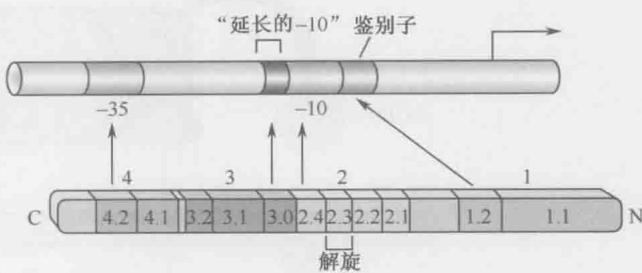  
图 13-6 σ 因子的区域。识别启动子特定区域的 σ 因子的那些区域以箭头指示。区域 2.3 负责 DNA 解旋。有关 σ 因子将 RNA 聚合酶核心酶募集到一个标准启动子上的示意图，见图 13-7。（经许可引用自 Young B.A. et al. 2002. Cell. 109: 417–420, Fig. 1. ©Elsevier.）

-10 区域也被一个 $\alpha$ 螺旋所识别，但其复杂的相互作用尚未彻底研究清楚。原因在于-35区域仅提供能量以确保聚合酶与启动子的结合，而-10区域在转录起始过程中有着更为精细的任务，因为它处在闭合式复合体向开放式复合体转变时DNA解旋起始元件中。因而，与-10区域相互作用的 $\sigma$ 因子区域不光与DNA结合，还参与其他的功能。与这一预想相一致，参与识别-10区域的 $\alpha$ 螺旋包含几个芳香族氨基酸，这些氨基酸可以和非模板链上的碱基相互作用，以维持解旋DNA的稳定。在第9章中，我们曾描述过DNA复制过程中单链结合蛋白（single-strand binding，SSB）存在类似的功能。

最近的对区域 2 的结构研究发现，它与一个单链状态的-10 元件结合，而且全部与开放复合体相接触，揭示了 $\sigma$ 因子和单链 DNA 分子间以适当的结合相互作用来推动解离过程的。非模板链上的两个碱基将插入到 $\sigma$ 因子的“口袋”结构中，这一过程中适当的分子间接触可以稳定处于解螺旋状态的启动子序列。

在某些物种中细胞的-10元件会延长一部分序列，这些序列将被 $\sigma$ 区域3中的一个 $\alpha$ 螺旋所识别，此螺旋与组成这一元件的两个特异性的碱基对接触。同时，鉴别子由 $\sigma$ 区域1、2识别。

与启动子内的其他元件不同，UP 元件并不被 $\sigma$ 因子所识别，而是被 $\alpha$ 亚基的羧基末端域一个被称为 $\alpha$ CTD 的结构域（图 13-7）识别。 $\alpha$ CTD 通过一个可变形的衔接物与 $\alpha$ 亚基的氨基端域（ $\alpha$ NTD）相连接。因而，虽然 $\alpha$ NTD 包埋在酶内部， $\alpha$ CTD 仍可以到达上游元件，即使该元件并不处于与 -35 区域直接相邻的位置，而是位于上游更远处。

$\sigma$ 亚基以这样一种方式定位在全酶结构内，实现对各种启动子元件的识别。所以，DNA结合区域朝向酶体外部而不是被包埋起来。而且，这些区域之间的间距与它们所识别的DNA元件之间的距离是一致的。当 $\sigma$ 因子结合在全酶里时， $\sigma$ 区域2和4分开大约 $75\AA$ ，这与一个典型的 $\sigma^{70}$ 启动子的-10和-35元件中心点之间的距离基本相同（图13-7）。区域2与区域4之间的这一相当大的蛋白结构域的间距是由 $\sigma$ 的区域3提供的，尤其是区域3.2也称为 $\sigma_{3/4}$ 连接区（图13-4和图13-6）。

  
图 13-7 σ 和 α 亚基将 RNA 聚合酶核心酶募集到启动子上。α 亚基的 C 端域（α CTD）识别 UP 元件（如果存在的话），而 σ 区域 2 和 4 分别识别 -10 和 -35 区域（图 13-6）。在本图中，RNA 聚合酶的示意形式与在先前的图中所显示的有相当大的差别。这种形式对于显示与 DNA 和调节蛋白的接触面是非常有用的，我们在第 18 章考察细菌的转录调节时还将会在某些图中使用它。

## 向开放式复合体的转变过程涉及 RNA 聚合酶和启动子 DNA 的结构变化

在闭合式复合体内 RNA 聚合酶与启动子 DNA 的结合使 DNA 仍处于双链状态。转录起始的下一个阶段要求聚合酶在开放式复合体中与启动子更紧密地结合在一起。从闭合式复合体到开放式复合体的转变过程涉及聚合酶的结构变化，以及 DNA 双链的打开，暴露出模板链和非模板链。相对于转录起始位点而言，这一解离事件发生在 -11 和 +2 之间的区域。

对于含 $\sigma^{70}$ 因子的细菌聚合酶，这一转变被称为异构化作用（isomerization）。它不需要从 ATP 水解获得能量，而是 DNA-酶复合体的构象自发地变成一种在能量上更具优势的形式。就像我们上面指出的那样，非模板链上的-10 元件的两个碱基（ $A_{11}$ 和 $T_{7}$ ）（图 13-8）处于自由状态，不再插入到 $\sigma$ 因子的“口袋”结构中，也就不再有如下功能的相互作用：通过将单链形式的-10 元件稳定下来，这些相互作用可以推动启动子去解离（图 13-8）。

异构化作用本质上是不可逆的，一旦异构化完成，通常转录将会随后起始（虽然在某些情况下还会再发生调控）。相反，闭合式复合体的形成则是易于逆转的——聚合酶可以转变为开放式复合体，从启动子上脱离。

为了描绘伴随异构化作用发生的结构变化，我们需要更为细致地了解全酶的结构。正如前面所描述的，在这个爪状酶的钳子之间有一条通道穿过（图 13-2）。由 $\beta$ 和 $\beta'$ 亚基的一些区域共同组成的活性位点，位于钳子基部的“活性中心裂隙”之内。

有 5 条通道通向酶的内部，如图 13-9 的开放式复合体的图片中所示。核苷三磷酸（NTP）摄取通道（没有在图中展示，请见图例说明）允许核糖核苷酸进入活性中心。RNA 出口通道允许正在延长的 RNA 链在延伸合成的同时离开此酶。其他的 3 个通道允许 DNA 进出此酶，如下所述。

下游 DNA（也就是聚合酶前方将被转录的 DNA）以双链的形式经下游 DNA 通道（在两个钳子之间）进入活性中心裂隙。在活性中心裂隙内，DNA 双链从 +3 位置开始分离。非模板链（NT）通过其特异性的通道离开活性中心裂隙并从聚合酶的表面经过，模板链（T）则沿着一条路线穿过活性中心裂隙，经它的特异性通道离开。聚合酶后面的上游 DNA 在 -11 位置处重新恢复双链状态。

  
图 13-8 通过 σ 区域 2 识别和解离 -10 元件。σ 区域 2 上具有两个口袋结构，其中各自结合非模板链的自由状态的 -10 碱基。这些能量上有优势的连接反应驱动了启动子的解离，这一反应过程不需要 ATP 的水解。（a）Taq RNA 聚合酶 σ₂ 区域的放大影像，以及结合闭合式复合体（蓝色）的双链 DNA 和部分开放式复合体（黄色）的单链 DNA。图中还展示了“口袋”结构中的两个碱基（A 和 T，用黄色表示）。红色箭头指示自由状态的碱基如何联系到闭合式复合体中相同的碱基（经许可图片复制自 Feklistov A. 和 Darst S.A. 2011. Cell 147: 1257, Fig. 6C, p. 1265. ©Elsevier.）（b）详细展示图 a 中区域 2 和非模板链的 -10 区域是如何结合的，特别是自由状态的碱基如何驱动 DNA 从这一区域解离（经许可并调整自 Liu X., Bushnell D.A., and Kornberg R.D. 2011. Cell 147: 1218, Fig. 1, p. 1219. ©Elsevier.）

从闭合式复合体向开放式复合体转变的异构化作用中，可以观察到聚合酶发生了两个显著的结构变化。第一，位于聚合酶前部的钳子牢固地钳压在下游DNA上。第二， $\sigma$ 的N端区域（区域1.1）位置有至关重要的移动。在未结合DNA时， $\sigma$ 区域1.1处于全酶的活性中心裂隙内部，阻断了开放式复合体中模板DNA链经过的路线。在开放式复合体中，区域1.1移动了大约 $50\AA$ 的距离，出现在酶的外部，使DNA可以进到裂隙中（图13-9）。 $\sigma$ 区域1.1处于高度的负电荷状态（恰似DNA）。因而，在全酶中，区域1.1起着DNA的分子模拟物（molecular mimic）的作用。活性中心裂隙的空间呈高度正电荷状态，既可以被区域1.1占据，也可以被DNA占据。

## 转录由 RNA 聚合酶起始，不需要引物

我们在第9章中谈到，DNA聚合酶并不重新合成新的DNA链，也就是说，它只能延伸一条已经存在的多聚核苷酸链。因此，复制总是需要引物链。引物通常是一段较短的RNA，与DNA模板链结合，形成一段较短的杂交双链区域；然后DNA聚合酶将核苷酸添加到引物的3'端。

  
图 13-9 进出开放式复合体的通道。本图显示了两条 DNA 链的相对位置（模板链为灰色，非模板链为橘红色）、 $\sigma$ 因子的 4 个区域、启动子的 -10 和 -35 区域，以及转录的起始位点（+1）。DNA 和 RNA 进出 RNA 聚合酶的通道也在图中显示。这里唯一没有显示的通道是核苷酸进入（NTP 摄入）通道，核苷酸由此通道进入活性位点裂隙，结合到增长中的 RNA 链中。如图所示，该通道从页面深处进入位于 DNA +1 附近的活性位点。DNA 链从蛋白质下面经过的部分以虚线表示。 $\sigma$ 区域 3/4 连接区，也称 $\sigma_{3,2}$ 是 $\sigma_{3,1}$ 和 $\sigma_{4}$ 之间的连接区域。（原图由 Richard Ebright 设计。）

RNA 聚合酶能够在一条 DNA 模板上起始新的 RNA 链，并不需要引物。这一功能要求起始的核糖核苷酸被带到活性位点，并稳定地保持在模板上，同时下一个核苷三磷酸以正确的几何形态呈递，使聚合这一化学过程得以完成。这是相当困难的，因为 RNA 聚合酶的转录物大多以腺嘌呤核苷酸（A）开始，这种核苷酸仅通过两个氢键与模板核苷酸（胸腺嘧啶核苷酸，T）结合，而胞嘧啶核苷酸（C）和鸟嘌呤核苷酸（G）之间有三个氢键。

因此，聚合酶必须与一条或者多条 DNA 模板链、起始核苷酸以及第二个核苷酸建立特异性的相互作用，严格控制其保持正确的方向，才可以开始对引入的核苷三磷酸进行化学反应。这种对聚合酶与起始核苷酸之间特异性相互作用的要求可能解释了为什么大多数转录物都以同一种核苷酸开始。目前学界大多认为， $\sigma$ 区的 3/4 链接处与模板链互作，可以保证在正确的构象和位置启动转录。与此一致的是，用含有缺少此部分的 $\sigma^{70}$ 的聚合酶进行的实验中，起始过程所需要的两个核苷酸中的一个或两个的浓度比平时要高得多。

## 转录起始阶段，RNA 聚合酶保持位置不变并将下游 DNA 拉向自己

如我们已经描述的，RNA 聚合酶首先合成并释放一些短于 10 核苷酸（无效合成）的小 RNA 转录物，然后进入转录起始阶段，包括逃离启动子、进入延长阶段，以及合成正确的转录物。很长时间我们都不明白在最初的无效转录循环中，酶的活性位点是如何沿着 DNA 模板移动的。迄今提出过三个通用模型（图 13-10）具体如下。

1. “瞬时漂移”（transient excursion）模型提出 RNA 聚合酶正向反向的瞬时迁移循

环。聚合酶被认为离开启动子沿着 DNA 模板移动一小段，合成一小段转录物，然后流产释放转录物，再回到其在启动子的原始位置。

2.“蠕虫移动”（inchworming）模型认为在聚合酶内有一个具伸缩性的元件，使得酶前方含有活性位点的部件向下游移动，合成一小段转录物，然后流产，再收缩回到其仍留在启动子上的酶主体。

3. “蜷缩”（scrunching）模型认为位于固定位置的、与启动子结合的、聚合酶下游的 DNA 被酶拉进来。于是在酶的内部堆积的 DNA 以单链“泡”的形式逗留。

现在普遍相信第三个模型

——蜷缩，反映了真实的情况。这个结论基于一系列的发现——包括单分子分析实验，这些实验可以测量在最初的转录阶段聚合酶不同部分相互之间及相对于图 13-10 最初转录的机制。在最初的转录起始阶段，RNA 聚合酶的活性中心相对于 DNA 模板向前移动，合成短的转录物并流产，然后重复这个循环直到逃离启动子。图中表示了说明该过程的三个模型。根据第一个模型——瞬时漂移（上图），聚合酶沿着 DNA 移动。在第二个模型——蠕虫移动（中图）中——酶的前部分沿着 DNA 移动，但由于酶内部有一个具伸缩性的区域，酶的后部分可以在启动子上保持固定。在第三个模型——蜷缩（下图）中，酶保持固定，把 DNA 拉过来。这些模型之间的不同点，以及支持蜷缩模型的证据在正文中有描述。（获得许可并重新绘图自 Kapanidis A.N. et al. 2006. Science 314: 1144–1147, Fig. 1a. ©AAAS.）

DNA 模板链的位置。结果显示，在最初的转录阶段，聚合酶在启动子上位置不变并解开下游 DNA 把其拉进来。只有蜷缩模型与这些结果吻合。

启动子逃离涉及聚合酶-启动子相互作用及聚合酶核心- $\sigma$ 相互作用的破坏

我们已经看到，在最初的转录阶段存在一个流产性起始过程，短的（9个核苷酸或更短）转录物合成并释放。只有合成一条达到阈值（10个核苷酸或更多）的转录物时，聚合酶才能逃离启动子并进入延伸阶段。一旦达到这个长度，转录物不能停留在与DNA配对的区域，必须开始像线一样穿入RNA出口通道（图13-9）。启动子逃离与打破聚合酶和启动子元件之间，以及聚合酶与作用于特定启动子的任何调控蛋白之间的所有相互作用有关（第18章）。

目前还不清楚 RNA 聚合酶为什么必须在成功逃离启动子之前经历流产性转录起始。但是 $\sigma$ 因子的一个区域作为分子模拟物参与其中，它是 3/4 连接区，模拟的是 RNA。此区域位于开放式复合体的 RNA 出口通道中间（图 13-9），为了使 RNA 链可以合成超过 10 个核苷酸， $\sigma$ 的这个区域必须从该位置被逐出，这个过程需要聚合酶尝试几次才能成功。

σ 区域 3/4 连接区的逐出可能说明了 σ 与延伸酶的结合比其与开放式复合体的结合更弱。事实上，它常常从延伸复合体上完全丢失。

一旦逃离，蜷缩过程将发生逆转。也就是说，在蜷缩时解离的 DNA 又重新复合，伴随着转录“泡”从 22\~24 个核苷酸萎缩成 12\~14 个核苷酸大小（图 13-3），这个过程提供了聚合酶在逃离时打破聚合酶启动子及核心酶 $\sigma$ 相互作用所需要的能量。因此，蜷缩是在转录起始中储存和转移能量的一种方法，能量在逃离时的释放可以使聚合酶与启动子分离并从核心酶驱逐 $\sigma$ 因子。

在框 13-2 “单亚基 RNA 聚合酶” 中，我们将看到，尽管缺乏 $\sigma$ 亚基，在从起始复合物向延伸复合物转变的过程中这些简单的 RNA 聚合酶是如何经历结构上类似的转移的。

## 框 13-2 单亚基 RNA 聚合酶

正文中讨论了在细菌和真核生物细胞中发现的多亚基RNA聚合酶。但是亦有单亚基RNA聚合酶，这些酶能够完成与那些在复杂的多细胞中的对应物一样的基本反应。许多噬菌体，如大肠杆菌噬菌体T7编码的这种聚合酶，在感染时用以转录其大多数基因。类似地，多数线粒体和叶绿体的基因也是由一些与此类单亚基噬菌体酶紧密相关的聚合酶转录的。演化造就了这些能够完成转录任务的相对简单的酶，正如我们在正文中强调过的，即使对大得多并且更为复杂的多亚基酶来说，转录也是一项令人印象深刻的成就。

T7聚合酶是研究得最为广泛的单亚基聚合酶。它的分子质量为100kDa，而细菌的核心酶为400kDa（不包括σ因子），其结构在框13-2图1中显示。总体上，它看起来与我们在第9章中描述过的DNA聚合酶的PolI家族相似。因而，T7的RNA聚合酶像是一只右手，具有手指、拇指和手掌，代表排布在中心裂隙周围的域，活性位点位于裂隙内。

虽然 T7 聚合酶在结构上与 RNA 聚合酶没有关联，反而更像 DNA 聚合酶，但它的确也具有与细胞的 RNA 聚合酶一样的特征。通过比较 T7 聚合酶和细菌聚合酶在与各自的模板组成的复合体中的结构，这些特征变得很明显。如我们在正文中所看到的，细菌的聚合酶具有各种各样的通道进出活性中心裂隙（图 13-8）。例如，一个通道允许核苷三磷酸进入活性中心，接触模板，并在模板的影响下聚合到增长中的 RNA 链上。另一个通道则为增长中的 RNA 链提供了离开聚合酶的出口。类似的通道也可以在噬菌体聚合酶的结构中见到。

将细菌和 T7 聚合酶的起始和延伸复合体进行比较后发现一个明显的差异，即在细菌和 T7 中，一种类似的功能转变是通过不同结构变化而实现的。我们在正文中曾特别指出，在细菌中从起始到延伸的转变包括了 $\sigma$ 因子一个区域的位置明显的移动。这一移动打开了 RNA 出口通道，因此使长度超过 10 个核苷酸的转录物得以生成。T7 聚合酶中没有 $\sigma$ 因子，但是在此单亚基酶体内的一个类似的结构变化介导了起始复合体向延伸复合体的转变，这一结构变化对于 RNA 出口通道的形成是必需的。

  
框 13-2 图 1 噬菌体 T7 的 RNA 聚合酶。(来自 Jeruzalmi D. and Steitz T.A. 1998. EMBO J. 17: 4101.) 图像使用 MolScript、BobScript 和 Raster 3D 等软件制作。

## 延伸聚合酶是一个边合成边校对 RNA 的向前行进的机器

DNA 通过延伸酶的方式与通过开放式复合体相似（图 13-9），双链 DNA 在两个钳子之间进入酶的前部。在催化裂隙的开口处，两条链分开并沿着不同的路径穿过酶，然后从各自的通道离开酶，并在延伸聚合酶（elongation polymerase）的后面重新形成双螺旋结构。核苷酸通过其固定的通道进入活性位点，并在模板 DNA 链的引导下添加到增长中的 RNA 链上。在任何一个特定时刻，增长中的 RNA 链中只有 8 个或 9 个核苷酸与 DNA 模板保持碱基互补状态；RNA 链的其余部分则剥落并从 RNA 出口通道离开。参见图 13-11 的延伸复合物示意图。

在延伸过程中，聚合酶在增长的 RNA 转录物上一次添加一个核苷酸。与转录起始时聚合酶采用蜷缩的方式将 DNA 拉入酶不一样（图 13-10），在延伸过程中聚合酶使用一步作用机制：单分子技术显示聚合酶就像一个分子马达一样向前推进，每前进一步的距离相当于任何一个正在加入 RNA 链的核苷酸的碱基对的长度。另外，“泡”的大小，即非双链 DNA 的长度，在延伸过程中保持不变：当一个核苷酸对在行进酶的前方分开，一个核苷酸对就在其后方形成。

除了合成转录本，RNA 聚合酶还执行着两项校对（proofreading）功能。第一个被称为焦磷酸化编辑（pyrophosphorolytic editing）。在此状态下，聚合酶利用它的活性位点，在一个简单的逆向反应中，通过重新加入 PPi 催化错误插入的核糖核苷酸的去除。然后聚合酶可以将另一个核糖核苷酸加入到增长中 RNA 链的相应位置上。需要注意的是，通过这种方式聚合酶既可以去除错误的碱基，也可以去除正确的碱基，但是它在不匹配的地方比在匹配的地方花的时间更长，所以常去除前者。在第二种称为水解编辑（hydrolytic editing）的校对机制中，聚合酶倒退一个或更多的核苷酸（图 13-11d）并切

开 RNA 产物，去除掉错误的序列。

水解编辑是由一些 Gre 因子激发的。Gre 因子不仅能够增强水解编辑的功能，而且同时也作为延伸刺激因子。也就是说，它们确保聚合酶能够有效地延伸并帮助克服转录在较难转录的序列处“停滞不前”。这些功能的组合类似于真核生物的转录因子 TFIIS 对其 RNA 聚合酶Ⅱ的作用（见本章后续的描述及图 13-22）。另一组蛋白质——Nus 蛋白，在延伸阶段加入聚合酶，并以目前还很不明确的方式促进延伸和终止的过程（第 18 章描述了一个调控延伸过程的例子）。其中一种细菌中的 Nus 蛋白——NusG，在古菌和真核生物中保守性同样很高（在真核生物中被称为 Spt5，见后面的讨论）。

## RNA 聚合酶可能变得停滞不前，需要挪走

在有些情况下，一个延伸着的 RNA 聚合酶可能变得停滞不前并结束转录。停滞不前的一个常见理由是一条损坏的 DNA 链。如果被转录的基因是必不可少的，停滞不前的后果可能是灾难性的：停滞不前的聚合酶不能制造有效的产物，并且对试图转录同一个基因的其他聚合酶造成障碍。

为了处理这种情况，细胞具有挪走停滞不前的聚合酶并且同时招募修复酶[具体而言是内切酶Uvr（A）BC的功能]。接下来的修复称为转录偶联的修复，我们在第10章讨论过。聚合酶的挪走及修复酶的招募都是由一个叫做TRCF的蛋白进行的。

TRCF 具有 ATPase 活性。它结合聚合酶上游的双链 DNA，并且利用 ATPase 传动器（motor）沿着 DNA 移动，直到遇到停止的 RNA 聚合酶。碰撞把聚合酶往前推，或是使它重新开始延伸，或更常见的是，使 RNA 聚合酶、模板 DNA、和 RNA 转录物的三重复合体解离。这样就结束了酶的转录，但为修复酶和其他 RNA 聚合酶开辟了道路。

## 转录由 RNA 序列内部信号终止

我们已经看到转录终止的一种途径。在延伸过程中，当 RNA 聚合酶停滞不前时，它可以通过置换因子 TRCF 的作用从 DNA 上除去（正如上面所描述的）。这种终止由损坏的 DNA 或其他计划外的障碍引起。但是在基因的末端，转录终止是一个正常且重要的功能。称为终止子（terminator）的序列引发延伸聚合酶从 DNA 上脱离并且释放出它已经合成的 RNA 链。在细菌中，终止子有两种类型：Rho 依赖型（Rho-dependent）和 Rho 非依赖型（Rho-independent）。第一种类型，顾名思义，需要一个称为 Rho 的蛋白质来诱发终止反应。第二种类型不需要其他因子的参与就导致终止。我们将依次讨论这两种类型的终止子。

Rho 依赖型终止有一些定义不太明确的 RNA 元件，被称为 rut 位点。就像下面将要讨论到的，它们需要 Rho 因子的参与才能发挥作用。Rho 是一个具有 6 个相同亚基的环状蛋白质，在单链 RNA 离开聚合酶时与之结合（图 13-12）。此蛋白质还具有 ATPase 活性：一旦与转录物结合，它就利用 ATP 水解产生的能量来诱发终止。终止的准确机制还不清楚，模型有如下几个：Rho 把聚合酶往相对于 DNA 和 RNA 的前方推，导致终止，与 TRCF 介导的终止方式（如前所述）类似；或 Rho 把 RNA 拉出聚合酶导致终止；

或者 Rho 诱发聚合酶的构象改变使酶终止。最近的大多数实验证据显示，最后一种方式至少在不同基因转录的终止中发挥了重要作用。构象改变引起延伸复合物终止后，参与因子的解离过程更慢。

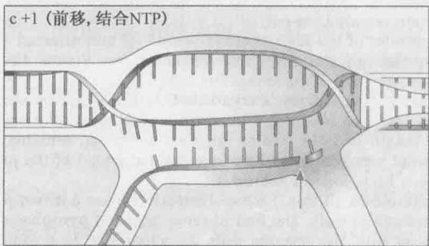

  
图 13-11 RNA 聚合酶延伸复合体内部的模板和转录物。图示转录过程的不同阶段 RNA 聚合酶内 RNA 及 DNA 模板相对位置的示意图。(a)未移位的聚合酶（0）显示 RNA 链与模板 DNA 链 9 个碱基的配对。(b)前移的聚合酶（+1）显示聚合酶已经向前方移动了一个碱基的情况。(c)结合 NTP 的前移聚合酶显示如图 b 中相同的 DNA 和 RNA 位置，带着一个进入的 NTP。(d)回移的聚合酶（-1）显示当聚合酶如在水解编辑时回移一个碱基的情况。红色箭头指向聚合酶中一个固定的位置，所有图中都一样。为了清晰起见，这里显示的聚合酶与图 13-9 方向不同，RNA 出口通道在下方。(由 Richard Ebright 友情提供。)

最近的研究同时显示 Rho 可以通过转录循环来与 RNA 聚合酶结合。因此，Rho 并不是通过易位到一个初期的、包含 rut 序列的转录本来接触聚合酶的。它更倾向于在转录的早期与聚合酶结合，或者在之后的某个时间点结合到正在从延伸酶上释放的 RNA 转录的上。Rho 的易位可能会导致 RNA 环更为绷紧，而当它足够紧的时候，延伸的 RNA 酶将会终止。

Rho 是如何被引导到特定的 RNA 分子上的？首先，它结合的位点有某种特异性（所谓的 rut 位点，即 Rho 的利用）。这些位点最理想的组成成分是几段约 40 个核苷酸、不折叠为二级结构的序列（也就是说，它们主要保持着单链状态），还富含 C 残基。

特异性的第二个层次是 Rho 无法与任何正在被翻译的转录物（也就是与核糖体结合的转录物）

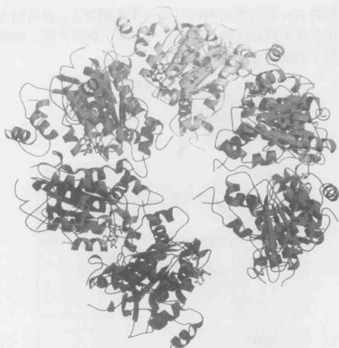  
图 13-12 Rho 转录终止因子。图为 Rho 终止因子的晶体结构俯视图。它由一个 Rho 蛋白的六聚体组成，每一个单体以一种不同的颜色表示。6 个单体形成一个开放的环，这个环并不是平面的，第 6 个亚基要比第 1 个更深入页面所在的平面。两个亚基之间的缝隙为 12Å，螺旋倾斜度为 45 Å。据认为，Rho 所作用的 RNA 转录物（未显示）是沿着每个亚基的底部结合的，然后从环的中央穿过。（Skordalakes E. and Berger J.M. 2003. Cell 114: 135.）图像使用 MolScript、BobScript 和 Raster 3D 等软件制作。

结合。在细菌中，转录和翻译是紧密相连的——延伸中的 RNA 转录物还在合成时，一旦离开了聚合酶，翻译就在其上起始了。因而，Rho 只会终止那些转录已超出一个基因或操纵子（operon）的末端但仍在转录着的转录物。

Rho 非依赖型终止子也被称为固有终止子（intrinsic terminator），因为它们不需要其他因子就能够发挥作用。Rho 非依赖型终止子由两个序列元件组成：一段短的反向重复序列（约 20 个核苷酸），其后是一段约 8 个 A:T 碱基对的序列（图 13-13）。这些元件要转录后才会影响聚合酶，也就是说它们是以 RNA 而不是 DNA 起作用的。当聚合酶转录一段反向重复序列时，合成的 RNA 能够通过自身碱基配对形成一个茎环结构（stem-loop，常称为“发夹”，见第 5 章）。发夹的形成破坏了延伸复合体，从而引起终止。与 Rho 依赖型终止一样，其作用机制还不清楚。现行的模型与那些 Rho 依赖型的差不多，也就是说，发夹或是把聚合酶往相对于 DNA 和 RNA 的方向推，或是把转录物从聚合酶上硬扯下来，或是诱发聚合酶的构象改变而导致终止。

如我们之前所描述的，发夹结构只有在后面跟随着一段 A：U 碱基对时才能有效地发挥终止子的作用。这是因为在这种环境中，当发夹结构形成时，增长中的 RNA 链仅通过 A：U 碱基对固定在模板上的活性位点。由于 A：U 碱基对是所有碱基对中最弱的（甚至比 A：T 碱基对还要弱），所以更容易被含有茎环结构的转录聚合酶所打断，RNA 也因

而更容易脱离下来（图 13-14）。

  
图 13-13 一个 Rho 非依赖型终止子的序列。上部是终止子在 DNA 中的序列，中部显示 RNA 的序列，底部是终止子发夹的结构。所讨论的终止子来自于第 18 章中讨论的色氨酸衰减子（trp attenuator）。方框中显示的是分离到的破坏终止子序列的突变。（引自 Yanofsky C. 1981. Nature 289: 751–758.）

  
图 13-14 转录终止。图为 Rho 非依赖型终止子如何工作的模型。(a) RNA（图 13-11）中的发夹结构在该区域被聚合酶转录后立刻形成（聚合酶未在此显示）；(b) 该 RNA 结构在聚合酶转录 DNA 下游的 AT 富集区域时将其破坏；(c) 究竟发夹是如何破坏正在转录的聚合物还不太清楚（文中有不同的模型）。发夹结构，以及 RNA 中一段 U 与模板中 A 之间的弱相互作用协同显然使转录物的释放变得容易（引自 Platt T. 1984, Cell 24: 10-23.）

## 真核生物的转录

正如我们已经讨论过的，真核生物中的转录是由与原核生物中发现的 RNA 聚合酶密切相关的一类聚合酶完成的。这不会让人感到惊讶，原核生物与真核生物中转录过程本身是相同的。然而，每种情况中所用的“机器”存在差别。有一点我们已经看到了：真核生物一般有三个不同的聚合酶（Pol I、Pol II 和 Pol III，另外植物中还有 Pol IV 和 Pol V），而细菌只有一个。还有，细菌只需要一个额外的起始因子（σ），而真核生物中有效的和启动子特异的起始则需要几个起始因子。这些起始因子称为通用转录因子（general transcription factor，GTF）。

在体外，通用转录因子和 PolⅡ构成从一个 DNA 模板（不含组蛋白）上起始转录所需要的全部材料。然而正如我们在第 8 章中所见，在体内，真核细胞内的 DNA 模板是整合在核小体内的。在这种环境下，单靠通用转录因子就不足以结合启动子序列并启动有意义的表达，而是需要额外的因子参与，包括 DNA 结合调节蛋白（DNA-binding regulatory protein）、中介蛋白复合体（mediator complex）和染色质修饰酶（chromatin-modifying enzyme）。

我们将先讨论在体外 Pol Ⅱ和通用转录因子被招募到一个启动子上起始转录的基本机制，然后再讨论在体内启动转录所需的额外成分的作用。

## RNA 聚合酶Ⅱ的核心启动子由 4 个不同序列的元件组合而成

真核细胞的核心启动子（core promoter）是指在体外检测时，Pol II 机器精确地起始转录所需要的最少的一组序列元件。代表性的核心启动子的长度大约有 40\~60 个核苷酸，从转录起始位点向上游或下游延伸。图 13-15 显示了在 Pol II 核心启动子中发现的几个元件相对于转录起始位点的位置。它们分别是 TFIIB 识别元件（TFIIB recognition element, BRE）、TATA 元件（或被称为盒子）、起始子（initiator, Inr）和下游启动子元件（downstream promoter element，包括 DPE, DCE, 和 MTE）。通常，一个启动子只含有这些元件之中的几个。比如，启动子通常含有 TATA 元件或 DPE，而不是两者兼备。含 TATA 的启动子经常也会含有一个 DCE。Inr 是最常用的元件，与 TATA 和 DPE 都能共同存在。每一个元件的共有序列和与其结合的通用转录因子在图中也有显示，我们将在下面的部分对这些特征进行更为详细的描述。

在核心启动子之外（而且通常是在其上游）存在一些在体内进行有效转录所需的其他序列元件。这些元件共同组成调节序列（regulatory sequence），并可以划分为几类，反映出它们的位置、所讨论的生物体及它们的功能。这些元件包括：启动子最近元件（promoter proximal element）、上游激活物序列（upstream activator sequence，UAS）、增强子（enhancer），以及一系列称为沉默子（silencer）、边界元件（boundary element）和绝缘子（insulator）的抑制元件。所有这些DNA元件都可以与调控蛋白（激活因子或抑制因子）结合。调控蛋白可以帮助或阻碍从核心启动子开始的转录，我们将在第19章展开讨论。其中有些调控序列可以位于距它们所作用的核心启动子几万甚至几十万碱基之外。

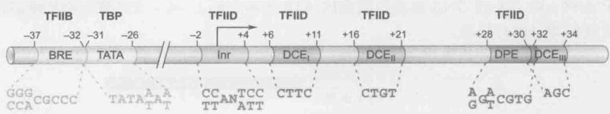  
图 13-15 Pol II 核心启动子。图中显示了不同 DNA 元件相对于转录起始位点（以 DNA 上方的箭头指示）的位置。正文中所描述的这些元件如下：BRE（TFIIB recognition element，TFⅡB识别元件）；TATA（TATA box，TATA 盒）；Inr（initiator element，起始子元件）；DPE（downstream promoter element，下游启动子元件）；DCE（downstream core element，下游核心元件）。另一个在正文中提及的元件——MTE（motif ten element，十基序元件）未在本图显示，它紧邻 DPE 的上游。图中还显示了每个元件的共有序列（元件的确定方法与细菌启动子元件相同，框 13-1），以及识别每一个元件的通用转录因子的名称。

## RNA 聚合酶Ⅱ在启动子上和通用转录因子形成前起始复合体

通用转录因子共同执行 $\sigma$ 因子在细菌转录中所执行的功能。其中有些因子与 $\sigma$ 的个别区域具有较弱的同源性，通用转录因子帮助聚合酶结合到启动子上并解开 DNA（类似于细菌转录中由闭合式复合体向开放式复合体的转变）。它们也帮助聚合酶从启动子上逃离并开始延伸阶段。一起结合在启动子上准备开始转录的一套完整的通用转录因子和聚合酶称为前起始复合体（pre-initiation complex）。

如上所述（及图 13-15），许多 Pol II 启动子包含一个所谓的 TATA 元件（大约在转录起始位点上游 30 个碱基对处）。这是前起始复合体开始形成的位置。TATA 元件是由叫做 TFIID 的通用转录因子所识别的[“TFII”的名称是指 Pol II 的转录因子（transcription factor for Pol II），单独的因子以 A、B 等加以区分]。像很多通用转录因子一样，TFIID 实际上是一个多亚基复合体。TFIID 中与 TATA 序列结合的成分称为 TBP（TATA binding protein）。此复合体中的其他亚基称为 TAF，即 TBP 关联因子（TBP-associated factor）。某些 TAF 识别其他启动子核心元件，如 Inr、DPE 和 DCE，即使最强的结合是在 TBP 和 TATA 之间，因此，TFIID 是启动子识别和建立前起始复合体必不可少的因子。

TBP 一旦结合到 DNA 上，就使 TATA 序列极大地扭曲变形（我们不久将对这一点进行更为详细的讨论）。形成的 TBP-DNA 复合体提供了一个平台，把其他通用转录因子和聚合酶本身募集到启动子上。在体外，这些蛋白质按照下列顺序在启动子处组装（图 13-16）：TFIIA、TFIIB、TFIIF 与聚合酶一起，然后是 TFIIE 和 TFIIH。包含这些成分的前起始复合体形成后，启动子就开始解旋。与细菌中的情形相反，真核细胞中的启动子解旋需要 ATP 的水解并由 TFIIH 介导，是该因子的类解旋酶活性刺激了启动子 DNA 的解开。

## 启动子逃离需要聚合酶“尾巴”的磷酸化

与细菌中的过程类似，在聚合酶从启动子逃离并进入延伸阶段之前，有一个流产性起始阶段。回忆一下上文提到的细菌中转录起始过程，在流产性起始过程中，聚合酶合成一连串短的转录物。在真核细胞启动子逃离的两个步骤是细菌中所没有的：一个是

ATP 水解（除了前面 DNA 解离所需要的 ATP 水解之外），另一个是聚合酶的磷酸化，对此我们即将进行描述。

  
图 13-16 由 RNA 聚合酶Ⅱ引发的转录起始。这里显示了按步骤进行的 Pol Ⅱ前起始复合体的组装过程，正文对此进行了详细描述。一旦在启动子处完成组装，添加 RNA 合成所需的核苷酸前体，以及聚合酶“尾巴”内部的丝氨酸残基发生磷酸化，Pol Ⅱ就会离开前起始复合体。此尾巴包含多个重复的七肽序列：Tyr-Ser-Pro-Thr-Ser-Pro-Ser（见图 13-21）。

Pol II 的大亚基有一个 C 端域 (carboxy-terminal domain, CTD), 称为“尾巴”(图 13-16)。CTD 包含一连串重复的七肽序列：Tyr-Ser-Pro-Thr-Ser-Pro-Ser。酵母 Pol II 的 CTD 中有 27 个这样的重复序列，秀丽新小杆线虫有 32 个，果蝇有 45 个，人类有 52 个。事实上，重复序列的数字看来与基因组的复杂性相关。每一个重复序列都包含特定的蛋白激酶的磷酸化位点，其中一个激酶就是 TFIIH 的一个亚基。

被募集到启动子上的 PolⅡ最初包含了一个尾巴，这些序列在很大程度上未被磷酸化。但是在延伸复合体内发现的 PolⅡ，则在其尾巴上出现了多个磷酰基基团（phosphoryl group）。这些磷酸盐的添加帮助聚合酶摆脱起始转录所用的大部分通用转录因子，并在逃离启动子时将它们丢下。

就像我们将要看到的，对 PolⅡ的 CTD 的磷酸化状态的调控也控制着后面的步骤——RNA 合成的延伸，甚至 RNA 的加工。实际上，除 TFIIH 外，已发现许多作用于 CTD 的其他蛋白激酶，并且还发现了一个去除由那些蛋白激酶加上的磷酸盐的磷酸酯酶。

## TBP 用一个插入双螺旋小沟的 $\beta$ 折叠来结合并扭曲 DNA

TBP 用一个广泛的 β 折叠（β sheet）区域识别 TATA 元件的小沟（minor groove，图 13-17），这是不常见的。典型的情况是，蛋白质用插入 DNA 大沟的 α 螺旋来识别 DNA，如我们在第 6 章中所见，本章前部分描述的 σ 因子也是如此。TBP 的非传统

识别机制的原因与该蛋白质扭曲局部 DNA 结构有关。但是这一识别模式引出了一个问题：特异性是如何实现的？

我们在第 6 章中已经看到，与 DNA 的大沟相比，小沟中能够区分碱基对的化学信息较少。相反，TBP 依赖 TATA 序列能够经受特殊结构扭曲的能力而对其进行选择，如下面即将要描述的。

当与 DNA 结合时，TBP 会使小沟扩展为一个近乎平面的构象；它还以大约 $80^{\circ}$ 的角度使 DNA 弯曲。TBP 与 DNA 的相互作用仅包括该蛋白质和小沟中碱基对边缘之间有限的一些氢键。相反，特异性主要由插入到识别序列两端的碱基对提供，具体是由能够驱使 DNA 发生强烈弯曲的两对苯基丙氨酸（phenylalanine）的侧链实现的。

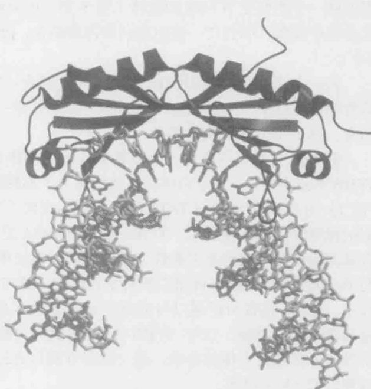  
图 13-17 TBP-DNA 复合体。TBP（紫色）与在许多 Pol II 基因的起始处 DNA 的 TATA 序列（灰色）构成复合体，这一相互作用的细节在正文中进行了描述。（引自 Nikolov D.B. et al. 1995. Nature 377:119.）图像使用 MolScript、BobScript 和 Raster 3D 等软件制作，图像两侧延伸的 DNA 模型由 Leemor Joshua-Tor 建立。

A: T 碱基对更为有利，因为它们易于扭曲而使小沟开始开放。 $\beta$ 折叠中的磷酸盐骨架和基本残基之间也存在着广泛的相互作用，从而增加了相互作用的总体结合能量。

## 其他通用转录因子在起始中也有特殊作用

我们并不完全知道所有其他通用转录因子的功能。正如我们已经指出的，这些因子

中的一些实际上是由两个或更多亚基组成的复合体（表 13-2）。下面我们来阐述几个结构和功能的特征。

TAF TBP 与大约 10 个 TAF 结合。两个 TAF 在启动子处结合 DNA 元件，如起始子元件（Inr）和下游启动子元件（DPE）（图 13-15）。几个 TAF 与组蛋白有结构同源性，尽管没有证据，已有人提出它们可能以相似的方式与 DNA 结合。例如，果蝇（Drosophila）的 TAF42 和 TAF62 已被表

表 13-2 RNA 聚合酶 II 的通用转录因子

<table><tr><td>通用转录因子</td><td>亚基数量</td></tr><tr><td>TBP</td><td>1</td></tr><tr><td>TFIIA</td><td>2</td></tr><tr><td>TFIIB</td><td>1</td></tr><tr><td>TFIE</td><td>2</td></tr><tr><td>TFIIF</td><td>3</td></tr><tr><td>TFIHH</td><td>10</td></tr><tr><td>TAFs</td><td>11</td></tr></table>

表中的亚基数量描述的是酵母细胞，但它们同包括人类在内的其他真核细胞也很相似。然而，也有些许的不同，比如人类的TFIIF只有两个亚基，而TFIIA则有三个。

明形成一个类似于 H3·H4 四聚体（第 8 章）的结构。这些类组蛋白 TAF 不仅在 TFIID 复合体中发现，而且与一些组蛋白修饰酶结合，如酵母的 SAGA 复合体（第 8 章和表 8-7）。

另一个 TAF 似乎调控 TBP 与 DNA 的结合。它利用一个与 TBP 的 DNA 结合表面结合的抑制性盖子来完成这一任务——这是另外一个分子模拟的例子。TBP 要与 TATA 结合，这个盖子就必须被移去。

TFIIB 此蛋白质为一条多肽单链，在 TBP 之后进入前起始复合体（图 13-16）。TFIIB-TBP-DNA 三元复合体的晶体结构显示出特殊的 TFIIB-TBP 和 TFIIB-DNA 联系（图 13-18），其中包括与 TATA 元件上游的大沟（至 BRE）（图 13-15）和下游的小沟之间的碱基特异性相互作用。TFIIB 与 TBP-TATA 复合体的非对称性结合造成了前起始复合体其余部分组装的非对称性，以及由此引起的单向转录。TFIIB 在前起始复合体中也与 Pol II 接触。所以，此蛋白质似乎是连接 TBP-TATA 与聚合酶之间的桥梁。结构研究显示，TFIIB 的部分区域以与细菌中 σ3/4 连接区相似的方式插入 Pol II 的 RNA 出口通道和活性中心裂隙。这些 TFIIB 的区域[被称为连接者（linker）和阅读者（reader）]协助了开放式复合体的形成，这一过程可能是通过在 RNA：DNA 杂合链形成之前稳定解离的 DNA 实现的。

TFIIF 这个双亚基（人类）因子与 PolⅡ结合，并与 PolⅡ（以及其他因子）一起被募集到启动子上。PolⅡ-TFIIF 起着稳定 DNA-TBP-TFIIB 复合体的作用，并且是 TFIIE 和 TFIIH 被募集到前起始复合体上的前提条件（图 13-6）。在酵母中，这个因子包括第三个功能未知的亚基（表 13-2）。