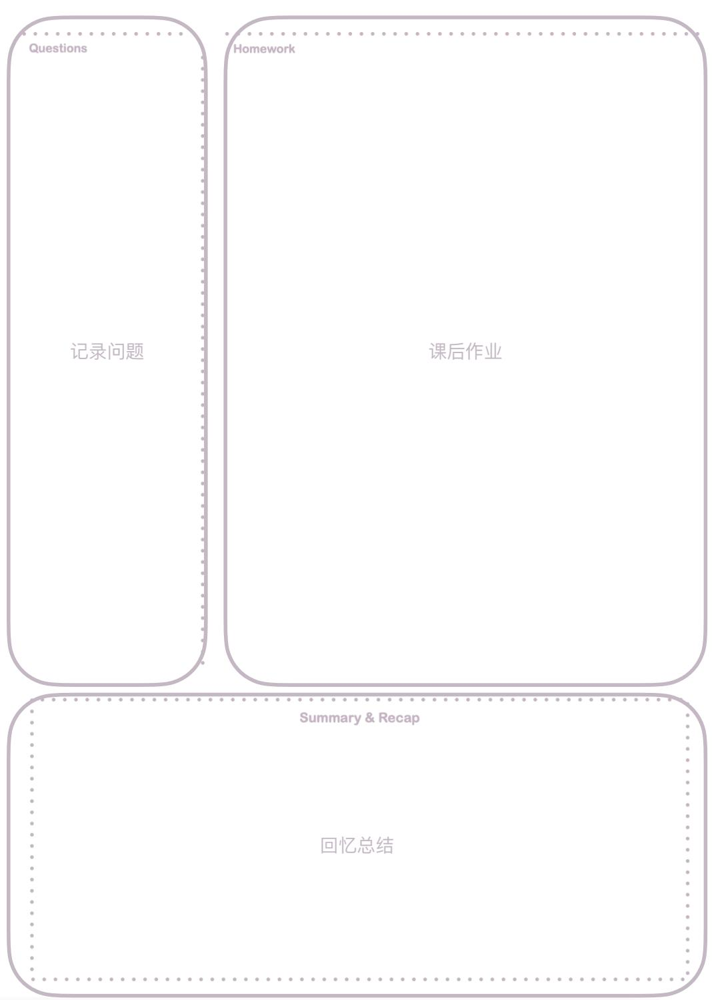
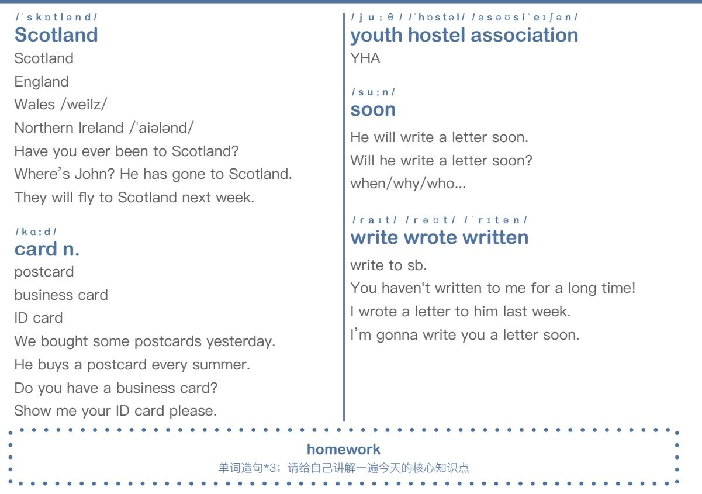

# 新概念英语第一册FIRST THINGS FIRST

课堂笔记&课后练习

  
本资料是依据「胶囊助学计划®」新概念英语第一册的视频录播课为基础整理编辑的。任何单位或个人不得盗版，转售或以任何形式以此获取经济利益，侵权必究。

## 使用指南

首先，非常开心大家能喜欢我们的课程。之前常常有学员询问有没有课后练习的电子版文件或者PPT文件，想要打印出来，方便学习。基于此，我们设计制作了这本专门针对我们的视频课程的学习手册(课程笔记和课后练习）。这本手册的内容设置和视频课程的学习顺序是完全吻合的。这样在学习视频的时候，省去做笔记的时间，可以更专注的听课，做知识点的标注。

除此之外，我们在每一个偶数课后设置了笔记页，笔记页采用了康奈尔笔记法的布局。Questions位置来记录你遇到的问题；Homework位置来完成你的课后作业；Summary & Recap位置来进行回忆和总结核心知识点。如右图所示。

本手册的所有权归胶囊助学计划所有，且为付费产品。我们只在胶囊助学计划的官方【淘宝】【微店】进行售卖，如果您是从除此之外的任何地方购买此商品，欢迎您告诉我们，并随手举报。

本作品售价：14.9RMB，且需要配合B站(哔哩哔哩)免费视频课程使用，在B站搜索“胶囊助学计划”或扫描下方二维码来学习。如果您是从任何地方免费获得此商品的，欢迎关注微信公众号：jiaonangzhuxue，以打赏的方式支持我们付出的辛苦，当然微信公众号中还有更多的学习资源免费提供给大家。

## 特别提醒

在制作的过程中难免有错误，欢迎指出。我们会做出调整。或者您有任何关于本手册的想法都可以发送E-mail告诉我们。

E-mail: capsuleacademy@icloud.com

It's never too late to learn.

<table><tr><td>1 2</td><td>3 4</td><td>5</td><td>6</td><td>7 8</td><td>9</td><td>10</td><td>11</td><td>12</td></tr><tr><td></td><td></td><td></td><td></td><td></td><td></td><td></td><td></td><td></td></tr><tr><td>13</td><td>14 15</td><td>16 17</td><td>18</td><td>19</td><td>20</td><td>21 22</td><td>23</td><td>24</td></tr><tr><td></td><td></td><td></td><td></td><td></td><td></td><td></td><td></td><td></td></tr><tr><td>25</td><td>26 27</td><td>28 29</td><td>30</td><td>31</td><td>32</td><td>33 34</td><td>35</td><td>36</td></tr><tr><td></td><td></td><td></td><td></td><td></td><td></td><td></td><td></td><td>48</td></tr><tr><td>37</td><td>38 39</td><td>40 41</td><td>42</td><td>43</td><td>44 45</td><td>46</td><td>47</td><td></td></tr><tr><td></td><td></td><td></td><td></td><td></td><td></td><td></td><td></td><td></td></tr><tr><td>49</td><td>50 51</td><td>52 53</td><td>54</td><td>55</td><td>56 57</td><td>58</td><td>59 60</td><td></td></tr><tr><td></td><td></td><td></td><td></td><td></td><td></td><td></td><td></td><td></td></tr><tr><td>61</td><td>62 63</td><td>64 65</td><td>66</td><td>67</td><td>68 69</td><td>70</td><td>71 72</td><td></td></tr><tr><td></td><td></td><td></td><td></td><td></td><td></td><td></td><td></td><td></td></tr><tr><td>73</td><td>74 75 76</td><td>77</td><td>78</td><td>79</td><td>80 81</td><td>82</td><td>83 84</td><td></td></tr><tr><td></td><td></td><td></td><td></td><td></td><td></td><td></td><td>96</td><td></td></tr><tr><td>85</td><td>86 87 88</td><td>89</td><td>90</td><td>91</td><td>92 93</td><td>94</td><td>95</td><td></td></tr><tr><td></td><td></td><td></td><td></td><td></td><td></td><td></td><td>108</td><td></td></tr><tr><td>97</td><td>98 99 100</td><td>101</td><td>102</td><td>103</td><td>104 105</td><td>106</td><td>107</td><td></td></tr><tr><td></td><td></td><td></td><td></td><td></td><td>117</td><td>118</td><td>119</td><td>120</td></tr><tr><td>109</td><td>110 111</td><td>112 113</td><td>114</td><td>115</td><td>116</td><td></td><td></td><td></td></tr><tr><td></td><td></td><td></td><td></td><td>127</td><td>129</td><td>130</td><td>131</td><td>132</td></tr><tr><td>121</td><td>122 123</td><td>124 125</td><td>126</td><td></td><td>128</td><td></td><td></td><td></td></tr><tr><td></td><td></td><td>137</td><td>138</td><td>139</td><td>140 141</td><td>142</td><td>143</td><td>144</td></tr><tr><td>133 134</td><td>135</td><td>136</td><td></td><td></td><td></td><td></td><td></td><td></td></tr><tr><td></td><td></td><td></td><td></td><td></td><td></td><td></td><td></td><td></td></tr></table>

/Ik'skju:z/ /mi:/   
excuse me   
/1//i:/   
m /m/   
打扰一下(引起注意)   
借过;让一下 / 'hæ n d bæg /   
handbag n.   
hand+bag   
/æ//e/ yes /jes/   
h /h/, d/d/, n/n/, b/b/, g/g/ 拼写+发音+词性+含义   
造句/短语   
/'pa:d n 1   
pardon   
p/p/d/d/n/n/   
sorry?   
come again?   
what?   
/ 0æηk / /ju:1   
Thank you very(so) much   
th /0/ /ð/   
thank you?   
连读?弱读?缩读? (连笔字)

般疑问句 This is my handbag. Is this my handbag? Is this your handbag?

This is my... Is this your handbag? This is my car. =Your handbag? This is my house. =This your handbag? This is my passport. =This is your handbag? This is my ...

homework 绿皮书第一课的写作练习 文章跟读至熟读成诵

## Grammar

## 2

/pen1 pen n. This is my... Is this your...?

I'pensəl/ pencil n. This is my... Is this your...?

## Words+Practices

/ bひk 1   
book n.   
This is my...?   
Is this your...?   
note+book=notebook / wpt ∫ 1   
watch n.   
This is my...?   
Is this your...?

/kəotl 1ka:1   
coat n. car n.   
This is my...? c /k/   
Is this your...? This is my...?   
nice Coat / Hair Is this your...?   
/ dres/ /sk3:t/ / ha℧s/   
dress skirt n. house n.   
This is my...? h /h/   
Is this your...? This is my...?   
清辅音一浊辅音 Is this your...?   
on the house = free   
I∫3:t1   
shirt n.   
This is my...?   
Is this your...?   
T-shirt   
homework   
绿皮书第2课的写作练习   
尝试回忆(study-test)并给自己讲解一遍今天的核心知识点(learning pyramid)   
Questions Homework   
Summary & Recap

## 3

This is my umbrella. Is this your umbrella?

/ pli:z /   
please   
please please please 拜托了 /hIθ/   
here   
come here   
Leo is here. Is Leo here?

/mail my my+n.

/'tikit/   
ticket n.   
/1/   
t /t/ k /k/   
one way ticket   
return ticket /round-trip ticket one ticket to

number one/two...

Ifaivl five

zero one two three ..nine 115 /150

I'spril sorry

/s3:/ /'mædəm/ sir madam

s /s/   
/3:/   
Thank you, sir (man) / ma'am

Ikləkrm/ cloakroom

cloak+ room This is my cloakroom.

homework尝试回忆(study-test)并给自己讲解一遍今天的核心知识点(learningpyramid)查明英文的0-9如何表达，尝试把自己的电话号码用英文表达流畅

这是我的雨伞。  
This is my umbrella.  
这不是我的雨伞。  
This not is my umbrella.

## Grammar

This is not my umbrella. is+not

This is my coat.

1一般疑问句

2 肯定回答/否定回答

3 否定句

Here is my \_\_ (money / cellphone / coat / number)

/su:t/   
suit n.   
recap:/u:/s/s/t/t/ nice suit   
I love your suit.   
it suits me / sku:l/   
school n.   
recap: 清辅音——浊辅音 This is my school.   
一般疑问句+否定句

## pen

1 Is this my pen or your pen?   
2 This is not my pen.   
3 This is your pen.

## pencil

1 Is this my pencil or your pencil?   
2 This is not my pencil.   
3 This is your pencil.

## book

1 Is this my book or your book?   
2 This is not my book.   
3 This is your book.

## watch

1 Is this my watch or your watch?   
2 This is not my watch.   
3 This is your watch.

## coat

1 Is this my coat or your coat?   
2 This is not my coat.   
3 This is your coat.

I'ti:t∫əl teacher n. recap:/i://ə/t/t/ This is my teacher. 一般疑问句+否定句

/sAn/ /d o:t ə / son daughter n. recap:s/s/n/n/d/d/ This is my son(daughter). 一般疑问句 + 否定句

## Practices

## dress

1 Is this my dress or your dress?   
2 This is not my dress.   
3 This is your dress.

## skirt

1 Is this my skirt or your skirt?   
2 This is not my skirt.   
3 This is your skirt.

## shirt

1 Is this my shirt or your shirt?   
2 This is not my shirt.   
3 This is your shirt.

## car

1 Is this my car or your car?   
2 This is not my car.   
3 This is your car.

## house

1 Is this my house or your house?   
2 This is not my house.   
3 This is your house.

## suit

1 Is this my suit or your suit?

2 This is not my suit.

3 This is your suit.

## school

1 Is this my school or your school?

2 This is not my school.

3 This is your school.

## teacher

1 Is this my teacher or your teacher?

2 This is not my teacher.

3 This is your teacher.

## son daughter

1 Is this your son?

2 This is not my son.

3 Is this your daughter?

4 This is my daughter.

Questions Homework   
Summary & Recap

## David Joseph Beckham

David-first name/given name Joseph-middle name Beckham-surname/family name/last name Mr.Beckham; call me David please.

/'mistə/ / m i s / I'misiz/ /miz/   
Mr. Miss Mrs. Ms.   
Mr. Bean(未知)+last name / surname Mrs. A (已婚)   
Miss A(未婚)Miss Universe   
Ms. A(未知) /gαd/ /mo:nin/ good morning g /d/ etc.   
Morning

1nju:1 I'stju:dənt/ new adj. student n. adj. + n. She is a new student.

I frent ∫ 1   
French   
French fries = chips He is French.   
一般疑问句 + 否定句 /'d33:mən/   
German adj. n. German   
She is German.   
一般疑问句 + 否定句 /nais/ /mi:tl   
Nice to meet you first time.   
How are you? = Hi   
/ d 3æpni:z/   
Japanese adj. n. sushi /'su:∫i/   
They are Japanese.   
Are they Japanese?   
/kəriənl   
Korean adj. n.   
kimchi /kımt∫i:/   
She is Korean.   
/t∫aI'ni:zl   
Chinese adj. n.   
国籍血统   
fusion food   
Mandarin; Cantonese Itu:1   
too   
I like this coat. me too.

a an 位置：a/an + n. Leo is a teacher.

a an+n.   
a+n.(首音标是辅音音标) an+n.(首音标是元音音标) 而非字母   
a pen   
an apple   
an umbrella an egg   
an hour   
a university This is \_ book.   
She is \_ teacher.

Is this \_ watch? This is not \_ umbrella.

homework绿皮书第五课的写作练习文章跟读至熟读成诵请给自己讲解一遍今天的核心语法+知识点。参考LearningPyramid.(学习金字塔)

1 T :Is Sophie a new student? S:Yes, she is.

2 T :Is she German? S:No, she isn't.

3 T :What nationality is Sophie? S:Sophie is French.

4 T :Is Hans French? S:No, he isn't.

5 T :What nationality is Hans? S:He is German.

## Comprehension

6 T :What nationality is Naoko? S:She's Japanese.

7 T :Is Chang-woo a Japanese student or a Korean student? S:He's a Korean student.

8 T :Is Luming a Korean student or a Chinese student? S:He is a Chinese student.

9 T :She's Chinese. What is her name? S:Her name is Xiaohui.

10 T:She's Japanese. What is her name? S:Her name is Naoko.

1 T:Ask me if Sophie is a new student. S:ls Sophie a new student?

2 T :Ask me if Hans is German. S:Is Hans German?

3 T :Ask me if Naoko is a Japanese student or a German student. S:Is Naoko a Japanese student or a German student?

4 T:Ask me if she is a Chinese student. S:ls she a Chinese student?

5 T:Ask me if Chang-woo is Japanese. S:Is Chang-woo Japanese?

## homework

绿皮书第5课的写作练习文章跟读至熟读成诵请给自己讲解一遍今天的核心语法+知识点(learningpyramid)

## 6

/meik/ /brænd/ make brand What brand is this?

I 'swi:dI∫/ /'swi:dən/ Swedish adj. Sweden n. He is Swedish. This is Swedish meatball.

/'Inglif1 /'inglənd/ English adj. n. England UK; Britain England; Scotland; Wales; Northern Ireland

German American   
1 This is Barack Obama.   
2 Is he German?   
3 No, he isn't German.   
4 He is American.

## Words

lə'merikən/   
American adj. n. America n. US; USA /I'tæljən/ I'itəlil   
Italian adj. n. Italy n. She is Italian.   
This is pasta.

## Practices

French English   
1 This is James Bond.   
2 Is he French?   
3 No, he isn't French.   
4 He is English.   
Japanese Chinese Swedish Italian   
1 This is Jacky Chan. 1 This is Monica Bellucci.   
2 Is he Japanese? 2 Is she Swedish?   
3 No, he isn't Japanese. 3 No, she isn't Swedish.   
4 He is Chinese. 4 She is Italian.   
Korean Chinese   
1 This is Bruce Lee.   
2 Is he Korean?   
3 No, he isn't Korean.   
4 He is Chinese.   
homework   
绿皮书第6课的写作练习   
请给自己讲解一遍今天的核心知识点(learningpyramid+study-test)   
Questions Homework   
Summary & Recap

/æm/ Iam ... I am Leo. I am \_ teacher.(a/an) I am Chinese.

1α:1   
You are   
You are batman.   
Are you Japanese?

## he/she/it is ...

He is my teacher. Is she your daughter? Is it \_ cat? (a/an)

## /næ∫ə'næləti/ nationality

What nationality are you? Where are you from?

Id3pbl   
job   
What's your job?   
I'm \_ English teacher.(a/an) / ki:b0:d /   
keyboard n.   
key+board   
This is my keyboard.   
I'ppəreitəl   
operator n.   
He is \_ operator. (a/an)   
lend3I'niəl   
engineer   
She is \_ engineer. (a/an)

## homework

特殊疑问句 = 特殊疑问词+一般疑问句 (去掉答案)

My name is Leo. Is your name Leo? What is your name?

Her name is Monica. Is her name Monica? What is her name?

特殊疑问句-where She is from Italy. Is she from Italy? Where is she from?

特殊疑问句-where He is from China. Is he from China? Where is he from?

## Grammar

特殊疑问句-where I am from China. Are you from China? Where are you from?

特殊疑问句   
He is French.   
Is he French?   
What nationality is he?

She is German. Is she German? What nationality is she?

1 T:ls Robert a new student? S:Yes, he is.

2 T:Is Robert French? S:No, he is not.

3 T:What nationality is Robert? S:He is Italian.

4 T :Is Sophie Italian, too? S:No, she is not.

5 T:What nationality is Sophie? S:She is French.

1T:Ask me if Robert is a new student. S:ls Robert a new student?   
T:Yes, he is.   
Asking questions 2T:Ask me if Robert is French. S:ls Robert French?   
T:No, he is not.

3 T:Ask me if Sophie is a teacher. S:Is Sophie a teacher? T:No, she is not.

6 T:Is Sophie a teacher? S:No, she is not.

7 T:What's her job? S:She is a keyboard operator.

8 T :Is Robert a keyboard operator, too?   
S:No, he is not.

9 T :What's his job? S:He is an engineer.

10 T:What's your job? S:I'm a student.

## Asking questions

4 T:Ask me if Robert is an engineer. S:Is Robert an engineer? T:Yes, he is.

5 T: Ask me if Sophie is an engineer, too.   
S: Is Sophie an engineer, too?   
T: No, she is not. She is a keyboard operator.

## homework

## he his she her

/ pəli:smən/   
policeman   
1 What's \_ job?   
2 Is \_ a policeman or a taxi driver? 3 He isn't a taxi driver.   
4 He's a policeman.

## I'tæksi/ /'draivə/ taxi driver

1 What's \_ job?   
2 Is \_ a taxi driver or a policeman?   
3 He isn't a policeman.   
4 He's a taxi driver.   
policewoman   
1 What's \_ job?   
2 Is \_ a policewoman or an air hostess?   
3 She isn't an air hostess.   
4 She's a policewoman.

## leə/ /'həustəs/ /flait/ /ə'tendənt/ air hostess flight attendant

1 What's \_ job?   
2 Is \_ an air hostess or a policewoman?   
3 She isn't a policewoman.   
4 She's an air hostess.

## I'pəustmən/ postman

1 What's \_ job?   
2 Is \_ a postman or a milkman?   
3 He isn't a milkman.   
4 He's a postman.

## /'milkmən/ milkman

1 What's \_ job?   
2 Is \_ a milkman or a postman?   
3 He isn't a postman.   
4 He's a milkman.

## / n 3:s /

## nurse

1 What's \_ job?   
2 Is \_ a nurse or a housewife?   
3 She isn't a housewife   
4 She's a nurse.

## /'ha℧swaif / housewife

1 What's \_ job?   
2 Is \_ a housewife or a nurse?   
3 She isn't a nurse.   
4 She's a housewife.

## /mIkænIk/ mechanic

1 What's \_ job?   
2 Is \_ a mechanic or a hairdresser?   
3 He isn't a hairdresser.   
4 He's a mechanic.

## /'heədresəl hairdresser

1 What's \_ job?   
2 Is \_ a hairdresser or a mechanic?   
2 He isn't a mechanic.   
4 He's a hairdresser.   
Questions Homework   
Summary & Recap

/heləu/ /har/ hello hi

I hau l how

/fain/   
fine   
How are you?   
I am fine.   
great / not bad / terrible   
/tə'deil   
today   
How are you doing, today?   
How are you?   
How 特殊疑问句   
特殊疑问句 =   
特殊疑问词+一般疑问句   
(去掉答案)

1 T:What's her name? S:Helen

2 T:What's his name? S:Steven.

3 T:How is Helen today? S:She's very well.

/ well   
well   
How are you?   
very well

/θæηks/ thanks

/gʊdbaIl goodbye

see you later

## Grammar

She is ok. Is she ok? How How is she?

## Comprehension

4 T:How is Steven today? S:He's fine.

5 T:Is Tony well, too? S:Yes, he is.

6 T :How is Emma? S:She's fine, too.

1 T:Ask me if Helen is well today. S:Is Helen well today? T:How...? S:How is Helen today?

3 T:Ask me if Emma is well today. S:Is Emma well today? T:How...? S:How is Emma today?

2 T:Ask me if Steven is well today. S:Is Steven well today? T:How...? S:How is Steven today?

homework 绿皮书第9课的写作练习 文章跟读至熟读成诵 请给自己讲解一遍今天的核心知识点(参考study-test和learning pyramid)

## 10

/fæt/   
fat   
Is that man fat or thin? He's not thin. He's fat. /θIn/   
thin   
Is that woman thin or fat? She's not fat. She's thin. /t0:l/   
tall   
Is that policeman tall or short? He's not short. He's tall. /∫0:t1   
short   
Is that policewoman short or tall? She's not tall. She's short. I'd3:.ti/   
dirty   
Is that mechanic dirty or clean? He's not clean. He's dirty. /kli:n/   
clean   
Is that nurse clean or dirty? She's not dirty. She's clean.

## Words+Practices

/hpt/   
hot   
Is Steven hot or cold? He's not cold. He's hot. /kəuld/   
cold   
Is Emma cold or hot?   
She's not hot. She's cold. leuldl   
old   
Is that milkman old or young? He's not young. He's old. I/  jΛη 1   
young   
Is that air hostess young or old? She's not old. She's young. I'bizil   
busy   
Is that housewife busy or lazy? She's not lazy. She's busy. I'eizil   
lazy   
Is he busy or lazy?   
He's not busy. He's lazy.

## homework

Questions Homework   
Summary & Recap   
Questions Homework   
Summary & Recap

## /blu:1

blue adj. + n.

/kæt∫1 catch v.

blue adj. + n.

My keyboard\_ blue. (is/am/are)

/hu:z / whose

/ p əh æp s / perhaps 特殊疑问词

1 Is that your car?

2 I don't know. Perhaps it is.

/wait/

white

Her coat \_ white. (am/is/are)

Whose 引导的特殊疑问句   
含义：谁的   
特殊疑问句 =   
特殊疑问词+一般疑问句   
(去掉答案)

## Grammar

This is her dress.

Is this her dress?

Whose

Whose dress is this?

Whose is this dress?

## watch

This is her watch.

## keyboard

This is his keyboard.

ticket

Is this her watch?

This is her ticket.

Is this his keyboard?

Is this her ticket?

Whose

Whose

Whose watch is this?

Whose

Whose keyboard is this?

Whose ticket is this?

## Story+Grammar

## n.+’s 含义——谁的 This is Leo’s pen.

• This is Tims shirt, that is his fathers coat, and this is Stevens tie.

• This is my brothers old car and thats my fathers new car.

• This is my mothers umbrella and thats my sisters handbag.

1 T:Is this Dave's shirt? S:No, it isn't.

2 T:Is Dave's shirt white? S:No, it isn't.

3 T:Is Dave's shirt blue? S:Yes, it is.

1 T:Ask me if this is Dave's shirt. S:Is this Dave's shirt? T:Whose...? S:Whose shirt is this?

2 T:Ask me if Dave's shirt is blue. S:ls Dave's shirt blue? T:Whose...? S:Whose shirt is blue?

4 T :Whose shirt is white? S:Tim's is.

5 T:Is this Tim's shirt? S:Yes, it is.

6 T:Is Tim's shirt white? S:Yes, it is.

## Asking questions

3 T:Ask me if Tim's shirt is white. S:ls Tim's shirt white? T:What colour...? S:What colour is Tim's shirt?

homework绿皮书第11课的写作练习文章跟读至熟读成诵请给自己讲解一遍今天的核心知识点

## 12

I'fa:.ðəl / 'm∧ðəl father mother This is his/her mother. Is this his mother?

/'sistə/ /'br∧ðə/ sister brother This is her brother. Is this her brother?

/bla℧z/ blouse

This is my blouse. This is not my blouse. Is this your blouse? Whose blouse is this?

/tarl tie

## Words

## handbag

1 Whose is that handbag?   
2 Is it Sophie's?   
3 It isn't Sophie's. It's Stella's.

## car

1 Whose is that car?   
2 Is it Steven's?   
3 It isn't Steven's. It's Paul's.

## coat

1 Whose is that coat?   
2 Is it Stella's?   
3 It isn't Stella's. It's Sophie's.

## umbrella

1 Whose is that umbrella?   
2 Is it Paul's?   
3 It isn't Paul's. It's Steven's.

## pen

1 Whose is that pen?   
2 Is it your father's?   
3 It isn't my father's.   
4 It's my son's.

## dress

1 Whose is that dress?   
2 Is it your mother's?   
3 It isn't my mother's.   
4 It's my daughter's.

## suit

1 Whose is that suit?   
2 Is it your son's?   
3 It isn't my son's.   
4 It's my father's.

## skirt

1 Whose is that skirt?   
2 Is it your daughter's?   
3 It isn't my daughter's.   
4 It's my mother's.

## blouse

1 Whose is that blouse?   
2 Is it your mother's?   
3 It isn't my mother's.   
4 It's my sister's.

## tie

1 Whose is that tie?   
2 Is it your father's?   
3 It isn't my father's.   
4 It's my brother's.

homework绿皮书第12课的写作练习利用tie写一段对话(10句)请给自己讲解一遍今天的核心知识点

Questions Homework   
Summary & Recap

IkΛl/ colour color

He is Hulk.   
He is green.

/kΛm / come here

lΛp'steəzl upstairs

up + stairs come/go upstairs

I daun'steəzl downstairs

down + stairs come/go downstairs

/sma:t/ smart adj. n.

clever He is smart.

/hæt/   
hat n.   
clean dirty hat   
肯/否/一般/特殊   
/ seIm /   
same   
They are the same. I'difərənt/   
different   
It is different.   
I'IAVlil   
lovely   
so cute   
This cat is so cute This is my cat.   
Is this your cat?   
Whose cat is this?

What colour 特殊疑问句 Her new dress is green. Is her new dress green? What colour is her new dress?

black umbrella 1 His new umbrella is black. 2 Is his new umbrella black? 3 What colour is his new umbrella?

## Grammar

blue blouse 1 Her new blouse is blue. 2 Is her new blouse blue? 3 What colour is her new blouse?

white keyboard 1 His new keyboard is white. 2 Is his new keyboard white? 3 What colour is his new keyboard?

1 T:Is Anna's dress new? S:Yes, it is.

2T: What colour is Anna's hat? S:Green(or It's green too).

3 T :Is Anna's hat new? S:Yes, it is.

1 T:Ask me if Anna's dress is new. S:ls Anna's dress new? T:Yes, it is.

2 T:Ask me if Anna's dress is nice. S:ls Anna's dress nice? T:Yes, it is.

3 T:Ask me if Anna's dress is blue. S:Is Anna's dress blue? T:What colour...? S:What colour is Anna's dress?

4 T:Is Anna's hat lovely? S:Yes, it is.

5 T:Is Anna's dress smart? S:Yes, it is.

## Asking questions

4 T :Ask me if Anna's hat's green too. S:Is Anna's hat green, too? T:What colour...? S:What colour is Anna's hat?

5 T:Ask me if Anna's hat's lovely. S:Is Anna's hat lovely? T:Yes, it is.

## homework

绿皮书第13课的写作练习文章跟读至熟读成诵请给自己讲解一遍今天的核心知识点

## 14

/keIs/   
case   
This case is brown. This is his case.   
I'ka:pit/   
carpet n.   
red carpet   
This carpet is brown. This is her carpet.   
1dpg1   
dog   
What colour is this dog?   
Whose dog is this?

## Words

## coat

1 What colour's Sophie's coat?   
2 Is it white?   
3 It isn't white. It's grey.

## tie

1 What colour's Leo's tie?   
2 Is it yellow?   
3 It isn't yellow. It's orange.

## umbrella

1 What colour's Steven's umbrella?   
2 Is it brown?   
3 It isn't brown. It's black.

## car

1 What colour's Paul's car?   
2 Is it red?   
3 It isn't red. It's blue.

## blouse

1 What colour's Anna's blouse?   
2 Is it orange?   
3 It isn't orange. It's yellow.

## shirt

1 What colour's Tim's shirt?   
2 Is it blue?   
3 It isn't blue. It's white.

## hat

1 What colour's Steven's hat?   
2 Is it green and red?   
3 It isn't green and red.   
4 It's grey and black.

## case

1 What colour's the woman's case?   
2 Is it grey?   
3 It isn't grey. It's brown.   
dog   
1What colour's Helen's dog?   
2 Is it grey and black?   
3 It isn't grey and black.   
4 It's brown and white.

## carpet

1 What colour's Anna's carpet?   
2 Is it green?   
3 It isn't green. It's red.   
Questions Homework   
Summary & Recap

/ 'k∧stəmz/ customs Goods to declare Nothing to declare

I 'pfIsəl officer office What's her job? She is a customs officer.

## girl boy

This girl/boy is so cute.

I'deini f l Danish adj. n. Andersen is Danish. Is Andersen Danish?

/'denmα:k /   
Denmark n.   
Andersen is from Denmark. Is Andersen from Denmark? Where is Andersen from?

/no:wi:d3ən/ Norwegian adj. n. Henrik Ibsen is Norwegian.

I'no:weil   
Norway n.   
Ibsen is from Norway.   
Is Ibsen from Norway?   
Where is Ibsen from?

## / 'pa:spo:t / passport

L3: Here is my passport. This is her passport. Is this her passport? Whose passport is this?

/bra℧n/ brown

His new carpet is brown. Is his new carpet brown? What colour is his new carpet?

I'tuərist/ tourist n.

I am new here, too. She is a tourist. Are you a tourist?

/ frend /   
friend   
She is her friend.

## n. 单数/复数 规则 1.直接加s friend—friends

pen   
This is my pen.   
pens   
These are my pens. book   
This is my book.   
books   
These are my books.

## Grammar

passport   
This is my passport.   
passports   
These are my passports. dress   
This is my dress.   
dresses   
These are my dresses. watch   
This is my watch.   
watches   
These are my watches. tomato   
This is my tomato.   
tomatoes   
These are my tomatoes. box   
This is my box.   
boxes   
These are my boxes. dish   
This is my dish.   
dishes   
These are my dishes.

## homework

随便找一些名词，用字典或网络香一香它的复数请给自己讲解一遍今天的核心知识点

1 T:Are the girls Swedish? S:No, they are not.

2 T:Are they Danish? S:Yes, they are.

3 T:Are their friends Danish, too? S:No, they are not.

4 T:Are they Swedish or Norwegian? S:They are Norwegian.

5 T:Are the girls' cases green? S:No, they are not.

## Comprehension

6 T:What colour are their cases? S:Brown

7 T:Are the girls tourists? S:Yes, they are.

8 T:Are their friends tourists , too? S:Yes, they are.

9 T :What nationality are the girls? S:They are Danish.

10 T:What nationality are their friends? S:They are Norwegian.

1 T:Ask me if the girls are Swedish. S:Are the girls Swedish? T:What nationality ...? S:What nationality are the girls?

2 T:Ask me if their friends are Danish. S:Are their friends Danish? T:What nationality ...? S:What nationality are their friends?

3 T:Ask me if their cases are brown. S:Are their cases brown? T:What colour ...? S:What colour are their cases?

4 T:Ask me if their cases are brown. S:Are their cases brown? T:Whose ...? S:Whose cases are brown?

## homework

绿皮书第15课的写作练习文章跟读至熟读成诵请给自己讲解一遍今天的核心知识点

## 16

/ 'rΛ∫ən/ Russian adj. n. This is Leo Tolstoy. He is Russian.

I'rΛ∫əl   
Russia n.   
Tolstoy is from Russia. Is Tolstoy from Russia? Where is Tolstoy from? /d∧t ∫ 1   
Dutch adj. n.   
Let's go Dutch.   
Let's split.   
It's on me; My treat   
This is Vincent van Gogh. He is Dutch. /holend/   
Holland n.   
Vincent is from Holland. Is Vincent from Holland? Where is Vincent from?

## Words

Ired1   
red   
Her hat is red.   
Is her hat red?   
Whose hat is red?   
What colour is her hat? /greil   
grey gray   
His tie is grey.   
Is his tie grey?   
Whose tie is grey?   
What colour is his tie? I'jeləul   
yellow   
His keyboard is yellow.   
Is his keyboard yellow?   
Whose keyboard is yellow? What colour is his keyboard? / blæ k / /wait/   
black white   
Life isn't black and white. I'prind31   
orange   
Her umbrella is orange.   
Is her umbrella orange?   
Whose umbrella is orange? What colour is her umbrella?

My shirt is red. Is your shirt red? What colour is your shirt?

book — books 1 What colour are your books? 2 Our books are black.

shirt — shirts 1 What colour are your shirts? 2 Our shirts are white.

coat — coats 1 What colour are your coats? 2 Our coats are grey.

ticket — tickets 1 What colour are his tickets? 2 His tickets are yellow.

suit — suits 1 What colour are his suits? 2 His suits are blue.

hat — hats 1 What colour are her hats? 2 Her hats are grey and black.

passport — passports 1 What colour are their passports? 2 Their passports are black.

lðəUzI those that

## Practices

## 单数 is 复数 are

My shirts are red. Are your shirts red? What colour are your shirts?

1 What colour are their umbrellas?   
2 Their umbrellas are black.

dog — dogs 1 What colour are her dogs? 2 Her dogs are brown and white.

pen — pens 1 What colour are your pens? 2 My pens are blue.

handbag — handbags 1 What colour are her handbags? 2 Her handbags are white.

tie — ties 1 What colour are their ties? 2 Their ties are orange.

car — cars 1 What colour are their cars? 2 Their cars are red.

blouse — blouses 1 What colour are your blouses? 2 Our blouses are yellow.

Questions Homework   
Summary & Recap   
Questions Homework   
Summary & Recap

## /Im ploI i:/ employee

They are my employees.

## / hα:dw3:kIη/ hardworking adj. He is a hard-working man.

/seilz/ /rep/

sales rep

salesman /saleswoman

What's her job?

She is a saleswoman.

/mæn/ /'w℧mən/ /men/ /'wimin/

man woman men women

Men are from Mars

Women are from Venus

名词复数：以 f/fe 结尾的把 f/fe 变成 ν 再加-es 读/vz/

housewife-housewives

knife-knives

thief-thieves

## 名词复数：辅音字母+y结尾的变 y 为 i 再加-es 读/z]/

country - countries

family – families

city – cities

party – parties baby – babies

## I 'pfIs / office officer

This is Berlin's office.

Is this Berlin's office?

Whose office is this?

## lə'sistənt/ assistant

What's her job?

She is an office assistant

## Grammar

## 名词复数：元音字母+y结尾的直接+s

day – days

boy – boys

monkey – monkeys

Who 特殊疑问句 That is Leo. Is that Leo? Who is that? Who's that?

Iron Man 1 This is Iron Man. 2 Is this Iron Man? 3 Who is this?

Captain America 1 This is Captain America. 2 Is this Captain America? 3 Who is this?

1 T:Are Nicola Grey and Claire Taylor nurses?   
S:No, they aren't.

2 T:What are their jobs? S:They're keyboard operators.

3 T:Are the women hard-working? S:Yes, they are.

4 T:Are Michael Baker and Jeremy Short keyboard operators, too? S:No, they aren't.

5 T:Are they sales reps or office assistants? S:They're sales reps.

Who 特殊疑问句 This young man is Leo. Is this young man Leo? Who is this young man? Who 特殊疑问句 Who's Whose

Hulk 1 He is Hulk. 2 Is he Hulk? 3 Who is he?

Black Widow   
1 She is Black Widow. 2 Is she Black Widow? 3 Who is she?

## Comprehension

6 T:Are they very busy? S:No, they aren't.

7 T:Who is the young man? S:Jim.

8 T:ls Jim a sales rep or an office assistant? S:He's an office assistant.

9 T:Is Jim very busy? S:Yes, he is.

10 T:ls he hard-working? S:Yes, he is.

1 T:Ask me if Nicola Grey is a   
keyboard operator. S:ls Nicola Grey a keyboard operator?   
T:Yes, she is. 2 T:Ask me if Claire Taylor is very busy.   
S:Is Claire Taylor very busy?   
T:Yes, she is. 3 T :Ask me if Michael Baker and   
Jeremy Short are keyboard operators too.   
S:Are Michael Baker and Jeremy Short keyboard operators, too?   
T:No, they aren't.

4 T:Ask me if the two men are lazy. S:Are the two men very lazy? T:Yes, they are.

5 T:Ask me if the young man is an   
office assistant. S:ls the young man an office assistant?   
T:Yes, he is.

homework绿皮书第17课的写作练习文章跟读至熟读成诵请给自己讲解一遍今天的核心知识点

## 18

## they their

sales reps   
1 What are their jobs?   
2 Are they mechanics?   
3 They aren't mechanics.   
4 They're sales reps.   
nurses   
1 What are their jobs?   
2 Are they keyboard operators?   
3 They aren't keyboard operators.   
4 They're nurses.

## Practices

1 What are their jobs?   
2 Are they policewomen?   
3 They aren't policewomen.   
4 They're air hostesses.   
taxi drivers   
1 What are their jobs?   
2 Are they hairdressers?   
3 They aren't hairdressers.   
4 They're taxi drivers.

## teachers

1 What are their jobs?

2 Are they engineers?

3 They aren't engineers.

4 They're teachers.

## housewives

1 What are their jobs?

2 Are they policewomen?

3 They aren't policewomen.

4 They're housewives.

## hairdressers

1 What are their jobs?

2 Are they milkmen?

3 They aren't milkmen.

4 They're hairdressers.

keyboard operators

1 What are their jobs?

2 Are they nurses?

3 They aren't nurses.

4 They're keyboard operators.

Questions Homework   
Summary & Recap   
Questions Homework   
Summary & Recap

/'mætə/   
matter   
What's the matter?   
What's wrong?

I't∫ildrən/ /tsaild/ children child These are my children. Are these your children? Whose children are these?

/taiəd/ tired adj. I am tired.

/'03:stil thirsty adj. She is very thirsty.

1 T:Are the children tired? S:Yes, they are.

2 T:Are the children thirsty? S:Yes, they are

1 T:Ask me if the children are tired. S:Are the children tired?

2 T:Ask me if the boy is thirsty. S:Is the boy thirsty?   
T:Who ...?   
S:Who is thirsty?

/t/失去爆破 what

Irait/   
right   
I am all right.   
Are you all right?

/ais/ / kri:m / ice cream

## Comprehension

3 T:Are the ice creams nice? S:Yes, they are.

4 T:Are the children all right now? S:Yes, they are.

## Asking questions

3 T:Ask me if the ice creams are nice. S:Are the ice creams nice?

4 T:Ask me if the children are all right now. S:Are the children all right now?

## 20

/big/ /sm0:1/ big small This dog is big. This cat is small.

l'epel   
open   
This shop is open. I∫^t1   
shut   
That shop is closed. /lait/ /'hevil   
light heavy   
Who is heavy? boy or girl? The girl is heavy. /1 p n 1   
long short   
These umbrellas \_long. am/is/are Those umbrellas \_ short. am/is/are

## shoes

1 Look at that boy's shoes.   
2 Are they dirty?   
3 They're not dirty.   
4 They're clean.

## postmen

1 Look at those postmen.   
2 Are they hot?   
3 They're not hot.   
4 They're cold.

## hairdressers

1 Look at those hairdressers.   
2 Are they fat?   
3 They're not fat.   
4 They're thin.

## /∫u:1 shoe

These shoes \_ nice. am/is/are Those are her shoes. Are those her shoes? Whose shoes are those?

## /'grænfa:ðə/ grandfather

This is his grandfather. Is this his grandfather? Whose grandfather is this? Who is this?

/'grænm∧ðə/ grandmother

This is his grandmother. Is this his grandmother? Whose grandmother is this? Who is this?

## Practices

## shoes

1 Look at those shoes.   
2 Are they small?   
3 They're not small.   
4 They're big.   
shops   
1 Look at those shops.   
2 Are they shut?   
3 They're not shut.   
4 They're open.   
boxes   
1 Look at those boxes.   
2 Are they light?   
3 They're not light.   
4 They're heavy.

grandmother grandfather 1 Look at grandmother and grandfather.   
2 Are they young?   
3 They're not young.   
4 They're old.

hats   
1 Look at those hats.   
2 Are they new?   
3 They're not new.   
4 They're old.   
policemen   
1 Look at those policemen.   
2 Are they short?   
3 They're not short.   
4 They're tall.   
trousers   
1 Look at those trousers.   
2 Are they long?   
3 They're not long.   
4 They're short.   
Questions Homework   
Summary & Recap

lgIvl   
give v.   
give me five.   
give me a hug. /wΛnl   
one

/wIt∫l which Which one?

<table><tr><td rowspan=1 colspan=1>1</td><td rowspan=1 colspan=1>me</td><td rowspan=1 colspan=1>my</td></tr><tr><td rowspan=1 colspan=1>you</td><td rowspan=1 colspan=1>you</td><td rowspan=1 colspan=1>your</td></tr><tr><td rowspan=1 colspan=1>he</td><td rowspan=1 colspan=1>him</td><td rowspan=1 colspan=1>his</td></tr><tr><td rowspan=1 colspan=1>she</td><td rowspan=1 colspan=1>her</td><td rowspan=1 colspan=1>her</td></tr><tr><td rowspan=1 colspan=1>it</td><td rowspan=1 colspan=1>it</td><td rowspan=1 colspan=1>its</td></tr></table>

## Grammar

## give sb. sth. give me a pen.

money give \_ your money. Please!

ticket give \_ your ticket. Please!

umbrella give \_ your ticket. Please!

passport give \_ her passport. Please!

I'em pti l   
empty adj.   
This is \_ empty house. a/an Ifoll   
full   
This case is full.

/la:d3/ /'mi:diəm/ large medium Give me a medium cup/one.

I'itll   
little   
This is a little girl.

/ ∫α: p / / n aif / sharp knife This is a sharp knife.

/blant/   
blunt   
This is a blunt knife. /sm0:l/ /big/   
small big   
Is that a dog? It's so small. Is that a dog? It's so big. /bpks/   
box   
Give me a box please.   
Which one? That little one?   
No, not that little one. This big one. /gla:s1   
glass   
Give me a glass please.   
Which one? That full one?   
No, not that full one. This empty one.

## 1kΛpl cup

Give me a cup please. Which one? This dirty one? No, not this dirty one. That clean one.

/'bptll   
bottle   
Give me a bottle please.   
Which one? This large one?   
No, not this large one. That small one. /tin/   
tin   
Give me a tin please.   
Which one? This new one?   
No, not this new one. That old one. /naIf/   
knife   
Give me a knife please.   
Which one? That blunt one?   
No, not that blunt one. This sharp one. 1f0:kl   
fork   
Give me a fork please.   
Which one? That small one?   
No, not that small one. This large one. /spu:n /   
spoon   
Give me a spoon please.   
Which one? This new one?   
No, not this new one. That old one.

Questions Homework   
Summary & Recap   
Questions Homework   
Summary & Recap

## 23 24

## /pn/ / ∫elf/ on shelf

on the shelf The book is on the shelf. Is the book on the shelf?

## / d esk/ desk

The books are on the desk. Are the books on the desk? Where are the books? Give me some books, please. Which ones? The ones on the desk.

## /teibll table

The bottle is on the table. Is the bottle on the table? Where is the bottle? Give me a bottle, please. Which one? The one on the table.

## /pleIt/ plate

The plates are on the table. Are the plates on the table? Where are the plates? Give me some plates, please. Which ones? The ones on the table.

/k ∧ b ə d /   
cupboard   
The cup is on the cupboard. Is the cup on the cupboard? Where is the cup?   
Give me a cup, please.   
Which one?   
The one on the cupboard.

## /'sigəret/ cigarette

The cigarettes are on the plate. Are the cigarettes on the plate? Where are the cigarettes? Give me a cigarette, please. Which one? The one on the plate.

## /'telivizən/ television TV

The television is on the desk. Is the television on the desk? Where is the television?

## 1f10:1 floor carpet cup

The woman is on the floor. Is the woman on the floor? Where is the woman?

/ 'dresin/   
dressing table   
The dressing table is on the floor. Is the dressing table on the floor? Where is the dressing table?

## /mægə'zi:n/ magazine

The magazines are on the shelf. Are the magazines on the shelf? Where are the magazines? Give me some magazines, please. Which ones? The ones on the shelf.

## / bed1 bed

They are on the bed. Are they on the bed? Where are they?

## / 'nju:speipə/ newspaper

The newspapers are on the floor. Are the newspapers on the floor? Where are the newspapers?   
Give me some newspapers, please. Which ones?   
The ones on the floor.

## I'steriəul stereo

The stereo is on the floor. Is the stereo on the floor? Where is the stereo?

Where 特殊疑问句   
含义：哪里？   
特殊疑问句 =   
特殊疑问词+一般疑问句   
(去掉答案)

food

give \_ some food. Please!

My book is on the shelf.

Is my book on the shelf?

you - you

Where is my book?

we - us

they – them

## give sb. sth.

water

give \_ some water. Please!

Questions Homework   
Summary & Recap   
Questions Homework   
Summary & Recap

## 25

I'misiz/

Mrs.

Mr. & Mrs. Smith

## /'kit∫ən/kitchen

in the kitchen

The table is in the kitchen.

Is the table in the kitchen?

Where is the table?

/ri'frid3əreitəl

## refrigerator

The refrigerator is in the kitchen.

一般+否定+特殊

/rait/ /left/

## right left

on the left

on the right

## li'lektrik/ electric adj.

## Ikυkəl cooker

This is Leo's new cooker.

Is this Leo's new cooker? Whose

The new cooker is in the kitchen.

Is the new cooker in the kitchen? Where

## / mIdl/ middle

ləv/ /ru:m /

of room

in the middle of the room

The table is in the middle of the room.

Where is the table?

## Grammar

## 某地有某物/人

## 肯定句:There be+a/an+某物+地点

There is a table in the middle of the room.

There is an electric cooker in the kitchen.

## 否定句:There be+not+a/an+某物 + 地点

There isn't an electric cooker in this room.

一般疑问句: be 提句首

Is there an electric cooker in this room?

1 T :Is Mrs. Smith's kitchen large? S:No, it isn't.

2 T:Is Mrs. Smith's kitchen small? S:Yes, it is.

3 T:Is there a refrigerator in the   
kitchen?   
S:Yes, there is.   
4 T:What colour is the refrigerator? S:White.

5 T:Where is the refrigerator? S:On the right.

1 T:Ask me if the refrigerator is white. S:Is the refrigerator white? T:What colour...? S:What colour is the refrigerator?

2 T:Ask me if the refrigerator is on the right.   
S:Is the refrigerator on the right?   
T:Where...?   
S:Where is the refrigerator?

3 T:Ask me if the cooker is blue. S:Is the cooker blue? T:What colour...? S:What colour is the cooker?

6 T:Is there a stereo in the kitchen? S:No, there isn't.

7 T:What colour is the electric cooker? S:Blue.

8 T:Where is the cooker? S:On the left .

9 T:ls there a table in the kitchen? S:Yes, there is.

10 T:Where is the table? S:In the middle of the room.

## Asking questions

4 T:Ask me if the cooker is on the left. S:ls the cooker on the left?   
T:Where...?   
S:Where is the cooker? 5 T:Ask me if the bottle is on the table.   
S:ls the bottle on the table?   
T:Where...?   
S:Where is the bottle?

homework绿皮书第25课的写作练习文章跟读至熟读成诵读参考自己的家，尝试用therebe造20个句子，不会的单词请查词典

## clean cup

1 Is there a clean cup on the floor?   
2 No, there isn't one on the floor.   
3 There's a clean one on the table.

## large box

1 Is there a large box on the shelf?   
2 No, there isn't one on the shelf.   
3 There's a large one on the floor.

## sharp knife

1 Is there a sharp knife on the tin?   
2 No, there isn't one on the tin.   
3 There's a sharp one on the plate.

## empty glass

1 Is there an empty glass in the refrigerator?   
2 No, there isn't one in the   
refrigerator.   
3 There's an empty one in the cupboard.

## dirty fork

1 Is there a dirty fork on the plate?   
2 No, there isn't one on the plate.   
3 There's a dirty one on the tin.

## full bottle

1 Is there a full bottle in the cupboard?   
2 No, there isn't one in the cupboard.   
3 There's a full one in the refrigerator.

## blunt pencil

1 Is there a blunt pencil on the table?   
2 No, there isn't one on the table.   
3 There's a blunt one on the desk.

## small spoon

1 Is there a small spoon in the glass?   
2 No, there isn't one in the glass.   
3 There's a small one in the cup.   
Questions Homework   
Summary & Recap

## 27

## I'lIvInl living room

in the living room This is my living room. There is a table in the living room. Is there a table in the living room?

near prep. The man is near the woman. Is the man near the woman? Where is the man?

I'wində℧/   
window n.   
Windows   
The woman is near the window. Is the woman near the window? Where is the woman? /'α:mt∫eəl   
armchair   
There are two armchairs in the living room.

## 1 d 0 : 1 door

near the door The boy is near the door. Is the boy near the door? Where is the boy?

## /'pikt∫əl picture

There are some pictures near the TV.

1w0:11wall

Berlin Wall

/w0:11wall

Berlin Wall The pictures are on the wall. There are some pictures on the wall.

## Grammar

## How many 特殊疑问句 含义：多少

How many   
1 There are three armchairs in the living room.   
2 Are there three armchairs in the living room?   
3 How many armchairs are there in the living room?

## How many

1 There are three cats in the picture. 2 Are there three cats in the picture? 3 How many cats are there in the picture?

## How many

## How many

1 There are four windows in my living

1 There are three students in my class.

room.

2 Are there four windows in your living

2 Are there three students in your

room?

3 How many windows are there in

3 How many students are there in your

your living room?

class?

## homework

参考自己客厅，用there be句型与How many造句(30句)不会的单词请查阅词典请给自己讲解一遍今天的核心知识点(Learning pyramid + study-test)

## Story + Grammar

There are ...

There are+some+n.s+地点

There are some chairs in the middle of the room.

There are+not+any+n.s+地点

There aren't any chairs in the middle of the room.

Are there+any+n.s+地点?

Are there any chairs in the middle of the room?

some VS any同：“一些”异: some 肯定句 VS any 否定 / 疑问句

There are \_\_ pens on the table.

There aren't \_\_ students in the classroom.

Are there \_\_boxes in the kitchen?

1 T:Is Mrs. Smith's living room small? S:No, it isn't. It's large.

2 T:Is there a television in the room? S:Yes, there is.

3 T:Where is the television? S:It's near the window.

4 T:Are there any magazines in the room?   
S:Yes, there are.

5 T:Are the magazines on the floor? S:No, they aren't. They're on the television.

1 T:Ask me if the television is near the   
window. S:ls the television near the   
window?   
T:Where...?   
S:Where is the television?   
2 T:Ask me if the magazines are on   
the television. S:Are the magazines on   
the television?   
T:Where...?   
S:Where are the magazines? 3 T:Ask me if there is a stereo in the room.   
S:ls there a stereo in the room?   
T:Where...?   
S:Where is the stereo?

6 T:Are there any newspapers? S:Yes, there are.

7 T:Is there a stereo in the room? S:Yes, there is.

8 T:Where is the stereo? S:It's near the door.

9 T:Are there any books or magazines on the stereo?   
S:No, there aren't. There are some books. 10 T:Are there any pictures on the wall?   
S:Yes, there are.

## Asking questions

4 T:Ask me if the books are on the stereo.   
S:Are the books on the stereo?   
T:Where...?   
S:Where are the books? 5 T:Ask me if the pictures are on the wall.   
S:Are the pictures on the wall?   
T:Where...?   
S:Where are the pictures?

## homework

绿皮书第27课的写作练习 文章跟读至熟读成诵读原文变否定句/一般疑问句请给自己讲解一遍今天的核心知识点

## I'trauzəzl trousers

My trousers are in the living room.

Are my trousers in the living room?

Where are my trousers?

## some VS any

1 Are there \_\_ books on the dressing table?

2 No, there aren't \_\_ books.

3 There are \_\_ cigarettes.

4 Where are they?

5 They're near that box.

## some VS any

1 Are there \_\_ ties on the floor?   
2 No, there aren't \_\_ ties.   
3 There are \_\_ shoes.   
4 Where are they?   
5 They're near the bed.

## some VS any

1 Are there \_\_ glasses on the cupboard?

2 No, there aren't \_\_ glasses.

3 There are \_\_ bottles.

4 Where are they?

5 They're near those tins.

## Practices

## some VS any

1 Are there \_\_ newspapers on the shelf?

2 No, there aren't \_\_ newspapers.

3 There are \_\_ tickets.

4 Where are they?

5 They're in that handbag.

## some VS any

1 Are there \_\_ forks on the table?   
2 No, there aren't \_\_ forks.   
3 There are \_\_ knives.   
4 Where are they?   
5 They're in that box.

## some VS any

1 Are there \_\_ cups near the television?

2 No, there aren't \_\_ cups.

3 There are \_\_ books.

4 Where are they?

5 They're near those bottles.

## homework

Questions Homework   
Summary & Recap   
Questions Homework   
Summary & Recap

I∫Λt1 shut v. shut the door

/ 'bedru:m /   
bedroom   
Is this your bedroom?   
Whose bedroom is this?   
There is \_\_in your bedroom?

/An'taidi/ untidy adj. This room is untidy.

l'epel   
open v.   
open the window leəl   
air v.   
air the room

1 T :Is Mrs. Jones in the living room? S:No, she isn't.

2 T :Is Mrs. Jones in the bedroom? S:Yes, she is.

3 T :Is Amy in the bedroom, too? S:Yes, she is.

1 T :Ask me if the bedroom is very untidy.   
S:ls the bedroom very untidy?   
T:Yes, it is.   
/put/   
put   
put it on the table   
/kləuðzl   
clothes   
Where are my clothes?

/'wo:drəub/ wardrobe

There is a wardrobe in the bedroom.

/d^st/ dust v. dust the shelf

/ swi:p / sweep v. sweep the floor

## Comprehension

4 T :Is the bedroom tidy? S:No, it isn't. It's very untidy.

5 T :Are these clothes in the wardrobe?   
S:No, they aren't.

6 T :Is the floor clean? S:No, it isn't. It's dirty.

## Asking questions

2 T:Ask me if Mrs. Jones is in the kitchen.   
S:ls Mrs. Jones in the kitchen? T:Where...?   
S:Where is Mrs. Jones? 3 T :Ask me if Amy is in the bedroom. S:Is Amy in the bedroom?   
T:Where...?   
S:Where is Amy? 5 T :Ask me if the clothes are in the wardrobe. S:Are the clothes in the wardrobe?   
T:No, they aren't. 4 T :Ask me if the dressing table is very dirty.   
S:Is the dressing table very dirty? T:Yes, it is.

homework绿皮书第29课的写作练习文章跟读至熟读成诵读请给自己讲解一遍今天的核心知识点

## 30

I'em pt i / empty v. empty the glass

Iri:d / read v. read the book

/ '∫a:pən/ sharpen v. sharpen the knife

put on put on your coat

take off take off your watch

/t3:n/ turn on turn on the TV

/t3:n/   
turn off   
turn off your phone

## Words

## make

1 The beds are untidy.   
2 Make the beds.

## open

1 It's a hot day and the windows are shut.   
2 Open the windows.

## dust

1 The dressing table is dusty.   
2 Dust the dressing table.

## clean

1 The bedroom carpet is dirty.   
2 Clean the bedroom carpet.

## dust/clean

1 The living room is untidy.   
2 Dust / Clean the living room.

## empty

1 There are old clothes in the wardrobe. 2 Empty the wardrobe.

sweep / clean 1 The kitchen floor is dirty. 2 Sweep / Clean the kitchen floor.

## sharpen

1 The pencils in the desk are blunt.   
2 Sharpen the pencils in the desk.

## empty

1 There is some old milk in a bottle in the refrigerator.   
2 Empty the milk bottle.

Questions Homework   
Summary & Recap

## 31

## 时&态动作发生的时间动作的状态

## 现在进行时含义：一个动作现在正在进行

现在进行时：肯定句

结构：主+am/is/are+doing

(v.ing 现在分词)

am/is/are+doing 1 v.+ing: eating/opening/reading 2 She is reading a book.

am/is/are+doing   
1 去e+ing(e不发音)   
2 come-coming/make-making/ dance-dancing   
3 They are dancing.

am/is/are+doing

1 双写 + ing

2 run-running/sit-sitting/swim-

swimming

3 They are running on the street.

现在进行时：否定句

结构:主+am/is/are+not+doing

She is not reading books.

She is not making the bed.

They are not swimming.

现在进行时：一般疑问句

结构: am/is/are(提句首)+主+doing?

1 Is she opening the door?

2 Yes, she is.

1 Are they sitting on the floor?

2 Yes, they are.

1 Is she turning off the phone?

2 Yes, she is.

现在进行时：特殊疑问句

结构: What+am/is/are+主+doing?

1 What are they doing?

2 Are they dancing?

3 Yes, they are dancing.

1 What are they doing?

2 Are they reading a book?

3 Yes, they are reading a book.

1 What is she doing?

2 Is she running?

3 Yes, she is running.

## I'ga:dən/ garden

There are some chairs in the garden. Are there any chairs in the garden?

I 'Λn d ə I   
under prep.   
There is a cat under the table. What is the cat doing?   
I don't know.

## Itri:1 tree

There are some children under the tree. What are they doing?   
They are reading books. /klaIm/   
climb v.   
The boy is climbing the tree. Is the boy climbing the tree? What is the boy climbing? /hu:1   
who   
Who am I? Who is he? IrΛn1   
run v.   
The man is running. Is the man running?

grass n. The man is running on the grass. Is the man running on the grass? Where is the man running?

I'a:ftəl   
after prep.   
The dog is running after the cat. Is the dog running after the cat?

## /əkrps/ across prep.

What are they doing? They are walking across the street. Are they walking across the street?

## homework

观察您社区中，每个人在干什么？造句30句(肯/否/一般/特殊请给自己讲解一遍今天的核心知识点

who 特殊疑问句 Tim is climbing the tree. 对主语提问，直接用特殊疑问词替代主语 Who is climbing the tree?

## Story + Grammar

## climb

1 They are climbing the wall.

2 Who are climbing the wall?

take off

1 He is taking off the coat.

2 Who is taking off the coat?

empty

1 He is emptying the box.

2 Who is emptying the box?

1 T :Are Jack and Jean in the garden? S:No, they aren't.

2 T :Are they in the kitchen? S:Yes, they are.

3 T :Is Sally in the garden? S:Yes, she is.

4 T :Is Tim in the living room? S:No, he isn't.(He's in the garden.)

5 T :Who's sitting under the tree? S:Sally is.

1 T :Ask me if Sally is in the garden. S:Is Sally in the garden?   
T:Where...?   
S:Where is Sally? 2 T :Ask me if Sally is sitting under the tree.   
S:Is Sally sitting under the tree?   
T:Where...?   
S:Where is Sally sitting? 3 T :Ask me if Tim is climbing the tree.   
S:Is Tim climbing the tree?   
T:What...?   
S:What is Tim climbing?

6 T :What's Tim doing? S:He's climbing the tree.

7 T :Where's the dog? S:It's in the garden.

8 T :Is the dog climbing the tree? S:No, it isn't.

9 T :What's the dog doing? S:It's running across the grass.

## Asking questions

4 T :Ask me if the dog is in the garden.   
S:Is the dog in the garden?   
T:Where...?   
S:Where's the dog?   
5 T :Ask me if the dog is running   
across the grass. S:ls the dog running   
across the grass?   
T:Where...?   
S:Where is the dog running?

## homework

绿皮书第31课的写作练习文章跟读至熟读成诵观察家人，用 be+doing 造句(30句)请给自己讲解一遍今天的核心知识点

## 32

/taIpl   
type v.   
What are they doing?   
Are they reading books? They are typing. I'letəl   
letter n.   
What is she doing?   
Is she looking at a picture? She is typing a letter. I'ba:.skit/   
basket n.   
This is an empty basket. Whose basket is this? li:tl   
eat v.   
What is she doing? Is she drinking?   
She is eating. / bən 1   
bone n.   
What is the dog doing? Is the dog drinking water? The dog is eating a bone. /kli:n/   
clean v.   
What are they doing?   
Are they playing?   
They are cleaning the kitchen. /tu:01   
tooth-teeth n.   
What is he doing?   
Is he eating?   
He is cleaning his teeth.

/kαk/ / mi:l1 cook v. meal n. What are they doing? Are they cleaning the table? They are cooking a meal.

1drInk1   
drink v.   
What is she doing?   
Is she cleaning her teeth? She is drinking water. /m1lk/   
milk n.   
What is she doing?   
Is she drinking water? She is drinking milk. /tæpl   
tap n.   
What is he doing?   
Is he cleaning his teeth? He is drinking tap water.

## be+v.ing

1 What is she doing?   
2 Is she dancing?   
3 Yes, she is.   
4 She is dancing.

## am/is/are+doing

1 Is Jack putting on his shirt?   
2 No, he isn't putting on his shirt.   
3 What's he doing?   
4 He's reading a magazine.

## am/is/are+doing

1 Is the dog drinking its milk?   
2 No, it isn't drinking its milk.   
3 What's it doing?   
4 It's eating a bone.

## am/is/are+doing

1 Is your sister emptying the basket?   
2 No, she isn't emptying the basket.   
3 What's she doing?   
4 She's looking at a picture.

## am/is/are+doing

1 Is Tim cleaning his teeth?   
2 No, he isn't cleaning his teeth.   
3 What's he doing?   
4 He's sharpening a pencil.

## am/is/are+doing

1 Is Nicola making the bed?   
2 No, she isn't making the bed.   
3 What's she doing?   
4 She's typing a letter.

## am/is/are+doing

1 Is the cat eating?   
2 No, it isn't eating.   
3 What's it doing?   
4 It's drinking its milk.

## am/is/are+doing

1 Is Sally dusting the dressing table?   
2 No, she isn't dusting the dressing   
table.   
3 What's she doing?   
4 She's shutting the door.

## am/is/are+doing

1 Is Mrs. Smith turning on the light?   
2 No, she isn't turning on the light.   
3 What's she doing?   
4 She's opening the window.   
Questions Homework   
Summary & Recap

## 33

IflaIl   
fly v.   
What is Iron man doing? Iron man is flying. I d eIl   
day   
It is a fine day. /skaIl   
sky   
The bird is flying in the sky. /klaud/   
cloud   
There are some clouds in the sky.

/s∧n//∫ain/ sun n. shine v. The sun is shining in the sky.

/WIð/   
with   
They are with their mom. Are they with their mom? I'fæməli/   
family   
The boy is cleaning his teeth with his family.

## /w0:k/ walk

They are walking across the street.

l'evel   
over prep.   
The bird is flying over the city.

## /brid3/  /bəut/ bridge n. boat n.

The boat is under the bridge.   
There is a boat under the bridge.   
The boat is going under the bridge. I'rivəl   
river   
There are some boats on the river. 1∫Ip1   
ship   
The ship is going under the bridge.

## /'eərəplein/ aeroplane

There are some clouds in the sky.   
The sun is shining.   
The plane is flying in the sky.   
The plane is flying over the bridge.

1 T :Is it a cold day today? S:No, it isn't.

2 T :Is it a fine day today? S:Yes, it is.

3 T :Are there any clouds in the sky? S:Yes, there are.

4 T :Where is Mr. Jones? S:Mr. Jones is with his family.

5 T :Who is walking over the bridge? S:Mr. Jones and his family are.

1 T :Ask me if they are walking over   
the bridge. S:Are they walking over the   
bridge?   
T:Where...?   
S:Where are they walking? 2 T :Ask me if Sally is looking at a big ship.   
S:ls Sally looking at a big ship?   
T:What...?   
S:What is Sally looking at?   
3 T :Ask me if the ship is going under   
the bridge. S:Is the ship going under   
the bridge?   
T:Where...?   
S:Where is the ship going?

6 T :Are there any boats on the river? S:Yes, there are.

7 T :What are Mr. Jones and his wife doing? S:They are looking at the boats.

8 T :What is Sally doing? S:She's looking at a big ship.

9 T :What is Tim doing? S:He's looking at an aeroplane.

10 T :What is the aeroplane doing? S:Flying over the river.

## Asking questions

4 T :Ask me if Tom is looking at an aeroplane.   
S:ls Tom looking at an aeroplane? T:What...?   
S:What is Tom looking at? 5 T :Ask me if the aeroplane is flying over the bridge.   
S:Is the aeroplane flying over the   
bridge? T:Where...?   
S:Where is the aeroplane flying?

homework绿皮书第33课的写作练习文章跟读至熟读成诵请给自己讲解一遍今天的核心知识点

## 34

## /sli:p1 sleep-sleeping

What is the baby doing? The baby is sleeping with his father.

## I∫eivl shave-shaving

What is he doing? He is shaving.

/kraıl cry-crying Is the baby eating? He is crying.

## What+be+主语+doing?

1 What are the cooks doing?   
2 Are they washing dishes?   
3 No, they aren't washing dishes.   
4 They're cooking.

## What+be+主语+doing?

1 What are the children doing?   
2 Are they crying?   
3 No, they aren't crying.   
4 They're sleeping.

## What+be+主语+doing?

1 What are the men doing?   
2 Are they cooking?   
3 No, they aren't cooking.   
4 They're shaving.

## What+be+主语+doing?

1 What are the children doing?   
2 Are they sleeping?   
3 No, they aren't sleeping.   
4 They're crying.

## / w p ∫ 1 wash-washing

The girl is washing hands with her mom.

## /wert/ wait-waiting

What are they doing? They are waiting for a bus.

## 1d3^mpl jump-jumping

Who is this?   
This is Leo.   
Look, he is flying. Just kidding. He is jumping.

## Practices

## What+be+主语+doing?

1 What are the dogs doing?   
2 Are they drinking milk?   
3 No, they aren't drinking milk.   
4 They're eating ice creams.

## What+be+主语+doing?

1 What are they doing?   
2 Are they airing the room?   
3 No, they aren't airing the room.   
4 They're typing letters.

## What+be+主语+doing?

1 What are the children doing?   
2 Are they looking at a picture?   
3 No, they aren't looking at a picture.   
4 They're doing their homework.

## What+be+主语+doing?

1 What are they doing?   
2 Are they sweeping the floor?   
3 No, they aren't sweeping the floor.   
4 They're washing dishes.

## What+be+主语+doing?

1 What are the birds doing?

2 Are they sitting on a tree?

3 No, they aren't sitting on a tree.

4 They're flying over the river.

## What+be+主语+doing?

1 What are the men and the women doing?

2 Are they waiting for a bus?

3 No, they aren't waiting for a bus.

4 They're walking over the bridge.

## What+be+主语+doing?

1 What are the men and the women doing?

2 Are they walking over the bridge?

3 No, they aren't walking over the bridge.

4 They're waiting for a bus.

## What+be+主语+doing?

1 What are the boys and the girls doing?

2 Are they climbing a tree?

3 No, they aren't climbing a tree.

4 They're jumping off the wall.

Questions Homework   
Summary & Recap   
Questions Homework   
Summary & Recap

## 35

## I'fəʊtəgra:f/ photograph photos

This is a photo of my parents.   
They are sitting under the tree.   
I'vIlId31   
village   
This is a small village. L1   
Where is the village? L5   
We are walking in the village. L31   
There are some houses in the village. L25   
总结+造句

## I'vælil valley

There is a village in the valley. Is there a village in the valley?

## /h1/ hill

There is a village on the hill.   
There are some trees on the hill. /en∧ðəl   
another   
Look, there is another village in this valley. /waif/ /'h∧zbənd/   
wife husband   
The husband is sitting beside his wife. / bI'twi:n /   
between prep.   
The baby is sleeping between his parents. l'Intu:/   
into out of   
What is his wife doing?   
She is walking into a shop.   
What are the children doing?   
The children are running out of school.

## /bænk1 bank

river bank

## I'wo:.tel water

She is drinking water. Is she drinking water? What is she drinking?

## /swIm/ swim

What is the man doing? The man is swimming in the river. Is the man swimming in the river? Where is the man swimming?

## /bildIn/ building

There are some buildings in the city.   
They are walking under the building.

## 1pa:k1 park

What are they doing? They are walking in the park.

## Grammar

## prep. 介词

lalpn/ /akrps/   
along across   
What are they doing?   
They are walking along the river.   
What are they doing?   
They are swimming across the river.

## /bi'said/ beside near

The left man is sitting beside the woman. The right man is sitting near the woman. What is her daughter doing?   
She is reading a book beside the window. Where are they?   
They are near the H building.   
What are they doing?   
They are waiting for a bus.

## under over

What is the ship doing? The ship is going under the bridge. What are the planes doing? They are flying over the bridge.

## in on

What is Susan doing? She is sitting on the floor. What are your grandparents doing? They are sitting in the park.

## off onto

What are they doing? They are jumping off the wall. What is he doing? He is jumping onto his car.

1 T :Is our village in a valley? S: Yes, it is.

2 T:Is our village on a hill? S: No, it isn't.

3 T:Where is our village? S: It's between two hills.

4 T:Is our village on a river? S: Yes, it is.

5 T:Who is walking along the banks of the river?   
S: My wife and I are.   
1 T: Ask me if this is a photograph of   
our village. S:ls this a photograph of   
our village?   
T: What ...?   
S: What is this a photograph of? 2 T: Ask me if our village is in a valley. S: Is our village in a valley?   
T: Where ...?   
S: Where is our village? 3 T: Ask me if my wife and I are   
walking along the banks of the river. S: Are your wife and you walking along the banks of the river?   
T: Where ...?   
S: Where are your wife and you   
walking?

6 T:Who is in the water? S: A boy is.

7 T:What is the boy doing? S: He is swimming across the river.

8 T:Where is the school building? S: It's beside a park.

9 T:Where is the park? S: It is on the right.

10 T:Where are some of the children going? S: They're going into the park.

## Asking questions

4 T: Ask me if the boy is swimming across the river.   
S: Is the boy swimming across the river?   
T: Where ...?   
S: Where is the boy swimming? 5 T: Ask me if the school building is beside the park.   
S: Is the school building beside the park?   
T: Where ...?   
S: Where is the school building?

homework绿皮书第35课的写作练习文章跟读至熟读成诵请给自己讲解一遍今天的核心知识点

## 36

be + v.ing 1 Where's the man going? 2 He's going into the shop. 3 Is he going into the shop?

be + v.ing 1 Where's the woman going? 2 She's going out of the shop. 3 Is she going out of the shop?

be + v.ing 1 Where's the boy sitting? 2 He's sitting beside his mother. 3 Is he sitting beside his mother?

be + v.ing   
1 Where's the boy walking? 2 He's walking between two policemen.   
3 Is he walking between two policemen?

be + v.ing 1 Where's the girl sitting? 2 She's sitting near the tree. 3 Is she sitting near the tree?

be + v.ing 1 Where's the aeroplane flying? 2 It's flying under the bridge. 3 Is it flying under the bridge?

be + v.ing   
1 Where are the man and the woman walking?   
2 They're walking across the street. 3 Are they walking across the street?

be + v.ing 1 Where is that cat running? 2 It's running along the wall. 3 Is it running along the wall?

be + v.ing 1 Where are the children jumping? 2 They're jumping off the wall. 3 Are they jumping off the wall?

be + v.ing 1 Where's the aeroplane flying? 2 It's flying over the bridge. 3 Is it flying over the bridge?

be + v.ing 1 Where are they sitting? 2 They're sitting on the grass. 3 Are they sitting on the grass?

be + v.ing 1 Where are they reading? 2 They're reading in the living room. 3 Are they reading in the living room?

homework绿皮书第36课的写作练习请给自己讲解一遍今天的核心知识点

Questions Homework   
Summary & Recap   
Questions Homework   
Summary & Recap

## -般将来时含义：计划打算

## 一般将来时：肯定句

结构:主+am/is/are+going to do(v.原型)

gonna do [口语]

am/is/are+going to do

He is going to shave.

gonna do

He is going to jump off the building.

gonna do

He is going to wash the cup.

gonna do

## 一般将来时：否定句

结构:主+am/is/are+not+going to do

(v.原型)

I am not going to wash the dishes.

I am not going to cook.

I am not going to make the bed.

I am not going to sweep the floor.

I am not going to clean the kitchen.

She is not going to clean her teeth.

She is not going to drink that.

## 一般将来时：一般疑问句

结构：Am/Is/Are(提句首)+主+going to

do (v.原型)

Is she going to swim?

Yes, she is going to swim.

Are they going to eat?

Yes, they are going to eat.

Is he going to drink coffee?

Yes, he is going to drink coffee?

## 一般将来时：特殊疑问句

结构：What am/is/are+主+going to

do?

What is she going to do?

Is she going to eat?

No, she is going to clean her teeth.

What is she going to do?

Is she going to dance?

No, she is going to clean the living

room.

What is she going to do?

Is she going to cook a meal?

No, she is going t

/W3:k/   
work v.   
What are they doing?   
Are they eating?   
They are working in the office. /ha:d1   
hard adv.   
What is she doing?   
Look, she is working hard. /meIk/   
make v.   
make my homework?   
多模仿少创造   
make a shelf   
What is he doing?   
He is making a bookshelf.   
What is he going to do?   
He is going to make a bookshelf. / bυk keIs /   
bookcase   
book + case   
book + shelf = bookshelf   
Are you going to make a bookcase? What are you doing, now?   
I am making a bookcase. /h æ m ə /   
hammer n.   
+v. (往前翻)   
Whose hammer is this?L11   
What colour is your hammer? L13 Is this your hammer? L1   
There is a hammer on the floor. L25 give me a hammer, please. L21   
He is washing that hammer. L31   
总结关键语法结构 /peint/   
paint v.   
What are they doing?   
They are painting the wall.

## /pInk1 pink

Whose umbrella is this? Is this your umbrella? Yes, this is my umbrella. This is my favourite umbrella. He is washing his umbrella. She is going to clean her umbrella.

for sb. 1 This apple is for you. 2 Is this apple for me? 3 Who is this apple for?

for sb. 1 This is for my mother. 2 Is this for your mother? 3 Who is this for?

1 T:Who is working hard? S:George is.

2 T:What is George doing? S:He's making a bookcase.

3 T:Who is making a bookcase? S:George is.

4 T:Which hammer is Dan going to give George? S:The big one.

5 T:What is George going to do now? S:He's going to paint the bookcase.

1 T:Ask me if George is making a bookcase.   
S:ls George making a bookcase? T:What ...?   
S:What is George making?

2 T:Ask me if that hammer is big. S:Is that hammer big? T:Which hammer ...? S:Which hammer is big?

for sb. 1 This umbrella is for you. 2 Is this umbrella for me? 3 Who is this umbrella for?

## Comprehension

6 T:ls George going to paint it white? S:No, he isn't.

7 T:What colour is George going to paint it? S:Pink.

8 T:ls the bookcase for George? S:No, it isn't.

9 T:Is the bookcase for Susan? S:Yes, it is.

10 T:What is Susan's favourite colour? S:Pink.

## Asking questions

3 T:Ask me if he's going to paint it. S:ls he going to paint it? T:What colour ...? S:What colour is he going to paint it?

4 T:Ask me if the bookcase is for his daughter.   
S:ls the bookcase for his daughter? T:Who ...?   
S:Who is the bookcase for? 5 T:Ask me if pink is her favourite colour.   
S:Is pink her favourite colour?   
T:What ...?   
S:What is her favourite colour?

## 38

/hə℧mw3:k/ homework n. do my homework What is he doing? He is doing his homework.

Iisənl   
listen v.   
listen to the stereo/music What are they doing?   
They are listening to music.

## shave

1 What are you doing now?   
2 Now I'm shaving.   
ao   
1 What is he doing?   
2 He is looking at his homework.   
3 What is he going to do?   
4 He is going to do his homework.

do 1 What are you doing now? 2 Now we're doing our homework.

## homework

绿皮书第37课的写作练习文章跟读至熟读成诵请给自己讲解一遍今天的核心知识点

## /dI∫1 dish-dishes

## Words

Where is the dish? give me a dish, please. There is a dish on the table.

/dI∫1 dish-dishes

He is going to wash the dishes. Is he going to wash the dishes? Who is going to wash the dishes?

## Practices

## listen to

1 What is he doing?   
2 He is turning on the stereo.   
3 What is he going to do?   
4 He is going to listen to music.

listen to 1 What is she doing now? 2 She is listening to music.

walk-wait for   
1 What are they doing?   
2 They are walking to the bus stop.   
3 What are they going to do?   
4 They're going to wait for a bus.

## wait for

1 What are you doing now?

2 We're waiting for a bus.

## paint

1 What is he going to do?

2 He is going to paint this wall.

## paint

1 What are you doing now?

2 We are painting this wall.

wash

1 What are you going to do?

2 I'm going to wash the dishes.

## wash

1 What are they doing now?

2 They are washing the dishes.

Questions Homework   
Summary & Recap

## /frAnt/ front

in front of The man is front of the car.

in the front of The man is in the front of the car.

I'keəfəll careful Be careful!

/va:z/ /veis/   
vase vase n.   
v. paint; wash; clean; climb; empty; put am/is/are+doing   
am/is/are+going to do do with sth.   
What is he going to do with that refrigerator?   
He is going to clean it. do with sth.   
What are you going to do with that old car?   
I'm going to give Leo the car. do with sth.   
What are you going to do with those dirty dishes ?   
I'm gonna clean them. 1drpp1 drop v.   
I am going to drop that. Catch it.   
Don't drop it.   
Don't cry.   
Don't eat on the bus.   
Don't+v.

Iflaəl flower n.

V.   
He is going to eat that flower.   
The cat is eating that flower.   
There are some flowers in the park.

## Story + Grammar

give sb. sth. = give sth. to sb.   
1 give me the book.   
2 give the book to me.   
3 give it to me. give sb. sth. = give sth. to sb.   
1 give me the vase.   
2 give the vase to me.   
3 give it to me. give sb. sth. = give sth. to sb.   
1 give me those flowers.   
2 give those flowers to me.   
3 give them to me.

1 T:What is Penny going to do with the vase? S: She's going to put it on the table.

2 T:Is Sam going to put the vase on the table?   
S: No, he isn't. 3 T:What is Sam going to do with the vase?   
S: He's going to put it in front of the window.

1 T: Ask me if Penny is going to put the vase on the table.

S: Is Penny going to put the vase on the table?

T: Where ...?

S: Where is Penny going to put the vase?

2 T: Ask me if Sam is taking the vase from Penny.

S: Is Sam taking the vase from Penny?

T: What ...?

S: What is Sam taking from Penny?

4 T: Look at Picture 7. Where is the vase now?

S: On the shelf. (or It's on the shelf.)

5 T: Is it a lovely vase? S: Yes, it is.

6 T: Are those flowers lovely? S: Yes, they are.

## Asking questions

3 T: Ask me if he's going to put it in front of the window.

S: Is he going to put it in front of the window?

T: Where ...?

S: Where is he going to put it?

4 T: Ask me if he's putting it on the shelf.   
S: Is he putting it on the shelf?   
T: Where ...?   
S: Where is he putting it?

## 40

## I∫əひ1 show

show me your passport.   
show me your ticket.   
show sb. sth.=show sth. to sb.   
What are you going to do with your passport? I am going to show it to Leo.

/ sen d /

send

send me a postcard.

send me a letter.

send sb. sth.=send sth. to sb.

What are you going to do with the postcard?

I am going to send it to Leo.

## put on

1 Are you going to put on your hat?

2 Yes, I'm going to put it on.

3 Are you going to take off your hat?

4 No, I'm not going to take it off.

## take off

1 Are you going to take off your shoes?

2 Yes, I'm going to take them off.

## turn on

1 Are you going to turn on the light?

2 Yes, I'm going to turn it on.

3 Are you going to turn off the light?

4 No, I'm not going to turn it off.

## /teik/

## take

take me some clothes.

take me some coffee.

take sb. sth.=take sth. to sb.

What are you going to do with the coffee?

I am going to take it to Leo.

## Practices

## turn off

1 Are you going to turn off the stereo?

2 Yes, I'm going to turn it off.

3 Are you going to turn on the stereo?

4 No, I'm not going to turn it on.

## put on

1 Are you going to put on your suit?   
2 Yes, I'm going to put it on.

## homework

Questions Homework   
Summary & Recap

/t∫i:z/   
cheese   
a piece of cheese / bred /   
bread   
a piece of bread a loaf of bread   
Iseupl   
soap   
a bar of soap   
some soap

/'t∫pklIt / chocolate a bar of chocolate

可数名词 cn.   
1 There is a pen on the table.   
2 There are some pens on the table. 不可数名词 un.   
1 There is a piece of cheese on the table.   
2 There is some cheese on the table.

如何判断可数与否?  
1 液体milk/ 气体air  
2 组成过小:sand/grass/hair  
3 总称:food/fruit/money  
4 同一个单词，含义不同  
5 字典

I'∫ugəl   
sugar   
a pound of sugar   
/kpfI/   
coffee   
a cup of coffee

Iti:1 tea

half a pound of tea half pound

/təbækəu/ tobacco

a tin of tobacco some tobacco

## Words

1 T: Look at number 2.   
Is there a piece of cheese on the table?   
S: Yes, there is. 2 T: Look at number 3.   
Is there a loaf of bread on the table? S: Yes, there is.

3 T: Look at number 4. Is there a bar of soap on the table? S: Yes, there is.

4 T: Look at number 5. Is there any chocolate on the table? S: Yes, there is.

5 T: Look at number 6.   
Is there a bottle of milk on the table? S: Yes, there is. 1 T: Ask me if there is a piece of cheese on the table.   
S: Is there a piece of cheese on the table? 2 T: Ask me if there is a bottle of milk on the table.   
S: Is there a bottle of milk on the   
table?

3 T: Ask me if there is any chocolate on the table. S: Is there any chocolate on the table?

6 T: Look at number 6 again. Is there any milk in the bottle? S: Yes, there is.

7 T: Look at number 7. Is there any sugar on the table? S: Yes, there is.

8 T: Look at number 8. Is there any coffee on the table? S: Yes, there is.

9 T: Look at number 9. Is there any tea on the table? S: Yes, there is.

10 T: Look at number 10. Is there any tobacco in the tin? S: Yes, there is.

11 T: Is the tobacco for Penny? S: No, it isn't.

## Asking questions

4 T: Ask me if there is any coffee on the table. S: Is there any coffee on the table?

5 T: Ask me if that tin of tobacco is for Sam.   
S: Is that tin of tobacco for Sam? T: Who...for?   
S: Who is that tin of tobacco for?

homework绿皮书第41课的写作练习文章跟读至熟读成诵请给自己讲解一遍今天的核心知识点

/b3:d/  
bird n.V. ?  
单词+句型

## passport

1 Is there a passport here? 2 Yes, there is. There's one on the table.

## milk

1 Is there any milk here? 2 Yes, there is. There's some on the table.

## spoon

1 Is there a spoon here? 2 Yes, there is. There's one on the plate.

## tie

1 Is there a tie here?   
2 Yes, there is. There's one on the chair.

## bread

1 Is there any bread here? 2 Yes, there is. There's some on the table.

## hammer

1 Is there a hammer here? 2 Yes, there is. There's one on the shelf.

## Practices

## tea

1 Is there any tea here?   
2 Yes, there is. There's some near the cup.

## vase

1 Is there a vase here? 2 Yes, there is. There's one on the stereo.

## suit

1 Is there a suit here?   
2 Yes, there is. There's one in the wardrobe.

## tobacco

1 Is there any tobacco here? 2 Yes, there is. There's some in the tin.

## chocolate

1 Is there any chocolate here? 2 Yes, there is. There's some on the desk.

## cheese

1 Is there any cheese here? 2 Yes, there is. There's some on the plate.

## homework

绿皮书第42课的写作练习Bird 造句\*10(总结关键句型)请给自己讲解一遍今天的核心知识点

Questions Homework   
Summary & Recap

## 43

肯定句：主+can+do(动词原形) Birds can fly in the sky. Dogs can swim in the water. Cats can climb the wall.

否定句：主+can+not+do(动词原形) cannot=can not=can't   
Cats can't read a book.   
Elephants can't jump.   
Pigs can't look at the sky.

ləv/ / k 0 : s / of course

/ ketll   
kettle n.   
v. wash; clean; drop...   
He is washing the kettle.   
What is she going to do with that kettle? She is going to give it to Leo. /bi'haind/   
behind   
in front of   
Where is he?   
Look, he is standing behind the tree.

## 情态动词can 能

一般疑问句：  
Can(提句首)+主+do(动词原形)?Can you help me?  
Yes, I can.

Can the dog swim? Yes, it can.

Can kiwi fly? No, it can't.

特殊疑问句：   
What+can+主+do(动词原形)? What can the bird do?   
It can dance.

What can the cat do? It can climb a tree.

What can the grasshopper do? It can jump.

## Words

I'ti:ppt/   
teapot n.   
v. clean   
What is she doing?   
She is cleaning the teapot. I nau l   
now   
What are they doing now? They are dancing. find v.   
Can you see the bird? I can't find it.   
Can you find a job? I can't find a job.

1 T:Is Penny going to make the tea? S:No, she isn't.

2 T:Is Sam going to make the tea? S:Yes, he is.

3 T:Is there any water in the kettle? S:Yes, there is.

4 T:Is there any tea in the kettle? S:No, there isn't.

5 T:Where is the tea? S:It's behind the teapot.

1 T:Ask me if Sam can make the tea. S:Can Sam make the tea? T:What ...? S:What can Sam make?

2 T:Ask me if the tea is over there. S:Is the tea over there?   
T:Where ...?   
S:Where is the tea? 3 T:Ask me if Sam can see the tea. S:Can Sam see the tea?   
T:What ...?   
S:What can Sam see? /borll   
boil v.   
The water is boiling.

## homework

描述下动物能做什么can请给自己讲解一遍今天的核心知识点

## Comprehension

6 T:Can Sam see the tea? S:No, he can't.

7 T:Are there any cups on the table? S:No, there aren't.

8 T:Where are the cups? S:In the cupboard.

9 T:Is the kettle boiling? S:Yes, it is.

## Asking questions

4 T:Ask me if the cups are in the cupboard.   
S:Are the Cups in the cupboard? T:Where ...?   
S:Where are the cups? 5 T:Ask me if Sam can find the cups. S:Can Sam find the cups?   
T:What ...?   
S:What can Sam find?

## homework

绿皮书第43课的写作练习文章跟读至熟读成诵请给自己讲解一遍今天的核心知识点

## 44

## bread

1 Is there any bread here?   
2 Yes, there is.   
3 There's some on the table.

## hammers

1 Are there any hammers here?   
2 Yes, there are.   
3 There are some behind that box.

## milk

1 Is there any milk here?   
2 Yes, there is.   
3 There's some in front of the door.

## soap

1 Is there any soap here?   
2 Yes, there is.   
3 There's some on the cupboard.

## newspapers

1 Are there any newspapers here?   
2 Yes, there are.   
3 There are some behind that vase.

## water

1 Is there any water here?   
2 Yes, there is.   
3 There's some in those glasses.

## Practices

## tea

1 Is there any tea here?   
2 Yes, there is.   
3 There's some in those cups.

## cups

1 Are there any cups here?   
2 Yes, there are.   
3 There are some in front of that kettle.

## chocolate

1 Is there any chocolate here?   
2 Yes, there is.   
3 There's some behind that book.

## teapots

1 Are there any teapots here?   
2 Yes, there are.   
3 There are some in the cupboard.

## cars

1 Are there any cars here?   
2 Yes, there are.   
3 There are some in front of that building. coffee   
1 Is there any coffee here? 2 Yes, there is.   
3 There's some on the table.

homework绿皮书第44课的写作练习请给自己讲解一遍今天的核心知识点

Questions Homework   
Summary & Recap

## 45

boss n.   
Who is that?   
That is my boss.   
Is he your boss?   
Look, our boss is waiting for the bus.

/'minit/ minute wait a minute.

la:skl   
ask v.   
I am going to ask them.   
Can you ask that for me?   
Sorry, I cannot ask that for you.

1 T:Is the boss in his living room? S:No, he isn't.

2 T:Where is the boss? S:In his office.

3 T:Who can go into the boss's office? S:Bob can.

4 T:Where is Pamela? S:She's in her office next door.

/ 'hændraitin / handwriting n. This is my handwriting. Is this Leo's handwriting? Whose handwriting is this?

I'terəbəll   
terrible adj.   
terrible handwriting   
His handwriting is terrible.   
Whose handwriting is terrible?

## Comprehension

5 T:What is the boss going to ask Pamela to do?   
S:He's going to ask her to type a letter.

6 T:Can Pamela type the letter? S:No, she can't.

7 T:What's the matter with the letter? S:Pamela can't read it.

8 T:Why can't Pamela read the letter? S:Because the boss's handwriting is terrible.

1 T:Ask me if Bob can go into the boss's office.   
S:Can Bob go into the boss's office? T:Where...?   
S:Where can Bob go? 2 T:Ask me if Pamela is next door. S:ls Pamela next door?   
T:Where...?   
S:Where is Pamela? 3 T:Ask me if Pamela can type the letter for the boss.   
S:Can Pamela type the letter for the boss?   
T:Why can't...?   
S:Why can't Pamela type the letter for the boss? 4 T:Ask me if Pamela can read the letter.   
S:Can Pamela read the letter?   
T:Why can't...?   
S:Why can't Pamela read the letter? 5 T:Ask me if the boss's handwriting is terrible.   
S:Is the boss's handwriting terrible? T:What...like?   
S:What's the boss's handwriting like?

## 46

## /lrft/ lift

What is your father doing? Look, he is lifting the heavy box. Can he lift the box?

/keIk/   
cake n.   
v. eat; make   
结构: be+doing; be going to do; can easy: a piece of cake

put on your coat   
1 Can you put on your coat?   
2 Yes, I can.   
3 What can you do?   
4 I can put on my coat.   
wait for the bus   
1 Can Penny wait for the bus?   
2 Yes, she can.   
3 What can she do?   
4 She can wait for the bus.

listen to the stereo   
1 Can you and Tom listen to the stereo?   
2 Yes, we can.   
3 What can you and Tom do? 4 We can listen to the stereo. wash the dishes   
1 Can Penny and Jane wash the dishes?   
2 Yes, they can.   
3 What can Penny and Jane do? 4 They can wash the dishes.   
/'bIskit/   
biscuit   
make biscuits   
Can you make some biscuits for me?

## Practices

take these flowers to her   
1 Can George take these flowers to her?   
2 Yes, he can.   
3 What can George do?   
4 He can take these flowers to her.

drink its milk   
1 Can the cat drink its milk?   
2 Yes, it can.   
3 What can the cat do?   
4 It can drink its milk.   
paint this bookcase   
1 Can I paint this bookcase?   
2 Yes, you can.   
3 What can I do?   
4 You can paint this bookcase.   
see that aeroplane   
1 Can you see that aeroplane?   
2 Yes, I can.   
3 What can you see?   
4 I can see that aeroplane.

homework绿皮书第46课的写作练习cake 造句\*20请给自己讲解一遍今天的核心知识点

Questions Homework   
Summary & Recap

## 一般现在时

# 客观事实 ／ 存在状态 L51-54 习惯动作 L55-58

## 一般现在时：肯定句

I want this job.

I love Beijing.

I like tea.

I do like tea.

## 一般现在时：否定句

do+not=don't

I do not want this job.

I don't like tea.

I don't love you.

## 一般现在时：一般疑问句

do提句首

Do you want this job?

Yes, I do.

No, I don't.

Do you like tea?

Yes, I do.

No, I don't.

Do you love him? Yes, I do. No, I don't.

## 一般现在时：特殊疑问句

特殊疑问句 =特殊疑问词 + 一般疑问句(去掉答案)

I want this job.

Do you want this job?

What do you want?

## Words

<table><tr><td>/larkl</td><td>/wpnt1</td></tr><tr><td>like</td><td>want</td></tr><tr><td>I like coffee.</td><td>I want tea.</td></tr><tr><td>Do you like coffee?</td><td>Do you want tea?</td></tr><tr><td>Why don&#x27;t...</td><td>Why don&#x27;t...</td></tr><tr><td>Why don&#x27;t you like coffee?</td><td>Why don&#x27;t you want coffee?</td></tr><tr><td>I don&#x27;t like coffee.</td><td>I don&#x27;t want tea.</td></tr><tr><td>What do you like?</td><td>What do you want?</td></tr><tr><td></td><td></td></tr><tr><td colspan="2">homework</td></tr><tr><td colspan="2"></td></tr><tr><td></td><td>绿皮书第47课的写作练习</td></tr><tr><td></td><td>文章跟读至熟读成诵</td></tr><tr><td></td><td>请给自己讲解一遍今天的核心知识点</td></tr><tr><td colspan="2"></td></tr></table>

## 48

I fre∫1 / eg l   
fresh adj. egg n.   
Can you take me a fresh egg?   
What is she going to do?   
She is going to send Leo some fresh eggs. /b∧tə/   
butter   
Can you give me some butter, please? What are you going to do?   
I am going to eat some butter. /pjoəl /hΛnil   
pure adj. honey n.   
There is some pure honey in the kitchen. Is there any pure honey in the house?

/raipl /bəna:nəl ripe adj. banana n. I want some ripe bananas. Can I eat a banana?

/dzæm/   
jam   
Is this jam sweet? Do you like jam?

/swi:t/ /'prind31 sweet adj. orange n. I don't like sweet orange. What is she doing? She is eating that sweet orange.

/ s k p t ∫ / / 'wis ki l   
Scotch whisky   
Do you like Scotch whisky?   
What is he going to do?   
He is going to drink the Scotch whisky. Can you drink the Scotch whisky?

/t∫oIs/ / æ p l / choice adj. apple n. Do you want a choice apple? What is she doing? She is washing the choice apple. What is she going to do? She is going to eat it.

/wainl wine

Do you like wine?   
No, I don't.   
What are they going to do?   
They are going to drink some wine.

## /bIə/ beer

Do you like beer? Yes, I do. What is he doing? He is drinking beer.

/bl æ k b 0:d / blackboard

What is he doing?   
He is writing on the blackboard.   
Can you write it on the blackboard? Where can I write it?

## eggs

1 Do you like eggs?   
2 Yes, I do. I like eggs, but I don't want one.

## butter

1 Do you like butter?   
2 Yes, I do. I like butter, but I don't want any.

## honey

1 Do you like honey?   
2 Yes, I do. I like honey, but I don't want any.

## bananas

1 Do you like bananas?   
2 Yes, I do. I like bananas, but I don't want one.

## jam

1 Do you like jam?   
2 Yes, I do. I like jam, but I don't want any.

## oranges

1 Do you like oranges?   
2 Yes, I do. I like oranges, but I don't want one.

## ice cream

1 Do you like ice cream?   
2 Yes, I do. I like ice cream, but I don't want one.

## whisky

1 Do you like whisky?   
2 Yes, I do. I like whisky, but I don't want any.

## apples

1 Do you like apples?   
2 Yes, I do. I like apples, but I don't want one.

## wine

1 Do you like wine?   
2 Yes, I do. I like wine, but I don't want any.

## biscuits

1 Do you like biscuits?   
2 Yes, I do. I like biscuits, but I don't want one.

## beer

1 Do you like beer?   
2 Yes, I do. I like beer, but I don't want any.

## homework

Questions Homework   
Summary & Recap

I'but∫əl butcher n. at the butcher's Where are you? I'm at the butcher's.

/mi:t1   
meat n.   
cook; wash   
Can you wash these meat, please?   
I am going to cook some meat for you. /bi:f/   
beef   
like; want   
Do you like beef?   
I like beef. But I don't want any beef now. /l æ m /   
lamb   
eat;   
I don't drink sheep milk.   
/p0:k1   
pork   
cook; eat; like; want   
Can you cook pork?   
Do you want any pork?

## 一般现在时：肯定句

/h∧zbənd /   
husband   
This is my husband.   
He is going to cook some lamb.

How do you like your steak? rare; medium; well-done

/ mIns /   
mince   
Can you give me some mince, please?

## /'t∫ikIn/ chicken

I am going to cook some chicken. Do you want some?

/tell   
tell   
You can tell me.   
Can you tell me?   
I am going to tell you.   
/tru:01   
truth   
tell me the truth

homework单词造句\*5请给自己讲解一遍今天的核心知识点

## Grammar

## does 表强调

He does want this job. He loves Beijing, too. She likes tea, too. They want some money.

## v.s 第三人称单数

1 v.+S   
2 likes; wants   
3 He likes coffee.   
1 s x ch sh o 结尾的v.加es   
2 watches; goes; washes; does   
3 He washes dishes every day.

does+not 1 She likes tea. 2 She doesn't like tea.

does+not   
1 She washes the dishes every day. 2 She doesn't wash the dishes every day.

does+not 1 The baby cries every night. 2 The baby doesn't cry every night.

1 辅音字母+y结尾,变y为i+es   
2 cry-cries; fry-fries   
3 The baby cries every night.   
1元音字母+y结尾,直接加s   
2 buy-buys; say-says/sez/   
3 He buys a new phone every year.

一般现在时：一般疑问句 He wants this job. Does he want this job?

does提句首+v.   
1 She washes the dishes every day. 2 Does she wash the dishes every day?

does提句首+v. 1 The baby cries every night. 2 Does the baby cry every night?

does提句首+v.   
1 He buys a new phone every year. 2 Does he buy a new phone every year?

1 T:Where is Mrs Bird? S:She's at the butcher's.

2 T:Does Mrs. Bird want any meat today?   
S:Yes, she does.

3 T:Does she want beef or lamb? S:Beef.

4 T:Is the lamb good? S:Yes, it is.

5 T:Who likes lamb? S:Mrs. Bird does.

1 T:Ask me if Mrs Bird is at the butcher's.   
S:Is Mrs. Bird at the butcher's? T:Where...?   
S:Where is Mrs. Bird? 2 T:Ask me if Mrs. Bird wants any lamb today.   
S:Does Mrs. Bird want any lamb today?   
T:What...?   
S:What does Mrs. Bird want today?

6 T:Does Mr. Bird like steak? S:Yes, he does.

7 T:Does Mrs. Bird want any mince? S:Yes, she does.

8 T:Does Mrs. Bird want chicken? S:No, she doesn't.

9 T:Does Mr Bird like chicken? S:No, he doesn't.

10 T:Does the butcher like chicken? S:No, he doesn't, either.

## Asking questions

3 T:Ask me if she wants that piece of steak.   
S:Does she want that piece of steak? T:Which piece...?   
S:Which piece of steak does she   
want?

4 T:Ask me if Mr. Bird likes steak. S:Does Mr. Bird like steak? T:What...? S:What does Mr. Bird like?

/tə'ma:təu/   
tomato n.   
1 Does Penny like tomatoes?   
2 What does Penny like/want?   
3 Yes, she does.   
4 She likes tomatoes, but she doesn't want any.

1 Do you like potatoes?   
2 Yes, I do.   
3 I like potatoes, but I don't want any.

/ kæbid 3 /   
cabbage   
1 Does Tom like cabbage?   
2 Yes, he does.   
3 He likes cabbage, but he doesn't want any.

## I'letisl lettuce

1 Does Tom like lettuce?   
2 Yes, he does.   
3 He likes lettuce, but he doesn't want any.   
1 p i : 1   
pea   
1 Do you like peas?   
2 Yes, I do.   
3 I like peas, but I don't want any.

## /bi:n/ bean

1 Does Anna like beans?   
2 Yes, she does.   
3 She likes beans, but she doesn't want any.

## / peə l pear

1 Does Elizabeth like pears?   
2 Yes, she does.   
3 She likes pears, but she doesn't want any.

## /greIp/

## grape

1 Do you like grapes?   
2 Yes, I do.   
3 I like grapes, but I don't want any.

## / p i : t ∫ 1 peach

1 Does Betty like peaches?   
2 Yes, she does.   
3 She likes peaches, but she doesn't want any.

## banana

1 Do you like bananas?   
2 Yes, I do.   
3 I like bananas, but I don't want any.

## orange

1 Does Mr. Jones like oranges?   
2 Yes, he does.   
3 He like oranges, but he doesn't want any.

## apple

1 Does George like apples?   
2 Yes, he does.   
3 He likes apples, but he doesn't want any.   
Questions Homework   
Summary & Recap   
Questions Homework   
Summary & Recap

## 51

/ g ri: s / / gri: k / Greece Greek He comes from Greece. Does he come from Greece? Where does he come from? He is from Greece. Is he from Greece? Where is he from?

/'klaimit/   
climate   
What's the climate like in Beijing? / 'kAntril   
country   
in my country   
People don't eat dinner in some countries. Why don't people eat dinner in these   
countries?

/ 'plezənt/ /'weðə / pleasant adj. weather n. The weather is pleasant in Auckland.

/sprin/ / s priη/ /'o:təm/ /'wintəl spring summer autumn winter in spring/summer/autumn/winter

I'wind il   
windy adj.   
What's the weather like today? It's windy. /w0:m/   
warm adj.   
I like warm tea in winter.   
What's the weather like in spring? It's warm in spring.

/rein/ / 's∧mtaimz/ rain v. sometimes Sometimes, it rains in spring. Does it rain in spring sometimes? How often does it rain in spring?

Isneひ/   
snow v.   
Sometimes, it snows in winter.   
Does it snow in winter sometimes? How often does it snow in winter?

/ m α:t ∫/ /'eiprəl/ / m ei/ March April May spring

/d3u:n/ /dzu'lar/ /0:gəst/ June July August

summer   
/septembə//pktəubə//nəuvem bə/ September October November autumn

/ di'sem bə/ /'dzænjuəri/ /'februəril December January February winter

1 T:Does Dimitri come from Germany? S:No, he doesn't.

2 T:Where does Dimitri come from? S:Greece.

3 T:What is the climate like in Greece? S:It's very pleasant.

4 T:What's the weather like in spring? S:It's often windy in March and warm in April and May.

5 T:What's it like in summer? S:Hot.

1 T:Ask me if Dimitri comes from Greece.   
S:Does Dimitri come from Greece? T:Where...?   
S:Where does Dimitri come from? 2 T:Ask me if it is often windy in March.   
S:Is it often windy in March?   
T:When...?   
S:When is it often windy?

3 T:Ask me if it's hot in summer. S:ls it hot in summer? T:What...like? S:What's it like in summer?

6 T:When does the sun shine every day? S:In June, July and August.

7 T:What's the weather like in September?   
S:It's always warm and it rains sometimes.

8 T:ls it often cold in November? S:Yes, it is.

9 T:Is it cold in Greece in winter? S:Yes, it is.

10 T:Does it ever snow in Greece? S:Yes, it does.

## Asking questions

4 T:Ask me if it rains in November sometimes.   
S:Does it rain in November   
sometimes?   
T:When...?   
S:When does it rain? 5 T:Ask me if it snows in December? S:Does it snow in December.   
T:When...?   
S:When does it snow?

homework绿皮书第51课的写作练习文章跟读至熟读成诵请给自己讲解一遍今天的核心知识点

## 52

## the U.S.

1 Does he come from the U.S.?   
2 No, he doesn't come from the U.S.   
3 He comes from Brazil.

## /brə'zil/ Brazil

1 Do you come from Brazil?   
2 No, I don't come from Brazil.   
3 I come from the U.S.

## /hpland / Holland

1 Does she come from England?   
2 No, she doesn't come from England.   
3 She comes from Holland.

## England

1 Do you both come from Holland?   
2 No, we don't come from Holland.   
3 We come from England.

## /fra:ns/ France

1 Do they come from Germany?   
2 No, they don't come from Germany.   
3 They come from France.

/'d33:məni/   
Germany   
1 Do I come from France?   
2 No, you don't come from France. 3 You come from Germany.

## I'itəlil Italy

1 Does he come from Italy?   
2 No, he doesn't come from Italy.   
3 He comes from Greece.

## I'no:weIl Norway

1 Does he come from Norway?   
2 No, he doesn't come from Norway.   
3 He comes from Italy.

## I'r∧∫əl Russia

1 Does he come from Russia?   
2 No, he doesn't come from Russia.   
3 He comes from Norway.

## / spein / Spain

1 Does he come from Spain?   
2 No, he doesn't come from Spain.   
3 He comes from Russia.

## / 'swi:dən/ Sweden

1 Does he come from Sweden?   
2 No, he doesn't come from Sweden.   
3 He comes from Spain.   
Questions Homework   
Summary & Recap

/marld/ /'o:lweiz/   
mild always   
This is a photo of Auckland.   
What's the climate like in Auckland? It's always mild.

/ no:θ/ /i:st/ /west/ /sauθ/ north east west south in the north

/wet/   
wet   
The dog is wet.   
Why is the dog wet?   
It swims in that river every day.   
Does it swim in that river every day? How often does it swim in that river?   
/'si:zən/   
season   
spring/summer/autumn/winter / best/   
best   
He is the best in NBA history. You are my best friend. Inait/   
night   
at night   
The nights are short in summer.

## /raiz/ /'3:li/ rise early

The sun rises early in summer.   
The sun rises late in winter. /set/ /leit/   
set late   
The sun sets early in winter. The sun sets late in summer. /'intrəstin/   
interesting   
This book is very interesting. He is an interesting man.

I's^bd3ekt/ subject

/kpnvə'sei∫ən/ conversation

have a conversation They are having a conversation.

1 T:Does Jim come from Australia? S:No, he doesn't.

2 T:Does he come from England? S:Yes, he does.

3 T:Is the weather always pleasant in England?   
S:No, it isn't. 4 T:What's the weather like in the North?   
S:It's often cold. 5 T:What's the weather like in the East?   
S:It's often windy. 1 T:Ask me if Jim comes from England.   
S:Does Jim come from England? T:Where ...?   
S:Where does Jim come from? 2 T:Ask me if the climate is mild in England.   
S:Is the climate mild in England?   
T:What ...like?   
S:What's the climate like in England? 3 T:Ask me if it's often wet in the West.   
S:ls it often wet in the West?   
T:What ...like?   
S:What's it like in the West?

6 T:What's it like in the West? S:It's often wet in the West.

7 T:Which seasons does Jim like best? S:Spring and summer.

8 T:Are the days long in spring and summer?   
S:Yes, they are. 9 T:Does the sun rise early in summer?   
S:Yes, it does. 10 T:Is the climate interesting in England?   
S:Yes, it is.

## Asking questions

4 T:Ask me if the sun rises early in summer.   
S:Does the sun rise early in summer? T:When ...?   
S:When does the sun rise in summer? 5 T:Ask me if the sun sets early in winter.   
S:Does the sun set early in winter? T:When ...?   
S:When does the sun set in winter?

## homework

绿皮书53课的写作练习 文章跟读至熟读成诵 请给自己讲解一遍今天的核心知识点 /ps'treiliə/ /ps'treiliən/ Australia Australian

1 Where do you come from?   
2 Are you Australian?   
3 Yes, I come from Australia.

/'pstriə/ /'pstri:ən/ Austria Austrian 1 Where does he come from? 2 Is he Austrian? 3 Yes, he comes from Austria.

/'kænədə/ /kə'neidiən/ Canada Canadian 1 Where does he come from? 2 Is he Canadian? 3 Yes, he comes from Canada.

/'finlənd/ /'fInI∫/ Finland Finnish 1 Where do I come from? 2 Am I Finnish? 3 Yes, you come from Finland.

I'indiə/ /'indiən/   
India Indian   
1 Where does she come from? 2 Is she Indian?   
3 Yes, she comes from India.

/nar'dziəriə//nar'dziəriən/ Nigeria Nigerian

1 Where does she come from?   
2 Is she Nigerian?   
3 Yes, she comes from Nigeria.

/ 't3:ki/ / 't3:kI∫/ Turkey Turkish 1 Where does she come from? 2 Is she Turkish? 3 Yes, she comes from Turkey.

/kəriəl Korea Korean

1 Where do you come from?   
2 Are you Korean?   
3 Yes, I come from Korea.

I'pəulənd/ / 'ppli 1 Poland Polish

1 Where do you come from?   
2 Are you Polish?   
3 Yes, I come from Poland.

/ 'tailænd / / tai/ Thailand Thai

1 Where do we both come from?

3 Yes, you come from Thailand.

Questions Homework   
Summary & Recap

## 55

IlIvI   
live   
live in + 国家城市   
live at + 门牌号   
She lives in Beijing.   
Does she live in Beijing? Where does she live? /stei/ /hə℧m/ /'ju:zuəli/   
stay home usually   
stay in 国家城市   
stay at 小地点   
He usually stays at home with his child at night. Does he usually stay at home at night?   
How often does he stay at home at night? /h ausw3:k /   
housework n.   
house + work   
do the housework   
am/is/are doing   
am/is/are going to do can   
do/does /lAntʃ/ /tə'geðəl   
lunch together   
We always have lunch together.   
Do you always have lunch together?   
Why do you always have lunch together?

He arrives home late every night. Does he arrive home late every night? Why does he arrive home late every night?

## /a:ftə'nu:n/ afternoon

in the afternoon   
They are going to do the housework in the afternoon.

## /'i:vnIn / evening

in the evening Can I watch TV this evening?

## homework

1 T:Where do the Sawyers live? S:At 87 King Street.

2 T:What does Mr. Sawyer do in the morning?   
S:He goes to work. 3 T:What do the children do in the morning?   
S:They go to School. 4 T:Who takes the children to school every day?   
S:Mr. Sawyer does.

## Comprehension

5 T:What does Mrs. Sawyer do every day?   
S:She stays at home.

6 T:When does she eat her lunch? S:At noon.

7 T:What does she usually do in the afternoon? S:She usually sees her friends.

8 T:When do the children come home from school?   
S:In the evening.

9 T:When do the children do their homework? S:They always do it at night.

1 T:Ask me if the Sawyers live at 87 King Street.   
S:Do the Sawyers live at 87 King Street?   
T:Where...?   
S:Where do the Sawyers live? 2 T:Ask me if Mr. Sawyer goes to work in the morning.   
S:Does Mr. Sawyer go to work in the morning?   
T:When...?   
S:When does Mr Sawyer go to work? 3 T:Ask me if Mrs. Sawyer eats her lunch at noon.   
S:Does Mrs. Sawyer eat her lunch at noon?   
T:When...?   
S:When does Mrs Sawyer eat her lunch?

10 T:What does Mr. Sawyer usually do at night? S:He usually reads his newspaper.

## Asking questions

4 T:Ask me if Mr. Sawyer arrives home late.   
S:Does Mr. Sawyer arrive home late? T:When?   
S:When does Mr. Sawyer arrive home? 5 T:Ask me if the children arrive home early.   
S:Do the children arrive home early? T:When...?   
S:When do the children arrive home?

## 56

dusts the cupboard   
1 What does she often do in the   
morning?   
2 She often dusts the cupboard in the morning. makes the bed   
1 What does she always do in the morning?   
2 She always makes the bed in the morning. shaves   
1 What does he always do in the morning?   
2 He always shaves in the morning. listen to the stereo   
1 What do they sometimes do in the evening?   
2 They sometimes listen to the stereo in the evening. cleans the blackboard   
1 What does he always do every day? 2 He always cleans the blackboard every day.

go to bed 1 What do they always do at night? 2 They always go to bed at night.

## washes the dishes

1 What does she usually do every day? 2 She usually washes the dishes every day.

type letters   
1 What do they usually do in the afternoon?   
2 They usually type letters in the afternoon. drinks milk   
1 What does the cat sometimes do in the evening?   
2 It usually drinks milk every day. watch television   
1 What do they sometimes do in the evening?   
2 They sometimes watch television in the evening.

eats her lunch 1 What does she always do at noon? 2 She always eats her lunch at noon.

reads his newspaper   
1 What does he often do in the   
evening?   
2 He often reads his newspaper in the evening.

homework绿皮书第56课的写作练习请给自己讲解一遍今天的核心知识点

Questions Homework   
Summary & Recap

<table><tr><td>laklpkl o&#x27;clock What time is it?</td><td>I&#x27;məməntl moment at the moment She is doing the housework at the moment.</td></tr><tr><td>1 ∫ p p 1 shop There are many shops in this street.</td><td></td></tr><tr><td>1 T:What&#x27;s the time?</td><td>Comprehension 6 T:Who usually drinks tea in the living</td></tr><tr><td>S:It&#x27;s eight o&#x27;clock.</td><td>room? S:Mrs. Sawyer does.</td></tr><tr><td>2 T:Do the children usually go to school by car every day? S:Yes, they do.</td><td>7 T:Where is she drinking tea this afternoon?</td></tr><tr><td>3 T:What are they doing today? S:They are going to school on foot.</td><td>S:In the garden.</td></tr><tr><td></td><td>8 T:When do the children usually do</td></tr><tr><td>4 T:What does Mrs. Sawyer usually do</td><td>their homework? S:In the evening.</td></tr><tr><td>in the morning. S:She usually stays at home.</td><td>9 T:What are they doing at the</td></tr><tr><td>5 T:What is she doing this morning?</td><td>moment?</td></tr><tr><td>S:She&#x27;s going to the shops.</td><td>S:They&#x27;re playing in the garden.</td></tr><tr><td></td><td>10 T:What is Mr. Sawyer doing</td></tr><tr><td></td><td>tonight?</td></tr><tr><td></td><td>S:He&#x27;s reading an interesting book.</td></tr><tr><td></td><td>Asking questions</td></tr><tr><td></td><td>1 T:Ask me if the children go to school 2 T:Ask me if Mrs. Sawyer is going to</td></tr><tr><td></td><td></td></tr><tr><td>by car. S:Do the Children go to school by car? T:How...?</td><td>the shops. S:ls Mrs. Sawyer going to the shops? T:Where...?</td></tr></table>

3 T:Ask me if she drinks tea at four o' clock.   
S:Does she drink tea at four o' clock? T:What...?   
S:What does she drink at four o'clock? 4 T:Ask me if they do their homework in the evening.   
S:Do they do their homework in the evening?   
T:When...?   
S:When do they do their homework? 5 T:Ask me if Mr. Sawyer is reading an interesting book.   
S:Is Mr. Sawyer reading an interesting book?   
T:What...?   
S:What is Mr. Sawyer reading?

## 58

What time is it? What time is it?   
1 It is six o'clock. 1 倒序(to; half; a quarter)   
2 Is it six o'clock? 2 分 to 时   
3 What time is it? 3 a quarter to 12   
4 What's the time? 4 10 to 12   
What time is it?   
1 顺序(past; half; a quarter)   
2 分past时   
3 half past 12   
4 a quarter past 12   
5 12 past 12   
6 12:50   
Practices   
do/does VS be+v.ing do/does VS be+v.ing   
1 What does he usually do every day? 1 What do you usually do in the   
2 He usually shaves at 7 o'clock every evening?   
day. 2 I usually cook a meal in the evening.   
3 What is he doing today? 3 What are you doing this evening?   
4 He is shaving at 8 o'clock today. 4 I am reading a book this evening.   
do/does VS be+v.ing do/does VS be+v.ing   
1 What does she usually do in the 1 What do you all usually do at night?   
morning? 2 We usually watch television at night.   
2 She usually drinks tea in the 3 What are you all doing tonight?   
morning. 4 We are listening to the stereo   
3 What is she doing this morning? tonight.   
4 She is drinking coffee this morning.   
do/does VS be+v.ing   
1 What do they usually do in the   
afternoon?   
2 They usually play in the garden in   
the afternoon.   
3 What are they doing this afternoon?   
4 They are swimming in the river this   
afternoon.   
homework   
绿皮书第58课的写作练习；随时看表说出时间；请给自己讲解一遍今天的核心知识点   
Questions Homework   
Summary & Recap

## I'envələupl envelope n.

I have a new envelope. Do you have an envelope? He has a new envelope. Does he have an envelope?

/'raitin/ /'peipəl   
writing paper   
Don't write on that writing paper. She is writing on that writing paper.

## shop assistant

I know that shop assistant. Do you know that shop assistant? That shop assistant works hard every day.

/saizl   
size   
I want a large size.   
Do you want a large size? What size do you want?

## /pæd/ pad pad

He wants a pad Does he want a pad? What does he want? She is going to buy some pads.

## 1glu:1 glue

There is some glue in the kitchen. Is there any glue in the kitchen?

## 1t∫0:k1 chalk

Look, the little girl is eating the chalk, stop that. Can you give me a box of chalk?

## /tseind31 change

She wants her change. Does she want her change?

## homework

单词造句，结合不同时态和大结构；请给自己讲解一遍今天的核心知识点

1 T:Where is the lady? S:She's at the stationer's.

2 T:What does the lady want? S:Some envelopes.

3 T:What size envelopes does she want?   
S:The large size.

4 T:What else does she want? S:She wants some writing paper.

5 T:Are there any small pads in the shop?   
S:No, there aren't.

## Comprehension

6 T:Does the lady want a large pad? S:Yes, she does.

7 T:Does she want some glue too? S:Yes, she does.

8 T:Does she want a box of chalk? S:Yes, she does.

9 T:Does she want the small size? S:No, she doesn't.

10 T:What else does she want? S:She wants her change.

1 T: Ask me if the lady wants any envelopes.

S: Does the lady want any envelopes?

T: What...?

S: What does the lady want?

2 T: Ask me if she wants the large size.

S: Does she want the large size?

T: What size...?

S: What size does she want?

paper.

S: Do you have any writing paper?

T: What...?

S: What do you have?

4 T: Ask me if she wants any glue.

S: Does she want any glue?

T: What...?

S: What does she want?

5 T: Ask me if she wants her change.

S: Does she want her change?

T: What else...?

S: What else does she want?

## homework

绿皮书第59课的写作练习文章跟读至熟读成诵

请给自己讲解一遍今天的核心知识点

## 60

## cheese

1 Do you have any butter?

2 I don't have any butter, but I have some cheese.

## potatoes

1 Do you and Penny have any beans? 2 We don't have any beans, but we have some potatoes.

## beer

1 Do Penny and Tom have any wine? 2 They don't have any wine, but they have some beer.

## jam

## Practices

1 Do you have any honey?

2 I don't have any honey, but I have some jam.

## biscuits

1 Do you and Tom have any bread? 2 We don't have any bread, but we have some biscuits.

## bananas

1 Do Tom and Penny have any grapes? 2 They don't have any grapes, but they have some bananas.

## steak

1 Do you have any mince? 2 I don't have any mince, but I have some steak.

## eggs

1 Do the children have any butter? 2 They don't have any butter, but they have some eggs.

cabbages   
1 Do you have any lettuces?   
2 I don't have any lettuces, but I have some cabbages.

## peas

1 Do you and Penny have any beans? 2 We don't have any beans, but we have some peas.

Questions Homework   
Summary & Recap

1fi:11 /bæd/ feel v. bad adj. She feels great. She doesn't feel bad. Does she feel great? How does she feel?

/lひk /   
look v.   
He looks ill.   
Does he look ill?   
How does he look? sound v.   
It sounds terrible.   
It doesn't sound good.

smell v. I smell bad. Do I smell bad? How do I smell?

taste v.   
It tastes terrible.   
It doesn't taste good. /k0:1/ /m∧st/ /'dpktə/   
call v. n. must doctor   
call me   
give me a call   
You look ill. I must call the doctor. Do you know that doctor?   
I don't have the doctor's number.

telephone n. phone Where is the phone? There is a phone in the living room. Can you clean this phone, please? I am cleaning the phone now.

/ ri'membər/   
remember v.   
Can you remember the doctor's phone number?   
Sorry, I can't remember that. /maʊθ/ / t ∧ η 1 mouth n. tongue n.   
Open your mouth.   
Show me your tongue.   
There is something in my mouth, on the tongue. /kəold/   
cold n.   
They look ill.   
They have a bad cold. Do they have a cold? /nju:zl   
news un.   
bad news   
good news   
I have good news for you.   
Do you have any good news for me?

## homework

1 T:Where's Jimmy? S:He's in bed.

2 T:What's the matter with Jimmy? S:He feels ill.

3 T:Does he look ill? S:Yes, he does.

4 T:Must Mr. and Mrs. Williams call the doctor?   
S:Yes, they must.

5 T:Can Mrs. Williams remember the doctor's telephone number? S:Yes, she can.

1 T:Ask me if Jimmy is in bed. S:Is Jimmy in bed?   
T:Where ...?   
S:Where is Jimmy?

2 T:Ask me if he feels ill. S:Does he feel ill? T:How...? S:How does he feel?

3 T:Ask me if he looks ill. S:Does he look ill? T:How...? S:How does he look?

6 T:Must Jimmy open his mouth? S:Yes, he must.

7 T:Must he show the doctor his tongue?   
S:Yes, he must.

8 T:What's the matter with him, then? S:He has a bad cold.

9 T:What must he do? S:He must stay in bed for a week.

10 T:Why is that good news for Jimmy? S:Because he doesn't like school.

## Asking questions

4 T:Ask me if the doctor's telephone number is 09754.   
S:ls the doctor's telephone number 09754?   
T:What ...?   
S:What is the doctor's telephone   
number? 5 T:Ask me if this is good news for Jimmy.   
S:ls this good news for Jimmy?   
T:Why...?   
S:Why is this good news for Jimmy?

homework绿皮书第61课的写作练习文章跟读至熟读成诵请给自己讲解一遍今天的核心知识点

## 62

## /'hed eik /

## I have a headache.

sit up take off these glasses

## I'æsprin/ aspirin

I have a headache, and I'm gonna take an aspirin.

## /'Iəreik/ earache

have an earache Does he have an headache? No, he has an earache.

/'tu:θ eIk /   
toothache   
Does she have an headache? No, she has a toothache.

## I'dentist/ dentist

I'm gonna see a dentist.   
I have a toothache.

/'st∧mək/ /eik /

He has a stomach ache.

Does he have a stomach ache?

## headache

1 What's the matter with her?

2 Does she have an earache?

3 She doesn't have an earache.

4 She has a headache.

5 What must she do?

6 She must take an aspirin.

## earache

1 What's the matter with George?

2 Does he have a headache?

3 He doesn't have a headache.

4 He has an earache.

5 What must he do?

6 He must see a doctor.

## / 'medisən/ medicine

What are you doing? I'm taking some medicine. I have a stomach ache.

## I'tempərət∫əl temperature

She has a temperature. Does she have a temperature?

/flu:/   
flu   
Does he have flu? Yes, he does.

## /'mi:zəlz/ measles

have measles

/mΛmps/ mumps have mumps

## Practices

## toothache

1 What's the matter with him?

2 Does he have a stomach ache?

3 He doesn't have a stomach ache.

4 He has a toothache.

5 What must he do?

6 He must see a dentist.

## stomach ache

1 What's the matter with Jane?

2 Does she have a toothache?

3 She doesn't have a toothache.

4 She has a stomach ache.

5 What must she do?

6 She must take some medicine.

## temperature

1 What's the matter with Sam?

2 Does he have a stomach ache?

3 He doesn't have a stomach ache.

4 He has a temperature.

5 What must he do?

6 He must go to bed.

## flu

1 What's the matter with Dave?

2 Does he have a headache?

3 He doesn't have a headache.

4 He has flu.

5 What must he do?

6 He must stay in bed.

## measles

1 What's the matter with jimmy?

2 Does he have a headache?

3 He doesn't have a headache.

4 He has measles.

5 What must we do?

6 We must call the doctor.

## mumps

1 What's the matter with Susan?

2 Does she have an earache?

3 She doesn't have an earache.

4 She has mumps.

5 What must we do?

6 We must call the doctor.

Questions Homework   
Summary & Recap   
Questions Homework   
Summary & Recap

## 情态动词 must (必须）

## can

## must 肯定句

主+must+do I have a very bad headache. I must call the doctor.

I'm so hungry.   
I must eat some food. I'm so thirsty.   
I must drink some water. He's so tired.   
He must go to bed now.

## must 否定句

I can help you. I can't help you. Can you help me? What can you do?

主+must+not+do mustn't   
You mustn't go.   
注意:表[禁止]，而非[不必]，轻易别用 Don't go. You mustn't smoke here.   
Don't+v.

You mustn't eat rich food Don't+v.

You mustn't stay here.   
Don't+v.

## must 一般疑问句

Must+主+do...? Must I do the housework today?

Must he go? Yes, he must. No, he mustn't.

Must I do the housework? Yes, you must.

Must I take these medicine? Yes, you must.

## must 特殊疑问句

What+must+主+do?

What must she do? She must clean her bedroom.

What must I do? It's raining outside. You must stay in the house.

What must he do? He must go.

good better L107 I am/feel better.

/'s3:tənlil certainly Excuse me

/jet/ get up v. yet wake up I always wake up at 6, but I remain in bed, and get up at 8:30.

Irit∫1 /fu:d/   
rich adj. food un. rich food   
I don't like rich food.   
My friend likes rich food. rich poor   
He is rich.   
/ri'mein/   
remain v.   
He must remain in bed. He mustn't get up yet.

单词造句\*3请给自己讲解一遍今天的核心知识点

1 T:How is Jimmy today? S:He's better.

2 T:Can the doctor see him? S:Yes, he can.

3 T:Does Jimmy look very well today? S:Yes, he does.

4 T:Can Jimmy get up now? S:No, he mustn't get up yet.

5 T:How long must he stay in bed? S:He must stay in bed for another two days.

## Comprehension

6 T:Can Jimmy go to school now? S:No, he mustn't go to school yet.

7 T:Can he get up?   
S:Yes, he can get up for about two hours each day.

8 T:What must Mrs. Williams do? S:She must keep the room warm

9 T:Where's Mr. Williams this evening? S:He's in bed.

10 T:Why is Mr. Williams in bed? S:He has a bad cold.

1 T:Ask me if Jimmy is better today. S:Is Jimmy better today? T:How ...? S:How is Jimmy today?

2 T:Ask me if Jimmy's upstairs. S:Is Jimmy upstairs?   
T:Where ...?   
S:Where is Jimmy?

3 T:Ask me if Jimmy must stay in bed. S:Must Jimmy stay in bed? T:Why ...? S:Why must Jimmy stay in bed?

4 T:Ask me if Jimmy has a   
temperature.   
S:Does Jimmy have a temperature? T:Who...?   
S:Who has a temperature? 5 T:Ask me if Mrs. Williams must keep the room warm.   
S:Must Mrs. Williams keep the room warm?   
T:Why ...?   
S:Why must Mrs. Williams Keep the room warm?

## homework

绿皮书第63课的写作练习文章跟读至熟读成诵请给自己讲解一遍今天的核心知识点

## 64

/pleIl   
play v.   
play with sb.   
Don't play with him.   
Can I play with him?   
He is gonna play with his parents this weekend. / m æt ∫1   
match n.   
play with matches   
I can't find the matches. Can you find the matches? /t0:kl talk v.   
talk to sb.   
Don't talk to me now.   
I'm gonna talk to him.

## Words

I'laibrəri/   
library n.   
go to the library   
He goes to the library on Sundays. Does he go to the library on Sundays? When does he go to the library?   
Where does he go on Sundays? Idraivl   
drive v.   
drive my car   
Call me later, please. I'm driving. You can drive my car to school. Isesl /'kwIkli/ so adv. quickly adv.   
You are driving so quickly.   
Please slow down.   
Don't drive so quickly.

## lean out of

Look, they are leaning out of the window.   
Don't lean out of the window. /breIk/   
break v. n.   
break the window   
break my arm   
Are you going to break that window?

take any aspirins 1 Don't take any aspirins! 2 You mustn't take any aspirins.

take this medicine 1 Don't take this medicine! 2 You mustn't take this medicine.

call the doctor 1 Don't call the doctor! 2 You mustn't call the doctor.

play with matches 1 Don't play with matches! 2 You mustn't play with matches.

talk in the library 1 Don't talk in the library! 2 You mustn't talk in the library.

/n0Izl   
noise n.   
make a noise   
Don't make a noise.

## Practices

make a noise 1 Don't make a noise! 2 You mustn't make a noise.

drive so quickly 1 Don't drive so quickly! 2 You mustn't drive so quickly.

lean out of 1 Don't lean out of the window! 2 You mustn't lean out of the window.

break that vase 1 Don't break that vase! 2 You mustn't break that vase.

Questions Homework   
Summary & Recap   
Questions Homework   
Summary & Recap

/dæd//m∧m/ Dad Mum

My dad is driving now.   
My mum is going to call my dad. 1ki:1   
key n.   
Can you find the key?   
I am cleaning the key now. It's very dirty. She is going to give me the key.   
He takes the key to school every day. You must take the key with you. 1 ki:1   
key n.   
Can you find the key?   
I am cleaning the key now. It's very dirty. She is going to give me the key.   
He takes the key to school every day. You must take the key with you. 1 T:Is Jill going to stay at home this evening?   
S:No, she isn't.

2 T:What is Jill going to do? S:She's going to meet some friends.

3 T:When must she come home? S:She must be home at half past ten.

4 T:Can she get home at half past ten?   
S:No, she can't.

5 T:What does she want to do? S:she wants to have the key to the front door.

I'berbil   
baby n.   
This is her baby.   
Is this her baby?   
Whose baby is this?   
The baby looks ill. We must call the doctor. /hiə/   
hear v.   
Can you hear me?   
Do you hear that?   
I can't hear it.   
Why can't you hear it?   
/In'd30I/ /j0:'self/   
enjoy yourself   
We're gonna have a party tonight.   
enjoy yourselves   
/In'd35ı/ /a℧ə'selvz/   
enjoy ourselves   
We're gonna have a party tonight   
We're gonna enjoy ourselves.

## Comprehension

6 T:Does her father want to give her the key?   
S:No, he doesn't.

7 T:How old is Jill? S:She's eighteen years old.

8 T:Does Jill always come home early? S:Yes, she does.

9 T:Does Jill's father give her the key? S:Yes, he does.

10 T:Do she and her friends always enjoy themselves?   
S:Yes, they do. 1 T:Ask me if Jill is going to meet   
some friends this evening.   
S:ls Jill going to meet any friends this evening?   
T:Who ...?   
S:Who is Jill going to meet this evening? 2 T:Ask me if she must be home at half past ten.   
S:Must she be home at half past ten? T:What time ...?   
S:What time must she be home? 3 T:Ask me if she is eighteen. S:Is she eighteen?   
T:How old ...?   
S:How old is she?

4 T:Ask me if her father gives her a key. S:Does her father give her a key? T:What ...? S:What does her father give her?

5 T:Ask me if they always enjoy   
themselves.   
S:Do they always enjoy themselves? T:How ...?   
S:How do they always enjoy themselves?

homework绿皮书第65课的写作练习文章跟读至熟读成诵请给自己讲解一遍今天的核心知识点

## 66

## Practices

<table><tr><td></td><td></td><td></td><td></td><td></td><td></td><td></td><td></td><td></td></tr><tr><td></td><td>1</td><td>me</td><td></td><td></td><td>my</td><td></td><td>myself</td><td></td></tr><tr><td></td><td></td><td></td><td></td><td></td><td></td><td></td><td></td><td></td></tr><tr><td></td><td>he</td><td>him</td><td></td><td></td><td>his</td><td></td><td>himself</td><td></td></tr><tr><td></td><td></td><td></td><td></td><td></td><td></td><td></td><td></td><td></td></tr><tr><td></td><td></td><td></td><td></td><td></td><td></td><td></td><td></td><td></td></tr><tr><td></td><td>she</td><td>her</td><td></td><td></td><td>her</td><td></td><td>herself</td><td></td></tr><tr><td></td><td></td><td></td><td></td><td></td><td></td><td></td><td></td><td></td></tr><tr><td></td><td></td><td></td><td></td><td></td><td></td><td></td><td></td><td></td></tr><tr><td></td><td>it</td><td>it</td><td></td><td></td><td>its</td><td></td><td>itself</td><td></td></tr><tr><td></td><td></td><td></td><td></td><td></td><td></td><td></td><td></td><td></td></tr><tr><td></td><td></td><td>you</td><td></td><td></td><td>your</td><td></td><td>yourself</td><td></td></tr><tr><td></td><td>you</td><td></td><td></td><td></td><td></td><td></td><td></td><td></td></tr><tr><td></td><td></td><td></td><td></td><td></td><td></td><td></td><td></td><td></td></tr><tr><td></td><td>you</td><td>you</td><td></td><td></td><td>your</td><td></td><td>yourselves</td><td></td></tr><tr><td></td><td></td><td></td><td></td><td></td><td></td><td></td><td></td><td></td></tr><tr><td></td><td></td><td></td><td></td><td></td><td></td><td></td><td></td><td></td></tr><tr><td></td><td></td><td></td><td></td><td></td><td></td><td></td><td></td><td></td></tr><tr><td></td><td></td><td>them</td><td></td><td></td><td></td><td></td><td></td><td></td></tr><tr><td></td><td></td><td></td><td></td><td></td><td>their</td><td></td><td>themselves</td><td></td></tr><tr><td></td><td></td><td></td><td></td><td></td><td></td><td></td><td></td><td></td></tr><tr><td></td><td></td><td></td><td></td><td></td><td></td><td></td><td></td><td></td></tr><tr><td></td><td></td><td></td><td></td><td></td><td></td><td></td><td></td><td></td></tr><tr><td></td><td></td><td></td><td></td><td></td><td></td><td></td><td></td><td></td></tr><tr><td></td><td>they</td><td></td><td></td><td></td><td></td><td></td><td></td><td></td></tr><tr><td></td><td></td><td></td><td></td><td></td><td></td><td></td><td></td><td></td></tr><tr><td></td><td></td><td></td><td></td><td></td><td></td><td></td><td></td><td></td></tr><tr><td></td><td></td><td></td><td></td><td></td><td></td><td></td><td></td><td></td></tr><tr><td></td><td></td><td></td><td></td><td></td><td></td><td></td><td></td><td></td></tr><tr><td></td><td></td><td></td><td></td><td></td><td></td><td></td><td></td><td></td></tr><tr><td></td><td></td><td></td><td></td><td></td><td></td><td></td><td></td><td></td></tr><tr><td></td><td></td><td></td><td></td><td></td><td></td><td></td><td></td><td></td></tr><tr><td></td><td></td><td></td><td></td><td></td><td></td><td></td><td></td><td></td></tr><tr><td></td><td></td><td></td><td></td><td></td><td></td><td></td><td></td><td></td></tr><tr><td></td><td></td><td></td><td></td><td></td><td></td><td></td><td></td><td></td></tr><tr><td></td><td></td><td></td><td></td><td></td><td></td><td></td><td></td><td></td></tr><tr><td></td><td></td><td></td><td></td><td></td><td></td><td></td><td></td><td></td></tr><tr><td></td><td></td><td></td><td></td><td></td><td></td><td></td><td></td><td></td></tr><tr><td></td><td></td><td></td><td></td><td></td><td></td><td></td><td></td><td></td></tr><tr><td></td><td></td><td></td><td></td><td></td><td></td><td></td><td></td><td></td></tr><tr><td></td><td></td><td></td><td></td><td></td><td></td><td></td><td></td><td></td></tr><tr><td></td><td></td><td></td><td></td><td></td><td></td><td></td><td></td><td></td></tr><tr><td></td><td></td><td></td><td></td><td></td><td></td><td></td><td></td><td></td></tr><tr><td></td><td></td><td></td><td></td><td></td><td></td><td></td><td></td><td></td></tr><tr><td></td><td></td><td></td><td></td><td></td><td></td><td></td><td></td><td></td></tr><tr><td></td><td></td><td></td><td></td></table>

when 特殊疑问句 1 When must you come home? 2 I must come home at one o'clock.

when 特殊疑问句   
1 When must she go to the library? 2 She must go to the library at a quarter past one. when 特殊疑问句   
1 When must you and Tom see the dentist?   
2 We must see the dentist at a   
quarter to four.

when 特殊疑问句 1 When must you type this letter? 2 I must type this letter at two o'clock.

when 特殊疑问句   
1 When must Sam and Penny see the boss?   
2 They must see the boss at half past one. when 特殊疑问句   
1 When must George take his   
medicine?   
2 He must take his medicine at a quarter past three. when 特殊疑问句   
1 When must Sophie drive to London? 2 She must drive to London at half past two. when 特殊疑问句   
1 When must I catch the bus?   
2 You must catch the bus at half past three.

when 特殊疑问句 1 When must you arrive there? 2 I must arrive there at three o'clock.

1 When must they come home? 2 They must come home at a quarter past two.

when 特殊疑问句   
1 When must you meet Tom?   
2 I must meet Tom at a quarter to two. when 特殊疑问句   
1 When must he telephone you?   
2 He must telephone me at a quarter to three.

Questions Homework   
Summary & Recap

## 67

## 一般过去时

## 一般过去时：肯定句

am/is — was

are — were

He is a teacher.

He was a teacher.

am/is — was are — were Was 15.99 Now 7.99

He was ill.   
He is better now. We were at home in the morning.   
Now we are at school.

## 一般过去时：否定句

are/is/are + not was/were + not wasn't weren't

They were not at school.   
She was not thirsty.   
This wasn't us.

## 一般过去时：一般疑问句

am/is/are 提句首

was/were 提句首

She was hungry. Was she hungry?

He was at work. Was he at work?

We were happy. Were you happy?

## 一般过去时：特殊疑问句

特殊疑问句=特殊疑问词+一般疑问句

特殊疑问词+一般疑问句

He was at work in the morning.

Was he at work in the morning?

When was he at work?

特殊疑问词+一般疑问句

She was at school.

Was she at school in the afternoon?

Where was she in the afternoon?

特殊疑问词+一般疑问句

They were friends.

Were they friends?

Why were they friends?

They are from different places.

green + grocer grocery = stores = shops

be absent from Tim is absent from school again. Tim was absent from school yesterday.

/ s p en d /   
spend v.   
spend st. sw.   
The students spend five days in the school every week.   
I spend 2 hours in the gym every day. I'kAntril   
country   
spend st. sw.   
We're gonna spend five days in the country. Are you gonna spend five days in the country? why/who/where   
country music

I'm∧ndei/ /'t∫u:zdeil Monday Tuesday

/ 'wenzdei/ /'θ3:zdeil Wednesday Thursday

I'fraideil Friday

/'sætədei/ /'s∧ndei/ /'wi:kend/ Saturday Sunday weekend

homework单词造句\*3尝试利用索引/目录在红皮书中查找到was/were请给自己讲解一遍今天的核心知识点

Story + Grammar

否定疑问句-难道

Isn't he Leo?

Isn't there any tea in the kitchen?

Can't you see me?

Isn't he sleeping?

否定疑问句-难道

Aren't you going to help him?

Don't you like tea?

Doesn't he look ill?

1 T:Was Mrs. Johnson at the butcher's? S:No, she wasn't.

2 T:Was she at the greengrocer's? S:Yes, she was.

3 T:Who was at the butcher's? S:Mrs. Williams was.

4 T:Who was at the greengrocer's? S:Mrs. Johnson was.

5 T:How is Jimmy today? S:He's very well.

1 T:Ask me if Mrs. Johnson was at the butcher's.   
S:Was Mrs. Johnson at the butcher's? T:Where ...?   
S:Where was Mrs. Johnson?

2 T:Ask me if Jimmy is well today. S:Is Jimmy well today? T:How ...? S:How is Jimmy today?

3 T:Ask me if he was absent from school last week.   
S:Was he absent from school last week?   
T:When ...?   
S:When was he absent from school?

6 T:Was Jimmy at school last week? S:No, he wasn't.

7 T:When was he absent from school? S:He was absent on Monday, Tuesday, Wednesday and Thursday.

8 T:Where are the Johnsons going to spend the weekend?   
S:At Mrs. Johnson's mother's, in the country.

9 T:Which days are they going to spend in the country? S:Friday, Saturday and Sunday.

## Asking questions

4 T:Ask me if they are all keeping well. S:Are they all keeping well? T:How ...? S:How are they all keeping?

5 T:Ask me if they're going to stay at her mother's.   
S:Are they going to stay at her   
mother's?   
T:Where ...?   
S:Where are they going to stay?

homework绿皮书第67课的写作练习文章跟读至熟读成诵请给自己讲解一遍今天的核心知识点

## 68

## /t∫3:t∫1 church

at church He is always at church on Sundays. Is he always at church on Sundays? He was at church last Sunday.

I'deəril dairy n. at the dairy

I'beikəl baker n. at the baker's

## at the hairdresser's

1 When was Tom at the hairdresser's? 2 He was at the hairdresser's on   
Thursday.   
3 Was he at the hairdresser's on   
Thursday? at the butcher's   
1 When was Mrs. Jones at the butcher's?   
2 She was at the butcher's on Wednesday.   
3 Was she at the butcher's on Wednesday?

## at home

1 When were you at home?   
2 I was at home on Sunday.   
3 Were you at home on Sunday?

at the office 1 When was Miss Grey at the office? 2 She was at the office on Tuesday. 3 Was she at the office on Tuesday?

I'grəusəl   
grocer n.   
at the grocer's   
Were you at the grocer's? /t∫3:t∫1   
at church   
When were you at church?   
I was at church on Sunday.   
Were you at church on Sunday?

## Practices

## at the baker's

1 When was Mary at the baker's?   
2 She was at the baker's on Friday.   
3 Was she at the baker's on Friday?

at the dairy 1 When were you at the dairy? 2 I was at the dairy on Saturday. 3 Were you at the dairy on Saturday?

at the greengrocer's   
1 When was Mrs. Jones at the   
greengrocer's?   
2 She was at the greengrocer's on Tuesday.   
3 Was she at the greengrocer's on Tuesday? at the grocer's   
1 When was Mrs. Williams at the   
grocer's?   
2 She was at the grocer's on Monday. 3 Was she at the grocer's on   
Monday?

at school   
1 When were you at school?   
2 I was at school on Monday.   
3 Were you at school on Monday?   
homework   
绿皮书第68课的写作练习   
请给自己讲解一遍今天的核心知识点   
Questions Homework   
Summary & Recap   
Questions Homework   
Summary & Recap

## there be

There is/are + sth. + sw. There was/were + sth. + sw.

Where is the pen?   
There was a pen on the table. It's not here.

## Words

year   
next year   
I'm gonna buy a new car next year. last year   
I was in Auckland last year. /reis/   
race n.   
car race   
We're gonna watch a car race tonight. We must leave now. The car race is at 8. /taυn/   
town n.   
This is a small town.   
She lives in a small town.   
Does she live in a small town?   
Where does she live?   
Can you find that town on the map?   
Can you remember the name of the town? /kraud/   
crowd n.   
a large crowd of people   
You can see a large crowd of people on the street.

## /stænd/ stand

She is standing.   
Is she standing?   
Why is she standing? We have a lot of chairs.

/Ik'saitin/ exciting adj. This is exciting.

/bi'haind/   
behind prep.   
Can you see the boy?   
He is standing behind the tree.   
Why is he standing behind the tree?

I'finI∫1 /WInə/ /d3^st/ finish n. v. winner n. just

They are running.   
Tim is the winner.   
This is an exciting finish.   
Two people are just behind him.   
/weil   
way   
on the way home

## homework

1 T:Where is there a car race every year?   
S:There's one near our town every year. 2 T:When was there a very big car race?   
S:In 1995.

3 T:How many people were there? S:There were hundreds of people there.

1 T: Ask me if the car race is every year.   
S: Is the car race every year?   
T: When ...?   
S: When is the car race? 2 T: Ask me if there was a very big race in 1995.   
S: Was there a very big race in 1995? T: When ...?   
S: When was there a very big race? 3 T: Ask me if my wife and I were at the race.   
S: Were your wife and you at the   
race?   
T: Where ...?   
S:Where were your wife and you? 4 T:Were our friends, Julie and Jack, at the race?   
S:Yes, they were.

5 T:How many cars were there in the race? S:There were twenty cars in the race.

6 T:What cars were there in the race? S:There were English cars, French cars, German cars, Italian cars.

## Asking questions

4 T: Ask me if there were twenty cars in the race.

S: Were there twenty cars in the race?

T: How many ...?

S: How many cars were there in the race?

5 T: Ask me if the winner was Billy Stewart.

S: Was the winner Billy Stewart?

T: Who ...?

S: Who was the winner?

## 70

I'stei∫ənəl   
stationer   
at the stationer's   
Were you at the stationer's?   
Where were you? at the stationer's   
1 When were Sam and Penny at the stationer's?   
2 They were at the stationer's on Monday. at the office   
1 When were you and Susan at the office?   
2 We were at the office on March 23rd.

in India 1 When was I in India? 2 You were in India in 1985.

in Australia   
1 When were you and Penny in Australia?   
2 We were in Australia in July.

at the dairy 1 When was I at the dairy? 2 You were at the dairy on Saturday.

## / 'denmα:k / Denmark

She comes from Denmark. Does she come from Denmark? Where does she come from?

## Practices

in Austria 1 When were George and I in Austria? 2 You were in Austria in August.

at home 1 When were they all at home? 2 They were at home on May. 25th.

at the hairdresser's   
1 When was I at the hairdresser's? 2 You were at the hairdresser's on Wednesday. in Finland   
1 When were you and David in   
Finland?   
2 We were in Finland in December.

Questions Homework   
Summary & Recap

## 71

## 般过去时

含义：

## 过去的状态L67-70 过去发生的动作 L71-78

## 一般过去时：肯定句

Do you love me?

I love you.

I loved you.

## v. 一 v.ed 过去式(规则 VS 不规则)

+ed

1 He looked nice yesterday.

2 I talked to him yesterday.

3 We enjoyed ourselves yesterday.

结尾e不发音+d

1 live — lived

2 I live in Beijing now.

3 I lived in Auckland last year.

辅音字母+y结尾，变y为ied

1 empty — emptied

2 She emptied the basket yesterday.

元音字母+y结尾，+ed

1 play — played

2 We played with our parents

yesterday.

双写+ed

1 stop — stopped

## 一般过去时：否定句

do/does — did

did+not = didn't

I talked to him yesterday.

I did not talk to him yesterday.

did + not

1 She emptied the basket yesterday.

2 She did not empty the basket

yesterday.

did + not

1 We played with our parents yesterday.

2 We didn't play with our parents yesterday.

did + not

1 I lived in Auckland last year.

2 I didn't live in Beijing last year.

一般过去时：一般疑问句do/does 提句首 v.变原形did 提句首 v.变原形1 I loved you.2 Did you love me?

did 提句首 v.变原形 1 I lived in Auckland last year. 2 Did you live in Auckland last year?

did 提句首 v.变原形   
1 She emptied the basket yesterday. 2 Did she empty the basket   
yesterday? did 提句首 v.变原形   
1 We played with our parents   
yesterday.   
2 Did you play with your parents yesterday?

I'o:fəll awful adj. It smells awful. He is awful.

/'telifə℧n/ /fə℧n/ telephone v. n. phone call me I must telephone the doctor. They're gonna buy a new phone.

/taim/   
time   
how many times   
He telephoned me four times yesterday. Did he telephone you four times yesterday? How many times did he telephone you? What + did + 主 + do?   
1 What did he do yesterday afternoon? 2 He called me. What + did + 主 + do?   
1 What did you do yesterday morning? 2 I cleaned the kitchen.

What + did + 主 + do? 1 What did she do last night? 2 She watched TV last night.

## Words

/a:nsə/   
answer v.   
Are you going to answer that phone? Can you answer the phone? /a:st/   
last   
last night   
last week   
last year   
He telephoned me four times last night. Did he telephone you last night?   
When did he telephone you?

/sei/ /sed/ /ə'gen/ say-said v. again What did you say? Can you say it again? Pardon?

## homework

<table><tr><td>1 T:Is Ron Marston nice? S:No, he isn&#x27;t.</td><td>6 T:Who answered the telephone? S:Pauline&#x27;s boss did.</td></tr><tr><td>2 T:What&#x27;s he like?</td><td>7 T:What time did Pauline arrive home</td></tr><tr><td>S:He&#x27;s awful.</td><td>yesterday evening? S:At six o&#x27;clock.</td></tr><tr><td>3 T:What did Ron Marston do</td><td>8 T:Did she answer the phone?</td></tr><tr><td>yesterday? S:He telephoned Pauline four times.</td><td>S:No, the didn&#x27;t.</td></tr><tr><td>4 T:How many times did he telephone the day before yesterday?</td><td>9 T:What time did Ron Marston telephone last night?</td></tr><tr><td>S:Three times. 5 T:When did Ron Marston telephone</td><td>S:At nine o&#x27;clock. 10 T:Did he telephone Pauline again?</td></tr><tr><td>the office? S:Yesterday morning and yesterday afternoon.</td><td>S:No, he didn&#x27;t. Asking questions</td></tr><tr><td>1 T:Ask me if Ron telephoned four times yesterday. S:Did Ron telephone four times</td><td>3 T:Ask me if I arrived home at six. S:Did you arrive home at six? T:When...?</td></tr><tr><td>yesterday? T:How many times...?</td><td>S:When did you arrive home?</td></tr><tr><td>S:How many times did Ron telephone yesterday?</td><td>4 T:Ask me if I answered the phone. S:Did you answer the phone?</td></tr><tr><td>2 T:Ask me if the boss answered the</td><td>T:Why didn&#x27;t...? S:Why didn&#x27;t you answer the phone?</td></tr><tr><td>phone. S:Did the boss answer the phone?</td><td>5 T:Ask me if he telephoned again.</td></tr><tr><td>T:Who...? S:Who answered the phone?</td><td>S:Did he telephone again? T:Why didn&#x27;t...?</td></tr><tr><td></td><td></td></tr><tr><td></td><td></td></tr><tr><td></td><td>S:Why didn&#x27;t he telephone again?</td></tr><tr><td></td><td></td></tr><tr><td></td><td></td></tr><tr><td></td><td></td></tr><tr><td></td><td></td></tr><tr><td></td><td></td></tr><tr><td></td><td></td></tr><tr><td></td><td></td></tr><tr><td></td><td></td></tr><tr><td></td><td></td></tr><tr><td></td><td></td></tr><tr><td>homework</td><td></td></tr><tr><td></td><td></td></tr><tr><td>●</td><td></td></tr><tr><td>绿皮书第71课的写作练习</td><td></td></tr><tr><td></td><td></td></tr><tr><td>●</td><td></td></tr><tr><td></td><td></td></tr><tr><td></td><td></td></tr><tr><td></td><td></td></tr><tr><td></td><td></td></tr><tr><td>文章跟读至熟读成诵</td><td></td></tr><tr><td></td><td></td></tr><tr><td colspan="2">● 请给自己讲解一遍今天的核心知识点</td></tr></table>

## aired the room

1 What did you do yesterday?   
2 I aired the room yesterday.   
3 Did you air the room yesterday?   
4 When did you air the room?

## listened to the stereo

1 What did she do last night?   
2 She listened to the stereo last night.   
3 Did she listen to the stereo last night?   
4 When did she listen to the stereo?

## shaved

1 What did he do this morning?   
2 He shaved this morning.   
3 Did he shave this morning?   
4 When did he shave?

## telephoned

1 What did she do the night before last? 2 She telephoned her husband the   
night before last.   
3 Did she telephone her husband the night before last?   
4 When did she telephone her husband?

## called the doctor

1 What did you do last night?   
2 I called the doctor last night.   
3 Did you call the doctor last night?   
4 When did you call the doctor?

## emptied the basket

1 What did she do the day before yesterday?   
2 She emptied the basket the day before yesterday.   
3 Did she empty the basket the day before yesterday?   
4 When did she empty the basket?

## boiled an egg

1 What did I do yesterday morning?   
2 You boiled an egg yesterday   
morning.   
3 Did I boil an egg yesterday morning?   
4 When did I boil an egg?

## cleaned our shoes

1 What did you and Tom do yesterday?   
2 We cleaned our shoes yesterday.   
3 Did you clean your shoes yesterday?   
4 When did you clean your shoes?

## played

1 What did the children do yesterday afternoon?   
2 They played in the garden yesterday afternoon.   
3 Did they play in the garden   
yesterday afternoon?   
4 When did they play in the garden?

stayed in bed   
1 What did he do today?   
2 He stayed in bed today.   
3 Did he stay in bed today?   
4 When did he stay in bed?

## homework

Questions Homework   
Summary & Recap   
Questions Homework   
Summary & Recap

## 73

Igeul /went/   
go — went v.   
They go to school everyday.   
I went to school yesterday too. Did you go to school yesterday? When did you go to school? /wi:k/   
week   
weekday weekend   
You called me last week.   
Did you call me last week?   
Why did you call me last week?

## I'lAndən/ London

go to London She went to London last weekend. Did she go to London last weekend? When did she go to London?

bus stop suddenly adv. Suddenly, the car stopped near the bus stop. Why did the car stop near the bus stop, suddenly?

/smail/  /'plezəntli/ smile v. pleasantly adv. Look, the little girl is smiling pleasantly. She always smiles pleasantly.

## I∧ndəstænd//∧ndəstʊd/ understand v. understood

I didn't understand it at first. But now I understand. I understand.   
I don't understand.   
Do you understand?

## / s pi:k/  /s pəυk/ speak v. spoke

Do you speak English/Chinese? She spoke so quickly. I didn't understand.

/hænd/   
hand n.   
hand+bag   
I cleaned my hands.   
Did you clean your hands?   
Why didn't you clean your hands?

## /ppkIt/ pocket n.

in the pocket He always puts his phone in the pocket. He put his phone in the pocket

## /freIzl phrase n. phrasebook

I have a phrasebook.   
I must buy a phrasebook.   
I buy a phrasebook yesterday. I'sləulil   
slowly adv.   
walk slowly   
He is old, and he is walking slowly.

1 T:What did Mrs. Mills do last week? S:She went to London.

2 T:Does she know London well? S:No, she doesn't.

3 T:Did she lose her way? S:Yes, she did.

4 T:Where did she see a man? S:Near a bus stop.

5 T:What did she say to him? S:She said, Excuse me. Can you tell me the way to King Street, please?'

1 T:Ask me if Mrs. Mills went to London last week.   
S:Did Mrs. Mills go to London last week? T:When...?   
S:When did Mrs. Mills go to London? 2 T:Ask me if she saw a man near a bus stop.   
S:Did she see a man near a bus stop? T:Where...?   
S:Where did she see a man? 3 T:Ask me if she said ‘Excuse me'. S:Did she say Excuse me'?   
T:What...?   
S:What did she say?

6 T:Did the man smile? S:Yes, he did.

7T:Did the man understand English? S:No, he didn't.

8 T:What did the man do? S:He put his hand into his pocket and took out a phrase book.

9 T:Did he speak English? S:No, he didn't.

10 T:Was he a tourist? S:Yes, he was.

## Asking questions

4 T:Ask me if he spoke German. S:Did he speak German? T:What language...? S:What language did he speak?

5 T:Ask me if he took a phrase book out of his pocket.   
S:Did he take a phrase book out of his pocket?   
T:What...?   
S:What did he take out of his pocket?

## homework

绿皮书第73课的写作练习文章跟读至熟读成诵总结v. 不规则的过去式请给自己讲解一遍今天的核心知识点

/'hAridlil   
hurriedly adv.   
He shaved hurriedly.   
He left the house hurriedly. leave-left /k^tl   
cut— cut   
Be careful. Don't cut yourself. Can you cut it for me?   
I cut myself yesterday morning. /'θ3:stəli/   
thirstily adv.   
He is drinking the water thirstily 1gri:t1   
greet v. warmly   
They are greeting each other warmly. He saw me and greeted me warmly.

## shaved

Why did he cut himself this morning? Because he shaved hurriedly.

/tuk/ /eit/   
took ate   
What did he take?   
He took a cake.   
What did he do with it? He ate it quickly.

## /geiv/ /drænk/ gave drank

What did you give him? I gave him a glass of water. What did he do with it? He drank it thirstily.

## /met/ met greeted

When did you meet her? I met her the day before yesterday. How did she greet you? She greeted me warmly.

went slowly Why did you both arrive home late? Because the bus went slowly.

## enjoyed

How did you enjoy yourselves last night? We enjoyed ourselves very much.

## / sw æm / swam

How did she swim this afternoon? She swam very well.

Questions Homework   
Summary & Recap

## 75

N years ago   
N months ago   
N days ago   
N hours ago   
N minutes ago   
N seconds ago   
I met your mom 30 years ago. I went to Beijing 3 days ago. /baIl / b 0:t /   
buy — bought   
buy sb. sth./ buy sth. for sb.   
My dad bought this TV for us 2 months ago. She bought her boyfriend a watch.

## / peə l pair

a pair of shoes/glasses   
She cleaned this pair of shoes yesterday. He bought a pair of shoes for his girlfriend three days ago. 1 T:What does the lady show to the shop assistant?   
S:A pair of shoes.

2 T:Whose shoes are they? S:Her sister's.

3 T:Why does she show him those shoes?   
S:Because she wants a pair of shoes like those.

4 T:What size does she want? S:Size five.

5 T:What colour does she want? S:Black.

## I'fæ∫ən/ fashion n.

in fashion This is in fashion. out of fashion Is this out of fashion?

## /∧nk∧mftəbəl/ uncomfortable adj.

un+tidy She feels uncomfortable. Does she feel uncomfortable? We must call the doctor.

/weərl /W0:1 wear — wore

穿戴 She wears a pair of black shoes. She wore a white dress yesterday.

## Comprehension

6 T:Where did her sister buy those shoes?   
S:In the U.S. 7 T:When did the shop have some shoes like these?   
S:A month ago. 8 T:Can they get any shoes like those now?   
S:No, they can't.

9 T:Why can't they get any? S:Because they're not in fashion this year.

1 T:Ask me if I have any size five shoes.   
S:Do you have any size five shoes? T:What size...?   
S:What size shoes do you have? 2 T:Ask me if my sister bought a pair last month.   
S:Did your sister buy a pair last month? T:When...?   
S:When did your sister buy a pair? 3 T:Ask me if we had shoes like this a month ago.   
S:Did you have shoes like this a month ago?   
T:How long ago...?   
S:How long ago did you have shoes like this? 4 T:Ask me if they were in fashion last year.   
S:Were they in fashion last year?   
T:When...?   
S:When were they in fashion?

5 T:Ask me if they look uncomfortable. S:Do they look uncomfortable? T:Why...? S:Why do they look uncomfortable?

## looked at that photograph

1 When did you look at that photograph? 2 an hour ago   
3 I looked at that photograph an hour ago.

## watched television

1 When did they watch television? 2 Every day last week.   
3 They watched television every day last week.

## painted that bookcase

1 When did he paint that bookcase? 2 The year before last.   
3 He painted that bookcase the year before last. jumped off the wall   
1 When did the cat jump off the wall? 2 A minute ago.   
3 It jumped off the wall a minute ago. worked in an office   
1 When did you work in an office?   
2 The year before last.   
3 I worked in an office the year before last.

## dusted the cupboard

1 When did she dust the cupboard? 2 Three days ago.   
3 She dusted the cupboard three days ago.

## thanked her father

1 When did she thank her father?   
2 An hour ago.   
3 She thanked her father an hour ago.

## typed those letters

1 When did she type those letters? 2 A month ago.   
3 She typed those letters a month ago.

## walked across the park

1 When did he walk across the park? 2 Last week.   
3 He walked across the park last week.

## v. — v.ed v. — v.ea

1 She goes to town every day.   
2 She \_\_\_to town yesterday.   
3 She meets her friends every day.   
4 They drinks some milk every day.   
5 He swims in the river every day.   
6 She takes him to school every day,   
7 He cuts himself every morning.

homework绿皮书第76课的写作练习请给自己讲解一遍今天的核心知识点

Questions Homework   
Summary & Recap

## 77

lə'pointmənt/   
appointment n.   
have an appointment   
Do you have an appointment? No, I don't have an appointment. I'3:d3ənt/   
urgent adj.   
Urgent Care   
Walk in   
No appointment needed 1 T:ls Mr. Croft at the doctor's or at the dentist's?   
S:He's at the dentist's.

2 T:Who is Mr. Croft talking to? S:He's talking to a nurse.

3 T:What does Mr. Croft want to do? S:He wants to see the dentist.

4 T:Does he have an appointment? S:No, he doesn't.

5 T:Why does he want to see the dentist? S:Because he has a terrible toothache.

## /t11/ till

Wait here till I come back.

## Comprehension

6 T:How urgent is it? S:It's very urgent.

7 T:Can the dentist see him now? S:No, he can't.

8 T:Why can't the dentist see him now?   
S:Because he's very busy at the moment. 9 T:What time can the dentist see him today?   
S:At 2.0 p.m.

10 T:Can't Mr. Croft wait till this afternoon? S:Yes, he can, but his toothache can't.

1 T:Ask me if Mr. Croft wants to see the dentist.   
S:Does Mr. Croft want to see the dentist? T:Who...?   
S:Who does Mr. Croft want to see? 2 T:Ask me if it's urgent. S:Is it urgent?   
T:Why ...?   
S:Why is it urgent?   
3 T:Ask me if he can come on   
Monday, April 24th. S:Can he come on   
Monday, April 24th?   
T:Why can't ...?   
S:Why can't he come on Monday, April   
24th? 4 T:Ask me if he must see the dentist now.   
S:Must he see the dentist now?   
T:Why...?   
S:Why must he see the dentist now? 5 T:Ask me if he can wait till this   
afternoon.   
S:Can he wait till this afternoon?   
T:Why can't...?   
S:Why can't he wait till this afternoon?

## homework

绿皮书 第77课的写作练习文章跟读至熟读成诵请给自己讲解一遍今天的核心知识点

## 78

## saw

1 It's eight o'clock. When did you see him?

2 Half an hour ago.

3 I saw him at half past seven.

## went

1 It's Friday.   
2 When did she go to London?   
3 The day before yesterday.   
4 She went to London on Wednesday.

## bought

1 It's June.   
2 When did Mr. Jones buy that car?   
3 Last month.   
4 He bought it in May.

## Practices

## painted

1 It's 1988.

2 When did you paint this room?

3 Last year.

4 I painted it in 1987.

## met

1 It's the fifth of January.   
2 When did she meet him?   
3 Two months ago.   
4 She met him on the fifth of November.

## arrived

1 It's a quarter past eleven.

2 When did they arrive?

3 Half an hour ago.

4 They arrived at a quarter to eleven.

## lost

1 It's Sunday.

2 When did he lose his pen?

3 Yesterday.

4 He lost it on Saturday.

## called

1 It's March.

2 When did you call the doctor?

3 The month before last.

4 I called the doctor in January.

## bought

1 It's 1988.

2 When did they buy this house?

3 The year before last.

4 They bought it in 1986.

## spoke

1 It's August the first.

2 When did she speak to him?

3 A month ago.

4 She spoke to him on July the first.

Questions Homework   
Summary & Recap

## have got

肯定句：

I have a car.

I have got a car.

I've got...

## have got

肯定句：三单

He has a car.

He has got a car. He's got..

## 主+have/has got+其他

have got

## 否定句:

I don't have a car.

I haven't got a car.

## have got

否定句：三单

He doesn't have a car.

He hasn't got a car.

主+haven't/hasn't got+其他.

have got   
疑问句：   
Do you have a car? Have you got a car?   
have got   
疑问句：三单   
Does he have a car?   
Has he got a car?   
Have/Has+主+got+其他?

## a lot of

## 既可修饰cn.也可修饰un.肯定句/否/疑问

I have got a lot of money.

We have got a lot of potatoes.

## much

much + un.(否/疑)

There isn't much tea on the table.

Is there much tea on the table?

Did you buy much food?

We haven't got much money.

How much money do you want?

## many

many + cn.

There aren't many dishes in the kitchen.

Are there many dishes in the kitchen?

Did you buy many books?

We don't know many people.

How many photos did you take?

## / ∫ p p I η / /ist/ shopping list

make a shopping list He's gonna make a shopping list.   
He's making a shopping list.   
He makes a shopping list every Friday.   
He made a shopping list last night.   
I can make a shopping list for you.   
You must make a shopping list. I'ved3təbəll   
vegetable n.   
v. clean / buy sth. / want / like   
I bought some vegetables for my parents yesterday.   
I'm cleaning the vegetables.   
Do you want some vegetable? / ni:d /   
need v.   
I need some help/vegetables.   
Do you need help?   
/'mΛnil   
money n.   
v. give/need/put sth. on sw./   
I need some money.   
Can you give me some money?   
Please, put the money on the desk.

homework单词+语法造句\*3初级红皮书查找本课语法请给自己讲解一遍今天的核心知识点

1 T:Is Tom making a shopping list? S:No, he isn't.

2 T:Who is making a shopping list? S:Carol is.

3 T:What do they need this week? S:They need a lot of things.

4 T:ls she going to the grocer's? S:Yes, she is.

5 T:Have they got any tea and sugar? S:No, they haven't got much tea and sugar.

## Comprehension

6 T:Is she going to the greengrocer's? S:Yes, she is.

7 T:Why must she go to the   
greengrocer's?   
S:Because they haven't got many tomatoes.

8 T:Have they got any meat? S:No, they haven't got any at all.

9 T:Is she going to get any beer and wine?   
S:No, she isn't.

10 T:Have they got much money? S:No, they haven't.

1 T:Ask me if Carol is making a shopping list.   
S:Is Carol making a shopping list? T:Why .….?   
S:Why is Carol making a shopping list? 2 T:Ask me if they need a lot of things.   
S:Do they need a lot of things? T:What ...?   
S:What do they need?

4 T:Ask me if she's going to get beer and wine. S:ls she going to get beer and wine?

3 T:Ask me if Carol must go to the grocer's.   
S:Must Carol go to the grocer's? T:Where ...?   
S:Where must Carol go?

5 T:Ask me if they have got much money. S:Have they got much money?

homework绿皮书第79课的写作练习文章跟读至熟读成诵请给自己讲解一遍今天的核心知识点

## 80

## I'grəusərizl groceries n.

Ifru:t/   
fruit n.   
I bought some fruit for you.   
Where did you buy these?   
We're gonna clean these fruit in the kitchen. I'stei∫ənəri/   
stationery n. glue   
envelop   
writing paper

## Words

/'nju:zeidzənt/   
newsagent n.   
That newsagent greeted me warmly yesterday. Do you know that newsagent? / 'kemist/   
chemist n.   
Just go to the chemist's to get some medicine.

cheese — much 1 Have you got any? 2 I need a lot of cheese. 3 I haven't got much.

envelopes — many   
1 Has he got any?   
2 He needs a lot of envelopes. 3 He hasn't got many.

bread — much 1 Have they got any? 2 They need a lot of bread. 3 They haven't got much.

eggs — many 1 Has she got any? 2 She needs a lot of eggs. 3 She hasn't got many.

writing paper — much 1 Has he got any? 2 He needs a lot of writing paper. 3 He hasn't got much.

magazines — many 1 Have I got any? 2 You need a lot of magazines. 3 You haven't got many.

beef — much 1 Have you got any? 2 I need a lot of beef. 3 I haven't got much.

butter — much 1 Has she got any? 2 She needs a lot of butter. 3 She hasn't got much.

bananas — many 1 Have they got any?. 2 They need a lot of bananas. 3 They haven't got many.

medicine — much   
1 Have I got any?   
2 You need a lot of medicine. 3 You havent got much.

Questions Homework   
Summary & Recap   
Questions Homework   
Summary & Recap

## 81

/ba:01   
bath n.   
have a bath   
Did you have a bath?   
I had a bath 2 hours ago.   
She is having a bath.   
I'm gonna have a bath tonight.

/ 'redi/ / 'niəlil ready nearly adv. Are you ready? I'm nearly ready.

/dInə/   
dinner n.   
have dinner   
I'm going to have dinner with my husband tonight. She had dinner with me last night.   
They're having dinner together.

have 吃喝玩乐   
1 have breakfast   
2 have lunch   
3 have dinner   
4 have a meal   
have 吃喝玩乐   
1 have some milk   
2 have tea   
3 have coffee   
4 have a drink

## /'restərpnt/ restaurant

go to a restaurant Last night, we went to a restaurant. Did you go to a restaurant last night? when/who/where/why..

## Grammar

have 吃喝玩乐   
1 have fun   
2 have a good time   
3 have a haircut   
4 have a swim   
have 吃喝玩乐   
1 have a bath   
2 have a party   
3 have a holiday   
4 have a lesson   
5 have a cigarette

1 T:Is Tom downstairs? S:No, he isn't.

2 T:Where is Tom? S:He's upstairs.

3 T:What is he doing? S:He's having a bath.

4 T:Who is going to have dinner with Carol and Tom tonight? S:Sam is.

5 T:Is dinner ready? S:No, it's nearly ready.

1 T:Ask me if Tom is upstairs. S:Is Tom upstairs?   
T:Where ...?   
S:Where is Tom? 2 T:Ask me if Sam wants a glass of whisky.   
S:Does Sam want a glass of whisky? T:What ...?   
S:What does Sam want? 3 T:Ask me if they can have dinner at seven.   
S:Can they have dinner at seven?   
T:What time ...?   
S:What time can they have dinner?

6 T:When is dinner going to be ready? S:At seven o'clock.

7 T:What did Sam and Tom do today? S:They had lunch together.

8 T:What did they have for lunch? S:Roast beef and potatoes.

9 T:Is Carol disappointed? S:Yes, she is.

10 T:What are they going to have for dinner?   
S:They are going to have roast beef and potatoes again.

## Asking questions

4 T:Ask me if they went to a   
restaurant for lunch.   
S:Did they go to a restaurant for lunch?   
T:Where ...?   
S:Where did they go for lunch? 5 T:Ask me if they had roast beef for lunch.   
S:Did they have roast beef for lunch? T:What ...?   
S:What did they have for lunch?

homework绿皮书第81课的写作练习文章跟读至熟读成诵请给自己讲解一遍今天的核心知识点

I 'brekfəst/   
breakfast   
have breakfast   
Did you have breakfast?

/'heəkAt/ haircut n. have a haircut I'm having a haircut.

Are you gonna have a holiday?

When are you gonna have a holiday?

## Practices

## 时态+情态动词复习

be + v.ing can be + going to v. must do/does was/were/did

have breakfast 1 What are they going to do? 2 They are going to have breakfast.

have lunch 1 What are they doing? 2 They are having lunch.

have tea 1 What must they do? 2 They must have tea.

have dinner 1 What did they do? 2 They had dinner.

have a meal 1 What must they do? 2 They must have a meal.

have a haircut 1 What did he do? 2 He had a haircut.

have a lesson 1 What are they doing? 2 They are having a lesson.

have a party   
1 What did they do?   
2 They had a party.   
3 And they have a party every Friday.

have a holiday 1 What must they do? 2 They must have a holiday.

have a good time 1 What are they going to do? 2 They are going to have a good time.

Questions Homework   
Summary & Recap

<table><tr><td rowspan=1 colspan=1>/ m es /mess n.</td><td rowspan=5 colspan=1>/&#x27;su:tkeis/suitcase n.suit + casepack/clean/buy/need/want...I packed my suitcase last night.He&#x27;s going to pack his suitcase.He is cleaning his suitcase.Are you going to buy a new suitcase?Mom, can I buy a new suitcase?/li:v /       /left/          /0:l&#x27;redilleave v. — left — left alreadyHe&#x27;s already left.He&#x27;s gonna leave. Just talk to him.Are you going to leave soon?</td></tr><tr><td rowspan=2 colspan=1>untidy adj.The eggs fell on the floor and made a mess.Be careful, don&#x27;t make a mess./ pæk 1</td></tr><tr><td rowspan=1 colspan=1>He's going to pack his</td></tr><tr><td rowspan=1 colspan=1>pack v.</td></tr><tr><td rowspan=1 colspan=1>pack my bag</td></tr></table>

## 83

## 现在完成时

肯定句：主+ have done(过去分词) + 其他 I have had lunch. / I’ve had lunch. He has had lunch. / He’s had lunch.

## 肯定句：

主+have done(过去分词)+其他   
过去分词: 规则变化 ed / 不规则变化 I have had lunch.   
I am having lunch.

## 否定句：

主+have/has+not+done(过去分词)+其他 I have not had lunch.   
I haven't had lunch.

## 一般疑问句：

Have/Has+主语+done(过去分词)+其他? Have you had lunch?   
Yes, I have.   
No, I haven't.   
have 原型 had 过去式   
has 三单 had 过去分词   
having 现在分词

## 含义

## 用法一：言之过去，意在当下(潜台词)

Do you want to have some food? No, thanks. I have just had some food. I have just had some food. I'm full now.

Have a cigarette? No, thanks. I have just had one.

Have a drink with us.   
No, thanks. I have just had one glass of beer. It's cold in here.   
Oh, I have just aired the room. Let's go to a restaurant.   
No! I have just cooked a meal.

## Words

<table><tr><td>1 T:Aren&#x27;t Tom and Carol having dinner? 6 T:Has Sam already had a cup of S:No, they aren&#x27;t.</td><td>coffee?</td></tr><tr><td>2 T:Are they having lunch?</td><td>S:Yes, he has.</td></tr><tr><td>S:Yes, they are.</td><td>7 T:What are Tom and Carol going to</td></tr><tr><td>3 T:Who is that at the door?</td><td>do? S:They&#x27;re going to have a holiday.</td></tr><tr><td>S:It&#x27;s Sam.</td><td>8 T:What are they doing today?</td></tr><tr><td>4 T:Why doesn&#x27;t Sam want to have lunch with them?</td><td>S:They&#x27;re packing their suitcases.</td></tr><tr><td>S:Because he&#x27;s already had lunch. 5 T:What time did Sam have lunch?</td><td>9 T:Has Sam already had his holiday this year?</td></tr><tr><td rowspan="4">S:At half past twelve.</td><td>S:Yes, he has.</td></tr><tr><td>10 T:Where did he go for his holiday?</td></tr><tr><td>S:He stayed at home.</td></tr><tr><td>Asking questions</td></tr><tr><td>1 T:Ask me if Sam had lunch at half past twelve. S:Did Sam have lunch at half past twelve?</td><td>3 T:Ask me if they can have coffee in the living room. S:Can they have coffee in the living room?</td></tr><tr><td>T:When ...? S:When did Sam have lunch?</td><td>T:Where ...? S:Where can they have coffee?</td></tr><tr><td>2 T:Ask me if Sam has just had a cup</td><td>4 T:Ask me if the room is very untidy.</td></tr><tr><td>of coffee. S:Has Sam just had a cup of coffee?</td><td>S:ls the room very untidy? T:Why...?</td></tr><tr><td>T:What ...? S:What has Sam just had?</td><td>S:Why is the room very untidy?</td></tr><tr><td></td><td>5 T:Ask me if Tom and Carol are going to have a holiday.</td></tr><tr><td></td><td></td></tr><tr><td></td><td>S:Are Tom and Carol going to have a</td></tr><tr><td></td><td>holiday? T:When ...?</td></tr><tr><td></td><td></td></tr><tr><td></td><td></td></tr><tr><td></td><td>S:When are Tom and Carol going to</td></tr><tr><td></td><td>have a holiday?</td></tr><tr><td></td><td></td></tr><tr><td></td><td></td></tr><tr><td></td><td></td></tr><tr><td colspan="2">homework 绿皮书 第83课的写作练习 文章跟读至熟读成诵</td></tr></table>

## 84

## vegetables fruit

1 Have you had any vegetables?

2 I haven't had any vegetables.

3 Do you want to have some fruit?

4 I've just had some fruit.

## beans peas

1 Has he had any beans?

2 He hasn't had any beans.

3 Does he want to have some peas?

4 He's just had some peas.

## coffee tea

1 Have they had any coffee?

2 They haven't had any coffee.

3 Do they want to have some tea?

4 They've just had some tea.

## apples peaches

1 Have you had any apples?

2 I haven't had any apples.

3 Do you want to have some peaches?

4 I've just had some peaches.

## cabbage lettuce

1 Have you had any cabbage?

2 I haven't had any cabbage.

3 Do you want to have some lettuce?

4 I've just had some lettuce.

## chicken steak

1 Have you had any chicken?

2 I haven't had any chicken.

3 Do you want to have some steak?

4 I've just had some steak.

Questions Homework   
Summary & Recap

## 85

## I'pæris/ Paris

go to Paris   
live in Paris   
I lived in Paris three years ago. I went to Paris five years ago. When did you go to Paris? /'sinəmə/ /film/   
cinema n. film n.   
go to a cinema   
Did you go to a cinema last night?   
see a film   
I saw a film with my girlfriend yesterday. When did you see a film with your girlfriend? /'bju:tifəl/   
beautiful adj.   
It's beautiful.   
Isn't it beautiful?   
She's beautiful.   
I'sitil   
city n.   
I don't want to live in the city.   
Don't you want to live in the big city? I want to live in the country.

## homework

单词造句\*3请给自己讲解一遍今天的核心知识点

have been/gone to Sally went to Paris last week. She is in Paris now. She has gone to Paris. 去了 go — went — gone

## have been/gone to

Sally went to Paris last week. She arrived in Beijing yesterday. She has been to Paris. 去过

have been/gone to Jim is on holiday. He's \_ to Italy. gone

## Story + Grammar

## have been/gone to

Hello! I've just\_\_ to the shops. I've bought a lot of things. (been)

have been/gone to   
Alice isn't here at the moment.   
She's \_to the shop to get a newspaper. (gone) have been/gone to   
Tom has out.   
He'll be back in about an hour. (gone) have been/gone to   
Are you going to the bank'   
'No, I've already \_\_ to the bank'. (been)

1 T:Has Ken been at home all day? S:No, he hasn't.

2 T:Has he just been to the cinema? S:Yes, he has.

3 T:Has George ever seen the film Paris in the Spring'?   
S:Yes, he has.

4 T:When did George see the film? S:He saw it last year.

5 T:Did he see it at the cinema? S:No, he didn't. He saw it on television.

1 T:Ask me if Ken has been to the cinema. S:Has Ken been to the cinema?   
T:Where ...?   
S:Where has Ken been? 2 T:Ask me if Ken saw Paris in the Spring'.   
S:Did Ken see Paris in the Spring'? T:What ...?   
S:What did Ken see? 3 T:Ask me if George saw it on   
television.   
S:Did George see it on television?   
T:When ...?   
S:When did George see it on television?

6 T:Has George ever been to Paris? S:No, he hasn't.

7 T:Has Ken been to Paris? S:Yes, he has.

8 T:What's Paris like? S:It's a beautiful city.

9 T:What time of year was Ken in Paris? S:He was there in April.

10 T:What was the weather like in April? S:It was awful. It rained all the time.

## Asking questions

4 T:Ask me if Ken was in Paris in April. S:Was Ken in Paris in April? T:When ...? S:When was Ken in Paris?

5 T:Ask me if the weather was awful. S:Was the weather awful? T:What ...like? S:What was the weather like?

## homework

绿皮书第85课的写作练习文章跟读至熟读成诵红皮书查 have been/gone to请给自己讲解一遍今天的核心知识点

## 86

aired the room   
1 It's cold.   
2 What has she just done?   
3 She has just aired the room.

cleaned their shoes 1 What have they just done? 2 They have just cleaned their shoes.

opened the window 1 What has he just done? 2 He has just opened the window.

sharpened his pencil 1 What has he just done? 2 He has just sharpened his pencil.

turned on the television 1 What has she just done? 2 She has just turned on the television.

listened to the news 1 What have they just done? 2 They have just listened to the news.

boiled some milk 1 What has she just done? 2 She has just boiled some milk.

answered the telephone 1 What has he just done? 2 He has just answered the telephone.

emptied the basket 1 What has she just done? 2 She has just emptied the basket.

asked a question 1 What has she just done? 2 She has just asked a question.

typed a letter 1 What has she just done? 2 She has just typed a letter.

washed her hands   
1 What has she just done?   
2 She has just washed her hands. 3 They're clean now.

walked across the park 1 His shoes are very dirty. 2 What has he just done? 3 He has just walked across the park.

painted the bookcase   
1 What's that smell?   
2 What has he just done?   
3 He has just painted the bookcase.

dusted the cupboard 1 What has she just done? 2 She has just dusted the cupboard.

Questions Homework   
Summary & Recap

/ə'tendənt/ /ri'sep∫ənist/ attendant n. receptionist n. I can't find the receptionist. Where is the reception? Do you know that receptionist?

/brIn/ / bro:t /   
bring v. - brought - brought   
Bring me some coffee.   
Bring it to me.   
I brought my car here five days ago.   
Did you bring your car here five days ago? When did you bring your car here? I'gæra:31   
garage n.   
There is a cat in the garage.   
They are having dinner in the garage. He bought a new garage last year.   
Why did he buy a new garage last year? /kræ∫1   
crash n.   
have a crash   
I had a car crash last night.   
Did you have a car crash last night?   
Who had a car crash last night?   
I'Iæmp/ /pəust/   
lamp-post n.   
I drove into a lamp-post.   
How did you drive into a lamp-post?   
We're gonna clean all the lamp-posts on this street.   
/ri'peə/ /trai/   
repair v. try v.   
try to do sth.   
I am trying to talk to the receptionist.   
Are you trying to repair my computer?   
He tries to repair it every week.

## homework

单词造句\*3请给自己讲解一遍今天的核心知识点

## aired the room

1 Have you aired the room yet?   
2 I haven't aired the room yet.   
3 I'm still airing it.

cleaned your shoes 1 Have you cleaned your shoes yet? 2 I haven't cleaned my shoes yet. 3 I'm still cleaning them.

sharpened your pencil   
1 Have you sharpened your pencil yet? 2 I haven't sharpened my pencil yet. 3 I'm still sharpening it.

## Story + Grammar

## typed those letters

1 Have you typed those letters yet?   
2 I haven't typed those letters yet.   
3 I'm still typing them.

washed the dishes 1 Have you washed the dishes yet? 2 I haven't washed the dishes yet. 3 I'm still washing them.

dusted the dressing table 1 Have you dusted the dressing table yet? 2 I haven't dusted the dressing table yet. 3 I'm still dusting it.

## painted the bookcase

1 Have you painted the bookcase yet?

2 I haven't painted the bookcase yet.

3 I'm still painting it.

## packed your suitcase

1 Have you packed your suitcase yet?

2 I haven't packed my suitcase yet.

3 I'm still packing it.

1 T:Is Mr. Wood's car ready yet? S:No, it isn't.

2 T:Does the attendant know? S:No, he doesn't.

3 T:What's the number of Mr. Wood's car?   
S:It's LFZ 312 G.

4 T:How long has Mr. Wood's car been at the garage? S:It has been there for three days.

5 T:Have the mechanics finished yet? S:No, they haven't.

## shaved

1 Have you shaved yet?

2 I haven't shaved yet.

3 I'm still shaving.

## Comprehension

6 T:Are they still working on it? S:Yes, they are.

7 T:Did Mr. Wood have a crash? S:Yes, he did.

8 T:What happened? S:He drove it into a lamp post.

9 T:Can the mechanics repair the car? S:Not really, but they're trying to repair it.

10 T:What does Mr. Wood need? S:He needs a new car.

1 T:Ask me if the number is LFZ 312 G. S:Is the number LFZ 312 G?   
T:What ...?   
S:What's the number? 2 T:Ask me if he brought the car here three days ago.   
S:Did he bring the car here three days ago?   
T:How long ago ... ?   
S:How long ago did he bring the car here?

3 T:Ask me if the mechanics have finished yet. S:Have the mechanics finished yet?

4 T :Ask me if he drove into a lamp post. S:Did he drive into a lamp post? T:When ..? S:When did he drive into a lamp post?

5 T:Ask me if Mr. Wood needs a new car. S:Does Mr. Wood need a new car? T:What ...? S:What does Mr. Wood need?

homework绿皮书第87课的写作练习文章跟读至熟读成诵请给自己讲解一遍今天的核心知识点

## 88

## Practices

<table><tr><td rowspan=1 colspan=1>buy</td><td rowspan=1 colspan=1>bought</td><td rowspan=1 colspan=1>bought</td></tr><tr><td rowspan=1 colspan=1>find</td><td rowspan=1 colspan=1>found</td><td rowspan=1 colspan=1>found</td></tr><tr><td rowspan=1 colspan=1>get</td><td rowspan=1 colspan=1>got</td><td rowspan=1 colspan=1>got</td></tr><tr><td rowspan=1 colspan=1>have</td><td rowspan=1 colspan=1>had</td><td rowspan=1 colspan=1>had</td></tr><tr><td rowspan=1 colspan=1>hear</td><td rowspan=1 colspan=1>heard</td><td rowspan=1 colspan=1>heard</td></tr><tr><td rowspan=1 colspan=1>leave</td><td rowspan=1 colspan=1>left</td><td rowspan=1 colspan=1>left</td></tr><tr><td rowspan=1 colspan=1>lose</td><td rowspan=1 colspan=1>lost</td><td rowspan=1 colspan=1>lost</td></tr><tr><td rowspan=1 colspan=1>make</td><td rowspan=1 colspan=1>made</td><td rowspan=1 colspan=1>made</td></tr><tr><td rowspan=1 colspan=1>meet</td><td rowspan=1 colspan=1>met</td><td rowspan=1 colspan=1>met</td></tr><tr><td rowspan=1 colspan=1>send</td><td rowspan=1 colspan=1>sent</td><td rowspan=1 colspan=1>sent</td></tr><tr><td rowspan=1 colspan=1>sweep</td><td rowspan=1 colspan=1>swept</td><td rowspan=1 colspan=1>swept</td></tr><tr><td rowspan=1 colspan=1>tell</td><td rowspan=1 colspan=1>told</td><td rowspan=1 colspan=1>told</td></tr></table>

## buy-bought-bought

1 Did you buy a new car last year?   
2 Yes, I bought a new car last year.   
3 What about Sam?   
4 He hasn't bought a new car yet.   
find-found-found   
1 Did you find your pen yesterday?   
2 Yes, I found my pen yesterday.   
3 What about Penny?   
4 She hasn't found her pen yet.

## have-had-had

1 Did you have breakfast at 8 o'clock?   
2 Yes, I had breakfast at 8 o'clock.   
3 What about your mother?   
4 She hasn't had breakfast yet.

## leave-left-left

1 Did you leave the office early this afternoon?   
2 Yes, I left the office early this afternoon.   
3 What about the boss?   
4 He hasn't left the office yet.

## hear-heard-heard

1 Did you hear the news last night?   
2 Yes, I heard the news last night.   
3 What about Frank?   
4 He hasn't heard the news yet.

## make-made-made

1 Did you make your bed this   
morning?   
2 Yes, I made my bed this morning.   
3 What about Susan and Jane?   
4 They haven't made their beds yet.

## meet-met-met

1 Did you meet Harry yesterday?   
2 Yes, I met Harry yesterday.   
3 What about your wife?   
4 She hasn't met Harry yet.   
Questions Homework   
Summary & Recap   
Questions Homework   
Summary & Recap

have done 现在完成时用法二：一个动作done或者状态been从过去持续或重复到现在

I have lived in Beijing for 10 years/since 2012. Have you lived in Beijing for 10 years? How long have you lived in Beijing? I have lived in Beijing for 10 years/since 2012.

for+—段时间 for three years I have lived in Beijing for 10 years/since 2012.

since+时间点 since 1984   
I have lived in Beijing for 10 years/since 2012. I have been here for 2 hours. 我学过英语。   
我学英语十年了。   
I studied English before.   
I have studied English for ten years. 我曾住在这里。   
我从1989年就住在这里。   
I lived here.   
I have lived here since 1989. 昨天下雨了。   
这场雨下了4个小时。   
It rained yesterday.   
It has rained for four hours. 20年前，我当过老师   
我当老师5年了。   
I was a teacher twenty years ago. I have been a teacher for five years.

## Words

<table><tr><td>/bIli:v/ /meIl</td></tr><tr><td>believe may</td><td></td></tr><tr><td>Do you believe me?</td><td>May I ...</td></tr><tr><td>I don&#x27;t believe it.</td><td>It&#x27;s too cold here.</td></tr><tr><td></td><td>May I close the door?</td></tr><tr><td>/meIl may</td><td>/wail /bikəz/</td></tr><tr><td>May I ....</td><td>why because</td></tr><tr><td>I&#x27;m thirsty.</td><td>because +句子</td></tr><tr><td>May I have some water?</td><td>Why are you having a meal at midnight?</td></tr><tr><td></td><td>Because I&#x27;m so hungry.</td></tr></table>

/sell Iseld/   
sell v. - sold - sold   
for sale   
They sold their house yesterday. Did they sell their house yesterday? When did they sell their house? /ri'taiəl   
retire v.   
My father can stay with my mom, because he has just retired.   
They retired last month.   
Did they retire last month?   
When did they retire?

## 1kpstl cost

It costs 68,500. Does it cost 68,500? How much does it cost?

/W3:0 / worth every penny

## homework

单词造句\*3红皮书 have + done 用法二请给自己讲解一遍今天的核心知识点

1 T:Whose house is for sale? S:lan's.

2 T:Who wants to have a look at it? S:Nigel does.

3 T:How long has lan lived in the house? S:He's lived there for twenty years.

4 T:Since when has he been there? S:Since 1976.

5 T:Why does lan want to sell his house?   
S:Because he's just retired and he wants to buy a small house in the country.

## Comprehension

6 T:How much does lan's house cost? S:It costs £68,500.

7 T:Is it a lot of money to Nigel? S:Yes, it is.

8 T:Does Nigel like the house? S:Yes, he does.

9 T:Why can't he decide at the moment?   
S:Because his wife must see the house first. 1 T:Ask me if the house is for sale. S:ls the house for sale?   
T:What .. ?   
S:What is for sale? 2 T:Ask me if lan has lived there for twenty years.   
S:Has lan lived there for twenty years T:How long ..?   
S:How long has lan lived there?

3 T:Ask me if he wants to sell it. S:Does he want to sell it? T:Why ...? S:Why does he want to sell it?

4 T:Ask me if it costs £68,500. S:Does it cost £68,500? T:How much ... ? S:How much does it cost?

5 T:Ask me if his wife must see it first. S:Must his Wife see it first?   
T:Who .….?   
S:Who must see it first?

## read this book

1 Did you read this book last week?   
2 Yes, I read this book last week.   
3 What about Penny?   
4 She hasn't read this book yet.

## do sb's homework

1 Did you do your homework last night?   
2 Yes, I did my homework last night.   
3 What about Ron?   
4 He hasn't done his homework yet.

## swim across the river

1 Did you swim across the river last week?   
2 Yes, I swam across the river last week.   
3 What about Ron and Betty?   
4 They haven't swum across the river yet.

## go to London

1 Did you go to London yesterday?   
2 Yes, I went to London yesterday.   
3 What about your mother?   
4 She hasn't gone to London yet.

## see that film

1 Did you see that film last week?   
2 Yes, I saw that film last week.   
3 What about the children?   
4 They haven't seen that film yet.

## speak to the boss

1 Did you speak to the boss this   
morning?   
2 Yes, I spoke to the boss this morning.   
3 What about Mr. Jones?   
4 He hasn't spoken to the boss yet.

put on sb's coat   
1 Did you put on your coat a minute ago?   
2 Yes, I put on my coat a minute ago. 3 What about John?   
4 He hasn't put on his coat yet. take sb.'s medicine   
1 Did you take your medicine this   
morning?   
2 Yes, I took my medicine this morning. 3 What about Penny?   
4 She hasn't taken her medicine yet.

## homework

Questions Homework   
Summary & Recap   
Questions Homework   
Summary & Recap

<table><tr><td rowspan=1 colspan=3>一般将来时 Will</td></tr><tr><td rowspan=1 colspan=1>用法1</td><td rowspan=1 colspan=2>意愿，临时决定 NCE1L91</td></tr><tr><td rowspan=4 colspan=1>结构2will do</td><td rowspan=1 colspan=1>肯定</td><td rowspan=1 colspan=1>It&#x27;s heavy.I&#x27;ll help you.</td></tr><tr><td rowspan=1 colspan=1>否定</td><td rowspan=1 colspan=1>will+not=won&#x27;t</td></tr><tr><td rowspan=1 colspan=1>一般疑问</td><td rowspan=1 colspan=1>will 提句首</td></tr><tr><td rowspan=1 colspan=1>难点</td><td rowspan=1 colspan=1>will VS am/is/are going to do不是预先考虑做的决定</td></tr></table>

/stil/ still

He's still here. Is he still here? Why is he still here?

He is going to move tomorrow. move to sw. He moved to Beijing last year. Did he move to Beijing last year? When did he move to Beijing?

/ mIs1   
miss v.   
They miss you a lot. Do you miss me?

## Words

/'neibə/ neighbour neighbor

Do you like your new neighbor? I like them, but my husband doesn't like our new neighbor. Why doesn't he like your neighbor? They are talking to their neighbor.

/'p3:sen/  /'pi:pəl/ person — people

There is one person in our living room. Who is that?

There are three people in our kitchen. Who are they?

A lot of people are dancing in the street. Why are they dancing?

/ p 0 : 1   
poor adj.   
Look at these poor people. Let's help them. Oh, that poor guy.

1 T:Has lan sold his house yet? S:Yes, he has.

2 T:Has he moved out yet? S:No, he hasn't.

3 T:When will he move to his new house? S:Tomorrow afternoon.

4 T:Has lan always been a good neighbour?   
S:Yes, he has. 1 T:Ask me if lan sold his house last week.   
S:Did lan sell his house last week? T:When …. ?   
S:When did lan sell his house? 2 T:Ask me if he's going to move tomorrow.   
S:ls he going to move tomorrow? T:When ... ?   
S:When is he going to move?

3 T:Ask me if they will all miss him. S:Will they all miss him? T:Why ...? S:Why will they all miss him?

5 T:Will his neighbours miss him? S:Yes, they will.

6 T:When will the new people move in? S:The day after tomorrow.

7 T:Did lan want to leave this house? S:No, he didn't.

8 T:Who wanted to sell the house? S:His wife did.

## Asking questions

4 T:Ask me if lan wanted to leave this house.   
S:Did lan want to leave this house? T:Why didn't ... ?   
S:Why didn't lan want to leave this house?

5 T:Ask me if his wife wanted to leave. S:Did his wife want to leave? T:Why ... ? S:Why did his wife want to leave?

## rain

1 It rained yesterday.   
2 Yes, and it'll rain again tomorrow.

## get up

1 He got up late yesterday. 2 Yes, and he'll get up late again tomorrow.

## sweep

1 She swept the floor yesterday. 2 Yes, and she'll sweep the floor again tomorrow.

## snow

1 It snowed yesterday.   
2 Yes, and it'll snow again tomorrow.

## finish

1 He finished work late yesterday. 2 Yes, and he'll finish work late again tomorrow.

## repair

1 They repaired his car yesterday. 2 Yes, and they'll repair his car again tomorrow.

## telephone

1 She telephoned him yesterday. 2 Yes, and she'll telephone him again tomorrow.

## drive

1 They drove home late yesterday. 2 Yes, and they'll drive home late again tomorrow.

## shave

1 He had a shave yesterday. 2 Yes, and he'll have a shave again tomorrow.

## make an appointment

1 He made an appointment yesterday. 2 Yes, and he'll make an appointment again tomorrow.

Questions Homework   
Summary & Recap

## 93

I'parlət/   
pilot n.   
What's your husband's job? He is a pilot. /ri't3:n/   
return n. v.   
return ticket   
return to sw.   
He will return to Beijing next week. Will he return to Beijing next week? When will he return to Beijing? /nju:/ /jo:k/   
New York   
Have you ever been to New York? Sally has gone to New York.

1 T:Who is our new next-door neighbour? S:Nigel.

2 T:What does Nigel do for a living? S:He's a pilot.

3 T:Will he fly to New York next month? S:Yes, he will.

4 T:Where will he be the month after next?   
S:He'll be in Tokyo.

5 T:Where is he at the moment? S:He's in Madrid.

## I'təokiəul Tokyo

I'll fly to Tokyo next month. Will you fly to Tokyo next month? When will you fly to Tokyo?

## /mə'drid/ Madrid

They moved to Madrid last year. Did they move to Madrid last year? Why did they move to Madrid last year? When did they move to Madrid?

/flaIl /flu:/ /fləun/ fly v. - flew - flown

fly to sw.   
They flew to New York this morning.   
I will fly to Madrid tonight.

## Comprehension

6 T:When did he fly to Spain? S:He flew to Spain a week ago.

7 T:When will he come back to London? S:He'll come back the week after next.

8 T:How old is Nigel? S:He's only forty-one.

9 T:How many countries has Nigel been to?   
S:He's been to nearly every country in the world.

10 T:Why is his wife very unlucky? S:Because she usually stays at home.

1 T: Ask me if Nigel was in the R. A. F. S: Was Nigel in the R. A. F. ? T: When .….? S: When was Nigel in the R. A. F. ?

2 T: Ask me if he will fly to New York next month.   
S: Will he fly to New York next month? T: When ... ?   
S: When will he fly to New York? 3 T: Ask me if he flew to Madrid a week ago.   
S: Did he fly to Madrid a week ago? T: When ... ?   
S: When did he fly to Madrid? 4 T: Ask me if he's forty-one. S: Is he forty-one?   
T: How old ... ?   
S: How old is he? 5 T: Ask me if Nigel is lucky. S: Is Nigel lucky?   
T: Why ..?   
S: Why is Nigel lucky?

## homework

绿皮书第93课的写作练习；文章跟读至熟读成诵；请给自己讲解一遍今天的核心知识点

## 94

## /'æθənz/

## Athens

Will you go to Athens next week? No, I shan't go to Athens next week. I shall go to Beijing.

## /b3:lin/ Berlin

Will you and Jane fly to Berlin this week? No, we shan't fly to Berlin this week. We shall fly to Athens.

## / bom'beil Bombay

Will Sam leave for Bombay next month? No, he won't leave for Bombay next month. He will leave for Berlin

## Words+Practices

## /d3I'ni:və/

## Geneva

Will Penny return to Geneva next year? No, she won't return to Geneva next year. She will return to Bombay.

## London

Will you fly to London tomorrow? No, I shan't fly to London tomorrow. I shall fly to Geneva.

## Madrid

Will you and Tom go to Madrid next year? No, we shan't go to Madrid next year. We shall go to London.

## / mpskəʊ/ Moscow

Will Tom arrive from Moscow the week after next?

No, he won't arrive from Moscow the week after next.

He will arrive from Madrid.

## New York

Will Alice and Mary stay in New York next month?

No, they won't stay in New York next month.   
They will stay in Moscow.

## I'pæris/ Paris

Will you fly to Paris tomorrow? No, I shan't fly to Paris tomorrow. I shall fly to New York.

Irəσm 1   
Rome   
Will Tom and George go to Rome next year? No, they won't go to Rome next year.   
They will go to Paris.

Questions Homework   
Summary & Recap

## 95

## had better 含义： 最好(去做某事，否则会有麻烦/困难/危险)

You had better take an umbrella. 主语+had better+动词原形+其他 You'd better(注意:不表过去)

sleep You'd better sleep.

return the money You'd better return the money.

see a doctor You'd better see a doctor.

## drink some water

You'd better run quickly.   
You had better eat some food.   
He'd better drink some water.

## /ri't3:n/ return

return tickets You'd better buy the return tickets. She's gonna buy the return tickets.

/trein/   
train n.   
Have you ever seen a train? I have never seen a train.   
Do you like train?   
I liked train, but now I don't. /'steisən/ /'plætfo:m/   
station platform   
Excuse me. Where is the train station? The train station is over there.   
Which platform?

He had better not eat any food. 主语+had better+not+动词原形+其他

do that You'd better not do that.

follow me You'd better not follow me.

eat the ice cream You'd better not eat the ice cream.

## Words

## I'plentil plenty

There are plenty of eggs in the basket. We've got plenty of time/money. Have we got plenty of time/money? Why haven't we got plenty of money?

/ba:1   
bar n.   
Is there a bar near here?   
Excuse me, where is the bar? They have just cleaned the bar. He went to a bar last night. I'po:təl   
porter   
Have you met that porter yet? I'm gonna meet a porter tonight. 1 T:Where do George and Ken want to go?   
S:To London.

<table><tr><td rowspan="4">/kæt∫1 /  k 0:t /</td><td>/ mIs / miss</td></tr><tr><td>catch — caught — caught</td></tr><tr><td>He&#x27;s gonna catch a train. Oh man, we miss the train.</td></tr><tr><td rowspan="3">Hurry up, don&#x27;t miss the train.</td></tr><tr><td>Is he gonna catch a train?</td></tr><tr><td>Why is he gonna catch a train?</td></tr><tr><td rowspan="4">They caught a bus last night.</td><td></td></tr><tr><td></td></tr><tr><td colspan="2">homework</td></tr><tr><td>单词造句*3;请给自己讲解一遍今天的核心知识点</td></tr></table>

2 T:Do they buy two single tickets? S:No, they don't. They buy two return tickets.

3 T:What time will the next train leave? S:At nineteen minutes past eight.

4 T:Where will their train leave from? S:From Platform Two, over the bridge.

1 T: Ask me if George wants two return tickets.   
S: Does George want two return tickets?   
T: How many...?   
S: How many return tickets does George want? 2 T: Ask me if Platform Two is over the bridge.   
S: Is Platform Two over the bridge? T: Where...?   
S: Where is Platform Two?

## Comprehension

5 T:How much time have they got? S:They've got twenty-two minutes.

6 T:Where do they go for a drink? S:To the bar next door to the station.

7 T:Have they missed the train? S:Yes, they have.

8 T:What's the matter with the clock? S:It's ten minutes slow.

9 T:When is the next train to London? S:In five hours' time.

## Asking questions

3 T: Ask me if the next train will leave at eight nineteen.   
S: Will the next train leave at eight nineteen?   
T: When...?   
S:When will the next train leave? 4 T: Ask me if it's three minutes to eight.   
S: Is it three minutes to eight?   
T: What time...?   
S: What time is it? 5 T: Ask me if they want to catch the eight nineteen.   
S: Do they want to catch the eight nineteen?   
T: Which train...?   
S: Which train do they want to catch?

homework绿皮书第95课的写作练习；文章跟读至熟读成诵；请给自己讲解一遍今天的核心知识点

## 96

## Beijing

1 I went to Beijing a year ago.   
2 What about you?   
3 I shall go to Beijing in a year's time.

## / 'stp k həʊm/ Stockholm

1 Tom flew to Stockholm two weeks ago.   
2 What about Penny?   
3 She will fly to Stockholm in two weeks' time.

## I'teukieul Tokyo

1 Frank and Alan returned to Tokyo two days ago. 2 What about you and Jean? 3 We shall return to Tokyo in two days' time.

## / 'sIdni/ Sydney

1 You went to Sydney a month ago.   
2 What about me?   
3 You will go to Sydney in a month's time.

## /d3əni:vəl Geneva

1 A train left for Geneva an hour ago.   
2 What about the next train?   
3 It will leave for Geneva in an hour's time.

## Words+Practices

## Rome

1 Alice flew to Rome two days ago.   
2 What about you?   
3 I shall fly to Rome in two days' time.

## I'lAndən / London

1 Tom and Mary went to London an hour ago.   
2 What about you and Jean?   
3 We shall go to London in an hour's time.

## /b3:lin/ Berlin

1 A plane left for Berlin three hours ago.   
2 What about the next plane?   
3 It will leave for Berlin in three hours' time.

## New York

1 Smith returned to New York a year ago.   
2 What about Jones?   
3 He will return to New York in a year's time.

## I'pæris/ Paris

1 Janet returned from Paris six weeks ago.   
2 What about her husband?   
3 He will return from Paris in six weeks' time.   
Questions Homework   
Summary & Recap

<table><tr><td></td><td></td><td></td><td></td><td>my</td><td></td></tr><tr><td></td><td>I</td><td>me</td><td></td><td></td><td>mine</td><td></td></tr><tr><td></td><td></td><td></td><td></td><td></td><td></td><td></td></tr><tr><td></td><td>she</td><td></td><td></td><td>her</td><td></td><td></td></tr><tr><td></td><td></td><td>her</td><td></td><td></td><td>hers</td><td></td></tr><tr><td></td><td></td><td></td><td></td><td></td><td></td><td></td></tr><tr><td></td><td></td><td></td><td></td><td></td><td></td><td></td></tr><tr><td></td><td>he</td><td>him</td><td></td><td>his</td><td>his</td><td></td></tr><tr><td></td><td></td><td></td><td></td><td></td><td></td><td></td></tr><tr><td></td><td></td><td></td><td></td><td></td><td></td><td></td></tr><tr><td></td><td>we</td><td>us</td><td></td><td>our</td><td>ours</td><td></td></tr><tr><td></td><td></td><td></td><td></td><td></td><td></td><td></td></tr><tr><td></td><td></td><td></td><td></td><td></td><td></td><td></td></tr><tr><td></td><td>they</td><td>them</td><td></td><td>their</td><td></td><td></td></tr><tr><td></td><td></td><td></td><td></td><td></td><td>theirs</td><td></td></tr><tr><td></td><td></td><td></td><td></td><td></td><td></td><td></td></tr><tr><td></td><td></td><td></td><td></td><td></td><td></td><td></td></tr><tr><td></td><td></td><td></td><td></td><td></td><td></td><td></td></tr><tr><td></td><td></td><td></td><td></td><td></td><td></td><td></td></tr><tr><td></td><td>you</td><td></td><td></td><td>your</td><td></td><td></td></tr><tr><td></td><td></td><td>you</td><td></td><td></td><td>yours</td><td></td></tr><tr><td></td><td></td><td></td><td></td><td></td><td></td><td></td></tr><tr><td></td><td></td><td></td><td></td><td></td><td></td><td></td></tr><tr><td></td><td></td><td></td><td></td><td></td><td></td><td></td></tr><tr><td></td><td></td><td></td><td></td><td></td><td></td><td></td></tr><tr><td></td><td></td><td></td><td></td><td></td><td></td><td></td></tr><tr><td></td><td></td><td></td><td></td><td></td><td></td><td></td></tr><tr><td></td><td></td><td></td><td></td><td></td><td></td><td></td></tr><tr><td></td><td></td><td></td><td></td><td></td><td></td><td></td></tr></table>

I left my bag upstairs. I'll get it for you. Did you leave your bag upstairs? What did you leave upstairs?

/di'skraib/   
describe v.   
Can you describe that for me? I can describe that.   
You must describe that first. /zipl   
zip n.   
I need to buy a new zip.   
He's gonna buy a new zip soon. You'd better buy a new zip.   
I like this zip.   
Do you like this zip? I'erbəl/   
label n.   
There is a label on the bottle. have a look at it. Is there a label on the bottle?   
/ hændl/   
handle n. v.   
He cleans the door handle everyday.   
Does he clean the door handle everyday?   
why/what/how often...   
Can you handle this?   
/ədres/   
address n.   
What's your address?   
/bIlpn /   
belong v.   
belong to sb.   
This cat belongs to me.   
Does this cat belong to you?   
Is this your cat?

homework绿皮书第97课的写作练习文章跟读至熟读成诵请给自己讲解一遍今天的核心知识点

There is a book on the desk. It's her book/his book. (hers/his) It's my book. (mine)

1 T:Did Mr. Hall leave his umbrella on the train?   
S:No, he didn't.

2 T:What did he leave on the train? S:A suitcase.

3 T:What does Mr. Hall's suitcase look like?   
S:It's a small blue case.

4 T:Does it have a zip? S:Yes, it does.

5 T:Is there a label on the case? S:Yes, there's a label on the handle with his name and address on it.

1 T:Ask me if he left his suitcase on the train.   
S:Did he leave his suitcase on the train?   
T:Where ...?   
S:Where did he leave his suitcase? 2 T:Ask me if the label is on the handle.   
S:Is the label on the handle?   
T:Where ...?   
S:Where is the label? 3 T:Ask me if this case is his. S:ls this case his?   
T:Whose ...?   
S:Whose is this case?

6 T:ls the first case Mr. Hall's? S:No, it isn't.

7 T:What's Mr. Hall's address? S:It's 83, Bridge Street.

8 T:ls that the address on the case? S:Yes, it is. That is the address on the case.

9 T:What's the matter with the case? S:The case doesn't belong to Mr. Hall.

## Asking questions

4 T:Ask me if he lives in Bridge Street. S:Does he live in Bridge Street?   
T:Where ...?   
S:Where does he live?

5 T:Ask me if the case belongs to him. S:Does the case belong to him? T:Who ...? S:Who does the case belong to?

homework绿皮书第97课的写作练习请给自己讲解一遍今天的核心知识点

## 98

## keys

1 Are these your keys?   
2 Yes, they're mine.   
3 They belong to me.

## letter

1 Is this John's letter?   
2 Yes, it's his. It belongs to him.

## clothes

1 Are these my clothes? 2 Yes, they're yours. They belong to you.

## passport

1 Is this Jane's passport?   
2 Yes, it's hers. It belongs to her.

## watch

1 Is this your watch?   
2 Yes, it's mine. It belongs to me.

## flowers

1 Are these her flowers? 2 Yes, they're hers. They belong to her.

## boat

1 Is this my boat?   
2 Yes, it's yours. It belongs to you.

## phrase book

1 Is this Jim's phrase book?   
2 Yes, it's his. It belongs to him.

## hammers

1 Are these hammers Frank's and Harry's?   
2 Yes, they're theirs. They belong to them.

## car

1 Is this our car?   
2 Yes, it's ours. It belongs to us.

## pens

1 Are these the children's pens? 2 Yes, they're theirs. They belong to them.

Questions Homework   
Summary & Recap

## 宾语从句定义：一个句子充当宾语这个句子叫宾语从句主语 + v. + (that) + 句子

I hope that you've got some money. L79   
I believe that this house is for sale. L89   
I think that they'll move in the day after tomorrow. L91

## 主语 + v. + (that) + 句子

v. : think/believe/hope/say/understand/know I think that you are right.   
He believes that they will help him.   
I hope that the food is safe here.   
She says that she will help you.   
We understand that we mustn't talk in the library.

Describe your Dad/Mom/best friend/GF/BF....

I know that he is 29.

I know that he likes ice cream.

I know that he lives in Beijing.

I know that she/he will be a good wife/husband.

I know that he can play basketball.

## 商量做饭(两个菜)，讨论买什么东西。

I think that we need....

## Words

<table><tr><td>laul</td><td>/h3:t/ / b æ k /</td></tr><tr><td>ow</td><td>hurt v. back</td></tr><tr><td>/slIpl</td><td>I hurt my back yesterday.</td></tr><tr><td>slip v.</td><td>She hurts her back every summer.</td></tr><tr><td>I slipped.</td><td>Why does she hurt her back every summer?</td></tr><tr><td>Did you slip?</td><td></td></tr><tr><td>How did you slip?</td><td>stand up sit down</td></tr><tr><td>/fo:l/ /fel/ /'fo:lən/ /d a℧nsteəz/</td><td></td></tr><tr><td>fall fell fallen v. downstairs</td><td></td></tr><tr><td>I fell downstairs.</td><td></td></tr><tr><td>Did you fall downstairs?</td><td></td></tr><tr><td>Be careful, don't fall down.</td><td></td></tr><tr><td>/ hel p1 help v.</td><td>l'eks/ /re1l X-ray</td></tr><tr><td></td><td>She needs an X-ray.</td></tr><tr><td>Can you help me?</td><td></td></tr><tr><td>I need some help.</td><td>Does she need an X-ray?</td></tr><tr><td>I can help you.</td><td>Why does she need an X-ray?</td></tr><tr><td>at once</td><td>Who needs an X-ray?</td></tr><tr><td>Can you come at once?</td><td></td></tr><tr><td>Will the doctor see me at once?</td><td></td></tr><tr><td></td><td></td></tr><tr><td colspan="2">homework 单词造句*3;完成宾语从句的两个练习活动；请给自己讲解一遍今天的核心知识点</td></tr><tr><td colspan="2"></td></tr><tr><td colspan="2"></td></tr><tr><td></td><td>Comprehension</td></tr><tr><td>1 T:What did Andy do?</td><td>5 T:What does Lucy think?</td></tr><tr><td>S:He slipped and fell downstairs.</td><td>S:She thinks that the doctor had</td></tr><tr><td>2 T:Has Andy hurt himself?</td><td>better see Andy.</td></tr><tr><td>S:Yes, he has.</td><td></td></tr><tr><td></td><td>6 T:Who will phone the doctor?</td></tr><tr><td>3 T:Does he think he's hurt his back?</td><td>S:Lucy will.</td></tr><tr><td>S:Yes, he does.</td><td></td></tr><tr><td></td><td>7 T:What does the doctor say?</td></tr><tr><td>4 T:Can Andy stand up?</td><td>S:The doctor says that he will come at</td></tr><tr><td>S:No, he can't.</td><td>once.</td></tr><tr><td></td><td></td></tr><tr><td></td><td>Asking questions</td></tr><tr><td>1 T:Ask me if Andy slipped downstairs. 4 T:Ask me if the doctor had better</td><td></td></tr><tr><td>S:Did Andy slip downstairs?</td><td>see him.</td></tr><tr><td>T:How ...?</td><td>S:Had the doctor better see him?</td></tr><tr><td>S:How did Andy slip downstairs?</td><td>T:Who ...?</td></tr><tr><td></td><td>S:Who had better see him?</td></tr><tr><td>2 T:Ask me if Andy hurt himself.</td><td></td></tr><tr><td>S:Did Andy hurt himself? T:How ...?</td><td>5 T:Ask me if the doctor will come at</td></tr><tr><td>S:How did Andy hurt himself?</td><td>once.</td></tr><tr><td></td><td>S:Will the doctor come at once? T:When ...?</td></tr><tr><td>3 T:Ask me if Andy can stand up.</td><td>S:When will the doctor come?</td></tr><tr><td>S:Can Andy stand up?</td><td></td></tr><tr><td></td><td></td></tr><tr><td>T:Why can't ...?</td><td></td></tr><tr><td></td><td></td></tr><tr><td>S:Why can't Andy stand up?</td><td></td></tr><tr><td></td><td></td></tr><tr><td></td><td></td></tr><tr><td colspan="2"></td></tr><tr><td colspan="2"></td></tr><tr><td colspan="2"></td></tr><tr><td colspan="2">homework</td></tr><tr><td colspan="2"></td></tr><tr><td colspan="2"></td></tr><tr><td colspan="2">绿皮书第99课的写作练习；文章跟读至熟读成诵；请给自己讲解一遍今天的核心知识点</td></tr><tr><td colspan="2"></td></tr><tr><td colspan="2"></td></tr><tr><td colspan="2"></td></tr><tr><td colspan="2"></td></tr></table>

## tired

1 I feel tired.   
2 What's that?   
3 He says that he feels tired.

## headache

1 I've got a headache.   
2 What's that?   
3 She says that she's got a headache.

## money

1 We want some money.   
2 What's that?   
3 They say that they want some money.

## cold

1 I'm cold.   
2 What's that?   
3 She says that she is cold.

## toothache

1 We have toothache.   
2 What's that?   
3 They say that they have toothache.

## X-ray

1 I need an X-ray.   
2 What's that?   
3 He says that he needs an X-ray.

## car

1 We can repair this car.   
2 What's that?   
3 They say that they can repair this car. bus   
1 I must wait for a bus.   
2 What's that?   
3 She says that she must wait for a bus. thirsty   
1 We feel thirsty.   
2 What's that?   
3 They say that they feel thirsty.

## bus

1 I shall catch the bus.   
2 What's that?   
3 He says that he will catch the bus.

## homework

Questions Homework   
Summary & Recap

He says "I can do it ." He says that he can do it .

"I have just arrived in Scotland."says Leo.   
Leo says that he has just arrived in Scotland.

He says, "I feel tired." He says that he feels tired.

They say, “we will win the game.

They say that they will win the game.

He says that he must wait for his friends.

结论:间接引语属于宾语从句

## Words

反意疑问句   
He doesn't say very much, does he?   
前肯后否，前否后肯   
前后人称时态应保持一致   
反意疑问句   
前肯后否，前否后肯   
前后人称时态应保持一致   
Leo is in Tokyo, isn't he?   
Leo goes to school on foot, doesn't he?   
Sam saw me last night, didn't he?   
Cat can't swim, can it?   
You have finished your work, haven't you?   
Leo hasn't had his lunch, has he?   
可用 right？ 替代

1 T:What does Grandmother want Penny to read to her? S:Jimmy's Card.

2 T:Where is Jimmy? S:He's in Scotland.

3 T:Has Jimmy been in Scotland for a long time?   
S:No, he hasn't.

4 T:Where does he say he's staying? S:At a Youth Hostel.

## Comprehension

5 T:Does he say he'll write a letter soon?   
S:Yes, he does.

6 T:What else does he say? S:He says he hopes they are all well.

7 T:Why does Grandmother ask Penny to speak up? S:Because she can't hear very well

8 T:How much can Jimmy write on a card?   
S:Not very much. 1 T:Ask me if Jimmy has just arrived in Scotland.   
S:Has Jimmy just arrived in Scotland? T:Where ...?   
S:Where has Jimmy just arrived? 2 T:Ask me if he's staying at a Youth Hostel.   
S:Is he staying at a Youth Hostel? T:Where ...?   
S:Where is he staying? 3 T:Ask me if he says he'll write a   
letter soon.   
S:Does he say he'll write a letter soon? T:What else ...?   
S:What else does he say? 4 T:Ask me if Grandmother can hear her.   
S:Can Grandmother hear her?   
T:Why can't ...?   
S:Why can't Grandmother hear her? 5 T:Asks me if he hopes we are all well.   
S:Does he hope we are all well? T:What ...?   
S:What does he hope?

## 102

## cold

1 I am cold.   
2 What's that?   
3 She says she is cold.

have a cold   
1 I have a cold.   
2 What's that?   
3 He says he has a cold. licence   
1 I need a licence.   
2 What's that?   
3 She says she needs a licence. sell this house   
1 I shall sell this house.   
2 What's that?   
3 He says he will sell this house. have an earache   
1 I have an earache.   
2 What's that?   
3 He says he has an earache. want a haircut   
1 I want a haircut.   
2 What's that?   
3 He says he wants a haircut. repair this car   
1 We must repair this car.   
2 What's that?   
3 They say they must repair this car. headache   
1 I've got a headache.   
2 What's that?   
3 She says she's got a headache. money   
1 We want some money.   
2 What's that?   
3 They say they want some money. cold   
1 I feel cold.   
2 What's that?   
3 She says she feels cold.

Questions Homework   
Summary & Recap   
Questions Homework   
Summary & Recap

## / L n A f / enough too adj. + enough too + adj.

adj. + enough This is big enough.

/ig'zæm/ /pα:s 1   
exam n. pass v.   
pass the exam   
I passed the exam.   
Did you pass the exam?   
How did you pass the exam? Why didn't you pass the exam? Iferl/   
fail v.   
fail the exam   
He failed the exam.   
Did he fail the exam?   
Why did he fail the exam?   
/ m æ θm ætik s /   
mathematics math(s)   
I like math. What about you?   
Do you like math?   
Why don't you like math?

I'kwest∫ən//'a:nsə/ question n. answer v. answer my question Can you answer my question? I can't answer your question. Why can't you answer my question? I have already answered your question.

I'i:zil /'difikəlt/ easy adj. difficult adj. hard

I think that English is very easy.   
Math is too difficult.   
This is so easy. too + adj.   
This is too big. I need some paper.   
The English paper is too difficult.   
The math paper is easy enough.

/ma:k/ /1ə/ mark n. low adj.

I have got a low mark. He has got a low mark. Why hasn't he got a low mark?

/heit/ hate v.

I hate you. Do you hate me? Why do you hate me?

1ga1l   
guy n.   
I know that guy.   
Do you know that guy?

## Words

/tppl top

on the top of the paper/mountain Look, that man is standing on the top of the mountain.

## homework

<table><tr><td>1 T:Ask me if Richard thinks he</td><td>4 T:Ask me if Richard hates French tests.</td></tr><tr><td>passed. S:Does Richard think he passed?</td><td>S:Does Richard hate French tests?</td></tr><tr><td>T:Why ...? S:Why does Richard think he passed? S:Why does Richard hate French</td><td>T:Why ...?</td></tr><tr><td>2 T:Ask me if the questions were easy.</td><td>tests?</td></tr><tr><td>S:Were the questions easy? T:How ...?</td><td>5 T:Ask me if he wrote his name at the top of the paper.</td></tr><tr><td>S:How were the questions?</td><td>S:Did he write his name at the top of</td></tr><tr><td>3 T:Ask me if he could answer all the</td><td>the paper? T:Where ...?</td></tr><tr><td>questions.</td><td>S:Where did he write his name?</td></tr><tr><td>S:Could he answer all the questions? T:Why couldn&#x27;t ...?</td><td></td></tr></table>

1 T:Did Richard and Gary sit for an examination?   
S:Yes, they did.

2 T:Does Richard think he passed in English and Mathematics? S:Yes, he does.

3 T:What does Richard think about the questions? S:He thinks that they were very easy.

4 T:How about Gary? S:Gary thinks the English and Maths papers weren't easy enough for him.

5 T:Does Richard think he passed the French Test?   
S:No, he doesn't. 6 T:How many of the questions could Richard answer?   
S:Sixteen.

7 T:What about the rest of the questions? S:They were too difficult for Richard.

8 T:Do they like French tests? S:No, they don't.

9 T:How did the guy next to Gary do the exam?   
S:Very badly.

10 T:Did he write much? S:No, he didn't. He didn't write a word.

## Asking questions

## homework

too + adj. too adj.+(for sb)+ to do It’s too big for me to wear.

adj. + enough adj.+enough+(for sb)+ to do It’s big enough for me to wear.

## / t ∫i:p / /Ik'spensiv/ cheap expensive

The car is too expensive for me to buy.   
The bicycle is cheap enough for me to buy. /'klevə/ /'stju:pid/   
clever stupid   
He is too stupid to pass the exam.   
He is clever enough to pass the exam.

## /fre∫/ /steil/ fresh stale

The bread is fresh enough to eat.   
The bread is too stale to make a sandwich.

## /l aud/ loud low

The music is loud enough for me to hear.   
The music is too low for me to hear.

## answer all the questions

1 Could he answer all the questions?   
2 Yes, he could.

3 They were easy enough for him to answer.

## answer all the questions

1 Could he answer all the questions?   
2 No, he couldn't.

3 They were too difficult for him to answer.

## IhaIl high low

## Words

The wall is too high for him to climb.   
The wall is low enough for me to climb.

## /ha:d/ /spft/ hard soft

That apple is too hard to eat.   
That pear is soft enough for her to eat.

## /swi:t/ /sauə/ sweet sour

The dish is too sweet for me to eat.   
The dish is too sour for me to eat.

## Practices

## hear the stereo

1 Could they hear the stereo?

2 Yes, they could.

3 It was loud enough for them to hear.

## hear the stereo

1 Could they hear the stereo?

2 No, they couldn't.

3 It was too low for them to hear.

## eat the orange

1 Could she eat the orange?

2 Yes, she could.

3 It was sweet enough for her to eat.

## eat the orange

1 Could she eat the orange?

2 No, she couldn't.

3 It was too sour for her to eat.

## buy the car

1 Could he buy the car?

2 Yes, he could.

3 It was cheap enough for him to buy.

## buy the car

1 Could he buy the car?

2 No, he couldn't.

3 It was too expensive for him to buy.

## climb the wall

1 Could he climb the wall?

2 Yes, he could.

3 It was low enough for him to climb.

## climb the wall

1 Could he climb the wall?

2 No, he couldn't.

3 It was too high for him to climb.

## homework

Questions Homework   
Summary & Recap   
Questions Homework   
Summary & Recap

want / tell want to do sth. = wanna do sth. I want to buy a new car. Do you want to buy a new car? Why do you want to buy a new car?

Can you spell that for me? How do you spell "Leo"?

/in'telidzənt/ intelligent adj. Al: Artificial intelligence

make a mistake

You made a mistake.

Did I make a mistake?

want / tell tell sb. to do sth. Please tell him to bring me some coffee.

You're making a mistake.

1 v. adj.

2 选用大结构

be doing

be going to do can

do/does

must

did

will

have done

3 四句型转换

I'dik∫ənəril dictionary n.

He bought a new dictionary last week

He is going to buy a new dictionary.

Why is he going to buy a new dictionary?

Tell him to buy a new dictionary.

## Words

<table><tr><td>1 T:Bob's the office assistant, isn't he? S:Yes, he is.</td><td>6 T:How do you spell intelligent'? S:I-N-T-E-L-L-I-G-E-N-T.</td></tr><tr><td>2 T:Who wants to speak to Sandra? S:The boss does.</td><td>7 T:How did Sandra type it? S:With only one 'L'.</td></tr><tr><td>3 T:What must Bob do? S:He must tell Sandra to come to the boss's office.</td><td>8 T:What does the boss want Sandra to do? S:He wants her to type the letter</td></tr><tr><td>4 T:Does the boss want Sandra to come at once?</td><td>again. 9 T:What does he give Sandra?</td></tr><tr><td>S:Yes, he does. 5 T:What does the boss ask Sandra? S:He asks her how she spells intelligent'.</td><td>S:A little present. A dictionary.</td></tr><tr><td>1 T:Ask me if the boss wants to speak to Sandra.</td><td>Asking questions 4 T:Ask me if the boss gave Sandra a</td></tr><tr><td>S:Does the boss want to speak to Sandra? T:Who ...? S:Who does the boss want to speak to?</td><td>dictionary. S:Did the boss give Sandra a dictionary? T:What...? S:What did the boss give Sandra?</td></tr><tr><td>2 T:Ask me if you spell intelligent' with one L. S:Do you spell intelligent' with one L.</td><td>5 T:Ask me if it will help her. S:Will it help her? T:How...?</td></tr><tr><td></td><td>S:How will it help her?</td></tr><tr><td>T:How ...?</td><td></td></tr><tr><td></td><td></td></tr><tr><td>S:How do you spell intelligent'?</td><td></td></tr><tr><td></td><td></td></tr><tr><td></td><td></td></tr><tr><td>3 T:Ask me if Sandra typed it with one L. S:Did Sandra type it with one L?</td><td></td></tr><tr><td></td><td></td></tr><tr><td>T:How ...?</td><td></td></tr><tr><td></td><td></td></tr><tr><td>S:How did Sandra type it?</td><td></td></tr><tr><td></td><td></td></tr><tr><td></td><td></td></tr><tr><td></td><td></td></tr><tr><td></td><td></td></tr><tr><td>homework</td><td></td></tr><tr><td></td><td></td></tr><tr><td>绿皮书 第105课的写作练习</td><td></td></tr><tr><td></td><td></td></tr><tr><td></td><td></td></tr><tr><td></td><td></td></tr><tr><td colspan="2">文章跟读至熟读成诵 请给自己讲解一遍今天的核心知识点</td></tr><tr><td>I'kæril</td><td>/kərekt/</td></tr><tr><td>carry</td><td>correct</td></tr><tr><td>The man is carrying a black bag.</td><td>correct the mistake</td></tr><tr><td>Is the man carrying a black bag?</td><td>Tell her to correct the mistake.</td></tr><tr><td>Why is the man carrying a black bag?</td><td>She is going to correct it.</td></tr><tr><td>Tell him to carry it.</td><td>He corrected the mistake yesterday.</td></tr><tr><td>I want him to carry it.</td><td></td></tr></table>

## suitcase

1 Why is the lady pointing at the suitcase?

2 Because she wants him to carry it.   
3 want sb. to do sth.

## photograph

1 Why is he giving her his photograph?   
2 Because he wants her to keep it.

## knife

1 Why is she taking the knife from him?   
2 Because she doesn't want him to cut himself.

## policeman

1 Why is the policeman talking to the man and the woman? 2 Because he wants them to move it.

## Practices

## be careful

1 Why is the woman telling the girl to be careful?

2 Because she doesn't want her to lose it.

## hurt himself

1 Why is she talking to the little boy? 2 Because she doesn't want him to hurt himself.

## describe

1 Why is the attendant talking to the man? 2 Because he wants him to describe it.

## new car

1 Why is the man showing his new car to his wife? 2 Because he doesn't want her to drive it.

## homework

Questions Homework   
Summary & Recap

## 107

## adj. 比较级&最高级

构成：1 单音节形容词+er/est small → smaller → smallest new → newer → newest old → older → oldest

## 构成：2

单词以e结尾+r/st large → larger → largest nice → nicer → nicest

## 构成：3

辅音字母+y结尾的，把y变为i,加er,est pretty → prettier → prettiest easy → easier → easiest heavy → heavier → heaviest

## 构成：4

辅+元+辅，双写末尾辅音字母，加er,est

big → bigger → biggest hot → hotter → hottest fat → fatter → fattest adj. 比较级用法 主语+be+adj.er+than+比较对象 That man is older than this woman.

Yao is taller than Jet Li.   
Jet Li is shorter than Yao. The left dog is smaller than the right dog.   
The right dog is bigger than the left dog.

The left shoes are newer than the right shoes.

adj. 最高级用法主语+be+the+adj.est+n.+范围

主语+be+the+adj.est+n.+范围 My father is the coolest guy in the world. My mom is the kindest person in the world.

Angelina Jolie is the hottest woman in Hollywood.

adj. 最高级用法   
主语+be+the+adj.est+n.+I've ever met/ seen   
This is the craziest thing I've ever done. This is the cutest baby I've ever seen. Charles Chaplin is the funniest guy I've ever seen.   
Mother Teresa is the kindest woman I've ever known.

<table><tr><td>I &#x27;m ædəm /</td><td>/su:t/</td></tr><tr><td>madam</td><td>suit v.</td></tr><tr><td>Madam, can I help you?</td><td>It suits you.</td></tr><tr><td>/sma:t/ /&#x27;pritil</td><td>Does it suit me?</td></tr><tr><td>smart pretty adj. as well</td><td>It doesn&#x27;t suit you.</td></tr><tr><td>It&#x27;s a very smart dress.</td><td>Suit yourself.</td></tr><tr><td>Yes, and that woman is very pretty, too/as well</td><td></td></tr><tr><td></td><td>homework</td></tr><tr><td colspan="2"></td></tr><tr><td colspan="2"></td></tr><tr><td colspan="2"></td></tr><tr><td colspan="2">请给自己讲解一遍今天的核心知识点</td></tr><tr><td></td><td></td></tr><tr><td></td><td>Story + Grammar</td></tr><tr><td>would like+n.</td><td>would like+to do sth.</td></tr><tr><td>1 I would like some tea.</td><td>1 I would like to help him.</td></tr><tr><td>2 l&#x27;d like some tea.</td><td>2 I&#x27;d like to help him.</td></tr><tr><td>3 Would you like some tea?</td><td>3 Would you like to help him?</td></tr><tr><td></td><td></td></tr><tr><td></td><td>Comprehension</td></tr><tr><td>1 T:Does the lady like the blue dress? S:Yes, she does.</td><td>6 T:Which dress is smaller, the blue one or the green one?</td></tr><tr><td>2 T:Does she say the blue dress is</td><td>S:The blue one.</td></tr><tr><td>lovely?</td><td>7 T :Does the lady think the blue dress</td></tr><tr><td>S:Yes, she does.</td><td>is prettier than the green one? S:Yes, she does.</td></tr><tr><td>3 T:So why doesn&#x27;t she want it? S:It&#x27;s too small for her.</td><td>8 T:Does the green dress suit the</td></tr><tr><td></td><td>lady?</td></tr><tr><td>4 T:Does she try the green dress as well?</td><td>S:No, it doesn&#x27;t.</td></tr><tr><td>S:Yes, she does.</td><td>9 T:What does the lady ask the</td></tr><tr><td></td><td>assistant to show her?</td></tr><tr><td>5 T:What&#x27;s the matter with the green</td><td>S:A blue dress in a larger size.</td></tr><tr><td>dress?</td><td></td></tr><tr><td>S:It&#x27;s too small for her (and the colour</td><td></td></tr><tr><td></td><td>10 T :Why can&#x27;t the assistant get the</td></tr><tr><td></td><td></td></tr><tr><td></td><td></td></tr><tr><td></td><td></td></tr><tr><td>doesn&#x27;t suit her).</td><td></td></tr><tr><td></td><td>lady a blue dress of her size?</td></tr><tr><td></td><td></td></tr><tr><td></td><td></td></tr><tr><td></td><td></td></tr><tr><td></td><td></td></tr><tr><td></td><td></td></tr><tr><td></td><td></td></tr><tr><td></td><td></td></tr><tr><td></td><td></td></tr><tr><td></td><td></td></tr><tr><td></td><td></td></tr><tr><td></td><td></td></tr><tr><td></td><td></td></tr><tr><td></td><td></td></tr><tr><td></td><td></td></tr><tr><td></td><td></td></tr><tr><td></td><td></td></tr><tr><td></td><td></td></tr><tr><td></td><td></td></tr><tr><td></td><td></td></tr><tr><td></td><td></td></tr><tr><td></td><td></td></tr><tr><td></td><td></td></tr><tr><td></td><td></td></tr><tr><td></td><td></td></tr><tr><td></td><td>S:Because the blue dress is the</td></tr><tr><td></td><td></td></tr><tr><td></td><td></td></tr><tr><td></td><td></td></tr><tr><td></td><td></td></tr><tr><td></td><td></td></tr><tr><td></td><td></td></tr><tr><td></td><td></td></tr><tr><td></td><td></td></tr><tr><td></td><td></td></tr><tr><td></td><td></td></tr><tr><td></td><td></td></tr><tr><td></td><td></td></tr><tr><td></td><td></td></tr><tr><td></td><td></td></tr><tr><td></td><td>largest one in the shop.</td></tr><tr><td></td><td></td></tr><tr><td></td><td></td></tr><tr><td></td><td></td></tr><tr><td></td><td></td></tr><tr><td></td><td></td></tr><tr><td></td><td></td></tr><tr><td></td><td></td></tr><tr><td></td><td></td></tr><tr><td></td><td></td></tr><tr><td></td><td></td></tr><tr><td></td><td></td></tr></table>

1 T:Ask me if she likes this dress. S:Does she like this dress? T:What ...? S:What does she like?

2 T:Ask me if short skirts are in fashion now.   
S:Are short skirts in fashion now? T:Which ...?   
S:Which skirts are in fashion now?

3 T:Ask me if she likes the colour. S:Does she like the colour? T:Why doesn't ...? S:Why doesn't she like the colour?

4 T:Ask me if it suits her. S:Does it suit her? T:Why doesn't ...? S:Why doesn't it suit her?

5 T:Ask me if she's got a larger dress. S:Has she got a larger dress? T:Why hasn't ...? S:Why hasn't she got a larger dress?

## 108

## tall-taller-tallest tal-talei-talest

1 This policeman is tall. 2 But that one is taller. 3 He is the tallest policeman I have ever seen.

## short-shorter-shortest

1 This woman is short.   
2 But that one is shorter.   
3 She is the shortest woman I have ever seen.

## cheap-cheaper-cheapest

1 These cars are cheap. 2 But those cars are cheaper. 3 They are the cheapest cars I have ever seen.

sharp-sharper-sharpest   
1 This knife is sharp.   
2 But that one is sharper.   
3 It is the sharpest knife I have ever seen. pretty-prettier-prettiest   
1 This girl is pretty.   
2 But that one is prettier.   
3 She is the prettiest girl I have ever seen. lazy-lazier-laziest   
1 These office assistants are lazy.   
2 But those office assistants are lazier. 3 They are the laziest office assistants I have ever seen. big-bigger-biggest   
1 This church is big.   
2 But that one is bigger.   
3 It is the biggest church I have ever seen.

## easy-easier-easiest

1 This test is easy.   
2 But that one is easier.   
3 It is the easiest test I have ever seen.

blunt-blunter-bluntest   
1 This knife is blunt.   
2 But that one is blunter.   
3 It is the bluntest knife I have ever seen. thin-thinner-thinnest   
1 This boy is thin.   
2 But that one is thinner.   
3 He is the thinnest boy I have ever seen.

Questions Homework   
Summary & Recap   
Questions Homework   
Summary & Recap

little few a little + un. 肯定含义 little + un. 否定含义 a few + cn. 肯定含义 few +cn. 否定含义

a little + un. (肯)   
little + un.(否)   
1 There is a little milk in the fridge. You can drink that.   
2 There is little milk in the fridge. We need to buy some. little few   
a few + cn. 肯定含义   
few +cn. 否定含义   
I've got a few friends, so I'm not lonely. I've got few friends. I'm sad and lonely. little few   
a little + un. 肯定含义   
little + un. 否定含义   
They have a little money, so they're not very poor.   
They have little money. They are very poor.

## Words

<table><tr><td>1T: Is Charlotte going to make coffee or tea? S:Coffee.</td><td>6 T:Would Jane like some more coffee? S:Yes, she would.</td></tr><tr><td>2 T:What does Jane think about that? S:She thinks (that) it&#x27;s a good idea.</td><td>7 T:What else would Jane like? S:She&#x27;d like a cigarette too.</td></tr><tr><td>3 T:How much milk does Jane want? S:Just a little.</td><td>8 T:Where does Jane look for cigarettes?</td></tr><tr><td>4 T:Does Jane want any sugar? S:Yes, she does.</td><td>S:In the box. 9 T:Are there any?</td></tr><tr><td>5 T:How much sugar does she want? S:She wants one and a half teaspoonfuls.</td><td>S:No, there aren&#x27;t. The box is empty. 10 T:What&#x27;s Charlotte&#x27;s advice? S:Eat more and smoke less.</td></tr><tr><td></td><td>Asking questions</td></tr><tr><td>1 T:Ask me if Jane wants any milk in her coffee.</td><td>4 T:Ask me if there are any cigarettes in that box.</td></tr><tr><td>S:Does Jane want any milk in her coffee? T:How much ...? S:How much milk does Jane want in</td><td>S:Are there any cigarettes in that box? T:How many ...? S:How many cigarettes are there in</td></tr><tr><td>her coffee? 2 T:Ask me if she wants two</td><td>that box?</td></tr><tr><td>teaspoonfuls of sugar. S:Does she want two teaspoonfuls of</td><td>5 T:Ask me if she will have a biscuit instead.</td></tr><tr><td></td><td>S:Will she have a biscuit instead? T:What ...?</td></tr><tr><td>sugar?</td><td></td></tr><tr><td>T:How many ...?</td><td>S:What will she have instead?</td></tr><tr><td>S:How many teaspoonfuls of sugar</td><td></td></tr><tr><td>does she want?</td><td></td></tr><tr><td></td><td></td></tr><tr><td></td><td></td></tr><tr><td>3 T:Ask me if she would like some</td><td></td></tr><tr><td>more.</td><td></td></tr><tr><td></td><td></td></tr><tr><td>S:Would she like some more?</td><td></td></tr><tr><td>T:Why...?</td><td></td></tr><tr><td></td><td></td></tr><tr><td>S:Why would she like some more?</td><td></td></tr><tr><td></td><td></td></tr><tr><td></td><td></td></tr><tr><td></td><td></td></tr><tr><td>homework</td><td></td></tr><tr><td></td><td></td></tr><tr><td>绿皮书第109课的写作练习；文章跟读至熟读成诵；</td><td></td></tr><tr><td colspan="2">● 请给自己讲解一遍今天的核心知识点</td></tr></table>

## 110

## coffee

1 I've got some coffee.   
2 I've got less than you have.   
3 I've got very little.

## books

1 I've got some books.   
2 I've got fewer than you have.   
3 I've got very few.

## meat

1 I've got some meat.   
2 I've got less than you have.   
3 I've got very little.

## money

1 I've got some money.   
2 I've got less than you have.   
3 I've got very little.

## vegetables

1 I've got some vegetables.   
2 I've got fewer than you have.   
3 I've got very few.

## biscuits

1 I've got some biscuits.   
2 I've got fewer than you have.   
3 I've got very few.

## chocolate

1 I've got some chocolate.   
2 I've got less than you have.   
3 I've got very little.

## presents

1 I've got some presents.   
2 I've got fewer than you have.   
3 I've got very few.

## ink

1 I've got some ink.   
2 I've got less than you have.   
3 I've got very little.

## homework

Questions Homework   
Summary & Recap

## 111

# more most+ adj.多音节形容词，前加more,most表更多

## beautiful

more beautiful   
the most beautiful   
She is more beautiful than her mom. She is the most beautiful woman in her family. less least + adj.   
多音节形容词，前加less,least表较少 beautiful   
less beautiful   
the least beautiful   
expensive   
less expensive   
the least expensive

## interesting

Life of PI is interesting.

less This movie is less interesting.

## the least

This movie is the least interesting movie of Li An I've ever seen.

## as...as

expensive → as expensive as beautiful → as beautiful as   
The blue car is as clean as the red car.   
…和…相同

## as...as

He is as stupid as a donkey.   
She is as beautiful as an angel.   
He is as slow as a snail.   
Pregnant woman is as beautiful as a flower.

## not as...as

否定: not as adj. as ..不如...

The blue car is not as clean as the red car.

The woman is not as tall as the man. The left dog is not as big as the right dog.

The left man is not as thin as the right man.

The left river is not as clean as the right river.

## I'm p d ə l/ model n.

This is a car model.   
My car model is bigger than yours.   
My son wants to buy a car model.   
I think that this car model is too expensive. ləfo:dl   
afford v.   
It's too expensive. I can't afford it.   
It's cheap enough. We can afford that. /di'ppzit/   
deposit n.   
[Story]: You can pay a deposit of thirty pounds. Can I pay a deposit of thirty pounds?   
He paid a deposit of thirty pounds.   
Did he pay a deposit of thirty pounds?

## /In'sta:lmənt/ instalment

buy sth. on instalments. He bought this car on instalments. Did he buy this car on instalments? Why did he buy this car on instalments?

Look at that price, it's too expensive.   
We can't afford that.

## /prais/ price

## /miljə'neə/ millionaire

I think that he wants to be a millionaire. Do you want to be a millionaire? This millionaire is richer than that one.

## homework

单词造句\*3初级红皮书 as...as请给自己讲解一遍今天的核心知识点

1 T:What does Mr. Frith think about the first television? S:He likes it very much.

2 T:Is it one of the cheaper models? S:No, it isn't.

3 T:Is there a more expensive model in the shop?   
S:No, there isn't.

5 T:How much does the less expensive model cost? S:Three hundred pounds.

4 T:What does Mrs. Frith think about the price? S:lt's too expensive for them.

## Comprehension

6 T:Is the less expensive model as good as the first one? S:No, it isn't.

7 T:How can Mr. Frith buy the model he wants? S:He can buy it on instalments.

8 T:Will the television be more expensive on instalments? S:Yes, it will.

9 T:How much will it cost? S:It'll cost £534.

10 T:Does Mrs. Frith think this is a good idea?   
S:Not really.

1 T:Ask me if the television costs a lot. S:Does the television cost a lot? T:How much ...? S:How much does the television cost?

2 T:Ask me if it's the most expensive model in the shop.   
S:ls it the most expensive model in the shop?   
T:Which ...?   
S:Which is the most expensive model in the shop? 3 T:Ask me if Mr. Frith likes this model.   
S:Does Mr. Frith like this model? T:Why doesn't ...?   
S:Why doesn't Mr. Frith like this model? 4 T:Ask me if he can pay thirty pounds as a deposit.   
S:Can he pay thirty pounds as a deposit? T:How much ...?   
S:How much can he pay as a deposit? 5 T:Ask me if millionaires buy things on instalments.   
S:Do millionaires buy things on   
instalments?   
T:How ...?   
S:How do millionaires buy things?

homework绿皮书第111课的写作练习；文章跟读至熟读成诵;请给自己讲解一遍今天的核心知识点

## 112

## apple

1 Is the red apple sweeter than the green one?   
2 No, it isn't.   
3 The red apple is as sweet as the green one.

## man woman

1 Is the man shorter than the woman?   
2 No, he isn't.   
3 The man is as short as the woman.

## Practices

## television

1 Is the television on the left more expensive than the television on the right?

2 No, it isn't.

3 The television on the left is not as expensive as the television on the right.

## pencil

1 Is the red pencil blunter than the green one?   
2 No, it isn't.   
3 The red pencil is as blunt as the green one.

## handbag

1 Is the white handbag newer than the black one?   
2 No, it isn't.   
3 The white handbag is not as new as the black one.

## policeman policewoman

1 Is the policeman taller than the policewoman?   
2 No, he isn't.   
3 The policeman is as tall as the policewoman.

## woman

1 Is the woman on the left smarter than the woman on the right? 2 No, she isn't. 3 The woman on the left is not as smart as the woman on the right.

## boy girl

1 Is the boy older than the girl?   
2 No, he isn't.   
3 The boy is as old as the girl.

## case

1 Is the brown case lighter than the blue one?   
2 No, it isn't.   
3 The brown case is not as light as the blue one.

## knife

1 Is the white knife sharper than the black one?   
2 No, it isn't.   
3 The white knife is as sharp as the black one.

Questions Homework   
Summary & Recap   
Questions Homework   
Summary & Recap

## 113

## not & no not any/a.an=no+n.

I didn't see any cars in the street.   
I saw no cars in the street. I haven't got any time.   
I've got no time. I haven't got any money.   
I have got no money. There aren't any books on the shelves.   
There are no books on the shelves.

Have you got any beer? We haven't got any beer. We've got no beer. We've got none.

## not & no & none no + n.= none

There aren't any students.   
There are no students. There are none. He's got no money.   
He's got no girlfriend.   
He's got no job.   
He's got no car.   
He's got no house.   
He's got none.

## /kənd∧ktə/ conductor

This conductor is taller than that one.   
This conductor is the kindest guy I've ever seen.

## Ifeəl fare n.

/tseind31   
change v.   
I want my change.   
I can't change a ten pound note. Can you change a ten pound note?

## Inəut/ note n.

## Words

## I 'pæsənd3əl passenger n.

This bus is full of young passengers. These passengers are the most interesting people I've ever seen.

## get off

Look, that little girl is getting off the bus. She got off the bus 5 minutes ago. Did she get off the bus 5 minutes ago? When did she get off the bus?

/ træmp /   
tramp   
Can we help that tramp?   
We can give him some food.   
This tramp is older than your dad.

/Ik'sept/ except

## homework

## so neither

肯定:so+助动词/情态动词/be+主语

否定:neither+助动词/情态动词/be+主语

时态一致，人称一致

I have a happy family. So do I.

I don't want to work. Neither do I.

活动

肯定:so+助动词/情态动词/be+主语

否定:neither+助动词/情态动词/be+主语

时态一致，人称一致

I can swim.

I like ice cream.

I hate my boss.

I must make the bed everyday.

I saw my dad yesterday.

I am happy.

I was thin.

1 T:Where does the man want to go? S:He wants to go to Trafalgar Square.

2 T:What does he give the conductor for his fare?   
S:He gives the conductor a ten-pound note. 3 T:Does the conductor have any small change?   
S:No, he doesn't. 4 T:Has the man got any small change?   
S:No, he hasn't. 5 T:What does the conductor say he will do?   
S:He says he will ask some of the passengers.

## 活动

肯定:so+助动词/情态动词/be+主语

否定:neither+助动词/情态动词/be+主语

时态一致，人称一致

I didn't see my mom yesterday.

I can't swim.

I don't like car.

I can't cook.

I am not happy.

I don't hate you.

## Comprehension

6 T:Does the first passenger have any small change?   
S:No, he doesn't.

7 T:Does the second passenger have any small change? S:No, he doesn't have any either.

8 T:What does the conductor ask the man to do? S:He asks the man to get off the bus.

9 T:Does anyone have any small change? S:Yes, the two tramps do.

1 T:Ask me if the man wants to go to Trafalgar Square.   
S:Does the man want to go to   
Trafalgar Square?   
T:Where...?   
S:Where does the man want to go? 2 T:Ask me if the conductor can   
change a ten-pound note.   
S:Can the conductor change a tenpound note?   
T:Why can't...?   
S:Why can't the conductor change a ten-pound note? 3 T:Ask me if the conductor will ask the passengers.   
S:Will the conductor ask the   
passengers?   
T:Who...?   
S:Who will the conductor ask? 4 T :Ask me if the man must get off the bus.   
S:Must the man get off the bus?   
T:Why...?   
S:Why must the man get off the bus? 5 T:Ask me if the tramps have got some small change.   
S:Have the tramps got some small change?   
T:Who...?   
S:Who have got some small change?

## 114

hungry 1 I'm hungry. 2 So am I.

tired 1 I'm not tired. 2 Neither am I.

coffee   
1 I want some coffee. 2 So do l.

tea 1 I don't want any tea. 2 Neither do I.

party   
1 I was at the party last night. 2 So was I. tired   
1 I wasn't tired this morning. 2 Neither was I. swim   
1 I can swim very well. 2 So can I.

speak Chinese 1 I can't speak Chinese. 2 Neither can I.

saw George   
1 I saw George last night. 2 So did I. a new car   
1 I didn't buy a new car last year. 2 Neither did I.

cold 1 I've got a cold. 2 So have I.

headache   
1 I haven't got a headache. 2 Neither have I.

Questions Homework   
Summary & Recap   
Questions Homework   
Summary & Recap

<table><tr><td rowspan=2 colspan=1>every</td><td rowspan=1 colspan=1></td><td rowspan=1 colspan=1></td><td rowspan=2 colspan=1>some</td></tr><tr><td rowspan=1 colspan=1>no</td><td rowspan=1 colspan=1>any</td></tr><tr><td rowspan=1 colspan=1>everyone</td><td rowspan=1 colspan=1>no one</td><td rowspan=1 colspan=1>anyone</td><td rowspan=1 colspan=1>someone</td></tr><tr><td rowspan=1 colspan=1>everybody</td><td rowspan=1 colspan=1>: nobody :</td><td rowspan=1 colspan=1>anybody</td><td rowspan=1 colspan=1>: somebody</td></tr><tr><td rowspan=1 colspan=1>everything</td><td rowspan=1 colspan=1>nΛθIη/nothing</td><td rowspan=1 colspan=1>anything :</td><td rowspan=1 colspan=1>something</td></tr><tr><td rowspan=1 colspan=1>everywhere</td><td rowspan=1 colspan=1>: nowhere</td><td rowspan=1 colspan=1>: anywhere</td><td rowspan=1 colspan=1>: somewhere</td></tr></table>

knock v. Someone is knocking at the door. Who is knocking at the door? Did you knock at the door?

I'kwarət/ quiet adj. Be quiet.

/Imppsəbəl/ impossible adj. im+possible Everything is possible. Nothing is impossible.

## Words

/in'vait/   
invite v.   
They invited me to dinner.   
Did they invite you to dinner?   
Why did they invite you to dinner?

/lemə'neid / lemonade n.

give me some lemonade.   
This lemonade is the best I've ever tasted.   
This lemonade is as good as that one. Idzəukl   
joke v.   
She is joking.   
Is she joking?   
You can't joke about this.

<table><tr><td>1 T:Why does Jim think that there is no one at home?</td><td>6 T:Where do they find their friends? S:In the garden.</td></tr><tr><td>S:Because everything is very quiet.</td><td>7 T:Why is everyone in the garden?</td></tr><tr><td>2 T:Will Jim go away or will he knock</td><td>S:Because everybody wants to have</td></tr><tr><td>again? S:He&#x27;ll knock again.</td><td>lunch out there</td></tr><tr><td></td><td>8 T:What would Jim like to drink? S:He&#x27;d like a glass of beer.</td></tr><tr><td>3 T :Why does Helen think it is impossible that there&#x27;s no one at</td><td></td></tr><tr><td>home?</td><td>9 T:Is there any beer left? S:Yes, there is.</td></tr><tr><td>S:Because Carol and Tom invited them to lunch.</td><td></td></tr><tr><td>4 T:What does Helen ask Jim to do? S:She asks Jim to look through the window.</td><td></td></tr><tr><td>5 T:Can Jim see anything?</td><td></td></tr><tr><td>S:No, he can&#x27;t.</td><td>Asking questions</td></tr><tr><td>1 T:Ask me if Jim will knock at the</td><td>4 T:Ask me if Jim can have some</td></tr><tr><td>door. S:Will Tim knock at the door?</td><td>lemonade to drink. S:Can Jim have some lemonade to</td></tr><tr><td>T:Who...?</td><td>drink? T:What...?</td></tr><tr><td>S:Who will knock at the door?</td><td>S:What can Jim have to drink?</td></tr><tr><td>2 T:Ask me if Tom and Carol invited</td><td></td></tr><tr><td>them to lunch. S:Did Tom and Carol invite them to</td><td>5 T:Ask if Jim wants any beer. S:Does Jim want any beer?</td></tr><tr><td></td><td></td></tr><tr><td>lunch?</td><td>T:What...?</td></tr><tr><td>T:Who...?</td><td>S:What does Jim want?</td></tr><tr><td>S:Who invited them to lunch?</td><td></td></tr><tr><td></td><td></td></tr><tr><td></td><td></td></tr><tr><td>3 T:Ask me if everyone is in the</td><td></td></tr><tr><td></td><td></td></tr><tr><td>garden.</td><td></td></tr><tr><td>S:ls everyone in the garden?</td><td></td></tr><tr><td>T:Where...?</td><td></td></tr><tr><td></td><td></td></tr><tr><td>S:Where is everyone?</td><td></td></tr><tr><td></td><td></td></tr><tr><td></td><td></td></tr><tr><td>homework</td><td></td></tr><tr><td></td><td></td></tr><tr><td></td><td></td></tr><tr><td></td><td>一遍今天的核心知识点</td></tr><tr><td colspan="2">● 绿皮书第115课的写作练习；文章跟读至熟读成诵；请给自己讲解一</td></tr><tr><td colspan="2"></td></tr><tr><td colspan="2"></td></tr><tr><td colspan="2"></td></tr><tr><td colspan="2"></td></tr></table>

lə'sli:p/ asleep adj. She is asleep. Everyone is asleep.

## see

1 Did you see anyone yesterday?   
2 No, I saw no one.

## hear

1 Did you hear anything?   
2 No, I heard nothing.

## speak

1 Did anyone speak to you?   
2 No, no one spoke to me.

## go

1 Did you go anywhere yesterday?   
2 No, I went nowhere.   
3 I didn't go anywhere.

## /'glæsiz/ glasses n.

You are wearing your new glasses.   
I bought these new glasses last week.   
did/when/where...

## Practices

## buy

1 Did you buy anything this morning?   
2 No, I bought nothing.

## write

1 Did you write to anyone yesterday?   
2 No, I wrote to no one.

meet   
1 Did anyone meet you at the station? 2 No, no one met me.

tell 1 Did anybody tell you? 2 No, nobody told me.

## homework

Questions Homework   
Summary & Recap

## 117

## 过去进行时：

## was/were + doing

I was doing my homework at 8 o'clock last night.

We were swimming in the river, at 4 o'clock, yesterday afternoon.

Were you swimming...?

What were you doing?

## 定义：句子作时间状语

He was cooking a meal at 10 o'clock.   
He was cooking a meal when he was listening to music. When+was doing/did   
While+was doing

When+was doing/did

While+was doing

1 Someone knocked at the door, when I was having lunch.

2 She was washing the dishes, when the telephone rang.

3 She was cooking the dinner, when I knocked at the door.

When+was doing/did

While+was doing

1 She was cooking the dinner, while I was watching TV.

2 She was cooking the dinner, while I was eating.

3 I was playing games, when my father was sleeping last night. 4 When I was driving to London, It rained heavily.

## Words

## I'dainin/ dining room

There are seven chairs in the dining room.   
Look, they are having lunch in the dining room.   
This dining room is big enough for us. /koin/   
coin n.   
I've got more coins than you have. L109   
This is the most beautiful coin I've ever seen. L111 Do you have any coins?   
I don't have any coins. = I have no coins. L113

## / maʊθ/ I'swplal mouth n. swallow v.

Don't swallow that.   
She swallowed all the pills last night Did she swallow all the pills last night? why/who/when...

## I'torlit/ toilet n.

Where is the toilet?   
Look! There is a toilet.   
I cleaned the toilet last night.   
She has been in the toilet for an hour

<table><tr><td>1 T:What was her husband doing when 6 T:What were they doing when he dropped the coins?</td><td>Tommy found the coins?</td></tr><tr><td>S:He was going into the dining room.</td><td>S:They were having breakfast. 7 T:What did Tommy put in his mouth?</td></tr><tr><td>2 T:Where were the coins? S:They were everywhere.</td><td>S:Both coins.</td></tr><tr><td>3 T:Did they look for the coins? S:Yes, they did. 4 T:Could they find them all?</td><td>8 T:Why was it too late for them to get the coins? S:Because Tommy had already swallowed them.</td></tr><tr><td>S:No, they couldn&#x27;t. 5 T:Who found some small coins on</td><td>9 T:What was Tommy&#x27;s mother doing when her husband phoned?</td></tr><tr><td>the floor? S:Their son, Tommy, did.</td><td>S:She was doing the housework.</td></tr><tr><td>1 T:Ask me if he dropped some coins</td><td>Asking questions 4 T :Ask me if he put them into his</td></tr><tr><td>on the floor. S:Did he drop some coins on the floor? T:What...?</td><td>mouth. S:Did he put them into his mouth? T:Where...?</td></tr><tr><td>S:What did he drop on the floor?</td><td>S:Where did he put them?</td></tr><tr><td>2 T:Ask me if they could find them all. S:Could they find them all?</td><td>5 T:Ask me if he has been to the toilet.</td></tr><tr><td>T:Why couldn&#x27;t? S:Why couldn&#x27;t they find them all?</td><td>S:Has he been to the toilet? T:How many times...?</td></tr><tr><td>3 T:Ask me if Tommy found two small</td><td>S:How many times has he been to the toilet?</td></tr><tr><td>coins on the floor.</td><td></td></tr><tr><td>S:Did Tommy find two small coins on</td><td></td></tr><tr><td>the floor?</td><td></td></tr><tr><td>T:What...?</td><td></td></tr><tr><td>S:What did Tommy find on the floor?</td><td></td></tr><tr><td></td><td></td></tr><tr><td></td><td></td></tr><tr><td>homework</td><td></td></tr><tr><td></td><td></td></tr><tr><td></td><td></td></tr><tr><td>绿皮书第117课的写作练习；文章跟读至熟读成诵；请给自己讲解一遍今天的核心知识点</td><td></td></tr></table>

## 118

## having a bath

1 What were you doing when he arrived?   
2 I was having a bath.   
3 I was having a bath when he arrived.

washing the dishes   
1 What was Mary doing when the telephone rang?   
2 She was washing the dishes.   
3 She was washing the dishes when the telephone rang. making the bed   
1 What was your mother doing when the postman came?   
2 She was making the bed.   
3 She was making the bed when the postman came. telephoning my sister   
1 What were you doing when it   
happened?   
2 I was telephoning my sister.   
3 I was telephoning my sister when it happened.

## reading

1 What were the children doing when the milk boiled over?   
2 They were reading   
3 They were reading when the milk boiled over.

## making tea

1 What were you doing when the baby broke that cup?   
2 I was making tea.   
3 I was making tea when the baby broke that cup.

listening to the stereo 1 What were you doing when your mother came into the room? 2 I was listening to the stereo. 3 I was listening to the stereo when my mother came into the room.

working in the garden   
1 What was your father doing when he heard the news?   
2 He was working in the garden.   
3 He was working in the garden when he heard the news.

cleaning her shoes 1 What was your sister doing when George knocked at the door? 2 She was cleaning her shoes. 3 She was cleaning her shoes when George knocked at the door.

## doing his homework

1 What was your son doing when his friends arrived?   
2 He was doing his homework.   
3 He was doing his homework when his friends arrived.

homework绿皮书第118课的写作练习请给自己讲解一遍今天的核心知识点反复跟读本课听力口语练习

Questions Homework   
Summary & Recap

## 过去完成时：强调过去某一动作发生在另一动作或状态之前。(过去的过去)

had + done had + not + done Had(提句首)+主语+其他 经常与after before 连用

After A, B. = B after A

Before B, A. = A before B.

1看完电视之后，我就去看书了。

2 After I had seen the film, I read the book.

3 I read the book after I had seen the film.

1我把旧车卖了，然后买了辆新的。

2 After I had sold the old car, I bought a new one.

3 I bought a new one after I had sold the old car.

1下车之后他向出租车司机告别。

2 After he had got out of the car, he said goodbye to the taxi driver.

I'sto:ril   
story n.   
tell a story   
My father told us a story last night.   
My father tell us a story every night Their father is telling them a story now.

That thief was looking at the picture in the living room when someone knocked at the door. L117 This thief is taller than that one. L108

1 Before they ate the dinner, they had washed their hands.

2 They had washed their hands before they ate the dinner.

1 Before you knew it, I had already run far away.

2 I had already run far away before you knew it.

1 Before we realized it, it had been too late.

## Words

When the woman was entering the room, she

dropped everything on the floor. L117

She entered the room 2 hours ago.

did/when/who...

/da:k/ dark adj.

1 It's dark outside. Be careful.   
2 This room is darker than that one.   
3 This is the darkest night I've ever seen.   
4 It's dark enough to see the stars in the sky.

/to:t∫1   
torch n.   
Can you give me a torch, please?   
We must buy a new torch tomorrow. I have had this torch for 10 years. L89 IVOISI   
voice n.   
hear a voice   
Did you hear a voice? Can you hear a voice? I'pærət/ parrot n.   
This parrot is too old to fly.   
Everybody likes this parrot.   
My son wants to buy a parrot.

单词造句\*3初级红皮书查过去完成时请给自己讲解一遍今天的核心知识点

1 T:How long ago did this story happen? S:It happened a year ago.

2 T:What was George doing when two thieves climbed into his kitchen? S:He was reading in bed.

3 T:Where did they go after they had entered the house? S:They went into the dining room.

4 T:What kind of light did they have with them?   
S:They had a torch.

## Comprehension

5 T:What did they hear suddenly? S:They heard a voice behind them.

6 T:What did the thieves do? S:They dropped the torch and ran away. as quickly as they could.

7 T:What could George see when he came downstairs? S:He couldn't see anyone.

8 T:Who had called out in the dark? S:George's parrot, Henry, had.

1 T:Ask me if it happened to a friend 4 T:Ask me if they heard a voice of mine. behind them.   
S:Did it happen to a friend of yours?S:Did they hear a voice behind them? T:What...? T:What...?   
S:What happened to a friend of yours? S:What did they hear behind them? 2 T:Ask me if George was reading in 5 T:Ask me if George came   
bed. downstairs.   
S:Was George reading in bed? S:Did George come downstairs? T:When...? T:When...?   
S:When was George reading in bed? S:When did George come downstairs? 3 T:Ask me if the thieves went into the dining room.   
S:Did the thieves go into the dining room?   
T:Where...?   
S:Where did the thieves go?

1 Did you read the book? 2 Yes, but I saw the film first. 3 I read the book after I had seen the film.

1 Did you go to the doctor? 2 Yes, but I made an appointment first. 3 I went to the doctor after I had made an appointment.

1 Did the boss leave the office? 2 Yes, but he finished his work first. 3 He left the office after he had finished his work.

1 Did your wife go out?   
2 Yes, but she finished the housework first.   
3 She went out after she had finished the housework. 1 Did your teacher give you your   
exercise book?   
2 Yes, but he corrected it first.   
3 He gave me my exercise book after he had corrected it.

1 Did your sister go on holiday? 2 Yes, but she took the examination first. 3 She went on holiday after she had taken the examination.

1 Did you buy a new car? 2 Yes, but I sold my old one first. 3 I bought a new car after I had sold my old one.

1 Did your mother sweep the floor? 2 Yes, but she dusted the cupboard first.   
3 She swept the floor after she had dusted the cupboard.

1 Did you drink the milk?   
2 Yes, but I boiled it first.   
3 I drank the milk after I had boiled it.

1 Did the children go to bed? 2 Yes, but they had a bath first. 3 The children went to bed after they had had a bath.

Questions Homework   
Summary & Recap   
Questions Homework   
Summary & Recap

## 121

<table><tr><td>/ &#x27;k∧stəmə/ customer Customer Services The customer is always right. This customer is rich enough to buy everything in the shop. Ifə&#x27;get/ /fə&#x27;gpt/ /fə&#x27;gptən/ forget - forgot - forgotten Oh, No. I forgot to take my pills. I forgot to take an umbrella with me.</td><td>/s3:VI serve v. After he had served us some food, he went back home. I served him an hour ago Did you serve him an hour ago? when/why/who... I&#x27;kauntəl counter n. The lady is standing behind the counter.</td></tr></table>

定语从句  
定语&位置  
甜的苹果  
Sweet apple  
黄的香蕉 Yellow banana定语&位置  
桌子上的面包。  
The bread on the table我旁边的家伙  
The guy next to me  
单词在前，短语在后

## Grammar

宾语从句L99   
时间状语从句L117   
定语从句：一个句子做定语(adj.) 定语从句修饰【人】用who/whom/that 他就是昨天遇到我的那个人。   
He is the man.   
The man met me yesterday.   
He is the man who met me yesterday.

他就是昨天我遇到的那个人。 定语从句修饰【物】用which/that He is the man. 我想要那个旁边有把小勺的冰激凌! I met the man yesterday. I want that ice cream. He is the man who (whom) I met The ice cream is near the spoon. yesterday. I want that ice cream which is near the spoon.

定语从句修饰【人】用who/whom/that 他就是昨天给我打电话的那个朋友。 定语从句修饰谁，紧跟谁。   
He is the friend 住在我旁边的男人很可爱。   
The friend called me yesterday. The man is cute.   
He is the friend who/that called me He lives next to me.   
yesterday. The man is cute who lives next to me.   
The man who lives next to me is cute. 定语从句修饰【人】用who/whom/that 我认识很多在北京居住的人。 定语从句修饰谁，紧跟谁。   
I know a lot of people. 有两大耳朵的人很可爱。   
They live in Beijing. The man is cute .   
I know a lot of people who live in Beijing. He has two big ears.   
The man who has two big ears is cute. 定语从句修饰【人】用who/whom/that   
我喜欢正在听音乐的那个漂亮姑娘。 定语从句修饰谁，紧跟谁。   
I like that beautiful girl. 站在那儿的那个男人是我哥哥!   
She is listening to music. The man is my brother.   
I like that beautiful girl who is listening The man is standing there.   
to music. The man who is standing there is my brother. 定语从句修饰【物】用which/that   
这就是他寄给我的信。 定语从句修饰谁，紧跟谁。   
This is the letter. 我昨晚看的那个电影好无聊！   
He sent me the letter. The movie is boring.   
This is the letter which/that he sent me. I saw that movie last night.   
The movie which I saw last night is 定语从句修饰【物】用which/that 定语从句修饰【物】用which/that boring. 这些就是我昨天买的那些书。   
These are the books.   
I bought them yesterday.   
These are the books which/that I bought yesterday.

1 T:Why had the customer come back to the shop? S:Because he had forgotten his books.

2 T:When had he bought the two dictionaries? S:Half an hour earlier.

3 T:Could he recognize the lady who served him?   
S:Yes, he could. 4 T:Could he see the books which he had bought?   
S:Yes, he could. 1 T:Ask me if the man bought two dictionaries.   
S:Did the man buy two dictionaries? T:What...?   
S:What did the man buy? 2 T:Ask me if he forgot to take them with him.   
S:Did he forget to take them with him? T:Why...?   
S:Why did he forget to take them with him? 3 T:Ask me if Caroline served him. S:Did Caroline serve him?   
T:Who...?   
S:Who served him?

5 T:Where were the books? S:They were on the counter.

6 T :Did Caroline remember the person who had bought the dictionaries? S:No, she didn't.

7 T:How did she recognize him as the man whom she had served? S:She recognized him when he put his hat on.

## Asking questions

4 T:Ask me if She can remember him. S:Can she remember him? T:Why can't...? S:Why can't she remember him?

5 T:Ask me if he was wearing a hat. S:Was he wearing a hat? T:What...? S:What was he wearing?

homework绿皮书第121课的写作练习文章跟读至熟读成诵请给自己讲解一遍今天的核心知识点

## mechanic

1 Isn't he the mechanic?   
2 Didn't he repair your car?   
3 Yes, he's the mechanic who repaired my car.

## thieves

1 Aren't they the thieves? 2 Didn't the police catch them? 3 Yes, they're the thieves whom the police caught.

## car

1 Isn't that the car?   
2 Didn't you sell it last year?   
3 Yes, that's the car which I sold last year.

## children

1 Aren't they the children? 2 Don't they live next door? 3 Yes, they're the children who live next door.

## porter

1 Isn't that the porter?   
2 Didn't he carry your suitcase?   
3 Yes, he's the porter who carried my suitcase.

## windows

1 Aren't they the windows?   
2 Didn't the children break them   
yesterday?   
3 Yes, they're the Windows which the Children   
broke yesterday.

## coin

1 Isn't that the coin?   
2 Didn't you find it in the garden?   
3 Yes, that's the coin which I found in the garden.

## woman

1 Isn't she the woman?   
2 Didn't you drive her to London?   
3 Yes, she's the woman whom I drove to London.

## books

1 Aren't these the books? 2 Didn't you buy them last week? 3 Yes, they're the books which I bought last week.

## people

1 Aren't they the people? 2 Didn't you invite them to your party? 3 Yes, they're the people whom I invited to my party.

Questions Homework   
Summary & Recap   
Questions Homework   
Summary & Recap

I'dzuərin/ /trip/   
during trip n.   
I met him during my trip to New York. did/when/who...   
We didn't speak during the meal.   
Why didn't you speak during the meal? I'trævəl/   
travel v.   
I would like to travel there. L107   
I travelled with my girlfriend last summer. did/when/where/who.. Ipfa/ ld3bb/   
offer v. job   
offer sb. a job   
She offered me a job last year.   
did/when/who...   
offer n.   
Igrə/ /gru:/ /grən/  /biəd/ grow - grew - grown v. beard I grew a beard during my trip.   
I grow some vegetables every summer. did/do/when...

1 T:What photographs were these? S:They were the ones Mike took during his trip to Australia.

2 T:Whom did Scott ask about? S:He asked about some people Mike met during the trip.

3 T:What was in the next photograph? S:It was the ship Mike travelled on.

4 T:Who was the man Mike had told Scott about?   
S:He was the one who offered Mike a job in Australia.

5 T:Who was the man with the beard? S:It was Mike(himself).

6 T:Why had he shaved it off when he came home? S:Because his wife didn't like it.

## Asking questions

<table><tr><td>1 T:Ask me if Mike took this</td><td>3 T:Ask me if he travelled on a</td></tr><tr><td>photograph. S:Did Mike take this photograph?</td><td>beautiful ship. S:Did he travel on a beautiful ship?</td></tr><tr><td>T:When...?</td><td>T:What kind of...?</td></tr><tr><td>S:When did Mike take this photograph? S:What kind of ship did he travel on?</td><td></td></tr><tr><td>2 T:Ask me if Mike met these people</td><td>4 T:Ask me if the man offered him a</td></tr><tr><td>during the trip. S:Did Mike meet these people during</td><td>job in Australia. S:Did the man offer him a job in</td></tr><tr><td>the trip? T:Who(m)...?</td><td>Australia? T:Who...?</td></tr><tr><td>S:Who(or Whom)did Mike meet during</td><td>S:Who offered him a job in Australia?</td></tr><tr><td>the trip?</td><td></td></tr><tr><td></td><td>5 T:Ask me if he shaved off his beard. S:Did he shave off his beard?</td></tr><tr><td></td><td>T:Why...?</td></tr><tr><td></td><td>S:Why did he shave off his beard?</td></tr><tr><td></td><td></td></tr><tr><td colspan="2"></td></tr><tr><td colspan="2"></td></tr><tr><td colspan="2"></td></tr><tr><td colspan="2">homework</td></tr><tr><td colspan="2">绿皮书第123课的写作练习</td></tr><tr><td colspan="2">文章跟读至熟读成诵</td></tr><tr><td colspan="2">练习感叹句</td></tr><tr><td colspan="2"></td></tr><tr><td colspan="2">请给自己讲解一遍今天的核心知识点</td></tr><tr><td colspan="2"></td></tr></table>

## /'kitən/

## kitten

Do you like kitten?

This is the kitten that I told you about.

When they were washing the kitten, someone

knocked at the door.

## test

1 Isn't this the test?

2 Didn't you speak to me about it? 3 Yes, this is the test I spoke to you about.

## person

1 Isn't that the person?   
2 Didn't you speak to him?   
3 Yes, that's the person I spoke to.

## girl

1 Isn't she the girl?   
2 Didn't you ask me about her?   
3 Yes, she's the girl I asked you about.

## photographs

1 Aren't these the photographs? 2 Didn't you look at them? 3 Yes, these are the photographs I looked at.

## actors

1 Aren't they the actors?   
2 Didn't you read about them?   
3 Yes, they're the actors I read about.

## Practices

## ship

1 Isn't that the ship?

2 Didn't you travel on it?

3 Yes, that's the ship I travelled on.

## city

1 Isn't that the city?   
2 Didn't your friends come from there? 3 Yes, that's the city my friends came from.

## shop

1 Isn't that the shop?   
2 Didn't you get your hat from there? 3 Yes, that's the shop I got my hat from.

## chair

1 Isn't that the chair?   
2 Didn't you sit on it?   
3 Yes, that's the chair I sat on.

homework绿皮书第124课的写作练习请给自己讲解一遍今天的核心知识点反复跟读本视频联系

Questions Homework   
Summary & Recap

## have to 一般现在时 含义：必须/不得不

## 一般现在时

I have to leave now. I don't have to leave now. Do you have to leave now? Why do you have to leave now?

## 三单

She has to leave now. She doesn't have to leave now. Does she have to leave now? Why does she have to leave now?

## have to

1 She has to work from 9 to 5.   
2 She doesn't have work from 9 to 5.   
3 Does she have to work from 9 to 5?

## have to

1 They have to go to New York.

2 They don't have to go to New York.

3 Do they have to go to New York?

4 How often do they have to go to New York?

## have to 一般将来时 含义：必须/不得不

## 一般将来时

I have lost my key, so I will have to stay at home this afternoon.

I won't have to stay at home this afternoon.

Will you have to stay at home this afternoon.

When will you have to stay at home?

## have to

1 He will have to leave tonight.

2 He won't have to leave tonight.

3 Will he have to leave tonight?

4 When will he have to leave?

## have to 一般过去时 含义：必须/不得不

## 一般过去时

I had to work for my family when I was 16.

I didn't have to work for my family.

Did you have to work for your family?

Why did you have to work for your family?

## have to

1 She had to get up very early this morning. 2 She didn't have to get up very early this morning. 3 Did she have to get up very early this morning?

## have to VS must

must 必须 说话人的主观看法 I must go now. (主观意愿)

have to 不得不 客观需要(如章程或他人命令) I have to go now.(客观情况)

This is a terrible party, we really must go home. This is a lovely place, but I have to go home because of my daughter.

have to VS must must 必须；主观 have to 不得不；客观 I must stop smoking. I have to stop smoking.

I'wo:təl   
water v.   
My father waters the garden everyday. My mom watered the flowers last night. The man who is watering the garden is my brother. I'terəblil /dra1l   
terribly adv. dry adj.   
I watered the garden yesterday, but it's terribly dry right now.   
Why is it terribly dry this summer?

/ 'njusəns/ nuisance What a nuisance! She is a nuisance.

## Words

/ mi:n / / m en t /   
mean - meant - meant v. It means we can't help him.   
Does it mean we can't help him? What does it mean? /səpraiz/   
surprise n.   
What do you want?   
Surprise me.   
[Story]: That was a pleasant surprise. Why was that a pleasant surprise?

1 T:What does Susan want Peter to do? S:She wants him to come in and have some tea.

2 T:Why does he say he can't come in yet? S: Because he must water the garden first.

3 T:Does he have to water it now? S:Yes, he does.

4 T:Why does Peter have to water the garden? S:Because it is terribly dry.

1 T:Ask me if Peter must water the garden.   
S:Must Peter water the garden? T:What...do?   
S:What must Peter do?

2 T:Ask me if he has to water it now. S:Does he have to water it now? T:What ..do? S:What does he have to do now?

3 T:Ask me if he had to water the garden every day last summer.   
S:Did he have to water the garden every day last summer?   
T:When...?   
S:When did he have to water the garden every day? 5 T:What was the weather like last summer?   
S:It was dry then too.

6 T:How often did Peter have to water the garden last summer? S:He had to water it every day.

7 T:What can Susan see when she looks out of the window? S:Rain.

8 T:Does Peter need to water the garden?   
S:No. he doesn't.

## Asking questions

4 T:Ask me if this means he doesn't have to water the garden.   
S:Does this mean he doesn't have to water the garden?   
T:What...?   
S:What does this mean?

5 T:Ask me if he can have tea instead. S:Can he have tea instead? T:What...do? S:What can he do instead?

homework绿皮书第125课的写作练习文章跟读至熟读成诵请给自己讲解一遍今天的核心知识点

## 126

/I'mi:diətli/   
immediately   
We must leave immediately.   
Do you have to leave immediately?   
After they ate the dinner, they left the house immediately. L119

## leave

1 I must leave now. What about you?   
2 I have to leave, too.

get up early   
1 I don't have to get up early tomorrow. What about you?   
2 I don't need to get up early, either. change some money   
1 Tom must change some money.   
What about Mary?   
2 She has to change some money, too. drive to London   
1 Mary doesn't have to drive to   
London tomorrow. What about Tim? 2 He doesn't need to drive to London, either.

go by air 1 I must go by air. What about you? 2 I have to go by air, too.

## Practices

meet her at the station   
1 I don't have to meet her at the station.   
What about you?   
2 I don't need to meet her at the station, either. be there early   
1 Tom doesn't have to be there early. What about Alice?   
2 She doesn't need to be there early, either. decide immediately   
1 Alan must decide immediately.   
What about George?   
2 He has to decide immediately, too. take a taxi   
1 I don't have to take a taxi.   
What about you?   
2 I don't need to take a taxi, either. catch that bus   
1 I must catch that bus.   
What about you?   
2 I have to catch that bus, too.

Questions Homework   
Summary & Recap

## 127

## must 表推测确信度高/对现在的肯定推测：一定是

must be adj. n.   
must be doing You must be Leo.   
He must be your father.   
They must be drinking tea.

## can't 表推测 确信度高/对现在的否定推测：一定不是

can't be adj. n.   
can't be doing You can't be Leo.   
He can't be your father.   
They can't be drinking tea.

## in class

1 Why isn't John in class?   
2 He must be sick.   
3 He can't be late.

## restaurant

1 That restaurant must be very good.   
It is always full of people.   
2 That restaurant can't be very good.   
It is always empty.

## dancer

1 She can't be a doctor.   
2 She must be a dancer.

## knock at the door

1 Someone is knocking at the door. 2 It can't be your father. He won't be back until six. 3 It must be the postman.

must be / can't be   
1 You must be 25.   
2 l am 40.   
3 No, I can't believe it. You can't be 40.

## ill

1 She can't be ill   
2 She must be tired.

## sleeping

1 He must be sleeping.   
2 He can't be reading.

## have lunch

1 Where is Leo?   
2 He must be having lunch.   
3 He can't be sleeping at home.

## must 必须 & 一定

He must drink a lot of milk.

## I'feiməs/ /'æktris/ famous adj. actress n.

She is a famous actress.   
The famous actress who you saw last night is my sister.   
When the famous actress was having a bath, someone knocked at the door. The actor who you met yesterday is my brother. This is the best actor I've ever seen. L111   
The actor had to get up very early this morning. L125   
did/when/why/who...

Can't you read the sign? It says "No Parking". I read the actress was here last night. L99

单词造句\*3初级红皮书查找语法请给自己讲解一遍今天的核心知识点

1 T:Kate is with Liz, isn't she? S:Yes, she is.

2 T:Can Liz recognize Karen Marsh? S:Yes, she can.

3 T:Who is Karen Marsh? S:She is a famous actress.

4 T:Who is the man beside Karen Marsh? S:That's Conrad Reeves.

5 T:Is he Karen Marsh's third or fourth husband?   
S:Liz thinks he must be her fourth or fifth.

## Comprehension

6 T:How old does Liz think Karen Marsh is?   
S:She thinks she must be at least forty.

7 T:Why does Liz say Karen Marsh must be at least forty? S:Because Karen Marsh was a famous actress when Liz was still at school.

8 T:Does Kate think that was a long time ago?   
S:Yes, she does.

9 T:How old is Liz now? S:She says she is not more than twenty-nine.

1 T:Ask me if Liz recognized Karen   
Marsh   
S:Did Liz recognize Karen Marsh?   
T:How...?   
S:How did Liz recognize Karen Marsh 2 T:Ask me if Karen Marsh has had a lot of husbands.   
S:Has Karen Marsh had a lot of   
husbands?   
T:How many...?   
S:How many husbands has Karen Marsh had? 3 T:Ask me if Conrad is her fifth husband.   
S:Is Conrad her fifth husband? T:Which...?   
S:Which husband is Conrad?

4 T:Ask me if Karen must be forty. S:Must Karen be forty? T:How old...? S:How old must Karen be?

5 T:Ask me if Liz is twenty-nine. S:Is Liz twenty-nine?   
T:How old...?   
S:How old is Liz?

## 128

can't/must + v. 1 Is he a doctor or a dentist? 2 He can't be a doctor. 3 He must be a dentist.

can't/must be adj./n. 1 Is she Danish or Norwegian? 2 She can't be Danish. 3 She must be Norwegian.

can't/must + be + v.ing   
1 Are they listening to the stereo or watching television?   
2 They can't be listening to the stereo. 3 They must be watching television.

can't/must be adj./n. 1 Is it the 1st or the 2nd today? 2 It can't be the 1st. 3 It must be the 2nd.

can't/must be adj./n. 1 Are they Austrian or German? 2 They can't be Austrian. 3 They must be German.

can't/must be adj./n. 1 Is she 32 or 30? 2 She can't be 32. 3 She must be 30.

can't/must be adj./n. 1 Is it cheap or expensive? 2 It can't be cheap. 3 It must be expensive.

can't/must + be+ v.ing 1 Is he shaving or having a bath? 2 He can't be shaving. 3 He must be having a bath.

can't/must be adj./n.   
1 Is he the oldest or the youngest in the family?   
2 He can't be the oldest.   
3 He must be the youngest.

can't/must be adj./n. 1 Are they mechanics or engineers? 2 They can't be mechanics. 3 They must be engineers.

Questions Homework   
Summary & Recap   
Questions Homework   
Summary & Recap

## must can't 表推测 确信度高/对过去的肯定推测：当时一定是

must have been adj./n.   
must have done   
must have been doing   
I must have been crazy.   
He must have been tired   
They must have been having a party.

## must can't 表推测 确信度高/对过去的肯定推测：当时一定不是

can't have been adj./n.   
can't have done   
can't have been doing   
She can't have been ill.   
They can't have been having dinner.

must have been

can't have been

1 He can't have been 30.

2 He must have been 22.

must have been

can't have been

1 You can't have been on the bus.

2 You must have been on the bus.

must have been

can't have been

must have been doing

1 He must have been at school.

can't have been doing

2 He can't have been at the restaurant.

1 She didn't hear the phone.

2 She must have been sleeping.

3 She can't have been cooking.

must have been

can't have been

1 The phone rang but I didn't hear it.

2 I must have been asleep.

3 It's 7 in the evening. You can't have

been asleep.

## /weiv/ wave v.

1 wave to sb.   
Look, they are waving to you.   
The policeman waved to you.   
Did the policeman wave to you? why/who/when...

## /træk1 /reis/ track n. race

My brother is driving a car on the race track. They must be cleaning the race track now. The race track which they cleaned yesterday is full of bottles now.

## /ma1l/ mile

The railway station is 4 miles away.   
She is driving at seventy miles an hour.   
He must be driving at fifty miles an hour.

## ləuvəteik/ ləvətok/ /'teIkən/ overtake - overtook - overtaken

The white car overtook the red one a minute ago. Did the white car overtake the red one a   
minute ago?   
when/how long ago / s pi:d / /'limit/   
speed limit   
He can't have seen the speed limit. She saw the speed limit.   
Did she see the speed limit?   
who/what...

## / dri:m / dream v.

She waved to you, but you didn't see her. You must have been dreaming. I dreamed about you last night. She dreamed about some bad things last night.

## /sain/ sign n.

The sign which they put up yesterday was not there this morning.   
She must be cleaning the sign right now.   
When he was cleaning the sign on the street yesterday, I waved to him.

## I'laisens/ driving license

I had to give police my driving license yesterday. Did you have to give police your driving license yesterday?   
why/when/who...

## /t ∫a:d31 charge v.

The police will charge you this time. The police won't charge you this time. Will the police charge me this time? why won't/who...

<table><tr><td>1 T:Who is waving to Ann and Gary? S:The policeman is.</td><td>6 T:Does Ann think Gary was dreaming?</td></tr><tr><td></td><td>S:No, she doesn&#x27;t.</td></tr><tr><td>2 T:Why is the policeman waving? S:Because he wants Gary to stop.</td><td>7 T:What was Ann doing?</td></tr><tr><td></td><td>S:She was telling Gary to drive slowly.</td></tr><tr><td>3 T:How fast must Gary have been driving? S:He must have been driving at</td><td>8 T:What does the policeman ask Gary for?</td></tr><tr><td>seventy miles an hour. 4 T:Why does the policeman say so?</td><td>S:He asks to see Gary&#x27;s driving licence.</td></tr><tr><td>S:Because he was driving at eighty when he overtook Gary. 5 T:Why didn&#x27;t Gary see the speed</td><td>9 T:Will the policeman charge Gary this time? S:No, he won&#x27;t.</td></tr><tr><td>limit? S:He must have been dreaming.</td><td>10 T:What does Ann always tell Gary? S:She always tells Gary to drive slowly.</td></tr><tr><td></td><td>Asking questions</td></tr><tr><td>1 T:Ask me if the policeman wants Gary to stop.</td><td>3 T:Ask me if Gary saw the speed</td></tr><tr><td>S:Does the policeman want Gary to stop?</td><td>limit.</td></tr><tr><td>T:What...do?</td><td>S:Did Gary see the speed limit? T:Why didn&#x27;t...?</td></tr><tr><td>S:What does the policeman want Gary to do?</td><td>S:Why didn&#x27;t Gary see the speed limit?</td></tr><tr><td>2 T:Ask me if he must have been</td><td>4 T:Ask me if the policeman will</td></tr><tr><td>driving at seventy miles an hour. S:Must he have been driving at</td><td>charge him.</td></tr><tr><td></td><td>S:Will the policeman charge him? T:Why won&#x27;t...?</td></tr><tr><td></td><td></td></tr><tr><td>seventy miles an hour?</td><td>S:Why won&#x27;t the policeman charge</td></tr><tr><td>T:How fast...?</td><td>him?</td></tr><tr><td>S:How fast must he have been</td><td></td></tr><tr><td>driving?</td><td>5 T:Ask me if Ann always tells Gary to</td></tr><tr><td></td><td>drive slowly.</td></tr><tr><td></td><td>S:Does Ann always tell Gary to drive</td></tr><tr><td></td><td>slowly?</td></tr><tr><td></td><td>T:What...?</td></tr><tr><td></td><td>S:What does Ann always tell Gary?</td></tr><tr><td colspan="2">homework</td></tr></table>

## 130

## bus driver

1 Was he a conductor or a bus driver?   
2 He can't have been a conductor.   
3 He must have been a bus driver.

## Japanese

1 Was she Chinese or Japanese?   
2 She can't have been Chinese.   
3 She must have been Japanese.

## watching television

1 Were they listening to the stereo or watching television?   
2 They can't have been listening to the stereo.   
3 They must have been watching   
television.

## 25th

1 Was it the 24th or the 25th yesterday?   
2 It can't have been the 24th.   
3 It must have been the 25th.

## American

1 Were they the English or American?   
2 They can't have been English.   
3 They must have been American.

## blunt

1 Was your pencil sharp or blunt?   
2 It can't have been sharp.   
3 It must have been blunt.

## sweeping the floor

1 Was she dusting the table or   
sweeping the floor?   
2 She can't have been dusting the table.   
3 She must have been sweeping the floor.

## youngest

1 Was he the oldest or the youngest in the family? 2 He can't have been the oldest. 3 He must have been the youngest.

## 25

1 Was she 20 or 25?   
2 She can't have been 20.   
3 She must have been 25.

## engineers

1 Were they mechanics or engineers?   
2 They can't have been mechanics.   
3 They must have been engineers.

## homework

Questions Homework   
Summary & Recap   
Questions Homework   
Summary & Recap

## 131

## may might 表推测确信度低/对现在的肯定推测：可能是

may/might be adj./n.

may/might do

may/might be doing

否定: may/might + not

## may be

## may be doing

1 Where is she from? 1 What is he doing?

2 She may be from China. 2 He may be eating.

3 She may be from Korea. 3 He may be drinking.

4 She may be from Japan. 4 He may be cooking.

5 She must be from Japan. 5 He must be drinking.

6 She is from Japan 6 He is reading.

## may might 表推测确信度低/对过去的肯定推测：当时可能是

may/might have been adj./n.

may/might have done

may/might have been doing

否定: may/might + not

may/might have been adj./n.

1 What was his job? I don't know.

may/might have been doing

2 He may have been a doctor.

1 What was he doing?

3 He may have been a teacher.

2 He may have been repairing his car.

4 He may have been a bus driver.

3 He may have been reading a book.

4 He may have been having dinner.

<table><tr><td>/&#x27;i:d31pt/</td><td>I&#x27;wAril</td></tr><tr><td>Egypt n.</td><td>worry v.</td></tr><tr><td>They went to Egypt last week.</td><td>worry about sb./sth.</td></tr><tr><td>did/when/where/who...</td><td>He worries about his job every day.</td></tr><tr><td>The man who you met in Egypt bought</td><td>does/why/how often/what...</td></tr><tr><td>himself a new car. L121</td><td>Your mom worried about you last night.</td></tr><tr><td>When he was traveling in Egypt, he met</td><td></td></tr><tr><td>his future wife. L117</td><td></td></tr><tr><td>/əbro:d/</td><td></td></tr><tr><td>abroad</td><td></td></tr><tr><td>go abroad/study abroad/live abroad</td><td></td></tr><tr><td>He has lived abroad for 15 years. L89</td><td></td></tr><tr><td>They went abroad last winter.</td><td></td></tr><tr><td>did/when/where...</td><td></td></tr><tr><td colspan="2"></td></tr><tr><td>homework</td><td></td></tr><tr><td></td><td>单词造句*3</td></tr><tr><td></td><td>初级红皮书查找本课语法</td></tr><tr><td></td><td></td></tr><tr><td></td><td>请给自己讲解一遍今天的核心知识点</td></tr><tr><td colspan="2"></td></tr></table>

1 T: Where does Gary think they may spend their holidays?   
S:They may go abroad.

2 T:Where does Gary's wife want to go? S:She wants to go to Egypt.

3 T:Would Gary like to go there too? S:Yes, he would.

4 T:Have they made up their minds yet?   
S:No, they haven't.

## Comprehension

5 T:How does Gary think they will travel? S:He thinks they may travel by sea.

6 T:What is Martin sure of? S:He is sure that Gary and his wife will enjoy themselves.

7 T:Why does Gary say that they might not go anywhere?   
S:Because his wife always worries too much.

8 T:What problem do they have every year? S:They don't know who is going to look after everything for them.

1 T:Ask me if Gary's wife wants to go to Egypt.   
S:Does Gary's wife want to go to Egypt? T:Where...?   
S:Where does Gary's wife want to go? 2 T:Ask me if they can't make up their minds.   
S:Can't they make up their minds?   
T:Why...?   
S:Why can't they make up their minds? 3 T:Ask me if they may travel by sea. S:May they travel by sea?   
T:How...?   
S:How may they travel?

4 T:Ask me if it takes a long time. S:Does it take a long time? T:How long...? S:How long does it take?

5 T:Ask me if Ann worries a lot. S:Does Ann worry a lot? T:Why...? S:Why does Ann worry a lot?

may have been v.ing   
1 Do you think they were reading? 2 I'm not sure. They may have been reading. may have been adj.   
1 Do you think they were in the garden? 2 I'm not sure. They may have been in the garden.

may be adj. 1 Do you think this bread is fresh ? 2 I'm not sure. It may be fresh.

may have been adj.   
1 Do you think she was Danish? 2 I'm not sure. She may have been Danish. may have been v.ing   
1 Do you think he was repairing the car? 2 I'm not sure. He may have been   
repairing the car. may be v.ing   
1 Do you think they are playing in the garden?   
2 I'm not sure. They may be playing in the garden.

may+v. 1 Do you think they will offer you a job? 2 I'm not sure. They may offer me a job.

may be 1 Do you think she's only 29? 2 I'm not sure. She may be only 29.

may have been adj. 1 Do you think my answer was right? 2 I'm not sure. It may have been right.

Questions Homework   
Summary & Recap   
Questions Homework   
Summary & Recap

## 直接引语&间接引语

参考回顾：L99/101

主句：一般过去时

直接引语：一般现在时 am/is/are/do/does间接引语：一般过去时 was/were/did

I feel tired.

What did she say?

she said that she felt tired.

## tired

1 I am tired.

## interesting

1 The book is interesting.

2 What did he say?

2 What did she say?

3 He said that he was tired.

3 She said that the book was interesting.

参考回顾：L99/101

主句：一般过去时

直接引语：现在进行时 am/is/are+doing

间接引语：过去进行时 was/were+doing

I am waiting for the taxi.

What did she tell you?

She told me that she was waiting for the taxi.

## dinner

working

1 We are having dinner.

1 I am working.

2 What did they tell you?

2 What did he tell you?

3 They told me that they were having

dinner.

3 He told me that he was working.

I have finished my homework.

What did she say?

She said that she had finished her homework.

lost my key

homework

1 I've lost my key.

1 I did my homework well.

2 What did he say?

2 What did she say?

3 He said that he had lost his key.

3 She said that she had done her

homework well.

参考回顾：L99/101

主句：一般过去时

直接引语：一般将来时 am/is/are+going to do

间接引语：过去将来时 was/were going to do

I'm going to take a bath.

What did she say?

She said she was going to take a bath.

## sleep

1 I'm going to sleep.

2 What did he tell you?

3 He told me that he was going to

sleep.

<table><tr><td>/ri&#x27;po:təl reporter n. She is the best reporter I&#x27;ve ever seen. L111</td><td>mink coat n. This is the mink coat which I bought last</td></tr><tr><td>The reporter who was on TV last night went abroad this morning. L121 After the reporter got out of the building, it began to rain. L119</td><td>winter. L121&amp;123 This mink coat is longer than that one. L108 She must have been wearing that mink coat last night. L129</td></tr><tr><td>Isen&#x27;seisənəl/ sensational adj. This is the most sensational news I&#x27;ve ever</td><td></td></tr><tr><td>heard. L111 This may be the most sensational news I&#x27;ve</td><td></td></tr></table>

1 T:What has Karen Marsh just done? S:She's just made another film.

2 T:Who is interviewing her? S:A reporter is.

3 T:Does she think she will make another?   
S:No, she doesn't.

4 T:What does she say she is going to do? S:She says she is going to retire.

5 T:Why does she say she is going to retire? S:She says she feels very tired.

## Comprehension

6 T :When did the reporter say Karen Marsh arrived at London Airport? S:He said she arrived at London Airport today.

7T:What did he say she was wearing? S:He said she was wearing a blue dress and a mink coat.

8 T:What did she tell the reporter? S:She told the reporter that she had just made a new film.

9 T:Did she say she was going to   
make another film?   
S:No, she said that she was not going to make another. 10 T:What else did she tell the   
reporter?   
S:She told the reporter that she felt very tired. 1 T:Ask me if Karen is going to make another film.   
S:ls Karen going to make another film? T:Why isn't...?   
S:Why isn't Karen going to make   
another film? 2 T:Ask me if Karen Marsh arrived at London Airport today.   
S:Did Karen Marsh arrive at London Airport today?   
T:Where...?   
S:Where did Karen Marsh arrive   
today? 3 T:Ask me if she was wearing a mink coat.   
S:Was she wearing a mink coat?   
T:What...?   
S:What was she wearing? 4 T:Ask me if she told Alan Jones about her new film.   
S:Did she tell Alan Jones about her new film?   
T:What...?   
S:What did she tell Alan Jones?

5 T:Ask me if she is going to retire. S:ls she going to retire? T:When...? S:When is she going to retire?

## 134

## tired

1 I'm tired.   
2 What did he say?   
3 He said he was tired.

## reading

1 I'm reading.   
2 What did she tell you?   
3 She told me she was reading

## leave

1 I want to leave.   
2 What did he say?   
3 He said he wanted to leave.

## cinema

1 I don't want to go to the cinema.   
2 What did she tell you?   
3 She told me she didn't want to go to the cinema.

## expensive

1 It's expensive.   
2 What did he say?   
3 He said it was expensive.

## waiting

1 Tom is waiting for you.   
2 What did she tell you?   
3 She told me Tom was waiting for me.

## tired

1 Alice feels tired.   
2 What did he say?   
3 He said Alice felt tired.

## urgent

1 It isn't urgent.   
2 What did she tell you?   
3 She told me it wasn't urgent.

## joking

1 I'm not joking.   
2 What did he say?   
3 He said he wasn't joking.

## hungry

1 The children aren't hungry. 2 What did she tell you? 3 She told me the children weren't hungry.

Questions Homework   
Summary & Recap

<table><tr><td></td><td></td><td></td><td></td><td></td></tr><tr><td></td><td></td><td></td></tr><tr><td></td><td>直接引语</td><td>间接引语</td></tr><tr><td></td><td></td></tr><tr><td></td><td></td></tr><tr><td></td><td>could</td></tr><tr><td>can</td><td></td></tr><tr><td></td><td></td></tr><tr><td></td><td></td></tr><tr><td>will</td><td>would</td></tr><tr><td></td><td></td></tr><tr><td></td><td></td></tr><tr><td></td><td></td></tr><tr><td></td><td></td></tr><tr><td>may</td><td></td></tr><tr><td></td><td>might</td></tr><tr><td></td><td></td></tr></table>

## recognize

1 I can recognize him.

2 What did he say?

3 He said that he could recognize him.

## supermarket

1 I will go to the supermarket.

2 What did she tell you?

3 She told me that she would go to the supermarket.

## arrive

1 They may arrive tomorrow.

2 What did he say?

3 He said that they might arrive tomorrow.

I'fju:tfəl   
future adj.   
future husband/wife   
This is my future husband.   
While my future wife was having a bath, someone knocked on the door. L117   
My future husband is taller than your future wife. L107

## get married

They are going to get married next week.   
They got married last summer.   
did/when/who...   
The man who you met last night got married a month ago.

## /həu'tel/ hotel

This is the hotel which I told you about. L121   
This must be a very nice hotel. L127   
She can't have been living in that hotel. L129   
They may be sleeping in that hotel. L131

I'ertist/   
latest adj.   
newest/latest model   
This is the latest/newest model.   
The model which you saw yesterday is the latest one. /intrə'dju:s/   
introduce v.   
I would like to introduce my boss. L107 I had to introduce it to my boss yesterday. L125   
Did you have to introduce it to your boss yesterday?   
why/when/who...

<table><tr><td>1 T:Does Karen Marsh say she&#x27;s going to retire?</td><td>5 T:Did she say she had made up her mind?</td></tr><tr><td>S:She says she might.</td><td>S:No, she didn&#x27;t.</td></tr><tr><td>2 T:Who does she say she will have to ask?</td><td>6 T:Who (m) did she say she would have to ask?</td></tr><tr><td>S:She says she will have to ask her future husband.</td><td>S:She said she&#x27;d have to ask her future husband.</td></tr><tr><td>3 T:When does she say she&#x27;s going to get married?</td><td>7 T:When did she say she would get married?</td></tr><tr><td>S:She says she&#x27;s going to get married next week.</td><td>S:She said they&#x27;d get married next week.</td></tr><tr><td>4 T:Did Karen Marsh tell reporters she might retire? S:Yes, she did.</td><td></td></tr><tr><td colspan="2">Asking questions 1 T:Ask me if Carlos will let her make</td></tr><tr><td>another film. S:Will Carlos let her make another film? T:Why won&#x27;t...?</td><td>4 T:Ask me if she would have to ask her future husband. S:Would she have to ask her future</td></tr><tr><td>S:Why won&#x27;t Carlos let her make another film?</td><td>husband? T:What...? S:What would she have to ask her</td></tr><tr><td>2 T:Ask me if they&#x27;re going to get</td><td>future husband?</td></tr><tr><td>married next week.</td><td>5 T:Ask me if she introduced them to</td></tr><tr><td>S:Are they going to get married next</td><td>Carlos.</td></tr><tr><td>week?</td><td>S:Did she introduce them to Carlos?</td></tr><tr><td>T:When...?</td><td>T:Who...?</td></tr><tr><td>S:When are they going to get married?</td><td>S:Who did she introduce them to?</td></tr><tr><td>3 T: Ask me if she might retire.</td><td></td></tr><tr><td>S:Might she retire?</td><td></td></tr><tr><td></td><td></td></tr><tr><td>T:When...?</td><td></td></tr><tr><td></td><td></td></tr><tr><td></td><td></td></tr><tr><td>S:When might she retire?</td><td></td></tr><tr><td></td><td></td></tr><tr><td></td><td></td></tr><tr><td></td><td></td></tr><tr><td></td><td></td></tr><tr><td></td><td></td></tr><tr><td></td><td></td></tr><tr><td>homework ●</td><td></td></tr><tr><td colspan="2">● 绿皮书第135课的写作练习 文章跟读至熟读成诵</td></tr></table>

## 136

## leave

1 I'll leave tomorrow.

2 What did he say?

3 He said he would leave tomorrow.

## understand

1 I can understand English. 2 What did she tell you? 3 She told me she could understand English.

## cinema

1 I may go to the cinema this evening. 2 What did he say?   
3 He said he might go to the cinema this evening.

## come

1 I'm not going to come tomorrow.

2 What did she tell you?

3 She told me she was not going to come tomorrow.

## travel

1 George won't travel by air.   
2 What did he say?   
3 He said George wouldn't travel by air.

## afford

1 I can't afford a new car.

2 What did she tell you?

3 She told me she couldn't afford a

## retire

1 I may not retire.   
2 What did he say?   
3 He said he might not retire.

## rain

1 It will rain tomorrow.

2 What did she tell you?

3 She told me it would rain tomorrow.

## come

1 The children can come with us. 2 What did he say?   
3 He said the children could come with us.

## right

1 Penny may be right.

2 What did she tell you?

3 She told me Penny might be right.

## homework

Questions Homework   
Summary & Recap   
Questions Homework   
Summary & Recap

## 137

if 如果 if …(现)，主语 will do …(将)   
If you cook dinner, I will wash the dishes.   
I will wash the dishes if you cook dinner. 主将从现

I will play football with you tomorrow if my mom isn't at home.

If I have enough time tomorrow, I will come to see you.

If I miss the bus, I will take a taxi.

If it rains, we won't go shopping.

If it rains tomorrow, we will do nothing.

This is the football which I found on the floor last night.

When he was playing football yesterday

afternoon, his mom called him.

What were they doing? Who knows? They must have been playing football.

/ pu:11   
pool n.   
swimming pool   
This is the biggest swimming pool I've ever seen. L111   
They may be swimming in that pool.   
They must be swimming in that pool.

Did you win the game?

How did you win the game?

Who won the game?

After they had won the game, they went to a bar.

## Words

/w3:ld/

travel round the world

in the world

You're the best father in the world.

When I was very young, I always wanted to travel round the world.

## / p 0 : 1 poor adj.

The poor guy who you met last year is very rich now.

depend on   
If I need help, I can always depend on Leo. It depends on you.

## homework

<table><tr><td>1 T:What is Brian doing?</td><td>6 T:What would Julie like better than a</td></tr><tr><td>S:He&#x27;s doing the football pools.</td><td>mink coat? S:She would like to see the world.</td></tr><tr><td>2 T:Has he finished doing the footbal pools?</td><td>7 T:What does Brian say they&#x27;ll do if</td></tr><tr><td>S:Not really. He has nearly finished.</td><td>they win a lot of money? S:He says they&#x27;ll travel round the world</td></tr><tr><td>3 T:What is Brian sure of ? S:He&#x27;s sure they&#x27;ll win something this week.</td><td>and stay at the best hotels. 8 T:What will they do when they return</td></tr><tr><td>4 T:What does Julie ask Brian? S:She asks what Brian will do if he</td><td>home? S:They&#x27;ll buy a big house in the country.</td></tr><tr><td>wins a lot of money. 5 T:What will Brian buy if he wins a lot S:She says if they spend all that of money? S:He&#x27;ll buy a mink coat for Julie.</td><td>9 T:What does Julie say about spending all that money? money, they&#x27;ll be poor again.</td></tr><tr><td></td><td>10 T:What does everything depend on? S:Everything depends on if&#x27;. Asking questions</td></tr><tr><td>1 T:Ask me if Brian is doing the</td><td>3 T:Ask me if he&#x27;ll buy his wife a mink</td></tr><tr><td>football pools.</td><td>coat.</td></tr><tr><td>S:Is Brian doing the football pools? T:What...?</td><td>S:Will he buy his wife a mink coat?</td></tr><tr><td></td><td>T:What...?</td></tr><tr><td>S:What is Brian doing?</td><td>S:What will he buy his wife?</td></tr><tr><td></td><td></td></tr><tr><td>2 T:Ask me if Brian always says he&#x27;ll</td><td>4 T:Ask me if Julie wants to see the</td></tr><tr><td>win the pools. S:Does Brian always say he&#x27;ll win the</td><td>world.</td></tr><tr><td>pools?</td><td>S:Does Julie want to see the world? T:What...?</td></tr><tr><td>T:What...?</td><td>S:What does Julie want to see?</td></tr><tr><td>S:What does Brian always say?</td><td></td></tr><tr><td></td><td>5 T:Ask me if everything depends onif&#x27;</td></tr><tr><td></td><td>S:Does everything depend onif&#x27;?</td></tr><tr><td></td><td>T:What...?</td></tr><tr><td></td><td></td></tr><tr><td></td><td>S:What does everything depend on?</td></tr><tr><td></td><td></td></tr><tr><td></td><td></td></tr><tr><td></td><td></td></tr><tr><td></td><td></td></tr><tr><td></td><td></td></tr><tr><td></td><td></td></tr><tr><td></td><td></td></tr><tr><td></td><td></td></tr><tr><td>homework</td><td></td></tr><tr><td></td><td></td></tr><tr><td></td><td></td></tr><tr><td></td><td></td></tr><tr><td></td><td></td></tr><tr><td></td><td></td></tr><tr><td></td><td></td></tr><tr><td></td><td></td></tr><tr><td></td><td></td></tr><tr><td>绿皮书 第137课的写作练习</td><td></td></tr><tr><td></td><td></td></tr><tr><td colspan="2"></td></tr><tr><td colspan="2"></td></tr><tr><td colspan="2"></td></tr><tr><td colspan="2"></td></tr><tr><td colspan="2"></td></tr><tr><td colspan="2"></td></tr><tr><td colspan="2"></td></tr><tr><td colspan="2"></td></tr><tr><td colspan="2"></td></tr><tr><td colspan="2"></td></tr><tr><td colspan="2">文章跟读至熟读成诵 请给自己讲解一遍今天的核心知识点</td></tr></table>

## 138

## money

1 What will you do if you win a lot of money?   
2 Stay at the best hotels.   
3 If I win a lot of money, I'll stay at the best hotels.

## miss the bus

1 What will he do if he misses the bus?   
2 Take a taxi.   
3 If he misses the bus, he'll take a taxi.

## sell his old car

1 What will he do if he doesn't sell his old car?   
2 He won't buy a new one.   
3 If he doesn't sell his old car, he   
won't buy a new one.

## money

1 What will you do if they offer you more money?   
2 Work less.   
3 If they offer me more money, I'll work less.

## letter

1 What will he do if she doesn't type the letter?   
2 Type it himself.   
3 If she doesn't type the letter, he'll type it himself.

## come home

1 What will the children do if they come home early?   
2 Play in the garden.   
3 If the children come home early they'll play in the garden.

## ill

1 What will you do if you are ill   
tomorrow?   
2 I won't go to work.   
3 If I am ill tomorrow, I won't go to work.

## go to the party

1 What will you do if you go to the party?   
2 Enjoy myself.   
3 If I go to the party, I'll enjoy myself.

## ask

1 What will you do if he asks you?   
2 Tell him the truth.   
3 If he asks me, I'll tell him the truth.

## rain

1 What will they do if it rains   
tomorrow?   
2 Stay at home.   
3 If it rains tomorrow, they'll stay at home.

## homework

Questions Homework   
Summary & Recap

## 宾语从句 兵语从可

回顾：L99&101&133&135   
定义：一个句子做宾语   
陈述句(肯&否)做宾语从句   
I think (that) he can win the game.   
I believe (that) you are not Leo.

## 一般疑问句做宾语从句

1 Is she a nurse?

2 陈述语序:she is a nurse

3 添加连接词: I want to know if she is

a nurse.

## 主句+if +宾从(一般疑问句)

1 Do you want an apple?

2 陈述语序:You want an apple.

3 添加连接词:I want to know if you

want an apple.

## 主句+if +宾从(一般疑问句)

1 Is he ill?

2 陈述语序: He is ill.

3 添加连接词: I want to know if he is ill.

## 主句+if +宾从(一般疑问句)

1 Is he going to study English?

2 陈述语序:He is going to study English.

3 添加连接词: I want to know if he is

going to study English.

## 主句+if +宾从(一般疑问句)

1 Does she often go shopping?

2 陈述语序:she often goes shopping.

3 添加连接词:I want to know if she

often goes shopping.

## 特殊疑问句做宾语从句

1 Who is she?

2 陈述语序: who she is

3 I want to know who she is.

## 主句+特殊疑问词+宾从(特殊疑问句)

1 What are you talking about?

2 陈述语序:what you are talking about.

3 I want to know what you are talking about.

## 主句+特殊疑问词+宾从(特殊疑问句)

1 Where are you from?

2 陈述语序:where you are from.

3 I want to know where you are from.

## 主句+特殊疑问词+宾从(特殊疑问句)

1 What's your job?

2 陈述语序:what your job is

3 I want to know what your job is.

## 主句+特殊疑问词+宾从(特殊疑问句)

1 When will we go overseas?

2 陈述语序:when you will go overseas

3 I want to know when you will go

overseas.

## l'ekstrəl extra

I need some extra money/time. do/why/who... After my mom had given me some extra money, I took a taxi to school.

ləʊvəsi:z/   
overseas   
go overseas   
They went overseas 5 days ago.   
did/why/when...   
The man who went overseas 5 days ago works for a big bank now.

## lend3I'niərin/ /'kΛmpənil engineering company

My father has worked for an engineering company for 30 years.   
My grandfather worked for an engineering company for 30 years.   
did/who/how long.. /lain/   
line   
repair the telephone line   
After he had repaired the telephone line, he went home.   
The man who has just repaired the telephone line is having a bath. 1 T:Isn't Graham Turner speaking to John Smith?   
S:Yes, he is.

2 T:What does Graham Turner ask John Smith to tell Mary? S:He asks John Smith to tell Mary they will be late for dinner this evening.

3 T:What time did he say he would be at their house? S:He said he'd be there at six.

1 T:Ask me if John understands. S:Does John understand? T:Why doesn't ...? S:Why doesn't John understand?

2 T:Ask me if Mary invited them to dinner.   
S:Did Mary invite them to dinner? T:Who ...?   
S:Who invited them to dinner? 3 T:Ask me if Graham will have to stay at the office.   
S:Will Graham have to stay at the   
office?   
T:Why...?   
S:Why will Graham have to stay at the office?

4 T:Why does he say he'll be late? S:Because the boss wants him to do some extra work.

5 T:When will he finish? S:He doesn't know when he will finish.

6 T:What does the speaker's wife want to know?   
S:She wants to know if Mary needs any help.

## Asking questions

4 T:Ask me if John knows what Graham is talking about.   
S:Does John know what Graham is talking about?   
T:Why doesn't ... ?   
S:Why doesn't John know what   
Graham is talking about?

5 T:Ask me if John works for the Overseas Engineering Company. S:Does John work for the Overseas Engineering Company? T:Who ... for ? S:Who does John work for?

绿皮书第139课的写作练习文章跟读至熟读成诵请给自己讲解一遍今天的核心知识点

## 140

## tired

1 Are you tired?   
2 What does he want to know?   
3 He wants to know if you are tired.

## late

1 Why is Mary late?   
2 What does she want to know?   
3 She wants to know why Mary is late.

## get up

1 Does Tom get up early? 2 What does he want to know? 3 He wants to know if Tom gets up early.

## homework

1 Is Tom doing his homework? 2 What does she want to know? 3 She wants to know if Tom is doing his homework.

## cooking

1 What are you cooking? 2 What does he want to know? 3 He wants to know what you are cooking.

## arrive

1 When does Tom arrive?   
2 What does she want to know?   
3 She wants to know when Tom arrives.

## go to bed early

1 Will the children go to bed early? 2 What does he want to know? 3 He wants to know if the children will go to bed early.

have a bath   
1 When will you have a bath?   
2 What does she want to know?   
3 She wants to know when you'll have a bath. go to bed early   
1 Did Tom go to bed early?   
2 What does he want to know?   
3 He wants to know if Tom went to bed early. go to bed   
1 When did Tom go to bed?   
2 What does she want to know?   
3 She wants to know when Tom went to bed.

## homework

Questions Homework   
Summary & Recap   
Questions Homework   
Summary & Recap

## /ik'saitid/ excited adj.

They were very excited when they knew that their father would take them to school next week.   
They must have been very excited when they heard the news. L129

## get on

She got on the bus 5 minutes ago.   
did/when...   
She wants to know when you got on the bus.   
L139 If I can't get on the bus, I will take a taxi.

## middle-aged

She is a middle-aged woman. The middle-aged woman who got on the bus five minutes ago is my mom. When the middle-aged woman was cooking in the kitchen, her husband was watching TV.

## / 'ppəzit / opposite prep.

The middle-aged woman sat opposite the little girl.   
did/where/who...   
The school is opposite the park. I'kjʊəriəsli/   
curiously adv.   
She looked at the picture curiously. did/how/why/who...

## I'fAnil funny adj.

He is funny.   
He is the funny guy who I told you about.   
This is the funniest guy I've ever seen.   
The funny guy wants to know if you will be free tonight.

## /paʊdə//kəmpækt/ powder n. compact

I lost my powder compact last night. did/how/when... After I had lost my powder compact, my boyfriend bought me a new one. L119

## I'Λglil ugly adj.

The ugly man who is buying a new car sold his old car this morning.   
He is the ugliest man I've ever seen. L111   
I had to meet that ugly man tonight. L125   
did/when/who...

## /əmju:zd/ amused

She was amused.   
was/who/why...

## /smail/ /'kaindli/ smile v. kindly prep.

She smiles everyday.   
does/how often/who/why...   
The woman who is smiling knows my brother.   
She smiled kindly.   
did/how/who...

## / imb ærəst / embarrassed adj.

When I met my ex-girlfriend with her new boyfriend yesterday on the street, I was   
embarrassed.   
The man who was embarrassed is my exboyfriend.   
When my girlfriend told me that the man who was embarrassed on the street was my   
girlfriend's ex-boyfriend, I was very   
embarrassed.   
被动   
我被打了   
应邀出席   
受到老师的表扬   
遭到父母的批评

结构： be(表时态)+done(表被动) 般现在时被动： am/is/are + done My hair is cut every month.

## clean the room

1 Someone cleans the room everyday. 2 The room is cleaned by someone everyday.

## sell stamps

1 Someone sells stamps in a post office.   
2 The stamps are sold in a post office.

repair the car 1 Someone repairs the car regularly. 2 The car is repaired regularly.

## 结构:

be(表时态)+done(表被动) 般过去时被动: was/were + done My hair was cut last month.

kill the tiger 1 Wusong killed the tiger. 2 The tiger was killed by Wusong.

steal my wallet 1 Someone stole my wallet yesterday. 2 My wallet was stolen yesterday.

book the room 1 Someone booked the room yesterday. 2 The room was booked yesterday.

<table><tr><td>1 T:Who was invited to a children&#x27;s</td><td>6 T:How did she spend the time? S:She asked questions about</td></tr><tr><td>party last week? S:Sally was.</td><td>everything she saw.</td></tr><tr><td>2 T:How old is Sally?</td><td>7 T:Who got on the train and sat</td></tr><tr><td>S:She&#x27;s four.</td><td>opposite Sally? S:A middle-aged lady did.</td></tr><tr><td>3 T:How did the mother decide to go? S:She decided to take her by train.</td><td>8 T:How was the lady dressed?</td></tr><tr><td>4 T:Why was Sally very excited? S:Because she had never travelled on</td><td>S:She was dressed in a blue coat and a large, funny hat.</td></tr><tr><td>at rain before.</td><td>9 T:What did the lady do after the</td></tr><tr><td></td><td>train had left the station?</td></tr><tr><td>5 T:Where did Sally sit on the train? S:She sat near the window.</td><td>S:She took out her powder compact and began to make up her face.</td></tr><tr><td></td><td></td></tr><tr><td></td><td>10T:Did Sally think the lady was</td></tr><tr><td></td><td>beautiful? S:No, she didn&#x27;t.</td></tr><tr><td></td><td></td></tr><tr><td></td><td>Asking questions</td></tr><tr><td>1 T:Ask me if Sally was invited to a children&#x27;s party.</td><td>4 T:Ask me if the lady was dressed in</td></tr><tr><td>S:Was Sally invited to a children&#x27;s party?</td><td>a blue coat. S:Was the lady dressed in a blue coat?</td></tr><tr><td>T:When ... ? S:When was Sally invited to a children&#x27;s S:How was the lady dressed?</td><td>T:How ...?</td></tr><tr><td>patty?</td><td></td></tr><tr><td>2 T:Ask me if she was excited. S:Was she excited?</td><td>5 T:Ask me if the lady opened her</td></tr><tr><td></td><td>handbag.</td></tr><tr><td>T:Why ... ?</td><td>S:Did the lady open her handbag?</td></tr><tr><td>S:Why was she excited?</td><td>T:What ... ?</td></tr><tr><td></td><td>S:What did the lady open?</td></tr><tr><td>3 T:Ask me if she sat near a window.</td><td></td></tr><tr><td></td><td></td></tr><tr><td>S:Did she sit near a window?</td><td></td></tr><tr><td>T:Where ...?</td><td></td></tr><tr><td></td><td></td></tr><tr><td>S:Where did she sit?</td><td></td></tr><tr><td></td><td></td></tr><tr><td></td><td></td></tr><tr><td colspan="2">homework</td></tr></table>

open this window 1 Does anyone ever open this window? 2 Yes, it is opened regularly.

take him to school 1 Does anyone ever take him to school? 2 Yes, he is taken to school regularly.

repair that car 1 Did anyone ever repair that car? 2 Yes, it was repaired regularly.

air this room 1 Does anyone ever air this room? 2 Yes, it is aired regularly.

correct these exercise books 1 Does anyone ever correct these exercise books? 2 Yes, they are corrected regularly.

invite him to a party   
1 Does anyone ever invite him to a party?   
2 Yes, he is invited regularly. meet them at the station   
1 Does anyone ever meet them at the station?   
2 Yes, they are met at the station regularly.

sharpen this knife 1 Did anyone ever sharpen this knife? 2 Yes, it was sharpened regularly.

sharpen these knives 1 Did anyone ever sharpen these knives? 2 Yes, they were sharpened regularly.

Questions Homework   
Summary & Recap   
Questions Homework   
Summary & Recap

## 143

被动 结构: be(表时态)+done(表被动) 现在完成时被动: have been+done 100 trees have been planted by students.

paint the door 1 Someone has painted the door. 2 The door has been painted.

steal my key 1 Somebody has stolen my key. 2 My key has been stolen.

## invite me to dinner

1 Nobody has invited me to dinner.   
2 I haven't been invited.

被动   
结构:   
be(表时态)+done(表被动)   
般将来时被动: will be + done   
It will be cleaned.

## empty the basket

1 The basket hasn't been emptied yet.   
2 It will be emptied tomorrow.

sharpen the knives   
1 The knives haven't been sharpened yet.   
2 They will be sharpened tomorrow. water the flower   
1 These flowers haven't been watered yet.   
2 They will be watered tomorrow.

homework初级红皮书查找本课语法请给自己讲解一遍今天的核心知识点

## Words

## /səraʊnd/ /wd / surround v. wood

My house was surrounded by beautiful woods, but they were cut down last month. He was surrounded by people who he didn't know at all.

## /'bju:ti/ /sppt/ beauty spot

This is a beauty spot.   
The beauty spot which we went to yesterday was closed this morning.   
After they had left the beauty spot, they went to dinner.

## / θ r u : 1 through prep.

walk through the woods/park After they had walked through the park, they went shopping. The man who walked through the woods last night found his dog this morning.

## I'vizitəl visitor n.

The visitors who got on the train last night arrived in Beijing.   
They met the visitors at the station 5 days ago. did/when/where/who...

## I'tardil tidy adj. untidy adj.

keep the room tidy She keeps her room very tidy. does/why/who/how...

I'litəl   
litter n.   
litter basket n.   
The litter basket which I bought yesterday was broken already.   
They are washing the litter basket.   
The litter basket is cleaned regularly.

## /pleIs/ place v.

Litter basket was placed on the street last night.   
The visitor placed the coffee cup on their table.

## /0rəσ/ /θru:/ /θrəσn/ throw - threw - thrown v.

That visitor has just thrown his coffee cup on the street/in the woods.   
The man who threw his money on the street was very excited. / 'r∧bI∫/   
rubbish n.   
They had to clean the woods, because they threw the rubbish everywhere. L125   
After they had thrown the rubbish everywhere, they run away. L119   
The police wants to know if you threw the rubbish everywhere. L139 /kaυnt/   
count v.   
[Story]: I counted seven cars. did/how many/where... I'kΛvəI   
cover v.   
A be covered with B   
It snowed last night, and the street was covered with snow this morning.   
The woods are covered with rubbish now.

## Itarəl tyre n.

These tyres were bought by my father.   
This is the tyre that I told you about.   
This is the most expensive tyre I've ever bought.

## I'rastil rusty adj.

There are rusty tins everywhere in the woods. She wants to know if you have a rusty tin. L139 The rusty tin was thrown away last night.

## /əmΛn/ among prep.

I found the sign among the rubbish.   
did/where/when...   
I found my father among hundreds of people.

## /'prpsikju:t/ prosecute v.

<table><tr><td>1 T:Do the writer live in a town or in the city?</td><td>6 T:What do people do with their rubbish?</td></tr><tr><td>S:He lives in a town.</td><td>S:People throw their rubbish</td></tr><tr><td>2 T:What is the town surrounded by?</td><td>everywhere.</td></tr><tr><td>S:It&#x27;s surrounded by beautiful woods.</td><td>7 T:What did the writer do last Wednesday?</td></tr><tr><td>3 T:What do the people from the city do on Sundays?</td><td>S:He went for a walk in the woods.</td></tr><tr><td>S:They come to see the town and to walk through the woods.</td><td>8 T:Why did what he saw make him feel sad?</td></tr><tr><td>4 T:What have visitors been asked to do? S:They have been asked to keep the woods clean and tidy.</td><td>S:Because the litter baskets were empty but the ground was covered with pieces of paper, cigarette ends, old tyres, empty bottles and rusty tins</td></tr><tr><td>5 T:Where have litter baskets been placed?</td><td>9 T:What did he find among the rubbish? S:He found a sign that said, Anyone</td></tr><tr><td>S:They have been placed under the trees.</td><td>who leaves litter in these woods will be prosecuted.&#x27;</td></tr><tr><td></td><td>Asking questions</td></tr><tr><td>1 T:Ask me if he lives in a very old town. S:Does he live in a very old town?</td><td>4 T:Ask me if I counted seven old cars. S:Did you count seven old cars?</td></tr><tr><td>T:Where ...? S:Where does he live?</td><td>T:How many ... ? S:How many old cars did you count?</td></tr><tr><td>2 T:Ask me if visitors walk through the</td><td>5 T:Ask me if the ground was covered</td></tr><tr><td>woods. S:Do visitors walk through the woods.</td><td>with pieces of paper. S:Was the ground covered with pieces</td></tr><tr><td>T:Where ...?</td><td>of paper?</td></tr><tr><td>S:Where do visitors walk?</td><td>T:What .. ?</td></tr><tr><td></td><td></td></tr><tr><td></td><td>S:What was the ground covered with?</td></tr><tr><td>3 T:Ask me if litter baskets have been</td><td></td></tr><tr><td>placed under the trees.</td><td></td></tr><tr><td></td><td></td></tr><tr><td>S:Have litter baskets been placed</td><td></td></tr><tr><td>under the trees?</td><td></td></tr><tr><td>T:Where ... ?</td><td></td></tr><tr><td></td><td></td></tr><tr><td>S:Where have litter baskets been placed?</td><td></td></tr><tr><td></td><td></td></tr><tr><td></td><td></td></tr><tr><td></td><td></td></tr><tr><td></td><td></td></tr><tr><td>homework</td><td></td></tr><tr><td></td><td></td></tr><tr><td></td><td></td></tr><tr><td></td><td></td></tr><tr><td></td><td></td></tr><tr><td>●</td><td></td></tr><tr><td>绿皮书第143课的写作练习；文章跟读至熟读成诵；</td><td></td></tr><tr><td></td><td></td></tr><tr><td></td><td></td></tr><tr><td></td><td></td></tr><tr><td></td><td></td></tr><tr><td></td><td></td></tr><tr><td></td><td></td></tr><tr><td></td><td></td></tr><tr><td></td><td></td></tr><tr><td></td><td></td></tr><tr><td></td><td></td></tr><tr><td></td><td></td></tr><tr><td></td><td></td></tr><tr><td></td><td></td></tr><tr><td></td><td></td></tr><tr><td></td><td></td></tr><tr><td></td><td></td></tr><tr><td></td><td></td></tr><tr><td></td><td></td></tr><tr><td></td><td></td></tr><tr><td>请给自己讲解一遍今天的核心知识点</td><td></td></tr><tr><td></td><td></td></tr><tr><td></td><td></td></tr><tr><td></td><td></td></tr><tr><td></td><td></td></tr><tr><td></td><td></td></tr><tr><td></td><td></td></tr><tr><td></td><td></td></tr><tr><td></td><td></td></tr><tr><td></td><td></td></tr><tr><td></td><td></td></tr><tr><td></td><td></td></tr><tr><td></td><td></td></tr></table>

## opened the window

1 Has anyone opened the window yet?   
2 Yes, it has already been opened.

## corrected these exercise books

1 Has anyone corrected these exercise books yet?   
2 Yes, they have already been   
corrected.

sweep the floor 1 Will anyone sweep the floor? 2 Yes, it'll be swept soon.

tell them about it 1 Will anyone tell them about it? 2 Yes, they'll be told about it soon.

invite them 1 Has anyone invited them yet? 2 Yes, they have already been invited.

## serve

1 Will anyone serve him?   
2 Yes, he'll be served soon.

## repair this car

1 Has anyone repaired this car yet?   
2 Yes, it has already been repaired.

find 1 Will anyone find them? 2 Yes, they'll be found soon.

sharpen this knife 1 Has anyone sharpened this knife yet? 2 Yes, it has already been sharpened.

sharpen these knives 1 Will anyone sharpen these knives? 2 Yes, they'll be sharpened soon.

## homework

Questions Homework   
Summary & Recap   
Questions Homework   
Summary & Recap
