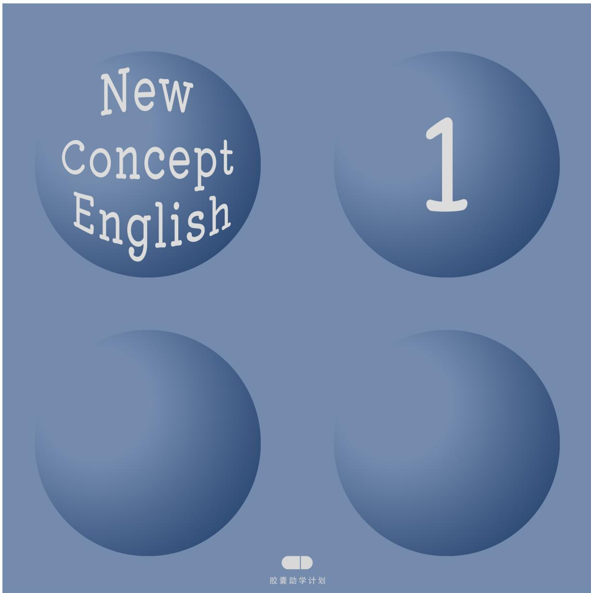

# 新概念英语第一册FIRST THINGS FIRST

课堂笔记&课后练习

  
本资料是依据「胶囊助学计划®」新概念英语第一册的视频录播课为基础整理编辑的。任何单位或个人不得盗版，转售或以任何形式以此获取经济利益，侵权必究。

## 使用指南

首先，非常开心大家能喜欢我们的课程。之前常常有学员询问有没有课后练习的电子版文件或者PPT文件，想要打印出来，方便学习。基于此，我们设计制作了这本专门针对我们的视频课程的学习手册(课程笔记和课后练习）。这本手册的内容设置和视频课程的学习顺序是完全吻合的。这样在学习视频的时候，省去做笔记的时间，可以更专注的听课，做知识点的标注。

除此之外，我们在每一个偶数课后设置了笔记页，笔记页采用了康奈尔笔记法的布局。Questions位置来记录你遇到的问题；Homework位置来完成你的课后作业；Summary & Recap位置来进行回忆和总结核心知识点。如右图所示。

本手册的所有权归胶囊助学计划所有，且为付费产品。我们只在胶囊助学计划的官方【淘宝】【微店】进行售卖，如果您是从除此之外的任何地方购买此商品，欢迎您告诉我们，并随手举报。

本作品售价：14.9RMB，且需要配合B站(哔哩哔哩)免费视频课程使用，在B站搜索“胶囊助学计划”或扫描下方二维码来学习。如果您是从任何地方免费获得此商品的，欢迎关注微信公众号：jiaonangzhuxue，以打赏的方式支持我们付出的辛苦，当然微信公众号中还有更多的学习资源免费提供给大家。

## 特别提醒

在制作的过程中难免有错误，欢迎指出。我们会做出调整。或者您有任何关于本手册的想法都可以发送E-mail告诉我们。

E-mail: capsuleacademy@icloud.com

It's never too late to learn.

<table><tr><td>1 2</td><td>3 4</td><td>5</td><td>6</td><td>7 8</td><td>9</td><td>10</td><td>11</td><td>12</td></tr><tr><td></td><td></td><td></td><td></td><td></td><td></td><td></td><td></td><td></td></tr><tr><td>13</td><td>14 15</td><td>16 17</td><td>18</td><td>19</td><td>20</td><td>21 22</td><td>23</td><td>24</td></tr><tr><td></td><td></td><td></td><td></td><td></td><td></td><td></td><td></td><td></td></tr><tr><td>25</td><td>26 27</td><td>28 29</td><td>30</td><td>31</td><td>32</td><td>33 34</td><td>35</td><td>36</td></tr><tr><td></td><td></td><td></td><td></td><td></td><td></td><td></td><td></td><td>48</td></tr><tr><td>37</td><td>38 39</td><td>40 41</td><td>42</td><td>43</td><td>44 45</td><td>46</td><td>47</td><td></td></tr><tr><td></td><td></td><td></td><td></td><td></td><td></td><td></td><td></td><td></td></tr><tr><td>49</td><td>50 51</td><td>52 53</td><td>54</td><td>55</td><td>56 57</td><td>58</td><td>59 60</td><td></td></tr><tr><td></td><td></td><td></td><td></td><td></td><td></td><td></td><td></td><td></td></tr><tr><td>61</td><td>62 63</td><td>64 65</td><td>66</td><td>67</td><td>68 69</td><td>70</td><td>71 72</td><td></td></tr><tr><td></td><td></td><td></td><td></td><td></td><td></td><td></td><td></td><td></td></tr><tr><td>73</td><td>74 75 76</td><td>77</td><td>78</td><td>79</td><td>80 81</td><td>82</td><td>83 84</td><td></td></tr><tr><td></td><td></td><td></td><td></td><td></td><td></td><td></td><td>96</td><td></td></tr><tr><td>85</td><td>86 87 88</td><td>89</td><td>90</td><td>91</td><td>92 93</td><td>94</td><td>95</td><td></td></tr><tr><td></td><td></td><td></td><td></td><td></td><td></td><td></td><td>108</td><td></td></tr><tr><td>97</td><td>98 99 100</td><td>101</td><td>102</td><td>103</td><td>104 105</td><td>106</td><td>107</td><td></td></tr><tr><td></td><td></td><td></td><td></td><td></td><td>117</td><td>118</td><td>119</td><td>120</td></tr><tr><td>109</td><td>110 111</td><td>112 113</td><td>114</td><td>115</td><td>116</td><td></td><td></td><td></td></tr><tr><td></td><td></td><td></td><td></td><td>127</td><td>129</td><td>130</td><td>131</td><td>132</td></tr><tr><td>121</td><td>122 123</td><td>124 125</td><td>126</td><td></td><td>128</td><td></td><td></td><td></td></tr><tr><td></td><td></td><td>137</td><td>138</td><td>139</td><td>140 141</td><td>142</td><td>143</td><td>144</td></tr><tr><td>133 134</td><td>135</td><td>136</td><td></td><td></td><td></td><td></td><td></td><td></td></tr><tr><td></td><td></td><td></td><td></td><td></td><td></td><td></td><td></td><td></td></tr></table>
