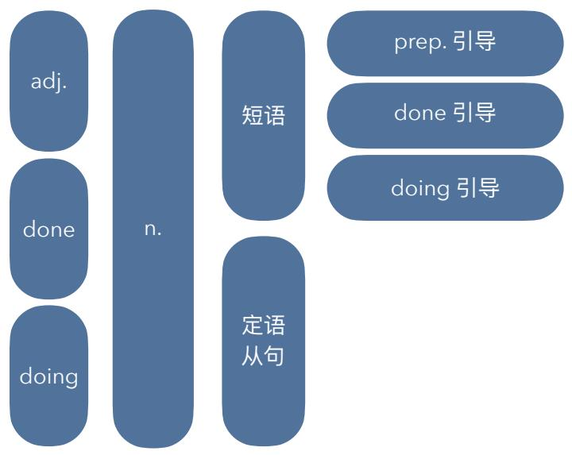

## I'tæksil taxi n.

I take a taxi   
2 If you take a taxi there, then you don't   
have to get up so early. L16   
3 It must be terrible to take a taxi in that city. L17   
4 The taxi which you took last night broke   
down this morning. L28

## /Iænd/ land v.

1 landed in the field/airfield   
2 The plane landed in the airfield an hour ago.   
3 did/when/why/where...   
4 The plane which has just landed in the field   
belongs to my family. L28

1 When they were ploughing the field, they saw a rare white tiger. L7   
2 After the farmer had ploughed the field, they cooked a meal over an open fire. L27 L14   
3 The farmer who had just ploughed the field is my father. L28

## I'lənlil lonely adj.

1 When I was in Auckland, I sometimes felt lonely. L7 2 a lonely village The man who grew up in a lonely village has lived in the big city for 10 years. L28 They will be driving to a lonely village. L13

## I wel ∫ l /weilz/ Welsh adj. Wales

<table><tr><td rowspan=4 colspan=1>单词造句指南</td><td rowspan=1 colspan=1>网: v.+v.变化</td><td rowspan=1 colspan=1>结合习惯用法</td></tr><tr><td rowspan=1 colspan=1>四句型转换</td><td rowspan=1 colspan=1>其他单词+词性</td></tr><tr><td rowspan=2 colspan=1>方式/地点/时间</td><td rowspan=1 colspan=1>原文摘抄+变</td></tr><tr><td rowspan=1 colspan=1>6123456</td></tr></table>

## /ru:f1 roof n.

1 landed on the roof   
2 The plane landed on the roof.   
3 How did the plane land on the roof?   
4 The man who is repairing the roof is my brother. L28   
5 The children were telling stories on the roof earlier. L27

## /flæt/  /əpα:tmənt/ /blp k/ flat n. apartment block n.

1 The man who owns ten flats in the city   
decided to go on trip by himself. L28 L22   
2 This flat must have been cleaned last night. L21   
3 It's a pity that she sold that apartment. L19   
4 The museum is just six blocks away.

## /'dezət/  /di'z3:t/ desert n. desert v.

1 It has been deserted for some time. L10   
2 Has it been deserted for some time?   
3 How long has it been deserted?   
4 Have you ever been to the desert?

• take a taxi

The taxi’ is a small Swiss airplane called a Pilatus Porter’.

on a ploughed field

deserted car park

通常表被动一般/被动完成

a broken cup

= the cup that has been broken boiled water

= water that has been boiled

偶尔表示主动完成

fallen leaves = leaves that have fallen

a retired captain

= a captain who has retired a married man

= a man that has married

位置: 单词(done) + n. + done引|导的短语

Questions Homework   
Summary & Recap   
Questions Homework   
Summary & Recap

## doing 现在分词做定语：主动进行/主动一般

the sinking ship=the ship that is sinking the rising sun=the sun that is rising the sleeping child=the child who is sleeping I like the girl dancing with that guy.

## I'peledl polo n.

1 water polo   
2 The man who likes to play water polo   
complains about the weather all the time. L28   
3 Either his father or his grandfather plays   
water polo. L25   
4 He decided to learn water polo last summer. L22

/ weill Wayle n.

## /k^tl cut cut cut v.

1 That river cuts across the park.   
2 does/where...   
3 Don't cut yourself.   
4 He cut himself yesterday.   
5 did/who/when...

## Irəul

## row v.

1 When they were rowing on the river, it began to rain. L7 2 Where were they? I don't know. They may have been rowing on the river. L19 3 My brother is keen on rowing on the river. L20

/kIk/   
kick v.   
1 [Story:] One of the children kicked a ball very hard. 2 did/who/why/how hard/when...   
3 kick his ass

<table><tr><td rowspan=4 colspan=1>单词造句指南</td><td rowspan=1 colspan=1>网： v.+v.变化</td><td rowspan=1 colspan=1>结合习惯用法</td></tr><tr><td rowspan=1 colspan=1>四句型转换</td><td rowspan=1 colspan=1>其他单词+词性</td></tr><tr><td rowspan=2 colspan=1>方式/地点/时间</td><td rowspan=1 colspan=1>原文摘抄+变</td></tr><tr><td rowspan=1 colspan=1>6123456</td></tr></table>

## /təwo:dz/ towards prep.

1 They walked towards that park. 2 did/where/who... 3 When I got home last night, my son and my dog ran towards me. It feels so good.

## I'nIəlil nearly

## /sait/ sight n.

1 in sight / out of sight   
2 No one is in sight.   
3 Everyone is out of sight.   
4 It's too late. There aren't any car in sight.

• kick his ass
