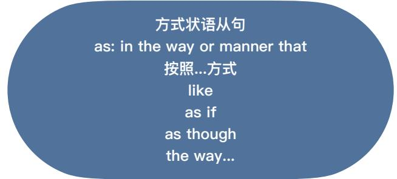

## 62 Story+Expressions

<table><tr><td rowspan="5">• A short time before • for miles around • In place of...</td><td rowspan="5">习惯 用法 造句 指南</td><td>网: v.+v.变化</td><td>其他习惯用法</td></tr><tr><td></td><td></td></tr><tr><td>四句型转换</td><td>其他单词+词性</td></tr><tr><td>方式/地点/时间</td><td>原文摘抄+变</td></tr><tr><td></td><td>6123456</td></tr></table>

## A short time before

A short time before, Leo removed the gate. L59

A short time before, you threatened me with a gun. L61

Although, I had lunch a short time before, still, I am very hungry right now.

## for/from miles around

It's the only place to get gas for miles around here.

People used to come from miles around to buy our pictures. L31

There aren't any hotels for miles around here.

## In place of...

"If I don't go, who's gonna go in place of me?" That's what he said.

The Clique (2008) L16

In place of beer, can you grab a coffee for me? L61

In place of my dad, my wife trained our dog to open the gate. L59

Questions Homework   
Summary & Recap   
Questions Homework   
Summary & Recap

## I's3:kəl/ circle n.

1 a large circle of friends... 2 When I was young, my parents would invite their small circle of friends. L55 3 We don't have the same circle of friends. 4 Why don't you have the same circle of friends? You stay together all the time.

## ləd'maiəl admire v.

1 admire sb. for sth/doing sth...   
2 I admire you for that. Unforgiven (1992)   
3 I really admire you for the work (you do).   
Beyond Borders (2003)   
4 I admire you for caring so much.

## /kləuzl close adj.

1 close friend

2 We were close. Were you close? why weren't ... 3 We had been working together for years before we became very close friends. L62 4 For centuries close circle of friends almost always lived together, but things have changed now. L62

## Iwedin / wedding n.

1 It was a wonderful wedding, wasn't it?

2 It's too late to ask her for help with my wedding.

3 wedding gift/present/ring

4 I'll buy you a wedding present.

5 Don't you threaten me with my wedding ring. L62

<table><tr><td rowspan=4 colspan=1>单词造句指南</td><td rowspan=1 colspan=1>网: v.+v.变化</td><td rowspan=1 colspan=1>结合习惯用法</td></tr><tr><td rowspan=1 colspan=1>四句型转换</td><td rowspan=1 colspan=1>其他单词+词性</td></tr><tr><td rowspan=2 colspan=1>方式/地点/时间</td><td rowspan=1 colspan=1>原文摘抄+变</td></tr><tr><td rowspan=1 colspan=1>6123456</td></tr></table>

## /ri'sep∫ən/ reception n.

1 I will see you at the reception.

2 Excuse me, where is the reception?

3 I saw them fighting at the reception last night.

4 did/who/why/where/when.

## /s0:t/ sort n.

1 what sort of / what kind of ...

2 What sort of questions will they ask?

Beautiful Thing (1996)

3 What sort of a life would I have without you? Maurice (1987)

4 all sorts of / all kinds of .

5 I tell him all sorts of things about you.

• a large circle of friends

• admire sb. for sth/doing sth.

• close friend

• at the reception

• what sort of / what kind of...

• all sorts of / all kinds of...

2. 反复听电影片段，直到能听出关键短语/句子

方式状语从句  
as: in the way or manner that  
按照...方式

1. Jeremy was a little disappointed by this but he did as his daughter asked. 2. When in Roma, do as the Romans do. 3. We must do as the doctor tells us.

as: in the way or manner that You'll do as I say and ask no questions. L.A. Confidential (1997)

Please, let me do as this Egyptian suggests. Joseph (1995)

Now do as I told you. A Simple Wish (1997)

I did as Dracula instructed. I wrote three letters. Bram Stoker's Dracula (1992)

主谓宾定状补同?   
She must have more certainty than I   
did as a child. L31   
Queen of Katwe (2016)

By day, the children did as they were told. Come Away (2020)

She said unless I did as they asked, they would kill Lucy.   
Sharpe's Battle (1995) If you value his life, I suggest everyone does as they're told.   
Miss Peregrine's Home for Peculiar Children (2016) Carter always does as he's told. He's a good boy.   
Raising Cain (1992)
