## CONTENTS 目录

To the teacher and student
Learning a foreign language in the classroom
About this course
How to use this course
致教师和学生
外语的课堂教学
关于本教材的说明
本教材使用说明
Lesson 1 Excuse me! 对不起！
Lesson 2 Is this your ...? 这是你的……吗？
Lesson 3 Sorry, sir. 对不起，先生。
Lesson 4 Is this your ...? 这是你的……吗？
Lesson 5 Nice to meet you. 很高兴见到你。
Lesson 6 What make is it? 它是什么牌子的？
Lesson 7 Are you a teacher? 你是教师吗？
Lesson 8 What's your job? 你是做什么工作的？
Lesson 9 How are you today? 你今天好吗？
Lesson 10 Look at ... 看……
Lesson 11 Is this your shirt? 这是你的衬衫吗？
Lesson 12 Whose is this ...? This is my/your/his/her ... 这……是谁的？这是我的／你的／他的／她的……
Whose is that ...? That is my/your/his/her ... 那……是谁的？那是我的／你的／他的／她的……
Lesson 13 A new dress 一件新连衣裙
Lesson 14 What colour is your ...? 你的……是什么颜色的？
Lesson 15 Your passports, please. 请出示你们的护照。
Lesson 16 Are you ...? 你是……吗？
Lesson 17 How do you do? 你好！
Lesson 18 What are their jobs? 他们是做什么工作的？
Lesson 19 Tired and thirsty 又累又渴
Lesson 20 Look at them! 看看他／它们！
Lesson 21 Which book? 哪一本书？
Lesson 22 Give me/him/her/us/them a ... 给我／他／她／我们／他们一……、
Which one? 哪一……？
Lesson 23 Which glasses? 哪几只杯子？
Lesson 24 Give me/him/her/us/them some ... 给我／他／她／我们／他们一些……
Which ones? 哪些？
Lesson 25 Mrs. Smith's kitchen 史密斯太太的厨房
Lesson 26 Where is it? 它在哪里？
Lesson 27 Mrs. Smith's living room 史密斯太太的客厅
Lesson 28 Where are they? 它们在哪里？
Lesson 29 Come in, Amy. 进来，艾米。
Lesson 30 What must I do? 我应该做什么？

Lesson 31 Where's Sally? 萨莉在哪里？
Lesson 32 What's he/she/it doing? 他／她／它正在做什么？
Lesson 33 A fine day 晴天
Lesson 34 What are they doing? 他们在做什么？
Lesson 35 Our village 我们的村庄
Lesson 36 Where ...? ……在哪里？
Lesson 37 Making a bookcase 做书架
Lesson 38 What are you going to do? 你准备做什么？
What are you doing now? 你现在正在做什么？
Lesson 39 Don't drop it! 别摔了！
Lesson 40 What are you going to do? 你准备做什么？
I'm going to ... 我准备……
Lesson 41 Penny's bag 彭妮的提包
Lesson 42 Is there a ... in/on that ...? 在那个……中／上有一个……吗？
Is there any ... in/on that ...? 在那个……中／上有……吗？
Lesson 43 Hurry up! 快点！
Lesson 44 Are there any ...? 有些……吗？
Is there any ...? 有些……吗？
Lesson 45 The boss's letter 老板的信
Lesson 46 Can you ...? 你能……吗？
Lesson 47 A cup of coffee 一杯咖啡
Lesson 48 Do you like ...? 你喜欢……吗？
Do you want ...? 你想要……吗？
Lesson 49 At the butcher's 在肉店
Lesson 50 He likes ... 他喜欢……
But he doesn't like ... 但是他不喜欢……
Lesson 51 A pleasant climate 宜人的气候
Lesson 52 What nationality are they? 他们是哪国人？
Where do they come from? 他们来自哪个国家？
Lesson 53 An interesting climate 有趣的气候
Lesson 54 What nationality are they? 他们是哪国人？
Where do they come from? 他们来自哪个国家？
Lesson 55 The Sawyer family 索耶一家人
Lesson 56 What do they usually do? 他们通常做什么？
Lesson 57 An unusual day 很不平常的一天
Lesson 58 What's the time? 几点钟？
Lesson 59 Is that all? 就这些吗？
Lesson 60 What's the time? 几点钟？
Lesson 61 A bad cold 重感冒
Lesson 62 What's the matter with them? 他们怎么啦？
What must they do? 他们该怎么办？
Lesson 63 Thank you, doctor. 谢谢你，医生。
Lesson 64 Don't ...! 不要……！
You mustn't ...! 你不应该……！
Lesson 65 Not a baby 不是一个孩子
Lesson 66 What's the time? 几点钟？
Lesson 67 The weekend 周末

Lesson 68 What's the time? 几点钟？
Lesson 69 The car race 汽车比赛
Lesson 70 When were they there? 他们是什么时候在那里的？
Lesson 71 He's awful! 他讨厌透了！
Lesson 72 When did you ...? 你什么时候……？
Can you do this test? 你能完成以下测试吗？
Lesson 73 The way to King Street 到国王街的走法
Lesson 74 What did they do? 他们干了什么？
Lesson 75 Uncomfortable shoes 不舒适的鞋子
Lesson 76 When did you ...? 你什么时候……？
Lesson 77 Terrible toothache 要命的牙痛
Lesson 78 When did you ...? 你什么时候……？
Lesson 79 Carol's shopping list 卡罗尔的购物单
Lesson 80 I must go to the ... 我必须去……
Lesson 81 Roast beef and potatoes 烤牛肉和土豆
Lesson 82 I had ... 我吃（喝、从事）了……
Lesson 83 Going on holiday 度假
Lesson 84 Have you had ...? 你已经……了吗？
Lesson 85 Paris in the spring 巴黎之春
Lesson 86 What have you done? 你已经做了什么？
Lesson 87 A car crash 车祸
Lesson 88 Have you ... yet? 你已经……了吗？
Lesson 89 For sale 待售
Lesson 90 Have you ... yet? 你已经……了吗？
Lesson 91 Poor Ian! 可怜的伊恩！
Lesson 92 When will ...? 什么时候要……？
Lesson 93 Our new neighbour 我们的新邻居
Lesson 94 When did you/will you go to ...? 你过去／将在什么时候去……？
Lesson 95 Tickets, please. 请把车票拿出来。
Lesson 96 What's the exact time? 确切的时间是几点？
Lesson 97 A small blue case 一只蓝色的小箱子
Lesson 98 Whose is it? 它是谁的？
Whose are they? 它们是谁的？
Lesson 99 Ow! 啊哟！
Lesson 100 He says that ... She says that ... They say that ... 他/她/他们说……
Lesson 101 A card from Jimmy 吉米的明信片
Lesson 102 He says he ... She says she ... They say they ... 他/她/他们说他/她/他们……
Lesson 103 The French test 法语考试
Lesson 104 Too, very, enough 太、非常、足够
Lesson 105 Full of mistakes 错误百出
Lesson 106 I want you/him/her/them to ... 我要你/他/她/他们……
Tell him/her/them to ... 告诉他/她/他们……
Lesson 107 It's too small. 太小了。
Lesson 108 How do they compare? 它们的比较级和最高级是什么？
Lesson 109 A good idea 好主意
Lesson 110 How do they compare? 它们的比较级和最高级是什么？
Lesson 111 The most expensive model 最昂贵的型号

Lesson 112 How do they compare? 它们的比较级和最高级是什么？ 227
Lesson 113 Small changes 零钱 229
Lesson 114 I've got none. 我没有。 231
Lesson 115 Knock, knock! 敲敲门！ 233
Lesson 116 Every, no, any and some 每一、无、若干和一些 235
Lesson 117 Tommy's breakfast 汤米的早餐 237
Lesson 118 What were you doing? 你那时正在做什么？ 239
Lesson 119 A true story 一个真实的故事 241
Lesson 120 It had already happened. 它已经发生了。 243
Lesson 121 The man in a hat 戴帽子的男士 245
Lesson 122 Who (whom), which and that 关系代词 247
Lesson 123 A trip to Australia 澳大利亚之行 249
Lesson 124 (Who) / (whom), (which) and (that) 关系代词 251
Lesson 125 Tea for two 两个人一起喝茶 253
Lesson 126 Have to and do not need to 不得不和不必要 255
Lesson 127 A famous actress 著名的女演员 257
Lesson 128 He can't be ... 他不可能…… 259
He must be ... 他肯定是……
Lesson 129 Seventy miles an hour 时速70英里 261
Lesson 130 He can't have been ... 他那时不可能…… 263
He must have been ... 他那时肯定是……
Lesson 131 Don't be so sure! 别那么肯定！ 265
Lesson 132 He may be ... 他可能是…… 267
He may have been ... 他可能已经……
I'm not sure. 我不敢肯定。
Lesson 133 Sensational news! 爆炸性新闻！ 269
Lesson 134 He said (that) he ... 他曾说他…… 271
He told me (that) he ... 他曾告诉我说他……
Lesson 135 The latest report 最新消息 273
Lesson 136 He said (that) he ... 他（曾）说他…… 275
He told me (that) he ... 他（曾）告诉我说他……
Lesson 137 A pleasant dream 美好的梦 277
Lesson 138 If ... 如果…… 279
Lesson 139 Is that you, John? 是你吗，约翰？ 281
Lesson 140 He wants to know if/why/what/when 他想知道是否／为什么／什么／什么时候 283
Lesson 141 Sally's first train ride 萨莉第一次乘火车旅行 285
Lesson 142 Someone invited Sally to a party. 有人邀请萨莉出席一个聚会。 287
Sally was invited to a party. 萨莉应邀出席一个聚会。
Lesson 143 A walk through the woods 林中散步 289
Lesson 144 He hasn't been served yet. 还没有人来侍候他。 291
He will be served soon. 很快会有人来侍候他的。
Appendix 1: Personal names 附录1：人名中英文对照表 293
Appendix 2: Geographical names 附录2：地名中英文对照表 294
Appendix 3: Phonetic symbols 附录3：英语音标 295

6

## Lesson 1 Excuse me! 对不起!

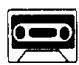

Listen to the tape then answer this question. Whose handbag is it? 听录音，然后回答问题。这是谁的手袋？

Excuse me!

  
Yes?

  
Is this your handbag?

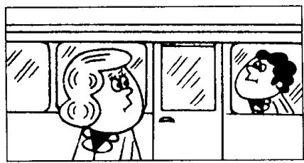

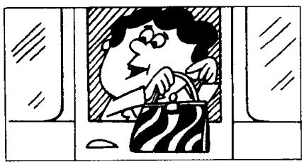

  
Thank you very much.

## New words and expressions 生词和短语

excuse /ɪksˈkjuːz/ v. 原谅

me /mɪː/ pron. 我（宾格）

handbag /'hændbæg/ n. （女用）手提包

yes /jes/ adv. 是的

pardon /'pɑːdn/ int. 原谅，请再说一遍

is /ɪz/ v. be 动词现在时第三人称单数

it /ɪt/ pron. 它

this /ðɪs/ pron. 这

thank you /'θæŋk-ju:/ 感谢你（们）

your /jɔː/ possessive adjective 你的，你们的

very much /'veri-mʌtʃ/ 非常地

## Notes on the text 课文注释

## 1 Excuse me.

这个短语常用于与陌生人搭话，打断别人的说话或从别人身边挤过。在课文中，男士为了吸引女士的注意力而用了这个表示客套的短语。

## 2 Pardon?

全句为 I beg your pardon. 意思是请求对方把刚才讲过的话重复一遍。

参考译文

对不起。

什么事？

这是您的手提包吗？

对不起，请再说一遍。

这是您的手提包吗？

是的，是我的。

非常感谢！

## Lesson 2 Is this your...? 这是你的……吗？

Listen to the tape and do the exercises.

听录音并回答问题。

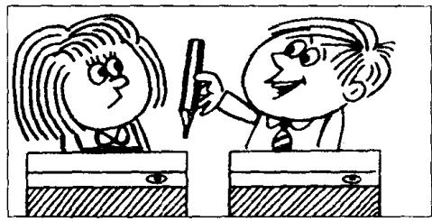  
3

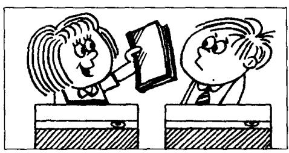

  
5

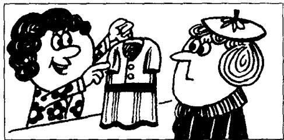  
7

  
8

  
9

  
10

## New words and expressions 生词和短语

pen /pen/ n. 钢笔

dress /dres/ n. 连衣裙

pencil /'pensəl/ n. 铅笔

skirt /skɜːt/ n. 裙子

book /bʊk/ n. 书

watch /wɒtʃ/ n. 手表

shirt /ʃɜːt/ n. 衬衣

coat /kəʊt/ n. 上衣，外衣

car /kɑː/ n. 小汽车

house /haʊs/ n. 房子

## Written exercise 书面练习

Copy these sentences.

抄写以下句子。

Excuse me!

Yes?

Is this your handbag?

Pardon?

Is this your handbag?

Yes, it is.

Thank you very much.

## Lesson 3 Sorry, sir. 对不起，先生。

Listen to the tape then answer this question. Does the man get his umbrella back?

听录音，然后回答问题。这位男士有没有要回他的雨伞？

My coat and my umbrella please.

Here is my ticket.

Thank you, sir.
Number five.

Here's your umbrella and your coat.

This is not my umbrella.
Sorry, sir.

Is this your umbrella? No, it isn't.

Is this it?
Yes, it is.
Thank you very much.

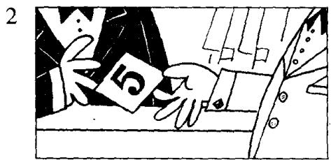

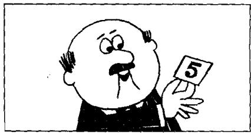

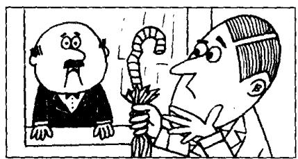

## New words and expressions 生词和短语

umbrella /ʌm'brelə/ n. 伞

number /'nʌmbə/ n. 号码

please /pliːz/ int. 请

five /faɪv/ num. 五

here /hɪə/ adv. 这里

sorry /'spri/ adj. 对不起的

my /maɪ/ possessive adjective 我的

ticket /'tɪkɪt/ n. 票

sir /sɜː/ n. 先生

cloakroom /'kləʊkrʊm/ n. 衣帽存放处

## Notes on the text 课文注释

1 Here's 是 Here is 的缩写形式，类似的例子有 He's (He is), It's (It is) 等。缩写形式和非缩写形式在英语的书面用语和口语中均有，但非缩写形式常用于比较正式的场合。

2. Sorry = I'm sorry. 这是口语中的缩略形式，用于社交场合，向他人表示歉意。

3 sir, 先生，这是英美人对不相识的男子、年长者或上级的尊称。

4 Is this it?

本句中 it 是指 your umbrella。由于前面提到了，后面就用代词 it 来代替，以免重复。

## 参考译文

请把我的大衣和伞拿给我。

这是我（寄存东西）的牌子。

谢谢，先生。

是5号。

这是您的伞和大衣。

这不是我的伞。

对不起，先生。

这把伞是您的吗？

不；不是！

这把是吗？

是，是这把。

非常感谢。

## Lesson 4 Is this your...? 这是你的……吗？

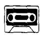

Listen to the tape and answer the questions.
听录音并回答问题。

  
Is this your pen?

  
Is this your pencil?

  
Is this your book?

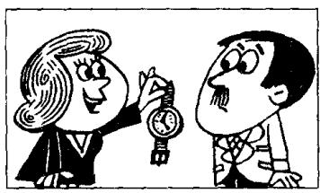  
Is this your watch?

  
Is this your coat?

  
Is this your dress?

  
Is this your skirt?

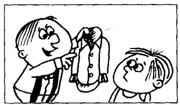  
Is this your shirt?

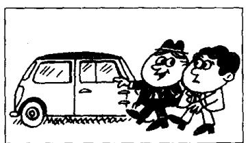  
Is this your car?  
10

  
Is this your house?

  
Is this your suit?

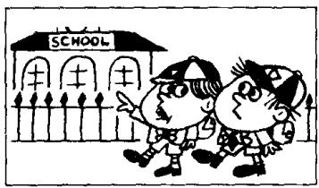  
Is this your school?  
13

  
Is this your teacher?

  
Is this your son?

  
Is this your daughter?

## New words and expressions 生词和短语

suit /suːt/ n. 一套衣服

school /skuːl/ n. 学校

son /sʌn/ n. 儿子
daughter /'dɔːtə/ n. 女儿 teacher /'tiːtʃə/ n. 老师

## Written exercises 书面练习

A Copy these sentences.
抄写以下句子。

This is not my umbrella.

Sorry, sir.

Is this your umbrella?

No, it isn't!

B Answer these questions.
模仿例句回答以下问题。

Example:

Is this your umbrella?
No. It isn't my umbrella. It's your umbrella.

1 Is this your pen?

2 Is this your pencil?

3 Is this your book?

4 Is this your watch?

5 Is this your coat?

6 Is this your dress?

7 Is this your skirt?

8 Is this your shirt?

9 Is this your car?

10 Is this your house?

## Lesson 5 Nice to meet you. 很高兴见到你。

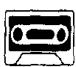

Listen to the tape then answer this question. Is Chang-woo Chinese? 听录音，然后回答问题。昌宇是中国人吗？

MR. BLAKE : Good morning.

STUDENTS : Good morning, Mr. Blake.

MR. BLAKE : This is Miss Sophie Dupont.
Sophie is a new student.
She is French.

MR. BLAKE : Sophie, this is Hans.
He is German.

HANS : Nice to meet you.

MR. BLAKE: And this is Naoko.
She's Japanese.

NAOKO: Nice to meet you.

MR. BLAKE: And this is Chang-woo.
He's Korean.

CHANG-WOO : Nice to meet you.

MR. BLAKE: And this is Luming.
He's Chinese.

LUMING : Nice to meet you.

MR. BLAKE: And this is Xiaohui.
She's Chinese, too.

XIAOHUI : Nice to meet you.

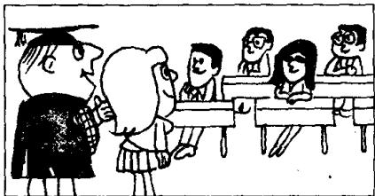

## New words and expressions 生词和短语

Mr. /'mɪstə/ 先生

German /'dʒɜːmən/ adj. & n. 德国人

good /gʊd/ adj. 好

nice /nais/ adj. 美好的

morning /'mɔːnɪŋ/ n. 早晨

meet /miːt/ v. 遇见

Miss /mɪs/ 小姐

Japanese /dʒæp'niːz/ adj. & n. 日本人

new /njuː/ adj. 新的

Korean /kəˈriən/ adj. & n. 韩国人

student /'stju:dənt/ n. 学生

French /frentʃ/ adj. & n. 法国人

Chinese /ˌtʃaɪˈniːz/ adj. & n. 中国人

too /tuː/ adv. 也

## Notes on the text 课文注释

1 Good morning.

早上好。英语中常见的问候用语。

2 This is Miss Sophie Dupont.

一般用于将某人介绍给他人的句式。一般指未婚女子。

3 Nice to meet you.

用于初次与同学、朋友见面等非正式场合。正式的场合常用 How do you do?

## 参考译文

布莱克先生：早上好。

学生：早上好，布莱克先生。

布莱克先生：这位是索菲娅·杜邦小姐。索菲娅是个新学生。她是法国人。

布莱克先生：索菲娅，这位是汉斯。他是德国人。

汉斯：很高兴见到你。

布莱克先生：这位是直子。她是日本人。

直子：很高兴见到你。

布莱克先生：这位是昌宇。他是韩国人。

昌宇：很高兴见到你。

布莱克先生：这位是鲁明。他是中国人。

鲁明：很高兴见到你。

布莱克先生：这位是晓惠。她也是中国人。

晓惠：很高兴见到你。

10

## Lesson 6 What make is it? 它是什么牌子的？

Listen to the tape and answer the questions.

听录音并回答问题。

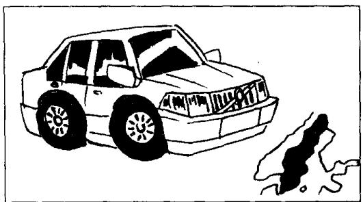  
It's a Volvo. (Swedish)

  
It's a Peugeot. (French)

  
It's a Mercedes. (German)

  
It's a Toyota. (Japanese)  
12

  
It's a Daewoo. (Korean)

  
It's a Mini. (English)

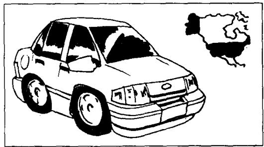  
It's a Ford. (American)

  
It's a Fiat. (Italian)

## New words and expressions 生词和短语

make /meɪk/ n. (产品的) 牌号

Mercedes /mə'seɪdiːz/ n. 梅赛德斯

Swedish /'swi:dɪʃ/ adj. 瑞典的

Toyota /'təʊjəʊtə/ n. 丰田

English /'ɪŋɡlɪʃ/ adj. 英国的

Daewoo /'da:wu:/ n. 大宇

American /əˈmerɪkən/ adj. 美国的

Mini /'mɪni/ n. 迷你

Italian /ɪˈtæliən/ adj. 意大利的

Ford /fɔːd/ n. 福特

Volvo /'vɒlvəʊ/ n. 沃尔沃

Peugeot /'pɜːʒəʊ/ n. 标致

Fiat /'fiːæt/ n. 菲亚特

## Written exercises 书面练习

A Complete these sentences using He, She or It. 完成以下句子，用 He, She 或 It 填空。

Examples:

Stella is a student. \_\_\_\_ isn't German. \_\_\_\_ is Spanish.

Stella is a student. She isn't German. She is Spanish.

Alice is a student. \_\_\_\_ isn't German. \_\_\_\_ is French.

This is her car. \_\_\_\_ is a French car.

Hans is a student. \_\_\_\_ isn't French. \_\_\_\_ is German.

This is his car. \_\_\_\_ is a German car.

B Write questions and answers using He, She, It, a or an.

模仿例句写出相应的疑问句，并回答。选用 He, She, It, a 或 an 等词。

## Examples:

This is Miss Sophie Dupont. French/(Swedish)

Is she a French student or a Swedish student?

She isn't a Swedish student. She's a French student.

This is a Volvo. Swedish/(French)

Is it a Swedish car or a French car?

It isn't a French car. It's a Swedish car.

1 This is Naoko. Japanese/(German)

7 This is a Fiat. Italian/(English)

2 This is a Peugeot. French/(German)

8 This is Luming. Chinese/(English)

3 This is Hans. German/(Italian)

9 This is a Mercedes. German/(French)

4 This is Xiaohui. Chinese/(Italian)

10 This is a Toyota. Japanese/(Chinese)

5 This is a Mini. English/(American)

11 This is a Ford. American/(English)

6 This is Chang-woo. Korean/(Japanese)

12 This is a Daewoo. Korean/(Japanese)

## Lesson 7 Are you a teacher? 你是教师吗？

Listen to the tape then answer this question. What is Robert's job? 听录音，然后回答问题。罗伯特是做什么工作的？

ROBERT: I am a new student. My name's Robert.

SOPHIE : Nice to meet you.
My name's Sophie.

ROBERT : Are you French?

SOPHIE : Yes, I am.

SOPHIE : Are you French, too?

ROBERT: No, I am not.

SOPHIE : What nationality are you?

ROBERT : I'm Italian.

ROBERT: Are you a teacher?

SOPHIE : No, I'm not.

ROBERT: What's your job?

SOPHIE : I'm a keyboard operator.

SOPHIE: What's your job?

ROBERT: I'm an engineer.

## New words and expressions 生词和短语

I /aɪ/ pron. 我

nationality /ˌnæʃəˈnælɪti/ n. 国籍

am /æm/ v. be 动词现在时第一人称单数

job /dʒɒb/ n. 工作

are /ɑː/ v. be 动词现在时复数

keyboard /'ki:bɔ:d/ n. 电脑键盘

name /neɪm/ n. 名字

what /wɒt/ adj. & pron. 什么

operator /'ɒpəreɪtə/ n. 操作人员

engineer /endʒɪˈniə/ n. 工程师

## Notes on the text 课文注释

1 My name's = My name is.

2 I'm /aɪm/ = I am.

口语中经常使用这种缩略形式。

3 What's your job? 你是做什么工作的?

What's = What is.

4 What nationality are you?

用来询问对方国籍。也可以问 Where are you from?

## 参考译文

罗伯特：我是个新学生，我的名字叫罗伯特。

索菲娅：很高兴见到你。我的名字叫索菲娅。

罗伯特：你是法国人吗？

索菲娅：是的，我是法国人。

索菲娅：你也是法国人吗？

罗伯特：不，我不是。

索菲娅：你是哪国人？

罗伯特：我是意大利人。

罗伯特：你是教师吗？

索菲娅：不，我不是。

罗伯特：你是做什么工作的？

索菲娅：我是电脑录入员。

索菲娅：你是做什么工作的？

罗伯特：我是工程师。

## Lesson 8 What's your job? 你是做什么工作的？

Listen to the tape then answer the questions.

听录音并回答问题。

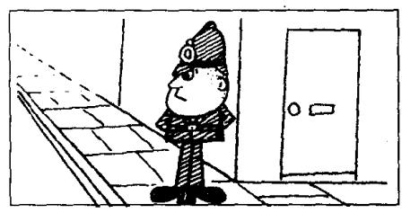  
I'm a policeman.

  
I'm a policewoman.

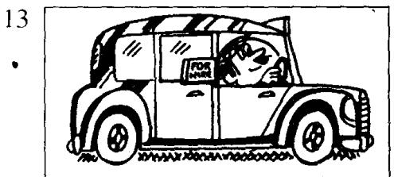  
I'm a taxi driver.

  
I'm an air hostess.

  
.I'm a postman.

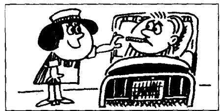  
I'm a nurse.

  
I'm a mechanic.

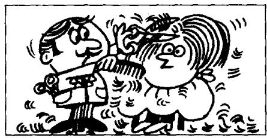  
I'm a hairdresser.  
19

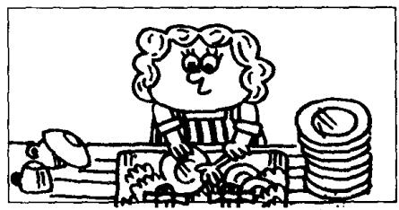  
I'm a housewife.

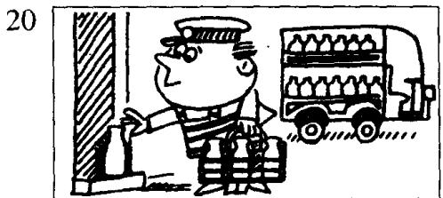  
I'm a milkman.

## New words and expressions 生词和短语

policeman /pəˈliːsmən/ n. 警察

nurse /nɜːs/ n. 护士

policewoman /pəˈliːsˌwʊmən/ n. 女警察

mechanic /mɪˈkænɪk/ n. 机械师

taxi driver /'tæksi-'draɪvə/ 出租汽车司机

hairdresser /'heə,dresə/ n. 理发师

air hostess /'eə-'həʊstəs/ 空中小姐

housewife /'haʊswaɪf/ n. 家庭妇女

postman /'pəʊstmən/ n. 邮递员

milkman /'mɪlkmən/ n. 送牛奶的人

## Written exercises 书面练习

A Complete these sentences using am or is.

完成以下句子，用 $am$ 或 $is$ 填空。

Example:

My name \_\_\_\_ Xiaohui. I \_\_\_\_ Chinese.

My name is Xiaohui. I am Chinese.

1 My name \_\_\_\_ Robert. I \_\_\_\_ a student. I \_\_\_\_ Italian.

2 Sophie \_\_\_\_ not Italian. She \_\_\_\_ French.

3 Mr. Blake \_\_\_\_ my teacher. He \_\_\_\_ not French.

B Write questions and answers using his, her, he, she, a or an.

模仿例句写出相应的疑问句，并回答。选用 his, her, he, she, a 或 an 等词。

Examples:

keyboard operator

What's her job? Is she a keyboard operator? Yes, she is.

engineer

What's his job? Is he an engineer? Yes, he is.

1 policeman

6 nurse

2 policewoman

7 mechanic

3 taxi driver

8 hairdresser

4 air hostess

5 postman

9 housewife

10 milkman

## Lesson 9 How are you today? 你今天好吗？

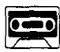

Listen to the tape then answer this question. How is Emma? 听录音，然后回答问题。埃玛身体好吗？

STEVEN : Hello, Helen.

HELEN : Hi, Steven.

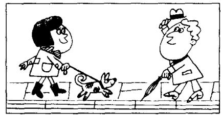

STEVEN: How are you today?

HELEN: I'm very well, thank you. And you?

STEVEN: I'm fine, thanks.

STEVEN: How is Tony?

HELEN: He's fine, thanks. How's Emma?

STEVEN: She's very well, too, Helen.

STEVEN: Goodbye, Helen.
Nice to see you.

HELEN : Nice to see you, too, Steven. Goodbye.

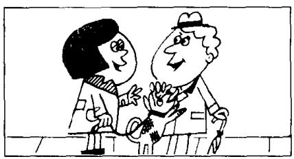

## New words and expressions 生词和短语

hello /hə'ləʊ/ int. 喂（表示问候）

fine /faɪn/ adj. 美好的

hi /haɪ/ int. 喂，嗨

thanks /θæŋks/ int. 谢谢

how /haʊ/ adv. 怎样

goodbye /'gʊd'bai/ int. 再见

today /tə'dcɪ/ adv. 今天

well /wel/ adj. 身体好

see /siː/ v. 见

## Notes on the text 课文注释

1 How are you?

这是朋友或相识的人之间见面时间对方身体情况的寒暄话，一般回答是：Fine, thank you.

2 And you? 即 And how are you? 的简略说法。

3 Nice to see you. 是 It's nice to see you. 的简略说法。

这一句也是见面时的客气话，一般回答是：Nice to see you, too. 见到你，我也很高兴。也可说：Nice to meet you. 很高兴遇到你。

## 参考译文

史蒂文：你好，海伦。

海伦：你好，史蒂文。

史蒂文：你今天好吗？

海伦：很好，谢谢你。你好吗？

史蒂文：很好，谢谢。

史蒂文：托尼好吗？

海伦：他很好，谢谢。埃玛好吗？

史蒂文：她也很好，海伦。

史蒂文：再见，海伦。见到你真高兴。

海伦：我见到你也很高兴，史蒂文。再见。

19

12

## Lesson 10 Look at... 看

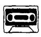

Listen to the tape and answer the questions.

听录音并回答问题。

11

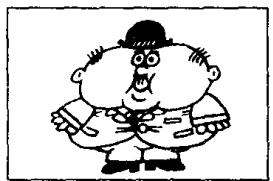  
that man!
(fat)

  
that woman!
(thin)

  
that policeman!
(tall)  
14

  
that policewoman!
(short)

  
that mechanic!
(dirty)

  
that nurse!
(clean)

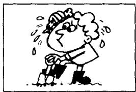  
Steven!
(hot)  
18

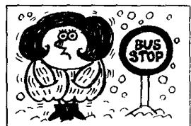  
Emma!
(cold)

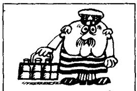  
that milkman!
(old)  
20

  
that air hostess!
(young)  
21

  
that hairdresser!
(busy)  
22

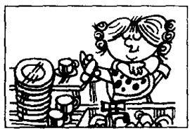  
that housewife!
(lazy)

## New words and expressions 生词和短语

fat /fæt/ adj. 胖的

hot /hɒt/ adj. 热的

woman /'wʊmən/ n. 女人

cold /kəʊld/ adj. 冷的

thin /θɪn/ adj. 瘦的

old /əʊld/ adj. 老的

tall /tɔːl/ adj. 高的

young /jʌŋ/ adj. 年轻的

short /ʃɔːt/ adj. 矮的

dirty /'dʒ:ti/ adj. 脏的

busy /'bɪzi/ adj. 忙的

clean /kliːn/ adj. 干净的

lazy /'leɪzi/ adj. 懒的

## Written exercises 书面练习

A Complete these sentences using He's, She's or It's.

完成以下句子，用 He's, She's 或 It's 填空。

## Example:

Robert isn't a teacher. \_\_\_\_ an engineer.

Robert isn't a teacher. He's an engineer.

1 Mr. Blake isn't a student. \_\_\_\_ a teacher.

2 This isn't my umbrella. \_\_\_\_ your umbrella.

3 Sophie isn't a teacher. \_\_\_\_ a keyboard operator.

4 Steven isn't cold. \_\_\_\_ hot.

5 Naoko isn't Chinese. \_\_\_\_ Japanese.

6 This isn't a German car. \_\_\_\_ a Swedish car.

## B Write sentences using He or She.

模仿例句写出相应的句子。

Example:

Helen/well

Look at Helen. She's very well.

1 man/fat

7 Steven/hot

2 woman/thin

8 Emma/cold

3 policeman/tall

9 milkman/old

4 policewoman/short

10 air hostess/young

5 mechanic/dirty

11 hairdresser/busy

6 nurse/clean

12 housewife/lazy

## Lesson 11 Is this your shirt? 这是你的衬衫吗？

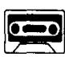

Listen to the tape then answer this question. Whose shirt is white? 听录音，然后回答问题。谁的衬衣是白色的？

TEACHER : Whose shirt is that?

TEACHER : Is this your shirt, Dave?

DAVE: No, sir. It's not my shirt.

DAVE: This is my shirt. My shirt's blue.

TEACHER: Is this shirt Tim's?

DAVE: Perhaps it is, sir. Tim's shirt's white.

TEACHER : Tim!

TIM : Yes, sir?

TEACHER : Is this your shirt?

TIM : Yes, sir.

TEACHER : Here you are.

Catch!

TIM : Thank you, sir.

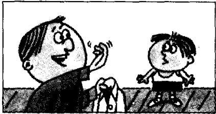

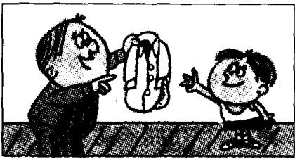

## New words and expressions 生词和短语

whose /huːz/ pron. 谁的

white /wait/ adj. 白色的

blue /blu:/ adj. 蓝色的

catch /kætʃ/ v. 抓住

perhaps /pə'hæps/ adv. 大概

## Notes on the text 课文注释

1 Whose shirt is that?

疑问代词 Whose 在本句中作定语，修饰 shirt。

2 Is this shirt Tim's?

Tim's 是 Tim 的所有格形式，为避免重复，Tim's 后面可以省去 shirt。例：It isn't my pen, it's Frank's. 这不是我的钢笔，是弗兰克的。

3 Here you are. 或 Here it is.

是给对方东西时的用语，句中的 are 和 is 应重读。

## 参考译文

老师：那是谁的衬衫？

老师：戴夫，这是你的衬衫吗？

戴夫：不，先生。这不是我的衬衫。

戴夫：这是我的衬衫。我的衬衫是蓝色的。

老师：这件衬衫是蒂姆的吗？

戴夫：也许是，先生。蒂姆的衬衫是白色的。

老师：蒂姆！

蒂姆：什么事，先生？

老师：这是你的衬衫吗？

蒂姆：是的，先生。

老师：给你。接着！

蒂姆：谢谢您，先生。

## Lesson 12 Whose is this . . . ? This is my/your/his/her . . .

这……是谁的？这是我的／你的／他的／她的·

Whose is that . . , ? That is my/your/his/her . . .

那……是谁的？那是我的／你的／他的／她的……

Listen to the tape and answer the questions.

听录音并回答问题。

22

  
handbag  
It's Stella's.  
car

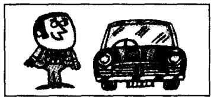  
It's Paul's.  
24

  
coat  
It's Sophie's.  
25

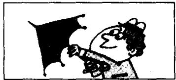  
umbrella  
It's Steven's.  
26

  
pen  
It's my son's.  
27

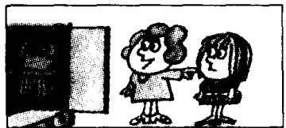  
dress  
It's my daughter's.  
28  
suit

  
It's my father's.  
29

  
skirt  
It's my mother's.  
30

  
blouse  
It's my sister's.  
31

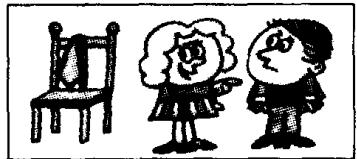  
tie  
It's my brother's.

## New words and expressions 生词和短语

father /'fɑːðə/ n. 父亲

tie /taɪ/ n. 领带

mother /'mʌðə/ n. 母亲

brother /'brʌðə/ n. 兄，弟

blouse /blauz/ n. 女衬衫

sister /'sɪstə/ n. 姐，妹

his /hɪz/ possessive adjective 他的

her /hɜː/ possessive adjective 她的

## Written exercises 书面练习

A Complete these sentences using my, your, his or her.

完成以下句子，用 my, your, his 或 her 填空。

Example:

Hans is here. That is \_\_\_\_ car.

Hans is here. That is his car.

1 Stella is here. That is \_\_\_\_ car.

2 Excuse me, Steven. Is this \_\_\_\_ umbrella?

3 I am an air hostess. \_\_\_\_ name is Britt.

4 Paul is here, too. That is \_\_\_\_ coat.

B Write questions and answers using 's, his and hers.

模仿例句提问并回答，选用名词所有格形式 's 或代词所有格形式 his 或 hers。

Example:

shirt/Tim

Whose is this shirt? It's Tim's. It's his shirt.

1 handbag/Stella

7 suit/my father

2 car/Paul

8 skirt/my mother

3 coat/Sophie

9 blouse/my sister

4 umbrella/Steven

10 tie/my brother

5 pen/my daughter

6 dress/my son

11 pen/Sophie

12 pencil/Hans

## Lesson 13 A new dress 一件新连衣裙

Listen to the tape then answer this question. What colour is Anna's hat? 听录音，然后回答问题。安娜的帽子是什么颜色的？

LOUISE: What colour's your new dress?

ANNA: It's green.

ANNA : Come upstairs and see it.

LOUISE : Thank you.

ANNA: Look! Here it is!

LOUISE: That's a nice dress. It's very smart.

ANNA: My hat's new, too.

LOUISE: What colour is it?

ANNA: It's the same colour. It's green, too.

LOUISE : That is a lovely hat!

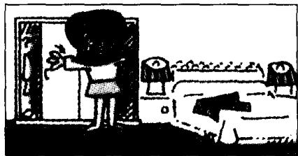

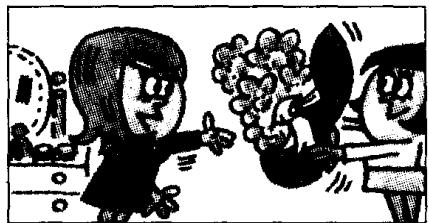

## New words and expressions 生词和短语

colour /'kʌlə/ n. 颜色

smart /smɑːt/ adj. 时髦的，巧妙的

green /griːn/ adj. 绿色

come /kʌm/ v. 来

hat /hæt/ n. 帽子

upstairs /ʌp'steəz/ adv. 楼上

same /seim/ adj. 相同的

lovely /'lʌvli/ adj. 可爱的，秀丽的

## Notes on the text 课文注释

1 What colour's = What colour is.

2 Come upstairs and see it.

句中 and 不当 “和” 讲，而是表示目的，例：Come and see me. 来见我。在英文中不能用 Come upstairs to see it.

## 参考译文

路易丝：你的新连衣裙是什么颜色的？

安娜：是绿色的。

安娜：到楼上来看看吧。

路易丝：谢谢。

安娜：瞧，就是这件。

路易丝：这件连衣裙真好，真漂亮。

安娜：我的帽子也是新的。

路易丝：是什么颜色的？

安娜：一样的颜色，也是绿的。

路易丝：真是一顶可爱的帽子！

## Lesson 14 What colour's your...? 你的……是什么颜色的？

Listen to the tape and answer the questions.

听录音并回答问题。

20

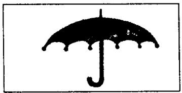  
umbrella  
black  
30  
car

  
blue  
40

  
shirt  
white  
50

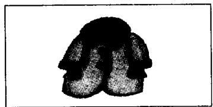  
coat  
grey  
60

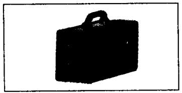  
case  
brown  
70

  
carpet  
red  
80

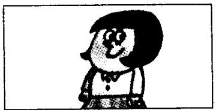  
blouse  
yellow  
90  
tie

  
orange  
100  
hat

  
grey and black  
101  
dog

  
brown and white

## New words and expressions 生词和短语

case /keis/ n. 箱子

dog /dɒg/ n. 狗

carpet /'kɑːpɪt/ n. 地毯

## Written exercises 书面练习

A Rewrite these sentences.

模仿例句将下列各组句子合二为一。

## Example:

This is Stella. This is her handbag.

This is Stella's handbag.

1 This is Paul. This is his car.

2 This is Sophie. This is her coat.

3 This is Helen. This is her dog.

4 This is my father. This is his suit.

5 This is my daughter. This is her dress.

B Write sentences using 's, his or her.

模仿例句提问并回答，选用名词所有格形式 's 或代词所有格形式 his 或 her。

Example:

Steven/umbrella/black

What colour's Steven's umbrella? His umbrella's black.

1 Steven/car/blue

7 Helen/dog/brown and white

2 Tim/shirt/white

8 Hans/pen/green

3 Sophie/coat/grey

9 Luming/suit/grey

4 Mrs. White/carpet/red

10 Stella/pencil/blue

5 Dave/tie/orange

11 Xiaohui/handbag/brown

6 Steven/hat/grey and black

12 Sophie/skirt/yellow

## Lesson 15 Your passports, please. 请出示你们的护照。

Listen to the tape then answer this question. Is there a problem with the Customs officer? 听录音，然后回答问题。海关官员有什么疑问吗？

CUSTOMS OFFICER : Are you Swedish?

GIRLS : No, we are not.
We are Danish.

CUSTOMS OFFICER : Are your friends Danish, too?
GIRLS : No, they aren't.
They are Norwegian.

CUSTOMS OFFICER : Your passports, please.
GIRLS : Here they are.

CUSTOMS OFFICER : Are these your cases?
GIRLS : No, they aren't.

GIRLS : Our cases are brown.
Here they are.

CUSTOMS OFFICER : Are you tourists?
GIRLS : Yes, we are.

CUSTOMS OFFICER : Are your friends tourists too?
GIRLS : Yes, they are.

CUSTOMS OFFICER: That's fine.  
GIRLS: Thank you very much.

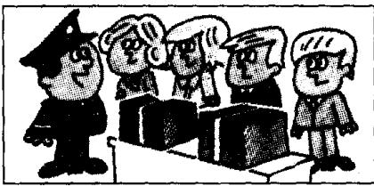

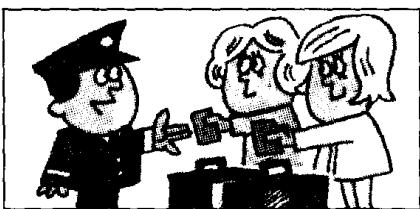

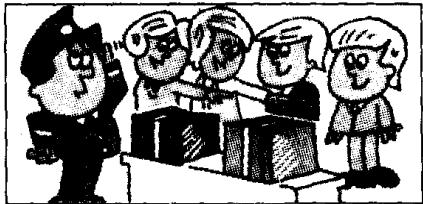

## New words and expressions 生词和短语

customs /'kʌstəmz/ n. 海关

Norwegian /nɔːˈwiːdʒən/ adj. & n. 挪威人

officer /'ɒfɪsə/ n. 官员

passport /'pɑ:spɔ:t/ n. 护照

girl /gɜːl/ n. 女孩，姑娘

brown /braʊn/ adj. 棕色的

Danish /'deɪnɪʃ/ adj. & n. 丹麦人

friend /frend/ n. 朋友

tourist /'tʊərɪst/ n. 旅游者

## Note on the text 课文注释

可数名词的复数形式一般是在单数名词后面加上 -s，如课文中的 friend — friends /frendz/; tourist — tourists /'toərɪsts/; case — cases /'keɪsɪz/。请注意 -s 的不同发音。

## 参考译文

海关官员：你们是瑞典人吗？

姑娘们：不，我们不是瑞典人。我们是丹麦人。

海关官员：你们的朋友也是丹麦人吗？

姑娘们：不，他们不是丹麦人。他们是挪威人。

海关官员：请出示你们的护照。

姑娘们：给您。

海关官员：这些是你们的箱子吗？

姑娘们：不，不是。

姑娘们：我们的箱子是棕色的。在这儿呢。

海关官员：你们是来旅游的吗？

姑娘们：是的，我们是来旅游的。

海关官员：你们的朋友也是来旅游的吗？

姑娘们：是的，他们也是。

海关官员：好了。

姑娘们：非常感谢。

## Lesson 16 Are you ...? 你是……吗？

Listen to the tape and answer the questions.

听录音并回答问题。

20

  
Russian?

30

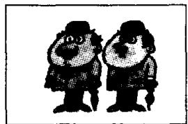  
English?

40

  
American?

50

  
Dutch?

## Are these your . . . ? What colour are your . . . ? 这些是你的……吗？你的……是什么颜色？

60

  
red books

70

  
white shirts

80

  
grey coats

90

  
yellow tickets

100

  
blue suits

101

  
black and grey hats

102

  
green passports

103

  
black umbrellas

104

  
white handbags

105

  
orange ties

106

  
brown and white dogs

107

  
blue pens

108

  
red cars

109

  
green dresses

110

  
yellow blouses

## New words and expressions 生词和短语

Russian /'rʌʃən/ adj. & n. 俄罗斯人

grey /greɪ/ adj. 灰色的

Dutch /dʌtʃ/ adj. & n. 荷兰人

yellow /'yeləʊ/ adj. 黄色的

these /ðiːz/ pron. 这些 (this 的复数)

black /blæk/ adj. 黑色的

red /red/ adj. 红色的

orange /'prɪndʒ/ adj. 橘黄色的

## Notes on the text 课文注释

1 如果名词是以 -s 结尾的，变成复数时要加 -es. 如 dress — dresses。

2 表示复数的 -s 或 -es 一般遵循以下发音规则：

(1) 如果名词词尾的发音是一个清辅音 (/s/, /ʃ/, /tʃ/ 除外). -s 发 /s/ 的音，如 books /bʊks/, suits /suːts/ ;

(2) 如果名词词尾的发音是一个浊辅音（/z/, /ʒ/, /dʒ/ 除外）或元音，-s 发 /z/ 的音，如 ties /taɪz/, dogs /dɒgz/；

(3) 如果名词词尾的发音是 /s/, /z/, /ʃ/, /ʒ/, /tʃ/ 或 /dʒ/, -s'发 /ɪz/ 的音，如 dresses /'dresɪz/, blouses /'blaʊzɪz/。

## Written exercises 书面练习

A Complete these sentences using a or an.

完成以下句子，用冠词 a 或 an 填空。

Examples:

It is \_\_\_\_ Swedish car. It is a Swedish car.

She is \_\_\_\_ air hostess. She is an air hostess.

1 It is \_\_\_\_ English car.

3 It is \_\_\_\_ Italian car.

2 It is \_\_\_\_ Japanese car.

5 It is \_\_\_\_ American car.

4. It is \_\_\_\_ French car.

6 Robert is not \_\_\_\_ teacher.

B Write questions and answers using our.

，模仿例句提问并用 our 来回答。

Example:

books/red

What colour are your books? Our books are red.

1 shirts/white

4 suits/blue

7 umbrellas/black

10 dogs/brown and white

2 coats/grey

5 hats/black and grey

8 handbags/white

11 pens/blue

3 tickets/yellow

9 ties/orange

12 cars/red

## Lesson 17 How do you do? 你好!

Listen to the tape then answer this question.

What are Michael Baker and Jeremy Short's jobs?

听录音，然后回答问题。迈克尔·贝克和杰里米·肖特是做什么工作的？

MR. JACKSON : Come and meet our employees, Mr. Richards.

MR. RICHARDS : Thank you, Mr. Jackson.

MR. JACKSON : This is Nicola Grey, and this is Claire Taylor.

MR. RICHARDS : How do you do?

MR. RICHARDS : Those women are very hard-working.
What are their jobs?

MR. JACKSON: They're keyboard operators.

MR. JACKSON : This is Michael Baker, and this is Jeremy Short.

MR. RICHARDS : How do you do?

MR. RICHARDS: They aren't very busy! What are their jobs?

MR. JACKSON: They're sales reps.
They're very lazy.

MR. RICHARDS : Who is this young man?

MR. JACKSON: This is Jim.
He's our office assistant.

## New words and expressions 生词和短语

employee /ɪmplɔrˈiː/ n. 雇员

man /mæn/ n. 男人

hard-working /ˌhaːdˈwɜːkɪŋ/ adj. 勤奋的

office /'ɒfɪs/ n. 办公室

sales reps /'seilz-'reps/ 推销员

assistant /ə'sɪstənt/ n. 助手

## Notes on the text 课文注释

1 How do you do? 您好（用于第一次见面时）。一般用同样的话来回答。见第 5 课课文注释 3。

2 sales reps 是 sales representatives 的缩写形式，常用于口语。

3 office assistant 是指办公室干杂务的工作人员。

## 参考译文

杰克逊先生：来见见我们的雇员，理查兹先生。

理查兹先生：谢谢，杰克逊先生。

杰克逊先生：这位是尼古拉·格雷，这位是克莱尔·泰勒。

理查兹先生：你们好！

理查兹先生：那些姑娘很勤快。她们是做什么工作的？

杰克逊先生：她们是电脑输录入员。

杰克逊先生：这位是迈克尔·贝克，这位是杰里米·肖特。

理查兹先生：你们好！

理查兹先生：他们不很忙吧！他们是做什么工作的？

杰克逊先生：他们是推销员，他们非常懒。

理查兹先生：这个年轻人是谁？

杰克逊先生：他是吉姆，是我们办公室的勤杂人员。

## Lesson 18 What are their jobs? 他们是做什么工作的？

Listen to the tape and answer the questions.

听录音并回答问题。

100

  
sales reps  
200

  
keyboard operators  
300

  
mechanics  
400

  
engineers  
500

  
hairdressers  
600

  
teachers  
700

  
Customs officers  
800

  
taxi drivers  
900

  
nurses  
1,000

  
air hostesses  
1,001

  
housewives  
1,002

  
milkmen  
1,003

  
postmen  
1,004

  
policemen  
1,005

  
policewomen

## Notes on the text 课文注释

1 如果名词是以 -f 或 -fe 结尾的，变成复数时，一般要把 -f 或 -fe 变成 -v，再加 -es，如 housewife — housewives。

2 英语中有一些名词的复数形式是不规则的，如 man, woman，以及由这两个词组成的复合名词: man — men; woman — women;

milkman — milkmen;

policewoman — policewomen.

## Written exercises 书面练习

A Complete these sentences using He, She, We or They.

完成以下句子，用 He, She, We 或 They 填空。

Example:

Those men are lazy. \_\_\_\_ are sales reps.

Those men are lazy. They are sales reps.

1 That man is tall. \_\_\_\_ is a policeman.

2 Those girls are busy. \_\_\_\_ are keyboard operators.

3 Our names are Britt and Inge. \_\_\_\_ are Swedish.

4 Look at our office assistant. \_\_\_\_ is very hard-working.

5 Look at Nicola. \_\_\_\_ is very pretty.

6 Michael Baker and Jeremy Short are employees. \_\_\_\_ are sales reps.

B Write questions and answers.

模仿例句提问并回答。

Example:

(mechanics)/sales reps

What are their jobs?

Are they mechanics or sales reps?

They aren't mechanics. They're sales reps.

1 (keyboard operators)/air hostesses

2 (postmen)/policemen

6 (engineers)/taxi drivers

7 (policewomen)/keyboard operators

3 (policewomen)/nurses

8 (milkmen)/engineers

4 (customs officers)/hairdressers

9 (policemen)/milkmen

5 (hairdressers)/teachers

10 (nurses)/housewives

## Lesson 19 Tired and thirsty 又累又渴

Listen to the tape then answer this question.

Why do the children thank their mother?

听录音，然后回答问题。为什么孩子们向母亲致谢？

MOTHER: What's the matter, children?

GIRL: We're tired...

BOY : ... and thirsty, Mum.

MOTHER : Sit down here.

MOTHER : Are you all right now?

BOY: No, we aren't.

MOTHER: Look! There's an ice cream man.

MOTHER : Two ice creams please.

MOTHER : Here you are, children.

CHILDREN : Thanks, Mum.

GIRL : These ice creams are nice.

MOTHER : Are you all right now?

CHILDREN: Yes, we are, thank you!

## New words and expressions 生词和短语

matter /'mætə/ n. 事情

Mum /mʌm/ n. 妈妈（儿语）

children /'tʃɪldrən/ n. 孩子们 (child 的复数)

sit down /'sɪt-daʊn/ 坐下

tired /taɪəd/ adj. 累，疲乏

right /raɪt/ adj. 好，可以

boy /bɔɪ/ n. 男孩

thirsty /'θɜːsti/ adj. 渴

ice cream /'aɪs-'kriːm/ 冰淇淋

## Notes on the text 课文注释

1 What's the matter? = Tell me what's wrong. 怎么啦?

2 There's = There is.

## 参考译文

母亲：怎么啦，孩子们？

女孩：我们累了……

男孩：……口也渴，妈妈。

母亲：坐在这儿吧。

母亲：你们现在好些了吗？

男孩：不，还没有。

母亲：瞧！有个卖冰淇淋的。

母亲：请拿两份冰淇淋。

母亲：拿着，孩子们。

孩子们：谢谢，妈妈。

女孩：这些冰淇淋真好吃。

母亲：你们现在好了吗？

孩子们：是的，现在好了，谢谢您！

# Lesson 20 Look at them! 看看他/它们!

Listen to the tape and answer the questions.
听录音并回答问题。

105

  
They're clean.  
106

  
They're dirty.  
217

  
They're hot.  
218

  
They're cold.  
321

  
They're fat.  
322

  
They're thin.  
433

  
They're big.  
434

  
They're small.  
545

  
They're open.  
546

  
They're shut.  
657

  
They're light.  
658

  
They're heavy.  
769

  
They're old.  
770

  
They're young.

  
They're old.  
882

  
They're new.  
998

  
They're short.  
999

  
They're tall.  
1,000

  
They're short.  
1,001

  
They're long.

## New words and expressions 生词和短语

big /big/ adj. 大的

heavy /'hevi/ adj. 重的

small /smɔːl/ adj. 小的

long /lɒŋ/ adj. 长的

open /'əʊpən/ adj. 开着的

shut /ʃʌt/ adj. 关着的

shoe /ʃuː/ n. 鞋子

light /laɪt/ adj. 轻的

grandfather /'grændˌfɑːðə/ n.-祖父，外祖父

grandmother /'græn,mʌðə/ n. 祖母，外祖母

## Written exercises 书面练习

A Complete these sentences using am, is or are.

抄写以下句子，用 am, is 或 are 填空。

Example:

Those children \_\_\_\_ thirsty.

Those children are thirsty.

1 Those children \_\_\_\_ tired.

2 Their mother \_\_\_\_ tired, too.

3 That ice cream man \_\_\_\_ very busy.

4 His ice creams \_\_\_\_ very nice.

5 What's the matter, children? We \_\_\_\_ thirsty.

6 What's the matter, Tim? I \_\_\_\_ tired.

## B Write questions and answers.

模仿例句提问并回答。

## Example:

his shoes/(dirty)/clean

Are his shoes dirty or clean?

They're not dirty. They're clean.

1 the children/(tired)/thirsty

2 the postmen/(cold)/hot

6 his cases/(heavy)/light

7 grandmother and grandfather/(young)/old

3 the hairdressers/(thin)/fat

4 the shoes/(small)/big

8 their hats/(old)/new

5 the shops/(shut)/open

9 the policemen/(short)/tall

10 his trousers/(short)/long

## Lesson 21 Which book? 哪一本书?

Listen to the tape then answer this question.

Which book does the man want?

听录音，然后回答问题。这位男士要哪本书？

MAN : Give me a book please, Jane.

WOMAN : Which book?

WOMAN : This one?

MAN : No, not that one. The red one.

WOMAN : This one?

MAN : Yes, please.

WOMAN : Here you are.

MAN: Thank you.

## New words and expressions 生词和短语

give /gɪv/ v. 给

which /wɪtʃ/ question word 哪一个

one /wʌn/ pron. 一个

## Notes on the text 课文注释

1 Give me a book, please.

这是祈使句，省略了主语 you。

2 Which book? 哪一本？这是一种省略形式。

3 This one? 句中的 one 是不定代词，表示 book。复数形式是 ones。

## 参考译文

丈夫：请拿本书给我，简。

妻子：哪一本？

妻子：是这本吗？

丈夫：不，不是那本。是那本红皮的。

妻子：这本吗？

丈夫：是的，请给我。

妻子：给你。

丈夫：谢谢。

## Lesson 22 Give me/him/her/us/them a . . .

Which one?

给我／他／她／我们／他们一……

哪一……？

Listen to the tape and answer the questions.
听录音并回答问题。

1,001

  
(dirty)  
1,002

  
(clean)  
1,003

  
(empty)  
1,004

  
(full)  
1,005

  
(large)  
1,006

  
(small)  
1,007

  
(big)  
1,008

  
(little)  
1,009  
(new)

  
1,010

  
(old)  
1,011

  
(sharp)  
1,012

  
(blunt)  
1,013  
(new)

  
1,014

  
(old)  
1,015

  
(large)  
1,016

  
(small)

## New words and expressions 生词和短语

empty /'empti/ adj. 空的

box /bɒks/ n. 盒子，箱子

full /ful/ adj. 满的

glass /gla:s/ n. 杯子

large /la:dʒ/ adj. 大的

cup /kʌp/ n. 茶杯

little /'lɪtl/ adj. 小的

bottle /'botl/ n. 瓶子

sharp /ʃɑːp/ adj. 尖的，锋利的

tin /tɪn/ n. 罐头

small /smɔːl/ adj. 小的

big /big/ adj. 大的

knife /naɪf/ n. 刀子

blunt /blʌnt/ adj. 钝的

fork /fɔːk/ n. 叉子

spoon /spuːn/ n. 勺子

## Written exercises 书面练习

A Complete these sentences using His, Her, Our or Their.
完成以下句子，用 His, Her, Our 或 Their 填空。

Example:

Is this Tim's shirt? No, it's not. \_\_\_\_ shirt is white.

Is this Tim's shirt? No, it's not. His shirt is white.

1 Is this Nicola's coat? No. it's not. \_\_\_\_ coat is grey.

2 Are these your pens? No, they're not. \_\_\_\_ pens are blue.

3 Is this Mr. Jackson's hat? No, it's not. \_\_\_\_ hat is black.

4 Are these the children's books? No, they're not. \_\_\_\_ books are red.

5 Is this Helen's dog? No, it's not. \_\_\_\_ dog is brown and white.

6 Is this your father's tie? No, it's not. \_\_\_\_ tie is orange.

## B Write questions and answers.

模仿例句写出相应的对话。

Example:

book/(this blue)/that red

Give me a book please.

Which one? This blue one?

No, not this blue one. That red one.

Here you are.

Thank you.

1 cup/(this dirty)/that clean

5 tin/(this new)/that old

2 glass/(this empty)/that full

6 knife/(this sharp)/that blunt

3 bottle/(this large)/that small

7 spoon/(this new)/that old

4 box/(this big)/that little

8 fork/(this large)/that small

## Lesson 23 Which glasses? 哪几只杯子?

Listen to the tape then answer this question.

Which glasses does the man want?

听录音，然后回答问题。这位男士要哪些杯子？

MAN : Give me some glasses please, Jane.

WOMAN : Which glasses?

WOMAN : These glasses?

MAN : No, not those.
The ones on the shelf.

WOMAN: These?

MAN : Yes, please.

WOMAN : Here you are.

MAN: Thanks.

## New words and expressions 生词和短语

on /ɒn/ prep. 在……之上

shelf /ʃelf/ n. 架子，搁板

## Notes on the text 课文注释

1 在 Give me some glasses 中，动词 give 后面有两个宾语，即直接宾语 some glasses 和间接宾语 me。人称代词作宾语时要用人称代词的宾格。如：me (I 的宾格)，us (we 的宾格)，you (you 的宾格)，him (he 的宾格)，her (she 的宾格)，them (they 的宾格) 和 it (it 的宾格）。

2 No, not those.

句中 those 是指 those glasses。

3 The ones on the shelf.

本句是省略句。句中的 ones 代表 glasses。

## 参考译文

丈夫：请拿给我几只玻璃杯，简。

妻子：哪几只？

妻子：是这几只吗？

丈夫：不，不是那几只。是架子上的那几只。

妻子：这几只？

丈夫：是的，请拿给我。

妻子：给你。

丈夫：谢谢。

# Lesson 24 Give me/him/her/us/them some . . . Which ones?

给我／他／她／我们／他们一些……

哪些？

Listen to the tape and answer the questions.

听录音并回答问题。

1,117

  
pens/on the desk  
1,218

  
ties/on the chair  
1,319

  
spoons/on the table  
1,420

  
plates on the cupboard  
1,521

  
cigarettes/on the television  
1,622

  
boxes/on the floor  
1,723

  
bottles/on the dressing table  
1,824

  
books/on the shelf  
1,925

  
magazines/on the bed  
2,000

  
newspapers/on the stereo

## New words and expressions 生词和短语

desk /desk/ n. 课桌

floor /floː/ n. 地板

table /'teɪbl/ n. 桌子

dressing table /'dresɪŋ-ˈteɪbl/ 梳妆台

plate /pleɪt/ n. 盘子

magazine /mægə'ziːn/ n. 杂志

cupboard /'kʌbəd/ n. 食橱

bed /bed/ n. 床

cigarette /ˌsɪɡəˈreɪt/ n. 香烟

television /'telɪˌvɪʒən/ n. 电视机

newspaper /'nju:speɪpə/ n. 报纸

stereo /'steriəʊ/ n. 立体声音响

## Written exercises 书面练习

A Complete these sentences using me, him, her, us or them.

完成以下句子，用 me, him, her, us 或 them 填空。

## Example:

Give Tim this shirt. Give \_\_\_\_ this one, too.

Give Tim this shirt. Give him this one, too.

I Give Jane this watch. Give \_\_\_\_ this one, too.

2 Give the children these ice creams. Give \_\_\_\_ these, too.

3 Give Tom this book. Give \_\_\_\_ this one, too.

4 That is my passport. Give \_\_\_\_ my passport please.

5 That is my coat. Give \_\_\_\_ my coat please.

6 Those are our umbrellas. Give \_\_\_\_ our umbrellas please.

B Write questions and answers.

模仿例句写出相应的对话。

## Example:

glasses/on the shelf

Give me some glasses please.

Which ones? These?

No. not those. The ones on the shelf.

1 pens/on the desk

6 boxes/on the floor

2 ties/on the chair

7 bottles/on the dressing table

3 spoons/on the table

8 books/on the shelf

4 plates/on the cupboard

9 magazines/on the bed

5 cigarettes/on the television

10 newspapers/on the stereo

## Lesson 25 Mrs. Smith's kitchen 史密斯太太的厨房

Listen to the tape then answer this question.

What colour is the electric cooker?

听录音，然后回答问题。电灶是什么颜色的？

Mrs. Smith's kitchen is small.

There is a refrigerator in the kitchen.

The refrigerator is white.

It is on the right.

There is an electric cooker in the kitchen.

The cooker is blue.

It is on the left.

There is a table in the middle of the room.

There is a bottle on the table.

The bottle is empty.

There is a cup on the table, too.

The cup is clean.

## New words and expressions 生词和短语

Mrs. /'mɪsɪz/ 夫人

cooker /'kʊkə/ n. 炉子，炊具

kitchen /'kɪtʃən/ n. 厨房

middle /'mɪdl/ n. 中间

refrigerator /rɪˈfrɪdzəreɪtə/ n. 电冰箱

of /əv/ prep. （属于）……的

right /raɪt/ n. 右边

room /ruːm/ n. 房间

electric /ɪ'lektrɪk/ adj. 带电的，可通电的

cup /kʌp/ n. 杯子

left /left/ n. 左边

## Notes on the text 课文注释

1 There is 的结构用来说明人或物的存在，在汉语中可以译为 “有”。这个结构要跟单数名词，句中往往要有一个介词短语来表示位置或地点。

2 on the right (left), 在右边（左边），是介词短语，在本句中作表语。

3 注意不要把 cooker 和 cook 混淆，cooker 是炉子、锅等炊具，不是 “炊事员”。炊事员在英语中是 cook。

4 in the middle of, 在……之间。

5 在课文的第 2 行和第 3 行的名词 refrigerator 前面用了两种不同的冠词：a（不定冠词）和 the（定冠词）。在第 2 行，“冰箱”是第一次提到，是指冰箱这类电器中的一个，因此要用不定冠词 a。当第 2 次提到冰箱时，就不是泛指任何一个冰箱，而是特指第 2 行中的那个冰箱了，因此要用定冠词 the。

## 参考译文

史密斯夫人的厨房很小。

厨房里有个电冰箱。

冰箱的颜色是白的。

它位于房间右侧。

厨房里有个电灶。

电灶的颜色是蓝的。

它位于房间左侧。

房间的中央有张桌子。

桌子上有个瓶子。

瓶子是空的。

桌子上还有一只杯子。

杯子很干净。

## Lesson 26 Where is it? 它在哪里？

Listen to the tape and answer the questions.

听录音并回答问题。

3,000  
  
There is a cup on the table.
The cup is clean.

4,000  
  
There is a box on the floor.
The box is large.

5,000  
  
There is a glass in the cupboard.
The glass is empty.

6,000  
  
There is a knife on the plate.
The knife is sharp.

7,000  
  
There is a fork on the tin.
The fork is dirty.

8,000  
  
There is a bottle in the refrigerator.
The bottle is full.

9,000  
  
There is a pencil on the desk.
The pencil is blunt.

10,000  
  
There is a spoon in the cup.
The spoon is small.

# New words and expressions 生词和短语

where /weə/ adv. 在哪里

in /ɪn/ prep. 在……里

## Written exercises 书面练习

A Complete these sentences using a or the.

完成以下句子，用 $a$ 或 the 填空。

Example:

Give me \_\_\_\_ book. Which book? \_\_\_\_ book on the table.

Give me a book. Which book? The book on the table.

1 Give me \_\_\_\_ glass. Which glass? \_\_\_\_ empty one.

2 Give me some cups. Which cups? \_\_\_\_ cups on the table.

3 Is there \_\_\_\_ book on \_\_\_\_ table? Yes, there is. Is \_\_\_\_ book red?

4 Is there \_\_\_\_ knife in that box? Yes, there is. Is \_\_\_\_ knife sharp?

B Write sentences using these words.

模仿例句写出相应的句子。

Example:

refrigerator in the kitchen/white

There's a refrigerator in the kitchen.

The refrigerator is white.

1 cup on the table/clean

5 fork on the tin/dirty

2 box on the floor/large

6 bottle in the refrigerator/full

3 glass in the cupboard/empty

7 pencil on the desk/blunt

4 knife on the plate/sharp

## Lesson 27 Mrs. Smith's living room 史密斯太太的客厅

Listen to the tape then answer this question. Where are the books? 听录音，然后回答问题。书在哪里？

Mrs. Smith's living room is large.

There is a television in the room.

The television is near the window.

There are some magazines on the television.

There is a table in the room.

There are some newspapers on the table.

There are some armchairs in the room.

The armchairs are near the table.

There is a stereo in the room.

The stereo is near the door.

There are some books on the stereo.

There are some pictures in the room.

The pictures are on the wall.

## New words and expressions 生词和短语

living room /'livɪŋ-rʊm/ 客厅

door /dɔː/ n. 门

near /nɪə/ prep. 靠近

picture /'pɪktʃə/ n. 图画

window /'wɪndəʊ/ n. 窗户

armchair /'ɑːmtʃeə/ n. 扶手椅

wall /wɔːl/ n. 墙

## Notes on the text 课文注释

1 There are 的结构中要用复数名词。

2 near the window (door), 靠近窗 (门), 为介词短语。在本句中作表语。

3 on the wall, 在墙上。介词短语作表语。

## 参考译文

史密斯夫人的客厅很大。

客厅里有台电视机。

电视机靠近窗子。

电视机上放着几本杂志。

客厅里有张桌子。

桌上放着几份报纸。

客厅里有几把扶手椅。

这些扶手椅靠近桌子。

客厅里有台立体声音响。

音响靠近门。

音响上面有几本书。

客厅里有几幅画。

画挂在墙上。

## Lesson 28 Where are they? 它们在哪里？

Listen to the tape and answer the questions.
听录音并回答问题。

  
There are some cigarettes on the dressing table. They are near that box.

  
There are some plates on the cooker. They are clean.

  
There are some trousers on the bed.
They are near that shirt.

  
There are some bottles in the refrigerator.
They are empty.

  
There are some shoes on the floor. They're near the bed.

  
There are some knives on the table. They're in that box.

  
There are some forks on the shelf. They're near those spoons.

  
There are some bottles on the cupboard. They're near those tins.

  
There are some tickets on the shelf. They're in that handbag.

  
There are some glasses on the television. They're near those bottles.

## New words and expressions 生词和短语

trousers traozoz n. (复数) 长裤

## Written exercises 书面练习

A Look at these words.

注意单数名词和复数名词的区别。

Examples:

a book — some books; a man — some men; a housewife — some housewives

Rewrite these sentences using There are.

模仿例句改用 There are 的结构。

## Example:

There is a book on the desk.
There are some books on the desk.

1 There is a pencil on the desk.

2 There is a knife near that tin.

4 There is a newspaper in the living room.

5 There is a keyboard operator in the office.

3 There is a policeman in the kitchen.

B Write sentences using these words.
模仿例句写出相应的对话。

## Example:

(books)/on the dressing table/cigarettes/near that box

Are there any books on the dressing table?

No, there aren't any books on the dressing table.

There are some cigarettes.

Where are they?

They're near that box.

1 (books)/in the room/magazines/on the television

2 (ties)/on the floor/shoes/near the bed

3 (glasses)/on the cupboard/bottles/near those tins

4 (newspapers)/on the shelf/tickets/in that handbag

5 (forks)/on the table/knives/in that box

6 (cups)/on the stereo/glasses/near those bottles

7 (cups)/in the kitchen/plates/on the cooker

8 (glasses)/in the kitchen/bottles/in the refrigerator

9 (books)/in the room/pictures/on the wall

10 (chairs)/in the room/armchairs/near the table

## Lesson 29 Come in, Amy. 进来，艾米。

Listen to the tape then answer this question. How must Amy clean the floor? 听录音，然后回答问题。艾米需要如何来清扫地面？

MRS. JONES : Come in, Amy.

MRS. JONES : Shut the door, please.

MRS. JONES: This bedroom's very untidy.

AMY : What must I do, Mrs. Jones?

MRS. JONES : Open the window and air the room.

MRS. JONES : Then put these clothes in the wardrobe.

MRS. JONES : Then make the bed.

MRS. JONES : Dust the dressing table.

MRS. JONES : Then sweep the floor.

## New words and expressions 生词和短语

shut /ʃʌt/ v. 关门

put /put/ v. 放置

bedroom /'bedrʊm/ n. 卧室

clothes /kləʊðz/ n. 衣服

untidy /ʌn'taɪdi/ adj. 乱，不整齐

wardrobe /'wɔːdrəʊb/ n. 大衣柜

must /mʌst/ modal verb 必须，应该

dust /dʌst/ v. 挥掉灰尘

open /'əʊpən/ v. 打开

sweep /swiːp/ v. 扫

air /eə/ v. 使……通风，换换空气

## Notes on the text 课文注释

1 英文中需用祈使语气来表示直接的命令、建议、告诫、邀请等多种意图。祈使句一般省略主语 you，动词采用动词的原形。如本课对话中的 Come in, shut the door, open the window ... 等均为祈使句。

2 What must I do? 我应该做些什么呢？其中的 must 是情态动词，表示不可逃避的义务或不可推卸的责任。

3 make the bed, 铺床。

参考译文

琼斯夫人：进来，艾米。

琼斯夫人：请把门关上。

琼斯夫人：这卧室太不整洁了。

艾米：我应该做些什么呢，琼斯夫人？

琼斯夫人：打开窗子，给房间通通风。

琼斯夫人：然后把这些衣服放进衣橱里去。

琼斯夫人：再把床整理一下。

琼斯夫人：掸掉梳妆台上的灰尘。

琼斯夫人：然后打扫地。

## Lesson 30 What must I do? 我应该做什么？

Listen to the tape and answer the questions.

听录音并回答问题。

Open your Shut

1

2

3

Put on your Take off

Turn on the Turn off

Sweep the

Clean the

21

Dust the

Empty the

27

29

Read this

31

32

33

Sharpen these

34

## New words and expressions 生词和短语

empty /'empti/ v. 倒空，使……变空

take off /'teɪk-pf/ 脱掉

read /riːd/ v. 读

turn on /'tɜːn-ɒn/ 开 (电灯)

sharpen /'ʃɑːpən/ v. 削尖，使锋利

put on /'pʊt-ɒn/ 穿上

turn off /'tɜːn-ɒf/ 关 (电灯)

## Written exercises 书面练习

A Rewrite these sentences.

模仿例句写出相应的祈使句。

Example:

The cup isn't empty. Empty it!

1 The window isn't clean.

2 The door isn't shut.

3 The wardrobe isn't open.

## B Look at this table:

注意下表：

<table><tr><td>Shut the</td><td>stereo</td></tr><tr><td>Open the</td><td>tap</td></tr><tr><td>Put on your</td><td>blackboard</td></tr><tr><td>Take off your</td><td>cup</td></tr><tr><td>Turn on the</td><td>window</td></tr><tr><td>Turn off the</td><td>cupboard</td></tr><tr><td>Sweep the</td><td>magazine</td></tr><tr><td>Clean the</td><td>knives</td></tr><tr><td>Dust the</td><td>shirt</td></tr><tr><td>Empty the</td><td>door</td></tr><tr><td>Read this</td><td>floor</td></tr><tr><td>Sharpen these</td><td>shoes</td></tr></table>

Now write eleven sentences.

模仿下面的例句写出11句表示命令的句子。

Example:

Shut the door!

## Lesson 31 Where's Sally? 萨莉在哪里？

Listen to the tape then answer this question. Is the cat climbing the tree? 听录音，然后回答问题。猫正在爬树吗？

JEAN: Where's Sally, Jack?

JACK: She's in the garden, Jean.

JEAN: What's she doing?

JACK: She's sitting under the tree.

JEAN: Is Tim in the garden, too?

JACK: Yes, he is. He's climbing the tree.

JEAN: I beg your pardon? Who's climbing the tree?

JACK : Tim is.

JEAN: What about the dog?

JACK: The dog's in the garden, too. It's running across the grass. It's running after a cat.

## New words and expressions 生词和短语

garden /'ga:dn/ n. 花园

run /rʌn/ v. 跑

under /'ʌndə/ prep. 在……之下

grass /grɑːs/ n. 草，草地

tree /triː/ n. 树

after /'ɑːftə/ prep. 在……之后

climb /klaɪm/ v. 爬，攀登

across /ə'krɔs/ prep. 横过，穿过

who /huː/ pron. 谁

cat /kæt/ n. 猫

## Notes on the text 课文注释

1 在英文中表示说话时正在进行的动作或事件，要用动词的现在进行时。现在进行时由 be 的现在时加上现在分词组成，如课文中的 “She’s sitting under the tree.” 和 “He’s climbing the tree.” 等句子均为现在进行时。对大多数动词来说，在动词后面直接加 -ing 即可组成现在分词，如 doing, climbing 。对以 -e 结尾的动词，要去掉 -e，再加 -ing，如 making。如果动词只有一个元音字母，而其后跟了一个辅音字母时，则需将辅音字母双写，再加 -ing，如 running, sitting 。

2 What about the dog? 那么狗呢？这句话的意思是 What is the dog doing in the garden? 为了避免重复原句中的主语和谓语动词，可以用 What about 这个结构，用来询问情况。

3 run after, 追逐。

例：Look, Sally is running after her Mum. 瞧，萨莉正在追赶她的母亲。

## 参考译文

琼：杰克，萨莉在哪儿？

杰克：她在花园里，琼。

琼：她在干什么？

杰克：她正在树荫下坐着。

琼：蒂姆也在花园里吗？

杰克：是的，他也在花园里。他正在爬树。

琼：你说什么？谁在爬树？

杰克：蒂姆在爬树。

琼：那么狗呢？

杰克：狗也在花园里。它正在草地上跑，在追一只猫。

500,000

300,000

800,000

50,000

60,000

40,000

# Lesson 32 What's he/she/it doing? 他／她／它正在做什么？

Listen to the tape and answer the questions.

听录音并回答问题。

20,000

  
Nicola is typing  
30,000

  
She is emptying  
a basket.

  
a letter.  
Mr. Richards is opening  
the window.

  
My mother is making

  
the bed.  
Sally is shutting  
70,000  
the door.

  
It is eating  
a bone.  
80,000

  
My sister is looking  
at a picture.

  
Jack is reading  
a magazine.  
100,000

  
He is cleaning  
his teeth.  
200,000

  
She is dusting  
the dressing table.

  
Emma is cooking  
400,000

  
a meal.  
The cat is drinking  
its milk.

  
Amy is sweeping the floor.

  
Tim is sharpening a pencil.  
700,000

  
He is turning on the light.

  
The girl is turning  
off the tap.  
900,000

  
The boy is putting  
on his shirt.  
1,000,000

  
Mrs. Jones is taking  
off her coat.

## New words and expressions 生词和短语

type /taɪp/ v. 打字

tooth /tuːθ/ (复数 teeth /tiːθ/) n. 牙齿

letter /'letə/ n. 信

cook /kʊk/ v. 做（饭菜）

basket /'ba:skɪt/ n. 簋子

eat /iːt/ v. 吃

milk /milk/ n. 牛奶

bone /bəʊn/ n. 骨头

meal /miːl/ n. 饭，一顿饭

clean /kliːn/ v. 清洗

drink /drɪŋk/ v. 喝

tap /tæp/ n. （水）龙头

## Written exercises 书面练习

A Complete these sentences.

模仿例句把祈使句改写成现在进行时。

Example:

Sweep the floor! She is sweeping it.

1 Open the window! He \_\_\_\_.

2 Sharpen this pencil! She \_\_\_\_ .

3 Dust the cupboard! She \_\_\_\_.

4 Empty the basket! She \_\_\_\_.

5 Look at the picture! He \_\_\_\_.

B Write questions and answers.

模仿例句提问并回答。

## Example:

Nicola/emptying the basket/typing a letter

What is Nicola doing?

Is she emptying the basket?

No, she isn't emptying the basket.

She's typing a letter.

1 Mr. Richards/cleaning his teeth/opening the window

2 My mother/shutting the door/making the bed

3 The dog/drinking its milk/eating a bone

4 My sister/reading a magazine/looking at a picture

5 Emma/dusting the dressing table/cooking a meal

6 Amy/making the bed/sweeping the floor

7 Tim/reading a magazine/sharpening a pencil

8 The girl/turning on the light/turning off the tap

9 The boy/cleaning his teeth/putting on his shirt

10 Miss Jones/putting on her coat/taking off her coat

## Lesson 33 A fine day 晴天

Listen to the tape then answer this question. Where is the Jones family? 听录音，然后回答问题。琼斯一家人在哪里？

It is a fine day today.

There are some clouds in the sky,

but the sun is shining.

Mr. Jones is with his family.

They are walking over the bridge.

There are some boats on the river.

Mr. Jones and his wife are looking at them.

Sally is looking at a big ship.

The ship is going under the bridge.

Tim is looking at an aeroplane.

The aeroplane is flying over the river.

## New words and expressions 生词和短语

day /deɪ/ n. 日子

over /'əʊvə/ prep. 跨越，在……之上

cloud /klaʊd/ n. 云

bridge /bridʒ/ n. 桥

sky /skai/ n. 天空

sun /sʌn/ n. 太阳

boat /bəʊt/ n. 船

shine /ʃaɪn/ v. 照耀

river /'rɪvə/ n. 河

with /wɪð/ prep. 和……在一起

ship /ʃɪp/ n. 轮船

aeroplane /'eərəpleɪn/ n. 飞机

family /'fæmli/ n. 家庭（成员）

fly /flaɪ/ v. 飞

walk /wɔːk/ v. 走路，步行

## Notes on the text 课文注释

1. It is a fine day today.

句中的 it 是指天气。

2 some clouds, 几朵云。

some 可以修饰可数名词，也能修饰不可数名词。

## 参考译文

今天天气好。

天空中飘着几朵云，但阳光灿烂。

琼斯先生同他的家人在一起。

他们正在过桥。

河上有几艘船。

琼斯先生和他的妻子正在看这些船。

莎莉正在观看一艘大船。

那船正从桥下驶过。

蒂姆正望着一架飞机。

飞机正从河上飞过。

## Lesson 34 What are they doing? 他们在做什么？

Listen to the tape and answer the questions.

听录音并回答问题。

220,231

  
cooking  
331,342

  
sleeping  
442,453

  
shaving  
553,564

  
crying  
664,675

  
eating  
775,786

  
typing  
886,897

  
doing  
997,998

  
washing  
1,000,001

  
flying  
1,100,000  
walking

  
1,500,000

  
waiting  
2,000,000

  
jumping

## New words and expressions 生词和短语

sleep /sliːp/ v. 睡觉

wash /wɒʃ/ v. 洗

shave /ʃeɪv/ v. 刮脸

cry /kraɪ/ v. 哭，喊

wait /weit/ v. 等

jump /dʒʌmp/ v. 跳

## Written exercises 书面练习

A Complete these sentences.

模仿例句用现在进行时完成以下句子。

Example:

take — taking

Take . . . He is taking his book.

注意以下例句：

如果动词是以 -e 结尾，变成现在分词时要去掉 -e，然后再加 -ing。

1 Type . . . She is \_\_\_\_ a letter.

2 Make... She is \_\_\_\_ the bed.

3 Come... He is \_\_\_\_.

4 Shine . . . The sun is \_\_\_\_.

5 Give ... He is \_\_\_\_ me some magazines.

## B Write questions and answers.

模仿例句提问并回答。

## Example:

the children/looking at the boats on the river

What are the children doing?

They're looking at the boats on the river.

1 the men/cooking a meal

7 the children/doing their homework

2 they/sleeping

8 the women/washing dishes

3 the men/shaving

9 the birds/flying over the river

4 the children/crying

10 they/walking over the bridge

5 the dogs/eating bones

11 the man and the woman/waiting for a bus

6 the women/typing letters

12 the children/jumping off the wall

The park is on the right.

## Lesson 35 Our village 我们的村庄

Listen to the tape then answer this question.

Are the children coming out of the park or going into it?

听录音，然后回答问题。孩子们是正从公园里出来还是正在往里走？

This is a photograph of our village.
Our village is in a valley.
It is between two hills.
The village is on a river.

  
Here is another photograph of the village. My wife and I are walking along the banks of the river. We are on the left. There is a boy in the water. He is swimming across the river.

  
It is beside a park.  
This is the school building.

Some children are coming out of the building.

Some of them are going into the park.

## New words and expressions 生词和短语

photograph /'fəʊtəɡrɑːf/ n. 照片

bank /bæŋk/ n. 河岸

village /'vɪlɪdʒ/ n. 村庄

water /'wɔːtə/ n. 水

valley /'væli/ n. 山谷

swim /swɪm/ v. 游泳

between /bɪ'twɪn/ prep. 在……之间

building /'bɪldɪŋ/ n. 大楼，建筑物

hill /hɪl/ n. 小山

park /pɑːk/ n. 公园

another /əˈnʌðə/ det. 另一个

wife /waif/ n. 妻子

into /'ɪntə/ prep. 进入

along /əˈlɒŋ/ prep. 沿着

## Notes on the text 课文注释

1 The village is on a river.

这句话中的介词 on 不表示 “在……上”，而是 “邻近”、“靠近”的意思。

2 My wife and I . . .
我和妻子……在英语中表达“我和……”时，要把I放在别人的后面。

3 Some children are coming out of the building.

out of 表示 “从里向外” 的动作。

## 参考译文

这是我们村庄的一张照片。

我们的村庄坐落在一个山谷之中。

它位于两座小山之间。

它靠近一条小河。

这是我们村庄的另一张照片。

我和妻子正沿河岸走着。

我们在河的左侧。

河里面有个男孩。

他正横渡小河。

这是另一张照片。

这是学校大楼。

它位于公园的旁边。

公园在右面。

一些孩子正从楼里出来。

他们中有几个正走进公园。

twelve

seven

## Lesson 36 Where...? ……在哪里？

Listen to the tape and answer the questions.
听录音并回答问题。

1  
  
going into  
one

2  
  
two  
going out of

3  
three  
  
sitting beside

4  
  
walking across

5  
  
running along  
five

6  
  
jumping off

7  
  
walking between

8  
  
sitting near

9  
  
flying under

10  
  
flying over

ten  
11  
  
sitting on  
eleven

12  
  
reading in

## New words and expressions 生词和短语

beside /bɪˈsaɪd/ prep. 在……旁

off /ɒf/ prep. 离开

## Written exercises 书面练习

A Complete these sentences.

模仿例句用现在进行时完成以下句子。

注意：如果单音节动词仅有一个元音字母而其后跟一个辅音字母时，变成现在分词时要将此辅音字母双写。

## Example:

put — putting

put . . . He is putting on his coat.

1 swim... He is \_\_\_\_ across the river.

2 sit... She is \_\_\_\_ on the grass.

3 run ... The cat is \_\_\_\_ along the wall.

B Write sentences using these words.
模仿例句提问并回答。

## Examples:

boy swimming/across the river

Where is the boy swimming? He's swimming across the river.

children going/into the park

Where are the children going? They're going into the park.

1 man going/into the shop

2 woman going/out of the shop

7 man standing/between two policemen

3 he sitting/beside his mother

8 she sitting/near the tree

4 they walking/across the street

9 it flying/under the bridge

5 the cats running/along the wall

6 the children jumping/off the branch

10 the aeroplane flying/over the bridge

11 they sitting/on the grass

12 the man and the woman reading/in the living room

## Lesson 37 Making a bookcase 做书架

Listen to the tape then answer this question. What is Susan's favourite colour? 听录音，然后回答问题。苏珊最喜欢哪种颜色？

DAN: You're working hard, George. What are you doing?

GEORGE: I'm making a bookcase.

GEORGE : Give me that hammer please, Dan.

DAN : Which hammer?

This one?

GEORGE : No, not that one.

The big one.

DAN : Here you are.

GEORGE : Thanks, Dan.

DAN : What are you going to do now, George?

GEORGE: I'm going to paint it.

DAN : What colour are you going to paint it?

GEORGE: I'm going to paint it pink.

DAN: Pink!

GEORGE: This bookcase isn't for me.

It's for my daughter, Susan.

Pink's her favourite colour.

## New words and expressions 生词和短语

work /wɜːk/ v. 工作

hammer /'hæmə/ n. 锤子

hard /haːd/ adv. 努力地

paint /peɪnt/ v. 上漆，涂

make /meɪk/ v. 做

pink /pɪŋk/ n. & adj. 粉红色

bookcase /'bok-keis/ n. 书橱，书架

favourite /'feɪvərɪt/ adj. 最喜欢的

## Notes on the text 课文注释

1 You're working hard, George. 在这句话中 hard 是一个副词，修饰动词 work, 有 “努力地”、“费劲地”的意思。hard 还常常与表示动作、举止的动词连用，如 work, listen, play, try 等，用来加强动作的强度，常译成 “拼命地”。

2 What are you going to do now, George?

你现在准备做什么，乔治？

be going to, 是 “打算”、“准备”、“按计划” 在最近做某事，表示将来。

3 paint it pink,

it 指 bookcase, 是宾语, pink 是宾语补足语。

## 参考译文

丹：你干得真辛苦，乔治。你在干什么呢？

乔治：我正在做书架。

乔治：请把那把锤子拿给我，丹。

丹：哪一把？是这把吗？

乔治：不，不是那把。是那把大的。

丹：给你。

乔治：谢谢、丹。

丹：你现在打算干什么，乔治？

乔治：我打算把它漆一下。

丹：你打算把它漆成什么颜色？

乔治：我想漆成粉红色。

丹：粉红色！

乔治：这个书架不是为我做的，是为我的女儿苏珊做的。粉红色是她最喜欢的颜色。

# Lesson 38 What are you going to do? 你准备做什么？What are you doing now? 你现在正在做什么？

Listen to the tape and answer the questions.

听录音并回答问题。

one

  
I am going to shave.

two

  
Now I am shaving.

three

  
I'm going to wait for a bus.  
four

  
Now I'm waiting for a bus.

five

  
We're going to do our homework.

six

  
Now we're doing our homework.

seven

  
I'm going to paint this bookcase.

eight

  
Now I'm painting this bookcase.

nine

  
We're going to listen to the stereo.

ten

  
Now we're listening to the stereo.

eleven

  
I'm going to wash the dishes.

twelve

  
Now I'm washing the dishes.

## New words and expressions 生词和短语

homework /'həʊmwɜːk/ n. 作业

dish /dɪʃ/ n. 盘子, 碟子

listen /'lɪsən/ v. 听

## Written exercises 书面练习

A Complete these sentences using am, is or are.

完成以下句子，用 am, is 或 are 填空。

Examples:

What \_\_\_\_ you doing?

What are you doing?

We \_\_\_\_ reading.

We are reading.

1 What \_\_\_\_ you doing? We \_\_\_\_ reading.

2 What \_\_\_\_ they doing? They \_\_\_\_ doing their homework.

3 What \_\_\_\_ he doing? He \_\_\_\_ working hard.

4 What \_\_\_\_ you doing? I \_\_\_\_ washing the dishes.

B Write questions and answers.

模仿例句写出相应的对话。

## Example:

paint this bookcase

What are you going to do?

I'm going to paint this bookcase.

What are you doing now?

I'm painting this bookcase.

I shave

2 wait for a bus

3 do my homework

4 listen to the stereo

5 wash the dishes

## Lesson 39 Don't drop it! 别摔了!

Listen to the tape then answer this question. Where does Sam put the vase in the end?

听录音，然后回答问题。萨姆把花瓶放在什么地方？

SAM : What are you going to do with that vase, Penny?

PENNY: I'm going to put it on this table, Sam.

SAM: Don't do that. Give it to me.

PENNY : What are you going to do with it?

SAM: I'm going to put it here, in front of the window.

PENNY: Be careful!
Don't drop it!

PENNY : Don't put it there, Sam.
Put it here,
on this shelf.

SAM: There we are!
It's a lovely vase.
PENNY: Those flowers are lovely, too.

## New words and expressions 生词和短语

front /frʌnt/ n. 前面 vase /vɑːz/ n. 花瓶

in front of 在……之前 drop /drop/ v. 掉下

careful /'keəfəl/ adj. 小心的，仔细的 flower /'flaʊə/ n. 花

## Notes on the text 课文注释

1 do with 指对某件事物或人的处理。

2 在第 29 课中，我们讲到在英文中需用祈使语气来表示直接的命令、建议等多种意图。而祈使句的否定形式则由 don't 加上动词原形组成，如课文中的 “Don't do that”; “Don't drop it” 等句子。

3 在第 21 课有这样的句型 “give me a book”，在本课文中又出现了 “give it to me” 的句型。在动词 give 后面可以有两个宾语：直接宾语（指物，如 a book, it）和间接宾语（指人，如 me）。如果直接宾语置于动词 give 之后，间接宾语则变成有 to 的介词短语。

4 Be careful! 小心点！这个固定结构常用来提醒他人可能发生的事故或困难。

5 There we are. 就放在那里。参见第 11 课课文注释 3。

## 参考译文

萨姆：你打算如何处理那花瓶？

彭妮：我打算把它放在这张桌子上，萨姆。

萨姆：不要放在那儿，把它给我。

彭妮：你打算怎么办？

萨姆：我准备把它放在这儿，放在窗前。

彭妮：小心点！别摔了！

彭妮：别放在那儿，萨姆。放在这儿，这个架子上。

萨姆：这是只漂亮的花瓶。

彭妮：那些花也很漂亮啊。

13 thirteen

18

15 fifteen

# Lesson 40 What are you going to do? 你准备做什么？I'm going to... 我准备……

Listen to the tape and answer the questions.

听录音并回答问题。

  
put it . . . !  
14 fourteen

  
take it...!

  
turn it . . . !  
16

sixteen

  
turn it . . . !

## What are you going to do with that/those ...? 你准备把那个／那些……？

I'm going to give/show/send/take... 我准备给/展示/送/拿

17

seventeen

  
to my daughter

  
to my grandmother  
nineteen

19

  
to my father  
20  
twenty

  
to my mother  
30  
to the children

  
40

  
to my wife

  
to my grandfather  
60  
sixty

  
to my sister

## New words and expressions 生词和短语

show /ʃəʊ/ v. 给……看
send /send/ v. 送给

take /teɪk/ v. 带给

## Written exercises 书面练习

A Rewrite these sentences.
模仿例句改写以下句子。

## Example:

Give me that vase.
Give that vase to me.

1 Send George that letter.  
2 Take her those flowers.  
3 Show me that picture.  
4 Give Mrs. Jones these books.  
5 Give the children these ice creams.

B Rewrite these sentences.
模仿例句改写以下句子。

## Examples:

Put on your coat!
I'm going to put it on.
Put on your shoes!
I'm going to put them on.

I Put on your hat!

2 Take off your shoes!

6 Take off your hat!

3 Turn on the taps!

7 Turn on the lights!

8 Turn off the television!

4 Turn off the light!

5 Put on your suit!

9 Turn off the lights!

10 Turn on the stereo!

## Lesson 41 Penny's bag 彭妮的提包

Listen to the tape then answer this question. Who is the tin of tobacco for? 听录音，然后回答问题。那听烟丝是给谁买的？

SAM: Is that bag heavy, Penny?

PENNY : Not very.

SAM: Here! Put it on this chair. What's in it?

PENNY: A piece of cheese.

A loaf of bread.

A bar of soap.

A bar of chocolate.

A bottle of milk.

A pound of sugar.

Half a pound of coffee.

A quarter of a pound of tea.

And a tin of tobacco.

SAM: Is that tin of tobacco for me?

PENNY : Well, it's certainly not for me!

## New words and expressions 生词和短语

cheese /tʃiːz/ n. 乳酪，干酪

sugar /'ʃʊɡə/ n. 糖

bread /bred/ n. 面包

coffee /'kɒfi/ n. 咖啡

soap /səʊp/ n. 肥皂

tea /tiː/ n. 茶

chocolate /'tʃɒklɪt/ n. 巧克力

tobacco /tə'bækəʊ/ n. 烟草，烟丝

## Notes on the text 课文注释

1 Not very. 是 “It is not very heavy.” 的省略形式，常用于口语中。

2 a piece of, 一块，一张．一片，用在不可数名词前，表示数量，又如：a piece of bread, 一片面包。本课表示数量的短语还有：

a loaf of, 一个:

a bar of, 一条;

a bottle of, 一瓶;

a pound of, 一磅;

half a pound of, 半磅;

a quarter of, 四分之一 ( $\frac{1}{4}$ );

a tin of, 一听。

## 参考译文

萨姆：那个提包重吗，彭妮？

彭妮：不太重。

萨姆：放这儿。把它放在这把椅子上。里面是什么东西？

彭妮：一块乳酪、一个面包、一块肥皂、一块巧克力、一瓶牛奶、一磅糖、半磅咖啡、 $\frac{1}{4}$ 磅茶叶和一听烟丝。

萨姆：那听烟丝是给我的吗？

彭妮：噢，当然不会是给我的！

Lesson 42 Is there a . . . in/on that . . .?
在那个……中／上有一个……吗？
Is there any . . . in/on that . . .?
在那个……中／上有……吗？

Listen to the tape and answer the questions.
听录音并回答问题。

thirteen

  
passport  
fourteen

  
milk  
fifteen

  
spoon  
sixteen

  
tie  
seventeen

  
bread  
eighteen

  
hammer  
nineteen

  
tea  
twenty

  
vase  
thirty  
suit

  
forty

  
tobacco  
fifty

  
chocolate  
sixty

  
cheese  
70  
seventy

  
newspaper  
80  
eighty  
car

  
90  
ninety

  
soap  
100  
a hundred

  
bird

## New words and expressions 生词和短语

bird /bɜːd/ n.

some /sʌm/ det. 一些

any /'eni/ det. 此

## Note on the text 课文注释

some 和 any 是英文中表示数量的限定词，它们一般不能精确地说明数量究竟有多大，在汉语中往往译为“一些”，some 一般用于肯定句中，any 一般用于不能确定答案是肯定还是否定的疑问句和含有 not 或 -n't 的否定句中。

## Written exercises 书面练习

A Complete these sentences using a, any or some.

完成以下句子，用 a, any 或 some 填空。

## Examples:

There's $a$ photograph on the desk.

Is there any milk in the bottle?

There isn't any milk in the bottle.

There's some milk in that cup.

1 Is there \_\_\_\_ bread in the kitchen?

2 There's \_\_\_\_ loaf on the table.

4 There isn't \_\_\_\_ chocolate on the table.

3 There's \_\_\_\_ coffee on the table, too.

5 There's \_\_\_\_ spoon on that dish.

6 Is there \_\_\_\_ soap on the dressing table?

B Write questions and answers using these words.

模仿例句提问并回答。

## Examples:

passport/on the table

Is there a passport here?

Yes, there is. There's one on the table.

bread/on the table

Is there any bread here? -

Yes, there is. There's some on the table.

1 spoon/on the plate

2 tie/on the chair

6 vase/on the radio

3 milk/on the table

7 suit/in the wardrobe

8 tobacco/in the tin

4 hammer/on the bookcase

5 tea/on the table

9 chocolate/on the desk

10 cheese/on the plate

## Lesson 43 Hurry up! 快点!

Listen to the tape then answer this question.

How do you know Sam doesn't make the tea very often?

听录音，然后回答问题。你怎么知道萨姆不常沏茶？

PENNY : Can you make the tea, Sam?

SAM: Yes, of course I can, Penny.

SAM: Is there any water in this kettle?

PENNY : Yes, there is.

SAM: Where's the tea?

PENNY : It's over there, behind the teapot.

PENNY : Can you see it?

SAM: I can see the teapot, but I can't see the tea.

PENNY : There it is!
It's in front of you!

SAM: Ah yes, I can see it now.

SAM: Where are the cups?

PENNY : There are some in the cupboard.

PENNY : Can you find them?

SAM : Yes. Here they are.

PENNY : Hurry up, Sam!
The kettle's boiling!

## New words and expressions 生词和短语

of course /əv-'kɔ:s/ 当然

now /naʊ/ adv. 现在，此刻

kettle /'ketl/ n. 水壶

find /faɪnd/ v. 找到

behind /bɪˈhaɪnd/ prep. 在……后面

boil /'bɔɪl/ v. 沸腾，开

teapot /'tiːpɒt/ n. 茶壶

## Notes on the text 课文注释

1 make the tea, 沏茶。

2 over there 是指 “在那边”，指比较远的地方。

3 在 There are some in the cupboard 中, some 是代词, 指 some cups。

4 hurry up. 赶快，在祈使语气中用来催促他人。

## 参考译文

彭妮：你会沏茶吗，萨姆？

萨姆：会的，我当然会，彭妮。

萨姆：这水壶里有水吗？

彭妮：有水。

萨姆：茶叶在哪儿？

彭妮：就在那儿，茶壶后面。

彭妮：你看见了吗？

萨姆：茶壶我看见了，但茶叶没看到。

彭妮：那不是么！就在你眼前。

萨姆：噢，是啊，我现在看到了。

萨姆：茶杯在哪儿呢？

彭妮：碗橱里有几只。

彭妮：你找得到吗？

萨姆：找得到。就在这儿呢。

彭妮：快，萨姆。水开了！

# Lesson 44 Are there any ...? 有些……吗? Is there any ...? 有些……吗?

Listen to the tape and answer the questions.
听录音并回答问题。

seventy

  
bread on the table  
eighty

  
hammers behind that box  
ninety

  
milk in front of the door

## a hundred

  
soap on the cupboard  
two hundred

  
newspapers behind that vase  
three hundred

  
water in those glasses  
four hundred

  
tea in those cups  
five hundred

  
cups in front of that kettle  
six hundred

  
chocolate behind that book  
seven hundred

  
teapots in the cupboard  
eight hundred

  
cars in front of that building  
nine hundred

  
coffee on the table

## Written exercises 书面练习

A Look at these:

注意名词的单数和复数形式：

glass -- glasses; book -- books; housewife -- housewives.

Rewrite these sentences.

改写以下句子，用名词的复数形式填空。

## Example:

I can see some cups. But I can't see any \_\_\_\_ \_\_\_\_ (glass).

I can see some cups, but I can't see any glasses.

I can see some spoons, but I can't see any \_\_\_\_ (knife).

2 I can see some hammers, but I can't see any \_\_\_\_ (box).

3 I can see some coffee, but I can't see any \_\_\_\_ (loaf) of bread.

4 I can see some cupboards, but I can't see any \_\_\_\_ (shelf).

5 I can see Mr. Jones and Mr. Brown, but I can't see their \_\_\_\_ (wife).

6 I can see some cups, but I can't see any \_ (dish).

7 I can see some cars, but I can't see any \_\_\_\_ (bus).

B Write questions and answers using these words.

模仿例句提问并回答。

## Examples:

bread/on the table

Is there any bread here?

Yes, there is. There's some on the table.

hammers/behind that box

Are there any hammers here?

Yes, there are. There are some on the table.

1 milk/in front of the door

6 cups/in front of that kettle

2 soap/on the cupboard

7 chocolate/behind that book

3 newspapers/behind that vase

8 teapots/in that cupboard

4 water/in those glasses

9 cars/in front of that building

5 tea/in those cups

10 coffee/on the table

## Lesson 45 The boss's letter 老板的信

Listen to the tape then answer this question.

Why can't Pamela type the letter?

听录音，然后回答问题。帕梅拉为什么无法打信？

THE BOSS : Can you come here a minute please, Bob?

BOB : Yes, sir?

THE BOSS: Where's Pamela?

BOB : She's next door.  
She's in her office, sir.

THE BOSS : Can she type
this letter for me?
Ask her please.

BOB: Yes, sir.

BOB : Can you type this letter for the boss please, Pamela?

PAMELA : Yes, of course I can.

BOB : Here you are.

PAMELA : Thank you, Bob.

PAMELA : Bob!

BOB: Yes? What's the matter?

PAMELA: I can't type this letter.

PAMELA: I can't read it! The boss's handwriting is terrible!

## New words and expressions 生词和短语

can /kæn/ modal verb 能够

ask /ɑːsk/ v. 请求，要求

boss /bɒs/ n. 老板，上司

minute /'mɪnɪt/ n. 分 (钟)

handwriting /'hændˌraɪtɪŋ/ n. 书写

terrible /'teribəl/ adj. 糟糕的，可怕的

## Notes on the text 课文注释

1 Can you come here a minute please, Bob?

句中的 can 是情态动词，表示 “能力”。情态动词的否定式由情态动词加 not 构成；疑问句中将情态动词置于句首，后接句子的主语和主要谓语动词。

句中 a minute 作时间状语，当 “一会儿” 讲。

2 next door. 隔壁。

3 boss's, 老板的。这种所有格的形式已在第 11 课的课文注释中讲过。请注意它的发音是 /'bɒsɪs/。

## 参考译文

老板：请你来一下好吗，鲍勃？

鲍勃：什么事，先生？

老板：帕梅拉在哪儿？

鲍勃：她在隔壁，在她的办公室里，先生。

老板：她能为我打一下这封信吗？请问问她。

鲍勃：好的，先生。

鲍勃：请你把这封信给老板打一下可以吗，帕梅拉？

帕梅拉：可以，当然可以。

鲍勃：给你这信。

帕梅拉：谢谢你，鲍勃。

帕梅拉：鲍勃！

鲍勃：怎么了？怎么回事？

帕梅拉：我打不了这封信。

帕梅拉：我看不懂这封信，老板的书写太糟糕了！

I can lift that chair,
but I can't lift this table.

## Lesson 46 Can you ...? 你能……吗？

Listen to the tape and answer the questions.
听录音，然后回答这个问题。

1,000

a thousand

  
I can put my hat on,  
but I can't put my coat on.  
5,000  
five thousand

  
I can see that aeroplane,  
but I can't see a bird.

10,000

ten thousand

  
I can paint this bookcase,  
but I can't paint this room.

100,000

a hundred thousand

210,000

two hundred and ten thousand

  
I can read this book, but I can't read that magazine.

350,000

three hundred and fifty thousand

  
I can jump off this box;  
but I can't jump off that wall.

500,000

five hundred thousand

  
I can make cakes,  
but I can't make biscuits.

1,000,000
a million

  
I can put the vase on this table,  
but I can't put it on that shelf.

## New words and expressions 生词和短语

lift /lɪft/ v. 拿起、搬起、举起

biscuit /'bɪskɪt/ n. 饼干

cake /keɪk/ n. 饼、蛋糕

## Written exercises 书面练习

A Rewrite these sentences.

模仿例句改写以下句子。

## Examples :

He is taking his book. He can take his book.

She is putting on her coat. She can put on her coat.

1 They are typing these letters.

2 She is making the bed.

5 We are running across the park.

6 He is sitting on the grass.

3 You are swimming across the river.

7 I am giving him some chocolate.

4 We are coming now.

B Write questions and answers using I, he, she, it, we or they.

模仿例句写出相应的对话，选用 l, he, she, it, we 或 they 等代词。

## Examples :

Can you put on your coat?

Yes, I can.

What can you do?

I can put on my coat.

Can you and Sam listen to the radio?

Yes, we can.

What can you and Sam do?

We can listen to the radio.

1 Can you type this letter?

5 Can the cat drink its milk?

2 Can Penny wait for the bus?

6 Can you and Sam paint this bookcase?

3 Can Penny and Jane wash the dishes?

7 Can you see that aeroplane?

4 Can George take these flowers to her?

8 Can Jane read this book?

## Lesson 47 A cup of coffee 一杯咖啡

Listen to the tape then answer this question. How does Ann like her coffee? 听录音，然后回答问题。安想要什么样的咖啡？

CHRISTINE : Do you like coffee, Ann?
ANN : Yes, I do.

CHRISTINE : Do you want a cup?

ANN : Yes, please, Christine.

CHRISTINE : Do you want any sugar?

ANN: Yes, please.

CHRISTINE : Do you want any milk?

ANN: No, thank you. I don't like milk in my coffee. I like black coffee.

CHRISTINE : Do you like biscuits?

ANN: Yes, I do.

CHRISTINE : Do you want one?

ANN: Yes, please.

## New words and expressions 生词和短语

like /laɪk/ v. 喜欢，想要 want /wɒnt/ v. 想

## Notes on the text 课文注释

1 Do you want a cup?

句中的 a cup 后面省略了 of coffee。英语中的动词主要有及物动词和不及物动词两大类，及物动词的后面要有名词或名词性短语做宾语。like 和 want 都是及物动词。

2 Yes, I do.

是一种简略回答。完整的回答是: Yes, I like coffee. 句中的 do 是助动词，用来替代动词，常用于简略答语中。

3 black coffee 是指不加牛奶或咖啡伴侣的咖啡，加牛奶的咖啡叫 white coffee。

4 Do you want one?

句中不定代词 one 是指 biscuit, 以免重复。

## 参考译文

克里斯廷：你喜欢咖啡吗，安？

安：是的，我喜欢。

克里斯廷：你想要一杯吗？

安：好的，请来一杯，克里斯廷。

克里斯廷：你要放些糖吗？

安：好的，请放一些。

克里斯廷：要放些牛奶吗？

安：不了，谢谢。我不喜欢咖啡中放牛奶，我喜欢清咖啡。

克里斯廷：你喜欢饼干吗？

安：是的，我喜欢。

克里斯廷：你想要一块吗？

安：好的，请来一块。

# Lesson 48 Do you like . . .? 你喜欢……吗？ Do you want . . .? 你想要……吗？

Listen to the tape and answer the questions.

听录音并回答问题。

1st

  
first  
2nd

  
second  
3rd  
third

  
4th

  
fourth  
5th

  
fifth  
6th

  
sixth  
7th

  
seventh  
8th

  
eighth  
9th  
ninth

  
10th

  
tenth  
11th  
eleventh

  
12th  
twelfth

## New words and expressions 生词和短语

fresh /freʃ/ adj. 新鲜的

sweet /swiːt/ adj. 甜的

egg /eq/ n. 鸡蛋

orange /'prɪndʒ/ n. 橙

butter /'bʌtə/ n. 黄油

Scotch whisky /'skɒtʃ- 'wɪski/ 苏格兰威士忌

pure /pjoə/ adj. 纯净的

choice /tʃɔɪs/ adj. 上等的，精选的

honey /'hʌni/ n. 蜂蜜

apple /'æpl/ n. 苹果

ripe /raɪp/ adj. 成熟的

banana /bəˈnɑːnə/ n. 香蕉

wine /wain/ n. 酒，果酒

jam /dʒæm/ n. 果酱

beer /bɪə/ n. 啤酒

blackboard /'blækbo:d/ n. 黑板

## Written exercises 书面练习

A Complete these sentences using off, over, between, along, in front of, behind, under or across.

完成以下句子，用 off, over, between, along, in front of, behind, under 或 across 等介词或介词短语填空。

1 The aeroplane is flying \_\_\_\_ the village.

2 The ship is going \_\_\_\_ the bridge.

3 The children are swimming \_\_\_\_ the river.

4 Two cats are running \_\_\_\_ the wall.

5 The boy is jumping \_\_\_\_ the branch.

6 The girl is sitting \_\_\_\_ her mother and her father.

7 The teacher is standing \_\_\_\_ the blackboard.

8 The blackboard is \_\_\_\_ the teacher.

## B Answer these questions.

模仿例句回答问题，注意可数名词与不可数名词的区别。

Examples :

Do you like eggs?

Yes, I do.

Do you like butter?

I like eggs, but I don't want one.

Yes, I do.

I like butter, but I don't want any.

1 Do you like honey?

6 Do you like whisky?

2 Do you like bananas?

7 Do you like apples?

3 Do you like jam?

8 Do you like wine?

4 Do you like oranges?

9 Do you like biscuits?

5 Do you like ice cream?

10 Do you like beer?

## Lesson 49 At the butcher's 在肉店

Listen to the tape then answer this question. What does Mr. Bird like? 听录音，然后回答问题。伯德先生喜欢什么？

BUTCHER : Do you want any meat today, Mrs. Bird?

MRS. BIRD : Yes, please.

BUTCHER : Do you want beef or lamb?

MRS. BIRD : Beef, please.

BUTCHER: This lamb's very good.

MRS. BIRD: I like lamb,
but my husband doesn't.

BUTCHER : What about some steak?
This is a nice piece.

MRS. BIRD : Give me that piece, please.

MRS. BIRD : And a pound of mince, too.

BUTCHER : Do you want a chicken, Mrs. Bird?
They're very nice.

MRS. BIRD : No, thank you.

MRS. BIRD: My husband likes steak, but he doesn't like chicken.

BUTCHER: To tell you the truth, Mrs. Bird, I don't like chicken either!

## New words and expressions 生词和短语

butcher /'botʃə/ n. 买肉的

mince /mɪns/ n. 肉馅，绞肉

meat /miːt/ n. （食用）肉

chicken /'tʃɪkən/ n. 鸡

beef /biːf/ n. 牛肉

tell /tel/ v. 告诉

lamb /læm/ n. 羔羊肉

truth /truːθ/ n. 实情

husband /'hʌzbənd/ n. 丈夫

either /'aɪðə/ adv. 也（用于否定句）

steak /steɪk/ n. 牛排

## Notes on the text 课文注释

1 Do you want beef or lamb?

是选择疑问句，本句有两项选择，第一选择 beef 念升调，lamb 则读降调。

2 I like lamb, but my husband doesn't.

句中的 doesn't 后面省略了 like lamb。用 but 连接的并列句，在后一分句中可以省略与前一分句中相同的谓语动词和宾语。

3 To tell you the truth （或 To tell the truth），意思是：“老实说”，“说实话”。

4 I don't like chicken either.

either 当 “也（不）” 讲，用在否定句中。肯定句和疑问句中可用 too，在第 7 课和第 31 课中已出现这样的句子。

## 参考译文

肉商：您今天要买点肉吗，伯德夫人？

伯德夫人：是的，我买一点。

肉商：您要牛肉还是要羔羊肉？

伯德夫人：请给我牛肉。

肉 商：这羔羊肉很好。

伯德夫人：我喜欢羔羊肉，可我丈夫不喜欢。

肉商：来点牛排吗？这块很好。

伯德夫人：就请给我那块吧。

伯德夫人：再来一磅绞肉。

肉商：您要买只鸡吗，伯德夫人？这些鸡很好。

伯德夫人：不要了，谢谢。

伯德夫人：我丈夫喜欢牛排，但他不喜欢鸡。

肉商：说老实话，伯德夫人，我也不喜欢鸡。

## Lesson 50 He likes... 他喜欢……

# But he doesn't like ... 但是他不喜欢……

Listen to the tape and answer the questions.

听录音并回答问题。

## New words and expressions 生词和短语

tomato /təˈmɑːtəʊ/ n. 西红柿

bean /biːn/ n. 豆角

potato /pə'teɪtəʊ/ n. 土豆

pear /peə/ n. 梨

cabbage /'kæbɪdʒ/ n. 卷心菜

lettuce /'letɪs/ n. 莴苣

grape /greɪp/ n. 葡萄

pea /piː/ n. 豌豆

peach /piːtʃ/ n. 桃

## Written exercises 书面练习

A Complete these sentences using am not, aren't, isn't, can't, don't or doesn't.
完成以下句子，用 am not, aren't, isn't, can't, don't 或 doesn't 填空。

1 He likes coffee, but I \_\_\_\_.

2 She likes tea, but he \_\_\_\_.

3 He is eating some bread, but she \_\_\_\_.

4 She can type very well, but he \_\_\_\_.

5 They are working hard, but we \_\_\_\_.

6 He is reading a magazine, but I \_\_\_\_.

B Answer these questions using I, he or she.

模仿例句回答以下问题，选用 l, he 或 she。

## Examples :

Does Penny like tomatoes?

Yes, she does.

She likes tomatoes, but she doesn't want any.

Do you like potatoes?

Yes, I do.

I like potatoes, but I don't want any.

1 Does Sam like cabbage?

2 Does Sam like lettuce?

6 Does Mr. Jones like oranges?

3 Do you like peas?

7 Does George like apples?

8 Does Elizabeth like pears?

4 Does Mrs. White like beans?

5 Do you like bananas?

9 Do you like grapes?

10 Does Carol like peaches?

## Lesson 51 A pleasant climate 宜人的气候

Listen to the tape then answer this question. Does it ever snow in Greece? 听录音，然后回答问题。希腊下过雪吗？

HANS : Where do you come from?

DIMITRI : I come from Greece.

HANS: What's the climate like in your country?

DIMITRI: It's very pleasant.

HANS: What's the weather like in spring?

DIMITRI: It's often windy in March. It's always warm in April and May, but it rains sometimes.

HANS: What's it like in summer?

DIMITRI: It's always hot
in June, July and August.
The sun shines every day.

HANS : Is it cold or warm in autumn?

DIMITRI : It's always warm
in September and October.
It's often cold in November
and it rains sometimes.

HANS : Is it very cold in winter?

DIMITRI: It's often cold
in December, January and February.
It snows sometimes.

## New words and expressions 生词和短语

Greece /griːs/ n. 希腊

snow /snəʊ/ v. 下雪

climate /'klaɪmɪt/ n. 气候

January /'dʒænjuəri/ n. 1 月

country /'kʌntri/ n. 国家

February /'februəri/ n. 2 月

pleasant /'plezənt/ adj. 宜人的

March /ma:tʃ/ n. 3 月

weather /'weðə/ n. 天气

April /'eɪprəl/ n. 4 月

spring /sprɪŋ/ n. 春季

May /meɪ/ n. 5 月

windy /'windi/ adj. 有风的

June /dʒuːn/ n. 6 月

warm /wɔːm/ adj. 温暖的

rain /reɪn/ v. 下雨

July /dʒʊˈlaɪ/ n. 7 月

sometimes /'sʌmtaɪmz/ adv. 有时

August /'ɔːgəst/ n. 8 月

summer /'sʌmə/ n. 夏天

September /sep'tembə/ n. 9 月

autumn /'ɔːtəm/ n. 秋天

winter /'wɪntə/ n. 冬天

October /ɒkˈtəʊbə/ n. 10 月

November /nəʊˈvembə/ n. 11 月

December /dɪˈsembə/ n. 12 月

## Notes on the text 课文注释

1 Where do you come from?

用于问对方是哪儿的人，在第7课中出现过一个类似的句子。

2 What's the climate like in your country?

句中 like 是介词，不是动词，它的宾语是 what。

## 参考译文

汉斯：你是哪国人？

迪米特里：我是希腊人。

汉斯：你们国家的气候怎么样？

迪米特里：气候非常宜人。

汉斯：春季的天气怎么样？

迪米特里：3月里常常刮风。4月和5月的天气总是暖洋洋的，但有时下雨。

汉斯：夏季的天气如何呢？

迪米特里：6月、7月和8月的天气总是炎热的，每天都出太阳。

汉斯：秋季的天气是冷还是暖呢？

迪米特里：9月和10月总是很暖和，11月常常就冷了，而且有时下雨。

汉斯：冬季的天气很冷吗？

迪米特里：12月、1月和2月常常很冷，有时还下雪。

# Lesson 52 What nationality are they? 他们是哪国人？Where do they come from? 他们来自哪个国家？

Listen to the tape and answer the questions.
听录音并回答问题。

## 20th

  
I'm American.  
I come from the U.S.

## 21st

  
He's Brazilian.  
He comes from Brazil.

## 22nd

  
She's Dutch.  
She comes from Holland.

## 23rd

  
We're English.  
We come from England.

## 24th

  
They're French.  
They come from France.

## 25th

  
You're German.  
You come from Germany.

## 26th

  
He's Greek.  
He comes from Greece.  
27th

  
You're Italian.  
You come from Italy.

## 28th

  
We're Norwegian.
We come from Norway.  
29th

  
They're Russian.  
They come from Russia.

## 30th

  
She's Spanish.  
She comes from Spain.

## 31st

  
I'm Swedish.  
I come from Sweden.

## New words and expressions 生词和短语

the U.S. 美国

Italy /'ɪtəli/ n. 意大利

Brazil /brə'zɪl/ n. 巴西

Norway /'nɔːweɪ/ n. 挪威

Holland /'hɒlənd/ n. 荷兰

Russia /'rʌʃə/ n. 俄罗斯

England /'ɪŋglənd/ n. 英国

Spain /speɪn/ n. 西班牙

France /'fra:ns/ n. 法国

Sweden /'swi:dn/ n. 瑞典

Germany /'dʒɜːməni/ n. 德国

## Note on the text 课文注释

the U.S. 与 the U.S.A. 是 the United States of America 的缩写，用的是两或三个首字母，即美利坚合众国。

## Written exercises 书面练习

A Complete these sentences.

模仿例句完成以下句子。

## Example :

I come from England, but Stella \_\_\_\_ from Spain.

I come from England, but Stella comes from Spain.

1 We come from Germany, but Dimitri \_\_\_\_ from Greece.

2 I like cold weather, but he \_\_\_\_ warm weather.

3 He comes from the U.S., but she \_\_\_\_ from England.

4 She doesn't like the winter, but she \_\_\_\_ the summer.

5 I come from Norway, but you \_\_\_\_ from Spain.

6 Stella comes from Spain, but Hans and Karl \_\_\_\_ from Germany.

7 We don't come from Spain. We \_\_\_\_ from Brazil.

B Write questions and answers.

模仿例句提问并回答。

## Example :

he/(Brazil)/the U.S.

Where does he come from?

Does he come from Brazil?

No, he doesn't come from Brazil. He comes from the U.S.

What nationality is he?

He's American.

1 she/(England)/the U.S.

5 they/(Greece)/Italy

9 she/(Norway)/France

2 they/(France)/England

6 they/(Brazil)/Norway

10 he/(the U.S.)/Brazil

3 he/(France)/Germany

7 they/(Norway)/Greece

4 he/(Italy)/Greece

8 she/(Italy)/Spain

## Lesson 53 An interesting climate 有趣的气候

Listen to the tape then answer this question.

What is the favourite subject of conversation in England?

听录音，然后回答问题。在英国最受欢迎的话题是什么？

HANS : Where do you come from?

JIM : I come from England.

HANS: What's the climate like in your country?

JIM : It's mild,
but it's not always pleasant.

JIM: The weather's often cold in the North and windy in the East. It's often wet in the West and sometimes warm in the South.

HANS : Which seasons do you like best?

JIM : I like spring and summer.
The days are long
and the nights are short.
The sun rises early
and sets late.

JIM: I don't like autumn and winter. The days are short and the nights are long. The sun rises late and sets early. Our climate is not very good, but it's certainly interesting. It's our favourite subject of conversation.

## New words and expressions 生词和短语

mild /maɪld/ adj. 温和的，温暖的

night /nait/ n. 夜晚

always /'ɔːlweɪz/ adv. 总是

rise /raɪz/ v. 升起

north /nɔːθ/ n. 北方

early /'ɜːli/ adv. 早

east /iːst/ n. 东方

set /set/ v. （太阳）落下去

wet /wet/ adj. 潮湿的

west /west/ n. 西方

late /leɪt/ adv. 晚，迟

south /saʊθ/ n. 南方

interesting /'intristɪŋ/ adj. 有趣的，有意思的

season /'siːzən/ n. 季节

subject /'sʌbdʒɪkt/ n. 话题

best /best/ adv. 最

conversation /ˌkɒnvəˈseɪʃən/ n. 谈话

## Note on the text 课文注释

in the North = in the north of England

North 的第一个字母大写，是因为它单独使用，特指英国的北部。

## 参考译文

汉斯：你是哪国人？

吉姆：我是英国人。

汉斯：你们国家的气候怎么样？

吉姆：气候温和，但也不总是宜人的。

吉姆：北部的天气常常寒冷，东部则常常刮风。
西部常下雨，南部有时则很暖和。

汉斯：你最喜欢哪些季节？

吉姆：我最喜欢春季和夏季。因为此时白天长而夜晚短，太阳升得早而落得晚。

吉姆：我不喜欢秋季和冬季。因为此时白天短而夜晚长，太阳升得迟而落得早。
虽然我们国家的气候并不很好，但又确实很有意思。天气是我们最喜欢谈论的话题。

# Lesson 54 What nationality are they? 他们是哪国人？Where do they come from? 他们来自哪个国家？

Listen to the tape and answer the questions.

听录音并回答问题。

## 20th

  
I'm Australian.  
I come from Australia.

## 30th

  
He's Austrian.  
He comes from Austria.

## 40th

  
He's Canadian.  
He comes from Canada.

## 50th

  
We're Chinese.  
We come from China.

## 60th

  
You're Finnish.  
You come from Finland.

## 70th

  
She's Indian.  
She comes from India.

## 80th

  
You're Japanese.  
You come from Japan.

## 90th

  
I'm Korean.  
I come from Korea.

## 100th

  
We're Nigerian.  
We come from Nigeria.

## 101st

  
They're Polish.  
They come from Poland.

## 102nd

  
She is Thai.
She comes from Thailand.

## 103rd

  
She's Turkish.  
She comes from Turkey.

## New words and expressions 生词和短语

Australia /ɒs'treɪljə/ n. 澳大利亚

Japan /dʒəˈpæn/ n. 日本

Australian /ɒsˈtreɪljən/ n. 澳大利亚人

Nigeria /naɪˈdʒɪəriə/ n. 尼日利亚

Austria /'ɒstriə/ n. 奥地利

Nigerian /naɪˈdʒɪəriən/ n. 尼日利亚人

Austrian /'ɒstriən/ n. 奥地利人

Turkey /'tɜːki/ n. 土耳其

Canada /'kænədə/ n. 加拿大

Turkish /'tɜːkɪʃ/ n. 土耳其人

Canadian /kəˈneɪdiən/ n. 加拿大人

Korea /kəˈrɪə/ n. 韩国

China /'tʃaɪnə/ n. 中国

Finland /'fɪnlənd/ n. 芬兰

Polish /'pəʊlɪʃ/ n. 波兰人

Finnish /'fɪnɪʃ/ n. 芬兰人

Poland /'pəʊlənd/ n. 波兰

India /'ɪndiə/ n. 印度

Thai /taɪ/ n. 泰国人

Indian /'ɪndiən/ n. 印度人

Thailand /'taɪlənd/ n. 泰国

## Written exercises 书面练习

A Write questions and answers.

模仿例句写出与下列句子相对应的疑问句和否定句。

Example :

The sun rises early.

Does the sun rise early?

The sun doesn't rise early.

1 The sun sets late.

2 He likes ice cream.

3 Mrs. Jones wants a biscuit.

4 Jim comes from England.

B Write questions and answers using these words.

模仿例句提问并回答。

Example :

he/Brazil

Where does he come from? Is he Brazilian?

Yes. He's Brazilian. He comes from Brazil.

1 he/Australia

6 she/India

2 he/Austria

7 they/Japan

3 he/Canada

8 they/Nigeria

4 they/China

9 she/Turkey

5 he/Finland

10 she/Korea

## Lesson 55 The Sawyer family 索耶一家人

听录音，然后回答问题。孩子们什么时候做功课？

The Sawyers live at 87 King Street.

In the morning, Mr. Sawyer goes to work and the children go to school.
Their father takes them to school every day.

Mrs. Sawyer stays at home every day.
• She does the housework.

She always eats her lunch at noon.

In the afternoon,
she usually sees her friends.
They often drink tea together.

In the evening,
the children come home from school.
They arrive home early.

Mr. Sawyer comes home from work.
He arrives home late.

## At night,

the children always do their homework.

Then they go to bed.

Mr. Sawyer usually reads his newspaper,

but sometimes he and his wife watch television.

## New words and expressions 生词和短语

live /lɪv/ v. 住，生活

usually /'ju:ʒʊəli/ adv. 通常

stay /steɪ/ v. 呆在，停留

together /tə'geðə/ adv. 一起

home /həʊm/ n. 家；adv. 在家，到家

evening /'iːvnɪŋ/ n. 晚上

housework /'haʊswɜːk/ n. 家务

arrive /əˈraɪv/ v. 到达

lunch /lʌntʃ/ n. 午饭

night /nait/ n. 夜间

afternoon /ˌɑːftəˈnuːn/ n. 下午

## Notes on the text 课文注释

1 the Sawyers 是指索耶一家。在英文中，姓氏后面加 -s, 前面加定冠词 the，用来指一家人，特别是丈夫和妻子。

2 go to school, 上学，请注意 school 前不带任何冠词。

3 at noon 指 “正午”，也叫 midday 。请注意本课中表示时间的不同短语：in the morning/afternoon/evening, at noon/night 。

4 They arrive home early.

在本句中 home 和 early 都是副词，下文中的 home 和 late 也是副词。

5 at night, 在夜里。

## 参考译文

索耶一家住在国王街87号。

早上，索耶先生去上班，孩子们去上学。父亲每天送孩子们去上学。

索耶夫人每天呆在家里。她料理家务。

她总是在正午吃午饭。

下午，她总是会见她的朋友。她们经常在一起喝茶。

傍晚，孩子们放学回家。他们到家很早。

索耶先生下班回家。他到家很晚。

晚上，孩子们总是做作业，然后去睡觉。索耶先生总是读报纸，但有时和他的妻子一起看电视。

## Lesson 56 What do they usually do? 他们通常做什么？

Listen to the tape and answer the questions.

听录音并回答问题。

every day

in the morning

in the afternoon

at noon

at night

in the evening

1st

dusts

  
2nd

  
makes  
3rd

  
shaves  
4th

  
listen  
21st  
cleans

  
22nd

  
go  
23rd

  
washes  
24th

  
type  
31st  
drinks

  
32nd  
watch

  
33rd

  
eats  
34th

  
reads

## Written exercises 书面练习

A Complete these sentences using -s or -es.

完成以下句子，根据需要在动词后面加上-s或-es。

Example :

She wash \_\_\_\_ the dishes every day.

She washes the dishes every day.

1 The children go \_\_\_\_ to school in the morning.

2 Their father take \_\_\_\_ them to school.

3 Mrs. Sawyer stay \_\_\_\_ at home.

4 She do \_\_\_\_ the housework.

5 She always eat \_\_\_\_ her lunch at noon.

B Write questions and answers.

模仿例句提问并回答。

## Example :

she/morning often/dust/the cupboard

What does she do in the morning?

She often dusts the cupboard in the morning.

1 she/morning always/make/the bed

2 he/morning always/shave

3 they/evening sometimes/listen to/the stereo

4 he/every day always/clean/the blackboard

5 they/night always/go/to bed early

6 she/every day usually/wash/the dishes

7 they/afternoon usually/type/some letters

8 it/every day usually/drink/some milk

9 they/evening sometimes/watch/television

10 she/noon always/eat/her lunch

11 he/evening often/read/his newspaper

## Lesson 57 An unusual day 很不平常的一天

Listen to the tape then answer this question.

What is Mr. Sawyer doing tonight?

听录音，然后回答问题。索耶先生今晚正在做什么？

It is eight o'clock.
The children go to school by car
every day,
but today,
they are going to school on foot.

It is ten o'clock.  
Mrs. Sawyer usually stays at home in the morning,  
but this morning,  
she is going to the shops.

It is four o'clock.  
In the afternoon,  
Mrs. Sawyer usually drinks tea in the living room.  
But this afternoon,  
she is drinking tea in the garden.

It is six o'clock.  
In the evening,  
the children usually do their homework,  
but this evening,  
they are not doing their homework.  
At the moment,  
they are playing in the garden.

It is nine o'clock.  
Mr. Sawyer usually reads his newspaper at night.  
But he's not reading his newspaper tonight.  
At the moment,  
he's reading an interesting book.

o'clock /ə'klɒk/ adv. 点钟

moment /'məʊmənt/ n. 片刻，瞬间

shop /ʃɒp/ n. 商店

## Notes on the text 课文注释

1 It is eight o'clock. 现在是 8 点钟。在英语中常用 it 来指时间、天气、温度或距离。这种 it 被称作 “虚主语”。

2 by car, 乘汽车。on foot, 步行。这两个状语短语均用来表示方式。

3 at the moment, 指眼前，“此刻”。

## 参考译文

现在是8点钟。孩子们每天都乘小汽车去上学，而今天，他们正步行去上学。

现在是10点钟。上午，索耶夫人通常是呆在家里的，但今天上午，她正去商店买东西。

现在是4点钟。下午，索耶夫人通常是在客厅里喝茶，但今天下午，她正在花园里喝茶。

现在是6点钟。晚上，孩子们通常是做作业，而今天晚上，他们没做作业。此刻，他们正在花园里玩。

现在是9点钟。索耶先生通常是在晚上看报，但今天晚上他没看报。此刻，他正在看一本有趣的书。

13th

2nd

17th

# Lesson 58 What's the time? 几点钟?

Listen to the tape and answer the questions.

听录音并回答问题。

1st

  
They usually . . . but today, they are . . . 他们总是……，但是今天他们正

  
He usually shaves at  
14th

  
but today, he . . .  
seven o'clock every day,

15th

  
She usually drinks tea in the morning,  
16th

  
but this morning, she . . .

  
They usually play in the  
18th

  
but this afternoon, they . . .  
garden in the afternoon,  
19th

  
I usually cook a meal in the evening,  
20th

  
but this evening, I . . .  
21st

  
We usually watch television at night,  
22nd

  
but tonight, we ...

## Written exercises 书面练习

A Complete these sentences.
模仿例句完成以下句子。

Example :

He usually shaves at 7.00 o'clock,

but today, he \_\_\_\_ at 8.00.

He usually shaves at 7.00 o'clock,

but today, he is shaving at 8.00.

1 She usually drinks tea in the morning, but this morning, she \_\_\_\_ coffee.

2 They usually play in the garden in the afternoon, but this afternoon, they \_\_\_\_ in the park.

3 He usually washes the dishes at night, but tonight he \_\_\_\_ clothes.

B Write questions and answers following the pattern in the example.

模仿例句提问并回答。

Examples :

they/every day go/to school by car

What do they usually do every day?

They usually go to school by car every day.

today go/to school on foot

What are they doing today?

They are going to school on foot today.

1 she/morning drink/tea

1 she/morning
morning

drink/coffee

2 they/afternoon
afternoon

play/in the garden

swim/in the river

3 I/evening
evening cook/a meal

4 we/night watch/television

read/a book

tonight listen to/the stereo

## Lesson 59 Is that all? 就这些吗？

Listen to the tape then answer this question. Does the lady buy any chalk? 听录音，然后回答问题。这位女士有没有买粉笔？

LADY : I want some envelopes, please.

SHOP ASSISTANT: Do you want the large size or the small size?

LADY : The large size, please.

LADY : Do you have any writing paper?

SHOP ASSISTANT: Yes, we do.

SHOP ASSISTANT: I don't have any small pads.  
I only have large ones.  
Do you want a pad?

LADY : Yes, please.

LADY : And I want some glue.

SHOP ASSISTANT: A bottle of glue.

LADY : And I want
a large box of chalk, too.

SHOP ASSISTANT : I only have small boxes.
Do you want one?

LADY : No, thank you.

SHOP ASSISTANT : Is that all?

LADY : That's all, thank you.

SHOP ASSISTANT : What else do you want?

LADY : I want my change.

## New words and expressions 生词和短语

envelope /'envələʊp/ n. 信封

pad /pæd/ n. 信笺簿

writing paper /'raɪtɪŋ- 'peɪpə/ 信纸

glue /gluː/ n. 胶水

shop assistant /'ʃɒp-ə'sɪstənt/ 售货员

chalk /tʃɔːk/ n. 粉笔

size /saiz/ n. 尺寸，尺码，大小

change /tʃeɪndʒ/ n. 零钱，找给的钱

## Notes on the text 课文注释

1 Do you want the large size or the small size?

这句话是选择疑问句，逗号前的 size 读升调，后者读降调。

2 I only have large ones.

句中的 ones 指 pads。

3 What else do you want? 您还要什么吗？其中的 What else ...? 可以看作是表示疑问的一个短语，意思是：“还有什么吗？”

## 参考译文

女士：请给我拿几个信封。

售货员：您要大号的还是小号的？

女士：请拿大号的。

女士：您有信纸吗？

售货员：有。

售货员：我没有小本的信纸，只有大本的。您要一本吗？

女士：好，请拿一本。

女士：我还要些胶水。

售货员：一瓶胶水。

女士：我还要一大盒粉笔。

售货员：我只有小盒的。您要一盒吗？

女士：不了，谢谢。

售货员：就要这些吗？

女士：就这些，谢谢。

售货员：您还要什么吗？

女士：我要找的零钱。

14th

2nd

15th

25th

## Lesson 60 What's the time? 几点钟?

Listen to the tape and answer the questions.

听录音并回答问题。

1st

  
3rd

  
4th

5th

  
6th

  
12th

## Do you have any ...? 你有……吗？

13th

cheese

  
butter

  
eggs

  
jam  
17th

  
honey  
18th

  
bread  
19th

  
biscuits  
20th

  
potatoes  
21st

  
tomatoes  
22nd

  
peas  
23rd

  
beans  
24th

  
cabbages

  
lettuces  
26th

  
bananas  
27th

  
grapes  
28th

  
peaches  
29th

  
steak  
30th

  
mince  
31st

  
chicken  
32nd

  
whisky  
33rd  
beer

  
34th

  
wine  
35th

  
tobacco  
36th

  
soap

## Written exercises 书面练习

A Rewrite these sentences using -s or -es where necessary.

根据需要为以下句子中用斜体书写的名词加上-s或-es,或保持原形。

## Examples :

I don't have any banana, but I have some peach.

I don't have any bananas, but I have some peaches.

I don't have any coffee, but I have some milk.

I don't have any coffee, but I have some milk.

1 I don't have any grape, but I have some peach.

2 I don't have any tomato, but I have some potato.

3 I don't have any mince, but I have some steak.

4 I don't have any glue, but I have some ink.

5 I don't have any envelope, but I have some writing paper.

## B Answer these questions beginning with l, we or they.

## Example :

Do you have any butter? /cheese

I don't have any butter, but I have some cheese.

1 Do you have any honey? /jam

2 Do you and Penny have any beans? /potatoes

3 Do Penny and Sam have any wine? /beer

4 Do you and Sam have any bread? /biscuits

5 Do Sam and Penny have any grapes? /bananas

6 Do you have any mince? /steak

7 Do the children have any butter? /eggs

8 Do you have any lettuces? /cabbages

9 Do you and Penny have any beans? /peas

## Lesson 61 A bad cold 重感冒

Listen to the tape then answer this question. What is good news for Jimmy? 听录音，然后回答问题。吉米有什么好消息？

MR. WILLIAMS: Where's Jimmy?
MRS. WILLIAMS: He's in bed.
MR. WILLIAMS: What's the matter with him?
MRS. WILLIAMS: He feels ill.

MR. WILLIAMS : He looks ill.
MRS. WILLIAMS : We must call the doctor.
MR. WILLIAMS : Yes, we must.

MR. WILLIAMS: Can you remember the doctor's telephone number?

MRS. WILLIAMS: Yes.
It's 09754.

DOCTOR : Open your mouth, Jimmy.
Show me your tongue.
Say, ‘Ah’.

MR. WILLIAMS: What's the matter with him, doctor?
DOCTOR: He has a bad cold,
Mr. Williams,
so he must stay in bed
for a week.

MRS. WILLIAMS : That's good news for Jimmy.
DOCTOR : Good news?
Why?
MR. WILLIAMS : Because he doesn't like school!

## New words and expressions 生词和短语

feel /fiːl/ v. 感觉

remember /rɪˈmembə/ v. 记得，记住

look /lʊk/ v. 看 (起来)

mouth /maʊθ/ n. 嘴

must /mʌst/ modal verb 必须

tongue /tʌŋ/ n. 舌头

call /kɔːl/ v. 叫，请

bad /bæd/ adj. 坏的，严重的

doctor /'dɒktə/ n. 医生

cold /kəʊld/ n. 感冒

telephone /'telɪfəʊn/ n. 电话

news /njuːz/ n. 消息

## Notes on the text 课文注释

1 What's the matter with him? 他怎么啦？

What's the matter with ...? 常用来询问人或事物的状况，常作“是否有问题？”“是否有麻烦”讲。

2 feel ill, 觉得病了，feel 是系动词，ill 是表语。注意 feel ill 和 look ill 在意思上的区别；前者指自我感觉，后者指外表形象。

3 It's 09754. 其中 It's 指 “电话号码是”。

4 have a bad cold, 得了重感冒。

5 That's good news 中的 news 是不可数名词，不是复数形式。

6 Good news? 是省略句，完整的句子应为 Is it good news?

## 参考译文

威廉斯先生：吉米在哪儿？

威廉斯夫人：他躺在床上。

威廉斯先生：他怎么啦？

威廉斯夫人：他觉得不舒服。

威廉斯先生：他看上去是病了。

威廉斯夫人：我们得去请医生。

威廉斯先生：是的，一定得请。

威廉斯先生：你还记得医生的电话号码吗？

威廉斯夫人：记得。是09754。

医生：把嘴张开，吉米。让我看看你的舌头。说“啊——”

威廉斯先生：他得了什么病，医生？

医生：他得了重感冒，威廉斯先生，因此他必须卧床一周。

威廉斯夫人：对吉米来说，这可是个好消息。

医生：好消息？为什么？

威廉斯先生：因为他不喜欢上学。

# Lesson 62 What's the matter with them? 他们怎么啦？What must they do? 他们该怎么办？

Listen to the tape and answer the questions.

听录音并回答问题。

41st

  
She has a headache.
So she must take an aspirin.  
52nd

  
George has an earache.
So he must see a doctor.  
63rd

  
He has a toothache.
So he must see a dentist.  
74th

  
Jane has a stomach ache.
So she must take some medicine.  
85th

  
Sam has a temperature.
So he must go to bed.

96th  
  
Dave has flu.
So he must stay in bed.  
107th

  
Jimmy has measles.
So we must call the doctor.  
118th

  
Susan has mumps.
So we must call the doctor.

## New words and expressions 生词和短语

headache /'hedeik/ n. 头痛

medicine /'medɪsɪn/ n. 药

aspirin /'æsprɪn/ n. 阿斯匹林

temperature /'tempərətʃə/ n. 温度

earache /'ɪəreɪk/ n. 耳痛

flu /fluː/ n. 流行性感冒

toothache /'tu:θeɪk/ n. 牙痛

measles /'mi:zəlz/ n. 麻疹

dentist /'dentɪst/ n. 牙医

mumps /mʌmps/ n. 腮腺炎

stomach ache /'stʌmək-eɪk/ 胃痛

## Notes on the text 课文注释

1 take an aspirin 相当于 have an aspirin, 服 (吃) 一片阿斯匹林。

2 have a temperature, 发烧。

## Written exercises 书面练习

A Rewrite these sentences using He.

改写下列句子，用 He 作主语。

## Examples :

I have a headache. He has a headache.

I must stay at home. He must stay at home.

1 I have a cold.

2 I can't go to work.

He \_\_\_\_

The Ground Truth image displays a single, continuous horizontal line, which is a stylistic or background element (like a ruled paper line). According to Rule 2, such lines must be ignored by the OCR result. The provided OCR content is "\_\_\_\_", which consists of underscores. Underscores are not equivalent to a solid line and are not permitted under the “Stylistic/Background Lines (Ignore)” rule. Outputting underscores for a stylistic line is incorrect because it misinterprets the line as a fill-in-the-blank placeholder. Therefore, the OCR result is inconsistent with the Ground Truth.

4 I feel ill.

5 I must see a doctor.

3 I am not well.

The Ground Truth image displays a single, continuous horizontal line, which is a stylistic or background element (like a ruled paper line). According to Rule 2, such lines must be ignored by the OCR result. The provided OCR content is "\_\_\_\_", which consists of underscores. Underscores are not equivalent to a solid line and are not permitted under the “Stylistic/Background Lines (Ignore)” rule. Outputting underscores for a stylistic line is incorrect because it misinterprets the line as a fill-in-the-blank placeholder. Therefore, the OCR result is inconsistent with the Ground Truth.

6 I do not like doctors. \_\_\_\_

## B Write sentences like those in the example.

模仿例句完成以下句子。

## Example :

Jimmy/(a stomach ache)/a headache/take an aspirin

What's the matter with Jimmy?

Does he have a stomach ache?

No, he doesn't have a stomach ache.

He has a headache.

So he must take an aspirin.

1 Elizabeth/(an earache)/a headache/take an aspirin

2 George/(a headache)/an earache/see a doctor

5 Sam/(a stomach ache)/a temperature/go to bed

3 Jim/(a stomach ache)/a toothache/see a dentist

6 Dave/(a headache)/flu/stay in bed

4 Jane/(a toothache)/a stomach ache/take some medicine

7 Jimmy/(a headache)/measles/we . . . call the doctor

8 Susan/(an earache)/mumps/we . . . call the doctor

## Lesson 63 Thank you, doctor. 谢谢你，医生。

Listen to the tape then answer this question. Who else is in bed today? Why? 听录音，然后回答问题。还有谁今天也卧床休息？为什么？

DOCTOR: How's Jimmy today?

MRS. WILLIAMS: Better. Thank you, doctor.

DOCTOR : Can I see him please, Mrs. Williams?

MRS. WILLIAMS : Certainly, doctor.
Come upstairs.

DOCTOR : You look very well, Jimmy. You are better now, but you mustn't get up yet. You must stay in bed for another two days.

DOCTOR : The boy mustn't go to school yet, Mrs. Williams. And he mustn't eat rich food.

MRS. WILLIAMS : Does he have a temperature, doctor?

DOCTOR : No, he doesn't.

MRS. WILLIAMS : Must he stay in bed?

DOCTOR : Yes.
He must remain in bed
for another two days.
He can get up
for about two hours each day,
but you must keep the
room warm.

DOCTOR : Where's Mr. Williams this evening?
MRS. WILLIAMS : He's in bed, doctor.
Can you see him please?
He has a bad cold, too!

## New words and expressions 生词和短语

better /'betə/ adj. 形容词 well 的比较级

rich / rɪtʃ/ adj. 油腻的

certainly /'sɜːtnli/ adv. 当然

food /fuːd/ n. 食物

get up 起床

remain /rɪˈmeɪn/ v. 保持，继续

yet /jet/ adv. 还，仍

## Notes on the text 课文注释

1 He's better.

在英文中，如果将一个人或物等与另一个人或物等进行比较，就可以用比较级。在这句话中，威廉斯夫人是把吉米今天的状况和前几天相比。形容词well的比较级形式不规则，意思是“健康状况有所好转”。

2 come upstairs, 上楼，此处 upstairs 是副词。

3 ... you mustn't get up yet.

yet 这个词一般用于否定句。get up 表示起床，在英语中有不少动词常与介词或副词连用，组成一个词组，称为动词短语，如 get up 就是一个动词短语。

4 for another two days,

for 引导的表示时间的短语往往可以译作 “达”，“计”。本课中 for about two hours each day 可译为 “每天可达两小时”。each day 是 “每天” 的意思。

5 keep the room warm, 使房间保持暖和。

## 参考译文

医生：吉米今天怎么样了？

威廉斯夫人：他好些了。谢谢您，医生。

医生：我可以看看他吗，威廉斯夫人？

威廉斯夫人：当然可以，医生。上楼吧。

医生：你看上去很好，吉米。你现在好些了，但你还不应该起床。你必须再卧床两天。

医生：这孩子还不能去上学，威廉斯夫人，而且不能吃油腻的食物。

威廉斯夫人：他还发烧吗，医生？

医生：不，他不发烧了。

威廉斯夫人：他还必须卧床吗？

医生：是的，他还必须卧床两天。他每天可以起来两个小时，但您必须保持房间温暖。

医生：威廉斯先生今晚去哪儿了？

威廉斯夫人：他在床上呢，医生。您能看看他吗？他也得了重感冒！

# Lesson 64 Don't...! 不要……! You mustn't...! 你不应该……!

Listen to the tape and answer the questions.
听录音并回答问题。

110

  
...take any  
aspirins!  
221

  
... take this medicine!  
332

  
... call the  
doctor!  
443

  
... play with matches!  
554

  
... talk in the  
library!  
665

  
... make a noise!  
776  
... drive so quickly!

  
887

  
... lean out of
the window!  
998

  
... break that vase!

## New words and expressions 生词和短语

play /pleɪ/ v. 玩

so /səʊ/ adv. 如此地

match /mætʃ/ n. 火柴

quickly /'kwɪkli/ adv. 快地

talk /tɔːk/ v. 谈话

lean out of 身体探出

library /'laɪbrəri/ n. 图书馆

drive /draɪv/ v. 开车

break /breɪk/ v. 打破

noise /nɔɪz/ n. 喧闹声

## Notes on the text 课文注释

1 play with matches, 玩火柴。

2 make a noise 指 “弄出噪音”，“发出响声”。

## Written exercises 书面练习

A Rewrite these sentences using Jimmy.
改写以下句子，用 Jimmy 作主语。

## Example :

I mustn't take any aspirins.
Jimmy mustn't take any aspirins.

1 I am better now but I mustn't get up yet.

2 I have a cold and I must stay in bed.

3 I can get up for two hours each day.

4 I often read in bed.

5 I listen to the stereo, too.

6 I don't feel ill now.

B Complete these sentences.
模仿例句完成以下句子。

## Example :

\_\_\_\_ eat rich food!

Don't eat rich food!

You mustn't eat rich food!

1 \_\_\_\_ take any aspirins!

6 \_\_\_\_ make a noise!

2 \_\_\_\_ take this medicine!

7 \_\_\_\_ drive so quickly!

3 \_\_\_\_ call the doctor!

8 \_\_\_\_ lean out of the window!

4 \_\_\_\_ play with matches!

9 \_\_\_\_ break that vase!

5 \_\_\_\_ talk in the library!

## Lesson 65 Not a baby 不是一个孩子

Listen to the tape then answer this question.

Does Jill take the key to the front door?

听录音，然后回答问题。吉尔有没有拿到大门的钥匙？

FATHER: What are you going to do this evening, Jill?

JILL: I'm going to meet some friends, Dad.

FATHER: You mustn't come home late.  
You must be home at half past ten.

JILL: I can't get home so early, Dad!

JILL : Can I have the key to the front door, please?

FATHER: No, you can't.

MOTHER : Jill's eighteen years old, Tom.
She's not a baby.
Give her the key.
She always comes home early.

FATHER : Oh, all right!

FATHER: Here you are. But you mustn't come home after a quarter past eleven. Do you hear?

JILL: Yes, Dad.

JILL : Thanks, Mum.

MOTHER : That's all right. Goodbye. Enjoy yourself!

JILL : We always enjoy ourselves, Mum. Bye-bye.

## New words and expressions 生词和短语

Dad /dæd/ n. 爸 (儿语)

enjoy /ɪnˈdʒɔɪ/ v. 玩得快活

key /kiː/ n. 钥匙

yourself /jɔː'self/ pron. 你自己

baby /'beɪbi/ n. 婴儿

ourselves /ˌaʊəˈselvz/ pron. 我们自己

hear /hɪə/ v. 听见

mum /mʌm/ n. 妈妈

## Notes on the text 课文注释

1 the key to the front door,

to the front door 是介词短语，作定语，修饰 key。

2 a quarter past eleven, 11 点 1 刻，past 是介词。

3 Enjoy yourself! 好好玩吧。在 enjoy 这个动词后面往往有一个反身代词，如 yourself, ourselves, himself, herself 等。

## 参考译文

父亲：今晚你打算干什么，吉尔？

吉尔：我打算去看几个朋友，爸爸。

父亲：你不准回家太晚，你必须在10点半到家。

吉尔：这么早我到不了家，爸爸！

吉尔：我能带上前门的钥匙吗？

父亲：不行，你不能带。

母亲：吉尔都18岁了，汤姆。她不是小孩子了。把钥匙给她吧。她总是早早回家的。

父亲：那么，好吧！

父亲：拿去。但你不能超过11点1刻回家。听见了吗？

吉尔：听见了，爸爸。

吉尔：谢谢，妈妈。

母亲：不用谢。再见。好好玩吧！

吉尔：我们总是玩得很开心的，妈妈。再见。

## Lesson 66 What's the time? 几点钟?

Listen to the tape and answer the questions.
听录音并回答问题。

1st

2nd

3rd

4th

5th

7th

8th

6th

## When's your birthday? 你的生日是哪一天？

## How old are you? 你多大了?

<table><tr><td colspan="6">JULY</td></tr><tr><td>S</td><td></td><td>7</td><td>14</td><td>21</td><td>28</td></tr><tr><td>M</td><td>1</td><td>8</td><td>15</td><td>22</td><td>29</td></tr><tr><td>TU</td><td>2</td><td>9</td><td>16</td><td>23</td><td>30</td></tr><tr><td>W</td><td>3</td><td>10</td><td>17</td><td>24</td><td>31</td></tr><tr><td>TH</td><td>4</td><td>11</td><td>18</td><td>25</td><td></td></tr><tr><td>F</td><td>5</td><td>12</td><td>19</td><td>26</td><td></td></tr><tr><td>S</td><td>6</td><td>13</td><td>20</td><td>27</td><td></td></tr></table>

## Enjoy yourself! 你好好玩吧!

13th

  
Enjoy yourself!

I always enjoy myself.

14th

  
We're enjoying ourselves.

They're enjoying themselves.

15th

  
He's enjoying himself.  
16th

  
She's enjoying herself.

## New words and expressions 生词和短语

myself /mar'self/ pron. 我自己
themselves /ðəm'selvz/ pron. 他们自己himself /hɪm'self / pron. 他自己

herself /hɜːˈself/pron. 她自己

## Written exercises 书面练习

A Complete these sentences using in, at or from.

用 in, at 或 from 完成以下句子。

1 I am going to see him \_\_\_\_ ten o'clock.

2 It often rains \_\_\_\_ November.

3 Where do you come \_\_\_\_ ? I come \_\_\_\_ France.

4 I always go to work \_\_\_\_ the morning.

5 What's the climate like \_\_\_\_ your country?

6 It's cold \_\_\_\_ winter and hot \_\_\_\_ summer.

B Answer these questions using l/you/he/she/we/they and . . . o'clock, a quarter to . . . , past . . . , half past . . .

模仿例句回答问题。

Example :

When must you come home? (1.00)

I must come home at one o'clock.

1 When must she go to the library? (1.15)

2 When must you and Sam see the dentist? (3.45)

3 When must you type this letter? (2.00)

4 When must Sam and Penny see the boss? (1.30)

5 When must George take his medicine? (3.15)

6 When must Sophie arrive in London? (2.30)

7 When must I catch the bus? (3.30)

8 When must you arrive there? (3.00)

9 When must they come home? (2.15)

10 When must you meet Sam? (1.45)

11 When must he telephone you? (2.45)

## Lesson 67 The weekend 周末

Listen to the tape then answer this question.
What are the Johnsons going to do at the weekend?
听录音，然后回答问题。约翰逊夫妇周末准备做什么？

MRS. JOHNSON: Hello.
Were you at the butcher's?

MRS. WILLIAMS: Yes, I was.
Were you at the butcher's, too?

MRS. JOHNSON : No, I wasn't.
I was at the greengrocer's.
How's Jimmy today?

MRS. WILLIAMS: He's very well, thank you.

MRS. JOHNSON : Was he absent from school last week?

MRS. WILLIAMS: Yes, he was.
He was absent on Monday, Tuesday.
Wednesday and Thursday.
How are you all keeping?

MRS. JOHNSON : Very well, thank you.
We're going to spend three days in the country.
We're going to stay at my mother's for the weekend.

MRS. WILLIAMS: Friday, Saturday and Sunday in the country! Aren't you lucky!

## New words and expressions 生词和短语

greengrocer /'griːnˌgrəʊsə/ n. 蔬菜水果零售商

spend /spend/ v. 度过

absent /'æbsnt/ adj. 缺席的

weekend /'wi:kend/ n. 周末

Monday /'mʌndi/ n. 星期一

Friday /'fraɪdi/ n. 星期五

Tuesday /'tju:zdi/ n. 星期二

Saturday /'sætədi/ n. 星期六

Wednesday /'wenzdi/ n. 星期三

Sunday /'sʌndi/ n. 星期日

Thursday /'θɜːzdi/ n. 星期四

country /kʌntri/ n. 乡村

keep /kiːp/ v. （身体健康）处于（状况）

lucky /'lʌki/ adj. 幸运的

## Notes on the text 课文注释

在英文表示某一种商店的短语中，往往可以把 shop 这个词省略，如课文中的 the butcher's (shop) 和 the greengrocer's (shop)。类似的例子还有 the hairdresser's (shop), the stationer's (shop), the doctor's (office), my mother's (house) 等。

2 在英文中，过去发生的而现在已经结束的动作要用一般过去时来表示。“是”(be)动词的过去式不规则。第一、第三人称单数用 was，其他情况用 were。

3 How are you all keeping?

这是一句问候对方身体如何的话。

4 for the weekend 是指整个周末这几天的时间，而 at the weekend 是强调时间的某一点。

5 Aren't you lucky!

这句话是否定疑问句形式的感叹句，为的是加强语气。尽管形式上是否定的，但却表示强有力的肯定。

## 参考译文

约翰逊夫人：您好。刚才您在肉店里吗？

威廉斯夫人：是的，我在肉店里。您也在肉店里吗？

约翰逊夫人：不，我不是。我在蔬菜水果店里。吉米今天怎么样？

威廉斯夫人：他很好，谢谢您。

约翰逊夫人：上星期他没上学吧？

威廉斯夫人：是的，他没上学。他星期一、星期二、星期三和星期四没去上学。你们身体都好吗？

约翰逊夫人：很好，谢谢您。我们打算到乡下去三天，在我母亲家度周末。

威廉斯夫人：星期五、星期六和星期日在乡下过！你们真幸运啊！

1st

# Lesson 68 What's the time? 几点钟?

Listen to the tape and answer the questions.

听录音并回答问题。

  
2nd

  
8th

  
5th

  
6th

Where were you on ...? ……你在什么地方？

When were you at...? 你什么时候在……?

Sunday, January 1st

  
church  
Monday, February 2nd

  
school  
Tuesday, March 3rd

  
the office  
Wednesday, April 4th

  
the butcher's  
Thursday, May 5th

  
the hairdresser's  
Friday, June 6th

  
the baker's  
Saturday, July 7th

  
the dairy  
Sunday, August 8th

  
home  
Monday, September 9th

  
Tuesday, October 10th  
the grocer's

  
the greengrocer's

## New words and expressions 生词和短语

church /tʃ3ːtʃ/ n. 教堂

baker /'beɪkə/ n. 面包师傅

dairy /'deəri/ n. 乳品店

grocer/ˈgrəʊsə/ n. 食品杂货商

## Written exercises 书面练习

A Complete these sentences using the where necessary.

完成以下句子，必要时填上定冠词 the。

I was at \_\_\_\_ church on Sunday.

2 I was at \_\_\_\_ office on Monday.

3 My son was at \_\_\_\_ school on Tuesday.

4 My wife was at \_\_\_\_ butcher's on Wednesday.

5 She was at \_\_\_\_ grocer's on Thursday.

6 My daughter was in \_\_\_\_ country on Friday.

7 I was at \_\_\_\_ home on Saturday.

B. Write questions and answers using he/she and at/on.

模仿例句提问并回答。

Example :

he/church/Sunday

When was he at church?

He was at church on Sunday.

1 Tom/the hairdresser's/Thursday

2 Mrs. Jones/the butcher's/Wednesday

3 he/home/Sunday

4 Penny/the baker's/Friday

5 Mrs. Williams/the grocer's/Monday

6 Nicola/the office/Tuesday

## Lesson 69 The car race 汽车比赛

Listen to the tape then answer this question.

Which car was the winner in 1995?

听录音，然后回答问题。哪辆车在1995年的比赛中获胜？

There is a car race
near our town every year.
In 1995,
there was a very big race.

There were hundreds of people there. My wife and I were at the race. Our friends Julie and Jack were there, too. You can see us in the crowd. We are standing on the left.

There were twenty cars in the race.
There were English cars, French cars,
German cars, Italian cars,
American cars and Japanese cars.

It was an exciting finish.  
The winner was Billy Stewart.  
He was in car number fifteen.  
Five other cars were just behind him.

On the way home,
my wife said to me,
'Don't drive so quickly!
You're not Billy Stewart!'

## New words and expressions 生词和短语

year /jɪə/ n. 年

just /dʒʌst/ adv. 正好，恰好

race /reis/ n. 比赛

finish /'fɪnɪʃ/ n. 结尾，结束

town /taʊn/ n. 城镇

winner /'wɪnə/ n. 获胜者

crowd /kraʊd/ n. 人群

behind /bɪˈhaɪnd/ prep. 在……之后

stand /stænd/ v. 站立

way /weɪ/ n. 路途

exciting /ɪkˈsaɪtɪŋ/ adj. 使人激动的

## Notes on the text 课文注释

1 hundreds of ..., 数以百计的……，用来表示不确定数量的复数形式。

2 On the way home, 在回家的途中。on the way 是指 “在……的途中”。

## 参考译文

在我们镇子附近每年都有一场汽车比赛。1995年举行了一次盛大的比赛。

许许多多人都去了赛场。我和我的妻子也去了。我们的朋友朱莉和杰克也去了。你可以在人群中看到我们。我们站在左面。

参加比赛的有20辆汽车。有英国、法国、德国、意大利、美国和日本的汽车。

比赛的结尾是激动人心的。获胜者是比利·斯图尔特。他在第15号车里，其他5辆汽车紧跟在他后面。

在回家的途中，我妻子对我说：“别开得这样快！你可不是比利·斯图尔特！”

## Lesson 70 When were they there? 他们是什么时候在那里的？

Listen to the tape and answer the questions.

听录音并回答问题。

ON

Monday

  
At:  
Tuesday

  
Wednesday

  
Thursday

  
Friday

  
Saturday

  
ON  
Jan. 21st

  
Feb. 22nd  
At:

  
March 23rd

  
April 24th

  
May 25th

  
June 26th

  
In:  
July

  
August

  
September

  
October

  
November

  
December

  
IN  
1985  
In:

  
1987

  
1990

  
1994

  
1996

# New words and expressions 生词和短语

stationer /'steiʃənə/ n. 文具商

Denmark /'denma:k/ n. 丹麦

Written exercises 书面练习

A Complete these sentences using at, on or in.

完成以下句子，用适当的介词填空。

1 We were \_\_\_\_ the stationer's \_\_\_\_ Monday.

2 We were there \_\_\_\_ four o'clock.

3 They were \_\_\_\_ Australia \_\_\_\_ September.

4 They were there \_\_\_\_ spring.

5 \_\_\_\_ November 25th, they were \_\_\_\_ Canada.

6 They were there \_\_\_\_ 1990.

B Write questions and answers using we/they and at/in/on.

模仿例句提问并回答，选用 we 或 they 作主语，介词可选用 at, in 或 on。

Examples :

Sam and Penny/the stationer's /Monday

Where were Sam and Penny on Monday?

They were at the stationer's on Monday.

you and Penny/Australia/July

Where were you and Penny in July?

We were in Australia in July.

1 you and Susan/the office/March 23rd

5 you and Penny/Austria/August

2 Sam and Penny/India/1986

6 Sam and Penny/home/May 25th

3 you and Penny/the baker's/Saturday

7 you and Penny/Finland/December

4 Sam and Penny/Canada/1993

8 you and Sam/school/February 22nd

## Lesson 71 He's awful! 他讨厌透了!

Listen to the tape then answer this question.

How did Pauline answer the telephone at nine o'clock?

听录音，然后回答问题。波琳在9点接电话时是如何说的？

JANE: What's Ron Marston like, Pauline?

PAULINE: He's awful!  
He telephoned me  
four times yesterday,  
and three times  
the day before yesterday.

PAULINE : He telephoned the office yesterday morning and yesterday afternoon. My boss answered the telephone.

JANE : What did your boss say to him?

PAULINE: He said, 'Pauline is typing letters. She can't speak to you now!'

PAULINE : Then I arrived home
at six o'clock yesterday evening.
He telephoned again.
But I didn't answer the phone!

JANE : Did he telephone again last night?

PAULINE: Yes, he did.
He telephoned at nine o'clock.

JANE: What did you say to him?

PAULINE : I said, 'This is Pauline's mother. Please don't telephone my daughter again!'

JANE : Did he telephone again?

PAULINE: No, he didn't!

## New words and expressions 生词和短语

awful /'ɔːfəl/ adj. 让人讨厌的，坏的

last /laːst/ adj. 最后的，前一次的

telephone /'telɪfəʊn/ v. & n. 打电话；电话

phone /fəʊn/ n. 电话 (= telephone)

time /taɪm/ n. 次 (数)

answer /'ɑːnsə/ v. 接 (电话)

again /ə'gen/ adv. 又一次地

say /seɪ/ (said /sed/) v. 说

## Notes on the text 课文注释

He telephoned me four times yesterday. 他昨天给我打了 4 次电话。“是”动词以外的动词在过去时中一般有两种形式。规则动词一般是在动词后面加 -ed, 如 answer/answered; 以 -e 结尾的规则动词加 -d. 如 telephone/telephoned, arrive/arrived。另一部分动词的过去式拼写不规则，因此称为不规则动词，如 say/said, do/did。从本课开始，单词表中的不规则动词除列出原形外，还将在括弧中列出过去式的拼写和读音。

2 一般过去时的句子中常常有表示过去某一时刻的时间状语，如本课中的 yesterday（昨天），the day before yesterday（前天），yesterday morning（昨天上午），yesterday afternoon（昨天下午），yesterday evening（昨天晚上），last night（昨夜）。

## 参考译文

简：波琳，朗·马斯顿是怎样一个人？

波琳：他讨厌透了！他昨天给我打了4次电话。前天打了3次。

波琳：他昨天上午和下午把电话打到了我的办公室，是我的老板接的。

简：你老板是怎么对他说的？

波琳：他说：“波琳正在打信，她现在不能同你讲话！”

波琳：后来，我昨晚6点钟回到家里。他又打来电话，但我没接。

简：他昨天夜里又打电话了吗？

波琳：是的，打了。他在9点钟又打来了电话。

简：你对他怎么说的？

波琳：我说：“我是波琳的母亲。请不要再给我女儿打电话了！”

简：他又打了没有？

波琳：没有！

9th

1st

## Lesson 72 When did you ...? 你什么时候……?

Listen to the tape and answer the questions.

听录音并回答问题。

TODAY

this morning

YESTERDAY

yesterday morning

THE DAY BEFORE YESTERDAY

the day before yesterday

this afternoon

yesterday afternoon

in the morning

the day before yesterday

this evening

yesterday evening

in the afternoon

the day before yesterday

tonight

last night

in the evening

the night before last

aired

2nd

  
cleaned

3rd

  
opened

4th

  
sharpened  
5th

  
turned on  
6th  
listened

7th

  
boiled

8th

  
arrived

  
played  
10th

  
stayed  
11th  
shaved

  
12th  
climbed

  
13th

  
telephoned  
14th  
called

  
15th  
emptied

Written exercises 书面练习、

A Complete these sentences.
模仿例句完成以下句子。

Example :

She is airing the room now. She \_\_\_\_ it yesterday.

She aired it yesterday.

1 It is raining now. It \_\_\_\_ yesterday.

2 It is snowing now. It \_\_\_\_ yesterday.

3 He is boiling some eggs. He \_\_\_\_ some yesterday.

4 We are enjoying our lunch. We \_\_\_\_ it yesterday, too.

B Write questions and answers.

模仿例句提问并回答。

Example :

she/air the room/yesterday

What did she do yesterday?

She aired the room yesterday.

1 they/clean their shoes/yesterday

2 he/open the box/last night

3 they/sharpen their pencils/this morning

4 she/turn on the television/this evening

5 she/listen to the radio/last night

6 she/boil an egg/yesterday morning

7 they/play a game/yesterday afternoon

8 he/stay in bed/the day before yesterday/in the morning

9 she/telephone her husband/yesterday evening

10 she/call the doctor/the night before last

## Can you do this test?

## 你能完成以下测试吗？

I Dictation.

听写。

## II Look at this:

阅读以下例句：

I am tired.

He is tired.

## Write these again. Begin each sentence with He.

改写下面的句子，用 $He$ 作句子的主语。

1 I must call the doctor.

2 I am going to telephone him.

3 I can go with her.

4 I have a new car.

5 I come from America.

6 I am American.

7 I like ice cream.

8 I want a newspaper.

9 I was at school yesterday.

10 I don't live here.

## III Look at this:

阅读以下例句：

There is a pencil on the desk.

There are some pencils on the desk.

Write these again. Begin each sentence with There are ...

改写下面的句子，将 There are 置于句首。

1 There is a watch on the table.

6 There is a peach on the desk.

2 There is a knife near that tin.

7 There is a passport on the shelf.

3 There is a policeman in the kitchen.

8 There is a fish in the cupboard.

4 There is a cup on the table.

9 There is a tree in the garden.

5 There is a letter on the shelf.

10 There is a boat on the river.

## IV Put in a, some or any:

用 $a$ , some 或 any 填空:

I have \_\_\_\_ new car.

6 I want \_\_\_\_ loaf of bread, please.

2 There are \_\_\_\_ clouds in the sky.

7 Do you want \_\_\_\_ bread?

3 There is \_\_\_\_ milk in the bottle.

8 No, I don't want \_\_\_\_ bread.

4 Is there \_\_\_\_ chocolate on the shelf?

9 I want \_\_\_\_ tea

5 There is \_\_\_\_ bar of chocolate on the table.

10 I want \_\_\_\_ biscuits, too.

V Put in in, at, from or on:

用 in, at, from 或 on 填空:

1 He is going to telephone \_\_\_\_ five o'clock.

2 My birthday is \_\_\_\_ May 21st.

3 It is always cold \_\_\_\_ February.

4 She isn't French. She comes \_\_\_\_ Spain.

5 My father was there \_\_\_\_ 1942.

6 Were you \_\_\_\_ school yesterday?

7 He doesn't live here. He lives \_\_\_\_ England.

8 They always do their homework \_\_\_\_ the evening.

9 Can you come \_\_\_\_ Monday?

10 She's not here. She's \_\_\_\_ the butcher's.

VI Put in across, over, between, off, along, in, on, into, out of, or under: 用 across, over, between, off, along, in, on, into, out of 或 under 填空:

1 The aeroplane is flying \_\_\_\_ the village.

2 The ship is going \_\_\_\_ the bridge.

3 The boy is swimming \_\_\_\_ the river.

4 Two cats are running \_\_\_\_ the wall.

5 My books are \_\_\_\_ the shelf.

6 The bottle of milk is \_\_\_\_ the refrigerator.

7 The boy is jumping \_\_\_\_ the branch.

8 Mary is sitting \_\_\_\_ her mother and her father.

9 It is 9.0 o'clock. The children are going \_\_\_\_ class.

10 It is 4.0 o'clock. The children are coming \_\_\_\_ class.