## CONTENTS 目录

To the teacher and student
Learning a foreign language in the classroom
About this course
How to use this course
致教师和学生
外语的课堂教学
关于本教材的说明
本教材使用说明
Lesson 1 Excuse me! 对不起！
Lesson 2 Is this your ...? 这是你的……吗？
Lesson 3 Sorry, sir. 对不起，先生。
Lesson 4 Is this your ...? 这是你的……吗？
Lesson 5 Nice to meet you. 很高兴见到你。
Lesson 6 What make is it? 它是什么牌子的？
Lesson 7 Are you a teacher? 你是教师吗？
Lesson 8 What's your job? 你是做什么工作的？
Lesson 9 How are you today? 你今天好吗？
Lesson 10 Look at ... 看……
Lesson 11 Is this your shirt? 这是你的衬衫吗？
Lesson 12 Whose is this ...? This is my/your/his/her ... 这……是谁的？这是我的／你的／他的／她的……
Whose is that ...? That is my/your/his/her ... 那……是谁的？那是我的／你的／他的／她的……
Lesson 13 A new dress 一件新连衣裙
Lesson 14 What colour is your ...? 你的……是什么颜色的？
Lesson 15 Your passports, please. 请出示你们的护照。
Lesson 16 Are you ...? 你是……吗？
Lesson 17 How do you do? 你好！
Lesson 18 What are their jobs? 他们是做什么工作的？
Lesson 19 Tired and thirsty 又累又渴
Lesson 20 Look at them! 看看他／它们！
Lesson 21 Which book? 哪一本书？
Lesson 22 Give me/him/her/us/them a ... 给我／他／她／我们／他们一……、
Which one? 哪一……？
Lesson 23 Which glasses? 哪几只杯子？
Lesson 24 Give me/him/her/us/them some ... 给我／他／她／我们／他们一些……
Which ones? 哪些？
Lesson 25 Mrs. Smith's kitchen 史密斯太太的厨房
Lesson 26 Where is it? 它在哪里？
Lesson 27 Mrs. Smith's living room 史密斯太太的客厅
Lesson 28 Where are they? 它们在哪里？
Lesson 29 Come in, Amy. 进来，艾米。
Lesson 30 What must I do? 我应该做什么？

Lesson 31 Where's Sally? 萨莉在哪里？
Lesson 32 What's he/she/it doing? 他／她／它正在做什么？
Lesson 33 A fine day 晴天
Lesson 34 What are they doing? 他们在做什么？
Lesson 35 Our village 我们的村庄
Lesson 36 Where ...? ……在哪里？
Lesson 37 Making a bookcase 做书架
Lesson 38 What are you going to do? 你准备做什么？
What are you doing now? 你现在正在做什么？
Lesson 39 Don't drop it! 别摔了！
Lesson 40 What are you going to do? 你准备做什么？
I'm going to ... 我准备……
Lesson 41 Penny's bag 彭妮的提包
Lesson 42 Is there a ... in/on that ...? 在那个……中／上有一个……吗？
Is there any ... in/on that ...? 在那个……中／上有……吗？
Lesson 43 Hurry up! 快点！
Lesson 44 Are there any ...? 有些……吗？
Is there any ...? 有些……吗？
Lesson 45 The boss's letter 老板的信
Lesson 46 Can you ...? 你能……吗？
Lesson 47 A cup of coffee 一杯咖啡
Lesson 48 Do you like ...? 你喜欢……吗？
Do you want ...? 你想要……吗？
Lesson 49 At the butcher's 在肉店
Lesson 50 He likes ... 他喜欢……
But he doesn't like ... 但是他不喜欢……
Lesson 51 A pleasant climate 宜人的气候
Lesson 52 What nationality are they? 他们是哪国人？
Where do they come from? 他们来自哪个国家？
Lesson 53 An interesting climate 有趣的气候
Lesson 54 What nationality are they? 他们是哪国人？
Where do they come from? 他们来自哪个国家？
Lesson 55 The Sawyer family 索耶一家人
Lesson 56 What do they usually do? 他们通常做什么？
Lesson 57 An unusual day 很不平常的一天
Lesson 58 What's the time? 几点钟？
Lesson 59 Is that all? 就这些吗？
Lesson 60 What's the time? 几点钟？
Lesson 61 A bad cold 重感冒
Lesson 62 What's the matter with them? 他们怎么啦？
What must they do? 他们该怎么办？
Lesson 63 Thank you, doctor. 谢谢你，医生。
Lesson 64 Don't ...! 不要……！
You mustn't ...! 你不应该……！
Lesson 65 Not a baby 不是一个孩子
Lesson 66 What's the time? 几点钟？
Lesson 67 The weekend 周末

Lesson 68 What's the time? 几点钟？
Lesson 69 The car race 汽车比赛
Lesson 70 When were they there? 他们是什么时候在那里的？
Lesson 71 He's awful! 他讨厌透了！
Lesson 72 When did you ...? 你什么时候……？
Can you do this test? 你能完成以下测试吗？
Lesson 73 The way to King Street 到国王街的走法
Lesson 74 What did they do? 他们干了什么？
Lesson 75 Uncomfortable shoes 不舒适的鞋子
Lesson 76 When did you ...? 你什么时候……？
Lesson 77 Terrible toothache 要命的牙痛
Lesson 78 When did you ...? 你什么时候……？
Lesson 79 Carol's shopping list 卡罗尔的购物单
Lesson 80 I must go to the ... 我必须去……
Lesson 81 Roast beef and potatoes 烤牛肉和土豆
Lesson 82 I had ... 我吃（喝、从事）了……
Lesson 83 Going on holiday 度假
Lesson 84 Have you had ...? 你已经……了吗？
Lesson 85 Paris in the spring 巴黎之春
Lesson 86 What have you done? 你已经做了什么？
Lesson 87 A car crash 车祸
Lesson 88 Have you ... yet? 你已经……了吗？
Lesson 89 For sale 待售
Lesson 90 Have you ... yet? 你已经……了吗？
Lesson 91 Poor Ian! 可怜的伊恩！
Lesson 92 When will ...? 什么时候要……？
Lesson 93 Our new neighbour 我们的新邻居
Lesson 94 When did you/will you go to ...? 你过去／将在什么时候去……？
Lesson 95 Tickets, please. 请把车票拿出来。
Lesson 96 What's the exact time? 确切的时间是几点？
Lesson 97 A small blue case 一只蓝色的小箱子
Lesson 98 Whose is it? 它是谁的？
Whose are they? 它们是谁的？
Lesson 99 Ow! 啊哟！
Lesson 100 He says that ... She says that ... They say that ... 他/她/他们说……
Lesson 101 A card from Jimmy 吉米的明信片
Lesson 102 He says he ... She says she ... They say they ... 他/她/他们说他/她/他们……
Lesson 103 The French test 法语考试
Lesson 104 Too, very, enough 太、非常、足够
Lesson 105 Full of mistakes 错误百出
Lesson 106 I want you/him/her/them to ... 我要你/他/她/他们……
Tell him/her/them to ... 告诉他/她/他们……
Lesson 107 It's too small. 太小了。
Lesson 108 How do they compare? 它们的比较级和最高级是什么？
Lesson 109 A good idea 好主意
Lesson 110 How do they compare? 它们的比较级和最高级是什么？
Lesson 111 The most expensive model 最昂贵的型号

Lesson 112 How do they compare? 它们的比较级和最高级是什么？ 227
Lesson 113 Small changes 零钱 229
Lesson 114 I've got none. 我没有。 231
Lesson 115 Knock, knock! 敲敲门！ 233
Lesson 116 Every, no, any and some 每一、无、若干和一些 235
Lesson 117 Tommy's breakfast 汤米的早餐 237
Lesson 118 What were you doing? 你那时正在做什么？ 239
Lesson 119 A true story 一个真实的故事 241
Lesson 120 It had already happened. 它已经发生了。 243
Lesson 121 The man in a hat 戴帽子的男士 245
Lesson 122 Who (whom), which and that 关系代词 247
Lesson 123 A trip to Australia 澳大利亚之行 249
Lesson 124 (Who) / (whom), (which) and (that) 关系代词 251
Lesson 125 Tea for two 两个人一起喝茶 253
Lesson 126 Have to and do not need to 不得不和不必要 255
Lesson 127 A famous actress 著名的女演员 257
Lesson 128 He can't be ... 他不可能…… 259
He must be ... 他肯定是……
Lesson 129 Seventy miles an hour 时速70英里 261
Lesson 130 He can't have been ... 他那时不可能…… 263
He must have been ... 他那时肯定是……
Lesson 131 Don't be so sure! 别那么肯定！ 265
Lesson 132 He may be ... 他可能是…… 267
He may have been ... 他可能已经……
I'm not sure. 我不敢肯定。
Lesson 133 Sensational news! 爆炸性新闻！ 269
Lesson 134 He said (that) he ... 他曾说他…… 271
He told me (that) he ... 他曾告诉我说他……
Lesson 135 The latest report 最新消息 273
Lesson 136 He said (that) he ... 他（曾）说他…… 275
He told me (that) he ... 他（曾）告诉我说他……
Lesson 137 A pleasant dream 美好的梦 277
Lesson 138 If ... 如果…… 279
Lesson 139 Is that you, John? 是你吗，约翰？ 281
Lesson 140 He wants to know if/why/what/when 他想知道是否／为什么／什么／什么时候 283
Lesson 141 Sally's first train ride 萨莉第一次乘火车旅行 285
Lesson 142 Someone invited Sally to a party. 有人邀请萨莉出席一个聚会。 287
Sally was invited to a party. 萨莉应邀出席一个聚会。
Lesson 143 A walk through the woods 林中散步 289
Lesson 144 He hasn't been served yet. 还没有人来侍候他。 291
He will be served soon. 很快会有人来侍候他的。
Appendix 1: Personal names 附录1：人名中英文对照表 293
Appendix 2: Geographical names 附录2：地名中英文对照表 294
Appendix 3: Phonetic symbols 附录3：英语音标 295

6

## Lesson 1 Excuse me! 对不起!

Listen to the tape then answer this question. Whose handbag is it? 听录音，然后回答问题。这是谁的手袋？

Excuse me!

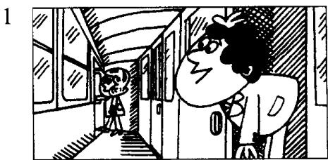  
Yes?

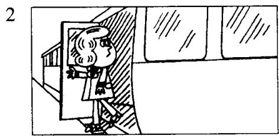  
Is this your handbag?

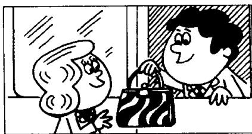  
Thank you very much.

## New words and expressions 生词和短语

excuse /ɪksˈkjuːz/ v. 原谅

me /mɪː/ pron. 我（宾格）

handbag /'hændbæg/ n. （女用）手提包

yes /jes/ adv. 是的

pardon /'pɑːdn/ int. 原谅，请再说一遍

is /ɪz/ v. be 动词现在时第三人称单数

it /ɪt/ pron. 它

this /ðɪs/ pron. 这

thank you /'θæŋk-ju:/ 感谢你（们）

your /jɔː/ possessive adjective 你的，你们的

very much /'veri-mʌtʃ/ 非常地

## Notes on the text 课文注释

## 1 Excuse me.

这个短语常用于与陌生人搭话，打断别人的说话或从别人身边挤过。在课文中，男士为了吸引女士的注意力而用了这个表示客套的短语。

## 2 Pardon?

全句为 I beg your pardon. 意思是请求对方把刚才讲过的话重复一遍。

参考译文

对不起。

什么事？

这是您的手提包吗？

对不起，请再说一遍。

这是您的手提包吗？

是的，是我的。

非常感谢！

## Lesson 2 Is this your...? 这是你的……吗？

Listen to the tape and do the exercises.

听录音并回答问题。

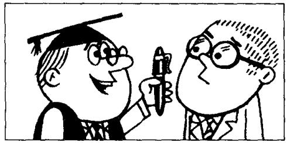

  
3

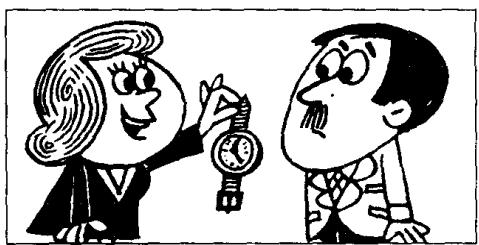  
5

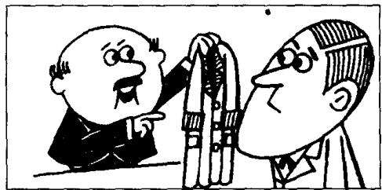

  
7

  
8

  
9

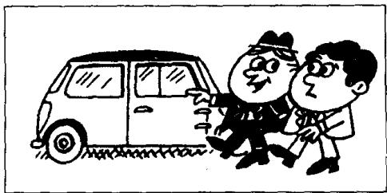  
10

## New words and expressions 生词和短语

pen /pen/ n. 钢笔

dress /dres/ n. 连衣裙

pencil /'pensəl/ n. 铅笔

skirt /skɜːt/ n. 裙子

book /bʊk/ n. 书

watch /wɒtʃ/ n. 手表

shirt /ʃɜːt/ n. 衬衣

coat /kəʊt/ n. 上衣，外衣

car /kɑː/ n. 小汽车

house /haʊs/ n. 房子

## Written exercise 书面练习

Copy these sentences.

抄写以下句子。

Excuse me!

Yes?

Is this your handbag?

Pardon?

Is this your handbag?

Yes, it is.

Thank you very much.

## Lesson 3 Sorry, sir. 对不起，先生。

Listen to the tape then answer this question. Does the man get his umbrella back?

听录音，然后回答问题。这位男士有没有要回他的雨伞？

My coat and my umbrella please.

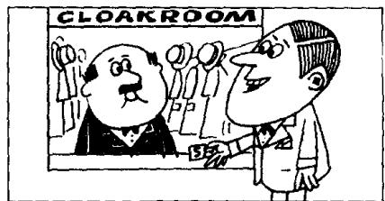

Here is my ticket.

Thank you, sir.
Number five.

Here's your umbrella and your coat.

This is not my umbrella.
Sorry, sir.

Is this your umbrella? No, it isn't.

Is this it?
Yes, it is.
Thank you very much.

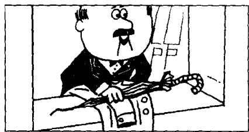

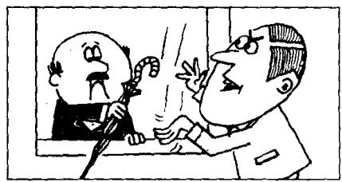

## New words and expressions 生词和短语

umbrella /ʌm'brelə/ n. 伞

number /'nʌmbə/ n. 号码

please /pliːz/ int. 请

five /faɪv/ num. 五

here /hɪə/ adv. 这里

sorry /'spri/ adj. 对不起的

my /maɪ/ possessive adjective 我的

ticket /'tɪkɪt/ n. 票

sir /sɜː/ n. 先生

cloakroom /'kləʊkrʊm/ n. 衣帽存放处

## Notes on the text 课文注释

1 Here's 是 Here is 的缩写形式，类似的例子有 He's (He is), It's (It is) 等。缩写形式和非缩写形式在英语的书面用语和口语中均有，但非缩写形式常用于比较正式的场合。

2. Sorry = I'm sorry. 这是口语中的缩略形式，用于社交场合，向他人表示歉意。

3 sir, 先生，这是英美人对不相识的男子、年长者或上级的尊称。

4 Is this it?

本句中 it 是指 your umbrella。由于前面提到了，后面就用代词 it 来代替，以免重复。

## 参考译文

请把我的大衣和伞拿给我。

这是我（寄存东西）的牌子。

谢谢，先生。

是5号。

这是您的伞和大衣。

这不是我的伞。

对不起，先生。

这把伞是您的吗？

不；不是！

这把是吗？

是，是这把。

非常感谢。

## Lesson 4 Is this your...? 这是你的……吗？

Listen to the tape and answer the questions.
听录音并回答问题。

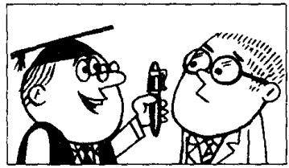  
Is this your pen?

  
Is this your pencil?

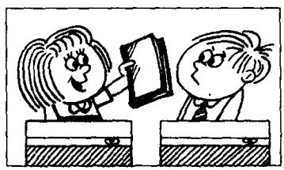  
Is this your book?

  
Is this your watch?

  
Is this your coat?

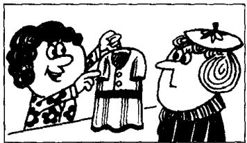  
Is this your dress?

  
Is this your skirt?

  
Is this your shirt?

  
Is this your car?  
10

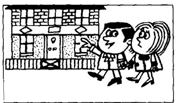  
Is this your house?

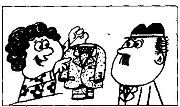  
Is this your suit?

  
Is this your school?  
13

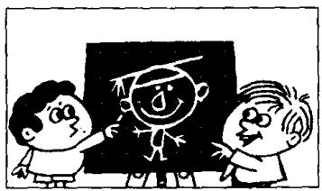  
Is this your teacher?

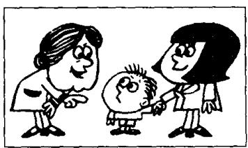  
Is this your son?

  
Is this your daughter?

## New words and expressions 生词和短语

suit /suːt/ n. 一套衣服

school /skuːl/ n. 学校

son /sʌn/ n. 儿子
daughter /'dɔːtə/ n. 女儿 teacher /'tiːtʃə/ n. 老师

## Written exercises 书面练习

A Copy these sentences.
抄写以下句子。

This is not my umbrella.

Sorry, sir.

Is this your umbrella?

No, it isn't!

B Answer these questions.
模仿例句回答以下问题。

Example:

Is this your umbrella?
No. It isn't my umbrella. It's your umbrella.

1 Is this your pen?

2 Is this your pencil?

3 Is this your book?

4 Is this your watch?

5 Is this your coat?

6 Is this your dress?

7 Is this your skirt?

8 Is this your shirt?

9 Is this your car?

10 Is this your house?

## Lesson 5 Nice to meet you. 很高兴见到你。

Listen to the tape then answer this question. Is Chang-woo Chinese? 听录音，然后回答问题。昌宇是中国人吗？

MR. BLAKE : Good morning.

STUDENTS : Good morning, Mr. Blake.

MR. BLAKE : This is Miss Sophie Dupont.
Sophie is a new student.
She is French.

MR. BLAKE : Sophie, this is Hans.
He is German.

HANS : Nice to meet you.

MR. BLAKE: And this is Naoko.
She's Japanese.

NAOKO: Nice to meet you.

MR. BLAKE: And this is Chang-woo.
He's Korean.

CHANG-WOO : Nice to meet you.

MR. BLAKE: And this is Luming.
He's Chinese.

LUMING : Nice to meet you.

MR. BLAKE: And this is Xiaohui.
She's Chinese, too.

XIAOHUI : Nice to meet you.

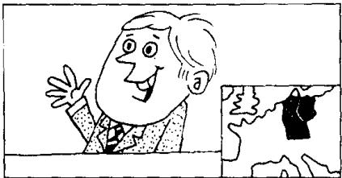

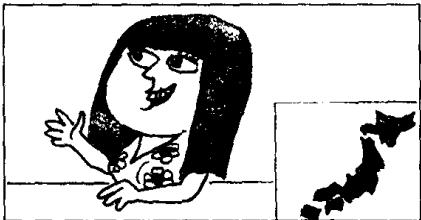

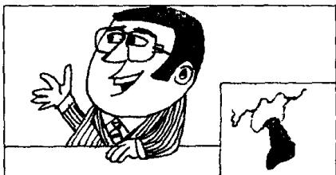

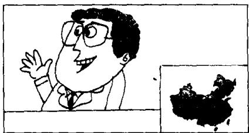

## New words and expressions 生词和短语

Mr. /'mɪstə/ 先生

German /'dʒɜːmən/ adj. & n. 德国人

good /gʊd/ adj. 好

nice /nais/ adj. 美好的

morning /'mɔːnɪŋ/ n. 早晨

meet /miːt/ v. 遇见

Miss /mɪs/ 小姐

Japanese /dʒæp'niːz/ adj. & n. 日本人

new /njuː/ adj. 新的

Korean /kəˈriən/ adj. & n. 韩国人

student /'stju:dənt/ n. 学生

French /frentʃ/ adj. & n. 法国人

Chinese /ˌtʃaɪˈniːz/ adj. & n. 中国人

too /tuː/ adv. 也

## Notes on the text 课文注释

1 Good morning.

早上好。英语中常见的问候用语。

2 This is Miss Sophie Dupont.

一般用于将某人介绍给他人的句式。一般指未婚女子。

3 Nice to meet you.

用于初次与同学、朋友见面等非正式场合。正式的场合常用 How do you do?

## 参考译文

布莱克先生：早上好。

学生：早上好，布莱克先生。

布莱克先生：这位是索菲娅·杜邦小姐。索菲娅是个新学生。她是法国人。

布莱克先生：索菲娅，这位是汉斯。他是德国人。

汉斯：很高兴见到你。

布莱克先生：这位是直子。她是日本人。

直子：很高兴见到你。

布莱克先生：这位是昌宇。他是韩国人。

昌宇：很高兴见到你。

布莱克先生：这位是鲁明。他是中国人。

鲁明：很高兴见到你。

布莱克先生：这位是晓惠。她也是中国人。

晓惠：很高兴见到你。

10

## Lesson 6 What make is it? 它是什么牌子的？

Listen to the tape and answer the questions.

听录音并回答问题。

  
It's a Volvo. (Swedish)

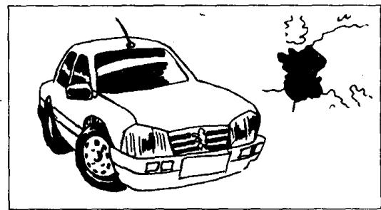  
It's a Peugeot. (French)

  
It's a Mercedes. (German)

  
It's a Toyota. (Japanese)  
12

  
It's a Daewoo. (Korean)

  
It's a Mini. (English)

  
It's a Ford. (American)

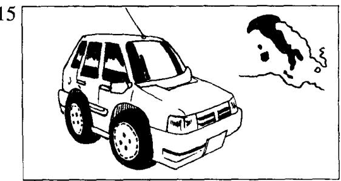  
It's a Fiat. (Italian)

## New words and expressions 生词和短语

make /meɪk/ n. (产品的) 牌号

Mercedes /mə'seɪdiːz/ n. 梅赛德斯

Swedish /'swi:dɪʃ/ adj. 瑞典的

Toyota /'təʊjəʊtə/ n. 丰田

English /'ɪŋɡlɪʃ/ adj. 英国的

Daewoo /'da:wu:/ n. 大宇

American /əˈmerɪkən/ adj. 美国的

Mini /'mɪni/ n. 迷你

Italian /ɪˈtæliən/ adj. 意大利的

Ford /fɔːd/ n. 福特

Volvo /'vɒlvəʊ/ n. 沃尔沃

Peugeot /'pɜːʒəʊ/ n. 标致

Fiat /'fiːæt/ n. 菲亚特

## Written exercises 书面练习

A Complete these sentences using He, She or It. 完成以下句子，用 He, She 或 It 填空。

Examples:

Stella is a student. \_\_\_\_ isn't German. \_\_\_\_ is Spanish.

Stella is a student. She isn't German. She is Spanish.

Alice is a student. \_\_\_\_ isn't German. \_\_\_\_ is French.

This is her car. \_\_\_\_ is a French car.

Hans is a student. \_\_\_\_ isn't French. \_\_\_\_ is German.

This is his car. \_\_\_\_ is a German car.

B Write questions and answers using He, She, It, a or an.

模仿例句写出相应的疑问句，并回答。选用 He, She, It, a 或 an 等词。

## Examples:

This is Miss Sophie Dupont. French/(Swedish)

Is she a French student or a Swedish student?

She isn't a Swedish student. She's a French student.

This is a Volvo. Swedish/(French)

Is it a Swedish car or a French car?

It isn't a French car. It's a Swedish car.

1 This is Naoko. Japanese/(German)

7 This is a Fiat. Italian/(English)

2 This is a Peugeot. French/(German)

8 This is Luming. Chinese/(English)

3 This is Hans. German/(Italian)

9 This is a Mercedes. German/(French)

4 This is Xiaohui. Chinese/(Italian)

10 This is a Toyota. Japanese/(Chinese)

5 This is a Mini. English/(American)

11 This is a Ford. American/(English)

6 This is Chang-woo. Korean/(Japanese)

12 This is a Daewoo. Korean/(Japanese)

## Lesson 7 Are you a teacher? 你是教师吗？

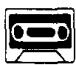

Listen to the tape then answer this question. What is Robert's job? 听录音，然后回答问题。罗伯特是做什么工作的？

ROBERT: I am a new student. My name's Robert.

SOPHIE : Nice to meet you.
My name's Sophie.

ROBERT : Are you French?

SOPHIE : Yes, I am.

SOPHIE : Are you French, too?

ROBERT: No, I am not.

SOPHIE : What nationality are you?

ROBERT : I'm Italian.

ROBERT: Are you a teacher?

SOPHIE : No, I'm not.

ROBERT: What's your job?

SOPHIE : I'm a keyboard operator.

SOPHIE: What's your job?

ROBERT: I'm an engineer.

## New words and expressions 生词和短语

I /aɪ/ pron. 我

nationality /ˌnæʃəˈnælɪti/ n. 国籍

am /æm/ v. be 动词现在时第一人称单数

job /dʒɒb/ n. 工作

are /ɑː/ v. be 动词现在时复数

keyboard /'ki:bɔ:d/ n. 电脑键盘

name /neɪm/ n. 名字

what /wɒt/ adj. & pron. 什么

operator /'ɒpəreɪtə/ n. 操作人员

engineer /endʒɪˈniə/ n. 工程师

## Notes on the text 课文注释

1 My name's = My name is.

2 I'm /aɪm/ = I am.

口语中经常使用这种缩略形式。

3 What's your job? 你是做什么工作的?

What's = What is.

4 What nationality are you?

用来询问对方国籍。也可以问 Where are you from?

## 参考译文

罗伯特：我是个新学生，我的名字叫罗伯特。

索菲娅：很高兴见到你。我的名字叫索菲娅。

罗伯特：你是法国人吗？

索菲娅：是的，我是法国人。

索菲娅：你也是法国人吗？

罗伯特：不，我不是。

索菲娅：你是哪国人？

罗伯特：我是意大利人。

罗伯特：你是教师吗？

索菲娅：不，我不是。

罗伯特：你是做什么工作的？

索菲娅：我是电脑录入员。

索菲娅：你是做什么工作的？

罗伯特：我是工程师。

## Lesson 8 What's your job? 你是做什么工作的？

Listen to the tape then answer the questions.

听录音并回答问题。

  
I'm a policeman.

  
I'm a policewoman.

  
I'm a taxi driver.

  
I'm an air hostess.

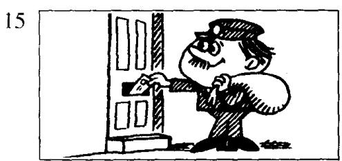  
.I'm a postman.

  
I'm a nurse.

  
I'm a mechanic.

  
I'm a hairdresser.  
19

  
I'm a housewife.

  
I'm a milkman.

## New words and expressions 生词和短语

policeman /pəˈliːsmən/ n. 警察

nurse /nɜːs/ n. 护士

policewoman /pəˈliːsˌwʊmən/ n. 女警察

mechanic /mɪˈkænɪk/ n. 机械师

taxi driver /'tæksi-'draɪvə/ 出租汽车司机

hairdresser /'heə,dresə/ n. 理发师

air hostess /'eə-'həʊstəs/ 空中小姐

housewife /'haʊswaɪf/ n. 家庭妇女

postman /'pəʊstmən/ n. 邮递员

milkman /'mɪlkmən/ n. 送牛奶的人

## Written exercises 书面练习

A Complete these sentences using am or is.

完成以下句子，用 $am$ 或 $is$ 填空。

Example:

My name \_\_\_\_ Xiaohui. I \_\_\_\_ Chinese.

My name is Xiaohui. I am Chinese.

1 My name \_\_\_\_ Robert. I \_\_\_\_ a student. I \_\_\_\_ Italian.

2 Sophie \_\_\_\_ not Italian. She \_\_\_\_ French.

3 Mr. Blake \_\_\_\_ my teacher. He \_\_\_\_ not French.

B Write questions and answers using his, her, he, she, a or an.

模仿例句写出相应的疑问句，并回答。选用 his, her, he, she, a 或 an 等词。

Examples:

keyboard operator

What's her job? Is she a keyboard operator? Yes, she is.

engineer

What's his job? Is he an engineer? Yes, he is.

1 policeman

6 nurse

2 policewoman

7 mechanic

3 taxi driver

8 hairdresser

4 air hostess

5 postman

9 housewife

10 milkman

## Lesson 9 How are you today? 你今天好吗？

Listen to the tape then answer this question. How is Emma? 听录音，然后回答问题。埃玛身体好吗？

STEVEN : Hello, Helen.

HELEN : Hi, Steven.

STEVEN: How are you today?

HELEN: I'm very well, thank you. And you?

STEVEN: I'm fine, thanks.

STEVEN: How is Tony?

HELEN: He's fine, thanks. How's Emma?

STEVEN: She's very well, too, Helen.

STEVEN: Goodbye, Helen.
Nice to see you.

HELEN : Nice to see you, too, Steven. Goodbye.

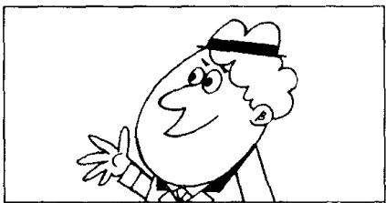

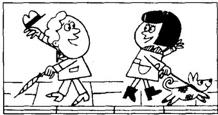

## New words and expressions 生词和短语

hello /hə'ləʊ/ int. 喂（表示问候）

fine /faɪn/ adj. 美好的

hi /haɪ/ int. 喂，嗨

thanks /θæŋks/ int. 谢谢

how /haʊ/ adv. 怎样

goodbye /'gʊd'bai/ int. 再见

today /tə'dcɪ/ adv. 今天

well /wel/ adj. 身体好

see /siː/ v. 见

## Notes on the text 课文注释

1 How are you?

这是朋友或相识的人之间见面时间对方身体情况的寒暄话，一般回答是：Fine, thank you.

2 And you? 即 And how are you? 的简略说法。

3 Nice to see you. 是 It's nice to see you. 的简略说法。

这一句也是见面时的客气话，一般回答是：Nice to see you, too. 见到你，我也很高兴。也可说：Nice to meet you. 很高兴遇到你。

## 参考译文

史蒂文：你好，海伦。

海伦：你好，史蒂文。

史蒂文：你今天好吗？

海伦：很好，谢谢你。你好吗？

史蒂文：很好，谢谢。

史蒂文：托尼好吗？

海伦：他很好，谢谢。埃玛好吗？

史蒂文：她也很好，海伦。

史蒂文：再见，海伦。见到你真高兴。

海伦：我见到你也很高兴，史蒂文。再见。

19

12

## Lesson 10 Look at... 看

Listen to the tape and answer the questions.

听录音并回答问题。

11

  
that man!
(fat)

  
that woman!
(thin)

  
that policeman!
(tall)  
14

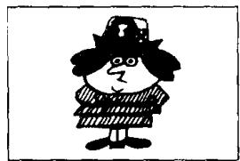  
that policewoman!
(short)

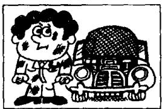  
that mechanic!
(dirty)

  
that nurse!
(clean)

  
Steven!
(hot)  
18

  
Emma!
(cold)

  
that milkman!
(old)  
20

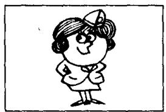  
that air hostess!
(young)  
21

  
that hairdresser!
(busy)  
22

  
that housewife!
(lazy)

## New words and expressions 生词和短语

fat /fæt/ adj. 胖的

hot /hɒt/ adj. 热的

woman /'wʊmən/ n. 女人

cold /kəʊld/ adj. 冷的

thin /θɪn/ adj. 瘦的

old /əʊld/ adj. 老的

tall /tɔːl/ adj. 高的

young /jʌŋ/ adj. 年轻的

short /ʃɔːt/ adj. 矮的

dirty /'dʒ:ti/ adj. 脏的

busy /'bɪzi/ adj. 忙的

clean /kliːn/ adj. 干净的

lazy /'leɪzi/ adj. 懒的

## Written exercises 书面练习

A Complete these sentences using He's, She's or It's.

完成以下句子，用 He's, She's 或 It's 填空。

## Example:

Robert isn't a teacher. \_\_\_\_ an engineer.

Robert isn't a teacher. He's an engineer.

1 Mr. Blake isn't a student. \_\_\_\_ a teacher.

2 This isn't my umbrella. \_\_\_\_ your umbrella.

3 Sophie isn't a teacher. \_\_\_\_ a keyboard operator.

4 Steven isn't cold. \_\_\_\_ hot.

5 Naoko isn't Chinese. \_\_\_\_ Japanese.

6 This isn't a German car. \_\_\_\_ a Swedish car.

## B Write sentences using He or She.

模仿例句写出相应的句子。

Example:

Helen/well

Look at Helen. She's very well.

1 man/fat

7 Steven/hot

2 woman/thin

8 Emma/cold

3 policeman/tall

9 milkman/old

4 policewoman/short

10 air hostess/young

5 mechanic/dirty

11 hairdresser/busy

6 nurse/clean

12 housewife/lazy

## Lesson 11 Is this your shirt? 这是你的衬衫吗？

Listen to the tape then answer this question. Whose shirt is white? 听录音，然后回答问题。谁的衬衣是白色的？

TEACHER : Whose shirt is that?

TEACHER : Is this your shirt, Dave?

DAVE: No, sir. It's not my shirt.

DAVE: This is my shirt. My shirt's blue.

TEACHER: Is this shirt Tim's?

DAVE: Perhaps it is, sir. Tim's shirt's white.

TEACHER : Tim!

TIM : Yes, sir?

TEACHER : Is this your shirt?

TIM : Yes, sir.

TEACHER : Here you are.

Catch!

TIM : Thank you, sir.

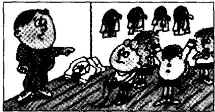

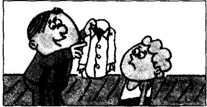

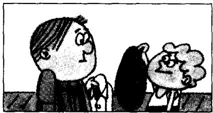

## New words and expressions 生词和短语

whose /huːz/ pron. 谁的

white /wait/ adj. 白色的

blue /blu:/ adj. 蓝色的

catch /kætʃ/ v. 抓住

perhaps /pə'hæps/ adv. 大概

## Notes on the text 课文注释

1 Whose shirt is that?

疑问代词 Whose 在本句中作定语，修饰 shirt。

2 Is this shirt Tim's?

Tim's 是 Tim 的所有格形式，为避免重复，Tim's 后面可以省去 shirt。例：It isn't my pen, it's Frank's. 这不是我的钢笔，是弗兰克的。

3 Here you are. 或 Here it is.

是给对方东西时的用语，句中的 are 和 is 应重读。

## 参考译文

老师：那是谁的衬衫？

老师：戴夫，这是你的衬衫吗？

戴夫：不，先生。这不是我的衬衫。

戴夫：这是我的衬衫。我的衬衫是蓝色的。

老师：这件衬衫是蒂姆的吗？

戴夫：也许是，先生。蒂姆的衬衫是白色的。

老师：蒂姆！

蒂姆：什么事，先生？

老师：这是你的衬衫吗？

蒂姆：是的，先生。

老师：给你。接着！

蒂姆：谢谢您，先生。

## Lesson 12 Whose is this . . . ? This is my/your/his/her . . .

这……是谁的？这是我的／你的／他的／她的·

Whose is that . . , ? That is my/your/his/her . . .

那……是谁的？那是我的／你的／他的／她的……

Listen to the tape and answer the questions.

听录音并回答问题。

22

  
handbag  
It's Stella's.  
car

  
It's Paul's.  
24

  
coat  
It's Sophie's.  
25

  
umbrella  
It's Steven's.  
26

  
pen  
It's my son's.  
27

  
dress  
It's my daughter's.  
28  
suit

  
It's my father's.  
29

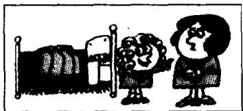  
skirt  
It's my mother's.  
30

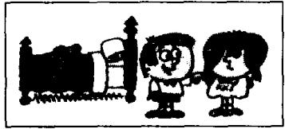  
blouse  
It's my sister's.  
31

  
tie  
It's my brother's.

## New words and expressions 生词和短语

father /'fɑːðə/ n. 父亲

tie /taɪ/ n. 领带

mother /'mʌðə/ n. 母亲

brother /'brʌðə/ n. 兄，弟

blouse /blauz/ n. 女衬衫

sister /'sɪstə/ n. 姐，妹

his /hɪz/ possessive adjective 他的

her /hɜː/ possessive adjective 她的

## Written exercises 书面练习

A Complete these sentences using my, your, his or her.

完成以下句子，用 my, your, his 或 her 填空。

Example:

Hans is here. That is \_\_\_\_ car.

Hans is here. That is his car.

1 Stella is here. That is \_\_\_\_ car.

2 Excuse me, Steven. Is this \_\_\_\_ umbrella?

3 I am an air hostess. \_\_\_\_ name is Britt.

4 Paul is here, too. That is \_\_\_\_ coat.

B Write questions and answers using 's, his and hers.

模仿例句提问并回答，选用名词所有格形式 's 或代词所有格形式 his 或 hers。

Example:

shirt/Tim

Whose is this shirt? It's Tim's. It's his shirt.

1 handbag/Stella

7 suit/my father

2 car/Paul

8 skirt/my mother

3 coat/Sophie

9 blouse/my sister

4 umbrella/Steven

10 tie/my brother

5 pen/my daughter

6 dress/my son

11 pen/Sophie

12 pencil/Hans

## Lesson 13 A new dress 一件新连衣裙

Listen to the tape then answer this question. What colour is Anna's hat? 听录音，然后回答问题。安娜的帽子是什么颜色的？

LOUISE: What colour's your new dress?

ANNA: It's green.

ANNA : Come upstairs and see it.

LOUISE : Thank you.

ANNA: Look! Here it is!

LOUISE: That's a nice dress. It's very smart.

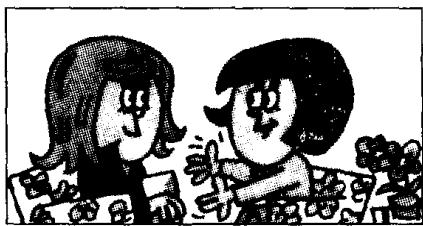

ANNA: My hat's new, too.

LOUISE: What colour is it?

ANNA: It's the same colour. It's green, too.

LOUISE : That is a lovely hat!

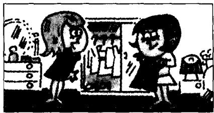

## New words and expressions 生词和短语

colour /'kʌlə/ n. 颜色

smart /smɑːt/ adj. 时髦的，巧妙的

green /griːn/ adj. 绿色

come /kʌm/ v. 来

hat /hæt/ n. 帽子

upstairs /ʌp'steəz/ adv. 楼上

same /seim/ adj. 相同的

lovely /'lʌvli/ adj. 可爱的，秀丽的

## Notes on the text 课文注释

1 What colour's = What colour is.

2 Come upstairs and see it.

句中 and 不当 “和” 讲，而是表示目的，例：Come and see me. 来见我。在英文中不能用 Come upstairs to see it.

## 参考译文

路易丝：你的新连衣裙是什么颜色的？

安娜：是绿色的。

安娜：到楼上来看看吧。

路易丝：谢谢。

安娜：瞧，就是这件。

路易丝：这件连衣裙真好，真漂亮。

安娜：我的帽子也是新的。

路易丝：是什么颜色的？

安娜：一样的颜色，也是绿的。

路易丝：真是一顶可爱的帽子！

## Lesson 14 What colour's your...? 你的……是什么颜色的？

Listen to the tape and answer the questions.

听录音并回答问题。

20

  
umbrella  
black  
30  
car

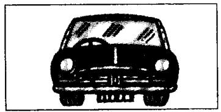  
blue  
40

  
shirt  
white  
50

  
coat  
grey  
60

  
case  
brown  
70

  
carpet  
red  
80

  
blouse  
yellow  
90  
tie

  
orange  
100  
hat

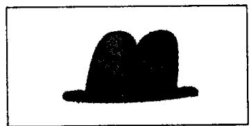  
grey and black  
101  
dog

  
brown and white

## New words and expressions 生词和短语

case /keis/ n. 箱子

dog /dɒg/ n. 狗

carpet /'kɑːpɪt/ n. 地毯

## Written exercises 书面练习

A Rewrite these sentences.

模仿例句将下列各组句子合二为一。

## Example:

This is Stella. This is her handbag.

This is Stella's handbag.

1 This is Paul. This is his car.

2 This is Sophie. This is her coat.

3 This is Helen. This is her dog.

4 This is my father. This is his suit.

5 This is my daughter. This is her dress.

B Write sentences using 's, his or her.

模仿例句提问并回答，选用名词所有格形式 's 或代词所有格形式 his 或 her。

Example:

Steven/umbrella/black

What colour's Steven's umbrella? His umbrella's black.

1 Steven/car/blue

7 Helen/dog/brown and white

2 Tim/shirt/white

8 Hans/pen/green

3 Sophie/coat/grey

9 Luming/suit/grey

4 Mrs. White/carpet/red

10 Stella/pencil/blue

5 Dave/tie/orange

11 Xiaohui/handbag/brown

6 Steven/hat/grey and black

12 Sophie/skirt/yellow

## Lesson 15 Your passports, please. 请出示你们的护照。

Listen to the tape then answer this question. Is there a problem with the Customs officer? 听录音，然后回答问题。海关官员有什么疑问吗？

CUSTOMS OFFICER : Are you Swedish?

GIRLS : No, we are not.
We are Danish.

CUSTOMS OFFICER : Are your friends Danish, too?
GIRLS : No, they aren't.
They are Norwegian.

CUSTOMS OFFICER : Your passports, please.
GIRLS : Here they are.

CUSTOMS OFFICER : Are these your cases?
GIRLS : No, they aren't.

GIRLS : Our cases are brown.
Here they are.

CUSTOMS OFFICER : Are you tourists?
GIRLS : Yes, we are.

CUSTOMS OFFICER : Are your friends tourists too?
GIRLS : Yes, they are.

CUSTOMS OFFICER: That's fine.  
GIRLS: Thank you very much.

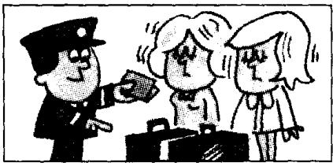

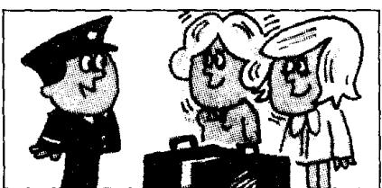

## New words and expressions 生词和短语

customs /'kʌstəmz/ n. 海关

Norwegian /nɔːˈwiːdʒən/ adj. & n. 挪威人

officer /'ɒfɪsə/ n. 官员

passport /'pɑ:spɔ:t/ n. 护照

girl /gɜːl/ n. 女孩，姑娘

brown /braʊn/ adj. 棕色的

Danish /'deɪnɪʃ/ adj. & n. 丹麦人

friend /frend/ n. 朋友

tourist /'tʊərɪst/ n. 旅游者

## Note on the text 课文注释

可数名词的复数形式一般是在单数名词后面加上 -s，如课文中的 friend — friends /frendz/; tourist — tourists /'toərɪsts/; case — cases /'keɪsɪz/。请注意 -s 的不同发音。

## 参考译文

海关官员：你们是瑞典人吗？

姑娘们：不，我们不是瑞典人。我们是丹麦人。

海关官员：你们的朋友也是丹麦人吗？

姑娘们：不，他们不是丹麦人。他们是挪威人。

海关官员：请出示你们的护照。

姑娘们：给您。

海关官员：这些是你们的箱子吗？

姑娘们：不，不是。

姑娘们：我们的箱子是棕色的。在这儿呢。

海关官员：你们是来旅游的吗？

姑娘们：是的，我们是来旅游的。

海关官员：你们的朋友也是来旅游的吗？

姑娘们：是的，他们也是。

海关官员：好了。

姑娘们：非常感谢。

## Lesson 16 Are you ...? 你是……吗？

Listen to the tape and answer the questions.

听录音并回答问题。

20

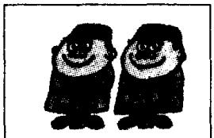  
Russian?

30

  
English?

40

  
American?

50

  
Dutch?

## Are these your . . . ? What colour are your . . . ? 这些是你的……吗？你的……是什么颜色？

60

  
red books

70

  
white shirts

80

  
grey coats

90

  
yellow tickets

100

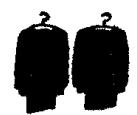  
blue suits

101

  
black and grey hats

102

  
green passports

103

  
black umbrellas

104

  
white handbags

105

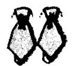  
orange ties

106

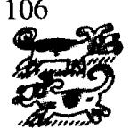  
brown and white dogs

107

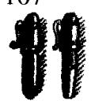  
blue pens

108

  
red cars

109

  
green dresses

110

  
yellow blouses

## New words and expressions 生词和短语

Russian /'rʌʃən/ adj. & n. 俄罗斯人

grey /greɪ/ adj. 灰色的

Dutch /dʌtʃ/ adj. & n. 荷兰人

yellow /'yeləʊ/ adj. 黄色的

these /ðiːz/ pron. 这些 (this 的复数)

black /blæk/ adj. 黑色的

red /red/ adj. 红色的

orange /'prɪndʒ/ adj. 橘黄色的

## Notes on the text 课文注释

1 如果名词是以 -s 结尾的，变成复数时要加 -es. 如 dress — dresses。

2 表示复数的 -s 或 -es 一般遵循以下发音规则：

(1) 如果名词词尾的发音是一个清辅音 (/s/, /ʃ/, /tʃ/ 除外). -s 发 /s/ 的音，如 books /bʊks/, suits /suːts/ ;

(2) 如果名词词尾的发音是一个浊辅音（/z/, /ʒ/, /dʒ/ 除外）或元音，-s 发 /z/ 的音，如 ties /taɪz/, dogs /dɒgz/；

(3) 如果名词词尾的发音是 /s/, /z/, /ʃ/, /ʒ/, /tʃ/ 或 /dʒ/, -s'发 /ɪz/ 的音，如 dresses /'dresɪz/, blouses /'blaʊzɪz/。

## Written exercises 书面练习

A Complete these sentences using a or an.

完成以下句子，用冠词 a 或 an 填空。

Examples:

It is \_\_\_\_ Swedish car. It is a Swedish car.

She is \_\_\_\_ air hostess. She is an air hostess.

1 It is \_\_\_\_ English car.

3 It is \_\_\_\_ Italian car.

2 It is \_\_\_\_ Japanese car.

5 It is \_\_\_\_ American car.

4. It is \_\_\_\_ French car.

6 Robert is not \_\_\_\_ teacher.

B Write questions and answers using our.

，模仿例句提问并用 our 来回答。

Example:

books/red

What colour are your books? Our books are red.

1 shirts/white

4 suits/blue

7 umbrellas/black

10 dogs/brown and white

2 coats/grey

5 hats/black and grey

8 handbags/white

11 pens/blue

3 tickets/yellow

9 ties/orange

12 cars/red

## Lesson 17 How do you do? 你好!

Listen to the tape then answer this question.

What are Michael Baker and Jeremy Short's jobs?

听录音，然后回答问题。迈克尔·贝克和杰里米·肖特是做什么工作的？

MR. JACKSON : Come and meet our employees, Mr. Richards.

MR. RICHARDS : Thank you, Mr. Jackson.

MR. JACKSON : This is Nicola Grey, and this is Claire Taylor.

MR. RICHARDS : How do you do?

MR. RICHARDS : Those women are very hard-working.
What are their jobs?

MR. JACKSON: They're keyboard operators.

MR. JACKSON : This is Michael Baker, and this is Jeremy Short.

MR. RICHARDS : How do you do?

MR. RICHARDS: They aren't very busy! What are their jobs?

MR. JACKSON: They're sales reps.
They're very lazy.

MR. RICHARDS : Who is this young man?

MR. JACKSON: This is Jim.
He's our office assistant.

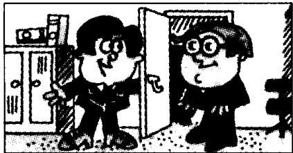

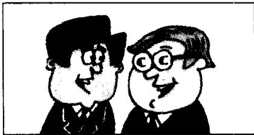

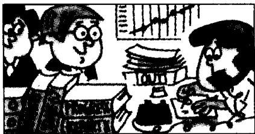

## New words and expressions 生词和短语

employee /ɪmplɔrˈiː/ n. 雇员

man /mæn/ n. 男人

hard-working /ˌhaːdˈwɜːkɪŋ/ adj. 勤奋的

office /'ɒfɪs/ n. 办公室

sales reps /'seilz-'reps/ 推销员

assistant /ə'sɪstənt/ n. 助手

## Notes on the text 课文注释

1 How do you do? 您好（用于第一次见面时）。一般用同样的话来回答。见第 5 课课文注释 3。

2 sales reps 是 sales representatives 的缩写形式，常用于口语。

3 office assistant 是指办公室干杂务的工作人员。

## 参考译文

杰克逊先生：来见见我们的雇员，理查兹先生。

理查兹先生：谢谢，杰克逊先生。

杰克逊先生：这位是尼古拉·格雷，这位是克莱尔·泰勒。

理查兹先生：你们好！

理查兹先生：那些姑娘很勤快。她们是做什么工作的？

杰克逊先生：她们是电脑输录入员。

杰克逊先生：这位是迈克尔·贝克，这位是杰里米·肖特。

理查兹先生：你们好！

理查兹先生：他们不很忙吧！他们是做什么工作的？

杰克逊先生：他们是推销员，他们非常懒。

理查兹先生：这个年轻人是谁？

杰克逊先生：他是吉姆，是我们办公室的勤杂人员。

## Lesson 18 What are their jobs? 他们是做什么工作的？

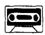

Listen to the tape and answer the questions.

听录音并回答问题。

100

  
sales reps  
200

  
keyboard operators  
300

  
mechanics  
400

  
engineers  
500

  
hairdressers  
600

  
teachers  
700

  
Customs officers  
800

  
taxi drivers  
900

  
nurses  
1,000

  
air hostesses  
1,001

  
housewives  
1,002

  
milkmen  
1,003

  
postmen  
1,004

  
policemen  
1,005

  
policewomen

## Notes on the text 课文注释

1 如果名词是以 -f 或 -fe 结尾的，变成复数时，一般要把 -f 或 -fe 变成 -v，再加 -es，如 housewife — housewives。

2 英语中有一些名词的复数形式是不规则的，如 man, woman，以及由这两个词组成的复合名词: man — men; woman — women;

milkman — milkmen;

policewoman — policewomen.

## Written exercises 书面练习

A Complete these sentences using He, She, We or They.

完成以下句子，用 He, She, We 或 They 填空。

Example:

Those men are lazy. \_\_\_\_ are sales reps.

Those men are lazy. They are sales reps.

1 That man is tall. \_\_\_\_ is a policeman.

2 Those girls are busy. \_\_\_\_ are keyboard operators.

3 Our names are Britt and Inge. \_\_\_\_ are Swedish.

4 Look at our office assistant. \_\_\_\_ is very hard-working.

5 Look at Nicola. \_\_\_\_ is very pretty.

6 Michael Baker and Jeremy Short are employees. \_\_\_\_ are sales reps.

B Write questions and answers.

模仿例句提问并回答。

Example:

(mechanics)/sales reps

What are their jobs?

Are they mechanics or sales reps?

They aren't mechanics. They're sales reps.

1 (keyboard operators)/air hostesses

2 (postmen)/policemen

6 (engineers)/taxi drivers

7 (policewomen)/keyboard operators

3 (policewomen)/nurses

8 (milkmen)/engineers

4 (customs officers)/hairdressers

9 (policemen)/milkmen

5 (hairdressers)/teachers

10 (nurses)/housewives

## Lesson 19 Tired and thirsty 又累又渴

Listen to the tape then answer this question.

Why do the children thank their mother?

听录音，然后回答问题。为什么孩子们向母亲致谢？

MOTHER: What's the matter, children?

GIRL: We're tired...

BOY : ... and thirsty, Mum.

MOTHER : Sit down here.

MOTHER : Are you all right now?

BOY: No, we aren't.

MOTHER: Look! There's an ice cream man.

MOTHER : Two ice creams please.

MOTHER : Here you are, children.

CHILDREN : Thanks, Mum.

GIRL : These ice creams are nice.

MOTHER : Are you all right now?

CHILDREN: Yes, we are, thank you!

## New words and expressions 生词和短语

matter /'mætə/ n. 事情

Mum /mʌm/ n. 妈妈（儿语）

children /'tʃɪldrən/ n. 孩子们 (child 的复数)

sit down /'sɪt-daʊn/ 坐下

tired /taɪəd/ adj. 累，疲乏

right /raɪt/ adj. 好，可以

boy /bɔɪ/ n. 男孩

thirsty /'θɜːsti/ adj. 渴

ice cream /'aɪs-'kriːm/ 冰淇淋

## Notes on the text 课文注释

1 What's the matter? = Tell me what's wrong. 怎么啦?

2 There's = There is.

## 参考译文

母亲：怎么啦，孩子们？

女孩：我们累了……

男孩：……口也渴，妈妈。

母亲：坐在这儿吧。

母亲：你们现在好些了吗？

男孩：不，还没有。

母亲：瞧！有个卖冰淇淋的。

母亲：请拿两份冰淇淋。

母亲：拿着，孩子们。

孩子们：谢谢，妈妈。

女孩：这些冰淇淋真好吃。

母亲：你们现在好了吗？

孩子们：是的，现在好了，谢谢您！

# Lesson 20 Look at them! 看看他/它们!

Listen to the tape and answer the questions.
听录音并回答问题。

105

  
They're clean.  
106

  
They're dirty.  
217

  
They're hot.  
218

  
They're cold.  
321

  
They're fat.  
322

  
They're thin.  
433

  
They're big.  
434

  
They're small.  
545

  
They're open.  
546

  
They're shut.  
657

  
They're light.  
658

  
They're heavy.  
769

  
They're old.  
770

  
They're young.

  
They're old.  
882

  
They're new.  
998

  
They're short.  
999

  
They're tall.  
1,000

  
They're short.  
1,001

  
They're long.

## New words and expressions 生词和短语

big /big/ adj. 大的

heavy /'hevi/ adj. 重的

small /smɔːl/ adj. 小的

long /lɒŋ/ adj. 长的

open /'əʊpən/ adj. 开着的

shut /ʃʌt/ adj. 关着的

shoe /ʃuː/ n. 鞋子

light /laɪt/ adj. 轻的

grandfather /'grændˌfɑːðə/ n.-祖父，外祖父

grandmother /'græn,mʌðə/ n. 祖母，外祖母

## Written exercises 书面练习

A Complete these sentences using am, is or are.

抄写以下句子，用 am, is 或 are 填空。

Example:

Those children \_\_\_\_ thirsty.

Those children are thirsty.

1 Those children \_\_\_\_ tired.

2 Their mother \_\_\_\_ tired, too.

3 That ice cream man \_\_\_\_ very busy.

4 His ice creams \_\_\_\_ very nice.

5 What's the matter, children? We \_\_\_\_ thirsty.

6 What's the matter, Tim? I \_\_\_\_ tired.

## B Write questions and answers.

模仿例句提问并回答。

## Example:

his shoes/(dirty)/clean

Are his shoes dirty or clean?

They're not dirty. They're clean.

1 the children/(tired)/thirsty

2 the postmen/(cold)/hot

6 his cases/(heavy)/light

7 grandmother and grandfather/(young)/old

3 the hairdressers/(thin)/fat

4 the shoes/(small)/big

8 their hats/(old)/new

5 the shops/(shut)/open

9 the policemen/(short)/tall

10 his trousers/(short)/long

## Lesson 21 Which book? 哪一本书?

Listen to the tape then answer this question.

Which book does the man want?

听录音，然后回答问题。这位男士要哪本书？

MAN : Give me a book please, Jane.

WOMAN : Which book?

WOMAN : This one?

MAN : No, not that one. The red one.

WOMAN : This one?

MAN : Yes, please.

WOMAN : Here you are.

MAN: Thank you.

## New words and expressions 生词和短语

give /gɪv/ v. 给

which /wɪtʃ/ question word 哪一个

one /wʌn/ pron. 一个

## Notes on the text 课文注释

1 Give me a book, please.

这是祈使句，省略了主语 you。

2 Which book? 哪一本？这是一种省略形式。

3 This one? 句中的 one 是不定代词，表示 book。复数形式是 ones。

## 参考译文

丈夫：请拿本书给我，简。

妻子：哪一本？

妻子：是这本吗？

丈夫：不，不是那本。是那本红皮的。

妻子：这本吗？

丈夫：是的，请给我。

妻子：给你。

丈夫：谢谢。

## Lesson 22 Give me/him/her/us/them a . . .

Which one?

给我／他／她／我们／他们一……

哪一……？

Listen to the tape and answer the questions.
听录音并回答问题。

1,001

  
(dirty)  
1,002

  
(clean)  
1,003

  
(empty)  
1,004

  
(full)  
1,005

  
(large)  
1,006

  
(small)  
1,007

  
(big)  
1,008

  
(little)  
1,009  
(new)

  
1,010

  
(old)  
1,011

  
(sharp)  
1,012

  
(blunt)  
1,013  
(new)

  
1,014

  
(old)  
1,015

  
(large)  
1,016

  
(small)

## New words and expressions 生词和短语

empty /'empti/ adj. 空的

box /bɒks/ n. 盒子，箱子

full /ful/ adj. 满的

glass /gla:s/ n. 杯子

large /la:dʒ/ adj. 大的

cup /kʌp/ n. 茶杯

little /'lɪtl/ adj. 小的

bottle /'botl/ n. 瓶子

sharp /ʃɑːp/ adj. 尖的，锋利的

tin /tɪn/ n. 罐头

small /smɔːl/ adj. 小的

big /big/ adj. 大的

knife /naɪf/ n. 刀子

blunt /blʌnt/ adj. 钝的

fork /fɔːk/ n. 叉子

spoon /spuːn/ n. 勺子

## Written exercises 书面练习

A Complete these sentences using His, Her, Our or Their.
完成以下句子，用 His, Her, Our 或 Their 填空。

Example:

Is this Tim's shirt? No, it's not. \_\_\_\_ shirt is white.

Is this Tim's shirt? No, it's not. His shirt is white.

1 Is this Nicola's coat? No. it's not. \_\_\_\_ coat is grey.

2 Are these your pens? No, they're not. \_\_\_\_ pens are blue.

3 Is this Mr. Jackson's hat? No, it's not. \_\_\_\_ hat is black.

4 Are these the children's books? No, they're not. \_\_\_\_ books are red.

5 Is this Helen's dog? No, it's not. \_\_\_\_ dog is brown and white.

6 Is this your father's tie? No, it's not. \_\_\_\_ tie is orange.

## B Write questions and answers.

模仿例句写出相应的对话。

Example:

book/(this blue)/that red

Give me a book please.

Which one? This blue one?

No, not this blue one. That red one.

Here you are.

Thank you.

1 cup/(this dirty)/that clean

5 tin/(this new)/that old

2 glass/(this empty)/that full

6 knife/(this sharp)/that blunt

3 bottle/(this large)/that small

7 spoon/(this new)/that old

4 box/(this big)/that little

8 fork/(this large)/that small

## Lesson 23 Which glasses? 哪几只杯子?

Listen to the tape then answer this question.

Which glasses does the man want?

听录音，然后回答问题。这位男士要哪些杯子？

MAN : Give me some glasses please, Jane.

WOMAN : Which glasses?

WOMAN : These glasses?

MAN : No, not those.
The ones on the shelf.

WOMAN: These?

MAN : Yes, please.

WOMAN : Here you are.

MAN: Thanks.

## New words and expressions 生词和短语

on /ɒn/ prep. 在……之上

shelf /ʃelf/ n. 架子，搁板

## Notes on the text 课文注释

1 在 Give me some glasses 中，动词 give 后面有两个宾语，即直接宾语 some glasses 和间接宾语 me。人称代词作宾语时要用人称代词的宾格。如：me (I 的宾格)，us (we 的宾格)，you (you 的宾格)，him (he 的宾格)，her (she 的宾格)，them (they 的宾格) 和 it (it 的宾格）。

2 No, not those.

句中 those 是指 those glasses。

3 The ones on the shelf.

本句是省略句。句中的 ones 代表 glasses。

## 参考译文

丈夫：请拿给我几只玻璃杯，简。

妻子：哪几只？

妻子：是这几只吗？

丈夫：不，不是那几只。是架子上的那几只。

妻子：这几只？

丈夫：是的，请拿给我。

妻子：给你。

丈夫：谢谢。

# Lesson 24 Give me/him/her/us/them some . . . Which ones?

给我／他／她／我们／他们一些……

哪些？

Listen to the tape and answer the questions.

听录音并回答问题。

1,117

  
pens/on the desk  
1,218

  
ties/on the chair  
1,319

  
spoons/on the table  
1,420

  
plates on the cupboard  
1,521

  
cigarettes/on the television  
1,622

  
boxes/on the floor  
1,723

  
bottles/on the dressing table  
1,824

  
books/on the shelf  
1,925

  
magazines/on the bed  
2,000

  
newspapers/on the stereo

## New words and expressions 生词和短语

desk /desk/ n. 课桌

floor /floː/ n. 地板

table /'teɪbl/ n. 桌子

dressing table /'dresɪŋ-ˈteɪbl/ 梳妆台

plate /pleɪt/ n. 盘子

magazine /mægə'ziːn/ n. 杂志

cupboard /'kʌbəd/ n. 食橱

bed /bed/ n. 床

cigarette /ˌsɪɡəˈreɪt/ n. 香烟

television /'telɪˌvɪʒən/ n. 电视机

newspaper /'nju:speɪpə/ n. 报纸

stereo /'steriəʊ/ n. 立体声音响

## Written exercises 书面练习

A Complete these sentences using me, him, her, us or them.

完成以下句子，用 me, him, her, us 或 them 填空。

## Example:

Give Tim this shirt. Give \_\_\_\_ this one, too.

Give Tim this shirt. Give him this one, too.

I Give Jane this watch. Give \_\_\_\_ this one, too.

2 Give the children these ice creams. Give \_\_\_\_ these, too.

3 Give Tom this book. Give \_\_\_\_ this one, too.

4 That is my passport. Give \_\_\_\_ my passport please.

5 That is my coat. Give \_\_\_\_ my coat please.

6 Those are our umbrellas. Give \_\_\_\_ our umbrellas please.

B Write questions and answers.

模仿例句写出相应的对话。

## Example:

glasses/on the shelf

Give me some glasses please.

Which ones? These?

No. not those. The ones on the shelf.

1 pens/on the desk

6 boxes/on the floor

2 ties/on the chair

7 bottles/on the dressing table

3 spoons/on the table

8 books/on the shelf

4 plates/on the cupboard

9 magazines/on the bed

5 cigarettes/on the television

10 newspapers/on the stereo

## Lesson 25 Mrs. Smith's kitchen 史密斯太太的厨房

Listen to the tape then answer this question.

What colour is the electric cooker?

听录音，然后回答问题。电灶是什么颜色的？

Mrs. Smith's kitchen is small.

There is a refrigerator in the kitchen.

The refrigerator is white.

It is on the right.

There is an electric cooker in the kitchen.

The cooker is blue.

It is on the left.

There is a table in the middle of the room.

There is a bottle on the table.

The bottle is empty.

There is a cup on the table, too.

The cup is clean.

## New words and expressions 生词和短语

Mrs. /'mɪsɪz/ 夫人

cooker /'kʊkə/ n. 炉子，炊具

kitchen /'kɪtʃən/ n. 厨房

middle /'mɪdl/ n. 中间

refrigerator /rɪˈfrɪdzəreɪtə/ n. 电冰箱

of /əv/ prep. （属于）……的

right /raɪt/ n. 右边

room /ruːm/ n. 房间

electric /ɪ'lektrɪk/ adj. 带电的，可通电的

cup /kʌp/ n. 杯子

left /left/ n. 左边

## Notes on the text 课文注释

1 There is 的结构用来说明人或物的存在，在汉语中可以译为 “有”。这个结构要跟单数名词，句中往往要有一个介词短语来表示位置或地点。

2 on the right (left), 在右边（左边），是介词短语，在本句中作表语。

3 注意不要把 cooker 和 cook 混淆，cooker 是炉子、锅等炊具，不是 “炊事员”。炊事员在英语中是 cook。

4 in the middle of, 在……之间。

5 在课文的第 2 行和第 3 行的名词 refrigerator 前面用了两种不同的冠词：a（不定冠词）和 the（定冠词）。在第 2 行，“冰箱”是第一次提到，是指冰箱这类电器中的一个，因此要用不定冠词 a。当第 2 次提到冰箱时，就不是泛指任何一个冰箱，而是特指第 2 行中的那个冰箱了，因此要用定冠词 the。

## 参考译文

史密斯夫人的厨房很小。

厨房里有个电冰箱。

冰箱的颜色是白的。

它位于房间右侧。

厨房里有个电灶。

电灶的颜色是蓝的。

它位于房间左侧。

房间的中央有张桌子。

桌子上有个瓶子。

瓶子是空的。

桌子上还有一只杯子。

杯子很干净。

## Lesson 26 Where is it? 它在哪里？

Listen to the tape and answer the questions.

听录音并回答问题。

3,000  
  
There is a cup on the table.
The cup is clean.

4,000  
  
There is a box on the floor.
The box is large.

5,000  
  
There is a glass in the cupboard.
The glass is empty.

6,000  
  
There is a knife on the plate.
The knife is sharp.

7,000  
  
There is a fork on the tin.
The fork is dirty.

8,000  
  
There is a bottle in the refrigerator.
The bottle is full.

9,000  
  
There is a pencil on the desk.
The pencil is blunt.

10,000  
  
There is a spoon in the cup.
The spoon is small.

# New words and expressions 生词和短语

where /weə/ adv. 在哪里

in /ɪn/ prep. 在……里

## Written exercises 书面练习

A Complete these sentences using a or the.

完成以下句子，用 $a$ 或 the 填空。

Example:

Give me \_\_\_\_ book. Which book? \_\_\_\_ book on the table.

Give me a book. Which book? The book on the table.

1 Give me \_\_\_\_ glass. Which glass? \_\_\_\_ empty one.

2 Give me some cups. Which cups? \_\_\_\_ cups on the table.

3 Is there \_\_\_\_ book on \_\_\_\_ table? Yes, there is. Is \_\_\_\_ book red?

4 Is there \_\_\_\_ knife in that box? Yes, there is. Is \_\_\_\_ knife sharp?

B Write sentences using these words.

模仿例句写出相应的句子。

Example:

refrigerator in the kitchen/white

There's a refrigerator in the kitchen.

The refrigerator is white.

1 cup on the table/clean

5 fork on the tin/dirty

2 box on the floor/large

6 bottle in the refrigerator/full

3 glass in the cupboard/empty

7 pencil on the desk/blunt

4 knife on the plate/sharp

## Lesson 27 Mrs. Smith's living room 史密斯太太的客厅

Listen to the tape then answer this question. Where are the books? 听录音，然后回答问题。书在哪里？

Mrs. Smith's living room is large.

There is a television in the room.

The television is near the window.

There are some magazines on the television.

There is a table in the room.

There are some newspapers on the table.

There are some armchairs in the room.

The armchairs are near the table.

There is a stereo in the room.

The stereo is near the door.

There are some books on the stereo.

There are some pictures in the room.

The pictures are on the wall.

## New words and expressions 生词和短语

living room /'livɪŋ-rʊm/ 客厅

door /dɔː/ n. 门

near /nɪə/ prep. 靠近

picture /'pɪktʃə/ n. 图画

window /'wɪndəʊ/ n. 窗户

armchair /'ɑːmtʃeə/ n. 扶手椅

wall /wɔːl/ n. 墙

## Notes on the text 课文注释

1 There are 的结构中要用复数名词。

2 near the window (door), 靠近窗 (门), 为介词短语。在本句中作表语。

3 on the wall, 在墙上。介词短语作表语。

## 参考译文

史密斯夫人的客厅很大。

客厅里有台电视机。

电视机靠近窗子。

电视机上放着几本杂志。

客厅里有张桌子。

桌上放着几份报纸。

客厅里有几把扶手椅。

这些扶手椅靠近桌子。

客厅里有台立体声音响。

音响靠近门。

音响上面有几本书。

客厅里有几幅画。

画挂在墙上。

## Lesson 28 Where are they? 它们在哪里？

Listen to the tape and answer the questions.
听录音并回答问题。

  
There are some cigarettes on the dressing table. They are near that box.

  
There are some plates on the cooker. They are clean.

  
There are some trousers on the bed.
They are near that shirt.

  
There are some bottles in the refrigerator.
They are empty.

  
There are some shoes on the floor. They're near the bed.

  
There are some knives on the table. They're in that box.

  
There are some forks on the shelf. They're near those spoons.

  
There are some bottles on the cupboard. They're near those tins.

  
There are some tickets on the shelf. They're in that handbag.

  
There are some glasses on the television. They're near those bottles.

## New words and expressions 生词和短语

trousers traozoz n. (复数) 长裤

## Written exercises 书面练习

A Look at these words.

注意单数名词和复数名词的区别。

Examples:

a book — some books; a man — some men; a housewife — some housewives

Rewrite these sentences using There are.

模仿例句改用 There are 的结构。

## Example:

There is a book on the desk.
There are some books on the desk.

1 There is a pencil on the desk.

2 There is a knife near that tin.

4 There is a newspaper in the living room.

5 There is a keyboard operator in the office.

3 There is a policeman in the kitchen.

B Write sentences using these words.
模仿例句写出相应的对话。

## Example:

(books)/on the dressing table/cigarettes/near that box

Are there any books on the dressing table?

No, there aren't any books on the dressing table.

There are some cigarettes.

Where are they?

They're near that box.

1 (books)/in the room/magazines/on the television

2 (ties)/on the floor/shoes/near the bed

3 (glasses)/on the cupboard/bottles/near those tins

4 (newspapers)/on the shelf/tickets/in that handbag

5 (forks)/on the table/knives/in that box

6 (cups)/on the stereo/glasses/near those bottles

7 (cups)/in the kitchen/plates/on the cooker

8 (glasses)/in the kitchen/bottles/in the refrigerator

9 (books)/in the room/pictures/on the wall

10 (chairs)/in the room/armchairs/near the table

## Lesson 29 Come in, Amy. 进来，艾米。

Listen to the tape then answer this question. How must Amy clean the floor? 听录音，然后回答问题。艾米需要如何来清扫地面？

MRS. JONES : Come in, Amy.

MRS. JONES : Shut the door, please.

MRS. JONES: This bedroom's very untidy.

AMY : What must I do, Mrs. Jones?

MRS. JONES : Open the window and air the room.

MRS. JONES : Then put these clothes in the wardrobe.

MRS. JONES : Then make the bed.

MRS. JONES : Dust the dressing table.

MRS. JONES : Then sweep the floor.

## New words and expressions 生词和短语

shut /ʃʌt/ v. 关门

put /put/ v. 放置

bedroom /'bedrʊm/ n. 卧室

clothes /kləʊðz/ n. 衣服

untidy /ʌn'taɪdi/ adj. 乱，不整齐

wardrobe /'wɔːdrəʊb/ n. 大衣柜

must /mʌst/ modal verb 必须，应该

dust /dʌst/ v. 挥掉灰尘

open /'əʊpən/ v. 打开

sweep /swiːp/ v. 扫

air /eə/ v. 使……通风，换换空气

## Notes on the text 课文注释

1 英文中需用祈使语气来表示直接的命令、建议、告诫、邀请等多种意图。祈使句一般省略主语 you，动词采用动词的原形。如本课对话中的 Come in, shut the door, open the window ... 等均为祈使句。

2 What must I do? 我应该做些什么呢？其中的 must 是情态动词，表示不可逃避的义务或不可推卸的责任。

3 make the bed, 铺床。

参考译文

琼斯夫人：进来，艾米。

琼斯夫人：请把门关上。

琼斯夫人：这卧室太不整洁了。

艾米：我应该做些什么呢，琼斯夫人？

琼斯夫人：打开窗子，给房间通通风。

琼斯夫人：然后把这些衣服放进衣橱里去。

琼斯夫人：再把床整理一下。

琼斯夫人：掸掉梳妆台上的灰尘。

琼斯夫人：然后打扫地。

## Lesson 30 What must I do? 我应该做什么？

Listen to the tape and answer the questions.

听录音并回答问题。

Open your Shut

1

2

3

Put on your Take off

Turn on the Turn off

Sweep the

Clean the

21

Dust the

Empty the

27

29

Read this

31

32

33

Sharpen these

34

## New words and expressions 生词和短语

empty /'empti/ v. 倒空，使……变空

take off /'teɪk-pf/ 脱掉

read /riːd/ v. 读

turn on /'tɜːn-ɒn/ 开 (电灯)

sharpen /'ʃɑːpən/ v. 削尖，使锋利

put on /'pʊt-ɒn/ 穿上

turn off /'tɜːn-ɒf/ 关 (电灯)

## Written exercises 书面练习

A Rewrite these sentences.

模仿例句写出相应的祈使句。

Example:

The cup isn't empty. Empty it!

1 The window isn't clean.

2 The door isn't shut.

3 The wardrobe isn't open.

## B Look at this table:

注意下表：

<table><tr><td>Shut the</td><td>stereo</td></tr><tr><td>Open the</td><td>tap</td></tr><tr><td>Put on your</td><td>blackboard</td></tr><tr><td>Take off your</td><td>cup</td></tr><tr><td>Turn on the</td><td>window</td></tr><tr><td>Turn off the</td><td>cupboard</td></tr><tr><td>Sweep the</td><td>magazine</td></tr><tr><td>Clean the</td><td>knives</td></tr><tr><td>Dust the</td><td>shirt</td></tr><tr><td>Empty the</td><td>door</td></tr><tr><td>Read this</td><td>floor</td></tr><tr><td>Sharpen these</td><td>shoes</td></tr></table>

Now write eleven sentences.

模仿下面的例句写出11句表示命令的句子。

Example:

Shut the door!

## Lesson 31 Where's Sally? 萨莉在哪里？

Listen to the tape then answer this question. Is the cat climbing the tree? 听录音，然后回答问题。猫正在爬树吗？

JEAN: Where's Sally, Jack?

JACK: She's in the garden, Jean.

JEAN: What's she doing?

JACK: She's sitting under the tree.

JEAN: Is Tim in the garden, too?

JACK: Yes, he is. He's climbing the tree.

JEAN: I beg your pardon? Who's climbing the tree?

JACK : Tim is.

JEAN: What about the dog?

JACK: The dog's in the garden, too. It's running across the grass. It's running after a cat.

## New words and expressions 生词和短语

garden /'ga:dn/ n. 花园

run /rʌn/ v. 跑

under /'ʌndə/ prep. 在……之下

grass /grɑːs/ n. 草，草地

tree /triː/ n. 树

after /'ɑːftə/ prep. 在……之后

climb /klaɪm/ v. 爬，攀登

across /ə'krɔs/ prep. 横过，穿过

who /huː/ pron. 谁

cat /kæt/ n. 猫

## Notes on the text 课文注释

1 在英文中表示说话时正在进行的动作或事件，要用动词的现在进行时。现在进行时由 be 的现在时加上现在分词组成，如课文中的 “She’s sitting under the tree.” 和 “He’s climbing the tree.” 等句子均为现在进行时。对大多数动词来说，在动词后面直接加 -ing 即可组成现在分词，如 doing, climbing 。对以 -e 结尾的动词，要去掉 -e，再加 -ing，如 making。如果动词只有一个元音字母，而其后跟了一个辅音字母时，则需将辅音字母双写，再加 -ing，如 running, sitting 。

2 What about the dog? 那么狗呢？这句话的意思是 What is the dog doing in the garden? 为了避免重复原句中的主语和谓语动词，可以用 What about 这个结构，用来询问情况。

3 run after, 追逐。

例：Look, Sally is running after her Mum. 瞧，萨莉正在追赶她的母亲。

## 参考译文

琼：杰克，萨莉在哪儿？

杰克：她在花园里，琼。

琼：她在干什么？

杰克：她正在树荫下坐着。

琼：蒂姆也在花园里吗？

杰克：是的，他也在花园里。他正在爬树。

琼：你说什么？谁在爬树？

杰克：蒂姆在爬树。

琼：那么狗呢？

杰克：狗也在花园里。它正在草地上跑，在追一只猫。

500,000

300,000

800,000

50,000

60,000

40,000

# Lesson 32 What's he/she/it doing? 他／她／它正在做什么？

Listen to the tape and answer the questions.

听录音并回答问题。

20,000

  
Nicola is typing  
30,000

  
She is emptying  
a basket.

  
a letter.  
Mr. Richards is opening  
the window.

  
My mother is making

  
the bed.  
Sally is shutting  
70,000  
the door.

  
It is eating  
a bone.  
80,000

  
My sister is looking  
at a picture.

  
Jack is reading  
a magazine.  
100,000

  
He is cleaning  
his teeth.  
200,000

  
She is dusting  
the dressing table.

  
Emma is cooking  
400,000

  
a meal.  
The cat is drinking  
its milk.

  
Amy is sweeping the floor.

  
Tim is sharpening a pencil.  
700,000

  
He is turning on the light.

  
The girl is turning  
off the tap.  
900,000

  
The boy is putting  
on his shirt.  
1,000,000

  
Mrs. Jones is taking  
off her coat.

## New words and expressions 生词和短语

type /taɪp/ v. 打字

tooth /tuːθ/ (复数 teeth /tiːθ/) n. 牙齿

letter /'letə/ n. 信

cook /kʊk/ v. 做（饭菜）

basket /'ba:skɪt/ n. 簋子

eat /iːt/ v. 吃

milk /milk/ n. 牛奶

bone /bəʊn/ n. 骨头

meal /miːl/ n. 饭，一顿饭

clean /kliːn/ v. 清洗

drink /drɪŋk/ v. 喝

tap /tæp/ n. （水）龙头

## Written exercises 书面练习

A Complete these sentences.

模仿例句把祈使句改写成现在进行时。

Example:

Sweep the floor! She is sweeping it.

1 Open the window! He \_\_\_\_.

2 Sharpen this pencil! She \_\_\_\_ .

3 Dust the cupboard! She \_\_\_\_.

4 Empty the basket! She \_\_\_\_.

5 Look at the picture! He \_\_\_\_.

B Write questions and answers.

模仿例句提问并回答。

## Example:

Nicola/emptying the basket/typing a letter

What is Nicola doing?

Is she emptying the basket?

No, she isn't emptying the basket.

She's typing a letter.

1 Mr. Richards/cleaning his teeth/opening the window

2 My mother/shutting the door/making the bed

3 The dog/drinking its milk/eating a bone

4 My sister/reading a magazine/looking at a picture

5 Emma/dusting the dressing table/cooking a meal

6 Amy/making the bed/sweeping the floor

7 Tim/reading a magazine/sharpening a pencil

8 The girl/turning on the light/turning off the tap

9 The boy/cleaning his teeth/putting on his shirt

10 Miss Jones/putting on her coat/taking off her coat

## Lesson 33 A fine day 晴天

Listen to the tape then answer this question. Where is the Jones family? 听录音，然后回答问题。琼斯一家人在哪里？

It is a fine day today.

There are some clouds in the sky,

but the sun is shining.

Mr. Jones is with his family.

They are walking over the bridge.

There are some boats on the river.

Mr. Jones and his wife are looking at them.

Sally is looking at a big ship.

The ship is going under the bridge.

Tim is looking at an aeroplane.

The aeroplane is flying over the river.

## New words and expressions 生词和短语

day /deɪ/ n. 日子

over /'əʊvə/ prep. 跨越，在……之上

cloud /klaʊd/ n. 云

bridge /bridʒ/ n. 桥

sky /skai/ n. 天空

sun /sʌn/ n. 太阳

boat /bəʊt/ n. 船

shine /ʃaɪn/ v. 照耀

river /'rɪvə/ n. 河

with /wɪð/ prep. 和……在一起

ship /ʃɪp/ n. 轮船

aeroplane /'eərəpleɪn/ n. 飞机

family /'fæmli/ n. 家庭（成员）

fly /flaɪ/ v. 飞

walk /wɔːk/ v. 走路，步行

## Notes on the text 课文注释

1. It is a fine day today.

句中的 it 是指天气。

2 some clouds, 几朵云。

some 可以修饰可数名词，也能修饰不可数名词。

## 参考译文

今天天气好。

天空中飘着几朵云，但阳光灿烂。

琼斯先生同他的家人在一起。

他们正在过桥。

河上有几艘船。

琼斯先生和他的妻子正在看这些船。

莎莉正在观看一艘大船。

那船正从桥下驶过。

蒂姆正望着一架飞机。

飞机正从河上飞过。

## Lesson 34 What are they doing? 他们在做什么？

Listen to the tape and answer the questions.

听录音并回答问题。

220,231

  
cooking  
331,342

  
sleeping  
442,453

  
shaving  
553,564

  
crying  
664,675

  
eating  
775,786

  
typing  
886,897

  
doing  
997,998

  
washing  
1,000,001

  
flying  
1,100,000  
walking

  
1,500,000

  
waiting  
2,000,000

  
jumping

## New words and expressions 生词和短语

sleep /sliːp/ v. 睡觉

wash /wɒʃ/ v. 洗

shave /ʃeɪv/ v. 刮脸

cry /kraɪ/ v. 哭，喊

wait /weit/ v. 等

jump /dʒʌmp/ v. 跳

## Written exercises 书面练习

A Complete these sentences.

模仿例句用现在进行时完成以下句子。

Example:

take — taking

Take . . . He is taking his book.

注意以下例句：

如果动词是以 -e 结尾，变成现在分词时要去掉 -e，然后再加 -ing。

1 Type . . . She is \_\_\_\_ a letter.

2 Make... She is \_\_\_\_ the bed.

3 Come... He is \_\_\_\_.

4 Shine . . . The sun is \_\_\_\_.

5 Give ... He is \_\_\_\_ me some magazines.

## B Write questions and answers.

模仿例句提问并回答。

## Example:

the children/looking at the boats on the river

What are the children doing?

They're looking at the boats on the river.

1 the men/cooking a meal

7 the children/doing their homework

2 they/sleeping

8 the women/washing dishes

3 the men/shaving

9 the birds/flying over the river

4 the children/crying

10 they/walking over the bridge

5 the dogs/eating bones

11 the man and the woman/waiting for a bus

6 the women/typing letters

12 the children/jumping off the wall

The park is on the right.

## Lesson 35 Our village 我们的村庄

Listen to the tape then answer this question.

Are the children coming out of the park or going into it?

听录音，然后回答问题。孩子们是正从公园里出来还是正在往里走？

This is a photograph of our village.
Our village is in a valley.
It is between two hills.
The village is on a river.

  
Here is another photograph of the village. My wife and I are walking along the banks of the river. We are on the left. There is a boy in the water. He is swimming across the river.

  
It is beside a park.  
This is the school building.

Some children are coming out of the building.

Some of them are going into the park.

## New words and expressions 生词和短语

photograph /'fəʊtəɡrɑːf/ n. 照片

bank /bæŋk/ n. 河岸

village /'vɪlɪdʒ/ n. 村庄

water /'wɔːtə/ n. 水

valley /'væli/ n. 山谷

swim /swɪm/ v. 游泳

between /bɪ'twɪn/ prep. 在……之间

building /'bɪldɪŋ/ n. 大楼，建筑物

hill /hɪl/ n. 小山

park /pɑːk/ n. 公园

another /əˈnʌðə/ det. 另一个

wife /waif/ n. 妻子

into /'ɪntə/ prep. 进入

along /əˈlɒŋ/ prep. 沿着

## Notes on the text 课文注释

1 The village is on a river.

这句话中的介词 on 不表示 “在……上”，而是 “邻近”、“靠近”的意思。

2 My wife and I . . .
我和妻子……在英语中表达“我和……”时，要把I放在别人的后面。

3 Some children are coming out of the building.

out of 表示 “从里向外” 的动作。

## 参考译文

这是我们村庄的一张照片。

我们的村庄坐落在一个山谷之中。

它位于两座小山之间。

它靠近一条小河。

这是我们村庄的另一张照片。

我和妻子正沿河岸走着。

我们在河的左侧。

河里面有个男孩。

他正横渡小河。

这是另一张照片。

这是学校大楼。

它位于公园的旁边。

公园在右面。

一些孩子正从楼里出来。

他们中有几个正走进公园。

twelve

seven

## Lesson 36 Where...? ……在哪里？

Listen to the tape and answer the questions.
听录音并回答问题。

1  
  
going into  
one

2  
  
two  
going out of

3  
three  
  
sitting beside

4  
  
walking across

5  
  
running along  
five

6  
  
jumping off

7  
  
walking between

8  
  
sitting near

9  
  
flying under

10  
  
flying over

ten  
11  
  
sitting on  
eleven

12  
  
reading in

## New words and expressions 生词和短语

beside /bɪˈsaɪd/ prep. 在……旁

off /ɒf/ prep. 离开

## Written exercises 书面练习

A Complete these sentences.

模仿例句用现在进行时完成以下句子。

注意：如果单音节动词仅有一个元音字母而其后跟一个辅音字母时，变成现在分词时要将此辅音字母双写。

## Example:

put — putting

put . . . He is putting on his coat.

1 swim... He is \_\_\_\_ across the river.

2 sit... She is \_\_\_\_ on the grass.

3 run ... The cat is \_\_\_\_ along the wall.

B Write sentences using these words.
模仿例句提问并回答。

## Examples:

boy swimming/across the river

Where is the boy swimming? He's swimming across the river.

children going/into the park

Where are the children going? They're going into the park.

1 man going/into the shop

2 woman going/out of the shop

7 man standing/between two policemen

3 he sitting/beside his mother

8 she sitting/near the tree

4 they walking/across the street

9 it flying/under the bridge

5 the cats running/along the wall

6 the children jumping/off the branch

10 the aeroplane flying/over the bridge

11 they sitting/on the grass

12 the man and the woman reading/in the living room

## Lesson 37 Making a bookcase 做书架

Listen to the tape then answer this question. What is Susan's favourite colour? 听录音，然后回答问题。苏珊最喜欢哪种颜色？

DAN: You're working hard, George. What are you doing?

GEORGE: I'm making a bookcase.

GEORGE : Give me that hammer please, Dan.

DAN : Which hammer?

This one?

GEORGE : No, not that one.

The big one.

DAN : Here you are.

GEORGE : Thanks, Dan.

DAN : What are you going to do now, George?

GEORGE: I'm going to paint it.

DAN : What colour are you going to paint it?

GEORGE: I'm going to paint it pink.

DAN: Pink!

GEORGE: This bookcase isn't for me.

It's for my daughter, Susan.

Pink's her favourite colour.

## New words and expressions 生词和短语

work /wɜːk/ v. 工作

hammer /'hæmə/ n. 锤子

hard /haːd/ adv. 努力地

paint /peɪnt/ v. 上漆，涂

make /meɪk/ v. 做

pink /pɪŋk/ n. & adj. 粉红色

bookcase /'bok-keis/ n. 书橱，书架

favourite /'feɪvərɪt/ adj. 最喜欢的

## Notes on the text 课文注释

1 You're working hard, George. 在这句话中 hard 是一个副词，修饰动词 work, 有 “努力地”、“费劲地”的意思。hard 还常常与表示动作、举止的动词连用，如 work, listen, play, try 等，用来加强动作的强度，常译成 “拼命地”。

2 What are you going to do now, George?

你现在准备做什么，乔治？

be going to, 是 “打算”、“准备”、“按计划” 在最近做某事，表示将来。

3 paint it pink,

it 指 bookcase, 是宾语, pink 是宾语补足语。

## 参考译文

丹：你干得真辛苦，乔治。你在干什么呢？

乔治：我正在做书架。

乔治：请把那把锤子拿给我，丹。

丹：哪一把？是这把吗？

乔治：不，不是那把。是那把大的。

丹：给你。

乔治：谢谢、丹。

丹：你现在打算干什么，乔治？

乔治：我打算把它漆一下。

丹：你打算把它漆成什么颜色？

乔治：我想漆成粉红色。

丹：粉红色！

乔治：这个书架不是为我做的，是为我的女儿苏珊做的。粉红色是她最喜欢的颜色。

# Lesson 38 What are you going to do? 你准备做什么？What are you doing now? 你现在正在做什么？

Listen to the tape and answer the questions.

听录音并回答问题。

one

  
I am going to shave.

two

  
Now I am shaving.

three

  
I'm going to wait for a bus.  
four

  
Now I'm waiting for a bus.

five

  
We're going to do our homework.

six

  
Now we're doing our homework.

seven

  
I'm going to paint this bookcase.

eight

  
Now I'm painting this bookcase.

nine

  
We're going to listen to the stereo.

ten

  
Now we're listening to the stereo.

eleven

  
I'm going to wash the dishes.

twelve

  
Now I'm washing the dishes.

## New words and expressions 生词和短语

homework /'həʊmwɜːk/ n. 作业

dish /dɪʃ/ n. 盘子, 碟子

listen /'lɪsən/ v. 听

## Written exercises 书面练习

A Complete these sentences using am, is or are.

完成以下句子，用 am, is 或 are 填空。

Examples:

What \_\_\_\_ you doing?

What are you doing?

We \_\_\_\_ reading.

We are reading.

1 What \_\_\_\_ you doing? We \_\_\_\_ reading.

2 What \_\_\_\_ they doing? They \_\_\_\_ doing their homework.

3 What \_\_\_\_ he doing? He \_\_\_\_ working hard.

4 What \_\_\_\_ you doing? I \_\_\_\_ washing the dishes.

B Write questions and answers.

模仿例句写出相应的对话。

## Example:

paint this bookcase

What are you going to do?

I'm going to paint this bookcase.

What are you doing now?

I'm painting this bookcase.

I shave

2 wait for a bus

3 do my homework

4 listen to the stereo

5 wash the dishes

## Lesson 39 Don't drop it! 别摔了!

Listen to the tape then answer this question. Where does Sam put the vase in the end?

听录音，然后回答问题。萨姆把花瓶放在什么地方？

SAM : What are you going to do with that vase, Penny?

PENNY: I'm going to put it on this table, Sam.

SAM: Don't do that. Give it to me.

PENNY : What are you going to do with it?

SAM: I'm going to put it here, in front of the window.

PENNY: Be careful!
Don't drop it!

PENNY : Don't put it there, Sam.
Put it here,
on this shelf.

SAM: There we are!
It's a lovely vase.
PENNY: Those flowers are lovely, too.

## New words and expressions 生词和短语

front /frʌnt/ n. 前面 vase /vɑːz/ n. 花瓶

in front of 在……之前 drop /drop/ v. 掉下

careful /'keəfəl/ adj. 小心的，仔细的 flower /'flaʊə/ n. 花

## Notes on the text 课文注释

1 do with 指对某件事物或人的处理。

2 在第 29 课中，我们讲到在英文中需用祈使语气来表示直接的命令、建议等多种意图。而祈使句的否定形式则由 don't 加上动词原形组成，如课文中的 “Don't do that”; “Don't drop it” 等句子。

3 在第 21 课有这样的句型 “give me a book”，在本课文中又出现了 “give it to me” 的句型。在动词 give 后面可以有两个宾语：直接宾语（指物，如 a book, it）和间接宾语（指人，如 me）。如果直接宾语置于动词 give 之后，间接宾语则变成有 to 的介词短语。

4 Be careful! 小心点！这个固定结构常用来提醒他人可能发生的事故或困难。

5 There we are. 就放在那里。参见第 11 课课文注释 3。

## 参考译文

萨姆：你打算如何处理那花瓶？

彭妮：我打算把它放在这张桌子上，萨姆。

萨姆：不要放在那儿，把它给我。

彭妮：你打算怎么办？

萨姆：我准备把它放在这儿，放在窗前。

彭妮：小心点！别摔了！

彭妮：别放在那儿，萨姆。放在这儿，这个架子上。

萨姆：这是只漂亮的花瓶。

彭妮：那些花也很漂亮啊。

13 thirteen

18

15 fifteen

# Lesson 40 What are you going to do? 你准备做什么？I'm going to... 我准备……

Listen to the tape and answer the questions.

听录音并回答问题。

  
put it . . . !  
14 fourteen

  
take it...!

  
turn it . . . !  
16

sixteen

  
turn it . . . !

## What are you going to do with that/those ...? 你准备把那个／那些……？

I'm going to give/show/send/take... 我准备给/展示/送/拿

17

seventeen

  
to my daughter

  
to my grandmother  
nineteen

19

  
to my father  
20  
twenty

  
to my mother  
30  
to the children

  
40

  
to my wife

  
to my grandfather  
60  
sixty

  
to my sister

## New words and expressions 生词和短语

show /ʃəʊ/ v. 给……看
send /send/ v. 送给

take /teɪk/ v. 带给

## Written exercises 书面练习

A Rewrite these sentences.
模仿例句改写以下句子。

## Example:

Give me that vase.
Give that vase to me.

1 Send George that letter.  
2 Take her those flowers.  
3 Show me that picture.  
4 Give Mrs. Jones these books.  
5 Give the children these ice creams.

B Rewrite these sentences.
模仿例句改写以下句子。

## Examples:

Put on your coat!
I'm going to put it on.
Put on your shoes!
I'm going to put them on.

I Put on your hat!

2 Take off your shoes!

6 Take off your hat!

3 Turn on the taps!

7 Turn on the lights!

8 Turn off the television!

4 Turn off the light!

5 Put on your suit!

9 Turn off the lights!

10 Turn on the stereo!

## Lesson 41 Penny's bag 彭妮的提包

Listen to the tape then answer this question. Who is the tin of tobacco for? 听录音，然后回答问题。那听烟丝是给谁买的？

SAM: Is that bag heavy, Penny?

PENNY : Not very.

SAM: Here! Put it on this chair. What's in it?

PENNY: A piece of cheese.

A loaf of bread.

A bar of soap.

A bar of chocolate.

A bottle of milk.

A pound of sugar.

Half a pound of coffee.

A quarter of a pound of tea.

And a tin of tobacco.

SAM: Is that tin of tobacco for me?

PENNY : Well, it's certainly not for me!

## New words and expressions 生词和短语

cheese /tʃiːz/ n. 乳酪，干酪

sugar /'ʃʊɡə/ n. 糖

bread /bred/ n. 面包

coffee /'kɒfi/ n. 咖啡

soap /səʊp/ n. 肥皂

tea /tiː/ n. 茶

chocolate /'tʃɒklɪt/ n. 巧克力

tobacco /tə'bækəʊ/ n. 烟草，烟丝

## Notes on the text 课文注释

1 Not very. 是 “It is not very heavy.” 的省略形式，常用于口语中。

2 a piece of, 一块，一张．一片，用在不可数名词前，表示数量，又如：a piece of bread, 一片面包。本课表示数量的短语还有：

a loaf of, 一个:

a bar of, 一条;

a bottle of, 一瓶;

a pound of, 一磅;

half a pound of, 半磅;

a quarter of, 四分之一 ( $\frac{1}{4}$ );

a tin of, 一听。

## 参考译文

萨姆：那个提包重吗，彭妮？

彭妮：不太重。

萨姆：放这儿。把它放在这把椅子上。里面是什么东西？

彭妮：一块乳酪、一个面包、一块肥皂、一块巧克力、一瓶牛奶、一磅糖、半磅咖啡、 $\frac{1}{4}$ 磅茶叶和一听烟丝。

萨姆：那听烟丝是给我的吗？

彭妮：噢，当然不会是给我的！

Lesson 42 Is there a . . . in/on that . . .?
在那个……中／上有一个……吗？
Is there any . . . in/on that . . .?
在那个……中／上有……吗？

Listen to the tape and answer the questions.
听录音并回答问题。

thirteen

  
passport  
fourteen

  
milk  
fifteen

  
spoon  
sixteen

  
tie  
seventeen

  
bread  
eighteen

  
hammer  
nineteen

  
tea  
twenty

  
vase  
thirty  
suit

  
forty

  
tobacco  
fifty

  
chocolate  
sixty

  
cheese  
70  
seventy

  
newspaper  
80  
eighty  
car

  
90  
ninety

  
soap  
100  
a hundred

  
bird

## New words and expressions 生词和短语

bird /bɜːd/ n.

some /sʌm/ det. 一些

any /'eni/ det. 此

## Note on the text 课文注释

some 和 any 是英文中表示数量的限定词，它们一般不能精确地说明数量究竟有多大，在汉语中往往译为“一些”，some 一般用于肯定句中，any 一般用于不能确定答案是肯定还是否定的疑问句和含有 not 或 -n't 的否定句中。

## Written exercises 书面练习

A Complete these sentences using a, any or some.

完成以下句子，用 a, any 或 some 填空。

## Examples:

There's $a$ photograph on the desk.

Is there any milk in the bottle?

There isn't any milk in the bottle.

There's some milk in that cup.

1 Is there \_\_\_\_ bread in the kitchen?

2 There's \_\_\_\_ loaf on the table.

4 There isn't \_\_\_\_ chocolate on the table.

3 There's \_\_\_\_ coffee on the table, too.

5 There's \_\_\_\_ spoon on that dish.

6 Is there \_\_\_\_ soap on the dressing table?

B Write questions and answers using these words.

模仿例句提问并回答。

## Examples:

passport/on the table

Is there a passport here?

Yes, there is. There's one on the table.

bread/on the table

Is there any bread here? -

Yes, there is. There's some on the table.

1 spoon/on the plate

2 tie/on the chair

6 vase/on the radio

3 milk/on the table

7 suit/in the wardrobe

8 tobacco/in the tin

4 hammer/on the bookcase

5 tea/on the table

9 chocolate/on the desk

10 cheese/on the plate

## Lesson 43 Hurry up! 快点!

Listen to the tape then answer this question.

How do you know Sam doesn't make the tea very often?

听录音，然后回答问题。你怎么知道萨姆不常沏茶？

PENNY : Can you make the tea, Sam?

SAM: Yes, of course I can, Penny.

SAM: Is there any water in this kettle?

PENNY : Yes, there is.

SAM: Where's the tea?

PENNY : It's over there, behind the teapot.

PENNY : Can you see it?

SAM: I can see the teapot, but I can't see the tea.

PENNY : There it is!
It's in front of you!

SAM: Ah yes, I can see it now.

SAM: Where are the cups?

PENNY : There are some in the cupboard.

PENNY : Can you find them?

SAM : Yes. Here they are.

PENNY : Hurry up, Sam!
The kettle's boiling!

## New words and expressions 生词和短语

of course /əv-'kɔ:s/ 当然

now /naʊ/ adv. 现在，此刻

kettle /'ketl/ n. 水壶

find /faɪnd/ v. 找到

behind /bɪˈhaɪnd/ prep. 在……后面

boil /'bɔɪl/ v. 沸腾，开

teapot /'tiːpɒt/ n. 茶壶

## Notes on the text 课文注释

1 make the tea, 沏茶。

2 over there 是指 “在那边”，指比较远的地方。

3 在 There are some in the cupboard 中, some 是代词, 指 some cups。

4 hurry up. 赶快，在祈使语气中用来催促他人。

## 参考译文

彭妮：你会沏茶吗，萨姆？

萨姆：会的，我当然会，彭妮。

萨姆：这水壶里有水吗？

彭妮：有水。

萨姆：茶叶在哪儿？

彭妮：就在那儿，茶壶后面。

彭妮：你看见了吗？

萨姆：茶壶我看见了，但茶叶没看到。

彭妮：那不是么！就在你眼前。

萨姆：噢，是啊，我现在看到了。

萨姆：茶杯在哪儿呢？

彭妮：碗橱里有几只。

彭妮：你找得到吗？

萨姆：找得到。就在这儿呢。

彭妮：快，萨姆。水开了！

# Lesson 44 Are there any ...? 有些……吗? Is there any ...? 有些……吗?

Listen to the tape and answer the questions.
听录音并回答问题。

seventy

  
bread on the table  
eighty

  
hammers behind that box  
ninety

  
milk in front of the door

## a hundred

  
soap on the cupboard  
two hundred

  
newspapers behind that vase  
three hundred

  
water in those glasses  
four hundred

  
tea in those cups  
five hundred

  
cups in front of that kettle  
six hundred

  
chocolate behind that book  
seven hundred

  
teapots in the cupboard  
eight hundred

  
cars in front of that building  
nine hundred

  
coffee on the table

## Written exercises 书面练习

A Look at these:

注意名词的单数和复数形式：

glass -- glasses; book -- books; housewife -- housewives.

Rewrite these sentences.

改写以下句子，用名词的复数形式填空。

## Example:

I can see some cups. But I can't see any \_\_\_\_ \_\_\_\_ (glass).

I can see some cups, but I can't see any glasses.

I can see some spoons, but I can't see any \_\_\_\_ (knife).

2 I can see some hammers, but I can't see any \_\_\_\_ (box).

3 I can see some coffee, but I can't see any \_\_\_\_ (loaf) of bread.

4 I can see some cupboards, but I can't see any \_\_\_\_ (shelf).

5 I can see Mr. Jones and Mr. Brown, but I can't see their \_\_\_\_ (wife).

6 I can see some cups, but I can't see any \_ (dish).

7 I can see some cars, but I can't see any \_\_\_\_ (bus).

B Write questions and answers using these words.

模仿例句提问并回答。

## Examples:

bread/on the table

Is there any bread here?

Yes, there is. There's some on the table.

hammers/behind that box

Are there any hammers here?

Yes, there are. There are some on the table.

1 milk/in front of the door

6 cups/in front of that kettle

2 soap/on the cupboard

7 chocolate/behind that book

3 newspapers/behind that vase

8 teapots/in that cupboard

4 water/in those glasses

9 cars/in front of that building

5 tea/in those cups

10 coffee/on the table

## Lesson 45 The boss's letter 老板的信

Listen to the tape then answer this question.

Why can't Pamela type the letter?

听录音，然后回答问题。帕梅拉为什么无法打信？

THE BOSS : Can you come here a minute please, Bob?

BOB : Yes, sir?

THE BOSS: Where's Pamela?

BOB : She's next door.  
She's in her office, sir.

THE BOSS : Can she type
this letter for me?
Ask her please.

BOB: Yes, sir.

BOB : Can you type this letter for the boss please, Pamela?

PAMELA : Yes, of course I can.

BOB : Here you are.

PAMELA : Thank you, Bob.

PAMELA : Bob!

BOB: Yes? What's the matter?

PAMELA: I can't type this letter.

PAMELA: I can't read it! The boss's handwriting is terrible!

## New words and expressions 生词和短语

can /kæn/ modal verb 能够

ask /ɑːsk/ v. 请求，要求

boss /bɒs/ n. 老板，上司

minute /'mɪnɪt/ n. 分 (钟)

handwriting /'hændˌraɪtɪŋ/ n. 书写

terrible /'teribəl/ adj. 糟糕的，可怕的

## Notes on the text 课文注释

1 Can you come here a minute please, Bob?

句中的 can 是情态动词，表示 “能力”。情态动词的否定式由情态动词加 not 构成；疑问句中将情态动词置于句首，后接句子的主语和主要谓语动词。

句中 a minute 作时间状语，当 “一会儿” 讲。

2 next door. 隔壁。

3 boss's, 老板的。这种所有格的形式已在第 11 课的课文注释中讲过。请注意它的发音是 /'bɒsɪs/。

## 参考译文

老板：请你来一下好吗，鲍勃？

鲍勃：什么事，先生？

老板：帕梅拉在哪儿？

鲍勃：她在隔壁，在她的办公室里，先生。

老板：她能为我打一下这封信吗？请问问她。

鲍勃：好的，先生。

鲍勃：请你把这封信给老板打一下可以吗，帕梅拉？

帕梅拉：可以，当然可以。

鲍勃：给你这信。

帕梅拉：谢谢你，鲍勃。

帕梅拉：鲍勃！

鲍勃：怎么了？怎么回事？

帕梅拉：我打不了这封信。

帕梅拉：我看不懂这封信，老板的书写太糟糕了！

I can lift that chair,
but I can't lift this table.

## Lesson 46 Can you ...? 你能……吗？

Listen to the tape and answer the questions.
听录音，然后回答这个问题。

1,000

a thousand

  
I can put my hat on,  
but I can't put my coat on.  
5,000  
five thousand

  
I can see that aeroplane,  
but I can't see a bird.

10,000

ten thousand

  
I can paint this bookcase,  
but I can't paint this room.

100,000

a hundred thousand

210,000

two hundred and ten thousand

  
I can read this book, but I can't read that magazine.

350,000

three hundred and fifty thousand

  
I can jump off this box;  
but I can't jump off that wall.

500,000

five hundred thousand

  
I can make cakes,  
but I can't make biscuits.

1,000,000
a million

  
I can put the vase on this table,  
but I can't put it on that shelf.

## New words and expressions 生词和短语

lift /lɪft/ v. 拿起、搬起、举起

biscuit /'bɪskɪt/ n. 饼干

cake /keɪk/ n. 饼、蛋糕

## Written exercises 书面练习

A Rewrite these sentences.

模仿例句改写以下句子。

## Examples :

He is taking his book. He can take his book.

She is putting on her coat. She can put on her coat.

1 They are typing these letters.

2 She is making the bed.

5 We are running across the park.

6 He is sitting on the grass.

3 You are swimming across the river.

7 I am giving him some chocolate.

4 We are coming now.

B Write questions and answers using I, he, she, it, we or they.

模仿例句写出相应的对话，选用 l, he, she, it, we 或 they 等代词。

## Examples :

Can you put on your coat?

Yes, I can.

What can you do?

I can put on my coat.

Can you and Sam listen to the radio?

Yes, we can.

What can you and Sam do?

We can listen to the radio.

1 Can you type this letter?

5 Can the cat drink its milk?

2 Can Penny wait for the bus?

6 Can you and Sam paint this bookcase?

3 Can Penny and Jane wash the dishes?

7 Can you see that aeroplane?

4 Can George take these flowers to her?

8 Can Jane read this book?

## Lesson 47 A cup of coffee 一杯咖啡

Listen to the tape then answer this question. How does Ann like her coffee? 听录音，然后回答问题。安想要什么样的咖啡？

CHRISTINE : Do you like coffee, Ann?
ANN : Yes, I do.

CHRISTINE : Do you want a cup?

ANN : Yes, please, Christine.

CHRISTINE : Do you want any sugar?

ANN: Yes, please.

CHRISTINE : Do you want any milk?

ANN: No, thank you. I don't like milk in my coffee. I like black coffee.

CHRISTINE : Do you like biscuits?

ANN: Yes, I do.

CHRISTINE : Do you want one?

ANN: Yes, please.

## New words and expressions 生词和短语

like /laɪk/ v. 喜欢，想要 want /wɒnt/ v. 想

## Notes on the text 课文注释

1 Do you want a cup?

句中的 a cup 后面省略了 of coffee。英语中的动词主要有及物动词和不及物动词两大类，及物动词的后面要有名词或名词性短语做宾语。like 和 want 都是及物动词。

2 Yes, I do.

是一种简略回答。完整的回答是: Yes, I like coffee. 句中的 do 是助动词，用来替代动词，常用于简略答语中。

3 black coffee 是指不加牛奶或咖啡伴侣的咖啡，加牛奶的咖啡叫 white coffee。

4 Do you want one?

句中不定代词 one 是指 biscuit, 以免重复。

## 参考译文

克里斯廷：你喜欢咖啡吗，安？

安：是的，我喜欢。

克里斯廷：你想要一杯吗？

安：好的，请来一杯，克里斯廷。

克里斯廷：你要放些糖吗？

安：好的，请放一些。

克里斯廷：要放些牛奶吗？

安：不了，谢谢。我不喜欢咖啡中放牛奶，我喜欢清咖啡。

克里斯廷：你喜欢饼干吗？

安：是的，我喜欢。

克里斯廷：你想要一块吗？

安：好的，请来一块。

# Lesson 48 Do you like . . .? 你喜欢……吗？ Do you want . . .? 你想要……吗？

Listen to the tape and answer the questions.

听录音并回答问题。

1st

  
first  
2nd

  
second  
3rd  
third

  
4th

  
fourth  
5th

  
fifth  
6th

  
sixth  
7th

  
seventh  
8th

  
eighth  
9th  
ninth

  
10th

  
tenth  
11th  
eleventh

  
12th  
twelfth

## New words and expressions 生词和短语

fresh /freʃ/ adj. 新鲜的

sweet /swiːt/ adj. 甜的

egg /eq/ n. 鸡蛋

orange /'prɪndʒ/ n. 橙

butter /'bʌtə/ n. 黄油

Scotch whisky /'skɒtʃ- 'wɪski/ 苏格兰威士忌

pure /pjoə/ adj. 纯净的

choice /tʃɔɪs/ adj. 上等的，精选的

honey /'hʌni/ n. 蜂蜜

apple /'æpl/ n. 苹果

ripe /raɪp/ adj. 成熟的

banana /bəˈnɑːnə/ n. 香蕉

wine /wain/ n. 酒，果酒

jam /dʒæm/ n. 果酱

beer /bɪə/ n. 啤酒

blackboard /'blækbo:d/ n. 黑板

## Written exercises 书面练习

A Complete these sentences using off, over, between, along, in front of, behind, under or across.

完成以下句子，用 off, over, between, along, in front of, behind, under 或 across 等介词或介词短语填空。

1 The aeroplane is flying \_\_\_\_ the village.

2 The ship is going \_\_\_\_ the bridge.

3 The children are swimming \_\_\_\_ the river.

4 Two cats are running \_\_\_\_ the wall.

5 The boy is jumping \_\_\_\_ the branch.

6 The girl is sitting \_\_\_\_ her mother and her father.

7 The teacher is standing \_\_\_\_ the blackboard.

8 The blackboard is \_\_\_\_ the teacher.

## B Answer these questions.

模仿例句回答问题，注意可数名词与不可数名词的区别。

Examples :

Do you like eggs?

Yes, I do.

Do you like butter?

I like eggs, but I don't want one.

Yes, I do.

I like butter, but I don't want any.

1 Do you like honey?

6 Do you like whisky?

2 Do you like bananas?

7 Do you like apples?

3 Do you like jam?

8 Do you like wine?

4 Do you like oranges?

9 Do you like biscuits?

5 Do you like ice cream?

10 Do you like beer?

## Lesson 49 At the butcher's 在肉店

Listen to the tape then answer this question. What does Mr. Bird like? 听录音，然后回答问题。伯德先生喜欢什么？

BUTCHER : Do you want any meat today, Mrs. Bird?

MRS. BIRD : Yes, please.

BUTCHER : Do you want beef or lamb?

MRS. BIRD : Beef, please.

BUTCHER: This lamb's very good.

MRS. BIRD: I like lamb,
but my husband doesn't.

BUTCHER : What about some steak?
This is a nice piece.

MRS. BIRD : Give me that piece, please.

MRS. BIRD : And a pound of mince, too.

BUTCHER : Do you want a chicken, Mrs. Bird?
They're very nice.

MRS. BIRD : No, thank you.

MRS. BIRD: My husband likes steak, but he doesn't like chicken.

BUTCHER: To tell you the truth, Mrs. Bird, I don't like chicken either!

## New words and expressions 生词和短语

butcher /'botʃə/ n. 买肉的

mince /mɪns/ n. 肉馅，绞肉

meat /miːt/ n. （食用）肉

chicken /'tʃɪkən/ n. 鸡

beef /biːf/ n. 牛肉

tell /tel/ v. 告诉

lamb /læm/ n. 羔羊肉

truth /truːθ/ n. 实情

husband /'hʌzbənd/ n. 丈夫

either /'aɪðə/ adv. 也（用于否定句）

steak /steɪk/ n. 牛排

## Notes on the text 课文注释

1 Do you want beef or lamb?

是选择疑问句，本句有两项选择，第一选择 beef 念升调，lamb 则读降调。

2 I like lamb, but my husband doesn't.

句中的 doesn't 后面省略了 like lamb。用 but 连接的并列句，在后一分句中可以省略与前一分句中相同的谓语动词和宾语。

3 To tell you the truth （或 To tell the truth），意思是：“老实说”，“说实话”。

4 I don't like chicken either.

either 当 “也（不）” 讲，用在否定句中。肯定句和疑问句中可用 too，在第 7 课和第 31 课中已出现这样的句子。

## 参考译文

肉商：您今天要买点肉吗，伯德夫人？

伯德夫人：是的，我买一点。

肉商：您要牛肉还是要羔羊肉？

伯德夫人：请给我牛肉。

肉 商：这羔羊肉很好。

伯德夫人：我喜欢羔羊肉，可我丈夫不喜欢。

肉商：来点牛排吗？这块很好。

伯德夫人：就请给我那块吧。

伯德夫人：再来一磅绞肉。

肉商：您要买只鸡吗，伯德夫人？这些鸡很好。

伯德夫人：不要了，谢谢。

伯德夫人：我丈夫喜欢牛排，但他不喜欢鸡。

肉商：说老实话，伯德夫人，我也不喜欢鸡。

## Lesson 50 He likes... 他喜欢……

# But he doesn't like ... 但是他不喜欢……

Listen to the tape and answer the questions.

听录音并回答问题。

## New words and expressions 生词和短语

tomato /təˈmɑːtəʊ/ n. 西红柿

bean /biːn/ n. 豆角

potato /pə'teɪtəʊ/ n. 土豆

pear /peə/ n. 梨

cabbage /'kæbɪdʒ/ n. 卷心菜

lettuce /'letɪs/ n. 莴苣

grape /greɪp/ n. 葡萄

pea /piː/ n. 豌豆

peach /piːtʃ/ n. 桃

## Written exercises 书面练习

A Complete these sentences using am not, aren't, isn't, can't, don't or doesn't.
完成以下句子，用 am not, aren't, isn't, can't, don't 或 doesn't 填空。

1 He likes coffee, but I \_\_\_\_.

2 She likes tea, but he \_\_\_\_.

3 He is eating some bread, but she \_\_\_\_.

4 She can type very well, but he \_\_\_\_.

5 They are working hard, but we \_\_\_\_.

6 He is reading a magazine, but I \_\_\_\_.

B Answer these questions using I, he or she.

模仿例句回答以下问题，选用 l, he 或 she。

## Examples :

Does Penny like tomatoes?

Yes, she does.

She likes tomatoes, but she doesn't want any.

Do you like potatoes?

Yes, I do.

I like potatoes, but I don't want any.

1 Does Sam like cabbage?

2 Does Sam like lettuce?

6 Does Mr. Jones like oranges?

3 Do you like peas?

7 Does George like apples?

8 Does Elizabeth like pears?

4 Does Mrs. White like beans?

5 Do you like bananas?

9 Do you like grapes?

10 Does Carol like peaches?

## Lesson 51 A pleasant climate 宜人的气候

Listen to the tape then answer this question. Does it ever snow in Greece? 听录音，然后回答问题。希腊下过雪吗？

HANS : Where do you come from?

DIMITRI : I come from Greece.

HANS: What's the climate like in your country?

DIMITRI: It's very pleasant.

HANS: What's the weather like in spring?

DIMITRI: It's often windy in March. It's always warm in April and May, but it rains sometimes.

HANS: What's it like in summer?

DIMITRI: It's always hot
in June, July and August.
The sun shines every day.

HANS : Is it cold or warm in autumn?

DIMITRI : It's always warm
in September and October.
It's often cold in November
and it rains sometimes.

HANS : Is it very cold in winter?

DIMITRI: It's often cold
in December, January and February.
It snows sometimes.

## New words and expressions 生词和短语

Greece /griːs/ n. 希腊

snow /snəʊ/ v. 下雪

climate /'klaɪmɪt/ n. 气候

January /'dʒænjuəri/ n. 1 月

country /'kʌntri/ n. 国家

February /'februəri/ n. 2 月

pleasant /'plezənt/ adj. 宜人的

March /ma:tʃ/ n. 3 月

weather /'weðə/ n. 天气

April /'eɪprəl/ n. 4 月

spring /sprɪŋ/ n. 春季

May /meɪ/ n. 5 月

windy /'windi/ adj. 有风的

June /dʒuːn/ n. 6 月

warm /wɔːm/ adj. 温暖的

rain /reɪn/ v. 下雨

July /dʒʊˈlaɪ/ n. 7 月

sometimes /'sʌmtaɪmz/ adv. 有时

August /'ɔːgəst/ n. 8 月

summer /'sʌmə/ n. 夏天

September /sep'tembə/ n. 9 月

autumn /'ɔːtəm/ n. 秋天

winter /'wɪntə/ n. 冬天

October /ɒkˈtəʊbə/ n. 10 月

November /nəʊˈvembə/ n. 11 月

December /dɪˈsembə/ n. 12 月

## Notes on the text 课文注释

1 Where do you come from?

用于问对方是哪儿的人，在第7课中出现过一个类似的句子。

2 What's the climate like in your country?

句中 like 是介词，不是动词，它的宾语是 what。

## 参考译文

汉斯：你是哪国人？

迪米特里：我是希腊人。

汉斯：你们国家的气候怎么样？

迪米特里：气候非常宜人。

汉斯：春季的天气怎么样？

迪米特里：3月里常常刮风。4月和5月的天气总是暖洋洋的，但有时下雨。

汉斯：夏季的天气如何呢？

迪米特里：6月、7月和8月的天气总是炎热的，每天都出太阳。

汉斯：秋季的天气是冷还是暖呢？

迪米特里：9月和10月总是很暖和，11月常常就冷了，而且有时下雨。

汉斯：冬季的天气很冷吗？

迪米特里：12月、1月和2月常常很冷，有时还下雪。

# Lesson 52 What nationality are they? 他们是哪国人？Where do they come from? 他们来自哪个国家？

Listen to the tape and answer the questions.
听录音并回答问题。

## 20th

  
I'm American.  
I come from the U.S.

## 21st

  
He's Brazilian.  
He comes from Brazil.

## 22nd

  
She's Dutch.  
She comes from Holland.

## 23rd

  
We're English.  
We come from England.

## 24th

  
They're French.  
They come from France.

## 25th

  
You're German.  
You come from Germany.

## 26th

  
He's Greek.  
He comes from Greece.  
27th

  
You're Italian.  
You come from Italy.

## 28th

  
We're Norwegian.
We come from Norway.  
29th

  
They're Russian.  
They come from Russia.

## 30th

  
She's Spanish.  
She comes from Spain.

## 31st

  
I'm Swedish.  
I come from Sweden.

## New words and expressions 生词和短语

the U.S. 美国

Italy /'ɪtəli/ n. 意大利

Brazil /brə'zɪl/ n. 巴西

Norway /'nɔːweɪ/ n. 挪威

Holland /'hɒlənd/ n. 荷兰

Russia /'rʌʃə/ n. 俄罗斯

England /'ɪŋglənd/ n. 英国

Spain /speɪn/ n. 西班牙

France /'fra:ns/ n. 法国

Sweden /'swi:dn/ n. 瑞典

Germany /'dʒɜːməni/ n. 德国

## Note on the text 课文注释

the U.S. 与 the U.S.A. 是 the United States of America 的缩写，用的是两或三个首字母，即美利坚合众国。

## Written exercises 书面练习

A Complete these sentences.

模仿例句完成以下句子。

## Example :

I come from England, but Stella \_\_\_\_ from Spain.

I come from England, but Stella comes from Spain.

1 We come from Germany, but Dimitri \_\_\_\_ from Greece.

2 I like cold weather, but he \_\_\_\_ warm weather.

3 He comes from the U.S., but she \_\_\_\_ from England.

4 She doesn't like the winter, but she \_\_\_\_ the summer.

5 I come from Norway, but you \_\_\_\_ from Spain.

6 Stella comes from Spain, but Hans and Karl \_\_\_\_ from Germany.

7 We don't come from Spain. We \_\_\_\_ from Brazil.

B Write questions and answers.

模仿例句提问并回答。

## Example :

he/(Brazil)/the U.S.

Where does he come from?

Does he come from Brazil?

No, he doesn't come from Brazil. He comes from the U.S.

What nationality is he?

He's American.

1 she/(England)/the U.S.

5 they/(Greece)/Italy

9 she/(Norway)/France

2 they/(France)/England

6 they/(Brazil)/Norway

10 he/(the U.S.)/Brazil

3 he/(France)/Germany

7 they/(Norway)/Greece

4 he/(Italy)/Greece

8 she/(Italy)/Spain

## Lesson 53 An interesting climate 有趣的气候

Listen to the tape then answer this question.

What is the favourite subject of conversation in England?

听录音，然后回答问题。在英国最受欢迎的话题是什么？

HANS : Where do you come from?

JIM : I come from England.

HANS: What's the climate like in your country?

JIM : It's mild,
but it's not always pleasant.

JIM: The weather's often cold in the North and windy in the East. It's often wet in the West and sometimes warm in the South.

HANS : Which seasons do you like best?

JIM : I like spring and summer.
The days are long
and the nights are short.
The sun rises early
and sets late.

JIM: I don't like autumn and winter. The days are short and the nights are long. The sun rises late and sets early. Our climate is not very good, but it's certainly interesting. It's our favourite subject of conversation.

## New words and expressions 生词和短语

mild /maɪld/ adj. 温和的，温暖的

night /nait/ n. 夜晚

always /'ɔːlweɪz/ adv. 总是

rise /raɪz/ v. 升起

north /nɔːθ/ n. 北方

early /'ɜːli/ adv. 早

east /iːst/ n. 东方

set /set/ v. （太阳）落下去

wet /wet/ adj. 潮湿的

west /west/ n. 西方

late /leɪt/ adv. 晚，迟

south /saʊθ/ n. 南方

interesting /'intristɪŋ/ adj. 有趣的，有意思的

season /'siːzən/ n. 季节

subject /'sʌbdʒɪkt/ n. 话题

best /best/ adv. 最

conversation /ˌkɒnvəˈseɪʃən/ n. 谈话

## Note on the text 课文注释

in the North = in the north of England

North 的第一个字母大写，是因为它单独使用，特指英国的北部。

## 参考译文

汉斯：你是哪国人？

吉姆：我是英国人。

汉斯：你们国家的气候怎么样？

吉姆：气候温和，但也不总是宜人的。

吉姆：北部的天气常常寒冷，东部则常常刮风。
西部常下雨，南部有时则很暖和。

汉斯：你最喜欢哪些季节？

吉姆：我最喜欢春季和夏季。因为此时白天长而夜晚短，太阳升得早而落得晚。

吉姆：我不喜欢秋季和冬季。因为此时白天短而夜晚长，太阳升得迟而落得早。
虽然我们国家的气候并不很好，但又确实很有意思。天气是我们最喜欢谈论的话题。

# Lesson 54 What nationality are they? 他们是哪国人？Where do they come from? 他们来自哪个国家？

Listen to the tape and answer the questions.

听录音并回答问题。

## 20th

  
I'm Australian.  
I come from Australia.

## 30th

  
He's Austrian.  
He comes from Austria.

## 40th

  
He's Canadian.  
He comes from Canada.

## 50th

  
We're Chinese.  
We come from China.

## 60th

  
You're Finnish.  
You come from Finland.

## 70th

  
She's Indian.  
She comes from India.

## 80th

  
You're Japanese.  
You come from Japan.

## 90th

  
I'm Korean.  
I come from Korea.

## 100th

  
We're Nigerian.  
We come from Nigeria.

## 101st

  
They're Polish.  
They come from Poland.

## 102nd

  
She is Thai.
She comes from Thailand.

## 103rd

  
She's Turkish.  
She comes from Turkey.

## New words and expressions 生词和短语

Australia /ɒs'treɪljə/ n. 澳大利亚

Japan /dʒəˈpæn/ n. 日本

Australian /ɒsˈtreɪljən/ n. 澳大利亚人

Nigeria /naɪˈdʒɪəriə/ n. 尼日利亚

Austria /'ɒstriə/ n. 奥地利

Nigerian /naɪˈdʒɪəriən/ n. 尼日利亚人

Austrian /'ɒstriən/ n. 奥地利人

Turkey /'tɜːki/ n. 土耳其

Canada /'kænədə/ n. 加拿大

Turkish /'tɜːkɪʃ/ n. 土耳其人

Canadian /kəˈneɪdiən/ n. 加拿大人

Korea /kəˈrɪə/ n. 韩国

China /'tʃaɪnə/ n. 中国

Finland /'fɪnlənd/ n. 芬兰

Polish /'pəʊlɪʃ/ n. 波兰人

Finnish /'fɪnɪʃ/ n. 芬兰人

Poland /'pəʊlənd/ n. 波兰

India /'ɪndiə/ n. 印度

Thai /taɪ/ n. 泰国人

Indian /'ɪndiən/ n. 印度人

Thailand /'taɪlənd/ n. 泰国

## Written exercises 书面练习

A Write questions and answers.

模仿例句写出与下列句子相对应的疑问句和否定句。

Example :

The sun rises early.

Does the sun rise early?

The sun doesn't rise early.

1 The sun sets late.

2 He likes ice cream.

3 Mrs. Jones wants a biscuit.

4 Jim comes from England.

B Write questions and answers using these words.

模仿例句提问并回答。

Example :

he/Brazil

Where does he come from? Is he Brazilian?

Yes. He's Brazilian. He comes from Brazil.

1 he/Australia

6 she/India

2 he/Austria

7 they/Japan

3 he/Canada

8 they/Nigeria

4 they/China

9 she/Turkey

5 he/Finland

10 she/Korea

## Lesson 55 The Sawyer family 索耶一家人

听录音，然后回答问题。孩子们什么时候做功课？

The Sawyers live at 87 King Street.

In the morning, Mr. Sawyer goes to work and the children go to school.
Their father takes them to school every day.

Mrs. Sawyer stays at home every day.
• She does the housework.

She always eats her lunch at noon.

In the afternoon,
she usually sees her friends.
They often drink tea together.

In the evening,
the children come home from school.
They arrive home early.

Mr. Sawyer comes home from work.
He arrives home late.

## At night,

the children always do their homework.

Then they go to bed.

Mr. Sawyer usually reads his newspaper,

but sometimes he and his wife watch television.

## New words and expressions 生词和短语

live /lɪv/ v. 住，生活

usually /'ju:ʒʊəli/ adv. 通常

stay /steɪ/ v. 呆在，停留

together /tə'geðə/ adv. 一起

home /həʊm/ n. 家；adv. 在家，到家

evening /'iːvnɪŋ/ n. 晚上

housework /'haʊswɜːk/ n. 家务

arrive /əˈraɪv/ v. 到达

lunch /lʌntʃ/ n. 午饭

night /nait/ n. 夜间

afternoon /ˌɑːftəˈnuːn/ n. 下午

## Notes on the text 课文注释

1 the Sawyers 是指索耶一家。在英文中，姓氏后面加 -s, 前面加定冠词 the，用来指一家人，特别是丈夫和妻子。

2 go to school, 上学，请注意 school 前不带任何冠词。

3 at noon 指 “正午”，也叫 midday 。请注意本课中表示时间的不同短语：in the morning/afternoon/evening, at noon/night 。

4 They arrive home early.

在本句中 home 和 early 都是副词，下文中的 home 和 late 也是副词。

5 at night, 在夜里。

## 参考译文

索耶一家住在国王街87号。

早上，索耶先生去上班，孩子们去上学。父亲每天送孩子们去上学。

索耶夫人每天呆在家里。她料理家务。

她总是在正午吃午饭。

下午，她总是会见她的朋友。她们经常在一起喝茶。

傍晚，孩子们放学回家。他们到家很早。

索耶先生下班回家。他到家很晚。

晚上，孩子们总是做作业，然后去睡觉。索耶先生总是读报纸，但有时和他的妻子一起看电视。

## Lesson 56 What do they usually do? 他们通常做什么？

Listen to the tape and answer the questions.

听录音并回答问题。

every day

in the morning

in the afternoon

at noon

at night

in the evening

1st

dusts

  
2nd

  
makes  
3rd

  
shaves  
4th

  
listen  
21st  
cleans

  
22nd

  
go  
23rd

  
washes  
24th

  
type  
31st  
drinks

  
32nd  
watch

  
33rd

  
eats  
34th

  
reads

## Written exercises 书面练习

A Complete these sentences using -s or -es.

完成以下句子，根据需要在动词后面加上-s或-es。

Example :

She wash \_\_\_\_ the dishes every day.

She washes the dishes every day.

1 The children go \_\_\_\_ to school in the morning.

2 Their father take \_\_\_\_ them to school.

3 Mrs. Sawyer stay \_\_\_\_ at home.

4 She do \_\_\_\_ the housework.

5 She always eat \_\_\_\_ her lunch at noon.

B Write questions and answers.

模仿例句提问并回答。

## Example :

she/morning often/dust/the cupboard

What does she do in the morning?

She often dusts the cupboard in the morning.

1 she/morning always/make/the bed

2 he/morning always/shave

3 they/evening sometimes/listen to/the stereo

4 he/every day always/clean/the blackboard

5 they/night always/go/to bed early

6 she/every day usually/wash/the dishes

7 they/afternoon usually/type/some letters

8 it/every day usually/drink/some milk

9 they/evening sometimes/watch/television

10 she/noon always/eat/her lunch

11 he/evening often/read/his newspaper

## Lesson 57 An unusual day 很不平常的一天

Listen to the tape then answer this question.

What is Mr. Sawyer doing tonight?

听录音，然后回答问题。索耶先生今晚正在做什么？

It is eight o'clock.
The children go to school by car
every day,
but today,
they are going to school on foot.

It is ten o'clock.  
Mrs. Sawyer usually stays at home in the morning,  
but this morning,  
she is going to the shops.

It is four o'clock.  
In the afternoon,  
Mrs. Sawyer usually drinks tea in the living room.  
But this afternoon,  
she is drinking tea in the garden.

It is six o'clock.  
In the evening,  
the children usually do their homework,  
but this evening,  
they are not doing their homework.  
At the moment,  
they are playing in the garden.

It is nine o'clock.  
Mr. Sawyer usually reads his newspaper at night.  
But he's not reading his newspaper tonight.  
At the moment,  
he's reading an interesting book.

o'clock /ə'klɒk/ adv. 点钟

moment /'məʊmənt/ n. 片刻，瞬间

shop /ʃɒp/ n. 商店

## Notes on the text 课文注释

1 It is eight o'clock. 现在是 8 点钟。在英语中常用 it 来指时间、天气、温度或距离。这种 it 被称作 “虚主语”。

2 by car, 乘汽车。on foot, 步行。这两个状语短语均用来表示方式。

3 at the moment, 指眼前，“此刻”。

## 参考译文

现在是8点钟。孩子们每天都乘小汽车去上学，而今天，他们正步行去上学。

现在是10点钟。上午，索耶夫人通常是呆在家里的，但今天上午，她正去商店买东西。

现在是4点钟。下午，索耶夫人通常是在客厅里喝茶，但今天下午，她正在花园里喝茶。

现在是6点钟。晚上，孩子们通常是做作业，而今天晚上，他们没做作业。此刻，他们正在花园里玩。

现在是9点钟。索耶先生通常是在晚上看报，但今天晚上他没看报。此刻，他正在看一本有趣的书。

13th

2nd

17th

# Lesson 58 What's the time? 几点钟?

Listen to the tape and answer the questions.

听录音并回答问题。

1st

  
They usually . . . but today, they are . . . 他们总是……，但是今天他们正

  
He usually shaves at  
14th

  
but today, he . . .  
seven o'clock every day,

15th

  
She usually drinks tea in the morning,  
16th

  
but this morning, she . . .

  
They usually play in the  
18th

  
but this afternoon, they . . .  
garden in the afternoon,  
19th

  
I usually cook a meal in the evening,  
20th

  
but this evening, I . . .  
21st

  
We usually watch television at night,  
22nd

  
but tonight, we ...

## Written exercises 书面练习

A Complete these sentences.
模仿例句完成以下句子。

Example :

He usually shaves at 7.00 o'clock,

but today, he \_\_\_\_ at 8.00.

He usually shaves at 7.00 o'clock,

but today, he is shaving at 8.00.

1 She usually drinks tea in the morning, but this morning, she \_\_\_\_ coffee.

2 They usually play in the garden in the afternoon, but this afternoon, they \_\_\_\_ in the park.

3 He usually washes the dishes at night, but tonight he \_\_\_\_ clothes.

B Write questions and answers following the pattern in the example.

模仿例句提问并回答。

Examples :

they/every day go/to school by car

What do they usually do every day?

They usually go to school by car every day.

today go/to school on foot

What are they doing today?

They are going to school on foot today.

1 she/morning drink/tea

1 she/morning
morning

drink/coffee

2 they/afternoon
afternoon

play/in the garden

swim/in the river

3 I/evening
evening cook/a meal

4 we/night watch/television

read/a book

tonight listen to/the stereo

## Lesson 59 Is that all? 就这些吗？

Listen to the tape then answer this question. Does the lady buy any chalk? 听录音，然后回答问题。这位女士有没有买粉笔？

LADY : I want some envelopes, please.

SHOP ASSISTANT: Do you want the large size or the small size?

LADY : The large size, please.

LADY : Do you have any writing paper?

SHOP ASSISTANT: Yes, we do.

SHOP ASSISTANT: I don't have any small pads.  
I only have large ones.  
Do you want a pad?

LADY : Yes, please.

LADY : And I want some glue.

SHOP ASSISTANT: A bottle of glue.

LADY : And I want
a large box of chalk, too.

SHOP ASSISTANT : I only have small boxes.
Do you want one?

LADY : No, thank you.

SHOP ASSISTANT : Is that all?

LADY : That's all, thank you.

SHOP ASSISTANT : What else do you want?

LADY : I want my change.

## New words and expressions 生词和短语

envelope /'envələʊp/ n. 信封

pad /pæd/ n. 信笺簿

writing paper /'raɪtɪŋ- 'peɪpə/ 信纸

glue /gluː/ n. 胶水

shop assistant /'ʃɒp-ə'sɪstənt/ 售货员

chalk /tʃɔːk/ n. 粉笔

size /saiz/ n. 尺寸，尺码，大小

change /tʃeɪndʒ/ n. 零钱，找给的钱

## Notes on the text 课文注释

1 Do you want the large size or the small size?

这句话是选择疑问句，逗号前的 size 读升调，后者读降调。

2 I only have large ones.

句中的 ones 指 pads。

3 What else do you want? 您还要什么吗？其中的 What else ...? 可以看作是表示疑问的一个短语，意思是：“还有什么吗？”

## 参考译文

女士：请给我拿几个信封。

售货员：您要大号的还是小号的？

女士：请拿大号的。

女士：您有信纸吗？

售货员：有。

售货员：我没有小本的信纸，只有大本的。您要一本吗？

女士：好，请拿一本。

女士：我还要些胶水。

售货员：一瓶胶水。

女士：我还要一大盒粉笔。

售货员：我只有小盒的。您要一盒吗？

女士：不了，谢谢。

售货员：就要这些吗？

女士：就这些，谢谢。

售货员：您还要什么吗？

女士：我要找的零钱。

14th

2nd

15th

25th

## Lesson 60 What's the time? 几点钟?

Listen to the tape and answer the questions.

听录音并回答问题。

1st

  
3rd

  
4th

5th

  
6th

  
12th

## Do you have any ...? 你有……吗？

13th

cheese

  
butter

  
eggs

  
jam  
17th

  
honey  
18th

  
bread  
19th

  
biscuits  
20th

  
potatoes  
21st

  
tomatoes  
22nd

  
peas  
23rd

  
beans  
24th

  
cabbages

  
lettuces  
26th

  
bananas  
27th

  
grapes  
28th

  
peaches  
29th

  
steak  
30th

  
mince  
31st

  
chicken  
32nd

  
whisky  
33rd  
beer

  
34th

  
wine  
35th

  
tobacco  
36th

  
soap

## Written exercises 书面练习

A Rewrite these sentences using -s or -es where necessary.

根据需要为以下句子中用斜体书写的名词加上-s或-es,或保持原形。

## Examples :

I don't have any banana, but I have some peach.

I don't have any bananas, but I have some peaches.

I don't have any coffee, but I have some milk.

I don't have any coffee, but I have some milk.

1 I don't have any grape, but I have some peach.

2 I don't have any tomato, but I have some potato.

3 I don't have any mince, but I have some steak.

4 I don't have any glue, but I have some ink.

5 I don't have any envelope, but I have some writing paper.

## B Answer these questions beginning with l, we or they.

## Example :

Do you have any butter? /cheese

I don't have any butter, but I have some cheese.

1 Do you have any honey? /jam

2 Do you and Penny have any beans? /potatoes

3 Do Penny and Sam have any wine? /beer

4 Do you and Sam have any bread? /biscuits

5 Do Sam and Penny have any grapes? /bananas

6 Do you have any mince? /steak

7 Do the children have any butter? /eggs

8 Do you have any lettuces? /cabbages

9 Do you and Penny have any beans? /peas

## Lesson 61 A bad cold 重感冒

Listen to the tape then answer this question. What is good news for Jimmy? 听录音，然后回答问题。吉米有什么好消息？

MR. WILLIAMS: Where's Jimmy?
MRS. WILLIAMS: He's in bed.
MR. WILLIAMS: What's the matter with him?
MRS. WILLIAMS: He feels ill.

MR. WILLIAMS : He looks ill.
MRS. WILLIAMS : We must call the doctor.
MR. WILLIAMS : Yes, we must.

MR. WILLIAMS: Can you remember the doctor's telephone number?

MRS. WILLIAMS: Yes.
It's 09754.

DOCTOR : Open your mouth, Jimmy.
Show me your tongue.
Say, ‘Ah’.

MR. WILLIAMS: What's the matter with him, doctor?
DOCTOR: He has a bad cold,
Mr. Williams,
so he must stay in bed
for a week.

MRS. WILLIAMS : That's good news for Jimmy.
DOCTOR : Good news?
Why?
MR. WILLIAMS : Because he doesn't like school!

## New words and expressions 生词和短语

feel /fiːl/ v. 感觉

remember /rɪˈmembə/ v. 记得，记住

look /lʊk/ v. 看 (起来)

mouth /maʊθ/ n. 嘴

must /mʌst/ modal verb 必须

tongue /tʌŋ/ n. 舌头

call /kɔːl/ v. 叫，请

bad /bæd/ adj. 坏的，严重的

doctor /'dɒktə/ n. 医生

cold /kəʊld/ n. 感冒

telephone /'telɪfəʊn/ n. 电话

news /njuːz/ n. 消息

## Notes on the text 课文注释

1 What's the matter with him? 他怎么啦？

What's the matter with ...? 常用来询问人或事物的状况，常作“是否有问题？”“是否有麻烦”讲。

2 feel ill, 觉得病了，feel 是系动词，ill 是表语。注意 feel ill 和 look ill 在意思上的区别；前者指自我感觉，后者指外表形象。

3 It's 09754. 其中 It's 指 “电话号码是”。

4 have a bad cold, 得了重感冒。

5 That's good news 中的 news 是不可数名词，不是复数形式。

6 Good news? 是省略句，完整的句子应为 Is it good news?

## 参考译文

威廉斯先生：吉米在哪儿？

威廉斯夫人：他躺在床上。

威廉斯先生：他怎么啦？

威廉斯夫人：他觉得不舒服。

威廉斯先生：他看上去是病了。

威廉斯夫人：我们得去请医生。

威廉斯先生：是的，一定得请。

威廉斯先生：你还记得医生的电话号码吗？

威廉斯夫人：记得。是09754。

医生：把嘴张开，吉米。让我看看你的舌头。说“啊——”

威廉斯先生：他得了什么病，医生？

医生：他得了重感冒，威廉斯先生，因此他必须卧床一周。

威廉斯夫人：对吉米来说，这可是个好消息。

医生：好消息？为什么？

威廉斯先生：因为他不喜欢上学。

# Lesson 62 What's the matter with them? 他们怎么啦？What must they do? 他们该怎么办？

Listen to the tape and answer the questions.

听录音并回答问题。

41st

  
She has a headache.
So she must take an aspirin.  
52nd

  
George has an earache.
So he must see a doctor.  
63rd

  
He has a toothache.
So he must see a dentist.  
74th

  
Jane has a stomach ache.
So she must take some medicine.  
85th

  
Sam has a temperature.
So he must go to bed.

96th  
  
Dave has flu.
So he must stay in bed.  
107th

  
Jimmy has measles.
So we must call the doctor.  
118th

  
Susan has mumps.
So we must call the doctor.

## New words and expressions 生词和短语

headache /'hedeik/ n. 头痛

medicine /'medɪsɪn/ n. 药

aspirin /'æsprɪn/ n. 阿斯匹林

temperature /'tempərətʃə/ n. 温度

earache /'ɪəreɪk/ n. 耳痛

flu /fluː/ n. 流行性感冒

toothache /'tu:θeɪk/ n. 牙痛

measles /'mi:zəlz/ n. 麻疹

dentist /'dentɪst/ n. 牙医

mumps /mʌmps/ n. 腮腺炎

stomach ache /'stʌmək-eɪk/ 胃痛

## Notes on the text 课文注释

1 take an aspirin 相当于 have an aspirin, 服 (吃) 一片阿斯匹林。

2 have a temperature, 发烧。

## Written exercises 书面练习

A Rewrite these sentences using He.

改写下列句子，用 He 作主语。

## Examples :

I have a headache. He has a headache.

I must stay at home. He must stay at home.

1 I have a cold.

2 I can't go to work.

He \_\_\_\_

The Ground Truth image displays a single, continuous horizontal line, which is a stylistic or background element (like a ruled paper line). According to Rule 2, such lines must be ignored by the OCR result. The provided OCR content is "\_\_\_\_", which consists of underscores. Underscores are not equivalent to a solid line and are not permitted under the “Stylistic/Background Lines (Ignore)” rule. Outputting underscores for a stylistic line is incorrect because it misinterprets the line as a fill-in-the-blank placeholder. Therefore, the OCR result is inconsistent with the Ground Truth.

4 I feel ill.

5 I must see a doctor.

3 I am not well.

The Ground Truth image displays a single, continuous horizontal line, which is a stylistic or background element (like a ruled paper line). According to Rule 2, such lines must be ignored by the OCR result. The provided OCR content is "\_\_\_\_", which consists of underscores. Underscores are not equivalent to a solid line and are not permitted under the “Stylistic/Background Lines (Ignore)” rule. Outputting underscores for a stylistic line is incorrect because it misinterprets the line as a fill-in-the-blank placeholder. Therefore, the OCR result is inconsistent with the Ground Truth.

6 I do not like doctors. \_\_\_\_

## B Write sentences like those in the example.

模仿例句完成以下句子。

## Example :

Jimmy/(a stomach ache)/a headache/take an aspirin

What's the matter with Jimmy?

Does he have a stomach ache?

No, he doesn't have a stomach ache.

He has a headache.

So he must take an aspirin.

1 Elizabeth/(an earache)/a headache/take an aspirin

2 George/(a headache)/an earache/see a doctor

5 Sam/(a stomach ache)/a temperature/go to bed

3 Jim/(a stomach ache)/a toothache/see a dentist

6 Dave/(a headache)/flu/stay in bed

4 Jane/(a toothache)/a stomach ache/take some medicine

7 Jimmy/(a headache)/measles/we . . . call the doctor

8 Susan/(an earache)/mumps/we . . . call the doctor

## Lesson 63 Thank you, doctor. 谢谢你，医生。

Listen to the tape then answer this question. Who else is in bed today? Why? 听录音，然后回答问题。还有谁今天也卧床休息？为什么？

DOCTOR: How's Jimmy today?

MRS. WILLIAMS: Better. Thank you, doctor.

DOCTOR : Can I see him please, Mrs. Williams?

MRS. WILLIAMS : Certainly, doctor.
Come upstairs.

DOCTOR : You look very well, Jimmy. You are better now, but you mustn't get up yet. You must stay in bed for another two days.

DOCTOR : The boy mustn't go to school yet, Mrs. Williams. And he mustn't eat rich food.

MRS. WILLIAMS : Does he have a temperature, doctor?

DOCTOR : No, he doesn't.

MRS. WILLIAMS : Must he stay in bed?

DOCTOR : Yes.
He must remain in bed
for another two days.
He can get up
for about two hours each day,
but you must keep the
room warm.

DOCTOR : Where's Mr. Williams this evening?
MRS. WILLIAMS : He's in bed, doctor.
Can you see him please?
He has a bad cold, too!

## New words and expressions 生词和短语

better /'betə/ adj. 形容词 well 的比较级

rich / rɪtʃ/ adj. 油腻的

certainly /'sɜːtnli/ adv. 当然

food /fuːd/ n. 食物

get up 起床

remain /rɪˈmeɪn/ v. 保持，继续

yet /jet/ adv. 还，仍

## Notes on the text 课文注释

1 He's better.

在英文中，如果将一个人或物等与另一个人或物等进行比较，就可以用比较级。在这句话中，威廉斯夫人是把吉米今天的状况和前几天相比。形容词well的比较级形式不规则，意思是“健康状况有所好转”。

2 come upstairs, 上楼，此处 upstairs 是副词。

3 ... you mustn't get up yet.

yet 这个词一般用于否定句。get up 表示起床，在英语中有不少动词常与介词或副词连用，组成一个词组，称为动词短语，如 get up 就是一个动词短语。

4 for another two days,

for 引导的表示时间的短语往往可以译作 “达”，“计”。本课中 for about two hours each day 可译为 “每天可达两小时”。each day 是 “每天” 的意思。

5 keep the room warm, 使房间保持暖和。

## 参考译文

医生：吉米今天怎么样了？

威廉斯夫人：他好些了。谢谢您，医生。

医生：我可以看看他吗，威廉斯夫人？

威廉斯夫人：当然可以，医生。上楼吧。

医生：你看上去很好，吉米。你现在好些了，但你还不应该起床。你必须再卧床两天。

医生：这孩子还不能去上学，威廉斯夫人，而且不能吃油腻的食物。

威廉斯夫人：他还发烧吗，医生？

医生：不，他不发烧了。

威廉斯夫人：他还必须卧床吗？

医生：是的，他还必须卧床两天。他每天可以起来两个小时，但您必须保持房间温暖。

医生：威廉斯先生今晚去哪儿了？

威廉斯夫人：他在床上呢，医生。您能看看他吗？他也得了重感冒！

# Lesson 64 Don't...! 不要……! You mustn't...! 你不应该……!

Listen to the tape and answer the questions.
听录音并回答问题。

110

  
...take any  
aspirins!  
221

  
... take this medicine!  
332

  
... call the  
doctor!  
443

  
... play with matches!  
554

  
... talk in the  
library!  
665

  
... make a noise!  
776  
... drive so quickly!

  
887

  
... lean out of
the window!  
998

  
... break that vase!

## New words and expressions 生词和短语

play /pleɪ/ v. 玩

so /səʊ/ adv. 如此地

match /mætʃ/ n. 火柴

quickly /'kwɪkli/ adv. 快地

talk /tɔːk/ v. 谈话

lean out of 身体探出

library /'laɪbrəri/ n. 图书馆

drive /draɪv/ v. 开车

break /breɪk/ v. 打破

noise /nɔɪz/ n. 喧闹声

## Notes on the text 课文注释

1 play with matches, 玩火柴。

2 make a noise 指 “弄出噪音”，“发出响声”。

## Written exercises 书面练习

A Rewrite these sentences using Jimmy.
改写以下句子，用 Jimmy 作主语。

## Example :

I mustn't take any aspirins.
Jimmy mustn't take any aspirins.

1 I am better now but I mustn't get up yet.

2 I have a cold and I must stay in bed.

3 I can get up for two hours each day.

4 I often read in bed.

5 I listen to the stereo, too.

6 I don't feel ill now.

B Complete these sentences.
模仿例句完成以下句子。

## Example :

\_\_\_\_ eat rich food!

Don't eat rich food!

You mustn't eat rich food!

1 \_\_\_\_ take any aspirins!

6 \_\_\_\_ make a noise!

2 \_\_\_\_ take this medicine!

7 \_\_\_\_ drive so quickly!

3 \_\_\_\_ call the doctor!

8 \_\_\_\_ lean out of the window!

4 \_\_\_\_ play with matches!

9 \_\_\_\_ break that vase!

5 \_\_\_\_ talk in the library!

## Lesson 65 Not a baby 不是一个孩子

Listen to the tape then answer this question.

Does Jill take the key to the front door?

听录音，然后回答问题。吉尔有没有拿到大门的钥匙？

FATHER: What are you going to do this evening, Jill?

JILL: I'm going to meet some friends, Dad.

FATHER: You mustn't come home late.  
You must be home at half past ten.

JILL: I can't get home so early, Dad!

JILL : Can I have the key to the front door, please?

FATHER: No, you can't.

MOTHER : Jill's eighteen years old, Tom.
She's not a baby.
Give her the key.
She always comes home early.

FATHER : Oh, all right!

FATHER: Here you are. But you mustn't come home after a quarter past eleven. Do you hear?

JILL: Yes, Dad.

JILL : Thanks, Mum.

MOTHER : That's all right. Goodbye. Enjoy yourself!

JILL : We always enjoy ourselves, Mum. Bye-bye.

## New words and expressions 生词和短语

Dad /dæd/ n. 爸 (儿语)

enjoy /ɪnˈdʒɔɪ/ v. 玩得快活

key /kiː/ n. 钥匙

yourself /jɔː'self/ pron. 你自己

baby /'beɪbi/ n. 婴儿

ourselves /ˌaʊəˈselvz/ pron. 我们自己

hear /hɪə/ v. 听见

mum /mʌm/ n. 妈妈

## Notes on the text 课文注释

1 the key to the front door,

to the front door 是介词短语，作定语，修饰 key。

2 a quarter past eleven, 11 点 1 刻，past 是介词。

3 Enjoy yourself! 好好玩吧。在 enjoy 这个动词后面往往有一个反身代词，如 yourself, ourselves, himself, herself 等。

## 参考译文

父亲：今晚你打算干什么，吉尔？

吉尔：我打算去看几个朋友，爸爸。

父亲：你不准回家太晚，你必须在10点半到家。

吉尔：这么早我到不了家，爸爸！

吉尔：我能带上前门的钥匙吗？

父亲：不行，你不能带。

母亲：吉尔都18岁了，汤姆。她不是小孩子了。把钥匙给她吧。她总是早早回家的。

父亲：那么，好吧！

父亲：拿去。但你不能超过11点1刻回家。听见了吗？

吉尔：听见了，爸爸。

吉尔：谢谢，妈妈。

母亲：不用谢。再见。好好玩吧！

吉尔：我们总是玩得很开心的，妈妈。再见。

## Lesson 66 What's the time? 几点钟?

Listen to the tape and answer the questions.
听录音并回答问题。

1st

2nd

3rd

4th

5th

7th

8th

6th

## When's your birthday? 你的生日是哪一天？

## How old are you? 你多大了?

<table><tr><td colspan="6">JULY</td></tr><tr><td>S</td><td></td><td>7</td><td>14</td><td>21</td><td>28</td></tr><tr><td>M</td><td>1</td><td>8</td><td>15</td><td>22</td><td>29</td></tr><tr><td>TU</td><td>2</td><td>9</td><td>16</td><td>23</td><td>30</td></tr><tr><td>W</td><td>3</td><td>10</td><td>17</td><td>24</td><td>31</td></tr><tr><td>TH</td><td>4</td><td>11</td><td>18</td><td>25</td><td></td></tr><tr><td>F</td><td>5</td><td>12</td><td>19</td><td>26</td><td></td></tr><tr><td>S</td><td>6</td><td>13</td><td>20</td><td>27</td><td></td></tr></table>

## Enjoy yourself! 你好好玩吧!

13th

  
Enjoy yourself!

I always enjoy myself.

14th

  
We're enjoying ourselves.

They're enjoying themselves.

15th

  
He's enjoying himself.  
16th

  
She's enjoying herself.

## New words and expressions 生词和短语

myself /mar'self/ pron. 我自己
themselves /ðəm'selvz/ pron. 他们自己himself /hɪm'self / pron. 他自己

herself /hɜːˈself/pron. 她自己

## Written exercises 书面练习

A Complete these sentences using in, at or from.

用 in, at 或 from 完成以下句子。

1 I am going to see him \_\_\_\_ ten o'clock.

2 It often rains \_\_\_\_ November.

3 Where do you come \_\_\_\_ ? I come \_\_\_\_ France.

4 I always go to work \_\_\_\_ the morning.

5 What's the climate like \_\_\_\_ your country?

6 It's cold \_\_\_\_ winter and hot \_\_\_\_ summer.

B Answer these questions using l/you/he/she/we/they and . . . o'clock, a quarter to . . . , past . . . , half past . . .

模仿例句回答问题。

Example :

When must you come home? (1.00)

I must come home at one o'clock.

1 When must she go to the library? (1.15)

2 When must you and Sam see the dentist? (3.45)

3 When must you type this letter? (2.00)

4 When must Sam and Penny see the boss? (1.30)

5 When must George take his medicine? (3.15)

6 When must Sophie arrive in London? (2.30)

7 When must I catch the bus? (3.30)

8 When must you arrive there? (3.00)

9 When must they come home? (2.15)

10 When must you meet Sam? (1.45)

11 When must he telephone you? (2.45)

## Lesson 67 The weekend 周末

Listen to the tape then answer this question.
What are the Johnsons going to do at the weekend?
听录音，然后回答问题。约翰逊夫妇周末准备做什么？

MRS. JOHNSON: Hello.
Were you at the butcher's?

MRS. WILLIAMS: Yes, I was.
Were you at the butcher's, too?

MRS. JOHNSON : No, I wasn't.
I was at the greengrocer's.
How's Jimmy today?

MRS. WILLIAMS: He's very well, thank you.

MRS. JOHNSON : Was he absent from school last week?

MRS. WILLIAMS: Yes, he was.
He was absent on Monday, Tuesday.
Wednesday and Thursday.
How are you all keeping?

MRS. JOHNSON : Very well, thank you.
We're going to spend three days in the country.
We're going to stay at my mother's for the weekend.

MRS. WILLIAMS: Friday, Saturday and Sunday in the country! Aren't you lucky!

## New words and expressions 生词和短语

greengrocer /'griːnˌgrəʊsə/ n. 蔬菜水果零售商

spend /spend/ v. 度过

absent /'æbsnt/ adj. 缺席的

weekend /'wi:kend/ n. 周末

Monday /'mʌndi/ n. 星期一

Friday /'fraɪdi/ n. 星期五

Tuesday /'tju:zdi/ n. 星期二

Saturday /'sætədi/ n. 星期六

Wednesday /'wenzdi/ n. 星期三

Sunday /'sʌndi/ n. 星期日

Thursday /'θɜːzdi/ n. 星期四

country /kʌntri/ n. 乡村

keep /kiːp/ v. （身体健康）处于（状况）

lucky /'lʌki/ adj. 幸运的

## Notes on the text 课文注释

在英文表示某一种商店的短语中，往往可以把 shop 这个词省略，如课文中的 the butcher's (shop) 和 the greengrocer's (shop)。类似的例子还有 the hairdresser's (shop), the stationer's (shop), the doctor's (office), my mother's (house) 等。

2 在英文中，过去发生的而现在已经结束的动作要用一般过去时来表示。“是”(be)动词的过去式不规则。第一、第三人称单数用 was，其他情况用 were。

3 How are you all keeping?

这是一句问候对方身体如何的话。

4 for the weekend 是指整个周末这几天的时间，而 at the weekend 是强调时间的某一点。

5 Aren't you lucky!

这句话是否定疑问句形式的感叹句，为的是加强语气。尽管形式上是否定的，但却表示强有力的肯定。

## 参考译文

约翰逊夫人：您好。刚才您在肉店里吗？

威廉斯夫人：是的，我在肉店里。您也在肉店里吗？

约翰逊夫人：不，我不是。我在蔬菜水果店里。吉米今天怎么样？

威廉斯夫人：他很好，谢谢您。

约翰逊夫人：上星期他没上学吧？

威廉斯夫人：是的，他没上学。他星期一、星期二、星期三和星期四没去上学。你们身体都好吗？

约翰逊夫人：很好，谢谢您。我们打算到乡下去三天，在我母亲家度周末。

威廉斯夫人：星期五、星期六和星期日在乡下过！你们真幸运啊！

1st

# Lesson 68 What's the time? 几点钟?

Listen to the tape and answer the questions.

听录音并回答问题。

  
2nd

  
8th

  
5th

  
6th

Where were you on ...? ……你在什么地方？

When were you at...? 你什么时候在……?

Sunday, January 1st

  
church  
Monday, February 2nd

  
school  
Tuesday, March 3rd

  
the office  
Wednesday, April 4th

  
the butcher's  
Thursday, May 5th

  
the hairdresser's  
Friday, June 6th

  
the baker's  
Saturday, July 7th

  
the dairy  
Sunday, August 8th

  
home  
Monday, September 9th

  
Tuesday, October 10th  
the grocer's

  
the greengrocer's

## New words and expressions 生词和短语

church /tʃ3ːtʃ/ n. 教堂

baker /'beɪkə/ n. 面包师傅

dairy /'deəri/ n. 乳品店

grocer/ˈgrəʊsə/ n. 食品杂货商

## Written exercises 书面练习

A Complete these sentences using the where necessary.

完成以下句子，必要时填上定冠词 the。

I was at \_\_\_\_ church on Sunday.

2 I was at \_\_\_\_ office on Monday.

3 My son was at \_\_\_\_ school on Tuesday.

4 My wife was at \_\_\_\_ butcher's on Wednesday.

5 She was at \_\_\_\_ grocer's on Thursday.

6 My daughter was in \_\_\_\_ country on Friday.

7 I was at \_\_\_\_ home on Saturday.

B. Write questions and answers using he/she and at/on.

模仿例句提问并回答。

Example :

he/church/Sunday

When was he at church?

He was at church on Sunday.

1 Tom/the hairdresser's/Thursday

2 Mrs. Jones/the butcher's/Wednesday

3 he/home/Sunday

4 Penny/the baker's/Friday

5 Mrs. Williams/the grocer's/Monday

6 Nicola/the office/Tuesday

## Lesson 69 The car race 汽车比赛

Listen to the tape then answer this question.

Which car was the winner in 1995?

听录音，然后回答问题。哪辆车在1995年的比赛中获胜？

There is a car race
near our town every year.
In 1995,
there was a very big race.

There were hundreds of people there. My wife and I were at the race. Our friends Julie and Jack were there, too. You can see us in the crowd. We are standing on the left.

There were twenty cars in the race.
There were English cars, French cars,
German cars, Italian cars,
American cars and Japanese cars.

It was an exciting finish.  
The winner was Billy Stewart.  
He was in car number fifteen.  
Five other cars were just behind him.

On the way home,
my wife said to me,
'Don't drive so quickly!
You're not Billy Stewart!'

## New words and expressions 生词和短语

year /jɪə/ n. 年

just /dʒʌst/ adv. 正好，恰好

race /reis/ n. 比赛

finish /'fɪnɪʃ/ n. 结尾，结束

town /taʊn/ n. 城镇

winner /'wɪnə/ n. 获胜者

crowd /kraʊd/ n. 人群

behind /bɪˈhaɪnd/ prep. 在……之后

stand /stænd/ v. 站立

way /weɪ/ n. 路途

exciting /ɪkˈsaɪtɪŋ/ adj. 使人激动的

## Notes on the text 课文注释

1 hundreds of ..., 数以百计的……，用来表示不确定数量的复数形式。

2 On the way home, 在回家的途中。on the way 是指 “在……的途中”。

## 参考译文

在我们镇子附近每年都有一场汽车比赛。1995年举行了一次盛大的比赛。

许许多多人都去了赛场。我和我的妻子也去了。我们的朋友朱莉和杰克也去了。你可以在人群中看到我们。我们站在左面。

参加比赛的有20辆汽车。有英国、法国、德国、意大利、美国和日本的汽车。

比赛的结尾是激动人心的。获胜者是比利·斯图尔特。他在第15号车里，其他5辆汽车紧跟在他后面。

在回家的途中，我妻子对我说：“别开得这样快！你可不是比利·斯图尔特！”

## Lesson 70 When were they there? 他们是什么时候在那里的？

Listen to the tape and answer the questions.

听录音并回答问题。

ON

Monday

  
At:  
Tuesday

  
Wednesday

  
Thursday

  
Friday

  
Saturday

  
ON  
Jan. 21st

  
Feb. 22nd  
At:

  
March 23rd

  
April 24th

  
May 25th

  
June 26th

  
In:  
July

  
August

  
September

  
October

  
November

  
December

  
IN  
1985  
In:

  
1987

  
1990

  
1994

  
1996

# New words and expressions 生词和短语

stationer /'steiʃənə/ n. 文具商

Denmark /'denma:k/ n. 丹麦

Written exercises 书面练习

A Complete these sentences using at, on or in.

完成以下句子，用适当的介词填空。

1 We were \_\_\_\_ the stationer's \_\_\_\_ Monday.

2 We were there \_\_\_\_ four o'clock.

3 They were \_\_\_\_ Australia \_\_\_\_ September.

4 They were there \_\_\_\_ spring.

5 \_\_\_\_ November 25th, they were \_\_\_\_ Canada.

6 They were there \_\_\_\_ 1990.

B Write questions and answers using we/they and at/in/on.

模仿例句提问并回答，选用 we 或 they 作主语，介词可选用 at, in 或 on。

Examples :

Sam and Penny/the stationer's /Monday

Where were Sam and Penny on Monday?

They were at the stationer's on Monday.

you and Penny/Australia/July

Where were you and Penny in July?

We were in Australia in July.

1 you and Susan/the office/March 23rd

5 you and Penny/Austria/August

2 Sam and Penny/India/1986

6 Sam and Penny/home/May 25th

3 you and Penny/the baker's/Saturday

7 you and Penny/Finland/December

4 Sam and Penny/Canada/1993

8 you and Sam/school/February 22nd

## Lesson 71 He's awful! 他讨厌透了!

Listen to the tape then answer this question.

How did Pauline answer the telephone at nine o'clock?

听录音，然后回答问题。波琳在9点接电话时是如何说的？

JANE: What's Ron Marston like, Pauline?

PAULINE: He's awful!  
He telephoned me  
four times yesterday,  
and three times  
the day before yesterday.

PAULINE : He telephoned the office yesterday morning and yesterday afternoon. My boss answered the telephone.

JANE : What did your boss say to him?

PAULINE: He said, 'Pauline is typing letters. She can't speak to you now!'

PAULINE : Then I arrived home
at six o'clock yesterday evening.
He telephoned again.
But I didn't answer the phone!

JANE : Did he telephone again last night?

PAULINE: Yes, he did.
He telephoned at nine o'clock.

JANE: What did you say to him?

PAULINE : I said, 'This is Pauline's mother. Please don't telephone my daughter again!'

JANE : Did he telephone again?

PAULINE: No, he didn't!

## New words and expressions 生词和短语

awful /'ɔːfəl/ adj. 让人讨厌的，坏的

last /laːst/ adj. 最后的，前一次的

telephone /'telɪfəʊn/ v. & n. 打电话；电话

phone /fəʊn/ n. 电话 (= telephone)

time /taɪm/ n. 次 (数)

answer /'ɑːnsə/ v. 接 (电话)

again /ə'gen/ adv. 又一次地

say /seɪ/ (said /sed/) v. 说

## Notes on the text 课文注释

He telephoned me four times yesterday. 他昨天给我打了 4 次电话。“是”动词以外的动词在过去时中一般有两种形式。规则动词一般是在动词后面加 -ed, 如 answer/answered; 以 -e 结尾的规则动词加 -d. 如 telephone/telephoned, arrive/arrived。另一部分动词的过去式拼写不规则，因此称为不规则动词，如 say/said, do/did。从本课开始，单词表中的不规则动词除列出原形外，还将在括弧中列出过去式的拼写和读音。

2 一般过去时的句子中常常有表示过去某一时刻的时间状语，如本课中的 yesterday（昨天），the day before yesterday（前天），yesterday morning（昨天上午），yesterday afternoon（昨天下午），yesterday evening（昨天晚上），last night（昨夜）。

## 参考译文

简：波琳，朗·马斯顿是怎样一个人？

波琳：他讨厌透了！他昨天给我打了4次电话。前天打了3次。

波琳：他昨天上午和下午把电话打到了我的办公室，是我的老板接的。

简：你老板是怎么对他说的？

波琳：他说：“波琳正在打信，她现在不能同你讲话！”

波琳：后来，我昨晚6点钟回到家里。他又打来电话，但我没接。

简：他昨天夜里又打电话了吗？

波琳：是的，打了。他在9点钟又打来了电话。

简：你对他怎么说的？

波琳：我说：“我是波琳的母亲。请不要再给我女儿打电话了！”

简：他又打了没有？

波琳：没有！

9th

1st

## Lesson 72 When did you ...? 你什么时候……?

Listen to the tape and answer the questions.

听录音并回答问题。

TODAY

this morning

YESTERDAY

yesterday morning

THE DAY BEFORE YESTERDAY

the day before yesterday

this afternoon

yesterday afternoon

in the morning

the day before yesterday

this evening

yesterday evening

in the afternoon

the day before yesterday

tonight

last night

in the evening

the night before last

aired

2nd

  
cleaned

3rd

  
opened

4th

  
sharpened  
5th

  
turned on  
6th  
listened

7th

  
boiled

8th

  
arrived

  
played  
10th

  
stayed  
11th  
shaved

  
12th  
climbed

  
13th

  
telephoned  
14th  
called

  
15th  
emptied

Written exercises 书面练习、

A Complete these sentences.
模仿例句完成以下句子。

Example :

She is airing the room now. She \_\_\_\_ it yesterday.

She aired it yesterday.

1 It is raining now. It \_\_\_\_ yesterday.

2 It is snowing now. It \_\_\_\_ yesterday.

3 He is boiling some eggs. He \_\_\_\_ some yesterday.

4 We are enjoying our lunch. We \_\_\_\_ it yesterday, too.

B Write questions and answers.

模仿例句提问并回答。

Example :

she/air the room/yesterday

What did she do yesterday?

She aired the room yesterday.

1 they/clean their shoes/yesterday

2 he/open the box/last night

3 they/sharpen their pencils/this morning

4 she/turn on the television/this evening

5 she/listen to the radio/last night

6 she/boil an egg/yesterday morning

7 they/play a game/yesterday afternoon

8 he/stay in bed/the day before yesterday/in the morning

9 she/telephone her husband/yesterday evening

10 she/call the doctor/the night before last

## Can you do this test?

## 你能完成以下测试吗？

I Dictation.

听写。

## II Look at this:

阅读以下例句：

I am tired.

He is tired.

## Write these again. Begin each sentence with He.

改写下面的句子，用 $He$ 作句子的主语。

1 I must call the doctor.

2 I am going to telephone him.

3 I can go with her.

4 I have a new car.

5 I come from America.

6 I am American.

7 I like ice cream.

8 I want a newspaper.

9 I was at school yesterday.

10 I don't live here.

## III Look at this:

阅读以下例句：

There is a pencil on the desk.

There are some pencils on the desk.

Write these again. Begin each sentence with There are ...

改写下面的句子，将 There are 置于句首。

1 There is a watch on the table.

6 There is a peach on the desk.

2 There is a knife near that tin.

7 There is a passport on the shelf.

3 There is a policeman in the kitchen.

8 There is a fish in the cupboard.

4 There is a cup on the table.

9 There is a tree in the garden.

5 There is a letter on the shelf.

10 There is a boat on the river.

## IV Put in a, some or any:

用 $a$ , some 或 any 填空:

I have \_\_\_\_ new car.

6 I want \_\_\_\_ loaf of bread, please.

2 There are \_\_\_\_ clouds in the sky.

7 Do you want \_\_\_\_ bread?

3 There is \_\_\_\_ milk in the bottle.

8 No, I don't want \_\_\_\_ bread.

4 Is there \_\_\_\_ chocolate on the shelf?

9 I want \_\_\_\_ tea

5 There is \_\_\_\_ bar of chocolate on the table.

10 I want \_\_\_\_ biscuits, too.

V Put in in, at, from or on:

用 in, at, from 或 on 填空:

1 He is going to telephone \_\_\_\_ five o'clock.

2 My birthday is \_\_\_\_ May 21st.

3 It is always cold \_\_\_\_ February.

4 She isn't French. She comes \_\_\_\_ Spain.

5 My father was there \_\_\_\_ 1942.

6 Were you \_\_\_\_ school yesterday?

7 He doesn't live here. He lives \_\_\_\_ England.

8 They always do their homework \_\_\_\_ the evening.

9 Can you come \_\_\_\_ Monday?

10 She's not here. She's \_\_\_\_ the butcher's.

VI Put in across, over, between, off, along, in, on, into, out of, or under: 用 across, over, between, off, along, in, on, into, out of 或 under 填空:

1 The aeroplane is flying \_\_\_\_ the village.

2 The ship is going \_\_\_\_ the bridge.

3 The boy is swimming \_\_\_\_ the river.

4 Two cats are running \_\_\_\_ the wall.

5 My books are \_\_\_\_ the shelf.

6 The bottle of milk is \_\_\_\_ the refrigerator.

7 The boy is jumping \_\_\_\_ the branch.

8 Mary is sitting \_\_\_\_ her mother and her father.

9 It is 9.0 o'clock. The children are going \_\_\_\_ class.

10 It is 4.0 o'clock. The children are coming \_\_\_\_ class.

## VII Look at this:

阅读以下例句：

<table><tr><td>Take ...</td><td>He is taking his book.</td></tr></table>

Do these in the same way:

模仿例句完成以下句子:

1 Make ... She is \_\_\_\_ the bed.

2 Swim ... They are \_\_\_\_ across the river.

3 Shine ... The sun is \_\_\_\_

4 Shave ... My father is \_\_\_\_

5 Run ... They are \_\_\_\_ across the park.

6 Sit ... She is \_\_\_\_ in an armchair.

7 Type ... We are \_\_\_\_ letters.

8 Put ... He is \_\_\_\_ on his coat.

9 Come ... I am \_\_\_\_

10 Give ... I am \_\_\_\_ it to him.

## VIII Look at this:

阅读以下例句：

<table><tr><td></td><td>He is sitting in an armchair.</td></tr><tr><td>QUESTION:</td><td>Is he sitting in an armchair?</td></tr><tr><td>QUESTION:</td><td>Where is he sitting?</td></tr><tr><td>NEGATIVE:</td><td>He isn&#x27;t sitting in an armchair.</td></tr></table>

Do these in the same way:

模仿例句提问, 并作出否定的回答:

1 He can come now.

2 There is a newspaper on the desk.

Q:

Q:

Q: When \_\_\_\_

Q: What

N:

N: \_\_\_\_

3 He wants a new car.

4 He is going to come now.

Q:

Q:

Q: What \_\_\_\_

N: \_\_\_\_

Q: When

N: \_\_\_\_

5 They like ice cream.

Q:

Q: What \_\_\_\_

N:

7 They must go home now.

Q:

Q: When \_\_\_\_

N: \_\_\_\_

9 He has a headache.

Q: \_\_\_\_

Q: What

N:

6 He comes from Germany.

Q: \_\_\_\_

Q: Where \_\_\_\_

N:

8 He feels ill.

Q: \_\_\_\_

Q: How

N: \_\_\_\_

10 He cleaned his shoes.

Q: \_\_\_\_

Q: When \_\_\_\_

N: \_\_\_\_

## Lesson 73 The way to King Street 到国王街的走法

Listen to the tape then answer this question.

Why did the man need a phrasebook?

听录音，然后回答问题。为什么这位男士需要一本常用语手册？

Last week Mrs. Mills went to London.
She does not know London very well,
and she lost her way.

Suddenly, she saw a man near a bus stop.
'I can ask him the way,' she said to herself.

'Excuse me,' she said. 'Can you tell me the way to King Street, please?'

The man smiled pleasantly.  
He did not understand English!  
He spoke German.  
He was a tourist.

Then he put his hand
into his pocket,
and took out a phrasebook.

He opened the book and found a phrase. He read the phrase slowly. 'I am sorry,' he said. 'I do not speak English.'

## New words and expressions 生词和短语

week /wiːk/ n. 周

London /'lʌndən/ n. 伦敦 speak /spiːk/ (spoke /spəʊk/) v.
讲，说

suddenly /'sʌdnli/ adv. 突然地

bus stop /'bʌs-stop/ 公共汽车车站

hand /hænd/ n. 手

smile /smaɪl/ v. 微笑

pocket /'pɒkɪt/ n. 衣袋

pleasantly /'plesəntli/ adv. 愉快地

phrasebook /'freizbuk/ n. 短语手册，常用语手册

understand /ˌʌndəˈstænd/ (understood /ˌʌndəˈstʊd/)

phrase /'freiz/ n. 短语 ·

v. 懂. 明白

slowly /'sləʊli/ adv. 缓慢地

## Notes on the text 课文注释

1 . . . , and she lost her way. ……因此她迷路了。

句中的 and 当 “所以” 讲，表示结果。

2 she said to herself, 她心中暗想。

## 参考译文

上星期米尔斯夫人去了伦敦。她对伦敦不很熟悉，因此迷了路。

突然，她在公共汽车站附近看到一个男人。“我可以向他问路，”她想。

“对不起，您能告诉我到国王街怎么走吗？”她说。

这人友好地笑了笑。他不懂英语！他讲德语。他是个旅游者。

然后他把手伸进了衣袋，掏出了一本常用语手册。

他翻开书找到了一条短语。他缓慢地读着短语。

“很抱歉，”他说，“我不会讲英语。”

## Lesson 74 What did they do? 他们干了什么？

Listen to the tape and answer the questions.

听录音并回答问题。

101

  
He shaved hurriedly
this morning and
cut himself badly.  
102

  
He took a cake
and ate it quickly.

103  
  
I gave him a glass of water and he drank it thirstily.  
104

  
I met her in the street
the day before yesterday.
and she greeted me warmly.

105  
  
The bus went slowly yesterday afternoon and we arrived home late.

106  
  
They worked very hard this morning.  
107

  
We enjoyed ourselves
very much last night.

108  
  
He swam very well this afternoon.

## New words and expressions 生词和短语

hurriedly /'hʌridli' adv. 匆忙地

go /gəʊ/ (went /went/) v. 走

cut /kʌt/ (cut) v. 制. 切

greet /griːt/ v. 问候，打招呼

thirstily 03:stili adv. 11渴地

## Written exercises 书面练习

A Look at this.

注意下面的词。

quick — quickly: thirsty — thirstily; careful — carefully

Example :

She smiled \_\_\_\_. (pleasant)

She smiled pleasantly.

Complete these sentences.

模仿例句完成以下句子。

1 He read the phrase \_\_\_\_. (slow)

2 He worked \_\_\_\_. (lazy)

4 He worked \_\_\_\_. (careful)

5 The door opened \_\_\_\_. (sudden)

3 He cut himself \_\_\_\_. (bad)

## B Look at this table:

注意下表：

<table><tr><td rowspan="3"></td><td colspan="2">does not know</td><td>very hard</td></tr><tr><td colspan="2">read</td><td>hurriedly</td></tr><tr><td colspan="2">smiled</td><td>slowly</td></tr><tr><td>He</td><td>went</td><td>a glass of water</td><td>very well</td></tr><tr><td>She</td><td>shaved</td><td>the phrase</td><td>thirstily</td></tr><tr><td>We</td><td>drank</td><td>me</td><td>warmly</td></tr><tr><td rowspan="3">The bus</td><td>greeted</td><td>London</td><td>pleasantly</td></tr><tr><td>worked</td><td></td><td>very much</td></tr><tr><td>enjoyed ourselves</td><td></td><td></td></tr></table>

Now write eight sentences.

模仿下面的例句，从上面的表格中选出恰当的词和词组，写出8句话。

Example:

He read the phrase slowly.

## Lesson 75 Uncomfortable shoes 不舒适的鞋子

Listen to the tape then answer this question. What's wrong with the fashionable shoes? 听录音，然后回答问题。这些时髦的鞋有什么毛病？

LADY : Do you have any shoes like these?

SHOP ASSISTANT : What size?

LADY : Size five.

SHOP ASSISTANT : What colour?

LADY : Black.

SHOP ASSISTANT: I'm sorry. We don't have any.

LADY : But my sister bought this pair last month.

SHOP ASSISTANT : Did she buy them here?

LADY : No, she bought them in the U.S.

SHOP ASSISTANT: We had some shoes like those a month ago, but we don't have any now.

LADY : Can you get a pair for me, please?

SHOP ASSISTANT: I'm afraid that I can't. They were in fashion last year and the year before last. But they're not in fashion this year.

SHOP ASSISTANT : These shoes are in fashion now.

LADY : They look very uncomfortable.

SHOP ASSISTANT : They are very uncomfortable.
But women always wear
uncomfortable shoes!

## New words and expressions 生词和短语

ago /əˈɡəʊ/ adv. 以前

fashion /'fæʃən/ n. （服装的）流行式样

buy /baɪ/ (bought /bɔːt/) v. 买

pair /peə/ n. 双，对

uncomfortable /ʌnˈkʌmftəbəl/ adj. 不舒服的

wear /weə/ (wore /wɔː/) v. 穿着

## Notes on the text 课文注释

I like these 是介词短语作定语，修饰 shoes。意思是“像这样的鞋子”。

2 We don't have any.

any 后面省略了 black shoes。

3 ago 放在表示时间长度的短语的后面，常与表示一般过去时的动词连用。如 a month ago（一个月之前）。

4 in fashion, 流行的，时髦的。

5 I'm afraid ... 我恐怕……。

## 参考译文

女士：像这样的鞋子你们有吗？

售货员：什么尺码的？

女士：5号的。

售货员：什么颜色？

女士：黑的。

售货员：对不起，我们没有。

女士：但是，我姐姐上个月买到了这样的一双。

售货员：她是在这儿买的吗？

女士：不。她是在美国买的。

售货员：一个月前我们有这样的鞋，但是现在没有了。

女士：您能为我找一双吗？

售货员：恐怕不行。这鞋在去年和前年时兴，而今年已不流行了。

售货员：现在流行的是这种鞋子。

女 上：这种鞋子看上去很不舒适。

售货员：的确很不舒适。可是女人们总是穿不舒适的鞋子！

111

112

121

117

## Lesson 76 When did you ...? 你什么时候……?

Listen to the tape and answer the questions.
听录音并回答问题。

<table><tr><td>this week</td><td></td><td>last week</td><td>the week before last</td></tr><tr><td>this month</td><td></td><td>last month</td><td>the month before last</td></tr><tr><td>this year</td><td></td><td>last year</td><td>the year before last</td></tr><tr><td>a minute</td><td></td><td></td><td>two minutes</td></tr><tr><td>an hour</td><td></td><td></td><td>five hours</td></tr><tr><td>a day</td><td>AGO</td><td></td><td>three days AGO</td></tr><tr><td>a week</td><td></td><td></td><td>two weeks</td></tr><tr><td>a month</td><td></td><td></td><td>four months</td></tr><tr><td>a year</td><td></td><td></td><td>six years</td></tr></table>

109  
looked

  
at a photograph  
110

  
jumped  
off the wall

  
walked  
across the park

  
washed  
his hands  
113

  
worked
in an office

114

  
asked  
a question  
115

  
typed  
those letters  
116

  
watched  
television

  
talked  
to the salesman  
118

  
thanked  
her father

119

  
dusted  
the cupboard  
120

  
painted
that bookcase

  
waited
at the bus stop  
122

  
wanted
a car like that one  
123

  
greeted  
her

## Written exercises 书面练习

A Rewrite these sentences.

模仿例句将以下句子改成过去时。

## Example :

She goes to town every day. She went to town yesterday.

1 She meets her friends every day.

2 They drink some milk every day.

3 He swims in the river every day.

4 She takes him to school every day.

5 He cuts himself every morning.

B Write questions and answers.
模仿例句提问并回答。

## Example :

look at that photograph/an hour ago

When did you look at that photograph?

I looked at that photograph an hour ago.

I walk across the park/last week

2 wash your hands/a minute ago

3 work in an office/the year before last

4 ask a question/five minutes ago

5 type those letters/a month ago

6 watch television/every day this week

7 talk to the shop assistant/last month

8 thank your father/an hour ago

9 dust the cupboard/three days ago

10 paint that bookcase/the year before last

I I want a car like that one/a year ago

12 greet her/a minute ago

## Lesson 77 Terrible toothache 要命的牙痛

Listen to the tape then answer this question.

What time of day is it, do you think? How do you know?

听录音，然后回答问题。你认为现在是几点钟？你怎么知道的？

NURSE : Good morning, Mr. Croft.

MR. CROFT : Good morning, nurse.
I want to see the dentist, please.

NURSE : Do you have an appointment?

MR. CROFT: No, I don't.

NURSE : Is it urgent?

MR. CROFT: Yes, it is.
It's very urgent.
I feel awful.
I have a terrible toothache.

NURSE : Can you come at 10 a.m. on Monday, April 24th?

MR. CROFT : I must see the dentist now, nurse.

NURSE : The dentist is very busy at the moment.
Can you come at 2 p.m.?

MR. CROFT: That's very late. Can the dentist see me now?

NURSE : I'm afraid that he can't, Mr. Croft. Can't you wait till this afternoon?

MR. CROFT: I can wait, but my toothache can't!

## New words and expressions 生词和短语

appointment /əˈpɔɪntmənt/ n. 约会，预约 till /tɪl/ prep. 直到……为止

urgent /'ɜːdʒənt/ adj. 紧急的，急迫的

## Notes on the text 课文注释

1 Can't the dentist see me now?

这是情态动词的否定疑问句，表示请求。

2 a.m., “上午”, p.m. 是指 “下午”。10 a.m., 上午 10 点, 2 p.m., 下午两点。

## 参考译文

护士：早上好，克罗夫特先生。

克罗夫特先生：早上好，护士。我想见牙科医生。

护士：您约好了吗？

克罗夫特先生：没有。

护士：急吗？

克罗夫特先生：是的，很急。我难受极了，牙痛得要命。

护士：您在4月24日星期一上午10点钟来可以吗？

克罗夫特先生：我必须现在就见牙科医生，护士。

护士：牙科医生这会儿很忙。您下午两点钟来行吗？

克罗夫特先生：那就太晚了。牙科医生现在就不能给我看一下吗？

护士：恐怕不能，克罗夫特先生。您就不能等到今天下午了吗？

克罗夫特先生：我倒是可以等。可是我的牙痛等不了啊！

# Lesson 78 When did you ...? 你什么时候……?

Listen to the tape and answer the questions.

听录音并回答问题。

AT:

ON: Sunday Monday Tuesday Wednesday Thursday Friday Saturday

IN: January February March April May June July August September October November December

IN: 1988 1989 1990 1991 1992 1993 1994 1995 1996 1997

ON: July 1st Aug. 2nd Sept. 3rd 4th Oct. 5th Nov. 6th Dec.

## Written exercises 书面练习

A Complete these sentences.

把下列句子改写成过去时。

## Example :

She goes to town every day. She went to town yesterday.

1 She buys a new car every year. She \_\_\_\_ a new car last year.

2 She airs the room every day. She \_\_\_\_ it this morning.

3 He often loses his pen. He \_\_\_\_ his pen this morning.

4 She always listens to the news. She \_\_\_\_ to the news yesterday.

5 She empties this basket every day. She \_\_\_\_ it yesterday.

B Answer these questions.

模仿例句回答以下问题，注意时间状语的变化。

Examples:

It's eight o'clock. When did you see him?

(half an hour ago)

I saw him at half past seven.

It's Friday. When did she go to London?

(the day before yesterday)

She went to London on Wednesday.

It's June. When did Mr Jones buy that car?

(last month)

He bought that car in May.

1 It's 1997. When did you paint this room? (last year)

2 It's 5th January. When did she meet him? (two months ago)

3 It's a quarter past eleven. When did they arrive? (half an hour ago)

4 It's Sunday. When did he lose his pen? (yesterday)

## Lesson 79 Carol's shopping list 卡罗尔的购物单

Listen to the tape then answer this question. What is Carol not going to buy? 听录音，然后回答问题。卡罗尔不准备买什么？

TOM: What are you doing, Carol?
CAROL: I'm making a shopping list, Tom.

TOM: What do we need?
CAROL: We need a lot of things this week.

CAROL: I must go to the grocer's. We haven't got much tea or coffee, and we haven't got any sugar or jam.

TOM: What about vegetables?
CAROL: I must go to the greengrocer's.
We haven't got many tomatoes,
but we've got a lot of potatoes.

CAROL: I must go to the butcher's, too. We need some meat. We haven't got any meat at all.

TOM: Have we got any beer and wine?
CAROL: No, we haven't.
And I'm not going to get any!

TOM: I hope that you've got some money.  
CAROL: I haven't got much.  
TOM: Well, I haven't got much either!

## New words and expressions 生词和短语

shopping /'ʃɒpɪŋ/ n. 购物

hope /həʊp/ v. 希望

list /list/ n. 单子 thing /θɪŋ/ n. 事情

vegetable /'vedʒtəbəl/ n. 蔬菜 money /'mʌni/ n. 钱

need /niːd/ v. 需要

## Notes on the text 课文注释

1 make a shopping list, 写一张采购物品的单子。

2 a lot of 当 “许多” 讲，既可用在可数名词前，又能用在不可数名词前，一般用于肯定句。

3 We haven't got any meat at all. 我们一点肉也没有了。

at all 这个词组用在否定句中，表示“丝毫”、“一点”、“根本”的意思，有强调作用。

have got 与 have （“有”）同义。

4 many 和 much 均可译成 “许多”，但用法不同：many 主要用于疑问句和否定句中，放在可数名词之前。如 many tomatoes; much 用于疑问句和否定句中，放在不可数名词之前，如 much tea, much money。

## 参考译文

汤姆：卡罗尔，你在干什么？

卡罗尔：我在写购物单，汤姆。

汤姆：我们都需要什么？

卡罗尔：这星期我们需要很多东西。

卡罗尔：我得去一下食品店。我们的茶叶和咖啡不多了，糖和果酱也没有了。

汤姆：蔬菜呢？

卡罗尔：我还得到蔬菜水果店去一下。我们的番茄不多了，但土豆还有不少。

卡罗尔：我还要到肉店去一下。我们需要些肉。我们一点肉也没有了。

汤姆：我们还有啤酒和葡萄酒吗？

卡罗尔：没有了。不过，我不打算去买！

汤姆：我希望你还有钱。

卡罗尔：我的钱不多了。

汤姆：唉，我也不多了！

  
120

# Lesson 80 I must go to the ... 我必须去

Listen to the tape and answer the questions.

听录音并回答问题。

## GROCER'S to get some GROCERIES:

  
cheese  
121

  
eggs  
122

  
butter

123

  
honey  
124

  
jam  
125

  
biscuits

226

pears

  
227

  
oranges  
228

  
bananas  
229

  
beans  
230

  
peas  
231

  
cabbages

332

  
lamb

  
333

  
beef  
334

  
steak  
335

  
mince  
336

  
chicken

## NEWSAGENT'S to get some STATIONERY:

437

glue

  
438

  
envelopes

439

  
writing paper

440

  
441  
newspapers

  
magazines

543

bread

  
544

  
cakes

545

  
aspirins  
546

  
medicine

## New words and expressions 生词和短语

groceries /'grəʊsərɪz/ n. 食品杂货

newsagent /'nju:z,eɪdʒənt/ n. 报刊零售人

fruit /fruːt/ n. 水果

chemist /'kemist/ n. 药剂师，化学家

stationery /'steɪʃənəri/ n. 文具

## Written exercises 书面练习

A Rewrite these sentences.
模仿例句改写以下句子。

## Examples :

I don't have any eggs. I haven't got many eggs.

He doesn't have any coffee. He hasn't got much coffee.

I don't have any butter.

2 You don't have any envelopes.

3 We don't have any milk.

4 She doesn't have any biscuits.

5 They don't have any stationery.

B Make two statements for each question, as in the examples.
模仿例句用两种方式回答以下每个问题。

## Examples :

Have you got any cheese?

(grocer's)

I need a lot of cheese. I haven't got much.

I must go to the grocer's to get some cheese.

Has he got any envelopes?

(newsagent's)

He needs a lot of envelopes. He hasn't got many.

He must go to the newsagent's to get some envelopes.

1 Have they got any bread?

(baker's)

2 Has she got any eggs?

(grocer's)

3 Have they got any magazines?

(newsagent's)

4 Have you got any beef?

(butcher's)

5 Has she got any butter?

(grocer's)

6 Have they got any bananas?

(greengrocer's)

7 Has he got any medicine?

(chemist's)

## Lesson 81 Roast beef and potatoes 烤牛肉和土豆

Listen to the tape then answer this question. Why is Carol disappointed? 听录音，然后回答问题。为什么卡罗尔感到失望？

SAM: Hi, Carol! Where's Tom?

CAROL: He's upstairs.  
He's having a bath.

CAROL: Tom!  
TOM: Yes?  
CAROL: Sam's here.  
TOM: I'm nearly ready.

TOM : Hello, Sam.
Have a cigarette.
SAM : No, thanks, Tom.
TOM : Have a glass of whisky then.
SAM : OK. Thanks.

TOM : Is dinner ready, Carol?

CAROL: It's nearly ready. We can have dinner at seven o'clock.

TOM : Sam and I had lunch together today.
We went to a restaurant.

CAROL: What did you have?

TOM : We had roast
beef and potatoes.

CAROL : Oh!

TOM: What's the matter, Carol?

CAROL: Well, you're going to have roast beef and potatoes again tonight!

## New words and expressions 生词和短语

bath /baːθ/ n. 洗澡

dinner /'dɪnə/ n. 正餐，晚餐

nearly /'niəli/ adv. 几乎，将近

restaurant /'restərɒnt/ n. 饭馆，餐馆

ready /'redi/ adj. 准备好的，完好的

roast /rəʊst/ adj. 烤的

## Notes on the text 课文注释

1 在第 13 课中我们见到了这样的句子: Come upstairs ..., 其中的 upstairs 表示动作的方向。本课中的 He's upstairs. 则表示他的方位，其中的 upstairs 可译为 “在楼上”。

2 He's having a bath. 他正在洗澡。在本课中，动词 have 后面接名词或名词短语，有“进行”“从事”的意思，如 have a bath, have a cigarette, have a glass of whisky, have dinner, have lunch 等。

## 参考译文

萨姆：你好，卡罗尔！汤姆在哪儿？

卡罗尔：他在楼上。他正在洗澡。

卡罗尔：汤姆！

汤姆：什么事？

卡罗尔：萨姆来了。

汤姆：我马上就好。

汤姆：你好、萨姆。请抽烟。

萨姆：不，谢谢，汤姆。

汤姆：那么，来杯威士忌吧。

萨姆：好的，谢谢。

汤姆：卡罗尔，饭好了吗？

卡罗尔：马上就好。7点钟我们可以吃饭。

汤姆：我和萨姆今天一起吃的午饭。我们去了一家饭店。

卡罗尔：你们吃什么？

汤姆：我们吃的是烤牛肉和土豆。

卡罗尔：噢！

汤姆：怎么了，卡罗尔？

卡罗尔：唉，今晚你们又要吃烤牛肉和土豆了！

# Lesson 82 I had... 我吃（喝、从事）了……

Listen to the tape and answer the questions.

听录音并回答问题。

760

  
breakfast  
870

  
lunch  
980

  
tea  
1,010

  
dinner  
1,020  
a meal

  
1,030

  
a swim  
1,040

  
a bath  
1,050

  
a haircut  
1,060  
a lesson

  
1,070  
a party

  
1,080

  
a holiday  
1,090

  
a good time

## New words and expressions 生词和短语

breakfast /'brekfəst/ n. 早饭 party /'pɑːti/ n. 聚会 haircut /'heəkʌt/ n. 理发 holiday /'hɒlɪdi/ n. 假日

## Written exercises 书面练习

A Rewrite these sentences using drank, enjoyed yourself, are eating, went for, ate or take.
模仿例句完成以下句子，选用 drank, enjoyed yourself, are eating, went for, ate 或 take。

Example:

I had a cup of coffee. I drank a cup of coffee.

1 They had a meal at a restaurant. They \_\_\_\_ a meal at a restaurant.

2 We had a holiday last month. We \_\_\_\_ a holiday last month.

3 Have a biscuit. \_\_\_\_ a biscuit.

4 You had a good time. You \_\_\_\_.

5 They are having their lunch. They \_\_\_\_ their lunch.

6 I had a glass of milk. I \_\_\_\_ a glass of milk.

B Answer these questions using going to have, having, must have or had.
模仿例句回答以下问题，选用恰当的动词和动词时态。

## Example:

What is he going to do? (a glass of whisky)

He's going to have a glass of whisky.

1 What are they going to do? (breakfast)

2 What are they doing? . (lunch)

3 What must he do? (tea)

4 What did they do? (dinner)

5 What must they do? (a meal)

6 What is he going to do? (a swim)

7 What is he doing? (a bath)

8 What did he do? (a haircut)

9 What are they doing? (a lesson)

10 What did they do? (a party)

11 What must they do? (a holiday)

12 What are they going to do? (a good time)

## Lesson 83 'Going on holiday 度假

Listen to the tape then answer this question. Where did Sam go for his holiday this year?

听录音，然后回答问题。今年萨姆去了什么地方度假？

CAROL : Hello, Sam.
Come in.

TOM: Hi, Sam.  
We're having lunch.  
Do you want to have lunch with us?

SAM: No, thank you, Tom.  
I've already had lunch.  
I had lunch at half past twelve.

CAROL : Have a cup of coffee then.

SAM: I've just had a cup, thank you. I had one after my lunch.

TOM: Let's go into the living room, Carol. We can have our coffee there.

CAROL : Excuse the mess, Sam.
This room's very untidy.
We're packing our suitcases.
We're going to leave tomorrow.
Tom and I are going to have a holiday.

SAM: Aren't you lucky!

TOM: When are you going to have a holiday, Sam?

SAM: I don't know.  
I've already had my holiday this year.

CAROL: Where did you go?

SAM: I stayed at home!

## New words and expressions 生词和短语

mess /mes/ n. 杂乱，凌乱

leave /liːv/ (left /left/, left) v. 离开

pack /pæk/ v. 包装，打包，装箱

already /ɔːl'redi/ adv. 已经

suitcase /'su:tkeɪs/ n. 手提箱

## Notes on the text 课文注释

在英语中，现在完成时主要用于以下两种情况：(1) 表示在过去不确定的时间里发生的并与现在有着某种联系的动作；(2) 表示开始于过去并持续到现在的动作。本课中萨姆的 3 句话属于第一种情况，正是因为他吃了饭、喝过了咖啡、也休过假，因此他谢绝了汤姆的邀请，并表示今年已无可能再次休假。现在完成时是由 have 的现在式加上过去分词组成。规则动词的过去分词与过去式相同，而不规则动词的过去分词则无统一的规律可言。从本课起不规则动词还将列出过去分词的拼写和读音。

2 I've already had lunch. 注意 already 的语序。在一般情况下，它跟在助动词后面。

3 Excuse the mess. 意思是：“乱七八糟，请原谅。”

4 have a holiday, 度假。

have 在不同词组中，意思不同。如：have lunch, 吃午饭；have a cup of coffee, 喝杯咖啡。

5 stay at home, 呆在家里，注意名词 home 之前不加任何冠词。在诸如 go home, arrive home 的短语中，home 是副词。

## 参考译文

卡罗尔：你好，萨姆。进来吧。

汤姆：你好，萨姆。我们正在吃午饭，你跟我们一起吃午饭好吗？

萨姆：不，汤姆，谢谢。我已经吃过饭了。我在12点半吃的。

卡罗尔：那么喝杯咖啡吧。

萨姆：我刚喝了一杯，谢谢。我是在饭后喝的。

汤姆：我们到客厅里去吧，卡罗尔。我们可以在那里喝咖啡。

卡罗尔：屋子很乱，请原谅，萨姆。房间里乱七八糟。我们正在收拾手提箱。明天我们就要走了。我和汤姆准备去度假。

萨姆：你们真幸运！

汤姆：萨姆，你准备什么时候去度假？

萨姆：我不知道。今年我已度过假了。

卡罗尔：你去哪儿了？

萨姆：我呆在家里了！

# Lesson 84 Have you had ...? 你已经……了吗？

Listen to the tape and answer the questions.
听录音并回答问题。

1,000

  
fruit  
2,000

  
bananas  
3,000

  
oranges  
4,000

  
peaches  
5,000

  
apples  
6,000

  
7,000  
vegetables

  
lettuce  
8,000

  
cabbage  
9,000

  
peas  
10,000

  
beans  
11,000  
meat

  
12,000

  
beef  
13,000

  
lamb  
14,000

  
steak  
15,000

  
chicken  
16,000  
milk

  
17.000  
tea

  
18,000

  
coffee  
19,000

  
wine  
20,000

  
beer

## Written exercises 书面练习

A Write responses using some or one.

模仿例句写出对应的回答，选用 some 或 one。

## Examples:

' Have some coffee. I've already had some.
Have a banana. I've already had one.

1 Have some beer.  
2 Have an apple.  
3 Have a peach.  
4 Have some milk.  
5 Have a glass of water.  
6 Have a biscuit.  
7 Have some cheese.

## B Answer these questions.

模仿例句回答以下问题。

## Example:

Have you had any vegetables or fruit? (I)

I haven't had any vegetables.

I've just had some fruit.

1 Has he had any beans or peas? (He)

2 Have they had any tea or coffee? (They)

3 Have you had any apples or peaches? (I)

4 Have you had any cabbage or lettuce? (I)

5 Has she had any beer or wine? (She)

6 Has he had any lamb or beef? (He)

7 Have they had any tea or milk? (They)

8 Has she had any meat or vegetables? (She)

9 Have you had any chicken or steak? (I)

10 Have they had any bananas or oranges? (They)

## Lesson 85 Paris in the spring 巴黎之春

Listen to the tape then answer this question.

At what time of year did Ken visit Paris?

听录音，然后回答问题。肯是在什么季节访问巴黎的？

GEORGE : Hello, Ken.

KEN : Hi, George.

GEORGE : Have you just been to the cinema?

KEN: Yes, I have.

GEORGE: What's on?

KEN : ‘Paris in the Spring’.

GEORGE: Oh, I've already seen it.  
I saw it  
on television last year.  
It's an old film, but it's very good.

KEN : Paris is a beautiful city.

GEORGE: I've never been there. Have you ever been there, Ken?

KEN: Yes, I have.  
I was there in April.

GEORGE : Paris in the spring, eh?

KEN : It was spring,
but the weather was awful.
It rained all the time.

GEORGE : Just like London!

## New words and expressions 生词和短语

Paris /'pærɪs/ n. 巴黎

city /'sɪti/ n. 城市

cinema /'sɪnɪmə/ n. 电影院

never /'nevə/ adv. 从来没有

film /film/ n. 电影

ever /'evə/ adv. 在任何时候

beautiful /'bjú:tɪfəl/ adj. 漂亮的

## Notes on the text 课文注释

1 have been to..., 到过……。“到过那里”则说 have been there。注意, 在这里我们讲 to the cinema, 同时也说 to the park, 但在第 55 课中, 我们有 to work, to school 的短语。在名词 school, work, church 之前不加定冠词 the。

2 What's on? 上演什么电影?

3 eh /eɪ/，感叹词，在此表示疑问。读升调。

4 all the time, 一直，始终。

5 Just like London!

这是省略句，完整的句子为 Paris was just like London。其中的 just 有“正好”“恰恰是”的意思。而在第 3 行的 Have you just been to ... 中 just 是指时间，有“刚才”的意思。

## 参考译文

乔治：你好，肯。

肯：你好，乔治。

乔治：你刚去过电影院吗？

肯：是的，我刚去过。

乔治：上映什么片子？

肯：《巴黎之春》。

乔治：噢，我已看过了。我是去年在电视上看的。这是部老片子，但很好。

肯：巴黎是座美丽的城市。

乔治：我从未去过。肯，你去过吗？

肯：是的、我去过。4月份我在那儿。

乔治：那是巴黎之春，是吗？

肯：是春天，但天气太糟了。一直在下雨。

乔治：就像伦敦一样！

## Lesson 86 What have you done? 你已经做了什么？

Listen to the tape and answer the questions.
听录音并回答问题。

1st

  
aired  
2nd

  
cleaned  
3rd

  
opened  
4th

  
sharpened  
5th

  
turned on  
6th

  
listened to  
7th

  
boiled  
8th

  
answered  
9th

  
emptied  
10th  
asked

  
11th

  
typed  
12th

  
washed  
13th

  
walked  
14th  
painted

  
15th

  
dusted

## Written exercises 书面练习

A Look at these two sentences.

注意以下两个例句。

She has already aired the room.

She aired it this morning.

In which of these sentences can we put has?

在下面的句子中有一般过去时和现在完成时两种不同的时态。选出现在完成时的句子，并填上 has 。

1 She \_\_\_\_ just boiled an egg.

2 She \_\_\_\_ boiled it a minute ago.

3 She \_\_\_\_ never been to China, but he was there in 1992.

4 He \_\_\_\_ already painted that bookcase.

5 He \_\_\_\_ painted it a week ago.

6 She \_\_\_\_ emptied the basket this morning.

7 He \_\_\_\_ just dusted the cupboard.

B Rewrite these sentences.

模仿例句改写以下祈使句。

Example:

Air the room! (this morning)

I've already aired the room.

I aired the room this morning.

1 Clean your shoes! (last night)

2 Open the window! (an hour ago)

3 Sharpen your pencil! (a minute ago)

4. Turn on the television! (ten minutes ago)

5 Boil the milk! (yesterday morning)

6 Empty the basket! (yesterday)

7 Ask a question! (two minutes ago)

8 Type that letter! (this morning)

9 Wash your hands! (five minutes ago)

10 Walk across the park! (an hour ago)

11 Paint that bookcase! (a year ago)

12 Dust the cupboard! (this afternoon)

## Lesson 87 A car crash 车祸

Listen to the tape then answer this question.

Can the mechanics repair Mr. Wood's car?

听录音，然后回答问题。修理工能否修复伍德先生的汽车？

MR. WOOD: Is my car ready yet?

ATTENDANT: I don't know, sir. What's the number of your car?

MR. WOOD: It's LFZ 312 G.

ATTENDANT : When did you bring it to us?

MR. WOOD : I brought it here three days ago.

ATTENDANT : Ah yes, I remember now.

MR. WOOD : Have your mechanics finished yet?

ATTENDANT: No, they're still working on it. Let's go into the garage and have a look at it.

ATTENDANT: Isn't that your car?

MR. WOOD : Well, it was my car.

ATTENDANT: Didn't you have a crash?

MR. WOOD : That's right.
I drove it into a lamp-post.
Can your mechanics repair it?

ATTENDANT: Well,
they're trying to repair it, sir.
But to tell you the truth,
you need a new car!

## New words and expressions 生词和短语

attendant /ə'tendənt/ n. 接待员

lamp-post /'læmp-pəʊst/ 灯杆

bring /brɪŋ/ (brought /brɔːt/, brought) v. 带来，送来 repair /rɪˈpeə/ v. 修理

garage /'gærdʒ/ n. 车库，汽车修理厂

try /traɪ/ v. 努力，设法

crash /kræʃ/ n. 碰撞

## Notes on the text 课文注释

1 在英文中可以用一般疑问句的否定形式来表示期待、请求或希望得到肯定的答复，如课文中的 Isn't that your car? 和 Didn't you have a crash?

2 Well, it was my car.

well 是感叹词。在这里表示“哎”。was 用斜体，表示“过去是，现在不是了”。was 要重读。

3 drive into 是 “撞倒……” 的意思。

4 they're trying to repair it. 他们正在设法修理。try 后面常接 to+ 动词不定式。

## 参考译文

伍德先生：我的汽车修好了吗？

服务员：我不知道，先生。您的汽车牌号是多少？

伍德先生：是LFZ312G。

服务员：您什么时候送来的？

伍德先生：3 天前。

服务员：啊，是的，我现在记起来了。

伍德先生：你们的机械师修好了吗？

服务员：没有，他们还在修呢。我们到车库去看一下吧。

服务员：这难道不是您的车吗？

伍德先生：唔，这曾是我的车。

服务员：难道您没有出车祸吗？

伍德先生：是啊。我把汽车撞在电线杆上了。你们的机械师能修好吗？

服务员：啊，他们正设法修呢，先生。不过说实在的，您需要一辆新车了！

## Lesson 88 Have you . . . yet? 你已经……了吗？

Listen to the tape and answer the questions.

听录音并回答问题。

]  
  
Have you met Mrs. Jones yet? Yes, I have. When did you meet her? I met her two weeks ago.

2  
  
Has the boss left yet?
Yes, he has.
When did he leave?
He left ten minutes ago.

3  
  
4  
Have you had breakfast yet?

  
Has she found her pen yet?
Yes, she has.
When did she find it?
She found it an hour ago.

Yes, we have.  
When did you have it?  
We had it at half past seven.

Study these verbs.

记住以下不规则动词的过去式和过去分词。

<table><tr><td>buy</td><td>bought</td><td>bought</td><td>lose</td><td>lost</td><td>lost</td></tr><tr><td>find</td><td>found</td><td>found</td><td>make</td><td>made</td><td>made</td></tr><tr><td>get</td><td>got</td><td>got</td><td>meet</td><td>met</td><td>met</td></tr><tr><td>have</td><td>had</td><td>had</td><td>send</td><td>sent</td><td>sent</td></tr><tr><td>hear</td><td>heard</td><td>heard</td><td>sweep</td><td>swept</td><td>swept</td></tr><tr><td>leave</td><td>left</td><td>left</td><td>tell</td><td>told</td><td>told</td></tr></table>

## Written exercises 书面练习

A Write questions and answers.

模仿例句就以下句子提问，并作出否定的回答。

Example:

He bought a house last year.

QUESTION: Did he buy a house last year?

NEGATIVE: He didn't buy a house last year.

1 He found his pen a minute ago.

2 He got a new television last week.

3 We heard the news on the radio.

4 They left this morning.

5 He lost his umbrella yesterday.

6 I swept the floor this morning.

B Write questions and answers.
模仿例句提问并回答。

## Example:

they/buy a new house/two weeks ago

Have they bought a new house yet?

Yes, they have already bought a new house.

When did they buy a new house?

They bought a new house two weeks ago.

1 he/meet Mrs. Jones/two weeks ago

2 the boss/leave/ten minutes ago

3 he/have breakfast/at half past seven

4 she/find her pen/an hour ago

5 he/get a television/two weeks ago

6 she/hear the news/yesterday

7 she/make the bed/this morning

8 he/send the letter/the day before yesterday

9 she/sweep the floor/yesterday morning

10 she/tell him the truth/last night

## Lesson 89 For sale 待售

Listen to the tape then answer this question. Why couldn't Nigel decide? 听录音，然后回答问题。为什么奈杰尔作不了决定？

NIGEL : Good afternoon.
I believe that
this house is for sale.

IAN : That's right.

NIGEL : May I have a look at it, please?

IAN : Yes, of course.
Come in.

NIGEL: How long have you lived here?

IAN: I've lived here for twenty years.

NIGEL: Twenty years!
That's a long time.

IAN: Yes, I've been here since 1976.

NIGEL : Then why do you want to sell it?

IAN : Because I've just retired.  
I want to buy  
a small house in the country.

NIGEL : How much does this house cost?

IAN: £68,500.

NIGEL: That's a lot of money!

IAN: It's worth every penny of it.

NIGEL: Well, I like the house,
but I can't decide yet.
My wife must see it first.

IAN : Women always have the last word.

## New words and expressions 生词和短语

believe /bɪˈliːv/ v. 相信，认为

because /bɪˈkɒz/ conj. 因为

may /meɪ/ modal verb (用于请求许可) 可以

retire /rɪˈtaɪə/ v. 退休

how long 多长

cost /kɒst/ (cost, cost) v. 花费

since /sɪns/ prep. 自从

pound /paʊnd/ n. 英镑 (£)

why /waɪ/ adv. 为什么

worth /wɜːθ/ prep. 值……钱

sell /sel/ (sold /səʊld/, sold) v. 卖，出售

penny /'peni/ n. 便士

## Notes on the text 课文注释

1 for sale, 供出售，待售。

2 May I ...? 是一种比较正式的表示请求的句型。其中的 may 有 “请求允许” 的意思。

3 It's worth every penny of it.

有强调的意思，后面的一个it是指刚才提到的那笔钱。全句的意思是：“你支付出的每一个便士都是划算的”，可以译成：“它确实值这么多钱。”

4 I can't decide yet. 我还不能决定。句中的 yet 常用在否定句中，表示“迄今仍未”的意思。

5 My wife must see it first. 我的妻子必须先来看一看。其中的 must 当 “必须” 讲。

6 have the last word, 最后拍板。

## 参考译文

奈杰尔：下午好。我想这房子是要出售的吧！

伊恩：是的。

奈杰尔：我可以看一看吗？

伊恩：可以，当然可以。请进。

奈杰尔：您在这里住了多长时间？

伊恩：我在这里已经住了20年了。

奈杰尔：20年！这个时间可不短。

伊恩：是啊，从1976年起我就住在这里。

奈杰尔：那么，您为什么要卖掉它呢？

伊恩：因为我刚退休。我想在乡下买幢小房子。

奈杰尔：这座房子卖多少钱？

伊恩：68,500英镑。

奈杰尔：那可真是一大笔钱呢！

伊恩：它确确实实值这么多钱。

奈杰尔：啊，我喜欢这房子，但我还不能决定。我妻子必须先来看一看。

伊恩：女人总是最后说了算的。

## Lesson 90 Have you . . . yet? 你已经……了吗？

Listen to the tape and answer the questions.

听录音并回答问题。

}  
  
Have you read this book yet? Yes, I have. When did you read it? I read it last year.

2  
  
Have you done your homework yet?
Yes, I have.
When did you do it?
I did it half an hour ago.

3  

4  

Has he gone yet?
Yes, he has.
When did he go?
He went an hour ago.

Has she spoken to him yet?
Yes, she has.
When did she speak to him?
She spoke to him yesterday.

Study these verbs.

记住以下不规则动词的过去式和过去分词。

<table><tr><td>cut</td><td>cut</td><td>cut</td><td>do</td><td>did</td><td>done</td><td>eat</td><td>ate</td><td>eaten</td></tr><tr><td>put</td><td>put</td><td>put</td><td>come</td><td>came</td><td>come</td><td>go</td><td>went</td><td>gone</td></tr><tr><td>read</td><td>read</td><td>read</td><td>give</td><td>gave</td><td>given</td><td>rise</td><td>rose</td><td>risen</td></tr><tr><td>set</td><td>set</td><td>set</td><td>swim</td><td>swam</td><td>swum</td><td>see</td><td>saw</td><td>seen</td></tr><tr><td>shut</td><td>shut</td><td>shut</td><td>take</td><td>took</td><td>taken</td><td>speak</td><td>spoke</td><td>spoken</td></tr></table>

## Written exercises 书面练习

A Write questions and answers.

模仿例句就以下句子提问，并作出否定的回答。

## Example:

He read this book last week.

QUESTION: Did he read this book last week?

NEGATIVE: He didn't read this book last week.

1 The sun set at twenty past seven.

2 He ate his lunch at one o'clock.

3 They did their homework last night.

4 He came by car this morning.

5 The sun rose at half past five.

6 We swam across the river yesterday.

B Answer these questions.
模仿例句回答以下问题。

## Examples:

Did you read this book last week?

Yes, I read this book last week.

What about Penny?

She hasn't read this book yet.

1 Did you do your homework last night?
What about Tom?

3 Did you speak to him yesterday?
What about Susan?

4 Did George swim across the river an hour ago?
What about Sam?

5 Did you see that film yesterday?
What about Sam and Penny?

6 Did Tim take off his shoes a minute ago?
What about Frank?

## Lesson 91 Poor Ian! 可怜的伊恩!

Listen to the tape then answer this question. Who wanted to sell the house? 听录音，然后回答问题。谁想卖房？

CATHERINE: Has Ian sold his house yet?

JENNY : Yes, he has.
He sold it last week.

CATHERINE : Has:he moved to his new house yet?

JENNY : No, not yet.
He's still here.
He's going to move tomorrow.

CATHERINE: When? Tomorrow morning?

JENNY : No. Tomorrow afternoon.
I'll miss him.
He has always been a good neighbour.

LINDA : He's a very nice person. We'll all miss him.

CATHERINE: When will the new people move into this house?

JENNY : I think that they'll move in the day after tomorrow.

LINDA: Will you see Ian today, Jenny?

JENNY: Yes, I will.

LINDA : Please give him my regards.

CATHERINE: Poor Ian!
He didn't want to leave this house.

JENNY: No, he didn't want to leave, but his wife did!

## New words and expressions 生词和短语

still /stɪl/ adv. 还，仍旧

person /'pɜːsən/ n. 人

move /muːv/ v. 搬家

people /'piːpəl/ n. 人们

miss /mɪs/ v. 想念，思念

poor /pʊə/ adj. 可怜的

neighbour /'neɪbə/ n. 邻居

## Notes on the text 课文注释

1 No. not yet. 不，还没有。

这是简略回答，完整的回答是 He hasn't moved to his new house yet.

2 He's a very nice person. 他是一个非常好的人。person 是指人。当需要表示复数形式时，往往用 people 这个词。如后面的一句话 When will the new people move into this house?

3 Please give him my regards. 请代我问候他。

4 No. he didn't want to leave ... 是对上一句话的证实。由于上一句话中用了否定形式，因此，在证实时句中的动词不可模仿前一句话的形式，而要根据事实来决定。但在译成汉语时，No 就要译成肯定的意思，如：“是的，他不想离开。”

## 参考译文

凯瑟琳：伊恩已把他的房子卖掉了吗？

詹尼：是的，卖掉了。他上星期卖掉的。

凯瑟琳：他已经迁进新居了吗？

詹尼：不，还没有。他仍在这里。他打算明天搬家。

凯瑟琳：什么时候？明天上午吗？

詹尼：不，明天下午。我会想念他的。他一直是个好邻居。

琳达：他是个非常好的人，我们大家都会想念他的。

凯瑟琳：新住户什么时候搬进这所房子？

詹尼：我想他们将在后天搬进来吧。

琳达：詹尼．您今天会见到伊恩吗？

詹 尼 ： 是的 ， 我会见到他 。

琳达：请代我问候他。

凯瑟琳：可怜的伊恩！他本不想离开这幢房子。

詹尼：是啊，他是不想离开，可是他妻子要离开。

## Lesson 92 When will ...? 什么时候要

Listen to the tape and answer the questions.

听录音并回答问题。

TODAY

TOMORROW

THE DAY AFTER TOMORROW

this morning

tomorrow morning

the day after tomorrow

in the morning

this afternoon

tomorrow afternoon

the day after tomorrow

in the afternoon

this evening

tomorrow evening

the day after tomorrow

in the evening

tonight

tomorrow night

the night after next

1st

  
rain  
2nd

  
snow  
3rd

  
leave  
4th

  
get up  
5th  
arrive

  
6th

  
finish work  
7th

  
have a holiday  
8th

  
drive home

9th

  
have a haircut  
10th

  
telephone me  
11th

  
have a shave  
12th

  
pack his bags  
13th

  
sweep the floor  
14th

  
paint this room  
15th

  
repair my car  
16th

  
make an  
appointment

## Written exercises 书面练习

A Rewrite these sentences.
模仿例句改写以下句子。

Example:

It will rain tomorrow.

It'll rain tomorrow.

1 He will arrive tomorrow morning.

2 She will come this evening.

3 It will snow tonight.

4 He will not believe me.

B Rewrite these sentences.
模仿例句确认以下的每一句话。

## Example:

It rained yesterday.

Yes, and it will rain tomorrow, too.

1 It snowed yesterday.

2 He got up late yesterday.

3 He arrived late yesterday.

4 He finished work late yesterday.

5 She drove to London yesterday.

6 She telephoned him yesterday.

7 He had a shave yesterday.

8 She swept the floor yesterday.

## Lesson 93 Our new neighbour 我们的新邻居

Listen to the tape then answer this question. Why is Nigel a lucky man? 听录音，然后回答问题。为什么说奈杰尔很幸运？

Nigel is our new next-door neighbour. He's a pilot.

He was in the R.A.F.

He will fly to New York next month.

The month after next he'll fly to Tokyo.

At the moment, he's in Madrid. He flew to Spain a week ago.

He'll return to London the week after next.

He's only forty-one years old, and he has already been to nearly every country in the world.

Nigel is a very lucky man. But his wife isn't very lucky. She usually stays at home!

## New words and expressions 生词和短语

pilot /'paɪlət n. 飞行员

Tokyo /'təʊkɪəʊ/ n. 东京

return /rɪˈtɜːn/ v. 返回

Madrid /mə'drɪd/ n. 马德里

New York /'njuː-'jɔ:k/ n. 纽约

fly /flaɪ/ (flew /fluː/, flown /fləʊn/) v. 飞行

## Notes on the text 课文注释

1 next-door neighbour, 隔壁邻居。next-door 是一个复合词，作定语。

2 the R.A.F. = the Royal Air Force, 英国皇家空军。

3 He is only forty-one years old, and he has ...

本句中的 and 相当于 but（而……），起转折作用。

## 参考译文

奈杰尔是我们新搬来的隔壁邻居。他是个飞行员。

他曾在皇家空军任职。

下个月他将飞往纽约。

再下个月他将飞往东京。

现在他在马德里。他是一星期以前飞到西班牙的。

再下个星期他将返回伦敦。

他只有41岁，但他却去过世界上几乎每一个国家。

奈杰尔是个很幸运的人。但他的妻子运气不很好。她总是呆在家里！

# Lesson 94 When did you/will you go to ...? 你过去／将在什么时候去……？

15  
10  
3  
4  
1  

Listen to the tape and answer the questions.
听录音并回答问题。

last week

last month

this week

next week

this month

last year

this year

next month

the week after next

next year

the month after next

the year after next

Athens

2  
  
Beijing

  
Berlin

  
Bombay

5  
  
Geneva  
London

6  

7  
  
Madrid

8  
  
Moscow

9  
  
New York

  
Paris  
Rome

12

  
Seoul  
Stockholm

13

  
Sydney

  
Tokyo

## New words and expressions 生词和短语

Athens /'æθɪnz/ n. 雅典

Rome /rəʊm/ n. 罗马

Berlin /bɜːˈlɪn/ n. 柏林

Seoul /səʊl/ n. 汉城

Bombay /bɒm'beɪ/ n. 盖头

Stockholm /'stɒkhəʊm/ n. 斯德哥尔摩

Geneva /dʒɪˈniːvə/ n. 甘内瓦

Moscow /'mɒskəʊ/ n. 莫斯科

Sydney /'sɪdni/ n. 悉尼

## Written exercises 书面练习

A Rewrite these sentences using will.
模仿例句改写以下句子，用上 will。

## Example:

He went to Beijing last year.
He will go to Beijing next year.

1 He went to New York last week.

2 She went to Sydney last month.

3 I went to Paris the year before last.

4 We went to Stockholm last year.

5 They went to Geneva the week before last.

## B Answer these questions.

模仿例句回答以下问题。

## Example:

Will you go to Athens next week? (Beijing)

No, I won't go to Athens next week. I'll go to Beijing.

1 Will Helen return to Geneva next year? (Bombay)

2 Will you fly to London tomorrow? (Geneva)

3 Will you and Tom go to Madrid next year? (London)

4 Will Tom arrive from Moscow next month? (Madrid)

5 Will Carol and Helen stay in New York next month? (Moscow)

## Lesson 95 Tickets, please. 请把车票拿出来。

Listen to the tape then answer this question.
Why did George and Ken miss the train?
听录音，然后回答问题。为什么乔治和肯误了火车？

GEORGE : Two return tickets to London, please.
What time will the next train leave?
ATTENDANT : At nineteen minutes past eight.

GEORGE : Which platform?
ATTENDANT : Platform Two.
Over the bridge.

KEN : What time will the next train leave?
GEORGE : At eight nineteen.
KEN : We've got plenty of time.

GEORGE : It's only three minutes to eight.
KEN : Let's go and have a drink.
There's a bar
next door to the station.

GEORGE : We had better
go back to the station now, Ken.

PORTER : Tickets, please.
GEORGE : We want to catch
the eight nineteen to London.
PORTER : You’ve just missed it!
GEORGE : What!
It’s only eight fifteen.
PORTER : I’m sorry, sir.
That clock’s ten minutes slow.
GEORGE : When’s the next train?
PORTER : In five hours’ time!

## New words and expressions 生词和短语

return /rɪˈtɜːn/ n. 往返

bar /baː/ n. 酒吧

train /treɪn/ n. 火车

station /'steɪʃən/ n. 车站，火车站

platform /'plætʃɔːm/ n. 站台

plenty /'plenti/ n. 大量

porter /'pɔːtə/ n. 收票员

catch /kætʃ/ (caught /kɔːt/, caught) v. 赶上

miss /mɪs/ v. 错过

## Notes on the text 课文注释

1 return ticket, 往返票。

2 next door to ..., 与……相邻，在……隔壁。

3 had better 相当于情态动词，当“最好”讲，用于指现在和将要做的事情。各种人称后面的形式相同，简写作'd better。后面接动词原形。

\+ catch the eight nineteen to London.

这里的 eight nineteen 是指 8 点 19 分的火车，to London 是表示火车的行车方向。

5 in five hours' time, 5 小时之后。

这里的介词 in 是 “在……之后” 的意思，复数名词 hours 后面用所有格，直接加表示所有格的撇号就可以，不必再加 -s。

## 参考译文

乔治：买两张到伦敦的往返票。下一班火车什么时候开？

服务员：8点19分。

乔治：在哪个站台？

服务员：2号站台。过天桥。

背：下一班火车什么时候开？

乔治：8点19分。

肯：我们的时间还很宽裕。

乔治：现在才7点57分。

肯：让我们去喝点东西吧，车站旁有一个酒吧。

乔治：肯，我们现在最好回到车站去。

收票员：请把车票拿出来。

乔治：我们要乘8点19分的车去伦敦。

收票员：你们刚好错过了那班车。

乔治：什么！现在只有8点15分。

收票员：对不起，先生，那个钟慢了10分钟。

乔治：下一班车是什么时候？

收票员：5个小时以后！

# Lesson 96 What's the exact time? 确切的时间是几点？

Listen to the tape and answer the questions.

听录音并回答问题。

1st

2nd

7th

3rd

9th

4th

5th

6th

12th

a minute/two minutes

an hour/two hours

a day/two days

a week/two weeks

AGO

a month/two months

a year/two years

a minute's/two minutes'

an hour's/two hours'

IN

a day's/two days'

TIME

a week's/two weeks'

a month's/two months'

a year's/two years'

## When did he/will he go to ...? 他曾／将在什么时候去……？

1

  
Athens

2

  
Beijing

3

  
Berlin

4

  
Bombay

5

  
Geneva

6

  
London

7

  
Madrid

8

  
Moscow

9

  
New York

10

  
Paris

11

Rome

  
Seoul

12

  
Stockholm

13

  
Sydney

14

15

  
Tokyo

## Written exercises 书面练习

A Rewrite these sentences using had better.

用 had better 来改写以下句子:

## Example:

We must go back to the station.

We had better go back to the station.

1 I must stay here.

2 We must wait for him.

3 You must call a doctor.

4 They must go home.

5 She must hurry.

6 You must be careful.

## B Answer these questions using 'll.

模仿例句回答以下问题，用上 11。

## Examples:

I went to Beijing a year ago. What about you?

a year's time

I'll go to Beijing in a year's time.

Tom flew to Stockholm two weeks ago. What about Pamela?

two weeks' time

She'll fly to Stockholm in two weeks' time.

Dave and Alan returned to Tokyo two days ago. What about you and Jean?

two days' time

We'll return to Tokyo in two days' time.

1 I went to Sydney a month ago. What about you? a month's time

2 A train left for Geneva an hour ago. What about the next one? an hour's time

3 Carol flew to Beijing two days ago. What about you? two days' time

4 Tom and Mary went to London an hour ago. What about you and Jean? an hour's time

## Lesson 97 A small blue case 一只蓝色的小箱子

Listen to the tape then answer this question. Does Mr. Hall get his case back? 听录音，然后回答问题。霍尔先生有没有要回他的提箱？

MR. HALL: I left a suitcase on the train to London the other day.

ATTENDANT : Can you describe it, sir?

MR. HALL : It's a small blue case and it's got a zip.
There's a label on the handle with my name and address on it.

ATTENDANT: Is this case yours?

MR. HALL: No, that's not mine.

ATTENDANT: What about this one? This one's got a label.

MR. HALL: Let me see it.

ATTENDANT: What's your name and address?

MR. HALL : David Hall,
83, Bridge Street.

ATTENDANT: That's right. D.N.Hall, 83,Bridge Street.

ATTENDANT : Three pounds fifty pence, please.

MR. HALL : Here you are.

ATTENDANT : Thank you.

MR. HALL : Hey!

ATTENDANT: What's the matter?

MR. HALL : This case doesn't belong to me!
You've given me the wrong case!

## New words and expressions 生词和短语

leave /liːv/ (left /left/, left) v. 遗留

handle /'hændl/ n. 提手，把手

describe /dɪˈskraɪb/ v. 描述

address /ə'dres/ n. 地址

zip /zɪp/ n. 拉链

label /'leibəl/ n. 标签

pence /pens/ n. penny 的复数形式

belong /bɪˈlɒŋ/ v. 属于

## Notes on the text 课文注释

I the other day. 几天前。

2 It's got a zip.

句中的 it's = it has. 不是 it is。

3 Is this case yours? 这箱子是您的吗？其中的 yours 是表示所有格的代词，所有格代词不能用于名词之前，在句中一般要重读。

4 83, Bridge Street, 大桥街 83 号。

在英文中书写地址时，要把门牌号放在街名的前面。

5 Hey! 感叹词，用来表示惊讶、疑问或用以引起注意。

## 参考译文

霍尔先生：几天前我把一只手提箱忘在开往伦敦的火车上了。

服务员：先生，您能描述一下它是什么样子的吗？

霍尔先生：是只蓝色的小箱子，上面有拉链。箱把上有一标签，上面写着我的姓名和住址。

服务员：这箱子是您的吗？

霍尔先生：不，那不是我的。

服务员：这只是不是？这只箱子有张标签。

霍尔先生：让我看看。

服务员：您的姓名和住址？

霍尔先生：大卫·霍尔，大桥街83号。

服务员：那就对了。D·N·霍尔，大桥街83号。

服务员：请付3英镑50便上。

霍尔先生：给您。

服务员：谢谢您。

霍尔先生：嗨！

服务员：怎么回事？

霍尔先生：这箱子不是我的！您给错了！

## Lesson 98 Whose is it? 它是谁的？ Whose are they? 它们是谁的？

11  

Listen to the tape and answer the questions.
听录音并回答问题。

Does this belong to me?

Does this belong to you?

Is this mine?

Is this yours?

Does this belong to him?

Is this his?

• Does this belong to her?

Is this hers?

Do these belong to us?

Are these ours?

Do these belong to you?

Are these yours?

Do these belong to them?

Are these theirs?

1  

2  

3  

4  

5  

6  

7  

8  

9  

10  

12  

## Written exercises 书面练习

A Complete these sentences.

模仿例句完成以下句子，选用适当的所有格代词。

Example:

This dress belongs to my sister. It is hers.

1 These things belong to my husband. They \_\_\_\_ \_\_\_\_.

2 This coat belongs to me. It \_\_\_\_.

3 These shoes belong to my wife. They \_\_\_\_.

4 These books belong to my brother and me. They \_\_\_\_ .

5 These pens belong to Tom and Jill. The pens \_\_\_\_.

6 This suitcase belongs to you. It \_\_\_\_.

## B Answer these questions.

模仿例句回答以下问题。

Examples:

Are these your keys?

Yes, they're mine. They belong to me.

Is this John's letter?

Yes, it's his. It belongs to him.

Are these my clothes?

Yes, they're yours. They belong to you.

1 Is this Jane's passport?

2 Are these their tickets?

3 Is this your watch?

4 Are these her flowers?

5 Is this my boat?

6 Is this Jim's phrasebook?

7 Are these hammers Frank's and Gary's?

8 Is this our car?

9) Are these the children's pens?

## Lesson 99 Ow! 啊哟!

Listen to the tape then answer this question. Must Andy go to see the doctor? 听录音，然后回答问题。安迪需要去看医生吗？

ANDY : Ow!

LUCY: What's the matter, Andy?
ANDY: I slipped and fell downstairs.

LUCY: Have you hurt yourself?  
ANDY: Yes, I have.  
I think that  
I've hurt my back.

LUCY: Try and stand up.
Can you stand up?
Here.
Let me help you.

ANDY: I'm sorry, Lucy.  
I'm afraid that  
I can't get up.

LUCY: I think that
the doctor had better see you.
I'll phone Dr. Carter.

LUCY: The doctor says that he will come at once. I'm sure that you need an X-ray, Andy.

## New words and expressions 生词和短语

ow /aʊ/ int. 哎哟

stand up /'stænd-'ʌp/ 起立，站起来

slip /slɪp/ v. 滑倒，滑了一脚

help /help/ v. 帮助

fall /fɔːl/ (fell /fel/, fallen /'fɔːlən/) v. 落下，跌倒

at once 立即

downstairs /ˌdaʊnˈsteəz/ adv. 下楼

sure /ʃɔː/ adj. 一定的，确信的

hurt /hɜːt/ (hurt, hurt) v. 伤，伤害，疼痛

X-ray /'eks-rei/ n. X 光透视

back /bæk/ n. 背

## Notes on the text 课文注释

1 fell downstairs, 从楼梯上摔下来。

downstairs 是副词，修饰 fell，作状语。

2 Try and stand up. 试着站起来。在英语中，常用 and 把两个动词连接在一起，如第 13 课的 come upstairs and see it. 这种句子往往用来鼓励某种动作。

3 Here 在这里是感叹词，意思是“来”或“喂”，引起别人注意。

4 Let me help you. 让我来帮你。其中 let 有 “允许” 的意思。注意在 let 后面要加不带 to 的动词不定式。

5 The doctor says that he will come at once.

在英文中如果要把某人所说的话告诉另一个人，要用间接引语。间接引语不用引号，往往在引语前加 that 等引导词。

## 参考译文

安迪：啊哟！

露西：怎么了，安迪？

安迪：我滑了一跤，从楼梯上摔下来了。

露西：你摔伤了没有？

安迪：是啊，摔伤了。我想我把背摔坏了。

露西：试试站起来。你能站起来吗？来，让我帮你。

安迪：对不起，露西，恐怕我站不起来。

露西：我想最好请医生来给你看一下。我去给卡特医生打电话。

露西：医生说他马上就来。安迪，我看你需要做一次 X 光透视。

# Lesson 100 He says that . . . She says that . . . They say that . . . 他／她／他们说……

9  
12  
11  

Listen to the tape and answer the questions.
听录音并回答问题。

<table><tr><td rowspan="3"></td><td>says</td><td></td><td>is ...</td></tr><tr><td>thinks</td><td></td><td>feels ...</td></tr><tr><td>believes</td><td></td><td>has (got) ...</td></tr><tr><td rowspan="5">He</td><td>knows</td><td>that he</td><td>needs ...</td></tr><tr><td>understands</td><td></td><td>wants ...</td></tr><tr><td>is afraid</td><td></td><td>can ...</td></tr><tr><td>is sorry</td><td></td><td>must ...</td></tr><tr><td>is sure</td><td></td><td>will ...</td></tr></table>

is/are
feel(s)

  
tired  
thirsty

  
cold

  
ill

has/have
(got)

  
acold

  
a headache

  
an earache

  
a toothache

need(s)
want(s)

a haircut

10  
  
a licence

  
an X-ray

  
some money

can
must
will

14  
  
15  
wait

  
catch

  
repair

16  
  
sell

# New words and expressions 生词和短语

licence /'laɪsəns/ n. 执照

## Written exercises 书面练习

A Rewrite these sentences.

模仿例句把下列句子改写成间接引语。

## Example:

He is drinking his milk. He says that he is drinking his milk.

1 She has found her pen.

2 They must remain here.

3 He remembers you.

4 She doesn't speak English.

5 They're washing the dishes.

## B Answer these questions.

模仿例句用间接引语回答以下问题。

Examples:

What's the matter with him? (feel/tired)

He says that he feels tired.

What do they want? (some/money)

They say that they want some money.

1 What's the matter with him? (feel/ill)

2 What's the matter with her? (have got/a headache)

3 What does he want? (a haircut)

4 What's the matter with them? (are/thirsty)

5 What's the matter with them? (have/a toothache)

6 What does she need? (a licence)

7 What does he want? (an X-ray)

8 What's the matter with her? (is/cold)

9 What's the matter with him? (have got/a cold)

10 What's the matter with him? (have/an earache)

## Lesson 101 A card from Jimmy 吉米的明信片

Listen to the tape then answer this question. Does Grandmother seem pleased to get a card from Jimmy? Why/Why not?

听录音，然后回答问题。收到吉米寄来的一张明信片，祖母是否显得高兴？为什么／为什么不高兴？

GRANDMOTHER : Read Jimmy's card to me please, Penny.

PENNY : 'I have just arrived in Scotland and I'm staying at a Youth Hostel.'

GRANDMOTHER : Eh?

PENNY : He says he's just arrived in Scotland. He says he's staying at a Youth Hostel. You know he's a member of the Y.H.A.

GRANDMOTHER : The what?

PENNY : The Y.H.A., Mum.
The Youth Hostels Association.

GRANDMOTHER : What else does he say?

PENNY : ‘I’ll write a letter soon.
I hope you are all well.’

GRANDMOTHER: What?
Speak up, Penny.
I'm afraid I can't hear you.

PENNY : He says he'll write a letter soon. He hopes we are all well. 'Love, Jimmy.'

GRANDMOTHER: Is that all?
He doesn't say very much, does he?

PENNY : He can't write very much on a card, Mum.

## New words and expressions 生词和短语

Scotland /'skɒtlənd/ n. 苏格兰（英国）

association /əˌsəʊsiˈeɪʃən/ n. 协会

card /kɑːd/ n. 明信片

soon /suːn/ adv. 不久

youth /juːθ/ n. 青年

write /raɪt/ (wrote /rəʊt/, written /'rɪtn/) v. 写

hostel /'hɒstl/ n. 招待所，旅馆

## Notes on the text 课文注释

I “I have just arrived in Scotland . . . a Youth Hostel.”

这是一个直接引语的例子。直接引语是英文中用书面语的形式来表示口语的方式，实际讲的话要放在引号之间，句尾的标点符号也要放在引号之内。

2 the Y.H.A. = the Youth Hostels Association

青年招待所协会。简称“青招协”。a Youth Hostel 是一种为参加野外探险度假活动的青年人提供廉价住宿的招待所。这种青年招待所实行会员制，首先要加入“青招协”才有资格享受这种待遇。

3 speak up, 大声地说。

4 Love, Jimmy. 爱你的吉米。

Yours, Jimmy（你的，吉米）。这是朋友间通信时常用的结束语。

5 He doesn't say very much, does he?

这是英文中的反意疑问句，它是由两部分组成的，前面是一个陈述句，逗号之后是一个简略问句。反意疑问句可以用来确认自己的判断，获取真实的信息，还可以用来表示惊讶、愤怒等感情。如果前一部分陈述句是肯定形式，简略问句就要用否定形式；如果前一部分是否定形式，后一部分则用肯定形式。

## 参考译文

祖母：请把吉米的明信片念给我听听，彭妮。

彭妮：“我刚到苏格兰，我现住在一家青年招待所。”

祖母：什么？

彭妮：他说他刚到苏格兰。他说他现住在一家青年招待所。您知道，他是“青招协”的一个成员。

祖母：什么？

彭妮：“青招协”，妈妈。青年招待所协会。

祖母：他还说了些什么？

彭妮：“我很快会写信的。祝你们大家身体都好。”

祖母：什么？彭妮，大声一点。我可听不见你念的。

彭妮：他说他很快会写信的。他祝我们大家身体好。“谨此问候，吉米。”

祖母：就这些吗？他没写许多，是吗？

彭妮：在明信片上他写不了很多，妈妈。

# Lesson 102 He says he . . . She says she . . . They say they . . . 他／她／他们说他／她／他们……

6  
9  
12  
8  

Listen to the tape and answer the questions.

听录音并回答问题。

<table><tr><td rowspan="3"></td><td>says</td><td></td><td>is . . .</td></tr><tr><td>thinks</td><td></td><td>feels . . .</td></tr><tr><td>believes</td><td></td><td>has (got) . . .</td></tr><tr><td rowspan="5">He</td><td>knows</td><td>he</td><td>needs . . .</td></tr><tr><td>hopes</td><td></td><td>wants . . .</td></tr><tr><td>is afraid</td><td></td><td>can . . .</td></tr><tr><td>is sorry</td><td></td><td>must . . .</td></tr><tr><td>is sure</td><td></td><td>will . . .</td></tr></table>

## is/are feel(s)

  
tired  
thirsty

  
cold

  
ill

has/have
(got)

  
acold

  
a headache

  
an earache

  
a toothache

need(s)
want(s)

  
a haircut

10  
  
a licence

  
an X-ray

  
some money

can
must
will

## 13

  
wait  
catch

## 14

  
repair

  
sell

## Written exercises 书面练习

A Rewrite these sentences.

模仿例句把下列句子改写成间接引语。

Example:

He is drinking his milk.
He says he has drunk his milk.

1 She is shutting the door.

2 He is putting on his coat.

3 He is reading this magazine.

4 They are speaking to the boss.

5 The sun is rising.

## B Look at this table.

注意以下表格。

<table><tr><td rowspan="3"></td><td rowspan="3"></td><td>cold</td></tr><tr><td>a bus</td></tr><tr><td>a haircut</td></tr><tr><td rowspan="7">He says he</td><td>has got</td><td>tired</td></tr><tr><td>feels</td><td>a cold</td></tr><tr><td>will sell</td><td>thirsty</td></tr><tr><td>needs</td><td>an X-ray</td></tr><tr><td rowspan="3">must wait for</td><td>an earache</td></tr><tr><td>his house</td></tr><tr><td>ill</td></tr></table>

Now write nine sentences.

利用上表中的短语，模仿例句写出9句话。

## Example:

He says he feels ill.

## Lesson 103 The French test 法语考试

Listen to the tape then answer this question. How long did the exam last? 听录音，然后回答问题。考试持续了多长时间？

GARY: How was the exam, Richard?

RICHARD: Not too bad.  
I think I passed in English and Mathematics.  
The questions were very easy.  
How about you, Gary?

GARY: The English and Maths papers weren't easy enough for me. I hope I haven't failed.

RICHARD: I think I failed the French paper.  
I could answer sixteen of the questions.  
They were very easy.  
But I couldn't answer the rest.  
They were too difficult for me.

GARY : French tests are awful, aren't they?

RICHARD: I hate them.  
I'm sure I've got a low mark.

GARY: Oh, cheer up!
Perhaps we didn't do too badly.
The guy next to me
wrote his name
at the top of the paper.

RICHARD: Yes?

GARY : Then he sat there
and looked at it for three hours!
He didn't write a word!

## New words and expressions 生词和短语

exam /ɪɡˈzæm/ n. 考试

answer /'ɑːnsə/ v. 回答

pass /pɑːs/ v. 及格，通过

mark /mɑːk/ n. 分数

mathematics /ˌmæθəˈmætɪks/ (maths /mæθs/ 是缩写)

rest /rest/ n. 其他的东西

n. 数学

difficult /'dɪfɪkəlt/ adj. 困难的

question /'kwestʃən/ n. 问题

easy /'i:zi/ adj. 容易的

hate /heɪt/ v. 讨厌

enough /ɪˈnʌf/ adv. 足够地

low /ləʊ/ adj. 低的

paper /'peɪpə/ n. 考卷

fail /feɪl/ v. 未及格，失败

cheer /tʃɪə/ v. 振作，振奋

guy /gai/ n. 家伙，人

top /top/ n. 上方，顶部

## Notes on the text 课文注释

1 I think I passed in English and Mathematics. 我想我的英语和数学及格了。如果说通过某一个考试，直接用动词 pass; 如果说通过某一科目，则用 pass in。

2 the English and Maths papers, 英文和数学卷子。

paper 这个词当 “试卷” 讲时，是可数名词。

3 How about...?……怎么样？
用于征求他人意见或询问情况。

4 easy enough for me, 是指对我来说不难，我可以完成和通过。而 too difficult for me 是指对我来说太难了，无法完成和通过。

5 cheer up, 振作起来。

## 参考译文

加里：考试考得怎样，理查德？

理查德：不算太坏，我想我的英语和数学及格了。题目很容易。加里，你怎么样？

加里：英语和数学试题对我来说不很容易。我希望别不及格。

理查德：我想我的法语及不了格，我能回答其中的16道题。这些题很容易。

但我回答不出其余的题。那些题对我来说太难了。

加里：法语太可怕了，你说呢？

理查德：我讨厌法语。我的法语成绩肯定很低。

加里：啊，别灰心！或许我们考得还不太糟。坐在我旁边的那个人只在试卷顶端写了自己的名字。

理查德：是吗？

加里：然后他就坐在那里，对着考卷看了3个小时，一个字也没写！

L

## Lesson 104 Too, very, enough 太、非常、足够

Listen to the tape and answer the questions.

听录音并回答问题。

I could answer the questions.

They were very easy.

I couldn't answer the questions.

They were too difficult.

The questions were easy enough for me to answer.

The questions were too difficult for me to answer.

A  
  
B  
answer all the questions

  
C  
difficult

  
D  
clever  
easy

  
answer all the questions  
stupid

  
buy the car

  
H

  
cheap  
expensive  
eat the cakes  
fresh  
stale

  
hear the stereo

  
climb the wall

loud

low

low

M

  
soft

N

high

  
eat the pear  
hard

0

  
sweet  
eat the orange

P

  
sour

## New words and expressions 生词和短语

clever /'klevə/ adj. 聪明的

loud /laʊd/ adj. 大声的

stupid /'stjuːpɪd/ adj. 笨的

high /haɪ/ adj. 高的

cheap /tʃiːp/ adj. 便宜的

hard /hɑːd/ adj. 硬的

expensive /ɪkˈspensɪv/ adj. 贵的

sweet /swiːt/ adj. 甜的

fresh /freʃ/ adj. 新鲜的

stale /steɪl/ adj. 变馊的

soft /spft/ adj. 软的

low /ləʊ/ adj. 低的，矮的

sour /saʊə/ adj. 酸的

## Written exercises 书面练习

A Complete these sentences using too, very or enough.

完成以下句子，用 too, very 或 enough 填空。

I couldn't speak to the boss. He was \_\_\_\_ busy.

2 I couldn't go out. It was \_\_\_\_ cold for me to go out.

3 I could answer all the questions. They were \_\_\_\_ easy.

4 Is that suitcase light \_\_\_\_ for you to carry?

5 Is your brother old \_\_\_\_ to be a member of our association?

6 They couldn't see that film. They were \_\_\_\_ young.

B Answer these questions.

模仿例句回答以下问题。

## Examples:

Could he answer all the questions? (Yes/easy)

Yes, he could. They were easy enough for him to answer.

Could he answer all the questions? (No/difficult)

No, he couldn't. They were too difficult for him to answer.

1 Could he buy the car? (Yes/cheap)

2 Could he buy the car? (No/expensive)

3 Could they eat the cakes? (Yes/fresh)

4 Could they eat the cakes? (No/stale)

5 Could they hear the stereo? (Yes/loud)

6 Could they hear the stereo? (No/low)

7 Could he climb the wall? (Yes/low)

8 Could he climb the wall? (No/high)

9 Could she eat the pear? (Yes/soft)

10 Could she eat the pear? (No/hard)

11 Could she eat the orange? (Yes/sweet)

12 Could she eat the orange? (No/sour)

## Lesson 105 Full of mistakes 错误百出

Listen to the tape then answer this question. What was Sandra's present? 听录音，然后回答问题。给桑德拉的礼物是什么？

THE BOSS: Where's Sandra, Bob?
I want her.

BOB: Do you want to speak to her?

THE BOSS: Yes, I do.  
I want her to come to my office.  
Tell her to come at once.

SANDRA : Did you want to see me?

THE BOSS : Ah, yes, Sandra.
How do you spell ‘intelligent’?
Can you tell me?

SANDRA: I-N-T-E-L-L-I-G-E-N-T.

THE BOSS : That's right.
You've typed it with only one 'L'.
This letter's full of mistakes.
I want you to type it again.

SANDRA: Yes, I'll do that.  
I'm sorry about that.

THE BOSS: And here's a little present for you.

SANDRA: What is it?

THE BOSS: It's a dictionary. I hope it'll help you.

## New words and expressions 生词和短语

spell /spel/ (spelt /spelt/, spelt) v. 拼写

present /'prezənt/ n. 礼物

intelligent /ɪnˈtelɪdʒənt/ adj. 聪明的，有智慧的

dictionary /'dɪkʃənəri/ n. 词典

mistake /mɪˈsteɪk/ n. 错误

## Notes on the text 课文注释

1 Do you want to speak to her?

在这句话中，to speak 是动词 want 的宾语，而这个结构——动词原形前加 to——在英文中被称为动词不定式。本课用动词不定式作宾语的例句还有：

I want her to come to my office;

Tell her to come at once;

Did you want to see me;

I want you to type it again 等。

2 full of ..., 充满了……。

3 And here's...。

这里 and 表示承上启下，使上下文紧密联系，当 “于是”，“因此” 讲。

## 参考译文

老板：鲍勃，桑德拉在哪儿？我要找她。

鲍勃：您要同她谈话吗？

老板：是的，我要她到我的办公室来。叫她马上就来。

桑德拉：您找我吗？

老板：啊，是的，桑德拉。“intelligent”怎样拼写？你能告诉我吗？

桑德拉：I—N—T—E—L—L—I—G—E—N—T。

老板：对的。但你只打了1个“L”。这封信里错误百出。我要你重打一遍。

桑德拉：是，我重打。对此我感到很抱歉。

老板：这里有一件小礼物送你。

桑德拉：是什么？

老板：是本词典。我希望它能对你有所帮助。

# Lesson 106 I want you/him/her/them to ... 我要你／他／她／他们…… Tell him/her/them to ... 告诉他／她／他们……

L  
U  
S  
O  
T  

Listen to the tape and answer the questions.
听录音并回答问题。

  
carry it

  
correct it

M  
  
listen to it

  
describe it

  
move it

P  
  
try it

Q  
  
finish it

  
keep it

I don't want you/him/her/them to ... 我不要你／他／她／他们……
Tell him/her/them not to ... 告诉他／她／他们不要……

  
hurt yourself

  
slip

  
fall

  
miss it

  
break it  
drive it

  
lose it

  
cut yourself

## New words and expressions 生词和短语

carry /'kæri/ v. 携带 correct /kə'rekt/ v. 改正，纠正
keep /kiːp/ v. 保存，保留

## Written exercises 书面练习

A Rewrite these sentences.

模仿例句将以下祈使句改写成带有动词不定式的陈述句：

Example:

Please repair it. I want you to repair it.

1 Please spell it. 3 Please wear it. 5 Please tell them.

2 Please telephone him. 4 Please ask her. 6 Please help us.

B Write questions and answers.
模仿例句改写以下句子。

Example:

Type it again!
What do you want me to do? I want you to type it again.

What do you want me to do? I want you to type it again.  
1 Carry it! 3 Listen to it! 5 Move it! 7 Finish it!  
2 Correct it! 4 Describe it! 6 Try it! 8 Keep it!

C Rewrite these sentences.
模仿例句改写以下句子，注意不定式的否定形式。

Example:

Don't type it again! (He/her)  
He is telling her not to type it again. He doesn't want her to type it again.

1 Don't hurt yourself! (She/him) 3 Don't fall! (She/him) 5 Don't break it! (She/him)

2 Don't slip! (She/him) 4 Don't miss it! (She/them) 6 Don't drive it! (He/her)

D Answer these questions.
模仿例句回答以下问题。

Example:

Why is he speaking to her? (type it again) Because he doesn't want her to type it again.

1 Why is she speaking to him? (hurt himself)

4 Why is she speaking to them? (miss it)

2 Why is she speaking to him? (slip) 5 Why is she speaking to him? (break it)

3 Why is she speaking to him? (fall) 6 Why is he speaking to her? (drive it)

## Lesson 107 It's too small. 太小了。

Listen to the tape then answer this question.

What kind of dress does the lady want?

听录音，然后回答问题。这位女士想要什么样的服装？

ASSISTANT : Do you like this dress, madam?

LADY: I like the colour very much. It's a lovely dress, but it's too small for me.

ASSISTANT: What about this one? It's a lovely dress. It's very smart. Short skirts are in fashion now. Would you like to try it?

LADY : All right.

LADY : I'm afraid this green dress is too small for me as well. It's smaller than the blue one.

LADY : I don't like the colour either. It doesn't suit me at all. I think the blue dress is prettier.

LADY : Could you show me another blue dress?
I want a dress like that one, but it must be my size.

ASSISTANT: I'm afraid I haven't got a larger dress. This is the largest dress in the shop.

## New words and expressions 生词和短语

as well /əz-'wel/ 同样

madam /'mædəm/ n. 夫人，女士（对妇女的尊称） suit /suːt/ v. 适于

smart /smɑːt/ adj. 漂亮的 pretty /'prɪti/ adj. 漂亮的

## Notes on the text 课文注释

1 madam, 是对妇女的一种尊称，服务行业的人员常用此称呼；同时，对于不知姓名的女士也可以用此来表示尊重。这个单词也可拼作 ma'am /mæm/.

2 Would you like ...? 你愿意……吗？用来表示委婉的请求或提议。

3 It's smaller than the blue one. 它比那套蓝色的小一些。

在英文中，当我们把一个人或物与另一个人或物进行比较时，就要用形容词的比较级。大多数单音节的形容词的比较级是在原级后面加上 -er，如 small — smaller, large — larger；有些以 -y 结尾的双音节形容词，如果 -y 前面是一个辅音字母，变比较级时就要把 -y 先变为 -i，然后再加 -er，如 pretty — prettier。

如果在句子中提到了对比的双方，就必须在比较级后面加上 than，如 It's smaller than the blue one. 如果形容词比较级所指很清楚，比较级也可以独立存在，如 I haven't got a larger dress.

## 4 Could you...?

用在表示请求，比 Can you ...? 更婉转客气。

例：Could you tell me the way to the post office?

请你告诉我去邮局怎么走好吗？

5 This is the largest dress in the shop. 这是店里最大的一件衣服。

句中使用了形容词的最高级，它是在形容词原级后面加上 -est，在最高级形容词之前要加定冠词 the。最高级用在将一个人或物与其他一个以上的人或物作比较时。

## 参考译文

店员：夫人，您喜欢这件衣服吗？

女士：我很喜欢这颜色。这是件漂亮的衣服，可是对我来说太小了。

店员：这件怎么样？这是件漂亮的衣服，它很时髦。短裙现在很流行。您要试一试吗？

女士：好吧。

女士：恐怕这件绿色的我穿着也太小了。它比那件蓝色的还要小。

女士：我也不喜欢这种颜色。这颜色我穿根本不合适。我认为那件蓝色的更漂亮些。

女士：您能再给我看一件蓝色的吗？我想要一件和那件一样的，但必须是我的尺寸。

店员：恐怕没有更大的了。这是店里最大的一件。

## Lesson 108 How do they compare? 它们的比较级和最高级是什么？

Listen to the tape and answer the questions.
听录音并回答问题。

A  
  
Sophie is tall.

B  
  
Paul is taller
than Sophie.

C  
  
Hans is the tallest
student in our class.

D  
  
It is hot today.

E  
  
It was hotter
yesterday.

F  
  
The day before yesterday was the hottest day in the year.

G  
  
There was a large crowd at the race last year.

H  
  
I  
This year the
crowd is larger.

  
It is the largest
crowd I have ever seen.

J  
  
The brown suitcase is heavy.

K  
  
L  
The blue suitcase
is heavier than
the brown one.

  
The green suitcase is the heaviest of them all.

## Written exercises 书面练习

A Look at these words.

注意这些形容词的比较级形式。

cold — colder; nice — nicer; hot — hotter; heavy — heavier

Now complete these sentences.

模仿例句完成以下句子。

## Example:

It is warm today, but it was \_\_\_\_ yesterday.

It is warm today, but it was warmer yesterday.

1 It is cool today, but it was \_\_\_\_ yesterday.

2 It is wet today, but it was \_\_\_\_ yesterday.

3 He's late again today, but he was \_\_\_\_ yesterday.

4 This test is easy, but that one is \_\_\_\_.

5 This bookcase is large, but that one is \_\_\_\_.

B Write new sentences.

模仿例句改写以下句子。

## Example:

I am very young.

I am younger than you are.

I am the youngest in the class.

I am very old.

3 I am very lazy.

2 I am very tall.

5 I am very lucky.

4 I am very heavy.

7 I am very thin.

6 I am very fat.

8 I am very big.

C Write new sentences.

模仿例句改写以下句子。

Example:

This policeman is tall.

But that policeman is taller.

He is the tallest policeman I have ever seen.

1 This street is clean.

3 This river is long.

5 This knife is blunt.

2 This man is old.

4 This woman is short.

6 This car is cheap.

## Lesson 109 A good idea 好主意

Listen to the tape then answer this question.

What does Jane have with her coffee?

听录音，然后回答问题。喝咖啡时简吃了什么？

CHARLOTTE : Shall I make some coffee, Jane?

JANE: That's a good idea, Charlotte.

CHARLOTTE: It's ready.  
Do you want any milk?

JANE : Just a little, please.

CHARLOTTE: What about some sugar? Two teaspoonfuls?

JANE : No, less than that.
One and a half teaspoonfuls, please.
That's enough for me.

JANE : That was very nice.

CHARLOTTE: Would you like some more?

JANE : Yes, please.

JANE : I'd like a cigarette, too. May I have one?

CHARLOTTE: Of course. I think there are a few in that box.

JANE : I'm afraid it's empty.

CHARLOTTE: What a pity!

JANE: It doesn't matter.

CHARLOTTE: Have a biscuit instead.
Eat more and smoke less!

JANE: That's very good advice!

## New words and expressions 生词和短语

idea /aɪˈdɪə/ n. 主意

a few /ə-ˈfjuː/ 几个（用于可数名词之前）

a little 少许（用于不可数名词之前）

pity /'pɪti/ n. 遗憾

teaspoonful /'ti:spu:nfʊl/ n. 一满茶匙

instead /ɪnˈsted/ adv. 代替

less /les/ adj. (little 的比较级) 较少的，更小的

advice /əd'vaɪs/ n. 建议，忠告

## Notes on the text 课文注释

1 less than that, 意思是 “比那稍微少一些”，其中的 that 指上文中的 two teaspoonfuls。

2 I'd = I would; I'd like ..., 我想要……。

3 What a pity! 真遗憾。英语中常用 “What a + 可数名词” 和 “What + 不可数名词” 的结构来表示感叹。

## 参考译文

夏洛特：我来煮点咖啡好吗，简？

简：这是个好主意，夏洛特。

夏洛特：咖啡好了，你要放点奶吗？

简：请稍加一点。

夏洛特：加些糖怎么样？两茶匙行吗？

简：不，再少一些。请放一勺儿半。那对我已足够了。

简：太好了。

夏洛特：你再来点吗？

简：好的，请再来一点。

简：我还想抽枝烟。可以给我一枝吗？

夏洛特：当然可以。我想那个盒子里有一些。

简：恐怕盒子是空的。

夏洛特：真遗憾！

简：没关系。

夏洛特：那就吃块饼干吧。多吃点，少抽点！

简：这是极好的忠告啊！

have.

Have you got any chocolate?

# Lesson 110 How do they compare? 它们的比较级和最高级是什么？

M  
I  

Listen to the tape and answer the questions.

听录音并回答问题。

  
J  
Have you got any chocolate?

  
I've got more than you have.

  
I haven't got much.  
I've got the most.

  
I've got very little.  
I've got less than you have.

N  
  
I've got the least.

O  

P  

Q  
  
Have you made any mistakes?  
I've made more than you  
I've made the most.  
I haven't made many.

W  
R  
  
Have you made any mistakes?

S  
  
I've made fewer than you

  
I've made the fewest.  
I've made very few.  
have.

U  
  
You must see my new car.  
It's very good.

V  
  
This one's better.

  
This one's the best  
I've ever seen.

X  
  
You mustn't go to that restaurant.  
It's very bad.

  
This one's worse.

Z  
  
This one's the worst  
I've ever seen.

## New words and expressions 生词和短语

most /məʊst/ adj. （many, much 的最高级）最多的 worse /wɜːs/ adj. （bad 的比较级）更坏的 least /liːst/ adj. （little 的最高级）最小的，最少的 worst /wɜːst/ adj. （bad 的最高级）最坏的 best /best/ adj. （good 的最高级）最好的

## Written exercises 书面练习

A Complete these sentences using much, many, less or fewer.

完成以下句子，用 much, many, less 或 fewer 填空。

I haven't got any pens. I haven't got \_\_\_\_ either.

2 I've got some money. I've got \_\_\_\_ than you have.

3 I haven't got any money. I haven't got \_\_\_\_ either.

4 I've got some books. I've got \_\_\_\_ than you have.

B Answer these questions.

模仿例句回答以下问题。

## Examples:

Have you got any coffee? — I haven't got much coffee. I've got very little.

Have you got any biscuits? — I haven't got many biscuits. I've got very few.

1 Have you got any jam?

3 Have you got any oranges?

2 Have you got any potatoes?

5 Have you got any meat?

4 Have you got any vegetables?

6 Have you got any money?

## C Write new sentences.

模仿例句将以下句子改成比较级。

Example:

I've got some coffee.

I've got more coffee than you have.

1 I've got some soap.

3 I've got some books.

2 I've got some fruit.

5 I've got some eggs.

4 I've got some presents.

6 I've got some stationery.

## D Write new sentences.

模仿例句改写以下句子。

Examples:

I've got some coffee. — I've got less coffee than you have. I've got the least.

I've got some biscuits. — I've got fewer than you have. I've got the fewest.

I've got some jam.

3 I've got some vegetables.

5 I've got some meat.

2 I've got some potatoes.

4 I've got some oranges.

6 I've got some money.

## Lesson 111 The most expensive model 最昂贵的型号

Listen to the tape then answer this question.

Can Mr. Frith buy the television on instalments? How does it work?

听录音，然后回答问题。弗里斯先生可以用分期付款的方式购买电视机吗？如何操作呢？

MR. FRITH : I like this television very much.
How much does it cost?

ASSISTANT: It's the most expensive model in the shop. It costs five hundred pounds.

MRS. FRITH: That's too expensive for us. We can't afford all that money.

ASSISTANT: This model's less expensive than that one. It's only three hundred pounds. But, of course, it's not as good as the expensive one.

MR. FRITH: I don't like this model.
The other model's more expensive,
but it's worth the money.

MR. FRITH: Can we buy it on instalments?

ASSISTANT: Of course.
You can pay a deposit of thirty pounds,
and then fourteen pounds a month
for three years.

MR. FRITH: Do you like it, dear?

MRS. FRITH: I certainly do,
but I don't like the price.
You always want the best,
but we can't afford it.
Sometimes you think
you're a millionaire!

MR. FRITH: Millionaires don't buy things on instalments!

## New words and expressions 生词和短语

model /'modl/ n. 型号，式样 instalment /ɪnˈstɔːlmənt/ n. 分期付款

afford /ə'fɔːd/ v. 付得起（钱） price /praɪs/ n. 价格

deposit /dɪˈpɒzɪt/ n. 预付定金 millionaire /ˌmɪljəˈneə/ n. 百万富翁

## Notes on the text 课文注释

1 大多数两个以上音节的形容词可与 more/less 连用构成其比较级形式，与 most/least 连用构成其最高级形式，如本课中的几个例子：This model's less expensive than that one; The other model's more expensive; It's the most expensive model in the shop.

2 it's not as good as the expensive one, 它不如那种价格高的好。not as ... as ... 可以用来进行比较，意思是，放在前面的人或物在程度上低于后面的人或物。

3 buy ... on instalments, 以分期付款的方式购买。

## 参考译文

弗里斯先生：我非常喜欢这台电视机。请问它多少钱？

店员：这是店里最贵的型号。它的售价是500英镑。

弗里斯夫人：这对我们来说是太贵了。我们花不起那么多钱。

店员：这种型号的比那种要便宜些。它只要300英镑。但是，它当然没有价钱高的那种好。

弗里斯先生：我不喜欢这种型号。那一种型号价格是贵一些，但它值这么多钱。

弗里斯先生：我们可以用分期付款的方式购买吗？

店员：当然可以。您可以先付30英镑定金，然后每月14镑，3年付清。

弗里斯先生：你喜欢吗，亲爱的？

弗里斯夫人：我当然喜欢，但是我不喜欢这个价钱。你总是要买最好的，可我们买不起。有时候你认为自己是个百万富翁！

弗里斯先生：百万富翁是不会分期付款买东西的！

This test is
more difficult.

# Lesson 112 How do they compare? 它们的比较级和最高级是什么？

0  
1  
e  

Listen to the tape and answer the questions.

听录音并回答问题。

  
sweet

  
tall

  
short

d  
  
old

  
blunt

  
sharp

g

  
clean

  
fat

  
smart

  
light

k  
  
new

  
expensive

m

  
This test is
difficult.

n

  
This is the most difficult test I have ever done!

  
This book is  
interesting.

q  
  
This book is less interesting.

r  
  
This is the least interesting book I have ever read!

## Written exercises 书面练习

A Complete these sentences.
模仿例句完成以下句子。

Examples:

This dress is long, but that one is \_\_\_\_.

This dress is long, but that one is longer.

Tom is intelligent, but Bill is \_\_\_\_.

Tom is intelligent, but Bill is more intelligent.

1 This book is cheap, but that one is \_\_\_\_.

2 This book-is expensive, but that one is \_\_\_\_.

3 This question is easy, but that one is \_\_\_\_.

4 This question is difficult, but that one is \_\_\_\_.

## B Write questions and answers.

模仿例句提问并回答。

Example:

green apple/sweet/red apple

Is the green apple as sweet as the red apple?

No, it isn't. The green apple isn't as sweet as the red apple.

1 policeman/tall/policewoman

3 boy/old/girl

5 blue car/clean/red car

2 man/short/woman

4 red pencil/blunt/green pencil

6 woman/fat/man

C Write new sentences.
模仿例句改写以下句子。

Examples:

This test is less difficult. (ever done)

No, it isn't. It is more difficult.

It's the most difficult test I've ever done.

My book is more interesting than yours. (ever read)

No, it isn't. It is less interesting.

It's the least interesting book I've ever read.

1 My radio is less expensive than yours. (ever seen)

2 Tom is less intelligent than Bill. (person/ever met)

3 My book is less interesting than yours. (ever read)

4 This test is more difficult. (ever done)

## Lesson 113 Small change 零钱

Listen to the tape then answer this question.

Who has got some small change?

听录音，然后回答问题。谁有零钱？

CONDUCTOR : Fares, please!

MAN : Trafalgar Square, please.

CONDUCTOR : I'm sorry, sir.  
I can't change a ten-pound note.  
Haven't you got  
any small change?

MAN : I've got no small change, I'm afraid.

CONDUCTOR : I'll ask some of the passengers.

CONDUCTOR : Have you any small change, sir?

1st PASSENGER: I'm sorry.  
I've got none.

2nd PASSENGER: I haven't got any either.

CONDUCTOR : Can you change
this ten-pound note, madam?

3rd PASSENGER: I'm afraid I can't.

4th PASSENGER : Neither can I.

CONDUCTOR : I'm very sorry, sir.
You must get off the bus.
None of our passengers
can change this note.
They're all millionaires!

TWO TRAMPS : Except us.

1st TRAMP: I've got some small change.

2nd TRAMP: So have I.

## New words and expressions 生词和短语

conductor /kən'dʌktə/ n. 售票员

none /nʌn/ pron. 没有任何东西

fare /feə/ n. 车费，车票

neither /'naɪðə/ adv. 也不

change /tʃeɪndʒ/ v. 兑换（钱）

get off 下车

note /nəʊt/ n. 纸币

tramp /træmp/ n. 流浪汉

passenger /'pæsɪndʒə/ n. 乘客

except /ɪkˈsept/ prep. 除……外

## Notes on the text 课文注释

1 Fares, please! 请买票！这是公共车辆售票员用语。

2 Trafalgar Square, 特拉法加广场，位于伦敦市区。

3 I've got no small change, 我没有一点零钱。no + 名词表示所指的东西全然没有，以上这句话比“I haven't got any small change.”更强调没有任何一点零钱。

4 I've got none. 这里是指零钱（不可数名词）。none 也可与可数名词连用，如 none of our passengers can change this note.

5 Neither can I.

当有人说了一句否定意义的话，其否定的内容也适于你或另外的人或事物时，可以采用这种简略的句式。注意这种简略句式中主语和动词（包括 be）的顺序。

6 get off the bus, 下车。

7 So have I.

当有人说了一句肯定意义的话，其肯定的内容也适于你或另外的人或事物时，可以采用这种简略的句式。注意这种简略句式中主语和动词（包括 be）的顺序。

## 参考译文

售票员：请买票！

男子：请买一张到特拉法加广场的票。

售票员：对不起，我找不开10英镑的钞票。您没有零钱吗？

男子：恐怕我没有零钱。

售票员：我来问问其他乘客。

售票员：先生，您有零钱吗？

乘客 1：对不起，我没有。

乘客 2：我也没有。

售票员：夫人，您能把这10英镑的钞票换开吗？

乘客 3：恐怕不能。

乘客 4：我也不能。

售票员：非常抱歉，先生。您必须下车。我们的乘客中没人能换开这张钞票。他们都是百万富翁！

二流浪汉：我们俩除外。

流浪汉1：我有零钱。

流浪汉 2：我也有。

## Lesson 114 I've got none. 我没有。

0  
V  

Listen to the tape and answer the questions.
听录音并回答问题。

  
Have you got any chocolate?

p  
  
I haven't got any.  
I've got no chocolate.  
I've got none.

q  
  
I haven't any either. Neither have I.

  
Have you got any envelopes?

  
I haven't got any.  
I've got no envelopes.  
I've got none.

  
I haven't any either. Neither have I.

  
Have you got any cake?

  
I've got some.

  
So have I.

  
Have you got any
biscuits?

y  
  
I've got some.

z  
  
So have I.

## Written exercises 书面练习

A Rewrite these sentences. 模仿例句改写以下句子，用 no 来表示否定：

Example:

There isn't any milk in that bottle. There is no milk in that bottle.

1 There aren't any books on that shelf. 3 There isn't any coffee in this tin.  
2 I haven't got any money. 4 I didn't see any cars in the street.

B Answer these questions.
模仿例句回答以下问题。

Example:

Have you got any beer?
No, I haven't got any beer.
I've got no beer. I've got none.

1 Have you got any milk? 3 Have you got any magazines?  
2 Have you got any envelopes? 4 Have you got any bread?

C Write new sentences.
模仿例句完成以下句子。

Example:

I'm not tired. Neither am I. I'm not tired, either.

1 I'm not hungry. 3 I wasn't at church yesterday. 5 I can't swim.  
2 I didn't meet him. 4 I don't like ice cream. 6 I'm not a doctor.

D Write new sentences.
模仿例句完成以下句子。

Example:

I'm tired.
So am I. I'm tired, too.

1 I'm hungry. 3 I was at church yesterday. 5 I can swim.

2 I met him. 4 I like ice cream. 6 I'm a doctor.

## Lesson 115 Knock, knock! 敲敲门!

Listen to the tape then answer this question. What does Jim have to drink? 听录音，然后回答问题。吉姆只能喝什么饮料？

HELEN: Isn't there anyone at home?

JIM : I'll knock again, Helen.
Everything's very quiet.
I'm sure there's no one at home.

HELEN: But that's impossible.  
Carol and Tom invited us to lunch.  
Look through the window.

HELEN : Can you see anything?

JIM : Nothing at all.

HELEN: Let's try the back door.

JIM: Look! Everyone's in the garden.

CAROL : Hello, Helen. Hello, Jim.

TOM : Everybody wants to have lunch in the garden. It's nice and warm out here.

CAROL : Come and have something to drink.

JIM : Thanks, Carol.
May I have a glass of beer please?

CAROL: Beer?
There's none left.
You can have some lemonade.

JIM : Lemonade!

TOM: Don't believe her, Jim.  
She's only joking.  
Have some beer!

## New words and expressions 生词和短语

anyone /'eniwʌn/ pron. （用于疑问句，否定式）
任何人

invite /ɪnˈvaɪt/ v. 邀请

anything /'eniθɪŋ/ pron. 任何东西

knock /nɒk/ v. 敲，打

nothing /'nʌθɪŋ/ pron. 什么也没有

everything /'evriθɪŋ/ pron. 一切事物

lemonade /ˌleməˈneɪd/ n. 柠檬水

quiet /'kwaɪət/ adj. 宁静的，安静的

joke /dʒəʊk/ v. 开玩笑

impossible /ɪmˈpɒsɪbəl/ adj. 不可能的

## Notes on the text 课文注释

1 Isn't there anyone at home? 家里没人吗？在英语中，由 some, any, no, every 与 -one, -thing 组成的复合词，起代词作用，常被称为不定代词，这是因为我们常常不清楚其所指的是谁或什么。

2 nice and ...

用于形容词或副词前以加强语气。一般表示褒义，但有时也用于贬义。

3 There's none left. 一点儿都没剩下。

句中的 left 是个过去分词，用来修饰 none。

## 参考译文

海伦：家里没有人吗？

吉姆：海伦，我再敲一次。毫无动静，肯定家里没有人。

海伦：但这是不可能的。卡罗尔和汤姆请我们来吃午饭。从窗子往里看看。

海伦：你能看见什么吗？

吉姆：什么也看不见。

海伦：让我们到后门去试试。

吉姆：瞧！大家都在花园里。

卡罗尔：你好，海伦。你好，吉姆。

汤姆：大家都想在花园里吃午饭。这外面挺暖和。

卡罗尔：来喝点什么。

吉姆：谢谢，卡罗尔。给我一杯啤酒好吗？

卡罗尔：啤酒？一点都不剩了。你可以喝点柠檬水。

吉姆：柠檬水！

汤姆：吉姆，别信她的。她只是在开玩笑。喝点啤酒吧！

Everyone is asleep.
Everybody is asleep.

## Lesson 1-16 Every, no, any and some 每一、无、若干和一些

b  
c  

Listen to the tape and answer the questions.

听录音并回答问题。

<table><tr><td>Every</td><td>None</td><td>Any</td><td>Some</td></tr><tr><td>Everyone</td><td>No one</td><td>Anyone</td><td>Someone</td></tr><tr><td>Everybody</td><td>Nobody</td><td>Anybody</td><td>Somebody</td></tr><tr><td>Everything</td><td>Nothing</td><td>Anything</td><td>Something</td></tr><tr><td>Everywhere</td><td>Nowhere</td><td>Anywhere</td><td>Somewhere</td></tr></table>

a  

  
Everything is untidy.

  
I looked for my pen  
everywhere.

e  
f  
k  
d  
  
Is there anyone

at home?

  
Is there anything  
in that box?

  
I couldn't find my pen  
anywhere.  
Is there anybody at home?

  
There's no one

i  
h  
  
at home.  
There's nobody  
at home.  
There's nothing

  
in this box.  
Where did you go  
yesterday?
Nowhere. I stayed
at home.

  
There's someone  
in the garden.

  
There's something  
under that chair!

  
My glasses must be  
somewhere!
You're wearing them!

There's somebody

in the garden.
235

## New words and expressions 生词和短语

asleep /əˈsliːp/ adj. 睡觉，睡着（用作表语） glasses /ˈɡlaːsɪz/ n. 眼镜

## Written exercises 书面练习

A Rewrite these sentences.
模仿例句改写以下句子：

## Example:

I didn't buy anything. I bought nothing.
1 I didn't do anything. 2 I didn't see anyone. 3 I didn't go anywhere. 4 I didn't meet anybody.

B Answer these questions using any/no with -one, -body, -thing, -where. 模仿例句回答以下问题。

Example:

Did you see anyone?
No, I didn't see anyone. I saw no one.
1 Did you hear anything? 3 Did you go anywhere? 5 Did you write to anybody?
2 Did you speak to anyone? 4 Did you buy anything? 6 Did you meet anyone?

C Rewrite these sentences.
模仿例句改写以下句子。

## Example:

They're all watching television. Everyone's watching television.

2 They're all hurrying to work. 4 They're all drinking lemonade.

D Answer these questions.
模仿例句回答以下问题。

## Example:

Have you got anything to wear? — No, I haven't got anything to wear. I've got nothing to wear.

What about Penny? — She's got something to wear.

1 Have you got anything to eat? What about Sam?

2 Have you got anything to do? What about the children?

3 Have you got anything to drink? What about Jane?

4 Have you got anything to read? What about Alan?

## Lesson 117 Tommy's breakfast 汤米的早餐

Listen to the tape then answer this question.

What does she mean by ‘change’ in the last sentence?

听录音，然后回答问题。最后一句话中的“change”是什么意思？

When my husband was going into the dining room this morning, he dropped some coins on the floor.

There were coins everywhere.
We looked for them,
but we could not find them all.

  
While we were having breakfast,
our little boy, Tommy,
found two small coins on the floor.

He put them both into his mouth.  
We both tried to get the coins,  
but it was too late.  
Tommy had already swallowed them!

Later that morning,
when I was doing the housework,
my husband phoned me
from the office.

‘How’s Tommy?’ he asked.
‘I don’t know,’ I answered,
‘Tommy’s been to the toilet
three times this morning,
but I haven’t had any change yet!’

## New words and expressions 生词和短语

dining room 饭厅

swallow /'swɒləʊ/ v. 吞下

coin /kɔɪn/ n. 硬币

later /'leɪtə/ adv. 后来

mouth /maʊθ/ n. 嘴

toilet /'tɔɪlɪt/ n. 厕所，盥洗室

## Notes on the text 课文注释

1 在英文中表示过去某时正在进行的动作，要用过去进行时。与现在进行时相比，过去进行时的区别就在于要用 be 的过去式。过去进行时的例子有：When my husband was going into the dining room this morning ...；While we were having breakfast ... 等。

2 .them all, all 用来强调每一个硬币。从语法上来讲，all 是 them 的同位语。紧跟在一个名词或代词后，进一步说明前面名词或代词是谁或什么东西的名词或代词，叫同位语。

3 our little boy, Tommy,

Tommy 是 boy 的同位语。

4 put them both...

5 we both...

both 是 we 的同位语。

句中用了过去完成时。过去完成时用来表示两个动作中，发生在前的那个动作。显然，句中“咽下硬币”的动作发生在夫妇俩能够把硬币从汤米手中抢过来之前。

7 later that morning, 那天上午的晚些时候。
later 是副词 late 的比较级。

8 any change,

change 是个多义词，既有 “零钱” 的意思，也有 “变化” 的意思。此处既可指 “硬币”，亦可指 “情况的变化”。这是 “双关” 修辞法。

## 参考译文

今天早晨我丈夫走进饭厅时，把一些硬币掉在地上了。

到处都是硬币。我们虽然找了，但没能把它们全部找到。

正当我们吃早饭时，我们的小男孩汤米在地上找到了两枚小硬币。

他把这两枚硬币全都放进了嘴里。我们俩都试图把这两枚硬币拿出来，但太迟了。汤米已经把硬币咽了下去！

那天上午的晚些时候，当我正做家务时，我丈夫从办公室打来电话。

“汤米怎么样？”他问。“我不知道，”我回答说，“今天上午汤米去了3次厕所了，但我还没看到硬币！”

## Lesson 118 What were you doing? 你那时正在做什么？

Listen to the tape and answer the questions.

听录音并回答问题。

  
Someone knocked at the door  
when I was having breakfast.

  
When I was leaving the house,  
the postman arrived.

0  
  
Just as I was opening the  
front door, the telephone rang.

p  
  
She slipped and hurt herself  
while she was getting off the bus.

q  
  
He cut himself

while he was shaving.

  
My wife was cooking the dinner  
while I was working in the garden.

## New words and expressions 生词和短语

ring /rɪŋ/ (rang /ræŋ/, rung /rʌŋ/) v. 响

## Written exercises 书面练习

A Rewrite these sentences using when.
模仿例句用 when 把两个句子合并成一句。

Example:

He arrived. I had a bath. He arrived when I was having a bath.

1 He knocked at the door. I answered the phone.

4 The boss arrived. She typed a letter.

2 He came downstairs. I had breakfast.

5 The train left. I bought the tickets.

3 The phone rang. I washed the dishes.

6 It rained heavily. I drove to London.

## B Answer these questions.

模仿例句回答以下问题。

## Example:

What were you doing when he arrived? (have a bath)

When he arrived I was having a bath.

1 What were you doing when he arrived? (cook a meal)

2 What were you doing when he arrived? (wash the dishes)

3 What were you doing when he arrived? (work in the garden)

4 What were you doing when he arrived? (type letters)

5 What were you doing when he arrived? (shave)

6 What were you doing when he arrived? (boil the milk)

7 What were you doing when he arrived? (phone my sister)

8 What were you doing when he arrived? (dust the bedroom)

C Answer these questions.

模仿例句回答以下问题。

## Example:

What was he doing while you were cooking the dinner?
(work in the garden)

While I was cooking the dinner, he was working in the garden.

1 What was he doing while you were cooking the dinner? (have a wash)

2 What was he doing while you were cooking the dinner? (watch television)

3 What was he doing while you were cooking the dinner? (clean his shoes)

4 What was he doing while you were cooking the dinner?
(listen to the radio)

5 What was he doing while you were cooking the dinner? (change his suit)

6 What was he doing while you were cooking the dinner?
(sit in the dining room)

7 What was he doing while you were cooking the dinner? (read the paper)

8 What was he doing while you were cooking the dinner?
(drive home from work)

## Lesson 119 A true story 一个真实的故事

Listen to the tape then answer this question.

Who called out to the thieves in the dark?

听录音，然后回答问题。谁在暗处对窃贼喊了一声？

Do you like stories?
I want to tell you a true story.
It happened to a friend of mine a year ago.

While my friend, George, was reading in bed, two thieves climbed into his kitchen.

After they had entered the house,
they went into the dining room.
It was very dark,
so they turned on a torch.

Suddenly, they heard a voice behind them. 'What's up? What's up?' someone called. The thieves dropped the torch and ran away as quickly as they could.

George heard the noise
and came downstairs quickly.

He turned on the light,
but he couldn't see anyone.
The thieves had already gone.

But George's parrot, Henry, was still there.

'What's up, George?' he called.

'Nothing, Henry,' George said and smiled.

'Go back to sleep.'

## New words and expressions 生词和短语

story /'stɔːri/ n. 故事

dark /dɑːk/ adj. 黑暗的

happen /'hæpən/ v. 发生

torch /tɔːtʃ/ n. 手电筒

thief /θiːf/ (复数 thieves /θiːvz/) n. 贼

enter /'entə/ v. 进入

voice /vɔɪs/ n. （说话的）声音

parrot /'pærət/ n. 婴鹉

## Notes on the text 课文注释

I as quickly as they could 是状语，修饰 ran away。第 1 个 as 是副词，第 2 个 as 是连词，引导比较

· 状语从句。could 后省略了 run，是“能跑多快就跑多快”的意思。

2 What's up? 干什么？有什么事？

3 he called,

he 指 parrot。英语中，动物有时用 he 或 she 代替，是“拟人”的写法。

4 go back to sleep, 继续睡觉。

## 参考译文

你喜欢听故事吗？我要告诉你一个真实的故事。这是一年前发生在我的一个朋友身上的故事。

当我的朋友乔治在床上看书时，两个小偷爬进了他的厨房。

他们进到屋里后，走进了饭厅。饭厅里很暗，于是他们打开了手电筒。

突然他们听到身后有声音。“什么事？什么事？”有人叫着。小偷扔下了手电筒，飞快地逃走了。

乔治听到了响声，迅速地下了楼。

他开了灯，但不见一个人。小偷逃走了。

但是乔治的鹦鹉亨利仍在那里。“什么事，乔治？”它叫着。“没事，亨利。”乔治笑着说，“接着睡觉吧。”

## Lesson 120 It had already happened. 它已经发生了。

Listen to the tape and answer the questions.

听录音并回答问题。

  
I asked the price of the car, but they had already sold it.

  
I ran to the platform quickly, but the train had already left.

  
He gave us our exercise books after he had corrected them.

  
She went on holiday
after she had taken the examination.

  
She had finished the housework before she went out.

  
before they arrived.

## New words and expressions 生词和短语

exercise book /'eksəsaiz-bʊk/ n. 练习本

## Written exercises 书面练习

A Rewrite these sentences using after.
用 after 把两个句子合并为一。

Example:

She went home. She typed the letter.
She went home after she had typed the letter.

1 He dropped the vase. He took it into the living room.

2 He bought another car. He sold his old one.

3 He swept the floor. He dusted everything.

4 She drank the milk. She boiled it.

5 He turned off the television. He saw the programme.

6 He went to bed. He did his homework.

## B Answer these questions.

模仿例句回答以下问题。

## Example:

Have you met him?

Yes, I have just met him. I had never met him before.

1 Have you seen it?

2 Have you read it?

3 Have you tried it?

4 Have you been there?

5 Have you written a letter in English?

6 Have you watched this programme?

## C Answer these questions.

模仿例句回答以下问题。

## Example:

Why didn't you sweep the floor? (She)

It was too late. She had already swept it.

1 Why didn't you paint the bookcase? (He)

2 Why didn't you dust the dressing table? (She)

4 Why didn't you correct it? (You)

3 Why didn't you telephone him? (You)

5 Why didn't you shut the door? (They)

6 Why didn't you make the bed? (She)

## D Write new sentences using after.

模仿例句. 使用 after 改写以下句子。

## Example:

Did you read the book? Yes, but I saw the film first.

I read the book after I had seen the film.

1 Did you go to the doctor? Yes, but I made an appointment first.

2 Did the boss leave the office? Yes, but he finished work first.

3 Did your wife go out? Yes, but she finished the housework first.

4 Did your teacher give you your exercise book? Yes, but he corrected it first.

5 Did your sister go on holiday? Yes, but she took the examination first.

6 Did you buy a new car? Yes, but I sold my old one first.

## Lesson 121 The man in a hat 戴帽子的男士

Listen to the tape then answer this question.

Why didn't Caroline recognize the customer straight away?

听录音，然后回答问题。为什么卡罗琳没有马上认出那位顾客？

CUSTOMER: I bought two expensive dictionaries here half an hour ago, but I forgot to take them with me.

MANAGER: Who served you, sir?

CUSTOMER : The lady who is standing behind the counter.

MANAGER: Which books did you buy?

CUSTOMER : The books
which are on the counter.

MANAGER: Did you serve this gentleman half an hour ago, Caroline? He says he's the man who bought these books.

CAROLINE: I can't remember. The man who I served was wearing a hat.

MANAGER: Have you got a hat, sir?

CUSTOMER : Yes, I have.

MANAGER : Would you put it on, please?

CUSTOMER : All right.

MANAGER: Is this the man that you served, Caroline?

CAROLINE: Yes. I recognize him now.

## New words and expressions 生词和短语

customer /'kʌstəmə/ n. 顾客

serve /sɜːv/ v. 照应，服务，接待

forget /fəˈɡet/ (forgot /fəˈɡɒt/, forgotten /fəˈɡɒtn/)

counter /'kauntə/ n. 柜台

v. 忘记

recognize /'rekəgnaɪz/ v. 认出

manager /'mænɪdʒə/ n. 经理

## Notes on the text 课文注释

1 to take them with me 把它们带上。

them 指 “两本词典”。

2 The lady who is standing behind the counter.

这是一个省略句，完整的句子是“The lady who is standing behind the counter served me.”其中 who is standing behind the counter 是一个以关系代词 who 引导的定语从句，用来修饰前面的名词 the lady。本课带有定语从句的复合句还有：The books which are on the counter; He says he’s the man who bought these books: The man who I served was wearing a hat; Is this the man that you served 等，其中 which, who, whom, that 均为关系代词。

3 The man who I served was wearing a hat.

这是另一个定语从句的例子。由于被修饰的名词 the man 在定语从句中是动词 served 的宾语，因此，关系代词应该用宾格 whom，但在口语中往往用主格 who。

## 参考译文

顾客：半小时以前我在这里买了两本很贵的辞典，但是我忘了拿走。

经理：是谁接待您的，先生？

顾客：站在柜台后面的那位女士。

经理：您买的是两本什么书？

顾客：就是柜台上的那两本。

经理：卡罗琳，半小时前你接待过这位先生吗？他说他就是买这两本书的人。

卡罗琳：我记不起来了。我接待的那个人戴着一顶帽子。

经理：先生、您有帽子吗？

顾客：有的，我有帽子。

经理：请您把帽子戴上好吗？

顾客：好吧。

经理：卡罗琳，这就是你接待过的那个人吗？

卡罗琳：是他。我现在认出他来了。

## Lesson 122 Who (whom), which and that 关系代词

Listen to the tape and answer the questions.
听录音并回答问题。

1  
  
Who served you?

2  
  
Who served you?  
The man who/that is standing behind the counter.  
The woman who/that is standing behind the counter.

3  
  
Who is making all  
that noise?
The men who/that are
repairing the road.

4  
  
I served him  
yesterday.
He is the man who(m)/
that I served
yesterday.

5  
  
I served her

6  
  
yesterday.
She is the woman who(m)/that I served yesterday.  
I saw them  
yesterday.
They are the men
who(m)/that I saw
yesterday.

  
Which book did  
you buy?
The book which/that
is on the counter.

8  
  
9  
Which books did  
you buy?
The books which/that
are on the counter.

  
Which dog is yours?
The dog which/that
is carrying that
basket.

## New words and expressions 生词和短语

road /rəʊd/ n. 路

## Written exercises 书面练习

A Rewrite these sentences using who, whom or which.

用 who, whom 或 which 把以下每对句子改写成一句话。

Examples:

She is the girl. She met me yesterday.
She is the girl who met me yesterday.

This is the book. I bought it yesterday.

This is the book which I bought yesterday.

She is the girl. I met her yesterday.
She is the girl who (or whom) I met yesterday.

1 This is the car. The mechanic repaired it yesterday.

5 He is the policeman. He caught the thieves.

2 He is the man. I invited him to the party.

6 She is the nurse. She looked after me.

3 These are the things. I bought them yesterday.

7 She is the woman. I met her at the party.

8 I am the person. I wrote to you.

4 He is the man. He came here last week.

B Write questions and answers.
模仿例句提问并回答。

Example:

He served me.

Who served you? That man?

Yes, he's the man who served me.

1 She met him.

3 She made it.

5 He shut it.

7 He told me.

2 He sat there.

4 He read it.

6 She took it.

8 She saw me.

C Write questions and answers.
模仿例句提问并回答。

Example:

I met him yesterday.

Whom did you meet yesterday? That man?

Yes, he's the man whom I met yesterday.

1 I saw him.

3 I invited him.

5 I found him in the garden. 7 I heard her.

2 I telephoned her. 4 I took him to the cinema. 6 I drove her to London. 8 I remembered him.

## Lesson 123 A trip to Australia 澳大利亚之行

Listen to the tape then answer this question.

Who is the man with the beard?

听录音，然后回答问题。那个长着络腮胡子的人是谁？

MIKE: Look, Scott.
This is a photograph I took during my trip to Australia.

SCOTT: Let me see it, Mike.

SCOTT: This is a good photograph. Who are these people?

MIKE: They're people I met during the trip.

MIKE: That's the ship we travelled on.  
SCOTT: What a beautiful ship!

SCOTT: Who's this?

MIKE: That's the man I told you about. Remember?

SCOTT: Ah yes.
The one who offered you
a job in Australia.

MIKE: That's right.

SCOTT: Who's this?

MIKE: Guess!

SCOTT: It's not you, is it?

MIKE : That's right.

MIKE: I grew a beard during the trip, but I shaved it off when I came home.

SCOTT: Why did you shave it off?

MIKE: My wife didn't like it!

## New words and expressions 生词和短语

during /'djuərɪŋ/ prep. 在……期间

guess /ges/ v. 猜

trip /trɪp/ n. 旅行

travel /'trævəl/ v. 旅行

grow /grəʊ/ (grew /gruː/, grown /grəʊn/) v. 长，让……生长

offer /'ɒfə/ v. 提供

job /dʒɒb/ n. 工作

beard /bɪəd/ n. （下巴上的）胡子，络腮胡子

## Notes on the text 课文注释

1 This is a photograph I took . . .

这句话中的 I took during my trip to Australia 是一个定语从句，用来修饰 a photograph；由于所修饰的名词在从句中作动词 took 的宾语，因此，引导从句的关系代词 that 往往省略。

2 They're people I met during the trip.

与注 1 的情况相同，关系代词 whom 往往省略。

## 参考译文

迈克：看，这是我到澳大利亚旅行时拍的一张照片。

斯科特：让我看看，迈克。

斯科特：这是一张很好的照片。这些人是谁？

迈克：他们是我旅行时认识的人。

迈克：这是我们所乘的那条船。

斯科特：多漂亮的船啊！

斯科特：这是谁？

迈克：这就是我跟你说过的那个人。还记得吗？

斯科特：啊，记得。就是在澳大利亚给你工作做的那个人。

迈克：对。

斯科特：这是谁？

迈克：你猜！

斯科特：这不是你，对吗？

迈克：不，是我。

迈克：我在旅行时留了胡子，但我回到家时就把它刮了。

斯科特：你为什么把它刮了？

迈克：我妻子不喜欢！

## Lesson 124 (Who) / (whom), (which) and (that) 关系代词

Listen to the tape and answer the questions.
听录音并回答问题。

1  
  
Who served you?  
The man standing
behind the counter.

2  
  
Who served you?  
The woman standing
behind the counter.

3  
  
Who is making all  
that noise?
The men repairing the
road.

4  
  
I served him  
yesterday.
He is the man
I served yesterday.

5  
  
I served her  
yesterday.
She is the woman
I served yesterday.

6  
  
I saw them  
yesterday.
They are the men
I saw yesterday.

7  
  
What's this?  
This is the book
I bought yesterday.

8  
  
What are these?  
These are the books
I bought yesterday.

9  
  
This is the kitten
I found in the garden.

## New words and expressions 生词和短语

kitten /'kɪtn/ n. 小猫

## Written exercises 书面练习

A Rewrite these sentences. 模仿例句把以下每对句子改写成一句话：

## Examples:

She is the girl. I met her yesterday.
She is the girl I met yesterday.
This is the ship. I travelled on it.
This is the ship I travelled on.

1 She is the woman. I drove her to London.

2 That's the film. I saw it.

3 That's the man. I spoke to him.

B Write questions and answers.
模仿例句提问并回答。

This is the book. I bought it yesterday.
This is the book I bought yesterday.

4 They are the thieves. The police caught them.

5 These are the letters. I typed them.

6 These are the people. You asked me about them.

## Example:

I met that man yesterday.
Which man? That man?
Yes, that's the man I met yesterday.

1 I saw that man yesterday.

2 I repaired that car yesterday.

3 I drove that woman to London yesterday.

4 I bought that umbrella yesterday.

5 I took that medicine yesterday.

C Write new sentences.
模仿例句改写以下句子。

6 I invited that man to my house yesterday.

## Example:

This is the film. I told you about it.
That's right. This is the film you told me about.

1 This is the village. I wrote to you about it.

3 This is the test. I spoke to you about it.

2 He is the person. I have heard about him.

4 She is the woman. I read about her.

5 This is something new. I haven't thought about it.

6 This is something. I must decide about it.

## Lesson 125 Tea for two 两个人一起喝茶

Listen to the tape then answer this question.

Does Susan have tea by herself?

听录音，然后回答问题。苏珊是一个人喝茶吗？

SUSAN: Can't you come in and have tea now, Peter?

PETER: Not yet. I must water the garden first.

SUSAN : Do you have to water it now?

PETER: I'm afraid I must. Look at it! It's terribly dry.

SUSAN : What a nuisance!

PETER: Last summer it was very dry, too. Don't you remember? I had to water it every day.

SUSAN : Well, I'll have tea by myself.

SUSAN : That was quick!
Have you finished already?

PETER: Yes. Look out of the window.

SUSAN: It's raining!  
That means  
you don't need to water the garden.

PETER : That was a pleasant surprise.
It means I can have tea, instead.

## New words and expressions 生词和短语

water /'wɔːtə/ v. 浇水

nuisance /'nju:səns/ n. 讨厌的东西或人

terribly /'teribli/ adv. 非常

dry /draɪ/ adj. 干燥的，干的

mean /miːn/ (meant /ment/, meant) v. 意味着，意思是

surprise /sə'praɪz/ n. 惊奇，意外的事

## Notes on the text 课文注释

I have to (过去式 had to)，不得不，必须。

have to 强调客观需要多一些。must 则着重说明主观看法。

2 What a nuisance! 真讨厌!

3 by myself, 我自己，独自。同样，我们可以说 by yourself, by himself, by herself, by itself, by ourselves, by yourselves, by themselves, by oneself。

## 参考译文

苏珊：彼得，你现在能进来喝茶吗？

彼得：还不能。我得先给花园浇水。

苏珊：你一定得现在浇吗？

彼得：恐怕我得现在浇。你看看，干得厉害。

苏珊：真讨厌！

彼得：去年夏天也是干得很。你不记得了吗？我不得不每天浇水。

苏珊：好吧，我一个人喝茶了。

苏珊：好快啊！你已经浇完了？

彼得：是的。你看看窗外。

苏珊：下雨了！这就是说，你不必给花园浇水了。

彼得：这是意想不到的好事。这意味着我反倒可以喝茶了。

## Lesson 126 Have to and do not need to 不得不和不必要

Listen to the tape and answer the questions.
听录音并回答问题。

1  
  
Do you have to go now?
Yes, I have to leave
immediately.

2  
  
Do you have to get up early tomorrow morning? Yes, I'll have to get up at six o'clock.

3  

4  
  
Did you have to take a taxi?  
I'm afraid I had to.  
I couldn't get a bus.  
Hasn't your friend arrived yet? How long have you had to wait? I've had to wait for two hours!

5  
  
6  
Do you have to water the garden? No, I don't need to water it now. It's going to rain.

  
Do we have to walk to the station? No, we don't need to. We can catch a bus.

## New words and expressions 生词和短语

immediately /ɪ'mi:diətli/ adv. 立即地

## Written exercises 书面练习

A Write questions and answers.
抄写以下句子，然后提问并写出相应的否定句。

Examples:

You have to leave early.  
Do you have to leave early?  
You don't have to leave early.

She must leave early.
Must she leave early?
She needn't leave early.

1 She has to decide immediately.

2 She must decide immediately.

3 We have to take a taxi.

4 We must take a taxi.

B Answer these questions.
用 have to 或 has to 回答问题。

Example:

I must go now. What about you?
I have to go, too.

1 I must telephone him. What about you?

2 I must wait for him. What about Mary?

3 I must meet her. What about Jim?

4 I must travel by ship. What about Tom and Mary?

C Write questions.
模仿例句改写提问。

Example:

I must go now.

Do you really have to go now?

1 I must telephone him.

2 Mary must wait for him.

3 Jim must meet her.

4 Tom and Mary must travel by ship.

# Lesson 127 A famous actress 著名的女演员

Listen to the tape then answer this question.

Who is only twenty-nine, and why is it so unclear?

听录音，然后回答问题。谁只有29岁？为什么这件事如此含糊不清？

KATE : Can you recognize that woman, Liz?

LIZ: I think I can, Kate. It must be Karen Marsh, the actress.

KATE: I thought so. Who's that beside her?

LIZ: That must be Conrad Reeves.

KATE: Conrad Reeves, the actor?
It can't be.
Let me have another look.
I think you're right!
Isn't he her third husband?

LIZ : No. He must be her fourth or fifth.

KATE: Doesn't Karen Marsh look old!

LIZ: She does, doesn't she!
I read she's twenty-nine,
but she must be at least forty.

KATE: I'm sure she is.

LIZ : She was a famous actress when I was still at school.

KATE: That was a long time ago, wasn't it?

LIZ: Not that long ago!
I'm not more than twenty-nine myself.

## New words and expressions 生词和短语

famous /'feɪməs/ adj. 著名的

actor /'æktə/ n. 男演员

actress /'æktrɪs/ n. 女演员

read /riːd/ (read /red/, read) v. 通过阅读得知

at least /ət-list/ 至少

## Notes on the text 课文注释

1 在 It must be Karen Marsh ... 这一句中，must be 是英文中用来表示根据事实所作的推论，往往译为“一定”。must be 的否定式是 can't be, 如 Kate 的话 “It can't be.” 是对 Liz 的推论 (“That must be Conrad Reeves.”) 的否定。同时，请注意这里的 can't be（表示不可能）和第 45 课中 I can't type this letter.（表示能力）的区别。

2 Who's that beside her?
本句中 that 指人。

3 her fourth or fifth 后面省略了 husband。

4 Not that long ago!

句中的 that 是副词，指像 Kate 所说的 “那么” 遥远，可译作 “那样”，“那么”。课文中用斜体印刷表示一种强调，显然 Liz 对 Kate 的判断和对她本人年龄的估算很不满意。

## 参考译文

凯特：莉兹，你能认出那个女人吗？

莉兹：我想我认得出来，凯特。那一定是女演员卡伦·马什。

凯特：我也这样想。她旁边的那个人是谁？

莉兹：一定是康拉德·里弗斯。

凯特：康拉德·里弗斯，那个男演员吗？不可能是。让我再看一看。我想你是对的。他不是她的第3个丈夫吗？

莉兹：不，他一定是她的第4个或第5个丈夫。

凯特：卡伦看上去不显老嘛！

莉兹：是的，谁说不是呢！我从报上看到她是29岁，但她一定至少有40岁了。

凯特：我肯定她有40岁了。

莉兹：当我还是学生时，她就是个著名的演员了。

凯特：那是好久以前的事了，是吗？

莉兹：不，没有那么久。我自己现在还没29岁呢。

# Lesson 128 He can't be ... 他不可能…… He must be ... 他肯定是……

Listen to the tape and answer the questions.
听录音并回答问题。

1  
  
He can't be ill.  
He must be tired.

2  
  
It can't be my new hat. It must be my old one.

3  
  
She can't be Danish.  
She must be Swedish.

4  
  
He can't be a dentist.  
He must be a doctor.

5  
  
She can't be forty.  
She must be fifty.

6  
  
It can't be the 20th. It must be the 21st.

7  
  
He can't be the youngest.  
He must be the oldest.

8  
  
He can't be reading.  
He must be sleeping.

## Written exercises 书面练习

A Rewrite these sentences, using either has to or I think he is probably...

模仿例句，使用 has to 或 I think he is probably ... 改写以下句子。

## Examples:

He must be home before six o'clock.

He has to be home before six o'clock.

He must be tired.
I think he is probably tired.

1 He must be here at six o'clock.

2 He must be busy.

3 He must be at the office early tomorrow.

4 He must be sleeping.

5 He must be French.

6 He must be in France next week.

7 He must be an engineer.

## B Write new sentences.

模仿例句改写下列句子。

## Example:

I think she's Danish. (Swedish)

I don't think so. She can't be Danish.

She must be Swedish.

1 I think she's Italian. (Greek)

2 I think he's English. (American)

3 I think they're Canadian. (Australian)

4 I think he's a mechanic. (engineer)

5 I think he's a bus conductor. (bus driver)

6 I think he's a sales rep. (the boss)

7 I think he's twenty-four. (thirty)

8 I think they're five. (seven)

9 I think he's seventy-six. (over eighty)

10 I think she's fifty-five. (under fifty)

11 I think it's the 21st today. (20th)

12 I think it's Tuesday today. (Wednesday)

13 I think it's the 2nd today. (3rd)

14 I think it's cheap. (expensive)

15 I think it's easy. (difficult)

16 I think she's old. (young)

17 I think they're early. (late)

18 I think he's reading. (sleeping)

19 I think they're listening to the radio. (watching television)

20 I think she's retiring. (looking for a new job)

## Lesson 129 Seventy miles an hour 时速 70 英里

Listen to the tape then answer this question. What does Ann advise her husband to do next time?

听录音，然后回答问题。安建议她的丈夫下次做什么？

ANN : Look, Gary!
That policeman's waving to you.
He wants you to stop.

POLICEMAN: Where do you think you are? On a race track? You must have been driving at seventy miles an hour.

GARY: I can't have been.

POLICEMAN: I was doing eighty when I overtook you.

POLICEMAN: Didn't you see the speed limit?

GARY : I'm afraid I didn't, officer. I must have been dreaming.

ANN: He wasn't dreaming, officer. I was telling him to drive slowly.

GARY: That's why I didn't see the sign.

POLICEMAN : Let me see your driving licence.

POLICEMAN: I won't charge you this time. But you'd better not do it again!

GARY : Thank you. I'll certainly be more careful.

ANN : I told you to drive slowly, Gary.

GARY : You always tell me to drive slowly, darling.

ANN: Well, next time you'd better take my advice!

## New words and expressions 生词和短语

speed limit /'spi:d ,limit/ 限速

wave /weiv/ v. 招手

dream /driːm/ v. 做梦，思想不集中

track /træk/ n. 跑道

sign /saɪn/ n. 标记，牌子

mile /maɪl/ n. 英里

driving licence 驾驶执照

overtake /ˌəʊvəˈteɪk/ (overtook, overtaken) v.

从后面超越，超车

charge /tʃɑːdʒ/ v. 罚款

darling /'dɑːlɪŋ/ n. 亲爱的（用作表示称呼）

## Notes on the text 课文注释

1 Where do you think you are?

do you think 是用在特殊疑问句中的插入语，用来征询见解或表达看法。

2 must have been driving,

这种结构用来表示对过去正进行的事情的推测。可译为“一定”或“准是”。

3 at seventy miles an hour, 每小时 70 英里的速度。

4 I was doing eighty when I overtook you.

其中的动词 do 表示“以……速度行进”。

5 But you'd better not do it again!

you'd better = you had better, 后面加动词原形。

had better 用于建议在将来某一具体场合采取动作, 而不用于一般情况, 比 should 语气更为强烈, 常有威胁、告诫或催促的意味。

6 you'd better take my advice! 你最好还是听从我的劝告。take one's advice 是“听从劝告”的意思。

## 参考译文

安：瞧，加里！那个警察正朝你挥手呢。他要你停下来。

警察：你认为你现在是在哪儿？在赛车道上吗？你刚才一定是以每小时70英里的速度开车。

加里：我不会开得那样快的。

警察：我是以每小时80英里的速度赶上你的。

警察：难道你没看见限速牌吗？

加里：恐怕我没有看见，警官。我一定是思想开小差了。

安：警官，他思想没有开小差。我刚才正告诉他开慢点。

加里：所以我才没看见那牌子。

警察：让我看一看你的驾驶执照。

警察：这次我就不罚你款了。但你最好不要再开得这样快。

加里：谢谢您。我以后一定会多加注意。

安：加里，我刚才叫你开慢点吧。

加里：你总是叫我开慢点，亲爱的。

安：好啦，下次你最好还是听从我的劝告吧！

## Lesson 130 He can't have been ... 他那时不可能…… He must have been ... 他那时肯定是……

Listen to the tape and answer the questions.
听录音并回答问题。

|  
  
He can't have been ill.  
He must have been tired.

2  
  
It can't have been my new hat. It must have been my old one.

3  
  
She can't have been Danish.  
She must have been Swedish.

4  
  
He can't have been a dentist.  
He must have been a doctor.

5  
  
She can't have been forty.  
She must have been fifty.

6  
  
It can't have been the 20th. It must have been the 21st.

7  
  
He can't have been the youngest. He must have been the oldest.

8  
  
He can't have been reading.  
He must have been sleeping.

## Written exercises 书面练习

A Complete these sentences using had to or must have been.

完成以下句子，用 had to 或 must have been 填空。

Example:

He is very tired because he had to get up early this morning.

He didn't get up early this morning. He must have been tired.

1 He didn't come to work yesterday. He \_\_\_\_ ill.

2 He didn't come to the office this morning. He \_\_\_\_ stay at home.

3 I don't think she was Austrian. She \_\_\_\_ German.

4 I lost my pen so I \_\_\_\_ buy a new one.

5 He forgot his case so he \_\_\_\_ return home.

6 She didn't hear the phone. She \_\_\_\_ sleeping.

B Write new sentences.

模仿例句改写以下句子。

## Example:

I think she was Danish. (Swedish)

I don't think she was. She can't have been Danish.

She must have been Swedish.

1 I think they were Canadian. (Australian)

2 I think she was Finnish. (Russian)

3 I think they were Japanese. (Chinese)

4 I think they were butchers. (bakers)

5 I think she was a dentist. (doctor)

6 I think he was a sales rep. (the boss)

7 I think she was seventeen. (twenty-one)

8 I think they were five. (seven)

12 I think it was Tuesday yesterday. (Wednesday)

13 I think it was the 19th yesterday. (20th)

9 I think he was seventy-six. (over eighty)

10 I think she was fifty-five. (under fifty)

11 I think it was the 17th yesterday. (16th)

14 I think it was cheap. (expensive)

15 I think it was easy. (difficult)

16 I think she was old. (young)

17 I think he was ill. (tired)

18 I think they were listening to the radio. (watching television)

19 I think she was retiring. (looking for a new job)

20 I think they were sitting. (standing)

## Lesson 131 Don't be so sure! 别那么肯定!

Listen to the tape then answer this question.

What's the problem about deciding on a holiday?

听录音，然后回答问题。决定如何度假有什么为难的地方？

MARTIN: Where are you going to spend your holidays this year, Gary?

GARY: We may go abroad.  
I'm not sure.  
My wife wants to go to Egypt.  
I'd like to go there, too.  
We can't make up our minds.

MARTIN: Will you travel by sea or by air?

GARY : We may travel by sea.

MARTIN: It's cheaper, isn't it?

GARY : It may be cheaper,
but it takes a long time.

MARTIN: I'm sure you'll enjoy yourselves.

GARY: Don't be so sure.

We might not go anywhere.

My wife always worries too much.

Who's going to look after the dog?

Who's going to look after the house?

Who's going to look after the garden?

We have this problem every year.

In the end, we stay at home

and look after everything!

## New words and expressions 生词和短语

Egypt /'i:dʒɪpt/ n. 埃及

worry /'wʌri/ v. 担忧

abroad /ə'brɔːd/ adv. 国外

## Notes on the text 课文注释

1 We may go abroad. 我们可能去国外。

在英文中用 may 来表示可能发生的事情，在 may 后面加动词原形。请注意 may 表示的是一种可能性，这与第 127 课所讲的表示有根据的推论是有区别的。

2 make up our minds, 打定主意。

3 Don't be so sure. 别那么肯定。

在祈使句中，be 动词的否定形式要用 don't be，这种结构常常用于劝告。

4 We might not go anywhere. 我们可能哪里也去不成。

might 可以用来表示一种可能性，但它表示的“肯定”程度还不如 may 。和 may 一样，might 所表示的是现在或将来的一种可能性。

5 look after, 照看。

6 in the end, 最后。

## 参考译文

马丁：加里，今年你们打算去哪里度假？

加里：我们可能到国外去，但我不敢肯定。我妻子想到埃及去，我也想去那儿。我们还拿不定主意。

马丁：你们乘船去，还是乘飞机去？

加里：我们可能乘船去。

马丁：这更便宜些，是吗？

加里：可能是便宜些，但花的时间长。

马丁：我肯定你们一定会玩得很痛快。

加里：别那么肯定。我们可能哪里也去不成。我妻子总是担心这担心那的。谁来照看狗啦，谁来看管房子啦，谁来照料花园啦，我们每年都碰到这类问题。末了，我们呆在家里来照看一切。

# Lesson 132 He may be... 他可能是…… He may have been... 他可能已经… I'm not sure. 我不敢肯定。

Listen to the tape and answer the questions.
听录音并回答问题。

1  
  
2  
Where's Harry?  
He may be in his room.  
I'm not sure.

  
Where will he go?  
He may go to the cinema.  
I'm not sure.

3  
  
Why is he late?
He may be busy.
I'm not sure.

4  
  
What is he doing?
He may be reading.
I'm not sure.

5  
  
6  
Why was he late?  
He may have been busy.  
I'm not sure.

  
What was he doing?
He may have been reading.
I'm not sure.

## Written exercises 书面练习

A Read the conversation in Lesson 131 again. Then answer these questions.

重读第 131 课的对话，然后回答以下问题：

1 Is Martin talking to Gary?

2 Where may Gary and his wife go this year?

3 Who wants to go to Egypt?

4 How will they travel?

5 Isn't it cheaper to travel by sea?

6 Doesn't it take a long time?

7 Why might Gary and his wife not go anywhere?

B Answer these questions.
模仿例句回答以下问题。

Examples:

Do you think she is Danish? (Swedish)

I'm not sure. She may be Swedish.

Do you think she was Danish? (Swedish)

I'm not sure. She may have been Swedish.

1 Do you think they are Canadian? (Australian)

2 Do you think she is Finnish? (Russian)

3 Do you think they are Japanese? (Chinese)

4 Do you think they were butchers? (bakers)

5 Do you think she was a dentist? (doctor)

6 Do you think he is a sales rep? (the boss)

7 Do you think she is seventeen? (twenty-one)

8 Do you think they were five? (seven)

9 Do you think he was seventy-six? (over eighty)

10 Do you think she was fifty-five? (under fifty)

11 Do you think it is the 17th today? (16th)

12. Do you think it was Tuesday yesterday? (Wednesday)

13 Do you think it is the 19th today? (20th)

14 Do you think it is cheap? (expensive)

15 Do you think it was easy? (difficult)

16 Do you think she was old? (young)

17 Do you think he was ill? (tired)

18 Do you think they are listening to the radio? (watching television)

19 Do you think she was retiring? (looking for a new job)

20 Do you think they are sitting? (standing)

## Lesson 133 Sensational news! 爆炸性新闻!

Listen to the tape then answer this question. What reasons did Karen Marsh give for wanting to retire?

听录音，然后回答问题。卡伦·马什说她为什么想要退休？

REPORTER : Have you just made a new film, Miss Marsh?

MISS MARSH : Yes, I have.

REPORTER : Are you going to make another?

MISS MARSH: No, I'm not.  
I'm going to retire.  
I feel very tired.  
I don't want to make another film for a long time.

KATE : Let's buy a newspaper, Liz.
Listen to this!
'Karen Marsh: Sensational News!
By our reporter, Alan Jones.
Karen Marsh arrived
at London Airport today.
She was wearing a blue dress
and a mink coat.
She told me
she had just made a new film.
She said
she was not going to make another.
She said she was going to retire.
She told reporters she felt very tired
and didn't want to make
another film for a long time.'

LIZ: I wonder why!

## New words and expressions 生词和短语

reporter /rɪˈpɔːtə/ n. 记者

mink coat /'mɪŋk-kəʊt/ 貂皮大衣

sensational /sen'seɪʃənəl/ adj. 爆炸性的，耸人听闻的

## Notes on the text 课文注释

1 Let's = Let us，常用于第一人称的祈使句中，用来表示请求、建议、命令。

2 She told me she had just made a new film. 她告诉我她刚拍完一部新片子。

这是间接引语的又一个例子,这句话中含有一个用过去时引述动词的结构。如果我们对比一下 Marsh 小姐对记者说的话（直接引语）和报上刊载的记者的复述（间接引语），就不难发现，间接引语的动词时态往往要倒移。而这种倒移的普遍规则是：现在时变成过去时，现在完成时变成过去完成时。

3 I wonder why! 我很想知道为什么。

## 参考译文

记者：您刚拍完一部新电影吗，马什小姐？

马什小姐：是的，我刚拍完。

记者：您准备再拍一部吗？

马什小姐：不，我不准备拍了。我准备退休了。我感觉累得很。我早就不想再拍片子了。

凯特：我们买份报纸吧，莉兹。你听这段：“卡伦·马什：爆炸性新闻！由本报记者艾伦·琼斯报导。卡伦·马什今天到达伦敦机场。她穿着一身蓝色的套装和一件貂皮大衣。她告诉我她刚拍完一部新片子。她说她不准备再拍电影了。她说她准备退休。她告诉记者她感到很疲劳，早就不想再拍电影了。”

莉兹：我很想知道为什么。

# Lesson 134 He said (that) he ... 他曾说他…… He told me (that) he ... 他曾告诉我说他……

10  

Listen to the tape and answer the questions.
听录音并回答问题。

1  
  
I'm tired.

2  
  
What did he say? What did he tell you?

3  
  
He said (that) he was tired.
He told me (that) he was
tired.

4  
  
I'm reading.

5  
  
What did she say? What did she tell you?

6  
  
reading.
She told me (that) she
was reading.

7  
  
We want our dinner.

8  
  
What did they say? What did they tell you?

9  
  
They said (that) they wanted their dinner. They told me (that) they wanted their dinner.

  
I've finished my homework.

  
What did he say? What did he tell you?

12  
  
He said (that) he had finished his homework. He told me (that) he had finished his homework.

## Written exercises 书面练习

A Read the conversation in Lesson 133 again. Then answer these questions.
重读第 133 课的对话，然后回答以下问题。

1 Has Miss Marsh just made a new film?

2 Who was asking her questions?

3 What is Miss Marsh going to do?

5 Who bought a newspaper?

4 Why doesn't Miss Marsh want to make another film?

6 Where did Miss Marsh arrive?

7 What was Miss Marsh wearing?

B Answer these questions.
模仿例句回答以下问题。

Example:

I'm tired. — What did he say?

He said he was tired.

I'm busy. — What did he say?

2 She's cold. — What did he say?

3 The book's interesting. — What did she say?

4 They're hungry. — What did he say?

C Answer these questions.
模仿例句回答以下问题。

## Example:

I'm reading. — What did he tell you?

He told me he was reading.

1 I'm working. — What did he tell you?

2 She's leaving. — What did they tell you?

3 They're joking. — What did she tell you?

4 Tom's waiting. — What did he tell you?

D Answer these questions.

模仿例句回答以下问题。

Example:

I've finished. — What did he tell you?

He told me he had finished.

1 I've met him. — What did he tell you?

2 I've lost it. — What did he tell you?

3 It has stopped. — What did she tell you?

4 She has arrived. — What did they tell you?

## Lesson 135 The latest report 最新消息

Listen to the tape then answer this question. Is Karen Marsh going to retire, do you think?

听录音，然后回答问题。你认为卡伦·马什会退休吗？

REPORTER : Are you really going to retire, Miss Marsh?

MISS MARSH: I may.  
I can't make up my mind.  
I will have to ask  
my future husband.  
He won't let me make another film.

REPORTER : Your future husband, Miss Marsh?

MISS MARSH: Yes. Let me introduce him to you.
His name is Carlos.
We're going to get married next week.

KATE : Look, Liz!
Here's another report about Karen Marsh.
Listen: 'Karen Marsh: The latest. At her London Hotel today Miss Marsh told reporters she might retire.
She said she couldn't make up her mind.
She said she would have to ask her future husband.
She said her future husband would not let her make another film.
Then she introduced us to Carlos and told us they would get married next week.

LIZ : That's sensational news, isn't it,
Kate?
KATE : It certainly is.
He'll be her sixth husband!

## New words and expressions 生词和短语

future /'fjuːtʃə/ n. 未来的

latest /'leɪtɪst/ adj. 最新的

get married 结婚

introduce /ˌɪntrəˈdjuːs/ v. 介绍

hotel /həʊˈtel/ n. 饭店

## Notes on the text 课文注释

1 请注意在直接引语变成间接引语的动词时态倒移过程中，情态助动词的变化：may — might, can — could, will — would 等，won't — wouldn't, going to — would, can't — couldn't 等。

2 get married, 结婚。

3 the latest, 这里是指最新消息。

## 参考译文

记者：马什小姐，您真的准备退休吗？

马什小姐：有可能退。我还拿不定主意。我得问一下我的未婚夫。他不会再让我拍电影了。

记者：您的未婚夫，马什小姐？

马什小姐：是的，让我把他给你们介绍一下。他叫卡洛斯。下星期我们就要结婚了。

凯特：看啊，莉兹！这又有一篇关于卡伦·马什的报道。你听，“卡伦·马什：最新消息。今天在伦敦旅馆，马什小姐告诉记者她可能要退休。她说她还拿不定主意。她说她得问问她的未婚夫。她说她的未婚夫不会再让她拍电影。然后她把我们介绍给卡洛斯，并告诉我们说他们下星期结婚。”

莉兹：凯特，这真是条轰动的消息，是不是？

凯特：当然啦。他将是她的第6个丈夫！

## Lesson 136 He said (that) he ... 他（曾）说他…… He told me (that) he ... 他（曾）告诉我说他……

Listen to the tape and answer the questions.
听录音并回答问题。

1  
  
I'll leave tomorrow.

2  
  
What did he say? What did he tell you?

3  
  
leave tomorrow.  
He told me (that) he would leave tomorrow.

4  
  
I can't do this Maths problem.

5  
  
What did he say? What did he tell you?

6  
  
He said (that) he couldn't do this Maths problem. He told me (that) he couldn't do this Maths problem.

7  
  
I may return at six o'clock.

8  
  
What did she say? What did she tell you?

9  
  
She said (that) she might return at six o'clock.
She told me (that) she might return at six o'clock.

## Written exercises 书面练习

A Read the conversation in Lesson 135 again. Then answer these questions.
重读第 135 课的对话，然后回答以下问题。

1 Is Karen Marsh really going to retire, or is she still not sure?

2 She can't make up her mind, can she?

4 When will they get married?

5 Where is Karen Marsh staying?

3 What is the name of her future husband?

6 Does Karen Marsh introduce Carlos to the reporters?

7 How does Liz describe the news?

## B Answer these questions.

模仿例句回答以下问题。

## Example:

I will leave tomorrow. — What did he say?

He said he would leave tomorrow.

1 Penny will open the window. — What did he say?

2 I will change some money. — What did she say?

3 It will rain tomorrow. — What did he say?

4 They will arrive later. — What did he say?

5 He will repair it. — What did she say?

6 I will write to him. — What did he say?

## C Answer these questions.

模仿例句回答以下问题。

## Example:

I can do this Maths problem. What did he tell you?

He told me he could do this Maths problem.

1 I can understand English. — What did he tell you? 4 I can remember him. — What did she tell you?

2 I can recognize him. — What did she tell you?

3 They can afford it. — What did they tell you?

5 I can change it. — What did he tell you?

6 I can finish it. — What did he tell you?

D Answer these questions.

模仿例句回答以下问题。

## Example:

I may go to the cinema. — What did he say?

He said he might go to the cinema.

1 They may arrive tomorrow. — What did they say?

4 I may sell it. — What did he tell you?

2 I may retire. — What did he tell you?

5 She may recognize you. — What did he say?

3 I may telephone him. — What did she say?

6 I may finish it. — What did she tell you?

## Lesson 137 A pleasant dream 美好的梦

Listen to the tape then answer this question.

What would Julie like to do, if she had the money?

听录音，然后回答问题。如果朱莉有那笔钱，她想做什么呢？

JULIE : Are you doing the football pools, Brian?

BRIAN: Yes, I've nearly finished, Julie.  
I'm sure we'll win something this week.

JULIE: You always say that, but we never win anything! What will you do if you win a lot of money?

BRIAN: If I win a lot of money
I'll buy you a mink coat.

JULIE: I don't want a mink coat!
I want to see the world.

BRIAN: All right.  
If we win a lot of money  
we'll travel round the world  
and we'll stay at the best hotels.  
Then we'll return home  
and buy a big house in the country.  
We'll have a beautiful garden and...

JULIE: But if we spend all that money we'll be poor again. What'll we do then?

BRIAN: If we spend all the money
we'll try and win the football pools again.

JULIE: It's a pleasant dream
but everything depends on 'if'!

## New words and expressions 生词和短语

football /'fʊtbɔːl/ n. 足球

world /wɜːld/ n. 世界

pool /puːl/ n. 赌注

poor /pʊə/ adj. 贫穷的

win /wɪn/ (won /wʌn/, won) v. 赢

depend /dr'pend/ v. 依靠 (on)

## Notes on the text 课文注释

1 football pools, 英国流行的一种赌博方式，靠在足球比赛结果上的赌注来决定输赢。

2 if you win a lot of money, 如果你赢了许多钱。

这是一个表示条件的状语从句。在英文中，条件是指某一事情实现之后（状语从句中的动作）其他事情（主句中的动作）才能发生，通常译作“假如”。如果条件状语从句用于询问或谈论十分可能发生的事情，那么条件状语从句中常用一般现在时，而主句中则用一般将来时。a lot of 既可与可数名词也可与不可数名词相连。

3 depend on, 取决于，依靠。

## 参考译文

朱莉：布赖恩，你正在下足球赛的赌注吗？

布赖恩：是的。我这就做完了，朱莉。我敢肯定这星期我们会赢一点的。

朱莉：你老是那样说，但是我们从来没赢过！要是你赢了许多钱，你打算做什么呢？

布赖恩：要是我赢了许多钱，我给你买件貂皮大衣。

朱莉：我不要貂皮大衣。我要去见见世面。

布赖恩：好吧。要是我们赢了很多钱，我们就去周游世界，并且住最好的旅馆。然后我们返回家园，在乡下买幢大房子。我们将有一个漂亮的花园和……

朱莉：但是如果我们把所有钱都花光了，我们又会变穷的。那时我们怎么办呢？

布赖恩：如果我们花光了所有钱，我们设法在足球赛赌注上再赢一次。

朱莉：这是个美好的梦，但一切都取决于“如果”！

## Lesson 138 If... 如果

Listen to the tape and answer the questions.

听录音并回答问题。

  
If you break this window, you'll have to pay for it!

2  
  
If you don't hurry,
we'll miss the train.

3  
  
If he falls,
he'll hurt himself.

4  
  
If it rains tomorrow,
we won't go to the seaside.

5  
  
If you feel better,
you can get up.

6  
  
If he sells that car,
he can buy a new one.

## Written exercises 书面练习

A Read the conversation in Lesson 137 again. Then answer these questions: 重读第 137 课的对话，然后回答以下问题：

1 What is Brian doing?

2 Has Brian ever won anything on the football pools?

3 What will Brian buy his wife if he wins a lot of money?

4 She doesn't want a mink coat, does she?

5 What does Julie want instead of a mink coat?

6 What will Brian do if he spends all the money?

7 It's only a dream, isn't it?

8 What does it all depend on?

B Answer these questions.
模仿例句回答以下问题。

## Example:

What will you do if you win a lot of money?

Stay at the best hotels.

If I win a lot of money, I'll stay at the best hotels.

1 What will he do if he misses the bus?
Take a taxi.

2 What will he do if he doesn't sell his old car? He won't buy a new one.

3 What will you do if they offer you more money? Work less.

4 What will he do if she doesn't type the letter? Type it himself.

5 What will the children do if they come home early? Play in the garden.

6 What will you do if you are ill tomorrow?
I won't go to work.

7 What will you do if you go to the party? Enjoy myself.

8 What will you do if he asks you?
Tell him the truth.

9 What will they do if it rains tomorrow?
Stay at home.

C\~Write sentences using these words.

模仿例句改写以下句子。

Example:

Stay at the best hotels. (He)

He can stay at the best hotels if he is rich.

1 Live abroad. (She)

5 Enjoy myself. (I)

2 Travel round the world. (He)

6 Offer your boss a job. (You)

3 Buy a new house. (He)

7 Fly to Tokyo. (He)

4 Have a long holiday. (They)

8 Work less. (She)

## Lesson 139 Is that you, John? 是你吗，约翰？

Listen to the tape then answer this question.

Which John Smith does Graham Turner think he is talking to?

听录音，然后回答问题。格雷厄姆·特纳以为他在和哪一个约翰·史密斯通话？

GRAHAM TURNER : Is that you, John?

JOHN SMITH : Yes, speaking.

GRAHAM TURNER: Tell Mary we'll be late for dinner this evening.

JOHN SMITH : I'm afraid I don't understand.

GRAHAM TURNER: Hasn't Mary told you?
She invited Charlotte and me to dinner this evening.
I said I would be at your house at six o'clock, but the boss wants me to do some extra work.
I'll have to stay at the office. I don't know when I'll finish. Oh, and by the way, my wife wants to know if Mary needs any help.

JOHN SMITH : I don't know what you're talking about.

GRAHAM TURNER: That is John Smith, isn't it?

JOHN SMITH : Yes, I'm John Smith.

GRAHAM TURNER: You are John Smith, the engineer, aren't you?

JOHN SMITH : That's right.

GRAHAM TURNER: You work for the Overseas Engineering Company, don't you?

JOHN SMITH : No, I don't.
I'm John Smith the telephone engineer and I'm repairing your telephone line.

## New words and expressions 生词和短语

extra /'ekstrə/ adj. 额外的

company /'kʌmpəni/ n. 公司

overseas /'əʊvəsiːz/ adj. 海外的，国外的

line /laɪn/ n. 线路

engineering /ˌendʒɪˈnɪərɪŋ/ n. 工程

## Notes on the text 课文注释

1 Is that you, John?

Yes, speaking.

这两句话是朋友间打电话时的常用语。speaking 可译作 “请讲”。

2 Tell Mary we'll be late . . .

句中 we will be late... 是一个宾语从句，作动词 tell 的宾语。这个宾语从句省略了引导词 that。

3 She invited Charlotte and me to dinner this evening. 她邀请我和夏洛特今晚去吃饭。在英语中，为了表示客气常常把其他人的姓名放在“我”之前，请注意中英文不同的语序。

4 I don't know when I'll finish.

本句中也有一个宾语从句，从句中的引导词 when 不能省略。类似的例子还有：My wife wants to know if Mary needs any help; I don't know what you're talking about 等。

5 by the way, 顺便（问，说）。

## 参考译文

格雷厄姆·特纳：是你吗，约翰？

约翰·史密斯：是我，请讲。

格雷厄姆·特纳：你告诉玛丽，今晚吃饭我们将晚到一会儿。

约翰·史密斯：恐怕我还不明白您的意思。

格雷厄姆·特纳：玛丽没有告诉你吗？她邀请我和夏洛特今晚去吃饭。我说过我6点到你家，但老板要我加班。我不得不留在办公室，不知道什么时候才能结束。喔，顺便问一句，我妻子想知道玛丽是否需要帮忙。

约翰·史密斯：我不知道您在说些什么。

格雷厄姆·特纳：你是约翰·史密斯，对吗？

约翰·史密斯：是的，我是约翰·史密斯。

格雷厄姆·特纳：你是工程师约翰·史密斯，对吗？

约翰·史密斯：对。

格雷厄姆·特纳：你在海外工程公司上班，是吗？

约翰·史密斯：不，不是。我是电话工程师约翰·史密斯，我正在修理您的电话线。

# Lesson 140 He wants to know if/why/what/when 他想知道是否／为什么／什么／什么时候

Listen to the tape and answer the questions.
听导者并回答问题。

1  
  
Are you tired?

2  

3  
  
Why are you tired?  
What does he want to know?
What does he want to know?  
He wants to know if you are tired.
He wants to know why you are tired.

  
As you reading?  
What are you reading?

5  
  
What does he want to know?
What does he want to know?

6  
  
He wants to know
if you are reading.
He wants to know
what you are reading.

  
Does I am always do.
His homework?

8  
  
9  
What does he want to know?

  
When does Tom do his
homework?  
What does he want to know?  
He wants to know if
Tom always does his
homework.
He wants to know when
Tom does his homework.

## Written exercises 书面练习

A Read the conversation in Lesson 139 again. Then answer these questions.
重读第 139 课的对话，然后回答以下问题。

1 Isn't Graham Turner speaking to John Smith?

2 Who invited Mr. and Mrs. Turner to dinner?

3 What time did Graham Turner say he would be there?

4 Why can't he be there at six o'clock?

5 Graham Turner doesn't know when he will finish work, does he?

6 What does Mr. Turner's wife want to know?

B Write new sentences.
模仿例句改写以下句子。

Example:

Are you tired? Why?
I want to know if you are tired. Tell me if you are tired.
I want to know why you are tired. Tell me why you are tired.

1 Are you late? Why? 2 Are you dirty? Why? 3 Are you lazy? Why? 4 Are you busy? Why?

C Write new sentences.
模仿例句改写以下句子。

Example:

Are you reading? What?

I want to know if you are reading. Tell me if you are reading.

I want to know what you are reading. Tell me what you are reading.

1 Are you writing? What?
3 Are you painting? What?

2 Are you cooking? What?
4 Are you playing? What?

D Write new sentences.
模仿例句改写以下句子。

Example:

Did Tom go to bed early? When?
I want to know if Tom went to bed early. Tell me if Tom went to bed early.
I want to know when Tom went to bed. Tell me when Tom went to bed.

1 Did Tom get up early? When?
3 Did Tom do his homework yesterday? When?

2 Did Tom arrive late? When?

4 Did Tom have a bath yesterday? When?

# Lesson 141 Sally's first train ride 萨莉第一次乘火车旅行

Listen to the tape then answer this question.

Why was the mother embarrassed?

听录音，然后回答问题。为什么母亲感到很尴尬？

Last week, my four-year-old daughter, Sally,

was invited to a children's party.

I decided to take her by train.

Sally was very excited

because she had never travelled

on a train before.

She sat near the window

and asked questions

about everything she saw.

Suddenly, a middle-aged lady

got on the train

and sat opposite Sally.

'Hello, little girl,' she said.

Sally did not answer,

but looked at her curiously.

The lady was dressed in a blue coat

and a large, funny hat.

After the train had left the station,

the lady opened her handbag and took out her powder compact.

She then began to make up her face.

'Why are you doing that?' Sally asked.

'To make myself beautiful,' the lady answered.

She put away her compact and smiled kindly.

'But you are still ugly,' Sally said.

Sally was amused,

but I was very embarrassed!

## New words and expressions 生词和短语

excited /ɪkˈsaɪtɪd/ adj. 兴奋的

compact /'kɒmpækt/ n. 带镜的化妆盒

get on 登上

kindly /'kaɪndli/ adv. 和蔼地

middle-aged /ˌmɪdl-ˈeɪdʒd/ adj. 中年的

ugly /'ʌgli/ adj. 丑陋的

opposite /'ɒpəzɪt/ prep. 在……对面

amused /ə'mju:zd/ adj. 有趣的

curiously /'kjʊəriəsli/ adv. 好奇地

funny /'fʌni/ adj. 可笑的，滑稽的

smile /smaɪl/ v. 微笑

powder /'paʊdə/ n. 香粉

embarrassed /ɪmˈbærəst/ adj. 尴尬的，窘迫的

## Notes on the text 课文注释

I my four-year-old daughter, 我那 4 岁的女儿。

four-year-old 是名词daughter的定语，常常用连字符连在一起，组成一个复合形容词。注意在这个复合词中仅用 year，而不用复数。

2 Sally was invited to a children's party.

这是一个被动语态的例子。在英文中，如果想避免用含混不清的词（如 someone 等）作主语，常常可使用被动语态。被动语态由相应的 be 动词加上过去分词组成。

3 she had never travelled on a train before,

副词 before 通常用于完成时（现在完成时或过去完成时）的句子里，ago 用在过去时的句子里。

4 be dressed in ..., 穿戴着……。

5 make up her face, 往她的脸上施脂粉。

6 make myself beautiful, 把自己打扮漂亮。

## 参考译文

上周，我4岁的女儿萨莉被邀请去参加一个儿童聚会。我决定带她乘火车去。萨莉非常激动，因为她从未乘过火车。她靠车窗坐着，对她所看到的一切都要问个明白。突然，一个中年妇女上了火车，坐在萨莉的对面。“你好，小姑娘，”她说。萨莉没回答，却好奇地看着她。那位妇女穿着一件蓝色的大衣，戴着一顶大而滑稽的帽子。火车开出车站后，那位妇女打开了手提包，拿出了粉盒。然后她开始打扮起来。“你为什么要那样做呢？”萨莉问。“为了把自己打扮漂亮啊，”那位妇女答道。她放好了粉盒，慈祥地微笑着。“可是你仍然难看呀，”萨莉说。萨莉感到很有趣，而我却很尴尬。

# Lesson 142 Someone invited Sally to a party. 有人邀请萨莉出席一个聚会。 Sally was invited to a party. 萨莉应邀出席一个聚会。

Listen to the tape and answer the questions.
听录音并回答问题。

  
She is embarrassed.

2  
  
They are worried.

  
Does anyone ever repair  
this

4  
  
Someone repairs it regularly.
It is repaired regularly.

  
Does anyone ever correct  
these exercise books?

6  
  
Someone corrects them regularly.
They are corrected regularly.

  
8  
Dr. G. S. van P##el him at the state, "I do morning?"

  
Someone met him at the station this morning.
He was met at the station this morning.

## New words and expressions 生词和短语

worried /'wʌrid/ adj. 担心，担忧

regularly /'regjʊləli/ adv. 经常地，无中

## Written exercises 书面练习

A Read the story in Lesson 141 again. Then answer these questions.

重读第 141 课的故事，然后回答以下问题。

1 How old is Sally?

2 Why did Sally's mother decide to take her by train?

5 How was the lady dressed?

3 Where did Sally sit?

6 What did the lady do?

7 Why did the lady make up her face!

4 Who got on the train?

8 Did Sally think the lady was beautiful?

## B Answer these questions.

用主动语态和被动语态两种形式来回答以下问题。

## Examples:

Does anyone ever open this window? Someone opens it regularly. It is opened regularly.

Does anyone ever open these windows? Someone opens them regularly. They are opened regularly.

1 Does anyone ever air this room?

2 Does anyone ever clean these rooms?

3 Does anyone ever empty this basket?

4 Does anyone ever sharpen this knife?

5 Does anyone ever turn on these taps?

6 Does anyone ever water these flowers $^{4}$

7 Does anyone ever repair this car?

8 Does anyone ever dust this cupboard?

9 Does anyone ever correct these exercise knows?

10 Does anyone ever shut this window.

## C Answer these questions.

## 模仿例句回答以下问题。

## Examples:

Did anyone open this window?

Someone opened it. It was opened this morning.

Did anyone open these windows?

Someone opened them. They were opened this morning.

1 Did anyone water these flowers?

6 Did anyone buy these models?

2 Did anyone repair this car?

7 Did anyone sweep this floor?

3 Did anyone dust this cupboard?

8 Did anyone take them to school?

4 Did anyone correct these exercise books?

9 Did anyone meet them at the station:

5 Did anyone shut this window?

10 Did anyone tell them?

# Lesson 143 A walk through the woods 林中散步

Listen to the tape then answer this question.

What was so funny about the words on the sign?

听录音，然后回答问题。牌子上的字有什么可笑的地方？

I live in a very old town

which is surrounded by beautiful woods.

It is a famous beauty spot.

On Sundays, hundreds of people

come from the city

to see our town

and to walk through the woods.

Visitors have been asked

to keep the woods clean and tidy.

Litter baskets have been placed under the trees,

but people still throw their rubbish everywhere.

Last Wednesday, I went for a walk in the woods.

What I saw

made me very sad.

I counted seven old cars

and three old refrigerators.

The litter baskets were empty

and the ground was covered with

pieces of paper, cigarette ends, old tyres,

empty bottles and rusty tins.

Among the rubbish,

I found a sign which said,

'Anyone who leaves litter in these woods

will be prosecuted!'

## New words and expressions 生词和短语

<table><tr><td>surround /səˈraʊnd/ v. 包围</td><td>place /pleɪs/ v. 放</td></tr><tr><td>wood /wɒd/ n. 树林</td><td>throw /θrəʊ/ (threw /θruː/, thrown /θrəʊn/) v. 扔,抛</td></tr><tr><td>beauty spot /ˈbjuːti-spɒt/ 风景点</td><td>rubbish /ˈrʌbɪʃ/ n. 垃圾</td></tr><tr><td>hundred /ˈhʌndrɪd/ n. 百</td><td>count /kaʊnt/ v. 数,点</td></tr><tr><td>city /ˈsɪti/ n. 城市</td><td>cover /ˈkʌvə/ v. 覆盖</td></tr><tr><td>through /θruː/ prep. 穿过</td><td>piece /piːs/ n. 碎片</td></tr><tr><td>visitor /ˈvɪzɪtə/ n. 参观者,游客,来访者</td><td>tyre /taɪə/ n. 轮胎</td></tr><tr><td>tidy /ˈtaɪdi/ adj. 整齐的</td><td>rusty /ˈrʌsti/ adj. 生锈的</td></tr><tr><td>litter /ˈlɪtə/ n. 杂乱的东西</td><td>among /əˈmʌŋ/ prep. 在......之间</td></tr><tr><td>litter basket 废物筐</td><td>prosecute /ˈprɒsɪkjʊt/ v. 依法处置</td></tr></table>

## Notes on the text 课文注释

I was covered with ..., 覆盖着……。

2 What I saw made me very sad.

句中的主语 what I saw 是一个以 what 引导的名词性从句。

3 I found a sign which said . . .

这里用 said 不当“说”讲，而是“写着……”。

## 参考译文

我住在一个由美丽的树林环绕的古老小镇上。这是一个著名的风景胜地。每逢星期天，有许许多多人从城里来观赏我们的小镇，并在树林中散步。游客已被告知要保持树林的整洁。树下都已设置了废物筐，但是人们仍到处扔垃圾。上星期三我到树林里去散步。我所见到的一切使我非常难过。我数了一下，有7辆旧汽车和3个旧冰箱。废物筐是空的，而满地都是纸片、烟头、旧轮胎、空瓶子和生锈的空罐头盒。在垃圾堆中我发现了一块牌子，上面写着：“凡在此树林里丢弃垃圾者，将依法处置。”

# Lesson 144 He hasn't been served yet. 还没有人来侍候他。He will be served soon. 很快会有人来侍候他的。

Listen to the tape and answer the questions.
听录音并回答问题。

  
Hasn't anyone repaired this car yet?

2  
  
It has already been repaired!

;  
  
Hasn't anyone corrected these exercise books yet?

4  
  
They have already been corrected!

5  
  
Hasn't anyone caught the thief yet?

6  
  
He hasn't been caught yet.  
He will be caught soon!

  
8  
Hasn't anyone caught the thieves yet?

  
They haven't been caught yet. They will be caught soon!

## Written exercises 书面练习

A Read the piece in Lesson 143 again. Then answer these questions.
重读第 143 课课文，然后回答以下问题：

1 Where does the writer live?

2 Why do visitors often come from the city?

5 Where did the writer go last Wednesday,

3 What have visitors been asked to do?

4 Where have litter baskets been placed?

6 He saw a lot of rubbish, didn't he?

7 What did he see among the rubbish.

## B Answer these questions.

8 What did the sign say?

模仿例句回答以下问题。

## Examples:

Hasn't anyone opened the window yet? Someone has opened it. It has already been opened.

Hasn't anyone opened the windows yet? Someone has opened them. They have already been opened.

1 Hasn't anyone aired this room yet?

2 Hasn't anyone cleaned these rooms yet?

3 Hasn't anyone emptied this basket yet?

4 Hasn't anyone sharpened this knife yet?

5 Hasn't anyone turned on the taps yet?

6 Hasn't anyone bought these models.

7 Hasn't anyone swept the floor yet!

8 Hasn't anyone taken them to school year.

9 Hasn't anyone invited them yet?

10 Hasn't anyone told them yet?

## C Answer these questions.

模仿例句回答以下问题。

## Examples:

Hasn't anyone opened the window yet? It hasn't been opened yet. It will be opened tomorrow.

Hasn't anyone opened the windows yet?

They haven't been opened yet. They will be opened tomorrow.

1 Hasn't anyone aired this room yet?

2 Hasn't anyone cleaned these rooms yet?

3 Hasn't anyone emptied this basket yet?

5 Hasn't anyone turned on the taps yet?

4 Hasn't anyone sharpened this knife yet?

6 Hasn't anyone watered these flowers.

7 Hasn't anyone repaired this car yet

8 Hasn't anyone dusted the cupboard yet

9 Hasn't anyone corrected these exercise books on?

10 Hasn't anyone shut the window yet?

## Appendix 1: Personal names 附录 1：人名中英文对照表

<table><tr><td>英文(课)</td><td>译文</td><td>John (139)</td><td>约翰</td></tr><tr><td>Amy (29)</td><td>艾米</td><td>Johnson (67)</td><td>约翰逊(姓)</td></tr><tr><td>Andy (99)</td><td>安迪</td><td>Jones (29)</td><td>琼斯(姓)</td></tr><tr><td>Ann (47)</td><td>安</td><td>Julie (137)</td><td>朱莉</td></tr><tr><td>Anna (13)</td><td>安娜</td><td>Karen Marsh (127)</td><td>卡伦·马什</td></tr><tr><td>Billy Steward (69)</td><td>比利·斯图尔特</td><td>Kate (127)</td><td>凯特</td></tr><tr><td>Bird (49)</td><td>伯德(姓)</td><td>Ken (85)</td><td>肯</td></tr><tr><td>Blake (5)</td><td>布莱克(姓)</td><td>Liz (127)</td><td>莉兹</td></tr><tr><td>Bob (45)</td><td>鲍勃</td><td>Louis (13)</td><td>路易丝</td></tr><tr><td>Brian (137)</td><td>布赖恩</td><td>Lucy (99)</td><td>露西</td></tr><tr><td>Carlos (135)</td><td>卡洛斯</td><td>Martin (131)</td><td>马丁</td></tr><tr><td>Carol (79)</td><td>卡罗尔</td><td>Mary (139)</td><td>玛丽</td></tr><tr><td>Carter (99)</td><td>卡特(姓)</td><td>Michael Baker (17)</td><td>迈克尔·贝克</td></tr><tr><td>Catherine (91)</td><td>凯瑟琳</td><td>Mike (123)</td><td>迈克</td></tr><tr><td>Chang-woo (5)</td><td>昌宇</td><td>Mills (73)</td><td>米尔斯(姓)</td></tr><tr><td>Charlotte (109)</td><td>夏洛特</td><td>Naoko (5)</td><td>直子</td></tr><tr><td>Christine (47)</td><td>克里斯廷</td><td>Nicola Grey (17)</td><td>尼古拉·格雷</td></tr><tr><td>Claire Taylor (17)</td><td>克莱尔·泰勒</td><td>Nigel (89)</td><td>奈杰尔</td></tr><tr><td>Conrad Reeves (127)</td><td>康拉德·里弗斯</td><td>Pamela (45)</td><td>帕梅拉</td></tr><tr><td>Croft (77)</td><td>克罗夫特(姓)</td><td>Pauline (71)</td><td>波琳</td></tr><tr><td>Dan (37)</td><td>丹</td><td>Penny (39)</td><td>彭妮</td></tr><tr><td>Dave (11)</td><td>戴夫</td><td>Peter (125)</td><td>彼得</td></tr><tr><td>David Hall (97)</td><td>大卫·霍尔</td><td>Richard (103)</td><td>理查德</td></tr><tr><td>Dimitri (51)</td><td>迪米特里</td><td>Richards (17)</td><td>理查兹(姓)</td></tr><tr><td>Emma (9)</td><td>埃玛</td><td>Robert (7)</td><td>罗伯特</td></tr><tr><td>Frith (111)</td><td>弗里斯(姓)</td><td>Ron Marston (71)</td><td>朗·马斯顿</td></tr><tr><td>Gary (103)</td><td>加里</td><td>Sally (31)</td><td>萨莉</td></tr><tr><td>George (37)</td><td>乔治</td><td>Sam (39)</td><td>萨姆</td></tr><tr><td>Graham Turner (139)</td><td>格雷厄姆·特纳</td><td>Sandra (105)</td><td>桑德拉</td></tr><tr><td>Hans (5)</td><td>汉斯</td><td>Sawyer (55)</td><td>索耶(姓)</td></tr><tr><td>Helen (9)</td><td>海伦</td><td>Scott (123)</td><td>斯科特</td></tr><tr><td>Henry (119)</td><td>亨利</td><td>Smith (25)</td><td>史密斯(姓)</td></tr><tr><td>Ian (89)</td><td>伊恩</td><td>Sophie Dupont (5)</td><td>索菲娅·杜邦</td></tr><tr><td>Jack (31)</td><td>杰克</td><td>Steven (9)</td><td>史帝文</td></tr><tr><td>Jackson (17)</td><td>杰克逊(姓)</td><td>Susan (37)</td><td>苏珊</td></tr><tr><td>Jane (71)</td><td>简</td><td>Tim (11)</td><td>蒂姆</td></tr><tr><td>Jean (31)</td><td>琼</td><td>Tom (79),Tommy (117)</td><td>汤姆,汤米</td></tr><tr><td>Jenny (91)</td><td>詹尼</td><td>Tony (9)</td><td>托尼</td></tr><tr><td>Jeremy Short (17)</td><td>杰里米·肖特</td><td>Turner (139)</td><td>特纳(姓)</td></tr><tr><td>Jill (65)</td><td>吉尔</td><td>Williams (61)</td><td>威廉斯(姓)</td></tr><tr><td>Jim (115),Jimmy (61)</td><td>吉姆,吉米</td><td>Wood (87)</td><td>伍德(姓)</td></tr></table>

<table><tr><td>英文(课)</td><td>译文</td><td>英文(课)</td><td>译文</td></tr><tr><td>Athens (94)</td><td>雅典</td><td>Madrid (93)</td><td>马德里</td></tr><tr><td>Australia (54)</td><td>澳大利亚</td><td>Moscow (94)</td><td>莫斯科</td></tr><tr><td>Austria (54)</td><td>奥地利</td><td>New York (93)</td><td>纽约</td></tr><tr><td>Berlin (94)</td><td>柏林</td><td>Nigeria (54)</td><td>尼日利亚</td></tr><tr><td>Bombay (94)</td><td>孟买</td><td>Norway (52)</td><td>挪威</td></tr><tr><td>Brazil (52)</td><td>巴西</td><td>Paris (85)</td><td>巴黎</td></tr><tr><td>Canada (54)</td><td>加拿大</td><td>Poland (54)</td><td>波兰</td></tr><tr><td>China (54)</td><td>中国</td><td>Rome (94)</td><td>罗马</td></tr><tr><td>Denmark (70)</td><td>丹麦</td><td>Russia (52)</td><td>俄罗斯</td></tr><tr><td>Egypt (131)</td><td>埃及</td><td>Scotland (101)</td><td>苏格兰</td></tr><tr><td>England (52)</td><td>英国</td><td>Seoul (94)</td><td>汉城</td></tr><tr><td>Finland (54)</td><td>芬兰</td><td>Spain (52)</td><td>西班牙</td></tr><tr><td>France (52)</td><td>法国</td><td>Stockholm (94)</td><td>斯德哥尔摩</td></tr><tr><td>Geneva (94)</td><td>日内瓦</td><td>Sweden (52)</td><td>瑞典</td></tr><tr><td>Germany (52)</td><td>德国</td><td>Sydney (94)</td><td>悉尼</td></tr><tr><td>Greece (51)</td><td>希腊</td><td>Thailand (54)</td><td>泰国</td></tr><tr><td>Holland (52)</td><td>荷兰</td><td>Tokyo (93)</td><td>东京</td></tr><tr><td>India (54)</td><td>印度</td><td>Turkey (54)</td><td>土耳其</td></tr><tr><td>Italy (52)</td><td>意大利</td><td>U. S., the (52)</td><td>美国</td></tr><tr><td>Japan (54)</td><td>日本</td><td></td><td></td></tr></table>

Appendix 3: Phonetic symbols 附录 3: 英语音标  
单元音和双元音

<table><tr><td colspan="2">音标 例词</td><td colspan="2">音标 例词</td><td colspan="2">音标 例词</td></tr><tr><td>i:</td><td>beat</td><td>u</td><td>actuality</td><td>ei</td><td>male</td></tr><tr><td>i</td><td>bit</td><td>ɑ:</td><td>car</td><td>ai</td><td>buy</td></tr><tr><td>e</td><td>let</td><td>ɔ:</td><td>born</td><td>ɔi</td><td>boy</td></tr><tr><td>æ</td><td>cat</td><td>u:</td><td>moon</td><td>əʊ</td><td>go</td></tr><tr><td>ɒ</td><td>hot</td><td>ɜ:</td><td>bird</td><td>aʊ</td><td>now</td></tr><tr><td>ʌ</td><td>but</td><td>ʊ</td><td>put</td><td>ɪə</td><td>real</td></tr><tr><td>ə</td><td>about</td><td></td><td></td><td>eə</td><td>pair</td></tr><tr><td>i</td><td>happy</td><td></td><td></td><td>ʊə</td><td>sure</td></tr><tr><td></td><td></td><td></td><td></td><td>iə</td><td>peculiar</td></tr></table>

辅音

<table><tr><td colspan="2">音标 例词</td><td colspan="2">音标 例词</td><td colspan="2">音标 例词</td></tr><tr><td>p</td><td>pen</td><td>f</td><td>five</td><td>h</td><td>how</td></tr><tr><td>b</td><td>bed</td><td>v</td><td>view</td><td>m</td><td>man</td></tr><tr><td>t</td><td>tea</td><td>θ</td><td>thin</td><td>n</td><td>no</td></tr><tr><td>d</td><td>day</td><td>ð</td><td>then</td><td>ŋ</td><td>sung</td></tr><tr><td>k</td><td>key</td><td>s</td><td>so</td><td>l</td><td>let</td></tr><tr><td>g</td><td>get</td><td>z</td><td>zoo</td><td>r</td><td>red</td></tr><tr><td>tʃ</td><td>chair</td><td>ʃ</td><td>ship</td><td>j</td><td>yet</td></tr><tr><td>dʒ</td><td>jump</td><td>ʒ</td><td>measure</td><td>w</td><td>wet</td></tr></table>
