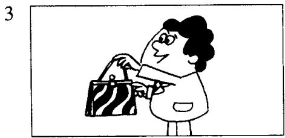
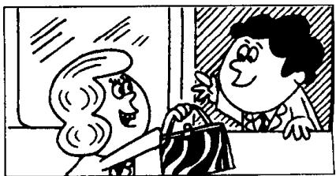

## Lesson 1 Excuse me! 对不起!

Listen to the tape then answer this question. Whose handbag is it? 听录音，然后回答问题。这是谁的手袋？

Excuse me!

  
Yes?

  
Is this your handbag?

  
Thank you very much.

## New words and expressions 生词和短语

excuse /ɪksˈkjuːz/ v. 原谅

me /mɪː/ pron. 我（宾格）

handbag /'hændbæg/ n. （女用）手提包

yes /jes/ adv. 是的

pardon /'pɑːdn/ int. 原谅，请再说一遍

is /ɪz/ v. be 动词现在时第三人称单数

it /ɪt/ pron. 它

this /ðɪs/ pron. 这

thank you /'θæŋk-ju:/ 感谢你（们）

your /jɔː/ possessive adjective 你的，你们的

very much /'veri-mʌtʃ/ 非常地

## Notes on the text 课文注释

## 1 Excuse me.

这个短语常用于与陌生人搭话，打断别人的说话或从别人身边挤过。在课文中，男士为了吸引女士的注意力而用了这个表示客套的短语。

## 2 Pardon?

全句为 I beg your pardon. 意思是请求对方把刚才讲过的话重复一遍。

参考译文

对不起。

什么事？

这是您的手提包吗？

对不起，请再说一遍。

这是您的手提包吗？

是的，是我的。

非常感谢！
