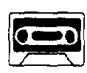
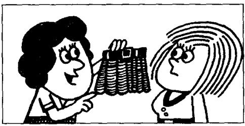
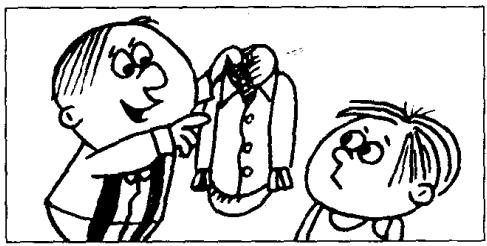
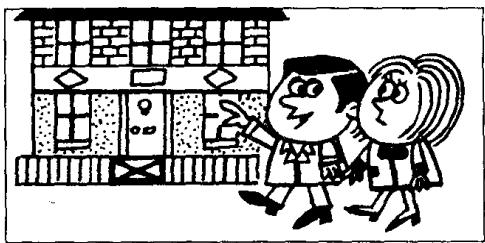

## Lesson 2 Is this your...? 这是你的……吗？

Listen to the tape and do the exercises.

听录音并回答问题。

  
3

  
5

  
7

  
8

  
9

  
10

## New words and expressions 生词和短语

pen /pen/ n. 钢笔

dress /dres/ n. 连衣裙

pencil /'pensəl/ n. 铅笔

skirt /skɜːt/ n. 裙子

book /bʊk/ n. 书

watch /wɒtʃ/ n. 手表

shirt /ʃɜːt/ n. 衬衣

coat /kəʊt/ n. 上衣，外衣

car /kɑː/ n. 小汽车

house /haʊs/ n. 房子

## Written exercise 书面练习

Copy these sentences.

抄写以下句子。

Excuse me!

Yes?

Is this your handbag?

Pardon?

Is this your handbag?

Yes, it is.

Thank you very much.
