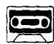
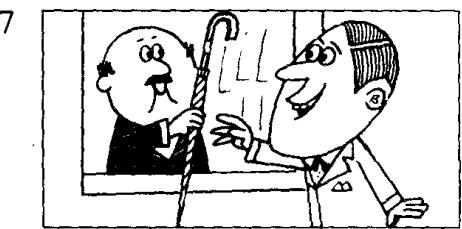

## Lesson 3 Sorry, sir. 对不起，先生。

Listen to the tape then answer this question. Does the man get his umbrella back?

听录音，然后回答问题。这位男士有没有要回他的雨伞？

My coat and my umbrella please.

Here is my ticket.

Thank you, sir.
Number five.

Here's your umbrella and your coat.

This is not my umbrella.
Sorry, sir.

Is this your umbrella? No, it isn't.

Is this it?
Yes, it is.
Thank you very much.

## New words and expressions 生词和短语

umbrella /ʌm'brelə/ n. 伞

number /'nʌmbə/ n. 号码

please /pliːz/ int. 请

five /faɪv/ num. 五

here /hɪə/ adv. 这里

sorry /'spri/ adj. 对不起的

my /maɪ/ possessive adjective 我的

ticket /'tɪkɪt/ n. 票

sir /sɜː/ n. 先生

cloakroom /'kləʊkrʊm/ n. 衣帽存放处

## Notes on the text 课文注释

1 Here's 是 Here is 的缩写形式，类似的例子有 He's (He is), It's (It is) 等。缩写形式和非缩写形式在英语的书面用语和口语中均有，但非缩写形式常用于比较正式的场合。

2. Sorry = I'm sorry. 这是口语中的缩略形式，用于社交场合，向他人表示歉意。

3 sir, 先生，这是英美人对不相识的男子、年长者或上级的尊称。

4 Is this it?

本句中 it 是指 your umbrella。由于前面提到了，后面就用代词 it 来代替，以免重复。

## 参考译文

请把我的大衣和伞拿给我。

这是我（寄存东西）的牌子。

谢谢，先生。

是5号。

这是您的伞和大衣。

这不是我的伞。

对不起，先生。

这把伞是您的吗？

不；不是！

这把是吗？

是，是这把。

非常感谢。
