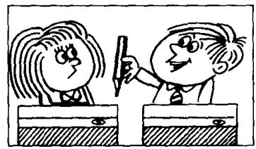
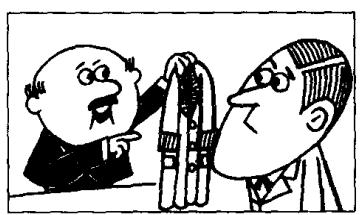
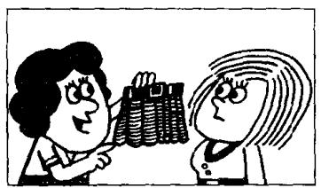
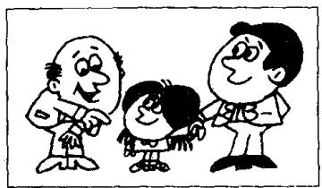

## Lesson 4 Is this your...? 这是你的……吗？

Listen to the tape and answer the questions.
听录音并回答问题。

  
Is this your pen?

  
Is this your pencil?

  
Is this your book?

  
Is this your watch?

  
Is this your coat?

  
Is this your dress?

  
Is this your skirt?

  
Is this your shirt?

  
Is this your car?  
10

  
Is this your house?

  
Is this your suit?

  
Is this your school?  
13

  
Is this your teacher?

  
Is this your son?

  
Is this your daughter?

## New words and expressions 生词和短语

suit /suːt/ n. 一套衣服

school /skuːl/ n. 学校

son /sʌn/ n. 儿子
daughter /'dɔːtə/ n. 女儿 teacher /'tiːtʃə/ n. 老师

## Written exercises 书面练习

A Copy these sentences.
抄写以下句子。

This is not my umbrella.

Sorry, sir.

Is this your umbrella?

No, it isn't!

B Answer these questions.
模仿例句回答以下问题。

Example:

Is this your umbrella?
No. It isn't my umbrella. It's your umbrella.

1 Is this your pen?

2 Is this your pencil?

3 Is this your book?

4 Is this your watch?

5 Is this your coat?

6 Is this your dress?

7 Is this your skirt?

8 Is this your shirt?

9 Is this your car?

10 Is this your house?
