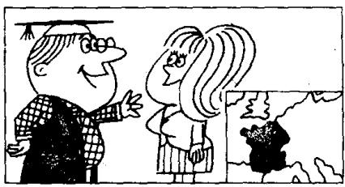
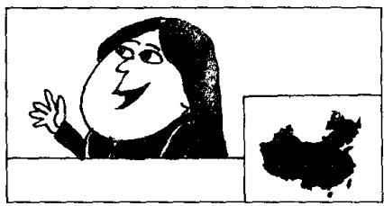

## Lesson 5 Nice to meet you. 很高兴见到你。

Listen to the tape then answer this question. Is Chang-woo Chinese? 听录音，然后回答问题。昌宇是中国人吗？

MR. BLAKE : Good morning.

STUDENTS : Good morning, Mr. Blake.

MR. BLAKE : This is Miss Sophie Dupont.
Sophie is a new student.
She is French.

MR. BLAKE : Sophie, this is Hans.
He is German.

HANS : Nice to meet you.

MR. BLAKE: And this is Naoko.
She's Japanese.

NAOKO: Nice to meet you.

MR. BLAKE: And this is Chang-woo.
He's Korean.

CHANG-WOO : Nice to meet you.

MR. BLAKE: And this is Luming.
He's Chinese.

LUMING : Nice to meet you.

MR. BLAKE: And this is Xiaohui.
She's Chinese, too.

XIAOHUI : Nice to meet you.

## New words and expressions 生词和短语

Mr. /'mɪstə/ 先生

German /'dʒɜːmən/ adj. & n. 德国人

good /gʊd/ adj. 好

nice /nais/ adj. 美好的

morning /'mɔːnɪŋ/ n. 早晨

meet /miːt/ v. 遇见

Miss /mɪs/ 小姐

Japanese /dʒæp'niːz/ adj. & n. 日本人

new /njuː/ adj. 新的

Korean /kəˈriən/ adj. & n. 韩国人

student /'stju:dənt/ n. 学生

French /frentʃ/ adj. & n. 法国人

Chinese /ˌtʃaɪˈniːz/ adj. & n. 中国人

too /tuː/ adv. 也

## Notes on the text 课文注释

1 Good morning.

早上好。英语中常见的问候用语。

2 This is Miss Sophie Dupont.

一般用于将某人介绍给他人的句式。一般指未婚女子。

3 Nice to meet you.

用于初次与同学、朋友见面等非正式场合。正式的场合常用 How do you do?

## 参考译文

布莱克先生：早上好。

学生：早上好，布莱克先生。

布莱克先生：这位是索菲娅·杜邦小姐。索菲娅是个新学生。她是法国人。

布莱克先生：索菲娅，这位是汉斯。他是德国人。

汉斯：很高兴见到你。

布莱克先生：这位是直子。她是日本人。

直子：很高兴见到你。

布莱克先生：这位是昌宇。他是韩国人。

昌宇：很高兴见到你。

布莱克先生：这位是鲁明。他是中国人。

鲁明：很高兴见到你。

布莱克先生：这位是晓惠。她也是中国人。

晓惠：很高兴见到你。

10
