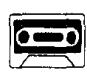
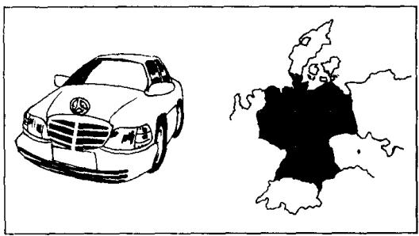
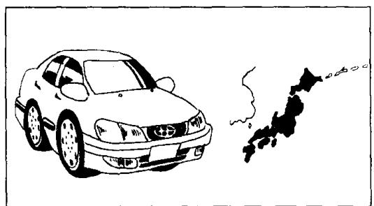
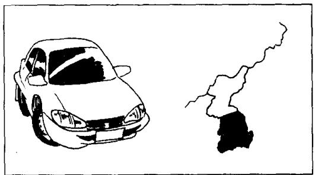
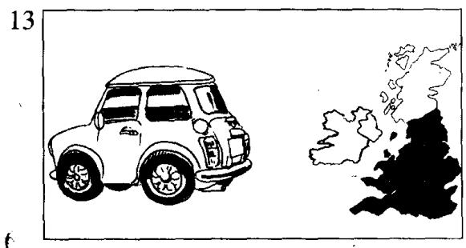
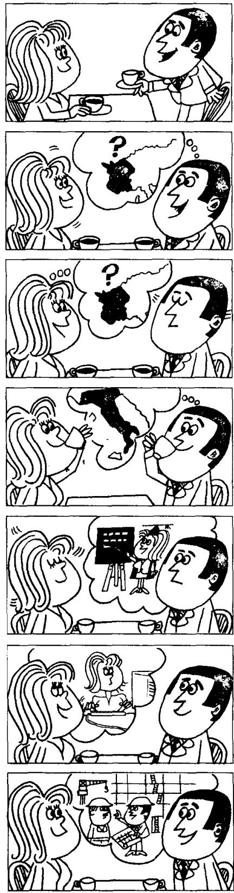

## Lesson 6 What make is it? 它是什么牌子的？

Listen to the tape and answer the questions.

听录音并回答问题。

  
It's a Volvo. (Swedish)

  
It's a Peugeot. (French)

  
It's a Mercedes. (German)

  
It's a Toyota. (Japanese)  
12

  
It's a Daewoo. (Korean)

  
It's a Mini. (English)

  
It's a Ford. (American)

  
It's a Fiat. (Italian)

## New words and expressions 生词和短语

make /meɪk/ n. (产品的) 牌号

Mercedes /mə'seɪdiːz/ n. 梅赛德斯

Swedish /'swi:dɪʃ/ adj. 瑞典的

Toyota /'təʊjəʊtə/ n. 丰田

English /'ɪŋɡlɪʃ/ adj. 英国的

Daewoo /'da:wu:/ n. 大宇

American /əˈmerɪkən/ adj. 美国的

Mini /'mɪni/ n. 迷你

Italian /ɪˈtæliən/ adj. 意大利的

Ford /fɔːd/ n. 福特

Volvo /'vɒlvəʊ/ n. 沃尔沃

Peugeot /'pɜːʒəʊ/ n. 标致

Fiat /'fiːæt/ n. 菲亚特

## Written exercises 书面练习

A Complete these sentences using He, She or It. 完成以下句子，用 He, She 或 It 填空。

Examples:

Stella is a student. \_\_\_\_ isn't German. \_\_\_\_ is Spanish.

Stella is a student. She isn't German. She is Spanish.

Alice is a student. \_\_\_\_ isn't German. \_\_\_\_ is French.

This is her car. \_\_\_\_ is a French car.

Hans is a student. \_\_\_\_ isn't French. \_\_\_\_ is German.

This is his car. \_\_\_\_ is a German car.

B Write questions and answers using He, She, It, a or an.

模仿例句写出相应的疑问句，并回答。选用 He, She, It, a 或 an 等词。

## Examples:

This is Miss Sophie Dupont. French/(Swedish)

Is she a French student or a Swedish student?

She isn't a Swedish student. She's a French student.

This is a Volvo. Swedish/(French)

Is it a Swedish car or a French car?

It isn't a French car. It's a Swedish car.

1 This is Naoko. Japanese/(German)

7 This is a Fiat. Italian/(English)

2 This is a Peugeot. French/(German)

8 This is Luming. Chinese/(English)

3 This is Hans. German/(Italian)

9 This is a Mercedes. German/(French)

4 This is Xiaohui. Chinese/(Italian)

10 This is a Toyota. Japanese/(Chinese)

5 This is a Mini. English/(American)

11 This is a Ford. American/(English)

6 This is Chang-woo. Korean/(Japanese)

12 This is a Daewoo. Korean/(Japanese)

