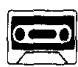
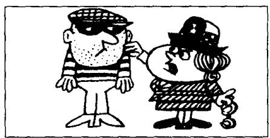
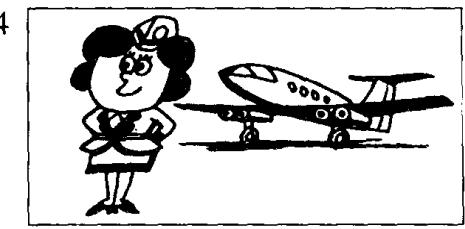
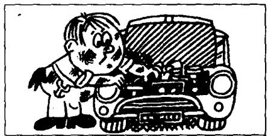

## Lesson 8 What's your job? 你是做什么工作的？

Listen to the tape then answer the questions.

听录音并回答问题。

  
I'm a policeman.

  
I'm a policewoman.

  
I'm a taxi driver.

  
I'm an air hostess.

  
.I'm a postman.

  
I'm a nurse.

  
I'm a mechanic.

  
I'm a hairdresser.  
19

  
I'm a housewife.

  
I'm a milkman.

## New words and expressions 生词和短语

policeman /pəˈliːsmən/ n. 警察

nurse /nɜːs/ n. 护士

policewoman /pəˈliːsˌwʊmən/ n. 女警察

mechanic /mɪˈkænɪk/ n. 机械师

taxi driver /'tæksi-'draɪvə/ 出租汽车司机

hairdresser /'heə,dresə/ n. 理发师

air hostess /'eə-'həʊstəs/ 空中小姐

housewife /'haʊswaɪf/ n. 家庭妇女

postman /'pəʊstmən/ n. 邮递员

milkman /'mɪlkmən/ n. 送牛奶的人

## Written exercises 书面练习

A Complete these sentences using am or is.

完成以下句子，用 $am$ 或 $is$ 填空。

Example:

My name \_\_\_\_ Xiaohui. I \_\_\_\_ Chinese.

My name is Xiaohui. I am Chinese.

1 My name \_\_\_\_ Robert. I \_\_\_\_ a student. I \_\_\_\_ Italian.

2 Sophie \_\_\_\_ not Italian. She \_\_\_\_ French.

3 Mr. Blake \_\_\_\_ my teacher. He \_\_\_\_ not French.

B Write questions and answers using his, her, he, she, a or an.

模仿例句写出相应的疑问句，并回答。选用 his, her, he, she, a 或 an 等词。

Examples:

keyboard operator

What's her job? Is she a keyboard operator? Yes, she is.

engineer

What's his job? Is he an engineer? Yes, he is.

1 policeman

6 nurse

2 policewoman

7 mechanic

3 taxi driver

8 hairdresser

4 air hostess

5 postman

9 housewife

10 milkman
