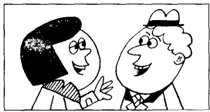

## Lesson 9 How are you today? 你今天好吗？

Listen to the tape then answer this question. How is Emma? 听录音，然后回答问题。埃玛身体好吗？

STEVEN : Hello, Helen.

HELEN : Hi, Steven.

STEVEN: How are you today?

HELEN: I'm very well, thank you. And you?

STEVEN: I'm fine, thanks.

STEVEN: How is Tony?

HELEN: He's fine, thanks. How's Emma?

STEVEN: She's very well, too, Helen.

STEVEN: Goodbye, Helen.
Nice to see you.

HELEN : Nice to see you, too, Steven. Goodbye.

## New words and expressions 生词和短语

hello /hə'ləʊ/ int. 喂（表示问候）

fine /faɪn/ adj. 美好的

hi /haɪ/ int. 喂，嗨

thanks /θæŋks/ int. 谢谢

how /haʊ/ adv. 怎样

goodbye /'gʊd'bai/ int. 再见

today /tə'dcɪ/ adv. 今天

well /wel/ adj. 身体好

see /siː/ v. 见

## Notes on the text 课文注释

1 How are you?

这是朋友或相识的人之间见面时间对方身体情况的寒暄话，一般回答是：Fine, thank you.

2 And you? 即 And how are you? 的简略说法。

3 Nice to see you. 是 It's nice to see you. 的简略说法。

这一句也是见面时的客气话，一般回答是：Nice to see you, too. 见到你，我也很高兴。也可说：Nice to meet you. 很高兴遇到你。

## 参考译文

史蒂文：你好，海伦。

海伦：你好，史蒂文。

史蒂文：你今天好吗？

海伦：很好，谢谢你。你好吗？

史蒂文：很好，谢谢。

史蒂文：托尼好吗？

海伦：他很好，谢谢。埃玛好吗？

史蒂文：她也很好，海伦。

史蒂文：再见，海伦。见到你真高兴。

海伦：我见到你也很高兴，史蒂文。再见。

19

12
