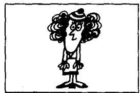
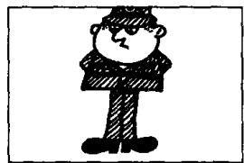
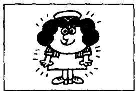
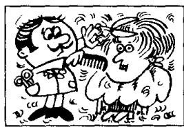

## Lesson 10 Look at... 看

Listen to the tape and answer the questions.

听录音并回答问题。

11

  
that man!
(fat)

  
that woman!
(thin)

  
that policeman!
(tall)  
14

  
that policewoman!
(short)

  
that mechanic!
(dirty)

  
that nurse!
(clean)

  
Steven!
(hot)  
18

  
Emma!
(cold)

  
that milkman!
(old)  
20

  
that air hostess!
(young)  
21

  
that hairdresser!
(busy)  
22

  
that housewife!
(lazy)

## New words and expressions 生词和短语

fat /fæt/ adj. 胖的

hot /hɒt/ adj. 热的

woman /'wʊmən/ n. 女人

cold /kəʊld/ adj. 冷的

thin /θɪn/ adj. 瘦的

old /əʊld/ adj. 老的

tall /tɔːl/ adj. 高的

young /jʌŋ/ adj. 年轻的

short /ʃɔːt/ adj. 矮的

dirty /'dʒ:ti/ adj. 脏的

busy /'bɪzi/ adj. 忙的

clean /kliːn/ adj. 干净的

lazy /'leɪzi/ adj. 懒的

## Written exercises 书面练习

A Complete these sentences using He's, She's or It's.

完成以下句子，用 He's, She's 或 It's 填空。

## Example:

Robert isn't a teacher. \_\_\_\_ an engineer.

Robert isn't a teacher. He's an engineer.

1 Mr. Blake isn't a student. \_\_\_\_ a teacher.

2 This isn't my umbrella. \_\_\_\_ your umbrella.

3 Sophie isn't a teacher. \_\_\_\_ a keyboard operator.

4 Steven isn't cold. \_\_\_\_ hot.

5 Naoko isn't Chinese. \_\_\_\_ Japanese.

6 This isn't a German car. \_\_\_\_ a Swedish car.

## B Write sentences using He or She.

模仿例句写出相应的句子。

Example:

Helen/well

Look at Helen. She's very well.

1 man/fat

7 Steven/hot

2 woman/thin

8 Emma/cold

3 policeman/tall

9 milkman/old

4 policewoman/short

10 air hostess/young

5 mechanic/dirty

11 hairdresser/busy

6 nurse/clean

12 housewife/lazy
