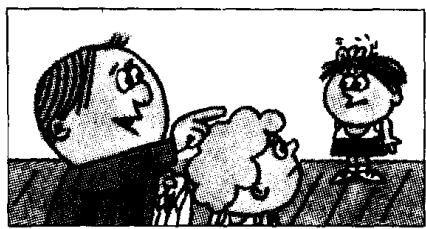
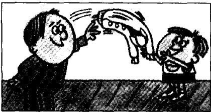

## Lesson 11 Is this your shirt? 这是你的衬衫吗？

Listen to the tape then answer this question. Whose shirt is white? 听录音，然后回答问题。谁的衬衣是白色的？

TEACHER : Whose shirt is that?

TEACHER : Is this your shirt, Dave?

DAVE: No, sir. It's not my shirt.

DAVE: This is my shirt. My shirt's blue.

TEACHER: Is this shirt Tim's?

DAVE: Perhaps it is, sir. Tim's shirt's white.

TEACHER : Tim!

TIM : Yes, sir?

TEACHER : Is this your shirt?

TIM : Yes, sir.

TEACHER : Here you are.

Catch!

TIM : Thank you, sir.

## New words and expressions 生词和短语

whose /huːz/ pron. 谁的

white /wait/ adj. 白色的

blue /blu:/ adj. 蓝色的

catch /kætʃ/ v. 抓住

perhaps /pə'hæps/ adv. 大概

## Notes on the text 课文注释

1 Whose shirt is that?

疑问代词 Whose 在本句中作定语，修饰 shirt。

2 Is this shirt Tim's?

Tim's 是 Tim 的所有格形式，为避免重复，Tim's 后面可以省去 shirt。例：It isn't my pen, it's Frank's. 这不是我的钢笔，是弗兰克的。

3 Here you are. 或 Here it is.

是给对方东西时的用语，句中的 are 和 is 应重读。

## 参考译文

老师：那是谁的衬衫？

老师：戴夫，这是你的衬衫吗？

戴夫：不，先生。这不是我的衬衫。

戴夫：这是我的衬衫。我的衬衫是蓝色的。

老师：这件衬衫是蒂姆的吗？

戴夫：也许是，先生。蒂姆的衬衫是白色的。

老师：蒂姆！

蒂姆：什么事，先生？

老师：这是你的衬衫吗？

蒂姆：是的，先生。

老师：给你。接着！

蒂姆：谢谢您，先生。
