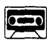
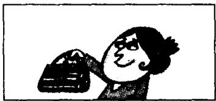
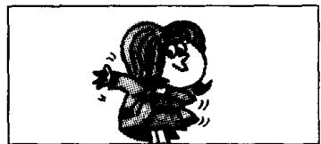
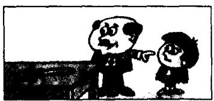
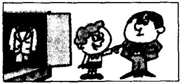

## Lesson 12 Whose is this . . . ? This is my/your/his/her . . .

这……是谁的？这是我的／你的／他的／她的·

Whose is that . . , ? That is my/your/his/her . . .

那……是谁的？那是我的／你的／他的／她的……

Listen to the tape and answer the questions.

听录音并回答问题。

22

  
handbag  
It's Stella's.  
car

  
It's Paul's.  
24

  
coat  
It's Sophie's.  
25

  
umbrella  
It's Steven's.  
26

  
pen  
It's my son's.  
27

  
dress  
It's my daughter's.  
28  
suit

  
It's my father's.  
29

  
skirt  
It's my mother's.  
30

  
blouse  
It's my sister's.  
31

  
tie  
It's my brother's.

## New words and expressions 生词和短语

father /'fɑːðə/ n. 父亲

tie /taɪ/ n. 领带

mother /'mʌðə/ n. 母亲

brother /'brʌðə/ n. 兄，弟

blouse /blauz/ n. 女衬衫

sister /'sɪstə/ n. 姐，妹

his /hɪz/ possessive adjective 他的

her /hɜː/ possessive adjective 她的

## Written exercises 书面练习

A Complete these sentences using my, your, his or her.

完成以下句子，用 my, your, his 或 her 填空。

Example:

Hans is here. That is \_\_\_\_ car.

Hans is here. That is his car.

1 Stella is here. That is \_\_\_\_ car.

2 Excuse me, Steven. Is this \_\_\_\_ umbrella?

3 I am an air hostess. \_\_\_\_ name is Britt.

4 Paul is here, too. That is \_\_\_\_ coat.

B Write questions and answers using 's, his and hers.

模仿例句提问并回答，选用名词所有格形式 's 或代词所有格形式 his 或 hers。

Example:

shirt/Tim

Whose is this shirt? It's Tim's. It's his shirt.

1 handbag/Stella

7 suit/my father

2 car/Paul

8 skirt/my mother

3 coat/Sophie

9 blouse/my sister

4 umbrella/Steven

10 tie/my brother

5 pen/my daughter

6 dress/my son

11 pen/Sophie

12 pencil/Hans
