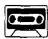
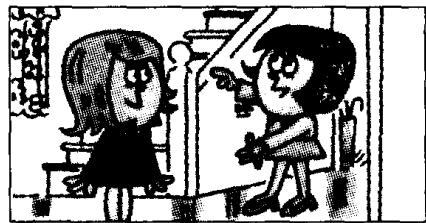
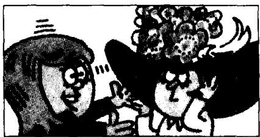

## Lesson 13 A new dress 一件新连衣裙

Listen to the tape then answer this question. What colour is Anna's hat? 听录音，然后回答问题。安娜的帽子是什么颜色的？

LOUISE: What colour's your new dress?

ANNA: It's green.

ANNA : Come upstairs and see it.

LOUISE : Thank you.

ANNA: Look! Here it is!

LOUISE: That's a nice dress. It's very smart.

ANNA: My hat's new, too.

LOUISE: What colour is it?

ANNA: It's the same colour. It's green, too.

LOUISE : That is a lovely hat!

## New words and expressions 生词和短语

colour /'kʌlə/ n. 颜色

smart /smɑːt/ adj. 时髦的，巧妙的

green /griːn/ adj. 绿色

come /kʌm/ v. 来

hat /hæt/ n. 帽子

upstairs /ʌp'steəz/ adv. 楼上

same /seim/ adj. 相同的

lovely /'lʌvli/ adj. 可爱的，秀丽的

## Notes on the text 课文注释

1 What colour's = What colour is.

2 Come upstairs and see it.

句中 and 不当 “和” 讲，而是表示目的，例：Come and see me. 来见我。在英文中不能用 Come upstairs to see it.

## 参考译文

路易丝：你的新连衣裙是什么颜色的？

安娜：是绿色的。

安娜：到楼上来看看吧。

路易丝：谢谢。

安娜：瞧，就是这件。

路易丝：这件连衣裙真好，真漂亮。

安娜：我的帽子也是新的。

路易丝：是什么颜色的？

安娜：一样的颜色，也是绿的。

路易丝：真是一顶可爱的帽子！
