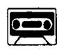
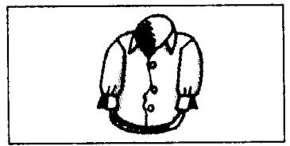
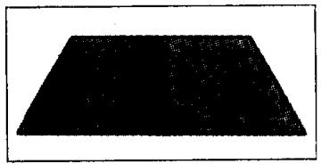
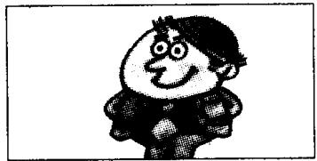
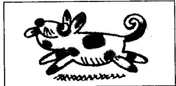

## Lesson 14 What colour's your...? 你的……是什么颜色的？

Listen to the tape and answer the questions.

听录音并回答问题。

20

  
umbrella  
black  
30  
car

  
blue  
40

  
shirt  
white  
50

  
coat  
grey  
60

  
case  
brown  
70

  
carpet  
red  
80

  
blouse  
yellow  
90  
tie

  
orange  
100  
hat

  
grey and black  
101  
dog

  
brown and white

## New words and expressions 生词和短语

case /keis/ n. 箱子

dog /dɒg/ n. 狗

carpet /'kɑːpɪt/ n. 地毯

## Written exercises 书面练习

A Rewrite these sentences.

模仿例句将下列各组句子合二为一。

## Example:

This is Stella. This is her handbag.

This is Stella's handbag.

1 This is Paul. This is his car.

2 This is Sophie. This is her coat.

3 This is Helen. This is her dog.

4 This is my father. This is his suit.

5 This is my daughter. This is her dress.

B Write sentences using 's, his or her.

模仿例句提问并回答，选用名词所有格形式 's 或代词所有格形式 his 或 her。

Example:

Steven/umbrella/black

What colour's Steven's umbrella? His umbrella's black.

1 Steven/car/blue

7 Helen/dog/brown and white

2 Tim/shirt/white

8 Hans/pen/green

3 Sophie/coat/grey

9 Luming/suit/grey

4 Mrs. White/carpet/red

10 Stella/pencil/blue

5 Dave/tie/orange

11 Xiaohui/handbag/brown

6 Steven/hat/grey and black

12 Sophie/skirt/yellow
