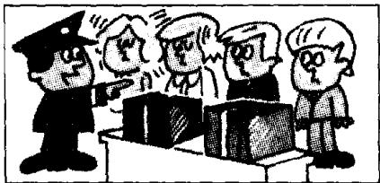
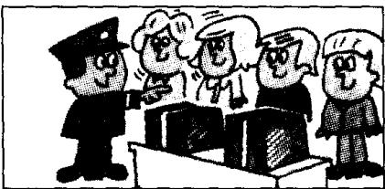
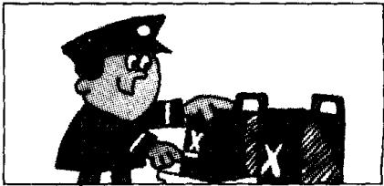

## Lesson 15 Your passports, please. 请出示你们的护照。

Listen to the tape then answer this question. Is there a problem with the Customs officer? 听录音，然后回答问题。海关官员有什么疑问吗？

CUSTOMS OFFICER : Are you Swedish?

GIRLS : No, we are not.
We are Danish.

CUSTOMS OFFICER : Are your friends Danish, too?
GIRLS : No, they aren't.
They are Norwegian.

CUSTOMS OFFICER : Your passports, please.
GIRLS : Here they are.

CUSTOMS OFFICER : Are these your cases?
GIRLS : No, they aren't.

GIRLS : Our cases are brown.
Here they are.

CUSTOMS OFFICER : Are you tourists?
GIRLS : Yes, we are.

CUSTOMS OFFICER : Are your friends tourists too?
GIRLS : Yes, they are.

CUSTOMS OFFICER: That's fine.  
GIRLS: Thank you very much.

## New words and expressions 生词和短语

customs /'kʌstəmz/ n. 海关

Norwegian /nɔːˈwiːdʒən/ adj. & n. 挪威人

officer /'ɒfɪsə/ n. 官员

passport /'pɑ:spɔ:t/ n. 护照

girl /gɜːl/ n. 女孩，姑娘

brown /braʊn/ adj. 棕色的

Danish /'deɪnɪʃ/ adj. & n. 丹麦人

friend /frend/ n. 朋友

tourist /'tʊərɪst/ n. 旅游者

## Note on the text 课文注释

可数名词的复数形式一般是在单数名词后面加上 -s，如课文中的 friend — friends /frendz/; tourist — tourists /'toərɪsts/; case — cases /'keɪsɪz/。请注意 -s 的不同发音。

## 参考译文

海关官员：你们是瑞典人吗？

姑娘们：不，我们不是瑞典人。我们是丹麦人。

海关官员：你们的朋友也是丹麦人吗？

姑娘们：不，他们不是丹麦人。他们是挪威人。

海关官员：请出示你们的护照。

姑娘们：给您。

海关官员：这些是你们的箱子吗？

姑娘们：不，不是。

姑娘们：我们的箱子是棕色的。在这儿呢。

海关官员：你们是来旅游的吗？

姑娘们：是的，我们是来旅游的。

海关官员：你们的朋友也是来旅游的吗？

姑娘们：是的，他们也是。

海关官员：好了。

姑娘们：非常感谢。
