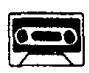
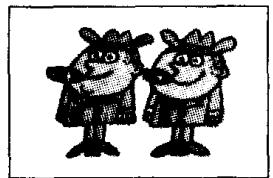
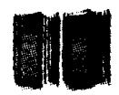
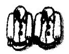
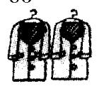
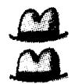
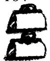
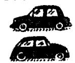
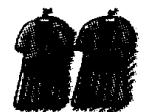
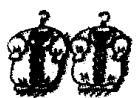

## Lesson 16 Are you ...? 你是……吗？

Listen to the tape and answer the questions.

听录音并回答问题。

20

  
Russian?

30

  
English?

40

  
American?

50

  
Dutch?

## Are these your . . . ? What colour are your . . . ? 这些是你的……吗？你的……是什么颜色？

60

  
red books

70

  
white shirts

80

  
grey coats

90

  
yellow tickets

100

  
blue suits

101

  
black and grey hats

102

  
green passports

103

  
black umbrellas

104

  
white handbags

105

  
orange ties

106

  
brown and white dogs

107

  
blue pens

108

  
red cars

109

  
green dresses

110

  
yellow blouses

## New words and expressions 生词和短语

Russian /'rʌʃən/ adj. & n. 俄罗斯人

grey /greɪ/ adj. 灰色的

Dutch /dʌtʃ/ adj. & n. 荷兰人

yellow /'yeləʊ/ adj. 黄色的

these /ðiːz/ pron. 这些 (this 的复数)

black /blæk/ adj. 黑色的

red /red/ adj. 红色的

orange /'prɪndʒ/ adj. 橘黄色的

## Notes on the text 课文注释

1 如果名词是以 -s 结尾的，变成复数时要加 -es. 如 dress — dresses。

2 表示复数的 -s 或 -es 一般遵循以下发音规则：

(1) 如果名词词尾的发音是一个清辅音 (/s/, /ʃ/, /tʃ/ 除外). -s 发 /s/ 的音，如 books /bʊks/, suits /suːts/ ;

(2) 如果名词词尾的发音是一个浊辅音（/z/, /ʒ/, /dʒ/ 除外）或元音，-s 发 /z/ 的音，如 ties /taɪz/, dogs /dɒgz/；

(3) 如果名词词尾的发音是 /s/, /z/, /ʃ/, /ʒ/, /tʃ/ 或 /dʒ/, -s'发 /ɪz/ 的音，如 dresses /'dresɪz/, blouses /'blaʊzɪz/。

## Written exercises 书面练习

A Complete these sentences using a or an.

完成以下句子，用冠词 a 或 an 填空。

Examples:

It is \_\_\_\_ Swedish car. It is a Swedish car.

She is \_\_\_\_ air hostess. She is an air hostess.

1 It is \_\_\_\_ English car.

3 It is \_\_\_\_ Italian car.

2 It is \_\_\_\_ Japanese car.

5 It is \_\_\_\_ American car.

4. It is \_\_\_\_ French car.

6 Robert is not \_\_\_\_ teacher.

B Write questions and answers using our.

，模仿例句提问并用 our 来回答。

Example:

books/red

What colour are your books? Our books are red.

1 shirts/white

4 suits/blue

7 umbrellas/black

10 dogs/brown and white

2 coats/grey

5 hats/black and grey

8 handbags/white

11 pens/blue

3 tickets/yellow

9 ties/orange

12 cars/red
