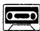
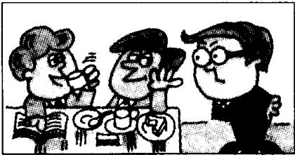
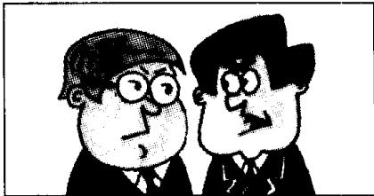

## Lesson 17 How do you do? 你好!

Listen to the tape then answer this question.

What are Michael Baker and Jeremy Short's jobs?

听录音，然后回答问题。迈克尔·贝克和杰里米·肖特是做什么工作的？

MR. JACKSON : Come and meet our employees, Mr. Richards.

MR. RICHARDS : Thank you, Mr. Jackson.

MR. JACKSON : This is Nicola Grey, and this is Claire Taylor.

MR. RICHARDS : How do you do?

MR. RICHARDS : Those women are very hard-working.
What are their jobs?

MR. JACKSON: They're keyboard operators.

MR. JACKSON : This is Michael Baker, and this is Jeremy Short.

MR. RICHARDS : How do you do?

MR. RICHARDS: They aren't very busy! What are their jobs?

MR. JACKSON: They're sales reps.
They're very lazy.

MR. RICHARDS : Who is this young man?

MR. JACKSON: This is Jim.
He's our office assistant.

## New words and expressions 生词和短语

employee /ɪmplɔrˈiː/ n. 雇员

man /mæn/ n. 男人

hard-working /ˌhaːdˈwɜːkɪŋ/ adj. 勤奋的

office /'ɒfɪs/ n. 办公室

sales reps /'seilz-'reps/ 推销员

assistant /ə'sɪstənt/ n. 助手

## Notes on the text 课文注释

1 How do you do? 您好（用于第一次见面时）。一般用同样的话来回答。见第 5 课课文注释 3。

2 sales reps 是 sales representatives 的缩写形式，常用于口语。

3 office assistant 是指办公室干杂务的工作人员。

## 参考译文

杰克逊先生：来见见我们的雇员，理查兹先生。

理查兹先生：谢谢，杰克逊先生。

杰克逊先生：这位是尼古拉·格雷，这位是克莱尔·泰勒。

理查兹先生：你们好！

理查兹先生：那些姑娘很勤快。她们是做什么工作的？

杰克逊先生：她们是电脑输录入员。

杰克逊先生：这位是迈克尔·贝克，这位是杰里米·肖特。

理查兹先生：你们好！

理查兹先生：他们不很忙吧！他们是做什么工作的？

杰克逊先生：他们是推销员，他们非常懒。

理查兹先生：这个年轻人是谁？

杰克逊先生：他是吉姆，是我们办公室的勤杂人员。
