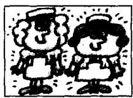
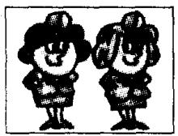
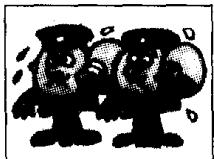
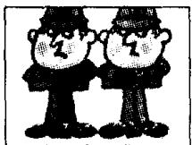

## Lesson 18 What are their jobs? 他们是做什么工作的？

Listen to the tape and answer the questions.

听录音并回答问题。

100

  
sales reps  
200

  
keyboard operators  
300

  
mechanics  
400

  
engineers  
500

  
hairdressers  
600

  
teachers  
700

  
Customs officers  
800

  
taxi drivers  
900

  
nurses  
1,000

  
air hostesses  
1,001

  
housewives  
1,002

  
milkmen  
1,003

  
postmen  
1,004

  
policemen  
1,005

  
policewomen

## Notes on the text 课文注释

1 如果名词是以 -f 或 -fe 结尾的，变成复数时，一般要把 -f 或 -fe 变成 -v，再加 -es，如 housewife — housewives。

2 英语中有一些名词的复数形式是不规则的，如 man, woman，以及由这两个词组成的复合名词: man — men; woman — women;

milkman — milkmen;

policewoman — policewomen.

## Written exercises 书面练习

A Complete these sentences using He, She, We or They.

完成以下句子，用 He, She, We 或 They 填空。

Example:

Those men are lazy. \_\_\_\_ are sales reps.

Those men are lazy. They are sales reps.

1 That man is tall. \_\_\_\_ is a policeman.

2 Those girls are busy. \_\_\_\_ are keyboard operators.

3 Our names are Britt and Inge. \_\_\_\_ are Swedish.

4 Look at our office assistant. \_\_\_\_ is very hard-working.

5 Look at Nicola. \_\_\_\_ is very pretty.

6 Michael Baker and Jeremy Short are employees. \_\_\_\_ are sales reps.

B Write questions and answers.

模仿例句提问并回答。

Example:

(mechanics)/sales reps

What are their jobs?

Are they mechanics or sales reps?

They aren't mechanics. They're sales reps.

1 (keyboard operators)/air hostesses

2 (postmen)/policemen

6 (engineers)/taxi drivers

7 (policewomen)/keyboard operators

3 (policewomen)/nurses

8 (milkmen)/engineers

4 (customs officers)/hairdressers

9 (policemen)/milkmen

5 (hairdressers)/teachers

10 (nurses)/housewives
